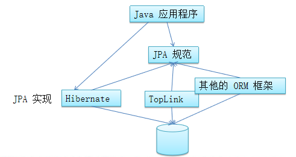

# 一、概述

## 1. 简介

- `Java Persistence API(JPA)`：用于对象持久化的 API

  > Java EE 5.0 平台标准的 ORM 规范，使得应用程序以统一的方式访问持久层

  

## 2. JPA 优势

- **标准化**： 提供相同的 API，保证了基于 JPA 开发的企业应用能经过少量修改就可在不同的 JPA 框架下运行
- **简单易用，集成方便**： 主要目标之一就是提供更加简单的编程模型，在 JPA 框架下创建实体和创建 Java  类一样简单，只需要使用 javax.persistence.Entity 进行注释；JPA 的框架和接口也都非常简单
- **可媲美 JDBC 的查询能力**： JPA 的查询语言是面向对象的，JPA 定义了独特的 JPQL，能够支持批量更新和修改
- **支持面向对象的高级特性**： JPA 能支持面向对象的高级特性，如类的继承、多态

## 3. JPA 包括的技术

- **ORM  映射元数据**： 支持 XML 和注解两种形式，元数据描述对象和表之间的映射关系，框架据此将实体对象持久化到数据库表中
- **JPA 的 API**：用来操作实体对象，执行 CRUD 操作，框架在后台完成所有的事情，开发者从繁琐的 JDBC 和 SQL 代码中解脱出来
- **查询语言(JPQL)**：通过面向对象而非面向数据库的查询语言查询数据，避免程序和具体的  SQL 紧密耦合