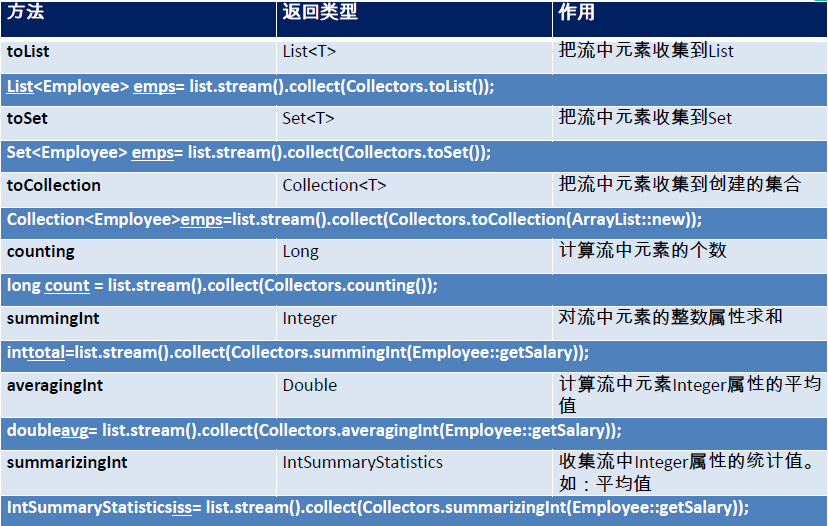
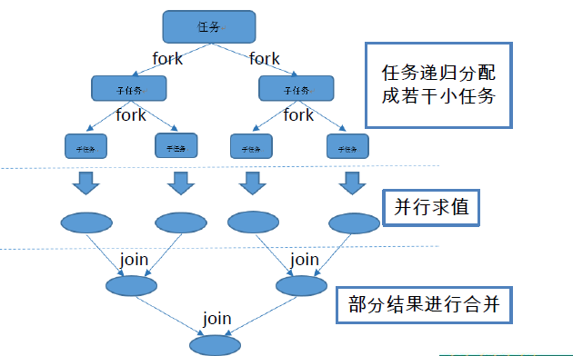

# 1. Java8

## 1. Lambda 表达式

###1. Lambda 表达式

- Lambda 是一个**匿名函数**，我们可以把Lambda 表达式理解为是**一段可以传递的代码**（将代码像数据一样进行传递）。可以写出更简洁、更灵活的代码。作为一种更紧凑的代码风格，使Java的语言表达能力得到了提升

- Lambda 表达式在Java 语言中引入了一个新的语法元素和操作符。这个操作符为“->” ，该操作符被称为Lambda 操作符或剪头操作符。它将Lambda 分为两个部分：

  - 左侧：指定了Lambda 表达式需要的所有参数
  - 右侧：指定了Lambda 体，即Lambda 表达式要执行的功能

- Lambda 表达式需要“函数式接口”的支持

  >  函数式接口：接口中只有**一个抽象方法的接口**，称为函数式接口
  >
  >  可以使用注解 @FunctionalInterface 修饰可以检查是否是函数式接口

  ```java
  @FunctionalInterface
  public interface MyFun {
  	public Integer getValue(Integer num);
  }
  ```

  需求：对一个数进行运算

  ```java
  @Test
  public void test6(){
      Integer num = operation(100, (x) -> x * x);
      System.out.println(num);

      System.out.println(operation(200, (y) -> y + 200));
  }

  public Integer operation(Integer num, MyFun mf){
      return mf.getValue(num);
  }
  ```

- 语法格式：

  - 语法格式一：无参数，无返回值：`() -> System.out.println("Hello Lambda!");`

    ```java
    @Test
    public void test1(){
        //在局部内部类中，应用了同级别的局部变量，jdk 1.8 前，必须是 final
        int num = 0;//jdk1.8 默认为 final 

        Runnable r = new Runnable() {
            @Override
            public void run() {
                System.out.println("Hello World!" + num);
            }
        };
        r.run();

        System.out.println("-------------------------------");

     	Runnable r1 = () -> System.out.println("Hello Lambda!");
        r1.run();
    }
    ```

   - 语法格式二：有一个参数，并且无返回值：`(x) -> System.out.println(x)`

      ```java
      @Test
      public void test2(){
          Consumer<String> con = (x) -> System.out.println(x);
          con.accept("hello");
      }
      ```

   - 语法格式三：若只有一个参数，小括号可以省略不写：`x -> System.out.println(x)`

      ```java
      @Test
      public void test2(){
          Consumer<String> con = x -> System.out.println(x);
          con.accept("hello");
      }
      ```

   - 语法格式四：有两个以上的参数，有返回值，并且 Lambda 体中有多条语句
      ```java
      Comparator<Integer> com = (x, y) -> {
      	System.out.println("函数式接口");
      	return Integer.compare(x, y);
       };
      ```


   - 语法格式五：若 Lambda 体中只有一条语句， return 和 大括号都可以省略不写：

      ```java
      Comparator<Integer> com = (x, y) -> Integer.compare(x, y);
      ```

   - 语法格式六：Lambda 表达式的参数列表的数据类型可以省略不写，因为JVM编译器通过上下文推断出，数据类型，即“类型推断”：`(Integer x, Integer y) -> Integer.compare(x, y);`

### 2. 类型推断

上述Lambda 表达式中的参数类型都是由编译器推断得出的。Lambda 表达式中无需指定类型，程序依然可以编译，这是因为javac根据程序的上下文，在后台推断出了参数的类型。Lambda 表达式的类型依赖于上下文环境，是由编译器推断出来的。这就是所谓的“类型推断”

###3. 新特性体验

**需求：**获取公司中年龄小于 35 的员工信息

**对象封装类：** 

```java
public class Employee {

	private int id;
	private String name;
	private int age;
	private double salary;

	public Employee() {
	}

	public Employee(String name) {
		this.name = name;
	}

	public Employee(String name, int age) {
		this.name = name;
		this.age = age;
	}

	public Employee(int id, String name, int age, double salary) {
		this.id = id;
		this.name = name;
		this.age = age;
		this.salary = salary;
	}

	public int getId() {
		return id;
	}

	public void setId(int id) {
		this.id = id;
	}

	public String getName() {
		return name;
	}

	public void setName(String name) {
		this.name = name;
	}

	public int getAge() {
		return age;
	}

	public void setAge(int age) {
		this.age = age;
	}

	public double getSalary() {
		return salary;
	}

	public void setSalary(double salary) {
		this.salary = salary;
	}

	public String show() {
		return "测试方法引用！";
	}

	@Override
	public String toString() {
		return "Employee [id=" + id + ", name=" + name + ", age=" + age + ", salary=" + salary + "]";
	}
}
```

**存储的数据：** 

```java
List<Employee> emps = Arrays.asList(
        new Employee(101, "张三", 18, 9999.99),
        new Employee(102, "李四", 59, 6666.66),
        new Employee(103, "王五", 28, 3333.33),
        new Employee(104, "赵六", 8, 7777.77),
        new Employee(105, "田七", 38, 5555.55)
);
```

**原始的方法：** 

```java
public List<Employee> filterEmployeeAge(List<Employee> emps){
    List<Employee> list = new ArrayList<>();
    for (Employee emp : emps) {
        if(emp.getAge() <= 35){
            list.add(emp);
        }
    }
    return list;
}
```

**优化方式一：** 策略设计模式（可以通过修改接口中的实现，来修改功能，提高代码共用行）

```java
public List<Employee> filterEmployee(List<Employee> emps, MyPredicate<Employee> mp){
    List<Employee> list = new ArrayList<>();
    for (Employee employee : emps) {
        if(mp.test(employee)){
            list.add(employee);
        }
    }
    return list;
}
```

**设计模式的接口：** 

```java
@FunctionalInterface
public interface MyPredicate<T> {
	public boolean test(T t);
}
```

**接口的实现：** 

```java
public class FilterEmployeeForAge implements MyPredicate<Employee>{
	@Override
	public boolean test(Employee t) {
		return t.getAge() <= 35;
	}
}
```

**优化方式二：** 匿名内部类

```java
@Test
public void test5(){
    List<Employee> list = filterEmployee(emps, new MyPredicate<Employee>() {
        @Override
        public boolean test(Employee t) {
            return t.getId() <= 103;
        }
    });
    for (Employee employee : list) {
        System.out.println(employee);
    }
}
```

**优化方式三：** Lambda 表达式

```java
@Test
public void test6(){
    List<Employee> list = filterEmployee(emps, (e) -> e.getAge() <= 35);
    list.forEach(System.out::println);
}
```

**优化方式四：** Stream API

```java
@Test
public void test7(){
    emps.stream()
        .filter((e) -> e.getAge() <= 35)
        .forEach(System.out::println);
}
```

## 2. 函数式接口

### 1. 什么是函数式接口

- 只包含一个抽象方法的接口，称为函数式接口
- 你可以通过Lambda 表达式来创建该接口的对象（若Lambda 表达式抛出一个受检异常，那么该异常需要在目标接口的抽象方法上进行声明）
- 我们可以在任意函数式接口上使用@FunctionalInterface注解，这样做可以检查它是否是一个函数式接口，同时javadoc也会包含一条声明，说明这个接口是一个函数式接口

### 2. Java 内置四大核心函数式接口

1. **消费型接口：** `void Consumer<T>`，对类型为T的对象应用操作，包含方法：`void accept(T t)` 

   ```java
   @Test
   public void test1(){
       happy(10000, (m) -> System.out.println("每次消费：" + m + "元"));
   } 

   public void happy(double money, Consumer<Double> con){
       con.accept(money);
   }
   ```

2. **供给型接口：** `T Supplier<T>`，返回类型为T的对象，包含方法：`T get()`

   ```java
   @Test
   public void test2(){
       List<Integer> numList = getNumList(10, () -> (int)(Math.random() * 100));

       for (Integer num : numList) {
           System.out.println(num);
       }
   }

   //需求：产生指定个数的整数，并放入集合中
   public List<Integer> getNumList(int num, Supplier<Integer> sup){
       List<Integer> list = new ArrayList<>();
       for (int i = 0; i < num; i++) {
           Integer n = sup.get();
           list.add(n);
       }
       return list;
   }
   ```

3. **函数型接口：** `R Function<T, R>`，对类型为T的对象应用操作，并返回结果。结果是R类型的对象。包含方法：`R apply(T t)`

   ```java
   @Test
   public void test3(){
       String newStr = strHandler("\t\t\t hello   ", (str) -> str.trim());
       System.out.println(newStr);

       String subStr = strHandler("hello", (str) -> str.substring(2, 5));
       System.out.println(subStr);
   }

   //需求：用于处理字符串
   public String strHandler(String str, Function<String, String> fun){
       return fun.apply(str);
   }
   ```

4. **断定型接口：** `boolean Predicate<T>`，确定类型为T的对象是否满足某约束，并返回boolean 值。包含方法`boolean test(T t)`

   ```java
   @Test
   public void test4(){
       List<String> list = Arrays.asList("Hello", "atguigu", "Lambda", "www", "ok");
       List<String> strList = filterStr(list, (s) -> s.length() > 3);

       for (String str : strList) {
           System.out.println(str);
       }
   }

   //需求：将满足条件的字符串，放入集合中
   public List<String> filterStr(List<String> list, Predicate<String> pre){
       List<String> strList = new ArrayList<>();

       for (String str : list) {
           if(pre.test(str)){
               strList.add(str);
           }
       }
       return strList;
   }
   ```

### 3. 其他接口


## 3. 方法引用与构造器引用

### 1. 方法引用

> 当要传递给Lambda体的操作，已经有实现的方法了，可以使用方法引用
>
> （实现抽象方法的参数列表，必须与方法引用方法的参数列表保持一致）

**方法引用：** 使用操作符 `::`  将方法名和对象或类的名字分隔开来

```java
@Test
public void test1(){
    PrintStream ps = System.out;
    Consumer<String> con = (str) -> ps.println(str);
    con.accept("Hello World！");

    System.out.println("--------------------------------");

    Consumer<String> con2 = ps::println;
    con2.accept("Hello Java8！");

    Consumer<String> con3 = System.out::println;
}
```

如下三种主要使用情况：

- 对象::实例方法

  ```java
  @Test
  public void test2(){
      Employee emp = new Employee(101, "张三", 18, 9999.99);

      Supplier<String> sup = () -> emp.getName();
      System.out.println(sup.get());

      System.out.println("----------------------------------");

      Supplier<String> sup2 = emp::getName;
      System.out.println(sup2.get());
  }
  ```

- 类::静态方法

  ```java
  @Test
  public void test3(){
      BiFunction<Double, Double, Double> fun = (x, y) -> Math.max(x, y);
      System.out.println(fun.apply(1.5, 22.2));

      System.out.println("--------------------------------------------------");

      BiFunction<Double, Double, Double> fun2 = Math::max;
      System.out.println(fun2.apply(1.2, 1.5));
  }

  @Test
  public void test4(){
      Comparator<Integer> com = (x, y) -> Integer.compare(x, y);

      System.out.println("-------------------------------------");

      Comparator<Integer> com2 = Integer::compare;
  }
  ```

- 类::实例方法

  ```java
  @Test
  public void test5(){
      BiPredicate<String, String> bp = (x, y) -> x.equals(y);
      System.out.println(bp.test("abcde", "abcde"));

      System.out.println("-----------------------------------------");

      BiPredicate<String, String> bp2 = String::equals;
      System.out.println(bp2.test("abc", "abc"));

      System.out.println("-----------------------------------------");


      Function<Employee, String> fun = (e) -> e.show();
      System.out.println(fun.apply(new Employee()));

      System.out.println("-----------------------------------------");

      Function<Employee, String> fun2 = Employee::show;
      System.out.println(fun2.apply(new Employee()));
  }
  ```

**注意：**

- 方法引用所引用的方法的参数列表与返回值类型，需要与函数式接口中抽象方法的参数列表和返回值类型保持一致
- 若Lambda 的参数列表的第一个参数，是实例方法的调用者，第二个参数(或无参)是实例方法的参数时，格式： ClassName::MethodName

### 2. 构造器引用

>  格式：`ClassName::new` 

与函数式接口相结合，自动与函数式接口中方法兼容。可以把构造器引用赋值给定义的方法，与构造器参数列表要与接口中抽象方法的参数列表一致

```java
@Test
public void test6(){
    Supplier<Employee> sup = () -> new Employee();
    System.out.println(sup.get());

    System.out.println("------------------------------------");

    Supplier<Employee> sup2 = Employee::new;
    System.out.println(sup2.get());
}

@Test
public void test7(){
    Function<String, Employee> fun = Employee::new;

    BiFunction<String, Integer, Employee> fun2 = Employee::new;
}
```

### 3. 数组引用

> 格式：`type[] :: new`

```java
@Test
public void test8(){
    Function<Integer, String[]> fun = (args) -> new String[args];
    String[] strs = fun.apply(10);
    System.out.println(strs.length);

    System.out.println("--------------------------");

    Function<Integer, Employee[]> fun2 = Employee[] :: new;
    Employee[] emps = fun2.apply(20);
    System.out.println(emps.length);
}
```

##4. Stream API

### 1. 什么是Stream

流(Stream)是数据渠道，用于操作数据源（集合、数组等）所生成的元素序列

>  集合讲的是数据，流讲的是计算

**注意：** 

- Stream 自己不会存储元素
- Stream 不会改变源对象。相反，他们会返回一个持有结果的新Stream
- Stream 操作是延迟执行的。这意味着他们会等到需要结果的时候才执行


### 2. Stream 的操作三个步骤

- 创建Stream：一个数据源（如：集合、数组），获取一个流


- 中间操作：一个中间操作链，对数据源的数据进行处理


- 终止操作(终端操作)：一个终止操作，执行中间操作链，并产生结果


### 3. 创建Stream

1. Java8 中的Collection 接口被扩展，提供了两个获取流的方法：

   - `default Stream<E> stream() `: 返回一个顺序流
   - `default Stream<E> parallelStream()` : 返回一个并行流

   ```java
   List<String> list = new ArrayList<>();
   Stream<String> stream = list.stream(); //获取一个顺序流
   Stream<String> parallelStream = list.parallelStream(); //获取一个并行流
   ```

2. 由数组创建流

   Java8 中的Arrays 的静态方法stream() 可以获取数组流：`static <T> Stream<T> stream(T[] array)`  ：返回一个流

   重载形式，能够处理对应基本类型的数组：

   - public static IntStream stream(int[] array)
   - public static LongStream stream(long[] array)
   - public static DoubleStream stream(double[] array)

   ```java
   Integer[] nums = new Integer[10];
   Stream<Integer> stream1 = Arrays.stream(nums);
   ```

3. 由值创建流

   可以使用静态方法Stream.of(), 通过显示值创建一个流。它可以接收任意数量的参数：

   `public static<T> Stream<T> of(T... values) ` ： 返回一个流

   ```java
   Stream<Integer> stream2 = Stream.of(1,2,3,4,5,6);
   ```

4. 由函数创建流：创建无限流

   可以使用静态方法 `Stream.iterate()` 和 `Stream.generate()`，创建无限流 

   - 迭代：`public static<T> Stream<T> iterate(final T seed, final UnaryOperator<T> f)`
   - 生成：`public static<T> Stream<T> generate(Supplier<T> s)` 

   ```java
   //迭代
   Stream<Integer> stream3 = Stream.iterate(0, (x) -> x + 2).limit(10);
   stream3.forEach(System.out::println);

   //生成
   Stream<Double> stream4 = Stream.generate(Math::random).limit(2);
   stream4.forEach(System.out::println);
   ```


### 4. Stream 的中间操作

>  多个中间操作可以连接起来形成一个流水线，除非流水线上触发终止操作，否则中间操作不会执行任何的处理
>
> **惰性求值：** 在终止操作时一次性全部处理

1. 筛选与切片

   - `filter(Predicatep)` ：接收Lambda ，从流中排除某些元素。

     ```java
     @Test
     public void test2(){
         //所有的中间操作不会做任何的处理
         Stream<Employee> stream = emps.stream()
             .filter((e) -> {
                 System.out.println("测试中间操作");
                 return e.getAge() <= 35;
             });
         //只有当做终止操作时，所有的中间操作会一次性的全部执行，称为“惰性求值”
         stream.forEach(System.out::println);
     }
     ```

   - `distinct()` ： 筛选，通过流所生成元素的hashCode() 和equals() 去除重复元素

     ```java
     @Test
     public void test6(){
         emps.stream()
             .distinct()
             .forEach(System.out::println);
     }
     ```

     要想 distinct() 起作用，必须实现 hashCode() 和equals()  方法：

     （下面为 1.1.3 中的 Employee 类的hashCode() 和equals()  方法）

     ```java
     @Override
     public int hashCode() {
         final int prime = 31;
         int result = 1;
         result = prime * result + age;
         result = prime * result + id;
         result = prime * result + ((name == null) ? 0 : name.hashCode());
         long temp;
         temp = Double.doubleToLongBits(salary);
         result = prime * result + (int) (temp ^ (temp >>> 32));
         return result;
     }

     @Override
     public boolean equals(Object obj) {
         if (this == obj)
             return true;
         if (obj == null)
             return false;
         if (getClass() != obj.getClass())
             return false;
         Employee other = (Employee) obj;
         if (age != other.age)
             return false;
         if (id != other.id)
             return false;
         if (name == null) {
             if (other.name != null)
                 return false;
         } else if (!name.equals(other.name))
             return false;
         if (Double.doubleToLongBits(salary) != Double.doubleToLongBits(other.salary))
             return false;
         return true;
     }
     ```

     ​

   - `limit(long maxSize)` ： 截断流，使其元素不超过给定数量

     ```java
     @Test
     public void test4(){
         emps.stream()
             .filter((e) -> {
                 System.out.println("短路！"); // &&  ||
                 return e.getSalary() >= 5000;
             }).limit(3)
             .forEach(System.out::println);
     }
     ```

   - `skip(long n)` ：跳过元素，返回一个扔掉了前n 个元素的流。若流中元素不足n 个，则返回一个空流。与limit(n) 互补

     ```java
     @Test
     public void test5(){
         emps.parallelStream()
             .filter((e) -> e.getSalary() >= 5000)
             .skip(2)
             .forEach(System.out::println);
     }
     ```

2. 映射

   - `map(Functionf)` ：接收一个函数作为参数，该函数会被应用到每个元素上，并将其映射成一个新的元素
   - `mapToDouble(ToDoubleFunction f)` ： 接收一个函数作为参数，该函数会被应用到每个元素上，产生一个新的DoubleStream
   - `mapToInt(ToIntFunction f)` ： 接收一个函数作为参数，该函数会被应用到每个元素上，产生一个新的IntStream
   - `mapToLong(ToLongFunction f)` ： 接收一个函数作为参数，该函数会被应用到每个元素上，产生一个新的LongStream
   - `flatMap(Function f)` ： 接收一个函数作为参数，将流中的每个值都换成另一个流，然后把所有流连接成一个流

   ```java
   @Test
   public void test1(){
       Stream<String> str = emps.stream()
           					 .map((e) -> e.getName());

       System.out.println("-------------------------------------------");

       List<String> strList = Arrays.asList("aaa", "bbb", "ccc", "ddd", "eee");

       Stream<String> stream = strList.stream()
              .map(String::toUpperCase);
       stream.forEach(System.out::println);

       Stream<Stream<Character>> stream2 = strList.stream()
              .map(TestStream::filterCharacter);

       stream2.forEach((sm) -> {
           sm.forEach(System.out::println);
       });

       System.out.println("---------------------------------------------");

       Stream<Character> stream3 = strList.stream()
              .flatMap(TestStream::filterCharacter);

       stream3.forEach(System.out::println);
   }


   public static Stream<Character> filterCharacter(String str){
       List<Character> list = new ArrayList<>();

       for (Character ch : str.toCharArray()) {
           list.add(ch);
       }
       return list.stream();
   }
   ```

3. 排序

   - `sorted()` ：产生一个新流，其中按自然顺序排序
   - `sorted(Comparator comp)` ： 产生一个新流，其中按比较器顺序排序

   ```java
   @Test
   public void test2(){
       emps.stream()
           .map(Employee::getName)
           .sorted()
           .forEach(System.out::println);

       System.out.println("------------------------------------");

       emps.stream()
           .sorted((x, y) -> {
               if(x.getAge() == y.getAge()){
                   return x.getName().compareTo(y.getName());
               }else{
                   return Integer.compare(x.getAge(), y.getAge());
               }
           }).forEach(System.out::println);
   }
   ```

### 5. Stream 的终止操作

>  终端操作会从流的流水线生成结果。其结果可以是任何不是流的值，例如：List、Integer，甚至是void

**使用的数据源：** 

```java
List<Employee> emps = Arrays.asList(
        new Employee(102, "李四", 59, 6666.66, Status.BUSY),
        new Employee(101, "张三", 18, 9999.99, Status.FREE),
        new Employee(103, "王五", 28, 3333.33, Status.VOCATION),
        new Employee(104, "赵六", 8, 7777.77, Status.BUSY),
        new Employee(104, "赵六", 8, 7777.77, Status.FREE),
        new Employee(104, "赵六", 8, 7777.77, Status.FREE),
        new Employee(105, "田七", 38, 5555.55, Status.BUSY)
);
```

1. 查找与匹配

   - `allMatch(Predicate p)` ： 检查是否匹配所有元素

     ```java
     boolean bl = emps.stream()
                 	 .allMatch((e) -> e.getStatus().equals(Status.BUSY));
             System.out.println(bl);
     ```

   - `anyMatch(Predicate p)` ： 检查是否至少匹配一个元素

     ```java
     boolean bl1 = emps.stream()
                 	  .anyMatch((e) -> e.getStatus().equals(Status.BUSY));

             System.out.println(bl1);
     ```

   - `noneMatch(Predicatep)` ： 检查是否没有匹配所有元素

     ```java
     boolean bl2 = emps.stream()
                       .noneMatch((e) -> e.getStatus().equals(Status.BUSY));

             System.out.println(bl2);
     ```

   - `findFirst()` ： 返回第一个元素

     ```java
     Optional<Employee> op = emps.stream()
             .sorted((e1, e2) -> Double.compare(e1.getSalary(), e2.getSalary()))
             .findFirst();

         System.out.println(op.get());
     ```

   - `findAny()` ： 返回当前流中的任意元素

     ```java
     Optional<Employee> op2 = emps.parallelStream()
     			.filter((e) -> e.getStatus().equals(Status.FREE))
     			.findAny();
     		
     		System.out.println(op2.get());
     ```

   - `count()` ： 返回流中元素总数

     ```java
     long count = emps.stream()
     			     .filter((e) -> e.getStatus().equals(Status.FREE))
     				 .count();
     		
     		System.out.println(count);
     ```

   - `max(Comparatorc)` ： 返回流中最大值

     ```java
     Optional<Double> op = emps.stream()
     			.map(Employee::getSalary)
     			.max(Double::compare);
     		
     		System.out.println(op.get());
     ```

   - `min(Comparatorc)` ： 返回流中最小值

     ```java
     Optional<Employee> op2 = emps.stream()
     			.min((e1, e2) -> Double.compare(e1.getSalary(), e2.getSalary()));
     	
     //等价于
     /*Optional<Employee> op2 = emps.stream()
     			.min(Double：：compare);*/
     		System.out.println(op2.get());
     ```

   - `forEach(Consumerc)` ： 内部迭代(**外部迭代：** 使用Collection 接口需要用户去做迭代；Stream API 使用**内部迭代**)

2. 归约

   - `reduce(T iden, BinaryOperator b)` ：可以将流中元素反复结合起来，得到一个值；返回T
   - `reduce(BinaryOperator b)` ： 可以将流中元素反复结合起来，得到一个值；返回`Optional<T>` 

   >  **备注：** map 和reduce 的连接通常称为map-reduce 模式，因Google 用它来进行网络搜索而出名

   ```java
   @Test
   public void test1(){
       List<Integer> list = Arrays.asList(1,2,3,4,5,6,7,8,9,10);
       Integer sum = list.stream()
           .reduce(0, (x, y) -> x + y);
       System.out.println(sum);

       System.out.println("----------------------------------------");

       Optional<Double> op = emps.stream()
           .map(Employee::getSalary)
           .reduce(Double::sum);
       System.out.println(op.get());
   }

   //需求：搜索名字中 “六” 出现的次数
   @Test
   public void test2(){
       Optional<Integer> sum = emps.stream()
           .map(Employee::getName)
           .flatMap(TestStream::filterCharacter)
           .map((ch) -> {
               if(ch.equals('六'))
                   return 1;
               else 
                   return 0;
           }).reduce(Integer::sum);

       System.out.println(sum.get());
   }
   ```

3. 收集

   - `collect(Collector c)` ： 将流转换为其他形式。接收一个Collector接口的实现，用于给Stream中元素做汇总的方法

     > Collector 接口中方法的实现决定了如何对流执行收集操作(如收集到List、Set、Map)。但是Collectors 实用类提供了很多静态方法，可以方便地创建常见收集器实例

   

   

   ```java
   @Test
   public void test3(){
       List<String> list = emps.stream()
           .map(Employee::getName)
           .collect(Collectors.toList());
       list.forEach(System.out::println);

       System.out.println("----------------------------------");

       Set<String> set = emps.stream()
           .map(Employee::getName)
           .collect(Collectors.toSet());
       set.forEach(System.out::println);

       System.out.println("----------------------------------");

       HashSet<String> hs = emps.stream()
           .map(Employee::getName)
           .collect(Collectors.toCollection(HashSet::new));
       hs.forEach(System.out::println);
   }

   @Test
   public void test4(){
       Optional<Double> max = emps.stream()
           .map(Employee::getSalary)
           .collect(Collectors.maxBy(Double::compare));
       System.out.println(max.get());

       Optional<Employee> op = emps.stream()
           .collect(Collectors.minBy((e1, e2) -> Double.compare(e1.getSalary(), e2.getSalary())));
       System.out.println(op.get());

       Double sum = emps.stream()
           .collect(Collectors.summingDouble(Employee::getSalary));
       System.out.println(sum);

       Double avg = emps.stream()
           .collect(Collectors.averagingDouble(Employee::getSalary));
       System.out.println(avg);

       Long count = emps.stream()
           .collect(Collectors.counting());
       System.out.println(count);

       System.out.println("--------------------------------------------");

       DoubleSummaryStatistics dss = emps.stream()
           .collect(Collectors.summarizingDouble(Employee::getSalary));
       System.out.println(dss.getMax());
   }

   //分组
   @Test
   public void test5(){
       Map<Status, List<Employee>> map = emps.stream()
           .collect(Collectors.groupingBy(Employee::getStatus));
       System.out.println(map);
   }

   //多级分组
   @Test
   public void test6(){
       Map<Status, Map<String, List<Employee>>> map = emps.stream()
           .collect(Collectors.groupingBy(Employee::getStatus, Collectors.groupingBy((e) -> {
               if(e.getAge() >= 60)
                   return "老年";
               else if(e.getAge() >= 35)
                   return "中年";
               else
                   return "成年";
           })));
       System.out.println(map);
   }

   //分区
   @Test
   public void test7(){
       Map<Boolean, List<Employee>> map = emps.stream()
           .collect(Collectors.partitioningBy((e) -> e.getSalary() >= 5000));
       System.out.println(map);
   }

   @Test
   public void test8(){
       String str = emps.stream()
           .map(Employee::getName)
           .collect(Collectors.joining("," , "----", "----"));
       System.out.println(str);
   }

   @Test
   public void test9(){
       Optional<Double> sum = emps.stream()
           .map(Employee::getSalary)
           .collect(Collectors.reducing(Double::sum));
       System.out.println(sum.get());
   }
   ```

### 6. 并行流与串行流

- **并行流** 就是把一个内容分成多个数据块，并用不同的线程分别处理每个数据块的流

- Stream API 可以声明性地通过parallel() 与sequential() 在并行流与顺序流之间进行切换

- **Fork/Join 框架**：就是在必要的情况下，将一个大任务，进行拆分(fork)成若干个小任务（拆到不可再拆时），再将一个个的小任务运算的结果进行join 汇总.

  


- **Fork/Join 框架与传统线程池的区别：** 

  **“工作窃取”模式（work-stealing）：** 当执行新的任务时它可以将其拆分分成更小的任务执行，并将小任务加到线程队列中，然后再从一个随机线程的队列中偷一个并把它放在自己的队列中

  > 相对于一般的线程池实现，fork/join框架的优势体现在对其中包含的任务的处理方式上：
  >
  > - 在一般的线程池中，如果一个线程正在执行的任务由于某些原因无法继续运行，那么该线程会处于等待状态
  > - 在fork/join框架实现中,如果某个子问题由于等待另外一个子问题的完成而无法继续运行。那么处理该子问题的线程会主动寻找其他尚未运行的子问题来执行。这种方式减少了线程的等待时间，提高了性能

  ```java
  @Test
  public void test1(){
      ForkJoinPool pool = new ForkJoinPool();
      ForkJoinTask<Long> task = new ForkJoinCalculate(0L, 10000000000L);

      long sum = pool.invoke(task);
      System.out.println(sum);
  }
  ```

  **ForkJoinCalculate 类：** 

  ```java
  public class ForkJoinCalculate extends RecursiveTask<Long>{
  	private static final long serialVersionUID = 13475679780L;
  	
  	private long start;
  	private long end;
  	
  	private static final long THRESHOLD = 10000L; //临界值
  	
  	public ForkJoinCalculate(long start, long end) {
  		this.start = start;
  		this.end = end;
  	}
  	
  	@Override
  	protected Long compute() {
  		long length = end - start;
  		
  		if(length <= THRESHOLD){
  			long sum = 0;
  			for (long i = start; i <= end; i++) {
  				sum += i;
  			}
  			return sum;
  		}else{
  			long middle = (start + end) / 2;
  			ForkJoinCalculate left = new ForkJoinCalculate(start, middle);
  			left.fork(); //拆分，并将该子任务压入线程队列
  			
  			ForkJoinCalculate right = new ForkJoinCalculate(middle+1, end);
  			right.fork();
  			
  			return left.join() + right.join();
  		}
  	}
  }
  ```

## 5. 接口中的默认方法与静态方法

### 1. 接口中的默认方法

> 默认方法使用default关键字修饰

**接口默认方法的”类优先”原则：** 若一个接口中定义了一个默认方法，而另外一个父类或接口中又定义了一个同名的方法时

- **选择父类中的方法：**如果一个父类提供了具体的实现，那么接口中具有相同名称和参数的默认方法会被忽略

  ```java
  public class TestDefaultInterface {
  	public static void main(String[] args) {
  		SubClass sc = new SubClass();
  		System.out.println(sc.getName());//打印 "嘿嘿嘿"
  	}
  }
  ```

  **SubClass 类：** 

  ```java
  //”类优先”原则
  public class SubClass extends MyClass implements MyFun{

  }
  ```

  **MyFun 接口：** 

  ```java
  public interface MyFun {
  	default String getName(){
  		return "哈哈哈";
  	}
  }
  ```

  **MyClass 类：** 

  ```java
  public class MyClass {
  	public String getName(){
  		return "嘿嘿嘿";
  	}
  }
  ```

- **接口冲突：** 如果一个父接口提供一个默认方法，而另一个接口也提供了一个具有相同名称和参数列表的方法（不管方法是否是默认方法），那么必须覆盖该方法来解决冲突

  ```java
  public class TestDefaultInterface {
  	public static void main(String[] args) {
  		SubClass sc = new SubClass();
  		System.out.println(sc.getName());
  		
  		MyInterface.show();
  	}
  }
  ```

  **SubClass 实现类：** 

  ```java
  public class SubClass implements MyFun, MyInterface{
  	@Override
  	public String getName() {
  		return MyInterface.super.getName();//必须指定哪个接口的默认方法
  	}
  }
  ```

  **MyInterface 接口：** 

  ```java
  public interface MyInterface {
  	default String getName(){
  		return "呵呵呵";
  	}
  	
  	public static void show(){
  		System.out.println("接口中的静态方法");
  	}
  }
  ```

  **MyFun 接口：** 

  ```java
  public interface MyFun {
  	default String getName(){
  		return "哈哈哈";
  	}
  }
  ```

## 6. 新时间日期API

### 1. 使用LocalDate、LocalTime、LocalDateTime

- LocalDate、LocalTime、LocalDateTime 类的实例是不可变的对象，分别表示使用ISO-8601日历系统的日期、时间、日期和时间。它们提供了简单的日期或时间，并不包含当前的时间信息。也不包含与时区相关的信息

> **注：** ISO-8601日历系统是国际标准化组织制定的现代公民的日期和时间的表示法


```java
@Test
public void test1(){
    LocalDateTime ldt = LocalDateTime.now();
    System.out.println(ldt);

    LocalDateTime ld2 = LocalDateTime.of(2016, 11, 21, 10, 10, 10);
    System.out.println(ld2);

    LocalDateTime ldt3 = ld2.plusYears(20);
    System.out.println(ldt3);

    LocalDateTime ldt4 = ld2.minusMonths(2);
    System.out.println(ldt4);

    System.out.println(ldt.getYear());
    System.out.println(ldt.getMonthValue());
    System.out.println(ldt.getDayOfMonth());
    System.out.println(ldt.getHour());
    System.out.println(ldt.getMinute());
    System.out.println(ldt.getSecond());
}
```


### 2. Instant 时间戳

- 用于“时间戳”的运算。它是以Unix元年(传统的设定为UTC时区1970年1月1日午夜时分)开始所经历的描述进行运算

```java
@Test
public void test2(){
    Instant ins = Instant.now();  //默认使用 UTC 时区(北京为东八区，时间为： UTC + 8h)
    System.out.println(ins);

    OffsetDateTime odt = ins.atOffset(ZoneOffset.ofHours(8));//对时区进行调整
    System.out.println(odt);

    System.out.println(ins.getNano());//纳秒

    Instant ins2 = Instant.ofEpochSecond(5);//相较于Unix元年增加 5 秒
    System.out.println(ins2);
}
```

### 3. Duration 和Period

- **Duration：** 用于计算两个“时间”间隔
- **Period：** 用于计算两个“日期”间隔

```java
@Test
public void test3(){
    Instant ins1 = Instant.now();

    System.out.println("--------------------");
    try {
        Thread.sleep(1000);
    } catch (InterruptedException e) {
    }

    Instant ins2 = Instant.now();

    System.out.println("所耗费时间为：" + Duration.between(ins1, ins2));

    System.out.println("----------------------------------");

    LocalDate ld1 = LocalDate.now();
    LocalDate ld2 = LocalDate.of(2011, 1, 1);

    Period pe = Period.between(ld2, ld1);
    System.out.println(pe.getYears());
    System.out.println(pe.getMonths());
    System.out.println(pe.getDays());
}
```

### 4. 日期的操纵

- **TemporalAdjuster : ** 时间校正器。有时我们可能需要获取例如：将日期调整到“下个周日”等操作。
- **TemporalAdjusters : ** 该类通过静态方法提供了大量的常用TemporalAdjuster 的实现。

```java
@Test
public void test4(){
LocalDateTime ldt = LocalDateTime.now();
    System.out.println(ldt);

    LocalDateTime ldt2 = ldt.withDayOfMonth(10);
    System.out.println(ldt2);

    LocalDateTime ldt3 = ldt.with(TemporalAdjusters.next(DayOfWeek.SUNDAY));
    System.out.println(ldt3);

    //自定义：下一个工作日
    LocalDateTime ldt5 = ldt.with((l) -> {
        LocalDateTime ldt4 = (LocalDateTime) l;

        DayOfWeek dow = ldt4.getDayOfWeek();

        if(dow.equals(DayOfWeek.FRIDAY)){
            return ldt4.plusDays(3);
        }else if(dow.equals(DayOfWeek.SATURDAY)){
            return ldt4.plusDays(2);
        }else{
            return ldt4.plusDays(1);
        }
    });
    System.out.println(ldt5);
}
```

### 5. 解析与格式化

`java.time.format.DateTimeFormatter` 类：

该类提供了三种格式化方法：

- 预定义的标准格式
- 语言环境相关的格式
- 自定义的格式

```java
@Test
public void test5(){
//		DateTimeFormatter dtf = DateTimeFormatter.ISO_LOCAL_DATE;

    DateTimeFormatter dtf = DateTimeFormatter.ofPattern("yyyy年MM月dd日 HH:mm:ss E");

    LocalDateTime ldt = LocalDateTime.now();
    String strDate = ldt.format(dtf);

    System.out.println(strDate);

    LocalDateTime newLdt = ldt.parse(strDate, dtf);
    System.out.println(newLdt);
}
```

### 6. 时区的处理

Java8 中加入了对时区的支持，带时区的时间为分别为：`ZonedDate`、`ZonedTime`、`ZonedDateTime` ；其中每个时区都对应着ID，地区ID都为“{区域}/{城市}”的格式，例如：Asia/Shanghai 等
`ZoneId` ：该类中包含了所有的时区信息

- getAvailableZoneIds() : 可以获取所有时区时区信息
- of(id) : 用指定的时区信息获取ZoneId 对象

```java
@Test
public void test6(){
    Set<String> set = ZoneId.getAvailableZoneIds();
    set.forEach(System.out::println);
}

@Test
public void test7(){
    LocalDateTime ldt = LocalDateTime.now(ZoneId.of("Asia/Shanghai"));
    System.out.println(ldt);

    ZonedDateTime zdt = ZonedDateTime.now(ZoneId.of("US/Pacific"));
    System.out.println(zdt);
}
```

## 7. 其他新特性

### 1. Optional 类

>  Optional\<T> 类(java.util.Optional) 是一个容器类，代表一个值存在或不存在，原来用null 表示一个值不存在，现在Optional 可以更好的表达这个概念，并且可以避免空指针异常。

常用方法：

- `Optional.of(T t)` ： 创建一个Optional 实例

  ```java
  @Test
  public void test1(){
      Optional<Employee> op = Optional.of(new Employee());
      Employee emp = op.get();
      System.out.println(emp);
  }
  ```

- `Optional.empty()` ： 创建一个空的Optional 实例

  ```java
  Optional<Employee> op = Optional.empty();
  System.out.println(op.get());//会报错，因为构建的容器为空，所以不能 get()
  ```

- `Optional.ofNullable(T t)`： 若t 不为null,创建Optional 实例,否则创建空实例

  ```java
  Optional<Employee> op = Optional.ofNullable(null);
  System.out.println(op.get());//会报错，因为构建的容器为空，所以不能 get()

  Optional<Employee> op = Optional.ofNullable(new Employee());
  System.out.println(op.get());
  ```

- `isPresent() `： 判断是否包含值

- `orElse(T t)` ： 如果调用对象包含值，返回该值，否则返回 t

- `orElseGet(Supplier s)` ： 如果调用对象包含值，返回该值，否则返回s 获取的值

- `map(Function f)` ： 如果有值对其处理，并返回处理后的Optional，否则返回Optional.empty()

- `flatMap(Function mapper)` ： 与map 类似，要求返回值必须是Optional

  ```java
  Optional<Employee> op = Optional.of(new Employee(101, "张三", 18, 9999.99));
  		
  Optional<String> op2 = op.map(Employee::getName);
  System.out.println(op2.get());

  Optional<String> op3 = op.flatMap((e) -> Optional.of(e.getName()));
  System.out.println(op3.get());
  ```

### 2. 重复注解与类型注解

