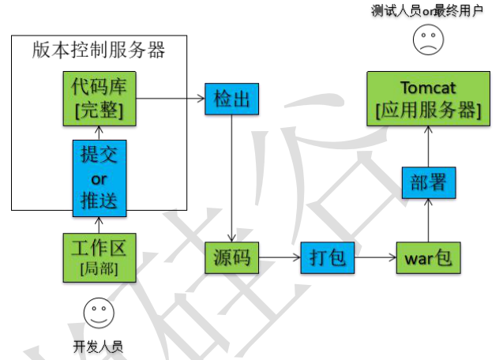
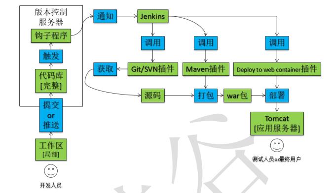

# 一、概念

## 1. 持续部署

- 关注点：项目功能部署至服务器后可以运行，为下一步测试环节或最终用户正式使用做好准备

## 2. 持续集成

- 关注点： 尽早发现项目整体运行问题，尽早解决

## 3. 持续交付

- 关注点： 研发团队的最新代码能够尽快让最终用户体验到

## 4. 总体目标

- **降低风险**：一天中进行多次的集成，并做了相应的测试，这样有利于检查缺陷，了解软件的健康状况
- **减少重复过程**：  使用 Jenkins 等持续集成工具，既可以把构建环节从手动完成转换为自动化完成，又可以通过增加集成频次尽早发现缺陷避免方向性错误
- **任何时间、任何地点生成可部署的软件**
- **增强项目的可见性**： 
  - **有效决策**：持续集成系统为项目构建状态和品质指标提供了及时的信息，有些持续集成系统可以报告功能完成度和缺陷率
  - **注意到趋势**：由于经常集成，我们可以看到一些趋势，如构建成功或失败、总体品质以及其它的项目信息

## 5. javaEE 部署对比

### 1. 手动部署

### 2. 自动部署

- **具体体现**：向版本库提交新的代码后，应用服务器上自动部署，用户或测试人员使用的马上就是最新的应用程序

#二、Jenkins+GitHub 持续集成

## 1. 要点

- Jenkins 要部署到外网上，因为内网地址 GitHub 是无法访问到的
- Jenkins 所在的主机上需要安装 Git，通过 Git 程序从 GitHub 上 clone 代码
- 在 Jenkins 内需要指定 Git 程序位置

- 在 GitHub 上使用每个 repository 的 WebHook 方式远程触发 Jenkins 构建
- 在 Jenkins 内关闭“防止跨站点请求伪造”

