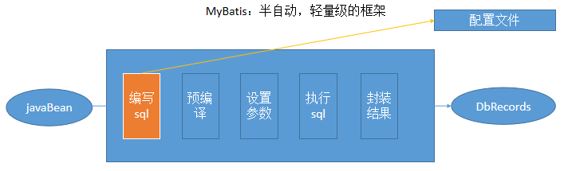
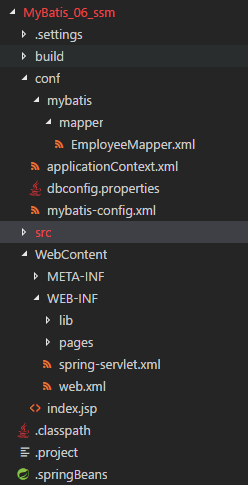

# 一、MyBatis

- [mybatis 中文文档](http://www.mybatis.org/mybatis-3/zh/index.html) 
- [PageHelper github 仓库](https://github.com/pagehelper/Mybatis-PageHelper)


## 1. 概述

- MyBatis 是支持定制化 SQL、存储过程以及高级映射的优秀的持久层框架
- MyBatis 避免了几乎所有的 JDBC 代码和手动设置参数以及获取结果集
- MyBatis 使用 XML 或注解用于配置和映射，将接口和 Java 的 POJO 映射成数据库中的记录



### 1. 简介

- Mybatis 是一个半 ORM（对象关系映射）框架，内部封装了 JDBC，开发时只需要关注 SQL 语句本身，不需要花费精力去处理加载驱动、创建连接、创建 statement 等繁杂的过程

- MyBatis 可以使用 XML 或注解来配置和映射原生信息，将 POJO 映射成数据库中的记录，避免 JDBC 代码和手动设置参数以及获取结果集

- 通过 xml 文件或注解的方式将要执行的各种 statement 配置起来，并通过 java 对象和 statement 中 sql 的动态参数进行映射生成最终执行的 sql 语句，最后由 mybatis 框架执行 sql 并将结果映射为 java 对象并返回

### 2. 优缺点

- **优点**： 

  - 基于 SQL 语句编程，不会对应用程序或者数据库的现有设计造成任何影响

    > - SQL 写在 XML 中，解除 sql 与程序代码的耦合，便于统一管理
    > - 提供 XML 标签，支持编写动态 SQL 语句，并可重用

  - 消除 JDBC 大量冗余的代码，不需要手动开关连接

  - 很好的与各种数据库兼容

    > 因为 MyBatis 使用 JDBC 来连接数据库，所以只要JDBC支持的数据库MyBatis都支持

  - 能够与 Spring 很好的集成

  - 提供映射标签，支持对象与数据库的 ORM 字段关系映射

    提供对象关系映射标签，支持对象关系组件维护

- **缺点**： 

  - SQL 语句的编写工作量较大，尤其当字段多、关联表多时，对开发人员编写SQL语句的功底有一定要求

  - SQL 语句依赖于数据库，导致数据库移植性差，不能随意更换数据库

### 3. 与 Hibernate 的不同

- Mybatis 不完全是一个 ORM 框架，因为 MyBatis 需要程序员自己编写 Sql 语句

- Mybatis 直接编写原生态 sql，可以严格控制 sql 执行性能，灵活度高，非常适合对关系数据模型要求不高的软件开发

- 灵活前提： mybatis 无法做到数据库无关性，如果需要实现支持多种数据库的软件，则需要自定义多套 sql 映射文件，工作量大

- Hibernate 对象/关系映射能力强，数据库无关性好，对于关系模型要求高的软件，可以节省代码，提高效率

### 4. 分页

- Mybatis 使用 `RowBounds` 对象进行分页，针对 `ResultSet` 结果集执行的内存分页，而非物理分页

  > 可以在sql内直接书写带有物理分页的参数来完成物理分页功能，也可以使用分页插件来完成物理分页

- 分页插件的基本原理是使用 Mybatis 提供的插件接口，实现自定义插件，在插件的拦截方法内拦截待执行的sql，然后重写 sql，根据 dialect 方言，添加对应的物理分页语句和物理分页参数

### 5. mapper 传递多个参数

- `#{0}` 代表接收的是dao层中的第一个参数，`#{1}` 代表dao层中第二参数
- 使用 `@param` 注解
- 多个参数封装成 map

### 6. 延迟加载

- Mybatis 仅支持 `association` 关联对象和 `collection` 关联集合对象的延迟加载
  - `association`： 指一对一查询
  - `collection`： 指一对多查询
- Mybatis 配置是否启用延迟加载 `lazyLoadingEnabled=true|false`

- 原理： 使用 CGLIB 创建目标对象的代理对象，当调用目标方法时，进入拦截器方法

  > 例： 调用 a.getB().getName()，拦截器 invoke()方 法发现 a.getB() 是 null 值，则单独发送事先保存好的查询关联 B 对象的 sql，把 B 查询上来，然后调用 a.setB(b)，于是a的对象b属性就有值了，接着完成a.getB().getName()方法的调用

### 7. 接口绑定

- **接口绑定**： 在 MyBatis 中定义接口，接口中的方法和 SQL 语句绑定，直接调用接口就可以实现 SqlSession 提供的方法

- **实现方式**： 
  - **通过注解绑定**： 在接口的方法上面加上 @Select、@Update 等注解，里面包含 Sql 语句来绑定
  - **通过 xml 写 SQL 来绑定**： xml 映射文件中的 namespace 必须为接口的全路径名

### 8. 编写 Mapper 方式

- Dao 接口实现类继承 `SqlSessionDaoSupport`： 编写 Dao接口、Dao实现类、配置文件

  - 在 sqlMapConfig.xml 中配置 mapper.xml 的位置

    ```xml
    <mappers>
        <mapper resource="mapper.xml文件的地址" />
        <mapper resource="mapper.xml文件的地址" />
    </mappers>
    ```

  - 定义 dao 接口

  - dao 接口实现类继承 SqlSessionDaoSupport，dao 接口实现类方法中可以 `this.getSqlSession()` 进行数据增删改查

  - spring 配置

    ```xml
    <bean id=" " class="mapper接口的实现">
        <property name="sqlSessionFactory" ref="sqlSessionFactory"></property>
    </bean>
    ```

- 使用 `org.mybatis.spring.mapper.MapperFactoryBean` 

  - 在 `sqlMapConfig.xml` 中配置 mapper.xml 的位置，若 mapper.xml 和 mapper 接口的名称相同且在同一个目录，可以不用配置

    ```xml
    <mappers>
        <mapper resource="mapper.xml文件的地址" />
        <mapper resource="mapper.xml文件的地址" />
    </mappers>
    ```

  - 定义 mapper 接口：

    - mapper.xml 中的 namespace为mapper 接口的地址

    - mapper 接口中的方法名和 mapper.xml 中的定义的 statement 的 id 保持一致

    - Spring 中定义

      ```xml
      <bean id="" class="org.mybatis.spring.mapper.MapperFactoryBean">
          <property name="mapperInterface"   value="mapper接口地址" /> 
          <property name="sqlSessionFactory" ref="sqlSessionFactory" /> 
      </bean>
      ```

- 使用mapper扫描器： 

  - mapper.xml 文件编写：

    - mapper.xml 中的 namespace为mapper 接口的地址
    - mapper 接口中的方法名和 mapper.xml 中的定义的 statement 的id保持一致
      如果将mapper.xml和mapper接口的名称保持一致则不用在sqlMapConfig.xml中进行配置

  - 定义 mapper 接口

    > 注意mapper.xml的文件名和mapper的接口名称保持一致，且放在同一个目录

  - 配置mapper扫描器：

    ```xml
    <bean class="org.mybatis.spring.mapper.MapperScannerConfigurer">
        <property name="basePackage" value="mapper接口包地址"></property>
        <property name="sqlSessionFactoryBeanName" value="sqlSessionFactory"/> 
    </bean>
    ```

  - 使用扫描器后从spring容器中获取mapper的实现对象

### 9. 插件

- Mybatis 仅可以编写针对 `ParameterHandler、ResultSetHandler、StatementHandler、Executor` 这4种接口的插件，Mybatis 使用 JDK 动态代理，为需要拦截的接口生成代理对象以实现接口方法拦截功能，每当执行这4种接口对象的方法时，就会进入拦截方法，具体就是 InvocationHandler的invoke() 方法，当然，只会拦截那些你指定需要拦截的方法

- 编写插件：实现 Mybatis 的 `Interceptor` 接口并复写 `intercept()` 方法，然后在给插件编写注解，指定要拦截哪一个接口的哪些方法即可，最后在配置文件中配置编写的插件

## 2. 全局配置文件

`mybatis-config.xml`： 

```xml
<?xml version="1.0" encoding="UTF-8" ?>
<!DOCTYPE configuration
  PUBLIC "-//mybatis.org//DTD Config 3.0//EN"
  "http://mybatis.org/dtd/mybatis-3-config.dtd">
<configuration>
  <environments default="development">
    <environment id="development">
      <transactionManager type="JDBC"/>
      <dataSource type="POOLED">
        <property name="driver" value="${driver}"/>
        <property name="url" value="${url}"/>
        <property name="username" value="${username}"/>
        <property name="password" value="${password}"/>
      </dataSource>
    </environment>
  </environments>
  <mappers>
    <mapper resource="xxxMapper.xml"/>
  </mappers>
</configuration>
```

**configuration 配置**： 

### 1. `properties` 属性

**静态配置属性**： 

```xml
<properties resource="org/mybatis/example/config.properties">
  <property name="username" value="dev_user"/>
  <property name="password" value="F2Fa3!33TYyg"/>
</properties>
```

**动态配置属性**： 

```xml
<!--  
	username 和 password 将会由 properties 元素中设置的相应值来替换
	driver 和 url 属性将会由 config.properties 文件中对应的值来替换 
-->
<dataSource type="POOLED">
  <property name="driver" value="${driver}"/>
  <property name="url" value="${url}"/>
  <property name="username" value="${username}"/>
  <property name="password" value="${password}"/>
</dataSource>
```

**多个地方配置下的 MyBatis 加载顺序**：

- 先读取 properties 元素体内指定的属性
- 然后根据 properties 元素中的 resource 属性读取类路径下属性文件或根据 url 属性指定的路径读取属性文件，并覆盖已读取的同名属性
- 最后读取作为方法参数传递的属性，并覆盖已读取的同名属性

### 2. `settings` 设置

```xml
<settings>
  <setting name="cacheEnabled" value="true"/>
  <setting name="lazyLoadingEnabled" value="true"/>
  <setting name="multipleResultSetsEnabled" value="true"/>
  <setting name="useColumnLabel" value="true"/>
  <setting name="useGeneratedKeys" value="false"/>
  <setting name="autoMappingBehavior" value="PARTIAL"/>
  <setting name="autoMappingUnknownColumnBehavior" value="WARNING"/>
  <setting name="defaultExecutorType" value="SIMPLE"/>
  <setting name="defaultStatementTimeout" value="25"/>
  <setting name="defaultFetchSize" value="100"/>
  <setting name="safeRowBoundsEnabled" value="false"/>
  <setting name="mapUnderscoreToCamelCase" value="false"/>
  <setting name="localCacheScope" value="SESSION"/>
  <setting name="jdbcTypeForNull" value="OTHER"/>
  <setting name="lazyLoadTriggerMethods" value="equals,clone,hashCode,toString"/>
</settings>
```

**详细信息参考**： [settings 配置](http://www.mybatis.org/mybatis-3/zh/configuration.html#settings) 

### 3. `typeAliases` 类型别名

- 只和 XML 配置有关，存在的意义在于用来减少类完全限定名的冗余

```xml
<typeAliases>
    <!-- Blog 可以用在任何使用 domain.blog.Blog 的地方 -->
  	<typeAlias alias="Blog" type="domain.blog.Blog"/>
    <!-- 
		在包 domain.blog 中的 Java Bean: 
		若没有注解，会用首字母小写的非限定类名来作为别名，如 domain.blog.Author 别名为 author
		若有注解，则别名为其注解值，如： @Alias("author") 
	-->
  	<package name="domain.blog"/>
</typeAliases>
```

- **Java 类型内建的类型别名**： （防止冲突）

  |   别名   | 映射类型 |   别名   | 映射类型 |    别名    |  映射类型  |    别名    |  映射类型  |
  | :------: | :------: | :------: | :------: | :--------: | :--------: | :--------: | :--------: |
  |  _byte   |   byte   | _boolean | boolean  |   double   |   Double   |    map     |    Map     |
  |  _long   |   long   |  string  |  String  |   float    |   Float    |  hashmap   |  HashMap   |
  |  _short  |  short   |   byte   |   Byte   |  boolean   |  Boolean   |    list    |    List    |
  |   _int   |   int    |   long   |   Long   |    date    |    Date    | arraylist  | ArrayList  |
  | _integer |   int    |  short   |  Short   |  decimal   | BigDecimal | collection | Collection |
  | _double  |  double  |   int    | Integer  | bigdecimal | BigDecimal |  iterator  |  Iterator  |

### 4. `typeHandlers` 类型处理

- MyBatis 在预处理语句中设置的参数与从结果集中取出的值， 都会用类型处理器将值转换成合适的 Java 类型

  > 默认类型处理器的参考： [typeHandlers 默认处理器 对应java8的时间 API](http://www.mybatis.org/mybatis-3/zh/configuration.html#typeHandlers) 

- 创建自定义类型处理器： 
  - 实现 `org.apache.ibatis.type.TypeHandler` 接口， 或继承 `org.apache.ibatis.type.BaseTypeHandler` 类， 
  - 指定其映射某个 JDBC 类型（可选操作）
  - 在 mybatis 全局配置文件中注册

### 5. `objectFactory` 对象工厂

- MyBatis 通过对象工厂(ObjectFactory)实例来创建结果对象的新实例
- 默认的对象工厂通过默认构造方法或参数构造方法来实例化目标类
- 可通过创建自定义对象工厂来覆盖对象工厂的默认行为

### 6. `plugins` 插件

插件可以修改 MyBatis 的核心行为，插件通过动态代理机制，可以介入四大对象的任何一个方法的执行： 

- `Executor(update,query,flushStatements,commit,rollback,getTransaction,close,isClosed)`
- `ParameterHandler(getParameterObject, setParameters) `
- `ResultSetHandler(handleResultSets, handleOutputParameters) `
- `StatementHandler(prepare, parameterize, batch, update, query)`

### 7. `environments` 环境配置

```xml
<environments default="development"> <!-- 默认的 environments ID -->
	<environment id="development"> <!-- environment 元素定义的 ID -->
    	<!-- 
			事务管理器  type=“JDBC | MANAGED” ：
			JDBC： 自动实现提交和回滚，依赖于从数据源得到的连接来管理事务作用域
			MANAGED： 从来不提交或回滚一个连接，而是让容器来管理事务的整个生命周期
				默认情况会关闭连接，因此需将 closeConnection 属性设置为false来阻止默认关闭行为
		-->
        <!-- 若使用 Spring + MyBatis，则 Spring 模块会使用自带的管理器来覆盖前面的配置 -->
        <transactionManager type="JDBC">
     		<property name="..." value="..."/>
    	</transactionManager>
        <!-- 
 			UNPOOLED: 简单数据库连接
			POOLED： 类似数据库连接池的连接
			JNDI： 放置一个 JNDI 上下文的引用
		-->
    	<dataSource type="POOLED">
      		<property name="driver" value="${driver}"/>
      		<property name="url" value="${url}"/>
      		<property name="username" value="${username}"/>
      		<property name="password" value="${password}"/>
    	</dataSource>
  	</environment>
</environments>
```

### 8. `databaseIdProvider` 数据库厂商标识

```xml
<databaseIdProvider type="DB_VENDOR">
	<property name="SQL Server" value="sqlserver"/>
  	<property name="DB2" value="db2"/>        
  	<property name="Oracle" value="oracle" />
</databaseIdProvider>
```

### 9. `mappers` 映射器

```xml
<mappers>
    <!-- 使用相对于类路径的资源引用 -->
  	<mapper resource="org/mybatis/builder/AuthorMapper.xml"/>
    <!-- 使用完全限定资源定位符（URL） -->
    <mapper url="file:///var/mappers/AuthorMapper.xml"/>
    <!-- 使用映射器接口实现类的完全限定类名 -->
    <mapper class="org.mybatis.builder.AuthorMapper"/>
    <!-- 将包内的映射器接口实现全部注册为映射器 -->
    <package name="org.mybatis.builder"/>
</mappers>
```

## 3. 映射文件

`xxxMapper.xml`： 

```xml
<?xml version="1.0" encoding="UTF-8" ?>
<!DOCTYPE mapper
  PUBLIC "-//mybatis.org//DTD Mapper 3.0//EN"
  "http://mybatis.org/dtd/mybatis-3-mapper.dtd">
<mapper namespace="org.mybatis.example.BlogMapper">
  <select id="selectBlog" resultType="Blog">
    select * from Blog where id = #{id}
  </select>
</mapper>
```

### 1. SELECT

```xml
<select id="selectPerson" parameterType="int" resultType="hashmap">
  SELECT * FROM PERSON WHERE ID = #{id}
</select>
```

|      属性       | 描述                                                         |
| :-------------: | ------------------------------------------------------------ |
|      `id`       | 在命名空间中唯一的标识符，可以被用来引用这条语句             |
| `parameterType` | 将要传入语句的参数类的完全限定名或别名(可选)，因为 MyBatis 可以通过 TypeHandler 推断出具体传入语句的参数，默认值为 unset |
|  `resultType`   | 从语句中返回的期望类型的类的完全限定名或别名                 |
|   `resultMap`   | 结果集的映射，不能同时使用 resultMap 与 resultType           |
|  `flushCache`   | 将其设置为 true，会自动清空本地缓存和二级缓存，默认值：false |
|   `useCache`    | 将其设置为 true，将会导致本条语句的结果被二级缓存，默认值：对 select 元素为 true |
|    `timeout`    | 在抛出异常之前，驱动程序等待数据库返回请求结果的秒数，默认值为 unset |
|   `fetchSize`   | s设置驱动程序每次批量返回的结果行数，默认值为 unset（依赖驱动） |
| `statementType` | STATEMENT，PREPARED 或 CALLABLE ，会让 MyBatis 分别使用 Statement，PreparedStatement 或 CallableStatement，默认值：PREPARED |
| `resultSetType` | FORWARD_ONLY，SCROLL_SENSITIVE 或 SCROLL_INSENSITIVE ，默认值为 unset |
|  `databaseId`   | 如果配置了 databaseIdProvider，MyBatis 会加载所有的不带 databaseId 或匹配当前 databaseId 的语句；如果带或者不带的语句都有，则不带的会被忽略 |
| `resultOrdered` | 仅针对嵌套结果 select 语句适用：如果为 true，则当返回一个主结果行时，不会发生有对前面结果集引用的情况，避免获取嵌套结果集时导致内存不够用，默认值：`false` |
|  `resultSets`   | 仅对多结果集的情况适用，它将列出语句执行后返回的结果集并给每个结果集命名，名称用逗号分隔 |

### 2. INSERT，UPDATE，DELETE

|        属性        | 描述                                                         |
| :----------------: | ------------------------------------------------------------ |
|        `id`        | 命名空间中的唯一标识符，可被用来代表这条语句                 |
|  `parameterType`   | 将要传入语句的参数类的完全限定名或别名(可选)，因为 MyBatis 可以通过 TypeHandler 推断出具体传入语句的参数，默认值为 unset |
|   `parameterMap`   | 使用内联参数映射和 parameterType 属性                        |
|    `flushCache`    | 将其设置为 true，会自动清空本地缓存和二级缓存，默认值：false |
|     `timeout`      | 在抛出异常前，驱动程序等待数据库返回请求结果的秒数，默认值为 unset |
|  `statementType`   | STATEMENT，PREPARED 或 CALLABLE，这会让 MyBatis 分别使用 Statement，PreparedStatement 或 CallableStatement，默认值：PREPARED |
| `useGeneratedKeys` | （仅对 insert 和 update 有用）这会令 MyBatis 使用 JDBC 的 getGeneratedKeys 方法来取出由数据库内部生成的主键，默认值：false |
|   `keyProperty`    | （仅对 insert 和 update 有用）唯一标记一个属性，MyBatis 会通过 getGeneratedKeys 的返回值或者通过 insert 语句的 selectKey 子元素设置它的键值，默认：`unset` |
|    `keyColumn`     | （仅对 insert 和 update 有用）通过生成的键值设置表中的列名   |
|    `databaseId`    | 如果配置了 databaseIdProvider，MyBatis 会加载所有的不带 databaseId 或匹配当前 databaseId 的语句；如果带或者不带的语句都有，则不带的会被忽略 |

对于不支持自动生成主键的数据库(如： Oracle)，可以使用 `selectKey` 子元素： 

```xml
<insert id="insertAuthor">
	<selectKey keyProperty="id" resultType="int" order="BEFORE">
    	select CAST(RANDOM()*1000000 as INTEGER) a from SYSIBM.SYSDUMMY1
	</selectKey>
  	insert into Author(id, username, password, email,bio, favourite_section)
  	values(#{id}, #{username}, #{password}, #{email}, #{bio}, 
    		#{favouriteSection,jdbcType=VARCHAR})
</insert>
```

|      属性       | 描述                                                         |
| :-------------: | ------------------------------------------------------------ |
|  `keyProperty`  | selectKey 语句结果应该被设置的目标属性。如果希望得到多个生成的列，也可以是逗号分隔的属性名称列表 |
|   `keyColumn`   | 匹配属性的返回结果集中的列名称。如果希望得到多个生成的列，也可以是逗号分隔的属性名称列表 |
|  `resultType`   | 结果的类型。MyBatis 通常可以推算出来，但是为了更加确定写上也不会有什么问题。MyBatis 允许任何简单类型用作主键的类型，包括字符串。如果希望作用于多个生成的列，则可以使用一个包含期望属性的 Object 或一个 Map |
|     `order`     | 这可以被设置为 BEFORE 或 AFTER。如果设置为 BEFORE，那么它会首先选择主键，设置 keyProperty 然后执行插入语句。如果设置为 AFTER，那么先执行插入语句，然后是 selectKey 元素 - 这和像 Oracle 的数据库相似，在插入语句内部可能有嵌入索引调用 |
| `statementType` | 与前面相同，MyBatis 支持 STATEMENT，PREPARED 和 CALLABLE 语句的映射类型，分别代表 PreparedStatement 和 CallableStatement 类型 |

### 3. Paramater

- **参数传递**： 
  - **单个参数**： 可以接受基本类型，对象类型，集合类型的值，**直接使用**
  - **多个参数**： 会被 MyBatis 重新包装成一个 Map传入，key 是 param1，param2或0，1，值就是参数的值
  - **命名参数**： 使用 @Param 为参数命名
  - **POJO**： 当参数属于我们业务 POJO 时，可以直接传递 POJO
  - **Map**： 也可封装多个参数为 map，直接传递

- `#{key}`：获取参数的值，预编译到 SQL 中，安全

  `${key}`：获取参数的值，拼接到 SQL 中，有 SQL 注入问题

  > - 大多数情况使用 `#{}`
  >
  > - 原生 jdbc 不支持占位符时使用 `${}` 取值，如： 分表、排序。。。
  >
  >   `select * from tableName order by ${name}`

- `#{}` 使用时可规定的参数规则： 

  `javaType、jdbcType、mode（存储过程）、numericScale、resultMap、typeHandler、jdbcTypeName、expression（未来准备支持的功能）`

  - javaType 通常可以从参数对象中来去确定

  - 如果 null 被当作值来传递，对于所有可能为空的列，jdbcType 需要被设置

  - 对于数值类型，还可以设置小数点后保留的位数

  - mode 属性允许指定 IN，OUT 或 INOUT 参数

    如果参数为 OUT 或 INOUT，参数对象属性的真实值将会被改变，就像在获取输出参数时所期望的那样

### 4. ResultMaps

```xml
<select id="selectUsers" resultType="User">
	select
    	user_id             as "id",
    	user_name           as "userName",
    	hashed_password     as "hashedPassword"
  	from some_table
  	where id = #{id}
</select>

<!-- 等价于 -->

<resultMap id="userResultMap" type="User">
	<id property="id" column="user_id" />
  	<result property="username" column="user_name"/>
  	<result property="password" column="hashed_password"/>
</resultMap>
<select id="selectUsers" resultMap="userResultMap">
	select user_id, user_name, hashed_password
  	from some_table
  	where id = #{id}
</select>

<!-- 高级结果映射 -->
<select id="selectBlogDetails" resultMap="detailedBlogResultMap">
  select
       B.id as blog_id,
       B.title as blog_title,
       B.author_id as blog_author_id,
       A.id as author_id,
       A.username as author_username,
       A.password as author_password,
       A.email as author_email,
       A.bio as author_bio,
       A.favourite_section as author_favourite_section,
       P.id as post_id,
       P.blog_id as post_blog_id,
       P.author_id as post_author_id,
       P.created_on as post_created_on,
       P.section as post_section,
       P.subject as post_subject,
       P.draft as draft,
       P.body as post_body,
       C.id as comment_id,
       C.post_id as comment_post_id,
       C.name as comment_name,
       C.comment as comment_text,
       T.id as tag_id,
       T.name as tag_name
  from Blog B
       left outer join Author A on B.author_id = A.id
       left outer join Post P on B.id = P.blog_id
       left outer join Comment C on P.id = C.post_id
       left outer join Post_Tag PT on PT.post_id = P.id
       left outer join Tag T on PT.tag_id = T.id
  where B.id = #{id}
</select>

<!-- 等价于 -->

<resultMap id="detailedBlogResultMap" type="Blog">
	<constructor>
    	<idArg column="blog_id" javaType="int"/>
  	</constructor>
  	<result property="title" column="blog_title"/>
  	<association property="author" javaType="Author">
    	<id property="id" column="author_id"/>
    	<result property="username" column="author_username"/>
    	<result property="password" column="author_password"/>
    	<result property="email" column="author_email"/>
    	<result property="bio" column="author_bio"/>
   		<result property="favouriteSection" column="author_favourite_section"/>
  	</association>
  	<collection property="posts" ofType="Post">
    	<id property="id" column="post_id"/>
    	<result property="subject" column="post_subject"/>
    	<association property="author" javaType="Author"/>
    	<collection property="comments" ofType="Comment">
      		<id property="id" column="comment_id"/>
    	</collection>
    	<collection property="tags" ofType="Tag" >
      		<id property="id" column="tag_id"/>
    	</collection>
    	<discriminator javaType="int" column="draft">
      	<case value="1" resultType="DraftPost"/>
    	</discriminator>
  	</collection>
</resultMap>
```

**字段详解**： 

- `constructor`： 用于在实例化类时，注入结果到构造方法中
  - `idArg`： ID 参数，标记出作为 ID 的结果可以帮助提高整体性能
  - `arg`： 将被注入到构造方法的一个普通结果
- `id`： 一个 ID 结果，标记出作为 ID 的结果可以帮助提高整体性能
- `result`： 注入到字段或 JavaBean 属性的普通结果
- `association`： 一个复杂类型的关联;许多结果将包装成这种类型

  - 嵌套结果映射： 关联可以指定为一个 `resultMap` 元素，或者引用一个
- `collection`： 一个复杂类型的集合

  - 嵌套结果映射： 集合可以指定为一个 `resultMap` 元素，或者引用一个
- `discriminator`： 使用结果值来决定使用哪个 resultMap
  - `case`： 基于某些值的结果映射
    - 嵌套结果映射： 一个 `case` 也是一个映射它本身的结果,因此可以包含很多相 同的元素，或者它可以参照一个外部的 `resultMap` 

- `id & result`： id 和 result 映射一个单独列的值到简单数据类型(字符串,整型,双精度浮点数,日期)的属性或字段

  | 属性          | 描述                                                         |
  | ------------- | ------------------------------------------------------------ |
  | `property`    | 映射到列结果的字段或属性                                     |
  | `column`      | 数据表列名，通常和 `resultSet.getString(columnName)` 的返回值一致 |
  | `javaType`    | 一个 Java 类的完全限定名，或一个类型别名                     |
  | `jdbcType`    | 执行插入、更新和删除的允许空值的列上指定 JDBC 类型           |
  | `typeHandler` | 使用这个属性，可以覆盖默认的类型处理器                       |

- `association`： 

  - 嵌套结果集： 

    ```xml
    <resultMap type="bean.Lock" id="myLock2">
    	<id column="id" property="id"/>
        <result column="lockName" property="lockName"/>
        <association property="key" javaType="bean.Key">
        	<id column="key_id" property="id"/>
            <result column="keyName" property="keyName"/>
        </association>
    </resultMap>
    ```

  - 分段查询： 

    ```xml
    <resultMap type="bean.Lock" id="myLock3">
    	<id column="id" property="id"/>
        <result column="lockName" property="lockName"/>
        <!--
    		select：调用目标的方法查询当前属性的值
    		column：将指定列的值传入目标方法
    	-->
        <association property="key" column="key_id"
                     select="dao.KeyMapper.getKeyById">
        </association>
    </resultMap>
    ```

  - 分段查询&延迟加载

    ```xml
    <!-- 开启延迟加载和属性按需加载 -->
    <settings>
    	<setting name="lazyLoadingEnabled" value="true"/>
        <setting name="aggressiveLazyLoading" value="false"/>
    </settings>
    ```

- `Collection`： 

  - 集合类型&嵌套结果集： 

    ```xml
    <resultMap type="bean.Dapartment" id="myDept">
    	<id column="d_id" property="id"/>
        <result column="d_deptName" property="deptName"/>
        <collection property="emps" ofType="bean.Employee" columnPrefix="e_">
            <id column="id" property="id"/>
        	<result column="lastName" property="lastName"/>
            <result column="eamil" property="eamil"/>
            <result column="gender" property="gender"/>
        </collection>
    </resultMap>
    
    <select id="getDeptById" resultMap="MyDept">
    	SELECT d.d_id d_id,d.dept_name d_dept_name,e.id e_id,
        e.last_name e_lastname,e.email e_email,e.gender e_gender,
        e.dept_id e_deptId
        FROM department d
        LEFT JOIN employee e ON e.`dept_id` = d.`id`
        WHERE d.`id`=#{id}
    </select>
    ```

  - 分布查询&延迟加载

    ```xml
    <resultMap type="bean.Dapartment" id="myDeptStep">
    	<id column="d_id" property="id"/>
        <result column="dept_name" property="deptName"/>
        <collection property="emps" column="id"
                    select="dao.EmployeeMapper.getEmpsByDeptId">
        </collection>
    </resultMap>
    ```

### 5. 其他标签

- `<sql>` 为sql片段标签，通过 `<include>` 标签引入sql片段
- `<selectKey>` 为不支持自增的主键生成策略标签

## 4. 动态SQL

> MyBatis 的两个内置参数：
>
> - `_parameter`： 代表整个参数
>
>   单个参数：_parameter 就是这个参数
>
>   多个参数：参数会被封装为一个 map；_parameter 就是代表这个map
>
> - `_databaseId`： 如果配置了 databaseIdProvider 标签，_databaseId 就是代表当前数据库的别名

### 1. if

```xml
<!-- if:判断 -->
<select id="getEmpsByConditionIf" resultType="mybatis.bean.Employee">
	select * from tbl_employee
    <!-- mybatis 会将 where 标签中的 sql，多出来的 and 或者 or 去掉 -->
	<where>
        <!-- test：判断表达式（OGNL） -->
		<if test="id!=null">
			id=#{id}
		</if>
		<if test="lastName!=null &amp;&amp; lastName!=&quot;&quot;">
		 	and last_name like #{lastName}
		</if>
		<if test="email!=null and email.trim()!=&quot;&quot;">
		 	and email=#{email}
		</if> 
		<!-- ognl会进行字符串与数字的转换判断  "0"==0 -->
		<if test="gender==0 or gender==1">
		 	and gender=#{gender}
		</if>
	</where>
</select>
```

### 2. choose(when、otherwise)

```xml
<select id="getEmpsByConditionChoose" resultType="mybatis.bean.Employee">
	select * from tbl_employee 
	<where>
		<!-- 如果带了id就用id查，如果带了lastName就用lastName查;只会进入其中一个 -->
	 	<choose>
	 		<when test="id!=null">
	 			id=#{id}
	 		</when>
	 		<when test="lastName!=null">
	 			last_name like #{lastName}
	 		</when>
	 		<when test="email!=null">
	 			email = #{email}
	 		</when>
	 		<otherwise>
	 			gender = 0
	 		</otherwise>
	 	</choose>
	</where>
</select>
```

### 3. trim(when、set)

**where(封装查询条件)**： 

```xml
<select id="getEmpsByConditionTrim" resultType="mybatis.bean.Employee">
	select * from tbl_employee
	<!-- 后面多出的and或者or where标签不能解决 
	 	prefix="": 给拼串后的整个字符串加一个前缀 
	 	prefixOverrides="": 去掉整个字符串前面多余的字符
	 	suffix="": 给拼串后的整个字符串加一个后缀 
	 	suffixOverrides="": 去掉整个字符串后面多余的字符
	-->
	<!-- 自定义字符串的截取规则 -->
	<trim prefix="where" suffixOverrides="and">
	 	<if test="id!=null">
		 	id=#{id} and
		</if>
		<if test="lastName!=null &amp;&amp; lastName!=&quot;&quot;">
		 	last_name like #{lastName} and
		</if>
		<if test="email!=null and email.trim()!=&quot;&quot;">
		 	email=#{email} and
		</if> 
		<!-- ognl会进行字符串与数字的转换判断  "0"==0 -->
		<if test="gender==0 or gender==1">
		 	gender=#{gender}
		</if>
	</trim>
</select>
```

**set(封装修改条件)**： 

```xml
<update id="updateEmp">
	<!-- Set标签的使用 -->
	update tbl_employee 
	<set>
		<if test="lastName!=null">
			last_name=#{lastName},
		</if>
		<if test="email!=null">
			email=#{email},
		</if>
		<if test="gender!=null">
			gender=#{gender}
		</if>
	</set>
	where id=#{id} 
</update>

等价于： 

<update>
	<!-- Trim：更新拼串 -->
	update tbl_employee 
	<trim prefix="set" suffixOverrides=",">
		<if test="lastName!=null">
			last_name=#{lastName},
		</if>
		<if test="email!=null">
			email=#{email},
		</if>
		<if test="gender!=null">
			gender=#{gender}
		</if>
	</trim>
	where id=#{id}
</update>
```

### 4. foreach

```xml
<select id="getEmpsByConditionForeach" resultType="mybatis.bean.Employee">
	select * from tbl_employee
	<!--
	 	collection：指定要遍历的集合,list类型的参数会特殊处理封装在map中，map的key就叫list
	 	item：将当前遍历出的元素赋值给指定的变量
	 	separator: 每个元素之间的分隔符
	 	open：遍历出所有结果拼接一个开始的字符
	 	close: 遍历出所有结果拼接一个结束的字符
	 	index: 遍历 list 时,index 就是索引，item 就是当前值
	 		   遍历 map 时,index 就是 map 的 key，item 就是 map 的值
	 		
	 		#{变量名}就能取出变量的值也就是当前遍历出的元素
	 -->
	<foreach collection="ids" item="item_id" separator="," 
             open="where id in("close=")">
	 	#{item_id}
	</foreach>
    <!-- 拼接结果：select * from tbl_employee where id in (?,?);  -->
</select>
```

**批量保存**： 

```xml
<insert id="addEmps">
	insert into tbl_employee(last_name,email,gender,d_id)
    values
	<foreach collection="emps" item="emp" separator=",">
		(#{emp.lastName},#{emp.email},#{emp.gender},#{emp.dept.id})
	</foreach>
</insert>

<!-- 这种方式需要数据库连接属性 allowMultiQueries=true； -->
<insert id="addEmps">
	<foreach collection="emps" item="emp" separator=";">
	 	insert into tbl_employee(last_name,email,gender,d_id)
	 	values(#{emp.lastName},#{emp.email},#{emp.gender},#{emp.dept.id})
	</foreach>
</insert>
```

**Oracle**： 

```xml
<!-- 
	Oracle数据库批量保存： Oracle不支持values(),(),()
	 	
	Oracle支持的批量方式: 
	 	1、多个insert放在begin - end里面
	 		begin
			    insert into employees(employee_id,last_name,email) 
			    values(employees_seq.nextval,'test_001','test_001@atguigu.com');
			    insert into employees(employee_id,last_name,email) 
			    values(employees_seq.nextval,'test_002','test_002@atguigu.com');
			end;
		2、利用中间表：
			insert into employees(employee_id,last_name,email)
		       select employees_seq.nextval,lastName,email from(
		              select 'test_a_01' lastName,'test_a_e01' email from dual
		              union
		              select 'test_a_02' lastName,'test_a_e02' email from dual
		              union
		              select 'test_a_03' lastName,'test_a_e03' email from dual
		       )	
-->
<insert id="addEmps" databaseId="oracle">
	<!-- oracle第一种批量方式 -->
	<foreach collection="emps" item="emp" open="begin" close="end;">
	 	insert into employees(employee_id,last_name,email) 
		values(employees_seq.nextval,#{emp.lastName},#{emp.email});
	</foreach>
	 	
	<!-- oracle第二种批量方式  -->
	insert into employees(employee_id,last_name,email)
	 <foreach collection="emps" item="emp" separator="union"
	 		open="select employees_seq.nextval,lastName,email from("close=")">
	 	select #{emp.lastName} lastName,#{emp.email} email from dual
	 </foreach>
</insert>
```

### 5. bind

```xml
<select id="getEmpsTestInnerParameter" resultType="mybatis.bean.Employee">
	<!-- bind：可以将OGNL表达式的值绑定到一个变量中，方便后来引用这个变量的值 -->
	<bind name="_lastName" value="'%'+lastName+'%'"/>
	<if test="_databaseId=='mysql'">
	  	select * from tbl_employee
		<if test="_parameter!=null">
	  		where last_name like #{lastName}
		</if>
	</if>
	<if test="_databaseId=='oracle'">
	  	select * from employees
	  	<if test="_parameter!=null">
	  		where last_name like #{_parameter.lastName}
	  	</if>
	</if>
</select>
```

### 6. sql

```xml
<insert>
	<!-- oracle第二种批量方式  -->
	insert into employees(
	 	<!-- 引用外部定义的sql -->
	 	<include refid="insertColumn">
            <!-- 自定义值 -->
	 		<property name="testColomn" value="abc"/>
	 	</include>
	 )
	 <foreach collection="emps" item="emp" separator="union"
	 		open="select employees_seq.nextval,lastName,email from("close=")">
	 	select #{emp.lastName} lastName,#{emp.email} email from dual
	 </foreach>
</insert>

<!-- 
抽取可重用的sql片段，方便后面引用 
	1、sql抽取：经常将要查询的列名，或者插入用的列名抽取出来方便引用
	2、include来引用已经抽取的sql
	3、include还可以自定义一些property，sql标签内部就能使用自定义的属性
	  		include-property：取值的正确方式${prop},#{不能使用这种方式}
-->
<sql id="insertColumn">
	<if test="_databaseId=='oracle'">
	  	employee_id,last_name,email,${testColomn}
	</if>
	<if test="_databaseId=='mysql'">
	  	last_name,email,gender,d_id
	</if>
</sql>
```

## 5. 缓存机制


### 1. 一级缓存(本地缓存)

- 一级缓存，即本地缓存，作用域默认为 sqlSession

- 当 Session flush 或 close 后，该 Session 中的所有 Cache 将被清空
- 本地缓存不能被关闭，但可以调用 clearCache() 来清空本地缓存，或者改变缓存的作用域


**一级缓存失效**的四种情况： 

- 不同的 SqlSession 
- SqlSession相同，但查询条件不同
- 同一个 SqlSession 两次查询期间执行了一次增删改操作
- 同一个 SqlSession 两次查询期间手动清空了缓存

### 2. 二级缓存(全局缓存)

二级缓存(全局缓存)：基于 namespace 级别的缓存

- **工作机制**：

  - 一个会话，查询一条数据，这个数据就会被放在当前会话的一级缓存中；

  - 若会话关闭，一级缓存中的数据会被保存到二级缓存中；新的会话查询信息，可参照二级缓存中的内容

  > 不同 namespace 查出的数据会放在自己对应的缓存中（map）
  >
  > 效果：
  >
  > - 数据会从二级缓存中获取
  > - 查出的数据都会被默认先放在一级缓存中
  > - 只有会话提交或者关闭以后，一级缓存中的数据才会转移到二级缓存中

- **使用**：

  - 开启全局二级缓存配置：`<setting name="cacheEnabled" value="true"/>`

  - 在 `mapper.xml` 中配置使用二级缓存： `<cache></cache>` 

    > - `eviction`： 缓存的回收策略
    >
    >   - LRU(默认) – 最近最少使用的：移除最长时间不被使用的对象
    >
    >   - FIFO – 先进先出：按对象进入缓存的顺序来移除它们
    >
    >   - SOFT – 软引用：移除基于垃圾回收器状态和软引用规则的对象
    >
    >   - WEAK – 弱引用：更积极地移除基于垃圾收集器状态和弱引用规则的对象
    >
    > - `flushInterval`：缓存刷新间隔，缓存多长时间清空一次，默认不清空，设置一个毫秒值
    >
    > - `readOnly`:是否只读：
    >
    >   - true：只读；所有从缓存中获取数据的操作都是只读操作，不会修改数据
    >
    >     mybatis 为了加快获取速度，直接将数据在缓存中的引用交给用户；**不安全，速度快**
    >
    >   - false：非只读；缓存中的数据可能会被修改
    >
    > ​                mybatis 会利用**序列化&反序列**的技术克隆一份新的数据给你；**安全，速度慢**
    >
    > - `size`：缓存存放多少元素
    >
    > - `type`：指定自定义缓存的全类名；实现Cache接口即可

  **注意**： POJO 需要实现 Serializable 序列化接口

- **和缓存有关的属性/配置**： 

  - 全局 setting 的 `cacheEnable`：配置二级缓存的开关，一级缓存一直保持打开

  - select 标签的 `useCache` 属性： 配置该 select 是否使用二级缓存，一级缓存一直使用

  - sql 标签的 `flushCache` 属性： **增删改**默认 `flushCache=true`，**查询**默认 `flushCache=false` 

    > sql 执行以后，会同时**清空一级和二级缓存**

  - `sqlSession.clearCache()`： 用来清除一级缓存

  - `localCacheScope(本地缓存作用域)`：

    - `SESSION(默认)`： 当前会话的所有数据保存在会话缓存中

    - `STATEMENT`： 可以禁用一级缓存


## 6. Spring整合

- 项目整体结构： 

  

- `web.xml` 文件配置： 

  ```xml
  <?xml version="1.0" encoding="UTF-8"?>
  <web-app xmlns:xsi="http://www.w3.org/2001/XMLSchema-instance" 			 			     xmlns="http://java.sun.com/xml/ns/javaee"              		  
           xsi:schemaLocation="http://java.sun.com/xml/ns/javaee 
  		 http://java.sun.com/xml/ns/javaee/web-app_2_5.xsd" 
           id="WebApp_ID" version="2.5">
      
  	<display-name>MyBatis_06_ssm</display-name>
    
      <!-- Spring配置 -->
  	<context-param>
  		<param-name>contextConfigLocation</param-name>
          <!-- 对应 applicationContext.xml 文件 -->
  		<param-value>classpath:applicationContext.xml</param-value>
  	</context-param>
  
  	<listener>
  		<listener-class>
              org.springframework.web.context.ContextLoaderListener
          </listener-class>
  	</listener>
  	
  	<!-- SpringMVC 配置 -->
  	<servlet>
          <!-- 对应 spring-servlet.xml 文件 -->
  		<servlet-name>spring</servlet-name>
  		<servlet-class>
              org.springframework.web.servlet.DispatcherServlet
          </servlet-class>
  		<load-on-startup>1</load-on-startup>
  	</servlet>
  	<servlet-mapping>
  		<servlet-name>spring</servlet-name>
  		<url-pattern>/</url-pattern>
  	</servlet-mapping>
  </web-app>
  ```

- `spring-servlet.xml` 文件(springMVC 配置文件)： 

  ```xml
  <?xml version="1.0" encoding="UTF-8"?>
  <beans xmlns="http://www.springframework.org/schema/beans"
  	xmlns:xsi="http://www.w3.org/2001/XMLSchema-instance"
  	xmlns:context="http://www.springframework.org/schema/context"
  	xmlns:mvc="http://www.springframework.org/schema/mvc"
  	xsi:schemaLocation="http://www.springframework.org/schema/mvc http://www.springframework.org/schema/mvc/spring-mvc-4.0.xsd
  		http://www.springframework.org/schema/beans http://www.springframework.org/schema/beans/spring-beans.xsd
  		http://www.springframework.org/schema/context http://www.springframework.org/schema/context/spring-context-4.0.xsd">
  
  	<!-- SpringMVC 只扫描控制器 -->
  	<context:component-scan base-package="com.mybatis" 
                              use-default-filters="false">
  		<context:include-filter type="annotation" 
  				 expression="org.springframework.stereotype.Controller"/>
  	</context:component-scan>
  	
  	<!-- 视图解析器 -->
  	<bean class=
            "org.springframework.web.servlet.view.InternalResourceViewResolver">
  		<property name="prefix" value="/WEB-INF/pages/"></property>
  		<property name="suffix" value=".jsp"></property>
  	</bean>
  	
  	<mvc:annotation-driven></mvc:annotation-driven>
  	<mvc:default-servlet-handler/>
  </beans>
  ```

- `applicationContext.xml` 文件(spring 配置文件)：

  ```xml
  <?xml version="1.0" encoding="UTF-8"?>
  <beans xmlns="http://www.springframework.org/schema/beans"
  	xmlns:xsi="http://www.w3.org/2001/XMLSchema-instance"
  	xmlns:context="http://www.springframework.org/schema/context"
  	xmlns:mybatis-spring="http://mybatis.org/schema/mybatis-spring"
  	xmlns:tx="http://www.springframework.org/schema/tx"
  	xsi:schemaLocation="http://www.springframework.org/schema/beans http://www.springframework.org/schema/beans/spring-beans.xsd
  		http://mybatis.org/schema/mybatis-spring http://mybatis.org/schema/mybatis-spring-1.2.xsd
  		http://www.springframework.org/schema/tx http://www.springframework.org/schema/tx/spring-tx-4.0.xsd
  		http://www.springframework.org/schema/context http://www.springframework.org/schema/context/spring-context-4.0.xsd">
  
  	<!-- Spring 管理所有的业务逻辑组件(除了 Controller) -->
  	<context:component-scan base-package="com.mybatis">
  		<context:exclude-filter type="annotation"
  			expression="org.springframework.stereotype.Controller" />
  	</context:component-scan>
  
  	<!-- 引入数据库的配置文件 -->
  	<context:property-placeholder location="classpath:dbconfig.properties" />
  	
      <!-- Spring 控制数据源、事务控制、aop -->
  	<bean id="dataSource" class="com.mchange.v2.c3p0.ComboPooledDataSource">
  		<property name="jdbcUrl" value="${jdbc.url}"></property>
  		<property name="driverClass" value="${jdbc.driver}"></property>
  		<property name="user" value="${jdbc.username}"></property>
  		<property name="password" value="${jdbc.password}"></property>
  	</bean>
  	
      <!-- spring 事务管理 -->
  	<bean id="dataSourceTransactionManager" class=
            "org.springframework.jdbc.datasource.DataSourceTransactionManager">
  		<property name="dataSource" ref="dataSource"></property>
  	</bean>
  
  	<!-- 开启基于注解的事务 -->
  	<tx:annotation-driven transaction-manager="dataSourceTransactionManager"/>
  	
  	<!-- 整合 mybatis: 
  		1、spring 管理所有 mapper 实现类组件: @Autowired:自动注入mapper
  	    2、spring 用来管理事务，spring 声明式事务
  	-->
  	<!--创建出 SqlSessionFactory 对象  -->
  	<bean id="sqlSessionFactoryBean" 
            class="org.mybatis.spring.SqlSessionFactoryBean">
          <!-- 对应上面的 dataSource -->
  		<property name="dataSource" ref="dataSource"></property>
  		<!-- configLocation 指定全局配置文件的位置 -->
  		<property name="configLocation" value="classpath:mybatis-config.xml"/>
  		<!--mapperLocations: 指定 mapper文件的位置-->
  		<property name="mapperLocations" value="classpath:mybatis/mapper/*.xml"/>
  	</bean>
  	
  	<!--配置一个可以进行批量执行的 sqlSession  -->
  	<bean id="sqlSession" class="org.mybatis.spring.SqlSessionTemplate">
  		<constructor-arg name="sqlSessionFactory" ref="sqlSessionFactoryBean"/>
  		<constructor-arg name="executorType" value="BATCH"/>
  	</bean>
  	
  	<!-- 扫描所有的 mapper 接口的实现，让这些 mapper 能够自动注入；
  		 base-package：指定 mapper 接口的包名
  	 -->
  	<mybatis-spring:scan base-package="com.mybatis.dao"/>
  	<!-- <bean class="org.mybatis.spring.mapper.MapperScannerConfigurer">
  		<property name="basePackage" value="com.atguigu.mybatis.dao"></property>
  	</bean> -->
  </beans>
  ```

- `mybatis-config.xml` 文件： 

  ```xml
  <?xml version="1.0" encoding="UTF-8" ?>
  <!DOCTYPE configuration
   PUBLIC "-//mybatis.org//DTD Config 3.0//EN"
   "http://mybatis.org/dtd/mybatis-3-config.dtd">
  <configuration>
  	<settings>
  		<setting name="mapUnderscoreToCamelCase" value="true"/>
  		<setting name="jdbcTypeForNull" value="NULL"/>
  		<!--显式的指定每个我们需要更改的配置的值，即使他是默认的；防止版本更新带来的问题  -->
  		<setting name="cacheEnabled" value="true"/>
  		<setting name="lazyLoadingEnabled" value="true"/>
  		<setting name="aggressiveLazyLoading" value="false"/>
  	</settings>
  	
  	<databaseIdProvider type="DB_VENDOR">
  		<property name="MySQL" value="mysql"/>
  		<property name="Oracle" value="oracle"/>
  		<property name="SQL Server" value="sqlserver"/>
  	</databaseIdProvider>
  </configuration>
  ```

- `mybatis/mapper` 包下的 `EmployeeMapper.xml` 文件： 

  ```xml
  <?xml version="1.0" encoding="UTF-8" ?>
  <!DOCTYPE mapper
   PUBLIC "-//mybatis.org//DTD Mapper 3.0//EN"
   "http://mybatis.org/dtd/mybatis-3-mapper.dtd">
  <mapper namespace="com.mybatis.dao.EmployeeMapper">
  
  	<!-- public Employee getEmpById(Integer id); -->
  	<select id="getEmpById" resultType="com.mybatis.bean.Employee">
  		select * from tbl_employee where id=#{id}
  	</select>
  	
  	<!--public List<Employee> getEmps();  -->
  	<select id="getEmps" resultType="com.mybatis.bean.Employee">
  		select * from tbl_employee
  	</select>
  </mapper>
  ```

- `bean` 包下的 `Employee.java` 文件： 

  ```java
  public class Employee{
  
  	private Integer id;
  	private String lastName;
  	private String email;
  	private String gender;
  	
  	public Integer getId() {
  		return id;
  	}
  	public void setId(Integer id) {
  		this.id = id;
  	}
  	public String getLastName() {
  		return lastName;
  	}
  	public void setLastName(String lastName) {
  		this.lastName = lastName;
  	}
  	public String getEmail() {
  		return email;
  	}
  	public void setEmail(String email) {
  		this.email = email;
  	}
  	public String getGender() {
  		return gender;
  	}
  	public void setGender(String gender) {
  		this.gender = gender;
  	}
  }
  ```

- `dao` 包下的 `EmployeeMapper.java` 文件： 

  ```java
  public interface EmployeeMapper {
  	public Employee getEmpById(Integer id);
  	public List<Employee> getEmps();
  }
  ```

- `service` 包下的 `EmployeeService.java` 文件： 

  ```java
  @Service
  public class EmployeeService {
  	
      //自动注入
  	@Autowired
  	private EmployeeMapper employeeMapper;
  	
  	@Autowired
  	private SqlSession sqlSession;
  	
  	public List<Employee> getEmps(){
  		return employeeMapper.getEmps();
  	}
  }
  ```

- `controller` 包下的 `EmployeeController.java` 文件： 

  ```java
  @Controller
  public class EmployeeController {
  	
  	@Autowired
  	EmployeeService employeeService;
  	
  	@RequestMapping("/getemps")
  	public String emps(Map<String,Object> map){
  		List<Employee> emps = employeeService.getEmps();
  		map.put("allEmps", emps);
  		return "list";
  	}
  }
  ```

## 7. 逆向工程

- [官方文档地址](http://www.mybatis.org/generator/) 
- [官方工程地址](https://github.com/mybatis/generator/releases) 

> MyBatis Generator(MBG)： 专门为 MyBatis 框架使用者定制的代码生成器
>
> - 可以快速的根据表生成对应的映射文件，接口，以及bean类
> - 支持基本的增删改查，以及 QBC 风格的条件查询
> - 但表连接、存储过程等复杂 sql 的定义需要手工编写

**使用步骤**：

- 编写MBG的配置文件（重要几处配置）
  - `jdbcConnection` 配置数据库连接信息
  - `javaModelGenerator` 配置 javaBean 的生成策略
  - `sqlMapGenerator` 配置 sql 映射文件生成策略
  - `javaClientGenerator` 配置 Mapper 接口的生成策略
  - `table` 配置要逆向解析的数据表
    - `tableName`：表名
    - `domainObjectName`：对应的 javaBean 名
- 运行代码生成器生成代码

`mbg.xml` 配置文件： 

```xml
<?xml version="1.0" encoding="UTF-8"?>
<!DOCTYPE generatorConfiguration
  PUBLIC "-//mybatis.org//DTD MyBatis Generator Configuration 1.0//EN"
  "http://mybatis.org/dtd/mybatis-generator-config_1_0.dtd">
<generatorConfiguration>

	<!-- targetRuntime 的取值： 
		MyBatis3Simple: 生成简单版的 CRUD
		MyBatis3: 复杂版的 CRUD
	 -->
  <context id="DB2Tables" targetRuntime="MyBatis3">
  	<!-- jdbcConnection：指定如何连接到目标数据库 -->
    <jdbcConnection driverClass="com.mysql.jdbc.Driver"
        connectionURL="jdbc:mysql://localhost:3306/mybatis"
        userId="root"
        password="123456">
    </jdbcConnection>

    <javaTypeResolver >
      <property name="forceBigDecimals" value="false" />
    </javaTypeResolver>

	<!-- javaModelGenerator：指定javaBean的生成策略 
	targetPackage：目标包名
	targetProject：目标工程
	-->
    <javaModelGenerator targetPackage="com.mybatis.bean" 
    		targetProject=".\src">
      <property name="enableSubPackages" value="true" />
      <property name="trimStrings" value="true" />
    </javaModelGenerator>

	<!-- sqlMapGenerator：sql 映射生成策略： -->
    <sqlMapGenerator targetPackage="mapper"  
    	targetProject=".\conf">
      <property name="enableSubPackages" value="true" />
    </sqlMapGenerator>

	<!-- javaClientGenerator:指定 mapper 接口所在的位置 -->
    <javaClientGenerator type="XMLMAPPER" targetPackage="mapper"  
    	targetProject=".\src">
      <property name="enableSubPackages" value="true" />
    </javaClientGenerator>

	<!-- 指定要逆向分析哪些表：根据表要创建javaBean -->
    <table tableName="tbl_dept" domainObjectName="Department"></table>
    <table tableName="tbl_employee" domainObjectName="Employee"></table>
  </context>
</generatorConfiguration>
```

java 代码： 

```java
public void testMbg() throws Exception {
    List<String> warnings = new ArrayList<String>();
    boolean overwrite = true;
    File configFile = new File("mbg.xml");
    ConfigurationParser cp = new ConfigurationParser(warnings);
    Configuration config = cp.parseConfiguration(configFile);
    DefaultShellCallback callback = new DefaultShellCallback(overwrite);
    MyBatisGenerator myBatisGenerator = new MyBatisGenerator(config,
            callback, warnings);
    myBatisGenerator.generate(null);
}
```

## 8. 工作原理

**结构图**： 


**工作原理图**： 


源码运行过程： 


​    **4、 查询过程：** 


## 9. 插件开发

**MyBatis 允许使用插件来拦截的方法调用**：

- `Executor(update,query,flushStatements,commit,rollback,getTransaction,close,isClosed)`
- `ParameterHandler(getParameterObject, setParameters)`
- `ResultSetHandler(handleResultSets, handleOutputParameters)`
- `StatementHandler(prepare, parameterize, batch, update, query)`

**插件开发步骤**： 

- 编写插件实现 `Interceptor` 接口，并使用 `@Intercepts` 注解完成插件签名

  ```java
  //完成插件签名：告诉MyBatis当前插件用来拦截哪个对象的哪个方法
  @Intercepts({
  			@Signature(type=StatementHandler.class,method="parameterize",
                         args=java.sql.Statement.class)
  		})
  public class MyFirstPlugin implements Interceptor{
  	
      //intercept：拦截目标对象的目标方法的执行
  	@Override
  	public Object intercept(Invocation invocation) throws Throwable {
  		System.out.println("MyFirstPlugin...intercept:"+invocation.getMethod());
  		//动态的改变一下sql运行的参数：以前1号员工，实际从数据库查询3号员工
  		Object target = invocation.getTarget();
  		System.out.println("当前拦截到的对象："+target);
  		//拿到：StatementHandler==>ParameterHandler===>parameterObject
  		//拿到target的元数据
  		MetaObject metaObject = SystemMetaObject.forObject(target);
  		Object value = metaObject.getValue("parameterHandler.parameterObject");
  		System.out.println("sql语句用的参数是："+value);
  		//修改完sql语句要用的参数
  		metaObject.setValue("parameterHandler.parameterObject", 11);
  		//执行目标方法
  		Object proceed = invocation.proceed();
  		//返回执行后的返回值
  		return proceed;
  	}
  
  	//plugin：为目标对象创建一个代理对象
  	@Override
  	public Object plugin(Object target) {
  		//我们可以借助Plugin的wrap方法来使用当前Interceptor包装我们目标对象
  		System.out.println("MyFirstPlugin...plugin:mybatis将要包装的对象"+target);
  		Object wrap = Plugin.wrap(target, this);
  		//返回为当前target创建的动态代理
  		return wrap;
  	}
  
  	//setProperties：将插件注册时 的property属性设置进来
  	@Override
  	public void setProperties(Properties properties) {
  		System.out.println("插件配置的信息："+properties);
  	}
  }
  ```

- 在全局配置文件中注册插件

  ```xml
  <!--plugins：注册插件  -->
  <plugins>
      <plugin interceptor="com.mybatis.dao.MyFirstPlugin">
          <property name="username" value="root"/>
          <property name="password" value="123456"/>
      </plugin>
  </plugins>
  ```

# 二、MybatisPlus

> `MyBatis-Plus(简称 MP)`： 是一个 MyBatis 的增强工具包，只做增强不改变

- [官网地址](https://mp.baomidou.com/) 
- [代码发布地址](https://github.com/baomidou/mybatis-plus) 

# 三、通用 Mapper

[代码官方地址](https://gitee.com/free) 