一、MySQL体系结构和存储引擎

## 1. mysql 体系结构


- `Connectors`： 指的是**不同语言与SQL的交互**

- `Management Serveices & Utilities`： **系统管理和控制工具**

- `Connection Pool`： **连接池**，管理缓冲用户连接，线程处理等需要缓存的需求

- `SQL Interface`： **SQL接口**，接受用户的SQL命令，并且返回用户需要查询的结果

- `Parser`： **解析器**，SQL命令传递到解析器的时候会被解析器验证和解析

  > 解析器是由 `Lex和YACC` 实现的，是一个很长的脚本
  >
  > **主要功能**：
  >
  > - 将SQL语句分解成数据结构，并将这个结构传递到后续步骤，以后SQL语句的传递和处理就是基于这个结构的 
  >
  > - 如果在分解构成中遇到错误，那么就说明这个sql语句是不合理的

- `Optimizer`： **查询优化器**，SQL语句在查询之前会使用查询优化器对查询进行优化

  > 查询策略： “**选取-投影-联接**”

- `Cache和Buffer`： **查询缓存**，如果查询缓存有命中的查询结果，查询语句就可以直接去查询缓存中取数据

- `Engine` ：**存储引擎**，是MySql中具体的与文件打交道的子系统

  >  Mysql的存储引擎是**插件式**的，它根据MySql AB公司提供的文件访问层的一个抽象接口来定制一种文件访问机制（这种访问机制就叫存储引擎）

## 2. mysql 存储引擎

> 数据库和文件系统最大的区别在于：数据库是支持事务的
>
> - 查看数据库引擎命令： `SHOW ENGINES;`
> - 查看数据库默认使用哪个引擎： `SHOW VARIABLES LIKE 'storage_engine';`

### 1. InnoDB存储引擎

- MySQL5.5.8之后默认的存储引擎，主要**面向OLTP（联机事务处理**，面向基本的、日常的事务处理）

- **支持事务，外键、行锁**（有的情况下也会锁住整个表）、**非锁定读**(默认读取操作不会产生锁)

- 通过使用 **MVCC(多版本并发控制)** 来获取高并发性，并且实现sql标准的4种隔离级别，默认为可重复读级别

- 使用一种被称成 **next-key locking**的策略来避免幻读(phantom)现象
- 提供了**插入缓存、二次写、自适应哈希索引、预读**等高性能技术

- 表数据采用聚集方式，每张表的存储都按主键的顺序进行存放

### 2. MyISAM存储引擎

- **不支持事务、支持全文索引，表锁设计**，主要面向一些**OLAP（联机分析处理**，数据仓库的主要应用）

- **只缓冲索引文件**，而不缓冲数据文件

- 该存储引擎表由 MYD 和 MYI 组成，**MYD用来存放数据文件，MYI用来存放索引文件**

### 3. NDB

- 是一个**集群存储引擎**，其特点是**数据全部放在内存中**

- **主键查找速度快**，并通过添加 NDB 数据库存储节点可以线性提高数据库性能，是高可用，高性能的集群系统

### 4. Memory

- **表中的数据存放在内存中**，如果数据库重启或发生崩溃，表中的数据都将消失

- **适合存储临时数据的临时表**，**默认采用哈希索引**

- 只支持表锁，并发性较差

# 二、InnoDB 存储引擎

## 1. InnoDB 体系架构


### 1. 后台线程

- `Master Thread`： 将更新的数据（包括新增和被修改的数据）异步刷新到磁盘，**维护内存池和磁盘中的数据的一致性**；包括赃页的刷新、合并插入缓冲、UNDO 页的回收等

- `IO Thread` ： 主要**负责 AIO(Async IO) 请求的回调处理**(call back)，分为 `Insert buffer,log IO,read ,write ` 

  > 查看命令： `SHOW ENGINE INNODB STATUS\G` 

- `purge thread`： **回收 undo log**，支持多个 Purge Thread

  > 查看命令： `SHOW VARIABLES LIKE "innodb_purge_threads"\G`

- `Page cleaner thread`： **刷新脏页到磁盘**

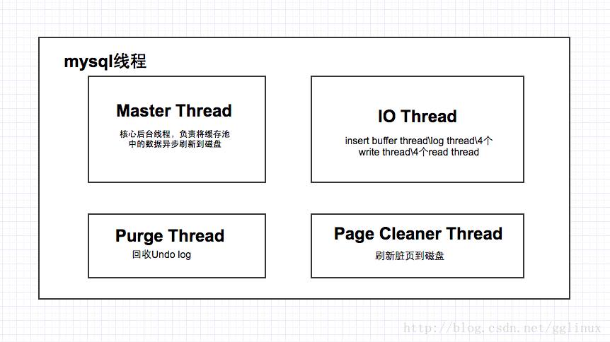

### 2. 内存

#### 1. 缓冲池

> - InnoDB 存储引擎是基于磁盘存储的，其中的记录按照页的方式进行管理，由于 CPU 速度和磁盘速度之间的鸿沟，InnoDB 引擎使用缓冲池技术来提高数据库的整体性能
>
> - 脏页从缓冲池刷新回磁盘的操作并不是在每次页发生更新时触发的，而是通过 **Checkpoint 机制** 刷新回磁盘
> - 缓冲池的大小是可以调整配置参数调控的
> - 数据库服务器的缓冲池可以设置多个，增加效率

缓冲池简单来说就是一块**内存区域**： 

- 在数据库中进行**读取页**的操作：首先将从磁盘读到的页存放在缓冲池中，下一次读取相同的页时，首先判断该页是不是在缓冲池中，若在，称该页在缓冲池中被命中，直接读取该页；否则，读取磁盘上的页

- 对于数据库中**页的修改**操作，首先修改在缓冲池中页，然后再以**一定的频率刷新到磁盘**，并不是每次页发生改变就刷新回磁盘

缓冲池的大小直接影响数据库的整体性能，对于 InnoDB 存储引擎而言，缓冲池配置通过参数 `innodb_buffer_pool_size`  来设置

> 查看命令： `SHOW VARIABLES LIKE 'innodb_buffer_pool_size'\G`

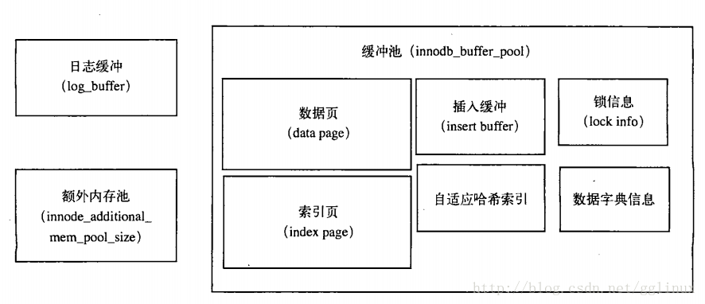

#### 2. 重做日志缓冲

>  InnoDB 存储引擎先**将重做日志信息放入日志缓冲区，然后以一定频率将其刷新到重做日志文件**

下列三种情况**重做日志缓冲中的内容会刷新到磁盘的重做日志文件**：

（重做日志文件一般不需要设置得很大）

- **Master Thread 每一秒**将重做日志缓冲刷新到重做日志文件

- **每个事物提交时**会将重做日志缓冲刷新到重做日志文件

- 当**重做日志缓冲剩余空间小于 1/2 时**，重做日志缓冲刷新到重做日志文件

#### 3. 额外内存池

在 InnoDB 存储引擎中，对一些数据结构本身的内存进行分配时，需要从额外的内存池中进行申请

例如,分配了缓冲池,但是每个缓冲池中的帧缓冲还有对应的缓冲控制对象,这些对象记录以一些诸如 LRU, 锁,等待等信息,而这个对象的内存需要从额外的内存池中申请.

#### 4. LRU Free Flush

- **LRU 列表**： LRU 列表用来**管理已经读到的页**，对于这些缓冲页采用 **LRU 算法**管理

  >  新读的页放在 LRU 列表的 **midpoint 位置**，默认设置为 LRU 列表长度的 5/8，可由参数 `innodb_old_blocks_pct` 设置
  >
  > 查看命令： `show variables like 'innodb_old_blocks_pct'\G` 

- **Free 列表**： Free 列表其实就是维持一个存储结构的链表，这个**链表结点数表示 LRU 列表可以存储页的数量**

- **Flush 列表**： Flush 列表中的为**脏页**，但注意这些脏页在 LRU 也有可能存在，不过 **LRU 列表用来管理缓冲实现的可用性，Flush 列表用来管理页刷新回磁盘**

## 2. checkpoint技术

> **将缓冲池的数据刷新到磁盘**

### 1. 使用背景

- **日常DML语句(如：Update / Delete操作) 并没有将操作的缓冲池数据立即写入到磁盘**，这有可能会导致内存中数据与磁盘中的数据产生不一致
- **脏页： 与磁盘数据不一致的缓冲池的页**
- **checkpoint 的工作就是将内存中的脏页，在一定条件下刷新到磁盘**

- **策略**：为了避免从缓冲池将页数据刷新到磁盘的过程中宕机情况的发生，采用了 **Write Ahead Log 策略**
  - 即**当事务提交时，先写重做日志，再修改页**，这样发生宕机也可以通过重做日志进行恢复

### 2. 目的　

- 如果重做日志太大，那么数据库启动的时候恢复时间过长

- 缓冲池不够用时，需要先将脏页数据刷新到磁盘中

- 重做日志不可用时，刷新脏页到磁盘

### 3. 运作机制

InnoDB存储引擎内部，Checkpoint 分为了两种：

- `Sharp Checkpoint`： 发生**在数据库关闭时，将所有的脏页都刷新回磁盘**(默认工作方式)

  >  参数：`innodb_fast_shutdown = 1` 

- `Fuzzy Checkpoint`： **InnoDB存储引擎运行时，使用 Fuzzy Checkpoint 进行页刷新，只刷新一部分脏页**

  以下四种情况下会触发 Fuzzy Checkpoint：

  - `Master Thread Checkpoint`： 对于Master Thread，**以每秒或者每N秒的速度将缓冲池的脏页列表刷新一定比例的页回磁盘**，这个**过程是异步的**，用户查询线程不会阻塞

  - `FLUSH_LRU_LIST Checkpoint`： 为了保证 LRU 列表中有100个左右的空闲页可使用，用户查询线程会检查 LRU 列表是否有足够的空间操作：如果没有，根据 LRU 算法，溢出 LRU 列表尾端的页，如果这些页有脏页，需要进行 checkpoint

    > 参数 `innodb_lru_scan_depth` 控制 LRU 列表中可用页的数量，默认为 1024
    >
    > 查询命令： `show variables like 'innodb_lru_scan_depth'\G` 

  - `Async/Sync Flush Checkpoint`： **发生在重做日志不可用的时候**（满了），将 buffer pool 中的一部分脏页刷新到磁盘中，在脏页写入磁盘之后，事物对应的重做日志也就可以释放了

  - `Dirty Page too much Checkpoint`： 即**脏页太多，强制 checkpoint，保证缓冲池有足够可用的页**

    >  参数设置：`innodb_max_dirty_pages_pct` = 75 表示：当缓冲池中脏页的数量占75%时，强制checkpoint ，默认为 75
    >
    > 查看命令： `show variables like 'innodb_max_dirty_pages_pct'\G`

## 3. Master Thread工作方式

### 1. InnoDB1.0X版本之前的Master Thread

> **Master Thread 具有最高的线程优先级别**，内部由多个循环组成：
>
> **主循环(loop)、后台循环(background loop)、刷新循环(flush loop)、暂停循环(suspend loop)**
>
> Master Thread会根据数据库运行的状态进行循环之间的切换

Loop主循环（大多数操作都在这个循环下）有两大部分操作，**每秒和每10秒操作**：

```c
void master_thread() {
    loop:
    for(int i=0; i<10; i++) {
        do thing once per second
        sleep 1 second if necessary
    }
    do things once per then seconds
    goto loop;
}
```

> 可以发现： 
>
> - **loop循环是通过 thread sleep 来实现的**
> - **意味着每秒或者每10每秒的操作并不是十分的精确**
> - 在负载大的情况下，可能会有不同程度的延迟（delay）

**每秒一次的操作**包括：

- **日志缓冲刷新到磁盘（总是）**：**即使事务没有提交，InnoDB 也会每秒将重做日志缓冲刷新到重做日志文件中**(再大的事务提交，时间也是很短的)

- **合并插入缓冲（可能）**：**并不是每秒刷新的**，如果前一秒的IO次数小于5，则认为IO压力小，可以执行合并插入缓冲的操作

- **最多刷新100个InnoDB的缓冲池脏页到磁盘（可能）**：判断当前缓冲池中脏页的比例(`buf_get_modifyed_ratio_pct`) 是否超过了配置文件中 `innodb_max_dirty_pages_pct` 这个参数（默认为90）如果超过了这个阈值，InnoDB存储引擎认为需要做同步操作，将100个脏页写入磁盘中

- **如果当前没有用户活动，切换到 background loop（可能）**

  -  **删除无用的 undo 页(总是)**

  - **合并 20 个插入缓冲(总是)**

  - **跳回到主循环(总是)**

  - **不断刷新 100 个页，直到符合条件(可能，跳转到flush loop中完成)**：如果 fulsh loop 页没有什么事情可以做了，InnoDB 存储引擎会切换到 suspend loop，将 Master Thread 挂起

**每10秒**的操作：

- **刷新100个脏页到磁盘(可能)**

- **合并至多5个插入缓冲(总是)**

- **将日志缓冲刷新到磁盘(总是)**

- **删除无用的 undo 页(总是)**

- **刷新100个或者10个脏页到磁盘(总是)**

### 2. InnoDB1.2.X之前的版本的Master Thread

>  在如今磁盘技术的快速发展中，对于缓冲池向磁盘刷新时都做了一定的 hard coding，这些限制很大程度上限制了InnoDB存储引擎对磁盘IO的性能，尤其是写入性能

提供参数 `innodb_io_capacity` 用来表示IO的吞吐量，**默认200**，对于刷新到磁盘页的数量，按照百分比控制：

- **在合并插入缓冲时，合并插入缓冲的数量为 innodb_io_capacity 值 5%**

- **在从缓冲池刷新脏页时，刷新脏页的数量为 innodb_io_capcity**

```c
void master_thread() {
    loop:
    for(int i=0; i<10; i++) {
        thread_sleep(1)    // sleep 1秒
        do log buffer flush to dish

        if (last_one_second_ios < 5% innodb_io_capacity) {
            do merget 5% innodb_io_capacity insert buffer
        }
		// 如果缓冲池中的脏页比例大于innodb_max_dirty_pages_pct(默认是75时)
        if (buf_get_modified_ratio_pct > innodb_max_dirty_pages_pct) {  
            do buffer pool flush 100% innodb_io_capacity dirty page  // 刷新全部脏页到磁盘
        } else if (enable adaptive flush) {    // 如果开户了自适应刷新
            // 通过判断产生redo log的速度决定最合适的刷新脏页的数量
            do buffer pool flush desired amount dirty page 
        }

        if (no user activetuy) {
            goto background loop
        }
    }
	// 如果过去10s内磁盘IO次数小于设置的innodb_io_capacity的值（默认是200）
    if (last_ten_second_ios < innodb_io_capacity) {  
        do buffer pool flush 100%  innodb_io_capacity dirty page
    }
	// 合并插入缓冲是innodb_io_capacity的5%（10）（总是）
    do merge 5% innodb_io_capacity insert buffer  
    do log buffer flush to dish
    do flush purge

    if (buf_get_modified_ratio_pct > 70%) {
        do buffer pool flush 100% innodb_io_capacity dirty page
    } else {
        do buffer pool flush 10% innodb_io_capacity dirty page
    }
    goto loop

    backgroud loop:   // 后台循环
    	do full purge     // 删除无用的undo页 （总是）
    	// 合并插入缓冲是innodb_io_capacity的5%（10）（总是）
    	do merger 5% innodb_io_capacity insert buffer  
    	if not idle:      // 如果不空闲，就跳回主循环，如果空闲就跳入flush loop
    		goto loop:    // 跳到主循环
    	else:
        	goto flush loop
    flush loop:  // 刷新循环
    	// 刷新200个脏页到磁盘
    	do buf_get_modified_ratio_pct pool flush 100% innodb_io_capacity dirty page 
    	// 如果缓冲池中的脏页比例大于innodb_max_dirty_pages_pct的值（默认75%）
    	if ( buf_get_modified_ratio_pct > innodb_max_dirty_pages_pct ) 
        	goto flush loop            // 跳到刷新循环，不断刷新脏页，直到符合条件
        goto suspend loop          // 完成刷新脏页的任务后，跳入suspend loop
    suspend loop:
   		suspend_thread()               //master线程挂起，等待事件发生
    	waiting event
    goto loop;
}
```

### 3. InnoDB1.2.x版本的Master Thread

> 同时对于刷新脏页的操作，从 Master Thread 线程分离到单独的 Page Cleaner Thread，从而减轻了 Master Thread 的工作，同时提高了系统的并发性

```c
if (InnoDB is idle) {
    srv_master_do_idle_tasks();    // 每10秒操作
} else {
    srv_master_do_active_tasks();    // 每秒操作
}
```

## 4. InnoDB 关键特性

### 1. 插入缓冲

#### 1. Insert Buffer

- Insert Buffer 和数据页一样，也是物理页的一个组成部分

- **一般情况下，主键是行唯一的标识符**
  - 通常应用程序中行记录的插入顺序是按照主键递增的顺序进行插入的，**插入聚集索引一般是顺序的，不需要磁盘的随机读取**
  - 如果**索引是非聚集的且不唯一**，在进行插入操作时，数据的存放对于**非聚集索引叶子节点的插入是离散**的，由于**随机读取的存在而导致了插入操作性能下降**

- Insert Buffer 的设计，对于非聚集索引的插入和更新操作，不是每一次直接插入到索引页中，而是**先判断插入非聚集索引页是否在缓冲池中**，若存在，则直接插入；不存在，则先放入一个 Insert Buffer 对象中

- 然后再以一定的频率和情况**进行 Insert Buffer 和辅助索引页子节点的merge（合并）操作**，这时通常能将多个**插入合并到一个操作中**（因为在一个索引页中），这就大大提高了对于非聚集索引插入的性能

需要满足的两个条件：

- **索引是辅助索引**
- **索引不是唯一的**

> 辅助索引不能是唯一的，因为在插入缓冲时，数据库并不去查找索引页来判断插入的记录的唯一性，如果去查找肯定又会有离散读取的情况发生，从而导致 Insert Buffer 失去了意义

#### 2. Change Buffer

> Change Buffer 适用的对象是**非唯一的辅助索引**

从这个版本开始，**InnoDB存储引擎可以对DML操作——INSERT、DELETE、UPDATE都进行缓冲**，他们分别是：`Insert Buffer、Delete Buffer、Purge buffer`

对一条记录进行 UPDATE 操作可能分为两个过程：

- **将记录标记为已删除（Delete Buffer）**： Delete Buffer 对应第一个过程，即将记录标记为删除
- **真正将记录删除（Purge buffer）**：Purge Buffer 对应 UPDATE 操作的第二个过程，即将记录真正的删除

InnoDB存储引擎提供了参数 `innodb_change_buffering`，**用来开启各种Buffer的选项**，该参数可选的值为：`inserts、deletes、purges、changes、all、none`，该参数**默认值为 all**

- `inserts、deletes、purges` 就是前面讨论过的三种情况

- `changes` 表示启用 inserts 和 deletes 

- `all` 表示启用所有

- `none` 表示都不启用

可以通过参数 `innodb_change_buffer_max_size` 来**控制 Change Buffer最 大使用内存的数量，默认为25**，表示最多使用 1/4 的缓冲池内存空间，**该参数的最大有效值为50**

#### 3. Merge Insert Buffer

Merge Insert Buffer 的操作可能发生在以下几种情况下：

- **辅助索引页被读取到缓冲池时**

  > 例如： 在执行正常的 SELECT 查询操作，这时需要检查 Insert Buffer Bitmap 页，然后**确认该辅助索引页是否有记录存放于 Insert Buffer B+树中**；若有，则将 Insert Buffer B+树中该页的记录插入到该辅助索引页中
  >
  > 可以看到对该页多次的记录操作通过一次操作合并到了原有的辅助索引页中，因此性能会有大幅提高

- **Insert Buffer Bitmap 页追踪到该辅助索引页已无可用空间时**

  > Insert Buffer Bitmap 页用来追踪每个辅助索引页的可用空间，并至少有 1/32 页的空间
  >
  > 若插入辅助索引记录时检测到插入记录后可用空间会小于1/32页，则会强制进行一个合并操作，即强制读取辅助索引页，将Insert Buffer B+树中该页的记录及待插入的记录插入到辅助索引页中

- **Master Thread**

  > 在Master Thread线程中每秒或每10秒会进行一次Merge Insert Buffer的操作，不同之处在于每次进行merge操作的页的数量不同

### 2. 两次写

#### 1. doublewrite应用场景
> innodb 的数据页一般大小是16KB，MySQL存取数据的最小单位也是页

**部分写失效**：当写入数据时，有可能在一个页中写入一半时数据库宕机，从而导致数据丢失

**根据 redo log 进行数据恢复**，要分为两种情况：

- 数据库宕机，**物理文件完好无损**，是可以通过 redo log 进行崩溃恢复
- 数据库宕机，正在刷新到磁盘的页发生 partial page write，而正好在磁盘上的这个**数据页由于宕机发生损坏**，这时无法通过redo log进行数据恢复

#### 2.  doublewrite体系结构及工作流程
doublewrite 由两部分**组成**：

- 一部分为内存中的 `doublewrite buffer`，其大小为2MB
- 一部分是**磁盘上共享表空间中连续的128个页**，即2个区（extent），大小也是2M

doublewrite **工作流程**：

- 当一系列机制触发数据缓冲池中的脏页进行刷新时，并**不直接写磁盘，而是会通过 memcpy 函数将脏页先复制到内存中的 doublewrite buffer**，之后通过doublewrite buffer再分两次、每次1MB顺序写入共享表空间的物理磁盘上

- 接着**调用 fsync 函数，同步脏页进磁盘**

  > - 在这个过程中，**doublewrite 页的存储是连续的，因此写入磁盘为顺序写，性能很高**
  >
  > - **完成 doublewrite 后，再将脏页写入实际的各个表空间文件，这时写入是离散的**

各模块协作情况如下图：

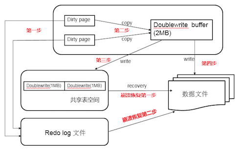

> 查看命令： `show global status like 'innodb_dblwr%'\G`

#### 3. 崩溃恢复

在恢复过程中，innodb 存储引擎可以从共享表空间的 doublewrite 中找到该页的一个最近的副本，将其复制到表空间文件，再应用 redo log，就完成了恢复过程

>  因为有副本所以也不担心表空间中数据页是否损坏

### 3. 自适应哈希索引

> InnoDB 存储引擎会监控对表上各索引页的查询
>
> 参数 `innodb_adaptive_hash_index` 可以禁止和启动此特性

- 如果观察到哈希索引可以提升速度，则建立哈希索引，称之为自适应哈希索引(Adaptive Hash Index, AHI)

- **AHI 是通过缓冲池的B+树页构造而**来，因此建立的速度非常快，且不要对整张表构建哈希索引

- InnoDB 存储引擎会**自动根据访问的频率和模式来自动的为某些热点页建立哈希索引**

- AHI 有一个要求，即**对这个页的连续访问模式(查询条件)必须一样**

  > 交替进行上述两张查询，InnoDB 存储引擎不会对该页构造 AHI

**AHI 还有如下要求**：

- 以该模式访问了100次
- 页通过该模式访问了N次，其中N=页中记录 / 16

> 根据官方文档显示，启用AHI后：
>
> - 读取和写入的速度可以提高2倍
> - 负责索引的链接操作性能可以提高5倍
> - 其设计思想是数据库自由化的，无需 DBA 对数据库进行人为调整

### 4. 异步IO

>  为了提高磁盘操作性能，当前的数据库系统都采用异步IO的方式来处理磁盘操作

- `Sync IO`： 每进行一次IO操作，需要等待此次操作结束才能继续接下来的操作

- `AIO`： 在发出一个IO请求后立即再发出另外一个IO请求，当全部IO请求发送完毕后，等待所有IO操作完成

  > 在InnoDB存储引擎中，read ahead 方式的读取都是通过AIO完成，脏页的刷新，也是通过AIO完成

实现：

- 在InnoDB 1.1.x之前，AIO 的实现是**通过InnoDB存储引擎中的代码来模拟的**

- 从这之后，提供了**内核级别的AIO的支持**，称为 `Native AIO`

  >  Native AIO需要操作系统提供支持；Windows和Linux都支持，而**Mac则未提供**

> 参数 `innodb_use_native_aio`决定是否启用 Native AIO

### 5. 刷新邻接页

**InnoDB 存储引擎在刷新一个脏页时，会检测该页所在区)的所有页，如果是脏页，那么一起刷新**

>  **好处**： 通过AIO可以将多个IO写操作合并为一个IO操作，该工作机制在传统机械磁盘下有显著优势

需要考虑两个问题:

- 是不是将不怎么脏的页进行了写入，而该页之后又会很快变成脏页？
- 固态硬盘有很高IOPS，是否还需要这个特性？

> 参数 `innodb_flush_neighbors` 决定是否启用
>
> 对于传统机械硬盘建议使用，而对于固态硬盘可以关闭

# 三、文件

## 1. 参数文件

> 查看数据库中的参数：
>
>  `show variables like 'innodb_buffer%'\G` 
>
> 或 
>
> `select * from globle_variables where variable_name like 'innodb_buffer%'\G`

参数分为两类：

- **动态参数**：可以在 mysql 实例运行中进行更

  > 通过  set 命令对动态参数值进行修改：
  >
  > ```mysql
  > set
  > | [global1 | session] system_var_name = expr
  > | [@@global. | @@session. | @@] system_var_name = expr
  > ```

- **静态参数**： 在整个实例生命周期中不得修改

## 2. 日志文件

> 日志可以帮助我们定位 mysqld 内部发生的事件，数据库性能故障，记录数据变更历史，用户恢复数据库等

### 1. 错误日志

> 查看命令： `show variables like 'log_error;'`

- 在对应的数据目录中，以**主机名+.err**命名的文件，错误日志记录的信息类型：
  - 记录了服务器运行中产生的错误信息
  - 记录了服务在启动和停止是所产生的信息
  - 在从服务器上如果启动了复制进程的时候，复制进程的信息也会被记录
  - 记录event错误日志
- `flush logs` 命令可以将错误日志中的内容做备份并重新开始记录，备份文件名以 `.old` 结尾

配置mysql的主配置文件：

```mysql
# 指定错误日志的位置，默认是在数据目录下，这个位置mysql用户必须有写权限
log_error = /mydata/data/mysql.test.com.err 
# 默认开启，服务器运行中的警告日志也会记录在错误日志中
log_warning = {0|1} 
```

### 2. 慢查询日志

> - 查看默认阙值时间命令： `show variables like 'long_query_time\G;'`
> - 查看是否开启慢查询（默认关闭）命令： `show variables like 'show_query_log\G;'`
> - 开启慢查询日志命令： `set global show_query_log='ON';`
> - 查看日志存放位置命令： `show variables like 'slow_query_log_file'\G;`
> - 查看慢查询日志的默认存储方式命令： `show variables like 'log_output'\G;`
> - 改变慢查询日志的存储方式为 TABLE 命令： `set global log_output='TABLE';`
> - 查看 mysql 日志命令： `mysqldumpslow xxx.log`

- 用来记录在 MySQL 中响应时间超过阀值(long_query_time，默认为 10s)的语句，则会被记录到慢查询日志文件中，默认为关闭状态
- 从 mysql5.1 开始，long_query_time 开始以**微秒**记录运行时间
- 参数 `long_query_io` 将超过制定逻辑 IO 次数的 SQL 语句记录到 slow log 中，默认为 100；参数 `slow_query_type` 用来表示启用 slow log 的方式：
  - 0 表示不将 SQL 语句记录到 slow log
  - 1 表示根据运行时间将 SQL 语句记录到 slow log
  - 2 表示根据逻辑 IO 次数将 SQL 语句记录到 slow log
  - 3 表示根据运行时间及逻辑 IO 次数将 SQL 语句记录到 slow log

```mysql
slow_query_log  = {ON | OFF} #是否开启慢慢查询日志，默认是关闭的 
slow_query_log_file = /mydata/data/mysql-slow.log #慢查询日志的存放位置，默认在数据目录下
log_query_time = 10 #定义默认的时长，默认时长为10秒
log_query_not_using_indexes = {ON|OFF} #设定是否将没有使用索引的查询操作记录到慢查询日志 
log_output = {TABLE|FILE|NONE} #定义一般查询日志和慢查询日志的保存方式，可以是TABLE、FILE、NONE，也可以是TABLE及FILE的组合(用逗号隔开)，默认为FILE。如果组合中出现了NONE，那么其它设定都将失效，同时，无论是否启用日志功能，也不会记录任何相
```

### 3. 查询日志

- 查询日志记录 MySQL 中所有的 query 查询记录，无论是否正确执行；默认文件名： **主机名.log**
- mysql 5.1 开始将查询日志记录放入到 mysql 架构下的 general_log 表中

```mysql
log = {ON|OFF} #是否启用查询日志，该指令在mysq5.6中已废弃
general_log = {ON|OFF} #启动或关闭查询日志，默认是关闭的
general_log_file = /mydata/data/mysql.log #指定查询日志的位置，默认在数据目录下
log_output = {TABLE|FILE|NONE} #指定存放查询日志的位置，可以放在文件中，也可以放在数据库的表中，放在表中
```

### 4. 二进制日志

> - 查看 log_bin 状态命令： `show variables like 'log_bin%';`
>
> - 启用二进制日志功能并给二进制文件命名： `log-bin="filename-bin"`
>
> - 设定二进制文件上限命令： `max_binlog_size={4096..1073741824};`
>
>   > 单位为字节，最小为 4K ，最大为 1G ，默认为 1G
>
> - 查看所有二进制文件： `show binary logs;`
>
> - 查看当前正在使用的二进制文件： `show master status;`

- 精确的记录了对 MySQL 数据库**执行更改的所有操作**   
- 通过参数 `log-bin[=name]` 启动二进制日志，**默认为主机名，后缀为二进制日志的序列号，所在路径为数据库所在目录(datadir)**

- 配置参数：

  - `max_binlog_size`： 指定单个二进制文件的最大值，若超过该值，则产生新的二进制文件，后缀名 +1，并记录到 .index 文件(默认为 1G)

  - `binlog_cache_size `：当使用事务的表存储引擎时，所有未提交的二进制日志会被记录到缓存中，等待事务提交时直接将缓存中的二进制日志写入二进制日志文件，缓存大小由 `binlog_cache_size` 决定（默认为 32K）

    > binlog_cache_size 是基于会话的，线程开始一个事务时会自动分配一个

  - `sync_binlog`： 表示每写缓存 sync_binlog 次就同步到磁盘，默认为 0

  - `binlog-do-db` 与 `binlog-ignore-db`： 表示需要写入或忽略写入哪些库的日志；默认为空，表示需要同步所有库的日志到二进制日志

  - `log-slave-update`： 如果当前数据库是复制中的 slave 角色，则它不会从 master 取得并执行的二进制写入自己的二进制文件中；若需要写入，要设置 `log-slave-update`

  - `binlog_format`： 影响记录二进制日志的格式

    > - 设置 binlog_format 命令： `set @@session.binlog_format='ROW | STATEMENT;'`
    > - 查询 binlog_format  命令： `select @@session.binlog_format;`

    参数值有：

    - `STATEMENT`： 二进制日志文件记录的是日志的逻辑 SQL 语句
    - `ROW`： 记录的表的更改情况；若设置为 ROW，则可以将 InnoDB 的事务隔离级别设为 READ COMMITTED
    - `MIXED`： 默认采用 STATEMENT 记录二进制文件，但以下情况会采用 ROW 格式：
      - 表的存储引擎为 NDB，这时对表的 DML 操作采用 ROW
      - 使用了 UUID(), USER(), CURRENT_USER(), FOUND_ROWS(), ROW_COUNT() 等不确定函数
      - 使用了 INSERT DELAY 语句
      - 使用了用户定义函数（UDF）
      - 使用了临时表(temporary table)

- 二进制日志文件的作用：

  - **恢复**： 提供了数据基于时间点的恢复，恢复的时间点可以由用户控制
  - **复制**： 提供了增量备份的功能，为mysql的复制架构提供基础，将这主服务器的二进制日志复制到从服务器上并执行同样的操作，就可将数据进行同步
  - **审计**： 可以通过二进制日志中的信息来进行审计，判断是否有对数据库进行注入攻击

- 二进制日志事件：
  - position 基于位置
  - datetime 基于时间

二进制日志的查看与删除方式：

```mysql
mysql>show master status; # 查看当前正在使用的二进制日志 
mysql>show binlog events in 'mysql-bin.000001'; # 查看二进制日志记录的事件[from position]  
mysql>flush logs; # 二进制日志滚动  
mysql>show binary logs; # 查看所有二进制日志  
mysql>purge binary logs to 'mysql-bin.000003'; # 删除二进制日志
```

文件系统中查看二进制日志的命令：

```mysql
mysqlbinlog
相关选项， 
--start-position #开始位置  
--stop-position #结束位置  
--start-datetime 'yyyy-mm-dd hh:mm:ss'; #开始时间  
--stop-datetime ''; #结束时间
```

配置mysql的主配置文件：  

```mysql
sql_log_bin = {ON|OFF} #用于控制二进制日志信息是否记录进日志文件。默认为ON，表示启用记录功能。用户可以在会话级别修改此变量的值，但其必须具有SUPER权限
binlog_cache_size = 32768 #默认值32768 Binlog Cache 用于在打开了二进制日志（binlog）记录功能的环境，是 MySQL 用来提高binlog的记录效率而设计的一个用于短时间内临时缓存binlog数据的内存区域。一般来说，如果我们的数据库中没有什么大事务，写入也不是特别频繁，2MB～4MB是一个合适的选择。但是如果我们的数据库大事务较多，写入量比较大，可与适当调高binlog_cache_size。同时，我们可以通过binlog_cache_use 以及 binlog_cache_disk_use来分析设置的binlog_cache_size是否足够，是否有大量的binlog_cache由于内存大小不够而使用临时文件（binlog_cache_disk_use）来缓存了 
binlog_stmt_cache_size = 32768 #当非事务语句使用二进制日志缓存，但是超出binlog_stmt_cache_size时，使用一个临时文件来存放这些语句  
log_bin = mysql-bin #指定binlog的位置，默认在数据目录下
binlog-format = {ROW|STATEMENT|MIXED} #指定二进制日志的类型，默认为MIXED。如果设定了二进制日志的格式，却没有启用二进制日志，则MySQL启动时会产生警告日志信息并记录于错误日志中。 
sync_binlog = 10 #设定多久同步一次二进制日志至磁盘文件中，0表示不同步，任何正数值都表示对二进制每多少次写操作之后同步一次。当autocommit的值为1时，每条语句的执行都会引起二进制日志同步，否则，每个事务的提交会引起二进制日志同步  
max_binlog_cache_size = {4096 .. 18446744073709547520} #二进定日志缓存空间大小，5.5.9及以后的版本仅应用于事务缓存，其上限由max_binlog_stmt_cache_size决定。  
max_binlog_stmt_cache_size = {4096 .. 18446744073709547520} #二进定日志缓存空间大小，5.5.9及以后的版本仅应用于事务缓存  
expire_log_days = {0..99} #设定二进制日志的过期天数，超出此天数的二进制日志文件将被自动删除。默认为0，表示不启用过期自动删除功能。如果启用此功能，自动删除工作通常发生在MySQL启动时或FLUSH日志时
```

注：一般建议将binlog日志与数据文件分开存放，不但可以提高mysql性能，还可以增加安全性！

## 3. 套接字文件

> 查看命令： `show variables like 'socket'\G`

当用 Unix 域套接字方式进行连接时需要的文件

## 4. pid 文件

> 查看命令：`show variables like 'pid_file'\G`

- 当 MySQL 实例启动时，会将自己的进程 ID 写入到一个 pid 文件中

- 该文件由参数 `pid_file` 控制，默认位于数据库目录下，文件名： **主机名.pid**

## 5. 表结构定义文件

- MySQL 有后缀名为 `frm` 的文件，用于记录表的表结构定义
- `frm` 还用来存放视图的定义

## 6. InnoDB 存储引擎文件

### 1. 表空间文件

- InnoDB 将存储的数据按表空间进行存放，默认有初始大小为 10M 的名为 ibdata1 的文件

- ibdata1 文件就是默认的表空间文件，且该文件可自动增长

  参数 `innodb_data_file_path` 可进行设置：

  > innodb_data_file_path = datafile_spec1[;datafile_spec2...]
  >
  > 设置该参数后，所有基于 InnoDB 的表的数据都会记录到该共享表空间中

- `innnodb_file_per_table`： 可使每个基于 InnoDB 存储引擎的表产生独立表空间，命名为： **表名.idb**

  > 单独表空间仅存放表的数据、索引、插入缓冲 BITMAP 等信息，其余信息还存放在默认的表空间

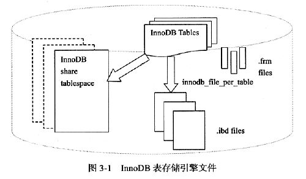

### 2. 重做日志文件

> 查看重做日志组命令： `show variables like 'innodb%log%'\G`

- 重做日志文件： 默认在 InnoDB 数据目录下有名为 `ib_logfile0,ib_logfile1` 文件，记录了对于 InnoDB 的事务日志，用于当实例或介质失败时的恢复

- 用户可以设置多个镜像日志组，将不同的文件组放在不同的磁盘上，以提高重做日志的高可用性

- 日志组中的重做日志文件大小一致，并以循环写入方式运行

  

- 日志文件的参数属性：

  - `innodb_log_file_size`： 指定每个重做日志文件的大小
  - `innodb_log_files_in_group`： 指定日志文件组中方重做日志文件的数量，默认为 2
  - `innodb_mirrored_log_groups`： 指定了日志镜像文件组的数量，默认为 1（表示只有一个日志文件组，没有镜像）
  - `innodb_log_group_home_dir`： 指定了日志文件组所在路径，默认为 `./`(表示在MySQL 数据目录下)

- 重做日志条目结构：

  - `redo_log_type`： 表示重做日志类型，占用 1 字节
  - `space`： 表示表空间 ID，但采用压缩方式
  - `page_no`： 表示页的偏移量，也采用压缩方式
  - `redo_log_body`： 表示每个重做日志的数据部分，恢复时需要调用相应函数进行解析

  

- 参数 `innodb_flush_log_at_trx_commit`： 触发写磁盘的过程，表示在提交操作时，处理重做日志（另一个写磁盘是 master thread 每秒会将重做日志写入磁盘的重做日志文件中）

  有效值：

  - 0 代表当前提交事务时，并不将事务的重做日志写入磁盘上的日志文件，而是**等待主线程每秒的刷新**
  - 1 表示在执行 commit 时，将重做日志缓冲**同步写到磁盘**，即伴有 fsync 调用
  - 2 表示将重做日志**异步写到磁盘**，即写到文件系统的缓存中

**与二进制日志的区别**：

- 二进制日志记录所有与 MySQL 数据库有关的日志记录，如：InnoDB, MyISAM, Heap 等；而 InnoDB 重做日志只记录其本身的事务日志
- 二进制日志记录关于一个事务的具体操作内容，即为逻辑日志；而 InnoDB 重做日志记录关于每个页的更改物理情况
- 二进制日志文件仅在事务提交前进行提交，即只写磁盘一次；而在事务进行时，不断有重做日志条目被写入到重做日志文件中

# 四、表

## 1. 索引组织表

- **索引组织表(IOT)**： 在InnoDB存储引擎中，**表根据主键顺序组织存放**

- 在InnoDB存储引擎中，每张表都有个主键(Primary key)，如果在创建表时没有地定义主键，则InnoDB存储引擎会选择表中符合条件的列去**创建主键**：

  -  首先判断表中是否有**非空的唯一索引**（Unique NOT NULL），如果有，则该列即为主键

    > 当表中存在多个非空的唯一索引的时候，InnoDB 存储引擎会根据建表时所创建的**第一个非空唯一索引作为主键**

  - 如果不符合上述条件，InnoDB存储引擎**自动创建一个6字节大小的指针**

- **主键**： 唯一标识表中的每行的字段，目的在于索引

## 2. InnoDB 逻辑存储结构

- **表空间**： 所有数据都被逻辑地存放在一个空间内，由段、区、页（块）组成


### 1. 表空间

> 可参看 三.6.1 表空间文件

- **独立表空间**：仅存放表的数据、索引、插入缓冲 BITMAP 等信息，其余信息还存放在默认的表空间
- **共享表空间**： 所有基于 InnoDB 的表的数据都会记录到该共享表空间中

### 2. 段

- 表空间是由各个段组成的，常见的段有**数据段、索引段、回滚段**等

- InnoDB 存储引擎是索引组织，因此数据即索引，索引即数据

- 则数据段即为B+树段叶子节点（Leaf node segment），索引段即为B+树段非索引节点(Non-leaf node segment)

### 3. 区

- 区是由连续的页（Page）组成的空间，在任何情况下每个区**大小都为 1MB**，为了保证页的连续性，InnoDB 存储引擎每次从磁盘一次申请4-5个区

  > 默认情况下，InnoDB存储引擎的**页大小为16KB**，即一个区中有64个连续的页

- InnoDB1.0.x版本开始引入**压缩页**，每个页的大小可以通过参数KEY_BLOCK_SIZE设置为2K、4K、8K，因此每个区对应的页尾512、256、128

- InnpDB1.2.x版本新增了参数 `innodb_page_size`，通过该参数可以**将默认页的大小设置为4K、8K**，但是页中的数据不是压缩的

### 4. 页

- **页是InnoDB存储引擎磁盘管理的最小单**位，每个页默认**16KB**

- InnoDB存储引擎从1.2.x版本开始，可以通过参数 `innodb_page_size` 将页的大小设置为4K、8K、16K

  > 若设置完成，则所有表中页的大小都为innodb_page_size，不可以再次对其进行修改，除非通过 mysqldump 导入和导出操作来产生新的库

InnoDB存储引擎中，常见的页类型有：

- 数据页（B-tree Node)

- undo页（undo Log Page）

- 系统页 （System Page）

- 事物数据页 （Transaction System Page）

- 插入缓冲位图页（Insert Buffer Bitmap）

- 插入缓冲空闲列表页（Insert Buffer Free List）

- 未压缩的二进制大对象页（Uncompressed BLOB Page）

- 压缩的二进制大对象页 （compressed BLOB Page）

### 5. 行

InnoDB存储引擎是面向列的（row-oriented)，也就是说数据是按行进行存放的，每个页存放的行记录也是有硬性定义的，最多允许存放16KB/2-200，即7992行记录

## 3. InnoDB 行记录格式

###1. 简介


- `Antelope`：先前未命名的，**原始的InnoDB文件格式：COMPACT 和 REDUNDANT**

  > MySQL5.6的默认文件格式，可以与早期的版本保持最大的兼容性，不支持 Barracuda 文件格式

- `Barracuda`： 新的文件格式，**支持InnoDB的所有行格式**，包括：COMPRESSED 和 DYNAMIC

  > 新的行格式功能：InnoDB表的压缩，长列数据的页外存储和索引建前缀最大长度为3072字节

**在 msyql 5.7.9 及以后版本**：

- 行格式由 `innodb_default_row_format` 变量决定，默认值是`DYNAMIC`

  > 可以在 create table 的时候指定 `ROW_FORMAT=DYNAMIC`

- 查看当前表使用的行格式命令： `SHOW TABLE STATUS LIKE'table_name'` 

  > `row_format` 列表示当前所使用的行记录结构类型

**修改现有表的行模式为`compressed`或`dynamic`：**

- **先将文件格式设置成Barracuda**：`set global innodb_file_format=Barracuda;`
- **再修改**： `ALTER TABLE [tablename] ROW_FORMAT=COMPRESSED;` 

**InnoDB行存储简介**：

- InnoDB表的数据存储在页（page）中，每个页可以存放多条记录，这些**页以树形结构组织**，这颗树称为**B树索引**

- 表中数据和辅助索引都是使用B树结构，维护表中所有数据的这颗B树索引称为**聚簇索引，通过主键来组织**

- **聚簇索引的叶子节点包含行中所有字段的值，辅助索引的叶子节点包含索引列和主键列**

  > **变长字段是个例外**，例如：`BLOB, VARCHAR`
  >
  > - 当页不能完全容纳此列的数据时，会将此列的数据存放在称为**溢出页(overflow page)的单独磁盘页上**，称这些列为**页外列(off-page column)**
  >
  > - 这些列的**值存储在以单链表形式存在的溢出页列表中，每个列都有自己溢出页列表**
  >
  > - 某些情况下，**为了避免浪费存储空间和消除读取分隔页，列的所有或前缀数据会存储在B+树索引中**

### 2. Compact 与 Redundant 行记录格式

#### 1. Compact 

**目的**：为了高效的存储数据

> 简单的说：**一个页（Page）存放的行数据越多，这样性能就越高**

行记录格式如下：


- **变长字段长度列表**：**按列的逆序放置**

  >  长度规则：
  >
  > - 若列的长度**小于** 255 字节，则用 1 字节表示
  > - 若列的长度**大于** 255 字节，则用 2 字节表示
  >
  > **变长字段长度最大不超过2字节**（MySQL数据库varcahr类型的最大长度限制为65535）

- **NULL标识位**：该位指示了该行数据中**是否有NULL值，有则为 1**

- **记录头信息**：固定占用 5 字节（40位）

  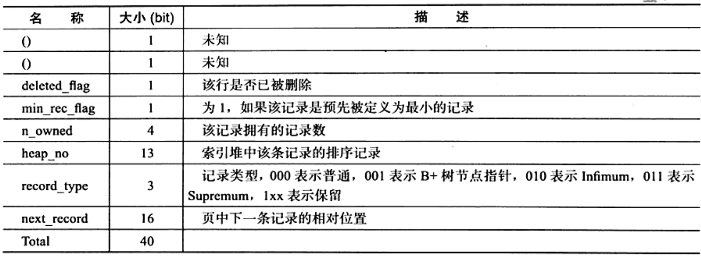

-  **列 N 数据**：实际存储每列的数据，**NULL 不占该部分存储空间**

####2. Redundant 


-  **字段偏移列表**：按照列的顺序逆序放置的

  > 若列的长度小于255字节，用1字节表示；若大于255字节，用2字节表示

- **记录头信息**：占用6字节（48位）

  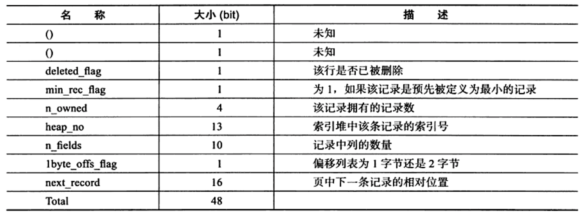

### 3. 行溢出数据

- 当行记录的长度没有超过行记录最大长度时，所有数据都会存储在当前页

- 当行记录的长度超过行记录最大长度时，变长列（`variable-length column`）会选择外部溢出页（`overflow page`，一般是`Uncompressed BLOB Page`）进行存储

> `Compact + Redundant`：保留前 768Byte 在当前页（B+Tree叶子节点），其余数据存放在溢出页，768Byte后面跟着20Byte的数据，用来存储指向溢出页的指针


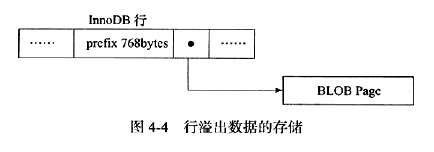

**VARCHAR(N)**： 其中的 N 是指字符的长度，最大支持 65535 字节；其中 65535 是指所有 VARCHAR 列的长度总和

### 4. Compressed和Dynamic行记录格式

- InnoDB1.0x 引入新的文件格式 `Barracuda`，新的格式拥有两种新的行记录格式：`Compressed, Dynamic` 

- 新的两种记录格式对于存放BLOB中的数据采用了完全的行溢出的方式

- 数据页中只存放 20 个字节的指针，实际的数据都存放在 Off Page 中

  

- **Dynamic 行格式**：列存储是否放到off-page页，主要取决于行大小，他会把行中最长的一列放到off-page，直到数据页能存放下两行

- **Compressed行记录格式**： 物理结构上与Dynamic类似，其另一个功能就是存储在其中的行数据会以zlib的算法进行压缩，因此对于BLOB、TEXT、VARCHAR这类大长度数据能够进行有效的存储（减少40%，但对CPU要求更高）

### 5. CHAR行结构存储

- **VARCHAR 是存储变长长度**的字符类型，**CHAR 是存储固定长度**的字符类型

- CHAR(N) 中的 **N 是指字符长度**，即不同字符集下，CHAR 类型存储的数据可能字节长度不等

- **在多字节字符集情况下，CHAR 和 VARCHAR 的实际存储没有区别**

## 4. InnoDB 数据页结构

> - 页是 InnoDB 存储引擎管理数据库的最小磁盘单位
>
> - 类型为 B-tree Node 的页存放的是表中行的实际数据


InnoDB 数据页由 7 个部分组成：

- **File Header(文件头，固定为38字节)**： 记录页的头信息

  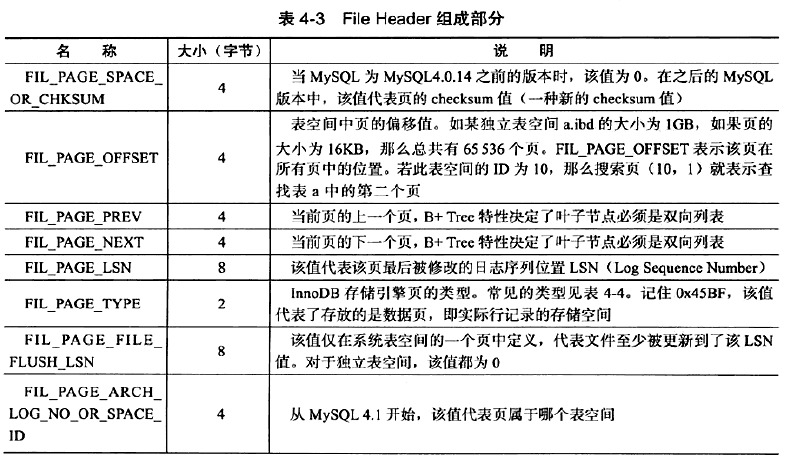

  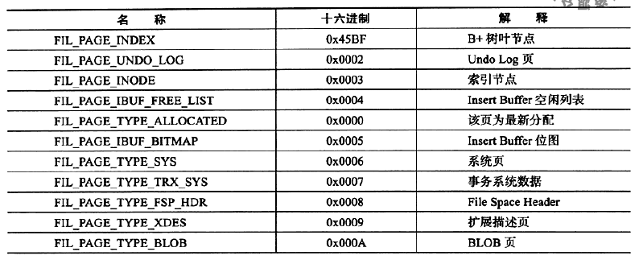

- **Page Header（页头，固定为56字节）**： 记录数据页的状态信息

  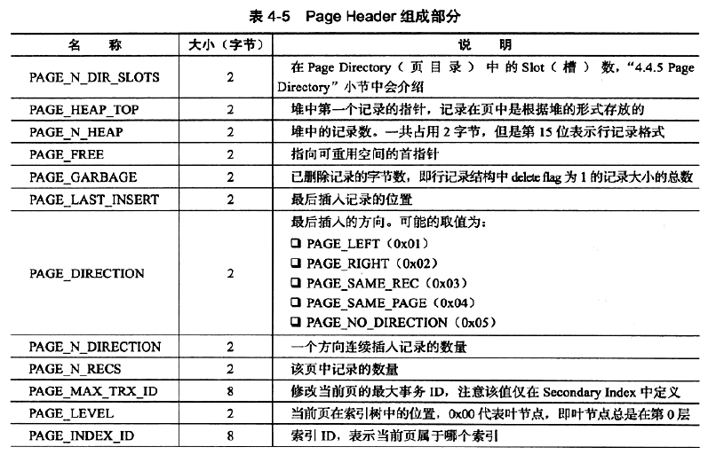

  

- **Infimun 和 Supremum Records**： 每个数据页中有两个虚拟的行记录，**用来限定记录的边界**

  > - `Infimun` 记录是比该页中任何主键值**都小**的值
  > - `Supremum` 指比任何可能大的值还**要大**的值
  >
  > 这两个值**在页被创建时被建立，且不会被删除**

  

- **User Records(用户记录，即行记录)**： 实际存储行记录的内容

- **Free Space（空闲空间）**： 是一个空闲链表数据结构，在一条记录被删除后，该空间被加入到空闲链表中

- Page Directory（页目录）： 存放记录的相对位置（页的相对位置），记录指针称为 Slots(槽) 或 Directory Slots(目录槽)

- File Trailer（文件结尾信息，固定为8字节）： 检测页是否已经完整写入磁盘

  > 前 4 字节代表该页的  checksum 值，后 4 字节代表该页最后被修改的日志序列位置 LSN（同 File Header 的 FIL_PAGE_LSN）

## 5. Named File Formats机制

> **Named File Formats机制用来解决不同版本下页结构兼容性问题**

## 6. 约束

### 1. 数据完整性

> **关系型数据库与文件系统的不同点**： 
>
> - 关系型数据库本身能保证存储数据的完整性，不需要应用程序的控制
> - 文件系统需要在程序端进行控制

数据完整性的三种形式：

- **实体完整性**： **保证表中有一个主键**

  > - 用户可以定义 `Primary Key` 和 `Unique Key` 约束来保证实体完整性
  > - 用户来可编写触发器来保证

- **域完整性**： **保证数据每列的值满足特定条件**

  - 选择合适的数据类型确保一个数据值满足特定条件
  - 外键约束
  - 编写触发器
  - 可用 `DEFAULT` 约束作为强制域完整性

- **参照完整性： 保证两张表间的关系**

  > - 用户可定义外键以强制参照完整性
  >
  > - 也可定义触发器以强制执行

**约束分类**：`Primary Key, Unique Key, Foreign Key, Default, NOT NULL`

### 2. 约束的创建和查找

**约束创建的方式**：

- 表建立时进行约束定义
- 利用 `ALTER TABLE` 命令进行约束创建

> 对于 Unique Key(唯一约束)的约束，还可通过命令 `CREATE UNIQUE INDEX` 来创建

**约束名**：

- 对于主键约束，其默认约束名为 `PRIMARY KEY`
- 对于 Unique Key 约束，默认约束名誉列名相同，当然也可人为指定

### 3. 约束和索引的区别

- **约束是一个逻辑概念，用来保证数据的完整性**
- **索引是一个数据结构，即有逻辑概念，还在数据库中代表物理存储方式**

### 4. 对错误数据的约束

**默认设置下，MySQL 数据库允许非法或不正确的数据的插入或更新，又或者可以在数据库内部将其转化为合法的值，即数据库本身没有对数据的正确性进行约束**

> 如： 向 NOT NULL 字段插入 NULL 值时，会将其改为 0 再进行插入

### 5. ENUM 和 SET 约束

MySQL 通过 ENUM 和 SET 来解决部分 CHECK 约束

### 6. 触发器与约束

- 触发器作用： 在执行 `INSERT, DELETE, UPDATE` 命令之前或之后自动调用 SQL 命令或存储过程

- 具有 Super 权限的用户可以**执行创建触发器命令： `CREATE TRIGGER`**

  ```mysql
  CREATE [DEFINER = {USER | CURRENT_USER}]
  TRIGGER trigger_name BEFORE|AFTER   INSERT|UPDATE|DELETE
  ON tb1_name FOR EACH ROW trigger_stmt
  ```

  > - 一个表最多创建 6 个触发器，即 INSERT、UPDATE、DELETE 的 BEFORE、AFTER 各一个
  > - BEFORE、AFTER  代表触发器发生的时间，之前还是之后发生
  > - 只支持 FOR EACH ROW 的触发方式，即**按每行记录进行触发**

### 7. 外键约束

- 外键用来保证参照完整性

- 外键定义如下：

  ```mysql
  [CONSTRAINT [symbol]] FOREIGN KEY
  [index_name](index_col_name,...)
  REFERENCES tb1_name(index_col_name,...)
  [ON DELETE reference_option]
  [ON UPDATE reference_option]
  reference_option: RESTRICT | CASCADE | SET NULL | NO ACTION
  ```

- 子表操作：

  - `CASCADE`： 表示当父表发生 DELETE 或 UPDATE 操作时，相应的子表中的数据也进行 DELETE 或 UPDATE 操作
  - `SET NULL`： 表示当父表发生 DELETE 或 UPDATE 操作时，相应的子表中的数据更新为 NULL 值，但对应的列必须允许为 NULL
  - `NO ACTION`： 表示当父表发生 DELETE 或 UPDATE 操作时，抛出错误，不允许这类操作发生
  - `RESTRICT`： 没有指定  ON DELETE 或 ON UPDATE时，默认外键设置为 RESTRICT

## 7. 视图

- 视图是一个命名的虚表，由一个 SQL 查询来定义，可以当作表使用
- 视图中的数据没有实际的物理存储

## 8.分区表

### 1. 概述

> 查看分区是否启用命令： `show variables like '%partition%'\G` 或 `show plugins\G`

- 分区的过程是将一个表或索引分解为更小、更可管理的部分

- 每个分区都是独立的对象，可以独自处理，也可以作为更大对象的一部分处理

- MySQL 支持水平分区，且是局部分区索引

  > 分区类型：
  >
  > - **水平分区**： 指将同一表中**不同行**的记录分配到不同的物理文件中
  > - **垂直分区**： 指将同一表中**不同列**的记录分配到不同的物理文件中
  >
  > 分区索引：
  >
  > - **局部分区索引**： 一个分区中**既存放数据又存放索引**
  > - **全局分区索引**： **数据存放在各个分区中，但所有数据的索引放在一个对象中**

- MySQL 支持的**分区类型**：

  - **RANGE 分区**： 行数据基于属于一个给定连续区间的列值被放入分区

    > - 启用分区之后，表不再由一个ibd文件组成了，而是由建立分区时的各个分区ibd文件组成
    > - 对于RANGE分区的查询，优化器只能对 `YEAR()、TO_DAYS()、TO_SECONDS()、UNIX_TIMESTAMP()` 这类函数进行优化选择

  - **LIST 分区**： 同 RANGE 分区，只是 LIST 分区面向离散值

  - **HASH 分区**： 根据用户自定义的表达式的返回值来进行分区，返回值不能为负数

  - **KEY 分区**： 根据 MySQL 数据库提供的 hash 函数来进行分区

  - **COLUMNS分区**： 可以直接使用非整型的数据进行分区，分区根据类型直接比较而得，不需要转化为整型，且RANGE COLUMNS分区可以对多个列的值进行分区

    > **支持的数据类型**：
    >
    > - **所有的整型类型**，如INT、SMALLINT、TINYINT、BIGINT。FLOAT和DECIMAL则不予支持
    >
    > - **日期类型**，如DATE和DATETIME(其余的日期类型不予支持)
    >
    > - **字符串类型**，如CHAR、VARCHAR、BINARY和VARBINARY(BLOB和TEXT类型不予支持)

  > 注： **若表中存在主键或唯一索引，分区列必须是唯一索引的一部分**

### 2. 子分区

- **在分区的基础上再进行分区，也称复合分区**

- MySQL数据库允许在RANGE和LIST的分区上再进行HASH或者是KEY的子分区

子分区的建立需要**注意的问题**：

- **每个子分区的数量必须相同**

- 如果在一个分区表上的任何分区上使用SUBPARTITION来明确定义任何子分区，那么就必须定义所有的子分区
- **每个 SUBPARTITION 子句必须包括子分区的一个名称**
- 在每个分区内，**子分区的名称必须是唯一的**

> 子分区可以用于特别大的表，在多个磁盘间分别分配数据和索引

### 3. 分区中的NULL值

MYSQL数据库的分区总是**把NULL值视为小于任何一个非NULL值**，即对于不同的分区类型，MySQL数据库对于NULL值的处理是不一样的

- **RANGE分区**，如果对于分区列插入了NULL值，则MySQL数据库会将**该值放入最左边的分区**
- **LIST分区**下要使用NULL值，则必须**显式地指出哪个分区中放入NULL值，否则会报错**
- **HASH 和 KEY 分区**使用NULL时，任何分区函数都会**将含有NULL值的记录返回为 0**

### 4. 分区和性能

数据库的应用分为两类：

- 一类是**OLTP（在线事务处理）**，如博客、电子商务、网络游戏等

  > **对于OLAP的应用，分区的确可以很好地提高查询的性能**，因为OLAP应用的大多数查询需要频繁地扫描一张很大的表

- 一类是**OLAP（在线分析处理）**，如数据仓库、数据集市

  > **对于OLTP的应用，分区应该非常小心**；在这种应用下，不可能会获取一张大表中10%的数据，大部分都是通过索引返回几条记录即可

# 五、索引与算法

## 1. InnoDB 索引概述

- **B+ 数索引**： 是关系型数据库中查找最为常用和最为有效的索引

  > B+ 树索引只是查找数据行所在的页，然后数据库通过把页读入内存，再在内存中进行查找

- **全文索引**

- **hash 索引**： InnoDB 支持的hash 索引是自适应的，会根据表的使用情况自动为表生成hash索引

## 2. B+ 树

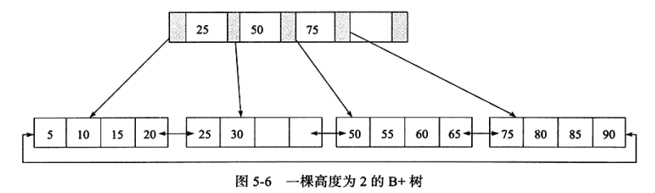

- **为磁盘**或其他存取辅助设备设计的一种平衡查找树

- 所有记录点**按大小顺序存放（逻辑的连续）**在同一层的叶子节点上(页为单位)

- **各叶子节点由指针进行连接**，是一个双向循环链表

> 数据库中，B+ 树的高度一般为 2-3 层，即最多进行 2-3 次磁盘 IO 操作


## 3. B+ 树索引

> 数据库中B+树索引分为聚集索引和非聚集索引
>
> - **共同点**是内部都是B+树，高度都是平衡的，**叶节点存放着所有数据**
>
> - **不同点**是叶节点是否存放着一整行数据

### 1. 聚集索引

- Innodb存储引擎表是索引组织表，即**表中数据按主键顺序存放**

- 聚集索引就是**按每张表的主键构造一颗B+树**，并且叶节点存放整张表的行记录数据，**叶子节点称为数据页**，每张表只能有一个聚集索引（一个主键）

  > 因为B+ 树索引只是查找数据行所在的页，而页中存储着所有的数据，所以这里称叶子节点为数据页

- 索引组织表中数据也是索引的一部分，同B+树数据结构一样，每个数据页通过**双向链表来进行链接**，页是按照主键的顺序排序；每个页中的记录也是通过**双向链表进行维护**的，**物理存储上可以同样不按照主键存储**

- 聚集索引的存储并不是物理上连续的，而是逻辑上连续的

> - 聚集索引能够特别快的访问针对范围值的查询
>
> - 聚集索引对于主键的排序查找和范围的速度非常快

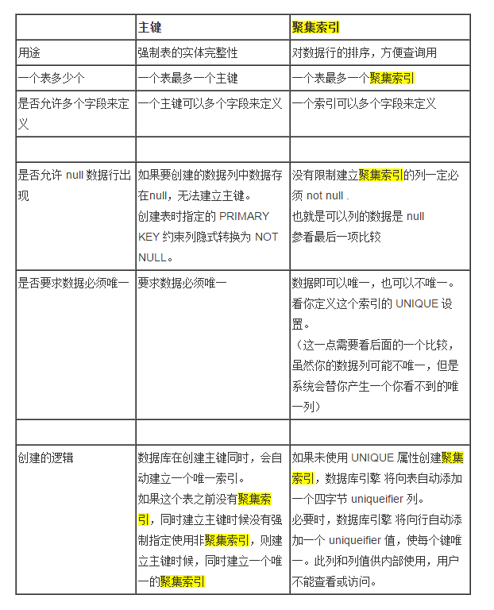

### 2. 辅助索引(聚集索引)

- **叶子节点并不包含行记录的全部数据**

- 叶子节点除了包含键值外，每个叶子节点中的索引行中还**包含一个书签，该书签用来告诉 innodb 存储引擎哪里可以找到与索引相对于的行数据**

- 辅助索引的存在并**不影响数据在聚集索引中的组织**，因此每张表上**可以有多个辅助索引**

- 当通过辅助索引寻找数据时，innodb 存储引擎会**遍历辅助索引**并通过页级别的指针**获得指向主键索引的主键**，然后再**通过主键索引来找到一个完整的行记录**


###3. B+树索引的管理

**创建索引**：

1. 通过 `ALTER TABLE`

   ```mysql
   ALTER [ONLINE | OFFLINE] [IGNORE] TABLE tbl_name| ADD {INDEX|KEY} [index_name]   [index_type] (index_col_name,...) [index_option]
   ```

2. 通过 `CREATE`

   ```mysql
   CREATE [ONLINE|OFFLINE] [UNIQUE|FULLTEXT|SPATIAL] INDEX index_name [index_type] ON tbl_name (index_col_name,...)
   ```

> - CREATE INDEX一个语句一次只能建立一个索引，ALTER TABLE可以在一个语句建立多个
>
> - 只有ALTER TABLE 才能创建主键

**删除索引**：

1. 通过 `ALTER`

   ```mysql
   ALTER [ONLINE | OFFLINE] [IGNORE] TABLE tbl_name | DROP PRIMARY KEY | DROP {INDEX|KEY} index_names
   ```

2. 通过 `DROP`

   ```mysql
   DROP [ONLINE|OFFLINE] INDEX index_name ON tbl_name
   ```

**查看索引**：

```mysql
SHOW INDEX FROM 表名
```

查看结果中每列的含义：

- `Table`： 索引所在的列表
- `Non_unique`： 非唯一的索引
- `Key_name`： 索引的名字
- `Seq_in_index`： 索引中该列的位置
- `Column_name`： 索引列的名称
- `Collation`： 列以什么方式存储在索引中；A：数据排序，NULL： 数据不排序
- `Cardinality`： 表示索引中唯一值的数目的估计值
- `Sub_part`： 是否是列的部分被索引
- `Packed`： 关键字如何被压缩，若没被压缩，值为 NULL
- `Null`： 索引的列是否含有 NULL 值
- `Index_type`： 索引的类型
- `Comment`： 注释

**例子**：

```mysql
# CREATE 方式创建
CREATE INDEX index_test2 on table_test(age);
# ALTER 创建唯一性索引
ALTER TABLE index14 ADD UNIQUE INDEX index14_id(course_id(100)); 
# ALTER 创建全文索引
ALTER TABLE index15 ADD FULLTEXT INDEX index15_info(info); 
# ALTER 创建空间索引
ALTER TABLE index18 ADD SPATIAL INDEX index18_line(line); 
# ALTER 创建多列索引
ALTER TABLE index17 ADD INDEX index17_na(name,address); 
```

## 4. Cardinatity

- **如果某个字段的取值范围很广， 几乎没有重复， 即属于高选择性， 此时使用 B+ 数索引最合适**（通过 show index 结构中 Cardinality 来判断高选择性）

- **Cardinality  表示索引中不重复记录数量的预估值**
- 数据库对于 Cardinality  的统计通过**采样的方法完成**

InnoDB 对更新 Cardinality  信息的策略为：

- **表中 1/16 的数据已发生过变化**： 适用于整体数据发生变化

- `stat_modified_counter > 2000000000` ： **适用于表中某一行数据频繁更新**

  > stat_modified_counter  用来表示发生变化的次数

**默认 InnoDB 对 8 个叶子节点进行采样**：

- 取得 B+ 树索引中**叶子节点的数量，记为 A**
- 随机取得B+树索引中的8个叶子节点，**统计每个页不同记录的个数，即为P1,P2,...,P8**
- 根据采样信息给出 **Cardinality 的预估值: Cardinality=(P1+P2+…+P8)*A/8**

**对 Cardinality 统计进行设置的参数**：

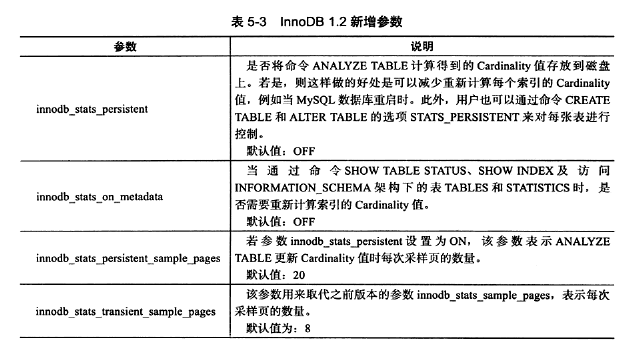

## 5. B+ 树索引的使用

### 1. 联合索引

- 联合索引是指对表上的多个列进行索引

  ```mysql
  # idx_a_b 为联合索引；a,b 为索引的列
  CREATE TABLE t(a INT,b INT,PRIMARY KEY (a),KEY idx_a_b(a,b))ENGINE=INNODB;
  ```

### 2. 覆盖索引

- **覆盖索引**： **从辅助索引中就可以得到查询的记录**，而不需要查询聚集索引中的记录

- **好处**： 辅助索引不包含整行记录的所有信息，故其大小要远小于聚集索引，因此**可以减少大量的IO操作**

### 3. 优化

####1. 优化

- 当访问的**数据量很小，优化器通过辅助索引来查找**
- 当访问的**数据量比较大时，优化器通过聚集索引来查找**

####2. 索引提示

> **数据库支持索引提示(INDEX HINT)显示告诉优化器使用哪个索引**

以下两种情况可能需要用到 INDEX HINT：

- MySQL 数据库的**优化器错误地选择了某个索引**，导致SQL语句运行的很慢（很少见）

- **某 SQL 语句可以选择的索引非常多**，这时优化器选择执行计划时间的开销可能会大于SQL语句本身

#### 3. Multi-Range Read(MRR) 优化

- **目的**： 为了减少磁盘的随机访问，并且**将随机访问转化为较为顺序的数据访问**，这对于IO-bound类型的SQL查询语句可带来性能极大的提升

  > Multi-Range Read优化可适用于 `range,ref, eq ref` 类型的查询

- **好处**：
  - **MRR 使数据访问变得较为顺序** 

    > 在查询辅助索引时，首先根据得到的查询结果，按照主键进行排序，并按照主键排序的顺序进行书签查找

  - **减少缓冲池中页被替换的次数**

  - **批量处理对键值的查询操作**

- 对于 InnoDB 和 MyISAM 存储引擎的范围查询和JOIN查询操作，MRR 的工作方式如下:
  - **将查询得到的辅助索引键值存放于一个缓存中**，这时缓存中的数据根据辅助索引键值排序
  - **将缓存中的键值根据 RowID 进行排序**
  - **根据 ROwID 的排序顺序来访问实际的数据文件**

- **将 MRR 设为开启状态**： `SET @@optimizer_switch = 'mrr=on,mrr_cost_based=off'`

- **参数 `read_rnd_buffer_size` 用来控制键值的缓冲区大小**

  > 当大于该值时，则执行器对已经缓存的数据根据 RowID 进行排序，并通过 RowID 来取得行数据，默认为 256K
  >
  > `SELECT @@read_rnd_buffer_size \G`

####4. Index Condition Pushdown(ICP) 优化

> ICP 优化支持 `range、ref、 eq_ref、 ref_or_null` 类型的查询

- MySQL 数据库会在取出索引的同时，判断是否可以进行 WHERE 条件的过滤，也就是将 WHERE 的部分过滤操作放在了存储引擎层

- 在某些查询下，可以大大减少上层 SQL 层对记录的索取(fetch)，从而提高数据库的整体性能

##6. hash 算法和自适应 hash 索引

####1. hash 算法

- **InnoDB 存储引擎使用哈希算法来对字典进行查找，其冲突机制采用链表方式，哈希函数采用除法散列方式**

- **对于缓冲池页的哈希表**，在缓冲池中的Page页都有一个 chain 指针，它指向相同哈希函数值的页

- **对于除法散列，m 的取值为略大于2倍的缓冲池页数量的质数**


对于 InnoDB 缓冲池中的页的查找，且将查找的页转换成自然数：

- InnoDB 存储引擎的表空间都有一个 space_id，用户所要查询的应该是某个表空间的某个连续16KB的页，即偏移量 offset
- InnoDB 存储引擎将 space_id 左移20位，然后加上这个 space_id和 offset，即关键字 `K = space_id<<20 + space_id + offset`

- 然后通过除法散列到各个槽中去

####2. 自适应 hash 索引

- 自适应哈希索引经哈希函数映射到一个哈希表中，因此对于字典类型的查找非常快速
- 参数 `innodb_adaptive_hash_index` 可以用来禁止或启动此特性，**默认为开启**

## 7. 全文索引

> B+ 树可以通过索引字段的前缀进行查找

- **全文检索**：是将存储于数据库中的整本书或整篇文章中的任意内容信息查找出来的技术

  > 它可以根据需要获得全文中有关章、节、段、句、词等信息，也可以进行各种统计和分析

#### 1. 倒排索引

> 全文检索通常使用倒排索引来实现

- 倒排索引在辅助表中存储了单词与单词自身在一个或多个文档中所在位置之间的映射，通常利用关联数组实现

- 其拥有两种表现形式:
  - inverted file index： 其表现形式为{单词,单词所在文档的ID}
  - full inverted index： 其表现形式为{单词，(单词所在文档的ID，在具体文档中的位置)}

####2. 全文索引

- 在 InnoDB 存储引擎中，为了提高全文检索的并行性能，共有6张辅助表，目前每张表根据word的 Latin 编码进行分区

- **辅助表是持久的表，存放于磁盘上**

  > **InnoDB 会批量对辅助表进行更新**

- FTS Index Cache(**全文检索索引缓存**)：用来提高全文检索的性能

  > - FTS Index Cache 是一个红黑树，根据 (word, ilist) 进行排序

- 当对全文检索进行查询时，辅助表首先会将在 FTS Index Cache 中对应的 word 字段合并到 辅助表中，然后再进行查询

- InnoDB 在事务提交时，将分词写入到 FTS Index Cache，然后再通过批量更新写入磁盘

- 参数 `innodb_ft_cache_size` 用来控制 FTS Index Cache 的大小，默认值为32M

  > - 当该缓存满时，会将其中的 (word,ilist) 分词信息同步到磁盘的 Auxiliary Table中
  >
  > - 增大该参数可以提高全文检索的性能；在宕机时，未同步到磁盘中的索引信息可能需要更长的时间进行恢复

- `FTS_DOC_ID` ： 为了支持全文检索，FTS_DOC_ID 列与word进行映射

  > - 其类型必须是 `BIGINT UNSIGNED NOT NULL`
  >
  > - InnoDB存储引擎自动会在该列上加入一个名为 `FTS_DOC_ID_INDEX` 的Unique Index

- 设置参数 `innodb_ft_aux_table` 可用来查看分词信息
- 命令 `OPTIMIZE TABLE` 可将记录彻底删除，且删除的文档 ID 会记录到表 `INNODB_FT_BEING_DELETED` 中

#### 3. 全文检索

**语法**：MySQL 数据库通过 `MATCH()… AGAINST()` 语法支持全文检索的查询,

- `MATCH` ： 指定了需要被查询的列,

- `AGAINST` ： 指定了使用何种方法去进行查询

```mysql
MATCH (col1,col2,...) AGAINST (expr [search_modifier])
search_modifier:
{
	IN NATURAL LANGUAGE MODE
	| IN NATURAL LANGUAGE MODE WITH QUERY EXPANSION
	| IN BOOLEAN MODE
	| WITH OUERY EXPANSION
}
```

- InnoDB 全文索引考虑因素：

  - 查询的 word 在 stopword 列中，忽略该字符串的查询

    > 参数 `innodb_ft_min_token_size, innodb_ft_max_token_size` 控制 InnoDB 存储引擎查询字符的长度，超过该区间，会忽略该词的搜索；默认值分别为 3 和 84

  - 查询的 word 的字符长度是否在区间 `[ innodb ft min token size, innodb_ft_max_token_size]`内

**查询模式**：

- `Natural Language`： 表示查询带有指定word的文档

  > - 全文检索通过 MATCH 函数进行查询，默认采用 Natural Language 模式
  >
  > - 在 WHRE 条件中使用 MATCH 函数，查询返回的结果是根据相关性进行降序排序的，即**相关性最高的结果放在第一位**
  >
  > - **相关性的值是一个非负的浮点数字，0表示没有任何的相关性**
  >
  >   相关性的计算依据以下四个条件：
  >
  >   - word 是否在文档中出现
  >   - wod 在文档中出现的次数
  >   - word 在索引列中的数量
  >
  >   - 多少个文档包含该 word

- `Boolean` ： 当使用该修饰符时，査询字符串的前后字符会有特殊的含义

  > Boolean全文检索支持以下几种操作符：
  >
  > - `+` 表示该word必须存在
  > - `-` 表示该word必须被排除
  > - `(no operator)` 表示该word是可选的，但是如果出现，其相关性会更高
  > - `@distance` 表示查询的多个单词之间的距离是否在 distance之内,，distance的单位是字节（这种全文检索的查询也称为Proximity Search）
  >
  > - `>` 表示出现该单词时增加相关性
  > - `<` 表示出现该单词时降低相关性
  > - `~` 表示允许出现该单词，但是出现时相关性为负(全文检索查询允许负相关性)
  > - `*`表示以该单词开头的单词
  > - `"` 表示短语

- `Query Expansion`： 通常在查询的关键词太短，用户需要 implied knowledge(隐含知识)时进行；通过在查询短语中添加 `WITH QUERY EXPANSION或 IN NATURAL LANGUAGE MODE WITH QUERY EXPANSION` 可以开启 blind query expansion(又称为 automatic relevance feedback)

  > 该查询分为两个阶段：
  >
  > - 第一阶段： 根据搜索的单词进行全文索引查询
  >
  > - 第二阶段： 根据第一阶段产生的分词再进行一次全文检索的查询

# 六、锁

## 1. 什么是锁

- 锁是数据库系统区别于文件系统的一个关键特性
- 锁机制用于管理对共享资源的并发访问
-  数据库系统使用锁是为了支持对共享资源进行并发访问，提供数据的完整性和一致性

## 2. lock 和 latch

- `latch` ： 称为**闩锁(轻量级的锁)**，其要求锁定的时间必须非常短；若持续的时间长，则应用的性能会非常差

  > - 在 InnoDB存储引擎中, latch又可以分为 **mutex(互斥量)和 relock(读写锁)**
  >
  > - **目的**： 是用来保证并发线程操作临界资源的正确性，并且通常**没有死锁检测的机制**
  > - 查看命令： `show engine innodb mutex`

- `lock` ： 对象是事务，用来锁定的是数据库中的对象，如表、页、行；且一般 lock 的对象仅在事务 commit或 rollback 后进行释放(不同事务隔离级别释放的时间可能不同)

  > **lock 是有死锁机制的**​					

|          |                          lock                           |                            latch                             |
| :------- | :-----------------------------------------------------: | :----------------------------------------------------------: |
| 对象     |                          事务                           |                             线程                             |
| 保护     |                       数据库内容                        |                         内存数据结构                         |
| 持续时间 |                      整个事务过程                       |                           临界资源                           |
| 模式     |                   行锁、表锁、意向锁                    |                        读写锁、互斥量                        |
| 死锁     | 通过 waits-for graph、 time out等机制进行死锁检测与处理 | 无死锁检测与处理机制，仅通过应用程序加锁的顺序( lock leveling)保证无死锁的情况发生 |
| 存在于   |                 Lock Manager的哈希表中                  |                     每个数据结构的对象中                     |

​						**命令SHOW ENGINE INNODB MUTEX输出结果说明**

|     名称      |                             说明                             |
| :-----------: | :----------------------------------------------------------: |
|     count     |                      mutex被请求的次数                       |
|  spin_waits   | spin lock(自旋锁)的次数，InnoDB 存储引擎 latch 在不能获得锁时首先进行自旋，若自旋后还不能获得锁,则进入等待状态 |
|  spin_rounds  | 自旋内部循环的总次数，每次自旋的内部循环是一个随机数；spin rounds/spain waits表示平均每次自旋所需的内部循环次数 |
|   os_waits    | 表示操作系统等待的次数；当 spin lock 通过自旋还不能获得 latch 时，则会进入操作系统等待状态,等待被唤醒 |
|   os_yields   |             进行 os_thread_yield 唤醒操作的次数              |
| os_wait_times |                 操作系统等待的时间，单位是ms                 |

## 3. InnoDB 中的锁

###1. 锁分类

> **行级锁**：
>
> - **共享锁(S Lock)**： 允许事务读一行数据
> - **排他锁(X Lock)**： 允许事务删除或更新一行数据
>
> 
>
> **意向锁**：将锁定的对象分为多个层次，在更细粒度上进行加锁
>
> - **意向共享锁(IS Lock)**： 事务想要获得一张表中某几行的共享锁
> - **意向排他锁(IX Lock)**： 事务想要获得一张表中某几行的排他锁
>
> 

### 2. 一致性锁

- **一致性的非锁定读**： 是指 InnoDB 存储引擎通过行多版本控制的方式来读取当前执行时间数据库中行的数据

  > - 如果读取的行正在执行 DELETE或 UPDATE操作时，InnoDB存储引擎会去读取行的一个**快照数据**
  > - **快照数据**： 指该行的之前版本的数据，该实现是通过undo段来完成，而 undo 用来在事务中回滚数据，因此快照数据本身是没有额外的开销，且读取快照数据不需要上锁
  >
  > 
  >
  > - **非锁定读**： 不需要等待访问的行上 X 锁的释放
  >
  > - **多版本并发控制(MVCC)**： 每行记录有多个快照，并由此而带来的并发控制

- **一致性锁定读**：需要显示的对数据库读取的操作进行加锁以保证数据逻辑的一致性

  InnoDB 对于 SELECT 语句支持一致性锁定读的操作：(务必在下述两个操作前，加上 `BEGIN, START TRANSACTION, SET AUTOCOMMIT = 0`)

  - `SELECT ... FOR UPDATE`： 对读取的行记录加一个 X 锁
  - `SELECT ... LOCK IN SHARE MODE`： 对读取的行记录加上一个 S 锁

### 3. 自增长与锁

- 在 InnoDB 存储引擎的内存结构中，对每个含有自增长值的表都有一个自增长计数器，当对含有自增长的计数器的表进行插入操作时，这个计数器会被初始化

- 得到计数器值： `SELECT MAX(auto_inc_col) FROM t FOR UPDATE;`

- `AUTO-INC Locking`： 插入操作会依据自增长的计数器值加1赋予自增长列

  > - 为了提高插入的性能，锁不是在一个事务完成后才释放，而是在完成对自增长值插入的 SQL 语句后立即释放
  > - **不足**： 
  >   - 对于有自增长值的列的并发插入性能较差，事务必须等待前一个插入的完成(虽然不用等待事务的完成)
  >   - 对于 INSERT… SELECT 的大数据量的插人会影响插人的性能，因为另一个事务中的插入会被阻塞

- 参数 `innodb_autoinc_lock_mode` 来控制新的轻量级的自增长的模式，默认值为1

  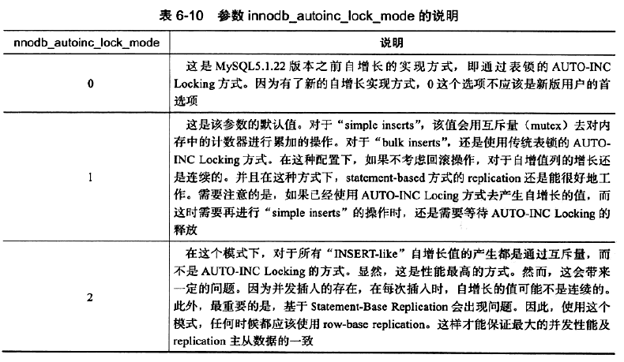

- **插入类型分类**：

  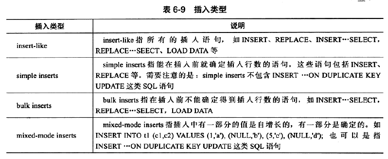

## 4. 锁算法

### 1. 行锁的3种算法

- `Record Lock`： **单个行记录上的锁**

  > Record Lock 总是会去**锁住索引记录，如果建表时没有设置任何索引，则会使用隐式的主键来进行锁定**

- `Gap Lock`： 间隙锁，**锁定一个范围，但不包含记录本身**

  > **作用**： 是为了阻止多个事务将记录插入到同范围内，而这会导致 Phantom(幻读) Problem 的产生
  >
  > **显式地关闭 Gap Lock**： 
  >
  > - 将事务的隔离级别设置为 READ COMMITTED
  > - 将参数 `innodb_locks_unsafe_for_binlog` 设置为 1

- `Next-Key Lock`： Gap Lock+ Record Lock，**锁定一个范围，并且锁定记录本身**

  > 设计的目的是为了解决 Phantom Problem(幻读)


> **对于唯一键值的锁定**： 
>
> - Next-Key Lock 降级为Record Lock 仅存在于查询所有的唯一索引列
> - 若唯一索引由多个列组成，而查询仅是查找多个唯一索引列中的其中一个，那么查询其实是 range 类型查询，而不是 point类型查询，故 InnoDB 存储引擎依然使用 Next-Key Lock 进行锁定

### 2. 解决Phantom(幻读) Problem

- `Phantom Problem`： 是指在同一事务下，连续执行两次同样的 SQL 语句可能导致不同的结果，第二次的SQL语句可能会返回之前不存在的行

- InnoDB存储引擎**采用 Next-Key Locking 机制来避免幻读**

## 5. 锁问题

### 1. 脏读

- **脏页**： 指的是在缓冲池中已经被修改的页，但是还没有刷新到磁盘中，即数据库实例内存中的页和磁盘中的页的数据是不一致的，当然在刷新到磁盘之前，日志都已经被写入到了重做日志文件中

  > - 脏页是因为数据库实例内存和磁盘的异步造成的，这并不影响数据的一致性(或者说两者最终会达到一致性，即当脏页都刷回到磁盘)
  > - 因为脏页的刷新是异步的，不影响数据库的可用性，因此可以带来性能的提高

- **脏数据**： 是指事务对缓冲池中行记录的修改，并且还没有被提交，即指未提交的数据

  > 如果读到了脏数据，即一个事务可以读到另外一个事务中未提交的数据，则显然违反了数据库的隔离性

- **脏读**： 指的就是在不同的事务下，当前事务可以读到另外事务未提交的数据，即读到脏数据

### 2. 不可重复读

- **不可重复读**： 是指在一个事务内多次读取同一数据集合

  > - 在这个事务还没有结束时，另外一个事务也访问该同一数据集合，并做了一些DML操作
  >
  > - 因此，在第一个事务中的两次读数据之间，由于第二个事务的修改，那么第一个事务两次读到的数据可能是不一样的
  >
  > - 这样就发生了在一个事务内两次读到的数据是不一样的情况，称为不可重复读

- **不可重复读和脏读的区别**： 脏读是读到未提交的数据，而不可重复读读到的却是已经提交的数据，但是其违反了数据库事务一致性的要求

### 3. 丢失更新

- **丢失更新**： 就是一个事务的更新操作会被另一个事务的更新操作所覆盖，从而导致数据的不一致

  > **例如**：
  >
  > - 事务 T1 将行记录 r 更新为 v1，但是事务 T1 并未提交
  >
  > - 与此同时，事务 T2 将行记录 r 更新为 v2，事务 T2 未提交
  >
  > - 事务 T1 提交
  >
  > - 事务 T2 提交

- 下面的情况会发生丢失更新：
  - 事务 T1 查询一行数据，放人本地内存，并显示给一个终端用户User1
  - 事务 T2 也查询该行数据，并将取得的数据显示给终端用户User2
  - User1 修改这行记录，更新数据库并提交
  - User2 修改这行记录，更新数据库并提交

## 6. 阻塞

- 参数 `innodb_lock_wait_timeout` ： 用来控制等待的时间，默认为 50s

  > - 是动态的，可以在 MySQL 数据库运行时进行调整

- 参数 `innodb_rollback_on_timeout`： 用来设定是否在等待超时时对进行中的事务进行回滚操作(默认是OFF，代表不回滚)

  > - 是静态的，不可在启动时进行修改
  > - 在默认情况下，InnoDB 存储引擎不会回滚超时引发的错误异常

## 7. 死锁

###1. 简介

- **死锁**： 是指两个或两个以上的事务在执行过程中，因争夺锁资源而造成的一种互相等待的现象

- 解决死锁问题方法：

  - **超时**： 即当两个事务互相等待时，当一个等待时间超过设置的某一阈值时，其中一个事务进行回滚，另一个等待的事务就能继续进行

    > 参数 `innodb_lock_wait_timeout`  用来设置超时的时间

  - `wait-for graph`(等待图)： **进行死锁检测**，这是一种更为主动的死锁检测方式

    > wait-for graph 要求数据库保存以下两种信息：
    >
    > - **锁的信息链表**
    > - **事务等待链表**
    >
    > 通过上述链表可以构造出一张图，而在这个图中**若存在回路，就代表存在死锁**

### 2. 死锁概率

事务发生死锁的概率与以下几点因素有关：

- 系统中事务的数量(n)越多，发生死锁的概率越大
- 每个事务操作的数量(r)越多，发生死锁的概率越大
- 操作数据的集合(R)越小，发生死锁的概率越大

## 8. 锁升级

- **锁升级**： 是指将当前锁的粒度降低

在以下情况下可能发生锁升级：

- 由一句单独的 SQL 语句在一个对象上持有的锁的数量超过了阈值(默认为5000)

  > **注**： 如果是不同对象，则不会发生锁升级

- 锁资源占用的内存超过了激活内存的40%时就会发生锁升级

# 七、事务

## 1. 简介

- **事务**： 是访问并更新数据库中各种数据项的一个程序执行单元

- **事务的目的**： 把数据库从一种一致状态转换为另一种一致状态

  >  在数据库提交时，要么确保所有修改都已保存，要么所有修改都不保存

- ACID：

  - **Atomicity 原子性**： 数据库事务是不可分割的工作单位,，要么都做，要么都不做
  - **Consistency 一致性**： 事务不会破坏事务的完整性约束，事务将数据库从一个一致状态转变为另一个一致状态
  - **Isolation 隔离性**： 事务之间相互分离，在提交之前相互不可见

  - **Durability 持久性**： 事务一旦提交，其产生的效果就是永久的

- 事务分类：

  - **扁平事务**： 其由 BEGIN WORK 开始，由 COMMIT WORK 或 ROLLBACK WORK 结束，其间的操作是原子的，要么都执行，要么都回滚；因此扁平事务是应用程序成为原子操作的基本组成模块

    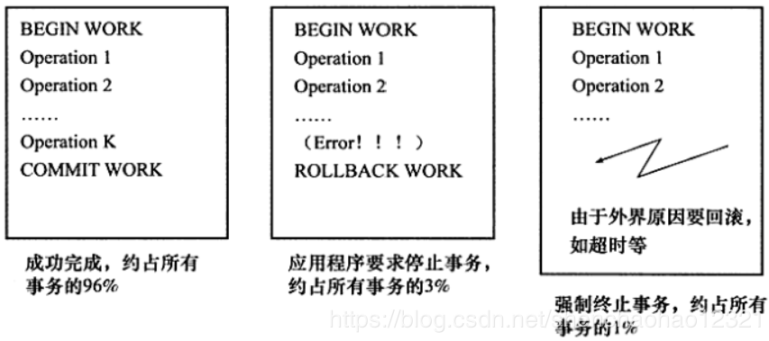

  - **带有保存点的扁平事务**：允许在事务执行过程中回滚到同一事务中较早的一个状态，保存点用来通知系统应该记住事务当前的状态，以便当之后发生错误时，事务能回到保存点当时的状态

    > - 保存点用 `SAVE WORK` 函数来建立，通知系统记录当前的处理状态
    >
    > - 当出现问题时，保存点能用作内部的重启动点，根据应用逻辑,决定是回到最近一个保存点还是其他更早的保存点
    >
    > 

  - **链事务**： 在提交一个事务时，释放不需要的数据对象，将必要的处理上下文隐式地传给下一个要开始的事务

    ​	**注意**：提交事务操作和开始下一个事务操作将合并为一个原子操作，这意味着下一个事务将看到上一个事务的结果

    > - **可视为保存点模式的一种变种**，当发生系统崩溃时，所有的保存点都将消失，因为其保存点是易失的，这意味着当进行恢复时，事务需要从开始处重新执行，而不能从最近的一个保存点继续执行
    > - **链事务与带有保存点的扁平事务不同的是**： 
    >   - **回滚不同**：带有保存点的扁平事务能回滚到任意正确的保存点，而链事务中的回滚仅限于当前事务，即只能恢复到最近一个的保存点
    >   - **锁的处理不同**： 链事务在执行 COMMIT 后即释放了当前事务所持有的锁，而带有保存点的扁平事务不影响迄今为止所持有的锁

  - **嵌套事务**： 是一个层次结构框架，由一个顶层事务控制着各个层次的事务，顶层事务之下嵌套的事务被称为子事务，其控制每一个局部的变换

    > InnoDB 不原生支持嵌套事务，用户可以通过带有保存点的事务来模拟串行的嵌套事务
    >
    > Moss对嵌套事务的定义： 
    >
    > - 嵌套事务是由若干事务组成的一棵树，子树既可以是嵌套事务，也可以是扁平事务
    > - 处在叶节点的事务是扁平事务，但每个子事务从根到叶节点的距离可以是不同的
    > - 位于根节点的事务称为顶层事务，其他事务称为子事务；事务的前驱称为父事务，事务的下一层称为儿子事务
    > - 子事务既可以提交也可以回滚，但是它的提交操作并不马上生效，除非其父事务已经提交，因此任何子事物都在顶层事务提交后才真正的提交
    >
    > - 树中的任意一个事务的回滚会引起它的所有子事务一同回滚，故子事务仅保留A、C、I 特性,不具有D的特性

  - **分布式事务**： 通常是一个在分布式环境下运行的扁平事务，因此需要根据数据所在位置访问网络中的不同节点

## 2. 事务的实现


