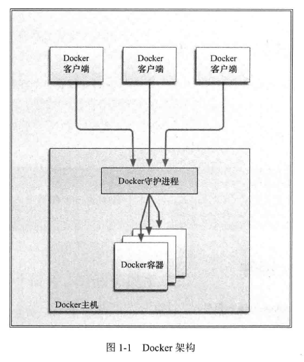

# 一、简介

- `Docker`： 是一个能把开发的应用程序自动部署到容器的开源引擎

  > - Docker 在虚拟化的容器执行环境中增加了一个应用程序部署引擎
  >
  > - 该引擎提供了一个轻量、快速的环境，能运行开发者的程序，并方便高效的将程序从开发者的 PC 部署到测试环境，然后再部署到生产环境

- **目标**： 

  - **提供一个简单、轻量的建模方式**

    > - 依赖“写时复制”模型，程序修改非常迅速
    > - 去除了管理程序的开销

  - **职责的逻辑分离**

    > - 开发人员只需关心容器中运行的应用程序
    > - 运维人员只需关心如何管理容器

  - **快速、高效的开发生命周期**

    > 缩短代码从开发、测试到部署、上线的运行周期

  - **鼓励使用面向服务的架构**

    > - 推荐单个容器只运行一个应用程序或进程

- **Docker 应用场景**：

  - **加速本地开发和构建流程**，使其更加高效、更加轻量化

    > - 本地开发者可构建、运行并分享 Docker 容器
    >
    > - 容器可在开发环境中构建，然后提交到测试环境，最终进入生产环境

  - 能够让独立服务或应用程序在不同环境中，得到相同的运行结果

    > 在面向服务的架构和重度依赖微服务的部署中很实用

  - 用 Docker 创建隔离环境来进行测试
  - Docker 可让开发者先在本机构建一个复杂的程序或构架来进行测试
  - 构建一个多用户**平台即服务(PaaS)**基础设施
  - 为开发、测试提供一个轻量级的独立沙盒环境
  - 提供**软件即服务(SaaS)**应用程序
  - 高性能、超大规模的宿主机部署

- **显著特点**：对不同的宿主机、应用程序和服务，可能表现出不同的特性与架构

  > 可以是短生命周期，也可是恒定环境；可一次销毁，也可提供持久服务

- Linux 内核命名空间，用于隔离文件系统、进程或网络
  - 文件系统隔离： 每个容器都有自己的 root 文件系统

  - 进程隔离：每个容器都运行在自己的进程环境中

  - 网络隔离：容器间的虚拟网络接口和 IP 地址的分开的

  - 资源隔离和分组：使用 cgroup(control group，Linux内核特性之一)将 CPU 和内存之类的资源独立分配给每个 Docker 容器

  - 写时复制： 文件系统都是通过写时复制创建的

    > 这意味着文件系统是分层的、快速的，且占用磁盘空间更小

  - 日志： 容器产生的 `STDOUT, STEDERR, STDIN` 等 IO 流都会被收集并记入日志，用来进行日志分析和故障排错

  - 交互式 shell： 用户可以创建一个伪 tty 终端，将其连接到 STDIN，为容器提供一个交互式的 shell

# 二、Docker 组件

## 1. Docker 客户端和服务器

- Docker 是一个**客户-服务器(C/S)** 架构的程序
- 客户端只需发出请求，服务器或守护进程将完成所有工作并返回结果
- 可在同一台宿主机上运行 Docker 守护进程和客户端，也可从本地 Docker 客户端连接到远程 Docker 守护进程

## 2. Docker 镜像

- **镜像是构建 Docker 世界的基石**，用户基于镜像来运行自己的容器

- 镜像： 是基于联合文件系统的一种层式结构，由一系列指令构建

  > 也可把镜像当作容器的“源代码”

- 镜像是分层的，可进行迅速的迭代

## 3. Registry

- **Docker 用 Registry 来保存用户构建的镜像**
- Docker 公司运行公共 Registry 叫做 Docker Hub，用户可在 Docker Hub 上注册账号，分享并保存自己的账号

## 4. Docker 容器

- Docker 可帮你构建和部署容器，用户只需将程序打包放入容器即可
- 容器是基于镜像启动起来的，可运行多个进程
- **镜像是 Docker 生命周期中的构建或打包阶段，而容器则是启动或执行阶段**

- Docker 容器的默认格式： `libcontainer`，一个原生的 Linux 容器格式

Docker 容器总结就是：

- 一个镜像格式
- 一系列标准的操作
- 一个执行环境

> Docker 借鉴了标准集装箱的概念：
>
> - 每个容器都包含一个软件镜像
> - 所有容器都按照相同方式装载程序

