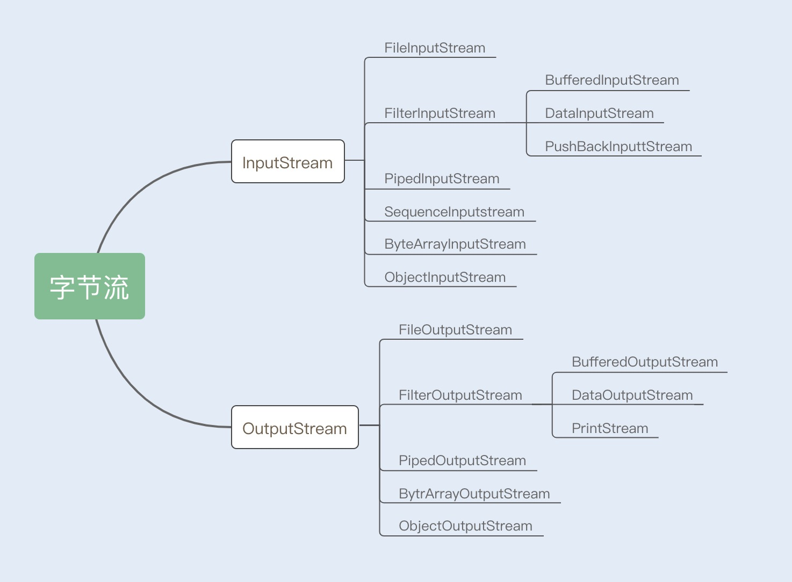
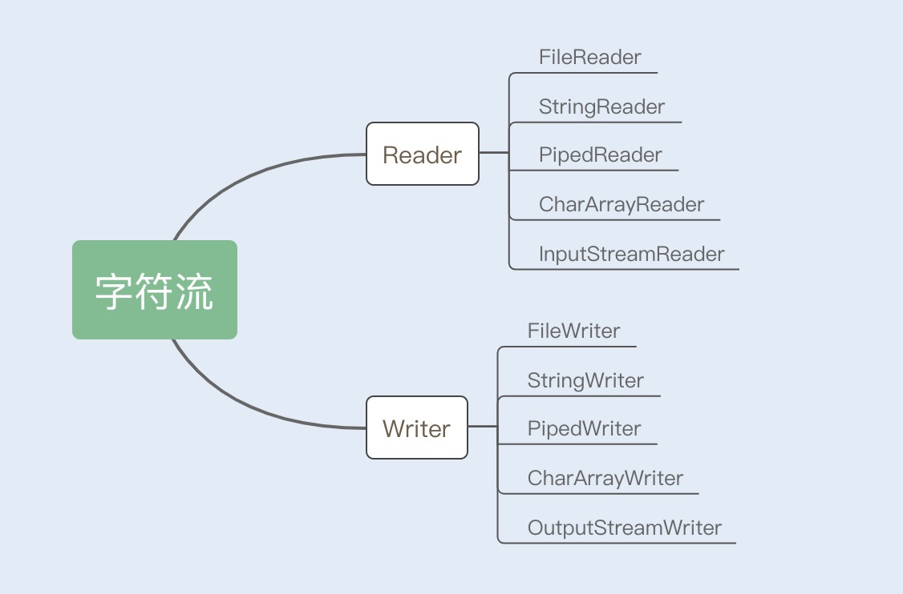
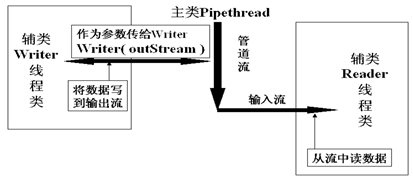
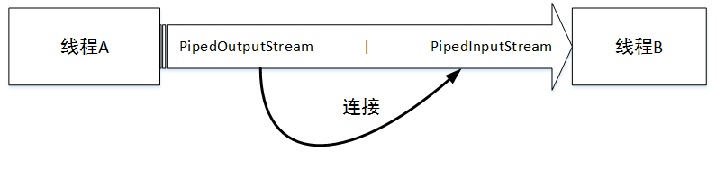
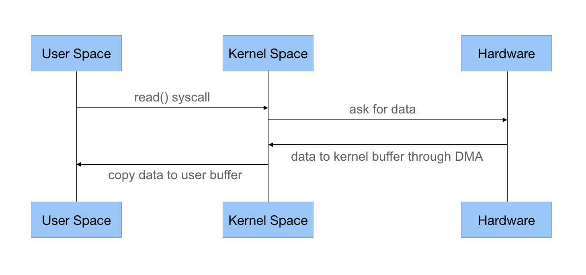
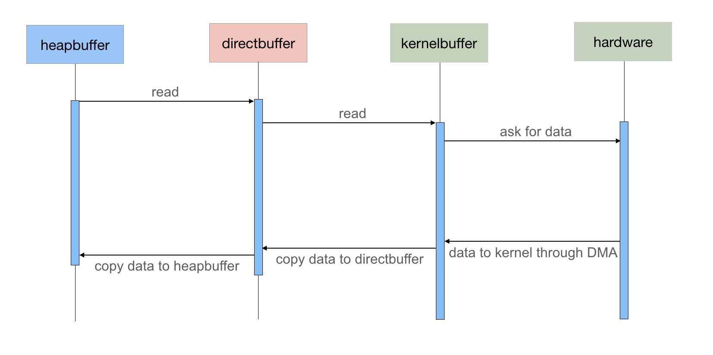
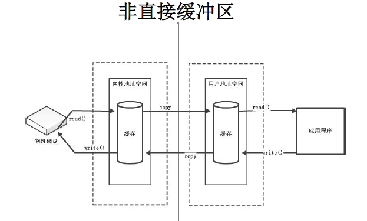
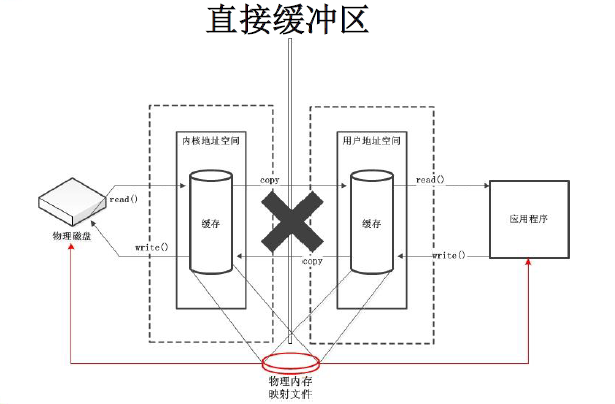

# 一、概览

## 1、Java 流分类结构图

### (1) 按操作方式分类结构图

 

### (2) 按操作对象分类结构图


### (3) 详细分类


## 2、IO 流分类详解

- 根据处理数据类型的不同分为：字符流和字节流
- 根据数据流向不同分为：输入流和输出流

### (1) 字符流和字节流

**字节流和字符流的区别**：

- **读写单位不同**：字节流以字节(`8bit`)为单位，字符流以字符为单位，根据码表映射字符，一次可能读多个字节

    - 字节流：一次读入或读出是8位二进制

    - 字符流：一次读入或读出是16位二进制

- **处理对象不同**：字节流能处理所有类型的数据(如图片、avi等)，而字符流只能处理字符类型的数据

    > 字符流的由来：本质是基于字节流读取时，去查指定的码表

注：只要是处理纯文本数据，就优先考虑使用字符流，除此之外都使用字节流

### (2) 输入流和输出流

> 输入流只能进行读操作，输出流只能进行写操作

- **输入字节流 `InputStream`**：
    - `InputStream`：是所有的输入字节流的父类，是一个抽象类
    - `ByteArrayInputStream、StringBufferInputStream、FileInputStream` 分别从 Byte 数组、StringBuffer、本地文件读取数据
    - `PipedInputStream`：从与其它线程共用的管道中读取数据
    - `ObjectInputStream`：和所有 `FilterInputStream` 的子类都是装饰流(装饰器模式的主角)
- **输出字节流 `OutputStream`**：
    - `OutputStream`：所有的输出字节流的父类，是一个抽象类
    - `ByteArrayOutputStream、FileOutputStream` 分别向 Byte 数组、本地文件写入数据
    - `PipedOutputStream`：向与其它线程共用的管道中写入数据
    - `ObjectOutputStream`：和所有 `FilteOutputStream` 的子类都是装饰流

### (3) 节点流与处理流

- **节点流**：直接与数据源相连，读入或读出

    常用的节点流：

    - **父类**：`InputStream、OutputStream、Reader、Writer`

    - **文件**：`FileInputStream、FileOutputStrean、FileReader、FileWriter` 文件进行处理的节点流

    - **数组**：`ByteArrayInputStream、ByteArrayOutputStream、CharArrayReader、CharArrayWriter` 对数组进行处理的节点流

        > 对应的不再是文件，而是内存中的一个数组

    - **字符串**：`StringReader、StringWriter` 对字符串进行处理的节点流

    - **管道**：`PipedInputStream、PipedOutputStream、PipedReader、PipedWriter` 对管道进行处理的节点流

- **处理流**：与节点流一块使用，套接在节点流上的就是处理流

    > 直接使用节点流，读写不方便，为了更快的读写文件，才有了处理流

    常用的处理流：

    - 缓冲流：`BufferedInputStrean、BufferedOutputStream、BufferedReader、BufferedWriter` 增加缓冲，避免频繁读写硬盘
    - 转换流：`InputStreamReader 、OutputStreamReader` 实现字节流和字符流之间的转换
    - 数据流：`DataInputStream 、DataOutputStream` 提供将基础数据类型写入到文件中或读取出来

### (4) 转换流

`InputStreamReader、OutputStreamWriter` 要 `InputStream、OutputStream` 作为参数，实现从字节流到字符流的转换

构造函数：

```java
InputStreamReader(InputStream);        				//通过构造函数初始化，使用的是本系统默认的编码表GBK
InputStreamReader(InputStream, String charSet); 	//通过该构造函数初始化，可以指定编码表
OutputStreamWriter(OutputStream);      				//通过该构造函数初始化，使用的是本系统默认的编码表GBK
OutputStreamwriter(OutputStream, String charSet);   //通过该构造函数初始化，可以指定编码表
```

# 二、File 操作

## 1、构造函数

```java
public File(String pathname)  //文件的绝对路径
public File(URI uri)  //文件的 URI 地址
public File(String parent, String child)  //指定父文件绝对路径、子文件绝对路径
public File(File parent, String child)  //指定父文件、子文件相对路径


//下面这两个是File类中私有的构造函数，外面不能调用
private File(String child, File parent)  
private File(String pathname, int prefixLength) 
```

- `File(String pathname)`：

    ```java
    //电脑d盘中的cat.png 图片的路径
    String filePath = "D:/cat.png";
    File file = new File(filePath);
    ```

- `File(String parent, String child)` 

    ```java
    String parentFilePath = "E:/cat";
    String childFilePath = "small_cat.txt";
    
    //创建parentFile文件
    File parentFile = new File(parentFilePath);
    parentFile.mkdir();
    		
    //如果parentFile不存在，就会报异常
    File file = new File(parentFilePath, childFilePath);
    try {
    	file.createNewFile();
    } catch (IOException e) {
    	e.printStackTrace();
    }
    ```

- `File(File parent, String child)`

    ```java
    String parentFilePath = "E:/cat";
    
    //构造父文件
    File parent = new File( parentFilePath);
    parent.mkdir(); 
    
    //如果parent文件不存在，就会报异常
    File file = new File(parent, "small_cat.txt");
    try {
    	file.createNewFile();
    } catch (IOException e) {
    	e.printStackTrace();
    }
    ```

## 2、常用函数

### (1) 创建文件/目录

- `boolean file.mkdir()`：创建目录

    > - 创建成功，则返回 `true`；创建失败，返回 `false`
    >
    > - 若文件夹已经存在，则返回 `false`
    >
    > - 只能创建一级目录，若父目录不存在，则返回 `false`

- `boolean file.mkdirs()`：创建多级目录

    > - 创建多级目录，创建成功，返回 `true`；创建失败，返回 `false`
    >
    > - 若父目录不存在，就创建，并且返回 `true`

- `boolean file.createNewFile()`：创建一个新的文件

    > - 若文件不存在就创建该文件，创建成功，返回 `true` ；创建失败，返回 `false`
    >
    > - 若这个文件已经存在，则返回 `false`

### (2) 判断文件

- `boolean file.exists()`：文件是否存在

- `boolean file.isFile()`：是否是文件

- `boolean file.isDirectory()`：是否是目录

- `boolean file.isHidden()`：是否隐藏

- `boolean file.isAbsolute()`：是否为绝对路径

- `boolean file.canRead()`：是否可读

- `boolean file.canWrite()`：是否可写

- `boolean file.canExecute()`：是否可执行

### (3) 获取文件信息

- `String file.getName()`：获取文件名(不含路径)

- `String file.getParent()`：获取父目录的绝对路径

    > - 若文件有父目录，则返回父目录的绝对路径
    > - 若文件在磁盘的根目录，则返回磁盘的路径

- `File file.getParentFile()`：获取父文件，返回一个 File 对象

- `long time = file.lastModified()`：返回文件最后一次修改的时间

- `boolean renameTo(File file)`：文件重命名

- `long file.length()`：返回文件的大小(单位：字节)

- `boolean file.delete()`：删除文件

- `String[] file.list()`：获取该目录下的所有文件名

    > - 若 `file` 为文件，返回值为 `null`，使用时记得判空
    > - 若 `file` 为目录，则返回该目录下所有文件名(不含路径)
    > - 若 `file` 是空目录，返回一个长度为 0 的数组

- `File[] file.listFiles()`：获取该目录下的所有的文件

    > - 若 `file` 为文件，返回值为 `null`，使用时记得判空
    > - 若 `file` 为目录，则返回该目录下所有的文件 
    > - 若 `file` 是空目录，返回一个长度为 0 的数组

## 3、FileFilter 与 FilenameFilter

### (1) FileFilter

`FileFilter` 是 io 包中的一个接口，用于文件名过滤，需要重写 `accept` 方法

```java
public class A3 {
	public static void main(String[] args) throws IOException {
		String filePath = "F:/";
		File file = new File(filePath);
		getFile(file);
	}

	//获取指定目录的所有文件夹
	private static void getFile(File file){
		MyFileFilter myFileFilter = new MyFileFilter();
		File[] files = file.listFiles(myFileFilter);
		for(File f : files) {
			if (f.isHidden()) 
                continue ;
			System.out.println(f.getAbsolutePath());
		}
	}

	static class MyFileFilter implements FileFilter {
		MyFileFilter() {
		}

		@Override
		public boolean accept(File pathname) { //pathname：文件的绝对路径 + 文件名
			if(pathname.isDirectory()) {
				return true ;
			}
			return false;
		}
	}
}
```

### (2) FilenameFilter

```java
public class A3 {
	public static void main(String[] args) throws IOException {
		String filePath = "F:/" ;
		File file = new File(filePath) ;
		getFile(file);
	}

	//扫描出指定路径的所有图片
	private static void getFile( File file ){
		MyFilenameFilter myFileFilter = new MyFilenameFilter(".png") ;
		File[] files = file.listFiles(myFileFilter) ;
		for( File f : files ){
			if (f.isHidden()) 
                continue ;
			System.out.println(f.getAbsolutePath());
		}
	}

	static class MyFilenameFilter implements FilenameFilter {
		private String type; //type为需要过滤的条件，比如如果type=".jpg"，则只能返回后缀为jpg的文件
		
        MyFilenameFilter( String type){
			this.type = type ;
		}

		@Override
		public boolean accept(File dir, String name) {
			return name.endsWith(type) ; //dir 表示文件的当前目录，name 表示文件名
		}
	}
}
```

# 三、操作流

## 1、文件流

### (1) 字节操作



- `FileInputStream `

  ```java
  public void testFileInputStream() { 
      FileInputStream fis = null;
      try {
          File file = new File("hello.txt");
          fis = new FileInputStream(file);
          byte[] b = new byte[5];// 读取到的数据要写入的数组
          int len;// 每次读入到byte中的字节的长度
          while ((len = fis.read(b)) != -1) {
              String str = new String(b, 0, len);
              System.out.print(str);
          }
      } catch (IOException e) {
          e.printStackTrace();
      } finally {
          if (fis != null) {
              try {
                  fis.close();
              } catch (IOException e) {
                  e.printStackTrace();
              }
          }
      }
  }
  ```

- `FileOutputStream`

  ```java
  public void testFileOutputStream() {
      // 1.创建一个File对象，表明要写入的文件位置
      // 输出的物理文件可以不存在，当执行过程中，若不存在，会自动的创建;若存在，会将原有的文件覆盖
      File file = new File("hello2.txt");
      // 2.创建一个FileOutputStream对象，将file对象作为形参传递给FileOutputStream的构造器
      FileOutputStream fos = null;
      try {
          fos = new FileOutputStream(file);
          // 3.写入的操作
          fos.write(new String("I love China！").getBytes());
      } catch (Exception e) {
          e.printStackTrace();
      } finally {
          // 4.关闭输出流
          if (fos != null) {
              try {
                  fos.close();
              } catch (IOException e) {
                  e.printStackTrace();
              }
          }
      }
  }
  ```

- `FileInputStream` 与 `FileOutputStream` 同时使用： 实现文件复制

  ```java
  // 从硬盘读取一个文件，并写入到另一个位置（相当于文件的复制）
  public void testFileInputOutputStream() {
      // 1.提供读入、写出的文件
      File file1 = new File("1.jpg");
      File file2 = new File("2.jpg");
      // 2.提供相应的流
      FileInputStream fis = null;
      FileOutputStream fos = null;
      try {
          fis = new FileInputStream(file1);
          fos = new FileOutputStream(file2);
          // 3.实现文件的复制
          byte[] b = new byte[20];
          int len;
          while ((len = fis.read(b)) != -1) {
              fos.write(b, 0, len);//写入
          }
      } catch (Exception e) {
          e.printStackTrace();
      } finally {
          if (fos != null) {
              try {
                  fos.close();
              } catch (IOException e) {
                  e.printStackTrace();
              }
          }
          if (fis != null) {
              try {
                  fis.close();
              } catch (IOException e) {
                  e.printStackTrace();
              }
          }
      }
  }
  ```

### (2) 字符操作 



- `FileReader` 操作： 

  ```java
  public void testFileReader(){
      FileReader fr = null;
      try {
          File file = new File("dbcp.txt");
          fr = new FileReader(file);
          char[] c = new char[24];
          int len;
          while((len = fr.read(c)) != -1){
              String str = new String(c, 0, len);
              System.out.print(str);
          }
      }catch (IOException e) {
          e.printStackTrace();
      }finally{
          if(fr != null){
              try {
                  fr.close();
              } catch (IOException e) {
                  e.printStackTrace();
              }
          }
      }
  }
  ```

- `FileReader 与 FileWriter` 操作： 

  ```java
  //字符流只能处理文本文件，对于非文本文件（如：视频文件，音频文件，图片等）只能使用字节流
  public void testFileReaderWriter(){
      //输入流对应的文件src一定要存在，否则抛异常
      //输出流对应的文件dest可以不存在，执行过程中会自动创建
      FileReader fr = null;
      FileWriter fw = null;
      try{
          File src = new File("dbcp.txt");
          File dest = new File("dbcp1.txt");
          //2.
          fr = new FileReader(src);
          fw = new FileWriter(dest);
          //3.
          char[] c = new char[24];
          int len;
          while((len = fr.read(c)) != -1){
              fw.write(c, 0, len);
          }
      }catch(Exception e){
          e.printStackTrace();
      }finally{
          if(fw != null){
              try {
                  fw.close();
              } catch (IOException e) {
                  e.printStackTrace();
              }
          }
          if(fr != null){
              try {
                  fr.close();
              } catch (IOException e) {
                  e.printStackTrace();
              }
          }
      }
  }
  ```

## 2、缓冲流

### (1) 字节操作


- `BufferedInputStream` 和 `BufferedOutputStream` 分别是 `FilterInputStream` 和 `FilterOutputStream` 的子类，通过使用缓冲区防止每次读取/发送数据时进行实际的写操作

- `BufferedInputStream` 和 `BufferedOutputStream` 实现缓冲功能的输入/输出流，效率更高，速度更快

#### 1. BufferedInputStream

- **核心字段**：

    ```java
    private static int defaultBufferSize = 8192; //内置缓存字节数组的大小 8KB
    protected volatile byte buf[];	//内置缓存字节数组
    protected int count;	//当前 buf 中的字节总数(注: 不是底层字节输入流的源中字节总数)
    protected int pos;		//当前 buf 中下一个被读取的字节下标
    protected int markpos = -1;	//最后一次调用 mark(int readLimit) 方法记录的 buf 中下一个被读取的字节的位置
    protected int marklimit; //调用 mark 后与调用 reset 失败前，从 in 中读取的最大数据量、用于限制标记后 buffer 最大值
    ```

- **构造函数**：

    ```java
    BufferedInputStream(InputStream in) //使用默认 buf 大小、底层字节输入流构建 bis 
    BufferedInputStream(InputStream in, int size) //使用指定 buf 大小、底层字节输入流构建 bis  
    ```

- **一般方法**：

    ```java
    int available();  //返回底层流对应的源中有效可供读取的字节数      
    void close();  //关闭此流、释放与此流有关的所有资源  
    boolean markSupport();  //查看此流是否支持 mark
    void mark(int readLimit); //标记当前 buf 中读取下一个字节的下标  
    int read();  //读取 buf 中下一个字节  
    int read(byte[] b, int off, int len);  //读取 buf 中下一个字节  
    void reset();   //重置最后一次调用 mark 标记的 buf 中的位置  
    long skip(long n);  //跳过 n 个字节、 不仅仅是 buf 中的有效字节、也包括 in 的源中的字节 
    ```

#### 2. BufferedOutputStream

- **核心字段**：

    ```java
    protected byte[] buf;   //内置缓存字节数组、用于存放程序要写入 out 的字节  
    protected int count;   //内置缓存字节数组中现有字节总数 
    ```

- **构造函数**：

    ```java
    BufferedOutputStream(OutputStream out); //使用默认大小、底层字节输出流构造bos。默认缓冲大小是 8192 字节(8KB)
    BufferedOutputStream(OutputStream out, int size);  //使用指定大小、底层字节输出流构造 bos  
    ```

- **一般方法**：

    ```java
    void flush(); //将写入 bos 中的数据 flush 到 out 指定的目的地中
    write(byte b); //将一个字节写入到 buf 中  
    write(byte[] b, int off, int len); //将 bos 的一部分写入 buf 中 
    ```

#### 3. 案例

```java
//使用BufferedInputStream和BufferedOutputStream实现非文本文件的复制
public void testBufferedInputOutputStream(){
    BufferedInputStream bis = null;
    BufferedOutputStream bos = null;
    try {
        //1.提供读入、写出的文件
        File file1 = new File("1.jpg");
        File file2 = new File("2.jpg");
        //2.想创建相应的节点流：FileInputStream、FileOutputStream
        FileInputStream fis = new FileInputStream(file1);
        FileOutputStream fos = new FileOutputStream(file2);
        //3.将创建的节点流的对象作为形参传递给缓冲流的构造器中
        bis = new BufferedInputStream(fis);
        bos = new BufferedOutputStream(fos);
        //4.具体的实现文件复制的操作
        byte[] b = new byte[1024];
        int len;
        while((len = bis.read(b)) != -1){
            bos.write(b, 0, len);
            bos.flush();
        }
    }catch (IOException e) {
        e.printStackTrace();
    }finally{
        //5.关闭相应的流
        if(bos != null){
            try {
                bos.close();
            } catch (IOException e) {
                e.printStackTrace();
            }
        }
        if(bis != null){
            try {
                bis.close();
            } catch (IOException e) {
                e.printStackTrace();
            }
        }
    }
}
```

### (2) 字符操作

#### 1. BufferedReader

- **构造函数**：

    ```java
    BufferedReader(Reader in, int sz) //创建一个使用指定大小输入缓冲区的缓冲字符输入流
    BufferedReader(Reader in) //创建一个使用默认大小输入缓冲区的缓冲字符输入流
    ```

- **一般方法**：

    ```java
    int read()  //读取单个字符
    int read(char[] cbuf, int off, int len)  //将字符读入数组的某一部分
    String readLine()  //读取一个文本行
    boolean	ready()  //判断此流是否已准备好被读取
    void reset()  //将流重置到最新的标记
    long skip(long n)  //跳过字符
    void close() //关闭该流并释放与之关联的所有资源
    void mark(int readAheadLimit) //标记流中的当前位置
    boolean markSupported() //判断此流是否支持 mark 操作
    ```

#### 2. BufferedWriter

- **构造函数**：

    ```java
    BufferedWriter(Writer out, int sz) //创建一个使用给定大小输出缓冲区的新缓冲字符输出流
    BufferedWriter(Writer out) //建一个使用默认大小输出缓冲区的缓冲字符输出流
    ```

- **一般方法**：

    ```java
    void close()  // 关闭此流，但要先刷新
    void flush()  //刷新该流的缓冲
    void newLine() //写入一个行分隔符
    void write(char[] cbuf, int off, int len) //写入字符数组的某一部分
    void write(int c) //写入单个字符
    void write(String s, int off, int len) //写入字符串的某一部分
    ```

#### 3. 案例

```java
public void testBufferedReader(){
    BufferedReader br = null;
    BufferedWriter bw = null;
    try {
        File file = new File("dbcp.txt");
        File file1 = new File("dbcp3.txt");
        
        FileReader fr = new FileReader(file);
        FileWriter fw = new FileWriter(file1);
        
        br = new BufferedReader(fr);
        bw = new BufferedWriter(fw);

        String str;
        while((str = br.readLine()) != null){
            bw.write(str + "\n");
            bw.flush();
        }
    }catch (IOException e) {
        e.printStackTrace();
    }finally{
        if(bw != null){
            try {
                bw.close();
            } catch (IOException e) {
                e.printStackTrace();
            }
        }
        if(br != null){
            try {
                br.close();
            } catch (IOException e) {
                e.printStackTrace();
            }
        }
    }
}
```

## 3、数组流

- `ByteArrayInputStream`：可以将字节数组转化为输入流
- `ByteArrayOutputStream`：可以捕获内存缓冲区的数据，转换成字节数组

### (1) ByteArrayInputStream

- **构造函数**：

    ```java
    public ByteArrayInputStream(byte buf[])
    public ByteArrayInputStream(byte buf[], int offset, int length)
    ```

- **一般方法**：

    ```java
    void close()  // 关闭该流并释放与之关联的所有资源
    String getEncoding()  //返回此流使用的字符编码的名称
    int	read()  //读取单个字符
    int	read(char[] cbuf, int offset, int length) //将字符读入数组中的某一部分
    boolean ready()  //判断此流是否已经准备好用于读取
    ```

### (2) ByteArrayOutputStream

- **构造函数**：

    ```java
    public ByteArrayOutputStream()
    public ByteArrayOutputStream(int size)
    ```

- **一般方法**：

    ```java
    void write(int b)
    void write(byte b[], int off, int len)
    void writeTo(OutputStream out)
    byte toByteArray()[]
    void close()
    ```

### (3) 案例

- 字节流 `ByteArrayInputStream` 的读写过程测试

    ```java
    public class A7 {
    	public static void main(String[] args) {
    		String mes = "hello,world";
    		byte[] b = mes.getBytes();
    		
    		ByteArrayInputStream byteArrayInputStream = new ByteArrayInputStream(b) ;
    		int result = -1  ;
    
    		while((result = byteArrayInputStream.read()) != -1){
    			System.out.println((char) result);
    		}
    		try {
    			byteArrayInputStream.close();
    		} catch (IOException e) {
    			e.printStackTrace();
    		}
    	}
    }
    ```

- 将 `ByteArrayOutputStream` 读出的字节流用 `FileOutputStream` 写入文件

    ```java
    public class A6 {
    	public static void main(String[] args) {
    		String mes = "你好,world";
    		byte[] b = mes.getBytes();
    
    		ByteArrayOutputStream byteArrayOutputStream = new ByteArrayOutputStream();
    		try {
    			byteArrayOutputStream.write(b);
    			FileOutputStream fileOutputStream = new FileOutputStream(new File("F:/123.txt"));
    			byteArrayOutputStream.writeTo(fileOutputStream);
    			fileOutputStream.flush();
    		} catch (FileNotFoundException e) {
    			e.printStackTrace();
    		}catch (IOException e) {
    			e.printStackTrace();
    		}finally{
    			try {
    				byteArrayOutputStream.close();
    			} catch (IOException e) {
    				e.printStackTrace();
    			}
    		}
    	}
    }
    ```

## 4、转换流

不管是磁盘还是网络传输，**最小的存储单元都是字节**： 

- `InputStreamReader` 实现从字节流解码成字符流
- `OutputStreamWriter` 实现字符流编码成为字节流

注：`InputStreamReader`、`OutputStreamWriter` 实现从字节流到字符流间的转换，使得流的处理效率得到提升，但若想要达到最大效率，应考虑使用缓冲字符流包装转换流的思路来解决问题

```java
BufferedReader in = new BufferedReader(new InputStreamReader(System.in));
```

### (1) InputStreamReader

> - `InputStreamReader` 是字符流 Reader 的子类，是字节流通向字符流的桥梁
> - 可以在构造器重指定编码方式，若不指定将采用底层操作系统的默认编码方式
> - 要启用从字节到字符的有效转换，可以提前从底层流读取更多字节，使其超过满足当前读取操作所需字节，一次只读一个字符

- **构造函数**：

    ```java
    InputStreamReader(Inputstream  in) //创建一个使用默认字符集的 InputStreamReader
    InputStreamReader(Inputstream  in，Charset cs) //创建使用给定字符集的 InputStreamReader
    InputStreamReader(InputStream in, CharsetDecoder dec) //创建使用给定字符集解码器的 InputStreamReader
    InputStreamReader(InputStream in, String charsetName) //创建使用指定字符集的 InputStreamReader
    ```

- **一般方法**：

    ```java
    void close() // 关闭该流并释放与之关联的所有资源
    String getEncoding() //返回此流使用的字符编码的名称
    int	read()  //读取单个字符
    int	read(char[] cbuf, int offset, int length) //将字符读入数组中的某一部分
    boolean ready() //判断此流是否已经准备好用于读取
    ```

### (2) OutputStreamWriter

> - `OutputStreamWriter` 是字符流 `Writer` 的子类，是字符流通向字节流的桥梁
>
> - 每次调用 `write()`方法都会导致在给定字符(或字符集)上调用编码转换器
> - 在写入底层输出流之前，得到的这些字节将在缓冲区中累积，一次只写一个字符

- **构造函数**：

    ```java
    OutputStreamWriter(OutputStream out) //创建使用默认字符编码的 OutputStreamWriter
    OutputStreamWriter(OutputStream out, String charsetName) //创建使用指定字符集的 OutputStreamWriter
    OutputStreamWriter(OutputStream out, Charset cs) //创建使用给定字符集的 OutputStreamWriter
    OutputStreamWriter(OutputStream out, CharsetEncoder enc) //创建使用给定字符集编码器的 OutputStreamWriter
    ```

- **一般方法**：

    ```java
    void write(int c)   	  //写入的字符长度
    void write(char cbuf[])   //写入的字符数组
    void write(String str)    //写入的字符串
    void write(String str, int off, int len)  //应该写入的字符串，开始写入的索引位置，写入的长度
    void close() 			  //关闭该流并释放与之关联的所有资源
    ```

### (3) 案例

```java
/*
 * 如何实现字节流与字符流之间的转换：
 * 转换流：InputStreamReader  OutputStreamWriter
 * 编码：字符串  --->字节数组
 * 解码：字节数组--->字符串
 */
public void test1(){
    BufferedReader br = null;
    BufferedWriter bw = null;
    try {
        //解码
        File file = new File("dbcp.txt");
        FileInputStream fis = new FileInputStream(file);
        InputStreamReader isr = new InputStreamReader(fis, "GBK");
        br = new BufferedReader(isr);
        //编码
        File file1 = new File("dbcp4.txt");
        FileOutputStream fos = new FileOutputStream(file1);
        OutputStreamWriter osw = new OutputStreamWriter(fos, "GBK");
        bw = new BufferedWriter(osw);
        String str;
        while((str = br.readLine()) != null){
            bw.write(str);
            bw.newLine();
            bw.flush();
        }
    }catch (IOException e) {
        e.printStackTrace();
    }finally{
        if(bw != null){
            try {
                bw.close();
            } catch (IOException e) {
                e.printStackTrace();
            }
        }
        if(br != null){
            try {
                br.close();
            } catch (IOException e) {
                e.printStackTrace();
            }
        }
    }
}
```

## 5、数据流

> 数据流：用来处理基本数据类型、String、字节数组的数据:DataInputStream DataOutputStream

### (1) DataInputStream

```java
public void testData1(){
    DataInputStream dis = null;
    try{
        dis = new DataInputStream(new FileInputStream(new File("data.txt")));
        String str = dis.readUTF();
        System.out.println(str);
        boolean b = dis.readBoolean();
        System.out.println(b);
        long l = dis.readLong();
        System.out.println(l);
    }catch(Exception e){
        e.printStackTrace();
    }finally{
        if(dis != null){
            try {
                dis.close();
            } catch (IOException e) {
                e.printStackTrace();
            }
        }
    }
}
```

### (2) DataOutputStream

```java
public void testData(){
    DataOutputStream dos = null;
    try {
        FileOutputStream fos = new FileOutputStream("data.txt");
        dos = new DataOutputStream(fos);

        dos.writeUTF("我爱你，而你却不知道！");
        dos.writeBoolean(true);
        dos.writeLong(1432522344);
    }catch (IOException e) {
        e.printStackTrace();
    }finally{
        if(dos != null){
            try {
                dos.close();
            } catch (IOException e) {
                e.printStackTrace();
            }
        }
    }
}
```

## 6、对象流

`ObjectInputStream` 和 `OjbectOutputSteam`：

- 用于存储和读取对象的处理流，可以把 Java 中的对象写入到数据源中，也能把对象从数据源中还原回来

- 不能序列化 `static` 和 `transient` 修饰的成员变量
    - **序列化(Serialize)**：用 `ObjectOutputStream` 类将一个 Java 对象写入 IO 流中
    - **反序列化(Deserialize)**：用 `ObjectInputStream` 类从 IO 流中恢复该 Java 对象

### (1) ObjectInputStream

```java
public class TestObjectInputStream {
    // 对象的反序列化过程：将硬盘中的文件通过 ObjectInputStream 转换为相应的对象
	public void testObjectInputStream() {
		ObjectInputStream ois = null;
		try {
			ois = new ObjectInputStream(new FileInputStream("person.txt"));
			Person p1 = (Person)ois.readObject();
			System.out.println(p1);
			Person p2 = (Person)ois.readObject();
			System.out.println(p2);
		}catch (Exception e) {
			e.printStackTrace();
		}finally{
			if(ois != null){
				try {
					ois.close();
				} catch (IOException e) {
					e.printStackTrace();
				}
			}
		}
	}
}

/*
 * 要实现序列化的类： 
 * 1.要求此类是可序列化的：实现Serializable接口
 * 2.要求类的属性同样的要实现Serializable接口
 * 3.提供一个版本号：private static final long serialVersionUID
 * 4.使用static或transient修饰的属性，不可实现序列化
 */
class Person implements Serializable {
	private static final long serialVersionUID = 23425124521L;
	static String name;
	transient Integer age;
	Pet pet;
	public Person(String name, Integer age,Pet pet) {
		this.name = name;
		this.age = age;
		this.pet = pet;
	}
	@Override
	public String toString() {
		return "Person [name=" + name + ", age=" + age + ", pet=" + pet + "]";
	}
}
class Pet implements Serializable{
	String name;
	public Pet(String name){
		this.name = name;
	}
	@Override
	public String toString() {
		return "Pet [name=" + name + "]";
	}
}
```

### (2) OjbectOutputSteam

```java
public class TestObjectOutputStream {
	// 对象的序列化过程：将内存中的对象通过ObjectOutputStream转换为二进制流，存储在硬盘文件中
	public void testObjectOutputStream() {
		Person p1 = new Person("小米", 23,new Pet("花花"));
		Person p2 = new Person("红米", 21,new Pet("小花"));
		ObjectOutputStream oos = null;
		try {
			oos = new ObjectOutputStream(new FileOutputStream("person.txt"));
			oos.writeObject(p1);
			oos.flush();
			oos.writeObject(p2);
			oos.flush();
		} catch (IOException e) {
			e.printStackTrace();
		} finally {
			if (oos != null) {
				try {
					oos.close();
				} catch (IOException e) {
					e.printStackTrace();
				}
			}
		}
	}
}

/*
 * 要实现序列化的类： 
 * 1.要求此类是可序列化的：实现Serializable接口
 * 2.要求类的属性同样的要实现Serializable接口
 * 3.提供一个版本号：private static final long serialVersionUID
 * 4.使用static或transient修饰的属性，不可实现序列化
 */
class Person implements Serializable {
	private static final long serialVersionUID = 23425124521L;
	static String name;
	transient Integer age;
	Pet pet;
	public Person(String name, Integer age,Pet pet) {
		this.name = name;
		this.age = age;
		this.pet = pet;
	}
	@Override
	public String toString() {
		return "Person [name=" + name + ", age=" + age + ", pet=" + pet + "]";
	}
}
class Pet implements Serializable{
	String name;
	public Pet(String name){
		this.name = name;
	}
	@Override
	public String toString() {
		return "Pet [name=" + name + "]";
	}
}
```

## 7、管道流(待定)

- **管道流主要用于连接两个线程的通信** 

- 管道流分为字节流 `PipedInputStream、PipedOutputStream` 和字符流 `PipedReader、PipedWriter`

    > 如：一个 `PipedInputStream` 必须和一个 `PipedOutputStream` 对象进行连接而产生一个通信管道，`PipedOutputStream` 向管道中写入数据，`PipedInputStream` 从管道中读取数据

- 管道流的工作如下图所示：

    

### (1) 字节操作

- 管道流仅用于多个线程之间传递信息，**若用在同一个线程中可能会造成死锁**

- 管道流的输入输出是成对的，即一个输出流只能对应一个输入流，使用构造函数或 `connect` 函数进行连接

- 一对管道流包含一个缓冲区，其默认值为 1024 个字节，若要改变缓冲区大小，可以使用带有参数的构造函数

- 管道的读写操作互相阻塞，当缓冲区为空时，读操作阻塞；当缓冲区满时，写操作阻塞

- 管道依附于线程，因此若线程结束，则虽然管道流对象还在，仍然会报错“read dead end”

- 管道流的读取方法与普通流不同，只有输出流正确 close 时，输出流才能读到 `-1` 值



---

#### 1. 创建连接与初始化

二者的构造函数都提供了连接的构造方法，分别用于接收对方的管道实例，然后调用 `connect()` 方法连接

- `PipedInputStream`

    ```java
    private static final int DEFAULT_PIPE_SIZE = 1024;
        protected static final int PIPE_SIZE = DEFAULT_PIPE_SIZE;
    
    	public PipedInputStream(PipedOutputStream src, int pipeSize)  throws IOException {
             initPipe(pipeSize);
             connect(src);
        }
    
    	//初始化 buffer 大小，pipeSize 可以通过构造方法指定，也可以使用默认的 PIPE_SIZE
        private void initPipe(int pipeSize) {  
             if (pipeSize <= 0) {
                throw new IllegalArgumentException("Pipe Size <= 0");
             }
             buffer = new byte[pipeSize]; //初始化缓冲区的大小
        }
    
        public void connect(PipedOutputStream src) throws IOException {
            src.connect(this); //连接输入管道
        }
    }
    ```

- `PipedOutputStream` 

    ```java
    private PipedInputStream sink;
        public PipedOutputStream(PipedInputStream snk)  throws IOException {
            connect(snk); //连接输出管理
        }
        public PipedOutputStream() {}
    
        public synchronized void connect(PipedInputStream snk) throws IOException {
            if (snk == null) {
                throw new NullPointerException();
            } else if (sink != null || snk.connected) {
                throw new IOException("Already connected");
            }
            sink = snk;      
            snk.in = -1;          // buffer数组中无数据
            snk.out = 0;          // 取出的数据为0
            snk.connected = true; // 表示连接成功
        }
    }
    ```

#### 2. 数据的写入和读取

- `PipedOutputStream.write`：

    ```java
    public void write(int b)  throws IOException {
            if (sink == null) {
                throw new IOException("Pipe not connected");
            }
            sink.receive(b); // 调用 receive 方法进行数据的输出
        }
        public void write(byte b[], int off, int len) throws IOException {
            if (sink == null) {
                throw new IOException("Pipe not connected");
            } else if (b == null) {
                throw new NullPointerException();
            } else if ((off < 0) || (off > b.length) || (len < 0) 
                       || ((off + len) > b.length) || ((off + len) < 0)) {
                throw new IndexOutOfBoundsException();
            } else if (len == 0) {
                return;
            }
            sink.receive(b, off, len);  
        }
    }
    ```

- `PipedInputStream.receive`：

    ```java
    // 只会在 PipedOutputStream 类的 write() 中调用
    protected synchronized void receive(int b) throws IOException { 
            checkStateForReceive();
            writeSide = Thread.currentThread();
            if (in == out)     // in==out表示buffer数组已满
                awaitSpace();  // 等待空闲空间
            if (in < 0) {      // 输入管道无数据
                in = 0;
                out = 0;
            }
            buffer[in++] = (byte)(b & 0xFF);
            if (in >= buffer.length) {
                in = 0; // 缓冲区已经满了，等待下一次从头写入
            }
        }
    
    // 将下标 off 开始的 len 个数组数据写入到输出管道中
    synchronized void receive(byte b[], int off, int len)  throws IOException { 
        checkStateForReceive(); // 检查管道的状态
        writeSide = Thread.currentThread(); // 获取写入线程
        int bytesToTransfer = len;
        while (bytesToTransfer > 0) {
            if (in == out)     // 缓冲数组已满，只能等待
                awaitSpace();  
            int nextTransferAmount = 0;
            if (out < in) {
                nextTransferAmount = buffer.length - in;
            } else if (in < out) {
                if (in == -1) {
                    in = out = 0;
                    nextTransferAmount = buffer.length - in;
                } else {
                    nextTransferAmount = out - in;
                }
            }
            if (nextTransferAmount > bytesToTransfer)
                nextTransferAmount = bytesToTransfer;
            
            assert(nextTransferAmount > 0); // nextTransferAmount <= 0 则终止程序的执行
            System.arraycopy(b, off, buffer, in, nextTransferAmount); // 拷贝数组中数据到缓冲区
            bytesToTransfer -= nextTransferAmount;
            off += nextTransferAmount;
            in += nextTransferAmount;
            if (in >= buffer.length) {
                in = 0;                
            }
        }
    }
    
    /*
      *  若写入管道的数据正好全部被读取完(例如,管道缓冲满),则执行awaitSpace()操作;
      *  让读取管道的线程管道产生读取数据请求,从而才能继续的向“管道”中写入数据
      */
     private void awaitSpace() throws IOException {
         /*
          * 若管道被读取数据等于写入管道数据时,
          * 则每隔1000ms检查“管道状态”,并唤醒管道操作：若有读取管道数据线程被阻塞,则唤醒该线程
          */
         while (in == out) {
             checkStateForReceive();
             notifyAll();
             try {
                 wait(1000);
             } catch (InterruptedException ex) {
                 throw new java.io.InterruptedIOException();
             }
         }
     }
    
    public synchronized int read()  throws IOException {
        if (!connected) {
            throw new IOException("Pipe not connected");
        } else if (closedByReader) {
            throw new IOException("Pipe closed");
        } else if (writeSide != null && !writeSide.isAlive()  && !closedByWriter && (in < 0)) {
            throw new IOException("Write end dead");
        }
        readSide = Thread.currentThread();  // 获取读取线程
        int trials = 2;
        while (in < 0) {
            // 如果in<0(表示管道中无数据)且closedByWriter为true（表示输入管道已经关闭）则直接返回 -1
            if (closedByWriter) {  
                return -1;
            }
            if ((writeSide != null) && (!writeSide.isAlive()) && (--trials < 0)) {
                throw new IOException("Pipe broken");
            }
            notifyAll();
            try {
                wait(1000);
            } catch (InterruptedException ex) {
                throw new java.io.InterruptedIOException();
            }
        }
        int ret = buffer[out++] & 0xFF;
        if (out >= buffer.length) {
            out = 0;
        }
        if (in == out) {
            in = -1;
        }
        return ret;
    }
    
    public synchronized int read(byte b[], int off, int len)  throws IOException {
        if (b == null) {
            throw new NullPointerException();
        } else if (off < 0 || len < 0 || len > b.length - off) {
            throw new IndexOutOfBoundsException();
        } else if (len == 0) {
            return 0;
        }
        int c = read();
        if (c < 0) {
            return -1;
        }
        b[off] = (byte) c;
        int rlen = 1;
        while ((in >= 0) && (len > 1)) {
            int available;
            if (in > out) {
                available = Math.min((buffer.length - out), (in - out));
            } else {
                available = buffer.length - out;
            }
            if (available > (len - 1)) {
                available = len - 1;
            }
            System.arraycopy(buffer, out, b, off + rlen, available);
            out += available;
            rlen += available;
            len -= available;
    
            if (out >= buffer.length) {
                out = 0;
            }
            if (in == out) {
                in = -1;
            }
        }
        return rlen;
    }
    ```

#### 3. 刷新和关闭管道

- `PipedOutputStream` 

    ```java
    // 刷回管道输出流
    public synchronized void flush() throws IOException {
        if (sink != null) {
            synchronized (sink) {
                /*
                 * 调用管道输入流的notifyAll(),通知管道输入流放弃对当前资源的占有，
                 * 让其它的等待线程(等待读取管道输出流的线程)读取管道输出流的值
                 */
                sink.notifyAll();
            }
        }
    }
    
    // 关闭管道输出流
    public void close()  throws IOException {
        if (sink != null) {
            sink.receivedLast();// 通知管道输入流,输出管理已经关闭
        }
    }
    ```

- `PipedInputStream`

    ```java
    synchronized void receivedLast() {
        closedByWriter = true;  // 输出管道标志为true，表示关闭
        notifyAll();            // 唤醒所有的等待线程
     }
    
    public void close()  throws IOException {  // 关闭管道输出流
        closedByReader = true;
        synchronized (this) {
            in = -1;                      // 清空缓冲区数据
        }
    }
    ```

#### 4. 完整源码之 PipedOutputStream

```java
package IO;

import java.io.OutputStream;

public class PipedOutputStream extends OutputStream {
    private PipedInputStream sink; // 包含一个PipedInputStream

    public PipedOutputStream(PipedInputStream snk) throws IOException { // 带有目的地的构造器
        connect(snk);
    }

    public PipedOutputStream() {
    } // 默认构造器，必须使用下面的connect方法连接
    
    public synchronized void connect(PipedInputStream snk) throws IOException {
        if (snk == null) { // 检查输入参数的正确性
            throw new NullPointerException();
        } else if (sink != null || snk.connected) {
            throw new IOException("Already connected");
        }
        sink = snk; // 一系列初始化工作
        snk.in = -1;
        snk.out = 0;
        snk.connected = true;
    }

    public void write(int b) throws IOException { // 向流中写入数据
        if (sink == null) {
            throw new IOException("Pipe not connected");
        }
        sink.receive(b); // 本质上是，调用PipedInputStream的receive方法接受此字节
    }

    public void write(byte b[], int off, int len) throws IOException {
        if (sink == null) { // 首先检查输入参数的正确性
            throw new IOException("Pipe not connected");
        } else if (b == null) {
            throw new NullPointerException();
        } else if ((off < 0) || (off > b.length) || (len < 0)
                || ((off + len) > b.length) || ((off + len) < 0)) {
            throw new IndexOutOfBoundsException();
        } else if (len == 0) {
            return;
        }
        sink.receive(b, off, len); // 调用PipedInputStream的receive方法接受
    }

    public synchronized void flush() throws IOException { // flush输出流
        if (sink != null) {
            synchronized (sink) {
                sink.notifyAll();
            } // 本质是通知输入流，可以读取
        }
    }

    public void close() throws IOException { // 关闭流同时释放相关资源
        if (sink != null) {
            sink.receivedLast();
        }
    }
}
```

#### 5. 完整源码之 PipedInputStream

```java
package IO;
import java.io.IOException;
import java.io.InputStream;
import java.io.PipedOutputStream;

public class PipedInputStream extends InputStream {
    boolean closedByWriter = false; // 标识有读取方或写入方关闭
    volatile boolean closedByReader = false;
    boolean connected = false; // 是否建立连接
    Thread readSide; // 标识哪个线程
    Thread writeSide;

    protected static final int PIPE_SIZE = 1024; // 缓冲区的默认大小
    protected byte buffer[] = new byte[PIPE_SIZE]; // 缓冲区
    protected int in = -1; // 下一个写入字节的位置。0代表空，in==out代表满
    protected int out = 0; // 下一个读取字节的位置

    public PipedInputStream(PipedOutputStream src) throws IOException { // 给定源的输入流
        connect(src);
    }

    public PipedInputStream() {
    } // 默认构造器，下部一定要connect源

    public void connect(PipedOutputStream src) throws IOException { // 连接输入源
        src.connect(this); // 调用源的connect方法连接当前对象
    }

    protected synchronized void receive(int b) throws IOException { // 只被PipedOuputStream调用
        checkStateForReceive(); // 检查状态，写入
        writeSide = Thread.currentThread(); // 永远是PipedOuputStream
        if (in == out)
            awaitSpace(); // 输入和输出相等，等待空间
        if (in < 0) {
            in = 0;
            out = 0;
        }

        buffer[in++] = (byte) (b & 0xFF); // 放入buffer相应的位置
        if (in >= buffer.length) {
            in = 0;
        } // in为0表示buffer已空
    }

    synchronized void receive(byte b[], int off, int len) throws IOException {
        checkStateForReceive();
        writeSide = Thread.currentThread(); // 从PipedOutputStream可以看出
        int bytesToTransfer = len;
        while (bytesToTransfer > 0) {
            if (in == out)
                awaitSpace(); // 满了，会通知读取的；空会通知写入
            int nextTransferAmount = 0;
            if (out < in) {
                nextTransferAmount = buffer.length - in;
            } else if (in < out) {
                if (in == -1) {
                    in = out = 0;
                    nextTransferAmount = buffer.length - in;
                } else {
                    nextTransferAmount = out - in;
                }
            }

            if (nextTransferAmount > bytesToTransfer)
                nextTransferAmount = bytesToTransfer;
            assert (nextTransferAmount > 0);
            System.arraycopy(b, off, buffer, in, nextTransferAmount);
            bytesToTransfer -= nextTransferAmount;
            off += nextTransferAmount;
            in += nextTransferAmount;
            if (in >= buffer.length) {
                in = 0;
            }
        }
    }

    private void checkStateForReceive() throws IOException { // 检查当前状态，等待输入
        if (!connected) {
            throw new IOException("Pipe not connected");
        } else if (closedByWriter || closedByReader) {
            throw new IOException("Pipe closed");
        } else if (readSide != null && !readSide.isAlive()) {
            throw new IOException("Read end dead");
        }
    }

    private void awaitSpace() throws IOException { // Buffer已满，等待一段时间
        while (in == out) { // in==out表示满了，没有空间
            checkStateForReceive(); // 检查接受端的状态
            notifyAll(); // 通知读取端
            try {
                wait(1000);
            } catch (InterruptedException ex) {
                throw new java.io.InterruptedIOException();
            }
        }
    }

    synchronized void receivedLast() { // 通知所有等待的线程（）已经接受到最后的字节
        closedByWriter = true; //
        notifyAll();
    }

    public synchronized int read() throws IOException {
        if (!connected) { // 检查一些内部状态
            throw new IOException("Pipe not connected");
        } else if (closedByReader) {
            throw new IOException("Pipe closed");
        } else if (writeSide != null && !writeSide.isAlive() && !closedByWriter
                && (in < 0)) {
            throw new IOException("Write end dead");
        }
        readSide = Thread.currentThread(); // 当前线程读取
        int trials = 2; // 重复两次？？？？
        while (in < 0) {
            if (closedByWriter) {
                return -1;
            } // 输入断关闭返回-1
            if ((writeSide != null) && (!writeSide.isAlive()) && (--trials < 0)) { // 状态错误
                throw new IOException("Pipe broken");
            }
            notifyAll(); // 空了，通知写入端可以写入
            try {
                wait(1000);
            } catch (InterruptedException ex) {
                throw new java.io.InterruptedIOException();
            }
        }
        int ret = buffer[out++] & 0xFF; //
        if (out >= buffer.length) {
            out = 0;
        }
        if (in == out) {
            in = -1;
        } // 没有任何字节
        return ret;
    }

    public synchronized int read(byte b[], int off, int len) throws IOException {
        if (b == null) { // 检查输入参数的正确性
            throw new NullPointerException();
        } else if (off < 0 || len < 0 || len > b.length - off) {
            throw new IndexOutOfBoundsException();
        } else if (len == 0) {
            return 0;
        }
        int c = read(); // 读取下一个
        if (c < 0) {
            return -1;
        } // 已经到达末尾了，返回-1
        b[off] = (byte) c; // 放入外部buffer中
        int rlen = 1; // return-len
        while ((in >= 0) && (--len > 0)) { // 下一个in存在，且没有到达len
            b[off + rlen] = buffer[out++]; // 依次放入外部buffer
            rlen++;
            if (out >= buffer.length) {
                out = 0;
            } // 读到buffer的末尾，返回头部
            if (in == out) {
                in = -1;
            } // 读、写位置一致时，表示没有数据
        }
        return rlen; // 返回填充的长度
    }

    public synchronized int available() throws IOException { // 返回还有多少字节可以读取
        if (in < 0)
            return 0; // 到达末端，没有字节
        else if (in == out)
            return buffer.length; // 写入的和读出的一致，表示满
        else if (in > out)
            return in - out; // 写入的大于读出
        else
            return in + buffer.length - out; // 写入的小于读出的
    }

    public void close() throws IOException { // 关闭当前流，同时释放与其相关的资源
        closedByReader = true; // 表示由输入流关闭
        synchronized (this) {
            in = -1;
        } // 同步化当前对象，in为-1
    }
}
```

#### 6. 案例

```java
public class test04 {
    public static void main(String [] args) {  
        Sender sender = new Sender();  
        Receiver receiver = new Receiver();  
          
        PipedOutputStream outStream = sender.getOutStream();  
        PipedInputStream inStream = receiver.getInStream();  
        try {  
            //inStream.connect(outStream); // 与下一句一样  
            outStream.connect(inStream);  
        } catch (Exception e) {  
            e.printStackTrace();  
        }  
        sender.start();  
        receiver.start();  
    }  
}  
 
class Sender extends Thread {  
    private PipedOutputStream outStream = new PipedOutputStream();  
    
    public PipedOutputStream getOutStream() {  
        return outStream;  
    }
    
    public void run() {  
        String info = "hello, receiver";  
        try {  
            outStream.write(info.getBytes());  
            outStream.close();  
        } catch (Exception e) {  
            e.printStackTrace();  
        }  
    }  
}  
 
class Receiver extends Thread {  
    private PipedInputStream inStream = new PipedInputStream();  
    
    public PipedInputStream getInStream() {  
        return inStream;  
    }
    
    public void run() {  
        byte[] buf = new byte[1024];  
        try {  
            int len = inStream.read(buf);  
            System.out.println("receive message from sender : " + new String(buf, 0, len));  
            inStream.close();  
        } catch (Exception e) {  
            e.printStackTrace();  
        }  
    }     
}
```

### (2) 字符操作

#### 1. 方法介绍

- `PipedReader`：

    ```java
    //构造方法
    PipedReader(PipedWriter src)    			//使用默认的buf的大小和传入的pw构造pr
    PipedReader(PipedWriter src, int pipeSize)  //使用指定的buf的大小和传入的pw构造pr
    PipedReader()       						//使用默认大小构造pr
    PipedReader(int pipeSize)       			//使用指定大小构造pr
    
    void close() //关闭流
    void connect(PipedWriter src) //绑定Writer
    synchronized boolean ready() //是否可读
    synchronized int read() //读取一个字符
    synchronized int read(char cbuf[], int off, int len) //读取多个字符到 cbuf
    
    //Writer 调用, 向 Reader 缓冲区写数据
    synchronized void receive(int c)
    synchronized void receive(char c[], int off, int len)
    synchronized void receivedLast()
    ```

- `PipedWriter`：

    ```java
    //构造方法
    PipedWriter(PipedReader snk)
    PipedWriter()
    
    synchronized void connect(PipedReader snk) //绑定Reader Writer
    void close() //关闭流
    synchronized void flush() //刷新流，唤醒Reader
    void write(int c) //写入 1 个字符，实际是写到绑定 Reader 的缓冲区
    void write(char cbuf[], int off, int len) //写入多个字符到 Reader 缓冲区
    ```

#### 2. 使用案例

```java
//写线程
public class Producer extends Thread {
    private PipedWriter writer = new PipedWriter(); //输出流
    
    public Producer(PipedWriter writer) {
        this.writer = writer;
    }

    @Override
    public void run() {
        try {
            StringBuilder sb = new StringBuilder();
            sb.append("Hello World!");
            writer.write(sb.toString());
        } catch (Exception e) {
            e.printStackTrace();
        }
    }
}

//读线程
public class Consumer extends Thread{
    private PipedReader reader = new PipedReader(); //输入流

    public Consumer(PipedReader reader) {
        this.reader = reader;
    }

    @Override
    public void run() {
        try {
            char [] cbuf = new char[20];
            reader.read(cbuf, 0, cbuf.length);
            System.out.println("管道流中的数据为: " + new String(cbuf));
        } catch (Exception e) {
            e.printStackTrace();
        }
    }
}

@org.junit.Test
public void testPipedReaderWriter() {
    /**
     * 管道流通信核心: Writer 和 Reader 公用一块缓冲区
     * 缓冲区在 Reader 申请,由 Writer 调用和它绑定的Reader的Receive方法进行写
     *
     * 线程间通过管道流通信的步骤为:
     * 1、建立输入输出流
     * 2、绑定输入输出流
     * 3、Writer 写
     * 4、Reader 读
     */
    PipedReader reader = new PipedReader();
    PipedWriter writer = new PipedWriter();
    Producer producer = new Producer(writer);
    Consumer consumer = new Consumer(reader);

    try {
        writer.connect(reader);
        producer.start();
        consumer.start();
    } catch (Exception e) {
        e.printStackTrace();
    }
}
```

#### 3. 源码分析

- **构造方法**：

    - PipedWriter 构造方法：

        ```java
        public PipedWriter(PipedReader snk)  throws IOException {
            connect(snk);
        }
        
        public PipedWriter() {
        }
        ```

    - PipedReader 构造方法：

        ```java
        public PipedReader(PipedWriter src, int pipeSize) throws IOException {
            initPipe(pipeSize); //设置缓冲区大小
            connect(src);  //连接对应的PipedWriter
        }
        
        public PipedReader(PipedWriter src) throws IOException {
            this(src, DEFAULT_PIPE_SIZE); //默认缓冲区大小
        }
        
        public PipedReader(int pipeSize) {
            initPipe(pipeSize); //指定大小
        }
        
        public PipedReader() {
            initPipe(DEFAULT_PIPE_SIZE); //默认1024
        }
        ```

- **connect 方法**：

    - `PipedWriter.connect`：

        ```java
        public synchronized void connect(PipedReader snk) throws IOException {
            if (snk == null) {
                throw new NullPointerException();
            } else if (sink != null || snk.connected) {
                throw new IOException("Already connected");
            } else if (snk.closedByReader || closed) {
                throw new IOException("Pipe closed");
            }
            sink = snk;  //绑定对应的PipedReader
            snk.in = -1; //写入操作下标
            snk.out = 0; //读取操作下标
            snk.connected = true; //连接状态
        }
        ```

    - `PipedReader.connect`：

        ```java
        public void connect(PipedWriter src) throws IOException {
            src.connect(this); //调用 PipedWriter 的方法
        }
        ```

- `PipedWriter.write`：

    ```java
    public void write(int c)  throws IOException {
        if (sink == null) {
            throw new IOException("Pipe not connected");
        }
        sink.receive(c); //调用PipedReader的receive方法
    }
    
    synchronized void receive(int c) throws IOException {
        if (!connected) {
            throw new IOException("Pipe not connected");
        } else if (closedByWriter || closedByReader) {
            throw new IOException("Pipe closed");
        } else if (readSide != null && !readSide.isAlive()) {
            throw new IOException("Read end dead");
        }
        writeSide = Thread.currentThread(); //获取当前线程
        while (in == out) { //满，唤醒读者。（有点疑惑）
            if ((readSide != null) && !readSide.isAlive()) {
                throw new IOException("Pipe broken");
            }
            notifyAll();
            try {
                wait(1000);
            } catch (InterruptedException ex) {
                throw new java.io.InterruptedIOException();
            }
        }
        if (in < 0) {
            in = 0;
            out = 0;
        }
        buffer[in++] = (char) c;
        if (in >= buffer.length) {
            in = 0;
        }
    }
    ```

- `PipedReader.read`：

    ```java
    public synchronized int read()  throws IOException {
        if (!connected) {
            throw new IOException("Pipe not connected");
        } else if (closedByReader) {
            throw new IOException("Pipe closed");
        } else if (writeSide != null && !writeSide.isAlive()
                && !closedByWriter && (in < 0)) {
            throw new IOException("Write end dead");
        }
        readSide = Thread.currentThread();
        int trials = 2;
        while (in < 0) { //缓冲区为空
            if (closedByWriter) {
                return -1;
            }
            if ((writeSide != null) && (!writeSide.isAlive()) && (--trials < 0)) {
                throw new IOException("Pipe broken");
            }
            notifyAll(); //唤醒写者
            try {
                wait(1000);
            } catch (InterruptedException ex) {
                throw new java.io.InterruptedIOException();
            }
        }
        int ret = buffer[out++]; //读
        if (out >= buffer.length) {
            out = 0;
        }
        if (in == out) { //所有字符都被读取
            in = -1;
        }
        return ret;
    }
    ```

## 8、打印流

**PrintStream(字节打印流)和PrintWriter(字符打印流)**

- 提供了一系列重载的print和println方法，用于多种数据类型的输出
- `PrintStream` 和 `PrintWriter` 的输出不会抛出异常
- `PrintStream` 和 `PrintWriter` 有自动flush功能
- `System.out` 返回的是 `PrintStream` 的实例

```java
// 打印流=> 字节流：PrintStream 字符流：PrintWriter
public void printStreamWriter() {
    FileOutputStream fos = null;
    try {
        fos = new FileOutputStream(new File("print.txt"));
    } catch (FileNotFoundException e) {
        e.printStackTrace();
    }
    // 创建打印输出流,设置为自动刷新模式(写入换行符或字节 '\n' 时都会刷新输出缓冲区)
    PrintStream ps = new PrintStream(fos, true);
    if (ps != null) { // 把标准输出流(控制台输出)改成文件
        System.setOut(ps);
    }
    for (int i = 0; i <= 255; i++) { // 输出ASCII字符
        System.out.print((char) i);
        if (i % 50 == 0) { // 每50个数据一行
            System.out.println(); // 换行
        }
    }
    ps.close();
}
```

## 9、标准输入输出流

- `System.in 和 System.out` 分别代表系统标准的输入和输出设备
    - `System.in` 的类型是 `InputStream`
    - `System.out` 的类型是 `PrintStream`
- 默认输入设备是键盘，输出设备是显示器
- 通过 System 类的 `setIn，setOut` 方法对默认设备进行改变
    - `public static void setIn(InputStream in)`
    - `public static void setOut(PrintStream out)`

```java
/*
 * 标准的输入输出流：
 * 标准的输出流：System.out
 * 标准的输入流：System.in
 * 
 * 题目：
 * 从键盘输入字符串，要求将读取到的整行字符串转成大写输出。然后继续进行输入操作，
 * 直至当输入“e”或者“exit”时，退出程序。
 */
public void test2(){
    BufferedReader br = null;
    try {
        InputStream is = System.in;
        InputStreamReader isr = new InputStreamReader(is);
        br = new BufferedReader(isr);
        String str;
        while(true){
            System.out.println("请输入字符串：");
            str = br.readLine();
            if(str.equalsIgnoreCase("e") || str.equalsIgnoreCase("exit")){
                break;
            }
            String str1 = str.toUpperCase();
            System.out.println(str1);
        }
    } catch (IOException e) {
        e.printStackTrace();
    }finally{
        if(br != null){
            try {
                br.close();
            } catch (IOException e) {
                e.printStackTrace();
            }
        }
    }
}
```

## 10、RandomAccessFile 类

1. 构造器
    - `public RandomAccessFile(File file, String mode)` 
    - `public RandomAccessFile(String name, String mode)` 


2. 创建 RandomAccessFile 类实例需要指定一个 mode 参数，该参数指定 RandomAccessFile 的访问模式：
    - r：以只读方式打开
    - rw：打开以便读取和写入
    - rwd：打开以便读取和写入；同步文件内容的更新
    - rws：打开以便读取和写入；同步文件内容和元数据的更新

```java
/*
 * RandomAccessFile:支持随机访问
 * 1.既可以充当一个输入流，又可以充当一个输出流
 * 2.支持从文件的开头读取、写入
 * 3.支持从任意位置的读取、写入（插入）
 */
public class TestRandomAccessFile {
    //进行文件的读、写
	public void test1(){
		RandomAccessFile raf = null;
		try {			
            raf = new RandomAccessFile(new File("hello1.txt"),"rw");
			
			byte[] b = new byte[20];
			int len;
			while((len = raf1.read(b)) != -1){
				raf.write(b, 0, len);
			}
		} catch (FileNotFoundException e) {
			e.printStackTrace();
		} catch (IOException e) {
			e.printStackTrace();
		}finally{
			if(raf != null){
				try {
					raf.close();
				} catch (IOException e) {
					e.printStackTrace();
				}
			}
		}
	}
  
    //实现的实际上是覆盖的效果
	public void test2(){
		RandomAccessFile raf = null;
		try {
			raf = new RandomAccessFile(new File("hello1.txt"),"rw");
			raf.seek(4);
			raf.write("xy".getBytes());
		}catch (IOException e) {
			e.printStackTrace();
		}finally{
			if(raf != null){
				try {
					raf.close();
				} catch (IOException e) {
					e.printStackTrace();
				}
			}
		}
	}
  
    //实现插入的效果：在d字符后面插入“xy”
	public void test3(){
		RandomAccessFile raf = null;
		try {
			raf = new RandomAccessFile(new File("hello1.txt"),"rw");
			raf.seek(4);
			String str = raf.readLine();
			raf.seek(4);
			raf.write("xy".getBytes());
			raf.write(str.getBytes());
		}catch (IOException e) {
			e.printStackTrace();
		}finally{
			if(raf != null){
				try {
					raf.close();
				} catch (IOException e) {
					e.printStackTrace();
				}
			}
		}
	}
  
    //相较于test3，更通用
	public void test4(){
		RandomAccessFile raf = null;
		try {
			raf = new RandomAccessFile(new File("hello1.txt"),"rw");
			raf.seek(4);
			byte[] b = new byte[10];
			int len;
			StringBuffer sb = new StringBuffer();
			while((len = raf.read(b)) != -1){
				sb.append(new String(b,0,len));
			}
			raf.seek(4);
			raf.write("xy".getBytes());
			raf.write(sb.toString().getBytes());
		}catch (IOException e) {
			e.printStackTrace();
		}finally{
			if(raf != null){
				try {
					raf.close();
				} catch (IOException e) {
					e.printStackTrace();
				}
			}
		}
	}	
}
```

# 四、Commons IO

## 1、FileUtils

- 推荐阅读：[Commons IO 2.5-FileUtils](https://blog.csdn.net/zhaoyanjun6/article/details/54972773)


## 2、IOUtils

- 推荐阅读：[Commons IO 2.5-IOUtils](https://blog.csdn.net/zhaoyanjun6/article/details/55051917) 


# 五、传统 I/O 优化

I/O 操作分为：

- **磁盘 I/O 操作**：从磁盘中读取数据源输入到内存中，之后将读取的信息持久化输出在物理磁盘上
- **网络 I/O 操作**：从网络中读取信息输入到内存，最终将信息输出到网络中

不管是磁盘 I/O 还是网络 I/O，在传统 I/O 中都存在严重的性能问题

## 1、传统 I/O 性能问题

### (1) 多次内存复制

传统 I/O 通过 InputStream 从源数据中读取数据流输入到缓冲区里，通过 OutputStream 将数据输出到外部设备：



- JVM 会发出 read() 系统调用，并通过 read 系统调用向内核发起读请求
- 内核向硬件发送读指令，并等待读就绪
- 内核把将要读取的数据复制到指向的内核缓存中
- 操作系统内核将数据复制到用户空间缓冲区，然后 read 系统调用返回

在这个过程中，数据先从外部设备复制到内核空间，再从内核空间复制到用户空间，这就发生了两次内存复制操作。这种操作会导致不必要的数据拷贝和上下文切换，从而降低 I/O 的性能

### (2) 阻塞

- 传统 I/O 的 InputStream 的 read() 是一个 while 循环操作，会一直等待数据读取，直到数据就绪才会返回

    > 若没有数据就绪，读取操作将一直被挂起，用户线程将会处于阻塞状态

- 在少量连接请求的情况下，使用这种方式没有问题，响应速度也很高。但在发生大量连接请求时，就需要创建大量监听线程，这时如果线程没有数据就绪就会被挂起，然后进入阻塞状态。一旦发生线程阻塞，这些线程将会不断地抢夺 CPU 资源，从而导致大量的 CPU 上下文切换，增加系统的性能开销

## 2、优化

> NIO 优化了内存复制以及阻塞导致的严重性能问题，且 NIO2 提出了从操作系统层面实现的异步 I/O

### (1) 使用缓冲区优化读写流操作

- 传统 I/O 提供了基于流的 I/O 实现，即 InputStream 和 OutputStream，这种基于流的实现以字节为单位处理数据

- NIO 以块为基本单位处理数据。在 NIO 中，最为重要的两个组件是缓冲区(Buffer)和通道(Channel)

    > Buffer 是一块连续的内存块，是 NIO 读写数据的中转地
    >
    > Channel 表示缓冲数据的源头或者目的地，用于读取缓冲或者写入数据，是访问缓冲的接口

传统 I/O 和 NIO 的最大区别：传统 I/O 是面向流，NIO 是面向 Buffer

- Buffer 可以将文件一次性读入内存再做后续处理
- 而传统的方式是边读文件边处理数据

### (2) 使用 DirectBuffer 减少内存复制

- NIO 的 Buffer 除了做了缓冲块优化之外，还提供了一个可以直接访问物理内存的类 DirectBuffer

- 普通的 Buffer 分配的是 JVM 堆内存，而 DirectBuffer 是直接分配物理内存 (非堆内存)

    > 数据要输出到外部设备，必须先从用户空间复制到内核空间，再复制到输出设备，而在 Java 中，在用户空间中又存在一个拷贝，那就是从 Java 堆内存中拷贝到临时的直接内存中，通过临时的直接内存拷贝到内存空间中去。此时的直接内存和堆内存都是属于用户空间



DirectBuffer 则是直接将步骤简化为数据直接保存到非堆内存，从而减少了一次数据拷贝

- 由于 DirectBuffer 申请的是非 JVM 的物理内存，所以创建和销毁的代价很高

    > DirectBuffer 申请的内存并不是直接由 JVM 负责垃圾回收，但在 DirectBuffer 包装类被回收时，会通过 Java Reference 机制来释放该内存块

- DirectBuffer 只优化了用户空间内部的拷贝，但能做到减少用户空间和内核空间的拷贝优化

    > - DirectBuffer 通过 unsafe.allocateMemory(size) 方法分配内存，即基于本地类 Unsafe 类调用 native 方法进行内存分配
    >
    > - MappedByteBuffer 通过本地类调用 mmap 进行文件内存映射，map() 系统调用方法会直接将文件从硬盘拷贝到用户空间，只进行一次数据拷贝，从而减少了传统的 read() 方法从硬盘拷贝到内核空间这一步

### (3) 避免阻塞

- 通道 `channel` 
- 多路复用器 `selector` 

# 六、BIO(Blocking I/O)

> 同步阻塞 I/O 模式，数据的读取写入必须阻塞在一个线程内等待其完成

## 1、传统 BIO

- **BIO 通信模型服务端**： 由一个独立的 Acceptor 线程负责监听客户端的连接

    > - 通过在 `while(true)`  循环中，调用 `accept()` 方法等待接收客户端的连接的方式监听请求
    > - 一旦接收到一个连接请求，就可以建立通信套接字进行读写操作
    > - 此时不能再接收其他客户端连接请求，只能等待同当前连接的客户端的操作执行完成，
    >
    > 不过可以通过多线程来支持多个客户端的连接：`socket.accept()`、`socket.read()`、`socket.write()` 三个主要函数都是同步阻塞

- **使用 BIO 处理多个客户端请求**： 使用多线程，即在接收到客户端连接请求后，为每个客户端创建一个新的线程进行链路处理，处理完成之后，通过输出流返回应答给客户端，线程销毁，即： **请求--应答通信模型** 


## 2、伪异步 IO

- 解决同步阻塞 I/O 多请求的线程问题：后端通过一个线程池来处理多个客户端的请求接入

    > 通过线程池可以灵活地调配线程资源，设置线程的最大值，防止由于海量并发接入导致线程耗尽

- 采用线程池和任务队列可以实现一种**伪异步的 I/O 通信框架**

    - 当有新的客户端接入时，将客户端的 Socket 封装成一个 Task 投递到后端的线程池中进行处理
    - JDK 的线程池维护一个消息队列和 N 个活跃线程，对消息队列中的任务进行处理

> 伪异步 I/O 通信框架采用了线程池实现，避免了为每个请求都创建一个独立线程造成的线程资源耗尽问题


## 3、代码示例

- **客户端**： 

    ```java
    public class IOClient {
        public static void main(String[] args) {
            // TODO 创建多个线程，模拟多个客户端连接服务端
            new Thread(() -> {
                try {
                    Socket socket = new Socket("127.0.0.1", 3333);
                    while (true) {
                        try {
                        	socket.getOutputStream().write((new Date() 
                                                        + ": hello world").getBytes());
                        	Thread.sleep(2000);
                        } catch (Exception e) { }
                    }
                } catch (IOException e) { }
            }).start();
        }
    }
    ```

- **服务端**： 

    ```java
    public class IOServer {
        public static void main(String[] args) throws IOException {
            // TODO 服务端处理客户端连接请求
            ServerSocket serverSocket = new ServerSocket(3333);
            // 接收到客户端连接请求之后为每个客户端创建一个新的线程进行链路处理
            new Thread(() -> {
                while (true) {
                    try {
                        // 阻塞方法获取新的连接
                        Socket socket = serverSocket.accept();
                        // 每一个新的连接都创建一个线程，负责读取数据
                        new Thread(() -> {
                            try {
                                int len;
                                byte[] data = new byte[1024];
                                InputStream inputStream = socket.getInputStream();
                                // 按字节流方式读取数据
                                while ((len = inputStream.read(data)) != -1) {
                                    System.out.println(new String(data, 0, len));
                                }
                            } catch (IOException e) { }
                        }).start();
                    } catch (IOException e) { }
                }
            }).start();
        }
    }
    ```

# 七、NIO

- [Java NIO 浅析](https://tech.meituan.com/nio.html)
- [IBM: NIO 入门](https://www.ibm.com/developerworks/cn/education/java/j-nio/j-nio.html) 

## 1、NIO 简介

- NIO 是一种同步非阻塞的 I/O 模型，提供了 Channel , Selector，Buffer 等抽象

- NIO 支持面向缓冲的，基于通道的 I/O 操作方法。

- NIO 提供了与传统 BIO 的 `Socket` 和 `ServerSocket` 对应的 `SocketChannel` 和 `ServerSocketChannel` 

    > 两种通道都支持阻塞和非阻塞两种模式： 
    >
    > 阻塞模式使用与传统的支持一样，比较简单，但是性能和可靠性都不好，非阻塞模式正好与之相反
    >
    > - 对于低负载、低并发的应用程序，可以使用同步阻塞 I/O 来提升开发速率和更好的维护性
    > - 对于高负载、高并发的（网络）应用，应使用 NIO 的非阻塞模式来开发

## 2、NIO 特性

- `Non-blocking IO`： 单线程从通道读取数据到 buffer，线程再继续处理数据，写数据也一样

- `buffer`： 包含一些要写入或读出的数据，所有的读写操作都在 buffer 中进行

    > 在面向流 I/O 中，可以将数据直接写入或读到 Stream 对象中
    >
    > - Stream 只是流的包装类，还是从流读到缓冲区
    > - NIO 直接读到 Buffer 中进行操作

- `channel`： NIO 通过 Channel(通道)进行读写

    > - 通道是双向的，可读也可写，而流的读写是单向的
    >
    > - 无论读写，通道只能和 Buffer 交互，因为 Buffer 可使通道异步读写
    >
    > NIO 中的所有读写都是从 Channel(通道)开始：
    >
    > - 从通道进行数据读取 ：创建一个缓冲区，然后请求通道读取数据
    >
    > - 从通道进行数据写入 ：创建一个缓冲区，填充数据，并要求通道写入数据

- `selectors`： 选择器用于使单个线程处理多个通道


## 3、通道与缓冲区

### (1) 缓冲区(Buffer)

> Buffer 负责存储

- **通道间进行读写数据，要先经过缓冲区**

- **缓冲区提供了对数据的结构化访问，而且还可以跟踪系统的读/写进程**

- **缓冲区实质上是一个数组**

#### 1. 缓冲区(Buffer)简介

在 Java NIO 中，缓冲区负责数据的存取，用于存储不同数据类型的数据

 * 根据数据类型不同（boolean 除外），提供了相应类型的缓冲区：
 * ByteBuffer
 * CharBuffer
 * ShortBuffer
 * IntBuffer
 * LongBuffer
 * FloatBuffer
 * DoubleBuffer

上述缓冲区的管理方式几乎一致，**通过 allocate() 获取缓冲区**

#### 2. 缓冲区存取数据的核心方法

 * `put()`: 存入数据到缓冲区中
 * `get()`: 获取缓冲区中的数据

```java
public void test2(){
    String str = "abcde";

    ByteBuffer buf = ByteBuffer.allocate(1024);
    buf.put(str.getBytes());
    buf.flip();

    byte[] dst = new byte[buf.limit()];
    buf.get(dst, 0, 2);
    System.out.println(new String(dst, 0, 2));
    System.out.println(buf.position());
    //mark() : 标记
    buf.mark();
    buf.get(dst, 2, 2);
    System.out.println(new String(dst, 2, 2));
    System.out.println(buf.position());
    //reset() : 恢复到 mark 的位置
    buf.reset();
    System.out.println(buf.position());
    //判断缓冲区中是否还有剩余数据
    if(buf.hasRemaining()){
        //获取缓冲区中可以操作的数量
        System.out.println(buf.remaining());
    }
}
```

#### 3. 缓冲区状态变量

- `capacity`：表示 Buffer 最大数据容量，缓冲区容量不能为负，并且创建后不能更改
- `position`：当前已经读写的字节数，下一个要读取或写入的数据索引
- `limit`：还可以读写的字节数
- `标记(mark)与重置(reset)`：标记是一个索引，通过 Buffer 中的 mark() 方法指定 Buffer 中一个特定的position，之后可以通过调用 reset() 方法恢复到这个 position

>  标记、位置、限制、容量遵守以下不变式：0<=mark<=position<=limit<=capacity

状态变量的改变过程举例：

① 新建一个大小为 8 个字节的缓冲区，此时 position 为 0，而 limit = capacity = 8。capacity 变量不会改变


② 从输入通道中读取 5 个字节数据写入缓冲区中，此时 position 移动设置为 5，limit 保持不变


③ 在将缓冲区的数据写到输出通道之前，需要先调用` flip() `方法切换到读取数据模式，这个方法将 limit 设置为当前 position，并将 position 设置为 0


④ 调用`get()`方法从缓冲区中取 4 个字节到输出缓冲中，此时 position 设为 5


⑤ 最后需要调用 `clear() ` 方法来清空缓冲区，此时 position 和 limit 都被设置为最初位置。但是缓冲区中的数据依然存在，但数据处于“被遗忘”状态


```java
public void test1(){
    String str = "abcde";

    //1. 分配一个指定大小的缓冲区
    ByteBuffer buf = ByteBuffer.allocate(1024);

    System.out.println("-----------------allocate()----------------");
    System.out.println(buf.position());
    System.out.println(buf.limit());
    System.out.println(buf.capacity());

    //2. 利用 put() 存入数据到缓冲区中
    buf.put(str.getBytes());

    System.out.println("-----------------put()----------------");
    System.out.println(buf.position());
    System.out.println(buf.limit());
    System.out.println(buf.capacity());

    //3. 切换读取数据模式
    buf.flip();

    System.out.println("-----------------flip()----------------");
    System.out.println(buf.position());
    System.out.println(buf.limit());
    System.out.println(buf.capacity());

    //4. 利用 get() 读取缓冲区中的数据
    byte[] dst = new byte[buf.limit()];
    buf.get(dst);
    System.out.println(new String(dst, 0, dst.length));

    System.out.println("-----------------get()----------------");
    System.out.println(buf.position());
    System.out.println(buf.limit());
    System.out.println(buf.capacity());

    //5. rewind() : 可重复读，即切换读取数据模式
    buf.rewind();

    System.out.println("-----------------rewind()----------------");
    System.out.println(buf.position());
    System.out.println(buf.limit());
    System.out.println(buf.capacity());

    //6. clear() : 清空缓冲区. 但是缓冲区中的数据依然存在，但是处于“被遗忘”状态
    buf.clear();

    System.out.println("-----------------clear()----------------");
    System.out.println(buf.position());
    System.out.println(buf.limit());
    System.out.println(buf.capacity());
    //处于“被遗忘”状态的数据
    System.out.println((char)buf.get());
}
```

#### 4. 直接与非直接缓冲区

- **非直接缓冲区**：通过 allocate() 方法分配缓冲区，将缓冲区建立在 JVM 的内存中
- **直接缓冲区**：通过 allocateDirect() 方法分配直接缓冲区，将缓冲区建立在物理内存中，可以提高效率

 



```java
public void test3(){
    //分配直接缓冲区
    ByteBuffer buf = ByteBuffer.allocateDirect(1024);
    System.out.println(buf.isDirect());//判断是否为直接缓冲区
}
```

### (2) 通道(Channel)

>  Channel 负责传输

- **通道**： 表示打开到 IO 设备(例如：文件、套接字)的连接，通道 Channel 是对原 I/O 包中的流的模拟，可以通过它读取和写入数据
- **作用**： 若需要使用 NIO 系统，需要获取用于连接 IO 设备的通道以及用于容纳数据的缓冲区，然后操作缓冲区，对数据进行处理

- **通道与流的不同**： 流只能在一个方向上移动(一个流必须是 InputStream 或者 OutputStream 的子类)，而通道是双向的，可以用于读、写或者同时用于读写

#### 1. 通道（Channel）简介

- 用于源节点与目标节点的连接
- 在 Java NIO 中负责缓冲区中数据的传输，Channel 本身不存储数据，因此需要配合缓冲区进行传输

#### 2. 通道的主要实现类

java.nio.channels.Channel 接口：
*   `FileChannel`： 用于读取、写入、映射和操作文件的通道
 *   `SocketChannel`： 通过 TCP 读写网络中的数据
 *   `ServerSocketChannel`： 可以监听新进来的 TCP 连接，对每一个新进来的连接都会创建一个SocketChannel
 *   `DatagramChannel`： 通过 UDP 读写网络中的数据通道

#### 3. 获取通道

- 方法： `getChannel()`

```java
//利用通道完成文件的复制（非直接缓冲区）
public void test1(){//10874-10953
    long start = System.currentTimeMillis();

    FileInputStream fis = null;
    FileOutputStream fos = null;
    
    FileChannel inChannel = null;
    FileChannel outChannel = null;
    try {
        fis = new FileInputStream("1.mkv");
        fos = new FileOutputStream("2.mkv");
				//① 获取通道
        inChannel = fis.getChannel();
        outChannel = fos.getChannel();
        //② 分配指定大小的缓冲区
        ByteBuffer buf = ByteBuffer.allocate(1024);
        //③ 将通道中的数据存入缓冲区中
        while(inChannel.read(buf) != -1){
            buf.flip(); //切换读取数据的模式
            //④ 将缓冲区中的数据写入通道中
            outChannel.write(buf);
            buf.clear(); //清空缓冲区
        }
    } catch (IOException e) {
        e.printStackTrace();
    } finally {
        if(outChannel != null){
            try {
                outChannel.close();
            } catch (IOException e) {
                e.printStackTrace();
            }
        }
        if(inChannel != null){
            try {
                inChannel.close();
            } catch (IOException e) {
                e.printStackTrace();
            }
        }
        if(fos != null){
            try {
                fos.close();
            } catch (IOException e) {
                e.printStackTrace();
            }
        }
        if(fis != null){
            try {
                fis.close();
            } catch (IOException e) {
                e.printStackTrace();
            }
        }
    }
    long end = System.currentTimeMillis();
    System.out.println("耗费时间为：" + (end - start));
}

//使用直接缓冲区完成文件的复制(内存映射文件)
public void test2() throws IOException{//2127-1902-1777
    long start = System.currentTimeMillis();

    FileChannel inChannel = FileChannel.open(Paths.get("1.mkv"), StandardOpenOption.READ);
    FileChannel outChannel = FileChannel.open(Paths.get("2.mkv"), StandardOpenOption.WRITE, 
                        												StandardOpenOption.READ, StandardOpenOption.CREATE);

    //内存映射文件
    MappedByteBuffer inMappedBuf = inChannel.map(MapMode.READ_ONLY, 0, inChannel.size());
    MappedByteBuffer outMappedBuf = outChannel.map(MapMode.READ_WRITE, 0, inChannel.size());

    //直接对缓冲区进行数据的读写操作
    byte[] dst = new byte[inMappedBuf.limit()];
    inMappedBuf.get(dst);
    outMappedBuf.put(dst);

    inChannel.close();
    outChannel.close();

    long end = System.currentTimeMillis();
    System.out.println("耗费时间为：" + (end - start));
}
```

#### 4. 通道之间的数据传输

 * `transferFrom()`：将数据从源通道传输到其他 Channel 中
 * `transferTo()`：将数据从源通道传输到其他 Channel 中

```java
//通道之间的数据传输(直接缓冲区)
public void test3() throws IOException{
    FileChannel inChannel = FileChannel.open(Paths.get("1.mkv"), StandardOpenOption.READ);
    FileChannel outChannel = FileChannel.open(Paths.get("2.mkv"), StandardOpenOption.WRITE, 
                         												StandardOpenOption.READ, StandardOpenOption.CREATE);

		inChannel.transferTo(0, inChannel.size(), outChannel);
    outChannel.transferFrom(inChannel, 0, inChannel.size());

    inChannel.close();
    outChannel.close();
}
```

#### 5. 分散(Scatter)与聚集(Gather)

 * **分散读取**：将通道的数据分散到多个缓冲区，按缓冲区顺序，从 Channel 中读取的数据依次将 Buffer 填满
 * **聚集写入**：将多个缓冲区的数据聚集到通道中，按缓冲区顺序，写入 position 和 limit 间的数据到 Channel

```java
//分散和聚集
public void test4() throws IOException{
    RandomAccessFile raf1 = new RandomAccessFile("1.txt", "rw");
    //1. 获取通道
    FileChannel channel1 = raf1.getChannel();
    //2. 分配指定大小的缓冲区
    ByteBuffer buf1 = ByteBuffer.allocate(100);
    ByteBuffer buf2 = ByteBuffer.allocate(1024);
    //3. 分散读取
    ByteBuffer[] bufs = {buf1, buf2};
    channel1.read(bufs);
    for (ByteBuffer byteBuffer : bufs) {
        byteBuffer.flip();
    }
    System.out.println(new String(bufs[0].array(), 0, bufs[0].limit()));
    System.out.println("-----------------");
    System.out.println(new String(bufs[1].array(), 0, bufs[1].limit()));
    //4. 聚集写入
    RandomAccessFile raf2 = new RandomAccessFile("2.txt", "rw");
    FileChannel channel2 = raf2.getChannel();
    channel2.write(bufs);
}
```

#### 6. 字符集：Charset

 * 编码：字符串 -> 字节数组
 * 解码：字节数组  -> 字符串

```java
//字符集
public void test5(){
    Map<String, Charset> map = Charset.availableCharsets();
    Set<Entry<String, Charset>> set = map.entrySet();
    for (Entry<String, Charset> entry : set) {
        System.out.println(entry.getKey() + "=" + entry.getValue());
    }
}

public void test6() throws IOException{
    Charset cs1 = Charset.forName("GBK");
    //获取编码器
    CharsetEncoder ce = cs1.newEncoder();
    //获取解码器
    CharsetDecoder cd = cs1.newDecoder();

    CharBuffer cBuf = CharBuffer.allocate(1024);
    cBuf.put("中国威武！");
    cBuf.flip();
    //编码
    ByteBuffer bBuf = ce.encode(cBuf);
    for (int i = 0; i < 10; i++) {
        System.out.println(bBuf.get());
    }
    //解码
    bBuf.flip();
    CharBuffer cBuf2 = cd.decode(bBuf);
    System.out.println(cBuf2.toString());

    System.out.println("------------------------------------------------------");

    //Charset cs2 = Charset.forName("UTF-8");//会显示乱码
    Charset cs2 = Charset.forName("GBK");
    bBuf.flip();
    CharBuffer cBuf3 = cs2.decode(bBuf);
    System.out.println(cBuf3.toString());
}
```

### (3) 选择器

- **选择器(Selector)**： 是 SelectableChannle 对象的多路复用器，Selector 可以同时监控多个SelectableChannel 的 IO 状况，即利用 Selector 可使一个单独的线程管理多个Channel，Selector 是非阻塞IO 的核心

- **NIO 实现了 IO 多路复用中的 Reactor 模型**：

    - 一个线程 Thread 使用一个选择器 Selector 通过轮询的方式去监听多个通道 Channel 上的事件，从而让一个线程处理多个事件

    - 通过配置监听的通道 Channel 为非阻塞，则当 Channel 上的 IO 事件还未到达时，不会一直等待，而是继续轮询其它 Channel，找到 IO 事件已经到达的 Channel 执行

    - 因为创建和切换线程的开销很大，因此使用一个线程来处理多个事件，可以提高 IO 密集型应用的性能

    > 只有套接字 Channel 才能配置为非阻塞，而 FileChannel 不能，为 FileChannel 配置非阻塞也没有意义


#### 1. 创建选择器

```java
Selector selector = Selector.open();
```

#### 2. 将通道注册到选择器上

```java
ServerSocketChannel ssChannel = ServerSocketChannel.open();
ssChannel.configureBlocking(false);//通道必须配置为非阻塞模式
ssChannel.register(selector, SelectionKey.OP_ACCEPT);
```

将通道注册到选择器上时，需要指定注册的具体事件：

- SelectionKey.OP_CONNECT：连接
- SelectionKey.OP_ACCEPT：接收
- SelectionKey.OP_READ：读
- SelectionKey.OP_WRITE：写

```java
//SelectionKey 的定义
public static final int OP_READ = 1 << 0;
public static final int OP_WRITE = 1 << 2;
public static final int OP_CONNECT = 1 << 3;
public static final int OP_ACCEPT = 1 << 4;
```

可以看出每个事件可以被当成一个位域，从而组成事件集整数。例如：

```java
int interestSet = SelectionKey.OP_READ | SelectionKey.OP_WRITE;
```

- `SelectionKey`：表示 SelectableChannel 和 Selector 间的注册关系，每次向选择器注册通道时会选择一个事件(选择键)，选择键包含两个表示为整数值的操作集，操作集的每一位都表示该键的通道所支持的一类可选择操作

#### 3. 监听事件

使用 select() 来监听到达的事件，它会一直阻塞到有至少一个事件到达

```java
int num = selector.select();
```

#### 4. 获取到达的事件

```java
Set<SelectionKey> keys = selector.selectedKeys();
Iterator<SelectionKey> keyIterator = keys.iterator();
while (keyIterator.hasNext()) {
    SelectionKey key = keyIterator.next();
    if (key.isAcceptable()) {
        // ...
    } else if (key.isReadable()) {
        // ...
    }
    keyIterator.remove();
}
```

#### 5. 事件循环

因为一次 select() 调用不能处理完所有事件，且服务器端可能需要一直监听事件，因此服务器端处理事件的代码一般会放在一个死循环内

```java
while (true) {
    int num = selector.select();
    Set<SelectionKey> keys = selector.selectedKeys();
    Iterator<SelectionKey> keyIterator = keys.iterator();
    while (keyIterator.hasNext()) {
        SelectionKey key = keyIterator.next();
        if (key.isAcceptable()) {
            // ...
        } else if (key.isReadable()) {
            // ...
        }
        keyIterator.remove();
    }
}
```

#### 6. Selector 的常用方法

- `Set<SelectionKey> keys()`： 所有的 SelectionKey 集合，代表注册在该 Selector上的 Channel
- `selectedKeys()`：被选择的 SelectionKey 集合，返回此 Selector 的已选择键集
- `intselect()`：监控所有注册的 Channel，当有需要处理的 IO 操作时，该方法返回，并将对应的SelectionKey 加入被选择的 SelectionKey 集合中，该方法返回这些 Channel 的数量
- `int select(long timeout)`：可以设置超时时长的 select() 操作
- `intselectNow()`：执行一个立即返回的 select() 操作，该方法不会阻塞线程
- `Selectorwakeup()`：使一个还未返回的 select() 方法立即返回
- `void close()`：关闭该选择器

### (4) 代码示例

- 客户端： 

    ```java
    public class IOClient {
        public static void main(String[] args) {
            // TODO 创建多个线程，模拟多个客户端连接服务端
            new Thread(() -> {
                try {
                    Socket socket = new Socket("127.0.0.1", 3333);
                    while (true) {
                        try {
                        	socket.getOutputStream().write((new Date() 
                                                        + ": hello world").getBytes());
                        	Thread.sleep(2000);
                        } catch (Exception e) { }
                    }
                } catch (IOException e) { }
            }).start();
        }
    }
    ```

- 服务端： 

    ```java
    public class NIOServer {
        public static void main(String[] args) throws IOException {
            //1.serverSelector 轮询是否有新连接: 
            //监测到新连接后，不再创建新线程，而是直接将新连接绑定到 clientSelector 上
            Selector serverSelector = Selector.open();
            // 2. clientSelector 轮询连接是否有数据可读
            Selector clientSelector = Selector.open();
            new Thread(() -> {
                try {
                    // 对应IO编程中服务端启动
                    ServerSocketChannel listenerChannel = ServerSocketChannel.open();
                    listenerChannel.socket().bind(new InetSocketAddress(3333));
                    listenerChannel.configureBlocking(false);
                    listenerChannel.register(serverSelector, SelectionKey.OP_ACCEPT);
                    while (true) {
                        // 监测是否有新的连接，这里的1指的是阻塞的时间为 1ms
                        if (serverSelector.select(1) > 0) {
                            Set<SelectionKey> set = serverSelector.selectedKeys();
                            Iterator<SelectionKey> keyIterator = set.iterator();
                            while (keyIterator.hasNext()) {
                            SelectionKey key = keyIterator.next();
                                if (key.isAcceptable()) {
                                    try {
                                    // 每个新连接，不需要创建新线程，而直接注册到clientSelector
                                    SocketChannel clientChannel = 
                                        ((ServerSocketChannel) key.channel()).accept();
                                    clientChannel.configureBlocking(false);
                                    clientChannel.register(clientSelector, 
                                                           SelectionKey.OP_READ);
                                    } finally {
                                    	keyIterator.remove();
                                    }
                                }
                            }
                        }
                    }
                } catch (IOException ignored) { }
            }).start();
            
            new Thread(() -> {
                try {
                    while (true) {
                        // 批量轮询是否有哪些连接有数据可读，这里的1指的是阻塞的时间为 1ms
                        if (clientSelector.select(1) > 0) {
                            Set<SelectionKey> set = clientSelector.selectedKeys();
                            Iterator<SelectionKey> keyIterator = set.iterator();
                            while (keyIterator.hasNext()) {
                                SelectionKey key = keyIterator.next();
                                if (key.isReadable()) {
                                    try {
                                        SocketChannel clientChannel = 
                                            (SocketChannel) key.channel();
                                        ByteBuffer byteBuffer = ByteBuffer.allocate(1024);
                                        // 面向 Buffer
                                        clientChannel.read(byteBuffer);
                                        byteBuffer.flip();
                                        System.out.println(
                                            Charset.defaultCharset()
                                            .newDecoder()
                                            .decode(byteBuffer)
                                            .toString());
                                    } finally {
                                        keyIterator.remove();
                                        key.interestOps(SelectionKey.OP_READ);
                                    }
                                }
                            }
                        }
                    }
                } catch (IOException ignored) { }
            }).start();
        }
    }
    ```

## 4、NIO.2 

> 增强了对文件处理和文件系统特性的支持

### (1) 自动资源管理

- **自动资源管理(Automatic Resource Management, ARM)**：
  - 以 try 语句的扩展版为基础，当 try 代码块结束时，**自动释放资源**
  - 当不再需要文件(或其他资源)时，可以防止无意中忘记释放它们
  - 需要关闭的资源，必须实现 AutoCloseable 接口或其子接口 Closeable

```java
//自动资源管理：自动关闭实现 AutoCloseable 接口的资源
public void test8(){
    try(
        FileChannel inChannel = FileChannel.open(Paths.get("1.jpg"), StandardOpenOption.READ);
        FileChannel outChannel = FileChannel.open(Paths.get("2.jpg"), 								
                                                  StandardOpenOption.WRITE, StandardOpenOption.CREATE)){
        		ByteBuffer buf = ByteBuffer.allocate(1024);
        		inChannel.read(buf);
    }catch(IOException e){

    }
}
```

### (2) Path 与Paths

- `Path`： 代表一个平台无关的平台路径，描述了目录结构中文件的位置

- Paths 提供的 get() 方法用来获取 Path 对象：
  - `Path get(String first, String … more)`： 用于将多个字符串串连成路径
- Path常用方法：
  - boolean endsWith(String path) : 判断是否以path 路径结束
  - boolean startsWith(String path) : 判断是否以path 路径开始
  - boolean isAbsolute() : 判断是否是绝对路径
  - Path getFileName() : 返回与调用Path 对象关联的文件名
  - Path getName(int idx) : 返回的指定索引位置idx 的路径名称
  - int getNameCount() : 返回Path 根目录后面元素的数量
  - Path getParent() ：返回Path对象包含整个路径，不包含Path 对象指定的文件路径
  - Path getRoot() ：返回调用Path 对象的根路径
  - Path resolve(Path p) :将相对路径解析为绝对路径
  - Path toAbsolutePath() : 作为绝对路径返回调用Path 对象
  - String toString() ：返回调用Path 对象的字符串表示形式

### (3) Files 类

- `Files`： 用于操作文件或目录的工具类

1. Files常用方法：
   - Path copy(Path src, Path dest, CopyOption … how) : 文件的复制
   - Path createDirectory(Path path, FileAttribute<?> … attr) : 创建一个目录
   - Path createFile(Path path, FileAttribute<?> … arr) : 创建一个文件
   - void delete(Path path) : 删除一个文件
   - Path move(Path src, Path dest, CopyOption…how) : 将src 移动到dest 位置
   - long size(Path path) : 返回path 指定文件的大小


2. Files常用方法：用于判断
   - boolean exists(Path path, LinkOption … opts) : 判断文件是否存在
   - boolean isDirectory(Path path, LinkOption … opts) : 判断是否是目录
   - boolean isExecutable(Path path) : 判断是否是可执行文件
   - boolean isHidden(Path path) : 判断是否是隐藏文件
   - boolean isReadable(Path path) : 判断文件是否可读
   - boolean isWritable(Path path) : 判断文件是否可写
   - boolean notExists(Path path, LinkOption … opts) : 判断文件是否不存在
   - public static \<A extends BasicFileAttributes> A readAttributes(Path path,Class\<A> type,LinkOption... options) : 获取与path 指定的文件相关联的属性。
3. Files常用方法：用于操作内容
   - SeekableByteChannel newByteChannel(Path path, OpenOption…how) : 获取与指定文件的连接，how 指定打开方式
   - DirectoryStream newDirectoryStream(Path path) : 打开path 指定的目录
   - InputStream newInputStream(Path path, OpenOption…how): 获取InputStream 对象
   - OutputStream newOutputStream(Path path, OpenOption…how) : 获取OutputStream 对象

## 5、实例

### (1) 文件 NIO 实例

以下展示了使用 NIO 快速复制文件的实例：

```java
public static void fastCopy(String src, String dist) throws IOException {
    /* 获得源文件的输入字节流 */
    FileInputStream fin = new FileInputStream(src);
    /* 获取输入字节流的文件通道 */
    FileChannel fcin = fin.getChannel();
    /* 获取目标文件的输出字节流 */
    FileOutputStream fout = new FileOutputStream(dist);
    /* 获取输出字节流的文件通道 */
    FileChannel fcout = fout.getChannel();
    /* 为缓冲区分配 1024 个字节 */
    ByteBuffer buffer = ByteBuffer.allocateDirect(1024);
    while (true) {
        /* 从输入通道中读取数据到缓冲区中 */
        int r = fcin.read(buffer);
        /* read() 返回 -1 表示 EOF */
        if (r == -1) {
            break;
        }
        /* 切换读写 */
        buffer.flip();
        /* 把缓冲区的内容写入输出文件中 */
        fcout.write(buffer);
        /* 清空缓冲区 */
        buffer.clear();
    }
}
```

### (2) 阻塞与非阻塞实例

- **传统 IO 流是阻塞式的**： 当一个线程调用 read() 或write() 时，该线程被阻塞，直到有数据被读取或写入
- **Java NIO 是非阻塞模式的**： 当线程从某通道进行读写数据时，若没有数据可用，该线程可以进行其他任务

#### 1. 使用 NIO 完成网络通信的三个核心

1. 通道(Channel)：负责连接，java.nio.channels.Channel 接口之 `SelectableChannel`：
    - SocketChannel
    - ServerSocketChannel
    - DatagramChannel
    - Pipe.SinkChannel
    - Pipe.SourceChannel


2. 缓冲区(Buffer)：负责数据的存取


3. 选择器(Selector)：是 SelectableChannel 的多路复用器，用于监控 SelectableChannel 的 IO 状况

#### 2. 阻塞 IO

```java
public class TestBlockingNIO {
    //客户端
    public void client() throws IOException{
        //1. 获取通道
        SocketChannel sChannel = SocketChannel.open(new InetSocketAddress("127.0.0.1", 9898));
        FileChannel inChannel = FileChannel.open(Paths.get("1.jpg"), StandardOpenOption.READ);
        //2. 分配指定大小的缓冲区
        ByteBuffer buf = ByteBuffer.allocate(1024);
        //3. 读取本地文件，并发送到服务端
        while(inChannel.read(buf) != -1){
            buf.flip();
            sChannel.write(buf);
            buf.clear();
        }
        //4. 关闭通道
        inChannel.close();
        sChannel.close();
    }

    //服务端
    public void server() throws IOException{
        //1. 获取通道
        ServerSocketChannel ssChannel = ServerSocketChannel.open();
        FileChannel outChannel = FileChannel.open(Paths.get("2.jpg"), 
                             												StandardOpenOption.WRITE, StandardOpenOption.CREATE);
        //2. 绑定连接
        ssChannel.bind(new InetSocketAddress(9898));
        //3. 获取客户端连接的通道
        SocketChannel sChannel = ssChannel.accept();
        //4. 分配指定大小的缓冲区
        ByteBuffer buf = ByteBuffer.allocate(1024);
        //5. 接收客户端的数据，并保存到本地
        while(sChannel.read(buf) != -1){
            buf.flip();
            outChannel.write(buf);
            buf.clear();
        }
        //6. 关闭通道
        sChannel.close();
        outChannel.close();
        ssChannel.close();
    }
}
```

```java
//接受反馈
public class TestBlockingNIO2 {
	//客户端
	public void client() throws IOException{
		SocketChannel sChannel = SocketChannel.open(new InetSocketAddress("127.0.0.1", 9898));
		FileChannel inChannel = FileChannel.open(Paths.get("1.jpg"), StandardOpenOption.READ);
		ByteBuffer buf = ByteBuffer.allocate(1024);
		while(inChannel.read(buf) != -1){
			buf.flip();
			sChannel.write(buf);
			buf.clear();
		}
      	//告诉服务端发送结束
		sChannel.shutdownOutput();
		//接收服务端的反馈
		int len = 0;
		while((len = sChannel.read(buf)) != -1){
			buf.flip();
			System.out.println(new String(buf.array(), 0, len));
			buf.clear();
		}
		inChannel.close();
		sChannel.close();
	}
	
	//服务端
	public void server() throws IOException{
		ServerSocketChannel ssChannel = ServerSocketChannel.open();
		FileChannel outChannel = FileChannel.open(Paths.get("2.jpg"), 
                             										StandardOpenOption.WRITE, StandardOpenOption.CREATE);
		ssChannel.bind(new InetSocketAddress(9898));
		SocketChannel sChannel = ssChannel.accept();
		ByteBuffer buf = ByteBuffer.allocate(1024);
		while(sChannel.read(buf) != -1){
			buf.flip();
			outChannel.write(buf);
			buf.clear();
		}
		//发送反馈给客户端
		buf.put("服务端接收数据成功".getBytes());
		buf.flip();
		sChannel.write(buf);
		
		sChannel.close();
		outChannel.close();
		ssChannel.close();
	}
}
```

#### 3. 非阻塞 IO

`SocketChannel`：是一个可以监听新进来的 `TCP` 连接的通道

```java
public class TestNonBlockingNIO {
	//客户端
	public void client() throws IOException{
		//1. 获取通道
		SocketChannel sChannel = SocketChannel.open(new InetSocketAddress("127.0.0.1", 9898));
		//2. 切换非阻塞模式
		sChannel.configureBlocking(false);
		//3. 分配指定大小的缓冲区
		ByteBuffer buf = ByteBuffer.allocate(1024);
		//4. 发送数据给服务端
		Scanner scan = new Scanner(System.in);
		while(scan.hasNext()){
			String str = scan.next();
			buf.put((new Date().toString() + "\n" + str).getBytes());
			buf.flip();
			sChannel.write(buf);
			buf.clear();
		}
		//5. 关闭通道
		sChannel.close();
	}

	//服务端
	public void server() throws IOException{
		//1. 获取通道
		ServerSocketChannel ssChannel = ServerSocketChannel.open();
		//2. 切换非阻塞模式
		ssChannel.configureBlocking(false);
		//3. 绑定连接
		ssChannel.bind(new InetSocketAddress(9898));
		//4. 获取选择器
		Selector selector = Selector.open();
		//5. 将通道注册到选择器上, 并且指定“监听接收事件”
		ssChannel.register(selector, SelectionKey.OP_ACCEPT);
		//6. 轮询式的获取选择器上已经“准备就绪”的事件
		while(selector.select() > 0){
			//7. 获取当前选择器中所有注册的“选择键(已就绪的监听事件)”
			Iterator<SelectionKey> it = selector.selectedKeys().iterator();
			while(it.hasNext()){
				//8. 获取准备“就绪”的事件
				SelectionKey sk = it.next();
				//9. 判断具体是什么事件准备就绪
				if(sk.isAcceptable()){
					//10. 若“接收就绪”，获取客户端连接
					SocketChannel sChannel = ssChannel.accept();
					//11. 切换非阻塞模式
					sChannel.configureBlocking(false);
					//12. 将该通道注册到选择器上
					sChannel.register(selector, SelectionKey.OP_READ);
				}else if(sk.isReadable()){
					//13. 获取当前选择器上“读就绪”状态的通道
					SocketChannel sChannel = (SocketChannel) sk.channel();
					//14. 读取数据
					ByteBuffer buf = ByteBuffer.allocate(1024);
					int len = 0;
					while((len = sChannel.read(buf)) > 0 ){
						buf.flip();
						System.out.println(new String(buf.array(), 0, len));
						buf.clear();
					}
				}
				//15. 取消选择键 SelectionKey
				it.remove();
			}
		}
	}
}
```

`DatagramChannel`：一个能收发 `UDP` 包的通道

```java
public class TestNonBlockingNIO2 {
	//发送
	public void send() throws IOException{
		DatagramChannel dc = DatagramChannel.open();
		dc.configureBlocking(false);
		ByteBuffer buf = ByteBuffer.allocate(1024);
		Scanner scan = new Scanner(System.in);
		while(scan.hasNext()){
			String str = scan.next();
			buf.put((new Date().toString() + ":\n" + str).getBytes());
			buf.flip();
			dc.send(buf, new InetSocketAddress("127.0.0.1", 9898));
			buf.clear();
		}
		dc.close();
	}
	//接收
	public void receive() throws IOException{
		DatagramChannel dc = DatagramChannel.open();
		dc.configureBlocking(false);
		dc.bind(new InetSocketAddress(9898));
		Selector selector = Selector.open();
		dc.register(selector, SelectionKey.OP_READ);
		while(selector.select() > 0){
			Iterator<SelectionKey> it = selector.selectedKeys().iterator();
			while(it.hasNext()){
				SelectionKey sk = it.next();
				if(sk.isReadable()){
					ByteBuffer buf = ByteBuffer.allocate(1024);
					dc.receive(buf);
					buf.flip();
					System.out.println(new String(buf.array(), 0, buf.limit()));
					buf.clear();
				}
			}
			it.remove();
		}
	}
}
```

#### 4. 管道(Pipe) 

- Java NIO 管道是两个线程间的单向数据连接
- Pipe有一个 `source` 通道和一个 `sink通道` ，数据会被写到 sink 通道，从 source 通道读取

```java
public class TestPipe {
	public void test() throws IOException{
		//1. 获取管道
		Pipe pipe = Pipe.open();
		ByteBuffer buf = ByteBuffer.allocate(1024);
		//2. 将缓冲区中的数据写入管道
		Pipe.SinkChannel sinkChannel = pipe.sink();
		buf.put("通过单向管道发送数据".getBytes());
		buf.flip();
		sinkChannel.write(buf);
		//3. 读取缓冲区中的数据
		Pipe.SourceChannel sourceChannel = pipe.source();
		buf.flip();
		int len = sourceChannel.read(buf);
		System.out.println(new String(buf.array(), 0, len));
		
		sourceChannel.close();
		sinkChannel.close();
	}
}
```

### (3) 套接字 NIO 实例

```java
public class NIOServer {
    public static void main(String[] args) throws IOException {
        Selector selector = Selector.open();
        ServerSocketChannel ssChannel = ServerSocketChannel.open();
        ssChannel.configureBlocking(false);
        ssChannel.register(selector, SelectionKey.OP_ACCEPT);
        ServerSocket serverSocket = ssChannel.socket();
        InetSocketAddress address = new InetSocketAddress("127.0.0.1", 8888);
        serverSocket.bind(address);
        while (true) {
            selector.select();
            Set<SelectionKey> keys = selector.selectedKeys();
            Iterator<SelectionKey> keyIterator = keys.iterator();
            while (keyIterator.hasNext()) {
                SelectionKey key = keyIterator.next();
                if (key.isAcceptable()) {
                    ServerSocketChannel ssChannel1 = (ServerSocketChannel) key.channel();
                    // 服务器会为每个新连接创建一个 SocketChannel
                    SocketChannel sChannel = ssChannel1.accept();
                    sChannel.configureBlocking(false);
                    // 这个新连接主要用于从客户端读取数据
                    sChannel.register(selector, SelectionKey.OP_READ);
                } else if (key.isReadable()) {
                    SocketChannel sChannel = (SocketChannel) key.channel();
                    System.out.println(readDataFromSocketChannel(sChannel));
                    sChannel.close();
                }
                keyIterator.remove();
            }
        }
    }

    private static String readDataFromSocketChannel(SocketChannel sChannel) 
        throws IOException {
        ByteBuffer buffer = ByteBuffer.allocate(1024);
        StringBuilder data = new StringBuilder();
        while (true) {
            buffer.clear();
            int n = sChannel.read(buffer);
            if (n == -1) {
                break;
            }
            buffer.flip();
            int limit = buffer.limit();
            char[] dst = new char[limit];
            for (int i = 0; i < limit; i++) {
                dst[i] = (char) buffer.get(i);
            }
            data.append(dst);
            buffer.clear();
        }
        return data.toString();
    }
}
```

```java
public class NIOClient {
    public static void main(String[] args) throws IOException {
        Socket socket = new Socket("127.0.0.1", 8888);
        OutputStream out = socket.getOutputStream();
        String s = "hello world";
        out.write(s.getBytes());
        out.close();
    }
}
```

# 八、AIO(Asynchronous I/O)

- 异步 IO 基于事件和回调机制实现，即应用操作之后会直接返回，不会堵塞，当后台处理完成，操作系统会通知相应的线程进行后续的操作

---

> 注：可参考《netty权威指南》