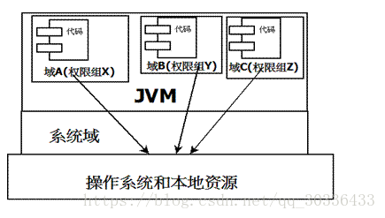
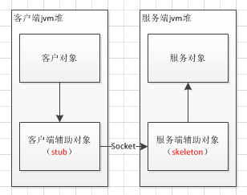
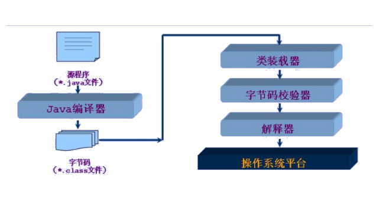
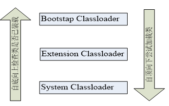
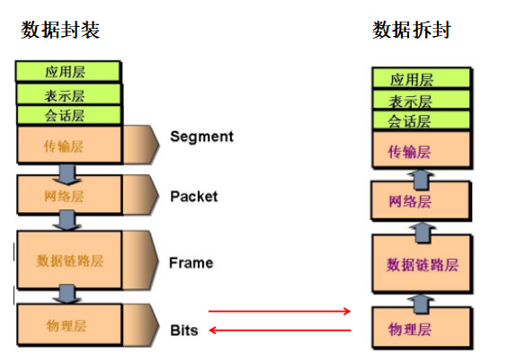

# 一、基础

## 1. 面向对象

### 1. 面向对象开发的优点

- 代码开发模块化，更易维护和修改
- 代码复用
- 增强代码的可靠性和灵活性
- 增加代码的可理解性
- 面向对象编程有很多重要的特性，比如：**封装，继承，多态**和抽象

### 2. 成员变量与局部变量的区别

- 从语法形式上：
  - 成员变量属于类，局部变量是在方法中定义的变量或是方法的参数
  - 成员变量可被 public,private,static 等修饰符所修饰，而局部变量不能被访问控制修饰符及 static 所修饰
  - 成员变量和局部变量都能被 final 所修饰
- 从变量在内存中的存储方式来看，成员变量是对象的一部分，而对象存在于堆内存，局部变量存在于栈内存
- 从变量在内存中的生存时间上看，成员变量是对象的一部分，它随着对象的创建而存在，而局部变量随着方法的调用而自动消失
- 成员变量如果没有被赋初值，则会自动以类型的默认值而赋值，而**局部变量不会自动赋值**

## 2. 数据类型

### 1. 包装类型 

八个基本类型：

- boolean/1
- byte/8
- char/16
- short/16
- int/32
- float/32
- long/64
- double/64

基本类型都有对应的包装类型，基本类型与其对应的包装类型之间的赋值使用自动装箱与拆箱完成。

```java
Integer i = 1;
int j = i;
/**
*    上面代码编译成class后
*/
Integer i = Integer.valueOf(1); // 装箱
int j = i.intValue(); // 拆箱
```

### 2. 缓存池

new Integer(123) 与 Integer.valueOf(123) 的区别在于：

- new Integer(123) 每次都会新建一个对象
- Integer.valueOf(123) 会使用缓存池中的对象，多次调用会取得同一个对象的引用

```java
Integer x = new Integer(123);
Integer y = new Integer(123);
System.out.println(x == y);   // false <==>  System.out.println(x.equals(y)); //true
Integer z = Integer.valueOf(123);
Integer k = Integer.valueOf(123);
System.out.println(z == k);   // true
```

注：equals 与 == 的区别：

- **等号**  比较两个纯字符串时，比较基本类型，如果值相同，则返回 true；比较引用时，如果引用指向同一内存中的同一对象，则返回 true
- **equals**  只比较两个对象的内容是否相等，相等则返回true

`valueOf()`： 先判断值是否在缓存池中，如果在，则直接返回缓存池的内容

```java
//IntegerCache 是 Integer 的内部类
//下面是 valueOf 的源码
public static Integer valueOf(int i) {
    if (i >= IntegerCache.low && i <= IntegerCache.high)
        return IntegerCache.cache[i + (-IntegerCache.low)];
    return new Integer(i);
}
```

在 Java 8 中，**Integer 缓存池的大小默认为 -128\~127** 

```java
//-128-127原因：
//1. 这个范围的整数值是使用最广泛的
//2. 而且在程序中第一次使用 Integer 的时候也需要一定的额外时间来初始化这个缓存
static final int low = -128;
static final int high;//high可以配置，默认为 127
static final Integer cache[];

//静态代码块，Integer类加载时就缓存
static {
    // high value may be configured by property
    int h = 127;
    //读取 JVM 参数配置，灵活提高性能，vm 参数：-XX:AutoBoxCacheMax=<size>
    String integerCacheHighPropValue =
        sun.misc.VM.getSavedProperty("java.lang.Integer.IntegerCache.high");
    if (integerCacheHighPropValue != null) {
        try {
            int i = parseInt(integerCacheHighPropValue);
            i = Math.max(i, 127);
            // Maximum array size is Integer.MAX_VALUE
            h = Math.min(i, Integer.MAX_VALUE - (-low) -1);//防止越界
        } catch( NumberFormatException nfe) {
            // If the property cannot be parsed into an int, ignore it.
        }
    }
    high = h;

    cache = new Integer[(high - low) + 1];//创建缓存数组
    int j = low;
    for(int k = 0; k < cache.length; k++)
        cache[k] = new Integer(j++);

    // range [-128, 127] must be interned (JLS7 5.1.7)
    assert IntegerCache.high >= 127;//保证[-128, 127]在缓存范围内
}
```

**注：** 断言讲解：[java 断言 assert](https://blog.csdn.net/yin__ren/article/details/82759338)

编译器会在自动装箱过程调用 valueOf() 方法，因此多个 Integer 实例使用自动装箱来创建并且值相同，那么就会引用相同的对象

```java
Integer m = 123;
Integer n = 123;
System.out.println(m == n); // true
```

**注：** [JAVA 基本类型的封装类及对应常量池](https://blog.csdn.net/TaoTaoFu/article/details/74943337) 

1. java中基本类型的包装类的大部分都实现了常量池技术，这些类是Byte,Short,Integer,Long,Character,Boolean,另外两种浮点数类型的包装类则没有实现
2. Byte,Short,Integer,Long,Character这5种整型的包装类也只是在对应值小于等于127时才可使用对象池，也即对象不负责创建和管理大于127的这些类的对象。

基本类型对应的缓冲池如下：

- boolean values true and false
- all byte values
- short values between -128 and 127
- int values between -128 and 127
- char in the range \u0000 to \u007F

在使用这些基本类型对应的包装类型时，就可以直接使用缓冲池中的对象

```java
//测试
Integer i = 10;//自动装箱 Integer i = Integer.valueOf(10);
Integer j = 10;//自动装箱 Integer j = Integer.valueOf(10);
System.out.println(i == j);//true

Integer a = 128; 
Integer b = 128; 
System.out.println(a == b);//false： 超过了 -128~127 界限

int k = 10;
System.out.println(k == i);//true： i 会自动拆箱 k == i.intValue()

int kk = 128;
//为何为 true
System.out.println(kk == a);//true： a 会自动拆箱 kk == a.intValue()

Integer m = new Integer(10);
Integer n = new Integer(10);
System.out.println(m == n);//false
```

## 3. 基础类与封装类的区别

### 1. 传递方式不同

- 基本类型在传递参数时按值传递，而封装类型按引用传递

  > 按引用传递： 传递对象的地址

- int 是基本类型，直接存放数值；Integer是类，产生对象时用一个引用指向这个对象

### 2. 封装类都为 final

- 封装类可以有方法和属性，利用这些方法和属性来处理数据，如 Integer.parseInt(Strings)
- **基本数据类型都是final修饰的**，不能继承扩展新的类、新的方法

### 3. 默认初始值不同

- int 的预设为 0；Integer 的预设为 null

  > 因为封装类产生的是对象，对象默认值为null

### 4. 存储位置不同

- 基本类型在内存中是存储在栈中，引用类型的引用（值的地址）存储在栈中，而实际的对象（值）是存在堆中

- 基本数据类型的好处是速度快（不涉及到对象的构造和回收），封装类的目的是更好的处理数据之间的转换

# 二、String

## 1. 概览

- **String 被声明为 final**，因此它不可被继承

- **使用 `final char` 数组存储数据** ，且 String 内部没有改变 value 数组的方法，因此可以保证 String 不可变

```java
public final class String
    implements java.io.Serializable, Comparable<String>, CharSequence {
    /** The value is used for character storage. */
    private final char value[];
```

- 每次对 String 类型进行改变的时候，都会生成一个新的 String 对象，然后将指针指向新的 String 对象

## 2. 不可变的好处

**1. 可以缓存 hash 值** 

- 因为 String 的 hash 值经常被使用，**不可变的特性可以使得 hash 值也不可变**，因此只需要进行一次计算

**2. String Pool 的需要** 

- 若一个 String 对象已经被创建，则会从 String Pool 中取得引用，只有 String 不可变，才能使用 String Pool


**3. 安全性** 

- String 经常作为参数，**String 不可变性可以保证参数不可变**

**4. 线程安全** 

- String 不可变性天生具备线程安全，可以在多个线程中安全地使用

[Program Creek : Why String is immutable in Java?](https://www.programcreek.com/2013/04/why-string-is-immutable-in-java/)

## 3. String, StringBuffer, StringBuilder

**1. 可变性** 

- String 不可变
- StringBuffer 和 StringBuilder 可变

**2. 线程安全** 

- String 不可变，因此是线程安全的
- StringBuilder 不是线程安全的
- StringBuffer 是线程安全的，内部使用 synchronized 进行同步

**3. 对比**

- 操作少量的数据 = String
- 单线程操作字符串缓冲区下操作大量数据 = StringBuilder
- 多线程操作字符串缓冲区下操作大量数据 = StringBuffer

## 4. String Pool

- **字符串常量池(String Poll)**： 保存着所有字符串字面量，这些字面量在编译时期确定
- 可以使用 String 的 intern() 方法在运行过程中将字符串添加到 String Poll 中
- **intern() 方法**： 
  - 如果字符串常量池中包含一个等于此 String 对象的字符串，则返回池中这个字符串的 String 对象
  - 否则，将此 String 对象包含的字符串添加到常量池中，并且返回此 String 对象的引用

```java
//示例一: 常量池中不含 SEUCalvin，因此将 SEUCalvin 加入常量池并返回其引用
String str1 = new String("SEU") + new String("Calvin");
System.out.println(str1.intern() == str1);//true
System.out.println(str1 == "SEUCalvin");//true

//示例二： 常量池中含有 SEUCalvin，因此直接返回其 String 对象
String str2 = "SEUCalvin";
String str1 = new String("SEU") + new String("Calvin");
System.out.println(str1.intern() == str1);//false
System.out.println(str1 == "SEUCalvin");//false

//示例三
String s = new String("1"); //创建的 String 对象放入 Heap 中
String sTmp = s.intern();
String s2 = "1"; //放入常量池中
System.out.println(s == s2);//false
System.out.println(sTmp == s2);//true

String s3 = new String("1") + new String("1"); 
String sTmp3 = s3.intern(); //将 s3 字符串放入常量池中
String s4 = "11"; //从常量池返回结果为 s3
System.out.println(s3 == s4);//true
System.out.println(sTmp3 == s4);//true
//对比： 调换顺序
String s5 = new String("1") + new String("1"); 
String s6 = "11"; 
String sTmp5 = s5.intern(); 
System.out.println(s5 == s6);//false
System.out.println(sTmp5 == s6);//true

//示例四
String str1 = "a";
String str2 = "b";
String str3 = "ab";
String str4 = str1 + str2;
String str5 = new String("ab");
System.out.println(str5 == str3); //false 
//str5调用intern时，会检查字符串池中是否含有该字符串，由于已有该字符串，则会得到相同的引用
System.out.println(str5.intern() == str3); //true
//变量参与运算，不会放入常量池中
System.out.println(str5.intern() == str4); //false
```

推荐阅读： 

- [String中intern的方法](https://www.cnblogs.com/wanlipeng/archive/2010/10/21/1857513.html) 
- [深入解析 String#intern](https://tech.meituan.com/in_depth_understanding_string_intern.html) 

# 三、运算

## 1. 参数传递

> **强烈推荐**： ==[Java 有值类型吗](www.yinwang.org/blog-cn/2016/06/08/java-value-type)== 

- **Java 的参数是以值传递的形式传入方法中**，而不是引用传递
- 形参是基本数据类型：将实参的值传递给形参的基本数据类型的变量
- 形参是引用数据类型：将实参的引用（对应的堆空间的对象实体的首地址值）传递给形参的引用类型变量

> - 值传递： 传递该变量的副本，改变副本不影响原变量
>
> - 引用传递： 传递该对象地址的副本，并不是原对象本身 
>
> java 基础类型数据传递都是值传递，java中实例对象的传递是引用传递

```java
public class Dog {
    String name;

    Dog(String name) {
        this.name = name;
    }

    String getName() {
        return this.name;
    }

    void setName(String name) {
        this.name = name;
    }

    String getObjectAddress() {
        return super.toString();
    }
}
```

```java
public class PassByValueExample {
    public static void main(String[] args) {
        Dog dog = new Dog("A");
        System.out.println(dog.getObjectAddress()); // Dog@4554617c
        func(dog);
        System.out.println(dog.getObjectAddress()); // Dog@4554617c
        System.out.println(dog.getName());          // A
    }

    private static void func(Dog dog) { //该 dog 是一个指针类型
        System.out.println(dog.getObjectAddress()); // Dog@4554617c
        dog = new Dog("B");
        System.out.println(dog.getObjectAddress()); // Dog@74a14482
        System.out.println(dog.getName());          // B
    }
}
```

但是如果在方法中改变对象的字段值会改变原对象该字段值，因为改变的是同一个地址指向的内容

```java
class PassByValueExample {
    public static void main(String[] args) {
        Dog dog = new Dog("A");
        func(dog);
        System.out.println(dog.getName());          // B
    }

    private static void func(Dog dog) {
        dog.setName("B");
    }
}
```

[StackOverflow: Is Java “pass-by-reference” or “pass-by-value”?](https://stackoverflow.com/questions/40480/is-java-pass-by-reference-or-pass-by-value)

## 2. float 与 double

1.1 字面量属于 double 类型，不能直接将 1.1 直接赋值给 float 变量，因为这是向下转型。Java 不能隐式执行向下转型，因为这会使得精度降低。

```java
// float f = 1.1;
```

1.1f 字面量才是 float 类型。

```java
float f = 1.1f;
```

## 3. 隐式类型转换

**转换规则**： 

- 数值型数据的转换：`byte→short→int→long→float→double`
- 字符型转换为整型：`char→int`

因为字面量 1 是 int 类型，它比 short 类型精度要高，因此不能隐式地将 int 类型下转型为 short 类型。

```java
short s1 = 1;
// s1 = s1 + 1;
```

但是使用 += 运算符可以执行隐式类型转换。

```java
s1 += 1;
```

上面的语句相当于将 s1 + 1 的计算结果进行了向下转型：

```java
s1 = (short) (s1 + 1);
```

[StackOverflow : Why don't Java's +=, -=, *=, /= compound assignment operators require casting?](https://stackoverflow.com/questions/8710619/why-dont-javas-compound-assignment-operators-require-casting)

## 4. switch

- switch 支持 String，但不支持 long

```java
String str = "world";
switch (str) {
    case "hello":
        System.out.println("hello");
        break;
    case "world":
        System.out.println("world");
        break;
    default:
        break;
}
//反编译后的结果
String str = "world";
String s;
switch((s = str).hashCode())
{
    default:
        break;
    case 99162322:
        if(s.equals("hello"))
            System.out.println("hello");
        break;
    case 113318802:
        if(s.equals("world"))
            System.out.println("world");
        break;
}
```

[StackOverflow : Why can't your switch statement data type be long, Java?](https://stackoverflow.com/questions/2676210/why-cant-your-switch-statement-data-type-be-long-java)

# 四、继承

```java
class SuperClass {
    private int n;
    SuperClass(){
        System.out.println("SuperClass()");
    }
    SuperClass(int n) {
        System.out.println("SuperClass(int n)");
        this.n = n;
    }
}
// SubClass 类继承
class SubClass extends SuperClass{
    private int n;
        SubClass(){ // 自动调用父类的无参数构造器
        System.out.println("SubClass");
    }  

    public SubClass(int n){ 
        super(300);  // 调用父类中带有参数的构造器
        System.out.println("SubClass(int n):"+n);
        this.n = n;
    }
}
// SubClas2 类继承
class SubClass2 extends SuperClass{
    private int n;

    SubClass2(){
        super(300);  // 调用父类中带有参数的构造器
        System.out.println("SubClass2");
    }  

    public SubClass2(int n){ // 自动调用父类的无参数构造器
        System.out.println("SubClass2(int n):"+n);
        this.n = n;
    }
}
public class TestSuperSub{
    public static void main (String args[]){
        System.out.println("------SubClass 类继承------");
        SubClass sc1 = new SubClass();
        SubClass sc2 = new SubClass(100); 
        System.out.println("------SubClass2 类继承------");
        SubClass2 sc3 = new SubClass2();
        SubClass2 sc4 = new SubClass2(200); 
    }
}

//输出结果
------SubClass 类继承------
SuperClass()
SubClass
SuperClass(int n)
SubClass(int n):100
------SubClass2 类继承------
SuperClass(int n)
SubClass2
SuperClass()
SubClass2(int n):200
```

## 1. 访问权限

|           | 同一个类 | 同一个包 | 不同包的子类 | 不同包的非子类 |
| :-------: | :------: | :------: | :----------: | :------------: |
|  private  |    √     |          |              |                |
|  default  |    √     |    √     |              |                |
| protected |    √     |    √     |      √       |                |
|  public   |    √     |    √     |      √       |       √        |

- Java 的三个访问权限修饰符：`private、protected、public`，如果**不加访问修饰符，表示包级可见** 

  > protected 用于修饰成员，表示在继承体系中成员对于子类可见，但对于类没有意义

- 对类或类中的成员（字段以及方法）加上访问修饰符：
  - 类可见表示其它类可以用这个类创建实例对象
  - 成员可见表示其它类可以用这个类的实例对象访问到该成员

- 信息隐藏或封装： 隐藏所有的实现细节，模块之间只通过 API 进行通信

- [设计模式的六大原则](http://wiki.jikexueyuan.com/project/java-design-pattern-principle/)：

  - **单一职责原则**： 一个类只负责一项职责，防止职责扩散

  - **里氏替换原则**： 类 B 继承类 A 时，除添加新的方法完成新增功能外，尽量不要重写父类 A 的方法，也尽量不要重载父类 A 的方法

  - **依赖倒置原则**： 高层模块不依赖低层模块，二者都应该依赖其抽象；抽象不应该依赖细节，细节应该依赖抽象

    > 类 B 和类 C 各自实现接口 I，类 A 通过接口 I 间接与类B或者类C发生联系，则会降低修改类A的几率

  - **接口隔离原则**： 将臃肿的接口拆分为独立的几个接口，类A和类C分别与他们需要的接口建立依赖关系
  - **迪米特法则**： 尽量降低类与类之间的耦合
  - **开闭原则**： 当软件需要变化时，尽量通过扩展软件实体的行为来实现变化，而不是通过修改已有的代码来实现变化

## 2. 抽象类与接口

**1. 抽象类** 

抽象类和抽象方法都使用 abstract 关键字进行声明。抽象类一般会包含抽象方法，抽象方法一定位于抽象类中。

抽象类和普通类最大的区别是，抽象类不能被实例化，需要继承抽象类才能实例化其子类。

```java
public abstract class AbstractClassExample {

    protected int x;
    private int y;

    public abstract void func1();

    public void func2() {
        System.out.println("func2");
    }
}
```

```java
public class AbstractExtendClassExample extends AbstractClassExample {
    @Override
    public void func1() {
        System.out.println("func1");
    }
}
```

```java
// AbstractClassExample ac1 = new AbstractClassExample(); // 'AbstractClassExample' is abstract; cannot be instantiated
AbstractClassExample ac2 = new AbstractExtendClassExample();
ac2.func1();
```

**2. 接口** 

接口是抽象类的延伸，在 Java 8 之前，它可以看成是一个完全抽象的类，也就是说它不能有任何的方法实现。

从 Java 8 开始，接口也可以拥有默认的方法实现，这是因为不支持默认方法的接口的维护成本太高了。在 Java 8 之前，如果一个接口想要添加新的方法，那么要修改所有实现了该接口的类。

接口的成员（字段 + 方法）默认都是 public 的，并且不允许定义为 private 或者 protected。

接口的字段默认都是 static 和 final 的。

```java
public interface InterfaceExample {

    void func1();

    default void func2(){
        System.out.println("func2");
    }

    int x = 123;
    // int y;               // Variable 'y' might not have been initialized
    public int z = 0;       // Modifier 'public' is redundant for interface fields
    // private int k = 0;   // Modifier 'private' not allowed here
    // protected int l = 0; // Modifier 'protected' not allowed here
    // private void fun3(); // Modifier 'private' not allowed here
}
```

```java
public class InterfaceImplementExample implements InterfaceExample {
    @Override
    public void func1() {
        System.out.println("func1");
    }
}
```

```java
// InterfaceExample ie1 = new InterfaceExample(); // 'InterfaceExample' is abstract; cannot be instantiated
InterfaceExample ie2 = new InterfaceImplementExample();
ie2.func1();
System.out.println(InterfaceExample.x);
```

**3. 比较** 

- 从设计层面上看，抽象类提供了一种 IS-A 关系，那么就必须满足里式替换原则，即子类对象必须能够替换掉所有父类对象。而接口更像是一种 LIKE-A 关系，它只是提供一种方法实现契约，并不要求接口和实现接口的类具有 IS-A 关系
- 从使用上来看，一个类可以实现多个接口，但是不能继承多个抽象类
- 接口中所有的方都是抽象的，抽象类则可以同时包含抽象和非抽象的方法
- 类可以实现很多个接口，但是只能继承一个抽象类
- 接口的字段只能是 static 和 final 类型的，而抽象类的字段没有这种限制
- 接口的成员只能是 public 的，而抽象类的成员可以有多种访问权限
- 接口是绝对抽象的，不可以被实例化，抽象类也不可以被实例化

**4. 使用选择** 

使用接口：

- 需要让不相关的类都实现一个方法，例如不相关的类都可以实现 Compareable 接口中的 compareTo() 方法
- 需要使用多重继承

使用抽象类：

- 需要在几个相关的类中共享代码
- 需要能控制继承来的成员的访问权限，而不是都为 public
- 需要继承非静态和非常量字段

在很多情况下，接口优先于抽象类。因为接口没有抽象类严格的类层次结构要求，可以灵活地为一个类添加行为。并且从 Java 8 开始，接口也可以有默认的方法实现，使得修改接口的成本也变的很低。

- [深入理解 abstract class 和 interface](https://www.ibm.com/developerworks/cn/java/l-javainterface-abstract/)
- [When to Use Abstract Class and Interface](https://dzone.com/articles/when-to-use-abstract-class-and-intreface)

## 3. super

作用： 

- **访问父类的构造函数**
- **访问父类的成员**

```java
public class SuperExample {
    protected int x;
    protected int y;

    public SuperExample(int x, int y) {
        this.x = x;
        this.y = y;
    }

    public void func() {
        System.out.println("SuperExample.func()");
    }
}
```

```java
public class SuperExtendExample extends SuperExample {
    private int z;

    public SuperExtendExample(int x, int y, int z) {
        super(x, y);
        this.z = z;
    }

    @Override
    public void func() {
        super.func();
        System.out.println("SuperExtendExample.func()");
    }
}
```

```java
SuperExample e = new SuperExtendExample(1, 2, 3);
e.func();
```

```html
SuperExample.func()
SuperExtendExample.func()
```

[Using the Keyword super](https://docs.oracle.com/javase/tutorial/java/IandI/super.html)

## 4. this

1. 使用在类中，可以用来修饰属性、方法、构造器
2. 表示当前对象或者是当前正在创建的对象
3. 当形参与成员变量重名时，如果在方法内部需要使用成员变量，必须添加this来表明该变量时类成员
4. 在任意方法内，如果使用当前类的成员变量或成员方法可以在其前面添加this，增强程序的阅读性
5. 在构造器中使用“this(形参列表)”显式的调用本类中重载的其它的构造器
   1. **要求“this(形参列表)”要声明在构造器的首行**！
   2. 类中若存在n个构造器，那么最多有n-1构造器中使用了this

## 5. 重写与重载

**1. 重写（Override）** 

- 定义： 指子类实现了一个与父类在方法声明上完全相同的一个方法

- 为满足里式替换原则，重写的限制：
  - **子类方法的访问权限必须大于等于父类方法**
  - **子类方法的返回类型必须是父类方法返回类型或为其子类型**

  使用 @Override 注解，可以让编译器帮忙检查是否满足上面的两个限制条件

  > 重写的七大规则： 
  >
  > - 规则一： 重写方法不能比被重写方法限制有更严格的访问级别
  >
  > - 规则二： 参数列表必须与被重写方法的相同
  >
  > - 规则三： 返回类型必须与被重写方法的返回类型相同
  >
  > - 规则四： 重写方法不能抛出新的异常或者比被重写方法声明的检查异常更广的检查异常
  >
  >   > 但可以抛出更少，更有限或者不抛出异常
  >
  > - 规则五： 不能重写被标识为 final 的方法
  >
  > - 规则六： 如果一个方法不能被继承，则不能重写它
  >
  > - 规则七： 静态方法不能被重写
  >
  > ```java
  > //Supper 父类
  > public class Supper {
  >    	public void sup(int n) {
  >    		System.out.println("supper: " + n);
  >    	}
  > }
  > 
  > //sub 子类
  > public class Sub extends Supper {
  >    	@Override
  >    	public void sup(int n) {
  >    		System.out.println("sub: " + n);
  >    	}
  > }
  > 
  > //测试一
  > public static void main(String[] args) {
  >       Supper supper = new Supper();
  >       supper.sup(1);
  > }
  > //结果： supper: 1
  > 
  > //测试二
  > public static void main(String[] args) {
  >       Supper supper = new Sub();
  >       supper.sup(1);
  > }
  > //结果： sub: 1
  > 
  > //测试三
  > public static void main(String[] args) {
  >       Sub sub = new Sub();
  >       sub.sup(1);
  > }
  > //结果： sub: 1
  > ```

**2. 重载（Overload）** 

- 定义： 指一个方法与已经存在的方法名称上相同，但是参数类型、个数、顺序至少有一个不同

  > 注意： **返回值不同，其它都相同不算是重载** 
  >
  > 推荐阅读： [为什么Java中不认可 以返回值类型不同来重载](<https://bbs.csdn.net/topics/392025911>)
  >
  > > - 函数的定义： 函数将有效的输入值变换为唯一的输出值，同一输入总是对应同一输出
  > > - 函数有唯一的输出值, 且同一输入总对应同一输出. 如果仅返回值类型不同那就说明同一函数有多种输出值违反了函数定义. 
  > >
  > > 举个例子add(int, int)调用此方法时你并不知道函数返回的什么类型(int还是long),  因为int是可以隐式的向上转型为long, 所以JVM并不知道该调用int的返回方法呢还是long的返回方法. 举这个例子可能有些不恰当, 只是为了说明一个函数只有唯一一个输出, 不能出现既可以返回int还可以返回long或者其它什么类型

## 6. 其他关系模型

- **[继承、实现、依赖、关联、聚合、组合的联系与区别](https://www.cnblogs.com/jiqing9006/p/5915023.html)**

# 五、Object 通用方法

## 1. 概览 

```java
public final native Class<?> getClass()
public native int hashCode()
public boolean equals(Object obj)
protected native Object clone() throws CloneNotSupportedException
public String toString()
public final native void notify()
public final native void notifyAll()
public final native void wait(long timeout) throws InterruptedException
public final void wait(long timeout, int nanos) throws InterruptedException
public final void wait() throws InterruptedException
protected void finalize() throws Throwable {}
```

## 2. equals()

- 推荐阅读： **[equals()与hashCode()方法详解](https://www.cnblogs.com/Qian123/p/5703507.html)** 

```java
//Object 类中的实现
public boolean equals(Object obj) {  
    return (this == obj);  
}  
```

**1. 等价关系** 

- **自反性**： 对于任意不为 `null` 的引用值x，`x.equals(x)` 一定是 `true`

  ```java
  x.equals(x); // true
  ```

- **对称性**： 对于任意不为`null`的引用值`x`和`y`，当且仅当`x.equals(y)`是`true`时，`y.equals(x)`也是`true`

  ```java
  x.equals(y) == y.equals(x); // true
  ```

- **传递性**： 对于任意不为`null`的引用值`x`、`y`和`z`，如果`x.equals(y)`是`true`，同时`y.equals(z)`是`true`，那么`x.equals(z)`一定是`true`

  ```java
  if (x.equals(y) && y.equals(z))
      x.equals(z); // true
  ```

- **一致性**： 对于任意不为`null`的引用值`x`和`y`，如果用于equals比较的对象信息没有被修改的话，多次调用时`x.equals(y)`要么一致地返回`true`要么一致地返回`false`

- **与 null 的比较**： 对于任意不为`null`的引用值`x`，`x.equals(null)`返回`false` 

  ```java
  x.equals(null); // false
  ```

**2. 等价与相等** 

- 对于基本类型，== 判断两个值是否相等，基本类型没有 equals() 方法
- 对于引用类型，== 判断两个变量是否引用同一个对象，而 equals() 判断引用的对象是否等价

```java
Integer x = new Integer(1);
Integer y = new Integer(1);
System.out.println(x.equals(y)); // true
System.out.println(x == y);      // false
```

**3. 实现** 

```java
public class EqualExample {

    private int x;
    private int y;
    private int z;

    public EqualExample(int x, int y, int z) {
        this.x = x;
        this.y = y;
        this.z = z;
    }

    @Override
    public boolean equals(Object o) {
        //检查是否为同一个对象的引用，如果是直接返回 true
        if (this == o) return true;
        //检查是否是同一个类型，如果不是，直接返回 false
        if (o == null || getClass() != o.getClass()) return false;
		//将 Object 对象进行转型
        EqualExample that = (EqualExample) o; 
		//判断每个关键域是否相等
        if (x != that.x) return false;
        if (y != that.y) return false;
        return z == that.z;
    }
}
```

- 注意： **当equals()方法被override时，hashCode()也要被override**

  > 重写 equals 方法，但未重写 hashcode，则返回的是两个对象的内存地址，即 hashcode 不同

## 3. hashCode()

- 作用：是获取哈希码(散列码)；实际上返回一个int整数，哈希码的作用是确定该对象在哈希表中的索引位置

```java
//Object 类中的 hashCode
public native int hashCode();
```

- hashCode() 返回散列值，而 equals() 是用来判断两个对象是否等价
- 等价的两个对象散列值一定相同，但是散列值相同的两个对象不一定等价
- 在覆盖 equals() 方法时应当总是覆盖 hashCode() 方法，保证等价的两个对象散列值也相等
- 理想的散列函数应当具有均匀性，即不相等的对象应当均匀分布到所有可能的散列值上
- equals相等两个对象，则hashcode一定要相等。但是hashcode相等的两个对象不一定equals相等

> hashCode() 的重要性：  以 `HashSet 如何检查重复` 为例来说明：
>
> - 当把对象加入 HashSet 时，HashSet 会先计算对象的 hashcode 值来判断对象加入的位置，同时也会与其他已经加入的对象的 hashcode 值作比较，如果没有相符的hashcode，HashSet会假设对象没有重复出现
>
> - 但如果发现有相同 hashcode 值的对象，则会调用 equals() 方法来检查 hashcode 相等的对象是否真的相同
> - 如果两者相同，HashSet 就不会让加入操作成功。如果不同的话，就会重新散列到其他位置，这样就大大减少了 equals 的次数，提高了执行速度
>
> > 注意： hashCode() 的默认行为是对堆上的对象产生独特值，如果没有重写 hashCode()，则该 class 的两个对象无论如何都不会相等（即使这两个对象指向相同的数据）

## 4. toString()

默认返回 ToStringExample@4554617c 这种形式，其中 @ 后面的数值为散列码的无符号十六进制表示

```java
public class ToStringExample {
    private int number;

    public ToStringExample(int number) {
        this.number = number;
    }
}
```

```java
ToStringExample example = new ToStringExample(123);
System.out.println(example.toString());
```

```html
ToStringExample@4554617c
```

## 5. clone() 

### 1. 简介

- clone() 是 Object 的 protected 方法，即一个类不显式去重写 clone()，其它类就不能直接去调用该类实例的 clone() 方法

  ```java
  //重写 clone()
  public class CloneExample {
      private int a;
      private int b;
  
      @Override
      protected CloneExample clone() throws CloneNotSupportedException {
          return (CloneExample)super.clone();
      }
  }
  ```

- 如果一个类没有实现 Cloneable 接口又调用了 clone() 方法，就会抛出 CloneNotSupportedException

### 2. 浅拷贝

- 定义： **拷贝对象和原始对象的引用类型引用同一个对象**

```java
public class ShallowCloneExample implements Cloneable {
    private int[] arr;

    public ShallowCloneExample() {
        arr = new int[10];
        for (int i = 0; i < arr.length; i++) {
            arr[i] = i;
        }
    }
    public void set(int index, int value) {
        arr[index] = value;
    }
    public int get(int index) {
        return arr[index];
    }
    @Override
    protected ShallowCloneExample clone() throws CloneNotSupportedException {
        return (ShallowCloneExample) super.clone();
    }
}

//测试
ShallowCloneExample e1 = new ShallowCloneExample();
ShallowCloneExample e2 = null;
try {
    e2 = e1.clone();
} catch (CloneNotSupportedException e) {
    e.printStackTrace();
}
e1.set(2, 222);
System.out.println(e2.get(2)); // 222
```

### 3. 深拷贝

- 定义： **拷贝对象和原始对象的引用类型引用不同对象**

```java
public class DeepCloneExample implements Cloneable {
    private int[] arr;

    public DeepCloneExample() {
        arr = new int[10];
        for (int i = 0; i < arr.length; i++) {
            arr[i] = i;
        }
    }
    public void set(int index, int value) {
        arr[index] = value;
    }
    public int get(int index) {
        return arr[index];
    }

    @Override
    protected DeepCloneExample clone() throws CloneNotSupportedException {
        DeepCloneExample result = (DeepCloneExample) super.clone();
        result.arr = new int[arr.length];
        for (int i = 0; i < arr.length; i++) {
            result.arr[i] = arr[i];
        }
        return result;
    }
}

//测试
DeepCloneExample e1 = new DeepCloneExample();
DeepCloneExample e2 = null;
try {
    e2 = e1.clone();
} catch (CloneNotSupportedException e) {
    e.printStackTrace();
}
e1.set(2, 222);
System.out.println(e2.get(2)); // 2
```

### 4. clone() 的替代方案

- 缺点： **使用 clone() 方法来拷贝一个对象即复杂又有风险，它会抛出异常，并且还需要类型转换**
- 替代： **可以使用拷贝构造函数或者拷贝工厂来拷贝一个对象** 

```java
public class CloneConstructorExample {
    private int[] arr;

    public CloneConstructorExample() {
        arr = new int[10];
        for (int i = 0; i < arr.length; i++) {
            arr[i] = i;
        }
    }
    public CloneConstructorExample(CloneConstructorExample original) {
        arr = new int[original.arr.length];
        for (int i = 0; i < original.arr.length; i++) {
            arr[i] = original.arr[i];
        }
    }
    public void set(int index, int value) {
        arr[index] = value;
    }
    public int get(int index) {
        return arr[index];
    }
}

//测试
CloneConstructorExample e1 = new CloneConstructorExample();
CloneConstructorExample e2 = new CloneConstructorExample(e1);
e1.set(2, 222);
System.out.println(e2.get(2)); // 2
```

# 六、关键字

## 1. final

- 用来修饰数据，包括成员变量和局部变量，该变量只能被赋值一次且它的值无法被改变

  > 对于成员变量来讲，我们必须在声明时或者构造方法中对它赋值

- 用来修饰方法参数，表示在变量的生存期中它的值不能被改变

- 修饰方法，表示该方法无法被重写

- 修饰类，表示该类无法被继承

  > final 类中的所有成员方法都会被隐式地指定为 final 方法

## 2. static

- `static`： 表明一个成员变量或成员方法可以在不实例化类的情况下被访问

- `static` 方法不能被覆盖，因为方法覆盖是运行时动态绑定，而 static 方法是编译时静态绑定，且 static 方法跟类的任何实例都不相关

### 1. 静态变量

- **静态变量**：又称为类变量，即该变量属于类的，类所有的实例都共享静态变量，可以直接通过类名来访问
- **实例变量**：每创建一个实例就会产生一个实例变量，与该实例同生共死

### 2. 静态方法

- 静态方法在类加载时已存在，不依赖于任何实例
- 静态方法必须有实现，即不能是抽象方法

- **静态方法只能访问所属类的静态字段和静态方法**，方法中不能有 this 和 super 关键字

### 3. 静态语句块

- 静态语句块在类初始化时运行一次

```java
static{
    //...
}
```

### 4. 静态内部类

- 非静态内部类依赖于外部类的实例，而静态内部类不需要
- 静态内部类不能访问外部类的非静态的变量和方法

```java
public class OuterClass {
    class InnerClass { //非静态内部类
    }
    static class StaticInnerClass { //静态内部类
    }

    public static void main(String[] args) {
        OuterClass outerClass = new OuterClass();
        InnerClass innerClass = outerClass.new InnerClass();//依赖于外部类的实例
        StaticInnerClass staticInnerClass = new StaticInnerClass();//不依赖
    }
}
```

### 5. 静态导包

- 在使用静态变量和方法时不用再指明 ClassName，从而简化代码，但可读性大大降低
- 静态导包后，当调用类的静态方法时，不需要加上类名

```java
import static com.xxx.ClassName.* //静态导包格式

//测试
public class StaticDemo {
    public static void sayHi() {
        System.out.println("Hi");
    }
    
    public static void sayBye() {
        System.out.println("Bye");
    }
}
//调用
import static com.jas.test.StaticDemo.*; //静态导入

public class StaticDemoDriven {
    public static void main(String[] args) {
        //直接调用，不用加类名
        sayHi(); 
        sayBye();
    }
}
```

### 6. 初始化顺序

- 静态变量和静态语句块优先于实例变量和普通语句块，静态变量和静态语句块的初始化顺序取决于它们在代码中的顺序
- 存在继承的情况下，**初始化顺序**：
  - 父类（静态变量、静态语句块）
  - 子类（静态变量、静态语句块）
  - 父类（实例变量、普通语句块）
  - 父类（构造函数）
  - 子类（实例变量、普通语句块）
  - 子类（构造函数）


## 3. native 

> 实现 java 与其他语言的交互（如：C，C++）

[java中的native关键字](http://www.blogjava.net/shiliqiang/articles/287920.html)

[Java中Native关键字的作用](https://www.cnblogs.com/Qian123/p/5702574.html) 

## 4. transient 

- **[Java 序列化的高级认识](https://www.ibm.com/developerworks/cn/java/j-lo-serial/index.html?mhq=%E4%BB%80%E4%B9%88%E6%98%AF%E5%BA%8F%E5%88%97%E5%8C%96%E4%B8%8E%E5%8F%8D%E5%BA%8F%E5%88%97%E5%8C%96%E3%80%81%E4%B8%BA%E4%BB%80%E4%B9%88%E5%BA%8F%E5%88%97%E5%8C%96)** 
- **[序列化与单例模式](http://www.cnblogs.com/ixenos/p/5831067.html)** 
- **[Java反序列化漏洞分析](https://www.cnblogs.com/he1m4n6a/p/10131566.html)** 

---

- 序列化： 把实体对象状态按照一定的格式写入到有序字节流

  反序列化： 从有序字节流重建对象，恢复对象状态

- 序列化的作用：

  - 永久性保存对象，保存对象的字节序列到本地文件或者数据库中
  - 通过序列化以字节流的形式使对象在网络中进行传递和接收
  - 通过序列化在进程间传递对象

- 序列化步骤：

  - 将对象实例相关的类元数据输出

    > 元数据： 数据的数据，即描述代码间关系，或者代码与其他资源之间内在联系的数据
    >
    > 四种类型的元数据： 类、枚举、接口、注解
    >
    > 框架的元数据： xml 配置文件

  - 递归地输出类的超类描述直到不再有超类

  - 类元数据完了以后，开始从最顶层的超类开始输出对象实例的实际数据值

  - 从上至下递归输出实例的数据

- `serialVersionUID`，类路径，功能代码决定了虚拟机是否允许反序列化

- 静态变量不属于对象，属于类，不能被序列化，即序列化不保存静态变量

  ```java
  public class Test implements Serializable {
      private static final long serialVersionUID = 1L;
      public static int staticVar = 5; //静态变量
      public static void main(String[] args) {
          try {
              //初始时staticVar为5
              ObjectOutputStream out = new ObjectOutputStream(
                      new FileOutputStream("result.obj"));
              out.writeObject(new Test());
              out.close();
              //序列化后修改为10
              Test.staticVar = 10;
   			//反序列化并读取
              ObjectInputStream oin = new ObjectInputStream(new FileInputStream(
                      "result.obj"));
              Test t = (Test) oin.readObject();
              oin.close();
              //再读取，通过t.staticVar打印新的值
              System.out.println(t.staticVar); //结果为 10
          } catch (Exception e) {
              e.printStackTrace();
          }
      }
  }
  ```

- 若子类实现 Serializable 接口而父类未实现时，对子类进行反序列化时，会默认调用父类的无参构造器作为默认父类对象，因此父类对象的值为无参构造器的值

  > - 父类的无参构造器若未明显指定，则变量值为默认声明的值，如： int 型为 0，String 型为 null
  > - 部分字段放在父类中的好处：当有另外一个 Child 类时，字段不会被序列化，不用重复写 transient

- Transient 关键字： 避免变量被序列化，在被反序列化后，transient 变量的值被设为初始值，如 int 型的是 0，对象型的是 null

- 序列化过程中，虚拟机会调用对象类中的 `writeObject` 与 `readObject` 方法进行序列化与反序列化

  > - 该方法可以用户自定义，允许用户控制序列化的过程，如： 动态改变序列化的值，对敏感字段加密
  >
  > - 实现 Externalizable 接口的类完全由自身来控制序列化的行为
  >
  >   实现 Serializable 接口的类采用默认的序列化方式

- 序列化对同一对象进行多次写入时，不会再次存储，而是再次存储一份引用

- 序列化会破坏单例模式(发射会破坏单例模式)： **反序列化会通过反射调用无参数的构造方法创建一个新的对象**

  ```java
  class Singleton implements Serializable{
      //静态内部类实现单例
  	private static class SingletonClassInstance {
  	    private static final Singleton instance = new Singleton();
  	}
  	public static Singleton getInstance() {
  	    return SingletonClassInstance.instance;
  	}
  	private Singleton() {}
  }
  //测试
  //Write Obj to file
  ObjectOutputStream oos = new ObjectOutputStream(new FileOutputStream("tempFile"));
  oos.writeObject(Singleton.getSingleton());
  //Read Obj from file
  File file = new File("tempFile");
  ObjectInputStream ois =  new ObjectInputStream(new FileInputStream(file));
  Singleton newInstance = (Singleton) ois.readObject();
  //判断是否是同一个对象
  System.out.println(newInstance == Singleton.getSingleton()); //&& false &&
  ```

  - 解决方法一： **在Singleton类中定义readResolve**，并指定对象的生成策略

    反序列化过程： **readObject--->readObject0--->readOrdinaryObject--->checkResolve** 

    单例破坏反序列化原因： 若类可被实例化，则会通过反射的方式调用无参构造方法**新建一个对象**

    ```java
    //指定获取单例策略
    private Object readResolve() throws ObjectStreamException {  
        return SingletonClassInstance.instance;
    }
    ```

  - 解决方法二： 通过枚举实现单例

    ```java
    //每一个枚举类型极其定义的枚举变量在JVM中是唯一的
    enum SingletonEnum{
        INSTANCE;
        
        private Resource instance;
        SingletonEnum() {
            instance = new Resource();
        }
        public Resource getInstance() {
            return instance;
        }
    }
    ```

- Java 序列化漏洞： 通过 `apach common collections` 实现，[Java反序列化漏洞分析](https://www.cnblogs.com/he1m4n6a/p/10131566.html) 

  > **攻击目标**： 可序列化的类重写了 readObject() 方法且使用 Map 类型的变量进行了键值修改操作

  - 首先构造一个 Map 和一个能够执行代码的 ChainedTransformer

    > ChainedTransformer 用于挨个执行定义的命令

  - 生成一个 TransformedMap 实例，用于修改 Map 中的数据

    > 利用其 value 修改时触发 transform() 特性

  - 实例化 AnnotationInvocationHandler，并对其进行序列化，用于检测 readObject 方法

  - 当触发readObject()反序列化的时候，就能实现命令执行

  > POC执行流程： TransformedMap->AnnotationInvocationHandler.readObject()->setValue()-> 漏洞成功触发

## 5. abstract

abstract：抽象的，可以用来修饰类、方法

1. abstract修饰类：抽象类
   1. 不可被实例化
   2. 抽象类有构造器 (凡是类都有构造器)
   3. 抽象方法所在的类，一定是抽象类
   4. 抽象类中可以没有抽象方法


2. abstract修饰方法：抽象方法
   1. 格式：没有方法体，包括{}.如：public abstract void eat();
   2. 抽象方法只保留方法的功能，而具体的执行，交给继承抽象类的子类，由子类重写此抽象方法
   3. 若子类继承抽象类，并重写了所有的抽象方法，则此类是一个"实体类",即可以实例化
   4. 若子类继承抽象类，没有重写所有的抽象方法，意味着此类中仍有抽象方法，则此类必须声明为抽象的

## 6. interface

接口是与类并行的一个概念

1. 接口可以看做是一个特殊的抽象类。是常量与抽象方法的一个集合，不能包含变量、一般的方法
2. 接口是没有构造器的
3. 接口定义的就是一种功能，此功能可以被类所实现
4. 实现接口的类，必须要重写其中的所有的抽象方法，若没有重写所有的抽象方法，则此类仍为一个抽象类
5. 类可以实现多个接口
6. 接口与接口之间也是继承的关系，而且可以实现多继承
7. 接口与具体的实现类之间也存在多态性

## 7. 代码块

执行顺序：静态代码块>mian方法>构造代码块>构造方法
作用：用来初始化类的属性


1. **静态代码块**： 
   1. 使用 static 关键字声明的代码块
   2. 里面可以有输出语句
   3. 随着类的加载而加载，而且只被加载一次
   4. 多个静态代码块之间按照顺序结构执行
   5. 静态代码块的执行要早于非静态代码块的执行
   6. 静态的代码块中只能执行静态的结构(类属性，类方法)
   7. 静态代码块不能存在于任何方法体内
   8. 静态代码块不能直接访问静态实例变量和实例方法，需要通过类的实例对象来访问
2. **非静态代码块：** 普通代码块，构造代码块，同步代码块

   1. 可以对类的属性(静态的 & 非静态的)进行初始化操作，也可以调用本类声明的方法(静态的 & 非静态的)
   2. 里面可以有输出语句
   3. 一个类中可以有多个非静态的代码块，多个代码块之间按照顺序结构执行
   4. 每创建一个类的对象，非静态代码块就加载一次
   5. 非静态代码块的执行要早于构造器

# 七、applet

## 1. 简介

- `java applet`： 是能够被包含在 HTML 页面中且能被启用了 java 的客户端浏览器执行的程序
- 作用： Applet 主要用来创建动态交互的 web 应用程序

特点： 

- Applet 类没有定义 main()，所以一个 Applet 程序不会调用 main() 方法
- Applet 被设计为嵌入在一个 HTML 页面
- 当用户浏览包含 Applet 的 HTML 页面，Applet 的代码就被下载到用户的机器上
- 要查看一个 Applet 需要 JVM， JVM 可以是 Web 浏览器的一个插件，或一个独立的运行时环境
- 用户机器上的 JVM 创建一个 Applet 类的实例，并调用 Applet 生命周期过程中的各种方法
- Applet 有 Web 浏览器强制执行的严格的安全规则，Applet 的安全机制被称为**沙箱安全**
- Applet 需要的其他类可以用 Java 归档（JAR）文件的形式下载下来

### 沙箱

推荐阅读： [java中的安全模型(沙箱机制)](<https://blog.csdn.net/qq_30336433/article/details/83268945>)

#### 1. 沙箱简介

- 沙箱是一个限制程序运行的环境，沙箱机制就是将 Java 代码限定在虚拟机特定的运行范围中，并且严格限制代码对本地系统资源访问，通过这样的措施来保证对代码的有效隔离，防止对本地系统造成破坏

  > 沙箱**主要限制系统资源访问**

- Java 将执行程序分成本地代码和远程代码

  - 本地代码默认为可信任，对于授信的本地代码，可以访问一切本地资源
  - 远程代码不受信，对于非授信的远程代码在早期的 Java 实现中

  JDK1.0 安全依赖于沙箱机制：

  

  JDK1.1 增加了**安全策略**，允许用户指定代码对本地资源的访问权限：

  

  JDK1.2 增加了**代码签名**，不论本地代码或是远程代码，都会按照用户的安全策略设定，由类加载器加载到虚拟机中权限不同的运行空间，来实现差异化的代码执行权限控制： 

  

  JDK1.6 引入了域，虚拟机会把所有代码加载到不同的系统域和应用域，系统域专门负责与关键资源进行交互，而各个应用域则通过系统域的部分代理来对各种需要的资源进行访问

  > 虚拟机中不同的受保护域对应不一样的权限，存在于不同域中的类文件就具有当前域的全部权限

  

#### 2. 沙箱基本组件

- **字节码校验器**：确保 Java 类文件遵循 Java 语言规范，实现 Java 内存保护

  > 核心类不会过字节码校验

- **类装载器**： 

  - 防止恶意代码去干涉善意的代码
  - 守护被信任的类库边界
  - 将代码归入保护域，确定代码可以进行哪些操作

  > - 虚拟机为不同的类加载器载入的类提供不同的命名空间
  > - 命名空间由一系列唯一的名称组成
  > - 每一个被装载的类将有一个名字

类装载器双亲委派模式： 

- 从最内层 JVM 自带类加载器开始加载，外层恶意同名类得不到加载从而无法使用

- 严格通过包来区分访问域，外层恶意的类通过内置代码无法获得权限访问到内层类，破坏代码就自然无法生效

**组件**： 

- **存取控制器**：控制核心 API 对操作系统的存取权限，该控制策略设定可以由用户指定

- **安全管理器**：是核心 API 和操作系统之间的主要接口，实现权限控制，比存取控制器优先级高

  > 安全管理器在启动的时候被创建，之后不能被替换覆盖或者是扩展。

- **安全软件包**：java.security 下的类和扩展包下的类，允许用户为自己的应用增加新的安全特性

  > 安全特性： **安全提供者、消息摘要、数字签名、加密、鉴别**

#### 3. 沙箱包含的要素

- **权限**： 指允许代码执行的操作

  > - **权限类型**： 实现了权限的 Java 类名，是必需的
  >
  > - **权限名**： 对要操作的资源进行定位，基于权限类型来设置
  >
  > - **允许的操作**： 指定了对目标可以执行的操作行为，比如读、写等

- **代码源**： 即类所在的位置，表示为 URL 地址

- **保护域**： 用来组合代码源和权限

- **策略文件**： 是控制沙箱的管理要素，一个策略文件包含一个或多个保护域的项

  > 策略文件完成了代码权限的指定任务，策略文件包括全局和用户专属两种

- **密钥库**： 保存密钥证书

#### 4. 启动沙箱

> 通过 Java 命令行启动的 Java 应用程序，默认不启用沙箱

- 启用沙箱：`java -D java.security.manager <other args>`

- 沙箱启动后，安全管理器会使用两个默认的策略文件来确定沙箱启动参数

  可以通过命令指定：`java -D java.security.policy=<URL>`

- 如果要求启动时只遵循一个策略文件，则启动参数要加等号：`java -D java.security.policy==<URL>`

## 2. 生命周期

- `init`：初始化 Applet，在 Applet 标记内的 param 标签被处理后调用该方法

- `start`： 浏览器调用 init 方法后，该方法被自动调用

  > 每当用户从其他页面返回到包含 Applet 的页面时，则调用该方法
  >
  > - `paint`： 在 start() 方法之后立即被调用，或在 Applet 需要重绘在浏览器的时候调用

- `stop`： 当用户从包含 Applet 的页面移除时，该方法自动被调用

- `destroy`： 仅当浏览器正常关闭时调用

  > 因为 Applet 只有在 HTML 网页上有效，所以你不应该在用户离开包含 Applet 的页面后遗漏任何资源

## 3. 和普通 Java 区别

- applet 是运行在启用了 java 的浏览器中，Java应用程序是可以在浏览器之外运行的独立的Java程序
- Java应用程序需要一个有特定方法签名的main函数来开始执行，Java applet不需要这样的函数来开始执行
- Java applet一般会使用很严格的安全策略，Java应用一般使用比较宽松的安全策略

## 4. applet 限制条件

- applet 不能够载入类库或者定义本地方法
- applet 不能在宿主机上读写文件
- applet 不能读取特定的系统属性
- applet 不能发起网络连接，除非是跟宿主机
- applet 不能够开启宿主机上其他任何的程序

**从网络上加载 applet 和从本地文件系统加载 applet 的区别**： 

- 当 applet 从网上加载时，applet 由 apple t类加载器载入，受 applet 安全管理器限制

- 当 applet 从客户端的本地磁盘载入时，applet 由文件系统加载器载入

  > 从文件系统载入的 applet 允许在客户端读、写文件，加载类库，执行其他程序，但通不过字节码校验

**applet 类加载器**： 

- 当 applet 从网上加载时，它由 applet 类加载器载入
- 类加载器有自己的 java 名称空间等级结构，类加载器会保证来自文件系统的类有唯一的名称空间，来自网络资源的类有唯一的名称空间
- 当浏览器通过网络载入 applet 时，applet 的类被放置于和 applet 的源相关联的私有的名称空间中。然后被类加载器载入的类都通过了验证器验证，验证器会检查类文件格式是否遵守 Java 语言规范，确保不会出现堆栈溢出或者下溢，传递给字节码指令的参数是正确的

# 八、RMI

推荐阅读： [Java RMI详解](<https://blog.csdn.net/a19881029/article/details/9465663>)

## 1. 简介

- **Java 远程方法调用(Java RMI)**： 是 Java API 对远程过程调用(RPC)提供的面向对象的等价形式，支持直接传输序列化的 Java 对象和分布式垃圾回收

- **作用**： 能够让某个 java 虚拟机上的对象调用另一个 java 虚拟机中的对象上的方法

- **RMI 体系结构原则**： 基于行为定义和行为实现相分离的原则，RMI 允许定义行为的代码和实现行为的代码相分离，并且运行在不同的 JVM 上

- **RMI 体系结构分层**： 

  - **存根和骨架层(Stub and Skeleton layer)**：对程序员透明，负责拦截客户端发出的方法调用请求，然后把请求重定向给远程的 RMI 服务

  - **远程引用层(Remote Reference Layer)**：用来解析客户端对服务端远程对象的引用，连接是点到点的

  - **传输层(Transport layer)**：负责连接参与服务的两个 JVM

    > - 建立在网络上机器间的 TCP/IP 连接之上
    > - 提供基本的连接服务，还有一些防火墙穿透策略

- `Marshalling`： 当应用程序把内存对象跨网络传递到另一台主机或是持久化到存储时，就必须把对象在内存里的表示转化成合适的格式

  >  反之称为 `demarshalling` 

## 2. 调用步骤

- 客户对象调用客户端辅助对象上的方法

- 客户端辅助对象打包调用信息（变量，方法名），通过网络发送给服务端辅助对象

- 服务端辅助对象将客户端辅助对象发送来的信息解包，找出真正被调用的方法以及该方法所在对象

- 调用真正服务对象上的真正方法，并将结果返回给服务端辅助对象

- 服务端辅助对象将结果打包，发送给客户端辅助对象

- 客户端辅助对象将返回值解包，返回给客户对象

- 客户对象获得返回值



## 3. 搭建 RMI

1. 创建远程方法接口，该接口必须继承 Remote 接口：

   > - Remote 接口是一个标识接口，用于标识所包含的方法可以从非本地虚拟机上调用的接口
   > - Remote 接口本身不包含任何方法

   ```java
   //远程方法调用的本质依然是网络通信，所以接口的所有方法都必须抛出 RemoteException 以说明该方法有网络异常等风险
   public interface Hello extends Remote {
   	public String sayHello(String name) throws RemoteException;
   }
   ```

2. 创建远程方法接口实现类：

   ```java
   public class HelloImpl extends UnicastRemoteObject implements Hello {
   	//方法参数与返回值将在网络上传输，故必须序列化
       private static final long serialVersionUID = -271947229644133464L;
    	//UnicastRemoteObject 类的构造函数抛出了 RemoteException
   	public HelloImpl() throws RemoteException{
   		super();
   	}
    
   	public String sayHello(String name) throws RemoteException {
   		return "Hello," + name;
   	}
   }
   ```

3. 利用 java 自带 rmic 工具生成 sutb 存根类 `jdk/bin/rmic`

   > - sutb 存根为远程方法类在本地的代理，是在服务端代码的基础上生成的，需要 HelloImpl.class 文件
   >
   > - 命令： `rmic -classpath /home/name/Test server.HelloImpl` 
   >
   > 调用者在本地 stub 上调用方法，它负责在远程对象上执行方法
   >
   > 当 stub 被调用时经历的步骤：
   >
   > - 初始化到包含了远程对象的 JVM 的连接
   > - 序列化参数到远程的 JVM
   > - 等待方法调用和执行的结果
   > - 反序列化返回的值或者是方法没有执行成功情况下的异常
   > - 把值返回给调用者

4. 启动 RMI 注册服务 `jdk/bin/rmiregistry` 

   - 后台启动： `jdk/bin/rmiregistry 12312 &`

     > 若未指定端口号，则默认为 1099

   - 人工创建 rmiregistry 服务： `LocateRegistry.createRegistry(12312);`

5. 编写服务端代码并运行

   > `java.rmi.Naming` 类：
   >
   > - Naming 类用来存储和获取在远程对象注册表里的远程对象的引用
   >
   > - Naming 类的每一个方法接收一个 URL 格式的 String 对象作为参数
   >
   > RMI 绑定： 
   >
   > - 为了查找远程对象而给远程对象关联或者是注册以后会用到的名称的过程
   > - 远程对象可以使用 Naming 类的 bind() 或者 rebind() 方法跟名称相关联
   >
   > bind() 和 rebind() 的区别： 
   >
   > - bind() 方法负责把指定名称绑定给远程对象
   > - rebind() 方法负责把指定名称重新绑定到一个新的远程对象，若名称已绑定过，先前的绑定会被替换

   ```java
   public class HelloServer {
   	public static void main(String[] args) {
   		try{
   			Hello h = new HelloImpl();
   			//创建并导出接受指定port请求的本地主机上的Registry实例
   			//LocateRegistry.createRegistry(12312);
   			
   			/**	Naming 类提供在对象注册表中存储和获得远程对远程对象引用的方法
   			 *  Naming 类的每个方法都可将某个名称作为其一个参数，
   			 *  URL 格式： host:port/name
   			 *  host：注册表所在的主机（远程或本地)，省略则默认为本地主机
   			 *  port：注册表接受调用的端口号，省略则默认为1099
   			 *  name：未经注册表解释的简单字符串
   			 */
   			Naming.bind("rmi://192.168.58.164:12312/Hello", h);
   			System.out.println("HelloServer启动成功");
   		}catch(Exception e){
   			e.printStackTrace();
   		}
   	}
   }
   ```

6. 编写客户端代码并运行客户端

   ```java
   public class HelloClient {
   	public static void main(String[] args) {
   		try {
   			Hello h = (Hello)Naming.lookup("rmi://192.168.58.164:12312/Hello");
   			System.out.println(h.sayHello("zx"));
   		} catch (MalformedURLException e) {
   			System.out.println("url格式异常");
   		} catch (RemoteException e) {
   			System.out.println("创建对象异常");
   			e.printStackTrace();
   		} catch (NotBoundException e) {
   			System.out.println("对象未绑定");
   		}
   	}
   }
   ```

运行图解： 


# 七、反射

**[深入解析 Java 反射（1）- 基础](http://www.sczyh30.com/posts/Java/java-reflection-1/)** 

- Java Reflection     
  - 反射机制允许程序在执行期借助于Reflection API取得任何类的内部信息，并能直接操作任意对象的内部属性及方法
- Java反射机制提供的功能
  - 在运行时判断任意一个对象所属的类
  - 在运行时构造任意一个类的对象
  - 在运行时判断任意一个类所具有的成员变量和方法
  - 在运行时调用任意一个对象的成员变量和方法
  - 生成动态代理

Class 和 java.lang.reflect 一起对反射提供了支持，java.lang.reflect 类库主要包含了以下三个类：

- **java.lang.Class：** 代表一个类,是反射的源头
- **Field** ：可以使用 get() 和 set() 方法读取和修改 Field 对象关联的字段（代表类的成员变量）
- **Method** ：可以使用 invoke() 方法调用与 Method 对象关联的方法（代表类的方法）
- **Constructor** ：可以用 Constructor 创建新的对象（代表类的构造方法）

##1.  理解Class类并实例化Class类对象

在Object类中定义了以下的方法，此方法将被所有子类继承：

- public final Class getClass()

对于每个类而言，JRE 都为其保留一个不变的 Class 类型的对象。一个 Class 对象包含了特定某个类的有关信息： 

- Class 本身也是一个类
- Class 对象只能由系统建立对象
- 一个类在 JVM 中只会有一个 Class 实例 
- 一个 Class 对象对应的是一个加载到 JVM 中的一个 .class 文件
- 每个类的实例都会记得自己是由哪个 Class 实例所生成
- 通过 Class 可以完整地得到一个类中的完整结构 

```java
@Test
public void test3(){
    Person p = new Person();
    Class clazz = p.getClass();//通过运行时类的对象，调用其getClass()，返回其运行时类。
    System.out.println(clazz);
}
```


### 1. 实例化Class类对象(四种方法) 

1. 前提：若已知具体的类，**通过类的class属性获取**，该方法最为安全可靠，程序性能最高       

  实例：Class clazz = String.class

2. 前提：已知某个类的实例，**调用该实例的 getClass() 方法获取Class对象**       

   实例：Class clazz = person.getClass()

3. 前提：已知一个类的全类名，且该类在类路径下，可**通过Class类的静态方法forName()获取**，可能抛出ClassNotFoundException       

   实例：Class clazz = Class.forName(“java.lang.String”)

4. 其他方式(不做要求)

   ClassLoader cl = this.getClass().getClassLoader()

   Class clazz4 = cl.loadClass(“类的全类名”)

```java
@Test
public void test4() throws ClassNotFoundException{
    //1.调用运行时类本身的.class属性
    Class clazz1 = Person.class;
    System.out.println(clazz1.getName());

    Class clazz2 = String.class;
    System.out.println(clazz2.getName());

    //2.通过运行时类的对象获取
    Person p = new Person();
    Class clazz3 = p.getClass();
    System.out.println(clazz3.getName());

    //3.通过Class的静态方法获取.通过此方式，体会一下，反射的动态性。
    String className = "com.java.Person";//要加载类的路径
    Class clazz4 = Class.forName(className);
    System.out.println(clazz4.getName());

    //4.（了解）通过类的加载器
    ClassLoader classLoader = this.getClass().getClassLoader();
    Class clazz5 = classLoader.loadClass(className);
    System.out.println(clazz5.getName());

    System.out.println(clazz1 == clazz3);//true
    System.out.println(clazz1 == clazz4);//true
    System.out.println(clazz1 == clazz5);//true
}
```

**Class.forName 和 ClassLoader 区别**： Class.forName 会运行静态代码块，静态方法

**[在Java的反射中，Class.forName和ClassLoader的区别](https://www.cnblogs.com/jimoer/p/9185662.html)**

- `Class.forName`： 对类进行了初始化

  > JDBC 使用该方式加载数据库连接驱动

- `ClassLoader`： 没有对类进行初始化，只是把类加载到了虚拟机中

  > SpringIoc 的实现

### 2. 创建对象的四种方法

推荐阅读： [java创建对象的四种方式](https://www.cnblogs.com/yunche/p/9530927.html) 

1. **new 语句创建**： `MyObject mo = new MyObject()`

2. **clone 方法创建**： 

   > ```java
   > public class CreateInstance implements Cloneable{
   >     public CreateInstance getInstance() throws CloneNotSupportedException{
   >         return (CreateInstance) this.clone();
   >     }
   > }
   > ```
   >
   > 调用 `new CreateInstance().getInstance()` 创建
   >
   > > 注： 不直接使用 `new CreateInstance().clone()` 原因： 
   > >
   > > - 使用 clone 方法，必需实现 java.lang.Cloneable 接口，否则抛出 CloneNotSupportedException
   > > - clone 方法的的操作是直接复制字段的内容，即该操作并不管字段对应的对象实例内容(浅拷贝)

3. **反射方法 newInstance 创建**： 

   > - 方式一： `CreateInstance instance = CreateInstance.class.newInstance()`
   > - 方式二： `CreateInstance instance = (CreateInstance)Class.forname("com.create.instance.CreateInstance").newInstance()`

4. **序列化 readObject 方法创建**： 

   > ```java
   > public class Serialize{
   >     public static void main(String[] args){
   >         Hello h = new Hello();
   >         //准备一个文件用于存储该对象的信息
   >         File f = new File("hello.obj");
   >         try(FileOutputStream fos = new FileOutputStream(f);
   >             ObjectOutputStream oos = new ObjectOutputStream(fos);
   >             FileInputStream fis = new FileInputStream(f);
   >             ObjectInputStream ois = new ObjectInputStream(fis)
   >             ){
   >             //序列化对象，写入到磁盘中
   >             oos.writeObject(h);
   >             //反序列化对象
   >             Hello newHello = (Hello)ois.readObject(); //创建对象
   >         }catch (Exception e){
   >             e.printStackTrace();
   >         }
   >     }
   > }
   > ```
   >
   > 若对象通过 ObjectInputStream 类的 readObject() 方法创建，则 Java 虚拟机通过从输入流中读入的序列化数据来初始化那些非暂时性的实例变量

### 3. 类的加载过程

当程序主动使用某个类时，如果该类还未被加载到内存中，则系统会通过如下三个步骤来对该类进行初始化：

1. 类的加载：将类的class文件读入内存，并为之创建一个 java.lang.Class 对象。此过程由类加载器完成
2. 类的连接：将类的二进制数据合并到JRE中
3. 类的初始化：JVM 负责对类进行初始化



### 4. ClassLoader

类加载器是用来把类(class)装载进内存的

JVM 规范定义了两种类型的类加载器：启动类加载器(bootstrap)和用户自定义加载器(user-defined class loader)

 JVM在运行时会产生3个类加载器组成的初始化加载器层次结构

- 引导类加载器：用C++编写的，是JVM自带的类加载器，负责Java平台核心库，用来加载核心类库
- 扩展类加载器：负责jre/lib/ext目录下的jar包或 –D java.ext.dirs 指定目录下的jar包装入工作库
- 系统类加载器：负责java –classpath 或 –D java.class.path所指的目录下的类与jar包装入工作 



关于类的加载器：ClassLoader(引导类加载器与核心类库无法加载)

```java
@Test
public void test5() throws Exception{
    ClassLoader loader1 = ClassLoader.getSystemClassLoader();
    System.out.println(loader1);

    ClassLoader loader2 = loader1.getParent();
    System.out.println(loader2);

    ClassLoader loader3 = loader2.getParent();
    System.out.println(loader3);//null

    Class clazz1 = Person.class;
    ClassLoader loader4 = clazz1.getClassLoader();
    System.out.println(loader4);

    String className = "java.lang.String";
    Class clazz2 = Class.forName(className);
    ClassLoader loader5 = clazz2.getClassLoader();
    System.out.println(loader5);//null

    //掌握如下
    //法一：
    ClassLoader loader = this.getClass().getClassLoader();
    InputStream is = loader.getResourceAsStream("com\\java\\jdbc.properties");//文件在一个包中
    //法二：
//		FileInputStream is = new FileInputStream(new File("jdbc1.properties"));//文件在当前工程下

    Properties pros = new Properties();
    pros.load(is);
    String name = pros.getProperty("user");
    System.out.println(name);

    String password = pros.getProperty("password");
    System.out.println(password);

}
```

##2. 运行时创建类对象并获取类的完整结构

### 1. 通过Class对象创建类的对象

1. 调用Class对象的 **newInstance()方法** 

   要求：

   1. 类必须有一个无参数的构造器 
   2. 类的构造器的访问权限需要足够

   ```java
   @Test
   public void test1() throws Exception{
       String className = "com.java.Person";
       Class clazz = Class.forName(className);
       //创建对应的运行时类的对象。使用newInstance()，实际上就是调用了运行时类的空参的构造器
       //要想能够创建成功：①要求对应的运行时类要有空参的构造器。②构造器的权限修饰符的权限要足够
       Object obj = clazz.newInstance();
       Person p = (Person)obj;
       System.out.println(p);
   }
   ```

2. 通过有参构造器创建：在操作的时候明确的调用类中的构造方法，并将参数传递进去之后，才可以实例化操作

   - 通过Class类的getDeclaredConstructor(Class … parameterTypes)取得本类的指定形参类型的构造器
   - 向构造器的形参中传递一个对象数组进去，里面包含了构造器中所需的各个参数
   - 在 Constructor  类中存在一个方法： public T newInstance(Object... initargs)

### 2. 通过反射调用类的完整结构

**使用反射可以取得：** 

1. 实现的全部接口

   - public Class<?>[] getInterfaces()：确定此对象所表示的类或接口实现的接口 

2. 所继承的父类

   - public Class<? Super T> getSuperclass()：返回表示此 Class 所表示的实体（类、接口、基本类型）的父类的 Class

3. 全部的构造器

   - public Constructor\<T>[] getConstructors()：返回此 Class 对象所表示的类的所有public构造方法


   - public Constructor\<T>[] getDeclaredConstructors()：返回此 Class 对象表示的类声明的所有构造方法

   **Constructor类中：** 

   - 取得修饰符: public int getModifiers()
   - 取得方法名称: public String getName()
   - 取得参数的类型：public Class<?>[] getParameterTypes()

4. 全部的方法

   - public Method[] getDeclaredMethods()：返回此Class对象所表示的类或接口的全部方法


   - public Method[] getMethods()：返回此Class对象所表示的类或接口的public的方法

   **Method类中：** 

   - public Class<?> getReturnType()：取得全部的返回值
   - public Class<?>[] getParameterTypes()：取得全部的参数
   - public int getModifiers()：取得修饰符
   - public Class<?>[] getExceptionTypes()：取得异常信息

5. 全部的Field

   - public Field[] getFields()：返回此Class对象所表示的类或接口的public的Field
   - public Field[] getDeclaredFields()：返回此Class对象所表示的类或接口的全部Field

   **Field方法中：** 

   - public int getModifiers()：以整数形式返回此Field的修饰符
   - public Class<?> getType()：得到Field的属性类型
   - public String getName()：返回Field的名称

6. Annotation相关

   - getAnnotation(Class\<T> annotationClass) 
   - getDeclaredAnnotations() 

7. 泛型相关

   - 获取父类泛型类型：Type getGenericSuperclass()
   - 泛型类型：ParameterizedType
   - 获取实际的泛型类型参数数组：getActualTypeArguments()

8. 类所在的包    Package getPackage() 

**Constructor 创建对应的运行时类的对象：** 

```java
@Test
public void test1() throws Exception{
    String className = "com.java.Person";
    Class clazz = Class.forName(className);
    //创建对应的运行时类的对象。使用newInstance()，实际上就是调用了运行时类的空参的构造器。
    //要想能够创建成功：①要求对应的运行时类要有空参的构造器。②构造器的权限修饰符的权限要足够。
    Object obj = clazz.newInstance();
    Person p = (Person)obj;
    System.out.println(p);
}
```

**Constructor 获取所有的构造器：** 

```java
@Test
public void test2() throws ClassNotFoundException{
    String className = "com.java.Person";
    Class clazz = Class.forName(className);
    Constructor[] cons = clazz.getDeclaredConstructors();
    for(Constructor c : cons){
        System.out.println(c);
    }
}
```

**Field 获取对应的运行时类的属性：** 

````java
@Test
public void test1(){
    Class clazz = Person.class;
    //1.getFields():只能获取到运行时类中及其父类中声明为public的属性
    Field[] fields = clazz.getFields();
    for(int i = 0;i < fields.length;i++){
        System.out.println(fields[i]);
    }
    System.out.println();
    //2.getDeclaredFields():获取运行时类本身声明的所有的属性
    Field[] fields1 = clazz.getDeclaredFields();
    for(Field f : fields1){
        System.out.println(f.getName());
    }
}
````

**Field 获取属性的各个部分的内容：** 权限修饰符，变量类型，变量名

```java
@Test
public void test2(){
    Class clazz = Person.class;
    Field[] fields1 = clazz.getDeclaredFields();
    for(Field f : fields1){
        //1.获取每个属性的权限修饰符
        int i = f.getModifiers();
        String str1 = Modifier.toString(i);
        System.out.print(str1 + " ");
        //2.获取属性的类型
        Class type = f.getType();
        System.out.print(type.getName() + " ");
        //3.获取属性名
        System.out.print(f.getName());

        System.out.println();
    }
}
```

**Method 获取运行时类的方法：** 

```java
@Test
public void test1(){
    Class clazz = Person.class;
    //1.getMethods():获取运行时类及其父类中所有的声明为public的方法
    Method[] m1 = clazz.getMethods();
    for(Method m : m1){
        System.out.println(m);
    }
    System.out.println();

    //2.getDeclaredMethods():获取运行时类本身声明的所有的方法
    Method[] m2 = clazz.getDeclaredMethods();
    for(Method m : m2){
        System.out.println(m);
    }
}	
```

**Method 注解 权限修饰符 返回值类型 方法名 形参列表 异常：** 

```java
@Test
public void test2(){
    Class clazz = Person.class;

    Method[] m2 = clazz.getDeclaredMethods();
    for(Method m : m2){
        //1.注解
        Annotation[] ann = m.getAnnotations();
        for(Annotation a : ann){
            System.out.println(a);
        }
        //2.权限修饰符
        String str = Modifier.toString(m.getModifiers());
        System.out.print(str + " ");
        //3.返回值类型
        Class returnType = m.getReturnType();
        System.out.print(returnType.getName() + " ");
        //4.方法名
        System.out.print(m.getName() + " ");
        //5.形参列表
        System.out.print("(");
        Class[] params = m.getParameterTypes();
        for(int i = 0;i < params.length;i++){
            System.out.print(params[i].getName() + " args-" + i + " ");
        }
        System.out.print(")");
        //6.异常类型
        Class[] exps = m.getExceptionTypes();
        if(exps.length != 0){
            System.out.print("throws ");
        }
        for(int i = 0;i < exps.length;i++){
            System.out.print(exps[i].getName() + " ");
        }
        System.out.println();
    }
}
```

**获取其他的属性：** 

```java
public class TestOthers {
  	//1.获取运行时类的父类
	@Test
	public void test1(){
		Class clazz = Person.class;
		Class superClass = clazz.getSuperclass();
		System.out.println(superClass);
	}
  	//2.获取带泛型的父类
	@Test
	public void test2(){
		Class clazz = Person.class;
		Type type1 = clazz.getGenericSuperclass();
		System.out.println(type1);
	}
  	//3.获取父类的泛型
	@Test
	public void test3(){
		Class clazz = Person.class;
		Type type1 = clazz.getGenericSuperclass();
		
		ParameterizedType param = (ParameterizedType)type1;
		Type[] ars = param.getActualTypeArguments();
		
		System.out.println(((Class)ars[0]).getName());
	}
  	//4.获取实现的接口
	@Test
	public void test4(){
		Class clazz = Person.class;
		Class[] interfaces = clazz.getInterfaces();
		for(Class i : interfaces){
			System.out.println(i);
		}
	}
    //5.获取所在的包
	@Test
	public void test5(){
		Class clazz = Person.class;
		Package pack = clazz.getPackage();
		System.out.println(pack);
	}
	//6.获取注解
	@Test
	public void test6(){
		Class clazz = Person.class;
		Annotation[] anns = clazz.getAnnotations();
		for(Annotation a : anns){
			System.out.println(a);
		}
	}	
}
```

>  其他相关类：

**Person 类：** 

```java
@MyAnnotation(value = "reflect")
public class Person extends Creature<String> implements Comparable,MyInterface{
	public String name;
	private int age;
	int id;
	//创建类时，尽量保留一个空参的构造器。
	public Person() {
		super();
	}
	public Person(String name) {
		super();
		this.name = name;
	}
	private Person(String name, int age) {
		super();
		this.name = name;
		this.age = age;
	}
	public String getName() {
		return name;
	}
	public void setName(String name) {
		this.name = name;
	}
	public int getAge() {
		return age;
	}
	public void setAge(int age) {
		this.age = age;
	}
	public int getId() {
		return id;
	}
	public void setId(int id) {
		this.id = id;
	}
	@MyAnnotation(value = "abc123")
	public void show(){
		System.out.println("我是一个人！");
	}
	
	private Integer display(String nation,Integer i) throws Exception{
		System.out.println("我的国籍是：" + nation);
		return i;
	}
	@Override
	public String toString() {
		return "Person [name=" + name + ", age=" + age + "]";
	}
	@Override
	public int compareTo(Object o) {
		return 0;
	}
	
	public static void info(){
		System.out.println("中国人！");
	}
	
	class Bird{
	}
}
```

**Creature 类(Person 父类)：** 

```java
public class Creature<T>{
	public double weight;
	
	public void breath(){
		System.out.println("呼吸！");
	}
}
```

**MyInterface 接口(Person 继承)：** 

```java
public interface MyInterface extends Serializable{

}
```

**MyAnnotation 注解(Person 中使用)：** 

```java
@Target({TYPE, FIELD, METHOD, PARAMETER, CONSTRUCTOR, LOCAL_VARIABLE})
@Retention(RetentionPolicy.RUNTIME)
public @interface MyAnnotation {
	String value();
}
```

##3. 通过反射调用类的指定方法、指定属性

### 1. 调用指定方法

通过反射，调用类中的方法，通过Method类完成。步骤：

1. 通过Class类的getMethod(String name,Class…parameterTypes)方法取得一个Method对象，并设置此方法操作时所需要的参数类型

2. 之后使用Object invoke(Object obj, Object[] args)进行调用，并向方法中传递要设置的obj对象的参数信息

   **Object invoke(Object obj, Object …  args)：** 

   1. Object 对应原方法的返回值，若原方法无返回值，此时返回null
   2. 若原方法若为静态方法，此时形参Object obj可为null
   3. 若原方法形参列表为空，则Object[] args为null
   4. 若原方法声明为private,则需要在调用此invoke()方法前，显式调用方法对象的setAccessible(true)方法，将可访问private的方法

**调用运行时类中指定的方法：** 

```java
@Test
public void test3() throws Exception{
    Class clazz = Person.class;
    //getMethod(String methodName,Class ... params):获取运行时类中声明为public的指定的方法
    Method m1 = clazz.getMethod("show");
    Person p = (Person)clazz.newInstance();
    //调用指定的方法：Object invoke(Object obj,Object ... obj)
    Object returnVal = m1.invoke(p);//我是一个人
    System.out.println(returnVal);//null

    Method m2 = clazz.getMethod("toString");
    Object returnVal1 = m2.invoke(p);
    System.out.println(returnVal1);//Person [name=null, age=0]
    //对于运行时类中静态方法的调用
    Method m3 = clazz.getMethod("info");
    m3.invoke(Person.class);

    //getDeclaredMethod(String methodName,Class ... params):获取运行时类中声明了指定的方法
    Method m4 = clazz.getDeclaredMethod("display",String.class,Integer.class);
    m4.setAccessible(true);
    Object value = m4.invoke(p,"CHN",10);//我的国籍是：CHN
    System.out.println(value);//10
}
```

### 2. 调用指定属性

在反射机制中，可以直接通过 Field 类操作类中的属性，通过Field类提供的set()和get()方法就可以完成设置和取得属性内容的操作：

- public Field getField(String name)：返回此Class对象表示的类或接口的指定的public的Field
- public Field getDeclaredField(String name)：返回此Class对象表示的类或接口的指定的Field

**在Field中：** 

- public Object get(Object obj) 取得指定对象obj上此Field的属性内容
- public void set(Object obj,Object value) 设置指定对象obj上此Field的属性内容

**注：** 在类中属性都设置为private的前提下，在使用set()和get()方法时，首先要使用Field类中的setAccessible(true)方法将需要操作的属性设置为可以被外部访问

- public void setAccessible(true)访问私有属性时，让这个属性可见

```java
//有了反射，可以通过反射创建一个类的对象，并调用其中的结构
@Test
public void test2() throws Exception{
    Class clazz = Person.class;
    //1.创建clazz对应的运行时类Person类的对象
    Person p = (Person)clazz.newInstance();
    System.out.println(p);
    //2.通过反射调用运行时类的指定的属性
    //2.1
    Field f1 = clazz.getField("name");
    f1.set(p,"LiuDeHua");
    System.out.println(p);
    //2.2
    Field f2 = clazz.getDeclaredField("age");
    f2.setAccessible(true);
    f2.set(p, 20);
    System.out.println(p);
    //3.通过反射调用运行时类的指定的方法
    Method m1 = clazz.getMethod("show");
    m1.invoke(p);

    Method m2 = clazz.getMethod("display",String.class);
    m2.invoke(p,"CHN");
}
```

**调用运行时类中指定的属性：** 

```java
@Test
public void test3() throws Exception{
    Class clazz = Person.class;
    //1.获取指定的属性
    //getField(String fieldName):获取运行时类中声明为public的指定属性名为fieldName的属性
    Field name = clazz.getField("name");
    //2.创建运行时类的对象 
    Person p = (Person)clazz.newInstance();
    System.out.println(p);
    //3.将运行时类的指定的属性赋值
    name.set(p,"Jerry");
    System.out.println(p);
    System.out.println("%"+name.get(p));

    System.out.println();
    //getDeclaredField(String fieldName):获取运行时类中指定的名为fieldName的属性
    Field age = clazz.getDeclaredField("age");
    //由于属性权限修饰符的限制，为了保证可以给属性赋值，需要在操作前使得此属性可被操作。
    age.setAccessible(true);
    age.set(p,10);
    System.out.println(p);
}
```

**调用指定的构造器,创建运行时类的对象：** 

```java
@Test
public void test3() throws Exception{
    String className = "com.atguigu.java.Person";
    Class clazz = Class.forName(className);

    Constructor cons = clazz.getDeclaredConstructor(String.class,int.class);
    cons.setAccessible(true);
    Person p = (Person)cons.newInstance("罗伟",20);
    System.out.println(p);
}
```

##4. 动态代理

###1. 动态代理简介

- 动态代理：指客户通过代理类来调用其它对象的方法，且是在程序运行时根据需要动态创建目标类的代理对象
- 动态代理使用场合：
  - 调试
  - 远程方法调用
- 代理设计模式的原理：使用一个代理将对象包装起来, 然后用该代理对象取代原始对象. 任何对原始对象的调用都要通过代理. 代理对象决定是否以及何时将方法调用转到原始对象上
- Proxy ：专门完成代理的操作类，是所有动态代理类的父类，通过此类为一个或多个接口动态地生成实现类
- 提供用于创建动态代理类和动态代理对象的静态方法
  - `static Class<?> getProxyClass(ClassLoader loader, Class<?>... interfaces)`  创建一个动态代理类所对应的Class对象
  - `static Object newProxyInstance(ClassLoader loader, Class<?>[] interfaces, InvocationHandler h)`  直接创建一个动态代理对象

### 2. 代理实现方式

#### 1. 静态代理模式

- **实现**： 定义接口或父类，被代理对象与代理对象实现相同接口或继承相同父类
- **优点**： 在不修改目标对象的功能前提下，对目标功能扩展
- **缺点**： 代理对象与目标对象要实现相同接口，因此会有很多代理类，维护麻烦

```java
//接口
interface ClothFactory{
	void productCloth();
}
//被代理类(目标对象)
class NikeClothFactory implements ClothFactory{
	@Override
	public void productCloth() {
		System.out.println("Nike工厂生产一批衣服");
	}	
}
//代理类
class ProxyFactory implements ClothFactory{
	ClothFactory cf;
	//创建代理类的对象时，实际传入一个被代理类的对象
	public ProxyFactory(ClothFactory cf){
		this.cf = cf;
	}
	@Override
	public void productCloth() {
		System.out.println("代理类开始执行，收代理费$1000");
		cf.productCloth();
	}
}
//测试
public class TestClothProduct {
	public static void main(String[] args) {
		NikeClothFactory nike = new NikeClothFactory();//创建被代理类的对象
		ProxyFactory proxy = new ProxyFactory(nike);//创建代理类的对象
		proxy.productCloth();
	}
}
```

#### 2. 动态代理

1. 创建一个实现接口 InvocationHandler 的类，它必须实现 invoke 方法，以完成代理的具体操作

2. 创建被代理的类以及接口

3. 通过Proxy的静态方法`newProxyInstance(ClassLoader loader,Class[] interfaces,InvocationHandler h)` 创建一个Subject 接口代理

   > - `ClassLoader loader`： 指定当前目标对象使用的类加载器
   > - `Class<?>[] interfaces`： 目标对象实现的接口的类型，使用泛型方式确认类型
   >
   > - `InvocationHandler h`： 事件处理，执行目标对象的方法时，会触发事件处理器的方法，会把当前执行目标对象的方法作为参数传入

4. 通过 Subject 代理调用 RealSubject 实现类的方法

```java
//InvocationHandler 的实现类
public class PersonInvocation implements InvocationHandler{
	Object target;
	public PersonInvocation(Object target){
		super();
		this.target = target;
	}
	@Override
	public Object invoke(Object proxy, Method method, Object[] arg2)
        	throws Throwable {
		System.out.println("修改个人信息前记录日志");
		method.invoke(target);
		System.out.println("修改个人信息后记录日志");
		return null;
	}
}
//代理类
public class PersonProxy {
	private Object target;
	private InvocationHandler ph;
	public PersonProxy(Object target,InvocationHandler ph){
		this.target = target;
		this.ph = ph;
	}
	public Object getPersonProxy(){
		Object p = Proxy.newProxyInstance(
            target.getClass().getClassLoader(),target.getClass().getInterfaces(),ph);
		return p;
	}
}
//测试
public class App {
    public static void main(String[] args) {
        // 目标对象
        IUserDao target = new UserDao();
        // 【原始的类型 class cn.itcast.b_dynamic.UserDao】
        System.out.println(target.getClass());
        // 给目标对象，创建代理对象
        IUserDao proxy = (IUserDao) new ProxyFactory(target).getProxyInstance();
        // class $Proxy0   内存中动态生成的代理对象
        System.out.println(proxy.getClass());
        // 执行方法   【代理对象】
        proxy.save();
    }
}
```

#### 3. Cglib代理

- **Cglib 代理**：也叫子类代理，在内存中构建一个子类对象从而实现对目标对象功能的扩展

- **优点**： 
  - 可以代理没有实现接口的类
  - 可以在运行期扩展 java 类，实现 java 接口，广泛用于 AOP 框架，如： Spring AOP

- **实现原理**： 底层是通过使用一个小而快的字节码处理框架 ASM 来转换字节码并生成新的类
- **注意点**： 
  - 目标对象的方法若为 `final/static`，就不会被拦截，即不会执行目标对象额外的业务方法
  - 不能对声明为 final 的方法进行代理，因为CGLib原理是动态生成被代理类的子类
- 所需 jar 包： `cglib.jar 与 asm.jar`，spring 中为 `spring-core.jar`

```java
//目标对象类
public class PersonDao {
	public void update() {
		System.out.println("修改个人信息");
	}
}

//Cglib代理工厂
public class ProxyFactory implements MethodInterceptor{
	private Object target;
	public ProxyFactory(Object target){
		this.target = target;
	}
	//给目标对象创建一个代理对象
	public Object getProxyInstance(){
		//工具类
		Enhancer en = new Enhancer();
		//设置父类
		en.setSuperclass(target.getClass());
		//设置回调函数
		en.setCallback(this);
		//创建子类代理对象
		return en.create();
	}
	
	@Override
	public Object intercept(Object obj, Method method, Object[] arg2,
                            MethodProxy proxy) throws Throwable {
		System.out.println("开始事务...");
		Object returnValue = method.invoke(target, arg2);
		System.out.println("提交事务...");
		return returnValue;
	}
}
//测试
public class App {
	public static void main(String[] args){
		PersonDao target = new PersonDao();
		ProxyFactory proxy = new ProxyFactory(target);
		PersonDao personPproxy = (PersonDao)proxy.getProxyInstance();
		personPproxy.update();
	}
}
```

#### 4. 动态代理与Cglib 代理的比较

- **原理区别**： 
  - java 动态代理利用反射机制生成一个实现代理接口的匿名类，调用具体方法前调用 InvokeHandler来处理
  - cglib 动态代理利用 asm 开源包，对代理对象类的 class 文件加载，通过修改其字节码生成子类来处理

- **字节码生成的区别**： 
  - java 动态代理只能对实现了接口的类生成代理
  - CGLIB 是针对类实现代理，主要对指定的类生成一个子类，覆盖其中的方法

- **使用场景区别**： 

  - 如果目标对象实现了接口，默认情况下会采用 JDK 的动态代理实现AOP 
  - 如果目标对象实现了接口，可以强制使用 CGLIB 实现AOP 

  - 如果目标对象没有实现接口，必须采用 CGLIB 库，spring会自动在JDK动态代理和CGLIB之间转换

    > 强制使用 Cglib： spring配置文件加入`<aop:aspectj-autoproxy proxy-target-class="true"/>`

- **性能区别**： 
  - CGLib 创建的动态代理对象性能比 JDK 创建的动态代理对象的性能高
  - CGLib 在创建代理对象时，所花费的时间却比 JDK 多
  - 对于单例的对象，因无需频繁创建对象，用 CGLib 合适；其他场景使用 java 动态代理合适

### 3. 动态代理与AOP

- 使用 Proxy 生成动态代理时，通常都是为指定的目标对象生成动态代理
- AOP代理： 可代替目标对象，AOP代理包含了目标对象的全部方法


```java
interface Human {
	void info();
	void fly();
}

// 被代理类
class SuperMan implements Human {
	public void info() {
		System.out.println("我是超人！我怕谁！");
	}

	public void fly() {
		System.out.println("I believe I can fly!");
	}
}

class HumanUtil {
	public void method1() {
		System.out.println("=======方法一=======");
	}
	public void method2() {
		System.out.println("=======方法二=======");
	}
}

class MyInvocationHandler implements InvocationHandler {
	Object obj;// 被代理类对象的声明

	public void setObject(Object obj) {
		this.obj = obj;
	}
	@Override
	public Object invoke(Object proxy, Method method, Object[] args)
			throws Throwable {
		HumanUtil h = new HumanUtil();
		h.method1();
		Object returnVal = method.invoke(obj, args);
		h.method2();
		return returnVal;
	}
}

class MyProxy {
	// 动态的创建一个代理类的对象
	public static Object getProxyInstance(Object obj) {
		MyInvocationHandler handler = new MyInvocationHandler();
		handler.setObject(obj);

		return Proxy.newProxyInstance(obj.getClass().getClassLoader(), obj
				.getClass().getInterfaces(), handler);
	}
}

public class TestAOP {
	public static void main(String[] args) {
		SuperMan man = new SuperMan();//创建一个被代理类的对象
		Object obj = MyProxy.getProxyInstance(man);//返回一个代理类的对象
		Human hu = (Human)obj;
		hu.info();//通过代理类的对象调用重写的抽象方法
		System.out.println();
		hu.fly();
		
		//*********
		NikeClothFactory nike = new NikeClothFactory();
		Object obj1 = MyProxy.getProxyInstance(nike);
		ClothFactory cloth = (ClothFactory)obj1;
		cloth.productCloth();
	}
}
```

# 八、异常

- **[Java 入门之异常处理](https://www.tianmaying.com/tutorial/Java-Exception)** 
- **[Java 异常的面试问题及答案 -Part 1](http://www.importnew.com/7383.html)** 

Throwable 可以用来表示任何可以作为异常抛出的类，分为两种： **Error**  和 **Exception**。其中 Error 用来表示 JVM 无法处理的错误，Exception 分为两种：

-  **受检异常** ：需要用 try...catch... 语句捕获并进行处理，并且可以从异常中恢复
-  **非受检异常** ：是程序运行时错误，例如除 0 会引发 Arithmetic Exception，此时程序崩溃并且无法恢复

  

异常处理：

1. 捕获异常

   1. try：执行可能产生异常的代码

   2. catch：捕获异常

   3. finally：无论是否发生异常，代码总被执行

      > 四种特殊情况，finally 不会执行： 
      >
      > - 在 finally 语句块中发生了异常
      > - 在前面的代码中用了 System.exit() 退出程序
      > - 程序所在的线程死亡
      > - 关闭 CPU

2. 抛出异常

   throw：异常的生成阶段，手动抛出异常对象

3. 声明异常

   throws：异常的处理方式，声明方法可能要抛出的各种异常类

> Exception 对象会在下一个垃圾回收过程中被回收掉

**throw 和 throws 的区别**：

- Throw 用于方法内部，Throws 用于方法声明上

- Throw 后跟异常对象，Throws 后跟异常类型

- Throw 后只能跟一个异常对象，Throws 后可以一次声明多种异常类型

**Throwable类常用方法**： 

- **public string getMessage()**： 返回异常发生时的详细信息

- **public string toString()**： 返回异常发生时的简要描述

- **public string getLocalizedMessage()**： 返回异常对象的本地化信息

  > 使用Throwable的子类覆盖这个方法，可以声称本地化信息。如果子类没有覆盖该方法，则该方法返回的信息与 getMessage() 返回的结果相同

- **public void printStackTrace()**： 在控制台上打印 Throwable 对象封装的异常信息

# 九、泛型

- **[Java 泛型详解](http://www.importnew.com/24029.html)**
- **[10 道 Java 泛型面试题](https://cloud.tencent.com/developer/article/1033693)** 

**java 泛型面试题**： 

- **Java中的泛型是**： 防止在集合中存储对象并在使用前进行类型转换
- **泛型的好处**： 提供编译期的类型安全，确保只把正确类型的对象放入集合中，避免在运行时出现ClassCastException
- **泛型如何工作**： 泛型是通过类型擦除来实现，编译器在编译时擦除了所有类型相关的信息，所以在运行时不存在任何类型相关的信息
- **类型擦除**： 通过类型参数合并，将泛型类型实例关联到同一份字节码上；关键在于从泛型类型中清除类型参数的相关信息，并且在必要的时候添加类型检查和类型转换的方法

- **泛型中的限定通配符和非限定通配符**： 泛型类型必须用限定内的类型来进行初始化，否则会导致编译错误

  - **限定通配符**： 对类型进行了限制
    - `<? extends T>`： 通过确保类型必须是 T 的子类来设定类型的上界
    - `<? super T>`： 通过确保类型必须是 T 的父类来设定类型的下界

  - **非限定通配符 `<?>`**： <?>可以用任意类型来替代

- **`List<? extends T>和List <? super T>`的区别**： 
  - `List<? extends T>` 可以接受任何继承自 T 类型的List
  - `List<? super T>` 可以接受任何 T 的父类构成的List

- **编写一个能接受泛型参数并返回泛型类型的泛型方法**： 

  ```java
   public V put(K key, V value) {
        return cache.put(key, value);
  }
  ```

- **使用泛型编写带有参数的类**： 


- **编写一段泛型程序来实现 LRU 缓存**： 

  **提示**： 

  - LinkedHashMap 可以用来实现固定大小的LRU缓存，当LRU缓存已满时，会把最老的键值对移出缓存
  - LinkedHashMap 提供了一个称为 removeEldestEntry() 的方法，该方法会被put()和putAll()调用来删除最老的键值对

- **不能把 `List<String>` 传递给一个接受 `List<Object>` 参数的方法**：

  因为 `List<Object>` 可以存储任何类型的对象，而 `List<String>` 只能存储String

  ```java
  List<Object> objectList;
  List<String> stringList;
  objectList = stringList;  //compilation error incompatible types
  ```

- **Array 不支持泛型**：建议使用 List 来代替 Array，因为 List 可以提供编译期的类型安全保证，Array 不能

- **如果把泛型和原始类型混合起来使用， Java 5的 javac 编译器会产生类型未检查警告**： 

  如代码： ` List<String> rawList = new ArrayList()` 

# 十、注解 

- **[JAVA自定义注解、元注解介绍及自定义注解使用场景](https://blog.csdn.net/bluuusea/article/details/79996572)** 
- **[注解 Annotation 实现原理与自定义注解例子](https://www.cnblogs.com/acm-bingzi/p/javaAnnotation.html)** 

1. JDK提供的常用的三个注解

   @Override: 限定重写父类方法, 该注释只能用于方法
   @Deprecated: 用于表示某个程序元素(类, 方法等)已过时
   @SuppressWarnings: 抑制编译器警告

2. 如何自定义注解

   以SuppressWarnings为例进行创建即可

3. 元注解：可以对已有的注解进行解释说明

   - `@Retention`： 注解的保留位置
     - `SOURCE`：注解仅存在于源码中，在class字节码文件中不包含
     - `CLASS`：默认的保留策略，注解在class字节码文件中存在，但运行时无法获得
     - `RUNTIME`：注解在class字节码文件中存在，在运行时可以通过反射获取到
   - `@Target`： 用来声明注解范围
     - `TYPE`：接口、类、枚举、注解
     - `FIELD`：字段、枚举的常量
     - `METHOD`：方法
     - `PARAMETER`：方法参数
     - `CONSTRUCTOR`：构造函数
     - `LOCAL_VARIABLE`：局部变量
     - `ANNOTATION_TYPE`：注解
     - `PACKAGE`：包
   - `@Documented`： 声明注解能够被javadoc等识别
   - `@Inherited`： 声明子类可以继承此注解

---

Java 注解是附加在代码中的一些元信息，用于一些工具在编译、运行时进行解析和使用，起到说明、配置的功能。注解不会也不能影响代码的实际逻辑，仅仅起到辅助性的作用

# 十一、枚举类

## 1. 自定义枚举类

```java
public class TestSeason {
	public static void main(String[] args) {
		Season spring = Season.SPRING;
		System.out.println(spring);
		spring.show();
		System.out.println(spring.getSeasonName());
	}
}
//枚举类
class Season{
	//1.提供类的属性，声明为private final 
	private final String seasonName;
	private final String seasonDesc;
	//2.声明为final的属性，在构造器中初始化。
	private Season(String seasonName,String seasonDesc){
		this.seasonName = seasonName;
		this.seasonDesc = seasonDesc;
	}
	//3.通过公共的方法来调用属性
	public String getSeasonName() {
		return seasonName;
	}
	public String getSeasonDesc() {
		return seasonDesc;
	}
	//4.创建枚举类的对象:将类的对象声明public static final
	public static final Season SPRING = new Season("spring", "春暖花开");
	public static final Season SUMMER = new Season("summer", "夏日炎炎");
	public static final Season AUTUMN = new Season("autumn", "秋高气爽");
	public static final Season WINTER = new Season("winter", "白雪皑皑");
	@Override
	public String toString() {
		return "Season [seasonName=" + seasonName + ", seasonDesc="
				+ seasonDesc + "]";
	}
	public void show(){
		System.out.println("这是一个季节");
	}
}
```

## 2.  enum 关键字用于定义枚举类

```java
public class TestSeason1 {
	public static void main(String[] args) {
		Season1 spring = Season1.SPRING;
		System.out.println(spring);
		spring.show();
		System.out.println(spring.getSeasonName());
		
		System.out.println();
		//1.values()
		Season1[] seasons = Season1.values();
		for(int i = 0;i < seasons.length;i++){
			System.out.println(seasons[i]);
		}
		//2.valueOf(String name):要求传入的形参name是枚举类对象的名字。
		//否则，报java.lang.IllegalArgumentException异常
		String str = "WINTER";
		Season1 sea = Season1.valueOf(str);
		System.out.println(sea);
		System.out.println();
		
		Thread.State[] states = Thread.State.values();
		for(int i = 0;i < states.length;i++){
			System.out.println(states[i]);
		}
		sea.show();
	}
}
interface Info{
	void show();
}
//枚举类
enum Season1 implements Info{
	SPRING("spring", "春暖花开"){
		public void show(){
			System.out.println("春天在哪里？");
		}
	},
	SUMMER("summer", "夏日炎炎"){
		public void show(){
			System.out.println("生如夏花");
		}
	},
	AUTUMN("autumn", "秋高气爽"){
		public void show(){
			System.out.println("秋天是用来分手的季节");
		}
	},
	WINTER("winter", "白雪皑皑"){
		public void show(){
			System.out.println("冬天里的一把火");
		}
	};
	
	private final String seasonName;
	private final String seasonDesc;
	
	private Season1(String seasonName,String seasonDesc){
		this.seasonName = seasonName;
		this.seasonDesc = seasonDesc;
	}
	public String getSeasonName() {
		return seasonName;
	}
	public String getSeasonDesc() {
		return seasonDesc;
	}
	
	@Override
	public String toString() {
		return "Season [seasonName=" + seasonName + ", seasonDesc="
				+ seasonDesc + "]";
	}
}
```

##3. 枚举类详解

1. 枚举类的属性:
   - 枚举类对象的属性不应允许被改动, 所以应该使用 private final 修饰
     - 枚举类的使用 private final 修饰的属性应该在构造器中为其赋值
     - 若枚举类显式的定义了带参数的构造器, 则在列出枚举值时也必须对应的传入参数
   - 必须在枚举类的第一行声明枚举类对象。
   - 枚举类和普通类的区别：
     - 使用 enum 定义的枚举类默认继承了 java.lang.Enum 类
     - 枚举类的构造器只能使用 private 访问控制符
     - 枚举类的所有实例必须在枚举类中显式列出(, 分隔    ; 结尾). 列出的实例系统会自动添加 public static final 修饰
   - JDK 1.5 中可以在 switch 表达式中使用Enum定义的枚举类的对象作为表达式, case 子句可以直接使用枚举值的名字, 无需添加枚举类作为限定
2. 枚举类的主要方法：
   - values()方法：返回枚举类型的对象数组。该方法可以很方便地遍历所有的枚举值。
   - valueOf(String str)：可以把一个字符串转为对应的枚举类对象。要求字符串必须是枚举类对象的“名字”。如不是，会有运行时异常。
3. 实现接口的枚举类:
   - 若需要每个枚举值在调用实现的接口方法呈现出不同的行为方式, 则可以让每个枚举值分别来实现该方法

# 十二、网络编程

## 1. 网络编程概述





## 2. InetAddress类

```java
public class TestInetAddress {
	public static void main(String[] args) throws Exception {
		//创建一个InetAddress对象：getByName()
		InetAddress inet = InetAddress.getByName("www.baidu.com");
		//inet = InetAddress.getByName("111.13.100.92");
		System.out.println(inet);
		//两个方法
		System.out.println(inet.getHostName()); //获取 IP 地址对应的域名
		System.out.println(inet.getHostAddress()); //获取 IP 地址
		//获取本机的IP:getLocalHost()
		InetAddress inet1 = InetAddress.getLocalHost();
		System.out.println(inet1);
		System.out.println(inet1.getHostName());
		System.out.println(inet1.getHostAddress());
	}
}
```

## 3. TCP网络通信(传输控制协议)

###1. TCP 简介

- 使用TCP协议前，须先建立TCP连接，形成传输数据通道
- 传输前，采用“三次握手”方式，是可靠的
- TCP协议进行通信的两个应用进程：客户端、服务端
- 在连接中可进行大数据量的传输
- 传输完毕，需释放已建立的连接，效率低

**IP(Internet Protocol)协议** 是网络层的主要协议，支持网间互连的数据通信

> TCP/IP协议模型从更实用的角度出发，形成了高效的四层体系结构，即物理链路层、IP层、传输层和应用层

### 2. Socket

1. 客户端Socket的工作过程： 
   - 创建 Socket：根据指定服务端的 IP 地址或端口号构造 Socket 类对象。若服务器端响应，则建立客户端到服务器的通信线路。若连接失败，会出现异常
   - 打开连接到 Socket 的输入/出流： 使用 getInputStream()方法获得输入流，使用 getOutputStream()方法获得输出流，进行数据传输
   - 按照一定的协议对 Socket  进行读/写操作：通过输入流读取服务器放入线路的信息（但不能读取自己放入线路的信息），通过输出流将信息写入线程
   - 关闭 Socket：断开客户端到服务器的连接，释放线路 
2. 服务器程序的工作过程：
   - 调用 ServerSocket(int port) ：创建一个服务器端套接字，并绑定到指定端口上。用于监听客户端的请求
   - 调用 accept()：监听连接请求，如果客户端请求连接，则接受连接，返回通信套接字对象
   - 调用 该Socket类对象的 getOutputStream() 和 getInputStream ()：获取输出流和输入流，开始网络数据的发送和接收
   - 关闭ServerSocket和Socket对象：客户端访问结束，关闭通信套接字。

### 3. Socket实现 TCP 实例

**1. TCP编程例一：客户端给服务端发送信息。服务端输出此信息到控制台上：** 

```java
public class TestTCP1 {
	// 客户端
	@Test
	public void client() {
		Socket socket = null;
		OutputStream os = null;
		try {
			// 1.创建一个Socket的对象，通过构造器指明服务端的IP地址，以及其接收程序的端口号
			socket = new Socket(InetAddress.getByName("127.0.0.1"), 9090);
			// 2.getOutputStream()：发送数据，方法返回OutputStream的对象
			os = socket.getOutputStream();
			// 3.具体的输出过程
			os.write("我是客户端，请多关照".getBytes());
		} catch (IOException e) {
			e.printStackTrace();
		} finally {
			// 4.关闭相应的流和Socket对象
			if (os != null) {
				try {
					os.close();
				} catch (IOException e) {
					// TODO Auto-generated catch block
					e.printStackTrace();
				}
			}
			if (socket != null) {
				try {
					socket.close();
				} catch (IOException e) {
					// TODO Auto-generated catch block
					e.printStackTrace();
				}
			}
		}
	}

	// 服务端
	@Test
	public void server() {
		ServerSocket ss = null;
		Socket s = null;
		InputStream is = null;
		try {
			// 1.创建一个ServerSocket的对象，通过构造器指明自身的端口号
			ss = new ServerSocket(9090);
			// 2.调用其accept()方法，返回一个Socket的对象
			s = ss.accept();
			// 3.调用Socket对象的getInputStream()获取一个从客户端发送过来的输入流
			is = s.getInputStream();
			// 4.对获取的输入流进行的操作
			byte[] b = new byte[20];
			int len;
			while ((len = is.read(b)) != -1) {
				String str = new String(b, 0, len);
				System.out.print(str);
			}
			System.out.println("收到来自于" + s.getInetAddress().getHostAddress() + "的连接");
		} catch (IOException e) {
			e.printStackTrace();
		} finally {
			// 5.关闭相应的流以及Socket、ServerSocket的对象
			if (is != null) {
				try {
					is.close();
				} catch (IOException e) {
					e.printStackTrace();
				}
			}
			if (s != null) {
				try {
					s.close();
				} catch (IOException e) {
					e.printStackTrace();
				}
			}
			if (ss != null) {
				try {
					ss.close();
				} catch (IOException e) {
					e.printStackTrace();
				}
			}
		}
	}
}
```

**2. TCP编程例二：客户端给服务端发送信息，服务端将信息打印到控制台上，同时发送“已收到信息”给客户端** 

```java
public class TestTCP2 {
	//客户端
	@Test
	public void client(){
		Socket socket = null;
		OutputStream os = null;
		InputStream is = null;
		try {
			socket = new Socket(InetAddress.getByName("127.0.0.1"),8989);
			os = socket.getOutputStream();
			os.write("我是客户端".getBytes());
			//shutdownOutput():执行此方法，显式的告诉服务端发送完毕！
			socket.shutdownOutput();
			is = socket.getInputStream();
			byte[] b = new byte[20];
			int len;
			while((len = is.read(b)) != -1){
				String str = new String(b,0,len);
				System.out.print(str);
			}
		} catch (IOException e) {
			e.printStackTrace();
		}finally{
			if(is != null){
				try {
					is.close();
				} catch (IOException e) {
					e.printStackTrace();
				}
			}
			if(os != null){
				try {
					os.close();
				} catch (IOException e) {
					e.printStackTrace();
				}
			}
			if(socket != null){
				try {
					socket.close();
				} catch (IOException e) {
					e.printStackTrace();
				}
			}
		}
	}
  
	//服务端
	@Test
	public void server(){
		ServerSocket ss = null;
		Socket s = null;
		InputStream is = null;
		OutputStream os = null;
		try {
			ss = new ServerSocket(8989);
			s = ss.accept();
			is = s.getInputStream();
			byte[] b = new byte[20];
			int len;
			while((len = is.read(b)) != -1){
				String str = new String(b,0,len);
				System.out.print(str);
			}
			os = s.getOutputStream();
			os.write("我已收到你的情意".getBytes());
		} catch (IOException e) {
			e.printStackTrace();
		}finally{
			if(os != null){
				try {
					os.close();
				} catch (IOException e) {
					e.printStackTrace();
				}
			}
			if(is != null){
				try {
					is.close();
				} catch (IOException e) {
					e.printStackTrace();
				}
			}
			if(s != null){
				try {
					s.close();
				} catch (IOException e) {
					e.printStackTrace();
				}
			}
			if(ss != null){
				try {
					ss.close();
				} catch (IOException e) {
					e.printStackTrace();
				}
			}
		}
	}
}
```

**3. TCP编程例三：从客户端发送文件给服务端，服务端保存到本地并返回“发送成功”给客户端，关闭相应的连接** 

```java
public class TestTCP3 {
	@Test
	public void client()throws Exception{
		//1.创建Socket的对象
		Socket socket = new Socket(InetAddress.getByName("127.0.0.1"), 9898);
		//2.从本地获取一个文件发送给服务端
		OutputStream os = socket.getOutputStream();
		FileInputStream fis = new FileInputStream(new File("1.jpg"));
		byte[] b = new byte[1024];
		int len;
		while((len = fis.read(b)) != -1){
			os.write(b,0,len);
		}
		socket.shutdownOutput();
		//3.接收来自于服务端的信息
		InputStream is = socket.getInputStream();
		byte[] b1 = new byte[1024];
		int len1;
		while((len1 = is.read(b1)) != -1){
			String str = new String(b1,0,len1);
			System.out.print(str);
		}
		//4.关闭相应的流和Socket对象
		is.close();
		os.close();
		fis.close();
		socket.close();
	}
	@Test
	public void server() throws Exception{
		//1.创建一个ServerSocket的对象
		ServerSocket ss = new ServerSocket(9898);
		//2.调用其accept()方法，返回一个Socket的对象
		Socket s = ss.accept();
		//3.将从客户端发送来的信息保存到本地
		InputStream is = s.getInputStream();
		FileOutputStream fos = new FileOutputStream(new File("3.jpg"));
		byte[] b = new byte[1024];
		int len;
		while((len = is.read(b)) != -1){
			fos.write(b, 0, len);
		}
		System.out.println("收到来自于" + s.getInetAddress().getHostAddress() + "的文件");
		//4.发送"接收成功"的信息反馈给客户端
		OutputStream os = s.getOutputStream();
		os.write("你发送的图片我已接收成功！".getBytes());
		//5.关闭相应的流和Socket及ServerSocket的对象
		os.close();
		fos.close();
		is.close();
		s.close();
		ss.close();
	}
}
```

## 5. UDP网络通信(用户数据报协议)

###1. UDP 简介

- 将数据、源、目的封装成数据包，不需要建立连接
- 每个数据报的大小限制在64K内
- 因无需连接，故是不可靠的
- 发送数据结束时无需释放资源，速度快

### 2. 编程实例

```java
public class TestUDP {
	// 发送端
	@Test
	public void send() {
		DatagramSocket ds = null;
		try {
			ds = new DatagramSocket();
			byte[] b = "你好，我是要发送的数据".getBytes();
			//创建一个数据报：每一个数据报不能大于64k，都记录着数据信息，发送端的IP、端口号,
            //以及要发送到的接收端的IP、端口号
			DatagramPacket pack = new DatagramPacket(b, 0, b.length,
					InetAddress.getByName("127.0.0.1"), 9090);
			ds.send(pack);
		}catch (IOException e) {
			e.printStackTrace();
		}finally{
			if(ds != null){
				ds.close();
			}
		}
	}

	// 接收端
	@Test
	public void rceive() {
		DatagramSocket ds = null;
		try {
			ds = new DatagramSocket(9090);
			byte[] b = new byte[1024];
			DatagramPacket pack = new DatagramPacket(b, 0, b.length);
			ds.receive(pack);
			String str = new String(pack.getData(), 0, pack.getLength());
			System.out.println(str);
		}catch (IOException e) {
			e.printStackTrace();
		}finally{
			if(ds != null){
				ds.close();
			}
		}
	}
}
```

## 6. URL编程

###1. URL 简介

- URL(Uniform Resource Locator)：统一资源定位符，它表示 Internet 上某一资源的地址。通过 URL 我们可以访问 Internet 上的各种网络资源，比如最常见的 www，ftp 站点。浏览器通过解析给定的 URL 可以在网络上查找相应的文件或其他资源。  

- URL的基本结构由5部分组成：<传输协议>://<主机名>:<端口号>/<文件名>例如: `http://192.168.1.100:8080/helloworld/index.jsp`

- URL 类的方法：

  ```java
  public String getProtocol(  )     获取该URL的协议名
  public String getHost(  )           获取该URL的主机名
  public String getPort(  )            获取该URL的端口号
  public String getPath(  )           获取该URL的文件路径
  public String getFile(  )             获取该URL的文件名
  public String getRef(  )             获取该URL在文件中的相对位置
  public String getQuery(   )        获取该URL的查询名
  ```

### 2. 针对HTTP协议的URLConnection类

- URL的方法 openStream()：能从网络上读取数据
- 若希望输出数据，例如向服务器端的 CGI （公共网关接口-Common Gateway Interface-的简称，是用户浏览器和服务器端的应用程序进行连接的接口）程序发送一些数据，则必须先与URL建立连接，然后才能对其进行读写，此时需要使用 URLConnection 。
- URLConnection：表示到URL所引用的远程对象的连接。当与一个URL建立连接时，首先要在一个 URL 对象上通过方法 openConnection() 生成对应的 URLConnection 对象。如果连接过程失败，将产生IOException. 
  - URL netchinaren = new URL ("http://www.baidu.com/index.shtml"); 
  - URLConnectonn u = netchinaren.openConnection( ); 
- 通过URLConnection对象获取的输入流和输出流，即可以与现有的CGI程序进行交互

```java
public class TestURL {
	public static void main(String[] args) throws Exception {
		//1.创建一个URL的对象
		URL url = new URL("http://127.0.0.1:8080/examples/HelloWorld.txt?a=b");//File file = new File("文件的路径");

		//如何将服务端的资源读取进来:openStream()
		InputStream is = url.openStream();
		byte[] b = new byte[20];
		int len;
		while((len = is.read(b)) != -1){
			String str = new String(b,0,len);
			System.out.print(str);
		}
		is.close();
		//如果既有数据的输入，又有数据的输出，则考虑使用URLConnection
		URLConnection urlConn = url.openConnection();
		InputStream is1 = urlConn.getInputStream();
		FileOutputStream fos = new FileOutputStream(new File("abc.txt"));
		byte[] b1 = new byte[20];
		int len1;
		while((len1 = is1.read(b1)) != -1){
			fos.write(b1, 0, len1);
		}
		fos.close();
		is1.close();
	}
}
```
