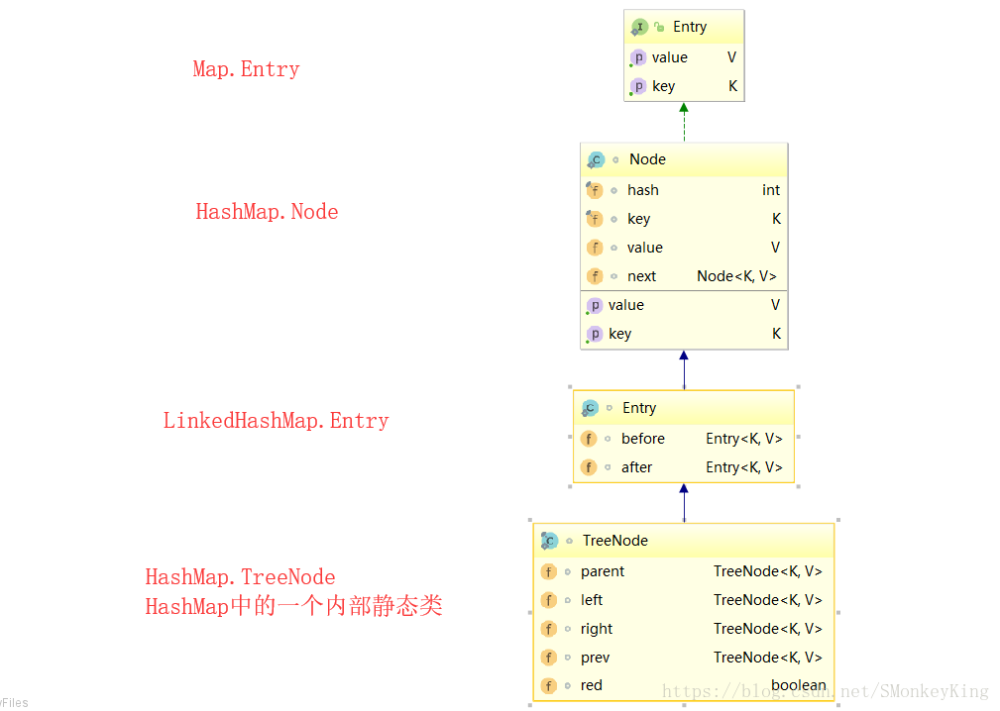
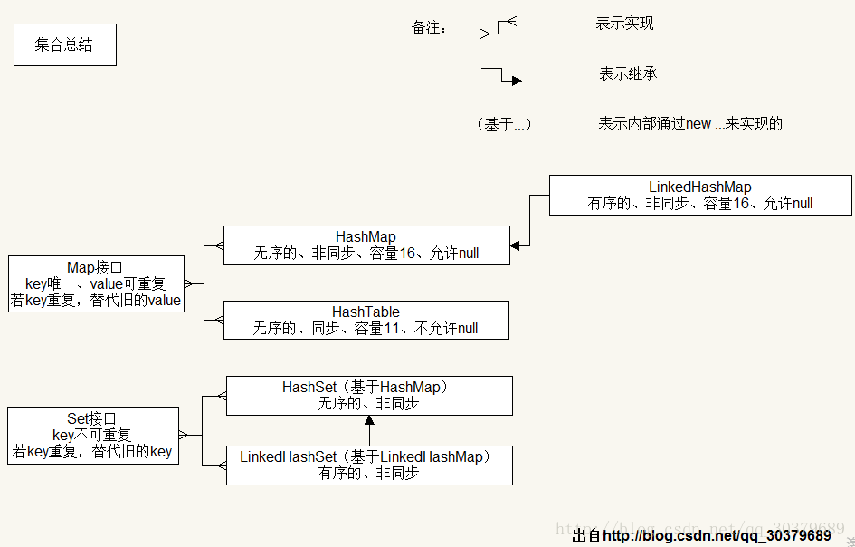

# 一、概览

容器主要包括 Collection 和 Map 两种： 

- `Collection` 存储着对象的集合
- `Map` 存储着键值对的映射表

## 1. Collection

方法：

1. add(Object obj)，addAll(Collection coll)，size()，clear()，isEmpty();
2. remove(Object obj)，removeAll(Collection coll)，retainAll(Collection coll)，equals(Object obj)，contains(Object obj)，containsAll(Collection coll)，hashCode()
3. iterator()，toArray()


### 1. Set

- **存储的元素是无序且不可重复的**

  > 添加进 Set 集合中的元素所在的类一定要重写 `equals() 和 hashCode()`

- `HashSet`：基于哈希表实现，支持快速查找，但不支持有序性操作，即失去了元素的插入顺序

  > 查找的时间复杂度为 O(1)

- `LinkedHashSet`：具有 HashSet 的查找效率，且内部使用双向链表维护元素的插入顺序(是HashSet的子类)

  > 选择建议： 频繁遍历，较少插入

- `TreeSet`：基于红黑树实现，支持有序性操作，例如根据一个范围查找元素的操作

  > 查找的时间复杂度为 O(logN)

  可以按照添加进集合中元素的指定属性进行排序：

  - **自然排序**：实现 `Comparable` 接口，重写 `compareTo(Object obj)` 方法
  - **定制排序**：实现 `Comparator` 接口，重写 `Comparator的compare(Object o1,Object o2)` 方法

  > - 要求 TreeSet 添加进的元素必须是同一个类的
  > - 要求重写的 compareTo()或者compare() 方法与 equals()和hashCode() 方法保持一致

### 2. List

- **存储的元素有序且可以重复**，相当于“动态”数组

  > 添加进 List 集合中的元素（或对象）所在的类一定要重写 `equals()` 方法

- 新增方法: `remove(int index),set(int index,Object obj),get(int index),add(int index,Object obj)`

- `ArrayList`：基于动态数组实现，支持随机访问的主要实现类

- `Vector`：和 ArrayList 类似，但是线程安全的，且效率要低于 ArrayList

- `LinkedList`：基于双向链表实现，只能顺序访问，但可以快速地在链表中间插入和删除元素

  > LinkedList 可以用作栈、队列和双向队列（更适用于频繁的插入、删除操作）

### 3. Queue

- `LinkedList`：可以用来实现双向队列

- `PriorityQueue`：基于堆结构实现，可以用来实现优先队列

## 2. Map

- **Map 的键值对**： 
  - `key`：不可重复，使用 Set 存放
  - `value`：可重复，使用 Collection 存放
  - `entry`： 使用 Set 存放，由一个 key-value 对构成一个 `entry(Map.Entry)`

- 方法： 

  - 添加、修改 `put(Object key,Object value)`

  - 删除 `remove(Object key)`

  - 获取 `get(Object key) size() / keySet() values()  entrySet()`


- `HashMap`：基于哈希表实现(主要实现类，可以添加null键，null值)

- `LinkedHashMap`：使用双向链表来维护元素的顺序，默认顺序为插入顺序或最近最少使用(LRU)顺序

- `TreeMap`：基于红黑树实现，按照 key 所在类的指定属性进行排序

  > 要求 key 是同一个类的对象，对 key 考虑使用自然排序或定制排序

- `HashTable`：和 HashMap 类似，但是线程安全的，可以使用 ConcurrentHashMap 来支持线程安全


**添加：** 

- **Iterator接口**：用来遍历集合Collection元素
- **Collections工具类**：操作Collection及Map的工具类，大部分为static的方法

# 二、容器中的设计模式

## 1. 迭代器模式


- 使用 `foreach` 方法来遍历实现了 Iterable 接口的聚合对象

  ```java
  List<String> list = new ArrayList<>();
  list.add("a");
  list.add("b");
  for (String item : list) {
      System.out.println(item);
  }
  ```

## 2. 适配器模式

- `java.util.Arrays#asList()`：可以把数组类型转换为 List 类型

  ```java
  Integer[] arr = {1, 2, 3};
  List list = Arrays.asList(arr);
  
  List list = Arrays.asList(1,2,3);
  ```

# 三、源码分析

## 1. List

### 1. ArrayList

#### 1. 概览

实现了 RandomAccess 接口，因此支持随机访问

```java
public class ArrayList<E> extends AbstractList<E>
        implements List<E>, RandomAccess, Cloneable, java.io.Serializable
```

数组的默认大小为 10

```java
private static final int DEFAULT_CAPACITY = 10;//默认初始容量为 10
```

#### 2. 构造函数

```java
//构造默认初始容量为10的空列表
public ArrayList() {
    this.elementData = DEFAULTCAPACITY_EMPTY_ELEMENTDATA;
}
//构造指定初始容量的空列表
public ArrayList(int initialCapacity) {
    if (initialCapacity > 0) {
        this.elementData = new Object[initialCapacity];
    } else if (initialCapacity == 0) {
        this.elementData = EMPTY_ELEMENTDATA;
    } else {
        throw new IllegalArgumentException("Illegal Capacity: "+ initialCapacity);
    }
}
//构造包含指定collection的元素的列表，这些元素按照该collection的迭代器返回它们的顺序排列
public ArrayList(Collection<? extends E> c) {
    elementData = c.toArray();
    if ((size = elementData.length) != 0) {
        // c.toArray might (incorrectly) not return Object[] (see 6260652)
        if (elementData.getClass() != Object[].class)
            elementData = Arrays.copyOf(elementData, size, Object[].class);
    } else {
        // replace with empty array.
        this.elementData = EMPTY_ELEMENTDATA;
    }
}
```

#### 3. add

- `add(E e)`： 将指定的元素添加到列表的尾部，当容量不足时，会调用 grow 方法增长容量

  - 添加元素时，使用 `ensureCapacityInternal()` 方法来保证容量足够，若不够，使用 `grow()` 方法扩容

  - 新容量的大小为 `oldCapacity + (oldCapacity >> 1)`，也就是旧容量的 1.5 倍

  - 扩容操作调用 `Arrays.copyOf()` 把原数组整个复制到新数组中，

    > 复制操作代价很高，因此最好在创建 ArrayList 对象时指定容量，减少扩容操作的次数

  ```java
  public boolean add(E e) {
      ensureCapacityInternal(size + 1);  // Increments modCount!!
      elementData[size++] = e;
      return true;
  }
  
  private void ensureCapacityInternal(int minCapacity) {
      if (elementData == DEFAULTCAPACITY_EMPTY_ELEMENTDATA) {
          minCapacity = Math.max(DEFAULT_CAPACITY, minCapacity);
      }
      ensureExplicitCapacity(minCapacity);
  }
  
  private void ensureExplicitCapacity(int minCapacity) {
      modCount++;
      // overflow-conscious code
      if (minCapacity - elementData.length > 0)
          grow(minCapacity);
  }
  
  private void grow(int minCapacity) {
      // overflow-conscious code
      int oldCapacity = elementData.length;
      int newCapacity = oldCapacity + (oldCapacity >> 1);
      if (newCapacity - minCapacity < 0)
          newCapacity = minCapacity;
      if (newCapacity - MAX_ARRAY_SIZE > 0)
          newCapacity = hugeCapacity(minCapacity);
      // minCapacity is usually close to size, so this is a win:
      elementData = Arrays.copyOf(elementData, newCapacity);
  }
  
  private static int hugeCapacity(int minCapacity) {
      if (minCapacity < 0) // overflow
          throw new OutOfMemoryError();
      return (minCapacity > MAX_ARRAY_SIZE) ? Integer.MAX_VALUE : MAX_ARRAY_SIZE;
  }
  ```

- `add(int index, E element)`： 在 index 位置插入 element

  ```java
  public void add(int index, E element) {
      rangeCheckForAdd(index);//检查是否指定的 index 是否超过容量索引
      ensureCapacityInternal(size + 1);  // 检查容量是否足够
      System.arraycopy(elementData, index, elementData, index + 1, size - index);
      elementData[index] = element;
      size++;
  }
  
  private void rangeCheck(int index) {
      if (index >= size)
          throw new IndexOutOfBoundsException(outOfBoundsMsg(index));
  }
  ```

- `addAll(Collection<? extends E> c`： 将指定 Collection 元素添加到 Arraylist 末尾

  ```java
  public boolean addAll(Collection<? extends E> c) {
      Object[] a = c.toArray();
      int numNew = a.length;
      ensureCapacityInternal(size + numNew);  // Increments modCount
      System.arraycopy(a, 0, elementData, size, numNew);
      size += numNew;
      return numNew != 0;
  }
  ```

#### 4. get

```java
public E get(int index) {
    rangeCheck(index);
    return elementData(index);
}
```

#### 5. delete

- `remove(int index)`： 删除指定索引的元素

  - `System.arraycopy()` 将 index+1 后面的元素都复制到 index 位置上

    > 该操作的时间复杂度为 O(N)，因此 ArrayList 删除元素的代价很高

  ```java
  public E remove(int index) {
      rangeCheck(index);//检查索引是否越界
      modCount++;
      E oldValue = elementData(index);//获取要删除的元素
      int numMoved = size - index - 1;
      if (numMoved > 0)
          System.arraycopy(elementData, index+1, elementData, index, numMoved);
      elementData[--size] = null; // clear to let GC do its work
      return oldValue;
  }
  
  //检查索引是否越界
  private void rangeCheck(int index) {
      if (index >= size)
          throw new IndexOutOfBoundsException(outOfBoundsMsg(index));
  }
  //获取指定索引的元素
  E elementData(int index) {
      return (E) elementData[index];
  }
  ```

- `remove(Object o)`： 删除指定对象的元素

  ```java
  public boolean remove(Object o) {
      if (o == null) {
          for (int index = 0; index < size; index++)
              if (elementData[index] == null) {
                  fastRemove(index);
                  return true;
              }
      } else {
          for (int index = 0; index < size; index++)
              if (o.equals(elementData[index])) {
                  fastRemove(index);
                  return true;
              }
      }
      return false;
  }
  
  private void fastRemove(int index) {
      modCount++;
      int numMoved = size - index - 1;
      if (numMoved > 0)
          System.arraycopy(elementData, index+1, elementData, index, numMoved);
      elementData[--size] = null; // clear to let GC do its work
  }
  ```

#### 6. Fail-Fast(快速失败)

- `modCount`： 用来记录 ArrayList 结构发生变化的次数

- 结构发生变化： 指添加或者删除至少一个元素的所有操作，或者是调整内部数组的大小

  > 只是设置元素的值不算结构发生变化

- 在进行序列化或迭代操作时，需要比较操作前后 modCount 是否改变，若改变则抛出 ConcurrentModificationException

```java
private void writeObject(java.io.ObjectOutputStream s)
    throws java.io.IOException{
    // Write out element count, and any hidden stuff
    int expectedModCount = modCount;
    s.defaultWriteObject();

    // Write out size as capacity for behavioural compatibility with clone()
    s.writeInt(size);

    // Write out all elements in the proper order.
    for (int i=0; i<size; i++) {
        s.writeObject(elementData[i]);
    }

    if (modCount != expectedModCount) { //不相等，则抛出异常
        throw new ConcurrentModificationException();
    }
}
```

#### 7. fail-safe(安全失败)

- 安全失败：遍历时，先复制原有集合内容，在拷贝的集合上进行遍历

- 原理：由于迭代时是对原集合的拷贝进行遍历，所以在遍历过程中对原集合所作的修改并不能被迭代器检测到，所以不会触发Concurrent Modification Exception

- 缺点：迭代器并不能访问到修改后的内容

- 场景：java.util.concurrent 包下的容器都是安全失败，可以在多线程下并发使用，并发修改

#### 8. 序列化

> **用 transient 来修饰 elementData 的原因**：
>
> - elementData 是一个缓存数组，会预留容量，等容量不足时再扩充，则有些空间就没有实际存储元素
> - 采用上诉方式来实现序列化，可以保证只序列化实际存储的元素，而不是整个数组，从而节省空间和时间

- ArrayList 基于数组实现，可动态扩容，因此保存元素的数组不一定都被使用，则没必要全部进行序列化

  保存元素的数组 elementData 使用 transient 修饰，该关键字声明数组默认不会被序列化

  ```java
  transient Object[] elementData; // non-private to simplify nested class access
  ```

- ArrayList 实现了 writeObject() 和 readObject() 来控制序列化数组中有元素填充那部分内容

  ```java
  private void readObject(java.io.ObjectInputStream s)
      	throws java.io.IOException, ClassNotFoundException {
      elementData = EMPTY_ELEMENTDATA;
      // Read in size, and any hidden stuff
      s.defaultReadObject();
      // Read in capacity
      s.readInt(); // ignored
      if (size > 0) {
          // be like clone(), allocate array based upon size not capacity
          ensureCapacityInternal(size);
  
          Object[] a = elementData;
          // Read in all elements in the proper order.
          for (int i=0; i<size; i++) {
              a[i] = s.readObject();
          }
      }
  }
  
  private void writeObject(java.io.ObjectOutputStream s)
      	throws java.io.IOException{
      // Write out element count, and any hidden stuff
      int expectedModCount = modCount;
      s.defaultWriteObject();
      // Write out size as capacity for behavioural compatibility with clone()
      s.writeInt(size);
      // Write out all elements in the proper order.
      for (int i=0; i<size; i++) {
          s.writeObject(elementData[i]);
      }
      if (modCount != expectedModCount) {
          throw new ConcurrentModificationException();
      }
  }
  ```

- 序列化时使用 ObjectOutputStream 的 `writeObject()` 将对象转换为字节流并输出

  writeObject() 方法在传入的对象存在时，会反射调用该对象的 writeObject() 来实现序列化

  反序列化使用的是 ObjectInputStream 的 readObject() 方法，原理类似

  ```java
  ArrayList list = new ArrayList();
  ObjectOutputStream oos = new ObjectOutputStream(new FileOutputStream(file));
  oos.writeObject(list);
  ```

### 2. Vector

#### 1. 同步

- Vector 基于可变数组的 List 接口的同步实现，有序，允许存储null值

- 与 ArrayList 类似，但使用 synchronized 进行同步

```java
public synchronized boolean add(E e) {
    modCount++;
    ensureCapacityHelper(elementCount + 1);
    elementData[elementCount++] = e;
    return true;
}

public synchronized E get(int index) {
    if (index >= elementCount)
        throw new ArrayIndexOutOfBoundsException(index);

    return elementData(index);
}
```

#### 2. 与 ArrayList 的比较

- Vector 是同步的，因此开销比 ArrayList 大，访问速度更慢

- Vector 每次扩容为其大小的 2 倍，而 ArrayList 是 1.5 倍

  > 默认初始容量为 10

#### 3. 替代方案

可以使用 `Collections.synchronizedList();` 得到一个线程安全的 ArrayList

```java
List<String> list = new ArrayList<>();
List<String> synList = Collections.synchronizedList(list);
```

也可以使用 concurrent 并发包下的 CopyOnWriteArrayList 类

```java
List<String> list = new CopyOnWriteArrayList<>();
```

#### 4. CopyOnWriteArrayList

##### 1. 构造器

- 基本参数

  ```java
  final transient ReentrantLock lock = new ReentrantLock();// 可重入锁
  private transient volatile Object[] array;// 对象数组，用于存放元素
  
  final Object[] getArray() {
      return array;
  }
  
  final void setArray(Object[] a) {
      array = a;
  }
  ```

- `CopyOnWriteArrayList()`

  ```java
  public CopyOnWriteArrayList() {
      setArray(new Object[0]);
  }
  ```

- `CopyOnWriteArrayList(Collection<? extends E> c)`

  ```java
  public CopyOnWriteArrayList(Collection<? extends E> c) {
      Object[] elements;
      if (c.getClass() == CopyOnWriteArrayList.class)
          elements = ((CopyOnWriteArrayList<?>)c).getArray();
      else {
          elements = c.toArray();
          // c.toArray might (incorrectly) not return Object[] (see 6260652)
          if (elements.getClass() != Object[].class)
              elements = Arrays.copyOf(elements, elements.length, Object[].class);
      }
      setArray(elements);
  }
  ```

- `CopyOnWriteArrayList(E[] toCopyIn)`

  ```java
  public CopyOnWriteArrayList(E[] toCopyIn) {
      setArray(Arrays.copyOf(toCopyIn, toCopyIn.length, Object[].class));
  }
  ```

##### 2. 读写分离

- 写操作在一个复制的数组上进行，读操作在原始数组中进行，读写分离，互不影响

- 写操作需要加锁，防止并发写入导致写入数据丢失

- 写操作结束后需要把原始数组指向新的复制数组

```java
public boolean add(E e) {
    final ReentrantLock lock = this.lock;
    lock.lock(); //加锁
    try {
        Object[] elements = getArray();
        int len = elements.length;
        Object[] newElements = Arrays.copyOf(elements, len + 1);//复制原数组
        newElements[len] = e;//在复制数组上添加数据
        setArray(newElements);//将原数组指针指向复制数组
        return true;
    } finally {
        lock.unlock();//释放锁
    }
}
```

```java
@SuppressWarnings("unchecked")
private E get(Object[] a, int index) {
    return (E) a[index];
}
```

##### 3. 适用场景

- 优势：在写操作时允许读操作，大大提高读操作的性能，因此适合读多写少的应用场景

- 缺陷：
  - 内存占用：在写操作时需要复制一个新的数组，使得内存占用为原来的两倍左右
  - 数据不一致：读操作不能读取实时性的数据，因为部分写操作的数据还未同步到读数组中

所以 **CopyOnWriteArrayList 不适合内存敏感以及对实时性要求很高的场景** 

### 3. LinkedList

#### 1. 概览

- 基于双向链表实现，使用 Node 存储链表节点信息，**限定插入和删除操作在表的两端进行**

  ```java
  transient int size = 0;
  transient Node<E> first; //链表的头指针
  transient Node<E> last; //尾指针
  
  //存储对象的结构 Node, LinkedList的内部类
  private static class Node<E> {
      E item;
      Node<E> next; // 指向下一个节点
      Node<E> prev; //指向上一个节点
  
      Node(Node<E> prev, E element, Node<E> next) {
          this.item = element;
          this.next = next;
          this.prev = prev;
      }
  }
  ```

- 每个链表存储了 first 和 last 指针：

  

#### 2. add

- `add(E e)`： 在链表的末尾添加元素

  linkLast(E e)将last的Node引用指向了一个新的Node(l)，然后根据l新建了一个newNode，其中的元素就为要添加的e，而后，我们让 last 指向了 newNode。简单的说就是

  ```java
  public boolean add(E e) {
      linkLast(e);
      return true;
  }
  //双向链表的添加操作
  void linkLast(E e) {
      final Node<E> l = last;
      final Node<E> newNode = new Node<>(l, e, null);//新建 newNode 节点
      last = newNode; //让 last 指向 newNode，即让 newNode 为尾节点
      if (l == null)
          first = newNode;
      else
          l.next = newNode;
      size++;
      modCount++;
  }
  ```

- `add(int index, E element)`： 在指定 index 位置插入元素

  ```java
  public void add(int index, E element) {
      checkPositionIndex(index);
      if (index == size) //若 index 正好等于 size，则调用linkLast(element)将其插入末尾
          linkLast(element);
      else
          linkBefore(element, node(index));
  }
  //检测索引是否越界
  private void checkPositionIndex(int index) {
      if (!isPositionIndex(index))
          throw new IndexOutOfBoundsException(outOfBoundsMsg(index));
  }
  
  private boolean isPositionIndex(int index) {
      return index >= 0 && index <= size;
  }
  
  //插入指定索引位置
  void linkBefore(E e, Node<E> succ) {
      final Node<E> pred = succ.prev;
      final Node<E> newNode = new Node<>(pred, e, succ);//创建新的节点
      succ.prev = newNode; //
      if (pred == null)
          first = newNode;
      else
          pred.next = newNode;
      size++;
      modCount++;
  }
  
  //确定 newNode 的位置
  Node<E> node(int index) {
      if (index < (size >> 1)) {//index 位于前半部分，从前往后找
          Node<E> x = first;
          for (int i = 0; i < index; i++)
              x = x.next;
          return x;
      } else {//index 位于后半部分，从后往前找
          Node<E> x = last;
          for (int i = size - 1; i > index; i--)
              x = x.prev;
          return x;
      }
  }
  ```

#### 3. get

```java
public E get(int index) {
    checkElementIndex(index);//检查元素索引是否越界
    return node(index).item;//遍历链表，返回指定索引位置的元素，效率低于可变数组的查询
}

private void checkElementIndex(int index) {
    if (!isElementIndex(index))
        throw new IndexOutOfBoundsException(outOfBoundsMsg(index));
}
```

#### 4. 与 ArrayList 比较

|          LinkedList          |         ArrayList          |
| :--------------------------: | :------------------------: |
|        底层是双向链表        |       底层是可变数组       |
| 不允许随机访问，即查询效率低 | 允许随机访问，即查询效率高 |
|       插入和删除效率快       |      插入和删除效率低      |

## 2. Map

### 1. HashMap

#### 1. 概述

基本概述： 

- HashMap 是基于哈希表的 Map 接口的**非同步实现**
- HashMap 中元素的 key 唯一、value 值可重复
- HashMap 允许使用 null 值和 null 键
- HashMap 中的元素无序

存储结构：`transient Entry[] table`，内部包含一个 Entry 类型的数组 table

> JDK1.8： `transient Node<K,V>[] table;`

- Entry 存储着键值对，包含四个字段
- Entry 是一个链表，即数组中的每个位置被当成一个桶，一个桶存放一个链表
- HashMap 使用拉链法来解决冲突，同一个链表中存放哈希值相同的 Entry


```java
//JDK1.7
static class Entry<K,V> implements Map.Entry<K,V> {
    final K key;
    V value;
    Entry<K,V> next;
    int hash;

    Entry(int h, K k, V v, Entry<K,V> n) {
        value = v;
        next = n;
        key = k;
        hash = h;
    }

    public final K getKey() {
        return key;
    }

    public final V getValue() {
        return value;
    }

    public final V setValue(V newValue) {
        V oldValue = value;
        value = newValue;
        return oldValue;
    }

    public final boolean equals(Object o) {
        if (!(o instanceof Map.Entry))
            return false;
        Map.Entry e = (Map.Entry)o;
        Object k1 = getKey();
        Object k2 = e.getKey();
        if (k1 == k2 || (k1 != null && k1.equals(k2))) {
            Object v1 = getValue();
            Object v2 = e.getValue();
            if (v1 == v2 || (v1 != null && v1.equals(v2)))
                return true;
        }
        return false;
    }

    public final int hashCode() {
        return Objects.hashCode(getKey()) ^ Objects.hashCode(getValue());
    }

    public final String toString() {
        return getKey() + "=" + getValue();
    }
}

//JDK1.8
static class Node<K,V> implements Map.Entry<K,V> {
    final int hash;
    final K key;
    V value;
    Node<K,V> next;
	//实现同上
    Node(int hash, K key, V value, Node<K,V> next) {}
    public final K getKey()        { return key; }
    public final V getValue()      { return value; }
    public final String toString() { return key + "=" + value; }
    public final V setValue(V newValue) {}

    //异或可以充分利用 key、value 的每一位数据
    //可以保证在两个 Node 比较不相等的情况下尽量生成不同的 hashCode
    public final int hashCode() {
        return Objects.hashCode(key) ^ Objects.hashCode(value);
    }

    public final boolean equals(Object o) {
        if (o == this)
            return true;
        if (o instanceof Map.Entry) {
            Map.Entry<?,?> e = (Map.Entry<?,?>)o;
            if (Objects.equals(key, e.getKey()) &&
                Objects.equals(value, e.getValue()))
                return true;
        }
        return false;
    }
}
```

#### 2. 拉链法的工作原理

- 链表的**插入是以头插法方式进行**，即**后插入的元素插在链表头部**

- 查找分两步进行：
  - **计算键值对所在的桶**
  - **在链表上顺序查找**，时间复杂度显然和链表的长度成正比


#### 3. 构造器

- `HashMap()`： 空构造器，指定扩展因子默认为 0.75

  ```java
  //默认扩展因子： static final float DEFAULT_LOAD_FACTOR = 0.75f;
  public HashMap() {
      this.loadFactor = DEFAULT_LOAD_FACTOR; // all other fields defaulted
  }
  ```

- `HashMap(int initialCapacity)`： 指定初始化大小

  ```java
  public HashMap(int initialCapacity) {
      this(initialCapacity, DEFAULT_LOAD_FACTOR);
  }
  ```

- `HashMap(int initialCapacity, float loadFactor)`：

  ```java
  public HashMap(int initialCapacity, float loadFactor) {
      if (initialCapacity < 0)
          throw new IllegalArgumentException("Illegal initial capacity: " +
                                             initialCapacity);
      if (initialCapacity > MAXIMUM_CAPACITY)
          initialCapacity = MAXIMUM_CAPACITY;
      if (loadFactor <= 0 || Float.isNaN(loadFactor))
          throw new IllegalArgumentException("Illegal load factor: " + loadFactor);
      this.loadFactor = loadFactor;
      this.threshold = tableSizeFor(initialCapacity);
  }
  
  //Float.isNaN
  public static boolean isNaN(float v) {
      return (v != v);
  }
  
  //指定容量
  static final int tableSizeFor(int cap) {
      int n = cap - 1;
      n |= n >>> 1;
      n |= n >>> 2;
      n |= n >>> 4;
      n |= n >>> 8;
      n |= n >>> 16;
      //数组的最大容量： static final int MAXIMUM_CAPACITY = 1 << 30;
      //构建初始容器时，指定最大容量为 1 << 30
      //扩容时，最大容量为 Integer.MAX_VALUE
      return (n < 0) ? 1 : (n >= MAXIMUM_CAPACITY) ? MAXIMUM_CAPACITY : n + 1;
  }
  ```

- `HashMap(Map<? extends K, ? extends V> m)`

  ```java
  public HashMap(Map<? extends K, ? extends V> m) {
      this.loadFactor = DEFAULT_LOAD_FACTOR;
      putMapEntries(m, false);
  }
  
  final void putMapEntries(Map<? extends K, ? extends V> m, boolean evict) {
      int s = m.size();
      if (s > 0) {
          if (table == null) { // pre-size
              float ft = ((float)s / loadFactor) + 1.0F;
              int t = ((ft < (float)MAXIMUM_CAPACITY) 
                       	? (int)ft : MAXIMUM_CAPACITY);
              if (t > threshold)
                  threshold = tableSizeFor(t);
          }
          else if (s > threshold)
              resize();
          for (Map.Entry<? extends K, ? extends V> e : m.entrySet()) {
              K key = e.getKey();
              V value = e.getValue();
              putVal(hash(key), key, value, false, evict);
          }
      }
  }
  ```

#### 4. put 操作

**put 操作执行过程**：

1. 判断键值对数组tab[i]是否为空或为null，否则执行resize()进行扩容

2. 根据键值key计算hash值得到插入的数组索引 i，如果table[i]==null，直接新建节点添加，转向6，如果table[i]不为空，转向3

3. 判断链表（或二叉树）的首个元素是否和key一样，不一样转向 4，相同转向6

4. 判断链表（或二叉树）的首节点 是否为treeNode，即是否是红黑树，如果是红黑树，则直接在树中插入键值对，不是则执行5

5. 遍历链表，判断链表长度是否大于8，大于 8 则把链表转换为红黑树

   还判断数组长度是否小于64，如果小于，则只扩容，不进行转换二叉树

   在红黑树中执行插入操作，否则进行链表的插入操作

   遍历过程中若发现 key 已存在，直接覆盖value，如果调用putIfAbsent方法插入，则只更新值为 null 的元素

6. 插入成功后，判断实际存在的键值对数量 size 是否超过最大容量 threshold，如果超过，进行扩容

```java
public V put(K key, V value) {
    return putVal(hash(key), key, value, false, true);
}

//计算 hash 值
static final int hash(Object key) {
    int h;
    return (key == null) ? 0 : (h = key.hashCode()) ^ (h >>> 16);
}

final V putVal(int hash, K key, V value, boolean onlyIfAbsent, boolean evict) {
    //p：链表节点  n:数组长度  i：链表所在数组中的索引坐标
    Node<K,V>[] tab; Node<K,V> p; int n, i;
    //判断tab[]数组是否为空或长度等于0，进行初始化扩容
    if ((tab = table) == null || (n = tab.length) == 0)
        n = (tab = resize()).length;
    //判断tab指定索引位置是否有元素，没有则直接newNode赋值给tab[i]
    if ((p = tab[i = (n - 1) & hash]) == null)// (n - 1) & hash 运算等价于对length取模
        tab[i] = newNode(hash, key, value, null);//新建一个 Node 节点
    else {//如果该数组位置存在Node
        Node<K,V> e; K k;//首先查找与待插入键值对key相同的Node，存储在e中
        //判断key是否已经存在(hash和key都相等)
        if (p.hash == hash && ((k = p.key) == key || (key != null && key.equals(k))))
            e = p;
        else if (p instanceof TreeNode)//如果Node是红黑二叉树，则执行树的插入操作
            e = ((TreeNode<K,V>)p).putTreeVal(this, tab, hash, key, value);
        else {//否则执行链表的插入操作（说明Hash值碰撞了，把Node加入到链表中）
            for (int binCount = 0; ; ++binCount) {
                if ((e = p.next) == null) {//如果该节点是尾节点，则进行添加操作
                    p.next = newNode(hash, key, value, null);
                     //如果链表长度大于8则调用treeifyBin，判断是扩容还是把链表转换成红黑二叉树
                    //避免链表过长，提高访问速度
                    if (binCount >= TREEIFY_THRESHOLD - 1) // -1 for 1st
                        treeifyBin(tab, hash);
                    break;
                }
                //如果键值存在，则退出循环
                if (e.hash == hash &&
                    ((k = e.key) == key || (key != null && key.equals(k))))
                    break;
                p = e;//把p执行p的子节点，开始下一次循环
            }
        }
        //判断e是否为null，若为null则表示加了新节点，不是null则表示找到了hash、key都一致的Node
        if (e != null) { // existing mapping for key
            V oldValue = e.value;
            //判断是否更新value值
            //map提供putIfAbsent方法，若key存在，不更新value，但若value==null则更改此值
            if (!onlyIfAbsent || oldValue == null)
                e.value = value;
            afterNodeAccess(e);//此方法是空方法，什么都没实现，用户可以根据需要进行覆盖
            return oldValue;
        }
    }
    ++modCount;//只有插入了新节点才进行++modCount
    if (++size > threshold)//如果size>threshold则开始扩容（每次扩容原来的1倍）
        resize();
    afterNodeInsertion(evict);//此方法是空方法，什么都没实现，用户可以根据需要进行覆盖
    return null;
}

Node<K,V> newNode(int hash, K key, V value, Node<K,V> next) {
    return new Node<>(hash, key, value, next);
}
```

#### 5. get

```java
public V get(Object key) {
    Node<K,V> e;
    return (e = getNode(hash(key), key)) == null ? null : e.value;
}

final Node<K,V> getNode(int hash, Object key) {
    //tab 为 hash 表, first 为 hash 桶的头指针,n 为表的长度,k 为用来遍历链表的指针
    Node<K,V>[] tab; Node<K,V> first, e; int n; K k;
    // 第一步：获取表的长度 n,获取到 hash 桶的头指针first
    if ((tab = table) != null && (n = tab.length) > 0 &&
        	(first = tab[(n - 1) & hash]) != null) {
        // 第二步：检查 hash 桶的头指针是否和要找的对象 key 相等
        if (first.hash == hash && 
            	((k = first.key) == key || (key != null && key.equals(k))))
            return first;
        // 第三步：遍历桶进行查找
        if ((e = first.next) != null) {
            // 如果是红黑树的结构，则用TreeNode的静态方法递归查找
            if (first instanceof TreeNode)
                return ((TreeNode<K,V>)first).getTreeNode(hash, key);
             // 否则使用链表进行遍历查找
            do {
                if (e.hash == hash &&
                    ((k = e.key) == key || (key != null && key.equals(k))))
                    return e;
            } while ((e = e.next) != null);
        }
    }
    return null;
}
```

#### 5. 扩容resize()

**扩容步骤**： 

- 获得新容量 newCap，更新域里面的 threshold

- 创建一个新 table，长度为newCap

- 将旧 table 中的Node，拷贝到新容器

  > 桶的 Key 的 hash 值不需要重新计算，只需要计算 hash 在新 table 的高位还是低位)

```java
final Node<K,V>[] resize() {
    Node<K,V>[] oldTab = table;
    int oldCap = (oldTab == null) ? 0 : oldTab.length;
    int oldThr = threshold;//旧的阈值，如果 size 到达 threshold，则需要扩容
    int newCap, newThr = 0;
    //如果 oldCap>0，则意味着 table 已初始化
    if (oldCap > 0) {
        if (oldCap >= MAXIMUM_CAPACITY) {//大于 1 << 30
            threshold = Integer.MAX_VALUE;//容量最大为 Integer.MAX_VALUE
            return oldTab;
        }
        else if ((newCap = oldCap << 1) < MAXIMUM_CAPACITY &&
                 oldCap >= DEFAULT_INITIAL_CAPACITY)
            newThr = oldThr << 1; //进行两倍扩容
    }
    //oldCap==0,oldThr>0 意味着 table 未初始化，同时调用的有初始化容量的构造器，有给定的初始容量
    else if (oldThr > 0) 
        newCap = oldThr;//则新容量=oldThr
    else {
        //则新容量为默认值
        newCap = DEFAULT_INITIAL_CAPACITY;
        //newThr等于负载因子*容量大小
        newThr = (int)(DEFAULT_LOAD_FACTOR * DEFAULT_INITIAL_CAPACITY);
    }
    if (newThr == 0) {//对threshold赋值
        float ft = (float)newCap * loadFactor;//等于负载因子*容量大小
        newThr = (newCap < MAXIMUM_CAPACITY && ft < (float)MAXIMUM_CAPACITY ?
                  (int)ft : Integer.MAX_VALUE);
    }
    threshold = newThr;
    //把旧 table 数据全部再 hash 到新的table
    @SuppressWarnings({"rawtypes","unchecked"})
        Node<K,V>[] newTab = (Node<K,V>[])new Node[newCap];
    table = newTab;
    if (oldTab != null) {
        for (int j = 0; j < oldCap; ++j) {//对 table 每个桶进行遍历
            Node<K,V> e;
            if ((e = oldTab[j]) != null) {
                oldTab[j] = null;
                if (e.next == null)//如果是桶的头指针，则直接再 hash 到新的桶
                    newTab[e.hash & (newCap - 1)] = e;
                //如果是树节点，则进行切分,切分成两棵子树，或者退化成两个链表
                else if (e instanceof TreeNode)
                    ((TreeNode<K,V>)e).split(this, newTab, j, oldCap);
                else { //如果是链表，则拆分成两个新链表，分为高位链表和低位链表
                    Node<K,V> loHead = null, loTail = null;
                    Node<K,V> hiHead = null, hiTail = null;
                    Node<K,V> next;
                    do {
                        next = e.next;
                        //和旧容器长度进行hash，如果等于0则说明 hash<oldCap,链接到低位链表
                        if ((e.hash & oldCap) == 0) {
                            if (loTail == null)
                                loHead = e;
                            else
                                loTail.next = e;
                            loTail = e;
                        }
                        else {//如果 >0 则说明 hash>oldCap,链接到高位链表
                            if (hiTail == null)
                                hiHead = e;
                            else
                                hiTail.next = e;
                            hiTail = e;
                        }
                    } while ((e = next) != null);
                    if (loTail != null) {//最后将高位低位链表放回到新的table
                        loTail.next = null;
                        newTab[j] = loHead;
                    }
                    if (hiTail != null) {
                        hiTail.next = null;
                        newTab[j + oldCap] = hiHead;
                    }
                }
            }
        }
    }
    return newTab;
}
```

#### 6. remove

```java
public V remove(Object key) {
    Node<K,V> e;
    return (e = removeNode(hash(key), key, null, false, true)) == null ?
        		null : e.value;
}

//matchValue 表示只有 value 相等时删除
final Node<K,V> removeNode(int hash, Object key, Object value,
                           boolean matchValue, boolean movable) {
    Node<K,V>[] tab; Node<K,V> p; int n, index;
    if ((tab = table) != null && (n = tab.length) > 0 &&
        	(p = tab[index = (n - 1) & hash]) != null) {
        Node<K,V> node = null, e; K k; V v;
        //如果是桶的头指针
        if (p.hash == hash && ((k = p.key) == key || (key != null && key.equals(k))))
            node = p;
        else if ((e = p.next) != null) {
            if (p instanceof TreeNode)//判断是否是红黑树
                node = ((TreeNode<K,V>)p).getTreeNode(hash, key);//获得红黑树的节点
            else {//否则递归获得链表节点
                do {
                    if (e.hash == hash &&
                        ((k = e.key) == key ||
                         (key != null && key.equals(k)))) {
                        node = e;
                        break;
                    }
                    p = e;
                } while ((e = e.next) != null);
            }
        }
         //如果matchValue为true就需要判断，两个对象时候相等，或者是否equals
        if (node != null && (!matchValue || (v = node.value) == value ||
                             (value != null && value.equals(v)))) {
            if (node instanceof TreeNode) //如果是红黑树节点
                ((TreeNode<K,V>)node).removeTreeNode(this, tab, movable);
            else if (node == p) //如果是链表且是链表的头节点
                tab[index] = node.next;
            else //如果是链表的中间节点
                p.next = node.next;
            ++modCount;
            --size;
            afterNodeRemoval(node);//回调函数，目前实现为空
            return node;
        }
    }
    return null;
}
```

#### 7. 链表转红黑树

```java
final void treeifyBin(Node<K,V>[] tab, int hash) {
    int n, index; Node<K,V> e;
    //判断数组的长度是否小于 64，如果小于 64 则进行扩容
    if (tab == null || (n = tab.length) < MIN_TREEIFY_CAPACITY)
        resize();
    else if ((e = tab[index = (n - 1) & hash]) != null) {
        TreeNode<K,V> hd = null, tl = null;
        do { //把链表结构转换成红黑二叉树结构
            TreeNode<K,V> p = replacementTreeNode(e, null);
            if (tl == null)
                hd = p;
            else {
                p.prev = tl;
                tl.next = p;
            }
            tl = p;
        } while ((e = e.next) != null);
        if ((tab[index] = hd) != null)
            hd.treeify(tab);
    }
}

//TreeNode 内部类
static final class TreeNode<K,V> extends LinkedHashMap.Entry<K,V> {
    TreeNode<K,V> parent;  // red-black tree links
    TreeNode<K,V> left;
    TreeNode<K,V> right;
    TreeNode<K,V> prev;    // needed to unlink next upon deletion
    boolean red;
    ...
}
```

#### 8. 与 HashTable 的比较

- HashTable 使用 synchronized 来进行同步
- HashMap 可以插入键为 null 的 Entry
- HashMap 的迭代器是 fail-fast 迭代器
- HashMap 不能保证随着时间的推移 Map 中的元素次序是不变的

### 2. LinkedHashMap

#### 1. 概述

- **基本概述**： 
  - LinkedHashMap 是基于哈希表的Map接口的非同步实现
  - LinkedHashMap 是HashMap的子类
  - LinkedHashMap 是有序的
  - LinkedHashMap 中元素的key是唯一的、value值可重复
  - LinkedHashMap 允许null键和null值

- 内部维护了一个双向链表，用来维护插入顺序或者 LRU 顺序

- LinkedHashMap 的成员变量： 

  ```java
  //双向链表的表头与表尾元素
  transient LinkedHashMap.Entry<K,V> head;
  transient LinkedHashMap.Entry<K,V> tail;
  
  static class Entry<K,V> extends HashMap.Node<K,V> {
      Entry<K,V> before, after;
      Entry(int hash, K key, V value, Node<K,V> next) {
          super(hash, key, value, next);
      }
  }
  
  //如果为true，则按照访问顺序；如果为false，则按照插入顺序
  final boolean accessOrder;
  ```




#### 2. 构造器

```java
public LinkedHashMap(int initialCapacity, float loadFactor) {
    super(initialCapacity, loadFactor);
    accessOrder = false;
}

public LinkedHashMap(int initialCapacity) {
    super(initialCapacity);
    accessOrder = false;
}

public LinkedHashMap() {
    super();
    accessOrder = false;
}

public LinkedHashMap(Map<? extends K, ? extends V> m) {
    super();
    accessOrder = false;
    putMapEntries(m, false);
}

public LinkedHashMap(int initialCapacity, float loadFactor, boolean accessOrder) {
    super(initialCapacity, loadFactor);
    this.accessOrder = accessOrder;
}
```

#### 3. 重要方法

推荐阅读： [模板方法模式](https://crowhawk.github.io/2017/07/21/designpattern_9_template/)

- `afterNodeRemoval`：在执行完对哈希桶中单链表或红黑树节点的删除操作后，还要调用该方法将双向链表中对应的 Entry 删除

  ```java
  //删除操作后执行
  void afterNodeRemoval(Node<K,V> e) { 
      LinkedHashMap.Entry<K,V> p =
          (LinkedHashMap.Entry<K,V>)e, b = p.before, a = p.after;
      p.before = p.after = null;
      if (b == null)
          head = a;
      else
          b.after = a;
      if (a == null)
          tail = b;
      else
          a.before = b;
  }
  ```

- `afterNodeAccess()`： 若 accessOrder 为true(即按访问顺序迭代)，则将最近访问的节点调整至双向队列的队尾，这就保证了按照访问顺序迭代时，Entry 的有序性

  ```java
  void afterNodeAccess(Node<K,V> e) { // move node to last
      LinkedHashMap.Entry<K,V> last;
      if (accessOrder && (last = tail) != e) {
          LinkedHashMap.Entry<K,V> p =
              (LinkedHashMap.Entry<K,V>)e, b = p.before, a = p.after;
          p.after = null;
          if (b == null)
              head = a;
          else
              b.after = a;
          if (a != null)
              a.before = b;
          else
              last = b;
          if (last == null)
              head = p;
          else {
              p.before = last;
              last.after = p;
          }
          tail = p;
          ++modCount;
      }
  }
  ```

- `afterNodeInsertion()`： 当添加新的 entry 时，可以通过删除头节点来减少内存消耗，避免内存溢出

  ```java
  void afterNodeInsertion(boolean evict) { // possibly remove eldest
      LinkedHashMap.Entry<K,V> first;
      if (evict && (first = head) != null && removeEldestEntry(first)) {
          K key = first.key;
          removeNode(hash(key), key, null, false, true);
      }
  }
  
  //如果需要定义是否需要删除头节点的规则，只需覆盖该方法并提供相关实现即可
  protected boolean removeEldestEntry(Map.Entry<K,V> eldest) {
      return false;
  }
  ```

- `get`： 增加了按访问顺序或插入顺序进行排序的选择，会根据 AccessOrder 的值调整双向链表中节点的顺序，获取节点过程与 HashMap 一致

  ```java
  public V get(Object key) {
      Node<K,V> e;
      if ((e = getNode(hash(key), key)) == null)
          return null;
      if (accessOrder)
          afterNodeAccess(e);
      return e.value;
  }
  ```

- `containsValue`： 直接遍历双向链表查找对应的 Entry 即可，无需去遍历哈希桶

  ```java
  public boolean containsValue(Object value) {
      for (LinkedHashMap.Entry<K,V> e = head; e != null; e = e.after) {
          V v = e.value;
          if (v == value || (value != null && value.equals(v)))
              return true;
      }
      return false;
  }
  ```

#### 4. LRU 缓存

以下是使用 LinkedHashMap 实现的一个 LRU 缓存：

- 设定最大缓存空间 MAX_ENTRIES  为 3；
- 使用 LinkedHashMap 的构造函数将 accessOrder 设置为 true，开启 LRU 顺序；
- 覆盖 removeEldestEntry() 方法实现，在节点多于 MAX_ENTRIES 就会将最近最久未使用的数据移除。

```java
class LRUCache<K, V> extends LinkedHashMap<K, V> {
    private static final int MAX_ENTRIES = 3;

    protected boolean removeEldestEntry(Map.Entry eldest) {
        return size() > MAX_ENTRIES;
    }

    LRUCache() {
        super(MAX_ENTRIES, 0.75f, true);
    }
}
```

```java
public static void main(String[] args) {
    LRUCache<Integer, String> cache = new LRUCache<>();
    cache.put(1, "a");
    cache.put(2, "b");
    cache.put(3, "c");
    cache.get(1);
    cache.put(4, "d");
    System.out.println(cache.keySet());
}
```

```html
[3, 1, 4]
```

### 3. HashTable

#### 1. 概述

> 已废弃，建议使用 ConcurrentHashMap 替代

- 基本概述： 
  - HashTable 是基于哈希表的Map接口的同步实现
  - HashTable 中元素的key是唯一的，value值可重复
  - HashTable 中元素的key和value不允许为null，如果遇到 null，则返回NullPointerException
  - HashTable 中的元素是无序的

```java
public class Hashtable<K,V>
    extends Dictionary<K,V>
    implements Map<K,V>, Cloneable, java.io.Serializable
```

- `Dictionary` 类：
  - Dictionary 类是任何可将键映射到相应值的类的抽象父类，每个键和值都是对象
  - Dictionary 源码注释指出 Dictionary 这个类过时了，新的实现类应该实现Map接口

- 成员变量： 

  ```java
  //Entry[]数组类型，Entry 是一个单向链表
  private transient Entry<?,?>[] table;
  //Hashtable 的大小，保存的键值对的数量
  private transient int count;
  //Hashtable 的阈值，用于判断是否需要调整 Hashtable 的容量，threshold=(容量 * 负载因子)
  private int threshold;
  //负载因子
  private float loadFactor;
  //用来实现 fail-fast 机制
  private transient int modCount = 0;
  ```

#### 2. 构造器

- `Hashtable(int initialCapacity, float loadFactor)`： 用指定初始容量和加载因子构造新空哈希表

  ```java
  public Hashtable(int initialCapacity, float loadFactor) {
      if (initialCapacity < 0)
          throw new IllegalArgumentException("Illegal Capacity: "+ initialCapacity);
      if (loadFactor <= 0 || Float.isNaN(loadFactor))
          throw new IllegalArgumentException("Illegal Load: "+loadFactor);
      if (initialCapacity==0)
          initialCapacity = 1;
      this.loadFactor = loadFactor;
      table = new Entry<?,?>[initialCapacity];
      threshold = (int)Math.min(initialCapacity * loadFactor, MAX_ARRAY_SIZE + 1);
  }
  ```

- `Hashtable(int initialCapacity)`

  ```java
  public Hashtable(int initialCapacity) {
      this(initialCapacity, 0.75f);
  }
  ```

- `Hashtable()`

  ```java
  public Hashtable() {
      this(11, 0.75f);
  }
  ```

- `Hashtable(Map<? extends K, ? extends V> t)`

  ```java
  public Hashtable(Map<? extends K, ? extends V> t) {
      this(Math.max(2*t.size(), 11), 0.75f);
      putAll(t);
  }
  
  public synchronized void putAll(Map<? extends K, ? extends V> t) {
      for (Map.Entry<? extends K, ? extends V> e : t.entrySet())
          put(e.getKey(), e.getValue());
  }
  ```

#### 3. put

流程： 

- 判断 value 是否为空，为空则抛出异常

- 计算 key 的 hash 值，并根据 hash 值获得 key 在 table 数组中的位置 index 

  - 如果 table[index] 元素为空，将元素插入到 table[index] 位置

  - 如果 table[index] 元素不为空，则进行遍历链表，如果遇到相同的 key，则新的value替代旧的value，并返回旧 value，否则将元素插入到链头，返回null

```java
public synchronized V put(K key, V value) {
    // Make sure the value is not null
    if (value == null) {
        throw new NullPointerException();
    }
    // Makes sure the key is not already in the hashtable.
    Entry<?,?> tab[] = table;
    int hash = key.hashCode();
     //首先，通过 hash 方法计算 key 的哈希值，并计算得出 index 值，确定其在 table[] 中的位置
    int index = (hash & 0x7FFFFFFF) % tab.length;
    @SuppressWarnings("unchecked")
    Entry<K,V> entry = (Entry<K,V>)tab[index];
    //其次，迭代index索引位置的链表，如果该位置的链表存在相同的key，则替换value，返回旧的value
    for(; entry != null ; entry = entry.next) {
        if ((entry.hash == hash) && entry.key.equals(key)) {
            V old = entry.value;
            entry.value = value;
            return old;
        }
    }
    addEntry(hash, key, value, index);
    return null;
}

private void addEntry(int hash, K key, V value, int index) {
    modCount++;
    Entry<?,?> tab[] = table;
    if (count >= threshold) {
        //如果超过阀值，就进行rehash操作
        rehash();
        tab = table;
        hash = key.hashCode();
        index = (hash & 0x7FFFFFFF) % tab.length;
    }
    // Creates the new entry.
    @SuppressWarnings("unchecked")
    Entry<K,V> e = (Entry<K,V>) tab[index];
    tab[index] = new Entry<>(hash, key, value, e);
    count++;
}
```

#### 4. get

流程：

- 通过 hash() 方法求得 key 的哈希值
- 根据 hash 值得到 index 索引
- 迭代链表，返回匹配的 key 对应的 value，找不到则返回 null

```java
public synchronized V get(Object key) {
    Entry<?,?> tab[] = table;
    int hash = key.hashCode();
    int index = (hash & 0x7FFFFFFF) % tab.length;
    for (Entry<?,?> e = tab[index] ; e != null ; e = e.next) {
        if ((e.hash == hash) && e.key.equals(key)) {
            return (V)e.value;
        }
    }
    return null;
}
```

### 4. TreeMap

#### 1. 概述

```java
public class TreeMap<K,V>
    extends AbstractMap<K,V>
    implements NavigableMap<K,V>, Cloneable, java.io.Serializable
```

- TreeMap 是一个**有序的key-value集合**，通过红黑树实现
- TreeMap **继承于 AbstractMap**，所以它是一个Map，即一个key-value集合
- TreeMap 实现了 NavigableMap 接口，意味着它**支持一系列的导航方法**，比如返回有序的 key 集合
- TreeMap 实现了 Cloneable 接口，意味着**能被克隆**
- TreeMap 实现了 java.io.Serializable 接口，意味着**支持序列化**

**成员变量**：

```java
//比较器
private final Comparator<? super K> comparator;
//红黑树的红黑节点
private transient Entry<K,V> root;
//容量大小
private transient int size = 0;
//结构性修改
private transient int modCount = 0;
//红黑树节点类型
static final class Entry<K,V> implements Map.Entry<K,V> {
    K key;
    V value;
    // 指向左子树
    Entry<K,V> left;
    // 指向右子树
    Entry<K,V> right;
    // 指向父节点
    Entry<K,V> parent;
    boolean color = BLACK;
}
// 红黑树节点-红颜色
private static final boolean RED = false;
// 红黑树节点-黑颜色
private static final boolean BLACK = true;
```

#### 2. 构造器

```java
//默认构造器，使用默认排序机制
public TreeMap() {
    comparator = null;
}
//自定义比较器的构造方法
public TreeMap(Comparator<? super K> comparator) {
    this.comparator = comparator;
}
//将 Map 构造为 TreeMap
public TreeMap(Map<? extends K, ? extends V> m) {
    comparator = null;
    putAll(m);
}
//构造 SortedMap 对象为 TreeMap，并使用 SortedMap 的比较器
public TreeMap(SortedMap<K, ? extends V> m) {
    comparator = m.comparator();
    try {
        buildFromSorted(m.size(), m.entrySet().iterator(), null, null);
    } catch (java.io.IOException cannotHappen) {
    } catch (ClassNotFoundException cannotHappen) {
    }
}
```

#### 3. put

```java
public V put(K key, V value) {
    Entry<K,V> t = root;// 二叉树当前节点
    if (t == null) {// 如果二叉树为 null，直接插入
        compare(key, key); // type (and possibly null) check
        root = new Entry<>(key, value, null);
        size = 1;
        modCount++;
        return null;
    }
    int cmp;// 使用cmp来表示排序返回的结果
    Entry<K,V> parent;// 父节点
    // split comparator and comparable paths
    Comparator<? super K> cpr = comparator;
    if (cpr != null) { // 如果比较器不为空，按照用户指定比较器进行循环比较，确定元素插入位置
        do {
            parent = t;
            cmp = cpr.compare(key, t.key); // 对 key 进行比较
            // 比较结果小于0，表示新增节点的key小于当前节点的key
            // 则以当前节点的左子节点作为新当前节点
            if (cmp < 0)
                t = t.left;
            // 比较结果大于0，表示新增节点的key大于当前节点的key
            // 则以当前节点的右子节点作为新的当前节点
            else if (cmp > 0)
                t = t.right;
            else // 比较结果等于0，说明 key 相等，覆盖旧值，返回新值
                return t.setValue(value);
        } while (t != null);
    }
    else { // 如果比较器为 null
        if (key == null)
            throw new NullPointerException();
        @SuppressWarnings("unchecked")
            Comparable<? super K> k = (Comparable<? super K>) key;
        do {
            parent = t;
            cmp = k.compareTo(t.key);
            if (cmp < 0)
                t = t.left;
            else if (cmp > 0)
                t = t.right;
            else
                return t.setValue(value);
        } while (t != null);
    }
    // 新增节点设为parent的子节点
    Entry<K,V> e = new Entry<>(key, value, parent);
    if (cmp < 0) // 如果新增节点的 key 小于 parent 的 key，则当做左子节点
        parent.left = e;
    else
        parent.right = e;
    fixAfterInsertion(e); // 插入完成，对二叉树进行平衡操作
    size++;
    modCount++;
    return null;
}
```

#### 4. get

```java
public V get(Object key) {
    Entry<K,V> p = getEntry(key);
    return (p==null ? null : p.value);
}

final Entry<K,V> getEntry(Object key) {
    if (comparator != null) // 如果比较器不为空，则按照自定义规则遍历二叉树
        return getEntryUsingComparator(key);
    if (key == null)
        throw new NullPointerException();
    @SuppressWarnings("unchecked")
        Comparable<? super K> k = (Comparable<? super K>) key;
    Entry<K,V> p = root;
    while (p != null) { // 按照默认比较规则遍历二叉树
        int cmp = k.compareTo(p.key);
        if (cmp < 0)
            p = p.left;
        else if (cmp > 0)
            p = p.right;
        else
            return p;
    }
    return null;
}
```

#### 5. remove

```java
public V remove(Object key) {
    Entry<K,V> p = getEntry(key);
    if (p == null)
        return null;

    V oldValue = p.value;
    deleteEntry(p);
    return oldValue;
}

//用被删除节点的后继节点来代替被删掉的节点
private void deleteEntry(Entry<K,V> p) {
    modCount++;
    size--;
    // p 节点为要删除的节点，如果 p 节点的左右子节点都不为空
    if (p.left != null && p.right != null) {
        // 找到 p 节点的后继节点
        // 不直接删除 p 节点，而是将p的后继节点来代替要删除的节点，然后再进行修复操作
        Entry<K,V> s = successor(p);
        p.key = s.key;
        p.value = s.value;
        p = s;
    }
    // 开始修复操作
    Entry<K,V> replacement = (p.left != null ? p.left : p.right);

    if (replacement != null) {
        // Link replacement to parent
        replacement.parent = p.parent;
        if (p.parent == null)
            root = replacement;
        else if (p == p.parent.left)
            p.parent.left  = replacement;
        else
            p.parent.right = replacement;
        // Null out links so they are OK to use by fixAfterDeletion.
        p.left = p.right = p.parent = null;
        // Fix replacement
        if (p.color == BLACK)
            fixAfterDeletion(replacement);
    } else if (p.parent == null) { // return if we are the only node.
        root = null;
    } else { //  No children. Use self as phantom replacement and unlink.
        if (p.color == BLACK)
            fixAfterDeletion(p);
        if (p.parent != null) {
            if (p == p.parent.left)
                p.parent.left = null;
            else if (p == p.parent.right)
                p.parent.right = null;
            p.parent = null;
        }
    }
}
```

### 5. ConcurrentHashMap

- **[从ConcurrentHashMap的演进看Java多线程核心技术](http://www.jasongj.com/java/concurrenthashmap/)** 
- **[Java7/8 中的 HashMap 和 ConcurrentHashMap 全解析](http://www.importnew.com/28263.html)** 

#### 1. 概述

**基本概述**： 

- ConcurrentHashMap 基于双数组和链表的 Map 接口的同步实现
- ConcurrentHashMap 中元素的key是唯一的、value值可重复
- ConcurrentHashMap 不允许使用null值和null键
- ConcurrentHashMap 是无序的

**JDK7 的 ConcurrentHashMap 实现方式**： 采用 Segment 分段锁机制

 ConcurrentHashMap 元素定位过程：**需要进行两次Hash操作**

- 第一次 Hash 定位到 Segment
- 第二次 Hash 定位到元素所在的链表头部

**成员变量**： 

- Segment 的数组：`final Segment< K,V>[] segments` 

  > ConcurrentHashMap 采用分段锁(Segment)，每个分段锁维护着几个桶(HashEntry)，多个线程可以同时访问不同分段锁上的桶，从而使其并发度更高（并发度就是 Segment 的个数）

- Segment 类： 包含一个 HashEntry 数组 `transient volatile HashEntry< K,V>[] table` 

  ```java
  //Segment 不可扩容
  static class Segment<K,V> extends ReentrantLock implements Serializable {
      private static final long serialVersionUID = 2249069246763182397L;
      final float loadFactor;
      Segment(float lf) { this.loadFactor = lf; }
  }
  ```

- HashEntry 类：包含 key、value 及 next 指针，所以 HashEntry 可以构成一个链表

#### 2. 详解

- Segment 不可扩容，Segment 数组默认长度为 16，不可以扩容；Segment[i] 大小默认为 2，负载因子为 1.5

- 扩容： 对 Segment 数组中的内部数组进行扩容，扩容为 2 倍

- 初始化 Segment(`ensureSegment`)： 只初始化槽 Segment[0]，其他槽会在插入第一个值时进行初始化  

  > 对于并发的初始化，使用 CAS 进行控制

#### 3. size 操作

每个 Segment 维护了一个 count 变量来统计该 Segment 中的键值对个数

```java
/**
 * The number of elements. Accessed only either within locks
 * or among other volatile reads that maintain visibility.
 */
transient int count;
```

在执行 size 操作时，需要遍历所有 Segment 然后把 count 累计起来

ConcurrentHashMap 在执行 size 操作时先尝试不加锁，如果连续两次不加锁操作得到的结果一致，那么可以认为这个结果是正确的

尝试次数使用 RETRIES_BEFORE_LOCK 定义，该值为 2，retries 初始值为 -1，因此尝试次数为 3

如果尝试的次数超过 3 次，就需要对每个 Segment 加锁

```java
/**
 * Number of unsynchronized retries in size and containsValue
 * methods before resorting to locking. This is used to avoid
 * unbounded retries if tables undergo continuous modification
 * which would make it impossible to obtain an accurate result.
 */
static final int RETRIES_BEFORE_LOCK = 2;

public int size() {
    // Try a few times to get accurate count. On failure due to
    // continuous async changes in table, resort to locking.
    final Segment<K,V>[] segments = this.segments;
    int size;
    boolean overflow; // true if size overflows 32 bits
    long sum;         // sum of modCounts
    long last = 0L;   // previous sum
    int retries = -1; // first iteration isn't retry
    try {
        for (;;) {
            // 超过尝试次数，则对每个 Segment 加锁
            if (retries++ == RETRIES_BEFORE_LOCK) {
                for (int j = 0; j < segments.length; ++j)
                    ensureSegment(j).lock(); // force creation
            }
            sum = 0L;
            size = 0;
            overflow = false;
            for (int j = 0; j < segments.length; ++j) {
                Segment<K,V> seg = segmentAt(segments, j);
                if (seg != null) {
                    sum += seg.modCount;
                    int c = seg.count;
                    if (c < 0 || (size += c) < 0)
                        overflow = true;
                }
            }
            // 连续两次得到的结果一致，则认为这个结果是正确的
            if (sum == last)
                break;
            last = sum;
        }
    } finally {
        if (retries > RETRIES_BEFORE_LOCK) {
            for (int j = 0; j < segments.length; ++j)
                segmentAt(segments, j).unlock();
        }
    }
    return overflow ? Integer.MAX_VALUE : size;
}
```

#### 4. JDK8 的实现方式

- **[ConcurrentHashMap总结](http://www.importnew.com/22007.html)**

JDK8 的 ConcurrentHashMap 实现方式： **直接使用大数组，来提高并发性**


**初始化**：`sizeCtl` 的取值决定

- 负数代表正在进行初始化或扩容操作

  - -1 代表正在初始化

  - -N 表示有N-1个线程正在进行扩容操作

- 正数或0代表hash表没有被初始化，这个数值表示初始化或下一次进行扩容的大小

  > 值始终是当前ConcurrentHashMap容量的0.75倍，与 loadfactor 对应

 **扩容**： 支持多线程扩容操作

- **单线程完成构建两倍容量的 newTable**，然后对节点进行遍历

  - 如果节点为空，就在原位置放入 **forwardNode 节点**

    > 触发并发扩容的关键

  - 若是 Node 节点，就构造一个反序链表，并复制到 newTable

    > 采用头插法，导致复制的链表为反序链表

  - 若是 TreeBin 节点，也做反序处理，并且判断是否需要 untreefi，把处理结果放在 newTable 上

    > 字段 `fh` 用于判断是Node 节点(链表)，还是 TreeBin 节点(红黑树)
    >
    > - `fh > 0` 链表
    > - `fh < 0` 红黑树

  - 遍历所有节点并完成复制后，更新 sizeCtl 为新容量的 0.75 倍 ，完成扩容

- **多线程完成 table 元素复制到 newTable** 

  - 若遍历的节点是 forward 节点，就向后继续遍历，再加上给节点上锁的机制，就完成了多线程的控制

  - 每当处理了一个节点，就把对应节点设为 forward 节点，另一个线程看到forward，就向后遍历


**put 操作**： 

- 若 Key 对应的数组元素为 null，则通过 CAS 操作将其设置为当前值
- 若 Key 对应的数组元素不为null，则对该元素使用 synchronized 关键字申请锁，然后进行操作
- 若写操作使得当前链表过长，则将该链表转换为红黑树，从而提高寻址效率

**读操作**： 

- 数组使用 volatile 关键字修饰，不用担心数组的可见性问题
- 每个元素是一个 Node 实例，其 Key 值和 hash 值都由final修饰，不可变更，无须关心它们被修改后的可见性
- 其 Value 及对下一个元素的引用由 volatile 修饰，可见性也有保障

**弃用分段锁原因**： 

- 多个分段锁浪费内存空间
- map 放入时竞争同一个锁的概率非常小，分段锁反而会造成更新等操作的长时间等待
- 提高 GC 的效率

### 6. WeakHashMap

#### 1. 概述

WeakHashMap 的 Entry 继承自 WeakReference，被 WeakReference 关联的对象在下一次垃圾回收时会被回收

WeakHashMap 主要用来实现缓存，通过使用 WeakHashMap 来引用缓存对象，由 JVM 对这部分缓存进行回收

```java
private static class Entry<K,V> 
		extends WeakReference<Object> 
		implements Map.Entry<K,V>
```

#### 2. expungeStaleEntries

- **作用**： 清除已被回收的 key 所关联的 Entry 对象

  > WeakHashMap 在调用 `put` 和 `get` 方法前，都会调用 `expungeStaleEntries` 方法来清除已经被回收的key所关联的Entry对象
  >
  > 因为Entry是弱引用，即使引用着key对象，但是依然不能阻止垃圾回收线程对key对象的回收

```java
private void expungeStaleEntries() {
    for (Object x; (x = queue.poll()) != null; ) {
        synchronized (queue) {
            @SuppressWarnings("unchecked")
                Entry<K,V> e = (Entry<K,V>) x;
            int i = indexFor(e.hash, table.length);

            Entry<K,V> prev = table[i];
            Entry<K,V> p = prev;
            while (p != null) {
                Entry<K,V> next = p.next;
                if (p == e) {
                    if (prev == e)
                        table[i] = next;
                    else
                        prev.next = next;
                    // Must not null out e.next;
                    // stale entries may be in use by a HashIterator
                    e.value = null; // Help GC
                    size--;
                    break;
                }
                prev = p;
                p = next;
            }
        }
    }
}
```

#### 3. ConcurrentCache

Tomcat 中的 ConcurrentCache 使用 WeakHashMap 来实现缓存功能

ConcurrentCache 采取的是分代缓存：

- 经常使用的对象放入 eden 中，eden 使用 ConcurrentHashMap 实现，不用担心会被回收
- 不常用的对象放入 longterm，longterm 使用 WeakHashMap 实现，老对象会被垃圾收集器回收
- 当调用  get() 方法时，会先从 eden 区获取，如果没有找到的话再到 longterm 获取，当从 longterm 获取到就把对象放入 eden 中，从而保证经常被访问的节点不容易被回收
- 当调用 put() 方法时，如果 eden 的大小超过了 size，那么就将 eden 中的所有对象都放入 longterm 中，利用虚拟机回收掉一部分不经常使用的对象

```java
public final class ConcurrentCache<K, V> {
    private final int size;
    private final Map<K, V> eden;
    private final Map<K, V> longterm;

    public ConcurrentCache(int size) {
        this.size = size;
        this.eden = new ConcurrentHashMap<>(size);
        this.longterm = new WeakHashMap<>(size);
    }

    public V get(K k) {
        V v = this.eden.get(k);
        if (v == null) {
            v = this.longterm.get(k);
            if (v != null)
                this.eden.put(k, v);
        }
        return v;
    }

    public void put(K k, V v) {
        if (this.eden.size() >= size) {
            this.longterm.putAll(this.eden);
            this.eden.clear();
        }
        this.eden.put(k, v);
    }
}
```

## 3. Set

### 1. HashSet

#### 1. 概述

- HashSet 基于HashMap实现，底层采用HashMap来保存元素
- HashSet 将对象存储在key中，且不允许key重复
- HashSet 的Value是固定的

```java
private transient HashMap<E,Object> map;
private static final Object PRESENT = new Object();
```

#### 2. 构造函数

- `HashSet()`：默认无参构造器，底层初始化一个空的HashMap，并使用默认初始容量为16和加载因子0.75

  ```java
  public HashSet() {
      map = new HashMap<>();
  }
  ```

- `HashSet(Collection<? extends E> c)`：实际底层使用默认的加载因子0.75和足以包含指定collection中所有元素的初始容量来创建一个HashMap

  ```java
  public HashSet(Collection<? extends E> c) {
      map = new HashMap<>(Math.max((int) (c.size()/.75f) + 1, 16));
      addAll(c);//将集合元素添加进 HashSet
  }
  
  public boolean addAll(Collection<? extends E> c) {
      boolean modified = false;
      for (E e : c)
          if (add(e)) //是否支持添加操作
              modified = true;
      return modified;
  }
  
  public boolean add(E e) {
      throw new UnsupportedOperationException();
  }
  ```

- `HashSet(int initialCapacity, float loadFactor)`：指定 initialCapacity 和 loadFactor 构造 HashSet

  ```java
  public HashSet(int initialCapacity, float loadFactor) {
      map = new HashMap<>(initialCapacity, loadFactor);
  }
  ```

- `HashSet(int initialCapacity)`：指定 initialCapacity，加载因子默认 0.75

  ```java
  public HashSet(int initialCapacity) {
      map = new HashMap<>(initialCapacity);
  }
  ```

- `HashSet(int initialCapacity, float loadFactor, boolean dummy)`：指定 initialCapacity 和loadFactor 构造一个空链接哈希集合，此构造函数为包访问权限，不对外公开

  ```java
  HashSet(int initialCapacity, float loadFactor, boolean dummy) {
      map = new LinkedHashMap<>(initialCapacity, loadFactor);
  }
  ```

#### 3. add

**Set 元素不重复的特性**： 向HashSet中添加一个已经存在的元素时，新添加的集合元素不会被放入HashMap中，原来的元素也不会有任何改变

```java
public boolean add(E e) {
    return map.put(e, PRESENT)==null;
}

//HashMap 中的 put 函数
public V put(K key, V value) {
    return putVal(hash(key), key, value, false, true);
}
```

#### 4. 其他 API

```java
/**
 * 如果此set包含指定元素，则返回true。
 * 更确切地讲，当且仅当此set包含一个满足(o==null ? e==null : o.equals(e))的e元素时，返回true。
 *
 * 底层实际调用HashMap的containsKey判断是否包含指定key。
 * @param o 在此set中的存在已得到测试的元素。
 * @return 如果此set包含指定元素，则返回true。
 */
public boolean contains(Object o) {
	return map.containsKey(o);
}
/**
 * 如果指定元素存在于此set中，则将其移除。更确切地讲，如果此set包含一个满足(o==null ? e==null : o.equals(e))的元素e，
 * 则将其移除。如果此set已包含该元素，则返回true
 *
 * 底层实际调用HashMap的remove方法删除指定Entry。
 * @param o 如果存在于此set中则需要将其移除的对象。
 * @return 如果set包含指定元素，则返回true。
 */
public boolean remove(Object o) {
	return map.remove(o)==PRESENT;
}
/**
 * 返回此HashSet实例的浅表副本：并没有复制这些元素本身。
 *
 * 底层实际调用HashMap的clone()方法，获取HashMap的浅表副本，并设置到HashSet中。
 */
public Object clone() {
    try {
        HashSet<E> newSet = (HashSet<E>) super.clone();
        newSet.map = (HashMap<E, Object>) map.clone();
        return newSet;
    } catch (CloneNotSupportedException e) {
        throw new InternalError();
    }
}
```

#### 5. 与 HashMap 区别

|               HashMap                |           HashSet            |
| :----------------------------------: | :--------------------------: |
|            实现了Map接口             |        实现了Set接口         |
|               存键值对               |         仅仅存储对象         |
|     使用put()方法将元素放入map中     | 使用add()方法将元素放入set中 |
|      使用键对象来计算hashcode值      | 使用成员对象来计算hashcode值 |
| 比较快，因为是使用唯一的键来获取对象 |     较HashMap来说比较慢      |

### 2. LinkedHashSet

- LinkedHashSe t是非同步的
- LinkedHashSet 是有序的，分别是插入顺序和访问顺序

- LinkedHashSet 继承于HashSet，内部基于 LinkedHashMap实现

  > - LinkedHashSet 和 HashSet 一样只存储一个值
  >
  > - LinkedHashSet 和 LinkedHashMap 一样维护着一个运行于所有条目的双向链表



# 四、工具类

[Timsort原理介绍](https://blog.csdn.net/yangzhongblog/article/details/8184707) 

[快速排序算法原理及实现（单轴快速排序、三向切分快速排序、双轴快速排序）](https://www.cnblogs.com/nullzx/p/5880191.html) 

[Collections.sort()和Arrays.sort()排序算法选择](https://blog.csdn.net/TimHeath/article/details/68930482) 


## 1. Collections

### Collection 和 Collections 的区别


## 2. Arrays

### 1. 构造方法和属性

```java
//构造方法私有，不对外提供，只需调用Arrays的静态方法来操作数据即可
private Arrays() {}
// 进行并行排序的最小数组长度
private static final int MIN_ARRAY_SORT_GRAN = 1 << 13;
// 在使用归并排序中优先使用插入排序的阈值（后续会移除掉）
private static final int INSERTIONSORT_THRESHOLD = 7;
```

### 2. sort方法

分为两种：默认都是升序排列

- 针对**基本数据类型**来进行排序，包括int，long，byte，float，double等类型

  ```java
  public static void sort(int[] a) {
      DualPivotQuicksort.sort(a, 0, a.length - 1, null, 0, 0);
  }
  
  static void sort(int[] a, int left, int right, int[] work, int workBase, 
                   int workLen) {
      if (right - left < QUICKSORT_THRESHOLD) {
          sort(a, left, right, true);
          return;
      }
      int[] run = new int[MAX_RUN_COUNT + 1];
      int count = 0; run[0] = left;
      for (int k = left; k < right; run[count] = k) {
          if (a[k] < a[k + 1]) { // ascending
              while (++k <= right && a[k - 1] <= a[k]);
          } else if (a[k] > a[k + 1]) { // descending
              while (++k <= right && a[k - 1] >= a[k]);
              for (int lo = run[count] - 1, hi = k; ++lo < --hi; ) {
                  int t = a[lo]; a[lo] = a[hi]; a[hi] = t;
              }
          } else { // equal
              for (int m = MAX_RUN_LENGTH; ++k <= right && a[k - 1] == a[k]; ) {
                  if (--m == 0) {
                      sort(a, left, right, true);
                      return;
                  }
              }
          }
          if (++count == MAX_RUN_COUNT) {
              sort(a, left, right, true);
              return;
          }
      }
      if (run[count] == right++) { // The last run contains one element
          run[++count] = right;
      } else if (count == 1) { // The array is already sorted
          return;
      }
      byte odd = 0;
      for (int n = 1; (n <<= 1) < count; odd ^= 1);
      int[] b;                 // temp array; alternates with a
      int ao, bo;              // array offsets from 'left'
      int blen = right - left; // space needed for b
      if (work == null || workLen < blen || workBase + blen > work.length) {
          work = new int[blen];
          workBase = 0;
      }
      if (odd == 0) {
          System.arraycopy(a, left, work, workBase, blen);
          b = a;
          bo = 0;
          a = work;
          ao = workBase - left;
      } else {
          b = work;
          ao = 0;
          bo = workBase - left;
      }
      for (int last; count > 1; count = last) {
          for (int k = (last = 0) + 2; k <= count; k += 2) {
              int hi = run[k], mi = run[k - 1];
              for (int i = run[k - 2], p = i, q = mi; i < hi; ++i) {
                  if (q >= hi || p < mi && a[p + ao] <= a[q + ao]) {
                      b[i + bo] = a[p++ + ao];
                  } else {
                      b[i + bo] = a[q++ + ao];
                  }
              }
              run[++last] = hi;
          }
          if ((count & 1) != 0) {
              for (int i = right, lo = run[count - 1]; --i >= lo;
                  b[i + bo] = a[i + ao]
              );
              run[++last] = right;
          }
          int[] t = a; a = b; b = t;
          int o = ao; ao = bo; bo = o;
      }
  }
  
  //只对数组的一部分进行排序
  public static void sort(int[] a, int fromIndex, int toIndex) {
      rangeCheck(a.length, fromIndex, toIndex);//检测数组的下表范围
      DualPivotQuicksort.sort(a, fromIndex, toIndex - 1, null, 0, 0);
  }
  
  private static void rangeCheck(int arrayLength, int fromIndex, int toIndex) {
      if (fromIndex > toIndex) {
          throw new IllegalArgumentException(
                  "fromIndex(" + fromIndex + ") > toIndex(" + toIndex + ")");
      }
      if (fromIndex < 0) {
          throw new ArrayIndexOutOfBoundsException(fromIndex);
      }
      if (toIndex > arrayLength) {
          throw new ArrayIndexOutOfBoundsException(toIndex);
      }
  }
  ```

- 针对 **Object 数组类型**来进行排序


#### DualPivotQuickSort 


```java
final class DualPivotQuicksort{
    private DualPivotQuickSort(){} //保护该类不被实例化
    private static final int MAX_RUN_COUNT = 67;//待合并的序列的最大数量
    private static final int MAX_RUN_LENGTH = 33;//待合并的序列的最大长度
	//如果参与排序的数组长度小于这个值，优先使用快速排序而不是归并排序
    private static final int QUICKSORT_THRESHOLD = 286;
	//如果参与排序的数组长度小于这个值，有限考虑插入排序，而不是快速排序
    private static final int INSERTION_SORT_THRESHOLD = 47; 
	//给指定数组排序
    public static void sort(int[] a) {
        sort(a, 0, a.length - 1);
    }

    /**
     * 给指定数组的指定范围排序
     * @param 指定的数组
     * @param 指定范围的第一个元素(包括)
     * @param 指定范围的最后一个元素(不包括)
     */
    public static void sort(int[] a, int left, int right) {
        if(right-left < QUICKSORT_THRESHOLD){
            sort(a, left, right, true);
            return;
        }

        /**
         * run[i] 意味着第i个有序数列开始的位置，（升序或者降序）
         **/
        int[] run =new int[MAX_RUN_COUNT + 1];
        int count=0; run[0] = left;

        // 检查数组是不是已经接近有序状态
        for(int k = left; k < right; run[count] = k) {
            if(a[k] < a[k + 1]){ // 升序
                while(++k <= right && a[k - 1] <= a[k]) ;
            } else if(a[k] > a[k + 1]) { // 降序
                while(++k <=right && a[k - 1] >= a[k]);
                //如果是降序的，找出k之后，把数列倒置
                for (int lo = run[count],hi = k;++lo < --hi) {
                    int t = a[lo]; a[lo] = a[hi]; a[hi] = t;
                }
            } else { // 相等
                for(int m = MAX_RUN_LENGTH; ++k <=right && a[k - 1] == a[k];) {
                    // 数列中有至少MAX_RUN_LENGTH的数据相等的时候，直接使用快排。
                    // 这里为什么这么处理呢？
                    if(--m == 0){
                        sort(a, left, right, true);
                        return;
                    }
                }
            }

            /**
             * 数组并非高度有序，使用快速排序,因为数组中有序数列的个数超过了MAX_RUN_COUNT
             */
            if(++count == MAX_RUN_COUNT) {
                sort(a, left, right, true);
                return;
            }
        }
        //检查特殊情况
        if(run[count] == right++){ // 最后一个有序数列只有最后一个元素
            run[++count] =right; // 那给最后一个元素的后面加一个哨兵
        } else if(count == 1) { // 整个数组中只有一个有序数列，说明数组已经有序啦，不需要排序了
            return;
        }

        /**
         * 创建合并用的临时数组。
         * 注意： 这里变量right被加了1，它在数列最后一个元素位置+1的位置
         * 这里没看懂，没发现后面的奇数处理和偶数处理有什么不同
         */
        int[] b; byte odd=0;
        for(int n=1; (n <<= 1) < count; odd ^=1);

        if(odd == 0) {
            b=a;a= new int[b.length];
            for(int i=left -1; ++i < right; a[i] = b[i]);
        } else {
            b=new int[a.length];
        }

        // 合并
        // 最外层循环，直到count为1，也就是栈中待合并的序列只有一个的时候，标志合并成功
        // a 做原始数组，b 做目标数组
        for(int last; count > 1; count = last) { 
            // 遍历数组，合并相邻的两个升序序列
            for(int k = (last = 0) + 2; k <= count; k += 2) {
                // 合并run[k-2] 与 run[k-1]两个序列
                int hi = run[k], mi = run[k - 1];
                for(int i = run[k - 2], p = i,q = mi; i < hi; ++i){
                    // 这里我给源码加了一个括号，这样好理解一点。 之前总觉得它会出现数组越界问题，
                    // 后来加了这个括号之后发现是没有问题的
                    if(q >= hi  ||  (p < mi && a[p] <= a[q])) {
                        b[i] = a[p++];
                    } else {
                        b[i] = a[q++];
                    }
                }
                // 这里把合并之后的数列往前移动
                run[++last] = hi;
            }
            // 如果栈的长度为奇数，那么把最后落单的有序数列copy过对面
            if((count & 1) != 0) {
                for(int i = right, lo =run[count -1]; --i >= lo; b[i] = a[i]);
                run[++last] = right;
            }
            //临时数组，与原始数组对调，保持a做原始数组，b 做目标数组
            int[] t = a; a = b; b = t;
        }

    }

    /**
     * 使用双轴快速排序给指定数组的指定范围排序
     * @param a 参与排序的数组
     * @param left 范围内最左边的元素的位置(包括该元素)
     * @param right 范围内最右边的元素的位置(包括该元素)
     * @param leftmost 指定的范围是否在数组的最左边
     */
     private static void sort(int[] a, int left, int right, boolean leftmost) {
        int length = right - left + 1;

        // 小数组使用插入排序
        if (length < INSERTION_SORT_THRESHOLD) {
            if(leftmost) {
                /**
                 * 经典的插入排序算法，不带哨兵。做了优化，在leftmost情况下使用
                 */
                for(int i = left, j = i; i < right; j = ++i) {
                    int ai = a[i + 1];
                    while(ai < a[j]){
                        a[j + 1] = a[j];
                        if(j-- == left){
                            break;
                        }
                    }
                    a[j + 1] = ai;
                }
            } else {

               /**
                * 首先跨过开头的升序的部分
                */
                do {
                    if(left > right) {
                        return;
                    }
                }while(a[++left] >= a[left - 1]);

                /**
                 * 这里用到了成对插入排序方法，它比简单的插入排序算法效率要高一些
                 * 因为这个分支执行的条件是左边是有元素的
                 * 所以可以直接从left开始往前查找。
                 */
                for(int k = left; ++left <= right; k = ++left) {
                    int a1 = a[k], a2 = a[left];

                    //保证a1>=a2
                    if(a1 < a2) {
                        a2 = a1; a1 = a[left];
                    }
                    //先把两个数字中较大的那个移动到合适的位置
                    while(a1 < a[--k]) {
                        a[k + 2] = a[k]; //这里每次需要向左移动两个元素
                    }
                    a[++k + 1] = a1;
                    //再把两个数字中较小的那个移动到合适的位置
                    while(a2 < a[--k]) {
                        a[k + 1] = a[k]; //这里每次需要向左移动一个元素
                    }
                    a[k + 1] = a2;
                }
                int last = a[right];

                while(last < a[--right]) {
                    a[right + 1] = last;
                }
                a[right + 1] = last;
            }
            return;
        }

        // length / 7 的一种低复杂度的实现, 近似值(length * 9 / 64 + 1)
        int seventh = (length >> 3) + (length >> 6) + 1;

        // 对5段靠近中间位置的数列排序，这些元素最终会被用来做轴(下面会讲)
        // 他们的选定是根据大量数据积累经验确定的
        int e3 = (left + right) >>> 1; //中间值
        int e2 = e3 - seventh;
        int e1 = e2 - seventh;
        int e4 = e3 + seventh;
        int e5 = e4 + seventh;

        //这里是手写的冒泡排序，没有for循环
        if(a[e2] < a[e1]){ int t = a[e2]; a[e2] = a[e1]; a[e1] = t; }
        if (a[e3] < a[e2]) {
            int t = a[e3]; a[e3] = a[e2]; a[e2] = t;
            if (t < a[e1]) {
                a[e2] = a[e1]; a[e1] = t; 
            }
        }
        if (a[e4] < a[e3]) {
            int t = a[e4]; a[e4] = a[e3]; a[e3] = t;
            if (t < a[e2]) {
                a[e3] = a[e2]; a[e2] = t;
                if (t < a[e1]) {
                    a[e2] = a[e1]; a[e1] = t;
                }
            }
        }
        if (a[e5] < a[e4]) {
            int t = a[e5]; a[e5] = a[e4]; a[e4] = t;
            if (t < a[e3]) {
                a[e4] = a[e3]; a[e3] = t;
                if (t < a[e2]) {
                    a[e3] = a[e2]; a[e2] = t;
                    if (t < a[e1]) {
                        a[e2] = a[e1]; a[e1] = t;
                    }
                }
            }
        }

        //指针
        int less = left;   // 中间区域的首个元素的位置
        int great = right; //右边区域的首个元素的位置
        if (a[e1] != a[e2] && a[e2] != a[e3] && a[e3] != a[e4] && a[e4] != a[e5]) {
            /*
             * 使用5个元素中的2，4两个位置，他们两个大致处在四分位的位置上。
             * 需要注意的是pivot1 <= pivot2
             */
            int pivot1 = a[e2];
            int pivot2 = a[e4];

            /*
             * The first and the last elements to be sorted are moved to the
             * locations formerly occupied by the pivots. When partitioning
             * is complete, the pivots are swapped back into their final
             * positions, and excluded from subsequent sorting.
             * 第一个和最后一个元素被放到两个轴所在的位置。当阶段性的分段结束后
             * 他们会被分配到最终的位置并从子排序阶段排除
             */
            a[e2] = a[left];
            a[e4] = a[right];

            /*
             * 跳过一些队首的小于pivot1的值，跳过队尾的大于pivot2的值
             */
            while (a[++less] < pivot1);
            while (a[--great] > pivot2);

            /*
             * Partitioning:
             *
             *   left part           center part                   right part
             * +--------------------------------------------------------------+
             * |  < pivot1  |  pivot1 <= && <= pivot2  |    ?    |  > pivot2  |
             * +--------------------------------------------------------------+
             *               ^                          ^       ^
             *               |                          |       |
             *              less                        k     great
             *
             * Invariants:
             *
             *              all in (left, less)   < pivot1
             *    pivot1 <= all in [less, k)     <= pivot2
             *              all in (great, right) > pivot2
             *
             * Pointer k is the first index of ?-part.
             */
            outer:
            for (int k = less - 1; ++k <= great; ) {
                int ak = a[k];
                if (ak < pivot1) { // Move a[k] to left part
                    a[k] = a[less];
                    /*
                     * 这里考虑的好细致，"a[i] = b; i++"的效率要好过
                     * 'a[i++] = b'
                     */
                    a[less] = ak;
                    ++less;
                } else if (ak > pivot2) { // Move a[k] to right part
                    while (a[great] > pivot2) {
                        if (great-- == k) { // k遇到great本次分割
                            break outer;
                        }
                    }
                    if (a[great] < pivot1) { // a[great] <= pivot2
                        a[k] = a[less];
                        a[less] = a[great];
                        ++less;
                    } else { // pivot1 <= a[great] <= pivot2
                        a[k] = a[great];
                    }
                    /*
                     * 同上，用"a[i]=b;i--"代替"a[i--] = b"
                     */
                    a[great] = ak;
                    --great;
                }
            } // 分割阶段结束出来的位置,上一个outer结束的位置

            // 把两个放在外面的轴放回他们应该在的位置上 
            a[left]  = a[less  - 1]; a[less  - 1] = pivot1;
            a[right] = a[great + 1]; a[great + 1] = pivot2;

            // 把左边和右边递归排序，跟普通的快速排序差不多
            sort(a, left, less - 2, leftmost);
            sort(a, great + 2, right, false);

            /*
             * If center part is too large (comprises > 4/7 of the array),
             * swap internal pivot values to ends.
             * 如果中心区域太大，超过数组长度的 4/7。就先进行预处理，再参与递归排序。
             * 预处理的方法是把等于pivot1的元素统一放到左边，等于pivot2的元素统一
             * 放到右边,最终产生一个不包含pivot1和pivot2的数列，再拿去参与快排中的递归。
             */
            if (less < e1 && e5 < great) {
                /*
                 * Skip elements, which are equal to pivot values.
                 */
                while (a[less] == pivot1) {
                    ++less;
                }

                while (a[great] == pivot2) {
                    --great;
                }

                /*
                 * Partitioning:
                 *
                 *   left part         center part                  right part
                 * +----------------------------------------------------------+
                 * | == pivot1 |  pivot1 < && < pivot2  |    ?    | == pivot2 |
                 * +----------------------------------------------------------+
                 *              ^                        ^       ^
                 *              |                        |       |
                 *             less                      k     great
                 *
                 * Invariants:
                 *
                 *              all in (*,  less) == pivot1
                 *     pivot1 < all in [less,  k)  < pivot2
                 *              all in (great, *) == pivot2
                 *
                 * Pointer k is the first index of ?-part.
                 */
                outer:
                for (int k = less - 1; ++k <= great; ) {
                    int ak = a[k];
                    if (ak == pivot1) { // Move a[k] to left part
                        a[k] = a[less];
                        a[less] = ak;
                        ++less;
                    } else if (ak == pivot2) { // Move a[k] to right part
                        while (a[great] == pivot2) {
                            if (great-- == k) {
                                break outer;
                            }
                        }
                        if (a[great] == pivot1) { // a[great] < pivot2
                            a[k] = a[less];
                            /*
                             * Even though a[great] equals to pivot1, the
                             * assignment a[less] = pivot1 may be incorrect,
                             * if a[great] and pivot1 are floating-point zeros
                             * of different signs. Therefore in float and
                             * double sorting methods we have to use more
                             * accurate assignment a[less] = a[great].
                             */
                            a[less] = pivot1;
                            ++less;
                        } else { // pivot1 < a[great] < pivot2
                            a[k] = a[great];
                        }
                        a[great] = ak;
                        --great;
                    }
                } // outer结束的位置
            }

            // Sort center part recursively
            sort(a, less, great, false);

        } else { // 这里选取的5个元素刚好相等，使用传统的3-way快排 

            /*
             * 在5个元素中取中值
             */
            int pivot = a[e3];

            /*
             * 
             * Partitioning degenerates to the traditional 3-way
             * (or "Dutch National Flag") schema:
             *
             *   left part    center part              right part
             * +-------------------------------------------------+
             * |  < pivot  |   == pivot   |     ?    |  > pivot  |
             * +-------------------------------------------------+
             *              ^              ^        ^
             *              |              |        |
             *             less            k      great
             *
             * Invariants:
             *
             *   all in (left, less)   < pivot
             *   all in [less, k)     == pivot
             *   all in (great, right) > pivot
             *
             * Pointer k is the first index of ?-part.
             */
            for (int k = less; k <= great; ++k) {
                if (a[k] == pivot) {
                    continue;
                }
                int ak = a[k];
                if (ak < pivot) { // 把a[k]移动到左边去，把center区向右滚动一个单位
                    a[k] = a[less];
                    a[less] = ak;
                    ++less;
                } else { // a[k] > pivot - 把a[k]移动到右边
                    while (a[great] > pivot) { // 先找到右边最后一个比pivot小的值
                        --great;
                    }
                    if (a[great] < pivot) { // a[great] <= pivot ，把他移到左边
                        a[k] = a[less];
                        a[less] = a[great];
                        ++less;
                    } else { // a[great] == pivot //如果相等，中心区直接扩展
                        /*
                         * 这里因为是整型值，所以a[k] == a[less] == pivot;
                         */
                        a[k] = pivot;
                    }
                    a[great] = ak;
                    --great;
                }
            }

            /*
             * 左右两边还没有完全排序，所以递归解决
             * 中心区只有一个值，不再需要排序
             */
            sort(a, left, less - 1, leftmost);
            sort(a, great + 1, right, false);
        }
     }
}
```


## 3. 比较器


## 4. 迭代器


### Iterator和ListIterator的区别


# 参考资料

- Eckel B. Java 编程思想 [M]. 机械工业出版社, 2002.
- [Java Collection Framework](https://www.w3resource.com/java-tutorial/java-collections.php)
- [Iterator 模式](https://openhome.cc/Gossip/DesignPattern/IteratorPattern.htm)
- [Java 8 系列之重新认识 HashMap](https://tech.meituan.com/java_hashmap.html)
- [What is difference between HashMap and Hashtable in Java?](http://javarevisited.blogspot.hk/2010/10/difference-between-hashmap-and.html)
- [Java 集合之 HashMap](http://www.zhangchangle.com/2018/02/07/Java%E9%9B%86%E5%90%88%E4%B9%8BHashMap/)
- [The principle of ConcurrentHashMap analysis](http://www.programering.com/a/MDO3QDNwATM.html)
- [探索 ConcurrentHashMap 高并发性的实现机制](https://www.ibm.com/developerworks/cn/java/java-lo-concurrenthashmap/)
- [HashMap 相关面试题及其解答](https://www.jianshu.com/p/75adf47958a7)
- [Java 集合细节（二）：asList 的缺陷](http://wiki.jikexueyuan.com/project/java-enhancement/java-thirtysix.html)
- [Java Collection Framework – The LinkedList Class](http://javaconceptoftheday.com/java-collection-framework-linkedlist-class/) 
