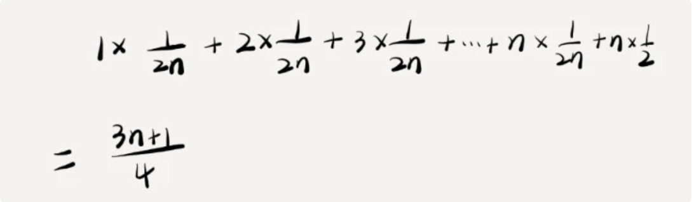
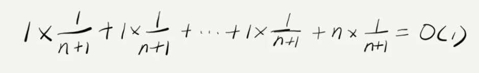
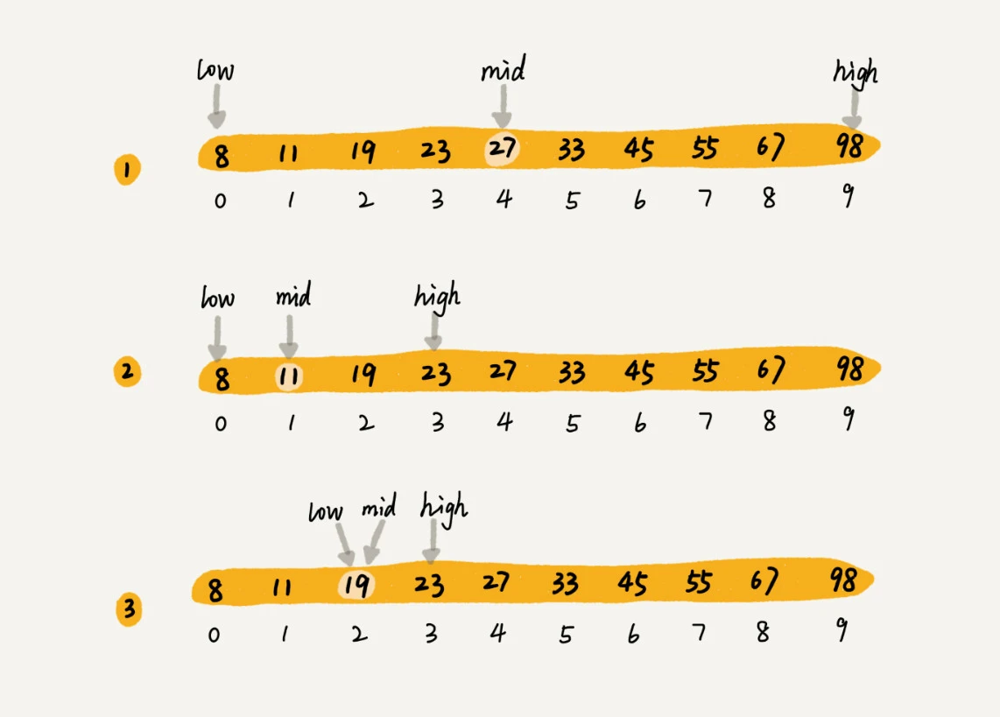
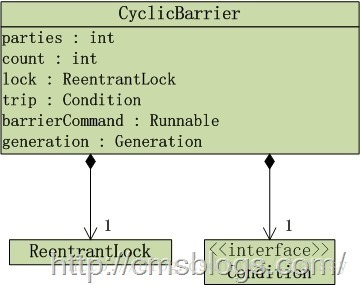
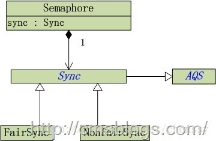

强烈推荐： 

- ==[Java并发知识点总结](<https://github.com/CL0610/Java-concurrency>)== 
- [死磕Java](<http://cmsblogs.com/?cat=189>) 

# 一、基础知识

## 1、并发编程的优缺点

### 1. 优点

- 并发编程的形式可以将多核CPU的计算能力发挥到极致，性能得到提升

  > 充分利用多核CPU的计算能力

- 面对复杂业务模型，并行程序会比串行程序更适应业务需求，而并发编程更能吻合这种业务拆分

  > 方便进行业务拆分，提升应用性能

### 2. 缺点

- CPU 不断通过切换线程，让人感觉多个线程同时执行，每次切换时，需要保存当前的状态起来，以便下次能够恢复先前状态，而这个切换非常损耗性能，过于频繁反而无法发挥出多线程编程的优势

  > 时间片是 CPU 分配给各个线程的时间，一般是几十毫秒

**上下文切换的方式**： 

- **无锁并发编程**：参照 concurrentHashMap 分段锁的思想，不同的线程处理不同段的数据，这样在多线程竞争的条件下，可以减少上下文切换的时间

- **CAS 算法**： 参照 Atomic 中的 CAS 算法来更新数据，使用乐观锁，可以有效的减少一部分不必要的锁竞争带来的上下文切换

- **使用最少线程**：避免创建不需要的线程，比如任务很少，但创建了很多的线程，这样会造成大量的线程都处于等待状态

- **协程**：在单线程里实现多任务的调度，并在单线程里维持多个任务间的切换

  > 推荐阅读： [进程，线程，协程与并行，并发](<https://www.jianshu.com/p/f11724034d50>) 与 [线程与协程](<https://www.jianshu.com/p/25cb5a6a17f6>) 
  >
  > - **进程是为了更好的利用 CPU 资源使并发成为可能**
  >
  > - **线程是为了降低上下文切换的消耗，提高系统的并发性，使进程内并发成为可能**
  >
  > - **协程通过在线程中实现调度，避免了陷入内核级别的上下文切换造成的性能损失，进而突破了线程在IO上的性能瓶颈**
  >
  >   > 协程的好处： 
  >   >
  >   > - 切换协程在用户态进行 ，无需系统调用，更快
  >   > - 调用者能够自主控制协程切换，更自由
  >   > - 没有锁的概念，协程安全，不担心死锁等状况，省去锁的开销

### 3. 线程安全

**避免死锁的情况**： 

- 避免一个线程同时获得多个锁
- 避免一个线程在锁内部占有多个资源，尽量保证每个锁只占用一个资源
- 尝试使用定时锁，使用 lock.tryLock(timeOut)，当超时等待时当前线程不会阻塞
- 对于数据库锁，加锁和解锁必须在一个数据库连接里，否则会出现解锁失败的情况

### 4. 相关概念

- **同步和异步**： 

  - 同步调用： 指调用者必须等待被调用的方法结束后，调用者后面的代码才能执行
  - 异步调用： 指调用者不用管被调用方法是否完成，都会继续执行后面的代码，当被调用的方法完成后会通知调用者

- **并发和并行**： 

  - 并发： 指多个任务交替进行
  - 并行： 指真正意义上的“同时进行”

  > - 若系统只有一个 CPU，而使用多线程，则只能通过切换时间片的方式交替进行，并发执行任务
  >
  > - 真正的并行只能出现在拥有多个 CPU 的系统中

- **阻塞和非阻塞**： 通常用来形容多线程间的相互影响

  - 阻塞： 一个线程占有了临界区资源，则其他线程需要等待该资源的释放，进而导致等待的线程挂起
  - 非阻塞： 强调没有一个线程可以阻塞其他线程，所有的线程都会尝试地往前运行

- **临界区**： 用来表示一种公共资源或者说是共享数据，可以被多个线程使用

  >  注意： 一旦临界区资源被一个线程占有，那么其他线程必须等待

## 2、线程的状态转换

### 1. 线程的创建

```java
public class CreateThreadDemo {
    public static void main(String[] args) {
        //1.继承Thread
        Thread thread = new Thread() {
            @Override
            public void run() {
                System.out.println("继承Thread");
                super.run();
            }
        };
        thread.start();
        
        //2.实现runable接口
        Thread thread1 = new Thread(new Runnable() {
            @Override
            public void run() {
                System.out.println("实现runable接口");
            }
        });
        thread1.start();
        
        //3.实现callable接口
        //实现callable接口，提交给ExecutorService返回的是异步执行的结果
        ExecutorService service = Executors.newSingleThreadExecutor();
        Future<String> future = service.submit(new Callable() {
            @Override
            public String call() throws Exception {
                return "通过实现Callable接口";
            }
        });
        try {
            String result = future.get();
            System.out.println(result);
        } catch (InterruptedException e) {
            e.printStackTrace();
        } catch (ExecutionException e) {
            e.printStackTrace();
        }
    }
}
```

- 可以利用 `FutureTask(Callable<V> callable)` 将 callable 进行包装然后 FeatureTask 提交给ExecutorsService
- 可以通过 Executors 将 Runable 转换成 Callable，具体方法是：`Callable<T> callable(Runnable task, T result), Callable<Object> callable(Runnable task)` 

### 2. 线程的切换

> - 当线程进入到 synchronized 方法或者 synchronized 代码块时，线程切换到的是 BLOCKED 状态
> - 使用 java.util.concurrent.locks 下 lock 进行加锁时，线程切换的是 WAITING 或 TIMED_WAITING 状态，因为 lock 会调用 LockSupport 方法


六种线程状态： 


### 3. 线程的操作

- `interrupted`： 表示了一个运行中的线程是否被其他线程进行了中断操作

  > 注意： 当抛出 InterruptedException 时，会清除中断标志位，即调用 isInterrupted 会返回 false
  >
  > 
  >
  > 实例：
  >
  > ```java
  > public class InterruptDemo {
  >     public static void main(String[] args) throws InterruptedException {
  >         //sleepThread睡眠1000ms
  >         final Thread sleepThread = new Thread() {
  >             @Override
  >             public void run() {
  >                 try {
  >                     Thread.sleep(1000);
  >                 } catch (InterruptedException e) {
  >                     e.printStackTrace();
  >                 }
  >                 super.run();
  >             }
  >         };
  >         //busyThread一直执行死循环
  >         Thread busyThread = new Thread() {
  >             @Override
  >             public void run() {
  >                 while (true) ;
  >             }
  >         };
  >         
  >         sleepThread.start();
  >         busyThread.start();
  >         //执行中断操作
  >         sleepThread.interrupt();
  >         busyThread.interrupt();
  >         //当返回 false，后续代码才会继续执行
  >         while (sleepThread.isInterrupted()) ;
  >         
  >         System.out.println("sleepThread isInterrupted: " 
  >                            + sleepThread.isInterrupted());
  >         System.out.println("busyThread isInterrupted: " 
  >                            + busyThread.isInterrupted());
  >     }
  > }
  > 
  > //输出
  > sleepThread isInterrupted: false
  > busyThread isInterrupted: true
  > ```

- `join`： 

  > threadB.join()： 当前线程 A 会等待 threadB 线程终止后 threadA 才会继续执行
  >
  > ```java
  > public class JoinDemo {
  >     public static void main(String[] args) {
  >         Thread previousThread = Thread.currentThread();
  >         for (int i = 1; i <= 10; i++) {
  >             Thread curThread = new JoinThread(previousThread);
  >             curThread.start();
  >             previousThread = curThread;
  >         }
  >     }
  > 
  >     static class JoinThread extends Thread {
  >         private Thread thread;
  > 
  >         public JoinThread(Thread thread) {
  >             this.thread = thread;
  >         }
  > 
  >         @Override
  >         public void run() {
  >             try {
  >                 thread.join();
  >                 System.out.println(thread.getName() + " terminated.");
  >             } catch (InterruptedException e) {
  >                 e.printStackTrace();
  >             }
  >         }
  >     }
  > }
  > 
  > //输出： 
  > main terminated.
  > Thread-0 terminated.
  > Thread-1 terminated.
  > Thread-2 terminated.
  > Thread-3 terminated.
  > Thread-4 terminated.
  > Thread-5 terminated.
  > Thread-6 terminated.
  > Thread-7 terminated.
  > Thread-8 terminated.
  > ```

- `sleep`： 让当前正在执行的线程在指定的时间内暂停执行，进入阻塞状态

  > - 既可以让其他**同优先级或高优先级**的线程得到执行的机会，也可以让**低优先级**的线程得到执行机会
  > - sleep() 方法不会释放“锁标志”，即：如果有 synchronized 同步块，其他线程仍然不能访问共享数据
  >
  > ---
  >
  > sleep  VS  wait： 
  >
  > - sleep() 方法是Thread的静态方法，而 wait() 是Object实例方法
  >
  > - wait() 方法必须在同步方法或同步块中调用，即必须获得对象锁
  >
  > sleep() 方法可以在任何地方种使用
  >
  > - wait() 方法会释放占有的对象锁，使得该线程进入等待池中，等待下一次获取资源
  > - sleep() 方法只是让出 CPU 并不会释放掉对象锁
  >
  > - sleep() 方法在休眠时间达到后，如果再次获得 CPU 时间片就会继续执行
  > - wait() 方法必须等待 Object.notift/Object.notifyAll 通知后，才会离开等待池，并且再次获得CPU时间片才会继续执行

- `yield`： 使当前线程让出 CPU，让出的时间片只会分配**给当前线程优先级相同或更高**的线程

  > - yield()方法和sleep()方法类似，也不会释放“锁标志”
  >
  > - 区别： 
  >
  >   - 没有参数，即 yield() 使当前线程重新回到可执行状态
  >
  >     > 执行 yield() 的线程有可能在进入到可执行状态后马上又被执行
  >
  >   - yield() 方法只能使**同优先级或高优先级**的线程得到执行机会
  >
  > ---
  >
  > 注意： 让出 CPU 并不代表当前线程不再运行，若在下次竞争中，又获得了CPU 时间片，当前线程依然会继续运行
  >
  > > 在Java程序中，通过一个**整型成员变量Priority**来控制优先级，优先级的范围从1~10.在构建线程的时候可以通过**setPriority(int)**方法进行设置，默认优先级为 5

## 3、守护线程 Daemon

```java
public class DaemonDemo {
    public static void main(String[] args) {
        Thread daemonThread = new Thread(new Runnable() {
            @Override
            public void run() {
                while (true) {
                    try {
                        System.out.println("i am alive");
                        Thread.sleep(500);
                    } catch (InterruptedException e) {
                        e.printStackTrace();
                    } finally {
                        System.out.println("finally block");
                    }
                }
            }
        });
        //设置守护线程要先于start()方法
        daemonThread.setDaemon(true);//设为守护线程
        daemonThread.start();
        //确保main线程结束前能给daemonThread能够分到时间片
        try {
            Thread.sleep(800);
        } catch (InterruptedException e) {
            e.printStackTrace();
        }
    }
}

//输出： 会一直打印,但当 main 线程结束后,daemonThread 就会退出所以不会出现死循环的情况
i am alive
finally block
i am alive
```

> 注意： 守护线程在退出时，并不会执行 finnally 块中的代码

## 4、Ring Buffer

推荐阅读： [Ring Buffer 有什么特别?](https://www.cnblogs.com/shanyou/archive/2013/02/04/2891300.html) 

简介： 

- 是一个环(圆形，首尾相接)，可以当作缓存，用来在一个线程上下文与另一个线程上下文之间传递数据

  

- 拥有一个序号指向下一个可用元素的数组

  

- 如果持续向 buffer 中写入数据，这个序号会一直增长，直到绕过整个环

  

要找到数组中当前序号指向的元素，可以用 mod 运算：`sequence mod array length = array index`

---

RingBuffer用序号来标记 buffer 的末尾，当收到一个 NAK 信号时，可以重发从那一点到当前序号间的所有消息：


**RingBuffer 特点**： buffer 里的对象不会被销毁，直到下次被覆盖写入

**优点**： 

- 提供了可靠的消息传递特性

- 比链表要快，因为它是数组，而且有一个容易预测的访问模式

  - 对 CPU 高速缓存友好： 数据可以在硬件层面预加载到高速缓存

    > 因此 CPU 不需要经常回到主内存 RAM 里去寻找 Ring Buffer 的下一条数据

  - 是一个数组，可以预先分配内存，并保持数组元素永远有效

# 二、JMM

- 线程间的通信：**共享内存**和**消息传递** 

  > java内存模型是**共享内存的并发模型**，线程之间主要通过**读-写共享变量**来完成隐式通信

## 1、JMM 内存模型


线程A和线程B之间完成通信需要经历的步骤： 

- 线程A从主内存中将共享变量读入线程A的工作内存后并进行操作，之后将数据重新写回到主内存中
- 线程B从主存中读取最新的共享变量

## 2、重排序

编译器和处理器的三种重排序： **1 为编译器重排序； 2，3 为处理器重排序** 

> - 针对编译器重排序，JMM 的编译器重排序规则会**禁止一些特定类型的编译器重排序**
> - 针对处理器重排序，编译器在生成指令序列时会通过**插入内存屏障**来禁止某些特殊的处理器重排序


- **编译器优化重排序**： 编译器在不改变单线程程序语义的前提下，重新**安排语句的执行顺序**

- **指令级并行重排序**： **将多条指令重叠执行**

  > 如果**不存在数据依赖性**，处理器可以改变语句对应机器指令的执行顺序
  >
  > > 数据依赖性： 若两个操作访问同一个变量，且有一个为写操作，此时这两个操作就存在数据依赖性
  >
  > 注意： 编译器和处理器在重排序时，会遵守数据依赖性，不会改变存在数据依赖性关系的两个操作的执行顺序

- **内存系统重排序**： 由于处理器使用缓存和读/写缓冲区，这使得加载和存储操作看上去可能是在乱序执行的

## 3、happens-before 规则

**happens-before 规则定义**： 

- 如果一个操作 happens-before 另一个操作，那么第一个操作的执行结果将对第二个操作可见，而且第一个操作的执行顺序排在第二个操作之前
- 两个操作之间存在happens-before关系，并不意味着一定要按照happens-before原则制定的顺序来执行。如果重排序之后的执行结果与按照happens-before关系来执行的结果一致，那么这种重排序并不非法

**六项具体规则**： 

- **程序次序规则**：一个线程内，按照代码顺序，书写在前面的操作先行发生于书写在后面的操作

- **锁定规则**：一个 unLock 操作先行发生于后面对同一个锁额 lock 操作

- **volatile 变量规则**：对一个变量的写操作先行发生于后面对这个变量的读操作

- **传递规则**：如果操作A先行发生于操作B，而操作B又先行发生于操作C，则操作A先行发生于操作C

- **线程启动规则**：Thread 对象的 start() 方法先行发生于此线程的每个一个动作

- **线程中断规则**：对线程 interrupt() 方法的调用先行发生于被中断线程的代码检测到中断事件的发生

- **线程终结规则**：线程中所有的操作都先行发生于线程的终止检测

  > 可以通过 Thread.join() 方法结束、Thread.isAlive() 的返回值手段检测到线程已经终止执行

- **对象终结规则**：一个对象的初始化完成先行发生于他的finalize()方法的开始

上述规则的推论：

- 将一个元素放入一个线程安全的队列的操作 Happens-Before 从队列中取出这个元素的操作
- 将一个元素放入一个线程安全容器的操作Happens-Before从容器中取出这个元素的操作
- 在 CountDownLatch 上的倒数操作 Happens-Before CountDownLatch#await()操作
- 释放Semaphore许可的操作Happens-Before获得许可操作
- Future表示的任务的所有操作Happens-Before Future#get()操作
- 向Executor提交一个Runnable或Callable的操作Happens-Before任务开始执行操作

## 4、DCL(Double Check Lock)

### 1. 单例模式中的 DCL

- 若第一个 `singleton != null`，则不需要执行下面的加锁动作，极大提高了程序的性能
- 若第一个 `singleton == null`，即使有多个线程同一时间判断，但是由于 synchronized 的存在，只会有一个线程能够创建对象
- 当第一个获取锁的线程创建完 singleton 对象后，其他线程在第二次判断 singleton 一定不会为 null，则直接返回已经创建好的 singleton 对象

```java
public class Singleton {
   private static Singleton singleton;

   private Singleton(){}

   public static Singleton getInstance(){
       if(singleton == null){                              // 1
           synchronized (Singleton.class){                 // 2
               if(singleton == null){                      // 3
                   singleton = new Singleton();            // 4
               }
           }
       }
       return singleton;
   }
}
```

### 2. 问题

> 上述单例的 DCL 有问题

实例化对象要分为三个步骤：

1. 分配内存空间
2. 初始化对象
3. 将内存空间的地址赋值给对应的引用

由于重排序的缘故，步骤2、3可能会发生重排序，其过程如下：

1. 分配内存空间
2. 将内存空间的地址赋值给对应的引用
3. 初始化对象

> 详细请参看： JVM 文章，加载 --> 验证 --> 准备 --> 解析 --> 初始化 --> 运行 --> 回收(**解析与初始化可以互换**)

如果2、3发生了重排序就会导致第二个判断会出错，singleton != null，但是它其实仅仅只是一个地址而已，此时对象还没有被初始化，所以return的singleton对象是一个没有被初始化的对象，如下：


> - 按照上面图例所示，线程B访问的是一个没有被初始化的 singleton 对象
>
> - 通过上面的阐述，我们可以判断 DCL 的**错误根源在于步骤 4** 

### 3. 解决方案

解决方法： 

1. **不允许步骤 2 、3 发生重排序**
2. 允许初始化阶段步骤 2 、3 发生重排序，但是**不允许其他线程“看到”这个重排序**

方案： 

- ==基于 `volatile` 解决方案==： 将变量 singleton 声明为 volatile

  ```java
  public class Singleton {
     //通过volatile关键字来确保安全
     private volatile static Singleton singleton;
     private Singleton(){}
     public static Singleton getInstance(){
         if(singleton == null){
             synchronized (Singleton.class){
                 if(singleton == null){
                     singleton = new Singleton();
                 }
             }
         }
         return singleton;
     }
  }
  ```

- ==基于类初始化的解决方案==： **利用 classloder 的机制来保证初始化 instance 时只有一个线程**

  > **JVM在类初始化阶段会获取一个锁，这个锁可以同步多个线程对同一个类的初始化**

  ```java
  public class Singleton {
     private static class SingletonHolder{
         public static Singleton singleton = new Singleton();
     }
      
     public static Singleton getInstance(){
         return SingletonHolder.singleton;
     }
  }
  ```

## 5、Java 初始化锁

- 对于每一个类或者接口 `C`，都有一个唯一的初始化锁 `LC` 与之相对应
- 从 `C` 到 `LC` 的映射，由 JVM 的具体去实现
- JVM 在类初始化阶段期间会获取这个初始化锁，且每一个线程至少获取一次锁来确保这个类已被初始化过


# 三、并发关键字

## 1、synchronized

### 1. 基本使用

- 确保线程互斥的访问同步代码
- 保证共享变量的修改能够及时可见
- 有效解决重排序问题

从语法上讲，Synchronized 的三种用法：

- 修饰普通方法

- 修饰静态方法

- 修饰代码块


### 2. 实现原理

#### 1. Java 对象头

> synchronized 可以保证方法或代码块运行时，同一时刻只有一个方法可以进入到**临界区**，同时还可以保证共享变量的内存可见性

对象头包括：synchronized 用的锁是存在 Java 对象头中

- Mark Word(标记字段)： 用于存储对象自身的运行时数据，是实现轻量级锁和偏向锁的关键
- Klass Pointer(类型指针)： 是对象指向它的类元数据的指针，虚拟机通过这个指针来确定对象是哪个类的实例

##### Mark Word

- Java  对象头一般占有两个机器码，但是如果对象是数组类型，则需要三个机器码

  > JVM 虚拟机通过 Java 对象的元数据信息确定 Java 对象的大小，用一块来记录数组长度

  

- Mark Word 被设计成一个非固定的数据结构以便在极小的空间存储更多数据，会根据对象的状态复用自己的存储空间

  

#### 2. monitor

- Monitor 是线程私有，每一个线程都有一个可用 monitor record 列表，同时还有一个全局的可用列表

- 每一个被锁住的对象都会和一个 monitor 关联，同时 monitor 中有一个 Owner 字段存放拥有该锁的线程的唯一标识，表示该锁被这个线程占用

  > 对象头的 MarkWord 中的 LockWord 指向 monitor 的起始地址

monitor 分类： 

- `monitorenter`： 

  > 每个对象有一个监视器锁(monitor)，当 monitor 被占用时就会处于锁定状态，线程执行 monitorenter 指令时尝试获取 monitor 的所有权

  - 若 monitor 进入数为 0，则该线程进入 monitor，然后进入数设为 1，该线程即为 monitor 的所有者

  - 若线程已经占有该 monitor，只是重新进入，则进入 monitor 的进入数加 1

  - 若其他线程已经占用 monitor，则该线程进入阻塞状态，直到 monitor 的进入数为0，再重新尝试获取monitor 的所有权

- `monitorexit`： 

  > 执行 monitorexit 的线程必须是 objectref 所对应的 monitor 的所有者

  - 指令执行时，monitor 的进入数减 1，如果减 1 后进入数为 0，则线程退出 monitor

> 注： 
>
> - Synchronized 语义底层通过 monitor 对象来完成，其实 **wait/notify 等方法也依赖于 monitor 对象**： 
>
>   > 这是为什么只有在同步块或同步方法中才能调用 `wait/notify` 等方法，否则会抛出 `llegalMonitorStateException` 异常的原因
>
> - 同步方法相对于普通方法，其常量池中多了 `ACC_SYNCHRONIZED` 标示符
>
>   JVM 根据该标示符来实现方法的同步：当方法调用时，调用指令将会检查方法的 ACC_SYNCHRONIZED 访问标志是否被设置： 
>
>   - 若设置，执行线程将先获取 `monitor`，获取成功后才执行方法体，方法执行完后再释放 monitor
>   - 方法执行期间，其他线程都无法再获得同一个 monitor 对象

**monitor 结构**： 


- **Owner**： 

  - NULL 表示当前没有任何线程拥有该 monitor record
  - 当线程成功拥有该锁后保存线程唯一标识

- **EntryQ**： 关联一个系统互斥锁(semaphore)，阻塞所有试图锁住 monitor record 失败的线程

- **RcThis**： 表示 blocked 或 waiting 在该 monitor record 上的所有线程的个数

- **Nest**： 用来实现重入锁的计数

- **HashCode**： 保存从对象头拷贝过来的 HashCode 值

- **Candidate**： 用来避免不必要的阻塞或等待线程唤醒，因为每一次只有一个线程能够成功拥有锁，如果每次前一个释放锁的线程唤醒所有正在阻塞或等待的线程，会引起不必要的上下文切换从而导致性能严重下降

  > Candidate只有两种可能的值： 
  >
  > - 0 表示没有需要唤醒的线程
  > - 1 表示要唤醒一个继任线程来竞争锁

对象，对象监视器，同步队列以及执行线程状态之间的关系：

> 线程对 Object 的访问，首先要获得 Object 的监视器，如果获取失败，该线程就进入同步状态，线程状态变为BLOCKED，当Object的监视器占有者释放后，在同步队列中得线程就会有机会重新获取该监视器


### 3. 锁优化

#### 1. CAS 

CAS 比较交换： 包含三个值：**V 内存地址存放的实际值；O 预期的值（旧值）；N 更新的新值**

> - 当 V 和 O 相同时，表明该值没有被其他线程更改过，则可以将新值 N 赋值给 V
> - 若 V 和 O 不相同，表明该值已被其他线程更改，则不能将新值 N 赋给 V，返回 V 即可
>
> 当多个线程使用 CAS 操作一个变量时，只有一个线程会成功，并成功更新，其余会失败。失败的线程会重新尝试，当然也可以选择挂起线程

CAS 问题：

- **ABA 问题**： 旧值 A 变为 B，然后再变成 A，但在做 CAS 时检查发现旧值并没有变化依然为A，但是实际上的确发生了变化

  > 解决方案： 沿袭数据库中常用的乐观锁方式，**添加版本号**

- **自旋时间过长**： 使用 CAS 会发生非阻塞同步，即不会将线程挂起，会自旋进行下一次尝试，自旋时间过长对性能是很大的消耗

- **只能保证一个共享变量的原子操作**： 当对一个共享变量执行操作时CAS能保证其原子性，如果对多个共享变量进行操作，CAS就不能保证其原子性

  > 解决方案： 利用对象整合多个共享变量，即构造一个包含多个共享变量的类，然后将这个对象做CAS操作就可以保证其原子性
  >
  > > atomic中提供了AtomicReference来保证引用对象之间的原子性

#### 2. 自旋锁

- 自旋锁： 通过自旋让该线程等待一段时间，不会被立即挂起，看持有锁的线程是否会很快释放锁

  > 自旋等待的时间(自旋的次数)必须有一个限度，如果超过了定义的时间仍然没有获取到锁，则应该被挂起

#### 3. 适应自旋锁

- 自适应： 即自旋次数不固定，它由前一次在同一个锁上的自旋时间及锁的拥有者的状态来决定

  > - 线程如果自旋成功，则下次自旋的次数会更加多，因为虚拟机认为既然上次成功了，那么此次自旋也很有可能会再次成功，那么它就会允许自旋等待持续的次数更多
  > - 反之，如果对于某个锁，很少有自旋能够成功的，那么在以后要获得这个锁时，自旋的次数会减少甚至省略掉自旋过程，以免浪费处理器资源

#### 4. 锁消除

- **锁消除**： 当 JVM 检测到不可能存在共享数据竞争，则 JVM 会对这些同步锁进行锁消除

- **锁消除依据**： 逃逸分析的数据支持

  > 使用数据流分析来确定数据是否逃逸

#### 5. 锁粗化

- 锁粗化： 将多个连续的加锁、解锁操作连接在一起，扩展成一个范围更大的锁

#### 6. 偏向锁

**偏向锁主要目的**：为了在无多线程竞争的情况下尽量**减少不必要的轻量级锁执行路径** 

步骤如下：

- **获取锁**： 

  1. 检测 Mark Word 是否为可偏向状态，即是否为偏向锁，锁标识位为 01
  2. 若为可偏向状态，则测试线程 ID 是否为当前线程 ID：
     - 如果是，则执行步骤 5
     - 否则执行步骤 3
  3. 如果线程 ID 不为当前线程 ID，则通过 CAS 操作竞争锁：
     - 竞争成功，则将 Mark Word 的线程 ID 替换为当前线程 ID
     - 否则执行线程 4
  4. 通过 CAS 竞争锁失败，证明存在多线程竞争，当到达全局安全点，获得偏向锁的线程被挂起，偏向锁升级为轻量级锁，然后被阻塞在安全点的线程继续往下执行同步代码块
  5. 执行同步代码块

- **释放锁**： 只有竞争才会释放锁的机制，线程是不会主动去释放偏向锁，需要等待其他线程来竞争

  > **偏向锁的撤销需要等待全局安全点**(这个时间点上没有正在执行的代码)

  1. 暂停拥有偏向锁的线程，判断锁对象是否还处于被锁定状态
  2. 撤销偏向锁，恢复到无锁状态（01）或者轻量级锁的状态


#### 7. 轻量级锁

**轻量级锁的主要目的**： 在没有多线程竞争的前提下，**减少传统的重量级锁**使用操作系统互斥量产生的性能消耗

> 当关闭偏向锁功能或多个线程竞争偏向锁导致偏向锁升级为轻量级锁，则会尝试获取轻量级锁

步骤如下：

- **获取锁**： 
  1. 判断当前对象是否处于无锁状态： 
     - 若是，则 JVM 首先将在当前线程的栈帧中建立一个名为锁记录（Lock Record）的空间，用于存储锁对象目前的 Mark Word 的拷贝（即Displaced Mark Word）
     - 否则执行步骤 3
  2. JVM 利用 CAS 操作尝试将对象的 Mark Word 更新为指向 Lock Record 的指针： 
     - 如果成功表示竞争到锁，则将锁标志位变成00（表示此对象处于轻量级锁状态），执行同步操作
     - 如果失败则执行步骤 3
  3. 判断当前对象的 Mark Word 是否指向当前线程的栈帧：
     - 如果是则表示当前线程已经持有当前对象的锁，则直接执行同步代码块
     - 否则只能说明该锁对象已经被其他线程抢占了，这时轻量级锁需要膨胀为重量级锁，锁标志位变成10，后面等待的线程将会进入阻塞状态
- **释放锁**： 
  1. 取出在获取轻量级锁保存在 Displaced Mark Word 中的数据
  2. 用 CAS 操作将取出的数据替换当前对象的 Mark Word 中：
     - 如果成功，则说明释放锁成功
     - 否则执行 3
  3. 如果 CAS 操作替换失败，说明有其他线程尝试获取该锁，则需要在释放锁的同时唤醒被挂起的线程


#### 8. 重量级锁

重量级锁通过对象内部的监视器 `monitor` 实现，其中monitor的本质是依赖于底层操作系统的Mutex Lock实现，操作系统实现线程之间的切换需要从用户态到内核态的切换，切换成本非常高

- 当一个线程尝试获得锁时，如果该锁已经被占用，则会将该线程封装成一个 ObjectWaiter 对象插入到 cxq 的队列尾部，然后暂停当前线程
- 当持有锁的线程释放锁前，会将 cxq 中的所有元素移动到 EntryList 中去，并唤醒 EntryList 的队首线程

调用 `Object#wait` 方法： 

- 将该线程对应的 ObjectWaiter 从 EntryList 移除并加入到 WaitSet 中，然后释放锁
- 当 wait 的线程被 notify 之后，会将对应的 ObjectWaiter 从 WaitSet 移动到 EntryList 中


### 4. 死锁排查

使用 `jstack -l pid` 或 `jcmd pid Thread.print` 可以查看当前应用的进程信息，如果有死锁也会分析出来

- 推荐阅读： [Java--死锁以及死锁的排查](https://mrdear.cn/2018/06/16/java/Java_study--deadlock/index.html) 

## 2、volatile

### 1. 简介

> **volatile 可保证线程可见性**，即若某个线程对 volatile 修饰的共享变量进行更新，则其他线程可以立马得知
>
> - volatile 保证线程可见性且提供一定的有序性，但无法保证原子性；在 JVM 底层采用“**内存屏障**”来实现

在 volatile 修饰的共享变量进行写操作时，会多出**Lock前缀的指令** 

- Lock 前缀的指令会引起处理器缓存写回内存

- 一个处理器的缓存回写到内存会导致其他处理器的缓存失效

- 当处理器发现本地缓存失效后，就会从内存中重读该变量数据，即可以获取当前最新值

  > 缓存一致性： 每个处理器通过嗅探在总线上传播的数据来检查自己缓存的值是不是过期

### 2. 内存语义

并发编程的基本概念： 

- **原子性**： 一个操作或者多个操作 要么全部执行并且执行的过程不会被任何因素打断，要么就都不执行
- **可见性**：当多个线程访问同一个变量时，一个线程修改了这个变量的值，其他线程能够立即看得到修改的值
- **有序性**： 程序执行的顺序按照代码的先后顺序执行

---

- volatile 通过**内存屏障**阻止重排序	

JMM内存屏障分为四类： 


JMM会针对编译器制定volatile重排序规则表：NO 表示禁止重排序


> JMM 采取的策略：
>
> - 在每个volatile写操作的**前面**插入一个StoreStore屏障
> - 在每个volatile写操作的**后面**插入一个StoreLoad屏障
> - 在每个volatile读操作的**后面**插入一个LoadLoad屏障
> - 在每个volatile读操作的**后面**插入一个LoadStore屏障
>
> 注意：volatile写是在前面和后面**分别插入内存屏障**，而volatile读操作是在**后面插入两个内存屏障** 
>
> - **StoreStore屏障**：禁止上面的普通写和下面的volatile写重排序
>
> - **StoreLoad屏障**：防止上面的volatile写与下面可能有的volatile读/写重排序
>
> - **LoadLoad屏障**：禁止下面所有的普通读操作和上面的volatile读重排序
>
> - **LoadStore屏障**：禁止下面所有的普通写操作和上面的volatile读重排序


## 3、final 域重排序

> final 全局变量定义时必须进行初始化且不更更改
>
> final 局部变量，在未初始化时可以进行初始化，但初始化后不能修改

### 1. final 域为基本类型

```java
public class FinalDemo {
    private int a;  //普通域
    private final int b; //final域
    private static FinalDemo finalDemo;

    public FinalDemo() {
        a = 1; // 1. 写普通域
        b = 2; // 2. 写final域
    }

    public static void writer() {
        /**
         * 1. 构造了一个 FinalDemo 对象
         * 2. 把这个对象赋值给成员变量finalDemo
         */
        finalDemo = new FinalDemo();
    }

    public static void reader() {
        FinalDemo demo = finalDemo; // 3.读对象引用
        int a = demo.a;    //4.读普通域
        int b = demo.b;    //5.读final域
    }
}
```

- **写 final 域重排序规则**： 禁止对 final 域的写重排序到构造函数之外

  > - JMM 禁止编译器把 final 域的写重排序到构造函数之外
  > - 编译器会在 final 域写之后，构造函数 return 之前，插入一个 storestore 屏障
  >
  > 
  >
  > - 由于a,b之间没有数据依赖性，普通域 a 可能会被重排序到构造函数之外，线程B就有可能读到的是普通变量a初始化之前的值（零值），这样就可能出现错误
  > - 而 final 域变量 b，根据重排序规则，会禁止 final 修饰的变量 b 重排序到构造函数之外，从而 b 能够正确赋值，线程 B 就能够读到 final 变量初始化后的值
  >
  > **写 final 域的重排序规则可以确保**：在对象引用为任意线程可见之前，对象的 final 域已被正确初始化，而普通域就不具有这个保障

- **读 final 域重排序规则**： 在一个线程中，初次读对象引用和初次读该对象包含的 final 域，JMM会禁止这两个操作的重排序

  > - 处理器会在读 final 域操作的前面插入一个 LoadLoad 屏障
  >
  > 
  >
  > - 读对象的普通域被重排序到了读对象引用的前面，会出现线程 B 还未读到对象引用就在读取该对象的普通域变量，这显然是错误的操作
  > - 而 final 域的读操作就“限定”了在读final域变量前已经读到了该对象的引用，从而避免这种情况
  >
  > **读 final 域的重排序规则可以确保**：在读一个对象的 final 域之前，一定会先读这个包含这个final域的对象的引用

### 2. final 域为引用类型

```java
public class FinalReferenceDemo {
    final int[] arrays; //final 是引用类型
    private FinalReferenceDemo finalReferenceDemo;

    public FinalReferenceDemo() {
        arrays = new int[1];  //1
        arrays[0] = 1;        //2
    }

    public void writerOne() {
        finalReferenceDemo = new FinalReferenceDemo(); //3
    }

    public void writerTwo() {
        arrays[0] = 2;  //4
    }

    public void reader() {
        if (finalReferenceDemo != null) {  //5
            int temp = finalReferenceDemo.arrays[0];  //6
        }
    }
}
```

- **对 final 修饰的对象的成员域写操作**： 在构造函数内对**一个final修饰的对象的成员域的写入，与随后在构造函数之外把这个被构造的对象的引用赋给一个引用变量**，这两个操作是不能被重排序的

  > 线程 A 执行 wirterOne 方法，执行完后线程 B 执行 writerTwo 方法，然后线程 C 执行 reader 方法
  >
  > 

- **对 final 修饰的对象的成员域读操作**： 

  > - JMM 可以确保： 线程 C 至少能看到写线程 A 对 final 引用的对象的成员域的写入，即能看到 `arrays[0] = 1`，而写线程 B 对数组元素的写入可能看到可能看不到
  >
  > - JMM不保证线程 B 的写入对线程 C 可见，线程 B 和线程 C 之间存在数据竞争，此时的结果是不可预知的。如果可见的，可使用锁或者 volatile

**final 域总结**： 

- **基本数据类型**:

  - **final 域写**：禁止**final域写**与**构造方法**重排序，即禁止final域写重排序到构造方法之外，从而保证该对象对所有线程可见时，该对象的final域全部已经初始化过

  - **final 域读**：禁止初次**读对象的引用**与**读该对象包含的final域**的重排序

- **引用数据类型**：

  额外增加约束：禁止在构造函数对**一个final修饰的对象的成员域的写入**与随后将**这个被构造的对象的引用赋值给引用变量** 重排序

## 4、三大特性

### 1. 原子性

- **原子性**： 指一个操作是不可中断的，要么全部执行成功要么全部执行失败

- JMM 定义的八种原子操作：
  - **lock(锁定)**：作用于主内存中的变量，把一个变量标识为一个线程独占的状态
  - **unlock(解锁)**： 作用于主内存中的变量，把一个处于锁定状态的变量释放出来，释放后的变量才可以被其他线程锁定
  - **read(读取)**：作用于主内存的变量，把一个变量的值从主内存传输到线程的工作内存中，以便后面的load动作使用
  - **load(载入)**：作用于工作内存的变量，把 read 操作从主内存中得到的变量值放入工作内存中的变量副本
  - **use(使用)**：作用于工作内存的变量，把工作内存中一个变量的值传递给执行引擎，每当虚拟机遇到一个需要使用到变量的值的字节码指令时将会执行这个操作
  - **assign(赋值)**：作用于工作内存的变量，把一个从执行引擎接收到的值赋给工作内存的变量，每当虚拟机遇到一个给变量赋值的字节码指令时执行这个操作
  - **store(存储)**：作用于工作内存的变量，把工作内存中一个变量的值传送给主内存中以便随后的 write 操作使用
  - **write(操作)**：作用于主内存的变量，把 store 操作从工作内存中得到的变量的值放入主内存的变量中

### 2. 有序性

- **有序性**： 在本线程内观察，所有的操作都是有序的；在一个线程观察另一个线程，所有的操作都是无序的

### 3. 可见性

- **可见性**： 指当一个线程修改了共享变量后，其他线程能够立即得知这个修改

## 5、线程八锁

> 线程八锁的关键：
>
> - 非静态方法的锁默认为  this,  静态方法的锁为对应的 Class 实例
> - 某一个时刻内，只能有一个线程持有锁

**题目：** 判断打印的 "one" or "two" ?

1. 两个普通同步方法，两个线程，标准打印

```java
//one  two
public class TestThread8Monitor {
	public static void main(String[] args) {
		Number number = new Number();
		
		new Thread(new Runnable() {
			@Override
			public void run() {
				number.getOne();
			} 
		}).start();
		
		new Thread(new Runnable() {
			@Override
			public void run() {
				number.getTwo();
			}
		}).start();
	}
}

class Number{
	public synchronized void getOne(){
		System.out.println("one");
	}
	public synchronized void getTwo(){
		System.out.println("two");
	}
}
```

2. 新增 Thread.sleep() 给 getOne() 

```java
//one  two
public class TestThread8Monitor {
	public static void main(String[] args) {
		Number number = new Number();
		
		new Thread(new Runnable() {
			@Override
			public void run() {
				number.getOne();
			} 
		}).start();
		
		new Thread(new Runnable() {
			@Override
			public void run() {
				number.getTwo();
			}
		}).start();
	}
}

class Number{
	public synchronized void getOne(){
		try {
			Thread.sleep(3000);
		} catch (InterruptedException e) {}
		System.out.println("one");
	}
	public synchronized void getTwo(){
		System.out.println("two");
	}
}

```

3. 新增普通方法 getThree()

```java
//three  one   two
public class TestThread8Monitor {
	public static void main(String[] args) {
		Number number = new Number();
		
		new Thread(new Runnable() {
			@Override
			public void run() {
				number.getOne();
			} 
		}).start();
		
		new Thread(new Runnable() {
			@Override
			public void run() {
				number.getTwo();
			}
		}).start();
      
      new Thread(new Runnable() {
			@Override
			public void run() {
				number.getThree();
			}
		}).start();
	}
}

class Number{
	public synchronized void getOne(){
		try {
			Thread.sleep(3000);
		} catch (InterruptedException e) {}
		System.out.println("one");
	}
	public synchronized void getTwo(){
		System.out.println("two");
	}
    //没有 synchronized
	public void getThree(){
		System.out.println("three");
	}
}

```

4. 两个普通同步方法，两个 Number 对象

```java
//two  one
public class TestThread8Monitor {
	public static void main(String[] args) {
        //两个对象
		Number number = new Number();
		Number number2 = new Number();
		
		new Thread(new Runnable() {
			@Override
			public void run() {
				number.getOne();
			} 
		}).start();
		
		new Thread(new Runnable() {
			@Override
			public void run() {
				number2.getTwo();
			}
		}).start();
	}
}

class Number{
	public synchronized void getOne(){
		try {
			Thread.sleep(3000);
		} catch (InterruptedException e) {}
		System.out.println("one");
	}
	public synchronized void getTwo(){
		System.out.println("two");
	}
}

```

5. 修改 getOne() 为静态同步方法

```java
//two one
//非静态方法的锁默认为 this，静态方法的锁对应 Class 实例
public class TestThread8Monitor {
	public static void main(String[] args) {
		Number number = new Number();
		
		new Thread(new Runnable() {
			@Override
			public void run() {
				number.getOne();
			} 
		}).start();
		
		new Thread(new Runnable() {
			@Override
			public void run() {
				number.getTwo();
			}
		}).start();
	}
}

class Number{
    //改为静态方法： 作用于整个类
	public static synchronized void getOne(){
		try {
			Thread.sleep(3000);
		} catch (InterruptedException e) {}
		System.out.println("one");
	}
	public synchronized void getTwo(){
		System.out.println("two");
	}
}

```

6. 修改两个方法均为静态同步方法，一个 Number 对象

```java
//one  two
public class TestThread8Monitor {
	public static void main(String[] args) {
		Number number = new Number();
		
		new Thread(new Runnable() {
			@Override
			public void run() {
				number.getOne();
			} 
		}).start();
		
		new Thread(new Runnable() {
			@Override
			public void run() {
				number.getTwo();
			}
		}).start();
	}
}

class Number{
	public static synchronized void getOne(){//均为静态同步方法
		try {
			Thread.sleep(3000);
		} catch (InterruptedException e) {
		}
		System.out.println("one");
	}
	public static synchronized void getTwo(){//均为静态同步方法
		System.out.println("two");
	}
}

```

7. 一个静态同步方法，一个非静态同步方法，两个 Number 对象

```java
//two  one
public class TestThread8Monitor {
	public static void main(String[] args) {
        //两个对象
		Number number = new Number();
		Number number2 = new Number();
		
		new Thread(new Runnable() {
			@Override
			public void run() {
				number.getOne();//先睡眠 3s
			} 
		}).start();
		
		new Thread(new Runnable() {
			@Override
			public void run() {
				number2.getTwo();
			}
		}).start();
	}
}

class Number{
    //静态同步方法
	public static synchronized void getOne(){
		try {
			Thread.sleep(3000);
		} catch (InterruptedException e) {
		}
		System.out.println("one");
	}
	public synchronized void getTwo(){
		System.out.println("two");
	}
}

```

8. 两个静态同步方法，两个 Number 对象

```java
//one  two
//一个静态同步方法获取 Class 实例锁后，其他静态同步方法必须等待该方法释放锁才能获取锁
public class TestThread8Monitor {
	public static void main(String[] args) {
        //两个对象
		Number number = new Number();
		Number number2 = new Number();
		
		new Thread(new Runnable() {
			@Override
			public void run() {
				number.getOne();
			} 
		}).start();
		
		new Thread(new Runnable() {
			@Override
			public void run() {
				number2.getTwo();
			}
		}).start();
	}
}

class Number{
    //均为静态同步方法
	public static synchronized void getOne(){
		try {
			Thread.sleep(3000);
		} catch (InterruptedException e) {
		}
		System.out.println("one");
	}
	//均为静态同步方法
	public static synchronized void getTwo(){
		System.out.println("two");
	}
}
```

# # JUC 系列

# 四、AQS(AbstractQueuedSynchronizer)


## 1、AQS 简介

### 1. 基本方法

- `AQS(AbstractQueuedSynchronizer)`： 即队列同步器，是构建锁或其他同步组件的基础框架，是 JUC 并发包中的核心基础组件

- **好处**： 不仅能够极大地减少实现工作，而且也不必处理在多个位置上发生的竞争问题

- **特点**： 

  - 在基于 AQS 构建的同步器中，只能在一个时刻发生阻塞，从而降低上下文切换的开销，提高了吞吐量

  - AQS 的主要使用方式是继承，子类通过继承同步器并实现它的抽象方法来管理同步状态

  - AQS 使用一个 `int` 类型的成员变量 `state` 来表示同步状态

    > 当 `state > 0` 时表示已经获取了锁
    >
    > 当 `state = 0` 时表示释放了锁

  - AQS 通过内置的 FIFO 同步队列来完成资源获取线程的排队工作

    >  如果当前线程获取同步状态(锁)失败时，AQS 会将当前线程以及等待状态等信息构造成一个节点并将其加入同步队列，同时会阻塞当前线程，当同步状态释放时，则会把节点中的线程唤醒，使其再次尝试获取同步状态

**AQS 提供的方法**：

- `getState()`：返回同步状态的当前值
- `setState(int newState)`：设置当前同步状态
- `compareAndSetState(int expect, int update)`：使用 CAS 设置当前状态，能保证状态设置的原子性
- `tryAcquire(int arg)`：独占式获取同步状态，获取同步状态成功后，其他线程需要等待该线程释放同步状态才能获取同步状态
- `tryRelease(int arg)`：独占式释放同步状态
- `tryAcquireShared(int arg)`：共享式获取同步状态，返回值大于等于 0 则表示获取成功，否则获取失败
- `tryReleaseShared(int arg)`：共享式释放同步状态
- `isHeldExclusively()`：当前同步器是否在独占式模式下被线程占用，表示是否被当前线程所独占
- `acquire(int arg)`：独占式获取同步状态，如果当前线程获取同步状态成功，则由该方法返回；否则，将会进入同步队列等待，该方法将会调用可重写的 tryAcquire(int arg) 方法
- `acquireInterruptibly(int arg)`：同 acquire(int arg)，但该方法响应中断，当前线程为获取到同步状态而进入到同步队列中，如果当前线程被中断，则该方法会抛出 InterruptedException 异常并返回
- `tryAcquireNanos(int arg,long nanos)`：超时获取同步状态，如果当前线程在 nanos 时间内没有获取到同步状态，那么将会返回 false，已经获取则返回 true
- `acquireShared(int arg)`：共享式获取同步状态，如果当前线程未获取到同步状态，将会进入同步队列等待，与独占式的主要区别是在同一时刻可以有多个线程获取到同步状态
- `acquireSharedInterruptibly(int arg)`：共享式获取同步状态，响应中断
- `tryAcquireSharedNanos(int arg, long nanosTimeout)`：共享式获取同步状态，增加超时限制
- `release(int arg)`：独占式释放同步状态，会在释放同步状态后，将同步队列中第一个节点包含的线程唤醒
- `releaseShared(int arg)`：共享式释放同步状态

> AQS 提供的模板方法可以分为 3 类：
>
> - **独占式**获取与释放同步状态
>
> - **共享式**获取与释放同步状态
>
> - 查询同步队列中等待线程情况

### 2. CLH 同步队列

> AQS 内部维护着一个同步队列，即 CLH 同步队列： 
>
> - CLH 同步队列是一个 FIFO 双向队列，AQS 依赖它来完成同步状态的管理
> - 当前线程如果获取同步状态失败，AQS 则会将当前线程已经等待状态等信息构造成一个节点并将其加入到 CLH 同步队列，同时会阻塞当前线程，当同步状态释放时，会把首节点唤醒（公平锁），使其再次尝试获取同步状态


### 3. 同步状态的获取与释放

#### 1. 独占式

- **独占锁获取(acquire 方法)**： AQS 提供的模板方法，独占式获取同步状态，但对中断不敏感，即由于线程获取同步状态失败加入到 CLH 同步队列中，后续对线程进行中断操作时，线程不会从同步队列中移除

  > ```java
  > public final void acquire(int arg) {
  >     if (!tryAcquire(arg) && acquireQueued(addWaiter(Node.EXCLUSIVE), arg))
  >         selfInterrupt();
  > }
  > ```
  >
  > - `tryAcquire`：去尝试获取锁，获取成功则设置锁状态并返回 true，否则返回 false
  >
  >   > 该方法自定义同步组件自己实现，必须要保证线程安全的获取同步状态
  >
  > - `addWaiter`：如果 tryAcquire 返回 FALSE（获取同步状态失败），则调用该方法将当前线程加入到CLH同步队列尾部
  >
  > - `acquireQueued`：当前线程会根据公平性原则来进行阻塞等待（自旋）,直到获取锁为止；并且返回当前线程在等待过程中有没有中断过
  >
  > - `selfInterrupt`：产生一个中断
  >
  > acquire 方法的执行流程： 
  >
  > 

- **可中断式获取锁(acquireInterruptibly 方法)**： 该方法在等待获取同步状态时，如果当前线程被中断了，会立刻**响应中断**抛出异常 InterruptedException

  > ```java
  > public final void acquireInterruptibly(int arg) throws InterruptedException {
  >     if (Thread.interrupted()) //校验该线程是否已经中断
  >         throw new InterruptedException(); //如果是则抛出InterruptedException
  >     if (!tryAcquire(arg))//执行tryAcquire(int arg)方法获取同步状态
  >         //如果获取成功，则直接返回，否则执行 doAcquireInterruptibly(int arg)
  >         doAcquireInterruptibly(arg);
  > }
  > 
  > private void doAcquireInterruptibly(int arg) throws InterruptedException {
  > 	//将节点插入到同步队列中
  >     final Node node = addWaiter(Node.EXCLUSIVE);
  >     boolean failed = true;
  >     try {
  >         for (;;) {
  >             final Node p = node.predecessor();
  >             //获取锁出队
  > 			if (p == head && tryAcquire(arg)) {
  >                 setHead(node);
  >                 p.next = null; // help GC
  >                 failed = false;
  >                 return;
  >             }
  >             if (shouldParkAfterFailedAcquire(p, node) &&
  >                 parkAndCheckInterrupt())
  > 				//线程中断抛异常
  >                 throw new InterruptedException();
  >         }
  >     } finally {
  >         if (failed)
  >             cancelAcquire(node);
  >     }
  > }
  > ```

- **超时等待获取锁(tryAcquireNanos 方法)**： 除了响应中断外，还有超时控制，即如果当前线程没有在指定时间内获取同步状态，则会返回false，否则返回true

  > ```java
  > public final boolean tryAcquireNanos(int arg, long nanosTimeout)
  >             throws InterruptedException {
  >     if (Thread.interrupted())
  >         throw new InterruptedException();
  >     return tryAcquire(arg) || doAcquireNanos(arg, nanosTimeout);
  > }
  > 
  > private boolean doAcquireNanos(int arg, long nanosTimeout)
  >         throws InterruptedException {
  >     if (nanosTimeout <= 0L)
  >         return false;
  > 	//1. 根据超时时间和当前时间计算出截止时间
  >     final long deadline = System.nanoTime() + nanosTimeout;
  >     final Node node = addWaiter(Node.EXCLUSIVE);
  >     boolean failed = true;
  >     try {
  >         for (;;) {
  >             final Node p = node.predecessor();
  > 			//2. 当前线程获得锁出队列
  >             if (p == head && tryAcquire(arg)) {
  >                 setHead(node);
  >                 p.next = null; // help GC
  >                 failed = false;
  >                 return true;
  >             }
  > 			// 3.1 重新计算超时时间
  >             nanosTimeout = deadline - System.nanoTime();
  >             // 3.2 已经超时返回false
  > 			if (nanosTimeout <= 0L)
  >                 return false;
  > 			// 3.3 线程阻塞等待 
  >             if (shouldParkAfterFailedAcquire(p, node) &&
  >                 	nanosTimeout > spinForTimeoutThreshold)
  >                 LockSupport.parkNanos(this, nanosTimeout);
  >             // 3.4 线程被中断抛出被中断异常
  > 			if (Thread.interrupted())
  >                 throw new InterruptedException();
  >         }
  >     } finally {
  >         if (failed)
  >             cancelAcquire(node);
  >     }
  > }
  > ```
  >
  > 

- **独占锁释放(release 方法)**： 

  > ```java
  > public final boolean release(int arg) {
  >     if (tryRelease(arg)) { //如果同步状态释放成功
  >         Node h = head;
  >         //当head指向的头结点不为null 且 该节点的状态值不为 0
  >         if (h != null && h.waitStatus != 0)
  >             unparkSuccessor(h); //执行unparkSuccessor()方法
  >         return true;
  >     }
  >     return false;
  > }
  > 
  > private void unparkSuccessor(Node node) {
  >     int ws = node.waitStatus;
  >     if (ws < 0)
  >         compareAndSetWaitStatus(node, ws, 0);
  > 
  > 	//头节点的后继节点
  >     Node s = node.next;
  >     if (s == null || s.waitStatus > 0) {
  >         s = null;
  >         for (Node t = tail; t != null && t != node; t = t.prev)
  >             if (t.waitStatus <= 0)
  >                 s = t;
  >     }
  >     if (s != null)
  > 		//后继节点不为null时唤醒该线程
  >         LockSupport.unpark(s.thread);
  > }
  > ```

总结： 

- 线程获取锁失败，线程被封装成 Node 进行入队操作，核心方法在于 addWaiter() 和 enq()，同时 enq() 完成对同步队列的头结点初始化工作以及 CAS 操作失败的重试

- 线程获取锁是一个自旋的过程，当且仅当当前节点的前驱节点是头结点并且成功获得同步状态时，节点出队即该节点引用的线程获得锁，否则，当不满足条件时就会调用 LookSupport.park() 方法使得线程阻塞

- 释放锁的时候会唤醒后继节点

  > **总的来说**： 
  >
  > - 在获取同步状态时，AQS 维护一个同步队列，获取同步状态失败的线程会加入到队列中进行自旋
  > - 移除队列（或停止自旋）的条件是前驱节点是头结点并且成功获得了同步状态
  > - 在释放同步状态时，同步器会调用 unparkSuccessor() 方法唤醒后继节点

#### 2. 共享式

- **共享式锁的获取(acquireShared 方法)**： 

  > ```java
  > public final void acquireShared(int arg) {
  >     if (tryAcquireShared(arg) < 0)
  >         doAcquireShared(arg); ////获取失败，自旋获取同步状态
  > }
  > 
  > private void doAcquireShared(int arg) {
  >     //共享式节点
  >     final Node node = addWaiter(Node.SHARED);
  >     boolean failed = true;
  >     try {
  >         boolean interrupted = false;
  >         for (;;) {
  >             //前驱节点
  >             final Node p = node.predecessor();
  >             //如果其前驱节点，获取同步状态
  >             if (p == head) {
  >                 //尝试获取同步
  >                 int r = tryAcquireShared(arg);
  >                 if (r >= 0) {
  >                     setHeadAndPropagate(node, r);
  >                     p.next = null; // help GC
  >                     if (interrupted)
  >                         selfInterrupt();
  >                     failed = false;
  >                     return;
  >                 }
  >             }
  >             if (shouldParkAfterFailedAcquire(p, node) &&
  >                     parkAndCheckInterrupt())
  >                 interrupted = true;
  >         }
  >     } finally {
  >         if (failed)
  >             cancelAcquire(node);
  >     }
  > }
  > ```
  >
  > **自旋退出的条件**： 当前节点的前驱节点是头结点并且 tryAcquireShared(arg) 返回值 >=0 即能成功获得同步状态

- **可中断(acquireSharedInterruptibly 方法)**： 

- **超时等待(tryAcquireSharedNanos 方法)**： 

- **共享式锁的释放(releaseShared 方法)**： 

  > ```java
  > public final boolean releaseShared(int arg) {
  >     if (tryReleaseShared(arg)) {
  >         doReleaseShared();
  >         return true;
  >     }
  >     return false;
  > }
  > 
  > private void doReleaseShared() {
  >     for (;;) {
  >         Node h = head;
  >         if (h != null && h != tail) {
  >             int ws = h.waitStatus;
  >             if (ws == Node.SIGNAL) {
  >                 if (!compareAndSetWaitStatus(h, Node.SIGNAL, 0))
  >                     continue;            // loop to recheck cases
  >                 unparkSuccessor(h);
  >             }
  >             else if (ws == 0 &&
  >                      !compareAndSetWaitStatus(h, 0, Node.PROPAGATE))
  >                 continue;                // loop on failed CAS
  >         }
  >         if (h == head)                   // loop if head changed
  >             break;
  >     }
  > }
  > ```

## 2、ReentrantLock 可重入锁

- **ReentrantLock 可重入锁**： 递归无阻塞的同步机制，提供比 synchronized 更强大、灵活的锁机制，可以减少死锁发生的概率

### 1. 获取与释放锁

- **获取锁**： 

  > **非公平锁**： 
  >
  > ```java
  > public void lock() {
  >       sync.lock();
  > }
  > 
  > final void lock() {
  >       //首先会第一次尝试快速获取锁，如果获取失败，则调用acquire(int arg)方法
  >       if (compareAndSetState(0, 1))
  >           setExclusiveOwnerThread(Thread.currentThread());
  >       else
  >           acquire(1); //获取失败，调用AQS的acquire(int arg)方法
  > }
  > 
  > public final void acquire(int arg) {
  >       if (!tryAcquire(arg) && acquireQueued(addWaiter(Node.EXCLUSIVE), arg))
  >           selfInterrupt();
  >   }
  > 
  > protected final boolean tryAcquire(int acquires) {
  >       return nonfairTryAcquire(acquires);
  > }
  > 
  > final boolean nonfairTryAcquire(int acquires) {
  >       //当前线程
  >       final Thread current = Thread.currentThread();
  >       //获取同步状态
  >       int c = getState();
  >       //state == 0,表示没有该锁处于空闲状态
  >       if (c == 0) {
  >           //获取锁成功，设置为当前线程所有
  >           if (compareAndSetState(0, acquires)) {
  >               setExclusiveOwnerThread(current);
  >               return true;
  >           }
  >       }
  >       //线程重入
  >       //判断锁持有的线程是否为当前线程
  >       else if (current == getExclusiveOwnerThread()) {
  >           int nextc = c + acquires;
  >           if (nextc < 0) // overflow
  >               throw new Error("Maximum lock count exceeded");
  >           setState(nextc);
  >           return true;
  >       }
  >       return false;
  > }
  > ```

- **释放锁**： 

  > ```java
  > public void unlock() {
  >       sync.release(1);
  > }
  > 
  > public final boolean release(int arg) {
  >       if (tryRelease(arg)) {
  >           Node h = head;
  >           if (h != null && h.waitStatus != 0)
  >               unparkSuccessor(h);
  >           return true;
  >       }
  >       return false;
  > }
  > 
  > protected final boolean tryRelease(int releases) {
  >        //减掉releases
  >        int c = getState() - releases;
  >        //如果释放的不是持有锁的线程，抛出异常
  >        if (Thread.currentThread() != getExclusiveOwnerThread())
  >           throw new IllegalMonitorStateException();
  >        boolean free = false;
  >        //state == 0 表示已经释放完全了，其他线程可以获取同步状态了
  >        if (c == 0) {
  >            free = true;
  >            setExclusiveOwnerThread(null);
  >        }
  >        setState(c);
  >        return free;
  > }
  > ```

### 2. 公平锁与非公平锁

- 公平锁与非公平锁的区别在于获取锁的时候**是否按照 FIFO 的顺序来**

公平锁的 tryAcquire 方法： 

```java
protected final boolean tryAcquire(int acquires) {
    final Thread current = Thread.currentThread();
    int c = getState();
    if (c == 0) {
        //公平锁较非公平锁多了 hasQueuedPredecessors() 方法
        if (!hasQueuedPredecessors() && compareAndSetState(0, acquires)) {
            setExclusiveOwnerThread(current);
            return true;
        }
    } else if (current == getExclusiveOwnerThread()) {
        int nextc = c + acquires;
        if (nextc < 0)
            throw new Error("Maximum lock count exceeded");
        setState(nextc);
        return true;
    }
    return false;
}

//用于判断当前线程是否位于 CLH 同步队列中的第一个： 如果是则返回 true，否则返回 false
public final boolean hasQueuedPredecessors() {
    Node t = tail;  //尾节点
    Node h = head;  //头节点
    Node s;

    //头节点 != 尾节点
    //同步队列第一个节点不为null
    //当前线程是同步队列第一个节点
    return h != t && ((s = h.next) == null || s.thread != Thread.currentThread());
}
```

### 3. 与 synchronized 对比

> ReentrantLock 与 synchronized的区别： 
>
> - 与 synchronized 相比，ReentrantLock 提供了更多，更加全面的功能，具备更强的扩展性
>
>   > 例如：时间锁等候，可中断锁等候，锁投票
>
> - ReentrantLock 还提供了条件 Condition，对线程的等待、唤醒操作更加详细和灵活，所以在多个条件变量和高度竞争锁的地方，ReentrantLock 更加适合
>
> - ReentrantLock 提供了可轮询的锁请求，会尝试着去获取锁，如果成功则继续，否则等到下次运行时处理，而 synchronized 则一旦进入锁请求要么成功要么阻塞
>
> - ReentrantLock 支持更加灵活的同步代码块，但是使用 synchronized 时，只能在同一个 synchronized块结构中获取和释放
>
>   > 注：ReentrantLock 的锁释放一定要在 finally 中处理，否则可能会产生严重的后果
>
> - ReentrantLock 支持中断处理，且性能较 synchronized 会好些

**共同点**：

- 协调多线程对共享对象、变量的访问
- 可重入，同一线程可以多次获得同一个锁
- 都保证了可见性和互斥性

**不同点**：

- ReentrantLock 显示获得、释放锁，synchronized 隐式获得释放锁
- ReentrantLock 可响应中断、可轮回，synchronized 不能响应中断，为处理锁的不可用性提供更高的灵活性
- ReentrantLock 是 API 级别，synchronized 是 JVM 级别
- ReentrantLock 可以实现公平锁
- ReentrantLock 通过 Condition 可以绑定多个条件
- synchronized 是同步阻塞，使用悲观并发策略，lock 是同步非阻塞，采用乐观并发策略

|   类别   |                     synchronized                     |               Lock               |
| :------: | :--------------------------------------------------: | :------------------------------: |
| 存在层次 |                       jvm层面                        |              类层面              |
| 锁的释放 | 获取锁的线程执行完，释放锁<br>线程执行发生异常，释放 |             手动释放             |
| 锁的获取 |               A 线程获得锁，B线程等待                |          不同的获取方式          |
|  锁状态  |                       无法判断                       |             可以判断             |
|  锁类型  |                可重入 不可中断 非公平                | 可重入 可判断 可公平（两者皆可） |
|   性能   |                       少量同步                       |             大量同步             |

## 3、ReentrantReadWriteLock 读写锁

### 1. 简介

- 读写锁维护着一对锁，一个读锁和一个写锁。通过分离读锁和写锁，使得并发性比一般的排他锁有了较大的提升：在同一时间可以允许多个读线程同时访问，但是在写线程访问时，所有读线程和写线程都会被阻塞

- **读写锁的主要特性**： 

  - **公平性**：支持公平性和非公平性

  - **重入性**：读写锁最多支持 65535 个递归写入锁和 65535 个递归读取锁

    > - 在 ReentrantLock 中使用一个 int 类型的 state 来表示同步状态，该值表示锁被一个线程重复获取的次数
    >
    > - 读写锁 ReentrantReadWriteLock 内部维护着两个一对锁，需要用一个变量维护多种状态
    >
    >   > 读写锁采用“**按位切割使用**”的方式来维护这个变量，将其切分为两部分，**高16为表示读，低16为表示写**

  - **锁降级**：遵循获取写锁、获取读锁在释放写锁的次序，**写锁能够降级成为读锁** 

```java
/** 内部类  读锁 */
private final ReentrantReadWriteLock.ReadLock readerLock;
/** 内部类  写锁 */
private final ReentrantReadWriteLock.WriteLock writerLock;

final Sync sync;

/** 使用默认（非公平）的排序属性创建一个新的 ReentrantReadWriteLock */
public ReentrantReadWriteLock() {
    this(false);
}

/** 使用给定的公平策略创建一个新的 ReentrantReadWriteLock */
public ReentrantReadWriteLock(boolean fair) {
    sync = fair ? new FairSync() : new NonfairSync();
    readerLock = new ReadLock(this);
    writerLock = new WriteLock(this);
}

/** 返回用于写入操作的锁 */
public ReentrantReadWriteLock.WriteLock writeLock() { return writerLock; }
/** 返回用于读取操作的锁 */
public ReentrantReadWriteLock.ReadLock  readLock()  { return readerLock; }

abstract static class Sync extends AbstractQueuedSynchronizer {
    /**
     * 省略其余源代码
     */
}
public static class WriteLock implements Lock, java.io.Serializable{
    /**
     * 省略其余源代码
     */
}

public static class ReadLock implements Lock, java.io.Serializable {
    /**
     * 省略其余源代码
     */
}
```

### 2. 写锁

- **写锁的获取**： 终会调用tryAcquire(int arg)

  > ```java
  > protected final boolean tryAcquire(int acquires) {
  >        Thread current = Thread.currentThread();
  >        int c = getState(); //当前锁个数
  >        int w = exclusiveCount(c); //写锁
  >        if (c != 0) {
  >            //c != 0 && w == 0 表示存在读锁(判断读锁是否存在)
  >            //当前线程不是已经获取写锁的线程
  >            if (w == 0 || current != getExclusiveOwnerThread())
  >                return false;
  >            //超出最大范围
  >            if (w + exclusiveCount(acquires) > MAX_COUNT)
  >                throw new Error("Maximum lock count exceeded");
  >            setState(c + acquires);
  >            return true;
  >        }
  >        //是否需要阻塞
  >        if (writerShouldBlock() || !compareAndSetState(c, c + acquires))
  >        	return false;
  >        //设置获取锁的线程为当前线程
  >        setExclusiveOwnerThread(current);
  >        return true;
  > }
  > ```

- **写锁的释放**： 

  > ```java
  > public void unlock() {
  >        sync.release(1);
  > }
  > 
  > public final boolean release(int arg) {
  >        if (tryRelease(arg)) {
  >            Node h = head;
  >            if (h != null && h.waitStatus != 0)
  >            	unparkSuccessor(h);
  >            return true;
  >        }
  >        return false;
  > }
  > 
  > protected final boolean tryRelease(int releases) {
  >        //释放的线程不为锁的持有者
  >        if (!isHeldExclusively())
  >        	throw new IllegalMonitorStateException();
  >        int nextc = getState() - releases;
  >        //若写锁的新线程数为0，则将锁的持有者设置为null
  >        boolean free = exclusiveCount(nextc) == 0;
  >        if (free)
  >        	setExclusiveOwnerThread(null);
  >        setState(nextc);
  >        return free;
  > }
  > ```

### 3. 读锁

> 读锁为一个可重入的共享锁，它能够被多个线程同时持有，在没有其他写线程访问时，读锁总是获取成功

- **读锁的获取**： 

  > ```java
  > public void lock() {
  >        sync.acquireShared(1);
  > }
  > 
  > public final void acquireShared(int arg) {
  >        if (tryAcquireShared(arg) < 0)
  >             doAcquireShared(arg);
  > }
  > 
  > //用于获取共享式同步状态
  > /** 执行流程： 
  >  * 1. 因为存在锁降级情况，如果存在写锁且锁的持有者不是当前线程则直接返回失败，否则继续
  >  * 2. 依据公平性原则，判断读锁是否需要阻塞： 
  >  *   - 读锁持有线程数小于最大值（65535），且设置锁状态成功，执行以下代码，并返回1
  >  *   - 如果不满足改条件，执行fullTryAcquireShared()
  >  */
  > protected final int tryAcquireShared(int unused) {
  >        //当前线程
  >        Thread current = Thread.currentThread();
  >        int c = getState();
  >        //exclusiveCount(c)计算写锁
  >        //如果存在写锁，且锁的持有者不是当前线程，直接返回-1
  >        //存在锁降级问题，后续阐述
  >        if (exclusiveCount(c) != 0 && getExclusiveOwnerThread() != current)
  >            return -1;
  >        //读锁
  >        int r = sharedCount(c);
  > 
  >         /**
  >      * readerShouldBlock():读锁是否需要等待（公平锁原则）
  >      * r < MAX_COUNT：持有线程小于最大数（65535）
  >      * compareAndSetState(c, c + SHARED_UNIT)：设置读取锁状态
  >         */
  >        if (!readerShouldBlock() && r < MAX_COUNT &&
  >                 compareAndSetState(c, c + SHARED_UNIT)) {
  >             //holdCount部分后面讲解
  >          if (r == 0) {
  >                 firstReader = current;
  >                 firstReaderHoldCount = 1;
  >             } else if (firstReader == current) {
  >                 firstReaderHoldCount++;
  >             } else {
  >                 HoldCounter rh = cachedHoldCounter;
  >                 if (rh == null || rh.tid != getThreadId(current))
  >                     cachedHoldCounter = rh = readHolds.get();
  >                 else if (rh.count == 0)
  >                     readHolds.set(rh);
  >                 rh.count++;
  >             }
  >             return 1;
  >        }
  >     	return fullTryAcquireShared(current);
  >    }
  >    
  > final int fullTryAcquireShared(Thread current) {
  >     HoldCounter rh = null;
  >     for (;;) {
  >            int c = getState();
  >            //锁降级
  >            if (exclusiveCount(c) != 0) {
  >                if (getExclusiveOwnerThread() != current)
  >                	return -1;
  >            }
  >            //读锁需要阻塞
  >            else if (readerShouldBlock()) {
  >            	//列头为当前线程
  >            	if (firstReader == current) {
  >            	}
  >             //HoldCounter后面讲解
  >             else {
  >                 if (rh == null) {
  >                     rh = cachedHoldCounter;
  >                     if (rh == null || rh.tid != getThreadId(current)) {
  >                         rh = readHolds.get();
  >                         if (rh.count == 0)
  >                             readHolds.remove();
  >                     }
  >                 }
  >                 if (rh.count == 0)
  >                     return -1;
  >             }
  >        }
  >        //读锁超出最大范围
  >        if (sharedCount(c) == MAX_COUNT)
  >        	throw new Error("Maximum lock count exceeded");
  >         //CAS设置读锁成功
  >         if (compareAndSetState(c, c + SHARED_UNIT)) {
  >             //如果是第1次获取“读取锁”，则更新firstReader和firstReaderHoldCount
  >             if (sharedCount(c) == 0) {
  >                 firstReader = current;
  >                 firstReaderHoldCount = 1;
  >             }
  >             //如果想要获取锁的线程(current)是第1个获取锁(firstReader)的线程
  >             //则将firstReaderHoldCount+1
  >             else if (firstReader == current) {
  >                 firstReaderHoldCount++;
  >             } else {
  >                 if (rh == null)
  >                     rh = cachedHoldCounter;
  >                 if (rh == null || rh.tid != getThreadId(current))
  >                     rh = readHolds.get();
  >                 else if (rh.count == 0)
  >                     readHolds.set(rh);
  >                 //更新线程的获取“读取锁”的共享计数
  >                 rh.count++;
  >                 cachedHoldCounter = rh; // cache for release
  >             }
  >             return 1;
  >    	}
  >    }
  > ```
  
- **读锁的释放**： 

  > ```java
  > public void unlock() {
  >        sync.releaseShared(1);
  > }
  > 
  > public final boolean releaseShared(int arg) {
  >        if (tryReleaseShared(arg)) {
  >            doReleaseShared();
  >            return true;
  >        }
  >        return false;
  > }
  > 
  > protected final boolean tryReleaseShared(int unused) {
  >        Thread current = Thread.currentThread();
  >        //如果想要释放锁的线程为第一个获取锁的线程
  >        if (firstReader == current) {
  >            //仅获取了一次，则需要将firstReader 设置null，否则 firstReaderHoldCount - 1
  >            if (firstReaderHoldCount == 1)
  >                firstReader = null;
  >            else
  >                firstReaderHoldCount--;
  >            }
  >        //获取rh对象，并更新“当前线程获取锁的信息”
  >        else {
  >            HoldCounter rh = cachedHoldCounter;
  >            if (rh == null || rh.tid != getThreadId(current))
  >            	rh = readHolds.get();
  >            int count = rh.count;
  >            if (count <= 1) {
  >            	readHolds.remove();
  >                if (count <= 0)
  >                    throw unmatchedUnlockException();
  >            }
  >        	--rh.count;
  >        }
  >        //CAS更新同步状态
  >        for (;;) {
  >            int c = getState();
  >            int nextc = c - SHARED_UNIT;
  >            if (compareAndSetState(c, nextc))
  >            	return nextc == 0;
  >        }
  > }
  > ```

## 4、StampedLock(替代 ReadWriteLock) ==


## 5、Condition 机制

### 1. 简介


Contition 提供的方法： 

- **await()** ：造成当前线程在接到信号或被中断之前一直处于等待状态

- **await(long time, TimeUnit unit) **：造成当前线程在接到信号、被中断或到达指定等待时间之前一直处于等待状态

- **awaitNanos(long nanosTimeout) **：造成当前线程在接到信号、被中断或到达指定等待时间之前一直处于等待状态

  > 返回值表示剩余时间，如果在 nanosTimesout 之前唤醒，那么返回值 = nanosTimeout – 消耗时间
  >
  > 如果返回值 <= 0，则可以认定它已超时

- **awaitUninterruptibly() **：造成当前线程在接到信号之前一直处于等待状态

  > 该方法对中断不敏感

- **awaitUntil(Date deadline) **：造成当前线程在接到信号、被中断或到达指定最后期限前一直处于等待状态

  > 如果没有到指定时间就被通知，则返回true，否则表示到了指定时间，返回返回false

- **signal()**：唤醒一个等待线程，该线程从等待方法返回前必须获得与Condition相关的锁

- **signal()All**：唤醒所有等待线程，能够从等待方法返回的线程必须获得与 Condition 相关的锁

### 2. 实现原理

- **等待队列**： 对象 Object 对象监视器上只能拥有一个同步队列和一个等待队列，而并发包中的 Lock 拥有**一个同步队列和多个等待队列**

  > 

- `await()`： 调用 Condition 的 await() 方法会使当前线程进入等待状态，同时会加入到 Condition 等待队列同时释放锁

  > 当从 await() 方法返回时，当前线程一定是获取了 Condition 相关连的锁
  >
  > ```java
  > /**实现逻辑： 
  >  * 首先将当前线程新建一个节点同时加入到条件队列中，然后释放当前线程持有的同步状态
  >  * 然后则是不断检测该节点代表的线程是否出现在 CLH 同步队列中
  >   *（收到signal信号之后就会在AQS队列中检测到），如果不存在则一直挂起，否则参与竞争同步状态
  >   */
  > public final void await() throws InterruptedException {
  >        // 当前线程中断
  >        if (Thread.interrupted())
  >         throw new InterruptedException();
  >        //当前线程加入等待队列
  >        Node node = addConditionWaiter();
  >        //释放锁
  >        long savedState = fullyRelease(node);
  >        int interruptMode = 0;
  >    	/**
  >      * 检测此节点的线程是否在同步队上，如果不在，则说明该线程还不具备竞争锁的资格
  >      * 则继续等待直到检测到此节点在同步队列上
  >        */
  >     	while (!isOnSyncQueue(node)) {
  >            //线程挂起
  >            LockSupport.park(this);
  >            //如果已经中断了，则退出
  >            if ((interruptMode = checkInterruptWhileWaiting(node)) != 0)
  >                break;
  >        }
  >        //竞争同步状态
  >        if (acquireQueued(node, savedState) && interruptMode != THROW_IE)
  >            interruptMode = REINTERRUPT;
  >        //清理下条件队列中的不是在等待条件的节点
  >        if (node.nextWaiter != null) // clean up if cancelled
  >            unlinkCancelledWaiters();
  >        if (interruptMode != 0)
  >            reportInterruptAfterWait(interruptMode);
  > }
  > //将当前线程加入到 Condition 条件队列中
  > //当然在加入到尾节点之前会清楚所有状态不为 Condition 的节点
  > private Node addConditionWaiter() {
  >        Node t = lastWaiter;    //尾节点
  >        //Node的节点状态如果不为CONDITION，则表示该节点不处于等待状态，需要清除节点
  >        if (t != null && t.waitStatus != Node.CONDITION) {
  >        	//清除条件队列中所有状态不为Condition的节点
  >        	unlinkCancelledWaiters();
  >        	t = lastWaiter;
  >    	}
  >        //当前线程新建节点，状态CONDITION
  >        Node node = new Node(Thread.currentThread(), Node.CONDITION);
  >     	//将该节点加入到条件队列中最后一个位置
  >     if (t == null)
  >        	firstWaiter = node;
  >        else
  >        	t.nextWaiter = node;
  >        lastWaiter = node;
  >        return node;
  >    }
  >    
  > //释放该线程持有的锁
  > final long fullyRelease(Node node) {
  >     boolean failed = true;
  >     try {
  >        	//节点状态--其实就是持有锁的数量
  >        	long savedState = getState();
  >        	//释放锁
  >        	if (release(savedState)) {
  >            	failed = false;
  >            	return savedState;
  >        	} else {
  >            	throw new IllegalMonitorStateException();
  >        	}
  >        } finally {
  >        	if (failed)
  >            	node.waitStatus = Node.CANCELLED;
  >        }
  >    }
  >    
  > //如果一个节点刚开始在条件队列上，现在在同步队列上获取锁则返回 true
  > final boolean isOnSyncQueue(Node node) {
  >     //状态为Condition，获取前驱节点为null，返回false
  >     if (node.waitStatus == Node.CONDITION || node.prev == null)
  >        	return false;
  >        //后继节点不为null，肯定在CLH同步队列中
  >        if (node.next != null)
  >        	return true;
  >        return findNodeFromTail(node);
  >    }
  >    
  > //负责将条件队列中状态不为 Condition 的节点删除
  > private void unlinkCancelledWaiters() {
  >     Node t = firstWaiter;
  >     Node trail = null;
  >        while (t != null) {
  >            Node next = t.nextWaiter;
  >            if (t.waitStatus != Node.CONDITION) {
  >                 t.nextWaiter = null;
  >                 if (trail == null)
  >                     firstWaiter = next;
  >                 else
  >                     trail.nextWaiter = next;
  >                 if (next == null)
  >                     lastWaiter = trail;
  >            }else
  >            	trail = t;
  >            t = next;
  >        }
  >    }
  > ```
  
- `signal/signalAll`： 会唤醒在等待队列中等待最长时间的节点（条件队列里的首节点），在唤醒节点前，会将节点移到CLH同步队列中

  > ```java
  > public final void signal() {
  >    	//检测当前线程是否为拥有锁的独
  >        if (!isHeldExclusively())
  >        	throw new IllegalMonitorStateException();
  >        //头节点，唤醒条件队列中的第一个节点
  >        Node first = firstWaiter;
  >        if (first != null)
  >        	doSignal(first);    //唤醒
  > }
  > //唤醒头节点
  > private void doSignal(Node first) {
  >        do {
  >        	//修改头结点，完成旧头结点的移出工作
  >        	if ( (firstWaiter = first.nextWaiter) == null)
  >            	lastWaiter = null;
  >        	first.nextWaiter = null;
  >        } while (!transferForSignal(first) && (first = firstWaiter) != null);
  > }
  > 
  > final boolean transferForSignal(Node node) {
  >        //将该节点从状态CONDITION改变为初始状态0,
  >        if (!compareAndSetWaitStatus(node, Node.CONDITION, 0))
  >        	return false;
  >     //将节点加入到syn队列中去，返回的是syn队列中node节点前面的一个节点
  >        Node p = enq(node);
  >        int ws = p.waitStatus;
  >        //如果结点p的状态为cancel 或者修改waitStatus失败，则直接唤醒
  >        if (ws > 0 || !compareAndSetWaitStatus(p, ws, Node.SIGNAL))
  >        	LockSupport.unpark(node.thread);
  >        return true;
  >    }
  > ```
  > 
  >整体流程： 
  > 
  >- 判断当前线程是否已经获取了锁，如果没有获取则直接抛出异常，因为获取锁为通知的前置条件
  > - 如果线程已经获取了锁，则将唤醒条件队列的首节点
  > - 唤醒首节点是先将条件队列中的头节点移出，然后调用 AQS 的 enq(Node node) 方法将其安全地移到 CLH 同步队列中
  > - 最后判断如果该节点的同步状态是否为 Cancel，或者修改状态为 Signal 失败时，则直接调用LockSupport 唤醒该节点的线程


## 6、LockSupport


> - `park(Object blocker)` 方法的 blocker 参数，主要是用来标识当前线程在等待的对象，该对象主要用于问题排查和系统监控
> - park 和 unpark(Thread thread) 成对出现，且 unpark 在 park 执行之后执行

- `park()` 源码： 

  ```java
  public static void park() {
      UNSAFE.park(false, 0L);
  }
  ```

- `unpark(Thread thread)` 源码： 

  ```java
  public static void unpark(Thread thread) {
      if (thread != null)
          UNSAFE.unpark(thread);
  }
  ```

## 7、CAS

> **CAS 是整个 JUC 的基石**

### 1. 简介

CAS 有三个参数：**内存值 V、旧的预期值 A、要更新的值 B**

- 当且仅当内存值 V 的值等于旧的预期值 A 时才会将内存值 V 的值修改为 B，否则什么都不干

其伪代码如下：

```java
if(this.value == A){
    this.value = B
    return true;
}else{
    return false;
}
```

---

以 AtomicInteger 为例来阐述CAS的实现： 

```java
private static final Unsafe unsafe = Unsafe.getUnsafe();
private static final long valueOffset; //valueOffset 为变量值在内存中的偏移地址
static {
    try {
        valueOffset = 
            unsafe.objectFieldOffset(AtomicInteger.class.getDeclaredField("value"));
    } catch (Exception ex) { throw new Error(ex); }
}
private volatile int value; //value当前值，使用volatile修饰，保证多线程环境下看见的是同一个
```

---

CPU 提供了两种方法来实现多处理器的原子操作：总线加锁或缓存加锁

- **总线加锁**：使用处理器提供的一个LOCK#信号，当一个处理器在总线上输出此信号时，其他处理器的请求将被阻塞住，则该处理器可以独占使用共享内存

  > 该方式锁住 CPU 和内存之间的通信，锁定期间，其他处理器不能访问内存地址的数据，开销较大

- **缓存加锁**：缓存在内存区域的数据被加锁，则执行锁操作写回内存时，处理器不输出LOCK#信号，而是修改内部的内存地址，利用缓存一致性协议来保证原子性

  > 缓存一致性机制可以保证同一个内存区域的数据仅能被一个处理器修改，即当 CPU1 修改缓存中的数据时，CPU2  不能同时缓存该数据

### 2. 缺陷

- **循环时间太长**： 如果 CAS 一直不成功，则长时间的自旋会给 CPU 带来非常大的开销

- **只能保证一个共享变量原子操作**： 只能针对一个共享变量，如果是多个共享变量只能使用锁

  > CAS 机制所保证的只是一个变量的原子性操作，而不能保证整个代码块的原子性

- **ABA 问题**： 若一个值原来是 A，变成了 B，然后又变成了 A，则在 CAS 检查时会发现没有改变，但实质上它已发生改变

  > ABA 问题解决方案： 加上版本号，即在每个变量都加上一个版本号

### 3. 适用场景

- 当资源竞争较少时，使用 Synchronized 同步锁进行线程阻塞和唤醒以及内核的切换操作会额外消耗CPU，而CAS基于硬件实现，不需要进入内核，不需要切换线程，**操作自旋几率较少**，可以获得更好的性能

- 对于资源竞争严重的情况，CAS**自旋**的概率会比较大，从而浪费更多的CPU资源

  > 比如 AtomicInteger 的 getAndIncrement() 操作

### 4. 实现乐观锁

乐观锁与悲观锁： 

- synchronized 是悲观锁，线程一旦得到锁，其他竞争锁的线程就挂起

  > `Synchronized` 虽确保了线程的安全，但在性能上却不是最优，`Synchronized`关键字会让没有得到锁资源的线程进入`BLOCKED`状态，而后在争夺到锁资源后恢复为`RUNNABLE`状态，这个过程中**涉及到操作系统用户模式和内核模式的转换，代价比较高** 

- CAS 操作是乐观锁，每次不加锁而是假设没有冲突去完成某项操作，如果因为冲突失败就重试，直到成功为止

# 五、并发工具类

## 1、循环栅栏 CyclicBarrier

> 让一组线程到达一个屏障时被阻塞，直到最后一个线程到达屏障时，屏障才会开门，所有被屏障拦截的线程才会继续干活



通过上图可以看到 CyclicBarrier 内部使用重入锁 ReentrantLock 和 Condition，有两个构造函数：

- `CyclicBarrier(int parties)`：将在给定数量的参与者(线程)处于等待状态时启动，但不会在启动 barrier 时执行预定义的操作
- `CyclicBarrier(int parties, Runnable barrierAction)`：将在给定数量的参与者(线程)处于等待状态时启动，并在启动 barrier 时执行给定的屏障操作，该操作由最后一个进入 barrier 的线程执行

---

- `parties` 表示拦截线程的数量

- `barrierAction` 接收的 Runnable 命令，用于在线程到达屏障时，优先执行 barrierAction，用于处理更加复杂的业务场景

---

**应用场景**： CyclicBarrier 试用与多线程结果合并的操作，用于多线程计算数据，最后合并计算结果的应用场景

- 比如： 需要统计多个 Excel 中的数据，然后等到一个总结果，可以通过多线程处理每一个 Excel，执行完成后得到相应的结果，最后通过 barrierAction 来计算这些线程的计算结果，得到所有 Excel 的总和

## 2、倒计时器 CountDownLatch

> 在完成一组正在其他线程中执行的操作之前，允许一个或多个线程一直等待


CountDownLatch 通过计数器来实现，计数器值表示线程的数量，每当一个线程完成自己的任务后，计数器的值就会减 1，当计数器的值变为 0 时，表示所有的线程均已完成任务，然后就可以恢复等待的线程继续执行

CountDownlatch与CyclicBarrier的区别：

- CountDownLatch 允许 1 或 N 个线程等待其他线程完成执行；而 CyclicBarrier 允许 N 个线程相互等待

- CountDownLatch 的计数器无法被重置；CyclicBarrier 的计数器可以被重置后使用

## 3、信号量 Semaphore

> 信号量维护了一个许可集：
>
> - 在许可可用前会阻塞每一个 acquire()，然后再获取该许可
> - 每个 release() 添加一个许可，从而可能释放一个正在阻塞的获取者
>
> Semaphore 只对可用许可的号码进行计数，并采取相应的行动



> 上图，Semaphore 内部包含公平锁(FairSync)和非公平锁(NonfairSync)，继承内部类 Sync，Sync 继承AQS

Semaphore 提供了两个构造函数：

- `Semaphore(int permits)`：创建具有给定的许可数和非公平的公平设置的 Semaphore

- `Semaphore(int permits, boolean fair)`：创建具有给定的许可数和给定的公平设置的 Semaphore

## 4、数据交换 Exchanger

> 允许在并发任务之间交换数据，即 Exchanger 类允许在两个线程之间定义同步点，当两个线程都到达同步点时，交换数据结构

- Exchanger 算法的核心：通过一个可交换数据的 `slot`，以及一个可以带有数据 `item` 的参与者

# 六、并发容器

## 1、concurrentHashMap

### 1. 重要概念

```java
// 最大容量：2^30=1073741824
private static final int MAXIMUM_CAPACITY = 1 << 30;
// 默认初始值，必须是2的幕数
private static final int DEFAULT_CAPACITY = 16;
//
static final int MAX_ARRAY_SIZE = Integer.MAX_VALUE - 8;
//
private static final int DEFAULT_CONCURRENCY_LEVEL = 16;
//
private static final float LOAD_FACTOR = 0.75f;
// 链表转红黑树阀值,> 8 链表转换为红黑树
static final int TREEIFY_THRESHOLD = 8;
//树转链表阀值，小于等于6（tranfer时，lc、hc=0两个计数器分别++记录原bin、新binTreeNode数量，<=UNTREEIFY_THRESHOLD 则untreeify(lo)）
static final int UNTREEIFY_THRESHOLD = 6;
//
static final int MIN_TREEIFY_CAPACITY = 64;
//
private static final int MIN_TRANSFER_STRIDE = 16;
//
private static int RESIZE_STAMP_BITS = 16;
// 2^15-1，help resize的最大线程数
private static final int MAX_RESIZERS = (1 << (32 - RESIZE_STAMP_BITS)) - 1;
// 32-16=16，sizeCtl中记录size大小的偏移量
private static final int RESIZE_STAMP_SHIFT = 32 - RESIZE_STAMP_BITS;
// forwarding nodes的hash值
static final int MOVED = -1;
// 树根节点的hash值
static final int TREEBIN   = -2;
// ReservationNode的hash值
static final int RESERVED  = -3;
// 可用处理器数量
static final int NCPU = Runtime.getRuntime().availableProcessors();
```

- **table**：用来存放 Node 节点数据，默认为null，默认大小为 16 的数组，每次扩容时大小总是2的幂次方

- **nextTable**：扩容时新生成的数据，数组为 table 的两倍

- **Node**：节点，保存 key-value 的数据结构

- **ForwardingNode**：特殊的 Node 节点，hash 值为 -1，存储 nextTable 的引用

  > - table 发生扩容时，ForwardingNode 才会发挥作用
  > - 作为一个占位符放在 table 中，表示当前节点为 null 或已经被移动

- **sizeCtl**：控制标识符，用来控制 table 初始化和扩容操作

  - 负数代表正在进行初始化或扩容操作
  - -1 代表正在初始化
  - -N 表示有 N-1 个线程正在进行扩容操作
  - 正数或0代表hash表还没有被初始化，这个数值表示初始化或下一次进行扩容的大小

### 2. 重要内部类

#### 1. Node

- Node：存放 key-value 键值对，所有插入ConcurrentHashMap 的中数据都将会包装在 Node 中

  ```java
  static class Node<K,V> implements Map.Entry<K,V> {
      final int hash;
      final K key;
      volatile V val;             //带有volatile，保证可见性
      volatile Node<K,V> next;    //下一个节点的指针
  
      Node(int hash, K key, V val, Node<K,V> next) {
          this.hash = hash;
          this.key = key;
          this.val = val;
          this.next = next;
      }
  
      public final K getKey()       { return key; }
      public final V getValue()     { return val; }
      public final int hashCode()   { return key.hashCode() ^ val.hashCode(); }
      public final String toString(){ return key + "=" + val; }
      /** 不允许修改value的值 */
      public final V setValue(V value) {
          throw new UnsupportedOperationException();
      }
  
      public final boolean equals(Object o) {
          Object k, v, u; 
          Map.Entry<?,?> e;
          return ((o instanceof Map.Entry) &&
                  (k = (e = (Map.Entry<?,?>)o).getKey()) != null &&
                  (v = e.getValue()) != null &&
                  (k == key || k.equals(key)) &&
                  (v == (u = val) || v.equals(u)));
      }
  
      /**  赋值get()方法 */
      Node<K,V> find(int h, Object k) {
          Node<K,V> e = this;
          if (k != null) {
              do {
                  K ek;
                  if (e.hash == h &&
                          ((ek = e.key) == k || (ek != null && k.equals(ek))))
                      return e;
              } while ((e = e.next) != null);
          }
          return null;
      }
  }
  ```

#### 2. TreeNode

- 链表转红黑树： **将链表的节点包装成 TreeNode 放在 TreeBin 对象中，然后由 TreeBin 完成红黑树的转换**

  ```java
  static final class TreeNode<K,V> extends Node<K,V> {
      TreeNode<K,V> parent;  // red-black tree links
      TreeNode<K,V> left;
      TreeNode<K,V> right;
      TreeNode<K,V> prev;    // needed to unlink next upon deletion
      boolean red;
  
      TreeNode(int hash, K key, V val, Node<K,V> next, TreeNode<K,V> parent) {
          super(hash, key, val, next);
          this.parent = parent;
      }
  
      Node<K,V> find(int h, Object k) {
          return findTreeNode(h, k, null);
      }
  
      //查找hash为h，key为k的节点
      final TreeNode<K,V> findTreeNode(int h, Object k, Class<?> kc) {
          if (k != null) {
              TreeNode<K,V> p = this;
              do  {
                  int ph, dir; K pk; TreeNode<K,V> q;
                  TreeNode<K,V> pl = p.left, pr = p.right;
                  if ((ph = p.hash) > h)
                      p = pl;
                  else if (ph < h)
                      p = pr;
                  else if ((pk = p.key) == k || (pk != null && k.equals(pk)))
                      return p;
                  else if (pl == null)
                      p = pr;
                  else if (pr == null)
                      p = pl;
                  else if ((kc != null ||
                          (kc = comparableClassFor(k)) != null) &&
                          (dir = compareComparables(kc, k, pk)) != 0)
                      p = (dir < 0) ? pl : pr;
                  else if ((q = pr.findTreeNode(h, k, kc)) != null)
                      return q;
                  else
                      p = pl;
              } while (p != null);
          }
          return null;
      }
  }
  ```

#### 3. TreeBin

- 作用： **用于在链表转换为红黑树时包装 TreeNode 节点**

  > 即 ConcurrentHashMap 红黑树存放是 TreeBin

#### 4. ForwardingNode

- 仅仅存活在 ConcurrentHashMap 扩容操作时，只是一个标志节点，且指向 nextTable，提供 find 方法而已

- 该类也是集成 Node 节点，其hash为 -1，key、value、next 均为null

  ```java
  static final class ForwardingNode<K,V> extends Node<K,V> {
      final Node<K,V>[] nextTable;
      ForwardingNode(Node<K,V>[] tab) {
          super(MOVED, null, null, null);
          this.nextTable = tab;
      }
  
      Node<K,V> find(int h, Object k) {
          // loop to avoid arbitrarily deep recursion on forwarding nodes
          outer: for (Node<K,V>[] tab = nextTable;;) {
              Node<K,V> e; int n;
              if (k == null || tab == null || (n = tab.length) == 0 ||
                      (e = tabAt(tab, (n - 1) & h)) == null)
                  return null;
              for (;;) {
                  int eh; K ek;
                  if ((eh = e.hash) == h &&
                          ((ek = e.key) == k || (ek != null && k.equals(ek))))
                      return e;
                  if (eh < 0) {
                      if (e instanceof ForwardingNode) {
                          tab = ((ForwardingNode<K,V>)e).nextTable;
                          continue outer;
                      }
                      else
                          return e.find(h, k);
                  }
                  if ((e = e.next) == null)
                      return null;
              }
          }
      }
  }
  ```

### 3. 构造函数

```java
public ConcurrentHashMap() {
}

public ConcurrentHashMap(int initialCapacity) {
    if (initialCapacity < 0)
        throw new IllegalArgumentException();
    int cap = ((initialCapacity >= (MAXIMUM_CAPACITY >>> 1)) ?
               MAXIMUM_CAPACITY :
               tableSizeFor(initialCapacity + (initialCapacity >>> 1) + 1));
    this.sizeCtl = cap;
}

public ConcurrentHashMap(Map<? extends K, ? extends V> m) {
    this.sizeCtl = DEFAULT_CAPACITY;
    putAll(m);
}

public ConcurrentHashMap(int initialCapacity, float loadFactor) {
    this(initialCapacity, loadFactor, 1);
}

public ConcurrentHashMap(int initialCapacity,
                         float loadFactor, int concurrencyLevel) {
    if (!(loadFactor > 0.0f) || initialCapacity < 0 || concurrencyLevel <= 0)
        throw new IllegalArgumentException();
    if (initialCapacity < concurrencyLevel)   // Use at least as many bins
        initialCapacity = concurrencyLevel;   // as estimated threads
    long size = (long)(1.0 + (long)initialCapacity / loadFactor);
    int cap = (size >= (long)MAXIMUM_CAPACITY) ?
        MAXIMUM_CAPACITY : tableSizeFor((int)size);
    this.sizeCtl = cap;
}
```

### 4. 初始化 initTable()

```java
private final Node<K,V>[] initTable() {
    Node<K,V>[] tab; int sc;
    while ((tab = table) == null || tab.length == 0) {
        //sizeCtl < 0 表示有其他线程在初始化，该线程必须挂起
        if ((sc = sizeCtl) < 0)
            Thread.yield();
        // 如果该线程获取了初始化的权利，则用CAS将sizeCtl设置为-1，表示本线程正在初始化
        else if (U.compareAndSwapInt(this, SIZECTL, sc, -1)) {
                // 进行初始化
            try {
                if ((tab = table) == null || tab.length == 0) {
                    int n = (sc > 0) ? sc : DEFAULT_CAPACITY;
                    @SuppressWarnings("unchecked")
                    Node<K,V>[] nt = (Node<K,V>[])new Node<?,?>[n];
                    table = tab = nt;
                    // 下次扩容的大小
                    sc = n - (n >>> 2); ///相当于0.75*n 设置一个扩容的阈值  
                }
            } finally {
                sizeCtl = sc;
            }
            break;
        }
    }
    return tab;
}
```

初始化方法 initTable() 的关键就在于 sizeCtl，该值默认为 0： 

- 如果在构造函数时，有参数传入该值则为 2 的幂次方

  > 表示将要进行初始化或扩容的大小

- 该值如果 < 0，表示有其他线程正在初始化，则必须暂停该线程

- 如果线程获得了初始化的权限则先将 sizeCtl 设置为-1，防止有其他线程进入，最后将sizeCtl设置0.75 * n，表示扩容的阈值

### 5. 操作函数

#### 1. put 操作

- **核心思想**： 根据 hash 值计算节点插入 table 的位置，如果该位置为空，则直接插入，否则插入到链表或树中

执行流程：

- 判空： ConcurrentHashMap的key、value都不允许为null

- 计算hash： 利用方法计算 hash 值

  ```java
  static final int spread(int h) {
      return (h ^ (h >>> 16)) & HASH_BITS;
  }
  ```

- 遍历 table，进行节点插入操作： 

  - 如果 table 为空，则表示 ConcurrentHashMap 还没有初始化，则进行初始化操作：initTable()

  - 根据 hash 值获取节点的位置 i，若该位置为空，则直接插入，不需要加锁

    > 计算 f 位置：`i=(n – 1) & hash`

  - 如果检测到 `fh = f.hash == -1`，则 f 是 ForwardingNode 节点，表示有其他线程正在进行扩容操作，则帮助线程一起进行扩容操作

  - 如果 `f.hash >= 0` 表示是链表结构，则遍历链表，如果存在当前 key 节点则替换 value，否则插入到链表尾部。如果 f 是 TreeBin 类型节点，则按照红黑树的方法更新或者增加节点

  - 若链表长度` > TREEIFY_THRESHOLD`(默认是8)，则将链表转换为红黑树结构

- 调用 addCount 方法，ConcurrentHashMap 的 size + 1

```java
public V put(K key, V value) {
    return putVal(key, value, false);
}

final V putVal(K key, V value, boolean onlyIfAbsent) {
    //key、value均不能为null
    if (key == null || value == null) throw new NullPointerException();
    //计算hash值
    int hash = spread(key.hashCode());
    int binCount = 0;
    for (Node<K,V>[] tab = table;;) {
        Node<K,V> f; int n, i, fh;
        // table为null，进行初始化工作
        if (tab == null || (n = tab.length) == 0)
            tab = initTable();
        //如果i位置没有节点，则直接插入，不需要加锁
        else if ((f = tabAt(tab, i = (n - 1) & hash)) == null) {
            if (casTabAt(tab, i, null, new Node<K,V>(hash, key, value, null)))
                break;                   // no lock when adding to empty bin
        }
        // 有线程正在进行扩容操作，则先帮助扩容
        else if ((fh = f.hash) == MOVED)
            tab = helpTransfer(tab, f);
        else {
            V oldVal = null;
            //对该节点进行加锁处理（hash值相同的链表的头节点），对性能有点儿影响
            synchronized (f) {
                if (tabAt(tab, i) == f) {
                    //fh > 0 表示为链表，将该节点插入到链表尾部
                    if (fh >= 0) {
                        binCount = 1;
                        for (Node<K,V> e = f;; ++binCount) {
                            K ek;
                            //hash 和 key 都一样，替换value
                            if (e.hash == hash && ((ek = e.key) == key ||
                                            (ek != null && key.equals(ek)))) {
                                oldVal = e.val;
                                //putIfAbsent()
                                if (!onlyIfAbsent)
                                    e.val = value;
                                break;
                            }
                            Node<K,V> pred = e;
                            //链表尾部  直接插入
                            if ((e = e.next) == null) {
                                pred.next = new Node<K,V>(hash, key, value, null);
                                break;
                            }
                        }
                    }
                    //树节点，按照树的插入操作进行插入
                    else if (f instanceof TreeBin) {
                        Node<K,V> p;
                        binCount = 2;
                        if ((p = ((TreeBin<K,V>)f).putTreeVal(hash, key, value)) 
                            		!= null) {
                            oldVal = p.val;
                            if (!onlyIfAbsent)
                                p.val = value;
                        }
                    }
                }
            }
            if (binCount != 0) {
                // 如果链表长度已经达到临界值8 就需要把链表转换为树结构
                if (binCount >= TREEIFY_THRESHOLD)
                    treeifyBin(tab, i);
                if (oldVal != null)
                    return oldVal;
                break;
            }
        }
    }
    //size + 1  
    addCount(1L, binCount);
    return null;
}
```

#### 2. get 操作

执行流程： 

- 计算 hash 值
- 判断 table 是否为空，如果为空，直接返回 null
- 根据 hash 值获取 table 中的 Node 节点（tabAt(tab, (n – 1) & h)）
- 然后根据链表或者树形方式找到相对应的节点，返回其 value 值

```java
public V get(Object key) {
    Node<K,V>[] tab; Node<K,V> e, p; int n, eh; K ek;
    // 计算hash
    int h = spread(key.hashCode());
    if ((tab = table) != null && (n = tab.length) > 0 &&
            (e = tabAt(tab, (n - 1) & h)) != null) {
        // 搜索到的节点key与传入的key相同且不为null,直接返回这个节点
        if ((eh = e.hash) == h) {
            if ((ek = e.key) == key || (ek != null && key.equals(ek)))
                return e.val;
        }
        // 树
        else if (eh < 0)
            return (p = e.find(h, key)) != null ? p.val : null;
        // 链表，遍历
        while ((e = e.next) != null) {
            if (e.hash == h &&
                    ((ek = e.key) == key || (ek != null && key.equals(ek))))
                return e.val;
        }
    }
    return null;
}
```

#### 3. size 操作

- size() 返回的是一个不精确的值，因为在进行统计的时候有其他线程正在进行插入和删除操作

```java
public int size() {
    long n = sumCount();
    return ((n < 0L) ? 0 :
            (n > (long)Integer.MAX_VALUE) ? Integer.MAX_VALUE :
            (int)n);
}
//sumCount()就是迭代counterCells来统计sum的过程
final long sumCount() {
    CounterCell[] as = counterCells; 
    CounterCell a;
    long sum = baseCount;
    if (as != null) {
        for (int i = 0; i < as.length; ++i) {
            //遍历，所有counter求和
            if ((a = as[i]) != null)
                sum += a.value;     
        }
    }
    return sum;
}

@sun.misc.Contended static final class CounterCell {
    volatile long value;
    CounterCell(long x) { value = x; }
}

//ConcurrentHashMap中元素个数,但返回的不一定是当前Map的真实元素个数。基于CAS无锁更新
private transient volatile long baseCount;

private transient volatile CounterCell[] counterCells;

/**put 操作最后调用的 addCount 方法
 * 1. 更新baseCount的值
 * 2. 检测是否进行扩容
 */
private final void addCount(long x, int check) {
    CounterCell[] as; long b, s;
    // s = b + x，完成baseCount++操作；
    if ((as = counterCells) != null ||
        !U.compareAndSwapLong(this, BASECOUNT, b = baseCount, s = b + x)) {
        CounterCell a; long v; int m;
        boolean uncontended = true;
        if (as == null || (m = as.length - 1) < 0 ||
            (a = as[ThreadLocalRandom.getProbe() & m]) == null ||
           !(uncontended = U.compareAndSwapLong(a, CELLVALUE, v = a.value, v + x))) {
            //  多线程CAS发生失败时执行
            fullAddCount(x, uncontended);
            return;
        }
        if (check <= 1)
            return;
        s = sumCount();
    }
    // 检查是否进行扩容...
}
```

#### 4. 扩容操作

**扩容步骤**： 

- 为每个内核分任务，并保证其不小于16
- 检查 nextTable 是否为null，如果是，则初始化 nextTable，使其容量为 table 的两倍
- 死循环遍历节点，直到 finished：节点从 table 复制到 nextTable 中，支持并发：
  - 如果节点 f 为 null，则插入 ForwardingNode（采用Unsafe.compareAndSwapObjectf方法实现），这个是触发并发扩容的关键
  - 如果 f 为链表的头节点（fh >= 0）,则先构造一个反序链表，然后把他们分别放在 nextTable 的 i 和 i + n位置，并将 ForwardingNode 插入原节点位置，代表已经处理过了
  - 如果 f 为 TreeBin 节点，同样也是构造一个反序 ，同时判断是否需要进行 unTreeify() 操作，并把处理的结果分别插入到 nextTable 的 i  和 i+nw 位置，并插入 ForwardingNode 节点
- 所有节点复制完成后，则将 table 指向 nextTable，同时更新 sizeCtl = nextTable 的 0.75 倍，完成扩容过程

**扩容关键**： 

- 当一个线程遍历到的节点，如果是 ForwardingNode，则继续往后遍历，如果不是，则将该节点加锁，防止其他线程进入，完成后设置 ForwardingNode节点，以便要其他线程可以看到该节点已经处理过了，如此交叉进行，高效而又安全


### 6. 红黑树转换

#### 1. 红黑树

红黑树特点：

- 每个节点非红即黑
- 根节点为黑色
- 每个叶子节点为黑色。叶子节点为NIL节点，即空节点
- 如果一个节点为红色，那么它的子节点一定是黑色
- 从一个节点到该节点的子孙节点的所有路径包含相同个数的黑色节点


#### 2. treeifyBin

> ConcurrentHashMap 的链表转换为红黑树过程就是一个红黑树增加节点的过程

```java
if (binCount >= TREEIFY_THRESHOLD)
    treeifyBin(tab, i);

private final void treeifyBin(Node<K,V>[] tab, int index) {
    Node<K,V> b; int n, sc;
    if (tab != null) {
        if ((n = tab.length) < MIN_TREEIFY_CAPACITY)  //判断是否小于 
            tryPresize(n << 1);
        else if ((b = tabAt(tab, index)) != null && b.hash >= 0) {
            synchronized (b) {
                if (tabAt(tab, index) == b) {
                    TreeNode<K,V> hd = null, tl = null;
                    for (Node<K,V> e = b; e != null; e = e.next) {
                        TreeNode<K,V> p =
                            new TreeNode<K,V>(e.hash, e.key, e.val,
                                              null, null);
                        if ((p.prev = tl) == null)
                            hd = p;
                        else
                            tl.next = p;
                        tl = p;
                    }
                    setTabAt(tab, index, new TreeBin<K,V>(hd));
                }
            }
        }
    }
}
```

## 2、ConcurrentLinkedQueue

> ConcurrentLinkedQueue 是一个基于链接节点的无边界的线程安全队列： 
>
> - 采用 FIFO 原则对元素进行排序
> - 采用“wait-free”算法（即CAS算法）来实现

### 1. 简介

**CoucurrentLinkedQueue 规定的几个不变性**：

- 在入队的最后一个元素的 next 为 null

- 队列中所有未删除的节点的 item 都不能为 null 且都能从 head 节点遍历到

- 对于要删除的节点，不是直接将其设置为 null，而是先将其 item 域设置为 null

- 允许 head 和 tail 更新滞后，即 head、tail 不总是指向第一个元素和最后一个元素

**head 的不变性和可变性**：

- 不变性
  1. 所有未删除的节点都可以通过 head 节点遍历到
  2. head 不能为 null
  3. head 节点的 next 不能指向自身
- 可变性
  1. head 的 item 可能为 null，也可能不为 null
  2. 允许 tail 滞后 head，即调用 succc() 方法，从 head 不可达 tail

**tail 的不变性和可变性**： 

- 不变性： tail 不能为 null
- 可变性：
  1. tail 的 item 可能为 null，也可能不为 null
  2. tail 节点的 next 域可以指向自身
  3. 允许 tail 滞后 head，即调用 succc() 方法，从 head 不可达 tail

### 2. 源码分析

#### 1. 节点

CoucurrentLinkedQueue 的结构由head节点和tail节点组成： 

- 每个节点由节点元素 item 和指向下一个节点的 next 引用组成
- 节点与节点之间通过该 next 关联，从而组成一张链表的队列
- 节点 Node 为 ConcurrentLinkedQueue 的内部类

```java
private static class Node<E> {
    /** 节点元素域 */
    volatile E item;
    volatile Node<E> next;
    //初始化,获得item 和 next 的偏移量,为后期的CAS做准备
    Node(E item) {
        UNSAFE.putObject(this, itemOffset, item);
    }

    boolean casItem(E cmp, E val) {
        return UNSAFE.compareAndSwapObject(this, itemOffset, cmp, val);
    }

    void lazySetNext(Node<E> val) {
        UNSAFE.putOrderedObject(this, nextOffset, val);
    }

    boolean casNext(Node<E> cmp, Node<E> val) {
        return UNSAFE.compareAndSwapObject(this, nextOffset, cmp, val);
    }

    // Unsafe mechanics

    private static final sun.misc.Unsafe UNSAFE;
    /** 偏移量 */
    private static final long itemOffset;
    /** 下一个元素的偏移量 */
    private static final long nextOffset;

    static {
        try {
            UNSAFE = sun.misc.Unsafe.getUnsafe();
            Class<?> k = Node.class;
            itemOffset = UNSAFE.objectFieldOffset(k.getDeclaredField("item"));
            nextOffset = UNSAFE.objectFieldOffset(k.getDeclaredField("next"));
        } catch (Exception e) {
            throw new Error(e);
        }
    }
}
```

#### 2. 入列

- `offer(E e)`：将指定元素插入队列尾部

  ```java
  public boolean offer(E e) {
      //检查节点是否为null
      checkNotNull(e);
      // 创建新节点
      final Node<E> newNode = new Node<E>(e);
      //死循环直到成功为止
      for (Node<E> t = tail, p = t;;) {
          Node<E> q = p.next;
          // q == null 表示 p已经是最后一个节点了，尝试加入到队列尾
          // 如果插入失败，则表示其他线程已经修改了 p 的指向
          if (q == null) {                                // --- 1
              // casNext：t 节点的next指向当前节点
              if (p.casNext(null, newNode)) {             // --- 2
                  // node 加入节点后会导致tail距离最后一个节点相差大于一个，需要更新tail
                  if (p != t)                             // --- 3
                      // casTail：设置 tail 尾节点
                      casTail(t, newNode);                // --- 4
                  return true;
              }
          }
          // p == q 等于自身
          else if (p == q)                                // --- 5
              // p == q 代表着该节点已经被删除了
              // 由于多线程的原因，我们offer()的时候也会poll()
              //如果offer()的时候正好该节点已经poll()了
              // 则在poll()方法中的updateHead()方法会将head指向当前的q
              //而把p.next指向自己，即：p.next == p
              // 这样就会导致tail节点滞后head（tail位于head的前面），则需要重新设置p
              p = (t != (t = tail)) ? t : head;           // --- 6
          // tail并没有指向尾节点
          else
              // tail已经不是最后一个节点，将p指向最后一个节点
              p = (p != t && t != (t = tail)) ? t : q;    // --- 7
      }
  }
  ```

  详细过程： 

  - **初始化**： head、tail 存储的元素都为 null，且 head 等于 tail

    

  - **添加元素 A**：

    - 第一次插入元素 A，head = tail = dummyNode，所有 q = p.next = null
    - 直接走步骤2：p.casNext(null, newNode)，由于 p == t成立，所以不会执行步骤3：casTail(t, newNode)，直接 return

    

  - **添加元素 B**： 

    - q = p.next = A ,p = tail = dummyNode，所以直接跳到步骤7：p = (p != t && t != (t = tail)) ? t : q
    - 此时p = q，然后进行第二次循环 q = p.next = null，步骤2：p == null成立，将该节点插入，因为p = q，t = tail，所以步骤3：p != t 成立，执行步骤4：casTail(t, newNode)，然后return

    

  - **添加元素 C**： 此时t = tail ,p = t，q = p.next = null，和插入元素A无异

    

#### 3. 出列

```java
public E poll() {
    // 如果出现p被删除的情况需要从head重新开始
    restartFromHead:        // 这是什么语法？真心没有见过
    for (;;) {
        for (Node<E> h = head, p = h, q;;) {
            // 节点 item
            E item = p.item;
            // item 不为null，则将item 设置为null
            if (item != null && p.casItem(item, null)) {                    // --- 1
                // p != head 则更新head
                if (p != h)                                                 // --- 2
                    // p.next != null，则将head更新为p.next ,否则更新为p
                    updateHead(h, ((q = p.next) != null) ? q : p);          // --- 3
                return item;
            }
            // p.next == null 队列为空
            else if ((q = p.next) == null) {                                // --- 4
                updateHead(h, p);
                return null;
            }
            // 当一个线程在 poll 时，另一个线程已经把当前的 p 从队列中删除
            //将p.next = p，p已经被移除不能继续，需要重新开始
            else if (p == q)                                                // --- 5
                continue restartFromHead;
            else
                p = q;                                                      // --- 6
        }
    }
}
//用于 CAS 更新 head 节点
final void updateHead(Node<E> h, Node<E> p) {
    if (h != p && casHead(h, p))
        h.lazySetNext(h);
}
```

详解过程： 

- **原始链表**： 

  

- **poll A**：head = dumy，p = head， item = p.item = null，步骤1不成立，步骤4：(q = p.next) == null不成立，p.next = A，跳到步骤6，下一个循环，此时p = A，所以步骤1 item != null，进行p.casItem(item, null)成功，此时p == A != h，所以执行步骤3：updateHead(h, ((q = p.next) != null) ? q : p)，q = p.next = B != null，则将head CAS更新成B

  

- **poll B**：head = B ， p = head = B，item = p.item = B，步骤成立，步骤2：p != h 不成立，直接return

  

- **poll C**： head = dumy ，p = head = dumy，tiem = p.item = null，步骤1不成立，跳到步骤4：(q = p.next) == null，不成立，然后跳到步骤6，此时，p = q = C，item = C(item)，步骤1成立，所以讲C（item）设置为null，步骤2：p != h成立，执行步骤3：updateHead(h, ((q = p.next) != null) ? q : p)

  

## 3、ConcurrentSkipListMap

**SkipList(跳表)**： 一种可以替代平衡树的数据结构，默认按照 key 值升序

- 让已排序的数据分布在多层链表中，以 0-1 随机数决定一个数据的向上攀升与否，通过“空间来换取时间”的一个算法
- 在每个节点中增加了向前的指针，在插入、删除、查找时可以忽略一些不可能涉及到的结点，从而提高了效率


> **同 redis 的跳跃表**

## 4、CopyOnWriteArrayList

> 请看 Java 容器

## 5、ThreadLocal

推荐阅读： [Java进阶（七）正确理解Thread Local的原理与适用场景](http://www.jasongj.com/java/threadlocal/) 

ThreadLocal定义了四个方法：

- `get()`：返回此线程局部变量的当前线程副本中的值
- `initialValue()`：返回此线程局部变量的当前线程的“初始值”
- `remove()`：移除此线程局部变量当前线程的值
- `set(T value)`：将此线程局部变量的当前线程副本中的值设置为指定值

> ThreadLocalMap 提供了一种用键值对方式存储每一个线程的变量副本的方法： 
>
> - key 为当前 ThreadLoca l对象
> - value 则是对应线程的变量副本

注意： 

- ThreadLocal 实例本身是不存储值，只提供一个在当前线程中找到副本值的 key
- ThreadLocal 包含在 Thread 中，而不是 Thread 包含在 ThreadLocal 中


### 1. ThreadLocalMap

```java
//利用 Entry 来实现 key-value 的存储
//通过 WeakReference 避免内存泄漏
static class Entry extends WeakReference<ThreadLocal<?>> {
    Object value;

    Entry(ThreadLocal<?> k, Object v) {
        super(k);
        value = v;
    }
}
```

- `set(ThreadLocal key, Object value)`： 

  > - 采用**开放定址法**解决 hash 冲突
  > - replaceStaleEntry()和cleanSomeSlots() 可以清除掉 key == null 的实例，防止内存泄漏

  ```java
  private void set(ThreadLocal<?> key, Object value) {
      ThreadLocal.ThreadLocalMap.Entry[] tab = table;
      int len = tab.length;
      // 根据 ThreadLocal 的散列值，查找对应元素在数组中的位置
      int i = key.threadLocalHashCode & (len-1);
      // 采用“线性探测法”，寻找合适位置
      for (ThreadLocal.ThreadLocalMap.Entry e = tab[i];e != null;
          	e = tab[i = nextIndex(i, len)]) {
          ThreadLocal<?> k = e.get();
          // key 存在，直接覆盖
          if (k == key) {
              e.value = value;
              return;
          }
          // key == null，但 e != null，说明之前的ThreadLocal对象已经被回收
          if (k == null) {
              replaceStaleEntry(key, value, i); // 用新元素替换陈旧的元素
              return;
          }
      }
  
      // ThreadLocal对应的key实例不存在也没有陈旧元素，new 一个
      tab[i] = new ThreadLocal.ThreadLocalMap.Entry(key, value);
  
      int sz = ++size;
      // cleanSomeSlots 清楚陈旧的Entry（key == null）
      // 如果没有清理陈旧的 Entry 并且数组中的元素大于了阈值，则进行 rehash
      if (!cleanSomeSlots(i, sz) && sz >= threshold)
          rehash();
  }
  ```

- `getEntry(ThreadLocal<?> key)`： 

  ```java
  //因为采用开放定址法，所以要检测
  private Entry getEntry(ThreadLocal<?> key) {
      //首先取一个探测数(key的散列值)
      int i = key.threadLocalHashCode & (table.length - 1); 
      Entry e = table[i];
      if (e != null && e.get() == key) //如果所对应的key就是我们所要找的元素，则返回
          return e;
      else
          return getEntryAfterMiss(key, i, e); //否则调用getEntryAfterMiss()
  }
  
  private Entry getEntryAfterMiss(ThreadLocal<?> key, int i, Entry e) {
      Entry[] tab = table;
      int len = tab.length;
  
      while (e != null) {
          ThreadLocal<?> k = e.get();
          if (k == key)
              return e;
          if (k == null)
              expungeStaleEntry(i); //处理 k，防止内存泄漏
          else
              i = nextIndex(i, len);
          e = tab[i];
      }
      return null;
  }
  ```

### 2. get() 

- 作用： 返回当前线程所对应的线程变量

```java
public T get() {
    // 获取当前线程
    Thread t = Thread.currentThread();
    // 获取当前线程的成员变量 threadLocal
    ThreadLocalMap map = getMap(t);
    if (map != null) {
        // 从当前线程的ThreadLocalMap获取相对应的Entry
        ThreadLocalMap.Entry e = map.getEntry(this);
        if (e != null) {
            @SuppressWarnings("unchecked")
            T result = (T)e.value; // 获取目标值  
            return result;
        }
    }
    return setInitialValue();
}
//获取当前线程所对应的 ThreadLocalMap
ThreadLocalMap getMap(Thread t) {
    return t.threadLocals;
}
```

### 3. set(T value)

- 作用： 设置当前线程的线程局部变量的值

```java
public void set(T value) {
    Thread t = Thread.currentThread();
    ThreadLocalMap map = getMap(t); //获取当前线程所对应的 ThreadLocalMap
    if (map != null)  //不为空
        map.set(this, value); //调用ThreadLocalMap的set()方法，key就是当前ThreadLocal
    else //不存在
        createMap(t, value); //新建一个
}

void createMap(Thread t, T firstValue) {
    t.threadLocals = new ThreadLocalMap(this, firstValue);
}
```

### 4. initialValue()

- 作用： 返回该线程局部变量的初始值

```java
protected T initialValue() {
    return null;
}
```

注意： 

- 该方法定义为 protected 且返回为 null，很明显要子类实现，所以在使用 ThreadLocal 时应该覆盖该方法
- 该方法不能显示调用，只有在第一次调用 get() 或 set() 方法时才会被执行，并且仅执行 1 次

### 5. remove()

- 作用： 将当前线程局部变量的值删除，减少内存的占用

  > 不需要显示调用该方法，因为一个线程结束后，它所对应的局部变量就会被垃圾回收

```java
public void remove() {
    ThreadLocalMap m = getMap(Thread.currentThread());
    if (m != null)
        m.remove(this);
}
```

### 6. 内存泄漏

当 ThreadLocal的key == null 时，GC 就会回收这部分空间，但是 value 却不一定能够被回收，因为他还与Current Thread 存在一个强引用关系： 

> 由于存在这个强引用关系，会导致 value 无法回收


解决： 

- 在 ThreadLocalMap 中的 setEntry()、getEntry()，如果遇到 key == null 的情况，会对 value 设置为 null
- 可以显示调用 ThreadLocal 的 remove() 方法进行处理

总结： 

- ThreadLocal 不是用于解决共享变量的问题的，也不是为了协调线程同步而存在，而是**为了方便每个线程处理自己的状态而引入的一个机制**

- 每个 Thread 内部都有一个 ThreadLocal.ThreadLocalMap 类型的成员变量，该成员变量用来存储实际的ThreadLocal 变量副本

- ThreadLocal 并不是为线程保存对象的副本，它仅仅只起到一个索引的作用

  > 主要目的： 为每一个线程隔离一个类的实例，这个实例的作用范围仅限于线程内部

## 6、InternalThreadLocal(替代 ThreadLocal) ==

推荐阅读：[使用 InternalThreadLocal 提升性能](https://mp.weixin.qq.com/s/vpdMMbKmyOsyI0gB0w6d7Q)


## 7、阻塞队列

### 1. ArrayBlockingQueue

> ==由数组实现的有界阻塞队列，采用 FIFO 的原则对元素进行排序添加== 

**特点**： 

- 有界且固定，其大小在构造时由构造函数来决定，确认之后就不能再改变

- 支持对等待的生产者线程和使用者线程进行排序的可选公平策略，默认不保证线程公平访问

  > 公平性通常会降低吞吐量，但减少了可变性和避免了“不平衡性”

**入队**： 

- `add(E e)`：将指定的元素插入到此队列的尾部

  > 在成功时返回 true，如果此队列已满，则抛出 IllegalStateException

- `offer(E e)`： 将指定的元素插入到此队列的尾部

  > 在成功时返回 true，如果此队列已满，则返回 false

- `offer(E e, long timeout, TimeUnit unit)`： 将指定的元素插入此队列的尾部，如果该队列已满，则在到达指定的等待时间之前等待可用的空间

- `put(E e)`： 将指定的元素插入此队列的尾部，如果该队列已满，则等待可用的空间

**出队**： 

- `poll()`： 获取并移除此队列的头，如果此队列为空，则返回 null
- `poll(long timeout, TimeUnit unit)`： 获取并移除此队列的头部，在指定的等待时间前等待可用的元素
- `remove(Object o)`： 从此队列中移除指定元素的单个实例
- `take()`： 获取并移除此队列的头部，在元素变得可用之前一直等待

### 2. PriorityBlockingQueue

> ==支持优先级的无界阻塞队列==，底层**采用二叉堆实现**
>
> - 默认采用自然顺序升序排序
> - 可以通过构造函数来指定 Comparator 来对元素进行排序
>
> 注意：PriorityBlockingQueue **不能保证同优先级元素的顺序** 

### 3. DelayQueue

> ==支持延时获取元素的无界阻塞队列== 

主要用途：

- **清掉缓存中超时的缓存数据**
- **任务超时处理**

实现的关键：

1. 可重入锁 ReentrantLock
2. 用于阻塞和通知的 Condition 对象
3. 根据Delay时间排序的优先级队列：PriorityQueue
4. 用于优化阻塞通知的线程元素 leader

### 4. SynchronousQueue

> SynchronousQueue 是一个**不存储元素**的 BlockingQueue
>
> - 每一个 put 操作必须要等待一个 take 操作，否则不能继续添加元素，反之亦然

**作用**： 非常适合做交换工作，生产者的线程和消费者的线程同步以传递某些信息、事件或者任务

### 5. LinkedTransferQueue

> ==基于链表的 FIFO 无界阻塞队列== 
>
> 是 ConcurrentLinkedQueue、SynchronousQueue (公平模式下)、无界的 LinkedBlockingQueues 等的超集

### 6. LinkedBlockingDeque

> ==由链表组成的双向阻塞队列== 

LinkedBlockingDeque 是可选容量的： 

- 在初始化时可以设置容量防止其过度膨胀
- 如果不设置，默认容量大小为 Integer.MAX_VALUE

# 七、线程池(Executor)

> **不允许使用  Executors 创建线程池**

## 1、ThreadPoolExecutor

### 1. 内部状态

```java
private final AtomicInteger ctl = new AtomicInteger(ctlOf(RUNNING, 0));
private static final int COUNT_BITS = Integer.SIZE - 3;
private static final int CAPACITY   = (1 << COUNT_BITS) - 1;

// runState is stored in the high-order bits
private static final int RUNNING    = -1 << COUNT_BITS;
private static final int SHUTDOWN   =  0 << COUNT_BITS;
private static final int STOP       =  1 << COUNT_BITS;
private static final int TIDYING    =  2 << COUNT_BITS;
private static final int TERMINATED =  3 << COUNT_BITS;

// Packing and unpacking ctl
private static int runStateOf(int c)     { return c & ~CAPACITY; }
private static int workerCountOf(int c)  { return c & CAPACITY; }
private static int ctlOf(int rs, int wc) { return rs | wc; }
```

> `ctl` 定义为 AtomicInteger ，记录了“**线程池中的任务数量**”和“**线程池的状态**”两个信息
>
> > 共32位，其中高3位表示”线程池状态”，低29位表示”线程池中的任务数量”
> >
> > ```
> > RUNNING        -- 对应的高3位值是111
> > SHUTDOWN       -- 对应的高3位值是000
> > STOP           -- 对应的高3位值是001
> > TIDYING        -- 对应的高3位值是010
> > TERMINATED     -- 对应的高3位值是011
> > ```

线程池的五种状态：

- **RUNNING**：处于 RUNNING 状态的线程池能够接受新任务，以及对新添加的任务进行处理

- **SHUTDOWN**：处于 SHUTDOWN 状态的线程池不可以接受新任务，但是可以对已添加的任务进行处理

- **STOP**：处于 STOP 状态的线程池不接收新任务，不处理已添加的任务，并且会中断正在处理的任务

- **TIDYING**：当所有的任务已终止，ctl 记录的”任务数量”为0，线程池会变为 TIDYING 状态

  > 当线程池变为 TIDYING 状态时，会执行钩子函数 `terminated()`
  >
  > > terminated() 在 ThreadPoolExecutor 类中是空的，需自己重载

- **TERMINATED**：线程池彻底终止的状态


### 2. 创建线程池

```java
public ThreadPoolExecutor(int corePoolSize, int maximumPoolSize, long keepAliveTime,
                          TimeUnit unit, BlockingQueue<Runnable> workQueue,
                          ThreadFactory threadFactory, 
                          RejectedExecutionHandler handler) {
    if (corePoolSize < 0 || maximumPoolSize <= 0 ||
        maximumPoolSize < corePoolSize || keepAliveTime < 0)
        	throw new IllegalArgumentException();
    if (workQueue == null || threadFactory == null || handler == null)
        throw new NullPointerException();
    this.corePoolSize = corePoolSize;
    this.maximumPoolSize = maximumPoolSize;
    this.workQueue = workQueue;
    this.keepAliveTime = unit.toNanos(keepAliveTime);
    this.threadFactory = threadFactory;
    this.handler = handler;
}
```

**各参数含义**： 

- `corePoolSize`： 线程池中核心线程的数量

  > - 当提交一个任务时，线程池会新建一个线程来执行任务，直到当前线程数等于 corePoolSize
  >
  > - 如果调用了线程池的 prestartAllCoreThreads() 方法，线程池会提前创建并启动所有基本线程

- `maximumPoolSize`： 线程池中允许的最大线程数

  > 线程池的阻塞队列满了之后，如果还有任务提交，如果当前的线程数小于 maximumPoolSize，则会新建线程来执行任务

- `keepAliveTime`： 线程空闲的时间，即**线程执行完任务后继续存活时间**

  > 默认情况下，该参数只有在线程数大于 corePoolSize 时才会生效

- `unit`： keepAliveTime 的单位，TimeUnit

- `workQueue`： 用来保存等待执行的任务的阻塞队列，等待的任务必须实现 Runnable 接口

  >  选择如下几种：
  >
  > - ArrayBlockingQueue：基于数组结构的有界阻塞队列，FIFO
  > - LinkedBlockingQueue：基于链表结构的有界阻塞队列，FIFO
  > - SynchronousQueue：不存储元素的阻塞队列，每个插入操作都必须等待一个移出操作，反之亦然
  > - PriorityBlockingQueue：具有优先级的阻塞队列

- `threadFactory`： 用于设置创建线程的工厂，该对象可以通过 Executors.defaultThreadFactory()

  > ```java
  > public static ThreadFactory defaultThreadFactory() {
  >     return new DefaultThreadFactory();
  > }
  > 
  > static class DefaultThreadFactory implements ThreadFactory {
  >     private static final AtomicInteger poolNumber = new AtomicInteger(1);
  >     private final ThreadGroup group;
  >     private final AtomicInteger threadNumber = new AtomicInteger(1);
  >     private final String namePrefix;
  > 
  >     DefaultThreadFactory() {
  >         SecurityManager s = System.getSecurityManager();
  >         group = (s != null) ? s.getThreadGroup() :
  >                               Thread.currentThread().getThreadGroup();
  >         namePrefix = "pool-" + poolNumber.getAndIncrement() + "-thread-";
  >     }
  > 	//newThread() 方法创建的线程都是“非守护线程”
  >     //线程优先级是 Thread.NORM_PRIORITY
  >     public Thread newThread(Runnable r) {
  >         Thread t = new Thread(group, r,
  >                               namePrefix + threadNumber.getAndIncrement(), 0);
  >         if (t.isDaemon())
  >             t.setDaemon(false);
  >         if (t.getPriority() != Thread.NORM_PRIORITY)
  >             t.setPriority(Thread.NORM_PRIORITY);
  >         return t;
  >     }
  > }
  > ```

- `handler`： 线程池的拒绝策略，指将任务添加到线程池中时，线程池拒绝该任务所采取的相应策略

  > 当向线程池中提交任务时，如果线程池中的线程已经饱和，且阻塞队列已经满了，则线程池会选择一种拒绝策略来处理该任务
  >
  >  
  >
  > 线程池提供了四种拒绝策略：
  >
  > 1. `AbortPolicy`：直接抛出异常，默认策略
  > 2. `CallerRunsPolicy`：用调用者所在的线程来执行任务
  > 3. `DiscardOldestPolicy`：丢弃阻塞队列中靠最前的任务，并执行当前任务
  > 4. `DiscardPolicy`：直接丢弃任务


### 3. 线程池

- `FixedThreadPool`： 可重用固定线程数的线程池

  > ```java
  > public static ExecutorService newFixedThreadPool(int nThreads) {
  > 	return new ThreadPoolExecutor(nThreads, nThreads,0L, 
  >                                TimeUnit.MILLISECONDS,
  >                                new LinkedBlockingQueue<Runnable>());
  > }
  > ```
  >
  > FixedThreadPool 使用的是“无界队列”LinkedBlockingQueue，则该线程池不会拒绝提交的任务

- `SingleThreadExecutor`： 使用单个 worker 线程的 Executor

  > ```java
  > public static ExecutorService newSingleThreadExecutor() {
  > 	return new FinalizableDelegatedExecutorService
  >         (new ThreadPoolExecutor(1, 1, 0L, 
  >                              TimeUnit.MILLISECONDS,
  >                              new LinkedBlockingQueue<Runnable>()));
  > }
  > ```

- `CachedThreadPool`： 

  > ```java
  > public static ExecutorService newCachedThreadPool() {
  >    	return new ThreadPoolExecutor(0, Integer.MAX_VALUE, 60L, TimeUnit.SECONDS,
  >                                   new SynchronousQueue<Runnable>());
  > }
  > ```
  >
  > - corePool 为 0 意味着所有的任务一提交就会加入到阻塞队列中
  >
  > - 阻塞队列采用的 SynchronousQueue 是一个没有元素的阻塞队列
  >
  >   > 问题： 
  >   >
  >   > - 如果主线程提交任务的速度远远大于 CachedThreadPool 的处理速度，则会不断地创建新线程来执行任务
  >   > - 进而可能导致系统耗尽 CPU 和内存资源，所以在**使用该线程池时，要注意控制并发的任务数，否则创建大量的线程可能导致严重的性能问题** 

### 4. 任务提交

> 线程池 ThreadPoolExecutor 任务提交的两种方式： `Executor.execute()、ExecutorService.submit()` 
>
> > ExecutorService.submit() 可以获取该任务执行的Future

以 Executor.execute() 为例，看看线程池的任务提交经历了哪些过程： 

- 定义： 

  ```java
  public interface Executor {
      void execute(Runnable command);
  }
  ```

- ThreadPoolExecutor 提供实现： 

  ```java
  public void execute(Runnable command) {
      if (command == null)
          throw new NullPointerException();
      int c = ctl.get();
      if (workerCountOf(c) < corePoolSize) {
          if (addWorker(command, true))
              return;
          c = ctl.get();
      }
      if (isRunning(c) && workQueue.offer(command)) {
          int recheck = ctl.get();
          if (! isRunning(recheck) && remove(command))
              reject(command);
          else if (workerCountOf(recheck) == 0)
              addWorker(null, false);
      }
      else if (!addWorker(command, false))
          reject(command);
  }
  ```

  > 执行流程：
  >
  > 1. 如果线程池当前线程数小于 corePoolSize，则调用 addWorker 创建新线程执行任务，成功返回true，失败执行步骤 2
  >
  > 2. 如果线程池处于 RUNNING 状态，则尝试加入阻塞队列，如果加入阻塞队列成功，则尝试进行Double Check，如果加入失败，则执行步骤 3
  >
  >    > Double Check 的目的： 判断加入到阻塞队中的线程是否可以被执行
  >    >
  >    > - 如果线程池不是 RUNNING 状态，则调用 remove() 方法从阻塞队列中删除该任务，然后调用reject() 方法处理任务
  >    > - 否则需要确保还有线程执行
  >
  > 3. 如果线程池不是 RUNNING 状态或者加入阻塞队列失败，则尝试创建新线程直到 maxPoolSize，如果失败，则调用 reject() 方法运行相应的拒绝策略

- `addWorker()`： 创建新线程执行任务

  > 当前线程数是根据**ctl**变量来获取的，调用 workerCountOf(ctl) 获取低29位即可
  >
  > ```java
  > private boolean addWorker(Runnable firstTask, boolean core) {
  >     retry:
  >     for (;;) {
  >         int c = ctl.get();
  >         // 获取当前线程状态
  >         int rs = runStateOf(c);
  >         if (rs >= SHUTDOWN &&  ! (rs == SHUTDOWN &&
  >             	firstTask == null && ! workQueue.isEmpty()))
  >             return false;
  >         // 内层循环，worker + 1
  >         for (;;) {
  >             // 线程数量
  >             int wc = workerCountOf(c);
  >             // 如果当前线程数大于线程最大上限CAPACITY  return false
  >             // 若core == true，则与corePoolSize 比较
  >             //否则与maximumPoolSize ，大于 return false
  >             if (wc >= CAPACITY || 
  >                 	wc >= (core ? corePoolSize : maximumPoolSize))
  >                 return false;
  >             // worker + 1,成功跳出retry循环
  >             if (compareAndIncrementWorkerCount(c))
  >                 break retry;
  >             // CAS add worker 失败，再次读取ctl
  >             c = ctl.get();
  >             // 如果状态不等于之前获取的state，跳出内层循环，继续去外层循环判断
  >             if (runStateOf(c) != rs)
  >                 continue retry;
  >         }
  >     }
  >     boolean workerStarted = false;
  >     boolean workerAdded = false;
  >     Worker w = null;
  >     try {
  >         // 新建线程：Worker
  >         w = new Worker(firstTask);
  >         // 当前线程
  >         final Thread t = w.thread;
  >         if (t != null) {
  >             // 获取主锁：mainLock
  >             final ReentrantLock mainLock = this.mainLock;
  >             mainLock.lock();
  >             try {
  >                 // 线程状态
  >                 int rs = runStateOf(ctl.get());
  >                 // rs < SHUTDOWN ==> 线程处于RUNNING状态
  >                 // 或者线程处于SHUTDOWN状态，且firstTask == null
  >                 //(可能是workQueue中仍有未执行完成的任务，创建没有初始任务的worker线程执行)
  >                 if (rs < SHUTDOWN || (rs == SHUTDOWN && firstTask == null)) {
  >                     // 当前线程已经启动，抛出异常
  >                     if (t.isAlive()) // precheck that t is startable
  >                         throw new IllegalThreadStateException();
  >                     // workers是一个HashSet<Worker>
  >                     workers.add(w);
  >                     // 设置最大的池大小largestPoolSize，workerAdded设置为true
  >                     int s = workers.size();
  >                     if (s > largestPoolSize)
  >                         largestPoolSize = s;
  >                     workerAdded = true;
  >                 }
  >             } finally {
  >                 mainLock.unlock(); // 释放锁
  >             }
  >             if (workerAdded) {
  >                 t.start(); // 启动线程
  >                 workerStarted = true;
  >             }
  >         }
  >     } finally {
  >         if (! workerStarted) // 线程启动失败
  >             addWorkerFailed(w);
  >     }
  >     return workerStarted;
  > }
  > ```
  >
  > 执行流程：
  >
  > - 判断当前线程是否可以添加任务，如果可以则进行下一步，否则 return false： 
  >
  >   - `rs >= SHUTDOWN`： 表示当前线程处于SHUTDOWN ，STOP、TIDYING、TERMINATED状态
  >
  >   - `rs == SHUTDOWN, firstTask != null`： 不允许添加线程，因为线程处于 SHUTDOWN 状态，不允许添加任务
  >
  >   - `rs == SHUTDOWN , firstTask == null，workQueue.isEmpty() == true`：不允许添加线程，因为firstTask == null是为了添加一个没有任务的线程然后再从workQueue中获取任务
  >
  > - 内嵌循环，通过 CAS worker + 1
  >
  > - 获取主锁 mailLock，如果线程池处于 RUNNING 状态获取处于 SHUTDOWN 状态且 firstTask == null，则将任务添加到workers Queue中，然后释放主锁mainLock，然后启动线程，然后return true，如果中途失败导致workerStarted= false，则调用 addWorkerFailed() 方法进行处理
  >
  > 在 execute() 方法中，有三处调用了该方法：
  >
  > - 第一次：`workerCountOf(c) < corePoolSize ==> addWorker(command, true)`
  > - 第二次：加入阻塞队列进行 Double Check 时，`else if (workerCountOf(recheck) == 0) ==>addWorker(null, false)`
  > - 第三次：线程池不是 RUNNING 状态或者加入阻塞队列失败：`else if (!addWorker(command, false))`

- `Woker` 内部类： 

  > ```java
  > private final class Worker extends AbstractQueuedSynchronizer
  >             implements Runnable {
  >     private static final long serialVersionUID = 6138294804551838833L;
  >     final Thread thread; // task 的thread
  >     Runnable firstTask; // 运行的任务task
  >     volatile long completedTasks;
  >     Worker(Runnable firstTask) {
  >         //设置 AQS 的同步状态 state，是一个计数器，大于0代表锁已经被获取
  >         setState(-1);
  >         this.firstTask = firstTask;
  >         // 利用ThreadFactory和 Worker这个Runnable创建的线程对象
  >         this.thread = getThreadFactory().newThread(this);
  >     }
  >     // 任务执行
  >     public void run() {
  >         runWorker(this);
  >     }
  > }
  > ```

- `runWorker()`： 

  > ```java
  > final void runWorker(Worker w) {
  >     Thread wt = Thread.currentThread(); // 当前线程
  >     Runnable task = w.firstTask; // 要执行的任务
  >     w.firstTask = null;
  >     // 释放锁，运行中断
  >     w.unlock(); // allow interrupts
  >     boolean completedAbruptly = true;
  >     try {
  >         while (task != null || (task = getTask()) != null) {
  >             // worker 获取锁
  >             w.lock();
  >             // 确保只有当线程是stoping时，才会被设置为中断，否则清楚中断标示
  >             // 如果线程池状态 >= STOP ,且当前线程没有设置中断状态，则wt.interrupt()
  >             // 如果线程池状态 < STOP，但是线程已经中断了，再次判断线程池是否 >= STOP，如果是 wt.interrupt()
  >             if ((runStateAtLeast(ctl.get(), STOP) ||
  >                     (Thread.interrupted() &&
  >                             runStateAtLeast(ctl.get(), STOP))) &&
  >                     		!wt.isInterrupted())
  >                 wt.interrupt();
  >             try {
  >                 // 自定义方法
  >                 beforeExecute(wt, task);
  >                 Throwable thrown = null;
  >                 try {
  >                     // 执行任务
  >                     task.run();
  >                 } catch (RuntimeException x) {
  >                     thrown = x; throw x;
  >                 } catch (Error x) {
  >                     thrown = x; throw x;
  >                 } catch (Throwable x) {
  >                     thrown = x; throw new Error(x);
  >                 } finally {
  >                     afterExecute(task, thrown);
  >                 }
  >             } finally {
  >                 task = null;
  >                 // 完成任务数 + 1
  >                 w.completedTasks++;
  >                 // 释放锁
  >                 w.unlock();
  >             }
  >         }
  >         completedAbruptly = false;
  >     } finally {
  >         processWorkerExit(w, completedAbruptly);
  >     }
  > }
  > ```
  >
  > 运行流程
  >
  > 1. 根据 worker 获取要执行的任务 task，然后调用 unlock() 方法释放锁
  >
  >    > 释放锁的目的： 在于中断，因为在new Worker时，设置的state为-1，调用unlock()方法可以将state设置为0，这里主要原因就在于interruptWorkers()方法只有在state >= 0时才会执行
  >
  > 2. 通过getTask()获取执行的任务，调用task.run()执行，当然在执行之前会调用worker.lock()上锁，执行之后调用worker.unlock()放锁
  >
  > 3. 在任务执行前后，可以根据业务场景自定义beforeExecute() 和 afterExecute()方法，则两个方法在ThreadPoolExecutor中是空实现
  >
  > 4. 如果线程执行完成，则会调用getTask()方法从阻塞队列中获取新任务，如果阻塞队列为空，则根据是否超时来判断是否需要阻塞
  >
  > 5. task == null或者抛出异常（beforeExecute()、task.run()、afterExecute()均有可能）导致worker线程终止，则调用processWorkerExit()方法处理worker退出流程

- `getTask()`： 

  > ```java
  > private Runnable getTask() {
  >     boolean timedOut = false; // Did the last poll() time out?
  >     for (;;) {
  >         // 线程池状态
  >         int c = ctl.get();
  >         int rs = runStateOf(c);
  >         // 线程池中状态 >= STOP 或者 线程池状态 == SHUTDOWN且阻塞队列为空，
  >         //则worker - 1，return null
  >         if (rs >= SHUTDOWN && (rs >= STOP || workQueue.isEmpty())) {
  >             decrementWorkerCount();
  >             return null;
  >         }
  >         int wc = workerCountOf(c);
  >         // 判断是否需要超时控制
  >         boolean timed = allowCoreThreadTimeOut || wc > corePoolSize;
  > 
  >         if ((wc > maximumPoolSize || (timed && timedOut)) && 
  >             	(wc > 1 || workQueue.isEmpty())) {
  >             if (compareAndDecrementWorkerCount(c))
  >                 return null;
  >             continue;
  >         }
  >         try {
  >          // 从阻塞队列中获取task
  >             // 如果需要超时控制，则调用poll()，否则调用take()
  >             Runnable r = timed ?
  >                     workQueue.poll(keepAliveTime, TimeUnit.NANOSECONDS) :
  >                     workQueue.take();
  >             if (r != null)
  >                 return r;
  >             timedOut = true;
  >         } catch (InterruptedException retry) {
  >             timedOut = false;
  >         }
  >     }
  >    }
  > ```
  > 
  >- timed == true，调用 poll() 方法，如果 在keepAliveTime 时间内还没有获取task的话，则返回null，继续循环
  > - timed == false，则调用take()方法，该方法为一个阻塞方法，没有任务时会一直阻塞挂起，直到有任务加入时对该线程唤醒，返回任务
  
- `processWorkerExit()`： 

  > ```java
  > private void processWorkerExit(Worker w, boolean completedAbruptly) {
  >        // true：用户线程运行异常,需要扣减
  >        // false：getTask方法中扣减线程数量
  >        if (completedAbruptly)
  >        	decrementWorkerCount();
  >        // 获取主锁
  >        final ReentrantLock mainLock = this.mainLock;
  >        mainLock.lock();
  >        try {
  >        	completedTaskCount += w.completedTasks;
  >        	// 从HashSet中移出worker
  >        	workers.remove(w);
  >        } finally {
  >        	mainLock.unlock();
  >        }
  >        // 有worker线程移除，可能是最后一个线程退出需要尝试终止线程池
  >        tryTerminate();
  >        int c = ctl.get();
  >    	// 如果线程为running或shutdown状态，即tryTerminate()没有成功终止线程池
  >        //则判断是否有必要一个worker
  >        if (runStateLessThan(c, STOP)) {
  >            // 正常退出，计算min：需要维护的最小线程数量
  >            if (!completedAbruptly) {
  >            	// allowCoreThreadTimeOut 默认false：是否需要维持核心线程的数量
  >            	int min = allowCoreThreadTimeOut ? 0 : corePoolSize;
  >            	// 如果min ==0 或者workerQueue为空，min = 1
  >            	if (min == 0 && ! workQueue.isEmpty())
  >             	min = 1;
  >            	// 如果线程数量大于最少数量min，直接返回，不需要新增线程
  >            	if (workerCountOf(c) >= min)
  >                	return; // replacement not needed
  >            }
  >            // 添加一个没有firstTask的worker
  >            addWorker(null, false);
  >        }
  > }
  > ```
  >
  > 首先completedAbruptly的值来判断是否需要对线程数-1处理，如果completedAbruptly == true，说明在任务运行过程中出现了异常，那么需要进行减1处理，否则不需要，因为减1处理在getTask()方法中处理了。然后从HashSet中移出该worker，过程需要获取mainlock。然后调用tryTerminate()方法处理，该方法是对最后一个线程退出做终止线程池动作。如果线程池没有终止，那么线程池需要保持一定数量的线程，则通过addWorker(null,false)新增一个空的线程

### 5. 线程终止

线程池 ThreadPoolExecutor 提供的关闭方式： 

- `shutdown()`： 按过去执行已提交任务的顺序发起一个有序的关闭，但是不接受新任务

  > ```java
  > public void shutdown() {
  >        final ReentrantLock mainLock = this.mainLock;
  >        mainLock.lock();
  >        try {
  >            checkShutdownAccess();
  >            // 推进线程状态
  >            advanceRunState(SHUTDOWN);
  >            // 中断空闲的线程
  >            interruptIdleWorkers();
  >            // 交给子类实现
  >            onShutdown();
  >        } finally {
  >        	mainLock.unlock();
  >        }
  >        tryTerminate();
  > }
  > ```

- `shutdownNow()`： 尝试停止所有的活动执行任务、暂停等待任务的处理，并返回等待执行的任务列表

  > ```java
  > public List<Runnable> shutdownNow() {
  >        List<Runnable> tasks;
  >        final ReentrantLock mainLock = this.mainLock;
  >        mainLock.lock();
  >        try {
  >            checkShutdownAccess();
  >            advanceRunState(STOP);
  >            // 中断所有线程
  >            interruptWorkers();
  >            // 返回等待执行的任务列表
  >            tasks = drainQueue();
  >        } finally {
  >        	mainLock.unlock();
  >        }
  >        tryTerminate();
  >        return tasks;
  > }
  > 
  > private void interruptWorkers() {
  >        final ReentrantLock mainLock = this.mainLock;
  >        mainLock.lock();
  >        try {
  >        	for (Worker w : workers)
  >            	w.interruptIfStarted();
  >        } finally {
  >        	mainLock.unlock();
  >        }
  > }
  > 
  > private List<Runnable> drainQueue() {
  >        BlockingQueue<Runnable> q = workQueue;
  >        ArrayList<Runnable> taskList = new ArrayList<Runnable>();
  >        q.drainTo(taskList);
  >        if (!q.isEmpty()) {
  >            for (Runnable r : q.toArray(new Runnable[0])) {
  >            	if (q.remove(r))
  >                	taskList.add(r);
  >           	}
  >        }
  >        return taskList;
  > }
  > ```

## 2、ScheduledThreadPoolExecutor

- `ScheduledThreadPoolExecutor`： 继承 ThreadPoolExecutor 且实现了 ScheduledExecutorService 接口

  > 相当于提供了“延迟”和“周期执行”功能的ThreadPoolExecutor

- 四个构造方法： 

  ```java
  public ScheduledThreadPoolExecutor(int corePoolSize) {
      super(corePoolSize, Integer.MAX_VALUE, 0, NANOSECONDS,new DelayedWorkQueue());
  }
  
  public ScheduledThreadPoolExecutor(int corePoolSize,ThreadFactory threadFactory) {
      super(corePoolSize, Integer.MAX_VALUE, 0, NANOSECONDS,
              new DelayedWorkQueue(), threadFactory);
  }
  
  public ScheduledThreadPoolExecutor(int corePoolSize,
                                     RejectedExecutionHandler handler) {
      super(corePoolSize, Integer.MAX_VALUE, 0, NANOSECONDS,
              new DelayedWorkQueue(), handler);
  }
  
  public ScheduledThreadPoolExecutor(int corePoolSize, ThreadFactory threadFactory,
                                     RejectedExecutionHandler handler) {
      super(corePoolSize, Integer.MAX_VALUE, 0, NANOSECONDS,
              new DelayedWorkQueue(), threadFactory, handler);
  }
  ```

## 3、Future

> Future 通常和线程池搭配使用，用来获取线程池执行结果的返回值

推荐阅读：**[JAVA Future类详解](https://blog.csdn.net/u014209205/article/details/80598209)** 

### (1) 简介

假设通过 Executors 构建一个线程池 es ，es 执行任务的两种方式：

- `es.execute(runnable)`：这种情况没有返回值
- `es.submit(runnale)` 或`es.submit(callable)`：这种情况返回一个 Future 对象，调用 `Future.get()` 来获取返回值

#### 1. 主要方法

```java
public interface Future<V> {
    boolean cancel(boolean mayInterruptIfRunning);
 
    boolean isCancelled();
 
    boolean isDone();
 
    V get() throws InterruptedException, ExecutionException;
 
    V get(long timeout, TimeUnit unit) throws InterruptedException, ExecutionException, TimeoutException;
}
```

- `get`：当任务结束后返回一个结果，如果调用时，工作还没有结束，则会阻塞线程，直到任务执行完毕

- `get(long timeout, TimeUnit unit)`：最多等待 timeout 的时间就会返回结果

- `cancel`：用来停止一个任务，当任务被成功停止后，无法再次执行

    > - 返回 `true`：任务已完成或已停止
    > - 返回 `false`：任务无法停止

- `isDone`：判断当前方法是否完成

- `isCancel`：判断当前方法是否取消

#### 2. 主要实现类


- `RunnableFuture`：同时继承 Future 和 Runnable，在成功执行 run 方法后，可通过 Future 访问执行结果

    - `FutureTask`：提供了 Future 的基本实现，实现了启动和取消一个计算，查询这个计算是否已完成，恢复计算结果

        > 注：
        >
        > - 计算结果只能在计算已完成的情况下恢复，若计算未完成，get 方法会阻塞
        > - 一旦计算完成，这个计算将不能被重启和取消，除非调用 runAndReset 方法

- `SchedualFuture`：表示一个延时的行为可以被取消，用于获取定时任务 SchedualedExecutorService 的 future 结果

- `CompleteFuture`：当两个或多个线程要执行完成或取消操作时，只有一个能够成功

- `ForkJoinTask`：基于任务的抽象类，可以通过 ForkJoinPool 来执行

    > - 一个 ForkJoinTask 类似线程实体，但对于线程实体是轻量级的。
    >
    > - 大量的任务和子任务会被 ForkJoinPool 池中的真实线程挂起来，以某些使用限制为代价

### (2) 代码分析

- 线程池中有以下几个方法：

    ```java
    public Future<?> submit(Runnable task) {
        if (task == null) throw new NullPointerException();
        RunnableFuture<Void> ftask = newTaskFor(task, null);
        execute(ftask);
        return ftask;
    }
    ```

    ```java
    public <T> Future<T> submit(Runnable task, T result) {
        if (task == null) throw new NullPointerException();
        RunnableFuture<T> ftask = newTaskFor(task, result);
        execute(ftask);
        return ftask;
    }
    ```

    ```java
    public <T> Future<T> submit(Callable<T> task) {
        if (task == null) throw new NullPointerException();
        RunnableFuture<T> ftask = newTaskFor(task);
        execute(ftask);
        return ftask;
    }
    ```

- 所有的方法最终都将 runnable 或 callable 转变成一个 RunnableFuture 对象：

    ```java
    public interface RunnableFuture<V> extends Runnable, Future<V> {
        void run();
    }
    ```

    然后调用 executor(runnable) 方法，最后返回一个 RunnableFuture 对象

- 将 Runnable 对象转为 RunnableFuture：

    ```java
    protected <T> RunnableFuture<T> newTaskFor(Runnable runnable, T value) {
        return new FutureTask<T>(runnable, value);
    }
    
    protected <T> RunnableFuture<T> newTaskFor(Callable<T> callable) {
        return new FutureTask<T>(callable);
    }
    ```

    ```java
    public FutureTask(Runnable runnable, V result) {
        this.runnable = Executors.callable(runnable, result);
        this.state = NEW;       // ensure visibility of callable
    }
    
    public FutureTask(Callable<V> callable) {
        if (callable == null)
            throw new NullPointerException();
        this.callable = callable;
        this.state = NEW;       // ensure visibility of callable
    }
    ```

    ```java
    public class FutureTask<V> implements RunnableFuture<V>
    ```

- Executors::callable()

    ```java
    public static <T> Callable<T> callable(Runnable task, T result) {
        if (task == null)
            throw new NullPointerException();
        return new RunnableAdapter<T>(task, result);
    }
    ```

- Executors 的内部类 RunnableAdapter

    ```java
    static final class RunnableAdapter<T> implements Callable<T> {
        final Runnable task;
        final T result;
        RunnableAdapter(Runnable task, T result) {
            this.task = task;
            this.result = result;
        }
        public T call() {
            task.run();
            return result;
        }
    }
    ```

- execute(runnbale) 的执行过程：

    - Step 1：若当前线程池的的线程数小于核心线程数，就会调用 addWorker 检查运行状态和正在运行的线程数量，通过返回 false来防止错误地添加线程，然后执行当前任务
    - Step 2：若当前线程池的的线程数大于核心线程数量，仍需要先判断是否需要添加一个新的线程来执行这个任务，因为可能存在空闲线程，否则创建一个新的线程来执行此任务
    - Step 3：如果不能再添加新的任务，就拒绝

    ```java
    public void execute(Runnable command) {
        if (command == null)
            throw new NullPointerException();
        int c = ctl.get();
        if (workerCountOf(c) < corePoolSize) {
            if (addWorker(command, true))
                return;
            c = ctl.get();
        }
        if (isRunning(c) && workQueue.offer(command)) {
            int recheck = ctl.get();
            if (! isRunning(recheck) && remove(command))
                reject(command);
            else if (workerCountOf(recheck) == 0)
                addWorker(null, false);
        }
        else if (!addWorker(command, false))
            reject(command);
    }
    ```

    执行 execute(runnable) 最终会回调 runnable 的 run() 方法，即 FutureTask对象的run()方法，源码如下：

    ```java
    public void run() {
        if (state != NEW || !UNSAFE.compareAndSwapObject(this, runnerOffset, null, Thread.currentThread()))
            return;
        try {
            Callable<V> c = callable;
            if (c != null && state == NEW) {
                V result;
                boolean ran;
                try {
                    result = c.call();
                    ran = true;
                } catch (Throwable ex) {
                    result = null;
                    ran = false;
                    setException(ex);
                }
                if (ran)
                    set(result);
            }
        } finally {
            // runner must be non-null until state is settled to
            // prevent concurrent calls to run()
            runner = null;
            // state must be re-read after nulling runner to prevent
            // leaked interrupts
            int s = state;
            if (s >= INTERRUPTING)
                handlePossibleCancellationInterrupt(s);
        }
    }
    ```

    > 通过执行 result = c.call() 拿到返回值，然后 set(result) ，因此 get() 方法获得的值正是这个 result

## 4、FutureTask

### (1) 简介

```java
public class FutureTask<V> implements RunnableFuture<V>
```

- 在 Executors 框架体系中，FutureTask 用来表示可获取结果的异步任务

- FutureTask 提供了启动和取消异步任务，查询异步任务是否计算结束及获取最终的异步任务结果的常用方法

- 通过 `get()` 方法来获取异步任务的结果，但会阻塞当前线程直至异步任务执行结束

  > 一旦任务执行结束，任务不能重新启动或取消，除非调用 `runAndReset()` 方法

  ```java
  private static final int NEW          = 0;
  private static final int COMPLETING   = 1;
  private static final int NORMAL       = 2;
  private static final int EXCEPTIONAL  = 3;
  private static final int CANCELLED    = 4;
  private static final int INTERRUPTING = 5;
  private static final int INTERRUPTED  = 6;
  ```

FutureTask 的三种状态： 

- **未启动**： 当创建一个 FutureTask，但没有执行 FutureTask.run() 方法之前，FutureTask 处于未启动状态

- **已启动**： FutureTask.run() 方法被执行的过程中，FutureTask 处于已启动状态

- **已完成**： FutureTask.run() 方法执行结束，或调用 FutureTask.cancel(...) 方法取消任务，或在执行任务期间抛出异常，这些情况都称之为 FutureTask 的已完成状态

  

### (2) 方法

- `get()` 方法： 
  - 当 FutureTask 处于**未启动或已启动状态**时，执行 FutureTask.get() 方法将导致调用线程阻塞
  - 当 FutureTask 处于**已完成状态**，调用 FutureTask.get() 方法将导致调用线程立即返回结果或抛出异常

- `cancel()` 方法： 

  - 当 FutureTask 处于**未启动状态**时，执行 FutureTask.cancel() 方法将使此任务永远不会执行

  - 当 FutureTask 处于**已启动状态**时，执行 FutureTask.cancel(true) 方法将以中断线程的方式来阻止任务继续进行

    > 如果执行 FutureTask.cancel(false) 将不会对正在执行任务的线程有任何影响

  - 当FutureTask处于**已完成状态**时，执行 FutureTask.cancel(...) 方法将返回 false

  

### (3) 应用场景

> - FutureTask 实现了 Future 接口与 Runnable 接口，因此 FutureTask 可以交给 Executor 执行，也可以由调用的线程直接执行（FutureTask.run()）
> - FutureTask 的获取也可以通过 ExecutorService.submit() 方法返回一个 FutureTask 对象，然后在通过FutureTask.get() 或 FutureTask.cancel 方法

**应用场景**： 当一个线程需要等待另一个线程把某个任务执行完后才能继续执行，可以使用 FutureTask

### (4) 源码分析

#### 1. state 字段

表示 FutureTask 当前所处的状态，可能的转换过程见注释：

```java
/**
 * Possible state transitions:
 * NEW -> COMPLETING -> NORMAL
 * NEW -> COMPLETING -> EXCEPTIONAL
 * NEW -> CANCELLED
 * NEW -> INTERRUPTING -> INTERRUPTED
 */
private volatile int state;
private static final int NEW          = 0;
private static final int COMPLETING   = 1;
private static final int NORMAL       = 2;
private static final int EXCEPTIONAL  = 3;
private static final int CANCELLED    = 4;
private static final int INTERRUPTING = 5;
private static final int INTERRUPTED  = 6;
```

#### 2. 其他变量

```java
/** 任务 */
private Callable<V> callable;
/** 储存结果*/
private Object outcome; // non-volatile, protected by state reads/writes
/** 执行任务的线程*/
private volatile Thread runner;
/** get方法阻塞的线程队列 */
private volatile WaitNode waiters;

//FutureTask的内部类，get方法的等待队列
static final class WaitNode {
    volatile Thread thread;
    volatile WaitNode next;
    WaitNode() { thread = Thread.currentThread(); }
}
```

#### 3. CAS 工具初始化

```java
// Unsafe mechanics
private static final sun.misc.Unsafe UNSAFE;
private static final long stateOffset;
private static final long runnerOffset;
private static final long waitersOffset;
static {
    try {
        UNSAFE = sun.misc.Unsafe.getUnsafe();
        Class<?> k = FutureTask.class;
        stateOffset = UNSAFE.objectFieldOffset(k.getDeclaredField("state"));
        runnerOffset = UNSAFE.objectFieldOffset(k.getDeclaredField("runner"));
        waitersOffset = UNSAFE.objectFieldOffset(k.getDeclaredField("waiters"));
    } catch (Exception e) {
        throw new Error(e);
    }
}
```

#### 4. 构造函数

```java
public FutureTask(Callable<V> callable) {
    if (callable == null)
        throw new NullPointerException();
    this.callable = callable;
    this.state = NEW;       // ensure visibility of callable
}
    
public FutureTask(Runnable runnable, V result) {
    this.callable = Executors.callable(runnable, result);
    this.state = NEW;       // ensure visibility of callable
}
```

两个构造函数的区别：

- 使用第一个构造函数最后获取线程的执行结果就是 callable 的执行的返回结果
- 使用第二个构造函数最后获取线程的执行结果就是参数中的 result

#### 5. run 方法及其他

```java
public void run() {
    //如果状态不是new，或者runner旧值不为null(已经启动过了)，就结束
    if (state != NEW ||
        !UNSAFE.compareAndSwapObject(this, runnerOffset, null, Thread.currentThread()))
        return;
    try {
        Callable<V> c = callable; // 这里的callable是从构造方法里面传人的
        if (c != null && state == NEW) {
            V result;
            boolean ran;
            try {
                result = c.call(); //执行任务，并将结果保存在result字段里。
                ran = true;
            } catch (Throwable ex) {
                result = null;
                ran = false;
                setException(ex); // 保存call方法抛出的异常
            }
            if (ran)
                set(result); // 保存call方法的执行结果
        }
    } finally {
        // runner must be non-null until state is settled to
        // prevent concurrent calls to run()
        runner = null;
        // state must be re-read after nulling runner to prevent
        // leaked interrupts
        int s = state;
        if (s >= INTERRUPTING)
            handlePossibleCancellationInterrupt(s);
    }
}
```

----

catch 语句中的 setException(ex) 如下：

```java
//发生异常时设置state和outcome
protected void setException(Throwable t) {
    if (UNSAFE.compareAndSwapInt(this, stateOffset, NEW, COMPLETING)) {
        outcome = t;
        UNSAFE.putOrderedInt(this, stateOffset, EXCEPTIONAL); 
        finishCompletion();// 唤醒get()方法阻塞的线程
    }
}
```

正常完成时，set(result) 方法如下：

```java
//正常完成时，设置state和outcome
protected void set(V v) {
    //正常完成时，NEW->COMPLETING->NORMAL
    if (UNSAFE.compareAndSwapInt(this, stateOffset, NEW, COMPLETING)) {
        outcome = v;
        UNSAFE.putOrderedInt(this, stateOffset, NORMAL); 
            finishCompletion(); // 唤醒get方法阻塞的线程
        }
    }
}
```

`finishCompletion()` 唤醒 get 方法阻塞的线程：

```java
//移除并唤醒所有等待的线程，调用done，并清空callable
private void finishCompletion() {
    // assert state > COMPLETING;
    for (WaitNode q; (q = waiters) != null;) {
        if (UNSAFE.compareAndSwapObject(this, waitersOffset, q, null)) {
            for (;;) {
                Thread t = q.thread;
                if (t != null) {
                    q.thread = null;
                    LockSupport.unpark(t); //唤醒线程
                }
                //将当前节点剥离出队列，然后将 q 指向下一个等待节点
                //被剥离的节点由于thread和next都为null，所以会被GC回收
                WaitNode next = q.next;
                if (next == null)
                    break;
                q.next = null; // unlink to help gc
                q = next;
            }
            break;
        }
    }
    done(); //这个是空的方法，子类可以覆盖，实现回调的功能
    callable = null;        // to reduce footprint
}
```

---

get 方法有两个：

- 有超时时间设置：

    ```java
    public V get() throws InterruptedException, ExecutionException {
        int s = state;
        if (s <= COMPLETING)
            s = awaitDone(false, 0L);
        return report(s);
    }
    ```

- 没有超时时间设置：

    ```java
    public V get(long timeout, TimeUnit unit) 
        			throws InterruptedException, ExecutionException, TimeoutException {
        // get(timeout, unit) 也很简单, 主要还是在 awaitDone里面
        if(unit == null){
            throw new NullPointerException();
        }
        int s = state;
        // 判断state状态是否 <= Completing, 调用awaitDone进行自旋等待
        if(s <= COMPLETING && (s = awaitDone(true, unit.toNanos(timeout))) <= COMPLETING){
            throw new TimeoutException();
        }
        // 根据state的值进行返回结果或抛出异常
        return report(s);
    }
    ```

`awaitDone()` 方法的作用： 等待任务执行完成、被中断或超时

```java
//等待完成，可能是是中断、异常、正常完成，timed:true，考虑等待时长，false:不考虑等待时长
private int awaitDone(boolean timed, long nanos) throws InterruptedException {
    final long deadline = timed ? System.nanoTime() + nanos : 0L; //如果设置了超时时间
    WaitNode q = null;
    boolean queued = false;
    for (;;) {
        /**
        *  有优先级顺序
        *  1、如果线程已中断，则直接将当前节点q从waiters中移出
        *  2、如果state已经是最终状态了，则直接返回state
        *  3、如果state是中间状态(COMPLETING),意味很快将变更过成最终状态，让出cpu时间片即可
        *  4、如果发现尚未有节点，则创建节点
        *  5、如果当前节点尚未入队，则将当前节点放到waiters中的首节点，并替换旧的waiters
        *  6、线程被阻塞指定时间后再唤醒
        *  7、线程一直被阻塞直到被其他线程唤醒
        */
        if (Thread.interrupted()) {// 1
            removeWaiter(q);
            throw new InterruptedException();
        }

        int s = state;
        if (s > COMPLETING) {// 2
            if (q != null)
                q.thread = null;
            return s; 
        }
        else if (s == COMPLETING) // 3
            Thread.yield();
        else if (q == null) // 4
            q = new WaitNode();
        else if (!queued) // 5
            queued = UNSAFE.compareAndSwapObject(this, waitersOffset, q.next = waiters, q);
        else if (timed) {// 6
            nanos = deadline - System.nanoTime();
            if (nanos <= 0L) {
                removeWaiter(q); //从waiters中移出节点q
                return state; 
            }
            LockSupport.parkNanos(this, nanos); 
        }
        else // 7
            LockSupport.park(this);
    }
}
```

`removeWaiter()`：移除等待节点

```java
private void removeWaiter(WaitNode node) {
    if (node != null) {
        node.thread = null; // 将移除的节点的thread＝null, 为移除做标示
        retry:
        for (;;) {          // restart on removeWaiter race
            for (WaitNode pred = null, q = waiters, s; q != null; q = s) {
                s = q.next;
                //通过 thread 判断当前 q 是否是需要移除的 q 节点(刚才标示过)
                if (q.thread != null) 
                    pred = q; //当不是要移除的节点，就往下走
                else if (pred != null) { 
                    pred.next = s; //把 q 从队列移除
                    //p.thread==null(在多线程进行并发 removeWaiter 时产生)
                    //此时正好移除节点 node 和 pred, 所以loop跳到retry, 从新进行这个过程
                    //并发的情况下，其他线程把 pred 的线程置为空，则说明这个链表不应包含 pred，所以需要跳到retry从新开始
                    if (pred.thread == null) // check for race
                        continue retry;
                }
                //到这步说明p.thread==null 并且 pred==null。说明node是头结点。
                else if (!UNSAFE.compareAndSwapObject(this, waitersOffset, q, s))
                    continue retry;
            }
            break;
        }
    }
}
```

`report(s)`：根据状态 `s` 的不同进行返回结果或抛出异常

```java
private V report(int s) throws ExecutionException {
    Object x = outcome;  //之前我们set的时候，已经设置过这个值了。所以直接用。
    if (s == NORMAL)
        return (V)x;  //正常执行结束，返回结果
    if (s >= CANCELLED)
        throw new CancellationException(); //被取消或中断了，就抛异常。
    throw new ExecutionException((Throwable)x);
}
```

#### 6. 案例

```java
public class FutureTaskTest {
    public static void main(String[] args) throws InterruptedException, ExecutionException {
        long starttime = System.currentTimeMillis();
        //input2生成， 需要耗费3秒
        FutureTask<Integer> input2_futuretask = new FutureTask<>(new Callable<Integer>() {
            @Override
            public Integer call() throws Exception {
                Thread.sleep(3000);
                return 5;
            }
        });
        new Thread(input2_futuretask).start();
        
        //input1生成，需要耗费2秒
        FutureTask<Integer> input1_futuretask = new FutureTask<>(new Callable<Integer>() {
            @Override
            public Integer call() throws Exception {
                Thread.sleep(2000);
                return 3;
            }
        });
        new Thread(input1_futuretask).start();

        Integer integer2 = input2_futuretask.get();
        Integer integer1 = input1_futuretask.get();
        System.out.println(algorithm(integer1, integer2));
        long endtime = System.currentTimeMillis();
        System.out.println("用时：" + String.valueOf(endtime - starttime));
    }
    
    //这是我们要执行的算法
    public static int algorithm(int input, int input2) {
        return input + input2;
    }
}
```

## 5、ForkJoin 分支/合并框架(工作窃取)

- 主要用于并行计算，类似 MapReduce，即把**大的计算任务拆分成多个小任务并行计算**

  ```java
  public class ForkJoinExample extends RecursiveTask<Integer> {
      private final int threshold = 5;
      private int first;
      private int last;
  
      public ForkJoinExample(int first, int last) {
          this.first = first;
          this.last = last;
      }
  
      @Override
      protected Integer compute() {
          int result = 0;
          if (last - first <= threshold) {
              // 任务足够小则直接计算
              for (int i = first; i <= last; i++) {
                  result += i;
              }
          } else {
              // 拆分成小任务
              int middle = first + (last - first) / 2;
              ForkJoinExample leftTask = new ForkJoinExample(first, middle);
              ForkJoinExample rightTask = new ForkJoinExample(middle + 1, last);
              leftTask.fork();
              rightTask.fork();
              result = leftTask.join() + rightTask.join();
          }
          return result;
      }
      
      public static void main(String[] args) 
          	throws ExecutionException, InterruptedException {
          ForkJoinExample example = new ForkJoinExample(1, 10000);
          //ForkJoinPool 是一个特殊的线程池，线程数量取决于 CPU 核数
          ForkJoinPool forkJoinPool = new ForkJoinPool();
          //使用 ForkJoinPool 来启动
          Future result = forkJoinPool.submit(example);
          System.out.println(result.get());
      }
  }
  ```

- `ForkJoinPool`： 实现了工作窃取算法来提高 CPU 的利用率

  - 每个线程维护一个双端队列，用来存储需要执行的任务

  - 工作窃取算法允许空闲的线程从其它线程的双端队列中窃取一个任务来执行

  - 窃取的任务必须是最晚的任务，避免和队列所属线程发生竞争

    > 但若队列中只有一个任务时还是会发生竞争

  ```java
  public class ForkJoinPool extends AbstractExecutorService
  ```

  例如下图： Thread2 从 Thread1 的队列中拿出最晚的 Task1 任务，Thread1 会拿出 Task2 来执行

  

- **Fork/Join 框架与线程池的区别:** 

  - **采用工作窃取模式**：执行新任务时，可以将其拆分成更小的任务执行，并将小任务加到线程队列中，然后再随机从一个线程的队列中偷一个任务并把它放在自己的队列中

  - 对于线程池，若一个线程正在执行的任务由于某些原因无法继续运行，则该线程处于等待状态

    对于 fork/join 框架，若某个子问题由于等待另外一个子问题的完成而无法继续运行，则处理该子问题的线程会主动寻找其他尚未运行的子问题来执行

    > 减少了线程的等待时间，提高了性能

  ```java
  public class TestForkJoinPool {
  	public static void main(String[] args) {
  		Instant start = Instant.now();
  		ForkJoinPool pool = new ForkJoinPool();
  		ForkJoinTask<Long> task = new ForkJoinSumCalculate(0L, 50000000000L);
  		Long sum = pool.invoke(task);
  		System.out.println(sum);
  		Instant end = Instant.now();
  		System.out.println("耗费时间为：" + 
                           Duration.between(start, end).toMillis());//166-1996-10590
  	}
  	
  	@Test
  	public void test1(){
  		Instant start = Instant.now();
  		long sum = 0L;
  		
  		for (long i = 0L; i <= 50000000000L; i++) {
  			sum += i;
  		}
  		System.out.println(sum);
  		Instant end = Instant.now();
  		System.out.println("耗费时间为：" + 
                            Duration.between(start, end).toMillis());//35-3142-15704
  	}
  	
  	//java8 新特性
  	@Test
  	public void test2(){
  		Instant start = Instant.now();
  		Long sum = LongStream.rangeClosed(0L, 50000000000L)
              				 .parallel().reduce(0L, Long::sum);
  		System.out.println(sum);
  		Instant end = Instant.now();
  		System.out.println("耗费时间为：" + 
                             Duration.between(start, end).toMillis());//1536-8118
  	}
  }
  
  class ForkJoinSumCalculate extends RecursiveTask<Long>{
  	private static final long serialVersionUID = -259195479995561737L;
  	
  	private long start;
  	private long end;
  	private static final long THURSHOLD = 10000L;  //临界值
  	
  	public ForkJoinSumCalculate(long start, long end) {
  		this.start = start;
  		this.end = end;
  	}
  
  	@Override
  	protected Long compute() {
  		long length = end - start;
  		if(length <= THURSHOLD){
  			long sum = 0L;
  			for (long i = start; i <= end; i++) {
  				sum += i;
  			}
  			return sum;
  		}else{
  			long middle = (start + end) / 2;
  			ForkJoinSumCalculate left = new ForkJoinSumCalculate(start, middle); 
  			left.fork(); //进行拆分，同时压入线程队列(自动递归拆分)
  			ForkJoinSumCalculate right = new ForkJoinSumCalculate(middle+1, end);
  			right.fork();
  			return left.join() + right.join();
  		}
  	}
  }
  ```

## 6、concurrentForkJoinPool ==


# 八、原子类(Atomic)

## 1、Unsafe

推荐阅读： **[Java中Unsafe类详解](https://www.cnblogs.com/mickole/articles/3757278.html)**

- **Unsafe 类提供了硬件级别的原子操作**

**功能**： 

- **通过 Unsafe 类可以分配内存，可以释放内存**： 

  - `allocateMemory`： 分配内存
  - `reallocateMemory`： 扩充内存
  - `freeMemory`： 释放内存

- **可以定位对象某字段的内存位置，也可以修改对象的字段值，即使它是私有的**： 

  - **字段定位**：

    - `staticFieldOffset`： 返回给定 field 的内存地址偏移量，该值对于给定的 filed 唯一且不变
    - `getIntVolatile`： 获取对象中偏移地址对应的整型 field 的值，支持 volatile load 语义
    - `getLong`： 获取对象中 offset 偏移地址对应的 long 型 field 值

  - **数组元素定位**：

    - `arrayBaseOffset`： 可以获取数组第一个元素的偏移地址
    - `arrayIndexScale`： 可以获取数组的转换因子，即数组中元素的增量地址

    将 arrayBaseOffset 与 arrayIndexScale 配合使用，可以定位数组中每个元素在内存中的位置

- **挂起与恢复**： 

  - `park` 方法： 将一个线程进行挂起，线程将一直阻塞直到超时或者中断等条件出现
  - `unpark` 可以： 终止一个挂起的线程，使其恢复正常

  整个并发框架中对线程的挂起操作被封装在 LockSupport 类中，但最终都调用了 Unsafe.park() 方法

- **CAS 操作**： 通过 compareAndSwapXXX 方法实现

## 2、实现原理

> **cpu 时分复用**： cpu 的时间片分配给不同的线程/进程轮流执行，时间片间需要进行 cpu 切换，即进程切换
>
> > 进程切换涉及到清空寄存器，缓存数据，加载新 thread 所需数据

AtomicInteger 的 getAndIncrement() 方法的实现： 

```java
public final int getAndIncrement() {
	for (;;) {
		int current = get();
		int next = current + 1;
		if (compareAndSet(current, next))
			return current;
	}
}

public final boolean compareAndSet(int expect, int update) {
	return unsafe.compareAndSwapInt(this, valueOffset, expect, update);
}
```

## 3、操作类型

### 1. 原子更新基本类型

工具类：

- `AtomicBoolean`：以原子更新的方式更新 boolean
- `AtomicInteger`：以原子更新的方式更新 Integer
- `AtomicLong`：以原子更新的方式更新 Long

这几个类的用法基本一致，以 AtomicInteger 为例总结常用的方法： 

- `addAndGet(int delta)`：以原子方式将输入的数值与实例中原本的值相加，并返回最后的结果

- `incrementAndGet()`：以原子的方式将实例中的原值进行加 1 操作，并返回最终相加后的结果

- `getAndSet(int newValue)`：将实例中的值更新为新值，并返回旧值

- `getAndIncrement()`：以原子的方式将实例中的原值加1，返回的是自增前的旧值

源码分析：

```java
public final int getAndIncrement() {
    return unsafe.getAndAddInt(this, valueOffset, 1);
}

private static final Unsafe unsafe = Unsafe.getUnsafe();
```

### 2. 原子更新数组类型

工具类：

- `AtomicIntegerArray`：原子更新整型数组中的元素
- `AtomicLongArray`：原子更新长整型数组中的元素
- `AtomicReferenceArray`：原子更新引用类型数组中的元素

这几个类的用法一致，以 AtomicIntegerArray 总结常用的方法：

- `addAndGet(int i, int delta)`：以原子更新的方式将数组中索引为 `i` 的元素与输入值相加
- `getAndIncrement(int i)`：以原子更新的方式将数组中索引为 `i` 的元素自增加 1
- `compareAndSet(int i, int expect, int update)`：将数组中索引为 `i` 的位置的元素进行更新

### 3. 原子更新引用类型

工具类：

- `AtomicReference`：原子更新引用类型
- `AtomicReferenceFieldUpdater`：原子更新引用类型里的字段
- `AtomicMarkableReference`：原子更新带有标记位的引用类型

demo： 

```java
public class AtomicDemo {

    private static AtomicReference<User> reference = new AtomicReference<>();

    public static void main(String[] args) {
        User user1 = new User("a", 1);
        reference.set(user1);
        User user2 = new User("b",2);
        User user = reference.getAndSet(user2);
        System.out.println(user);
        System.out.println(reference.get());
    }

    static class User {
        private String userName;
        private int age;

        public User(String userName, int age) {
            this.userName = userName;
            this.age = age;
        }

        @Override
        public String toString() {
            return "User{" +
                    "userName='" + userName + '\'' +
                    ", age=" + age +
                    '}';
        }
    }
}

//输出结果：
User{userName='a', age=1}
User{userName='b', age=2}
```

### 4. 原子更新字段类型

工具类： 

- `AtomicIntegeFieldUpdater`：原子更新整型字段类
- `AtomicLongFieldUpdater`：原子更新长整型字段类
- `AtomicStampedReference`：原子更新引用类型，该更新方式带有版本号从而解决 CAS 的 ABA 问题

想使用原子更新字段需要两步操作：

- 原子更新字段类都是抽象类，通过静态方法 `newUpdater` 来创建一个更新器，且需设置想要更新的类和属性
- 更新类的属性必须使用 `public volatile` 进行修饰

demo： 

```java
public class AtomicDemo {

    private static AtomicIntegerFieldUpdater updater 
        = AtomicIntegerFieldUpdater.newUpdater(User.class,"age");
    public static void main(String[] args) {
        User user = new User("a", 1);
        int oldValue = updater.getAndAdd(user, 5);
        System.out.println(oldValue);
        System.out.println(updater.get(user));
    }

    static class User {
        private String userName;
        public volatile int age;

        public User(String userName, int age) {
            this.userName = userName;
            this.age = age;
        }
    }
} 

//输出结果：
1
6
```

## 4、JDK8 新增工具类 ==

- `DoubleAccumulator`
- `DoubleAdder`
- `LongAccumulator`
- `LongAdder`


# # 活跃性、性能、测试

# 九、避免活跃性危险

## 1、死锁

### 1. 锁顺序死锁

- 若所有线程以固定的顺序来获得锁，则在程序中就不会出现锁顺序死锁问题

```java
//简单的锁顺序死锁
public class Test {
    private final Object left = new Object();
    private final Object right = new Object();

    public void leftRight(){
        synchronized (left) {
            synchronized (right) {
                //do
            }
        }
    }
    public void rightLeft(){
        synchronized (right) {
            synchronized (left) {
                //do
            }
        }
    }
}
```

### 2、动态的锁顺序死锁

```java
/**动态的锁顺序死锁
 * 当出现下列情况时，或死锁：
 * 用户 A：tansfer(myAccount,yourAccount,10)
 * 用户 B：tansfer(yourAccount,myAccount,20)
 */
public void tansfer(Account fromAccount,Account toAccount,DollarAmout amout){
    synchronized(fromAccount){
        synchronized(toAccount){
            if(fromAccount.getBalance().compareTo(amout) < 0){
                throw new Exception();
            }else{
                fromAccount.debit(amount);
                toAccount.credit(mount);
            }
        }
    }
}
//通过 System.identityHashCode 来定义锁顺序，避免动态死锁
public void transferMoney(final Account fromAccount, 
                          final Account toAccount, final DollarAmount amount) {  
    class Helper {  
        public void transfer() {  
            if (fromAccount.getBalance().compareTo(amount) < 0) {  
                throw new RuntimeException();  
            } else {  
                fromAccount.debit(amount);  
                toAccount.credit(amount);  
            }  
        }  
    }  
   // 通过唯一hashcode来统一锁的顺序, 如果account具有唯一键, 可以采用该键来作为顺序.  
    int fromHash = System.identityHashCode(fromAccount);  
    int toHash = System.identityHashCode(toAccount);  
    if (fromHash < toHash) {  
        synchronized (fromAccount) {  
            synchronized (toAccount) {  
                new Helper().transfer();  
            }  
        }  
    } else if (fromHash > toHash) {  
        synchronized (toAccount) {  
            synchronized (fromAccount) {  
                new Helper().transfer();  
            }  
        }  
    } else {  
        synchronized (tieLock) { // 针对fromAccount和toAccount具有相同的hashcode  
            synchronized (fromAccount) {  
                synchronized (toAccount) {  
                    new Helper().transfer();  
                }  
            }  
        }  
    }  
}  
```

### 3. 协作对象之间发生死锁

- 若在持有锁时调用外部方法，则会出现活跃性问题

```java
//协作对象之间的锁顺序死锁
class Taxi{
    private Point location,destination;
    private final Dispather dispather;

    public Taxi(Dispather dispather){
        this.dispather = dispather;
    }
    public synchronized Point getLocation(){
        return location;
    }
    public synchronized void setLocation(Point location){
        this.location = location;
        if(location.equals(destination)){
            dispather.notifyAvailable(this);
        }
    }
}

class Dispather{
    private final Set<Taxi> taxi;
    private final Set<Taxi> availableTaxis;

    public Dispather(){
        taxi = new HashSet<Taxi>();
        availableTaxis = new HashSet<Taxi>();
    }
    public synchronized void notifyAvailable(Taxi taxi){
        availableTaxis.add(taxi);
    }
}
```

### 4. 开放性调用

- **开放调用**： 在调用某个方法时不需要持有锁

```java
//通过公开调用来比卖你在相互协作对象之间产生死锁
class Taxi{
    private Point location,destination;
    private final Dispather dispather;

    public Taxi(Dispather dispather){
        this.dispather = dispather;
    }
    public synchronized Point getLocation(){
        return location;
    }
    public synchronized void setLocation(Point location){
        boolean reached;
        synchronized(this){//加锁***
            this.location = location;
            reached = location.equals(destination);
        }
        if(reached){
            dispather.notifyAvailable(this);
        }
    }
}

class Dispather{
    private final Set<Taxi> taxi;
    private final Set<Taxi> availableTaxis;

    public Dispather(){
        taxi = new HashSet<Taxi>();
        availableTaxis = new HashSet<Taxi>();
    }
    public synchronized void notifyAvailable(Taxi taxi){
        availableTaxis.add(taxi);
    }
}
```

### 5. 资源死锁

- 当多个线程相互持有彼此正在等待的锁而又不释放自己持有的锁时，会发生死锁

## 2. 死锁避免与诊断

- 有界线程池/资源池与相互依赖的任务不能一起使用
- 如果要获取多个锁，必须考虑锁的顺序，尽可能使用开放调用
- 使用显示锁检测死锁，并且可以从死锁中恢复过来
- 通过线程转储信息来分析死锁

## 3、其他活跃性危险

- **饥饿**：由于线程无法访问它所需要的资源而不能继续执行时，就发生了饥饿
- **糟糕的响应性也很影响活跃性**
- **活锁**：尽管没有被阻塞, 线程却仍然不能继续, 因为它不断重试相同的操作, 却总是失败，活锁通常发生在消息处理应用程序中

# 十、性能与可伸缩性

## 1、概述

- 应用程序的性能可以用多个指标来衡量：服务时间，延迟时间，吞吐率，效率，可伸缩性，容量

- **可伸缩性**：当增加计算机资源时(内存，CPU，存储容量或IO带宽)，程序的吞吐量或者处理能力要相应得提高

- **Amdahl 定律**： 在增加计算资源的情况下，程序在理论上能够实现最高加速比，该值取决于可并行组件与串行组件所占比重

  > $Speedup \leq \frac{1}{F + \frac{1 - F}{N}}$
  >
  > - `F`： 为须被串行执行的部分
  > - `N`： 处理器的数量

## 2、线程引入开销

### 1. 上下文切换

- **上下文切换**： 若可运行的线程数大于 CPU 数，则操作系统会将某个正在运行的线程调度出来，从而使其他线程能使用 CPU

  > 该过程将保存当前线程执行的上下文，并将新调度的线程的上下文设置为当前的上下文

### 2. 内存同步

- **内存栅栏**： 可以刷新缓存，使缓存无效，刷新硬件的写缓存，以及停止执行管道

  > - 可能会对性能带来影响，因为它将抑制一些编译器优化
  > - 在内存栅栏中，大多数操作不能重排序

- JVM 能通过优化去掉一些不会发生竞争的锁，以减少不必要的性能开销

- **锁消除优化**： 如果一个锁对象只能由当前线程访问，则 JVM 会去掉这个锁的获取操作

### 3. 阻塞

- **非竞争的同步**可在 JVM 中进行处理，**竞争的同步**则需要操作系统的介入，从而增加开销

- JVM 在实现阻塞行为时，采用**自旋等待**或通过操作系统**挂起被阻塞的线程**

  > - **自旋等待**： 通过循环不断的尝试获取锁，直到成功
  > - 两种方式的效率高低： 取决于上下文切换的开销和等待时间

## 3、减少锁竞争

- 影响锁竞争的可能性因素：
  - **锁的请求频率**
  - **每次持有锁的时间**
- 降低锁的竞争程度的方式： 
  - **减少锁的持有时间** 
  - **降低锁的请求频率** 
  - **使用其它带有协调机制的锁**

### 1. 缩小锁的范围

- **尽可能的缩短锁的持有时间**

### 2. 减小锁的粒度

- **降低线程请求锁的频率**，可通过锁分解和锁分段来实现

#### 1. 锁分解

- **锁分解**： 若一个锁需要保护多个相互独立的状态变量，则可以将该锁分解为多个锁，且每个锁只保护一个变量，从而提高可伸缩性，并最终降低每个锁被请求的频率
- 对竞争适中的锁进行分解，则是将该锁转换为非竞争的锁，从而有效提高性能和可伸缩性

#### 2. 锁分段

- **锁分段**： 对一组独立对象上的锁进行分解
- **锁分段缺点**： 要获取多个锁来实现独占访问，因而导致难度更高，开销更大

## 4、放弃使用独占锁

- **替代方式： 并发容器，读-写锁，不可变对象，原子变量** 