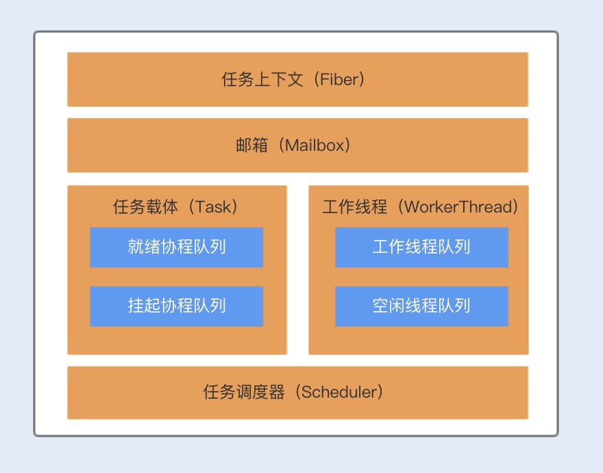
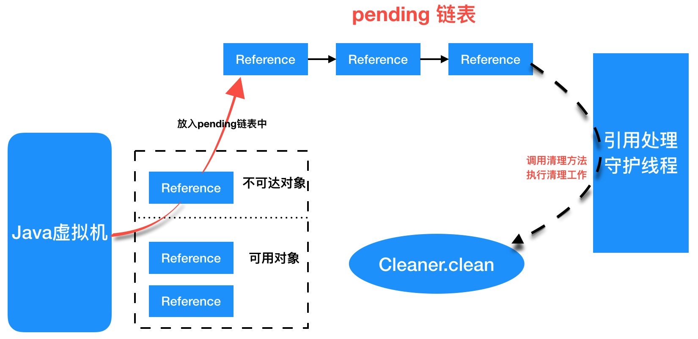
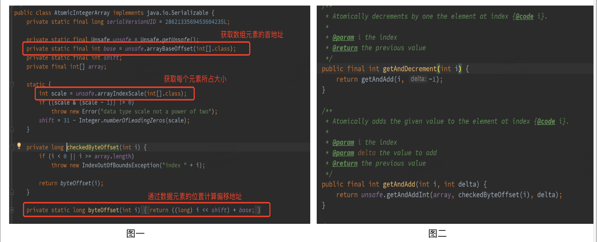
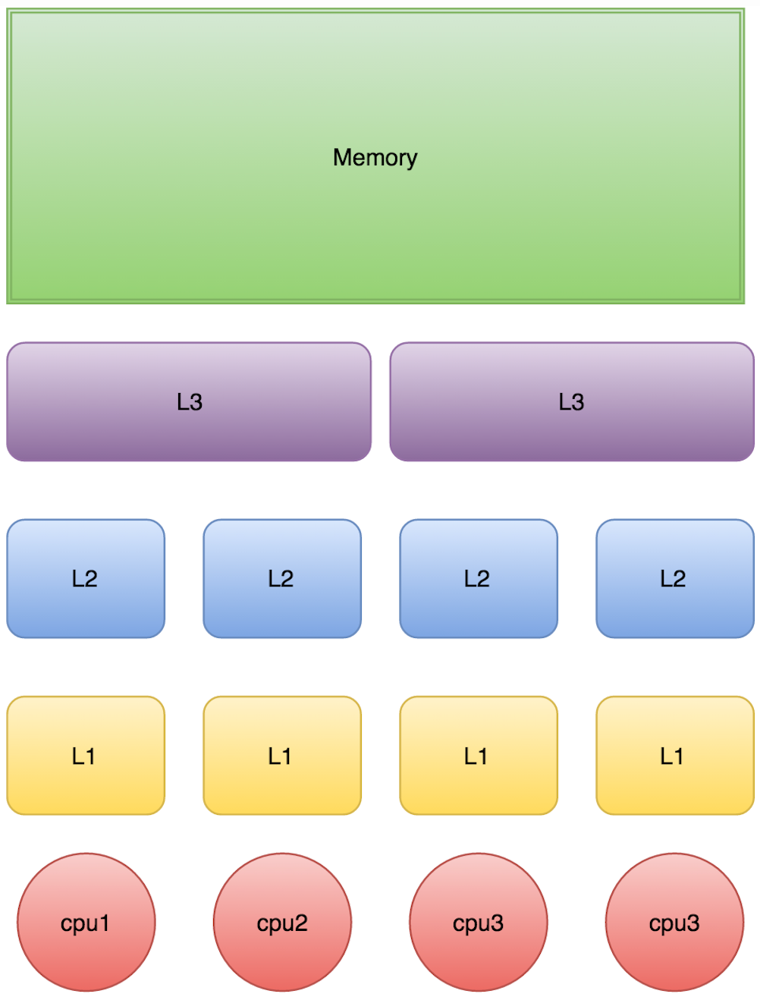
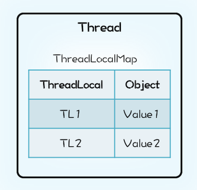
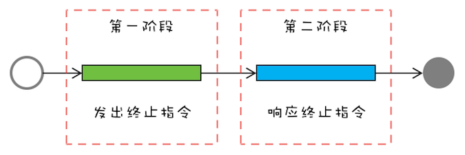

强烈推荐： 

- ==[Java并发知识点总结](<https://github.com/CL0610/Java-concurrency>)== 
- [死磕Java](<http://cmsblogs.com/?cat=189>) 

# 一、基础知识

## 1、并发编程的优缺点

### 1. 优点

- 并发编程的形式可以将多核CPU的计算能力发挥到极致，性能得到提升

  > 充分利用多核CPU的计算能力

- 面对复杂业务模型，并行程序会比串行程序更适应业务需求，而并发编程更能吻合这种业务拆分

  > 方便进行业务拆分，提升应用性能

### 2. 缺点

- CPU 不断通过切换线程，让人感觉多个线程同时执行，每次切换时，需要保存当前的状态起来，以便下次能够恢复先前状态，而这个切换非常损耗性能，过于频繁反而无法发挥出多线程编程的优势

  > 时间片是 CPU 分配给各个线程的时间，一般是几十毫秒

**上下文切换的方式**： 

- **无锁并发编程**：参照 concurrentHashMap 分段锁的思想，不同的线程处理不同段的数据，这样在多线程竞争的条件下，可以减少上下文切换的时间

- **CAS 算法**： 参照 Atomic 中的 CAS 算法来更新数据，使用乐观锁，可以有效的减少一部分不必要的锁竞争带来的上下文切换

- **使用最少线程**：避免创建不需要的线程，比如任务很少，但创建了很多的线程，这样会造成大量的线程都处于等待状态

- **协程**：在单线程里实现多任务的调度，并在单线程里维持多个任务间的切换

  > 推荐阅读： [进程，线程，协程与并行，并发](<https://www.jianshu.com/p/f11724034d50>) 与 [线程与协程](<https://www.jianshu.com/p/25cb5a6a17f6>) 
  >
  > - **进程是为了更好的利用 CPU 资源使并发成为可能**
  >
  > - **线程是为了降低上下文切换的消耗，提高系统的并发性，使进程内并发成为可能**
  >
  > - **协程通过在线程中实现调度，避免了陷入内核级别的上下文切换造成的性能损失，进而突破了线程在IO上的性能瓶颈**
  >
  >   > 协程的好处： 
  >   >
  >   > - 切换协程在用户态进行 ，无需系统调用，更快
  >   > - 调用者能够自主控制协程切换，更自由
  >   > - 没有锁的概念，协程安全，不担心死锁等状况，省去锁的开销

### 3. 线程安全

**避免死锁的情况**： 

- 避免一个线程同时获得多个锁
- 避免一个线程在锁内部占有多个资源，尽量保证每个锁只占用一个资源
- 尝试使用定时锁，使用 lock.tryLock(timeOut)，当超时等待时当前线程不会阻塞
- 对于数据库锁，加锁和解锁必须在一个数据库连接里，否则会出现解锁失败的情况

### 4. 相关概念

- **同步和异步**： 

  - 同步调用： 指调用者必须等待被调用的方法结束后，调用者后面的代码才能执行
  - 异步调用： 指调用者不用管被调用方法是否完成，都会继续执行后面的代码，当被调用的方法完成后会通知调用者

- **并发和并行**： 

  - 并发： 指多个任务交替进行
  - 并行： 指真正意义上的“同时进行”

  > - 若系统只有一个 CPU，而使用多线程，则只能通过切换时间片的方式交替进行，并发执行任务
  >
  > - 真正的并行只能出现在拥有多个 CPU 的系统中

- **阻塞和非阻塞**： 通常用来形容多线程间的相互影响

  - 阻塞： 一个线程占有了临界区资源，则其他线程需要等待该资源的释放，进而导致等待的线程挂起
  - 非阻塞： 强调没有一个线程可以阻塞其他线程，所有的线程都会尝试地往前运行

- **临界区**： 用来表示一种公共资源或者说是共享数据，可以被多个线程使用

  >  注意： 一旦临界区资源被一个线程占有，那么其他线程必须等待

### 5. 死锁

死锁产生的4个必要条件
    1、互斥： 某种资源一次只允许一个进程访问，即该资源一旦分配给某个进程，其他进程就不能再访问，直到该进程访问结束。
    2、占有且等待： 一个进程本身占有资源（一种或多种），同时还有资源未得到满足，正在等待其他进程释放该资源。
    3、不可抢占： 别人已经占有了某项资源，你不能因为自己也需要该资源，就去把别人的资源抢过来。
    4、循环等待： 存在一个进程链，使得每个进程都占有下一个进程所需的至少一种资源。

---

避免死锁的方法
1、**死锁预防** ----- 确保系统永远不会进入死锁状态
     产生死锁需要四个条件，那么，只要这四个条件中至少有一个条件得不到满足，就不可能发生死锁了。由于互斥条件是非共享资源所必须的，不仅不能改变，还应加以保证，所以，主要是破坏产生死锁的其他三个条件。
a、破坏“占有且等待”条件
     方法1：所有的进程在开始运行之前，必须一次性地申请其在整个运行过程中所需要的全部资源。
         优点：简单易实施且安全。
         缺点：因为某项资源不满足，进程无法启动，而其他已经满足了的资源也不会得到利用，严重降低了资源的利用率，造成资源浪费。
                  使进程经常发生饥饿现象。
     方法2：该方法是对第一种方法的改进，允许进程只获得运行初期需要的资源，便开始运行，在运行过程中逐步释放掉分配到的已经使用完毕的资源，然后再去请求新的资源。这样的话，资源的利用率会得到提高，也会减少进程的饥饿问题。
b、破坏“不可抢占”条件
      当一个已经持有了一些资源的进程在提出新的资源请求没有得到满足时，它必须释放已经保持的所有资源，待以后需要使用的时候再重新申请。这就意味着进程已占有的资源会被短暂地释放或者说是被抢占了。
      该种方法实现起来比较复杂，且代价也比较大。释放已经保持的资源很有可能会导致进程之前的工作实效等，反复的申请和释放资源会导致进程的执行被无限的推迟，这不仅会延长进程的周转周期，还会影响系统的吞吐量。
c、破坏“循环等待”条件
     可以通过定义资源类型的线性顺序来预防，可将每个资源编号，当一个进程占有编号为i的资源时，那么它下一次申请资源只能申请编号大于i的资源


2、**避免死锁** ----- 在使用前进行判断，只允许不会产生死锁的进程申请资源
的死锁避免是利用额外的检验信息，在分配资源时判断是否会出现死锁，只在不会出现死锁的情况下才分配资源。
两种避免办法：
    1、如果一个进程的请求会导致死锁，则不启动该进程
    2、如果一个进程的增加资源请求会导致死锁 ，则拒绝该申请。
避免死锁的具体实现通常利用银行家算法


**3、死锁检测与解除 ----- 在检测到运行系统进入死锁，进行恢复。**

   允许系统进入到死锁状态


死锁的解除
如果利用死锁检测算法检测出系统已经出现了死锁 ，那么，此时就需要对系统采取相应的措施。常用的解除死锁的方法：
1、抢占资源：从一个或多个进程中抢占足够数量的资源分配给死锁进程，以解除死锁状态。
2、终止（或撤销）进程：终止或撤销系统中的一个或多个死锁进程，直至打破死锁状态。
    a、终止所有的死锁进程。这种方式简单粗暴，但是代价很大，很有可能会导致一些已经运行了很久的进程前功尽弃。
     b、逐个终止进程，直至死锁状态解除。该方法的代价也很大，因为每终止一个进程就需要使用死锁检测来检测系统当前是否处于死锁状态。另外，每次终止进程的时候终止那个进程呢？每次都应该采用最优策略来选择一个“代价最小”的进程来解除死锁状态。一般根据如下几个方面来决定终止哪个进程：
    进程的优先级
    进程已运行时间以及运行完成还需要的时间
    进程已占用系统资源
    进程运行完成还需要的资源
    终止进程数目
    进程是交互还是批处理


## 2、线程的状态转换

### (1) 线程的创建

```java
public class CreateThreadDemo {
    public static void main(String[] args) {
        //1.继承Thread
        Thread thread = new Thread() {
            @Override
            public void run() {
                System.out.println("继承Thread");
                super.run();
            }
        };
        thread.start();
        
        //2.实现runable接口
        Thread thread1 = new Thread(new Runnable() {
            @Override
            public void run() {
                System.out.println("实现runable接口");
            }
        });
        thread1.start();
        
        //3.实现callable接口
        //实现callable接口，提交给ExecutorService返回的是异步执行的结果
        ExecutorService service = Executors.newSingleThreadExecutor();
        Future<String> future = service.submit(new Callable() {
            @Override
            public String call() throws Exception {
                return "通过实现Callable接口";
            }
        });
        try {
            String result = future.get();
            System.out.println(result);
        } catch (InterruptedException e) {
            e.printStackTrace();
        } catch (ExecutionException e) {
            e.printStackTrace();
        }
    }
}
```

- 可以利用 `FutureTask(Callable<V> callable)` 将 callable 进行包装然后 FeatureTask 提交给ExecutorsService
- 可以通过 Executors 将 Runable 转换成 Callable，具体方法是：`Callable<T> callable(Runnable task, T result), Callable<Object> callable(Runnable task)` 

### (2) 线程的切换

> - 当线程进入到 synchronized 方法或者 synchronized 代码块时，线程切换到的是 BLOCKED 状态
> - 使用 java.util.concurrent.locks 下 lock 进行加锁时，线程切换的是 WAITING 或 TIMED_WAITING 状态，因为 lock 会调用 LockSupport 方法


六种线程状态： 


> 引发自发性上下文切换：`sleep()、wait()、yield()、join()、park()、synchronized、lock`

### (3) 线程的操作

- `interrupted`： 表示了一个运行中的线程是否被其他线程进行了中断操作

  > 注意： 当抛出 InterruptedException 时，会清除中断标志位，即调用 isInterrupted 会返回 false
  >
  > 
  >
  > 实例：
  >
  > ```java
  > public class InterruptDemo {
  >     public static void main(String[] args) throws InterruptedException {
  >         //sleepThread睡眠1000ms
  >         final Thread sleepThread = new Thread() {
  >             @Override
  >             public void run() {
  >                 try {
  >                     Thread.sleep(1000);
  >                 } catch (InterruptedException e) {
  >                     e.printStackTrace();
  >                 }
  >                 super.run();
  >             }
  >         };
  >         //busyThread一直执行死循环
  >         Thread busyThread = new Thread() {
  >             @Override
  >             public void run() {
  >                 while (true) ;
  >             }
  >         };
  >         
  >         sleepThread.start();
  >         busyThread.start();
  >         //执行中断操作
  >         sleepThread.interrupt();
  >         busyThread.interrupt();
  >         //当返回 false，后续代码才会继续执行
  >         while (sleepThread.isInterrupted()) ;
  >         
  >         System.out.println("sleepThread isInterrupted: " 
  >                            + sleepThread.isInterrupted());
  >         System.out.println("busyThread isInterrupted: " 
  >                            + busyThread.isInterrupted());
  >     }
  > }
  > 
  > //输出
  > sleepThread isInterrupted: false
  > busyThread isInterrupted: true
  > ```

- `join`： 

  > threadB.join()： 当前线程 A 会等待 threadB 线程终止后 threadA 才会继续执行
  >
  > ```java
  > public class JoinDemo {
  >     public static void main(String[] args) {
  >         Thread previousThread = Thread.currentThread();
  >         for (int i = 1; i <= 10; i++) {
  >             Thread curThread = new JoinThread(previousThread);
  >             curThread.start();
  >             previousThread = curThread;
  >         }
  >     }
  > 
  >     static class JoinThread extends Thread {
  >         private Thread thread;
  > 
  >         public JoinThread(Thread thread) {
  >             this.thread = thread;
  >         }
  > 
  >         @Override
  >         public void run() {
  >             try {
  >                 thread.join();
  >                 System.out.println(thread.getName() + " terminated.");
  >             } catch (InterruptedException e) {
  >                 e.printStackTrace();
  >             }
  >         }
  >     }
  > }
  > 
  > //输出： 
  > main terminated.
  > Thread-0 terminated.
  > Thread-1 terminated.
  > Thread-2 terminated.
  > Thread-3 terminated.
  > Thread-4 terminated.
  > Thread-5 terminated.
  > Thread-6 terminated.
  > Thread-7 terminated.
  > Thread-8 terminated.
  > ```

- `sleep`： 让当前正在执行的线程在指定的时间内暂停执行，进入阻塞状态

  > - 既可以让其他**同优先级或高优先级**的线程得到执行的机会，也可以让**低优先级**的线程得到执行机会
  > - sleep() 方法不会释放“锁标志”，即：如果有 synchronized 同步块，其他线程仍然不能访问共享数据
  >
  > ---
  >
  > sleep  VS  wait： 
  >
  > - sleep() 方法是Thread的静态方法，而 wait() 是Object实例方法
  >
  > - wait() 方法必须在同步方法或同步块中调用，即必须获得对象锁
  >
  > sleep() 方法可以在任何地方种使用
  >
  > - wait() 方法会释放占有的对象锁，使得该线程进入等待池中，等待下一次获取资源
  > - sleep() 方法只是让出 CPU 并不会释放掉对象锁
  > - sleep() 方法在休眠时间达到后，如果再次获得 CPU 时间片就会继续执行
  > - wait() 方法必须等待 Object.notift/Object.notifyAll 通知后，才会离开等待池，并且再次获得CPU时间片才会继续执行
  >
  > ---
  >
  > sleep不会释放锁资源，wait则会，但两者都会从running状态中走出，也就是不再占用CPU资源

- `yield`： 使当前线程让出 CPU，让出的时间片只会分配**给当前线程优先级相同或更高**的线程

  > - yield()方法和sleep()方法类似，也不会释放“锁标志”
  >
  > - 区别： 
  >
  >   - 没有参数，即 yield() 使当前线程重新回到可执行状态
  >
  >     > 执行 yield() 的线程有可能在进入到可执行状态后马上又被执行
  >
  >   - yield() 方法只能使**同优先级或高优先级**的线程得到执行机会
  >
  > ---
  >
  > 注意： 让出 CPU 并不代表当前线程不再运行，若在下次竞争中，又获得了CPU 时间片，当前线程依然会继续运行
  >
  > > 在Java程序中，通过一个**整型成员变量Priority**来控制优先级，优先级的范围从1~10.在构建线程的时候可以通过**setPriority(int)**方法进行设置，默认优先级为 5

### (4) 优化操作

#### 1. 减少锁的持有时间

可以将一些与锁无关的代码移出同步代码块，尤其是那些开销较大的操作以及可能被阻塞的操作：

- 优化前：

    ```java
    public synchronized void mySyncMethod(){  
        businesscode1();  
        mutextMethod();  
        businesscode2();
    }
    ```

- 优化后：

    ```java
    public void mySyncMethod(){  
        businesscode1();  
        synchronized(this) {
            mutextMethod();  
        }
        businesscode2();
    }
    ```

#### 2. 降低锁的粒度

同步锁可以保证对象的原子性，我们可以考虑将锁粒度拆分得更小一些，以此避免所有线程对一个锁资源的竞争过于激烈：

1. **锁分离**：读写锁实现锁分离，即分为“读锁”和“写锁”，可以共享读，但只有一个写

2. **锁分段**：在使用锁来保证集合或者大对象原子性时，可以考虑将锁对象进一步分解

    > 例如：JDK7 的 ConcurrentHashMap 采用了分段锁

#### 3. 非阻塞乐观锁替代竞争锁

- `volatile` 作用是保障可见性及有序性，其读写操作不会导致上下文切换，因此开销较小

    > 但 `volatile` 不能保证操作变量的原子性，因为没有锁的排他性

- `CAS` 是一个原子的 `if-then-act` 操作，CAS 是一个无锁算法实现，保障了对一个共享变量读写操作的一致性

- `Synchronized` 同步锁分为偏向锁、轻量级锁、自旋锁、重量级锁

    > `JIT` 编译器在动态编译同步块时，也会通过锁消除、锁粗化的方式来优化该同步锁

#### 4. wait/notify 优化

通过配合调用 Object 对象的 wait() 方法和 notify() 方法或 notifyAll() 方法来实现线程间的通信：

- 在线程中调用 `wait()` 方法，将阻塞等待其它线程的通知(其它线程调用 notify() 方法或 notifyAll() 方法)

- 在线程中调用 `notify()` 或 `notifyAll()` 方法，将通知其它线程从 wait() 方法处返回

##### 案例

```java
public class WaitNotifyTest {
    public static void main(String[] args) {
        Vector<Integer> pool = new Vector<Integer>();
        Producer producer = new Producer(pool, 10);
        Consumer consumer = new Consumer(pool);
        new Thread(producer).start();
        new Thread(consumer).start();
    }
}

//生产者
class Producer implements Runnable{
    private Vector<Integer> pool;
    private Integer size;

    public Producer(Vector<Integer>  pool, Integer size) {
        this.pool = pool;
        this.size = size;
    }

    public void run() {
        for(;;){
            try {
              	System.out.println("生产一个商品 ");
              	produce(1);
            } catch (InterruptedException e) {
              e.printStackTrace();
            }
        }
    }
    private void produce(int i) throws InterruptedException{
        while(pool.size() == size) {
          	synchronized (pool) {
              	System.out.println("生产者等待消费者消费商品,当前商品数量为" + pool.size());
              	pool.wait();//等待消费者消费
          	}
        }
        synchronized (pool) {
          	pool.add(i);
          	pool.notifyAll();//生产成功，通知消费者消费
        }
    }
}

//消费者
class Consumer implements Runnable{
    private Vector<Integer>  pool;
    
    public Consumer(Vector<Integer>  pool) {
      	this.pool = pool;
    }

    public void run() {
        for(;;){
            try {
              	System.out.println("消费一个商品");
              	consume();
            } catch (InterruptedException e) {
              	e.printStackTrace();
            }
        }
    }

    private void consume() throws InterruptedException{
        synchronized (pool) {
          	while(pool.isEmpty()) {
              	System.out.println("消费者等待生产者生产商品,当前商品数量为" + pool.size());
              	pool.wait();//等待生产者生产商品
          	}
        }
        synchronized (pool) {
          	pool.remove(0);
          	pool.notifyAll();//通知生产者生产商品
        }
    }
}
```

##### wait/notify 导致较多的上下文切换

有上述案例代码知：

- 在消费者第一次申请到锁之前，发现没有商品消费，此时执行 `Object.wait()` 导致线程挂起，进入阻塞状态(一次上下文切换)
- 当生产者获取到锁并执行 `notifyAll()` 后，会唤醒处于阻塞状态的消费者线程(两次上下文切换)
- 被唤醒的等待线程运行前，再次申请相应对象的内部锁，此时等待线程需要和其它新来的活跃线程争用内部锁(三次上下文切换)
- 若有多个消费者线程同时被阻塞，`notifyAll()` 将唤醒所有阻塞的线程。而某些商品依然没有库存，过早地唤醒这些没有库存的商品的消费线程，可能会导致线程再次进入阻塞状态，从而引起不必要的上下文切换


##### 优化 wait/notify 使用，减少上下文切换

- 首先，使用 `Object.notify()` 替代 `Object.notifyAll()` 

    > 因为 `Object.notify()` 只会唤醒指定线程，不会过早地唤醒其它未满足需求的阻塞线程，所以可以减少相应的上下文切换

- 其次，执行完 `Object.notify() / notifyAll()` 后，应尽快地释放内部锁，避免其它线程在唤醒后长时间持有锁处理业务操作

    > 这样可以避免被唤醒的线程再次申请相应内部锁的时候等待锁的释放

- 最后，为避免长时间等待，使用 `Object.wait(long)`设置等待超时时间

    > 但线程无法区分其返回是由于等待超时还是被通知线程唤醒，从而导致线程再次尝试获取锁操作，增加了上下文切换
    >
    > ---
    >
    > 建议：使用 `Lock` + `Condition` 替代 `Synchronized`，解决 `Object.wait(long)` 无法区分和线程被过早唤醒问题
    >
    > - `Condition` 接口定义的 `await、signal、signalAll` 相当于 `Object.wait()、Object.notify()、Object.notifyAll()`

#### 5. 合理设置线程池大小

- 线程池设置不宜过大，因为一旦线程池的线程总数超过系统所拥有的处理器数量，就会导致过多的上下文切换

#### 6. 使用协程实现非阻塞等待

- 协程比线程更加轻量级，相比于由操作系统内核来管理的进程和线程，协程则完全由程序本身所控制，即在用户态执行

- 协程避免了像线程切换那样产生的上下文切换，在性能方面得到了很大的提升

#### 7. 减少 Java 虚拟机的垃圾回收

> 垃圾回收会导致上下文切换

- 很多 JVM GC(如：serial、ParNew)在回收旧对象时，会产生内存碎片，从而需要进行内存整理，这个过程需要移动存活对象

- 而移动内存对象意味着这些对象所在的内存地址会发生变化，因此在移动对象前需要暂停线程，在移动完成后需要再次唤醒该线程
- 因此减少 JVM 垃圾回收的频率可以有效地减少上下文切换

## 3、线程与协程

### (1) 三种线程模型

实现线程主要有三种方式：

- 轻量级进程和内核线程一对一相互映射实现的 `1:1` 线程模型

    > 内核线程`KLT`(Kernel-Level Thread)由操作系统内核支持的线程，内核通过调度器对线程进行调度，并负责完成线程的切换

- 用户线程和内核线程实现的 `N:1` 线程模型

- 用户线程轻量级进程混合实现的 `N:M` 线程模型

#### 1. `1:1` 线程模型

- **内核线程**`KLT`：
    - **创建过程**：
        - Linux 操作系统编程中，通过 `fork()` 函数创建一个子进程来代表一个内核中的线程
        - 一个进程调用 `fork()` 函数后，系统会先给新的进程分配资源(如：存储数据和代码的空间)，然后把原来进程的所有值都复制到新的进程中，只有少数值与原来进程的值(如：PID)不同，这相当于复制了一个主进程
    - **缺点**：采用 `fork()` 创建子进程的方式来实现并行运行，会产生大量冗余数据，即占用大量内存空间，又消耗大量 CPU 时间用来初始化内存空间以及复制数据

- **轻量级进程**`LWP`：
    - **创建过程**：
        - 相对于 fork() 系统调用创建的线程来说，LWP 使用 `clone()` 系统调用创建线程
        - 该函数是将部分父进程的资源的数据结构进行复制，复制内容可选，且没有被复制的资源可以通过指针共享给子进程
    - **优点**：轻量级进程的运行单元更小，运行速度更快
    - **特点**：LWP 跟内核线程一对一映射，每个 LWP 由一个内核线程支持

---

**`1:1` 线程模型不足**：

- `1:1` 线程模型由于跟内核一对一映射，所以在线程创建、切换上都存在用户态和内核态的切换，性能开销比较大
- 除此之外，系统的资源有限，不能支持创建大量的 LWP

#### 2. `N:1` 线程模型

该线程模型：解决了 `1:1` 线程模型的不足

- **特点**：在用户空间完成线程的创建、同步、销毁和调度，不需要内核帮助
- **详述**：在线程创建、同步、销毁的过程中，不会产生用户态和内核态的空间切换，因此线程的操作非常快速且低消耗

---

**`N:1` 线程模型的不足**：操作系统不能感知用户态线程，容易造成某一个线程进行系统调用内核线程时被阻塞，从而导致整个进程被阻塞

#### 3. `N:M` 线程模型

- `N:M` 线程模型支持用户态线程通过 `LWP` 与内核线程连接，用户态的线程数量和内核态的 LWP 数量是 `N:M` 的映射关系

---


#### 4. Java 线程与 Go 协程

- **Java 线程**：JDK8 的 `Thread.start` 通过 Native 调用 `start0` 方法实现

    - Linux 下， JVM Thread 基于 `pthread_create` 实现，而 pthread_create 实际是调用 `clone()` 完成系统调用创建线程
    - 因此，Java 在 Linux 操作系统下采用一个用户线程映射到一个内核线程，即 `1:1` 线程模型

    > 由于线程通过内核调度，从一个线程切换到另一个线程涉及到上下文切换

- **Go 协程**：使用 `N:M` 线程模型实现的调度器，在 N 个内核线程上多路复用(或调度) M 个协程

    > 协程的上下文切换是在用户态由协程调度器完成，因此不需要陷入内核

### (2) 协程实现原理

- 可以将协程看作是一个类函数或一块函数中的代码，可以在一个主线程中轻松创建多个协程

- 程序调用协程与调用函数不同：协程可以通过暂停或阻塞的方式将协程的执行挂起，而其它协程可以继续执行

    > 挂起：在程序中(用户态)的挂起，同时将代码执行权转让给其它协程使用，待获取执行权的协程执行完成之后，将从挂起点唤醒挂起的协程
    >
    > - 协程的挂起和唤醒通过一个调度器完成

---

**基于 `N:M` 线程模型实现协程的工作原理**：

- 假设，程序中默认创建两个线程为协程使用，在主线程中创建协程 `ABCD...` 并存储在就绪队列中

    调度器首先会分配一个工作线程 A 执行协程 A，另外一个工作线程 B 执行协程 B，其它创建的协程将会放在队列中进行排队等待

    

- 当协程 A 调用暂停方法或被阻塞时，协程 A 会进入到挂起队列，调度器调用等待队列中的其它协程抢占线程 A 执行

    当协程 A 被唤醒时，需要重新进入就绪队列，通过调度器抢占线程，若抢占成功，就继续执行协程 A，失败则继续等待抢占线程

    

---

**总结**：相比线程，协程少了由于同步资源竞争带来的 CPU 上下文切换，I/O 密集型的应用比较适合使用

- 特别是在网络请求中，有较多的时间在等待后端响应，协程可以保证线程不会阻塞在等待网络响应中，充分利用了多核多线程的能力
- 对于 CPU 密集型的应用，由于在多数情况下 CPU 都比较繁忙，协程的优势就不是特别明显

### (3) Kilim 协程框架

#### 1. 使用

除了引入 jar 包外，还要通过 Kilim 提供的织入(`Weaver`)工具对 Java 代码编译生成的字节码进行增强处理，四种织入操作：

- 在编译时使用 maven 插件
- 在运行时调用 `kilim.tools.Weaver` 工具
- 在运行时使用 `kilim.tools.Kilim invoking` 调用 Kilim 的类文件
- 在 main 函数添加 `if (kilim.tools.Kilim.trampoline(false,args)){ return; }`

#### 2. 框架详解

Kilim 框架包含了四个核心组件：任务上下文 `Fiber`、通信载体 `Mailbox`、任务载体 `Task`、任务调度器 `Scheduler`



- `Task` 对象：主要用来执行业务逻辑，类似 Thread，Task 又一个 `execute`，可以将协程的业务逻辑操作写在 `execute` 方法中

    > `Task` 的协程状态包括：``Ready、Running、Pausing、Paused、Done `
    >
    > - Task 对象被创建后，处于 `Ready` 状态
    > - 调用 `execute()` 方法后，协程处于 `Running` 状态
    > - 在运行期间，协程可以被暂停，暂停中的状态为 `Pausing`，暂停后的状态为 `Paused`，暂停后的协程可以被再次唤醒
    > - 协程正常结束后的状态为 `Done`

- `Fiber` 对象：主要用来维护 Task 的执行堆栈，Fiber 是实现 `N:M` 线程映射的关键

- `Scheduler`：是 Kilim 实现协程的核心调度器，负责分派 Task 给指定的工作线程 WorkerThread 执行

    > WorkerThread 默认初始化个数为机器的 CPU 个数

- `Mailbox` 对象：类似邮箱，协程之间可以依靠邮箱来进行通信和数据共享

    > 协程与线程最大不同：线程通过共享内存来实现数据共享，而协程使用通信方式来实现数据共享，
    >
    > - 目的：为了避免内存共享数据而带来的线程安全问题

## 4、计算线程数量

一般多线程执行的任务类型可以分为 CPU 密集型和 I/O 密集型，根据不同的任务类型，计算线程数的方法也不一样：

> 线程计算公式：`线程数 = N(CPU核数)*(1 + WT(线程等待时间) / ST(线程时间运行时间))` 
>
> ---
>
> 可以通过 JDK 自带的工具 VisualVM 来查看 `WT/ST` 比例：
>
> 
>
> `WT(线程等待时间) = 36788ms[线程运行总时间] - 36788ms[ST(线程时间运行时间)]= 0`
>
> `线程数 = N(CPU核数) * (1 + 0[WT(线程等待时间)] / 36788ms[ST(线程时间运行时间)]) = N(CPU核数)` 

- **CPU 密集型任务**：可以将线程数设置为 `N(CPU 核心数) + 1`，比 CPU 核心数多出来的一个线程是为了防止线程偶发的缺页中断或其它原因导致的任务暂停而带来的影响

    > 一旦任务暂停，CPU 就会处于空闲状态，而多出来的一个线程就可以充分利用 CPU 的空闲时间
    >
    > - 当线程数量太小，同一时间大量请求将被阻塞在线程队列中排队等待执行线程，此时 CPU 没有得到充分利用
    > - 当线程数量太大，创建的线程争取 CPU 资源，会导致大量的上下文切换，从而增加线程的执行时间，影响整体执行效率

- **I/O 密集型任务**：线程数建议为 `2N`，因为系统会用大部分的时间来处理 I/O 交互，而线程在处理 I/O 的时间段内不会占用 CPU

---

**总结**：根据业务场景，从 `N + 1` 和 `2N` 中选一个适合的，计算出一个大概的线程数量，之后通过实际压测，逐渐往“增大线程数量”和“减小线程数量”这两个方向调整，然后观察整体的处理时间变化，最终确定一个具体的线程数量

## 5、守护线程 Daemon

```java
public class DaemonDemo {
    public static void main(String[] args) {
        Thread daemonThread = new Thread(new Runnable() {
            @Override
            public void run() {
                while (true) {
                    try {
                        System.out.println("i am alive");
                        Thread.sleep(500);
                    } catch (InterruptedException e) {
                        e.printStackTrace();
                    } finally {
                        System.out.println("finally block");
                    }
                }
            }
        });
        //设置守护线程要先于start()方法
        daemonThread.setDaemon(true);//设为守护线程
        daemonThread.start();
        //确保main线程结束前能给daemonThread能够分到时间片
        try {
            Thread.sleep(800);
        } catch (InterruptedException e) {
            e.printStackTrace();
        }
    }
}

//输出： 会一直打印,但当 main 线程结束后,daemonThread 就会退出所以不会出现死循环的情况
i am alive
finally block
i am alive
```

> 注意： 守护线程在退出时，并不会执行 finnally 块中的代码

## 6、安全性、活跃性、性能问题

### (1) 安全性问题

- **安全性源头**：原子性问题、可见性问题、有序性问题

- **判断是否需要保证线程安全**：存在共享数据且该数据会发生变化，即有多个线程会同时读写同一数据
- **数据竞争**：当多个线程同时访问同一数据，且至少有一个线程会写这个数据时，若不采取防护措施，就会导致并发 Bug
- **竞态条件**：指程序的执行结果依赖线程执行的顺序

---

**保证线程安全的措施**：互斥 --> 锁

### (2) 活跃性问题

**活跃性问题**：指某个操作无法执行下去，分为：死锁、活锁、饥饿

> 糟糕的响应性也很影响活跃性

#### 1. 活锁与饥饿

- **活锁**：尽管没有被阻塞, 线程却仍然不能继续，即不断重试相同的操作，却总失败

    > **解决方案**：尝试等待一个随机时间
    >
    > 注：活锁通常发生在消息处理应用程序中

- **饥饿**：指线程因无法访问所需资源而无法执行下去

    > **解决方案**：
    >
    > - 方案一：保证资源充足
    >
    > - 方案二：公平分配资源
    >
    >     > 并发编程中使用公平锁，即排在等待队列前面的线程会优先获得资源
    >
    > - 方案三：避免持有锁的线程长时间执行
    >
    > 注：
    >
    > - 若线程优先级“不均”，则 CPU 繁忙时，优先级低的线程得到执行的机会很小，就可能发生线程“饥饿”
    > - 持有锁的线程，若执行的时间过长，也可能导致“饥饿”问题

#### 2. 死锁

- **锁顺序死锁**：

    ```java
    //简单的锁顺序死锁
    public class Test {
        private final Object left = new Object();
        private final Object right = new Object();
    
        public void leftRight(){
            synchronized (left) {
                synchronized (right) {
                    //do
                }
            }
        }
        public void rightLeft(){
            synchronized (right) {
                synchronized (left) {
                    //do
                }
            }
        }
    }
    ```

    > 若所有线程以固定的顺序来获得锁，则在程序中就不会出现锁顺序死锁问题

- **动态的锁顺序死锁**：

    ```java
    /**动态的锁顺序死锁
     * 当出现下列情况时，或死锁：
     * 用户 A：tansfer(myAccount,yourAccount,10)
     * 用户 B：tansfer(yourAccount,myAccount,20)
     */
    public void tansfer(Account fromAccount,Account toAccount,DollarAmout amout){
        synchronized(fromAccount){
            synchronized(toAccount){
                if(fromAccount.getBalance().compareTo(amout) < 0){
                    throw new Exception();
                }else{
                    fromAccount.debit(amount);
                    toAccount.credit(mount);
                }
            }
        }
    }
    
    //通过 System.identityHashCode 来定义锁顺序，避免动态死锁
    public void transferMoney(final Account fromAccount,final Account toAccount,final DollarAmount amount) {
        class Helper {  
            public void transfer() {  
                if (fromAccount.getBalance().compareTo(amount) < 0) {  
                    throw new RuntimeException();  
                } else {  
                    fromAccount.debit(amount);  
                    toAccount.credit(amount);  
                }  
            }  
        }  
        // 通过唯一hashcode来统一锁的顺序, 如果account具有唯一键, 可以采用该键来作为顺序.  
        int fromHash = System.identityHashCode(fromAccount);  
        int toHash = System.identityHashCode(toAccount);  
        if (fromHash < toHash) {  
            synchronized (fromAccount) {  
                synchronized (toAccount) {  
                    new Helper().transfer();  
                }  
            }  
        } else if (fromHash > toHash) {  
            synchronized (toAccount) {  
                synchronized (fromAccount) {  
                    new Helper().transfer();  
                }  
            }  
        } else {  
            synchronized (tieLock) { // 针对fromAccount和toAccount具有相同的hashcode  
                synchronized (fromAccount) {  
                    synchronized (toAccount) {  
                        new Helper().transfer();  
                    }  
                }  
            }  
        }  
    }  
    ```

- **协作对象之间发生死锁**：

    ```java
    //协作对象之间的锁顺序死锁
    class Taxi{
        private Point location,destination;
        private final Dispather dispather;
    
        public Taxi(Dispather dispather){
            this.dispather = dispather;
        }
        public synchronized Point getLocation(){
            return location;
        }
        public synchronized void setLocation(Point location){
            this.location = location;
            if(location.equals(destination)){
                dispather.notifyAvailable(this);
            }
        }
    }
    
    class Dispather{
        private final Set<Taxi> taxi;
        private final Set<Taxi> availableTaxis;
    
        public Dispather(){
            taxi = new HashSet<Taxi>();
            availableTaxis = new HashSet<Taxi>();
        }
        public synchronized void notifyAvailable(Taxi taxi){
            availableTaxis.add(taxi);
        }
    }
    ```

    > 若在持有锁时调用外部方法，则会出现活跃性问题

- **开放性调用**：在调用某个方法时不需要持有锁

    ```java
    //通过公开调用来比卖你在相互协作对象之间产生死锁
    class Taxi{
        private Point location,destination;
        private final Dispather dispather;
    
        public Taxi(Dispather dispather){
            this.dispather = dispather;
        }
        public synchronized Point getLocation(){
            return location;
        }
        public synchronized void setLocation(Point location){
            boolean reached;
            synchronized(this){//加锁***
                this.location = location;
                reached = location.equals(destination);
            }
            if (reached) {
                dispather.notifyAvailable(this);
            }
        }
    }
    
    class Dispather{
        private final Set<Taxi> taxi;
        private final Set<Taxi> availableTaxis;
    
        public Dispather(){
            taxi = new HashSet<Taxi>();
            availableTaxis = new HashSet<Taxi>();
        }
        public synchronized void notifyAvailable(Taxi taxi){
            availableTaxis.add(taxi);
        }
    }
    ```

- **资源死锁**：当多个线程相互持有彼此正在等待的锁而又不释放自己持有的锁时，会发生死锁

### (3) 性能问题

**阿姆达尔 `Amdahl` 定律**：$S = \frac{s + p}{s + \frac{n}{p}}$，其中 `s` 表示串行量，$p$ 表示并行量，$n$ 表示处理器数量

---

性能度量指标：

- **吞吐量**：指单位时间内能处理的请求数量；吞吐量越高，说明性能越好
- **延迟**：指从发出请求到收到响应的时间；延迟越小，说明性能越好
- **并发量**：指能同时处理的请求数量，一般来说随着并发量的增加、延迟也会增加

# 二、JMM

- 线程间的通信：**共享内存**和**消息传递** 

  > java内存模型是**共享内存的并发模型**，线程之间主要通过**读-写共享变量**来完成隐式通信

## 1、JMM 内存模型


线程A和线程B之间完成通信需要经历的步骤： 

- 线程A从主内存中将共享变量读入线程A的工作内存后并进行操作，之后将数据重新写回到主内存中
- 线程B从主存中读取最新的共享变量

---

**Java 内存模型涉及的几个关键词**：锁、volatile字段、final修饰符与对象的安全发布

- 第一是锁：锁操作具备 happens-before 关系，加锁操作 happens-before 对同一把锁的解锁操作

    > 注：解锁时，JVM 需要强制刷新缓存，使得当前线程所修改的内存对其他线程可见

- 第二是 volatile 字段：volatile 字段不保证原子性，但保证可见性，其性能优于锁操作

    > 注：频繁访问 volatile 字段会出现因为不断强制刷新缓存而影响程序性能

- 第三是 final 修饰符：当一个对象包含 final 修饰的实例字段时，其他线程能安全看到已经初始化的 final 实例字段

---

**Java 内存模型底层实现**：

- 主要通过内存屏障禁止重排序，即时编译器根据具体的底层体系架构，将这些内存屏障替换成具体的 CPU 指令
- 对于编译器而言，内存屏障将限制它所能做的重排序优化；对于处理器而言，内存屏障将会导致缓存的刷新操作

## 2、重排序

编译器和处理器的三种重排序： **1 为编译器重排序； 2，3 为处理器重排序** 

> - 针对编译器重排序，JMM 的编译器重排序规则会**禁止一些特定类型的编译器重排序**
> - 针对处理器重排序，编译器在生成指令序列时会通过**插入内存屏障**来禁止某些特殊的处理器重排序


- **编译器优化重排序**： 编译器在不改变单线程程序语义的前提下，重新**安排语句的执行顺序**

- **指令级并行重排序**： **将多条指令重叠执行**

  > 如果**不存在数据依赖性**，处理器可以改变语句对应机器指令的执行顺序
  >
  > > 数据依赖性： 若两个操作访问同一个变量，且有一个为写操作，此时这两个操作就存在数据依赖性
  >
  > 注意： 编译器和处理器在重排序时，会遵守数据依赖性，不会改变存在数据依赖性关系的两个操作的执行顺序

- **内存系统重排序**： 由于处理器使用缓存和读/写缓冲区，这使得加载和存储操作看上去可能是在乱序执行的

## 3、happens-before 规则

**happens-before 规则定义**： 前面一个操作的结果对后续操作可见，且第一个操作的执行顺序排在第二个操作之前

> Happens-Before 约束了编译器的优化行为，即允许编译器优化，但要求编译器优化后要遵守 Happens-Before 规则

- 若两个操作之间存在 happens-before 关系，并不意味着一定要按照 happens-before 原则制定的顺序来执行
- 若重排序后的执行结果与按照 happens-before 关系来执行的结果一致，则这种重排序合法

**八项具体规则**： 

1. **程序的顺序性规则**：一个线程内，按照代码顺序，书写在前面的操作先行发生于书写在后面的操作

2. **volatile 变量规则**：一个 volatile 变量的写操作， Happens-Before 于后续对这个 volatile 变量的读操作

    > 编译器生成字节码时，会在 volatile 写操作前后分别插入内存屏障
    >
    > - StoreStore 屏障：禁止上面的普通写和下面的 volatile 写重排序
    > - StoreLoad 屏障：防止上面的 volatile 写与下面可能有的 volatile 读/写重排序

3. **传递规则**：若 A Happens-Before B，且 B Happens-Before C，则 A Happens-Before C

4. **管程的锁定规则**：一个 unLock 操作 Happens-Before 于后续对这个锁的 lock 操作

    > synchronized 是 Java 对管程的实现

5. **线程启动 start() 规则**：主线程 A 启动子线程 B 后，子线程 B 能够看到主线程在启动子线程 B 前的操作

    > 若线程 A 调用线程 B 的 start() 方法(即在线程 A 中启动线程 B)，则该 start() 操作 Happens-Before 于线程 B 中的任意操作
    >
    > ```java
    > Thread B = new Thread(()->{
    >     // 主线程调用B.start()之前
    >     // 所有对共享变量的修改，此处皆可见
    >     // 此例中，var==77
    > });
    > // 此处对共享变量var修改
    > var = 77;
    > 
    > // 主线程启动子线程
    > B.start();
    > ```

6. **线程终结 join() 规则**：主线程 A 等待子线程 B 完成(即主线程 A 调用子线程 B 的 join() 方法)，当子线程 B 完成后(主线程 A 中 join() 方法返回)，主线程 A 能够看到子线程的操作(指对共享变量的操作)

    > 若在线程 A 中，调用线程 B 的 join() 并成功返回，则线程 B 中的任意操作 Happens-Before 于该 join() 操作的返回
    >
    > ```java
    > Thread B = new Thread(()->{
    >     // 此处对共享变量var修改
    >     var = 66;
    > });
    > // 例如: 此处对共享变量修改，则这个修改结果对线程B可见
    > // 主线程启动子线程
    > B.start();
    > B.join()
    > // 子线程所有对共享变量的修改，在主线程调用B.join()之后皆可见
    > // 此例中，var==66
    > ```
    >
    > 可以通过 Thread.join() 方法结束、Thread.isAlive() 的返回值手段检测到线程已经终止执行

7. **线程中断 interrupt() 规则**：对线程 interrupt() 方法的调用先行发生于被中断线程的代码检测到中断事件的发生

    > 可以通过Thread.interrupted()方法检测到是否有中断发生

8. **对象终结规则**：一个对象的初始化完成先行发生于他的finalize()方法的开始

---

上述规则的推论：

- 将一个元素放入一个线程安全的队列的操作 Happens-Before 从队列中取出这个元素的操作
- 将一个元素放入一个线程安全容器的操作Happens-Before从容器中取出这个元素的操作
- 在 CountDownLatch 上的倒数操作 Happens-Before CountDownLatch#await()操作
- 释放Semaphore许可的操作Happens-Before获得许可操作
- Future表示的任务的所有操作Happens-Before Future#get()操作
- 向Executor提交一个Runnable或Callable的操作Happens-Before任务开始执行操作

## 4、DCL(Double Check Lock)

### 1. 单例模式中的 DCL

- 若第一个 `singleton != null`，则不需要执行下面的加锁动作，极大提高了程序的性能
- 若第一个 `singleton == null`，即使有多个线程同一时间判断，但是由于 synchronized 的存在，只会有一个线程能够创建对象
- 当第一个获取锁的线程创建完 singleton 对象后，其他线程在第二次判断 singleton 一定不会为 null，则直接返回已经创建好的 singleton 对象

```java
public class Singleton {
   private static Singleton singleton;

   private Singleton(){}

   public static Singleton getInstance(){
       if(singleton == null){                              // 1
           synchronized (Singleton.class){                 // 2
               if(singleton == null){                      // 3
                   singleton = new Singleton();            // 4
               }
           }
       }
       return singleton;
   }
}
```

### 2. 问题

> 上述单例的 DCL 有问题

实例化对象要分为三个步骤：

1. 分配内存空间
2. 初始化对象
3. 将内存空间的地址赋值给对应的引用

由于重排序的缘故，步骤2、3可能会发生重排序，其过程如下：

1. 分配内存空间
2. 将内存空间的地址赋值给对应的引用
3. 初始化对象

> 详细请参看： JVM 文章，加载 --> 验证 --> 准备 --> 解析 --> 初始化 --> 运行 --> 回收(**解析与初始化可以互换**)

如果2、3发生了重排序就会导致第二个判断会出错，singleton != null，但是它其实仅仅只是一个地址而已，此时对象还没有被初始化，所以return的singleton对象是一个没有被初始化的对象，如下：


> - 按照上面图例所示，线程B访问的是一个没有被初始化的 singleton 对象
>
> - 通过上面的阐述，我们可以判断 DCL 的**错误根源在于步骤 4** 

### 3. 解决方案

解决方法： 

1. **不允许步骤 2 、3 发生重排序**
2. 允许初始化阶段步骤 2 、3 发生重排序，但是**不允许其他线程“看到”这个重排序**

方案： 

- ==基于 `volatile` 解决方案==： 将变量 singleton 声明为 volatile

  ```java
  public class Singleton {
     //通过volatile关键字来确保安全
     private volatile static Singleton singleton;
     private Singleton(){}
     public static Singleton getInstance(){
         if(singleton == null){
             synchronized (Singleton.class){
                 if(singleton == null){
                     singleton = new Singleton();
                 }
             }
         }
         return singleton;
     }
  }
  ```

- ==基于类初始化的解决方案==： **利用 classloder 的机制来保证初始化 instance 时只有一个线程**

  > **JVM在类初始化阶段会获取一个锁，这个锁可以同步多个线程对同一个类的初始化**

  ```java
  public class Singleton {
     private static class SingletonHolder{
         public static Singleton singleton = new Singleton();
     }
      
     public static Singleton getInstance(){
         return SingletonHolder.singleton;
     }
  }
  ```

## 5、Java 初始化锁

- 对于每一个类或者接口 `C`，都有一个唯一的初始化锁 `LC` 与之相对应
- 从 `C` 到 `LC` 的映射，由 JVM 的具体去实现
- JVM 在类初始化阶段期间会获取这个初始化锁，且每一个线程至少获取一次锁来确保这个类已被初始化过


# 三、并发关键字

## 1、三大特性

### (1) 原子性

- **原子性**： 指一个操作是不可中断的，要么全部执行成功要么全部执行失败

- JMM 定义的八种原子操作：
    - **lock(锁定)**：作用于主内存中的变量，把一个变量标识为一个线程独占的状态
    - **unlock(解锁)**： 作用于主内存中的变量，把一个处于锁定状态的变量释放出来，释放后的变量才可以被其他线程锁定
    - **read(读取)**：作用于主内存的变量，把一个变量的值从主内存传输到线程的工作内存中，以便后面的load动作使用
    - **load(载入)**：作用于工作内存的变量，把 read 操作从主内存中得到的变量值放入工作内存中的变量副本
    - **use(使用)**：作用于工作内存的变量，把工作内存中一个变量的值传递给执行引擎，每当虚拟机遇到一个需要使用到变量的值的字节码指令时将会执行这个操作
    - **assign(赋值)**：作用于工作内存的变量，把一个从执行引擎接收到的值赋给工作内存的变量，每当虚拟机遇到一个给变量赋值的字节码指令时执行这个操作
    - **store(存储)**：作用于工作内存的变量，把工作内存中一个变量的值传送给主内存中以便随后的 write 操作使用
    - **write(操作)**：作用于主内存的变量，把 store 操作从工作内存中得到的变量的值放入主内存的变量中

### (2) 有序性

- **有序性**： 在本线程内观察，所有的操作都是有序的；在一个线程观察另一个线程，所有的操作都是无序的

### (3) 可见性

- **可见性**： 指当一个线程修改了共享变量后，其他线程能够立即得知这个修改

## 2、final 域重排序

> final 全局变量定义时必须进行初始化且不更更改
>
> final 局部变量，在未初始化时可以进行初始化，但初始化后不能修改

### (1) final 域为基本类型

```java
public class FinalDemo {
    private int a;  //普通域
    private final int b; //final域
    private static FinalDemo finalDemo;

    public FinalDemo() {
        a = 1; // 1. 写普通域
        b = 2; // 2. 写final域
    }

    public static void writer() {
        /**
         * 1. 构造了一个 FinalDemo 对象
         * 2. 把这个对象赋值给成员变量finalDemo
         */
        finalDemo = new FinalDemo();
    }

    public static void reader() {
        FinalDemo demo = finalDemo; // 3.读对象引用
        int a = demo.a;    //4.读普通域
        int b = demo.b;    //5.读final域
    }
}
```

- **写 final 域重排序规则**： 禁止对 final 域的写重排序到构造函数之外

    > - JMM 禁止编译器把 final 域的写重排序到构造函数之外
    > - 编译器会在 final 域写之后，构造函数 return 之前，插入一个 storestore 屏障
    >
    > 
    >
    > - 由于a,b之间没有数据依赖性，普通域 a 可能会被重排序到构造函数之外，线程B就有可能读到的是普通变量a初始化之前的值（零值），这样就可能出现错误
    > - 而 final 域变量 b，根据重排序规则，会禁止 final 修饰的变量 b 重排序到构造函数之外，从而 b 能够正确赋值，线程 B 就能够读到 final 变量初始化后的值
    >
    > **写 final 域的重排序规则可以确保**：在对象引用为任意线程可见之前，对象的 final 域已被正确初始化，而普通域就不具有这个保障

- **读 final 域重排序规则**： 在一个线程中，初次读对象引用和初次读该对象包含的 final 域，JMM会禁止这两个操作的重排序

    > - 处理器会在读 final 域操作的前面插入一个 LoadLoad 屏障
    >
    > 
    >
    > - 读对象的普通域被重排序到了读对象引用的前面，会出现线程 B 还未读到对象引用就在读取该对象的普通域变量，这显然是错误的操作
    > - 而 final 域的读操作就“限定”了在读final域变量前已经读到了该对象的引用，从而避免这种情况
    >
    > **读 final 域的重排序规则可以确保**：在读一个对象的 final 域之前，一定会先读这个包含这个final域的对象的引用

### (2) final 域为引用类型

```java
public class FinalReferenceDemo {
    final int[] arrays; //final 是引用类型
    private FinalReferenceDemo finalReferenceDemo;

    public FinalReferenceDemo() {
        arrays = new int[1];  //1
        arrays[0] = 1;        //2
    }

    public void writerOne() {
        finalReferenceDemo = new FinalReferenceDemo(); //3
    }

    public void writerTwo() {
        arrays[0] = 2;  //4
    }

    public void reader() {
        if (finalReferenceDemo != null) {  //5
            int temp = finalReferenceDemo.arrays[0];  //6
        }
    }
}
```

- **对 final 修饰的对象的成员域写操作**： 在构造函数内对**一个final修饰的对象的成员域的写入，与随后在构造函数之外把这个被构造的对象的引用赋给一个引用变量**，这两个操作是不能被重排序的

    > 线程 A 执行 wirterOne 方法，执行完后线程 B 执行 writerTwo 方法，然后线程 C 执行 reader 方法
    >
    > 

- **对 final 修饰的对象的成员域读操作**： 

    > - JMM 可以确保： 线程 C 至少能看到写线程 A 对 final 引用的对象的成员域的写入，即能看到 `arrays[0] = 1`，而写线程 B 对数组元素的写入可能看到可能看不到
    >
    > - JMM不保证线程 B 的写入对线程 C 可见，线程 B 和线程 C 之间存在数据竞争，此时的结果是不可预知的。如果可见的，可使用锁或者 volatile

**final 域总结**： 

- **基本数据类型**:

    - **final 域写**：禁止**final域写**与**构造方法**重排序，即禁止final域写重排序到构造方法之外，从而保证该对象对所有线程可见时，该对象的final域全部已经初始化过

    - **final 域读**：禁止初次**读对象的引用**与**读该对象包含的final域**的重排序

- **引用数据类型**：

    额外增加约束：禁止在构造函数对**一个final修饰的对象的成员域的写入**与随后将**这个被构造的对象的引用赋值给引用变量** 重排序

## 3、volatile

### (1) 简介

> **volatile 可保证线程可见性**，即若某个线程对 volatile 修饰的共享变量进行更新，则其他线程可以立马得知
>
> - volatile 保证线程可见性且提供一定的有序性，但无法保证原子性；在 JVM 底层采用“**内存屏障**”来实现

在 volatile 修饰的共享变量进行写操作时，会多出**Lock前缀的指令** 

- Lock 前缀的指令会引起处理器缓存写回内存

- 一个处理器的缓存回写到内存会导致其他处理器的缓存失效

- 当处理器发现本地缓存失效后，就会从内存中重读该变量数据，即可以获取当前最新值

    > 缓存一致性： 每个处理器通过嗅探在总线上传播的数据来检查自己缓存的值是不是过期

### (2) 内存语义

并发编程的基本概念： 

- **原子性**： 一个操作或者多个操作 要么全部执行并且执行的过程不会被任何因素打断，要么就都不执行
- **可见性**：当多个线程访问同一个变量时，一个线程修改了这个变量的值，其他线程能够立即看得到修改的值
- **有序性**： 程序执行的顺序按照代码的先后顺序执行

---

- volatile 通过**内存屏障**阻止重排序	

JMM内存屏障分为四类： 


JMM会针对编译器制定volatile重排序规则表：NO 表示禁止重排序


> JMM 采取的策略：
>
> - 在每个volatile写操作的**前面**插入一个StoreStore屏障
> - 在每个volatile写操作的**后面**插入一个StoreLoad屏障
> - 在每个volatile读操作的**后面**插入一个LoadLoad屏障
> - 在每个volatile读操作的**后面**插入一个LoadStore屏障
>
> 注意：volatile写是在前面和后面**分别插入内存屏障**，而volatile读操作是在**后面插入两个内存屏障** 
>
> - **StoreStore屏障**：禁止上面的普通写和下面的volatile写重排序
>
> - **StoreLoad屏障**：防止上面的volatile写与下面可能有的volatile读/写重排序
>
> - **LoadLoad屏障**：禁止下面所有的普通读操作和上面的volatile读重排序
>
> - **LoadStore屏障**：禁止下面所有的普通写操作和上面的volatile读重排序


## 4、synchronized

### (1) 基本使用

- 确保线程互斥的访问同步代码
- 保证共享变量的修改能够及时可见
- 有效解决重排序问题

从语法上讲，Synchronized 的三种用法：

- 修饰普通方法

- 修饰静态方法

- 修饰代码块


### (2) 实现原理

#### 1. Java 对象头

> synchronized 可以保证方法或代码块运行时，同一时刻只有一个方法可以进入到**临界区**，同时还可以保证共享变量的内存可见性

**对象头包括**：synchronized 用的锁是存在 Java 对象头中

- **Mark Word(标记字段)**： 用于存储对象自身的运行时数据，是实现轻量级锁和偏向锁的关键

    

- **Klass Pointer(类型指针)**： 是对象指向它的类元数据的指针，虚拟机通过这个指针来确定对象是哪个类的实例

- **数组长度** 

#### 2. monitor(管程)

> - 管程指管理共享变量及对共享变量的操作过程，使其支持并发，即管理类的成员变量和成员方法，让这个类线程安全
> - 管程和信号量等价，即用管程能够实现信号量，也能用信号量实现管程

- Monitor 是线程私有，每一个线程都有一个可用 monitor record 列表，同时还有一个全局的可用列表

- 每一个被锁住的对象都会和一个 monitor 关联，同时 monitor 中有一个 Owner 字段存放拥有该锁的线程的唯一标识，表示该锁被这个线程占用

  > 对象头的 MarkWord 中的 LockWord 指向 monitor 的起始地址

---

##### monitor 分类

- `monitorenter`： 

  > 每个对象有一个监视器锁(monitor)，当 monitor 被占用时就会处于锁定状态，线程执行 monitorenter 指令时尝试获取 monitor 的所有权

  - 若 monitor 进入数为 0，则该线程进入 monitor，然后进入数设为 1，该线程即为 monitor 的所有者

  - 若线程已经占有该 monitor，只是重新进入，则进入 monitor 的进入数加 1

  - 若其他线程已经占用 monitor，则该线程进入阻塞状态，直到 monitor 的进入数为0，再重新尝试获取monitor 的所有权

- `monitorexit`： 

  > 执行 monitorexit 的线程必须是 objectref 所对应的 monitor 的所有者

  - 指令执行时，monitor 的进入数减 1，如果减 1 后进入数为 0，则线程退出 monitor

> 注： 
>
> - Synchronized 语义底层通过 monitor 对象来完成，其实 **wait/notify 等方法也依赖于 monitor 对象**： 
>
>   > 这是为什么只有在同步块或同步方法中才能调用 `wait/notify` 等方法，否则会抛出 `llegalMonitorStateException` 异常的原因
>
> - 同步方法相对于普通方法，其常量池中多了 `ACC_SYNCHRONIZED` 标示符
>
>   JVM 根据该标示符来实现方法的同步：当方法调用时，调用指令将会检查方法的 ACC_SYNCHRONIZED 访问标志是否被设置： 
>
>   - 若设置，执行线程将先获取 `monitor`，获取成功后才执行方法体，方法执行完后再释放 monitor
>   - 方法执行期间，其他线程都无法再获得同一个 monitor 对象

---

##### monitor 结构


- **Owner**： 

  - NULL 表示当前没有任何线程拥有该 monitor record
  - 当线程成功拥有该锁后保存线程唯一标识

- **EntryQ**： 关联一个系统互斥锁(semaphore)，阻塞所有试图锁住 monitor record 失败的线程

- **RcThis**： 表示 blocked 或 waiting 在该 monitor record 上的所有线程的个数

- **Nest**： 用来实现重入锁的计数

- **HashCode**： 保存从对象头拷贝过来的 HashCode 值

- **Candidate**： 用来避免不必要的阻塞或等待线程唤醒，因为每一次只有一个线程能够成功拥有锁，如果每次前一个释放锁的线程唤醒所有正在阻塞或等待的线程，会引起不必要的上下文切换从而导致性能严重下降

  > Candidate只有两种可能的值： 
  >
  > - 0 表示没有需要唤醒的线程
  > - 1 表示要唤醒一个继任线程来竞争锁

对象，对象监视器，同步队列以及执行线程状态之间的关系：

> 线程对 Object 的访问，首先要获得 Object 的监视器，如果获取失败，该线程就进入同步状态，线程状态变为BLOCKED，当Object的监视器占有者释放后，在同步队列中得线程就会有机会重新获取该监视器


#### 3. 示例

##### 同步代码块

```java
// 关键字在代码块上，锁为括号里面的对象  
public void method2() {      
    Object o = new Object();      
    synchronized (o) {          
        // code      
    }  
}

//编译
javac -encoding UTF-8 SyncTest.java  //先运行编译class文件命令
    
//反编译
javap -v SyncTest.class //再通过javap打印出字节文件
```

Synchronized 在修饰同步代码块时，是由 monitorenter 和 monitorexit 指令来实现同步：

- 进入 monitorenter 指令后，线程将持有 Monitor 对象
- 退出 monitorenter 指令后，线程将释放该 Monitor 对象

```shell
public void method2();
    descriptor: ()V
    flags: ACC_PUBLIC
    Code:
      stack=2, locals=4, args_size=1
         0: new           #2                  
         3: dup
         4: invokespecial #1                  
         7: astore_1
         8: aload_1
         9: dup
        10: astore_2
        11: monitorenter //monitorenter 指令
        12: aload_2
        13: monitorexit  //monitorexit  指令
        14: goto          22
        17: astore_3
        18: aload_2
        19: monitorexit
        20: aload_3
        21: athrow
        22: return
      Exception table:
         from    to  target type
            12    14    17   any
            17    20    17   any
      LineNumberTable:
        line 18: 0
        line 19: 8
        line 21: 12
        line 22: 22
      StackMapTable: number_of_entries = 2
        frame_type = 255 /* full_frame */
          offset_delta = 17
          locals = [ class com/demo/io/SyncTest, class java/lang/Object, class java/lang/Object ]
          stack = [ class java/lang/Throwable ]
        frame_type = 250 /* chop */
          offset_delta = 4
```

---

##### 同步方法

```java
// 关键字在实例方法上，锁为当前实例  
public synchronized void method1() {      
    // code  
}
```

当 Synchronized 修饰同步方法时，并没有发现 monitorenter 和 monitorexit 指令，而是出现了一个 `ACC_SYNCHRONIZED` 标志

- JVM 使用 `ACC_SYNCHRONIZED` 访问标志来区分一个方法是否是同步方法
- 当方法调用时，调用指令将会检查该方法是否被设置 ACC_SYNCHRONIZED 访问标志
- 若设置了该标志，执行线程将先持有 Monitor 对象，然后再执行方法
- 在该方法运行期间，其它线程将无法获取到该 Mointor 对象，当方法执行完成后，再释放该 Monitor 对象

```shell
public synchronized void method1();
    descriptor: ()V
    flags: ACC_PUBLIC, ACC_SYNCHRONIZED // ACC_SYNCHRONIZED 标志
    Code:
      stack=0, locals=1, args_size=1
         0: return
      LineNumberTable:
        line 8: 0
```

---

##### 总结

JVM 中的同步是基于进入和退出管程 `Monitor` 对象实现：

- 每个对象实例都会有一个 Monitor，Monitor 可以和对象一起创建、销毁

    > Monitor 是由 ObjectMonitor 实现，而 ObjectMonitor 是由 C++ 的 ObjectMonitor.hpp 文件实现

- 当多个线程同时访问一段同步代码时，多个线程会先被存放在 ContentionList 和 _EntryList 集合中，处于 block 状态的线程，都会被加入到该列表

- 当线程获取到对象的 Monitor，即线程申请 Mutex 成功时，则持有该 Mutex，其它线程将无法获取到该 Mutex，竞争失败的线程会再次进入 ContentionList 被挂起

    > Monitor 依靠底层操作系统的 Mutex Lock 来实现互斥

- 如果线程调用 wait() 方法，就会释放当前持有的 Mutex，并且该线程会进入 WaitSet 集合中，等待下一次被唤醒

    如果当前线程顺利执行完方法，也将释放 Mutex


#### 4. MESA 模型(管程 monitor)

> 在管程的发展史上，先后出现过三种不同的管程模型：Hasen 模型、Hoare 模型、MESA 模型

- **MESA 模型**：当多个线程同时试图进入管程内部时，只允许一个线程进入，其他线程则在入口等待队列中等待

    > 管程引入了条件变量的概念，而且每个条件变量都对应有一个等待队列
    >
    > 注：因此 `wait()` 操作必须在 `while` 循环中进行


##### 管程解决互斥问题

- **思路**：将共享变量及其对共享变量的操作统一封装

- 案例：实现线程安全的阻塞队列的直观想法：将线程不安全队列封装起来，对外提供线程安全的操作方法，如入队操作和出队操作

##### 管程解决同步问题

- 思路：通过条件变量和等待队列来解决

### (3) 锁优化

> - 锁升级功能主要依赖于 `Mark Word` 中的**锁标志位**和**释放偏向锁标志位**
> - Synchronized 同步锁就是从偏向锁开始的，随着竞争越来越激烈，偏向锁升级到轻量级锁，最终升级到重量级锁

#### 1. CAS 

CAS 比较交换： 包含三个值：**V 内存地址存放的实际值；O 预期的值(旧值)；N 更新的新值**

> - 当 V 和 O 相同时，表明该值没有被其他线程更改过，则可以将新值 N 赋值给 V
> - 若 V 和 O 不相同，表明该值已被其他线程更改，则不能将新值 N 赋给 V，返回 V 即可
>
> 当多个线程使用 CAS 操作一个变量时，只有一个线程会成功，并成功更新，其余会失败。失败的线程会重新尝试，当然也可以选择挂起线程

CAS 问题：

- **ABA 问题**： 旧值 A 变为 B，然后再变成 A，但在做 CAS 时检查发现旧值并没有变化依然为A，但是实际上的确发生了变化

  > 解决方案： 沿袭数据库中常用的乐观锁方式，**添加版本号**

- **自旋时间过长**： 使用 CAS 会发生非阻塞同步，即不会将线程挂起，会自旋进行下一次尝试，自旋时间过长对性能是很大的消耗

- **只能保证一个共享变量的原子操作**： 当对一个共享变量执行操作时CAS能保证其原子性，如果对多个共享变量进行操作，CAS就不能保证其原子性

  > 解决方案： 利用对象整合多个共享变量，即构造一个包含多个共享变量的类，然后将这个对象做CAS操作就可以保证其原子性
  >
  > > atomic中提供了AtomicReference来保证引用对象之间的原子性

#### 2. 偏向锁


- **偏向锁目的**：主要用来优化同一线程(无多线程)多次申请同一个锁的竞争

    > 在某些情况下，大部分时间是同一个线程竞争锁资源
    >
    > 如：在创建一个线程并在线程中执行循环监听的场景下，或单线程操作一个线程安全集合时，同一线程每次都需要获取和释放锁，每次操作都会发生用户态与内核态的切换

- **偏向锁作用**：当线程再次访问同步代码或方法时，只需判断对象头的 Mark Word 中是否有其线程 ID，若有则无需再进入 Monitor 去竞争锁对象

    > 当对象被当做同步锁并有一个线程抢到了锁时，锁标志位还是 01，“是否偏向锁”标志位设置为 1，并且记录抢到锁的线程 ID，表示进入偏向锁状态

- **偏向锁升级**： 当其他线程竞争锁时，就检查持有锁的线程是否还在执行这个方法，若持有锁的线程已经执行结束，则偏向锁被其他线程抢占；若持有锁的线程还在执行方法，则偏向锁升级为轻量级锁

    > - 一旦出现其它线程竞争锁资源时，偏向锁就会被撤销，偏向锁的撤销需要等待全局安全点，暂停持有该锁的线程
    >
    > - 同时检查该线程是否还在执行该方法，若是则升级锁，反之则被其它线程抢占

---

步骤如下：

- **获取锁**： 

    1. 检测 Mark Word 是否为可偏向状态，即是否为偏向锁，锁标识位为 01
    2. 若为可偏向状态，则测试线程 ID 是否为当前线程 ID：
        - 如果是，则执行步骤 5
        - 否则执行步骤 3
    3. 如果线程 ID 不为当前线程 ID，则通过 CAS 操作竞争锁：
        - 竞争成功，则将 Mark Word 的线程 ID 替换为当前线程 ID
        - 否则执行线程 4
    4. 通过 CAS 竞争锁失败，证明存在多线程竞争，当到达全局安全点，获得偏向锁的线程被挂起，偏向锁升级为轻量级锁，然后被阻塞在安全点的线程继续往下执行同步代码块
    5. 执行同步代码块

- **释放锁**： 只有竞争才会释放锁的机制，线程是不会主动去释放偏向锁，需要等待其他线程来竞争

    > **偏向锁的撤销需要等待全局安全点**(这个时间点上没有正在执行的代码)

    1. 暂停拥有偏向锁的线程，判断锁对象是否还处于被锁定状态
    2. 撤销偏向锁，恢复到无锁状态（01）或者轻量级锁的状态


---

**锁升级的完整流程**：


#### 3. 轻量级锁


**轻量级锁目的**： 适用于**线程交替执行**同步块的场景，绝大部分的锁在整个同步周期内都不存在长时间的竞争

> 当有另外一个线程竞争获取这个锁时：
>
> - 由于该锁已经是偏向锁，当发现对象头 Mark Word 中的线程 ID 不是自己的线程 ID，就会进行 CAS 操作获取锁
> - 如果获取锁成功，直接替换 Mark Word 中的线程 ID 为自己的 ID，该锁会保持偏向锁状态
> - 如果获取锁失败，代表当前锁有一定的竞争，偏向锁将升级为轻量级锁

步骤如下：

- **获取锁**： 
    1. 判断当前对象是否处于无锁状态： 
        - 若是，则 JVM 首先将在当前线程的栈帧中建立一个名为锁记录的空间，用于存储锁对象目前的 Mark Word 的拷贝
        - 否则执行步骤 3
    2. JVM 利用 CAS 操作尝试将对象的 Mark Word 更新为指向 Lock Record 的指针： 
        - 如果成功表示竞争到锁，则将锁标志位变成00（表示此对象处于轻量级锁状态），执行同步操作
        - 如果失败则执行步骤 3
    3. 判断当前对象的 Mark Word 是否指向当前线程的栈帧：
        - 如果是则表示当前线程已经持有当前对象的锁，则直接执行同步代码块
        - 否则只能说明该锁对象已经被其他线程抢占了，这时轻量级锁需要膨胀为重量级锁，锁标志位变成10，后面等待的线程将会进入阻塞状态
- **释放锁**： 
    1. 取出在获取轻量级锁保存在 Displaced Mark Word 中的数据
    2. 用 CAS 操作将取出的数据替换当前对象的 Mark Word 中：
        - 如果成功，则说明释放锁成功
        - 否则执行 3
    3. 如果 CAS 操作替换失败，说明有其他线程尝试获取该锁，则需要在释放锁的同时唤醒被挂起的线程


---

**锁升级的完整流程**：


#### 4. 自旋锁与重量级锁

- **自旋锁**：通过自旋方式不断尝试获取锁，从而避免线程被挂起阻塞

  > - 轻量级锁 CAS 抢锁失败，线程将会被挂起进入阻塞状态，若正持有锁的线程在很短的时间内释放资源，则进入阻塞状态的线程无疑又要申请锁资源
  >
  > - 大多数情况下，线程持有锁的时间都不会太长，毕竟线程被挂起阻塞可能会得不偿失
  >
  > - 自旋锁默认启用，自旋次数由 JVM 设置，不建议设置的重试次数过多，因为 CAS 重试操作意味着长时间地占用 CPU
  >
  > - 旋锁重试后若抢锁依然失败，则升级至重量级锁，锁标志位改为 10
  >
  >     > 在这个状态下，未抢到锁的线程都会进入 Monitor，之后会被阻塞在 _WaitSet 队列中
  
- **适应自旋锁**： 即自旋次数不固定，由前一次在同一个锁上的自旋时间及锁的拥有者的状态来决定

    > - 线程如果自旋成功，则下次自旋的次数会更加多，因为虚拟机认为既然上次成功了，那么此次自旋也很有可能会再次成功，那么它就会允许自旋等待持续的次数更多
    > - 反之，如果对于某个锁，很少有自旋能够成功的，那么在以后要获得这个锁时，自旋的次数会减少甚至省略掉自旋过程，以免浪费处理器资源

- **自旋锁适用场景**：在锁竞争不激烈且锁占用时间非常短的场景下，自旋锁可以提高系统性能

    > 一旦锁竞争激烈或锁占用的时间过长，自旋锁会导致大量线程一直处于 CAS 重试状态，占用 CPU 资源，增加系统性能开销
    >
    > 所以自旋锁和重量级锁的使用都要结合实际场景

- 在高负载、高并发的场景下，可以通过设置 JVM 参数来关闭自旋锁，优化系统性能：

    ```shell
    -XX:-UseSpinning //参数关闭自旋锁优化(默认打开) 
    -XX:PreBlockSpin //参数修改默认的自旋次数(JDK1.7后，去掉此参数，由jvm控制)
    ```

---

**重量级锁**：通过对象内部的监视器 `monitor` 实现，其依赖操作系统的 `Mutex Lock`，操作系统实现线程间的切换需要从用户态到内核态的切换，切换成本非常高

- 当线程尝试获取锁时，若该锁已被占用，则会将该线程封装成一个 ObjectWaiter 对象插入到 cxq 的队列尾部，然后暂停当前线程
- 当持有锁的线程释放锁前，会将 cxq 中的所有元素移动到 EntryList 中去，并唤醒 EntryList 的队首线程

调用 `Object#wait` 方法： 

- 将该线程对应的 ObjectWaiter 从 EntryList 移除并加入到 WaitSet 中，然后释放锁
- 当 wait 的线程被 notify 之后，会将对应的 ObjectWaiter 从 WaitSet 移动到 EntryList 中


---

**锁升级的完整流程**：


#### 5. 动态编译实现锁消除/锁粗化

> 除了锁升级优化，Java 还使用了编译器对锁进行优化

- **锁消除**： 当 JVM 检测到不可能存在共享数据竞争，则 JVM 会对这些同步锁进行锁消除

    > 原理：
    >
    > - JIT 编译器在动态编译同步块时，借助“**逃逸分析**”技术，判断同步块使用的锁对象是否只能被一个线程访问，而没有发布到其它线程
    >
    > - 若是，JIT 编译器在编译该同步块时，不会生成 synchronized 所表示的锁的申请与释放的机器码，即消除了锁的使用
    >
    >     > JDK7 后的版本不需要手动配置，该操作可以自动实现


- **锁粗化**： 将多个连续的加锁、解锁操作连接在一起，扩展成一个范围更大的锁

    > 锁粗化同理，即在 JIT 编译器动态编译时，若发现几个相邻的同步块使用的是同一个锁实例，则 JIT 编译器将把这几个同步块合并为一个大的同步块，从而避免一个线程“反复申请、释放同一个锁”所带来的性能开销

#### 6. 减小锁粒度

> 除了锁内部优化和编译器优化之外，还可以通过代码层来实现锁优化，例如：减少锁粒度

- **适用场景**：当**锁对象是一个数组或队列**时，集中竞争一个对象会非常激烈，锁也会升级为重量级锁；可以考虑将一个数组和队列对象拆成多个小对象，来降低锁竞争，提升并行度

- **经典案例**：JDK1.8 之前的 ConcurrentHashMap 版本，即使用分段锁 `Segment` 来降低锁资源竞争

    

---

#### 总结

减少锁竞争，是优化 Synchronized 同步锁的关键：

- 尽量使 Synchronized 同步锁处于轻量级锁或偏向锁，提高 Synchronized 同步锁的性能
- 通过减小锁粒度来降低锁竞争也是一种最常用的优化方法
- 通过减少锁的持有时间来提高 Synchronized 同步锁在自旋时获取锁资源的成功率，避免 Synchronized 同步锁升级为重量级锁

### (4) 死锁排查

使用 `jstack -l pid` 或 `jcmd pid Thread.print` 可以查看当前应用的进程信息，如果有死锁也会分析出来

- 推荐阅读： [Java--死锁以及死锁的排查](https://mrdear.cn/2018/06/16/java/Java_study--deadlock/index.html) 

## 5、线程八锁

> 线程八锁的关键：
>
> - 非静态方法的锁默认为  this,  静态方法的锁为对应的 Class 实例
> - 某一个时刻内，只能有一个线程持有锁

**题目：** 判断打印的 "one" or "two" ?

1. 两个普通同步方法，两个线程，标准打印

```java
//one  two
public class TestThread8Monitor {
	public static void main(String[] args) {
		Number number = new Number();
		
		new Thread(new Runnable() {
			@Override
			public void run() {
				number.getOne();
			} 
		}).start();
		
		new Thread(new Runnable() {
			@Override
			public void run() {
				number.getTwo();
			}
		}).start();
	}
}

class Number{
	public synchronized void getOne(){
		System.out.println("one");
	}
	public synchronized void getTwo(){
		System.out.println("two");
	}
}
```

2. 新增 Thread.sleep() 给 getOne() 

```java
//one  two
public class TestThread8Monitor {
	public static void main(String[] args) {
		Number number = new Number();
		
		new Thread(new Runnable() {
			@Override
			public void run() {
				number.getOne();
			} 
		}).start();
		
		new Thread(new Runnable() {
			@Override
			public void run() {
				number.getTwo();
			}
		}).start();
	}
}

class Number{
	public synchronized void getOne(){
		try {
			Thread.sleep(3000);
		} catch (InterruptedException e) {}
		System.out.println("one");
	}
	public synchronized void getTwo(){
		System.out.println("two");
	}
}

```

3. 新增普通方法 getThree()

```java
//three  one   two
public class TestThread8Monitor {
	public static void main(String[] args) {
		Number number = new Number();
		
		new Thread(new Runnable() {
			@Override
			public void run() {
				number.getOne();
			} 
		}).start();
		
		new Thread(new Runnable() {
			@Override
			public void run() {
				number.getTwo();
			}
		}).start();
      
      new Thread(new Runnable() {
			@Override
			public void run() {
				number.getThree();
			}
		}).start();
	}
}

class Number{
	public synchronized void getOne(){
		try {
			Thread.sleep(3000);
		} catch (InterruptedException e) {}
		System.out.println("one");
	}
	public synchronized void getTwo(){
		System.out.println("two");
	}
    //没有 synchronized
	public void getThree(){
		System.out.println("three");
	}
}

```

4. 两个普通同步方法，两个 Number 对象

```java
//two  one
public class TestThread8Monitor {
	public static void main(String[] args) {
        //两个对象
		Number number = new Number();
		Number number2 = new Number();
		
		new Thread(new Runnable() {
			@Override
			public void run() {
				number.getOne();
			} 
		}).start();
		
		new Thread(new Runnable() {
			@Override
			public void run() {
				number2.getTwo();
			}
		}).start();
	}
}

class Number{
	public synchronized void getOne(){
		try {
			Thread.sleep(3000);
		} catch (InterruptedException e) {}
		System.out.println("one");
	}
	public synchronized void getTwo(){
		System.out.println("two");
	}
}

```

5. 修改 getOne() 为静态同步方法

```java
//two one
//非静态方法的锁默认为 this，静态方法的锁对应 Class 实例
public class TestThread8Monitor {
	public static void main(String[] args) {
		Number number = new Number();
		
		new Thread(new Runnable() {
			@Override
			public void run() {
				number.getOne();
			} 
		}).start();
		
		new Thread(new Runnable() {
			@Override
			public void run() {
				number.getTwo();
			}
		}).start();
	}
}

class Number{
    //改为静态方法： 作用于整个类
	public static synchronized void getOne(){
		try {
			Thread.sleep(3000);
		} catch (InterruptedException e) {}
		System.out.println("one");
	}
	public synchronized void getTwo(){
		System.out.println("two");
	}
}

```

6. 修改两个方法均为静态同步方法，一个 Number 对象

```java
//one  two
public class TestThread8Monitor {
	public static void main(String[] args) {
		Number number = new Number();
		
		new Thread(new Runnable() {
			@Override
			public void run() {
				number.getOne();
			} 
		}).start();
		
		new Thread(new Runnable() {
			@Override
			public void run() {
				number.getTwo();
			}
		}).start();
	}
}

class Number{
	public static synchronized void getOne(){//均为静态同步方法
		try {
			Thread.sleep(3000);
		} catch (InterruptedException e) {
		}
		System.out.println("one");
	}
	public static synchronized void getTwo(){//均为静态同步方法
		System.out.println("two");
	}
}

```

7. 一个静态同步方法，一个非静态同步方法，两个 Number 对象

```java
//two  one
public class TestThread8Monitor {
	public static void main(String[] args) {
        //两个对象
		Number number = new Number();
		Number number2 = new Number();
		
		new Thread(new Runnable() {
			@Override
			public void run() {
				number.getOne();//先睡眠 3s
			} 
		}).start();
		
		new Thread(new Runnable() {
			@Override
			public void run() {
				number2.getTwo();
			}
		}).start();
	}
}

class Number{
    //静态同步方法
	public static synchronized void getOne(){
		try {
			Thread.sleep(3000);
		} catch (InterruptedException e) {
		}
		System.out.println("one");
	}
	public synchronized void getTwo(){
		System.out.println("two");
	}
}

```

8. 两个静态同步方法，两个 Number 对象

```java
//one  two
//一个静态同步方法获取 Class 实例锁后，其他静态同步方法必须等待该方法释放锁才能获取锁
public class TestThread8Monitor {
	public static void main(String[] args) {
        //两个对象
		Number number = new Number();
		Number number2 = new Number();
		
		new Thread(new Runnable() {
			@Override
			public void run() {
				number.getOne();
			} 
		}).start();
		
		new Thread(new Runnable() {
			@Override
			public void run() {
				number2.getTwo();
			}
		}).start();
	}
}

class Number{
    //均为静态同步方法
	public static synchronized void getOne(){
		try {
			Thread.sleep(3000);
		} catch (InterruptedException e) {
		}
		System.out.println("one");
	}
	//均为静态同步方法
	public static synchronized void getTwo(){
		System.out.println("two");
	}
}
```

# 四、Unsafe 与 Atomic

> 对 `Unsafe` 的使用一定要慎重

## 1、简介

Unsafe 类为单例实现，提供静态方法 `getUnsafe` 获取 Unsafe 实例，当且仅当调用 getUnsafe 方法的类为引导类加载器所加载时才合法，否则抛出 SecurityException 异常：

````java
public final class Unsafe {
    private static final Unsafe theUnsafe; // 单例对象

    private Unsafe() {
    }
    
    @CallerSensitive
    public static Unsafe getUnsafe() {
        Class var0 = Reflection.getCallerClass();
        // 仅在引导类加载器`BootstrapClassLoader`加载时才合法
        if(!VM.isSystemDomainLoader(var0.getClassLoader())) {    
            throw new SecurityException("Unsafe");
        } else {
          	return theUnsafe;
        }
  	}
}
````

获取 Unsafe 实例的两种方案：

- 方案一：从 `getUnsafe` 方法的使用限制条件出发，通过命令 `-Xbootclasspath/a` 把调用 Unsafe 相关方法的类 A 所在 jar 包路径追加到默认的 bootstrap 路径中，使得 A 被引导类加载器加载，从而通过 `Unsafe.getUnsafe` 方法安全的获取 Unsafe 实例

    ```java
    java -Xbootclasspath/a: ${path}   // 其中 path 为调用 Unsafe 相关方法的类所在 jar 包路径 
    ```

- 方案二：通过反射获取单例对象 theUnsafe

    ```java
    private static Unsafe reflectGetUnsafe() {
        try {
          	Field field = Unsafe.class.getDeclaredField("theUnsafe");
          	field.setAccessible(true);
          	return (Unsafe) field.get(null);
        } catch (Exception e) {
          	log.error(e.getMessage(), e);
          	return null;
        }
    }
    ```

## 2、功能介绍


### (1) 内存操作

- 主要包含**堆外内存**的分配、拷贝、释放、给定地址值操作等方法

```java
public native long allocateMemory(long bytes); //分配内存, 相当于C++的malloc函数

public native long reallocateMemory(long address, long bytes); //扩充内存

public native void freeMemory(long address); //释放内存

public native void setMemory(Object o, long offset, long bytes, byte value); //在给定的内存块中设置值

//内存拷贝
public native void copyMemory(Object srcBase, long srcOffset, Object destBase, long destOffset, long bytes);

//获取给定地址值，忽略修饰限定符的访问限制。与此类似操作还有: getInt，getDouble，getLong，getChar等
public native Object getObject(Object o, long offset);

//为给定地址设置值，忽略修饰限定符的访问限制，与此类似操作还有: putInt,putDouble，putLong，putChar等
public native void putObject(Object o, long offset, Object x);

//获取给定地址的 byte 类型的值（当且仅当该内存地址为allocateMemory分配时，此方法结果为确定的）
public native byte getByte(long address);

//为给定地址设置 byte 类型的值（当且仅当该内存地址为allocateMemory分配时，此方法结果才是确定的）
public native void putByte(long address, byte x);
```

#### 1. 使用堆外内存的原因

- **对垃圾回收停顿的改善**：由于堆外内存受操作系统管理而不是 JVM，所以当使用堆外内存时，可以保持较小的堆内内存规模，从而在GC 时减少回收停顿对于应用的影响
- **提升程序 I/O 操作的性能**：通常在 I/O 通信过程中，会存在堆内内存到堆外内存的数据拷贝操作，对于需要频繁进行内存间数据拷贝且生命周期较短的暂存数据，都建议存储到堆外内存

#### 2. 典型应用

- DirectByteBuffer 对于堆外内存的创建、使用、销毁等逻辑均由 Unsafe 提供的堆外内存 API 来实现

```java
DirectByteBuffer(int cap) {
    super(-1, 0, cap, cap);
    boolean pa = VM.isDirectMemoryPageAligned();
    int ps = Bits.pageSize();
    long size = Math.max(1L, (long)cap + (pa ? ps : 0));
    Bits.reserveMemory(size, cap);

    long base = 0;
    try {
    	base = unsafe.allocateMemory(size); //分配内存，并返回根地址
    } catch (OutOfMemoryError x) {
        Bits.unreserveMemory(size, cap);
        throw x;
    }
    unsafe.setMemory(base, size, (byte) 0); //内存初始化
    if (pa && (base % ps != 0)) {
        address = base + ps - (base & (ps - 1));
    } else {
        address = base;
    }
    //跟踪 DirectByteBuffer 对象的垃圾回收，以实现堆外内存释放
    cleaner = Cleaner.create(this, new Deallocator(base, size, cap));
    att = null;
}
```

上面为 DirectByteBuffer 构造函数：

- 创建 DirectByteBuffer 时，通过 `Unsafe.allocateMemory` 分配内存、`Unsafe.setMemory` 进行内存初始化
- 而后构建 Cleaner 对象用于跟踪 DirectByteBuffer 对象的垃圾回收，以实现当 DirectByteBuffer 被垃圾回收时，分配的堆外内存一起被释放

#### 3. 构建垃圾回收追踪对象 Cleaner 实现堆外内存释放

Cleaner 继承自 Java 四大引用类型之一的虚引用 `PhantomReference`：

- 虚引用 `PhantomReference`：无法通过虚引用获取与之关联的对象实例，且当对象仅被虚引用引用时，在发生 GC 时，均可被回收
- 通常 PhantomReference 与引用队列 ReferenceQueue 结合使用，可以实现虚引用关联对象被垃圾回收时能够进行系统通知、资源清理等功能

```java
Reference(T referent, ReferenceQueue<? super T> queue) {
    this.referent = referent;
    this.queue = (queue == null) ? ReferenceQueue.NULL : queue;
}

public PhantomReference(T referent, ReferenceQueue<? super T> q) {
    super(referent, q); //上面的 Reference 构造器
}

private Cleaner(Object var1, Runnable var2) {
    super(var1, dummyQueue); //上面的 PhantomReference 构造器
    this.thunk = var2;
}
```

---

如下图所示：

- 当某个被 Cleaner 引用的对象将被回收时，JVM 垃圾收集器会将此对象的引用放入到对象引用中的 pending 链表中，等待Reference-Handler 进行相关处理
- 其中，Reference-Handler 为一个拥有最高优先级的守护线程，循环处理 pending 链表中的对象引用，执行 Cleaner 的 clean 方法进行相关清理工作



**总结**：

- 当 DirectByteBuffer 仅被 Cleaner 引用(即虚引用)时，可以在任意 GC 时段被回收

- 当 DirectByteBuffer 实例对象被回收时，在 Reference-Handler 线程操作中，会调用 Cleaner 的 clean 方法根据创建 Cleaner 时传入的 Deallocator 来进行堆外内存的释放


### (2) CAS 相关

#### 1. 简介

```java
/**
  * CAS
  * @param o         包含要修改 field 的对象
  * @param offset    对象中某 field 的偏移量
  * @param expected  期望值
  * @param update    更新值
  * @return          true | false
  */
public final native boolean compareAndSwapObject(Object o, long offset,  Object expected, Object update);

public final native boolean compareAndSwapInt(Object o, long offset, int expected,int update);
  
public final native boolean compareAndSwapLong(Object o, long offset, long expected, long update);
```

CAS 操作包含三个操作数：V--内存位置、A--预期原值、B--新值

- 执行 CAS 操作时，将内存位置的值与预期原值比较，若匹配，则处理器会自动将该位置值更新为新值，否则处理器不做任何操作
- Unsafe 提供的 CAS 方法底层实现即为 CPU 指令 `cmpxchg`

#### 2. 典型案例

AtomicInteger 的实现中：

- 静态字段 `valueOffset` 为字段 value 的内存偏移地址，通过 Unsafe 的 `objectFieldOffset` 方法获取
- 通过字段 valueOffset 定位到 AtomicInteger 对象中 value 的内存地址，从而可以根据 CAS 实现对value字段的原子操作

```java
public class AtomicInteger extends Number implements java.io.Serializable {
    private static final long serialVersionUID = 6214790243416807050L;

    private static final Unsafe unsafe = Unsafe.getUnsafe();
    private static final long valueOffset;
    private volatile int value;

    static {
        try {
            valueOffset = unsafe.objectFieldOffset(AtomicInteger.class.getDeclaredField("value"));
        } catch (Exception ex) { throw new Error(ex); }
    }
    
    //...
}
```

----

下图为某个 AtomicInteger 对象自增操作前后的内存示意图：

- 对象的基地址 `baseAddress=0x110000`，通过 `baseAddress+valueOffset` 得到 value 的内存地址 `valueAddress=0x11000c`

- 然后通过 CAS 进行原子性的更新操作，成功则返回，否则继续重试，直到更新成功为止


### (3) 线程调度

> 包括线程挂起、恢复、锁机制等方法

```java
public native void unpark(Object thread); //取消阻塞线程

public native void park(boolean isAbsolute, long time); //阻塞线程

@Deprecated
public native void monitorEnter(Object o); //获得对象锁(可重入锁)

@Deprecated
public native void monitorExit(Object o); //释放对象锁

@Deprecated
public native boolean tryMonitorEnter(Object o); //尝试获取对象锁
```

方法 park、unpark 可实现线程的挂起与恢复：

- 调用 `park` 方法后，线程将一直阻塞直到超时或中断等条件出现
- `unpark` 可以终止一个挂起的线程，使其恢复正常

> `AbstractQueuedSynchronizer(AQS)` 通过调用 `LockSupport.park()` 和 `LockSupport.unpark()` 实现线程的阻塞和唤醒，而LockSupport 的 park、unpark 方法实际是调用 Unsafe 的 park、unpark 实现

### (4) Class相关

#### 1. 简介

> 主要提供 Class 及其静态字段操作的相关方法，包含静态字段内存定位、定义类、定义匿名类、检验&确保初始化等

```java
//获取给定静态字段的内存地址偏移量(这个值对于给定字段是唯一且固定不变)
public native long staticFieldOffset(Field f);

//获取一个静态类中给定字段的对象指针
public native Object staticFieldBase(Field f);

//判断是否需要初始化一个类，通常在获取一个类的静态属性时使用，当且仅当 ensureClassInitialized 方法不生效时返回 false
public native boolean shouldBeInitialized(Class<?> c);

//检测给定的类是否已初始化，通常在获取一个类的静态属性时使用
public native void ensureClassInitialized(Class<?> c);

//定义一个类，此方法会跳过 JVM 所有安全检查，默认 ClassLoader(类加载器)和 ProtectionDomain(保护域)实例来源于调用者
public native Class<?> defineClass(String name, byte[] b, int off, int len, 
                                   ClassLoader loader, ProtectionDomain protectionDomain);

//定义一个匿名类
public native Class<?> defineAnonymousClass(Class<?> hostClass, byte[] data, Object[] cpPatches);
```

#### 2. 典型应用

JDK8 开始使用 `invokedynamic` 及 `VM Anonymous Class` 实现 Java 语言层面上的 Lambda 表达式：

- `invokedynamic`： 实现在 JVM 上运行动态语言的虚拟机指令

    > 可以在运行期动态解析出调用点限定符所引用的方法，然后再执行该方法，指令的分派逻辑由用户设定的引导方法决定

- `VM Anonymous Class`：一种模板机制，针对程序动态生成很多结构相同、仅若干常量不同的类时

    - 可以先创建包含常量占位符的模板类，而后通过 `Unsafe.defineAnonymousClass` 方法定义具体类时，填充模板的占位符生成具体的匿名类
    - 生成的匿名类不显式挂在任何 ClassLoader 下，只要当该类没有存在的实例对象、且没有强引用来引用该类的 Class 对象时，该类就会被 GC 回收
    - 故而 VM Anonymous Class 相比于 Java 语言层面的匿名内部类无需通过 ClassClassLoader 进行类加载且更易回收

---

在 Lambda 表达式实现中：

- 通过 `invokedynamic` 指令调用引导方法生成调用点，在此过程中，会通过 ASM 动态生成字节码
- 而后利用 `Unsafe.defineAnonymousClass` 方法定义实现相应的函数式接口的匿名类
- 然后再实例化此匿名类，并返回与此匿名类中函数式方法的方法句柄关联的调用点
- 而后可以通过此调用点实现调用相应 Lambda 表达式定义逻辑的功能

----

案例：

```java
public class Test {
    public static void main(String[] args) throws Exception {
        Consumer<String> consumer = s -> System.out.println(s);
        consumer.accept("lamda")
    }
}
```

Test 类编译及反编译后的代码如下：


### (5) 对象操作

#### 1. 简介

> 主要包含对象成员属性相关操作及非常规的对象实例化方式等相关方法

```java
//返回对象成员属性在内存地址相对于此对象的内存地址的偏移量
public native long objectFieldOffset(Field f);

//获得给定对象的指定地址偏移量的值，与此类似操作还有：getInt，getDouble，getLong，getChar等
public native Object getObject(Object o, long offset);

//给定对象的指定地址偏移量设值，与此类似操作还有：putInt，putDouble，putLong，putChar等
public native void putObject(Object o, long offset, Object x);

//从对象的指定偏移量处获取变量的引用，使用 volatile 的加载语义
public native Object getObjectVolatile(Object o, long offset);

//存储变量的引用到对象的指定的偏移量处，使用 volatile 的存储语义
public native void putObjectVolatile(Object o, long offset, Object x);

//有序、延迟版本的 putObjectVolatile 方法，不保证值的改变被其他线程立即看到，只有在 field 被 volatile 修饰符修饰时有效
public native void putOrderedObject(Object o, long offset, Object x);

//绕过构造方法、初始化代码来创建对象
public native Object allocateInstance(Class<?> cls) throws InstantiationException;
```

#### 2. 典型案例

- **常规对象实例化方式**：通过 `new` 机制实现对象的创建，而 `new` 必须使用有参/无参构造器，但有参构造器必须传递相应个数的参数才能完成对象实例化

- **非常规的实例化方式**：`Unsafe.allocateInstance` 仅通过 Class 对象就可以创建此类的实例对象，且不需要调用其构造函数、初始化代码、JVM 安全检查等

    > `Unsafe.allocateInstance` 能抑制修饰符检测，即使构造器是 private 修饰的也能通过此方法实例化

---

在 Gson 反序列化时：

- 若类有默认构造函数，则通过反射调用默认构造函数创建实例
- 否则，通过 `UnsafeAllocator` 创建对象实例，UnsafeAllocator 通过调用 `Unsafe.allocateInstance` 实现对象的实例化，保证在目标类无默认构造函数时，反序列化不够影响


### (6) 数组相关

#### 1. 简介

> 与数据操作相关的 `arrayBaseOffset` 与 `arrayIndexScale` 方法，两者配合即可定位数组中每个元素在内存中的位置

```java
public native int arrayBaseOffset(Class<?> arrayClass); //返回数组中第一个元素的偏移地址

public native int arrayIndexScale(Class<?> arrayClass); //返回数组中一个元素占用的大小
```

#### 2. 典型应用

`AtomicIntegerArray`：可以实现对 Integer 数组中每个元素的原子性操作

- 通过 Unsafe 的 `arrayBaseOffset`、``arrayIndexScale` 分别获取数组首元素的偏移地址 base 及单个元素大小因子 scale
- 后续相关原子性操作，均依赖于这两个值进行数组中元素的定位，如下图二所示的getAndAdd方法即通过checkedByteOffset方法获取某数组元素的偏移地址，而后通过CAS实现原子性操作



### (7) 内存屏障

#### 1. 简介

> 用于定义内存屏障，避免代码重排序
>
> - 内存屏障的作用：是一类同步屏障指令，是 CPU 或编译器在对内存随机访问的操作中的一个同步点，使得此点之前的所有读写操作都执行后才可以开始执行此点之后的操作

```java
//内存屏障，禁止 load 操作重排序：屏障前的 load 操作不能被重排序到屏障后，屏障后的 load 操作不能被重排序到屏障前
public native void loadFence();

//内存屏障，禁止 store 操作重排序：屏障前的 store 操作不能被重排序到屏障后，屏障后的 store 操作不能被重排序到屏障前
public native void storeFence();

//内存屏障，禁止 load、store 操作重排序
public native void fullFence();
```

#### 2. 典型应用

- `StampedLock`：提供了一种乐观读锁(类似无锁)的实现，完全不会阻塞写线程获取写锁，从而缓解读多写少时，写线程“饥饿”现象

由于 StampedLock 提供的乐观读锁不阻塞写线程获取读锁，当线程共享变量从主内存 load 到线程工作内存时，会存在数据不一致问题，所以当使用 StampedLock 的乐观读锁时，需要遵从如下图用例中使用的模式来确保数据的一致性：


### (8) 系统相关

#### 1. 简介

> 包含两个获取系统相关信息的方法

```java
public native int addressSize(); //返回系统指针的大小，返回值为4(32位系统)或 8(64位系统)

public native int pageSize(); //内存页的大小，此值为 2 的幂次方
```

#### 2. 典型应用

下面为 `java.nio` 的工具类 `Bits` 中计算待申请内存所需内存页数量的静态方法

> 其依赖 `Unsafe.pageSize` 方法获取系统内存页大小实现后续计算逻辑


## 3、原子类(Atomic)


### (1) 实现原理

> **cpu 时分复用**： cpu 的时间片分配给不同的线程/进程轮流执行，时间片间需要进行 cpu 切换，即进程切换
>
> > 进程切换涉及到清空寄存器，缓存数据，加载新 thread 所需数据

AtomicInteger 的 getAndIncrement() 方法的实现： 

```java
public final int getAndIncrement() {
	for (;;) {
		int current = get();
		int next = current + 1;
		if (compareAndSet(current, next))
			return current;
	}
}

public final boolean compareAndSet(int expect, int update) {
	return unsafe.compareAndSwapInt(this, valueOffset, expect, update);
}
```

### (2) 操作类型

#### 1. 原子更新基本类型

工具类：

- `AtomicBoolean`：以原子更新的方式更新 boolean
- `AtomicInteger`：以原子更新的方式更新 Integer
- `AtomicLong`：以原子更新的方式更新 Long

这几个类的用法基本一致，以 AtomicInteger 为例总结常用的方法： 

- `addAndGet(int delta)`：以原子方式将输入的数值与实例中原本的值相加，并返回最后的结果

- `incrementAndGet()`：以原子的方式将实例中的原值进行加 1 操作，并返回最终相加后的结果

- `getAndSet(int newValue)`：将实例中的值更新为新值，并返回旧值

- `getAndIncrement()`：以原子的方式将实例中的原值加1，返回的是自增前的旧值

源码分析：

```java
public final int getAndIncrement() {
    return unsafe.getAndAddInt(this, valueOffset, 1);
}

private static final Unsafe unsafe = Unsafe.getUnsafe();
```

#### 2. 原子更新数组类型

工具类：

- `AtomicIntegerArray`：原子更新整型数组中的元素
- `AtomicLongArray`：原子更新长整型数组中的元素
- `AtomicReferenceArray`：原子更新引用类型数组中的元素

这几个类的用法一致，以 AtomicIntegerArray 总结常用的方法：

- `addAndGet(int i, int delta)`：以原子更新的方式将数组中索引为 `i` 的元素与输入值相加
- `getAndIncrement(int i)`：以原子更新的方式将数组中索引为 `i` 的元素自增加 1
- `compareAndSet(int i, int expect, int update)`：将数组中索引为 `i` 的位置的元素进行更新

#### 3. 原子更新引用类型

工具类：

- `AtomicReference`：原子更新引用类型
- `AtomicReferenceFieldUpdater`：原子更新引用类型里的字段
- `AtomicMarkableReference`：原子更新带有标记位的引用类型

demo： 

```java
public class AtomicDemo {

    private static AtomicReference<User> reference = new AtomicReference<>();

    public static void main(String[] args) {
        User user1 = new User("a", 1);
        reference.set(user1);
        User user2 = new User("b",2);
        User user = reference.getAndSet(user2);
        System.out.println(user);
        System.out.println(reference.get());
    }

    static class User {
        private String userName;
        private int age;

        public User(String userName, int age) {
            this.userName = userName;
            this.age = age;
        }

        @Override
        public String toString() {
            return "User{" +
                    "userName='" + userName + '\'' +
                    ", age=" + age +
                    '}';
        }
    }
}

//输出结果：
User{userName='a', age=1}
User{userName='b', age=2}
```

#### 4. 原子更新字段类型

工具类： 

- `AtomicIntegeFieldUpdater`：原子更新整型字段类
- `AtomicLongFieldUpdater`：原子更新长整型字段类
- `AtomicStampedReference`：原子更新引用类型，该更新方式带有版本号从而解决 CAS 的 ABA 问题

想使用原子更新字段需要两步操作：

- 原子更新字段类都是抽象类，通过静态方法 `newUpdater` 来创建一个更新器，且需设置想要更新的类和属性
- 更新类的属性必须使用 `public volatile` 进行修饰

demo： 

```java
public class AtomicDemo {

    private static AtomicIntegerFieldUpdater updater 
        = AtomicIntegerFieldUpdater.newUpdater(User.class,"age");
    public static void main(String[] args) {
        User user = new User("a", 1);
        int oldValue = updater.getAndAdd(user, 5);
        System.out.println(oldValue);
        System.out.println(updater.get(user));
    }

    static class User {
        private String userName;
        public volatile int age;

        public User(String userName, int age) {
            this.userName = userName;
            this.age = age;
        }
    }
} 

//输出结果：
1
6
```

#### 5. 原子累加类型

- `DoubleAccumulator`
- `DoubleAdder`
- `LongAccumulator`
- `LongAdder` 

# 五、AQS(AbstractQueuedSynchronizer)


> **三个用锁的最佳实践**：
>
> 1. 永远只在更新对象的成员变量时加锁
> 2. 永远只在访问可变的成员变量时加锁
> 3. 永远不在调用其他对象的方法时加锁

## 1、AQS 简介

### (1) 基本方法

- `AQS(AbstractQueuedSynchronizer)`： 即队列同步器，是构建锁或其他同步组件的基础框架，是 JUC 并发包中的核心基础组件

- **好处**： 不仅能够极大地减少实现工作，而且也不必处理在多个位置上发生的竞争问题

- **特点**： 

  - 在基于 AQS 构建的同步器中，只能在一个时刻发生阻塞，从而降低上下文切换的开销，提高了吞吐量

  - AQS 的主要使用方式是继承，子类通过继承同步器并实现它的抽象方法来管理同步状态

  - AQS 使用一个 `int` 类型的成员变量 `state` 来表示同步状态

    > 当 `state > 0` 时表示已经获取了锁
    >
    > 当 `state = 0` 时表示释放了锁

  - AQS 通过内置的 FIFO 同步队列来完成资源获取线程的排队工作

    >  如果当前线程获取同步状态(锁)失败时，AQS 会将当前线程以及等待状态等信息构造成一个节点并将其加入同步队列，同时会阻塞当前线程，当同步状态释放时，则会把节点中的线程唤醒，使其再次尝试获取同步状态

**AQS 提供的方法**：

- `getState()`：返回同步状态的当前值
- `setState(int newState)`：设置当前同步状态
- `compareAndSetState(int expect, int update)`：使用 CAS 设置当前状态，能保证状态设置的原子性
- `tryAcquire(int arg)`：独占式获取同步状态，获取同步状态成功后，其他线程需要等待该线程释放同步状态才能获取同步状态
- `tryRelease(int arg)`：独占式释放同步状态
- `tryAcquireShared(int arg)`：共享式获取同步状态，返回值大于等于 0 则表示获取成功，否则获取失败
- `tryReleaseShared(int arg)`：共享式释放同步状态
- `isHeldExclusively()`：当前同步器是否在独占式模式下被线程占用，表示是否被当前线程所独占
- `acquire(int arg)`：独占式获取同步状态，如果当前线程获取同步状态成功，则由该方法返回；否则，将会进入同步队列等待，该方法将会调用可重写的 tryAcquire(int arg) 方法
- `acquireInterruptibly(int arg)`：同 acquire(int arg)，但该方法响应中断，当前线程为获取到同步状态而进入到同步队列中，如果当前线程被中断，则该方法会抛出 InterruptedException 异常并返回
- `tryAcquireNanos(int arg,long nanos)`：超时获取同步状态，如果当前线程在 nanos 时间内没有获取到同步状态，那么将会返回 false，已经获取则返回 true
- `acquireShared(int arg)`：共享式获取同步状态，如果当前线程未获取到同步状态，将会进入同步队列等待，与独占式的主要区别是在同一时刻可以有多个线程获取到同步状态
- `acquireSharedInterruptibly(int arg)`：共享式获取同步状态，响应中断
- `tryAcquireSharedNanos(int arg, long nanosTimeout)`：共享式获取同步状态，增加超时限制
- `release(int arg)`：独占式释放同步状态，会在释放同步状态后，将同步队列中第一个节点包含的线程唤醒
- `releaseShared(int arg)`：共享式释放同步状态

> AQS 提供的模板方法可以分为 3 类：
>
> - **独占式**获取与释放同步状态
>
> - **共享式**获取与释放同步状态
>
> - 查询同步队列中等待线程情况

### (2) CLH 同步队列

> AQS 内部维护着一个同步队列，即 CLH 同步队列： 
>
> - CLH 同步队列是一个 FIFO 双向队列，AQS 依赖它来完成同步状态的管理
> - 当前线程如果获取同步状态失败，AQS 则会将当前线程已经等待状态等信息构造成一个节点并将其加入到 CLH 同步队列，同时会阻塞当前线程，当同步状态释放时，会把首节点唤醒（公平锁），使其再次尝试获取同步状态


---

- AQS 类结构中包含一个基于链表实现的等待队列(CLH 队列)，用于存储所有阻塞的线程

- AQS 中还有一个 state 变量，该变量对 ReentrantLock 来说表示加锁状态


### (3) 同步状态的获取与释放

#### 1. 独占式

- **独占锁获取(acquire 方法)**： AQS 提供的模板方法，独占式获取同步状态，但对中断不敏感，即由于线程获取同步状态失败加入到 CLH 同步队列中，后续对线程进行中断操作时，线程不会从同步队列中移除

  > ```java
  > public final void acquire(int arg) {
  >     if (!tryAcquire(arg) && acquireQueued(addWaiter(Node.EXCLUSIVE), arg))
  >         selfInterrupt();
  > }
  > ```
  >
  > - `tryAcquire`：去尝试获取锁，获取成功则设置锁状态并返回 true，否则返回 false
  >
  >   > 该方法自定义同步组件自己实现，必须要保证线程安全的获取同步状态
  >
  > - `addWaiter`：如果 tryAcquire 返回 FALSE（获取同步状态失败），则调用该方法将当前线程加入到CLH同步队列尾部
  >
  > - `acquireQueued`：当前线程会根据公平性原则来进行阻塞等待（自旋）,直到获取锁为止；并且返回当前线程在等待过程中有没有中断过
  >
  > - `selfInterrupt`：产生一个中断
  >
  > acquire 方法的执行流程： 
  >
  > 

- **可中断式获取锁(acquireInterruptibly 方法)**： 该方法在等待获取同步状态时，如果当前线程被中断了，会立刻**响应中断**抛出异常 InterruptedException

  > ```java
  > public final void acquireInterruptibly(int arg) throws InterruptedException {
  >     if (Thread.interrupted()) //校验该线程是否已经中断
  >         throw new InterruptedException(); //如果是则抛出InterruptedException
  >     if (!tryAcquire(arg))//执行tryAcquire(int arg)方法获取同步状态
  >         //如果获取成功，则直接返回，否则执行 doAcquireInterruptibly(int arg)
  >         doAcquireInterruptibly(arg);
  > }
  > 
  > private void doAcquireInterruptibly(int arg) throws InterruptedException {
  > 	//将节点插入到同步队列中
  >     final Node node = addWaiter(Node.EXCLUSIVE);
  >     boolean failed = true;
  >     try {
  >         for (;;) {
  >             final Node p = node.predecessor();
  >             //获取锁出队
  > 			if (p == head && tryAcquire(arg)) {
  >                 setHead(node);
  >                 p.next = null; // help GC
  >                 failed = false;
  >                 return;
  >             }
  >             if (shouldParkAfterFailedAcquire(p, node) &&
  >                 parkAndCheckInterrupt())
  > 				//线程中断抛异常
  >                 throw new InterruptedException();
  >         }
  >     } finally {
  >         if (failed)
  >             cancelAcquire(node);
  >     }
  > }
  > ```

- **超时等待获取锁(tryAcquireNanos 方法)**： 除了响应中断外，还有超时控制，即如果当前线程没有在指定时间内获取同步状态，则会返回false，否则返回true

  > ```java
  > public final boolean tryAcquireNanos(int arg, long nanosTimeout)
  >             throws InterruptedException {
  >     if (Thread.interrupted())
  >         throw new InterruptedException();
  >     return tryAcquire(arg) || doAcquireNanos(arg, nanosTimeout);
  > }
  > 
  > private boolean doAcquireNanos(int arg, long nanosTimeout)
  >         throws InterruptedException {
  >     if (nanosTimeout <= 0L)
  >         return false;
  > 	//1. 根据超时时间和当前时间计算出截止时间
  >     final long deadline = System.nanoTime() + nanosTimeout;
  >     final Node node = addWaiter(Node.EXCLUSIVE);
  >     boolean failed = true;
  >     try {
  >         for (;;) {
  >             final Node p = node.predecessor();
  > 			//2. 当前线程获得锁出队列
  >             if (p == head && tryAcquire(arg)) {
  >                 setHead(node);
  >                 p.next = null; // help GC
  >                 failed = false;
  >                 return true;
  >             }
  > 			// 3.1 重新计算超时时间
  >             nanosTimeout = deadline - System.nanoTime();
  >             // 3.2 已经超时返回false
  > 			if (nanosTimeout <= 0L)
  >                 return false;
  > 			// 3.3 线程阻塞等待 
  >             if (shouldParkAfterFailedAcquire(p, node) &&
  >                 	nanosTimeout > spinForTimeoutThreshold)
  >                 LockSupport.parkNanos(this, nanosTimeout);
  >             // 3.4 线程被中断抛出被中断异常
  > 			if (Thread.interrupted())
  >                 throw new InterruptedException();
  >         }
  >     } finally {
  >         if (failed)
  >             cancelAcquire(node);
  >     }
  > }
  > ```
  >
  > 

- **独占锁释放(release 方法)**： 

  > ```java
  > public final boolean release(int arg) {
  >     if (tryRelease(arg)) { //如果同步状态释放成功
  >         Node h = head;
  >         //当head指向的头结点不为null 且 该节点的状态值不为 0
  >         if (h != null && h.waitStatus != 0)
  >             unparkSuccessor(h); //执行unparkSuccessor()方法
  >         return true;
  >     }
  >     return false;
  > }
  > 
  > private void unparkSuccessor(Node node) {
  >     int ws = node.waitStatus;
  >     if (ws < 0)
  >         compareAndSetWaitStatus(node, ws, 0);
  > 
  > 	//头节点的后继节点
  >     Node s = node.next;
  >     if (s == null || s.waitStatus > 0) {
  >         s = null;
  >         for (Node t = tail; t != null && t != node; t = t.prev)
  >             if (t.waitStatus <= 0)
  >                 s = t;
  >     }
  >     if (s != null)
  > 		//后继节点不为null时唤醒该线程
  >         LockSupport.unpark(s.thread);
  > }
  > ```

总结： 

- 线程获取锁失败，线程被封装成 Node 进行入队操作，核心方法在于 addWaiter() 和 enq()，同时 enq() 完成对同步队列的头结点初始化工作以及 CAS 操作失败的重试

- 线程获取锁是一个自旋的过程，当且仅当当前节点的前驱节点是头结点并且成功获得同步状态时，节点出队即该节点引用的线程获得锁，否则，当不满足条件时就会调用 LookSupport.park() 方法使得线程阻塞

- 释放锁的时候会唤醒后继节点

  > **总的来说**： 
  >
  > - 在获取同步状态时，AQS 维护一个同步队列，获取同步状态失败的线程会加入到队列中进行自旋
  > - 移除队列（或停止自旋）的条件是前驱节点是头结点并且成功获得了同步状态
  > - 在释放同步状态时，同步器会调用 unparkSuccessor() 方法唤醒后继节点

#### 2. 共享式

- **共享式锁的获取(acquireShared 方法)**： 

  > ```java
  > public final void acquireShared(int arg) {
  >     if (tryAcquireShared(arg) < 0)
  >         doAcquireShared(arg); ////获取失败，自旋获取同步状态
  > }
  > 
  > private void doAcquireShared(int arg) {
  >     //共享式节点
  >     final Node node = addWaiter(Node.SHARED);
  >     boolean failed = true;
  >     try {
  >         boolean interrupted = false;
  >         for (;;) {
  >             //前驱节点
  >             final Node p = node.predecessor();
  >             //如果其前驱节点，获取同步状态
  >             if (p == head) {
  >                 //尝试获取同步
  >                 int r = tryAcquireShared(arg);
  >                 if (r >= 0) {
  >                     setHeadAndPropagate(node, r);
  >                     p.next = null; // help GC
  >                     if (interrupted)
  >                         selfInterrupt();
  >                     failed = false;
  >                     return;
  >                 }
  >             }
  >             if (shouldParkAfterFailedAcquire(p, node) &&
  >                     parkAndCheckInterrupt())
  >                 interrupted = true;
  >         }
  >     } finally {
  >         if (failed)
  >             cancelAcquire(node);
  >     }
  > }
  > ```
  >
  > **自旋退出的条件**： 当前节点的前驱节点是头结点并且 tryAcquireShared(arg) 返回值 >=0 即能成功获得同步状态

- **可中断(acquireSharedInterruptibly 方法)**： 

- **超时等待(tryAcquireSharedNanos 方法)**： 

- **共享式锁的释放(releaseShared 方法)**： 

  > ```java
  > public final boolean releaseShared(int arg) {
  >     if (tryReleaseShared(arg)) {
  >         doReleaseShared();
  >         return true;
  >     }
  >     return false;
  > }
  > 
  > private void doReleaseShared() {
  >     for (;;) {
  >         Node h = head;
  >         if (h != null && h != tail) {
  >             int ws = h.waitStatus;
  >             if (ws == Node.SIGNAL) {
  >                 if (!compareAndSetWaitStatus(h, Node.SIGNAL, 0))
  >                     continue;            // loop to recheck cases
  >                 unparkSuccessor(h);
  >             }
  >             else if (ws == 0 &&
  >                      !compareAndSetWaitStatus(h, 0, Node.PROPAGATE))
  >                 continue;                // loop on failed CAS
  >         }
  >         if (h == head)                   // loop if head changed
  >             break;
  >     }
  > }
  > ```

## 2、CAS(乐观锁)

> **CAS 是整个 JUC 的基石**

### (1) 简介

- CAS 有三个参数：**内存值(需要更新的值) V、旧的预期值 A、要更新的值 B**

- 原理：当且仅当内存值 V 的值等于旧的预期值 A 时才会将内存值 V 的值修改为 B，否则什么都不干，返回 V 的真实值

其伪代码如下：

```java
if (this.value == A) {
    this.value = B
    return true;
} else {
    return false;
}
```

### (2) CAS 实现原子操作

> atomic 中的类都是基于 CAS 实现

#### 1. atomic 的原子操作

以 AtomicInteger 为例来阐述 CAS 的线程安全的实现： 

```java
private static final Unsafe unsafe = Unsafe.getUnsafe();
private static final long valueOffset; //valueOffset 为变量值在内存中的偏移地址
private volatile int value; //value当前值，使用volatile修饰，保证多线程环境下看见的是同一个
static {
    try {
        valueOffset = unsafe.objectFieldOffset(AtomicInteger.class.getDeclaredField("value"));
    } catch (Exception ex) { throw new Error(ex); }
}


//基于 CAS 操作更新值
public final boolean compareAndSet(int expect, int update) {
    return unsafe.compareAndSwapInt(this, valueOffset, expect, update);
}
//基于 CAS 操作增 1
public final int getAndIncrement() {
    return unsafe.getAndAddInt(this, valueOffset, 1);
}

//基于 CAS 操作减 1
public final int getAndDecrement() {
    return unsafe.getAndAddInt(this, valueOffset, -1);
}
```

> Unsafe 类中的操作方法会调用 CPU 底层指令实现原子操作

#### 2. 处理器的原子操作

> 处理器和物理内存间的通信速度要远慢于处理器间的处理速度，所以处理器有自己的内部缓存

如下图所示，在执行操作时，频繁使用的内存数据会缓存在处理器的 L1、L2 和 L3 高速缓存中，以加快频繁读取的速度


- 一般情况下，单核处理器能保证基本的内存操作是原子性，当一个线程读取一个字节时，所有进程和线程看到的字节都是同一个缓存里的字节，其它线程不能访问这个字节的内存地址
- 对于多个多核处理器，每个处理器维护一块字节的内存，每个内核维护一块字节的缓存，这时多线程并发就会存在缓存不一致的问题，从而导致数据不一致

---

CPU 提供了两种方法来实现多处理器的原子操作：总线加锁或缓存加锁

- **总线加锁**：当处理器要操作一个共享变量时，其在总线上发出一个 Lock 信号，这时其它处理器不能操作共享变量，该处理器会独享此共享内存中的变量

    > 总线锁定在阻塞其它处理器获取该共享变量的操作请求时，可能会导致大量阻塞，从而增加系统的性能开销

- **缓存加锁**：当某个处理器对缓存中的共享变量进行了操作，就会通知其它处理器放弃存储该共享资源或重新读取该共享资源

    > 通过“修改内部的内存地址”实现

### (3) CAS 缺陷与优化

#### 1. 缺陷

- **循环时间太长**： 若 CAS 一直不成功，则长时间的自旋会给 CPU 带来非常大的开销

    > 高并发写大于读的场景下，大部分线程的原子操作会失败，失败后的线程将会不断重试 CAS 原子操作，这样就会导致大量线程长时间地占用 CPU 资源，给系统带来很大的性能开销

- **只能保证一个共享变量原子操作**： 只能针对一个共享变量，若是多个共享变量只能使用锁

    > CAS 机制所保证的只是一个变量的原子性操作，而不能保证整个代码块的原子性

- **ABA 问题**： 若一个值原来是 A，变成了 B，然后又变成了 A，则在 CAS 检查时会发现没有改变，但实质上它已发生改变

    > ABA 问题解决方案： 加上版本号，即在每个变量都加上一个版本号

#### 2. 优化 `LongAdder` ====

> JDK1.8 提供了一个新的原子类 `LongAdder`，高并发场景下比 AtomicInteger 和 AtomicLong 的性能更好，但会消耗更多的内存空间

LongAdder 的原理就是：

- 降低操作共享变量的并发数，即将对单一共享变量的操作压力分散到多个变量值上
- 将竞争的每个写线程的 value 值分散到一个数组中，不同线程命中数组的不同槽，各个线程只对自己槽中的 value 值进行 CAS 操作
- 最后在读取值时，将原子操作的共享变量与各个分散在数组的 value 值相加，返回一个近似准确的数值

---

LongAdder 内部由一个 `base` 变量和一个 `cell[]` 数组组成：

- 当只有一个写线程且没有竞争时，LongAdder 会直接使用 base 变量作为原子操作变量，通过 CAS 操作修改变量
- 当有多个写线程竞争时，除了占用 base 变量的一个写线程之外，其它各个线程会将修改的变量写入到自己的槽 `cell[]` 数组中

```java
transient volatile long base;
transient volatile Cell[] cells;

//add 操作
public void add(long x) {
    Cell[] as; long b, v; int m; Cell a;
    if ((as = cells) != null || !casBase(b = base, b + x)) {
        boolean uncontended = true;
        if (as == null || (m = as.length - 1) < 0 
            		|| (a = as[getProbe() & m]) == null || !(uncontended = a.cas(v = a.value, v + x)))
            longAccumulate(x, null, uncontended);
    }
}

final boolean casBase(long cmp, long val) {
    return UNSAFE.compareAndSwapLong(this, BASE, cmp, val);
}

static final int getProbe() {
    return UNSAFE.getInt(Thread.currentThread(), PROBE);
}

//原子 add 操作
final void longAccumulate(long x, LongBinaryOperator fn, boolean wasUncontended) {
    int h;
    if ((h = getProbe()) == 0) {
        ThreadLocalRandom.current(); // force initialization
        h = getProbe();
        wasUncontended = true;
    }
    boolean collide = false;         // True if last slot nonempty
    for (;;) {
        Cell[] as; Cell a; int n; long v;
        if ((as = cells) != null && (n = as.length) > 0) {
            if ((a = as[(n - 1) & h]) == null) {
                if (cellsBusy == 0) {       // Try to attach new Cell
                    Cell r = new Cell(x);   // Optimistically create
                    if (cellsBusy == 0 && casCellsBusy()) {
                        boolean created = false;
                        try {               // Recheck under lock
                            Cell[] rs; int m, j;
                            if ((rs = cells) != null &&
                                (m = rs.length) > 0 &&
                                rs[j = (m - 1) & h] == null) {
                                rs[j] = r;
                                created = true;
                            }
                        } finally {
                            cellsBusy = 0;
                        }
                        if (created)
                            break;
                        continue;           // Slot is now non-empty
                    }
                }
                collide = false;
            }
            else if (!wasUncontended)       // CAS already known to fail
                wasUncontended = true;      // Continue after rehash
            else if (a.cas(v = a.value, ((fn == null) ? v + x : fn.applyAsLong(v, x))))
                break;
            else if (n >= NCPU || cells != as)
                collide = false;            // At max size or stale
            else if (!collide)
                collide = true;
            else if (cellsBusy == 0 && casCellsBusy()) {
                try {
                    if (cells == as) {      // Expand table unless stale
                        Cell[] rs = new Cell[n << 1];
                        for (int i = 0; i < n; ++i)
                            rs[i] = as[i];
                        cells = rs;
                    }
                } finally {
                    cellsBusy = 0;
                }
                collide = false;
                continue;                   // Retry with expanded table
            }
            h = advanceProbe(h);
        }
        else if (cellsBusy == 0 && cells == as && casCellsBusy()) {
            boolean init = false;
            try {                           // Initialize table
                if (cells == as) {
                    Cell[] rs = new Cell[2];
                    rs[h & 1] = new Cell(x);
                    cells = rs;
                    init = true;
                }
            } finally {
                cellsBusy = 0;
            }
            if (init)
                break;
        }
        else if (casBase(v = base, ((fn == null) ? v + x : fn.applyAsLong(v, x))))
            break;                          // Fall back on using base
    }
}

//随机获取当前线程
public static ThreadLocalRandom current() {
    if (UNSAFE.getInt(Thread.currentThread(), PROBE) == 0)
        localInit();
    return instance;
}

static final void localInit() {
    int p = probeGenerator.addAndGet(PROBE_INCREMENT);
    int probe = (p == 0) ? 1 : p; // skip 0
    long seed = mix64(seeder.getAndAdd(SEEDER_INCREMENT));
    Thread t = Thread.currentThread();
    UNSAFE.putLong(t, SEED, seed);
    UNSAFE.putInt(t, PROBE, probe);
}

public final int addAndGet(int delta) {
    return unsafe.getAndAddInt(this, valueOffset, delta) + delta;
}

@sun.misc.Contended static final class Cell {
    volatile long value;
    Cell(long x) { value = x; }
    final boolean cas(long cmp, long val) {
        return UNSAFE.compareAndSwapLong(this, valueOffset, cmp, val);
    }

    // Unsafe mechanics
    private static final sun.misc.Unsafe UNSAFE;
    private static final long valueOffset;
    static {
        try {
            UNSAFE = sun.misc.Unsafe.getUnsafe();
            Class<?> ak = Cell.class;
            valueOffset = UNSAFE.objectFieldOffset(ak.getDeclaredField("value"));
        } catch (Exception e) {
            throw new Error(e);
        }
    }
}
```

### (4) 适用场景

- 当资源竞争较少时，使用 Synchronized 同步锁进行线程阻塞和唤醒以及内核的切换操作会额外消耗CPU，而CAS基于硬件实现，不需要进入内核，不需要切换线程，**操作自旋几率较少**，可以获得更好的性能

- 对于资源竞争严重的情况，CAS**自旋**的概率会比较大，从而浪费更多的CPU资源

    > 比如 AtomicInteger 的 getAndIncrement() 操作

---

-  场景案例：数据库更新操作。为了保证操作数据库的原子性，常会为每条数据定义一个版本号，并在更新前获取到，在更新数据时，判断已经获取的版本号是否被更新过，如果没有，则执行该操作

### (5) 性能对比

- 测试代码：https://github.com/nickliuchao/lockTest


结论：

- 在读大于写的场景下：读写锁 ReentrantReadWriteLock、StampedLock、乐观锁的读写性能最好
- 在写大于读的场景下：乐观锁的性能最好，其它 4 种锁的性能则相差不多
- 在读和写差不多的场景下：两种读写锁以及乐观锁的性能要优于 Synchronized 和 ReentrantLock

## 3、Lock 与 Condition

> Java SDK 并发包通过 Lock 和 Condition 两个接口来实现管程，其中 **Lock 用于解决互斥问题，Condition 用于解决同步问题**

破坏不可抢占条件的三个方案：

1. **能够响应中断** `Lock.lockInterruptibly()`：若阻塞状态的线程能响应中断信号，即给阻塞线程发送中断信号时，能够唤醒，则就有机会释放曾经持有的锁

    > synchronized 问题：持有锁 A 后，若尝试获取锁 B 失败，则线程就进入阻塞状态，一旦发生死锁，则无法唤醒阻塞线程

2. **支持超时** `Lock.tryLock(long time, TimeUnit unit)`：若线程在一段时间内没有获取到锁，不是阻塞，而是返回一个错误

3. **非阻塞地获取锁** `Lock.tryLock()`：若尝试获取锁失败，并不进入阻塞状态，而是直接返回

---

**synchronized 与 Lock 的核心区别**：

1. lock 支持中断响应
2. lock 支持超时返回
3. lock 支持非阻塞获取锁
4. lock 配合 Condition 可以支持多个管程中的条件变量

### (1) Lock 与 LockSupport

#### 1. Lock

> Lock 锁的基本操作通过乐观锁来实现，但由于 Lock 锁也会在阻塞时被挂起，因此依然属于悲观锁

- 从性能方面上来说，在并发量不高、竞争不激烈的情况下，Synchronized 同步锁由于具有分级锁的优势，性能上与 Lock 锁差不多
- 但在高负载、高并发的情况下，Synchronized 同步锁由于竞争激烈会升级到重量级锁，性能则没有 Lock 锁稳定

> **`Lock` 原理**：利用了 volatile 相关的 Happens-Before 规则


#### 2. LockSupport


> - `park(Object blocker)` 方法的 blocker 参数，主要是用来标识当前线程在等待的对象，该对象主要用于问题排查和系统监控
> - park 和 unpark(Thread thread) 成对出现，且 unpark 在 park 执行之后执行

- `park()` 源码： 

    ```java
    public static void park() {
        UNSAFE.park(false, 0L);
    }
    ```

- `unpark(Thread thread)` 源码： 

    ```java
    public static void unpark(Thread thread) {
        if (thread != null)
            UNSAFE.unpark(thread);
    }
    ```

### (2) Condition 机制

> Condition 实现了管程`monitor`模型里的条件变量
>
> 注：synchronized 的管程只支持一个条件变量，而 Lock&Condition 实现的管程支持多个条件变量

#### 1. 简介


Contition 提供的方法： 

- **await()** ：造成当前线程在接到信号或被中断之前一直处于等待状态

- **await(long time, TimeUnit unit) **：造成当前线程在接到信号、被中断或到达指定等待时间之前一直处于等待状态

- **awaitNanos(long nanosTimeout) **：造成当前线程在接到信号、被中断或到达指定等待时间之前一直处于等待状态

    > 返回值表示剩余时间，如果在 nanosTimesout 之前唤醒，那么返回值 = nanosTimeout – 消耗时间
    >
    > 如果返回值 <= 0，则可以认定它已超时

- **awaitUninterruptibly() **：造成当前线程在接到信号之前一直处于等待状态

    > 该方法对中断不敏感

- **awaitUntil(Date deadline) **：造成当前线程在接到信号、被中断或到达指定最后期限前一直处于等待状态

    > 如果没有到指定时间就被通知，则返回true，否则表示到了指定时间，返回返回false

- **signal()**：唤醒一个等待线程，该线程从等待方法返回前必须获得与Condition相关的锁

- **signal()All**：唤醒所有等待线程，能够从等待方法返回的线程必须获得与 Condition 相关的锁

#### 2. 实现原理

- **等待队列**： 对象 Object 对象监视器上只能拥有一个同步队列和一个等待队列，而并发包中的 Lock 拥有**一个同步队列和多个等待队列**

    > 

- `await()`： 调用 Condition 的 await() 方法会使当前线程进入等待状态，同时会加入到 Condition 等待队列同时释放锁

    > 当从 await() 方法返回时，当前线程一定是获取了 Condition 相关连的锁
    >
    > ```java
    > /**实现逻辑： 
    >  * 首先将当前线程新建一个节点同时加入到条件队列中，然后释放当前线程持有的同步状态
    >  * 然后则是不断检测该节点代表的线程是否出现在 CLH 同步队列中
    >   *（收到signal信号之后就会在AQS队列中检测到），如果不存在则一直挂起，否则参与竞争同步状态
    >   */
    > public final void await() throws InterruptedException {
    >        // 当前线程中断
    >        if (Thread.interrupted())
    >         throw new InterruptedException();
    >        //当前线程加入等待队列
    >        Node node = addConditionWaiter();
    >        //释放锁
    >        long savedState = fullyRelease(node);
    >        int interruptMode = 0;
    >    	/**
    >      * 检测此节点的线程是否在同步队上，如果不在，则说明该线程还不具备竞争锁的资格
    >      * 则继续等待直到检测到此节点在同步队列上
    >        */
    >     	while (!isOnSyncQueue(node)) {
    >            //线程挂起
    >            LockSupport.park(this);
    >            //如果已经中断了，则退出
    >            if ((interruptMode = checkInterruptWhileWaiting(node)) != 0)
    >                break;
    >        }
    >        //竞争同步状态
    >        if (acquireQueued(node, savedState) && interruptMode != THROW_IE)
    >            interruptMode = REINTERRUPT;
    >        //清理下条件队列中的不是在等待条件的节点
    >        if (node.nextWaiter != null) // clean up if cancelled
    >            unlinkCancelledWaiters();
    >        if (interruptMode != 0)
    >            reportInterruptAfterWait(interruptMode);
    > }
    > //将当前线程加入到 Condition 条件队列中
    > //当然在加入到尾节点之前会清楚所有状态不为 Condition 的节点
    > private Node addConditionWaiter() {
    >        Node t = lastWaiter;    //尾节点
    >        //Node的节点状态如果不为CONDITION，则表示该节点不处于等待状态，需要清除节点
    >        if (t != null && t.waitStatus != Node.CONDITION) {
    >        	//清除条件队列中所有状态不为Condition的节点
    >        	unlinkCancelledWaiters();
    >        	t = lastWaiter;
    >    	}
    >        //当前线程新建节点，状态CONDITION
    >        Node node = new Node(Thread.currentThread(), Node.CONDITION);
    >     	//将该节点加入到条件队列中最后一个位置
    >     if (t == null)
    >        	firstWaiter = node;
    >        else
    >        	t.nextWaiter = node;
    >        lastWaiter = node;
    >        return node;
    >    }
    > 
    > //释放该线程持有的锁
    > final long fullyRelease(Node node) {
    >     boolean failed = true;
    >     try {
    >        	//节点状态--其实就是持有锁的数量
    >        	long savedState = getState();
    >        	//释放锁
    >        	if (release(savedState)) {
    >            	failed = false;
    >            	return savedState;
    >        	} else {
    >            	throw new IllegalMonitorStateException();
    >        	}
    >        } finally {
    >        	if (failed)
    >            	node.waitStatus = Node.CANCELLED;
    >        }
    >    }
    > 
    > //如果一个节点刚开始在条件队列上，现在在同步队列上获取锁则返回 true
    > final boolean isOnSyncQueue(Node node) {
    >     //状态为Condition，获取前驱节点为null，返回false
    >     if (node.waitStatus == Node.CONDITION || node.prev == null)
    >        	return false;
    >        //后继节点不为null，肯定在CLH同步队列中
    >        if (node.next != null)
    >        	return true;
    >        return findNodeFromTail(node);
    >    }
    > 
    > //负责将条件队列中状态不为 Condition 的节点删除
    > private void unlinkCancelledWaiters() {
    >     Node t = firstWaiter;
    >     Node trail = null;
    >        while (t != null) {
    >            Node next = t.nextWaiter;
    >            if (t.waitStatus != Node.CONDITION) {
    >                 t.nextWaiter = null;
    >                 if (trail == null)
    >                     firstWaiter = next;
    >                 else
    >                     trail.nextWaiter = next;
    >                 if (next == null)
    >                     lastWaiter = trail;
    >            }else
    >            	trail = t;
    >            t = next;
    >        }
    >    }
    > ```

- `signal/signalAll`： 会唤醒在等待队列中等待最长时间的节点（条件队列里的首节点），在唤醒节点前，会将节点移到CLH同步队列中

    > ```java
    > public final void signal() {
    > 	//检测当前线程是否为拥有锁的独
    >     if (!isHeldExclusively())
    >     	throw new IllegalMonitorStateException();
    >     //头节点，唤醒条件队列中的第一个节点
    >     Node first = firstWaiter;
    >     if (first != null)
    >     	doSignal(first);    //唤醒
    > }
    > //唤醒头节点
    > private void doSignal(Node first) {
    >     do {
    >     	//修改头结点，完成旧头结点的移出工作
    >     	if ( (firstWaiter = first.nextWaiter) == null)
    >         	lastWaiter = null;
    >     	first.nextWaiter = null;
    >     } while (!transferForSignal(first) && (first = firstWaiter) != null);
    > }
    > 
    > final boolean transferForSignal(Node node) {
    >     //将该节点从状态CONDITION改变为初始状态0,
    >     if (!compareAndSetWaitStatus(node, Node.CONDITION, 0))
    >     	return false;
    >  //将节点加入到syn队列中去，返回的是syn队列中node节点前面的一个节点
    >     Node p = enq(node);
    >     int ws = p.waitStatus;
    >     //如果结点p的状态为cancel 或者修改waitStatus失败，则直接唤醒
    >     if (ws > 0 || !compareAndSetWaitStatus(p, ws, Node.SIGNAL))
    >     	LockSupport.unpark(node.thread);
    >     return true;
    > }
    > ```
    >
    > 整体流程： 
    >
    > - 判断当前线程是否已经获取了锁，如果没有获取则直接抛出异常，因为获取锁为通知的前置条件
    > - 如果线程已经获取了锁，则将唤醒条件队列的首节点
    > - 唤醒首节点是先将条件队列中的头节点移出，然后调用 AQS 的 enq(Node node) 方法将其安全地移到 CLH 同步队列中
    > - 最后判断如果该节点的同步状态是否为 Cancel，或者修改状态为 Signal 失败时，则直接调用LockSupport 唤醒该节点的线程


#### 3. 案例：利用两个条件变量实现阻塞队列

> 注：一个阻塞队列，需要两个条件变量，一个是队列不空(空队列不允许出队)，另一个是队列不满(队列已满不允许入队)

```java
public class BlockedQueue<T> {
    final Lock lock = new ReentrantLock();
    final Condition notFull = lock.newCondition(); // 条件变量：队列不满  
    final Condition notEmpty = lock.newCondition(); // 条件变量：队列不空  

    // 入队
    void enq(T x) {
        lock.lock();
        try {
            while (队列已满){
                notFull.await(); // 等待队列不满
            }  
            // 省略入队操作...
            notEmpty.signal(); // 入队后,通知可出队
        } finally {
            lock.unlock();
        }
    }
    
    // 出队
    void deq(){
        lock.lock();
        try {
            while (队列已空){
                notEmpty.await(); // 等待队列不空
            }  
            // 省略出队操作...
            notFull.signal(); //出队后，通知可入队
        } finally {
            lock.unlock();
        }  
    }
}
```

> Lock 和 Condition 实现的管程，线程等待和通知需要调用 `await()、signal()、signalAll()`


## 4、ReentrantLock 可重入锁

**ReentrantLock 可重入锁**： 递归无阻塞的同步机制，提供比 synchronized 更强大、灵活的锁机制，可以减少死锁发生的概率

> ReentrantLock 是一个独占锁，同一时间只允许一个线程访问

- AQS 类结构中包含一个基于链表实现的等待队列(CLH 队列)，用于存储所有阻塞的线程

    > 锁都对应着一个等待队列：
    >
    > - 若一个线程没有获得锁，就会进入等待队列，当有线程释放锁时，就需要从等待队列中唤醒一个等待的线程
    > - 若是公平锁，唤醒策略就是等待时长；若是非公平锁，则可能等待时间短的线程反而先被唤醒
    >
    > ```java
    > //无参构造函数：默认非公平锁
    > public ReentrantLock() {
    >     sync = new NonfairSync();
    > }
    > //根据公平策略参数创建锁
    > public ReentrantLock(boolean fair){
    >     sync = fair ? new FairSync() : new NonfairSync();
    > }
    > ```

-  AQS 中的 `state` 变量对 ReentrantLock 来说表示加锁状态

    > `ReentrantLock` 内部持有一个 volatile 的成员变量 state：
    >
    > - 获取锁时，会读写 state 值；解锁时，也会读写 state 值
    >
    >     > 即：在执行 value+=1 前，程序先读写一次 volatile 变量 state，在执行 value+=1 后，又读写一次 volatile 变量 state
    >
    > - 根据相关的 Happens-Before 规则：
    >
    >     - 顺序性规则：对于线程 T1，value+=1 Happens-Before 释放锁的操作 unlock()
    >     - volatile 变量规则：由于 state = 1 先读取 state，则线程 T1 的 unlock() 操作 Happens-Before 线程 T2 的 lock() 操作
    >     - 传递性规则：线程 T1 的 value+=1 Happens-Before 线程 T2 的 lock() 操作
    >
    > ```java
    > class SampleLock {
    >     volatile int state;
    >     // 加锁
    >     lock() {
    >         // 省略代码无数
    >         state = 1;
    >     }
    >     // 解锁
    >     unlock() {
    >         // 省略代码无数
    >         state = 0;
    >     }
    > }
    > ```


### (1) 获取与释放锁

- **获取锁**： 

  > **非公平锁**： 
  >
  > ```java
  > public void lock() {
  >       sync.lock();
  > }
  > 
  > final void lock() {
  >       //首先会第一次尝试快速获取锁，如果获取失败，则调用acquire(int arg)方法
  >       if (compareAndSetState(0, 1))
  >           setExclusiveOwnerThread(Thread.currentThread());
  >       else
  >           acquire(1); //获取失败，调用AQS的acquire(int arg)方法
  > }
  > 
  > public final void acquire(int arg) {
  >       if (!tryAcquire(arg) && acquireQueued(addWaiter(Node.EXCLUSIVE), arg))
  >           selfInterrupt();
  >   }
  > 
  > protected final boolean tryAcquire(int acquires) {
  >       return nonfairTryAcquire(acquires);
  > }
  > 
  > final boolean nonfairTryAcquire(int acquires) {
  >       //当前线程
  >       final Thread current = Thread.currentThread();
  >       //获取同步状态
  >       int c = getState();
  >       //state == 0,表示没有该锁处于空闲状态
  >       if (c == 0) {
  >           //获取锁成功，设置为当前线程所有
  >           if (compareAndSetState(0, acquires)) {
  >               setExclusiveOwnerThread(current);
  >               return true;
  >           }
  >       }
  >       //线程重入
  >       //判断锁持有的线程是否为当前线程
  >       else if (current == getExclusiveOwnerThread()) {
  >           int nextc = c + acquires;
  >           if (nextc < 0) // overflow
  >               throw new Error("Maximum lock count exceeded");
  >           setState(nextc);
  >           return true;
  >       }
  >       return false;
  > }
  > ```

- **释放锁**： 

  > ```java
  > public void unlock() {
  >       sync.release(1);
  > }
  > 
  > public final boolean release(int arg) {
  >       if (tryRelease(arg)) {
  >           Node h = head;
  >           if (h != null && h.waitStatus != 0)
  >               unparkSuccessor(h);
  >           return true;
  >       }
  >       return false;
  > }
  > 
  > protected final boolean tryRelease(int releases) {
  >        //减掉releases
  >        int c = getState() - releases;
  >        //如果释放的不是持有锁的线程，抛出异常
  >        if (Thread.currentThread() != getExclusiveOwnerThread())
  >           throw new IllegalMonitorStateException();
  >        boolean free = false;
  >        //state == 0 表示已经释放完全了，其他线程可以获取同步状态了
  >        if (c == 0) {
  >            free = true;
  >            setExclusiveOwnerThread(null);
  >        }
  >        setState(c);
  >        return free;
  > }
  > ```

### (2) 公平锁与非公平锁

- 公平锁与非公平锁的区别在于获取锁的时候**是否按照 FIFO 的顺序来**

公平锁的 tryAcquire 方法： 

```java
protected final boolean tryAcquire(int acquires) {
    final Thread current = Thread.currentThread();
    int c = getState();
    if (c == 0) {
        //公平锁较非公平锁多了 hasQueuedPredecessors() 方法
        if (!hasQueuedPredecessors() && compareAndSetState(0, acquires)) {
            setExclusiveOwnerThread(current);
            return true;
        }
    } else if (current == getExclusiveOwnerThread()) {
        int nextc = c + acquires;
        if (nextc < 0)
            throw new Error("Maximum lock count exceeded");
        setState(nextc);
        return true;
    }
    return false;
}

//用于判断当前线程是否位于 CLH 同步队列中的第一个： 如果是则返回 true，否则返回 false
public final boolean hasQueuedPredecessors() {
    Node t = tail;  //尾节点
    Node h = head;  //头节点
    Node s;

    //头节点 != 尾节点
    //同步队列第一个节点不为null
    //当前线程是同步队列第一个节点
    return h != t && ((s = h.next) == null || s.thread != Thread.currentThread());
}
```

### (3) 与 synchronized 对比

**ReentrantLock 与 synchronized 的区别**： 

- 与 synchronized 相比，ReentrantLock 提供了更多，更加全面的功能，具备更强的扩展性

    > 例如：时间锁等候，可中断锁等候，锁投票

- ReentrantLock 还提供了条件 Condition，对线程的等待、唤醒操作更加详细和灵活，所以在多个条件变量和高度竞争锁的地方，ReentrantLock 更加适合

- ReentrantLock 提供了可轮询的锁请求，会尝试着去获取锁，如果成功则继续，否则等到下次运行时处理，而 synchronized 则一旦进入锁请求要么成功要么阻塞

- ReentrantLock 支持更加灵活的同步代码块，但是使用 synchronized 时，只能在同一个 synchronized块结构中获取和释放

    > 注：ReentrantLock 的锁释放一定要在 finally 中处理，否则可能会产生严重的后果

- ReentrantLock 支持中断处理，且性能较 synchronized 会好些

**共同点**：

- 协调多线程对共享对象、变量的访问
- 可重入，同一线程可以多次获得同一个锁
- 都保证了可见性和互斥性

**不同点**：

- ReentrantLock 显示获得、释放锁，synchronized 隐式获得释放锁
- ReentrantLock 可响应中断、可轮回，synchronized 不能响应中断，为处理锁的不可用性提供更高的灵活性
- ReentrantLock 是 API 级别，synchronized 是 JVM 级别
- ReentrantLock 可以实现公平锁
- ReentrantLock 通过 Condition 可以绑定多个条件
- synchronized 是同步阻塞，使用悲观并发策略，lock 是同步非阻塞，采用乐观并发策略

|   类别   |                     synchronized                     |               Lock               |
| :------: | :--------------------------------------------------: | :------------------------------: |
| 存在层次 |                       jvm层面                        |              类层面              |
| 锁的释放 | 获取锁的线程执行完，释放锁<br>线程执行发生异常，释放 |             手动释放             |
| 锁的获取 |               A 线程获得锁，B线程等待                |          不同的获取方式          |
|  锁状态  |                       无法判断                       |             可以判断             |
|  锁类型  |                可重入 不可中断 非公平                | 可重入 可判断 可公平（两者皆可） |
|   性能   |                       少量同步                       |             大量同步             |

## 5、ReentrantReadWriteLock 读写锁

> 适用于读多写少的场景

### (1) 简介

- 读写锁维护着一对锁，一个读锁和一个写锁

    > 通过分离读锁和写锁：在同一时间可以允许多个读线程同时访问，但是在写线程访问时，所有读线程和写线程都会被阻塞
    >
    > 即：允许多个读线程同时访问，但不允许写线程和读线程、写线程和写线程同时访问

- **读写锁的主要特性**： 

  - **公平性**：支持公平性和非公平性

  - **重入性**：最多支持 65535 个递归写入锁和 65535 个递归读取锁

    > - 在 ReentrantLock 中使用一个 int 类型的 state 来表示同步状态，该值表示锁被一个线程重复获取的次数
    >
    > - ReentrantReadWriteLock 使用高低位实现一个整型控制两种状态
    >
    >   > 读写锁将变量切分成两部分，**高 16 位表示读，低 16 位表示写**

  - **锁降级**：遵循获取写锁、获取读锁在释放写锁的次序，**写锁能够降级成为读锁** 

```java
/** 内部类  读锁 */
private final ReentrantReadWriteLock.ReadLock readerLock;
/** 内部类  写锁 */
private final ReentrantReadWriteLock.WriteLock writerLock;

final Sync sync;

/** 使用默认（非公平）的排序属性创建一个新的 ReentrantReadWriteLock */
public ReentrantReadWriteLock() {
    this(false);
}

/** 使用给定的公平策略创建一个新的 ReentrantReadWriteLock */
public ReentrantReadWriteLock(boolean fair) {
    sync = fair ? new FairSync() : new NonfairSync();
    readerLock = new ReadLock(this);
    writerLock = new WriteLock(this);
}

/** 返回用于写入操作的锁 */
public ReentrantReadWriteLock.WriteLock writeLock() { return writerLock; }
/** 返回用于读取操作的锁 */
public ReentrantReadWriteLock.ReadLock  readLock()  { return readerLock; }

abstract static class Sync extends AbstractQueuedSynchronizer {
    /**
     * 省略其余源代码
     */
}
public static class WriteLock implements Lock, java.io.Serializable{
    /**
     * 省略其余源代码
     */
}

public static class ReadLock implements Lock, java.io.Serializable {
    /**
     * 省略其余源代码
     */
}
```

### (2) 写锁

一个线程尝试获取写锁时：

- 先判断同步状态 `state` 是否为 0：
    - 若 `state` 等于 0，说明暂时没有其它线程获取锁
    - 若 `state` 不等于 0，则说明有其它线程获取了锁

- 再判断同步状态 state 的低 16 位 `w`是否为 0：

    - 若 `w` 为 0，则说明其它线程获取了读锁，此时进入 CLH 队列进行阻塞等待

    - 若 `w` 不为 0，则说明其它线程获取了写锁，此时要判断获取了写锁的是不是当前线程，若不是就进入 CLH 队列进行阻塞等待

        若是，就应该判断当前线程获取写锁是否超过了最大次数，若超过，抛异常，反之更新同步状态


---

- **写锁的获取**： 终会调用tryAcquire(int arg)

  ```java
  protected final boolean tryAcquire(int acquires) {
      Thread current = Thread.currentThread();
      int c = getState(); //当前锁个数
      int w = exclusiveCount(c); //写锁
      if (c != 0) {
          //c != 0 && w == 0 表示存在读锁(判断读锁是否存在)
          //当前线程不是已经获取写锁的线程
          if (w == 0 || current != getExclusiveOwnerThread())
              return false;
          //超出最大范围
          if (w + exclusiveCount(acquires) > MAX_COUNT)
              throw new Error("Maximum lock count exceeded");
          setState(c + acquires);
          return true;
      }
      //是否需要阻塞
      if (writerShouldBlock() || !compareAndSetState(c, c + acquires))
      	return false;
      //设置获取锁的线程为当前线程
      setExclusiveOwnerThread(current);
      return true;
  }
  ```

- **写锁的释放**： 

  ```java
  public void unlock() {
      sync.release(1);
  }
  
  public final boolean release(int arg) {
      if (tryRelease(arg)) {
          Node h = head;
          if (h != null && h.waitStatus != 0)
          	unparkSuccessor(h);
          return true;
      }
      return false;
  }
  
  protected final boolean tryRelease(int releases) {
      //释放的线程不为锁的持有者
      if (!isHeldExclusively())
      	throw new IllegalMonitorStateException();
      int nextc = getState() - releases;
      //若写锁的新线程数为0，则将锁的持有者设置为null
      boolean free = exclusiveCount(nextc) == 0;
      if (free)
      	setExclusiveOwnerThread(null);
      setState(nextc);
      return free;
  }
  ```

### (3) 读锁

> 读锁为一个可重入的共享锁，它能够被多个线程同时持有，在没有其他写线程访问时，读锁总是获取成功

一个线程尝试获取读锁时，先判断同步状态 `state` 是否为 0

- 若 `state` 等于 0，说明暂时没有其它线程获取锁，此时判断是否需要阻塞：
    - 若需要阻塞，则进入 CLH 队列进行阻塞等待
    - 若不需要阻塞，则 CAS 更新同步状态为读状态

- 若 `state` 不等于 0，会判断同步状态低 16 位：
    - 若存在写锁，则获取读锁失败，进入 CLH 阻塞队列
    - 反之，判断当前线程是否应该被阻塞，若不应该阻塞则尝试 CAS 同步状态，获取成功更新同步锁为读状态


---

- **读锁的获取**： 

  > ```java
  > public void lock() {
  >        sync.acquireShared(1);
  > }
  > 
  > public final void acquireShared(int arg) {
  >        if (tryAcquireShared(arg) < 0)
  >             doAcquireShared(arg);
  > }
  > 
  > //用于获取共享式同步状态
  > /** 执行流程： 
  >  * 1. 因为存在锁降级情况，如果存在写锁且锁的持有者不是当前线程则直接返回失败，否则继续
  >  * 2. 依据公平性原则，判断读锁是否需要阻塞： 
  >  *   - 读锁持有线程数小于最大值（65535），且设置锁状态成功，执行以下代码，并返回1
  >  *   - 如果不满足改条件，执行fullTryAcquireShared()
  >  */
  > protected final int tryAcquireShared(int unused) {
  >        //当前线程
  >        Thread current = Thread.currentThread();
  >        int c = getState();
  >        //exclusiveCount(c)计算写锁
  >        //如果存在写锁，且锁的持有者不是当前线程，直接返回-1
  >        //存在锁降级问题，后续阐述
  >        if (exclusiveCount(c) != 0 && getExclusiveOwnerThread() != current)
  >            return -1;
  >        //读锁
  >        int r = sharedCount(c);
  > 
  >         /**
  >      * readerShouldBlock():读锁是否需要等待（公平锁原则）
  >      * r < MAX_COUNT：持有线程小于最大数（65535）
  >      * compareAndSetState(c, c + SHARED_UNIT)：设置读取锁状态
  >         */
  >        if (!readerShouldBlock() && r < MAX_COUNT &&
  >                 compareAndSetState(c, c + SHARED_UNIT)) {
  >             //holdCount部分后面讲解
  >          if (r == 0) {
  >                 firstReader = current;
  >                 firstReaderHoldCount = 1;
  >             } else if (firstReader == current) {
  >                 firstReaderHoldCount++;
  >             } else {
  >                 HoldCounter rh = cachedHoldCounter;
  >                 if (rh == null || rh.tid != getThreadId(current))
  >                     cachedHoldCounter = rh = readHolds.get();
  >                 else if (rh.count == 0)
  >                     readHolds.set(rh);
  >                 rh.count++;
  >             }
  >             return 1;
  >        }
  >     	return fullTryAcquireShared(current);
  >    }
  >    
  > final int fullTryAcquireShared(Thread current) {
  >     HoldCounter rh = null;
  >     for (;;) {
  >            int c = getState();
  >            //锁降级
  >            if (exclusiveCount(c) != 0) {
  >                if (getExclusiveOwnerThread() != current)
  >                	return -1;
  >            }
  >            //读锁需要阻塞
  >            else if (readerShouldBlock()) {
  >            	//列头为当前线程
  >            	if (firstReader == current) {
  >            	}
  >             //HoldCounter后面讲解
  >             else {
  >                 if (rh == null) {
  >                     rh = cachedHoldCounter;
  >                     if (rh == null || rh.tid != getThreadId(current)) {
  >                         rh = readHolds.get();
  >                         if (rh.count == 0)
  >                             readHolds.remove();
  >                     }
  >                 }
  >                 if (rh.count == 0)
  >                     return -1;
  >             }
  >        }
  >        //读锁超出最大范围
  >        if (sharedCount(c) == MAX_COUNT)
  >        	throw new Error("Maximum lock count exceeded");
  >         //CAS设置读锁成功
  >         if (compareAndSetState(c, c + SHARED_UNIT)) {
  >             //如果是第1次获取“读取锁”，则更新firstReader和firstReaderHoldCount
  >             if (sharedCount(c) == 0) {
  >                 firstReader = current;
  >                 firstReaderHoldCount = 1;
  >             }
  >             //如果想要获取锁的线程(current)是第1个获取锁(firstReader)的线程
  >             //则将firstReaderHoldCount+1
  >             else if (firstReader == current) {
  >                 firstReaderHoldCount++;
  >             } else {
  >                 if (rh == null)
  >                     rh = cachedHoldCounter;
  >                 if (rh == null || rh.tid != getThreadId(current))
  >                     rh = readHolds.get();
  >                 else if (rh.count == 0)
  >                     readHolds.set(rh);
  >                 //更新线程的获取“读取锁”的共享计数
  >                 rh.count++;
  >                 cachedHoldCounter = rh; // cache for release
  >             }
  >             return 1;
  >    	}
  >    }
  > ```
  
- **读锁的释放**： 

  > ```java
  > public void unlock() {
  >        sync.releaseShared(1);
  > }
  > 
  > public final boolean releaseShared(int arg) {
  >        if (tryReleaseShared(arg)) {
  >            doReleaseShared();
  >            return true;
  >        }
  >        return false;
  > }
  > 
  > protected final boolean tryReleaseShared(int unused) {
  >        Thread current = Thread.currentThread();
  >        //如果想要释放锁的线程为第一个获取锁的线程
  >        if (firstReader == current) {
  >            //仅获取了一次，则需要将firstReader 设置null，否则 firstReaderHoldCount - 1
  >            if (firstReaderHoldCount == 1)
  >                firstReader = null;
  >            else
  >                firstReaderHoldCount--;
  >            }
  >        //获取rh对象，并更新“当前线程获取锁的信息”
  >        else {
  >            HoldCounter rh = cachedHoldCounter;
  >            if (rh == null || rh.tid != getThreadId(current))
  >            	rh = readHolds.get();
  >            int count = rh.count;
  >            if (count <= 1) {
  >            	readHolds.remove();
  >                if (count <= 0)
  >                    throw unmatchedUnlockException();
  >            }
  >        	--rh.count;
  >        }
  >        //CAS更新同步状态
  >        for (;;) {
  >            int c = getState();
  >            int nextc = c - SHARED_UNIT;
  >            if (compareAndSetState(c, nextc))
  >            	return nextc == 0;
  >        }
  > }
  > ```

### (4) 案例

- **案例一**：简单使用

    ```java
    public class TestRTTLock {
        private double x, y;
    
        private ReentrantReadWriteLock lock = new ReentrantReadWriteLock();
        private Lock readLock = lock.readLock(); // 读锁
        private Lock writeLock = lock.writeLock(); // 写锁
    
        public double read() {
            readLock.lock(); //获取读锁
            try {
                return Math.sqrt(x * x + y * y);
            } finally {
              	readLock.unlock(); //释放读锁
            }
        }
    
        public void move(double deltaX, double deltaY) {
            writeLock.lock(); //获取写锁
            try {
              	x += deltaX;
              	y += deltaY;
            } finally {
              	writeLock.unlock(); //释放写锁
            }
        }
    
    }
    ```

- **案例二**：实现一个缓存

    - **简单实现**：

        ```java
        class Cache<K,V> {
            final Map<K, V> m = new HashMap<>();
            final ReadWriteLock rwl = new ReentrantReadWriteLock();
            final Lock r = rwl.readLock(); // 读锁
            final Lock w = rwl.writeLock(); // 写锁
            
            // 读缓存
            V get(K key) {
                r.lock();
                try { 
                    return m.get(key); 
                } finally { 
                    r.unlock(); 
                }
            }
            
            // 写缓存
            V put(K key, V value) {
                w.lock();
                try { 
                    return m.put(key, v); 
                } finally { 
                    w.unlock(); 
                }
            }
        }
        ```

    - **优化一**：实现缓存的按需加载

        > 缓存数据的初始化：**一次性加载、按需加载**

        ```java
        class Cache<K,V> {
            final Map<K, V> m = new HashMap<>();
            final ReadWriteLock rwl = new ReentrantReadWriteLock();
            final Lock r = rwl.readLock();
            final Lock w = rwl.writeLock();
        
            V get(K key) {
                V v = null;
                //读缓存
                r.lock();
                try {
                    v = m.get(key);
                } finally{
                    r.unlock();
                }
                if(v != null) { //缓存中存在，返回
                    return v;
                }  
                
                //缓存中不存在，查询数据库
                w.lock();
                try {
                    v = m.get(key); //再次查询
                    if(v == null){
                        //查询数据库...
                        m.put(key, v); //缓存查询结果
                    }
                } finally{
                    w.unlock();
                }
                return v;
            }
        }
        ```

    - **优化二**：读写锁的升级与降级

        > 避免高并发下，多个线程依次获取写锁，并重复查询数据库
        >
        > 注：ReentrantReadWriteLock 锁不允许升级，但允许降级

        ```java
        class CachedData {
            Object data;
            volatile boolean cacheValid;
        
            final ReadWriteLock rwl  new ReentrantReadWriteLock();
            final Lock r = rwl.readLock(); // 读锁
            final Lock w = rwl.writeLock(); //写锁
        
            void processCachedData() {
                r.lock(); // 获取读锁
                if (!cacheValid) {
                    r.unlock(); // 释放读锁，因为不允许读锁的升级
                    w.lock(); // 获取写锁
                    try {
                        if (!cacheValid) { // 再次检查状态  
                            data = ...
                            cacheValid = true;
                        }
                        r.lock(); // 释放写锁前，降级为读锁
                    } finally {
                        w.unlock(); // 释放写锁 
                    }
                }
                // 此处仍然持有读锁
                try {
                    use(data);
                } finally {
                    r.unlock();
                }
            }
        }
        ```

## 6、StampedLock(可替代 ReadWriteLock)

> 在读取很多、写入很少的情况下，RRW 会使写入线程遭遇饥饿问题，即写入线程会因迟迟无法竞争到锁而一直处于等待状态
>
> - ReadWriteLock 支持多个线程同时读，但当多个线程同时读时，所有的写操作会被阻塞
> - StampedLock 的乐观读允许一个线程获取写锁，即不是所有的写操作都被阻塞

### (1) 简介

**注意**：

- ==StampedLock 不支持重入== 

- ==StampedLock 一定不要调用中断操作 `interrupt()`== 

    > 若要支持中断功能，可使用中断的悲观读锁 `readLockInterruptibly()` 和写锁 `writeLockInterruptibly()` 

    ```java
    final StampedLock lock = new StampedLock();
    Thread T1 = new Thread(()->{
        lock.writeLock(); // 获取写锁
        LockSupport.park(); // 永远阻塞在此处，不释放写锁
    });
    T1.start();
    Thread.sleep(100); // 保证T1获取写锁
    
    Thread T2 = new Thread(() -> lock.readLock()); //阻塞在悲观读锁
    T2.start();
    Thread.sleep(100); // 保证T2阻塞在读锁
    
    //中断线程T2，会导致线程T2所在CPU飙升
    T2.interrupt();
    T2.join();
    ```

**慎重使用**：`tryConvertToReadLock()` 方法实现锁的降级、`tryConvertToWriteLock()` 方法实现锁的升级

```java
private double x, y;
final StampedLock sl = new StampedLock();

void moveIfAtOrigin(double newX, double newY){
    long stamp = sl.readLock();
    try {
        while(x == 0.0 && y == 0.0){
            long ws = sl.tryConvertToWriteLock(stamp);
            if (ws != 0L) {
                x = newX;
                y = newY;
                stamp = ws //重要: 进行释放，即 tryConvertToWriteLock 返回的 write stamp 要重新赋值给 stamp
                break;
            } else {
                sl.unlockRead(stamp);
                stamp = sl.writeLock();
            }
        }
    } finally {
        sl.unlock(stamp);
    }
}
```

---

**StampedLock 与 RRW 的区别**：

- StampedLock 不基于 AQS 实现，但实现原理类似 AQS，都是基于队列和锁状态

- 与 RRW 不同，StampedLock 控制锁有三种模式: **写、悲观读、乐观读**，并且 StampedLock 在获取锁时会返回一个票据 stamp

    > stamp 作用：
    >
    > - 在释放锁时需要校验
    > - 在乐观读模式下，作为读取共享资源后的二次校验
    >
    > ---
    >
    > - 允许多个线程同时获取悲观读锁，但是只允许一个线程获取写锁，写锁和悲观读锁互斥
    >
    > - 写锁和悲观读锁加锁成功后，都会返回一个 stamp，在解锁时，需要传入这个 stamp

---

- **StampedLock 读模板**：

    ```java
    final StampedLock sl = new StampedLock();
    long stamp = sl.tryOptimisticRead(); // 乐观读
    
    // 读入方法局部变量
    ......
    
    // 校验 stamp
    if (!sl.validate(stamp)){
        stamp = sl.readLock(); // 升级为悲观读锁
        try {
            // 读入方法局部变量
            .....
        } finally {
            sl.unlockRead(stamp); //释放悲观读锁
        }
    }
    
    //使用方法局部变量执行业务操作
    ......
    ```

- **StampedLock 写模板**：

    ```java
    long stamp = sl.writeLock();
    try {
        // 写共享变量
        ......
    } finally {
        sl.unlockWrite(stamp);
    }
    ```

### (2) 原理

```java
public class Point {
    private double x, y;
    private final StampedLock s1 = new StampedLock();

    void move(double deltaX, double deltaY) {
        long stamp = s1.writeLock(); //获取写锁
        try {
            x += deltaX;
            y += deltaY;
        } finally {
            s1.unlockWrite(stamp); //释放写锁
        }
    }

    double distanceFormOrigin() {
        long stamp = s1.tryOptimisticRead(); //乐观读操作
        double currentX = x, currentY = y; //拷贝变量
        if (!s1.validate(stamp)) { //判断读期间是否有写操作
            stamp = s1.readLock(); //升级为悲观读
            try {
                currentX = x;
                currentY = y;
            } finally {
                s1.unlockRead(stamp); //释放悲观读锁
            }
        }
        return Math.sqrt(currentX * currentX + currentY * currentY);
    }
}
```

- 一个写线程**获取写锁**的过程中：
    - 首先通过 WriteLock 获取一个票据 stamp，WriteLock 是一个独占锁，同时只有一个线程可以获取该锁，当一个线程获取该锁后，其它请求的线程必须等待，当没有线程持有读锁或写锁时才可以获取到该锁
    - 请求该锁成功后，会返回一个 stamp 票据变量，用来表示该锁的版本，当释放该锁时，需要 unlockWrite 并传递参数 stamp
- 一个读线程**获取读锁**的过程：
    - 首先线程通过乐观锁 tryOptimisticRead 操作获取票据 stamp，若当前没有线程持有写锁，则返回一个非 0 的 stamp 版本信息
    - 线程获取该 stamp 后，将会拷贝一份共享资源到方法栈，在这之前具体的操作都是基于方法栈的拷贝数据
    - 之后调用 validate，验证之前调用 tryOptimisticRead 返回的 stamp 在当前是否有其它线程持有了写锁
        - 如果是，那么 validate 会返回 0，升级为悲观锁
        - 否则就可以使用该 stamp 版本的锁对数据进行操作

---

**总结**：相比 RRW，StampedLock 获取读锁使用与或操作进行检验，不涉及 CAS 操作，即使第一次乐观锁获取失败，也会马上升级至悲观锁，这样就可以避免一直进行 CAS 操作带来的 CPU 占用性能的问题，因此 StampedLock 的效率更高

# 六、并发工具模型

## 1、案例--按序打印

### 1.1 单次打印

```java
public void test2() {
    Thread t1 = new Thread(new Runnable() {
        @Override
        public void run() {
            System.out.println(Thread.currentThread().getName() + ":线程执行");
        }
    }, "t1");

    Thread t2 = new Thread(new Runnable() {
        @Override
        public void run() {
            try {
                /**
                 * join方法,底层是wait方法.
                 * t2线程调用t1.join()方法,等价于调用t1.wait()方法
                 * join()方法是被synchronized修饰的,作用于当前this对象锁,也就是t1对象锁,
                 * 本质是t2线程的锁对象是t1,调用t1.join()方法,使t2线程释放t1对象锁,t2变为阻塞状态
                 * t2线程进入t1锁对象的阻塞队列中.
                 */
                t1.join();
            } catch (InterruptedException e) {
                e.printStackTrace();
            }
            System.out.println(Thread.currentThread().getName() + ":线程执行");
        }
    }, "t2");
    Thread t3 = new Thread(new Runnable() {
        @Override
        public void run() {
            try {
                t2.join();
            } catch (InterruptedException e) {
                e.printStackTrace();
            }
            System.out.println(Thread.currentThread().getName() + ":线程执行");
        }
    }, "t3");

    /**
     * t1,t2,t3三个线程同时执行
     *
     * t2线程执行时,由于调用了t1.join()方法,t2线程阻塞,
     * t3线程执行时,由于调用了t2.join()方法,t3线程阻塞,
     *
     * t1线程执行完成后,在底层jvm虚拟机中t1锁对象调用notifyAll()方法,
     * 唤醒t1锁对象阻塞队列中的所有线程,t2线程开始执行.
     */
    t1.start();
    t2.start();
    t3.start();
}

//结果
t1:线程执行
t2:线程执行
t3:线程执行
```

### 1.2 循环打印

```java
Lock lock = new ReentrantLock();
    Condition t1Condition = lock.newCondition();
Condition t2Condition = lock.newCondition();
Condition t3Condition = lock.newCondition();
int state = 1; // 用于控制线程的执行顺序

@Test
public void test22() {
    Thread t1 = new Thread(() -> print(1, t1Condition, t2Condition), "t1");
    Thread t2 = new Thread(() -> print(2, t2Condition, t3Condition), "t2");
    Thread t3 = new Thread(() -> print(3, t3Condition, t1Condition), "t3");

    t1.start();
    t2.start();
    t3.start();
}

private void print(int targetState, Condition currCondition, Condition nextCondition) {
    while (true) {
        lock.lock();
        try {
            while (state != targetState) {
                currCondition.await();
            }
            System.out.println(Thread.currentThread().getName() + ":线程执行");
            state = state % 3 + 1;
            nextCondition.signal();
        } catch (Exception e) {
            Thread.currentThread().interrupt();
        } finally {
            lock.unlock();
        }
    }
}
```

## 2、信号量 Semaphore

参考阅读：https://cloud.tencent.com/developer/article/1770201

- **功能**：控制多个线程对共享资源的访问，类似于操作系统中的信号量机制。

    **使用场景**：限制同一时刻对某些资源的访问量，例如限制对数据库连接池的访问数量

### 2.1 原理

信号量的四要素为：

- **最大许可数**：表示公共资源最多可以多少个线程同时访问
- **公平模式**：获取许可时是否使用公平模式
- **acquire方法**：用于获取许可，不足许可的话则进入等待状态（信号量 `-1`）
- **release方法**：用于释放许可（信号量 `+1`）

---

创建时，可以指定信号量个数，比如 `Semaphre semaphore = new Semaphore(2)` 表示有2个信号量

> 这个信号量可以比作是车道，每一个时刻每条车道只能允许一辆汽车通过


### 2.2 公平模式与非公平模式

Semaphore 基于AQS同步器实现

- 公平模式：需要判断AQS等待队列是否有人在等待
- 非公平模式：如果剩余可用资源remaining >= 0，则直接CAS去争抢资源，成功则返回，失败则重试


### 2.3 案例--按序打印(单次)

```java
public void test3() {
    Semaphore seam_first_second = new Semaphore(0);
    Semaphore seam_second_third = new Semaphore(0);

    Thread t1 = new Thread(() -> {
        System.out.println(Thread.currentThread().getName() + ":线程执行");
        seam_first_second.release();//释放,信号量+1
    }, "t1");

    Thread t2 = new Thread(() -> {
        try {
            seam_first_second.acquire();//请求,信号量-1.  若请求时信号量为0,不足以-1,则会挂起
        } catch (InterruptedException e) {
            throw new RuntimeException(e);
        }
        System.out.println(Thread.currentThread().getName() + ":线程执行");
        seam_second_third.release();
    }, "t2");

    Thread t3 = new Thread(() -> {
        try {
            seam_second_third.acquire();
        } catch (InterruptedException e) {
            throw new RuntimeException(e);
        }
        System.out.println(Thread.currentThread().getName() + ":线程执行");
    }, "t3");

    t1.start();
    t2.start();
    t3.start();
}
```

### 2.4 案例--按序打印(循环)

```java
public void test33() {
    Semaphore seam_first_second = new Semaphore(0);
    Semaphore seam_second_third = new Semaphore(0);
    Semaphore seam_third_first = new Semaphore(1);

    Thread t1 = new Thread(() -> {
        while (true) {
            try {
                seam_third_first.acquire();
            } catch (InterruptedException e) {
                throw new RuntimeException(e);
            }
            System.out.println(Thread.currentThread().getName() + ":线程执行");
            seam_first_second.release();//释放,信号量+1
        }
    }, "t1");

    Thread t2 = new Thread(() -> {
       while (true) {
           try {
               seam_first_second.acquire();
           } catch (InterruptedException e) {
               throw new RuntimeException(e);
           }
           System.out.println(Thread.currentThread().getName() + ":线程执行");
           seam_second_third.release();
       }
    }, "t2");

    Thread t3 = new Thread(() -> {
        while (true) {
            try {
                seam_second_third.acquire();
            } catch (InterruptedException e) {
                throw new RuntimeException(e);
            }
            System.out.println(Thread.currentThread().getName() + ":线程执行");
            seam_third_first.release();
        }
    }, "t3");

    t1.start();
    t2.start();
    t3.start();
}
```

### 2.5 案例--实现一个限流器

> 注：Semaphore 可以允许多个线程访问一个临界区

```java
class ObjPool<T, R> {
    final List<T> pool;
    final Semaphore sem; // 用信号量实现限流器
    // 构造函数
    ObjPool(int size, T t){
        pool = new Vector<T>() {}; //信号量支持多个线程进入临界区，执行 list 的 add 和 remove 时可能多线程并发执行
        for(int i = 0; i < size; i++){
            pool.add(t);
        }
        sem = new Semaphore(size);
    }
    // 实现限流: 利用对象池的对象，调用 func
    R exec(Function<T,R> func) {
        T t = null;
        sem.acquire(); //调用 acquire() 方法
        try {
            t = pool.remove(0);
            return func.apply(t);
        } finally {
            pool.add(t);
            sem.release();
        }
    }
}

ObjPool<Long, String> pool =  new ObjPool<Long, String>(10, 2); // 创建对象池
// 通过对象池获取 t，之后执行 
pool.exec(t -> {
    System.out.println(t);
    return t.toString();
});
```

### 2.6 信号量与管程相比

- 信号量可以同时允许多个线程进入临界区，但信号量不能同时唤醒多个线程去争抢锁，只能唤醒一个阻塞中的线程

- 信号量没有 Condition 概念，即阻塞线程被唤醒后直接运行，而不会去检查此时临界条件是否满足

    > 基于此考虑信号量模型才会设计出只能让一个线程被唤醒，否则就会出现因为缺少 Condition 检查而带来的线程安全问题

- 正因为缺失了Condition，所以用信号量来实现阻塞队列就很麻烦，因为要自己实现类似Condition的逻辑

## 3、倒计时器 CountDownLatch

参看文档：https://www.cnblogs.com/Andya/p/12925634.html

- **功能**：允许一个或多个线程等待其他线程完成操作（或达到某个状态）

- **使用场景**：用于实现一次性初始化，或等待多线程任务全部完成后再继续主线程的操作

- **注意**：初始化后计数器值递减到 0 时，不能再复原

    > 这一点区别于`Semaphore`，`Semaphore` 可以通过 `release` 操作恢复信号量

### 3.1 原理

1. 创建CountDownLatch并设置计数器值
2. 启动多线程并且调用 CountDownLatch 实例的 countDown() 方法
3. 主线程调用 `await()` 方法，这样主线程的操作就会在这个方法上阻塞，直到其他线程完成各自的任务，count值为0，停止阻塞，主线程继续执行


### 3.2 案例--按序打印

```java
public void test4() {
    CountDownLatch countDownLatchA = new CountDownLatch(1);
    CountDownLatch countDownLatchB = new CountDownLatch(1);
    CountDownLatch countDownLatchC = new CountDownLatch(1);

    Thread t1 = new Thread(() -> {
        try {
            countDownLatchA.await();
        } catch (InterruptedException e) {
            e.printStackTrace();
        }
        System.out.println(Thread.currentThread().getName() + ":线程执行");
        countDownLatchB.countDown();
    }, "t1");

    Thread t2 = new Thread(() -> {
        try {
            countDownLatchB.await();
        } catch (InterruptedException e) {
            e.printStackTrace();
        }
        System.out.println(Thread.currentThread().getName() + ":线程执行");
        countDownLatchC.countDown();
    },"t2");

    Thread t3 = new Thread(() -> {
        try {
            countDownLatchC.await();
        } catch (InterruptedException e) {
            e.printStackTrace();
        }
        System.out.println(Thread.currentThread().getName() + ":线程执行");
        countDownLatchC.countDown();
    },"t3");

    t1.start();
    t2.start();
    t3.start();

    countDownLatchA.countDown(); //重点。。。
}
```

## 4、循环栅栏 CyclicBarrier

参看链接：https://pdai.tech/md/java/thread/java-thread-x-juc-tool-cyclicbarrier.html

- **功能**：让一组线程在某个点互相等待，直到所有线程都到达这个点，然后继续执行

- **使用场景**：适用于需要在某些固定的同步点上同步一组线程的场景

### 4.1 原理

让一组线程到达一个屏障（也可以叫同步点）时被阻塞，直到最后一个线程到达屏障时，会触发自己运行，运行完后，屏障又会开门，所有被屏障拦截的线程又可以继续运行


**构造方法**

- `public CyclicBarrier(int parties)`：创建`parties`个线程任务的循环`CyclicBarrier`
- `public CyclicBarrier(int parties, Runnable barrierAction)`： 当`parties`个线程到到屏障出，自己执行任务`barrierAction`

**常用API**

- `int await()`：线程调用 `await` 方法通知 `CyclicBarrier` 本线程已经到达屏障

### 4.2 案例--按序打印

```java
public void test5() {
    CyclicBarrier cy1 = new CyclicBarrier(2);
    CyclicBarrier cy2 = new CyclicBarrier(2);

    Thread t1 = new Thread(() -> {
        System.out.println(Thread.currentThread().getName() + ":线程执行");
        try {
            cy1.await();
        } catch (BrokenBarrierException | InterruptedException e) {
            e.printStackTrace();
        }
    }, "t1");

    Thread t2 = new Thread(() -> {
        try {
            cy1.await();
            System.out.println(Thread.currentThread().getName() + ":线程执行");
            cy2.await();
        } catch (BrokenBarrierException | InterruptedException e) {
            e.printStackTrace();
        }
    }, "t2");

    Thread t3 = new Thread(() -> {
        try {
            cy2.await();
        } catch (BrokenBarrierException | InterruptedException e) {
            e.printStackTrace();
        }
        System.out.println(Thread.currentThread().getName() + ":线程执行");
    }, "t3");

    t3.start();
    t2.start();
    t1.start();
}
```

### 4.3 案例--按序打印(循环)

```java
public void test55() {
    CyclicBarrier cy1 = new CyclicBarrier(2); // t1 和 t2 同步点
    CyclicBarrier cy2 = new CyclicBarrier(2); // t2 和 t3 同步点
    CyclicBarrier cy3 = new CyclicBarrier(2); // t3 和 t1 同步点

    Thread t1 = new Thread(() -> {
        while (true) {
            System.out.println(Thread.currentThread().getName() + ":线程执行");
            try {
                cy1.await(); // 等待 t2
                cy3.await(); // 等待 t3，开始新一轮
            } catch (BrokenBarrierException | InterruptedException e) {
                e.printStackTrace();
            }
        }
    }, "t1");

    Thread t2 = new Thread(() -> {
        while (true) {
            try {
                cy1.await(); // 等待 t1
                System.out.println(Thread.currentThread().getName() + ":线程执行");
                cy2.await(); // 等待 t3
            } catch (BrokenBarrierException | InterruptedException e) {
                e.printStackTrace();
            }
        }
    }, "t2");

    Thread t3 = new Thread(() -> {
        while (true) {
            try {
                cy2.await(); // 等待 t2
                System.out.println(Thread.currentThread().getName() + ":线程执行");
                cy3.await(); // 等待 t1
            } catch (BrokenBarrierException | InterruptedException e) {
                e.printStackTrace();
            }
        }
    }, "t3");

    t1.start();
    t2.start();
    t3.start();
}
```

## 5、数据交换 Exchanger

> 允许在并发任务之间交换数据，即 Exchanger 类允许在两个线程之间定义同步点，当两个线程都到达同步点时，交换数据结构

- Exchanger 算法的核心：通过一个可交换数据的 `slot`，以及一个可以带有数据 `item` 的参与者

# 七、并发容器


> 阻塞队列用 Blocking 关键字标识，单端队列使用 Queue 标识，双端队列使用 Deque 标识

## 1、CopyOnWriteArrayList

> 请看 Java 容器

## 2、concurrentHashMap

> - 如果对数据有强一致要求，则需使用 Hashtable
> - 在大部分场景通常都是弱一致性的情况下，使用 ConcurrentHashMap 即可
> - 如果数据量在千万级别，且存在大量增删改操作，则可以考虑使用 ConcurrentSkipListMap

### (1) 重要概念

```java
// 最大容量：2^30=1073741824
private static final int MAXIMUM_CAPACITY = 1 << 30;
// 默认初始值，必须是2的幕数
private static final int DEFAULT_CAPACITY = 16;
//
static final int MAX_ARRAY_SIZE = Integer.MAX_VALUE - 8;
//
private static final int DEFAULT_CONCURRENCY_LEVEL = 16;
//
private static final float LOAD_FACTOR = 0.75f;
// 链表转红黑树阀值,> 8 链表转换为红黑树
static final int TREEIFY_THRESHOLD = 8;
//树转链表阀值，小于等于6（tranfer时，lc、hc=0两个计数器分别++记录原bin、新binTreeNode数量，<=UNTREEIFY_THRESHOLD 则untreeify(lo)）
static final int UNTREEIFY_THRESHOLD = 6;
//
static final int MIN_TREEIFY_CAPACITY = 64;
//
private static final int MIN_TRANSFER_STRIDE = 16;
//
private static int RESIZE_STAMP_BITS = 16;
// 2^15-1，help resize的最大线程数
private static final int MAX_RESIZERS = (1 << (32 - RESIZE_STAMP_BITS)) - 1;
// 32-16=16，sizeCtl中记录size大小的偏移量
private static final int RESIZE_STAMP_SHIFT = 32 - RESIZE_STAMP_BITS;
// forwarding nodes的hash值
static final int MOVED = -1;
// 树根节点的hash值
static final int TREEBIN   = -2;
// ReservationNode的hash值
static final int RESERVED  = -3;
// 可用处理器数量
static final int NCPU = Runtime.getRuntime().availableProcessors();
```

- **table**：用来存放 Node 节点数据，默认为null，默认大小为 16 的数组，每次扩容时大小总是2的幂次方

- **nextTable**：扩容时新生成的数据，数组为 table 的两倍

- **Node**：节点，保存 key-value 的数据结构

- **ForwardingNode**：特殊的 Node 节点，hash 值为 -1，存储 nextTable 的引用

  > - table 发生扩容时，ForwardingNode 才会发挥作用
  > - 作为一个占位符放在 table 中，表示当前节点为 null 或已经被移动

- **sizeCtl**：控制标识符，用来控制 table 初始化和扩容操作

  - 负数代表正在进行初始化或扩容操作
  - -1 代表正在初始化
  - -N 表示有 N-1 个线程正在进行扩容操作
  - 正数或0代表hash表还没有被初始化，这个数值表示初始化或下一次进行扩容的大小

### (2) 重要内部类

#### 1. Node

- Node：存放 key-value 键值对，所有插入ConcurrentHashMap 的中数据都将会包装在 Node 中

  ```java
  static class Node<K,V> implements Map.Entry<K,V> {
      final int hash;
      final K key;
      volatile V val;             //带有volatile，保证可见性
      volatile Node<K,V> next;    //下一个节点的指针
  
      Node(int hash, K key, V val, Node<K,V> next) {
          this.hash = hash;
          this.key = key;
          this.val = val;
          this.next = next;
      }
  
      public final K getKey()       { return key; }
      public final V getValue()     { return val; }
      public final int hashCode()   { return key.hashCode() ^ val.hashCode(); }
      public final String toString(){ return key + "=" + val; }
      /** 不允许修改value的值 */
      public final V setValue(V value) {
          throw new UnsupportedOperationException();
      }
  
      public final boolean equals(Object o) {
          Object k, v, u; 
          Map.Entry<?,?> e;
          return ((o instanceof Map.Entry) &&
                  (k = (e = (Map.Entry<?,?>)o).getKey()) != null &&
                  (v = e.getValue()) != null &&
                  (k == key || k.equals(key)) &&
                  (v == (u = val) || v.equals(u)));
      }
  
      /**  赋值get()方法 */
      Node<K,V> find(int h, Object k) {
          Node<K,V> e = this;
          if (k != null) {
              do {
                  K ek;
                  if (e.hash == h &&
                          ((ek = e.key) == k || (ek != null && k.equals(ek))))
                      return e;
              } while ((e = e.next) != null);
          }
          return null;
      }
  }
  ```

#### 2. TreeNode

- 链表转红黑树： **将链表的节点包装成 TreeNode 放在 TreeBin 对象中，然后由 TreeBin 完成红黑树的转换**

  ```java
  static final class TreeNode<K,V> extends Node<K,V> {
      TreeNode<K,V> parent;  // red-black tree links
      TreeNode<K,V> left;
      TreeNode<K,V> right;
      TreeNode<K,V> prev;    // needed to unlink next upon deletion
      boolean red;
  
      TreeNode(int hash, K key, V val, Node<K,V> next, TreeNode<K,V> parent) {
          super(hash, key, val, next);
          this.parent = parent;
      }
  
      Node<K,V> find(int h, Object k) {
          return findTreeNode(h, k, null);
      }
  
      //查找hash为h，key为k的节点
      final TreeNode<K,V> findTreeNode(int h, Object k, Class<?> kc) {
          if (k != null) {
              TreeNode<K,V> p = this;
              do  {
                  int ph, dir; K pk; TreeNode<K,V> q;
                  TreeNode<K,V> pl = p.left, pr = p.right;
                  if ((ph = p.hash) > h)
                      p = pl;
                  else if (ph < h)
                      p = pr;
                  else if ((pk = p.key) == k || (pk != null && k.equals(pk)))
                      return p;
                  else if (pl == null)
                      p = pr;
                  else if (pr == null)
                      p = pl;
                  else if ((kc != null ||
                          (kc = comparableClassFor(k)) != null) &&
                          (dir = compareComparables(kc, k, pk)) != 0)
                      p = (dir < 0) ? pl : pr;
                  else if ((q = pr.findTreeNode(h, k, kc)) != null)
                      return q;
                  else
                      p = pl;
              } while (p != null);
          }
          return null;
      }
  }
  ```

#### 3. TreeBin

- 作用： **用于在链表转换为红黑树时包装 TreeNode 节点**

  > 即 ConcurrentHashMap 红黑树存放是 TreeBin

#### 4. ForwardingNode

- 仅仅存活在 ConcurrentHashMap 扩容操作时，只是一个标志节点，且指向 nextTable，提供 find 方法而已

- 该类也是集成 Node 节点，其hash为 -1，key、value、next 均为null

  ```java
  static final class ForwardingNode<K,V> extends Node<K,V> {
      final Node<K,V>[] nextTable;
      ForwardingNode(Node<K,V>[] tab) {
          super(MOVED, null, null, null);
          this.nextTable = tab;
      }
  
      Node<K,V> find(int h, Object k) {
          // loop to avoid arbitrarily deep recursion on forwarding nodes
          outer: for (Node<K,V>[] tab = nextTable;;) {
              Node<K,V> e; int n;
              if (k == null || tab == null || (n = tab.length) == 0 ||
                      (e = tabAt(tab, (n - 1) & h)) == null)
                  return null;
              for (;;) {
                  int eh; K ek;
                  if ((eh = e.hash) == h &&
                          ((ek = e.key) == k || (ek != null && k.equals(ek))))
                      return e;
                  if (eh < 0) {
                      if (e instanceof ForwardingNode) {
                          tab = ((ForwardingNode<K,V>)e).nextTable;
                          continue outer;
                      }
                      else
                          return e.find(h, k);
                  }
                  if ((e = e.next) == null)
                      return null;
              }
          }
      }
  }
  ```

### (3) 构造函数

```java
public ConcurrentHashMap() {
}

public ConcurrentHashMap(int initialCapacity) {
    if (initialCapacity < 0)
        throw new IllegalArgumentException();
    int cap = ((initialCapacity >= (MAXIMUM_CAPACITY >>> 1)) ?
               MAXIMUM_CAPACITY :
               tableSizeFor(initialCapacity + (initialCapacity >>> 1) + 1));
    this.sizeCtl = cap;
}

public ConcurrentHashMap(Map<? extends K, ? extends V> m) {
    this.sizeCtl = DEFAULT_CAPACITY;
    putAll(m);
}

public ConcurrentHashMap(int initialCapacity, float loadFactor) {
    this(initialCapacity, loadFactor, 1);
}

public ConcurrentHashMap(int initialCapacity,
                         float loadFactor, int concurrencyLevel) {
    if (!(loadFactor > 0.0f) || initialCapacity < 0 || concurrencyLevel <= 0)
        throw new IllegalArgumentException();
    if (initialCapacity < concurrencyLevel)   // Use at least as many bins
        initialCapacity = concurrencyLevel;   // as estimated threads
    long size = (long)(1.0 + (long)initialCapacity / loadFactor);
    int cap = (size >= (long)MAXIMUM_CAPACITY) ?
        MAXIMUM_CAPACITY : tableSizeFor((int)size);
    this.sizeCtl = cap;
}
```

### (4) 初始化 initTable()

```java
private final Node<K,V>[] initTable() {
    Node<K,V>[] tab; int sc;
    while ((tab = table) == null || tab.length == 0) {
        //sizeCtl < 0 表示有其他线程在初始化，该线程必须挂起
        if ((sc = sizeCtl) < 0)
            Thread.yield();
        // 如果该线程获取了初始化的权利，则用CAS将sizeCtl设置为-1，表示本线程正在初始化
        else if (U.compareAndSwapInt(this, SIZECTL, sc, -1)) {
                // 进行初始化
            try {
                if ((tab = table) == null || tab.length == 0) {
                    int n = (sc > 0) ? sc : DEFAULT_CAPACITY;
                    @SuppressWarnings("unchecked")
                    Node<K,V>[] nt = (Node<K,V>[])new Node<?,?>[n];
                    table = tab = nt;
                    // 下次扩容的大小
                    sc = n - (n >>> 2); ///相当于0.75*n 设置一个扩容的阈值  
                }
            } finally {
                sizeCtl = sc;
            }
            break;
        }
    }
    return tab;
}
```

初始化方法 initTable() 的关键就在于 sizeCtl，该值默认为 0： 

- 如果在构造函数时，有参数传入该值则为 2 的幂次方

  > 表示将要进行初始化或扩容的大小

- 该值如果 < 0，表示有其他线程正在初始化，则必须暂停该线程

- 如果线程获得了初始化的权限则先将 sizeCtl 设置为-1，防止有其他线程进入，最后将sizeCtl设置0.75 * n，表示扩容的阈值

### (5) 操作函数

#### 1. put 操作

- **核心思想**： 根据 hash 值计算节点插入 table 的位置，如果该位置为空，则直接插入，否则插入到链表或树中

执行流程：

- 判空： ConcurrentHashMap的key、value都不允许为null

- 计算hash： 利用方法计算 hash 值

  ```java
  static final int spread(int h) {
      return (h ^ (h >>> 16)) & HASH_BITS;
  }
  ```

- 遍历 table，进行节点插入操作： 

  - 如果 table 为空，则表示 ConcurrentHashMap 还没有初始化，则进行初始化操作：initTable()

  - 根据 hash 值获取节点的位置 i，若该位置为空，则直接插入，不需要加锁

    > 计算 f 位置：`i=(n – 1) & hash`

  - 如果检测到 `fh = f.hash == -1`，则 f 是 ForwardingNode 节点，表示有其他线程正在进行扩容操作，则帮助线程一起进行扩容操作

  - 如果 `f.hash >= 0` 表示是链表结构，则遍历链表，如果存在当前 key 节点则替换 value，否则插入到链表尾部。如果 f 是 TreeBin 类型节点，则按照红黑树的方法更新或者增加节点

  - 若链表长度` > TREEIFY_THRESHOLD`(默认是8)，则将链表转换为红黑树结构

- 调用 addCount 方法，ConcurrentHashMap 的 size + 1

```java
public V put(K key, V value) {
    return putVal(key, value, false);
}

final V putVal(K key, V value, boolean onlyIfAbsent) {
    //key、value均不能为null
    if (key == null || value == null) throw new NullPointerException();
    //计算hash值
    int hash = spread(key.hashCode());
    int binCount = 0;
    for (Node<K,V>[] tab = table;;) {
        Node<K,V> f; int n, i, fh;
        // table为null，进行初始化工作
        if (tab == null || (n = tab.length) == 0)
            tab = initTable();
        //如果i位置没有节点，则直接插入，不需要加锁
        else if ((f = tabAt(tab, i = (n - 1) & hash)) == null) {
            if (casTabAt(tab, i, null, new Node<K,V>(hash, key, value, null)))
                break;                   // no lock when adding to empty bin
        }
        // 有线程正在进行扩容操作，则先帮助扩容
        else if ((fh = f.hash) == MOVED)
            tab = helpTransfer(tab, f);
        else {
            V oldVal = null;
            //对该节点进行加锁处理（hash值相同的链表的头节点），对性能有点儿影响
            synchronized (f) {
                if (tabAt(tab, i) == f) {
                    //fh > 0 表示为链表，将该节点插入到链表尾部
                    if (fh >= 0) {
                        binCount = 1;
                        for (Node<K,V> e = f;; ++binCount) {
                            K ek;
                            //hash 和 key 都一样，替换value
                            if (e.hash == hash && ((ek = e.key) == key ||
                                            (ek != null && key.equals(ek)))) {
                                oldVal = e.val;
                                //putIfAbsent()
                                if (!onlyIfAbsent)
                                    e.val = value;
                                break;
                            }
                            Node<K,V> pred = e;
                            //链表尾部  直接插入
                            if ((e = e.next) == null) {
                                pred.next = new Node<K,V>(hash, key, value, null);
                                break;
                            }
                        }
                    }
                    //树节点，按照树的插入操作进行插入
                    else if (f instanceof TreeBin) {
                        Node<K,V> p;
                        binCount = 2;
                        if ((p = ((TreeBin<K,V>)f).putTreeVal(hash, key, value)) 
                            		!= null) {
                            oldVal = p.val;
                            if (!onlyIfAbsent)
                                p.val = value;
                        }
                    }
                }
            }
            if (binCount != 0) {
                // 如果链表长度已经达到临界值8 就需要把链表转换为树结构
                if (binCount >= TREEIFY_THRESHOLD)
                    treeifyBin(tab, i);
                if (oldVal != null)
                    return oldVal;
                break;
            }
        }
    }
    //size + 1  
    addCount(1L, binCount);
    return null;
}
```

#### 2. get 操作

执行流程： 

- 计算 hash 值
- 判断 table 是否为空，如果为空，直接返回 null
- 根据 hash 值获取 table 中的 Node 节点（tabAt(tab, (n – 1) & h)）
- 然后根据链表或者树形方式找到相对应的节点，返回其 value 值

```java
public V get(Object key) {
    Node<K,V>[] tab; Node<K,V> e, p; int n, eh; K ek;
    // 计算hash
    int h = spread(key.hashCode());
    if ((tab = table) != null && (n = tab.length) > 0 &&
            (e = tabAt(tab, (n - 1) & h)) != null) {
        // 搜索到的节点key与传入的key相同且不为null,直接返回这个节点
        if ((eh = e.hash) == h) {
            if ((ek = e.key) == key || (ek != null && key.equals(ek)))
                return e.val;
        }
        // 树
        else if (eh < 0)
            return (p = e.find(h, key)) != null ? p.val : null;
        // 链表，遍历
        while ((e = e.next) != null) {
            if (e.hash == h &&
                    ((ek = e.key) == key || (ek != null && key.equals(ek))))
                return e.val;
        }
    }
    return null;
}
```

#### 3. size 操作

- size() 返回的是一个不精确的值，因为在进行统计的时候有其他线程正在进行插入和删除操作

```java
public int size() {
    long n = sumCount();
    return ((n < 0L) ? 0 :
            (n > (long)Integer.MAX_VALUE) ? Integer.MAX_VALUE :
            (int)n);
}
//sumCount()就是迭代counterCells来统计sum的过程
final long sumCount() {
    CounterCell[] as = counterCells; 
    CounterCell a;
    long sum = baseCount;
    if (as != null) {
        for (int i = 0; i < as.length; ++i) {
            //遍历，所有counter求和
            if ((a = as[i]) != null)
                sum += a.value;     
        }
    }
    return sum;
}

@sun.misc.Contended static final class CounterCell {
    volatile long value;
    CounterCell(long x) { value = x; }
}

//ConcurrentHashMap中元素个数,但返回的不一定是当前Map的真实元素个数。基于CAS无锁更新
private transient volatile long baseCount;

private transient volatile CounterCell[] counterCells;

/**put 操作最后调用的 addCount 方法
 * 1. 更新baseCount的值
 * 2. 检测是否进行扩容
 */
private final void addCount(long x, int check) {
    CounterCell[] as; long b, s;
    // s = b + x，完成baseCount++操作；
    if ((as = counterCells) != null ||
        !U.compareAndSwapLong(this, BASECOUNT, b = baseCount, s = b + x)) {
        CounterCell a; long v; int m;
        boolean uncontended = true;
        if (as == null || (m = as.length - 1) < 0 ||
            (a = as[ThreadLocalRandom.getProbe() & m]) == null ||
           !(uncontended = U.compareAndSwapLong(a, CELLVALUE, v = a.value, v + x))) {
            //  多线程CAS发生失败时执行
            fullAddCount(x, uncontended);
            return;
        }
        if (check <= 1)
            return;
        s = sumCount();
    }
    // 检查是否进行扩容...
}
```

#### 4. 扩容操作

**扩容步骤**： 

- 为每个内核分任务，并保证其不小于16
- 检查 nextTable 是否为null，如果是，则初始化 nextTable，使其容量为 table 的两倍
- 死循环遍历节点，直到 finished：节点从 table 复制到 nextTable 中，支持并发：
  - 如果节点 f 为 null，则插入 ForwardingNode（采用Unsafe.compareAndSwapObjectf方法实现），这个是触发并发扩容的关键
  - 如果 f 为链表的头节点（fh >= 0）,则先构造一个反序链表，然后把他们分别放在 nextTable 的 i 和 i + n位置，并将 ForwardingNode 插入原节点位置，代表已经处理过了
  - 如果 f 为 TreeBin 节点，同样也是构造一个反序 ，同时判断是否需要进行 unTreeify() 操作，并把处理的结果分别插入到 nextTable 的 i  和 i+nw 位置，并插入 ForwardingNode 节点
- 所有节点复制完成后，则将 table 指向 nextTable，同时更新 sizeCtl = nextTable 的 0.75 倍，完成扩容过程

**扩容关键**： 

- 当一个线程遍历到的节点，如果是 ForwardingNode，则继续往后遍历，如果不是，则将该节点加锁，防止其他线程进入，完成后设置 ForwardingNode节点，以便要其他线程可以看到该节点已经处理过了，如此交叉进行，高效而又安全


### (6) 红黑树转换

#### 1. 红黑树

红黑树特点：

- 每个节点非红即黑
- 根节点为黑色
- 每个叶子节点为黑色。叶子节点为NIL节点，即空节点
- 如果一个节点为红色，那么它的子节点一定是黑色
- 从一个节点到该节点的子孙节点的所有路径包含相同个数的黑色节点


#### 2. treeifyBin

> ConcurrentHashMap 的链表转换为红黑树过程就是一个红黑树增加节点的过程

```java
if (binCount >= TREEIFY_THRESHOLD)
    treeifyBin(tab, i);

private final void treeifyBin(Node<K,V>[] tab, int index) {
    Node<K,V> b; int n, sc;
    if (tab != null) {
        if ((n = tab.length) < MIN_TREEIFY_CAPACITY)  //判断是否小于 
            tryPresize(n << 1);
        else if ((b = tabAt(tab, index)) != null && b.hash >= 0) {
            synchronized (b) {
                if (tabAt(tab, index) == b) {
                    TreeNode<K,V> hd = null, tl = null;
                    for (Node<K,V> e = b; e != null; e = e.next) {
                        TreeNode<K,V> p =
                            new TreeNode<K,V>(e.hash, e.key, e.val,
                                              null, null);
                        if ((p.prev = tl) == null)
                            hd = p;
                        else
                            tl.next = p;
                        tl = p;
                    }
                    setTabAt(tab, index, new TreeBin<K,V>(hd));
                }
            }
        }
    }
}
```

## 3、ConcurrentSkipListMap

> ConcurrentSkipListMap 基于跳表实现
>
> - 特点：存取平均时间复杂度是 `O(log(n)`，适用于大数据量存取的场景，如：基于跳跃表实现的数据量比较大的缓存

**SkipList(跳表)**： 一种可以替代平衡树的数据结构，默认按照 key 值升序

- 让已排序的数据分布在多层链表中，以 0-1 随机数决定一个数据的向上攀升与否，通过“空间来换取时间”的一个算法
- 在每个节点中增加了向前的指针，在插入、删除、查找时可以忽略一些不可能涉及到的结点，从而提高了效率


> **同 redis 的跳跃表**

---

跳跃表不仅实现了横向链表，还实现了垂直方向的分层索引：

- 跳跃表由若干层链表组成，每一层都实现了一个有序链表索引，只有最底层包含了所有数据
- 每一层由下往上依次通过一个指针指向上层相同值的元素，每层数据依次减少，最顶层只会保留部分数据

优点：

- 跳跃表的这种结构，是利用空间换时间的方法来提高查询效率

- 程序总是从最顶层开始查询访问，通过判断元素值来缩小查询范围

---

**具体实现原理**：

- 首先是一个初始化的跳跃表：

    

- 当查询 key 值为 9 的节点时，此时查询路径为：

    

- 当新增一个 key 值为 8 的节点时：

    > - 首先新增一个节点到最底层的链表中，根据概率算出 level 值
    > - 再根据 level 值新建索引层
    > - 最后链接索引层的新节点
    >
    > 新增节点和链接索引都是基于 CAS 操作实现

    

- 当删除一个 key 值为 7 的结点时：

    > - 首先，找到待删除结点，将其 value 值设置为 null
    > - 之后，再向待删除结点的 next 位置新增一个标记结点，以便减少并发冲突
    > - 然后，让待删结点的前驱节点直接指向待删结点的后继结点，中间要被删除的结点最终将会被 JVM 垃圾回收
    > - 最后，判断此次删除后是否导致某一索引层没有其它节点了，并视情况删除该层索引

    

## 4、Set 并发容器

> CopyOnWriteArraySet 和 ConcurrentSkipListSet 同 CopyOnWriteArrayList 和 ConcurrentSkipListMap

# 八、Java 队列

## 1、阻塞队列(BlockingQueue)

### (1) 阻塞队列简介

#### 1. 阻塞队列作用

线程 1 往阻塞队列中添加元素，而线程 2 从阻塞队列中移除元素

- 当阻塞队列是空时，从队列中获取元素的操作将会被阻塞
- 当阻塞队列是满时，从队列中添加元素的操作将会被阻塞


- 好处：在多线程领域实现，在某些情况下会挂起线程(即阻塞)，一旦条件满足，被挂起的线程又会自动被唤醒
- 核心用处：不需要关心什么时候需要阻塞线程，什么时候需要唤醒线程，因为这些交由  BlockingQueue 完成

#### 2. Java 中的阻塞队列


JDK 提供了 7 个阻塞队列，分别是：

- `ArrayBlockingQueue`：一个由数组结构组成的有界阻塞队列
- `LinkedBlockingQueue`：一个由链表结构组成的有界阻塞队列
- `PriorityBlockingQueue`：一个支持优先级排序的无界阻塞队列
- `DelayQueue`：一个使用优先级队列实现的无界阻塞队列
- `SynchronousQueue`：一个不存储元素的阻塞队列
- `LinkedTransferQueue`：一个由链表结构组成的无界阻塞队列(实现了继承于 BlockingQueue 的 TransferQueue)
- `LinkedBlockingDeque`：一个由链表结构组成的双向阻塞队列


#### 3. 阻塞队列核心方法

|  方法类型  | 抛出异常  | 返回特殊值 | 一直阻塞 | 超时退出           |
| :--------: | :-------: | :--------- | :------- | :----------------- |
|    插入    |  add(e)   | offer(e)   | put(e)   | offer(e,time,unit) |
| 移除(取出) | remove()  | poll()     | take()   | poll(time,unit)    |
|    检查    | element() | peek()     | 不可用   | 不可用             |

### (2) ArrayBlockingQueue

> ==由数组实现的有界阻塞队列，采用 FIFO 的原则对元素进行排序添加== 

#### 1. 简介

**特点**： 

- 有界且固定，其大小在构造时由构造函数来决定，确认之后就不能再改变

- 支持对等待的生产者线程和使用者线程进行排序的可选公平策略，默认不保证线程公平访问

  > - 内部通过 ReentrantLock 和 Condition 条件队列实现， 所以其中的元素存在公平和非公平访问的区别
  >
  > - 公平性通常会降低吞吐量，但减少了可变性和避免了“不平衡性”

**入队**： 

- `add(E e)`：将指定的元素插入到此队列的尾部

  > 在成功时返回 true，如果此队列已满，则抛出 IllegalStateException

- `offer(E e)`： 将指定的元素插入到此队列的尾部

  > 在成功时返回 true，如果此队列已满，则返回 false

- `offer(E e, long timeout, TimeUnit unit)`： 将指定的元素插入此队列的尾部，如果该队列已满，则在到达指定的等待时间之前等待可用的空间

- `put(E e)`： 将指定的元素插入此队列的尾部，如果该队列已满，则等待可用的空间

**出队**： 

- `poll()`： 获取并移除此队列的头，如果此队列为空，则返回 null
- `poll(long timeout, TimeUnit unit)`： 获取并移除此队列的头部，在指定的等待时间前等待可用的元素
- `remove(Object o)`： 从此队列中移除指定元素的单个实例
- `take()`： 获取并移除此队列的头部，在元素变得可用之前一直等待

#### 2. 源码解读

```java
public class ArrayBlockingQueue<E> extends AbstractQueue<E>
        implements BlockingQueue<E>, java.io.Serializable {
    final Object[] items; // 通过数组来实现的队列
    int takeIndex; //记录队首元素的下标
    int putIndex; //记录队尾元素的下标
    int count; //队列中的元素个数
    final ReentrantLock lock; //通过ReentrantLock来实现同步
    private final Condition notEmpty; //条件对象: 表示队列不为空
    private final Condition notFull; ////条件对象: 表示队列不满
    transient Itrs itrs; //迭代器

    //offer方法用于向队列中添加数据
    public boolean offer(E e) {
        checkNotNull(e); // 添加的数据不支持null值
        final ReentrantLock lock = this.lock;
        lock.lock(); //通过重入锁来实现同步
        try {
          //若队列已满,直接就返回false，不会阻塞调用这个 offer 方法的线程
            if (count == items.length)
                return false;
            else {
               //如果队列没有满，就调用 enqueue 方法将元素添加到队列中
                enqueue(e);
                return true;
            }
        } finally {
            lock.unlock();
        }
    }

    //多了个等待时间的 offer方法
    public boolean offer(E e, long timeout, TimeUnit unit) throws InterruptedException {
        checkNotNull(e);
        long nanos = unit.toNanos(timeout);
        final ReentrantLock lock = this.lock;
        lock.lockInterruptibly(); //获取可中断锁
        try {
            while (count == items.length) {
                if (nanos <= 0)
                    return false;
                nanos = notFull.awaitNanos(nanos); //等待设置的时间
            }
           //如果等待时间过了，队列有空间的话就会调用enqueue方法将元素添加到队列
            enqueue(e);
            return true;
        } finally {
            lock.unlock();
        }
    }

    //将数据添加到队列中的具体方法
    private void enqueue(E x) {
        final Object[] items = this.items;
        items[putIndex] = x;
       //通过循环数组实现的队列，当数组满了时下标就变成0了
        if (++putIndex == items.length)
            putIndex = 0;
        count++;
       //激活因为notEmpty条件而阻塞的线程，比如调用take方法的线程
        notEmpty.signal();
    }

    //将数据从队列中取出的方法
    private E dequeue() {
        final Object[] items = this.items;
        @SuppressWarnings("unchecked")
        E x = (E) items[takeIndex];
        items[takeIndex] = null; //将对应的数组下标位置设置为null释放资源
        if (++takeIndex == items.length)
            takeIndex = 0;
        count--;
        if (itrs != null)
            itrs.elementDequeued();
       //激活因为notFull条件而阻塞的线程，比如调用put方法的线程
        notFull.signal();
        return x;
    }

    //put方法和offer方法不一样的地方在于，如果队列是满的话，它就会把调用put方法的线程阻塞，直到队列里有空间
    public void put(E e) throws InterruptedException {
        checkNotNull(e);
        final ReentrantLock lock = this.lock;
       //因为后面调用了条件变量的await()方法，而await()方法会在中断标志设置后抛出InterruptedException异常后退出，
      // 所以在加锁时候先看中断标志是不是被设置了，如果设置了直接抛出InterruptedException异常，就不用再去获取锁了
        lock.lockInterruptibly();
        try {
            while (count == items.length)
                //如果队列满的话就阻塞等待，直到notFull的signal方法被调用，也就是队列里有空间了
                notFull.await();
           //队列里有空间了执行添加操作
            enqueue(e);
        } finally {
            lock.unlock();
        }
    }

    //poll方法用于从队列中取数据，不会阻塞当前线程
    public E poll() {
        final ReentrantLock lock = this.lock;
        lock.lock();
        try {
            //如果队列为空的话会直接返回null，否则调用dequeue方法取数据
            return (count == 0) ? null : dequeue();
        } finally {
            lock.unlock();
        }
    }
    //有等待时间的 poll 重载方法
    public E poll(long timeout, TimeUnit unit) throws InterruptedException {
        long nanos = unit.toNanos(timeout);
        final ReentrantLock lock = this.lock;
        lock.lockInterruptibly();
        try {
            while (count == 0) {
                if (nanos <= 0)
                    return null;
                nanos = notEmpty.awaitNanos(nanos);
            }
            return dequeue();
        } finally {
            lock.unlock();
        }
    }

    //take方法也是用于取队列中的数据，但是和poll方法不同的是它有可能会阻塞当前的线程
    public E take() throws InterruptedException {
        final ReentrantLock lock = this.lock;
        lock.lockInterruptibly();
        try {
            //当队列为空时，就会阻塞当前线程
            while (count == 0)
                notEmpty.await();
            //直到队列中有数据了，调用dequeue方法将数据返回
            return dequeue();
        } finally {
            lock.unlock();
        }
    }

    //返回队首元素
    public E peek() {
        final ReentrantLock lock = this.lock;
        lock.lock();
        try {
            return itemAt(takeIndex); // null when queue is empty
        } finally {
            lock.unlock();
        }
    }

    //获取队列的元素个数，加了锁，所以结果是准确的
    public int size() {
        final ReentrantLock lock = this.lock;
        lock.lock();
        try {
            return count;
        } finally {
            lock.unlock();
        }
    }
    
    //返回队列剩余空间，还能加几个元素
    public int remainingCapacity() {
        final ReentrantLock lock = this.lock;
        lock.lock();
        try {
            return items.length - count;
        } finally {
            lock.unlock();
        }
    }
    
    // 判断队列中是否存在当前元素o
	public boolean contains(Object o){}
    
    // 返回一个按正确顺序，包含队列中所有元素的数组
	public Object[] toArray(){}
		
	// 自动清空队列中的所有元素
	public void clear(){}
		
	// 移除队列中所有可用元素，并将他们加入到给定的 Collection 中    
	public int drainTo(Collection<? super E> c){}
		
	// 返回此队列中按正确顺序进行迭代的，包含所有元素的迭代器
	public Iterator<E> iterator()
}
```

### (3) LinkedBlockingDeque

> ==由链表组成的双向阻塞队列== 

#### 1. 简介

LinkedBlockingDeque 是可选容量的： 

- 在初始化时可以设置容量防止其过度膨胀
- 如果不设置，默认容量大小为 Integer.MAX_VALUE

#### 2. 源码分析

```java
public class LinkedBlockingQueue<E> extends AbstractQueue<E>
        implements BlockingQueue<E>, java.io.Serializable {
    private static final long serialVersionUID = -6903933977591709194L;

    // 基于链表实现，肯定要有结点类，典型的单链表结构
    static class Node<E> {
        E item;
        Node<E> next;
        Node(E x) { item = x; }
    }

    private final int capacity; //容量
    private final AtomicInteger count = new AtomicInteger(); //当前队列元素数量
    transient Node<E> head; // 头节点，不存数据
    private transient Node<E> last; // 尾节点，便于入队
    private final ReentrantLock takeLock = new ReentrantLock(); // take锁，出队锁，只有take，poll方法会持有
    private final ReentrantLock putLock = new ReentrantLock(); // 入队锁，只有put，offer会持有
    // 出队等待条件: 当队列无元素时，take锁会阻塞在notEmpty条件上，等待其它线程唤醒
    private final Condition notEmpty = takeLock.newCondition();
    // 入队等待条件: 当队列满了时，put锁会会阻塞在notFull上，等待其它线程唤醒
    private final Condition notFull = putLock.newCondition();

    //同样提供三个构造器
    public LinkedBlockingQueue(int capacity) {
        if (capacity <= 0) throw new IllegalArgumentException();
       // 初始化head和last指针为空值节点
        this.capacity = capacity;
        last = head = new Node<E>(null);
    }
    
    public LinkedBlockingQueue() {
        // 如果没传容量，就使用最大int值初始化其容量
        this(Integer.MAX_VALUE);
    }

    public LinkedBlockingQueue(Collection<? extends E> c) {}
    
    //入队
    public void put(E e) throws InterruptedException {
        if (e == null) throw new NullPointerException(); // 不允许null元素
        int c = -1; //规定给当前put方法预留一个本地变量
        Node<E> node = new Node<E>(e); // 新建一个节点
        final ReentrantLock putLock = this.putLock;
        final AtomicInteger count = this.count;
        putLock.lockInterruptibly(); // 使用 put 锁加锁
        try {
			// 如果队列满了，就阻塞在notFull条件上,等待被其它线程唤醒
            while (count.get() == capacity) {
                notFull.await();
            }
            enqueue(node); // 队列不满了，就入队
            c = count.getAndIncrement(); // 队列长度加 1
            // 若现队列长度小于容量,就唤醒一个阻塞在 notFull 条件上的线程
            // 唤醒操作原因: 可能很多线程阻塞在 notFull 上,而取元素时只有取之前队列是满的才会唤醒 notFull
            // 队列满才唤醒 notFull 原因: 唤醒需要加 putLock，这是为了减少锁的次数
            // 此处：锁分离的代价,即放完元素就检测一下，未满就唤醒其它notFull上的线程
            if (c + 1 < capacity)
                notFull.signal();
        } finally {
            putLock.unlock(); // 释放锁
        }
        // 如果原队列长度为0，现在加了一个元素后立即唤醒notEmpty条件
        if (c == 0) signalNotEmpty();
           
    }
    
    private void signalNotEmpty() {
        final ReentrantLock takeLock = this.takeLock;
        takeLock.lock(); // 加take锁
        try {
            notEmpty.signal(); // 唤醒notEmpty条件
        } finally {
            takeLock.unlock();
        }
    }

    private void signalNotFull() {
        final ReentrantLock putLock = this.putLock;
        putLock.lock();
        try {
            notFull.signal();
        } finally {
            putLock.unlock();
        }
    }

    private void enqueue(Node<E> node) {
        last = last.next = node; // 直接加到last后面
    }

    public boolean offer(E e) {
		//用带过期时间的说明
    }

    public boolean offer(E e, long timeout, TimeUnit unit) throws InterruptedException {
        if (e == null) throw new NullPointerException();
        long nanos = unit.toNanos(timeout); //转换为纳秒
        int c = -1;
        final ReentrantLock putLock = this.putLock;
        final AtomicInteger count = this.count;
        putLock.lockInterruptibly(); //获取入队锁，支持等待锁的过程中被中断
        try {
            while (count.get() == capacity) { //队列满了，再看看有没有超时
                if (nanos <= 0) return false; //等待时间超时
                nanos = notFull.awaitNanos(nanos); //等待过程:若被唤醒或超时，则继续当前循环；若被中断，则抛中断异常
            }
            enqueue(new Node<E>(e)); //进入队尾
            c = count.getAndIncrement();
            if (c + 1 < capacity) notFull.signal(); //当前元素后面还能再插入,就唤醒一个入队条件队列中阻塞的线程
        } finally {
            putLock.unlock();
        }
        if (c == 0)  signalNotEmpty(); //唤醒一个出队条件队列阻塞的线程
        return true;
    }

    public E take() throws InterruptedException {
        E x;
        int c = -1;
        final AtomicInteger count = this.count;
        final ReentrantLock takeLock = this.takeLock;
        takeLock.lockInterruptibly();
        try {
            while (count.get() == 0) { // 如果队列无元素，则阻塞在notEmpty条件上
                notEmpty.await();
            }
            x = dequeue(); // 否则，出队
            c = count.getAndDecrement(); // 获取出队前队列的长度
            if (c > 1) notEmpty.signal(); // 如果取之前队列长度大于1，则唤醒notEmpty
        } finally {
            takeLock.unlock();
        }
        if (c == capacity) signalNotFull(); // 如果取之前队列长度等于容量,则唤醒notFull
        return x;
    }
    
    private E dequeue() {
        Node<E> h = head;
        Node<E> first = h.next;
        h.next = h; // help GC
        head = first;
        E x = first.item;
        first.item = null;
        return x;
    }

    public E poll(long timeout, TimeUnit unit) throws InterruptedException {
        E x = null;
        int c = -1;
        long nanos = unit.toNanos(timeout);
        final AtomicInteger count = this.count;
        final ReentrantLock takeLock = this.takeLock;
        takeLock.lockInterruptibly();
        try {
            while (count.get() == 0) {
                if (nanos <= 0)  return null; //队列为空且已经超时，直接返回空
                nanos = notEmpty.awaitNanos(nanos); //等待过程中可能被唤醒，超时，中断
            }
            x = dequeue(); //进行出队操作
            c = count.getAndDecrement();
            if (c > 1) notEmpty.signal();
        } finally {
            takeLock.unlock();
        }
        if (c == capacity)  signalNotFull(); //如果出队前，队列是满的，则唤醒一个被take()阻塞的线程
        return x;
    }

    public E poll() {
    }

    public E peek() {
        if (count.get() == 0) return null;
        final ReentrantLock takeLock = this.takeLock;
        takeLock.lock();
        try {
            Node<E> first = head.next;
            if (first == null) return null;
            else return first.item;
        } finally {
            takeLock.unlock();
        }
    }

    void unlink(Node<E> p, Node<E> trail) {
        p.item = null;
        trail.next = p.next;
        if (last == p)  last = trail;
        if (count.getAndDecrement() == capacity) notFull.signal();
    }

    public boolean remove(Object o) {
        if (o == null) return false;
        fullyLock();
        try {
            for (Node<E> trail = head, p = trail.next; p != null; trail = p, p = p.next) {
                if (o.equals(p.item)) {
                    unlink(p, trail);
                    return true;
                }
            }
            return false;
        } finally {
            fullyUnlock();
        }
    }

    public boolean contains(Object o) {}
   
    static final class LBQSpliterator<E> implements Spliterator<E> {}
}
```

#### 3. 与 ArrayBlockingQueue 对比

LinkedBlockingQueue 与 ArrayBlockingQueue 对比

- ArrayBlockingQueue 入队出队采用一把锁，导致入队出队相互阻塞，效率低下
- LinkedBlockingQueue 入队出队采用两把锁，入队出队互不干扰，效率较高
- 二者都是有界队列，如果长度相等且出队速度跟不上入队速度，都会导致大量线程阻塞；
- LinkedBlockingQueue 默认队列长度为 Integer.MAX_VALUE，若出队速度跟不上入队速度，会导致队列特别长，占用大量内存

### (4) PriorityBlockingQueue

#### 1. 简介

==支持优先级的无界阻塞队列==：

- 默认采用自然顺序升序排序

- 可以通过构造函数来指定 Comparator 来对元素进行排序

    > 注意：PriorityBlockingQueue **不能保证同优先级元素的顺序** 

- 基于**最小二叉堆**实现，使用基于 CAS 实现的自旋锁来控制队列的动态扩容，保证了扩容操作不会阻塞 take 操作的执行

#### 2. 源码分析

待定。。。

### (5) DelayQueue

> 使用优先级队列实现的延迟无界阻塞队列，==支持延时获取元素== 

#### 1. 简介

- 队列使用 PriorityQueue 实现，队列中的元素必须实现 Delayed 接口
- 在创建元素时可以指定多久才能从队列中获取当前元素
- 只有在延迟期满时才能从队列中提取元素

---

应用场景：

- **缓存系统的设计**：清掉缓存中超时的缓存数据，用 DelayQueue 保存缓存元素的有效期，使用一个线程循环查询 DelayQueue，一旦能从 DelayQueue 中获取元素时，表示缓存过期
- **定时任务调度**：任务超时处理，使用 DelayQueue 保存当天将会执行的任务和执行时间，一旦从 DelayQueue 中获取到任务就开始执行，如：Timer 就是使用 DelayQueue 实现

----

实现的关键：

1. 可重入锁 ReentrantLock
2. 用于阻塞和通知的 Condition 对象
3. 根据Delay时间排序的优先级队列：PriorityQueue
4. 用于优化阻塞通知的线程元素 leader

#### 2 . 源码分析

待定。。。

### (6) SynchronousQueue

> ==不存储元素的阻塞队列==，即单个元素的队列

#### 1. 简介

- **特点**：每一个 put 操作必须等待一个 take 操作，否则不能继续添加元素

    > 对应 `peek, contains, clear, isEmpty...`等方法无效，但 poll() 和 offer() 不会阻塞

- **适用场景**： 适合于传递性场景, 比如在一个线程中使用的数据，传递给另外一个线程使用

> SynchronousQueue 的吞吐量高于 LinkedBlockingQueue 和 ArrayBlockingQueue

#### 2. 源码分析

> SynchronousQueue 直接使用 CAS 实现线程的安全访问，不像 ArrayBlockingQueue、LinkedBlockingDeque 之类的阻塞队列依赖 AQS 实现并发操作

- 两个构造器(公平与否)：内部通过 Transferer 实现(TransferStack 和 TransferQueue)

    > - `TransferStack`：非公平竞争模式，使用的数据结构是后进先出栈(LIFO Stack)
    >
    > - `TransferQueue`：公平竞争模式，使用先进先出队列(FIFO Queue)
    >
    > FIFO 通常可以支持更大的吞吐量，但 LIFO 可以更大程度的保持线程的本地化

    ```java
    private transient volatile Transferer<E> transferer;
    
    public SynchronousQueue() {
        this(false);
    }
    
    public SynchronousQueue(boolean fair) {
        transferer = fair ? new TransferQueue<E>() : new TransferStack<E>();
    }
    ```

- `TransferQueue` 实现：

    ```java
    //构造函数中会初始化一个出队的节点，并且首尾都指向这个节点
    TransferQueue() {
        QNode h = new QNode(null, false); // initialize to dummy node.
        head = h;
        tail = h;
    }
    
    //队列节点
    static final class QNode {
        volatile QNode next;          // next node in queue
        volatile Object item;         // CAS'ed to or from null
        volatile Thread waiter;       // to control park/unpark
        final boolean isData;
    
        QNode(Object item, boolean isData) {
            this.item = item;
            this.isData = isData;
        }
        // 设置next和item的值，用于进行并发更新, cas 无锁操作
        boolean casNext(QNode cmp, QNode val) {
            return next == cmp && UNSAFE.compareAndSwapObject(this, nextOffset, cmp, val);
        }
    
        boolean casItem(Object cmp, Object val) {
        	return item == cmp && UNSAFE.compareAndSwapObject(this, itemOffset, cmp, val);
        }
    
        void tryCancel(Object cmp) {
        	UNSAFE.compareAndSwapObject(this, itemOffset, cmp, this);
        }
    
        boolean isCancelled() {
        	return item == this;
        }
    
        boolean isOffList() {
        	return next == this;
        }
    
        // Unsafe mechanics
        private static final sun.misc.Unsafe UNSAFE;
        private static final long itemOffset;
        private static final long nextOffset;
    
        static {
            try {
                UNSAFE = sun.misc.Unsafe.getUnsafe();
                Class<?> k = QNode.class;
                itemOffset = UNSAFE.objectFieldOffset(k.getDeclaredField("item"));
                nextOffset = UNSAFE.objectFieldOffset(k.getDeclaredField("next"));
            } catch (Exception e) {
                throw new Error(e);
            }
        }
    }
    ```

- `put()` 和 `take()` 方法：最终调用的都是 TransferQueue 的 `transfer()` 方法

    ```java
    public void put(E e) throws InterruptedException {
        if (e == null) throw new NullPointerException();
        if (transferer.transfer(e, false, 0) == null) {
            Thread.interrupted();
            throw new InterruptedException();
        }
    }
    
    public E take() throws InterruptedException {
        E e = transferer.transfer(null, false, 0);
        if (e != null) return e;
        Thread.interrupted();
        throw new InterruptedException();
    }
    
    //transfer方法用于提交数据或者是获取数据
    E transfer(E e, boolean timed, long nanos) {
      QNode s = null; // constructed/reused as needed
      boolean isData = (e != null); //如果e不为null，就说明是添加数据的入队操作
    
      for (;;) {
        QNode t = tail;
        QNode h = head;
        if (t == null || h == null) continue;
    
        //如果当前操作和 tail 节点的操作是一样的；或者头尾相同（表明队列中啥都没有）。
        if (h == t || t.isData == isData) { // empty or same-mode
          QNode tn = t.next;
          if (t != tail) continue; //若 t 和 tail 不一样，说明，tail 被其他的线程改了，重来
          if (tn != null) { // 若 tail 的 next 不是空，则将 next 追加到 tail 后面
            advanceTail(t, tn); // 使用 CAS 将 tail.next 变成 tail
            continue;
          }
          if (timed && nanos <= 0) return null; // 时间到了，不等待，返回 null，插入失败，获取也是失败的
          if (s == null) s = new QNode(e, isData);
          if (!t.casNext(null, s)) continue;
          advanceTail(t, s);              // swing tail and wait
          Object x = awaitFulfill(s, e, timed, nanos);
          if (x == s) {                   // wait was cancelled
            clean(t, s);
            return null;
          }
    
          if (!s.isOffList()) {           // not already unlinked
            advanceHead(t, s);          // unlink if head
            if (x != null)              // and forget fields
              s.item = s;
            s.waiter = null;
          }
          return (x != null) ? (E)x : e;
        } else {                            // complementary-mode
          QNode m = h.next;               // node to fulfill
          if (t != tail || m == null || h != head)
            continue;                   // inconsistent read
          Object x = m.item;
          if (isData == (x != null) ||    // m already fulfilled
              x == m ||                   // m cancelled
              !m.casItem(x, e)) {         // lost CAS
            advanceHead(h, m);          // dequeue and retry
            continue;
          }
          advanceHead(h, m);              // successfully fulfilled
          LockSupport.unpark(m.waiter);
          return (x != null) ? (E)x : e;
        }
      }
    }
    ```

### (7) LinkedTransferQueue

> ==基于链表的 FIFO 无界阻塞队列== 
>
> 是 ConcurrentLinkedQueue、SynchronousQueue (公平模式下)、无界的 LinkedBlockingQueues 等的超集

#### 1. 简介

预占(匹配)模式：

- 消费者线程取元素时，若队列不为空，则直接取走数据
- 若队列为空，则生成一个节点(节点元素为null)入队，然后消费者线程被等待在这个节点上，后面生产者线程入队时发现有一个元素为null的节点，生产者线程就不入队，直接就将元素填充到该节点，并唤醒该节点等待的线程，被唤醒的消费者线程取走元素，从调用的方法返回

#### 2. 源码分析

待定。。。

### (8) LinkedBlockingDeque

> 由链表结构组成的==双向阻塞队列== 

#### 1. 简介

- 双向队列：可以从队列的两端插入和移出元素

- 新的方法：`addFirst、addLast、offerFirst、offerLast、peekFirst、peekLast` 等

    > 以 First 单词结尾的方法，表示插入，获取(peek)或移除双端队列的第一个元素
    >
    > 以 Last 单词结尾的方法，表示插入，获取或移除双端队列的最后一个元素
    >
    > 另外插入方法 add 等同于 addLast，移除方法 remove 等效于 removeFirst

#### 2. 源码分析

待定。。。

### (9) 案例

面试题：一个初始值为 0 的变量，两个线程对齐交替操作，一个+1，一个-1，5 轮

```java
public class ProdCounsume_TraditionDemo {
    public static void main(String[] args) {
        ShareData shareData = new ShareData();
        new Thread(() -> {
            for (int i = 0; i <= 5; i++) {
                shareData.increment();
            }
        }, "T1").start();

        new Thread(() -> {
            for (int i = 0; i <= 5; i++) {
                shareData.decrement();
            }
        }, "T1").start();
    }
}

//线程操作资源类
class ShareData {
    private int num = 0;
    private Lock lock = new ReentrantLock();
    private Condition condition = lock.newCondition();

    public void increment() {
        lock.lock();
        try {
            while (num != 0) {
                condition.await(); //等待，不能生产
            }
            num++; //干活
            System.out.println(Thread.currentThread().getName() + "\t" + num);
            condition.signal(); //唤醒
        } catch (InterruptedException e) {
            e.printStackTrace();
        } finally {
            lock.unlock();
        }
    }

    public void decrement() {
        lock.lock();
        try {
            while (num == 0) {
                condition.await(); //等待，不能生产
            }
            num--; //干活
            System.out.println(Thread.currentThread().getName() + "\t" + num);
			condition.signal(); //唤醒
        } catch (InterruptedException e) {
            e.printStackTrace();
        } finally {
            lock.unlock();
        }
    }
}
```

##  2、ConcurrentLinkedQueue(非阻塞队列)

> ConcurrentLinkedQueue 是一个基于链接节点的无边界的线程安全队列： 
>
> - 采用 FIFO 原则对元素进行排序
> - 采用“wait-free”算法（即CAS算法）来实现

### (1) 简介

**CoucurrentLinkedQueue 规定的几个不变性**：

- 在入队的最后一个元素的 next 为 null

- 队列中所有未删除的节点的 item 都不能为 null 且都能从 head 节点遍历到

- 对于要删除的节点，不是直接将其设置为 null，而是先将其 item 域设置为 null

- 允许 head 和 tail 更新滞后，即 head、tail 不总是指向第一个元素和最后一个元素

**head 的不变性和可变性**：

- 不变性
    1. 所有未删除的节点都可以通过 head 节点遍历到
    2. head 不能为 null
    3. head 节点的 next 不能指向自身
- 可变性
    1. head 的 item 可能为 null，也可能不为 null
    2. 允许 tail 滞后 head，即调用 succc() 方法，从 head 不可达 tail

**tail 的不变性和可变性**： 

- 不变性： tail 不能为 null
- 可变性：
    1. tail 的 item 可能为 null，也可能不为 null
    2. tail 节点的 next 域可以指向自身
    3. 允许 tail 滞后 head，即调用 succc() 方法，从 head 不可达 tail

### (2) 源码分析

#### 1. 节点

CoucurrentLinkedQueue 的结构由head节点和tail节点组成： 

- 每个节点由节点元素 item 和指向下一个节点的 next 引用组成
- 节点与节点之间通过该 next 关联，从而组成一张链表的队列
- 节点 Node 为 ConcurrentLinkedQueue 的内部类

```java
private static class Node<E> {
    /** 节点元素域 */
    volatile E item;
    volatile Node<E> next;
    //初始化,获得item 和 next 的偏移量,为后期的CAS做准备
    Node(E item) {
        UNSAFE.putObject(this, itemOffset, item);
    }

    boolean casItem(E cmp, E val) {
        return UNSAFE.compareAndSwapObject(this, itemOffset, cmp, val);
    }

    void lazySetNext(Node<E> val) {
        UNSAFE.putOrderedObject(this, nextOffset, val);
    }

    boolean casNext(Node<E> cmp, Node<E> val) {
        return UNSAFE.compareAndSwapObject(this, nextOffset, cmp, val);
    }

    // Unsafe mechanics

    private static final sun.misc.Unsafe UNSAFE;
    /** 偏移量 */
    private static final long itemOffset;
    /** 下一个元素的偏移量 */
    private static final long nextOffset;

    static {
        try {
            UNSAFE = sun.misc.Unsafe.getUnsafe();
            Class<?> k = Node.class;
            itemOffset = UNSAFE.objectFieldOffset(k.getDeclaredField("item"));
            nextOffset = UNSAFE.objectFieldOffset(k.getDeclaredField("next"));
        } catch (Exception e) {
            throw new Error(e);
        }
    }
}
```

#### 2. 入列

- `offer(E e)`：将指定元素插入队列尾部

    ```java
    public boolean offer(E e) {
        //检查节点是否为null
        checkNotNull(e);
        // 创建新节点
        final Node<E> newNode = new Node<E>(e);
        //死循环直到成功为止
        for (Node<E> t = tail, p = t;;) {
            Node<E> q = p.next;
            // q == null 表示 p已经是最后一个节点了，尝试加入到队列尾
            // 如果插入失败，则表示其他线程已经修改了 p 的指向
            if (q == null) {                                // --- 1
                // casNext：t 节点的next指向当前节点
                if (p.casNext(null, newNode)) {             // --- 2
                    // node 加入节点后会导致tail距离最后一个节点相差大于一个，需要更新tail
                    if (p != t)                             // --- 3
                        // casTail：设置 tail 尾节点
                        casTail(t, newNode);                // --- 4
                    return true;
                }
            }
            // p == q 等于自身
            else if (p == q)                                // --- 5
                // p == q 代表着该节点已经被删除了
                // 由于多线程的原因，我们offer()的时候也会poll()
                //如果offer()的时候正好该节点已经poll()了
                // 则在poll()方法中的updateHead()方法会将head指向当前的q
                //而把p.next指向自己，即：p.next == p
                // 这样就会导致tail节点滞后head（tail位于head的前面），则需要重新设置p
                p = (t != (t = tail)) ? t : head;           // --- 6
            // tail并没有指向尾节点
            else
                // tail已经不是最后一个节点，将p指向最后一个节点
                p = (p != t && t != (t = tail)) ? t : q;    // --- 7
        }
    }
    ```

    详细过程： 

    - **初始化**： head、tail 存储的元素都为 null，且 head 等于 tail

        

    - **添加元素 A**：

        - 第一次插入元素 A，head = tail = dummyNode，所有 q = p.next = null
        - 直接走步骤2：p.casNext(null, newNode)，由于 p == t成立，所以不会执行步骤3：casTail(t, newNode)，直接 return

        

    - **添加元素 B**： 

        - q = p.next = A ,p = tail = dummyNode，所以直接跳到步骤7：p = (p != t && t != (t = tail)) ? t : q
        - 此时p = q，然后进行第二次循环 q = p.next = null，步骤2：p == null成立，将该节点插入，因为p = q，t = tail，所以步骤3：p != t 成立，执行步骤4：casTail(t, newNode)，然后return

        

    - **添加元素 C**： 此时t = tail ,p = t，q = p.next = null，和插入元素A无异

        

#### 3. 出列

```java
public E poll() {
    // 如果出现p被删除的情况需要从head重新开始
    restartFromHead:        // 这是什么语法？真心没有见过
    for (;;) {
        for (Node<E> h = head, p = h, q;;) {
            // 节点 item
            E item = p.item;
            // item 不为null，则将item 设置为null
            if (item != null && p.casItem(item, null)) {                    // --- 1
                // p != head 则更新head
                if (p != h)                                                 // --- 2
                    // p.next != null，则将head更新为p.next ,否则更新为p
                    updateHead(h, ((q = p.next) != null) ? q : p);          // --- 3
                return item;
            }
            // p.next == null 队列为空
            else if ((q = p.next) == null) {                                // --- 4
                updateHead(h, p);
                return null;
            }
            // 当一个线程在 poll 时，另一个线程已经把当前的 p 从队列中删除
            //将p.next = p，p已经被移除不能继续，需要重新开始
            else if (p == q)                                                // --- 5
                continue restartFromHead;
            else
                p = q;                                                      // --- 6
        }
    }
}
//用于 CAS 更新 head 节点
final void updateHead(Node<E> h, Node<E> p) {
    if (h != p && casHead(h, p))
        h.lazySetNext(h);
}
```

详解过程： 

- **原始链表**： 

    

- **poll A**：head = dumy，p = head， item = p.item = null，步骤1不成立，步骤4：(q = p.next) == null不成立，p.next = A，跳到步骤6，下一个循环，此时p = A，所以步骤1 item != null，进行p.casItem(item, null)成功，此时p == A != h，所以执行步骤3：updateHead(h, ((q = p.next) != null) ? q : p)，q = p.next = B != null，则将head CAS更新成B

    

- **poll B**：head = B ， p = head = B，item = p.item = B，步骤成立，步骤2：p != h 不成立，直接return

    

- **poll C**： head = dumy ，p = head = dumy，tiem = p.item = null，步骤1不成立，跳到步骤4：(q = p.next) == null，不成立，然后跳到步骤6，此时，p = q = C，item = C(item)，步骤1成立，所以讲C（item）设置为null，步骤2：p != h成立，执行步骤3：updateHead(h, ((q = p.next) != null) ? q : p)

    

## 3、内置(阻塞/非阻塞)队列问题

### (1) 筛选 ArrayBlockingQueue 说明问题

- 筛选一：队列底层分为数组、链表和堆，其中堆是为了实现带有优先级特性的队列，暂且不考虑

- 筛选二：
    - 基于数组线程安全的队列中，ArrayBlockingQueue 通过加锁方式来保证线程安全
    - 基于链表的线程安全队列分成 LinkedBlockingQueue 和 ConcurrentLinkedQueue 两大类，前者通过锁的方式来实现线程安全，而后者及 LinkedTransferQueue 是通过原子变量 CAS 的不加锁方式实现

- 筛选三：

    - 通过不加锁方式实现的队列都是无界(无法保证队列的长度在确定的范围内)
    - 加锁方式可以实现有界队列，在稳定性要求特别高的系统中，为防止生产者速度过快，导致内存溢出，只能选择有界队列
    - 同时，为了减少 Java 的垃圾回收对系统性能的影响，会尽量选择 array/heap 格式的数据结构

    符合条件的队列就只有 ArrayBlockingQueue

### (2) ArrayBlockingQueue 问题

> ArrayBlockingQueue 在实际使用过程中，会因为加锁和伪共享等出现严重的性能问题

#### 1. 加锁

> - 单线程情况下，不加锁的性能 > CAS操作的性能 > 加锁的性能
>
> - 在多线程情况下，为了保证线程安全，必须使用CAS或锁，这种情况下，CAS 性能大约是锁性能的8倍

---

- **锁**：采取加锁方式，默认线程会冲突，访问数据时先加上锁再访问，访问之后再解锁；通过锁界定临界区，同时只有一个线程进入

    > 下面是 ArrayBlockingQueue 通过加锁的方式实现的 offer 方法，保证线程安全：
    >
    > ```java
    > public boolean offer(E e) {
    >     checkNotNull(e);
    >     final ReentrantLock lock = this.lock;
    >     lock.lock();
    >     try {
    >         if (count == items.length)
    >             return false;
    >         else {
    >             insert(e);
    >             return true;
    >         }
    >     } finally {
    >         lock.unlock();
    >     }
    > }
    > ```

- **原子变量**：保证原子性的操作，即某个任务在执行过程中，要么全部成功，要么全部失败回滚，恢复到执行之前的初态，不存在初态和成功之间的中间状态

    > AtomicInteger 的 getAndAdd 方法：
    >
    > ```java
    > public final int getAndAdd(int delta) {
    >     for (;;) {
    >         int current = get();
    >         int next = current + delta;
    >         if (compareAndSet(current, next))
    >             return current;
    >     }
    > }
    > 
    > public final boolean compareAndSet(int expect, int update) {
    >     return unsafe.compareAndSwapInt(this, valueOffset, expect, update);
    > } 
    > ```

注：

- 高度竞争情况下，锁的性能将超过原子变量的性能，但更真实的竞争情况下，原子变量的性能将超过锁的性能
- 同时原子变量不会有死锁等活跃性问题

#### 2. 伪共享

- **共享**：L1、L2、L3分别表示一级缓存、二级缓存、三级缓存，越靠近CPU的缓存，速度越快，容量也越小。所以 L1 缓存很小但很快，并且紧靠着在使用它的 CPU 内核；L2大一些，也慢一些，并且仍然只能被一个单独的CPU核使用；L3更大、更慢，并且被单个插槽上的所有CPU核共享；最后是主存，由全部插槽上的所有CPU核共享

    

    > 当 CPU 执行运算时，先去 L1 查找所需的数据、再去 L2、然后是L3，若最后这些缓存中都没有，所需的数据就要去主内存拿

- **缓存行**：Cache 由很多个 cache line 组成，每个 cache line 通常是 64 字节，且有效地引用主内存中的一块儿地址

    - CPU 每次从主存中拉取数据时，会把相邻的数据也存入同一个 cache line

    - 在访问一个 long 数组时，若数组中的一个值被加载到缓存中，它会自动加载另外  7个，因此能非常快的遍历这个数组

        > 事实上，可以非常快速的遍历在连续内存块中分配的任意数据结构

    测试利用 cache line 特性和不利用 cache line 特性的效果对比：

    ```java
    public class CacheLineEffect {
        //考虑一般缓存行大小是64字节，一个 long 类型占8字节
        static  long[][] arr;
     
        public static void main(String[] args) {
            arr = new long[1024 * 1024][];
            for (int i = 0; i < 1024 * 1024; i++) {
                arr[i] = new long[8];
                for (int j = 0; j < 8; j++) {
                    arr[i][j] = 0L;
                }
            }
            long sum = 0L;
            long marked = System.currentTimeMillis();
            for (int i = 0; i < 1024 * 1024; i+=1) {
                for(int j =0; j< 8;j++){
                    sum = arr[i][j];
                }
            }
            System.out.println("Loop times:" + (System.currentTimeMillis() - marked) + "ms");
     
            marked = System.currentTimeMillis();
            for (int i = 0; i < 8; i+=1) {
                for(int j = 0; j < 1024 * 1024;j++){
                    sum = arr[j][i];
                }
            }
            System.out.println("Loop times:" + (System.currentTimeMillis() - marked) + "ms");
        }
    }
    
    //结果：Loop times:30ms Loop times:65ms
    ```

- **伪共享**：

    > ArrayBlockingQueue 有三个成员变量： 
    >
    > - takeIndex：需要被取走的元素下标
    > - putIndex：可被元素插入的位置的下标
    > - count：队列中元素的数量
    >
    > 这三个变量很容易放到一个缓存行中，但是之间修改没有太多的关联，所以每次修改，都会使之前缓存的数据失效，从而不能完全达到共享的效果
    >
    > 
    >
    > 如上图所示，当生产者线程 put 一个元素到 ArrayBlockingQueue 时，putIndex 会修改，从而导致消费者线程的缓存中的缓存行无效，需要从主存中重新读取，这种无法充分使用缓存行特性的现象，称为伪共享
    >
    > ---
    >
    > 伪共享的解决方案：增大数组元素的间隔使得由不同线程存取的元素位于不同的缓存行上，以空间换时间
    >
    > ```java
    > public class FalseSharing implements Runnable{
    >     public final static long ITERATIONS = 500L * 1000L * 100L;
    >     private int arrayIndex = 0;
    >     private static ValuePadding[] longs;
    >     
    >     public FalseSharing(final int arrayIndex) {
    >         this.arrayIndex = arrayIndex;
    >     }
    > 
    >     public static void main(final String[] args) throws Exception {
    >         for(int i = 1; i < 10; i++){
    >             System.gc();
    >             final long start = System.currentTimeMillis();
    >             runTest(i);
    >             System.out.println("Thread num "+ i +" duration = " 
    >                                + (System.currentTimeMillis() - start));
    >         }
    >     }
    > 
    >     private static void runTest(int NUM_THREADS) throws InterruptedException {
    >         Thread[] threads = new Thread[NUM_THREADS];
    >         longs = new ValuePadding[NUM_THREADS];
    >         for (int i = 0; i < longs.length; i++) {
    >             longs[i] = new ValuePadding();
    >         }
    >         for (int i = 0; i < threads.length; i++) {
    >             threads[i] = new Thread(new FalseSharing(i));
    >         }
    > 
    >         for (Thread t : threads) {
    >             t.start();
    >         }
    > 
    >         for (Thread t : threads) {
    >             t.join();
    >         }
    >     }
    > 
    >     public void run() {
    >         long i = ITERATIONS + 1;
    >         while (0 != --i) {
    >             longs[arrayIndex].value = 0L;
    >         }
    >     }
    > 
    >     public final static class ValuePadding {
    >         protected long p1, p2, p3, p4, p5, p6, p7;
    >         protected volatile long value = 0L;
    >         protected long p9, p10, p11, p12, p13, p14;
    >         protected long p15;
    >     }
    >     
    >     public final static class ValueNoPadding {
    >         // protected long p1, p2, p3, p4, p5, p6, p7;
    >         protected volatile long value = 0L;
    >         // protected long p9, p10, p11, p12, p13, p14, p15;
    >     }
    > }
    > ```

注：在jdk1.8中，有专门的注解 `@Contended` 来避免伪共享，更优雅地解决问题

## 4、Disruptor(高性能无锁队列)

> disruptor 是用于一个 JVM 中多个线程之间的消息队列，作用类似 ArrayBlockingQueue，但功能和性能更好
>
> - 当多个线程之间传递大量数据或对性能要求较高时，可以考虑使用 disruptor 代替 ArrayBlockingQueue

### (1) 三个核心组件

Disruptor 解决队列速度慢的设计：

- **环形数组结构**：避免垃圾回收，采用数组而非链表，同时数组对处理器的缓存机制更加友好

- **元素位置定位**：数组长度 $2^n$，通过位运算，加快定位的速度，下标采取递增的形式，不用担心index溢出的问题

    > index 是 long 类型，即使 100万QPS 的处理速度，也需要30万年才能用完

- **无锁设计**：每个生产者或消费者线程，会先申请可以操作的元素在数组中的位置，申请到之后，直接在该位置写入或读取数据

#### 1. CAS

利用 CAS 进行队列中的一些下标设置，减少了锁的冲突，提高了性能

> ArrayBlockingQueue 使用 lock，性能开销较大

#### 2. 消除伪共享

- **缓存行**：在 cpu 的多级缓存中，以缓存行来保存，而缓存行的大小通常是 64 字节

    > **数组可以依靠缓冲行得到很快的访问**：例如 Java 的 Long 是 8 字节，当访问一个 long 变量时，缓存行会自动再加载 7 个
    >
    > 

- **缓存行的缺点(==伪共享==)**：缓存行容易受关联参数的影响

    > 比如：有一个数组队列 ArrayQueue
    >
    > ```java
    > class ArrayQueue{
    >     long maxSize;
    >     long currentIndex;
    > }
    > ```
    >
    > - maxSize 为定义的，且一般不会改变，而 currentIndex 变化较快
    > - 当访问 maxSize 时，也需加载 currentIndex，这时其他线程更新 currentIndex 就会把 cpu 中的缓存行置为无效
    > - 由于 currentIndex 的影响，若继续访问 maxSize，则必须从内存中读取
    >
    > 

- **解决缓存行的问题 `Padding`**：其中的 Value 被其他无用的 long 变量填充，当修改 Value 时，就不会影响到其他变量的缓存行

    ```java
    class LhsPadding {
        protected long p1, p2, p3, p4, p5, p6, p7;
    }
    
    class Value extends LhsPadding {
        protected volatile long value;
    }
    
    class RhsPadding extends Value {
        protected long p9, p10, p11, p12, p13, p14, p15;
    }
    ```

    > 注解 `@Contended` 可以实现 padding
    >
    > 补充：配置 Jvm 参数 `-RestricContentended = fase` 才可使用
    >
    > 案例：ConcurrentHashMap 的每个桶都使用单独计数器，而计数器却时刻变化，所以使用该注解进行填充缓存行优化

- **ArrayBlockingQueue 的伪共享**：

    > ArrayBlockingQueue 有三个成员变量：
    >
    > ```java
    > takeIndex: 需要被取走的元素下标
    > putIndex: 可被元素插入的位置的下标
    > count: 队列中元素的数量
    > ```
    >
    > 这三个变量很容易放到一个缓存行中，但是之间修改没有太多的关联，所以每次修改, 都会使之前缓存的数据失效
    >
    > 

---

**案例**：是否利用 cache line 特性的效果对比

```java
public class CacheLineEffect {
    static  long[][] arr; //考虑一般缓存行大小是64字节, 一个 long 类型占8字节

    public static void main(String[] args) {
        arr = new long[1024 * 1024][];
        for (int i = 0; i < 1024 * 1024; i++) {
            arr[i] = new long[8];
            for (int j = 0; j < 8; j++) {
                arr[i][j] = 0L;
            }
        }
        long sum = 0L;
        long marked = System.currentTimeMillis();
        for (int i = 0; i < 1024 * 1024; i++) {
            for(int j = 0; j < 8; j++){
                sum = arr[i][j];
            }
        }
        System.out.println("Loop times:" + (System.currentTimeMillis() - marked) + "ms"); //62ms

        marked = System.currentTimeMillis();
        for (int i = 0; i < 8; i++) {
            for(int j = 0; j < 1024 * 1024; j++){
                sum = arr[j][i];
            }
        }
        System.out.println("Loop times:" + (System.currentTimeMillis() - marked) + "ms"); //266ms
    }
}
```

#### 3. Ring Buffer

- **简介**： 
    - 是一个环(圆形，首尾相接)，可以当作缓存，用来在一个线程上下文与另一个线程上下文之间传递数据

        

    - 拥有一个序号，用于指向数组中下一个可用元素的数组

        

    - 如果持续向 buffer 中写入数据，这个序号会一直增长，直到绕过整个环

        

---

- **找到数组中当前序号指向元素的方式**：RingBuffer 采用类似取余方式进行访问

    - **方式一(推荐)**：`sequence & （array length － 1） = array index` 

        > 注：与运算比取模运算的速度更快

    - **方式二**：可以用 mod 运算 `sequence mod array length = array index` 

- **RingBuffer 与常用的队列之间的区别**：

    - 没有尾指针，只维护了一个指向下一个可用位置的序号
    - 不删除 buffer 中的数据，直到新的数据覆盖

- **RingBuffer 采用这种数据结构原因**：

    - 优势一：数组比链表快，且数组内元素的内存地址是连续性存储，即在硬件级别，数组中的元素会被预加载

        > 因此，只要 RingBuffer 的一个元素被加载到缓存行，其他相邻的几个元素也会一同被加载

    - 优势二：可以为数组预先分配内存，使得数组对象一直存在，即不需要花大量的时间用于垃圾回收

        > 此外，链表需要为每一个添加到其上面的对象创造节点对象并一一对应，当删除节点时，需要执行相应的内存清理操作

- **Ringbuffer 的读取**：

    - **第一步**：消费者可以访问 ConsumerBarrier 对象，这个对象由 RingBuffer 创建且代表消费者与 RingBuffer 进行交互

        > 消费者可以调用 ConsumerBarrier 对象的 waitFor() 方法，传递其所需要的下一个序号
        >
        > ```java
        > final long availableSeq = consumerBarrier.waitFor(nextSequence);
        > ```
        >
        > ConsumerBarrier 返回 RingBuffer 的最大可访问序号，如下图中的 12
        >
        > - ConsumerBarrier 的 `WaitStrategy` 方法来决定如何等待这个序号
        >
        > 

    - **第二步**：消费者会等待更多数据被写入 RingBuffer，且写入数据后消费者会收到通知

        > 例如：节点 9、10、11、12 已写入，且序号 12 已到，消费者可以指示 ConsumerBarrier 去拿这些序号中的数据
        >
        > 

- **Ringbuffer 的写入**：

    - Producer 填充元素的流程是首先从 RingBuffer 读取下一个 Sequence，之后在这个 Sequence 位置的槽填充数据，之后发布

    - Consumer 通过 SequenceBarrier 来协调不同 Consumer 的消费先后顺序，以及获取下一个消费位置 Sequence

    - Producer 在 RingBuffer 写满时，会从头开始继续写，并替换掉以前的数据

        > 注：
        >
        > - 若有 SequenceBarrier 指向下一个位置，则不会覆盖这个位置，阻塞到这个位置被消费完成
        > - Consumer 同理，在所有 Barrier 被消费完之后，会阻塞到有新的数据进来
        >
        > ---
        >
        > RingBuffer用序号来标记 buffer 的末尾，当收到一个 NAK 信号时，可以重发从那一点到当前序号间的所有消息：
        >
        > 

### (2) 工作原理

#### 1. 生产者

> - 生产者分为多生产者 `ProducerType.MULTI` 和单生产者 `ProducerType.Single`，多生产者比单生产者多了 CAS
> - disruptor 中常用 `disruptor.publishEvent` 和 `disruptor.publishEvents` 进行单发和群发


##### 一个生产者

**生产者单线程写数据流程**：

1. 申请写入 m 个元素

2. 若有 m 个元素可以写入，则返回最大的序列号

    > 目的：判断是否会覆盖未读的元素

3. 若返回 true，则生产者开始写入元素


----

##### 多个生产者

- **多线程生产者写入的问题**：
    - **防止多个线程重复写同一个元素**：每个线程获取不同的一段数组空间进行操作

        > 在分配元素时, 通过 CAS 判断这段空间是否已分配

    - **防止读取时，读到还未写的元素**： 当某个位置写入成功时，便把 availble Buffer 相应的位置标记为写入成功

        > 读取时，会遍历 available Buffer 来判断元素是否已经就绪

- **多生产者写入流程**：
    1. 申请写入 m 个元素
    2. 若有 m 个元素可写入，则返回最大的序列号，而每个生产者会被分配一段独享的空间
    3. 生产者写入元素的同时，设置 available Buffer 中相应位置的标记


#### 2. 消费者


**消费者读取流程**：

1. 申请读取到序号 n

2. 从 reader cursor 开始读取 available Buffer，一直查到第一个不可用的元素，然后返回最大连续可读元素的位置

    > 若 `writer cursor >= n`，但仍无法确定连续可读的最大下标

3. 消费者读取元素


### (3) 使用案例

#### 1. maven

```xml
<dependency>
    <groupId>com.lmax</groupId>
    <artifactId>disruptor</artifactId>
    <version>3.4.2</version>
</dependency>
```

#### 2. 案例

```java
public class DisruptorTest {
    public static void main(String[] args) throws Exception {
        // 队列中的元素
        @Data
        class Element { 
            @Contended
            private String value;
        }

        // 生产者的线程工厂
        ThreadFactory threadFactory = new ThreadFactory() {
            int i = 0;
            @Override
            public Thread newThread(Runnable r) {
                return new Thread(r, "simpleThread" + String.valueOf(i++));
            }
        };

        // RingBuffer生产工厂：初始化 RingBuffer 时使用
        EventFactory<Element> factory = new EventFactory<Element>() {
            @Override
            public Element newInstance() {
                return new Element();
            }
        };

        // 处理 Event 的 handler
        EventHandler<Element> handler = new EventHandler<Element>() {
            @Override
            public void onEvent(Element element, long sequence, boolean endOfBatch) 
                		throws InterruptedException {
                System.out.println("Element: " + Thread.currentThread().getName() + ": " 
                                   + element.getValue() + ": " + sequence);
            }
        };
        
        BlockingWaitStrategy strategy = new BlockingWaitStrategy(); // 阻塞策略
        int bufferSize = 8; // 指定RingBuffer的大小
        Disruptor<Element> disruptor = new Disruptor(factory, bufferSize, threadFactory, 
                                     ProducerType.SINGLE, strategy); // 创建disruptor: 采用单生产者模式
        disruptor.handleEventsWith(handler); // 设置 EventHandler
        disruptor.start(); // 启动disruptor的线程
        
        for (int i = 0; i < 10; i++) {
            disruptor.publishEvent((element, sequence) -> {
                System.out.println("之前的数据" + element.getValue() + "当前的sequence" + sequence);
                element.setValue("我是第" + sequence + "个");
            });
        }
    }
}
```

#### 3. Disruptor 的关键点

- `ThreadFactory`：线程工厂，用于 Disruptor 中生产、消费时需要的线程

- `EventFactory`：事件工厂，用于产生队列元素，会在初始化时一次性直接填充满 RingBuffer

- `EventHandler`：用于处理 Event 的 handler，多个 EventHandler 都是独立消费的队列

- `WorkHandler`：用于处理 Event 的 handler，与 EventHandler 的区别为：多个消费者共享同一个队列

- `WaitStrategy`：等待策略，决定消费者在消费时，没有数据时的策略
    - `BlockingWaitStrategy`：通过线程阻塞的方式，等待生产者唤醒，被唤醒后再循环检查依赖的 sequence 是否已消费

    - `BusySpinWaitStrategy`：线程一直自旋等待，可能比较耗 cpu

    - `YieldingWaitStrategy`：尝试100次，然后 Thread.yield() 让出cpu

    - `LiteBlockingWaitStrategy`：线程阻塞等待生产者唤醒

        > 与 BlockingWaitStrategy 的区别在于 `signalNeeded.getAndSet`，若两个线程同时访问，其中一个访问 `waitfor`，另一个访问 `signalAll` 时，可以减少 lock 加锁次数

    - `LiteTimeoutBlockingWaitStrategy`：与 LiteBlockingWaitStrategy 相比，设置了阻塞时间，超过时间后抛异常

> `EventTranslator`接口：实现这个接口可以将其他数据结构转换为在 Disruptor 中流通的 Event

## 5、ThreadLocal

推荐阅读： [Java进阶（七）正确理解Thread Local的原理与适用场景](http://www.jasongj.com/java/threadlocal/) 

ThreadLocal定义了四个方法：

- `get()`：返回此线程局部变量的当前线程副本中的值
- `initialValue()`：返回此线程局部变量的当前线程的“初始值”
- `remove()`：移除此线程局部变量当前线程的值
- `set(T value)`：将此线程局部变量的当前线程副本中的值设置为指定值

> ThreadLocalMap 提供了一种用键值对方式存储每一个线程的变量副本的方法： 
>
> - key 为当前 ThreadLoca l对象
> - value 则是对应线程的变量副本

注意： 

- ThreadLocal 实例本身是不存储值，只提供一个在当前线程中找到副本值的 key
- ThreadLocal 包含在 Thread 中，而不是 Thread 包含在 ThreadLocal 中


### (1) ThreadLocalMap

```java
//利用 Entry 来实现 key-value 的存储
//通过 WeakReference 避免内存泄漏
static class Entry extends WeakReference<ThreadLocal<?>> {
    Object value;

    Entry(ThreadLocal<?> k, Object v) {
        super(k);
        value = v;
    }
}
```

- `set(ThreadLocal key, Object value)`： 

    > - 采用**开放定址法**解决 hash 冲突
    > - replaceStaleEntry()和cleanSomeSlots() 可以清除掉 key == null 的实例，防止内存泄漏

    ```java
    private void set(ThreadLocal<?> key, Object value) {
        ThreadLocal.ThreadLocalMap.Entry[] tab = table;
        int len = tab.length;
        // 根据 ThreadLocal 的散列值，查找对应元素在数组中的位置
        int i = key.threadLocalHashCode & (len-1);
        // 采用“线性探测法”，寻找合适位置
        for (ThreadLocal.ThreadLocalMap.Entry e = tab[i];e != null;
            	e = tab[i = nextIndex(i, len)]) {
            ThreadLocal<?> k = e.get();
            // key 存在，直接覆盖
            if (k == key) {
                e.value = value;
                return;
            }
            // key == null，但 e != null，说明之前的ThreadLocal对象已经被回收
            if (k == null) {
                replaceStaleEntry(key, value, i); // 用新元素替换陈旧的元素
                return;
            }
        }
    
        // ThreadLocal对应的key实例不存在也没有陈旧元素，new 一个
        tab[i] = new ThreadLocal.ThreadLocalMap.Entry(key, value);
    
        int sz = ++size;
        // cleanSomeSlots 清楚陈旧的Entry（key == null）
        // 如果没有清理陈旧的 Entry 并且数组中的元素大于了阈值，则进行 rehash
        if (!cleanSomeSlots(i, sz) && sz >= threshold)
            rehash();
    }
    ```

- `getEntry(ThreadLocal<?> key)`： 

    ```java
    //因为采用开放定址法，所以要检测
    private Entry getEntry(ThreadLocal<?> key) {
        //首先取一个探测数(key的散列值)
        int i = key.threadLocalHashCode & (table.length - 1); 
        Entry e = table[i];
        if (e != null && e.get() == key) //如果所对应的key就是我们所要找的元素，则返回
            return e;
        else
            return getEntryAfterMiss(key, i, e); //否则调用getEntryAfterMiss()
    }
    
    private Entry getEntryAfterMiss(ThreadLocal<?> key, int i, Entry e) {
        Entry[] tab = table;
        int len = tab.length;
    
        while (e != null) {
            ThreadLocal<?> k = e.get();
            if (k == key)
                return e;
            if (k == null)
                expungeStaleEntry(i); //处理 k，防止内存泄漏
            else
                i = nextIndex(i, len);
            e = tab[i];
        }
        return null;
    }
    ```

### (2) get() 

- 作用： 返回当前线程所对应的线程变量

```java
public T get() {
    // 获取当前线程
    Thread t = Thread.currentThread();
    // 获取当前线程的成员变量 threadLocal
    ThreadLocalMap map = getMap(t);
    if (map != null) {
        // 从当前线程的ThreadLocalMap获取相对应的Entry
        ThreadLocalMap.Entry e = map.getEntry(this);
        if (e != null) {
            @SuppressWarnings("unchecked")
            T result = (T)e.value; // 获取目标值  
            return result;
        }
    }
    return setInitialValue();
}
//获取当前线程所对应的 ThreadLocalMap
ThreadLocalMap getMap(Thread t) {
    return t.threadLocals;
}
```

### (3) set(T value)

- 作用： 设置当前线程的线程局部变量的值

```java
public void set(T value) {
    Thread t = Thread.currentThread();
    ThreadLocalMap map = getMap(t); //获取当前线程所对应的 ThreadLocalMap
    if (map != null)  //不为空
        map.set(this, value); //调用ThreadLocalMap的set()方法，key就是当前ThreadLocal
    else //不存在
        createMap(t, value); //新建一个
}

void createMap(Thread t, T firstValue) {
    t.threadLocals = new ThreadLocalMap(this, firstValue);
}
```

### (4) initialValue()

- 作用： 返回该线程局部变量的初始值

```java
protected T initialValue() {
    return null;
}
```

注意： 

- 该方法定义为 protected 且返回为 null，很明显要子类实现，所以在使用 ThreadLocal 时应该覆盖该方法
- 该方法不能显示调用，只有在第一次调用 get() 或 set() 方法时才会被执行，并且仅执行 1 次

### (5) remove()

- 作用： 将当前线程局部变量的值删除，减少内存的占用

    > 不需要显示调用该方法，因为一个线程结束后，它所对应的局部变量就会被垃圾回收

```java
public void remove() {
    ThreadLocalMap m = getMap(Thread.currentThread());
    if (m != null)
        m.remove(this);
}
```

### (6) 内存泄漏

当 ThreadLocal的key == null 时，GC 就会回收这部分空间，但是 value 却不一定能够被回收，因为他还与Current Thread 存在一个强引用关系： 

> 由于存在这个强引用关系，会导致 value 无法回收


解决： 

- 在 ThreadLocalMap 中的 setEntry()、getEntry()，如果遇到 key == null 的情况，会对 value 设置为 null
- 可以显示调用 ThreadLocal 的 remove() 方法进行处理

总结： 

- ThreadLocal 不是用于解决共享变量的问题的，也不是为了协调线程同步而存在，而是**为了方便每个线程处理自己的状态而引入的一个机制**

- 每个 Thread 内部都有一个 ThreadLocal.ThreadLocalMap 类型的成员变量，该成员变量用来存储实际的ThreadLocal 变量副本

- ThreadLocal 并不是为线程保存对象的副本，它仅仅只起到一个索引的作用

    > 主要目的： 为每一个线程隔离一个类的实例，这个实例的作用范围仅限于线程内部

## 6、InternalThreadLocal(替代 ThreadLocal) ==

推荐阅读：[使用 InternalThreadLocal 提升性能](https://mp.weixin.qq.com/s/vpdMMbKmyOsyI0gB0w6d7Q) 

# 九、线程池(Executor)

## 1、禁用 Executors 创建线程池

> **不允许使用  Executors 创建线程池**


- 顶层接口 `Executor` 提供了一种思想：将任务提交和任务执行进行解耦

    > 用户无需关注如何创建线程，如何调度线程来执行任务，用户只需提供 Runnable 对象，将任务的运行逻辑提交到执行器(Executor)中，由 Executor 框架完成线程的调配和任务的执行部分

- `ExecutorService` 接口增加了一些能力：
    1. 扩充执行任务的能力：补充可以为一个或一批异步任务生成 Future 的方法
    2. 提供管控线程池的方法：如停止线程池的运行

- `AbstractExecutorService` 是上层抽象类：将执行任务的流程串联起来，保证下层实现只关注一个执行任务的方法即可
- `ThreadPoolExecutor` 实现类：一方面维护自身生命周期，另一方面同时管理线程和任务，使两者良好的结合从而执行并行任务

## 2、ThreadPoolExecutor

### (1) 内部状态

```java
private final AtomicInteger ctl = new AtomicInteger(ctlOf(RUNNING, 0));
private static final int COUNT_BITS = Integer.SIZE - 3;
private static final int CAPACITY   = (1 << COUNT_BITS) - 1;

// runState is stored in the high-order bits
private static final int RUNNING    = -1 << COUNT_BITS;
private static final int SHUTDOWN   =  0 << COUNT_BITS;
private static final int STOP       =  1 << COUNT_BITS;
private static final int TIDYING    =  2 << COUNT_BITS;
private static final int TERMINATED =  3 << COUNT_BITS;
```

---

`ctl` 定义为 AtomicInteger ，记录了“**线程池中的任务数量**”和“**线程池的状态**”两个信息：

> 高3位表示”线程池状态”，低29位表示”线程池中的任务数量”

```java
private static int runStateOf(int c)     { return c & ~CAPACITY; }
private static int workerCountOf(int c)  { return c & CAPACITY; }
private static int ctlOf(int rs, int wc) { return rs | wc; }
```


```
RUNNING        -- 对应的高3位值是111
SHUTDOWN       -- 对应的高3位值是000
STOP           -- 对应的高3位值是001
TIDYING        -- 对应的高3位值是010
TERMINATED     -- 对应的高3位值是011
```


### (2) 执行过程

- 当创建线程数等于 `corePoolSize` 时，提交的任务会被加入到阻塞队列中
- 当阻塞队列满了，会创建线程执行任务，直到线程池中的数量等于 `maximumPoolSize`
- 当线程数量等于 `maximumPoolSize` 时， 新提交的任务无法加入到等待队列，也无法创建非核心线程直接执行，若没有为线程池设置拒绝策略，这时线程池就会抛出 RejectedExecutionException 异常，即线程池拒绝接受这个任务

> 注：当线程池中创建的线程数超过 `corePoolSize`，在某些线程处理完任务后，若等待 `keepAliveTime` 时间后会被回收，直到线程池中线程的数量等于 corePoolSize，回收过程才会停止


---

**线程池初始状态**：

- 默认情况：在创建完线程池后，线程池中并没有任何线程，等到有任务来才创建线程去执行任务

- 特殊情况(预热)：调用 `prestartAllCoreThreads()` 或 `prestartCoreThread()` 可以提前创建等于核心线程数的线程数量

    > 在程序启动时，创建初始线程进行预热，避免同一时间段创建大量线程带来的系统压力，在抢购系统中就经常被用到

### (3) 线程池详解

#### 1. 原生函数

> 建议使用下述原生函数创建线程池

```java
public ThreadPoolExecutor(int corePoolSize, int maximumPoolSize, long keepAliveTime,
                          TimeUnit unit, BlockingQueue<Runnable> workQueue,
                          ThreadFactory threadFactory, 
                          RejectedExecutionHandler handler) {
    if (corePoolSize < 0 || maximumPoolSize <= 0 ||  maximumPoolSize < corePoolSize || keepAliveTime < 0)
        	throw new IllegalArgumentException();
    if (workQueue == null || threadFactory == null || handler == null)
        throw new NullPointerException();
    this.corePoolSize = corePoolSize;
    this.maximumPoolSize = maximumPoolSize;
    this.workQueue = workQueue;
    this.keepAliveTime = unit.toNanos(keepAliveTime);
    this.threadFactory = threadFactory;
    this.handler = handler;
}
```

**各参数含义**： 

- `corePoolSize`： 线程池中核心线程的数量

  > - 当提交一个任务时，线程池会新建一个线程来执行任务，直到当前线程数等于 corePoolSize
  >
  > - 如果调用了线程池的 prestartAllCoreThreads() 方法，线程池会提前创建并启动所有基本线程

- `maximumPoolSize`： 线程池中允许的最大线程数

  > 线程池的阻塞队列满了之后，如果还有任务提交，如果当前的线程数小于 maximumPoolSize，则会新建线程来执行任务

- `keepAliveTime`： 线程空闲的时间，即**线程执行完任务后继续存活时间**

  > 默认情况下，该参数只有在线程数大于 corePoolSize 时才会生效

- `unit`： keepAliveTime 的单位，TimeUnit

- `workQueue`： 用来保存等待执行的任务的阻塞队列，等待的任务必须实现 Runnable 接口

  >  选择如下几种：
  >
  > - ArrayBlockingQueue：基于数组结构的有界阻塞队列，FIFO
  > - LinkedBlockingQueue：基于链表结构的有界阻塞队列，FIFO
  > - SynchronousQueue：不存储元素的阻塞队列，每个插入操作都必须等待一个移出操作，反之亦然
  > - PriorityBlockingQueue：具有优先级的阻塞队列

- `threadFactory`： 用于设置创建线程的工厂，该对象可以通过 Executors.defaultThreadFactory()

  > ```java
  > public static ThreadFactory defaultThreadFactory() {
  >    	return new DefaultThreadFactory();
  > }
  > 
  > static class DefaultThreadFactory implements ThreadFactory {
  >        private static final AtomicInteger poolNumber = new AtomicInteger(1);
  >        private final ThreadGroup group;
  >        private final AtomicInteger threadNumber = new AtomicInteger(1);
  >        private final String namePrefix;
  > 
  >        DefaultThreadFactory() {
  >            SecurityManager s = System.getSecurityManager();
  >            group = (s != null) ? s.getThreadGroup() : Thread.currentThread().getThreadGroup();
  >            namePrefix = "pool-" + poolNumber.getAndIncrement() + "-thread-";
  >        }
  >        //newThread() 方法创建的线程都是“非守护线程”，线程优先级是 Thread.NORM_PRIORITY
  >     public Thread newThread(Runnable r) {
  >            Thread t = new Thread(group, r, namePrefix + threadNumber.getAndIncrement(), 0);
  >            if (t.isDaemon()) {
  >            	t.setDaemon(false);
  >            }
  >            if (t.getPriority() != Thread.NORM_PRIORITY) {
  >                t.setPriority(Thread.NORM_PRIORITY);
  >            }
  >            return t;
  >        }
  >    }
  > ```
  
- `handler`： 线程池的拒绝策略，指将任务添加到线程池中时，线程池拒绝该任务所采取的相应策略

  > 当向线程池中提交任务时，如果线程池中的线程已经饱和，且阻塞队列已经满了，则线程池会选择一种拒绝策略来处理该任务
  >
  >  ---
  >
  > 线程池提供了四种拒绝策略：
  >
  > 1. `AbortPolicy`：直接抛出异常，默认策略
  > 2. `CallerRunsPolicy`：用调用者所在的线程来执行任务
  > 3. `DiscardOldestPolicy`：丢弃阻塞队列中靠最前的任务，并执行当前任务
  > 4. `DiscardPolicy`：直接丢弃任务

#### 2. 四种类型线程池

- `FixedThreadPool`： 可重用固定线程数的线程池

  > ```java
  > public static ExecutorService newFixedThreadPool(int nThreads) {
  > 	return new ThreadPoolExecutor(nThreads, nThreads,0L, 
  >                                TimeUnit.MILLISECONDS,
  >                                new LinkedBlockingQueue<Runnable>());
  > }
  > ```
  >
  > FixedThreadPool 使用的是“无界队列”LinkedBlockingQueue，则该线程池不会拒绝提交的任务

- `SingleThreadExecutor`： 使用单个 worker 线程的 Executor

  > ```java
  > public static ExecutorService newSingleThreadExecutor() {
  > 	return new FinalizableDelegatedExecutorService
  >         (new ThreadPoolExecutor(1, 1, 0L, 
  >                              TimeUnit.MILLISECONDS,
  >                              new LinkedBlockingQueue<Runnable>()));
  > }
  > ```

- `CachedThreadPool`： 只适合处理大量且耗时短的非阻塞任务

  > ```java
  > public static ExecutorService newCachedThreadPool() {
  >    	return new ThreadPoolExecutor(0, Integer.MAX_VALUE, 60L, TimeUnit.SECONDS,
  >                                   new SynchronousQueue<Runnable>());
  > }
  > ```
  >
  > - corePool 为 0 意味着所有的任务一提交就会加入到阻塞队列中
  >
  > - 阻塞队列采用的 SynchronousQueue 是一个没有元素的阻塞队列
  >
  >   > 问题： 
  >   >
  >   > - 如果主线程提交任务的速度远远大于 CachedThreadPool 的处理速度，则会不断地创建新线程来执行任务
  >   > - 进而可能导致系统耗尽 CPU 和内存资源，所以在**使用该线程池时，要注意控制并发的任务数，否则创建大量的线程可能导致严重的性能问题** 
  
- `ScheduledThreadPoolExecutor`： 继承 ThreadPoolExecutor 且实现了 ScheduledExecutorService 接口

    > 相当于提供了“延迟”和“周期执行”功能的ThreadPoolExecutor
    >
    > ```java
    > public ScheduledThreadPoolExecutor(int corePoolSize) {
    >     super(corePoolSize, Integer.MAX_VALUE, 0, NANOSECONDS,new DelayedWorkQueue());
    > }
    > 
    > public ScheduledThreadPoolExecutor(int corePoolSize,ThreadFactory threadFactory) {
    >     super(corePoolSize, Integer.MAX_VALUE, 0, NANOSECONDS,
    >             new DelayedWorkQueue(), threadFactory);
    > }
    > 
    > public ScheduledThreadPoolExecutor(int corePoolSize,
    >                                    RejectedExecutionHandler handler) {
    >     super(corePoolSize, Integer.MAX_VALUE, 0, NANOSECONDS,
    >             new DelayedWorkQueue(), handler);
    > }
    > 
    > public ScheduledThreadPoolExecutor(int corePoolSize, ThreadFactory threadFactory,
    >                                    RejectedExecutionHandler handler) {
    >     super(corePoolSize, Integer.MAX_VALUE, 0, NANOSECONDS,
    >             new DelayedWorkQueue(), threadFactory, handler);
    > }
    > ```


#### 3. 阻塞队列


#### 4. 拒绝策略

```java
public interface RejectedExecutionHandler {
    void rejectedExecution(Runnable r, ThreadPoolExecutor executor);
}
```


### (4) 任务提交

> 线程池 ThreadPoolExecutor 任务提交的两种方式： `Executor.execute()、ExecutorService.submit()` 
>
> - ExecutorService.submit() 可以获取该任务执行的Future

`ThreadPoolExecutor.execute` 执行流程：

1. 若线程池当前线程数小于 corePoolSize，则调用 addWorker 创建新线程执行任务，成功返回 true，失败执行步骤 2

2. 若线程池为 RUNNING 状态，则尝试加入阻塞队列：若加入阻塞队列成功则尝试进行 Double Check，若加入失败则执行步骤 3

    > Double Check 目的： 判断加入到阻塞队中的线程是否可以被执行
    >
    > - 若线程池不是 RUNNING 状态，则调用 remove() 方法从阻塞队列中删除该任务，然后调用 reject() 方法处理任务
    > - 否则需要确保还有线程执行

3. 若线程池不是 RUNNING 状态或加入阻塞队列失败，则尝试创建新线程直到 maxPoolSize，若失败则调用 reject() 执行拒绝策略 

```java
public void execute(Runnable command) {
    if (command == null)
        throw new NullPointerException();
    int c = ctl.get();
    if (workerCountOf(c) < corePoolSize) {
        if (addWorker(command, true))
            return;
        c = ctl.get();
    }
    if (isRunning(c) && workQueue.offer(command)) {
        int recheck = ctl.get();
        if (! isRunning(recheck) && remove(command))
            reject(command);
        else if (workerCountOf(recheck) == 0)
            addWorker(null, false);
    }
    else if (!addWorker(command, false))
        reject(command);
}
```

### (5) Worker 线程

#### 1. 简介

```java
private final class Worker extends AbstractQueuedSynchronizer implements Runnable{
    final Thread thread; //Worker持有的线程
    Runnable firstTask; //初始化的任务，可以为null
    
    volatile long completedTasks;
    Worker(Runnable firstTask) {
        setState(-1); //设置 AQS 的同步状态 state，是一个计数器，大于0代表锁已经被获取
        this.firstTask = firstTask;
        this.thread = getThreadFactory().newThread(this); // 利用ThreadFactory和Worker的Runnable创建线程对象
    }
    
    public void run() { // 任务执行
        runWorker(this);
    }
}
```


> 线程池使用 Hash 表去持有线程引用，进而通过添加或移除引用来控制线程的生命周期

Worker 使用 AQS 实现独占锁，目的是实现不可重入的特性去反应线程现在的执行状态：

1. `lock` 一旦获取独占锁，表示当前线程正在执行任务中

2. 若正在执行任务，则不应中断线程

3. 若该线程现在不是独占锁状态，即空闲状态，则说明没有在处理任务，这时对该线程进行中断

4. 线程池在执行 `shutdown` 或 `tryTerminate` 时，调用 `interruptIdleWorkers` 中断空闲线程

    > `interruptIdleWorkers` 使用 `tryLock` 来判断线程池中的线程是否是空闲状态，若是空闲状态则可以安全回收

---

回收过程如下图所示：


#### 2. 增加 Worker

`addWorker`方法：增加一个线程，但不考虑线程池在哪个阶段增加该线程

> 线程分配策略在上个步骤完成，该步骤仅完成增加线程并使其运行，最后返回是否成功

- 参数 `firstTask`：指定新增的线程执行的第一个任务，可以为空
- 参数 `core`：
    - `true` 表示在新增线程时会判断当前活动线程数是否少于 corePoolSize
    - `false` 表示新增线程前需要判断当前活动线程数是否少于 maximumPoolSize

---

```java
private boolean addWorker(Runnable firstTask, boolean core) {
    retry:
    for (;;) {
        int c = ctl.get();
        int rs = runStateOf(c);
        if (rs >= SHUTDOWN && !(rs == SHUTDOWN && firstTask == null && !workQueue.isEmpty())) {
            return false;
        }
        for (;;) {
            int wc = workerCountOf(c);
            if (wc >= CAPACITY || wc >= (core ? corePoolSize : maximumPoolSize))
                return false;
            if (compareAndIncrementWorkerCount(c))
                break retry;
            c = ctl.get();  // Re-read ctl
            if (runStateOf(c) != rs)
                continue retry;
        }
    }
    boolean workerStarted = false;
    boolean workerAdded = false;
    Worker w = null;
    try {
        w = new Worker(firstTask);
        final Thread t = w.thread;
        if (t != null) {
            final ReentrantLock mainLock = this.mainLock;
            mainLock.lock();
            try {
                int rs = runStateOf(ctl.get());
                if (rs < SHUTDOWN || (rs == SHUTDOWN && firstTask == null)) {
                    if (t.isAlive())
                        throw new IllegalThreadStateException();
                    workers.add(w);
                    int s = workers.size();
                    if (s > largestPoolSize)
                        largestPoolSize = s;
                    workerAdded = true;
                }
            } finally {
                mainLock.unlock();
            }
            if (workerAdded) {
                t.start();
                workerStarted = true;
            }
        }
    } finally {
        if (! workerStarted)
            addWorkerFailed(w);
    }
    return workerStarted;
}
```

执行流程：

- 判断当前线程是否可以添加任务，如果可以则进行下一步，否则 return false： 

    - `rs >= SHUTDOWN`： 表示当前线程处于SHUTDOWN ，STOP、TIDYING、TERMINATED状态

    - `rs == SHUTDOWN, firstTask != null`： 不允许添加线程，因为线程处于 SHUTDOWN 状态，不允许添加任务

    - `rs == SHUTDOWN , firstTask == null，workQueue.isEmpty() == true`：不允许添加线程，因为firstTask == null是为了添加一个没有任务的线程然后再从workQueue中获取任务

- 内嵌循环，通过 CAS worker + 1

- 获取主锁 mailLock，如果线程池处于 RUNNING 状态获取处于 SHUTDOWN 状态且 firstTask == null，则将任务添加到workers Queue中，然后释放主锁mainLock，然后启动线程，然后return true，如果中途失败导致workerStarted= false，则调用 addWorkerFailed() 方法进行处理

在 execute() 方法中，有三处调用了该方法：

- 第一次：`workerCountOf(c) < corePoolSize ==> addWorker(command, true)`
- 第二次：加入阻塞队列进行 Double Check 时，`else if (workerCountOf(recheck) == 0) ==> addWorker(null, false)`
- 第三次：线程池不是 RUNNING 状态或者加入阻塞队列失败：`else if (!addWorker(command, false))` 


#### 3. 执行 Worker

`runWorker` 方法的执行过程如下：

1. while 循环不断地通过 `getTask` 方法获取任务，然后调用 unlock() 方法释放锁

    > 释放锁的目的： 在于中断，因为在 new Worker 时，`state = -1`，`unlock` 可令 `state = 0`
    >
    > 注：`interruptWorkers` 只有在 `state >= 0` 时才会执行

2. `getTask` 方法从阻塞队列中取任务，调用 `task.run` 执行

    > 执行前调用 `worker.lock` 上锁，执行后调用 `worker.unlock` 放锁

3. 若线程池正在停止，则要保证当前线程是中断状态，否则要保证当前线程不是中断状态

4. 执行任务

    > 任务执行前后，可根据业务场景自定义 `beforeExecute` 和 `afterExecute`，这两个方法在 ThreadPoolExecutor 中是空实现

5. 若 `getTask` 结果为 null 则跳出循环，并执行 `processWorkerExit` 方法，销毁线程

```java
final void runWorker(Worker w) {
    Thread wt = Thread.currentThread(); // 当前线程
    Runnable task = w.firstTask; // 要执行的任务
    w.firstTask = null;
    w.unlock(); // 释放锁，运行中断
    boolean completedAbruptly = true;
    try {
        while (task != null || (task = getTask()) != null) {
            w.lock(); // worker 获取锁
            // 确保只有当线程是stoping时，才会被设置为中断，否则清楚中断标示
            // 如果线程池状态 >= STOP ,且当前线程没有设置中断状态，则wt.interrupt()
            // 如果线程池状态 < STOP，但是线程已经中断了，再次判断线程池是否 >= STOP，如果是 wt.interrupt()
            if ((runStateAtLeast(ctl.get(), STOP) 
                 || (Thread.interrupted() && runStateAtLeast(ctl.get(), STOP))) && !wt.isInterrupted())
                wt.interrupt();
            try {
                beforeExecute(wt, task); // 自定义方法
                Throwable thrown = null;
                try {
                    task.run(); // 执行任务
                } catch (RuntimeException x) {
                    thrown = x; throw x;
                } catch (Error x) {
                    thrown = x; throw x;
                } catch (Throwable x) {
                    thrown = x; throw new Error(x);
                } finally {
                    afterExecute(task, thrown);
                }
            } finally {
            task = null;
                w.completedTasks++; // 完成任务数 + 1
                w.unlock(); // 释放锁
            }
        }
        completedAbruptly = false;
    } finally {
        processWorkerExit(w, completedAbruptly);
    }
}
```

---

```java
private Runnable getTask() {
    boolean timedOut = false;
    for (;;) {
        int c = ctl.get(); // 线程池状态
        int rs = runStateOf(c);
        // 线程池中状态 >= STOP 或者 线程池状态 == SHUTDOWN且阻塞队列为空，则worker - 1，return null
        if (rs >= SHUTDOWN && (rs >= STOP || workQueue.isEmpty())) { 
            decrementWorkerCount();
            return null;
        }
        int wc = workerCountOf(c);
        boolean timed = allowCoreThreadTimeOut || wc > corePoolSize; // 判断是否需要超时控制
        if ((wc > maximumPoolSize || (timed && timedOut)) && (wc > 1 || workQueue.isEmpty())) {
            if (compareAndDecrementWorkerCount(c))
                return null;
            continue;
        }
        try {
            // 从阻塞队列中获取 task，若需要超时控制，则调用poll()，否则调用take()
            Runnable r = timed ?  workQueue.poll(keepAliveTime, TimeUnit.NANOSECONDS) : workQueue.take();
            if (r != null)
                return r;
            timedOut = true;
        } catch (InterruptedException retry) {
            timedOut = false;
        }
    }
}
```


#### 4. 回收 Worker

- 线程池中线程的销毁依赖 JVM 的自动回收，线程池则根据当前线程池的状态维护一定数量的线程引用，防止这部分线程被 JVM 回收，当线程池决定哪些线程需要回收时，只需要将其引用消除即可

- Worker 被创建出来后，就会不断地进行轮询，然后获取任务去执行，核心线程可以无限等待获取任务，非核心线程要限时获取任务

    > 当 Worker 无法获取到任务，即获取的任务为空时，循环结束，Worker 主动消除自身在线程池内的引用

```java
try {
    while (task != null || (task = getTask()) != null) {
        //执行任务
    }
} finally {
    processWorkerExit(w, completedAbruptly); //获取不到任务时，主动回收自己
}


private void processWorkerExit(Worker w, boolean completedAbruptly) {
    if (completedAbruptly) //true：用户线程运行异常,需要扣减; false：getTask 方法中扣减线程数量
    	decrementWorkerCount();
    
    final ReentrantLock mainLock = this.mainLock; // 获取主锁
    mainLock.lock();
    try {
    	completedTaskCount += w.completedTasks;
    	workers.remove(w); // 从 HashSet 中移出 worker
    } finally {
    	mainLock.unlock();
    }
    tryTerminate(); // 有 worker 线程移除，可能是最后一个线程退出需要尝试终止线程池
    int c = ctl.get();
    if (runStateLessThan(c, STOP)) { // 若线程为running或shutdown状态，即tryTerminate()没有成功终止线程池
        if (!completedAbruptly) { // 正常退出，计算min：需要维护的最小线程数量
        	int min = allowCoreThreadTimeOut ? 0 : corePoolSize; // 默认false：是否需要维持核心线程的数量
        	if (min == 0 && ! workQueue.isEmpty()) // 若 min ==0 或 workerQueue 为空，则 min = 1
                min = 1;
        	if (workerCountOf(c) >= min) // 若线程数量大于最少数量 min，直接返回，不需要新增线程
            	return;
        }
        addWorker(null, false); // 添加一个没有 firstTask 的 worker
    }
}
```


### (6) 线程终止

线程池 ThreadPoolExecutor 提供的关闭方式： 

- `shutdown()`： 按过去执行已提交任务的顺序发起一个有序的关闭，但是不接受新任务

  > ```java
  > public void shutdown() {
  >        final ReentrantLock mainLock = this.mainLock;
  >        mainLock.lock();
  >        try {
  >            checkShutdownAccess();
  >            // 推进线程状态
  >            advanceRunState(SHUTDOWN);
  >            // 中断空闲的线程
  >            interruptIdleWorkers();
  >            // 交给子类实现
  >            onShutdown();
  >        } finally {
  >        	mainLock.unlock();
  >        }
  >        tryTerminate();
  > }
  > ```

- `shutdownNow()`： 尝试停止所有的活动执行任务、暂停等待任务的处理，并返回等待执行的任务列表

  > ```java
  > public List<Runnable> shutdownNow() {
  >        List<Runnable> tasks;
  >        final ReentrantLock mainLock = this.mainLock;
  >        mainLock.lock();
  >        try {
  >            checkShutdownAccess();
  >            advanceRunState(STOP);
  >            // 中断所有线程
  >            interruptWorkers();
  >            // 返回等待执行的任务列表
  >            tasks = drainQueue();
  >        } finally {
  >        	mainLock.unlock();
  >        }
  >        tryTerminate();
  >        return tasks;
  > }
  > 
  > private void interruptWorkers() {
  >        final ReentrantLock mainLock = this.mainLock;
  >        mainLock.lock();
  >        try {
  >        	for (Worker w : workers)
  >            	w.interruptIfStarted();
  >        } finally {
  >        	mainLock.unlock();
  >        }
  > }
  > 
  > private List<Runnable> drainQueue() {
  >        BlockingQueue<Runnable> q = workQueue;
  >        ArrayList<Runnable> taskList = new ArrayList<Runnable>();
  >        q.drainTo(taskList);
  >        if (!q.isEmpty()) {
  >            for (Runnable r : q.toArray(new Runnable[0])) {
  >            	if (q.remove(r))
  >                	taskList.add(r);
  >           	}
  >        }
  >        return taskList;
  > }
  > ```

### (7) 线程池在业务中的实践

详见：[https://tech.meituan.com/2020/04/02/java-pooling-pratice-in-meituan.html](https://tech.meituan.com/2020/04/02/java-pooling-pratice-in-meituan.html)


# 十、异步机制

- 对于简单的并行任务，可以通过“线程池 +Future”的方案来解决

- 如果任务之间有聚合关系，无论是 AND 聚合还是 OR 聚合，都可以通过 CompletableFuture 来解决

- 批量的并行任务，则可以通过 CompletionService 来解决

- CPU 密集型和 I/O 密集型任务的 ForkJoinPool 配置不同

    > 注：默认所有并行流共享一个 ForkJoinPool，且共享的 ForkJoinPool 默认线程数是 CPU 核数

## 1、Future

> Future 通常和线程池搭配使用，用来获取线程池执行结果的返回值

推荐阅读：**[JAVA Future类详解](https://blog.csdn.net/u014209205/article/details/80598209)** 

### (1) 简介

#### 1. 主要实现类


- `RunnableFuture`：同时继承 Future 和 Runnable，在成功执行 run 方法后，可通过 Future 访问执行结果

    - `FutureTask`：提供了 Future 的基本实现，实现了启动和取消一个计算，查询这个计算是否已完成，恢复计算结果

        > 注：
        >
        > - 计算结果只能在计算已完成的情况下恢复，若计算未完成，get 方法会阻塞
        > - 一旦计算完成，这个计算将不能被重启和取消，除非调用 runAndReset 方法

- `SchedualFuture`：表示一个延时的行为可以被取消，用于获取定时任务 SchedualedExecutorService 的 future 结果

- `CompleteFuture`：当两个或多个线程要执行完成或取消操作时，只有一个能够成功

- `ForkJoinTask`：基于任务的抽象类，可以通过 ForkJoinPool 来执行

    > - 一个 ForkJoinTask 类似线程实体，但对于线程实体是轻量级的。
    >
    > - 大量的任务和子任务会被 ForkJoinPool 池中的真实线程挂起来，以某些使用限制为代价

#### 2. Future 主要方法

```java
public interface Future<V> {
    boolean cancel(boolean mayInterruptIfRunning); //取消任务
 
    boolean isCancelled(); //判断任务是否取消
 
    boolean isDone(); //判断任务是否已结束
 
    V get(); //获得任务执行结果
 
    V get(long timeout, TimeUnit unit); //获得任务执行结果，支持超时
}
```

- `get`：当任务结束后返回一个结果，如果调用时，工作还没有结束，则会阻塞线程，直到任务执行完毕

- `get(long timeout, TimeUnit unit)`：最多等待 timeout 的时间就会返回结果

- `cancel`：用来停止一个任务，当任务被成功停止后，无法再次执行

    > - 返回 `true`：任务已完成或已停止
    > - 返回 `false`：任务无法停止

- `isDone`：判断当前方法是否完成

- `isCancel`：判断当前方法是否取消

#### 3. submit 方法

通过 `ThreadPoolExecutor` 创建 `ExecutorService` 对象：

> 注：`ThreadPoolExecutor` 的 `execute(Runnable command)` 无返回值

- `<T> Future<T> submit(Callable<T> task)`：提交 Callable 任务

    > `Callable.call()` 有返回值，所以可以通过 `Future.get()` 方法来获取任务的执行结果

- `Future<?> submit(Runnable task)`：提交 Runnable 任务

    > `Runnable.run()` 没有返回值，所以 submit(Runnable task) 只能知道任务是否已经完成

- `<T> Future<T> submit(Runnable task, T result)`：提交Runnable任务及结果引用

    > `Future.get()` 返回值 submit() 方法的参数 result
    >
    > ```java
    > //典型用法
    > ExecutorService executor = Executors.newFixedThreadPool(1);
    > Result r = new Result(); // 创建 Result 对象 r
    > r.setAAA(a);
    > 
    > Future<Result> future = executor.submit(new Task(r), r); // 提交任务
    > Result fr = future.get();
    > 
    > // 下面等式成立
    > fr === r;
    > fr.getAAA() === a;
    > fr.getXXX() === x
    > 
    > class Task implements Runnable{
    >     Result r;
    >     //通过构造函数传入result
    >     Task(Result r){
    >         this.r = r;
    >     }
    >     void run() {
    >         //可以操作result
    >         a = r.getAAA();
    >         r.setXXX(x);
    >     }
    > }
    > ```

### (2) 代码分析

- 线程池中有以下几个方法：

    ```java
    public Future<?> submit(Runnable task) {
        if (task == null) throw new NullPointerException();
        RunnableFuture<Void> ftask = newTaskFor(task, null);
        execute(ftask);
        return ftask;
    }
    ```

    ```java
    public <T> Future<T> submit(Runnable task, T result) {
        if (task == null) throw new NullPointerException();
        RunnableFuture<T> ftask = newTaskFor(task, result);
        execute(ftask);
        return ftask;
    }
    ```

    ```java
    public <T> Future<T> submit(Callable<T> task) {
        if (task == null) throw new NullPointerException();
        RunnableFuture<T> ftask = newTaskFor(task);
        execute(ftask);
        return ftask;
    }
    ```

- 所有的方法最终都将 runnable 或 callable 转变成一个 RunnableFuture 对象：

    ```java
    public interface RunnableFuture<V> extends Runnable, Future<V> {
        void run();
    }
    ```

    然后调用 executor(runnable) 方法，最后返回一个 RunnableFuture 对象

- 将 Runnable 对象转为 RunnableFuture：

    ```java
    protected <T> RunnableFuture<T> newTaskFor(Runnable runnable, T value) {
        return new FutureTask<T>(runnable, value);
    }
    
    protected <T> RunnableFuture<T> newTaskFor(Callable<T> callable) {
        return new FutureTask<T>(callable);
    }
    ```

    ```java
    public FutureTask(Runnable runnable, V result) {
        this.runnable = Executors.callable(runnable, result);
        this.state = NEW;       // ensure visibility of callable
    }
    
    public FutureTask(Callable<V> callable) {
        if (callable == null)
            throw new NullPointerException();
        this.callable = callable;
        this.state = NEW;       // ensure visibility of callable
    }
    ```

    ```java
    public class FutureTask<V> implements RunnableFuture<V>
    ```

- Executors::callable()

    ```java
    public static <T> Callable<T> callable(Runnable task, T result) {
        if (task == null)
            throw new NullPointerException();
        return new RunnableAdapter<T>(task, result);
    }
    ```

- Executors 的内部类 RunnableAdapter

    ```java
    static final class RunnableAdapter<T> implements Callable<T> {
        final Runnable task;
        final T result;
        RunnableAdapter(Runnable task, T result) {
            this.task = task;
            this.result = result;
        }
        public T call() {
            task.run();
            return result;
        }
    }
    ```

- execute(runnbale) 的执行过程：

    - Step 1：若当前线程池的的线程数小于核心线程数，就会调用 addWorker 检查运行状态和正在运行的线程数量，通过返回 false来防止错误地添加线程，然后执行当前任务
    - Step 2：若当前线程池的的线程数大于核心线程数量，仍需要先判断是否需要添加一个新的线程来执行这个任务，因为可能存在空闲线程，否则创建一个新的线程来执行此任务
    - Step 3：如果不能再添加新的任务，就拒绝

    ```java
    public void execute(Runnable command) {
        if (command == null)
            throw new NullPointerException();
        int c = ctl.get();
        if (workerCountOf(c) < corePoolSize) {
            if (addWorker(command, true))
                return;
            c = ctl.get();
        }
        if (isRunning(c) && workQueue.offer(command)) {
            int recheck = ctl.get();
            if (! isRunning(recheck) && remove(command))
                reject(command);
            else if (workerCountOf(recheck) == 0)
                addWorker(null, false);
        }
        else if (!addWorker(command, false))
            reject(command);
    }
    ```

    执行 execute(runnable) 最终会回调 runnable 的 run() 方法，即 FutureTask对象的run()方法，源码如下：

    ```java
    public void run() {
        if (state != NEW || !UNSAFE.compareAndSwapObject(this, runnerOffset, null, Thread.currentThread()))
            return;
        try {
            Callable<V> c = callable;
            if (c != null && state == NEW) {
                V result;
                boolean ran;
                try {
                    result = c.call();
                    ran = true;
                } catch (Throwable ex) {
                    result = null;
                    ran = false;
                    setException(ex);
                }
                if (ran)
                    set(result);
            }
        } finally {
            // runner must be non-null until state is settled to
            // prevent concurrent calls to run()
            runner = null;
            // state must be re-read after nulling runner to prevent
            // leaked interrupts
            int s = state;
            if (s >= INTERRUPTING)
                handlePossibleCancellationInterrupt(s);
        }
    }
    ```

    > 通过执行 result = c.call() 拿到返回值，然后 set(result) ，因此 get() 方法获得的值正是这个 result

## 2、FutureTask

### (1) 简介

```java
public class FutureTask<V> implements RunnableFuture<V>
```

- 在 Executors 框架体系中，FutureTask 用来表示可获取结果的异步任务

- FutureTask 提供了启动和取消异步任务，查询异步任务是否计算结束及获取最终的异步任务结果的常用方法

- 通过 `get()` 方法来获取异步任务的结果，但会阻塞当前线程直至异步任务执行结束

  > 一旦任务执行结束，任务不能重新启动或取消，除非调用 `runAndReset()` 方法

  ```java
  private static final int NEW          = 0;
  private static final int COMPLETING   = 1;
  private static final int NORMAL       = 2;
  private static final int EXCEPTIONAL  = 3;
  private static final int CANCELLED    = 4;
  private static final int INTERRUPTING = 5;
  private static final int INTERRUPTED  = 6;
  ```

---

**FutureTask 实现了 Runnable 和 Future 接口**：

- **实现 Runnable 接口**：可以将 FutureTask 对象作为任务提交给 ThreadPoolExecutor 执行，也可以被 Thread 执行

    1. 将 FutureTask 对象提交给 ThreadPoolExecutor 去执行

        ```java
        FutureTask<Integer> futureTask = new FutureTask<>(() -> 1+2); // 创建 FutureTask
        ExecutorService es = Executors.newCachedThreadPool(); // 创建线程池
        es.submit(futureTask); // 提交 FutureTask 
        Integer result = futureTask.get(); // 获取计算结果
        ```

    2. FutureTask 对象直接被 Thread 执行

        ```java
        FutureTask<Integer> futureTask = new FutureTask<>(() -> 1+2); // 创建 FutureTask
        Thread T1 = new Thread(futureTask); // 创建并启动线程
        T1.start();
        Integer result = futureTask.get(); // 获取计算结果
        ```

- **实现 Future 接口**：能用来获得任务的执行结果

> **应用场景**： 当一个线程需要等待另一个线程把某个任务执行完后才能继续执行，可以使用 FutureTask

---

FutureTask 的三种状态： 

- **未启动**： 当创建一个 FutureTask，但没有执行 FutureTask.run() 方法之前，FutureTask 处于未启动状态

- **已启动**： FutureTask.run() 方法被执行的过程中，FutureTask 处于已启动状态

- **已完成**： FutureTask.run() 方法执行结束，或调用 FutureTask.cancel(...) 方法取消任务，或在执行任务期间抛出异常，这些情况都称之为 FutureTask 的已完成状态

  

### (2) 方法

- `get()` 方法： 
  - 当 FutureTask 处于**未启动或已启动状态**时，执行 FutureTask.get() 方法将导致调用线程阻塞
  - 当 FutureTask 处于**已完成状态**，调用 FutureTask.get() 方法将导致调用线程立即返回结果或抛出异常

- `cancel()` 方法： 

  - 当 FutureTask 处于**未启动状态**时，执行 FutureTask.cancel() 方法将使此任务永远不会执行

  - 当 FutureTask 处于**已启动状态**时，执行 FutureTask.cancel(true) 方法将以中断线程的方式来阻止任务继续进行

    > 如果执行 FutureTask.cancel(false) 将不会对正在执行任务的线程有任何影响

  - 当FutureTask处于**已完成状态**时，执行 FutureTask.cancel(...) 方法将返回 false

  

### (3) 源码分析

#### 1. state 字段

表示 FutureTask 当前所处的状态，可能的转换过程见注释：

```java
/**
 * Possible state transitions:
 * NEW -> COMPLETING -> NORMAL
 * NEW -> COMPLETING -> EXCEPTIONAL
 * NEW -> CANCELLED
 * NEW -> INTERRUPTING -> INTERRUPTED
 */
private volatile int state;
private static final int NEW          = 0;
private static final int COMPLETING   = 1;
private static final int NORMAL       = 2;
private static final int EXCEPTIONAL  = 3;
private static final int CANCELLED    = 4;
private static final int INTERRUPTING = 5;
private static final int INTERRUPTED  = 6;
```

#### 2. 其他变量

```java
/** 任务 */
private Callable<V> callable;
/** 储存结果*/
private Object outcome; // non-volatile, protected by state reads/writes
/** 执行任务的线程*/
private volatile Thread runner;
/** get方法阻塞的线程队列 */
private volatile WaitNode waiters;

//FutureTask的内部类，get方法的等待队列
static final class WaitNode {
    volatile Thread thread;
    volatile WaitNode next;
    WaitNode() { thread = Thread.currentThread(); }
}
```

#### 3. CAS 工具初始化

```java
// Unsafe mechanics
private static final sun.misc.Unsafe UNSAFE;
private static final long stateOffset;
private static final long runnerOffset;
private static final long waitersOffset;
static {
    try {
        UNSAFE = sun.misc.Unsafe.getUnsafe();
        Class<?> k = FutureTask.class;
        stateOffset = UNSAFE.objectFieldOffset(k.getDeclaredField("state"));
        runnerOffset = UNSAFE.objectFieldOffset(k.getDeclaredField("runner"));
        waitersOffset = UNSAFE.objectFieldOffset(k.getDeclaredField("waiters"));
    } catch (Exception e) {
        throw new Error(e);
    }
}
```

#### 4. 构造函数

```java
public FutureTask(Callable<V> callable) {
    if (callable == null)
        throw new NullPointerException();
    this.callable = callable;
    this.state = NEW;       // ensure visibility of callable
}
    
public FutureTask(Runnable runnable, V result) {
    this.callable = Executors.callable(runnable, result);
    this.state = NEW;       // ensure visibility of callable
}
```

两个构造函数的区别：

- 使用第一个构造函数最后获取线程的执行结果就是 callable 的执行的返回结果
- 使用第二个构造函数最后获取线程的执行结果就是参数中的 result

#### 5. run 方法及其他

```java
public void run() {
    //如果状态不是new，或者runner旧值不为null(已经启动过了)，就结束
    if (state != NEW ||
        !UNSAFE.compareAndSwapObject(this, runnerOffset, null, Thread.currentThread()))
        return;
    try {
        Callable<V> c = callable; // 这里的callable是从构造方法里面传人的
        if (c != null && state == NEW) {
            V result;
            boolean ran;
            try {
                result = c.call(); //执行任务，并将结果保存在result字段里。
                ran = true;
            } catch (Throwable ex) {
                result = null;
                ran = false;
                setException(ex); // 保存call方法抛出的异常
            }
            if (ran)
                set(result); // 保存call方法的执行结果
        }
    } finally {
        // runner must be non-null until state is settled to
        // prevent concurrent calls to run()
        runner = null;
        // state must be re-read after nulling runner to prevent
        // leaked interrupts
        int s = state;
        if (s >= INTERRUPTING)
            handlePossibleCancellationInterrupt(s);
    }
}
```

----

catch 语句中的 setException(ex) 如下：

```java
//发生异常时设置state和outcome
protected void setException(Throwable t) {
    if (UNSAFE.compareAndSwapInt(this, stateOffset, NEW, COMPLETING)) {
        outcome = t;
        UNSAFE.putOrderedInt(this, stateOffset, EXCEPTIONAL); 
        finishCompletion();// 唤醒get()方法阻塞的线程
    }
}
```

正常完成时，set(result) 方法如下：

```java
//正常完成时，设置state和outcome
protected void set(V v) {
    //正常完成时，NEW->COMPLETING->NORMAL
    if (UNSAFE.compareAndSwapInt(this, stateOffset, NEW, COMPLETING)) {
        outcome = v;
        UNSAFE.putOrderedInt(this, stateOffset, NORMAL); 
            finishCompletion(); // 唤醒get方法阻塞的线程
        }
    }
}
```

`finishCompletion()` 唤醒 get 方法阻塞的线程：

```java
//移除并唤醒所有等待的线程，调用done，并清空callable
private void finishCompletion() {
    // assert state > COMPLETING;
    for (WaitNode q; (q = waiters) != null;) {
        if (UNSAFE.compareAndSwapObject(this, waitersOffset, q, null)) {
            for (;;) {
                Thread t = q.thread;
                if (t != null) {
                    q.thread = null;
                    LockSupport.unpark(t); //唤醒线程
                }
                //将当前节点剥离出队列，然后将 q 指向下一个等待节点
                //被剥离的节点由于thread和next都为null，所以会被GC回收
                WaitNode next = q.next;
                if (next == null)
                    break;
                q.next = null; // unlink to help gc
                q = next;
            }
            break;
        }
    }
    done(); //这个是空的方法，子类可以覆盖，实现回调的功能
    callable = null;        // to reduce footprint
}
```

---

get 方法有两个：

- 有超时时间设置：

    ```java
    public V get() throws InterruptedException, ExecutionException {
        int s = state;
        if (s <= COMPLETING)
            s = awaitDone(false, 0L);
        return report(s);
    }
    ```

- 没有超时时间设置：

    ```java
    public V get(long timeout, TimeUnit unit) 
        			throws InterruptedException, ExecutionException, TimeoutException {
        // get(timeout, unit) 也很简单, 主要还是在 awaitDone里面
        if(unit == null){
            throw new NullPointerException();
        }
        int s = state;
        // 判断state状态是否 <= Completing, 调用awaitDone进行自旋等待
        if(s <= COMPLETING && (s = awaitDone(true, unit.toNanos(timeout))) <= COMPLETING){
            throw new TimeoutException();
        }
        // 根据state的值进行返回结果或抛出异常
        return report(s);
    }
    ```

`awaitDone()` 方法的作用： 等待任务执行完成、被中断或超时

```java
//等待完成，可能是是中断、异常、正常完成，timed:true，考虑等待时长，false:不考虑等待时长
private int awaitDone(boolean timed, long nanos) throws InterruptedException {
    final long deadline = timed ? System.nanoTime() + nanos : 0L; //如果设置了超时时间
    WaitNode q = null;
    boolean queued = false;
    for (;;) {
        /**
        *  有优先级顺序
        *  1、如果线程已中断，则直接将当前节点q从waiters中移出
        *  2、如果state已经是最终状态了，则直接返回state
        *  3、如果state是中间状态(COMPLETING),意味很快将变更过成最终状态，让出cpu时间片即可
        *  4、如果发现尚未有节点，则创建节点
        *  5、如果当前节点尚未入队，则将当前节点放到waiters中的首节点，并替换旧的waiters
        *  6、线程被阻塞指定时间后再唤醒
        *  7、线程一直被阻塞直到被其他线程唤醒
        */
        if (Thread.interrupted()) {// 1
            removeWaiter(q);
            throw new InterruptedException();
        }

        int s = state;
        if (s > COMPLETING) {// 2
            if (q != null)
                q.thread = null;
            return s; 
        }
        else if (s == COMPLETING) // 3
            Thread.yield();
        else if (q == null) // 4
            q = new WaitNode();
        else if (!queued) // 5
            queued = UNSAFE.compareAndSwapObject(this, waitersOffset, q.next = waiters, q);
        else if (timed) {// 6
            nanos = deadline - System.nanoTime();
            if (nanos <= 0L) {
                removeWaiter(q); //从waiters中移出节点q
                return state; 
            }
            LockSupport.parkNanos(this, nanos); 
        }
        else // 7
            LockSupport.park(this);
    }
}
```

`removeWaiter()`：移除等待节点

```java
private void removeWaiter(WaitNode node) {
    if (node != null) {
        node.thread = null; // 将移除的节点的thread＝null, 为移除做标示
        retry:
        for (;;) {          // restart on removeWaiter race
            for (WaitNode pred = null, q = waiters, s; q != null; q = s) {
                s = q.next;
                //通过 thread 判断当前 q 是否是需要移除的 q 节点(刚才标示过)
                if (q.thread != null) 
                    pred = q; //当不是要移除的节点，就往下走
                else if (pred != null) { 
                    pred.next = s; //把 q 从队列移除
                    //p.thread==null(在多线程进行并发 removeWaiter 时产生)
                    //此时正好移除节点 node 和 pred, 所以loop跳到retry, 从新进行这个过程
                    //并发的情况下，其他线程把 pred 的线程置为空，则说明这个链表不应包含 pred，所以需要跳到retry从新开始
                    if (pred.thread == null) // check for race
                        continue retry;
                }
                //到这步说明p.thread==null 并且 pred==null。说明node是头结点。
                else if (!UNSAFE.compareAndSwapObject(this, waitersOffset, q, s))
                    continue retry;
            }
            break;
        }
    }
}
```

`report(s)`：根据状态 `s` 的不同进行返回结果或抛出异常

```java
private V report(int s) throws ExecutionException {
    Object x = outcome;  //之前我们set的时候，已经设置过这个值了。所以直接用。
    if (s == NORMAL)
        return (V)x;  //正常执行结束，返回结果
    if (s >= CANCELLED)
        throw new CancellationException(); //被取消或中断了，就抛异常。
    throw new ExecutionException((Throwable)x);
}
```

### (4) 案例

#### 1. 案例一

```java
public class FutureTaskTest {
    public static void main(String[] args) throws InterruptedException, ExecutionException {
        long starttime = System.currentTimeMillis();
        //input2生成， 需要耗费3秒
        FutureTask<Integer> input2_futuretask = new FutureTask<>(new Callable<Integer>() {
            @Override
            public Integer call() throws Exception {
                Thread.sleep(3000);
                return 5;
            }
        });
        new Thread(input2_futuretask).start();
        
        //input1生成，需要耗费2秒
        FutureTask<Integer> input1_futuretask = new FutureTask<>(new Callable<Integer>() {
            @Override
            public Integer call() throws Exception {
                Thread.sleep(2000);
                return 3;
            }
        });
        new Thread(input1_futuretask).start();

        Integer integer2 = input2_futuretask.get();
        Integer integer1 = input1_futuretask.get();
        System.out.println(algorithm(integer1, integer2));
        long endtime = System.currentTimeMillis();
        System.out.println("用时：" + String.valueOf(endtime - starttime));
    }
    
    //这是我们要执行的算法
    public static int algorithm(int input, int input2) {
        return input + input2;
    }
}
```

#### 2. 案例二

```java
FutureTask<String> ft2 = new FutureTask<>(new T2Task()); // 创建任务T2的 FutureTask
FutureTask<String> ft1 = new FutureTask<>(new T1Task(ft2)); // 创建任务T1的 FutureTask

Thread T1 = new Thread(ft1); // 线程T1执行任务 ft1
T1.start();
Thread T2 = new Thread(ft2); // 线程T2执行任务ft2
T2.start();

System.out.println(ft1.get()); // 等待线程T1执行结果

// T1Task 需要执行的任务：洗水壶、烧开水、泡茶
class T1Task implements Callable<String>{
    FutureTask<String> ft2;
    // T1任务需要T2任务的FutureTask
    T1Task(FutureTask<String> ft2) {
        this.ft2 = ft2;
    }
    
    @Override
    String call() throws Exception {
        System.out.println("T1:洗水壶...");
        TimeUnit.SECONDS.sleep(1);

        System.out.println("T1:烧开水...");
        TimeUnit.SECONDS.sleep(15);
        
        // 获取T2线程的茶叶  
        String tf = ft2.get();
        System.out.println("T1:拿到茶叶:" + tf);

        System.out.println("T1:泡茶...");
        return "上茶:" + tf;
    }
}
// T2Task需要执行的任务:
// 洗茶壶、洗茶杯、拿茶叶
class T2Task implements Callable<String> {
    @Override
    String call() throws Exception {
        System.out.println("T2:洗茶壶...");
        TimeUnit.SECONDS.sleep(1);

        System.out.println("T2:洗茶杯...");
        TimeUnit.SECONDS.sleep(2);

        System.out.println("T2:拿茶叶...");
        TimeUnit.SECONDS.sleep(1);
        return "龙井";
    }
}
// 一次执行结果：
T1:洗水壶...
T2:洗茶壶...
T1:烧开水...
T2:洗茶杯...
T2:拿茶叶...
T1:拿到茶叶:龙井
T1:泡茶...
上茶:龙井
```

## 3、CompletableFuture

推荐阅读：

- [Java CompletableFuture 详解](https://colobu.com/2016/02/29/Java-CompletableFuture/)
- [20个使用 Java CompletableFuture的例子](https://colobu.com/2018/03/12/20-Examples-of-Using-Java%E2%80%99s-CompletableFuture/)

### (1) Future 与 CompletionStage

> CompletableFuture 实现了 CompletionStage 和 Future 接口

```java
//Future
public T get()
public T get(long timeout, TimeUnit unit)

//CompletionStage
public T getNow(T valueIfAbsent) //若计算完成则返回结果或抛出异常，否则返回给定的 valueIfAbsent 值
public T join() //返回计算结果或抛出 unchecked 异常(CompletionException)
```

### (2) 创建 CompletableFuture 对象

```java
public static <U> CompletableFuture<U> completedFuture(U value)

public static CompletableFuture<Void> 	runAsync(Runnable runnable)
public static CompletableFuture<Void> 	runAsync(Runnable runnable, Executor executor) //指定线程池
public static <U> CompletableFuture<U> 	supplyAsync(Supplier<U> supplier)
public static <U> CompletableFuture<U> 	supplyAsync(Supplier<U> supplier, Executor executor) //指定线程池
```

以 `Async` 结尾且没有指定 `Executor` 的方法会使用 `ForkJoinPool.commonPool()` 作为线程池执行异步代码：

- `runAsync`：以 Runnable 函数式接口类型为参数，CompletableFuture 的计算结果为空
- `supplyAsync`：以 `Supplier<U>` 函数式接口类型为参数，CompletableFuture 的计算结果类型为 U

> 注：CompletableFuture 默认使用公共的 ForkJoinPool 线程池(默认为 CPU 核数)
>
> 设置 ForkJoinPool 线程数：
>
> - 法一：通过 `JVM option:-Djava.util.concurrent.ForkJoinPool.common.parallelism` 设置
>
> - 法二：
>
>     ```java
>     @PostConstruct
>     public void init() {
>     	System.setProperty("java.util.concurrent.ForkJoinPool.common.parallelism", "15"); //设置线程数为 15
>     }
>     ```

---

因为方法的参数类型都是函数式接口，所以可以使用lambda表达式实现异步任务，比如：

```java
CompletableFuture<String> future = CompletableFuture.supplyAsync(() -> {
    //长时间的计算任务
    return "·00";
});
```

> 创建完 CompletableFuture 对象之后，会自动地异步执行 runnable.run() 方法或 supplier.get() 方法

### (3) 计算结果完成时的处理

当 `CompletableFuture` 的计算结果完成或抛出异常时，可以执行特定的 Action，主要方法：

```java
public CompletableFuture<T> whenComplete(BiConsumer<? super T,? super Throwable> action)
public CompletableFuture<T> whenCompleteAsync(BiConsumer<? super T,? super Throwable> action)
public CompletableFuture<T> whenCompleteAsync(BiConsumer<? super T,? super Throwable> action
                                              							, Executor executor)
public CompletableFuture<T> exceptionally(Function<Throwable,? extends T> fn)
```

- 参数 `action` 类型为 `BiConsumer<? super T,? super Throwable>`，即可以处理正常计算结果或异常情况
- 方法不以 `Async` 结尾，意味着 `action` 使用相同的线程执行；而 `Async` 可能会使用其它的线程去执行(如果使用相同的线程池，也可能会被同一个线程选中执行)
- `exceptionally` 返回新的 CompletableFuture：当原始 CompletableFuture 抛出异常时，就会触发这个CompletableFuture 的计算，调用 function 计算值，否则如果原始的 CompletableFuture 正常计算完后，这个新的CompletableFuture也计算完成，它的值和原始的CompletableFuture的计算的值相同，即这个exceptionally方法用来处理异常的情况

```java
public class Main {
    private static Random rand = new Random();
    private static long t = System.currentTimeMillis();
    static int getMoreData() {
        System.out.println("begin to start compute");
        try {
            Thread.sleep(10000);
        } catch (InterruptedException e) {
            throw new RuntimeException(e);
        }
        System.out.println("end to start compute. passed " 
                           + (System.currentTimeMillis() - t)/1000 + " seconds");
        return rand.nextInt(1000);
    }
    public static void main(String[] args) throws Exception {
        CompletableFuture<Integer> future = CompletableFuture.supplyAsync(Main::getMoreData);
        Future<Integer> f = future.whenComplete((v, e) -> {
            System.out.println(v);
            System.out.println(e);
        });
        System.out.println(f.get());
        System.in.read();
    }
}
```

---

下面方法返回的 CompletableFuture 对象的值与原来的 CompletableFuture 计算的值不同，即当原先的CompletableFuture 的值计算完成或抛出异常时，会触发这个 CompletableFuture 对象的计算，结果由 BiFunction 参数计算而得，因此这组方法兼有 whenComplete 和转换的两个功能

```java
public <U> CompletableFuture<U> handle(BiFunction<? super T,Throwable,? extends U> fn)
public <U> CompletableFuture<U> handleAsync(BiFunction<? super T,Throwable,? extends U> fn)
public <U> CompletableFuture<U> handleAsync(BiFunction<? super T,Throwable,? extends U> fn, Executor executor)
```

> 同样，不以 `Async` 结尾的方法由原来的线程计算，以 `Async` 结尾的方法由默认的线程池 `ForkJoinPool.commonPool()` 或指定的线程池 executor 运行

### (4) 转换

由于回调功能，不必等待阻塞着调用线程：

- 而是告诉 CompletableFuture 当计算完成时请执行某个 function
- 且还可以将这些操作串联起来，或将 CompletableFuture 组合起来

```java
public <U> CompletableFuture<U> thenApply(Function<? super T,? extends U> fn)
public <U> CompletableFuture<U> thenApplyAsync(Function<? super T,? extends U> fn)
public <U> CompletableFuture<U> thenApplyAsync(Function<? super T,? extends U> fn, Executor executor)
```

- 功能：当原来的 CompletableFuture 计算完后，将结果传递给函数 fn，并作为新的 CompletableFuture 计算结果

    > 即将 `CompletableFuture<T>` 转换成 `CompletableFuture<U>`

- 这些转换并不是马上执行，也不会阻塞，而是**在前一个 stage 完成后继续执行**

注：不以 Async 结尾的方法由原来的线程计算，以 Async 结尾的方法由默认的线程池 ForkJoinPool.commonPool() 或指定的线程池 executor 运行

```java
CompletableFuture<Integer> future = CompletableFuture.supplyAsync(() -> {
    return 100;
});
CompletableFuture<String> f =  future.thenApplyAsync(i -> i * 10).thenApply(i -> i.toString());
System.out.println(f.get()); //"1000"
```

与 `handle` 方法的区别：

- handle 方法会处理正常计算值和异常，因此可以屏蔽异常，避免异常继续抛出
- thenApply 方法只是用来处理正常值，因此一旦有异常就会抛出

### (5) 纯消费(执行Action)

> 上面的方法是当计算完成时，会生成新的计算结果(thenApply, handle)，或返回同样的计算结果whenComplete

CompletableFuture 还提供了一种处理结果的方法，只对结果执行 Action，而不返回新的计算值:

```java
//参数是函数式接口 Consumer，这个接口只有输入，没有返回值
public CompletableFuture<Void> thenAccept(Consumer<? super T> action)
public CompletableFuture<Void> thenAcceptAsync(Consumer<? super T> action)
public CompletableFuture<Void> thenAcceptAsync(Consumer<? super T> action, Executor executor)
```

案例：

```java
CompletableFuture<Integer> future = CompletableFuture.supplyAsync(() -> {
    return 100;
});
CompletableFuture<Void> f =  future.thenAccept(System.out::println);
System.out.println(f.get());
```

---

- `thenAcceptBoth`：当两个 CompletionStage 都正常完成计算时，就会执行提供的 action，用来组合另外一个异步的结果
- `runAfterBoth`：当两个 CompletionStage 都正常完成计算时，执行一个 Runnable，这个Runnable并不使用计算的结果

```java
public <U> CompletableFuture<Void> thenAcceptBoth(CompletionStage<? extends U> other, BiConsumer<? super T,? super U> action)
public <U> CompletableFuture<Void> thenAcceptBothAsync(CompletionStage<? extends U> other, BiConsumer<? super T,? super U> action)
public <U> CompletableFuture<Void> thenAcceptBothAsync(CompletionStage<? extends U> other, BiConsumer<? super T,? super U> action, Executor executor)
public     CompletableFuture<Void> runAfterBoth(CompletionStage<?> other,  Runnable action)
```

案例：

```java
CompletableFuture<Integer> future = CompletableFuture.supplyAsync(() -> {
    return 100;
});
CompletableFuture<Void> f =  future.thenAcceptBoth(CompletableFuture.completedFuture(10), (x, y) -> System.out.println(x * y));
System.out.println(f.get());
```

---

下面一组方法当计算完成时，会执行一个 Runnable，与 thenAccept 不同，Runnable 并不使用 CompletableFuture 计算的结果，因此先前的 CompletableFuture 计算的结果被忽略，这个方法返回CompletableFuture<Void>类型的对象

```java
public CompletableFuture<Void> thenRun(Runnable action)
public CompletableFuture<Void> thenRunAsync(Runnable action)
public CompletableFuture<Void> thenRunAsync(Runnable action, Executor executor)
```

案例：

```java
CompletableFuture<Integer> future = CompletableFuture.supplyAsync(() -> {
    return 100;
});
CompletableFuture<Void> f =  future.thenRun(() -> System.out.println("finished"));
System.out.println(f.get());
```

### (6) 组合

```java
//Function 参数是当前 CompletableFuture 的计算值
//返回结果是一个新的 CompletableFuture，并组合原来的 CompletableFuture 和函数返回的 CompletableFuture
public <U> CompletableFuture<U> thenCompose(Function<? super T,? extends CompletionStage<U>> fn)
public <U> CompletableFuture<U> thenComposeAsync(Function<? super T,? extends CompletionStage<U>> fn)
public <U> CompletableFuture<U> thenComposeAsync(Function<? super T,? extends CompletionStage<U>> fn, Executor executor)
```

注：`thenCompose` 返回的对象并不一是函数 fn 返回的对象，若原来的 CompletableFuture 还没有计算出来，就会生成一个新的组合后的 CompletableFuture

```java
CompletableFuture<Integer> future = CompletableFuture.supplyAsync(() -> {
    return 100;
});
CompletableFuture<String> f =  future.thenCompose( i -> {
    return CompletableFuture.supplyAsync(() -> {
        return (i * 10) + "";
    });
});
System.out.println(f.get()); //1000
```

---

功能类似 `thenAcceptBoth`：

- 只不过 thenAcceptBoth 是纯消费，其函数参数没有返回值
- 而 thenCombine 的函数参数 fn 有返回值

```java
public <U,V> CompletableFuture<V> thenCombine(CompletionStage<? extends U> other, 
                                              BiFunction<? super T,? super U,? extends V> fn)
public <U,V> CompletableFuture<V> thenCombineAsync(CompletionStage<? extends U> other, 
                                                   BiFunction<? super T,? super U,? extends V> fn)
public <U,V> CompletableFuture<V> thenCombineAsync(CompletionStage<? extends U> other, 
                                                   BiFunction<? super T,? super U,? extends V> fn, 
                                                   Executor executor)
```

注：两个 CompletionStage 并行执行，并没有先后依赖顺序，`other` 并不会等待先前的 CompletableFuture 执行完毕后再执行

```java
CompletableFuture<Integer> future = CompletableFuture.supplyAsync(() -> {
    return 100;
});
CompletableFuture<String> future2 = CompletableFuture.supplyAsync(() -> {
    return "abc";
});
CompletableFuture<String> f =  future.thenCombine(future2, (x,y) -> y + "-" + x);
System.out.println(f.get()); //abc-100
```

### (7) Either

下面的方法是当任意一个 CompletableFuture 计算完成时就会执行

```java
public CompletableFuture<Void>  acceptEither(CompletionStage<? extends T> other,
                                             Consumer<? super T> action)
public CompletableFuture<Void>  acceptEitherAsync(CompletionStage<? extends T> other, 
                                                  Consumer<? super T> action)
public CompletableFuture<Void>  acceptEitherAsync(CompletionStage<? extends T> other, 
                                                  Consumer<? super T> action, Executor executor)
public <U> CompletableFuture<U> applyToEither(CompletionStage<? extends T> other, 
                                              Function<? super T,U> fn)
public <U> CompletableFuture<U> applyToEitherAsync(CompletionStage<? extends T> other, 
                                                   Function<? super T,U> fn)
public <U> CompletableFuture<U> applyToEitherAsync(CompletionStage<? extends T> other, 
                                                   Function<? super T,U> fn, Executor executor)
```

- `acceptEither`：当任意一个 CompletionStage 完成时，action 就会被执行，返回 `CompletableFuture<Void>`
- `applyToEither`：当任意一个 CompletionStage 完成时，fn 会被执行，返回值会当作新的 `CompletableFuture<U>` 的计算结果

```java
Random rand = new Random();
CompletableFuture<Integer> future = CompletableFuture.supplyAsync(() -> {
    try {
        Thread.sleep(10000 + rand.nextInt(1000));
    } catch (InterruptedException e) {
        e.printStackTrace();
    }
    return 100;
});
CompletableFuture<Integer> future2 = CompletableFuture.supplyAsync(() -> {
    try {
        Thread.sleep(10000 + rand.nextInt(1000));
    } catch (InterruptedException e) {
        e.printStackTrace();
    }
    return 200;
});
CompletableFuture<String> f =  future.applyToEither(future2,i -> i.toString());
```

### (8) 辅助方法 allOf 和 anyOf

下面两个方法用来组合多个CompletableFuture：

```java
public static CompletableFuture<Void> 	allOf(CompletableFuture<?>... cfs)
public static CompletableFuture<Object> anyOf(CompletableFuture<?>... cfs)
```

- `allOf`：当所有的 CompletableFuture 都执行完后执行计算
- `anyOf`：当任意一个 CompletableFuture 执行完后就会执行计算，计算的结果相同

```java
Random rand = new Random();
CompletableFuture<Integer> future1 = CompletableFuture.supplyAsync(() -> {
    try {
        Thread.sleep(10000 + rand.nextInt(1000));
    } catch (InterruptedException e) {
        e.printStackTrace();
    }
    return 100;
});
CompletableFuture<String> future2 = CompletableFuture.supplyAsync(() -> {
    try {
        Thread.sleep(10000 + rand.nextInt(1000));
    } catch (InterruptedException e) {
        e.printStackTrace();
    }
    return "abc";
});
//CompletableFuture<Void> f =  CompletableFuture.allOf(future1,future2);
CompletableFuture<Object> f =  CompletableFuture.anyOf(future1,future2);
System.out.println(f.get());
```

## 4、CompletionStage 接口

### (1) 描述串行关系

**描述串行关系的函数**：

- `thenApply`：

    ```java
    public <U> CompletionStage<U> thenApply(Function<? super T,? extends U> fn);
    public <U> CompletionStage<U> thenApplyAsync(Function<? super T,? extends U> fn);
    ```

- `thenAccept`：

    ```java
    public CompletionStage<Void> thenAccept(Consumer<? super T> action);
    public CompletionStage<Void> thenAcceptAsync(Consumer<? super T> action);
    ```

- `thenRun`：

    ```java
    public CompletionStage<Void> thenRun(Runnable action);
    public CompletionStage<Void> thenRunAsync(Runnable action);
    ```

- `thenCompose`：

    ```java
    public <U> CompletionStage<U> thenCompose(Function<? super T, ? extends CompletionStage<U>> fn);
    public <U> CompletionStage<U> thenComposeAsync(Function<? super T, ? extends CompletionStage<U>> fn);
    ```

---

**案例**：

```java
CompletableFuture<String> f0 = 
    CompletableFuture.supplyAsync(() -> "Hello World") //①
  	.thenApply(s -> s + " QQ")  //②
  	.thenApply(String::toUpperCase);//③

System.out.println(f0.join());
//输出结果
HELLO WORLD QQ
```

### (2) 描述 AND 聚合关系

**描述 AND 汇聚关系函数**：

- `thenCombine`：

    ```java
    public <U,V> CompletionStage<V> thenCombine(CompletionStage<? extends U> other, 
                                                BiFunction<? super T,? super U,? extends V> fn);
    public <U,V> CompletionStage<V> thenCombineAsync(CompletionStage<? extends U> other, 
                                                     BiFunction<? super T,? super U,? extends V> fn);
    ```

- `thenAcceptBoth`：

    ```java
    public <U> CompletionStage<Void> thenAcceptBoth(CompletionStage<? extends U> other, 
                                                    BiConsumer<? super T, ? super U> action);
    public <U> CompletionStage<Void> thenAcceptBothAsync(CompletionStage<? extends U> other, 
                                                         BiConsumer<? super T, ? super U> action);
    ```

- `runAfterBoth`：

    ```java
    public CompletionStage<Void> runAfterBoth(CompletionStage<?> other, 
                                              Runnable action);
    public CompletionStage<Void> runAfterBothAsync(CompletionStage<?> other, 
                                                   Runnable action);
    ```

### (3) 描述 OR 聚合关系

**描述 OR 汇聚关系函数**：

- `applyToEither`：

    ```java
    public <U> CompletionStage<U> applyToEither(CompletionStage<? extends T> other, 
                                                Function<? super T, U> fn);
    public <U> CompletionStage<U> applyToEitherAsync(CompletionStage<? extends T> other, 
                                                     Function<? super T, U> fn);
    ```

- `acceptEither`：

    ```java
    public CompletionStage<Void> acceptEither(CompletionStage<? extends T> other, 
                                              Consumer<? super T> action);
    public CompletionStage<Void> acceptEitherAsync(CompletionStage<? extends T> other, 
                                                   Consumer<? super T> action);
    ```

- `runAfterEither`：

    ```java
    public CompletionStage<Void> runAfterEither(CompletionStage<?> other, 
                                                Runnable action);
    public CompletionStage<Void> runAfterEitherAsync(CompletionStage<?> other, 
                                                     Runnable action);
    ```

---

**案例**：

```java
CompletableFuture<String> f1 = CompletableFuture.supplyAsync(()->{
    int t = getRandom(5, 10);
    sleep(t, TimeUnit.SECONDS);
    return String.valueOf(t);
});

CompletableFuture<String> f2 = CompletableFuture.supplyAsync(()->{
    int t = getRandom(5, 10);
    sleep(t, TimeUnit.SECONDS);
    return String.valueOf(t);
});

CompletableFuture<String> f3 = f1.applyToEither(f2,s -> s);

System.out.println(f3.join());
```

### (4) 异常处理

**异常处理函数**：

- `exceptionally`：类似 try{}catch{} 中的 catch{}

    ```java
    public CompletionStage<T> exceptionally(Function<Throwable, ? extends T> fn);
    ```

- `whenComplete`：类似 try{}finally{} 中的 finally{}，即无论是否发生异常都会执行 whenComplete() 中的回调函数 consumer

    ```java
    public CompletionStage<T> whenComplete(BiConsumer<? super T, ? super Throwable> action);
    public CompletionStage<T> whenCompleteAsync(BiConsumer<? super T, ? super Throwable> action);
    ```

- `handle`：类似 try{}finally{} 中的 finally{}，即无论是否发生异常都会执行 handle() 中的回调函数 fn

    ```java
    public <U> CompletionStage<U> handle(BiFunction<? super T, Throwable, ? extends U> fn);
    public <U> CompletionStage<U> handleAsync(BiFunction<? super T, Throwable, ? extends U> fn);
    ```

> 注：whenComplete() 和 handle() 区别：whenComplete() 不支持返回结果，而 handle() 支持返回结果

---

```java
CompletableFuture<Integer> f0 = CompletableFuture
    .supplyAsync(() -> 7/0))
    .thenApply(r -> r*10)
    .exceptionally(e -> 0);

System.out.println(f0.join());
```

## 5、CompletionService

> CompletionService 把任务执行结果的 Future 对象加入到阻塞队列中

### (1) 简介

**CompletionService 接口的 5 个方法**：

- `Future<V> submit(Callable<V> task)`：
- `Future<V> submit(Runnable task, V result)`：由于 Runnable 没有返回值，因此返回 result
- `Future<V> take()`：从阻塞队列获取并移除一个元素，若阻塞队列为空，则**阻塞**
- `Future<V> poll()`：从阻塞队列获取并移除一个元素，若阻塞队列为空，则**返回 null**
- `Future<V> poll(long timeout, TimeUnit unit)`：从阻塞队列获取并移除一个元素，若超时则返回 null

### (2) ExecutorCompletionService

`ExecutorCompletionService`：CompletionService 接口的实现类，即任务执行结果的 Future 对象加入 completionQueue 中

- `ExecutorCompletionService(Executor executor)`：默认使用无界的 LinkedBlockingQueue 队列
- `ExecutorCompletionService(Executor executor, BlockingQueue<Future<V>> completionQueue)`

案例：

```java
ExecutorService executor = Executors.newFixedThreadPool(3); // 创建线程池
CompletionService<Integer> cs = new ExecutorCompletionService<>(executor); // 创建 CompletionService

cs.submit(() -> getPriceByS1()); // 异步向电商 S1 询价
cs.submit(() -> getPriceByS2()); // 异步向电商 S2 询价
cs.submit(() -> getPriceByS3()); // 异步向电商 S3 询价

// 将询价结果异步保存到数据库
for (int i=0; i<3; i++) {
    Integer r = cs.take().get(); //通过 take() 方法获取一个 Future 对象，并调用 Future 对象的 get() 方法获取结果
    executor.execute(() -> save(r));
}
```

## 6、ForkJoin

> **分治**：把一个复杂问题分解成多个相似的子问题，然后再把子问题分解成更小的子问题，直到子问题简单到可以直接求解

### (1) 分治任务模型

分治任务模型可分为两个阶段：

- 阶段一：**任务分解**，即将任务迭代地分解为子任务，直至子任务可以直接计算出结果
- 阶段二：**结果合并**，即逐层合并子任务的执行结果，直至获得最终结果


### (2) Fork/Join 的使用

#### 1. 简介

> Fork/Join 是一个并行计算的框架，主要用来支持分治任务模型，`Fork` 负责分治任务模型里的任务分解，`Join` 负责结果合并

Fork/Join 计算框架主要包含两部分：类似 ThreadPoolExecutor 和 Runnable 的关系

- 部分一：分治任务的线程池 `ForkJoinPool`
- 部分二：分治任务 `ForkJoinTask` 

**Fork/Join 框架与线程池的区别:** 

- **采用工作窃取模式**：执行新任务时，可以将其拆分成更小的任务执行，并将小任务加到线程队列中，然后再随机从一个线程的队列中偷一个任务并把它放在自己的队列中

- 对于线程池，若一个线程正在执行的任务由于某些原因无法继续运行，则该线程处于等待状态

    对于 fork/join 框架，若某个子问题由于等待另外一个子问题的完成而无法继续运行，则处理该子问题的线程会主动寻找其他尚未运行的子问题来执行

    > 减少了线程的等待时间，提高了性能

```java
public class TestForkJoinPool {
	public static void main(String[] args) {
		Instant start = Instant.now();
		ForkJoinPool pool = new ForkJoinPool();
		ForkJoinTask<Long> task = new ForkJoinSumCalculate(0L, 50000000000L);
		Long sum = pool.invoke(task);
		System.out.println(sum);
		Instant end = Instant.now();
		System.out.println("耗费时间为：" + Duration.between(start, end).toMillis());//166-1996-10590
	}
	
	@Test
	public void test1(){
		Instant start = Instant.now();
		long sum = 0L;
		
		for (long i = 0L; i <= 50000000000L; i++) {
			sum += i;
		}
		System.out.println(sum);
		Instant end = Instant.now();
		System.out.println("耗费时间为：" + Duration.between(start, end).toMillis());//35-3142-15704
	}
	
	//java8 新特性
	@Test
	public void test2(){
		Instant start = Instant.now();
		Long sum = LongStream.rangeClosed(0L, 50000000000L)
            				 .parallel().reduce(0L, Long::sum);
		System.out.println(sum);
		Instant end = Instant.now();
		System.out.println("耗费时间为：" + Duration.between(start, end).toMillis());//1536-8118
	}
}

class ForkJoinSumCalculate extends RecursiveTask<Long>{
	private static final long serialVersionUID = -259195479995561737L;
	
	private long start;
	private long end;
	private static final long THURSHOLD = 10000L;  //临界值
	
	public ForkJoinSumCalculate(long start, long end) {
		this.start = start;
		this.end = end;
	}

	@Override
	protected Long compute() {
		long length = end - start;
		if(length <= THURSHOLD){
			long sum = 0L;
			for (long i = start; i <= end; i++) {
				sum += i;
			}
			return sum;
		}else{
			long middle = (start + end) / 2;
			ForkJoinSumCalculate left = new ForkJoinSumCalculate(start, middle); 
			left.fork(); //进行拆分，同时压入线程队列(自动递归拆分)
			ForkJoinSumCalculate right = new ForkJoinSumCalculate(middle+1, end);
			right.fork();
			return left.join() + right.join();
		}
	}
}
```

---

**案例**：

```java
public class ForkJoinExample extends RecursiveTask<Integer> {
    private final int threshold = 5;
    private int first;
    private int last;

    public ForkJoinExample(int first, int last) {
        this.first = first;
        this.last = last;
    }

    @Override
    protected Integer compute() {
        int result = 0;
        if (last - first <= threshold) {
            // 任务足够小则直接计算
            for (int i = first; i <= last; i++) {
                result += i;
            }
        } else {
            // 拆分成小任务
            int middle = first + (last - first) / 2;
            ForkJoinExample leftTask = new ForkJoinExample(first, middle);
            ForkJoinExample rightTask = new ForkJoinExample(middle + 1, last);
            leftTask.fork();
            rightTask.fork();
            result = leftTask.join() + rightTask.join();
        }
        return result;
    }
    
    public static void main(String[] args) throws ExecutionException, InterruptedException {
        ForkJoinExample example = new ForkJoinExample(1, 10000);
        //ForkJoinPool 是一个特殊的线程池，线程数量取决于 CPU 核数
        ForkJoinPool forkJoinPool = new ForkJoinPool();
        //使用 ForkJoinPool 来启动
        Future result = forkJoinPool.submit(example);
        System.out.println(result.get());
    }
}
```

#### 2. ForkJoinPool

> ForkJoinPool 支持任务窃取机制，能让所有线程的工作量均衡，不会出现有的线程很忙，而有的线程很闲的状况，所以性能很好

```java
public class ForkJoinPool extends AbstractExecutorService
```

ForkJoinPool 内部有多个任务队列，当通过 `invoke()` 或 `submit()` 方法提交任务时：

- ForkJoinPool 根据一定的路由规则把任务提交到一个任务队列中，若任务在执行过程中会创建出子任务，则子任务会提交到工作线程对应的任务队列中

- 若工作线程对应的任务队列空闲，则其可以“窃取”其他工作任务队列里的任务(**任务窃取**)

    > ForkJoinPool 的任务队列采用双端队列，工作线程正常获取任务和“窃取任务”分别是从任务队列不同的端消费，这样能避免很多不必要的数据竞争


---

**案例**：模拟 MapReduce 统计单词数量

```java

static void main(String[] args){
    String[] fc = {"hello world", "hello me", "hello fork", "hello join", "fork join in world"};
    ForkJoinPool fjp = new ForkJoinPool(3); //创建 ForkJoin 线程池
    MR mr = new MR(fc, 0, fc.length); //创建任务
    Map<String, Long> result = fjp.invoke(mr); //启动任务
    result.forEach((k, v) -> System.out.println(k+":"+v)); //输出结果
}
//MR模拟类
static class MR extends RecursiveTask<Map<String, Long>> {
    private String[] fc;
    private int start, end;
    //构造函数
    MR(String[] fc, int fr, int to){
        this.fc = fc;
        this.start = fr;
        this.end = to;
    }
    @Override protected 
    Map<String, Long> compute(){
        if (end - start == 1) {
            return calc(fc[start]);
        } else {
            int mid = (start+end)/2;
            MR mr1 = new MR(fc, start, mid);
            mr1.fork();
            MR mr2 = new MR(fc, mid, end);
            return merge(mr2.compute(), mr1.join()); //计算子任务，并返回合并的结果
        }
    }
    
    //合并结果
    private Map<String, Long> merge(Map<String, Long> r1, Map<String, Long> r2) {
        Map<String, Long> result = new HashMap<>();
        result.putAll(r1);
        //合并结果
        r2.forEach((k, v) -> {
            Long c = result.get(k);
            if (c != null)
                result.put(k, c+v);
            else 
                result.put(k, v);
        });
        return result;
    }
    
    //统计单词数量
    private Map<String, Long> calc(String line) {
        Map<String, Long> result = new HashMap<>();
        String [] words = line.split("\\s+"); //分割单词
        //统计单词数量    
        for (String w : words) {
            Long v = result.get(w);
            if (v != null) 
                result.put(w, v+1);
            else
                result.put(w, 1L);
        }
        return result;
    }
}
```

#### 3. ForkJoinTask

- `ForkJoinTask` 的核心方法是 `fork()` 方法和 `join()` 方法
    - `fork()` 方法：异步执行一个子任务
    - `join()` 方法：阻塞当前线程来等待子任务的执行结果

`ForkJoinTask` 的有两个抽象子类：都是用递归方式来处理分治任务，且都定义了抽象方法 `compute()`

- `RecursiveAction`：方法 `compute()` 没有返回值
- `RecursiveTask`：方法 `compute()` 有返回值

---

案例：

```java
static void main(String[] args){
    ForkJoinPool fjp = new ForkJoinPool(4); //创建分治任务线程池
    Fibonacci fib = new Fibonacci(30); //创建分治任务
    Integer result = fjp.invoke(fib); //启动分治任务
    System.out.println(result); //输出结果
}

//递归任务
static class Fibonacci extends RecursiveTask<Integer>{
    final int n;
    Fibonacci(int n) {
        this.n = n;
    }
    
    protected Integer compute(){
        if (n <= 1)
            return n;
        Fibonacci f1 = new Fibonacci(n - 1);
        f1.fork(); //创建子任务  
        Fibonacci f2 = new Fibonacci(n - 2);
        return f2.compute() + f1.join(); //等待子任务结果，并合并结果
    }
}
```


## 7、concurrentForkJoinPool ==


# 十一、并发设计模式

## 1、不变性(Immutability)模式

> **不变性**：对象一旦被创建后，状态就不再发生变化，即变量一旦赋值，就不允许修改

### (1) 不变性类

- 法一：将一个类所有的属性都设置成 final，且只允许存在只读方法，则这个类基本就具备不可变性
- 法二：将类本身设置为 final，例如：String、Long、Integer、Double

### (2) 利用享元模式避免创建重复对象

> 利用享元模式可以减少创建对象的数量，从而减少内存占用，JDK 中的 Long、Integer、Short、Byte 都用到了享元模式

**享元模式本质**：创建前，首先去对象池中检查是否存在：

- 若已经存在，就利用对象池中的对象
- 若不存在，就新创建一个对象，并把这个新创建出来的对象放进对象池里

---

- **案例一**：Long 内部维护了一个静态对象池，缓存 [-128,127] 之间的数字，这个对象池在 JVM 启动时创建，且不会变化

    ```java
    Long valueOf(long l) {
        final int offset = 128;
        // [-128,127]直接的数字做了缓存
        if (l >= -128 && l <= 127) { 
            return LongCache.cache[(int)l + offset];
        }
        return new Long(l);
    }
    //缓存，等价于对象池，仅缓存[-128,127]直接的数字
    static class LongCache {
        static final Long cache[] = new Long[-(-128) + 127 + 1];
        static {
            for(int i = 0; i < cache.length; i++)
                cache[i] = new Long(i-128);
        }
    }
    ```

- **案例二**：本意 A 用锁 al，B 用锁 bl，但实际上 al 和 bl 是一个对象，结果 A 和 B 共用的是一把锁

    > **注**：所有基础类型的包装类都不适合做锁，因为享元模式会导致看上去私有的锁，其实是共有

    ```java
    class A {
        Long al=Long.valueOf(1);
        public void setAX() {
            synchronized (al) {
                //省略代码无数
            }
        }
    }
    class B {
        Long bl=Long.valueOf(1);
        public void setBY(){
            synchronized (bl) {
                //省略代码无数
            }
        }
    }
    ```

### (3) 使用 Immutability 模式的注意事项

**使用 Immutability 模式的注意点**：

1. **对象的所有属性都是 final，并不能保证不可变性**

    > final 修饰的属性一旦被赋值，就不可以再修改，但若属性的类型是普通对象，则这个普通对象的属性可以被修改
    >
    > ```java
    > class Foo {
    >     int age = 0;
    >     int name = "abc";
    > }
    > 
    > final class Bar {
    >     final Foo foo;
    >     void setAge(int a){
    >         foo.age = a;
    >     }
    > }
    > ```
    >
    > **注**：使用 Immutability 模式时，要确认保持不变性的边界，如：是否要求属性对象也具备不可变性

2. **不可变对象也需要正确发布**

    > 不可变对象虽然线程安全，但引用这些不可变对象的对象并不是线程安全
    >
    > ```java
    > //Foo 线程安全
    > final class Foo {
    >     final int age = 0;
    >     final int name = "abc";
    > }
    > 
    > //Bar 线程不安全
    > class Bar {
    >     Foo foo;
    >     void setFoo(Foo f){
    >         this.foo = f;
    >     }
    > }
    > ```

## 2、写时复制(Copy-on-Write)模式

- **适用场景**：对读的性能要求很高、读多写少、弱一致性

```java
//路由信息
public final class Router{
    private final String  ip;
    private final Integer port;
    private final String  iface;
    
    //构造函数
    public Router(String ip, Integer port, String iface){
        this.ip = ip;
        this.port = port;
        this.iface = iface;
    }
    
    //重写equals方法
    public boolean equals(Object obj){
        if (obj instanceof Router) {
            Router r = (Router)obj;
            return iface.equals(r.iface) && ip.equals(r.ip) && port.equals(r.port);
        }
        return false;
    }
    
    public int hashCode() {
        //省略hashCode相关代码
    }
}
//路由表信息
public class RouterTable {
    //Key: 接口名, Value: 路由集合
    ConcurrentHashMap<String, CopyOnWriteArraySet<Router>> rt = new ConcurrentHashMap<>(); 
    //根据接口名获取路由表
    public Set<Router> get(String iface){
        return rt.get(iface);
    }
    //删除路由
    public void remove(Router router) {
        Set<Router> set = rt.get(router.iface);
        if (set != null) {
            set.remove(router);
        }
    }
    //增加路由
    public void add(Router router) {
        Set<Router> set = rt.computeIfAbsent(route.iface, r -> new CopyOnWriteArraySet<>());
        set.add(router);
    }
}
```

## 3、线程本地存储(ThreadLocal)模式

### (1) 工作原理

- JDK 实现的 ThreadLocal 中 Thread 持有一个 ThreadLocalMap，Thread 类内部有一个类型为 ThreadLocalMap 的私有属性 threadLocals，其 Key 为 ThreadLocal



```java
class Thread {
    ThreadLocal.ThreadLocalMap threadLocals; //内部持有 ThreadLocalMap
}

class ThreadLocal<T>{
    public T get() {
        ThreadLocalMap map = Thread.currentThread().threadLocals; //首先获取线程持有的 ThreadLocalMap
        Entry e = map.getEntry(this); //在 ThreadLocalMap 中查找变量
        return e.value;  
    }
    static class ThreadLocalMap{
        Entry[] table; //内部是数组而不是 Map
        Entry getEntry(ThreadLocal key){ //根据 ThreadLocal 查找 Entry
            //省略查找逻辑
        }
        static class Entry extends WeakReference<ThreadLocal>{ //Entry 定义
            Object value;
        }
    }
}
```

### (2) ThreadLocal 与内存泄露

- **内存泄漏原因**：Thread 持有的 ThreadLocalMap 不会被回收，虽然 ThreadLocalMap 中的 Entry 对 ThreadLocal 是弱引用，但 Entry 中的 Value 却是强引用，所以即便 Value 的生命周期结束，Value 也无法被回收，从而导致内存泄露

```java
//使用 try{}finally{} 手动释放资源
ExecutorService es;
ThreadLocal tl;
es.execute(()->{
    //ThreadLocal增加变量
    tl.set(obj);
    try {
        // 省略业务逻辑代码
    }finally {
        //手动清理ThreadLocal 
        tl.remove();
    }
});
```

### (3) InheritableThreadLocal 与继承性

- 通过 ThreadLocal 创建的线程变量，其子线程无法继承，但其子类 InheritableThreadLocal 支持子线程继承


## 4、等待唤醒(Guarded Suspendion)模式

### (1) 简介

**Guarded Suspension 模式结构图**：

- 一个对象 `GuardedObject`：内部有一个成员变量——受保护的对象
- 两个成员方法 `get(Predicate p)` 和 `onChanged(T obj)` 方法
    - 参数 `p` 用来描述前提条件
    - 通过 onChanged() 方法可以 fire 一个事件，而这个事件往往能改变前提条件 p 的计算结果


### (2) 案例

- **原生实现**：

    ```java
    class GuardedObject<T>{
        T obj; //受保护的对象
        final Lock lock = new ReentrantLock();
        final Condition done = lock.newCondition();
        final int timeout = 1;
        
        //获取受保护对象  
        T get(Predicate<T> p) {
            lock.lock();
            try {
                //MESA管程推荐写法
                while(!p.test(obj)) {
                    done.await(timeout, TimeUnit.SECONDS);
                }
            } catch(InterruptedException e) {
                throw new RuntimeException(e);
            } finally {
                lock.unlock();
            }
            return obj; //返回非空的受保护对象
        }
        
        //事件通知方法
        void onChanged(T obj) {
            lock.lock();
            try {
                this.obj = obj;
                done.signalAll();
            } finally {
                lock.unlock();
            }
        }
    }
    ```

    **案例**：

    ```java
    //处理浏览器发来的请求
    Respond handleWebReq() {
        Message msg1 = new Message("1","{...}"); //创建一消息
        send(msg1); //发送消息
        GuardedObject<Message> go = new GuardObjec<>(); //利用GuardedObject实现等待
        Message r = go.get(t -> t != null);
    }
    
    void onMessage(Message msg){
        //如何找到匹配的go？
        GuardedObject<Message> go = ???
        go.onChanged(msg);
    }
    ```

- **扩展 Guarded Suspension 模式**：

    ```java
    class GuardedObject<T>{
        T obj; //受保护的对象
        final Lock lock = new ReentrantLock();
        final Condition done = lock.newCondition();
        final int timeout = 2;
    
        final static Map<Object, GuardedObject> gos = new ConcurrentHashMap<>(); //保存所有 GuardedObject
        
        //静态方法创建GuardedObject
        static <K> GuardedObject create(K key) {
            GuardedObject go = new GuardedObject();
            gos.put(key, go);
            return go;
        }
        
        static <K, T> void fireEvent(K key, T obj) {
            GuardedObject go = gos.remove(key);
            if (go != null){
                go.onChanged(obj);
            }
        }
        //获取受保护对象  
        T get(Predicate<T> p) {
            lock.lock();
            try {
                //MESA管程推荐写法
                while(!p.test(obj)) {
                    done.await(timeout, TimeUnit.SECONDS);
                }
            } catch(InterruptedException e) {
                throw new RuntimeException(e);
            } finally {
                lock.unlock();
            }
            return obj; //返回非空的受保护对象
        }
        
        //事件通知方法
        void onChanged(T obj) {
            lock.lock();
            try {
                this.obj = obj;
                done.signalAll();
            } finally {
                lock.unlock();
            }
        }
    }
    ```

    **优化案例**：

    ```java
    //处理浏览器发来的请求
    Respond handleWebReq(){
        int id = 序号生成器.get();
        Message msg1 = new Message(id,"{...}"); //创建一消息
        GuardedObject<Message> go = GuardedObject.create(id); //创建GuardedObject实例
        send(msg1); //发送消息
        Message r = go.get(t -> t != null); //等待MQ消息  
    }
    void onMessage(Message msg){
      GuardedObject.fireEvent(msg.id, msg); //唤醒等待的线程
    }
    ```

## 5、Balking 模式：单例

> Balking 模式本质上是一种规范化地解决"多线程版本的 if"的方案

### (1) synchronized 案例对比

- **原本实现**：

    ```java
    //自动存盘操作
    void autoSave() {
        synchronized(this) {
            if (!changed) {
                return;
            }
            changed = false;
        }
        this.execSave(); //执行存盘操作
    }
    
    //编辑操作
    void edit() {
        //省略编辑逻辑
        ......
        synchronized(this) {
            changed = true;
        }
    }  
    ```

- **Balking 实现**：

    ```java
    boolean changed = false;
    
    //自动存盘操作
    void autoSave(){
        synchronized(this){
            if (!changed) {
                return;
            }
            changed = false;
        }
        this.execSave(); //执行存盘操作
    }
    
    //编辑操作
    void edit(){
        //省略编辑逻辑
        ......
        change();
    }
    
    //改变状态
    void change(){
        synchronized(this){
            changed = true;
        }
    }
    ```

### (2) 用 volatile 实现 Balking 模式

> 注：使用 volatile 的前提是对原子性没有要求

```java
//路由表信息
public class RouterTable {
    //Key: 接口名  Value: 路由集合
    ConcurrentHashMap<String, CopyOnWriteArraySet<Router>> rt = new ConcurrentHashMap<>(); 
    volatile boolean changed; //路由表是否发生变化
    ScheduledExecutorService ses = Executors.newSingleThreadScheduledExecutor(); //将路由表写入本地文件的线程池
    
    //启动定时任务, 将变更后的路由表写入本地文件
    public void startLocalSaver(){
        ses.scheduleWithFixedDelay(() -> autoSave(), 1, 1, MINUTES);
    }
    
    //保存路由表到本地文件
    void autoSave() {
        if (!changed) {
            return;
        }
        changed = false;
        this.save2Local(); //将路由表写入本地文件,省略其方法实现
    }
    
    //删除路由
    public void remove(Router router) {
        Set<Router> set = rt.get(router.iface);
        if (set != null) {
            set.remove(router);
            changed = true; //路由表已发生变化
        }
    }
    //增加路由
    public void add(Router router) {
        Set<Router> set = rt.computeIfAbsent(route.iface, r -> new CopyOnWriteArraySet<>());
        set.add(router);
        changed = true; //路由表已发生变化
    }
}
```

### (3) 典型应用场景：单次初始化

**实现方案**：

- 将 `init()` 声明为一个同步方法，这样同一个时刻就只有一个线程能够执行 init() 方法
- `init()` 方法在第一次执行完时，会将 inited 设置为 true，这样后续执行 init() 方法的线程就不会再执行 doInit()

```java
class InitTest{
    boolean inited = false;
    synchronized void init() {
        if(inited) {
            return;
        }
        doInit(); //省略 doInit 实现
        inited = true;
    }
}
```

---

**案例**：线程安全的单例模式本质上其实也是单次初始化，所以可以用 Balking 模式来实现线程安全的单例模式

```java
class Singleton{
    private static volatile Singleton singleton;
    private Singleton() {} //构造方法私有化  
    
    //获取实例（单例）
    public static Singleton getInstance() {
        if(singleton == null) { //第一次检查
            synchronize(Singleton.class){
                if(singleton == null) { //获取锁后二次检查
                    singleton = new Singleton();
                }
            }
        }
        return singleton;
    }
}
```

## 6、Thread-Per-Message 模式

> **Thread-Per-Message 模式**：每个任务分配一个独立的线程

**用 Fiber(轻量级线程) 实现 Thread-Per-Message 模式**：提升在频繁创建销毁线程下的系统性能

> OpenJDK 下的 Loom 项目

```java
final ServerSocketChannel ssc = ServerSocketChannel.open().bind(new InetSocketAddress(8080));
//处理请求
try {
    while (true) {
    // 接收请求
        final SocketChannel sc = ssc.accept();
        Fiber.schedule(() -> {
            try {
                ByteBuffer rb = ByteBuffer.allocateDirect(1024); // 读Socket
                sc.read(rb);
                LockSupport.parkNanos(2000 * 1000000); //模拟处理请求
                ByteBuffer wb = (ByteBuffer)rb.flip(); // 写Socket
                sc.write(wb);
                sc.close(); // 关闭Socket
            } catch(Exception e) {
                throw new UncheckedIOException(e);
            }
        });
    }//while
} finally {
    ssc.close();
}
```

> **局限性**：频繁地创建、销毁线程非常影响性能，同时无限制地创建线程还可能导致 OOM

## 7、Worker Thread 模式

用线程池复现上节中的案例：

```java
ExecutorService es = Executors.newFixedThreadPool(500);
final ServerSocketChannel ssc = ServerSocketChannel.open().bind(new InetSocketAddress(8080));
//处理请求    
try {
    while (true) {
        SocketChannel sc = ssc.accept(); // 接收请求
        es.execute(() -> { // 将请求处理任务提交给线程池
            try {
                ByteBuffer rb = ByteBuffer.allocateDirect(1024); // 读Socket
                sc.read(rb);
                Thread.sleep(2000); //模拟处理请求
                ByteBuffer wb = (ByteBuffer)rb.flip(); // 写Socket
                sc.write(wb);
                sc.close(); // 关闭Socket
            }catch(Exception e){
                throw new UncheckedIOException(e);
            }
        });
    }
} finally {
    ssc.close();
    es.shutdown();
}   
```

---

**建议**：创建有界的队列来接收任务，同时指明拒绝策略

```java
ExecutorService es = new ThreadPoolExecutor(50, 500, 60L, TimeUnit.SECONDS, 
                 new LinkedBlockingQueue<Runnable>(2000), //注意要创建有界队列
                 r -> eturn new Thread(r, "echo-"+ r.hashCode()), //建议根据业务需求实现ThreadFactory
                 new ThreadPoolExecutor.CallerRunsPolicy()); //建议根据业务需求实现RejectedExecutionHandler
```

---

**建议**：提交到相同线程池中的任务一定要相互独立，尽量为不同的任务创建不同的线程池

```java
ExecutorService es = Executors.newFixedThreadPool(2); //L1、L2 阶段共用的线程池
CountDownLatch l1 = new CountDownLatch(2); //L1 阶段的闭锁
for (int i=0; i<2; i++){
    System.out.println("L1");
    es.execute(() -> { //执行 L1 阶段任务
        CountDownLatch l2=new CountDownLatch(2); //L2 阶段的闭锁
        for (int j=0; j<2; j++){ //执行 L2 阶段子任务
            es.execute(() -> {
                System.out.println("L2");
                l2.countDown();
            });
        }
        l2.await(); //等待 L2 阶段任务执行完
        l1.countDown();
    });
}
l1.await(); //等着 L1 阶段任务执行完
System.out.println("end");
```

## 8、两阶段终止模式：终止线程

**两阶段终止模式**：

- 第一阶段：线程 T1 向线程 T2 发送终止指令，即 **interrupt() 方法**
- 第二阶段：线程 T2 响应终止指令，即**线程终止的标志位**



---

**动态采集功能**：


```java
//监控代理简化实现
class Proxy {
    volatile boolean terminated = false; //线程终止标志位
    boolean started = false;
    Thread rptThread; //采集线程: 执行监控数据采集和回传的功能

    //启动采集功能
    synchronized void start(){
        if (started) { //不允许同时启动多个采集线程
            return;
        }
        started = true;
        terminated = false;
        rptThread = new Thread(() -> {
            while (!terminated){
                report(); //省略采集、回传实现
                try {
                    Thread.sleep(2000); //每隔两秒钟采集、回传一次数据
                } catch (InterruptedException e){
                    Thread.currentThread().interrupt(); //重新设置线程中断状态
                }
            }
            started = false; //执行到此处说明线程马上终止
        });
        rptThread.start();
    }
    
    //终止采集功能
    synchronized void stop(){
        terminated = true; //设置中断标志位
        rptThread.interrupt(); //中断线程rptThread
    }
}
```

> **注**：
>
> - 捕获 Thread.sleep() 中断异常后，通过 Thread.currentThread().interrupt() 重新设置线程中断状态，因为 JVM 的异常处理会清除线程的中断状态
>
> - 使用 isTerminated 作为线程终止标志位，此时无论是否正确处理了线程的中断异常，都不会影响线程优雅地终止

**关闭线程池的两个方法**：`shutdown()`、`shutdownNow()` 

## 9、生产者-消费者模式

**分阶段提交**：

- 通过调用 `info()` 和 `error()` 方法写入日志，调用 info()和error() 方法的线程是生产者

    > 这两个方法都是创建了一个日志任务 LogMsg，并添加到阻塞队列中

- 将日志写入文件的消费者线程：根据刷盘规则执行刷盘操作

```java
class Logger {
    final BlockingQueue<LogMsg> bq = new BlockingQueue<>(); //任务队列
    static final int batchSize = 500; //flush 批量
    ExecutorService es = Executors.newFixedThreadPool(1); //只需要一个线程写日志

    //启动写日志线程
    void start(){
        File file=File.createTempFile("foo", ".log");
        final FileWriter writer = new FileWriter(file);
        this.es.execute(()->{
            try {
                int curIdx = 0; //未刷盘日志数量
                long preFT = System.currentTimeMillis();
                while (true) {
                    LogMsg log = bq.poll(5, TimeUnit.SECONDS);
                    if (log != null) { //写日志
                        writer.write(log.toString());
                        ++curIdx;
                    }
                    if (curIdx <= 0) { //如果不存在未刷盘数据，则无需刷盘
                        continue;
                    }
                    //根据规则刷盘
                    if (log!=null && log.level==LEVEL.ERROR || curIdx == batchSize 
                        		|| System.currentTimeMillis()-preFT>5000){
                        writer.flush();
                        curIdx = 0;
                        preFT = System.currentTimeMillis();
                    }
                }
            }catch(Exception e) {
                e.printStackTrace();
            } finally {
                try {
                    writer.flush();
                    writer.close();
                }catch(IOException e) {
                    e.printStackTrace();
                }
            }
        });  
    }

    //写INFO级别日志
    void info(String msg) {
        bq.put(new LogMsg(LEVEL.INFO, msg));
    }
    
    //写ERROR级别日志
    void error(String msg) {
        bq.put(new LogMsg(LEVEL.ERROR, msg));
    }
}
//日志级别
enum LEVEL {
    INFO, ERROR
}

class LogMsg {
    LEVEL level;
    String msg;

    LogMsg(LEVEL lvl, String msg){} //省略构造函数实现
    String toString(){} //省略toString()实现
}
```

# 十二、案例分析

## 1、高性能限流器 GuavaRateLimiter

### (1) 令牌桶算法

> Guava 采用的是令牌桶算法，其核心是要想通过限流器，必须拿到令牌

令牌桶算法的详细描述如下：

1. 令牌以固定的速率添加到令牌桶中，假设限流的速率是 `r/秒`，则令牌每 `1/r` 秒会添加一个

2. 假设令牌桶的容量是 `b `，若令牌桶已满，则新的令牌会被丢弃

    > 容量 `b` 指限流器允许的最大突发流量

3. 请求能够通过限流器的前提是令牌桶中有令牌

### (2) Guava 实现的令牌桶算法

> Guava 令牌桶算法的核心：**记录并动态计算下一令牌发放的时间**

处理流程：假设令牌桶的容量为 b=1，限流速率 r = 1 个请求 / 秒

- 若当前令牌桶中没有令牌，下个令牌的发放时间在第 3 秒，而在第 2 秒时有一个线程 T1 请求令牌

    

-  请求令牌的 T1 线程要等待 1 秒，但同时第 3 秒发放的令牌已被线程 T1 预占，因此下一个令牌发放的时间也要增加 1 秒

    

- 假设 T1 在预占了第 3 秒的令牌之后，马上又有一个线程 T2 请求令牌，则下一令牌产生时间还要增加 1 秒

    

- 若在令牌产生时间后，线程 T3 请求令牌，则由于第 5 秒已经产生了一个令牌，所以此时线程 T3 可以直接拿到令牌，而无需等待

    

- 第 5、6、7 秒各产生一个令牌，但由于令牌桶的容量是 1，所以第 6、7 秒产生的令牌就丢弃了

    即第 7 秒的令牌被线程 T3 占有，于是下一令牌的的产生时间应该是第 8 秒

    

由上知：**只需要记录一个下一令牌产生的时间，并动态更新，就能轻松完成限流功能**

### (3) 代码实现

```java
class SimpleLimiter {
    long storedPermits = 0; //当前令牌桶中的令牌数量
    long maxPermits = 3; //令牌桶的容量
    long next = System.nanoTime(); //下一令牌产生时间
    long interval = 1000_000_000; //发放令牌间隔：纳秒

    //请求时间在下一令牌产生时间之后：则重新计算令牌桶中的令牌数，并将下一个令牌发放时间重置为当前时间
    void resync(long now) {
        if (now > next) {
            long newPermits = (now - next) / interval; //新产生的令牌数
            storedPermits = min(maxPermits, storedPermits + newPermits); //新令牌增加到令牌桶
            next = now; //将下一个令牌发放时间重置为当前时间
        }
    }
    
    //预占令牌，返回能够获取令牌的时间
    synchronized long reserve(long now){
        resync(now);
        long at = next; //能够获取令牌的时间
        long fb = min(1, storedPermits); //令牌桶中能提供的令牌
        long nr = 1 - fb; //令牌净需求：首先减掉令牌桶中的令牌
        next = next + nr * interval; //重新计算下一令牌产生时间
        this.storedPermits -= fb; //重新计算令牌桶中的令牌
        return at;
    }
    
    //申请令牌
    void acquire() {
        long now = System.nanoTime(); //申请令牌时的时间
        long at = reserve(now); //预占令牌
        long waitTime = max(at - now, 0);
        //按照条件等待
        if(waitTime > 0) {
            try {
                TimeUnit.NANOSECONDS.sleep(waitTime);
            }catch(InterruptedException e){
                e.printStackTrace();
            }
        }
    }
}
```

## 2、高性能网络应用框架 Netty

### (1) BIO


### (2) Reactor 模式


---

**Reactor 模式的类结构图**：

- `Handle` 指 I/O 句柄，在 Java 网络编程里，本质是一个网络连接

- `Event Handler` 是一个事件处理器

    - `handle_event()` 方法处理 I/O 事件，即每个 Event Handler 处理一个 I/O Handle
    - `get_handle()` 方法可以返回这个 I/O 的 Handle

- `Synchronous Event Demultiplexer` 是操作系统提供的 I/O 多路复用 API，如：POSIX 的 select()、Linux 的 epoll()

- `Reactor` 反应器为该 Reactor 模式的核心

    - `register_handler()` 和 `remove_handler()` 可以注册和删除一个事件处理器

    - `handle_events()` 是 Reactor 模式的发动机，核心逻辑如下：

        1. 首先通过同步事件多路选择器提供的 select() 方法监听网络事件，当有网络事件就绪后，就遍历事件处理器来处理
        2. 由于网络事件源源不断，所以在主程序中启动 Reactor 模式，需要以 `while(true){}` 的方式调用 handle_events() 方法

        ```cpp
        void Reactor::handle_events() {
            select(handlers); //通过同步事件多路选择器提供的 select() 方法监听网络事件
            //处理网络事件
            for(h in handlers) {
                h.handle_event();
            }
        }
        // 在主程序中启动事件循环
        while (true) {
            handle_events();
        }
        ```


### (3) Netty 中的线程模型

> Netty 的实现虽然参考了 Reactor 模式，但是并没有完全照搬

**Netty 核心概念**：

- **事件循环 `EventLoop`**：负责监听网络事件并调用事件处理器进行处理

    - 网络连接和 EventLoop 是稳定的多对 1 关系，而 EventLoop 和 Java 线程是 1 对 1 关系
    - 稳定指：关系一旦确定就不再发生变化，即一个网络连接只会对应唯一的一个 EventLoop，而一个 EventLoop 也只会对应到一个 Java 线程，所以一个网络连接只会对应到一个 Java 线程

    > 一个网络连接对应到一个 Java 线程的好处：对于一个网络连接的事件处理是单线程的，避免各种并发问题

    

- `EventLoopGroup`：一个 EventLoopGroup 由一组 EventLoop 组成

    > 实际使用时会创建两个 EventLoopGroup，一个称为 `bossGroup`，一个称为 `workerGroup`
    >
    > `bossGroup` 用来处理连接请求，而 `workerGroup` 用来处理读写请求
    >
    > 注：Netty 使用轮询算法来负责将新的连接会交给具体的 EventLoop 处理

### (4) 案例：用 Netty 实现 Echo 程序服务端

```java
final EchoServerHandler serverHandler = new EchoServerHandler(); //事件处理器
EventLoopGroup bossGroup = new NioEventLoopGroup(1); //boss线程组
EventLoopGroup workerGroup = new NioEventLoopGroup(); //worker线程组
try {
    ServerBootstrap b = new ServerBootstrap();
    b.group(bossGroup, workerGroup)
        .channel(NioServerSocketChannel.class)
        .childHandler(new ChannelInitializer<SocketChannel>() {
            @Override
            public void initChannel(SocketChannel ch){
                ch.pipeline().addLast(serverHandler);
            }
        });
    ChannelFuture f = b.bind(9090).sync(); //bind服务端端口
    f.channel().closeFuture().sync();
} finally {
    workerGroup.shutdownGracefully(); //终止工作线程组
    bossGroup.shutdownGracefully(); //终止boss线程组
}

//socket连接处理器
class EchoServerHandler extends ChannelInboundHandlerAdapter {
    //处理读事件  
    @Override
    public void channelRead(ChannelHandlerContext ctx, Object msg){
        ctx.write(msg);
    }
    
    //处理读完成事件
    @Override
    public void channelReadComplete(ChannelHandlerContext ctx){
        ctx.flush();
    }
    
    //处理异常事件
    @Override
    public void exceptionCaught(ChannelHandlerContext ctx,  Throwable cause) {
        cause.printStackTrace();
        ctx.close();
    }
}
```

## 3、高性能队列 Disruptor

详见“并发容器”章节


## 4、高性能数据库连接池 HiKariCP

。。。


# 十三、其他并发模型

## 1、Actor 模型：面向对象原生的并发模型

> Actor 模型本质上是一种计算模型，基本的计算单元称为 Actor，即 Actor 模型的所有计算都在 Actor 中执行
>
> 注：
>
> - 在面向对象编程中，一切都是对象
> - 在 Actor 模型中，一切都是 Actor，并且 Actor 之间完全隔离，不会共享任何变量

**第三方类库 `Akka` 能完备地支持 Actor 模型**：

```java
//该 Actor 当收到消息 message 后，会打印 Hello message
static class HelloActor extends UntypedActor {
    @Override
    public void onReceive(Object message) {
        System.out.println("Hello " + message);
    }
}

public static void main(String[] args) {
    ActorSystem system = ActorSystem.create("HelloSystem"); //创建 Actor 系统
    ActorRef helloActor = system.actorOf(Props.create(HelloActor.class)); //创建 HelloActor
    helloActor.tell("Actor", ActorRef.noSender()); //发送消息给 HelloActor
}
```

### (1) 消息和对象方法的区别

- **Actor 使用单线程处理消息**，所以不会出现并发问题

    > 可以把 Actor 内部的工作模式想象成只有一个消费者线程的生产者 - 消费者模式

- **Actor 模型的消息机制完全异步**，即发送消息仅仅把消息发出去，接收消息的 Actor 在接收到消息后，也不一定会立即处理

    > 注：调用对象方法是同步的，对象方法 return 之前，调用方会一直等待

- 发送和接收消息的 Actor 可以不在同一个进程或同一台机器上，因此 Actor 模型适用于并发计算和分布式计算

    > 注：调用对象方法需要持有对象的引用，所有的对象必须在同一个进程中

### (2) Actor 的规范化定义

Actor 是一种基础的计算单元，具体来讲包括三部分能力：

1. **处理能力**：处理接收到的消息
2. **存储能力**：Actor 可以存储自己的内部状态，并且内部状态在不同 Actor 之间绝对隔离
3. **通信能力**：Actor 可以和其他 Actor 之间通信

---

当一个 Actor 接收的一条消息之后，这个 Actor 可以做以下三件事：

1. 创建更多的 Actor

2. 发消息给其他 Actor

3. 确定如何处理下一条消息

    > Actor 具备存储能力，其有自己的内部状态，所以可以把 Actor 看作一个状态机：
    >
    > - 把 Actor 处理消息看作是触发状态机的状态变化
    > - 而状态机的变化往往要基于上一个状态，触发状态机发生变化的时刻，上一个状态必须确定
    >
    > 所以确定如何处理下一条消息，本质上不过是改变内部状态

在 Actor 模型里，由于是单线程处理，所以不存在竞态条件问题

### (3) 案例：用 Actor 实现累加器

```java
//累加器
static class CounterActor extends UntypedActor {
    private int counter = 0;
    
    @Override
    public void onReceive(Object message){
        //如果接收到的消息是数字类型，执行累加操作，否则打印 counter 值
        if (message instanceof Number) {
            counter += ((Number) message).intValue();
        } else {
            System.out.println(counter);
        }
    }
}

public static void main(String[] args) throws InterruptedException {
    ActorSystem system = ActorSystem.create("HelloSystem"); //创建Actor系统
    ExecutorService es = Executors.newFixedThreadPool(4); //4个线程生产消息
    ActorRef counterActor = system.actorOf(Props.create(CounterActor.class)); //创建CounterActor
    //生产4*100000个消息 
    for (int i = 0; i < 4; i++) {
        es.execute(() -> {
            for (int j = 0; j < 100000; j++) {
                counterActor.tell(1, ActorRef.noSender());
            }
        });
    }
    es.shutdown(); //关闭线程池
    Thread.sleep(1000); //等待 CounterActor 处理完所有消息
    counterActor.tell("", ActorRef.noSender()); //打印结果
    system.shutdown(); //关闭Actor系统
}
```

## 2、软件事务内存：借鉴数据库的并发

**实现“软件事务内存 `STM`”**：让 Java 中的对象有版本号，即按 MVCC 理论，数据的每一次修改都对应着一个唯一的版本号

- `VersionedRef` 类：不可变，带版本号的对象引用

    ```java
    //带版本号的对象引用
    public final class VersionedRef { 
        final T value; 
        final long version; 
        
        //构造方法 
    	public VersionedRef(T value, long version) { 
            this.value = value; this.version = version; 
        }
    }
    ```

- `TxnRef` 类：负责完成事务内的读写操作

    ```java
    //支持事务的引用
    public class TxnRef<T> {
        volatile VersionedRef curRef; //当前数据，带版本号
        
        //构造方法
        public TxnRef(T value) {
            this.curRef = new VersionedRef(value, 0L);
        }
        
        //获取当前事务中的数据
        public T getValue(Txn txn) {
            return txn.get(this);
        }
        
        //在当前事务中设置数据
        public void setValue(T value, Txn txn) {
            txn.set(this, value);
        }
    }
    ```

- `Txn` 接口：代表读写操作所在的当前事务， 内部持有的 curRef 代表系统中的最新值

    ```java
    //事务接口
    public interface Txn { 
        T get(TxnRef ref); 
        void set(TxnRef ref, T value);
    }
    ```

- `STMTxn` 类：是 Txn 最关键的一个实现类，完成对事务内对于数据的读写

    ```java
    //STM事务实现类
    public final class STMTxn implements Txn {
        private static AtomicLong txnSeq = new AtomicLong(0); //事务ID生成器
        private Map<TxnRef, VersionedRef> inTxnMap = new HashMap<>(); //当前事务所有的相关数据
        private Map<TxnRef, Object> writeMap = new HashMap<>(); //当前事务所有需要修改的数据
        private long txnId; //当前事务 ID
      
        //构造函数，自动生成当前事务ID
        STMTxn() {
            txnId = txnSeq.incrementAndGet();
        }
    
        //获取当前事务中的数据
        @Override
        public <T> T get(TxnRef<T> ref) {
            if (!inTxnMap.containsKey(ref)) { //将需要读取的数据，加入inTxnMap
                inTxnMap.put(ref, ref.curRef);
            }
            return (T) inTxnMap.get(ref).value;
        }
        
        //在当前事务中修改数据
        @Override
        public <T> void set(TxnRef<T> ref, T value) {
            if (!inTxnMap.containsKey(ref)) { //将需要修改的数据，加入inTxnMap
                inTxnMap.put(ref, ref.curRef);
            }
            writeMap.put(ref, value);
        }
    
        //提交事务
        boolean commit() {
            synchronized (STM.commitLock) {
                boolean isValid = true; //是否校验通过
                //校验所有读过的数据是否发生过变化
                for(Map.Entry<TxnRef, VersionedRef> entry : inTxnMap.entrySet()) {
                    VersionedRef curRef = entry.getKey().curRef;
                    VersionedRef readRef = entry.getValue();
                    //通过版本号来验证数据是否发生过变化
                    if (curRef.version != readRef.version) {
                        isValid = false;
                        break;
                    }
                }
            }
            //如果校验通过，则所有更改生效
            if (isValid) {
                writeMap.forEach((k, v) -> {
                    k.curRef = new VersionedRef(v, txnId);
                });
            }
            return isValid;
        }
    }
    ```

- 案例：模拟实现 Multiverse 中的原子化操作 atomic()

    ```java
    @FunctionalInterface
    public interface TxnRunnable {
        void run(Txn txn);
    }
    
    //STM
    public final class STM {
        //私有化构造方法
        private STM() {
            static final Object commitLock = new Object(); //提交数据需要用到的全局锁  
        }
        
        //原子化提交方法
        public static void atomic(TxnRunnable action) {
            boolean committed = false;
            while (!committed) { //如果没有提交成功，则一直重试
                STMTxn txn = new STMTxn(); //创建新的事务
                action.run(txn); //执行业务逻辑
                committed = txn.commit(); //提交事务
            }
        }
    }
    ```

    使用：

    ```java
    class Account {
      private TxnRef<Integer> balance; //余额
      
        //构造方法
        public Account(int balance) {
            this.balance = new TxnRef<Integer>(balance);
        }
    
        //转账操作
        public void transfer(Account target, int amt){
            STM.atomic((txn) -> {
                Integer from = balance.getValue(txn);
                balance.setValue(from - amt, txn);
                Integer to = target.balance.getValue(txn);
                target.balance.setValue(to + amt, txn);
            });
        }
    }
    ```

## 3、CSP 模型：Golang 主力

> 推荐的以通信的方式共享内存，即协程之间以消息传递方式来通信