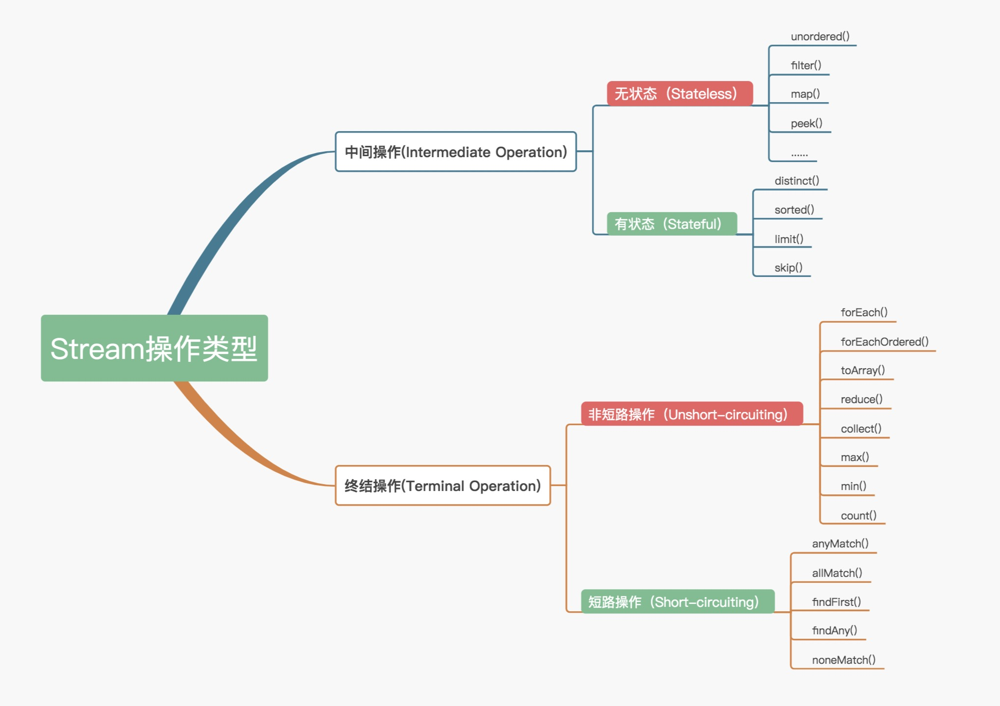
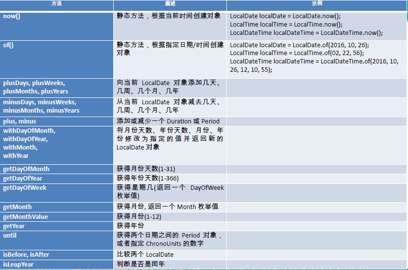

- 推荐阅读： [java 8 新特性]([https://snailclimb.gitee.io/javaguide/#/java/What's%20New%20in%20JDK8/Java8Tutorial](https://snailclimb.gitee.io/javaguide/#/java/What's New in JDK8/Java8Tutorial)) 

# 一、JDK8

## 1、Lambda 表达式

### (1) 语法格式

- **语法格式一**：无参数，无返回值：`() -> System.out.println("Hello Lambda!");`

  ```java
  @Test
  public void test(){
      int num = 0;
  
      Runnable r = new Runnable() {
          @Override
          public void run() {
              System.out.println("Hello World!" + num);
          }
      };
      r.run();
  
      System.out.println("-------------------------------");
  
   	Runnable r1 = () -> System.out.println("Hello Lambda!");
      r1.run();
  }
  ```

- **语法格式二**：有一个参数，并且无返回值：`(x) -> System.out.println(x)`

  ```java
  @Test
  public void test(){
      Consumer<String> con = (x) -> System.out.println(x);
      con.accept("hello");
  }
  ```

- **语法格式三**：若只有一个参数，小括号可以省略不写：`x -> System.out.println(x)`

  ```java
  @Test
  public void test2(){
      Consumer<String> con = x -> System.out.println(x);
      con.accept("hello");
  }
  ```

- **语法格式四**：有两个以上的参数，有返回值，并且 Lambda 体中有多条语句

  ```java
  Comparator<Integer> com = (x, y) -> {
  	System.out.println("函数式接口");
  	return Integer.compare(x, y);
   };
  ```

- **语法格式五**：若 Lambda 体中只有一条语句， return 和 大括号都可以省略不写

  ```java
  Comparator<Integer> com = (x, y) -> Integer.compare(x, y);
  ```

- **语法格式六**：Lambda 表达式的参数列表的数据类型可以省略不写，因为JVM编译器通过上下文推断出，数据类型，即“类型推断”：`(Integer x, Integer y) -> Integer.compare(x, y);` 

### (2) 案例

**需求：**获取公司中年龄小于 35 的员工信息

**对象封装类：** 

```java
public class Employee {

	private int id;
	private String name;
	private int age;
	private double salary;

	public Employee() {
	}

	public Employee(String name) {
		this.name = name;
	}

	public Employee(String name, int age) {
		this.name = name;
		this.age = age;
	}

	public Employee(int id, String name, int age, double salary) {
		this.id = id;
		this.name = name;
		this.age = age;
		this.salary = salary;
	}

	public int getId() {
		return id;
	}

	public void setId(int id) {
		this.id = id;
	}

	public String getName() {
		return name;
	}

	public void setName(String name) {
		this.name = name;
	}

	public int getAge() {
		return age;
	}

	public void setAge(int age) {
		this.age = age;
	}

	public double getSalary() {
		return salary;
	}

	public void setSalary(double salary) {
		this.salary = salary;
	}

	public String show() {
		return "测试方法引用！";
	}

	@Override
	public String toString() {
		return "Employee [id=" + id + ", name=" + name + ", age=" + age + ", salary=" + salary + "]";
	}
}
```

**存储的数据：** 

```java
List<Employee> emps = Arrays.asList(
        new Employee(101, "张三", 18, 9999.99),
        new Employee(102, "李四", 59, 6666.66),
        new Employee(103, "王五", 28, 3333.33),
        new Employee(104, "赵六", 8, 7777.77),
        new Employee(105, "田七", 38, 5555.55)
);
```

**原始的方法：** 

```java
public List<Employee> filterEmployeeAge(List<Employee> emps){
    List<Employee> list = new ArrayList<>();
    for (Employee emp : emps) {
        if(emp.getAge() <= 35){
            list.add(emp);
        }
    }
    return list;
}
```

**优化方式一：** 策略设计模式（可以通过修改接口中的实现，来修改功能，提高代码共用行）

```java
public List<Employee> filterEmployee(List<Employee> emps, MyPredicate<Employee> mp){
    List<Employee> list = new ArrayList<>();
    for (Employee employee : emps) {
        if(mp.test(employee)){
            list.add(employee);
        }
    }
    return list;
}

//设计模式的接口
@FunctionalInterface
public interface MyPredicate<T> {
	public boolean test(T t);
}

//接口的实现
public class FilterEmployeeForAge implements MyPredicate<Employee>{
	@Override
	public boolean test(Employee t) {
		return t.getAge() <= 35;
	}
}
```

**优化方式二：** 匿名内部类

```java
@Test
public void test5(){
    List<Employee> list = filterEmployee(emps, new MyPredicate<Employee>() {
        @Override
        public boolean test(Employee t) {
            return t.getId() <= 103;
        }
    });
    for (Employee employee : list) {
        System.out.println(employee);
    }
}
```

**优化方式三：** Lambda 表达式

```java
@Test
public void test6(){
    List<Employee> list = filterEmployee(emps, (e) -> e.getAge() <= 35);
    list.forEach(System.out::println);
}
```

**优化方式四：** Stream API

```java
@Test
public void test7(){
    emps.stream()
        .filter((e) -> e.getAge() <= 35)
        .forEach(System.out::println);
}
```

## 2、接口默认方法

### (1) 默认方法与静态方法对比

- **默认方法**：可以在不破坏二进制兼容性的前提下，往现存接口中添加新方法

    > 注：在复杂的继承体系中，默认方法可能引起歧义和编译错误

    ```java
    private interface Defaulable {
        //默认方法
        default String notRequired() { 
            return "Default implementation"; 
        }        
    }
            
    private static class DefaultableImpl implements Defaulable {
    }
        
    private static class OverridableImpl implements Defaulable {
        @Override
        public String notRequired() {
            return "Overridden implementation";
        }
    }
    ```

- **静态方法**：

    ```java
    private interface DefaulableFactory {
        //静态方法
        static Defaulable create(Supplier< Defaulable > supplier) {
            return supplier.get();
        }
    }
    
    //调用
    public static void main( String[] args ) {
        Defaulable defaulable = DefaulableFactory.create(DefaultableImpl::new);
        System.out.println(defaulable.notRequired());
            
        defaulable = DefaulableFactory.create(OverridableImpl::new);
        System.out.println(defaulable.notRequired());
    }
    
    //结果
    Default implementation
    Overridden implementation
    ```

### (2) 接口默认方法案例

- 接口默认方法的**类优先原则**：若一个父类提供了具体的实现，则接口中具有相同名称和参数的默认方法会被忽略

    ```java
    public class TestDefaultInterface {
    	public static void main(String[] args) {
    		SubClass sc = new SubClass();
    		System.out.println(sc.getName());//打印 "嘿嘿嘿" --> 调用 MyClass
    	}
    }
    
    //SubClass 类
    public class SubClass extends MyClass implements MyFun{//”类优先”原则
    
    }
    
    //MyFun 接口
    public interface MyFun {
    	default String getName(){
    		return "哈哈哈";
    	}
    }
    
    //MyClass 类
    public class MyClass {
    	String getName(){
    		return "嘿嘿嘿";
    	}
    }
    ```

- **接口冲突**：若两个父接口提供了具有相同名称和参数列表的方法，则必须覆盖该方法来解决冲突

    ```java
    public class TestDefaultInterface {
    	public static void main(String[] args) {
    		SubClass sc = new SubClass();
    		System.out.println(sc.getName());
    		
    		MyInterface.show();
    	}
    }
    
    //SubClass 实现类
    public class SubClass implements MyFun, MyInterface{
    	@Override
    	public String getName() {
    		return MyInterface.super.getName();//必须指定哪个接口的默认方法
    	}
    }
    
    //MyInterface 接口
    public interface MyInterface {
    	default String getName(){
    		return "呵呵呵";
    	}
    	
    	public static void show(){
    		System.out.println("接口中的静态方法");
    	}
    }
    
    //MyFun 接口
    public interface MyFun {
    	default String getName(){
    		return "哈哈哈";
    	}
    }
    ```

## 3、函数式接口

**函数式接口**：只有**一个抽象方法的接口**，可以使用注解 `@FunctionalInterface` 检查是否是函数式接口

> Lambda 表达式需要**函数式接口**支持

```java
//声明函数式接口
@FunctionalInterface
public interface MyFun {
	public Integer getValue(Integer num);
}

//对一个数进行运算
@Test
public void test(){
    Integer num = operation(100, (x) -> x * x);
    System.out.println(num);

    System.out.println(operation(200, (y) -> y + 200));
}

public Integer operation(Integer num, MyFun mf){
    return mf.getValue(num);
}
```

### (1) Function 功能型函数式接口

#### 1. `Function<T,R>`

`Function` 接口：接受一个输入参数 `T`，返回一个结果 `R` 

```java
package java.util.function;

import java.util.Objects;

@FunctionalInterface
public interface Function<T, R> {
    // 接受输入参数，对输入执行所需操作后，返回一个结果
    R apply(T t);

    // 先做传入的 Function 类型的参数的 apply 操作，再做当前这个接口的 apply 操作
    default <V> Function<V, R> compose(Function<? super V, ? extends T> before) {
       Objects.requireNonNull(before);
       return (V v) -> apply(before.apply(v));
    }

    // 先做本接口的 apply 操作，再做传入的 Function 类型的参数的 apply 操作
    default <V> Function<T, V> andThen(Function<? super R, ? extends V> after) {
        Objects.requireNonNull(after);
        return (T t) -> after.apply(apply(t));
    }   

    // 静态方法表示，这个传入的泛型参数 T 本身
    static <T> Function<T, T> identity() {
        return t -> t;
    } 
}
```

---

**案例**：

- **案例一**：`compose` 与 `andThen` 使用详解

    ```java
    public class TestFunction {
        public static void main(String[] args) {
            Function<Integer, Integer> times2 = i -> i * 3;
            Function<Integer, Integer> squared = i -> i * i;
    
            System.out.println(times2.apply(4)); //12
            System.out.println(squared.apply(4)); //16
    
            //先4×4然后16×2,先执行apply(4)，在times2的apply(16),先执行参数，再执行调用者
            System.out.println(times2.compose(squared).apply(4));  //48
            //先4×2,然后8×8,先执行times2的函数，在执行squared的函数
            System.out.println(times2.andThen(squared).apply(4));  //144
            System.out.println(Function.identity().compose(squared).apply(4));   //16
            System.out.println(times2.compose(squared).andThen(times2).compose(squared).apply(2)); //144
        }
    }
    ```

- **案例二**：`Function` 作为参数的使用

    ```java
    public class FunctionDemo {
        static int modifyTheValue(int valueToBeOperated, Function<Integer, Integer> function) {
            return function.apply(valueToBeOperated);
        }
    
        public static void main(String[] args) {
            int myNumber = 10;
            //方式一：lambda 表达式实现
            int res1 = modifyTheValue(myNumber, x -> x + 20);
            System.out.println(res1); //30
    
            //方式二：匿名内部类实现
            int res2 = modifyTheValue(myNumber, new Function<Integer, Integer>() {
                @Override
                public Integer apply(Integer t) {
                    return t + 20;
                }
            });
            System.out.println(res2); //30
        }
    }
    ```

- **案例三**：综合使用

    ```java
    public static Integer modifyTheValue2(int value, Function<Integer, Integer> function1, 
                                          		Function<Integer, Integer> function2){
             //value作为function1的参数，返回一个结果，该结果作为function2的参数，返回一个最终结果
             return  function1.andThen(function2).apply(value);
        }
    
    public static void main(String[] args) {
        System.out.println(modifyTheValue2(3, val -> val + 2, val -> val + 3));
    }
    ```

#### 2. `Function` 类函数

- `DoubleFunction<R>`：代表接受一个double值参数的方法，并且返回结果

- `IntFunction<R>`：接受一个 int 类型输入参数，返回一个结果

- `LongFunction<R>`：接受一个 long 类型输入参数，返回一个结果

- `DoubleToIntFunction`：接受一个double类型输入，返回一个int类型结果

- `DoubleToLongFunction`：接受一个double类型输入，返回一个long类型结果

- `IntToDoubleFunction`：接受一个 int 类型输入，返回一个 double 类型结果

- `IntToLongFunction`：接受一个 int 类型输入，返回一个 long 类型结果

- `LongToDoubleFunction`：接受一个 long 类型输入，返回一个 double 类型结果

- `LongToIntFunction`：接受一个 long 类型输入，返回一个 int 类型结果

- `ToDoubleFunction<T>`：接受一个输入参数，返回一个double类型结果

- `ToIntFunction<T>`：接受一个输入参数，返回一个int类型结果

- `ToLongFunction<T>`：接受一个输入参数，返回一个long类型结果

#### 3. `BiFunction<T,U,R>`

> 代表了一个接受两个输入参数的方法，并且返回一个结果

```java
@FunctionalInterface
public interface BiFunction<T, U, R> {
    // 先做本接口的 apply 操作，再做传入的 Function 类型的参数的 apply 操作
    default <V> BiFunction<T, U, V> andThen(Function<? super R, ? extends V> after) {
        Objects.requireNonNull(after);
        return (T t, U u) -> after.apply(apply(t, u));
    }
}
```

---

**案例**：

```java
public int compute(int a, int b, BiFunction<Integer, Integer, Integer> biFunction, 
                    Function<Integer, Integer> function) {
    return biFunction.andThen(function).apply(a, b);
}

//首先执行(v1, v2) -> v1 + v2，然后执行 v1 -> v1 * v1
test.compute4(2, 3, (v1, v2) -> v1 + v2, v1 -> v1 * v1) 
```

#### 4. `BiFunction` 类函数

- `ToDoubleBiFunction<T,U>`：接受两个输入参数，返回一个 double 类型结果

- `ToIntBiFunction<T,U>`：接受两个输入参数，返回一个 int 类型结果

- `ToLongBiFunction<T,U>`：接受两个输入参数，返回一个 long 类型结果

### (2) Consumer 消费型函数式接口

#### 1. `Consumer<T>` 

`Consumer` 接口：接受一个输入参数并且无返回的操作

```java
@FunctionalInterface
public interface Consumer<T> {
    void accept(T t);
    
    //先做本接口的 accept 操作，然后在做传入的 Consumer 类型的参数的 accept 操作
    default Consumer<T> andThen(Consumer<? super T> after) {
        Objects.requireNonNull(after);
        return (T t) -> { accept(t); after.accept(t); };
    }
}
```

---

**案例**：

- **案例一**：

    ```java
    List<Person> lisiList = new ArrayList<>();
    Consumer <Person> consumer  =  x -> {
        if (x.name.equals("lisi")){
            lisiList.add(x);
        }
    };
    
    Stream.of(
            new Person(21,"zhangsan"),
            new Person(22,"lisi"),
            new Person(23,"wangwu"),
            new Person(24,"wangwu"),
            new Person(23,"lisi"),
            new Person(26,"lisi"),
            new Person(26,"zhangsan")
    ).forEach(consumer);
    
    System.out.println(JSON.toJSONString(lisiList));
    
    //结果：
    [{"age":22,"name":"lisi"},{"age":23,"name":"lisi"},{"age":26,"name":"lisi"}]
    ```

- **案例二**：

    ```java
     List<Person> lisiList = new ArrayList<>();
    Consumer <Person> consumer  =  x -> {
        if (x.name.equals("lisi")){
            lisiList.add(x);
        }
    };
    
    consumer = consumer.andThen(
       x -> lisiList.removeIf(y -> y.age < 23)
    );
    
    Stream.of(
            new Person(21,"zhangsan"),
            new Person(22,"lisi"),
            new Person(23,"wangwu"),
            new Person(24,"wangwu"),
            new Person(23,"lisi"),
            new Person(26,"lisi"),
            new Person(26,"zhangsan")
    ).forEach(consumer);
    
    System.out.println(JSON.toJSONString(lisiList));
    
    //结果：
    [{"age":23,"name":"lisi"},{"age":26,"name":"lisi"}]
    ```

#### 2. `BiConsumer<T,U>`

> 代表了一个接受两个输入参数的操作，并且不返回任何结果

```java
@FunctionalInterface
public interface BiConsumer<T, U> {
    void accept(T t, U u);

    default BiConsumer<T, U> andThen(BiConsumer<? super T, ? super U> after) {
        Objects.requireNonNull(after);
        return (l, r) -> {
            accept(l, r);
            after.accept(l, r);
        };
    }
}
```

---

**案例**：

```java
public static void main(String[] args) {
    BiConsumer<Integer, Integer> action1 = (x, y) -> {
        System.out.println("对传进来的进行相加操作: " + (x + y));
    };
    BiConsumer<Integer, Integer> action2 = (x, y) -> {
        System.out.println("对传进来的进行相减操作: " + (x - y));
    };
    BiConsumer<Integer, Integer> anction3 = action1.andThen(action2);

    //先执行加法在执行减法
    System.out.println("执行anction1");
    action1.accept(1, 1);
    System.out.println("执行anction2");
    action2.accept(1, 1);
    System.out.println("执行anction3");
    anction3.accept(1, 1);
}

//结果：
执行anction1
对传进来的进行相加操作: 2
执行anction2
对传进来的进行相减操作: 0
执行anction3
对传进来的进行相加操作: 2
对传进来的进行相减操作: 0
```

#### 3. `Consumer` 类函数

- `DoubleConsumer`：代表一个接受 double 值参数的操作，并且不返回结果

- `IntConsumer`

- `LongConsumer`：接受一个 long 类型的输入参数，无返回值

- `ObjDoubleConsumer<T>`：接受一个 object 类型和一个 double 类型的输入参数，无返回值

- `ObjIntConsumer<T>`：接受一个 object 类型和一个 int 类型的输入参数，无返回值

- `ObjLongConsumer<T>`：接受一个 object 类型和一个 long 类型的输入参数，无返回值

### (3) Supplier 供给型函数式接口

#### 1. `Supplier<T>` 

`Supplier` 接口：无参数，返回一个结果

```java
@FunctionalInterface
public interface Supplier<T> {
    T get(); //获取提供的对象实例
}
```

---

**案例**：

```java
Supplier <Double>  supplier = () -> Math.random();
System.out.println(supplier.get());
```

#### 2. `Supplier` 类函数

- `BooleanSupplier`：代表了 boolean 值结果的提供方

- `DoubleSupplier`：代表一个 double 值结构的提供方

- `IntSupplier`：无参数，返回一个 int 类型结果

- `LongSupplier`：无参数，返回一个结果 long 类型的值

### (4) Predicate 断言型函数式接口

#### 1. `Predicate<T>` 

`Predicate` 接口：接受一个输入参数，返回一个布尔值结果

```java
@FunctionalInterface
public interface Predicate<T> {
    boolean test(T t); //用于处理参数 T，判断是否满足要求
    
    //调用当前 Predicate 的 test 方法后，再调用 other 的 test 方法(相当于进行两次判断)
    default Predicate<T> and(Predicate<? super T> other) {
        Objects.requireNonNull(other);
        return (t) -> test(t) && other.test(t);
    }
    
    //对当前判断进行"!"操作，即取非操作
    default Predicate<T> negate() {
        return (t) -> !test(t);
    }
    
    //对当前判断进行"||"操作，即取或操作
    default Predicate<T> or(Predicate<? super T> other) {
        Objects.requireNonNull(other);
        return (t) -> test(t) || other.test(t);
    }
    
    //对当前操作进行"="操作，即取等操作
    static <T> Predicate<T> isEqual(Object targetRef) {
        return (null == targetRef) ? Objects::isNull : object -> targetRef.equals(object);
    }
}
```

---

- **案例一**：`test(T t)` 测试

    ```java
    Predicate<Integer> predicate = x -> x >  0;
    System.out.println(predicate.test(100));
    
    //结果：
    true
    ```

- **案例二**：`and(Predicate<? super T> other)` 测试

    ```java
    Predicate<Integer> predicate = x -> x > 100;
    predicate = predicate.and(x -> x % 2 == 0 );
    System.out.println(predicate.test(98)); //false
    System.out.println(predicate.test(102)); //true
    System.out.println(predicate.test(103)); //false
    ```

- **案例三**：`negate()` 测试

    ```java
    Predicate<Person> personPredicate = x -> x.age > 22;
    System.out.println(
        Stream.of(
                new Person(21,"zhangsan"),
                new Person(22,"lisi"),
                new Person(23,"wangwu"),
                new Person(24,"wangwu"),
                new Person(25,"lisi"),
                new Person(26,"zhangsan")
        ).filter(personPredicate.negate())
        .count()
    );
    
    //结果：
    
    ```

- **案例四**：`or(Predicate<? super T> other)` 测试

    ```java
    Predicate<Person> predicate =  x -> x.name.equals("lisi");
    predicate = predicate.or(x -> x.age > 25);
    System.out.println(
        Stream.of(
                new Person(21,"zhangsan"),
                new Person(22,"lisi"),
                new Person(23,"wangwu"),
                new Person(24,"wangwu"),
                new Person(25,"lisi"),
                new Person(26,"zhangsan")
        ).filter(predicate)
        .count()
    );
    
    //结果：
    3
    ```

- **案例五**：`isEqual(Object targetRef)` 测试

    ```java
    Person person = new Person(22,"lisi");
    Predicate<Person> predicate =  Predicate.isEqual(person);
    System.out.println(
        Stream.of(
                new Person(21,"zhangsan"),
                new Person(22,"lisi"),
                new Person(23,"wangwu"),
                new Person(24,"wangwu"),
                new Person(22,"lisi"),
                new Person(26,"zhangsan")
        ).filter(predicate)
        .count()
    );
    
    //结果：
    2
    
    @Data
    class Person{
        private int age;
        private String name;
        public Person(int age, String name) {
            this.age = age;
            this.name = name;
        }
        
        @Override
        public boolean equals(Object o) {
            if (this == o) return true;
            if (o == null || getClass() != o.getClass()) return false;
            Person person = (Person) o;
            if (age != person.age || !name.equals(person.name)) return false;
            return true;
        }
        
        @Override
        public int hashCode() {
            int result = age;
            result = 31 * result + name.hashCode();
            return result;
        }
    }
    ```

#### 2. `BiPredicate<T,U>`

> 代表了一个两个参数的boolean值方法

```java
@FunctionalInterface
public interface BiPredicate<T, U> {
    boolean test(T t, U u);

    default BiPredicate<T, U> and(BiPredicate<? super T, ? super U> other) {
        Objects.requireNonNull(other);
        return (T t, U u) -> test(t, u) && other.test(t, u);
    }

    default BiPredicate<T, U> negate() {
        return (T t, U u) -> !test(t, u);
    }

    default BiPredicate<T, U> or(BiPredicate<? super T, ? super U> other) {
        Objects.requireNonNull(other);
        return (T t, U u) -> test(t, u) || other.test(t, u);
    }
}
```

---

**案例**：

```java
public static void main(String[] args) {
    BiPredicate<String, Integer> filter = (x, y) -> x.length() == y;

    boolean result = filter.test("mkyong", 6);
    System.out.println(result);  // true

    boolean result2 = filter.test("java", 10);
    System.out.println(result2); // false
}
```

#### 3. `Predicate` 类函数

- `DoublePredicate`：接受一个 double 输入参数，返回一个布尔值的结果

- `IntPredicate`：接受一个 int 输入参数，返回一个布尔值的结果

- `LongPredicate`：接受一个 long 输入参数，返回一个布尔值类型结果

### (5) Operator

> `Operator` 继承自 `Function` 

#### 1. `UnaryOperator<T>`

> 接受一个参数为类型T,返回值类型也为T

```java
@FunctionalInterface
public interface UnaryOperator<T> extends Function<T, T> {
    static <T> UnaryOperator<T> identity() {
        return t -> t;
    }
}
```

---

**案例**：

```java
UnaryOperator<Integer> dda = x -> x + 1;
System.out.println(dda.apply(10)); // 11

UnaryOperator<String> ddb = x -> x + 1;
System.out.println(ddb.apply("aa")); // aa1
```

#### 2. `BinaryOperator<T>`

> 代表了一个作用于两个同类型操作符的操作，并且返回了操作符同类型的结果

```java
@FunctionalInterface
public interface BinaryOperator<T> extends BiFunction<T,T,T> {
    public static <T> BinaryOperator<T> minBy(Comparator<? super T> comparator) {
        Objects.requireNonNull(comparator);
        return (a, b) -> comparator.compare(a, b) <= 0 ? a : b;
    }

    public static <T> BinaryOperator<T> maxBy(Comparator<? super T> comparator) {
        Objects.requireNonNull(comparator);
        return (a, b) -> comparator.compare(a, b) >= 0 ? a : b;
    }
}
```

---

**案例**：

- **案例一**：

    ```java
    public static void main(String[] args) {
        BinaryOperator<Integer> add = (n1, n2) -> n1 + n2;
        //apply方法用于接收参数，并返回BinaryOperator中的Integer类型
        System.out.println(add.apply(3, 4));
    }
    
    //结果：7
    ```

- **案例二**：

    ```java
    public static void main(String[] args) {
        BinaryOperator<Integer> bi = BinaryOperator.minBy(Comparator.naturalOrder());
        System.out.println(bi.apply(2, 3)); //2
    }
    
    public static void main(String[] args) {
        BinaryOperator<Integer> bi = BinaryOperator.minBy(Comparator.naturalOrder());
        System.out.println(bi.apply(2, 3)); //3
    }
    ```

#### 3. 其他 Operator 函数

- `DoubleBinaryOperator`：代表了作用于两个double值操作符的操作，并且返回了一个double值的结果

- `IntBinaryOperator`：接受两个参数同为类型 Int，返回值类型也为 Int

- `LongBinaryOperator`：接受两个参数同为类型 long，返回值类型也为 long

- `DoubleUnaryOperator`：接受一个参数同为类型 double，返回值类型也为 double

- `IntUnaryOperator`：接受一个参数同为类型 Int，返回值类型也为 Int

- `LongUnaryOperator`：接受一个参数同为类型 long，返回值类型也为 long

## 4、方法引用与构造器引用

### (1) 方法引用

**方法引用**：使用操作符 `::`  将方法名和对象或类的名字分隔开来

```java
@Test
public void test1(){
    PrintStream ps = System.out;
    Consumer<String> con = (str) -> ps.println(str);
    con.accept("Hello World！");

    System.out.println("--------------------------------");

    Consumer<String> con2 = ps::println;
    con2.accept("Hello Java8！");

    Consumer<String> con3 = System.out::println;
}
```

---

**三种主要使用情况**：

- `对象::实例方法`

  ```java
  @Test
  public void test2(){
      Employee emp = new Employee(101, "张三", 18, 9999.99);
  
      Supplier<String> sup = () -> emp.getName();
      System.out.println(sup.get());
  
      System.out.println("----------------------------------");
  
      Supplier<String> sup2 = emp::getName;
      System.out.println(sup2.get());
  }
  ```

- `类::静态方法`

  ```java
    @Test
    public void test3(){
        BiFunction<Double, Double, Double> fun = (x, y) -> Math.max(x, y);
        System.out.println(fun.apply(1.5, 22.2));
    
        System.out.println("--------------------------------------------------");
    
        BiFunction<Double, Double, Double> fun2 = Math::max;
        System.out.println(fun2.apply(1.2, 1.5));
    }
    
    @Test
    public void test4(){
        Comparator<Integer> com = (x, y) -> Integer.compare(x, y);
    
        System.out.println("-------------------------------------");
    
        Comparator<Integer> com2 = Integer::compare;
    }
  ```

- `类::实例方法`

    ```java
    @Test
    public void test5(){
        BiPredicate<String, String> bp = (x, y) -> x.equals(y);
        System.out.println(bp.test("abcde", "abcde"));
    
        System.out.println("-----------------------------------------");
        BiPredicate<String, String> bp2 = String::equals;
        System.out.println(bp2.test("abc", "abc"));
    
        System.out.println("-----------------------------------------");
        Function<Employee, String> fun = (e) -> e.show();
        System.out.println(fun.apply(new Employee()));
    
        System.out.println("-----------------------------------------");
        Function<Employee, String> fun2 = Employee::show;
        System.out.println(fun2.apply(new Employee()));
    }
    ```

### (2) 构造器引用

> 格式：`ClassName::new` 

与函数式接口相结合，自动与函数式接口中方法兼容

可以把构造器引用赋值给定义的方法，与构造器参数列表要与接口中抽象方法的参数列表一致

```java
@Test
public void test6(){
    Supplier<Employee> sup = () -> new Employee();
    System.out.println(sup.get());

    System.out.println("------------------------------------");

    Supplier<Employee> sup2 = Employee::new;
    System.out.println(sup2.get());
}

@Test
public void test7(){
    Function<String, Employee> fun = Employee::new;
    BiFunction<String, Integer, Employee> fun2 = Employee::new;
}
```

### (3) 数组引用

> 格式：`type[] :: new`

```java
@Test
public void test8(){
    Function<Integer, String[]> fun = (args) -> new String[args];
    String[] strs = fun.apply(10);
    System.out.println(strs.length);

    System.out.println("--------------------------");

    Function<Integer, Employee[]> fun2 = Employee[] :: new;
    Employee[] emps = fun2.apply(20);
    System.out.println(emps.length);
}
```

## 5、Stream

推荐阅读：**[Java 8 中的 Streams API 详解(IBM)](https://developer.ibm.com/zh/technologies/java/articles/j-lo-java8streamapi/)** 



**性能测试**：==[测试代码](https://github.com/nickliuchao/stream)== 

- 多核 CPU 服务器配置环境下，对比长度 100 的 int 数组的性能：常规的迭代 < Stream 并行迭代 < Stream 串行迭代
- 多核 CPU 服务器配置环境下，对比长度 1.00E+8 的 int 数组的性能：Stream 并行迭代 < 常规的迭代 < Stream 串行迭代
- 多核 CPU 服务器配置环境下，对比长度 1.00E+8 对象数组过滤分组的性能：Stream 并行迭代 < 常规的迭代 < Stream 串行迭代
- 单核 CPU 服务器配置环境下，对比长度 1.00E+8 对象数组过滤分组的性能：常规的迭代 < Stream 串行迭代 < Stream 并行迭代

**总结**：

- 在循环迭代次数较少的情况下，常规的迭代方式性能反而更好
- 在单核 CPU 服务器配置环境中，也是常规迭代方式更有优势
- 而在大数据循环迭代中，如果服务器是多核 CPU 的情况下，Stream 的并行迭代优势明显。所以我们在平时处理大数据的集合时，应该尽量考虑将应用部署在多核 CPU 环境下，并且使用 Stream 的并行迭代方式进行处理

### (1) Stream 简介

**Stream 优势**：

- Stream 专注对集合对象进行各种非常便利、高效的聚合操作，或大批量数据操作

- 提供串行和并行模式操作，其中并发模式能充分利用多核处理器的优势，使用 fork/join 并行方式来拆分任务和加速处理过程

    > `parallelStream` 开启线程数 = 内核数 - 1
    >
    > **修改并行线程数**：==全局操作==，即将影响代码中所有的并行流，同时是 final 类型，整个 JVM 中只允许设置一次
    >
    > ```java
    > @PostConstruct
    > public void init() {
    >    	System.setProperty("java.util.concurrent.ForkJoinPool.common.parallelism", "15"); //设置线程数为 15
    > }
    > ```
    >
    > 推荐阅读：==[**为什么说parallelStream不是什么善茬**](https://my.oschina.net/u/4133389/blog/3098479)== 

---

JDK7 与 JDK8 对比案例：

```java
//Java 7 的排序、取值实现
List<Transaction> groceryTransactions = new Arraylist<>();
for(Transaction t: transactions){
	if(t.getType() == Transaction.GROCERY){
		groceryTransactions.add(t);
	}
}

Collections.sort(groceryTransactions, new Comparator(){
	public int compare(Transaction t1, Transaction t2){
		return t2.getValue().compareTo(t1.getValue());
	}
});

List<Integer> transactionIds = new ArrayList<>();
for(Transaction t: groceryTransactions){
	transactionsIds.add(t.getId());
}

//Java 8 的排序、取值实现
List<Integer> transactionsIds = transactions.parallelStream()
											.filter(t -> t.getType() == Transaction.GROCERY)
 											.sorted(comparing(Transaction::getValue).reversed())
											.map(Transaction::getId)
											.collect(toList());
```

### (2) Stream 的构造与转换

#### 1. 由集合创建 Stream

```java
List<String> list = new ArrayList<>();
Stream<String> stream = list.stream(); //获取一个顺序流
Stream<String> parallelStream = list.parallelStream(); //获取一个并行流
```

#### 2. 由数组创建 Stream

```java
String [] strArray = new String[] {"a", "b", "c"};
Stream stream = Stream.of(strArray); //Stream.of 
stream = Arrays.stream(strArray); //Arrays.stream
```

#### 3. 由值创建 Stream

```java
//方式一：Stream.of
Stream stream = Stream.of("a", "b", "c");
//方式二：IntStream.of
IntStream.of(new int[]{1, 2, 3}).forEach(System.out::println);
//方式三：IntStream.range
IntStream.range(1, 3).forEach(System.out::println);
//方式四：IntStream.rangeClosed
IntStream.rangeClosed(1, 3).forEach(System.out::println);
```

#### 4. 由函数创建流

```java
//方式一：Stream.iterate
Stream.iterate(1, (x) -> x + 1).forEach(System.out::println);
//方式二：Stream.generate
Stream.generate(() -> Math.random()).forEach(System.out::println);
//方式三：Stream.concat
Stream<Integer> firstStream = Stream.of(1, 2, 3);
Stream<Integer> secondStream = Stream.of(4, 5, 6);
Stream<Integer> resultingStream = Stream.concat(firstStream, secondStream);
```

#### 5. 流的转换

```java
//方式一：stream 转数组
String[] strArray1 = stream.toArray(String[]::new);
//方式二：stream 转 Collection
List<String> list1 = stream.collect(Collectors.toList());
List<String> list2 = stream.collect(Collectors.toCollection(ArrayList::new));
Set set1 = stream.collect(Collectors.toSet());
Stack stack1 = stream.collect(Collectors.toCollection(Stack::new));
//方式三：stream 转 String
String str = stream.collect(Collectors.joining()).toString();
```

### (3) Stream 的操作

#### 1. 中间操作

> 操作惰性化：即仅仅调用到这类方法，并没有真正开始流的遍历

- `filter(Predicate<? super T> predicate`：对原始 Stream 进行某项测试，通过测试的元素被留下来生成一个新 Stream

    > - 留下偶数：
    >
    >     ```java
    >     Integer[] sixNums = {1, 2, 3, 4, 5, 6};
    >     Integer[] evens = Stream.of(sixNums).filter(n -> n % 2 == 0).toArray(Integer[]::new);
    >     ```
    >
    > - 把单词挑出来：
    >
    >     ```java
    >     List<String> output = reader.lines()
    >         						.flatMap(line -> Stream.of(line.split(REGEXP)))
    >     							.filter(word -> word.length() > 0)
    >     							.collect(Collectors.toList());
    >     ```

- `distinct`：元素去重

    > ```java
    > List<Integer> list = Arrays.asList(1, 2, 3, 4, 4, 4, 5, 6);
    > list.stream()
    >     .distinct()
    >     .forEach(System.out::println);
    > ```

- `limit/skip`：limit 返回 Stream 的前面 n 个元素；skip 则是扔掉前 n 个元素，即 limit 去尾，skip 去头

    > ```java
    > public void testLimitAndSkip() {
    >     List<Person> persons = new ArrayList();
    >     for (int i = 1; i <= 10000; i++) {
    >         Person person = new Person(i, "name" + i);
    >         persons.add(person);
    >     }
    >     List<String> personList = persons.stream().map(Person::getName)
    >         							  .limit(10)
    >         							  .skip(3)
    >         							  .collect(Collectors.toList());
    >     System.out.println(personList);
    > }
    > 
    > //结果
    > [name4, name5, name6, name7, name8, name9, name10]
    > ```

- `map(Function<? super T, ? extends R> mapper)`：接收一个 `Function` 实例，并进行结果映射

    > 类似函数：
    >
    > - `mapToInt(ToIntFunction<? super T> mapper)` 
    > - `mapToLong(ToLongFunction<? super T> mapper)` 
    > -  `mapToDouble(ToDoubleFunction<? super T> mapper)` 
    >
    > ```java
    > //1. 转换大写
    > List<String> output = wordList.stream().map(String::toUpperCase).collect(Collectors.toList());
    > 
    > //2. 平方数
    > List<Integer> nums = Arrays.asList(1, 2, 3, 4);
    > List<Integer> squareNums = nums.stream().map(n -> n * n).collect(Collectors.toList());
    > ```

- `flatMap(Function<? super T, ? extends Stream<? extends R>> mapper)`：将流中的每个元素映射成一个流

    > 类似函数：
    >
    > - `flatMapToInt(Function<? super T, ? extends IntStream> mapper)`
    > - `flatMapToLong(Function<? super T, ? extends LongStream> mapper)`
    > - `flatMapToDouble(Function<? super T, ? extends DoubleStream> mapper)`
    >
    > ```java
    > Stream<List<Integer>> inputStream = Stream.of(
    > 	Arrays.asList(1),
    > 	Arrays.asList(2, 3),
    > 	Arrays.asList(4, 5, 6)
    > );
    > Stream<Integer> outputStream = inputStream.flatMap(Collection::stream); //List 合并
    > outputStream.forEach(System.out::print);
    > //结果：123456
    > ```

- `sorted`：将流中元素按自然顺序排序

    > 注：首先对 Stream 进行各类 map、filter、limit、skip 甚至 distinct 来减少元素数量后，再排序，能明显缩短执行时间
    >
    > ```java
    > List<String> list = Arrays.asList("d", "a", "c");
    > list.stream().sorted().forEach(System.out::print); //结果：acd
    > ```

- `sorted(Comparator<? super T> comparator)`：

    > ```java
    > public void testLimitAndSkip() {
    >     List<Person> persons = new ArrayList();
    >     for (int i = 1; i <= 5; i++) {
    >         Person person = new Person(i, "name" + i);
    >         persons.add(person);
    >     }
    >     List<Person> personList = persons.stream()
    >                                  .limit(2) //先截断，再排序
    >                                  .sorted(Comparator.comparing(Person::getName))
    >                                  .collect(Collectors.toList());
    >     System.out.println(personList);
    > }
    > //结果
    > [name2, name1]
    > ```

- `peek`：对每个元素执行操作并**返回一个新的 Stream**，forEach 会销毁原有的 Stream

    > `peek` 与 `map` 区别：
    >
    > - `peek` 用于不想改变流中元素本身的类型或只想操作元素的内部状态时
    > - `map` 用于改变流中元素本身类型，即从元素中派生出另一种类型的操作
    >
    > peek 应用场景：对 `Stream<T>` 中的 `T` 的某些属性进行批处理时，用 `peek` 操作比较合适
    >
    > ```java
    > Stream.of("one", "two", "three", "four")
    > 		.filter(e -> e.length() > 3)
    > 		.peek(e -> System.out.println("Filtered value: " + e))
    > 		.map(String::toUpperCase)
    > 		.peek(e -> System.out.println("Mapped value: " + e))
    > 		.collect(Collectors.toList());
    > //结果
    > Filtered value: three
    > Mapped value: THREE
    > Filtered value: four
    > Mapped value: FOUR
    > ```


#### 2. 终止操作

##### 查找与匹配

- `count`：返回流中元素总数

- `findFirst/findAny`：返回流中的第一个/任意一个元素

- `Match`：

    - `anyMatch`：Stream 中只要有一个元素符合传入的 predicate，返回 true
    - `allMatch`：Stream 中全部元素符合传入的 predicate，返回 true
    - `noneMatch`：Stream 中没有一个元素符合传入的 predicate，返回 true

    ```java
    List<Person> persons = new ArrayList();
    persons.add(new Person(1, "name" + 1, 10));
    persons.add(new Person(2, "name" + 2, 21));
    persons.add(new Person(3, "name" + 3, 34));
    persons.add(new Person(4, "name" + 4, 6));
    persons.add(new Person(5, "name" + 5, 55));
    
    boolean isAllAdult = persons.stream().allMatch(p -> p.getAge() > 18);
    System.out.println("All are adult? " + isAllAdult);
    
    boolean isThereAnyChild = persons.stream().anyMatch(p -> p.getAge() < 12);
    System.out.println("Any child? " + isThereAnyChild);
    
    //结果
    All are adult? false
    Any child? true
    ```

- `max/min`：

    > - 找出最长一行的长度：
    >
    >     ```java
    >     BufferedReader br = new BufferedReader(new FileReader("SUService.log"));
    >     int longest = br.lines()
    >     				.mapToInt(String::length)
    >     				.max()
    >     				.getAsInt();
    >     br.close();
    >     System.out.println(longest);
    >     ```
    >
    > - 找出全文的单词，转小写，并排序
    >
    >     ```java
    >     List<String> words = br.lines()
    >     					   .flatMap(line -> Stream.of(line.split(" ")))
    >     					   .filter(word -> word.length() > 0)
    >      					   .map(String::toLowerCase)
    >     					   .distinct()
    >      					   .sorted()
    >      					   .collect(Collectors.toList());
    >     br.close();
    >     System.out.println(words);
    >     ```

- `forEach`：接收一个 Lambda 表达式，然后在 Stream 的每一个元素上执行该表达式

    > ```java
    > // Java 8
    > roster.stream()
    >       .filter(p -> p.getGender() == Person.Sex.MALE)
    >       .forEach(p -> System.out.println(p.getName()));
    > 
    > // Pre-Java 8
    > for (Person p : roster) {
    > 	if (p.getGender() == Person.Sex.MALE) {
    >         System.out.println(p.getName());
    > 	}
    > }
    > ```
    >
    > 注意：forEach 是 Terminal 操作，InputSteam 执行一次后，就会被销毁
    >
    > ```java
    > Stream<Integer> stream = Stream.of(1, 2, 3, 4);
    > stream.forEach(System.out::println);
    > stream.forEach(System.out::println); //第二次执行时，会报错
    > 
    > List<Integer> list = Arrays.asList(1, 2, 3, 4);
    > list.forEach(System.out::println);
    > list.forEach(System.out::println); //第二次执行时，不会报错
    > 
    > List<Integer> listStream = Arrays.asList(1, 2, 3, 4);
    > listStream.stream().forEach(System.out::println);
    > listStream.stream().forEach(System.out::println); //第二次执行时，不会报错
    > ```
    >
    > - forEach 不能修改自己的本地变量，也不能用 break 关键字提前结束循环，但可以用 return 跳过本次循环(类似 continue)

- `forEachOrdered`：在并行 Stream 中，严格按照顺序取数据

---

##### 归约

- `reduce`：提供一个起始值，然后依照运算规则，把 Stream 元素组合起来

    > 多态的三个实现：
    >
    > - `T reduce(T identity, BinaryOperator<T> accumulator)`：将流中元素反复结合起来，得到一个值，返回 T
    > - `Optional<T> reduce(BinaryOperator<T> accumulator)`：将流中元素反复结合起来，得到一个值，返回 Optional
    > - `<U> U reduce(U identity, BiFunction<U, ? super T, U> accumulator, BinaryOperator<U> combiner)`
    >
    > ```java
    > public static void main(String[] args) {
    >     List<Integer> list = Arrays.asList(1, 3, 2, 8, 11, 4);
    >     // 求和方式1
    >     Optional<Integer> sum = list.stream().reduce((x, y) -> x + y);
    >     // 求和方式2
    >     Optional<Integer> sum2 = list.stream().reduce(Integer::sum);
    >     // 求和方式3
    >     Integer sum3 = list.stream().reduce(0, Integer::sum);
    > 
    >     // 求乘积
    >     Optional<Integer> product = list.stream().reduce((x, y) -> x * y);
    > 
    >     // 求最大值方式1
    >     Optional<Integer> max = list.stream().reduce((x, y) -> x > y ? x : y);
    >     // 求最大值写法2
    >     Integer max2 = list.stream().reduce(1, Integer::max);
    > 
    >     System.out.println("list求和：" + sum.get() + "," + sum2.get() + "," + sum3);
    >     System.out.println("list求积：" + product.get());
    >     System.out.println("list求和：" + max.get() + "," + max2);
    > }
    > ```

---

##### 收集

`collect`：将流转换为其他形式，接收一个 Collector 接口的实现，用于汇总 Stream 元素


- `toList/toSet/toMap/toConcurrentMap/toCollection` 

    ```java
    public void test3(){
        List<String> list = emps.stream().map(Employee::getName).collect(Collectors.toList());
        list.forEach(System.out::println);
        System.out.println("----------------------------------");
    
        Set<String> set = emps.stream().map(Employee::getName).collect(Collectors.toSet());
        set.forEach(System.out::println);
        System.out.println("----------------------------------");
    
        HashSet<String> hs = emps.stream()
                                   .map(Employee::getName)
                                   .collect(Collectors.toCollection(HashSet::new));
        hs.forEach(System.out::println);
        System.out.println("----------------------------------");
        
        Map<String, String> convertMap = IntStream.range(0, length).boxed()
            .collect(Collectors.toMap(j -> heads[j], j -> dataArray[j]), (oldValue, newValue) -> newValue));
    }
    ```

- `counting/maxBy/minBy/summingDouble/summingLong/summingInt/averagingDouble/averagingLong/averagingInt`

    ```java
    public void test4(){
        Optional<Double> max = emps.stream()
                                 .map(Employee::getSalary)
                                 .collect(Collectors.maxBy(Double::compare));
        System.out.println(max.get());
    
        Optional<Employee> op = emps.stream()
              	.collect(Collectors.minBy((e1, e2) -> Double.compare(e1.getSalary(), e2.getSalary())));
        System.out.println(op.get());
    
        Double sum = emps.stream().collect(Collectors.summingDouble(Employee::getSalary));
        System.out.println(sum);
    
        Double avg = emps.stream().collect(Collectors.averagingDouble(Employee::getSalary));
        System.out.println(avg);
    
        Long count = emps.stream().collect(Collectors.counting());
        System.out.println(count);
    
        DoubleSummaryStatistics dss = emps.stream()
                                            .collect(Collectors.summarizingDouble(Employee::getSalary));
        System.out.println(dss.getMax());
    }
    ```

---


- `groupingBy/partitioningBy`

    ```java
    //分组
    public void test5(){
        Map<Status, List<Employee>> map = emps.stream().collect(Collectors.groupingBy(Employee::getStatus));
        System.out.println(map);
    }
    
    //多级分组
    public void test6(){
        Map<Status, Map<String, List<Employee>>> map = emps.stream()
                    .collect(Collectors.groupingBy(Employee::getStatus, Collectors.groupingBy((e) -> {
                        if(e.getAge() >= 60)
                            return "老年";
                        else if(e.getAge() >= 35)
                            return "中年";
                        else
                            return "成年";
                    })));
        System.out.println(map);
    }
    
    //分区
    @Test
    public void test7(){
        Map<Boolean, List<Employee>> map = emps.stream()
                                        .collect(Collectors.partitioningBy((e) -> e.getSalary() >= 5000));
        System.out.println(map);
    }
    ```

- `joining`：将stream中的元素用特定的连接符(没有则直接连接)连接成一个字符串

    ```java
    public void test8(){
        String str = emps.stream()
                         .map(Employee::getName)
                         .collect(Collectors.joining("," , "----", "----"));
        System.out.println(str);
    }
    ```

- `reducing`：通 reduce，即提供一个起始值，然后依照运算规则，把 Stream 元素组合起来

    ```java
    public void test9(){
        Optional<Double> sum = emps.stream()
                                 .map(Employee::getSalary)
                                 .collect(Collectors.reducing(Double::sum));
        System.out.println(sum.get());
    }
    ```

- `collectingAndThen`

    ```java
    //去重: collectingAndThen
    List<FeaturePlanParam> top1List = packageTop2List.stream()
      			.collect(Collectors.collectingAndThen(Collectors.toCollection(
                  	() -> new TreeSet<>(Comparator.comparing(p -> p.getUser))), ArrayList::new));
    ```

- `sorted`:

    ```java
    public class StreamTest {
    	public static void main(String[] args) {
    		List<Person> personList = new ArrayList<Person>();
    
    		personList.add(new Person("Sherry", 9000, 24, "female", "New York"));
    		personList.add(new Person("Tom", 8900, 22, "male", "Washington"));
    		personList.add(new Person("Jack", 9000, 25, "male", "Washington"));
    		personList.add(new Person("Lily", 8800, 26, "male", "New York"));
    		personList.add(new Person("Alisa", 9000, 26, "female", "New York"));
    
    		// 按工资升序排序（自然排序）
    		List<String> newList = personList.stream()
                			.sorted(Comparator.comparing(Person::getSalary))
                			.map(Person::getName)
    						.collect(Collectors.toList());
    		// 按工资倒序排序
    		List<String> newList2 = personList.stream()
                			.sorted(Comparator.comparing(Person::getSalary).reversed())
    						.map(Person::getName).collect(Collectors.toList());
    		// 先按工资再按年龄升序排序
    		List<String> newList3 = personList.stream()
                			.sorted(Comparator.comparing(Person::getSalary).thenComparing(Person::getAge))
                			.map(Person::getName)
    						.collect(Collectors.toList());
    		// 先按工资再按年龄自定义排序（降序）
    		List<String> newList4 = personList.stream().sorted((p1, p2) -> {
    			if (p1.getSalary() == p2.getSalary()) {
    				return p2.getAge() - p1.getAge();
    			} else {
    				return p2.getSalary() - p1.getSalary();
    			}
    		}).map(Person::getName).collect(Collectors.toList());
    
    		System.out.println("按工资升序排序：" + newList);
    		System.out.println("按工资降序排序：" + newList2);
    		System.out.println("先按工资再按年龄升序排序：" + newList3);
    		System.out.println("先按工资再按年龄自定义降序排序：" + newList4);
    	}
    }
    ```

#### 4. 进阶操作

- **自己生成流**：通过实现 Supplier 接口控制流的生成

    > - **Stream.generate**：
    >
    >     - 生成 10 个随机数
    >
    >         ```java
    >         Random seed = new Random();
    >         Supplier<Integer> random = seed::nextInt;
    >         Stream.generate(random).limit(10).forEach(System.out::println);
    >         //Another way
    >         IntStream.generate(()->(int)(System.nanoTime() % 100)).limit(10).forEach(System.out::println);
    >         ```
    >
    >     - 自实现 Supplier
    >
    >         ```java
    >         Stream.generate(new PersonSupplier())
    >         	  .limit(10).
    >         	  .forEach(p -> System.out.println(p.getName() + ", " + p.getAge()));
    >                     
    >         private class PersonSupplier implements Supplier<Person> {
    >          	private int index = 0;
    >          	private Random random = new Random();
    >                         
    >             @Override
    >             public Person get() {
    >                 return new Person(index++, "StormTestUser" + index, random.nextInt(100));
    >             }
    >         }
    >                     
    >         //结果
    >         StormTestUser1, 9
    >         StormTestUser2, 12
    >         StormTestUser3, 88
    >         StormTestUser4, 51
    >         StormTestUser5, 22
    >         StormTestUser6, 28
    >         StormTestUser7, 81
    >         StormTestUser8, 51
    >         StormTestUser9, 4
    >         StormTestUser10, 76
    >         ```
    >
    > - **Stream.iterate**：iterate 类似 reduce 操作，接受一个种子值，和一个 UnaryOperator(如：f)，然后种子值成为 Stream 的第一个元素、f(seed) 为第二个、f(f(seed)) 第三个，以此类推
    >
    >     ```java
    >     Stream.iterate(0, n -> n + 3).limit(10). forEach(x -> System.out.print(x + " "));
    >     //结果
    >     0 3 6 9 12 15 18 21 24 27
    >     ```

- **用 Collectors 进行 reduction 操作**

    > **groupingBy/partitioningBy**：
    >
    > - 按照年龄归组
    >
    >     ```java
    >     Map<Integer, List<Person>> personGroups = Stream.generate(new PersonSupplier())
    >      												.limit(100)
    >      												.collect(Collectors.groupingBy(Person::getAge));
    >     Iterator it = personGroups.entrySet().iterator();
    >     while (it.hasNext()) {
    >      	Map.Entry<Integer, List<Person>> persons = (Map.Entry) it.next();
    >      	System.out.println("Age " + persons.getKey() + " = " + persons.getValue().size());
    >     }
    >     //结果
    >     Age 0 = 2
    >     Age 1 = 2
    >     Age 5 = 2
    >     Age 8 = 1
    >     Age 9 = 1
    >     Age 11 = 2
    >     ......
    >     ```
    >
    > - 按照未成年人和成年人归组
    >
    >     ```java
    >     Map<Boolean, List<Person>> children = Stream.generate(new PersonSupplier())
    >      										.limit(100)
    >      										.collect(Collectors.partitioningBy(p -> p.getAge() < 18));
    >     System.out.println("Children number: " + children.get(true).size());
    >     System.out.println("Adult number: " + children.get(false).size());
    >     //结果
    >     Children number: 23
    >     Adult number: 77
    >     ```

### (4) 并行流与串行流

- **并行流**：把一个内容分成多个数据块，并用不同的线程分别处理每个数据块的流

    > Stream API 可以声明性地通过 `parallel()` 与 `sequential()` 在并行流与顺序流之间进行切换

- **Fork/Join 框架**：将大任务拆分(fork)成若干个小任务(拆到不可再拆时)，再将一个个小任务运算的结果进行 join 汇总

  

- **Fork/Join 框架与传统线程池的区别：** 

  **工作窃取模式：** 当执行新任务时，拆分成更小的任务执行，并将小任务加到线程队列中，然后再从一个随机线程的队列中偷一个并把它放在自己的队列中

  > **fork/join 框架的优势**：
  >
  > - 一般的线程池中，若一个线程正在执行的任务由于某些原因无法继续运行，则该线程会处于等待状态
  > - fork/join 框架中，若某个子问题由于等待另一个子问题的完成而无法继续运行，则处理该子问题的线程会主动寻找其他尚未运行的子问题来执行，从而减少线程的等待时间，提高性能

  ```java
  @Test
  public void test1(){
      ForkJoinPool pool = new ForkJoinPool();
      ForkJoinTask<Long> task = new ForkJoinCalculate(0L, 10000000000L);
  
      long sum = pool.invoke(task);
      System.out.println(sum);
  }
  
  ```

  **ForkJoinCalculate 类：** 

  ```java
  public class ForkJoinCalculate extends RecursiveTask<Long>{
  	private static final long serialVersionUID = 13475679780L;
  	
  	private long start;
  	private long end;
  	
  	private static final long THRESHOLD = 10000L; //临界值
  	
  	public ForkJoinCalculate(long start, long end) {
  		this.start = start;
  		this.end = end;
  	}
  	
  	@Override
  	protected Long compute() {
  		long length = end - start;
  		
  		if(length <= THRESHOLD){
  			long sum = 0;
  			for (long i = start; i <= end; i++) {
  				sum += i;
  			}
  			return sum;
  		}else{
  			long middle = (start + end) / 2;
  			ForkJoinCalculate left = new ForkJoinCalculate(start, middle);
  			left.fork(); //拆分，并将该子任务压入线程队列
  			
  			ForkJoinCalculate right = new ForkJoinCalculate(middle+1, end);
  			right.fork();
  			
  			return left.join() + right.join();
  		}
  	}
  }
  ```

## 6、新时间日期API

### (1) Clock

> `Clock` 可以替代 `System.currentTimeMillis()` 和 `TimeZone.getDefault()` 

```java
final Clock clock = Clock.systemUTC();
System.out.println(clock.instant()); //2014-04-12T15:19:29.282Z
System.out.println(clock.millis()); //1397315969360
```

### (2) LocalDate、LocalTime、LocalDateTime、ZoneDateTime、Duration

LocalDate、LocalTime、LocalDateTime 类的实例是不可变的对象：

- `LocalDate` 仅包含 ISO-8601日历系统中的日期部分
- `LocalTime` 仅仅包含 ISO-8601 日历系统中的时间部分
- `LocalDateTime` 包含 ISO-8601 日历系统中的日期和时间部分，但不包含时区信息
- `ZoneDateTime` 包含 ISO-8601 日历系统中的日期和时间部分，及时区信息
- `Duration` 持有的时间精确到秒和纳秒，可以很容易得计算两个日期之间的不同

> **注：** ISO-8601日历系统是国际标准化组织制定的现代公民的日期和时间的表示法

```java
@Test
public void test1(){
    final Clock clock = Clock.systemUTC();
	//LocalDate
	final LocalDate date = LocalDate.now();
	final LocalDate dateFromClock = LocalDate.now(clock);
	System.out.println(date); //2014-04-12
	System.out.println(dateFromClock); //2014-04-12
    
    //LocalTime
	final LocalTime time = LocalTime.now();
	final LocalTime timeFromClock = LocalTime.now(clock);
	System.out.println(time); //11:25:54.568
	System.out.println(timeFromClock); //11:25:54.568
    
    //LocalDateTime
    final LocalDateTime datetime = LocalDateTime.now();
	final LocalDateTime datetimeFromClock = LocalDateTime.now(clock);
	System.out.println(datetime); //2014-04-12T11:37:52.309
	System.out.println(datetimeFromClock); //2014-04-12T11:37:52.309
    
    //ZoneDateTime
	final ZonedDateTime zonedDatetime = ZonedDateTime.now();
	final ZonedDateTime zonedDatetimeFromClock = ZonedDateTime.now(clock);
	final ZonedDateTime zonedDatetimeFromZone = ZonedDateTime.now(ZoneId.of("America/Los_Angeles"));
	System.out.println(zonedDatetime); //2014-04-12T11:47:01.017-04:00[America/New_York]
	System.out.println(zonedDatetimeFromClock); //2014-04-12T15:47:01.017Z
	System.out.println(zonedDatetimeFromZone); //2014-04-12T08:47:01.017-07:00[America/Los_Angeles]
    
    //Duration: 计算2014年4月16日和2015年4月16日之间的天数和小时数
	final LocalDateTime from = LocalDateTime.of(2014, Month.APRIL, 16, 0, 0, 0);
	final LocalDateTime to = LocalDateTime.of(2015, Month.APRIL, 16, 23, 59, 59);
	final Duration duration = Duration.between(from, to);
	System.out.println("Duration in days: " + duration.toDays()); //Duration in days: 365
	System.out.println("Duration in hours: " + duration.toHours()); //Duration in hours: 8783
}
```



```java
@Test
public void test2(){
    LocalDateTime ldt = LocalDateTime.now();
    System.out.println(ldt);

    LocalDateTime ld2 = LocalDateTime.of(2016, 11, 21, 10, 10, 10);
    System.out.println(ld2);

    LocalDateTime ldt3 = ld2.plusYears(20);
    System.out.println(ldt3);

    LocalDateTime ldt4 = ld2.minusMonths(2);
    System.out.println(ldt4);

    System.out.println(ldt.getYear());
    System.out.println(ldt.getMonthValue());
    System.out.println(ldt.getDayOfMonth());
    System.out.println(ldt.getHour());
    System.out.println(ldt.getMinute());
    System.out.println(ldt.getSecond());
}
```

### (2) Instant

`Instant`： 以Unix元年(UTC时区1970年1月1日午夜)开始所经历的描述进行运算

```java
@Test
public void test(){
    Instant ins = Instant.now();  //默认使用 UTC 时区(北京为东八区，时间为： UTC + 8h)
    System.out.println(ins);

    OffsetDateTime odt = ins.atOffset(ZoneOffset.ofHours(8));//对时区进行调整
    System.out.println(odt);

    System.out.println(ins.getNano());//纳秒

    Instant ins2 = Instant.ofEpochSecond(5);//相较于Unix元年增加 5 秒
    System.out.println(ins2);
}
```

### (3) Duration 和Period

- `Duration`：用于计算两个**时间间隔**
- `Period`：用于计算两个**日期间隔**

```java
@Test
public void test3(){
    Instant ins1 = Instant.now();
    try {
        Thread.sleep(1000);
    } catch (InterruptedException e) {}
    Instant ins2 = Instant.now();
    System.out.println("所耗费时间为：" + Duration.between(ins1, ins2));

    System.out.println("----------------------------------");

    LocalDate ld1 = LocalDate.now();
    LocalDate ld2 = LocalDate.of(2011, 1, 1);

    Period pe = Period.between(ld2, ld1);
    System.out.println(pe.getYears());
    System.out.println(pe.getMonths());
    System.out.println(pe.getDays());
}
```

### (4) 日期的操纵

- `TemporalAdjuster`：时间校正器，将日期调整到“下个周日”等操作
- `TemporalAdjusters`：通过静态方法提供了大量的常用 TemporalAdjuster 的实现

```java
@Test
public void test4(){
    LocalDateTime ldt = LocalDateTime.now();
    System.out.println(ldt);

    LocalDateTime ldt2 = ldt.withDayOfMonth(10);
    System.out.println(ldt2);

    LocalDateTime ldt3 = ldt.with(TemporalAdjusters.next(DayOfWeek.SUNDAY));
    System.out.println(ldt3);

    //自定义：下一个工作日
    LocalDateTime ldt5 = ldt.with((l) -> {
        LocalDateTime ldt4 = (LocalDateTime) l;

        DayOfWeek dow = ldt4.getDayOfWeek();

        if(dow.equals(DayOfWeek.FRIDAY)){
            return ldt4.plusDays(3);
        }else if(dow.equals(DayOfWeek.SATURDAY)){
            return ldt4.plusDays(2);
        }else{
            return ldt4.plusDays(1);
        }
    });
    System.out.println(ldt5);
}
```

### (5) 解析与格式化

`java.time.format.DateTimeFormatter` 类：

该类提供了三种格式化方法：

- **预定义的标准格式**
- **语言环境相关的格式**
- **自定义的格式**

```java
@Test
public void test5(){
    DateTimeFormatter dtf = DateTimeFormatter.ofPattern("yyyy年MM月dd日 HH:mm:ss E");

    LocalDateTime ldt = LocalDateTime.now();
    String strDate = ldt.format(dtf);
    System.out.println(strDate);

    LocalDateTime newLdt = ldt.parse(strDate, dtf);
    System.out.println(newLdt);
}
```

### (6) 时区的处理

- 带时区的时间为分别为：`ZonedDate`、`ZonedTime`、`ZonedDateTime` 

  > 每个时区都对应着 ID，地区 ID都为“**{区域}/{城市}**”的格式，例如：Asia/Shanghai 

- `ZoneId` ：包含了所有的时区信息

  - `getAvailableZoneIds()`：可以获取所有时区信息
  - `of(id) `：用指定的时区信息获取 ZoneId 对象

```java
@Test
public void test6(){
    Set<String> set = ZoneId.getAvailableZoneIds();
    set.forEach(System.out::println);
}

@Test
public void test7(){
    LocalDateTime ldt = LocalDateTime.now(ZoneId.of("Asia/Shanghai"));
    System.out.println(ldt);

    ZonedDateTime zdt = ZonedDateTime.now(ZoneId.of("US/Pacific"));
    System.out.println(zdt);
}
```

## 7、其他新特性

### (1) Optional

> `Optional<T>`：一个容器类，代表一个值存在或不存在，替换 null ，可以避免空指针异常

**常用方法**：

- `Optional.of(T t)` ： 创建一个 Optional 实例

  ```java
  @Test
  public void test1(){
      Optional<Employee> op = Optional.of(new Employee());
      Employee emp = op.get();
      System.out.println(emp);
  }
  ```
  
- `Optional.empty()` ： 创建一个空的 Optional 实例

  ```java
  Optional<Employee> op = Optional.empty();
  System.out.println(op.get());//会报错，因为构建的容器为空，所以不能 get()
  ```
  
- `Optional.ofNullable(T t)`： 若 t 不为null，创建 Optional 实例，否则创建空实例

  ```java
  Optional<Employee> op = Optional.ofNullable(null);
  System.out.println(op.get());//会报错，因为构建的容器为空，所以不能 get()
  
  Optional<Employee> op = Optional.ofNullable(new Employee());
  System.out.println(op.get());
  ```

- `isPresent() `：判断是否包含值

- `orElse(T t)`：如果调用对象包含值，返回该值，否则返回 t

- `orElseGet(Supplier s)`：如果调用对象包含值，返回该值，否则返回 s 获取的值

- `map(Function f)`：如果有值对其处理，并返回处理后的 Optional，否则返回 Optional.empty()

- `flatMap(Function mapper)`：与 map 类似，要求返回值必须是 Optional

  ```java
  Optional<Employee> op = Optional.of(new Employee(101, "张三", 18, 9999.99));
  		
  Optional<String> op2 = op.map(Employee::getName);
  System.out.println(op2.get());
  
  Optional<String> op3 = op.flatMap((e) -> Optional.of(e.getName()));
  System.out.println(op3.get());
  ```

---

**案例**：

- **案例一**：

    ```java
    Optional<String> fullName = Optional.ofNullable(null);
    System.out.println("Full Name is set? " + fullName.isPresent());        
    System.out.println("Full Name: " + fullName.orElseGet(() -> "[none]")); 
    System.out.println(fullName.map(s -> "Hey " + s + "!").orElse("Hey Stranger!"));
    
    //结果
    Full Name is set? false
    Full Name: [none]
    Hey Stranger!
    ```

- **案例二**：

    ```java
    Optional< String > firstName = Optional.of( "Tom" );
    System.out.println( "First Name is set? " + firstName.isPresent() );        
    System.out.println( "First Name: " + firstName.orElseGet( () -> "[none]" ) ); 
    System.out.println( firstName.map( s -> "Hey " + s + "!" ).orElse( "Hey Stranger!" ) );
    System.out.println();
    
    //结果
    First Name is set? true
    First Name: Tom
    Hey Tom!
    ```

### (2) 重复注解

> Java 8中使用 `@Repeatable` 注解定义重复注解

```java
package com.javacodegeeks.java8.repeatable.annotations;

import java.lang.annotation.ElementType;
import java.lang.annotation.Repeatable;
import java.lang.annotation.Retention;
import java.lang.annotation.RetentionPolicy;
import java.lang.annotation.Target;

public class RepeatingAnnotations {
    @Target(ElementType.TYPE)
    @Retention(RetentionPolicy.RUNTIME)
    public @interface Filters {
        Filter[] value();
    }
    
    @Target(ElementType.TYPE)
    @Retention(RetentionPolicy.RUNTIME)
    @Repeatable(Filters.class) //定义
    public @interface Filter {
        String value();
    };
    
    //使用
    @Filter("filter1")
    @Filter("filter2")
    public interface Filterable {        
    }
    
    public static void main(String[] args) {
        for(Filter filter: Filterable.class.getAnnotationsByType(Filter.class)) {
            System.out.println(filter.value());
        }
    }
}
```

> 附：`ElementType.TYPE_USER` 和 `ElementType.TYPE_PARAMETER` 是 JDK8 新增的两个注解，用于描述注解的使用场景

### (3) Nashorn JavaScript引擎

> 可以在 JVM 上开发和运行 JS 应用

```java
ScriptEngineManager manager = new ScriptEngineManager();
ScriptEngine engine = manager.getEngineByName("JavaScript");
        
System.out.println(engine.getClass().getName()); //jdk.nashorn.api.scripting.NashornScriptEngine
System.out.println("Result:" + engine.eval("function f() { return 1; }; f() + 1;")); //Result: 2
```

---

`jjs`：是一个基于标准 Nashorn 引擎的命令行工具，可以接受 js 源码并执行

```js
//js 代码
function f() { 
     return 1; 
}; 
print( f() + 1 );

//执行：jjs func.js
//结果：2
```

### (4) Base64

```java
package com.javacodegeeks.java8.base64;

import java.nio.charset.StandardCharsets;
import java.util.Base64;

public class Base64s {
    public static void main(String[] args) {
        final String text = "Base64 finally in Java 8!";
        
        final String encoded = Base64.getEncoder().encodeToString(text.getBytes(StandardCharsets.UTF_8));
        System.out.println(encoded); //QmFzZTY0IGZpbmFsbHkgaW4gSmF2YSA4IQ==
        
        final String decoded = new String(Base64.getDecoder().decode(encoded),StandardCharsets.UTF_8);
        System.out.println(decoded); //Base64 finally in Java 8!
    }
}
```

### (5) 并行数组

> `parallelSort()` 可以显著加快多核机器上的数组排序

```java
package com.javacodegeeks.java8.parallel.arrays;

import java.util.Arrays;
import java.util.concurrent.ThreadLocalRandom;

public class ParallelArrays {
    public static void main(String[] args) {
        long[] arrayOfLong = new long [20000];        
        
        //使用 parallelSetAll 生成 20000个随机数
        Arrays.parallelSetAll(arrayOfLong, index -> ThreadLocalRandom.current().nextInt(1000000));
        Arrays.stream(arrayOfLong).limit(10).forEach(i -> System.out.print(i + " "));
        System.out.println();
        //使用 parallelSort 进行排序
        Arrays.parallelSort(arrayOfLong);     
        Arrays.stream(arrayOfLong).limit(10).forEach(i -> System.out.print( i + " "));
        System.out.println();
    }
}
```

### (6) 类依赖分析器：jdeps

`jdeps` 命令行工具：可以展示包层级和类层级的 Java 类依赖关系，

- 输入：`.class` 文件、目录或 Jar 文件
- 输出：把依赖关系输出到控制台

```shell
#分析 SpringFramework 库
jdeps org.springframework.core-3.0.5.RELEASE.jar

#结果
org.springframework.core-3.0.5.RELEASE.jar -> C:\Program Files\Java\jdk1.8.0\jre\lib\rt.jar
   org.springframework.core (org.springframework.core-3.0.5.RELEASE.jar)
      -> java.io                                            
      -> java.lang                                          
      -> java.lang.annotation                               
      -> java.lang.ref                                      
      -> java.lang.reflect                                  
      -> java.util                                          
      -> java.util.concurrent                               
      -> org.apache.commons.logging                         not found
      -> org.springframework.asm                            not found
      -> org.springframework.asm.commons                    not found
   org.springframework.core.annotation (org.springframework.core-3.0.5.RELEASE.jar)
      -> java.lang                                          
      -> java.lang.annotation                               
      -> java.lang.reflect                                  
      -> java.util
```

# 二、JDK9

