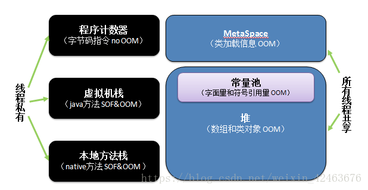
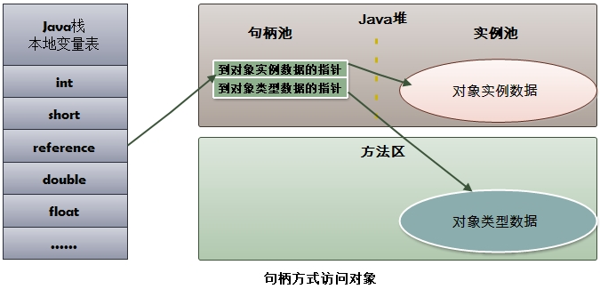
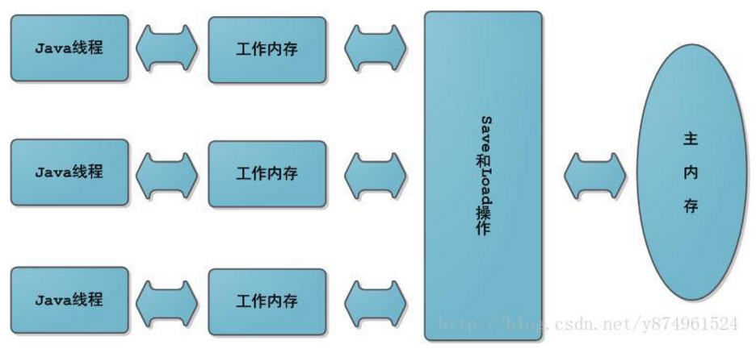
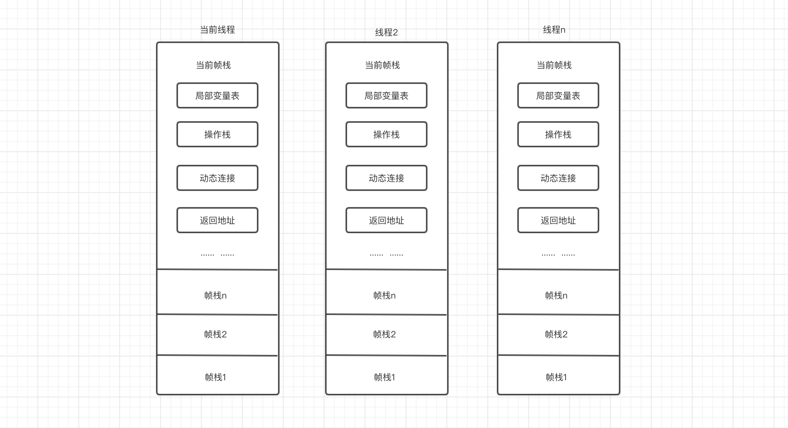
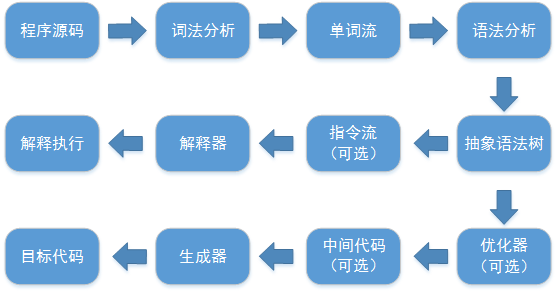
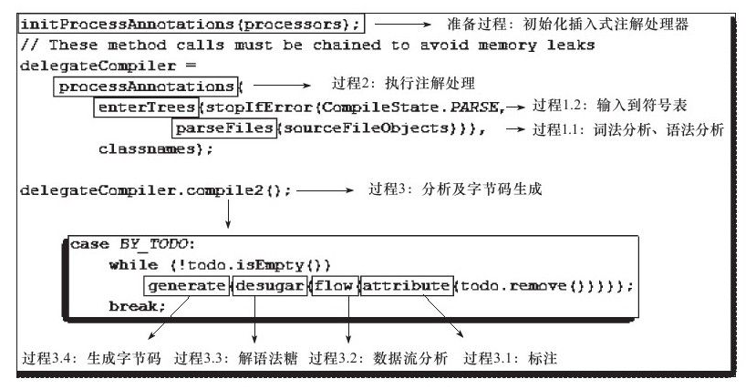
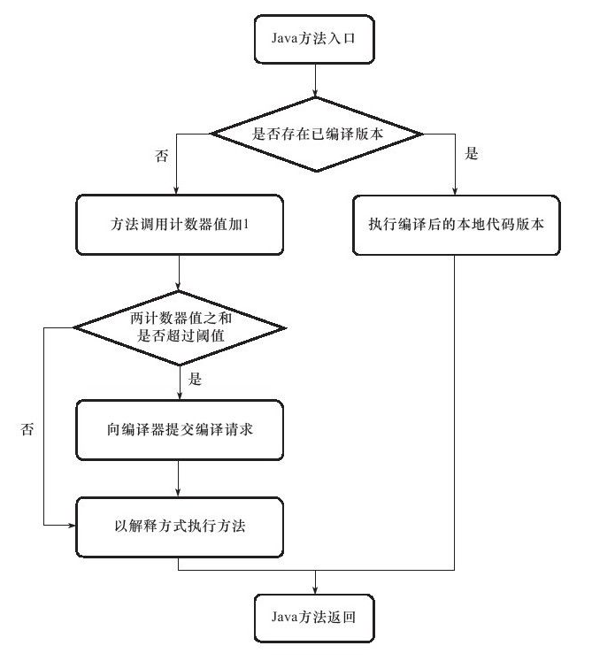
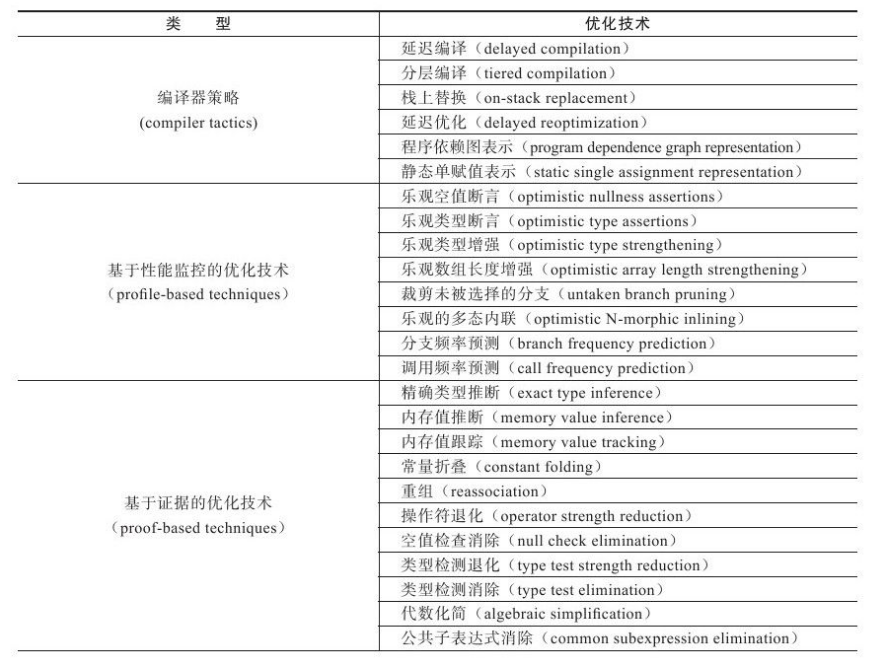

- **[JVM参数设置](https://www.cnblogs.com/redcreen/archive/2011/05/04/2037057.html)**

# 一、运行时数据区域


-  **线程隔离**：线程隔离的意思，就是给不同的线程多分配的资源用，以做到不争用
-  **线程共享：**线程共享就是资源只有一个没有办法分配更多，只能共享

## 1. 程序计数器

- 程序计数器是一块较小的内存，他可以看做是当前线程所执行的行号指示器
- 字节码解释器工作的时候就是通过改变这个计数器的值来选取下一条需要执行的字节码的指令，分支、循环、跳转、异常处理、线程恢复等基础功能都需要依赖这个计数器来完成
- 如果线程正在执行的是一个Java方法，这个计数器记录的是正在执行的虚拟机字节码指令的地址；如果正在执行的是Native方法，这个计数器则为空
- 此内存区域是唯一一个在Java虚拟机规范中没有规定任何OutOfMemoryError情况的区域

**线程私有的内存：**

　　由于java虚拟机的多线程是通过线程轮流切换并分配处理器执行时间的方式来实现，在任何一个确定的时间，一个处理器(对多核处理器来说是一个内核)只会执行一条线程中的指令。因此为了线程切换能够恢复到正确的执行位置上，每条线程都有一个独立的线程计数器，各条线程之间计数器互不影响，独立存储，我们叫这类内存区域线程私有的内存

## 2. Java 虚拟机栈

- 虚拟机栈描述的是Java方法执行的内存模型：每个方法在执行的同时都会创建一个栈帧用于储存局部变量表、操作数栈、动态链接、方法出口等信息。每个方法从调用直至完成的过程，就对应着一个栈帧在虚拟机栈中入栈到出栈的过程
- 栈内存就是虚拟机栈，或者说是虚拟机栈中局部变量表的部分
- 局部变量表存放了编辑期可知的各种基本数据类型（boolean、byte、char、short、int、float、long、double）、对象引用（refrence）类型和returnAddress类型（指向了一条字节码指令的地址）
- 其中64位长度的long和double类型的数据会占用两个局部变量空间，其余的数据类型只占用1个
- 局部变量表所需的内存空间在编译器间完成分配，当进入一个方法时，这个方法需要在帧中分配多大的局部变量空间是完全确定的，在方法运行期间不会改变局部变量表的大小
- Java虚拟机规范对这个区域规定了两种异常状况：
  - 如果线程请求的栈深度大于虚拟机所允许的深度，将抛出StackOverflowError异常
  - 如果虚拟机扩展时无法申请到足够的内存，就会跑出OutOfMemoryError异常


可以通过 -Xss 这个虚拟机参数来指定每个线程的 Java 虚拟机栈内存大小：

```java
java -Xss512M HackTheJava
```

## 3. 本地方法栈

本地方法栈和虚拟机栈发挥的作用是非常类似的，他们的区别是：

- **虚拟机栈为虚拟机执行Java方法（也就是字节码）服务**
- **本地方法栈则为虚拟机使用到的Native方法服务**

本地方法栈区域也会抛出StackOverflowError和OutOfMemoryErroy异常

>  本地方法一般是用其它语言（C、C++ 或汇编语言等）编写的，并且被编译为基于本机硬件和操作系统的程序，对待这些方法需要特别处理


## 4. Java堆

- JVM 堆是运行时数据区，所有类的实例和数组都是在堆上分配内存

  > - JVM 启动时被创建
  > - 对象所占的堆内存是由自动内存管理系统即垃圾收集器回收

- 堆内由存活和死亡对象组成

  > - 存活对象是应用可以访问的，不会被垃圾回收
  >
  > - 死亡对象是应用不可访问且还没有被垃圾收集器回收掉的对象
  >
  >   > 一直到垃圾收集器把这些对象回收掉之前，会一直占据堆内存空间

- 堆是Java虚拟机所管理的内存中最大的一块
- Java堆是被所有线程共享的一块内存区域，在虚拟机启动的时候创建
- 此内存区域的唯一目的是存放对象实例，几乎所有的对象实例都在这里分配内存。所有的**对象实例和数组**都在堆上分配
- Java堆**是垃圾收集器管理的主要区域**，Java堆细分为新生代和老年代
- Java堆可以处于物理上不连续的内存空间中，只要逻辑上是连续的即可
- 如果在堆中没有完成实例分配，并且动态扩展失败时将会抛出OutOfMemoryError异常

`-Xms 和 -Xmx` 两个虚拟机参数来指定程序的堆内存大小，第一个参数设置初始值，第二个参数设置最大值

```java
java -Xms1M -Xmx2M HackTheJava
```

## 5. 方法区(永久代或元数据区)

- 方法区用于**储存已被虚拟机加载的类信息、常量、静态变量、即时编译器编译后的代码**等数据

  即**包含所有的class和static变量**

- 可以选择固定大小，且可以动态扩展

- **可以选择不实现垃圾收集**，这个区域的内存回收目标主要是**针对常量池的回收和对类型的卸载**

- 当方法区无法满足内存分配需求时，将抛出OutOfMemoryError异常

>  从 JDK 1.8 开始，移除永久代，并把方法区移至元空间，它位于本地内存中

存储的内容： 

- 类的方法(字节码...)
- 类名(Sring对象)
- .class文件读到的常量信息
- class对象相关的对象列表和类型列表 (e.g., 方法对象的array).
- JVM创建的内部对象
- JIT编译器优化用的信息

## 6. 运行时常量池

- 方法区的一部分

- Class文件中除了有关的版本、字段、方法、接口等描述信息外、还有一项信息是常量池

- **用于存放编辑期生成的各种字面量和符号引用**

- 这部分内容将在类加载后进入方法区的运行时常量池中存放

- Java语言并不要求常量一定只有编辑期才能产生，也就是可能将新的常量放入池中，这种特性被开发人员利用得比较多的便是**String类的intern()方法** 

  > **String类的intern()方法**： 把字符串对象加入常量池中

- 当常量池无法再申请到内存时会抛出OutOfMemoryError异常

## 7. 直接内存

- 直接内存并不是虚拟机运行时数据区的一部分，也不是java虚拟机规范中定义的内存区域
- 在 JDK 1.4 中新加入的NIO类是一种基于通道和缓冲区的I/O方式，它可以使用Native函数库直接分配堆外内存，然后通过一个储存在Java堆中的DirectByteBuffer对象作为这块直接内存的引用进行操作，这样避免了java堆和navie堆中来回复制数据

## 8 jdk8



- **元空间 `Metaspace`**：存储已被虚拟机加载的类信息
  - JDK8 中，JVM 删除方法区(PermGen)
  - 原方法区存储的信息被分成两部分：
    - **虚拟机加载的类信息**： 存储在**元空间**
    - **运行时常量池**： 存储在**堆**中

# 二、hotspot虚拟机对象

## 1. **对象的创建**

### 1.检查 

虚拟机遇到一条new指令时，首先将去检查这个指令的参数是否能在常量池中定位到一个类的符号引用，并且检查这个符号引用代表的类是否已经被加载、解析和初始化过。如果没有，那必须先执行相应的类加载过程

###2.分配内存

- **为新生对象分配内存：** 对象所需内存在类加载完毕之后就可以完全确定，为对象分配内存空间的任务等同于把一块确定的大小的内存从Java堆中划分出来

- **指针碰撞：** 分配内存就是把**指针(指示分界点)**向空闲空间挪动一段与对象大小相等的距离的过程

- **空闲列表：** 虚拟机维护的记录可用内存块的列表，分配时从列表中找到一块足够大的空间划分给对象实例，并更新列表上的记录

- **内存分配的并发问题**： 在给 A 对象分配内存时，指针还未修改，对象 B 又同时使用原来的指针进行内存分片

  **解决方案：** 

  1. 对分配的内存进行同步处理：**CAS(乐观锁机制) 配上失败重试的方式保证更新操作的原子性** 

     > 整个J.U.C都是建立在CAS之上

  2. **把内存分配的动作按照线程划分在不同的空间中进行**，即每个线程在java堆中分配一块小内存，称为**本地缓冲区** ，哪个线程需要分配内存，就在本地缓冲区上进行，只有当缓冲区用完并分配新的缓冲区时，才需要同步锁定

###3. Init

- 执行new指令之后会接着执行Init方法，进行初始化产生对象


## 2. **对象的内存布局**

在HotSpot虚拟机中，对象在内存中储存的布局可以分为3块区域：**对象头、实例数据和对齐填充**

- **对象头**：
  1. 储存对象自身的运行时数据，如哈希码、GC分带年龄、锁状态标志、线程持有的锁、偏向线程ID、偏向时间戳
  2. 类型指针，即对象指向它的类元数据的指针，虚拟机通过这个指针来确定这个对象是那个类的实例


- **实例数据：**

  是对象正常储存的有效信息，也是程序代码中所定义的各种类型的字段内容。无论是从父类继承下来的，还是在子类中定义的，都需要记录下来

- **对齐填充：**

  1. 起到占位符的作用

  2. 对象大小必须是8字节的整数倍

     > - 对象头是8字节的整数倍(1倍或者2倍)
     > - 当实例数据没有对齐的时候，需要通过对齐填充来补全

## 3. **对象的访问定位**

### 1. **使用句柄访问**

Java堆中将会划分出一块内存来作为句柄池，reference 中存储的就是对象的句柄地址，而句柄中包含了对象实例数据与类型数据各自的具体地址

**优势：** **reference 中存储的是稳定的句柄地址**，在对象被移动(垃圾收集时移动对象是非常普遍的行为)时只会改变句柄中的实例数据指针，而reference本身不需要修改



### 2. **使用直接指针访问**

**用直接指针访问时，refreence 存储的是对象的地址**

**优势：** 速度更快，节省了一次指针定位的时间开销


#三、OutOfMemoryError(OOM)

推荐阅读： **[jvm内存溢出分析](https://www.cnblogs.com/wewill/p/6038528.html)**

## 1. **Java堆溢出**

- **内存溢出**：指程序在申请内存时，没有足够的内存空间供其使用
- **内存泄漏**： 指程序在申请内存后，无法释放已申请的内存空间

堆用于存放对象，只要在堆中疯狂的创建对象，那么堆就会发生内存溢出

```java
public class HeapOOMTest {
    public static void main(String[] args){
        LinkedList<HeapOOMTest> l=new LinkedList<HeapOOMTest>();//作为GC Root
        while(true){
            l.add(new HeapOOMTest());//疯狂创建对象
        }
    }
}
```

## 2. 虚拟机栈和本地方法栈溢出

- `StackOverflowError`：线程请求的栈深度大于虚拟机所允许的最大深度
- `OutOfMemoryError`：虚拟机在扩展栈时无法申请到足够的内存空间

调用方法的时候，会在栈中入栈一个栈帧，如果当前栈的容量不足，就会发生栈溢出**StackOverFlowError**

```java
public class StackSOFTest {
    public void stackLeak(){
        stackLeak();//递归，疯狂的入栈，有意不让出栈
    } 
    public static void main(String[] args){
        StackSOFTest s = new StackSOFTest();
        s.stackLeak();
    }
}
```

## 3. 方法区和运行时常量池溢出

> **String.intern()**  是一个Native方法
>
> **作用**：如果字符串常量池中已经包含一个等于此String对象的字符串，则返回代表池中这个字符串的String对象；否则，将此String对象包含的字符串添加到常量池中，并且返回此String对象的引用

- 常量池分配在永久代，通过 `-XX:PermSize和-XX:MaxPermSize` 限制方法区大小，来间接限制常量池大小

**Intern()：** 

- JDK1.6 intern() 方法会把首次遇到的字符串实例复制到永久代，返回的也是永久代中这个字符串实例的引用，而由 StringBuilder 创建的字符串实例在Java堆上，所以必然不是一个引用
- JDK1.7 intern() 方法的实现不会再复制实例，只是在常量池中记录首次出现的实例引用，因此intern()返回的引用和由 StringBuilder 创建的那个字符串实例是同一个

从jdk1.7开始，运行时常量池移动到了堆中，所以如果堆的内存不足，也会导致运行时常量池内存溢出

```java
public class RuntimePoolOOM {
    public static void main(String[] args){
        int i=1;
        LinkedList<String> l = new LinkedList<String>();//保持常量的引用，防止被fullgc收集
        while(true){
            l.add(String.valueOf(i++).intern());//将常量添加到常量池
        }
    }
}
```

方法区是存放类的信息，而且很难被gc，只要加载了大量类，就有可能引起方法区溢出

## 4. 打印堆栈信息

- 法一： `Arrays.toString(Thread.currentThread().getStackTrace());` 
- 法二： `new Throwable().getStackTrace();` 
- 法三： `new Exception().printStackTrace(System.out);` 
- 法四： `Thread.dumpStack();`
- 法五： `String fullStackTrace = org.apache.commons.lang.exception.ExceptionUtils.getFullStackTrace(e);`

# 四、垃圾收集

- **程序计数器、虚拟机栈、本地方法栈** 3个区域随线程而生，随线程而灭，在这几个区域内就不需要过多考虑回收的问题，因为方法结束或者线程结束时，内存自然就跟随着回收了
- 栈中的栈帧随着方法的进入和退出就有条不紊的执行着出栈和入栈的操作，每一个栈分配多少个内存基本都是在类结构确定下来的时候就已经确定了，这几个区域内存分配和回收都具有确定性
- 而堆和方法区则不同，一个接口的实现是多种多样的，多个实现类需要的内存可能不一样，一个方法中多个分支需要的内存也不一样，我们只能在程序运行的期间知道需要创建那些对象，分配多少内存，这部分的内存分配和回收都是动态的

> - **线程中的程序计数器、虚拟机栈、本地方法栈内存回收具有稳定性**
> - **堆和方法区内存分配与回收是动态的**

## 1. 判断对象是否可回收

### 1. 引用计数算法

- **给对象添加一个引用计数器**，当对象增加一个引用时计数器加 1，引用失效时计数器减 1，**引用计数为 0 的对象可被回收**

- **缺点**： 两个对象出现**循环引用时引用计数器永远不为 0**，导致无法对它们进行回收

  **因为循环引用的存在，因此 Java 虚拟机不使用引用计数算法** 

```java
public class ReferenceCountingGC {

    public Object instance = null;

    public static void main(String[] args) {
        ReferenceCountingGC objectA = new ReferenceCountingGC();
        ReferenceCountingGC objectB = new ReferenceCountingGC();
        objectA.instance = objectB;
        objectB.instance = objectA;
    }
}
```

### 2. 可达性分析算法

- **通过 GC Roots 作为起始点进行搜索，搜索所走过的路径成为引用链，能够到达到的对象都是存活的，不可达的对象可被回收**

- **Java 虚拟机使用==可达性分析算法==来判断对象是否可被回收**

**GC Roots(垃圾回收器需要回收的对象) 包含的内容**：

- 虚拟机栈中局部变量表中引用的对象
- 本地方法栈中 JNI 中引用的对象
- 方法区中类静态属性引用的对象
- 方法区中的常量引用的对象


### 3. 方法区的回收

- **方法区主要存放永久代对象**，而永久代对象的回收率比新生代低很多，因此在方法区上进行回收性价比不高
- **主要是对常量池的回收和对类的卸载**

> 在大量使用反射、动态代理、CGLib 等 ByteCode 框架、动态生成 JSP 以及 OSGi 这类频繁自定义 ClassLoader 的场景都需要虚拟机具备类卸载功能，以保证不会出现内存溢出

永久代的垃圾收集主要回收两部分内容：**废弃常量和无用的类**

- **废弃常量**：假如一个字符串abc已经进入了常量池中，如果当前系统没有任何一个String对象abc，也就是没有任何Stirng对象引用常量池的abc常量，也没有其他地方引用的这个字面量，这个时候发生内存回收这个常量就会被清理出常量池

- **无用的类**(即：类卸载条件，但满足了也不一定会被卸载)： 

  - 该类所有的实例都已经被回收，即Java堆中不存在该类的任何实例

  - 加载该类的 ClassLoader 已经被回收

  - 该类对应的 Class 对象没有在任何地方被引用，也就无法在任何地方通过反射访问该类方法

  - 垃圾收集算法

>  可以通过 `-Xnoclassgc` 参数来控制是否对类进行卸载

### 4. finalize()

- **作用**： **finalize() 类似 C++ 的析构函数，用来做关闭外部资源等工作**

  > **主要用于回收 JNI(Java Native Interface) 的内存**

- **缺点**： 该方法**运行代价高昂，不确定性大**，无法保证各个对象的调用顺序，try-finally 等方式可以代替

> - 一个对象可被回收时，执行该对象的 finalize() 方法，可能在该方法中让对象重新被引用，从而**实现自救**
> - **自救只能进行一次**，如果回收的对象之前调用了 finalize() 方法自救，后面回收时不会再次调用 finalize() 

## 2. 引用类型

- **判定对象是否可被回收与引用有关**

Java 提供了四种强度不同的引用类型：

### 1. 强引用

**创建**： `Object obj = new Object()` 

**特点**： 

- **强引用可以直接访问目标对象**
- **垃圾收集器不会回收掉强引用对象**
- **强引用可能导致内存泄露**

### 2. 软引用

- 创建： **使用 SoftReference 类来创建软引用**

  ```java
  Object obj = new Object();
  SoftReference<Object> sf = new SoftReference<Object>(obj);
  obj = null;  // 使对象只被软引用关联
  ```

- **特点**： 

  - 用来描述一些还有用但并非必须的对象
  - 软引用可用来实现内存敏感的高速缓存
  - **软引用关联的对象在内存不够时会被回收**

### 3. 弱引用

- **弱引用关联的对象一定会被回收，即只能存活到下一次垃圾回收发生前**

- **使用 WeakReference 类来实现弱引用**

```java
Object obj = new Object();
WeakReference<Object> wf = new WeakReference<Object>(obj);
obj = null;
```

### 4. 虚引用

- 又称幽灵引用或幻影引用
- 对象是否有虚引用，不会对其生存时间构成影响，也无法通过虚引用取得一个对象

- **目的： 在该对象被回收时收到一个系统通知**

- **使用 PhantomReference 来实现虚引用**

```java
Object obj = new Object();
PhantomReference<Object> pf = new PhantomReference<Object>(obj);
obj = null;
```

## 3. 垃圾收集算法

### 1. 标记 - 清除


**特点： 将存活的对象进行标记，然后清理掉未被标记的对象**

**不足**：

- 标记和清除过程**效率都不高**
- 会**产生大量不连续的内存碎片**，导致无法给大对象分配内存

### 2. 标记 - 整理


**特点： 让所有存活的对象都向一端移动，然后直接清理掉端边界以外的内存** 

### 3. 复制


**特点**： 

- 将内存划分为大小相等的两块，每次只使用其中一块
- 当一块内存用完，就将存活的对象复制到另一块上面
- 然后把使用过的内存空间进行一次清理

**不足：** **只使用了内存的一半** 

**注意**： 商业虚拟机**采用该收集算法来回收新生代**

- 将新生代划分为一块较大的 Eden 空间和两块较小的 Survivor 空间，每次使用 Eden 空间和其中一块Survivor

- 回收时，将 Eden 和 Survivor 中**存活的对象复制到另一块 Survivor 空间**，最后清理 Eden 和 Survivor

- 复制时，**Survivor 没有足够空间存放存活对象，则将这些对象通过分配担保机制进入老年代**

  即**借用老年代的空间存储放不下的对象**

>  HotSpot 虚拟机的 Eden 和 Survivor 的大小比例默认为 **8:1**，保证了内存的利用率达到 90%
>
>  两块 Survivor 空间作用： 用于交替保存垃圾收集后的存活对象

### 4. 分代收集

- **根据对象存活周期的不同将内存划分为新生代和老年代**，然后根据各个年代的特点采用最适当的收集算法
- **新生代**： **垃圾收集时只有少量存活，就选用复制算法**，只需付出少量存活对象的复制成本就可以完成收集
- **老年代**： **对象存活率高，没有额外空间进行分配担保，就使用标记清理或者标记整理算法进行回收**

**将堆分为新生代和老年代**

- 新生代使用：复制算法（因为每次垃圾收集时都发现有大批对象死去，只有少量存活）
- 老年代使用：标记 - 清除 或者 标记 - 整理 算法（因为对象存活率高、没有额外空间对它进行分配担保）

## 4. 垃圾收集器

 **HotSpot 虚拟机中的 7 个垃圾收集器，连线表示垃圾收集器可以配合使用**： 


- **单线程与多线程收集**：单线程指的是垃圾收集器只使用一个线程进行收集，而多线程使用多个线程

- **串行与并行收集**：

  - **串行**： 指**垃圾收集器与用户程序交替执行**，意味着在执行垃圾收集时需要停顿用户程序

  - **并行**： 指**垃圾收集器和用户程序同时执行**，除 **CMS 和 G1** 外，其它垃圾收集器都是以串行的方式执行

    > - **并行**：指多条垃圾收集线程并行工作，但用户线程仍然处于等待状态
    > - **并发**：指用户线程与垃圾收集线程同时执行(并行或交替执行)，用户程序在继续执行，而垃圾收集程序运行于另一个CPU上

### 1. Serial 收集器


- **单线程的收集器，以串行的方式执行**
- **优点：** 简单高效，没有线程交互开销，拥有最高的单线程收集效率
- **缺点：** 在进行垃圾收集时，必须暂停其他所有的工作线程，直到它工作结束

**Client 模式下的默认新生代收集器**：

- 因为该应用场景下，分配给虚拟机管理的内存一般来说不会很大
- 收集几十兆或一两百兆的新生代停顿时间在一百多毫秒内，只要不太频繁，该停顿是可以接受

### 2. ParNew 收集器


- **Serial 收集器的多线程版本** 
- **默认开启的线程数量与 CPU 数量相同**，可以使用 `-XX:ParallelGCThreads` 参数来设置线程数

**Server 模式下的虚拟机首选新生代收集器**：

- 除了性能原因外，主要是因为除了 Serial 收集器，只有它能与 CMS 收集器配合工作

### 3. Parallel Scavenge 收集器

- **新生代收集器，使用复制算法且并行的多线程收集器**

- **目标**： **达到一个可控制的吞吐量**，称为“吞吐量优先”收集器

  > 其它收集器关注点是尽可能缩短垃圾收集时用户线程的停顿时间

  - **吞吐量：** CPU 用于运行用户代码的时间占总时间的比值

    > 吞吐量 = 运行用户代码时间 / (运行用户代码时间 + 垃圾收集时间)

**停顿时间与高吞吐量的各自优点：** 

- **停顿时间越短**就越适合需要与用户交互的程序，**良好的响应速度能提升用户体验**
- **高吞吐量**可以高效率地利用 CPU 时间，尽快完成程序的运算任务，**适合在后台运算而不需要太多交互的任务**

> 缩短停顿时间是以牺牲吞吐量和新生代空间来换取：新生代空间变小，垃圾回收变得频繁，导致吞吐量下降

### 4. Serial Old 收集器


- **Serial 收集器的老年代版本，使用标记整理算法**

**默认为 Client 模式下的虚拟机使用**

**Server 模式下的两大用途**：

- 在 JDK 1.5 以及之前版本(Parallel Old 诞生以前)中与 Parallel Scavenge 收集器搭配使用
- 作为 CMS 收集器的后备预案，在并发收集发生 Concurrent Mode Failure 时使用

### 5. Parallel Old 收集器


- **Parallel Scavenge 收集器的老年代版本，使用多线程和标记整理算法**

在注重吞吐量以及 CPU 资源敏感的场合，都可以优先考虑 Parallel Scavenge 加 Parallel Old 收集器

### 6. CMS 收集器


1. **特点：**
   - **CMS 收集器使用标记清除算法**
   - **CMS 用两次短暂停替代串行标记整理算法的长暂停**
2. **收集周期：** **初始标记**(CMS-initial-mark) -> **并发标记**(CMS-concurrent-mark) -> **重新标记**(CMS-remark) -> **并发清除**(CMS-concurrent-sweep) ->**并发重设状态等待下次CMS的触发**(CMS-concurrent-reset)
3. 分为以下四个流程：
   1. **初始标记**：标记 GC Roots 能直接关联到的对象，速度很快，**短暂停顿** 
   2. **并发标记**：进行 GC Roots Tracing 的过程，在整个回收过程中耗时最长，**不需要停顿**
   3. **重新标记**：**修正并发标记期间因用户程序继续运作而导致标记产生变动的标记记录**，**停顿较长** 
   4. **并发清除**：**不需要停顿**

> -  **并发标记、并发清除、并发重设阶段** 的并发： 指一个或者多个垃圾回收线程和应用程序线程并发地运行，垃圾回收线程不会暂停应用程序的执行
> -  **重新标记**的并行： 指暂停所有应用程序后，启动一定数目的垃圾回收进程进行并行标记

4. **优点：** 并发收集、低停顿
5. **缺点：** 
   - **吞吐量低：** 低停顿时间是以牺牲吞吐量为代价的，导致 CPU 利用率不够高
   - **无法处理浮动垃圾，可能出现 Concurrent Mode Failure** 
     - **浮动垃圾：** 指并发清除阶段由于用户线程继续运行而产生的垃圾，只能到下次 GC 才能回收

       > - 浮动垃圾导致需要预留出一部分内存，意味着 CMS 收集不能像其它收集器那样等待老年代快满的时候再回收
       > - 如果**预留的内存不够存放浮动垃圾，就会出现 Concurrent Mode Failure**，这时虚拟机将临时启用 Serial Old 来替代 CMS
   - **标记 - 清除算法导致的空间碎片常常导致提前触发 Full GC**

### 7. G1 收集器

**面向服务端应用的垃圾收集器，在多 CPU 和大内存的场景下有很好的性能** 

>  是未来可以替换掉 CMS 收集器

1. **G1 可以直接对新生代和老年代一起回收** 

   

2. **G1 把堆划分成多个大小相等的独立区域（Region）** ，新生代和老年代不再物理隔离

   

3. 引入 Region **将原来的一整块内存空间划分成多个的小空间，使得每个小空间可以单独进行垃圾回收** 
   - 这种划分方法带来了**很大的灵活性**，使得可预测的停顿时间模型成为可能

   - 通过记录每个 Region 垃圾回收时间以及回收所获得的空间(这两个值是通过过去回收的经验获得)，并维护一个优先列表，每次根据允许的收集时间，优先回收价值最大的 Region

   - 每个 Region 都有一个 Remembered Set，用来记录该 Region 对象的引用对象所在的 Region

     通过使用 Remembered Set，在做可达性分析的时候就可以避免全堆扫描

4. 如果不计算维护 Remembered Set 的操作，G1 收集器的运作大致可划分为以下几个步骤：
   - **初始标记** 

   - **并发标记** 

   - **最终标记：** 修正并发标记期间因用户程序继续运作而导致标记产生变动的标记记录

     > - 虚拟机将这段时间对象变化记录在线程的 Remembered Set Logs 中
     >
     > - 最终标记阶段把 Remembered Set Logs 的数据合并到 Remembered Set 
     >
     > - 这阶段需要停顿线程，但可并行执行

   - **筛选回收：** 对各个 Region 的回收价值和成本进行排序，根据用户所期望的 GC 停顿时间来制定回收计划

     - 因为只回收一部分 Region，时间是用户可控制的，因此停顿用户线程将大幅度提高收集效率

   


5. 具备如下**特点：** 
   - **并行与并发：** 利用多CPU缩短STOP-The-World停顿的时间
   - **分代收集** 
   - **空间整合：** 整体来看是基于“标记 - 整理”算法实现的收集器，从局部（两个 Region 之间）上来看是基于“复制”算法实现的，这意味着运行期间不会产生内存空间碎片
   - **可预测的停顿：** 能让使用者明确指定在一个长度为 M 毫秒的时间片段内，消耗在 GC 上的时间不得超过 N 毫秒

# 五、内存分配与回收策略

## 1. Minor GC 和 Major GC/Full GC

- **新生代 GC(Minor GC)：** 新生代对象存活时间很短，因此 Minor GC 频繁执行，执行的速度也比较快

- **老年代 GC(Major GC/Full GC)：** 老年代对象存活时间长，因此 Full GC 很少执行，执行速度比 Minor GC 慢

  > - **Major GC** 清理老年代
  > - **Full GC** 清理整个堆空间，包括年轻代和老年代
  >
  > Major GC 由 Minor GC 触发，所以这两种 GC 不能分离

## 2. 内存分配策略

### 1. 对象优先在 Eden 分配

- 大多数情况**对象在新生代 Eden 区分配**
- **当 Eden 区空间不足时，虚拟机将发起一次 Minor GC**

### 2. 大对象直接进入老年代

- **大对象**： 指需要连续内存空间的 java 对象

  > 最典型的大对象是那种很长的字符串以及数组

- **目的**： 避免 Eden 区及两个 Servivor 之间发生大量的内存复制

- 经常出现大对象会提前触发垃圾收集以获取足够的连续空间分配给大对象

>  `-XX:PretenureSizeThreshold`： 大于此值的对象直接在老年代分配

### 3. 长期存活的对象进入老年代

- 在 Eden 区出生且经历过 Minor GC 后存活的对象，当能被 Servivor 容纳时，将被移动到Servivor空间中，并且把对象年龄设置成为1
- 对象在 Servivor 区中每熬过一次Minor GC，年龄就增加1岁，当年龄增加到一定程度(默认15岁)，就将会被晋级到老年代中

>  `-XX:MaxTenuringThreshold` 用来定义年龄的阈值

### 4. 动态对象年龄判定

- Servivor 空间中相同年龄对象总和大于 空间的一半时，年龄大于或等于该年龄的对象就直接进入老年代

### 5. 空间分配担保

发生 Minor GC 前，虚拟机会**检查老年代最大可用的连续空间**是否大于新生代所有对象总空间

- 若大于，则 Minor GC 可确保安全
- 若不大于，则虚拟机会查看 `HandlePromotionFailure` 设置值**是否允许担保失败**
  - 若允许，会**检查老年代最大可用的连续空间是否大于晋级到老年代对象的平均大小**
    - 如果大于，将尝试进行一次 Minor GC

    - 如果小于，则进行一次 Full GC
  - 若不允许，则进行一次 Full GC


## 3. Full GC 的触发条件

- **当 Eden 空间满时，就将触发一次 Minor GC**

> `-XX:+DisableExplicitGC` 可以屏蔽掉 System.gc()

### 1. 老年代空间不足

**避免老年代空间不足方式**： 

- 尽量避免创建过大的对象和数组
- `-Xmn` 虚拟机参数调大新生代的大小，让对象尽量在新生代被回收掉，不进入老年代
- ` -XX:MaxTenuringThreshold` 调大对象进入老年代的年龄，让对象在新生代多存活一段时间

### 2. 空间分配担保失败

使用复制算法的 Minor GC 需要老年代的内存空间作担保，如果担保失败会执行一次 Full GC

### 3. Concurrent Mode Failure

- CMS GC 的执行过程，会有对象放入老年代

- 老年代空间不足(可能是 GC 过程中浮动垃圾过多导致暂时性的空间不足)，便会报 Concurrent Mode Failure 错误，并触发 Full GC

# 六、虚拟机类加载机制

**虚拟机的类加载机制**： 虚拟机把描述类的数据从 Class 文件加载到内存，并对数据进行校验、转换解析和初始化，最终形成可以被虚拟机直接使用的 Java 类型

- **Java 中，类型的加载、连接和初始化过程都在程序运行期间完成**

- **类在运行期第一次使用时动态加载** 
- **Java 代码在编译时没有连接的步骤，而是在虚拟机加载 Class 文件的时候进行动态连接**

**编译时间：** 指虚拟机的 **JIT 编译器（Just In Time Compiler）**编译**热点代码(Hot Spot Code)**的耗时

> **当 java 方法被调用次数达到一定程度，就会被判定为热点代码交给 JIT 编译器即时编译为本地代码，提高运行速度**

- **java 运行期编译的最大缺点：** 进行编译需要消耗程序正常的运行时间

  >  参数 `-Xint` 禁止编译器运作，强制虚拟机对字节码采用纯解释方式执行

## 1. 类加载时机

###1. 类的生命周期

类被加载到虚拟机内存中开始，到卸载为止，整个生命周期包括：

**加载、验证、准备、解析、初始化、使用和卸载** 


**注：** 

- **加载、验证、准备、初始化和卸载的顺序是确定的**，类的加载过程必须按照这种顺序按部就班地开始
- 某些情况下，**可以先初始化阶段再解析**，这是为了支持 Java 语言运行时绑定(动态绑定或晚期绑定)

### 2. 主动引用

**对类进行初始化的五种情况**： 

- 遇到 `new、getstatic、putstatic、invokestatic` 字节码指令时，若类没有初始化，则必须先初始化

  > 使用这 4 条指令的场景：
  >
  > - **使用 new 关键字实例化对象**
  >
  > - **读取或设置一个类的静态字段**(被 final 修饰、已在编译期把结果放入常量池的静态字段除外)
  >
  > - **调用一个类的静态方法**

- 使用 ` java.lang.reflect` 包的方法对类进行**反射调用**时，若类没有初始化，则需先初始化

- 当初始化类时，若其父类还没有初始化，则需**先初始化父类**

- 当虚拟机启动时，虚拟机会先初始化用户指定的要执行的**主类(包含 main() 方法的类)**

- 当使用动态语言支持时，若 ` java.lang.invoke.MethodHandle` 实例最后的解析结果为 `REF_getStatic, REF_putStatic, REF_invokeStatic` 的方法句柄，且该方法句柄对应的类初始化，则需先初始化该类

### 3. 被动引用

**被动引用： 所有引用类的方式都不会触发初始化**

被动引用的常见例子包括：

- 通过**子类引用父类的静态字段，不会导致子类初始化**

  ```java
  System.out.println(SubClass.value);  // value 字段在 SuperClass 中定义
  ```


- **通过数组定义来引用类，会对数组类进行初始化，不会触发此类的初始化**

  **数组类**是一个由虚拟机自动生成的、直接继承自 Object 的子类，其中包含了数组的属性和方法

  ```java
  SuperClass[] sca = new SuperClass[10];
  ```


- **常量**在编译阶段会存入调用类的常量池，并没有直接引到定义常量的类，因此不会触发定义常量的类的初始化

  ```java
  System.out.println(ConstClass.HELLOWORLD);
  ```

**接口的初始化：** 接口在初始化时，不要求其父接口全部初始化，只有当使用到父接口时才会初始化

## 2. 类加载过程

包含了加载、验证、准备、解析和初始化这 5 个阶段

### 1. 加载

1. **加载过程完成以下三件事：** 
   - 通过类的全限定名来获取定义此类的二进制字节流(Class 文件)
   - 将这个字节流所代表的静态存储结构转化为方法区的运行时存储结构
   - 在内存中生成代表该类的 Class 对象，作为方法区中该类的各种数据的访问入口
2. **二进制字节流可以从以下方式中获取：** 

   - **从 ZIP 包读取**，成为 JAR、EAR、WAR 格式的基础

   - **从网络中获取**，最典型的应用是 Applet

   - **运行时计算生成**

     > 如： 动态代理技术，在 java.lang.reflect.Proxy 使用 ProxyGenerator.generateProxyClass 的代理类的二进制字节流

   - **由其他文件生成**，例如由 JSP 文件生成对应的 Class 类

   - **从数据库中读取**，这种场景相对少一些（中间件服务器）


3. **数组类的创建过程遵循以下规则：** 
   - **若数组类的组件类型是引用类型**，就**递归采用上面的加载过程**去加载这个组件类型，数组类将在加载该组件类型的类加载器的类名称空间上被标识
   - **若数组类的组件类型不是引用类型**，Java 虚拟机将会把数组类标识为与引导类加载器关联
   - **数组类的可见性与其组件类型的可见性一致**，若组件类型不是引用类型，则数组类的可见性默认 public

   > **数组类由 Java 虚拟机直接创建**

### 2. 验证

- 确保 Class 文件的字节流包含的信息符合当前虚拟机的要求，不会危害虚拟机自身的安全
- 验证阶段会完成下面4个阶段的检验动作：**文件格式验证，元数据验证，字节码验证，符号引用验证** 

1. **文件格式验证**： 验证字节流是否符合Class文件格式的规范，并且能被当前版本的虚拟机处理：

   - 是否以魔数 `oxCAFEBABE` 开头
   - 主、次版本号是否在当前虚拟机处理范围内
   - 常量池的常量中是否有不被支持的常量类型(检查常量tag标志)
   - 指向常量的各种索引值中是否有指向不存在的常量或不符合类型的常量
   - `CONSTANT_Itf8_info` 型的常量中是否有不符合 UTF-8 编码的数据
   - Class 文件中各个部分及文件本身是否有被删除的或附加的其他信息

   >  该阶段的验证**基于二进制字节流进行** ，通过该阶段的验证后，字节流才会进入内存的方法区进行存储
   >
   >  后面三个验证阶段基于方法区的存储结构进行，不会再直接操作字节流

2. **元数据验证**

   - 这个类是否有父类(除 java.lang.Object 外)

   - 这个类的父类是否继承了不允许被继承的类(被 final 修饰的类)

   - 如果这个类不是抽象类，是否实现其父类或接口中要求实现的所有方法

   - 类中的字段、方法是否与父类产生矛盾

     > 覆盖类父类的 final 字段
     >
     > 出现不符合规则的方法重载

   >  该阶段的主要目的是**对类元数据信息进行语义校验**，保证不存在不符合 Java 语言规范的元数据信息

3. **字节码验证**

   - 保证操作数栈的数据类型与指令代码序列能配合工作

     > 如：在操作数栈放置类一个 int 类型的数据，使用时却按 long 类型来加载入本地变量表中

   - 保证跳转指令不会跳转到方法体以外的字节码指令上

   - 保证方法体中的类型转换有效

     > 如： 把父类对象赋值给子类数据类型，甚至把对象赋值给与它毫无继承关系、完全不相干的一个数据类型，是危险和不合法的

   > 该主要目的是**通过数据流和控制流分析，确定程序语言合法且符合逻辑**

4. **符号引用验证** 

   在虚拟机将符号引用转化为直接引用时进行：

   - 字符串描述的全限定名是否能找到相对应的类
   - 指定类中是否存在符合方法的字段描述符以及简单名称所描述的方法和字段
   - 符号引用中的类、字段、方法的访问性是否可被当前类访问


若代码已被反复使用和验证过，则在实施阶段就可以考虑**使用 `Xverify：none` 参数来关闭大部分的类验证措施**，以缩短虚拟机类加载时间

### 3. 准备

- 正式为类变量分配内存并设置类变量**初始值(此处指数据类型的零值)**，这些变量都**在方法区中进行分配**

  ```java
  public static int value = 123;
  ```

  - **value 在此阶段（准备阶段）的初始值为 0，而不是 123** 
  - 把value赋值为123的 `putstatic` 指令是程序被编译后，存放于**类构造器`<clinit>`()方法**之中，所以把value赋值为123 的动作将在初始化阶段才会执行
  - 如果**使用final修饰，则在这个阶段其初始值设置为123** 

- 这个时候**进行内存分配的仅包括类变量**(被 static 修饰的变量)

- 实例变量不会在这阶段分配内存，它将会在对象实例化时随着对象一起分配在堆中

### 4. 解析

- 将常量池的符号引用替换为直接引用的过程

> 解析过程在某些情况下可以在初始化阶段之后开始，这是为了支持 Java 的动态绑定

### 5. 初始化

- **初始化阶段开始执行类中定义的 Java 程序代码**；初始化阶段即虚拟机执行类构造器 `<clinit>()` 方法的过程
- 通过程序制定的主观计划去初始化类变量和其它资源

**\<clinit>() 方法**的特点：

- 由编译器自动收集类中所有类变量的赋值动作和静态语句块中的语句合并产生

  编译器收集的顺序由语句在源文件中出现的顺序决定

  > 注意： 静态语句块只能访问到定义在它之前的类变量，定义在它之后的类变量只能赋值，不能访问

  ```java
  public class Test {
      static {
          i = 0;                // 给变量赋值可以正常编译通过
          System.out.print(i);  // 这句编译器会提示“非法向前引用”
      }
      static int i = 1;
  }
  ```


- 虚拟机会自动保证父类的 &lt;clinit>() 方法在子类的 &lt;clinit>() 方法之前执行

  ```java
  static class Parent {
      public static int A = 1;
      static {
          A = 2;
      }
  }
  
  static class Sub extends Parent {
      public static int B = A;
  }
  
  public static void main(String[] args) {
       System.out.println(Sub.B);  // 2
  }
  ```

- 若类中不含静态语句块，也没有对类变量的赋值操作，编译器可以不为该类生成 &lt;clinit>() 方法

- 接口与类一样都会生成 &lt;clinit>() 方法

  > 但与类不同的是： 执行接口的 &lt;clinit>() 方法不需要先执行父接口的 &lt;clinit>() 方法，只有当父接口中定义的变量使用时，父接口才会初始化，且接口的实现类在初始化时也不会执行接口的 &lt;clinit>() 方法

- 若多个线程同时初始化一个类，只会有一个线程执行这个类的 &lt;clinit>() 方法，其它线程都会阻塞等待，直到活动线程执行 &lt;clinit>() 方法完毕

## 3. 类的加载器

###1. 类与类加载器

两个类相等： 

- **类本身相等**

- **使用同一个类加载器进行加载**

  > 因为每一个类加载器都拥有一个独立的类名称空间

>  这里的相等，包括类的 Class 对象的 equals() 方法、isAssignableFrom() 方法、isInstance() 方法的返回结果为 true，也包括使用 instanceof 关键字做对象所属关系判定结果为 true

###2. 类加载器分类

**从 Java 虚拟机的角度**：

- **启动类加载器(Bootstrap ClassLoader)**： C++ 实现，虚拟机的一部分

- **其他类加载器：** 由 Java 实现，独立于虚拟机外部，且全都继承自抽象类 `java.lang.ClassLoader` 

**从 Java 开发人员的角度**： 

- **启动类加载器(Bootstrap ClassLoader)：** 将存放在 `<JRE_HOME>\lib` 目录中或被 `-Xbootclasspath` 参数所指定的路径中，且是虚拟机识别的(仅按照文件名识别)类库加载到虚拟机内存中

  >  启动类加载器无法被 Java 程序直接引用，用户在编写自定义类加载器时，如果需要把加载请求委派给启动类加载器，直接使用 null 代替即可

- **扩展类加载器(Extension ClassLoader)：** 由 `ExtClassLoader（sun.misc.Launcher$ExtClassLoader）`实现，负责将 `<JAVA_HOME>/lib/ext` 目录中或被 `java.ext.dir` 系统变量所指定路径中的所有类库加载到内存中，**开发者可以直接使用扩展类加载器** 

- **应用程序类加载器(Application ClassLoader)：** 由 `AppClassLoader(sun.misc.Launcher$AppClassLoader)`实现，该类加载器是 ClassLoader 中的 getSystemClassLoader() 方法的返回值，也称为**系统类加载器**

  >  负责加载用户类路径(ClassPath)所指定的类库，开发者可以直接使用这个类加载器，如果应用程序中没有自定义过自己的类加载器，一般情况下这个就是程序中默认的类加载器

###3. 双亲委派模型

- **双亲委派模型： 除启动类加载类，其余的类加载器都应有父类加载器**

  > **类加载器间的父子关系通过使用组合关系来复用父类加载器的代码**


####1. 工作过程

- 当类加载器收到类加载请求，会把这个请求委派给父类加载器去完成
- 当父类加载器无法完成加载请求时，子加载器才会尝试自己去加载

####2. 好处

- 使得 Java 类随类加载器具有优先级的层次关系，从而使得基础类得到统一

  > 如： 类 `java.lang.Object` 存放在 `rt.jar` 中，无论哪一个类加载器要加载这个类，最终都是委派给处于模型最顶端的启动类加载器进行加载，因此 Object 类在程序的各种类加载器环境中都是同一个类

- 保证某个范围的类一定被某个类加载器加载，即保证程序中同一个类不会被不同的类加载器加载

  >  考量： **从安全层面上，杜绝通过使用和JRE相同的类名冒充现有JRE的类达到替换的攻击方式** 

####3. 实现

ClassLoader 的 loadClass() 方法运行过程如下：

- 先检查类是否已经加载过，若没有则让父类加载器去加载
- 当父类加载器加载失败时抛出 ClassNotFoundException，此时尝试自己去加载

```java
//抽象类 java.lang.ClassLoader 的代码片段
public abstract class ClassLoader {
    // The parent class loader for delegation
    private final ClassLoader parent;

    public Class<?> loadClass(String name) throws ClassNotFoundException {
        return loadClass(name, false);
    }

    protected Class<?> loadClass(String name, boolean resolve) 
        throws ClassNotFoundException {
        synchronized (getClassLoadingLock(name)) {
            // First, check if the class has already been loaded
            Class<?> c = findLoadedClass(name);
            if (c == null) {
                try {
                    if (parent != null) {
                        c = parent.loadClass(name, false);
                    } else {
                        c = findBootstrapClassOrNull(name);
                    }
                } catch (ClassNotFoundException e) {
                    // ClassNotFoundException thrown if class not found
                    // from the non-null parent class loader
                }

                if (c == null) {
                    // If still not found, then invoke findClass in order
                    // to find the class.
                    c = findClass(name);
                }
            }
            if (resolve) {
                resolveClass(c);
            }
            return c;
        }
    }

    protected Class<?> findClass(String name) throws ClassNotFoundException {
        throw new ClassNotFoundException(name);
    }
}
```

#### 4. 打破双亲委派模型

- **实现**： 继承 `ClassLoader` 类，并重写 `loadClass和findClass` 方法
- `loadClass`： 默认实现双亲委派机制的逻辑，即先让父类加载器加载，当无法加载时才由自己加载
- **打破**： 
  - 先尝试交由 System 类加载器加载，加载失败才会由自己加载
  - 并没有优先交给父类加载器，这就打破了双亲委派机制

###4. 自定义类加载器实现

FileSystemClassLoader 用于加载文件系统上的类：

- 首先根据类的全名在文件系统上查找类的字节代码文件（.class 文件）
- 然后读取该文件内容
- 最后通过 defineClass() 方法来把这些字节代码转换成 java.lang.Class 类的实例

```java
//自定义类加载器： FileSystemClassLoader
public class FileSystemClassLoader extends ClassLoader {

    private String rootDir;

    public FileSystemClassLoader(String rootDir) {
        this.rootDir = rootDir;
    }

    protected Class<?> findClass(String name) throws ClassNotFoundException {
        byte[] classData = getClassData(name);
        if (classData == null) {
            throw new ClassNotFoundException();
        } else {
            return defineClass(name, classData, 0, classData.length);
        }
    }

    private byte[] getClassData(String className) {
        String path = classNameToPath(className);
        try {
            InputStream ins = new FileInputStream(path);
            ByteArrayOutputStream baos = new ByteArrayOutputStream();
            int bufferSize = 4096;
            byte[] buffer = new byte[bufferSize];
            int bytesNumRead;
            while ((bytesNumRead = ins.read(buffer)) != -1) {
                baos.write(buffer, 0, bytesNumRead);
            }
            return baos.toByteArray();
        } catch (IOException e) {
            e.printStackTrace();
        }
        return null;
    }

    private String classNameToPath(String className) {
        return rootDir + File.separatorChar
                + className.replace('.', File.separatorChar) + ".class";
    }
}
```

# 七、Java内存模型与线程

## 1. 硬件的效率与一致性

- 将运算需要使用到的数据复制到缓存中，让运算能快速进行，当运算结束后再从缓存同步回内存中，这样处理就无需等待缓慢的内存读写

- **缓存一致性：** 为了解决一致性问题，需要各个处理器访问缓存时都遵循一些协议，在读写时要根据协议来进行操作，这类协议有：MSI，MESI，MOSI，Synapse，Firefly，Dragon Protocol等

- **内存模型：** 在特定的操作协议下，对特定的内存或高速缓存进行读写访问过程的抽象

- **乱序执行优化：** 处理器会在计算之后将乱序执行的结果重组，保证该结果与顺序执行的结果是一致的

  （处理器的乱序执行优化，java虚拟机的即时编译器的指令重排序优化） 

- **重排序**

  在执行程序时为了提高性能，编译器和处理器经常会对指令进行重排序。**重排序分成三种类型：**

  - **编译器优化的重排序**：在不改变单线程程序语义前提下，重新安排语句的执行顺序
  - **指令级并行的重排序**：若不存在数据依赖性，处理器可以改变语句对应机器指令的执行顺序，如： 将多条指令重叠执行
  - **内存系统的重排序**：由于处理器使用缓存和读写缓冲区，使得加载和存储操作看上去可能是在乱序执行

  > - 为了保证内存可见性，Java 编译器在生成指令序列的适当位置会插入**内存屏障指令来禁止特定类型的处理器重排序**
  > - Java内存模型把内存屏障分为 `LoadLoad、LoadStore、StoreLoad、StoreStore` 

## 2. Java 内存模型

### 1. 主内存与工作内存

- **Java内存模型**目标： 定义程序中各变量的访问规则，即虚拟机**将变量存储到内存和从内存中取出变量**

  >  此处变量： 包括实例字段、静态字段和构成数组对象的元素，不包括局部变量与方法参数

- **Java内存模型规定所有变量都存储在主内存中，不能直接读写主内存中的变量**

- 线程有自己的工作内存，**线程的工作内存保存该线程使用的变量到主内存副本拷贝，线程对变量的所有操作（读取、赋值）都必须在工作内存中进行** 

- 不同线程之间无法直接访问对方工作内存中的变量，**线程间变量值的传递均需要在主内存来完成**



### 2. **内存间的交互操作**

1. **Java内存模型定义的主内存与工作内存之间的操作方式**：  
   - **lock(锁定)**：作用于主内存的变量，把一个变量标识为一条线程独占状态
   - **unlock(解锁)**：作用于主内存变量，把一个处于锁定状态的变量释放出来，供其他线程锁定
   - **read(读取)**：作用于主内存变量，把一个变量值从主内存传输到线程的工作内存中，以便 load 操作
   - **load(载入)**：作用于工作内存的变量，把 read 操作从主内存中得到的变量值放入工作内存的变量副本中
   - **use(使用)**：作用于工作内存的变量，把工作内存中的一个变量值传递给执行引擎
   - **assign(赋值)**：作用于工作内存的变量，把从执行引擎接收到的值赋给工作内存的变量
   - **store(存储)**：作用于工作内存的变量，把工作内存中的变量值传送到主内存中，以便 write 操作
   - **write(写入)**：作用于主内存的变量，把从 store 操作得到的变量值传送到主内存的变量中

2. **Java内存模型规定的操作规则**： 
   - 若要把一个变量从主内存复制到工作内存，就需顺序执行 read 和 load 操作
   - 若要把变量从工作内存同步回主内存，就要顺序执行 store 和 write 操作
   - Java 内存模型要求上述操作按顺序执行，但不保证连续执行

3. **Java 内存模型规定的八种基本操作满足的规则**：
   - 不允许 read 和 load、store 和 write 操作单独出现
   - 不允许线程丢弃其最近的 assign 操作，即变量在工作内存中改变之后必须同步到主内存
   - 不允许线程无故把数据从工作内存同步回主内存
   - 新变量只能诞生于主内存，不允许在工作内存中直接使用未初始化变量，即在变量的 use 和 store 操作之前，必须先执行 assign 和 load 操作
   - 变量在同一时刻只允许一条线程对其进行 lock 操作，但 lock 操作可以被同一线程重复执行多次，lock 和unlock 必须成对出现
   - 若对变量执行 lock 操作，将会清空工作内存中此变量的值，在执行引擎使用这个变量前需要重新执行load 或 assign 操作初始化变量的值
   - 若变量事先没有被 lock 操作锁定，则不允许对它执行 unlock 操作
   - 对变量执行 unlock 操作前，必须先把此变量同步到主内存中

## 3. volatile型变量

推荐阅读： [内存屏障](http://ifeve.com/disruptor-memory-barrier/) 

- **特性**：

  - **对所有线程可见**： 指当一条线程修改了该变量的值，其他线程可以立即得知，普通变量的值在线程间传递需要通过主内存来完成

  - **禁止指令重排序**： 保证变量赋值操作的顺序与程序代码中执行顺序一致

    > **volatile 关键字实现内存屏障，从而禁止指令重排序** 
    >
    > - 在每个volatile写操作的前面插入一个StoreStore屏障
    > - 在每个volatile写操作的后面插入一个StoreLoad屏障
    > - 在每个volatile读操作的后面插入一个LoadLoad屏障
    > - 在每个volatile读操作的后面插入一个LoadStore屏障

- **规则**： 假定 T 表示一个线程，V 和 W 分别表示两个 volatile 变量

  - 线程 T 对变量 V 必须**先执行 load 操作，后执行 use 操作**

    >  这条规则要求： 在工作内存中，**每次使用变量 V 之前都必须先从主内存刷新最新值**

  - 线程 T 对变量 V 必须**先执行 assign 操作，后执行 store 操作** 

    >  这条规则要求： 在工作内存中，**每次修改 V 后都必须立即同步回主内存中**，用于保证其它线程可以看到自己对变量 V 的修改

  - valitile 变量不会被指令重排序优化，保证代码的执行顺序与程序的顺序相同

## 4. long和double型变量

**对于64位数据类型(long和double)的原子性**： 

- 允许虚拟机将没有被 volatile 修饰的**64位数据的读写操作分为两次32位的操作来进行**，因此无法保证原子性
- 但在 64 位系统上，就只进行一次原子操作

## 5. 原子性、可见性和有序性

- **原子性：** 一个操作或者多个操作要么全部执行，要么全都不执行
- **可见性：** 指多个线程访问同一个变量时，一个线程修改了变量的值，其他线程能够立即看得到修改的值
- **有序性：** 指程序执行的顺序按照代码的先后顺序执行

## 6. 先行发生原则

- **程序次序规则**：在一个线程内，按照程序代码控制顺序执行
- **管程锁定规则**：unlock 操作先行发生于后面对同一个锁的 lock 操作
- **Volatile变量规则**：volatile 变量的写操作先行发生于后面对这个变量的读操作
- **线程启动规则**：Thread 对象的 start() 方法先行发生于此线程的其他动作
- **线程终止规则**：线程中的所有操作都先行发生于对此线程的终止检测
- **线程中断规则**：线程 interrupt() 方法的调用先行发生于被中断线程的代码检测到中断时间的发生
- **对象终结规则**：对象的初始化完成(构造函数执行结束)先行发生于它的 finalize() 方法的开始
- **传递性**：若操作 A 先行发生于操作 B，操作 B 先行发生于操作 C，则操作 A 先行发生于操作 C

## 7. Java线程调度

- **协同式调度：** 线程的执行时间由线程本身控制
- **抢占式调度：** 线程的执行时间由系统来分配

## 8. 状态转换

- **新建**
- **运行**： 可能正在执行，可能正在等待CPU为它分配执行时间


- **无限期等待**：不会被分配CUP执行时间，等待被其他线程显式唤醒
- **限期等待**：不会被分配CUP执行时间，一段时间后会由系统自动唤醒
- **阻塞**：等待状态就是在等待一段时间，或者唤醒动作的发生
- **结束**：已终止线程的线程状态，线程已经结束执行

# 八、线程安全与锁优化

## 1. 线程安全

### 1. java 语言中的线程安全

- **不可变**：不可变的对象(final)一定是线程安全的

- **绝对线程安全**： 不管运行时环境如何，调用者都不需要任何额外的同步措施


- **相对线程安全：** 需要保证对这个对象单独的操作是线程安全的
- **线程兼容**：对象本身不是线程安全的，但可以在调用端使用同步手段来保证对象在并发环境中可以安全使用
- **线程对立**：指无论调用端是否采取同步措施，都无法在多线程环境中并发使用代码

### 2. **线程安全的实现方法**

#### 1. 互斥同步

- **同步** ： 指多个线程并发访问共享数据时，保证共享数据在同一个时刻只被一个线程使用

- **互斥**： 实现同步的一种手段，临界区、互斥量和信号量都是主要的互斥实现方式

**java 实现同步方法**：**synchronized 关键字**

- synchronized 编译后，会在同步块的前后生成 `monitorenter` 和 `monitorexit` 字节码指令

- 这两个字节码都需要一个 `reference` 类型的参数来指明要锁定和解锁的对象

- 若 synchronized 指定了对象参数，则就是该对象的 `reference`

  若未指明，则根据 synchronized 修饰的是实例方法或类方法，取对应的对象实例或 Class 对象作为锁对象

- 在执行 `monitorenter` 指令时，首先尝试获取对象的锁，若该对象没有被锁定或当前线程已拥有该对象的锁，把锁的计数器加 1；对应的在执行 monitorexit 指令时会将锁计数器减 1，当计数器为0时，锁就被释放

- 如果获取对象锁失败，当前线程就要阻塞等待，直到对象锁被另外一个线程释放为止

**Synchronized，ReentrantLock 增加的高级功能**：

- **等待可中断：** 指当持有锁的线程长期不释放锁时，正在等待的线程可以选择放弃等待

- **公平锁：** 指多个线程在等待同一个锁时，必须按照申请锁的时间顺序来依次获得锁

- **非公平锁：** 锁被释放时，任何一个等待锁的线程都有机会获得锁

- **锁绑定多个条件：** 一个 ReentrantLock 对象可以同时绑定多个 Condition 对象

#### 2. 非阻塞同步

- **阻塞同步：** 互斥同步的问题是进行线程阻塞和唤醒的性能问题

  >  互斥同步是一种悲观的并发策略，它都会进行加锁，用户态核心态转换，维护锁计数器，检查是否有被阻塞的线程需要唤醒

- **非阻塞同步：** 基于冲突检测的乐观并发策略，即先操作，若没有其它线程争用共享数据，则操作成功；若共享数据有争用，就产生冲突，则再采取补偿措施（最常用的是**不断的重试，直到成功为止**） 

  >  这种乐观的并发策略的许多实现都不需要把线程挂起

- **硬件完成乐观并发策略：** 多次操作的行为只通过一条处理指令就能完成，这类指令有：

  - **测试并设置** 
  - **获取并增加** 
  - **交换** 
  - **比较并交换（CAS）** 
  - **加载链接/条件存储（LL/SC）** 

  CAS 指令有3个操作数：**内存位置(V)** ，**旧的预期值（A）**， **新值（B）** 

  >  CAS 指令执行时，当且仅当V符合A时，处理器用B更新V的值，否则就不执行更新，但无论是否更新了V的值，都会返回V的旧值
  >
  >  **CAS 操作的 “ABA” 问题**： 通过**加入版本号**，即 $A_1, B_1,A_2$ 

#### 3. 无同步方案

- **可重入代码(纯代码)**：指在代码执行的任何时刻中断它，转而去执行其他代码返回后再继续执行，原来的程序不会出现任何错误

- **判断是否可重入：** 返回结果可预测，即**输入相同数据，返回相同结果** 


## 2. 锁优化

### 1. 自旋锁与自适应自旋

- **自旋锁**：**让线程执行一个忙循环**，从而等待获取锁
- **自适应自旋转**：
  - 若自旋等待成功获得锁，则下次允许自旋等待持续相对更长的时间
  - 若自旋等待很少成功，则以后获取该锁时省略自旋，以避免浪费处理器资源

###2. 锁消除

- **锁消除** ：**消除不可能存在共享数据竞争的锁**

### 3. 锁粗化

- 若一串零碎操作的锁都是用于同一对象，则会把加锁同步的范围扩展（粗化）到整个操作序列的外部

### 4. 轻量级锁

- **轻量级锁：** 在无竞争的情况下使用 CAS 操作去消除同步使用的互斥量
- **加锁：** 
  - 线程在执行同步块前，JVM 会先在当前线程的栈桢中创建用于存储锁记录的空间，并将对象头中的Mark Word 复制到锁记录中，官方称为Displaced Mark Word
  - 然后线程尝试使用 CAS 将对象头中的 Mark Word 替换为指向锁记录的指针
    - 若成功，当前线程获得锁
    - 若失败，则自旋获取锁，当自旋获取锁仍然失败时，表示存在其他线程竞争锁，则**膨胀成重量级锁** 
- **解锁：** 使用原子的 CAS 操作来将 Displaced Mark Word 替换回对象头
  - 如果成功，则表示同步过程已完成
  - 如果失败，表示有其他线程尝试过获取该锁，则要在释放锁的同时唤醒被挂起的线程
- **优点：** 竞争的线程不会阻塞，提高了程序的响应速度
- **缺点：** 如果始终得不到锁竞争的线程使用自旋会消耗CPU
- **适用场景：** 追求响应时间，锁占用时间很短

### 5. 偏向锁

- **偏向锁**： 在无竞争的情况下，消除同步操作

  当该锁没有被其他线程获取，则持有偏向锁的线程将不需要进行同步

- **目的**： 消除无竞争情况下的同步原语，进一步提高程序的运行性能

# 九、逃逸分析

- **逃逸分析：** **分析对象的动态作用域**，当一个对象在方法中被定义后，它可能被外部方法所引用
  - **方法逃逸：** 作为调用参数传递到其他方法中
  - **线程逃逸：** 被外部线程访问到
- **栈上分配：** 如果确定一个对象不会逃逸出方法外，则让该对象在栈上分配内存，缓解垃圾收集系统的压力
- **同步消除：** 如果确定一个变量不会逃逸出线程，可以消除对该变量的同步操作
- **标量替换：** 指一个数据无法分解成更小的数据表示
- **聚合量：** 一个数据可以继续分解

# 十、java 类文件结构

## 1. 概述

- **实现语言无关性的基础是虚拟机和字节码存储格式** 


## 2. Class类文件的结构

- **Class 文件是一组以 8 位字节为基础单位的二进制流**

  > 当需要占用 8 位字节以上空间的数据项时，会按照高位在前的方式分割若干个 8 位字节进行存储

- Java虚拟机规范规定: Class文件格式伪结构只有两种数据类型：无符号数和表

  - **无符号数**：基本数据类型，可以用来描述数字、索引引用、数量值或按照 UTF-8 编码构成字符串值

    > 以 `u1、u2、u4、u8` 分别表示1个字节、2个字节、4个字节、8个字节的无符号数

  - **表**：由多个无符号数和其他表作为数据项构成的复合类型的数据类型，表用于描述有层次关系的复合结构的数据，整个 Class 文件本质上就是一张表

    > 所有表习惯以 `_info` 结尾

  

### 1. 魔数和Class文件的版本

**魔数**： **Class 文件的头四个字节**

- **作用：** **确定该文件是否是一个能被虚拟机接受的 Class 文件**

  > 很多文件存储标准都是使用魔数而不是扩展名来进行识别，主要是基于安全方面考虑

紧接着魔数的四个字节存储的是Class文件的版本号：**第五和第六是次版本号，第七和第八是主版本号** 

### 2. 常量池

- 紧接着主版本号之后是常量池入口，**常量池可以理解为 Class 文件中的资源仓库** 

  - 是 Class 文件结构中与其他项目关联最多的数据类型
  - 是占用 Class 文件空间最大的数据项目之一
  - 是在 Class 文件中第一个出现的表类型数据项目

- 常量池的入口有一项 u2 类型的数据存储常量池容量计数值，**该值从 1 开始**

  - **目的：** 该值置为 0 用于表示某些指向常量池的索引值的数据

    >  若常量池容量为0x0016，即十进制中的22，这就表示常量池中有21项常量

- 常量池中主要存放两大类常量：字面量和符号引用

  - **字面量** ：近似于 Java 的常量，如文本字符串、声明为final的常量值
  - **符号引用：** 如类和接口的全限定名、字段的名称和描述符、方法的名称和描述符等


### 3. 访问标志

**访问标志**： 用于识别一些类和接口层次的访问信息

> 位于常量池之后的两个字节

- 该 Class 是类还是接口
- 是否为 public 类型
- 是否定义为 abstrac t类型
- 如果是类的话，是否声明为 final 类型

### 4. 类索引、父类索引和接口索引

- 类索引和父类索引都是一个 u2 类型的数据，而接口索引集合是一组 u2 类型的数据集合
- **作用**： 用于确定类的继承关系
  - 类索引用于确定这个类的全限定名，父类索引用于确定这个类的父类的全限定名
  - 接口索引集合用来描述该类实现了哪些接口

### 5. 字段表集合

- **字段表： 用于描述接口或类中声明的变量** 

- **字段包括类级变量以及实例变量**，但不包括在方法内部声明的局部变量

### 6. 方法表集合

- **方法表用于描述方法**，包括的信息有：访问标志、名称索引、描述符索引、属性表集合

- **重载(Overload)方法**： 

  - 具有与原方法**相同的简单名称**
  - 具有与原方法**不同的特征签名**

  > **特征签名**： 方法中各个参数在常量池中的字段符号引用的集合，包括方法名称、参数顺序、参数类型

### 7. 属性表集合

- 在Class文件、字段表、方法表都可以携带自己的属性表集合，**用于描述某些场景专有的信息**


- **Code属性：** 代码经过 Javac 编译器处理后，变为字节码指令存储在 Code 属性内

  > 接口或者抽象类中的方法不存在 Code 属性


- **Exceptions属性：** 列举出可能抛出的受查异常，即方法描述时在 throws 关键字后面列举的异常
- **ConstantValue属性：** 通知虚拟机为静态变量赋值，被 static 关键字修饰的变量才可以使用这项属性
- **InerClass属性：** 用于记录内部类和宿主类之间的关联

## 3. 字节码指令

[JVM 虚拟机字节码指令表](https://segmentfault.com/a/1190000008722128)

[JVM的字节码指令](https://blog.csdn.net/dhaiuda/article/details/79086505) 

- jvm 指令由**一个字节长度**、代表着某种特定操作含义的数字(**操作码**)以及其后零至多个代表**操作所需参数**构成
- jvm 采用面向操作数栈架构，所以大多数指令只有一个操作码，不包含操作数
- 指令集的操作码总数**不可能超过256条** 

### 1. 字节码与数据类型

数据类型操作对饮： 

- `i --> int`
- `l --> long`
- `s --> short`
- `b --> byte`
- `c --> char`
- `f --> float`
- `d --> double`
- `a --> reference` 

### 2. 加载和存储指令

加载和存储指令： **用于将数据在栈帧中的局部变量表和操作数栈之间来回传输**

- **将局部变量加载到操作数栈**：`iload、iload_<n>、lload、lload_<n>、fload、fload_<n>、dload、dload_<n>、aload、aload_<n>`
- **将数值从操作数栈存储到局部变量表**： `istore、istore_<n>、lstore、lstore_<n>、fstore、fstore_<n>、dstore、dstore_<n>、astore、astore_<n>`
- **将常量加载到操作数栈**： `bipush、sipush、ldc、ldc_w、ldc2_w、aconst_null、iconst_m1 、iconst_<i>、lconst_<l>、fconst_<f>、dconst_<d>`
- **扩充局部变量表的访问索引的指令**： `wide`

### 3. 运算指令

运算或算术指令： **用于对两个操作数栈上的值进行某种特定运算，并把结果重新存入到操作栈顶**

- 加法指令：`iadd、ladd、fadd、dadd`
- 减法指令： `sub`
- 乘法指令： `mul`
- 除法指令：` div`
- 取余指令： `rem`
- 取反指令： `neg`
- 位移指令：`ishl、ishr、iushr、lshl、lshr、lushr`
- 按位或指令：`ior、lor`
- 按位与指令：`iand、land`
- 按位异或指令：`ixor、lxor`
- 局部变量自增指令：`iinc`
- 比较指令：`dcmpg、dcmpl、fcmpl、fcmpg、lcmp`

### 4. 类型转换指令

类型转换指令： **将两种不同的数值类型进行相互转换**

jvm 直接支持的数值类型的**宽化类型转换**(小范围类型向大范围类型的安全转换)：

- `int --> long、float、double`
- `long --> float、double`
- `float --> double`

**窄化类型转换**必须显式地使用转换指令来完成：`i2b、i2c、i2s、l2i、f2i、f2l、d2i、d2l、d2f`

### 5. 对象创建与访问指令

- 创建类实例指令： `new`
- 创建数组的指令： `newarray、anewarray、multianewarray`
- 访问类字段和实例字段的指令：`getfield、putfield、getstatic、putstatic`
- 把数组元素加载到操作数栈的指令：`baload、caload s I l f d a`
- 将操作数栈的值存储到数组元素：`bastore、castore s i f d a`
- 取数组长度指令：`arraylength`
- 检查实例类型的指令：`instanceof、checkcast`

### 6. 操作数栈管理指令

操作数栈指令： **用于直接操作操作数栈**

- 将操作数栈的一个或两个元素出栈： `pop、pop2`
- 复制栈顶一个或两个数值并将复制或双份复制值重新压入栈顶： `dup dup2 dup_x1 dup_x2 dup2_x2 dup2_x1`
- 将栈顶的两个数值替换： `swap`

### 7. 控制转移指令

控制转移指令： **让 jvm 有条件或无条件的从指定的位置指令的下一条指令继续执行程序**

- 条件分支：`ifeq iflt ifle ifne ifgt ifge ifnull ifnonnull if_icmpeq if_icmpne if_icmplt if_icmpgt if_icmple if_icmpge if_acmpeq if_acmpne`
- 复合条件分支： `tableswitch lookupswitch `
- 无条件分支：`goto goto_w jsr jsr_w ret`

### 8. 方法调用和返回指令

- `invokevitual`： 用于调用对象的实例方法，根据对象的实际类型进行分派（虚方法分派）
- `invokeinterface`： 用于调用接口方法，在运行时搜索实现该接口方法的对象，找出适合的方法进行调用
- `invokespecial`： 用于调用一些需要特殊处理的实例方法，包括实例初始化方法、私有方法和父类方法
- `invokestatic`： 用于调用类方法（static方法）

### 9. 异常处理命令

- `athrow`： 显示抛出异常

### 10. 同步指令

- **jvm 支持方法级的同步和方法内部一段指令序列的同步**，使用**管程(Monitor)**来支持
- **方法级的同步是隐式**： 无需通过字节码指令来控制，在方法调用和返回操作之中实现
  - jvm 可以从方法常量池中的方法表结构中的 `ACC_SYNCHRONIZED` 访问标志区分一个方法是否是同步方法
  - 方法调用时，调用指令将会检查方法的 `SCC_SYNCHRONIZED` 访问标志是否被设置，如果设置了，执行线程将先持有管程，然后再执行方法，最后在方法完成时释放管程
  - 方法执行期间，执行线程持有管程，其他任何线程都无法再获得同一个管程
  - 如果一个同步方法执行期间抛出异常，并且在方法内部无法处理此异常，那这个同步方法所持有的管程将在异常跑到同步方法之外时自动释放

# 十一、虚拟机字节码执行引擎

**物理机与虚拟机的区别：** 

- 物理机的执行引擎直接建立在处理器、硬件、指令集和操作系统层面上
- 虚拟机的执行引擎是自己实现

**虚拟机的优势**： 

- 程序员可以自行制定指令集和执行引擎的结构体系，且能执行那些不被硬件直接支持的指令集格式
- jvm 规范中制定了虚拟机字节码执行引擎的概念模型，成为各种虚拟机执行引擎的统一外观
- 虚拟机实现的两种执行方式：**解释执行**（通过解释器执行）和**编译执行**（通过即时编译器产生本地代码） 
- jvm 执行引擎都是一致的：**输入的是字节码文件、处理过程是等效字节码解析过程、输出的是执行结果** 

## 1. 运行时栈帧结构

- **栈帧**： 主要是**用来支持虚拟机进行方法调用和方法执行**，是虚拟机运行时数据区的虚拟机栈的栈元素

  > 栈帧包含**局部变量表、操作数栈、动态连接、方法返回地址**和**一些额外的附加信息**

- **执行过程：** **调用栈顶的栈帧(当前栈帧)**，执行引擎所运行的所有的字节码指令都只针对当前栈帧进行操作

- **执行意义：**每个方法从调用开始到执行完成的过程，就对应着一个栈帧在虚拟机栈里面从入栈到出栈的过程



### 1. 局部变量表

- **局部变量表：** 是一组变量值存储空间，**用于存放方法参数和方法内部定义的局部变量**

  >  在Java程序被编译成Class文件时，就在方法的Code属性的 `max_locals` 数据项中确定了该方法所需分配的最大局部变量表的容器 

- **容量单位：** **变量槽（slot）**

  - 变量槽存放的八种类型：`boolean、byte、char、short、int、float、reference、returnAddress`
  - 允许**Slot的长度随着不同的处理器、操作系统或者虚拟机而发生改变** 
  - 64 位系统上的 slot，虚拟机使用对齐和补白的手段让 Slot 在外观上看起来与32位虚拟机一致

- **包含类型：** boolean、byte、char、short、int、float、reference或returnAddress类型八种类型

  - `reference` ：是**对象的引用**
    - 作用： **从此引用中直接或间接地查找到对象在Java堆中的数据存放的起始地址索引和所属数据类型在方法区中的存储的类型信息** 
  - `returnAddress`： 为字节码指令 **jsr、jsr_w和ret** 服务，**指向一条字节码指令的地址** 

- **对于64为的数据类型**，虚拟机会**以高位对齐的方式为其分配两个连续的Slot空间**， 即long和double两种类型

  > - 做法是将long和double类型速写分割为32位读写的做法
  > - 不过由于局部变量表建立在线程的堆栈上，是线程的私有数据，无论读写两个连续的Slot是否是原子操作，都不会引起数据安全问题

- **虚拟机索引方式：** jvm 通过**索引定位**使用局部变量表，索引值的范围是从0开始到局部变量表最大的Slot数量

  > 如果是32为数据类型的数据，索引n就表示使用第n个Slot
  >
  > 如果是64位数据类型的变量，则说明要使用第n和第n+1两个Slot

- **在方法执行过程中，虚拟机是使用局部变量表完成参数值到参数变量列表的传递过程**

  - 对于**实例方法(非static方法)，局部变量表的第 0 位索引的 Slot 默认用来传递方法所属对象实例引用**

    > 在方法中可以通过关键字 `this` 来访问该隐含参数

  - 对于其余参数： 

    - 按照参数表的顺序来排列，占用从 1 开始的局部变量 Slot

    - 再根据方法体内部定义的变量顺序和作用域分配其余 Slot

- **局部变量表中的 Slot 可重用**： 方法体中定义的变量，其作用域并不一定会覆盖整个方法体

  > 如果当前字节码PC计数器的值已经超过了某个变量的作用域，那么这个变量相应的Slot就可以交给其他变量去使用，节省栈空间，但也有可能会影响到系统的垃圾收集行为

- **局部变量不存在“准备阶段” **：

  - **类变量**在加载过程中经过的两次赋初始值过程：
    - 一次在准备阶段，赋予系统初始值
    - 一次在初始化阶段，赋予自定义的初始值
  - **局部变量**： 不能使用定义但未赋初始值的局部变量

### 2. 操作数栈

- **操作栈** ： 它是一个**后入先出栈**

  > - 操作数栈的最大深度在编译时被写入 Code 属性的 `max_stacks` 数据项中(同局部变量表)
  > - 在方法执行时，操作数栈的深度不会超过 `max_stacks` 数据项中设定的最大值

- 操作数栈的每一个元素可以是任意的Java数据类型，包括long和double

  > 32位数据类型所占的栈容量为1，64位所占的栈容量为2

- 当方法刚开始执行时，该方法的操作数栈为空

  在方法执行过程中，会有各种字节码指令向操作数栈中写入和提取内容，即入栈出栈操作 

- **操作数栈中元素的数据类型必须与字节码指令的序列严格匹配**

- 在概念模型中，两个栈帧作为虚拟机栈的元素，相互之间完全独立

  > - 大多数虚拟机会做优化处理，令两个栈帧出现部分重叠
  > - 在进行方法调用时可以共用部分数据，无须进行额外的参数复制传递

- **Java虚拟机的解释执行引擎称为“基于栈的执行引擎”，其中的栈就是指操作数栈** 

### 3. 动态连接

- **栈帧包含指向运行时常量池中该栈帧所属方法的引用**，该引用是为支持方法调用过程中的动态连接
- Class文件中存在大量符号引用，字节码中的方法调用指令就以常量池中指向方法的符号引用为参数
  - **静态解析**： 符号引用的一部分在类加载的第一次使用阶段时转换为直接引用
  - **动态转换** ： 符号引用的另一部分将在每次的运行期间转化为直接引用

### 4. 方法返回地址

**方法执行后的两种退出方式**：

- **正常完成出口** ： 执行引擎遇到方法返回的字节码指令时，会有返回值传递给上层的方法调用者
- **异常退出出口**：在方法执行过程中遇到异常，且该异常没有在方法体内得到处理

**方法返回与退出**： 

- 方法返回时，会在栈帧中保存一些信息，用来帮助恢复其上层方法的执行状态
- **在方法退出后，会返回到方法调用位置，程序继续执行** 
  - 方法正常退出后，调用者的 PC 计数器的值可以作为返回地址，该值保存在栈帧
  - 方法异常退出后，返回地址要通过异常处理器表来确定

方法退出时可能执行的操作： **方法退出实际就是当前栈帧的出栈操作**

- 恢复上层方法局部变量表和操作数栈
- 把返回值压入调用者栈帧的操作数栈中
- 调整 PC 计数器的值以指向指令后面的一条指令

### 5. 附加信息 

- 增加一些没有描述的信息到栈帧之中
- **栈帧信息：** 一般将动态连接、方法返回地址和其他附加信息全部归为一类

## 2. 方法调用

- 方法调用阶段的**任务： 确定被调用方法的版本**(即调用哪一个方法)
- 方法调用在 Class 文件中存储的只是符号引用，因此在类加载或运行期间，才能确定目标方法的直接引用

### 1. 解析

- 方法调用的目标方法在 Class 文件中只是一个常量池的符号引用，**在类加载的解析阶段，会将一部分符号引用转化为直接引用**

- **解析成立的前提**：方法在程序运行前有可确定的调用版本且在运行期不改变

  > **解析**： 调用目标在程序代码写好、编译器进行编译时就必须确定下来

JVM 的**方法调用字节码指令**： 

- `invokestatic`：调用静态方法 
- `involespecial`：调用实例构造器方法、私有方法和父类方法
- `invokevirtual`：调用所有的虚方法
- `invokeinterface`：调用接口方法，会在运行时再确定一个实现此接口的对象
- `invokedynamic`：先在运行时动态解析出调用限定符所引用的方法，然后再执行该方法

**非虚方法**： 在类加载时就把符号引用解析为该方法的直接引用

- 通过`invokestatic` 和 `invokeapecial` 指令调用
- 包含： 静态方法、私有方法、实例构造器、父类方法
- 特例： final 方法(使用 `invokevirtual` 指令调用)也是非虚方法

 **解析调用与分派调用**： 

- **解析调用是静态过程**： 在编译期确定，在类装载的解析阶段就把符号引用转变为可确定的直接引用
- **分派调用即可是静态又可是动态**： 根据分派依据的总量数分为**单分派和多分派**，两两组合构成**静态单分派、静态多分派、动态单分派、动态多分派**

### 2. 分派

#### 1. 静态分派

- **静态分派：** **所有依赖于静态类型来定位方法执行版本的分派动作**，典型是**方法重载** 
  - JVM 在重载时通过参数的静态类型判定(静态类型编译期可知)
  - 编译阶段，Javac 编译器根据参数的静态类型决定使用哪个重载版本，再把该方法的符号引号写到main() 方法的两条 invokevritual 指令的参数中
- **静态分派发生的时间：** 静态分派发生在编译阶段

#### 2. 动态分派

- **动态分派：** 运行期根据实际类型确定方法执行版本的分派过程，典型为**方法重写**

#### 3. 单分派和多分派

- **方法的宗量** ： 方法接收者与方法参数
- **根据分派基于多少种宗量**，分为单分派和多分派：
  - **单分派**： 根据一个宗量对目标方法进行选择
  - **多分派**： 根据多个宗量对目标方法进行选择

### 3. JVM动态分派的实现

- **避免动态分派频繁搜索的稳定优化手段**： 为类在方法区中建立一个虚方法表，**使用虚方法表索引来代替元数据查找**以提高性能 
- **虚方法表存放各个方法的实际入口地址**： 
  - 若某方法在子类中未被重写，则子类与父类的虚方法表入口地址都指向父类的实现入口
  - 若子类重写该方法，则子类方法表中的地址将会替换成指向子类实现版本的入口地址
- **具有相同签名的方法，在父类、子类的虚方法表中具有相同索引序号**，当类型变换时，仅需要变更查找的方法表，就可以从不同的虚方法表中按照索引转换出所需的入口地址 

##3. 基于栈的字节码解释执行引擎



- **javac 编译器**实现程序代码经词法分析、语法分析到抽象语法树，再到编译语法生成线性的字节码指令流
- **java 程序的编译是半独立的实现**：部分动作在 java 虚拟机外进行，但解释器在虚拟机内部执行

**基于栈的指令集与基于寄存器的指令集：** 

- Java 编译器输出的指令流是基于栈指令集架构(ISA)，指令流中的指令大都是零地址指令，依赖操作数栈工作
- **基于栈的指令集的优缺点：** 
  - **优点：** 可移植(主要)，代码相对更加紧凑(字节码中每个字节就对应一条指令，而多地址指令集中还需要存放参数)，编译器实现更加简单(需要考虑空间分配的问题，所需空间都在栈上操作)
  - **缺点：** 执行速度相对较慢

# 十二、程序编译与代码优化

## 一、早期（编译器）优化

### 1. Javac编译器

#### 1. Javac的源代码与调试

1. **Javac的源代码**放在 `JDK_SRC_HOME/langtools/src/shares/classes/com/sun/tools/javac` 中

   > 只引用了 JDK API 与 `JDK_SRC_HOME/langtools/src/shares/classes/com/sun/*` 中的代码

2. **Sun Javac 的代码的编译过程**：

   - 解析与填充符号表过程
   - 插入式注释处理器的注解过程处理
   - 分析与字节码生成过程


3. **Javac 编译动作的入口**是 `com.sun.tools.javac.main,JavaCompikler` 类

   > 上述编译过程的代码逻辑集中在该类的 compiler() 和compiler2() 方法中

#### 2. 解析与填充符号表

**解析步骤包括词法分析和语法分析**：

1. **词法、语法分析** 

   - **词法分析：** 将源代码的字节流变成标记(Token)集合，单个字符是程序编码过程的最小元素，而标记则是编译过程的最小元素

     > 在 Javac 的源代码中，词法分析过程由 `com.sun.tools.javac.parser.Scanner` 类来实现

   - **语法分析：** 根据 Token 序列构造抽象语法树的过程

     > - 语法分析过程由 `com.sun.tools.javac.parser.Parse` 类来实现
     > - 该阶段产生的抽象语法树由 `com.sun.tools.javac.tree.JTree` 类表示
     > - 该步骤后，编译器不会再对源代码文件进行操作，后续的操作都建立在抽象语法树上
     >
     > **抽象语法树**： 一种用来描述程序代码语法结构的树形表示方式，语法树的每一个节点都代表着程序代码中的一个语法结构

   

2. **填充符号表**  

   - **符号表(Symbol Table)：** 由一组符号地址和符号信息构成的表格

   - **语法分析中**， 符号表所登记的内容将用于语法分析检查和产生中间代码

   - **在目标代码生成阶段**，当对符号名进行地址分配时，符号表是地址分配的依据

     > - 在Javac源代码中，填充符号表的过程由 `com.sun.tools.javac.compiler.Enter` 类来实现
     > - 此过程的出口是一个**待处理列表(ToDoList)**，包含每一个**编译单元(.java 文件)**的抽象语法树的顶级节点以及 `package-info-java` 的顶级节点 
     > - **package-info-java：** 
     >   - 为标注在包上的 Annotation 提供便利
     >   - 声明包的私有类和常量
     >   - 提供包的整体注释说明

#### 3. 注解处理器

在Javac源码中，**插入式注解处理器** ： 

- **初始化过程**在 `initProcessAnnotations()` 方法中完成
- **执行过程**在 `ProcessAnnotations()` 方法中完成，该方法判断是否有新的注解处理器需要执行
  - 若有，通过 `com.sun.tools.javac.Processing.JavacProvcessingEnviroment` 类的**doProcessing()** 方法生成一个新的 JavaCompiler 对象对编译的后续步骤进行处理

#### 4. 语义分析与字节码生成

1. **标注检查：** 包括**变量使用前后是否已被声明，变量与赋值之间的数据类型是否能够匹配**等

   **常量折叠**(标注检查步骤的重要动作)： 在编译期就把一些表达式计算好，不需要在运行时进行计算

   > 标注检查在javac源代码中的实现类是 `com.sun.tools.javacComp.Attr` 类和`com.sun.tools.javac.comp.Check` 类

2. **数据及控制分析** ：对程序上下文逻辑更进一步的验证，可以检查出诸如**程序局部变量在使用前后是否有赋值，方法的每一条路径是否都有返回值，是否所有的受检查异常都被正确处理**等问题 

   > 在Javac的源代码中，数据及控制流分析的入口是 `flow()` 方法，具体操作是由 `com.sun.tools.javac.comp.Flow` 类完成


3. **语法糖(Syntatic Sugar)** ：也称**糖衣语法**，指在计算机语言中添加的某种语法，对语言的功能并没有影响，但方便使用

   > 在Javac的源代码中，解语法糖的过程由的 `desugar()` 方法触发，在`com.dun.tools.javac.comp.TransTypes` 类和 `com.sun.tools.javac.comp.Lower` 类中完成

4. **字节码生成** ：字节码生成是Javac编译过程的最后一个阶段

   >  在Javac源代码里面有 `com.sun.tolls.javac.jvm.Gen` 类来完成

完成语法树的遍历和调整后，就把填充了所有需要信息的符号表交给`com.sun.tolls.javac.jvm.ClassWrite` 类，由该类的 `WiteClass()` 方法输出字节码，生成最终的 class 文件

### 2. Java语法糖

#### 1. 泛型与类型擦除

- **真实泛型：** **基于类型膨胀的泛型** 
- **伪泛型：** **基于类型擦除的泛型** 

> 虚拟机规范中引入了诸如 `Signature，LocalVariableType` 等新的属性用于解决伴随泛型而来的参数类型识别问题

#### 2. 自动装箱、拆箱与遍历循环

- 自动装箱、拆箱在编译之后转化成了对应的包装盒还原方法，而遍历循环则把代码还原成迭代器的实现
- 包装类的“==”运算在不遇到算术符运算的情况下不会自动拆箱，以及它们equals() 方法不处理数据转型的关系

#### 3. 条件编译

- Java语言可以进行条件编译，方法就是**使用条件为常量的 if 语句** 

- Java语言中条件编译根据布尔常量的真假，编译器会把分支中不成立的代码清除

  > 这一项工作将在编译器解除语法糖阶段（com.sun.tools.javac.comp.Lower类中）实现

## 二、晚期（运行期）优化

- **即时编译器(JIT)**： 在运行时虚拟机将把热点代码编译成与本地平台相关的机器码，并进行各种层次的优化，提高热点代码的执行效率

### 1. Hotspot虚拟机的即时编译器

#### 1. 解释器与编译器

- **解释器**： 可使程序迅速启动和执行，省去编译时间

  **编译器**： 把代码编译成本地代码提升执行效率

- HotSpot **内置的即时编译器**： `Client Compiler和Server Compiler`，简称为**C1编译器和C2编译器**

  > 可以使用 `-client 或 -server` 参数去强制指定运行模式

- HotSpot 的**分层编译**： 解释器替编译器收集性能监控信息，提高代码的优化程度
  - **第0层，程序解释运行**，解释器不开启性能监控功能，可触发第 1 层编译 
  - **第1层，C1编译**，将字节码编译为本地代码，进行简单、可靠的优化，如有必要将加入性能监控的逻辑 
  - **第2层，C2编译**，将字节码编译为本地代码，启用一些编译耗时较长的优化，甚至会根据性能监控信息进行不可靠的激进优化 

- **用 Client Compiler 获取更高的编译速度，用 Server Compiler 获取更好的编译质量**

#### 2. 编译对象与触发条件

- **被 JIT编译的热点代码**分类： 
  - **被多次调用的方法：** 编译器会以整个方法作为编译对象，属于**标准的 JIT 编译方式**
  - **被多次执行的循环体：** 编译器会以整个方法作为编译对象，这种编译方式称之为**栈上替换（OSR编译）** 
- **热点探测**：**基于采样的热点探测**和**基于计数器的热点探测(HotSpot 采用)**

方法调用计数器触发的即时编译交互过程如下图所示：



#### 3. 编译过程

- **Client Compiler** 是一个简单快速的**三段式编译器**，关注**局部性优化**，放弃耗时长的全局优化

  - 第一阶段： 一个**平台独立的前端将字节码构造成一个高级中间代码表示(HIR)** 
  - 第二阶段： 一个**平台相关的后端从HIR中产生低级中间代码表示(LIR)** 
  - 最后阶段： 在平台相关的后端**使用线性扫描算法在LIR上分配寄存器，并在LIR上做窥孔优化，然后产生机器代码** 

  其大致过程如下所示：


- **Server Compiler** 是一个**充分优化的高级编译器**，专门面向服务端

  会执行所有经典的优化动作，如无用代码消除、循环展开、循环表达式外提、消除公共子表达式、常量传播、基本块重排序等，还会实现如范围检查消除、空值检查消除等Java语言特性密切相关的优化技术

### 2. 编译优化技术

#### 1. 优化技术概览




#### 2. 公共子表达式清除

- **局部公共子表达式清除：** 优化程度仅限于程序的基本块内
- **全局公共子表达式清除：** 优化的范围涵盖多个基本块

####3. 数组边界检查消除 

- 虚拟机的执行子系统对于每次数组元素的读写都带有一次隐含的条件判断

#### 4. 方法内联

- **内联函数**： 在程序编译时，编译器将程序中出现的内联函数的调用表达式用内联函数的函数体来进行替换

  > 编译器只会考虑把 final 修饰的函数变成内联函数

- **方法内联**： JVM 会把频繁执行的方法调用替换成方法体本身

  > **类型继承关系分析(CHA)**技术和**内联缓存**来完成虚方法内联 

#### 5. 逃逸分析

- **逃逸分析**：分析对象动态作用域，当一个对象在方法中被定义后，可能**被外部方法所引用(方法逃逸)**，甚至还可能**被外部线程所访问到(线程逃逸)**
- **若对象不会逃逸，则能进行高效优化**，如： 栈上分配(减轻垃圾收集的压力)、同步消除(读写不会有竞争)、标量替换

### 3. Java与C/C++的编译器对比

- Java虚拟机的即时编译器与C/C++的静态优化编译器相比，可能会由于下列原因导致输出的本地代码有劣势：
  - 即时编译器运行占用用户程序运行时间
  - 动态类型安全语言导致的频繁检查
  - 运行时对方法接收者进行多态选择的频率大
  - 可以动态扩展导致很多全局的优化难以运行
  - 大部分对象在堆上分配导致垃圾收集机制的效率低
