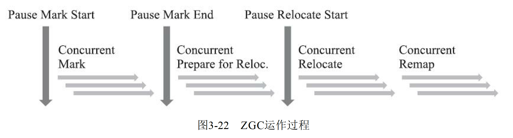
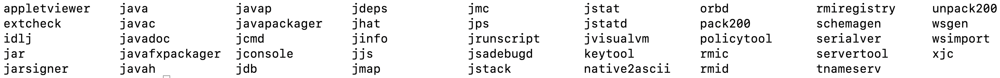
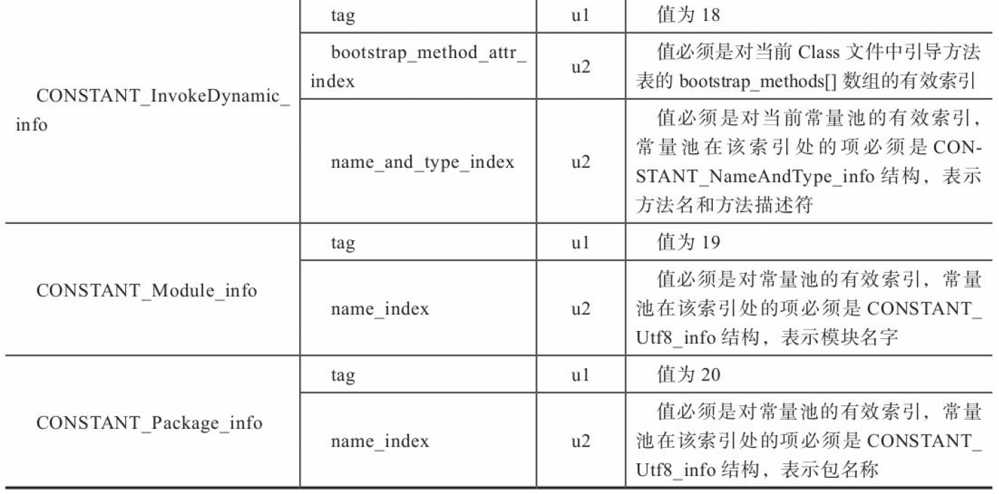
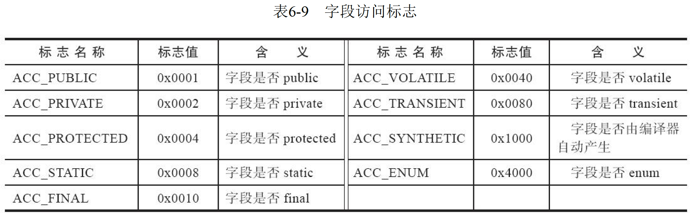
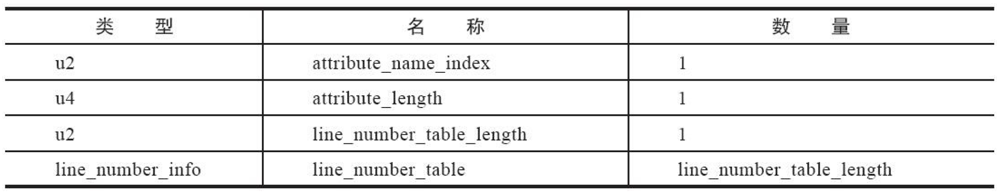
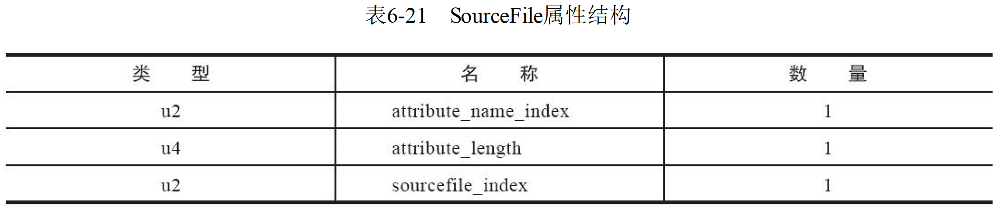
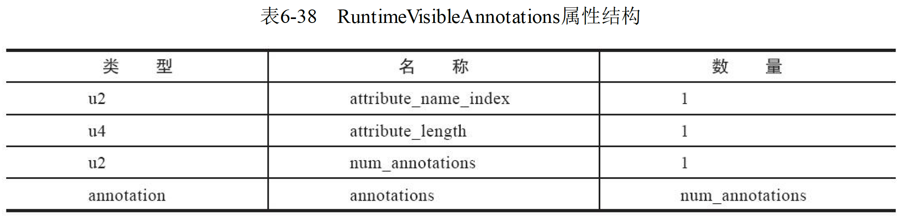

- **[JVM参数设置](https://www.cnblogs.com/redcreen/archive/2011/05/04/2037057.html)**

# \# 第二部分：自动内存管理

# 二、Java 内存区域与内存溢出异常

## 1、运行时数据区域


-  **线程隔离**：线程隔离的意思，就是给不同的线程多分配的资源用，以做到不争用
-  **线程共享：**线程共享就是资源只有一个没有办法分配更多，只能共享

### (1) 程序计数器

- 程序计数器是一块较小的内存，可以看做是当前线程所执行的行号指示器
- 字节码解释器工作时，通过改变计数器的值来选取下一条需要执行的字节码的指令，是程序控制流的指示器，分支、循环、跳转、异常处理、线程恢复等基础功能都需要依赖计数器完成
- 如果线程正在执行的是一个Java方法，这个计数器记录的是正在执行的虚拟机字节码指令的地址；如果正在执行的是Native方法，这个计数器则为空
- 此内存区域是唯一一个在Java虚拟机规范中没有规定任何OutOfMemoryError情况的区域

---

**线程私有的内存：**

- 由于 Java 虚拟机的多线程通过线程轮流切换并分配处理器执行时间的方式来实现，在任何一个确定的时间，一个处理器(对多核处理器来说是一个内核)只会执行一条线程中的指令
- 因此，为了线程切换能够恢复到正确的执行位置上，每条线程都有一个独立的线程计数器，各条线程之间计数器互不影响，独立存储，我们叫这类内存区域线程私有的内存

### (2) Java 虚拟机栈

- 虚拟机栈描述 Java 方法执行的内存模型：每个方法在执行的同时都会创建一个栈帧用于储存局部变量表、操作数栈、动态链接、方法出口等信息

    > 每个方法从调用直至完成的过程，就对应着一个栈帧在虚拟机栈中入栈到出栈的过程

- Java 内存区域分为：堆内存和栈内存，其中栈内存就是虚拟机栈，或者说是虚拟机栈中局部变量表部分

    > 局部变量表存放编辑期可知的各种基本数据类型 `boolean、byte、char、short、int、float、long、double、对象引用(refrence)类型和returnAddress类型(指向了一条字节码指令的地址)`：
    >
    > - 这些数据类型在局部变量表中的存储空间以局部变量槽 `Slot` 表示
    >
    >     > 其中64位长度的 long 和 double 类型的数据会占用两个局部变量空间，其余的数据类型只占用1个
    >
    > - 局部变量表所需的内存空间在编译器间完成分配，当进入一个方法时，这个方法需要在帧中分配多大的局部变量空间是完全确定的，在方法运行期间不会改变局部变量表的大小
    >
    > Slot 的大小(32bit、64bit ...) 由虚拟机自行决定

- Java虚拟机规范对这个区域规定了两种异常状况：
  - 如果线程请求的栈深度大于虚拟机所允许的深度，将抛出 `StackOverflowError` 异常
  - 如果虚拟机扩展时无法申请到足够的内存，就会跑出 `OutOfMemoryError` 异常


可以通过 -Xss 这个虚拟机参数来指定每个线程的 Java 虚拟机栈内存大小：

```java
java -Xss512M HackTheJava
```

### (3) 本地方法栈

本地方法栈和虚拟机栈发挥的作用是非常类似的，他们的区别是：

- **虚拟机栈为虚拟机执行Java方法(字节码)服务**
- **本地方法栈则为虚拟机使用到的 Native 方法服务**

本地方法栈区域也会抛出 StackOverflowError 和 OutOfMemoryErroy 异常

>  本地方法一般用其它语言(C、C++ 或汇编语言等)编写，且被编译为基于本机硬件和操作系统的程序，对待这些方法需要特别处理


### (4) Java 堆

- JVM 堆是运行时数据区，所有类的实例和数组都是在堆上分配内存

  > - JVM 启动时被创建
  > - 对象所占的堆内存是由自动内存管理系统即垃圾收集器回收

- 堆由存活和死亡对象组成

  > - 存活对象是应用可以访问的，不会被垃圾回收
  >
  > - 死亡对象是应用不可访问且还没有被垃圾收集器回收掉的对象
  >
  >   > 一直到垃圾收集器把这些对象回收掉之前，会一直占据堆内存空间

- 堆是 Java 虚拟机所管理的内存中最大的一块
- Java 堆是被所有线程共享的一块内存区域，在虚拟机启动的时候创建
- 此内存区域的唯一目的是存放对象实例，几乎所有的对象实例都在这里分配内存。所有的**对象实例和数组**都在堆上分配
- Java 堆**是垃圾收集器管理的主要区域**，Java 堆细分为新生代、老年代、永久代、Eden、Survivor等
- Java 堆可以处于物理上不连续的内存空间中，只要逻辑上是连续的即可
- 如果在堆中没有完成实例分配，并且动态扩展失败时将会抛出OutOfMemoryError异常

`-Xms 和 -Xmx` 两个虚拟机参数来指定程序的堆内存大小，第一个参数设置初始值，第二个参数设置最大值

```java
java -Xms1M -Xmx2M HackTheJava
```

> 若 Java 堆没有内存完成实例分配，并且堆也无法再扩展时，Java 虚拟机将会抛出 `OutOfMemoryError` 异常

### (5) 方法区(MetaSpace)

- 方法区用于**储存已被虚拟机加载的类信息、常量、静态变量、即时编译器编译后的代码**等数据，即**包含所有的class和static变量** 

- 可以选择固定大小，且可以动态扩展

- **可以选择不实现垃圾收集**，这个区域的内存回收目标主要是**针对常量池的回收和对类型的卸载** 


>  从 JDK 1.8 开始，移除永久代，并把方法区移至位于本地内存的元空间中
>
>  通过永久代实现的方法区，当方法区无法满足内存分配需求时，将抛出 OutOfMemoryError 异常

存储的内容： 

- 类的方法(字节码...)
- 类名(Sring 对象)
- .class 文件读到的常量信息
- class 对象相关的对象列表和类型列表
- JVM 创建的内部对象
- JIT 编译器优化用的信息

### (6) 运行时常量池

> 运行时常量池是方法区的一部分

Class 文件中除了有关的版本、字段、方法、接口等描述信息外、还包含常量池，**用于存放编辑期生成的各种字面量和符号引用**，这部分内容将在类加载后存放到方法区的运行时常量池中

- Java 虚拟机对于运行时常量池没有任何细节要求，一般除了保存 Class 文件中描述的符号引用外，还会把由符号引用翻译出来的直接引用也存储在运行时常量池中

- **运行时常量池相对于 Class 文件常量池具有动态性**：Java语言并不要求常量一定只有编辑期才能产生，即运行期间也可以将新的常量放入池中，例如：**String 类的 intern() 方法** 

  > **String类的intern()方法**： 把字符串对象加入常量池中

> 由于运行时常量池是方法区的一部分，因此当常量池无法再申请到内存时会抛出 OutOfMemoryError 异常

### (7) 直接内存(堆外内存)

推荐阅读： [堆外内存 之 DirectByteBuffer 详解](https://www.jianshu.com/p/007052ee3773) 

---

直接内存并不是虚拟机运行时数据区的一部分，也不是java虚拟机规范中定义的内存区域，但也可能导致 OutOfMemoryError 异常

- NIO 是一种基于通道和缓冲区的 I/O 方式，可以使用 Native 函数库直接分配堆外内存，然后通过一个储存在 Java 堆中的DirectByteBuffer 对象作为这块直接内存的引用进行操作，这样避免了 java 堆和 navie 堆中来回复制数据

- 直接内存不会受到 Java 堆大小的限制，但会受到本机总内存(包括物理内存、SWAP 分区、分页文件)大小及处理器寻址空间的限制

    > 当各个内存区域总和大于物理内存限制(包括物理的和操作系统级的限制)，从而导致动态扩展时出现 OutOfMemoryError 异常

**使用堆外内存原因**： 

- **对垃圾回收停顿的改善**： 堆外内存直接受操作系统管理(而不是虚拟机)，能保持一个较小的堆内内存，减少垃圾收集对应用的影响
- **某些场景下可以提升程序 I/O 操纵的性能**： 少了将数据从堆内内存拷贝到堆外内存的步骤

**什么情况使用堆外内存**： 

- **生命周期中等或较长的对象**

  > 如果生命周期较短的对象，在 YGC 时就被回收，就不存在大内存且生命周期较长的对象在 FGC 对应用造成的性能影响

- **直接的文件拷贝操作或 I/O 操作**

  > I/O 操作是系统内核内存和设备间的通信，而不是通过程序直接和外设通信

- 可以**使用池+堆外内存的组合方式**，来对生命周期较短，但涉及到 I/O 操作的对象进行堆外内存的再使用

  > ==Netty 就使用了该方式== 

**堆外内存 VS 内存池**： 

- 内存池：主要用于两类对象：
  - ①生命周期较短，且结构简单的对象，内存池中重复利用这些对象能增加 CPU 缓存命中率，提高性能
  - ②加载含有大量重复对象的大片数据，此时使用内存池能减少垃圾回收的时间
- 堆外内存：内存池往往适用于生命期较短的可变对象，而生命期中等或较长的对象，正是堆外内存要解决的

**堆外内存特点**： 

- 对于大内存有良好的伸缩性
- 对垃圾回收停顿的改善可以明显感觉到
- 在进程间可以共享，减少虚拟机间的复制

**堆外内存问题**： 

- **堆外内存回收问题，以及堆外内存的泄漏问题**

  > ==使用虚引用 `Phantom Reference` 实现堆外内存的释放== 

- **堆外内存的数据结构问题**：数据结构不直观

  - 如果数据结构比较复杂，则要进行串行化，而串行化本身也会影响性能
  - 由于可以使用更大的内存，则会担心虚拟内存（即硬盘）速度的影响

## 2、HotSpot 虚拟机对象

### (1) 对象的创建

虚拟机遇到一条 new 指令时：

- **检查**：首先将去检查这个指令的参数是否能在常量池中定位到一个类的符号引用，并且检查这个符号引用代表的类是否已经被加载、解析和初始化过。如果没有，那必须先执行相应的类加载过程

- **分配内存**：类加载检查通过后，虚拟机将为新生对象分配内存。对象所需内存的大小在类加载完成后便可完全确定，为对象分配空间的任务实际上便等同于把一块确定大小的内存块从 Java 堆中划分出来

    > - 若内存规整，则通过指针碰撞完成内存分配
    >
    >     **指针碰撞：** 分配内存就是把**指针(指示分界点)**向空闲空间挪动一段与对象大小相等的距离的过程
    >
    > - 若内存不规整，则通过空闲列表的方式完成内存分配
    >
    >     **空闲列表：** 虚拟机维护的记录可用内存块的列表，分配时从列表中找到一块足够的空间划分给对象实例，并更新列表记录
    >
    > 选择哪种分配方式由 Java 堆是否规整决定，而 Java 堆是否规整由所采用的垃圾收集器是否带有空间压缩整理的能力决定，因此
    >
    > - 当使用 Serial、ParNew 等带压缩整理过程的收集器时，系统采用的分配算法是指针碰撞，即简单又高效
    > - 当使用 CMS 这种基于清除算法的收集器时，理论上就只能采用较为复杂的空闲列表来分配内存
    >
    > ---
    >
    > **内存分配的并发问题**： 在给 A 对象分配内存时，指针还未修改，对象 B 又同时使用原来的指针进行内存分片
    >
    > **解决方案：** 
    >
    > 1. 对分配的内存进行同步处理：**CAS(乐观锁机制) 配上失败重试的方式保证更新操作的原子性** 
    >
    >     > 整个J.U.C都是建立在CAS之上
    >
    > 2. **把内存分配的动作按照线程划分在不同的空间中进行**，即每个线程在 java 堆中分配一块小内存，称为**本地线程分配缓冲区(TLAB)** ，哪个线程需要分配内存，就在本地缓冲区上进行，只有当缓冲区用完并分配新的缓冲区时，才需要同步锁定
    >
    >     > 虚拟机是否使用 TLAB，可以通过 `-XX:+/-UseTLAB` 参数来设定

- **内存初始化**：

    - 内存分配完成后，虚拟机必须将分配到的内存空间(不包括对象头)都初始化为零值，保证对象的实例字段在 Java 代码中可以不赋初始值就直接使用，使程序能访问到这些字段的数据类型所对应的零值

        > 若使用了 TLAB，则内存初始化为零的操作可以提前至 TLAB 分配时顺便进行

    - 接着，虚拟机会设置对象头，包含：该实例属于哪个类、类的元数据信息、对象的哈希码、对象的 GC 分代年龄等

        > 这些信息会根据虚拟机当前运行状态的不同，如：是否启用偏向锁等，对象头会有不同的设置方式
        >
        > 至此，从虚拟机的角度看，一个新的对象已经产生

- **`Class 文件中的 <init>()` 方法**：即构造函数，所有的字段会被赋值，对象所需的其他资源和状态信息会按照预定的意图构造好

---

HotSpot 虚拟机字节码解释器的代码片段：

```c
if (!constants -> tag_at(index).is_unresolved_klass()) {
    // 断言确保是klassOop和instanceKlassOop（这部分下一节介绍）
    oop entry = (klassOop) * constants -> obj_at_addr(index);
    assert(entry -> is_klass(), "Should be resolved klass");
    klassOop k_entry = (klassOop) entry;
    assert(k_entry -> klass_part() -> oop_is_instance(), "Should be instanceKlass");
    instanceKlass* ik = (instanceKlass*) k_entry -> klass_part();
    // 确保对象所属类型已经经过初始化阶段
    if (ik -> is_initialized() && ik -> can_be_fastpath_allocated()) {
        // 取对象长度
        size_t obj_size = ik -> size_helper();
        oop result = NULL;
        // 记录是否需要将对象所有字段置零值
        bool need_zero = !ZeroTLAB;
        // 是否在TLAB中分配对象
        if (UseTLAB) {
        	result = (oop) THREAD->tlab().allocate(obj_size);
        }
        if (result == NULL) {
        	need_zero = true;
        	// 直接在eden中分配对象
        	retry:
        		HeapWord* compare_to = *Universe::heap() -> top_addr();
        		HeapWord* new_top = compare_to + obj_size;
        		// cmpxchg是x86的CAS指令，这是C++方法，通过CAS方式分配空间，若发失败，转到retry中重试直至成功分配为止
        	if (new_top <= *Universe::heap() -> end_addr()) {
        		if (Atomic::cmpxchg_ptr(new_top, Universe::heap()->top_addr(), compare_to) != compare_to) {
        			goto retry;
        		}
        		result = (oop) compare_to;
        	}
        }
        if (result != NULL) {
        	// 如果需要，为对象初始化零值
        	if (need_zero ) {
        		HeapWord* to_zero = (HeapWord*) result + sizeof(oopDesc) / oopSize;
        		obj_size -= sizeof(oopDesc) / oopSize;
        		if (obj_size > 0 ) {
        			memset(to_zero, 0, obj_size * HeapWordSize);
        		}
        	}
    		// 根据是否启用偏向锁，设置对象头信息
    		if (UseBiasedLocking) {
    			result -> set_mark(ik -> prototype_header());
    		} else {
    			result -> set_mark(markOopDesc::prototype());
    		}
    		result -> set_klass_gap(0);
    		result -> set_klass(k_entry);
    		// 将对象引用入栈，继续执行下一条指令
    		SET_STACK_OBJECT(result, 0);
        	UPDATE_PC_AND_TOS_AND_CONTINUE(3, 1);
    	}
    }
}
```

### (2) 对象的内存布局

在HotSpot虚拟机中，对象在内存中储存的布局可以分为3块区域：**对象头、实例数据和对齐填充**

- **对象头**：包含两类信息
  
  1. 第一类：**储存对象自身的运行时数据 `Mark Word`**，如哈希码、GC分代年龄、锁状态标志、线程持有的锁、偏向线程ID、偏向时间戳等
  
      > `Mark Word` 被设计成一个有着动态定义的数据结构，以便在极小的空间内存储尽量多的数据，根据对象的状态复用自己的存储空间
      >
      > 
  
  2. 第二类：**类型指针**，即对象指向它的类元数据的指针，虚拟机通过这个指针来确定这个对象是哪个类的实例
  
      > - 并不是所有的虚拟机实现都必须在对象数据上保留类型指针，即查找对象的元数据信息并不一定要经过对象本身
      >
      > - 若对象是一个 Java 数组，则在对象头中还必须有一块用于记录数组长度的数据
      >
      >     > 因为虚拟机可以通过普通 Java 对象的元数据信息确定 Java  对象的大小，但若数组的长度不确定，将无法通过元数据中的信息推断出数组的大小
      >
      > ---
      >
      > 下述代码描述了 32 位虚拟机 Mark Word 的存储布局：
      >
      > ```c
      > // Bit-format of an object header (most significant first, big endian layout below):
      > //
      > // 32 bits:
      > // --------
      > // hash:25 ------------>| age:4 biased_lock:1 lock:2 (normal object)
      > // JavaThread*:23 epoch:2 age:4 biased_lock:1 lock:2 (biased object)
      > // size:32 ------------------------------------------>| (CMS free block)
      > // PromotedObject*:29 ---------->| promo_bits:3 ----->| (CMS promoted object)
      > ```


- **实例数据**：是对象正常储存的有效信息，即程序代码中所定义的各种类型的字段内容，无论是从父类继承下来的，还是在子类中定义的，都需要记录下来

  > 这部分的存储顺序会受到虚拟机分配策略参数 `-XX:FieldsAllocationStyle` 和字段在 Java 源码中定义的顺序的影响
  >
  > - HotSpot 虚拟机默认的分配顺序为 `longs/doubles、ints、shorts/chars、bytes/booleans、oops`
  >
  >     > 从默认的分配策略知，相同宽度的字段总是被分配到一起存放，因此父类中定义的变量会出现在子类之前
  >     >
  >     > 若 HotSpot 虚拟机的 `+XX:CompactFields` 为 true(默认)，则子类中较窄的变量也允许插入父类变量的空隙中

- **对齐填充(非必须)**：起到占位符的作用，因为对象大小必须是8字节的整数倍

  > - 对象头是8字节的整数倍(1倍或者2倍)
  > - 当实例数据没有对齐的时候，需要通过对齐填充来补全

### (3) 对象的访问定位

#### 1. 使用句柄访问

- Java堆中将会划分出一块内存来作为句柄池，**reference 中存储的就是对象的句柄地址**，而句柄中包含了对象实例数据与类型数据各自具体的地址信息

**优势：** **reference 中存储的是稳定的句柄地址**，在对象被移动(垃圾收集时移动对象是非常普遍的行为)时只会改变句柄中的实例数据指针，而reference本身不需要修改


#### 2. 使用直接指针访问

- 用直接指针访问时，Java 堆中对象的内存布局就必须考虑如何放置访问类型数据的相关信息，**refreence 存储的是对象的地址**

**优势：** 速度更快，节省了一次指针定位的时间开销(HotSpot 使用直接指针进行对象访问)


## 3、实战：OutOfMemoryError(OOM) 异常

推荐阅读： **[jvm内存溢出分析](https://www.cnblogs.com/wewill/p/6038528.html)**

### (1) Java 堆溢出

> 参数 `-XX:+HeapDumpOnOutOf-MemoryError` 可以让虚拟机在出现内存溢出异常时 Dump 出当前的内存堆转储快照以便进行事后分析

- **内存溢出**：指程序在申请内存时，没有足够的内存空间供其使用
- **内存泄漏**： 指程序在申请内存后，无法释放已申请的内存空间

堆用于存放对象，只要在堆中疯狂的创建对象，那么堆就会发生内存溢出

```java
public class HeapOOMTest {
    public static void main(String[] args){
        LinkedList<HeapOOMTest> l=new LinkedList<HeapOOMTest>();//作为GC Root
        while(true){
            l.add(new HeapOOMTest());//疯狂创建对象
        }
    }
}
```

**解决堆内存区域的异常**：通过内存映像分析工具对 Dump 出来的堆转储快照进行分析

- 第一步先确认内存中导致 OOM 的对象是否必要，即先分清楚到底是出现了内存泄漏 `Memory Leak`，还是内存溢出 `Memory Overflow`

- 然后：

    - 若是内存泄漏，可进一步通过工具查看泄漏对象到 GC Roots 的引用链，找到泄漏对象是通过怎样的引用路径、与哪些 GC Roots 关联，才导致垃圾收集器无法回收他们

    - 若是内存溢出，则应检查 Java 虚拟机的堆参数 `-Xmx 与 -Xms` 设置，与机器的内存对比，看看是否有向上调整的空间

        > 再从代码上检查是否存在某些对象生命周期过长、持有状态时间过长、存储结构设计不合理等情况，尽量减少程序运行期的内存消耗

### (2) 虚拟机栈和本地方法栈溢出

> HotSpot 不区分虚拟机栈和本地方法栈，即 `-Xoss` 参数(设置本地方法栈大小)无效，同时 HotSpot 不支持栈的动态扩展

- `StackOverflowError`：线程请求的栈深度大于虚拟机所允许的最大深度
- `OutOfMemoryError`：虚拟机在扩展栈内存时无法申请到足够的内存空间

---

**测试一**：使用 `-Xss` 参数减少栈内存容量，导致抛出 `StackOverflowError` 异常，异常出现时输出的堆栈深度相应缩小

```java
/**
* VM Args：-Xss128k
* @author zzm
*/
public class JavaVMStackSOF {
	private int stackLength = 1;
	public void stackLeak() {
		stackLength++;
		stackLeak();
	}
	
    public static void main(String[] args) throws Throwable {
		JavaVMStackSOF oom = new JavaVMStackSOF();
		try {
			oom.stackLeak();
		} catch (Throwable e) {
			System.out.println("stack length:" + oom.stackLength);
			throw e;
		}
	}
}
    
运行结果：
stack length:2402
Exception in thread "main" java.lang.StackOverflowError
	at org.fenixsoft.oom. JavaVMStackSOF.leak(JavaVMStackSOF.java:20)
	at org.fenixsoft.oom. JavaVMStackSOF.leak(JavaVMStackSOF.java:21)
	at org.fenixsoft.oom. JavaVMStackSOF.leak(JavaVMStackSOF.java:21)
	...
```

---

**测试二**：定义大量本地变量，增大此方法帧中本地变量表的长度，导致抛出 `StackOverflowError` 异常，异常出现时输出的堆栈深度相应缩小

```java
public class JavaVMStackSOF {
    private static int stackLength = 0;
    public static void test() {
        long unused1, unused2, unused3, unused4, unused5,
        unused6, unused7, unused8, unused9, unused10,
        unused11, unused12, unused13, unused14, unused15,
        unused16, unused17, unused18, unused19, unused20,
        unused21, unused22, unused23, unused24, unused25,
        unused26, unused27, unused28, unused29, unused30,
        unused31, unused32, unused33, unused34, unused35,
        unused36, unused37, unused38, unused39, unused40,
        unused41, unused42, unused43, unused44, unused45,
        unused46, unused47, unused48, unused49, unused50,
        unused51, unused52, unused53, unused54, unused55,
        unused56, unused57, unused58, unused59, unused60,
        unused61, unused62, unused63, unused64, unused65,
        unused66, unused67, unused68, unused69, unused70,
        unused71, unused72, unused73, unused74, unused75,
        unused76, unused77, unused78, unused79, unused80,
        unused81, unused82, unused83, unused84, unused85,
        unused86, unused87, unused88, unused89, unused90,
        unused91, unused92, unused93, unused94, unused95,
        unused96, unused97, unused98, unused99, unused100;
    	stackLength ++;
    	test();
        unused1 = unused2 = unused3 = unused4 = unused5 =
        unused6 = unused7 = unused8 = unused9 = unused10 =
        unused11 = unused12 = unused13 = unused14 = unused15 =
        unused16 = unused17 = unused18 = unused19 = unused20 =
        unused21 = unused22 = unused23 = unused24 = unused25 =
        unused26 = unused27 = unused28 = unused29 = unused30 =
        unused31 = unused32 = unused33 = unused34 = unused35 =
        unused36 = unused37 = unused38 = unused39 = unused40 =
        unused41 = unused42 = unused43 = unused44 = unused45 =
        unused46 = unused47 = unused48 = unused49 = unused50 =
        unused51 = unused52 = unused53 = unused54 = unused55 =
        unused56 = unused57 = unused58 = unused59 = unused60 =
        unused61 = unused62 = unused63 = unused64 = unused65 =
        unused66 = unused67 = unused68 = unused69 = unused70 =
        unused71 = unused72 = unused73 = unused74 = unused75 =
        unused76 = unused77 = unused78 = unused79 = unused80 =
        unused81 = unused82 = unused83 = unused84 = unused85 =
        unused86 = unused87 = unused88 = unused89 = unused90 =
        unused91 = unused92 = unused93 = unused94 = unused95 =
        unused96 = unused97 = unused98 = unused99 = unused100 = 0;
    }
    
    public static void main(String[] args) {
    	try {
    		test();
    	}catch (Error e){
    		System.out.println("stack length:" + stackLength);
    		throw e;
    	}
    }
}

运行结果：
stack length:5675
Exception in thread "main" java.lang.StackOverflowError
	at org.fenixsoft.oom. JavaVMStackSOF.leak(JavaVMStackSOF.java:27)
	at org.fenixsoft.oom. JavaVMStackSOF.leak(JavaVMStackSOF.java:28)
	at org.fenixsoft.oom. JavaVMStackSOF.leak(JavaVMStackSOF.java:28)
    ...
```

### (3) 方法区和运行时常量池溢出

#### 1. JDK6之前与 JDK7 之后的常量池区别

- **JDK6 之前**：HotSpot 的常量池分配在永久代，通过 `-XX:PermSize和-XX:MaxPermSize` 限制永久代(方法区)大小，来间接限制常量池

    使用 JDK6 来运行(运行时常量池导致的内存溢出异常)：

    ```java
    //VM Args：-XX:PermSize=6M -XX:MaxPermSize=6M
    public class RuntimeConstantPoolOOM {
    	public static void main(String[] args) {
    		// 使用Set保持着常量池引用，避免Full GC回收常量池行为
    		Set<String> set = new HashSet<String>();
    		// 在short范围内足以让6MB的PermSize产生OOM了
    		short i = 0;
    		while (true) {
    			set.add(String.valueOf(i++).intern());
    		}
    	}
    }
    
    //运行结果：
    Exception in thread "main" java.lang.OutOfMemoryError: PermGen space
    	at java.lang.String.intern(Native Method)
    	at org.fenixsoft.oom.RuntimeConstantPoolOOM.main(RuntimeConstantPoolOOM.java: 18)
    ```

    从运行结果知：运行时常量池溢出时，OutOfMemoryError 异常后跟随的提示信息是“PermGen space”，说明运行时常量池的确是属于方法区（即JDK 6的HotSpot虚拟机中的永久代）的一部分

- **JDK 7 之后**：原本存放在永久代的字符串常量池被移至 Java 堆中

    - JDK 7 使用 `-XX：MaxPermSize` 或 JDK 8 使用 `-XX：MaxMeta-spaceSize` 限制方法区容量，不会重现 JDK 6 的溢出异常

    - 使用 `-Xmx` 限制最大堆容量，能看到以下两种运行结果之一，具体取决于哪里的对象分配时产生了溢出：

        ```java
        // OOM异常一：
        Exception in thread "main" java.lang.OutOfMemoryError: Java heap space
        	at java.base/java.lang.Integer.toString(Integer.java:440)
        	at java.base/java.lang.String.valueOf(String.java:3058)
        	at RuntimeConstantPoolOOM.main(RuntimeConstantPoolOOM.java:12)
        
        // OOM异常二：
        Exception in thread "main" java.lang.OutOfMemoryError: Java heap space
        	at java.base/java.util.HashMap.resize(HashMap.java:699)
        	at java.base/java.util.HashMap.putVal(HashMap.java:658)
        	at java.base/java.util.HashMap.put(HashMap.java:607)
        	at java.base/java.util.HashSet.add(HashSet.java:220)
        	at RuntimeConstantPoolOOM.main(RuntimeConstantPoolOOM.java from InputFile-Object:14)
        ```

#### 2. JDK6之前与 JDK7 之后的 intern() 区别

**String.intern()**  是一个Native方法

**作用**：如果字符串常量池中已经包含一个等于此String对象的字符串，则返回代表池中这个字符串的String对象；否则，将此String对象包含的字符串添加到常量池中，并且返回此String对象的引用

- JDK1.6 intern() 方法会把首次遇到的字符串实例复制到永久代，返回的也是永久代中这个字符串实例的引用，而由 StringBuilder 创建的字符串实例在Java堆上，所以必然不是一个引用
- JDK1.7 intern() 方法的实现不会再复制实例，只是在常量池中记录首次出现的实例引用，因此intern()返回的引用和由 StringBuilder 创建的那个字符串实例是同一个

```java
public class RuntimeConstantPoolOOM {
	public static void main(String[] args) {
		String str1 = new StringBuilder("计算机").append("软件").toString();
		System.out.println(str1.intern() == str1);
		String str2 = new StringBuilder("ja").append("va").toString();
		System.out.println(str2.intern() == str2);
	}
}
```

上述代码在 JDK 6 中运行，会得到两个 false，而在 JDK 7 中运行，会得到一个 true 和一个 false

**差异原因**：

- JDK 6 中，intern() 方法会把首次遇到的字符串实例复制到永久代的字符串常量池中存储，返回的也是永久代里面这个字符串实例的引用，而由 StringBuilder 创建的字符串对象实例在Java堆上，所以必然不可能是同一个引用，结果将返回 false
- JDK 7 中，intern() 方法实现不需要拷贝字符串实例到永久代，只需在常量池里记录一下首次出现的实例引用，因此 intern() 返回的引用和由 StringBuilder 创建的那个字符串实例就是同一个

#### 3. JDK7 方法区溢出测试

- **方法区职责**：存放类型的相关信息，如类名、访问修饰符、常量池、字段描述、方法描述等

借助 CGLib 使得方法区出现内存溢出异常(运行时产生大量的类去填满方法区，直到溢出为止)

```java
//VM Args：-XX:PermSize=10M -XX:MaxPermSize=10M
public class JavaMethodAreaOOM {
	public static void main(String[] args) {
		while (true) {
			Enhancer enhancer = new Enhancer();
			enhancer.setSuperclass(OOMObject.class);
			enhancer.setUseCache(false);
			enhancer.setCallback(new MethodInterceptor() {
				public Object intercept(Object obj, Method method, Object[] args, MethodProxy proxy) 
                    	throws Throwable 
                    return proxy.invokeSuper(obj, args);
				}
			});
			enhancer.create();
		}
	}
	static class OOMObject {
	}
}

//运行结果：
Caused by: java.lang.OutOfMemoryError: PermGen space
	at java.lang.ClassLoader.defineClass1(Native Method)
	at java.lang.ClassLoader.defineClassCond(ClassLoader.java:632)
	at java.lang.ClassLoader.defineClass(ClassLoader.java:616)
	... 8 more
```

方法区是存放类的信息，而且很难被gc，只要加载了大量类，就有可能引起方法区溢出

#### 4. HotSpot 提供的元空间防御措施(JDK8)

- `-XX：MaxMetaspaceSize`：设置元空间最大值，默认是 -1，即不限制或只受限于本地内存大小

- `-XX：MetaspaceSize`：指定元空间的初始空间大小，以字节为单位，达到该值就会触发垃圾收集进行类型卸载

    同时收集器会对该值进行调整：

    - 如果释放了大量的空间，就适当降低该值
    - 如果释放了很少的空间，则在不超过 -XX：MaxMetaspaceSize(若设值)的情况下，适当提高该值

- `-XX：MinMetaspaceFreeRatio`：在垃圾收集之后，控制最小元空间剩余容量的百分比，可减少因元空间不足导致的垃圾收集的频率
- `-XX：Max-MetaspaceFreeRatio`：在垃圾收集之后，控制最大元空间剩余容量的百分比

### (4) 本机直接内存溢出

- 直接内存容量可通过 `-XX：MaxDirectMemorySize` 指定，若不指定，则默认与 Java 堆最大值 `-Xmx` 一致

下述代码：越过 DirectByteBuffer 类直接通过反射获取 Unsafe 实例进行内存分配

```java
//VM Args：-Xmx20M -XX:MaxDirectMemorySize=10M
public class DirectMemoryOOM {
	private static final int _1MB = 1024 * 1024;
	public static void main(String[] args) throws Exception {
		Field unsafeField = Unsafe.class.getDeclaredFields()[0];
		unsafeField.setAccessible(true);
		Unsafe unsafe = (Unsafe) unsafeField.get(null);
		while (true) {
			unsafe.allocateMemory(_1MB);
		}
	}
}

//运行结果：
Exception in thread "main" java.lang.OutOfMemoryError
	at sun.misc.Unsafe.allocateMemory(Native Method)
	at org.fenixsoft.oom.DMOOM.main(DMOOM.java:20)
```

**直接内存导致的内存溢出**的明显特征：在 Heap Dump 文件中不会看见有什么明显的异常情况

- 若发现内存溢出后产生的 Dump 文件很小，而程序中又直接或间接使用 DirectMemory，则考虑重点检查直接内存

### (5) 打印堆栈信息

- 法一： `Arrays.toString(Thread.currentThread().getStackTrace());` 
- 法二： `new Throwable().getStackTrace();` 
- 法三： `new Exception().printStackTrace(System.out);` 
- 法四： `Thread.dumpStack();`
- 法五： `String fullStackTrace = org.apache.commons.lang.exception.ExceptionUtils.getFullStackTrace(e);`

# 三、垃圾收集器与内存分配策略

- **程序计数器、虚拟机栈、本地方法栈** 3个区域随线程而生，随线程而灭，在这几个区域内就不需要过多考虑回收的问题，因为方法结束或者线程结束时，内存自然就跟随着回收了
- 栈中的栈帧随着方法的进入和退出就有条不紊的执行着出栈和入栈的操作，每一个栈分配多少个内存基本都是在类结构确定下来的时候就已经确定了，这几个区域内存分配和回收都具有确定性
- 而堆和方法区则不同，一个接口的实现是多种多样的，多个实现类需要的内存可能不一样，一个方法中多个分支需要的内存也不一样，我们只能在程序运行的期间知道需要创建那些对象，分配多少内存，这部分的内存分配和回收都是动态的

> - **线程中的程序计数器、虚拟机栈、本地方法栈内存回收具有稳定性**
> - **堆和方法区内存分配与回收是动态的**

## 1、判断对象是否可回收

### (1) 引用计数算法

**给对象添加一个引用计数器**，当对象增加一个引用时计数器加 1，引用失效时计数器减 1，**引用计数为 0 的对象可被回收**

- **优点**：原理简单，判定效率很高，大多数情况都是一个不错的算法

- **缺点**： 两个对象出现**循环引用时引用计数器永远不为 0**，导致无法对它们进行回收

  **因为循环引用的存在，因此 Java 虚拟机不使用引用计数算法** 

```java
//testGC()方法执行后，objA和objB会不会被GC呢？
public class ReferenceCountingGC {
	public Object instance = null;
	private static final int _1MB = 1024 * 1024;
	private byte[] bigSize = new byte[2 * _1MB]; //该成员属性的意义是占点内存，以便能在GC日志中看清楚是否有回收
	
    public static void testGC() {
		ReferenceCountingGC objA = new ReferenceCountingGC();
		ReferenceCountingGC objB = new ReferenceCountingGC();
		objA.instance = objB;
		objB.instance = objA;
		objA = null;
		objB = null;
		// 假设在这行发生GC，objA和objB是否能被回收？
		System.gc();
	}
}

//运行结果：
[Full GC (System) [Tenured: 0K->210K(10240K), 0.0149142 secs] 4603K->210K(19456K), [Perm : 2999K->2999K(21248K)], Heap
	def new generation total 9216K, used 82K [0x00000000055e0000, 0x0000000005fe0000, 0x0000000005fe0000)
	Eden space 8192K, 1% used [0x00000000055e0000, 0x00000000055f4850, 0x0000000005de0000)
	from space 1024K, 0% used [0x0000000005de0000, 0x0000000005de0000, 0x0000000005ee0000)
	to space 1024K, 0% used [0x0000000005ee0000, 0x0000000005ee0000, 0x0000000005fe0000)
	tenured generation total 10240K, used 210K [0x0000000005fe0000, 0x00000000069e0000, 0x00000000069e0000)
	the space 10240K, 2% used [0x0000000005fe0000, 0x0000000006014a18, 0x0000000006014c00, 0x00000000069e0000)
	compacting perm gen total 21248K, used 3016K [0x00000000069e0000, 0x0000000007ea0000, 0x000000000bde0000)
	the space 21248K, 14% used [0x00000000069e0000, 0x0000000006cd2398, 0x0000000006cd2400, 0x0000000007ea0000)
	No shared spaces configured.
```

从运行结果知，内存回收日志中包含“4603K->210K”，即虚拟机没有因为这两个对象互相引用就回收，从侧面说明 Java 虚拟机不是通过引用计数算法来判断对象是否存活

### (2) 可达性分析算法

- **通过 GC Roots 作为起始点进行搜索，搜索所走过的路径成为引用链，能够到达到的对象都是存活的，不可达的对象可被回收**

- **Java 虚拟机使用==可达性分析算法==来判断对象是否可被回收**


**GC Roots(垃圾回收器需要回收的对象) 包含的内容**：

- 虚拟机栈中局部变量表中引用的对象，例如：各个线程被调用的方法堆栈中使用到的参数、局部变量、临时变量等
- 方法区中类静态属性引用的对象，例如：Java 类的引用类型静态变量
- 方法区中的常量引用的对象，例如：字符串常量池(String Table)中的引用
- 本地方法栈中 JNI 中引用的对象(即 Native 方法)
- Java 虚拟机内部的引用，例如：基本数据类型对应的 Class 对象、常驻异常对象(NullPointExcepiton、OutOfMemoryError)、系统类加载器
- 所有被同步锁(synchronized)持有的对象
- 反映 Java 虚拟机内部情况的 JMXBean、JVMTI 中注册的回调、本地代码缓存等

---

- 除固定 GC Roots 外，根据用户垃圾收集器及当前回收内存区域的不同，还可以有其他对象“临时性”，共同构成完整 GC Roots 集合，例如：分代收集和局部回收

- 若只对 Java 堆中某一块区域发起垃圾收集时(如只对新生代)，须考虑虚拟机的内存区域细节，所以某个区域里的对象完全有可能被位于堆中其他区域的对象所引用，这时需要将这些关联区域的对象也一并加入 GC Roots 集合去，才能保证可达性分析的正确性

### (3) 引用类型

推荐阅读： [Java引用类型原理剖析](https://github.com/farmerjohngit/myblog/issues/10) 

> **判定对象是否可被回收与引用有关** 

#### 1. 强引用

**创建**： `Object obj = new Object()` 

**特点**： 

- **强引用可以直接访问目标对象**
- **垃圾收集器不会回收掉强引用对象**
- **强引用可能导致内存泄露**

#### 2. 软引用

- 创建： **使用 SoftReference 类来创建软引用**

    ```java
    Object obj = new Object();
    SoftReference<Object> sf = new SoftReference<Object>(obj);
    obj = null;  // 使对象只被软引用关联
    ```

- **特点**： 

    - 用来描述一些还有用但并非必须的对象
    - 软引用可用来实现内存敏感的高速缓存
    - **软引用关联的对象在内存不够时会被回收**

#### 3. 弱引用

- **弱引用关联的对象一定会被回收，即只能存活到下一次垃圾回收发生前**

- **使用 WeakReference 类来实现弱引用**

```java
Object obj = new Object();
WeakReference<Object> wf = new WeakReference<Object>(obj);
obj = null;
```

#### 4. 虚引用

- 又称幽灵引用或幻影引用
- 对象是否有虚引用，不会对其生存时间构成影响，也无法通过虚引用取得一个对象

- **目的： 在该对象被回收时收到一个系统通知**

- **使用 PhantomReference 来实现虚引用**

```java
Object obj = new Object();
PhantomReference<Object> pf = new PhantomReference<Object>(obj);
obj = null;
```

### (4) finalize()

可达性分析算法判定为不可达的对象死亡，至少要经历两次标记过程：

- 若对象在进行可达性分析后发现没有与 GC Roots 相连接的引用链，则会被**第一次标记**，随后进行一次筛选

    > 筛选的条件是此对象是否有必要执行 finalize() 方法：若对象没有覆盖 finalize() 方法或 finalize() 方法已被虚拟机调用过，则虚拟机将这两种情况都视为“没有必要执行”

- 若这个对象被判定为有必要执行 finalize() 方法，则该对象将会被放置在 F-Queue 队列中，并在稍后由一条由虚拟机自动建立的、低调度优先级的 Finalizer 线程去执行 finalize()方法

    > 此处的“执行”：指虚拟机会触发这个方法开始运行，但不承诺会等待它运行结束
    >
    > - 原因：若某个对象的 finalize() 方法执行缓慢或发生死循环，将可能导致 F-Queue 队列中的其他对象永久处于等待，甚至导致整个内存回收子系统的崩溃

- 稍后收集器将对 F-Queue 的对象进行**第二次小规模的标记**，若对象重新与引用链上的一个对象关联，则会被移出“即将回收”的集合

```java
/**
* 此代码演示了两点：
* 1. 对象可以在被GC时自我拯救
* 2. 这种自救的机会只有一次，因为一个对象的finalize()方法最多只会被系统自动调用一次
*/
public class FinalizeEscapeGC {
	public static FinalizeEscapeGC SAVE_HOOK = null;
	
    public void isAlive() {
		System.out.println("yes, i am still alive :)");
	}
	
    @Override
	protected void finalize() throws Throwable {
		super.finalize();
		System.out.println("finalize method executed!");
		FinalizeEscapeGC.SAVE_HOOK = this;
	}

    public static void main(String[] args) throws Throwable {
		SAVE_HOOK = new FinalizeEscapeGC();
		//对象第一次成功拯救自己
		SAVE_HOOK = null;
		System.gc();
		Thread.sleep(500); // 因为Finalizer方法优先级很低，暂停0.5秒，以等待它
		if (SAVE_HOOK != null) {
			SAVE_HOOK.isAlive();
		} else {
			System.out.println("no, i am dead :(");
		}
        
		// 下面这段代码与上面的完全相同，但是这次自救却失败了
   		SAVE_HOOK = null;
		System.gc();
		Thread.sleep(500); // 因为Finalizer方法优先级很低，暂停0.5秒，以等待它
		if (SAVE_HOOK != null) {
			SAVE_HOOK.isAlive();
		} else {
			System.out.println("no, i am dead :(");
		}
	}
}

//运行解雇：
finalize method executed!
yes, i am still alive :)
no, i am dead :(
```

由上述运行结果知，SAVE_HOOK 对象的 finalize() 方法确实被垃圾收集器触发过，并且在被收集前成功逃脱

注意：代码中两段完全一样的代码片段的执行结果是一次逃脱成功，一次失败，因为任何一个对象的 finalize() 方法只会被系统自动调用一次，如果对象面临下一次回收，其 finalize() 方法不会被再次执行，因此第二段代码的自救行动失败

---

- **作用**： **finalize() 类似 C++ 的析构函数，用来做关闭外部资源等工作**

    > **主要用于回收 JNI(Java Native Interface) 的内存**

- **缺点**： 该方法**运行代价高昂，不确定性大**，无法保证各个对象的调用顺序，try-finally 等方式可以代替

    > - 一个对象可被回收时，执行该对象的 finalize() 方法，可能在该方法中让对象重新被引用，从而**实现自救**
    > - **自救只能进行一次**，如果回收的对象之前调用了 finalize() 方法自救，后面回收时不会再次调用 finalize() 

### (5) 回收方法区

**主要是对常量池的回收和对类的卸载**：在大量使用反射、动态代理、CGLib 等 ByteCode 框架、动态生成 JSP 以及 OSGi 这类频繁自定义 ClassLoader 的场景都需要虚拟机具备类卸载功能，以保证不会出现内存溢出

----

方法区的垃圾收集主要回收两部分内容：**废弃常量和不再使用的类型**

- **废弃常量**：类似 Java 堆中的对象，假如一个字符串“java”曾经进入常量池中，但当前系统又没有任何一个字符串对象的值是“java”，即已经没有任何字符串对象引用常量池中的“java”常量，且虚拟机中也没有其他地方引用这个字面量。如果在这时发生内存回收，而且垃圾收集器判断确有必要的话，这个“java”常量就将会被系统清理出常量池。常量池中其他类（接口）、方法、字段的符号引用也与此类似
- **不再使用的类型**(即：类卸载条件，但满足了也不一定会被卸载)： 
- 该类所有的实例都已经被回收，即Java堆中不存在该类及其任何派生子类的任何实例
  
- 加载该类的 ClassLoader 已经被回收
  
- 该类对应的 Class 对象没有在任何地方被引用，也就无法在任何地方通过反射访问该类方法
  

----

**HotSpot 参数**：

- `-Xnoclassgc` 可控制是否要对类型进行回收
- `-verbose:class、-XX:+TraceClass-Loading、-XX:+TraceClassUnLoading` 查看类加载和卸载信息

## 2、垃圾收集算法

从如何判定对象消亡的角度出发，垃圾收集算法分为：

- 引用计数式垃圾收集 `Reference Counting GC`直接垃圾收集
- 追踪式垃圾收集 `Tracing GC`，又称为：间接垃圾收集

### (1) 分代收集理论

#### 1. 分代假说

分代收集理论建立在两个分代假说之上：

- **弱分代假说**：绝大多数对象都是招生夕灭的
- **强分代假说**：熬过越多次垃圾收集过程的对象就越难以消亡

**垃圾收集器的设计原则**：收集器将 Java 堆划分出不同区域，然后将回收对象依据其年龄(熬过垃圾收集的次数)分配到不同的区域中存储

- **新生代**：若一个区域中大多数对象都是朝生夕灭，则把它们集中存放，每次回收时只关注如何保留少量存活而不是去标记那些大量将要被回收的对象，就能以较低代价回收到大量的空间

    > 在新生代中，每次垃圾收集时都发现有大批对象死去，而每次回收后存活的少量对象，将会逐步晋升到老年代中存放

- **老年代**：若剩下的都是难以消亡的对象，则把它们集中存放，虚拟机便可以使用较低的频率来回收这个区域，同时兼顾了垃圾收集的时间开销和内存的空间有效利用

#### 2. 跨代引用假说

**跨代引用假说**：跨代引用相对于同代引用来说仅占极少数

> **隐含推论**：存在互相引用关系的两个对象，应该倾向于同时生存或同时消亡

依据这条假说：

- 不应再为少量的跨代引用去扫描整个老年代，也不必浪费空间专门记录每一个对象是否存在及存在哪些跨代引用，只需在新生代上建立一个全局的数据结构(该结构被称为“**记忆集**”，Remembered Set)，

- 记忆集把老年代划分成若干小块，标识出老年代的哪一块内存会存在跨代引用

- 此后当发生 Minor GC 时，只有包含了跨代引用的小块内存里的对象才会被加入到 GCRoots进行扫描

    > 虽然这种方法需要在对象改变引用关系(如将自己或某个属性赋值)时维护记录数据的正确性，会增加一些运行时的开销，但比起收集时扫描整个老年代来说仍然是划算的

#### 3. 不同的分代

部分收集 `Partial GC`：指目标不是完整收集整个 Java 堆的垃圾收集，其中又分为：

- **新生代收集 `Minor GC/Young GC`**：指目标只是新生代的垃圾收集

- **老年代收集 `Major GC/Old GC`**：指目标只是老年代的垃圾收集

    > 目前只有 CMS 收集器会有单独收集老年代的行为，易与 Full GC 混淆

- **混合收集 `Mixed GC`**：指目标是收集整个新生代以及部分老年代的垃圾收集

    > 目前只有 G1 收集器会有这种行为

- **整堆收集 `Full GC`**：收集整个 Java 堆和方法区的垃圾收集

### (2) 标记 - 清除


**特点： 将存活的对象进行标记，然后清理掉未被标记的对象**

**不足**：

- 标记和清除过程**效率都不高**
- 会**产生大量不连续的内存碎片**，导致无法给大对象分配内存

### (3) 标记 - 复制


**目标**：解决“标记-清除”算法面对大量可回收对象时执行效率低的问题

**实现**： 

- 将内存划分为大小相等的两块，每次只使用其中一块
- 当一块内存用完，就将存活的对象复制到另一块上面
- 然后把使用过的内存空间进行一次清理

**特点**：

- 若内存中多数对象都存活，这种算法将会产生大量的内存间复制的开销
- 对于多数对象都可回收情况，算法只需复制少数的存活对象，而且每次都针对整个半区进行内存回收，分配内存时也不用考虑有空间碎片的复杂情况，只要移动堆顶指针，按顺序分配即可
- 同时，实现简单，运行高效

**不足：** 将可用内存缩小为了原来的一半，浪费了一半的内存空间

----

**注意**： 商业虚拟机**采用该收集算法来回收新生代**

- 将新生代划分为一块较大的 Eden 空间和两块较小的 Survivor 空间，每次使用 Eden 空间和其中一块 Survivor

- 回收时，将 Eden 和 Survivor 中**存活的对象复制到另一块 Survivor 空间**，最后清理 Eden 和 Survivor

- 复制时，**Survivor 没有足够空间存放存活对象，则将这些对象通过分配担保机制进入老年代**

    即**借用老年代的空间存储放不下的对象**

>  HotSpot 虚拟机的 Eden 和 Survivor 的大小比例默认为 **8:1**，保证了内存的利用率达到 90%
>
>  两块 Survivor 空间作用： 用于交替保存垃圾收集后的存活对象

### (4) 标记 - 整理


**标记-复制算法的不足**：

- 在对象存活率较高时就要进行较多的复制操作，效率将会降低
- 若不想浪费 50% 的空间，就需要有额外的空间进行分配担保，以应对被使用的内存中所有对象都100%存活的极端情况，所以在老年代一般不能直接选用这种算法

**针对老年代对象的存亡特征的“标记-整理”算法**：

- 先进行对象标记
- 然后让所有存活的对象都向内存空间一端移动，然后直接清理掉边界以外的内存

**特点： 让所有存活的对象都向一端移动，然后直接清理掉端边界以外的内存** 

**标记-清除算法与标记-整理算法的本质差异**：前者是一种非移动式的回收算法，而后者是移动式的

> 是否移动回收后的存活对象是一项优缺点并存的风险决策：移动则内存回收时会更复杂，不移动则内存分配时会更复杂
>
> - 移动存活对象并更新所有引用是一种负重操作，而且这种对象移动操作必须全程暂停用户应用程序才能进行
> - 若不考虑移动和整理存活对象，则空间碎片化问题只能依赖更为复杂的内存分配器和内存访问器来解决
>
> 从垃圾收集的停顿时间来看，不移动对象停顿时间更短，甚至不停顿，但从整个程序的吞吐量来看，移动对象会更划算
>
> ---
>
> **CMS 方案**：
>
> - 平时采用标记-清除算法，暂时容忍内存碎片的存在
> - 直到内存空间的碎片化程度已经大到影响对象分配时，再采用标记-整理算法收集一次，以获得规整的内存空间

## 4、HotSpot 算法细节

### (1) 根节点枚举

- **收集器在根节点枚举时都必须暂停用户线程**：整个枚举期间，执行子系统像被冻结在某个时间点，分析过程中的根节点集合的对象引用关系不会变化

    > 若这点不能满足，则分析结果准确性就无法保证

- **HotSpot 使用 `OopMap` 数据结构记录对象引用**：收集器在扫描时可以直接得知 GC 信息，不需要从方法区等 GC Roots 开始查找
    - 一旦类加载完成，HotSpot 就会把对象内什么偏移量上是什么类型的数据计算出来
    - 在即时编过程中，也会在特定的位置记录下栈里和寄存器里哪些位置是引用

----


### (2) 安全点

> HotSpot 可以通过 OopMap 快速准确地完成 GC Roots 枚举

- **安全点**：HotSpot 没有为每条指令都生成 OopMap，只是在“特定的位置”记录这些信息

    > 安全点设定：用户程序执行时，强制要求必须执行到达安全点后才能够暂停并开始垃圾收集

- **安全点位置的选取**：以“是否具有让程序长时间执行的特征”为标准进行选定

    > 安全点的选定既不能太少以至于让收集器等待时间过长，也不能太过频繁以至于过分增大运行时的内存负荷

- 如何在垃圾收集发生时让所有线程(不包括执行 JNI 调用的线程)都跑到最近的安全点，然后停顿下来：

    - **抢先式中断**：不需要线程的执行代码主动配合，在垃圾收集发生时，系统首先把所有用户线程全部中断，如果发现有用户线程中断的地方不在安全点上，就恢复这条线程执行，让它一会再重新中断，直到跑到安全点上

        > 没有虚拟机实现采用抢先式中断来暂停线程响应GC事件

    - **主动式中断**：当垃圾收集需要中断线程时，不直接对线程操作，仅仅简单地设置一个标志位，各个线程执行过程时会不停地主动去轮询这个标志，一旦发现中断标志为真时就自己在最近的安全点上主动中断挂起

        > - 轮询标志与安全点重合
        >
        > - 需要加上所有创建对象和其他需要在 Java 堆上分配内存的地方
        >
        >     > 为了检查是否即将要发生垃圾收集，避免没有足够内存分配新对象
        >
        > 由于轮询操作在代码中会频繁出现，因此必须足够高效

- **HotSpot 的轮询实现**：HotSpot 使用内存保护陷阱的方式，把轮询操作精简至只有一条汇编指令的程度

### (3) 安全区域

- **安全点机制的优缺点**：

    - **优点**：安全点机制保证了程序执行时，在不太长的时间内就会遇到可进入垃圾收集过程的安全点

    - **缺点**：程序不执行时，线程无法响应虚拟机的中断请求，不能再走到安全的地方去中断挂起自己

        > 程序不执行：指没有分配处理器时间，典型的场景便是用户线程处于 Sleep 状态或 Blocked 状态
        >
        > - 解决：使用安全区域

- **安全区域**：指确保在某段代码片段，引用关系不会变化，即这个区域中任意地方开始垃圾收集都安全

    - 当用户线程执行到安全区域的代码时，首先会标识自己已经进入安全区域

        > 当这段时间里虚拟机要发起垃圾收集时，就不必去管这些已声明自己在安全区域内的线程

    - 当线程要离开安全区域时，它要检查虚拟机是否已经完成了根节点枚举（或者垃圾收集过程中其他需要暂停用户线程的阶段），如果完成了，那线程就当作没事发生过，继续执行；否则它就必须一直等待，直到收到可以离开安全区域的信号为止

### (4) 记忆集与卡表

- **记忆集**：垃圾收集器在新生代中建立的数据结构，用以避免把整个老年代加进 GC Roots 扫描范围

    > - 记忆集是一种用于记录从非收集区域指向收集区域的指针集合的抽象数据结构
    >
    > 最简单实现：用非收集区域中所有含跨代引用的对象数组来实现这个数据结构
    >
    > ```java
    > //以对象指针来实现记忆集的伪代码
    > Class RememberedSet {
    > 	Object[] set[OBJECT_INTERGENERATIONAL_REFERENCE_SIZE];
    > }
    > ```
    >
    > 这种记录全部含跨代引用对象的实现方案，无论是空间占用还是维护成本都相当高昂
    >
    > ---
    >
    > 垃圾收集中，收集器只需通过记忆集判断出某一块非收集区域是否存在指向收集区域的指针，并不需要了解跨代指针的全部细节

- 记忆集**可供选择的记录精度**：可以选择更为粗犷的记录粒度来节省记忆集的存储和维护成本
    - **字长精度**：每个记录精确到一个机器字长，即处理器寻址位数(这个精度决定了机器访问物理内存地址的指针长度)

        > 该字包含跨代指针

    - **对象精度**：每个记录精确到一个对象，该对象里有字段含有跨代指针

    - **卡精度(卡表)**：每个记录精确到一块内存区域，该区域内有对象含有跨代指针

        > ```java
        > //HotSpot 默认的卡表标记逻辑
        > CARD_TABLE [this address >> 9] = 0;
        > ```
        >
        > - 字节数组 `CARD_TABLE` 的每个元素都对应着其标识的内存区域中一块特定大小的内存块，这个内存块被称作“**卡页**”
        >
        >     > 卡页大小一般为 $2^n$ 字节数
        >
        > - 若卡表标识内存区域的起始地址为 0x0000，则数组 `CARD_TABLE` 的第0、1、2号元素，分别对应的地址范围为 `0x0000～0x01FF、0x0200～0x03FF、0x0400～0x05FF` 的卡页内存块
        >
        >     
        >
        > - 只要卡页有一个(或多个)对象的字段存在跨代指针，则应将对应卡表的数组元素的值标识为 1，称这个元素变脏；没有则标识为 0
        >
        > - 在垃圾收集发生时，只要筛选出卡表中变脏的元素，就能轻易得出哪些卡页内存块中包含跨代指针，把它们加入 GC Roots 中一并扫描

### (5) 写屏障

> HotSpot 虚拟机通过写屏障来维护卡表状态

赋值前的写屏障叫作写前屏障，赋值后的叫作写后屏障，在 G1 收集器出现之前，其他收集器都只用到了写后屏障

```c
//写后屏障更新卡表(简化逻辑)
void oop_field_store(oop* field, oop new_value) {
	*field = new_value; // 引用字段赋值操作
	post_write_barrier(field, new_value); // 写后屏障，在这里完成卡表状态更新
}
```

应用写屏障后，虚拟机会为所有赋值操作生成相应的指令，一旦收集器在写屏障中增加了更新卡表操作(即对引用进行更新)，就会产生额外的开销(比 Minor GC 时扫描整个老年代的代价低很多)

- **伪共享问题**：CPU 缓存以缓存行为单位存储，当多线程修改互相独立的变量时，若这些变量恰好共享同一个缓存行，就会彼此影响(写回、无效化或同步)而导致性能降低

    > 伪共享是处理并发底层细节时一种经常需要考虑的问题
    >
    > - 假设 CPU 缓存行大小为 64 字节，由于一个卡表元素占 1 个字节，64 个卡表元素将共享同一个缓存行
    >
    >     > 这 64 个卡表元素对应的卡页总的内存为 32KB(64×512字节)
    >
    > - 即若不同线程更新的对象正好处于这 32KB 的内存区域，就会导致更新卡表时正好写入同一个缓存行而影响性能
    >
    > **解决方案**：不采用无条件的写屏障，而是先检查卡表标记，只有当该卡表元素未被标记过时才将其标记为变脏
    >
    > ```java
    > if (CARD_TABLE [this address >> 9] != 0)
    > 	CARD_TABLE [this address >> 9] = 0;
    > ```

---

JDK 7 后，HotSpot 新增参数 ``-XX：+UseCondCardMark` 用来决定是否开启卡表更新的条件判断

- 开启会增加一次额外判断的开销，但能避免伪共享问题，两者各有性能损耗，是否打开要根据应用实际运行情况进行测试权衡

### (6) 并发的可达性分析(增量更新与原始快照)

**可达性分析算法**：要求全过程都基于一个能保障一致性的快照中才能够进行分析，即**必须全程冻结用户线程的运行**

- **用户线程停顿**：

    - **GC Roots 停顿**：数量较少，且在各种优化技巧(如 OopMap)的加持下，其停顿非常短暂且相对固定(不随堆容量而增长)

    - **非 GC Roots 停顿**：继续往下遍历对象图的停顿时间与 Java 堆容量直接成正比例关系：堆越大，存储的对象越多，对象图结构越复杂，要标记更多对象而产生的停顿时间自然就更长

- **解决或降低用户线程停顿**：引入三色标记作为工具来辅助推导，把遍历对象图过程中遇到的对象，按照“是否访问过”这个条件标记成以下三种颜色：

    > - **白色**：表示对象尚未被垃圾收集器访问过
    >
    >     > 显然在可达性分析刚开始的阶段，所有对象都是白色
    >     >
    >     > 若在分析结束的阶段，仍是白色对象，即代表不可达
    >
    > - **黑色**：表示对象已经被垃圾收集器访问过，且这个对象的所有引用都已经扫描过
    >
    >     > 黑色对象代表已扫描且安全存活，若有其他对象引用指向了黑色对象，无须重新扫描一
    >     >
    >     > 黑色对象不可能直接(不经过灰色对象)指向某个白色对象
    >
    > - **灰色**：表示对象已经被垃圾收集器访问过，但这个对象上至少存在一个引用还没有被扫描过
    >
    > 
    >
    > **用户线程修改引用关系，即修改对象图的结构的后果**：
    >
    > - 一种是把原本消亡的对象错误标记为存活(可以容忍)
    >
    >     > 只是产生了一点逃过本次收集的浮动垃圾，下次收集清理掉就好
    >
    > - 另一种是把原本存活的对象错误标记为已消亡(非常致命的后果)，程序肯定会因此发生错误
    >
    > ---
    >
    > 当且仅当以下两个条件同时满足时，会**产生“对象消失”的问题**，即原本应该是黑色的对象被误标为白色：
    >
    > - 第一个条件：赋值器插入了一条或多条从黑色对象到白色对象的新引用
    >
    > - 第二个条件：赋值器删除了全部从灰色对象到该白色对象的直接或间接引用
    >
    > ---
    >
    > 解决并发扫描时的对象消失问题：
    >
    > - **增量更新(破坏第一个条件)**：当黑色对象插入新的指向白色对象的引用关系时，就将这个新插入的引用记录下来，等并发扫描结束之后，再将这些记录过的引用关系中的黑色对象为根，重新扫描一次
    >
    >     > 简化理解：黑色对象一旦新插入了指向白色对象的引用之后，就变回灰色对象
    >     >
    >     > - CMS 基于增量更新来做并发标记
    >
    > - **原始快照(破坏第二个条件)**：当灰色对象要删除指向白色对象的引用关系时，就将这个要删除的引用记录下来，在并发扫描结束之后，再将这些记录过的引用关系中的灰色对象为根，重新扫描一次
    >
    >     > 简化理解：无论引用关系删除与否，都会按照刚刚开始扫描那一刻的对象图快照来进行搜索
    >     >
    >     > - G1、Shenandoah 是用原始快照来实现

以上无论是对引用关系记录的插入或删除，还是虚拟机的记录操作都通过写屏障实现

## 5、经典垃圾收集器

 **HotSpot 虚拟机中的 7 个垃圾收集器，连线表示垃圾收集器可以配合使用**： 


- **单线程与多线程收集**：单线程指的是垃圾收集器只使用一个线程进行收集，而多线程使用多个线程

- **串行与并行收集**：

  - **串行**： 指**垃圾收集器与用户程序交替执行**，意味着在执行垃圾收集时需要停顿用户程序

  - **并行**： 指**垃圾收集器和用户程序同时执行**，除 **CMS 和 G1** 外，其它垃圾收集器都是以串行的方式执行

    > - **并行**：指多条垃圾收集线程并行工作，但用户线程仍然处于等待状态
    > - **并发**：指用户线程与垃圾收集线程同时执行(并行或交替执行)，用户程序在继续执行，而垃圾收集程序运行于另一个CPU上

### (1) Serial 收集器


- **单线程的收集器，以串行的方式执行**
- **优点：** 简单高效，没有线程交互开销，拥有最高的单线程收集效率
- **缺点：** 在进行垃圾收集时，必须暂停其他所有的工作线程，直到它工作结束

**Client 模式下的默认新生代收集器**：

- 因为该应用场景下，分配给虚拟机管理的内存一般来说不会很大
- 收集几十兆或一两百兆的新生代停顿时间在一百多毫秒内，只要不太频繁，该停顿是可以接受

### (2) ParNew 收集器


- **Serial 收集器的多线程版本** 
- **默认开启的线程数量与 CPU 数量相同**，可以使用 `-XX:ParallelGCThreads` 参数来设置线程数

**Server 模式下的虚拟机首选新生代收集器**：除了性能原因外，主要是因为 JDK5 之前，除 Serial 收集器，只有它能与 CMS 收集器配合

> ParNew 是激活 CMS 后(使用 `-XX：+UseConcMarkSweepGC`)的默认新生代收集器，可使用 `-XX：+/-UseParNewGC` 强制指定或禁用

### (3) Parallel Scavenge 收集器

- **新生代收集器，使用复制算法且并行的多线程收集器**

- **目标**： **达到一个可控制的吞吐量**，称为“吞吐量优先”收集器

  > 其它收集器关注点是尽可能缩短垃圾收集时用户线程的停顿时间

  - **吞吐量：** CPU 用于运行用户代码的时间占总时间的比值

    > 吞吐量 = 运行用户代码时间 / (运行用户代码时间 + 垃圾收集时间)

**停顿时间与高吞吐量的各自优点：** 

- **停顿时间越短**就越适合需要与用户交互的程序，**良好的响应速度能提升用户体验**
- **高吞吐量**可以高效率地利用 CPU 时间，尽快完成程序的运算任务，**适合在后台运算而不需要太多交互的任务**

> 缩短停顿时间是以牺牲吞吐量和新生代空间来换取：新生代空间变小，垃圾回收变得频繁，导致吞吐量下降

Parallel Scavenge 提供了两个参数用于精确控制吞吐量：

- 控制最大垃圾收集停顿时间 `-XX：MaxGCPauseMillis` 参数：大于 0 的毫秒，收集器尽量保证内存回收的时间不超过用户设定值

- 直接设置吞吐量大小的 `-XX：GCTimeRatio` 参数：大于 0 小于 100 的整数，垃圾收集时间占总时间的比率，相当于吞吐量的倒数

    > 譬如：19 表示允许的最大垃圾收集时间占总时间的5%(即1/(1+19))，默认值为99，即允许最大1%

---

- 垃圾收集的自适应的调节策略 `-XX：+UseAdaptiveSizePolicy`：开关参数，这个参数激活后，不需要人工指定新生代的大小、Eden 与 Survivor 区比例、晋升老年代对象大小等细节参数

    > 虚拟机会根据当前系统的运行情况收集性能监控信息，动态调整这些参数以提供最合适的停顿时间或最大吞吐量

### (4) Serial Old 收集器


- **Serial 收集器的老年代版本，使用标记整理算法**

**默认为 Client 模式下的虚拟机使用**

**Server 模式下的两大用途**：

- 在 JDK 1.5 以及之前版本(Parallel Old 诞生以前)中与 Parallel Scavenge 收集器搭配使用
- 作为 CMS 收集器的后备预案，在并发收集发生 Concurrent Mode Failure 时使用

### (5) Parallel Old 收集器


- **Parallel Scavenge 收集器的老年代版本，使用多线程和标记整理算法**

在注重吞吐量以及 CPU 资源敏感的场合，都可以优先考虑 Parallel Scavenge 加 Parallel Old 收集器

### (6) CMS 收集器(增量更新)


1. **特点：**
   - **CMS 收集器使用标记清除算法**
   - **CMS 用两次短暂停替代串行标记整理算法的长暂停**
2. **收集周期：** **初始标记**(CMS-initial-mark) -> **并发标记**(CMS-concurrent-mark) -> **重新标记**(CMS-remark) -> **并发清除**(CMS-concurrent-sweep) ->**并发重设状态等待下次CMS的触发**(CMS-concurrent-reset)
3. 分为以下四个流程：
   1. **初始标记**：标记 GC Roots 能直接关联到的对象，速度很快，**短暂停顿** 
   2. **并发标记**：进行 GC Roots Tracing 的过程，在整个回收过程中耗时最长，**不需要停顿**
   3. **重新标记**：**修正并发标记期间因用户程序继续运作而导致标记产生变动的标记记录**，比初始标记时间稍长 
   4. **并发清除**：**不需要停顿**

> -  **并发标记、并发清除、并发重设阶段** 的并发： 指一个或者多个垃圾回收线程和应用程序线程并发地运行，垃圾回收线程不会暂停应用程序的执行
> -  **重新标记**的并行： 指暂停所有应用程序后，启动一定数目的垃圾回收进程进行并行标记

4. **优点：** 并发收集、低停顿
5. **缺点：** 
   - **吞吐量低：** 低停顿时间是以牺牲吞吐量为代价的，导致 CPU 利用率不够高
   
       > CMS 默认启动的回收线程数：**(处理器核心数量+3）/ 4**

   - **无法处理浮动垃圾**，可能出现 Concurrent Mode Failure 失败进而导致另一次完全“Stop The World”的 Full GC
     
   > 可适当调高 `-XX：CMSInitiatingOccu-pancyFraction` 来提高 CMS 的触发百分比，降低内存回收频率，获取更好性能
   
     - **浮动垃圾：** 指并发清除阶段由于用户线程继续运行而产生的垃圾，只能到下次 GC 才能回收
     
       > - 浮动垃圾导致需要预留出一部分内存，意味着 CMS 收集不能像其它收集器那样等待老年代快满的时候再回收
       > - 如果**预留的内存不够存放浮动垃圾，就会出现 Concurrent Mode Failure**，这时虚拟机将临时启用 Serial Old 来替代 CMS
     
   - **标记 - 清除算法导致的空间碎片常常导致提前触发 Full GC** 
   
       > - 参数 `-XX：+UseCMS-CompactAtFullCollection`(默认开启，JDK9 后废弃)：在 CMS 不得不进行 Full GC 时开启内存碎片的合并整理过程，由于这个内存整理必须移动存活对象，因此无法并发，导致停顿时间变长
       >
       > - 参数 `-XX：CMSFullGCsBefore-Compaction`(JDK 9 后废弃)：要求 CMS 收集器在执行过若干次不整理空间的 Full GC 后，下一次进入 Full GC 前会先进行碎片整理(默认 0，表示每次进入Full GC时都进行碎片整理)

> CMS 参数说明： 
>
> - `-XX:+UseConcMarkSweepGC` 激活 CMS 收集器
> - `-XX:ConcGCThreads` 设置 CMS 线程的数量
> - `-XX:+UseCMSInitiatingOccupancyOnly` 只根据老年代使用比例来决定是否进行 CMS
> - `-XX:CMSInitiatingOccupancyFraction` 设置触发 CMS 老年代回收的内存使用率占比
> - `-XX:+CMSParallelRemarkEnabled` 并行运行最终标记阶段，加快最终标记的速度
> - `-XX:+UseCMSCompactAtFullCollection` 每次触发 CMS Full GC 的时候都整理一次碎片
> - `-XX:CMSFullGCsBeforeCompaction=*` 经过几次 CMS Full GC 的时候整理一次碎片
> - `-XX:+CMSClassUnloadingEnabled` 让 CMS 可以收集永久带，默认不会收集
> - `-XX:+CMSScavengeBeforeRemark` 最终标记之前强制进行一个 Minor GC
> - `-XX:+ExplicitGCInvokesConcurrent` 当调用 System.gc() 时，执行并行 gc，只有在CMS或者G1下该参数才有效

### (7) G1(Garbage First) 收集器(原始快照)

#### 1. 基本概念

- **面向服务端应用的垃圾收集器，在多 CPU 和大内存的场景下有很好的性能** 

    > - 开创了收集器面向局部收集的设计思路和基于 Region 的内存布局形式
    >
    > 规划 JDK 10 功能目标时，HotSpot 虚拟机提出了“统一垃圾收集器接口”，将内存回收的“行为”与“实现”进行分离

- **停顿时间模型**：支持在 M 毫秒的时间片段内，消耗在垃圾收集上的时间大概率不超过 N 毫秒

    > 几乎已经是实时 Java `RTSJ` 的中软实时垃圾收集器特征

- **Mixed GC 模式**：衡量标准不再是属于哪个分代，而是哪块内存中存放的垃圾数量最多，回收收益最

    > 可以面向堆内存任何部分来组成回收集进行回收

- **Region 堆内存布局**：

    - G1 不再坚持固定大小及固定数量的分代区域划分，而是把连续的 Java 堆划分为多个大小相等的独立区域 `Region`

        > 每一个Region 都可以根据需要，扮演新生代的Eden空间、Survivor空间，或者老年代空间

    - G1 能够对扮演不同角色的 Region 采用不同的策略处理

        > 无论是新创建的对象还是已经存活了一段时间、熬过多次收集的旧对象都能获取很好的收集效果

- **Region 特殊区域 `Humongous`**：专门用来存储大对象，G1 认为只要大小超过一个 Region 容量一半的对象即可判定为大对象

    > `-XX：G1HeapRegionSize`：设置 Region 大小，取值 $2^n$，范围为 1MB～32MB
    >
    > - 若超过 Region 容量的超级大对象，将会被存放在 N 个连续的 Humongous Region 中
    >
    >     > G1的大多数行为都把 Humongous Region 作为老年代的一部分看待

- **能建立可预测的停顿时间模型原因**：将 Region 作为单次回收的最小单元，即每次收集到的内存空间都是 Region 的整数倍，这样可以有计划地避免在整个 Java 堆中进行全区域的垃圾收集

    更具体的处理思路：

    - G1 跟踪各个 Region 中的垃圾堆积的“价值”大小

        > 价值即回收所获得的空间大小以及回收所需时间的经验值

    - 然后在后台维护一个优先级列表，每次根据用户设定允许的收集停顿时间(`-XX：MaxGCPauseMillis`，默认 200ms)，优先处理回收价值收益最大的 Region

        > 使用 Region 划分内存空间，以及具有优先级的区域回收方式，保证 G1 收集器在有限的时间内获取尽可能高的收集效率

#### 2. 垃圾收集流程

G1 的运作过程大致划分为四个步骤(不计算用户线程运行过程中的动作，如：使用写屏障维护记忆集的操作)：

- **初始标记**：仅标记 GC Roots 能直接关联到的对象，并修改 TAMS 指针的值，使下阶段用户线程并发时，能在可用的 Region 中分配新对象

    > 该阶段需要停顿线程，但耗时很短，且借用进行 Minor GC 时同步完成，所以 G1收集器在这个阶段实际并没有额外的停顿

- **并发标记**：从 GC Root 开始对堆中对象进行可达性分析，递归扫描整个堆里的对象图，找出要回收的对象

    > 这个阶段耗时较长，但可与用户程序并发执行
    >
    > 当对象图扫描完成以后，还要重新处理 SATB 记录下的在并发时有引用变动的对象

- **最终标记：** 对用户线程做另一个短暂的暂停，用于处理并发阶段结束后仍遗留下来的最后少量的 SATB 记录

  > 修正并发标记期间因用户程序继续运作而导致标记产生变动的标记记录
  >
  > - 虚拟机将这段时间对象变化记录在线程的 Remembered Set Logs 中
  > - 最终标记阶段把 Remembered Set Logs 的数据合并到 Remembered Set 
  > - 这阶段需要停顿线程，但可并行执行

- **筛选回收：** 对各个 Region 的回收价值和成本进行排序，根据用户所期望的 GC 停顿时间来制定回收计划

  - 负责更新 Region 的统计数据，对各个 Region 的回收价值和成本进行排序，根据用户所期望的停顿时间来制定回收计划，可以自由选择任意多个 Region 构成回收集
  - 然后把决定回收的那部分 Region 的存活对象复制到空的 Region 中，再清理掉整个旧 Region 的全部空间

  > 这里的操作涉及存活对象的移动，是必须暂停用户线程，由多条收集器线程并行完成

  

#### 3. 细节问题

- **跨 Region 引用对象**：使用记忆集避免全堆作为 GC Roots 扫描

    - G1 的每个 Region 都维护各自的记忆集，会记录其他 Region 指向自己的指针，并标记这些指针在哪些卡页内

    - G1 记忆集本质是一种"双向"哈希表，Key 是其他 Region 起始地址，Value 是一个集合，里面存储的元素是卡表的索引号

        > - “双向”的卡表结构：记录了“我指向谁”和“谁指向我”)
        >
        > - 同时，由于 Region 数量比传统收集器的分代数量要多，因此 G1 有更高的内存占用负担
        >
        >     根据经验，G1 至少要耗费大约相当于 Java 堆容量 10%至20%的额外内存来维持收集器工作

- **并发标记阶段保证收集线程与用户线程互不干扰**：即垃圾收集对用户线程的影响

    - **用户线程改变对象引用关系时，保证不能打破原本的对象图结构，即不能导致标记结果出现错误**：CMS 采用增量更新算法实现，而 G1通过原始快照(SATB)算法实现

    - **回收过程中新创建对象的内存分配**：G1 为每个 Region 定义了两个 TAMS 指针，把 Region 中的一部分空间划分出来用于并发回收过程中的新对象分配，并发回收时新分配的对象地址都必须要在这两个指针位置以上

        > - G1 默认 TAMS 上的对象已被隐式标记，即默认存活，不纳入回收范围
        >
        > - 若内存回收速度赶不上内存分配速度，G1 会冻结用户线程执行，导致 Full GC 而产生长时间“Stop The World”
        >
        >     > 类似 CMS 的“Concurrent Mode Failure”失败会导致 Full GC

- **建立起可靠的停顿预测模型**：以衰减均值为理论基础实现

    > `-XX：MaxGCPauseMillis` 指定的停顿时间只意味着垃圾收集发生之前的期望值
    >
    > 衰减平均值：指比普通平均值更易受到新数据影响，平均值代表整体平均状态，但衰减平均值更准确地代表“最近”平均状态

    - 垃圾收集过程中，G1 会记录每个 Region 的回收耗时、每个 Region 记忆集里的脏卡数量等各个可测量的步骤花费的成本，并分析得出平均值、标准偏差、置信度等统计信息

        > Region的统计状态越新越能决定其回收的价值

    - 然后通过这些信息预测若现在开始回收，由哪些 Region 组成回收集才可以在不超过期望停顿时间的约束下获得最高的收益

---

**G1 相对于 CMS 的优势**：

- **创新性设计的优势**：可以指定最大停顿时间、分 Region 的内存布局、按收益动态确定回收集

- **传统算法理论的优势**：与 CMS 的“标记-清除”算法不同，G1 从整体来看是基于“标记-整理”算法实现的收集器，但从局部(两个 Region 之间)上看又是基于“标记-复制”算法实现

    > 这两种算法都意味着：
    >
    > - G1 运作期间不会产生内存空间碎片，垃圾收集完成后能提供规整的可用内存
    > - 有利于程序长时间运行，在程序为大对象分配内存时不容易因无法找到连续内存空间而提前触发下一次收集

**G1 相对于 CMS 的弱项**：

- **内存占用**：G1 和 CMS 都使用卡表来处理跨代指针

    - **G1**：卡表实现更复杂，且堆中每个 Region 都必须有一份卡表，导致 G1 的记忆集(和其他内存消耗)可能会占整个堆容量的 20% 乃至更多的内存空间

    - **CMS**：卡表比较简单，只有唯一一份，且只需要处理老年代到新生代的引用

        > 由于新生代的对象具有朝生夕灭的不稳定性，引用变化频繁，能省下这个区域的维护开销是很划算

- **执行负载**：都使用到写屏障

    - **CMS**：用写后屏障来更新维护卡表，且是直接的同步操作

    - **G1**：将其实现为类似于消息队列的结构，把写前屏障和写后屏障中要做的事情都放到队列里，然后再异步处理

        > - 除了使用写后屏障来进行同样的卡表维护操作外，为了实现原始快照搜索(SATB)算法，还需要使用写前屏障来跟踪并发时的指针变化情况
        >
        > - 相比起增量更新算法，原始快照搜索能够减少并发标记和重新标记阶段的消耗，避免 CMS 在最终标记阶段停顿时间过长的缺点，但在用户程序运行过程中确实会产生由跟踪引用变化带来的额外负担

## 6、低延迟垃圾收集器

> 垃圾收集器的三项重要指标：**内存占用、吞吐量、延迟**


### (1) Shenandoah 收集器(OpenJDK 12支持)

#### 1. Shenandoah 与 G1 对比

- **相同点**：使用基于 Region 的堆内存布局、使用 Humongous Region 存放大对象、 默认优先处理回收价值最大的 Region

- **不同点(堆内存管理)**：

    - 支持并发整理算法

        > G1 回收阶段可以多线程并行，但不能与用户线程并发

    - 默认不使用分代收集，即没有实现分代

        > 出于性价比的权衡，基于工作量上的考虑而将分代放到优先级较低的位置上

    - 摒弃 G1 中耗费大量内存和计算资源去维护的记忆集，改用“连接矩阵”的全局数据结构来记录跨 Region 的引用关系，降低了处理跨代指针时的记忆集维护消耗，也降低了伪共享问题的发生概率

        > **连接矩阵**：简单理解为一张二维表格
        >
        > - 若 Region N 有对象指向 Region M，就在表格的 N 行 M 列中打上一个标记
        >
        >     > 若 Region 5 中的对象 Baz 引用了 Region 3 的 Foo，Foo 又引用了 Region 1 的Bar，那连接矩阵中的5行3列、3行1列就应该被打上标记
        >
        > - 在回收时通过这张表格就可以得出哪些 Region 之间产生了跨代引用
        >
        > 

#### 2. Shenandoah 工作过程

Shenandoah 收集器的工作过程分为九个阶段：

- **初始标记**：首先标记与 GC Roots 直接关联的对象

    > 这个阶段仍是 `Stop The World`，但停顿时间与堆大小无关，只与 GC Roots 的数量相关

- **并发标记**：遍历对象图，标记出全部可达对象，与用户线程并发，时间长短取决于堆中存活对象的数量以及对象图的结构复杂程度

- **最终标记**：处理剩余的 SATB 扫描，并在这个阶段统计出回收价值最高的 Region，将这些 Region 构成一组回收集（

    > 最终标记阶段也会有一小段短暂的停顿

- **并发清理**：用于清理那些整个区域内连一个存活对象都没有找到的 Region

- **并发回收**：把回收集中的存活对象先复制一份到其他未被使用的 Region 中

    > - **复制对象(与用户线程并行)的困难点**：移动对象时，用户线程仍可能不停对被移动的对象进行读写访问
    >
    > - **解决**：通过读屏障和“Brooks Pointers”转发指针来解决
    >
    > 并发回收阶段运行的时间长短取决于回收集的大小

- **初始引用更新**：并发回收阶段复制对象结束后，还需要把堆中所有指向旧对象的引用修正到复制后的新地址

    > - 只是建立一个线程集合点，确保所有并发回收阶段中进行的收集器线程都已完成分配给它们的对象移动任务
    >
    > 初始引用更新时间很短，会产生一个非常短暂的停顿

- **并发引用更新**：真正开始进行引用更新操作，与用户线程并发

    > - 时间长短取决于内存中涉及的引用数量的多少
    >
    > - 与并发标记不同：不再需要沿着对象图来搜索，只需按照内存物理地址的顺序，线性搜索出引用类型，把旧值改为新值

- **最终引用更新**：解决堆中的引用更新后，还要修正存在于 GC Roots 中的引用

    > 这个阶段是 Shenandoah 的最后一次停顿，停顿时间只与 GC Roots 的数量相关

- **并发清理**：并发回收和引用更新后，整个回收集中所有的 Region 已再无存活对象，最后再调用一次并发清理过程来回收这些 Region 的内存空间，供以后新对象分配使用

#### 3. Brooks Pointer(转发指针)

**实现对象移动与用户程序并发执行**：

- **之前的操作**：在被移动对象原有的内存上设置保护陷阱，一旦用户程序访问到归属于旧对象的内存空间就会产生自陷中断，进入预设好的异常处理器中，再由其中的代码逻辑把访问转发到复制后的新对象上

    > 缺点：若没有操作系统层面的直接支持，将导致用户态频繁切换到核心态，代价非常大，不能频繁使用

- **转发指针(Forwarding Pointer 或 Indirection Pointer)**：在原有对象布局结构的最前面统一增加一个新的引用字段，在正常不处于并发移动的情况下，该引用指向对象自己

    > 
    >
    > - 与句柄的对比：
    >     - 从结构上来看，转发指针与句柄定位类似，两者都是一种间接性的对象访问方式
    >     - 差别：句柄通常会统一存储在专门的句柄池中，转发指针是分散存放在每一个对象头前面
    > - **间接对象访问技术的缺点**：每次对象访问会带来一次额外的转向开销
    >
    > - **好处**：
    >     - 当对象拥有一份新的副本时，只需修改一处指针的值，即旧对象上转发指针的引用位置，使其指向新对象，便可将所有对该对象的访问转发到新的副本上
    >     - 这样只要旧对象的内存仍然存在，未被清理掉，虚拟机内存中所有通过旧引用地址访问的代码便仍然可用，都会被自动转发到新对象上继续工作
    >
    > 
    >
    > **注意点**：
    >
    > - **Brooks 形式的转发指针会出现多线程竞争**
    >
    >     设想以下三件事情并发进行时的场景：
    >
    >     1、收集器线程复制了新的对象副本
    >
    >     2、用户线程更新对象的某个字段
    >
    >     3、收集器线程更新转发指针的引用值为新副本地址
    >
    >     > 若不做任何保护措施，让事件 2 在事件1、3 间发生，将导致用户线程对对象的变更发生在旧对象上，所以必须针对转发指针的访问操作采取同步措施，让收集器线程或用户线程对转发指针的访问只有其中之一能成功，另一个必须等待，避免两者交替进行
    >     >
    >     > - Shenandoah 收集器通过比较并交换(CAS)操作来保证并发时对象的访问正确性
    >
    > - **执行频率**：为了覆盖全部对象访问操作，Shenandoah 同时设置读、写屏障去拦截，并都加入了额外的转发处理
    >
    >     > - 使用读屏障的代价比写屏障更大，因为代码里对象读取频率比对象写入频率高很多
    >     >
    >     >     > 所以读屏障的使用必须更加谨慎，不允许任何的重量级操作
    >     >
    >     > - JDK 13 的优化：将 Shenandoah 的内存屏障模型改进为基于引用访问屏障的实现
    >     >
    >     >     > 引用访问屏障：指内存屏障只拦截对象中数据类型为引用类型的读写操作，而不去管原生数据类型等其他非引用字段的读写，这能省去大量对原生类型、对象比较、对象加锁等场景中设置内存屏障所带来的消耗

### (2) ZGC 收集器(JDK 11支持)

#### 1. ZGC 的 Region

ZGC 也采用基于 Region(Page 或 ZPage) 的堆内存布局

**不同点**：ZGC 的 Region 具有动态性，即动态创建和销毁，以及动态的区域容量大小

x64 硬件平台的大、中、小三类容量：

- **小型 Region**：容量固定为 2MB，用于放置小于 256KB 的小对象

- **中型 Region**：容量固定为 32MB，用于放置大于等于 256KB 但小于 4MB 的对象

- **大型 Region**：容量不固定，可以动态变化，但必须为 2MB 的整数倍，用于放置 4MB 及以上的大对象

    > - 大型 Region 中只会存放一个大对象，因此实际容量有可能小于中型 Region，最小容量可低至 4MB
    >
    > - 大型 Region 不会被重分配，因为复制一个大对象的代价非常高昂
    >
    > 重分配：ZGC 的一种处理动作，用于复制对象的收集器阶段

#### 2. 染色指针

**在对象上存储只供收集器或虚拟机本身使用的数据**：

- **之前**：在对象头中增加额外的存储字段，如：对象的哈希码、分代年龄、锁记录等

    > - 优点：有对象访问的场景很自然流畅，不会有什么额外负担
    >
    > 无法满足的场景：若对象存在被移动过的可能性，如何保证对象访问能够成功

- **染色指针技术(Tag Pointer 或 Version Pointer)**：直接把标记信息记在引用对象的指针上

    > HotSpot 虚拟机的不同的标记实现方案：
    >
    > - Serial 收集器：把标记直接记录在对象头上
    >
    > - G1、Shenandoah：把标记记录在与对象相互独立的数据结构上
    >
    >     > 使用一种相当于堆内存的 1/64 大小的，称为 BitMap 的结构来记录标记信息
    >
    > ---
    >
    > 尽管 Linux 下 64 位指针的高 18 位不能用来寻址，但剩余的 46 位指针支持的 64TB 内存仍能充分满足大型服务器的需要：
    >
    > - ZGC 染色指针技术将 46 位指针的高 4 位提取出来存储四个标志信息
    > - 通过标志位，虚拟机可直接从指针中看到其引用对象的三色标记状态、是否进入重分配集(即被移动过)、是否只能通过finalize() 方法才能被访问到
    >
    > 缺点：压缩了原本就只有 46 位的地址空间，导致 ZGC 能够管理的内存不可以超过4TB(2的42次幂)
    >
    > 

---

**染色指针的优劣势**：

- **劣势**：有 4TB 的内存限制，不能支持 32 位平台，不能支持压缩指针`-XX：+UseCompressedOops`

- **三大优势**：

    1. 染色指针可以使得一旦某个 Region 的存活对象被移走后，该 Region 能立即被释放和重用，而不必等待整个堆中所有指向该Region 的引用都被修正后才能清理

        > - ZGC：理论上只要还有一个空闲 Region，就能完成收集
        >
        > - Shenandoah：需要等到引用更新阶段结束后，才能释放回收集中的 Region
        >
        >     > 极端情况：堆中几乎所有对象都存活，需要一半的空闲 Region 来复制对象到新 Region

    2. 大幅减少垃圾收集过程中内存屏障的使用数量

        > **内存屏障的目的**：为了记录对象引用的变动情况，若将这些信息维护在指针中，可以省去专门的记录操作
        >
        > - ZGC 未使用任何写屏障，只使用了读屏障，所以 ZGC 对吞吐量的影响也相对较低
        >
        >     > 一部分是染色指针的功劳，一部分是 ZGC 现在还不支持分代收集，天然就没有跨代引用的问题

    3. 可作为一种可扩展的存储结构记录更多与对象标记、重定位过程相关的数据，以便日后进一步提高性能

---

**应用染色指针的前置问题**：操作系统和 CPU 是否支持

- ZGC 使用多重映射将多个不同的虚拟内存地址映射到同一个物理内存地址上
- 将染色指针中的标志位看作是地址的分段符，只要将这些不同的地址段都映射到同一个物理内存空间，经过多重映射转换后，就可以使用染色指针正常进行寻址

#### 3. ZGC 的运行过程

- **并发标记**：要经过初始标记、最终标记的短暂停顿，而且这些停顿阶段所做的事情在目标上也是相类似的

    > ZGC 的标记在指针上而不是在对象上进行，标记阶段会更新染色指针中的 Marked 0、Marked 1 标志位
    >
    > - 遍历对象图做可达性分析的阶段

- **并发预备重分配**：需根据特定的查询条件统计得出本次收集过程要清理哪些 Region，将这些 Region 组成重分配集

    > 重分配集与 G1 回收集的区别：
    >
    > - G1 划分 Region 的目的：做收益优先的增量回收
    >
    > - **ZGC 重分配集的目的**：只是决定里面的存活对象会被重新复制到其他的 Region中，其他的 Region 会被释放
    >
    >     并不能说回收行为只是针对这个集合里面的 Region 进行，因为标记过程针对全堆
    >
    >     > ZGC 每次回收都会扫描所有的 Region，用范围更大的扫描成本换取省去 G1 中记忆集的维护成本
    >
    > JDK 12 的 ZGC 开始支持的类卸载以及弱引用的处理，也在这个阶段中完成

- **并发重分配(核心阶段)**：把重分配集中的存活对象复制到新的 Region上，并为重分配集中的每个 Region 维护一个转发表，记录从旧对象到新对象的转向关系

    > - ZGC 通过染色指针能仅从引用上就得知一个对象是否处于重分配集中
    >
    > - **指针自愈**：若用户线程并发访问重分配集中的对象，则访问会被预置的内存屏障所截获，然后根据 Region 上的转发表记录将访问转发到新复制的对象上，并同时修正更新该引用的值，使其直接指向新对象
    >
    >     > **好处**：
    >     >
    >     > - 只有第一次访问旧对象会陷入转发，也就是只慢一次，Shenandoah 的 Brooks 转发指针在每次对象访问时都必须付出固定的开销
    >     > - 由于染色指针的存在，一旦重分配集中某个 Region 的存活对象都复制完毕后，该 Region 就可以立即释放用于新对象的分配(不能释放)

- **并发重映射**：修正整个堆中指向重分配集中旧对象的所有引用，同 Shenandoah 并发引用更新阶段

    > - ZGC 的并发重映射非“迫切”，
    >
    >     > 因为即使是旧引用，也可以自愈，最多只是第一次使用时多一次转发和修正操作
    >
    > - **重映射目的**：为了不变慢，且清理结束后可以释放转发表的附带收益
    >
    > - **操作**：ZGC 把并发重映射阶段的工作，合并到下次垃圾收集循环中的并发标记阶段完成
    >
    >     > 一旦所有指针被修正后，原来记录新旧对象关系的转发表就可以释放



#### 4. ZGC 分析

- **ZGC 优势**：

    - **优势一**：ZGC 没有记忆集和分代，也没有类似 CMS  只记录新生代和老年代间引用的卡表，因而不需要写屏障，所以给用户线程带来的运行负担小很多

        > G1 需要通过写屏障来维护记忆集，才能处理跨代指针，得以实现 Region 的增量回收，而记忆集要占用大量的内存空间，写屏障也对正常程序运行造成额外负担

    - **优势二**：支持 `NUMA-Aware` 的内存分配

        > **NUMA(非统一内存访问架构)**：是一种为多处理器或多核处理器的计算机所设计的内存架构
        >
        > - 原本在北桥芯片中的内存控制器被集成到处理器内核中，这样每个处理器核心所在的裸晶都有属于自己内存管理器所管理的内存
        > - 若要访问被其他处理器核心管理的内存，就必须通过 Inter-Connect 通道完成，这要比访问处理器的本地内存慢得多
        >
        > NUMA 架构下，ZGC 会优先尝试在请求线程当前所处的处理器的本地内存上分配对象，以保证高效内存访问
        >
        > - ZGC 之前，只有 Parallel Scavenge 支持 NUMA

- **ZGC 劣势**：能承受的对象分配速率不会太高，

    > - **场景**：
    >     - ZGC 要对一个很大的堆做一次完整的并发收集，假设全过程要持续十分钟以上
    >     - 这段时间中，由于应用的对象分配速率很高，将创造大量的新对象，这些新对象很难进入当次收集的标记范围，通常就只能全部当作存活对象来看待——尽管其中绝大部分对象都是朝生夕灭，这就产生了大量的浮动垃圾
    >     - 若这种高速分配持续维持，每次完整的并发收集周期都会很长，回收到的内存空间持续小于期间并发产生的浮动垃圾所占的空间，堆中剩余可腾挪的空间就越来越小
    >
    > - **唯一办法**：尽可能增加堆容量大小，获得更多喘息时间。
    >
    > - **根本方式**：从根本上提升 ZGC 能够应对的对象分配速率，需要引入分代收集，让新生对象都在一个专门的区域中创建，然后专门针对这个区域进行更频繁、更快的收集
    >
    >     > Azul 的 C4 收集器实现了分代收集后，能够应对的对象分配速率比不分代的 PGC 收集器提升了十倍之多

## 7、选择合适的垃圾收集器

### (1) Epsilon 收集器

- 垃圾收集的职责：垃圾收集、堆的管理与布局、对象的分配、与解释器的协作、与编译器的协作、与监控子系统协作等职责

- JDK 10 开始，为隔离垃圾收集器与 Java 虚拟机解释、编译、监控等子系统，RedHat 提出垃圾收集器的统一接口，即 JEP 304

    > Epsilon 是这个接口的有效性验证和参考实现，同时也用于需要剥离垃圾收集器影响的性能测试和压力测试

- **Epsilon 适用场景**：应用只运行数分钟甚至数秒，只要 Java 虚拟机能正确分配内存，在堆耗尽前退出

    > Epsilon 特点：运行负载极小、没有任何回收行为
    >
    > Epsilon 目的：满足短时间、小规模的服务形式

### (2) 收集器的权衡

- **选择合适收集器的三个因素**：

    - **应用程序的主要关注点**：
        - 若是数据分析、科学计算类的任务，目标是能尽快算出结果，则吞吐量是主要关注点
        - 若是 SLA 应用，则停顿时间直接影响服务质量，严重的甚至会导致事务超时，则延迟是主要关注点
        - 若是客户端应用或嵌入式应用，则垃圾收集的内存占用则不可忽视
    - **运行应用的基础设施**：
        - 硬件规格、涉及的系统架构(x86-32/64、SPARC、ARM/Aarch64)
        - 处理器的数量多少，分配内存的大小
        - 选择的操作系统(Linux、Solaris、Windows)

    - **使用 JDK 的发行商**：版本号是多少，是ZingJDK/Zulu、OracleJDK、Open-JDK、OpenJ9抑或是其他公司的发行版

- **选择收集器的出发点**：

    举个例子：若某个直接面向用户提供服务的 B/S 系统准备选择垃圾收集器，因此延迟时间是这类应用的主要关注点，则：

    - 若有充足的预算但没有太多调优经验，则一套带商业技术支持的专有硬件或软件解决方案是不错的选择

    - 若没有足够预算去使用商业解决方案，但能够掌控软硬件型号，使用较新的版本，同时又特别注重延迟，则 ZGC 值得尝试

    - 若对还处于实验状态的收集器的稳定性有所顾虑，或应用必须运行在 Windows，则 ZGC 无缘，试试 Shenandoah

    - 若接手的是遗留系统，软硬件基础设施和 JDK 版本都比较落后，则根据内存规模衡量，对于 4—6GB 以下的堆内存，CMS 一般能处理得比较好，而对于更大的堆内存，可重点考察一下 G1

> 根据系统实际情况去测试才是选择收集器的最终依据

### (3) 虚拟机及垃圾收集器日志

**JDK 9 的日志**：`-Xlog[:[selector][:[output][:[decorators][:output-options]]]]` 

**选择器 `Selector`**：最关键参数，由标签 `Tag` 和日志级别 `Level` 共同组成

- **标签**：可理解为虚拟机中某个功能模块的名字，告诉日志框架用户希望得到虚拟机哪些功能的日志输出

    > 垃圾收集器的标签名称为 `gc`
    >
    > 全部支持的功能模块标签名如下所示：`add，age，alloc，annotation，aot，arguments，attach，barrier，biasedlocking，blocks，bot，breakpoint，bytecode` 

- **日志级别**：从低到高，共有 `Trace，Debug，Info，Warning，Error，Off` 六种

    > - 日志级别决定了输出信息的详细程度，默认级别为 Info
    >
    > - 可以使用修饰器来要求每行日志输出都附加上额外的内容，支持附加在日志行上的信息包括：
    >     - `time`：当前日期和时间
    >     - `uptime`：虚拟机启动到现在经过的时间，以秒为单位
    >     - `timemillis`：当前时间的毫秒数，相当于 `System.currentTimeMillis()` 的输出
    >     - `uptimemillis`：虚拟机启动到现在经过的毫秒数
    >     - `timenanos`：当前时间的纳秒数，相当于 `System.nanoTime()` 的输出
    >     - `uptimenanos`：虚拟机启动到现在经过的纳秒数
    >     - `pid`：进程 ID
    >     - `tid`：线程 ID
    >     - `level`：日志级别
    >     - `tags`：日志输出的标签集

---

**案例**：

- 查看 GC 基本信息：JDK 9 之前使用 `-XX：+PrintGC`，JDK 9 后使用 `-Xlog：gc`：

- 查看 GC 详细信息：JDK 9 之前使用 `-XX：+PrintGCDetails`，JDK 9 后使用 `-X-log：gc*`

    > 用通配符 `*` 将 GC 标签下所有细分过程都打印出来，如果把日志级别调整到 Debug 或 Trace，还将获得更多细节信息

- 查看 GC 前后的堆、方法区可用容量变化：JDK 9 之前使用 `-XX：+PrintHeapAtGC`，JDK 9 后使用 `-Xlog：gc+heap=debug`：
- 查看 GC 过程中用户线程并发时间以及停顿的时间：JDK 9 之前使用 `-XX：+Print-GCApplicationConcurrentTime、-XX：+PrintGCApplicationStoppedTime`，JDK 9 后使用 `-Xlog：safepoint`
- 查看收集器 Ergonomics 机制(自动设置堆空间各分代区域大小、收集目标等内容，从Parallel收集器开始支持)自动调节的相关信息：JDK 9 之前使用 `-XX：+PrintAdaptive-SizePolicy`，JDK 9 后使用 ``-Xlog：gc+ergo*=trace` 
- 查看熬过收集后剩余对象的年龄分布信息：JDK 9 前使用 `-XX：+PrintTenuring-Distribution`，JDK 9 后使用 `-Xlog：gc+age=trace` 


### (4) 垃圾收集器参数总结


## 8、实战：内存分配与回收策略

### (1) Minor GC 和 Major GC/Full GC

- **新生代 GC(Minor GC)：** 新生代对象存活时间很短，因此 Minor GC 频繁执行，执行的速度也比较快

- **老年代 GC(Major GC/Full GC)：** 老年代对象存活时间长，因此 Full GC 很少执行，执行速度比 Minor GC 慢

  > - **Major GC** 清理老年代
  > - **Full GC** 清理整个堆空间，包括年轻代和老年代
  >
  > Major GC 由 Minor GC 触发，所以这两种 GC 不能分离

### (2) 内存分配策略

#### 1. 对象优先在 Eden 分配

- 大多数情况**对象在新生代 Eden 区分配**，当 Eden 区空间不足时，虚拟机将发起一次 Minor GC

- HotSpot 的 `-XX：+PrintGCDetails` 告诉虚拟机，垃圾收集时打印内存回收日志，并在进程退出时输出当前的内存各区域分配情况

```java
private static final int _1MB = 1024 * 1024;
/**
 * VM参数：-verbose:gc -Xms20M -Xmx20M -Xmn10M -XX:+PrintGCDetails -XX:SurvivorRatio=8
 */
public static void testAllocation() {
	byte[] allocation1, allocation2, allocation3, allocation4;
	allocation1 = new byte[2 * _1MB];
	allocation2 = new byte[2 * _1MB];
	allocation3 = new byte[2 * _1MB];
	allocation4 = new byte[4 * _1MB]; // 出现一次Minor GC
}

//结果
[GC [DefNew: 6651K->148K(9216K), 0.0070106 secs] 6651K->6292K(19456K), 0.0070426 secs] [Times: user=0.00 sys=0.00, Heap
	def new generation total 9216K, used 4326K [0x029d0000, 0x033d0000, 0x033d0000)
		eden space 8192K, 51% used [0x029d0000, 0x02de4828, 0x031d0000)
		from space 1024K, 14% used [0x032d0000, 0x032f5370, 0x033d0000)
		to space 1024K, 0% used [0x031d0000, 0x031d0000, 0x032d0000)
	tenured generation total 10240K, used 6144K [0x033d0000, 0x03dd0000, 0x03dd0000)
		the space 10240K, 60% used [0x033d0000, 0x039d0030, 0x039d0200, 0x03dd0000)
	compacting perm gen total 12288K, used 2114K [0x03dd0000, 0x049d0000, 0x07dd0000)
		the space 12288K, 17% used [0x03dd0000, 0x03fe0998, 0x03fe0a00, 0x049d0000)
No shared spaces configured.
```

`testAllocation()` 方法尝试分配三个 2MB 大小和一个 4MB 大小的对象：

- 在运行时通过 `-Xms20M、-Xmx20M、-Xmn10M` 这三个参数限制了 Java 堆大小为 20MB，不可扩展

    > 其中 10MB 分配给新生代，剩下的 10MB 分配给老年代

- `-XX：Survivor-Ratio=8` 决定了新生代中 Eden 区与 Survivor 区的空间比例是 8∶1

    > 输出结果：eden space 8192K、from space 1024K、tospace 1024K
    >
    > 新生代总可用空间为9216KB(Eden区 + 1个Survivor区的总容量)

- 执行 `testAllocation()` 中分配 allocation4 对象的语句时会发生一次 Minor GC

    > 回收结果：新生代 6651KB 变为 148KB，而总内存占用量则几乎没有减少
    >
    > - 因为 allocation1、2、3 三个对象都是存活的，虚拟机几乎没有找到可回收的对象
    >
    > 垃圾收集原因：
    >
    > - 为 allocation4 分配内存时，发现 Eden 已占用 6MB，剩余空间已不足以分配 allocation4 所需的 4MB 内存，因此发生 Minor GC
    > - 垃圾收集期间虚拟机又发现已有的三个 2MB 大小的对象全部无法放入 Survivor 空间(Survivor 只有 1MB)，因此通过分配担保机制提前转移到老年代

- 收集结束后，Eden占用 4MB(被 allocation4 占用)，Survivor 空闲，老年代被占用6MB(被allocation1、2、3占用)

#### 2. 大对象直接进入老年代

- **大对象**： 指需要大量连续内存空间的 java 对象

  > 最典型的大对象是那种很长的字符串，或者元素数量很庞大的数组

- **避免大对象原因**：分配空间时，容易提前触发垃圾收集，以获取足够的连续空间，当复制对象时，大对象意味高额的内存复制开销

    > `-XX：PretenureSizeThreshold`：指定大于该设置值的对象直接在老年代分配，但只对 Serial 和 ParNew 有效
    >
    > - **目的**：避免在 Eden 区及两个 Survivor 区之间来回复制，产生大量的内存复制操作

```java
private static final int _1MB = 1024 * 1024;
/**
 * VM参数：-verbose:gc -Xms20M -Xmx20M -Xmn10M -XX:+PrintGCDetails -XX:SurvivorRatio=8
 * -XX:PretenureSizeThreshold=3145728
 */
public static void testPretenureSizeThreshold() {
	byte[] allocation;
	allocation = new byte[4 * _1MB]; //直接分配在老年代中
}

//运行结果：
Heap
	def new generation total 9216K, used 671K [0x029d0000, 0x033d0000, 0x033d0000)
		eden space 8192K, 8% used [0x029d0000, 0x02a77e98, 0x031d0000)
		from space 1024K, 0% used [0x031d0000, 0x031d0000, 0x032d0000)
		to space 1024K, 0% used [0x032d0000, 0x032d0000, 0x033d0000)
	tenured generation total 10240K, used 4096K [0x033d0000, 0x03dd0000, 0x03dd0000)
		the space 10240K, 40% used [0x033d0000, 0x037d0010, 0x037d0200, 0x03dd0000)
	compacting perm gen total 12288K, used 2107K [0x03dd0000, 0x049d0000, 0x07dd0000)
		the space 12288K, 17% used [0x03dd0000, 0x03fdefd0, 0x03fdf000, 0x049d0000)
No shared spaces configured.
```

#### 3. 长期存活的对象进入老年代

虚拟机给每个对象定义了一个对象年龄计数器，存储在对象头中。

- 对象通常在 Eden 区里诞生，若经过第一次 Minor GC 后仍存活，且能被 Survivor 容纳，则该对象会被移动到 Survivor 中，并且将其对象年龄设为1岁。

- 对象在 Survivor 区每熬过一次 Minor GC，年龄就增加1岁，当年龄增加到一定程度(默认 15)，就会被晋升到老年代

    > 对象晋升老年代的年龄阈值，可以通过参数 `-XX：MaxTenuringThreshold` 设置

```java
private static final int _1MB = 1024 * 1024;
/**
 * VM参数：-verbose:gc -Xms20M -Xmx20M -Xmn10M -XX:+PrintGCDetails -XX:Survivor-Ratio=8 		  
 * -XX:MaxTenuringThreshold=1 -XX:+PrintTenuringDistribution
 */
@SuppressWarnings("unused")
public static void testTenuringThreshold() {
	byte[] allocation1, allocation2, allocation3;
	allocation1 = new byte[_1MB / 4]; // 什么时候进入老年代决定于XX:MaxTenuring-Threshold设置
	allocation2 = new byte[4 * _1MB];
	allocation3 = new byte[4 * _1MB];
	allocation3 = null;
	allocation3 = new byte[4 * _1MB];
}
```

**以 `-XX：MaxTenuringThreshold=1` 运行的结果**：

```shell
[GC [DefNew
Desired Survivor size 524288 bytes, new threshold 1 (max 1)
- age 1: 414664 bytes, 414664 total
: 4859K->404K(9216K), 0.0065012 secs] 4859K->4500K(19456K), 0.0065283 secs] [Times: user=0.02 sys=0.00, 
                                                                             	real=0.02 
[GC [DefNew
Desired Survivor size 524288 bytes, new threshold 1 (max 1)
: 4500K->0K(9216K), 0.0009253 secs] 8596K->4500K(19456K), 0.0009458 secs] [Times: user=0.00 sys=0.00, 
                                                                           		real=0.00 

Heap
	def new generation total 9216K, used 4178K [0x029d0000, 0x033d0000, 0x033d0000)
		eden space 8192K, 51% used [0x029d0000, 0x02de4828, 0x031d0000)
		from space 1024K, 0% used [0x031d0000, 0x031d0000, 0x032d0000)
		to space 1024K, 0% used [0x032d0000, 0x032d0000, 0x033d0000)
	tenured generation total 10240K, used 4500K [0x033d0000, 0x03dd0000, 0x03dd0000)
		the space 10240K, 43% used [0x033d0000, 0x03835348, 0x03835400, 0x03dd0000)
	com\pacting perm gen total 12288K, used 2114K [0x03dd0000, 0x049d0000, 0x07dd0000)
		the space 12288K, 17% used [0x03dd0000, 0x03fe0998, 0x03fe0a00, 0x049d0000)
No shared spaces configured.
```

以 `-XX：MaxTenuringThreshold=15` 运行的结果：

```shell
[GC [DefNew
Desired Survivor size 524288 bytes, new threshold 15 (max 15)
- age 1: 414664 bytes, 414664 total
: 4859K->404K(9216K), 0.0049637 secs] 4859K->4500K(19456K), 0.0049932 secs] [Times: user=0.00 sys=0.00, 
																					real=0.00 
[GC [DefNew
Desired Survivor size 524288 bytes, new threshold 15 (max 15)
- age 2: 414520 bytes, 414520 total
: 4500K->404K(9216K), 0.0008091 secs] 8596K->4500K(19456K), 0.0008305 secs] [Times: user=0.00 sys=0.00, 
																					real=0.00 
Heap
	def new generation total 9216K, used 4582K [0x029d0000, 0x033d0000, 0x033d0000)
		eden space 8192K, 51% used [0x029d0000, 0x02de4828, 0x031d0000)
		from space 1024K, 39% used [0x031d0000, 0x03235338, 0x032d0000)
		to space 1024K, 0% used [0x032d0000, 0x032d0000, 0x033d0000)
	tenured generation total 10240K, used 4096K [0x033d0000, 0x03dd0000, 0x03dd0000)
		the space 10240K, 40% used [0x033d0000, 0x037d0010, 0x037d0200, 0x03dd0000)
	compacting perm gen total 12288K, used 2114K [0x03dd0000, 0x049d0000, 0x07dd0000)
		the space 12288K, 17% used [0x03dd0000, 0x03fe0998, 0x03fe0a00, 0x049d0000)
No shared spaces configured.
```

#### 4. 动态对象年龄判定

- 为适应不同程序的内存状况，HotSpot 并不永远要求对象的年龄必须达到 `-XX：MaxTenuringThreshold` 才能晋升老年代

- 若在 Survivor 中相同年龄所有对象大小的总和大于 Survivor 空间的一半，年龄大于或等于该年龄的对象可以直接进入老年代

```java
private static final int _1MB = 1024 * 1024;
/**
 * VM参数：-verbose:gc -Xms20M -Xmx20M -Xmn10M -XX:+PrintGCDetails -XX:SurvivorRatio=8
 * -XX:MaxTenuringThreshold=15 -XX:+PrintTenuringDistribution
 */
@SuppressWarnings("unused")
public static void testTenuringThreshold2() {
	byte[] allocation1, allocation2, allocation3, allocation4;
	allocation1 = new byte[_1MB / 4]; // allocation1+allocation2大于survivo空间一半
	allocation2 = new byte[_1MB / 4];
	allocation3 = new byte[4 * _1MB];
	allocation4 = new byte[4 * _1MB];
	allocation4 = null;
	allocation4 = new byte[4 * _1MB];
}

//运行结果：
[GC [DefNew
Desired Survivor size 524288 bytes, new threshold 1 (max 15)
- age 1: 676824 bytes, 676824 total
: 5115K->660K(9216K), 0.0050136 secs] 5115K->4756K(19456K), 0.0050443 secs] [Times: user=0.00 sys=0.01, 
                                                                             		real=0.01 
[GC [DefNew
Desired Survivor size 524288 bytes, new threshold 15 (max 15)
: 4756K->0K(9216K), 0.0010571 secs] 8852K->4756K(19456K), 0.0011009 secs] [Times: user=0.00 sys=0.00, 
                                                                           			real=0.00 
Heap
	def new generation total 9216K, used 4178K [0x029d0000, 0x033d0000, 0x033d0000)
		eden space 8192K, 51% used [0x029d0000, 0x02de4828, 0x031d0000)
		from space 1024K, 0% used [0x031d0000, 0x031d0000, 0x032d0000)
		to space 1024K, 0% used [0x032d0000, 0x032d0000, 0x033d0000)
	tenured generation total 10240K, used 4756K [0x033d0000, 0x03dd0000, 0x03dd0000)
		the space 10240K, 46% used [0x033d0000, 0x038753e8, 0x03875400, 0x03dd0000)
	compacting perm gen total 12288K, used 2114K [0x03dd0000, 0x049d0000, 0x07dd0000)
		the space 12288K, 17% used [0x03dd0000, 0x03fe09a0, 0x03fe0a00, 0x049d0000)
No shared spaces configured.
```

- `testTenuringThreshold2()` 将设置 `-XX：MaxTenuring-Threshold=15`，发现运行结果中 Survivor 占用仍为0%，而老年代比预期增加了6%，即 allocation1、allocation2 直接进入老年代，并没有等到15岁的临界年龄

- 因为这两个对象加起来已经到达了512KB 且同年龄，满足同年对象达到 Survivor 空间一半的规则

    > 只要注释掉其中一个对象的 new 操作，就会发现另外一个不会晋升到老年代

#### 5. 空间分配担保

发生 Minor GC 前，虚拟机会**检查老年代最大可用的连续空间**是否大于新生代所有对象总空间

- 若大于，则 Minor GC 可确保安全
- 若不大于，则虚拟机会查看 `-XX：HandlePromotionFailure` 设置值**是否允许担保失败**
  - 若允许，会**检查老年代最大可用的连续空间是否大于晋级到老年代对象的平均大小**
    - 如果大于，将尝试进行一次 Minor GC(存在风险)

    - 如果小于，则进行一次 Full GC
    
  - 若不允许“冒险”，则进行一次 Full GC
  
      > **冒险**：
      >
      > - 新生代使用复制收集算法，但为了内存利用率，只使用其中一个 Survivor 空间来作为轮换备份，因此大量对象在 Minor GC 后可能仍存活
      >
      >     > 内存回收后新生代中所有对象都存活，需要老年代进行分配担保，把 Survivor 无法容纳的对象直接送入老年代
      >
      > - 老年代担保的前提：老年代本身还有容纳这些对象的剩余空间
      >
      >     > - 但一共有多少对象会在这次回收中活下来在实际完成内存回收之前无法明确知道
      >     > - 所以只能取之前每一次回收晋升到老年代对象容量的平均大小作为经验值，与老年代的剩余空间进行比较，决定是否进行 Full GC 来让老年代腾出更多空间

- 若出现担保失败，则 Full GC，这样停顿时间就很长

    > 通常会将 `-XX：HandlePromotionFailure` 开关打开，避免 Full GC 过于频繁


```java
//空间分配担保:
private static final int _1MB = 1024 * 1024;
/**
 * VM参数：-Xms20M -Xmx20M -Xmn10M -XX:+PrintGCDetails -XX:SurvivorRatio=8 
 * -XX:-Handle-PromotionFailure
 */
@SuppressWarnings("unused")
public static void testHandlePromotion() {
	byte[] allocation1, allocation2, allocation3, allocation4, allocation5, alloca-tion6, allocation7;
	allocation1 = new byte[2 * _1MB];
	allocation2 = new byte[2 * _1MB];
	allocation3 = new byte[2 * _1MB];
	allocation1 = null;
	allocation4 = new byte[2 * _1MB];
	allocation5 = new byte[2 * _1MB];
	allocation6 = new byte[2 * _1MB];
	allocation4 = null;
	allocation5 = null;
	allocation6 = null;
	allocation7 = new byte[2 * _1MB];
}
```

以 `-XX：HandlePromotionFailure=false` 运行的结果：

```shell
[GC [DefNew: 6651K->148K(9216K), 0.0078936 secs] 6651K->4244K(19456K), 0.0079192 secs] [Times: user=0.00 
																							sys=0.02,
[GC [DefNew: 6378K->6378K(9216K), 0.0000206 secs][Tenured: 4096K->4244K(10240K), 0.0042901 secs] 
																					10474K->4244K(19456K),
```

以 `-XX：HandlePromotionFailure=true` 运行的结果：

```shell
[GC [DefNew: 6651K->148K(9216K), 0.0054913 secs] 6651K->4244K(19456K), 0.0055327 secs] [Times: user=0.00 
																							sys=0.00, 
[GC [DefNew: 6378K->148K(9216K), 0.0006584 secs] 10474K->4244K(19456K), 0.0006857 secs] [Times: user=0.00 
																							sys=0.00
```

HotSpot 中空间分配检查的代码片段：

```c
bool TenuredGeneration::promotion_attempt_is_safe(size_t
max_promotion_in_bytes) const {
	// 老年代最大可用的连续空间
	size_t available = max_contiguous_available();
	// 每次晋升到老年代的平均大小
	size_t av_promo = (size_t)gc_stats()->avg_promoted()->padded_average();
	// 老年代可用空间是否大于平均晋升大小，或者老年代可用空间是否大于当此GC时新生代所有对象容量
	bool res = (available >= av_promo) || (available >= max_promotion_in_bytes);
	return res;
}
```

### (3) Full GC 的触发条件

- **当 Eden 空间满时，就将触发一次 Minor GC**

> `-XX:+DisableExplicitGC` 可以屏蔽掉 System.gc()

#### 1. 老年代空间不足

**避免老年代空间不足方式**： 

- 尽量避免创建过大的对象和数组
- `-Xmn` 虚拟机参数调大新生代的大小，让对象尽量在新生代被回收掉，不进入老年代
- ` -XX:MaxTenuringThreshold` 调大对象进入老年代的年龄，让对象在新生代多存活一段时间

#### 2. 空间分配担保失败

使用复制算法的 Minor GC 需要老年代的内存空间作担保，如果担保失败会执行一次 Full GC

#### 3. Concurrent Mode Failure

- CMS GC 的执行过程，会有对象放入老年代

- 老年代空间不足(可能是 GC 过程中浮动垃圾过多导致暂时性的空间不足)，便会报 Concurrent Mode Failure 错误，并触发 Full GC

# 四、虚拟机性能监控、故障处理工具

> mac 下的 Java 默认安装在 `/Library/Java/JavaVirtualMachines/jdk1.8.0_231.jdk/Contents/Home`
>
> 查看命令：`/usr/libexec/java_home -V`

- 推荐阅读：==[深入JVM-性能监控工具](https://www.jianshu.com/p/038d718f36fb)== 

## 1、基础故障处理工具

**命令格式**：

- `jxxx [ option ] pid`
- `jxxx [ option ] executable core`
- `jxxx [ option ] [server-id@]remote-hostname-or-IP`

**参数**：

- `pid`：进程号
- `executable`：产生core dump的java executable
- `core`：core file
- `remote-hostname-or-IP`：主机名或 ip
- `server-id`：远程主机上的 debug server 的唯一 id

---

**JDK 8 所包含的工具**：



----

### (1) jps：虚拟机进程状况工具

`jps`：可以列出正在运行的虚拟机进程，并显示虚拟机执行主类名称 `Main Class` 及这些进程的本地虚拟机唯一 ID `LVMID`

- 对于本地虚拟机进程，`LVMID` 与操作系统的进程 ID `PID` 一致

- 若同时启动了多个虚拟机进程，无法根据进程名称定位时，就必须依赖 `jps` 命令显示主类的功能才能区分

**命令格式**：`jps [ options ] [ hostid ]` 

> jps 可以通过 RMI 协议查询开启了 RMI 服务的远程虚拟机进程状态，参数 `hostid` 为 RMI 注册表中注册的主机名


| 选项 |                             作用                             |
| :--: | :----------------------------------------------------------: |
| `-q` |                 只输出 LVMID，省略主类的名称                 |
| `-m` |       输出虚拟机进程启动时传递给主类 main() 函数的参数       |
| `-l` |    输出主类的全名，若进程执行的是 JAR 包，则输出 JAR 路径    |
| `-v` |               输出虚拟机进程启动时的 JVM 参数                |
| `-V` | 输出通过 flag 文件传递到 JVM 中的参数(.hotspotrc文件或-XX:Flags=所指定的文件) |

### (2) jstat：虚拟机统计信息监视工具

`jstat`：用于监视虚拟机各种运行状态信息的命令行工具，可以显示本地或远程虚拟机进程中的类加载、内存、垃圾收集、即时编译等运行时数据

命令格式：`jstat [ option vmid [interval[s|ms] [count]] ]`

- `vmid` 参数：

    - 若是本地虚拟机进程，VMID 与 LVMID 一致
    - 若是远程虚拟机进程，则 VMID 格式：`[protocol:][//]lvmid[@hostname[:port]/servername]` 

- `interval` 和 `count` 参数：代表查询间隔和次数，如果省略这2个参数，说明只查询一次

    > `jstat -gc 2764 250 20`：每 250ms 查询一次进程 2764 垃圾收集状况，一共查询20次

- `option`：代表用户希望查询的虚拟机信息，主要分为三类：类加载、垃圾收集、运行期编译状况

    |        选项         | 作用                                                         |
    | :-----------------: | ------------------------------------------------------------ |
    |      `-class`       | 监视类加载、卸载数量、总空间、类装载所耗费的时间             |
    |        `-gc`        | 监视 Java 堆状况，包括 Eden 区、两个 Survivor 区、老年代、永久代等容量，已用空间，垃圾收集时间 |
    |    `-gccapacity`    | 监视内容与 `-gc` 基本相同，但输出主要关注 java 堆各个区域使用到的最大、最小空间 |
    |      `-gcutil`      | 监视内容与 `-gc`  基本相同，但输出主要关注已使用空间占总空间的百分比 |
    |     `-gccause`      | 同 `-gcutil`，但会额外输出导致上一次垃圾收集产生的原因       |
    |      `-gcnew`       | 监视新生代垃圾收集状况                                       |
    |  `-gcnewcapacity`   | 同 `-gcnew`，输出主要关注使用到的最大、最小空间              |
    |      `-gcold`       | 监视老年代垃圾收集状况                                       |
    |  `-gcoldcapacity`   | 监视内容与 `-gcold` 基本相同，输出主要关注使用到的最大、最小空间 |
    |  `-gcpermcapacity`  | 输出永久代使用到的最大、最小空间                             |
    |     `-compiler`     | 输出即时编译器编译的方法、耗时等信息                         |
    | `-printcompilation` | 输出已被即时编译的方法                                       |


**结果表明**：

- 新生代 Eden 区(`E` 表示Eden) 使用了 30.01% 的空间
- 2个 Survivor 区(`S0、S1` 表示Survivor0、Survivor1)为空
- 老年代(`O` 表示 Old)和方法区(`M` 表示 Method)分别使用了 0%和17.67%的空间
- 压缩类空间 `CCS` 使用了 19.94% 空间
- 程序运行以来共发生 Minor GC(`YGC` 表示 YoungGC) 0次，总耗时 0 秒
- 发生 Full GC(`FGC` 表示 Full GC) 0次，总耗时(`FGCT`，表示Full GCTime) 0 秒
- 所有GC总耗时(`GCT` 表示 GC Time) 0 秒

---

#### 1. jstat –class

`jstat –class <pid>` : 显示加载 class 的数量，及所占空间等信息

|  显示列名  | 具体描述                 |
| :--------: | ------------------------ |
|  `Loaded`  | 装载的类的数量           |
|  `Bytes`   | 装载类所占用的字节数     |
| `Unloaded` | 卸载类的数量             |
|  `Bytes`   | 卸载类的字节数           |
|   `Time`   | 装载和卸载类所花费的时间 |

#### 2. jstat -compiler

`jstat -compiler <pid>`：显示 VM 实时编译的数量等信息

|    显示列名    | 具体描述                           |
| :------------: | ---------------------------------- |
|   `Compiled`   | 编译任务执行数量                   |
|    `Failed`    | 编译任务执行失败数量               |
|   `Invalid`    | 编译任务执行失效数量               |
|     `Time`     | 编译任务消耗时间                   |
|  `FailedType`  | 最后一个编译失败任务的类型         |
| `FailedMethod` | 最后一个编译失败任务所在的类及方法 |

#### 3. jstat -gc

`jstat -gc <pid>`：可以显示 gc 的信息，查看 gc 的次数，及时间

| 显示列名 | 具体描述                                              |
| :------: | ----------------------------------------------------- |
|  `S0C`   | 年轻代中第一个survivor（幸存区）的容量 (字节)         |
|  `S1C`   | 年轻代中第二个survivor（幸存区）的容量 (字节)         |
|  `S0U`   | 年轻代中第一个survivor（幸存区）目前已使用空间 (字节) |
|  `S1U`   | 年轻代中第二个survivor（幸存区）目前已使用空间 (字节) |
|   `EC`   | 年轻代中Eden（伊甸园）的容量 (字节)                   |
|   `EU`   | 年轻代中Eden（伊甸园）目前已使用空间 (字节)           |
|   `OC`   | Old代的容量 (字节)                                    |
|   `OU`   | Old代目前已使用空间 (字节)                            |
|   `PC`   | Perm(持久代)的容量 (字节)                             |
|   `PU`   | Perm(持久代)目前已使用空间 (字节)                     |
|  `YGC`   | 从应用程序启动到采样时年轻代中gc次数                  |
|  `YGCT`  | 从应用程序启动到采样时年轻代中gc所用时间(s)           |
|  `FGC`   | 从应用程序启动到采样时old代(全gc)gc次数               |
|  `FGCT`  | 从应用程序启动到采样时old代(全gc)gc所用时间(s)        |
|  `GCT`   | 从应用程序启动到采样时gc用的总时间(s)                 |

#### 4. jstat -gccapacity

`jstat -gccapacity <pid>`：可以显示，VM 内存中三代 `young,old,perm` 对象的使用和占用大小

| 显示列名 | 具体描述                                      |
| :------: | --------------------------------------------- |
| `NGCMN`  | 年轻代(young)中初始化(最小)的大小(字节)       |
| `NGCMX`  | 年轻代(young)的最大容量 (字节)                |
|  `NGC`   | 年轻代(young)中当前的容量 (字节)              |
|  `S0C`   | 年轻代中第一个survivor（幸存区）的容量 (字节) |
|  `S1C`   | 年轻代中第二个survivor（幸存区）的容量 (字节) |
|   `EC`   | 年轻代中Eden（伊甸园）的容量 (字节)           |
| `OGCMN`  | old代中初始化(最小)的大小 (字节)              |
| `OGCMX`  | old代的最大容量(字节)                         |
|  `OGC`   | old代当前新生成的容量 (字节)                  |
|   `OC`   | Old代的容量 (字节)                            |
| `PGCMN`  | perm代中初始化(最小)的大小 (字节)             |
| `PGCMX`  | perm代的最大容量 (字节)                       |
|  `PGC`   | perm代当前新生成的容量 (字节)                 |
|   `PC`   | Perm(持久代)的容量 (字节)                     |
|  `YGC`   | 从应用程序启动到采样时年轻代中gc次数          |
|  `FGC`   | 从应用程序启动到采样时old代(全gc)gc次数       |

#### 5. jstat -gcutil

`jstat -gcutil <pid>`：统计 gc 信息

| 显示列名 | 具体描述                                                 |
| :------: | -------------------------------------------------------- |
|   `S0`   | 年轻代中第一个survivor（幸存区）已使用的占当前容量百分比 |
|   `S1`   | 年轻代中第二个survivor（幸存区）已使用的占当前容量百分比 |
|   `E`    | 年轻代中Eden（伊甸园）已使用的占当前容量百分比           |
|   `O`    | old代已使用的占当前容量百分比                            |
|   `P`    | perm代已使用的占当前容量百分比                           |
|  `YGC`   | 从应用程序启动到采样时年轻代中gc次数                     |
|  `YGCT`  | 从应用程序启动到采样时年轻代中gc所用时间(s)              |
|  `FGC`   | 从应用程序启动到采样时old代(全gc)gc次数                  |
|  `FGCT`  | 从应用程序启动到采样时old代(全gc)gc所用时间(s)           |
|  `GCT`   | 从应用程序启动到采样时gc用的总时间(s)                    |

#### 6. jstat -gcnew

`jstat -gcnew <pid>`：年轻代对象的信息

| 显示列名 | 具体描述                                              |
| :------: | ----------------------------------------------------- |
|  `S0C`   | 年轻代中第一个survivor（幸存区）的容量 (字节)         |
|  `S1C`   | 年轻代中第二个survivor（幸存区）的容量 (字节)         |
|  `S0U`   | 年轻代中第一个survivor（幸存区）目前已使用空间 (字节) |
|  `S1U`   | 年轻代中第二个survivor（幸存区）目前已使用空间 (字节) |
|   `TT`   | 持有次数限制                                          |
|  `MTT`   | 最大持有次数限制                                      |
|   `EC`   | 年轻代中Eden（伊甸园）的容量 (字节)                   |
|   `EU`   | 年轻代中Eden（伊甸园）目前已使用空间 (字节)           |
|  `YGC`   | 从应用程序启动到采样时年轻代中gc次数                  |
|  `YGCT`  | 从应用程序启动到采样时年轻代中gc所用时间(s)           |

#### 7. jstat -gcnewcapacity

`jstat -gcnewcapacity <pid>`：年轻代对象的信息及其占用量

| 显示列名 | 具体描述                                          |
| :------: | ------------------------------------------------- |
| `NGCMN`  | 年轻代(young)中初始化(最小)的大小(字节)           |
| `NGCMX`  | 年轻代(young)的最大容量 (字节)                    |
|  `NGC`   | 年轻代(young)中当前的容量 (字节)                  |
| `S0CMX`  | 年轻代中第一个survivor（幸存区）的最大容量 (字节) |
|  `S0C`   | 年轻代中第一个survivor（幸存区）的容量 (字节)     |
| `S1CMX`  | 年轻代中第二个survivor（幸存区）的最大容量 (字节) |
|  `S1C`   | 年轻代中第二个survivor（幸存区）的容量 (字节)     |
|  `ECMX`  | 年轻代中Eden（伊甸园）的最大容量 (字节)           |
|   `EC`   | 年轻代中Eden（伊甸园）的容量 (字节)               |
|  `YGC`   | 从应用程序启动到采样时年轻代中gc次数              |
|  `FGC`   | 从应用程序启动到采样时old代(全gc)gc次数           |

#### 8. jstat -gcold

`jstat -gcold <pid>`：old 代对象的信息

| 显示列名 | 具体描述                                       |
| :------: | ---------------------------------------------- |
|   `PC`   | Perm(持久代)的容量 (字节)                      |
|   `PU`   | Perm(持久代)目前已使用空间 (字节)              |
|   `OC`   | Old代的容量 (字节)                             |
|   `OU`   | Old代目前已使用空间 (字节)                     |
|  `YGC`   | 从应用程序启动到采样时年轻代中gc次数           |
|  `FGC`   | 从应用程序启动到采样时old代(全gc)gc次数        |
|  `FGCT`  | 从应用程序启动到采样时old代(全gc)gc所用时间(s) |
|  `GCT`   | 从应用程序启动到采样时gc用的总时间(s)          |

#### 9. jstat -gcoldcapacity

`jstat -gcoldcapacity <pid>`：old 代对象的信息及其占用量

| 显示列名 | 具体描述                                       |
| :------: | ---------------------------------------------- |
| `OGCMN`  | old代中初始化(最小)的大小 (字节)               |
| `OGCMX`  | old代的最大容量(字节)                          |
|  `OGC`   | old代当前新生成的容量 (字节)                   |
|   `OC`   | Old代的容量 (字节)                             |
|  `YGC`   | 从应用程序启动到采样时年轻代中gc次数           |
|  `FGC`   | 从应用程序启动到采样时old代(全gc)gc次数        |
|  `FGCT`  | 从应用程序启动到采样时old代(全gc)gc所用时间(s) |
|  `GCT`   | 从应用程序启动到采样时gc用的总时间(s)          |

#### 10. jstat -gcpermcapacity

`jstat -gcpermcapacity <pid>`：perm 对象的信息及其占用量

| 显示列名 | 具体描述                                       |
| :------: | ---------------------------------------------- |
| `PGCMN`  | perm代中初始化(最小)的大小 (字节)              |
| `PGCMX`  | perm代的最大容量 (字节)                        |
|  `PGC`   | perm代当前新生成的容量 (字节)                  |
|   `PC`   | Perm(持久代)的容量 (字节)                      |
|  `YGC`   | 从应用程序启动到采样时年轻代中gc次数           |
|  `FGC`   | 从应用程序启动到采样时old代(全gc)gc次数        |
|  `FGCT`  | 从应用程序启动到采样时old代(全gc)gc所用时间(s) |
|  `GCT`   | 从应用程序启动到采样时gc用的总时间(s)          |

#### 11. jstat -printcompilation

`jstat -printcompilation <pid>`：当前VM执行的信息

|  显示列名  | 具体描述                                                     |
| :--------: | ------------------------------------------------------------ |
| `Compiled` | 编译任务的数目                                               |
|   `Size`   | 方法生成的字节码的大小                                       |
|   `Type`   | 编译类型                                                     |
|  `Method`  | 类名和方法名用来标识编译的方法。类名使用/做为一个命名空间分隔符。方法名是给定类中的方法。上述格式是由-XX:+PrintComplation选项进行设置的 |

### (3) jinfo：Java 配置信息工具

`jinfo`：实时查看和调整虚拟机各项参数

**命令格式**：`jinfo [ option ] pid/executable core/[server-id@]remote-hostname-or-IP`

**选项**：

- `no option`：打印命令行参数和系统属性
- `-flags`：打印命令行参数
- `-sysprops`：打印系统属性
- `-h`：帮助

### (4) jmap：Java 内存映像工具

- `jmap`：用于生成堆转储快照(heapdump 或 dump 文件)，还可以查询 finalize 执行队列、Java 堆和方法区的详细信息，如空间使用率、当前用的是哪种收集器等

- **命令格式**：`jmap [ option ] vmid/executable core/[server-id@]remote-hostname-or-IP` 

|       选项       | 作用                                                         |
| :--------------: | ------------------------------------------------------------ |
|     `-dump`      | 生成 Java 堆转储快照，格式：`-dump:[live,]format=b,file=<filename>`，`live` 说明是否 dump 存活对象 |
| `-finalizerinfo` | 显示在 `F-Queue` 中等待 Finalizer 线程回收的对象信息         |
|     `-heap`      | 显示 Java 堆详细信息，如：如何使用哪种回收器、参数配置、分代状况等 |
|     `-histo`     | 显示堆中对象统计信息，包括：类、实例数量、合计容量           |
|   `-permstat`    | 以 ClassLoader 为统计口径显示永久代内存状态                  |
|       `-F`       | 当虚拟机进程对 -dump 选项没有响应时，可使用该选项强制生成 dump 快照 |

### (5) jhat：虚拟机堆转储快照分析工具

`jhat`：与 jmap 搭配使用，来分析 jmap 生成的堆转储快照

不会直接使用 `jhat` 来分析堆转储快照文件：

- 原因一：一般不会在部署应用程序的服务器上直接分析堆转储快照

    > 即使可以这样做，也会尽量将堆转储快照文件复制到其他机器上进行分析

- 原因二：jhat 的分析功能比较简陋

### (6) jstack：Java 堆栈跟踪工具

`jstack`：用于生成虚拟机当前时刻的线程快照(threaddump 或 javacore 文件)

- 线程快照是当前虚拟机内每一条线程正在执行的方法堆栈的集合

- 生成线程快照的目的：定位线程出现长时间停顿的原因，如线程间死锁、死循环、请求外部资源导致的长时间挂起等

命令格式：`jstack [ option ] vmid/executable core/[server-id@]remote-hostname-or-IP`

| 选项 | 作用                                         |
| :--: | -------------------------------------------- |
| `-F` | 当正常输出的请求不被响应时，强制输出线程堆栈 |
| `-l` | 除堆栈外，显示关于锁的附加信息               |
| `-m` | 若调用到本地方法的话，可以显示 C/C++ 的堆栈  |

### (7) 基础工具总结

#### 1. 基础工具

- **基础工具**：用于支持基本的程序创建和运行

|      名称      | 主要作用                                                     |
| :------------: | ------------------------------------------------------------ |
| `appletviewer` | 在不使用 Web 浏览器时，运行和调试 Applet(JDK 11 被移除)      |
|   `extcheck`   | 检查 JAR 冲突的工具(JDK 9 被移除)                            |
|     `jar`      | 创建和管理 JAR 文件                                          |
|     `java`     | 用于运行 Class 文件或 JAR 文件                               |
|    `javac`     | 用于 Java 编程语言的编译器                                   |
|   `javadoc`    | Java 的 API 文档生成器                                       |
|    `javah`     | C 语言头文件和 Stub 函数生成器，用于编写 JNI 方法            |
|    `javap`     | Java 字节码分析工具                                          |
|    `jlink`     | 将 Module 及其依赖打包成一个运行时景象文件                   |
|     `jdb`      | 基于 JPDA 协议的调试器，以类似于 GDB 的方式进行调试 Java 代码 |
|    `jdeps`     | Java 类依赖性分析器                                          |
|  `jdeprscan`   | 用于搜索 JAR 包中使用了 `deprecated` 的类(JDK9 开始提供)     |

#### 2. 安全工具

- 安全工具：用于程序签名、设置安全测试等

|     名称     | 主要作用                                                     |
| :----------: | ------------------------------------------------------------ |
|  `keytool`   | 管理密钥库和证书，主要用于获取或缓存 Kerberos 协议的票据授权，允许用户查看本地凭据缓存和密钥表中的条目 |
| `jarsigner`  | 生成并验证 JAR 签名                                          |
| `policytool` | 管理策略文件的 GUI 工具，用于管理用户策略文件(JDK10 被移除)  |

#### 3. 国际化工具

- 国际化：用于创建本地语言文件

`native2ascii`：本地编码到 ASCII 编码的转换器，用于“任何受支持的字符编码”和与之对应的“ASCII 编码和 Unicode 转义”之间的转换

#### 4. 远程方法调用工具

- 远程方法调用：用于跨 Web 或网络的服务交互

|     名称      | 主要作用                                                     |
| :-----------: | ------------------------------------------------------------ |
|    `rmic`     | Java RMI 编译器，为使用 JRMP 或 IIOP 协议的远程对象生成 Stub、Skeleton 和 Tie 类，也用于生成 OMG IDL |
| `rmiregistry` | 远程对象注册表服务，用于在当前主机的指定端口上创建并启动一个远程对象注册表 |
|    `rmid`     | 启动激活系统守护进程，允许在虚拟机中注册或激活对象           |
|  `serialver`  | 生成并返回指定类的序列化版本 ID                              |

#### 5. Java IDL 与 RMI-IIOP

- Java IDL 与 RMI-IIOP：JDK 11 不再提供

|     名称     | 主要作用                                                     |
| :----------: | ------------------------------------------------------------ |
| `tnameserv`  | 提供对命名服务的访问                                         |
|    `idlj`    | IDL 转 Java 编译器，生成映射 OMG IDL 接口的 Java 源文件，并启用以 Java 编写的使用 CORBA 功能的应用程序的 Java 源文件<br/>IDL：接口定义语言 |
|    `orbd`    | 对象请求代理守护进程，提供从客户端查找和调用 CORBA 环境服务端上的持久化对象的功能<br/>ORBD 包括瞬态命名服务和持久命名服务<br/>ORBD 工具集成了服务器管理器、互操作命名服务、引导名称服务器的功能<br/>当客户端想进行服务器定位、注册、激活功能时，可与 servertool 一起使用 |
| `servertool` | 为应用程序注册、注销、启动、关闭服务器提供易用的接口         |

#### 6. 部署工具

- 部署工具：用于程序打包、发布和部署

| 名称           | 主要作用                                                     |
| -------------- | ------------------------------------------------------------ |
| `javapackager` | 打包、签名 Java、JavaFX 应用程序(JDK11 被移除)               |
| `pack200`      | 使用 Java GZIP 压缩器将 JAR 文件转换为压缩的 Pack200 文件<br/>压缩文件是高度压缩的 JAR，可直接部署，节省带宽并减少下载时间 |
| `unpack200`    | 将 Pack200 生成的大包文件解压提取为 JAR 文件                 |

#### 7. Java Web Start

- `javaws`：启动 Java Web Start 并设置各种选项的工具(JDK11 被移除)

#### 8. 性能监控和故障处理工具

- 性能监控和故障处理：用于监控分析 Java 虚拟机运行信息，排查问题

|    名称     | 主要作用                                                     |
| :---------: | ------------------------------------------------------------ |
|    `jps`    | JVM Process Status Tool，显示指定系统内所有的 HotSpot 虚拟机进程 |
|   `jstat`   | JVM Statistics Monitoring Tool，用于收集 Hotspot 虚拟机各方面的运行数据 |
|  `jstatd`   | jstat 的守护程序，启动一个 RMI 服务器应用程序，用于监视测试的 HotSpot 虚拟机的创建和终止，并提供一个界面，允许远程监控工具附加在本地系统上运行的虚拟机(JDK9 集成到 JHSDB) |
|   `jinfo`   | 显示虚拟机配置信息(JDK9 集成到 JHSDB)                        |
|   `jmap`    | 生成虚拟机的内存转储快照(heapdump 文件)(JDK9 集成到 JHSDB)   |
|   `jhat`    | 用于分析堆转储快照，会建立一个 HTTP/Web 服务器，让用户可以在浏览器上查看分析结果(JDK9 被 JHSDB 代替) |
|  `jstack`   | 显示虚拟机的线程快照(JDK9 集成到 JHSDB)                      |
|   `jhsdb`   | 基于 Serviceability Agent 的 HotSpot 进程调试器(JDK9 开始提供) |
| `jsadebugd` | 适用于 Java 的可维护性代理调试守护程序，主要用于附加到指定的 Java 进程、核心文件，或充当一个调试服务器 |
|   `jcmd`    | 虚拟机诊断命令工具，将诊断命令请求发送到正在运行的 Java 虚拟机(JDK7 开始提供) |
| `jconsole`  | 用于监控 Java 虚拟机的使用 JMX 规范的图形工具，可以监控本地和远程 Java 虚拟机，还可以监控和管理应用程序 |
|    `jmc`    | 包含用于监控和管理 Java 应用程序的工具，而不会引入与这些工具相关联的性能开销 |
| `jvisualvm` | 图形化工具，可在 Java 虚拟机中运行时提供有关基于 Java 技术的应用程序的详细信息 |

#### 9. WebService 工具

- WebService 工具：与CORBA一起在 JDK 11 中被移除

| 名称        | 主要作用                                                     |
| ----------- | ------------------------------------------------------------ |
| `schemagen` | 用于 XML 绑定的 Schema 生成器，用于生成 XML Schema 文件      |
| `wsgen`     | XML Web Service 2.0 的 Java API，生成用于 JAX-WS Web Service 的 JAX-WS 便携式产物 |
| `wsimport`  | XML Web Service 2.0 的 Java API，主要用于根据服务端发布的 WSDL 文件生成客户端 |
| `xjc`       | 主要用于根据 XML Schema 文件生成对应的 Java 类               |

#### 10. REPL 和脚本工具

|     名称     | 主要作用                                                     |
| :----------: | ------------------------------------------------------------ |
|   `jshell`   | 基于 Java 的 Shell REPL 交互工具                             |
|    `jjs`     | 对 Nashorn 引擎的调用入口<br/>Nashorn 是基于 Java 实现的一个轻量级高性能 JS 运行环境 |
| `jrunscript` | Java 命令行脚本外壳工具，主要用于解释执行 JS、Groovy、Ruby 等脚本语言 |

## 2、可视化故障处理工具

### (1) JHSDB：给予服务性代理的调试工具


```java
/** 测试代码：
 * staticObj 随着 Test 的类型信息存放在方法区
 * instanceObj 随着 Test 的对象实例存放在 Java 堆
 * localObject 存放在 foo() 方法栈帧的局部变量表中
 */
public class JHSDB_TestCase {
	static class Test {
		static ObjectHolder staticObj = new ObjectHolder();
		ObjectHolder instanceObj = new ObjectHolder();
		void foo() {
			ObjectHolder localObj = new ObjectHolder();
			System.out.println("done"); // 这里设一个断点
		}
	}
	
    private static class ObjectHolder {}
	
    public static void main(String[] args) {
		Test test = new JHSDB_TestCase.Test();
		test.foo();
	}
}
```

- 运行参数：`-Xmx10m -XX:+UseSerialGC -XX:-UseCompressedOops`

- 查询测试程序的 pid：`jps -l` --> 76054
- 进入 JHSDB 的图形化模式：`jhsdb hsdb --pid 76054`

> JDK9 开始才支持 jdsdb

### (2) JConsole：Java 监视与管理控制台

`JConsole`：一款基于 JMX 的可视化监视、管理工具

- 主要功能：通过 JMX 的 MBean 对系统进行信息收集和参数动态调整

    > - JMX 是一种开放性技术，可以管理虚拟机和虚拟机之上的软件，如：中间件大多基于 JMX 来实现管理与监控
    > - 虚拟机对 JMX MBean 的访问完全开放，可以调用 API、支持 JMX 协议的管理控制台，或其他符合 JMX 规范的软件进行访问

#### 1. 启动 JConsole

**直接输入：`jconsole` --> 选择要监控的 pid**


> idea 下以 debug 模式运行无法监控

#### 2. 内存监控

- “内存”页签的作用：类似可视化的 `jstat`，用于监视被收集器管理的虚拟机内存(堆和方法区)的变化趋势

```java
/** JConsole监视代码: -Xms100m -Xmx100m -XX:+UseSerialGC(虚拟机运行参数)
 * 内存占位符对象，一个OOMObject大约占64KB
 */
static class OOMObject {
	public byte[] placeholder = new byte[64 * 1024];
}

public static void fillHeap(int num) throws InterruptedException {
	List<OOMObject> list = new ArrayList<OOMObject>();
	for (int i = 0; i < num; i++) {
		// 稍作延时，令监视曲线的变化更加明显
		Thread.sleep(100);
		list.add(new OOMObject());
	}
	System.gc();
}

public static void main(String[] args) throws Exception {
	fillHeap(1000);
}
```


#### 3. 线程监控

- “线程”页签的功能：类似可视化的 jstack 命令，遇到线程停顿时可以使用这个页签的功能进行分析

```java
//线程等待演示代码:
/** 
 * 线程死循环演示
 */
public static void createBusyThread() {
	Thread thread = new Thread(new Runnable() {
		@Override
		public void run() {
			while (true) // 第41行
			;
		}
	}, "testBusyThread");
	thread.start();
}

/**
 * 线程锁等待演示
 */
public static void createLockThread(final Object lock) {
	Thread thread = new Thread(new Runnable() {
		@Override
		public void run() {
			synchronized (lock) {
				try {
					lock.wait();
				} catch (InterruptedException e) {
					e.printStackTrace();
				}
			}
		}
	}, "testLockThread");
	thread.start();
}

public static void main(String[] args) throws Exception {
	BufferedReader br = new BufferedReader(new InputStreamReader(System.in));
	br.readLine();
	createBusyThread();
	br.readLine();
	Object obj = new Object();
	createLockThread(obj);
}
```


```java
/**
 * 线程死锁等待演示
 */
static class SynAddRunalbe implements Runnable {
	int a, b;
	public SynAddRunalbe(int a, int b) {
        this.a = a;
		this.b = b;
	}

    @Override
	public void run() {
		synchronized (Integer.valueOf(a)) {
			synchronized (Integer.valueOf(b)) {
				System.out.println(a + b);
			}
		}
	}
}

public static void main(String[] args) {
	for (int i = 0; i < 100; i++) {
		new Thread(new SynAddRunalbe(1, 2)).start();
		new Thread(new SynAddRunalbe(2, 1)).start();
	}
}
```


### (3) VisualVM：多合一故障处理工具

#### 1. Visula VM 兼容范围与插件安装

> JDK8 自带 visualVM，位于 bin 目录下的 `jvisualvm` 

VisualVM 基于 NetBeans ，因此支持插件扩展：

- 显示虚拟机进程以及进程的配置、环境信息 `jps、jinfo`

- 监视应用程序的处理器、垃圾收集、堆、方法区以及线程的信息 `jstat、jstack`

- dump 以及分析堆转储快照 `jmap、jhat`

- 方法级的程序运行性能分析，找出被调用最多、运行时间最长的方法

- 离线程序快照：收集程序的运行时配置、线程 dump、内存 dump 等信息建立一个快照，可以将快照发送开发者处进行 Bug 反馈

- 其他插件带来的无限可能性


#### 2. 生成、浏览堆转储快照

VisualVM 生成堆转储快照文件的两种方式：

1. 在“应用程序”窗口中右键单击应用程序节点，然后选择“堆Dump”

2. 在“应用程序”窗口中双击应用程序节点以打开应用程序标签，然后在“监视”标签中单击“堆Dump”


#### 3. 分析程序性能

- 在 Profiler 页签中，VisualVM 提供了程序运行期间方法级的处理器执行时间分析以及内存分析

    > Profiling 分析会对程序运行性能有较大影响，所以一般不在生产环境使用这项功能，或改用 JMC 完成

- 要开始性能分析，先选择“CPU”和“内存”按钮中的一个，然后切换到应用程序中对程序进行操作，VisualVM 会记录这段时间中应用程序执行过的所有方法

    - 若进行处理器执行时间分析，将会统计每个方法的执行次数、执行耗时
    - 若是内存分析，则会统计每个方法关联的对象数以及这些对象所占的空间

    > 等要分析的操作执行结束后，点击“停止”按钮结束监控过程


#### 4. BTrace 动态日志跟踪

**BTrace(VisualVM 插件)**：本身是一个可运行的独立程序

- 作用：在不中断目标程序运行的前提下，通过 HotSpot 虚拟机的 Instrument 功能动态加入原本并不存在的调试代码

    > 意义：若程序出现问题，排查错误的一些必要信息时(譬如方法参数、返回值等)，在开发时并没有打印到日志之中以至于不得不停掉服务时，都可以通过调试增量来加入日志代码以解决问题

---

```java
//BTrace跟踪演示
public class BTraceTest {
	public int add(int a, int b) {
		return a + b;
	}
	
    public static void main(String[] args) throws Exception {
		BTraceTest test = new BTraceTest();
		BufferedReader reader = new BufferedReader(new InputStreamReader(System.in));
		for (int i = 0; i < 10; i++) {
			reader.readLine();
			int a = (int) Math.round(Math.random() * 1000);
			int b = (int) Math.round(Math.random() * 1000);
			System.out.println(test.add(a, b));
		}
	}
}

//BTrace调试代码
import com.sun.btrace.annotations.*;
import static com.sun.btrace.BTraceUtils.*;
@BTrace
public class TracingScript {
    //xxx.BTraceTest 为运行路径
	@OnMethod(clazz="xxx.BTraceTest", method="add", location=@Location(Kind.RETURN))
	public static void func(@Self xxx.BTraceTest instance,int a, int b, @Return int result) {
		println("调用堆栈:");
		jstack();
		println(strcat("方法参数A:",str(a)));
		println(strcat("方法参数B:",str(b)));
		println(strcat("方法结果:",str(result)));
	}
}
```


> BTrace 的用途：打印调用堆栈、参数、返回值；进行性能监视、定位连接泄漏、内存泄漏、解决多线程竞争问题等

## 3、HotSpot 虚拟机插件及工具(HSDIS：JIT生成代码反汇编)

`HSDIS`：一个被官方推荐的 HotSpot 虚拟机即时编译代码的反汇编插件，包含在 HotSpot 虚拟机的源码中

> 在 OpenJDK 的网站也可以找到单独的源码下载，但并没有提供编译后的程序

- 作用：让 HotSpot 的 `-XX：+PrintAssembly` 指令调用它来把即时编译器动态生成的本地代码还原为汇编代码输出，同时还会自动产生大量非常有价值的注释，这样就可以通过输出的汇编代码来从最本质的角度分析问题

# 五、调优案例分析与实战

## 1、案例分析

### (1) 大内存硬件上的程序部署策略

**单体应用在较大内存的硬件上主要的部署方式有两种**：

1. 通过一个单独的 Java 虚拟机实例来管理大量的 Java 堆内存

2. 同时使用若干个 Java 虚拟机，建立逻辑集群来利用硬件资源

---

**控制 Full GC 频率的关键**：老年代相对稳定，即大多数对象的生存时间不太长，尤其是不能有批量、长生存时间的大对象产生

- 在许多网站和 B/S 形式的应用里，多数对象的生存周期都应是请求级或页面级，会话级和全局级的长生命对象相对较少

- 若代码合理，实现在超大堆中正常使用没有 Full GC 并不困难，这样在使用超大堆内存时，应用响应速度才可能会有所保证

---

- **若使用单个 Java 虚拟机实例来管理大内存**，需要面临的**问题**：

    - 回收大块堆内存而导致的长时间停顿

        > - G1 收集器的出现，增量回收得到比较好的应用
        >
        > - ZGC 和 Shenandoah 收集器成熟后才得到相对彻底地解决

    - 大内存必须有 64 位 Java 虚拟机的支持，但由于压缩指针、处理器缓存行容量等因素，64位虚拟机的性能测试结果普遍略低于相同版本的32位虚拟机

    - 必须保证应用程序足够稳定，因为这种大型单体应用要是发生了堆内存溢出，几乎无法产生堆转储快照（

        > 若确实出问题要进行诊断，就必须应用 JMC 这种能够在生产环境中进行的运维工具

    - 相同的程序在 64 位虚拟机中消耗的内存一般比 32 位虚拟机要大

        > 这是由于指针膨胀，以及数据类型对齐补白等因素导致，可以开启(默认开启)压缩指针功能来缓解

- **同时使用若干个虚拟机建立逻辑集群来利用硬件资源**：在一台物理机器上启动多个应用服务器进程，为每个服务器进程分配不同端口，然后在前端搭建一个负载均衡器，以反向代理的方式来分配访问请求

    **可能的问题**：

    - 节点竞争全局的资源

        > 磁盘竞争：各个节点若同时访问某个磁盘文件(尤其是并发写操作)，很容易导致 I/O 异常

    - 很难最高效率地利用某些资源池

        > 譬如：连接池，各个节点建立自己的连接池，导致一些节点的连接池已经满了，而另外一些节点仍有较多空余
        >
        > - 解决方案：使用集中式的 JNDI，但有一定复杂性且可能带来额外的性能代价

    - 若使用 32 位 Java 虚拟机作为集群节点，各个节点仍不可避免地受到 32 位的内存限制

    - 使用本地缓存的应用，在逻辑集群中会造成较大的内存浪费，因为每个逻辑节点上都有一份缓存

        > 改进：可以考虑把本地缓存改为集中式缓存

### (2) 集群间同步导致的内存溢出

**被集群共享的数据，若使用类似 JBossCache 非集中式的集群缓存来同步**：

- **可以允许读操作频繁**

    > 因为数据在本地内存有一份副本，读取的动作不会耗费多少资源

- **但不应当有过于频繁的写操作**，会带来很大的网络同步的开销

### (3) 堆外内存导致的溢出错误

**直接内存的回收**：

- 方式一：等待老年代 Full GC 后，帮忙清理掉内存的废弃对象

- 方式二：抛出内存溢出异常时，先捕获异常，再在 Catch 块里面通过 System.gc() 命令来触发垃圾收集

    > 若打开 `-XX：+DisableExplicitGC`，则会禁止人工触发垃圾收集

---

**占用较多内存的地方**：

- **直接内存**：可通过 `-XX：MaxDirectMemorySize` 调整大小，内存不足时抛出 `OutOfMemory(Direct buffer memory)`

- **线程堆栈**：可通过 `-Xss` 调整大小，内存不足时抛出：
    - `StackOverflowError`：线程请求的栈深度大于虚拟机所允许的深度
    - `OutOfMemoryError`：Java 虚拟机栈容量可以动态扩展，当栈扩展时无法申请到足够的内存

- **Socket 缓存区**：每个 Socket 连接都 Receive 和 Send 两个缓存区，分别占 `37KB` 和 `25KB` 内存

    > 若无法分配，会抛出 `IOException：Too many open files` 异常

- **JNI 代码**：若代码中使用了 JNI 调用本地库，则本地库使用的内存不在堆中，而是占用 Java 虚拟机的本地方法栈和本地内存

- **虚拟机和垃圾收集器**：虚拟机、垃圾收集器的工作也是要消耗一定数量的内存

### (4) 外部命令导致系统缓慢

Java 虚拟机执行 Shell 脚本命令的过程：若频繁执行这个操作，处理器消耗和内存负担都很大

- 首先复制一个和当前虚拟机拥有一样环境变量的进程
- 再用这个新的进程去执行外部命令
- 最后再退出这个进程

改进：去掉 Shell 脚本执行语句，改为使用 Java 的 API 去获取信息后

### (5) 服务器虚拟机进程崩溃

- 场景：MIS 系统工作流的待办事项变化时，要通过 Web 服务通知 OA 门户系统，把待办事项的变化同步到 OA 门户中
- 远端断开连接异常：使用异步方式调用 Web 服务，但由于两边服务速度的不对等，时间越长就累积了越多 Web 服务没有调用完成，导致在等待的线程和 Socket 连接越来越多，最终超过虚拟机的承受能力后导致虚拟机进程崩溃
- 改进：通知 OA 门户方修复无法使用的集成接口，并**将异步调用改为生产者/消费者模式的消息队列实现**

### (6) 不恰当数据结构导致内存占用过大

- **场景**：使用 ParNew + CMS 收集器组合，每十分钟加载一个约 800MB 的数据文件(使用 Map 结构)到内存进行数据分析

- 加载 800MB 数据文件期间：Eden 空间很快被填满引发垃圾收集，但 Minor GC 后，新生代中绝大部分对象依然存活

- 问题分析：ParNew 使用复制算法
    - 这个算法的高效是建立在大部分对象都“朝生夕灭”的特性上
    - 若存活对象过多，把对象复制到 Survivor 会是一个负担，因此导致垃圾收集的暂停时间明显变长

- **改进**：
    - **从 GC 调优角度(不推荐)**：将 Survivor 空间去掉(加入 `-XX：SurvivorRatio=65536、-XX：MaxTenuringThreshold=0 或 -XX：+Always-Tenure`)，让新生代中存活的对象在第一次 Minor GC 后立即进入老年代，等到 Major GC 时再清理
    - **修改程序(推荐)**：根本原因是用 `HashMap<Long，Long>` 结构来存储数据文件的空间效率太低

### (8) 由安全点导致长时间停顿

- `-XX：MaxGCPauseMillis`：设置 GC 延迟时间数

- `-XX：+PrintSafepointStatistics` 和 `-XX：PrintSafepointStatisticsCount=1`：查看安全点日志

- `-XX：+SafepointTimeout` 和 `-XX：SafepointTimeoutDelay=2000`：让虚拟机在等到线程进入安全点的时间超过 2000ms 时就认定为超时，进而输出导致问题的线程名称

- `-XX：+UseCountedLoopSafepoints`：强制在可数循环中也放置安全点

    > 这个参数在 JDK8 下有 Bug，有导致虚拟机崩溃的风险

- 操作系统时间概念：垃圾收集调优时，主要依据 real 时间为目标来优化程序

    - `user`：进程执行用户态代码所耗费的处理器时间
    - `sys`：进程执行核心态代码所耗费的处理器时间
    - `real`：执行动作从开始到结束耗费的时钟时间

---

HotSpot 虚拟机为避免安全点过多带来过重的负担，对循环的优化措：认为循环次数较少，则执行时间应不会太长

- **可数循环**：使用 `int` 类型或范围更小的数据类型作为索引值的循环默认不会放置安全点
- **不可数循环**：使用 `long` 或范围更大的数据类型作为索引值的循环，将会放置安全点

## 2、实战：Eclipse 运行速度调优

### (1) 调优前的程序运行状态


### (2) 升级 JDK 版本的性能变化及兼容问题


### (3) 编译时间和类加载时间的优化


### (4) 调整内存设置控制垃圾收集频率


### (5) 选择收集器降低延迟


# #第三部分：虚拟机执行子系统

# 六、类文件结构

## 1、概述

- **实现语言无关性的基础是虚拟机和字节码存储格式** 


## 2、Class 类文件的结构

- **Class 文件是一组以 8 位字节为基础单位的二进制流**

    > 当需要占用 8 位字节以上空间的数据项时，会按照高位在前的方式分割若干个 8 位字节进行存储

- Java虚拟机规范规定: Class文件格式伪结构只有两种数据类型：无符号数和表

    - **无符号数**：基本数据类型，可以用来描述数字、索引引用、数量值或按照 UTF-8 编码构成字符串值

        > 以 `u1、u2、u4、u8` 分别表示1个字节、2个字节、4个字节、8个字节的无符号数

    - **表**：由多个无符号数和其他表作为数据项构成的复合类型的数据类型，表用于描述有层次关系的复合结构的数据，整个 Class 文件本质上就是一张表

        > 所有表习惯以 `_info` 结尾

    

> 无论是无符号数还是表，当需要描述同一类型但数量不定的多个数据时，经常会使用一个前置的容量计数器加若干个连续的数据项的形式，这时候称这一系列连续的某一类型的数据为某一类型的“集合”

### (1) 魔数和 Class 文件的版本

**魔数**： **Class 文件的头四个字节**

- **作用：** **确定该文件是否是一个能被虚拟机接受的 Class 文件**

    > 很多文件存储标准都是使用魔数而不是扩展名来进行识别，主要是基于安全方面考虑

紧接着魔数的四个字节存储的是Class文件的版本号：**第五和第六是次版本号，第七和第八是主版本号** 

### (2) 常量池

- 紧接着主版本号之后是常量池入口，**常量池可以理解为 Class 文件中的资源仓库** 

    - 是 Class 文件结构中与其他项目关联最多的数据类型
    - 是占用 Class 文件空间最大的数据项目之一
    - 是在 Class 文件中第一个出现的表类型数据项目

- 常量池的入口有一项 u2 类型的数据存储常量池容量计数值，**该值从 1 开始**

    - **目的：** 该值置为 0 用于表示某些指向常量池的索引值的数据

        >  若常量池容量为0x0016，即十进制中的22，这就表示常量池中有21项常量

- 常量池中主要存放两大类常量：字面量和符号引用

    - **字面量** ：近似于 Java 的常量，如文本字符串、声明为final的常量值
    - **符号引用：** 被模块导出或开放的包、类和接口的全限定名、字段的名称和描述符、方法的名称和描述符、方法句柄和方法类型、动态调用点和动态常量等

---

- Java 代码在进行 Javac 编译时，是在虚拟机加载 Class 文件时进行动态连接，即在 Class 文件中不会保存各个方法、字段最终在内存中的布局信息，

    > 这些字段、方法的符号引用不经过虚拟机在运行期转换的话，是无法得到真正的内存入口地址，即无法直接被虚拟机使用

- 当虚拟机做类加载时，将会从常量池获得对应的符号引用，再在类创建或运行时解析、翻译到具体的内存地址中

---

常量表中分别有17种不同类型的常量，每一项常量都是一个表：

> 共同特点：表结构起始的第一位是个 u1 类型的标志位，代表当前常量属于哪种常量类型

|                类型                | 标志 | 描述                         |
| :--------------------------------: | :--: | ---------------------------- |
|        `CONSTANT_Utf8_info`        |  1   | UTF-8 编码的字符串           |
|      `CONSTANT_Integer_info`       |  3   | 整型字面量                   |
|       `CONSTANT_Float_info`        |  4   | 浮点型字面量                 |
|        `CONSTANT_Long_info`        |  5   | 长整型字面量                 |
|       `CONSTANT_Double_info`       |  6   | 双精度浮点型字面量           |
|       `CONSTANT_Class_info`        |  7   | 类或接口的符号引用           |
|       `CONSTANT_String_info`       |  8   | 字符串类型字面量             |
|      `CONSTANT_Fieldref_info`      |  9   | 字段的符号引用               |
|     `CONSTANT_Methodref_info`      |  10  | 类中方法的符号引用           |
| `CONSTANT_InterfaceMethodref_info` |  11  | 接口中方法的符号引用         |
|    `CONSTANT_NameAndType_info`     |  12  | 字段或方法的部分符号引用     |
|    `CONSTANT_MethodHandle_info`    |  15  | 表示方法句柄                 |
|     `CONSTANT_MethodType_info`     |  16  | 表示方法类型                 |
|      `CONSTANT_Dynamic_info`       |  17  | 表示一个动态计算常量         |
|   `CONSTANT_InvokeDynamic_info`    |  18  | 表示一个动态方法调用点       |
|       `CONSTANT_Module_info`       |  19  | 表示一个模块                 |
|      `CONSTANT_Package_info`       |  20  | 表示一个模块中开放或导出的包 |

---

常量池中的17种数据类型的结构总表：




### (3) 访问标志

**访问标志 `access_flags`**： 用于识别一些类和接口层次的访问信息，包括：

> 位于常量池之后的两个字节

- 该 Class 是类还是接口
- 是否为 public 类型
- 是否定义为 abstract类型
- 如果是类的话，是否声明为 final 类型

|     标志名称     | 标志值 | 含义                                                         |
| :--------------: | :----: | ------------------------------------------------------------ |
|   `ACC_PUBLIC`   | 0x0001 | 是否为 public 类型                                           |
|   `ACC_FINAL`    | 0x0010 | 是否被声明为 final，只有类可设置                             |
|   `ACC_SUPER`    | 0x0020 | 是否允许生命 invokespecial 字节码指令的新语义                |
| `ACC_INTERFACE`  | 0x0200 | 标识这是一个接口                                             |
|  `ACC_ABSTRACT`  | 0x0400 | 是否为 abtract 类型，对于接口或抽象类来说，此标志值为真，其他类型为假 |
| `ACC_SYNTHETIC`  | 0x1000 | 标识这个类并非由用户代码产生                                 |
| `ACC_ANNOTATION` | 0x2000 | 标识这是一个注解                                             |
|    `ACC_ENUM`    | 0x4000 | 标识这是一个枚举                                             |
|   `ACC_MODULE`   | 0x8000 | 标识这是一个模块                                             |

> `access_flags` 其他标志位一律为 0

### (4) 类索引、父类索引和接口索引集合

- 类索引和父类索引都是一个 u2 类型的数据，而接口索引集合是一组 u2 类型的数据集合

    > 类索引、父类索引、接口索引集合都按顺序排列在访问标志之后

- **作用**： 用于确定类的继承关系
  
    - 类索引用于确定这个类的全限定名，父类索引用于确定这个类的父类的全限定名
    
        > Java 不允许多重继承，所以父类索引只有一个，且除了 `java.lang.Object` 外均有父类
    
    - 接口索引集合用来描述该类实现了哪些接口
    
        > 这些被实现的接口将按 `implements` 后的接口顺序从左到右排列在接口索引集合中

- **类索引查找过程**：

    - 类索引和父类索引各自指向一个类型为 `CONSTANT_Class_info` 的类描述符常量
    - 通过 `CONSTANT_Class_info` 中的索引值找到定义在 `CONSTANT_Utf8_info` 中的全限定名字符串

    

- **接口索引集合**：入口的第一项 `u2` 类型的数据为接口计数器，表示索引表的容量

    > 若该类没有实现任何接口，则该计算器值为 0，后面接口的索引表不再占用任何字节

    

    > 从偏移地址 `0x000000F1` 开始的 3 个 `u2` 类型的值分别为 `0x0001、0x0003、0x0000`，即类索引为 1，父类索引为 3，接口索引集合大小为 0

### (5) 字段表集合

**字段表： 用于描述接口或类中声明的变量** 

> 字段包括类级变量以及实例变量，但不包括在方法内部声明的局部变量

- 字段包含的信息：作用域 `public, private, protected`、实例变量或类变量`static`、可变性`final`、并发可见性`volatile`、可否被序列化`transient`、字段数据类型(基本类型，对象，数组)、字段名称

    
    
    > 字段修饰符放在 `access_flags` 中
    
    
    
    

### (6) 方法表集合

- **方法表用于描述方法**，包括的信息有：访问标志`access_flags`、名称索引`name_index`、描述符索引`descriptor_index`、属性表集合`attributes` 

    

    

- **重载(Overload)方法**： 

    - 具有与原方法**相同的简单名称**
    - 具有与原方法**不同的特征签名**

    > **特征签名**： 方法中各个参数在常量池中的字段符号引用的集合，包括方法名称、参数顺序、参数类型

### (7) 属性表集合

在Class文件、字段表、方法表都可以携带自己的属性表集合，**用于描述某些场景专有的信息** 


#### 1. Code 属性

**Code属性：** 代码经过 Javac 编译器处理后，变为字节码指令存储在 Code 属性内

> Code 属性出现在方法表的属性集合中，但并非所有方法表都必须存在这个属性
>
> 譬如：接口或抽象类中的方法就不存在 Code 属性

- `attribute_name_index`：是一项指向 CONSTANT_Utf8_info 型常量的索引，值为 `Code`，代表了该属性的属性名称

- `attribute_length`：表示属性值的长度，由于属性名称索引与属性长度一共为6个字节，所以属性值的长度固定为整个属性表长度减去6个字节

- `max_stack`：代表了操作数栈深度的最大值。在方法执行的任意时刻，操作数栈都不会超过这个深度

    > 虚拟机运行时需要根据这个值来分配栈帧中的操作栈深度

- `max_locals`：代表局部变量表所需的存储空间，单位是变量槽 `Slot` 

    > 方法参数、显式异常处理程序的参数、方法体中定义的局部变量都需要依赖局部变量表来存放。
    >
    > 注意：
    >
    > - Java 虚拟机将局部变量表中的变量槽进行重用，当代码执行超出一个局部变量的作用域时，这个局部变量所占的变量槽可以被其他局部变量所使用
    > - Javac 编译器会根据变量的作用域来分配变量槽给各个变量使用，根据同时生存的最大局部变量数量和类型计算 max_locals 

- `code_length`：代表字节码长度(`u4` 类型)，但限制一个方法不允许超过 65535 条字节码指令，即只使用 u2 长度

- > code 用于存储字节码指令的一系列字节流：当虚拟机读取 code 中一个字节码时，就找出该字节码代表的指令，并知道指令是否跟随参数，以及后续的参数应当如何解析
    >
    > 注意：一个 u1 数据类型的取值范围为 0x00～0xFF，对应十进制的0～255，即一共可以表达 256 条指令


#### 2. Exceptions 属性

**Exceptions属性**：列举出可能抛出的受查异常，即方法描述时在 throws 关键字后面列举的异常

- `number_of_exceptions`：表示可能抛出 `number_of_exceptions` 种受查异常，每种受查异常使用一个 exception_index_table 表示

- `exception_index_table`：是一个指向常量池 CONSTANT_Class_info 型常量的索引，代表了该受查异常的类型


#### 3. LineNumberTable 属性

**LineNumberTable 属性**：用于描述 Java 源码行号与字节码行号(字节码的偏移量)间的对应关系

> - 并不是运行时必需的属性，但默认会生成到 Class 文件中
> - 可以在 Javac 中使用 `-g：none` 或 `-g：lines` 选项来取消或要求生成这项信息
>
> 不生成 LineNumberTable 属性的影响：当抛出异常时，堆栈将不会显示出错行号，且在调试程序时，也无法按源码行来设置断点

- `line_number_table`：是一个数量为 `line_number_table_length`、类型为 `line_number_info` 的集合

- `line_number_info` 表包含 `start_pc` 和 `line_number` 两个 `u2` 类型的数据项，前者是字节码行号，后者是 Java 源码行号



#### 4. LocalVariableTable 及 LocalVariableTypeTable 属性

**LocalVariableTable 属性**：用于描述栈帧中局部变量表的变量与 Java 源码中定义变量间的关系

> - 也不是运行时必需的属性，但默认会生成到 Class 文件中
> - 可以在 `Javac` 中使用 `-g：none` 或 `-g：vars` 来取消或要求生成这项信息
>
> 不生成的影响：当其他人引用这个方法时，所有的参数名称都将会丢失，譬如：IDE 将会使用诸如 arg0、arg1 之类的占位符代替原有的参数名，这对程序运行没有影响，但是会对代码编写带来较大不便，而且在调试期间无法根据参数名称从上下文中获得参数值


`local_variable_info` 代表了一个栈帧与源码中的局部变量的关联


- `start_pc` 和 `length`：分别表示该局部变量的生命周期开始的字节码偏移量及其作用范围覆盖的长度

    > 两者结合起来就是这个局部变量在字节码之中的作用域范围

- `name_index` 和 `descriptor_index`：都是指向常量池中 CONSTANT_Utf8_info 型常量的索引，分别代表局部变量的名称以及这个局部变量的描述符

- `index`：是这个局部变量在栈帧的局部变量表中变量槽的位置

    > 当这个变量数据类型是 64 位类型时(double和long)，占用的变量槽为 index 和 index+1 两个

---

`LocalVariableTypeTable` 属性结构类似 `LocalVariableTable`，仅把记录的字段描述符的 descriptor_index 替换成字段的特征签名

- 对于非泛型类型，描述符和特征签名能描述的信息一致

- 泛型引入后，由于描述符中泛型的参数化类型被擦除掉，描述符就不能准确描述泛型类型。因此 LocalVariableTypeTable 使用字段的特征签名来完成泛型的描述

#### 5. SourceFile 及 SourceDebugExtension 属性

`SourceFile` 属性(可选)：用于记录生成这个 Class 文件的源码文件名称，是一个定长属性

- 可以使用 `Javac` 的 `-g：none` 或 `-g：source` 选项来关闭或要求生成这项信息

- Java 大多数类的类名和文件名一致，但有特殊情况，如：内部类

    > 若不生成这项属性，当抛出异常时，堆栈中将不会显示出错代码所属的文件名



- `sourcefile_index`：指向常量池中 CONSTANT_Utf8_info 型常量的索引，常量值是源码文件的文件名

---

`SourceDebugExtension` 属性：用于存储额外的代码调试信息，方便在编译器和动态生成的 Class 中加入供程序员使用的自定义内容

> 一个类中最多只允许存在一个 SourceDebugExtension 属性

- `debug_extension`：存储额外的调试信息，是一组通过变长 UTF-8 格式来表示的字符串


#### 6. ConstantValue 属性

- **ConstantValue属性**：通知虚拟机为静态变量赋值，被 static 关键字修饰的变量才可以使用这项属性
    - 对非 `static` 变量(实例变量)的赋值在实例构造器 `<init>()` 方法中进行
    - 对类变量，则有两种方式：在类构造器 `<clinit>()` 方法中或使用 `ConstantValue` 属性

- 若同时使用 `final` 和 `static` 来修饰一个变量，Oracle 的 Javac 编译器的选择：
    - 若这个变量的数据类型是基本类型或 `java.lang.String`，将会生成ConstantValue 属性来进行初始化
    - 若这个变量没有被 `final` 修饰，或并非基本类型及字符串，则将会选择在 `<clinit>()` 方法中进行初始化


ConstantValue 是一个定长属性：

- `attribute_length` 数据项值必须固定为 2

- `constantvalue_index` 数据项代表常量池中一个字面量常量的引用

    > 根据字段类型的不同，字面量可以是 `CONSTANT_Long_info、CONSTANT_Float_info、CONSTANT_Double_info、CONSTANT_Integer_info、`CONSTANT_String_info` 中的一种

#### 7. InerClass 属性


- **InerClass属性**：用于记录内部类和宿主类之间的关联

    > 若一个类中定义了内部类，则编译器将会为其及其所包含的内部类生成 InnerClasses 属性


`number_of_classes`：表示需要记录多少个内部类信息，每一个内部类的信息都由一个 `inner_classes_info` 表进行描述


- `inner_class_info_index` 和 `outer_class_info_index` 都指向常量池中 CONSTANT_Class_info 型常量的索引，分别代表内部类和宿主类的符号引用

- `inner_name_index`：指向常量池中 CONSTANT_Utf8_info 型常量的索引，代表这个内部类的名称，若是匿名内部类，这项值为 0

- `inner_class_access_flags`：是内部类的访问标志，类似于类的 access_flags，取值范围如下：

    

#### 8. Deprecated 及 Synthetic 属性

`Deprecated` 和 `Synthetic` 都是布尔类型：

- `Deprecated`：用于表示某个类、字段或方法已被定为不再推荐使用，可以在代码中使用 `@deprecated` 注解进行设置

- `Synthetic`：代表此字段或方法并不是由 Java 源码直接产生，而是由编译器自行添加

    > JDK5 后，标识一个类、字段或方法由编译器自动产生，也可以设置访问标志中的 `ACC_SYNTHETIC` 标志位


#### 9. StackMapTable 属性

`StackMapTable` 属性：位于 Code 属性的属性表中，会在虚拟机类加载的字节码验证阶段被新类型检查验证器 `TypeChecker` 使用

- 目的：代替以前比较消耗性能的基于数据流分析的类型推导验证器

    > - 新的验证器在同样能保证 Class 文件合法性的前提下，省略在运行期通过数据流分析去确认字节码的行为逻辑合法性的步骤
    > - 而在编译阶段将一系列的验证类型直接记录在 Class 文件中，通过检查这些验证类型代替了类型推导过程，从而大幅提升了字节码验证的性能

- `StackMapTable` 属性中包含零至多个栈映射帧，每个栈映射帧都显式或隐式地代表了一个字节码偏移量，用于表示执行到该字节码时局部变量表和操作数栈的验证类型

    > 类型检查验证器会通过检查目标方法的局部变量和操作数栈所需要的类型来确定一段字节码指令是否符合逻辑约束


#### 10. Signature 属性

`Signature` 属性：可选的定长属性，可以出现于类、字段表和方法表结构的属性表中

- 任何类、接口、初始化方法或成员的泛型签名若包含了类型变量或参数化类型，则 Signature 属性会为它记录泛型签名信息

    > 因为 Java 语言的泛型采用擦除法实现，字节码(Code属性)中所有的泛型信息(类型变量、参数化类型)在编译后都被擦除
    >
    > - 好处：实现简单(主要修改 Javac 编译器，虚拟机内部只做很少改动)、容易实现 Backport，运行期也能节省内存空间
    >
    > - 坏处：运行期无法像 C# 等有真泛型支持的语言那样，将泛型类型与用户定义的普通类型同等对待
    >
    > Java 的反射 API 能够获取的泛型类型，数据最终来源 `Signature`


`signature_index` 值必须是一个对常量池的有效索引，常量池在该索引处的项必须是 CONSTANT_Utf8_info 结构，表示类签名或方法类型签名或字段类型签名

- 若当前 Signature 属性是类文件的属性，则该结构表示类签名
- 若当前 Signature 属性是方法表的属性，则这个结构表示方法类型签名
- 若当前 Signature 属性是字段表的属性，则这个结构表示字段类型签名

#### 11. BootstrapMethods 属性

`BootstrapMethods` 属性：复杂的变长属性，位于类文件的属性表中，用于保存 `invokedynamic` 指令引用的引导方法限定符

- 若某个类文件结构的常量池中曾出现过 CONSTANT_InvokeDynamic_info 类型的常量，则该类文件的属性表中必须存在一个明确的BootstrapMethods属性
- 即使 CONSTANT_InvokeDynamic_info 类型的常量在常量池中出现过多次，类文件的属性表中最多也只能有一个 BootstrapMethods 属性


- `num_bootstrap_methods` 项的值给出了 `bootstrap_methods[]` 数组中的引导方法限定符的数量

- `bootstrap_methods[]` 数组的每个成员包含了一个指向常量池 CONSTANT_MethodHandle 结构的索引值，代表一个引导方法，还包含了这个引导方法静态参数的序列(可能为空)


`bootstrap_methods[]` 数组的每个成员必须包含以下三项内容：

- `bootstrap_method_ref`：必须是一个对常量池的有效索引，常量池在该索引处的值必须是 CONSTANT_MethodHandle_info 结构

- `num_bootstrap_arguments`：给出了 bootstrap_argu-ments[] 数组成员的数量

- `bootstrap_arguments[]`：数组的每个成员必须是一个对常量池的有效索引

    > 常量池在该索引出必须是下列结构之一：`CONSTANT_String_info、CONSTANT_Class_info、CONSTANT_Integer_info、CONSTANT_Long_info、CONSTANT_Float_info、CONSTANT_Double_info、CONSTANT_MethodHandle_info、CONSTANT_MethodType_info` 

#### 12. MethodParameters 属性

`MethodParameters`：用在方法表中的变长属性，记录方法的各个形参名称和信息

- 使编译器可以(编译时加上 `-parameters` 参数)将方法名称也写进 Class 文件中
- 而且是方法表的属性，与 Code 属性平级，可以运行时通过反射 API 获取


- `name_index` 是一个指向常量池 CONSTANT_Utf8_info 常量的索引值，代表了该参数的名称

- `access_flags` 是参数的状态指示器，可以包含以下三种状态中的一种或多种：

    - `0x0010(ACC_FINAL)`：表示该参数被 final 修饰

    - `0x1000(ACC_SYNTHETIC)`：表示该参数并未出现在源文件中，是编译器自动生成

    - `0x8000(ACC_MANDATED)`：表示该参数是在源文件中隐式定义，典型场景是 this 关键字

#### 13. 模块化相关属性(JDK9)

模块描述文件最终要编译成一个独立的 Class 文件来存储，因此 Class 文件格式也扩展了 `Module、ModulePackages、ModuleMainClass` 三个属性用于支持 Java 模块化相关功能

- `Module` 属性是一个非常复杂的变长属性，除了表示该模块的名称、版本、标志信息以外，还存储了这个模块 requires、exports、opens、uses、provides 定义的全部内容


- `module_name_index` 是一个指向常量池 CONSTANT_Utf8_info 常量的索引值，代表了该模块的名称

- `module_flags` 是模块的状态指示器，可以包含以下三种状态中的一种或多种：

    - `0x0020(ACC_OPEN)`：表示该模块是开放的

    - `0x1000(ACC_SYNTHETIC)`：表示该模块并未出现在源文件中，编译器自动生成

    - `0x8000(ACC_MANDATED)`：表示该模块在源文件中隐式定义

- `module_version_index` 是一个指向常量池 CONSTANT_Utf8_info 常量的索引值，代表了该模块的版本号

后续的几个属性分别记录了模块的 `requires、exports、opens、uses、provides` 定义，结构基本相似：


`exports` 属性的每一元素都代表一个被模块所导出的包：

- `exports_index` 是一个指向常量池 CONSTANT_Package_info 常量的索引值，代表了被该模块导出的包

- `exports_flags` 是该导出包的状态指示器，可以包含以下两种状态中的一种或多种：

    - `0x1000(ACC_SYNTHETIC)`：表示该导出包并未出现在源文件中，编译器自动生成

    - `0x8000(ACC_MANDATED)`：表示该导出包是在源文件中隐式定义

- `exports_to_count`：是该导出包的限定计数器：

    - 若该计数器为零，说明该导出包无限定，即完全开放，任何其他模块都可以访问该包中所有内容

    - 若该计数器不为零，则后面的 `exports_to_index` 是以计数器值为长度的数组

        > 每个数组元素都是一个指向常量池中 CONSTANT_Module_info 常量的索引值，代表着只有在这个数组范围内的模块才被允许访问该导出包的内容

---

`ModulePackages` 是另一个用于支持 Java 模块化的变长属性，用于描述该模块中所有的包，不论是不是被 export 或 open


- `package_count` 是 `package_index` 数组的计数器

- `package_index` 中每个元素都是指向常量池 CONSTANT_Package_info 常量的索引值，代表了当前模块中的一个包

---

`ModuleMainClass` 属性是一个定长属性，用于确定该模块的主类 `Main Class`


`main_class_index` 是一个指向常量池 CONSTANT_Class_info 常量的索引值，代表了该模块的主类

#### 14. 运行时注解相关属性

为了存储源码中注解信息，Class 文件同步增加了 `RuntimeVisibleAnnotations、RuntimeInvisibleAnnotations、RuntimeVisibleParameterAnnotations和RuntimeInvisibleParameter-Annotations、RuntimeVisibleTypeAnnotations、RuntimeInvisibleTypeAnnotations` 

----

`RuntimeVisibleAnnotations` 是一个变长属性，记录了类、字段或方法的声明上记录运行时可见注解，当使用反射 API 来获取类、字段或方法上的注解时，返回值就是通过这个属性来获取



- `num_annotations` 是 `annotations` 数组的计数器

- `annotations` 中每个元素都代表了一个运行时可见的注解，注解在 Class 文件中以 annotation 结构来存储


- `type_index` 是一个指向常量池 CONSTANT_Utf8_info 常量的索引值，该常量应以字段描述符的形式表示一个注解

- `num_element_value_pairs` 是 `element_value_pairs` 数组的计数器

- `element_value_pairs` 中每个元素都是一个键值对，代表该注解的参数和值

## 3、字节码指令

[JVM 虚拟机字节码指令表](https://segmentfault.com/a/1190000008722128)

[JVM的字节码指令](https://blog.csdn.net/dhaiuda/article/details/79086505) 

- jvm 指令由**一个字节长度**、代表着某种特定操作含义的数字(**操作码**)以及其后零至多个代表**操作所需参数**构成
- jvm 采用面向操作数栈架构，所以大多数指令只有一个操作码，不包含操作数
- 指令集的操作码总数**不可能超过256条** 

### (1) 字节码与数据类型

数据类型操作对饮： 

- `i --> int`
- `l --> long`
- `s --> short`
- `b --> byte`
- `c --> char`
- `f --> float`
- `d --> double`
- `a --> reference` 

### (2) 加载和存储指令

加载和存储指令： **用于将数据在栈帧中的局部变量表和操作数栈之间来回传输**

- **将局部变量加载到操作数栈**：`iload、iload_<n>、lload、lload_<n>、fload、fload_<n>、dload、dload_<n>、aload、aload_<n>`
- **将数值从操作数栈存储到局部变量表**： `istore、istore_<n>、lstore、lstore_<n>、fstore、fstore_<n>、dstore、dstore_<n>、astore、astore_<n>`
- **将常量加载到操作数栈**： `bipush、sipush、ldc、ldc_w、ldc2_w、aconst_null、iconst_m1 、iconst_<i>、lconst_<l>、fconst_<f>、dconst_<d>`
- **扩充局部变量表的访问索引的指令**： `wide`

### (3) 运算指令

运算或算术指令： **用于对两个操作数栈上的值进行某种特定运算，并把结果重新存入到操作栈顶**

- 加法指令：`iadd、ladd、fadd、dadd`
- 减法指令： `sub`
- 乘法指令： `mul`
- 除法指令：` div`
- 取余指令： `rem`
- 取反指令： `neg`
- 位移指令：`ishl、ishr、iushr、lshl、lshr、lushr`
- 按位或指令：`ior、lor`
- 按位与指令：`iand、land`
- 按位异或指令：`ixor、lxor`
- 局部变量自增指令：`iinc`
- 比较指令：`dcmpg、dcmpl、fcmpl、fcmpg、lcmp`

### (4) 类型转换指令

类型转换指令： **将两种不同的数值类型进行相互转换**

jvm 直接支持的数值类型的**宽化类型转换**(小范围类型向大范围类型的安全转换)：

- `int --> long、float、double`
- `long --> float、double`
- `float --> double`

**窄化类型转换**必须显式地使用转换指令来完成：`i2b、i2c、i2s、l2i、f2i、f2l、d2i、d2l、d2f`

### (5) 对象创建与访问指令

- 创建类实例指令： `new`
- 创建数组的指令： `newarray、anewarray、multianewarray`
- 访问类字段和实例字段的指令：`getfield、putfield、getstatic、putstatic`
- 把数组元素加载到操作数栈的指令：`baload、caload s I l f d a`
- 将操作数栈的值存储到数组元素：`bastore、castore s i f d a`
- 取数组长度指令：`arraylength`
- 检查实例类型的指令：`instanceof、checkcast`

### (6) 操作数栈管理指令

操作数栈指令： **用于直接操作操作数栈**

- 将操作数栈的一个或两个元素出栈： `pop、pop2`
- 复制栈顶一个或两个数值并将复制或双份复制值重新压入栈顶： `dup dup2 dup_x1 dup_x2 dup2_x2 dup2_x1`
- 将栈顶的两个数值替换： `swap`

### (7) 控制转移指令

控制转移指令： **让 jvm 有条件或无条件的从指定的位置指令的下一条指令继续执行程序**

- 条件分支：`ifeq iflt ifle ifne ifgt ifge ifnull ifnonnull if_icmpeq if_icmpne if_icmplt if_icmpgt if_icmple if_icmpge if_acmpeq if_acmpne`
- 复合条件分支： `tableswitch lookupswitch `
- 无条件分支：`goto goto_w jsr jsr_w ret`

### (8) 方法调用和返回指令

- `invokevitual`： 用于调用对象的实例方法，根据对象的实际类型进行分派（虚方法分派）
- `invokeinterface`： 用于调用接口方法，在运行时搜索实现该接口方法的对象，找出适合的方法进行调用
- `invokespecial`： 用于调用一些需要特殊处理的实例方法，包括实例初始化方法、私有方法和父类方法
- `invokestatic`： 用于调用类方法（static方法）

### (9) 异常处理命令

- `athrow`： 显示抛出异常

### (10) 同步指令

- **jvm 支持方法级的同步和方法内部一段指令序列的同步**，使用**管程(Monitor)**来支持
- **方法级的同步是隐式**： 无需通过字节码指令来控制，在方法调用和返回操作之中实现
    - jvm 可以从方法常量池中的方法表结构中的 `ACC_SYNCHRONIZED` 访问标志区分一个方法是否是同步方法
    - 方法调用时，调用指令将会检查方法的 `SCC_SYNCHRONIZED` 访问标志是否被设置，如果设置了，执行线程将先持有管程，然后再执行方法，最后在方法完成时释放管程
    - 方法执行期间，执行线程持有管程，其他任何线程都无法再获得同一个管程
    - 如果一个同步方法执行期间抛出异常，并且在方法内部无法处理此异常，那这个同步方法所持有的管程将在异常跑到同步方法之外时自动释放

## 4、公有设计，私有实现


## 5、Class 文件结构的发展


# 七、虚拟机类加载机制

**虚拟机的类加载机制**： 虚拟机把描述类的数据从 Class 文件加载到内存，并对数据进行校验、转换解析和初始化，最终形成可以被虚拟机直接使用的 Java 类型

- **Java 中，类型的加载、连接和初始化过程都在程序运行期间完成**

- **类在运行期第一次使用时动态加载** 
- **Java 代码在编译时没有连接的步骤，而是在虚拟机加载 Class 文件的时候进行动态连接**

**编译时间：** 指虚拟机的 **JIT 编译器（Just In Time Compiler）**编译**热点代码(Hot Spot Code)**的耗时

> **当 java 方法被调用次数达到一定程度，就会被判定为热点代码交给 JIT 编译器即时编译为本地代码，提高运行速度**

- **java 运行期编译的最大缺点：** 进行编译需要消耗程序正常的运行时间

  >  参数 `-Xint` 禁止编译器运作，强制虚拟机对字节码采用纯解释方式执行

## 1、类加载时机

### (1) 类的生命周期

类被加载到虚拟机内存中开始，到卸载为止，整个生命周期包括：

**加载、验证、准备、解析、初始化、使用和卸载** 


**注：** 

- **加载、验证、准备、初始化和卸载的顺序是确定的**，类的加载过程必须按照这种顺序按部就班地开始
- 某些情况下，**可以先初始化阶段再解析**，这是为了支持 Java 语言运行时绑定(动态绑定或晚期绑定)

### (2) 主动引用

**对类进行初始化的五种情况**： 

- 遇到 `new、getstatic、putstatic、invokestatic` 字节码指令时，若类没有初始化，则必须先初始化

  > 使用这 4 条指令的场景：
  >
  > - **使用 new 关键字实例化对象**
  >
  > - **读取或设置一个类的静态字段**(被 final 修饰、已在编译期把结果放入常量池的静态字段除外)
  >
  > - **调用一个类的静态方法**

- 使用 ` java.lang.reflect` 包的方法对类进行**反射调用**时，若类没有初始化，则需先初始化

- 当初始化类时，若其父类还没有初始化，则需**先初始化父类**

- 当虚拟机启动时，虚拟机会先初始化用户指定的要执行的**主类(包含 main() 方法的类)**

- 当使用动态语言支持时，若 ` java.lang.invoke.MethodHandle` 实例最后的解析结果为 `REF_getStatic, REF_putStatic, REF_invokeStatic` 的方法句柄，且该方法句柄对应的类初始化，则需先初始化该类

### (3) 被动引用

**被动引用： 所有引用类的方式都不会触发初始化**

被动引用的常见例子包括：

- 通过**子类引用父类的静态字段，不会导致子类初始化**

  ```java
  System.out.println(SubClass.value);  // value 字段在 SuperClass 中定义
  ```


- **通过数组定义来引用类，会对数组类进行初始化，不会触发此类的初始化**

  **数组类**是一个由虚拟机自动生成的、直接继承自 Object 的子类，其中包含了数组的属性和方法

  ```java
  SuperClass[] sca = new SuperClass[10];
  ```


- **常量**在编译阶段会存入调用类的常量池，并没有直接引到定义常量的类，因此不会触发定义常量的类的初始化

  ```java
  System.out.println(ConstClass.HELLOWORLD);
  ```

**接口的初始化：** 接口在初始化时，不要求其父接口全部初始化，只有当使用到父接口时才会初始化

## 2、类加载过程

包含了加载、验证、准备、解析和初始化这 5 个阶段

### (1) 加载

1. **加载过程完成以下三件事：** 
   - 通过类的全限定名来获取定义此类的二进制字节流(Class 文件)
   - 将这个字节流所代表的静态存储结构转化为方法区的运行时存储结构
   - 在内存中生成代表该类的 Class 对象，作为方法区中该类的各种数据的访问入口
2. **二进制字节流可以从以下方式中获取：** 

   - **从 ZIP 包读取**，成为 JAR、EAR、WAR 格式的基础

   - **从网络中获取**，最典型的应用是 Applet

   - **运行时计算生成**

     > 如： 动态代理技术，在 java.lang.reflect.Proxy 使用 ProxyGenerator.generateProxyClass 的代理类的二进制字节流

   - **由其他文件生成**，例如由 JSP 文件生成对应的 Class 类

   - **从数据库中读取**，这种场景相对少一些（中间件服务器）


3. **数组类的创建过程遵循以下规则：** 
   - **若数组类的组件类型是引用类型**，就**递归采用上面的加载过程**去加载这个组件类型，数组类将在加载该组件类型的类加载器的类名称空间上被标识
   - **若数组类的组件类型不是引用类型**，Java 虚拟机将会把数组类标识为与引导类加载器关联
   - **数组类的可见性与其组件类型的可见性一致**，若组件类型不是引用类型，则数组类的可见性默认 public

   > **数组类由 Java 虚拟机直接创建**

### (2) 验证

- 确保 Class 文件的字节流包含的信息符合当前虚拟机的要求，不会危害虚拟机自身的安全
- 验证阶段会完成下面4个阶段的检验动作：**文件格式验证，元数据验证，字节码验证，符号引用验证** 

1. **文件格式验证**： 验证字节流是否符合Class文件格式的规范，并且能被当前版本的虚拟机处理：

   - 是否以魔数 `oxCAFEBABE` 开头
   - 主、次版本号是否在当前虚拟机处理范围内
   - 常量池的常量中是否有不被支持的常量类型(检查常量tag标志)
   - 指向常量的各种索引值中是否有指向不存在的常量或不符合类型的常量
   - `CONSTANT_Itf8_info` 型的常量中是否有不符合 UTF-8 编码的数据
   - Class 文件中各个部分及文件本身是否有被删除的或附加的其他信息

   >  该阶段的验证**基于二进制字节流进行** ，通过该阶段的验证后，字节流才会进入内存的方法区进行存储
   >
   >  后面三个验证阶段基于方法区的存储结构进行，不会再直接操作字节流

2. **元数据验证**

   - 这个类是否有父类(除 java.lang.Object 外)

   - 这个类的父类是否继承了不允许被继承的类(被 final 修饰的类)

   - 如果这个类不是抽象类，是否实现其父类或接口中要求实现的所有方法

   - 类中的字段、方法是否与父类产生矛盾

     > 覆盖类父类的 final 字段
     >
     > 出现不符合规则的方法重载

   >  该阶段的主要目的是**对类元数据信息进行语义校验**，保证不存在不符合 Java 语言规范的元数据信息

3. **字节码验证**

   - 保证操作数栈的数据类型与指令代码序列能配合工作

     > 如：在操作数栈放置类一个 int 类型的数据，使用时却按 long 类型来加载入本地变量表中

   - 保证跳转指令不会跳转到方法体以外的字节码指令上

   - 保证方法体中的类型转换有效

     > 如： 把父类对象赋值给子类数据类型，甚至把对象赋值给与它毫无继承关系、完全不相干的一个数据类型，是危险和不合法的

   > 该主要目的是**通过数据流和控制流分析，确定程序语言合法且符合逻辑**

4. **符号引用验证** 

   在虚拟机将符号引用转化为直接引用时进行：

   - 字符串描述的全限定名是否能找到相对应的类
   - 指定类中是否存在符合方法的字段描述符以及简单名称所描述的方法和字段
   - 符号引用中的类、字段、方法的访问性是否可被当前类访问


若代码已被反复使用和验证过，则在实施阶段就可以考虑**使用 `Xverify：none` 参数来关闭大部分的类验证措施**，以缩短虚拟机类加载时间

### (3) 准备

- 正式为类变量分配内存并设置类变量**初始值(此处指数据类型的零值)**，这些变量都**在方法区中进行分配**

  ```java
  public static int value = 123;
  ```

  - **value 在此阶段（准备阶段）的初始值为 0，而不是 123** 
  - 把 value 赋值为 123 的 `putstatic` 指令是程序被编译后，存放于**类构造器`<clinit>`()方法**之中，所以把 value 赋值为 123 的动作将在初始化阶段才会执行
  - 如果**使用 final 修饰，则在这个阶段其初始值设置为 123** 

- 这个时候**进行内存分配的仅包括类变量**(被 static 修饰的变量)

- 实例变量不会在这阶段分配内存，它将会在对象实例化时随着对象一起分配在堆中

### (4) 解析

- 将常量池的符号引用替换为直接引用的过程

> 解析过程在某些情况下可以在初始化阶段之后开始，这是为了支持 Java 的动态绑定

### (5) 初始化

- **初始化阶段开始执行类中定义的 Java 程序代码**；初始化阶段即虚拟机执行类构造器 `<clinit>()` 方法的过程
- 通过程序制定的主观计划去初始化类变量和其它资源

**\<clinit>() 方法**的特点：

- 由编译器自动收集类中所有类变量的赋值动作和静态语句块中的语句合并产生

  编译器收集的顺序由语句在源文件中出现的顺序决定

  > 注意： 静态语句块只能访问到定义在它之前的类变量，定义在它之后的类变量只能赋值，不能访问

  ```java
  public class Test {
      static {
          i = 0;                // 给变量赋值可以正常编译通过
          System.out.print(i);  // 这句编译器会提示“非法向前引用”
      }
      static int i = 1;
  }
  ```


- 虚拟机会自动保证父类的 &lt;clinit>() 方法在子类的 &lt;clinit>() 方法之前执行

  ```java
  static class Parent {
      public static int A = 1;
      static {
          A = 2;
      }
  }
  
  static class Sub extends Parent {
      public static int B = A;
  }
  
  public static void main(String[] args) {
       System.out.println(Sub.B);  // 2
  }
  ```

- 若类中不含静态语句块，也没有对类变量的赋值操作，编译器可以不为该类生成 &lt;clinit>() 方法

- 接口与类一样都会生成 &lt;clinit>() 方法

  > 但与类不同的是： 执行接口的 &lt;clinit>() 方法不需要先执行父接口的 &lt;clinit>() 方法，只有当父接口中定义的变量使用时，父接口才会初始化，且接口的实现类在初始化时也不会执行接口的 &lt;clinit>() 方法

- 若多个线程同时初始化一个类，只会有一个线程执行这个类的 &lt;clinit>() 方法，其它线程都会阻塞等待，直到活动线程执行 &lt;clinit>() 方法完毕

## 3、类的加载器

### (1) 类与类加载器

两个类相等： 

- **类本身相等**

- **使用同一个类加载器进行加载**

  > 因为每一个类加载器都拥有一个独立的类名称空间

>  这里的相等，包括类的 Class 对象的 equals() 方法、isAssignableFrom() 方法、isInstance() 方法的返回结果为 true，也包括使用 instanceof 关键字做对象所属关系判定结果为 true

### (2) 类加载器分类

**从 Java 虚拟机的角度**：

- **启动类加载器(Bootstrap ClassLoader)**： C++ 实现，虚拟机的一部分

- **其他类加载器：** 由 Java 实现，独立于虚拟机外部，且全都继承自抽象类 `java.lang.ClassLoader` 

**从 Java 开发人员的角度**： 

- **启动类加载器(Bootstrap ClassLoader)：** 将存放在 `<JRE_HOME>\lib` 目录中或被 `-Xbootclasspath` 参数所指定的路径中，且是虚拟机识别的(仅按照文件名识别)类库加载到虚拟机内存中

  >  启动类加载器无法被 Java 程序直接引用，用户在编写自定义类加载器时，如果需要把加载请求委派给启动类加载器，直接使用 null 代替即可

- **扩展类加载器(Extension ClassLoader)：** 由 `ExtClassLoader（sun.misc.Launcher$ExtClassLoader）`实现，负责将 `<JAVA_HOME>/lib/ext` 目录中或被 `java.ext.dir` 系统变量所指定路径中的所有类库加载到内存中，**开发者可以直接使用扩展类加载器** 

- **应用程序类加载器(Application ClassLoader)：** 由 `AppClassLoader(sun.misc.Launcher$AppClassLoader)`实现，该类加载器是 ClassLoader 中的 getSystemClassLoader() 方法的返回值，也称为**系统类加载器**

  >  负责加载用户类路径(ClassPath)所指定的类库，开发者可以直接使用这个类加载器，如果应用程序中没有自定义过自己的类加载器，一般情况下这个就是程序中默认的类加载器

### (3) 双亲委派模型

- **双亲委派模型： 除启动类加载器，其余的类加载器都应有父类加载器** 

  > **类加载器间的父子关系通过使用组合关系来复用父类加载器的代码**

 

#### 1. 工作过程

- 当类加载器收到类加载请求，会把这个请求委派给父类加载器去完成
- 当父类加载器无法完成加载请求时，子加载器才会尝试自己去加载

#### 2. 好处

- 使得 Java 类随类加载器具有优先级的层次关系，从而使得基础类得到统一

  > 如： 类 `java.lang.Object` 存放在 `rt.jar` 中，无论哪一个类加载器要加载这个类，最终都是委派给处于模型最顶端的启动类加载器进行加载，因此 Object 类在程序的各种类加载器环境中都是同一个类

- 保证某个范围的类一定被某个类加载器加载，即保证程序中同一个类不会被不同的类加载器加载

  >  考量： **从安全层面上，杜绝通过使用和JRE相同的类名冒充现有JRE的类达到替换的攻击方式** 

#### 3. 实现

ClassLoader 的 loadClass() 方法运行过程如下：

- 先检查类是否已经加载过，若没有则让父类加载器去加载
- 当父类加载器加载失败时抛出 ClassNotFoundException，此时尝试自己去加载

```java
//抽象类 java.lang.ClassLoader 的代码片段
public abstract class ClassLoader {
    // The parent class loader for delegation
    private final ClassLoader parent;

    public Class<?> loadClass(String name) throws ClassNotFoundException {
        return loadClass(name, false);
    }

    protected Class<?> loadClass(String name, boolean resolve) 
        throws ClassNotFoundException {
        synchronized (getClassLoadingLock(name)) {
            // First, check if the class has already been loaded
            Class<?> c = findLoadedClass(name);
            if (c == null) {
                try {
                    if (parent != null) {
                        c = parent.loadClass(name, false);
                    } else {
                        c = findBootstrapClassOrNull(name);
                    }
                } catch (ClassNotFoundException e) {
                    // ClassNotFoundException thrown if class not found
                    // from the non-null parent class loader
                }

                if (c == null) {
                    // If still not found, then invoke findClass in order
                    // to find the class.
                    c = findClass(name);
                }
            }
            if (resolve) {
                resolveClass(c);
            }
            return c;
        }
    }

    protected Class<?> findClass(String name) throws ClassNotFoundException {
        throw new ClassNotFoundException(name);
    }
}
```

### (4) 打破双亲委派模型

- **实现**： 继承 `ClassLoader` 类，并重写 `loadClass和findClass` 方法
- `loadClass`： 默认实现双亲委派机制的逻辑，即先让父类加载器加载，当无法加载时才由自己加载
- **打破**： 
  - 先尝试交由 System 类加载器加载，加载失败才会由自己加载
  - 并没有优先交给父类加载器，这就打破了双亲委派机制

### (5) 自定义类加载器实现

FileSystemClassLoader 用于加载文件系统上的类：

- 首先根据类的全名在文件系统上查找类的字节代码文件（.class 文件）
- 然后读取该文件内容
- 最后通过 defineClass() 方法来把这些字节代码转换成 java.lang.Class 类的实例

```java
//自定义类加载器： FileSystemClassLoader
public class FileSystemClassLoader extends ClassLoader {

    private String rootDir;

    public FileSystemClassLoader(String rootDir) {
        this.rootDir = rootDir;
    }

    protected Class<?> findClass(String name) throws ClassNotFoundException {
        byte[] classData = getClassData(name);
        if (classData == null) {
            throw new ClassNotFoundException();
        } else {
            return defineClass(name, classData, 0, classData.length);
        }
    }

    private byte[] getClassData(String className) {
        String path = classNameToPath(className);
        try {
            InputStream ins = new FileInputStream(path);
            ByteArrayOutputStream baos = new ByteArrayOutputStream();
            int bufferSize = 4096;
            byte[] buffer = new byte[bufferSize];
            int bytesNumRead;
            while ((bytesNumRead = ins.read(buffer)) != -1) {
                baos.write(buffer, 0, bytesNumRead);
            }
            return baos.toByteArray();
        } catch (IOException e) {
            e.printStackTrace();
        }
        return null;
    }

    private String classNameToPath(String className) {
        return rootDir + File.separatorChar
                + className.replace('.', File.separatorChar) + ".class";
    }
}
```

## 4、Java 模块化系统

### (1) 模块的兼容性


### (2) 模块化下的类加载器


# 八、虚拟机字节码执行引擎

**物理机与虚拟机的区别：** 

- 物理机的执行引擎直接建立在处理器、硬件、指令集和操作系统层面上
- 虚拟机的执行引擎是自己实现

**虚拟机的优势**： 

- 程序员可以自行制定指令集和执行引擎的结构体系，且能执行那些不被硬件直接支持的指令集格式
- jvm 规范中制定了虚拟机字节码执行引擎的概念模型，成为各种虚拟机执行引擎的统一外观
- 虚拟机实现的两种执行方式：**解释执行**（通过解释器执行）和**编译执行**（通过即时编译器产生本地代码） 
- jvm 执行引擎都是一致的：**输入的是字节码文件、处理过程是等效字节码解析过程、输出的是执行结果** 

## 1、运行时栈帧结构

- **栈帧**： 主要是**用来支持虚拟机进行方法调用和方法执行**，是虚拟机运行时数据区的虚拟机栈的栈元素

    > 栈帧包含**局部变量表、操作数栈、动态连接、方法返回地址**和**一些额外的附加信息**

- **执行过程：** **调用栈顶的栈帧(当前栈帧)**，执行引擎所运行的所有的字节码指令都只针对当前栈帧进行操作

- **执行意义：**每个方法从调用开始到执行完成的过程，就对应着一个栈帧在虚拟机栈里面从入栈到出栈的过程


### (1) 局部变量表

- **局部变量表：** 是一组变量值存储空间，**用于存放方法参数和方法内部定义的局部变量**

    >  在Java程序被编译成Class文件时，就在方法的Code属性的 `max_locals` 数据项中确定了该方法所需分配的最大局部变量表的容器 

- **容量单位：** **变量槽（slot）**

    - 变量槽存放的八种类型：`boolean、byte、char、short、int、float、reference、returnAddress`
    - 允许**Slot的长度随着不同的处理器、操作系统或者虚拟机而发生改变** 
    - 64 位系统上的 slot，虚拟机使用对齐和补白的手段让 Slot 在外观上看起来与32位虚拟机一致

- **包含类型：** boolean、byte、char、short、int、float、reference或returnAddress类型八种类型

    - `reference` ：是**对象的引用**
        - 作用： **从此引用中直接或间接地查找到对象在Java堆中的数据存放的起始地址索引和所属数据类型在方法区中的存储的类型信息** 
    - `returnAddress`： 为字节码指令 **jsr、jsr_w和ret** 服务，**指向一条字节码指令的地址** 

- **对于64为的数据类型**，虚拟机会**以高位对齐的方式为其分配两个连续的Slot空间**， 即long和double两种类型

    > - 做法是将long和double类型速写分割为32位读写的做法
    > - 不过由于局部变量表建立在线程的堆栈上，是线程的私有数据，无论读写两个连续的Slot是否是原子操作，都不会引起数据安全问题

- **虚拟机索引方式：** jvm 通过**索引定位**使用局部变量表，索引值的范围是从0开始到局部变量表最大的Slot数量

    > 如果是32为数据类型的数据，索引n就表示使用第n个Slot
    >
    > 如果是64位数据类型的变量，则说明要使用第n和第n+1两个Slot

- **在方法执行过程中，虚拟机是使用局部变量表完成参数值到参数变量列表的传递过程**

    - 对于**实例方法(非static方法)，局部变量表的第 0 位索引的 Slot 默认用来传递方法所属对象实例引用**

        > 在方法中可以通过关键字 `this` 来访问该隐含参数

    - 对于其余参数： 

        - 按照参数表的顺序来排列，占用从 1 开始的局部变量 Slot

        - 再根据方法体内部定义的变量顺序和作用域分配其余 Slot

- **局部变量表中的 Slot 可重用**： 方法体中定义的变量，其作用域并不一定会覆盖整个方法体

    > 如果当前字节码PC计数器的值已经超过了某个变量的作用域，那么这个变量相应的Slot就可以交给其他变量去使用，节省栈空间，但也有可能会影响到系统的垃圾收集行为

- **局部变量不存在“准备阶段” **：

    - **类变量**在加载过程中经过的两次赋初始值过程：
        - 一次在准备阶段，赋予系统初始值
        - 一次在初始化阶段，赋予自定义的初始值
    - **局部变量**： 不能使用定义但未赋初始值的局部变量

### (2) 操作数栈

- **操作栈** ： 它是一个**后入先出栈**

    > - 操作数栈的最大深度在编译时被写入 Code 属性的 `max_stacks` 数据项中(同局部变量表)
    > - 在方法执行时，操作数栈的深度不会超过 `max_stacks` 数据项中设定的最大值

- 操作数栈的每一个元素可以是任意的Java数据类型，包括long和double

    > 32位数据类型所占的栈容量为1，64位所占的栈容量为2

- 当方法刚开始执行时，该方法的操作数栈为空

    在方法执行过程中，会有各种字节码指令向操作数栈中写入和提取内容，即入栈出栈操作 

- **操作数栈中元素的数据类型必须与字节码指令的序列严格匹配**

- 在概念模型中，两个栈帧作为虚拟机栈的元素，相互之间完全独立

    > - 大多数虚拟机会做优化处理，令两个栈帧出现部分重叠
    > - 在进行方法调用时可以共用部分数据，无须进行额外的参数复制传递

- **Java虚拟机的解释执行引擎称为“基于栈的执行引擎”，其中的栈就是指操作数栈** 

### (3) 动态连接

- **栈帧包含指向运行时常量池中该栈帧所属方法的引用**，该引用是为支持方法调用过程中的动态连接
- Class文件中存在大量符号引用，字节码中的方法调用指令就以常量池中指向方法的符号引用为参数
    - **静态解析**： 符号引用的一部分在类加载的第一次使用阶段时转换为直接引用
    - **动态转换** ： 符号引用的另一部分将在每次的运行期间转化为直接引用

### (4) 方法返回地址

**方法执行后的两种退出方式**：

- **正常完成出口** ： 执行引擎遇到方法返回的字节码指令时，会有返回值传递给上层的方法调用者
- **异常退出出口**：在方法执行过程中遇到异常，且该异常没有在方法体内得到处理

**方法返回与退出**： 

- 方法返回时，会在栈帧中保存一些信息，用来帮助恢复其上层方法的执行状态
- **在方法退出后，会返回到方法调用位置，程序继续执行** 
    - 方法正常退出后，调用者的 PC 计数器的值可以作为返回地址，该值保存在栈帧
    - 方法异常退出后，返回地址要通过异常处理器表来确定

方法退出时可能执行的操作： **方法退出实际就是当前栈帧的出栈操作**

- 恢复上层方法局部变量表和操作数栈
- 把返回值压入调用者栈帧的操作数栈中
- 调整 PC 计数器的值以指向指令后面的一条指令

### (5) 附加信息 

- 增加一些没有描述的信息到栈帧之中
- **栈帧信息：** 一般将动态连接、方法返回地址和其他附加信息全部归为一类

## 2、方法调用

- 方法调用阶段的**任务： 确定被调用方法的版本**(即调用哪一个方法)
- 方法调用在 Class 文件中存储的只是符号引用，因此在类加载或运行期间，才能确定目标方法的直接引用

### (1) 解析

- 方法调用的目标方法在 Class 文件中只是一个常量池的符号引用，**在类加载的解析阶段，会将一部分符号引用转化为直接引用**

- **解析成立的前提**：方法在程序运行前有可确定的调用版本且在运行期不改变

    > **解析**： 调用目标在程序代码写好、编译器进行编译时就必须确定下来

JVM 的**方法调用字节码指令**： 

- `invokestatic`：调用静态方法 
- `involespecial`：调用实例构造器方法、私有方法和父类方法
- `invokevirtual`：调用所有的虚方法
- `invokeinterface`：调用接口方法，会在运行时再确定一个实现此接口的对象
- `invokedynamic`：先在运行时动态解析出调用限定符所引用的方法，然后再执行该方法

**非虚方法**： 在类加载时就把符号引用解析为该方法的直接引用

- 通过`invokestatic` 和 `invokeapecial` 指令调用
- 包含： 静态方法、私有方法、实例构造器、父类方法
- 特例： final 方法(使用 `invokevirtual` 指令调用)也是非虚方法

 **解析调用与分派调用**： 

- **解析调用是静态过程**： 在编译期确定，在类装载的解析阶段就把符号引用转变为可确定的直接引用
- **分派调用即可是静态又可是动态**： 根据分派依据的总量数分为**单分派和多分派**，两两组合构成**静态单分派、静态多分派、动态单分派、动态多分派**

### (2) 分派

#### 1. 静态分派

- **静态分派：** **所有依赖于静态类型来定位方法执行版本的分派动作**，典型是**方法重载** 
    - JVM 在重载时通过参数的静态类型判定(静态类型编译期可知)
    - 编译阶段，Javac 编译器根据参数的静态类型决定使用哪个重载版本，再把该方法的符号引号写到main() 方法的两条 invokevritual 指令的参数中
- **静态分派发生的时间：** 静态分派发生在编译阶段

#### 2. 动态分派

- **动态分派：** 运行期根据实际类型确定方法执行版本的分派过程，典型为**方法重写**

#### 3. 单分派和多分派

- **方法的宗量** ： 方法接收者与方法参数
- **根据分派基于多少种宗量**，分为单分派和多分派：
    - **单分派**： 根据一个宗量对目标方法进行选择
    - **多分派**： 根据多个宗量对目标方法进行选择

#### (3) JVM动态分派的实现

- **避免动态分派频繁搜索的稳定优化手段**： 为类在方法区中建立一个虚方法表，**使用虚方法表索引来代替元数据查找**以提高性能 
- **虚方法表存放各个方法的实际入口地址**： 
    - 若某方法在子类中未被重写，则子类与父类的虚方法表入口地址都指向父类的实现入口
    - 若子类重写该方法，则子类方法表中的地址将会替换成指向子类实现版本的入口地址
- **具有相同签名的方法，在父类、子类的虚方法表中具有相同索引序号**，当类型变换时，仅需要变更查找的方法表，就可以从不同的虚方法表中按照索引转换出所需的入口地址 

## 3、动态类型语言支持

### (1) 动态类型语言


### (2) Java 与动态类型


### (3) java.lang.invoke 包


### (4) invokedynamic 指令


### (5) 实战：掌控方法分派规则


## 4、基于栈的字节码解释执行引擎


- **javac 编译器**实现程序代码经词法分析、语法分析到抽象语法树，再到编译语法生成线性的字节码指令流
- **java 程序的编译是半独立的实现**：部分动作在 java 虚拟机外进行，但解释器在虚拟机内部执行

**基于栈的指令集与基于寄存器的指令集：** 

- Java 编译器输出的指令流是基于栈指令集架构(ISA)，指令流中的指令大都是零地址指令，依赖操作数栈工作
- **基于栈的指令集的优缺点：** 
    - **优点：** 可移植(主要)，代码相对更加紧凑(字节码中每个字节就对应一条指令，而多地址指令集中还需要存放参数)，编译器实现更加简单(需要考虑空间分配的问题，所需空间都在栈上操作)
    - **缺点：** 执行速度相对较慢

### (1) 解释执行


### (2) 基于栈的指令集与基于寄存器的指令集


### (3) 基于栈的解释器执行过程


# 九、类加载及执行子系统的案例与实战

## 1、案例分析

### (1) Tomcat：正统的类加载器架构


### (2) OSGi：灵活的类加载器架构


### (3) 字节码生成技术与动态代理的实现


### (4) Backport 工具：Java 的时光机器


## 2、实战：实现远程执行功能

### (1) 目标


### (2) 思路


### (3) 实现


### (4) 验证


# # 第四部分：程序编译与代码优化

# 十、早期/前端(编译器)优化

## 1、Javac 编译器

### (1)  Javac 的源码与调试

1. **Javac的源代码**放在 `JDK_SRC_HOME/langtools/src/shares/classes/com/sun/tools/javac` 中

    > 只引用了 JDK API 与 `JDK_SRC_HOME/langtools/src/shares/classes/com/sun/*` 中的代码

2. **Sun Javac 的代码的编译过程**：

    - 解析与填充符号表过程
    - 插入式注释处理器的注解过程处理
    - 分析与字节码生成过程


3. **Javac 编译动作的入口**是 `com.sun.tools.javac.main,JavaCompikler` 类

    > 上述编译过程的代码逻辑集中在该类的 compiler() 和compiler2() 方法中

### (2) 解析与填充符号表

**解析步骤包括词法分析和语法分析**：

1. **词法、语法分析** 

    - **词法分析：** 将源代码的字节流变成标记(Token)集合，单个字符是程序编码过程的最小元素，而标记则是编译过程的最小元素

        > 在 Javac 的源代码中，词法分析过程由 `com.sun.tools.javac.parser.Scanner` 类来实现

    - **语法分析：** 根据 Token 序列构造抽象语法树的过程

        > - 语法分析过程由 `com.sun.tools.javac.parser.Parse` 类来实现
        > - 该阶段产生的抽象语法树由 `com.sun.tools.javac.tree.JTree` 类表示
        > - 该步骤后，编译器不会再对源代码文件进行操作，后续的操作都建立在抽象语法树上
        >
        > **抽象语法树**： 一种用来描述程序代码语法结构的树形表示方式，语法树的每一个节点都代表着程序代码中的一个语法结构

    

2. **填充符号表**  

    - **符号表(Symbol Table)：** 由一组符号地址和符号信息构成的表格

    - **语法分析中**， 符号表所登记的内容将用于语法分析检查和产生中间代码

    - **在目标代码生成阶段**，当对符号名进行地址分配时，符号表是地址分配的依据

        > - 在Javac源代码中，填充符号表的过程由 `com.sun.tools.javac.compiler.Enter` 类来实现
        > - 此过程的出口是一个**待处理列表(ToDoList)**，包含每一个**编译单元(.java 文件)**的抽象语法树的顶级节点以及 `package-info-java` 的顶级节点 
        > - **package-info-java：** 
        >     - 为标注在包上的 Annotation 提供便利
        >     - 声明包的私有类和常量
        >     - 提供包的整体注释说明

### (3) 注解处理器

在Javac源码中，**插入式注解处理器** ： 

- **初始化过程**在 `initProcessAnnotations()` 方法中完成
- **执行过程**在 `ProcessAnnotations()` 方法中完成，该方法判断是否有新的注解处理器需要执行
    - 若有，通过 `com.sun.tools.javac.Processing.JavacProvcessingEnviroment` 类的**doProcessing()** 方法生成一个新的 JavaCompiler 对象对编译的后续步骤进行处理

### (4) 语义分析与字节码生成

1. **标注检查：** 包括**变量使用前后是否已被声明，变量与赋值之间的数据类型是否能够匹配**等

    **常量折叠**(标注检查步骤的重要动作)： 在编译期就把一些表达式计算好，不需要在运行时进行计算

    > 标注检查在javac源代码中的实现类是 `com.sun.tools.javacComp.Attr` 类和`com.sun.tools.javac.comp.Check` 类

2. **数据及控制分析** ：对程序上下文逻辑更进一步的验证，可以检查出诸如**程序局部变量在使用前后是否有赋值，方法的每一条路径是否都有返回值，是否所有的受检查异常都被正确处理**等问题 

    > 在Javac的源代码中，数据及控制流分析的入口是 `flow()` 方法，具体操作是由 `com.sun.tools.javac.comp.Flow` 类完成


3. **语法糖(Syntatic Sugar)** ：也称**糖衣语法**，指在计算机语言中添加的某种语法，对语言的功能并没有影响，但方便使用

    > 在Javac的源代码中，解语法糖的过程由的 `desugar()` 方法触发，在`com.dun.tools.javac.comp.TransTypes` 类和 `com.sun.tools.javac.comp.Lower` 类中完成

4. **字节码生成** ：字节码生成是Javac编译过程的最后一个阶段

    >  在Javac源代码里面有 `com.sun.tolls.javac.jvm.Gen` 类来完成

完成语法树的遍历和调整后，就把填充了所有需要信息的符号表交给`com.sun.tolls.javac.jvm.ClassWrite` 类，由该类的 `WiteClass()` 方法输出字节码，生成最终的 class 文件

## 2、Java语法糖

### (1) 泛型与类型擦除

- **真实泛型：** **基于类型膨胀的泛型** 
- **伪泛型：** **基于类型擦除的泛型** 

> 虚拟机规范中引入了诸如 `Signature，LocalVariableType` 等新的属性用于解决伴随泛型而来的参数类型识别问题

### (2) 自动装箱、拆箱与遍历循环

- 自动装箱、拆箱在编译之后转化成了对应的包装盒还原方法，而遍历循环则把代码还原成迭代器的实现
- 包装类的“==”运算在不遇到算术符运算的情况下不会自动拆箱，以及它们equals() 方法不处理数据转型的关系

### (3) 条件编译

- Java语言可以进行条件编译，方法就是**使用条件为常量的 if 语句** 

- Java语言中条件编译根据布尔常量的真假，编译器会把分支中不成立的代码清除

    > 这一项工作将在编译器解除语法糖阶段（com.sun.tools.javac.comp.Lower类中）实现

## 3、实战：插入式注解处理器

### (1) 实战目标


### (2) 代码实现


### (3) 运行与测试


### (4) 其他应用案例


# 十一、晚期/后端(运行期)优化

- **即时编译器(JIT)**： 在运行时虚拟机将把热点代码编译成与本地平台相关的机器码，并进行各种层次的优化，提高热点代码的执行效率

## 1、即时编译器

### (1) 解释器与编译器

- **解释器**： 可使程序迅速启动和执行，省去编译时间

    **编译器**： 把代码编译成本地代码提升执行效率

- HotSpot **内置的即时编译器**： `Client Compiler和Server Compiler`，简称为**C1编译器和C2编译器**

    > 可以使用 `-client 或 -server` 参数去强制指定运行模式

- HotSpot 的**分层编译**： 解释器替编译器收集性能监控信息，提高代码的优化程度

    - **第0层，程序解释运行**，解释器不开启性能监控功能，可触发第 1 层编译 
    - **第1层，C1编译**，将字节码编译为本地代码，进行简单、可靠的优化，如有必要将加入性能监控的逻辑 
    - **第2层，C2编译**，将字节码编译为本地代码，启用一些编译耗时较长的优化，甚至会根据性能监控信息进行不可靠的激进优化 

- **用 Client Compiler 获取更高的编译速度，用 Server Compiler 获取更好的编译质量**

### (2) 编译对象与触发条件

- **被 JIT编译的热点代码**分类： 
    - **被多次调用的方法：** 编译器会以整个方法作为编译对象，属于**标准的 JIT 编译方式**
    - **被多次执行的循环体：** 编译器会以整个方法作为编译对象，这种编译方式称之为**栈上替换（OSR编译）** 
- **热点探测**：**基于采样的热点探测**和**基于计数器的热点探测(HotSpot 采用)**

方法调用计数器触发的即时编译交互过程如下图所示：


### (3) 编译过程

- **Client Compiler** 是一个简单快速的**三段式编译器**，关注**局部性优化**，放弃耗时长的全局优化

    - 第一阶段： 一个**平台独立的前端将字节码构造成一个高级中间代码表示(HIR)** 
    - 第二阶段： 一个**平台相关的后端从HIR中产生低级中间代码表示(LIR)** 
    - 最后阶段： 在平台相关的后端**使用线性扫描算法在LIR上分配寄存器，并在LIR上做窥孔优化，然后产生机器代码** 

    其大致过程如下所示：


- **Server Compiler** 是一个**充分优化的高级编译器**，专门面向服务端

    会执行所有经典的优化动作，如无用代码消除、循环展开、循环表达式外提、消除公共子表达式、常量传播、基本块重排序等，还会实现如范围检查消除、空值检查消除等Java语言特性密切相关的优化技术

### (4) 实战：查看及分析即时编译结果


## 2、提前编译器

### (1) 提前编译的优劣得失


### (2) 实战：Jaotc 的提前编译


## 3、编译优化技术

### (1) 优化技术概览


### (2) 方法内联

- **内联函数**： 在程序编译时，编译器将程序中出现的内联函数的调用表达式用内联函数的函数体来进行替换

    > 编译器只会考虑把 final 修饰的函数变成内联函数

- **方法内联**： JVM 会把频繁执行的方法调用替换成方法体本身

    > **类型继承关系分析(CHA)**技术和**内联缓存**来完成虚方法内联 

### (3) 逃逸分析

- **逃逸分析**：分析对象动态作用域，当一个对象在方法中被定义后，可能**被外部方法所引用(方法逃逸)**，甚至还可能**被外部线程所访问到(线程逃逸)**
- **若对象不会逃逸，则能进行高效优化**，如： 栈上分配(减轻垃圾收集的压力)、同步消除(读写不会有竞争)、标量替换

### (4) 公共子表达式清除

- **局部公共子表达式清除：** 优化程度仅限于程序的基本块内
- **全局公共子表达式清除：** 优化的范围涵盖多个基本块

### (5) 数组边界检查消除 

- 虚拟机的执行子系统对于每次数组元素的读写都带有一次隐含的条件判断

## 5、实战：深入理解 Graal 编译器

### (1) 构建编译调试环境


### (2) JVMCI 编译器接口


### (3) 代码中间表示


### (4) 代码优化与生成


## 6、Java与C/C++的编译器对比

Java虚拟机的即时编译器与C/C++的静态优化编译器相比，可能会由于下列原因导致输出的本地代码有劣势：

- 即时编译器运行占用用户程序运行时间
- 动态类型安全语言导致的频繁检查
- 运行时对方法接收者进行多态选择的频率大
- 可以动态扩展导致很多全局的优化难以运行
- 大部分对象在堆上分配导致垃圾收集机制的效率低

# 十二、Java内存模型与线程

## 1、硬件的效率与一致性

- 将运算需要使用到的数据复制到缓存中，让运算能快速进行，当运算结束后再从缓存同步回内存中，这样处理就无需等待缓慢的内存读写

- **缓存一致性：** 为了解决一致性问题，需要各个处理器访问缓存时都遵循一些协议，在读写时要根据协议来进行操作，这类协议有：MSI，MESI，MOSI，Synapse，Firefly，Dragon Protocol等

- **内存模型：** 在特定的操作协议下，对特定的内存或高速缓存进行读写访问过程的抽象

- **乱序执行优化：** 处理器会在计算之后将乱序执行的结果重组，保证该结果与顺序执行的结果是一致的

  （处理器的乱序执行优化，java虚拟机的即时编译器的指令重排序优化） 

- **重排序**

  在执行程序时为了提高性能，编译器和处理器经常会对指令进行重排序。**重排序分成三种类型：**

  - **编译器优化的重排序**：在不改变单线程程序语义前提下，重新安排语句的执行顺序
  - **指令级并行的重排序**：若不存在数据依赖性，处理器可以改变语句对应机器指令的执行顺序，如： 将多条指令重叠执行
  - **内存系统的重排序**：由于处理器使用缓存和读写缓冲区，使得加载和存储操作看上去可能是在乱序执行

  > - 为了保证内存可见性，Java 编译器在生成指令序列的适当位置会插入**内存屏障指令来禁止特定类型的处理器重排序**
  > - Java内存模型把内存屏障分为 `LoadLoad、LoadStore、StoreLoad、StoreStore` 

## 2、Java 内存模型

### (1) 主内存与工作内存

- **Java内存模型**目标： 定义程序中各变量的访问规则，即虚拟机**将变量存储到内存和从内存中取出变量**

  >  此处变量： 包括实例字段、静态字段和构成数组对象的元素，不包括局部变量与方法参数

- **Java内存模型规定所有变量都存储在主内存中，不能直接读写主内存中的变量**

- 线程有自己的工作内存，**线程的工作内存保存该线程使用的变量到主内存副本拷贝，线程对变量的所有操作（读取、赋值）都必须在工作内存中进行** 

- 不同线程之间无法直接访问对方工作内存中的变量，**线程间变量值的传递均需要在主内存来完成**


### (2) **内存间的交互操作**

1. **Java内存模型定义的主内存与工作内存之间的操作方式**：  
   - **lock(锁定)**：作用于主内存的变量，把一个变量标识为一条线程独占状态
   - **unlock(解锁)**：作用于主内存变量，把一个处于锁定状态的变量释放出来，供其他线程锁定
   - **read(读取)**：作用于主内存变量，把一个变量值从主内存传输到线程的工作内存中，以便 load 操作
   - **load(载入)**：作用于工作内存的变量，把 read 操作从主内存中得到的变量值放入工作内存的变量副本中
   - **use(使用)**：作用于工作内存的变量，把工作内存中的一个变量值传递给执行引擎
   - **assign(赋值)**：作用于工作内存的变量，把从执行引擎接收到的值赋给工作内存的变量
   - **store(存储)**：作用于工作内存的变量，把工作内存中的变量值传送到主内存中，以便 write 操作
   - **write(写入)**：作用于主内存的变量，把从 store 操作得到的变量值传送到主内存的变量中

2. **Java内存模型规定的操作规则**： 
   - 若要把一个变量从主内存复制到工作内存，就需顺序执行 read 和 load 操作
   - 若要把变量从工作内存同步回主内存，就要顺序执行 store 和 write 操作
   - Java 内存模型要求上述操作按顺序执行，但不保证连续执行

3. **Java 内存模型规定的八种基本操作满足的规则**：
   - 不允许 read 和 load、store 和 write 操作单独出现
   - 不允许线程丢弃其最近的 assign 操作，即变量在工作内存中改变之后必须同步到主内存
   - 不允许线程无故把数据从工作内存同步回主内存
   - 新变量只能诞生于主内存，不允许在工作内存中直接使用未初始化变量，即在变量的 use 和 store 操作之前，必须先执行 assign 和 load 操作
   - 变量在同一时刻只允许一条线程对其进行 lock 操作，但 lock 操作可以被同一线程重复执行多次，lock 和unlock 必须成对出现
   - 若对变量执行 lock 操作，将会清空工作内存中此变量的值，在执行引擎使用这个变量前需要重新执行load 或 assign 操作初始化变量的值
   - 若变量事先没有被 lock 操作锁定，则不允许对它执行 unlock 操作
   - 对变量执行 unlock 操作前，必须先把此变量同步到主内存中

### (3) 对于 volatile 型变量的特殊规则

推荐阅读： [内存屏障](http://ifeve.com/disruptor-memory-barrier/) 

- **特性**：

  - **对所有线程可见**： 指当一条线程修改了该变量的值，其他线程可以立即得知，普通变量的值在线程间传递需要通过主内存来完成

  - **禁止指令重排序**： 保证变量赋值操作的顺序与程序代码中执行顺序一致

    > **volatile 关键字实现内存屏障，从而禁止指令重排序** 
    >
    > - 在每个volatile写操作的前面插入一个StoreStore屏障
    > - 在每个volatile写操作的后面插入一个StoreLoad屏障
    > - 在每个volatile读操作的后面插入一个LoadLoad屏障
    > - 在每个volatile读操作的后面插入一个LoadStore屏障

- **规则**： 假定 T 表示一个线程，V 和 W 分别表示两个 volatile 变量

  - 线程 T 对变量 V 必须**先执行 load 操作，后执行 use 操作**

    >  这条规则要求： 在工作内存中，**每次使用变量 V 之前都必须先从主内存刷新最新值**

  - 线程 T 对变量 V 必须**先执行 assign 操作，后执行 store 操作** 

    >  这条规则要求： 在工作内存中，**每次修改 V 后都必须立即同步回主内存中**，用于保证其它线程可以看到自己对变量 V 的修改

  - valitile 变量不会被指令重排序优化，保证代码的执行顺序与程序的顺序相同

### (4) 针对 long 和 double 型变量的特殊规则

**对于64位数据类型(long和double)的原子性**： 

- 允许虚拟机将没有被 volatile 修饰的**64位数据的读写操作分为两次32位的操作来进行**，因此无法保证原子性
- 但在 64 位系统上，就只进行一次原子操作

### (5) 原子性、可见性和有序性

- **原子性：** 一个操作或者多个操作要么全部执行，要么全都不执行
- **可见性：** 指多个线程访问同一个变量时，一个线程修改了变量的值，其他线程能够立即看得到修改的值
- **有序性：** 指程序执行的顺序按照代码的先后顺序执行

### (6) 先行发生原则

- **程序次序规则**：在一个线程内，按照程序代码控制顺序执行
- **管程锁定规则**：unlock 操作先行发生于后面对同一个锁的 lock 操作
- **Volatile变量规则**：volatile 变量的写操作先行发生于后面对这个变量的读操作
- **线程启动规则**：Thread 对象的 start() 方法先行发生于此线程的其他动作
- **线程终止规则**：线程中的所有操作都先行发生于对此线程的终止检测
- **线程中断规则**：线程 interrupt() 方法的调用先行发生于被中断线程的代码检测到中断时间的发生
- **对象终结规则**：对象的初始化完成(构造函数执行结束)先行发生于它的 finalize() 方法的开始
- **传递性**：若操作 A 先行发生于操作 B，操作 B 先行发生于操作 C，则操作 A 先行发生于操作 C

## 3、Java 与线程

### (1) 线程的实现


### (2) Java线程调度

- **协同式调度：** 线程的执行时间由线程本身控制
- **抢占式调度：** 线程的执行时间由系统来分配

### (3) 状态转换

- **新建**
- **运行**： 可能正在执行，可能正在等待CPU为它分配执行时间


- **无限期等待**：不会被分配CUP执行时间，等待被其他线程显式唤醒
- **限期等待**：不会被分配CUP执行时间，一段时间后会由系统自动唤醒
- **阻塞**：等待状态就是在等待一段时间，或者唤醒动作的发生
- **结束**：已终止线程的线程状态，线程已经结束执行

## 4、Java 与协程

### (1) 内核线程的局限


### (2) 协程的复苏


### (3) Java 的解决方案


# 十三、线程安全与锁优化

## 1、线程安全

### (1) Java 语言中的线程安全

- **不可变**：不可变的对象(final)一定是线程安全的

- **绝对线程安全**： 不管运行时环境如何，调用者都不需要任何额外的同步措施


- **相对线程安全：** 需要保证对这个对象单独的操作是线程安全的
- **线程兼容**：对象本身不是线程安全的，但可以在调用端使用同步手段来保证对象在并发环境中可以安全使用
- **线程对立**：指无论调用端是否采取同步措施，都无法在多线程环境中并发使用代码

### (2) **线程安全的实现方法**

#### 1. 互斥同步

- **同步** ： 指多个线程并发访问共享数据时，保证共享数据在同一个时刻只被一个线程使用

- **互斥**： 实现同步的一种手段，临界区、互斥量和信号量都是主要的互斥实现方式

**java 实现同步方法**：**synchronized 关键字**

- synchronized 编译后，会在同步块的前后生成 `monitorenter` 和 `monitorexit` 字节码指令

- 这两个字节码都需要一个 `reference` 类型的参数来指明要锁定和解锁的对象

- 若 synchronized 指定了对象参数，则就是该对象的 `reference`

  若未指明，则根据 synchronized 修饰的是实例方法或类方法，取对应的对象实例或 Class 对象作为锁对象

- 在执行 `monitorenter` 指令时，首先尝试获取对象的锁，若该对象没有被锁定或当前线程已拥有该对象的锁，把锁的计数器加 1；对应的在执行 monitorexit 指令时会将锁计数器减 1，当计数器为0时，锁就被释放

- 如果获取对象锁失败，当前线程就要阻塞等待，直到对象锁被另外一个线程释放为止

**Synchronized，ReentrantLock 增加的高级功能**：

- **等待可中断：** 指当持有锁的线程长期不释放锁时，正在等待的线程可以选择放弃等待

- **公平锁：** 指多个线程在等待同一个锁时，必须按照申请锁的时间顺序来依次获得锁

- **非公平锁：** 锁被释放时，任何一个等待锁的线程都有机会获得锁

- **锁绑定多个条件：** 一个 ReentrantLock 对象可以同时绑定多个 Condition 对象

#### 2. 非阻塞同步

- **阻塞同步：** 互斥同步的问题是进行线程阻塞和唤醒的性能问题

  >  互斥同步是一种悲观的并发策略，它都会进行加锁，用户态核心态转换，维护锁计数器，检查是否有被阻塞的线程需要唤醒

- **非阻塞同步：** 基于冲突检测的乐观并发策略，即先操作，若没有其它线程争用共享数据，则操作成功；若共享数据有争用，就产生冲突，则再采取补偿措施（最常用的是**不断的重试，直到成功为止**） 

  >  这种乐观的并发策略的许多实现都不需要把线程挂起

- **硬件完成乐观并发策略：** 多次操作的行为只通过一条处理指令就能完成，这类指令有：

  - **测试并设置** 
  - **获取并增加** 
  - **交换** 
  - **比较并交换（CAS）** 
  - **加载链接/条件存储（LL/SC）** 

  CAS 指令有3个操作数：**内存位置(V)** ，**旧的预期值（A）**， **新值（B）** 

  >  CAS 指令执行时，当且仅当V符合A时，处理器用B更新V的值，否则就不执行更新，但无论是否更新了V的值，都会返回V的旧值
  >
  >  **CAS 操作的 “ABA” 问题**： 通过**加入版本号**，即 $A_1, B_1,A_2$ 

#### 3. 无同步方案

- **可重入代码(纯代码)**：指在代码执行的任何时刻中断它，转而去执行其他代码返回后再继续执行，原来的程序不会出现任何错误

- **判断是否可重入：** 返回结果可预测，即**输入相同数据，返回相同结果** 


## 2、锁优化

### (1) 自旋锁与自适应自旋

- **自旋锁**：**让线程执行一个忙循环**，从而等待获取锁
- **自适应自旋转**：
  - 若自旋等待成功获得锁，则下次允许自旋等待持续相对更长的时间
  - 若自旋等待很少成功，则以后获取该锁时省略自旋，以避免浪费处理器资源

### (2) 锁消除

- **锁消除** ：**消除不可能存在共享数据竞争的锁**

### (3) 锁粗化

- 若一串零碎操作的锁都是用于同一对象，则会把加锁同步的范围扩展（粗化）到整个操作序列的外部

### (4) 轻量级锁

- **轻量级锁：** 在无竞争的情况下使用 CAS 操作去消除同步使用的互斥量
- **加锁：** 
  - 线程在执行同步块前，JVM 会先在当前线程的栈桢中创建用于存储锁记录的空间，并将对象头中的Mark Word 复制到锁记录中，官方称为Displaced Mark Word
  - 然后线程尝试使用 CAS 将对象头中的 Mark Word 替换为指向锁记录的指针
    - 若成功，当前线程获得锁
    - 若失败，则自旋获取锁，当自旋获取锁仍然失败时，表示存在其他线程竞争锁，则**膨胀成重量级锁** 
- **解锁：** 使用原子的 CAS 操作来将 Displaced Mark Word 替换回对象头
  - 如果成功，则表示同步过程已完成
  - 如果失败，表示有其他线程尝试过获取该锁，则要在释放锁的同时唤醒被挂起的线程
- **优点：** 竞争的线程不会阻塞，提高了程序的响应速度
- **缺点：** 如果始终得不到锁竞争的线程使用自旋会消耗CPU
- **适用场景：** 追求响应时间，锁占用时间很短

### (5) 偏向锁

- **偏向锁**： 在无竞争的情况下，消除同步操作

  当该锁没有被其他线程获取，则持有偏向锁的线程将不需要进行同步

- **目的**： 消除无竞争情况下的同步原语，进一步提高程序的运行性能
