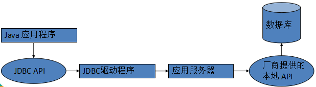
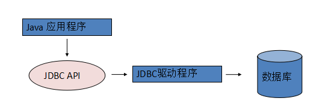
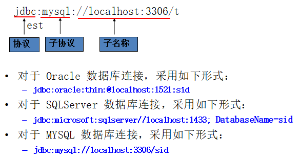
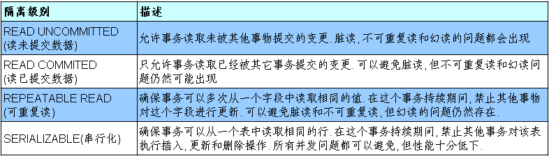

# 1. jDBC 基础

## 1. 数据持久化

- 持久化(persistence)：把数据保存到可掉电式存储设备中以供之后使用。大多数情况下，特别是企业级应用，数据持久化意味着将内存中的数据保存到硬盘上加以”固化”，而持久化的实现过程大多通过各种关系数据库来完成
- 持久化的主要应用是将内存中的数据存储在关系型数据库中，当然也可以存储在磁盘文件、XML数据文件中

## 2. Java 中的数据存储技术 

- JDBC直接访问数据库（JDBC是java访问数据库的基石）
- JDO技术
- 第三方O/R工具，如Hibernate, ibatis 等

## 3. JDBC基础

- JDBC(Java Database Connectivity)是一个独立于特定数据库管理系统、通用的SQL数据库存取和操作的公共接口（一组API），定义了用来访问数据库的标准Java类库，使用这个类库可以以一种标准的方法、方便地访问数据库资源
- JDBC为访问不同的数据库提供了一种统一的途径，为开发者屏蔽了一些细节问题
- JDBC的目标是使Java程序员使用JDBC可以连接任何提供了JDBC驱动程序的数据库系统，这样就使得程序员无需对特定的数据库系统的特点有过多的了解，从而大大简化和加快了开发过程

## 4. JDBC体系结构

JDBC接口（API）包括两个层次：

- 面向应用的API：Java API，抽象接口，供应用程序开发人员使用（连接数据库，执行SQL语句，获得结果）
- 面向数据库的API：Java Driver API，供开发商开发数据库驱动程序用

## 5. JDBC驱动程序分类

> 各个数据库厂商根据JDBC的规范制作的 JDBC 实现类的类库

JDBC驱动程序总共有四种类型：

- 第一类：JDBC-ODBC桥
- 第二类：部分本地API部分Java的驱动程序
- 第三类：JDBC网络纯Java驱动程序 
- 第四类：本地协议的纯 Java 驱动程序

> 第三、四两类都是纯Java的驱动程序
>
> 因此，对于Java开发者来说，它们在性能、可移植性、功能等方面都有优势

### 1. JDBC-ODBC桥

1. ODBC

   - 早期对数据库的访问，都是调用数据库厂商提供的专有的 API。为了在 Windows 平台下提供统一的访问方式，微软推出了 ODBC(Open Database Connectivity，开放式数据库连接)，并提供了 ODBC API，使用者在程序中只需要调用 ODBC API，由 ODBC 驱动程序将调用转换成为对特定的数据库的调用请求
   - 一个基于ODBC的应用程序对数据库的操作不依赖任何DBMS(database manager system)，不直接与DBMS打交道，所有的数据库操作由对应的DBMS的ODBC驱动程序完成。也就是说，不论是FoxPro、Access , MYSQL还是Oracle数据库，均可用ODBC API进行访问。由此可见，ODBC的最大优点是能以统一的方式处理所有的数据库

2. JDBC-ODBC桥

   - JDBC-ODBC 桥本身也是一个驱动，利用这个驱动，可以使用 JDBC-API 通过ODBC 去访问数据库。这种机制实际上是把标准的 JDBC 调用转换成相应的 ODBC 调用，并通过 ODBC 访问数据库
   - 因为需要通过多层调用，所以利用 JDBC-ODBC 桥访问数据库的效率较低
   - 在 JDK 中，提供了 JDBC-ODBC 桥的实现类(sun.jdbc.odbc.JdbcOdbcDriver)

   

   ​

###2. 部分本地API部分Java的驱动程序

- 这种类型的 JDBC 驱动程序使用 Java 编写，它调用数据库厂商提供的本地 API
- 通过这种类型的 JDBC 驱动程序访问数据库减少了 ODBC 的调用环节，提高了数据库访问的效率
- 在这种方式下需要在客户的机器上安装本地 JDBC 驱动程序和特定厂商的本地 API 


### 3. JDBC网络纯Java驱动程序

- 这种驱动利用中间件的应用服务器来访问数据库。应用服务器作为一个到多个数据库的网关，客户端通过它可以连接到不同的数据库服务器

- 应用服务器通常有自己的网络协议，Java 用户程序通过 JDBC 驱动程序将 JDBC 调用发送给应用服务器，应用服务器使用本地程序驱动访问数据库，从而完成请求

    


### 4. 本地协议的纯 Java 驱动程序

- 多数数据库厂商已经支持允许客户程序通过网络直接与数据库通信的网络协议
- 这种类型的驱动程序完全使用 Java 编写，通过与数据库建立的 Socket 连接，采用具体与厂商的网络协议把 JDBC 调用转换为直接连接的网络调用




# 2. 获取数据库连接

## 1. Driver 接口

- Java.sql.Driver 接口是所有 JDBC 驱动程序需要实现的接口。这个接口是提供给数据库厂商使用的，不同数据库厂商提供不同的实现
- 在程序中不需要直接去访问实现了 Driver 接口的类，而是由驱动程序管理器类(java.sql.DriverManager)去调用这些Driver实现

```java
@Test
public void testDriver() throws SQLException {
    //1. 创建一个 Driver 实现类的对象
    Driver driver = new com.mysql.jdbc.Driver();

    //2. 准备连接数据库的基本信息: url, user, password
    String url = "jdbc:mysql://localhost:3306/test?useUnicode=true&characterEncoding=utf-8&serverTimezone=UTC";
    Properties info = new Properties();
    info.put("user", "root");
    info.put("password", "root");

    //3. 调用 Driver 接口的　connect(url, info) 获取数据库连接
    Connection connection = driver.connect(url, info);
    System.out.println(connection);
}
```

>  编写一个**通用的方法** , 在不修改源程序的情况下, 可以获取任何数据库的连接
>
> - 解决方案: 把数据库驱动 Driver 实现类的全类名、url、user、password 放入一个配置文件中, 通过修改配置文件的方式实现和具体的数据库解耦

```java
public Connection getConnection() throws Exception{
    String driverClass = null;
    String jdbcUrl = null;
    String user = null;
    String password = null;

    //读取类路径下的 jdbc.properties 文件
    InputStream in = getClass().getClassLoader().getResourceAsStream("jdbc.properties");
    Properties properties = new Properties();
    properties.load(in);
    driverClass = properties.getProperty("driver");
    jdbcUrl = properties.getProperty("jdbcUrl");
    user = properties.getProperty("user");
    password = properties.getProperty("password");

    //通过反射常见 Driver 对象. 
    Driver driver = (Driver) Class.forName(driverClass).newInstance();

    Properties info = new Properties();
    info.put("user", user);
    info.put("password", password);

    //通过 Driver 的 connect 方法获取数据库连接. 
    Connection connection = driver.connect(jdbcUrl, info);

    return connection;
}
```

**jdbc.properties 文件：** 

```
driver=com.mysql.cj.jdbc.Driver
jdbcUrl=jdbc:mysql://localhost:3306/test?useUnicode=true&characterEncoding=utf-8&serverTimezone=UTC
user=root
password=root
```

## 2. 加载与注册 JDBC 驱动

- 加载 JDBC 驱动需调用 Class 类的静态方法 forName()，向其传递要加载的 JDBC 驱动的类名
- DriverManager 类是驱动程序管理器类，负责管理驱动程序
- 通常不用显式调用 DriverManager 类的 registerDriver() 方法来注册驱动程序类的实例，因为 Driver 接口的驱动程序类都包含了静态代码块，在这个静态代码块中，会调用 DriverManager.registerDriver() 方法来注册自身的一个实例

DriverManager 是驱动的管理类：

- 可以通过重载的 getConnection() 方法获取数据库连接，较为方便
- 可以同时管理多个驱动程序:：若注册了多个数据库连接, 则调用 getConnection() 方法时传入的参数不同, 即返回不同的数据库连接

```java
@Test
public void testDriverManager() throws Exception{
    //1. 准备连接数据库的 4 个字符串
    //驱动的全类名.
    String driverClass = "com.mysql.cj.jdbc.Driver";
    //JDBC URL
    String jdbcUrl = "jdbc:mysql:///test";
    //user
    String user = "root";
    //password
    String password = "root";

    //2. 加载数据库驱动程序(对应的 Driver 实现类中有注册驱动的静态代码块)
    Class.forName(driverClass);

    //3. 通过 DriverManager 的 getConnection() 方法获取数据库连接. 
    Connection connection = DriverManager.getConnection(jdbcUrl, user, password);
    System.out.println(connection); 
}
```

调用配置文件：

```java
public Connection getConnection2() throws Exception{
    //1. 准备连接数据库的 4 个字符串
    //1). 创建 Properties 对象
    Properties properties = new Properties();
    //2). 获取 jdbc.properties 对应的输入流
    InputStream in = this.getClass().getClassLoader().getResourceAsStream("jdbc.properties");
    //3). 加载 2） 对应的输入流
    properties.load(in);
    //4). 具体决定 user, password 等4 个字符串. 
    String user = properties.getProperty("user");
    String password = properties.getProperty("password");
    String jdbcUrl = properties.getProperty("jdbcUrl");
    String driver = properties.getProperty("driver");

    //2. 加载数据库驱动程序(对应的 Driver 实现类中有注册驱动的静态代码块.)
    Class.forName(driver);

    //3. 通过 DriverManager 的 getConnection() 方法获取数据库连接. 
    return DriverManager.getConnection(jdbcUrl, user, password);
}
```

## 3. 建立连接

- 可以调用 DriverManager 类的 getConnection() 方法建立到数据库的连接
- JDBC URL 用于标识一个被注册的驱动程序，驱动程序管理器通过这个 URL 选择正确的驱动程序，从而建立到数据库的连接
- JDBC URL的标准由三部分组成，各部分间用冒号分隔。
  - jdbc:<子协议>:<子名称>
  - 协议：JDBC URL中的协议总是jdbc 
  - 子协议：子协议用于标识一个数据库驱动程序
  - 子名称：一种标识数据库的方法。子名称可以依不同的子协议而变化，用子名称的目的是为了定位数据库提供足够的信息 




# 3. 使用 Statement 执行更新操作

- 通过调用 Connection 对象的 createStatement 方法创建该对象该
- 对象用于执行静态的 SQL 语句，并且返回执行结果
- Statement 接口中定义了下列方法用于执行 SQL 语句：
  - ResultSet excuteQuery(String sql)
  - int excuteUpdate(String sql)

Statement 执行操作的步骤：

1. Statement：用于执行 SQL 语句的对象
 *  通过 Connection 的 createStatement() 方法来获取
 * 通过 executeUpdate(sql) 可以执行 SQL 语句
 * 传入的 SQL 可以是 INSRET, UPDATE 或 DELETE. 但不能是 SELECT

2. Connection、Statement 都是应用程序和数据库服务器的连接资源. 使用后一定要关闭，需要在 finally 中关闭 Connection 和 Statement 对象


3. 关闭的顺序是：先关闭后获取的.，即先关闭 Statement 后关闭 Connection

```java
/**
 * 通过 JDBC 向指定的数据表中插入一条记录
 */
@Test
public void testStatement() throws Exception{
    //1. 获取数据库连接
    Connection conn = null;
    Statement statement = null;

    try {
        conn = getConnection2();//上面的 getConnection2() 方法，获取数据库连接

        //3. 准备插入的 SQL 语句
        String sql = "UPDATE customers SET name = 'TOM' WHERE id = 4";

        //4. 执行插入
        //1). 获取操作 SQL 语句的 Statement 对象: 调用 Connection 的 createStatement() 方法来获取
        statement = conn.createStatement();
        //2). 调用 Statement 对象的 executeUpdate(sql) 执行 SQL 语句进行插入
        statement.executeUpdate(sql);
    } catch (Exception e) {
        e.printStackTrace();
    } finally{
        try {
            //5. 关闭 Statement 对象.
            if(statement != null)
                statement.close();
        } catch (Exception e) {
            e.printStackTrace();
        } finally{
            //2. 关闭连接
            if(conn != null)
                conn.close();							
        }
    }
}
```

# 4. 使用 ResultSet 执行查询操作

- 通过调用 Statement 对象的 excuteQuery() 方法创建该对象
- ResultSet 对象以逻辑表格的形式封装了执行数据库操作的结果集，ResultSet 接口由数据库厂商实现
- ResultSet 对象维护了一个指向当前数据行的游标，初始的时候，游标在第一行之前，可以通过 ResultSet 对象的 next() 方法移动到下一行
- 当指针对位到一行时, 可以通过调用 getXxx(index) 或 getXxx(columnName) 获取每一列的值。例如: getInt(1), getString("name")。另外：**getXxx(index)中的索引从 1 开始** 


```java
@Test
public void testResultSet(){
    //获取 id=4 的 customers 数据表的记录, 并打印
    Connection conn = null;
    Statement statement = null;
    ResultSet rs = null;
    try {
        //1. 获取 Connection
        conn = JDBCTools.getConnection();

        //2. 获取 Statement
        statement = conn.createStatement();

        //3. 准备 SQL
        String sql = "SELECT id, name, email, birth FROM customers";

        //4. 执行查询, 得到 ResultSet
        rs = statement.executeQuery(sql);

        //5. 处理 ResultSet
        while(rs.next()){
            int id = rs.getInt(1);
            String name = rs.getString("name");
            String email = rs.getString(3);
            Date birth = rs.getDate(4);

            System.out.println(id);
            System.out.println(name);
            System.out.println(email);
            System.out.println(birth);
        }
    } catch (Exception e) {
        e.printStackTrace();
    } finally{
        //6. 关闭数据库资源. 
        JDBCTools.release(rs, statement, conn);
    }
}
```

**JDBCTools类：** 

```java
/**
 * 操作 JDBC 的工具类. 其中封装了一些工具方法 Version 1
 */
public class JDBCTools {

  //关闭ResultSet Statement 和 Connection 的封装方法
  public static void release(ResultSet rs, Statement statement, Connection conn) {
      if(rs != null){
          try {
              rs.close();
          } catch (SQLException e) {
              e.printStackTrace();
          }
      }
      if (statement != null) {
          try {
              statement.close();
          } catch (Exception e2) {
              e2.printStackTrace();
          }
      }
      if (conn != null) {
          try {
              conn.close();
          } catch (Exception e2) {
              e2.printStackTrace();
          }
      }
  }

  /**
   * 获取连接的方法. 通过读取配置文件从数据库服务器获取一个连接.
   * 
   * @return
   * @throws Exception
   */
  public static Connection getConnection() throws Exception {
      // 1. 准备连接数据库的 4 个字符串.
      // 1). 创建 Properties 对象
      Properties properties = new Properties();
      // 2). 获取 jdbc.properties 对应的输入流
      InputStream in =JDBCTools.class.getClassLoader().getResourceAsStream("jdbc.properties");
      // 3). 加载 2） 对应的输入流
      properties.load(in);
      // 4). 具体决定 user, password 等4 个字符串.
      String user = properties.getProperty("user");
      String password = properties.getProperty("password");
      String jdbcUrl = properties.getProperty("jdbcUrl");
      String driver = properties.getProperty("driver");

      // 2. 加载数据库驱动程序(对应的 Driver 实现类中有注册驱动的静态代码块.)
      Class.forName(driver);

      // 3. 通过 DriverManager 的 getConnection() 方法获取数据库连接.
      return DriverManager.getConnection(jdbcUrl, user, password);
  }
}
```


#JDBC API 小结1

- `java.sql.DriverManager` 用来装载驱动程序，获取数据库连接
- `java.sql.Connection` 完成对某一指定数据库的联接
- `java.sql.Statement` 在一个给定的连接中作为SQL执行声明的容器，他包含了两个重要的子类型。
  - `Java.sql.PreparedSatement`  用于执行预编译的sql声明
  - `Java.sql.CallableStatement` 用于执行数据库中存储过程的调用
- `java.sql.ResultSet` 对于给定声明取得结果的途径


# 5. 使用 PreparedStatement

## 1. SQL 注入攻击

- SQL 注入是利用某些系统没有对用户输入的数据进行充分的检查，而在用户输入数据中注入非法的 SQL 语句段或命令，从而利用系统的 SQL 引擎完成恶意行为的做法
- 对于 Java 而言，要防范 SQL 注入，只要用 PreparedStatement 取代 Statement 就可以了

## 2. PreparedStatement

- 可以通过调用 Connection 对象的 preparedStatement() 方法获取 PreparedStatement 对象
- PreparedStatement 接口是 Statement 的子接口，它表示一条预编译过的 SQL 语句
- PreparedStatement 对象所代表的 SQL 语句中的参数用问号(?)来表示，调用 PreparedStatement 对象的 setXXX() 方法来设置这些参数. setXXX() 方法有两个参数，第一个参数是要设置的 SQL 语句中的参数的索引(从 1 开始)，第二个是设置的 SQL 语句中的参数的值

```java
@Test
public void testPreparedStatement() {
    Connection connection = null;
    PreparedStatement preparedStatement = null;

    try {
        connection = JDBCTools.getConnection();
        String sql = "INSERT INTO customers (name, email, birth) VALUES(?,?,?)";

        preparedStatement = connection.prepareStatement(sql);
      	//占位符索引从 1 开始
        preparedStatement.setString(1, "test");
        preparedStatement.setString(2, "xxx@163.com");
        preparedStatement.setDate(3, new Date(new java.util.Date().getTime()));

        preparedStatement.executeUpdate();
    } catch (Exception e) {
        e.printStackTrace();
    } finally {
        JDBCTools.release(null, preparedStatement, connection);
    }
}
```

## 3. PreparedStatement vs Statement

- 代码的可读性和可维护性
- PreparedStatement 能最大可能提高性能：
  - DBServer会对预编译语句提供性能优化。因为预编译语句有可能被重复调用，所以语句在被DBServer的编译器编译后的执行代码被缓存下来，那么下次调用时只要是相同的预编译语句就不需要编译，只要将参数直接传入编译过的语句执行代码中就会得到执行
  - 在statement语句中，即使是相同操作但因为数据内容不一样，所以整个语句本身不能匹配，没有缓存语句的意义。事实是没有数据库会对普通语句编译后的执行代码缓存，这样每执行一次都要对传入的语句编译一次 
  - (语法检查，语义检查，翻译成二进制命令，缓存)
- PreparedStatement 可以防止 SQL 注入 


# 6. 利用反射及 JDBC 元数据编写通用的查询方法

## 1. 利用反射实现通用方法 

```java
/**
 * 通用的查询方法：可以根据传入的 SQL、Class 对象返回 SQL 对应的记录的对象
 * @param clazz: 描述对象的类型
 * @param sql: SQL 语句。可能带占位符
 * @param args: 填充占位符的可变参数。
 * @return
 */
public <T> T get(Class<T> clazz, String sql, Object... args) {
    T entity = null;

    Connection connection = null;
    PreparedStatement preparedStatement = null;
    ResultSet resultSet = null;

    try {
        //1. 得到 ResultSet 对象
        connection = JDBCTools.getConnection();
        preparedStatement = connection.prepareStatement(sql);
        for (int i = 0; i < args.length; i++) {
            preparedStatement.setObject(i + 1, args[i]);
        }
        resultSet = preparedStatement.executeQuery();

        //2. 得到 ResultSetMetaData 对象
        ResultSetMetaData rsmd = resultSet.getMetaData();

        //3. 创建一个 Map<String, Object> 对象, 键: SQL 查询的列的别名, 
        //值: 列的值
        Map<String, Object> values = new HashMap<>();

        //4. 处理结果集. 利用 ResultSetMetaData 填充 3 对应的 Map 对象
        if(resultSet.next()){
            for(int i = 0; i < rsmd.getColumnCount(); i++){
                String columnLabel = rsmd.getColumnLabel(i + 1);
                Object columnValue = resultSet.getObject(i + 1);

                values.put(columnLabel, columnValue);
            }
        }

        //5. 若 Map 不为空集, 利用反射创建 clazz 对应的对象
        if(values.size() > 0){
            entity = clazz.newInstance();

            //6. 遍历 Map 对象, 利用反射为 Class 对象的对应的属性赋值. 
            for(Map.Entry<String, Object> entry: values.entrySet()){
                String fieldName = entry.getKey();
                Object value = entry.getValue();
                ReflectionUtils.setFieldValue(entity, fieldName, value);
            }
        }
    } catch (Exception e) {
        e.printStackTrace();
    } finally {
        JDBCTools.releaseDB(resultSet, preparedStatement, connection);
    }
    return entity;
}
```

## 2. 使用 JDBC 驱动程序处理元数据 

- Java 通过JDBC获得连接以后，得到一个Connection 对象，可以从这个对象获得有关数据库管理系统的各种信息，包括数据库中的各个表，表中的各个列，数据类型，触发器，存储过程等各方面的信息。根据这些信息，JDBC可以访问一个实现事先并不了解的数据库
- 获取这些信息的方法都是在DatabaseMetaData类的对象上实现的，而DataBaseMetaData对象是在Connection对象上获得的

## 3. DatabaseMetaData类与ResultSetMetaData 类 

- DatabaseMetaData 类中提供了许多方法用于获得数据源的各种信息，通过这些方法可以非常详细的了解数据库的信息：
  - getURL()：返回一个String类对象，代表数据库的URL
  - getUserName()：返回连接当前数据库管理系统的用户名
  - isReadOnly()：返回一个boolean值，指示数据库是否只允许读操作
  - getDatabaseProductName()：返回数据库的产品名称
  - getDatabaseProductVersion()：返回数据库的版本号
  - getDriverName()：返回驱动驱动程序的名称
  - getDriverVersion()：返回驱动程序的版本号

```java
/**
 * DatabaseMetaData 是描述 数据库 的元数据对象可以由 Connection 得到
 */
@Test
public void testDatabaseMetaData(){
    Connection connection = null;
    ResultSet resultSet = null;

    try {
        connection = JDBCTools.getConnection();
        DatabaseMetaData data = connection.getMetaData();

        //可以得到数据库本身的一些基本信息
        //1. 得到数据库的版本号
        int version = data.getDatabaseMajorVersion();
        System.out.println(version);

        //2. 得到连接到数据库的用户名
        String user = data.getUserName();
        System.out.println(user);

        //3. 得到 MySQL 中有哪些数据库
        resultSet = data.getCatalogs();
        while(resultSet.next()){
            System.out.println(resultSet.getString(1));
        }
        //...
    } catch (Exception e) {
        e.printStackTrace();
    } finally{
        JDBCTools.releaseDB(resultSet, null, connection);
    }
}
```

- 可用于获取关于 ResultSet 对象中列的类型和属性信息的对象：
  - getColumnName(int column)：获取指定列的名称
  - getColumnCount()：返回当前 ResultSet 对象中的列数
  -  getColumnTypeName(int column)：检索指定列的数据库特定的类型名称 
  - getColumnDisplaySize(int column)：指示指定列的最大标准宽度，以字符为单位
  - isNullable(int column)：指示指定列中的值是否可以为 null  
  - isAutoIncrement(int column)：指示是否自动为指定列进行编号，这样这些列仍然是只读的

```java
/**
 * ResultSetMetaData: 描述结果集的元数据. 
 * 可以得到结果集中的基本信息: 结果集中有哪些列, 列名, 列的别名等.
 * 结合反射可以写出通用的查询方法. 
 */
@Test
public void testResultSetMetaData(){
    Connection connection = null;
    PreparedStatement preparedStatement = null;
    ResultSet resultSet = null;

    try {
        connection = JDBCTools.getConnection();
        String sql = "SELECT id, name customerName, email, birth FROM customers";
        preparedStatement = connection.prepareStatement(sql);
        resultSet = preparedStatement.executeQuery();

        //1. 得到 ResultSetMetaData 对象
        ResultSetMetaData rsmd = resultSet.getMetaData();

        //2. 得到列的个数
        int columnCount = rsmd.getColumnCount();
        System.out.println(columnCount);
        for(int i = 0 ; i < columnCount; i++){
            //3. 得到列名
            String columnName = rsmd.getColumnName(i + 1);

            //4. 得到列的别名
            String columnLabel = rsmd.getColumnLabel(i + 1);

            System.out.println(columnName + ", " + columnLabel);
        }
    } catch (Exception e) {
        e.printStackTrace();
    } finally{
        JDBCTools.releaseDB(resultSet, preparedStatement, connection);
    }
}
```

# 7. 获取插入记录的主键值

```java
/**
 * 取得数据库自动生成的主键
 */
@Test
public void testGetKeyValue() {
    Connection connection = null;
    PreparedStatement preparedStatement = null;

    try {
        connection = JDBCTools.getConnection();
        String sql = "INSERT INTO customers(name, email, birth) VALUES(?,?,?)";
        //使用重载的 prepareStatement(sql, flag) 来生成 PreparedStatement 对象
        preparedStatement = connection.prepareStatement(sql, Statement.RETURN_GENERATED_KEYS);

        preparedStatement.setString(1, "ABCDE");
        preparedStatement.setString(2, "abcde@atguigu.com");
        preparedStatement.setDate(3, new Date(new java.util.Date().getTime()));

        preparedStatement.executeUpdate();
        //通过 getGeneratedKeys() 获取包含了新生成的主键的 ResultSet 对象
        //在 ResultSet 中只有一列 GENERATED_KEY, 用于存放新生成的主键值.
        ResultSet rs = preparedStatement.getGeneratedKeys();
        if(rs.next()){
            System.out.println(rs.getObject(1));
        }

        ResultSetMetaData rsmd = rs.getMetaData();
        for(int i = 0; i < rsmd.getColumnCount(); i++){
            System.out.println(rsmd.getColumnName(i + 1)); 
        }
    } catch (Exception e) {
        e.printStackTrace();
    } finally{
        JDBCTools.releaseDB(null, preparedStatement, connection);
    }
}
```

# 8. 处理 Blob

## 1. BLOB 简介

1. Oracle LOB

- LOB，即Large Objects（大对象），是用来存储大量的二进制和文本数据的一种数据类型（一个LOB字段可存储可多达4GB的数据）
- LOB 分为两种类型：内部LOB和外部LOB
  - 内部LOB将数据以字节流的形式存储在数据库的内部。因而，内部LOB的许多操作都可以参与事务，也可以像处理普通数据一样对其进行备份和恢复操作。Oracle支持三种类型的内部LOB：
    - BLOB（二进制数据）  
    - CLOB（单字节字符数据） 
    - NCLOB（多字节字符数据）
  - CLOB和NCLOB类型适用于存储超长的文本数据，BLOB字段适用于存储大量的二进制数据，如图像、视频、音频，文件等
  - 目前只支持一种外部LOB类型，即BFILE类型。在数据库内，该类型仅存储数据在操作系统中的位置信息，而数据的实体以外部文件的形式存在于操作系统的文件系统中。因而，该类型所表示的数据是只读的，不参与事务。该类型可帮助用户管理大量的由外部程序访问的文件。

2. MySQL BLOB

- MySQL中，BLOB是一个二进制大型对象，是一个可以存储大量数据的容器，它能容纳不同大小的数据。
- MySQL的四种BLOB类型(除了在存储的最大信息量上不同外，他们是等同的)
- 实际使用中根据需要存入的数据大小定义不同的BLOB类型
- 需要注意的是：如果存储的文件过大，数据库的性能会下降

## 2. 使用JDBC来写入Blob型数据到Oracle中

- Oracle的Blob字段比long字段的性能要好，可以用来保存如图片之类的二进制数据
- Oracle的BLOB字段由两部分组成：数据（值）和指向数据的指针（定位器）。尽管值与表自身一起存储，但是一个BLOB列并不包含值，仅有它的定位指针。为了使用大对象，程序必须声明定位器类型的本地变量
- 当Oracle内部LOB被创建时，定位器被存放在列中，值被存放在LOB段中，LOB段是在数据库内部表的一部分
- 因为Blob自身有一个cursor，当写入Blob字段必须使用指针（定位器）对Blob进行操作，因而在写入Blob之前，必须获得指针（定位器）才能进行写入
- 如何获得Blob的指针（定位器） ：需要先插入一个empty的blob，这将创建一个blob的指针，然后再把这个empty的blob的指针查询出来，这样通过两步操作，就获得了blob的指针，可以真正的写入blob数据了

```java
/**
 * 读取 blob 数据: 
 * 1. 使用 getBlob 方法读取到 Blob 对象
 * 2. 调用 Blob 的 getBinaryStream() 方法得到输入流。再使用 IO 操作即可. 
 */
@Test
public void readBlob(){
    Connection connection = null;
    PreparedStatement preparedStatement = null;
    ResultSet resultSet = null;

    try {
        connection = JDBCTools.getConnection();
        String sql = "SELECT id, name customerName, email, birth, picture FROM customers WHERE id = 13";
        preparedStatement = connection.prepareStatement(sql);
        resultSet = preparedStatement.executeQuery();

        if(resultSet.next()){
            int id = resultSet.getInt(1);
            String name = resultSet.getString(2);
            String email = resultSet.getString(3);

            System.out.println(id + ", " + name  + ", " + email);
            Blob picture = resultSet.getBlob(5);

            InputStream in = picture.getBinaryStream();
            System.out.println(in.available()); 

            OutputStream out = new FileOutputStream("flower.jpg");

            byte [] buffer = new byte[1024];
            int len = 0;
            while((len = in.read(buffer)) != -1){
                out.write(buffer, 0, len);
            }
            in.close();
            out.close();
        }

    } catch (Exception e) {
        e.printStackTrace();
    } finally{
        JDBCTools.releaseDB(resultSet, preparedStatement, connection);
    }
}

/**
 * 插入 BLOB 类型的数据必须使用 PreparedStatement：因为 BLOB 类型的数据时无法使用字符串拼写的
 * 调用 setBlob(int index, InputStream inputStream)
 */
@Test
public void testInsertBlob(){
    Connection connection = null;
    PreparedStatement preparedStatement = null;

    try {
        connection = JDBCTools.getConnection();
        String sql = "INSERT INTO customers(name, email, birth, picture) VALUES(?,?,?,?)";
        preparedStatement = connection.prepareStatement(sql);

        preparedStatement.setString(1, "ABCDE");
        preparedStatement.setString(2, "abcde@atguigu.com");
        preparedStatement.setDate(3, new Date(new java.util.Date().getTime()));

        InputStream inputStream = new FileInputStream("Hydrangeas.jpg");
        preparedStatement.setBlob(4, inputStream);

        preparedStatement.executeUpdate();
    } catch (Exception e) {
        e.printStackTrace();
    } finally{
        JDBCTools.releaseDB(null, preparedStatement, connection);
    }
}
```

# 9. 处理事务 & 事务的隔离级别

## 1. 数据库事务

- 在数据库中,所谓事务是指一组逻辑操作单元,使数据从一种状态变换到另一种状态
- 为确保数据库中数据的一致性,数据的操纵应当是离散的成组的逻辑单元:当它全部完成时,数据的一致性可以保持,而当这个单元中的一部分操作失败,整个事务应全部视为错误,所有从起始点以后的操作应全部回退到开始状态
- 事务的操作：先定义开始一个事务,然后对数据作修改操作,这时如果提交(COMMIT),这些修改就永久地保存下来,如果回退(ROLLBACK),数据库管理系统将放弃所作的所有修改而回到开始事务时的状态
- 事务的ACID(acid)属性：
  - 原子性（Atomicity）：原子性是指事务是一个不可分割的工作单位，事务中的操作要么都发生，要么都不发生
  - 一致性（Consistency）：事务必须使数据库从一个一致性状态变换到另外一个一致性状态
  - 隔离性（Isolation）：事务的隔离性是指一个事务的执行不能被其他事务干扰，即一个事务内部的操作及使用的数据对并发的其他事务是隔离的，并发执行的各个事务之间不能互相干扰
  - 持久性（Durability）：持久性是指一个事务一旦被提交，它对数据库中数据的改变就是永久性的，接下来的其他操作和数据库故障不应该对其有任何影响

## 2. JDBC 事物处理

- 事务：指构成单个逻辑工作单元的操作集合
- 事务处理：保证所有事务都作为一个工作单元来执行，即使出现了故障，都不能改变这种执行方式。当在一个事务中执行多个操作时，要么所有的事务都被提交(commit)，要么整个事务回滚(rollback)到最初状态
- 当一个连接对象被创建时，默认情况下是自动提交事务：每次执行一个 SQL 语句时，如果执行成功，就会向数据库自动提交，而不能回滚
- 为了让多个 SQL 语句作为一个事务执行：
  - 调用 Connection 对象的 setAutoCommit(false); 以取消自动提交事务
  - 在所有的 SQL 语句都成功执行后，调用 commit(); 方法提交事务
  - 在出现异常时，调用 rollback(); 方法回滚事务
  - 若此时 Connection 没有被关闭, 则需要恢复其自动提交状态

```java
@Test
public void testTransaction() {
    Connection connection = null;
    try {
        connection = JDBCTools.getConnection();
        System.out.println(connection.getAutoCommit());
        connection.setAutoCommit(false); // 开始事务: 取消默认提交
        String sql = "UPDATE users SET balance = balance - 500 WHERE id = 1";
        update(connection, sql);

        int i = 10 / 0;
        System.out.println(i);

        sql = "UPDATE users SET balance = " + "balance + 500 WHERE id = 2";
        update(connection, sql);
        connection.commit(); // 提交事务
    } catch (Exception e) {
        e.printStackTrace();
        try {
            connection.rollback();// 回滚事务
        } catch (SQLException e1) {
            e1.printStackTrace();
        }
    } finally {
        JDBCTools.releaseDB(null, null, connection);
    }
}
```

## 3. 数据库的隔离级别

- 对于同时运行的多个事务, 当这些事务访问数据库中相同的数据时, 如果没有采取必要的隔离机制, 就会导致各种并发问题：
  - 脏读：对于两个事物 T1, T2, T1 读取了已经被 T2 更新但还没有被提交的字段. 之后, 若 T2 回滚, T1读取的内容就是临时且无效的
  - 不可重复读：对于两个事物 T1, T2, T1 读取了一个字段, 然后 T2 更新了该字段. 之后, T1再次读取同一个字段, 值就不同了
  - 幻读：对于两个事物 T1, T2, T1 从一个表中读取了一个字段, 然后 T2 在该表中插入了一些新的行. 之后, 如果 T1 再次读取同一个表, 就会多出几行
- 数据库事务的隔离性：数据库系统必须具有隔离并发运行各个事务的能力, 使它们不会相互影响, 避免各种并发问题
- 一个事务与其他事务隔离的程度称为隔离级别. 数据库规定了多种事务隔离级别, 不同隔离级别对应不同的干扰程度, 隔离级别越高, 数据一致性就越好, 但并发性越弱



> - Oracle 支持的 2 种事务隔离级别：
>
>   - READ COMMITED
>   - SERIALIZABLE
>
>   Oracle 默认的事务隔离级别为: READ COMMITED 
>
> - Mysql 支持 4 中事务隔离级别，Mysql 默认的事务隔离级别为: REPEATABLE READ

## 4. 在 MySql 中设置隔离级别

- 每启动一个 mysql 程序, 就会获得一个单独的数据库连接. 每个数据库连接都有一个全局变量 @@tx_isolation, 表示当前的事务隔离级别. MySQL 默认的隔离级别为 Repeatable Read
- 查看当前的隔离级别: SELECT @@tx_isolation;
- 设置当前 mySQL 连接的隔离级别:  set  transaction isolation level read committed;
- 设置数据库系统的全局的隔离级别: set global transaction isolation level read committed;

```java
/**
 * 测试事务的隔离级别 在 JDBC 程序中可以通过 Connection 的 setTransactionIsolation 来设置事务的隔离级别
 * 返回某条记录的某一个字段的值 或 一个统计的值(一共有多少条记录等)
 */
// 
public <E> E getForValue(String sql, Object... args) {

    // 1. 得到结果集: 该结果集应该只有一行, 且只有一列
    Connection connection = null;
    PreparedStatement preparedStatement = null;
    ResultSet resultSet = null;
    try {
        // 1. 得到结果集
        connection = JDBCTools.getConnection();
        System.out.println(connection.getTransactionIsolation()); //默认的隔离级别
		//设置隔离级别
        connection.setTransactionIsolation(Connection.TRANSACTION_READ_COMMITTED);
        preparedStatement = connection.prepareStatement(sql);
        for (int i = 0; i < args.length; i++) {
            preparedStatement.setObject(i + 1, args[i]);
        }
        resultSet = preparedStatement.executeQuery();
        if (resultSet.next()) {
            return (E) resultSet.getObject(1);
        }
    } catch (Exception ex) {
        ex.printStackTrace();
    } finally {
        JDBCTools.releaseDB(resultSet, preparedStatement, connection);
    }
    // 2. 取得结果
    return null;
}
```

# 10. 批量处理

- 当需要成批插入或者更新记录时。可以采用Java的批量更新机制，这一机制允许多条语句一次性提交给数据库批量处理。通常情况下比单独提交处理更有效率
- JDBC的批量处理语句包括下面两个方法：
  - addBatch(String)：添加需要批量处理的SQL语句或是参数；
  - executeBatch（）；执行批量处理语句；
- 通常我们会遇到两种批量执行SQL语句的情况：
  - 多条SQL语句的批量处理；
  - 一个SQL语句的批量传参；

```java
@Test
public void testBatch(){
    Connection connection = null;
    PreparedStatement preparedStatement = null;
    String sql = null;

    try {
        connection = JDBCTools.getConnection();
        JDBCTools.beginTx(connection);
        sql = "INSERT INTO customers VALUES(?,?,?)";
        preparedStatement = connection.prepareStatement(sql);
        Date date = new Date(new java.util.Date().getTime());

        for(int i = 0; i < 100000; i++){
            preparedStatement.setInt(1, i + 1);
            preparedStatement.setString(2, "name_" + i);
            preparedStatement.setDate(3, date);

            //"积攒" SQL 
            preparedStatement.addBatch();

            //当 "积攒" 到一定程度, 就统一的执行一次. 并且清空先前 "积攒" 的 SQL
            if((i + 1) % 300 == 0){
                preparedStatement.executeBatch();
                preparedStatement.clearBatch();
            }
        }
        //若总条数不是批量数值的整数倍, 则还需要再额外的执行一次. 
        if(100000 % 300 != 0){
            preparedStatement.executeBatch();
            preparedStatement.clearBatch();
        }
        JDBCTools.commit(connection);
    } catch (Exception e) {
        e.printStackTrace();
        JDBCTools.rollback(connection);
    } finally{
        JDBCTools.releaseDB(null, preparedStatement, connection);
    }
}
```

**JdbcTools 类：** 

```java
/**
 * JDBC 的工具类
 * 
 * 其中包含: 获取数据库连接, 关闭数据库资源等方法.
 */
public class JDBCTools {
	
	//处理数据库事务的
	//提交事务
	public static void commit(Connection connection){
		if(connection != null){
			try {
				connection.commit();
			} catch (SQLException e) {
				e.printStackTrace();
			}
		}
	}
	
	//回滚事务
	public static void rollback(Connection connection){
		if(connection != null){
			try {
				connection.rollback();
			} catch (SQLException e) {
				e.printStackTrace();
			}
		}
	}
	
	//开始事务
	public static void beginTx(Connection connection){
		if(connection != null){
			try {
				connection.setAutoCommit(false);
			} catch (SQLException e) {
				e.printStackTrace();
			}
		}
	}
	
	private static DataSource dataSource = null;

	//数据库连接池应只被初始化一次. 
	static{
		dataSource = new ComboPooledDataSource("helloc3p0");
	}
	
	public static Connection getConnection() throws Exception {
		return dataSource.getConnection();
	}

	public static void releaseDB(ResultSet resultSet,Statement statement,Connection connection){
		if (resultSet != null) {
			try {
				resultSet.close();
			} catch (SQLException e) {
				e.printStackTrace();
			}
		}
		if (statement != null) {
			try {
				statement.close();
			} catch (SQLException e) {
				e.printStackTrace();
			}
		}
		if (connection != null) {
			try {
				//数据库连接池的 Connection 对象进行 close 时
				//并不是真的进行关闭, 而是把该数据库连接会归还到数据库连接池中. 
				connection.close();
			} catch (SQLException e) {
				e.printStackTrace();
			}
		}
	}
}
```

# 11. 数据库连接池 & C3P0 & DBCP

## 1. JDBC数据库连接池的必要性

- 在使用开发基于数据库的web程序时，传统的模式基本是按以下步骤：　　
  - 在主程序（如servlet、beans）中建立数据库连接
  - 进行sql操作
  - 断开数据库连接
- 这种模式开发，存在的问题：
  - 普通的JDBC数据库连接使用 DriverManager 来获取，每次向数据库建立连接的时候都要将 Connection 加载到内存中，再验证用户名和密码(得花费0.05s～1s的时间)。需要数据库连接的时候，就向数据库要求一个，执行完成后再断开连接。这样的方式将会消耗大量的资源和时间。数据库的连接资源并没有得到很好的重复利用.若同时有几百人甚至几千人在线，频繁的进行数据库连接操作将占用很多的系统资源，严重的甚至会造成服务器的崩溃
  - 对于每一次数据库连接，使用完后都得断开。否则，如果程序出现异常而未能关闭，将会导致数据库系统中的内存泄漏，最终将导致重启数据库
  - 这种开发不能控制被创建的连接对象数，系统资源会被毫无顾及的分配出去，如连接过多，也可能导致内存泄漏，服务器崩溃

## 2. 数据库连接池

- 为解决传统开发中的数据库连接问题，可以采用数据库连接池技术
- 数据库连接池的基本思想就是为数据库连接建立一个“缓冲池”。预先在缓冲池中放入一定数量的连接，当需要建立数据库连接时，只需从“缓冲池”中取出一个，使用完毕之后再放回去
- 数据库连接池负责分配、管理和释放数据库连接，它允许应用程序重复使用一个现有的数据库连接，而不是重新建立一个
- 数据库连接池在初始化时将创建一定数量的数据库连接放到连接池中，这些数据库连接的数量是由最小数据库连接数来设定的。无论这些数据库连接是否被使用，连接池都将一直保证至少拥有这么多的连接数量。连接池的最大数据库连接数量限定了这个连接池能占有的最大连接数，当应用程序向连接池请求的连接数超过最大连接数量时，这些请求将被加入到等待队列中

## 3. 数据库连接池技术的优点

- 资源重用：由于数据库连接得以重用，避免了频繁创建，释放连接引起的大量性能开销。在减少系统消耗的基础上，另一方面也增加了系统运行环境的平稳性
- 更快的系统反应速度：数据库连接池在初始化过程中，往往已经创建了若干数据库连接置于连接池中备用。此时连接的初始化工作均已完成。对于业务请求处理而言，直接利用现有可用连接，避免了数据库连接初始化和释放过程的时间开销，从而减少了系统的响应时间
- 新的资源分配手段：对于多应用共享同一数据库的系统而言，可在应用层通过数据库连接池的配置，实现某一应用最大可用数据库连接数的限制，避免某一应用独占所有的数据库资源
- 统一的连接管理，避免数据库连接泄露：在较为完善的数据库连接池实现中，可根据预先的占用超时设定，强制回收被占用连接，从而避免了常规数据库连接操作中可能出现的资源泄露

## 4. 两种开源的数据库连接池

- JDBC 的数据库连接池使用 javax.sql.DataSource 来表示，DataSource 只是一个接口，该接口通常由服务器(Weblogic, WebSphere, Tomcat)提供实现，也有一些开源组织提供实现：
  - DBCP 数据库连接池
  - C3P0 数据库连接池
- DataSource 通常被称为数据源，它包含连接池和连接池管理两个部分，习惯上也经常把 DataSource 称为连接池

### 1. DBCP 数据源

使用 DBCP 数据库连接池

 * 加入 jar 包(2 个jar 包). 依赖于 Commons Pool
 * 创建数据库连接池
 * 为数据源实例指定必须的属性
 * 从数据源中获取数据库连接

```java
@Test
public void testDBCP() throws SQLException{
    final BasicDataSource dataSource = new BasicDataSource();

    //2. 为数据源实例指定必须的属性
    dataSource.setUsername("root");
    dataSource.setPassword("1230");
    dataSource.setUrl("jdbc:mysql:///test");
    dataSource.setDriverClassName("com.mysql.cj.jdbc.Driver");

    //3. 指定数据源的一些可选的属性.
    //1). 指定数据库连接池中初始化连接数的个数
    dataSource.setInitialSize(5);
    //2). 指定最大的连接数: 同一时刻可以同时向数据库申请的连接数
    dataSource.setMaxActive(5);
    //3). 指定小连接数: 在数据库连接池中保存的最少的空闲连接的数量 
    dataSource.setMinIdle(2);
    //4).等待数据库连接池分配连接的最长时间. 单位为毫秒. 超出该时间将抛出异常. 
    dataSource.setMaxWait(1000 * 5);

    //4. 从数据源中获取数据库连接
    Connection connection = dataSource.getConnection();
    System.out.println(connection.getClass()); 
}
```

**使用 dbcp.properties 配置文件：** 

1. 加载 dbcp 的 properties 配置文件:：配置文件中的键需要来自 BasicDataSource的属性
2. 调用 BasicDataSourceFactory 的 createDataSource 方法创建 DataSource实例
3. 从 DataSource 实例中获取数据库连接

```java
@Test
public void testDBCPWithDataSourceFactory() throws Exception{
    Properties properties = new Properties();
    InputStream inStream = JDBCTest.class.getClassLoader().getResourceAsStream("dbcp.properties");
    properties.load(inStream);
    DataSource dataSource = BasicDataSourceFactory.createDataSource(properties);

    System.out.println(dataSource.getConnection()); 

//		BasicDataSource basicDataSource = (BasicDataSource) dataSource;
//		System.out.println(basicDataSource.getMaxWait()); 
}
```

**dbcp.properties 文件：** 

```properties
username=root
password=root
driverClassName=com.mysql.jdbc.Driver
url=jdbc:mysql:///test

initialSize=10
maxActive=50
minIdle=5
maxWait=5000
```

### 2. C3P0 数据源

```java
@Test
public void testC3P0() throws Exception{
    ComboPooledDataSource cpds = new ComboPooledDataSource();
    cpds.setDriverClass( "com.mysql.cj.jdbc.Driver" );      
    cpds.setJdbcUrl( "jdbc:mysql:///test" );
    cpds.setUser("root");                                  
    cpds.setPassword("root");   

    System.out.println(cpds.getConnection()); 
}
```

**使用配置文件：** 

```java
@Test
public void testC3poWithConfigFile() throws Exception{
    DataSource dataSource = new ComboPooledDataSource("helloc3p0");  

    System.out.println(dataSource.getConnection()); 

    ComboPooledDataSource comboPooledDataSource = (ComboPooledDataSource) dataSource;
    System.out.println(comboPooledDataSource.getMaxStatements()); 
}
```

**c3p0-config.xml 文件：** 

```xml
<?xml version="1.0" encoding="UTF-8"?>
<c3p0-config>
	<named-config name="helloc3p0">
		
		<!-- 指定连接数据源的基本属性 -->
		<property name="user">root</property>
		<property name="password">1230</property>
		<property name="driverClass">com.mysql.cj.jdbc.Driver</property>
		<property name="jdbcUrl">jdbc:mysql:///test</property>
		
		<!-- 若数据库中连接数不足时, 一次向数据库服务器申请多少个连接 -->
		<property name="acquireIncrement">5</property>
		<!-- 初始化数据库连接池时连接的数量 -->
		<property name="initialPoolSize">5</property>
		<!-- 数据库连接池中的最小的数据库连接数 -->
		<property name="minPoolSize">5</property>
		<!-- 数据库连接池中的最大的数据库连接数 -->
		<property name="maxPoolSize">10</property>

		<!-- C3P0 数据库连接池可以维护的 Statement 的个数 -->
		<property name="maxStatements">20</property>
		<!-- 每个连接同时可以使用的 Statement 对象的个数 -->
		<property name="maxStatementsPerConnection">5</property>
	
	</named-config>
</c3p0-config>
```

# 12. 使用 DBUtils

## 1. 简介

**DbUtils**  ：提供如关闭连接、装载JDBC驱动程序等常规工作的工具类，里面的所有方法都是静态的。主要方法如下：

- public static void close(…) throws java.sql.SQLException：DbUtils类提供了三个重载的关闭方法。这些方法检查所提供的参数是不是NULL，如果不是的话，它们就关闭Connection、Statement和ResultSet
- public static void closeQuietly(…)：这一类方法不仅能在Connection、Statement和ResultSet为NULL情况下避免关闭，还能隐藏一些在程序中抛出的SQLEeception
- public static void commitAndCloseQuietly(Connection conn)： 用来提交连接，然后关闭连接，并且在关闭连接时不抛出SQL异常
- public static boolean loadDriver(java.lang.String driverClassName)：这一方装载并注册JDBC驱动程序，如果成功就返回true。使用该方法，你不需要捕捉这个异常ClassNotFoundException

## 2. QueryRunner类 

- 该类简单化了SQL查询，它与ResultSetHandler组合在一起使用可以完成大部分的数据库操作，能够大大减少编码量
- QueryRunner类提供了两个构造方法：
  - 默认的构造方法
  - 需要一个 javax.sql.DataSource 来作参数的构造方法

```java
@Test
public void testQueryRunnerUpdate(){
    Connection connection = null;
	QueryRunner queryRunner = new QueryRunner();
    try {
        connection = JDBCTools.getConnection();
        String sql = "UPDATE customers SET name = ? WHERE id = ?";
        queryRunner.update(connection, sql, "MIKE", 11);
    } catch (Exception e) {
        e.printStackTrace();
    } finally{
        JDBCTools.releaseDB(null, null, connection);
    }
}
```

## 3. ResultSetHandler接口 

- 该接口用于处理 java.sql.ResultSet，将数据按要求转换为另一种形式

- ResultSetHandler 接口提供了一个单独的方法：Object handle (java.sql.ResultSet .rs)

  **ResultSetHandler 接口的 handle() 方法：** 

  ```java
  /**
   * QueryRunner 的 query 方法的返回值取决于其 ResultSetHandler 参数的handle 方法的返回值
   */
  @Test
  public void testQuery(){
      Connection connection = null;
  	QueryRunner queryRunner = new QueryRunner();
      try {
          connection = JDBCTools.getConnection();
          String sql = "SELECT id, name, email, birth FROM customers";
          Object obj = queryRunner.query(connection, sql, new MyResultSetHandler());
          System.out.println(obj); 
      } catch (Exception e) {
          e.printStackTrace();
      } finally{
          JDBCTools.releaseDB(null, null, connection);
      }
  }

  class MyResultSetHandler implements ResultSetHandler{
      @Override
      public Object handle(ResultSet resultSet) throws SQLException {
          List<Customer> customers = new ArrayList<>();
          while(resultSet.next()){
              Integer id = resultSet.getInt(1);
              String name = resultSet.getString(2);
              String email = resultSet.getString(3);
              Date birth = resultSet.getDate(4);
            
              Customer customer = new Customer(id, name, email, birth);
              customers.add(customer);
          }
          return customers;
      }
  }
  ```

- ResultSetHandler 接口的实现类：
  - ArrayHandler：把结果集中的第一行数据转成对象数组
  - ArrayListHandler：把结果集中的每一行数据都转成一个数组，再存放到List中
  - BeanHandler：将结果集中的第一行数据封装到一个对应的JavaBean实例中
  - BeanListHandler：将结果集中的每一行数据都封装到一个对应的JavaBean实例中，存放到List里
  - ColumnListHandler：将结果集中某一列的数据存放到List中
  - KeyedHandler(name)：将结果集中的每一行数据都封装到一个Map里，再把这些map再存到一个map里，其key为指定的key
  - MapHandler：将结果集中的第一行数据封装到一个Map里，key是列名，value就是对应的值
  - MapListHandler：将结果集中的每一行数据都封装到一个Map里，然后再存放到List


**BeanHandler 方法：** 把结果集的第一条记录转为创建 BeanHandler 对象时传入的 Class 参数对应的对象

```java
@Test
public void testBeanHanlder(){
    Connection connection = null;
  	QueryRunner queryRunner = new QueryRunner();
    try {
        connection = JDBCTools.getConnection();
        String sql = "SELECT id, name customerName, email, birth FROM customers WHERE id >= ?";

        Customer customer=queryRunner.query(connection,sql,new BeanHandler(Customer.class), 5);

        System.out.println(customer);
    } catch (Exception e) {
        e.printStackTrace();
    } finally{
        JDBCTools.releaseDB(null, null, connection);
    }
}
```

**BeanListHandler 方法：** 把结果集转为一个 List，该 List 不为 null,，但可能为空集合(size() 方法返回 0)。若 SQL 语句的确能够查询到记录，List 中存放创建 BeanListHandler 传入的 Class对象对应的对象

```java
/**
 * BeanListHandler: 
 */
@Test
public void testBeanListHandler(){
    Connection connection = null;
	QueryRunner queryRunner = new QueryRunner();
    try {
        connection = JDBCTools.getConnection();
        String sql = "SELECT id, name, email, birth FROM customers";

        List<Customer> customers = queryRunner.query(connection, sql, new BeanListHandler(Customer.class));

        System.out.println(customers);
    } catch (Exception e) {
        e.printStackTrace();
    } finally{
        JDBCTools.releaseDB(null, null, connection);
    }
}
```

**MapListHandler 方法：** 将结果集转为一个 Map 的 List。

- Map 对应查询的一条记录: 键：SQL 查询的列名(不是列的别名)，值：列的值
- 而 MapListHandler：返回的多条记录对应的 Map 的集合

```java
@Test
public void testMapListHandler(){
    Connection connection = null;
	QueryRunner queryRunner = new QueryRunner();
    try {
        connection = JDBCTools.getConnection();
        String sql = "SELECT id, name, email, birth FROM customers";

        List<Map<String, Object>> result = queryRunner.query(connection, sql, new MapListHandler());

        System.out.println(result);
    } catch (Exception e) {
        e.printStackTrace();
    } finally{
        JDBCTools.releaseDB(null, null, connection);
    }
}
```

**ScalarHandler 方法：** 把结果集转为一个数值(可以是任意基本数据类型和字符串， Date 等)返回

```java
@Test
public void testScalarHandler(){
    Connection connection = null;
	QueryRunner queryRunner = new QueryRunner();
    try {
        connection = JDBCTools.getConnection();
        String sql = "SELECT name, email FROM customers";

        Object result = queryRunner.query(connection, sql, new ScalarHandler());
        System.out.println(result);
    } catch (Exception e) {
        e.printStackTrace();
    } finally{
        JDBCTools.releaseDB(null, null, connection);
    }
}
```

# 13. 使用 JDBC 调用函数 & 存储过程

**调用过程：** 

- 通过 Connection 对象的 prepareCall() 方法创建一个 CallableStatement 对象的实例，在使用 Connection 对象的prepareCall() 方法时，需要传入一个 String 类型的字符串，该字符串用于指明如何调用存储过程
- 通过 CallableStatement 对象的 reisterOutParameter() 方法注册 OUT 参数
- 通过 CallableStatement 对象的 setXxx() 方法设定 IN 或 IN OUT 参数。若想将参数默认值设为 null，可以使用 setNull() 方法
- 通过 CallableStatement 对象的 execute() 方法执行存储过程
- 如果所调用的是带返回参数的存储过程，还需要通过  CallableStatement 对象的 getXxx() 方法获取其返回值

```java
/**
 * 如何使用 JDBC 调用存储在数据库中的函数或存储过程
 */
@Test
public void testCallableStatment() {

    Connection connection = null;
    CallableStatement callableStatement = null;

    try {
        connection = JDBCTools.getConnection();

        // 1. 通过 Connection 对象的 prepareCall()方法创建一个 CallableStatement 对象的实例。在使用 Connection 对象的 preparedCall() 方法时,需要传入一个 String 类型的字符串, 该字符串用于指明如何调用存储过程
        String sql = "{?= call sum_salary(?, ?)}";
        callableStatement = connection.prepareCall(sql);

        // 2. 通过 CallableStatement 对象的 reisterOutParameter() 方法注册 OUT 参数
        callableStatement.registerOutParameter(1, Types.NUMERIC);
        callableStatement.registerOutParameter(3, Types.NUMERIC);

        // 3. 通过 CallableStatement 对象的 setXxx() 方法设定 IN 或 IN OUT 参数. 若想将参数默认值设为null, 可以使用 setNull() 方法
        callableStatement.setInt(2, 80);

        // 4. 通过 CallableStatement 对象的 execute() 方法执行存储过程
        callableStatement.execute();

        // 5. 如果所调用的是带返回参数的存储过程, 还需要通过 CallableStatement 对象的 getXxx() 方法获取其返回值
        double sumSalary = callableStatement.getDouble(1);
        long empCount = callableStatement.getLong(3);

        System.out.println(sumSalary);
        System.out.println(empCount);

    } catch (Exception e) {
        e.printStackTrace();
    } finally {
        JDBCTools.releaseDB(null, callableStatement, connection);
    }
}
```

# 14. 使用 DBUtils 编写通用的 DAO

**访问数据的 DAO 接口**：里边定义好访问数据表的各种方法

```java
/**
 * @param T: DAO 处理的实体类的类型. 
 */
public interface DAO<T> {

	/**
	 * 批量处理的方法
	 * @param connection
	 * @param sql
	 * @param args: 填充占位符的 Object [] 类型的可变参数.
	 * @throws SQLException 
	 */  
	void batch(Connection connection, String sql, Object [] ... args) throws SQLException;
	
	/**
	 * 返回具体的一个值, 例如总人数, 平均工资, 某一个人的 email 等.
	 * @param connection
	 * @param sql
	 * @param args
	 * @return
	 * @throws SQLException 
	 */
	<E> E getForValue(Connection connection, String sql, Object ... args) throws SQLException;
	
	/**
	 * 返回 T 的一个集合
	 * @param connection
	 * @param sql
	 * @param args
	 * @return
	 * @throws SQLException 
	 */
	List<T> getForList(Connection connection, String sql, Object ... args) throws SQLException;
	
	/**
	 * 返回一个 T 的对象
	 * @param connection
	 * @param sql
	 * @param args
	 * @return
	 * @throws SQLException 
	 */
	T get(Connection connection, String sql, Object ... args) throws SQLException;
	
	/**
	 * INSRET, UPDATE, DELETE
	 * @param connection: 数据库连接
	 * @param sql: SQL 语句
	 * @param args: 填充占位符的可变参数.
	 * @throws SQLException 
	 */
	void update(Connection connection, String sql, Object ... args) throws SQLException;
}
```

**DAO 类的实现：** 使用 QueryRunner 提供其具体的实现

```java
/**
 * @param <T>: 子类需传入的泛型类型. 
 */
public class JdbcDaoImpl<T> implements DAO<T> {

	private QueryRunner queryRunner = null;
	private Class<T> type;
	
	public JdbcDaoImpl() {
		queryRunner = new QueryRunner();
		type = ReflectionUtils.getSuperGenericType(getClass());
	}
	
	@Override
	public void batch(Connection connection, String sql, Object[]... args) throws SQLException {
		queryRunner.batch(connection, sql, args);
	}

	@Override
	public <E> E getForValue(Connection connection, String sql,Object... args) throws Exception{
		return (E) queryRunner.query(connection, sql, new ScalarHandler(), args);
	}

	@Override 
	public List<T> getForList(Connection connection,String sql,Object... args) throws Exception{
		return queryRunner.query(connection, sql, new BeanListHandler<>(type), args);
	}

	@Override
	public T get(Connection connection, String sql, Object... args) throws SQLException { 
		return queryRunner.query(connection, sql, new BeanHandler<>(type), args);
	}

	@Override
	public void update(Connection connection, String sql, Object... args) throws SQLException {
		queryRunner.update(connection, sql, args);
	}
}
```

**CustomerDao 类：** 

```java
public class CustomerDao extends JdbcDaoImpl<Customer>{
}
```

**CustomerDao 类的实现：** 

```java
public class CustomerDaoTest {

	CustomerDao customerDao = new CustomerDao();
	
	@Test
	public void testBatch() {
		fail("Not yet implemented");
	}

	@Test
	public void testGetForValue() {
		fail("Not yet implemented");
	}

	@Test
	public void testGetForList() {
		fail("Not yet implemented");
	}

	@Test
	public void testGet() {
		Connection connection = null;
		try {
			connection = JDBCTools.getConnection();
			String sql = "SELECT id, name customerName, " +
					"email, birth FROM customers WHERE id = ?";
			Customer customer = customerDao.get(connection, sql, 5);
			System.out.println(customer); 
		} catch (Exception e) {
			e.printStackTrace();
		} finally{
			JDBCTools.releaseDB(null, null, connection);
		}
	}

	@Test
	public void testUpdate() {
		fail("Not yet implemented");
	}
}
```

**ReflectionUtils 类：** 反射的 Utils 函数集合，提供访问私有变量, 获取泛型类型 Class, 提取集合中元素属性等 Utils 函数

```java
public class ReflectionUtils {
	/**
	 * 通过反射, 获得定义 Class 时声明的父类的泛型参数的类型
	 * 如: public EmployeeDao extends BaseDao<Employee, String>
	 * @param clazz
	 * @param index
	 * @return
	 */
	@SuppressWarnings("unchecked")
	public static Class getSuperClassGenricType(Class clazz, int index){
		Type genType = clazz.getGenericSuperclass();
		
		if(!(genType instanceof ParameterizedType)){
			return Object.class;
		}
		
		Type [] params = ((ParameterizedType)genType).getActualTypeArguments();
		
		if(index >= params.length || index < 0){
			return Object.class;
		}
		
		if(!(params[index] instanceof Class)){
			return Object.class;
		}
		
		return (Class) params[index];
	}
	
	/**
	 * 通过反射, 获得 Class 定义中声明的父类的泛型参数类型
	 * 如: public EmployeeDao extends BaseDao<Employee, String>
	 * @param <T>
	 * @param clazz
	 * @return
	 */
	@SuppressWarnings("unchecked")
	public static<T> Class<T> getSuperGenericType(Class clazz){
		return getSuperClassGenricType(clazz, 0);
	}
	
	/**
	 * 循环向上转型, 获取对象的 DeclaredMethod
	 * @param object
	 * @param methodName
	 * @param parameterTypes
	 * @return
	 */
	public static Method getDeclaredMethod(Object object, String methodName, Class<?>[] parameterTypes){
		
		for(Class<?> superClass = object.getClass(); superClass != Object.class; superClass = superClass.getSuperclass()){
			try {
				//superClass.getMethod(methodName, parameterTypes);
				return superClass.getDeclaredMethod(methodName, parameterTypes);
			} catch (NoSuchMethodException e) {
				//Method 不在当前类定义, 继续向上转型
			}
			//..
		}
		return null;
	}
	
	/**
	 * 使 filed 变为可访问
	 * @param field
	 */
	public static void makeAccessible(Field field){
		if(!Modifier.isPublic(field.getModifiers())){
			field.setAccessible(true);
		}
	}
	
	/**
	 * 循环向上转型, 获取对象的 DeclaredField
	 * @param object
	 * @param filedName
	 * @return
	 */
	public static Field getDeclaredField(Object object, String filedName){
		
		for(Class<?> superClass = object.getClass(); superClass != Object.class; superClass = superClass.getSuperclass()){
			try {
				return superClass.getDeclaredField(filedName);
			} catch (NoSuchFieldException e) {
				//Field 不在当前类定义, 继续向上转型
			}
		}
		return null;
	}
	
	/**
	 * 直接调用对象方法, 而忽略修饰符(private, protected)
	 * @param object
	 * @param methodName
	 * @param parameterTypes
	 * @param parameters
	 * @return
	 * @throws InvocationTargetException 
	 * @throws IllegalArgumentException 
	 */
	public static Object invokeMethod(Object object, String methodName, Class<?> [] parameterTypes,
			Object [] parameters) throws InvocationTargetException{
		
		Method method = getDeclaredMethod(object, methodName, parameterTypes);
		
		if(method == null){
			throw new IllegalArgumentException("Could not find method [" + methodName + "] on target [" + object + "]");
		}
		
		method.setAccessible(true);
		
		try {
			return method.invoke(object, parameters);
		} catch(IllegalAccessException e) {
			System.out.println("不可能抛出的异常");
		} 
		
		return null;
	}
	
	/**
	 * 直接设置对象属性值, 忽略 private/protected 修饰符, 也不经过 setter
	 * @param object
	 * @param fieldName
	 * @param value
	 */
	public static void setFieldValue(Object object, String fieldName, Object value){
		Field field = getDeclaredField(object, fieldName);
		
		if (field == null)
			throw new IllegalArgumentException("Could not find field [" + fieldName + "] on target [" + object + "]");
		
		makeAccessible(field);
		
		try {
			field.set(object, value);
		} catch (IllegalAccessException e) {
			System.out.println("不可能抛出的异常");
		}
	}
	
	/**
	 * 直接读取对象的属性值, 忽略 private/protected 修饰符, 也不经过 getter
	 * @param object
	 * @param fieldName
	 * @return
	 */
	public static Object getFieldValue(Object object, String fieldName){
		Field field = getDeclaredField(object, fieldName);
		
		if (field == null)
			throw new IllegalArgumentException("Could not find field [" + fieldName + "] on target [" + object + "]");
		
		makeAccessible(field);
		
		Object result = null;
		
		try {
			result = field.get(object);
		} catch (IllegalAccessException e) {
			System.out.println("不可能抛出的异常");
		}
		return result;
	}
}
```

