# # 第一部分：Netty 的概念及体系结构

# 一、Netty：异步和事件驱动

## 1、Java 网络编程

### (1) 阻塞 IO(OIO)

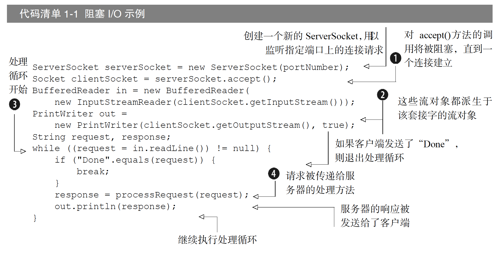

### (2) NIO

详细请参看：[Java NIO总结](https://github.com/liujunao/learnNote/blob/master/notes/java/Java_IO.md#八nio) 


### (3) 选择器

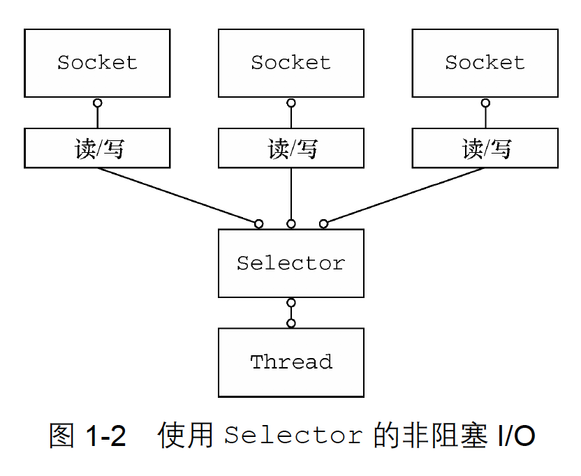

## 2、Netty 简介

### (1) Netty 特性

|   分类   | Netty 特性                                                   |
| :------: | ------------------------------------------------------------ |
|   设计   | 1、统一的 API，支持多种传输类型，阻塞的和非阻塞的<br>2、简单而**强大的线程模型**<br>3、真正的**无连接数据报套接字支持**<br>4、链接逻辑组件以支持复用 |
|   性能   | 1、拥有比 Java 的核心 API 更高的吞吐量以及更低的延迟<br>2、得益于**池化和复用**，拥有更低的资源消耗<br>3、最少的内存复制 |
|  健壮性  | 1、不会因为慢速、快速或超载的连接而导致 OutOfMemoryError<br>2、消除在高速网络中 NIO 应用程序常见的不公平读/写比率 |
|  安全性  | 1、完整的 SSL/TLS 以及 StartTLS 支持<br>2、可用于受限环境下，如 Applet 和OSGI |
| 社区驱动 | 发布快速而且频繁                                             |

### (2) 异步和事件驱动

- 异步事件驱动的系统：可以以任意的顺序响应在任意的时间点产生的事件

- 异步和可伸缩性的联系：

    - 非阻塞网络调用使得不必等待一个操作的完成，异步 I/O 正是基于这个特性构建

        > 更进一步：异步方法会立即返回，并且在它完成时，会直接或在稍后的某个时间点通知用户

    - 选择器使得能够通过较少的线程便可监视许多连接上的事件

## 3、Netty 的核心组件

### (1) Channel

- **Channel**：NIO 的一个基本构造，代表一个到实体(如：文件、网络套接字或能执行 I/O 操作的程序组件)的开放连接(如：读/写操作)

    > 可以把 Channel 看作是传入或传出数据的载体，可以被打开或被关闭、连接或断开连接

### (2) 回调

- 一个回调其实就是一个方法，一个指向已经被提供给另外一个方法的方法的引用，使得后者可以在适当的时候调用前者

- **Netty 在内部使用回调来处理事件**：当一个回调被触发时，相关的事件可以被一个 ChannelHandler 的实现处理

    > 当一个新的连接已经被建立时，ChannelHandler 的 channelActive() 回调方法将会被调用，并将打印出一条信息
    >
    > 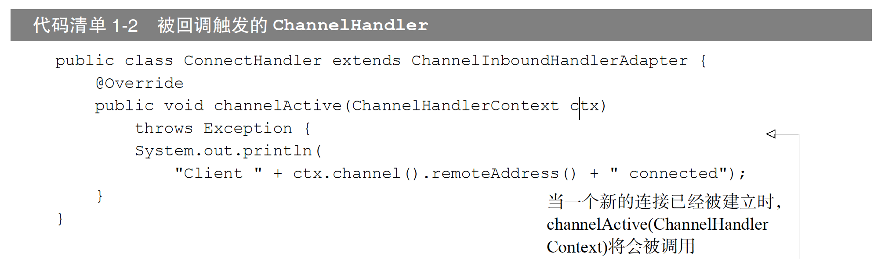

### (3) Future

**Future**：可以看作是一个异步操作的结果的占位符，将在未来的某个时刻完成，并提供对其结果的访问

- **JDK Future**：只允许手动检查对应的操作是否已经完成，或一直阻塞直到它完成(这非常繁琐)

- **Netty 的 ChannelFuture**：在执行异步操作时使用

    > ChannelFuture 提供了几种额外的方法，使得能够注册一个或多个 ChannelFutureListener 实例:
    >
    > - 监听器的回调方法 operationComplete()，将会在对应的操作完成时被调用
    > - 然后监听器可以判断该操作是成功还是出错，若出错，则可以检索产生的 Throwable
    >
    > 即由 ChannelFutureListener 提供的通知机制消除了手动检查对应的操作是否完成的必要

---

代码实例：

- 代码 1-3：展示了一个 ChannelFuture 作为一个 I/O 操作的一部分返回的例子

    > connect() 方法将会直接返回，而不会阻塞，该调用将会在后台完成
    >
    > 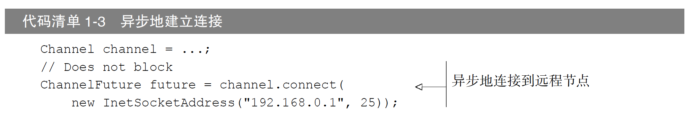

- 代码 1-4：显示了如何利用 ChannelFutureListener

    > - 首先，连接到远程节点上
    > - 然后，注册一个新的 ChannelFutureListener 到对 connect() 方法的调用所返回的 ChannelFuture 上
    > - 当该监听器被通知连接建立时，检查对应的状态
    >     - 如果操作成功，则将数据写到该 Channel
    >     - 否则，从 ChannelFuture 中检索对应的 Throwable
    >
    > 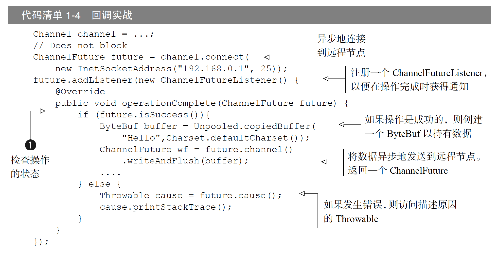

### (4) 事件和 ChannelHandler

- Netty 使用不同的事件来通知状态的改变或是操作的状态，使得能够基于已发生的事件来触发适当的动作：
    - 记录日志
    - 数据转换
    - 流控制
    - 应用程序逻辑

- Netty 是一个网络编程框架，所以事件按照入(出)站数据流的相关性分类：
    - 由入站数据或相关的状态更改而触发的事件包括：
        - 连接已被激活或连接失活
        - 数据读取
        - 用户事件
        - 错误事件
    - 出站事件是未来将会触发的某个动作的操作结果，这些动作包括：
        - 打开或关闭到远程节点的连接
        - 将数据写到或冲刷到套接字

---

下图展示了一个事件如何被一个 ChannelHandler 链处理：

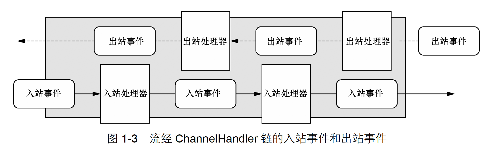

### (5) 选择器、事件、EventLoop

- Netty 通过触发事件将 Selector 从应用程序中抽象出来，消除了所有本来将需要手动编写的派发代码

- 在内部，将会为每个 Channel 分配一个 EventLoop，用以处理所有事件，包括：

    - 注册感兴趣的事件
    - 将事件派发给 ChannelHandler
    - 安排进一步的动作

    > EventLoop 本身只由一个线程驱动，其处理了一个 Channel 的所有 I/O 事件，并且在 EventLoop 的整个生命周期内都不改变

# 二、第一款 Netty 应用程序

## 1、Netty 客户端/服务器

### (1) 服务端流程

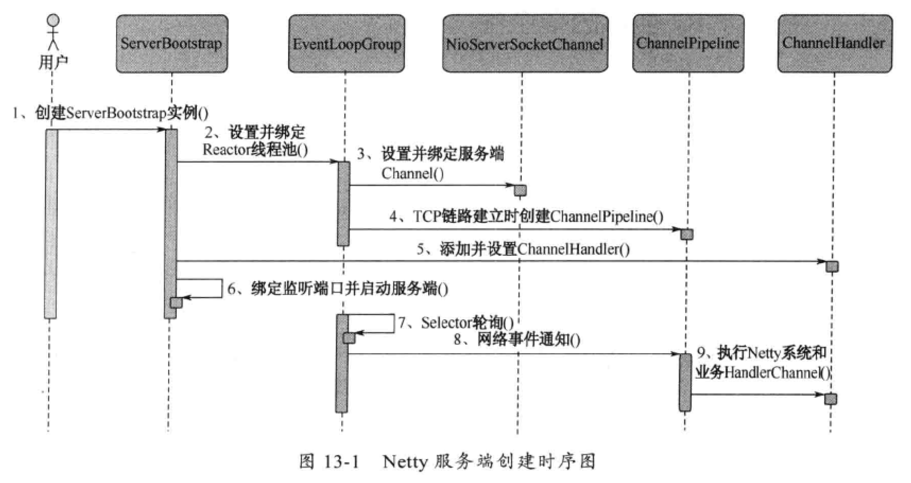

- 步骤一：创建 ServerBootstrap 实例

    > - ServerBootstrap 是 Netty 服务端的启动辅助类，提供了一系列的方法用于设置服务端启动相关的参数
    > - 底层通过门面模式对各种能力进行抽象和封装，尽量不需要用户与过多的底层 API 交互，降低用户的开发难度

- 步骤二：设置并绑定 Reactor 线程池

    > Netty 的 Reactor 线程池是 EventLoopGroup，即 EventLoop 的数组
    >
    > - **EventLoop 的职责**：处理所有注册到本线程多路复用器 Selector 上的 Channel
    >
    >     > Selector 的轮询操作由绑定的 EventLoop 线程 run 方法驱动，在一个循环体内循环执行

- 步骤三：设置并绑定服务端 Channel

    > 用户不需要关心服务端 Channel 的底层实现细节和工作原理，只需要指定具体使用哪种 Channel 即可

- 步骤四：链路建立时创建并初始化 ChannelPipeline

    > ChannelPipeline 本质：是一个负责处理网络时间的责任链，负责管理和执行 ChannelHandler，典型的网络事件如下：
    >
    > 1. 链路注册
    > 2. 链路激活
    > 3. 链路断开
    > 4. 接收到请求消息
    > 5. 请求消息接收并处理完毕
    > 6. 发送应答消息
    > 7. 链路发生异常
    > 8. 发生用户自定义事件

- 步骤五：初始化 ChannelPipeline 后，添加并设置 ChannelHandler

    > 用户可以通过 ChannelHandler 进行功能定制，常用 ChannelHandler 如下：
    >
    > - 系统编解码框架：ByteToMessageCodec
    > - 通用基于长度的半包编码器：LengthFieldBasedFrameDecoder
    > - 码流日志打印 Handler：LoggingHandler
    > - SSL 安全认证 Handler：SslHanler
    > - 链路空闲检测 Handler：IdleStateHandler
    > - 流量整形 Handler：ChannelTrafficShapingHandler
    > - Base64 编解码：Base64Decoder 和 Base64 Encoder

- 步骤六：绑定并启动监听端口，并将 ServerSocketChannel 注册到 Selector 上监听客户端连接

- 步骤七：Selector 轮询

    > 由 Reactor 线程 NioEventLoop 负责调度和执行 Selector 轮询操作，选择准备就绪的 Channel 集合

- 步骤八：当轮询到准备就绪的 Channel 后，由 Reactor 线程 NioEventLoop 执行 ChannelPipeline 的相应方法，最终调度并执行 ChannelHandler

- 步骤九：执行 Netty 系统的 ChannelHandler 和用户添加定制的 ChannelHandler

### (2) 客户端流程

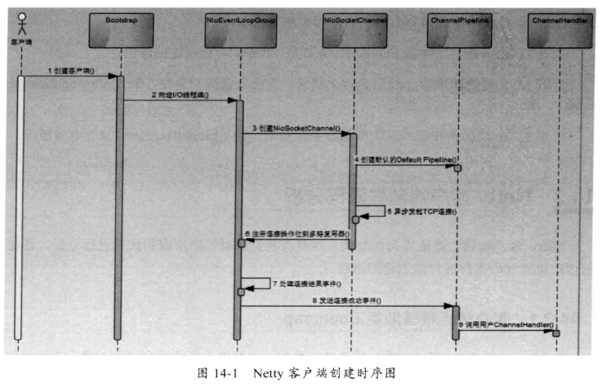

- 步骤一：用户线程创建 Bootstrap 实例，通过 API 设置创建客户端相关的参数，异步发起客户端连接

- 步骤二：创建处理客户端连接、I/O 读写的 Reactor 线程组 NioEventLoopGroup

    > 可以通过构造函数指定 I/O 线程的个数，默认为 CPU 内核数的 2 倍

- 步骤三：通过 Bootstrap 的 ChannelFactory 和用户指定的 Channel 类型创建用于客户端连接的 NioSocketChannel

    > 功能类似 NIO 的 SocketChannel

- 步骤四：创建默认的 ChannelHandlerPipeline，用于调度和执行网络事件

- 步骤五：异步发起 TCP 连接，判断连接是否成功

    - 若成功，则直接将 NioSocketChannel 注册到多路复用器上，监听读操作位，用于数据报读取和消息发送
    - 若没有立即连接成功，则注册连接监听位到多路复用器，等待连接结果

- 步骤六：注册对应的网络监听状态位到多路复用器
- 步骤七：由多路复用器在 I/O 现场中轮询各 Channel，处理连接结果
- 步骤八：若连接成功，设置 Future 结果，发送连接成功事件，触发 ChannelPipeline 执行
- 步骤九：由 ChannelPipeline 调度执行系统和用户的 ChannelHandler，执行业务逻辑

## 2、服务端

Netty 服务端必须的两部分：

- **至少一个 ChannelHandler**：该组件实现了服务端对从客户端接收数据的处理，即业务逻辑
- **引导**：这是配置服务器的启动代码，会将服务器绑定到要监听连接请求的端口上

### (1) ChannelHandler 和业务逻辑

> ChannelHandler 是一个接口族的父接口，负责接收并响应事件通知

因为服务端会响应传入的消息，所以需要实现 ChannelInboundHandler 接口，用来定义响应入站事件的方法

- ChannelInboundHandlerAdapter 类提供了 ChannelInboundHandler 的默认实现
- **channelRead()**：对于每个传入的消息都要调用
- **channelReadComplete()**：通知 ChannelInboundHandler 最后一次对 channelRead() 的调用是当前批量读取中的最后一条消息
- **exceptionCaught()**：在读取操作期间，有异常抛出时会调用

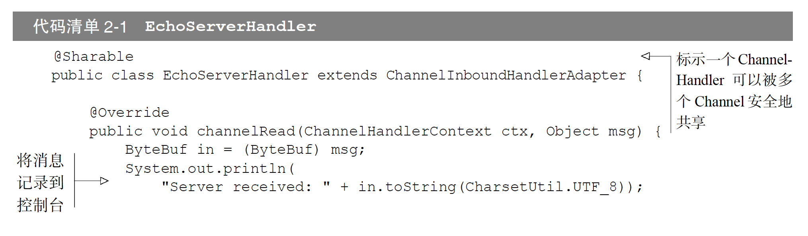

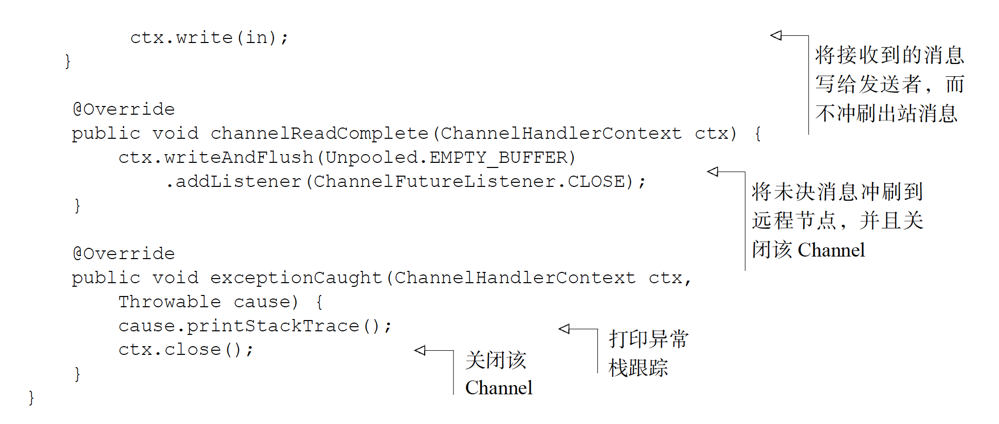

### (2) 引导服务器

引导服务器本身的过程：

- 绑定到服务器将在其上监听并接受传入连接请求的端口

- 配置 Channel，以将有关的入站消息通知给 EchoServerHandler 实例

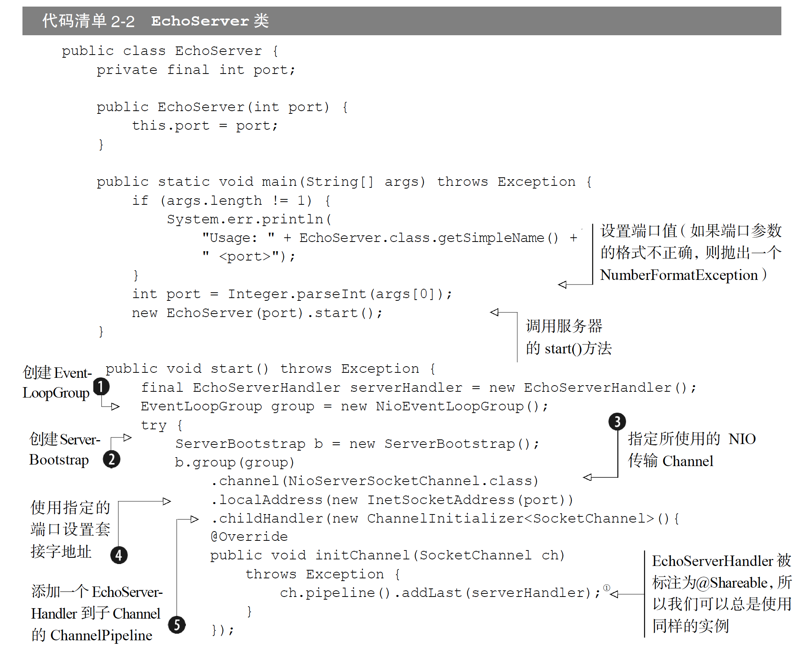

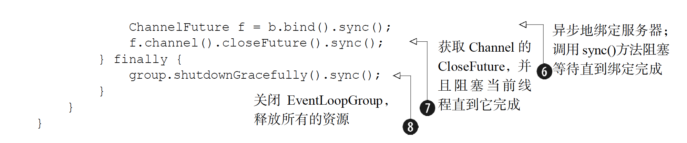

- EchoServerHandler 实现了业务逻辑

- main() 方法引导了服务器

引导过程的步骤如下：

- 创建一个 ServerBootstrap 的实例以引导和绑定服务器

- 创建并分配一个 NioEventLoopGroup 实例以进行事件的处理，如接受新连接以及读/写数据

- 指定服务器绑定的本地的 InetSocketAddress

- 使用一个 EchoServerHandler 的实例初始化每一个新的 Channel

- 调用 ServerBootstrap.bind() 方法以绑定服务器

## 3、客户端

### (1) 通过 ChannelHandler 实现客户端逻辑

客户端拥有一个用来处理数据的 ChannelInboundHandler，即扩展 SimpleChannelInboundHandler 类以处理所有必须的任务：

- **channelActive()**：与服务器的连接建立之后被调用

- **channelRead0()**：从服务器接收到一条消息时被调用

- **exceptionCaught()**：处理过程中引发异常时被调用

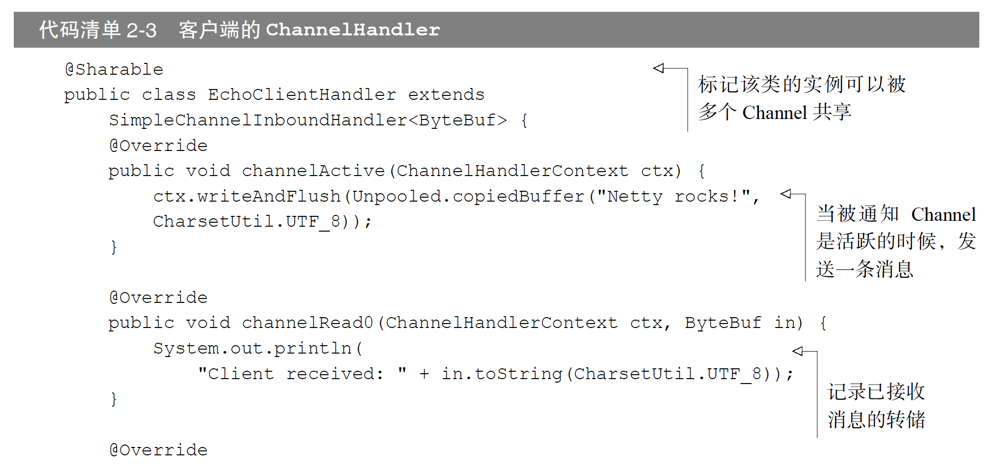

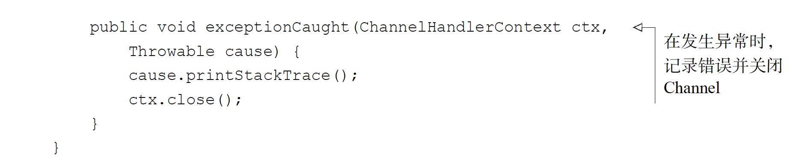

### (2) 引导客户端

引导客户端类似引导服务端：

- 区别是：客户端是使用主机和端口参数来连接远程地址，即服务端地址，而不是绑定到一个一直被监听的端口

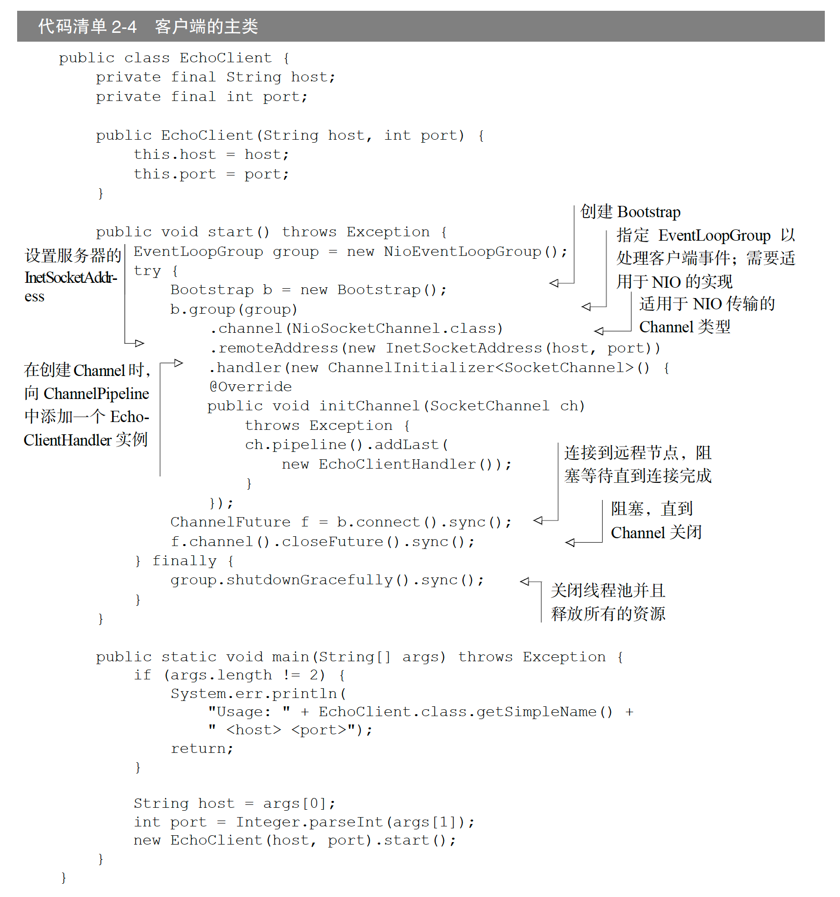

- 为初始化客户端，创建一个 Bootstrap 实例
- 为进行事件处理分配一个 NioEventLoopGroup 实例，其中事件处理包括创建新的连接以及处理入站和出站数据
- 为服务器连接创建一个 InetSocketAddress 实例
- 当连接被建立时，一个 EchoClientHandler 实例会被安装到该Channel 的 ChannelPipeline 中
- 在一切都设置完成后，调用 Bootstrap.connect() 方法连接到远程节点

# 三、Netty 的组件和设计

## 1、Channel、EventLoop、ChannelFuture

- Channel --> Socket

- EventLoop --> 控制流、多线程处理、并发

- ChannelFuture --> 异步通知

### (1) Channel 接口

- **JDK Socket**：基本的 I/O 操作 bind()、connect()、read()、write() 依赖于底层网络传输所提供的原语，即 Socket

- **Netty Channel**：降低了直接使用 Socket 的复杂性

    > Channel 拥有许多预定义的、专门化实现的广泛类层次结构的根：
    >
    > - EmbeddedChannel
    > - LocalServerChannel
    > - NioDatagramChannel
    > - NioSctpChannel
    > - NioSocketChannel

### (2) EventLoop 接口

EventLoop 定义了 Netty 的核心抽象，用于处理连接的生命周期中所发生的事件

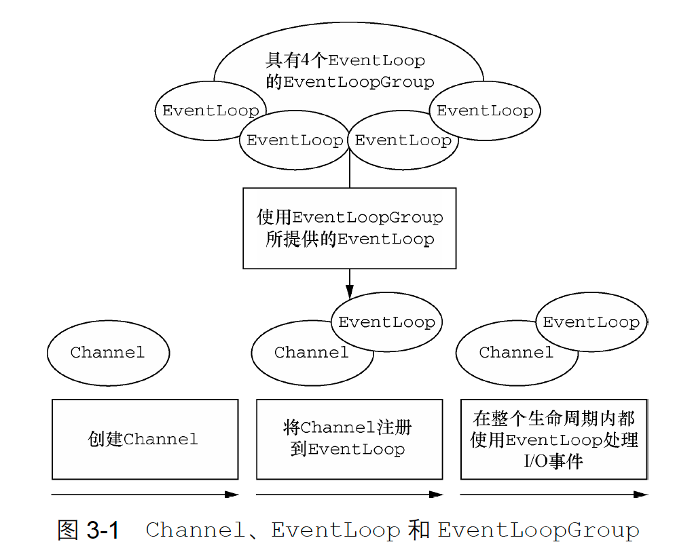

- 一个 EventLoopGroup 包含一个或多个 EventLoop
- 一个 EventLoop 在它的生命周期内只和一个 Thread 绑定
- 所有由 EventLoop 处理的 I/O 事件都将在它专有的 Thread 上被处理
- 一个 Channel 在它的生命周期内只注册于一个 EventLoop
- 一个 EventLoop 可能会被分配给一个或多个 Channel

### (3) ChannelFuture 接口

- Netty 提供了 ChannelFuture 接口，其 addListener() 方法注册了一个 ChannelFutureListener，以便在某个操作完成时得到通知

    > 可以将 ChannelFuture 看作是将来要执行的操作的结果的占位符

## 2、ChannelHandler、ChannelPipeline

### (1) ChannelHandler 接口

- ChannelHandler 是 Netty 的主要组件，充当了所有处理入站和出站数据的应用程序逻辑的容器

- ChannelHandler 的方法由网络事件触发

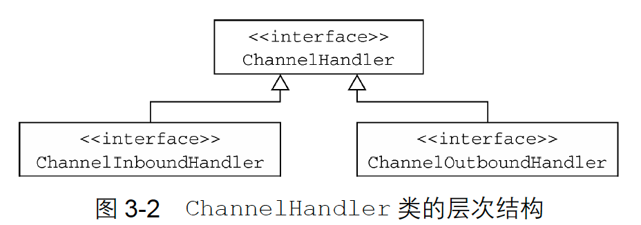

下面是编写自定义 ChannelHandler 时经常会用到的适配器类：

- ChannelHandlerAdapter

- ChannelInboundHandlerAdapter

- ChannelOutboundHandlerAdapter

- ChannelDuplexHandler

### (2) ChannelPipeline 接口

- ChannelPipeline 提供了 ChannelHandler 链的容器，并定义了用于在该链上传播入站和出站事件流的 API

- 当 Channel 被创建时，会被自动地分配到专属的 ChannelPipeline

---

ChannelHandler 安装到 ChannelPipeline 中的过程如下所示：

- 一个 ChannelInitializer 的实现被注册到了 ServerBootstrap 中
- 当 ChannelInitializer.initChannel() 方法被调用时，ChannelInitializer 将在 ChannelPipeline 中安装一组自定义的 ChannelHandler
- ChannelInitializer 将它自己从 ChannelPipeline 中移除

---

ChannelPipeline 是 ChannelHandler 的编排顺序：

- ChannelHandler 在应用程序的初始化或引导阶段被安装
- ChannelHandler 对象接收事件、执行它们所实现的处理逻辑，并将数据传递给链中的下一个 ChannelHandler
- ChannelHandler 的执行顺序是由它们被添加的顺序决定

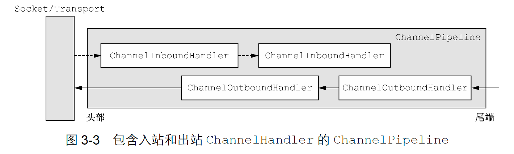

> Netty 会确保数据只在具有相同定向类型的两个 ChannelHandler 之间传递

---

- 当 ChannelHandler 被添加到 ChannelPipeline 时，会被分配一个 ChannelHandlerContext，其代表了 ChannelHandler 和ChannelPipeline 间的绑定

    > 虽然 ChannelHandlerContext 可以被用于获取底层的 Channel，但是它主要还是被用于写出站数据

- **Netty 中的两种发送消息的方式**：
    - **直接写到 Channel**：会导致消息从 ChannelPipeline 的**尾端**开始流动
    - **写到 ChannelHandlerContext**：导致消息从 ChannelPipeline 中的下一个 ChannelHandler 开始流动

### (3) 编码器和解码器

Netty 为编码器和解码器提供了不同类型的抽象类：

- ByteToMessageDecoder 或 MessageToByteEncoder
- ProtobufEncoder 或 ProtobufDecoder(用来支持 Google 的 Protocol Buffers)

---

所有由 Netty 提供的编码器/解码器适配器类都实现了 ChannelOutboundHandler 或 ChannelInboundHandler 接口

- 对于入站数据，channelRead 方法/事件已被重写
    - 对于每个从入站 Channel 读取的消息，这个方法都将会被调用
    - 随后，它将调用由预置解码器所提供的 decode()方法，并将已解码的字节转发给下一个ChannelInboundHandler

- 出站消息的模式反向：编码器将消息转换为字节，并将它们转发给下一个 ChannelOutboundHandler

## 3、引导

Netty 的引导类为应用程序的网络层配置提供了容器，涉及：

- **ServerBootstrap**：用于服务端，将一个进程绑定到某个指定的端口
- **Bootstrap**：用于客户端，将一个进程连接到另一个运行在某个指定主机的指定端口上的进程

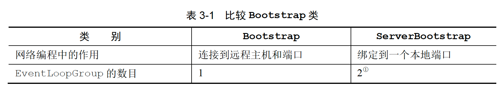

---

**服务端需要两组不同的 Channel**：

- 第一组：将只包含一个 ServerChannel，代表服务器自身的已绑定到某个本地端口的正在监听的套接字
- 第二组：将包含所有已创建的用来处理传入客户端连接(对于每个服务器已经接受的连接都有一个)的 Channel

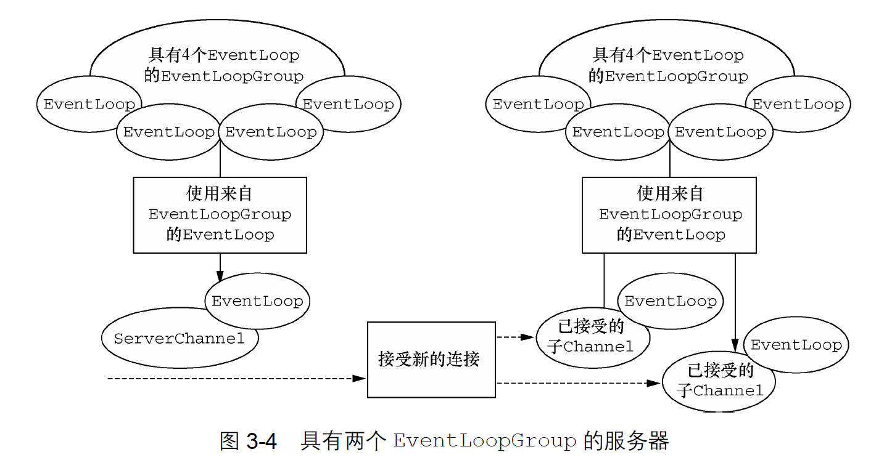

> - 与 ServerChannel 相关联的 EventLoopGroup 将分配一个负责为传入连接请求创建 Channel 的 EventLoop
>
> - 一旦连接被接受，第二个 EventLoopGroup 就会给它的 Channel 分配一个 EventLoop

# 四、传输

## 1、案例研究：传输迁移

将从一个应用程序开始对传输的学习，这个应用程序只简单地接受连接，向客户端写“Hi!”，然后关闭连接

### (1) 不通过 Netty 使用 OIO 和 NIO

**JDK 的 阻塞 IO**：

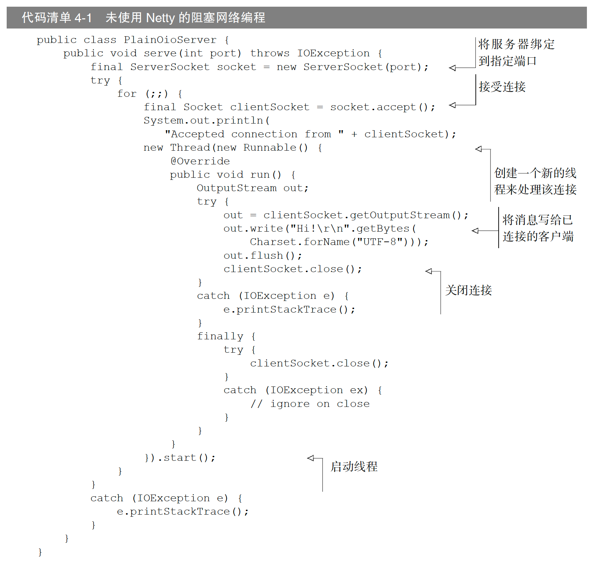

---

**JDK 的非阻塞 IO**：


### (2) 通过 Netty 使用 OIO

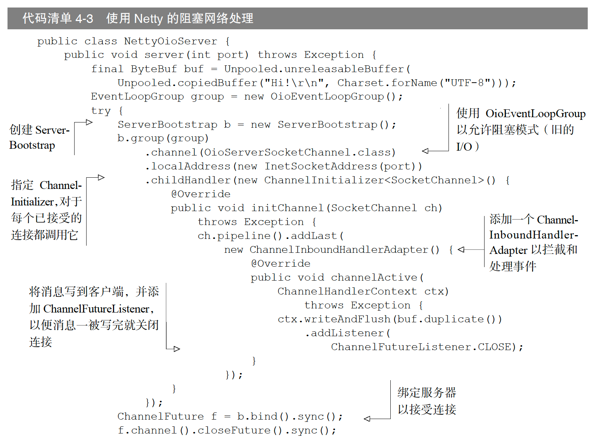


### (3) 通过 Netty 使用 NIO(非阻塞)

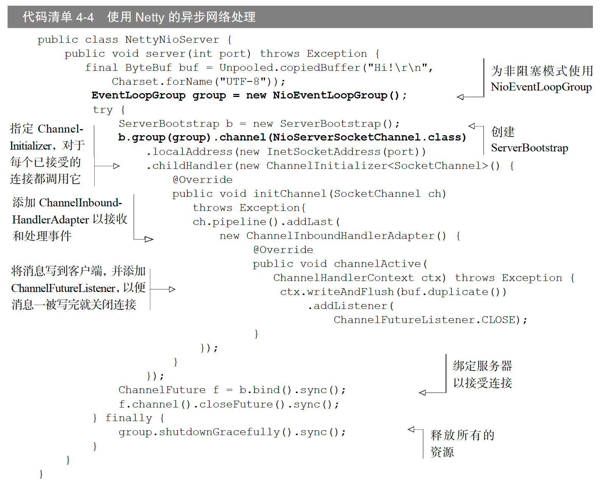

## 2、传输 API

### (1) Channel 接口的层次结构

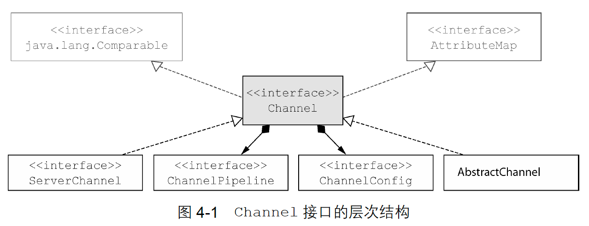

- 由于 Channel 独一无二，所以为了保证顺序将 Channel 声明为 java.lang.Comparable 的子接口

- 如果两个不同的 Channel 实例都返回了相同的散列码，则 AbstractChannel 中的 compareTo() 方法的实现将会抛出一个 Error

- 每个 Channel 都将会被分配一个 ChannelPipeline 和 ChannelConfig

    > ChannelConfig 包含了该 Channel 的所有配置设置，并且**支持热更新**

- ChannelPipeline 持有所有应用于入站和出站数据以及事件的 ChannelHandler 实例

    > 这些 ChannelHandler 实现了应用程序用于处理状态变化以及数据处理的逻辑

---

ChannelHandler 的典型用途包括：

- 将数据从一种格式转换为另一种格式
- 提供异常的通知
- 提供 Channel 变为活动的或非活动的通知
- 提供当 Channel 注册到 EventLoop 或从 EventLoop 注销时的通知
- 提供有关用户自定义事件的通知

### (2) Channel 方法

ChannelPipeline 实现了拦截过滤器，可以根据需要通过添加或移除 ChannelHandler 实例来修改 ChannelPipeline

> 通过利用 Netty 的这项能力可以构建出高度灵活的应用程序

除了访问所分配的 ChannelPipeline 和 ChannelConfig 之外，也可以利用 Channel 的其他方法

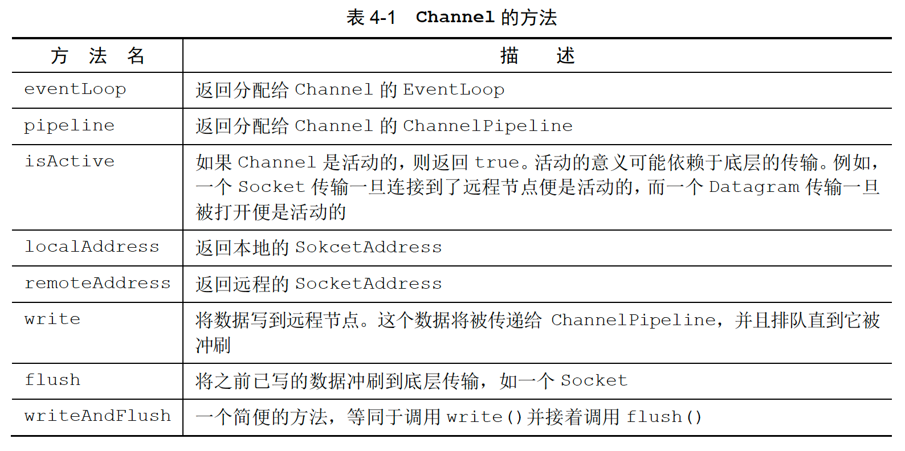

### (3) 案例

**案例一**：通过 Channel.writeAndFlush() 来实现：写数据并将其冲刷到远程节点

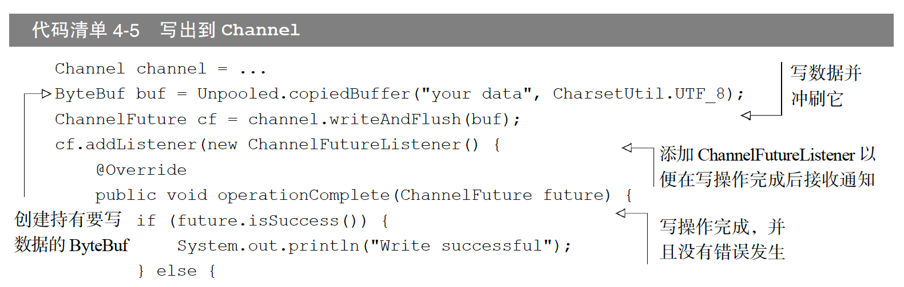


---

**案例二**：多线程写数据

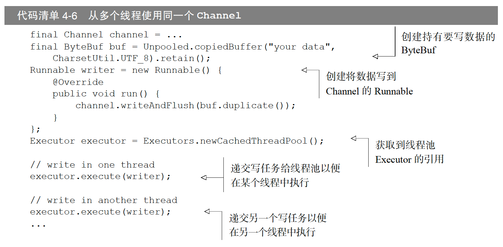

## 3、内置的传输

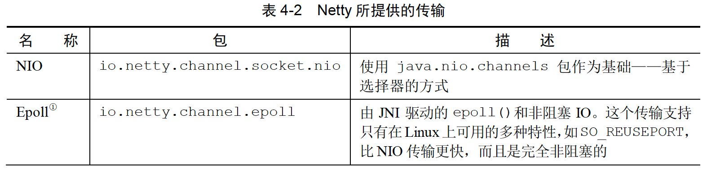

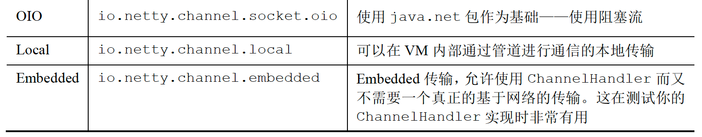

### (1) NIO：非阻塞 IO

- NIO 提供了一个所有 I/O 操作的全异步的实现，利用了基于选择器的 API

- 选择器背后的基本概念是：充当一个注册表，可以请求在 Channel 的状态发生变化时得到通知。可能的状态变化有：
    - 新的 Channel 已被接受并且就绪
    - Channel 连接已经完成
    - Channel 有已经就绪的可供读取的数据
    - Channel 可用于写数据

选择器运行在一个检查状态变化并对其做出相应响应的线程上，**在应用程序对状态的改变做出响应后，选择器会被重置，并重复这个过程**

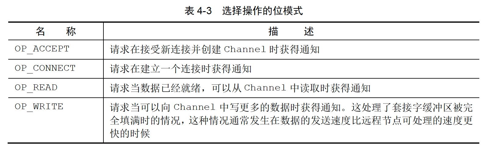

**选择器的处理状态变化**：

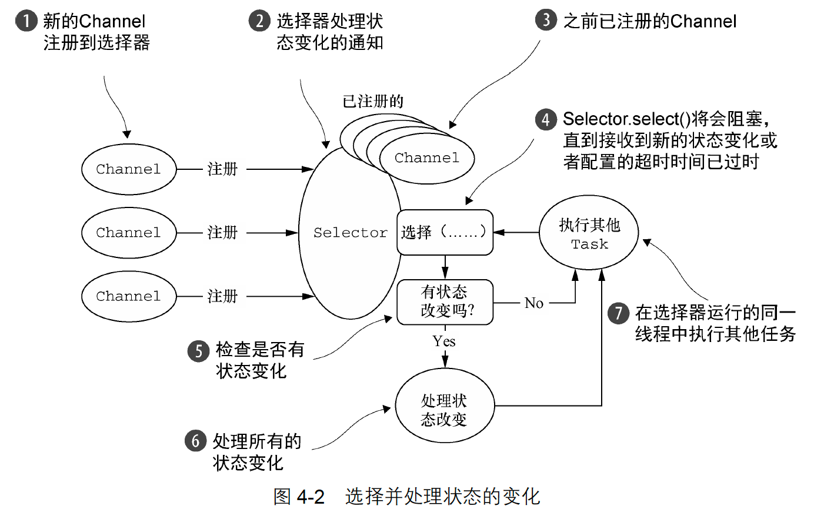

### (2) OIO：旧的阻塞 IO

> Netty 的OIO 传输通过常规的传输 API 使用，由于建立在 java.net 包的阻塞实现之上，所以它不是异步

**Netty 修改 OIO 为异步**：利用 `SO_TIMEOUT` 这个 Socket 标志，指定等待一个 I/O 操作完成的最大毫秒数

- 如果操作在指定的时间间隔内没有完成，则将会抛出一个 SocketTimeout Exception
- Netty 将捕获这个异常并继续处理循环
- 在 EventLoop下一次运行时，将再次尝试

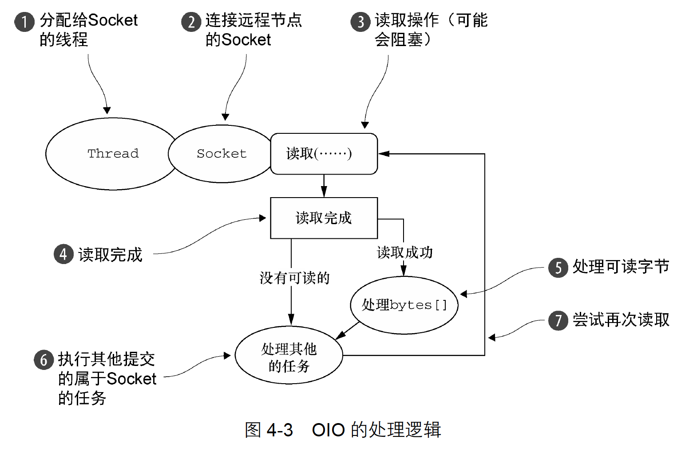

### (3) Epoll：用于 Linux 的本地非阻塞传输

> **epoll 比 select 和 poll 的性能更好**

在代码清单 4-4 中使用 epoll 替代 NIO：

- 将 NioEventLoopGroup 替换为 EpollEventLoopGroup
- 将 NioServerSocketChannel.class 替换为 EpollServerSocketChannel.class


### (4) Local：用于 JVM 内部通信

**Local 传输**：用于在同一个 JVM 中运行的客户端和服务器程序之间的异步通信，这个传输也支持对于所有 Netty 传输实现都共同的 API


### (5) Embedded 传输

**Embedded 传输**：使得可以将一组 ChannelHandler 作为帮助器类嵌入到其他的 ChannelHandler 内部

> 通过这种方式，可以扩展一个 ChannelHandler 功能，而又不需要修改其内部代码

## 4、传输的用例

- **非阻塞代码库**：若代码库中没有阻塞调用(或能限制它们的范围)，则在 Linux 上优先选择 NIO 或 epoll

- **阻塞代码库**：若代码库严重依赖阻塞 I/O，则在尝试将其转换为 Netty 的 NIO 传输时，将可能会遇到和阻塞操作相关的问题

    > 不要重写代码，考虑分阶段迁移：先从 OIO 开始，等代码修改好后，再迁移到 NIO(或使用 epoll，若使用 Linux)

- **在同一个 JVM 内部的通信**：Local 传输的完美用例，将消除所有真实网络操作的开销，同时仍然使用 Netty 代码库

    > 如果随后需要通过网络暴露服务，则只需要把传输改为 NIO 或 OIO 即可

- **测试 ChannelHandler 实现**：若为 ChannelHandler 实现编写单元测试，则使用 Embedded 传输

    > 这既便于测试代码，而又不需要创建大量的模拟(mock)对象
    >
    > 你的类将仍然符合常规的 API 事件流，保证该 ChannelHandler 在和真实的传输一起使用时能够正确地工作

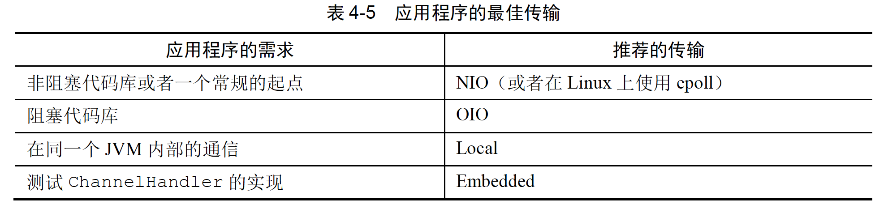

# 五、ByteBuf

> **ByteBuf：Netty 的数据容器**

## 1、ByteBuf 简介

Netty 的数据处理 API 通过两个组件暴露：`abstract class ByteBuf `和 `interface ByteBufHolder` 

**ByteBuf API 的优点**：

- 可以被用户自定义的缓冲区类型扩展
- 通过内置的复合缓冲区类型**实现了透明的零拷贝**
- **容量可以按需增长**(类似 JDK 的 StringBuilder)
- 在读和写这两种模式之间切换不需要调用 ByteBuffer 的 flip() 方法
- 读和写使用了不同的索引
- 支持方法的链式调用
- 支持引用计数
- 支持池化

---

**ByteBuf 维护了两个不同的索引**：

- 一个用于读取：当读取 ByteBuf 时，readerIndex 将会被递增已经被读取的字节数
- 一个用于写入：当写入 ByteBuf 时，writerIndex 也会被递增

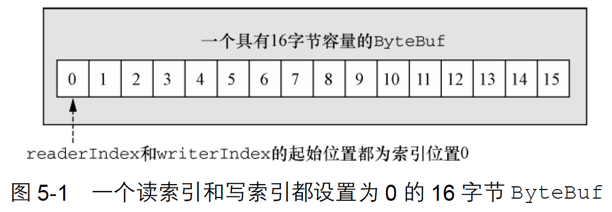

- 当读取字节 readerIndex 达到和 writerIndex 同样的值时，若试图读取超出该点的数据会触发 IndexOutOfBoundsException
    - 名称以 read 或 write 开头的 ByteBuf 方法，将会推进其对应的索引
    - 名称以 set 或 get 开头的操作则不会，这些方法将在作为一个参数传入的一个相对索引上执行操作

- 可以指定 ByteBuf 的最大容量(默认 Integer.MAX_VALUE)：试图移动写索引(即 writerIndex)超过这个值将会触发一个异常

## 2、ByteBuf 的使用模式

> ByteBuf 是一个由不同的索引分别控制读访问和写访问的字节数组

### (1) 堆缓冲区

- **支撑数组**：最常用的 ByteBuf 模式，将数据存储在 JVM 的堆空间中，能在没有使用池化的情况下提供快速的分配和释放

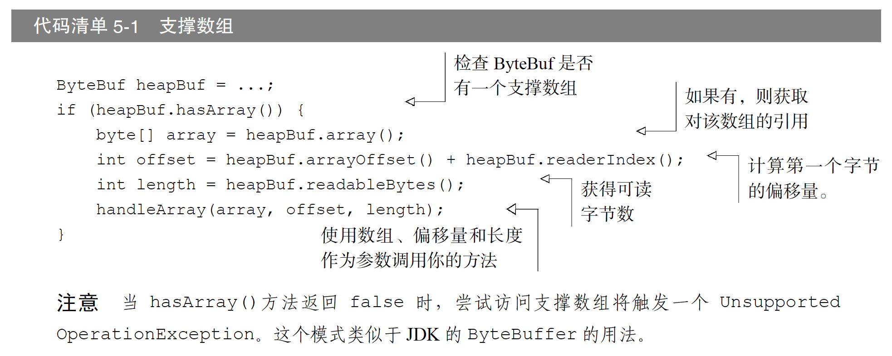

### (2) 直接缓冲区

- **ByteBuffer**：允许 JVM 实现通过本地调用来分配内存，为了避免在每次调用本地 I/O 操作前(后)将缓冲区的内容复制到一个中间缓冲区(或从中间缓冲区把内容复制到缓冲区)

    > 直接缓冲区的内容将驻留在常规的会被垃圾回收的堆之外，因此直接缓冲区对于网络数据传输是理想的选择

- **直接缓冲区的缺点**：相对堆缓冲区，它们的分配和释放都较为昂贵

    > 处理遗留代码时，可能会遇到另一个缺点：因为数据不是在堆上，所以不得不进行一次复制

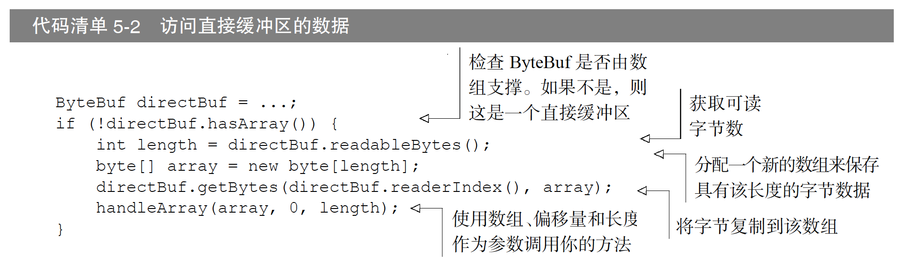

### (3) 复合缓冲区

- **复合缓冲区**：通过 CompositeByteBuf 实现，提供了一个**将多个缓冲区表示为单个合并缓冲区的虚拟表示** 

    > **注意**：
    >
    > - CompositeByteBuf 中的 ByteBuf 实例可能同时包含直接内存分配和非直接内存分配
    >
    > - **若只有一个实例，则 CompositeByteBuf 的 hasArray() 方法将返回该组件上的 hasArray() 方法的值；否则返回 false**

---

**案例：包含头部和主体的 HTTP 消息**，使用 CompositeByteBuf 能完美的存储


- **JDK ByteBuffer**：创建一个包含两个 ByteBuffer 的数组来保存消息组件，同时创建第三个 ByteBuffer 来保存数据的副本

    > 分配和复制操作，以及对数组管理，使得这个版本的实现效率低下而且笨拙

    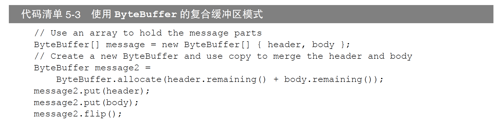

- **CompositeByteBuf**：

    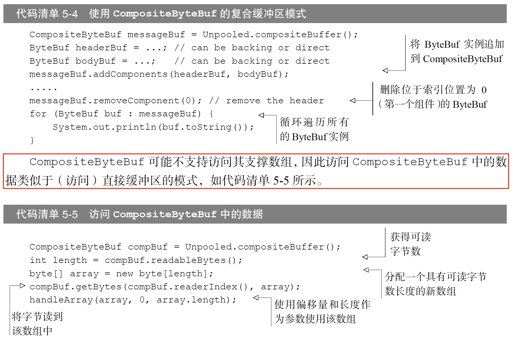

- Netty 使用 CompositeByteBuf 来优化套接字的 I/O操作，尽可能消除由 JDK 缓冲区实现所导致的性能以及内存使用率的惩罚

    > 优化发生在 Netty 的核心代码中，因此不会被暴露出来，但**应该知道它所带来的影响**

## 3、字节级操作

### (1) ByteBuf 索引

- ByteBuf 索引从零开始：第一个字节的索引是 0，最后一个字节的索引是 capacity() - 1

    > 使用只需一个索引值参数的方法来访问数据既不会改变 readerIndex 和 writerIndex，可以通过调用 readerIndex(index) 或 writerIndex(index) 来手动移动

### (2) ByteBuf 内部分段

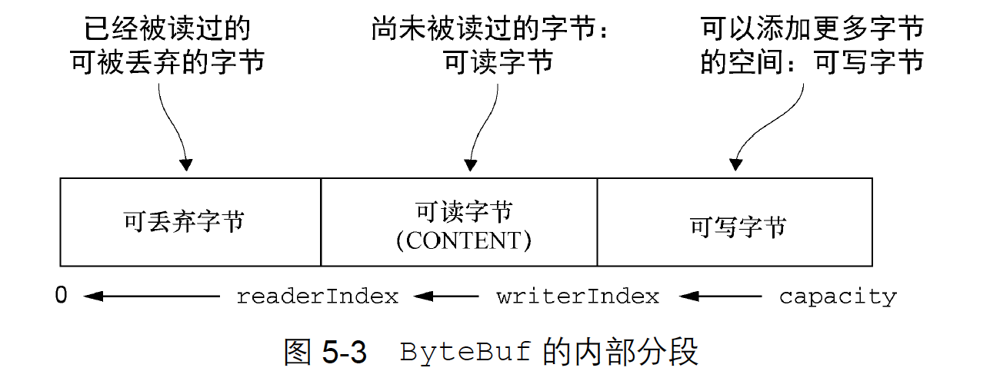

- **可丢弃字节**：初始大小为 0，存储在 readerIndex 中，随着 read 操作的执行而增加( get 操作不会移动 readerIndex)

    > `discardReadBytes()` 方法可以丢弃并回收空间
    >
    > - 注意：只是移动了可以读取的字节以及 writerIndex，而没**有对所有可写字节进行擦除写** 
    > - **避免频繁调用**：因为可读字节必须被移动到缓冲区的开始位置，所以**会导致内存复制**
    >
    > 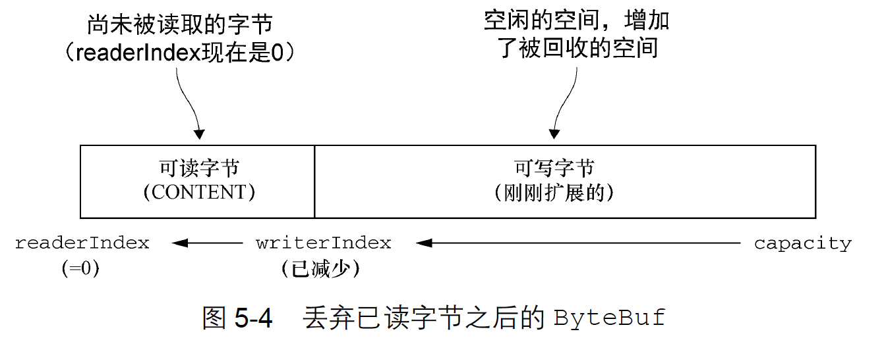

- **可读字节**：**存储实际数据**。新分配的、包装的、复制的等缓冲区 readerIndex 值默认为 0

    > - 以 read 或 skip 开头的操作都将检索或跳过位于当前 readerIndex 的数据，并且将增加已读字节数
    > - 若尝试在缓冲区的可读字节数耗尽时从中读取数据，则会引发一个 IndexOutOfBoundsException

- **可写字节**：一个拥有未定义内容的、写入就绪的内存区域，新分配缓冲区的 writerIndex 的默认值为 0

    > - 以 write 开头的操作都将从当前的 writerIndex 处开始写数据，并将增加已经写入的字节数
    > - 若尝试写入超过容量的数据，则会引发一个 IndexOutOfBoundException

### (3) 索引管理

- **JDK InputStream**：
    - `mark(int readlimit)`：将流中的当前位置标记为指定值
    - `reset()`：将流重置到该位置

- **ByteBuf**：

    - `markReaderIndex()、markWriterIndex()、resetWriterIndex()、resetReaderIndex()` 标记和重置 readerIndex 和writerIndex

    - `readerIndex(int)` 或 `writerIndex(int)`：将索引移动到指定位置

        > 试图将任何一个索引设置到一个无效的位置都将导致一个 IndexOutOfBoundsException

    - `clear()`：将 readerIndex 和 writerIndex 都设置为 0

        > 注意：**不会清除内存中的内容**
        >
        > <figure>
        >   
        >   
        > </figure>
        >
        > **`clear()` 比 `discardReadBytes()` 轻量得多**，因为它只是重置索引而不会复制任何的内存

### (4) 查找操作

- **`indexOf()` 方法**：可以用来确定指定值的索引

- 复杂的查找：可以通过那些需要一个 ByteBufProcessor 作为参数的方法达成

    > 这个接口只定义了一个方法：`boolean process(byte value)`，将检查输入值是否是正在查找的值
    >
    > 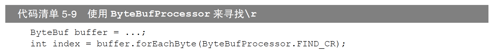

### (5) 派生缓冲区

派生缓冲区为 ByteBuf 提供专门的方式来呈现其内容视图，这类视图通过以下方法被创建：

`duplicate()、slice()、slice(int, int)、Unpooled.unmodifiableBuffer(…)、order(ByteOrder)、readSlice(int)`

- 每个这些方法都将返回一个新的 ByteBuf 实例，并**具有独立的读索引、写索引和标记索引**

- 同 JDK 的 ByteBuffer，其**内部存储可共享**，这使得派生缓冲区的创建成本很低廉

    > 注意：**如果修改了它的内容，也同时修改了其对应的源实例**，所以要小心

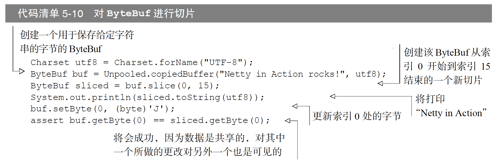

---

`copy()` 或 `copy(int, int)` 方法：构建一个现有缓冲区的真实副本，不同于派生缓冲区，其所返回的 ByteBuf 拥有独立的数据副本

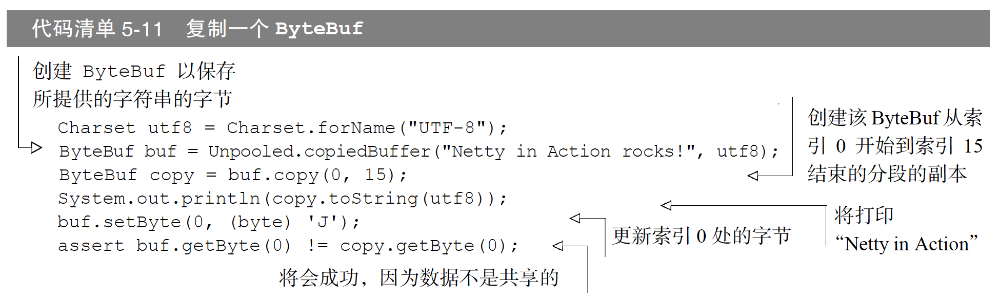

### (6) 读/写操作

两种类别的读/写操作：

- **get() 和 set() 操作**：从给定的索引开始，并且**保持索引不变**

- **read() 和 write() 操作**：从给定的索引开始，并且会根据已经访问过的字节数**对索引进行调整**

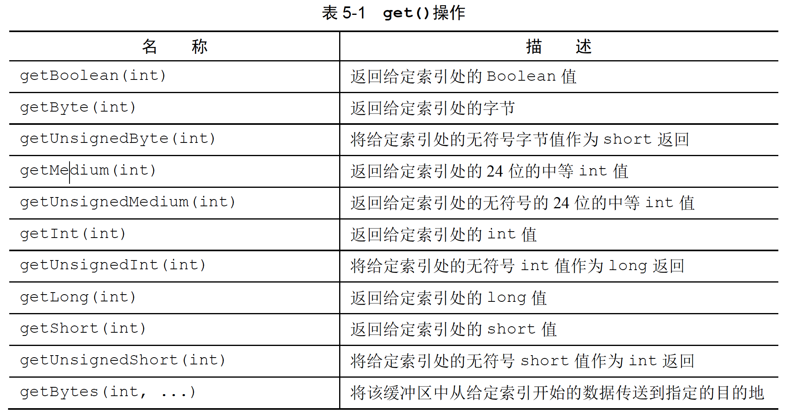
  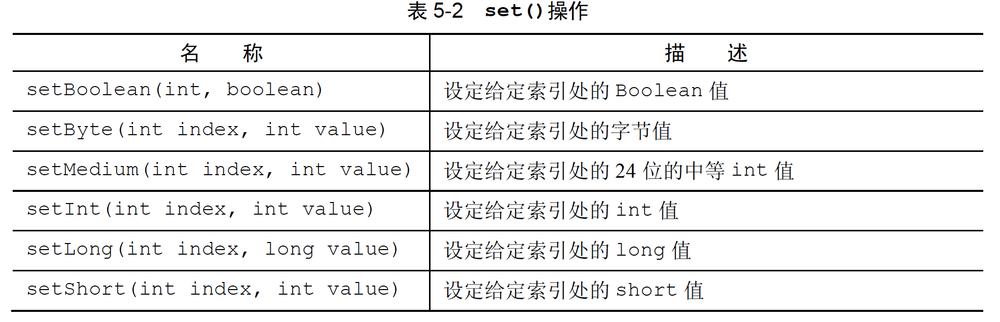


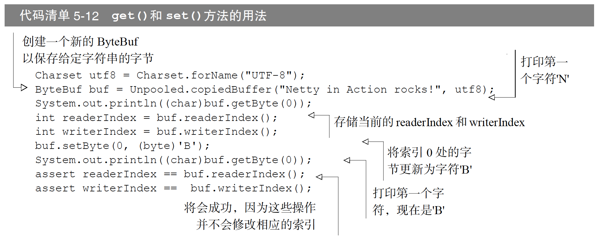

---

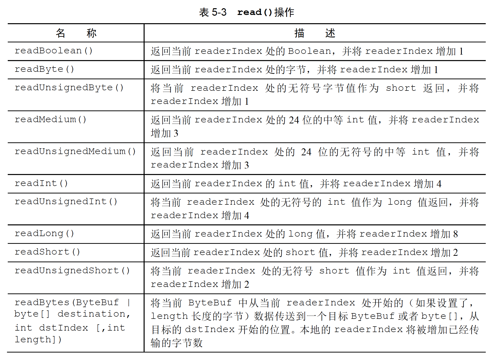
  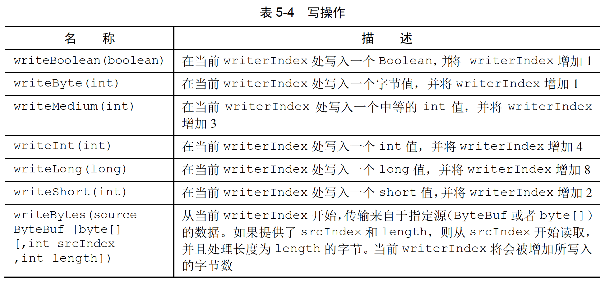


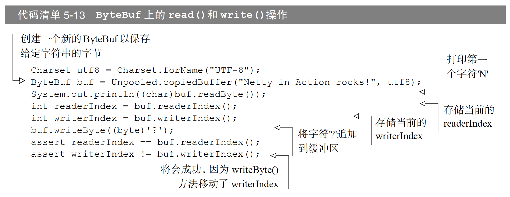

### (7) 其他操作

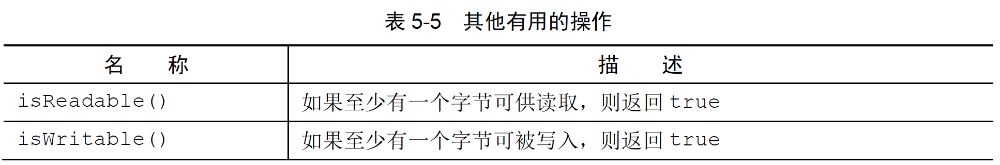

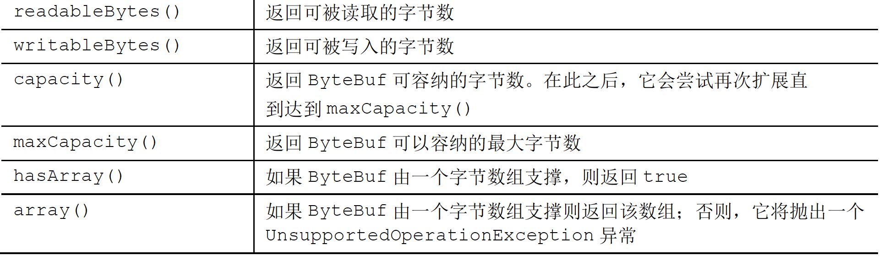

## 4、ByteBufHolder 接口

如果想实现一个**将其有效负载存储在 ByteBuf 中的消息对象**，则 ByteBufHolder 是个不错的选择

> 比如：HTTP 消息的字节内容、状态码、cookie 等

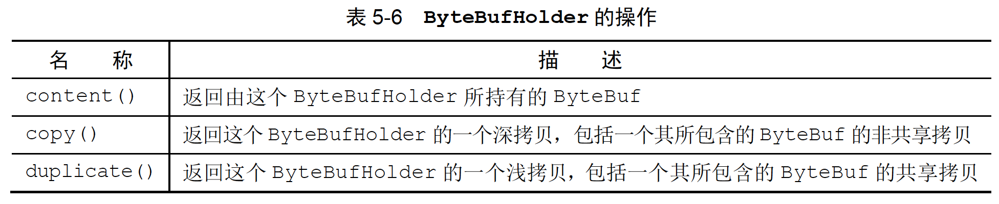

## 5、ByteBuf 分配

### (1) 按需分配：ByteBufAllocator 接口

为了降低分配和释放内存的开销，**Netty 通过 ByteBufAllocator 接口实现了 ByteBuf 的池化**：

- 池化可以用来分配我们所描述过的任意类型的 ByteBuf 实例
- 使用池化是特定于应用程序的决定，其并不会以任何方式改变 ByteBuf API 的语义

---

可以通过Channel 或绑定到 ChannelHandler 的 ChannelHandlerContext 获取一个到 ByteBufAllocator 的引用

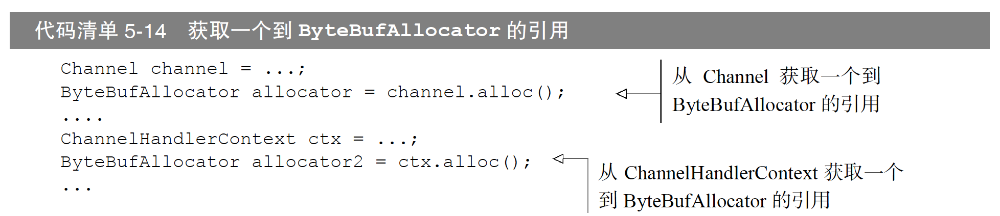

---

**Netty 提供了两种 ByteBufAllocator 的实现**：可以通过 ChannelConfig API 或在引导应用程序时指定一个不同的分配器来更改

- `PooledByteBufAllocator`：(默认使用)池化 ByteBuf 的实例以提高性能并最大限度地减少内存碎片

    > 此实现使用了一种称为 jemalloc 的已被大量现代操作系统所采用的高效方法来分配内存

- `UnpooledByteBufAllocator`：不池化 ByteBuf 实例，并且在每次被调用时都会返回一个新的实例

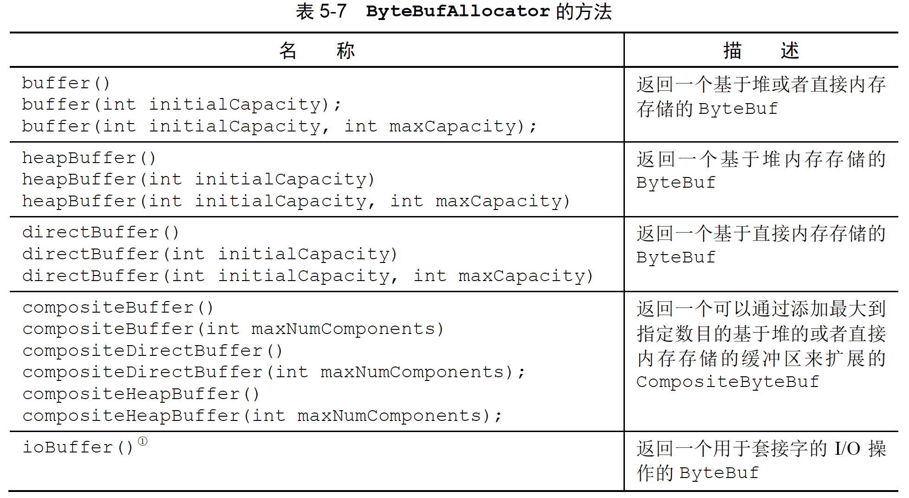

### (2) Unpooled 缓冲区

若未能获取一个到 ByteBufAllocator 的引用，则 **Unpooled 提供了静态的辅助方法来创建未池化的 ByteBuf 实例**

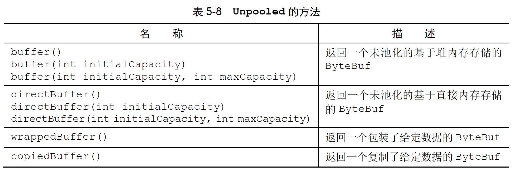

### (3) ByteBufUtil 类

**ByteBufUtil 提供了用于操作 ByteBuf 的静态辅助方法**：

> 因为 API 通用且和池化无关，所以这些方法已然在分配类的外部实现

- `hexdump()`：最有价值的方法，以十六进制的表示形式打印 ByteBuf 的内容

    > 例如：
    >
    > - 出于调试的目的而记录 ByteBuf 的内容，十六进制的表示通常会提供一个比字节值的直接表示形式更加有用的日志条目
    >
    > - 十六进制的版本还可以很容易地转换回实际的字节表示

- `boolean equals(ByteBuf, ByteBuf)`：被用来判断两个 ByteBuf 实例的相等性

## 6、引用计数

- **引用计数**：一种通过在某个对象所持有的资源不再被其他对象引用时，释放该对象所持有的资源来优化内存使用和性能的技术

    > ByteBuf 和 ByteBufHolder 引入了引用计数，它们都实现了 ReferenceCounted 接口

**引用计数的实现**：涉及跟踪到某个特定对象的活动引用的数量

- 一个 ReferenceCounted 实现的实例，通常以活动的引用计数为 1 作为开始
- 只要引用计数大于 0，就能保证对象不会被释放
- 当活动引用的数量减少到 0 时，该实例就会被释放

---

**引用计数对于池化实现(如：PooledByteBufAllocator)很重要**，它**降低了内存分配的开销**

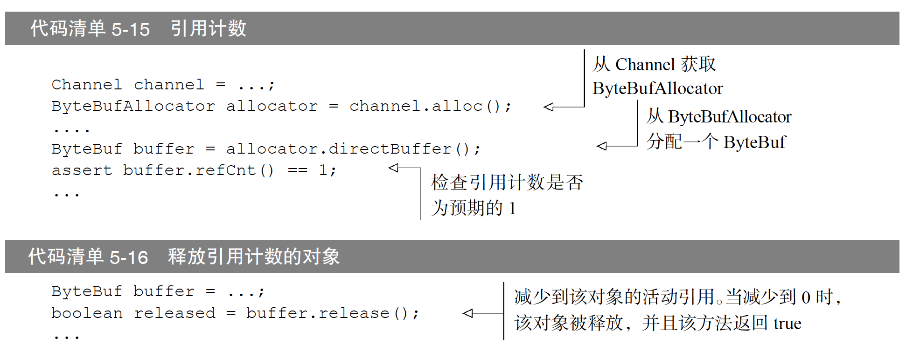

# 六、ChannelHandler 和 ChannelPipline

## 1、ChannelHandler

### (1) Channel 生命周期

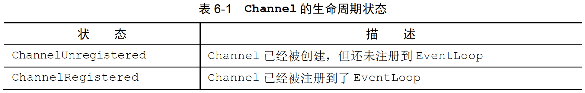

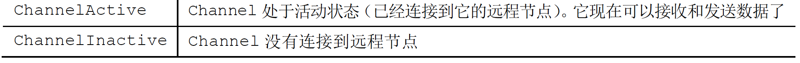

当状态发生改变时，将会生成对应的事件，这些事件将会被转发给 ChannelPipeline 中的 ChannelHandler，其可以随后对它们做出响应

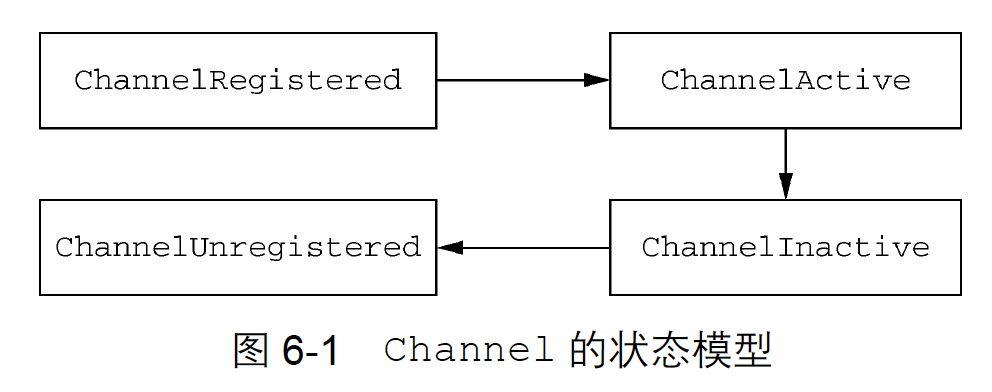

### (2) ChannelHandler 生命周期

**在 ChannelHandler 被添加到 ChannelPipeline 中或被从 ChannelPipeline 中移除时会调用下面这些操作** 

> 这些方法中的每一个都接受一个 ChannelHandlerContext 参数

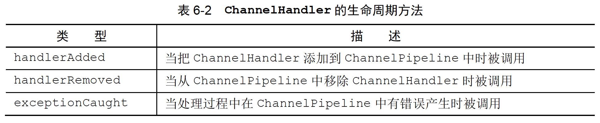

Netty 定义了下面两个重要的 ChannelHandler 子接口：

- `ChannelInboundHandler`：处理入站数据以及各种状态变化

- `ChannelOutboundHandler`：处理出站数据并且允许拦截所有的操作

### (3) ChannelInboundHandler 

**ChannelInboundHandler 生命周期方法**：这些方法将会在数据被接收时或与其对应的 Channel 状态发生改变时被调用

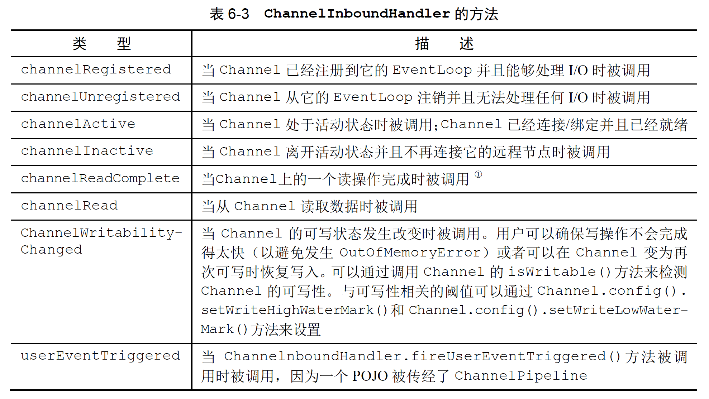

- 当某个 ChannelInboundHandler 的实现重写 channelRead() 方法时，它将负责显式地释放与池化的 ByteBuf 实例相关的内存

    Netty 为此提供了一个实用方法 `ReferenceCountUtil.release()`

    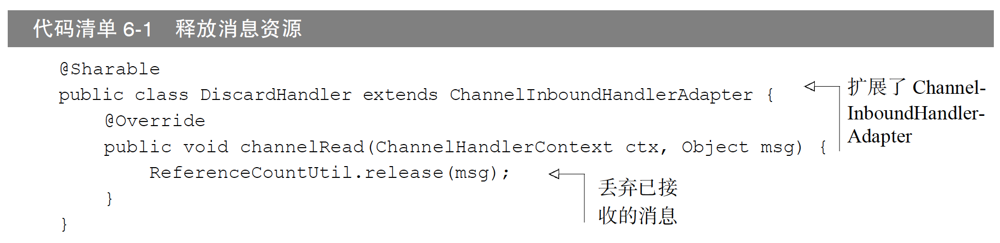

- Netty 使用 WARN 级别的日志消息记录未释放的资源，使得可以非常简单地在代码中发现违规的实例

    但这种方式管理资源可能很繁琐，更加简单的方式是使用 `SimpleChannelInboundHandler` 

    > SimpleChannelInboundHandler 会自动释放资源，所以不应该存储指向任何消息的引用供将来使用，因为这些引用将会失效

    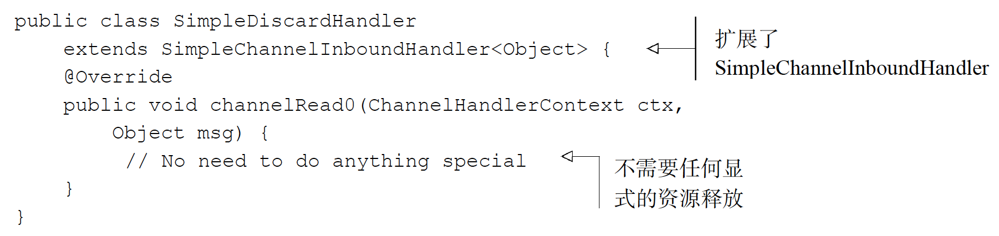

### (4) ChannelOutboundHandler

- 出站操作和数据由 ChannelOutboundHandler 处理，它的方法被 Channel、ChannelPipeline 、ChannelHandlerContext 调用

- ChannelOutboundHandler 的强大功能：**可以按需推迟操作或事件**，这使得可以通过一些复杂的方法来处理请求

    > 例如：如果到远程节点的写入被暂停了，则可以推迟冲刷操作并在稍后继续

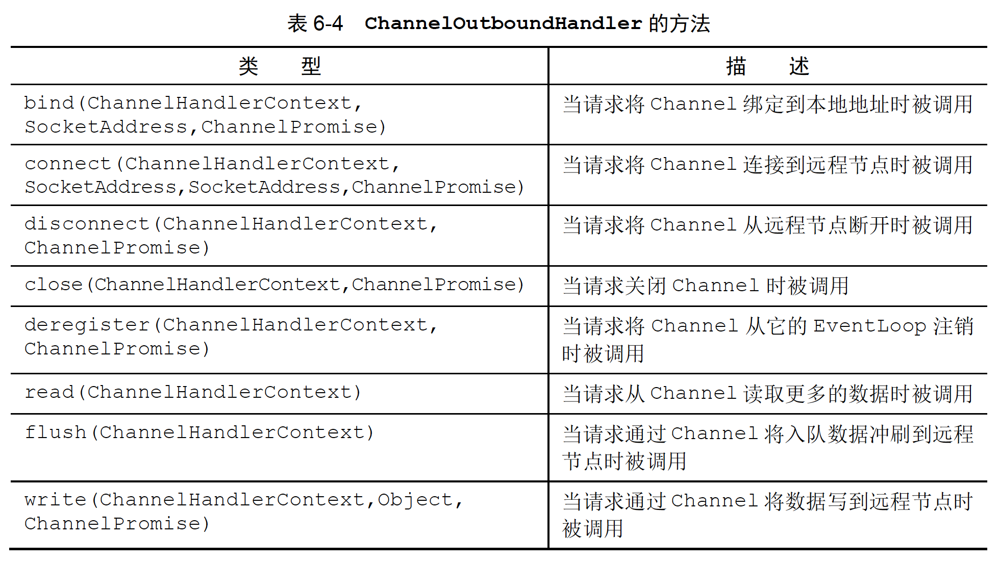

- ChannelOutboundHandler 中的大部分方法都需要一个 ChannelPromise 参数，以便在操作完成时得到通知

- **ChannelPromise 是 ChannelFuture 子类，定义了可写的方法**，如：setSuccess() 和 setFailure()，从而使 ChannelFuture 不可变

### (5) ChannelHandler 适配器

- 可以使用 `ChannelInboundHandlerAdapter` 和 `ChannelOutboundHandlerAdapter` 类作为 ChannelHandler 的起始点

- 这两个适配器分别提供了 `ChannelInboundHandler` 和 `ChannelOutboundHandler` 的基本实现
- 通过扩展抽象类 `ChannelHandlerAdapter`，获得了它们共同的超接口 `ChannelHandler` 的方法

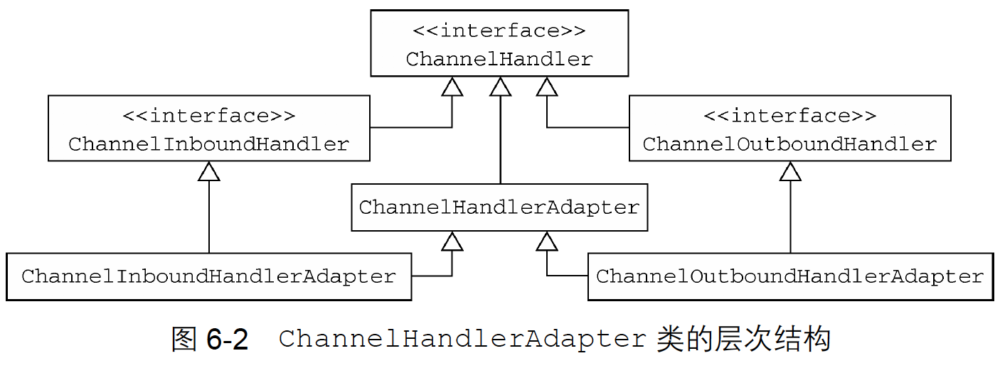

- ChannelHandlerAdapter 的 `isSharable()`：若对应实现被标注为 Sharable，返回true，表示可以被添加到多个ChannelPipeline中

- ChannelInboundHandlerAdapter 和 ChannelOutboundHandlerAdapter 所提供的方法体调用了关联的 ChannelHandlerContext 上的等效方法，从而将事件转发到了 ChannelPipeline 中的下一个 ChannelHandler 中

> 想在自己的 ChannelHandler 中使用这些适配器类，只需要简单地扩展它们，并且重写那些你想要自定义的方法

### (6) 资源管理

> 调用 ChannelInboundHandler.channelRead() 或 ChannelOutboundHandler.write() 来处理数据时，都要确保没有任何的资源泄漏

- 为了诊断潜在的(资源泄漏)问题，Netty 提供了 `ResourceLeakDetector`，将**对应用程序的缓冲区分配做大约 1% 的采样来检测内存泄露**，相关开销非常小

    Netty 目前定义了**4 种泄漏检测级别**：`java -D io.netty.leakDetectionLevel=ADVANCED`

    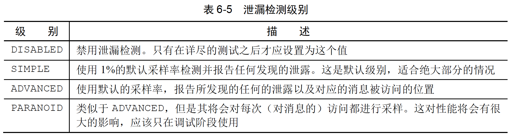

---

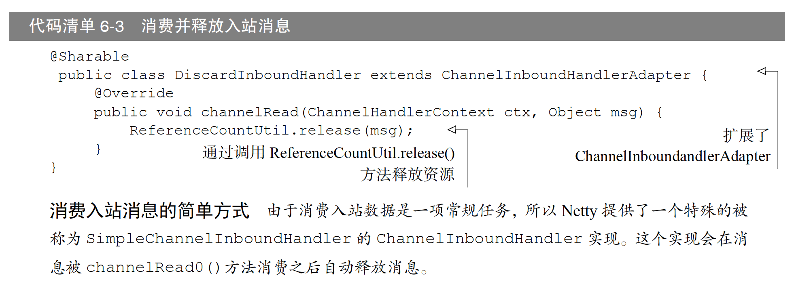

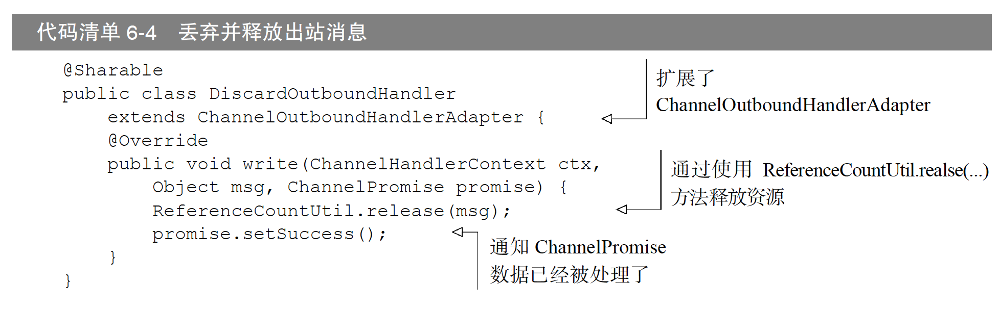

- 注意：**不仅要释放资源，还要通知 ChannelPromise**，否则会出现 ChannelFutureListener 收不到某个消息已被处理的通知

    > - 若一个消息被消费或丢弃，并且没有传递给 ChannelPipeline 中的下一个 ChannelOutboundHandler，则用户就有责任调用 ReferenceCountUtil.release()
    > - 若消息到达了实际的传输层，当它被写入或 Channel 关闭时，都将被自动释放

## 2、ChannelPipeline

> **ChannelPipeline 是一个拦截流经 Channel 的入站和出站事件的 ChannelHandler 实例链**

### (1) 简介

- 每一个新创建的 Channel 都会分配一个新的 ChannelPipeline(永久的分配)
- 根据事件的起源，事件将会被 ChannelInboundHandler 或 ChannelOutboundHandler 处理
- 随后，通过调用 ChannelHandlerContext 实现，将被转发给同一超类型的下一个 ChannelHandler

---

下图展示了具有入站和出站 ChannelHandler 的 ChannelPipeline 的布局：

- ChannelPipeline 由一系列的 ChannelHandler 组成

- ChannelPipeline 提供了通过 ChannelPipeline 本身传播事件的方法

    > 若一个入站事件被触发，则将从 ChannelPipeline 的头部开始一直被传播到 Channel Pipeline 的尾端

    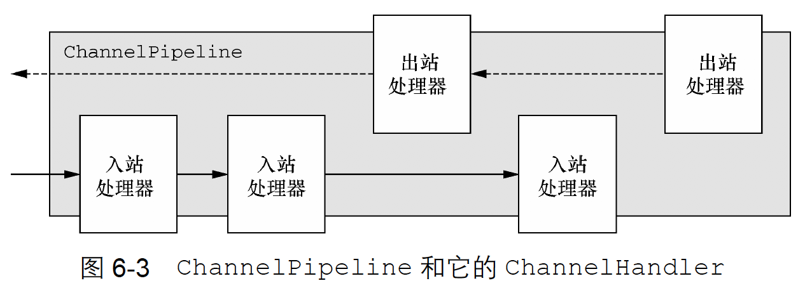

- ChannelPipeline 传播事件时，会测试下一个 ChannelHandler 的类型是否和事件的运动方向相匹配
- 若不匹配，将跳过该ChannelHandler 并前进到下一个，直到找到和该事件所期望的运动方向相匹配的 ChannelHandler 为止
- 当然，ChannelHandler 也可以同时实现 ChannelInboundHandler 和 ChannelOutboundHandler

### (2) 修改 ChannelPipeline

- ChannelHandler 可以通过添加、删除、替换其他的 ChannelHandler 来实时地修改 ChannelPipeline 的布局

    > 也可以将它自己从 ChannelPipeline 中移除

    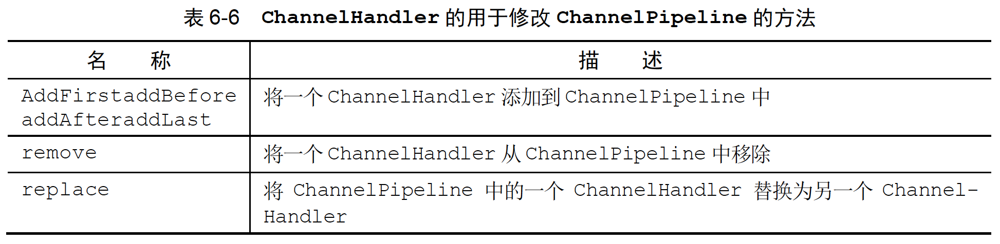

    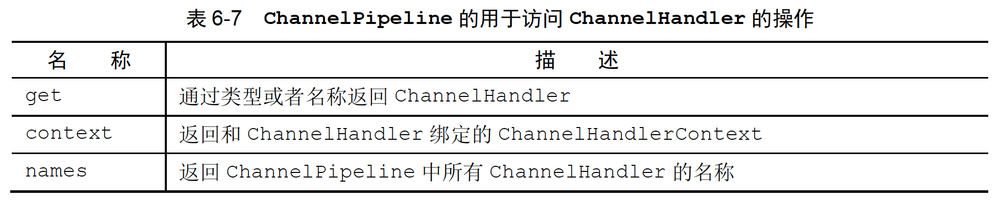

    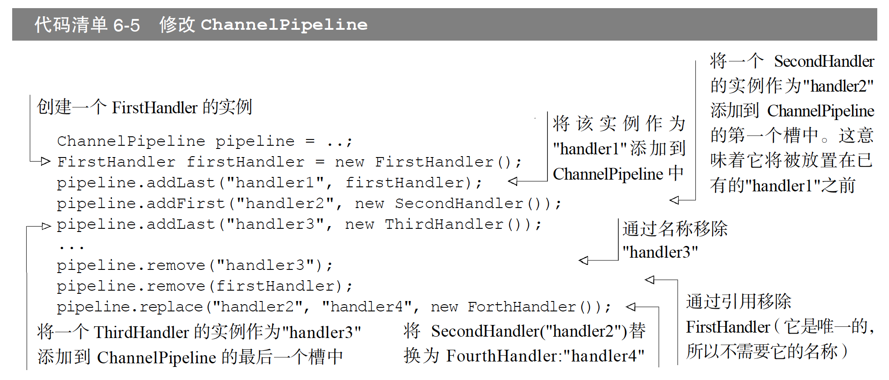

---

- ChannelPipeline 的每一个 ChannelHandler 都是通过它的 **EventLoop(I/O 线程)来处理传递给事件**，所以不要阻塞这个线程

- **与使用阻塞 API 的遗留代码进行交互的情况**：ChannelPipeline 有接受一个 EventExecutorGroup 的 add() 方法

    - 若事件被传递给自定义的 EventExecutorGroup，则会包含在 EventExecutorGroup 的某个 EventExecutor 处理，从而被从该Channel 本身的 EventLoop 中移除

        > 对于这种用例，Netty 提供了一个叫 DefaultEventExecutorGroup 的默认实现

### (3) 触发事件

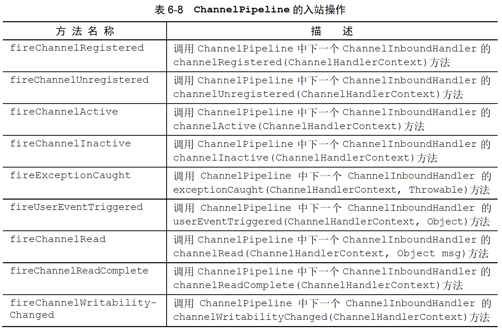

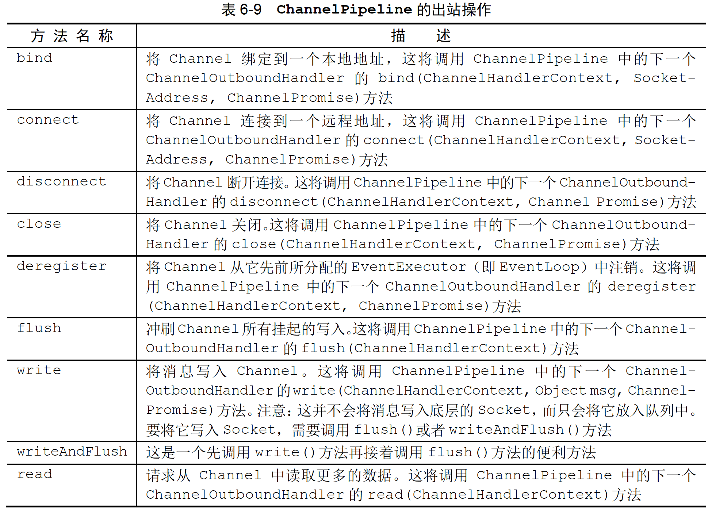

- ChannelPipeline 保存了与 Channel 相关联的 ChannelHandler
- ChannelPipeline 可以根据需要，通过添加或删除 ChannelHandler 来动态地修改
- ChannelPipeline 有着丰富的 API 用以被调用，以响应入站和出站事件

## 3、ChannelHandlerContext

### (1) 简介

**ChannelHandlerContext 主要功能**：管理关联的 ChannelHandler 和在同一个 ChannelPipeline 的其他 ChannelHandler 的交互

- ChannelHandlerContext 代表了 ChannelHandler 和 ChannelPipeline 之间的关联
- 每当有 ChannelHandler 添加到 ChannelPipeline 时，都会创建 ChannelHandlerContext

---

- 若调用 Channel 或 ChannelPipeline 上的方法，它们将沿着整个 ChannelPipeline 传播

- 若调用 ChannelHandlerContext 上的方法，则将从当前所关联的 ChannelHandler 开始，并且只传播给位于该 ChannelPipeline 中的下一个能够处理该事件的 ChannelHandler

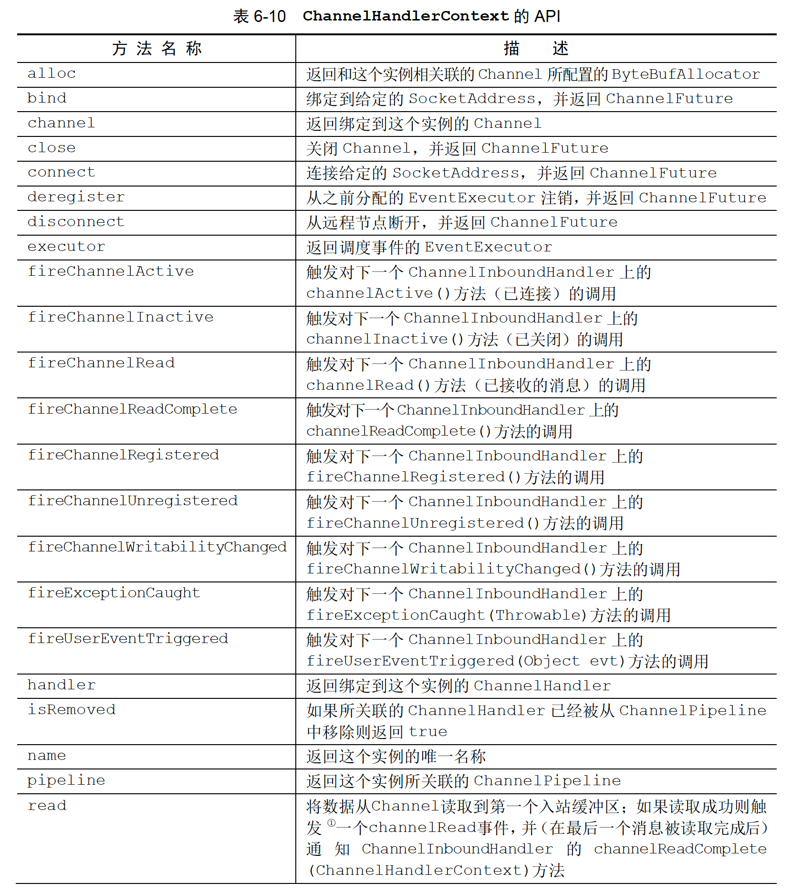


**使用 ChannelHandlerContext 的 API 时，请牢记两点**：

- **ChannelHandlerContext 和 ChannelHandler 之间的关联(绑定)永远不会改变**，所以缓存对它的引用是安全的

- 相对于其他类的同名方法，**ChannelHandlerContext 的方法将产生更短的事件流**，因此利用这个特性能获得最大的性能

### (2) 使用

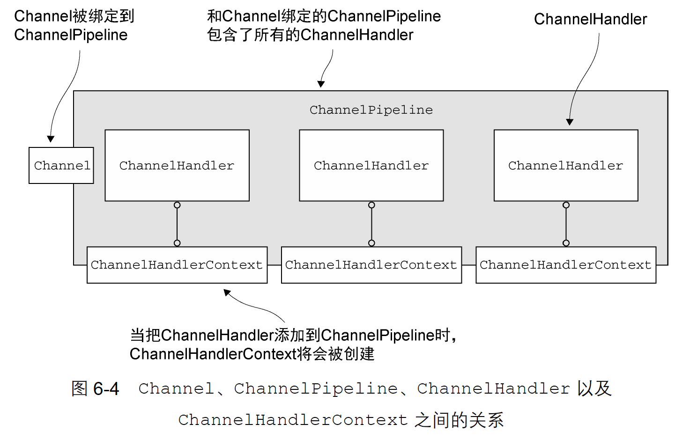

- ChannelHandlerContext 获取 Channel 引用，调用 Channel 的 write() 方法会导致写入事件从尾端到头部地流经ChannelPipeline

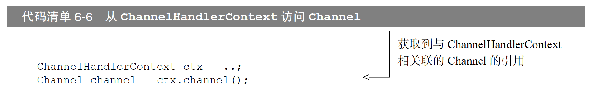


- 写入 ChannelPipeline

    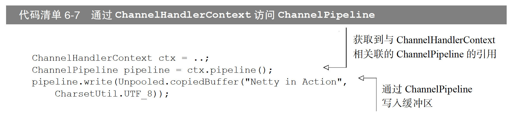

为什么会想要从 ChannelPipeline 中的**某个特定点开始传播事件**：

- 为了**减少**将事件传经对它不感兴趣的 ChannelHandler 所带来的开销

- 为了**避免**将事件传经那些可能会对它感兴趣的 ChannelHandler

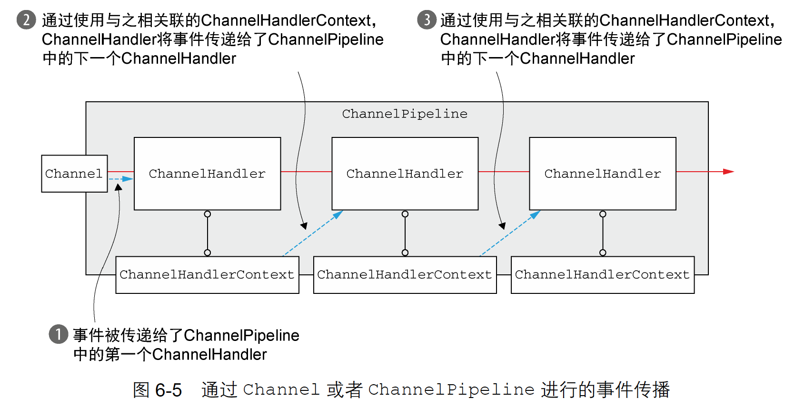

---

- 调用从某个特定的 ChannelHandler 开始的处理过程，必须获取到(ChannelPipeline)该 ChannelHandler 之前的 ChannelHandler 所关联的 ChannelHandlerContext
- 这个 ChannelHandlerContext 将调用和它所关联的 ChannelHandler 之后的 ChannelHandler

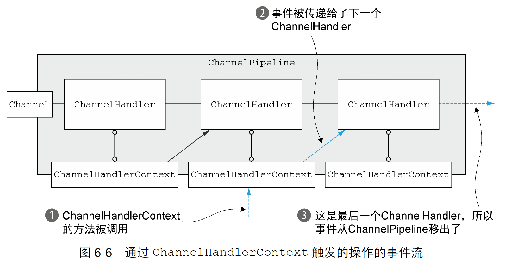

### (3) 高级用法

- **高级用法一**：通过调用 ChannelHandlerContext 的 pipeline() 方法获得封闭 ChannelPipeline 的引用，使得运行时得以操作 ChannelPipeline 的 ChannelHandler，可以利用这一点来实现复杂设计

    > 可以通过将 ChannelHandler 添加到 ChannelPipeline 中来实现动态的协议切换

- **高级用法二**：缓存到 ChannelHandlerContext 的引用以供稍后使用

    > 这可能会发生在任何的 ChannelHandler 方法之外，甚至来自于不同的线程
    >
    > 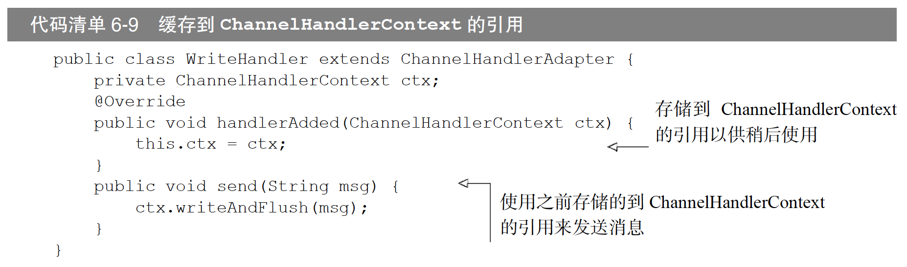

---

**共享同一个 ChannelHandler 目的**：用于收集跨越多个 Channel 的统计信息

- 一个 ChannelHandler 可以属于多个 ChannelPipeline，所以也可以绑定到多个 ChannelHandlerContext 实例

    > 注意：对应的 ChannelHandler 必须使用 @Sharable 注解标注；否则，试图添加到多个 ChannelPipeline 时会触发异常

- 为了安全地被用于多个并发的 Channel(即连接)，这样的 ChannelHandler 必须线程安全

    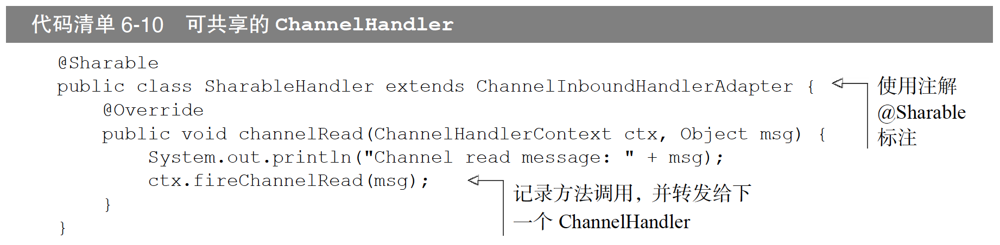

    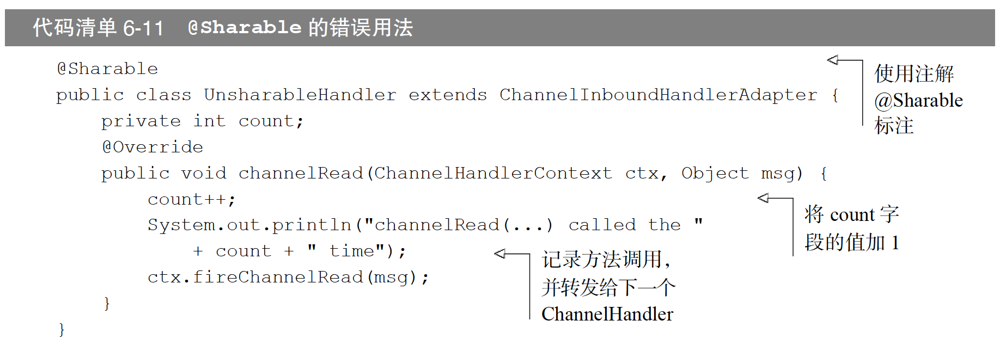

    > **代码问题**：**拥有状态**，即用于跟踪方法调用次数的实例变量 count
    >
    > - 将这个类的一个实例添加到 ChannelPipeline 将极有可能在它被多个并发的 Channel 访问时导致问题
    >
    >     ​	解决：**通过使 channelRead() 方法变为同步方法来修正** 

**注意**：**在确定 ChannelHandler 是线程安全时，才使用 `@Sharable` 注解** 

## 4、异常处理

### (1) 处理入站异常

- 若处理入站事件的过程中有异常被抛出，则将从它在 ChannelInboundHandler 里被触发的那一点开始流经 ChannelPipeline

    > - 重写 ChannelInboundHandler 中的 `public void exceptionCaught(Cha nnelHandlerContext ctx, Throwable cause) throws Exception` 
    >
    > - **确保所有入站异常都会被处理**：重写 `exceptionCaught` 的 ChannelInboundHandler 应**位于 ChannelPipeline 的最后** 

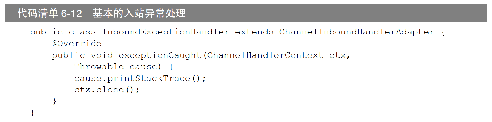

---

总结：

- `ChannelHandler.exceptionCaught()` 的默认实现：将当前异常转发给 ChannelPipeline 中的下一个 ChannelHandler

- 若异常到达 ChannelPipeline 尾端，将会被记录为未被处理

- 自定义处理逻辑：重写 exceptionCaught() 方法，然后决定是否将该异常传播出去

### (2) 处理出战异常

用于处理出站操作中的正常完成以及异常的选项，都基于以下的通知机制：

- 出站操作将返回一个 ChannelFuture，注册到 ChannelFuture 的 ChannelFutureListener 在操作完成时，通知该操作成功或出错

    > 添加 ChannelFutureListener 只需要调用 ChannelFuture 实例上的 addListener(ChannelFutureListener) 方法：
    >
    > - **方法一**：调用**出站操作**(如：write() 方法)所返回的 ChannelFuture 上的 addListener() 方法
    >
    >     
    >
    > - **方法二**：将 ChannelFutureListener 添加到即将作为参数传递给 ChannelOutboundHandler 方法的 **ChannelPromise**
    >
    >     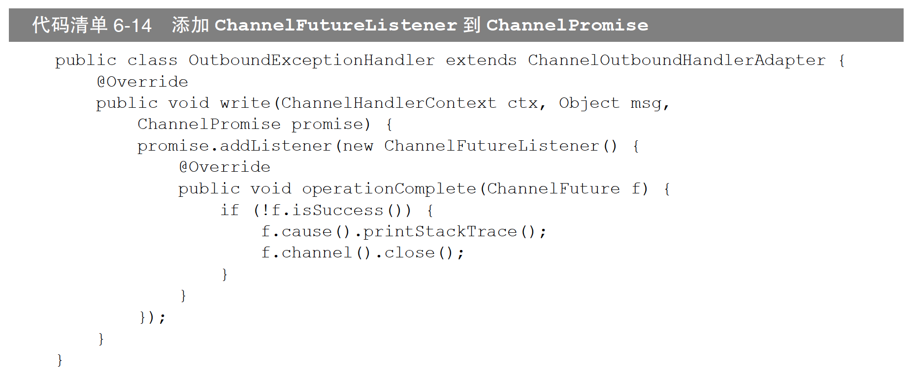

- ChannelPromise 作为 ChannelFuture 子类， 可以被分配用于异步通知的监听器，同时还具有提供立即通知的可写方法

    > 可写方法：`ChannelPromise setSuccess()` 和 `ChannelPromise setFailure(Throwable cause)`
    >
    > ChannelOutboundHandler 上的方法都会传入一个 ChannelPromise 实例

# 七、EventLoop 和线程模型

## 1、传统线程模型

**基本的线程池化模式**：

- 从池的空闲线程列表中选择一个 Thread，并且指派它去运行一个已提交的任务(一个 Runnable 实现)

- 当任务完成时，将该 Thread 返回给该列表，使其可被重用

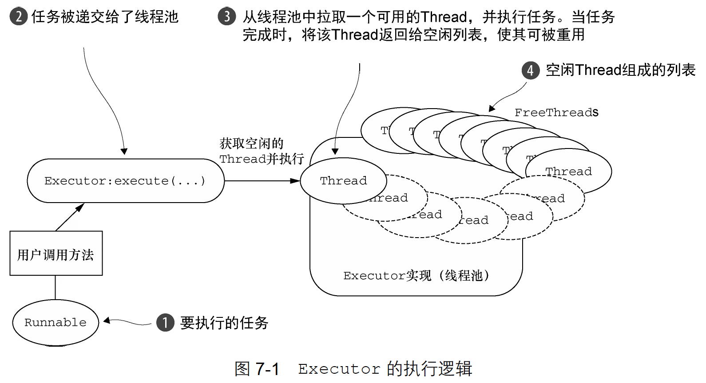

## 2、EventLoop 接口

Netty 的 EventLoop 是协同设计的一部分，采用两个基本的 API：并发和网络编程

- 首先，`io.netty.util.concurrent` 包构建在 JDK 的 `java.util.concurrent` 包上，**用来提供线程执行器**
- 其次，`io.netty.channel` 包中的类，**为了与 Channel 的事件进行交互，扩展了这些接口/类**

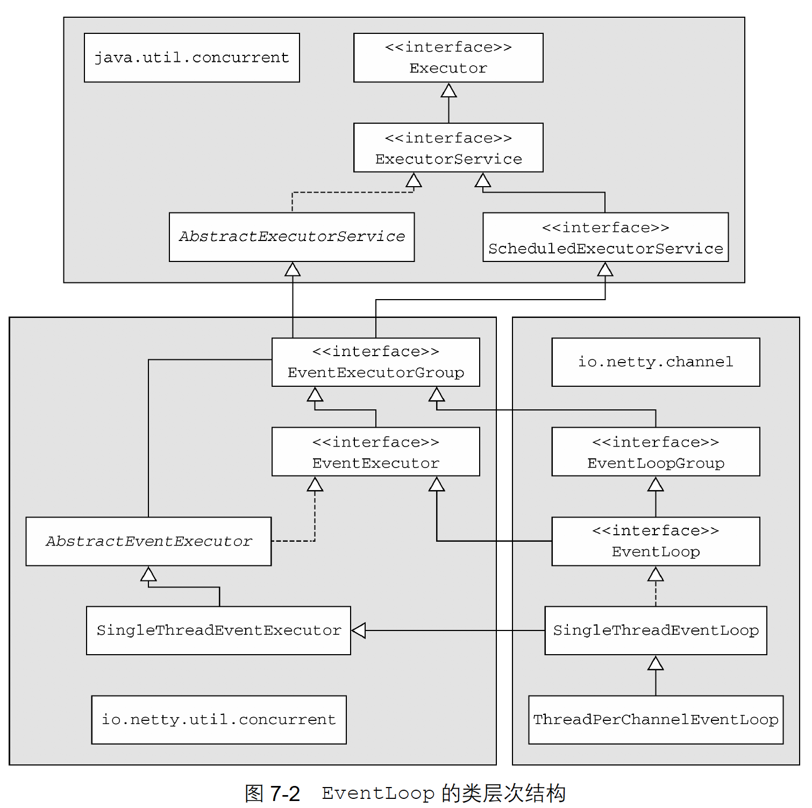

**在这个模型中**：

- EventLoop 由不会改变的 Thread 驱动，同时任务(Runnable 或 Callable)可以直接提交给 EventLoop 实现，以立即执行或调度执行

- 根据配置和可用核心的不同，会创建多个 EventLoop 实例用以优化资源的使用，并且单个 EventLoop 会被指派服务多个 Channel

---

**注意**：Netty 的 EventLoop 继承 ScheduledExecutorService 时，**只定义了 parent() 方法，用于返回到当前 EventLoop 实例所属 EventLoopGroup 的引用**

```java
public interface EventLoop extends EventExecutor, EventLoopGroup {
		@Override
		EventLoopGroup parent();
}
```

- **事件/任务的执行顺序**：以先进先出(FIFO)顺序执行，通过保证字节内容总是按正确的顺序被处理，消除潜在的数据损坏可能性

- **Netty 4 中，所有的 I/O 操作和事件都由已经被分配给 EventLoop 的 Thread 处理**

## 3、任务调度

### (1) JDK 任务调度

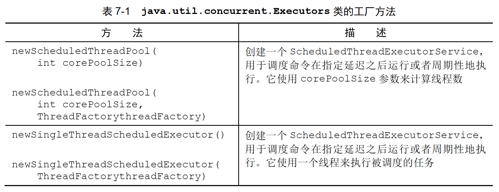

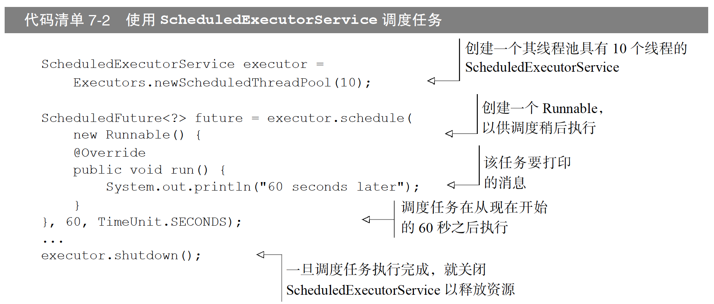

### (2) EventLoop 任务调度

- 经过 60 秒后，Runnable 实例将由分配给 Channel 的 EventLoop 执行

    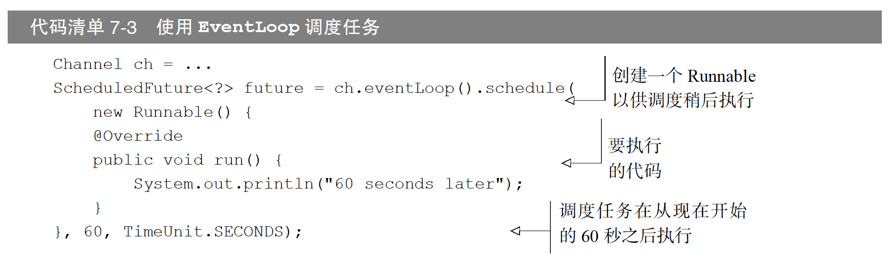

- 调度任务每隔 60 秒执行一次

    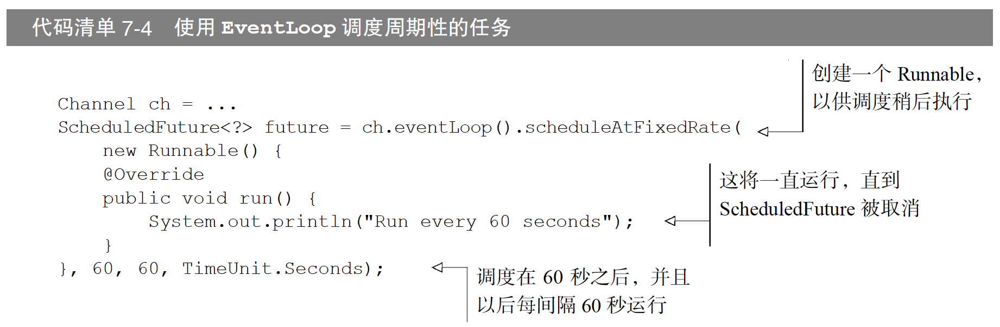

- 取消或者检查(被调度任务的)执行状态，可以使用每个异步操作所返回的 ScheduledFuture

    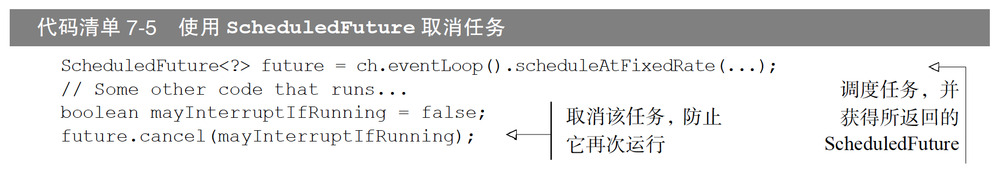

## 4、实现细节

### (1) EventLoop 线程管理

- Netty 线程模型的卓越性能取决于**对当前执行的 Thread 的确定**，即确定是否是分配给当前 Channel 以及其 EventLoop 的那个线程

    > Thread 与 Channel 直接交互而无需在 ChannelHandler 中进行额外同步
    >
    > 注意：每个 EventLoop 都有自已的任务队列，独立于任何其他的 EventLoop

    - 若当前调用的线程是支撑 EventLoop 的线程，则所提交的代码块将会被直接执行

    - 否则，EventLoop 将调度该任务以便稍后执行，并将它放入到内部队列中

        > 当 EventLoop 下次处理它的事件时，会执行队列中的那些任务/事件

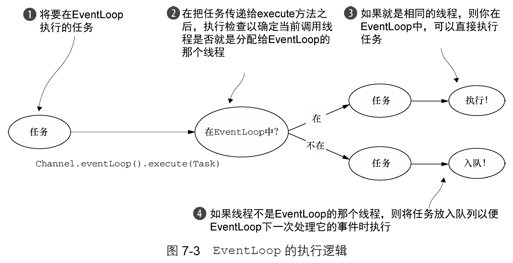

### (2) EventLoop 线程分配

> 服务 Channel 的 I/O 和事件的 EventLoop 包含在 EventLoopGroup 中。根据不同传输实现，EventLoop 的创建和分配方式也不同

- **异步传输**：通过**少量的 Thread 来支撑大量的 Channel**，而不是每个 Channel 分配一个 Thread

    > 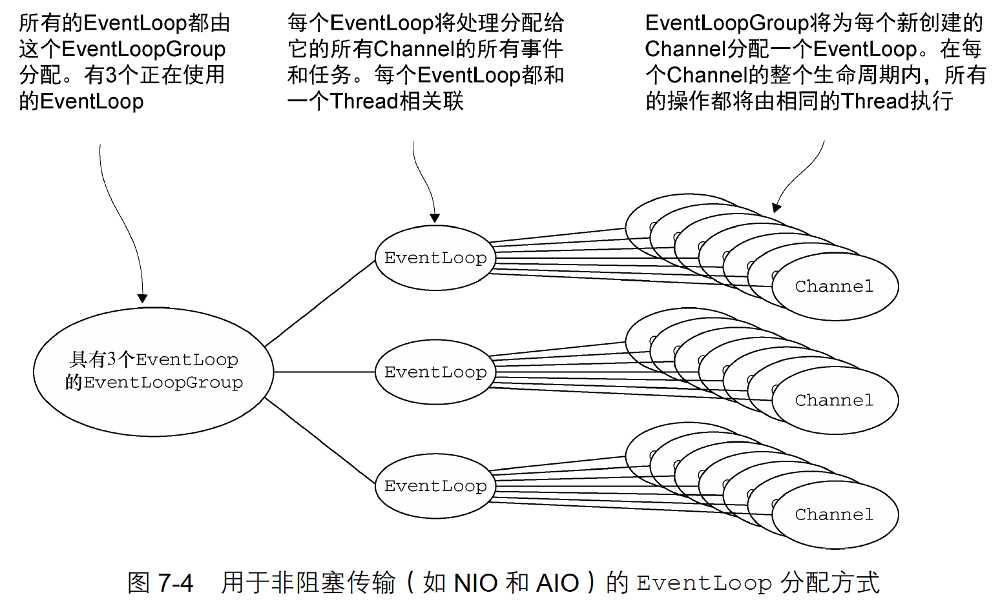
    >
    > EventLoopGroup 负责为每个新创建的 Channel 分配一个 EventLoop：
    >
    > - 当前实现中，使用顺序循环方式进行分配以获取一个均衡的分布，并且相同的 EventLoop 可能会被分配给多个 Channel
    >
    > - 一旦一个 Channel 被分配给一个 EventLoop，它将在整个生命周期中都使用这个 EventLoop(以及相关联的 Thread)

- **阻塞传输**：**每一个 Channel 都将被分配给一个 EventLoop(以及它的 Thread)**

    > 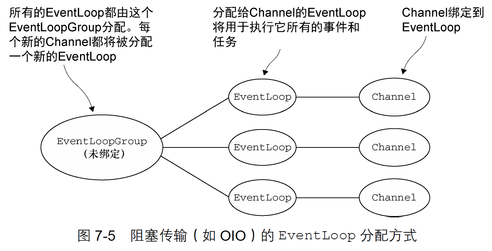

# 八、引导

## 1、Bootstrap 及其父类

- **服务端**：致力于使用一个**父 Channel 接受来自客户端的连接**，并创建**子 Channel 用于它们之间的通信**

- **客户端**：只需要**一个 Channel 用于所有的网络交互**

引导类的层次结构包括一个抽象的父类和两个具体的引导子类

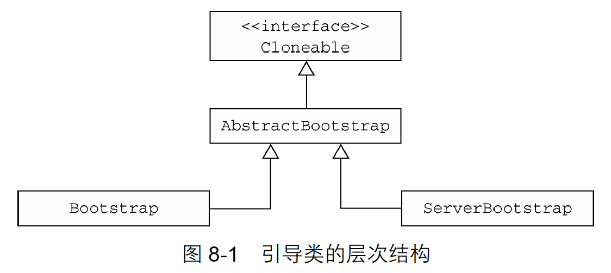

- 服务端和客户端之间的**通用引导步骤由 AbstractBootstrap 处理**

- 客户端或服务器的**特定引导步骤则分别由 Bootstrap 或 ServerBootstrap 处理**

---

**引导类继承 Cloneable**：

- 当要创建多个具有类似配置或完全相同配置的 Channel，但又不想为每个 Channel 都创建并配置一个新的引导类实例

    > 在一个已经配置完成的引导类实例上调用 clone() 方法将返回另一个可以立即使用的引导类实例

- 注意：这种方式只会创建引导类实例的 EventLoopGroup 的一个**浅拷贝**，因此将在所有克隆的 Channel 实例之间共享

    > 可以接受 Channel 共享：因为 Channel 的生命周期都很短暂，比如：创建一个 Channel 以进行一次 HTTP 请求

## 2、引导客户端和无连接协议

> Bootstrap 类被用于客户端或使用无连接协议的应用程序

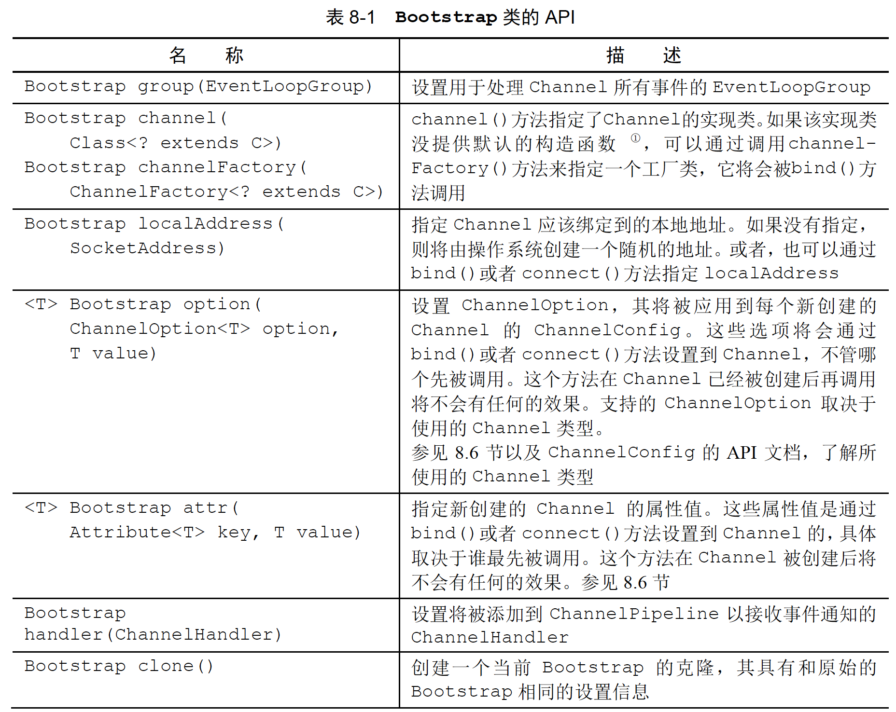

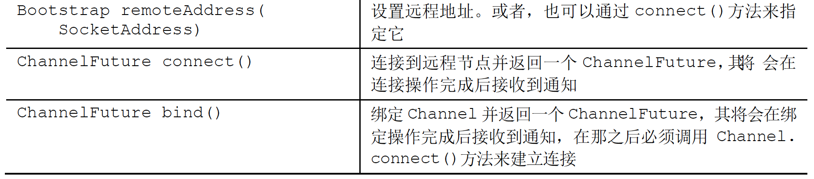

### (1) 引导客户端

**Bootstrap 类负责为客户端和使用无连接协议的应用程序创建 Channel**

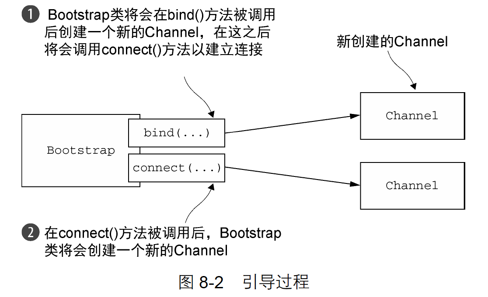


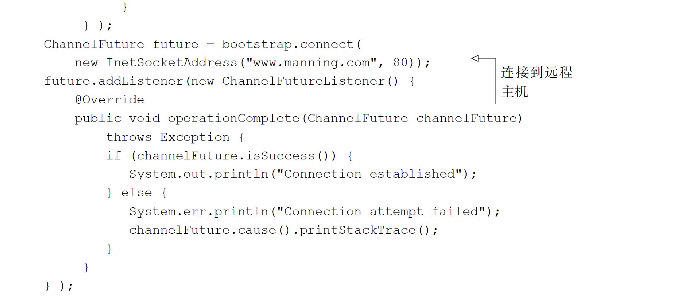

### (2) Channel 和 EventLoopGroup 的兼容性

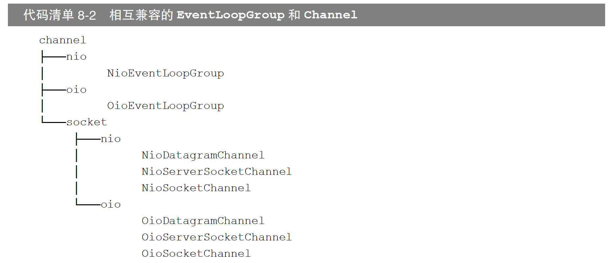

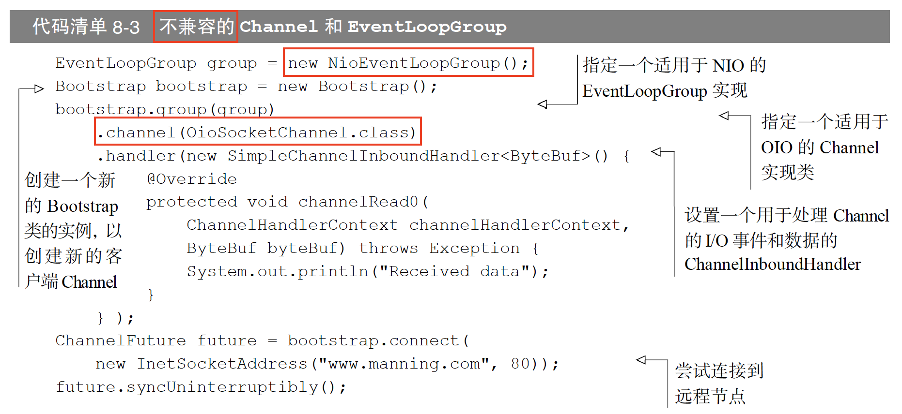

引导过程中，调用 bind() 或 connect() 方法之前，必须调用以下方法来设置所需的组件：

- `group()`

- `channel()` 或 `channelFactory()`

- `handler()`：对 handler() 方法的调用尤其重要，因为需要配置好 ChannelPipeline

## 3、引导服务端

### (1) ServerBootstrap 类

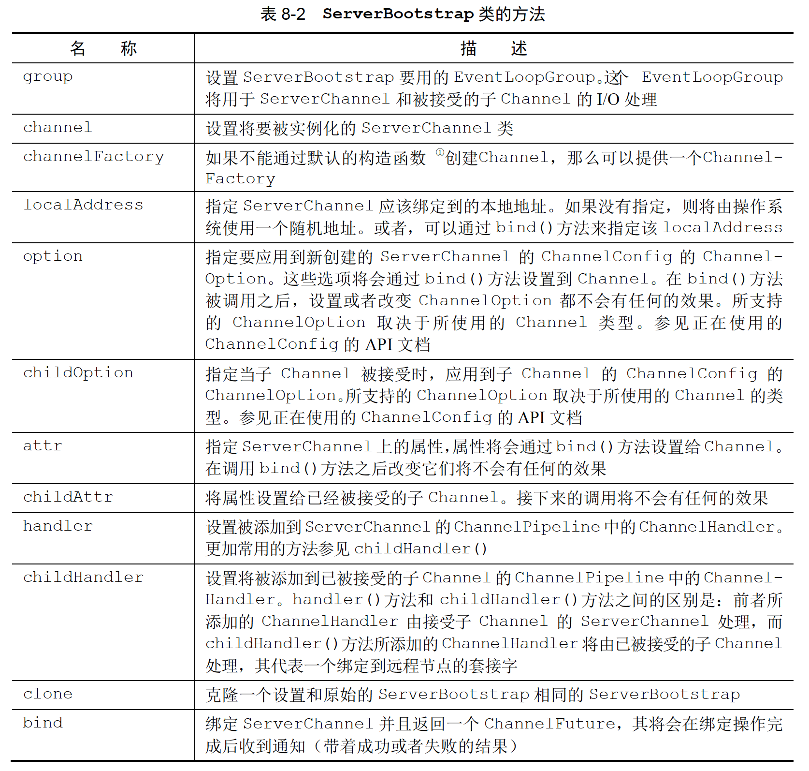

### (2) 引导服务端

- ServerChannel 的实现负责创建子 Channel，这些子 Channel 代表了已被接受的连接

- 因此，负责引导 ServerChannel 的 ServerBootstrap 提供了 `childHandler()、childAttr()、childOption()`，以简化到子 Channel 的 ChannelConfig 任务

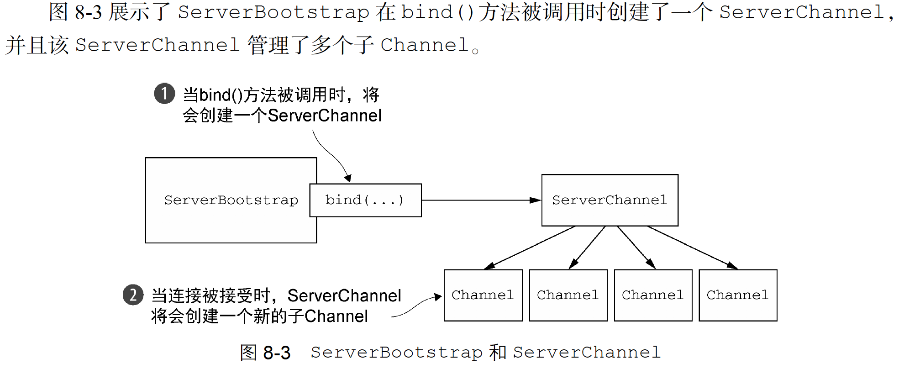

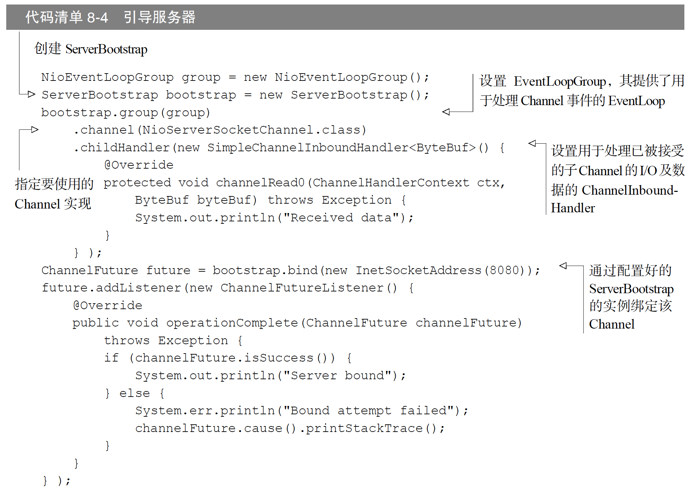

## 4、从 Channel 引导客户端

目的：**从服务端已经被接受的子 Channel 中引导一个客户端 Channel** 

- **方式一**：创建新的 Bootstrap 实例

    > 缺陷：为每个新创建的客户端 Channel 定义另一个 EventLoop，这会产生额外的线程，以及在已被接受的子 Channel 和客户端 Channel 之间交换数据时发生上下文切换

- **方式二**：通过将已被接受的子 Channel 的 EventLoop 传递给 Bootstrap 的 group() 方法来**共享该 EventLoop** 

    > 优势：因为分配给 EventLoop 的 Channel 都使用同一个线程，所以避免了额外的线程创建，以及相关的上下文切换
    >
    > 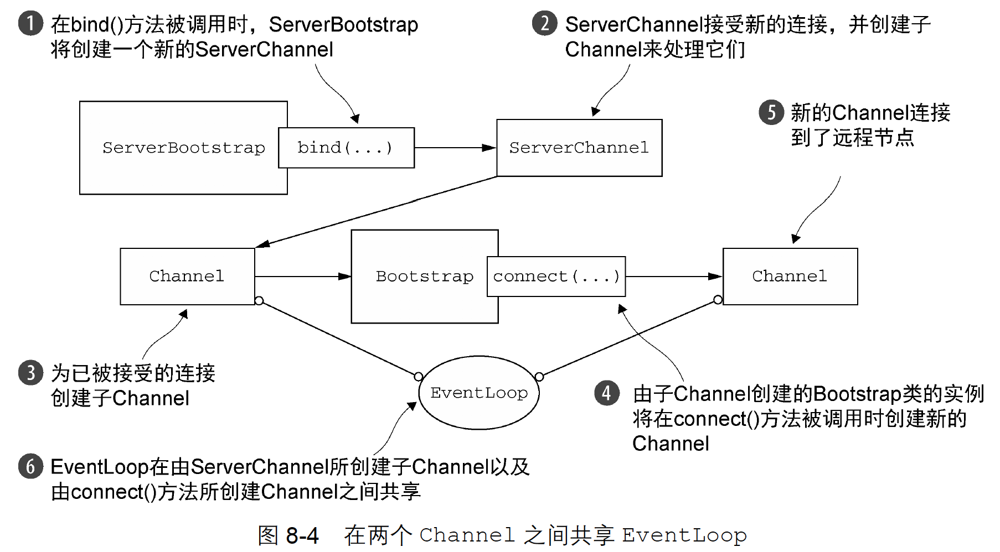

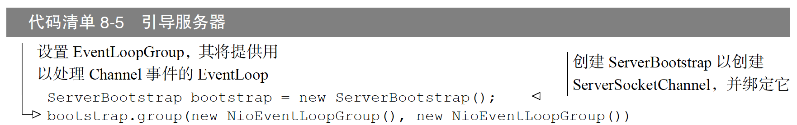

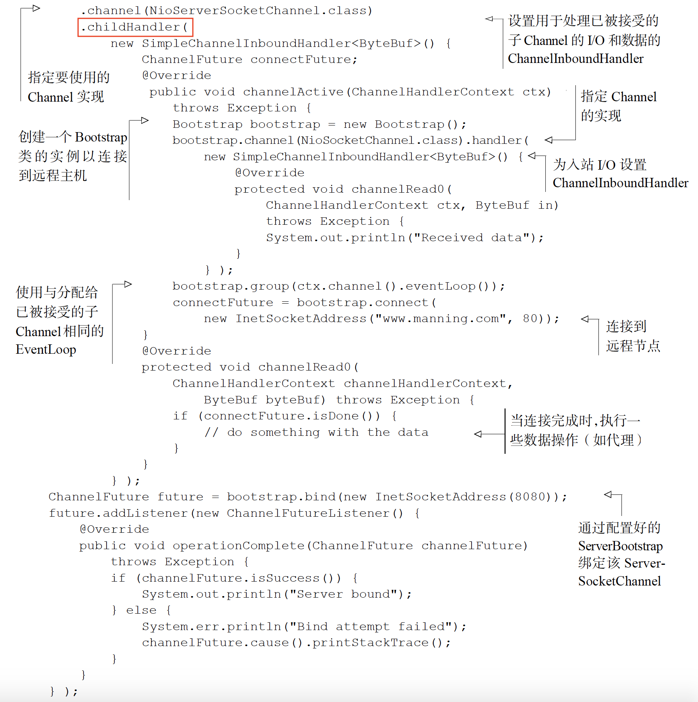

## 5、引导过程添加多个 ChannelHandler

**添加多个 ChannelHandler**：Netty 提供了特殊的 ChannelInboundHandlerAdapter 子类：

```java
public abstract class ChannelInitializer<C extends Channel> extends ChannelInboundHandlerAdapter{
  	protected abstract void initChannel(C ch) throws Exception;
}
```

这个方法提供了一种**将多个 ChannelHandler 添加到一个 ChannelPipeline 中**的简便方法

- 只需向 Bootstrap 或 ServerBootstrap 提供 ChannelInitializer 实现，当 Channel 被注册到 EventLoop 后，就会调用 initChannel()
- 在该方法返回后，ChannelInitializer 的实例将会从 ChannelPipeline 中移除

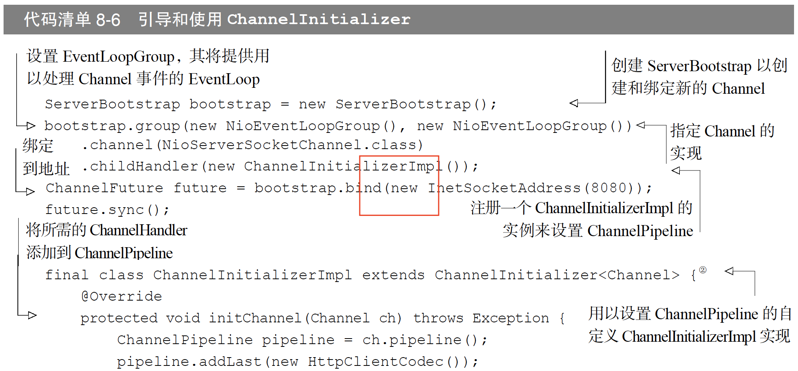

> 若应用程序使用了多个 ChannelHandler，请定义 ChannelInitializer 实现来将它们安装到 ChannelPipeline 中

## 6、Netty 的 ChannelOption 属性

- **option() 方法**：将 ChannelOption 应用到引导，即**提供的值会被自动应用到引导所创建的 Channel**

    > 可用的 ChannelOption 包括了底层连接的详细信息，如：keep-alive 或超时属性以及缓冲区设置

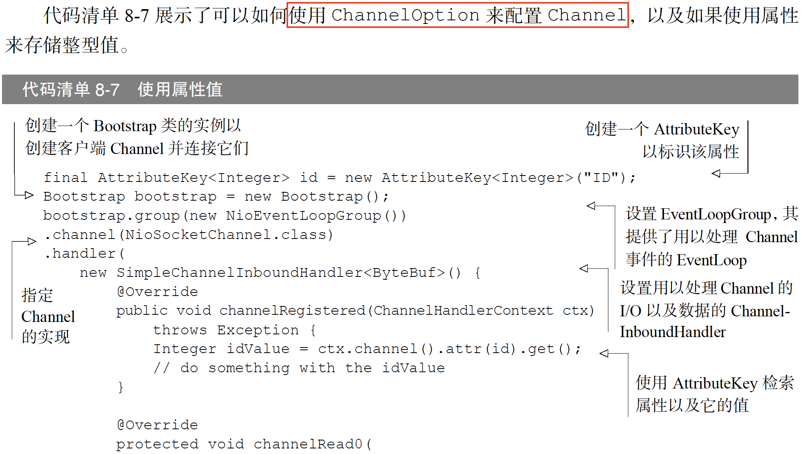

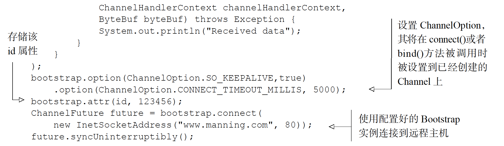

## 7、引导 DatagramChannel

**DatagramChannel 实现的区别**：不再调用 connect() 方法，**只调用 bind() 方法**

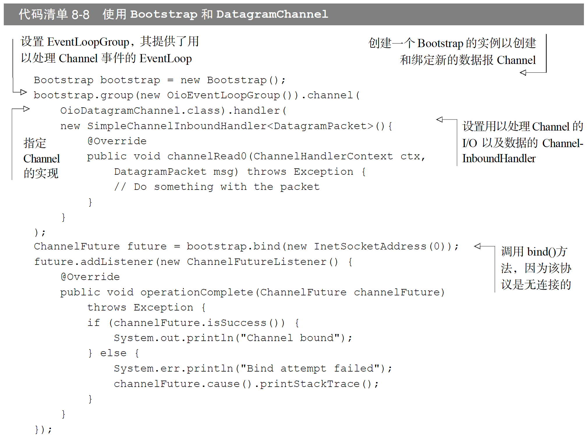

## 8、关闭

`EventLoopGroup.shutdownGracefully()`：关闭 EventLoopGroup，处理任何挂起的事件和任务，并且随后释放所有活动的线程

- 这个方法调用将返回一个 Future，这个 Future 将在关闭完成时接收到通知
- 注意：该方法是一个**异步操作**，所以要阻塞等待直到它完成，或向所返回的 Future 注册一个监听器以在关闭完成时获得通知

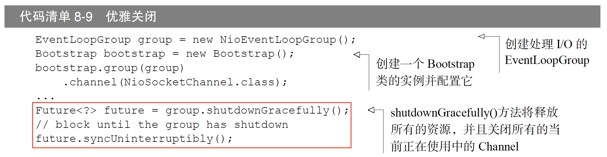

# 九、单元测试

> EmbeddedChannel 是 Netty 为改进针对 ChannelHandler 的单元测试而提供

## 1、EmbeddedChannel 概述

**EmbeddedChannel**：特殊的 Channel 实现，提供了通过 ChannelPipeline 传播事件的简便方法，用于测试 ChannelHandler

- 将入站数据或出站数据写入 EmbeddedChannel 中，然后检查是否有任何东西到达了 ChannelPipeline 尾端
- 以这种方式，可以确定消息是否已经被编码或被解码，以及是否触发了任何的 ChannelHandler 动作

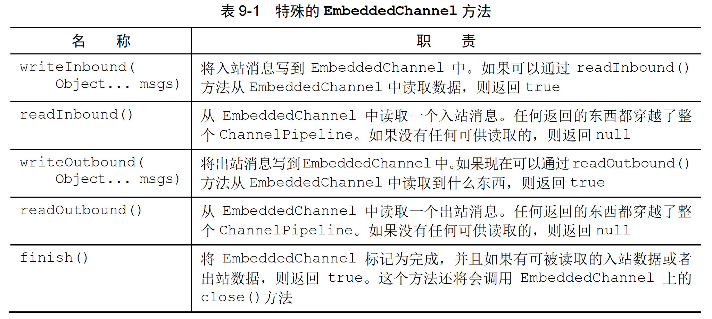

- 入站数据由 ChannelInboundHandler 处理，代表从远程节点读取的数据
- 出站数据由 ChannelOutboundHandler 处理，代表将要写到远程节点的数据
- 根据要测试的 ChannelHandler，使用 Inbound() 或 Outbound() 方法，或兼而有之

---

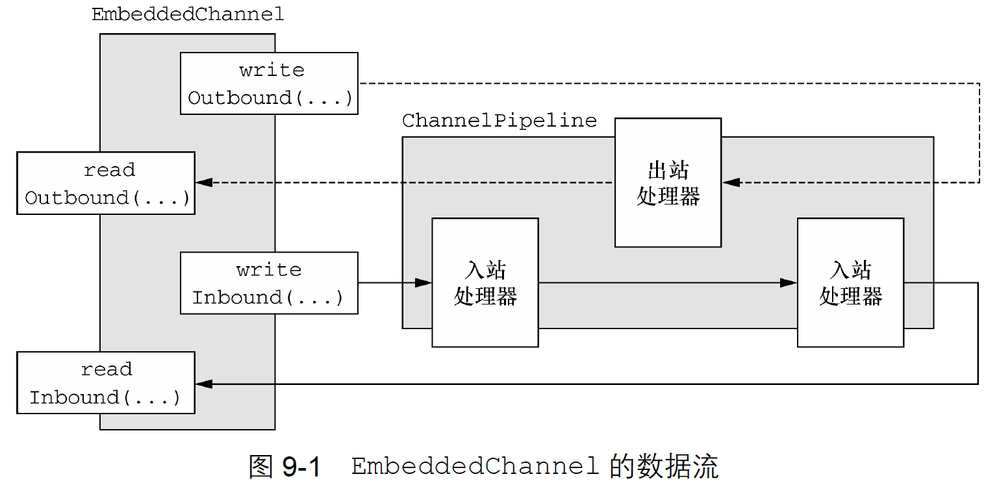

- 在每种情况下，消息都将经过 ChannelPipeline 传递，并且被相关的 ChannelInboundHandler 或 ChannelOutboundHandler 处理
- 若消息没有被消费，则可以使用 readInbound() 或 readOutbound() 方法来在处理过这些消息后，酌情把它们从 Channel 中读出来

## 2、使用 EmbeddedChannel 测试

### (1) 测试入站消息

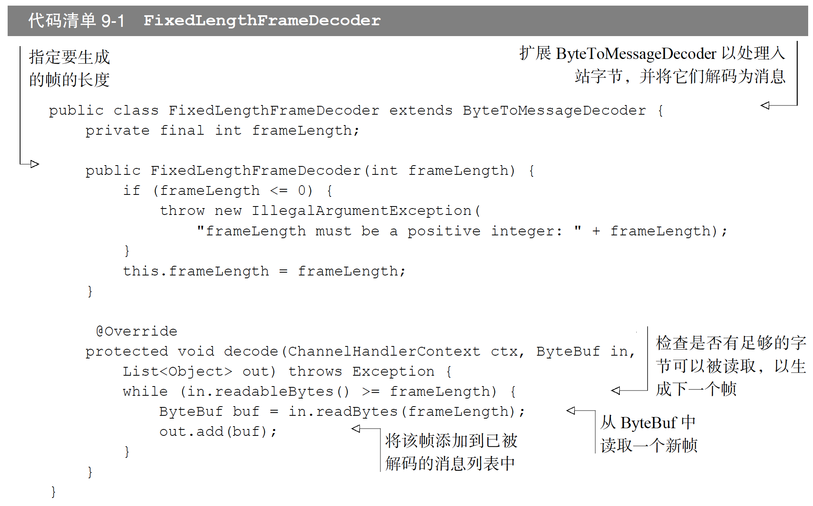

---

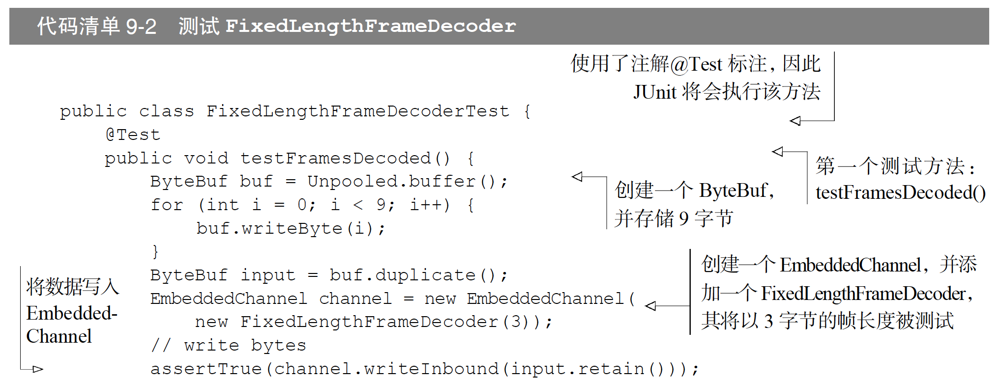

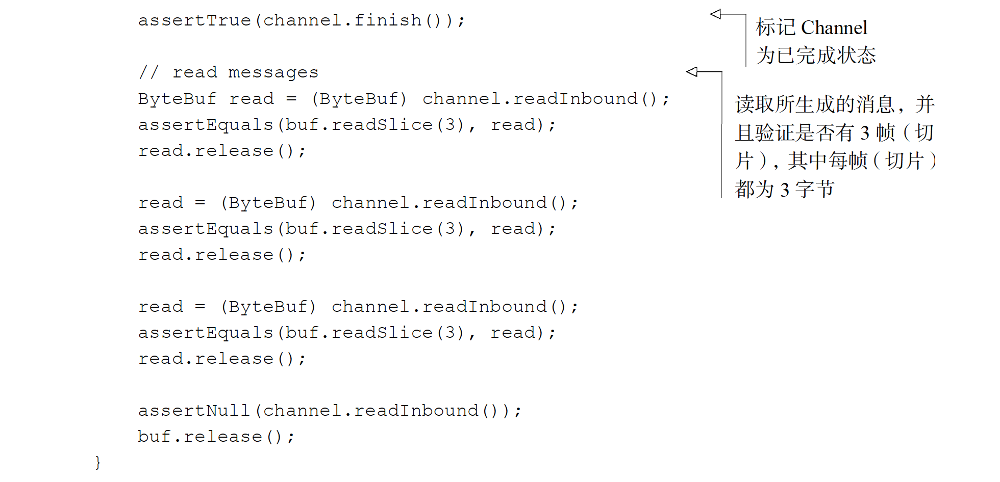


### (2) 测试出战消息

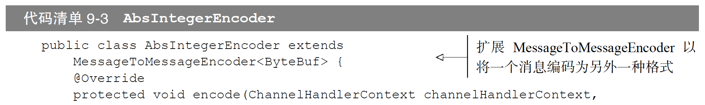

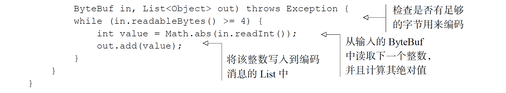

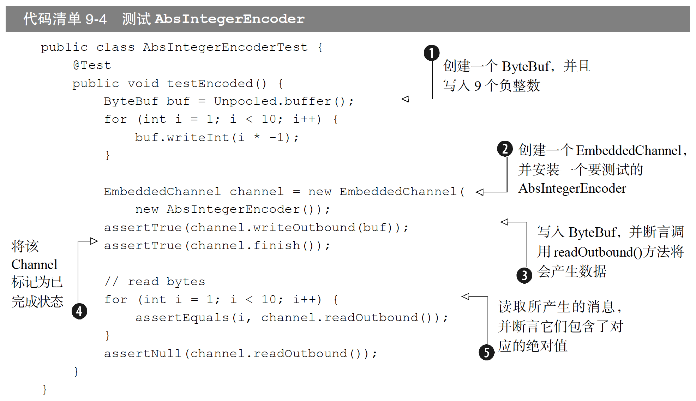

## 3、测试异常处理

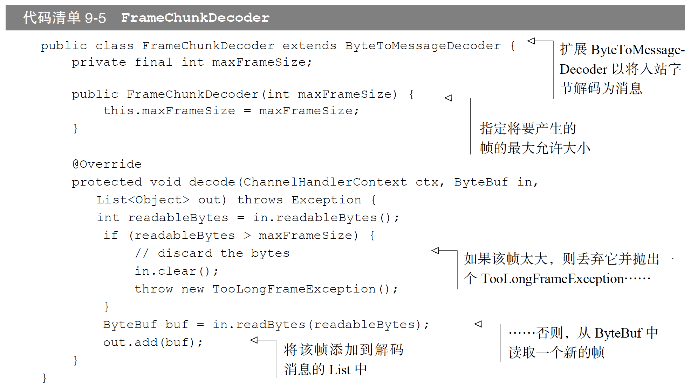

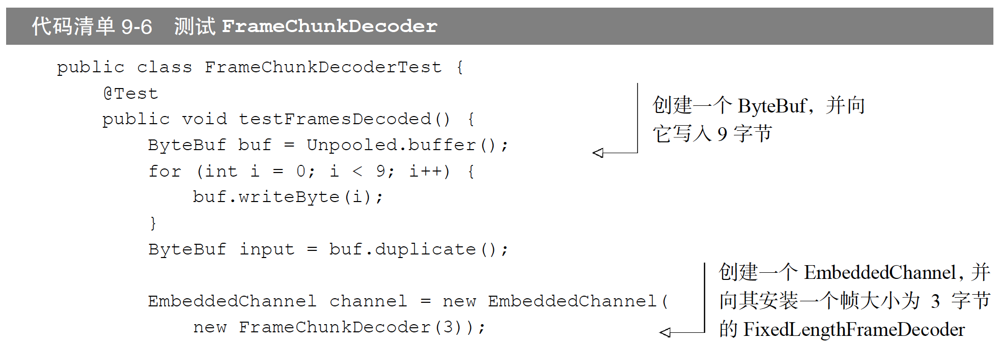

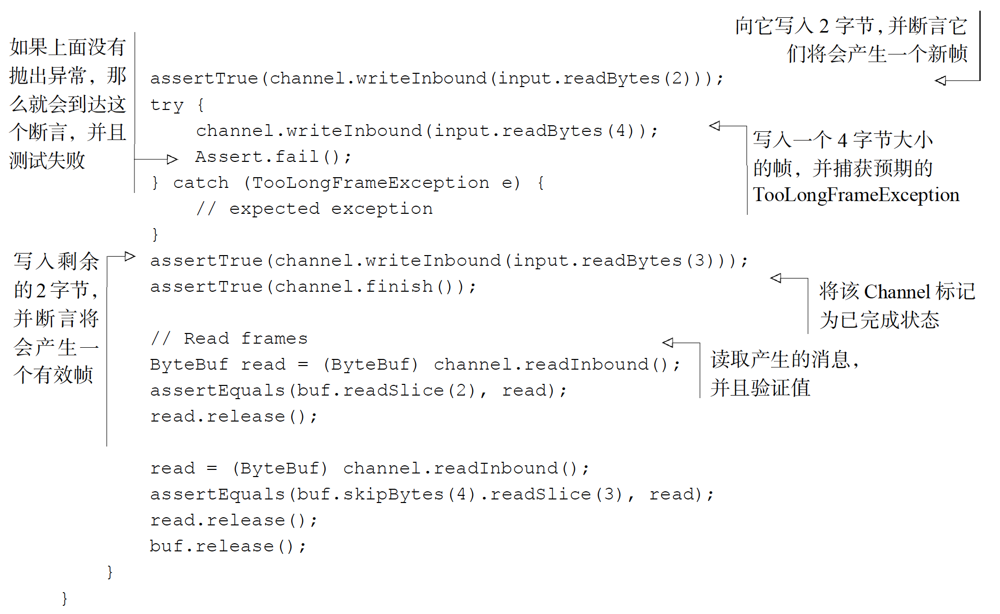