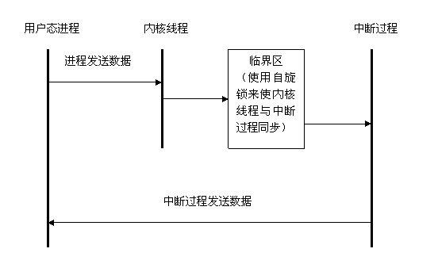
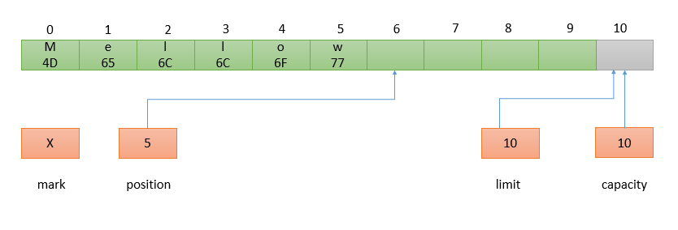
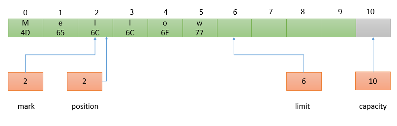
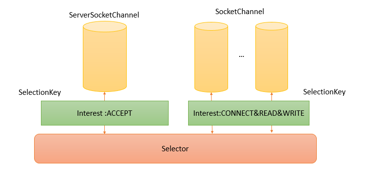

# #基础篇：走进 Java NIO

- 推荐阅读：**[Netty 博客总结](http://www.tianshouzhi.com/api/tutorials/netty/220)** 

# 一、Java I/O

## 1、基础知识

### (1) 用户空间和内核空间

#### 1. 基本概念

推荐阅读： **[Linux用户空间与内核空间（理解高端内存）](https://www.cnblogs.com/wuchanming/p/4360277.html)**

- 32 位操作系统的寻址空间(虚拟存储空间)为4G，**0～3G为用户空间，3~4G为内核空间** 

    

- **高端内存**： 

    > x86架构将内核地址空间划分三部分：
    >
    > - `ZONE_DMA`： 内存开始的 16MB
    > - `ZONE_NORMAL`： 16MB~896MB
    > - `ZONE_HIGHMEM`： 896MB～1024MB
    >
    > **借助 128MB 高端内存地址空间实现访问所有物理内存**：
    >
    > - 当内核访问高于 896MB 物理地址内存时，从 0xF8000000~0xFFFFFFFF 内找一段相应大小空闲的逻辑地址空间
    > - 借用这段逻辑地址空间，建立映射到要访问的那段物理内存(即填充内核 PTE 页面)，**临时借用，用完后归还** 
    > - 其他用户也可以借用这段地址空间访问其他物理内存，实现了：使用有限的地址空间，访问所有所有物理内存
    >
    > **高端内存的基本思想**：借一段地址空间，建立临时地址映射，用完后释放，达到这段地址空间可以循环使用，访问所有物理内存
    >
    > 
    >
    > 对应高端内存的三部分，**高端内存映射的三种方式**：
    >
    > - **映射到”内核动态映射空间”**：通过 `vmalloc()` 在”内核动态映射空间”申请内存时，就能从高端内存获得页面
    >
    >     > 即：高端内存有可能映射到”内核动态映射空间”中
    >
    > - **持久内核映射(内核永久映射空间)**： 通过 `alloc_page()` 获得高端内存对应 page
    >
    >     > - **内核地址范围**：从 PKMAP_BASE 到 FIXADDR_START ，用于映射高端内存
    >     >
    >     > - **简介**： 在 2.6 内核上，地址范围是 4G-8M 到 4G-4M 之间，**空间大小是 4M(仅需一个页表即可)**
    >     >
    >     >     - 这个空间和其他空间使用同样的页目录表
    >     >
    >     >     - 对于内核来说，就是 swapper_pg_dir；对普通进程来说，通过 CR3 寄存器指向
    >     >
    >     >     - 内核通过来 pkmap_page_table 寻找这个页表
    >     >
    >     >         > - 通过 kmap()，可以把一个 page 映射到这个空间来
    >     >         >
    >     >         >     > 由于大小为 4M，最多映射 1024 个 page。因此，对于不使用的 page，应及时释放
    >     >         >
    >     >         > - 通过 kunmap()，可以把一个 page 对应的线性地址从这个空间释放出来
    >
    > - **临时映射(固定映射空间)**：在这个空间中，有一部分用于高端内存的临时映射
    >
    >     > - **内核地址范围**： 内核在 FIXADDR_START 到 FIXADDR_TOP 之间，用于特殊需求
    >     >
    >     > - **特点**：
    >     >
    >     >     - 每个 CPU 占用一块空间
    >     >
    >     >     - 在每个 CPU 占用的那块空间中，又分为多个小空间，每个小空间大小是 1 个 page
    >     >
    >     >         > 每个小空间用于一个目的，这些目的定义在 kmap_types.h 中的 km_type 中
    >
    > 

#### 2. 用户空间与内核空间的进程通信

- **简介**：

    > - **CPU 的四种状态**：
    >
    >     1. 在处理一个**硬中断**
    >
    >     2. 在处理一个**软中断**，如 softirq、tasklet 和 bh
    >
    >     3. 运行于内核态，但有**进程上下文**，即与一个进程相关
    >
    >     4. 运行一个**用户态进程**
    >
    >     > - Linux 内核模块是一段可以动态在内核装载和卸载的代码
    >     > - Linux 内核代码的运行环境有三种：用户上下文环境、硬中断环境、软中断环境
    >     >
    >     > |     内核态环境     | 介绍                                                         | 局限性                                                       |
    >     > | :----------------: | :----------------------------------------------------------- | :----------------------------------------------------------- |
    >     > |     用户上下文     | 内核态代码的运行与用户空间进程相关，如：系统调用中代码的运行环境 | **不可直接将本地变量传递给用户态的内存区**，因为内核态和用户态的内存映射机制不同 |
    >     > | 硬中断和软中断环境 | 硬中断或软中断的代码运行环境，如：IP 数据报接收的代码运行环境、网络设备的驱动程序等 | **不可直接向用户态内存区传递数据**，代码在运行过程中不可阻塞 |
    >
    > - **Linux 传统的进程间通信方式**：==没看懂，暂定==
    >
    >     | 通信方法 | 无法介于内核态与用户态的原因       |
    >     | :------: | :--------------------------------- |
    >     |   管道   | 局限于父子进程间的通信             |
    >     | 消息队列 | 在硬、软中断中无法无阻塞地接收数据 |
    >     |  信号量  | 无法介于内核态和用户态使用         |
    >     | 内存共享 | 需要信号量辅助，而信号量又无法使用 |
    >     |  套接字  | 在硬、软中断中无法无阻塞地接收数据 |

- **实现**：

    - **用户上下文环境**： **代码可以阻塞**，因此可以使用**消息队列和 UNIX 套接字来实现内核态与用户态的通信**，但传输效率低

        > Linux 内核提供 `copy_from_user()/copy_to_user()` 函数来实现内核态与用户态数据的拷贝
        >
        > - 注意：这两个函数会引发阻塞，所以不能用在硬、软中断中
        >
        > 

    - **硬、软中断环境**： 

        > 1. 通过**自旋锁**实现，中断环境与内核线程的同步
        >
        >     > **内核线程运行在有进程上下文环境中**：
        >     >
        >     > 
        >     >
        >     > - 使用套接字或消息队列来取得用户空间的数据，然后再将数据通过临界区传递给中断过程
        >     >
        >     > - 通过一个内核线程来接收用户空间的数据，再通过临界区传给中断过程
        >     >
        >     >     > 因为中断过程不可能无休止地等待用户态进程发送数据
        >     >
        >     > - 中断过程向用户空间的数据发送必须是无阻塞的
        >     >
        >     >     > 因为内核线程与其他用户态进程竞争 CPU 接收数据(效率很低)，中断便不能实时接收来自用户空间的数据
        >
        > 2. **netlink 套接字**： 对应进程的标识，一般定为该进程的 ID
        >
        >     > - 当通信的一端处于中断过程时，该标识为 0
        >     >
        >     > - 当使用 netlink 套接字进行通信，通信的双方都是用户态进程，则使用方法类似于消息队列
        >     >
        >     >     > 通信双方有一端是中断过程，使用方法不同
        >     >
        >     > **特点**： 对中断过程的支持，在内核空间接收用户空间数据时，不再需要用户自行启动一个内核线程，而是通过另一个软中断调用用户事先指定的接收函数
        >     >
        >     > - **使用软中断而不是内核线程来接收数据保证数据接收的实时性**
        >     >
        >     > 
        >
        > **内核空间与用户空间的不同创建方式**： 
        >
        > 

### (2) 进程切换

推荐阅读： **[进程切换（进程上下文和中断上下文）](https://www.cnblogs.com/zqz365001/p/4544741.html)**

- **进程切换(任务切换或上下文切换)**： 为了控制进程的执行，内核能挂起正在 CPU 上运行的进程，并执行挂起的某个进程

- 进程切换的过程： 

    - 保存处理机上下文，包括程序计数器和其他寄存器
    - 更新 PCB 信息
    - 把进程的 PCB 移入相应的队列，如就绪、在某事件阻塞等队列
    - 选择另一个进程执行，并更新其 PCB
    - 更新内存管理的数据结构
    - 恢复处理机上下文

- **进程上下文**： 指一个进程在执行时，CPU 的所有寄存器中的值、进程的状态、堆栈上的内容

    > 当内核切换到另一个进程时，要保存当前进程的所有状态，即保存当前进程的进程上下文

- **中断上下文**： 看作是硬件传递的参数和内核需要保存的一些其他环境(主要是当前被中断的进程环境)

    > **硬件通过触发信号，导致内核调用中断处理程序**，进入内核空间

### (3) 进程的阻塞

- **进程的阻塞**： 正在执行的进程，由于期待的某些事件未发生，则由系统自动执行阻塞原语(Block)，使自己由运行状态变为阻塞状态

    > 如：请求系统资源失败、等待某种操作的完成、新数据尚未到达或无新工作做等
    >
    > - 进程阻塞是主动行为，因此只有处于运行态的进程，才能将其转为阻塞状态
    > - 当进程进入阻塞状态，不占用 CPU 资源

### (4) 文件描述符

- **文件描述符**：是一个用于表述指向文件的引用的抽象化概念

    > - 形式上是一个非负整数
    > - 实际上，是一个索引值，指向内核为每一个进程所维护的该进程打开文件的记录表
    > - 当程序打开一个现有文件或者创建一个新文件时，内核向进程返回一个文件描述符

### (5) 缓存 IO

- **缓存 IO(标准 IO)**： 在 Linux 的缓存 IO 机制中，操作系统会将 IO 的数据缓存在文件系统的页缓存中

    即数据会先被拷贝到操作系统内核的缓冲区中，然后才会从操作系统内核的缓冲区拷贝到应用程序的地址空间

    > 大多数文件系统的默认 IO 操作都是缓存 IO

- **缓存 IO 的缺点**： 数据在传输过程中需要在应用程序地址空间和内核进行多次数据拷贝操作，增大CPU 以及内存开销

## 2、I/O 模型

推荐阅读： **[聊聊Linux 五种IO模型](https://www.jianshu.com/p/486b0965c296)** 

- **网络 IO 的本质**：是 socket 的读取，socket 在 linux 系统被抽象为流，IO 可以理解为对流的操作

- 对于一次 IO 访问，数据会先被拷贝到操作系统内核的缓冲区中，然后才会从操作系统内核的缓冲区拷贝到应用程序的地址空间

    > **read 操作经历的两个阶段**：
    >
    > - 第一阶段：等待数据准备
    > - 第二阶段：将数据从内核拷贝到进程中
    >
    > **socket 流的两个阶段**： 
    >
    > - 第一步：通常涉及等待网络上的数据分组到达，然后被复制到内核的某个缓冲区
    > - 第二步：把数据从内核缓冲区复制到应用进程缓冲区


### (1) 同步阻塞式 I/O

- **同步阻塞**：应用进程被阻塞，直到数据复制到应用进程缓冲区中才返回，socket 默认的方式

- **说明**：

    - 应用程序执行系统调用 `recvform` 并阻塞，直到数据准备好，并且将数据从内核复制到用户进程，最后进程再处理数据

        > - 在等待数据到处理数据的两个阶段，整个进程都被阻塞，不能处理别的网络 IO
        > - 调用应用程序处于一种不再消费 CPU 而只是简单等待响应的状态

    - 阻塞过程中，只阻塞当前进程，其它程序还可以执行，**不消耗 CPU 时间，因此 CPU 利用率效率比较高** 

```c
//recvfrom 用于接收 Socket 传来的数据，并复制到应用进程的缓冲区 buf 中
ssize_t recvfrom(int sockfd, void *buf, size_t len, int flags, 
                 struct sockaddr *src_addr, socklen_t *addrlen);
```

调用 `recv()/recvfrom()` 函数时，发生在内核中等待数据和复制数据的过程：


- 当用户进程调用 `recvfrom`，kernel 就开始了 IO 的第一个阶段：准备数据，而用户进程整个过程会被阻塞
- 当 kernel 数据准备好，就会将数据从 kernel 拷贝到用户内存，然后 kernel 返回结果，用户进程才解除 block 状态，重新运行起来

所以，**blocking IO 的特点**：**在 IO 执行的两个阶段都被block**

### (2) 同步非阻塞式 I/O

- **同步非阻塞**： `recvform` 将直接返回 `EWOULDBLOCK` 错误，并通过**轮询方式**检验数据是否准备好

    > - 轮询检查内核数据，直到数据准备好，再拷贝数据到进程，进行数据处理
    >
    >     > 注意： **拷贝数据的过程，进程仍然阻塞**
    >
    > 与阻塞 IO 不同： 非阻塞将整片时间的阻塞分成 N 多的小阻塞，所以进程不断地有机会被 CPU 光顾

- 注意：由于 CPU 要处理更多的系统调用，因此**这种模型的 CPU 利用率比较低**


- 用户进程发出 read 操作时，若 kernel 数据没有准备好，则不会 block 用户进程，而是立刻返回一个 error
- 用户进程收到一个 error 时，知道数据还没有准备好，于是可以再次发送 read 操作
- 一旦 kernel 数据准备好，并且又再次收到了用户进程的 system call，则马上就将数据拷贝到用户内存，然后返回

**所以，用户进程第一个阶段不阻塞，需要不断的主动询问 kernel 数据好了没有；第二个阶段依然阻塞**

### (3) I/O 复用

- **IO 多路复用**： 监视多个描述符，一旦某个描述符就绪，就通知程序进行相应的读写操作

    > select/epoll 的优势并不是对于单个连接能处理得更快，而是**在于能处理更多的连接**

---

轮询分类：

- **忙轮询**： 不停的从头到尾轮询所有流，查询是否已准备就绪

    > 若所有流都没有准备就绪，则只会白白浪费 CPU 时间
    >
    > ```java
    > while true {
    >    for i in stream[]; {
    >        if i has data
    >            read until unavailable
    >    }
    > }
    > ```

- **无差别轮询(select/poll)**： 通过引进一个代理(select/poll)，同时观察多个流的 I/O 事件

    - 当所有的流都没有准备就绪时，则**当前线程 selet 阻塞**
    - 当有一个或多个流的 I/O 事件就绪时，就停止阻塞，然后轮询一遍所有的流，处理就绪的 I/O 事件

    > **缺点**： 随着监控的流越来越多，需要轮询的时间也会随之增加，效率也会随之降低
    >
    > ```java
    > while true {
    >     select(streams[])
    >     for i in streams[] {
    >         if i has data
    >               read until unavailable
    >     }
    > }
    > ```

- **最小轮询**： epoll 使用基于事件驱动方式代替顺序扫描，即 epoll 只通知 I/O 事件的流

    > 时间复杂度降低到O(k)，其中 k 为产生 I/O 事件的流个数
    >
    > ```java
    > while true {
    >    active_stream[] = epoll_wait(epollfd)
    >    for i in active_stream[] {
    >        read or write till unavailable
    >    }
    > }
    > ```


### (4) 信号驱动 I/O

- **信号驱动式 I/O**：
    - 通过系统调用 `sigaction` 先建立 SIGIO 的信号处理函数，立即返回而不阻塞，应用进程可以继续执行
    - 当内核准备就绪，向用户进程递交 SIGIO 信号，此时进程使用 recvfrom 系统调用，将数据复制到用户空间(阻塞)


### (5) 异步 I/O

- **异步 I/O**：
    - 执行 `aio_read` 系统调用并立即返回，应用进程可以继续执行，不会被阻塞
    - 内核会在所有操作(**包括将数据从内核复制到用户缓冲区**)完成之后，向应用进程发送信号
- **异步 I/O 与信号驱动 I/O 的区别**： 
    - 异步 I/O由内核通知应用进程 I/O 操作已经完成
    - 信号驱动 I/O 由内核通知应用进程可以开始一个 I/O 操作


### (6) 五大 I/O 模型比较

前四种 I/O 模型的主要区别在于第一个阶段，而第二个阶段是一样的：将数据从内核复制到应用进程过程中，应用进程会被阻塞


## 3、I/O 复用详解

### (1) select

```c
int select(int n, fd_set *readfds, fd_set *writefds, fd_set *exceptfds, struct timeval *timeout);
```

**参数说明**： 

- `int n`： 指定待测试的文件描述字个数，它的值是待测试的最大描述字加 1

- `fd_set`： 存放文件描述符，即文件句柄

    > 中间的三个参数指定让内核测试读、写和异常条件的文件描述符集合

- `const struct timeval *timeout`：`timeout` 告知内核等待所指定文件描述符集合中的任何一个就绪可花多少时间

    > timeval 结构用于指定这段时间的秒数和微秒数

**返回值**：

- `int`： 若有就绪描述符返回其数目，若超时则为 0，若出错则为 -1

---

- **select 运行机制**： 
    - `fd_set` 数据结构实际是一个 long 类型的数组，每一个数组元素都能与一个打开的文件句柄建立联系
    - 当调用 select() 时，由内核根据 IO 状态修改 fd_set 内容，通知执行 select() 进程哪个 Socket 或文件可读

- **优点**： 用户可以在一个线程内同时处理多个 socket 的 IO 请求，用户可以注册多个 socket，然后不断地调用 select 读取被激活的 socket，即可达到在同一个线程内同时处理多个 IO 请求的目的

- **缺点**： 
    - 每次调用 select 都需要把 `fd_set` 集合从用户态拷贝到内核态，若 `fd_set` 集合很大，则开销也很大

    - 每次调用 select 都需要在内核遍历传递进来的所有 `fd_set`，若 `fd_set` 集合很大，则开销也很大

- **解决**： 为减少数据拷贝带来的性能损坏，内核通过 `FD_SETSIZE ` 对被监控的 `fd_set` 集合大小做了限制 

### (2) poll

```c
int poll(struct pollfd *fds, unsigned int nfds, int timeout);
```

**参数说明**： 

- `struct pollfd *fds`：用于存放需要检测状态的 socket 描述符，并且调用 poll 函数后 `fds` 数组不会被清空

    - `events`：监视该文件描述符的事件掩码，由用户设置
    - `revents`：文件描述符的操作结果的事件掩码，内核在调用返回时设置这个域

    ```c
    typedef struct pollfd {
        int fd;                         // 需要被检测或选择的文件描述符
        short events;                   // 对文件描述符fd上感兴趣的事件
        short revents;                  // 文件描述符fd上当前实际发生的事件
    } pollfd_t;
    ```

- `nfds_t nfds`： 记录数组 `fds` 中描述符的总数量

**返回值**： 

- `int`： 函数返回 fds 集合中就绪的读、写，或出错的描述符数量，返回0表示超时，返回 -1表示出错

### (3) epoll

#### 1. 简述

- epoll 没有描述符个数限制，将用户关心的文件描述符的事件存放到内核的事件表中，这样在用户空间和内核空间的 copy 只需一次
- epoll 只需将描述符从进程缓冲区向内核缓冲区拷贝一次，并且进程不需要通过轮询来获得事件完成的描述符

```c
int epoll_create(int size);
int epoll_ctl(int epfd, int op, int fd, struct epoll_event *event)；
int epoll_wait(int epfd, struct epoll_event * events, int maxevents, int timeout);
```

- `epoll_create`： 创建一个 epoll 句柄，参数 `size` 表明内核要监听的描述符数量

    > 调用成功时返回一个 epoll 句柄描述符，失败时返回 -1

- `epoll_ctl`： 用于向内核注册新的描述符或者是改变某个文件描述符的状态

    > - 已注册的描述符在内核中会被维护在一棵红黑树上
    > - 通过回调函数，内核会将 I/O 准备好的描述符加入到一个链表中管理
    > - 进程调用 epoll_wait() 便可以得到事件完成的描述符

    -  `epfd`： 表示 epoll 句柄

    -  `op`： 表示 fd 操作类型
        - `EPOLL_CTL_ADD`： 注册新的 fd 到 epfd 中
        - `EPOLL_CTL_MOD`： 修改已注册的 fd 的监听事件
        - `EPOLL_CTL_DEL`： 从 epfd 中删除一个 fd
    -  `fd`： 要监听的描述符
    -  `event`： 要监听的事件

- `epoll_wait`： 等待事件的就绪，成功时返回就绪的事件数目，调用失败时返回 -1，等待超时返回 0

    -  `epfd` 是 epoll 句柄
    -  `events` 表示从内核得到的就绪事件集合
    -  `maxevents` 告诉内核 events 的大小
    -  `timeout` 表示等待的超时事件

**优点**： 

- `epoll` 是 Linux 内核为处理大量文件描述符而改进的 poll，是Linux下多路复用IO接口select/poll的增强版本
- 能显著提高程序在大量并发连接中只有少量活跃的情况下的系统CPU利用率

**原理**： 获取事件时，不遍历整个被侦听的描述符集，只遍历被内核 IO 事件异步唤醒而加入 Ready 队列的描述符集合

#### 2. 工作模式

- **水平触发 `LT`**：默认，同 select/poll
    - 当 epoll_wait 检测到某描述符事件就绪，并通知应用程序后，应用程序可以不立即处理该事件
    - 下次调用 epoll_wait 时，会再次通知此事件

- **边缘触发 `ET`**：
    - 当 epoll_wait 检测到某描述符事件就绪，并通知应用程序后，应用程序必须立即处理该事件

    - 如果不处理，下次调用 epoll_wait 时，不会再次通知此事件，即边缘触发只在状态由未就绪变为就绪时只通知一次

        > **优点**： 
        >
        > - 减少了 epoll 事件被重复触发的次数，效率要比 LT 模式高
        > - 只支持 No-Blocking，以避免由于一个文件句柄的阻塞读/写操作，把处理多个文件描述符的任务饿死
        >
        > 边缘触发使得用户空间程序有可能缓存 IO 状态，减少 epoll_wait/epoll_pwait 的调用，提高应用程序效率

#### 3. epoll 的改进

1. 支持一个进程打开的 socket 描述符 `fd` 不受限制(仅受限于操作系统的最大文件句柄数)

    > - select 的 `FD_SETSIZE` 默认为 1024
    > - epoll 的 fd 数目与系统的内存关系较大，具体值可以通过 `cat /proc/sys/fs/file-max` 查看

2. I/O 效率不会随着 FD 数目的增加而线性下降

    > - select/poll 会线性扫描全部集合，当 socket 集合很大时，导致效率线性下降
    >
    > - epoll 只会对“活跃”的 socket 进行操作
    >
    >     > 内核实现中，epoll 根据每个 `fd` 的 `callback` 函数实现，只有“活跃”的 socket 才会主动调用 callback 函数

3. 使用 mmap 加速内核与用户空间的消息传递

    > 当需要内核把 FD 消息通知给用户空间时，epoll 通过内核和用户空间 mmap 同一块内存实现

4. epoll 的 API 更加简单

    > 包括创建一个 epoll 描述符、添加监听事件、阻塞等待所监听的事件发生、关闭 epoll 描述符等

### (4) 比较

|            |             select             |              poll              |                         epoll                         |
| :--------- | :----------------------------: | :----------------------------: | :---------------------------------------------------: |
| 操作方式   |              遍历              |              遍历              |                         回调                          |
| 底层实现   |              数组              |              链表              |                        哈希表                         |
| IO效率     |            线性遍历            |            线性遍历            | 事件通知方式<br>回调函数会将就绪 fd 放到 readyList 中 |
| 最大连接数 |      1024(x86)或2048(x64)      |             无上限             |                        无上限                         |
| fd 拷贝    | 把 fd 集合从用户态拷贝到内核态 | 把 fd 集合从用户态拷贝到内核态 |          调用 epoll_ctl 时，拷贝进内核并保存          |

- select 和 poll 功能比较： 功能基本相同，实现细节有所不同

    - select 会修改描述符，而 poll 不会

    - select 的描述符类型使用数组实现，FD_SETSIZE 大小默认为 1024，默认监听 1024 个描述符

        > 如果要监听更多描述符的话，需要修改 FD_SETSIZE 之后重新编译

        poll 的描述符类型使用链表实现，没有描述符数量的限制

    - poll 提供了更多的事件类型，并且对描述符的重复利用上比 select 高

    - 如果一个线程对某个描述符调用 select 或者 poll，另一个线程关闭了该描述符，会导致调用结果不确定

- select 和 poll 速度比较： 都比较慢

    - select 和 poll 每次调用都需要将全部描述符从应用进程缓冲区复制到内核缓冲区
    - select 和 poll 的返回结果中没有声明哪些描述符已经准备好，所以如果返回值大于 0 时，应用进程都需要使用轮询的方式来找到 I/O 完成的描述符

### (5) 应用场景

#### 1. select 应用场景

- select 的 timeout 参数精度为 1ns，而 poll 和 epoll 为 1ms，因此 select 更加适用于实时要求更高的场景

- select 可移植性更好，几乎被所有主流平台所支持

#### 2. poll 应用场景

- poll 没有最大描述符数量的限制，如果平台支持并且对实时性要求不高，应该使用 poll 而不是 select

#### 3. epoll 应用场景

> 需要运行在 Linux 平台上

- 有大量的描述符需要同时轮询，而且这些连接最好是长连接
- 当监控小于 1000 个描述符，就没有必要使用 epoll；监控的描述符状态变化多，而且都非常短暂，也没有必要使用 epoll

## 4、Socket 简介

推荐阅读：**[Socket 教程](https://wiki.jikexueyuan.com/project/java-socket/overwise.html)** 

### (1) 协议简介

- 协议： 规定了分组报文的结构、交换方式、包含的意义以及怎样对报文所包含的信息进行解析

    > TCP/IP 协议族有 IP 协议、TCP 协议和 UDP 协议

- TCP 协议和 UDP 协议使用的地址叫做端口号，用来区分同一主机上的不同应用程序，即端到端传输协议

    > - TCP/UDP 将数据从一个应用程序传输到另一个应用程序
    > - IP 协议只是将数据从一个主机传输到另一个主机
    > - 互联网地址由 IP 协议使用，而端口地址信息则由传输协议（TCP 或 UDP 协议）对其进行解析

- socket 类型： **流套接字（使用 TCP 协议）和数据报套接字（使用 UDP 协议）** 

    > 通过数据报套接字，应用程序一次只能发送最长 65507 个字节长度的信息

- TCP/IP 套接字由一个互联网地址，一个端对端协议（TCP 协议或 UDP 协议）以及一个端口号唯一确定

- 一个端口确定一个主机上的一个套接字，多个程序可以同时访问同一个套接字

### (2) 基本套接字

- 编写 TCP 客户端程序，在实例化 Socket 类时，底层的 TCP 协议只能处理 IP 协议

    > 若传递的第一个参数是主机名字而非 IP 地址，则 Socket 类会将其解析成相应的 IP 地址

- TCP 协议读写数据时，read() 方法在没有可读数据时会阻塞等待，直到有新的数据可读

- TCP 服务器端的程序将在 accept() 方法处阻塞，以等待客户端的连接请求，一旦取得连接，便要为每个客户端的连接建立一个 Socket 实例来进行数据通信

- 在 UDP 程序中，创建 DatagramPacket 实例时： 

    - 如果没有指定远程主机地址和端口，则该实例用来接收数据
    - 如果指定了远程主机地址和端口，则该实例用来发送数据

- UDP 程序在 receive() 方法处阻塞，直到收到一个数据报文或等待超时

    > 在客户端使用 DatagramSocket 类的 setSoTimeout() 方法来规定 receive() 方法的最长阻塞时间，并指定重发数据报的次数，如果每次阻塞都超时，并且重发次数达到了设置的上限，则关闭客户端

- UDP 服务器的所有通信使用同一套接字，TCP 服务器为每个成功返回的 accept() 方法创建一个新的套接字

- 在 UDP 套接字编程中，如果 receive() 方法在一个缓冲区大小为 n 的 DatagramPscket 实例中调用，而接受队列中的第一个消息长度大于 n，则 receive()方法只返回这条消息的前 n 个字节，超出的其他字节部分将自动被丢弃，而且也没有任何消息丢失的提示

    > DatagramPacket 实例所运行传输的最大数据量为 65507 字节，即 UDP 数据报文所能负载的最多数据

- 在 UDP 套接字编程中，DatagramPacket 实例包含一个内部消息长度值，且随新消息，而改变该长度值，以反映实际接收的消息的字节数

    > 如果一个应用程序使用同一个 DatagramPacket 实例多次调用 receive()方法，每次调用前就必须显式地将消息的内部长度重置为缓冲区的实际长度

- DatagramPacket 类的 getData() 方法：总是返回缓冲区的原始大小，忽略实际数据的内部偏移量和长度信息

## 5、Socket 编程

### (1) TCP 网络通信(用户数据流协议)

#### 1. 实现

1. 客户端Socket的工作过程： 
    - 创建 Socket：根据指定服务端的 IP 地址或端口号构造 Socket 类对象。若服务器端响应，则建立客户端到服务器的通信线路。若连接失败，会出现异常
    - 打开连接到 Socket 的输入/出流： 使用 getInputStream()方法获得输入流，使用 getOutputStream()方法获得输出流，进行数据传输
    - 按照一定的协议对 Socket  进行读/写操作：通过输入流读取服务器放入线路的信息（但不能读取自己放入线路的信息），通过输出流将信息写入线程
    - 关闭 Socket：断开客户端到服务器的连接，释放线路 
2. 服务器程序的工作过程：
    - 调用 ServerSocket(int port) ：创建一个服务器端套接字，并绑定到指定端口上。用于监听客户端的请求
    - 调用 accept()：监听连接请求，如果客户端请求连接，则接受连接，返回通信套接字对象
    - 调用 Socket 类对象的 getOutputStream() 和 getInputStream ()：获取输出流和输入流，开始网络数据的发送和接收
    - 关闭ServerSocket和Socket对象：客户端访问结束，关闭通信套接字


**1. TCP编程例一：客户端给服务端发送信息，服务端输出此信息到控制台上：** 

```java
public class TestTCP1 {
	// 客户端
	@Test
	public void client() {
		Socket socket = null;
		OutputStream os = null;
		try {
			// 1.创建一个Socket的对象，通过构造器指明服务端的IP地址，以及其接收程序的端口号
			socket = new Socket(InetAddress.getByName("127.0.0.1"), 9090);
			// 2.getOutputStream()：发送数据，方法返回OutputStream的对象
			os = socket.getOutputStream();
			// 3.具体的输出过程
			os.write("我是客户端，请多关照".getBytes());
		} catch (IOException e) {
			e.printStackTrace();
		} finally {
			// 4.关闭相应的流和Socket对象
            os.close();
            socket.close();
		}
	}

	// 服务端
	@Test
	public void server() {
		ServerSocket ss = null;
		Socket s = null;
		InputStream is = null;
		try {
			// 1.创建一个ServerSocket的对象，通过构造器指明自身的端口号
			ss = new ServerSocket(9090);
			// 2.调用其accept()方法，返回一个Socket的对象
			s = ss.accept();
			// 3.调用Socket对象的getInputStream()获取一个从客户端发送过来的输入流
			is = s.getInputStream();
			// 4.对获取的输入流进行的操作
			byte[] b = new byte[20];
			int len;
			while ((len = is.read(b)) != -1) {
				String str = new String(b, 0, len);
				System.out.print(str);
			}
			System.out.println("来自" + s.getInetAddress().getHostAddress());
		} catch (IOException e) {
			e.printStackTrace();
		} finally {
			// 5.关闭相应的流以及Socket、ServerSocket的对象
            is.close();
            s.close();
            ss.close();
		}
	}
}
```

**2. TCP编程例二：客户端给服务端发送信息，服务端将信息打印到控制台上，同时发送“已收到信息”给客户端** 

```java
public class TestTCP2 {
	//客户端
	@Test
	public void client(){
		Socket socket = null;
		OutputStream os = null;
		InputStream is = null;
		try {
			socket = new Socket(InetAddress.getByName("127.0.0.1"),8989);
			os = socket.getOutputStream();
			os.write("我是客户端".getBytes());
			//shutdownOutput():执行此方法，显式的告诉服务端发送完毕！
			socket.shutdownOutput();
			is = socket.getInputStream();
			byte[] b = new byte[20];
			int len;
			while((len = is.read(b)) != -1){
				String str = new String(b,0,len);
				System.out.print(str);
			}
		} catch (IOException e) {
			e.printStackTrace();
		}finally{
            is.close();
            os.close();
            socket.close();
		}
	}
  
	//服务端
	@Test
	public void server(){
		ServerSocket ss = null;
		Socket s = null;
		InputStream is = null;
		OutputStream os = null;
		try {
			ss = new ServerSocket(8989);
			s = ss.accept();
			is = s.getInputStream();
			byte[] b = new byte[20];
			int len;
			while((len = is.read(b)) != -1){
				String str = new String(b,0,len);
				System.out.print(str);
			}
			os = s.getOutputStream();
			os.write("我已收到你的情意".getBytes());
		} catch (IOException e) {
			e.printStackTrace();
		}finally{
            os.close();
            is.close();
            s.close();
            ss.close();
		}
	}
}
```

**3. TCP编程例三：从客户端发送文件给服务端，服务端保存到本地并返回“发送成功”给客户端，关闭相应的连接** 

```java
public class TestTCP3 {
	@Test
	public void client()throws Exception{
		//1.创建Socket的对象
		Socket socket = new Socket(InetAddress.getByName("127.0.0.1"), 9898);
		//2.从本地获取一个文件发送给服务端
		OutputStream os = socket.getOutputStream();
		FileInputStream fis = new FileInputStream(new File("1.jpg"));
		byte[] b = new byte[1024];
		int len;
		while((len = fis.read(b)) != -1){
			os.write(b,0,len);
		}
		socket.shutdownOutput();
		//3.接收来自于服务端的信息
		InputStream is = socket.getInputStream();
		byte[] b1 = new byte[1024];
		int len1;
		while((len1 = is.read(b1)) != -1){
			String str = new String(b1,0,len1);
			System.out.print(str);
		}
		//4.关闭相应的流和Socket对象
		is.close();
		os.close();
		fis.close();
		socket.close();
	}
	@Test
	public void server() throws Exception{
		//1.创建一个ServerSocket的对象
		ServerSocket ss = new ServerSocket(9898);
		//2.调用其accept()方法，返回一个Socket的对象
		Socket s = ss.accept();
		//3.将从客户端发送来的信息保存到本地
		InputStream is = s.getInputStream();
		FileOutputStream fos = new FileOutputStream(new File("3.jpg"));
		byte[] b = new byte[1024];
		int len;
		while((len = is.read(b)) != -1){
			fos.write(b, 0, len);
		}
		System.out.println("收到来自于" + s.getInetAddress().getHostAddress());
		//4.发送"接收成功"的信息反馈给客户端
		OutputStream os = s.getOutputStream();
		os.write("你发送的图片我已接收成功！".getBytes());
		//5.关闭相应的流和Socket及ServerSocket的对象
		os.close();
		fos.close();
		is.close();
		s.close();
		ss.close();
	}
}
```

**4. TCP 编程示例四：BIO 多线程处理**

```java
public class Server {
    public static void main(String[] args) {
        ServerSocket server = null;
        ExecutorService service = Executors.newFixedThreadPool(50);
        try{
            server = new ServerSocket(9898);
            while(true){
                Socket socket = server.accept();
                service.execute(new Handler(socket));
            }
        }catch(Exception e){
            e.printStackTrace();
        }finally{
            server.close();
        }
    }
    static class Handler implements Runnable{
        Socket socket = null;
        public Handler(Socket socket){
            this.socket = socket;
        }
        @Override
        public void run() {
            BufferedReader reader = null;
            PrintWriter writer = null;
            try{
                reader = new BufferedReader(
                        new InputStreamReader(socket.getInputStream(), "UTF-8"));
                writer = new PrintWriter(
                        new OutputStreamWriter(socket.getOutputStream(), "UTF-8"));
                String readMessage = null;
                while(true){
                    if((readMessage = reader.readLine()) == null){
                        break;
                    }
                    System.out.println(readMessage);
                    writer.println("server recive : " + readMessage);
                    writer.flush();
                }
            }catch(Exception e){
                e.printStackTrace();
            }finally{
                socket.close();
                reader.close();
                writer.close();
            }
        }
    }
}

public class Client {
    public static void main(String[] args) {
        Socket socket = null;
        BufferedReader reader = null;
        PrintWriter writer = null;
        try{
            socket = new Socket(InetAddress.getByName("127.0.0.1"), 9898);
            String message = null;
            reader = new BufferedReader(
                new InputStreamReader(socket.getInputStream(), "UTF-8"));
            writer = new PrintWriter(socket.getOutputStream(), true);
            while(true){
                message = s.nextLine();
                if(message.equals("exit")){
                    break;
                }
                writer.println(message);
                writer.flush();
                System.out.println(reader.readLine());
            }
        }catch(Exception e){
            e.printStackTrace();
        }finally{
            socket.close();
            reader.close();
            writer.close();
        }
    }
}
```

#### 2. 通信死锁

- **原因**： 当 TCP 通信连接的一方关闭了套接字时，`read()` 会返回 -1

- **解决**： `shutdownOutput()` 和 `shutdownInput()` 分别关闭 Socket 的输出流和输入流，而不影响其对应的输入流和输出流

    > 可以在客户端发送完数据后，调用 shutdownOutput() 方法将套接字的输出流关闭，则服务端的 read()方法便会返回 -1，继续往下执行，最后关闭服务端的套接字，而后客户端的 read()()方法也会返回 -1，继续往下执行，直到关闭套接字

#### 3. NIO TCP

基于 NIO 的 TCP 连接的建立步骤： 

- 创建一个 Selector 实例
- 将其注册到各种信道，并指定每个信道上感兴趣的I/O操作
- 重复执行：
    - 调用一种 select()方法
    - 获取选取的键列表
    - 对于已选键集中的每个键：
        - 获取信道，并从键中获取附件（如果为信道及其相关的 key 添加了附件的话）
        - 确定准备就绪的操纵并执行，若是 accept 操作，将接收的信道设置为非阻塞模式，并注册到选择器
        - 如果需要，修改键的兴趣操作集
        - 从已选键集中移除键

```java
public class TCPEchoClientNonblocking {  
    public static void main(String args[]) throws Exception{  
        //创建一个信道，并设为非阻塞模式  
        SocketChannel clntChan = SocketChannel.open();  
        clntChan.configureBlocking(false);  
        //向服务端发起连接  
        if (!clntChan.connect(new InetSocketAddress(127.0.0.1, 9898))){  
            //不断地轮询连接状态，直到完成连接  
            while (!clntChan.finishConnect()){  
                //在等待连接的时间里，可以执行其他任务，以充分发挥非阻塞IO的异步特性  
                //这里为了演示该方法的使用，只是一直打印"."  
                System.out.print(".");    
            }  
        }  
        String argument = "测试".getBytes();
        //分别实例化用来读写的缓冲区  
        ByteBuffer writeBuf = ByteBuffer.wrap(argument);  
        ByteBuffer readBuf = ByteBuffer.allocate(argument.length);  
        //接收到的总的字节数  
        int totalBytesRcvd = 0;   
        //每一次调用 read（）方法接收到的字节数  
        int bytesRcvd;   
        //循环执行，直到接收到的字节数与发送的字符串的字节数相等  
        while (totalBytesRcvd < argument.length){  
            //如果用来向通道中写数据的缓冲区中还有剩余的字节，则继续将数据写入信道  
            if (writeBuf.hasRemaining()){  
                clntChan.write(writeBuf);  
            }  
            //如果read（）接收到-1，表明服务端关闭，抛出异常  
            if ((bytesRcvd = clntChan.read(readBuf)) == -1){  
                throw new SocketException("Connection closed prematurely");  
            }  
            //计算接收到的总字节数  
            totalBytesRcvd += bytesRcvd;  
            //在等待通信完成的过程中，程序可以执行其他任务，以体现非阻塞IO的异步特性  
            //这里为了演示该方法的使用，同样只是一直打印"."  
            System.out.print(".");   
        }  
        //打印出接收到的数据  
        System.out.println("Received: " 
                           +  new String(readBuf.array(), 0, totalBytesRcvd));  
        //关闭信道  
        clntChan.close();  
    }  
}  

public class TCPServerSelector{  
    //缓冲区的长度  
    private static final int BUFSIZE = 256;   
    //select方法等待信道准备好的最长时间  
    private static final int TIMEOUT = 3000;   
    public static void main(String[] args) throws IOException {  
        //创建一个选择器  
        Selector selector = Selector.open();  
        for (String arg : args){  
            //实例化一个信道  
            ServerSocketChannel listnChannel = ServerSocketChannel.open();  
            //将该信道绑定到指定端口  
            listnChannel.socket().bind(new InetSocketAddress(9898));  
            //配置信道为非阻塞模式  
            listnChannel.configureBlocking(false);  
            //将选择器注册到各个信道  
            listnChannel.register(selector, SelectionKey.OP_ACCEPT);  
        }  
        //创建一个实现了协议接口的对象  
        TCPProtocol protocol = new EchoSelectorProtocol(BUFSIZE);  
        //不断轮询select方法，获取准备好的信道所关联的Key集  
        while (true){  
            //一直等待,直至有信道准备好了I/O操作  
            if (selector.select(TIMEOUT) == 0){  
                //在等待信道准备的同时，也可以异步地执行其他任务，  
                //这里只是简单地打印"."  
                System.out.print(".");  
                continue;  
            }  
            //获取准备好的信道所关联的Key集合的iterator实例  
            Iterator<SelectionKey> keyIter = selector.selectedKeys().iterator();  
            //循环取得集合中的每个键值  
            while (keyIter.hasNext()){  
                SelectionKey key = keyIter.next();   
                //如果服务端信道感兴趣的I/O操作为accept  
                if (key.isAcceptable()){  
                    protocol.handleAccept(key);  
                }  
                //如果客户端信道感兴趣的I/O操作为read  
                if (key.isReadable()){  
                    protocol.handleRead(key);  
                }  
                //如果该键值有效，并且其对应的客户端信道感兴趣的I/O操作为write  
                if (key.isValid() && key.isWritable()) {  
                    protocol.handleWrite(key);  
                }  
                //这里需要手动从键集中移除当前的key  
                keyIter.remove();   
            }  
        }  
    }  
}  

/** 
 * 该接口定义了通用 TCPSelectorServer 类与特定协议之间的接口 
 * 把与具体协议相关的处理各种 I/O 的操作分离出来，以使不同协议都能方便地使用这个基本的服务模式
*/  
public interface TCPProtocol{  
    //accept I/O形式  
    void handleAccept(SelectionKey key) throws IOException;  
    //read I/O形式  
    void handleRead(SelectionKey key) throws IOException;  
    //write I/O形式  
    void handleWrite(SelectionKey key) throws IOException;  
}  

public class EchoSelectorProtocol implements TCPProtocol {  
    private int bufSize; // 缓冲区的长度  
    public EchoSelectorProtocol(int bufSize){  
    	this.bufSize = bufSize;  
    }  
    //服务端信道已经准备好了接收新的客户端连接  
    public void handleAccept(SelectionKey key) throws IOException {  
        SocketChannel clntChan = ((ServerSocketChannel) key.channel()).accept();  
        clntChan.configureBlocking(false);  
        //将选择器注册到连接到的客户端信道，并指定该信道key值的属性为OP_READ
        clntChan.register(key.selector(), SelectionKey.OP_READ, 
                          ByteBuffer.allocate(bufSize));  
    }  
    //客户端信道已经准备好了从信道中读取数据到缓冲区  
    public void handleRead(SelectionKey key) throws IOException{  
        SocketChannel clntChan = (SocketChannel) key.channel();  
        //获取该信道所关联的附件，这里为缓冲区  
        ByteBuffer buf = (ByteBuffer) key.attachment();  
        long bytesRead = clntChan.read(buf);  
        if (bytesRead == -1){   
            clntChan.close();  
        }else if(bytesRead > 0){  
        	//如果缓冲区总读入了数据，则将该信道感兴趣的操作设置为为可读可写  
        	key.interestOps(SelectionKey.OP_READ | SelectionKey.OP_WRITE);  
        }  
    }  
    //客户端信道已经准备好了将数据从缓冲区写入信道  
    public void handleWrite(SelectionKey key) throws IOException {  
    	//获取与该信道关联的缓冲区，里面有之前读取到的数据  
    	ByteBuffer buf = (ByteBuffer) key.attachment();  
    	//重置缓冲区，准备将数据写入信道  
    	buf.flip();   
    	SocketChannel clntChan = (SocketChannel) key.channel();  
    	//将数据写入到信道中  
    	clntChan.write(buf);  
    	if (!buf.hasRemaining()){   
    		//如果缓冲区中的数据已经全部写入了信道，则将该信道感兴趣的操作设置为可读  
      		key.interestOps(SelectionKey.OP_READ);  
    	}  
    	//为读入更多的数据腾出空间  
    	buf.compact();   
  }  
}  
```

### (2) UDP 网络通信(用户数据报协议)

- 将数据、源、目的封装成数据包，不需要建立连接
- 每个数据报的大小限制在64K内
- 因无需连接，故是不可靠的
- 发送数据结束时无需释放资源，速度快

**示例一**： 

```java
public class TestUDP {
	// 发送端
	@Test
	public void send() {
		DatagramSocket ds = null;
		try {
			ds = new DatagramSocket();
			byte[] b = "你好，我是要发送的数据".getBytes();
			//创建一个数据报：每一个数据报不能大于64k，都记录着数据信息，发送端的IP、端口号,
            //以及要发送到的接收端的IP、端口号
			DatagramPacket pack = new DatagramPacket(b, 0, b.length,
					InetAddress.getByName("127.0.0.1"), 9090);
			ds.send(pack);
		}catch (IOException e) {
			e.printStackTrace();
		}finally{
			if(ds != null){
				ds.close();
			}
		}
	}

	// 接收端
	@Test
	public void rceive() {
		DatagramSocket ds = null;
		try {
			ds = new DatagramSocket(9090);
			byte[] b = new byte[1024];
			DatagramPacket pack = new DatagramPacket(b, 0, b.length);
			ds.receive(pack);
			String str = new String(pack.getData(), 0, pack.getLength());
			System.out.println(str);
		}catch (IOException e) {
			e.printStackTrace();
		}finally{
			if(ds != null){
				ds.close();
			}
		}
	}
}
```

**示例二**： 

```java
public class UDPClient {  
    private static final int TIMEOUT = 5000;  //设置接收数据的超时时间  
    private static final int MAXNUM = 5;      //设置重发数据的最多次数  
    public static void main(String args[])throws IOException{  
        String str_send = "Hello UDPserver";  
        byte[] buf = new byte[1024];  
        //客户端在9000端口监听接收到的数据  
        DatagramSocket ds = new DatagramSocket(9000);  
        InetAddress loc = InetAddress.getLocalHost();  
        //定义用来发送数据的DatagramPacket实例  
        DatagramPacket dp_send = 
            new DatagramPacket(str_send.getBytes(),str_send.length(),loc,3000);  
        //定义用来接收数据的DatagramPacket实例  
        DatagramPacket dp_receive = new DatagramPacket(buf, 1024);  
        //数据发向本地3000端口  
        ds.setSoTimeout(TIMEOUT);              //设置接收数据时阻塞的最长时间  
        int tries = 0;                         //重发数据的次数  
        boolean receivedResponse = false;     //是否接收到数据的标志位  
        //直到接收到数据，或者重发次数达到预定值，则退出循环  
        while(!receivedResponse && tries<MAXNUM){  
            //发送数据  
            ds.send(dp_send);  
            try{  
                //接收从服务端发送回来的数据  
                ds.receive(dp_receive);  
                //如果接收到数据。则将receivedResponse标志位改为true，从而退出循环  
                receivedResponse = true;  
            }catch(InterruptedIOException e){  
                //如果接收数据时阻塞超时，重发并减少一次重发的次数  
                tries += 1;  
            }  
        }  
        if(receivedResponse){  
            //如果收到数据，则打印出来  
            String str_receive = 
                new String(dp_receive.getData(),0,dp_receive.getLength()) 
                + " from " + dp_receive.getAddress().getHostAddress() + ":" 
                + dp_receive.getPort();  
            System.out.println(str_receive);  
            //由于dp_receive在接收了数据之后，其内部消息长度值会变为实际接收的消息的字节数，  
            //所以这里要将dp_receive的内部消息长度重新置为1024  
            dp_receive.setLength(1024);
        }
        ds.close();  
    }    
}   

public class UDPServer {   
    public static void main(String[] args)throws IOException{  
        String str_send = "Hello UDPclient";  
        byte[] buf = new byte[1024];  
        //服务端在3000端口监听接收到的数据  
        DatagramSocket ds = new DatagramSocket(3000);  
        //接收从客户端发送过来的数据  
        DatagramPacket dp_receive = new DatagramPacket(buf, 1024);  
        boolean f = true;  
        while(f){  
            //服务器端接收来自客户端的数据  
            ds.receive(dp_receive);  
            System.out.println("server received data from client：");  
            String str_receive = 
                new String(dp_receive.getData(),0,dp_receive.getLength()) 
                + " from " + dp_receive.getAddress().getHostAddress() + ":" 
                + dp_receive.getPort();  
            System.out.println(str_receive);  
            //数据发动到客户端的3000端口  
            DatagramPacket dp_send= 
                new DatagramPacket(str_send.getBytes(),str_send.length(),
                                   dp_receive.getAddress(),9000);  
            ds.send(dp_send);  
            //由于dp_receive在接收了数据之后，其内部消息长度值会变为实际接收的消息的字节数，  
            //所以这里要将dp_receive的内部消息长度重新置为1024  
            dp_receive.setLength(1024);  
        }  
        ds.close();  
    }  
}  
```

### (3) URL编程

#### 1. URL 简介

- URL(Uniform Resource Locator)：统一资源定位符，它表示 Internet 上某一资源的地址。通过 URL 我们可以访问 Internet 上的各种网络资源，比如最常见的 www，ftp 站点。浏览器通过解析给定的 URL 可以在网络上查找相应的文件或其他资源。  

- URL的基本结构由5部分组成：<传输协议>://<主机名>:<端口号>/<文件名>例如: `http://192.168.1.100:8080/helloworld/index.jsp`

- URL 类的方法：

    ```java
    public String getProtocol(  )     获取该URL的协议名
    public String getHost(  )           获取该URL的主机名
    public String getPort(  )            获取该URL的端口号
    public String getPath(  )           获取该URL的文件路径
    public String getFile(  )             获取该URL的文件名
    public String getRef(  )             获取该URL在文件中的相对位置
    public String getQuery(   )        获取该URL的查询名
    ```

#### 2. URLConnection 类

- URL的方法 openStream()：能从网络上读取数据
- 若希望输出数据，例如向服务器端的 CGI （公共网关接口-Common Gateway Interface-的简称，是用户浏览器和服务器端的应用程序进行连接的接口）程序发送一些数据，则必须先与URL建立连接，然后才能对其进行读写，此时需要使用 URLConnection 。
- URLConnection：表示到URL所引用的远程对象的连接。当与一个URL建立连接时，首先要在一个 URL 对象上通过方法 openConnection() 生成对应的 URLConnection 对象。如果连接过程失败，将产生IOException. 
    - URL netchinaren = new URL ("http://www.baidu.com/index.shtml"); 
    - URLConnectonn u = netchinaren.openConnection( ); 
- 通过URLConnection对象获取的输入流和输出流，即可以与现有的CGI程序进行交互

```java
public class TestURL {
	public static void main(String[] args) throws Exception {
		//1.创建一个URL的对象
		URL url = new URL("http://127.0.0.1:8080/examples/HelloWorld.txt?a=b");
		//如何将服务端的资源读取进来:openStream()
		InputStream is = url.openStream();
		byte[] b = new byte[20];
		int len;
		while((len = is.read(b)) != -1){
			String str = new String(b,0,len);
			System.out.print(str);
		}
		is.close();
		//如果既有数据的输入，又有数据的输出，则考虑使用URLConnection
		URLConnection urlConn = url.openConnection();
		InputStream is1 = urlConn.getInputStream();
		FileOutputStream fos = new FileOutputStream(new File("abc.txt"));
		byte[] b1 = new byte[20];
		int len1;
		while((len1 = is1.read(b1)) != -1){
			fos.write(b1, 0, len1);
		}
		fos.close();
		is1.close();
	}
}
```

### (4) InetAddress 类

```java
public class TestInetAddress {
	public static void main(String[] args) throws Exception {
		//创建一个InetAddress对象：getByName()
		InetAddress inet = InetAddress.getByName("www.baidu.com");
		//inet = InetAddress.getByName("111.13.100.92");
		System.out.println(inet);
		//两个方法
		System.out.println(inet.getHostName()); //获取 IP 地址对应的域名
		System.out.println(inet.getHostAddress()); //获取 IP 地址
		//获取本机的IP:getLocalHost()
		InetAddress inet1 = InetAddress.getLocalHost();
		System.out.println(inet1);
		System.out.println(inet1.getHostName());
		System.out.println(inet1.getHostAddress());
	}
}
```

# 二、NIO 入门

## 1、BIO 编程

- 推荐阅读：**[BIO 编程及其局限性](http://www.tianshouzhi.com/api/tutorials/netty/222)** 

### (1) 简介 

- **BIO 模型**：
    - 由一个独立的 Acceptor 线程负责监听客户端的连接
    - 在接收到客户端连接请求后，为每个客户端创建一个新的线程进行链路处理
    - 处理完后，通过输出流返回应答给客户端，线程销毁


> 最简化的 reactor 线程模型，实际上 netty 使用也是这种模型

### (2) 代码案例

- **server 端**：

    ```java
    public class TimeServer {
        public static void main(String[] args) {
            ServerSocket server=null;
            try {
                server=new ServerSocket(8080);
                System.out.println("TimeServer Started on 8080...");
                while (true){
                    Socket client = server.accept();
                    //每次接收到一个新的客户端连接，启动一个新的线程来处理
                    new Thread(new TimeServerHandler(client)).start();
                }
            } catch (IOException e) {
                e.printStackTrace();
            }finally {
                try {
                    server.close();
                } catch (IOException e) {
                    e.printStackTrace();
                }
            }
        }
    }
     
    public class TimeServerHandler implements Runnable {
        private Socket clientProxxy;
     
        public TimeServerHandler(Socket clientProxxy) {
            this.clientProxxy = clientProxxy;
        }
     
        @Override
        public void run() {
            BufferedReader reader = null;
            PrintWriter writer = null;
            try {
                reader = new BufferedReader(new InputStreamReader(clientProxxy.getInputStream()));
                writer =new PrintWriter(clientProxxy.getOutputStream()) ;
                while (true) {//因为一个client可以发送多次请求，这里的每一次循环，相当于接收处理一次请求
                    String request = reader.readLine();
                    if (!"GET CURRENT TIME".equals(request)) {
                        writer.println("BAD_REQUEST");
                    } else {
                        writer.println(Calendar.getInstance().getTime().toLocaleString());
                    }
                    writer.flush();
                }
            } catch (Exception e) {
                throw new RuntimeException(e);
            } finally {
                try {
                    writer.close();
                    reader.close();
                    clientProxxy.close();
                } catch (IOException e) {
                    e.printStackTrace();
                }
            }
        }
    }
    ```

- **clinet 端**：

    ```java
    public class TimeClient {
        public static void main(String[] args)  {
            BufferedReader reader = null;
            PrintWriter writer = null;
            Socket client=null;
            try {
                client=new Socket("127.0.0.1",8080);
                writer = new PrintWriter(client.getOutputStream());
                reader = new BufferedReader(new InputStreamReader(client.getInputStream()));
               
                while (true){//每隔5秒发送一次请求
                    writer.println("GET CURRENT TIME");
                    writer.flush();
                    String response = reader.readLine();
                    System.out.println("Current Time:"+response);
                    Thread.sleep(5000);
                }
            } catch (Exception e) {
                e.printStackTrace();
            } finally {
                try {
                    writer.close();
                    reader.close();
                    client.close();
                } catch (IOException e) {
                    e.printStackTrace();
                }
            }
     
        }
    }
    ```

### (3) BIO 局限性

- **目标**：server 端应该使用尽可能少的线程，来处理尽可能多的 client 请求

- **BIO 局限性**：

    1. 上述代码中，针对每个 client，都创建一个对应的线程来处理，若 client 非常多，则 server 端就要创建无数个线程来与之对应

        > 而线程数量越多，线程上下文切换(context switch)造成的资源损耗就越大，因此需要使用尽可能少的线程

    2. 阻塞 IO 中，需要不断检查 client 是否有新请求，即调用 read 方法，但该方法阻塞

        > 若没有读取到数据，则该线程就会一直 block

## 2、伪异步 I/O 编程

### (1) 简介

- **伪异步 I/O 编程**： 
    - server 不对每个 client 都创建一个新线程，而是**维护一个线程池**
    - 每次有 client 连接时，将其构造成一个 task，交给 ThreadPool 处理，这样就可以最大化的复用线程

- **优点**：线程池可以设置消息队列的大小和最大线程数，因此资源可控


### (2) 代码案例

```java
public class TimeServer {
    public static void main(String[] args) throws IOException {
        int port = 8080;
        if (args != null && args.length > 0) {
            try {
                port = Integer.valueOf(args[0]);
            } catch (NumberFormatException e) {
                // 采用默认值
            }
        }
        ServerSocket server = null;
        try {
            server = new ServerSocket(port);
            System.out.println("The time server is start in port : " + port);
            Socket socket;
            // 创建IO任务线程池
            TimeServerHandlerExecutePool singleExecutor = new TimeServerHandlerExecutePool(50, 10000);
            while (true) {
                socket = server.accept();
                singleExecutor.execute(new TimeServerHandler(socket));
            }
        } finally {
            if (server != null) {
                System.out.println("The time server close");
                server.close();
            }
        }
    }
}
```

```java
public class TimeServerHandlerExecutePool {
    private ExecutorService executor;

    public TimeServerHandlerExecutePool(int maxPoolSize, int queueSize) {
        executor = new ThreadPoolExecutor(Runtime.getRuntime().availableProcessors(), maxPoolSize, 120L, 
                                   TimeUnit.SECONDS, new ArrayBlockingQueue<java.lang.Runnable>(queueSize));
    }

    public void execute(java.lang.Runnable task) {
        executor.execute(task);
    }
}
```

### (3) 不可行分析

- 读取数据都必须要经过的两个阶段：

    1. **阶段 1**：等待数据准备

    2. **阶段 2**：将准备好的数据从内核空间拷贝到用户空间

- 阶段分析：
    - **对于阶段 1**：等待时间可能无限长，因为一个与 server 已经建立连接的 client，可能长时间没有发送新的请求
    - **对于阶段 2**：只是将数据从内核空间拷贝到用户空间，这个时间实际上很短

- **不可行原因**：

    - BIO 模型中，进程不区分这两个阶段，把其当做一个整体来运行

        > 对应于 Socket 的 getInputStream 方法返回的 InputStream 对象的 read 方法，这个方法不区分这两个阶段

    - 因此当没有数据时，会一直阻塞，而 worker thread 会直接尝试去读取数据，因此线程被 block 住

- **改进**：对这两个阶段进行区分

    - **专门线程负责第一阶段**：这个线程检查哪些 client 准备好了数据，然后将这些 client 过滤出来，交给 worker 线程处理
    - **worker 线程只负责第二阶段**：当 client 有数据，则 worker 线程在读取时，阻塞时间很短，不必经历长时间等待

    > 这实际上就是之前提到的 I/O 多路复用模型，下一节将说明 java的 nio 包如何对此进行支持

## 3、NIO 编程

推荐阅读：**[IBM文章之NIO入门](https://www.ibm.com/developerworks/cn/education/java/j-nio/j-nio.html)**

**NIO 和 BIO 最大的区别是数据打包和传输方式**：IO是以**流**的方式处理数据，而NIO是以**块**的方式处理数据

- **面向流**的 IO：一次一个字节的处理数据，一个输入流产生一个字节，一个输出流就消费一个字节

- **面向块**的 IO：以块的形式处理数据，每个操作都在一步中产生或消费一个数据块

---

- Channel 是对原 IO 中流的模拟，任何来源和目的数据都必须通过一个 Channel 对象

- Buffer 实质是一个容器对象，发给 Channel 的所有对象都必须先放到 Buffer 中

    > 从 Channel 中读取的任何数据都要读到 Buffer 中

### (1) 缓冲区 Buffer

- 推荐阅读：**[NIO Buffer](http://www.tianshouzhi.com/api/tutorials/netty/315)** 

#### 1. 简介


- **Buffer**是一个对象，包含读/写数据：

    - NIO 中，数据放入 buffer 对象

    - BIO 中，数据直接在 Stream 对象读/写

        > 应用程序不能直接对 Channel 进行读写操作，必须通过 Buffer 来进行，即 Channel 是通过 Buffer 读写数据

- Buffer 实质上是一个数组，通常是一个字节数组 `byteBuffer`，也可以是其他类型的数组
- Buffer 提供了对数据的结构化访问，以及维护读写位置(limit)等信息，而且还可以跟踪系统的读写进程

#### 2. 直接缓冲区和非直接缓冲区

- **非直接缓冲区**：通过 `allocate()` 方法分配缓冲区，将缓冲区建立在 JVM 的内存中

    > - 在每次调用操作系统的 IO 前后，虚拟机都会将缓冲区的内容复制到中间缓冲区(或从中间缓冲区复制内容)
    >
    > - 非直接缓冲区的写入步骤：
    >     - 创建一个临时的 ByteBuffer 对象
    >     - 将非直接缓冲区的内容复制到临时缓冲区中
    >     - 使用临时缓冲区执行低层次 I/O 操作
    >     - 临时缓冲区对象离开作用域，并最终成为被回收的无用数据

- **直接缓冲区**：通过 `allocateDirect()` 方法分配直接缓冲区，将缓冲区建立在物理内存中，减少一次复制过程，可以提高效率

    > - 使用的内存是操作系统分配的，绕过了 JVM 堆栈，建立和销毁比堆栈上的缓冲区的开销更大
    >
    >     > DirectByteBuffer 位于堆内存中的，但直接内存不在 GC 范围内，无法自动回收
    >
    > - **Netty 零拷贝**： 指计算机在网络上发送文件时，不需要将文件内容拷贝到用户空间而直接在内核空间中传输到网络，即使用了直接缓冲区
    >
    > ```java
    > class DirectByteBuffer extends MappedByteBuffer  implements DirectBuffer{
    >     //构造方法
    >     DirectByteBuffer(int cap) {                   
    >         super(-1, 0, cap, cap);
    >         boolean pa = VM.isDirectMemoryPageAligned();
    >         int ps = Bits.pageSize();
    >         //对申请的直接内存大小，进行重新计算
    >         long size = Math.max(1L, (long)cap + (pa ? ps : 0));
    >         Bits.reserveMemory(size, cap);
    >         long base = 0;
    >         try {
    >             //分配直接内存，base表示的是直接内存的开始地址
    >             base = unsafe.allocateMemory(size); 
    >         } catch (OutOfMemoryError x) {
    >             Bits.unreserveMemory(size, cap);
    >             throw x;
    >         }
    >         unsafe.setMemory(base, size, (byte) 0);
    >         if (pa && (base % ps != 0)) {
    >             // Round up to page boundary
    >             address = base + ps - (base & (ps - 1));
    >         } else {
    >             address = base;
    >         }
    >         //注册钩子函数，释放直接内存
    >         cleaner = Cleaner.create(this, new Deallocator(base, size, cap));
    >         att = null;
    >     }
    > }
    > ```
    >
    > JDK 提供一种机制，可以为堆内存对象注册一个钩子函数，当堆内存对象被 GC 回收时，回调 run 方法，并执行释放 DirectByteBuffer 引用的直接内存，即在 run 方法中调用 Unsafe 的 freeMemory 方法

#### 3. Buffer 读写步骤

**使用 Buffer 读写数据的四个步骤**：

1. **写入数据到 Buffer**

    > 当向 Buffer 写入数据时，Buffer 会记录下写了多少数据

2. **调用 flip() 方法**

    > 一旦要读取数据，需要通过 flip() 方法将 Buffer 从写模式切换到读模式

3. **从 Buffer 中读取数据**

    > 在读模式下，可以读取之前写入到 Buffer 的所有数据

4. **调用 clear() 方法或 compact() 方法**

    > 当读完所有的数据，就需要清空缓冲区，让它可以再次被写入，有两种方式能清空缓冲区：
    >
    > - `clear()` 方法：会清空整个缓冲区
    > - `compact()` 方法：只会清除已经读过的数据，任何未读的数据都被移到缓冲区的起始处

---

**缓冲区状态变量**：

- `capacity`：表示 Buffer 最大数据容量，缓冲区容量不能为负，并且创建后不能更改
- `position`：当前已经读写的字节数，下一个要读取或写入的数据索引
- `limit`：还可以读写的字节数
- `标记(mark)与重置(reset)`：标记是一个索引，通过 Buffer 中的 mark() 方法指定 Buffer 中一个特定的position，之后可以通过调用 reset() 方法恢复到这个 position

>  标记、位置、限制、容量遵守以下不变式：0<=mark<=position<=limit<=capacity

**状态变量的改变过程**：

① 新建一个大小为 8 个字节的缓冲区，此时 position 为 0，而 limit = capacity = 8。capacity 变量不会改变


② 从输入通道中读取 5 个字节数据写入缓冲区中，此时 position 移动设置为 5，limit 保持不变


③ 在将缓冲区的数据写到输出通道之前，需要先调用` flip() `方法切换到读取数据模式，这个方法将 limit 设置为当前 position，并将 position 设置为 0


④ 调用`get()`方法从缓冲区中取 4 个字节到输出缓冲中，此时 position 设为 5


⑤ 最后需要调用 `clear() ` 方法来清空缓冲区，此时 position 和 limit 都被设置为最初位置。但是缓冲区中的数据依然存在，但数据处于“被遗忘”状态


---

#### 4. Buffer 读写案例

- **分配(allocate)**： 创建一个缓冲区对象并分配一个私有空间来储存容量大小的数据元素
- **包装(wrap)**： 创建一个缓冲区对象但不分配任何空间来储存数据元素，但使用提供的数组作为存储空间来储存缓冲区中的数据元素

```java
public abstract class ByteBuffer {
    //缓冲区创建相关api
    public static ByteBuffer allocateDirect(int capacity)
    public static ByteBuffer allocate(int capacity)
    public static ByteBuffer wrap(byte[] array)
    public static ByteBuffer wrap(byte[] array,int offset, int length)
    //缓存区存取相关API
    public abstract byte get( );//从当前位置position上get，get之后，position会自动+1
    public abstract byte get (int index);//从绝对位置get
    public abstract ByteBuffer put (byte[] b);//从当前位置上普通，put之后，position会自动+1
    public abstract ByteBuffer put (int index, byte b);//从绝对位置上put
}
```

- **缓冲区创建**：

    ```java
    //方式1：allocate方式直接分配，内部将隐含的创建一个数组
    ByteBuffer allocate = ByteBuffer.allocate(10);
    //方式2：通过wrap根据一个已有的数组创建
    byte[] bytes = new byte[10];
    ByteBuffer wrap = ByteBuffer.wrap(bytes);
    //方式3：通过wrap根据一个已有的数组指定区间创建
    ByteBuffer wrapoffset = ByteBuffer.wrap(bytes,2,5);
    ```

- **缓冲区存取**：

    ```java
    ByteBuffer buffer = ByteBuffer.allocate(10);
    buffer.put("Hello".getBytes());//放入
    //将 M 放到绝对位置 0 处，将 W 放到相对位置（不受前面绝对值 0 的影响）
    buffer.put(0,"M".getBytes()).put("W".getBytes());
    ```

     

- **翻转 flip() 函数**： 将一个能够继续添加数据元素的填充状态的缓冲区翻转成一个准备读出元素的释放状态

    

- **rewind() 函数**： 与 flip() 相似，但不影响上界属性，即只是将位置值设回 0

    > 可以使用 rewind()后退，重读已经被翻转的缓冲区中的数据

    - **hasRemaining()**： 会在释放缓冲区时，告知是否已经达到缓冲区的上界

        ```java
        for (int i = 0; buffer.hasRemaining(), i++) {
              myByteArray [i] = buffer.get();
        }
        ```

    - **remaining()**：将告知从当前位置到上界还剩余的元素数目

        ```java
        int count = buffer.remaining();
        for (int i = 0; i < count; i++) {
            myByteArray [i] = buffer.get();
        }
        ```

    通过以下方式直接读取当前 buffer 中的所有元素：

    ```java
    buffer.flip();
    int count = buffer.remaining( );
    byte[] content = new  byte[count];//构造一个与剩余可读元素大小相同的数组
    buffer.get(content);
    System.out.println(new String(content));
    ```

- **清空 clear() 函数**： 让缓冲区恢复到初始状态，但不改变缓冲区中的任何数据元素，而仅仅将上界设为容量的值，并把位置设回 0，即position=0，limit=capacity，mark=-1

- **标记 mark() 函数与 reset() 函数**： mark 使缓冲区记住 position 并返回

    - 缓冲区的标记在 mark() 函数被调用之前未定义，值为 -1，调用时 mark 被设为当前 position 的值
    - reset() 函数将 position 设为当前的 mark 值，若 mark 未定义，将导致 InvalidMarkException 异常

    执行 `buffer.position(2).mark().position(4);` 的结果：

    

    执行 `reset()` 后的结果： 

    

- **压缩(compact)**： 丢弃已经释放的数据，保留未释放的数据，并使缓冲区对重新填充容量准备就绪

    原始状态： 

    

    调用 `compact()` 后的状态： 数据元素 2-5 被复制到 0-3 位置

    

- **复制缓冲区 duplicate() 函数**： 

    - **完全复制**：调用 `duplicate()` 函数或 `asReadOnlyBuffer()` 函数

    - **部分复制**：调用 `slice()` 函数

    `duplicate()` 函数执行流程： 

    - duplicate() 函数创建副本缓冲区，两个缓冲区共享数据元素，拥有同样的容量，但每个缓冲区拥有各自的位置，上界和标记属性
    - 对一个缓冲区内的数据元素所做的改变会反映在另外一个缓冲区上
    - 副本缓冲区具有与原始缓冲区同样的数据视图，如果原始的缓冲区为只读，或为直接缓冲区，副本缓冲区将继承这些属性

    ```java
    CharBuffer buffer = CharBuffer.allocate (8);
    buffer.position (3).limit (6).mark( ).position (5);
    CharBuffer dupeBuffer = buffer.duplicate( );
    buffer.clear( );
    ```

    - 可以使用 `asReadOnlyBuffer()` 函数来生成一个只读的缓冲区视图，与 duplicate() 相同，但只读

### (2) 通道 Channel

- 推荐阅读：**[NIO Channel](http://www.tianshouzhi.com/api/tutorials/netty/316)** 

#### 1. 简介


- **通道**： 表示打开到 IO 设备(例如：文件、套接字)的连接，通道 Channel 是对原 I/O 包中的流的模拟，可以通过它读取和写入数据
- **作用**： 若需要使用 NIO 系统，需要获取用于连接 IO 设备的通道以及用于容纳数据的缓冲区，然后操作缓冲区，对数据进行处理

- **通道与流的不同**： 流只能在一个方向上移动(一个流必须是 InputStream 或者 OutputStream 的子类)，而通道是双向的，可以用于读、写或者同时用于读写

---

java.nio.channels.Channel 接口：

*   `FileChannel`： 用于读取、写入、映射和操作文件的通道
 *   `SocketChannel`： 通过 TCP 读写网络中的数据
 *   `ServerSocketChannel`： 可以监听新进来的 TCP 连接，对每一个新进来的连接都会创建一个SocketChannel
 *   `DatagramChannel`： 通过 UDP 读写网络中的数据通道

```java
//- Socket 通道有可以直接创建新 socket 通道的工厂方法
SocketChannel sc = SocketChannel.open();
sc.connect(new InetSocketAddress ("somehost", someport));
 
ServerSocketChannel ssc = ServerSocketChannel.open();
ssc.socket().bind(new InetSocketAddress(somelocalport));
 
//FileChannel 对象不能直接创建一个 FileChannel 对象
//只能通过在一个打开的 RandomAccessFile、 FileInputStream 或 FileOutputStream对象上调用 getChannel( )方法来获取
DatagramChannel dc = DatagramChannel.open();
 
RandomAccessFile raf = new RandomAccessFile("somefile", "r");
FileChannel fc = raf.getChannel();
```

#### 2. 常用函数

**通道区别**： 

- DatagramChannel 和 SocketChannel 实现定义读和写功能的接口
- ServerSocketChannel 负责监听传入的连接和创建新的 SocketChannel 对象，它本身从不传输数据

**通道的获取**： 

- socket 通道类在被实例化时都会创建一个对等的 BIO socket 对象

- socket 通道类都定义了 socket() 方法获取其关联的 socket 对象
- socket 通道类都定义了 getChannel() 方法获取对应的通道

**通道设为非阻塞模式**： `configureBlocking(boolean)`

- 传递参数值为 true 设为阻塞模式，参数值为 false 值设为非阻塞模式

- `isBlocking()`： 判断某个 socket 通道当前处于哪种模式

- `blockingLock()`：返回一个非透明的对象引用

    - 返回的对象是通道实现修改阻塞模式时内部使用的
    - 只有拥有此对象的锁的线程才能更改通道的阻塞模式

    ```java
    Socket socket = null;
    Object lockObj = serverChannel.blockingLock();
    // 执行关键代码部分的时候，使用这个锁进行同步
    synchronize(lockObj){
    	// 一旦进入这个部分，锁就被获取到了，其他线程不能改变这个channel的阻塞模式
    	boolean prevState = serverChannel.isBlocking();
    	serverChannel.configureBlocking(false);
    	socket = serverChannel.accept();
    	serverChannel.configureBlocking(prevState);
    }
    // 释放锁，此时其他线程可以修改channel的阻塞模式
    if (socket != null) {
    	doSomethingWithTheSocket(socket);
    }
    ```

通道实例：

- `ServerSocketChannel`

    ```java
    ServerSocketChannel ssc = ServerSocketChannel.open();
    ServerSocket serverSocket = ssc.socket();
    // Listen on port 1234
    serverSocket.bind(new InetSocketAddress (1234));
    ```

- `SocketChannel`

    ```java
    //通过open方法
    SocketChannel socketChannel = SocketChannel.open(new InetSocketAddress ("somehost", somePort));
    //通过connect方法
    SocketChannel socketChannel = SocketChannel.open();
    socketChannel.connect(new InetSocketAddress ("somehost", somePort));
    ```

---

#### 3. 获取通道

**获取通道**：`getChannel()`

```java
//利用通道完成文件的复制（非直接缓冲区）
public void test1(){//10874-10953
    long start = System.currentTimeMillis();

    FileInputStream fis = null;
    FileOutputStream fos = null;
    
    FileChannel inChannel = null;
    FileChannel outChannel = null;
    try {
        fis = new FileInputStream("1.mkv");
        fos = new FileOutputStream("2.mkv");
				//① 获取通道
        inChannel = fis.getChannel();
        outChannel = fos.getChannel();
        //② 分配指定大小的缓冲区
        ByteBuffer buf = ByteBuffer.allocate(1024);
        //③ 将通道中的数据存入缓冲区中
        while(inChannel.read(buf) != -1){
            buf.flip(); //切换读取数据的模式
            //④ 将缓冲区中的数据写入通道中
            outChannel.write(buf);
            buf.clear(); //清空缓冲区
        }
    } catch (IOException e) {
        e.printStackTrace();
    } finally {
        if(outChannel != null){
            try {
                outChannel.close();
            } catch (IOException e) {
                e.printStackTrace();
            }
        }
        if(inChannel != null){
            try {
                inChannel.close();
            } catch (IOException e) {
                e.printStackTrace();
            }
        }
        if(fos != null){
            try {
                fos.close();
            } catch (IOException e) {
                e.printStackTrace();
            }
        }
        if(fis != null){
            try {
                fis.close();
            } catch (IOException e) {
                e.printStackTrace();
            }
        }
    }
    long end = System.currentTimeMillis();
    System.out.println("耗费时间为：" + (end - start));
}

//使用直接缓冲区完成文件的复制(内存映射文件)
public void test2() throws IOException{//2127-1902-1777
    long start = System.currentTimeMillis();

    FileChannel inChannel = FileChannel.open(Paths.get("1.mkv"), StandardOpenOption.READ);
    FileChannel outChannel = FileChannel.open(Paths.get("2.mkv"), StandardOpenOption.WRITE,
                                              StandardOpenOption.READ, StandardOpenOption.CREATE);

    //内存映射文件
    MappedByteBuffer inMappedBuf = inChannel.map(MapMode.READ_ONLY, 0, inChannel.size());
    MappedByteBuffer outMappedBuf = outChannel.map(MapMode.READ_WRITE, 0, inChannel.size());

    //直接对缓冲区进行数据的读写操作
    byte[] dst = new byte[inMappedBuf.limit()];
    inMappedBuf.get(dst);
    outMappedBuf.put(dst);

    inChannel.close();
    outChannel.close();

    long end = System.currentTimeMillis();
    System.out.println("耗费时间为：" + (end - start));
}
```

#### 4. Channel 案例

```java
public class TimeServer {
    private  BlockingQueue<SocketChannel> idleQueue = new LinkedBlockingQueue<SocketChannel>();
    private  BlockingQueue<Future<SocketChannel>> workingQueue = 
        												new LinkedBlockingQueue<Future<SocketChannel>>();
    private  ExecutorService executor = Executors.newSingleThreadExecutor();
     {
        new Thread(){
            @Override
            public void run() {
                try {
                   while (true) {
                       //task1：迭代当前idleQueue中的SocketChannel
                       //提交到线程池中执行任务，并将其移到workingQueue中
                            for (int i = 0; i < idleQueue.size(); i++) {
                                SocketChannel socketChannel = idleQueue.poll();
                                if (socketChannel != null) {
                                    Future<SocketChannel> result = 
                                                        
                                        executor.submit(new TimeServerHandleTask(socketChannel), 
                                                        socketChannel);
                                    workingQueue.put(result);
                                }
                            }
                            //task2：迭代当前workingQueue中的SocketChannel
                            //如果任务执行完成，将其移到idleQueue中
                            for (int i = 0; i < workingQueue.size(); i++) {
                                Future<SocketChannel> future = workingQueue.poll();
                                if (!future.isDone()){
                                    workingQueue.put(future);
                                    continue;
                                }
                                SocketChannel channel  = null;
                                try {
                                    channel = future.get();
                                    idleQueue.put(channel);
                                } catch (ExecutionException e) {
                                    //如果future.get()抛出异常，关闭SocketChannel，
                                    //不再放回idleQueue
                                    channel.close();
                                    e.printStackTrace();
                                }
                            }
                        }
                } catch (Exception e) {
                   e.printStackTrace();
                }
            }
        }.start();
    }
    public static void main(String[] args) throws Exception{
        TimeServer timeServer = new TimeServer();
        ServerSocketChannel ssc = ServerSocketChannel.open();
        ssc.configureBlocking(false);
        ssc.socket().bind(new InetSocketAddress(8080));
        while (true){
            SocketChannel socketChannel = ssc.accept();
            if(socketChannel==null){
                continue;
            }else{
                socketChannel.configureBlocking(false);
                timeServer.idleQueue.add(socketChannel);
            }
        }
    }
}
 
public class TimeServerHandleTask implements Runnable {
    SocketChannel socketChannel;
    ExecutorService executorService;
    ByteBuffer byteBuffer = ByteBuffer.allocateDirect(1024);
 
    public TimeServerHandleTask(SocketChannel socketChannel, ExecutorService executorService) {
        this.socketChannel = socketChannel;
        this.executorService = executorService;
    }
 
    @Override
    public void run() {
            try {
                if(socketChannel.read(byteBuffer)>0){
                    while (true){
                        byteBuffer.flip();
                        if(byteBuffer.remaining() < "GET CURRENT TIME".length()){
                            byteBuffer.compact();
                            socketChannel.read(byteBuffer);
                            continue;
                        }
                        byte[] request=new byte[byteBuffer.remaining()];
                        byteBuffer.get(request);
                        String requestStr = new String(request);
                        byteBuffer.clear();
                        if (!"GET CURRENT TIME".equals(requestStr)) {
                            socketChannel.write(byteBuffer.put("BAD_REQUEST".getBytes()));
                        } else {
                            ByteBuffer byteBuffer = this.byteBuffer
                                .put(Calendar.getInstance().getTime().toLocaleString().getBytes());
                            byteBuffer.flip();
                            socketChannel.write(byteBuffer);
                        }
                    }
                }
                TimeServerHandleTask currentTask = new TimeServerHandleTask(socketChannel, 
                                                                            executorService);
                executorService.submit(currentTask);
            } catch (Exception e) {
                e.printStackTrace();
            }
    }
}

public class TimeServerHandleTask implements Runnable {
   SocketChannel socketChannel;
   public TimeServerHandleTask(SocketChannel socketChannel) {
      this.socketChannel = socketChannel;
   }
   @Override
   public void run() {
      try {
         ByteBuffer requestBuffer = ByteBuffer.allocate("GET CURRENT TIME".length());
         //尝试读取数据，因为是非阻塞，所以如果没有数据会立即返回。
         int bytesRead = socketChannel.read(requestBuffer);
        //如果没有读取到数据，说明当前SocketChannel并没有发送请求，不需要处理
         if (bytesRead <= 0) {
            return;
         }
         //如果读取到了数据，则需要考虑粘包、解包问题，这个while代码是为了读取一个完整的请求信息"GET CURRENT TIME"，
         while (requestBuffer.hasRemaining()) {
            socketChannel.read(requestBuffer);
         }
         String requestStr = new String(requestBuffer.array());
         if (!"GET CURRENT TIME".equals(requestStr)) {
            String bad_request = "BAD_REQUEST";
            ByteBuffer responseBuffer = ByteBuffer.allocate(bad_request.length());
                responseBuffer.put(bad_request.getBytes());
                responseBuffer.flip();
                socketChannel.write(responseBuffer);
         } else {
                String timeStr = Calendar.getInstance().getTime().toLocaleString();
                ByteBuffer responseBuffer = ByteBuffer.allocate(timeStr.length());
                responseBuffer.put(timeStr.getBytes());
                responseBuffer.flip();
            socketChannel.write(responseBuffer);
         }
      } catch (Exception e) {
         throw new RuntimeException(e);
      }
   }
}

public class TimeClient {
    //连接超时时间
    static int connectTimeOut=3000;
    static ByteBuffer buffer=ByteBuffer.allocateDirect(1024);
    public static void main(String[] args) throws Exception{
        SocketChannel socketChannel = SocketChannel.open(new InetSocketAddress(8080));
        socketChannel.configureBlocking(false);
        long start=System.currentTimeMillis();
        while (!socketChannel.finishConnect()){
            if (System.currentTimeMillis()-start>=connectTimeOut){
                throw new RuntimeException("尝试建立连接超过3秒");
            }
        }
        //如果走到这一步，说明连接建立成功
        while (true){
            buffer.put("GET CURRENT TIME".getBytes());
            buffer.flip();
            socketChannel.write(buffer);
            buffer.clear();
            if(socketChannel.read(buffer)>0){
                buffer.flip();
                byte[] response=new byte[buffer.remaining()];
                buffer.get(response);
                System.out.println("reveive response:"+new String(response));
                buffer.clear();
            }
            Thread.sleep(5000);
        }
    }
}
```

#### 5. 通道间的数据传输

 * `transferFrom()`：将数据从源通道传输到其他 Channel 中
 * `transferTo()`：将数据从源通道传输到其他 Channel 中

```java
//通道之间的数据传输(直接缓冲区)
public void test3() throws IOException{
    FileChannel inChannel = FileChannel.open(Paths.get("1.mkv"), StandardOpenOption.READ);
    FileChannel outChannel = FileChannel.open(Paths.get("2.mkv"), StandardOpenOption.WRITE, 
                         					  StandardOpenOption.READ, StandardOpenOption.CREATE);

	inChannel.transferTo(0, inChannel.size(), outChannel);
    outChannel.transferFrom(inChannel, 0, inChannel.size());

    inChannel.close();
    outChannel.close();
}
```

---

#### 6. 分散(Scatter)和聚集(Gather)

 * **分散读取**：将通道的数据分散到多个缓冲区，按缓冲区顺序，从 Channel 中读取的数据依次将 Buffer 填满
 * **聚集写入**：将多个缓冲区的数据聚集到通道中，按缓冲区顺序，写入 position 和 limit 间的数据到 Channel

```java
//分散和聚集
public void test4() throws IOException{
    RandomAccessFile raf1 = new RandomAccessFile("1.txt", "rw");
    //1. 获取通道
    FileChannel channel1 = raf1.getChannel();
    //2. 分配指定大小的缓冲区
    ByteBuffer buf1 = ByteBuffer.allocate(100);
    ByteBuffer buf2 = ByteBuffer.allocate(1024);
    //3. 分散读取
    ByteBuffer[] bufs = {buf1, buf2};
    channel1.read(bufs);
    for (ByteBuffer byteBuffer : bufs) {
        byteBuffer.flip();
    }
    System.out.println(new String(bufs[0].array(), 0, bufs[0].limit()));
    System.out.println("-----------------");
    System.out.println(new String(bufs[1].array(), 0, bufs[1].limit()));
    //4. 聚集写入
    RandomAccessFile raf2 = new RandomAccessFile("2.txt", "rw");
    FileChannel channel2 = raf2.getChannel();
    channel2.write(bufs);
}
```

---

#### 7. 字符集(Charset)

 * 编码：字符串 -> 字节数组
 * 解码：字节数组  -> 字符串

```java
//字符集
public void test5(){
    Map<String, Charset> map = Charset.availableCharsets();
    Set<Entry<String, Charset>> set = map.entrySet();
    for (Entry<String, Charset> entry : set) {
        System.out.println(entry.getKey() + "=" + entry.getValue());
    }
}

public void test6() throws IOException{
    Charset cs1 = Charset.forName("GBK");
    //获取编码器
    CharsetEncoder ce = cs1.newEncoder();
    //获取解码器
    CharsetDecoder cd = cs1.newDecoder();

    CharBuffer cBuf = CharBuffer.allocate(1024);
    cBuf.put("中国威武！");
    cBuf.flip();
    //编码
    ByteBuffer bBuf = ce.encode(cBuf);
    for (int i = 0; i < 10; i++) {
        System.out.println(bBuf.get());
    }
    //解码
    bBuf.flip();
    CharBuffer cBuf2 = cd.decode(bBuf);
    System.out.println(cBuf2.toString());

    System.out.println("------------------------------------------------------");

    //Charset cs2 = Charset.forName("UTF-8");//会显示乱码
    Charset cs2 = Charset.forName("GBK");
    bBuf.flip();
    CharBuffer cBuf3 = cs2.decode(bBuf);
    System.out.println(cBuf3.toString());
}
```

### (3) 选择器 Selector

推荐阅读：**[NIO Selector](http://www.tianshouzhi.com/api/tutorials/netty/318)** 

#### 1. 简介

- `ServerSocketChannel`：只会在选择器上注册一个，操作是ACCEPT，表示其只关心客户端的连接请求

- `SocketChannel`：通常会注册多个，操作是 CONNECT、READ、WRITE

    > 因为其要于 server 建立连接，也需要进行读、写数据



- 调用 Selector 对象的 select() 方法时，相关的 SelectionKey 会被更新，用来检查所有被注册到该选择器的通道是否已经准备就绪

---

- **选择器(Selector)**： 是 SelectableChannle 对象的多路复用器，Selector 可以同时监控多个SelectableChannel 的 IO 状况，即利用 Selector 可使一个单独的线程管理多个 Channel，Selector 是非阻塞 IO 的核心

- **NIO 实现了 IO 多路复用中的 Reactor 模型**：

    - 一个线程 Thread 使用一个选择器 Selector 通过轮询的方式去监听多个通道 Channel 上的事件，从而让一个线程处理多个事件

    - 通过配置监听的通道 Channel 为非阻塞，则当 Channel 上的 IO 事件还未到达时，不会一直等待，而是继续轮询其它 Channel，找到 IO 事件已经到达的 Channel 执行

    - 因为创建和切换线程的开销很大，因此使用一个线程来处理多个事件，可以提高 IO 密集型应用的性能

        > 只有套接字 Channel 才能配置为非阻塞，而 FileChannel 不能，为 FileChannel 配置非阻塞也没有意义


#### 2. Selector 使用流程

- **创建选择器**：

    ```java
    //方式一：
    Selector selector = Selector.open( );
     
    //方式二：
    SelectorProvider provider = SelectorProvider.provider();
    Selector abstractSelector = provider.openSelector();
    ```

- **将通道注册到选择器上**：再次调用 register 会覆盖之前的设置

    ```java
    ServerSocketChannel ssc = ServerSocketChannel.open();
    ssc.socket().bind(new InetSocketAddress("localhost",80));
    ssc.configureBlocking(false);//必须先设置为非阻塞模式
    Selector selector = Selector.open();
    SelectionKey sscSelectionKey = ssc.register(selector, SelectionKey.OP_ACCEPT);//注册
    while(true){
        SocketChannel sc = ssc.accept();
        if(sc == null){
            continue;
        }
        sc.configureBlocking(false);
        //注册SocketChannel
        SelectionKey scselectionKey = sc.register(selector, SelectionKey.OP_ACCEPT | SelectionKey.OP_WRITE);
    }
    ```

    > 将通道注册到选择器上时，需要指定注册的具体事件：
    >
    > - `SelectionKey.OP_CONNECT`：连接(客户端支持)
    > - `SelectionKey.OP_ACCEPT`：接收(服务端支持)
    > - `SelectionKey.OP_READ`：读(客户端支持)
    > - `SelectionKey.OP_WRITE`：写(客户端支持)
    >
    > `SelectionKey`：表示 SelectableChannel 和 Selector 间的注册关系，每次向选择器注册通道时会选择一个事件(选择键)，选择键包含两个表示为整数值的操作集，操作集的每一位都表示该键的通道所支持的一类可选择操作
    >
    > ```java
    > //SelectionKey 的定义
    > public static final int OP_READ = 1 << 0;
    > public static final int OP_WRITE = 1 << 2;
    > public static final int OP_CONNECT = 1 << 3;
    > public static final int OP_ACCEPT = 1 << 4;
    > ```
    >
    > OP_WRITE 的两种注册方式：
    >
    > - **直接注册到 SocketChannel**：`SocketChannel.register(selector, SelectionKey.OP_WRITE)`
    >
    >     > 这种方式直接用 SocketChannel 来写 ByteBuffer
    >
    > - **SelectonKey 方式注册**： `SelectionKey.interestOps(SelectionKey.interestOps() | SelectionKey.OP_WRITE)` 
    >
    > **取消注册**：写操作就绪，将之前写入缓冲区的数据写入到 Channel，并取消注册
    >
    > ```java
    > channel.write(writeBuffer);
    > key.interestOps(key.interestOps() & ~SelectionKey.OP_WRITE);
    > ```
    >
    > ---
    >
    > SelectionKey 还可以用于**取消通道的注册**：
    >
    > - `Interest Set`：通过用 AND 和 SelectionKey 中的常量做运算，找到感兴趣的事件
    >
    >     ```java
    >     int interestSet = selectionKey.interestOps(); //获取通道中的所有操作
    >     
    >     boolean isInterestedInAccept  = interestSet & SelectionKey.OP_ACCEPT;
    >     boolean isInterestedInConnect = interestSet & SelectionKey.OP_CONNECT;
    >     boolean isInterestedInRead    = interestSet & SelectionKey.OP_READ;
    >     boolean isInterestedInWrite   = interestSet & SelectionKey.OP_WRITE;
    >     ```
    >
    > - `Ready Set`：可以用像检测 interest 集合那样的方法，来检测 Channel 中什么事件或操作已经就绪
    >
    >     ```java
    >     int readySet = selectionKey.readyOps(); //获取相关的通道的已经就绪的操作
    >     
    >     selectionKey.isAcceptable();
    >     selectionKey.isConnectable();
    >     selectionKey.isReadable();
    >     selectionKey.isWritable();
    >     ```
    >
    > - `Channel 和 Selector`：可以通过 SelectionKey 获得 Selector 和注册的 Channel
    >
    >     ```java
    >     Channel  channel  = selectionKey.channel();
    >     Selector selector = selectionKey.selector(); 
    >     ```
    >
    > - `Attached object`：可以将一个对象或更多信息 attach 到 SelectionKey 上，这样就能方便的识别某个给定的通道
    >
    >     ```java
    >     //可以附加与通道一起使用的 Buffer，或是包含聚集数据的某个对象
    >     selectionKey.attach(theObject);
    >     Object attachedObj = selectionKey.attachment();
    >     ```
    >
    >     还可以在用 register() 方法向 Selector 注册 Channel 时，附加对象，如：
    >
    >     ```java
    >     SelectionKey key = channel.register(selector, SelectionKey.OP_READ, theObject);
    >     ```

- **监听事件**：

    ```java
    int num = selector.select();
    ```

- **获取到达的事件**：

    ```java
    Set<SelectionKey> keys = selector.selectedKeys();
    Iterator<SelectionKey> keyIterator = keys.iterator();
    while (keyIterator.hasNext()) {
        SelectionKey key = keyIterator.next();
        if (key.isAcceptable()) {
            // ...
        } else if (key.isReadable()) {
            // ...
        }
        keyIterator.remove();
    }
    ```

- **事件循环**：

    ```java
    while (true) {
        int num = selector.select();
        Set<SelectionKey> keys = selector.selectedKeys();
        Iterator<SelectionKey> keyIterator = keys.iterator();
        while (keyIterator.hasNext()) {
            SelectionKey key = keyIterator.next();
            if (key.isAcceptable()) {
                // ...
            } else if (key.isReadable()) {
                // ...
            }
            keyIterator.remove();
        }
    }
    ```

#### 3. Selector 常用函数

**Selector 对象维护三个键的集合**：

- **已注册的键的集合**： 通过 `keys()` 方法返回，与选择器关联的已经注册的键的集合
- **已选择的键的集合**： 通过 `selectedKeys()` 方法返回
- **已取消的键的集合**： 包含 `cancel()` 方法被调用过的键，但还没有被注销

```java
public abstract class AbstractSelector extends Selector{
    //取消的keys
	private final Set<SelectionKey> cancelledKeys = new HashSet<SelectionKey>();
}
 
public abstract class SelectorImpl extends AbstractSelector {
    protected Set<SelectionKey> selectedKeys = new HashSet();//选择的key
    protected HashSet<SelectionKey> keys = new HashSet();//注册的keys
}
```

**Selector 类的 select() 方法的三种不同形式**：

- `select()`： 返回值是已经确定就绪的通道数目
    - 在没有通道就绪时将无限阻塞
    - 有一个已注册的通道就绪，选择器的选择键就会被更新，且每个就绪的通道的 ready 集合也将被更新
- `select(long timeout)`： 
    - 限制线程等待通道就绪的时间
    - 若在超时时间内没有通道就绪，将返回 0
    - 参数为 0 表示将无限期等待，等同于无参数版本的 select()
- `selectNow()`：执行就绪检查过程，但不阻塞。如果当前没有通道就绪，立即返回 0

**唤醒在 select()方法中睡眠的线程**：使线程从被阻塞的 select() 方法中退出

- `wakeup()`：
    - 使选择器上的第一个还没有返回的选择操作立即返回
    - 如果当前没有在进行中的选择，那么下一次对 select() 方法的调用将立即返回，后续选择操作将正常进行

- `close()`：任何一个在选择操作中阻塞的线程都将被唤醒，与选择器相关的通道将被注销， 而键将被取消

- `interrupt()`： 线程的返回状态将被设置

---

**Selector 的执行步骤**： 

- 已取消键的集合将会被检查，如果非空，每个已取消键的集合中的键将从另外两个集合中移除，并且相关的通道将被注销。步骤结束后，已取消键的集合将为空

- 已注册键的集合中键的 interest 集合将被检查，对 interest 集合的改动不会影响剩余的检查过程

    - 就绪条件确定后，底层操作系统将会进行查询，以确定每个通道所关心操作的真实就绪状态

    - 如果没有通道已经准备好，线程会阻塞一个超时值

        已经准备好 interest 集合中的一种操作的通道，将执行以下两种操作中的一种：

        - 如果通道的键还没有处于已选择的键的集合中，那么键的 ready 集合将被清空，然后表示操作系统发现的当前通道已经准备好的操作的比特掩码将被设置

        - 如果通道的键在已选择的键的集合中，键的 ready 集合将被表示操作系统发现的当前已经准备好的操作的比特掩码更新。所有之前的已经不再是就绪状态的操作不会被清除。事实上，所有的比特位都不会被清理

> 使用内部的已取消的键的集合来延迟注销，是一种防止线程在取消键时阻塞，并防止与正在进行的选择操作冲突的优化

### (4) DirectByteBuffer 内存释放

#### 1. 简介

- **java 中**：
    - 直接内存的申请：调用 `Unsafe` 类的 `allocateMemory` 方法
    - 直接内存的释放：**手动调用** `Unsafe` 类的 `freeMemory` 方法

- **NIO 中**：DirectByteBuffer 简化了直接内存的使用，不需要直接操作 Unsafe 类来进行直接内存的申请与释放

    - **直接内存的申请**：调用 allocateDirect 方法，会构造 DirectByteBuffer 实例，进而通过 Unsafe 类的 allocateMemory 方法申请直接内存资源

        ```java
        public static ByteBuffer allocateDirect(int capacity) {
            return new DirectByteBuffer(capacity);
        }
        ```

    - **直接内存的释放**：

        - **DirectByteBuffer 的释放**：位于堆内存中，GC 可以自动回收，但其申请的直接内存，不在 GC 范围内，无法自动回收

        - **直接内存的释放**：JDK 提供了一种机制，可以为堆内存对象注册一个钩子函数(本质上实现 Runnable 接口的子类)

            - 当堆内存对象被 GC 时，会回调 `run` 方法，可以在这个方法中执行释放 DirectByteBuffer 引用的直接内存

                > 即在 run 方法中调用 Unsafe 的 freeMemory 方法

            - 注册通过 `sun.misc.Cleaner` 类实现

#### 2. 源码分析

```java
class DirectByteBuffer extends MappedByteBuffer  implements DirectBuffer{
    ....
    //构造方法
    DirectByteBuffer(int cap) {                   // package-private
        super(-1, 0, cap, cap);
        boolean pa = VM.isDirectMemoryPageAligned();
        int ps = Bits.pageSize();
        long size = Math.max(1L, (long)cap + (pa ? ps : 0)); //对申请的直接内存大小，进行重新计算
        Bits.reserveMemory(size, cap);
    
        long base = 0;
        try {
            base = unsafe.allocateMemory(size); //分配直接内存，base表示的是直接内存的开始地址
        } catch (OutOfMemoryError x) {
            Bits.unreserveMemory(size, cap);
            throw x;
        }
        unsafe.setMemory(base, size, (byte) 0);
        if (pa && (base % ps != 0)) {
            // Round up to page boundary
            address = base + ps - (base & (ps - 1));
        } else {
            address = base;
        }
        cleaner = Cleaner.create(this, new Deallocator(base, size, cap));//注册钩子函数，释放直接内存
        att = null;
    }
      ....
}
```

- 构造方法中，使用了 `unsafe.allocateMemory` 方法分配直接内存

- 构造方法的最后，通过 `Cleaner.create` 方法注册了一个钩子函数，用于清除直接内存的引用

    > ```java
    > public static Cleaner create(Object heapObj, Runnable task)
    > ```
    >
    > - 第一个参数：是一个堆内存对象
    > - 第二个参数：是一个 Runnable 任务，表示这个堆内存对象被回收的时候，需要执行的回调方法

---

`Deallocator` 就是用于清除 DirectByteBuffer 引用的直接内存：

```java
private static class Deallocator implements Runnable {
    private static Unsafe unsafe = Unsafe.getUnsafe();
 
    private long address;
    private long size;
    private int capacity;
 
    private Deallocator(long address, long size, int capacity) {
        assert (address != 0);
        this.address = address;
        this.size = size;
        this.capacity = capacity;
    }
 
    public void run() {
        if (address == 0) {
            // Paranoia
            return;
        }
        unsafe.freeMemory(address); //清除直接内存
        address = 0;
        Bits.unreserveMemory(size, capacity);
    }
}
```

---

**关于System.gc对直接内存释放的影响**：

在 DirectByteBuffer 实例创建时：

- 分配内存之前调用了 `Bits.reserveMemory` 方法，若分配失败调用了 `Bits.unreserveMemory` 方法
- 同时在 Deallocator 释放完直接内存时，也调用了 `Bits.unreserveMemory` 方法

**这两个方法的作用**：记录 jdk 已使用的直接内存的数量，当分配直接内存时，需要进行增加；当释放时，需要减少

```java
static void reserveMemory(long size, int cap) {
    //如果直接有足够多的直接内存可以用，直接增加直接内存引用的计数
    synchronized (Bits.class) {
        if (!memoryLimitSet && VM.isBooted()) {
            maxMemory = VM.maxDirectMemory();
            memoryLimitSet = true;
        }
        // -XX:MaxDirectMemorySize limits the total capacity rather than the
        // actual memory usage, which will differ when buffers are page
        // aligned.
        if (cap <= maxMemory - totalCapacity) {//维护已经使用的直接内存的数量
            reservedMemory += size;
            totalCapacity += cap;
            count++;
            return;
        }
    }
    //如果没有有足够多的直接内存可以用，先进行垃圾回收
    System.gc();
    try {
        Thread.sleep(100);//休眠100秒，等待垃圾回收完成
    } catch (InterruptedException x) {
        // Restore interrupt status
        Thread.currentThread().interrupt();
    }
    synchronized (Bits.class) {//休眠100毫秒后，增加直接内存引用的计数
        if (totalCapacity + cap > maxMemory)
            throw new OutOfMemoryError("Direct buffer memory");
        reservedMemory += size;
        totalCapacity += cap;
        count++;
    }
 
}
//释放内存时，减少引用直接内存的计数
static synchronized void unreserveMemory(long size, int cap) {
    if (reservedMemory > 0) {
        reservedMemory -= size;
        totalCapacity -= cap;
        count--;
        assert (reservedMemory > -1);
    }
}
```

**由上述代码可知**：

- `Bits` 类是直接内存的分配担保，当有足够的直接内存可以使用时，增加直接内存应用计数；否则，调用 System.gc，进行垃圾回收
- 注意：`System.gc` 只回收堆内存中的对象
- 试想：
    - DirectByteBuffer 对象被回收时，则其引用的直接内存也会被回收
    - 此时，刚好有其他的 DirectByteBuffer 可以被回收，则其被回收的直接内存就可以用于本次 DirectByteBuffer 直接内存的分配

**建议**：禁用 System.gc，调大最大可以使用的直接内存

```shell
-XX:+DisableExplicitGC -XX:MaxDirectMemorySize=256M
```

### (5) 代码案例

```java
public class NIOServer {
    public static void main(String[] args) throws IOException {
        Selector selector = Selector.open();
        ServerSocketChannel ssChannel = ServerSocketChannel.open();
        ssChannel.configureBlocking(false);
        ssChannel.register(selector, SelectionKey.OP_ACCEPT);
        ServerSocket serverSocket = ssChannel.socket();
        InetSocketAddress address = new InetSocketAddress("127.0.0.1", 8888);
        serverSocket.bind(address);
        while (true) {
            selector.select();
            Set<SelectionKey> keys = selector.selectedKeys();
            Iterator<SelectionKey> keyIterator = keys.iterator();
            while (keyIterator.hasNext()) {
                SelectionKey key = keyIterator.next();
                if (key.isAcceptable()) {
                    ServerSocketChannel ssChannel1 = (ServerSocketChannel) key.channel();
                    // 服务器会为每个新连接创建一个 SocketChannel
                    SocketChannel sChannel = ssChannel1.accept();
                    sChannel.configureBlocking(false);
                    // 这个新连接主要用于从客户端读取数据
                    sChannel.register(selector, SelectionKey.OP_READ);
                } else if (key.isReadable()) {
                    SocketChannel sChannel = (SocketChannel) key.channel();
                    System.out.println(readDataFromSocketChannel(sChannel));
                    sChannel.close();
                }
                keyIterator.remove();
            }
        }
    }

    private static String readDataFromSocketChannel(SocketChannel sChannel) 
        throws IOException {
        ByteBuffer buffer = ByteBuffer.allocate(1024);
        StringBuilder data = new StringBuilder();
        while (true) {
            buffer.clear();
            int n = sChannel.read(buffer);
            if (n == -1) {
                break;
            }
            buffer.flip();
            int limit = buffer.limit();
            char[] dst = new char[limit];
            for (int i = 0; i < limit; i++) {
                dst[i] = (char) buffer.get(i);
            }
            data.append(dst);
            buffer.clear();
        }
        return data.toString();
    }
}
```

```java
public class NIOClient {
    public static void main(String[] args) throws IOException {
        Socket socket = new Socket("127.0.0.1", 8888);
        OutputStream out = socket.getOutputStream();
        String s = "hello world";
        out.write(s.getBytes());
        out.close();
    }
}
```

### (6) 文件 NIO 案例

```java
public static void fastCopy(String src, String dist) throws IOException {
    /* 获得源文件的输入字节流 */
    FileInputStream fin = new FileInputStream(src);
    /* 获取输入字节流的文件通道 */
    FileChannel fcin = fin.getChannel();
    /* 获取目标文件的输出字节流 */
    FileOutputStream fout = new FileOutputStream(dist);
    /* 获取输出字节流的文件通道 */
    FileChannel fcout = fout.getChannel();
    /* 为缓冲区分配 1024 个字节 */
    ByteBuffer buffer = ByteBuffer.allocateDirect(1024);
    while (true) {
        /* 从输入通道中读取数据到缓冲区中 */
        int r = fcin.read(buffer);
        /* read() 返回 -1 表示 EOF */
        if (r == -1) {
            break;
        }
        /* 切换读写 */
        buffer.flip();
        /* 把缓冲区的内容写入输出文件中 */
        fcout.write(buffer);
        /* 清空缓冲区 */
        buffer.clear();
    }
}
```

### (7) 阻塞与非阻塞案例

#### 1. 阻塞 IO

```java
public class TestBlockingNIO {
    //客户端
    public void client() throws IOException{
        //1. 获取通道
        SocketChannel sChannel = SocketChannel.open(new InetSocketAddress("127.0.0.1", 9898));
        FileChannel inChannel = FileChannel.open(Paths.get("1.jpg"), StandardOpenOption.READ);
        //2. 分配指定大小的缓冲区
        ByteBuffer buf = ByteBuffer.allocate(1024);
        //3. 读取本地文件，并发送到服务端
        while(inChannel.read(buf) != -1){
            buf.flip();
            sChannel.write(buf);
            buf.clear();
        }
        //4. 关闭通道
        inChannel.close();
        sChannel.close();
    }

    //服务端
    public void server() throws IOException{
        //1. 获取通道
        ServerSocketChannel ssChannel = ServerSocketChannel.open();
        FileChannel outChannel = FileChannel.open(Paths.get("2.jpg"), 							
                                                  StandardOpenOption.WRITE, StandardOpenOption.CREATE);
        //2. 绑定连接
        ssChannel.bind(new InetSocketAddress(9898));
        //3. 获取客户端连接的通道
        SocketChannel sChannel = ssChannel.accept();
        //4. 分配指定大小的缓冲区
        ByteBuffer buf = ByteBuffer.allocate(1024);
        //5. 接收客户端的数据，并保存到本地
        while(sChannel.read(buf) != -1){
            buf.flip();
            outChannel.write(buf);
            buf.clear();
        }
        //6. 关闭通道
        sChannel.close();
        outChannel.close();
        ssChannel.close();
    }
}
```

```java
//接受反馈
public class TestBlockingNIO2 {
	//客户端
	public void client() throws IOException{
		SocketChannel sChannel = SocketChannel.open(new InetSocketAddress("127.0.0.1", 9898));
		FileChannel inChannel = FileChannel.open(Paths.get("1.jpg"), StandardOpenOption.READ);
		ByteBuffer buf = ByteBuffer.allocate(1024);
		while(inChannel.read(buf) != -1){
			buf.flip();
			sChannel.write(buf);
			buf.clear();
		}
      	//告诉服务端发送结束
		sChannel.shutdownOutput();
		//接收服务端的反馈
		int len = 0;
		while((len = sChannel.read(buf)) != -1){
			buf.flip();
			System.out.println(new String(buf.array(), 0, len));
			buf.clear();
		}
		inChannel.close();
		sChannel.close();
	}
	
	//服务端
	public void server() throws IOException{
		ServerSocketChannel ssChannel = ServerSocketChannel.open();
		FileChannel outChannel = FileChannel.open(Paths.get("2.jpg"), 				
                                                  StandardOpenOption.WRITE, StandardOpenOption.CREATE);
		ssChannel.bind(new InetSocketAddress(9898));
		SocketChannel sChannel = ssChannel.accept();
		ByteBuffer buf = ByteBuffer.allocate(1024);
		while(sChannel.read(buf) != -1){
			buf.flip();
			outChannel.write(buf);
			buf.clear();
		}
		//发送反馈给客户端
		buf.put("服务端接收数据成功".getBytes());
		buf.flip();
		sChannel.write(buf);
		
		sChannel.close();
		outChannel.close();
		ssChannel.close();
	}
}
```

#### 2. 非阻塞 IO

- `SocketChannel`：是一个可以监听新进来的 `TCP` 连接的通道

```java
public class TestNonBlockingNIO {
	//客户端
	public void client() throws IOException{
		//1. 获取通道
		SocketChannel sChannel = SocketChannel.open(new InetSocketAddress("127.0.0.1", 9898));
		//2. 切换非阻塞模式
		sChannel.configureBlocking(false);
		//3. 分配指定大小的缓冲区
		ByteBuffer buf = ByteBuffer.allocate(1024);
		//4. 发送数据给服务端
		Scanner scan = new Scanner(System.in);
		while(scan.hasNext()){
			String str = scan.next();
			buf.put((new Date().toString() + "\n" + str).getBytes());
			buf.flip();
			sChannel.write(buf);
			buf.clear();
		}
		//5. 关闭通道
		sChannel.close();
	}

	//服务端
	public void server() throws IOException{
		//1. 获取通道
		ServerSocketChannel ssChannel = ServerSocketChannel.open();
		//2. 切换非阻塞模式
		ssChannel.configureBlocking(false);
		//3. 绑定连接
		ssChannel.bind(new InetSocketAddress(9898));
		//4. 获取选择器
		Selector selector = Selector.open();
		//5. 将通道注册到选择器上, 并且指定“监听接收事件”
		ssChannel.register(selector, SelectionKey.OP_ACCEPT);
		//6. 轮询式的获取选择器上已经“准备就绪”的事件
		while(selector.select() > 0){
			//7. 获取当前选择器中所有注册的“选择键(已就绪的监听事件)”
			Iterator<SelectionKey> it = selector.selectedKeys().iterator();
			while(it.hasNext()){
				//8. 获取准备“就绪”的事件
				SelectionKey sk = it.next();
				//9. 判断具体是什么事件准备就绪
				if(sk.isAcceptable()){
					//10. 若“接收就绪”，获取客户端连接
					SocketChannel sChannel = ssChannel.accept();
					//11. 切换非阻塞模式
					sChannel.configureBlocking(false);
					//12. 将该通道注册到选择器上
					sChannel.register(selector, SelectionKey.OP_READ);
				}else if(sk.isReadable()){
					//13. 获取当前选择器上“读就绪”状态的通道
					SocketChannel sChannel = (SocketChannel) sk.channel();
					//14. 读取数据
					ByteBuffer buf = ByteBuffer.allocate(1024);
					int len = 0;
					while((len = sChannel.read(buf)) > 0 ){
						buf.flip();
						System.out.println(new String(buf.array(), 0, len));
						buf.clear();
					}
				}
				//15. 取消选择键 SelectionKey
				it.remove();
			}
		}
	}
}
```

- `DatagramChannel`：一个能收发 `UDP` 包的通道

```java
public class TestNonBlockingNIO2 {
	//发送
	public void send() throws IOException{
		DatagramChannel dc = DatagramChannel.open();
		dc.configureBlocking(false);
		ByteBuffer buf = ByteBuffer.allocate(1024);
		Scanner scan = new Scanner(System.in);
		while(scan.hasNext()){
			String str = scan.next();
			buf.put((new Date().toString() + ":\n" + str).getBytes());
			buf.flip();
			dc.send(buf, new InetSocketAddress("127.0.0.1", 9898));
			buf.clear();
		}
		dc.close();
	}
	//接收
	public void receive() throws IOException{
		DatagramChannel dc = DatagramChannel.open();
		dc.configureBlocking(false);
		dc.bind(new InetSocketAddress(9898));
		Selector selector = Selector.open();
		dc.register(selector, SelectionKey.OP_READ);
		while(selector.select() > 0){
			Iterator<SelectionKey> it = selector.selectedKeys().iterator();
			while(it.hasNext()){
				SelectionKey sk = it.next();
				if(sk.isReadable()){
					ByteBuffer buf = ByteBuffer.allocate(1024);
					dc.receive(buf);
					buf.flip();
					System.out.println(new String(buf.array(), 0, buf.limit()));
					buf.clear();
				}
			}
			it.remove();
		}
	}
}
```

#### 3. 管道(pipe)

- Java NIO 管道是两个线程间的单向数据连接
- Pipe有一个 `source` 通道和一个 `sink通道` ，**数据会被写到 sink 通道，从 source 通道读取**

```java
public class TestPipe {
	public void test() throws IOException{
		//1. 获取管道
		Pipe pipe = Pipe.open();
		ByteBuffer buf = ByteBuffer.allocate(1024);
		//2. 将缓冲区中的数据写入管道
		Pipe.SinkChannel sinkChannel = pipe.sink();
		buf.put("通过单向管道发送数据".getBytes());
		buf.flip();
		sinkChannel.write(buf);
		//3. 读取缓冲区中的数据
		Pipe.SourceChannel sourceChannel = pipe.source();
		buf.flip();
		int len = sourceChannel.read(buf);
		System.out.println(new String(buf.array(), 0, len));
		
		sourceChannel.close();
		sinkChannel.close();
	}
}
```

### (8) NIO 2.0  增强

> 增强了对文件处理和文件系统特性的支持

#### 1. 自动资源管理

自动资源管理(Automatic Resource Management, ARM)**：

- 以 try 语句的扩展版为基础，当 try 代码块结束时，**自动释放资源**
- 当不再需要文件(或其他资源)时，可以防止无意中忘记释放它们
- 需要关闭的资源，必须实现 AutoCloseable 接口或其子接口 Closeable

```java
//自动资源管理：自动关闭实现 AutoCloseable 接口的资源
public void test8(){
    try(
        FileChannel inChannel = FileChannel.open(Paths.get("1.jpg"), StandardOpenOption.READ);
        FileChannel outChannel = FileChannel.open(Paths.get("2.jpg"), 								
                                                  StandardOpenOption.WRITE, StandardOpenOption.CREATE)){
        		ByteBuffer buf = ByteBuffer.allocate(1024);
        		inChannel.read(buf);
    }catch(IOException e){

    }
}
```

#### 2. Path 与 Paths

- `Path`： 代表一个平台无关的平台路径，描述了目录结构中文件的位置

- Paths 提供的 get() 方法用来获取 Path 对象：
    - `Path get(String first, String … more)`： 用于将多个字符串串连成路径
- Path常用方法：
    - `boolean endsWith(String path)`：判断是否以 path 路径结束
    - `boolean startsWith(String path)`：判断是否以 path 路径开始
    - `boolean isAbsolute()`：判断是否是绝对路径
    - `Path getFileName()`：返回与调用 Path 对象关联的文件名
    - `Path getName(int idx)`：返回的指定索引位置 idx 的路径名称
    - `int getNameCount()`：返回 Path 根目录后面元素的数量
    - `Path getParent()`：返回 Path对象包含整个路径，不包含 Path 对象指定的文件路径
    - `Path getRoot()`：返回调用 Path 对象的根路径
    - `Path resolve(Path p)`：将相对路径解析为绝对路径
    - `Path toAbsolutePath()`：作为绝对路径返回调用Path 对象
    - `String toString()`：返回调用 Path 对象的字符串表示形式

#### 3. Files 类

- `Files`： 用于操作文件或目录的工具类

1. Files常用方法：
    - `Path copy(Path src, Path dest, CopyOption … how)`：文件的复制
    - `Path createDirectory(Path path, FileAttribute<?> … attr)`：创建一个目录
    - `Path createFile(Path path, FileAttribute<?> … arr)`：创建一个文件
    - `void delete(Path path)`：删除一个文件
    - `Path move(Path src, Path dest, CopyOption…how)`：将 src 移动到 dest 位置
    - `long size(Path path)`：返回 path 指定文件的大小


2. Files常用方法：用于判断
    - `boolean exists(Path path, LinkOption … opts)`：判断文件是否存在
    - `boolean isDirectory(Path path, LinkOption … opts)`：判断是否是目录
    - `boolean isExecutable(Path path)`：判断是否是可执行文件
    - `boolean isHidden(Path path)`：判断是否是隐藏文件
    - `boolean isReadable(Path path)`：判断文件是否可读
    - `boolean isWritable(Path path)`：判断文件是否可写
    - `boolean notExists(Path path, LinkOption … opts)`：判断文件是否不存在
    - `public static \<A extends BasicFileAttributes> A readAttributes(Path path,Class\<A> type,LinkOption... options)`：获取与path 指定的文件相关联的属性
3. Files常用方法：用于操作内容
    - `SeekableByteChannel newByteChannel(Path path, OpenOption…how)`：获取与指定文件的连接，how 指定打开方式
    - `DirectoryStream newDirectoryStream(Path path)`：打开 path 指定的目录
    - `InputStream newInputStream(Path path, OpenOption…how)`：获取 InputStream 对象
    - `OutputStream newOutputStream(Path path, OpenOption…how)`：获取 OutputStream 对象

## 4、AIO 编程

### (1) Server 端

- `TimeServer`

    ```java
    public class TimeServer {
        public static void main(String[] args) throws IOException {
            int port = 8080;
            if (args != null && args.length > 0) {
                try {
                    port = Integer.valueOf(args[0]);
                } catch (NumberFormatException e) {
                    // 采用默认值
                }
            }
            AsyncTimeServerHandler timeServer = new AsyncTimeServerHandler(port);
            new Thread(timeServer, "AIO-AsyncTimeServerHandler-001").start();
        }
    }
    ```

- `AsyncTimeServerHandler`

    ```java
    public class AsyncTimeServerHandler implements Runnable {
        private int port;
    
        CountDownLatch latch;
        AsynchronousServerSocketChannel asynchronousServerSocketChannel;
    
        public AsyncTimeServerHandler(int port) {
            this.port = port;
            try {
                asynchronousServerSocketChannel = AsynchronousServerSocketChannel.open();
                asynchronousServerSocketChannel.bind(new InetSocketAddress(port));
                System.out.println("The time server is start in port : " + port);
            } catch (IOException e) {
                e.printStackTrace();
            }
        }
    
        @Override
        public void run() {
            latch = new CountDownLatch(1);
            doAccept();
            try {
                latch.await();
            } catch (InterruptedException e) {
                e.printStackTrace();
            }
        }
    
        public void doAccept() {
            asynchronousServerSocketChannel.accept(this, new AcceptCompletionHandler());
        }
    }
    ```

- `AcceptCompletionHandler`

    ```java
    public class AcceptCompletionHandler 
        				implements CompletionHandler<AsynchronousSocketChannel, AsyncTimeServerHandler> {
        @Override
        public void completed(AsynchronousSocketChannel result, AsyncTimeServerHandler attachment) {
            attachment.asynchronousServerSocketChannel.accept(attachment, this);
            ByteBuffer buffer = ByteBuffer.allocate(1024);
            result.read(buffer, buffer, new ReadCompletionHandler(result));
        }
    
        @Override
        public void failed(Throwable exc, AsyncTimeServerHandler attachment) {
            exc.printStackTrace();
            attachment.latch.countDown();
        }
    }
    ```

- `ReadCompletionHandler`

    ```java
    public class ReadCompletionHandler implements CompletionHandler<Integer, ByteBuffer> {
        private AsynchronousSocketChannel channel;
    
        public ReadCompletionHandler(AsynchronousSocketChannel channel) {
            if (this.channel == null)
                this.channel = channel;
        }
    
        @Override
        public void completed(Integer result, ByteBuffer attachment) {
            attachment.flip();
            byte[] body = new byte[attachment.remaining()];
            attachment.get(body);
            try {
                String req = new String(body, "UTF-8");
                System.out.println("The time server receive order : " + req);
                String currentTime = "QUERY TIME ORDER".equalsIgnoreCase(req) 
                    					? new java.util.Date(System.currentTimeMillis()).toString() 
                    					: "BAD ORDER";
                doWrite(currentTime);
            } catch (UnsupportedEncodingException e) {
                e.printStackTrace();
            }
        }
    
        private void doWrite(String currentTime) {
            if (currentTime != null && currentTime.trim().length() > 0) {
                byte[] bytes = (currentTime).getBytes();
                ByteBuffer writeBuffer = ByteBuffer.allocate(bytes.length);
                writeBuffer.put(bytes);
                writeBuffer.flip();
                channel.write(writeBuffer, writeBuffer, new CompletionHandler<Integer, ByteBuffer>() {
                    @Override
                    public void completed(Integer result, ByteBuffer buffer) {
                        // 如果没有发送完成，继续发送
                        if (buffer.hasRemaining())
                            channel.write(buffer, buffer, this);
                    }
    
                    @Override
                    public void failed(Throwable exc, ByteBuffer attachment) {
                        try {
                            channel.close();
                        } catch (IOException e) {
                            // ingnore on close
                        }
                    }
                });
            }
        }
    
        @Override
        public void failed(Throwable exc, ByteBuffer attachment) {
            try {
                this.channel.close();
            } catch (IOException e) {
                e.printStackTrace();
            }
        }
    }
    ```

### (2) Client 端

- `TimeClient`

    ```java
    public class TimeClient {
        public static void main(String[] args) {
            int port = 8080;
            if (args != null && args.length > 0) {
                try {
                    port = Integer.valueOf(args[0]);
                } catch (NumberFormatException e) {
                    // 采用默认值
                }
            }
            new Thread(new AsyncTimeClientHandler("127.0.0.1", port), 
                       					"AIO-AsyncTimeClientHandler-001").start();
        }
    }
    ```

- ``

    ```java
    public class AsyncTimeClientHandler 
        					implements CompletionHandler<Void, AsyncTimeClientHandler>, Runnable {
        private AsynchronousSocketChannel client;
        private String host;
        private int port;
        private CountDownLatch latch;
    
        public AsyncTimeClientHandler(String host, int port) {
            this.host = host;
            this.port = port;
            try {
                client = AsynchronousSocketChannel.open();
            } catch (IOException e) {
                e.printStackTrace();
            }
        }
    
        @Override
        public void run() {
            latch = new CountDownLatch(1);
            client.connect(new InetSocketAddress(host, port), this, this);
            try {
                latch.await();
            } catch (InterruptedException e1) {
                e1.printStackTrace();
            }
            try {
                client.close();
            } catch (IOException e) {
                e.printStackTrace();
            }
        }
    
        @Override
        public void completed(Void result, AsyncTimeClientHandler attachment) {
            byte[] req = "QUERY TIME ORDER".getBytes();
            ByteBuffer writeBuffer = ByteBuffer.allocate(req.length);
            writeBuffer.put(req);
            writeBuffer.flip();
            client.write(writeBuffer, writeBuffer, new CompletionHandler<Integer, ByteBuffer>() {
                @Override
                public void completed(Integer result, ByteBuffer buffer) {
                    if (buffer.hasRemaining()) {
                        client.write(buffer, buffer, this);
                    } else {
                        ByteBuffer readBuffer = ByteBuffer.allocate(1024);
                        client.read(readBuffer, readBuffer, new CompletionHandler<Integer, ByteBuffer>() {
                            @Override
                            public void completed(Integer result, ByteBuffer buffer) {
                                buffer.flip();
                                byte[] bytes = new byte[buffer.remaining()];
                                buffer.get(bytes);
                                String body;
                                try {
                                    body = new String(bytes, "UTF-8");
                                    System.out.println("Now is : " + body);
                                    latch.countDown();
                                } catch (UnsupportedEncodingException e) {
                                    e.printStackTrace();
                                }
                            }
    
                            @Override
                            public void failed(Throwable exc, ByteBuffer attachment) {
                                try {
                                    client.close();
                                    latch.countDown();
                                } catch (IOException e) {
                                    // ingnore on close
                                }
                            }
                        });
                    }
                }
    
                @Override
                public void failed(Throwable exc, ByteBuffer attachment) {
                    try {
                        client.close();
                        latch.countDown();
                    } catch (IOException e) {
                        // ingnore on close
                    }
                }
            });
        }
    
        @Override
        public void failed(Throwable exc, AsyncTimeClientHandler attachment) {
            exc.printStackTrace();
            try {
                client.close();
                latch.countDown();
            } catch (IOException e) {
                e.printStackTrace();
            }
        }
    }
    ```