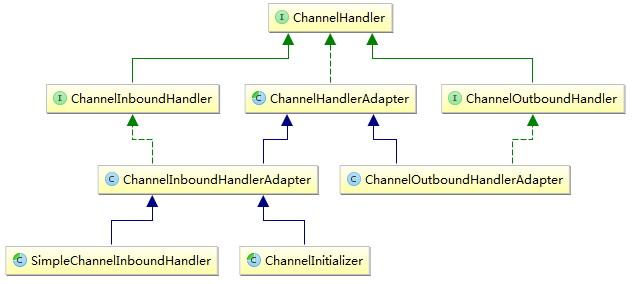
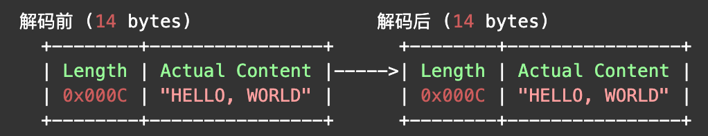
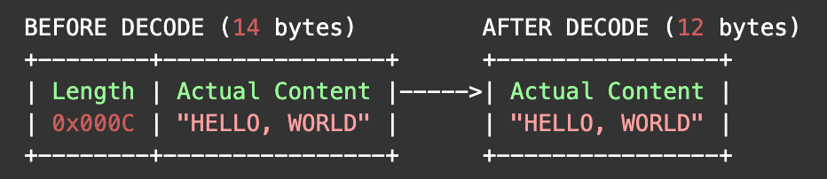
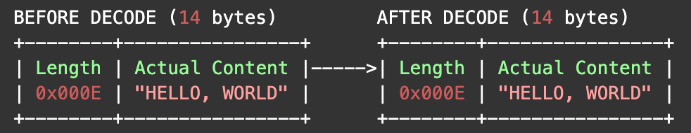
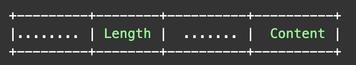
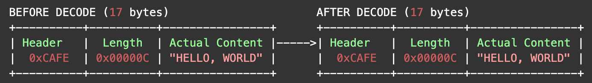
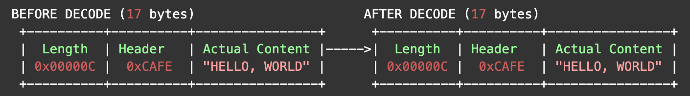
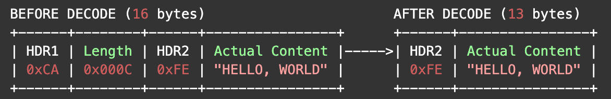
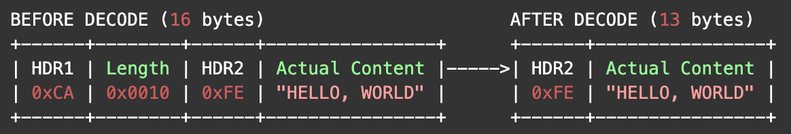

# #入门篇：Netty NIO 开发

- 推荐阅读：**[Netty 教程](http://www.tianshouzhi.com/api/tutorials/netty)** 

# 三、Netty 入门

## 1、入门案例

### (1) Server 端代码

```java
public class TimeServer {
    private int port=8080;
    public void run() throws Exception {
        EventLoopGroup bossGroup = new NioEventLoopGroup(); // (1)
        EventLoopGroup workerGroup = new NioEventLoopGroup();
        try {
            ServerBootstrap b = new ServerBootstrap(); // (2)
            b.group(bossGroup, workerGroup)
                    .channel(NioServerSocketChannel.class) // (3)
                    .childHandler(new ChannelInitializer<SocketChannel>() { // (4)
                        @Override
                        public void initChannel(SocketChannel ch) throws Exception {
                            ch.pipeline().addLast(new LineBasedFrameDecoder(1024));
                            ch.pipeline().addLast(new StringDecoder());
                            ch.pipeline().addLast(new TimeServerHandler());
                        }
                    });
            ChannelFuture f = b.bind(port).sync(); // (5)
            System.out.println("TimeServer Started on 8080...");
            f.channel().closeFuture().sync();
        } finally {
            workerGroup.shutdownGracefully();
            bossGroup.shutdownGracefully();
        }
    }
    public static void main(String[] args) throws Exception {
        new TimeServer().run();
    }
}
```

说明：

1. 首先创建了两个 `EventLoopGroup` 实例：bossGroup 和 workerGroup

    > EventLoopGroup的作用是线程池
    >
    > bossGroup 用于接受客户端连接，bossGroup 在接受到客户端连接之后，将连接交给 workerGroup 来进行处理

2. 接着，创建了一个 `ServerBootstrap` 实例，这是一个服务端启动类

3. 通过 channel 指定 `NioServerSocketChannel`，表示服务端的类，用于接受客户端连接，对应 NIO 的 ServerSocketChannel

4. 通过 childHandler 方法，设置一个匿名内部类 `ChannelInitializer` 实例，用于初始化客户端连接 `SocketChannel` 实例

    > `LineBasedFrameDecoder、StringDecoder` 是 netty 提供，用于解决 TCP 粘包、解包的工具类：
    >
    > - `LineBasedFrameDecoder`：解析客户端请求时，遇到字符 `\n` 或 `\r\n` 时，则认为是一个完整的请求报文，然后将这个请求报文的二进制字节流交给 StringDecoder 处理
    > - `StringDecoder`：将字节流转换成一个字符串，交给 TimeServerHandler 来进行处理
    > - `TimeServerHandler`：自定义，在这个类中，根据用户请求返回当前时间

5、所有配置都设置好后，调用 ServerBootstrap 的 bind(port) 方法，开启监听 8080 端口，接受客户端请求

---

`TimeServerHandler`：处理客户端请求，每当接收到 `QUERY TIME ORDER` 请求时，就返回当前时间；否则返回 `BAD REQUEST`

```java
public class TimeServerHandler extends ChannelInboundHandlerAdapter {
   @Override
   public void channelRead(ChannelHandlerContext ctx, Object msg) throws Exception { // 1
      String request = (String) msg; //2
      String response = null;
      if ("QUERY TIME ORDER".equals(request)) { // 3
         response = new Date(System.currentTimeMillis()).toString();
      } else {
         response = "BAD REQUEST";
      }
      response = response + System.getProperty("line.separator”); // 4
      ByteBuf resp = Unpooled.copiedBuffer(response.getBytes()); // 5
      ctx.writeAndFlush(resp); // 6
   }
}
```

说明：

1. 继承 `ChannelInboundHandlerAdapter`，并覆盖 `channelRead` 方法，当客户端发送请求后，``channelRead` 方法会被回调

    > - 参数 `ChannelHandlerContext`：包含了当前发送请求的客户端的上下文信息
    >
    > - 参数 `msg`：表示客户端发送的请求信息

2. 将 `msg` 强转为 String 类型

    > 因为前面已经调用过 StringDecoder，其已经将二进制流转换成了一个字符串

3. 构建响应，会判断请求是否合法

    > 若请求信息是 `QUERY TIME ORDER`，则返回当前时间；否则返回 `BAD REQUEST`

4. 在响应内容中加上换行符

    > 因为客户端也要对服务端的响应进行解码，当遇到一个换行符时，就认为是一个完整的响应

5. 调用 `Unpooled.copiedBuffer` 方法创建一个缓冲区对象 `ByteBuf`

    > `NIO` 中：使用 ByteBuffer 类来表示一个缓冲区对象
    >
    > `Netty` 中：使用 ByteBuf 表示一个缓冲区对象

6. 调用 ChannelHandlerContext 的 writeAndFlush 方法，将响应刷新到客户端

### (2) Client 端代码

```java
public class TimeClient {
    public static void main(String[] args) throws Exception {
        String host = "localhost";
        int port = 8080;
        EventLoopGroup workerGroup = new NioEventLoopGroup();
        try {
            Bootstrap b = new Bootstrap(); // (1)
            b.group(workerGroup); // (2)
            b.channel(NioSocketChannel.class); // (3)
            b.handler(new ChannelInitializer<SocketChannel>() {// (4)
                @Override
                public void initChannel(SocketChannel ch) throws Exception {
                    ch.pipeline().addLast(new LineBasedFrameDecoder(1024));
                    ch.pipeline().addLast(new StringDecoder());
                    ch.pipeline().addLast(new TimeClientHandler());
                }
            });
            // Start the client.
            ChannelFuture f = b.connect(host, port).sync(); // (5)
            // Wait until the connection is closed.
            f.channel().closeFuture().sync();
        } finally {
            workerGroup.shutdownGracefully();
        }
    }
}
```

说明：

1. 首先创建一个 `Bootstrap` 实例，与ServerBootstrap 对应，表示一个客户端的启动类

2. 调用 group方法给 Bootstrap 实例设置了一个 EventLoopGroup 实例

3. 通过 channel 方法指定 `NioSocketChannel`，用于表示客户端的对象实例

4. 在连接创建完成、初始化时，给 SocketChannel 添加几个处理器类

    > 其中 TimeClientHandler 是自定义的给服务端发送请求，并接受服务端响应的处理器类

5. 所有参数设置完成后，调用 Bootstrap 的 connect(host, port) 方法，与服务端建立连接

---

`TimeClientHandler`：主要用于给 Server 端发送 `QUERY TIME ORDER` 请求，并接受服务端响应

```java
public class TimeClientHandler extends ChannelInboundHandlerAdapter {
    private byte[] req=("QUERY TIME ORDER" + System.getProperty("line.separator")).getBytes();
    @Override
    public void channelActive(ChannelHandlerContext ctx) {//1
        ByteBuf message = Unpooled.buffer(req.length);
        message.writeBytes(req);
        ctx.writeAndFlush(message);
    }
    @Override
    public void channelRead(ChannelHandlerContext ctx, Object msg) throws Exception {
        String body = (String) msg;
        System.out.println("Now is:" + body);
    }
}
```

说明：TimeClientHandler 继承 `ChannelInboundHandlerAdapter`，并同时覆盖了 channelActive 和 channelRead 方法

-    当客户端与服务端连接建立成功后，`channelActive` 方法会被回调，在这个方法中给服务端发送 `QUERY TIME ORDER` 请求
-   当接受到服务端响应后，`channelRead` 方法会被会回调，在这个方法中打印出响应的时间信息

## 2、Netty Channel

### (1) 简介

**Netty 通道是对 NIO 的封装，顶级接口是 `Channel`** 

以 TCP 编程为例：

- **java 有两种方式**：

    1. **基于 BIO**：使用 `ServerSocket` 和 `Socket` 来代表服务端和客户端

    2. **基于NIO**：使用 `ServerSocketChannel` 和 `SocketChannel` 来代表服务端与客户端

- **Netty 中的封装**：

    1. 使用 `OioServerSocketChannel` 和 `OioSocketChannel` 对 ServerSocket 与 Socket 进行封装

    2. 使用 `NioServerSocketChannel` 和 `NioSocketChannel `对 ServerSocketChannel 和 SocketChannel 进行封装


### (2) ChannelConfig

Netty 中，Channel 有对应配置，用 `ChannelConfig` 接口表示，每个 Channel 实现类都有对应的 ChannelConfig 实现类：

- `NioSocketChannel` 的对应的配置类为 `NioSocketChannelConfig`
- `NioServerSocketChannel` 的对应的配置类为 `NioServerSocketChannelConfig` 

**Channel 接口定义的 `config()` 方法**：用于获取特定通道实现的配置，子类需要实现这个接口


- **ChannelOption 类**： 定义了 ChannelConfig 支持的所有参数类型

    > - 可以认为 ChannelConfig 中用一个 Map 来保存参数，Map 的 key 是 ChannelOption
    >
    > - ChannelConfig 定义了相关方法来获取和修改 Map 中的值
    >
    > ```java
    > public interface ChannelConfig {
    >  	Map<ChannelOption<?>, Object> getOptions(); //获取所有参数
    >  	boolean setOptions(Map<ChannelOption<?>, ?> options); //替换所有参数
    >  	<T> T getOption(ChannelOption<T> option); //获取以某个ChannelOption为key的参数
    >  	<T> boolean setOption(ChannelOption<T> option, T value); //替换某个ChannelOption为key的参数值
    >  }
    > ```

---

**ChannelConfig 支持的通用 ChannelOption**：

- `ChannelOption.CONNECT_TIMEOUT_MILLIS`
- `ChannelOption.WRITE_SPIN_COUNT`
- `ChannelOption.ALLOCATOR`
- `ChannelOption.AUTO_READ`
- `ChannelOption.MAX_MESSAGES_PER_READ`
- `ChannelOption.RCVBUF_ALLOCATOR`
- `ChannelOption.ALLOCATOR`
- `ChannelOption.WRITE_BUFFER_HIGH_WATER_MARK`
- `ChannelOption.WRITE_BUFFER_LOW_WATER_MARK`
- `ChannelOption.MESSAGE_SIZE_ESTIMATOR`
- `ChannelOption.AUTO_CLOSE`

---

**SocketChannelConfig 在 ChannelConfig 基础上，额外支持的 ChannelOption**：

- `ChannelOption.SO_KEEPALIVE`
- `ChannelOption.SO_REUSEADDR`
- `ChannelOption.SO_LINGER`
- `ChannelOption.TCP_NODELAY`
- `ChannelOption.SO_RCVBUF`
- `ChannelOption.SO_SNDBUF`
- `ChannelOption.IP_TOS`
- `ChannelOption.ALLOW_HALF_CLOSURE`

---

**ServerSocketChannelConfig 在 ChannelConfig 基础上额外支持的 ChannelOption**：

- `ChannelOption.SO_REUSEADDR`
- `ChannelOption.SO_RCVBUF`
- `ChannelOption.SO_BACKLOG`

---

**ChannelOption 详解**： 

- `ChannelOption.SO_KEEPALIVE --> StandardSocketOptions.SO_KEEPALIVE`： 是否启用心跳机制，默认false

    > - 该心跳机制只是操作系统底层使用的一个被动机制，原理上不应该被上层应用层使用
    >
    > - 当系统关闭一个由 KEEPALIVE 机制检查出来的死连接时，是不会主动通知上层应用的，只有在调用相应的 IO 操作在返回值中检查出来
    >
    > - SO_KEEPALIVE 保持连接检测对方主机是否崩溃，避免（服务器）永远阻塞于TCP连接的输入
    >
    > 若 2 小时内在此套接口的任一方向都没有数据交换，TCP 就自动给对方发一个保持存活探测分节：
    >
    > - 对方接收一切正常：以期望的 ACK 响应，2小时后，TCP将发出另一个探测分节
    > - 对方已崩溃且已重新启动：以 RST 响应，套接口的待处理错误被置为 ECONNRESET，套接口本身则被关闭
    > - 对方无任何响应：源自 berkeley 的 TCP 发送另外 8 个探测分节，相隔 75 秒一个，试图得到响应

- `ChannelOption.SO_REUSEADDR --> StandardSocketOptions.SO_REUSEADDR`： 重用处于 TIME_WAIT 状态的地址，默认 false

- `ChannelOption.SO_LINGER --> StandardSocketOptions.SO_LINGER`： 关闭套接字

    > 调用 closesocket 关闭套接字时，SO_LINGER 将决定系统如何处理残存在套接字发送队列中的数据
    >
    > - 丢弃或将数据继续发送至对端，优雅关闭连接
    >
    > SO_LINGER 以秒为单位，最大取值为 65535，即指定时间内残余数据尚未发送完成，也关闭

- `ChannelOption.SO_SNDBUF --> StandardSocketOptions.SO_SNDBUF`： 发送缓冲区的大小，默认 8K

- `ChannelOption.SO_RCVBUF --> StandardSocketOptions.SO_RCVBUF`： 接收缓冲区大小，默认 8K

- `ChannelOption.TCP_NODELAY --> StandardSocketOptions.TCP_NODELAY`： 是否一有数据就马上发送

    > **Nagle 算法目的**： 尽可能发送大块数据，避免网络中充斥着许多小数据块
    >
    > - 如果要求高实时性，有数据发送时就马上发送，就将该选项设置为 true 关闭 Nagle 算法
    > - 如果要减少发送次数减少网络交互，就设置为 false 等累积一定大小后再发送，默认为 false

- `ChannelOption.IP_TOS --> StandardSocketOptions.IP_TOS`

- `ChannelOption#SO_BACKLOG`： 用于构造服务端套接字 ServerSocket 对象，标识当服务器请求处理线程全满时，用于临时存放已完成三次握手的请求的队列的最大长度

    > 如果未设置或设置的值小于1，Java 将使用默认值 50
    >
    > Netty 中默认读取文件 /proc/sys/net/core/somaxconn 的值，如果没有读到，默认取值为 3072

### (3) ChannelHander

- `ChannelHandler`：**对 channel 的输入和输出事件进行处理** 



- **ChannelPipeline**： 保证 ChannelHandler 处理顺序，每个 Channel 对象创建时，会自动创建一个关联的 ChannelPipeline 对象

    > 可以通过 io.netty.channel.Channel 对象的 `pipeline()` 方法获取该对象实例

- **ChannelHandlerContext**： ChannelHandler 先封装成 `ChannelHandlerContext`，再封装进 ChannelPipeline 中

    > ```java
    > @Override
    > public ChannelPipeline addLast(EventExecutorGroup group, final String name, 
    >                                ChannelHandler handler) {
    >     synchronized (this) {
    >         checkDuplicateName(name);//check这种类型的handler实例是否允许被添加多次
    >        //将handler包装成一个DefaultChannelHandlerContext类
    >         AbstractChannelHandlerContext newCtx = 
    >             						new DefaultChannelHandlerContext(this, group, name, handler);
    >         addLast0(name, newCtx);//维护AbstractChannelHandlerContext的先后关系
    >     }
    >     return this;
    > }
    > ```
    >
    > 
    >
    > 
    >
    > 

## 3、netty 线程模型

### (1) 基本并发编程模型

- **串行工作者模型**： 将接受的任务放到任务队列中，并立即返回，而 worker 线程不断的从这个队列中取出任务进行异步执行

    > - **问题**：若任务处理太慢，导致队列里积压的任务数量越来愈大，任务不能得到及时的执行
    >
    > 

- **并行工作者模型**： 一个 accpet thread，多个 worker thread

    - 并行工作者线程模型设计方式一：**基于公共任务队列**，如： `ThreadPoolExecutor `

        

    - 并行工作者线程模型设计方式二：**每个 worker thread 维护自己的任务队列**，如：`Reactor`

        

### (2) Reactor 线程模型

**reactor 线程模型**：

- 任务接受后，**对处理过程继续进行切分**，划分为多个不同的步骤，每个步骤用不同的线程来处理

    > 即原本由一个线程处理的任务现在由多个线程来处理

- 每个线程在处理完自己的步骤之后，还需要将任务转发到线程继续进行处理

---

- **单线程 reactor 线程模型**： 只有一个 accpet Thread 接受任务，一般以比较耗时的操作为切分点

    

- **多线程 reactor 线程模型**： 有多个 accpet 线程

    

- **混合型 reactor 线程模型**：最能体现 reactor 线程模型的本质

    - 将任务处理切分成多个阶段进行，每个阶段处理完自己的部分之后，转发到下一个阶段进行处理

        > 不同的阶段之间的执行是异步的，可以认为每个阶段都有一个独立的线程池

    - 不同类型的任务，有着不同的处理流程，划分时需要划分成不同的阶段

    

### (3) Netty 中的 Reactor 线程模型

#### 1. 简介

先以一个使用了 reactor 线程模型的 netty 服务端的典型代码进行说明：

```java
EventLoopGroup bossGroup = new NioEventLoopGroup(1); //parentGroup
EventLoopGroup workerGroup = new NioEventLoopGroup(3); //childGroup
ServerBootstrap b = new ServerBootstrap(); 
b.group(bossGroup, workerGroup)
        .channel(NioServerSocketChannel.class)
		.handler(new LoggingHandler(LogLevel.INFO))
        .option(ChannelOption.SO_BACKLOG, 128)
      	.attr(AttributeKey.valueOf("ssc.key"),"scc.value")
        .childHandler(new ChannelInitializer<SocketChannel>() {
            @Override
            public void initChannel(SocketChannel ch) throws Exception {
                ch.pipeline().addLast(new DiscardServerHandler());
            }
        }) 
        .childOption(ChannelOption.SO_KEEPALIVE, true); 
        .childAttr(AttributeKey.valueOf("sc.key"),"sc.value")
        .bind(port);
```

在上述代码片段中代码很少，却包含了一个复杂 reactor 线程模型，如下所示：


**图中大致包含了 5 个步骤**：

1. 设置服务端 ServerBootStrap 启动参数
2. 通过 bind 方法启动服务端，bind 方法会在 parentGroup 中注册 NioServerScoketChannel，监听客户端的连接请求
3. Client 发起 CONNECT 请求，parentGroup 中的 NioEventLoop 不断轮循是否有新的客户端请求；若有，则 ACCEPT 事件触发
4. ACCEPT 事件触发后，parentGroup 中的 NioEventLoop 通过 NioServerSocketChannel 获取到对应客户端的 NioSocketChannel，并将其注册到 childGroup 中
5. childGroup 中的 NioEventLoop 检测 NioSocketChannel 是否有读写事件准备好；若有，则调用对应的 ChannelHandler 处理

#### 2. 详解

1、**设置服务端 ServerBootStrap 启动参数**

服务端启动前，会调用 `group，channel、handler、option、attr、childHandler、childOption、childAttr` 等方法来设置启动参数

- `group()`： 设置执行任务的线程池

    > Netty 中，EventLoopGroup 的作用类似于线程池，每个 EventLoopGroup 包含多个 EventLoop 对象，代表不同的线程
    >
    > - 参数代表会创建的 EventLoop 对象数量
    > - 若没有传入参数或传入的是 0，则 EventLoop 数量为 **CPU核数*2** 
    >
    > ---
    >
    > 若创建了两个 EventLoopGroup：parentGroup 和childGroup
    >
    > - 把 parentGroup 传递给 ServerBootStrap 的父类 AbstractBootstrap 进行维护，childGroup 由 ServerBootStrap 维护
    >
    > - 调用 ServerBootStrap 的 group() 获取 parentGroup，通过 ServerBootStrap 定义的 childGroup() 获取 workerGroup
    >
    > ```java
    > public final class ServerBootstrap extends AbstractBootstrap<ServerBootstrap, ServerChannel> {
    > 	..........
    > 	private volatile EventLoopGroup childGroup;//ServerBootStrap自己维护childGroup
    > 	..........
    > 	public ServerBootstrap group(EventLoopGroup parentGroup, EventLoopGroup childGroup) {
    >         super.group(parentGroup);//将parentGroup传递给父类AbstractBootstrap处理
    >         if (childGroup == null) {
    >             throw new NullPointerException("childGroup");
    >         }
    >         if (this.childGroup != null) {
    >             throw new IllegalStateException("childGroup set already");
    >         }
    >         this.childGroup = childGroup;//给childGroup赋值
    >         return this;
    >     }
    > 	.......
    >   	public EventLoopGroup childGroup() {//获取childGroup
    >     	return childGroup;
    >   	}
    > }
    > ```

- `channel()`： 用于构造通道的工厂类 ChannelFactory 实例，在之后需要创建通道实例

    > 通过调用 `ChannelFactory.newChannel()` 方法来创建，channel 内部隐含的调用了 channelFactory 方法，可以直接调用

- `handler --> childHandler`：分别用于设置 NioServerSocketChannel 和 NioSocketChannel 的处理器链，即当有一个 NIO 事件时，应该按照怎样的步骤进行处理

- `option --> childOption`：分别用于设置 NioServerSocketChannel 和 NioSocketChannel 的 TCP 连接参数，在 ChannelOption 类中可以看到 Netty 支持的所有 TCP 连接参数

- `attr --> childAttr`：用于给  channel 设置一个 key/value，之后可以根据 key 获取

---

2、**调用 ServerBootStrap 的 bind 方法**

- 调用 bind方法，相当于启动服务端，**启动的核心逻辑都在 bind 方法中** 

    > - bind 方法内部，会创建一个 NioServerSocketChannel 实例，并将其在 parentGroup 中进行注册
    >
    > - parentGroup 在接受到注册请求时，会从自己的管理的 NioEventLoop 中，选择一个进行注册
    >
    > 一旦注册完成，就可以通过 NioServerSocketChannel 检测是否有新的客户端连接

- `doBind()` 最重要的方法 `initAndRegister()`

---

#### 3. initAndRegister 方法

**`initAndRegister()` 的 3 个主要任务**：

1. 创建 NioServerSocketChannel 实例，通过之前创建的 ChannelFactory 实例的 newChannel 完成

2. 初始化 NioServerSocketChannel，即将通过 handler，option，attr 等方法设置的参数应用到 NioServerSocketChannel 

    > ServerBootStrap 的 `init()` 会在 NioServerSocketChannel 处理器链的最后添加一个默认的处理器 ServerBootstrapAcceptor
    >
    > - ServerBootstrapAcceptor 是客户端连接请求的处理器，当接受到一个客户端请求后，Netty 将创建一个代表客户端的 NioSocketChannel 对象

3. 将 NioServerSocketChannel 注册到 parentGroup 中，parentGroup 会选择其中一个 NioEventLoop 来运行该 NioServerSocketChannel 要完成的功能，即监听客户端的连接

    > ServerBootStrap 通过调用 register 方法将 NioServerSocketChannel 注册到 parentGroup 中

```java
final ChannelFuture initAndRegister() {
    final Channel channel = channelFactory().newChannel(); //1、创建NioServerSocketChannel实例
    try {
        init(channel); //2、初始化NioServerSocketChannel，这是一个抽象方法，ServerBootStrap对此进行了覆盖
    } catch (Throwable t) {
        channel.unsafe().closeForcibly();
        return channel.newFailedFuture(t);
    }
    ChannelFuture regFuture = group().register(channel);//3、NioServerSocketChannel注册到parentGroup中
    if (regFuture.cause() != null) {
        if (channel.isRegistered()) {
            channel.close();
        } else {
            channel.unsafe().closeForcibly();
        }
    }
    return regFuture;
}
```

---

**`init` 方法**：

- 为 NioServerSocketChannel 设置运行参数

- 会在 NioServerSocketChannel 处理器链的最后，添加一个默认的处理器 ServerBootstrapAcceptor

    > 其是客户端连接请求的处理器，当接受到客户端请求后，Netty 会创建一个代表客户端的 NioSocketChannel 对象
    >
    > - 指定的 channelHandler、childOption、childAtrr、childGroup 等参数，也会设置到 NioSocketChannel 中

```java
@Override
void init(Channel channel) throws Exception {//channel参数类型就是NioServerSocketChannel
   //1、为NioServerSocketChannel设置option方法设置的参数
   final Map<ChannelOption<?>, Object> options = options();
    synchronized (options) {
        channel.config().setOptions(options);
    }
   //2、为NioServerSocketChannel设置attr方法设置的参数
    final Map<AttributeKey<?>, Object> attrs = attrs();
    synchronized (attrs) {
        for (Entry<AttributeKey<?>, Object> e: attrs.entrySet()) {
            @SuppressWarnings("unchecked")
            AttributeKey<Object> key = (AttributeKey<Object>) e.getKey();
            channel.attr(key).set(e.getValue());
        }
    }
    //3、为NioServerSocketChannel设置通过handler方法指定的处理器
    ChannelPipeline p = channel.pipeline();
    if (handler() != null) {
        p.addLast(handler());
    }
    //4、为NioSocketChannel设置默认的处理器ServerBootstrapAcceptor
    //并将相关参数通过构造方法传给ServerBootstrapAcceptor
    final EventLoopGroup currentChildGroup = childGroup;
    final ChannelHandler currentChildHandler = childHandler;
    final Entry<ChannelOption<?>, Object>[] currentChildOptions;
    final Entry<AttributeKey<?>, Object>[] currentChildAttrs;
    synchronized (childOptions) {
        currentChildOptions = childOptions.entrySet().toArray(newOptionArray(childOptions.size()));
    }
    synchronized (childAttrs) {
        currentChildAttrs = childAttrs.entrySet().toArray(newAttrArray(childAttrs.size()));
    }
 
    p.addLast(new ChannelInitializer<Channel>() {
        @Override
        public void initChannel(Channel ch) throws Exception {
            ch.pipeline().addLast(new ServerBootstrapAcceptor(
                    currentChildGroup, currentChildHandler, currentChildOptions, currentChildAttrs));
        }
    });
}
```

---

**`register` 方法**：

-  初始化完成后，ServerBootStrap 通过调用 register 方法将 NioServerSocketChannel 注册到 parentGroup 中

- 对于通道的注册，NioEventLoopGroup 会从多个 NioEventLoop 中选择一个来执行真正的注册

    > 注意：一个通道只能由一个 NioEventLoop 处理，一个 NioEventLoop 可以处理多个通道，通道与 NioEventLoop 是多对一

NioEventLoopGroup 的 register 方法继承自 MultithreadEventLoopGroup：

```java
public abstract class MultithreadEventLoopGroup 
    					extends MultithreadEventExecutorGroup implements EventLoopGroup {
	.......
	@Override
	public ChannelFuture register(Channel channel) {
    	return next().register(channel);
	}
	.......
}
```

- next 方法的返回值，就是 NioEventLoop，由上知：

- 真正的注册工作，由 NioEventLoop 完成

- next() 方法还**提供了通道在 NioEventLoop 中平均分配的机制**

    > NioEventLoopGroup 创建时，其父类 MultithreadEventExecutorGroup 会创建一个 EventExecutorChooser 实例，之后通过其来保证通道平均注册到不同的 NioEventLoop 中

```java
public abstract class MultithreadEventExecutorGroup extends AbstractEventExecutorGroup {
	....
    //NioEventLoop是EventExecutor的子类，这里的children指的就是NioEventLoop
	private final EventExecutor[] children;
	private final AtomicInteger childIndex = new AtomicInteger();//上一次接受注册任务的EventEexcutor编号
	private final EventExecutorChooser chooser;
	...
	protected MultithreadEventExecutorGroup(int nThreads, ThreadFactory threadFactory, Object... args) {
		......
		children = new SingleThreadEventExecutor[nThreads];
		if (isPowerOfTwo(children.length)) {//如果指定的线程数是2的幂
    		chooser = new PowerOfTwoEventExecutorChooser();
		} else {
    		chooser = new GenericEventExecutorChooser();//按照round-robin的方式，来保证平均
		}
		for (int i = 0; i < nThreads; i ++) {
    		boolean success = false;
    		try {//创建EventExecutor实例，newChild是抽象方法，NioEventLoopGroup进行了覆盖，返回NioEventLoop实例
        		children[i] = newChild(threadFactory, args);
        		success = true;
    		} catch (Exception e) {
				.............
  			}
		}
	......
	}
	//调用此方法，即可以保证任务的平均分配
	@Override
	public EventExecutor next() {
    	return chooser.next();
	}
	
    private final class PowerOfTwoEventExecutorChooser implements EventExecutorChooser {
    	@Override
    	public EventExecutor next() {
        	return children[childIndex.getAndIncrement() & children.length - 1];
    	}
	}
 
	private final class GenericEventExecutorChooser implements EventExecutorChooser {
    	@Override
    	public EventExecutor next() {
        	return children[Math.abs(childIndex.getAndIncrement() % children.length)];
    	}
	}
	............
}
```

# 四、TCP 粘包/拆包

## 1、TCP粘包、拆包详述

推荐阅读：**[TCP粘包、拆包与通信协议](http://www.tianshouzhi.com/api/tutorials/netty/343)** 

### (1) 简介

TCP 无消息保护边界，需要在消息接收端处理消息边界问题，即粘包、拆包问题；而 UDP 通信则不需要

- TCP 是面向流的连接，提供高可靠性服务，面向流的通信无消息保护边界

    > 发送端使用了 Nagle 算法优化，将多次间隔较小且数据量小的数据，合并成一个大的数据块，然后进行封包

- UDP 是面向消息的无连接，提供高效率服务，面向消息的通信有消息保护边界

    > 不会使用块的合并优化算法，支持一对多模式，接收端的 skbuff(套接字缓冲区)采用链式结构来记录每一个到达的 UDP 包


假设客户端发送两个数据包 D1和D2 给服务端，由于服务端一次读取字节数不确定，故存在以下四种情况：

- 服务端分两次读取到了两个独立的数据包，分别是 D1和D2，没有粘包和拆包
- 服务端一次接受到了两个数据包，D1和D2 粘合在一起，称之为 **TCP 粘包**
- 服务端分两次读取数据包，第一次读取到了完整的D1包和D2包的部分内容，第二次读取到了D2包的剩余内容，称之为**TCP 拆包**
- 服务端分两次读取数据包，第一次读取到了D1包的部分内容D1_1，第二次读取到了D1包的剩余部分内容D1_2和完整的D2包

> 注意： 如果 TCP 的接受滑窗非常小，而数据包 D1和D2 比较大，很有可能会发生第五种情况，即服务端分多次才能将D1和D2包完全接受，期间发生多次拆包

### (2) 粘包、拆包原因

#### 1. socket 缓冲区与滑动窗口

每个 TCP socket 在内核中都有一个发送缓冲区 `SO_SNDBUF` 和一个接收缓冲区 `SO_RCVBUF`

> TCP 的全双工的工作模式以及 TCP 的滑动窗口便是依赖于这两个独立的buffer以及此buffer的填充状态
>
> - SO_SNDBUF 和 SO_RCVBUF 在windows操作系统中默认情况下都是 8K

- `SO_SNDBUF`：进程发送数据时，将数据拷贝进 socket 的内核发送缓冲区中，然后 send 便会在上层返回

    > - send 返回时，数据不一定会发送到对端去
    >
    > - send 仅仅是把应用层 buffer 的数据拷贝进 socke t的内核发送 buffer 中

- `SO_RCVBUF`： 把接收的数据缓存入内核，若应用进程一直没有调用 read 进行读取，此数据会一直缓存在相应 socket 的接收缓冲区

    > read 的工作：把内核缓冲区中的数据拷贝到应用层用户的 buffer 中

- **滑动窗口**： TCP 链接在三次握手时，会将自己的窗口大小(window size)发送给对方，即 `SO_RCVBUF` 的值

    > 之后在发送数据时，发送方要先确认接收方的窗口没有被填充满；若没有填满，则可以发送

**`SO_RCVBUF` 和滑动窗口造成粘包、拆包**： 

- **粘包**：若接收方的数据处理不及时，报文数据会缓存到 SO_RCVBUF 中；若接收方的 SO_RCVBUF 缓存了多个报文，则就是粘包

- **拆包**：假设接收方的 window size 只剩 128，则发送方还可以发送 128 字节，而由于发送方的数据大小是256字节，因此只能发送前 128 字节，等到接收方 ack 后，才能发送剩余字节

#### 2. MSS/MTU 分片

- `MSS(Maximum Segement Size)`： 表示 TCP 报文中 data 部分的最大长度，是 TCP 在传输层对一次可以发送的最大数据的限制

- `MTU(Maxitum Transmission Unit)`： 是链路层对一次可以发送的最大数据的限制

当需要传输的数据大于 MSS 或 MTU 时，数据会被拆分成多个包进行传输(MSS 根据 MTU 计算)


- **应用层**：将数据写入 socket 在内核中的缓冲区 SO_SNDBUF 即返回，操作系统会将 SO_SNDBUF 中的数据取出来进行发送
- **传输层**：会在 DATA 前面加上 TCP Header，构成一个完整的 TCP 报文
- **网络层**：会在 TCP 报文的基础上再添加一个 IP Header，即将网络地址加入到报文中
- **数据链路层**：会加上 Datalink Header 和 CRC
- **物理层**：会将 SMAC(数据发送方的 MAC 地址)，DMAC(数据接受方的 MAC 地址 )和 Type 域加入


---

**MTU 与 MSS 的大小计算**：

- **MTU**：以太网传输数据方面的限制

    > MTU 最大为 `1500 bytes`：
    >
    > - 以太网帧的取值范围：`64 bytes ~ 1518 bytes` 
    > - 刨去 `18bytes`：以太网帧的头部 `14 bytes`(DMAC 目的 MAC 地址 48bit=6bytes + SAMC 源 MAC 地址 48bit=6bytes + Type 域 2bytes) + 帧尾 `4 bytes`(CRC校验部分)

- **MSS**：TCP 协议一次可以发送的实际应用数据的最大值

    > MSS 长度：`MTU 长度 - IP Header - TCP Header`，即 `1460 bytes` 或 `1440 bytes`
    >
    > - TCP Header 长度为 `20bytes`
    > - IP Header 长度：IPv4 为 20 bytes，IPv6 为 40 bytes
    >
    > 注意：MSS 表示的是可以发送 DATA 的最大长度，而不是 DATA 的真实长度
    >
    > - 发送数据时，当 SO_SNDBUF 数据量大于 MSS 时，操作系统会将数据进行拆分(拆包)再发送

> 默认情况下，linux 与外部通信的网卡 eth0 的 MTU 大小是 1500 字节，而本地回环地址的 MTU 大小为 65535

#### 3. Nagle 算法

- **Nagle 算法目的**：为了尽可能发送大块数据，提高网络带宽利用率，避免网络中充斥着许多小数据块

- **Nagle 算法的基本定义**：任意时刻，最多只能有一个未被确认的小段

    > - 小段： 指小于 MSS 尺寸的数据块
    >- 未被确认： 指一个数据块发送出去后，没有收到对方发送的 ACK 确认该数据已收到

- **Nagle 算法的规则**：

    - 若 `SO_SNDBUF` 中的数据长度达到 `MSS`，则允许发送

    - 若 `SO_SNDBUF` 中含有 `FIN`(表示请求关闭连接)，则先将 SO_SNDBUF 中的剩余数据发送，再关闭

    - 设置 `TCP_NODELAY=true` 选项，则允许发送

        > - TCP_NODELAY 是取消 TCP 的确认延迟机制，相当于禁用 Negale 算法
        >
        > - 也可以通过设置 TCP_QUICKACK 选项来取消确认延迟
        >
        > ---
        >
        > **确认延迟**：：Server 端收到数据后，会将 ACK 的发送延迟一段时间(一般 40ms)，和应答数据一起发送
        >
        > - TCP 连接的延迟确认时间一般初始化为最小值 40ms
        > - 随后根据连接的重传超时时间 `RTO`、上次收到数据包与本次接收数据包的时间间隔等参数进行不断调整

    - 未设置 TCP_CORK 选项时，若所有发出去的小数据包(包长度小于 MSS)均被确认，则允许发送

    - 上述条件都未满足，但发生了超时(一般为200ms)，则立即发送

### (3) 粘包、拆包问题及解决方案

#### 1. 粘包、拆包问题

- **粘包、拆包问题**：给接收方的数据解析带来麻烦，例如：
    - SO_RCVBUF 中存在多个连续的完整包(粘包)，因为每个包可能都是一个完整的请求或响应，则接收方需要能对此进行区分
    - 若存在不完整的数据(拆包)，则需要继续等待数据，直至可以构成一条完整的请求或响应

- **解决方案**：通过定义通信协议来解决

#### 2. 解决方案：定义通信协议

- **协议的作用**： 定义传输数据的格式

    > 在接收到数据时：
    >
    > - 如果粘包，可以根据格式来区分不同的包
    > - 如果拆包，就等待数据可以构成一个完整的消息来处理

- **主流协议方案**： 

    - **定长协议**： 规定每几个字节，表示一个有效报文

    - **特殊字符分隔符协议**： 在包尾部增加回车或空格符等特殊字符进行分割 

    - **长度编码**： 将消息分为消息头和消息体，消息头中用一个 int 型数据`4 bytes`，表示消息体长度的字段

        > 在解析时： 
        >
        > - 先读取内容长度 Length，其值为实际消息体内容占用的字节数
        > - 之后读取到这么多字节的内容，才认为是一个完整的数据报文

通信协议：就是通信双方约定好的数据格式，发送方按照这个数据格式来发送，接受方按照这个格式来解析

- **编码 `encode`**：发送方将发送的数据转换成协议规定的格式

- **解码 `decode`**：接收方根据协议的格式对二进制数据进行解析

## 2、案例：TCP 粘宝导致功能异常

### (1) TimeServer 端

- `TimeServer`

    ```java
    public class TimeServer {
        public void bind(int port) throws Exception {
            // 配置服务端的NIO线程组
            EventLoopGroup bossGroup = new NioEventLoopGroup();
            EventLoopGroup workerGroup = new NioEventLoopGroup();
            try {
                ServerBootstrap b = new ServerBootstrap();
                b.group(bossGroup, workerGroup)
                        .channel(NioServerSocketChannel.class)
                        .option(ChannelOption.SO_BACKLOG, 1024)
                        .childHandler(new ChildChannelHandler());
                // 绑定端口，同步等待成功
                ChannelFuture f = b.bind(port).sync();
                // 等待服务端监听端口关闭
                f.channel().closeFuture().sync();
            } finally {
                // 优雅退出，释放线程池资源
                bossGroup.shutdownGracefully();
                workerGroup.shutdownGracefully();
            }
        }
    
        private class ChildChannelHandler extends ChannelInitializer<SocketChannel> {
            @Override
            protected void initChannel(SocketChannel arg0) throws Exception {
                arg0.pipeline().addLast(new TimeServerHandler());
            }
        }
    
        public static void main(String[] args) throws Exception {
            int port = 8080;
            if (args != null && args.length > 0) {
                try {
                    port = Integer.valueOf(args[0]);
                } catch (NumberFormatException e) {
                    // 采用默认值
                }
            }
            new TimeServer().bind(port);
        }
    }
    ```

- `TimeServerHandler`

    ```java
    public class TimeServerHandler extends ChannelHandlerAdapter {
        private int counter;
        @Override
        public void channelRead(ChannelHandlerContext ctx, Object msg) throws Exception {
            ByteBuf buf = (ByteBuf) msg;
            byte[] req = new byte[buf.readableBytes()];
            buf.readBytes(req);
            String body = new String(req, "UTF-8").substring(0, req.length 
                                                         - System.getProperty("line.separator").length());
            System.out.println("The time server receive order: " + body + " ;the counter is: " + ++counter);
            String currentTime = "QUERY TIME ORDER".equalsIgnoreCase(body) 
                					? new java.util.Date(System.currentTimeMillis()).toString() 
                					: "BAD ORDER" + System.getProperty("line.separator");
            ByteBuf resp = Unpooled.copiedBuffer(currentTime.getBytes());
            ctx.writeAndFlush(resp);
        }
    
        @Override
        public void exceptionCaught(ChannelHandlerContext ctx, Throwable cause) {
            ctx.close();
        }
    }
    ```

### (2) TimeClient 端

- `TimeClient`

    ```java
    public class TimeClient {
        public void connect(int port, String host) throws Exception {
            // 配置客户端NIO线程组
            EventLoopGroup group = new NioEventLoopGroup();
            try {
                Bootstrap b = new Bootstrap();
                b.group(group).channel(NioSocketChannel.class)
                        .option(ChannelOption.TCP_NODELAY, true)
                        .handler(new ChannelInitializer<SocketChannel>() {
                            @Override
                            public void initChannel(SocketChannel ch) throws Exception {
                                ch.pipeline().addLast(new TimeClientHandler());
                            }
                        });
                // 发起异步连接操作
                ChannelFuture f = b.connect(host, port).sync();
                // 当代客户端链路关闭
                f.channel().closeFuture().sync();
            } finally {
                // 优雅退出，释放NIO线程组
                group.shutdownGracefully();
            }
        }
    
        public static void main(String[] args) throws Exception {
            int port = 8080;
            if (args != null && args.length > 0) {
                try {
                    port = Integer.valueOf(args[0]);
                } catch (NumberFormatException e) {
                    // 采用默认值
                }
            }
            new TimeClient().connect(port, "127.0.0.1");
        }
    }
    ```

- `TimeClientHandler`

    ```java
    public class TimeClientHandler extends ChannelHandlerAdapter {
        private static final Logger logger = Logger.getLogger(TimeClientHandler.class.getName());
    
        private int counter;
        private byte[] req;
    
        public TimeClientHandler() {
            req = ("QUERY TIME ORDER" + System.getProperty("line.separator")).getBytes();
        }
    
        @Override
        public void channelActive(ChannelHandlerContext ctx) {
            ByteBuf message = null;
            for (int i = 0; i < 100; i++) {
                message = Unpooled.buffer(req.length);
                message.writeBytes(req);
                ctx.writeAndFlush(message);
            }
        }
    
        @Override
        public void channelRead(ChannelHandlerContext ctx, Object msg) throws Exception {
            ByteBuf buf = (ByteBuf) msg;
            byte[] req = new byte[buf.readableBytes()];
            buf.readBytes(req);
            String body = new String(req, "UTF-8");
            System.out.println("Now is : " + body + " ; the counter is : " + ++counter);
        }
    
        @Override
        public void exceptionCaught(ChannelHandlerContext ctx, Throwable cause) {
            // 释放资源
            logger.warning("Unexpected exception from downstream : " + cause.getMessage());
            ctx.close();
        }
    }
    ```

### (3) 问题

- 运行结果：

    - `Server` 端：

        > Server 端包含两条消息：说明发生了 TCP 粘包
        >
        > - 第一条包含 57 条 “QUERY TIME ORDER” 指令
        > - 第二条包含 43 条 “QUERY TIME ORDER” 指令
        >
        > ```shell
        > The time server receive order : QUERY TIME ORDER
        > ...
        > QUE ; the counter is : 1
        > The time server receive order : Y TIME ORDER
        > ...
        > the counter is : 2
        > ```

    - `Client` 端：

        > - 客户端应该收到 100 条当前系统时间的消息，但实际只收到一条
        >
        > ```java
        > Now is : BAD ORDER
        > BAD ORDER
        >  ; the counter is : 1
        > ```

- **问题**：上述程序没有考虑 TCP 的粘包/拆包，但发生 TCP 粘包时，程序就不能正常工作

## 3、案例：解决 TCP 粘包问题(LineBasedFrameDecoder)

### (1) 支持 TCP 粘包的 TimeServer

- `TimeServer`

    ```java
    public class TimeServer {
        public void bind(int port) throws Exception {
            // 配置服务端的NIO线程组
            EventLoopGroup bossGroup = new NioEventLoopGroup();
            EventLoopGroup workerGroup = new NioEventLoopGroup();
            try {
                ServerBootstrap b = new ServerBootstrap();
                b.group(bossGroup, workerGroup)
                        .channel(NioServerSocketChannel.class)
                        .option(ChannelOption.SO_BACKLOG, 1024)
                        .childHandler(new ChildChannelHandler());
                // 绑定端口，同步等待成功
                ChannelFuture f = b.bind(port).sync();
                // 等待服务端监听端口关闭
                f.channel().closeFuture().sync();
            } finally {
                // 优雅退出，释放线程池资源
                bossGroup.shutdownGracefully();
                workerGroup.shutdownGracefully();
            }
        }
    
        private class ChildChannelHandler extends ChannelInitializer<SocketChannel> {
            @Override
            protected void initChannel(SocketChannel arg0) throws Exception {
                arg0.pipeline().addLast(new LineBasedFrameDecoder(1024));
                arg0.pipeline().addLast(new StringDecoder());
                arg0.pipeline().addLast(new TimeServerHandler());
            }
        }
    
        public static void main(String[] args) throws Exception {
            int port = 8080;
            if (args != null && args.length > 0) {
                try {
                    port = Integer.valueOf(args[0]);
                } catch (NumberFormatException e) {
                    // 采用默认值
                }
            }
            new TimeServer().bind(port);
        }
    }
    ```

- `TimeServerHandler` 

    ```java
    public class TimeServerHandler extends ChannelHandlerAdapter {
        private int counter;
    
        @Override
        public void channelRead(ChannelHandlerContext ctx, Object msg) throws Exception {
            String body = (String) msg;
            System.out.println("The time server receive order : " + body + " ; the counter is : " 
                               + ++counter);
            String currentTime = "QUERY TIME ORDER".equalsIgnoreCase(body) 
              					 ? new java.util.Date(System.currentTimeMillis()).toString() 
                				: "BAD ORDER";
            currentTime = currentTime + System.getProperty("line.separator");
            ByteBuf resp = Unpooled.copiedBuffer(currentTime.getBytes());
            ctx.writeAndFlush(resp);
        }
    
        @Override
        public void exceptionCaught(ChannelHandlerContext ctx, Throwable cause) {
            ctx.close();
        }
    }
    ```

### (2) 支持 TCP 粘包的 TimeClient

- `TimeClient`

    ```java
    public class TimeClient {
        public void connect(int port, String host) throws Exception {
            // 配置客户端NIO线程组
            EventLoopGroup group = new NioEventLoopGroup();
            try {
                Bootstrap b = new Bootstrap();
                b.group(group).channel(NioSocketChannel.class)
                        .option(ChannelOption.TCP_NODELAY, true)
                        .handler(new ChannelInitializer<SocketChannel>() {
                            @Override
                            public void initChannel(SocketChannel ch)
                                    throws Exception {
                                ch.pipeline().addLast(new LineBasedFrameDecoder(1024));
                                ch.pipeline().addLast(new StringDecoder());
                                ch.pipeline().addLast(new TimeClientHandler());
                            }
                        });
                // 发起异步连接操作
                ChannelFuture f = b.connect(host, port).sync();
                // 当代客户端链路关闭
                f.channel().closeFuture().sync();
            } finally {
                // 优雅退出，释放NIO线程组
                group.shutdownGracefully();
            }
        }
    
        public static void main(String[] args) throws Exception {
            int port = 8080;
            if (args != null && args.length > 0) {
                try {
                    port = Integer.valueOf(args[0]);
                } catch (NumberFormatException e) {
                    // 采用默认值
                }
            }
            new TimeClient().connect(port, "127.0.0.1");
        }
    }
    ```

- `TimeClientHandler`

    ```java
    public class TimeClientHandler extends ChannelHandlerAdapter {
        private static final Logger logger = Logger.getLogger(TimeClientHandler.class.getName());
    
        private int counter;
        private byte[] req;
    
        public TimeClientHandler() {
            req = ("QUERY TIME ORDER" + System.getProperty("line.separator")).getBytes();
        }
    
        @Override
        public void channelActive(ChannelHandlerContext ctx) {
            for (int i = 0; i < 100; i++) {
                ByteBuf message = Unpooled.buffer(req.length);
                message.writeBytes(req);
                ctx.writeAndFlush(message);
            }
        }
    
        @Override
        public void channelRead(ChannelHandlerContext ctx, Object msg) throws Exception {
            String body = (String) msg;
            System.out.println("Now is : " + body + " ; the counter is : " + ++counter);
        }
    
        @Override
        public void exceptionCaught(ChannelHandlerContext ctx, Throwable cause) {
            // 释放资源
            logger.warning("Unexpected exception from downstream : " + cause.getMessage());
            ctx.close();
        }
    }
    ```

# 五、分隔符和定长解码器

## 1、定义通信协议

### (1) 分割协议

#### 1. 按行分割(LineBasedFrameDecoder)

`LineBasedFrameDecoder` 和 `LineEncoder` 的通信协议非常简单，即：按照行进行分割，遇到一个换行符，则认为是一个完整的报文

- 在发送方，使用 `LineEncoder` 为数据添加换行符
- 在接受方，使用 `LineBasedFrameDecoder` 对换行符进行解码

---

- `LineBasedFrameDecoder`：遇到 `\n` 或 `\r\n` 则认为是一条完整的消息

    > ```java
    > public LineBasedFrameDecoder(final int maxLength) {
    >     this(maxLength, true, false);
    > }
    > public LineBasedFrameDecoder(final int maxLength, final boolean stripDelimiter, 
    >                              final boolean failFast) {
    >     this.maxLength = maxLength;
    >     this.failFast = failFast;
    >     this.stripDelimiter = stripDelimiter;
    > }
    > ```
    >
    > 参数说明：
    >
    > - `maxLength`：表示一行的最大长度，若超过这个长度依然没有检测到 `\n` 或 `\r\n`，则抛出 `TooLongFrameException`
    >
    > - `failFast`：表示超过 maxLength 后，抛出 TooLongFrameException 的时机
    >     - 若为 true，则超出 maxLength 后立即抛出 TooLongFrameException，不继续进行解码
    >     - 若为 false，则等到完整的消息被解码后，再抛出 TooLongFrameException 异常
    >
    > - `stripDelimiter`：解码后的消息是否去除 `\n、\r\n` 分隔符
    >
    >     > 例如，对于以下二进制字节流：
    >     >
    >     > 

- `LineEncoder`：按行添加换行符 `\n` 或 `\r\n` 进行编码，并封装到 ByteBuf 输出，与 LineBasedFrameDecoder 对应

    > ```java
    > public LineEncoder(LineSeparator lineSeparator, //换行符号
    >                Charset charset) //换行符编码，默认为CharsetUtil.UTF_8
    >     
    > public final class LineSeparator {
    >     //读取系统属性line.separator，如果读取不到，默认为\n
    >     public static final LineSeparator DEFAULT = new LineSeparator(StringUtil.NEWLINE);
    >     //unix操作系统换行符
    >     public static final LineSeparator UNIX = new LineSeparator("\n”);
    >     //windows操作系统换行度
    >     public static final LineSeparator WINDOWS = new LineSeparator("\r\n”);
    >     //...
    > }
    > ```

---

**使用案例**：

- **server 端**：`LineBasedFrameDecoderServer` 

    > ```java
    > public class LineBasedFrameDecoderServer {
    >    public static void main(String[] args) throws Exception {
    >       EventLoopGroup bossGroup = new NioEventLoopGroup(); // (1)
    >       EventLoopGroup workerGroup = new NioEventLoopGroup();
    >       try {
    >          ServerBootstrap b = new ServerBootstrap(); // (2)
    >          b.group(bossGroup, workerGroup).channel(NioServerSocketChannel.class) // (3)
    >                .childHandler(new ChannelInitializer<SocketChannel>() { // (4)
    >                   @Override
    >                   public void initChannel(SocketChannel ch) throws Exception {
    >                      // 使用LineBasedFrameDecoder解决粘包问题
    >                      //根据"\n"或"\r\n"对二进制数据进行拆分，封装到不同的ByteBuf实例中
    >                      ch.pipeline().addLast(new LineBasedFrameDecoder(1024, true, true));
    >                      // 自定义这个ChannelInboundHandler打印拆包后的结果
    >                      ch.pipeline().addLast(new ChannelInboundHandlerAdapter() {
    >                         @Override
    >                         public void channelRead(ChannelHandlerContext ctx, Object msg) 
    >                             			throws Exception {
    >                            if (msg instanceof ByteBuf) {
    >                               ByteBuf packet = (ByteBuf) msg;
    >                               System.out.println(new Date().toLocaleString() + ":" 
    >                                   					+ packet.toString(Charset.defaultCharset()));
    >                            }
    >                         }
    >                      });
    >                   }
    >                });
    >          // Bind and start to accept incoming connections.
    >          ChannelFuture f = b.bind(8080).sync(); // (7)
    >          System.out.println("LineBasedFrameDecoderServer Started on 8080...");
    >          f.channel().closeFuture().sync();
    >       } finally {
    >          workerGroup.shutdownGracefully();
    >          bossGroup.shutdownGracefully();
    >       }
    >    }
    > }
    > ```

- **client 端**：`LineBasedFrameDecoderClient` 

    > ```java
    > public class LineBasedFrameDecoderClient {
    >    public static void main(String[] args) throws Exception {
    >       EventLoopGroup workerGroup = new NioEventLoopGroup();
    >       try {
    >          Bootstrap b = new Bootstrap(); // (1)
    >          b.group(workerGroup); // (2)
    >          b.channel(NioSocketChannel.class); // (3)
    >          b.option(ChannelOption.SO_KEEPALIVE, true); // (4)
    >          b.handler(new ChannelInitializer<SocketChannel>() {
    >             @Override
    >             public void initChannel(SocketChannel ch) throws Exception {
    >                //ch.pipeline().addLast(new LineEncoder());自己添加换行符，不使用LineEncoder
    >                ch.pipeline().addLast(new ChannelInboundHandlerAdapter() {
    >                    //在于server建立连接后，即发送请求报文
    >                    public void channelActive(ChannelHandlerContext ctx) {
    >                       byte[] req1 = ("hello1" + System.getProperty("line.separator")).getBytes();
    >                       byte[] req2 = ("hello2" + System.getProperty("line.separator")).getBytes();
    >                       byte[] req3_1 = ("hello3").getBytes();
    >                       byte[] req3_2 = (System.getProperty("line.separator")).getBytes();
    >                       
    >                       ByteBuf buffer = Unpooled.buffer();
    >                       buffer.writeBytes(req1);
    >                       buffer.writeBytes(req2);
    >                       buffer.writeBytes(req3_1);
    >                       ctx.writeAndFlush(buffer);
    >                       
    >                        try {
    >                            TimeUnit.SECONDS.sleep(2);
    >                        } catch (InterruptedException e) {
    >                            e.printStackTrace();
    >                        }
    >                        buffer = Unpooled.buffer();
    >                        buffer.writeBytes(req3_2);
    >                        ctx.writeAndFlush(buffer);
    >                    }
    >                });
    >             }
    >          });
    >          // Start the client.
    >          ChannelFuture f = b.connect("127.0.0.1",8080).sync(); // (5)
    >          // Wait until the connection is closed.
    >          f.channel().closeFuture().sync();
    >       } finally {
    >          workerGroup.shutdownGracefully();
    >       }
    >    }
    > }
    > ```

**注意**：

- 一个完整请求由协议规定，当调用 writeAndFlush 方法时，若发送的数据有多个换行符，意味着发送了多次有效请求；若发送的数据不包含换行符，意味着数据不足以构成一个有效请求

- 对于粘包问题，若两个有效报文粘在一起，则服务端解码后，可以立即处理这两个报文

- 对于拆包问题，若一个报文完整，另一个是半包，则 netty 会对半包的数据缓存，等到可以构成一个完整的有效报文后，才进行处理

    > netty 服务端在销毁连接时，会自动清空之前缓存的数据，不会一直缓存

#### 2. 特定字符分割(DelimiterBasedFrameDecoder)

- `DelimiterBasedFrameDecoder`：允许指定任意特殊字符作为分隔符，还可以同时指定多个分隔符

    > 若请求有多个分隔符，则会选择内容最短的一个分隔符作为依据
    >
    > ```java
    > public DelimiterBasedFrameDecoder(
    >             int maxFrameLength, boolean stripDelimiter, boolean failFast, ByteBuf... delimiters)
    > ```
    >
    > 参数详解：
    >
    > - `maxLength`：表示一行最大的长度，若超过这个长度依然没有检测到分隔符，将会抛出 TooLongFrameException
    >
    > - `failFast`：与 maxLength 联合使用，表示超过 maxLength 后，抛出 TooLongFrameException 的时机
    >     - 若为 true，则超出 maxLength 后立即抛出 TooLongFrameException，不继续进行解码
    >     - 若为 false，则等到完整的消息被解码后，再抛出 TooLongFrameException 异常
    >
    > - `stripDelimiter`：解码后的消息是否去除分隔符
    >
    > - `delimiters`：指定的分隔符，需要先将分割符，写入到 ByteBuf 中，然后当做参数传入
    >
    > **注意**：netty 没有提供 DelimiterBasedFrameDecoder 对应的编码器实现，因此**在发送端需要自行编码，添加分隔符**

- **Base64 编解码**：

    > - 以特殊字符作为报文分割条件的协议解码器，都存在一个典型的问题：**如何处理发送数据本身包含了分隔符** 
    >
    > - **解决**：将发送的内容进行 base64 编码，指定 64 个字符之外的其他字符作为特殊分割字符
    >
    >     > Netty提供了 `Base64Encoder`/`Base64Decoder` 处理这个问题
    >
    > **注意**：只需要对内容进行 base64 编码，分隔符不需要编码

---

**案例**：

- **Server端：**DelimiterBasedFrameDecoderServer

    ```java
    public class DelimiterBasedFrameDecoderServer {
       public static void main(String[] args) throws Exception {
          EventLoopGroup bossGroup = new NioEventLoopGroup(); // (1)
          EventLoopGroup workerGroup = new NioEventLoopGroup();
          try {
             ServerBootstrap b = new ServerBootstrap(); // (2)
             b.group(bossGroup, workerGroup).channel(NioServerSocketChannel.class) // (3)
                   .childHandler(new ChannelInitializer<SocketChannel>() { // (4)
                      @Override
                      public void initChannel(SocketChannel ch) throws Exception {
                         ByteBuf delemiter= Unpooled.buffer();
                         delemiter.writeBytes("&".getBytes());
                         //先使用DelimiterBasedFrameDecoder解码，以&作为分割符
                         ch.pipeline().addLast(new DelimiterBasedFrameDecoder(1024, true, true,delemiter));
                         //之后使用Base64Decoder对数据进行解码，得到报文的原始的二进制流
                         ch.pipeline().addLast(new Base64Decoder());
                         //对请求报文进行处理
                          ch.pipeline().addLast(new ChannelInboundHandlerAdapter() {
                             @Override
                             public void channelRead(ChannelHandlerContext ctx, Object msg)throws Exception{
                                if (msg instanceof ByteBuf) {
                                   ByteBuf packet = (ByteBuf) msg;
                                   System.out.println(new Date().toLocaleString() + ":" 
                                      					+ packet.toString(Charset.defaultCharset()));
                                }
                             }
                         });
                      }
                   });
             // Bind and start to accept incoming connections.
             ChannelFuture f = b.bind(8080).sync(); // (7)
             System.out.println("DelimiterBasedFrameDecoderServer Started on 8080...");
             f.channel().closeFuture().sync();
          } finally {
             workerGroup.shutdownGracefully();
             bossGroup.shutdownGracefully();
          }
       }
    }
    ```

- **client端**：DelimiterBasedFrameDecoderClient 

    ```java
    public class DelimiterBasedFrameDecoderClient {
       public static void main(String[] args) throws Exception {
          EventLoopGroup workerGroup = new NioEventLoopGroup();
          try {
             Bootstrap b = new Bootstrap(); // (1)
             b.group(workerGroup); // (2)
             b.channel(NioSocketChannel.class); // (3)
             b.option(ChannelOption.SO_KEEPALIVE, true); // (4)
             b.handler(new ChannelInitializer<SocketChannel>() {
                @Override
                public void initChannel(SocketChannel ch) throws Exception {
                   ch.pipeline().addLast(new ChannelInboundHandlerAdapter() {
                       //在于server建立连接后，即发送请求报文
                       public void channelActive(ChannelHandlerContext ctx) {
                          //先对要发送的原始内容进行base64编码
                          ByteBuf content = Base64.encode(Unpooled.buffer()
                                                         .writeBytes("hello&tianshouzhi&".getBytes()));
                          //之后添加分隔符
                          ByteBuf req = Unpooled.copiedBuffer(content);
                          req.writeBytes("&".getBytes());
                          ctx.writeAndFlush(req);
                      }
                   });
                }
             });
             // Start the client.
             ChannelFuture f = b.connect("127.0.0.1",8080).sync(); // (5)
             // Wait until the connection is closed.
             f.channel().closeFuture().sync();
          } finally {
             workerGroup.shutdownGracefully();
          }
       }
    }
    ```

### (2) 定长协议

`FixedLengthFrameDecoder`：采用定长协议，即把固定的长度的字节数当做一个完整的消息

```java
public FixedLengthFrameDecoder(int frameLength)  //frameLength 就是指定的长度
    if (frameLength <= 0) {
        throw new IllegalArgumentException("frameLength must be a positive integer: " + frameLength);
    }
    this.frameLength = frameLength;
}
```

注意：FixedLengthFrameDecoder 没有提供一个对应的编码器，因为接收方只需要根据字节数进行判断即可，发送方无需编码 

---

**案例**：

- **server 端**：FixedLengthFrameDecoderServer

    ```java
    public class FixedLengthFrameDecoderServer {
        public static void main(String[] args) throws Exception {
            EventLoopGroup bossGroup = new NioEventLoopGroup(); // (1)
            EventLoopGroup workerGroup = new NioEventLoopGroup();
            try {
                ServerBootstrap b = new ServerBootstrap(); // (2)
                b.group(bossGroup, workerGroup).channel(NioServerSocketChannel.class) // (3)
                        .childHandler(new ChannelInitializer<SocketChannel>() { // (4)
                            @Override
                            public void initChannel(SocketChannel ch) throws Exception {
                                ch.pipeline().addLast(new FixedLengthFrameDecoder(3));
                                // 自定义这个ChannelInboundHandler打印拆包后的结果
                                ch.pipeline().addLast(new ChannelInboundHandlerAdapter() {
                                    @Override
                                    public void channelRead(ChannelHandlerContext ctx, Object msg) 
                                        			throws Exception {
                                        if (msg instanceof ByteBuf) {
                                            ByteBuf packet = (ByteBuf) msg;
                                            System.out.println(new Date().toLocaleString() + ":" 
                                                               + packet.toString(Charset.defaultCharset()));
                                        }
                                    }
                                });
                            }
                        });
                // Bind and start to accept incoming connections.
                ChannelFuture f = b.bind(8080).sync(); // (7)
                System.out.println("FixedLengthFrameDecoderServer Started on 8080...");
                f.channel().closeFuture().sync();
            } finally {
                workerGroup.shutdownGracefully();
                bossGroup.shutdownGracefully();
            }
        }
    }
    ```

- **Client 端**：FixedLengthFrameDecoderClient

    ```java
    public class FixedLengthFrameDecoderClient {
       public static void main(String[] args) throws Exception {
          EventLoopGroup workerGroup = new NioEventLoopGroup();
          try {
             Bootstrap b = new Bootstrap(); // (1)
             b.group(workerGroup); // (2)
             b.channel(NioSocketChannel.class); // (3)
             b.option(ChannelOption.SO_KEEPALIVE, true); // (4)
             b.handler(new ChannelInitializer<SocketChannel>() {
                @Override
                public void initChannel(SocketChannel ch) throws Exception {
                   ch.pipeline().addLast(new ChannelInboundHandlerAdapter() {
                       //在于server建立连接后，即发送请求报文
                       public void channelActive(ChannelHandlerContext ctx) {
                           ByteBuf A = Unpooled.buffer().writeBytes("A".getBytes());
                           ByteBuf BC = Unpooled.buffer().writeBytes("BC".getBytes());
                           ByteBuf DEFG = Unpooled.buffer().writeBytes("DEFG".getBytes());
                           ByteBuf HI = Unpooled.buffer().writeBytes("HI".getBytes());
                           ctx.writeAndFlush(A);
                           ctx.writeAndFlush(BC);
                           ctx.writeAndFlush(DEFG);
                           ctx.writeAndFlush(HI);
                        }
                   });
                }
             });
             // Start the client.
             ChannelFuture f = b.connect("127.0.0.1",8080).sync(); // (5)
             // Wait until the connection is closed.
             f.channel().closeFuture().sync();
          } finally {
             workerGroup.shutdownGracefully();
          }
       }
    }
    ```

### (3) 变长协议

#### 1. 协议简介

- **变长协议**：协议头携带长度字段，用于标识消息体或整包消息的长度

- `LengthFieldBasedFrameDecoder`/`LengthFieldPrepender`：基于长度解码需求的通用性，自动屏蔽 TCP 底层的拆包和粘包问题

    > 只需要传入正确的参数，即可轻松解决“读半包“问题

---

- `Length` 字段：表示 Conent 的字节数，存储的是 Content 字段的真实长度

    > Length 字段本身是个整数，也要占用字节，一般会使用固定的字节数表示

- `Content` 字段：要处理的真实二进制数据

    > 发送 Content 之前，需要获取其真实长度，添加在内容二进制流之前，然后再发送

#### 2. LengthFieldPrepender

```java
public LengthFieldPrepender(ByteOrder byteOrder, int lengthFieldLength,
            				int lengthAdjustment, boolean lengthIncludesLengthFieldLength)
```

- `byteOrder`：表示 Length 字段本身占用的字节数，使用大端编码还是小端编码
- `lengthFieldLength`：表示 Length 字段本身占用的字节数，只可以指定 1, 2, 3, 4, 8
- `lengthAdjustment`：表示 Length 字段调整值
- `lengthIncludesLengthFieldLength`：表示 Length 字段本身占用的字节数是否包含在 Length 字段表示的值中

---

**零拷贝思路**：

- **系统层面的零拷贝**：使用 ByteBufAllocator.directBuffer 创建直接缓冲区，避免数据从堆内存(用户空间)向直接内存(内核空间)的拷贝
- **应用层面的零拷贝**：使用 `CompositeByteBuf` 把两个 ByteBuf 合并，而不是创建一个更大的 ByteBuf

```java
protected void encode(ChannelHandlerContext ctx, ByteBuf msg, List<Object> out) throws Exception {
    //1 获得Length字段的值：真实数据可读字节数+Length字段调整值
    int length = msg.readableBytes() + lengthAdjustment;
    if (lengthIncludesLengthFieldLength) {
        length += lengthFieldLength;
    }
    ...

    //2 根据lengthFieldLength指定的值(1、2、3、4、8)，创建一个ByteBuffer实例，写入length的值，
    //并添加到List类型的out变量中
    switch (lengthFieldLength) {
        case 1:
            if (length >= 256)
                throw new IllegalArgumentException("length does not fit into a byte: " + length);
            out.add(ctx.alloc().buffer(1).order(byteOrder).writeByte((byte) length));
            break;
        ...   
        case 8:
            out.add(ctx.alloc().buffer(8).order(byteOrder).writeLong(length));
            break;
        default:
            throw new Error("should not reach here");
        }
        //3 最后，再将msg本身添加到List中(msg.retain是增加一次引用，返回的还是msg本身)
        out.add(msg.retain());
    }
}
```

**上述代码的零拷贝**：先把 Length 字段(报文头)添加到 List 中，再把 msg 本身(报文题)添加到 List 中

- 发送数据时，LengthFieldPrepender 的父类 MessageToMessageEncoder 会按照 List 中的元素下标按照顺序发送
- 因此，相当于间接的把 Length 字段添加到 msg 之前，从而避免创建一个更大的 ByteBuf 将 Length 字段和 msg 内容合并到一起

#### 3. LengthFieldBasedFrameDecoder

```java
public LengthFieldBasedFrameDecoder(ByteOrder byteOrder, int maxFrameLength, int lengthFieldOffset, 
                   	  int lengthFieldLength,int lengthAdjustment, int initialBytesToStrip, boolean failFast)
```

- `byteOrder`：表示协议中 Length 字段的字节是大端还是小端

- `maxFrameLength`： 表示协议中 Content 字段的最大长度，如果超出，则抛出 TooLongFrameException 异常

- `lengthFieldOffset`：表示 Length 字段的偏移量，即在读取一个二进制流时，跳过指定长度个字节后的才是 Length 字段

    > - 若 Length 字段之前没有其他报文头，指定为 0 即可
    > - 若 Length 字段之前还有其他报文头，则需要跳过之前的报文头的字节数

- `lengthFieldLength`：表示 Length 字段占用的字节数

    - 若 `lengthFieldLength` 是 1 个字节，那么限制为128bytes

    - 若 `lengthFieldLength` 是 2 个字节，那么限制为 32767(约等于 32K)
    - 若 `lengthFieldLength` 是 3 个字节，那么限制为 8388608(约等于 8M)
    - 若 `lengthFieldLength` 是 4 个字节，那么限制为 2147483648(约等于 2G)

- `lengthAdjustment`：Length 字段补偿值，主要用于处理 Length 字段前后还有其他报文头的情况

    > - 对于绝大部分协议，Length 字段的值表示 Content 字段占用的字节数
    > - 也有一些协议，Length 字段表示 Length 字段本身占用的字节数 + Content 字段占用的字节数

- `initialBytesToStrip`：解码后跳过的初始字节数，表示获取完一个完整的数据报文之后，忽略前面指定个数的字节

- `failFast`：默认为 true，建议不要修改，否则可能会造成内存溢出
    - `true`：表示读取到 Length 字段时，若其值超过 maxFrameLength，则抛出 TooLongFrameException
    - `false`：表示只有当真正读取完长度域的值表示的字节之后，才会抛出 TooLongFrameException

---

**案例**：

- **情况一**：报文只包含 Length 字段和 Content 字段

    > 
    >
    > - 案例一：
    >
    >     > - `lengthFieldOffset = 0`：因为报文以 Length 字段开始，不需要跳过任何字节，所以 offset 为 0
    >     > - `lengthFieldLength = 2`：因为规定 Length 字段占用字节数为 2，所以这个字段值传入的是 2
    >     > - `lengthAdjustment = 0`：这里 Length 字段值不需要补偿，因此设置为 0
    >     > - `initialBytesToStrip = 0`：不跳过初始字节，意味着解码后的 ByteBuf 中，包含 Length+Content 所有内容 
    >     >
    >     > 
    >
    > - 案例二：
    >
    >     > - `lengthFieldOffset = 0`：参见案例一
    >     > - `lengthFieldLength = 2`：参见案例一
    >     > - `lengthAdjustment = 0`：参见案例一
    >     > - `initialBytesToStrip = 2`：跳过2个初始字节，即 Length 字段占用的字节数
    >     >
    >     > 
    >
    > - 案例三：
    >
    >     > - `lengthFieldOffset = 0`：参见案例一
    >     >
    >     > - `lengthFieldLength = 2`：参见案例一
    >     >
    >     > - `lengthAdjustment = -2`：Length 字段补偿值指定为 -2
    >     >
    >     > - `initialBytesToStrip = 0`：参见案例一
    >     >
    >     > 

- **情况二**：报文头包含 Length 字段以外的其他字段，同时包含 Content 字段

    > 
    >
    > - 案例四：在 Length 字段之前，还包含了一个 Header 字段，其占用 2 个字节，Length 字段占用 3 个字节
    >
    >     > - `lengthFieldOffset = 2`：需要跳过 Header 字段占用的 2 个字节，才是 Length 字段
    >     > - `lengthFieldLength = 3`：Length 字段占用 3 个字节
    >     > - `lengthAdjustment = 0`：由于 Length 字段的值为 12，表示 Content 字段长度，因此不需要调整
    >     > - `initialBytesToStrip = 0`：解码后，不裁剪字节
    >     >
    >     > 
    >
    > - 案例五：Header 字段位于 Length 字段之后
    >
    >     > - `lengthFieldOffset = 0`：由于一开始就是 Length 字段，因此不需要跳过
    >     > - `lengthFieldLength = 3`：Length 字段占 3 个字节，其值为 0x000C，表示 Content 字段长度
    >     > - `lengthAdjustment = 2`：Length 字段之后，还有 Header 字段，因此需要+2个字节，读取 Header+Content 内容
    >     > - `initialBytesToStrip = 0`：解码后，不裁剪字节
    >     >
    >     > 
    >
    > - 案例六：Length 字段前后各有一个报文头字段 HDR1、HDR2，各占 1 个字节
    >
    >     > - `lengthFieldOffset = 1`：跳过 HDR1占用的 1 个字节读取 Length
    >     > - `lengthFieldLength = 2`：Length 字段占用 2 个字段，其值为 0x000C(12)，表示 Content 字段长度
    >     > - `lengthAdjustment = 1`：Length 字段之后，还有 HDR2 字段，因此需要+1个字节，读取 HDR2+Content 内容
    >     > - `initialBytesToStrip = 3`：解码后，跳过前 3 个字节
    >     >
    >     > 
    >
    > - 案例七：Length 前后各有一个报文头字段 HDR1、HDR2，各占1个字节，Length 占 2 个字节，表示整个报文的总长度
    >
    >     > - `lengthFieldOffset = 1`：跳过 HDR1 占用的 1 个字节读取 Length
    >     > - `lengthFieldLength = 2`：Length 占 2 个字段，其值为 0x0010(16)，表示 HDR1+Length+HDR2+Content 长度
    >     > - `lengthAdjustment = -3`：减去 HDR1+Length 占用的 3 个字节后，读取 HDR2+Content 长度
    >     > - `initialBytesToStrip = 3`：解码后，跳过前 3 个字节
    >     >
    >     > 

#### 4. 代码案例

- **Server 端**：

    ```java
    public class LengthFieldBasedFrameDecoderServer {
        public static void main(String[] args) throws Exception {
            EventLoopGroup bossGroup = new NioEventLoopGroup(); // (1)
            EventLoopGroup workerGroup = new NioEventLoopGroup();
            try {
                ServerBootstrap b = new ServerBootstrap(); // (2)
                b.group(bossGroup, workerGroup).channel(NioServerSocketChannel.class) // (3)
                        .childHandler(new ChannelInitializer<SocketChannel>() { // (4)
                            @Override
                            public void initChannel(SocketChannel ch) throws Exception {
                                ch.pipeline().addLast(new LengthFieldBasedFrameDecoder(16384, 0, 2, 0, 2));
                                ch.pipeline().addLast(new StringDecoder());
                                ch.pipeline().addLast(new ChannelInboundHandlerAdapter(){
                                    @Override
                                    public void channelRead(ChannelHandlerContext ctx, Object msg) 
                                        			throws Exception {
                                        System.out.println("receive req:"+msg);
                                    }
                                });
                            }
                        });
                // Bind and start to accept incoming connections.
                ChannelFuture f = b.bind(8080).sync(); // (7)
                System.out.println("LengthFieldBasedFrameDecoderServer Started on 8080...");
                f.channel().closeFuture().sync();
            } finally {
                workerGroup.shutdownGracefully();
                bossGroup.shutdownGracefully();
            }
        }
    }
    ```

- **Client 端**：

    ```java
    public class LengthFieldBasedFrameDecoderClient {
       public static void main(String[] args) throws Exception {
          EventLoopGroup workerGroup = new NioEventLoopGroup();
          try {
             Bootstrap b = new Bootstrap(); // (1)
             b.group(workerGroup); // (2)
             b.channel(NioSocketChannel.class); // (3)
             b.option(ChannelOption.SO_KEEPALIVE, true); // (4)
             b.handler(new ChannelInitializer<SocketChannel>() {
                @Override
                public void initChannel(SocketChannel ch) throws Exception {
                   ch.pipeline().addLast(new LengthFieldPrepender(2,0,false));
                   ch.pipeline().addLast(new StringEncoder());
                   ch.pipeline().addLast(new ChannelInboundHandlerAdapter() {
                       // 在于server建立连接后，即发送请求报文
                       public void channelActive(ChannelHandlerContext ctx) {
                           ctx.writeAndFlush("i am request!");
                           ctx.writeAndFlush("i am a anther request!");
                       }
                   });
                }
             });
             // Start the client.
             ChannelFuture f = b.connect("127.0.0.1", 8080).sync(); // (5)
             // Wait until the connection is closed.
             f.channel().closeFuture().sync();
          } finally {
             workerGroup.shutdownGracefully();
          }
       }
    }
    ```

#### 5. 总结

- LengthFieldBasedFrameDecoder 只处理粘包和半包问题，只负责将可以构成一个完整有效的请求报文封装到 ByteBuf 中，之后还要依靠其他的解码器对报文的内容进行解析

    > - 例如：上面编写的 StringDecoder 将其解析为字符串
    >
    > 只不过在后续的解码器中，不需要处理粘包半包问题，认为 ByteBuf 中包含的内容肯定是一个完整的报文即可

- 若请求和响应都是字符串，则可以将自定义的 POJO 类作为请求/响应：
    - 在发送数据前对其序列化字节数组，然后通过 LengthFieldPrepender 为其制定 Length
    - 服务端根据 Length 解析得到二进制字节流，然后反序列化再得到 POJO 类实例

## 2、代码案例

### (1) DelimiterBasedFrameDecoder

#### 1. Server 端

- `EchoServer`

    ```java
    public class EchoServer {
        public void bind(int port) throws Exception {
            // 配置服务端的NIO线程组
            EventLoopGroup bossGroup = new NioEventLoopGroup();
            EventLoopGroup workerGroup = new NioEventLoopGroup();
            try {
                ServerBootstrap b = new ServerBootstrap();
                b.group(bossGroup, workerGroup)
                        .channel(NioServerSocketChannel.class)
                        .option(ChannelOption.SO_BACKLOG, 100)
                        .handler(new LoggingHandler(LogLevel.INFO))
                        .childHandler(new ChannelInitializer<SocketChannel>() {
                            @Override
                            public void initChannel(SocketChannel ch) throws Exception {
                                ByteBuf delimiter = Unpooled.copiedBuffer("$_".getBytes());
                                ch.pipeline().addLast(new DelimiterBasedFrameDecoder(1024, delimiter));
                                ch.pipeline().addLast(new StringDecoder());
                                ch.pipeline().addLast(new EchoServerHandler());
                            }
                        });
                // 绑定端口，同步等待成功
                ChannelFuture f = b.bind(port).sync();
                // 等待服务端监听端口关闭
                f.channel().closeFuture().sync();
            } finally {
                // 优雅退出，释放线程池资源
                bossGroup.shutdownGracefully();
                workerGroup.shutdownGracefully();
            }
        }
    
        public static void main(String[] args) throws Exception {
            int port = 8080;
            if (args != null && args.length > 0) {
                try {
                    port = Integer.valueOf(args[0]);
                } catch (NumberFormatException e) {
                    // 采用默认值
                }
            }
            new EchoServer().bind(port);
        }
    }
    ```

- `EchoServerHandler`

    ```java
    @Sharable
    public class EchoServerHandler extends ChannelHandlerAdapter {
        int counter = 0;
    
        @Override
        public void channelRead(ChannelHandlerContext ctx, Object msg) throws Exception {
            String body = (String) msg;
            System.out.println("This is " + ++counter + " times receive client : [" + body + "]");
            body += "$_";
            ByteBuf echo = Unpooled.copiedBuffer(body.getBytes());
            ctx.writeAndFlush(echo);
        }
    
        @Override
        public void exceptionCaught(ChannelHandlerContext ctx, Throwable cause) {
            cause.printStackTrace();
            ctx.close();// 发生异常，关闭链路
        }
    }
    ```

#### 2. Client 端

- `EchoClient`

    ```java
    public class EchoClient {
        public void connect(int port, String host) throws Exception {
            // 配置客户端NIO线程组
            EventLoopGroup group = new NioEventLoopGroup();
            try {
                Bootstrap b = new Bootstrap();
                b.group(group).channel(NioSocketChannel.class)
                        .option(ChannelOption.TCP_NODELAY, true)
                        .handler(new ChannelInitializer<SocketChannel>() {
                            @Override
                            public void initChannel(SocketChannel ch) throws Exception {
                                ByteBuf delimiter = Unpooled.copiedBuffer("$_".getBytes());
                                ch.pipeline().addLast(new DelimiterBasedFrameDecoder(1024, delimiter));
                                ch.pipeline().addLast(new StringDecoder());
                                ch.pipeline().addLast(new EchoClientHandler());
                            }
                        });
                // 发起异步连接操作
                ChannelFuture f = b.connect(host, port).sync();
                // 当代客户端链路关闭
                f.channel().closeFuture().sync();
            } finally {
                // 优雅退出，释放NIO线程组
                group.shutdownGracefully();
            }
        }
    
        public static void main(String[] args) throws Exception {
            int port = 8080;
            if (args != null && args.length > 0) {
                try {
                    port = Integer.valueOf(args[0]);
                } catch (NumberFormatException e) {
                    // 采用默认值
                }
            }
            new EchoClient().connect(port, "127.0.0.1");
        }
    }
    ```

- `EchoClientHandler`

    ```java
    public class EchoClientHandler extends ChannelHandlerAdapter {
        private int counter;
    
        static final String ECHO_REQ = "Hi, Lilinfeng. Welcome to Netty.$_";
    
        @Override
        public void channelActive(ChannelHandlerContext ctx) {
            // ByteBuf buf = UnpooledByteBufAllocator.DEFAULT.buffer(ECHO_REQ.getBytes().length);
            // buf.writeBytes(ECHO_REQ.getBytes());
            for (int i = 0; i < 10; i++) {
                ctx.writeAndFlush(Unpooled.copiedBuffer(ECHO_REQ.getBytes()));
            }
        }
    
        @Override
        public void channelRead(ChannelHandlerContext ctx, Object msg) throws Exception {
            System.out.println("This is " + ++counter + " times receive server : [" + msg + "]");
        }
    
        @Override
        public void channelReadComplete(ChannelHandlerContext ctx) throws Exception {
            ctx.flush();
        }
    
        @Override
        public void exceptionCaught(ChannelHandlerContext ctx, Throwable cause) {
            cause.printStackTrace();
            ctx.close();
        }
    }
    ```

### (2) FixedLengthFrameDecoder

#### 1. Server 端

- `EchoServer`

    ```java
    public class EchoServer {
        public void bind(int port) throws Exception {
            // 配置服务端的NIO线程组
            EventLoopGroup bossGroup = new NioEventLoopGroup();
            EventLoopGroup workerGroup = new NioEventLoopGroup();
            try {
                ServerBootstrap b = new ServerBootstrap();
                b.group(bossGroup, workerGroup)
                        .channel(NioServerSocketChannel.class)
                        .option(ChannelOption.SO_BACKLOG, 100)
                        .handler(new LoggingHandler(LogLevel.INFO))
                        .childHandler(new ChannelInitializer<SocketChannel>() {
                            @Override
                            public void initChannel(SocketChannel ch) throws Exception {
                                ch.pipeline().addLast(new FixedLengthFrameDecoder(20));
                                ch.pipeline().addLast(new StringDecoder());
                                ch.pipeline().addLast(new EchoServerHandler());
                            }
                        });
                // 绑定端口，同步等待成功
                ChannelFuture f = b.bind(port).sync();
                // 等待服务端监听端口关闭
                f.channel().closeFuture().sync();
            } finally {
                // 优雅退出，释放线程池资源
                bossGroup.shutdownGracefully();
                workerGroup.shutdownGracefully();
            }
        }
    
        public static void main(String[] args) throws Exception {
            int port = 8080;
            if (args != null && args.length > 0) {
                try {
                    port = Integer.valueOf(args[0]);
                } catch (NumberFormatException e) {
                    // 采用默认值
                }
            }
            new EchoServer().bind(port);
        }
    }
    ```

- `EchoServerHandler`

    ```java
    @Sharable
    public class EchoServerHandler extends ChannelHandlerAdapter {
        @Override
        public void channelRead(ChannelHandlerContext ctx, Object msg) throws Exception {
            System.out.println("Receive client : [" + msg + "]");
        }
    
        @Override
        public void exceptionCaught(ChannelHandlerContext ctx, Throwable cause) {
            cause.printStackTrace();
            ctx.close();// 发生异常，关闭链路
        }
    }
    ```

#### 2. 利用 telnet 测试

1. 连接 Server：`telnet ${ip} ${port}` 
2. 打开本地回显：`set localecho`，并输入命令行内容