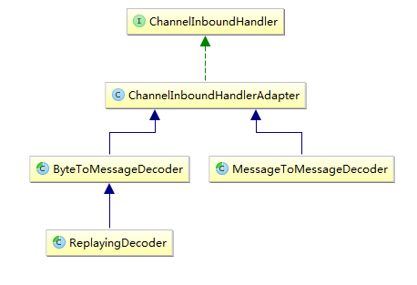
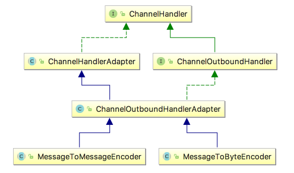
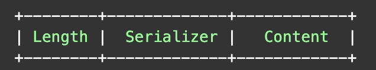

# #中级篇：Netty 编解码开发

- 推荐阅读：**[Netty 教程](http://www.tianshouzhi.com/api/tutorials/netty)** 

# 六、编解码技术

## 1、Netty 编解码框架

推荐阅读：**[Netty编解码框架](http://www.tianshouzhi.com/api/tutorials/netty/344)** 

- **编码**： 发送方将发送的二进制数据转换成协议规定格式的二进制数据流，由编码器(encoder)完成

- **解码**： 接收方根据协议格式，对二进制数据进行解析，由解码器(decoder)完成

- **编解码**： 既能编码，又能解码

> 开发人员的工作：**确定协议**、**编写协议对应的编码/解码器** 

### (1) 解码器

对于解码器，Netty 提供了抽象基类 `ByteToMessageDecoder` 和 `MessageToMessageDecoder` 



#### 1. ByteToMessageDecode

`ByteToMessageDecoder`： 用于将接收到的二进制数据(Byte)解码，**得到完整的请求报文**(Message)

- ByteToMessageDecoder 解码后会得到一个 ByteBuf 实例列表，每个 ByteBuf 实例都包含一个完整的报文信息

- 可以把 ByteBuf 实例直接交给 ChannelInboundHandler 处理，或解析封装到不同的 Java 对象实例后，再交其处理

    > ChannelInboundHandler 在处理时不需要在考虑粘包、拆包问题

---

ByteToMessageDecoder **提供的常见实现类**：直接将 ByteBuf 交给 ChannelInboundHandler 处理

- `FixedLengthFrameDecoder`：定长协议解码器，可以指定固定的字节数来计算算一个完整报文

- `LineBasedFrameDecoder`：行分隔符解码器，遇到 `\n` 或 `\r\n`，则认为是一个完整的报文

- `DelimiterBasedFrameDecoder`：分隔符解码器，分隔符可以自己指定

- `LengthFieldBasedFrameDecoder`：长度编码解码器，将报文划分为报文头/报文体

    > 根据报文头中的 Length 字段确定报文体的长度，报文长度可变

- `JsonObjectDecoder`：json 格式解码器，当检测到匹配数量的"{" 、”}”或”[””]”时，则认为是一个完整的 json 对象或 json 数组

---

**自定义** ByteToMessageDecoder，需要覆盖 ByteToMessageDecoder 的 `decode` 方法： 

`protected abstract void decode(ChannelHandlerContext ctx,ByteBuf in,List<Object>out)`

- `in`：需要解码的二进制数据

- `List<Object> out`：解码后的有效报文列表，需要将解码后的报文添加到 List 中

注意：在解码时，不需要直接调用 ByteBuf 的 readXXX 方法来读取数据，而是应该首先要判断能否构成一个有效的报文

#### 2. MessageToMessageDecoder

`MessageToMessageDecoder`： **将一个包含完整报文信息的对象转换成另一个 Java 对象** 

- **场景一**：

    - ByteToMessageDecoder 解码后，将包含报文完整信息的 ByteBuf 实例交由之后的 ChannelInboundHandler 处理

    - 此时，在 ChannelPipeline 中，添加一个 MessageToMessageDecoder，将 ByteBuf 中的信息解析后封装到 Java 对象中

- **场景二**：若报文信息已经封装到 Java 对象中，但还需转成另外的 Java 对象，因此 MessageToMessageDecoder 后还有另一个MessageToMessageDecoder

---

Netty 提供的 MessageToMessageDecoder 实现类：

- `StringDecoder`：将包含完整报文信息的 ByteBuf 转换成字符串

- `Base64Decoder`：用于 Base64 编码

---

自定义 MessageToMessageDecoder：

`protected abstract void decode(ChannelHandlerContext ctx,I msg,List<Object> out)`

- `msg`： 需要进行解码的参数

    > 注意： `I`： 为泛型

- `List<Object> out`： 将 msg 经过解析后得到的 java 对象添加到 `List<Object> out` 中

---

**使用建议**： 

- 先使用 ByteToMessageDecoder 进行粘包、拆包处理，得到完整的有效报文的 ByteBuf 实例
- 再交由 MessageToMessageDecoder 对 ByteBuf 实例中的数据进行解析，转换成 POJO 类

### (2) 编码器



#### 1. MessageToByteEncoder

`MessageToByteEncoder`： 将信息转换成二进制流放入 ByteBuf 中，子类通过覆写其抽象方法 `encode` 来实现编码

- 泛型参数 `I` 表示将需要编码的对象的类型

```java
public abstract class MessageToByteEncoder<I> extends ChannelOutboundHandlerAdapter {
	....
    protected abstract void encode(ChannelHandlerContext ctx, I msg, ByteBuf out) throws Exception;
}
```

#### 2. MessageToMessageEncoder

`MessageToMessageEncoder`：将信息放到一个 List 中，子类通过覆写其抽象方法 `encode` 来实现编码

-  泛型参数 `I` 表示将需要编码的对象的类型

```java
public abstract class MessageToMessageEncoder<I> extends ChannelOutboundHandlerAdapter {
   ...
   protected abstract void encode(ChannelHandlerContext ctx, I msg, List<Object> out) throws Exception;
   ...
}
```

---

MessageToMessageEncoder 提供的常见子类：

- `LineEncoder`：按行编码，给定一个 CharSequence，在其之后添加换行符 `\n` 或 `\r\n`，并封装到 ByteBuf 进行输出

    > 与 LineBasedFrameDecoder 对应

- `Base64Encoder`：给定一个 ByteBuf，得到对其包含的二进制数据进行 Base64 编码后的新的 ByteBuf 进行输出

    > 与 Base64Decoder 对应

- `LengthFieldPrepender`：给定一个 ByteBuf，为其添加报文头 Length 字段，得到一个新的 ByteBuf 输出，Length 表示报文长度

    > 与 LengthFieldBasedFrameDecoder 对应

- `StringEncoder`：给定一个 CharSequence，将其转换成 ByteBuf 进行输出

    > 与 StringDecoder 对应

### (3) 编码解码器 Codec


- `ByteToMessageCodec`：内部维护了一个 ByteToMessageDecoder 和一个 MessageToByteEncoder 实例

    > 泛型参数 `I` 是接受的编码类型：
    >
    > ```java
    > public abstract class ByteToMessageCodec<I> extends ChannelDuplexHandler {
    >     private final TypeParameterMatcher outboundMsgMatcher;
    >     private final MessageToByteEncoder<I> encoder;
    >     private final ByteToMessageDecoder decoder = new ByteToMessageDecoder(){…}
    >   
    >     ...
    >     protected abstract void encode(ChannelHandlerContext ctx, I msg, ByteBuf out) throws Exception;
    >     protected abstract void decode(ChannelHandlerContext ctx, ByteBuf in, List<Object> out) 
    >         						throws Exception;
    >     ...
    > }
    > ```

- `MessageToMessageCodec`：内部维护了一个 MessageToMessageDecoder 和一个 MessageToMessageEncoder 实例

    > 泛型参数 `INBOUND_IN` 和 `OUTBOUND_IN` 分别表示需要解码和编码的数据类型：
    >
    > ```java
    > public abstract class MessageToMessageCodec<INBOUND_IN, OUTBOUND_IN> extends ChannelDuplexHandler {
    >    private final MessageToMessageEncoder<Object> encoder= ...
    >    private final MessageToMessageDecoder<Object> decoder =…
    >    ...
    >    protected abstract void encode(ChannelHandlerContext ctx, OUTBOUND_IN msg, List<Object> out) 
    >        							throws Exception;
    >    protected abstract void decode(ChannelHandlerContext ctx, INBOUND_IN msg, List<Object> out) 
    >        							throws Exception;
    > }
    > ```

## 2、序列化/反序列化

### (1) 简介

Netty 支持自定义的 Java 对象作为请求响应参数，默认支持通过以下机制对 Java 对象进行序列化和反序列化：

- `ObjectEncoder/ObjectDecoder`：使用 JDK 序列化机制编解码

- `ProtobufEncoder/ ProtobufDecoder`：使用 google protocol buffer 进行编解码

- `MarshallingEncoder/MarshallingDecoder`：使用 JBoss Marshalling 进行编解码

- `XmlDecoder`：使用 Aalto XML parser 进行解码，将 xml 解析成 Aalto XML parser 中定义的 Java 对象，没有提供相应的编码器

- `JsonObjectDecoder`：使用 Json 格式解码

    > 只是将包含了一个完整 Json 格式数据的 ByteBuf 实例交给 ChannelInbounderHandler 解析

---

**序列化框架的选择依据**：

|       选择依据       | 说明                                                         |
| :------------------: | ------------------------------------------------------------ |
|         效率         | 序列化和反序列化的性能                                       |
| 序列化后的占用字节数 | 对于同一个 Java 对象，不同的框架序列化后占用的字节数不同     |
|   是否有可视化需求   | json、xml 序列化的结果能以文本形式展示，但其他框架大多是二进制 |
|       开发成本       | 一些序列化框架使用较为复杂，另外则很简单                     |



### (2) JDK 序列化

#### 1. ObjectEncoder 与 ObjectDecoder

`ObjectEncoder`/`ObjectDecoder`：使用 JDK 序列化机制编解码，**对象必须实现 `Serializable`**，可以使用 Java 对象作为请求和响应参数

- JDK 序列化机制的**缺点**：序列化的性能较低以及序列化后对象占用的字节数较多

- JDK 序列化机制的**优点**：对 JDK 默认支持的机制，不需要引入第三方依赖

---

- `ObjectEncoder` 源码：

    ```java
    @Sharable
    public class ObjectEncoder extends MessageToByteEncoder<Serializable> {
        private static final byte[] LENGTH_PLACEHOLDER = new byte[4];
        //当需要编码时，encode方法会被回调 
        //参数msg：就是我们需要序列化的java对象
        //参数out：我们需要将序列化后的二进制字节写到ByteBuf中
        @Override
        protected void encode(ChannelHandlerContext ctx, Serializable msg, ByteBuf out) throws Exception {
            int startIdx = out.writerIndex();
            //ByteBufOutputStream是Netty提供的输出流，数据写入其中之后，可以通过其buffer()方法会的对应的ByteBuf实例
            ByteBufOutputStream bout = new ByteBufOutputStream(out);
            //JDK序列化机制的ObjectOutputStream
            ObjectOutputStream oout = null;
            try {
                //首先占用4个字节，这就是Length字段的字节数，这只是占位符，后面为填充对象序列化后的字节数
                bout.write(LENGTH_PLACEHOLDER);
                //CompactObjectOutputStream是netty提供的类，其实现了JDK的ObjectOutputStream，顾名思义用于压缩
                //同时把bout作为其底层输出流，意味着对象序列化后的字节直接写到了bout中
                oout = new CompactObjectOutputStream(bout);
                //调用writeObject方法，即表示开始序列化
                oout.writeObject(msg);
                oout.flush();
            } finally {
                if (oout != null) {
                    oout.close();
                } else {
                    bout.close();
                }
            }
            int endIdx = out.writerIndex();
            //序列化完成，设置占位符的值，也就是对象序列化后的字节数量
            out.setInt(startIdx, endIdx - startIdx - 4);
        }
    }
    ```

- `ObjectDecoder` 源码：

    ```java
    //注意ObjectDecoder继承了LengthFieldBasedFrameDecoder
    public class ObjectDecoder extends LengthFieldBasedFrameDecoder {
        private final ClassResolver classResolver;
        
        public ObjectDecoder(ClassResolver classResolver) {
            this(1048576, classResolver);
        }
        //参数maxObjectSize：表示可接受的对象反序列化的最大字节数，默认为1048576 bytes，约等于1M
        //参数classResolver：由于需要将二进制字节反序列化为Java对象，需要指定一个ClassResolver来加载这个类的字节码对象
        public ObjectDecoder(int maxObjectSize, ClassResolver classResolver) {
            //调用父类LengthFieldBasedFrameDecoder构造方法，关于这几个参数的作用，参见之前章节的分析
            super(maxObjectSize, 0, 4, 0, 4);
            this.classResolver = classResolver;
        }
        //当需要解码时，decode方法会被回调
        @Override
        protected Object decode(ChannelHandlerContext ctx, ByteBuf in) throws Exception {
            //先调用父类的decode解码，包含可解析为java对象的完整二进制字节封装到ByteBuf中，同时Length字段的4个字节会被删除
            ByteBuf frame = (ByteBuf) super.decode(ctx, in);
            if (frame == null) {
                return null;
            }
            //构造JDK ObjectInputStream实例用于解码
            ObjectInputStream ois = 
                		new CompactObjectInputStream(new ByteBufInputStream(frame, true), classResolver);
            try {
                //调用readObject方法进行解码，其返回的就是反序列化之后的Java对象
                return ois.readObject();
            } finally {
                ois.close();
            }
        }
    }
    ```

#### 2. 代码案例

- **POJO 对象**

    - `Request`

        ```java
        public class Request implements Serializable{
            private String request;
            private Date requestTime;
            //setters getters and toString
        }
        ```

    - `Response`

        ```java
        public class Response implements Serializable{
            private String response;
            private Date responseTime;
            //setters getters and toString
        }
        ```

- **Server 端**：

    ```java
    public class JdkSerializerServer {
        public static void main(String[] args) throws Exception {
            EventLoopGroup bossGroup = new NioEventLoopGroup(); // (1)
            EventLoopGroup workerGroup = new NioEventLoopGroup();
            try {
                ServerBootstrap b = new ServerBootstrap(); // (2)
                b.group(bossGroup, workerGroup).channel(NioServerSocketChannel.class) // (3)
                        .childHandler(new ChannelInitializer<SocketChannel>() { // (4)
                            @Override
                            public void initChannel(SocketChannel ch) throws Exception {
                                ch.pipeline().addLast(new ObjectEncoder());
                                ch.pipeline().addLast(new ObjectDecoder(new ClassResolver() {
                                    public Class<?> resolve(String className) throws ClassNotFoundException{
                                        return Class.forName(className);
                                    }
                                }));
                                // 自定义这个ChannelInboundHandler打印拆包后的结果
                                ch.pipeline().addLast(new ChannelInboundHandlerAdapter() {
                                    @Override
                                    public void channelRead(ChannelHandlerContext ctx, Object msg) 
                                        				throws Exception {
                                        Request request= (Request) msg;
                                        System.out.println("receive request:"+request);
                                        Response response = new Response();
                                        response.setResponse("response to:"+request.getRequest());
                                        response.setResponseTime(new Date());
                                        ctx.writeAndFlush(response);
                                    }
                                });
                            }
                        });
                // Bind and start to accept incoming connections.
                ChannelFuture f = b.bind(8080).sync(); // (7)
                System.out.println("JdkSerializerServer Started on 8080...");
                f.channel().closeFuture().sync();
            } finally {
                workerGroup.shutdownGracefully();
                bossGroup.shutdownGracefully();
            }
        }
    }
    ```

- **Client 端**：

    ```java
    public class JdkSerializerClient {
        public static void main(String[] args) throws Exception {
            EventLoopGroup workerGroup = new NioEventLoopGroup();
            try {
                Bootstrap b = new Bootstrap(); // (1)
                b.group(workerGroup); // (2)
                b.channel(NioSocketChannel.class); // (3)
                b.option(ChannelOption.SO_KEEPALIVE, true); // (4)
                b.handler(new ChannelInitializer<SocketChannel>() {
                    @Override
                    public void initChannel(SocketChannel ch) throws Exception {
                        ch.pipeline().addLast(new ObjectEncoder());
                        ch.pipeline().addLast(new ObjectDecoder(new ClassResolver() {
                            public Class<?> resolve(String className) throws ClassNotFoundException {
                                return Class.forName(className);
                            }
                        }));
                        ch.pipeline().addLast(new ChannelInboundHandlerAdapter() {
                            // 在于server建立连接后，即发送请求报文
                            public void channelActive(ChannelHandlerContext ctx) {
                                Request request = new Request();
                                request.setRequest("i am request!");
                                request.setRequestTime(new Date());
                                ctx.writeAndFlush(request);
                            }
                            //接受服务端的响应
                            @Override
                            public void channelRead(ChannelHandlerContext ctx, Object msg) throws Exception{
                                Response response= (Response) msg;
                                System.out.println("receive response:"+response);
                            }
                        });
                    }
                });
                // Start the client.
                ChannelFuture f = b.connect("127.0.0.1", 8080).sync(); // (5)
                // Wait until the connection is closed.
                f.channel().closeFuture().sync();
            } finally {
                workerGroup.shutdownGracefully();
            }
        }
    }
    ```

## 3、主流编解码框架

### (1) Google 的 Protobuf


### (2) Facebook 的 Thrift


### (3) JBoss Marshalling


# 七、MessagePack 编解码

## 1、编解码

```java
public class MsgpackEncoder extends MessageToByteEncoder<Object> {
    @Override
    protected void encode (ChannelHandlerContext arg0, Object arg1, ByteBuf arg2) throws Exception {
        MessagePack msgpack = new MessagePack();
        byte[] raw = msgpack.write(arg1);
        arg2.writeBytes(raw);
    }
}
```

## 2、解码器

```java
public class MsgpackDecoder extends MessageToByteDecoder<ByteBuf> {
    @Override
    protected void decode (ChannelHandlerContext arg0, ByteBuf arg1, List<Object> arg2) throws Exception {
        final int length = arg1.readableBytes();
        final byte[] array = new byte[length];
        arg1.getBytes(arg1.readerIndex, array, 0, length);
        MessagePack msgpack = new MessagePack();
        arg2.add(msgpack.read(array));
    }
}
```

# 八、Google Protobuf 编解码

## 1、前置类

- `SubscribeReqProto` 
- `SubscribeRespProto` 

> 详见代码仓库

## 2、Server 端

- `SubReqServer`

    ```java
    public class SubReqServer {
        public void bind(int port) throws Exception {
            // 配置服务端的NIO线程组
            EventLoopGroup bossGroup = new NioEventLoopGroup();
            EventLoopGroup workerGroup = new NioEventLoopGroup();
            try {
                ServerBootstrap b = new ServerBootstrap();
                b.group(bossGroup, workerGroup)
                        .channel(NioServerSocketChannel.class)
                        .option(ChannelOption.SO_BACKLOG, 100)
                        .handler(new LoggingHandler(LogLevel.INFO))
                        .childHandler(new ChannelInitializer<SocketChannel>() {
                            @Override
                            public void initChannel(SocketChannel ch) {
                                // ch.pipeline().addLast(
                                // new ProtobufVarint32FrameDecoder());
                                ch.pipeline().addLast(
                                    			new ProtobufDecoder(SubscribeReq.getDefaultInstance()));
                                ch.pipeline().addLast(new ProtobufVarint32LengthFieldPrepender());
                                ch.pipeline().addLast(new ProtobufEncoder());
                                ch.pipeline().addLast(new SubReqServerHandler());
                            }
                        });
                // 绑定端口，同步等待成功
                ChannelFuture f = b.bind(port).sync();
                // 等待服务端监听端口关闭
                f.channel().closeFuture().sync();
            } finally {
                // 优雅退出，释放线程池资源
                bossGroup.shutdownGracefully();
                workerGroup.shutdownGracefully();
            }
        }
    
        public static void main(String[] args) throws Exception {
            int port = 8080;
            if (args != null && args.length > 0) {
                try {
                    port = Integer.valueOf(args[0]);
                } catch (NumberFormatException e) {
                    // 采用默认值
                }
            }
            new SubReqServer().bind(port);
        }
    }
    ```

- `SubReqServerHandler`

    ```java
    @Sharable
    public class SubReqServerHandler extends ChannelHandlerAdapter {
        @Override
        public void channelRead(ChannelHandlerContext ctx, Object msg) throws Exception {
            SubscribeReq req = (SubscribeReq) msg;
            if ("Lilinfeng".equalsIgnoreCase(req.getUserName())) {
                System.out.println("Service accept client subscribe req : [" + req.toString() + "]");
                ctx.writeAndFlush(resp(req.getSubReqID()));
            }
        }
    
        private SubscribeResp resp(int subReqID) {
            Builder builder = SubscribeResp.newBuilder();
            builder.setSubReqID(subReqID);
            builder.setRespCode(0);
            builder.setDesc("Netty book order succeed, 3 days later, sent to the designated address");
            return builder.build();
        }
    
        @Override
        public void exceptionCaught(ChannelHandlerContext ctx, Throwable cause) {
            cause.printStackTrace();
            ctx.close();// 发生异常，关闭链路
        }
    }
    ```

## 3、Client 端

- `SubReqClient`

    ```java
    public class SubReqClient {
        public void connect(int port, String host) throws Exception {
            // 配置客户端NIO线程组
            EventLoopGroup group = new NioEventLoopGroup();
            try {
                Bootstrap b = new Bootstrap();
                b.group(group).channel(NioSocketChannel.class)
                        .option(ChannelOption.TCP_NODELAY, true)
                        .handler(new ChannelInitializer<SocketChannel>() {
                            @Override
                            public void initChannel(SocketChannel ch)
                                    throws Exception {
                                ch.pipeline().addLast(new ProtobufVarint32FrameDecoder());
                                ch.pipeline().addLast(
                                    			new ProtobufDecoder(SubscribeResp.getDefaultInstance()));
                                ch.pipeline().addLast(new ProtobufVarint32LengthFieldPrepender());
                                ch.pipeline().addLast(new ProtobufEncoder());
                                ch.pipeline().addLast(new SubReqClientHandler());
                            }
                        });
                // 发起异步连接操作
                ChannelFuture f = b.connect(host, port).sync();
                // 当代客户端链路关闭
                f.channel().closeFuture().sync();
            } finally {
                // 优雅退出，释放NIO线程组
                group.shutdownGracefully();
            }
        }
    
        public static void main(String[] args) throws Exception {
            int port = 8080;
            if (args != null && args.length > 0) {
                try {
                    port = Integer.valueOf(args[0]);
                } catch (NumberFormatException e) {
                    // 采用默认值
                }
            }
            new SubReqClient().connect(port, "127.0.0.1");
        }
    }
    ```

- `SubReqClientHandler`

    ```java
    public class SubReqClientHandler extends ChannelHandlerAdapter {
        @Override
        public void channelActive(ChannelHandlerContext ctx) {
            for (int i = 0; i < 10; i++) {
                ctx.write(subReq(i));
            }
            ctx.flush();
        }
    
        private SubscribeReq subReq(int i) {
            SubscribeReq.Builder builder = SubscribeReq.newBuilder();
            builder.setSubReqID(i);
            builder.setUserName("Lilinfeng");
            builder.setProductName("Netty Book For Protobuf");
    
            List<String> address = new ArrayList<>();
            address.add("NanJing YuHuaTai");
            address.add("BeiJing LiuLiChang");
            address.add("ShenZhen HongShuLin");
            builder.addAllAddress(address);
            return builder.build();
        }
    
        @Override
        public void channelRead(ChannelHandlerContext ctx, Object msg) throws Exception {
            System.out.println("Receive server response : [" + msg + "]");
        }
    
        @Override
        public void channelReadComplete(ChannelHandlerContext ctx) throws Exception {
            ctx.flush();
        }
    
        @Override
        public void exceptionCaught(ChannelHandlerContext ctx, Throwable cause) {
            cause.printStackTrace();
            ctx.close();
        }
    }
    ```

# 九、JBoss Marshalling 编解码

## 1、Server 端

- `SubReqServer`

    ```java
    public class SubReqServer {
        public void bind(int port) throws Exception {
            // 配置服务端的NIO线程组
            EventLoopGroup bossGroup = new NioEventLoopGroup();
            EventLoopGroup workerGroup = new NioEventLoopGroup();
            try {
                ServerBootstrap b = new ServerBootstrap();
                b.group(bossGroup, workerGroup)
                        .channel(NioServerSocketChannel.class)
                        .option(ChannelOption.SO_BACKLOG, 100)
                        .handler(new LoggingHandler(LogLevel.INFO))
                        .childHandler(new ChannelInitializer<SocketChannel>() {
                            @Override
                            public void initChannel(SocketChannel ch) {
                                ch.pipeline().addLast(MarshallingCodeCFactory.buildMarshallingDecoder());
                                ch.pipeline().addLast(MarshallingCodeCFactory.buildMarshallingEncoder());
                                ch.pipeline().addLast(new SubReqServerHandler());
                            }
                        });
                // 绑定端口，同步等待成功
                ChannelFuture f = b.bind(port).sync();
                // 等待服务端监听端口关闭
                f.channel().closeFuture().sync();
            } finally {
                // 优雅退出，释放线程池资源
                bossGroup.shutdownGracefully();
                workerGroup.shutdownGracefully();
            }
        }
    
        public static void main(String[] args) throws Exception {
            int port = 8080;
            if (args != null && args.length > 0) {
                try {
                    port = Integer.valueOf(args[0]);
                } catch (NumberFormatException e) {
                    // 采用默认值
                }
            }
            new SubReqServer().bind(port);
        }
    }
    ```

- `MarshallingCodeCFactory` 

    ```java
    public final class MarshallingCodeCFactory {
        //创建Jboss Marshalling解码器MarshallingDecoder
        public static MarshallingDecoder buildMarshallingDecoder() {
            final MarshallerFactory marshallerFactory = Marshalling.getProvidedMarshallerFactory("serial");
            final MarshallingConfiguration configuration = new MarshallingConfiguration();
            configuration.setVersion(5);
            UnmarshallerProvider provider = 
                					new DefaultUnmarshallerProvider(marshallerFactory, configuration);
            MarshallingDecoder decoder = new MarshallingDecoder(provider, 1024);
            return decoder;
        }
    
        //创建Jboss Marshalling编码器MarshallingEncoder
        public static MarshallingEncoder buildMarshallingEncoder() {
            final MarshallerFactory marshallerFactory = Marshalling.getProvidedMarshallerFactory("serial");
            final MarshallingConfiguration configuration = new MarshallingConfiguration();
            configuration.setVersion(5);
            MarshallerProvider provider = new DefaultMarshallerProvider(marshallerFactory, configuration);
            MarshallingEncoder encoder = new MarshallingEncoder(provider);
            return encoder;
        }
    }
    ```

- `SubReqServerHandler`

    ```java
    @Sharable
    public class SubReqServerHandler extends ChannelHandlerAdapter {
        @Override
        public void channelRead(ChannelHandlerContext ctx, Object msg) throws Exception {
            SubscribeReq req = (SubscribeReq) msg;
            if ("Lilinfeng".equalsIgnoreCase(req.getUserName())) {
                System.out.println("Service accept client subscrib req : [" + req.toString() + "]");
                ctx.writeAndFlush(resp(req.getSubReqID()));
            }
        }
    
        private SubscribeResp resp(int subReqID) {
            SubscribeResp resp = new SubscribeResp();
            resp.setSubReqID(subReqID);
            resp.setRespCode(0);
            resp.setDesc("Netty book order succeed, 3 days later, sent to the designated address");
            return resp;
        }
    
        @Override
        public void exceptionCaught(ChannelHandlerContext ctx, Throwable cause) {
            cause.printStackTrace();
            ctx.close();// 发生异常，关闭链路
        }
    }
    ```

## 2、Client 端

- `SubReqClient`

    ```java
    public class SubReqClient {
        public void connect(int port, String host) throws Exception {
            // 配置客户端NIO线程组
            EventLoopGroup group = new NioEventLoopGroup();
            try {
                Bootstrap b = new Bootstrap();
                b.group(group).channel(NioSocketChannel.class)
                        .option(ChannelOption.TCP_NODELAY, true)
                        .handler(new ChannelInitializer<SocketChannel>() {
                            @Override
                            public void initChannel(SocketChannel ch)
                                    throws Exception {
                                ch.pipeline().addLast(MarshallingCodeCFactory.buildMarshallingDecoder());
                                ch.pipeline().addLast(MarshallingCodeCFactory.buildMarshallingEncoder());
                                ch.pipeline().addLast(new SubReqClientHandler());
                            }
                        });
                // 发起异步连接操作
                ChannelFuture f = b.connect(host, port).sync();
                // 当代客户端链路关闭
                f.channel().closeFuture().sync();
            } finally {
                // 优雅退出，释放NIO线程组
                group.shutdownGracefully();
            }
        }
    
        public static void main(String[] args) throws Exception {
            int port = 8080;
            if (args != null && args.length > 0) {
                try {
                    port = Integer.valueOf(args[0]);
                } catch (NumberFormatException e) {
                    // 采用默认值
                }
            }
            new SubReqClient().connect(port, "127.0.0.1");
        }
    }
    ```

- `SubReqClientHandler`

    ```java
    public class SubReqClientHandler extends ChannelHandlerAdapter {
        @Override
        public void channelActive(ChannelHandlerContext ctx) {
            for (int i = 0; i < 10; i++) {
                ctx.write(subReq(i));
            }
            ctx.flush();
        }
    
        private SubscribeReq subReq(int i) {
            SubscribeReq req = new SubscribeReq();
            req.setAddress("NanJing YuHuaTai");
            req.setPhoneNumber("138xxxxxxxxx");
            req.setProductName("Netty Book For Marshalling");
            req.setSubReqID(i);
            req.setUserName("Lilinfeng");
            return req;
        }
    
        @Override
        public void channelRead(ChannelHandlerContext ctx, Object msg) throws Exception {
            System.out.println("Receive server response : [" + msg + "]");
        }
    
        @Override
        public void channelReadComplete(ChannelHandlerContext ctx) throws Exception {
            ctx.flush();
        }
    
        @Override
        public void exceptionCaught(ChannelHandlerContext ctx, Throwable cause) {
            cause.printStackTrace();
            ctx.close();
        }
    }
    ```

# #高级篇：Netty 多协议开发和应用

- 推荐阅读：**[Netty 教程](http://www.tianshouzhi.com/api/tutorials/netty)** 

# 十、HTTP 协议开发应用

## 1、Netty HTTP 文件服务器

- `HttpFileServer`

    ```java
    public class HttpFileServer {
        private static final String DEFAULT_URL = "com/phei/netty/";
    
        public void run(final int port, final String url) throws Exception {
            EventLoopGroup bossGroup = new NioEventLoopGroup();
            EventLoopGroup workerGroup = new NioEventLoopGroup();
            try {
                ServerBootstrap b = new ServerBootstrap();
                b.group(bossGroup, workerGroup)
                        .channel(NioServerSocketChannel.class)
                        .childHandler(new ChannelInitializer<SocketChannel>() {
                            @Override
                            protected void initChannel(SocketChannel ch) throws Exception {
                                //请求消息解码器
                                ch.pipeline().addLast("http-decoder", new HttpRequestDecoder());
                                // 将多个消息转换为单一的request或response对象
                                ch.pipeline().addLast("http-aggregator", new HttpObjectAggregator(65536));
                                //响应解码器
                                ch.pipeline().addLast("http-encoder", new HttpResponseEncoder());
                                //支持异步大文件传输
                                ch.pipeline().addLast("http-chunked", new ChunkedWriteHandler());
                                // 业务逻辑
                                ch.pipeline().addLast("fileServerHandler", new HttpFileServerHandler(url));
                            }
                        });
                ChannelFuture future = b.bind("192.168.1.102", port).sync();
                System.out.println("HTTP文件目录服务器启动，网址是 : " + "http://192.168.1.102:" + port + url);
                future.channel().closeFuture().sync();
            } finally {
                bossGroup.shutdownGracefully();
                workerGroup.shutdownGracefully();
            }
        }
    
        public static void main(String[] args) throws Exception {
            int port = 8080;
            if (args.length > 0) {
                try {
                    port = Integer.parseInt(args[0]);
                } catch (NumberFormatException e) {
                    e.printStackTrace();
                }
            }
            String url = DEFAULT_URL;
            if (args.length > 1)
                url = args[1];
            new HttpFileServer().run(port, url);
        }
    }
    ```

- `HttpFileServerHandler`

    ```java
    public class HttpFileServerHandler extends SimpleChannelInboundHandler<FullHttpRequest> {
        private final String url;
    
        public HttpFileServerHandler(String url) {
            this.url = url;
        }
    
        @Override
        public void messageReceived(ChannelHandlerContext ctx, FullHttpRequest request) throws Exception {
            if (!request.getDecoderResult().isSuccess()) {
                sendError(ctx, BAD_REQUEST);
                return;
            }
            if (request.getMethod() != GET) {
                sendError(ctx, METHOD_NOT_ALLOWED);
                return;
            }
            final String uri = request.getUri();
            final String path = sanitizeUri(uri);
            if (path == null) {
                sendError(ctx, FORBIDDEN);
                return;
            }
            File file = new File(path);
            if (file.isHidden() || !file.exists()) {
                sendError(ctx, NOT_FOUND);
                return;
            }
            if (file.isDirectory()) {
                if (uri.endsWith("/")) {
                    sendListing(ctx, file);
                } else {
                    sendRedirect(ctx, uri + '/');
                }
                return;
            }
            if (!file.isFile()) {
                sendError(ctx, FORBIDDEN);
                return;
            }
            RandomAccessFile randomAccessFile;
            try {
                randomAccessFile = new RandomAccessFile(file, "r");// 以只读的方式打开文件
            } catch (FileNotFoundException fnfe) {
                sendError(ctx, NOT_FOUND);
                return;
            }
            long fileLength = randomAccessFile.length();
            HttpResponse response = new DefaultHttpResponse(HTTP_1_1, OK);
            setContentLength(response, fileLength);
            setContentTypeHeader(response, file);
            if (isKeepAlive(request)) {
                response.headers().set(CONNECTION, HttpHeaders.Values.KEEP_ALIVE);
            }
            ctx.write(response);
            ChannelFuture sendFileFuture;
            sendFileFuture = ctx.write(new ChunkedFile(randomAccessFile, 0, fileLength, 8192), 
                     									ctx.newProgressivePromise());
            sendFileFuture.addListener(new ChannelProgressiveFutureListener() {
                @Override
                public void operationProgressed(ChannelProgressiveFuture future, long progress,long total){
                    if (total < 0) { // total unknown
                        System.err.println("Transfer progress: " + progress);
                    } else {
                        System.err.println("Transfer progress: " + progress + " / " + total);
                    }
                }
    
                @Override
                public void operationComplete(ChannelProgressiveFuture future) throws Exception {
                    System.out.println("Transfer complete.");
                }
            });
            ChannelFuture lastContentFuture = ctx.writeAndFlush(LastHttpContent.EMPTY_LAST_CONTENT);
            if (!isKeepAlive(request)) {
                lastContentFuture.addListener(ChannelFutureListener.CLOSE);
            }
        }
    
        @Override
        public void exceptionCaught(ChannelHandlerContext ctx, Throwable cause) throws Exception {
            cause.printStackTrace();
            if (ctx.channel().isActive()) {
                sendError(ctx, INTERNAL_SERVER_ERROR);
            }
        }
    
        private static final Pattern INSECURE_URI = Pattern.compile(".*[<>&\"].*");
    
        private String sanitizeUri(String uri) {
            try {
                uri = URLDecoder.decode(uri, "UTF-8");
            } catch (UnsupportedEncodingException e) {
                try {
                    uri = URLDecoder.decode(uri, "ISO-8859-1");
                } catch (UnsupportedEncodingException e1) {
                    throw new Error();
                }
            }
            if (!uri.startsWith(url)) {
                return null;
            }
            if (!uri.startsWith("/")) {
                return null;
            }
            uri = uri.replace('/', File.separatorChar);
            if (uri.contains(File.separator + '.')
                    || uri.contains('.' + File.separator) || uri.startsWith(".")
                    || uri.endsWith(".") || INSECURE_URI.matcher(uri).matches()) {
                return null;
            }
            return System.getProperty("user.dir") + File.separator + uri;
        }
    
        private static final Pattern ALLOWED_FILE_NAME = Pattern.compile("[A-Za-z0-9][-_A-Za-z0-9\\.]*");
    
        private static void sendListing(ChannelHandlerContext ctx, File dir) {
            FullHttpResponse response = new DefaultFullHttpResponse(HTTP_1_1, OK);
            response.headers().set(CONTENT_TYPE, "text/html; charset=UTF-8");
            StringBuilder buf = new StringBuilder();
            String dirPath = dir.getPath();
            buf.append("<!DOCTYPE html>\r\n");
            buf.append("<html><head><title>");
            buf.append(dirPath);
            buf.append(" 目录：");
            buf.append("</title></head><body>\r\n");
            buf.append("<h3>");
            buf.append(dirPath).append(" 目录：");
            buf.append("</h3>\r\n");
            buf.append("<ul>");
            buf.append("<li>链接：<a href=\"../\">..</a></li>\r\n");
            for (File f : dir.listFiles()) {
                if (f.isHidden() || !f.canRead()) {
                    continue;
                }
                String name = f.getName();
                if (!ALLOWED_FILE_NAME.matcher(name).matches()) {
                    continue;
                }
                buf.append("<li>链接：<a href=\"");
                buf.append(name);
                buf.append("\">");
                buf.append(name);
                buf.append("</a></li>\r\n");
            }
            buf.append("</ul></body></html>\r\n");
            ByteBuf buffer = Unpooled.copiedBuffer(buf, CharsetUtil.UTF_8);
            response.content().writeBytes(buffer);
            buffer.release();
            ctx.writeAndFlush(response).addListener(ChannelFutureListener.CLOSE);
        }
    
        private static void sendRedirect(ChannelHandlerContext ctx, String newUri) {
            FullHttpResponse response = new DefaultFullHttpResponse(HTTP_1_1, FOUND);
            response.headers().set(LOCATION, newUri);
            ctx.writeAndFlush(response).addListener(ChannelFutureListener.CLOSE);
        }
    
        private static void sendError(ChannelHandlerContext ctx, HttpResponseStatus status) {
            FullHttpResponse response = new DefaultFullHttpResponse(HTTP_1_1, status, 
                      Unpooled.copiedBuffer("Failure: " + status.toString() + "\r\n", CharsetUtil.UTF_8));
            response.headers().set(CONTENT_TYPE, "text/plain; charset=UTF-8");
            ctx.writeAndFlush(response).addListener(ChannelFutureListener.CLOSE);
        }
    
        private static void setContentTypeHeader(HttpResponse response, File file) {
            MimetypesFileTypeMap mimeTypesMap = new MimetypesFileTypeMap();
            response.headers().set(CONTENT_TYPE, mimeTypesMap.getContentType(file.getPath()));
        }
    }
    ```

## 2、Netty HTTP+XML 协议栈开发

详见代码仓库


# 十一、WebSocket 协议开发

## 1、webSocket 协议

### (1) 简介


- `WebSocket`： 用于解决浏览器与后台服务器双向通讯的问题

    > - 使用 WebSocket 技术，后台可以随时向前端推送消息，以保证前后台状态统一
    >
    > - 传统的服务端向浏览器推送消息的技术：ajax、flash、comet、java applet
    >
    >     > 长轮循：每隔一段时间去请求后台，以获取最新状态
    >
    > WebSocket 协议支持服务端与浏览器建立长连接，双方可以随时发送数据给对方，不再是由客户端控制的一问一答的方式

基于长轮循(polling)和websocket推送的浏览器(browser)和服务端(Server)的交互对比图：


- 使用 websocket 协议时，浏览器与服务端先建立 http 连接，再从 http 转换成 websocket

    > 协议转换过程称为**握手**，表示服务端与客户端都同意建立 websocket 协议

- 连接建立时，浏览器向服务端发送一个 HTTP 请求，通过包含一些额外信息，表明其希望将协议从 HTTP 转换成 WebSocket

    > 额外信息实际是增加了一个请求头 Upgrade
    >
    > 
    >
    > 注意：WebSocket 不属于 http 无状态协议，协议名为 `ws`，与 http 协议同用 `80` 端口；`wss` 和 https 协议同用 `443` 端口
    >
    > - `Upgrade` 请求头的值为 websocket，表示希望将 Http 协议转换成 websocket 协议
    >
    > - `Origin`：表示连接开始时发送 http 请求的地址
    >
    > - 客户端握手请求中的 `Sec-WebSocket-Key` 头字段中的内容是随机的，采用 base64 编码
    >
    >     > 服务端接收到后，将其与一个魔幻数字 258EAFA5-E914-47DA-95CA-C5AB0DC85B11 进行连接，使用 SHA-1 加密后，采用 base64 编码，以 `Sec-WebSocket-Accept` 响应头返回

注意：由于 websocket 是新协议，需要浏览器和 web 服务端都支持的情况下，才能建立连接成功

### (2) WebSocket 客户端开发

支持 html5 的浏览器，一般都会提供一个内置的 js 对象 `Websocket` ，开发者利用这个对象就可以与服务端建立websocket连接

- **检测浏览器是否支持 websocket**：

    ```js
    window.WebSocket = window.WebSocket || window.MozWebSocket; 
    if (!window.WebSocket){ 
        alert("WebSocket not supported by this browser"); 
        return; 
    }
    ```

- **创建 websocket 连接**：`var myWebSocket = new WebSocket("ws://www.websockets.org");`

- **关闭 Websocket 连接**：`myWebSocket.close();`

- **使用 Websocket 发送消息**：`myWebSocket.send("Hello WebSockets!");`

**Websocket 提供的几个回调方法**：

```js
//连接创建成功时被回调
myWebSocket.onopen = function(evt) { alert("Connection open ..."); };
//收到服务端的消息时被回调
myWebSocket.onmessage = function(evt) { alert( "Received Message: " + evt.data); };
//连接关闭时被回调
myWebSocket.onclose = function(evt) { alert("Connection closed."); };
```

**客户端代码**：

```js
<!DOCTYPE html>
<html>
    <head>
        <meta charset="UTF-8">
    </head>
    <body>
        <form onsubmit="return false;">
            <h1> Netty WebSocket 协议 </h1>
            <h3>客户端请求消息</h3>
            <textarea id="requestText" style="width:200px;height:100px;"></textarea>
            <input type="button" value="发送WebSocket请求消息" 
									onclick="send(document.getElementById('requestText').value)"/>
            <h3>服务端返回的应答消息</h3>
            <textarea id="responseText" style="width:200px;height:100px;"></textarea>
        </form>

        <script type="text/javascript">
            window.WebSocket = window.WebSocket || window.MozWebSocket;
            if (!window.WebSocket){
                alert("你的浏览器不支持websocket协议");
            }else{
                var socket = new WebSocket("ws://localhost:8080/websocket");
                socket.onmessage = function (event) {
                    var ta = document.getElementById('responseText');
                    ta.value = event.data
                };
                socket.onopen = function (event) {
                    alert("websocket连接建立成功...");
                };
                socket.onclose = function (event) {
                    alert("连接关闭");
                };
                function send(message) {
                    if (!window.WebSocket) {
                        return;
                    }
                    if (socket.readyState == WebSocket.OPEN) {
                        socket.send(message);
                    }
                    else {
                        alert("WebSocket not supported by this browser");
                    }
                }
            }
        </script>
    </body>
</html>
```

### (3) WebSocket 服务端开发

```java
public class WebSocketServer {
    public void run(int port) throws Exception {
        EventLoopGroup bossGroup = new NioEventLoopGroup();
        EventLoopGroup workerGroup = new NioEventLoopGroup();
        try {
            ServerBootstrap b = new ServerBootstrap();
            b.group(bossGroup, workerGroup)
                    .channel(NioServerSocketChannel.class)
                    .childHandler(new ChannelInitializer<SocketChannel>() {
                        @Override
                        protected void initChannel(SocketChannel ch) throws Exception {
                            ChannelPipeline pipeline = ch.pipeline();
                            //将请求或应答消息按照 HTTP 协议的格式进行解码或编码
                            pipeline.addLast("http-codec", new HttpServerCodec());
                            //将 HTTP 消息的多个部分组合成一条完整的 HTTP 消息，即处理粘包与解包问题
                            pipeline.addLast("aggregator", new HttpObjectAggregator(65536));
                            //用来向客户单发送 HTML 文件，主要用于支持浏览器和服务端进行 WebSocket 通信
                            ch.pipeline().addLast("http-chunked", new ChunkedWriteHandler());
                            pipeline.addLast("handler", new WebSocketServerHandler());
                        }
                    });
            Channel ch = b.bind(port).sync().channel();
            System.out.println("Web socket server started at port " + port + '.');
            System.out.println("Open your browser and navigate to http://localhost:" + port + '/');
            ch.closeFuture().sync();
        } finally {
            bossGroup.shutdownGracefully();
            workerGroup.shutdownGracefully();
        }
    }
 
    public static void main(String[] args) throws Exception {
        int port = 8080;
        if (args.length > 0) {
            try {
                port = Integer.parseInt(args[0]);
            } catch (NumberFormatException e) {
                e.printStackTrace();
            }
        }
        new WebSocketServer().run(port);
    }
}
```

```java
public class WebSocketServerHandler extends SimpleChannelInboundHandler<Object> {
    private static final Logger logger = Logger.getLogger(WebSocketServerHandler.class.getName());
 
    private WebSocketServerHandshaker handshaker;
 
    @Override
    protected void channelRead0(ChannelHandlerContext ctx, Object msg) throws Exception {
        // 传统的 HTTP 接入
        if (msg instanceof FullHttpRequest) {
            handleHttpRequest(ctx, (FullHttpRequest) msg);
        }
        // WebSocket 接入
        else if (msg instanceof WebSocketFrame) {
            handleWebSocketFrame(ctx, (WebSocketFrame) msg);
        }
    }
   
    private void handleHttpRequest(ChannelHandlerContext ctx, FullHttpRequest req) throws Exception {
        // 如果 HTTP 解码失败，返回 HHTP 异常
        if (!req.getDecoderResult().isSuccess() || (!"websocket".equals(req.headers().get("Upgrade")))) {
            sendHttpResponse(ctx, req, new DefaultFullHttpResponse(HTTP_1_1, BAD_REQUEST));
            return;
        }
        // 构造握手响应返回，本机测试
        WebSocketServerHandshakerFactory wsFactory = 
            			new WebSocketServerHandshakerFactory("ws://localhost:8080/websocket", null, false);
        handshaker = wsFactory.newHandshaker(req);
        if (handshaker == null) {
            WebSocketServerHandshakerFactory.sendUnsupportedVersionResponse(ctx.channel());
        } else {
            handshaker.handshake(ctx.channel(), req);
        }
    }
 
    private void handleWebSocketFrame(ChannelHandlerContext ctx, WebSocketFrame frame) {
        // 判断是否是关闭链路的指令
        if (frame instanceof CloseWebSocketFrame) {
            handshaker.close(ctx.channel(), (CloseWebSocketFrame) frame.retain());
            return;
        }
        // 判断是否是Ping消息
        if (frame instanceof PingWebSocketFrame) {
            ctx.channel().write(new PongWebSocketFrame(frame.content().retain()));
            return;
        }
        // 本例程仅支持文本消息，不支持二进制消息
        if (!(frame instanceof TextWebSocketFrame)) {
            throw new UnsupportedOperationException(String.format(
                    "%s frame types not supported", frame.getClass().getName()));
        }
        // 返回应答消息
        String request = ((TextWebSocketFrame) frame).text();
        if (logger.isLoggable(Level.FINE)) {
            logger.fine(String.format("%s received %s", ctx.channel(), request));
        }
        ctx.channel().write(new TextWebSocketFrame(" 收到客户端请求："+request));
    }
 
    private static void sendHttpResponse(ChannelHandlerContext ctx, 
                                         FullHttpRequest req, FullHttpResponse res) {
        // 返回应答给客户端
        if (res.getStatus().code() != 200) {
            ByteBuf buf = Unpooled.copiedBuffer(res.getStatus().toString(), CharsetUtil.UTF_8);
            res.content().writeBytes(buf);
            buf.release();
            setContentLength(res, res.content().readableBytes());
        }
        // 如果是非Keep-Alive，关闭连接
        ChannelFuture f = ctx.channel().writeAndFlush(res);
        if (!isKeepAlive(req) || res.getStatus().code() != 200) {
            f.addListener(ChannelFutureListener.CLOSE);
        }
    }
   
    @Override
    public void channelReadComplete(ChannelHandlerContext ctx) throws Exception {
        ctx.flush();
    }
   
    @Override
    public void exceptionCaught(ChannelHandlerContext ctx, Throwable cause) throws Exception {
        cause.printStackTrace();
        ctx.close();
    }
}
```

- 对于 handleHttpRequest 方法，仅仅在第一次请求时被调用一次：**连接建立时，第一次发送 http 请求**

    > - 将 http 升级为 websocket 协议需要服务端支持，因此在 handleHttpRequest 中，通知客户端，是否同意升级
    >
    > 案例中：通过 `WebSocketServerHandshaker` 的 `handshake`，告诉客户端，服务端同意协议升级，websocket 连接建立完成

- 一旦 websocket 协议建立完成，之后的所有的请求都会走 `handleWebSocketFrame` 方法，这个方法的处理顺序如下：

    1. 判断是否是 `CloseWebSocketFrame`  请求：如果是，关闭连接

    2. 判断是否是 `PingWebSocketFrame`  消息：如果是，维持链路的 Ping 消息，构造 Pong 消息返回

        > Ping 和 Pong 是 websocket 里的心跳，用来保证客户端是在线的

    3. 判断是否是 `TextWebSocketFrame` 文本消息：websocket 消息基于 HTTP 协议，可支持文本消息、二进制消息等

    4. 返回应答消息

帧类型是 WebSocket 协议定义的消息类型，一个完整的 WebSocket 帧包含一个 4 位的二进制 `Opcode` 字段其用来表示消息类型：

```
OPCODE：4位

0x0表示附加数据帧
0x1表示文本数据帧
0x2表示二进制数据帧
0x3-7暂时无定义，为以后的非控制帧保留
0x8表示连接关闭
0x9表示ping
0xA表示pong
0xB-F暂时无定义，为以后的控制帧保留
```

### (4) 消息推送

主动推送需要考虑的问题：

- 服务端保存用户唯一标记(userId)与其对应的 SocketChannel 的对应关系，以便之后根据这个唯一标记给用户推送消息

    > 可以在 `handleHttpRequest` 中添加到以下代码获取到这个参数
    >
    > ```java
    > //这个map用于保存userId和SocketChannel的对应关系
    > public static Map<String,Channel> map=new ConcurrentHashMap();
    >  
    > private void handleHttpRequest(ChannelHandlerContext ctx, FullHttpRequest req) throws Exception {
    >     ....
    >     //获取userId
    >     QueryStringDecoder queryStringDecoder = new QueryStringDecoder(req.getUri());
    >     Map<String, List<String>> params = queryStringDecoder.parameters();
    >     String userId=params.get("userId").get(0);
    >     //保存userId和Channel的对应关系
    >     map.put(userId,ctx.channel());
    > }
    > ```

- 通过 userId 给用户推送消息

    > ```java
    > //运营人员制定要推送的userId和消息
    > String userId="123456";
    > String msg="xxxxxxxxxxxxxxxxxxxxxx";
    > //根据userId找到对应的channel，并将消息写出
    > Channel channel = map.get(userId);
    > channel.writeAndFlush(new TextWebSocketFrame(msg));
    > ```

- **客户端 ack 接受到消息**： 推送消息都有唯一的 msgId，客户端接收推送消息后，需要对这条消息进行 ack

    > 即告诉服务端自己接收到了这条消息，ack 时需要将 msgId 带回来

- **离线消息**： 当给某用户推送消息时，其不在线，可以将消息保存下来，当用户与服务端建立连接时，首先检查缓存服务器中有没有其对应的离线消息，如果有直接取出来发送给用户

- **消息推送记录的存储**： 服务端推送完成消息记录后，存储这些消息，以支持一个用户查看自己曾经受到过的推送消息

- **疲劳度控制**： 限制一个用户每天推送消息的数量，以免频繁的推送消息给用户造成不好的体验

## 2、代码案例

详见代码仓库


# 十二、私有协议栈开发

详见代码仓库
