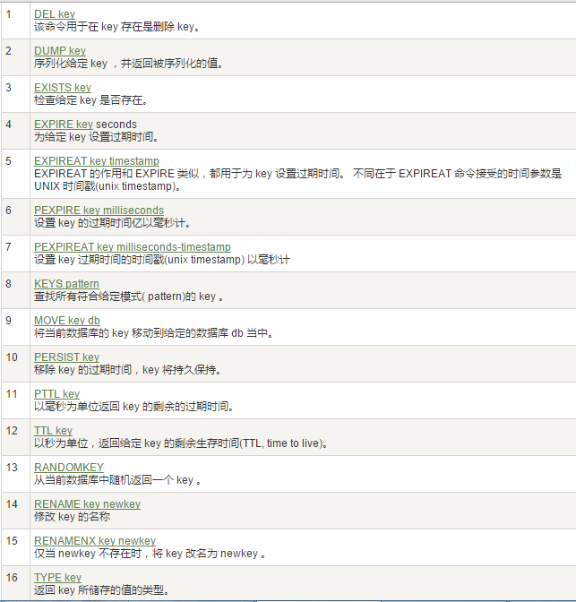
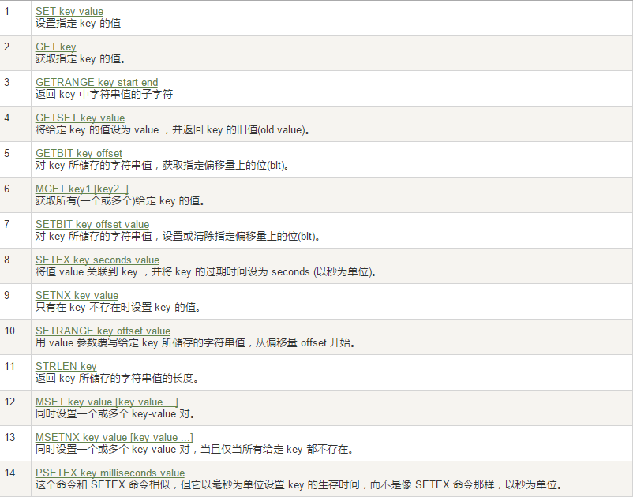
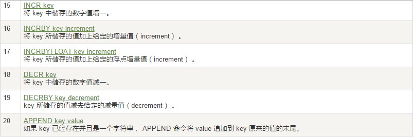
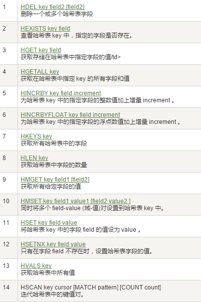
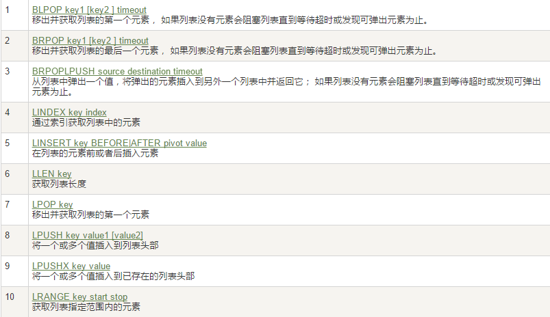
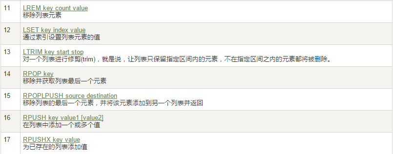
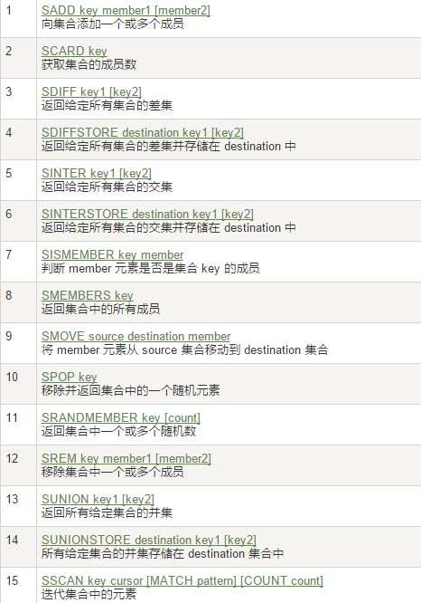
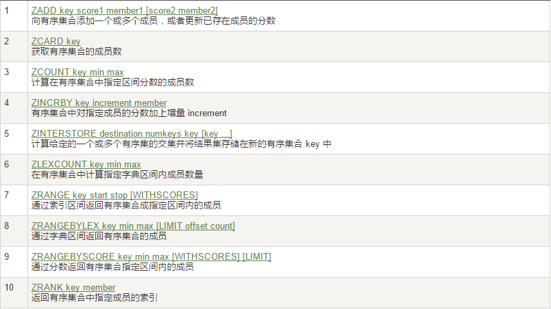
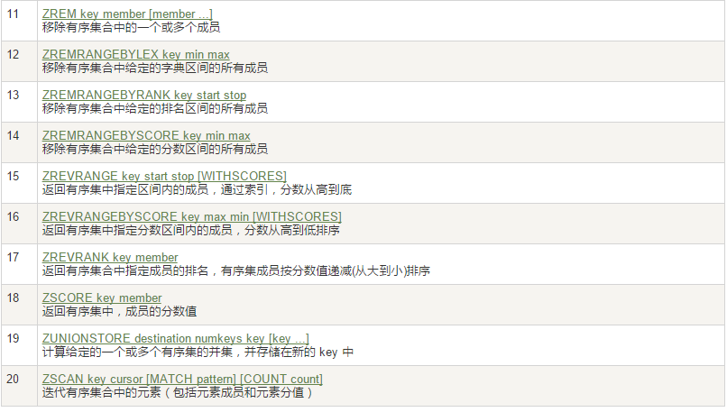
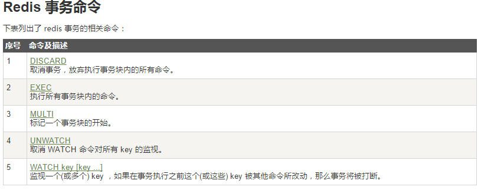

# 一、NoSql入门和概述

## 1. 入门概述

### 1. mysql 的性能提升处理

1. **Memcached(缓存) + MySQL + 垂直拆分**

   > - **Memcached** 作为一个独立的分布式的缓存服务器，为多个web服务器提供了一个**共享的高性能缓存服务**
   > - **hash 算法**来进行多台Memcached缓存服务的扩展
   > - **一致性hash** 来解决增加或减少缓存服务器导致重新hash带来的大量缓存失效的弊端

2. **Mysql主从读写分离**

   > **Mysql的 master-slave 模式**

3. **分表分库 + 水平拆分 + mysql集群** 

4. MySQL的扩展性瓶颈

   > - **操作大数据的速度很慢**
   > - **扩展性差**，大数据下IO压力大，表结构更改困难

### 2. NoSQL 概述

- 泛指**非关系型的数据库**
- 为了解决大规模数据集合多重数据种类带来的挑战，尤其是大数据应用难题，包括超大规模数据的存储
- **数据存储不需要固定的模式**，无需多余操作就可以横向扩展

### 3. 优点

- **易扩展：**数据之间无关系，这样就非常容易扩展

- **大数据量高性能**：具有非常高的读写性能

  > - MySQL 使用 **Query Cache**，每次表的更新 Cache 就失效，是一种**大粒度的Cache**
  > - NoSQL 的 **Cache 是记录级的**，是一种细粒度的Cache，所以NoSQL在这个层面上来说就要性能高

- **多样灵活的数据模型：**NoSQL 无需事先为要存储的数据建立字段，随时可以存储自定义的数据格式

### 4. RDBMS VS NoSQL

- **RDBMS**
  - 高度组织化结构化数据
  - 结构化查询语言（SQL）
  - 数据和关系都存储在单独的表中。
  - 数据操纵语言，数据定义语言
  - 严格的一致性
  - 基础事务
- **NoSQL**
  - 代表着不仅仅是SQL
  - 没有声明性查询语言
  - 没有预定义的模式
  - 键 - 值对存储，列存储，文档存储，图形数据库
  - 最终一致性，而非ACID属性
  - 非结构化和不可预知的数据
  - CAP定理
  - 高性能，高可用性和可伸缩性

## 2. 3V+3高

### 1. 3V

- **海量 Volume(容量)**
- **多样 Variety(变化)**
- **实时 Velocity(速率)**

### 2. 3 高

- **高并发**
- **高可扩**
- **高性能**

## 3. NoSQL数据模型(聚合模型)

### 1. KV键值

### 2. Bson

> - 是一种**类 json** 的一种**二进制形式的存储格式**，简称Binary JSON，
> - 和JSON一样，**支持内嵌的文档对象和数组对象**

### 3. 列族

> - **按列存储数据**
> - **最大的特点** 是方便存储结构化和半结构化数据，方便做数据压缩，针对某一列或者某几列的查询有非常大的IO优势

### 4. 图形

## 4. NoSQL数据库的四大分类

### 1. KV键值

- 新浪：BerkeleyDB+redis
- 美团：redis+tair
- 阿里百度：memcache+redis

### 2. 文档型数据库(bson格式比较多)

- CouchDB

- MongoDB

  > - MongoDB 是一个基于**分布式文件存储的数据库**(由 C++ 语言编写)，旨在为 WEB 应用提供可扩展的高性能数据存储解决方案
  > - MongoDB 是一个介于关系数据库和非关系数据库之间的产品，是非关系数据库当中功能最丰富，最像关系数据库的

### 3. 列存储数据库

- Cassandra, HBase
- 分布式文件系统

### 4. 图关系数据库

- 它不是放图形的，**存放的是关系**比如：朋友圈社交网络、广告推荐系统
- 社交网络，推荐系统等。专注于**构建关系图谱**
- Neo4J, InfoGrid

### 5. 四者对比

## 5. CAP与BASE

### 1. ACID

1. **A (Atomicity) 原子性**

   > 事务里的所有操作要么全部做完，要么都不做，事务成功的条件是事务里的所有操作都成功，只要有一个操作失败，整个事务就失败，需要回滚

2. **C (Consistency) 一致性**

   >  数据库要一直处于一致的状态，事务的运行不会改变数据库原本的一致性约束

3. **I (Isolation) 独立性**

   > 并发的事务之间不会互相影响，如果一个事务要访问的数据正在被另外一个事务修改，只要另外一个事务未提交，它所访问的数据就不受未提交事务的影响

4. **D (Durability) 持久性**

   > 持久性是指一旦事务提交后，它所做的修改将会永久的保存在数据库上，即使出现宕机也不会丢失

### 2. CAP 与 3进2

- CAP：
  - **C：Consistency（强一致性）**
  - **A：Availability（可用性）**
  - **P：Partition tolerance（分区容错性）**

- 3 进 2：

  > CAP理论的核心是：一个分布式系统不可能同时很好的满足一致性，可用性和分区容错性这三个需求，最多**只能同时较好的满足两个**

  - **CA —— 单点集群，满足一致性，可用性的系统**，通常在可扩展性上不太强大。
  - **CP —— 满足一致性，分区容忍必的系统**，通常性能不是特别高。
  - **AP —— 满足可用性，分区容忍性的系统**，通常可能对一致性要求低一些。

### 3. BASE

- 基本可用（Basically Available）
- 软状态（Soft state）
- 最终一致（Eventually consistent）

> - BASE 就是为了解决关系数据库强一致性引起的问题而引起的可用性降低而提出的解决方案
> - 它的思想是通过让系统放松对某一时刻数据一致性的要求来换取系统整体伸缩性和性能上改观

### 4. 分布式与集群

- **分布式：**不同的多台服务器上面部署不同的服务模块（工程），他们之间通过 **Rpc/Rmi** 之间通信和调用，对外提供服务和组内协作
- **集群：**不同的多台服务器上面部署相同的服务模块，通过分布式调度软件进行统一的调度，对外提供服务和访问

# 二、Redis 介绍

## 1. 入门介绍

### 1. 介绍

- **Redis：REmote DIctionary Server(远程字典服务器)**  

  > - 是完全开源免费的，用C语言编写的，遵守BSD协议
  > - 是一个高性能的(key/value)分布式内存数据库，基于内存运行
  > - 并支持持久化的NoSQL数据库，是当前最热门的NoSql数据库之一
  > - 也被人们称为数据结构服务器

### 2. 特点

- Redis **支持数据的持久化**，可以将内存中的数据保持在磁盘中，重启的时候可以再次加载进行使用
- Redis 不仅仅支持简单的key-value类型的数据，同时还提供list，set，zset，hash等数据结构的存储
- Redis **支持数据的备份**，即 master-slave 模式的数据备份

### 3. 作用

- **内存存储和持久化：**redis支持异步将内存中的数据写到硬盘上，同时不影响继续服务
- 取最新N个数据的操作，如：可以将最新的10条评论的ID放在Redis的List集合里面
- 模拟类似于 HttpSession 这种需要设定过期时间的功能
- **发布、订阅消息系统**
- **定时器、计数器**

###  4. redis 基本操作

- 单进程模型来处理客户端的请求。对读写等事件的响应是通过对epoll函数的包装来做到的，**Redis的实际处理速度完全依靠主进程的执行效率**
- 默认16个数据库，类似数组下表从零开始，**初始默认使用零号库**
- **Select 命令切换数据库**
- **Dbsize 查看当前数据库的key的数量**
- **Flushdb：清空当前库**
- **Flushall；通杀全部库**
- 统一密码管理，16个库都是同样密码，要么都OK要么一个也连接不上
- **Redis索引都是从零开始**

## 2. redis 数据类型

#### key 操作

### 1. String（字符串）

> - string 是redis最基本的类型，一个key对应一个value
> - string 类型是**二进制安全**的，意思是redis的string可以包含任何数据
> - 一个redis中字符串value最多可以是**512M**

### 2. Hash（哈希）

> - Redis hash 是一个键值对集合
> - Redis hash 是一个**string类型的field和value的映射表**，hash特别适合用于存储对象

### 3. List（列表）

> - Redis 列表是**简单的字符串列表**，**按照插入顺序排序**
> - **底层实际是个链表**

### 4. Set（集合）

> - Redis 的 Set 是**string类型的无序集合**
> - 通过 HashTable 实现实现

### 5. Zset(sorted set：有序集合)

> - 是string类型元素的集合，且**不允许重复**
> - **每个元素都会关联一个 double 类型的分数**
> - redis正是通过分数来为集合中的成员进行从小到大的排序
> - zset的成员是唯一的，但分数(score) 却可以重复

# 三、redis.conf 配置文件

。。。

# 四、redis 持久化

## 1. RDB（Redis DataBase）

### 1. 简介

- 在指定时间间隔内将内存中的数据集快照写入磁盘，即 **Snapshot快照**，**恢复时将快照文件直接读到内存里**
- Redis 会**单独创建（fork）一个子进程来进行持久化**，会先将数据写入到一个临时文件中，待持久化过程都结束了，再用这个临时文件替换上次持久化好的文件。**整个过程中，主进程是不进行任何IO操作的，这就确保了极高的性能**
- **优点： **如需要进行大规模数据的恢复，且对于数据恢复的完整性不是非常敏感，那RDB方式要比AOF方式更加的高效
- **缺点：**
  - 在一定间隔时间做一次备份，所以如果redis意外down掉的话，就会丢失最后一次快照后的所有修改
  - Fork的时候，内存中的数据被克隆了一份，大致2倍的膨胀性需要考虑
- **Rdb 保存的是dump.rdb文件**
- **动态所有停止RDB保存**：`redis-cli config set save ""` 

### 2. Fork作用

- 复制一个与当前进程一样的进程，是一个全新的进程，并作为原进程的子进程
- 新进程的所有数据（变量、环境变量、程序计数器等）数值都和原进程一致

### 3. 触发 RDB 快照

- **配置文件中默认的快照配置**
  - 冷拷贝后重新使用
  - 可以cp dump.rdb dump_new.rdb
- **命令save或者是bgsave**
  - **Save：**save时只管保存，其它不管，全部阻塞
  - **BGSAVE：**Redis会在后台异步进行快照操作，快照同时还可以响应客户端请求。可以通过 **lastsave** 命令获取最后一次成功执行快照的时间
- **执行flushall命令**，也会产生dump.rdb文件，但里面是空的

### 4. 恢复

- 将备份文件 (dump.rdb) 移动到 redis 安装目录并启动服务即可

  > **CONFIG GET dir** 获取目录

## 2. AOF（Append Only File）

### 1. 简介

- 以**日志的形式来记录每个写操作**，将Redis执行过的所有写指令记录下来(读操作不记录)
- **只许追加文件但不可以改写文件**，redis启动之初会读取该文件重新构建数据
- redis 重启的话就根据日志文件的内容将写指令从前到后执行一次以完成数据的恢复工作
- Aof保存的是 `appendonly.aof` 文件
- **优点：**
  - **每修改同步**：appendfsync always   同步持久化每次发生数据变更会被立即记录到磁盘，性能较差但数据完整性比较好
  - **每秒同步：**appendfsync everysec    异步操作，每秒记录，如果一秒内宕机，有数据丢失
  - **不同步：**appendfsync no   从不同步
- **缺点：**
  - 相同数据集的数据而言 aof 文件要远大于rdb文件，恢复速度慢于rdb
  - Aof运行效率要慢于rdb，每秒同步策略效率较好，不同步效率和rdb相同

### 2. AOF启动/修复/恢复

- **正常恢复**
  - **启动：**设置Yes (修改默认的appendonly no，改为yes)
  - **将有数据的aof文件复制一份保存到对应目录** `config get dir`
  - **恢复：**重启redis然后重新加载
- **异常恢复**
  - **启动：**设置Yes (修改默认的appendonly no，改为yes)
  - **备份被写坏的AOF文件**
  - **修复：**`Redis-check-aof --fix` 进行修复
  - **恢复：**重启redis然后重新加载

## 3. Rewrite

### 1. 简介

- AOF采用文件追加方式，文件会越来越大为避免出现此种情况，新增了重写机制
- 当AOF文件的大小超过所设定的阈值时，Redis就会启动AOF文件的内容压缩
- 只保留可以恢复数据的最小指令集，可以使用命令 `bgrewriteaof`

### 2. 重写原理

- AOF 文件持续增长而过大时，会 **fork 出一条新进程来将文件重写**(也是先写临时文件最后再rename)
- 遍历新进程的内存中数据，每条记录有一条的Set语句
- 重写 aof 文件的操作，并没有读取旧的aof文件，而是**将整个内存中的数据库内容用命令的方式重写了一个新的aof文件**

### 3. 触发机制

> Redis会记录上次重写时的AOF大小，默认配置是当AOF文件大小**是上次rewrite后大小的一倍且文件大于64M时触发**

## 4. 总结

- **RDB 持久化方式能够在指定的时间间隔能对你的数据进行快照存储**

- **AOF持久化方式记录每次对服务器写的操作**，当服务器重启的时候会重新执行这些命令来恢复原始的数据，AOF命令以redis协议追加保存每次写的操作到文件末尾。Redis还能对AOF文件进行后台重写,使得AOF文件的体积不至于过大

- **只做缓存：**如果你只希望你的数据在服务器运行的时候存在，你也可以不使用任何持久化方式

- 同时**开启两种持久化方式：**

  - 在这种情况下，当**redis重启的时候会优先载入AOF文件**来恢复原始的数据

    > 因为在通常情况下AOF文件保存的数据集要比RDB文件保存的数据集要完整

  - **建议不要只使用AOF**，因为**RDB更适合用于备份数据库，快速重启**，而且不会有AOF可能潜在的bug，留着作为一个万一的手段

**性能建议：**

- 因为 RDB 文件只用作后备用途，建议只在Slave上持久化RDB文件，而且只要15分钟备份一次就够了，只保留save 900 1这条规则

- **使用 AOF**

  - **好处**： 在最恶劣情况下也只会丢失不超过两秒数据，启动脚本较简单只load自己的AOF文件就可以

  - **代价：**

    - 带来了持续的 IO

    - AOF rewrite 的最后将rewrite过程中产生的新数据**写到新文件造成的阻塞**几乎是不可避免的

      > 只要硬盘许可，应该尽量减少AOF rewrite的频率，AOF重写的基础大小默认值64M太小了，可以设到5G以上。默认超过原大小100%大小时重写可以改到适当的数值。

- 如不使用AOF ，仅靠 **Master-Slave Replication** 实现高可用性也可以

  - **优点：** 能省掉一大笔IO也减少了rewrite时带来的系统波动
  - **代价：**如果 Master/Slave 同时倒掉，会丢失十几分钟的数据，启动脚本也要比较两个Master/Slave中的RDB文件，载入较新的那个

# 五、Redis的事务

## 1. 简介

- **可以一次执行多个命令，本质是一组命令的集合**
- **一个事务中的所有命令都会序列化**，按顺序地串行化执行而不会被其它命令插入，不许加塞

## 2. 作用

- **一个队列中，一次性、顺序性、排他性的执行一系列命令**

## 3. 使用

