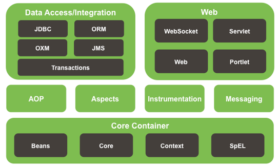
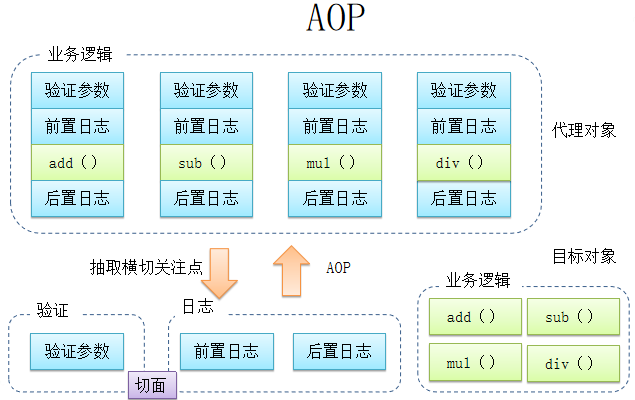
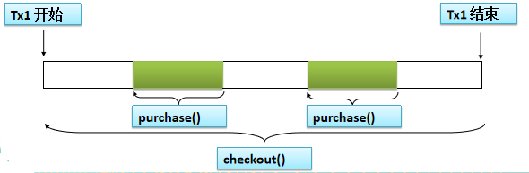
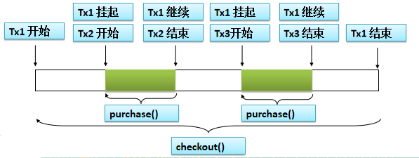

# 一、概述

## 1. 具体描述

- **轻量级**：Spring 是非侵入性的，即基于 Spring 开发的应用中的对象可以不依赖于 Spring 的 API

- **依赖注入**： `DI-->dependency injection 或 IOC` 

- **面向切面编程**： `AOP-->aspect oriented programming` 

- **容器**： Spring 是一个容器，其包含并管理应用对象的生命周期

- **框架**： Spring 可以使用简单的组件配置(XML 文件或Java 注解)组合成一个复杂的应用

- **一站式**： 在 IOC 和 AOP 的基础上可以整合各种企业应用的开源框架和优秀的第三方类库

  > 实际上 Spring 自身也提供了**展现层的 SpringMVC 和 持久层的 Spring JDBC**



## 2. IOC 概述

### 1. 概述

- `IOC(Inversion of Control)`：反转资源获取方向

  - **传统资源查找方式**： 要求组件向容器发起请求查找资源；作为回应，容器适时的返回资源

  - **IOC 方式**： 容器主动地将资源推送给所管理的组件，组件选择合适的方式来接受资源

- `DI(Dependency Injection)`：IOC 的另一种表述方式：即组件以预先定义好的方式(如: setter 方法)接受来自容器的资源注入

- **IOC 前生**： 

  - **分离接口**与实现

    

  - 采用**工厂设计模式**

    

  - 采用**反转控制 ** 

    

### 2. BeanFactory & ApplicationContext

> 在 Spring IOC 容器读取 Bean 配置创建 Bean 实例之前，必须对它进行实例化

Spring 提供两种类型的 **IOC 容器实现**： 

- `BeanFactory`：IOC 容器的基本实现

  > BeanFactory 是 Spring **框架的基础设施**，面向 Spring 本身

- `ApplicationContext`： 提供更多的高级特性，是 BeanFactory 的子接口

  > ApplicationContext 面向使用 Spring **框架的开发者**，可直接使用

**`ApplicationContext` 的主要实现类**：

> ApplicationContext 在初始化上下文时就实例化所有单例 Bean

- `ClassPathXmlApplicationContext`：从 类路径下加载配置文件
- `FileSystemXmlApplicationContext`： 从文件系统中加载配置文件
- `ConfigurableApplicationContext`： 扩展于 ApplicationContext，新增方法：`refresh() 和 close()`， 让 ApplicationContext 具有启动、刷新和关闭上下文的能力
- `WebApplicationContext`：  为 WEB 应用而准备，允许从相对于 WEB 根目录的路径中完成初始化工作


```java
//测试
public static void main(String[] args) throws SQLException {
    ClassPathXmlApplicationContext ctx = 
        new ClassPathXmlApplicationContext("beans.xml");
    Action action = ctx.getBean(Action.class);
    action.execute();
    ctx.close();
}
```

# 二. Bean 的配置

## 1. XML 文件方式

- **通过全类名方式配置 Bean**： 

  ```xml
  <!-- 通过全类名方式来配置 bean -->
  <bean id="helloWorld" class="com.spring.helloworld.HelloWorld"></bean>
  <!-- 
  	id: Bean 的名称
  		1. 在 IOC 容器中必须唯一
  		2. 若 id 没有指定，Spring 自动将类名作为 Bean 的名字
  		3. id 可以指定多个名字，名字之间可用逗号、分号、或空格分隔
   -->
  ```

- **通过工厂方法配置 Bean**： 不需要关心对象的创建细节

  - **静态工厂方法**：将对象创建的过程封装到静态方法中，使用时只需简单地调用静态方法

    > 通过静态方法创建 Bean： 
    >
    > - 在 Bean 的 class 属性里指定拥有该工厂的方法的类
    > - 在 `factory-method` 属性里指定工厂方法的名称
    > - 使用 `<constrctor-arg>` 元素为该方法传递方法参数

    ```xml
    <!-- 在 class 中指定静态工厂方法的全类名,在 factory-method 中指定静态工厂方法的方法名 -->
    <bean id="dateFormat" class="java.text.DateFormat" 
          factory-method="getDateInstance">
        <!-- 可以通过 constructor-arg 子节点为静态工厂方法指定参数 -->
        <constructor-arg value="2"></constructor-arg>
    </bean>
    ```

  - **实例工厂方法**： 将对象创建过程封装到另外一个对象实例的方法里，当客户端请求对象时，只需简单的调用该实例方法

    > **通过实例工厂方法创建 Bean**： 
    >
    > - 在 bean 的 `factory-bean` 属性里指定拥有该工厂方法的 Bean
    > - 在 `factory-method` 属性里指定该工厂方法的名称
    > - 使用 `construtor-ar`g 元素为工厂方法传递方法参数

    ```xml
    <!-- 实例工厂方法: 先需要创建工厂对象, 再调用工厂的非静态方法返回实例(了解) -->
    <!-- ①. 创建工厂对应的 bean -->
    <bean id="simpleDateFormat" class="java.text.SimpleDateFormat">
        <constructor-arg value="yyyy-MM-dd hh:mm:ss"></constructor-arg>
    </bean>
    
    <!-- ②. 有实例工厂方法来创建 bean 实例 -->
    <!-- factory-bean 指向工厂 bean, factory-method 指定工厂方法(了解) -->
    <bean id="datetime" factory-bean="simpleDateFormat" factory-method="parse">
        <!-- 通过 constructor-arg 执行调用工厂方法需要传入的参数 -->
        <constructor-arg value="1990-12-12 12:12:12"></constructor-arg>
    </bean>
    ```

- **实现 FactoryBean 接口在 Spring IOC 容器中配置 Bean**： Spring 中 Bean 的类型： **普通 Bean 和工厂Bean(FactoryBean)** 

  > 工厂 Bean 返回的是该工厂 Bean 的 getObject 方法所返回的对象

- **依赖注入的方式**： 属性注入、构造器注入、工程方法注入(很少使用)

  - **属性注入**： 即通过 setter 方法注入Bean 的属性值或依赖的对象，最常用的注入方式

    ```xml
    <!-- 
    	属性注入使用 <property> 元素
    	name 属性指定 Bean 的属性名称
    	value 属性或 <value> 子节点指定属性值  
    -->
    <bean id="helloWorld" class="com.spring.helloworld.HelloWorld">
        <!-- 为属性赋值 -->
        <!-- 属性注入: 通过 setter 方法注入属性值 -->
        <property name="user" value="Tom"></property>
    </bean>
    ```

  - **构造器注入**： 通过构造方法注入 Bean 的属性值或依赖对象，保证 Bean 在实例化后就可以使用

    ```xml
    <!-- 构造器注入在 <constructor-arg> 元素里声明属性 -->
    <!-- 
    	若一个 bean 有多个构造器,可以根据 index 和 type 进行更加精确的定位 
    		1. index: 按索引匹配入参
    		2. type: 按类型匹配入参
    -->
    <bean id="car" class="com.spring.helloworld.Car">
        <constructor-arg value="KUGA" index="1"></constructor-arg>
        <constructor-arg value="ChangAnFord" index="0"></constructor-arg>
        <constructor-arg value="250000" type="float"></constructor-arg>
    </bean>
    
    <bean id="car2" class="com.spring.helloworld.Car">
        <constructor-arg value="ChangAnMazda"></constructor-arg>
        <!-- 若字面值中包含特殊字符, 则可以使用 DCDATA 来进行赋值 -->
        <constructor-arg>
            <value><![CDATA[<ATARZA>]]></value>
        </constructor-arg>
        <constructor-arg value="180" type="int"></constructor-arg>
    </bean>
    ```

- **引用 Bean**： 可以通过 `<ref>` 元素或 ref  属性为 Bean 的属性或构造器参数指定对 Bean 的引用

  > 也可以在属性或构造器里包含 Bean 的声明，这样的 Bean 称为**内部 Bean** 
  >
  > 内部 Bean 声明直接包含在 `<property> 或 <constructor-arg>` 元素里，不需要设置任何 id 或 name 属性

  ```xml
  <bean id="service" class="com.spring.ref.Service"></bean>
  
  <bean id="action" class="com.spring.ref.Action">
      <!-- 通过 ref 属性值指定当前属性指向哪一个 bean! -->
      <property name="service" ref="service"></property>
  </bean>
  	
  <!-- 声明使用内部 bean -->
  <bean id="service2" class="com.spring.ref.Service">
      <property name="dao">
          <!-- 内部 bean：不能被外部的 bean 来引用, 也没有必要设置 id 属性 -->
          <bean class="com.spring.ref.Dao">
              <property name="dataSource" value="c3p0"></property>
          </bean>
      </property>
  </bean>
  ```

- **注入 null 值**：使用专用的 `<null/>` 标签为 Bean 的字符串或其它对象类型的属性注入 null 值

  ```xml
  <bean id="dao" class="com.spring.ref.Dao">
      <!-- 为 Dao 的 dataSource 属性赋值为 null -->
      <property name="dataSource"><null/></property>
  </bean>
  ```

- **级联属性**： 当两个 bean 关联时，从一个 bean 给 另一个 bean 赋值

  > 注意： 属性需要先初始化后，才可以为级联属性赋值，否则会有异常

  ```xml
  <bean id="action" class="com.spring.ref.Action">
      <property name="service" ref="service2"></property>
      <!-- 为级联属性赋值 -->
      <property name="service.dao.dataSource" value="DBCP2"></property>
  </bean>
  ```

- **集合属性**： 

  - `java.util.List` 类型的属性对应  `<list>`  标签
  - `java.util.Set` 类型属性对应 `<set>` 标签

  通过 `<value>` 指定简单的常量值，通过 `<ref>` 指定对其他 Bean 的引用

  - `java.util.Map` 类型属性对应 `<map>` 标签

    使用 `<key>` 标签定义键，`<entry>` 标签定义值

  - `java.util.Properties` 属性对应 `<props>` 标签，使用多个 `<prop>` 作为子标签，`<prop>` 标签必须定义 key 属性

- **p 命名空间**： 可以通过 `<bean>` 元素属性的方式配置 Bean 的属性，简化 XML 的配置

  ```xml
  <bean id="user3" class="com.spring.helloworld.User" p:cars-ref="cars" 
        p:userName="Titannic"></bean>
  ```

- **自动装配**： 在 `<bean>` 的 autowire 属性里指定自动装配的模式

  ```xml
  <bean id="car" class="com.spring.Car" p:brand="Audi" p:price="3000"></bean>
  <bean id="address" class="com.spring.Address" p:city="BeiJing" 
        p:street="Hui"></bean>
  <!-- 原始配置 -->
  <bean id="person" class="com.spring.Person" p:name="Tom" 
        p:car-ref="car" p:address-ref="address"></bean>
  ```

  - **`byType`(根据类型自动装配)**： 若 IOC 容器中有多个 Bean 类型一致，则 Bean不能执行自动装配

    ```xml
    <!-- 根据 bena 的类型和当前 bean 的属性类型进行自动装配 -->
    <bean id="person" class="com.spring.Person" p:name="Tom" 
          autowire="byType"></bean>
    ```

  - **`byName`(根据名称自动装配)**： 必须将目标 Bean 的名称和属性名设置相同

    ```xml
    <!-- 根据 bena 的名称和当前 bean 的 setter 风格的属性名称进行自动装配 -->
    <bean id="person" class="com.spring.Person" p:name="Tom" 
          autowire="byName"></bean>
    ```

  - **`constructor`(通过构造器自动装配)** 

  >  **自动装配的缺点**： (很少使用)
  >
  > - 在 Bean 配置文件里设置 autowire 属性会装配 Bean 的所有属性
  > - autowire 属性要么根据类型自动装配，要么根据名称自动装配，不能两者兼有

- **bean 之间的关系**：继承和依赖

  - **继承 Bean**： Spring 允许继承 bean 的配置

    - 子 Bean 从父 Bean 中既可以**继承配置**，也可以**覆盖**从父 Bean 继承的配置

    - 父 Bean 既可以作为配置模板，也可以作为 Bean 实例

      > 设置 `<bean>` 的 abstract 属性为 true 就可以把父 Bean 作为模板
      >
      > 因为 Spring 将不会实例化这个 Bean

    - 不是 `<bean>` 元素里的所有属性都会被继承，比如: autowire, abstract 等
    - 可以忽略父 Bean 的 class 属性，让子 Bean 指定自己的类，而共享相同的属性配置，但此时 abstract 必须设为 true

    ```xml
    <bean id="user" class="com.spring.helloworld.User">
        <property name="userName" value="Jack"></property>
    </bean>
    
    <bean id="user2" parent="user" p:userName="Bob"></bean>
    ```

  - **依赖 Bean**： Spring 允许通过 `depends-on` 属性设定 Bean 前置依赖的 Bean，前置依赖的 Bean 会在本 Bean 实例化之前创建好

    > 如果前置依赖于多个 Bean，则可以通过逗号，空格的方式配置 Bean 的名称

    ```xml
    <bean id="user5" parent="user" p:userName="Backham" depends-on="user2"></bean>
    ```

- **bean 的作用域**：可以通过 `<bean>` 中的 `scope` 标签来配置，默认是 singleton

  - `singleton(默认)`： IOC 容器中只有一个 Bean 实例，且能共享该实例
  - `prototype`： 每次调用 getBean() 时，都会返回一个新的实例
  - **WEB 环境作用域**： 作用域为 WebApplicationContext 环境
    - `request `： 每次 HTTP 请求都会创建一个新的 Bean
    - `session`： 同一个 HTTP Session 共享一个 Bean，不同的 HTTP Session 使用不同的 Bean

  - **使用外部属性文件**： Spring 提供一个 `PropertyPlaceholderConfigurer` 的 `BeanFactory` 后置处理器，允许用户将 Bean 配置的部分内容外移到属性文件中

    - 在 Bean 配置文件中使用 `${var}` 形式从属性文件里加载属性，并使用这些属性来替换变量
    - 也可以在属性文件中使用 `${propName}`，实现属性之间的相互引用

    ```xml
    <!-- 注册 PropertyPlaceholderConfigurer -->
    <bean class
         ="org.springframework.beans.factory.config.PropertyPlaceholderConfigurer">
    	<property name="location" value="classpath:jdbc.properties"></property>
    </bean>
    <!-- 等价于(<beans> 中添加 context Schema 定义) -->
    <context:property-placeholder location="classpath:jdbc.properties"/>
    ```

- **Spring表达式语言(SpEL)**： 支持运行时查询和操作对象的表达式语言，语法为 `#{}` 

  > **通过 SpEL 可以实现**：
  >
  > - **表达字面量**
  >
  >   ```xml
  >   <property name="count" value="#{5}"/> <!-- 整数 -->
  >   <property name="frequency" value="#{89.7}"/><!-- 小数 -->
  >   <property name="capacity" value="#{1e4}"/><!-- 科学计数法 -->
  >   <!-- 用单引号或者双引号作为字符串的定界符号 -->
  >   <property name=“name” value="#{'Chuck'}"/> 
  >   <property name='name' value='#{"Chuck"}'/>
  >   <property name="enabled" value="#{false}"/><!-- Boolean -->
  >   ```
  >
  > - **引用 Bean、属性和方法**
  >
  >   ```xml
  >   <!-- 引用其他对象 -->
  >   <!-- 通过 value 属性和 SpEL 配置 Bean 之间的应用关系 -->
  >   <property name="prefix" value="#{prefixGenerator}"/>
  >   
  >   <!-- 引用其他对象的属性 -->
  >   <!-- 通过value 属性和SpEL 配置suffix 属性值为另一个Bean 的suffix 属性值 -->
  >   <property name="suffix" value="#{sequenceGenerator2.suffix}"/>
  >   
  >   <!-- 调用其他方法，还可以链式操作 -->
  >   <!-- 通过value 属性和SpEL 配置suffix 属性值为另一个Bean 的方法返回值 -->
  >   <property name="suffix" value="#{sequenceGenerator2.toString()}"/>
  >   <!--  方法的连缀-->
  >   <property name="suffix" 
  >             value="#{sequenceGenerator2.toString().toUpperCase()}"/>
  >   ```
  >
  > - **调用静态方法或静态属性**： 通过 `T()` 调用一个类的静态方法，它将返回一个 Class Object，然后再调用相应的方法或属性
  >
  >   ```xml
  >   <property name="initValue" value="#{T(java.lang.Math).PI}"/>
  >   ```
  >
  > - **计算表达式的值**： 
  >
  >   - 算数运算符：`+, -, *, /, %, ^`
  >   - 比较运算符：` <, >, ==, <=, >=, lt, gt, eq, le, ge`
  >   - 逻辑运算符号： `and, or, not, |`
  >   - if-else 运算符：`?: (ternary), ?: (Elvis)`
  >
  > - **正则表达式的匹配**

- **IOC 容器中 Bean 的生命周期**： 在 Bean 的声明里设置 `init-method 和 destroy-method` 属性，为 Bean 指定初始化和销毁方法

  Spring IOC 容器对 Bean 的生命周期进行**管理的过程**： 

  - **创建 Bean**： 通过构造器或工厂方法创建 Bean 实例
  - **赋值 Bean**： 设置 Bean 的属性值，引用其他 Bean
  - **初始化 Bean**：调用 Bean 的初始化方法
  - **使用 Bean** 
  - **销毁 Bean**： 当容器关闭时, 调用 Bean 的销毁方法

- **创建 Bean 后置处理器**： 

  - Bean 后置处理器允许在调用初始化方法前后对 Bean 进行额外处理

  - Bean 后置处理器对 IOC 容器里的所有 Bean 实例逐一处理

    > 典型应用： 检查 Bean 属性的正确性或根据特定的标准更改 Bean 的属性

  - Bean 后置处理器需要实现 `BeanPostProcessor` 接口，在初始化方法被调用前后，Spring 将把每个 Bean 实例分别传递给上述接口的以下两个方法： `postProcessorBeforeInitialization 和 postProcessorAfterInitialization ` 

  **添加 Bean 后置处理器后 Bean 的生命周期**： 

  - **创建 Bean**： 通过构造器或工厂方法创建 Bean 实例
  - **赋值 Bean**： 设置 Bean 的属性值，引用其他 Bean
  - 将 Bean 实例传递给 Bean 后置处理器的 postProcessBeforeInitialization 方法
  - **初始化 Bean**：调用 Bean 的初始化方法
  - 将 Bean 实例传递给 Bean 后置处理器的 postProcessAfterInitialization 方法
  - **使用 Bean** 
  - **销毁 Bean**： 当容器关闭时，调用 Bean 的销毁方法

## 2. 注解方式

- **在 classpath 中扫描组件**： Spring 能够从 classpath 下自动扫描、侦测和实例化具有特定注解的组件

  > **Spring 对组件的默认命名策略**： 使用非限定类名，第一个字母小写；也可以在注解中通过 value 属性值标识组件的名称

  - `@Component`： 标识受 Spring 管理的组件
  - `@Respository`： 标识持久层组件
  - `@Service`： 标识服务层(业务层)组件
  - `@Controller`： 标识表现层组件

  在组件类上使用特定注解后，还需要在 Spring 的配置文件中声明： 

  - `<context:component-scan>`：会扫描指定路径下的包，还会自动注册 AutowiredAnnotationBeanPostProcessor 实例，该实例可以自动装配具有 `@Autowired,@Resource, @Inject` 注解的属性

    > - `base-package`： 指定需要扫描的基类包，会扫描这个基类包里及其子包中的所有类；当需要扫描多个包时, 可以使用逗号分隔
    > - `resource-pattern`： 过滤基类包下的特定类

  - `<context:include-filter>`： 表示要包含的目标类

  - `<context:exclude-filter>`： 表示要排除在外的目标类

  |     类别     | 说明                                                         |
  | :----------: | ------------------------------------------------------------ |
  | `annotation` | 所有标注了 XxxAnnotation 的类，该类型采用目标类是否标注了某个注解进行过滤 |
  | `assinable`  | 所有继承或扩展 XxxService 的类，该类型采用目标类是否继承或扩展某特定类进行过滤 |
  |  `aspectJ`   | 所有类名以 Service 结束的类及继承或扩展的类，该类型采用 AspectJ 表达式进行过滤 |
  |   `regex`    | 所有 com.anno 包下的类，该类型采用正则表达式根据类名进行过滤 |
  |   `custom`   | 采用 XxxTypeFilter 通过代码的方式定义过滤规则，该类必须实现com.springframework.core.TypeFilter 接口 |

  ```xml
  <!-- 例子 -->
  <context:component-scan base-package="com.spring.beans">
  	<context:exclude-filter type="annotation"
                             expression="org.springframework.stereotype.Repository"/>
  </context:component-scan>
  ```

- **自动装配 Bean**： 

  - `@Autowired(建议采用)`： 自动装配具有兼容类型的单个 Bean 属性

    - **构造器、普通字段、具有参数的方法**都可以应用 `@Authwired` 注解

    - 默认情况下，当 Spring 找不到匹配的 Bean 装配 @Authwired 注解的属性时, 会抛出异常

      可以设置 @Authwired 注解的 required 属性为 false，允许某一属性不被设置 

    - 默认情况下，当 IOC 容器里存在多个类型兼容的 Bean 时，可以在 `@Qualifier` 注解里提供 Bean 的名称或使用 `@Primary` 标注优先级

    > `@Authwired` 注解可以标注的属性： 
    >
    > - **在数组类型属性上**，Spring 将会把所有匹配的 Bean 进行自动装配
    >
    > - **在集合属性上**，Spring 读取该集合的类型信息，然后自动装配所有与之兼容的 Bean
    > - **在 java.util.Map 上**，Spring 将自动装配与 Map 值类型兼容的 Bean

  - `@Resource`：要求提供 Bean 名称的属性，若该属性为空，则自动采用标注处的变量或方法名作为 Bean 名称
  - `@Inject`：  和 @Autowired 注解一样也是按类型匹配注入的 Bean， 但没有 reqired 属性

## 3. 泛型依赖注入

> **泛型依赖注入**： 可以为子类注入子类对应的泛型类型的成员变量的引用

- Spring 允许通过 `<import>` 将多个配置文件引入到一个文件中，进行配置文件的集成
- import 元素的 resource 属性支持 Spring 的标准路径资源

|   地址前缀   | 对应资源类型                                   |
| :----------: | ---------------------------------------------- |
| `classpath:` | 从类路径下加载资源                             |
|   `file:`    | 从系统目录中装在资源，可采用绝对路径和相对路径 |
|  `http://`   | 从 WEB 服务器中加载资源                        |
|   `ftp://`   | 从 FTP 服务器中加载资源                        |

```java
//BaseDao 类
public class BaseDao<T> {
	public void save(T entity){
		System.out.println("Save:" + entity);
	}
}

//BaseService 类
public class BaseService<T> {
	@Autowired
	private BaseDao<T> dao;
	
	public void addNew(T entity){
		System.out.println("addNew by " + dao);
		dao.save(entity);
	}
}

//UserDao 类
@Repository
public class UserDao extends BaseDao<User>{

}

//UserService 类
@Service
public class UserService extends BaseService<User>{

}

//User 类
public class User {
}

//测试类
public class Main {
	public static void main(String[] args) {
		ApplicationContext ctx = 
            new ClassPathXmlApplicationContext("beans-annotation.xml");
		
		UserService userService = (UserService) ctx.getBean("userService");
		userService.addNew(new User());
		
		RoleService roleService = (RoleService) ctx.getBean("roleService");
		roleService.addNew(new Role()); 
	}	
}

//xml 配置文件
<!-- 配置自动扫描的包: 需要加入 aop 对应的 jar 包 -->
<context:component-scan base-package="com.spring.annotation.generic"/>
```

# 三、AOP

## 1. 动态代理

**原理**： 使用一个代理将对象包装起来，然后用该代理对象取代原始对象，任何对原始对象的调用都要通过代理，代理对象决定是否以及何时将方法调用转到原始对象上

- **基本接口类**： `ArithmeticCalculator`

  ```java
  public interface ArithmeticCalculator {
  	int add(int i, int j);
  	int sub(int i, int j);
  	int mul(int i, int j);
  	int div(int i, int j);
  }
  ```

- **原始实现方法**： `ArithmeticCalculatorLoggingImpl` 类

  ```java
  public class ArithmeticCalculatorLoggingImpl implements ArithmeticCalculator {
  	@Override
  	public int add(int i, int j) {
  		System.out.println("The method add begins with [" + i + "," + j + "]");
  		int result = i + j;
  		System.out.println("The method add ends with " + result);
  		return result;
  	}
  
  	@Override
  	public int sub(int i, int j) {
  		System.out.println("The method sub begins with [" + i + "," + j + "]");
  		int result = i - j;
  		System.out.println("The method sub ends with " + result);
  		return result;
  	}
  
  	@Override
  	public int mul(int i, int j) {
  		System.out.println("The method mul begins with [" + i + "," + j + "]");
  		int result = i * j;
  		System.out.println("The method mul ends with " + result);
  		return result;
  	}
  
  	@Override
  	public int div(int i, int j) {
  		System.out.println("The method div begins with [" + i + "," + j + "]");
  		int result = i / j;
  		System.out.println("The method div ends with " + result);
  		return result;
  	}
  }
  ```

- **动态代理实现**： 

  ```java
  //消除冗余代码的新继承类
  public class ArithmeticCalculatorImpl implements ArithmeticCalculator {
  	@Override
  	public int add(int i, int j) {
  		int result = i + j;
  		return result;
  	}
  
  	@Override
  	public int sub(int i, int j) {
  		int result = i - j;
  		return result;
  	}
  
  	@Override
  	public int mul(int i, int j) {
  		int result = i * j;
  		return result;
  	}
  
  	@Override
  	public int div(int i, int j) {
  		int result = i / j;
  		return result;
  	}
  }
  
  //动态代理实现类
  public class ArithmeticCalculatorLoggingProxy {
  	
  	//要代理的对象
  	private ArithmeticCalculator target;
  	
  	public ArithmeticCalculatorLoggingProxy(ArithmeticCalculator target) {
  		super();
  		this.target = target;
  	}
  
  	//返回代理对象
  	public ArithmeticCalculator getLoggingProxy(){
  		ArithmeticCalculator proxy = null;
  		//代理对象中由哪个类加载器负责加载
  		ClassLoader loader = target.getClass().getClassLoader();
          //代理对象的类型，即其中有哪些方法
  		Class [] interfaces = new Class[]{ArithmeticCalculator.class};
          //当调用代理对象的方法时，应该执行的代码
  		InvocationHandler h = new InvocationHandler() {
  			/**
  			 * proxy: 代理对象，一般不使用该对象
  			 * method: 正在被调用的方法
  			 * args: 调用方法传入的参数
  			 */
  			@Override
  			public Object invoke(Object proxy, Method method, Object[] args)
  					throws Throwable {
  				String methodName = method.getName();
  				//打印日志
  				System.out.println("[before] The method " + methodName 
                                     + " begins with " + Arrays.asList(args));
  				
  				//调用目标方法
  				Object result = null;
  				try {
  					//前置通知
  					result = method.invoke(target, args);
  					//返回通知, 可以访问到方法的返回值
  				} catch (NullPointerException e) {
  					e.printStackTrace();
  				}
  				//打印日志
  				System.out.println("[after] The method ends with " + result);
  				return result;
  			}
  		};
  		proxy = 
              (ArithmeticCalculator) Proxy.newProxyInstance(loader, interfaces, h);
  		
  		return proxy;
  	}
  }
  ```

- 测试类： 

  ```java
  public class Main {
  	public static void main(String[] args) {
          
  		ArithmeticCalculator arithmeticCalculator = 
              new ArithmeticCalculatorImpl();
  		
  		arithmeticCalculator = 
              	new ArithmeticCalculatorLoggingProxy(arithmeticCalculator)
              	.getLoggingProxy();
  		int result = arithmeticCalculator.add(11, 12);
  		System.out.println("result:" + result);
  		
  		result = arithmeticCalculator.div(21, 3);
  		System.out.println("result:" + result);
  	}
  }
  ```

## 2. AOP

### 1. 简介

**AOP 的好处**： 

- 每个事物逻辑位于一个位置，代码不分散，便于维护和升级
- 业务模块更简洁，只包含核心业务代码

**AOP 术语**： 

- **切面(Aspect)**： 横切关注点(跨越应用程序多个模块的功能)被模块化的特殊对象

- **通知(Advice)**： 切面必须要完成的工作

- **目标(Target)**： 被通知的对象

- **代理(Proxy)**： 向目标对象应用通知之后创建的对象

- **连接点(Joinpoint)**： 程序执行的某个特定位置，如类某个方法调用前、调用后、方法抛出异常后等

  > **确定连接点**： 
  >
  > - 方法表示的程序执行点
  > - 相对点表示的方位

- **切点(pointcut)**： AOP 通过切点定位到特定的连接点，切点通过 `org.springframework.aop.Pointcut` 接口进行描述，它使用类和方法作为连接点的查询条件

  > **类比**：连接点相当于数据库中的记录，切点相当于查询条件，一个切点匹配多个连接点



### 2. AspectJ

- **AspectJ 配置**： 
  - 添加 AspectJ 类库: aopalliance.jar、aspectj.weaver.jar 和 spring-aspects.jar
  - 将 aop Schema 添加到 `<beans>` 根元素中
  - 在 Bean 配置文件中定义一个空的 XML 元素 `<aop:aspectj-autoproxy>`

- **AspectJ 的使用**： 在 AspectJ 注解中, 切面只是一个带有 `@Aspect` 注解的 Java 类

  > **让通知访问当前连接点的细节**： 在通知方法中声明一个类型为 `JoinPoint` 的参数，然后就能访问链接细节

  - `@Before`： **前置通知**，在方法执行之前执行

    ```java
    @Aspect
    @Component
    public class LoggingAspect {
    	@Before("execution(public int com.aop.ArithmeticCalculator.*(int, int))")
    	public void beforeMethod(JoinPoint joinPoint){
    		String methodName = joinPoint.getSignature().getName();
    		Object [] args = joinPoint.getArgs();
    		
    		System.out.println("The method " + methodName 
                               + " begins with " + Arrays.asList(args));
    	}
    }
    ```

  - `@After`： **后置通知**，在方法执行之后执行，**不能**访问目标方法的执行结果

    > 无论连接点是正常返回还是抛出异常，后置通知都会执行
    >
    > 如果只想在连接点返回的时候记录日志，应使用返回通知
    >
    > ```java
    > @Aspect
    > @Component
    > public class LoggingAspect {
    > 	@After("execution(* com.spring.aop.*.*(..))")
    > 	public void afterMethod(JoinPoint joinPoint){
    > 		String methodName = joinPoint.getSignature().getName();
    > 		System.out.println("The method " + methodName + " ends");
    > 	}
    > }
    > ```

  - `@AfterRunning`： **返回通知**，在方法返回结果之后执行，**可以**访问目标方法的执行结果

    > **在返回通知中访问连接点的返回值**： 
    >
    > - 将 `returning` 属性添加到 @AfterReturning 注解中，就可以访问连接点的返回值，该属性的值即为用来传入返回值的参数名称. 
    > - 必须在通知方法的签名中添加一个同名参数，运行时，Spring AOP 会通过这个参数传递返回值
    > - 原始的切点表达式需要出现在 pointcut 属性中
    >
    > ```java
    > @AfterRunning(pointcut="execution(* *.*(..))",returning="result")
    > public void logAfterReturning(JoinPoint joinPoint,Object result){
    >     log.info("The method " + joinPoint.getSignature().getName()
    >                            + " ends with " + result);
    > }
    > ```

  - `@AfterThrowing`： **异常通知**，在方法抛出异常之后

    > - 将 `throwing` 属性添加到 @AfterThrowing 注解中，可以访问连接点抛出的异常
    > - 也可以将参数声明为其他异常的参数类型，然后通知只抛出这个类型及其子类的异常时才被执行
    >
    > ```java
    > @AfterThrowing(pointcut="execution(* *.*(..))",throwing="e")
    > public void logAfterThrowing(JoinPoint joinPoint,Exception e){
    >     log.info("An exception " + e + "has been throwing in " 
    >              + joinPoint.getSignature().getName());
    > }
    > ```

  - `@Around`： **环绕通知**，围绕着方法执行

    > - 环绕通知能够全面地控制连接点，甚至可以控制是否执行连接点
    >
    > - 环绕通知的连接点的参数类型必须是 `ProceedingJoinPoint`，控制何时执行，是否执行连接点
    >
    > - 需要明确调用 `ProceedingJoinPoint 的 proceed()` 方法来执行被代理的方法
    >
    >   > 如果忘记这样做会导致通知被执行，但目标方法没有被执行
    >
    > - **注意**： 环绕通知的方法需要返回目标方法执行之后的结果，即调用 `joinPoint.proceed()` 的返回值，否则会出现空指针异常
    >
    > ```java
    > @Around("execution(public int com.spring.aop.ArithmeticCalculator.*(..))")
    > public Object aroundMethod(ProceedingJoinPoint pjd){
    > 
    >     Object result = null;
    >     String methodName = pjd.getSignature().getName();
    > 
    >     try {
    >         //前置通知
    >         System.out.println("The method " + methodName + " begins with " 
    >                            + Arrays.asList(pjd.getArgs()));
    >         //执行目标方法
    >         result = pjd.proceed();
    >         //返回通知
    >         System.out.println("The method " + methodName + " ends with " 
    >                            + result);
    >     } catch (Throwable e) {
    >         //异常通知
    >         System.out.println("The method " + methodName 
    >                            + " occurs exception:" + e);
    >         throw new RuntimeException(e);
    >     }
    >     //后置通知
    >     System.out.println("The method " + methodName + " ends");
    >     return result;
    > }
    > ```

- **方法签名**： 
  - `execution * com.spring.ArithmeticCalculator.*(..)`： 匹配 ArithmeticCalculator 声明的所有方法

    - 第一个 `*` 代表任意修饰符及任意返回值
    - 第二个 `*` 代表任意方法. 
    - `..` 匹配任意数量的参数.

    **若目标类与接口与该切面在同一个包中，可以省略包名**

  - `execution public * ArithmeticCalculator.*(..)`： 匹配 ArithmeticCalculator **接口**的所有公有方法

  - `execution public double ArithmeticCalculator.*(..)`： 匹配 ArithmeticCalculator 中返回 double 类型数值的方法

  - `execution public double ArithmeticCalculator.*(double, ..)`： 匹配第一个参数为 double 类型的方法

  - `execution public double ArithmeticCalculator.*(double, double)`： 匹配参数类型为 double, double 类型的方法

- **合并切入点表达式**： 切入点表达式可以通过操作符 `&&, ||, ! ` 结合起来

  ```java
  @Before("execution(* *.add(int, ..)) || execution(* *.sub(int, ..))")
  public void logBefore(JoinPoint joinPoint){
      log.info("The method " + joinPoint.getSignature().getName()
                           + " begins with " + Arrays.toString(joinPoint.getArgs()))
  }
  ```

### 3. 指定切面的优先级

> 在同一连接点上应用多个切面时，除非明确指定，否则它们的优先级是不确定的

切面的优先级可以通过实现 `Ordered 接口`或利用 `@Order` 注解指定： 

- 实现 Ordered 接口，getOrder() 方法的返回值越小, 优先级越高.
- 若使用 @Order 注解，序号出现在注解中

```java
@Order(1)
@Aspect
@Component
public class VlidationAspect {

@Order(2)
@Aspect
@Component
public class LoggingAspect {
```

### 4. 重用切入点

- 通过 `@Pointcut` 注解将一个切入点声明成简单的方法
- 切入点的方法体通常是空的
- 切入点方法的访问控制符同时也控制着这个切入点的可见性

```java
//声明重用切入点
@Pointcut("execution(* *.add(int, ..)) || execution(* *.sub(int, ..))")
private void loggingOperation(){}

@Before("loggingOperation()") //引用切入点
public void logBefore(JoinPoint joinPoint){
    log.info("The method " + joinPoint.getSignature().getName()
                         + " begins with " + Arrays.toString(joinPoint.getArgs()))
}
```

### 5. 引入通知

- **作用**： 为接口提供实现类，允许对象动态地实现接口，就像对象已经在运行时扩展了实现类一样

- **注意**： 引入通知也必须在切面中声明
- **声明**： 为字段添加 `@DeclareParents` 注解

```java
//MaxCalculatorImpl 和 MinCalculatorImpl 动态地实现 MaxCalculator 和 MinCalculator 接口
@Aspect
public class CalculatorAspect {
    //value 属性: 表示哪些类是当前引入通知的目标
    //defaultImpl 属性: 指定这个接口使用的实现类
    @DeclareParents(value="* *.Arithmetic*",defaultImpl=MaxCalculatorImpl.class)
    private MaxCalculator maxCalculator;
    
    @DeclareParents(value="* *.Arithmetic*",defaultImpl=MinCalculatorImpl.class)
    private MinCalculator minCalculator;
}
```

### 6. 基于 XML 配置

> 基于注解的声明要优先于基于 XML 的声明

- **声明切面**： 

  - 所有的 Spring AOP 配置都必须定义在 `<aop:config>` 元素内部

  - 每个切面都要创建一个 `<aop:aspect>` 元素来为具体的切面实现引用后端 Bean 实例

    > 切面 Bean 必须有一个标示符供 `<aop:aspect>` 元素引用

- **声明切入点**： 

  - 切入点使用 `<aop:pointcut>` 元素声明

  - 切入点必须定义在 `<aop:aspect>` 元素下，或者直接定义在 `<aop:config>` 元素下

    > - 定义在 `<aop:aspect>` 元素下： 只对当前切面有效
    > - 定义在 `<aop:config>` 元素下： 对所有切面都有效

  - 基于 XML 的 AOP 配置不允许在切入点表达式中用名称引用其他切入点

- **声明通知**： 通知元素需要使用 `<pointcut-ref>` 来引用切入点，或用 `<pointcut>` 直接嵌入切入点表达式  

  > method 属性指定切面类中通知方法的名称

- **声明引入**： 可以利用 `<aop:declare-parents>` 元素在切面内部声明引入

```xml
<!-- 配置 bean -->
<bean id="arithmeticCalculator" 
    class="com.spring.aop.xml.ArithmeticCalculatorImpl"></bean>

<!-- 配置切面的 bean -->
<bean id="loggingAspect"
    class="com.spring.aop.xml.LoggingAspect"></bean>

<bean id="vlidationAspect"
    class="com.spring.aop.xml.VlidationAspect"></bean>

<!-- 配置 AOP -->
<aop:config>
    <!-- 配置切点表达式 -->
    <aop:pointcut expression=
                  "execution(* com.spring.aop.xml.ArithmeticCalculator.*(int, int))" 
        id="pointcut"/>
    <!-- 配置切面及通知 -->
    <aop:aspect ref="loggingAspect" order="2">
        <aop:before method="beforeMethod" pointcut-ref="pointcut"/>
        <aop:after method="afterMethod" pointcut-ref="pointcut"/>
        <aop:after-throwing method="afterThrowing" pointcut-ref="pointcut" 
                            throwing="e"/>
        <aop:after-returning method="afterReturning" pointcut-ref="pointcut" 
                             returning="result"/>
        <!--  
        <aop:around method="aroundMethod" pointcut-ref="pointcut"/>
        -->
    </aop:aspect>	
    <aop:aspect ref="vlidationAspect" order="1">
        <aop:before method="validateArgs" pointcut-ref="pointcut"/>
    </aop:aspect>
</aop:config>
```

# 四、对 JDBC 的支持

## 1. JdbcTemplate 

- 为了简化 JDBC 模板查询，可以在 IOC 容器中声明它的单个实例，并将这个实例注入到所有的 DAO 实例中
- `JdbcDaoSupport` 类用于简化 DAO 实现，声明了 jdbcTemplate 属性，可以从 IOC 容器中注入，或者自动从数据源中创建

**xml 配置文件**： 

```xml
<context:component-scan base-package="com.spring"></context:component-scan>
<!-- 导入资源文件 -->
<context:property-placeholder location="classpath:db.properties"/>

<!-- 配置 C3P0 数据源 -->
<bean id="dataSource"
    class="com.mchange.v2.c3p0.ComboPooledDataSource">
    <property name="user" value="${jdbc.user}"></property>
    <property name="password" value="${jdbc.password}"></property>
    <property name="jdbcUrl" value="${jdbc.jdbcUrl}"></property>
    <property name="driverClass" value="${jdbc.driverClass}"></property>

    <property name="initialPoolSize" value="${jdbc.initPoolSize}"></property>
    <property name="maxPoolSize" value="${jdbc.maxPoolSize}"></property>
</bean>

<!-- 配置 Spirng 的 JdbcTemplate -->
<bean id="jdbcTemplate" 
    class="org.springframework.jdbc.core.JdbcTemplate">
    <property name="dataSource" ref="dataSource"></property>
</bean>
```

**Dao 类**： 

```java
@Repository
public class EmployeeDao {
	@Autowired
	private JdbcTemplate jdbcTemplate;
	
	public Employee get(Integer id){
		String sql 
            = "SELECT id, last_name lastName, email FROM employees WHERE id = ?";
		RowMapper<Employee> rowMapper = new BeanPropertyRowMapper<>(Employee.class);
		Employee employee = jdbcTemplate.queryForObject(sql, rowMapper, id);
		return employee;
	}
}
```

测试类： 

```java
public class JDBCTest {
	
	private ApplicationContext ctx = null;
	private JdbcTemplate jdbcTemplate;
	private EmployeeDao employeeDao;
	private DepartmentDao departmentDao;
	
	{
		ctx = new ClassPathXmlApplicationContext("applicationContext.xml");
		jdbcTemplate = (JdbcTemplate) ctx.getBean("jdbcTemplate");
		employeeDao = ctx.getBean(EmployeeDao.class);
		departmentDao = ctx.getBean(DepartmentDao.class);
	}
    
    //测试数据库是否可以正常连接
	@Test
	public void testDataSource() throws SQLException {
		DataSource dataSource = ctx.getBean(DataSource.class);
		System.out.println(dataSource.getConnection());
	}
    
    //测试 jdbcTemplate 是否可以正常使用
	@Test
	public void testUpdate(){
		String sql = "UPDATE employees SET last_name = ? WHERE id = ?";
		jdbcTemplate.update(sql, "Jack", 5);
	}
	
    //测试 EmployeeDao 类
	@Test
	public void testEmployeeDao(){
		System.out.println(employeeDao.get(1));
	}
    
    /**
	 * 从数据库中获取一条记录, 实际得到对应的一个对象
	 * 调用 queryForObject(String sql, RowMapper<Employee> rowMapper, Object... args)
	 * 
	 * 1. 其中的 RowMapper 指定如何去映射结果集的行, 常用的实现类为 BeanPropertyRowMapper
	 * 2. 使用 SQL 中列的别名完成列名和类的属性名的映射. 例如 last_name lastName
	 * 3. 不支持级联属性. JdbcTemplate 到底是一个 JDBC 的小工具, 而不是 ORM 框架
	 */
	@Test
	public void testQueryForObject(){
		String sql = "SELECT id, last_name lastName, email, dept_id" 
            + "as \"department.id\" FROM employees WHERE id = ?";
		RowMapper<Employee> rowMapper = new BeanPropertyRowMapper<>(Employee.class);
		Employee employee = jdbcTemplate.queryForObject(sql, rowMapper, 1);
		System.out.println(employee);
	}
	
	/**
	 * 获取单个列的值, 或做统计查询
	 * 使用 queryForObject(String sql, Class<Long> requiredType) 
	 */
	@Test
	public void testQueryForObject2(){
		String sql = "SELECT count(id) FROM employees";
		long count = jdbcTemplate.queryForObject(sql, Long.class);
		
		System.out.println(count);
	}
	
	//查询实体类的集合
	@Test
	public void testQueryForList(){
		String sql 
            = "SELECT id, last_name lastName, email FROM employees WHERE id > ?";
		RowMapper<Employee> rowMapper = new BeanPropertyRowMapper<>(Employee.class);
		List<Employee> employees = jdbcTemplate.query(sql, rowMapper,5);
		
		System.out.println(employees);
	}
	
	//执行批量更新: 批量的 INSERT, UPDATE, DELETE
	@Test
	public void testBatchUpdate(){
		String sql 
            = "INSERT INTO employees(last_name, email, dept_id) VALUES(?,?,?)";
		
		List<Object[]> batchArgs = new ArrayList<>();
		
		batchArgs.add(new Object[]{"AA", "aa@atguigu.com", 1});
		batchArgs.add(new Object[]{"BB", "bb@atguigu.com", 2});
		batchArgs.add(new Object[]{"CC", "cc@atguigu.com", 3});
		batchArgs.add(new Object[]{"DD", "dd@atguigu.com", 3});
		batchArgs.add(new Object[]{"EE", "ee@atguigu.com", 2});
		
		jdbcTemplate.batchUpdate(sql, batchArgs);
	}
}
```

## 2. 具名参数

- **定义**： **SQL 按名称(以冒号开头)进行指定**，具名参数只在 `NamedParameterJdbcTemplate` 中得到支持 

- **使用**： 

  - 可以在一个 `Map` 中提供参数值，参数名为键
  - 也可以使用 `SqlParameterSource` 参数

  > **批量更新时可以提供 Map 或 SqlParameterSource 的数组**

**xml 配置文件**： 

```xml
<!-- 
	配置 NamedParameterJdbcTemplate
	该对象可以使用具名参数, 其没有无参数的构造器, 所以必须为其构造器指定参数 
-->
<bean id="namedParameterJdbcTemplate"
    class="org.springframework.jdbc.core.namedparam.NamedParameterJdbcTemplate">
    <constructor-arg ref="dataSource"></constructor-arg>	
</bean>
```

**测试代码**： 

```java
private NamedParameterJdbcTemplate namedParameterJdbcTemplate 
					= ctx.getBean(NamedParameterJdbcTemplate.class);

/**
 * 可以为参数起名字. 
 * 1. 好处: 若有多个参数, 则不用再去对应位置, 直接对应参数名, 便于维护
 * 2. 缺点: 较为麻烦. 
 */
@Test
public void testNamedParameterJdbcTemplate(){
    String sql = "INSERT INTO employees(last_name, email, dept_id)"
        	+ "VALUES(:ln,:email,:deptid)";

    Map<String, Object> paramMap = new HashMap<>();
    paramMap.put("ln", "FF");
    paramMap.put("email", "ff@atguigu.com");
    paramMap.put("deptid", 2);

    namedParameterJdbcTemplate.update(sql, paramMap);
}

/**
 * 使用具名参数时, 使用 update(String sql, SqlParameterSource paramSource) 方法进行更新操作
 * 1. SQL 语句中的参数名和类的属性一致!
 * 2. 使用 SqlParameterSource 的 BeanPropertySqlParameterSource 实现类作为参数. 
 */
@Test
public void testNamedParameterJdbcTemplate2(){
    String sql = "INSERT INTO employees(last_name, email, dept_id) "
            + "VALUES(:lastName,:email,:dpetId)";

    Employee employee = new Employee();
    employee.setLastName("XYZ");
    employee.setEmail("xyz@sina.com");
    employee.setDpetId(3);

    SqlParameterSource paramSource = new BeanPropertySqlParameterSource(employee);
    namedParameterJdbcTemplate.update(sql, paramSource);
}
```

# 五、spring 事务管理

## 1. 事务管理

- **事务管理**： 用来确保数据的完整性和一致性
  - **原子性(atomicity)**：事务的原子性确保动作要么全部完成，要么完全不起作用
  - **一致性(consistency)**: 一旦所有事务动作完成，事务就被提交
  - **隔离性(isolation)**: 每个事物都应与其他事务隔离开来，防止处理相同数据时导致数据损坏
  - **持久性(durability)**:  事务的结果被写到持久化存储器中

- **Spring 中的事务管理**： Spring 既支持编程式事务管理，也支持声明式的事务管理

  - **编程式事务管理**： 将事务管理代码嵌入到业务方法中来控制事务的提交和回滚

    > 在编程式管理事务时，必须在每个事务操作中包含额外的事务管理代码

  - **声明式事务管理**：将事务管理代码从业务方法中分离出来，以声明的方式来实现事务管理

    > Spring 通过 Spring AOP 框架支持声明式事务管理

- **Spring 的核心事务管理抽象**： `Interface PlatformTransactionManager`

  为事务管理封装了一组独立于技术的方法(事务管理器)

## 2. 声明式事务

**步骤**： 

- **xml 配置**： 

  ```xml
  <!-- 配置事务管理器 -->
  <bean id="transactionManager" 
      class="org.springframework.jdbc.datasource.DataSourceTransactionManager">
      <property name="dataSource" ref="dataSource"></property>
  </bean>
  
  <!-- 启用事务注解 -->
  <tx:annotation-driven transaction-manager="transactionManager"/>
  ```

- **方法添加 `@Transactional` 注解**： 

  ```java
  @Service("bookShopService")
  public class BookShopServiceImpl implements BookShopService {
      @Autowired
      private BookShopDao bookShopDao;
  
      @Transactional
      @Override
      public void purchase(String username, String isbn) {
          //1. 获取书的单价
          int price = bookShopDao.findBookPriceByIsbn(isbn);
          //2. 更新数的库存
          bookShopDao.updateBookStock(isbn);
          //3. 更新用户余额
          bookShopDao.updateUserAccount(username, price);
      }
  }
  ```

## 3. 事务的传播

- 当**事务方法被另一个事务方法调用**时，必须指定事务应该如何传播；事务的传播行为可以由传播属性指定

**Spring 支持的事务传播行为**： 

- `REQUIRED`： 如果有事务在运行，当前的方法就在这个事务内运行，否则就启动一个新的事务，并在自己的事务内运行

  

- `REQUIRED_NEW`： 当前的方法必须启动新事务，并在它自己的事务内运行，若有事务在运行，应该将他挂起

  

- `SUPPORTS`： 如果有事务在运行，当前的方法就在这个事务内运行，否则可以不运行在事务中

- `NOT_SUPPORTED`： 当前的方法不应该运行在事务中，如果有运行的事务，将它挂起

- `MANDATORY`： 当前的方法必须运行在事务内部，若没有，则抛出异常

- `NEVER`： 当前方法不应该运行在事务中，若有，则抛出异常

- `NESTED`： 如果有事务在运行，当前的方法就应该在这个事务的嵌套事务内运行，否则就启动一个新的事务，并在它自己的事务内运行

```java
@Service("bookShopService")
public class BookShopServiceImpl implements BookShopService {
	@Autowired
	private BookShopDao bookShopDao;
	
	//添加事务注解
	@Transactional(propagation=Propagation.REQUIRES_NEW,
			isolation=Isolation.READ_COMMITTED,
			readOnly=false,
			timeout=3)
	@Override
	public void purchase(String username, String isbn) {
		try {
			Thread.sleep(5000);
		} catch (InterruptedException e) {}
		
		//1. 获取书的单价
		int price = bookShopDao.findBookPriceByIsbn(isbn);
		//2. 更新数的库存
		bookShopDao.updateBookStock(isbn);
		//3. 更新用户余额
		bookShopDao.updateUserAccount(username, price);
	}
}
```

## 4. 事务的隔离

- **并发事务所导致的问题**： 
  - **脏读**： 对于两个事物 T1、T2，T1  读取了已经被 T2 更新但还没有被提交的字段后，若 T2 回滚，T1读取的内容就是临时且无效的
  - **不可重复读**： 对于两个事物 T1、T2，T1  读取了一个字段，然后 T2 更新了该字段后，T1再次读取同一个字段，值发生变化
  - **幻读**： 对于两个事物 T1、T2，T1  从一个表中读取了一个字段，然后 T2 在该表中插入了一些新的行后，如果 T1 再次读取同一个表，就会多出几行

- **Spring 支持的事务隔离级别**： 
  - `DEFAULT`： 使用底层数据库的默认隔离级别
  - `READ_UNCOMMITED`： 默认隔离级别，允许事务读取未被其他事务提交的变更、脏读、不可重复读、幻读
  - `READ_COMMITED`： 只允许事务读取已被其他事务提交的变更，可以避免脏读
  - `REPEATABLE_READ`： 确保事务可以多次从一个字段中读取相同的值，在事务持续期间，禁止其他事务对这个字段进行更新，可以避免脏读和不可重复读
  - `SERIALIZABLE`： 确保事务可以从一个表中读取相同的行，在这个事务持续期间，禁止其他事务对该表执行插入、更新、删除操作，所有并发问题都可以避免，但性能低下
- **回滚属性**： 
  - 默认情况下，只有未检查异常(`RuntimeException和Error`类型的异常)会导致事务回滚
  -  @Transactional 注解的 `rollbackFor 和 noRollbackFor` 属性定义回滚类型
  - xml 文件中，可以在 `<tx:method>` 元素中指定回滚规则，可用用逗号分隔多个规则

## 5. 配置详解

**@Transactional 注解属性详解**： 

- `propagation`： 指定事务的传播行为，即当前的事务方法被另外一个事务方法调用时如何使用事务

  > 默认取值为 REQUIRED，即使用调用方法的事务

- `isolation`： 指定事务的隔离级别，最常用的取值为 `READ_COMMITTED`

- `noRollbackFor`： 设置异常是否回滚，默认情况下 Spring 的声明式事务对所有的运行时异常进行回滚

- `readOnly`： 指定事务是否为只读，表示这个事务只读取数据但不更新数据

- `timeout`： 指定强制回滚之前事务可以占用的时间

**xml 配置**： 

- `<tx:advice>` 元素声明事务通知
- `<aop:config>` 元素声明增强器通知与切入点关联
- `<tx:method>` 元素设定传播事务属性

```xml
<!-- 1. 配置事务管理器 -->
<bean id="transactionManager" 		
      class="org.springframework.jdbc.datasource.DataSourceTransactionManager">
    <property name="dataSource" ref="dataSource"></property>
</bean>

<!-- 2. 配置事务属性 -->
<tx:advice id="txAdvice" transaction-manager="transactionManager">
    <tx:attributes>
        <!-- 根据方法名指定事务的传播属性 -->
        <tx:method name="purchase" propagation="REQUIRES_NEW"/>
        <tx:method name="get*" read-only="true"/>
        <tx:method name="find*" read-only="true"/>
        <tx:method name="*"/>
    </tx:attributes>
</tx:advice>

<!-- 3. 配置事务切入点, 以及把事务切入点和事务属性关联起来 -->
<aop:config>
    <aop:pointcut expression="execution(* com.atguigu.spring.tx.xml.service.*.*(..))" 
        id="txPointCut"/>
    <aop:advisor advice-ref="txAdvice" pointcut-ref="txPointCut"/>	
</aop:config>
```
