#\#推荐阅读： [docker 教程](https://yeasy.gitbooks.io/docker_practice/content/) 


#\# 概念理解

# 一、解决的问题

> 由于不同的机器有不同的操作系统，以及不同的库和组件，在将一个应用部署到多台机器上需要进行大量的环境配置操作

Docker 主要解决： **环境配置问题**，是一种虚拟化技术，对进程进行隔离，被隔离的进程独立于宿主操作系统和其它隔离的进程

# 二、与虚拟机的比较

虚拟机与 Docker 最大的区别：虚拟机通过模拟硬件，并在硬件上安装操作系统来实现

 


## 启动速度

- 启动虚拟机需要启动虚拟机的操作系统，再启动应用，该过程非常慢

- 启动 Docker 相当于启动宿主操作系统上的一个进程

## 占用资源

- 虚拟机是一个完整的操作系统，需要占用大量的磁盘、内存和 CPU

- Docker 只是一个进程，只需将应用及相关的组件打包，在运行时占用很少的资源

# 三、优势

除了启动速度快以及占用资源少之外，Docker 具有以下优势：

- **更容易迁移**： 提供一致性的运行环境，可以在不同的机器上进行迁移，而不用担心环境变化导致无法运行

- **更容易维护**： 使用分层技术和镜像，使得应用可以更容易复用重复部分。复用程度越高，维护工作也越容易

- **更容易扩展**： 可以使用基础镜像进一步扩展得到新的镜像

# 四、使用场景

## 1. 持续集成

持续集成指的是频繁地将代码集成到主干上，这样能够更快地发现错误

Docker 具有轻量级以及隔离性的特点，在将代码集成到一个 Docker 中不会对其它 Docker 产生影响

## 2. 提供可伸缩的云服务

根据应用的负载情况，可以很容易地增加或者减少 Docker

## 3. 搭建微服务架构

Docker 轻量级的特点使得它很适合用于部署、维护、组合微服务

# 五、镜像与容器

镜像是一种静态的结构，可以看成面向对象里面的类，而容器是镜像的一个实例

> 镜像包含着容器运行时所需要的代码以及其它组件，它是一种分层结构，每一层都是只读的

- 构建镜像时，会一层一层构建，前一层是后一层的基础

  > 镜像的这种分层存储结构很适合镜像的复用以及定制

- 构建容器时，通过在镜像的基础上添加一个可写层，用来保存着容器运行过程中的修改


# \# 实战解析

# 一、简介

- `Docker`： 是一个能把开发的应用程序自动部署到容器的开源引擎

  > - Docker 在虚拟化的容器执行环境中增加了一个应用程序部署引擎
  > - 该引擎提供了一个轻量、快速的环境，能运行开发者的程序，并方便高效的将程序从开发者的 PC 部署到测试环境，然后再部署到生产环境

- **目标**： 

  - **提供一个简单、轻量的建模方式**

    > - 依赖“写时复制”模型，程序修改非常迅速
    > - 去除了管理程序的开销

  - **职责的逻辑分离**

    > - 开发人员只需关心容器中运行的应用程序
    > - 运维人员只需关心如何管理容器

  - **快速、高效的开发生命周期**

    > 缩短代码从开发、测试到部署、上线的运行周期

  - **鼓励使用面向服务的架构**

    > - 推荐单个容器只运行一个应用程序或进程

- **Docker 应用场景**：

  - **加速本地开发和构建流程**，使其更加高效、更加轻量化

    > - 本地开发者可构建、运行并分享 Docker 容器
    > - 容器可在开发环境中构建，然后提交到测试环境，最终进入生产环境

  - 能够让独立服务或应用程序在不同环境中，得到相同的运行结果

    > 在面向服务的架构和重度依赖微服务的部署中很实用

  - 用 Docker 创建隔离环境来进行测试

  - Docker 可让开发者先在本机构建一个复杂的程序或构架来进行测试

  - 构建一个多用户**平台即服务(PaaS)**基础设施

  - 为开发、测试提供一个轻量级的独立沙盒环境

  - 提供**软件即服务(SaaS)**应用程序

  - 高性能、超大规模的宿主机部署

- **显著特点**：对不同的宿主机、应用程序和服务，可能表现出不同的特性与架构

  > 可以是短生命周期，也可是恒定环境；可一次销毁，也可提供持久服务

- Linux 内核命名空间(Namespaces)，用于隔离文件系统、进程或网络

  - 文件系统隔离： 每个容器都有自己的 root 文件系统

  - 进程隔离：每个容器都运行在自己的进程环境中

  - 网络隔离：容器间的虚拟网络接口和 IP 地址的分开的

  - 资源隔离和分组：使用 cgroup将 CPU 和内存之类的资源独立分配给每个 Docker 容器

  - 写时复制： 文件系统都是通过写时复制创建的

    > 这意味着文件系统是分层的、快速的，且占用磁盘空间更小

  - 日志： 容器产生的 `STDOUT, STEDERR, STDIN` 等 IO 流都会被收集并记入日志，用来进行日志分析和故障排错

  - 交互式 shell： 用户可以创建一个伪 tty 终端，将其连接到 STDIN，为容器提供一个交互式的 shell

# 二、Docker 组件

## 1. Docker 客户端和服务器

###1. 简介

- Docker 是一个**客户-服务器(C/S)** 架构的程序
- 客户端只需发出请求，服务器或守护进程将完成所有工作并返回结果
- 可在同一台宿主机运行 Docker 守护进程和客户端，也可从本地 Docker 客户端连接到远程 Docker 守护进程


### 2. docker 守护进程的配置与操作

- 查看守护进程：`ps -ef | grep docker 或 sudo status docker`
- 使用 service 命令管理
  - `sudo service docker start`
  - `sudo service docker stop`
  - `sudo service docker restart`

- docker 启动选项： `docker -d [OPTIONS]`
- 启动配置文件： `/etc/default/docker`

### 3. docker 容器的网络连接

- **网络基础**

  > 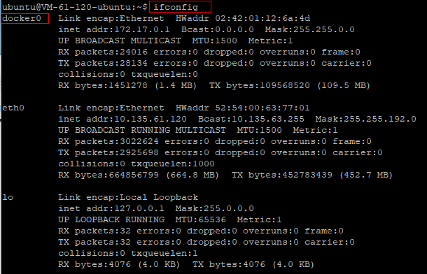
  >
  > **docker0 可看作 Linux 虚拟网桥，而 Linux 虚拟网桥对应数据链路层**：
  >
  > 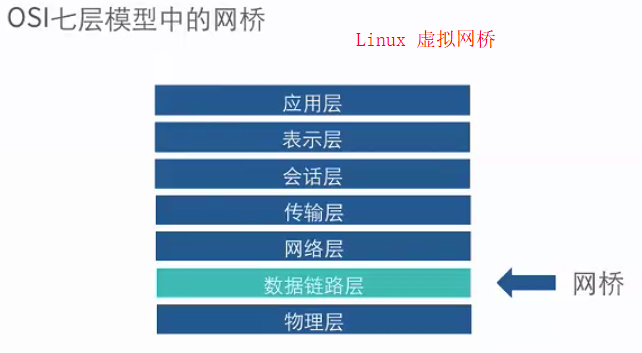
  >
  > Linux 虚拟网桥的特点：
  >
  > - 可以设置 IP 地址
  > - 相当于拥有一个隐藏的虚拟网卡
  >
  > docker0 的地址划分：
  >
  > - IP: 172.17.42.1  子网掩码： 255.255.0.0
  > - MAC: 02:42:ac:11:00:00 到 02:42:ac:11:ff:ff
  > - 总共提高了 65534 个地址
  >
  > 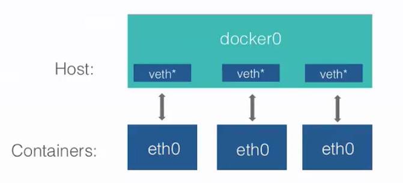
  >
  > **实例演示**：
  >
  > - 安装网桥管理工具： `sudo apt-get install bridge-utils` 
  >
  > - 查看网络管理工具： `sudo brctl show`
  >
  >   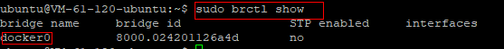
  >
  > - 运行一个容器： `sudo docker run -it --name nwt1 ubuntu /bin/bash` 
  >
  > - 查看该容器下的网络配置： `ifconfig`，需自己安装config: `apt install net-tools`
  >
  >   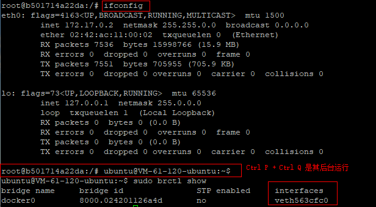
  >
  > - 自定义 docker0 地址： `sudo ifconfig docker0 192.168.200.1 netmask 255.255.255.0` 
  >
  >   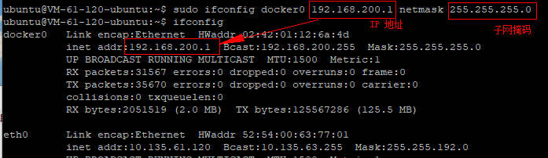
  >
  > - 自定义虚拟网桥：
  >
  >   - 添加虚拟网桥
  >
  >     ```shell
  >     sudo brctl addbr br0
  >     sudo ifconfig br0 192.168.100.1 netmask 255.255.255.0
  >     ```
  >
  >     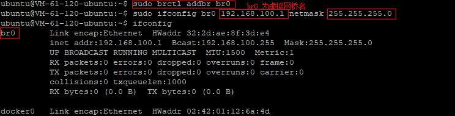
  >
  >   - 更改 docker 守护进程的启动配置： `/etc/default/docker` 中添加 `DOCKER_OPS` 值 `-b=br0`，更改完成后记得 `sudo service docker restart` 重启 docker

- **docker 容器的互联** 

  > - 环境准备：
  >
  >   > 用于测试的 Dockerfile：
  >   >
  >   > 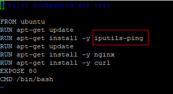
  >   >
  >   > 运行该 dockerfile： `sudo docker build -t yinren/cct .`
  >   >
  >   > 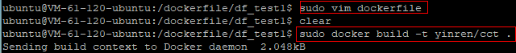
  >
  > - **允许所有容器互联**：
  >
  >   > 启动刚刚创建的镜像的容器：
  >   >
  >   >  ```shell
  >   > # 启动容器 1
  >   > sudo docker run -it --name cct1 yinren/cct
  >   > nginx
  >   > # Ctrl P + Ctrl Q 退出使其后台运行
  >   > 
  >   > # 启动容器 2
  >   > sudo docker run -it --name cct2 yinren/cct
  >   > # 查看 cct2 的容器地址,若 ifconfig 未安装，运行 apt install net-stools
  >   > ifconfig
  >   > # Ctrl P + Ctrl Q 退出使其后台运行
  >   >  ```
  >   >
  >   > 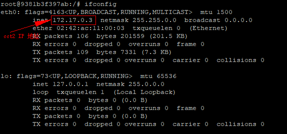
  >   >
  >   > 启动 cct1 守护容器： `sudo docker attach cct1`
  >   >
  >   > 查看 cct1 的 IP 地址： `ifconfig`
  >   >
  >   > 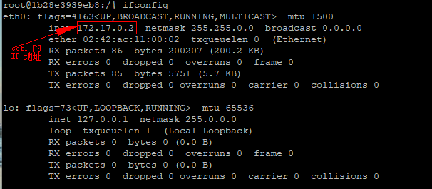
  >   >
  >   > 在 cct1 中 ping 一下 cct2 的 IP 地址：`ping 172.17.0.3`
  >   >
  >   > 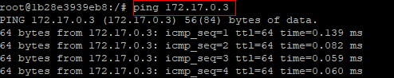
  >   >
  >   > 切换到 cct2 并 ping cct1 的 IP 地址：
  >   >
  >   > 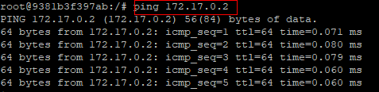
  >   >
  >   > - **结论**： 默认情况下，docker 的容器间均可以互相访问
  >   >
  >   > **注意**： 当重启容器后，容器的 IP 地址可能会发生改变
  >   >
  >   > 所以创建容器时以特定代号来实现容器间的互联： `docker run --link=[CONTAINER_NAME]:[ALIAS] [IMAGE] [COMMOND]`
  >   >
  >   > 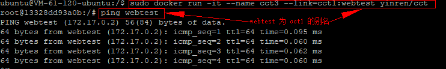
  >   >
  >   > 查看 cct3 内部的配置：
  >   >
  >   > 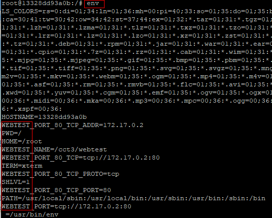
  >
  > - **拒绝容器间互联**： 
  >
  >   > 更改 docker 守护进程的启动选项： `--icc=false`
  >
  > - **允许特定容器间的连接**： 
  >
  >   > - ① 更改 docker 守护进程的启动选项： `icc=false --iptables=true`
  >   > - ② 创建容器时使用 `--link`

- **docker 容器与外部网络的连接** 

  >- `--ip-forward`： 其值决定了 Linux 系统是否会转发流量，docker 中默认为 `true`
  >
  >  > 查看 ip-forward 的值： `sudo sysctl net.ipv4.conf.all.forwarding`
  >  >
  >  > 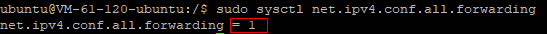
  >
  >- `iptables`： 是与 Linux 内核集成的包过滤防火墙系统
  >
  >  **详解**： [iptables命令](http://man.linuxde.net/iptables) 
  >
  >  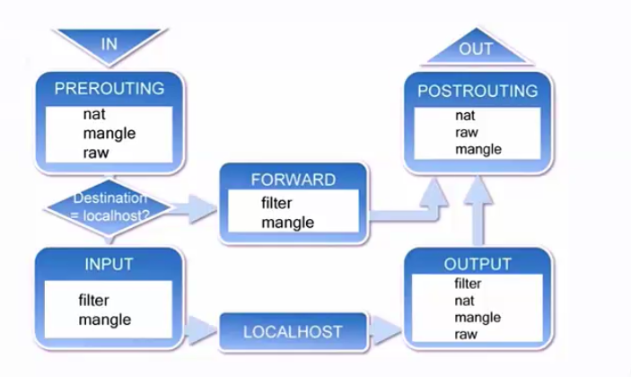
  >
  >- 可直接通过 `IP:port` 来访问 docker 容器

注意：

- docker 的 Ubuntu 镜像下需要手动安装 ifconfig 与 ping

  > - ifconfig： `apt install net-tools`
  > - ping： `apt install iputils-ping`

### 4. docker 容器的数据管理

- **docker 容器的数据卷**

  > - **简介**： 数据卷是经过特殊设计的目录，可绕过联合文件系统(UFS)，为一个或多个容器提供访问
  >
  > - **目的**： 在于数据的永久化，其完全独立于容器的生存周期，因此 docker 不会在容器删除时删除其挂载的数据卷，也不会存在类似的垃圾收集机制，对容器引用的数据卷进行处理
  >
  > - **特点**： 
  >
  >   - 数据卷在容器启动时初始化，若容器中使用的镜像在挂载点包含了数据，则这些数据会拷贝到新初始化的数据卷中
  >   - 数据卷可在容器间共享和重用
  >   - 可对数据卷里的内容直接进行修改
  >   - 数据卷的变化不会影响镜像的更新
  >   - 数据卷会一直存在，即使挂载数据卷的容器已被删除
  >
  > - **使用**：
  >
  >   - 为容器添加数据卷： `sudo docker run -v ~/container_data:/data -it ubuntu /bin/bash`
  >
  >     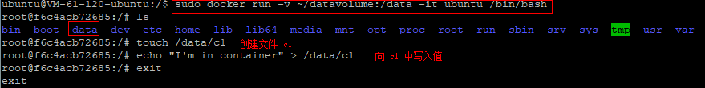
  >
  >     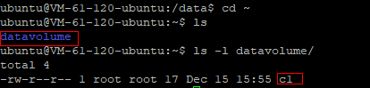
  >
  >     查看数据卷： `sudo docker inspect image_name`：
  >
  >     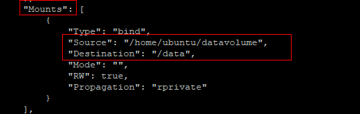
  >
  >   - 为数据卷添加访问权限： `sudo docker run -v ~/datavolume:/data:ro -it ubuntu /bin/bash`
  >
  >     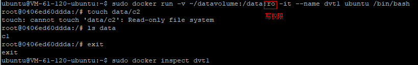
  >
  >     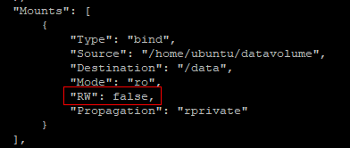
  >
  >   - 使用 Dockerfile 构建包含数据卷的镜像： `VOLUME ["/data"]`
  >
  >     > **注意**： 使用相同镜像创建的不同容器的数据卷不能共享

- **docker 的数据卷容器**

  > - **简介**： 挂载数据卷的容器，命名的容器挂载数据卷，其他容器通过挂载这个容器实现数据共享
  > - 挂载数据卷容器的方法： `docker run --volumes-from [CONTAINER NAME]`

- **docker 数据卷的备份与还原**

  >

### 5. docker 容器的跨主机访问

- 使用**网桥**实现跨主机容器连接

  >

- 使用 `Open vSwitch` 实现跨主机容器连接

  >

- 使用 `weave` 实现跨主机容器连接

  >

## 2. Docker 容器

### 1. 简介

- Docker 可帮你构建和部署容器，用户只需将程序打包放入容器即可
- 容器是基于镜像启动起来的，可运行多个进程
- **镜像是 Docker 生命周期中的构建或打包阶段，而容器则是启动或执行阶段**
- Docker 容器的默认格式： `libcontainer`，一个原生的 Linux 容器格式

Docker 容器总结就是：

- 一个镜像格式
- 一系列标准的操作
- 一个执行环境

> Docker 借鉴了标准集装箱的概念：
>
> - 每个容器都包含一个软件镜像
> - 所有容器都按照相同方式装载程序

### 2. 常用命令

- **启动**： `docker run [OPTIONS] IMAGE [COMMAND] [ARG...]` 

  >  IMAGE 为容器镜像，COMMAND 为容器命令，ARG 为命令参数
  >
  > 可通过 `docker run --help` 命令来查看详细介绍
  >
  > 例子：
  >
  > - 启动容器： `sudo docker run ubuntu echo 'Hello world'` 会输出 `Hello world` 
  >
  >   注意： 初次运行时，docker 容器中没有 Ubuntu 镜像，所以 docker 容器会自动安装，然后再次执行该命令，效果就会出来
  >
  > - 启动交互式容器： `sudo docker run -i -t IMAGE /bin/bash`  会与 bash 命令交互，然后就可以正常操作 ubuntu 命令，可用命令 `exit` 退出

- **查看**：

  -  `docker ps [-a] [-l]` ： 查看创建或正在运行的容器

    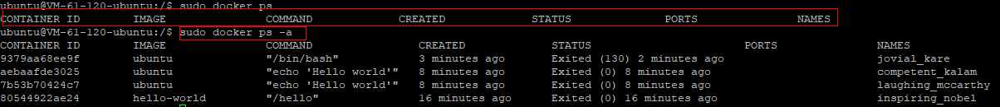

  - `docker inspect con_name`：查看指定容器的详细信息，`con_name` 即可以是 ID，也可以是 NAMES

- **自定义容器名**： `docker run --name=my_name [OPTIONS] IMAGE [COMMAND] [ARG...]`

  > 创建容器时为容器指定名字

  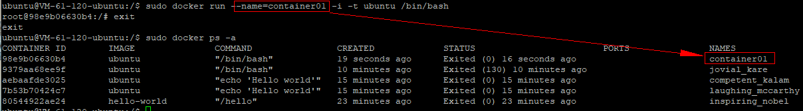

- **重启停止的容器**： `docker start [-i] container_name`

  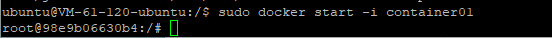

- **删除**： `docker rm container_name`

  > 只能删除已停止的容器，不能删除运行中的容器

  

### 3. 守护式容器

> 能够长期运行，没有交互式会话，适合运行应用程序和服务

- 当容器运行时，按下 `Ctrl p + Ctrl Q` 的方式，使容器后台运行，成为守护式容器
- 命令 `docker attach con_name` 可以重新进入指定的守护式容器
- 启动守护式容器： `docker run -d IMAGE [COMMAND] [ARG...]` 
- 查看容器日志： `docker logs [-f] [-t] [-tail] con_name`
- 查看容器内进程： `docker top con_name`
- 在运行容器中启动新进程： `docker exec [-d] [-i] [-t] con_name [COMMAND] [ARG...]`

- 停止守护式容器：`docker stop con_name 或 docker kill con_name`

### 4. 容器中部署静态网站

- 设置容器的端口映射： `run [-P] [-p]`

Nginx 部署流程：

- 创建映射 80 端口的交互式容器
- 安装 Nginx
- 安装文本编辑器 vim
- 创建静态页面
- 修改 Nginx 配置文件
- 运行 Nginx
- 验证网站访问

**执行步骤**： 

- 创建交互式 docker 容器： `sudo docker run -p 80 --name web -i -t ubuntu /bin/bash`

- 容器中安装 nginx： `apt-get install -y nginx` 

- 容器中安装 vim： `apt-get install -y vim`

- 容器中创建存放网站目录： `mkdir -p /var/www/html` 并切换到该目录

- 编辑一个静态页面： `vim index.html`

  ```html
  <html>
      <head>
          <title>Nginx in docker</title>
      </head>
      <body>
          <h1>
              Hello,I'm website in Docker
          </h1>
      </body>
  </html>
  ```

- 查找 nginx 配置文件

  ```shell
  # 查找 nginx
  whereis nginx
  # 打开 default 文件
  vim /etc/nginx/sites-enabled/default
  # 修改 root 值为我们刚创建的存放目录
  root /var/www/html
  # 切换到 home 目录
  cd /
  ```

- 运行 nginx： `nginx`，可使用 `ps -ef` 查看 nginx 是否运行

  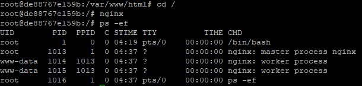

- 退出当前交互式容器，使其后台运行：`Ctrl p + Ctrl q` 

- 使用 `docker ps,docker port web,docker top web` 查看当前情况

  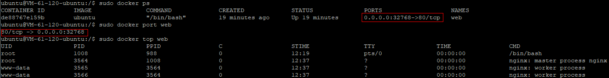

- 以宿主机的 IP 地址访问： `curl http://127.0.0.1:32768`

  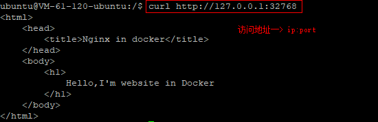

  浏览器中访问：

  

- 以容器的 IP 访问：

  > - 查看容器的 IP 地址： `docker inspect web`
  >
  >   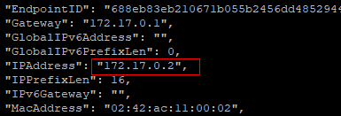
  >
  > - 访问： `curl http://172.17.0.2` 
  >
  >   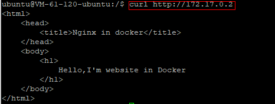

- 注意： 
  - 当安装镜像时，显示 ` Unable to locate package XXX`，则使用  `apt-get update` 更新后可以继续安装
  - 当重启 docker 后，IP 地址会发生改变

## 3. Docker 镜像

###1. 简介

- **镜像是构建 Docker 世界的基石**，用户基于镜像来运行自己的容器

- 镜像： 是基于联合加载的层叠的只读文件系统

  > 也可把镜像当作容器的“源代码”

- 镜像是分层的，可进行迅速的迭代

### 2. 查看和删除镜像

- 镜像存储地址： `/var/lib/docker/aufs`

  > - `docker info` 查看
  >
  >   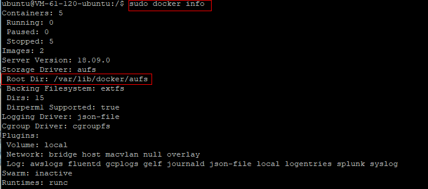
  >
  >   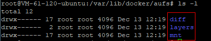

- 列出镜像： `docker images [OPTIONS] [REPOSITORY]` 

  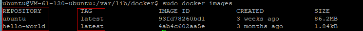

- 查看镜像： `docker inspect [OPTIONS] CONTAINER|IMAGE [CONTAINER|IMAGE...]`

- 删除镜像： `docker rmi [OPTIONS] IMAGE [IMAGE...]`

### 3. 获取和推送镜像

- **查找镜像**： 

  - [docker hub 网址](https://registry.hub.docker.com)

  - 命令 `docker search [OPTIONS] TERM` 

    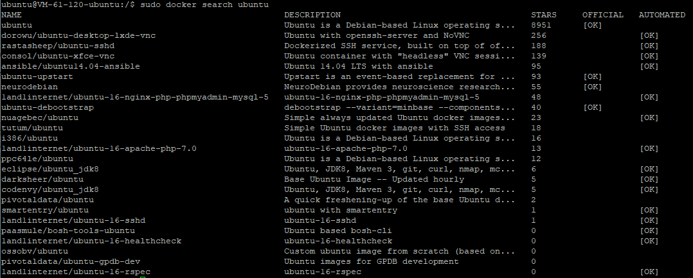

- **拉取镜像**：`docker pull [OPTIONS] NAME[:TAG]` 

  

- **推送镜像**： `docker push img_name` 

  > 注意： 推送前，记录提前登陆 docker
  >
  > 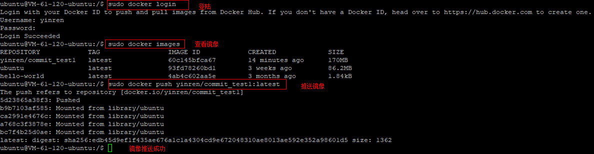
  >
  > 推送成功：
  >
  > 

### 4. 构建镜像

- **简介**： 
  - 保存对容器的修改，并再次使用
  - 自定义镜像的能力
  - 以软件的形式打包并分发服务及其运行环境

- **构建**

  - 通过容器构建： `docker commit [OPTIONS] CONTAINER [REPOSITORY[:TAG]]` 

    > - 创建一个容器
    >
    >   ```shell
    >   # 创建一个容器
    >   sudo docker run -it -p 80 --name commit_test ubuntu /bin/bash
    >   # 对 ubuntu 景象进行更新
    >   apt-get update
    >   # 安装 nginx
    >   apt-get install nginx
    >   # 退出
    >   exit
    >   ```
    >
    > - 查看创建的容器： `sudo docker ps -l`
    >
    >   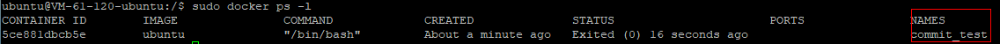
    >
    > - 提交： `docker commit -a 'yinren' -m 'nginx' commit_test yinren/commit_test1` 
    >
    >   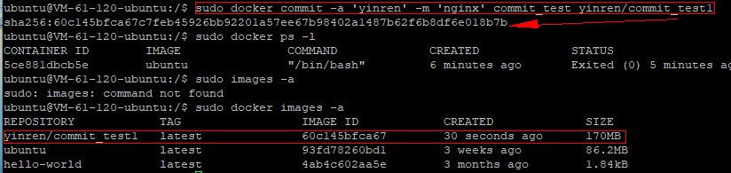
    >
    > - 访问测试： 
    >
    >   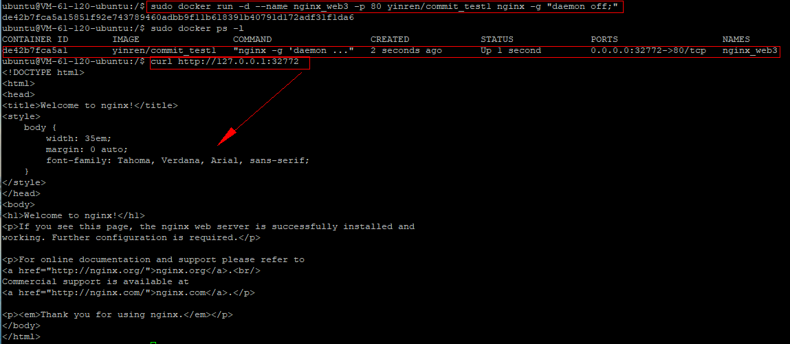

  - 通过 Dockerfile 文件构建： `docker build`

    > - 创建 Dockerfile 文件： 包含了一系列命令的文本文件
    >
    >   创建 dockerfile 文件：
    >
    >   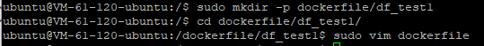
    >
    >   填写 dockerfile 文件内容：
    >
    >   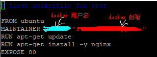
    >
    > - 使用 `docker build` 命令： `docker build [OPTIONS] PATH | URL | -` 
    >
    >   运行该 dockerfile 文件：
    >
    >   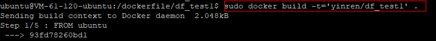
    >
    >   查看镜像是否创建成功：
    >
    >   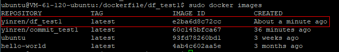
    >
    >   访问测试：
    >
    >   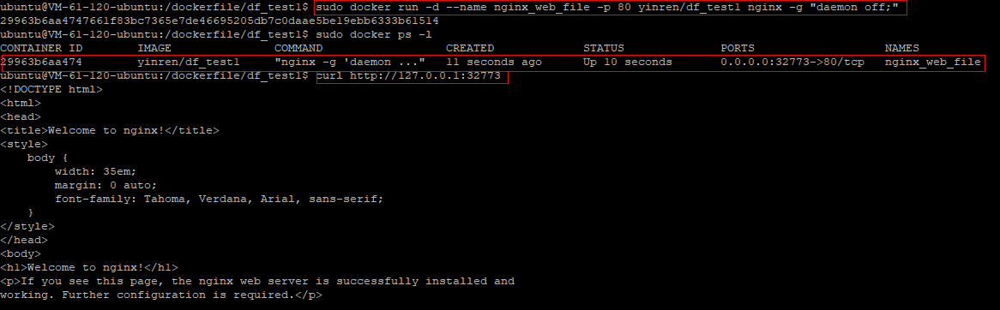

- dockerfile 构建过程：

  - 从基础镜像运行一个容器
  - 执行一条指令，对容器做出修改
  - 执行类似 docker commit 的操作，提交一个新的镜像层
  - 再基于刚提交的镜像运行一个新容器
  - 执行 dockerfile 中的下一条指令，直至所有指令执行完毕

- dockerfile 指令格式： 

  > - 格式一： `# Comment`
  > - 格式二： `INSTRUCTION argument` 
  >
  > 指令分类：
  >
  > - `FROM <image> [:<tag>]`： 该镜像存在且为基础镜像，同时必须是第一条非注释指令
  > - `MAINTAINER <name>`： 指定镜像的作者信息，包含镜像的所有者和联系方式
  > - `RUN`： 指定当前镜像中运行的命令
  >   - `RUN <command>`： shell 模式，以 `/bin/sh -c command` 形式运行，如： `RUN echo hello`
  >   - `RUN ["executable",'param1',"param2"]`： exec 模式，以  `RUN ["/bin/bash","-c","echo hello"]` 形式运行
  > - `EXPOSE <port> [<port>...]`：  指定运行该镜像的容器使用的端口
  > - `CMD`： 
  >   - `CMD ["executable","param1","param2"]`： exec 模式
  >   - `CMD command param1 param2` ： shell 模式
  >   - `CMD ["param1","param2"]`： 作为 ENTERYPOINT 指令的默认参数
  > - `ENTERYPOINT`：
  >   - `ENTERYPOINT ["executable","param1","param2"]`：exec 模式
  >   - `ENTERYPOINT command param1 param2`： shell 模式
  > - `ADD ["<src>"..."<dest>"]`： 适用于文件路径中有空格的情况
  > - `COPY ["<src>"..."<dest>"]`： 适用于文件路径中有空格的情况
  > - `VOLUME ["/data"]`
  > - `WORKDIR [/path/to/workdir]`
  > - `ENV <key>=<value>`
  > - `USER daemon`
  > - `ONBUILD [INSTRUCTION]`： 镜像触发器，当一个镜像被其他镜像作为基础镜像时执行
