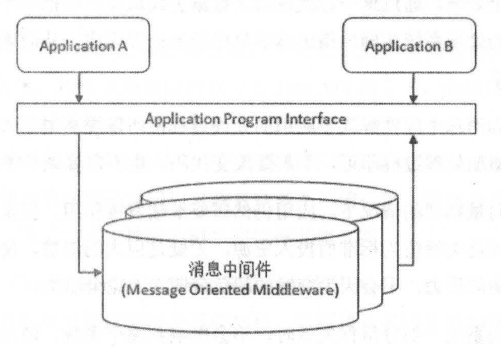
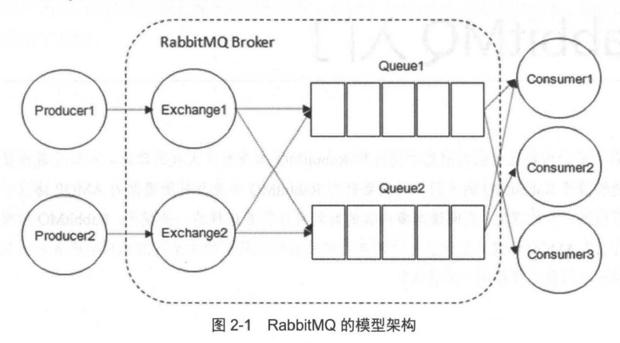
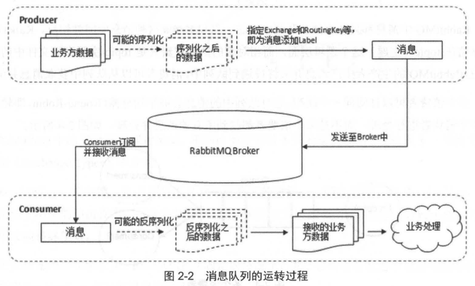
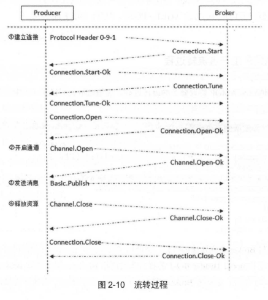
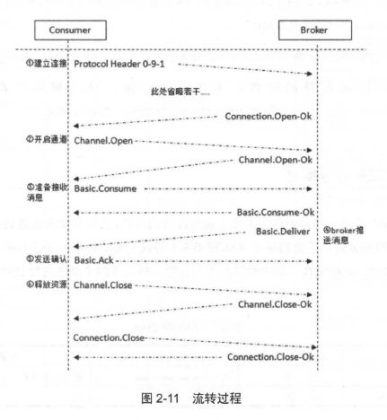

# 一、简介

## 1. 什么是消息中间件

- **消息(Message)**： 是指在应用间传送的数据

- **消息队列中间件(MQ)**： 是指利用高效可靠的消息传递机制进行与平台无关的数据交流，并基于数据通信来进行分布式系统的集成

  > - 通过提供消息传递和消息排队模型，可以在分布式环境下扩展进程间的通信
  > - 消息中间件适用于需要可靠的数据传送的分布式环境
  >
  > 一般有**两种传递模式**：
  >
  > - **点对点(P2P) 模式**： 基于队列，消息生产者发送消息到队列，消息消费者从队列中接收消息
  >
  >   > 队列的存在使得消息的**异步传输**成为可能
  >
  > - **发布/订阅(Pub/Sub) 模式**：定义了如何向一个内容节点发布和订阅消息
  >
  >   > - 内容节点称为主题(topic)，主题可认为是消息传递的中介
  >   > - 消息发布者将消息发布到某个主题，而消息订阅者则从主题中订阅消息
  >   > - 主题使得消息的订阅者与消息的发布者互相保持独立，不需要进行接触即可保证消息的传递
  >   > - 发布/订阅模式在消息的**一对多广播**时采用

- **面向消息的中间件(MOM)**： 提供了以松散藕合的灵活方式集成应用程序的一种机制

  > - 它们提供了基于存储和转发的应用程序之间的异步数据发送，即应用程序彼此不直接通信，而是与作为中介的消息中间件通信
  >
  > - 消息中间件提供了有保证的消息发送，应用程序开发人员无须了解远程过程调用( RPC) 和网络通信协议的细节

- 采用消息中间件的系统中，不同的对象之间通过传递消息来激活对方的事件，以完成相应的操作

  > - 发送者将消息发送给消息服务器， 消息服务器将消息存放在若干队列中，在合适的时候再将消息转发给接收者
  > - 消息中间件能在不同平台之间通信，常被用来屏蔽各种平台及协议之间的特性，实现应用程序之间的协同
  > - **优点**： 能够在客户和服务器之间提供同步和异步的连接，并且在任何时刻都可以将消息进行传送或者存储转发

## 2. 消息中间件的作用

- **解耦**： 消息中间件在处理过程中间插入了一个**隐含的、基于数据的接口层**

  > 允许独立地扩展或修改两边的处理过程，只要确保遵守同样的接口约束即可

- **冗余(存储)**： 消息中间件可以把数据进行持久化直到它们已经被完全处理，通过这一方式规避了数据丢失风险

  > 在把一个消息从消息中间件中删除之前，需要你的处理系统明确地指出该消息己经被处理完成，从而确保你的数据被安全地保存直到你使用完毕

- **扩展性**： 消息中间件解耦了应用的处理过程，所以提高消息入队和处理的效率是很容
  易的，只要另外增加处理过程即可，不需要改变代码，也不需要调节参数

- **削峰**： 使用消息中间件能够使关键组件支撑突发访问压力，不会因突发的超负荷请求而完全崩溃

- **可恢复性**： 消息中间件降低了进程间的耦合度，所以即使一个处理消息的进程挂掉，加入消息中间件中的消息仍然可以在系统恢复后进行处理

- **顺序保证**： 在大多数使用场景下，数据处理的顺序很重要，大部分消息中间件支持一定程度上的顺序性

- **缓冲**： 消息中间件通过一个缓冲层来帮助任务最高效率地执行，写入消息中间件的处理会尽可能快速，该缓冲层有助于控制和优化数据流经过系统的速度

- **异步通信**：消息中间件提供了异步处理机制，允许应用把一些消息放入消息中间件中，但并不立即处理它，在之后需要的时候再慢慢处理

##3. 相关概念

### 1. 生产者与消费者

- **Producer(生产者)**：生产者创建消息，然后发布到RabbitMQ 中

  > 消息包含两个部分：
  >
  > - **消息体(payload )**：一般是一个带有业务逻辑结构的数据
  > - **标签**：用来表述这条消息
  >
  > 生产者把消息交由 RabbitMQ，RabbitMQ 之后会根据标签把消息发送给感兴趣的消费者

- **Consumer(消费者)**： 接收消息的一方，消费者连接到 RabbitMQ 服务器，并订阅到队列上

  > - 当消费一条消息时， 只是消费消息体
  >
  > - 在消息路由的过程中，存入到队列中的消息只有消息体(消息的标签会丢弃)

- **Broker(消息中间件的服务节点)**：RabbitMQ Broker 可看作一个RabbitMQ 服务节点或RabbitMQ 服务实例

### 2. 队列

- **Queue(队列)**： 是RabbitMQ 的内部对象，用于存储消息

  > - `RabbitMQ`： 消息只能**存储在队列中**
  > - `Katka`： 将消息**存储在topic(主题)**这个逻辑层面，而相对应的队列逻辑只是 topic 实际存储文件中的位移标识

- 多个消费者可以订阅同一个队列，这时队列中的**消息会被平均分摊(即轮询)给多个消费者处理**

- RabbitMQ ==不==支持队列层面的广播消费

### 3. 交换器、路由键、绑定

- **Exchange(交换器)**： 生产者将消息发送到 Exchange (交换器)，由**交换器将消息路由到一个或多个队列中**

  > 交换器类型：
  >
  > - `fanout`：会把所有发送到该交换器的消息路由到所有与该交换器绑定的队列中
  >
  > - `direct`： 会把消息路由到那些 BindingKey 和 RoutingKey 完全匹配的队列中
  >
  > - `topic`： 也是将消息路由到 BindingKey 和 RoutingKey 相匹配的队列中，但匹配规则不同
  >
  >   > **约定**：
  >   >
  >   > - RoutingKey 为一个点号 `.` 分隔的字符串(被点号分隔开的独立字符串称为一个单词)
  >   >
  >   > - BindingKey 和RoutingKey 也是点号 `.` 分隔的字符串
  >   >
  >   > - BindingKey 可以存在两种特殊字符串 `*, #`，用于做模糊匹配
  >   >
  >   >   > `#` 用于匹配一个单词
  >   >   >
  >   >   > `*` 用于匹配多规格单词
  >
  > - `headers`： 根据发送的消息内容中的 headers 属性进行匹配
  >
  > - `System`： 
  >
  > - `自定义`： 

- **RoutingKey(路由键)**：生产者将消息发给交换器时，会指定一个 RoutingKey，用来**指定消息的路由规则**

  > - RoutingKey 需与交换器类型和绑定键联合使用
  > - 交换器类型和绑定键固定情况下，生产者可以在发送消息给交换器时，通过指定 RoutingKey 来决定消息流向哪里

- **Binding(绑定)**： RabbitMQ 通过**绑定将交换器与队列关联起来**

  > 官方文档和RabbitMQ Java API 中都把 BindingKey 和RoutingKey 看作 RoutingKey
  >
  > 可理解为：
  >
  > - 在使用绑定的时候，其中需要的路由键是 BindingKey
  > - 在发送消息的时候，其中需要的路由键是 RoutingKey

### 4. 连接与信道

- **连接(Connection )**： 是一条TCP 连接

  > 一旦 TCP 连接建立起来，客户端紧接着可以创建一个 AMQP 信道(Channel)，每个信道都会被指派一个唯一的 ID

- **信道**： 建立在 Connection 之上的虚拟连接，RabbitMQ 处理的每条AMQP 指令都是通过信道完成的

  > - 采用类似 NIO 的做法，选择TCP 连接复用，不仅可以减少性能开销，同时也便于管理
  >
  >   > - 当**信道流量小时**，复用单一的 Connection 可有效地节省 TCP 连接资源
  >   >
  >   > - 当**信道流量很大时**，开辟多个Connection，将信道均摊到多个 Connection 中
  >   >
  >   >   > 相关的调优策略需要根据业务自身的实际情况进行调节
  >
  > - **NIO(非阻塞 IO)**：包含三大核心部分： **Channel (信道)、Buffer (缓冲区)、Selector (选择器)**
  >
  >   > - 基于Channel 和Buffer 进行操作，数据总是从信道读取数据到缓冲区中，或者从缓冲区写入到信道中
  >   > - Selector 用于监听多个信道的事件(比如连接打开，数据到达等)
  >   > - 因此，单线程可以监听多个数据的信道

## 4. 运转流程

**生产者发送消息**：

- 生产者**连接到 RabbitMQ Broker**， 建立连接，开启信道

- 生产者**声明一个交换器**，并设置相关属性

- 生产者**声明一个队列**并设置相关属性

- 生产者**通过路由键将交换器和队列绑定起来**

- 生产者**发送消息至 RabbitMQ Broker**

  > 包含路由键、交换器等信息

- 相应的交换器根据接收到的路由键**查找相匹配的队列**

- **若找到**，则将从生产者发送过来的**消息存入相应的队列**中

- **若没有找到**，则根据生产者配置的属性选择**丢弃或回退**给生产者
- **关闭信道**
- **关闭连接**

**消费者接收消息的过程**： 

- 消费者**连接到 RabbitMQ Broker**，建立连接，开启一个信道
- 消费者向 RabbitMQ Broker **请求消费相应队列中的消息**，可能会设置相应的回调函数，以及做一些准备工作
- 等待 RabbitMQ Broker 回应并投递相应队列中的消息， **消费者接收消息**
- 消费者**确认接收到的消息**
- RabbitMQ 从队列中**删除相应己经被确认的消息**
- **关闭信道**

- **关闭连接**

## 5. AMQP 协议

**AMQP 协议**包括三层：

- `Module Layer`： **位于协议最高层**，主要定义供客户端调用的命令

  > 客户端可以利用这些命令实现自己的业务逻辑

- `Session Layer`： **位于中间层**，主要负责将客户端的命令发送给服务器，再将服务端的应
  答返回给客户端

  > 主要为客户端与服务器之间的通信提供可靠性同步机制和错误处理

- `Transport Layer`： **位于最底层**，主要传输二进制数据流，提供帧的处理、信道复用、错
  误检测和数据表示等

**其他协议**：

- **STOMP(简单[流]文本面向消息协议)**： 提供了一个可互操作的连接格式，运行 STOMP 客户端与任意 STOMP 消息代理(Broker)进行交互

  > STOMP 协议由于设计简单，易于开发客户端，因此在多种语言和平台上得到广泛的应用

- **MQTT(消息队列遥测传输)**： 是 IBM 开发的一个即时通信协议

  > 该协议支持所有平台，被用来当作传感器和制动器的通信协议

**AMQP 生产者流转过程**：

**AMQP 消费者流转过程**： 

