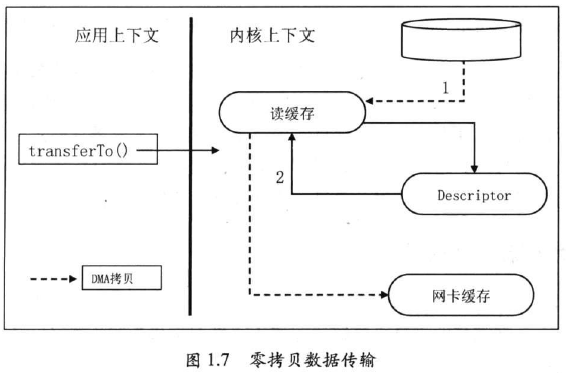
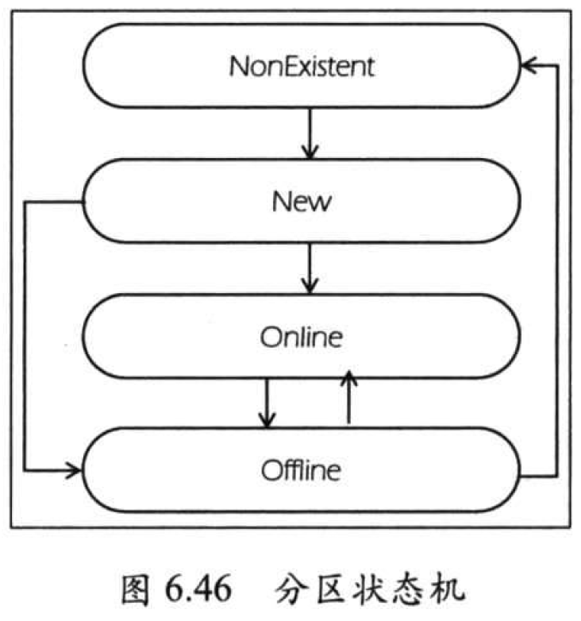

- 推荐阅读：==[kafka中文教程](https://www.orchome.com/kafka/index)== 

# 零、前瞻

## 1、consumer

```java
@KafkaListener(topics = {"bg_action"}, containerFactory = "bgActionContainerFactory")
public void listenerBgAction(List<ConsumerRecord<String, Object>> records) 
    															throws Exception {
}

@Bean(value = "bgActionContainerFactory")
public KafkaListenerContainerFactory<ConcurrentMessageListenerContainer<String, String>> 
        recallExpectContainerFactory() {
    ConcurrentKafkaListenerContainerFactory<String, String> factory = 
                new ConcurrentKafkaListenerContainerFactory<String, String>();
    factory.setConsumerFactory(bgActionConsumer());
    factory.setConcurrency(15);
    factory.setBatchListener(true);
    return factory;
}

//bg_action:https://datastar.kanzhun-inc.com/dashboard/kafka/topic_detail/28264
private ConsumerFactory<String, String> bgActionConsumer() {
    Map<String, Object> properties = new HashMap<String, Object>();
    properties.put(ConsumerConfig.BOOTSTRAP_SERVERS_CONFIG, bg_action_server);
    properties.put(ConsumerConfig.GROUP_ID_CONFIG, "arc-four-" + springUtils.getActiveProfile());
    properties.put(ConsumerConfig.ENABLE_AUTO_COMMIT_CONFIG, "true");
    properties.put(ConsumerConfig.AUTO_COMMIT_INTERVAL_MS_CONFIG, "1000");
    properties.put(ConsumerConfig.AUTO_OFFSET_RESET_CONFIG, "latest");
    properties.put(ConsumerConfig.SESSION_TIMEOUT_MS_CONFIG, "30000");
    properties.put(ConsumerConfig.MAX_POLL_RECORDS_CONFIG, "100");
    properties.put(ConsumerConfig.KEY_DESERIALIZER_CLASS_CONFIG, StringDeserializer.class);
    properties.put(ConsumerConfig.VALUE_DESERIALIZER_CLASS_CONFIG, StringDeserializer.class);
    properties.put("security.protocol", "SASL_PLAINTEXT");
    properties.put("sasl.mechanism", "SCRAM-SHA-256");
    properties.put("sasl.jaas.config", "org.apache.kafka.common.security.scram.ScramLoginModule required username=\"xxx\" password=\"xxx\";");
    return new DefaultKafkaConsumerFactory<String, String>(properties);
}
```

## 2、producer

```java
@Slf4j
@Configuration
public class LogProducer {
    private final static String TOPIC_NAME = "xxx";

    private Producer<String, String> producer;

    @Resource
    private ExecutorSupport executorSupport;

    @PostConstruct
    private void init() {
        log.info("#TimeUtils.init#start...");
        Properties props = new Properties();
        props.put("bootstrap.servers", "xxx");
        props.put("acks", "all");
        props.put("key.serializer", "org.apache.kafka.common.serialization.StringSerializer");
        props.put("value.serializer", "org.apache.kafka.common.serialization.StringSerializer");
        props.put("compression.type", "gzip"); // 开启GZIP压缩

        //权限需要添加的配置
        props.put("security.protocol", "SASL_PLAINTEXT");
        props.put("sasl.mechanism", "SCRAM-SHA-256");
        props.put("sasl.jaas.config", "org.apache.kafka.common.security.scram.ScramLoginModule required username=\"xxx\" password=\"xxx\";");

        producer = new KafkaProducer<>(props);
        log.info("#TimeUtils.init#end...");
    }

    public void log2Hive(String log) {
        Map<String, String> map = Maps.newHashMap();
        map.put("log", log);
        producer.send(new ProducerRecord<>(TOPIC_NAME, JSON.toJSONString(map)));
    }
}
```

# 一、认识 Kafka

## 1、快速入门

- **启动 ZooKeeperr**：`bin/zookeeper-server-start.sh config/zookeeper.properties` 

  > 终端输出 `0.0.0.0/0.0.0.0:2181` 表明 zookeeper 已成功在端口 2181 启动

- **启动 kafka**：`bin/kafka-server-start.sh config/server.properties`

- **创建 topic**：`bin/kafka-topics.sh --create --zookeeper localhost:2181 --partitions 1 --replication-factor 1 --topic test` 

  > - **主题(topic)**：用于消息的发送与接收，此处将创建一个名为 `test` 的 topic，该 topic 只有一个分区(partition)，且该 partition  也只有一个副本(replication)处理消息
  >
  > - 查看 topic 状态：`bin/kafka-topics.sh --describe --zookeeper localhost:2181 --topic test`
  >
  >   

- **创建生产者(发送消息)**：`bin/kafka-console-producer.bat --broker-list localhost:9092 --topic test` 

  > kafka 提供的脚本工具：可以不断接收标准输入并将它们发送到 kafka 的某个 topic

- **创建消费者(接收消息)**：`bin/kafka-console-consumer.bat --bootstrap-server localhost:9092 --topic test --from-beginning` 

## 2、消息引擎(消息队列/消息中间件)系统

**消息引擎系统 `MS`**：用于在不同应用间传输消息的系统

> 消息引擎系统以软件接口为主要形式，实现了松耦合的异步式数据语义传递


消息引擎系统的两个重要因素：

- **消息设计**：要考虑语义的清晰和格式上的通用性，能完整清晰表达业务的能力

  > 为了更好地表达语义以及最大限度地提高重用性，消息通常采用**结构化方式进行设计**，比如：
  >
  > - SOAP 协议的消息采用 XML 格式
  > - WebService 支持 JSON 格式的消息

- **传输协议设计**：

  - 侠义角度：消息传输协议指定了消息在不同系统间传输的方式，如：AMQP、Web Service + SOAP
  - 广义角度：这类协议可能包括任何能在不同系统间传输消息或执行语义操作的协议或框架，如：RPC

---

**消息引擎范型**：一个基于网络的架构范型，描述了消息引擎系统的两个不同的子部分是如何互连且交互

- **消息队列模型**：基于队列提供消息传输服务，多用于进程间通信及线程间通信

  > 该模型定义了消息队列、发送者、接收者，提供了一种点对点的消息传递方式，即：
  >
  > - 发送者发送每条消息到队列指定位置，接收者从指定位置获取消息
  > - 一旦消息被消费，就会从队列中移除该消息
  > - 每条消息由一个发送者生产，且只被一个消费者处理
  >
  > 

- **发布/订阅模型**：发布者将消息生产出来发送到指定的 topic 中，所有订阅了该 topic 的订阅者都可以接收到该 topic 下的所有消息

  > 主题 `topic`：可理解为逻辑语义相近的消息容器
  >
  > - 通常具有相同订阅 topic 的所有订阅者将接收到同样的消息
  >
  > 

---

Java 消息服务 `JMS`：是一套 API 规范，提供了很多接口用于实现分布式系统间的消息传递

## 3、kafka 概要设计

> kafka 为解决超大量级数据的实时传输

### (1) 吞吐量/延时

- **吞吐量**：某种处理能力的最大值

  > kafka 吞吐量：每秒能处理的消息数或每秒能处理的字节数

- **延时**：性能指标，衡量一段时间间隔内，如：发出某个操作到接收到操作响应之间的时间或在系统中导致某些物理变更的起始时刻与变更正式生效时刻间的间隔

  > kafka 延时：表示客户端发起请求与服务器处理请求并发送响应给客户端间的这段时间

---

- **kafka 的写入操作很快**：每次写入操作都只是把数据写入到操作系统的页缓存中，然后由操作系统自行决定何时把页缓存中的数据写回磁盘，这样的优势

  - 操作系统页缓存是在内存中分配的，所以消息写入的速度非常快

  - Kafka 不必直接与底层的文件系统打交道，所以烦琐的 I/O 操作都交由操作系统来处理

  - Kafka 写入操作采用追加写入方式，避免了磁盘随机写操作，即只能在日志文件末尾追加写入新的消息，且不允许修改已写入的消息，因此属于磁盘顺序操作

    > 磁盘的顺序读/写操作很快，其速度甚至可以匹敌内存的随机 I/O 速度
    >
    > 

- **Kafka 使用零拷贝读取**：先尝试从页缓存读取，若命中便把消息经页缓存直接发送到网络的 Socket

  > - **无零拷贝**：数据传输过程涉及内核态与用户态的上下文切换，CPU 开销很大
  >
  >   
  >
  > - **`sendfile` 系统调用(零拷贝)**：在内核驱动程序处理 I/O 数据时，不用直接存储器访问技术`DMA` 执行I/O操作，因此避免了 OS 内核缓冲区间的数据拷贝
  >
  >   

Kafka 实现高吞吐量、低延时目标的操作：

- 读取：

    -  Broker 在处理消息时，会在==**内存**==中缓存一部分消息，以便快速响应消费者的请求

    - 支持生产者和消费者的==**批处理**==操作，批处理可以减少网络通信的频率和内存的使用，提高整体吞吐量

    - 支持对==**消息压缩**==，压缩后的数据占用更少的内存和带宽

- 写入：
    - 数据写入采用==**顺序写入磁盘**==的方式，可以充分利用磁盘的带宽
    - 利用==**零拷贝**==将数据从磁盘复制到 Socket，数据不需要经过应用程序内存，减少了 CPU 和内存的使用，提高了性能
    - ==**多 broker**==和==**多个分区 `Partition`**==，每个分区可以分布在不同的服务器上，实现数据的并行处理，提升吞吐量和性能

### (2) 消息持久化

- **把消息持久化到磁盘的好处**：
  - **解耦消息发送与消息消费**：通过将消息持久化使得生产者不再需要直接和消费者耦合，只是简单的把消息生产出来并交由 Kafka 服务器保存即可，因此提升了整体的吞吐量
  - **实现灵活的消息处理**：已处理的消息可能在未来某个时间点需重新处理一次，消息持久化可以方便实现

- **持久化方式**：

  - 普通系统持久化：先尽量使用内存，当内存资源耗尽时，再一次性地把数据“刷盘”

  - Kafka 持久化：所有数据会立即被写入文件系统的持久化日志中，之后 Kafka 服务器才会返回结果给客户端通知其消息已被成功写入

    > 好处：即实时保存数据，又减少 Kafka 程序对于内存的消耗，从而将节省出的内存留给页缓存使用

### (3) 负载均衡和故障转移

- **负载均衡**：让系统负载根据一定的规则均衡地分配在所有参与工作的服务器上，从而最大限度地提升系统整体的运行效率

  > kafka 通过**智能化的分区领导者选举**实现负载均衡

- **故障转移**：当服务器意外中止时，整个集群可以快速地检测到该失效，并立即将该服务器上的应用或服务自动转移到其他服务器上

  > 通常以“心跳”或“会话”机制实现，即只要主服务器与备份服务器之间的心跳无法维持或主服务器注册到服务中心的会话超过过期时间，就认为主服务器已无法正常运行，集群会自动启动某个备份服务器来替代
  >
  > ---
  >
  > Kafka 使用**会话机制**来支持故障转移：
  >
  > - 每台 Kafka 服务器启动后，会以会话形式把自己注册到 ZooKeeper 服务器上
  > - 一旦该服务器运行出现问题，与 ZooKeeper 的会话便不能维持从而超时失效
  > - 此时，Kafka 集群会选举出另一台服务器来完全代替这台服务器继续服务

### (4) 伸缩性

- **伸缩性**：表示向分布式系统中增加额外的计算资源时吞吐量提升的能力

- **Kafka 伸缩性**：每台 Kafka 服务器上的状态统一交由 ZooKeeper 保管

  > Kafka 服务器上并不是所有状态都不保存，其只保存了很轻量级的内部状态，因此整个集群间维护状态一致性的代价很低

---

分布式集群的每台服务器会维护很多内部状态：

- 若由服务器来保存状态信息，则必须要处理一致性问题

- 若服务器无状态，状态的保存和管理交于专门的协调服务，则整个集群的服务器间就无须繁重的状态共享

  > 倘若要扩容集群节点，只需简单地启动新的节点机器进行自动负载均衡即可

---

- 通过消息持久化，Kafka 实现高可靠性
- 通过负载均衡和文件系统的独特设计，Kafka 实现高吞吐量
- 通过故障转移，Kafka 实现高可用性
- 通过 ZooKeeper 状态保存，Kafka 实现伸缩性

## 4、kafka 基本概念与术语

### (1) 消息

消息由消息头、key、value 组成：**kafka 使用二进制字节数组 ByteBuffer 保存消息信息**

- **消息头**：消息的 CRC 码、消息版本号、属性、时间戳、键长度、消息体长度

    > 属性：1 字节，目前只使用了最低的 3 位用于保存消息的压缩类型(当前只支持 0-无压缩、1-GZIP、2-Snappy、3-LZ4)

- **Key(消息键)**：对消息做 partition 时使用，即决定消息被保存在某 topic 下的哪个 partition

- **Value(消息体)**：保存实际的消息数据

- **Timestamp(消息发送时间戳)**：用于流式处理及其他依赖时间的处理语义，若不指定则取当前时间


### (2) topic 和 partition

- **topic**：逻辑概念，代表一类消息，topic 可被多个消费者订阅

    > 通常使用 topic 来区分实际业务，如：业务 A 使用一个 topic，业务 B 使用另一个 topic

- **topic-partition-message 三级结构来分散负载**：每个 Kafka topic 都由若干个 partition 组成

- **partition 是不可修改的有序消息日志**：

    - 每个 partition 有专属的 partition 号，通常从 0 开始

    - 用户对 partition 的操作：在消息序列的尾部追加写入消息

        > partition 的每条消息都会被分配一个唯一的序列号(位移-offset)
        >
        > - 位移值从 0 开始顺序递增
        >
        > - 位移信息可以唯一定位到某 partition 的一条消息

> partition 为提升系统的吞吐量，因此创建 topic 时可根据集群实际配置设置具体的 partition 数，实现整体性能的最大化


### (3) offset(位移)

kafka 消费者端也有位移 `offset` 概念：


**由上知**：每条消息在某个 partition 的位移固定，但消费该 partition 的消费者的位移会随着消费进度不断前移

> 通过 `<topic,partition,offset>` 三元组可以在 kafka 集群中找到唯一对应的消息

### (4) replica(副本)

**replica(副本)目的**：防止数据丢失

- **领导者副本 `leader replica`**：提供服务

- **追随者副本 `follower replica`**：不能提供服务给客户端，即不负责响应客户端发来的消息写入和消息消费请求

    > 只是被动地向领导者副本获取数据，而一旦 leader replica 所在的 broker 宕机，Kafka 会从剩余的 replica 中选举新的 leader

### (5) leader 和 follower

- **leader-follower 系统**：只有 leader 对外提供服务，follower 只是被动地追随 leader 状态，保持与 leader 的同步

- **follower 作用**：充当 leader 的候补，即一旦 leader 挂掉就会有一个 follower 被选举成为新的 leader

**kafka 保证同一个 partition 的多个 replica 分配在不同 broker上**：


### (6) ISR(in-sync replica)

**ISR(与 leader replica 保持同步的 replica 集合)**：kafka 为 partition 动态维护一个 replica 集合

- 该集合中的所有 replica 保存的消息日志都与 leader replica 保持同步状态
- 只有该集合中的 replica 才能被选举为 leader
- 只有该集合中所有的 replica 都接收到同一条消息，Kafka 才会将该消息置为“已提交”状态，即消息发送成功

**kafka 的消息交付承诺**：kafka 对于没有提交成功的消息不做任何交付保证，只保证在 ISR 存活的情况下“已提交”的消息不会丢失

> - 若 ISR 的部分 replica 落后 leader replica 到一定程度，则 kafka 会将这些 replica “踢”出 ISR
>
> - 若非 ISR 的 replica 与 leader replica 保持同步后，将会回到 ISR 中

## 5、kafka 使用场景

- **消息传输**：kafka 适合替代传统的消息总线或消息代理，即擅长解耦生产者和消费者以及批量处理消息

    > kafka 还具有更好的吞吐量特性，内置的分区机制和副本机制既实现了高性能的消息传输，还达到了高可靠性和高容错性

- **网络行为日志追踪**：kafka 超强吞吐量适合用于重建用户行为数据追踪系统

    > 场景：很多公司使用机器学习或其他实时处理框架来帮助收集并分析用户的点击流数据

- **审计数据收集**：可以便捷的对多路消息进行实时收集，同时由于持久化特性，使得后续离线审计成为可能

    > 满足的场景：从各个运维应用程序处实时汇总操作步骤信息进行集中式管理

- **日志收集**：可以使用 kafka 对分散的日志进行全量收集，并集中送往下游的分布式存储中

- **Event Sourcing(领域驱动设计--DDD)**：使用时间序列来表示状态变更

    > kafka 使用不可变的消息序列来抽象化表示业务消息，因此 kafka 适合这种应用的后端存储

- **流式处理**：kafka 推出了流式处理组件 -- Kafka Streams

# 二、kafka 线上环境部署

## 1、集群环境规划

- 操作系统选型
- 磁盘类型
- 磁盘容量
- 内存规划
- CPU 规划
- 网络带宽规划

---

**典型线上环境配置**：


## 2、kafka 集群安装

> kafka 集群分为**单节点的伪分布式集群**和**多节点的分布式集群**两种

### (1) 伪分布式环境安装

**单节点伪分布式环境**：指集群由一台 ZooKeeper 服务器和一台 kafka broker 服务器组成


### (2) 多节点环境安装


## 3、参数设置

### (1) broker 端参数

**broker 端参数在 `config/server.properties` 文件中设置**：kafka 不支持动态修改

- `broker.id`：用于标识 broker，默认 `-1`，若不指定则会自动生成一个唯一值

- `log.dirs`：指定 kafka 持久化消息的目录，可设置多个(以 `,` 分隔(CSV)，推荐)，默认 `/tmp/kafka-logs`

    > 若机器有 N 块物理硬盘，则设置 N 个目录可同时执行均匀写操作

- `zookeeper.connect`：无默认值，可设置多个(以 `,` 分隔)

    > 若使用一套 ZooKeeper 管理多套 kafka 集群，则必须指定 `chroot`(默认根目录)

- `listeners`：用于 client 监听 broker，可设置多个(以 `,` 分隔)，格式为：`[协议]://[主机名]:[端口],...` 

    > - 若不指定主机名，则表示绑定默认网卡
    > - 若主机名为 `0.0.0.0`，则表示绑定所有网卡
    >
    > Kafka 支持的协议：`PLAINTEXT、SSL、SASL_SSL`

- `advertised.listeners`：类似 `listeners`，主要用于 IaaS 环境

- `unclean.leader.election.enable`：是否开启 unclean leader 选举，默认 `false`

    > `false` 表明 kafka 不允许从剩下存活的非 ISR 副本中选择一个当 leader

- `delete.topic.enable`：是否允许 kafka 删除 topic，默认 `true`，既允许用户删除 topic 及其数据

    > `kafka 0.9.0.0` 新增的 ACL 权限特性消除了误操作和恶意操作

- `log.retention.{hours|minutes|ms}`：设置消息数据的留存时间，若同时设置则优先级：`ms > minutes > hours`，默认 7 天

- `log.retention.bytes`：设置每个消息日志的大小，默认为 `-1`

    > - 对于大小超过该参数的分区日志，kafka 会自动清理该分区的过期日志段文件
    > - `-1`：表示 kafka 不会根据消息日志文件总大小来删除日志

- `min.insync.replicas`：与 producer 的 `acks` 配合使用，指定 broker 端必须成功响应 clients 消息发送的最少副本数，若 broker 端无法满足该条件，则 clients 的消息发送并不会被视为成功，与 `acks` 配合使用可以令 kafka 集群达成最高等级的消息持久化

    > `acks=-1` 表示 producer 端寻求最高等级的持久化保证，且此时 `min.insync.replicas` 才有意义

- `num.network.threads`：控制了一个 broker 在后台用于处理网络请求的线程数，默认 `3`

    > 通常，broker 启动时会创建多个线程处理来自其他 broker 和 clients 发送过来的各种请求
    >
    > - 注：此处的“处理”：只负责转发请求，将接收到的请求转发到后面的处理线程中
    >
    > 真实环境中，用户需不断监控 `NetworkProcessorAvgIdlePercent JMX` 指标，且建议该值不低于 `0.3`

- `num.io.threads`：控制 broker 端实际处理网络请求的线程数，默认 `8`，即 kafka broker 默认创建 8 个线程以轮询方式不停监听转发过来的网络请求并进行实时处理

    > kafka 也为该请求处理提供了一个 JMX 监控指标 `RequestHandlerAvgIdlePercent`，且建议该值不低于 `0.3`

- `message.max.bytes`：Kafka broker 能接收的最大消息大小，默认 `977KB` 

### (2) topic 级别参数

**topic 级别参数**：指覆盖 broker 端全局参数，每个不同的 topic 都可以设置自己的参数值

- `delete.retention.ms`：每个 topic 可以设置自己的日志留存时间以覆盖全局默认值
- `max.message.bytes`：覆盖全局，即为每个 topic 指定不同的最大消息尺寸
- `retention.bytes`：覆盖全局，即每个 topic 设置不同的日志留存尺寸

### (3) OS 参数

- **文件描述符限制**：kafka 会频繁地创建并修改文件系统中的文件，包括消息日志文件、索引文件、各种元数据管理文件等

    > 实际场景中，最好先增大进程能打开的最大文件描述符上限，设置方法：`ulimit -n xxx`

- **OS 级别的 Socket 缓冲区大小**：若做远距离的数据传输，则建议将 OS 级别的 Socket 缓冲区调大

- **建议 Ext4 或 XFS 文件系统**：生产环境建议 XFS 文件系统

- **关闭 swap**：`sysctlvm.swappiness=<一个较小的数>`，即大幅降低对 swap 空间的使用，以免极大的拉低性能

    > 注：不要显示设置该值为 0

- **设置更长的 flush 时间**：适当增大该值可以提升 OS 物理写入操作的性能，默认刷盘间隔为 5 秒

    > 因 kafka 依赖 OS 页缓存的“刷盘”功能实现消息真正写入物理磁盘

# 三、producer 开发

## 1、producer 概览

> kafka producer 负责向 kafka 写入数据，且每个 producer 都是独立工作，与其他 producer 实例之间没有关联

**producer**：向某个 topic 的某个分区发送一条消息

- **分区器 `partitioner`**：确认 producer 向 topic 的哪个分区写入消息

    > 对于每条待发送的消息：
    >
    > - 若指定了 key，则该 partitioner 会根据 key 的哈希值来选择目标分区
    > - 若未指定 key，则 partitioner 使用轮询方式确认目标分区(可以最大限度确保消息在所有分区上的均匀性)
    >
    > ---
    >
    > - producer 的 API 允许自行指定目标分区的权利，即用户可以在消息发送时跳过 partitioner 直接指定要发送到的分区
    >
    > - producer 也允许用户实现自定义的分区策略而非使用默认的 partitioner
    >
    >     > 这样，用户可以很灵活地根据自身的业务需求确定不同的分区策略

- **分区 leader `broker`**：topic 分区的副本中只有一个 leader 才能响应 clients 发送过来的请求，而剩下的副本会与 leader 保持同步

    > producer 有多种可选择的消息发送方式，比如：
    >
    > - 方式一：不等待任何副本的响应便返回成功
    > - 方式二：只是等待 leader 副本响应写入操作之后再返回成功


**Java 版本 producer 工作原理**：

1. producer 首先使用一个线程(用户主线程)将待发送的消息封装进一个 ProducerRecord 类实例
2. 然后将其序列化后，发送给 partitioner
3. 再由 partitioner 确定目标分区后，一同发送到位于 producer 程序中的一块内存缓冲区中
4. producer 的工作线程(I/O 发送线程，即 Sender 线程)接着实时地从该缓冲区中提取出准备就绪的消息封装进一个批次 `batch`，统一发送给对应的 broker

## 2、构造 producer

### (1) producer 程序实例

**构造一个 producer 实例的 5 个步骤**：

1. **构造 `Properties` 对象**，并指定 `bootstrap.servers、key.serializer、value.serializer` 三个属性

    > - `bootstrap.servers`：指定 `host:port`，用于创建向 Kafka broker 服务器的连接
    >
    >     > - 若 Kafka 集群机器数很多，则只需指定部分 broker，因为 producer 会根据该参数找到并发现集群中所有的 broker
    >     >
    >     > - 若 broker 端没有显式配置 listeners 使用 IP 地址，则建议该参数配置为主机名
    >
    > - `key.serializer`：消息 key 的序列化器，kafka 为大部分的初始化类型默认提供了现成的序列化器
    >
    >     > 被发送到 broker 端的任何消息格式都必须是字节数组，因此消息的各个组件必须先序列化
    >
    > - `value.serializer`：指定消息体的序列化器，将消息 value 部分转换成字节数组

2. 使用 Properties 实例**构造 `KafkaProducer` 对象**

    > `KafkaProducer` 是 producer 的主入口，所有的功能基本上都由 KafkaProducer 提供
    >
    > ---
    >
    > 创建方式二：创建 producer 时可同时指定 key 和 value 的序列化类
    >
    > ```java
    > Serializer<String> keySerializer = new StringSerializer();
    > Serializer<String> valueSerializer = new StringSerializer();
    > Producer<String, String> producer = new KafkaProducer<>(properties, keySerializer, valueSerializer);
    > ```

3. **构造待发送的消息对象 `ProducerRecord`**，指定消息要被发送到的 topic、分区及对应的 key 和 value

    > 注意：可以只指定 topic 和 value，即分区和 key 信息可以不指定，由 Kafka 自行确定目标分区

4. 调用 KafkaProducer 的 `send` 方法**发送消息**

    > - **异步发送**：返回一个 Java Future 对象供用户稍后获取发送结果(回调机制)
    >
    >     > `send` 方法提供了回调类参数来实现异步发送以及对发送结果响应：
    >     >
    >     > ```java
    >     > //recordMetadata 与 e 不会同时为空，即发送成功--e==null，发送失败--recordMetadata==null
    >     > producer.send(record, new Callback() {
    >     >     @Override
    >     >     public void onCompletion(RecordMetadata recordMetadata, Exception e) {
    >     >         if (e == null) {
    >     >             //消息发送成功
    >     >         } else {
    >     >             //错误处理逻辑
    >     >         }
    >     >     }
    >     > });
    >     > ```
    >     >
    >     > 用户可以创建自定义的 Callback 实现类来处理消息发送后的逻辑，即实现 `org.apache.kafka.clients.producer.Callback` 接口即可
    >
    > - **同步发送**：调用 `Future.get()` 无限等待结果返回，即实现同步发送的效果
    >
    >     > 使用 `Future.get()` 会一直等待直至 Kafka broker 将发送结果返回给 producer 程序：
    >     >
    >     > - 当结果从 broker 处返回时，`get` 方法要么返回发送结果，要么抛出异常并交由 producer 自行处理
    >     >
    >     > - 若没有错误，`get` 将返回对应的 RecordMetadata 实例，包括消息发送的 topic、分区、对应分区的位移信息
    >     >
    >     >     RecordMetadata 实例包含已发送消息的所有元数据信息
    >     >
    >     > ```java
    >     > ProducerRecord<String, String> record = new ProducerRecord<>("my-topic", Integer.toString(i));
    >     > producer.send(record).get();
    >     > ```
    >
    > **kafka 的错误类型**：
    >
    > - **可重试异常**：继承自 `org.apache.kafka.common.errors.RetriableException` 抽象类
    >     - `LeaderNotAvailableException`：分区的 leader 副本不可用，出现在 leader 换届选举期间，重试可自行恢复
    >     - `NotControllerException`：controller 当前不可用，出现在选举期间，重试可自行恢复
    >     - `NetworkException`：网络瞬时故障导致的异常，可重试
    > - **不可重试异常**：该类异常表明了一些非常严重或 Kafka 无法处理的问题
    >     - `RecordTooLargeException`：发送的消息尺寸过大，超过了规定的上限
    >     - `SerializationException`：序列化失败
    >     - `KafkaException`：其他类型的异常

5. **关闭 `KafkaProducer`**：需要显式关闭

    > - `close()`：producer 会被允许先处理完之前的发送请求后再关闭，即所谓的“优雅”关闭退出
    > - `close(timeout)`：producer 等待 `timeout` 时间后强行退出(谨慎使用)

```java
package com.example.testspring.kafka;

import org.apache.kafka.clients.producer.KafkaProducer;
import org.apache.kafka.clients.producer.Producer;
import org.apache.kafka.clients.producer.ProducerRecord;

import java.util.Properties;

public class ProducerTest {
    public static void main(String[] args) {
        Properties properties = new Properties();
        //下面三个参数必须指定
        properties.put("bootstrap.servers", "localhost:9092");
        //序列化器必须使用全限定名
        properties.put("key.serializer", "org.apache.kafka.common.serialization.StringSerializer");
        properties.put("value.serializer", "org.apache.kafka.common.serialization.StringSerializer");
        //下面参数可选
        properties.put("acks", "-1");
        properties.put("retries", 3);
        properties.put("batch.size", 323840);
        properties.put("linger.ms", 10);
        properties.put("buffer.memory", 33554432);
        properties.put("max.bloack.ms", 3000);

        Producer<String, String> producer = new KafkaProducer<>(properties);
        for (int i = 0; i < 100; i++) {
            producer.send(new ProducerRecord<>("my-topic", Integer.toString(i), Integer.toString(i)));
        }
        producer.close();
    }
}
```

### (2) producer 主要参数

除了 `bootstrap.servers、key.serializer、value.serializer` 外，producer 还有其他参数：

- `acks`：控制 producer 生产消息的持久性

    > **producer 已提交消息持久性**：一旦消息被成功提交，则只要有一个保存了该消息的副本“存活”，则这条消息被视为“不会丢失”
    >
    > 注：producer API 提供了回调机制供用户处理发送失败的情况
    >
    > ---
    >
    > 具体：
    >
    > - 当 producer 发送一条消息给 kafka 集群时，这条消息会被发送到指定 topic 分区 leader 所在的 broker 上
    > - producer 等待从该 leader broker 返回消息的写入结果(具有超时时间)以确定消息被成功提交
    > - 这一切完成后，producer 可以继续发送新的消息
    >
    > kafka 能保证 consumer 不会读取到尚未提交完成的消息
    >
    > 

- `buffer.memory`：指定了 producer 端用于缓存消息的缓冲区大小，单位字节，默认32MB

    > 由于采用异步发送消息的设计架构：
    >
    > - producer 启动时会先创建一块内存缓冲区用于保存待发送的消息
    > - 然后由另一个专属线程负责从缓冲区中读取消息执行真正的发送
    >
    > 若 producer 向缓冲区写消息的速度超过了专属 I/O 线程发送消息的速度：
    >
    > - producer 会停止手头的工作等待 I/O 线程追上来
    > - 若一段时间后 I/O 线程还是无法追上 producer 进度，则会抛出异常并期望用户介入进行处理

- `compression.type`：设置 producer 端是否压缩消息，默认 `none`

    > - producer 端压缩会降低网络 I/O 传输开销从而提升吞吐量，也会增加 producer 端机器的 CPU 开销
    > - 若 broker 端压缩参数与 producer 端设置不同，则 broker 端需要额外 CPU 进行相应的解压-重压操作
    >
    > kafka 支持 3 种压缩算法：`GZIP、Snappy、LZ4(性能最好)、Zstandard`

- `retries`：表示进行重试的次数，默认 0(不重试)

    > - 重试可能造成消息的重复发送
    > - 重试可能造成消息的乱序
    >
    > 注：producer 两次重试之间会停顿一段时间，以防止频繁重试对系统的冲击，`retry.backoff.ms` 指定停顿时间，默认 `100ms`

- `batch.size(重要)`：默认 `16KB`，对于调优 producer 吞吐量和延时性能指标都很重要

    > producer 会将发往同一分区的多条消息封装进一个 batch 中(不论是否填满，producer 都可能发送该 batch)
    >
    > - 若 batch 很小，则一次发送请求能够写入的消息数也很少，所以 producer 吞吐量会很低
    > - 若 batch 很大，则会给内存使用带来很大压力

- `linger.size`：控制消息发送的延时，默认 0(表示消息需要被立即发送，无需关系 batch 是否已被填满)

- `max.request.size`：控制 producer 端能够发送的最大消息大小

- `request.timeout.ms`：规定 producer 发送请求给 broker 后，broker 在什么时间内将处理结果返还给 producer，默认 `30s` 

    > 若 broker 在指定时间内没有响应 producer，则认为请求超时，并在回调函数中显式抛出 TimeoutException 异常

## 3、消息分区机制

### (1) 分区策略

producer 提供了分区策略及对应的分区器 `partitioner`，来确定将消息发送到指定 topic 的哪个分区

- 默认的 `partitioner` 会尽力确保具有相同 key 的所有消息都会被发送到相同的分区上
- 若没有为消息指定 key，则该 `partitioner` 会选择轮询方式来确保消息在 topic 的所有分区时尚均匀分配

### (2) 自定义分区机制

> producer 的默认 `partitioner` 根据 `murmur2` 算法计算消息 key 的哈希值，然后对总分区数求模得到消息要发送到的目标分区号

自定义分区机制的两个步骤：

1. 在 producer 程序中创建一个类，实现 `org.apache.kafka.clients.producer.Partitioner` 接口，主要分区逻辑在 `Partitioner.partition` 中实现
2. 在用于构造 KafkaProducer 的 Properties 对象中设置 `partitioner.class` 参数

```java
public interface Partitioner extends Configurable, Closeable {
    /**
     * 计算给定消息要被发送到哪个分区
     *
     * @param topic      topic 名称
     * @param key        消息键或 null
     * @param keyBytes   消息键值序列化字节数组或 null
     * @param value      消息体或 null
     * @param valueBytes 消息体序列化字节数组或 null
     * @param cluster    集群元数据
     * @return
     */
    int partition(String topic, Object key, byte[] keyBytes, Object value, 
                  byte[] valueBytes, Cluster cluster);

    /**
     * 关闭 partitioner
     */
    void close();

    default void onNewBatch(String topic, Cluster cluster, int prevPartition) {
    }
}
```

## 4、消息序列化

### (1) 默认序列化

- 序列化器 `serializer`：负责在 producer 发送前将消息转换成字节数组
- 解序列化器 `deserializer`：用于将 consumer 接收到的字节数组转换成相应的对象


kafka 提供的序列化器：

- `ByteArraySerializer`：本质上不做任何处理(因为已经上字节数组)
- `ByteBufferSerializer`：序列化 ByteBuffer
- `BytesSerializer`：序列化 kafka 自定义的 Bytes 类
- `DoubleSerializer`：序列化 Double 类型
- `IntegerSerializer`：序列化 Integer 类型
- `LongSerializer`：序列化 Long 类型
- `StringSerializer`：序列化 String 类型

```java
//使用案例
properties.put("key.serializer", "org.apache.kafka.common.serialization.StringSerializer");
properties.put("value.serializer", "org.apache.kafka.common.serialization.StringSerializer");
//或者
properties.put(ProducerConfig.KEY_SERIALIZER_CLASS_CONFIG, 
               "org.apache.kafka.common.serialization.StringSerializer");
properties.put(ProducerConfig.VALUE_SERIALIZER_CLASS_CONFIG, 
               "org.apache.kafka.common.serialization.StringSerializer");
```

### (2) 自定义序列化

自定义 serializer 的步骤：

1. 定义数据对象格式

2. 创建自定义序列化类，实现 `org.apache.kafka.common.serialization.Serializer` 接口，在 `serializer` 方法实现序列化逻辑

3. 在用于构造 KafkaProducer 的 Properties 对象中设置 `key.serializer` 或 `value.serializer`

    > 取决于是为消息 key，还是 value 做自定义序列化

---

案例：

```java
package com.example.testspring.kafka.serializer;

import lombok.AllArgsConstructor;
import lombok.Data;
import lombok.NoArgsConstructor;

@Data
@NoArgsConstructor
@AllArgsConstructor
public class User {
    private String firstName;
    private String lastName;
    private int age;
    private String address;
}
```

```java
package com.example.testspring.kafka.serializer;

import org.apache.kafka.common.serialization.Serializer;
import org.codehaus.jackson.map.ObjectMapper;

import java.io.IOException;
import java.util.Map;

public class UserSerializer implements Serializer {
    private ObjectMapper objectMapper;

    @Override
    public void configure(Map configs, boolean isKey) {
        objectMapper = new ObjectMapper();
    }

    @Override
    public byte[] serialize(String topic, Object data) {
        byte[] ret = null;
        try {
            //使用 jackson-mapper-asl 包中的 ObjectMapper 直接把对象转成字节数组
            ret = objectMapper.writeValueAsString(data).getBytes("utf-8");
        } catch (IOException e) {
            e.printStackTrace();
        }
        return ret;
    }
}
```

```java
package com.example.testspring.kafka.serializer;

import org.apache.kafka.clients.producer.KafkaProducer;
import org.apache.kafka.clients.producer.ProducerRecord;

import java.util.Properties;
import java.util.concurrent.ExecutionException;

public class SerializerMain {
    //自定义序列化发送消息
    public static void main(String[] args) throws ExecutionException, InterruptedException {
        Properties properties = new Properties();
        properties.put("bootstrap.servers", "localhost:9092");
        properties.put("key.serializer", "org.apache.kafka.common.serialization.StringSerializer");
        properties.put("value.serializer", "com.example.testspring.kafka.serializer.UserSerializer");

        String topic = "test-topic";
        KafkaProducer<String, User> producer = new KafkaProducer<>(properties);
        //构建 User 实例
        User user = new User("XI", "HU", 33, "Beijing,China");
        //构建 ProducerRecord 实例
        ProducerRecord<String, User> record = new ProducerRecord<>(topic, user);
        producer.send(record).get();
        producer.close();

    }
}
```

## 5、producer 拦截器

`producer interceptor`：用于实现 clients 端的定制化控制逻辑

- `interceptor` 使得用户在消息发送前以及 producer 回调逻辑前有机会对消息做一些定制化需求，如：修改消息等

- producer 允许用户指定多个 interceptor 按序作用于同一条消息从而形成一个拦截链 `interceptor chain` 

    > producer 将按序调用，同时把每个 interceptor 中捕获的异常记录到错误日志中而不是向上传递

`interceptor` 的实现接口为 `org.apache.kafka.clients.producer.ProducerInterceptor`，定义方法如下：

- `onSend(ProducerRecord)`：该方法封装进 `KafkaProducer.send` 方法中，即运行在用户主线程中

    > - producer 确保在消息被序列化以计算分区前调用该方法
    > - 用户可以在该方法中对消息做任何操作，但最好保证不要修改消息所属的 topic 和分区，否则会影响目标分区的计算

- `onAcknowledgement(RecordMetadata, Exception)`：该方法会在消息被应答前或消息发送失败时调用，且通常都是在 producer 回调逻辑触发前

    > 运行在 producer 的 I/O 线程中，因此不要在该方法中放入很“重”的逻辑，否则会拖慢 producer 的消息发送效率

- `close`：关闭 interceptor，主要用于执行一些资源清理工作

---

案例：双 interceptor 组成的拦截链

- 第一个 interceptor 会在消息发送前将时间戳信息加到消息 value 的最前部
- 第二个 interceptor 会在消息发送后更新成功发送消息数或失败发送消息数

```java
package com.example.testspring.kafka.interceptor;

import org.apache.kafka.clients.producer.ProducerInterceptor;
import org.apache.kafka.clients.producer.ProducerRecord;
import org.apache.kafka.clients.producer.RecordMetadata;

import java.util.Map;

public class TimeStampPrependerInterceptor implements ProducerInterceptor<String, String> {
    @Override
    public ProducerRecord onSend(ProducerRecord record) {
        //将时间戳写入消息体的最前部
        return new ProducerRecord(record.topic(), record.partition(), record.timestamp(), record.key(),
                System.currentTimeMillis() + "," + record.value().toString());
    }

    @Override
    public void onAcknowledgement(RecordMetadata recordMetadata, Exception e) {

    }

    @Override
    public void close() {

    }

    @Override
    public void configure(Map<String, ?> map) {

    }
}
```

```java
package com.example.testspring.kafka.interceptor;

import org.apache.kafka.clients.producer.ProducerInterceptor;
import org.apache.kafka.clients.producer.ProducerRecord;
import org.apache.kafka.clients.producer.RecordMetadata;

import java.util.Map;

public class CounterInterceptor implements ProducerInterceptor<String, String> {
    private int errorCounter = 0;
    private int successCounter = 0;

    @Override
    public ProducerRecord<String, String> onSend(ProducerRecord<String, String> record) {
        return record;
    }

    @Override
    public void onAcknowledgement(RecordMetadata metadata, Exception exception) {
        if (exception == null) {
            successCounter++;
        } else {
            errorCounter++;
        }
    }

    @Override
    public void close() {
        //保存结果
        System.out.println("Successful sent: " + successCounter);
        System.out.println("Failed sent: " + errorCounter);
    }

    @Override
    public void configure(Map<String, ?> map) {

    }
}
```

```java
package com.example.testspring.kafka.interceptor;

import org.apache.kafka.clients.producer.KafkaProducer;
import org.apache.kafka.clients.producer.ProducerConfig;
import org.apache.kafka.clients.producer.ProducerRecord;

import java.util.ArrayList;
import java.util.List;
import java.util.Properties;
import java.util.concurrent.ExecutionException;

public class InterceptorMain {
    public static void main(String[] args) throws ExecutionException, InterruptedException {
        Properties properties = new Properties();
        properties.put("bootstrap.servers", "localhost:9092");
        properties.put("key.serializer", "org.apache.kafka.common.serialization.StringSerializer");
        properties.put("value.serializer", "org.apache.kafka.common.serialization.StringSerializer");
        //构建拦截链
        List<String> interceptors = new ArrayList<>();
        interceptors.add("com.example.testspring.kafka.interceptor.TimeStampPrependerInterceptor");
        interceptors.add("com.example.testspring.kafka.interceptor.CounterInterceptor");
        properties.put(ProducerConfig.INTERCEPTOR_CLASSES_CONFIG, interceptors);
        //构建producer
        String topic = "test-topic";
        KafkaProducer<String, String> producer = new KafkaProducer<>(properties);
        //发送消息
        for (int i = 0; i < 10; i++) {
            ProducerRecord<String, String> record = new ProducerRecord<>(topic, "message" + i);
            producer.send(record).get();
        }
        producer.close();
    }
}
```

## 6、无消息丢失配置

### (1) producer 端配置

producer 问题：

- **问题一**：producer 采用异步发送机制，存在**数据丢失**的窗口，即若 I/O 线程发送前 producer 崩溃，则存储缓冲区中的数据全部丢失

    > `KafkaProducer.send` 仅把消息放入缓冲区，由专属 I/O 线程负责从缓冲区提取消息并封装进消息 batch，然后发送出去

- 问题二：**消息乱序** 

---

**producer 端”无消息丢失配置“**：

- `block.on.buffer.full=true`：使内存缓冲区被填满时 producer 处于阻塞状态并停止接收新的消息而不是抛出异常

    > `kafka 0.10.0.0` 后转而设置 `max.block.ms`

- `acks=all or -1`：必须等到所有 follower 都响应发送消息才能认为提交成功，即 producer 端最强程序的持久化保证

- `retries = Integer.MAX_VALUE`：即开启 producer  无限重试

    > producer 只会重试那些可恢复的异常，所以放心设置

- `max.in.flight.requests.per.connection=1`：防止 topic 同分区下的消息乱序问题

    > 该参数实际限制了 producer 在单个 broker 连接上能够发送的未响应请求的数量
    >
    > 若设置为 1，则 producer 在某个 broker 发送响应前将无法再给该 broker 发送 PRODUCE 请求

- 使用带回调机制的 send 发送消息，即 `KafkaProducer.send(record, callback)`：非回调的 send 不会理会消息发送的结果

- Callback 逻辑中显示地立即关闭 producer，使用 `close(0)`：为处理消息的乱序问题

    > 若不使用 `close(0)`，则 producer 会被允许将未完层的消息发送出去，这样可能造成消息乱序

### (2) broker 端配置

broker 端配置：

- `unclean.leader.election.enable=false`：关闭 unclean leader 选举，即不允许非 ISR 中的副本被选举为 leader，从而避免因日志水位截断而造成的消息丢失

- `replication.factor>=3`：使用多个副本来保存分区消息，参考了 Hadoop 及业界通用的三备份原则

- `min.insync.replicas>1`：用于控制某条消息至少被写入到 ISR 中的多少个副本才算成功，设置大于 1 时为了提升 producer 端发送语义的持久性

    > 只有在 producer 端 `acks` 被设置成 `all` 或 `-1` 时，该参数才有意义；实际使用时，不要使用默认值

- `replication.factor > min.insync.replicas`：若两者相等，则只要有一个副本挂掉，分区就无法正常工作

    > 虽然二者相等有很高的持久性，但可用性大大降低；推荐配置 `replication.factor = min.insync.replicas + 1`

- `enable.auto.commit=false` 

## 7、消息压缩

### (1) 简介

消息压缩是 I/O 性能和 CPU 资源的平衡：

- 优势：数据压缩显著地降低了磁盘占用或带宽占用，从而有效地提升了 I/O 密集型应用的性能
- 劣势：压缩会消耗额外的 CPU 时钟周期

**消息压缩发送与解压缩解析流程**：producer 端压缩、broker 端保持、consumer 端解压缩

- producer 端能将一批消息压缩成一条消息发送

- broker 端将这条压缩消息写入本地日志文件

    > 若某些前置条件不满足(比如：需要进行消息格式的转换等)，则 broker 端需要对消息进行解压缩然后再重新压缩

- consumer 端获取到这条压缩消息时，其会自动对消息进行解压缩，还原成初始的消息集合返还给用户

### (2) kafka 支持的压缩算法

kafka 支持的压缩算法：`GZIP、Snappy、LZ4、Zstandard`，`LZ4` 的压缩性能与吞吐量均最高

- 默认情况，kafka 不压缩消息
- 用户可以设定 producer 端参数 `compression.type` 来开启消息压缩，即构造 KafkaProducer 的属性对象时进行设置

---

调优 producer 的压缩性能：

- 是否开启压缩的依据：I/O 资源消耗与 CPU 资源消耗对比

    > - 若 I/O 资源紧张，如：producer 消耗了大量网络带宽或 broker 磁盘占用率高，而 producer 的 CPU 资源富裕，则可考虑为 producer 开启消息压缩
    > - 反之，不需要设置消息压缩以节省 CPU 时钟周期

- 压缩性能与 producer 的 batch 大小相关，batch 越大需要压缩的时间就越长

    > - batch 大小越大，压缩时间越长，不过时间不是线性增长，而是越来越平缓
    > - 若发现压缩很慢，说明系统的瓶颈在用户主线程而不是 I/O 发送线程，因此可考虑增加多个用户线程同时发送消息，这样可显著提升 producer 吞吐量

## 8、多线程处理

实际环境中，只使用一个用户主线程通常无法满足所需的吞吐量目标，因此需要构造多个线程或多个进程来同时给 Kafka 集群发送消息：

- **多线程单 KafkaProducer 实例**：全局构造一个 KafkaProducer 实例，然后在多个线程中共享使用

    > 由于 KafkaProducer 线程安全，因此这种使用方式也是线程安全

- **多线程多 KafkaProducer 实例**：在每个 producer 主线程中都构造一个 KafkaProducer 实例，并保证此实例在该线程中封闭

    > 若集群拥有超多分区，采用此种方法具有较高的可控性，方便 producer 的后续管理


# 四、consumer 开发

> kafka 消费者(consumer)是从 kafka 读取数据的应用

## 1、consumer 概览

> 若干个 consumer 订阅 Kafka 集群中的若干个 topic 并从 Kafka 接收属于这些 topic 的消息

### (1) 消费者组(consumer group)

消费者使用一个消费者组名 `group.id` 来标记自己，topic 的每条消息都只会被发送到每个订阅它的消费者组的一个消费者实例上：

1. 一个 consumer group 可能有若干个 consumer 实例(一个 group 允许只有一个实例)
2. 对于同一个 group 而言，topic 的每条消息只能被发送到 group 下的一个 consumer 实例上
3. topic 消息可以被发送到多个 group 中

---

kafka 通过 consumer group 实现同时支持基于队列和基于发布/订阅的两种消息引擎模型：

- 基于队列的模型：所有 consumer 实例都属于相同 group，即每条消息只会被一个 consumer 实例处理
- 基于发布/订阅的模型：consumer 实例都属于不同 group，即若每个 consumer 实例都设置完全不同的 group，则 kafka 消息就会被广播到所有 consumer 实例上

---

- **consumer group 的优点**：用于实现高可伸缩性、高容错性的 consumer 机制

- **重平衡**：组内多个 consumer 实例可以同时读取 kafka 消息，而且一旦有某个 consumer 宕机，consumer group 会立即将已崩溃 consumer 负责的分区转交给其他 consumer 负责，从而保证整个 group 可以继续工作，不会丢失数据

    > 注：kafka 在为 consumer group 成员分配分区时可以做到公平分配

- kafka 目前只提供单个分区内的消息顺序，而不会维护全局的消息顺序

    > 若要实现 topic 全局的消息读取顺序，只能通过让每个 consumer group 下只包含一个 consumer 实例的方式来间接实现

---

consumer group 含义和特点总结：

- consumer group 下可以有一个或多个 consumer 实例，一个 consumer 实例可以使一个线程或运行在其他机器上的进程

- group.id 唯一标识一个 consumer group

- 对某个 group 而言，订阅 topic 的每个分区只能分配给该 group 下的一个 consumer 实例

    > 当然，该分区还可以被分配给其他订阅该 topic 的消费者组

### (2) 位移(offset)

> 此处的 offset 指代 consumer 端的 offset

- **位移**：每个 consumer 实例都会为其消费的分区维护属于自己的位置信息来记录当前消费了多少条消息

- **consumer group 保存 offset**：只需保存一个长整型数据

    > consumer 还引入了检查点机制定期对 offset 进行持久化，从而简化应答机制的实现

- **位移提交**：consumer 客户端定期向 kafka 集群汇报自己消费数据的进度

    > consumer 把位移提交到 kafka 的一个内部 topic(`__consumer_offsets`)上

- `__consumer_offset`：用于保存 consumer 位移

    > - `__consumer_offset` 由 kafka 自行创建，因此用户不可擅自删除该 topic 的所有信息
    >
    > - `__consumer_offset` 消息格式：KV 格式的消息
    >
    >     - `key`：一个 `group.id + topic + 分区号` 的三元组
    >     - `value`：offset 值
    >
    > - 每当更新同一个 key 的最新 offset 值，该 topic 就会写入一条含有最新 offset 的消息，同时 kafka 会定期对该 topic 执行压实操作，即为每个消息 key 只保存含有最新 offset 的消息
    >
    >     > - 既避免对分区日志消息的修改，也控制 __consumer_offset topic 总体的日志容量，同时还实时反应最新的消费进度
    >     >
    >     > - 该 topic 创建了 50 个分区，且对每个 group.id 做哈希求摸运算，从而将负载分散到不同的 __consumer_offset 分区
    >     >
    >     >     > 即每个 consumer group 保存的 offset 都有极大概率分别出现在该 topic 的不同分区上

### (3) 消费者组重平衡(consumer group rebalance)

> rebalance 只对 consumer group 有效

**rebalance**：规定了一个 consumer group 下所有 consumer 如何达成一致来分配订阅 topic 的所有分区

**案例**：一个 consumer group 有 20 个 consumer 实例，该 group 订阅了一个具有 100 个分区的 topic，则 consumer group 平均会为每个 consumer 分配 5 个分区，即每个 consumer 负责读取 5 个分区的数据

## 2、构建 consumer

### (1) consumer 程序实例

```java
package com.example.testspring.kafka.consumer;

import org.apache.kafka.clients.consumer.ConsumerRecord;
import org.apache.kafka.clients.consumer.ConsumerRecords;
import org.apache.kafka.clients.consumer.KafkaConsumer;

import java.util.Arrays;
import java.util.Properties;

//构造一个 consumer group 从指定 kafka topic 消费消息
public class ConsumerTest {
    public static void main(String[] args) {
        String topicName = "test-topic";
        String groupID = "test-group";
        Properties properties = new Properties();
        properties.put("bootstrap.servers", "localhost:9092");
        properties.put("key.deserializer", "org.apache.kafka.common.serialization.StringDeserializer");
        properties.put("value.deserializer", "org.apache.kafka.common.serialization.StringDeserializer");
        properties.put("group.id", groupID);
        //下述指定可选
        properties.put("enable.auto.commit", "true");
        properties.put("auto.commit.interval.ms", "1000");
        properties.put("auto.offset.reset", "earliest");
        //创建 consumer 实例
        KafkaConsumer<String, String> consumer = new KafkaConsumer<>(properties);
        consumer.subscribe(Arrays.asList(topicName)); //订阅 topic
        try {
            while (true) {
                ConsumerRecords<String, String> records = consumer.poll(1000);
                for (ConsumerRecord<String, String> record : records) {
                    System.out.printf("offset = %d, key = %s, value = %s%n", 
                                      record.offset(), record.key(), record.value());
                }
            }
        } finally {
            consumer.close();
        }
    }
}
```

构造 consumer 的 6 个步骤：

1. **构造 `java.util.Properties` 对象**，至少指定 `bootstrap.servers、key.deserializer、value.deserializer、group.id` 的值

    > - `bootstrap.servers`：指定 host:port 对，用于创建与 kafka broker 服务器的 socket 连接，可指定多组并用逗号分隔
    >
    >     > 只需指定部分 broker 即可，不需要列出完整的 broker 列表，因为 consumer 可以找到完整的 broker 列表
    >     >
    >     > 注：若 broker 端没有显示配置 listeners 使用 IP 地址，则最好将 bootstrap.servers 配置成主机名
    >
    > - `group.id`：指定 consumer group 名字，能唯一标识一个 consumer group
    >
    > - `key.deserializer`：consumer 从 broker 端获取的任何消息都是字节数组格式，因此需要解序列化
    >
    > - `value.deserializer`：同上

2. 使用上一步创建的 Properties 实例**构造 KafkaConsumer 对象**

    > KafkaConsumer 是 consumer 的主入口：
    >
    > ```java
    > //方式一：
    > KafkaConsumer<String, String> consumer = new KafkaConsumer<>(properties);
    > //方式二：此种方式不需要显示在 properties 中指定 key.deserializer 和 value.deserializer
    > KafkaConsumer consumer = new KafkaConsumer(properties, 
    >                                            new StringDeserializer(), new StringDeserializer());
    > ```

3. 调用 KafkaConsumer.subscribe 方法**订阅 consumer group 的 topic 列表**

    > ```java
    > //订阅多个 topic
    > consumer.subscribe(Arrays.asList(topicName, ...));
    > //正则表达式订阅
    > consumer.subscribe(Pattern.compile("kafka.*"), new NoOpConsumerRebalanceListener());
    > ```

4. 循环调用 KafkaConsumer.poll 方法**获取封装在 ConsumerRecord 的 topic 消息**

    > ```java
    > try {
    >     while (true) {
    >         ConsumerRecords<String, String> records = consumer.poll(1000);
    >         //执行具体的消费逻辑
    >     }
    > } finally {
    >     consumer.close();
    > }
    > ```

5. **处理获取到的 ConsumerRecord 对象** 

6. 关闭 KafkaConsumer

    > - `KafkaConsumer.close()`：关闭 consumer 并最多等待 30 秒
    > - `KafkaConsumer.close(timeout)`：关闭 consumer 并最多等待给定的 timeout 秒

### (2) consumer 脚本命令

> `kafka-console-consumer` 脚本位于 `<kafka 目录>/bin` 或 `<kafka 目录>/bin/windows` 下

`kafka-console-consumer` 脚本常见参数：

- `--bootstrap-servers`：指定 kafka broker 列表，多台 broker 以逗号分隔，同代码中的 `bootstrap-servers`
- `--topic`：指定要消费的 topic 名
- `--from-beginning`：是否指定从头消费，同代码中的 `auto.offset.reset=earilest`

> 案例：`bin/kafka-console-consumer.sh --bootstrap-servers localhost:9092 --topic test --from-beginning`

### (3) consumer 主要参数

> consumer 所必须的四个参数：`bootstrap.servers、group.id、key.deserializer、value.deserializer`

- `session.timeout.ms`：consumer group 检测组内成员发送崩溃的时间，默认 `10s`

    > 假设设置为 5 分钟，则某个 group 成员突然崩溃，管理 group 的 group coordinator(消费者组协调者) 可能需要 5 分钟才能感知崩溃
    >
    > - 用户可以为该参数设置一个较小的值让 coordinator 能更快地检测 consumer 崩溃情况，从而更快地开启 rebalance，避免造成更大的消费滞后`consumer lag`

- `max.poll.interval.ms`：consumer 消息处理逻辑的最大时间

    > 若 consumer 两次 poll 的间隔超过了该参数设置的阈值，则 coordinator 会将该 consumer 实例“踢出”组，该 consumer 负责的分区也会被分配给其他 consumer

- `auto.offset.reset`：指定无位移信息或位移越界(即 consumer 要消费的消息位移不在当前消息日志的合理区间范围)时 kafka 的应对策略

    > 假设首次运行 consumer group 指定从头消费，但 group 成功提交位移后重启 group，会发现该 group 并不会真的从头消费
    >
    > 因为 kafka 已保存了该 group 的位移信息，因此会无视 auto.offset.reset 的设置

    三个可能的取值：

    - `earliest`：指定从最早的位移开始消费
    - `latest`：指定从最新处位移开始消费
    - `none`：指定若未发现位移信息或位移越界，则抛出异常(很少使用)

- `enable.auto.commit`：指定 consumer 是否自动提交位移；`ture` 则 consumer 在后台自动提交位移；`false` 则需手动提交位移

    > 对于有较强“精确处理一次”语义需求的用户，最好设置为 false，由用户自行处理位移提交

- `fetch.max.bytes`：指定了 consumer 端单次获取数据的最大字节数

    > 若实际业务消息很大，则必须设置该参数为一个较大的值，否则 consumer 无法消费这些消息

- `max.poll.records`：控制单次 poll 调用返回的最大消息数，默认 500

- `heartbeat.interval.ms`：设置开启新一轮 rebalance 的时间，必须小于 `session.timeout.ms`

    > 过程：当 coordinator 决定开启新一轮 rebalance 时，会以 `REBALANCE_IN_PROGRESS` 异常的形式“塞进” consumer 心跳请求的 response 中，这样其他成员拿到 response 后才能知道其需要重新加入 group

- `connections.max.idle.ms`：定期关闭 socket 连接导致下次 consumer 处理请求时需要重新创建连向 broker 的 socket 连接，默认 9分钟，推荐设置为 `-1`，即不要关闭这些空闲连接

## 3、订阅 topic

### (1) topic 列表订阅方式

```java
//方式一：
consumer.subscribe(Arrays.asList("topic1", "topic2", "topic3"));

//方式二：
TopicPartition tp1 = new TopicPartition("topic-name", 0);
TopicPartition tp2 = new TopicPartition("topic-name", 1);
consumer.assign(Arrays.asList(tp1, tp2));
```

### (2) 基于正则表达式订阅 topic

```java
consumer.subscribe(Pattern.compile("kafka-.*"), new ConsumerRebalanceListener()...);
```

`ConsumerRebalanceListener`：用户通过实现该回调接口来实现 consumer 分区分配方案发生变更时的逻辑

- 若自动提交(`enable.auto.commit=true`)，则不用理会该类
- 若手动提交位移，则要在 ConsumerRebalanceListener 的 `onPartitionsRevoked` 方法中处理分区分配方案变更时的位移提交

## 4、消息轮询

### (1) poll 内部原理

> 一旦 consumer 订阅了 topic，所有的消费逻辑包括 coordinator 的协调、消费者组的 rebalance 以及数据的获取都会在主逻辑 poll 方法的一次调用中被执行

Java consumer 时一个双线程的 Java 进程：**用户主线程**(创建 KafkaConsumer 的线程)和**后台心跳线程** 

- KafkaConsumer 的 poll 方法在用户主线程中运行，即：消费者组执行 rebalance、消息获取、coordinator 管理、异步任务结果的处理、位移提交等操作都运行在用户主线程中

### (2) poll 使用方法

> consumer 订阅 topic 后以事件循环的方法来获取订阅方案并开启消息读取

```java
try {
    while(isRunning) {
        ConsumerRecords<String, String> records = consumer.poll(1000);
        for (ConsumerRecord<String, String> record : records) {
            System.out.printf("topic=%s, partition=%d, offset=%d", record.topic(), 
                              record.partition(), record.offset());
        }
    } finally {
        consumer.close();
    }
}
```

`poll` 方法根据当前 consumer 的消费位移返回消息集合

- 当 poll 首次被调用时，新的消费者组会被创建并根据对应的位移重设策略`auto.offset.reset` 来设定消费者组的位移
- 一旦 consumer 开始提交位移，每个后续的 rebalance 完成后都会将位置设置为上次已提交的位移
- 传递给 poll 方法的超时设置参数用于控制 consumer 等待消息的最大阻塞时间

`poll` 方法返回满足一下任意一个提交即可返回：

- 获取足够多的可用数据
- 等待时间超过了指定的超时设置

> consumer 非线程安全，若用户将一个 KafkaConsumer 实例用在了多个线程中，则可能会抛出 `KafkaConsumer is not safe for multi-threaded access` 异常
>
> 特例：可以安全地在另一个线程中调用 `consumer.wakeup()` 来触发 consumer 的关闭

---

`poll` 的使用方法：

- consumer 需定期执行其他子任务：推荐 poll(较小超时时间) + 运行标识布尔变量的方式
- consumer 不需要定期执行子任务：推荐 poll(MAX_VALUE) + 捕获 WakeupException 的方式

## 5、位移管理

### (1) consumer 位移

- 位移：consumer 端需要为每个它要读取的分区保存消费进度，即分区中当前最新消费消息的位置

    > consumer 需要定期向 Kafka 提交自己的位置信息，此处的位移值数下一条待消费消息的位置，位移从 0 开始

- **三种消息交付语义保证**：
    - **最多一次处理语义**：消息可能丢失，但不久被重复处理
    - **最少一次处理语义**：消息不会丢失，但可能被处理多次
    - **精确一次处理语义**：消息一定会被处理且只会被处理一次

- **consumer 各种位置信息**：

    

    - **上次提交位移**：consumer 最近一次提交的 offset 值

    - **当前位置**：consumer 已读取但尚未提交时的位置

    - **水位(高水位)**：属于分区日志概念，consumer 只能读取水位之下的所有消息(位于水位左边)

    - **日志最新位移(日志终端位移，LEO)**：属于分区日志管辖，表示某个分区副本当前保存消息对应的最大位移值

        > 通常 LEO 不回比水位值小，只有分区所有副本都保存了某条消息，该分区的 leader 副本才会向上移动水位值

### (2) 位移管理

- consumer 会在 kafka 集群的所有 broker 中选择一个 broker 作为 consumer group 的 coordinator 用于实现组成员管理、消费分配方案、提交位移等

    > - coordinator 目的：保存 consumer 提交的位移
    >
    > - coordinator 的 topic 与普通 kafka topic 相同，该 topic 配置又多个分区，每个分区有多个副本

- **位移管理**：
    - 当消费者组首次启动时，由于没有初始的位移信息，coordinator 必须为其确定初始位移值(`auto.offset.reset` 作用)

        > consumer 要么从最早的位移开始读取，要么从最新的位移开始读取

    - 当 consumer 运行一段时间后，必须要提交自己的位移值

        > 若 consumer 崩溃或被关闭，其负责的分区就会被分配给其他 consumer，因此要在其他 consumer 读取这些分区前做好位移提交工作，否则会出现消息的重复消费

    - consumer 通过向所属的 coordinator 发送位移提交来实现

        > - 每个位移提交请求都会往 `__consumer_offsets` 对应分区上追加写入一条消息
        >
        >     > 消息的 key 是 group.id、topic、分区的元组，value 是位移
        >
        > - 若 consumer 为同一个 group 的同一个 topic 分区提交了多次位移，则 `__consumer_offsets` 对应的分区上就会有若干条 key 相同但 value 不同的消息
        >
        >     > 我们只关心最新一次提交的那条消息，即只有最新提交的位移值有效，kafka 通过压实策略来处理这种消息模式

### (3) 自动提交与手动提交

- **自动位移提交**：默认 consumer 自动提交位移，自动提交间隔为 5 秒，`auto.commit.interval.ms` 可以控制自动提交的间隔

    - **优势**：降低了用户的开发成本，使得用户不必亲自处理位移提交
    - **劣势**：用户不能细粒度地处理位移的提交

- **手动位移提交**：指用户自行确定消息何时被真正处理完并可以提交位移

    > 设置手动位移提交：在构建 KafkaConsumer 时设置 `enable.auto.commit=false`，然后调用 `commitSync` 或 `commitAsync` 

    - 同步手动提交 `commitSync`：用户程序会等待位移提交结束才执行下一条语句命令

    - 异步手动提交 `commitAsync`：异步阻塞调用，consumer 在后续 poll 调用时轮询该位移提交的结果

        > 注：此处的异步提交位移不是指 consumer 使用单独的线程进行位移提交，而是通过 poll 轮询提交结果，且不会阻塞

    - 带参数的 `commit`(推荐)：需要指定一个 Map 显示告诉 Kafka 为哪些分区提交位移

    ```java
    public static void main(String[] args) {
        Properties properties = new Properties();
        properties.put("bootstrap.servers", "localhost:9092");
        properties.put("key.deserializer", "org.apache.kafka.common.serialization.StringDeserializer");
        properties.put("value.deserializer", "org.apache.kafka.common.serialization.StringDeserializer");
        properties.put("group.id", "test-group");
        properties.put("enable.auto.commit", "false");
        //创建 consumer 实例
        KafkaConsumer<String, String> consumer = new KafkaConsumer<>(properties);
        consumer.subscribe(Arrays.asList("test-topic")); //订阅 topic
        try {
            while (true) {
                //无参数 commit
                ConsumerRecords<String, String> records = consumer.poll(1000);
    
                List<ConsumerRecord<String, String>> buffer = Lists.newArrayList();
                for (ConsumerRecord<String, String> record : records) {
                    buffer.add(record);
                }
                final int minBatchSize = 500;
                if (buffer.size() >= minBatchSize) {
                    consumer.commitSync();
                    buffer.clear();
                }
    
                //带参数 commit
                for (TopicPartition partition : records.partitions()) {
                    List<ConsumerRecord<String, String>> partitionRecordList = records.records(partition);
                    for (ConsumerRecord<String, String> record : partitionRecordList) {
                        System.out.println(record.offset() + ": " + record.value());
                    }
                    long lastOffset = partitionRecordList.get(partitionRecordList.size() - 1).offset();
                    consumer.commitSync(Collections.singletonMap(partition, 
                                                                 new OffsetAndMetadata(lastOffset + 1)));
                }
            }
        } finally {
            consumer.close();
        }
    }
    ```


## 6、重平衡(rebalance)

**consumer group 的 rebalance 本质是一组协议**，规定了一个 consumer group 如何达成一致来分配订阅 topic 的所有分区

- 假设某组有 20 个 consumer 实例，该组订阅了一个有着 100 个分区的 topic，则 kafka 为每个 consumer 平均分配 5 个分区
- 当 consumer 成功执行 rebalance 后，组订阅 topic 的每个分区只会分配给组内的一个 consumer 实例

### (1) rebalance 触发条件

组 rebalance 触发的三个条件：

- **组成员发生变更**：比如新 consumer 加入组，或已有 consumer 主动离开组，再或已有 consumer 崩溃时则触发 rebalance

    > consumer 崩溃：consumer 进程“挂掉”、consumer 进程所在的机器宕机、consumer 无法在指定的时间内完成消息的处理

- **组订阅 topic 数发生变更**：比如使用基于正则表达式的订阅，当匹配正则表达式的新 topic 被创建时则会触发 rebalance

- **组订阅 topic 的分区数发生变更**：比如使用命令行脚本增加了订阅 topic 的分区数

> 一次 rebalance 操作的开销很大，要调优 consumer 参数 `request.timeout.ms、max.poll.records、max.poll.interval.ms` 避免不必要的 rebalance 出现

### (2) rebalance 分区分配

**consumer 的三种 rebalance 分配策略**：决定了订阅 topic 的每个分区会被分配给哪个 consumer

> 可根据 consumer 参数 `partition.assignment.strategy` 进行设置
>
> kafka 支持自定义的分配策略，可以创建自己的 consumer 分配器 `assignor`

- **range 策略**：基于范围思想，将单个 topic 的所有分区按照顺序排列，然后划分成固定大小的分区段并依次分配给每个 consumer

    > 默认分配策略

- **round-robin 策略**：把所有 topic 的所有分区顺序摆开，然后轮询式地分配给各个 consumer

    > 若 group 下所有 consumer 实例的订阅相同，则使用 round-robin 会带来更公平的分配方案，否则 range 策略更好

- **sticky 策略**：采用“有黏性”的策略对所有 consumer 实例进行分配，规避极端情况下的数据倾斜并在两次 rebalance 间最大限度地维持之前的分配方案

    > 避免了上述两种策略完全无视历史分配方案的缺陷

### (3) rebalance generation

> 某个 consumer group 可以执行任意次 rebalance

- **rebalance generation 作用**：标识某次 rebalance，用于隔离每次 rebalance 上的数据

    > 每个 group 进行 rebalance 后，generation 号都会加 1，标识 group 进入了一个新的版本

- **rebalance generation 目的**：保护 consumer group，特别是防止无效 offset 提交

    > `ILLRGAL_GENERATION` 异常：上一届的 consumer 成员由于某些原因延迟提交 offset，但 rebalance 之后该 group 产生了新一届的 group 成员，而这次延迟的 offset 提交携带的是旧的 generation 信息，因此这次提交会被 consumer group 拒绝

### (4) rebalance 协议

> rebalance 本质是一组协议，group 与 coordinator 共同使用这组协议完成 group 的 rebalance

Kafka 提供 5 个协议来处理 rebalance 相关事宜：

- `JoinGroup` 请求：consumer 请求加入组

- `SyncGroup` 请求：group leader 把分配方案同步更新到组内所有成员中

- `Heartbeat` 请求：consumer 定期向 coordinator 汇报心跳表明自己依然存活

- `LeaveGroup` 请求：consumer 主动通知 coordinator 该 consumer 即将离组

- `DescribeGroup` 请求：查看组的所有信息，包括成员信息、协议信息、分配方案、订阅信息等

    > 该请求类型主要提供管理员使用，coordinator 不使用该请求执行 rebalance

---

**协议的使用**：

- 在 rebalance 过程中：coordinator 主要处理 consumer 发过来的 JoinGroup 和 SyncGroup 请求，当 consumer 主动离组时会发送 LeaveGroup 请求给 coordinator

- 在成功 rebalance 后：组内所有 consumer 都需定期向 coordinator 发送 Heartbeat 请求

    > 每个 consumer 根据 Heartbeat 响应中是否包含 `REBALANCE_IN_PROGRESS` 来判断当前 group 是否开启了新一轮 rebalance

### (5) rebalance 流程

> consumer group 在执行 rebalance 之前必须先确定 coordinator 所在的 broker，并创建与该 broker 相互通信的 Socket 连接

- 确定 coordinator 算法与确定 offset 被提交到 `__consumer_offsets` 目标分区的算法相同，如下：
    - 计算 `Math.abs(groupID.hashCode) % offsets.topic.num.partitions` 参数值(默认 50)
    - 寻找 `__consumer_offsets` 分区 10 的 leader 副本所在的 broker，该 broker 即为此 group 的 coordinator

- 成功连接 coordinator 后执行 rebalance 操作：

    - **加入组**：

        - 组内所有 consumer(即 group.id 相同的所有 consumer 实例)向 coordinator 发送 JoinGroup 请求
        - 当收集全 JoinGroup 请求后，coordinator 从中选择一个 consumer 担任 group 的 leader，并把所有成员信息及其订阅信息发送给 leader

        > group 的 leader 与 coordinator 不同：
        >
        > - leader 是某个 consumer 实例，coordinator 通常是 kafka 集群中的一个 broker
        > - leader 而非 coordinator 负责为整个 group 的所有成员制定分配方案
        >
        > 

    - **同步更新分配方案**：根据前面提到的分配策略决定每个 consumer 都负责哪些 topic 的哪些分区

        > - 一旦分配完成，leader 会把这个分配方案装进 SyncGroup 请求并发送给 coordinator
        >
        >     > 注：组内所有成员都会发送 SyncGroup 请求，不过只有 leader 发送的 SyncGroup 请求中包含分配方案
        >
        > - coordinator 接收到分配方案后，把属于每个 consumer 的方案单独抽取出来作为 SyncGroup 请求的 response 返还给各自的 consumer
        >
        > 

---

consumer group 分配方案在 consumer 端执行，具有更好的灵活性：

- 此机制下，用户可以自行实现类似 Hadoop 的机架感知分配方案
- 同一个机架上的分区数据被分配给相同机架上的 consumer，减少网络传输 的开销
- 即使以后分区策略发生变更，也只需重启 consumer 应用即可，不必重启 kafka 服务器

### (6) rebalance 监听器

> consumer 默认把位移提交到 `__consumer_offsets` 中，也可以通过 rebalance 监听器把位移提交到外部存储中，如：数据库

- **rebalance 监听器的前提**：用户使用 consumer group，若使用独立 consumer 或手动分配分区，则无效

- rebalance 监听器有一个主要的接口回调类 `ConsumerRebalanceListener`

    > - 在 coordinator 开启新一轮 rebalance 前 `onPartitionsRevoked` 方法被调用
    > - rebalance 完成后会调用 `onPartitionsAssigned` 方法

- rebalance 监听器的常见用法：手动提交位移到第三方存储以及在 rebalance 前后执行必要的审计操作

---

案例：使用 rebalance 监听器来向数据库提交位移并统计 group 总的 rebalance 时间

```java
public static void main(String[] args) {
    Properties properties = new Properties();
    properties.put("bootstrap.servers", "localhost:9092");
    properties.put("key.deserializer", "org.apache.kafka.common.serialization.StringDeserializer");
    properties.put("value.deserializer", "org.apache.kafka.common.serialization.StringDeserializer");
    properties.put("group.id", "test-group");
    properties.put("enable.auto.commit", "false");
    properties.put("auto.offset.reset", "earliest");
    //创建 consumer 实例
    KafkaConsumer<String, String> consumer = new KafkaConsumer<>(properties);
    AtomicLong totalRebalanceTimeMs = new AtomicLong(0L);
    AtomicLong joinStart = new AtomicLong(0L);
    //订阅 topic
    consumer.subscribe(Arrays.asList("test-topic"), new ConsumerRebalanceListener() {
        @Override
        public void onPartitionsRevoked(Collection<TopicPartition> partitions) {
            for (TopicPartition tp : partitions) {
                saveOffsetInExternalStore(consumer.position(tp)); //将该分区 offset 保存到外部存储
            }
            joinStart.set(System.currentTimeMillis());
        }

        @Override
        public void onPartitionsAssigned(Collection<TopicPartition> partitions) {
            //更新总 rebalance 时长
            totalRebalanceTimeMs.addAndGet(System.currentTimeMillis() - joinStart.get()); 
            for (TopicPartition tp : partitions) {
                consumer.seek(tp, readOffsetFromExternalStore(tp)); //从外部存储中读取该分区 offset
            }
        }
    });
    try {
        while (true) {
            //无参数 commit
            ConsumerRecords<String, String> records = consumer.poll(Long.MAX_VALUE);
            for (ConsumerRecord<String, String> record : records) {
                System.out.printf("topic = %s, partition = %d, offset = %d", 
                                  record.topic(), record.partition(), record.offset());
            }
        }
    } finally {
        consumer.close();
    }
}
```

## 7、解序列化

> 解序列化与上一章的序列化是互逆操作

### (1) 默认解序列化器

- `ByteArrayDeserializer`：本质上什么都不做，因为已是字节数组
- `ByteBufferDeserializer`：解序列化成 ByteBuffer
- `BytesDeserializer`：解序列化 Kafka 自定义的 Bytes 类
- `DoubleDeserializer`：解序列化 Double 类型
- `IntegerDeserializer`：解序列化 Integer 类型
- `LongDeserializer`：解序列化 Long 类型
- `StringDeserializer`：解序列化 String 类型

### (2) 自定义解序列化器

编写自定义 deserializer 的三步：

1. 定义或复用 serializer 的数据对象格式
2. 创建自定义 deserializer 类，并实现 `org.apache.kafka.common.serialization.Deserializer` 接口的 `deserialize` 方法
3. 在构造 KafkaConsumer 的 Properties 对象中设置 `key.deserializer` 和(或) `value.deserializer` 为上一步的实现类

## 8、多线程消费实例

### (1) 每个线程维护一个 KafkaConsumer

在该方法中，用户创建多个线程来消费 topic 数据，每个线程都会创建专属于该线程的 KafkaConsumer 实例

> consumer group 由多个线程的 KafkaConsumer 组成，每个线程负责消费固定数目的分区


---

案例：包含三个类

- `ConsumerRunnable` 类：消费线程类，执行真正的消费任务

    ```java
    package com.example.testspring.kafka.consumer.thread;
    
    import org.apache.kafka.clients.consumer.ConsumerRecord;
    import org.apache.kafka.clients.consumer.ConsumerRecords;
    import org.apache.kafka.clients.consumer.KafkaConsumer;
    
    import java.util.Arrays;
    import java.util.Properties;
    
    /**
     * @description 消费线程类，执行真正的消费任务
     */
    public class ConsumerRunnable implements Runnable {
        //每个线程维护私有的 KafkaConsumer 实例
        private final KafkaConsumer<String, String> consumer;
    
        public ConsumerRunnable(String brokerList, String groupId, String topic) {
            Properties properties = new Properties();
            properties.put("bootstrap.servers", brokerList);
            properties.put("group.id", groupId);
            properties.put("key.deserializer", "org.apache.kafka.common.serialization.StringDeserializer");
            properties.put("value.deserializer", 
                           "org.apache.kafka.common.serialization.StringDeserializer");
            properties.put("enable.auto.commit", "true"); //使用自动位移提交
            properties.put("auto.commit.interval.ms", "1000");
            properties.put("session.timeout.ms", "3000");
    
            this.consumer = new KafkaConsumer<>(properties);
            consumer.subscribe(Arrays.asList(topic)); //使用分区副本自动分配策略
        }
    
        @Override
        public void run() {
            while (true) {
                //使用 200 毫秒作为获取的超时时间
                ConsumerRecords<String, String> records = consumer.poll(200);
                for (ConsumerRecord<String, String> record : records) {
                    System.out.println(Thread.currentThread().getName() + " consumed " + record.partition()
                            + "the msg with offset: " + record.offset());
                }
            }
        }
    }
    ```

- `ConsumerGroup` 类：消费线程管理类，创建多个线程类执行消费任务

    ```java
    package com.example.testspring.kafka.consumer.thread;
    
    import com.google.common.collect.Lists;
    
    import java.util.ArrayList;
    import java.util.List;
    
    /**
     * @description 消费线程管理类，创建多个线程类执行消费任务
     */
    public class ConsumerGroup {
        private List<ConsumerRunnable> consumers;
    
        public ConsumerGroup(int consumerNum, String groupId, String topic, String brokerList) {
            consumers = new ArrayList<>(consumerNum);
            for (int i = 0; i < consumerNum; i++) {
                ConsumerRunnable consumerThread = new ConsumerRunnable(brokerList, groupId, topic);
                consumers.add(consumerThread);
            }
        }
    
        public void execute() {
            for (ConsumerRunnable task : consumers) {
                new Thread(task).start();
            }
        }
    }
    ```

- `ConsumerMain` 类：测试主方法类

    ```java
    package com.example.testspring.kafka.consumer.thread;
    
    /**
     * @description 测试主方法类
     */
    public class ConsumerMain {
        public static void main(String[] args) {
            String brokerList = "localhost:9092";
            String groupId = "testGroup-1";
            String topic = "test-topic";
            int consumerNum = 3;
    
            ConsumerGroup consumerGroup = new ConsumerGroup(consumerNum, groupId, topic, brokerList);
            consumerGroup.execute();
        }
    }
    ```

### (2) 单 KafkaConsumer 实例 + 多 worker 线程

与上一种方式的区别：将消息的获取与消息的处理解耦，把后者放入单独的工作者线程中，即所谓的 worker 线程中

> 同时在全局维护一个或若干个 consumer 实例执行消息获取任务


---

案例：使用全局的 KafkaConsumer 实例执行消息获取，然后把获取到的消息集合交给线程池中的 worker 线程执行工作，之后 worker 线程完成处理后上报位移状态，由全局 consumer 提交位移

- `ConsumerThreadHandler` 类：consumer 多线程管理类，用于创建线程池及为每个线程分配消息集合，位移提交也在该类中完成

    ```java
    package com.example.testspring.kafka.consumer.worker;
    
    import com.google.common.collect.Maps;
    import org.apache.kafka.clients.consumer.ConsumerRebalanceListener;
    import org.apache.kafka.clients.consumer.ConsumerRecords;
    import org.apache.kafka.clients.consumer.KafkaConsumer;
    import org.apache.kafka.clients.consumer.OffsetAndMetadata;
    import org.apache.kafka.common.TopicPartition;
    import org.apache.kafka.common.errors.WakeupException;
    
    import java.util.*;
    import java.util.concurrent.ArrayBlockingQueue;
    import java.util.concurrent.ExecutorService;
    import java.util.concurrent.ThreadPoolExecutor;
    import java.util.concurrent.TimeUnit;
    
    /**
     * @description consumer 多线程管理类，用于创建线程池及为每个线程分配消息集合，位移提交也在该类中完成
     */
    public class ConsumerThreadHandler<K, V> {
        private final KafkaConsumer<K, V> consumer;
        private ExecutorService executors;
        private final Map<TopicPartition, OffsetAndMetadata> offsets = Maps.newHashMap();
    
        public ConsumerThreadHandler(String brokerList, String groupId, String topic) {
            Properties properties = new Properties();
            properties.put("bootstrap.servers", brokerList);
            properties.put("group.id", groupId);
            properties.put("key.deserializer", 
                           "org.apache.kafka.common.serialization.ByteArrayDeserializer");
            properties.put("value.deserializer", 
                           "org.apache.kafka.common.serialization.ByteArrayDeserializer");
            properties.put("enable.auto.commit", "false"); //使用手动位移提交
            properties.put("auto.offset.reset", "earliest");
    
            consumer = new KafkaConsumer<>(properties);
            consumer.subscribe(Arrays.asList(topic), new ConsumerRebalanceListener() {
                @Override
                public void onPartitionsRevoked(Collection<TopicPartition> partitions) {
                    consumer.commitSync(offsets); //提交位移
                }
    
                @Override
                public void onPartitionsAssigned(Collection<TopicPartition> partitions) {
                    offsets.clear();
                }
            });
        }
    
        /**
         * 消费主方法
         *
         * @param threadNumber 线程池中的线程数
         */
        public void consume(int threadNumber) {
            executors = new ThreadPoolExecutor(threadNumber, threadNumber, 0L,
                    TimeUnit.MILLISECONDS, new ArrayBlockingQueue<>(1000),
                    new ThreadPoolExecutor.CallerRunsPolicy());
            try {
                while (true) {
                    ConsumerRecords<K, V> records = consumer.poll(1000L);
                    if (!records.isEmpty()) {
                        executors.submit(new ConsumerWorker<>(records, offsets));
                    }
                    commitOffsets();
                }
            } catch (WakeupException e) {
                e.printStackTrace();
            } finally {
                commitOffsets();
                consumer.close();
            }
        }
    
        private void commitOffsets() {
            Map<TopicPartition, OffsetAndMetadata> unmodfiedMap;
            synchronized (offsets) {
                if (offsets.isEmpty()) {
                    return;
                }
                unmodfiedMap = Collections.unmodifiableMap(Maps.newHashMap(offsets));
                offsets.clear();
            }
            consumer.commitSync(unmodfiedMap);
        }
    
        public void close() {
            consumer.wakeup();
            executors.shutdown();
        }
    }
    ```

- `ConsumerWorker` 类：本质是一个 Runnable，执行真正的消费逻辑并上报位移信息给 ConsumerThreadHandler

    ```java
    package com.example.testspring.kafka.consumer.worker;
    
    import org.apache.kafka.clients.consumer.ConsumerRecord;
    import org.apache.kafka.clients.consumer.ConsumerRecords;
    import org.apache.kafka.clients.consumer.OffsetAndMetadata;
    import org.apache.kafka.common.TopicPartition;
    
    import java.util.List;
    import java.util.Map;
    
    /**
     * @description 本质是一个 Runnable，执行真正的消费逻辑并上报位移信息给 ConsumerThreadHandler
     */
    public class ConsumerWorker<K, V> implements Runnable {
        private final ConsumerRecords<K, V> records;
        private final Map<TopicPartition, OffsetAndMetadata> offsets;
    
        public ConsumerWorker(ConsumerRecords<K, V> records,Map<TopicPartition, OffsetAndMetadata> offsets){
            this.records = records;
            this.offsets = offsets;
        }
    
        @Override
        public void run() {
            for (TopicPartition partition : records.partitions()) {
                List<ConsumerRecord<K, V>> partitionRecords = this.records.records(partition);
                for (ConsumerRecord<K, V> record : partitionRecords) {
                    //插入消息处理逻辑，本例只是打印消息
                    System.out.println(String.format("topic = %s, partition = %d, offset = %d",
                            record.topic(), record.partition(), record.offset()));
                }
                //上报位移信息
                long lastOffset = partitionRecords.get(partitionRecords.size() - 1).offset();
                synchronized (offsets) {
                    if (!offsets.containsKey(partition)) {
                        offsets.put(partition, new OffsetAndMetadata(lastOffset + 1));
                    } else {
                        long currOffset = offsets.get(partition).offset();
                        if (currOffset <= lastOffset + 1) {
                            offsets.put(partition, new OffsetAndMetadata(lastOffset + 1));
                        }
                    }
                }
            }
        }
    }
    ```

- `Main` 类：测试主方法类

    ```java
    package com.example.testspring.kafka.consumer.worker;
    
    /**
     * @description 测试主方法类
     */
    public class Main {
        public static void main(String[] args) {
            String brokerList = "localhost:9092";
            String groupId = "testGroup-2";
            String topic = "test-topic";
    
            ConsumerThreadHandler<byte[], byte[]> handler = 
                					new ConsumerThreadHandler<>(brokerList, groupId, topic);
            final int cpuCount = Runtime.getRuntime().availableProcessors();
    
            Runnable runnable = new Runnable() {
                @Override
                public void run() {
                    handler.consume(cpuCount);
                }
            };
            new Thread(runnable).start();
    
            try {
                Thread.sleep(20000L); //20 秒后自动停止该测试程序
            } catch (InterruptedException e) {
                e.printStackTrace();
            }
            System.out.println("Starting to close the consumer...");
            handler.close();
        }
    }
    ```

### (3) 两种方法对比


## 9、独立 consumer

- **`standalone consumer`(独立 consumer)**：彼此互不干扰，可以精确控制消费需求，如：控制某个 consumer 固定消费哪些分区：
    - 若进程自己维护分区状态，则可以固定消费某些分区而不用担心消费状态丢失问题
    - 若进程本身已是高可用且能自动重启恢复错误，则不需要让 Kafka 来帮其完成错误检测和状态恢复

- **`standalone consumer` 的使用**：调用 `KafkaConsumer.assign` 方法

---

案例：使用 `assign` 方法直接给 consumer 分配分区

```java
public static void main(String[] args) {
    Properties properties = new Properties();
    properties.put("bootstrap.servers", "localhost:9092");
    properties.put("enable.auto.commit", "false");
    properties.put("auto.offset.reset", "earliest");
    properties.put("key.deserializer", "org.apache.kafka.common.serialization.StringDeserializer");
    properties.put("value.deserializer", "org.apache.kafka.common.serialization.StringDeserializer");
    //创建 consumer 实例
    KafkaConsumer<String, String> consumer = new KafkaConsumer<>(properties);

    List<TopicPartition> partitions = Lists.newArrayList();
    List<PartitionInfo> allPartitions = consumer.partitionsFor("test-topic");
    if (allPartitions != null && !allPartitions.isEmpty()) {
        for (PartitionInfo partitionInfo : allPartitions) {
            partitions.add(new TopicPartition(partitionInfo.topic(), partitionInfo.partition()));
        }
        consumer.assign(partitions);
    }

    try {
        while (true) {
            //无参数 commit
            ConsumerRecords<String, String> records = consumer.poll(Long.MAX_VALUE);
            for (ConsumerRecord<String, String> record : records) {
                System.out.printf("topic = %s, partition = %d, offset = %d",
                        record.topic(), record.partition(), record.offset());
            }
            consumer.commitSync();
        }
    } finally {
        consumer.commitSync();
        consumer.close();
    }
}
```

上述代码使用 `assign` 固定地为 consumer 指定要消费的分区：

- 若发生多次 assign 调用，最后一次 assign 调用的分配生效，之前得到都会被覆盖
- assign 与 subscribe 不要混用，即不能在一个 consumer 应用中同时使用 consumer group 和独立 consumer

# 五、kafka 设计原理

## 1、broker 端设计架构

> broker 负责持久化 producer 端发送的消息，并为 consumer 端提供消息

### (1) 消息设计

#### 1. 消息格式

Kafka 本质使用 Java NIO 的 ByteBuffer 来保存消息，同时依赖文件系统提供的页缓存机制，而非依赖 Java 的堆缓存：

- 在堆上保存的对象在写入文件系统后，很可能在操作系统的页缓存中保留，从而造成资源的浪费
- ByteBuffer 上紧凑的二进制字节结构，不需要 padding 操作(对齐填充)，因此省去了很多不必要的对象开销

#### 2. 版本变迁

kafka 消息格式有 3 个版本：

- **V0 版本**：指 Kafka 0.10.0.0 之前的版本

    > - CRC 校验码：4 字节，用于保存消息在传输过程中不会被恶意篡改
    >
    > - magic：单字节的版本号，V0 = 0，V1 = 1，V2 = 2
    >
    > - attribute：单字节属性字段，目前只使用低 3 位表示消息的压缩类型
    >
    >     > - `0x00`：未启用压缩
    >     > - `0x01`：GZIP
    >     > - `0x02`：Snappy
    >     > - `0x03`：LZ4
    >
    > - key 长度字段：4 字节，若未指定则赋值为 -1
    >
    > - key 值：消息 key，若“key 长度字段”值为 -1，则无 key，即消息没有该字段
    >
    > - value 长度字段：4 字节，若未指定则赋值为 -1
    >
    > - value 值：消息 value，若“value 长度字段”值是 -1，则无 value，即消息没有该字段
    >
    > 
    >
    > 除去 key 和 value 之外的所有字段统称为**消息头部信息**，**总共占用 14 字节**
    >
    > ---
    >
    > 弊端：
    >
    > - 由于没有消息的时间信息，Kafka 定期删除过期日志只能依靠日志段文件的“最近修改时间”，但该时间极易受到外部干扰
    > - 很多流式处理框架都需要消息保存时间信息以便对消息执行时间窗口等聚合操作

- **V1 版本**：引入了 8 字节的时间戳字段，其他字段同 V0

    > V1 的消息头部占用 14+8=22 字节
    >
    > 
    >
    > V1 的 attribute 字段的第 4 位被用于指定时间戳类型：
    >
    > - `CREATE_TIME`：表示在消息创建时由 producer 指定时间戳
    > - `LOG_APPEND_TIME`：表示消息被发送到 broker 端时由 broker 指定时间戳

    ---

    **消息集合**：包含若干日志项，而每个日志项都封装了实际的消息和一组元数据信息

    > - Kafka 日志文件由一系列消息集合日志项构成
    > - Kafka 不会在消息层面上直接操作，总是在消息集合上进行写入操作
    >
    > V2 之前的版本更多使用**日志项**，而 V2 版本使用**消息批次**
    >
    > ---
    >
    > **V0、V1 版本的消息集合格式**：
    >
    > 
    >
    > 每个消息集合中的日志项由一条“浅层”和日志顶头部组成：
    >
    > - **浅层消息**：
    >
    >     - 若未启用消息压缩，则该浅层消息就是消息本身
    >
    >     - 否则，Kafka 会将多条消息压缩到一起统一封装进这条浅层消息的 value 字段
    >
    >         > - 此时，该浅层消息称为包装消息，或外部消息、wrapper 消息
    >         > - 而 value 字段中包含的消息称为内部消息，即 inner 消息
    >         >
    >         > V0、V1 版本中的日志项只能包含一条浅层消息
    >
    > - **日志项头部**：头部由 8 字节的位移字段 + 4 字节的长度字段构成
    >
    >     > 注：
    >     >
    >     > - 此处的 offset 非 consumer 端的 offset，而是指该消息在 Kafka 分区日志中的 offset
    >     > - 若是未压缩消息，该 offset 就是消息的 offset；否则该字段表示 wrapper 消息中最后一条 inner 消息的 offset
    >
    > **V0、V1 版本消息集合在设计上的缺陷**：
    >
    > - **空间利用率不高**：总是使用 4 字节保存 key 和 value 的长度信息
    >
    > - **只保存最新消息位移**：由上知，若启用压缩版本，则 offset 是消息集合中最后一条消息的 offset
    >
    >     > 若想获取第一条消息的位移，则必须把所有消息全部解压缩装入内存，然后反向遍历才能获取
    >
    > - **冗余的消息级 CRC 校验**：需要为每条消息都执行 CRC 校验
    >
    >     > 如：
    >     >
    >     > - 若指定时间戳类型为 LOG_APPEND_TIME，broker 将使用当前时间戳覆盖掉消息已有时间戳，则当 broker 端堆消息进行时间戳更新后，CRC 就需要重新计算从而发生变化
    >     > - 若 broker 端进行消息格式转换，也会带来 CRC 值的变化
    >     >
    >     > 鉴于上述两种情况，对每条消息都执行 CRC 校验实际上没有必要，不仅浪费空间，还占用宝贵的 CPU 时间片
    >
    > - **未保存消息长度**：每次需要单条消息的总字节数信息时都要计算得出，没有使用单独字段来保存
    >
    >     > 每次计算时为了避免对现有数据结构的破坏，都需要大量的对象副本，解序列化效率很低

- **V2 版本**：V2 版本依然分为消息和消息集合两个维度，只不过消息集合的提法被消息批次 `RecordBatch` 所取代

    > 
    >
    > - **可变长度**：表示 Kafka 会根据具体的值来确定到底需要几字节保存
    >
    >     > 为在序列化时降低使用的字节数，V2 借鉴了 ProtoBuffer 的 Zig-zag 编码方式，使得绝对值较小的整数占用较少的字节
    >
    > - **Zig-zag 编码**方式的主要思想：将一个有符号 32 位整数编码成一个无符号整数，同时各个数字围绕 0 依次编码
    >
    >     > 这种编码方式可使用较少的字节来保存绝对值很小的负数：所有正整数都会被编码为其 2 倍的数字
    >     >
    >     > - 一旦消息的 key 或 value 长度超过了 128/2=64，长度信息就需要使用 2 字节来保存
    >     > - 但 key 的长度不会超过 64，因此 V2 版本的消息只使用 1 字节保存 key 长度信息
    >     >
    >     > 
    >     >
    >     > 由于可能使用多字节来编码一个数字，Zig-zag 会固定将每个字节的第 1 位留作特殊用途，来表明该字节是否时某个数编码的最后一个字节，即：
    >     >
    >     > - 若最高位为 1，则表明编码尚未结束，还需要读取后面的字节来获取完整编码
    >     > - 若最高位为 0，则表示下一个字节是新的编码
    >     >
    >     > 因此，Zig-zag 的每个字节只有 7 位可用于实际的编码任务，因此单个字节只能编码 0～127 之间的无符号整数
    >
    > **V2 消息格式的其他变动**：
    >
    > - **增加消息总长度字段**：一次性计算出消息总字节数后保存在该字段中
    >
    >     > 优点：
    >     >
    >     > - Kafka 操作消息时，可直接获取总字节数，直接创建出等大小的 ByteBuffer，然后分别装填其他字段，简化消息处理
    >     >
    >     > - 实现了消息遍历时的快速跳跃和过滤，省去了很多空间拷贝的开销
    >
    > - **保存时间戳增量**：使用可变长度保存与 batch 起始时间戳的差值
    >
    >     > 差值通常很小，故需要的字节数也很少，从而节省空间
    >
    > - **保存位移增量**：保存消息位移与外层 batch 起始位移的差值
    >
    > - **增加消息头部**：对用户可见，V2 版本中每条消息都必须有一个头部数组，里面包含 头部 key(String) 和头部 value(byte[])
    >
    >     > 增加头部信息主要满足定制化需求，如：做集群间的消息路由或承载消息的一些特定元数据信息
    >
    > - **去除消息级 CRC 校验**：V2 版本不再为每条消息计算 CRC32 值，而是对整个消息 batch 进行 CRC 校验
    >
    > - **废弃 attribute 字段**：原先保存在 attribute 字段中的压缩类型、时间戳等信息都统一保存在外层的 batch 格式字段中
    >
    >     > V2 版本仍保留了单字节的 attribute 字段留作以后扩展使用

### (2) 集群管理

#### 1. 成员管理

> Kafka 依赖 Zookeeper 实现自动化的服务发现与成员管理

- 每个 broker 在 ZooKeeper 下注册节点路径 `(chroot)/brokers/ids/<broker.id>` 

    > 是否配置了 chroot 取决于 `server.properties` 中的 `zookeeper.connect` 参数是否设置了 chroot

- broker 向 ZooKeeper 中注册的信息以 JSON 格式保存，其中包括：

    - `listener_security_protocol_map`：指定了该 broker 与外界通信所用的安全协议类型

    - `endpoints`：指定 broker 的服务 endpoint 列表，每个 endpoint 指明了传输协议类型、broker 主机名和端口信息

    - `rack`：指定 broker 机架信息，类似 Hadoop 机架感知原理

        > 若设置了机架信息，Kafka 在分配副本时会考虑把某个分区的多个副本分配在多个机架上，这样即使某个机架上的 broker 全部崩溃，也能保证其他机架上的副本可以正常工作

    - `jmx_port`：broker 的 JMX 监控端口，需在启动 broker 前设置 JMX_PORT 环境变量

        > 设置 JMX 端口后各种支持 JMX 的监控框架才可以实时获取 Kafka 提供的各种 broker 端监控指标

    - `host`：broker 主机名或 IP 地址

    - `port`：broker 服务端口号

    - `timestamp`：broker 启动时间

    - `version`：broker 当前版本号

        > 注：是 broker 注册信息的版本，而非 Kafka 版本

#### 2. Zookeeper 路径

> 新版本 producer 和 consumer 不再需要连接 ZooKeeper，但 Kafka 依然重度依赖于 ZooKeeper


- `/brokers`：保存了 Kafka 集群的所有信息，包括每台 broker 的注册信息、集群上所有 topic 信息等

- `/controller`：保存了 Kafka controller 组件(controller 负责集群的 leader 选举)的注册信息，同时也负责 controller 的动态选举

- `/admin`：保存管理脚本的输出结果，比如：删除 topic、对分区进行重分配等操作

- `/isr_change_notification`：保存 ISR 列表发生变化的分区列表

    > controller 会注册一个监听器实时监控该节点下子节点的变更

- `/config`：保存了 Kafka 集群下各种资源的定制化配置信息，如：每个 topic 可能有专属的一组配置

- `/cluster`：保存了 Kafka 集群的简要信息，包括集群的 ID 信息和集群版本号

- `/controller_epoch`：保存了 controller 组件的版本号

    > Kafka 使用该版本号来隔离无效的 controller 请求

### (3) 副本与 ISR 机制

#### 1. 简介

> 一个 kafka 分区本质上是一个备份日志，即利用多份相同的备份共同提供冗余机制来保持系统高可用性，这些备份称为“副本”

- leader 副本与 follower 副本：
    - kafka 把分区的所有副本均匀地分配到所有 broker 上，并从这些副本中挑选一个作为 **leader 副本**对外提供服务
    - 而其他副本称为 **follower 副本**，只能被动地向 leader 副本请求数据，从而保持与 leader 副本的同步

- **ISR**：集群动态维护的一组同步副本集合，leader 副本总是包含在 ISR 中，只有 ISR 中的副本才有资格被选为 leader

    > - 每个 topic 分区都有自己的 ISR 列表，ISR 中的所有副本都与 leader 保持同步状态
    >
    > - producer 写入的一条 kafka 消息只有被 ISR 中的所有副本都接收到，才被视为“已提交”状态
    >
    > 即：ISR 有 N 个副本，则该分区最多忍受 N-1 个副本崩溃而不丢失已提交消息

#### 2. follower 副本同步

> **follower 副本的任务**：向 leader 副本请求数据


- **起始位移**：表示该副本当前所含第一条消息的 offset

- **高水印值 `HW`**：副本高水印值，保存了该副本最新一条已提交消息的位移

    > - leader 分区的 HW 值决定了副本中已提交消息的范围，也确定了 consumer 能获取的消息上限，超过 HW 值的所有消息都被视为“未提交成功的”，因此 consumer 看不到
    > - 实际，每个 follower 副本都有 HW 值，只不过只有 leader 副本的 HW 值才能决定 clients 能看到的消息数量

- **日志末端位移 `LEO`**：副本日志中下一条待写入消息的 offset

    > 所有副本都需要维护自己的 LEO 信息：
    >
    > - 每当 leader 副本接收到 producer 端推送的消息，就会更新自己的 LEO(通常为 +1)
    > - 同样，follower 副本向 leader 副本请求到数据后，也会增加自己的 LEO
    >
    > 事实上，只有 ISR 中的所有副本都更新了对应的 LEO 后，leader 副本才会向右移动 HW 值表明消息写入成功：
    >
    > 
    >
    > 案例：现有一个 producer 向 broker1 所在的 leader 副本发送一条消息：
    >
    > - (1) broker1 上的 leader 副本接收到消息，把自己的 LEO 值更新为 1
    >
    > - (2) broker2 和 broker3 上的 follower 副本各自发送请求给 broker1
    >
    > - (3) broker1 分别把该消息推送给 follower 副本
    >
    > - (4) follower 副本接收到消息后各自更新自己的 LEO 为 1
    >
    > - (5) leader 副本接收到其他 follower 副本的数据请求响应后，更新 HW 值为 1，此时位移为 0 的消息可以被 consumer 消费
    >
    > 对于设置 `acks=-1` 的 producer，只有完整地做完上面所有的 5 步操作后，producer 才能正常返回，也标志着消息发送成功

#### 3. ISR 设计

(1) **0.9.0.0 版本之前**

- 导致 follower 与 leader 不同的 3 个原因：
    - **请求速度追不上**：follower 副本在一段时间内无法追上 leader 副本端的消息接收速度，如：网络 I/O 速度过慢
    - **进程卡住**：follower 在一段时间内无法向 leader 请求数据，如：频繁 GC、进程 bug
    - **新创建的副本**：若用户增加了副本数，则新创建的 follower 副本在这段时间内通常无法与 leader 同步

- Kafka 提供的参数：
    - `replica.lag.max.messages`：用于控制 follower 副本落后 leader 副本的消息数

        > 一旦超过这个消息数，则视为该 follower 为“不同步”状态，从而需要被 Kafka “踢出” ISR

    - `replica.lag.time.max.ms`：用于控制 follower 向 leader 请求数据的最大延迟

        > 假设设置为 500ms，若 follower 副本无法在 500ms 内向 leader 请求数据，则该 follower 会被视为“不同步”，即踢出 ISR 

- **此种 ISR 设计的缺陷**：如何正确设置参数值，需要结合具体使用场景评估，而没有统一的设置方法

---

(2) **0.9.0.0 版本及之后**

> 此版本去掉 `replica.lag.max.messages` 

`replica.lag.time.max.ms`：统一使用该参数，并检测由于慢及进程卡壳而导致的滞后，即 follower 副本落后 leader 副本的时间间隔

> 默认 10 秒

- **检测机制**：若一个 follower 副本落后 leader 的时间持续性地超过了该参数值，则该 follower 副本就是“不同步”

    > 这样，即使出现 producer 瞬时峰值流量，只要 follower 不是持续性落后，就不会反复地在 ISR 中移进、移出

### (4) 水印(高水印、高水位)和 leader epoch

#### 1. 简介

> 水印通常被用在流式处理领域，以表征元素或事件在基于事件层面上的进度，而 kafka 的水印只与位置信息 `offset` 相关

- 一个 Kafka 分区通常存在多个副本用于实现数据冗余，进一步实现高可用性，副本根据角色不同分为 3 类：
    - **leader 副本**：响应 clients 端读/写请求的副本
    - **follower 副本**：被动地备份 leader 副本上的数据，不能响应 clients 端的读/写请求
    - **ISR 副本集合**：包含 leader 副本和所有与 leader 副本保持同步的 follower 副本

- **每个 Kafka 副本都持有的两个重要属性**：

    > 任意时刻，HW 指向实实在在的消息，而 LEO 总是指向下一条待写入消息

    - 日志末端位移 `LEO`：记录了该副本对象底层日志文件中下一条消息的位移值
    - 高水印 `HW`：任何副本对象的 HW 值一定不大于其 LEO 值，而小于等于 HW 值的所有消息被认为是“已提交”或“已备份”

    > 若 HW 为 7，表示前 8 条消息(位移从 0 计数)都已处于“已备份状态”
    >
    > 而 LEO 为 12，表示当前日志中写入了 11 条消息，而消息 8、9、10、11 尚未完全备份，即属于未提交消息

#### 2. LEO 更新机制

LEO 保存位置：

- 位置一：保存在 follower 副本所在 broker 的缓存上

- 位置二：保存在 leader 副本所在 broker 缓存上

    > leader 副本所在机器的缓存上保存了该分区下所有 follower 副本的 LEO 属性值(也包括自己的 LEO)

---

LEO 的两种更新机制：

- **follower 副本更新 LEO 机制**：follower 副本端的 follower 副本 LEO 值指该副本对象底层日志的 LEO 值，即每当新写入一条消息，其 LEO 值就会加 1

    > - follower 副本只是被动地向 leader 副本请求数据，即 follower 副本不停地向 leader 副本所在的 broker 发送 FETCH 请求，一旦获取消息，便写入自己的日志中进行备份
    >
    > - 在 follower 发送 FETCH 请求后，leader 将数据返回给 follower，此时 follower 开始向底层 log 写数据，从而自动更新其 LEO 值

- **leader 副本更新 LEO 机制**：leader 副本端的 follower 副本 LEO 的更新发生在 leader 处理 follower FETCH 请求时，一旦 leader 接收到 follower 发生的 FETCH 请求，首先会从自己的 log 中读取相应的数据

    > 但在给 follower 返回数据之前，先去更新 leader 副本上的 follower 的 LEO

#### 3. HW 更新机制

> follower 更新 HW 发生在其更新 LEO 之后，一旦 follower 向 log 写完数据，就会尝试更新 HW 值

- **follower 副本的 HW 更新**：比较当前 LEO 值与 FETCH 响应中 leader 的 HW 值，取两者的小者作为新的 HW 值

    > 即若 follower 的 LEO 值超过了 leader 的 HW 值，则 follower HW 值不会越过 leader HW 值

- **leader 副本的 HW 更新**：leader **尝试更新**分区 HW 值的 4 种情况

    > leader 的 HW 值直接影响了分区数据对于 consumer 的可见性

    - 情况一：**副本成为 leader 副本时**：当某个副本成为分区的 leader 副本，kafka 会尝试更新分区 HW
    - 情况二：**broker 出现崩溃导致副本被踢出 ISR 时**：若有 broker 崩溃，则必须检查是否会波及此分区，因此检查分区 HW 值是否需要更新很有必要
    - 情况三：**producer 向 leader 副本写入消息时**：因为写入消息会更新 leader 的 LEO，故有必要再查看 HW 值是否也需更新
    - 情况四：**leader 处理 follower FETCH 请求时**：当 leader 处理 follower 的 FETCH 请求时，首先会从底层的 log 读取数据，之后再尝试更新分区 HW 值

- **leader 更新 HW 算法**：当尝试更新分区 HW 时，会选出所有满足条件的 follower 副本 LEO，并选择最小的 LEO 值作为 HW 值

    需要满足的两个条件

    - 处于 ISR 中
    - 副本 LEO 落后于 leader LEO 的时长不大于 `replica.lag.time.max.ms`(默认 10秒)

#### 4. 图解 Kafka 备份原理

- **初始状态**：

    > 
    >
    > - 初始时，leader 及 follower 的 HW 和 LEO 都是 0
    >
    > - leader 中的 remote LEO 指 leader 端保存的 follower LEO，也初始化为 0
    >
    > - 此时，producer 没有发生任何消息给 leader，而 follower 已开始给 leader 发生 FETCH 请求，但因为没有数据，因此什么都不会发生 
    >
    >     > 注：follower 发送的 FETCH 请求因无数据而暂时被寄存到 leader 端的 purgatory 中，等待 500ms(`replica.fetch.wait.max.ms`) 超时后强制完成

- 暂存的 FETCH 和 PRODUCE 请求的处理时机会影响 HW 值更新的两种情况：

    - 情况一：**leader 副本写入消息后 follower 副本发送 FETCH 请求** 

        > - **生产者发送消息后**：假设生产者给 topic 的某个分区发送了一条消息
        >
        >     > 
        >     >
        >     > leader 接收到生产消息的请求后，主要做如下两件事情：
        >     >
        >     > - (1) 写入消息到底层日志，同时更新 leader 副本的 LEO 属性
        >     > - (2) 尝试更新 leader 副本的 HW 值(满足 leader HW 更新条件的第 3 个)
        >     >
        >     > 假设此时 follower 尚未发送 FETCH 请求，则 leader 端保存的 remote LEO 仍为 0：
        >     >
        >     > - 因此 leader 会比较其 LEO 值和 remote LEO 值，发现最小值为 0，与当前 HW 值相同，故不会更新分区 HW 值
        >     > - 所以，写入消息成功后，leader 端的 HW 值依然是 0，而 LEO 是 1，remote LEO 是 1
        >
        > - **leader 副本写入消息后**：假设 follower 发送了 FETCH 请求
        >
        >     > 
        >     >
        >     > 此时 follower 发送 FETCH 请求，leader 端的处理逻辑如下：
        >     >
        >     > - (1) 读取底层 log 数据
        >     >
        >     > - (2) 更新 remote LEO = 0：此时 follower 还没有写入这条消息
        >     >
        >     >     > leader 通过 follower 发来的 FETCH 请求中的 fetch offset 来确定 follower 是否写入
        >     >
        >     > - (3) 尝试更新分区 HW：此时 leader LEO = 1，remote LEO = 0，故分区 HW 值 = min(leader LEO, follower remote LEO) = 0
        >     >
        >     > - (4) 把数据和当前分区 HW 值(仍为 0)发给 follower 副本
        >     >
        >     > 而 follower 副本接收到 FETCH response 后，依次执行下列操作：
        >     >
        >     > - (1) 写入本地 log，同时更新 follower LEO
        >     > - (2) 更新 follower HW：取本地 LEO 和当前 leader HW 的较小值，故 follower HW = 0
        >     >
        >     > 此时，第一轮 FETCH 请求处理结束，虽然 leader 和 follower 都已在 log 中保存这条消息，但分区 HW 值尚未更新
        >
        > - **第二轮 FETCH 请求处理后**：更新 leader 和 follower 的分区 HW 值
        >
        >     > 
        >     >
        >     > follower 发来第二轮 FETCH 请求，leader 端收到后仍会依次执行下列操作：
        >     >
        >     > - (1) 读取底层 log 数据
        >     >
        >     > - (2) 更新 remote LEO = 1
        >     >
        >     >     > 这次为什么是 1：因为这轮 FETCH RPC 携带的 fetch offset 是 1
        >     >     >
        >     >     > 为什么这轮携带的是 1：因为上一轮结束后 follower LEO 被更新为 1
        >     >
        >     > - (3) 尝试更新分区 HW：此时 leader LEO = 1，remote LEO = 1，故分区 HW 值 = min(leader LEO, follower remote LEO) = 1
        >     >
        >     >     > 注：分区 HW 值此时被更新
        >     >
        >     > - (4) 把数据(实际上没有数据)和当前分区 HW 值(已更新为 1)发送给 follower 副本
        >     >
        >     > 同样，follower 副本接收到 FETCH response 后，依次执行下列操作：
        >     >
        >     > - (1) 写入本地 log：因没值可写，故 follower LEO 不会变化，仍为 1
        >     > - (2) 更新 follower HW：取本地 LEO 和当前 leader LEO 的较小值，因二者都是 1，故更新 follower HW = 1
        >     >
        >     > 此时，消息被成功拷贝到 leader 和 follower 的 log 中且分区 HW 是 1，表明 consumer 能消费 offset = 0 这条消息
        >     >
        >     > ---
        >     >
        >     > 以上是 Kafka 处理消息写入及消息备份的完全流程

    - 情况二：**FETCH 请求保存在 purgatory 中时生产者发来消息** 

        > purgatory 寄存 FETCH 请求期间，producer 发送 PRODUCE 请求，从而使之满足条件并被唤醒的 leader 处理流程：
        >
        > - (1) leader 写入本地 log(同时自动更新 leader LEO)
        > - (2) 尝试唤醒在 purgatory 中寄存的 FETCH 请求
        > - (3) 尝试更新分区 HW
        >
        > 唤醒后 FETCH 请求的处理与第一种情况完全一致

---

**总结**：Kafka 使用 HW 值来决定副本备份的进度，而 HW 值的更新通常需要另一轮 FETCH 请求才能完成

**缺陷**：可能引起备份数据丢失和备份数据不一致问题

#### 5. 基于水印备份机制的缺陷

> 0.11.0.0 版本之前，Kafka 一直使用基于水印的备份机制

- 问题一：**数据丢失** 

    > 如前所述：使用 HW 值来确定备份进度时其值的更新是在下一轮 RPC 中完成
    >
    > 场景：某 follower 发送了第二轮的 FETCH 请求给 leader，在接收到响应后，其会首先写入本地日志(假设没有数据可写，故 follower LEO 不会发生变化)，之后 follower 副本准备更新其 HW 值。此时，follower 副本发生崩溃，可能造成数据丢失
    >
    > 
    >
    > 图中有两个副本 A 和 B，开始状态为 A 是 leader：
    >
    > - 假设生产者端的参数 `min.insync.replicas` 被设置为 1，则当生产者发送两条消息给 A 后，A 写入到底层 log，此时 kafka 会通知生产者说这两条消息写入成功
    >
    > - 但 broker 端，leader 和 follower 底层的 log 随都写入了 2 条消息且分区 HW 已被更新到 2，但 follower HW 尚未被更新
    >
    >     > 因为其要额外多等一轮 FETCH 请求才会被更新
    >
    > - 故此时副本 B 所在的 broker 宕机，则重启后 B 会自动把 LEO 调整到之前的 HW 值，故副本 B 会做日志阶截断，将 offset = 1 的那条消息从 log 中删除，并调整 LEO = 1
    >
    >     > 此时，follower 副本底层 log 中就只有 1 条消息，即 offset = 0 的消息
    >
    > - B 重启后需要给 A 发送 FETCH 请求，但若 A 所在 broker 机器此时宕机，则 Kafka 会令 B 成为新的 leader，而当 A 重启后也会执行日志截断，将 HW 调整回 1
    >
    >     > 这样，位移 = 1 的消息就从两个副本的 log 中被删除，即永远丢失
    >
    > ---
    >
    > 丢失数据的前提：在 `min.insync.replicas = 1` 时，一旦消息被写入 leader 端，log 即被认为“已提交”，而延迟一轮 FETCH 请求更新 HW 值的设计使得 follower HW 值是异步延迟更新，若在这个过程中 leader 发送变更，则成为新 leader 的 follower 的 HW 值有可能过期，使得 clients 端认为成功提交的消息被删除

- 问题二：**数据不一致/数据离散**：leader 端 log 和 follower 端 log 的数据不一致

    > 场景：leader 端保存的消息序列是 r1,r2,r3,r4,r5,...，而 follower 端保存的消息序列是 r1,r3,r4,r5,....（非法）
    >
    > **初始状态与数据丢失场景的不同之处**：
    >
    > - A 依然是 leader，A 的 log 写入了 2 条消息，但 B 的 log 只写入了 1 条消息
    > - 但 B 的 HW 还是 1，同时生产者端的 `min.insync.replicas=1`
    >
    > 
    >
    > 这次让 A 和 B 所在机器同时挂掉，然后假设 B 先重启回来，因此成为 leader，分区 HW = 1
    >
    > - 假设此时 producer 发送了第 3 条消息给 B，同时分区 HW 更新到 2 后，A 重启需要执行日志截断
    > - 但发现此时分区 HW=2，而 A 之前的 HW 值也是 2，故不做任何调整
    >
    > 此种场景下，A 和 B 底层 log 中保存在 offset = 1 的消息是不同的记录，从而引发不一致的情形出现

#### 6. 0.11.0.0 版本解决之道

- **问题的根本原因**：HW 值被用于衡量副本备份的成功与否，以及在出现崩溃时作为日志截断的依据，但 HW 值的更新是异步延迟，特别需要额外的 FETCH 请求处理流程才能更新，故中间发生的任何崩溃都可能导致 HW 值的过期

- **解决**：0.11.0.0 版本正式引入 leader epoch 值来取代 HW 值

    > leader 端多开辟一段内存区域专门保存 leader 的 epoch 信息，这样即使出现上面两个场景，Kafka 也能很好地规避这些问题

- **leader epoch**：实际是一对值(epoch, offset)
    - `epoch`：表示 leader 的版本号，从 0 开始，当 leader 变更过 1 次时，epoch 会加 1
    - `offset`：对应于该 epoch 版本的 leader 写入第一条消息的位移

- **流程**：
    - 每个 leader broker 中都会保存这样一个缓存，并定期写入一个检查点文件中
    - 当 leader 写底层 log 时，会尝试更新整个缓存：若这个 leader 首次写消息，则会在缓存中增加一个条目，否则不做更新
    - 而每次副本更新成为 leader 时会查询这部分缓存，获取对应 leader 版本的位移，这就不会发生数据不一致和丢失的情况

---

**leader epoch 解决上述两个问题的图解**：


### (5) 日志存储设计

#### 1. Kafka 日志

- kafka 日志只能按照时间顺序再日志尾部追加写入记录

- kafka 会将消息和一些必要的元数据信息打包在一起封装成一个 record 写入日志

    > 即不是直接将原生消息写入日志文件


- **结构化 record**：日志记录按照被写入的顺序保存，读取日志以从左到右的方式进行
- 每条记录都会被分配一个唯一的且顺序增加的记录号作为定位该消息的唯一标识
- kafka 自定义了消息格式且在写入日志前序列化成紧凑的二进制字节数组来保存日志


- **分区日志**：kafka 日志设计以分区为单位，即每个分区都有自己的日志

- producer 生产 kafka 消息时需要确定该消息被发送到的分区，然后 kafka broker 把该消息写入该分区对应的日志中

- 具体对每个日志而言，kafka 又将其进一步细分成日志段文件及日志段索引文件

    > 即每个分区日志由若干日志段文件 + 索引文件构成

#### 2. 底层文件系统

创建 topic 时，kafka 为该 topic 的每个分区在文件系统中创建了一个对应的子目录，名为 `<topic>-<分区号>`

- 每个 `.log` 文件都包含了一段位移范围的 Kafka 记录，Kafka 使用该文件第一条记录对应的 offset 来命名此 `.log` 文件

    > 因此，每个新创建的 topic 分区一定有 offset 是 0 的 `.log` 文件

- kafka 只使用 20 位数字来标识 offset

    > 虽然 kafka 内部 offset 使用 64 位来保存

#### 3. 索引文件

稀疏索引文件：每个索引文件都由若干条索引项组成

> - Kafka 不会为每条消息记录都保存对应的索引项，而是待写入若干条记录后，才增加一个索引项
> - broker 端的 `log.index.interval.bytes` 设置该间隔多大，默认值为 4KB，即 Kafka 分区至少写入了 4KB 数据后才会在索引文件中增加一个索引项，故本质上是稀疏的

- `.index`：位移索引文件，可以帮助 broker 更快的定位记录所在的物理文件位置，按照位移顺序保存

    > 每个索引项固定占用 8 字节的物理空间，同时 Kafka 强制要求索引文件为不大于 `log.index.size.max.bytes` 的 8 的整数倍
    >
    > 
    >
    > - 相对位移：保存与索引文件起始位移的差值，索引文件名中的位移就是该索引文件的起始位移
    >
    > - 位移索引文件会强制保证索引项中的位移都是升序排列，因此提升了查找的性能
    >
    >     > broker 可根据指定位移快速定位到记录的物理文件位置，或至少定位出离目标记录最近的低位文件位置
    >
    > 若用户想要增加索引项的密度，可以减少 broker 端参数 `log.index.interval.bytes` 的值

- `.timeindex`：时间戳索引文件，根据给定的时间戳查找对应的位移信息，按照时间戳顺序保存

    > 每个索引项固定占用 12 字节的物理空间，同时 Kafka 要求索引文件为不大于 `log.index.size.max.bytes` 的 12 的整数倍
    >
    > 
    >
    > 时间戳索引项保存的是时间戳与位移的映射关系，给定时间戳后可根据此索引文件找到不大于该时间戳的最大位移

Kafka 可以利用二分查找来搜寻目标索引项，从而降低整体时间复杂度到 `O(logN)`，因此引入索引文件可以极大减少查找时间

---

索引文件支持两种打开方式：只读模式和读/写模式

- 对于非当前日志段而言，其对应的索引文件通常以只读方式打开，即只能读取索引文件中的内容而不能修改
- 反之，当前日志段的索引文件必须要能被修改，因此总是以读/写模式打开

> 当日志进行切分时，索引文件也要进行切分，此时 Kafka 会关闭当前正在写入的索引文件，同时以读/写模式创建一个新的索引文件
>
> broker 端参数 `log.index.size.max.bytes` 设置了索引文件的最大文件大小

#### 4. 日志留存

> kafka 会定期清除日志，且清除的单位是日志段文件，即删除符合清除策略的日志段文件和对应的两个索引文件

当前的两种留存策略：

- 基于时间的留存策略：Kafka 默认会清除 7 天前的日志段数据

    > `log.retention.{hours|minutes|ms}` 用于配置清除日志的时间间隔，`ms` 优先级最高，`minutes` 次之，`hours` 最低

- 基于大小的留存策略：Kafka 默认只会为每个 log 保存 `log.retention.bytes` 参数值大小的字节数，默认 `-1`，表示没有大小限制

---

注意：

- 日志清除是一个异步过程，broker 启动后会创建单独的线程处理日志清除事宜

- 日志清除对于当前日志段不生效

- 时间戳策略会计算当前时间戳与日志段首条消息的时间戳之差作为衡量日志段是否留存的依据

    > 若第一条消息没有时间戳信息，Kafka 才会使用最近修改时间的属性

#### 5. 日志 compaction

> - `log compaction` 确保 topic 分区下的每条具有相同 key 的消息都至少保存最新 value 的消息，提供了更细粒度化的留存策略
> - `log compaction` 是 topic 级别的设置，一旦为某个 topic 启用了 `log compaction`，Kafka 会将该 topic 的日志在逻辑上划分i为“已清理”部分和“未清理”部分，后者又可进一步划分为“可清理”部分和“不可清理”部分
>
> 注：无 key 消息无法为其进行压实操作

典型的 log compaction 使用场景：

- 数据库变更订阅：用于通常在多个数据系统存有数据，对数据库的所有变更都需要同步到其他数据系统中；在同步过程中用户没必要同步所有数据，只需要同步最近的变更或增量变更
- 事件溯源：编织查询处理逻辑到应用设计中并使用变更日志保存应用状态
- 高可用日志化：将本地计算进程的变更实时记录到本地状态中，以便出现崩溃时其他进程可以加载该状态，从而实现整体上的高可用


- Kafka 在逻辑上将每个 log 划分成 `log tail` 和 `log head` 

- 组件 `Cleaner`：负责从 log 中移除已废弃的消息

    > 若消息一的 key 为 K，位移为 O，消息二的 key 也为 K，而位移为 $O^{'}$ 且 $O < O^{'}$，则认为消息一已被废弃

---

Kafka 会在内部构造一个哈希表来保存 key 与最新位移的映射关系，当执行 compaction 时，Cleaner 不断拷贝日志段中的数据，只不过会无视那些 key 存在于哈希表中但具有较大位移值的消息


如上图，key 为 K1 的消息总共有 3 条，经过 compaction 后 log 只保存了 value=V4 的那条消息，其他消息被视为“可清理”

---

与 compaction 相关的 Kafka 参数如下：

- `log.cleanup.policy`：是否启用 log compaction

    > 取值：可同时指定两种策略
    >
    > - `delete`：默认值，表示采用之前所说的留存策略
    > - `compact`：表示启用 log compaction

- `log.cleaner.enable`：是否启用 log Cleaner，默认值为 true

    > 若使用 `log.cleanup.policy=compact`，则必须设置为 true，否则 Kafka 不会执行清理任务

- `log.cleaner.min.compaction.lag.ms`：默认值为 0，表示除了当前日志段，理论上所有的日志段都属于“可清理”部分

### (6) 通信协议

#### 1. 协议设计

> 通信协议：实现 client-server 间或 server-server 间数据传输的一套规范

Kafka 通信协议是基于 TCP 之上的二进制协议：

- Kafka 客户端与 broker 传输数据时，首先要创建一个连向特定 broker 的 Socket 连接
- 然后按照待发送请求类型要求的结构构造响应的请求二进制字节数组
- 之后，发送给 broker 并等待从 broker 处接收响应

> 若是类似发送和消费消息的请求，clients 会一直维持与某些 broker 的长连接，降低 TCP 连接的开销

---

实际使用中：

- 单个 Kafka clients 同时连接多个 broker 服务器进行数据交互，但在每个 broker 上只需维护一个 Socket 连接用于数据传输

- clients 会创建额外的 Socket 连接用于其他任务，如：元数据获取及组 rebalance 等

- Kafka 自带的 java clients 使用了类似 epoll 的方式在单个连接上不停的轮询以传输数据

- broker 端需要确保在单个 Socket 连接上按照发送顺序对请求进行一一处理，然后依次返回对应的响应结果

    > 单个 TCP 连接上某一时刻只能处理一条请求的做法是为了保证不会出现请求乱序

- clients 端在实现时需要自行保证请求发送顺序

#### 2. 请求/响应结构

Kafka 提供的所有请求及其响应的结构体都由固定格式组成，统一构建于多种初始类型上：

- 固定长度初始类型：包括 `int8、int16、int32、int64`，分别表示有符号的单字节整数、双字节整数、4 字节整数、8字节整数

- 可变长度初始类型：包括 `bytes` 和 `string`，由一个有符号整数 N + 后续的 N 字节组成，N 表示内容，若为 -1，则代表内容为空

    > 其中，`string` 类型使用 `int16` 来保存 N，`bytes` 使用 `int32` 来保存 N

- 数组：用于处理结构体之类重复性数据结构，编码成一个 `int32` 类型的整数 N + 后续的 N 字节，N 表示该数组的长度信息

---

所有的请求和响应都具有统一格式：`Size + Request/Response`，其中 Size 是 `int32` 整数，表征了该请求或响应的长度信息

- **请求**可划分为请求头部和请求体
    - 请求头部结构固定：
        - `api_key`：请求类型，以 `int16` 整数表示
        - `api_version`：请求版本号，以 `int16` 整数表示
        - `correlation_id`：`int32` 整数，与对应响应的关联号，实际中用于关联 response 与 request，方便用户调试和排错
        - `client_id`：非空字符串，表示发出此请求的 client ID，实际中用于区分集群上不同 clients 发送的请求
    - 请求体的格式因请求类型不同而变化

- **响应**也可划分为响应头部和响应体
    - 响应头部格式固定：`correlation_id` 对应请求头部的 `correlation_id`，用于区分请求
    - 响应体的格式因请求类型不同而变化

#### 3. 常见请求类型

- **`PRODUCE` 请求**：`api_key=0`，clients 向 broker 发送 PRODUCE 请求并期待 broker 端返回响应表明消息生产是否成功

    > 此处讨论 V6(`api_version=5`)版本：事务 Id + acks + timeout + [topic 数据]
    >
    > - 事务 Id：`string` 类型，为 null 表示不使用事务
    >
    > - acks：`int16` 类型，表明 PRODUCE 请求从 broker 返回前必须被应答的 broker 数，当前只取 `0、1、-1(all)`
    >
    > - timeout：请求超时时间(单位：ms)，默认 30s，表示若 broker 端 30s 内未发送响应给 clients，则 clients 端视该请求超时
    >
    > - topic 数据：PRODUCE 请求主要的数据载体，封装了要发送到 broker 端的消息数据
    >
    >     该字段可进一步划分成：topic + [partition + 消息集合]
    >
    >     - topic：表征该 PRODUCE 请求要发送到哪些 topic
    >
    >         > 注：topic 数据是数组类型，故单个 PRODUCE 请求可同时生产多个 topic 消息
    >
    >     - partition：表征 PRODUCE 请求要发送消息到 topic 的哪些分区
    >
    >     - 消息集合：封装了真正的消息数据
    >
    > ---
    >
    > PRODUCE 响应结构：[response] + throttle_time_ms
    >
    > - `throttle_time_ms`：表示因超过了配额限制而延迟该请求处理的时间，以毫秒计
    >
    >     > 若没有配置任何配额设置，则该字段恒为 0
    >
    > - `[responses]`：每个 topic 都有对应的返回数据，即 response，结构如下：
    >
    >     - `partition`：表示该 topic 分区号
    >     - `error_code`：该请求是否成功
    >     - `base_offset`：该消息集合的起始位移
    >     - `log_append_time`：broker 端写入消息的时间
    >     - `log_start_offset`：response 被创建时该分区日志总的起始位移

- **`FETCH` 请求**：`api_key=1`，服务于消费消息，即包括 clients 向 broker 发送的 FETCH 消息，也包括分区 follower 副本发送给 leader 副本的 FETCH 请求

    > 此处讨论 V7`api_verion=6` 版本，格式为：
    >
    > - `replica_id`：`int32` 类型表征的副本 ID，该字段服务于 follower 给 leader 发送的 FETCH 请求
    >
    >     > 若是正常的 clients 端 consumer 程序，则该字段是 -1
    >
    > - `max_wait_time`：`int32` 类型整数，表示等待响应返回的最大时间
    >
    > - `min_bytes`：`int32` 类型整数，响应中包含数据的最小字节数，默认 1，即 broker 积累了超过 1 字节数据就返回响应
    >
    > - `max_bytes`：`int32` 类型整数，响应中包含数据的最大字节数，不能突破该“硬界限”
    >
    >     > 若 FETCH 请求中要获取的第一个 topic 分区的单条消息大小已超过该阈值，则 Kafka 允许 broker 返还该消息给 clients
    >
    > - `isolation_level`：`int8` 类型整数，表示 FETCH 请求的隔离级别
    >
    >     > 两种隔离级别：`READ_UNCOMMITTED(isolation_level=0)` 和 `READ_COMMITED(isolation_level=1)` 
    >     >
    >     > 对于非事务型的 consumer，该字段固定为 0
    >
    > - `[topics]`：数组类型，表征了要请求的 topic 数据
    >
    >     元素结构如下：
    >
    >     - topic
    >
    >     - 若干分区信息：每个分区信息由 `partition、fetch_offset、log_start_offset、max_bytes` 构成
    >
    >         - `fetch_offset` 表明 broker 需要从指定分区的哪个位移开始读取消息
    >
    >         - `log_start_offset` 则是为 follower 发送的 FETCH 请求专用，表明 follower 副本最早可用的分区
    >
    >         - `max_bytes`：限定整个 FETCH 请求能获取到的最大字节数
    >
    >             > 外层的 `max_bytes` 限定单个分区所能获取到的最大字节数
    >
    > ---
    >
    > FETCH 请求对应的响应结构格式：`throttle_time_ms[responses]`
    >
    > - `throttle_time_ms`：和 PRODUCE 响应结构中的 throttle_time_ms 含义相同，同做节流之用
    > - `[responses]`：返回的消息数据，是一个数组类型，每个元素结构如下：
    >     - topic：消息数据所属 topic
    >     - partition_header：可进一步细分为分区号、error_code、高水印值等字段
    >     - 消息集合：真实的数据

- **`METADATA` 请求**：clients 向 broker 发送 MATADATA 请求以获取指定 topic 的元数据信息，格式为：`[topics]+allow_auto_topic_creation`

    > - `allow_auto_topic_creation`：布尔类型，指定了当 topic 不存在时是否允许自动创建该 topic
    > - `[topics]`：数组类型，每个元素指定了 METADATA 请求想要获取元数据的 topic 名称
    >
    > ---
    >
    > METADATA 响应格式：
    >
    > - `throttle_time_ms`：含义同前
    > - `[brokers]`：集群 broker 列表，每个 broker 信息包括 `node_id、host、port、rack`，即节点 ID、主机名或 IP 地址、端口、机架信息
    > - `cluster_id`：该请求被发送的集群 ID
    > - `controller_id`：该集群 controller 所在的 broker ID
    > - `[topic_metadata]`：topic 元数据数组，每个元素表征了一个 topic 的所有元数据信息，如下：
    >     - `topic_error_code`：topic 错误码，表征该元数据是否有问题
    >     - `topic`：topic 名
    >     - `is_internal`：是否属于内部 topic
    >     - `[partition_metadata]`：topic 下所有分区的元数据，包括每个分区的错误码、leader 信息、副本信息、ISR 信息等

#### 4. 请求处理流程

**(1) clients 端**请求处理流程


---

**(2) broker 端**：


### (7) controller 设计

#### 1. controller 概览

> controller 用来管理和协调 Kafka 集群，即管理集群中所有分区的状态并执行相应的管理操作

- 每个 Kafka 集群只能有一个 controller，当集群启动时，所有 broker 都会参与 controller 的竞选，但只能有一个 broker 胜出
- 一旦 controller 在某个时刻崩溃，集群中剩余的 broker 会开启新一轮的 controller 选举


#### 2. controller 管理状态

controller 维护的状态分为两类：

- **副本状态**：每台 broker 上的分区副本，由“**副本状态机**”维护
- **分区状态**：每个分区的 leader 副本信息，由“**分区状态机**”维护

---

(1) **副本状态机**：Kafka 为副本定义了 7 中状态及每个状态间的流转规则，这些状态如下：

- `NewReplica`：controller 创建副本时的最初状态，该状态的副本只能成为 follower 副本
- `OnlineReplica`：启动副本后的状态，该状态的副本既可以成为 follower 副本也可以成为 leader 副本
- `OfflineReplica`：副本所在 broker 崩溃后所处的状态
- `ReplicaDeletionStarted`：若开启了 topic 删除操作，topic 下所有分区的所有副本都会被删除，此时副本进入该状态
- `ReplicaDeletionSuccessful`：副本成功响应删除副本请求后进入的状态
- `ReplicaDeletionIneligible`：副本删除失败进入的状态
- `NonExistentReplica`：副本成功删除所处的状态


(2) **分区状态机**：副本集群下所有分区的状态管理，分区状态机只定义了 4 个分区状态：

- `NonExistent`：表明不存在的分区或已删除的分区

- `NewPartition`：一旦被创建，分区便处于该状态

    > 此时，Kafka 已为分区确定了副本列表，但尚未选举出 leader 和 ISR

- `OnlinePartition`：一旦该分区的 leader 被选出，则进入此状态，也是分区正常工作的状态

- `OfflinePartition`：若 leader 所在的 broker 宕机，则分区进入该状态，表明无法正常工作



#### 3. controller 职责

controller 完整职责如下：

- **更新集群元数据信息**：用于随时把变更后的分区信息广播出去，同步给集群上所有的 broker

    > 具体做法：
    >
    > - 当有分区信息发生变更时，controller 将变更后的信息封装进 UpdateMetadataRequests 请求中
    >
    > - 然后发送给集群中的每个 broker
    >
    > - 这样，clients 在请求数据时总是能获取最新、最及时的分区信息
    >
    >     > 一个 clients 能向集群中任意一台 broker 发送 METADATA 请求来查询 topic 分区信息

- **创建 topic**：controller 启动时会创建一个 ZooKeeper 监听器，监控 ZooKeeper 节点 `/brokers/topics` 下子节点的变更情况

    > 一个 clients 或 admin 创建 topic 的方式主要有 3 种：
    >
    > - 方式一：通过 kafka-topics 脚本的 --create 创建
    > - 方式二：构造 CreateTopicsRequest 请求创建
    > - 方式三：配置 broker 端参数 `auto.create.topics.enable=true`，然后发送 MetadataRequest 请求
    >
    > 原理：
    >
    > - 在 ZooKeeper 的 `/brokers/topics` 创建一个 znode，然后把这个 topic 的分区及对应的副本列表写入该 znode 中
    > - controller 监听器一旦监控到该目录下有新增的 znode，就立即触发 topic 创建逻辑，即 controller 会为新建 topic 的每个分区确定 leader 和 ISR，然后更新集群的元数据信息
    > - 随后，controller 还会创建一个新的监听器用于监听 ZooKeeper 的 `/brokers/topics/<新增 topic>` 节点内容变更

- **删除 topic**：

    > 删除 topics 的两种方法：
    >
    > - 方式一：通过 kafka-topics 脚本的 --delete 来删除 topic
    > - 构造 DeleteTopicsRequest
    >
    > 原理：
    >
    > - 向 ZooKeeper 的 `/admin/delete_topics` 下新建一个 znode
    > - controller 启动时会创建一个监听器专门监听该路径下的子节点变更情况
    > - 一旦发现有新节点，则 controller 立即开启删除 topic 的逻辑
    >
    > 删除 topic 的两个阶段：
    >
    > - 阶段一：停止所有副本运行
    > - 阶段二：删除所有副本的日志数据
    >
    > 一旦完整删除两个阶段，controller 会移除 `/admin/delete_topics/<待删除 topic>` 节点，即 topic 删除操作完成

- **分区重分配**：由 Kafka 集群管理员发起，旨在对 topic 的所有分区重新分配副本所在 broker 的位置，以期望实现更均匀的分配效果

    > - 该操作需要手动制定分配方案并按照指定的格式写入 ZooKeeper 的 `/admin/reassign_partitions` 节点下
    >
    > 分区副本重分配过程：实际是先扩展再收缩
    >
    > - controller 先将分区副本集合进行扩展
    > - 等扩展的副本全部与 leader 保持同步后将 leader 设置为新分配方案中的副本
    > - 最后执行收缩阶段，将分区副本集合缩减成分配方案中的副本集合

- **preferred leader 副本选举**：preferred leader 位于副本列表的第一位

    > 当 leader 发生变更导致不再是 preferred leader，则用户可以发起命令将分区的  leader 重新调整为 preferred leader：
    >
    > - 方式一：设置 broker 端参数 `auto.leader.rebalance.enable=true`，这样 controller 会定时自动调整 preferred leader
    > - 方式二：通过 kafka-preferred-replica-election 脚本手动触发
    >
    > 原理：
    >
    > - 向 ZooKeeper 的 `/admin/preferred_replica_election` 节点写入数据
    > - 随后，触发监听器，controller 会将对应分区的 leader 调整回副本列表中的第一个副本，之后将此变更广播出去

- **topic 分区扩展**：使用 kafka-topics 脚本的 `--alter` 完成，向 ZooKeeper 的 `/brokers/topics/<topic>` 节点写入新的分区目录

- **broker 加入集群**：每个 broker 成功启动后，会在 ZooKeeper 的 `/broker/ids` 下创建一个 znode，并写入 broker 信息

    > - 若让 Kafka 动态维护 broker 列表，则必须注册一个 ZooKeeper 监听器时刻监控该目录下的数据变化
    > - 每当有新的 broker 加入集群时，该监听器会感知变化，执行对应的 broker 启动任务，之后更新集群元数据信息并广而告之

- **broker 崩溃**：由于当前 broker 在 ZooKeeper 中注册时 znode 时临时节点，因此一旦 broker 崩溃，broker 与 ZooKeeper 的会话会失效并导致临时节点被删除

    > 若发现有 broker 子目录“消失”，controller 开启 broker 退出逻辑，最后更新集群元数据并同步到其他 broker 上

- **受控关闭**：由即将关闭的 broker 向 controller 发送 `ControlledShutdownRequest` 请求

    > - 一旦发生完 `ControlledShutdownRequest`，待关闭 broker 将一直处于阻塞状态
    > - 直到接收到 broker 端发送的 `ControlledShutdownResponse`，表示关闭成功，或用完所有重试机会后强行退出

- **controller leader 选举**：

    > Kafka 集群中发生 controller leader 选举的 4 种场景：
    >
    > - 场景一：关闭 controller 所在 broker
    > - 场景二：当前 controller 所在 broker 宕机或崩溃
    > - 场景三：手动删除 ZooKeeper 的 `/controller` 节点
    > - 场景四：手动向 ZooKeeper 的 `/controller` 节点写入新的 broker id

#### 4. controller 与 broker 间的通信

> controller 启动时会为集群中所有 broker 创建一个专属的 Socket 连接或一个专属的 RequestSenThread 线程

controller 只能给 broker 发送 3 种请求：

- `UpdateMetadataRequest`：该请求携带了集群当前最新的元数据信息，接收该请求后，broker 会更新本地内存中的缓存信息，从而保证返还给 clients 的信息总是最新、最及时的
- `LeaderAndIsrRequest`：用于创建分区、副本，同时完成作为 leader 和作为 follower 角色各自的逻辑
- `StopReplicaRequest`：停止指定副本的数据请求操作，另外还负责删除副本数据的功能

#### 5. controller 组件


**(1) 数据类组件：ControllerContext** 


**(2) 基础功能类**

- `ZkClient`：封装与 ZooKeeper 的各种交互 API，controller 与 ZooKeeper 的所有操作都交由该组件完成
- `ControllerChannelManager`：该通道管理器负责 controller 向其他 broker 发送请求
- `ControllerBrokerRequestBatch`：用来管理请求 batch，即 controller 将发往同一 broker 的各种请求按照类型分组，稍后统一发送以提升效率
- `RequestSendThread`：负责给其他 broker 发送请求的 I/O 线程
- `ZooKeeperLeaderElector`：结合 ZooKeeper 负责 controller 的 leader 选举

**(3) 状态机**

- `ReplicaStateMachine`：副本状态机，负责定义副本状态及合法的副本状态流转
- `PartitionStateMachine`：分区状态机，负责定义分区状态及合法的分区状态流转
- `TopicDeletionManager`：topic 删除状态机，处理删除 topic 的各种状态流转及相应的状态变更

**(4) 选举器类** 

此处为分区 leader 选举：

- `OfflinePartitionLeaderSelector`：负责常规性的分区 leader 选举
- `ReassignPartitionLeaderSelector`：负责用户发起分区重分配时的 leader 选举
- `PreferredReplicaPartitionLeaderSelector`：负责用户发起 preferred leader 选举时的 leader 选举
- `ControlledShutdownLeaderSelector`：负责 broker 在受控关闭后的 leader 选举

**(5) ZooKeeper 监听器** 

controller 自己维护的监听器实际只有 3 个：

- `PartitionReassignedListener`：监听 ZooKeeper 下分区重分配路径的数据变更情况
- `PreferredReplicaElectionListener`：监听 ZooKeeper 下 preferred leader 选举路径的数据变更
- `IsrChangeNotificationListener`：监听 ZooKeeper 下 ISR 列表变更通知路径下的数据变化

### (8) broker 请求处理

#### 1. Reactor 模式

- Reactor 设计模式时一种事件处理模式，旨在处理多个输入源同时发送过来的请求

- Reactor 模式中的服务处理器或分发器将入站请求按照多路复用的方法分发到对应的请求处理器中


Reactor 模式中的两个重要组件：

- **acceptor 线程**：实时监听外部数据源发送过来的事件，并执行分发任务
- **processor 线程**：执行事件处理逻辑并将处理结果发送给 client

#### 2. Kafka broker 请求处理

kafka broker 请求处理实现了上面的 Reactor 模式：

- 每个 broker 都有一个 acceptor 线程和若干个 processor 线程 (`num.network.threads` 参数控制，默认值为 3)
- broker 会为用户配置的每组 listener 创建一组 processor 线程


- **acceptor 线程**：clients 端会保存与 broker 的长连接，不需要频繁重建 Socket 连接，故 broker 端固定使用一个 acceptor 线程来唯一监听入站连接

- **processor 线程**：接收 acceptor 线程分配的新 Socket 连接通道，然后开始监听该通道上的数据传输

    > broker 以线程数组方式来实现这组 processor，之后使用简单的数组索引轮询方式依次给每个 processor 线程分配任务，实现最均匀化的负载均衡
    >
    > - Kafka 创建了 `KafkaRequestHandler` 线程池专门处理真正的请求，大小由 broker 端的 `num.io.threads` 控制，默认 8
    >
    > - processor 线程任务：
    >
    >     - 任务一：负责将 Socket 连接上接收到的请求放入请求队列中
    >
    >         > 每个 broker 启动时会创建一个全局唯一的请求队列，大小由 broker 端的 `queued.max.requests` 控制，默认 500
    >
    >     - 任务二：实时处理各自响应队列中的响应结果
    >
    >         > 每个 broker 还会创建于 processor 线程数等量的响应队列，即为每个 processor 线程都创建一个对应的响应队列

---

broker 端请求处理的全流程案例：假设 broker id 为 B1，client id 为 C1，其他为默认配置

1. 启动 B1

    > - 启动 acceptor 线程 A
    > - 启动 3 个 processor 线程 P1、P2、P3
    > - 创建 KafkaRequestHandler 线程池和 8 个请求处理线程 H1～H8

2. B1 启动后，线程 A 不断轮询是否存在连向该 broker 的新连接

    P1～P3 实时轮询线程 A 是否发送新的 Socket 连接通道以及请求队列和响应队列是否需要处理

    H1～H8 实时监控请求队列中的新请求

3. 此时，C1 开始向 B1 发送数据，首先 C1 会创建与该 broker 的 Socket 连接

4. 线程 A 监听到该 Socket 连接并接收之，然后将该连接发送给 P1～P3中的一个，假设发送给 P2

5. P2 下一次轮询开始时发现有 A 线程传过来的新连接，将其注册到 Selector 上并开始监听其上的入站请求

6. 现在 C1 开始给 B1 发送 PRODUCE 请求

7. P2 监听到有新的请求到来并获取，然后发送到请求队列中

8. 由于 H1～H8 实时监听请求队列，故必然有一个线程最早发现该 PRODUCE 请求，假设 H5 发现，则 H5 将该请求从请求队列中取出并开始处理

9. H5 线程处理请求完成，将处理结果以响应的方式放入 P2 的响应队列

10. P2 监听到响应队列有新的响应到来，因而将响应从该队列中取出并通过对应的 Socket 连接通道发送给 C1

11. C1 接收到响应，标记本次 PRODUCE 请求处理过程结束

## 2、producer 端设计

### (1) producer 端基本数据结构

#### 1. ProducerRecord

> 一个 ProducerRecord 封装了一条待发送的消息(或记录)

ProducerRecord 由 5 个字段构成：

- `topic`：该消息所属的 topic
- `partition`：该消息所属的分区
- `key`：消息 key
- `value`：消息体
- `timestamp`：消息时间戳

> ProducerRecord 允许用户在创建消息对象时，直接指定要发送的分区，而不用先通过 Partition 计算目标分区

#### 2. RecordMetadata

RecordMetadata 数据结构表示 Kafka 服务器端返回给客户端的消息元数据信息：

- `offset`：消息在分区日志中的位移信息
- `timestamp`：消息时间戳
- `topic/partition`：所属 topic 的分区
- `checksum`：消息 CRC32 码
- `serializedKeySize`：序列化后的消息 key 字节数
- `serializedValueSize`：序列化后的消息 value 字节数

### (2) 工作流程

- 用户首先构建待发送的消息对象 ProducerRecord，然后调用 KafkaProducer#send 方法进行发送
- KafkaProducer 接收到消息后，首先对其进行序列化，然后结合本地缓存的元数据信息一起发送给 partitioner 去确定目标分区，最后追加写入内存中的消息缓冲池
- 此时，KafkaProducer#send 方法成功返回

> KafkaProducer 中有一个专门的 Sender I/O 线程负责将缓冲池中的消息分批次发送给对应的 broker，完成真正的消息发送逻辑


当用户调用 `KafkaProducer.send(ProducerRecord,Callback)` 时，Kafka 内部的逻辑：

- **第一步：序列化 + 计算目标分区**，即为待发送消息进行序列化并计算目标分区

    > 

- **第二步：追加写入消息缓冲区 `accumulator`**，专门保存待发送的消息，大小由 `buffer.memory` 指定，默认 32MB

    > - 该数据结构包含“消息批次信息`batches`”，本质上一个 HashMap，里面分别保存了每个 topic 分区下的 batch 队列
    > - 单个 topic 分区下的 batch 队列中保存的是若干个消息批次，每个 batch 中最重要的 3 个组件：
    >     - `compressor`：负责执行追加写入操作
    >     - `batch` 缓冲区：由 `batch.size` 参数控制，消息被真正追加写入的地方
    >     - `thunks`：保存消息回调逻辑的集合
    >
    > 这一步的目的就是将待发送的消息写入消息缓冲池中
    >
    > 这一步的结果：KafkaProducer.send 方法执行完毕，用户主线程只需等待 Sender 线程发送消息并执行返回结果
    >
    > 

- **第三步：Sender 线程预处理及消息发送** 

    > Sender 线程的工作流程如下：
    >
    > 1. 不断轮询缓冲区寻找已做好发送准备的分区
    > 2. 将轮询获得的各个 batch 按照目标分区所在的 leader broker 进行分组
    > 3. 将分组后的 batch 通过底层创建的 Socket 连接发送给各个 broker
    > 4. 等待服务器端发送 response 回来
    >
    > 

- **第四步：Sender 线程处理 response**

    > - Sender 线程会发送 PRODUCE 请求给对应的 broker，broker 处理完毕后发送对应的 PRODUCE response
    > - 一旦 Sender 线程接收到 response，将依次(按照消息发送顺序)调用 batch 中的回调方法
    >
    > 

## 3、consumer 端设计

### (1) consumer group 状态机

- consumer 依赖 broker 端的组协调者 `coordinator` 来管理组内的所有 consumer 实例并负责把分配方案下发到每个 consumer 上

    > - 分配方案由组内的 leader consumer 根据指定的分区分配策略指定
    > - 该分配策略必须上组内所有 consumer 都支持
    > - 若所有 consumer 协调在一起无法选出共同的分区策略，则 coordinator 会抛出异常
    >
    > 这种设计确保每个 consumer group 总有一个一致性的分配策略，同时还能确保每个 consumer 只能为其拥有的分区提交位移

- consumer 对 group 下所有成员的分区分配工作由 consumer 代码实现，好处：

    - 便于维护与升级：若在 broker 端实现，则分配策略的变动势必要重启整个 Kafka 集群，生产环境重启服务器的代价很高
    - 便于实现自定义策略：coordinator 端代码不易实现灵活可定制的分配策略
    - 解耦了组管理与分区分配，coordinator 负责组管理工作，而 consumer 负责分区分配

---

Kafka 为每个 consumer group 定义的 5 个状态：

- `Empty`：该状态表明 group 下没有任何 active consumer，但可能包含位移信息

    > - 每个 group 创建时便处于 Empty 状态
    > - 若 group 工作了一段时间后，所有 consumer 都离开组，则 group 也会处于该状态
    >
    > 由于可能包含位移信息，则处于此状态的 group 仍可以响应 OffsetFetch 请求，即返回 clients 端对应的位移信息

- `PreparingRebalance`：该状态表明 group 正在准备进行 group rebalance，仍可能包含位移信息

    > - group 已“受理”部分成员的 JoinGroup 请求，同时等待其他成员发送 JoinGroup 请求，直到所有成员都成功加入组或超时
    > - 由于可能包含位移信息，因此 clients 仍可以发起 OffsetFetch 请求去获取位移，甚至发起 OffsetCommit 请求去提交位移

- `AwaitingSync`：该状态表明所有成员都已经加入组并等待 leader consumer 发送分区分配方案，仍可能获取位移

    > 若提交位移，coordinator 会抛出 `REBALANCE_IN_PROGRESS` 异常来表明该 group 正在进行 rebalance

- `Stable`：该状态表明 group 开始正常消费，此时 group 必须响应 clients 发送过来的任何请求，比如：位移提交请求、位移获取请求、心跳请求等

- `Dead`：该状态表明 group 已经彻底废弃，group 内没有任何 active 成员且 group 的所有元数据信息都已被删除

    > 处于此状态的 group 不会响应任何请求，即 coordiantor 会返回 `UNKNOWN_MEMBER_ID` 异常


- 当 group 首次创建时，coordinator 会设置该 group 状态为 Empty
- 当有新的成员加入组时，组状态变更为 PreparingRebalance，此时 group 会等待一段时间让更多的组成员加入
- 若所有成员都及时加入了组，则组状态变更为 AwaitingSync，此时 leader consumer 开始分配消费方案
- 在分配方案确定后，leader consumer 将分配方案以 SyncGroup 请求的方式发送给 coordiantor，然后 coordinator 把方案发给下面的所有组成员，此时组状态进入 Stable，表明 group 开始正常消费数据
- 当 group 处于 Stable 时，若所有成员都离组，则此时 group 状态会首先调整为 PreparingRebalance，然后变更为 Empty，最后等待元数据过期被移除后 group 变更为 Dead

**根据每个状态详细讨论状态流转的条件**：

- `Empty` 与 `PreparingRebalance`：
    - Empty 状态的 group 下没有任何 active consumer
    - 当有一个 consumer 加入时，Empty 变为 PreparingRebalance
    - 反之，处于 PreparingRebalance 状态的 group 中，当所有成员都离开组时，PreparingRebalance 变为 Empty
- `Empty` 与 `Dead`：
    - Empty 状态下的 group 仍可能保存 group 元数据信息甚至位移信息
    - Kafka 默认 1 天(broker 端 `offset.retention.minutes` 配置)后删除这些数据，则 group 进入 Dead 状态
- `PreparingRebalance` 与 `AwaitingSync`：
    - 在 PreparingRebalance 状态时，若成员在规定时间`max.poll.interval.ms` 完成加组操作，则 group 进入 AwaitingSync 状态
    - 若有的组没能在规定时间加入组，则 group 又会重新变更为 PreparingRebalance
    - 对于 AwaitingSync 状态的 group。当已加入成员崩溃、主动离组、元数据信息发生变更时，group 会变为 PreparingRebalance
- `AwaitingSync` 与 `Stable`：在 coordinator 成功下发 leader consumer 所做的分配方案后，group 进入到 Stable 状态开始工作
- `Stable` 与 `PreparingRebalance`：group 正常工作时，当有成员发送崩溃或主动离组，抑或 leader group 重新加入组，再或有成员元数据发送变更，则 group 会直接进入 PreparingRebalance 开启新一轮 rebalance
- 其他状态与 `Dead`： 当分区所在 broker 崩溃，则必须对该分区进行迁移，从而导致 coordinator 变更，此时 group 变为 Dead 状态

### (2) group 管理协议

coordinator 的组管理协议由两个阶段构成：

> 阶段一是收集所有 consumer 的 topic 订阅信息，而阶段二则利用这些信息给每个 consumer 分配要消费的分区
>
> 注：每个 group 下的 leader consumer 通常都是第一个加入 group 的 consumer

- **阶段一：加入组**，为 group 指定 active 成员并从中选出 leader consumer

    > - 当确定该 group 对应的 coordinator 后，每个成员都要显式发送 JoinGroup 请求给 coordinator
    >
    > - coordinator 会持有这些 JoinGroup 请求一段时间，直到所有组成员都发送了 JoinGroup 请求
    >
    >     > 该请求封装了 consumer 各自的订阅信息、成员 id 等元数据
    >
    > - 此时，coordinator 选择其中一个 consumer 作为 leader，然后给所有组成员发送对应的 response
    >
    > - coordinator 拿到所有成员的 JoinGroup 请求后会去获取所有成员都支持的协议类型
    >
    >     > 若有成员指定了一个与其他成员都不兼容的协议类型，则该成员将被拒绝加入组
    >
    > - coordinator 处理 JoinGroup 请求后会把所有 consumer 成员的元数据信息封装进一个数组，然后以 JoinGroup response 的方式发给 group 的 leader consumer
    >
    >     > 注：只会给 leader consumer 发送这样的信息，给其他成员只会发送一个空数组
    >     >
    >     > 好处：
    >     >
    >     > - 非 leader consumer 本来不需要知晓这部分信息
    >     > - 极大减少网络 I/O 传输的开销

- **阶段二：同步组状态信息**，让 leader consumer 根据指定的分配策略进行分区的分配

    > - group 所有成员都需显式的给 coordinator 发送 SyncGroup 请求
    >
    >     > 注：只有 leader consumer 的 SyncGroup 请求中会包含分配方案
    >
    > - coordinator 接收到 leader 的 SyncGroup 请求后取出分配方案并单独抽取出每个 consumer 对应的分区，然后把分区封装进 SyncGroup 的 response，发送给各个 consumer
    >
    > - 在所有 consumer 成员都收到 SyncGroup response 后，coordinator 将 group 状态设置为 Stable，此时组开始正常工作，每个成员按照 coordinator 发过来的方案开始消费指定的分区

### (3) rebalance 场景剖析

- 场景一：新成员加入组

    

- 场景二：成员发生崩溃

    

- 场景三：成员主动离组

    

- 场景四：成员提交位移

    

## 4、实现精确一次处理语义

### (1) 消息交付语义

clients 端常见的 3 种消息交付语义：

- **最多一次**：消息可能丢失也可能被处理，但最多只会被处理一次
- **至少一次**：消息不会丢失，但可能被处理多次
- **精确一次**：消息被处理且只会被处理一次

---

**(1) producer 角度**：默认提供 `at least once` 语义

**(2) consumer 角度**：

- `at most once`：consumer 先获取若干消息，然后提交位移，之后再开始处理消息

- `at least once`：consumer 获取若干消息，处理到最后提交位移

### (2) 幂等性 producer

> 设置 producer 端 `enable.idempotence=true` 来启用幂等性

幂等性 producer 的设计思路：类似 TCP 的工作方式

- 发送到 broker 端的每批消息都会被赋予一个序列号用于消息去重

    > 该序列号不回被丢弃，Kafka 会把它们保存在底层日志中

- Kafka 还会为每个 producer 实例分配一个 producer id(即 PID)

    > 若发送消息的序列号小于等于 broker 端保存的序列号，则 broker 会拒绝这条消息的写入操作


### (3) 事务

> 事务可使 clients 端(producer 和 consumer)程序能够将一组消息放入一个原子性单元中统一处理

**事务 id 或 TransactionalId**：用于表征事务的唯一 id，由用户显式提供

- **producer 方面**：
    - 跨应用程序会话间的幂等发送语义：使用具有版本含义的 generation 来隔离旧事务操作
    - 支持会话间的事务恢复：若某个 producer 实例挂掉，则 Kafka 能保证下个实例先完成之前未完成的事务，从而保证状态一致性

- **consumer 方面**：事务支持要弱一些
    - 对于 compacted 的 topic 而言，事务中的消息可能已经被删除
    - 事务可能跨多个日志段，因此若老的日志段被删除，用户将丢失事务中的部分消息
    - consumer 程序可能使用 seek 方法定位事务中的任意位置，也可能造成部分消息的丢失
    - consumer 可能选择不消费事务中的所有消息，即无法保证读取事务的全部消息

# 六、管理 kafka 集群

## 1、集群管理

### (1) 启动 broker

- **方式一**：`bin/kafka-server-start.sh -daemon <path>/server.properties`
- **方式二**：`nohup bin/kafka-server-start.sh <path>/server.properties &` 

> 查询保存在 Kafka 安装目录的 logs 子目录下，名字是 `server.log`

### (2) 关闭 broker

正确关闭 broker 的两种情况：

- 情况一：前台方式启动 broker 进程时，即不加 `nohup、&、-daemon` 参数启动 broker

    > 关闭方式：Ctrl + C 即可

- 情况二：后台方式启动 broker 进程时，即使用 `nohup、-daemon` 参数启动 broker

    > 关闭方式：使用 Kafka 自带的位于 `bin` 子目录下的 `kafka-server-stop.sh` 脚本，即运行 `bin/kafka-server-stop.sh` 命令
    >
    > 注：该脚本会搜寻当前机器中所有的 Kafka broker 进程，然后关闭它们

---

若用户安装路径过长，则可能令该脚本失效从而无法正确获取 broker 的 PID，此时解决方案：

(1) 若机器上安装了 JDK，可运行 `jps` 命令直接获取 Kafka 的 PID，否则转到下一步

(2) 运行 `ps ax | grep -i 'kafka\.Kafka' | grep java | grep -v grep | awk '{print $1}'` 命令自行寻找 Kafka 的 PID

(3) 运行 `kill -s TERM $PID` 关闭 broker

### (3) 设置 JMX 端口

用户在启动 broker 前需先设置 JMX 端口，两种情况：

- 情况一：以前台方式运行 broker

    > 设置 JMX 端口为 9997：`JMX_PORT=9997 bin/kafka-server-start.sh <path>/server.properties`

- 情况二：以后台方式运行 broker

    > 同上：`export JMX_PORT=9997 bin/kafka-server-start.sh -daemon <path>/server.properties` 

### (4) 增加 broker

- **增加**：用户只需为新增 broker 设置一个唯一的 `broker.id`，然后启动即可

    > Kafka 集群能自动发现新启动的 broker 并同步所有的元数据信息，主要包括：当前集群有哪些 topic，topic 都有哪些分区

- **缺憾**：新增的 broker 不会自动被分配任何已有的 topic 分区

## 2、topic 管理

### (1) 创建 topic

Kafka 创建 topic 的四种方式：

- 方式一(推荐)：通过执行 `kafka-topics.sh(bat)` 命令行工具创建
- 方式二(推荐)：通过显示发送 `CreateTopicsRequest` 请求创建 topic
- 方式三：通过发送 `MetadataRequest` 请求且 broker 端设置了 `auto.create.topics.enable=true`
- 方式四：通过向 ZooKeeper 的 `/brokers/topics` 路径下写入以 topics 名称命名的子节点

---

`kafka-topics` 脚本命令行参数列表：

- `--alter`：用于修改 topic 信息，如：分区数、副本因子

- `--config<key=value`：设置 topic 级别的参数，如：cleanup.policy 等

- `--create`：创建 topic

- `--delete`：删除 topic

- `--delete-config <name>`：删除 topic 级别的参数

- `--describe`：列出 topic 详情

- `--disable-rack-aware`：创建 topic 时不考虑机架信息

- `--force`：无效参数，当前未使用

- `--help`：打印帮助信息

- `--if-exists`：若设置，脚本只会对已存在的 topic 执行操作

- `--if-not-exists`：若设置，当创建已存在的同名 topic 时不会抛出错误

- `--partitions <分区数>`：创建或修改 topic 时指定分区数

- `--replica-assignment`：手动指定分区分配 CSV 方案，副本之间使用冒号分割

    > `0:1:2,3:4:5` 表示分区 1 的 3 个副本在 broker 0、1、2 上，分区 2 在 broker 3、4、5 上

- `--replication-factor`：指定副本因子

- `--topic`：指定 topic 名称

- `--topics-with-overrides`：展示 topic 详情时不显示具体的分区信息

- `--unavailable-partitions`：只显示 topic 不可用的分区(即没有 leader 的分区)

- `--under-replicated-partitions`：只显示副本数不足的分区信息

- `--zookeeper`：(必填项)指定连接的 ZooKeeper 信息

### (2) 删除 topic

删除 topic 的 3 种方式：

- 方式一(推荐)：使用 `kafka-topics` 脚本
- 方式二：构造 `DeleteTopicsRequest` 请求
- 方式三(不推荐)：直接向 ZooKeeper 的 `/admin/delete_topics` 下写入子节点

> 注：执行删除操作前，要确保 broker 端参数 `delete.topic.enable=true`

### (3) 查询 topic 列表

`bin/kafka-topics.sh --zookeeper localhost:2181 --list` 

### (4) 查询 topic 详情

- 查询 test-topic2 详情：`bin/kafka-topics.sh --zookeeper localhost:2181 --describe --topic test-topic2`
- 查询集群上所有 topic 详情：`bin/kafka-topics.sh --zookeeper localhost:2181 --describe` 

### (5) 修改 topic

topic 被创建后，允许对 topic 的分区数、副本因子、topic 级别参数等进行修改

- 案例一：增加分区数至 10：`bin/kafka-topics.sh --alter --zookeeper localhost:2181 --partitions 10 --topic test_topics2` 

    > 注：Kafka 不支持减少分区数

- 案例二：增加一个 topic 级别参数：`bin/kafka-configs.sh --zookeeper localhost:2181 --alter --entity-type  topics --entity-name test-topics2 --add-config cleanup.policy=compact`

    > 确认参数是否增加成功：`bin/kafka-configs.sh --zookeeper localhost:2181 --describe --entity-type topics --entity-name test-topics2` 


## 3、topic 动态配置管理

### (1) 增加 topic 配置

> topic 级别参数可以动态修改而无须重启 broker


---

案例：为一个 broker 动态增加若干个参数设置

- 首先创建一个测试单元分区且副本因子是 1 的测试 topic

    `bin/kafka-topics.sh --create --zookeeper localhost:2181 --partitions 1 --replication-factor 1 --topic test`

- 然后为其动态增加 preallocate 和 segment.bytes 两个参数设置

    `bin/kafka-configs.sh --zookeeper localhost:2181 --alter --entity-type topics --entity-name test --add-config preallocate=true,segment.bytes=104857600`

- 最后验证结果

    `bin/kafka-topics.sh --describe --zookeeper localhost:2181 --topic test` 

### (2) 查看 topic 配置

两种方式：

- `kafka-topics` 脚本方式：`bin/kafka-topics.sh --describe --zookeeper localhost:2181 --topic test`
- `kafka-configs` 脚本方式：`bin/kafka-configs.sh --describe --zookeeper localhost:2181 --entity-type topics --entity-name test` 

### (3) 删除 topic 配置

`kafka-configs` 脚本删除：`bin/kafka-configs.sh --zookeeper localhost:2181 --alter --entity-type topics --entity-name test --delete-config preallocate`

验证：`bin/kafka-configs.sh --describe --zookeeper localhost:2181 --entity-type topics --entity-name test` 

## 4、consumer 相关管理

### (1) 查询消费者组


### (2) 重设消费者组位移

**为 consumer group(非运行状态)重新设置位移**：

- 第一步：确定消费者组下 topic 的作用域

    > 当前支持 3 种作用域：
    >
    > - `--all-topics`：为消费者组下所有 topic 的所有分区调整位移
    > - `--topic t1,--topic t2`：为指定的若干个 topic 的所有分区调整位移
    > - `--topic t1:0,1,2`：为 topic 的指定分区调整位移

- 第二步：确定位移重设策略

    > 当前支持 8 种设置规则：
    >
    > - `--to-earliest`：把位移调整到分区当前最早位移处
    > - `--to-latest`：把位移调整到分区当前最新位移处
    > - `--to-current`：把位移调整到分区当前位移处
    > - `--to-offset <offset>`：把位移调整到指定位移处
    > - `--shift-by N`：把位移调整到当前位移 +N 处，N 可以是负值
    > - `--to-datetime <datetime>`：把位移调整到大于给定时间的最早位移处，格式为 `yyyy-MM-ddTHH:mm:ss.xxx`
    > - `--by-duration <duration>`：把位移调整到距离当前时间指定间隔的位移处，格式为 `PnDTnHnMnS`
    > - `--from-file <file>`：从 CSV 文件中读取位移调整策略

- 第三步：确定执行方案

    > 当前支持 3 种方案：
    >
    > - 不加任何参数：只是打印位移调整方案，不实际执行
    > - `--execute`：执行真正的位移调整
    > - `--export`：把位移调整方案保存成 CSV 格式并输出到控制台，方便用于保存成 CSV 文件，供后续结合 `--from-file` 使用

## 5、topic 分区管理

### (1) preferred leader 选举

- **问题**：随着集群的不断运行，leader 的不均衡现象开始出现，即集群中的 一小部分 broker 上 承载了大量的分区 leader 副本

    > 一旦 broker 服务器宕机或崩溃，就必须要求 Kafka 把这些分区的 leader 转移到其他的 broker 上，即使崩溃 broker 重启回来，其上的副本也只能作为 follower 副本加入 ISR 中，不能再对外提供服务

- **解决**：为了校正这种情况，Katka 引入了 `preferred replica`(首选副本)的概念

    > 假设为一个分区分配了 3 个副本，分别是 0、1、2，则节点 0 就是该分区的 preferred replica，并且不会发生变更
    >
    > 选择节点 0 的原因仅仅是它是副本列表中的第一个副本

- **preferred leader 选举**：帮助用户把指定分区的 leader 调整回它们的 prefered replica，Katka 提供了两种方式：

    - **第一种方式**：使用 Kafka 自带的 `kafka-preferred-replica-election.sh(bat)` 脚本

        > `.sh` 脚本位 于 Kafka 路径的 `/bin` 子目录下，而 `.bat` 脚本位于 Katka 路径的 `/bin/windows `子目录下
        >
        > | 参数名                | 参数含义                                                     |
        > | --------------------- | ------------------------------------------------------------ |
        > | `--zookeeper`         | 指定 Zookeeper 连接信息                                      |
        > | `--path-to-json-file` | 指定 json 文件路径，该文件包含了要为哪些分区执行 preferred leader 选举<br/>若不指定该参数，则表明为集群中所有分区都执行 preferred leader 选举 |

    - **第二种方式**：Kafka 还提供了一个 broker 端参数 `auto.leader.rebalance.enable` 帮助用户自动地执行此项操作

        > 默认值是 true ，表明每台 broker 启动后都会在后台自动地定期执行 preferred leader 选举 

        与之关联的还有两个broker 端参数

        - `leader.imbalance.check.interval.seconds`：控制阶段性操作的时间间隔，默认值是 300 秒，即 Kafka 每5分钟就会尝试在后台运行—个 preferred leader 选举

        - `leader.imbalance. per.broker:percentage`：用于确定需要执行 preferred leader 选举的目标分区，默认值是 10，表示若 broker 上 leader 不均衡程度超过了10%，则 Kafka 需要为该 broker 上的分区执行 preferred leader 选举

            > Kafka 计算不均衡程度逻辑：该 broker 上的 leader 不是 preferredreplica 的分区数 / broker 上总的分区数

### (2) 分区重分配

- **问题**：新增的 broker 不会自动地分担己有 topic 的负载，只会对增加 broker 后新创建的 topic 生效

- **分区重分配操作 `partition reasignment`**：让新增 broker 为己有的 topic 服务，用户必须手动地调整己有 topic 的分区分布，将 一部分分区搬移到新增 broker 上
- **实现**：Kafka 提供了分区重分配脚本工具 `kafka-reasign-partitions.sh(bat)` 
    - 用户使用该工具时需提供一组要执行分区重分配的 topic 列表以及对应的一组 broker
    -  该脚本接到用户这些信息后会尝试制作一个重分配方案，它会力求保证均匀地分配给定 topic 的所有分区到目标 broker 上

---

在实际生产环境中，用户一定要谨慎地发起分区重分配操作，因为分区在不同 broker 间进行数据迁移会极大地占用 broker 机器的带宽资源，从而显著地影响 clients 端业务应用的性能

### (3) 增加副本因子

- Kafka 支持力己有 topic 的分区増加副本因子(replication factor)
- 方法：使用 `kafka-reasign-partitions.sh` 并为 topic 分区增加额外的副本

## 6、kafka 常见脚本工具

### (1) kafka-console-producer 脚本

> kafka-console-producer 脚本与kafka-console-consumer 脚本允许用户在控制台上方便地对 Kafka 集群进行 producer 和 consumer 测试

`kafka-console-producer` 脚本从控制台读取标准输入，然后将其发送到指定的 Kafka topic 上

> 该脚本位于 Kafka 路径的 `/bin` 子目录下(Windows 平台位于 Kafka 路径的 /bin/windows 下)  

其主要参数及其含义如下：

| 参数名                         | 参数含义                                                     |
| ------------------------------ | ------------------------------------------------------------ |
| `--broker-list`                | 指定 kafka 集群连接信息，若是多台 broker 需要以 CSV 格式指定 |
| `--topic`                      | 指定 producer 将消息发送到哪个 topic                         |
| `--producer-property`          | 指定 producer 的其他定制属性，如 acks、compression.type 等   |
| `--producer.config`            | 将 producer 其他定制属性保存在文件中，指定给该 producer      |
| `--compression-codec`          | 指定 producer 消息压缩类型                                   |
| `--timeout`                    | 指定 producer 的 linger.ms 值                                |
| `--request-required-acks`      | 指定 producer 的 acks 值                                     |
| `--max-memory-bytes`           | 指定 producer 的 buffer.memory 值                            |
| `--message-send-max-retries`   | 指定 producer 的 retries 值                                  |
| `--max-partition-memory-bytes` | 指定 producer 的 batch.size 值                               |

### (2) kafka-console-consumer 脚本

kafka-console-consumer 脚本也运行在控制台上，从 Katka topic 中读取消息并写入标准输出

> 脚本位于 Katka 路径的 /bin 子目录下(Windows 平台位于Katka 路径的 /bin/windows 下)

主要参数及其含义如下：

| 参数名                 | 参数含义                                                     |
| ---------------------- | ------------------------------------------------------------ |
| `--bootstrap-server`   | 指定 kafka 集群连接信息，若是多台 broker，需要以 CSV 格式指定 |
| `--topic`              | 指定 consumer 消费的 topic                                   |
| `--from-begining`      | 类似于设置 consumer 属性 auto.offset.reset=earliest，即从当前最早位移处开发消费 |
| `--zookeeper`          | 指定使用老版本 consumer，不可与 `--bootstrap-server` 同时使用 |
| `--consumser-property` | 指定 consumer 端参数                                         |
| `--consumer.config`    | 以文件方式指定 consumer 端参数                               |
| `--partition`          | 指定要消费的特定分区                                         |

### (3) kafka-run-class 脚本

> 上述所有 Kafka 脚本工具虽然实现了各自不同的功能，但底层都是使用 kafka-run-class 脚本实现

`katka-run-class.sh(bat)` 是一个通用脚本，允许用户直接指定一个可执行的 Java 类和一组可选的参数列表，从而调用该类实现的逻辑

### (4) 查看消息元数据

- 特定需求：查询特定 topic 的消息元数据

- **元数据信息**：包括消息的位移、创建时间戳、压缩类型、字节数等
- Kafka 提供的工具：`kafka.tools.DumpLogSegments ` 

### (5) 获取 topic 当前消息数

- 需求：了解当前总共为 topic 生产了多少条消息
- Kafka 提供了 `GetShellOffset` 类帮助用户实时计算特定 topic 总的消息数

### (6) 查询 __consumer_offsets

> 新版本 consumer 的位移保存在 Kafka 的内部 topic 中，即 consumer_offsets

Kafka 提供 kafka-simple-consumer-shell.sh(bat) 脚本来查询_ consumer_offsets

## 7、API 方式管理集群

- 服务器端 API：主要是指利用 Kafka 服务器端代码(kafka_core)实现的各种 API 功能
- 客户端 API：由客户端代码(katka clients)提供

### (1) 服务器端 API 管理 topic

Katka 官方提供了两个脚本来管理 topic，包括 topic 的增删改查

- `kafka-topics.sh(bat)` 脚本负责 topic 的创建与删除 
- `kafka-configs.sh(bat)` 脚本负责 topic 参数的修改和查询

---

很多用户更倾向于使用程序API的方式对 topic 进行操作

- Maven 版本：

    ``` 
    <dependency>
        <groupId>org.apache.kafka</groupId>
        <artifactId>kafka_2.13</artifactId>
        <version>3.6.1</version>
    </dependency>
    ```

- 使用服务器端的 API — AdminUtils 类来管理 topic：

    -  **创建 topic**：

        ``` 
        //构造一个 zkUtils 创建与 zookeeper 的连接：连接地址、会话超时时间、连接超时时间
        zkUti1s zkUti1s = ZkUtils.apply("1ocalhost:2181"，30000，30000，JaasUti1s.isZkSecurityEnabled());
        
        //创建一个单分区、单副本名为 t1 的 topic
        Adminuti1s.createTopic(zkUtils, "t1", 1, 1, new Properties() , RackAwareMode.Enforced$.MODULE$);
        
        //显式关闭 zkUtils，即与 Zookeeper 的连接
        zkUtils.close();
        ```

    - **删除 topic**：

        ```
        //构造一个 zkUtils 创建与 zookeeper 的连接：连接地址、会话超时时间、连接超时时间
        zkUti1s zkUti1s = ZkUtils.apply("1ocalhost:2181"，30000，30000，JaasUti1s.isZkSecurityEnabled());
        
        //删除 topic
        AdminUtils.deleteTopic(zkUtils, "t1");
        
        //显式关闭 zkUtils，即与 Zookeeper 的连接
        zkUtils.close();
        ```

    - 查询 topic 级别属性：

        ```
        //构造一个 zkUtils 创建与 zookeeper 的连接：连接地址、会话超时时间、连接超时时间
        zkUti1s zkUti1s = ZkUtils.apply("1ocalhost:2181"，30000，30000，JaasUti1s.isZkSecurityEnabled());
        
        //荻取 topic 'test' 的 topic 属性
        Properties props = AdminUtils.fetchEntityConfig(zkUtils,ConfigTMype.Topic(), "test")
        
        //查询 topic-level 属性：使用 AdminUtils.fetchEntityConfig 方法便利输出 topic 的所有 topic 級別参数
        Iterator it = props.entrySet().iterator(); 
        while(it.hasNext()) {
        	Map.Entry entry = (Map.Entry) it.next(); 
        	Object key= entry.getkey();
        	Object value = entry.getValue();
        	System.out.printin(key + " = " + value); 
        }	
        zkUtils.close();
        ```

    - 変更topic-level 参数：

        ```
        //构造一个 zkUtils 创建与 zookeeper 的连接：连接地址、会话超时时间、连接超时时间
        zkUti1s zkUti1s = ZkUtils.apply("1ocalhost:2181"，30000，30000，JaasUti1s.isZkSecurityEnabled());
        
        //荻取 topic 'test' 的 topic 属性
        Properties props = AdminUtils.fetchEntityConfig(zkUtils,ConfigTMype.Topic(), "test")
        
        //増加topic級別属性
        props.put("min.cleanable.dirty.ratio", "0.3");
        //刪除topic級别属性
        props.remove("max.message.bytes");
        //修改topic 'test' 的属性
        Adminutils.changeTopicConfig(zkutils, "test", props);
        
        zkUtils.close();
        ```

---

说明：目前 Kafka 实现的方式都是后台异步操作， 而且没有提供任何回调机制或返回任何结果给用户，所以用户除了捕获异常以及查询topic 状态之外似乎并没有特别好的办法可以检测操作是否成功

### (2) 服务器端 API 管理位移

> 这里的位移主要指新版本 consumer 的位移信息

- 编写程序查询当前集群下的所有 consumer group 信息：

    ```java
    Properties props = new Properties();
    props.put("bootstrap.servers", "1ocalhost :9092"); //设置Kafka集群连接信息 
    AdminClient client = AdminClient.create(props);
    Map<Node, List<GroupOverview>> groups = JavaConversions.mapAsJavaMap(client.listAllGroups());
    
    for(Map.Entry<Node, List<GroupOverview>> entry : groups.entrySet()) { 
        Iterator<GroupOverview> groupOverviewList = 
            JavaConversions.asJavaIterator(entry.getValue().iterator()); 
        while(groupOverviewList.hasNext()) {
            GroupOverview overview = groupOverviewList.next();
            System.out.printin(overview.groupId());
        }
    client.close();
    ```

- 查询给定 consumer group 的位移信息：

    ```java
    Properties props = new Properties();
    props.put("bootstrap.servers", "localhost: 9092"); 
    AdminClient client = AdminClient.create(props);
    
    String groupID = "al";
    Map<TopicPartition, Object> offsets = JavaConversions.mapAsJavaMap(client.listGroupOffsets(groupID));
    Long offset = (Long) offsets.get(new TopicPartition("test", 0)); 
    System.out.println(offset);
    
    client.close();
    ```

### (3) 客户端 API 管理 topic

Kafka 白己实现了一套二进制协议(binaryprotocol)用于各种功能的实现，比如发送消息、 获取消息、提交位移以及创建topic 等

这套协议的具体使用流程如下：

- 客户端创建对应协议的请求
- 客户端发送请求给对应的 broker
- broker 处理请求，并发送 response 给客户端

---

尝试给出一个 Java API 底层框架的范例，同时针对“创建 topic” 和“查看位移”这两个主要功能给出对应的例子：

- Maven：

    ```
    <dependency>
    	<groupId>org.apache.kafka</groupId>
        <artifactId>kafka-clients</artifactId>
        <version>3.2.3</version>
    </dependency>
    ```

- 构建底层发送请求框架：

    ```java
    	/**
         * 发送请求主方法
         *
         * @param host    目标 broker 主机名
         * @param port    目标 broker 服务端口
         * @param request 请求对象
         * @param apiKeys 请求类型
         * @return 序列化后的 response
         * @throws IOException
         */
        public ByteBuffer send(String host, int port, AbstractRequest request, ApiKeys apiKeys) throws IOException {
            Socket socket = connect(host, port);
            try {
                return send(request, apiKeys, socket);
            } finally {
                socket.close();
            }
        }
    
        /**
         * 创建 socket 连接
         *
         * @param hostName 目标 broker 主机名
         * @param port     目标 broker 服务端口，比如 9092
         * @return 创建的 socket 连接
         * @throws IOException
         */
        private Socket connect(String hostName, int port) throws IOException {
            return new Socket(hostName, port);
        }
    
        /**
         * 向给定 Socket 发送请求
         *
         * @param request 请求对象
         * @param apiKeys 请求类型，即属于哪种请求
         * @param socket  连向目标 broker 的 socket
         * @return 序列化后的 response
         * @throws IOException
         */
        private ByteBuffer send(AbstractRequest request, ApiKeys apiKeys, Socket socket) throws IOException {
            RequestHeader header = new RequestHeader(apiKeys, request.version(), "client-id", 0);
    
            ByteBuffer buffer = RequestHeader.serialize(header, request);
            byte[] serializedRequest = buffer.array();
            byte[] response = issueRequestAndWaitForResponse(socket, serializedRequest);
            ByteBuffer responseBuffer = ByteBuffer.wrap(response);
            return responseBuffer;
        }
    
        /**
         * 发送序列化请求并等待 response 返回
         *
         * @param socket  连向目标 broker 的 socket
         * @param request 序列化后的请求
         * @return 序列化后的 response
         * @throws IOException
         */
        private byte[] issueRequestAndWaitForResponse(Socket socket, byte[] request) throws IOException {
            sendRequest(socket, request);
            return getResponse(socket);
        }
    
        /**
         * 发送序列化请求给 socket
         *
         * @param socket  连向目标 broker 的 socket
         * @param request 序列化后的请求
         * @throws IOException
         */
        private void sendRequest(Socket socket, byte[] request) throws IOException {
            DataOutputStream dos = new DataOutputStream(socket.getOutputStream());
            dos.writeInt(request.length);
            dos.write(request);
            dos.flush();
        }
    
        /**
         * 从给定 Socket 处获取 response
         *
         * @param socket 连向目标 broker 的 socket
         * @return 获取到的序列化后的 response
         * @throws IOException
         */
        private byte[] getResponse(Socket socket) throws IOException {
            DataInputStream dis = null;
            try {
                dis = new DataInputStream(socket.getInputStream());
                byte[] response = new byte[dis.readInt()];
                dis.readFully(response);
                return response;
            } finally {
                if (dis != null) dis.close();
            }
        }
    ```

### (4) 客户端 API 查看位移

- 使用相同的底层请求发送框架构造特定的请求类型，分别查询某个 c o n s u m e r g r o u p 下所 有 t o p i c 的 位 移 信 息 以 及 特 定 t o p i c 的 位 移 信 息:

    ```java
    	/**
         * 获取某个 consumer group 下所有 topic 分区的位移信息
         *
         * @param groupID group id
         * @return topic 分区➡分区信息的 map
         * @throws IOException
         */
        public Map<TopicPartition, OffsetFetchResponse.PartitionData> getAllOffsetsForGroup(String groupID) throws IOException {
            OffsetFetchRequest request = new OffsetFetchRequest.Builder(groupID, false, null, false).build((short) 2);
            ByteBuffer response = send("localhost", 9092, request, ApiKeys.OFFSET_FETCH);
            OffsetFetchResponse resp = OffsetFetchResponse.parse(response, request.version());
            return resp.partitionDataMap(groupID);
        }
    ```

- 再获取特定topi c 的位移信息:

    ```java
    	/**
         * 获取某个 consumer group 下的某个 topic 分区的位移
         *
         * @param groupID   group id
         * @param topic     topic 名
         * @param partition 分区号
         * @throws IOException
         */
        public void getOffsetForPartition(String groupID, String topic, int partition) throws IOException {
            TopicPartition tp = new TopicPartition(topic, partition);
            OffsetFetchRequest request = new OffsetFetchRequest.Builder(groupID, false, Collections.singletonList(tp), false).build((short) 2);
            ByteBuffer response = send("localhost", 9092, request, ApiKeys.OFFSET_FETCH);
            OffsetFetchResponse resp = OffsetFetchResponse.parse(response, request.version());
            OffsetFetchResponse.PartitionData partitionData = resp.partitionDataMap(groupID).get(tp);
            System.out.println(partitionData.offset);
        }
    ```

### (5) 0.11.0.0 版本客户端 API

AdminClient 和 KafkaAdminClient  意在统一所有的集群管理 API

- 使用该类的方式与 Java clients 的使用方式一致，不用连接 ZooKeeper，而是直接给定集群中的 broker 列表
- 该类是线程安全的，因此可以放心地在多个线程中使用该类的实例 

该工具提供的所有功能如下：

- 创建 topic
- 查询所有 topic
- 查询单个 topic 详情
- 删除 topic
- 修改 config (包括 BROKER 和 TOPIC 资源的 config)
- 查询资源 config 详情
- 创建 ACL
- 查询 ACL 详情
- 删除 ACL
- 查询整个集群详情

代码演示：

```java
import org.apache.kafka.clients.admin.*;
import org.apache.kafka.common.KafkaFuture;
import org.apache.kafka.common.Node;
import org.apache.kafka.common.config.ConfigResource;

import java.util.*;
import java.util.concurrent.ExecutionException;

public class UtilsTest {
    private static final String TEST_TOPIC = "test-topic"; //测试 kafka topic

    public static void main(String[] args) throws Exception {
        Properties props = new Properties();
        props.put(AdminClientConfig.BOOTSTRAP_SERVERS_CONFIG, "localhost:9092,localhost:9093"); //kafka 集群连接信息

        try (AdminClient client = AdminClient.create(props)) {
            describeCluster(client); //描述集群信息
            createTopics(client); //创建 topic
            listAllTopics(client); //查询集群所有 topic
            describeTopics(client); //查询 topic 信息
            alterConfigs(client); //修改 topic 参数配置信息
            describeConfig(client); //查询所有配置信息

        }

    }

    /**
     * 获取 kafka 集群信息
     *
     * @param client AdminClient 客户端
     * @throws ExecutionException
     * @throws InterruptedException
     */
    public static void describeCluster(AdminClient client) throws ExecutionException, InterruptedException {
        DescribeClusterResult ret = client.describeCluster();
        System.out.println(String.format("Cluster id: %s, controller: %s", ret.clusterId().get(), ret.controller().get()));
        System.out.println("Current cluster nodes info: ");
        for (Node node : ret.nodes().get()) {
            System.out.println(node);
        }
    }

    /**
     * 创建 topic
     *
     * @param client AdminClient 客户端
     * @throws ExecutionException
     * @throws InterruptedException
     */
    public static void createTopics(AdminClient client) throws ExecutionException, InterruptedException {
        NewTopic newTopic = new NewTopic(TEST_TOPIC, 3, (short) 3);
        CreateTopicsResult ret = client.createTopics(Arrays.asList(newTopic));
        ret.all().get();
    }

    /**
     * 获取集群 topic 列表
     *
     * @param client AdminClient 客户端
     * @throws ExecutionException
     * @throws InterruptedException
     */
    public static void listAllTopics(AdminClient client) throws ExecutionException, InterruptedException {
        ListTopicsOptions options = new ListTopicsOptions();
        options.listInternal(true); //include internal topics such as__consumer__offsets
        ListTopicsResult topics = client.listTopics(options);
        Set<String> topicNames = topics.names().get();
        System.out.println("Current topics in this cluster: " + topicNames);
    }

    /**
     * 获取 topic 详情数据，包括分区数据(如 leader、ISR 等)
     *
     * @param client AdminClient 客户端
     * @throws ExecutionException
     * @throws InterruptedException
     */
    public static void describeTopics(AdminClient client) throws ExecutionException, InterruptedException {
        DescribeTopicsResult ret = client.describeTopics(Arrays.asList(TEST_TOPIC, "__consumer_offsets"));
        Map<String, TopicDescription> topics = ret.all().get();
        for (Map.Entry<String, TopicDescription> entry : topics.entrySet()) {
            System.out.println(entry.getKey() + " ==> " + entry.getValue());
        }
    }

    /**
     * 修改 topic 级别
     *
     * @param client AdminClient 客户端
     * @throws ExecutionException
     * @throws InterruptedException
     */
    public static void alterConfigs(AdminClient client) throws ExecutionException, InterruptedException {
        Config topicConfig = new Config(Arrays.asList(new ConfigEntry("cleanup.policy", "compact")));
        client.alterConfigs(Collections.singletonMap(new ConfigResource(ConfigResource.Type.TOPIC, TEST_TOPIC), topicConfig)).all().get();
    }

    /**
     * 获取测试 topic 的 topic 级别参数配置信息
     *
     * @param client AdminClient 客户端
     * @throws ExecutionException
     * @throws InterruptedException
     */
    public static void describeConfig(AdminClient client) throws ExecutionException, InterruptedException {
        DescribeConfigsResult ret = client.describeConfigs(Collections.singleton(new ConfigResource(ConfigResource.Type.TOPIC, TEST_TOPIC)));
        Map<ConfigResource, Config> configs = ret.all().get();
        for (Map.Entry<ConfigResource, Config> entry : configs.entrySet()) {
            ConfigResource key = entry.getKey();
            Config value = entry.getValue();
            System.out.println(String.format("Resource type: %s, resource name: %s", key.type(), key.name()));
            for (ConfigEntry each : value.entries()) {
                System.out.println(each.name() + " = " + each.value());
            }
        }
    }

    /**
     * 删除给定 topic
     *
     * @param client AdminClient 客户端
     * @throws ExecutionException
     * @throws InterruptedException
     */
    public static void deleteTopics(AdminClient client) throws ExecutionException, InterruptedException {
        KafkaFuture<Void> futures = client.deleteTopics(Arrays.asList(TEST_TOPIC)).all();
        futures.get();
    }

}
```

## 8、MirrorMaker

### (1) 概要介绍


### (2) 主要参数


### (3) 使用实例


## 9、Kafka 安全

### (1) SASL+ACL


### (2) SSL 加密


# 七、监控 kafka 集群

## 1、集群健康度检查


## 2、MBean 监控

### (1) 监控指标


### (2) 指标分类


### (3) 定义和查询 JMX 端口


## 3、broker 端 JMX 监控

### (1) 消息入站/出战速率


### (2) controller 存活 JMX 指标


### (3) 备份不足的分区数


### (4) leader 分区数


### (5) ISR 变化速率


### (6) broker I/O 工作处理线程空闲率


### (7) broker 网络处理线程空闲率


### (8) 单个 topic 总字节数


## 4、clients 端 JMX 监控

### (1) producer 端 JMX 监控


### (2) consumer 端 JMX 监控


## 5、JVM 监控

### (1) 进程状态


### (2) GC 性能


## 6、OS 监控


## 7、主流监控框架

### (1) JmxTool


### (2) kafka-manager


### (3) Kafka Monitor


### (4) Kafka Offset Monitor


### (5) CruiseControl


# 八、调优kafka集群

## 1、集群基础调优

在 Kafka 中经常碰到的操作系统级别错误可能包括如下几种：

- connection refused
- too many open files
- address in use: connect

> 本节将从以下几个方面分别探讨 OS 级别的调优

### (1) 禁止 atime 更新

>  由于 Kafka 大量使用物理磁盘进行消息持久化，故文件系统的选择是重要的调优步骤

**禁掉 atime 更新**：避免了 inode 访问时间的写入操作，因此极大地减少了文件系统写操作数，从而提升了集群性能

- 对于 Linux 系统上的任何文件系统 ， Kafka 都推荐用户在挂载文件系统(mount)时设置 noatime 选项，即取消文件atime (最新访问时间)属性的更新

    > Kafka 并没有使 用atime，因此禁掉它是安全的操作

- 用户可以使用mount -o noatime 命令进行设置

### (2) 文件系统选择

- 对于使用 `EXT4` 的用户而言，Kafka 建议设置以下选项：

    - **设置 data=writeback**：

        - `data=ordered`(默认)：所有数据在其元数据被提交到日志(journal)前，必须要依次保存到文件系统中

        - `data=writeback`：不要求维持写操作顺序，数据可能会在元数据提交之后才被写入文件系统

            > - 好处：提升吞吐量，同时还维持了内部文件系统的完整性 
            > - 不足：文件系统从崩溃恢复后过期数据可能出现在文件中
            >
            > 用户需要修改 `/etc/fstab` 和使用 `tune2f` 命令来设置该选项

    - **禁掉记日志操作**：日志化会极大地降低系统从崩溃中恢复的速度，但同时也引入了锁竞争导致写操作性能下降

        > 对那些不在乎启动速度但却想要降低写操作延时的用户而言，禁止日志化是一个不错的选择

    - **commit=N_secs**：该选项设置每 N 秒同步一次数据和元数据，默认是 5 秒

        > - 若该值设置得比较小，则可减少崩溃发生时带来的数据丢失
        > - 若设置较大，则会提升整体吞吐量以及降低延时
        >
        > 鉴于 Kafka 己经在软件层面提供了元余机制，故在实际生产环境中推荐用户设置一个较大的值，比如1~2分钟

    - **nobh**：将阻止缓存头部与数据页文件之间的关联，从而进一步提升吞吐量(data=writeback 时生效)

        > 设置方法为修改 `/etc/fstab` 中的 mount 属性，比如 `noatim,data=writeback,nobh,errors=remount-ro` 

- 对于 `XFS` 用户而言，推荐设置以下参数：

    - `largeio`：影响 `stat` 调用返回的 IO 大小，largeio是标准的mount属性，故可使用与nobh相同的方式设置

        > 对于大数据量的磁盘写入操作而言，能够提升一定的性能

    - `nobarrier`：禁止使用数据块层的写屏障(write barrier)

        > 大多数存储设备在底层都提供了基于电池的写缓存，故设置 nobarrier 可以禁掉阶段性的“写冲刷” 操作，从而提高写性能

### (3) 设置 swapiness

- 将 swap 限定为小值，如1~10间：既预留了大部分的物理内存，同时也能保证 swap 机制可以帮助用户及时发现并处理 OOM

- 修改方式：
    - 临时修改 swapiness 可以使用 `sudo sysctl vm.swappines=N` 来完成
    - 若要永久生效，用户需要修改 `/etc/sysctl.conf` 文件增加 `vm.swappiness=N`，然后重启机器

### (4) JVM 设置

由于 Kafka 并未大量使用堆上内存 (on-the-heap memory)而是使用堆外内存 (off-the- heap memory)，故不需要为Kafka 设定太大的堆空间

### (5) 其他调优

**`too many files open` 错误**：为 broker 所在机器调优最大文件部署符上限

> 参考公式：broker 上可能的最大分区数 x (每个分区平均数据量 / 平均的日志段大小 + 3)，3 是索引文件的个数

## 3、调优吞吐量


## 4、调优延时


## 5、调优持久性


## 6、调优可用性


# 九、kafka Connect 与 kafka Streams

## 1、kafka connect


## 2、kafka streams