# 一、Tomcat顶层架构

## 1. 整体架构

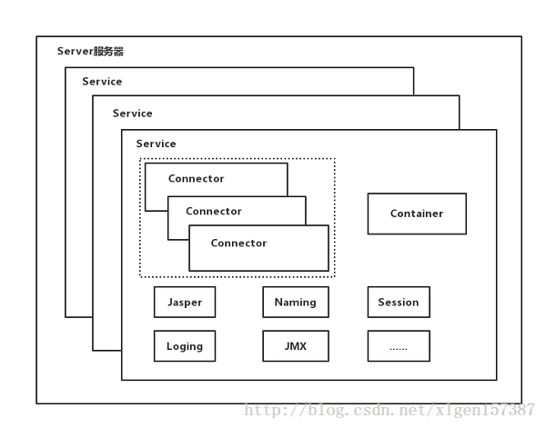

- `Server`： 容器最顶层，代表整个服务器，控制整个 tomcat 的生命周期，可以包含多个 service
  - `Service`： 用于提供服务，包含多个 `Connector` 和一个 `Container`
    - `Connector`： 用于处理连接相关的事情，并提供 Socket 与 Request和 Response 相关的转化
    - `Container`： 用于封装和管理 Servlet，以及具体处理 Request 请求

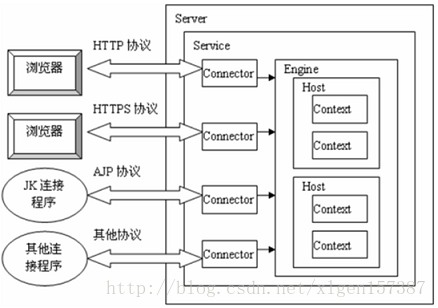

## 2. 请求处理流程

- 请求发送到 Tomcat 后，首先经过 Service 然后会交给 Connector
- Connector 接收请求并将接收的请求封装为 Request和Response，然后再交由 Container 进行处理
- Container 处理完请求之后再返回给 Connector
- 最后由 Connector 通过 Socket 将处理的结果返回给客户端

> 注意： Connector 需要实现 TCP/IP 协议和 HTTP 协议
>
> - Connector 最底层使用 Socket 来连接
> - Request和Response 按照 HTTP 协议来封装

## 3. Connector 架构

- **作用**： Connector 用于接受请求并将请求封装成 Request和Response，然后交给 Container 处理，Container 处理完之后在交给 Connector 返回给客户端

- **架构**： 使用 `ProtocolHandler` 来处理请求，不同的 ProtocolHandler 代表不同的连接类型

  - `Endpoint`： 处理底层 Socket 的网络连接，因此需实现 TCP/IP 协议

    > - `Acceptor` 内部类： 用于监听请求
    > - `Handler` 接口： 用于处理接收到的 Socket，在内部调用 Processor 进行处理
    > - `AsyncTimeout` 内部类： 用于检查异步 Request 的超时

  - `Processor`： 将 Endpoint 接收到的 Socket 封装成 Request，因此需实现 HTTP 协议

  - `Adapter`： 将 Request 交给 Container 进行具体的处理，即将请求适配到 Servlet 容器进行具体处理

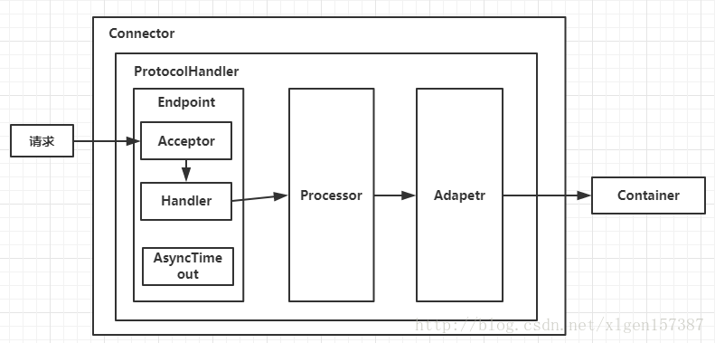

## 4. Container 架构

### 1. 架构介绍

- **作用**： Container 用于封装和管理 Servlet，以及具体处理 Request 请求

- **四个子容器**： 

  - `Engine`：引擎，用来管理多个站点，一个 Service 最多只能有一个 Engine
  - `Host`：代表一个站点，也叫虚拟主机，通过配置 Host 添加站点 
  - `Context`：代表一个应用程序，对应开发的程序，或 WEB-INF 目录及其 web.xml 文件

  - `Wrapper`：每一个 Wrapper 封装着一个Servlet

- **`Context` 和 `Host` 的区别**： 
  - Context 表示一个应用，Tomcat 默认配置为 webapps 下的每个文件夹目录都是一个 Context，其中ROOT 目录中存放着主应用，其他目录存放着子应用
  - 整个 webapps 就是一个 Host 站点

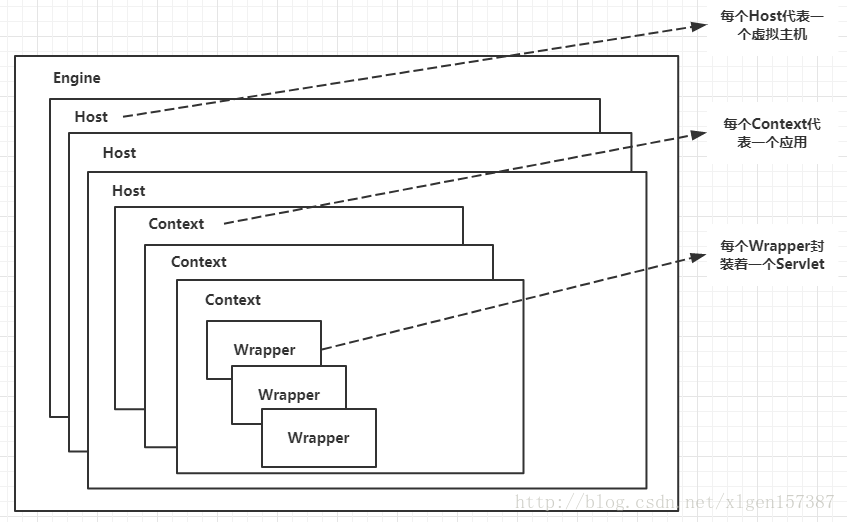

### 2. 处理请求

- Container 使用 `Pipeline-Valve` 管道来处理请求

  > Valve 是阀门之意

- **`Pipeline-Valve`： 责任链模式**，指在请求处理过程中，多个处理者依次对请求进行处理，每个处理者负责相应的处理工作，并将处理后的请求返回，再让下一个处理者继续处理

- **与普通责任链模式的区别**： 

  - 每个 Pipeline 都有特定的 Valve(`BaseValve`)，而且是在管道的最后一个执行，BaseValve 不可删除

  - 上层容器管道的 BaseValve 会调用下层容器的管道

  > 四个子容器对应的 BaseValve分别在：`StandardEngineValve`、`StandardHostValve`、`StandardContextValve`、`StandardWrapperValve` 

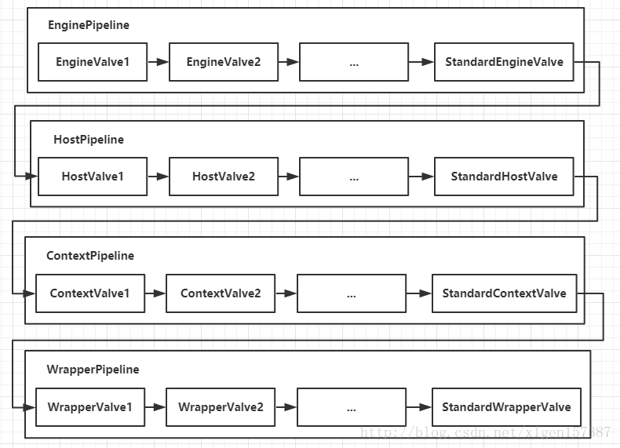

**执行流程**： 

- Connector 接收到请求后，首先调用最顶层容器的 Pipeline 处理，即 `EnginePipeline`（Engine 的管道）

- `EnginePipeline` 会依次执行 EngineValve1、EngineValve2，最后执行 `StandardEngineValve` 调用 Host管道

- 然后再依次执行 `HostPipeline` 的 HostValve1、HostValve2，最后执行 `StandardHostValve` 调用 Context 管道

- 然后再依次调用 Context 管道和 Wrapper 管道，最后执行到 StandardWrapperValve

- 执行 StandardWrapperValve 时，会在 StandardWrapperValve 中创建 `FilterChain`，并调用其 `doFilter` 方法来处理请求

  > `FilterChain`： 包含配置的与请求相匹配的 `Filter和Servlet`
  >
  > `doFilter` 方法： 依次调用所有 Filter 的 doFilter 方法和 Servlet 的 service 方法，来处理请求

- 所有 Pipeline-Valve 执行完并处理完具体请求后，将结果返回给 Connector，Connector 再通过 Socket 方式将结果返回给客户端

**Tomcat 主要类的启动时序图**： 

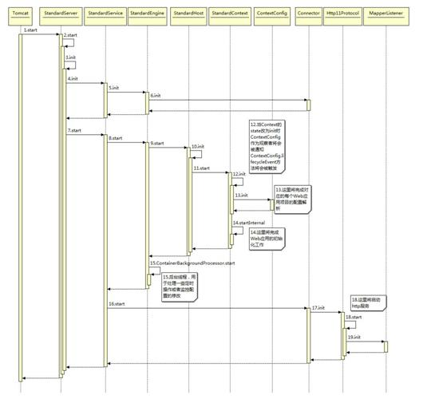

# 二、server.xml 配置文件

```xml
<?xml version="1.0" encoding="UTF-8"?>
<!-- 表示在 8005 端口监听“SHUTDOWN”命令 -->
<Server port="8005" shutdown="SHUTDOWN">
    <!-- Tomcat启动时,记录 Tomcat、Java和操作系统的信息 -->
  	<Listener className="org.apache.catalina.startup.VersionLoggerListener" />
    <!-- 
		Tomcat启动时,检查 APR 库，如果存在则加载 
		Apache Portable Runtime: 是Apache可移植运行库，实现高可扩展性、高性能，
								 以及与本地服务器技术更好的集成
	-->
  	<Listener className="org.apache.catalina.core.AprLifecycleListener" 
              SSLEngine="on" />
    <!-- 
		Web 应用启动前初始化Jasper
		Jasper是JSP引擎，把 JSP 文件解析成 java 文件，然后编译成 class 文件供JVM使用 
	-->
    <listener className="org.apache.catalina.core.JasperListener"/>
    <!-- 与类加载器导致的内存泄露有关 -->
  	<Listener className="org.apache.catalina.core.JreMemoryLeakPreventionListener"/>
    <!-- 定义全局 JNDI 资源 -->
  	<Listener className=
              "org.apache.catalina.mbeans.GlobalResourcesLifecycleListener"/>
    <!-- 
		Web 应用因 thread-local导致内存泄露而停止时，该监听器会触发线程池中线程的更新
		当线程执行完任务被收回线程池时，活跃线程会一个一个的更新
		当Web应用(即Context元素)的renewThreadsWhenStoppingContext 属性为true，该监听器才有效
	-->
  	<Listener className=
              "org.apache.catalina.core.ThreadLocalLeakPreventionListener"/>
    <!-- 定义全局资源 -->
    <GlobalNamingResources>
    	<Resource name="UserDatabase" 
                auth="Container"
              	type="org.apache.catalina.UserDatabase"
              	description="User database that can be updated and saved"
              	factory="org.apache.catalina.users.MemoryUserDatabaseFactory"
              	pathname="conf/tomcat-users.xml" /><!--读取 tomcat-users.xml 文件实现-->
  	</GlobalNamingResources>
  
    <Service name="Catalina">
        <!-- 连接器：
 				代表外部客户端发送请求到特定 Service 的接口
				也是外部客户端从特定 Service 接收响应的接口
		-->
        <!-- 通过 8080 端口号使用 http 协议访问 Tomcat -->
        <!-- redirectPort: 表示强制要求 https 而请求是 http 时，重定向端口号 8443 -->
    	<Connector port="8080" protocol="HTTP/1.1"
               	   connectionTimeout="20000"
               	   redirectPort="8443" URIEncoding="UTF-8" />
        <!-- 通过 8009 端口号使用 AJP 协议访问 Tomcat -->
        <!-- AJP 协议负责和其他 HTTP 服务器建立连接，即用于 Tomcat 与其他 HTTP 服务器集成 -->
    	<Connector port="8009" protocol="AJP/1.3" 
                   redirectPort="8443" 
                   URIEncoding="UTF-8"/>
        <!-- Container 部分 -->
        <!--
			name 属性: 用于日志和错误信息，整个 Server 中唯一
			defaultHost属性: 指定默认 host 名称，当发往本机的请求指定的 host 名称不存在时，
							使用 defaultHost 指定的 host 进行处理
							因此 defaultHost 的值与 Engine 中的一个 Host 的name属性值匹配
		-->
    	<Engine name="Catalina" defaultHost="localhost">
            <!-- Realm 提供一种用户密码与 web 应用的映射关系，从而达到角色安全管理的作用 -->
      		<Realm className="org.apache.catalina.realm.LockOutRealm">
            <!-- 
				Realm 的配置使用 name 为 UserDatabase 的资源实现 
				该资源在 Server 元素中使用 GlobalNamingResources 配置
			-->
        	<Realm className="org.apache.catalina.realm.UserDatabaseRealm"
               	   resourceName="UserDatabase"/>
      		</Realm>
      		<Host name="localhost" appBase="webapps"
            	  unpackWARs="true" autoDeploy="true">
                <!-- 
					className：规定 Valve 的类型，是最重要的属性
 					directory：指定日志存储的位置
					prefix：指定日志文件的前缀
					suffix：指定日志文件的后缀 
					pattern：指定记录日志的格式
				-->
        		<Valve className="org.apache.catalina.valves.AccessLogValve" 
               		   directory="logs"
              		   prefix="localhost_access_log" suffix=".txt"
               		   pattern="%h %l %u %t &quot;%r&quot; %s %b" />
      		</Host>
    	</Engine>
  	</Service>
</Server>
```

**pattern 的日志格式**：

- `%h`：远程主机名或IP地址，若有 Nginx 等反向代理服务器进行请求分发，则代表 Nginx，否则代表客户端
- `%l`：远程逻辑用户名，一律是 `-`，可以忽略
- `%u`：授权的远程用户名，如果没有，则是 `-` 
- `%t`：访问的时间
- `%r`：请求的第一行，即请求方法(get/post等)、uri、及协议
- `%s`：响应状态，200,404 等等
- `%b`：响应的数据量，不包括请求头，如果为0，则是 `-` 

**server.xml 文件对应的图解**： 

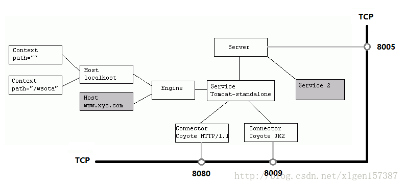

Tomcat 与其他 HTTP 服务器集成原因： `AJP 协议` 负责 Tomcat 和 Apache 的连接

- Tomcat 可用作 Servlet/JSP 容器，但对静态资源的处理速度较慢，不如 Apache 和 IIS 等HTTP服务器

- 将 Tomcat 与 Apache 等集成，前者作 Servlet 容器，后者处理静态资源

  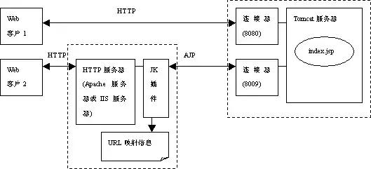

# 三、tomcat 类加载机制

## 1. 现行版本

- **[图解Tomcat类加载机制](https://www.cnblogs.com/xing901022/p/4574961.html)**


- **Bootstrap 引导类加载器**： 加载 JVM 启动所需的类，以及标准扩展类(位于 `jre/lib/ext`)

- **System 系统类加载器**： 加载 tomcat 启动的类，在 `catalina.bat或catalina.sh` 中指定(位于 `CATALINA_HOME/bin`)，比如 bootstrap.jar

- **Common 通用类加载器**： 加载 tomcat 使用以及应用通用的类(位于 `CATALINA_HOME/lib`)，比如 servlet-api.jar
- **webapp 应用类加载器**： 应用部署后，会创建一个类加载器，加载位于 `WEB-INF/lib`下的 jar 文件中的 class 和 `WEB-INF/classes` 下的class文件

**当应用需要到某个类时，则会按照下面的顺序进行类加载**：

- 使用 bootstrap 引导类加载器加载

- 使用 system 系统类加载器加载

- 使用应用类加载器在 WEB-INF/classes 中加载

- 使用应用类加载器在 WEB-INF/lib 中加载

- 使用 common 类加载器在 CATALINA_HOME/lib 中加载

**src 文件夹中的 class 会优先 jar 包中的 class 加载**： 

- src 文件夹中的 java 及 webContent 中的 JSP 会在 tomcat 启动时，被编译成 class 文件放在 WEB-INF/class

- 外部引用的 jar 包，则相当于放在 WEB-INF/lib 中

## 2. tomcat6.0 之前

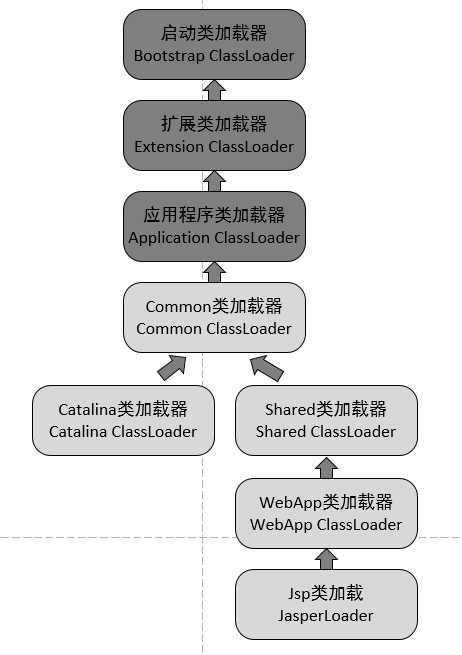


- `CommonClassLoader`：tomcat 最基本的类加载器，加载路径中的 class 可被 tomcat 和各个 webapp 访问

- `CatalinaClassLoader`：tomcat 私有的类加载器，对 webapp 不可见

- `SharedClassLoader`：各个 webapp 共享的类加载器，对 tomcat 不可见

- `WebappClassLoader`：webapp 私有的类加载器，只对当前 webapp 可见

  > 每一个 web 应用程序对应一个 WebappClassLoader

- `JspClassLoader`： 加载当前 webapp 下的 JSP 文件

  > 每一个 jsp 文件对应一个 JspClassLoader

**工作原理**：

- `CommonClassLoader` 加载的类可被 Catalina ClassLoader和SharedClassLoader使用，实现公有类库的共用

- `CatalinaClassLoader和Shared ClassLoader` 加载的类则与对方相互隔离

- `WebAppClassLoader` 可以使用 SharedClassLoader 加载的类，但各 WebAppClassLoader 实例间相互隔离

- `JasperLoader` 加载 JSP 文件编译的 Class 文件，当 Web 容器检测到 JSP 文件被修改时，会替换掉目前的JasperLoader 实例，并建立新的 Jsp 类加载器来实现 JSP 文件的 HotSwap 功能

# 四、tomcat 线程模型

## 1. BIO

- **BIO 模式**：阻塞式 I/O 操作，表示 Tomcat 使用传统 Java I/O 操作（Tomcat7之前）

  > 由于每个请求都要创建一个线程来处理，线程开销大，不能处理高并发的场景，性能最低

## 2. NIO

- **NIO 模式**：是一个基于**缓冲区、非阻塞 I/O 操作**的Java API，比 BIO 有更好的并发运行性能（tomcat8以上）

## 3. APR

- **APR 模式**：从操作系统级别解决异步 IO，大幅提高服务器的处理和响应性能，Tomcat高并发的首选模式

## 4. NIO 详解

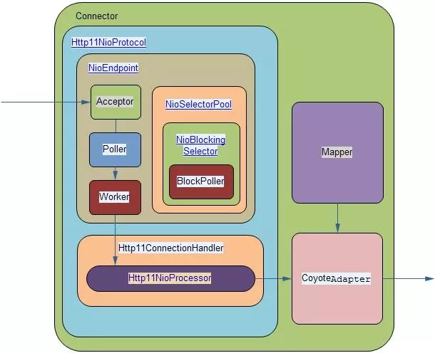

Connector 组件包含三部分：

- `Protocol`
  - `Endpoint`： 负责接收处理socket的主要模块
  - `ConnectionHandler`： 连接处理器
- `Mapper`
- `CoyoteAdapter`

Endpoint 的内部处理流程为：

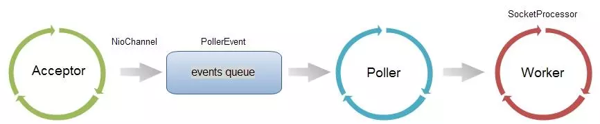


- **Acceptor**： 接收 socket 线程

  > - serverSocket.accept()，并获得 SocketChannel 对象，封装在 tomcat 的实现类 NioChannel 对象中
  > - 然后将 NioChannel 对象封装在一个 PollerEvent 对象中，并将 PollerEvent 对象压入events queue
  > - Acceptor 与 Poller 线程间通过 queue 通信，Acceptor 是生产者，Poller 是消费者

- **Poller**： 维护一个 Selector 对象

  > - connector 中并不止一个 Selector，先把 Poller 线程中维护的 Selector 标为主 Selector
  >
  > - Poller是 NIO 实现的主要线程： 
  >   - 首先从 queue 取出 PollerEvent 对象
  >   - 然后将此对象中的 channel以OP_READ 事件注册到主 Selector 中
  >   - 然后主 Selector 执行 select 操作，遍历出可以读数据的 socket，并从 Worker 线程池中拿到可用的 Worker 线程
  >   - 然后将 socket 传递给 Worker

- **Worker**： 拿到 Poller 传来的 socket 后，将 socket 封装在 SocketProcessor 对象中

  > Worker 线程执行流程： 
  >
  > - 从 socket 读取 http request，解析成 HttpServletRequest 对象，分派到相应的 servlet
  >
  > - 然后将 response 通过 socket 发回 client
  >
  >   > socket 中读写数据： 直接通过 socket 阻塞完成读写，但在 timeout 控制上使用 NIO 的Selector机制，该 Selector 是 BlockPoller 线程中维护的 Selector(辅Selector)

- **NioSelectorPool**： 维护一个 BlockPoller 线程，该线程基于辅 Selector 进行 NIO

# 五、tomcat 性能调优

推荐阅读： **[Tomcat性能调优](https://www.jianshu.com/p/b63d9663b5eb)**

- **提高 JVM 堆内存**： 

  ```shell
  -server 
  -Xms1024m -Xmx1024m #设置虚拟机堆内存大小
  -XX:NewSize=512m -XX:MaxNewSize=512m #设置年轻代大小
  -XX:PermSize=512m -XX:MaxPermSize=512m #设置方法区大小
  -XX:+DisableExplicitGC #屏蔽 System.gc()
  ```

- **增大 tomcat 线程池**： 

  ```xml
  <!-- 根据生产环境设置 maxThreads -->
  <Connector port="8080" address="localhost"    
  		   maxThreads="250" maxHttpHeaderSize="8192"    
  		   emptySessionPath="true" protocol="HTTP/1.1"   
  		   enableLookups="false" redirectPort="8181" acceptCount="100"    
  		   connectionTimeout="20000" disableUploadTimeout="true" /> 
  ```

- **压缩数据文件**： 

  ```xml
  <!--
  	compression: 规定文件大小大于该值，开始压缩
  	compressableMimeType: 规定压缩的文件类型
  -->
  <Connector port="8080" protocol="HTTP/1.1"    
  		   connectionTimeout="20000"    
  		   redirectPort="8181" 
             compression="500"    
  		   compressableMimeType=
             		"text/html,text/xml,text/plain,application/octet-stream" />   
  ```

- **数据库性能调优**：在启动 Tomcat 时默认加载命名查询、确保所有数据库连接正确地关闭

  > 数据库查询被执行期间会降低 tomcat 性能

- **配置 APR**： Tomcat 以 JNI 形式调用 Apache HTTP 服务器的核心动态链接库来处理文件读取或网络传输操作，从而提高 Tomcat 对静态文件的处理性能

# 六、Servlet

推荐阅读： [Servlet 工作原理解析](<https://www.ibm.com/developerworks/cn/java/j-lo-servlet/>) 

## 1. 简介

- Servlet 是用来处理客户端请求并产生动态网页内容的 Java 类
- Servlet 是用来处理或存储 HTML 表单提交的数据，产生动态内容，在无状态的 HTTP 协议下管理状态信息
- Servlet 可以通过 sockets 和 RMI 机制与 applets、数据库或其他软件进行交互

## 2. 体系结构

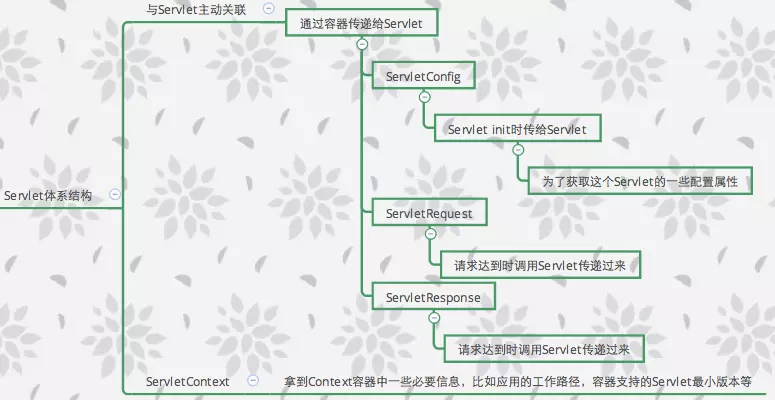

**ServletContext 负责模块间的数据交换，ServletConfig 定制参数集合的描述**

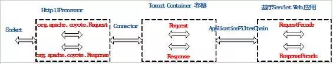

## 3. 工作流程

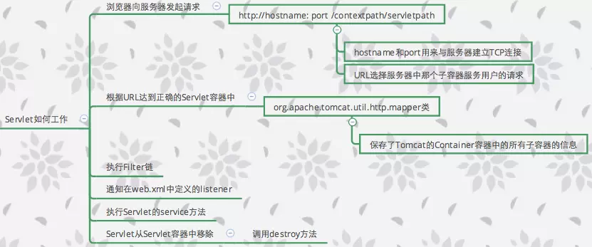

## 4. 生命周期

- Servlet 通过调用 `init ()` 方法进行初始化

  > `init ()` 在第一次创建 Servlet 时被调用且只调用一次

- Servlet 调用 **service()** 方法来处理客户端的请求

  > - `service()` 是执行实际任务的主要方法
  >
  > - Servlet 容器(即 Web 服务器)调用 service() 来处理来自客户端请求，并把格式化的响应写回给客户端
  >
  > - 每次服务器接收到一个 Servlet 请求时，服务器会产生一个新的线程并调用服务
  >
  >   > service() 方法检查 HTTP 请求类型（GET、POST、PUT、DELETE 等），并在适当的时候调用 doGet、doPost、doPut，doDelete 等方法
  >   >
  >   > - `doGet()`： 初期 GET 请求
  >   > - `doPost()`： 处理 POST 请求

- Servlet 通过调用 **destroy()** 方法终止

  > - `destroy()` 在 Servlet 生命周期结束时被调用且只调用一次
  >
  > - `destroy()` 让 Servlet 关闭数据库连接、停止后台线程、把 Cookie 列表或点击计数器写入到磁盘，并执行其他类似的清理活动


# 七、JSP

## 1. 简介

- **JSP(Java Server Pages)**：是一种动态网页开发技术，使用 JSP 标签在 HTML 网页中插入 Java 代码

- JSP 是一种 Java servlet，主要用于实现 Java web 应用程序的用户界面部分

**JSP 处理过程**： 

- 客户端通过浏览器发送 jsp 请求，服务器端接受到请求后，判断是否是第一次请求该页面或该页面是否改变
- 若是，服务器将 jsp 页面翻译为 servlet，jvm 将 servlet 编译为.class文件，字节码文件加载到服务器内存上执行，服务器将处理结果以 .html 页面的形式返回给客户端
- 若该页面不是第一次请求，则省略翻译和编译的步骤，直接执行  

**JSP 优点**： 

- JSP 页面被动态编译成 Servlet，因此，开发者可以很容易的更新展现代码
- JSP 页面可以被预编译
- JSP 页面可以很容易的和静态模板结合，包括：HTML或XML，也很容易的和产生动态内容的代码结合起来
- 开发者可以提供让页面设计者以类XML格式来访问的自定义的JSP标签库
- 开发者可以在组件层做逻辑上的改变，而不需要编辑单独使用了应用层逻辑的页面

## 2. 生命周期

- **编译阶段**： servlet 容器编译 servlet 源文件，生成 servlet 类

  > 编译过程： 
  >
  > - 解析 JSP 文件
  > - 将 JSP 文件转为 servlet
  > - 编译 servlet

- **初始化阶段**：加载与 JSP 对应的 servlet 类，创建其实例，并调用它的初始化方法

  > 容器载入 JSP 文件后，调用 `jspInit()` 方法初始化 JSP

- **执行阶段**：调用与 JSP 对应的 servlet 实例的服务方法

  > 当 JSP 网页完成初始化后，JSP 引擎将会调用 `_jspService()` 方法处理请求

- **销毁阶段**：调用与 JSP 对应的 servlet 实例的销毁方法，然后销毁 servlet 实例

  > `jspDestroy()` 方法在 JSP 中等价于 servlet 中的销毁方法
  >
  > 当您需要执行任何清理工作时复写 jspDestroy() 方法

## 3. 隐式对象

|    对象     | 描述                                                         |
| :---------: | :----------------------------------------------------------- |
|   request   | **HttpServletRequest** 接口的实例                            |
|  response   | **HttpServletResponse** 接口的实例                           |
|     out     | **JspWriter**类的实例，用于把结果输出至网页上                |
|   session   | **HttpSession**类的实例                                      |
| application | **ServletContext**类的实例，与应用上下文有关                 |
|   config    | **ServletConfig**类的实例                                    |
| pageContext | **PageContext**类的实例，提供对JSP页面所有对象以及命名空间的访问 |
|    page     | 类似于Java类中的this关键字                                   |
|  Exception  | **Exception**类的对象，代表发生错误的JSP页面中对应的异常对象 |


