# 一、重构，第一个案例

## 1、起点

**Movie(影片)**：

```java
public class Movie {
    public static final int CHILDRENS = 2;
    public static final int REGULAR = 0;
    public static final int NEW_RELEASE = 1;

    private final String _title;
    private final int _priceCode;

    public Movie(String title, int priceCode) {
        _title = title;
        _priceCode = priceCode;
    }

    public int getPriceCode() {
        return _priceCode;
    }

    public String getTitle() {
        return _title;
    }
}
```

**Rental(租聘)**：

```java
public class Rental {
    private final Movie _movie;
    private final int _daysRented;

    public Rental(Movie movie, int daysRented) {
        _movie = movie;
        _daysRented = daysRented;
    }

    public int getDaysRented() {
        return _daysRented;
    }

    public Movie getMovie() {
        return _movie;
    }
}
```

**Customer(顾客)**：

```java
import java.util.Enumeration;
import java.util.Vector;

public class Customer {
	private String _name; // 姓名
	private Vector _rentals = new Vector(); // 租借记

	public Customer(String name) {
		_name = name;
	};

	public void addRental(Rental arg) {
		_rentals.addElement(arg);
	}

	public String getName() {
		return _name;
	}

	public String statement() {
		double totalAmount = 0; // 总消费金
		int frequentRenterPoints = 0; // 常客积点
		Enumeration rentals = _rentals.elements();
		String result = "Rental Record for " + getName() + "\n";
		while (rentals.hasMoreElements()) {
			double thisAmount = 0;
			Rental each = (Rental) rentals.nextElement(); // 取得一笔租借记
			// determine amounts for each line
			switch (each.getMovie().getPriceCode()) { // 取得影片出租价格
			case Movie.REGULAR: // 普通片
				thisAmount += 2;
				if (each.getDaysRented() > 2)
					thisAmount += (each.getDaysRented() - 2) * 1.5;
				break;
			case Movie.NEW_RELEASE: // 新片
				thisAmount += each.getDaysRented() * 3;
				break;
			case Movie.CHILDRENS: // 儿童
				thisAmount += 1.5;
				if (each.getDaysRented() > 3)
					thisAmount += (each.getDaysRented() - 3) * 1.5;
				break;
			}
			// add frequent renter points （累计常客积点
			frequentRenterPoints++;
			// add bonus for a two day new release rental
			if ((each.getMovie().getPriceCode() == Movie.NEW_RELEASE)
					&& each.getDaysRented() > 1)
				frequentRenterPoints++;
			// show figures for this rental（显示此笔租借记录）
			result += "\t" + each.getMovie().getTitle() + "\t"
					+ String.valueOf(thisAmount) + "\n";
			totalAmount += thisAmount;
		}
		// add footer lines（结尾打印）
		result += "Amount owed is " + String.valueOf(totalAmount) + "\n";
		result += "You earned " + String.valueOf(frequentRenterPoints)
				+ " frequent renter points";
		return result;
	}
}
```

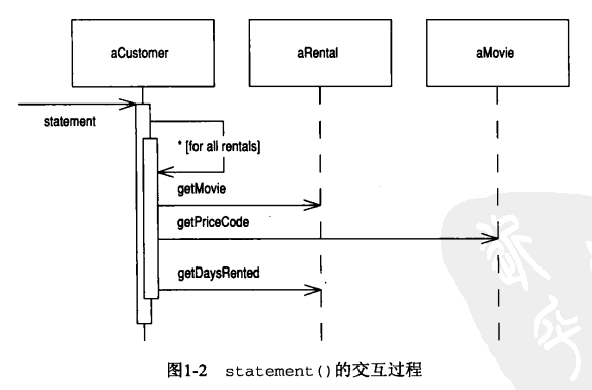

## 2、重构

- **重构第一步**： 为即将修改的代码建立一组可靠的测试环境

### 1. 重构一：分解并重组 statement

- **Movie**：

  ```java
  public class Movie {
  	public static final int CHILDRENS = 2;
  	public static final int REGULAR = 0;
  	public static final int NEW_RELEASE = 1;
  	private String _title;
  	private int _priceCode;
  
  	public Movie(String title, int priceCode) {
  		_title = title;
  		_priceCode = priceCode;
  	}
  	public int getPriceCode() {
  		return _priceCode;
  	}
  	public String getTitle() {
  		return _title;
  	}
  	public void setPriceCode(int priceCode) {
  		_priceCode = priceCode;
  	}
  }
  ```

- **Rental**：

  ```java
  public class Rental {
  	private Movie _movie; // 影片
  	private int _daysRented; // 租期
  
  	public Rental(Movie movie, int daysRented) {
  		_movie = movie;
  		_daysRented = daysRented;
  	}
  
  	public int getDaysRented() {
  		return _daysRented;
  	}
  
  	public Movie getMovie() {
  		return _movie;
  	}
  }
  ```

- Customer：

  ```java
  import java.util.Enumeration;
  import java.util.Vector;
  
  public class Customer {
  	private String _name; // 姓名
  	private Vector _rentals = new Vector(); // 租借记
  
  	public Customer(String name) {
  		_name = name;
  	};
  
  	public void addRental(Rental arg) {
  		_rentals.addElement(arg);
  	}
  
  	public String getName() {
  		return _name;
  	}
  
  	public String statement() {
  		double totalAmount = 0; // 总消费金。
  		int frequentRenterPoints = 0; // 常客积点
  		Enumeration rentals = _rentals.elements();
  		String result = "Rental Record for " + getName() + "\n";
  		while (rentals.hasMoreElements()) {
  			Rental each = (Rental) rentals.nextElement(); // 取得一笔租借记
  			double thisAmount = amountFor(each);
  			// add frequent renter points （累计常客积点
  			frequentRenterPoints++;
  			// add bonus for a two day new release rental
  			if ((each.getMovie().getPriceCode() == Movie.NEW_RELEASE)
  					&& each.getDaysRented() > 1)
  				frequentRenterPoints++;
  			// show figures for this rental（显示此笔租借记录）
  			result += "\t" + each.getMovie().getTitle() + "\t"
  					+ String.valueOf(thisAmount) + "\n";
  			totalAmount += thisAmount;
  		}
  		// add footer lines（结尾打印）
  		result += "Amount owed is " + String.valueOf(totalAmount) + "\n";
  		result += "You earned " + String.valueOf(frequentRenterPoints)
  				+ " frequent renter points";
  		return result;
  	}
  
  	private double amountFor(Rental rental) {
  		double thisAmount = 0; 
  		// determine amounts for each line
  		switch (rental.getMovie().getPriceCode()) { // 取得影片出租价格
  		case Movie.REGULAR: // 普通片
  			thisAmount += 2;
  			if (rental.getDaysRented() > 2)
  				thisAmount += (rental.getDaysRented() - 2) * 1.5;
  			break;
  		case Movie.NEW_RELEASE: // 新片
  			thisAmount += rental.getDaysRented() * 3;
  			break;
  		case Movie.CHILDRENS: // 儿童
  			thisAmount += 1.5;
  			if (rental.getDaysRented() > 3)
  				thisAmount += (rental.getDaysRented() - 3) * 1.5;
  			break;
  		}
  		return thisAmount;
  	}
  }
  ```

---

### 2. 重构二：搬移“金额计算”代码

- **Movie**：

  ```java
  public class Movie {
  	public static final int CHILDRENS = 2;
  	public static final int REGULAR = 0;
  	public static final int NEW_RELEASE = 1;
  	private String _title;
  	private int _priceCode;
  
  	public Movie(String title, int priceCode) {
  		_title = title;
  		_priceCode = priceCode;
  	}
  
  	public int getPriceCode() {
  		return _priceCode;
  	}
  
  	public String getTitle() {
  		return _title;
  	}
  
  	public void setPriceCode(int priceCode) {
  		_priceCode = priceCode;
  	}
  }
  ```

- **Rental**： 

  ```java
  public class Rental {
  	private Movie _movie; // 影片
  	private int _daysRented; // 租期
  
  	public Rental(Movie movie, int daysRented) {
  		_movie = movie;
  		_daysRented = daysRented;
  	}
  
  	public int getDaysRented() {
  		return _daysRented;
  	}
  
  	public Movie getMovie() {
  		return _movie;
  	}
  
  	public double getCharge() {
  		double result = 0;
  		switch (getMovie().getPriceCode()) {
  		case Movie.REGULAR:
  			result += 2;
  			if (getDaysRented() > 2)
  				result += (getDaysRented() - 2) * 1.5;
  			break;
  		case Movie.NEW_RELEASE:
  			result += getDaysRented() * 3;
  			break;
  		case Movie.CHILDRENS:
  			result += 1.5;
  			if (getDaysRented() > 3)
  				result += (getDaysRented() - 3) * 1.5;
  			break;
  		}
  		return result;
  	}
  }
  ```

- **Customer**： 

  ```java
  import java.util.Enumeration;
  import java.util.Vector;
  
  public class Customer {
  	private String _name; // 姓名
  	private Vector _rentals = new Vector(); // 租借记
  
  	public Customer(String name) {
  		_name = name;
  	};
  
  	public void addRental(Rental arg) {
  		_rentals.addElement(arg);
  	}
  
  	public String getName() {
  		return _name;
  	}
  
  	public String statement() {
  		double totalAmount = 0; // 总消费金。
  		int frequentRenterPoints = 0; // 常客积点
  		Enumeration rentals = _rentals.elements();
  		String result = "Rental Record for " + getName() + "\n";
  		while (rentals.hasMoreElements()) {
  			Rental rental = (Rental) rentals.nextElement(); // 取得一笔租借记
  			double thisAmount = rental.getCharge();
  			// add frequent renter points （累计常客积点
  			frequentRenterPoints++;
  			// add bonus for a two day new release rental
  			if ((rental.getMovie().getPriceCode() == Movie.NEW_RELEASE)
  					&& rental.getDaysRented() > 1)
  				frequentRenterPoints++;
  			// show figures for this rental（显示此笔租借记录）
  			result += "\t" + rental.getMovie().getTitle() + "\t"
  					+ String.valueOf(thisAmount) + "\n";
  			totalAmount += thisAmount;
  		}
  		// add footer lines（结尾打印）
  		result += "Amount owed is " + String.valueOf(totalAmount) + "\n";
  		result += "You earned " + String.valueOf(frequentRenterPoints)
  				+ " frequent renter points";
  		return result;
  	}
  }
  ```

---

### 3. 重构三：提炼“常客积分计算”代码

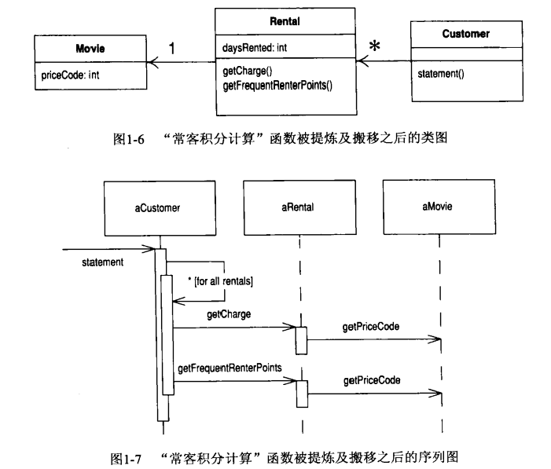

- **Movie**： 

  ```java
  public class Movie {
  	public static final int CHILDRENS = 2;
  	public static final int REGULAR = 0;
  	public static final int NEW_RELEASE = 1;
  	private String _title;
  	private int _priceCode;
  
  	public Movie(String title, int priceCode) {
  		_title = title;
  		_priceCode = priceCode;
  	}
  
  	public int getPriceCode() {
  		return _priceCode;
  	}
  
  	public String getTitle() {
  		return _title;
  	}
  
  	public void setPriceCode(int priceCode) {
  		_priceCode = priceCode;
  	}
  }
  ```

- **Rental**： 

  ```java
  public class Rental {
  	private Movie _movie; // 影片
  	private int _daysRented; // 租期
  
  	public Rental(Movie movie, int daysRented) {
  		_movie = movie;
  		_daysRented = daysRented;
  	}
  
  	public int getDaysRented() {
  		return _daysRented;
  	}
  
  	public Movie getMovie() {
  		return _movie;
  	}
  
  	public double getCharge() {
  		double result = 0;
  		switch (getMovie().getPriceCode()) {
  		case Movie.REGULAR:
  			result += 2;
  			if (getDaysRented() > 2)
  				result += (getDaysRented() - 2) * 1.5;
  			break;
  		case Movie.NEW_RELEASE:
  			result += getDaysRented() * 3;
  			break;
  		case Movie.CHILDRENS:
  			result += 1.5;
  			if (getDaysRented() > 3)
  				result += (getDaysRented() - 3) * 1.5;
  			break;
  		}
  		return result;
  	}
  
  	public int getFrequentRenterPoints() {
  		if ((getMovie().getPriceCode() == Movie.NEW_RELEASE)
  				&& getDaysRented() > 1)
  			return 2;
  		else
  			return 1;
  	}
  }
  ```

- **Customer**： 

  ```java
  import java.util.Enumeration;
  import java.util.Vector;
  
  public class Customer {
  	private String _name; // 姓名
  	private Vector _rentals = new Vector(); // 租借记
  
  	public Customer(String name) {
  		_name = name;
  	};
  
  	public void addRental(Rental arg) {
  		_rentals.addElement(arg);
  	}
  
  	public String getName() {
  		return _name;
  	}
  
  	public String statement() {
  		double totalAmount = 0;
  		int frequentRenterPoints = 0;
  		Enumeration rentals = _rentals.elements();
  		String result = "Rental Record for " + getName() + "\n";
  		while (rentals.hasMoreElements()) {
  			Rental rental = (Rental) rentals.nextElement();
  			frequentRenterPoints += rental.getFrequentRenterPoints();
  			// show figures for this rental
  			result += "\t" + rental.getMovie().getTitle() + "\t"
  					+ String.valueOf(rental.getCharge()) + "\n";
  			totalAmount += rental.getCharge();
  		}
  		// add footer lines
  		result += "Amount owed is " + String.valueOf(totalAmount) + "\n";
  		result += "You earned " + String.valueOf(frequentRenterPoints)
  				+ " frequent renter points";
  		return result;
  	}
  }
  ```

---

### 4. 重构四：去除临时变量 

- **Movie**： 

  ```java
  public class Movie {
  	public static final int CHILDRENS = 2;
  	public static final int REGULAR = 0;
  	public static final int NEW_RELEASE = 1;
  	private String _title;
  	private int _priceCode;
  
  	public Movie(String title, int priceCode) {
  		_title = title;
  		_priceCode = priceCode;
  	}
  
  	public int getPriceCode() {
  		return _priceCode;
  	}
  
  	public String getTitle() {
  		return _title;
  	}
  
  	public void setPriceCode(int priceCode) {
  		_priceCode = priceCode;
  	}
  }
  ```

- **Rental**： 

  ```java
  public class Rental {
  	private Movie _movie; // 影片
  	private int _daysRented; // 租期
  
  	public Rental(Movie movie, int daysRented) {
  		_movie = movie;
  		_daysRented = daysRented;
  	}
  
  	public int getDaysRented() {
  		return _daysRented;
  	}
  
  	public Movie getMovie() {
  		return _movie;
  	}
  
  	public double getCharge() {
  		double result = 0;
  		switch (getMovie().getPriceCode()) {
  		case Movie.REGULAR:
  			result += 2;
  			if (getDaysRented() > 2)
  				result += (getDaysRented() - 2) * 1.5;
  			break;
  		case Movie.NEW_RELEASE:
  			result += getDaysRented() * 3;
  			break;
  		case Movie.CHILDRENS:
  			result += 1.5;
  			if (getDaysRented() > 3)
  				result += (getDaysRented() - 3) * 1.5;
  			break;
  		}
  		return result;
  	}
  
  	public int getFrequentRenterPoints() {
  		if ((getMovie().getPriceCode() == Movie.NEW_RELEASE)
  				&& getDaysRented() > 1)
  			return 2;
  		else
  			return 1;
  	}
  }
  ```

- **Customer**： 

  ```java
  import java.util.Enumeration;
  import java.util.Vector;
  
  public class Customer {
  	private String _name; // 姓名
  	private Vector _rentals = new Vector(); // 租借记
  
  	public Customer(String name) {
  		_name = name;
  	};
  
  	public void addRental(Rental arg) {
  		_rentals.addElement(arg);
  	}
  
  	public String getName() {
  		return _name;
  	}
  
  	public String statement() {
  		int frequentRenterPoints = 0;
  		Enumeration rentals = _rentals.elements();
  		String result = "Rental Record for " + getName() + "\n";
  		while (rentals.hasMoreElements()) {
  			Rental each = (Rental) rentals.nextElement();
  			frequentRenterPoints += each.getFrequentRenterPoints();
  			// show figures for this rental
  			result += "\t" + each.getMovie().getTitle() + "\t"
  					+ String.valueOf(each.getCharge()) + "\n";
  		}
  		// add footer lines
  		result += "Amount owed is " + String.valueOf(getTotalCharge()) + "\n";
  		result += "You earned " + String.valueOf(frequentRenterPoints)
  				+ " frequent renter points";
  		return result;
  	}
  
  	// 译注：此即所谓query method
  	private double getTotalCharge() {
  		double result = 0;
  		Enumeration rentals = _rentals.elements();
  		while (rentals.hasMoreElements()) {
  			Rental each = (Rental) rentals.nextElement();
  			result += each.getCharge();
  		}
  		return result;
  	}
  }
  ```

---

### 5. 重构五：提炼“总量计算”函数

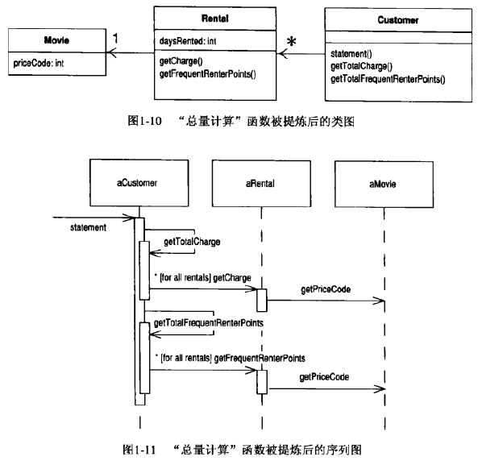

- **Movie**： 

  ```java
  public class Movie {
  	public static final int CHILDRENS = 2;
  	public static final int REGULAR = 0;
  	public static final int NEW_RELEASE = 1;
  	private String _title;
  	private int _priceCode;
  
  	public Movie(String title, int priceCode) {
  		_title = title;
  		_priceCode = priceCode;
  	}
  
  	public int getPriceCode() {
  		return _priceCode;
  	}
  
  	public String getTitle() {
  		return _title;
  	}
  
  	public void setPriceCode(int priceCode) {
  		_priceCode = priceCode;
  	}
  }
  ```

- **Rental**： 

  ```java
  public class Rental {
  	private Movie _movie; // 影片
  	private int _daysRented; // 租期
  
  	public Rental(Movie movie, int daysRented) {
  		_movie = movie;
  		_daysRented = daysRented;
  	}
  
  	public int getDaysRented() {
  		return _daysRented;
  	}
  
  	public Movie getMovie() {
  		return _movie;
  	}
  
  	public double getCharge() {
  		double result = 0;
  		switch (getMovie().getPriceCode()) {
  		case Movie.REGULAR:
  			result += 2;
  			if (getDaysRented() > 2)
  				result += (getDaysRented() - 2) * 1.5;
  			break;
  		case Movie.NEW_RELEASE:
  			result += getDaysRented() * 3;
  			break;
  		case Movie.CHILDRENS:
  			result += 1.5;
  			if (getDaysRented() > 3)
  				result += (getDaysRented() - 3) * 1.5;
  			break;
  		}
  		return result;
  	}
  
  	public int getFrequentRenterPoints() {
  		if ((getMovie().getPriceCode() == Movie.NEW_RELEASE)
  				&& getDaysRented() > 1)
  			return 2;
  		else
  			return 1;
  	}
  }
  ```

- **Customer**： 

  ```java
  import java.util.Enumeration;
  import java.util.Vector;
  
  public class Customer {
  	private String _name; // 姓名
  	private Vector _rentals = new Vector(); // 租借记
  
  	public Customer(String name) {
  		_name = name;
  	};
  
  	public void addRental(Rental arg) {
  		_rentals.addElement(arg);
  	}
  
  	public String getName() {
  		return _name;
  	}
  
  	public String statement() {
  		int frequentRenterPoints = 0;
  		Enumeration rentals = _rentals.elements();
  		String result = "Rental Record for " + getName() + "\n";
  		while (rentals.hasMoreElements()) {
  			Rental each = (Rental) rentals.nextElement();
  			frequentRenterPoints += each.getFrequentRenterPoints();
  			// show figures for this rental
  			result += "\t" + each.getMovie().getTitle() + "\t"
  					+ String.valueOf(each.getCharge()) + "\n";
  		}
  		// add footer lines
  		result += "Amount owed is " + String.valueOf(getTotalCharge()) + "\n";
  		result += "You earned " + String.valueOf(getTotalFrequentRenterPoints())
  				+ " frequent renter points";
  		return result;
  	}
  
  	// 译注：此即所谓query method
  	private int getTotalFrequentRenterPoints() {
  		int result = 0;
  		Enumeration rentals = _rentals.elements();
  		while (rentals.hasMoreElements()) {
  			Rental each = (Rental) rentals.nextElement();
  			result += each.getFrequentRenterPoints();
  		}
  		return result;
  	}
  
  	// 译注：此即所谓query method
  	private double getTotalCharge() {
  		double result = 0;
  		Enumeration rentals = _rentals.elements();
  		while (rentals.hasMoreElements()) {
  			Rental each = (Rental) rentals.nextElement();
  			result += each.getCharge();
  		}
  		return result;
  	}
  }
  ```

---

### 6. 重构六：运用多态取代与价格相关的条件逻辑 

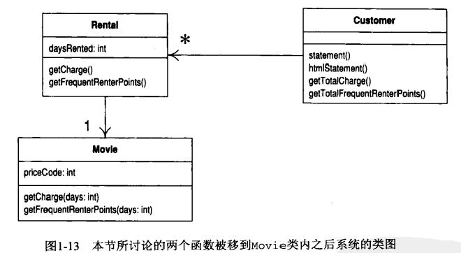

- **Movie**： 

  ```java
  public class Movie {
  	public static final int CHILDRENS = 2;
  	public static final int REGULAR = 0;
  	public static final int NEW_RELEASE = 1;
  	private String _title;
  	private int _priceCode;
  
  	public Movie(String title, int priceCode) {
  		_title = title;
  		_priceCode = priceCode;
  	}
  
  	public int getPriceCode() {
  		return _priceCode;
  	}
  
  	public String getTitle() {
  		return _title;
  	}
  
  	public void setPriceCode(int priceCode) {
  		_priceCode = priceCode;
  	}
  
  	public double getCharge(int daysRented) {
  		double result = 0;
  		switch (getPriceCode()) {
  		case Movie.REGULAR:
  			result += 2;
  			if (daysRented > 2)
  				result += (daysRented - 2) * 1.5;
  			break;
  		case Movie.NEW_RELEASE:
  			result += daysRented * 3;
  			break;
  		case Movie.CHILDRENS:
  			result += 1.5;
  			if (daysRented > 3)
  				result += (daysRented - 3) * 1.5;
  			break;
  		}
  		return result;
  	}
  
  	public int getFrequentRenterPoints(int daysRented) {
  		if ((getPriceCode() == Movie.NEW_RELEASE) && daysRented > 1)
  			return 2;
  		else
  			return 1;
  	}
  }
  ```

- **Rental**： 

  ```java
  public class Rental {
  	private Movie _movie; // 影片
  	private int _daysRented; // 租期
  
  	public Rental(Movie movie, int daysRented) {
  		_movie = movie;
  		_daysRented = daysRented;
  	}
  
  	public int getDaysRented() {
  		return _daysRented;
  	}
  
  	public Movie getMovie() {
  		return _movie;
  	}
  
  	double getCharge() {
  		return _movie.getCharge(_daysRented);
  	}
  
  	public int getFrequentRenterPoints() {
  		return _movie.getFrequentRenterPoints(_daysRented);
  	}
  }
  ```

- **Customer**： 

  ```java
  import java.util.Enumeration;
  import java.util.Vector;
  
  public class Customer {
  	private String _name; // 姓名
  	private Vector _rentals = new Vector(); // 租借记
  
  	public Customer(String name) {
  		_name = name;
  	};
  
  	public void addRental(Rental arg) {
  		_rentals.addElement(arg);
  	}
  
  	public String getName() {
  		return _name;
  	}
  
  	public String statement() {
  		int frequentRenterPoints = 0;
  		Enumeration rentals = _rentals.elements();
  		String result = "Rental Record for " + getName() + "\n";
  		while (rentals.hasMoreElements()) {
  			Rental each = (Rental) rentals.nextElement();
  			frequentRenterPoints += each.getFrequentRenterPoints();
  			// show figures for this rental
  			result += "\t" + each.getMovie().getTitle() + "\t"
  					+ String.valueOf(each.getCharge()) + "\n";
  		}
  		// add footer lines
  		result += "Amount owed is " + String.valueOf(getTotalCharge()) + "\n";
  		result += "You earned " + String.valueOf(getTotalFrequentRenterPoints())
  				+ " frequent renter points";
  		return result;
  	}
  
  	public String htmlStatement() {
  		Enumeration rentals = _rentals.elements();
  		String result = "<H1>Rentals for <EM>" + getName() + "</EM></ H1><P>\n";
  		while (rentals.hasMoreElements()) {
  			Rental each = (Rental) rentals.nextElement();
  			// show figures for each rental
  			result += each.getMovie().getTitle() + ": "
  					+ String.valueOf(each.getCharge()) + "<BR>\n";
  		}
  		// add footer lines
  		result += "<P>You owe <EM>" + String.valueOf(getTotalCharge())
  				+ "</EM><P>\n";
  		result += "On this rental you earned <EM>"
  				+ String.valueOf(getTotalFrequentRenterPoints())
  				+ "</EM> frequent renter points<P>";
  		return result;
  	}
  
  	// 译注：此即所谓query method
  	private int getTotalFrequentRenterPoints() {
  		int result = 0;
  		Enumeration rentals = _rentals.elements();
  		while (rentals.hasMoreElements()) {
  			Rental each = (Rental) rentals.nextElement();
  			result += each.getFrequentRenterPoints();
  		}
  		return result;
  	}
  
  	// 译注：此即所谓query method
  	private double getTotalCharge() {
  		double result = 0;
  		Enumeration rentals = _rentals.elements();
  		while (rentals.hasMoreElements()) {
  			Rental each = (Rental) rentals.nextElement();
  			result += each.getCharge();
  		}
  		return result;
  	}
  }
  ```

---

### 7. 重构七：继承

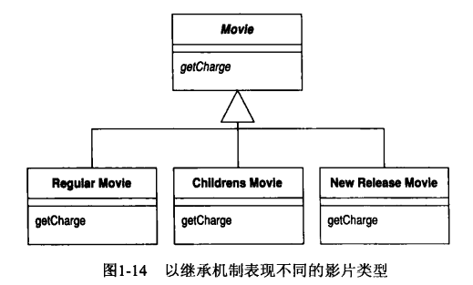

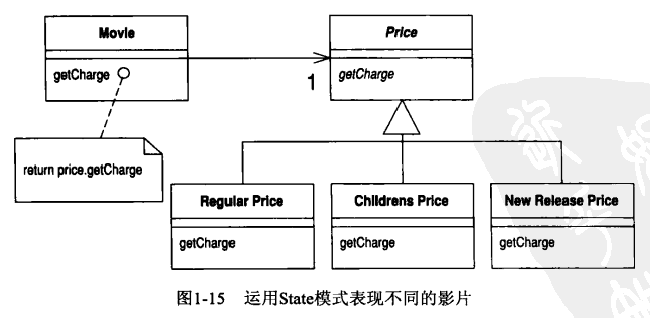

- **Movie**： 

  ```java
  public class Movie {
  	public static final int CHILDRENS = 2;
  	public static final int REGULAR = 0;
  	public static final int NEW_RELEASE = 1;
  	private String _title;
  
  	public Movie(String title, int priceCode) {
  		_title = title;
  		setPriceCode(priceCode); // 译注：这就是一个set method
  	}
  
  	private Price _price;
  
  	public int getPriceCode() { // 取得价格代号
  		return _price.getPriceCode();
  	}
  
  	public void setPriceCode(int arg) { // 设定价格代号
  		switch (arg) {
  		case REGULAR:
  			_price = new RegularPrice();
  			break;
  		case CHILDRENS:
  			_price = new ChildrensPrice();
  			break;
  		case NEW_RELEASE:
  			_price = new NewReleasePrice();
  			break;
  		default:
  			throw new IllegalArgumentException("Incorrect Price Code");
  		}
  	}
  
  	public String getTitle() {
  		return _title;
  	}
  
  	public double getCharge(int daysRented) {
  		return _price.getCharge(daysRented);
  	}
  
  	public int getFrequentRenterPoints(int daysRented) {
  		return _price.getFrequentRenterPoints(daysRented);
  	}
  }
  ```

- **Price**：

  ```java
  public abstract class Price {
  	abstract int getPriceCode(); // 取得价格代号
  
  	abstract double getCharge(int daysRented);
  	
  	public int getFrequentRenterPoints(int daysRented){
          return 1;
      }
  }
  ```

- **RegularPrice**：

  ```java
  public class RegularPrice extends Price {
  	int getPriceCode() {
  		return Movie.REGULAR;
  	}
  
  	public double getCharge(int daysRented) {
  		double result = 2;
  		if (daysRented > 2)
  			result += (daysRented - 2) * 1.5;
  		return result;
  	}
  }
  ```

- **ChildrenPrice**：

  ```java
  public class ChildrensPrice extends Price {
  	int getPriceCode() {
  		return Movie.CHILDRENS;
  	}
  
  	public double getCharge(int daysRented) {
  		double result = 1.5;
  		if (daysRented > 3)
  			result += (daysRented - 3) * 1.5;
  		return result;
  	}
  }
  ```

- **NewReleasePrice**：

  ```java
  public class NewReleasePrice extends Price {
  	int getPriceCode() {
  		return Movie.NEW_RELEASE;
  	}
  
  	public double getCharge(int daysRented) {
  		return daysRented * 3;
  	}
  
  	public int getFrequentRenterPoints(int daysRented) {
  		return (daysRented > 1) ? 2 : 1;
  	}
  }
  ```

- **Rental**：

  ```java
  public class Rental {
  	private Movie _movie; // 影片
  	private int _daysRented; // 租期
  
  	public Rental(Movie movie, int daysRented) {
  		_movie = movie;
  		_daysRented = daysRented;
  	}
  
  	public int getDaysRented() {
  		return _daysRented;
  	}
  
  	public Movie getMovie() {
  		return _movie;
  	}
  
  	double getCharge() {
  		return _movie.getCharge(_daysRented);
  	}
  
  	public int getFrequentRenterPoints() {
  		return _movie.getFrequentRenterPoints(_daysRented);
  	}
  }
  ```

- **Customer**： 

  ```java
  import java.util.Enumeration;
  import java.util.Vector;
  
  public class Customer {
  	private String _name; // 姓名
  	private Vector _rentals = new Vector(); // 租借记
  
  	public Customer(String name) {
  		_name = name;
  	};
  
  	public void addRental(Rental arg) {
  		_rentals.addElement(arg);
  	}
  
  	public String getName() {
  		return _name;
  	}
  
  	public String statement() {
  		int frequentRenterPoints = 0;
  		Enumeration rentals = _rentals.elements();
  		String result = "Rental Record for " + getName() + "\n";
  		while (rentals.hasMoreElements()) {
  			Rental each = (Rental) rentals.nextElement();
  			frequentRenterPoints += each.getFrequentRenterPoints();
  			// show figures for this rental
  			result += "\t" + each.getMovie().getTitle() + "\t"
  					+ String.valueOf(each.getCharge()) + "\n";
  		}
  		// add footer lines
  		result += "Amount owed is " + String.valueOf(getTotalCharge()) + "\n";
  		result += "You earned " + String.valueOf(getTotalFrequentRenterPoints())
  				+ " frequent renter points";
  		return result;
  	}
  
  	public String htmlStatement() {
  		Enumeration rentals = _rentals.elements();
  		String result = "<H1>Rentals for <EM>" + getName() + "</EM></ H1><P>\n";
  		while (rentals.hasMoreElements()) {
  			Rental each = (Rental) rentals.nextElement();
  			// show figures for each rental
  			result += each.getMovie().getTitle() + ": "
  					+ String.valueOf(each.getCharge()) + "<BR>\n";
  		}
  		// add footer lines
  		result += "<P>You owe <EM>" + String.valueOf(getTotalCharge())
  				+ "</EM><P>\n";
  		result += "On this rental you earned <EM>"
  				+ String.valueOf(getTotalFrequentRenterPoints())
  				+ "</EM> frequent renter points<P>";
  		return result;
  	}
  
  	// 译注：此即所谓query method
  	private int getTotalFrequentRenterPoints() {
  		int result = 0;
  		Enumeration rentals = _rentals.elements();
  		while (rentals.hasMoreElements()) {
  			Rental each = (Rental) rentals.nextElement();
  			result += each.getFrequentRenterPoints();
  		}
  		return result;
  	}
  
  	// 译注：此即所谓query method
  	private double getTotalCharge() {
  		double result = 0;
  		Enumeration rentals = _rentals.elements();
  		while (rentals.hasMoreElements()) {
  			Rental each = (Rental) rentals.nextElement();
  			result += each.getCharge();
  		}
  		return result;
  	}
  }
  ```

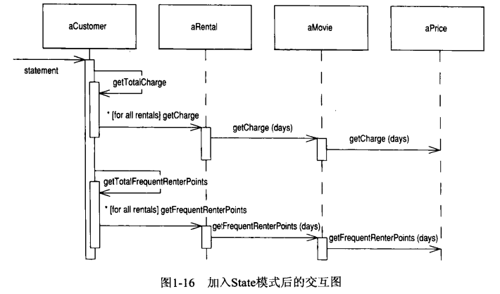

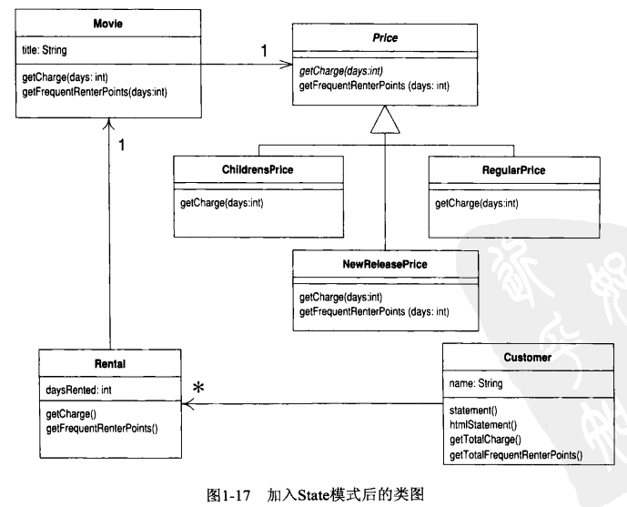

# 二、重构原则

- **何谓重构**： 
  - 名词： 对软件内部结构的一种调整，目的是在不改变软件可观察行为的前提下，提高其可理解性，降低其修改成本
  - 动词： 使用一系列重构手法，在不改变软件可观察行为的前提下，调整期结构

- **为何重构**： 
  - 重构改进软件设计
  - 重构使软件设计更容易理解
  - 重构帮助找到 bug
  - 重构提高编程速度

- **何时重构**： 
  - 三次法则： 
    - 第一次做某件事时，只管去做
    - 第二次做类似的事会产生反感，但无论如何还是可以去做
    - 第三次再做类似的事，你就应该重构
  
  - 添加功能时重构
  - 修补错误时重构
  - 复审代码时重构

- **重构的难题**： 
  - 数据库： 商用程序与数据库结构耦合，且数据迁移漫长而繁琐
  - 修改接口： 保留旧接口，让旧接口调用新接口
  - 难以通过重构手法完成的设计改动： 比如将不考虑安全性需求的系统重构为具备安全性的系统 

# 三、代码的坏味道

- **重复代码(Duplicated Code)**

- **过长函数(Long Method)**

- **过大的类(Large Class)**

- **过长参数列(Long Parameter List)**

- **发散式变化(Divergent Change)**：某个类因为不同的原因在不同的方向上发生变化

  > 如： 新加入一个数据库，就必须修改三个函数

- **散弹式修改(Shotgun Surgery)**： 每遇到某种变化，必须在许多不同的类内做出许多小修改

  > 发散式变化： 一个类受多种变化的影响
  >
  > 散弹式修改： 一种变化引发多个类相应修改

- **依恋情结(Feature Envy)**： 函数对某个类的兴趣高于对自己所处类的兴趣

- **数据泥团(Data Clumps)**： 两个类中相同的字段、许多函数签名中相同的参数

- **基本类型偏执(Primitive Obsession)**： Java 以基本类型表示数值，而以类表示字符串和日期，但其他变成环境则以基本类型表现

  > 结构类型： 允许将数据组织成有意义的形式
  >
  > 基本类型： 是构成结构类型的积木块

- **switch 惊悚现身(Switch Statements)**： 少用 switch 语句，因为 switch 语句的问题在于重复

- **平行继承体系(Parallel InheritanceHierarchies)**： 每当为某个类增加一个子类，必须也为另一个类相应增加一个子类

  > 消除策略： 让一个继承体系的实例引用另一个继承体系的实例

- **冗赘类(Lazy Class)**： 若某些子类没有做足够的工作，则可以精简，甚至删除
- **夸夸其谈未来性(Speculative Generality)**： 专注当下的功能，对于用不上的装置，则移除

- **令人迷惑的暂时字段(Temporary Field)**： 对于临时变量或特定变量，进行提炼封装

- **过度耦合的消息链(Message Chains)**： 

  > 改进： 在消息链的不同位置进行重构

- **中间人(Middle Man)**： 当某个类的接口有一半的函数都委托给其他类，则称为过度委托(中间人)

- **狎昵关系(Inappropriate Intimacy)**： 两个类的 private 成分有亲密联系

  > 改进： 划清界限，提炼共同成分至新的类

- **异曲同工的类(Alternative Classes with Different Interfaces)**： 两个函数做同一件事，却有着不同的签名

- **不完美的库类(Incomplete Library Class)**： 库类往往构造得不够好

- **纯稚的数据类(Data Class)**： 

  > 数据类： 其拥有一些字段，以及用于访问(读写)这些字段的函数

- **被拒绝的馈赠(Refused Bequest)**： 子类复用了超类的实现，却不愿意支持超类的接口

- **过多的注释(Comments)**： 繁杂且糟糕的注释

---

## # 5-12 为重构列表草案

# 五、重构列表

重构记录格式： 

1. **名称**： 建造一个重构词汇表

2. **简短概要**： 简单介绍重构手法的适用情景以及其所作的事情

   > 包含三部分：
   >
   > - 一句话，介绍该重构能够帮助解决的问题
   > - 一段简短陈述，介绍应该做的事
   > - 一幅速写图，简单展现重构前后示例

3. **动机**： 介绍”为什么需要这个重构“和”什么情况下不该使用这个重构“

4. **做法**： 简明扼要地一步一步介绍如何进行此次重构

5. **范例**： 以一个十分简单的例子说明此重构手法如何运作

# 六、重新组织函数

- **提炼函数(Extract Method)**： 有一段代码可以被组织在一起并独立出来，则将一段代码放进独立函数中，并让函数名称解释该函数的用途

  >  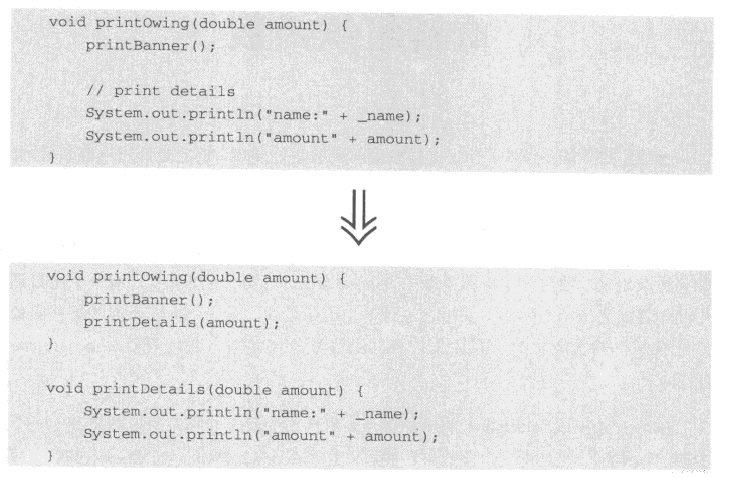
  >
  > - 创造一个新函数，根据函数的意图来命名
  >
  > - 将提炼出的代码从源函数复制到新建的目标函数中
  >
  > - 仔细检查提炼出的代码，看看其中是否引用了”作用域限于源函数“的变量(包括局部变量和源函数参数)
  >
  > - 检查是否有”仅用于被提炼代码段“的临时变量，若有，则在目标函数中将其声明为临时变量
  >
  > - 检查被提炼代码段，看看是否有任何局部变量的值被改变
  >
  >   > 若有临时变量值被修改： 
  >   >
  >   > - 看看是否可以将被提炼代码段处理为一个查询，并将结果复制给相关变量
  >   >
  >   >   > 若难以实现，或被修改的变量不止一个，就不能仅仅提炼
  >   >
  >   > - 不能仅仅提炼，先”分解临时变量“后再提炼，或”以查询替代临时变量“将临时变量消灭
  >
  > - 将被提炼代码段中需要读取的局部变量当作参数传给目标函数
  >
  > - 处理完所有局部变量后，进行编译
  >
  > - 在源函数中，将被提炼代码段替换为对目标函数的调用
  >
  > - 编译，测试

- **内联函数(Inline Method)**： 一个函数的本体与名称同样清楚易懂，则在函数调用点插入函数本体，然后移除该函数

  >  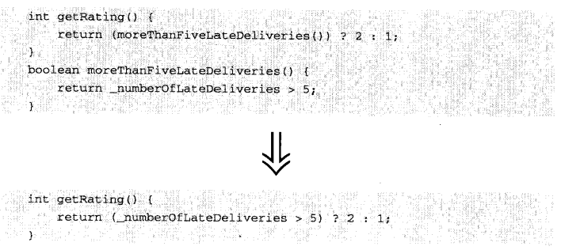
  >
  > - 检查函数，确定其不具多态性
  >
  >   > 若子类继承了该函数，就不要将此函数内联，因为子类无法复写一个根本不存在的函数
  >
  > - 找出这个函数的所有被调用点
  >
  > - 将这个函数的所有被调用点都替换为函数本体
  >
  > - 编译，测试
  >
  > - 杉树该函数的定义

- **内联临时变量(Inline Temp)**： 若有一个临时变量，只被一个简单表达式赋值一次，而其妨碍了其他重构手法，则将所有对该变量的引用动作，替换为对它赋值的那个表达式自身

  >  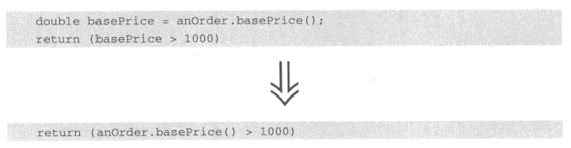
  >
  > - 检查给临时变量赋值的语句，确保等号右边的表达式没有副作用
  >
  > - 若该临时变量并未被声明为 final，则将其声明为 final，然后编译
  >
  >   > 这可以检查该临时变量是否真的只被赋值一次
  >
  > - 找到该临时变量的所有引用点，将其替换为”为临时变量赋值“的表达式
  >
  > - 每次修改后，编译并测试
  >
  > - 修改完所有引用点之后，删除该临时变量的声明和赋值语句
  >
  > - 编译，测试

- **以查询取代临时变量(Replace Temp with Query)**： 你的程序以一个临时变量保存某一表达式的运算结果，则将表达式提炼到一个独立函数中，将该临时变量的所有引用点替换为对新函数的调用，此后，新函数就可被其他函数使用
  
  >  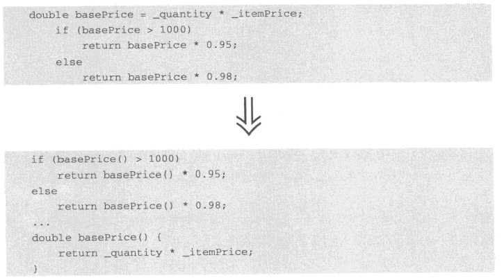
  >
  > - 找出只被赋值一次的临时变量
>
  >   > 若某个临时变量被赋值超过一次，考虑使用“分解临时变量”将其分割成多个变量
  >
  > - 将该临时变量声明为 final
  >
  > - 编译
  >
  >   > 确保该临时变量的确只被赋值一次
  >
  > - 将“对该临时变量赋值”之语句的等号右侧部分提炼到一个独立函数中
  >
  >   > - 首先将函数声明为 private
  >   >
  >   > - 确保提炼出的函数无任何副作用，及该函数不修改任何对象内容
  >   >
  >   >   > 若有副作用，就对其进行“将查询函数和修改函数分离”
  >
  > - 编译，测试
  >
  > - 在该临时变量身上实施“**内联临时变量**”

- **引入解释性变量(Introduce Explaining Variable)**：若有一个复杂的表达式，则将该复杂表达式(或其中一部分)的结果放进一个临时变量，以此变量名称来解释表达式用途

  >  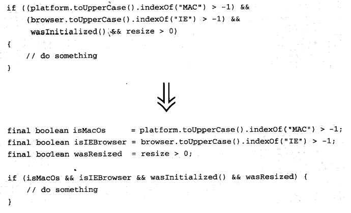
  >
  > - 声明一个 final 临时变量，将待分解之复杂表达式中的一部分动作的运算结果赋值给它
  >
  > - 将表达式中的“运算结果”这部分，替换为上述临时变量
  >
  >   > 若被替换的这部分在代码中重复出现，可以每次一个，逐一替换
  >
  > - 编译，测试
  >
  > - 重复上述过程，处理表达式的其他部分

- **分解临时变量(Split Temporary Variable)**： 若程序有某个临时变量被赋值超过一次，它既不是循环遍历，也不被用于收集计算结果，则针对每次赋值，创造一个独立、对应的临时变量

  >  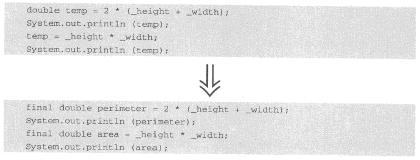
  >
  > - 在待分解临时变量的声明及其第一次被赋值处，修改器名称
  >
  >   > - 结果收集变量： 稍后之赋值语句是 [i = i + 某表达式]形式，不要分解
  >   >
  >   > 结果手机变量的作用： 累加、字符串结合、写入流或向集合添加元素
  >
  > - 将新的临时变量声明为 final
  >
  > - 以该临时变量的第二次赋值动作为界，修改此前对该临时变量的所有引用点，让它们引用新的临时变量
  >
  > - 在第二次赋值处，重新声明原先那个临时变量
  >
  > - 编译，测试
  >
  > - 逐次重复上述过程。每次在声明处对临时变量改名，并修改下次赋值前的引用点

- **移除对参数的赋值(Remove Assignments to Parameters)**： 若代码对一个参数进行赋值，则以一个临时变量取代该参数的位置

  >  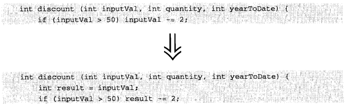
  >
  > - 建立一个临时变量，把待处理的参数值赋予它
  >
  > - 以“对参数的赋值”为界，将其后所有对此参数的引用点，全部替换为“对此临时变量的引用”
  >
  > - 修改赋值语句，使其改为对新建之临时变量赋值
  >
  > - 编译，测试
  >
  >   > - 若代码的语义按引用传递，请在调用端检查调用后是否还使用了该参数
  >   > - 尽量只以 return 方式返回一个值

- **以函数对象取代函数(Replace Method with Method Object)**： 若有一个大型函数，其中对局部变量的使用使你无法采用“提炼函数”；将该函数放进一个单独对象中，则局部变量变为了对象内的字段，然后可以在同一个对象中将该大型函数分解为多个小型函数

  >  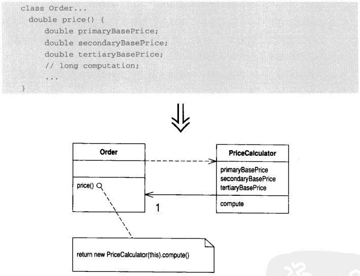
  >
  > - 建立一个新类，根据待处理函数的用途，为该类命名
  >
  > - 在新类中建立一个 final 字段，用以保存原先大型函数所在的对象，该字段称为“源对象”
  >
  >   > 同时，针对原函数的每个临时变量和每个参数，在新类中建立一个对应的字段保存之
  >
  > - 在新类中建立一个构造函数，接收源对象及原函数的所有参数作为参数
  >
  > - 在新类中建立一个 compute 函数
  >
  > - 将原函数的代码复制到 compute 函数中
  >
  >   > 若需要调用源对象的任何函数，请通过源对象字段调用
  >
  > - 编译
  >
  > - 将旧函数的函数本体替换为：“创建上述新类的一个新对象，而后调用其中的 compute 函数”

- **替换算法(Substitute Algorithm)**： 若想把某个算法替换为另一个更清晰的算法，则将函数本体替换为另一个算法

  >  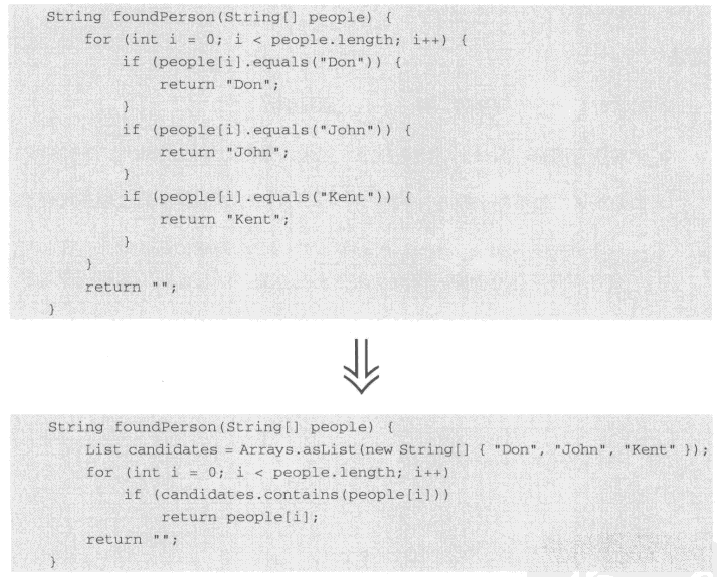
  >
  > - 准备好另一个(替换)算法，让其通过编译
  >
  > - 针对现有测试，执行上述的新算法
  >
  >   - 若结果与原本结果相同，则重构结束
  >
  >   - 若结果不同，则在测试和调试过程中，以旧算法为比较参照标准
  >
  >     > 对每个测试用例，分别以新旧两种算法执行，并观察两者结果是否相同

# 七、在对象间搬移特性

- **搬移函数(Move Method)**： 若程序中，有个函数与其所驻类之外的另一个类进行更多交流，调用后者，或被后者调用，则在该函数最常引用的类中建立一个有着类似行为的新函数，将旧函数变成一个单纯的委托函数，或将旧函数完全移除

  > 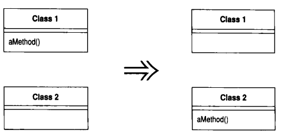
  >
  > - 检查源类中被源函数所使用的一切特性(包括字段和函数)，考虑它们是否也该被搬移
  >
  >   > 若某个特性只被你打算搬移的那个函数用到，就应该将其一并搬移
  >   >
  >   > 若另有其他函数使用了该特性，可以考虑将使用该特性的所有函数全部搬移
  >
  > - 检查源类的子类和超类，看看是否有该函数的其他声明
  >
  >   > 若出现其他声明，或许无法搬移，除非目标类也同样表现出多态性
  >
  > - 在目标类中声明该函数
  >
  >   > 可以为此函数选择一个新名称——对目标类更有意义的名称
  >
  > - 将源函数的代码复制到目标函数中，调整后者，使其能在新家中正常运行
  >
  >   > - 若目标函数使用了源类中的特性，得决定如何从目标函数引用源对象
  >   >
  >   >   若目标类中没有相应的引用机制，就把源对象的引用当作参数，传给新建立的目标函数
  >   >
  >   > - 若源函数包含异常处理，得判断逻辑上应该由哪个类来处理这一异常
  >   >
  >   >   若应该由源类负责，就把异常处理留在原地
  >
  > - 编译目标类
  >
  > - 决定如何从源函数正确引用目标对象
  >
  >   > - 可能会有一个现成的字段或函数帮助取得目标对象
  >   >
  >   > - 若没有，就看能否轻松建立一个这样的函数
  >   >
  >   > - 若还不行，就在源类中新建一个字段来保存目标对象
  >
  > - 修改源函数，使之成为一个纯委托函数
  >
  > - 编译，测试
  >
  > - 决定是否删除源函数，或将其当作一个委托函数保留下来
  >
  >   > 若经常要在源对象中引用目标函数，则将源函数作为委托函数保留会更简单
  >
  > - 若要移除源函数，请将源类中对源函数的所有调用，替换为对目标函数的调用
  >
  >   > 可以每修改一个引用点九编译并测试一次
  >   >
  >   > 也可以通过一次"查找/替换"改掉所有引用点
  >
  > - 编译，测试

- **搬移字段(Move Field)**： 程序中某个字段被其所驻类之外的另一个类更多地用到，则在目标类新建一个字段，修改源字段的所有用户，令它们改用新字段

  > 
  >
  > - 若字段的访问级是 public，使用“**封装字段**”将其封装起来
  >
  >   > 使用“**自封装字段**”：
  >   >
  >   > - 若能移动那些频繁访问该字段的函数
  >   > - 若有许多函数访问某个字段
  >
  > - 编译，测试
  >
  > - 在目标类中建立与源字段相同的字段，并同时建立相应的设值/取值函数
  >
  > - 编译目标类
  >
  > - 决定如何在源对象中引用目标对象
  >
  >   > - 首先看是否有一个现成的字段或函数可以助你得到目标对象： 
  >   >
  >   > - 若没有，就看能否轻易建立这样的函数
  >   > - 若还不行，就得在源类中新建一个字段来存放目标对象
  >
  > - 删除源字段
  >
  > - 将所有对源字段的引用替换为对某个目标函数的调用
  >
  >   > - 若需读取该变量，就把对源字段的引用替换为对目标取值函数的调用
  >   >
  >   >   若要对该变量赋值，就把对源字段的引用替换成对设值函数的调用
  >   >
  >   > - 若源字段不是 private，就必须在源类的所有子类中查找源字段的引用点，并进行相应替换
  >
  > - 编译，测试

- **提炼类(Extract Class)**： 若某个类做了应由两个类做的事，则建立一个新类，将相关字段和函数从旧类搬移到新类

  > 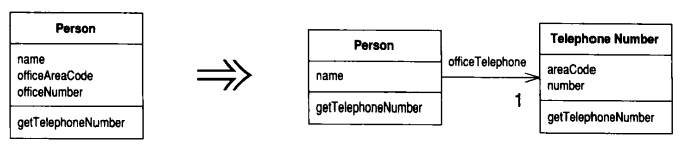
  >
  > - 决定如何分解类所负的责任
  >
  > - 建立一个新类，用以表现出旧类中分离出来的责任
  >
  >   > 若旧类剩下的责任与旧类名称不符，为旧类更名
  >
  > - 建立“从旧类访问新类”的连接关系
  >
  > - 对于想搬移的每一个字段，运用“**搬移字段**”搬移之
  >
  > - 每次搬移后，编译、测试
  >
  > - 使用“搬移函数”将必要函数搬移到新类
  >
  >   > 先搬移较低层函数，再搬移较高层函数
  >
  > - 每次搬移后，编译，测试
  >
  > - 检查，精简每个类的接口
  >
  >   > 若建立起双向连接，检查是否可以将其改为单向连接
  >
  > - 决定是否公开新类
  >
  >   > 若要公开，则决定让其成为引用对象还是不可变的值对象

- **将类内联化(Inline Class)**： 若某个类没有太多事情，则将该类的所有特性搬移到另一个类中，然后移除原类

  > 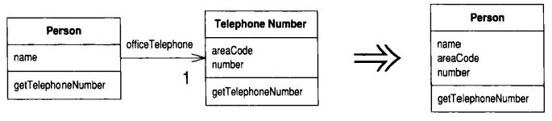
  >
  > - 在目标类身上声明源类的 public 协议，并将其中所有函数委托至源类
  >
  >   > 若“以一个独立接口表示源类函数”个合适的话，就应在内联之前先使用“**提炼接口**”
  >
  > - 修改所有源类引用点，改而引用目标类
  >
  >   > 将源类声明为 private，以斩断包之外的所有引用可能
  >   >
  >   > 同时修改源类的名称，这便可使编译器帮助捕捉到所有对于源类的隐藏引用点
  >
  > - 编译，测试
  >
  > - 运用“**搬移函数**”和“**搬移字段**”，将源类的特性全部搬移到目标类
  >
  > - 为源类举行一个简单的“丧礼”

- **隐藏“委托关系”(Hide Delegate)**： 若客户通过一个委托类来调用另一个对象，则在服务类上建立客户所需的所有函数，用以隐藏委托关系

  > 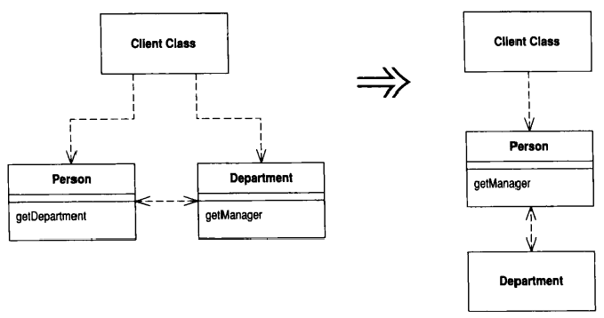
  >
  > - 对于每一个委托关系中的函数，在服务对象端建立一个简单的委托函数
  >
  > - 调整客户，令其只调用服务对象提供的函数
  >
  >   > 若使用者和服务提供者不在同一个包，考虑修改委托函数的访问权限，让客户得以在包外调用它
  >
  > - 每次调整后，编译并测试
  >
  > - 若将来不再有任何客户需要取用下图7-1 的 Delegate(受托类)，便可移除服务对象中的相关访问函数
  >
  > - 编译，测试
  >
  > 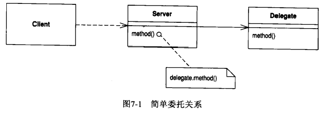

- **移除中间人(Remove Middle Man)**： 若某个类做了过多的简单委托动作，则让客户直接调用受托类

  > 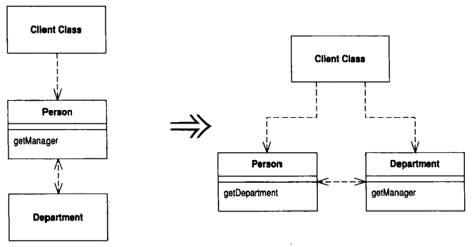
  >
  > - 建立一个函数，用以获得受托对象
  > - 对于每个委托函数，在服务类中删除该函数，并让需要调用该函数的客户转为调用受托对象
  > - 处理每个委托函数后，编译、测试

- **引入外加函数(Introduce Foreign Method)**： 若需要为提供服务的类增加一个函数，当无法修改这个类，则在客户类中建立一个函数，并以第一参数形式传入一个服务类实例

  > 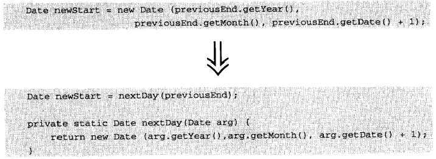
  >
  > - 在客户类中建立一个函数，用来提供你需要的功能
  >
  >   > 这个函数不应该用客户类的任何特性
  >   >
  >   > 若它需要一个值，把该值当作参数传给它
  >
  > - 以服务类实例作为该函数的第一个参数
  >
  > - 将该函数注释为：”外加函数，应在服务类实现“
  >
  >   > 这样，若将来有机会将外加函数搬移到服务类中时，便可以轻松找出这些外加函数

- **引入本地扩展(Introduce Local Extension)**：若需要为服务类提供一些额外函数，但无法修改这个类，则建立一个新类，使其包含这些额外函数，让这个扩展品成为源类的子类或包装类

  > 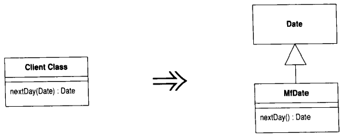
  >
  > - 建立一个扩展类，将其作为原始类的子类或包装类
  >
  > - 在扩展类中加入转型构造函数
  >
  >   > 转型构造函数： 指”接受原对象作为参数的构造函数“
  >   >
  >   > - 若采用子类化方案，则转型构造函数应该调用适当的超类构造函数
  >   > - 若采用包装类方案，则转型构造函数应该将它得到的传入参数以实例变量的形式保存，用作接受委托的原对象
  >
  > - 在扩展类中加入新特性
  >
  > - 根据需要，将原对象替换为扩展对象
  >
  > - 将针对原始类定义的所有外加函数搬移到扩展类中

# 八、重新组织数据

- **自封装字段(Self Encapsulate Field)**： 若直接访问一个字段，但与字段之间的耦合关系逐渐变得笨拙，则为该字段建立取值/设值函数，并且只以这些函数来访问字段

  > 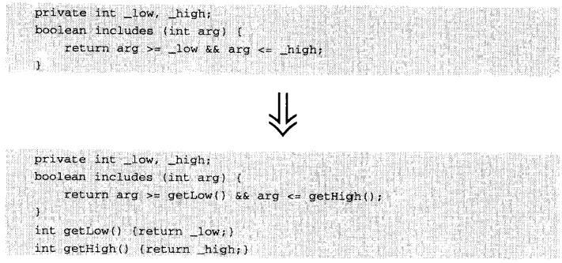
  >
  > - 为待封装字段建立取值/设值函数
  >
  > - 找出该字段的所有引用点，将它们全部改为调用取值/设值函数
  >
  >   > - 若引用点幺读取字段值，就将其替换为调用取值函数
  >   >
  >   >   若引用点幺给字段赋值，就将其替换为调用设值函数
  >   >
  >   > - 可以暂时将该字段改名，让编译器帮助你查找引用点
  >
  > - 将该字段声明为 private
  >
  > - 复查，确保找出所有引用点
  >
  > - 编译，测试

- **以对象取代数据值(Replace Data Value with Object)**： 若有一个数据项，需要与其他数据和行为一起使用才有意义，则将数据项变成对象

  > 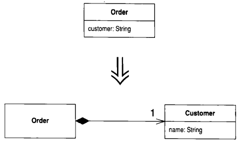
  >
  > - 为待替换数值新建一个类，在其中声明一个 final 字段，其类型和源类中的待替换数值类型一样
  > - 编译
  > - 将源类中的待替换数值字段的类型改为前面新建的类
  > - 修改源类中该字段的取值函数，令它调用新类的取值函数
  > - 若源类构造函数中用到该待替换字段，则就修改构造函数，令其改用新类的构造函数来对字段进行赋值操作
  > - 修改源类中待替换字段的设值函数，令其为新类创建一个实例
  > - 编译，测试
  > - 现在，可能需要对新类使用”将值对象改为引用对象(Change Value to Reference)“

- **将值对象改为引用对象(Change Value to Reference)**：若从一个类衍生出许多彼此相等的实例，希望将它们替换为同一个对象，则将这个值对象变成引用对象

  >  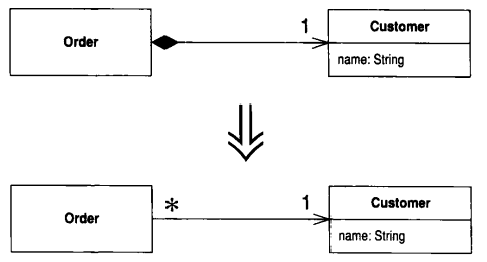
  >
  > - 使用”**以工厂函数取代构造函数(Replace Constructor with Factory Method)**“
  >
  > - 编译，测试
  >
  > - 决定由什么对象负责提供访问新对象的途径
  >
  >   > - 可能是一个静态字典或一个注册表对象
  >   > - 也可以使用多个对象作为新对象的访问点
  >
  > - 决定这些引用对象应该预先创建好，或是应该动态创建
  >
  >   > 若这些引用对象是预先创建好的，且必须从内存中读取，则得确保它们在被需要时能被及时加载
  >
  > - 修改工厂函数，令其返回引用对象
  >
  >   > - 若对象是预先创建好的，需考虑： 万一有人索求一个其实并不存在的对象，要如何处理错误？
  >   > - 希望对工厂函数使用”函数改名(Rename Method)“，使其传达： 它返回的是一个既存对象
  >
  > - 编译，测试

- **将引用对象改为值对象(Change Reference to Value)**： 若有一个引用对象，很小且不可变，而且不易管理，则将它变成一个值对象

  > 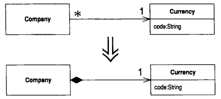
  >
  > - 检查重构目标是否为不可变对象，或是否可修改为不可变对象
  >
  >   > - 若该对象目前不可变，就使用”移除设置函数(Remove Setting Method)“，直到其不可变为止
  >   > - 若无法将对象修改为不可变的，就放弃使用本项重构
  >
  > - 建立 equals() 和 hashCode()
  >
  > - 编译，测试
  >
  > - 考虑是否可以删除工厂函数，并将构造函数声明为 public

- **以对象取代数组(Replace Array with Object)**： 若有一个数组，其中的元素各自代码不同的东西，则以对象替换数组，对于数组中的每个元素，以一个字段来表示

  > 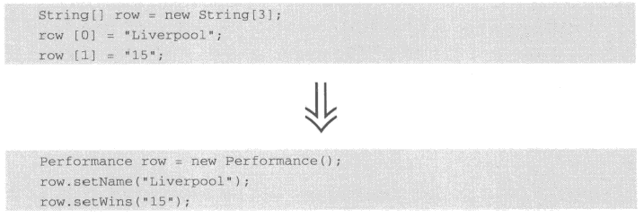
  >
  > - 新建一个类表示数组所拥有的信息，并在其中以一个 public 字段保存原先的数组
  >
  > - 修改数组的所有用户，让它们改用新类的实例
  >
  > - 编译，测试
  >
  > - 逐一为数组元素添加取值/设值函数
  >
  >   > 根据元素用途，为这些访问函数命名
  >   >
  >   > 修改客户端代码，让它们通过访问函数取用数组内的元素
  >   >
  >   > 每次修改后，编译并测试
  >
  > - 当所有对数组的直接访问都转而调用访问函数后，将新类中保存该数组的字段声明为 private
  >
  > - 编译
  >
  > - 对于数组内的每个元素，在新类中创建一个类型相当的字段
  >
  >   > 修改该元素的访问函数，令它改用上述的新建字段
  >
  > - 每修改一个元素，编译并测试
  >
  > - 数组的所有元素都有了相应字段后，删除该数组

- **复制“被监视数据”(Duplicate Observed Data)**： 若有些领域数据置身于 GUI 控件中，而领域含糊需要访问这些数据，则将该数据复制到一个领域对象中，建立一个 Observer 模式，用以同步领域对象和 GUI 对象内的重复数据

  > 
  >
  > - 修改展现类，使其成为领域类的 Observer[GoF]
  >
  >   > - 若尚未有领域类，就建立一个
  >   > - 若没有”从展现类到领域类“的关联，就将领域类保存于展现类的一个字段中
  >
  > - 针对 GUI 类中的领域数据，使用”自封装字段(Self Encapsulate Field)“
  >
  > - 编译，测试
  >
  > - 在事件处理函数中调用设值函数，直接更新 GUI 组件
  >
  >   > - 在事件处理函数中放一个设值函数，利用它将 GUI 组件更新为领域数据的当前值
  >   >
  >   >   > 这样使用设值函数，允许其中的任何动作得以于日后被执行起来
  >   >
  >   > - 进行这个改变时，对于组件，不要使用取值函数，应该直接取用
  >   >
  >   > - 确保测试代码能触发新添加的事件处理机制
  >
  > - 编译，测试
  >
  > - 在领域类中定义数据及其相关访问函数
  >
  >   > - 确保领域类中的设值函数能够触发 Observer 模式的通报机制
  >   > - 对于被观察的数据，在领域类中使用和展现类所用的相同类型来保存
  >
  > - 修改展现类中的访问函数，将它们的操作对象改为领域对象(而非 GUI 组件)
  >
  > - 修改 Observer 的 update()，使其从相应的领域对象中将所需数据复制给 GUI 组件
  >
  > - 编译，测试

- **将单向关联改为双向关联(Change Unidirectional Association to Bidirectional)**： 若两个类都需要使用对方特性，但其间只有一条单向连接，则添加一个反向指针，并使修改函数能同时更新两条连接

  > 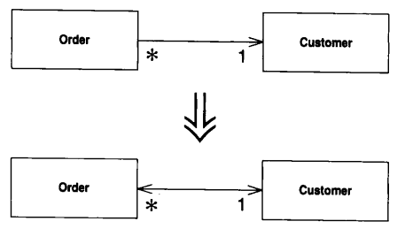
  >
  > - 在被引用类中增加一个字段，用以保存反向指针
  >
  > - 决定由哪个类——引用端还是被引用端——控制关联关系
  >
  > - 在被控端建立一个辅助函数
  >
  >   > 其命名应清楚指出其有限用途
  >
  > - 若既有的修改函数在控制端，让它负责更新反向指针
  >
  > - 若既有的修改函数在被控端，就在控制端建立一个控制函数，并让既有的修改函数调用这个新建的控制函数

- **将双向关联改为单向关联(Change Bidirectional Association to Unidirectional)**： 若两个类之间有双向关联，但其中一个类如今不再需要另一个类的特性，则去除不必要的关联

  > 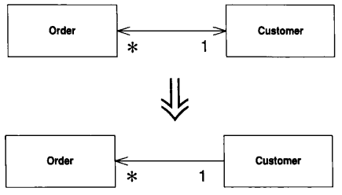
  >
  > - 找出保存”你想去除的指针“的字段，检查其每个用户，判断是否可以去除该指针
  >
  >   > - 不但要检查直接访问点，也要检查调用这些直接访问点的函数
  >   > - 考虑有无可能不通过指针取得被引用对象，若有可能，就可以对取值函数使用”替换算法(Substitute Algorithm)“，从而让客户在没有指针的情况下，也可以使用该取值函数
  >   > - 对于使用该字段的所有函数，考虑将被引用对象作为参数传进去
  >
  > - 若客户使用了取值函数，先运用”自封装字段(Self Encapsulate Field)“将待删除字段自我封装，然后使用”替换算法(Substitute Algorithm)“对付取值函数，令其不再使用该字段。然后编译、测试
  >
  > - 若客户并未使用取值函数，则直接修改待删除字段的所有被引用点： 改以其他途径获得该字段所保存的对象。每次修改后，编译并测试
  >
  > - 若已经没有任何函数使用待删除字段，移除所有对该字段的更新逻辑，然后移除该字段
  >
  >   > 若有许多地方对此字段赋值： 
  >   >
  >   > - 先运用”自封装字段(Self Encapsulate Field)“使这些地点改用同一个设值函数。编译、测试
  >   > - 而后将这个设值函数的本体清空。再编译、测试
  >   >
  >   > 若上述都可行，就将此字段和其设值函数，连同对设值函数的所有调用，全部移除
  >
  > - 编译，测试

- **以字面常量取代魔法数(Replace Magic Number with Symbolic Constant)**： 若有一个字面数值带有特别含义，则创造一个常量，根据其意义为它命名，并将上述的字面数值替换为这个常量

  > 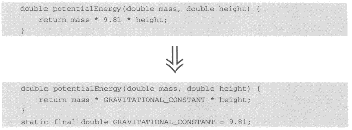
  >
  > - 声明一个常量，令其值为原本的魔法数值
  >
  > - 找出这个魔法数的所有引用点
  >
  > - 检查是否可以使用这个新声明的常量来替换该魔法数；若可以，便以此常量替换之
  >
  > - 编译
  >
  > - 所有魔法数都被替换完毕后，编译并测试
  >
  >   > 测试方法(推荐)：检查现在的程序是否可以被轻松地修改常量值

- **封装字段(Encapsulate Field)**： 若类中存在一个 public 字段，则声明为 private，并提供相应的访问函数

  > 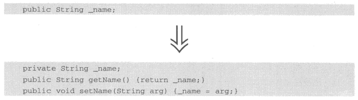
  >
  > - 为 public 字段提供取值/设值函数
  >
  > - 找到这个类以外使用该字段的所有地方
  >
  >   若只是读取该字段，就把引用替换为对取值函数的调用
  >
  >   若修改了该字段值，就将此引用点替换为对设值函数的调用
  >
  >   > - 若该字段是个对象，而客户只是调用该对象的某个函数，则只算读取该字段
  >   >
  >   > - 只有当客户为该字段赋值时，才能将其替换为设值函数
  >
  > - 每次修改后，编译并测试
  >
  > - 将字段的所有用户修改完毕后，把字段声明为 private
  >
  > - 编译，测试

- **封装集合(Encapsulate Collection)**： 若有个函数返回一个集合，则让这个函数返回该集合的一个只读副本，并在这个类中提供添加/移除集合元素的函数

  > 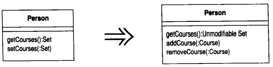
  >
  > - 加入为集合添加/移除元素的函数
  >
  > - 将保存集合的字段初始化为一个空集合
  >
  > - 编译
  >
  > - 找出集合设值函数的所有调用者
  >
  >   可以修改那个设值函数，让它使用上述新建立的”添加/移除元素“函数
  >
  >   可以直接修改调用端，改让它们调用上述新建立的”添加/移除元素“函数
  >
  >   > - 两种情况下，需要用到集合设值函数：
  >   >   1. 集合为空时
  >   >   2. 准备将原有集合替换为另一个集合时
  >   > - 或许会想运用”函数改名(Rename Method)“ 为集合设值函数改名：从 setXxx() 改为 initializeXxx() 或 replaceXxx()
  >
  > - 编译，测试
  >
  > - 找出所有”通过取值函数获得集合并修改其内容“的函数，主意修改这些函数，让它们改用添加/移除函数。每次修改后，编译并测试
  >
  > - 修改完上述所有”通过取值函数获得集合并修改集合内容“的函数后，修改取值函数自身，使其返回该集合的一个只读副本
  >
  > - 编译，测试
  >
  > - 找出取值函数的所有用户，从中找出应该存在于集合所属对象内的代码，运用”提炼函数(Extract Method)“ 和 ”搬移函数(Move Method)“将这些代码移到宿主对象去
  >
  > - 修改现有取值函数的名字，然后添加一个新取值函数，使其返回一个枚举
  >
  >   > 找出旧取值函数的所有被使用点，将它们都改为使用新取值函数
  >
  > - 若这一步跨度太大，可以先使用”函数改名(Rename Method)“修改原取值函数的名称，再建立一个新取值函数用以返回枚举，最后再修改所有调用者，使其调用新取值函数
  >
  > - 编译，测试

- **以数据类取代记录(Replace Record with Data Class)**： 若需要面对传统编程环境中的记录结构，则为该记录创建一个”哑“数据对象

  > - 新建一个类，表示这个记录
  > - 对于记录中的每项数据，在新建的类中建立对应的一个 private 字段，并提供相应的取值/设值函数

- **以类取代类型码(Replace Type Code with Class)**： 若类中有一个数值类型码，但它不影响类的行为，则以一个新的类替换该数值类型码

  > 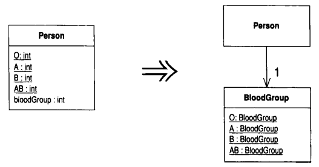
  >
  > - 为类型码建立一个类
  >
  >   > - 该类需要一个用以记录类型码的字段，并应有对应的取值函数
  >   >
  >   > - 还应用一组静态变量保存允许被创建的实例，并以一个静态函数根据原本的类型码返回合适的实例
  >
  > - 修改源类实现，让它使用上述新建的类
  >
  >   > 维持原先以类型码为基础的函数接口，但改变静态字段，以新建的类产生代码
  >   >
  >   > 然后，修改类型码相关函数，让它们也从新建的类中获取类型码
  >
  > - 编译，测试
  >
  >   > 此时，新建的类可以对类型码进行运行期检查
  >
  > - 对于源类中每个使用类型码的函数，相应建立一个函数，让新函数使用新建的类
  >
  >   > - 需要建立”以新类实例为自变量“的函数，用以替换原先”直接以类型码为参数“的函数
  >   >
  >   > - 还需要建立一个”返回新类实例“的函数，用以替换原先”直接返回类型码“的函数
  >   >
  >   > 建立新函数前，可以使用”函数改名(Rename)“修改原函数名称，明确指出哪些函数仍然使用旧式类型码
  >
  > - 逐一修改源类用户，让它们使用新接口
  >
  > - 每修改一个用户，编译并测试
  >
  >   > 可能需一次性修改多个彼此相关的函数，才能保持这些函数间的一致性，才能顺利地编译、测试
  >
  > - 删除使用类型码的旧接口，并删除保存旧类型码的静态变量
  >
  > - 编译，测试

- **以子类取代类型码(Replace Type Code with Subclasses)**： 若有一个不可变的类型码，它会影响类的行为，则以子类取代这个类型码

  > 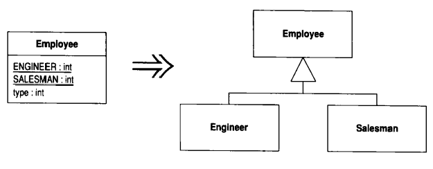
  >
  > - 使用”自封装字段(Self Encapsulate Field)“将类型码自我封装起来
  >
  >   > 若类型码被传递给构造函数，就需要将构造函数换成工厂函数
  >
  > - 为类型码的每个数值建立一个相应的子类，在每个子类中覆写类型码的取值函数，使其返回相应的类型码值
  >
  > - 没建立一个新的子类，编译并测试
  >
  > - 从超类中删掉保存类型码的字段，将类型码访问函数声明为抽象函数
  >
  > - 编译，测试

- **以 State/Strategy 取代类型码(Replace Type Code with State/Strategy)**： 若有一个类型码，其会影响类的行为，但无法通过继承手段消除，则以状态对象取代类型码

  > 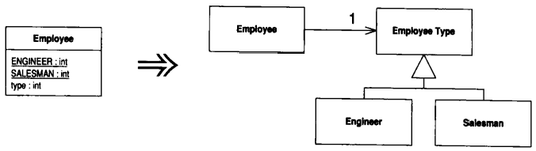
  >
  > - 使用”自封装字段(Self Encapsulate Field)“将类型码自我封装起来
  >
  > - 新建一个类，根据类型码的用途将它命名，这就是一个状态对象
  >
  > - 为新类添加子类，每个子类对应一种类型码
  >
  >   > 比起逐一添加，一次性加入所有必要的子类可能更简单
  >
  > - 在超类中建立一个抽象的查询函数，用以返回类型码；在每个子类中覆写该函数，返回确切的类型码
  >
  > - 编译
  >
  > - 在源类中建立一个字段，用以保存新建的状态对象
  >
  > - 调整源类中负责查询类型码的函数，将查询动作转发给状态对象
  >
  > - 调整源类中为类型码设值的函数，将一个恰当的状态对象子类赋值给”保存状态对象“的那个字段
  >
  > - 编译，测试

- **以字段取代子类(Replace Subclass with Fields)**： 若各个子类的唯一差别只在”返回常量数据“的函数身上，则修改这些函数，使它们返回超类中的某个(新增)字段，然后销毁子类

  > 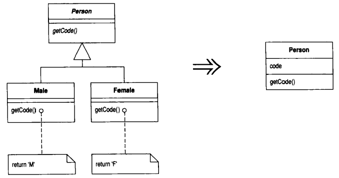
  >
  > - 对所有子类使用”以工厂函数取代构造函数(Replace Constructor with Factory Method)“
  > - 若有任何代码直接引用子类，令它改而引用超类
  > - 针对每个常量函数，在超类中声明一个 final 字段
  > - 为超类声明一个 protected 构造函数，用以初始化这些新增字段
  > - 新建或修改子类构造函数，使它调用超类的新增构造函数
  > - 编译，测试
  > - 在超类中实现所有常量函数，令它们返回相应字段值，然后将该函数从子类中删掉
  > - 没删除一个常量函数，编译并测试
  > - 子类中所有的常量函数都被删除后，使用”内联函数(Inline Method)“将子类构造函数内联到超类的工厂函数中
  > - 编译，测试
  > - 将子类删掉
  > - 编译，测试
  > - 重复”内联构造函数、删除子类“的过程，直到所有子类都被删除

# 九、简化条件表达式

- **分解条件表达式(Decompose Conditional)**： 若有一个复杂的条件(if-then-else)语句，则从 if, then, else 三个段落中分别提炼出独立函数

  > 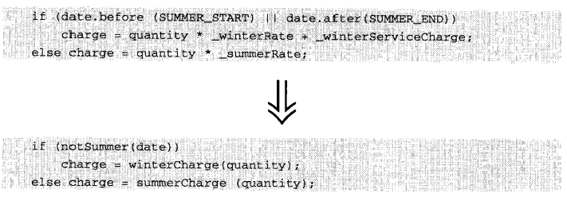
  >
  > - 将 if 段落提炼出来，构成一个独立函数
  > - 将 then 段落和 else 段落都提炼出来，各自构成一个独立函数

- **合并条件表达式(Consolidate Conditional Expression)**： 若有一系列测试，都得到相同结果，则将这些测试合并为一个条件表达式，并将这个条件表达式提炼成为一个独立函数

  > 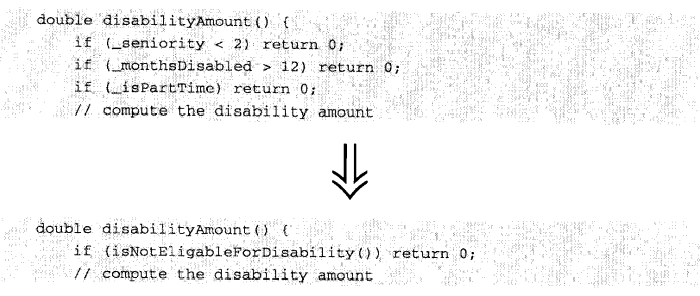
  >
  > - 确定这些条件语句都没有副作用
  >
  >   > 若条件表达式有副作用，就不能使用本项重构
  >
  > - 使用适当的逻辑操作符，将一系列相关条件表达式合并为一个
  >
  > - 编译，测试
  >
  > - 对合并后的条件表达式实施”提炼函数(Extract Method)“

- **合并重复的条件片段(Consolidate Duplicate Conditional Fragments)**： 若在条件表达式的每个分支上有着相同的一段代码，则将这段重复代码搬移到条件表达式之外

  > 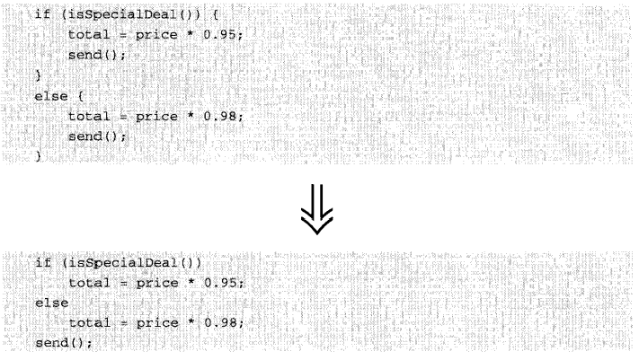
  >
  > - 鉴别出”执行方式不随条件变化而变化“的代码
  > - 若这些共通代码位于条件表达式**起始处**，就将其移到条件表达式之前
  > - 若这些共通代码位于条件表达式**尾端**，就将其移到条件表达式之后
  > - 若这些共通代码位于条件表达式**中段**，就需观察共通代码之前或之后的代码是否改变；若有所改变，应首先将共通代码向前或向后移动，移至条件表达式的起始处或尾端，再以前面所说的办法来处理
  > - 若共通代码不止一条语句，应首先使用”提炼函数(Extract Method)“将共通代码提炼到一个独立函数中，再以前面所说的办法来办理

- **移除控制标记(Remove Control Flag)**： 若在一系列布尔表达式中，某个变量带有”控制标记“的作用，则以 break 语句或 return 语句取代控制标记

  > 对于控制标记的处理，采用 Java 的 break 或 continue：
  >
  > - 找出跳出这段逻辑的控制标记值
  > - 找出对标记变量赋值的语句，代以恰当的 break 或 continue
  > - 每次替换后，编译并测试
  >
  > 对于未能提供 break 或 continue 的编程语言： 
  >
  > - 运用”提炼函数(Extract Method)“将整段逻辑提炼到一个独立函数中
  > - 找出跳出这段逻辑的控制标记值
  > - 找出对标记变量赋值的语句，代以恰当的 return 语句
  > - 每次替换后，编译并测试

- **以卫语句取代嵌套条件表达式(Replace Nested Conditional with Guard Clauses)**： 若函数中的条件逻辑使人难以看清正常的执行路径，则使用卫语句表现所有特殊情况

  > 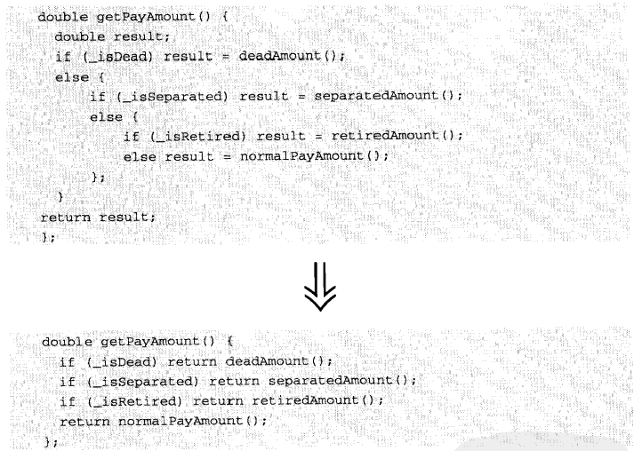
  >
  > - 对于每个检查，放进一个卫语句
  >
  >   > 卫语句要不就从函数中返回，要不就抛出一个异常
  >
  > - 每次将条件检查替换成卫语句后，编译并测试
  >
  >   > 若所有卫语句都导致相同结果，请使用”合并条件表达式(Consolidate Conditional Expressions)“

- **以多态取代条件表达式(Replace Conditional with Polymorphism)**： 若有个条件表达式根据对象类型的不同而选择不同的行为，则将该条件表达式的每个分支放进一个子类内的覆写函数中，然后将原始函数声明为抽象函数

  > 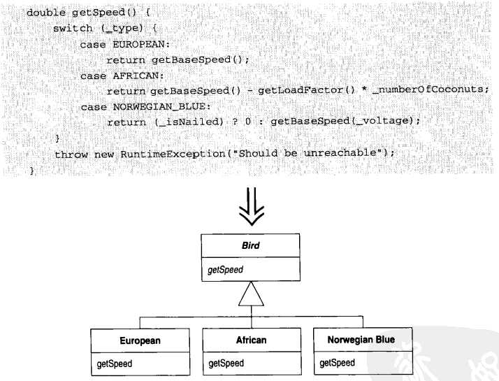
  >
  > - 若要处理的条件表达式是一个更大函数中的一部分，首先对条件表达式进行分析，然后使用”提炼函数(Extract Method)“将它提炼到一个独立函数去
  >
  > - 若有必要，使用”搬移函数(Move Method)“将条件表达式放置到继承结构的顶端
  >
  > - 任选一个子类，在其中建立一个函数，使之覆写超类中容纳条件表达式的那个函数。将与该子类相关的条件表达式分支复制到新建函数中，并对它进行适当调整
  >
  >   > 为顺利进行该步骤，需将超类中的某些 private 字段声明为 protected
  >
  > - 编译，测试
  >
  > - 在超类中删掉条件表达式内被复制了的分支
  >
  > - 编译，测试
  >
  > - 针对条件表达式的每个分支，重复上述过程，直到所有分支都被移到子类内的函数为止
  >
  > - 将超类中容纳条件表达式的函数声明为抽象函数

- **引入 Null 对象(Introduce Null Object)**： 若需要再三检查某对象是否为 null，则将 null 值替换为 null 对象

  > 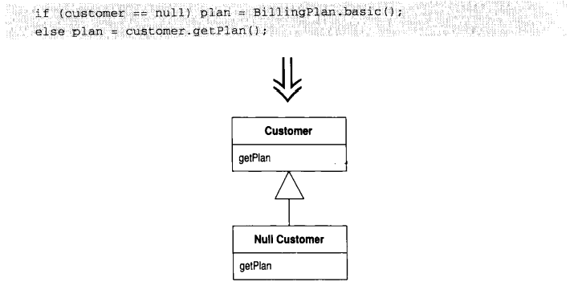
  >
  > - 为源类建立一个子类，使其行为就像是源类的 null 版本。源类和 null 子类中都加上 isNull 函数
  >
  >   前者的 isNull 应该返回 false，后者的 isNull 应该返回 true
  >
  >   > 下述办法可能有所帮助： 
  >   >
  >   > - 建立一个 nullable 接口，将 isNull 函数放在其中，让源类实现该接口
  >   > - 也可以创建一个测试接口，专门用来检查对象是否为 null
  >
  > - 编译 
  >
  > - 找出所有”索求源对象却获得一个 null“的地方。修改这些地方，使它们改而获得一个空对象
  >
  > - 找出所有”将源对象与 null 做比较“的地方。修改这些地方，使它们调用 isNull 函数
  >
  >   > - 可以每次只处理一个源对象及其客户程序，编译并测试后，再处理另一个源对象
  >   > - 可以在”不该再出现 null“的地方放上一些断言，确保 null 的确不再出现
  >
  > - 编译，测试
  >
  > - 找出这样的程序点： 若对象不是 null，做 A 动作，否则做 B 动作
  >
  > - 对于每个上述地点，在 null 类中覆写 A 动作，使其行为和 B 动作相同
  >
  > - 使用上述被覆写动作，然后删除”对象是否等于 null“的条件测试。编译并测试

- **引入断言(Introduce Assertion)**： 若某段代码需要对程序状态做出某种假设，则断言明确表现这种假设

  > 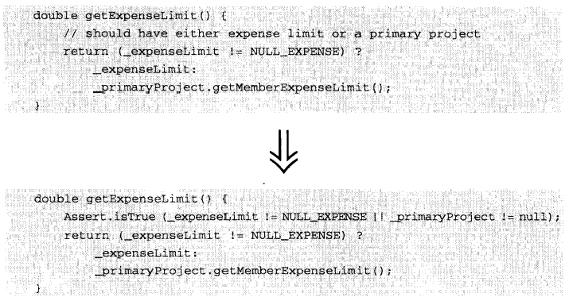
  >
  > - 若发现代码假设某个条件始终为真，就加入一个断言明确说明这种情况
  >
  >   > 可以新建一个 Assert 类，用于处理各种情况下的断言

# 十、简化函数调用

- **函数改名(Rename Method)**： 若函数的名称未能揭示函数的用途，则修改函数名称

  > 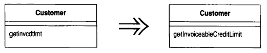
  >
  > - 检查函数签名是否被超类或子类实现过，若是，则需要针对每份实现分别进行下列步骤
  >
  > - 声明一个新函数，将它命名为你想要的新名称，将旧函数的代码复制到新函数中，并进行适当调整
  >
  > - 编译
  >
  > - 修改旧函数，令它将调用转发给新函数
  >
  >   > 若只有少数几个地方引用旧函数，可以大胆跳过该步骤
  >
  > - 编译，测试
  >
  > - 找出旧函数的所有被引用点，修改它们，令它们改而引用新函数。每次修改后，编译并测试
  >
  > - 删除旧函数
  >
  >   > 若旧函数是该类 public 接口的一部分，可能无法删除，因此将它标记为 deprecated(建议不可用)
  >
  > - 编译，测试

- **添加参数(Add Parameter)**： 若某个函数需要从调用端得到更多信息，则为此函数添加一个对象参数，让该对象带进函数所需信息

  > 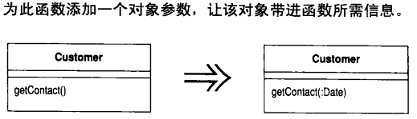
  >
  > - 检查函数签名是否被超类或子类实现过，若是，则需要针对每份实现分别进行下列步骤
  >
  > - 声明一个新函数，名称和原函数相同，只是加上新添参数，将旧函数的代码复制到新函数中
  >
  >   > 若需添加的参数不止一个，则将它们一次性添加进去比较容易
  >
  > - 编译
  >
  > - 修改旧函数，令其调用新函数
  >
  >   > 若只有少数几个地方引用旧函数，可跳过这一步骤
  >
  > - 编译，测试
  >
  > - 找出旧函数的所有引用点，将它们全部修改为对新函数的引用。每次修改后，编译并测试
  >
  > - 删除旧函数
  >
  >   > 若旧函数是该类 public 接口的一部分，可能无法删除，因此将它标记为 deprecated(建议不可用)
  >
  > - 编译，测试

- **移除参数(Remove Parameter)**：若函数本体不再需要某个参数，则将该参数去除

  > 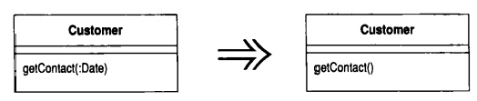
  >
  > - 检查函数签名是否被超类或子类实现过，若是，则需针对每份实现分别进行下列步骤
  >
  > - 声明一个新函数，名称与原函数相同，只是去除不必要的参数，将旧函数的代码复制到新函数中
  >
  >   > 若需要去除的参数不止一个，将它们一次性去除较容易
  >
  > - 编译
  >
  > - 修改旧函数，令它调用新函数
  >
  >   > 若只有少数几个地方引用旧函数，可跳过这一步骤
  >
  > - 编译，测试
  >
  > - 找出旧函数的所有被引用点，将它们全部修改为对新函数的引用。每次修改后，编译并测试
  >
  > - 删除旧函数
  >
  >   > 若旧函数是该类 public 接口的一部分，可能无法删除，因此将它标记为 deprecated(建议不可用)
  >
  > - 编译，测试

- **将查询函数和修改函数分离(Separate Query from Modifier)**：若某个函数既返回对象状态值，又修改对象状态，则建立两个不同的函数，其中一个负责查询，另一个负责修改

  > 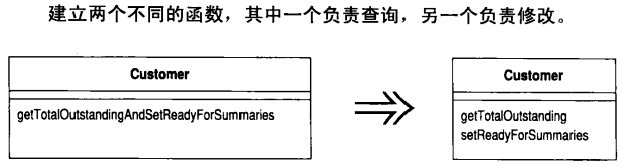
  >
  > - 新建一个查询函数，令它返回的值与原函数相同
  >
  >   > 观察原函数的返回，若返回的是一个临时变量，找出临时变量的位置
  >
  > - 修改原函数，令它调用查询函数，并返回获得的结果
  >
  > - 编译，测试
  >
  > - 将调用原函数的代码改为调用查询函数，然后在调用查询的那一行之前，加上对原函数的调用。每次修改后，编译并测试

- **令函数携带参数(Parameterize Method)**：若若干工作做了类似的工作，但在函数本体中却包含了不同的值，则建立单一函数，以参数表达那些不同的值

  > 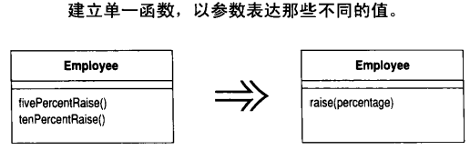
  >
  > - 新建一个带有参数的函数，使其可以替换先前所有的重复性函数
  > - 编译
  > - 将调用旧函数的代码改为调用新函数
  > - 编译，测试
  > - 对所有旧函数重复上述步骤，每次替换后，修改并测试

- **以明确函数取代参数(Replace Parameter with Explicit Methods)**： 若有一个函数，其中完全取决于参数值而采取不同行为，则针对该参数的每个可能值，建立一个独立函数

  > 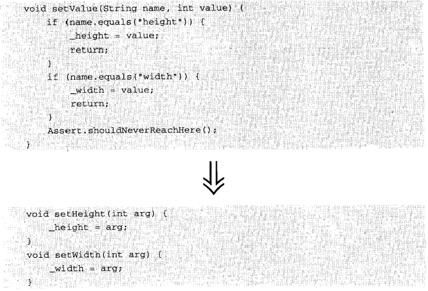
  >
  > - 针对参数的每种可能值，新建一个明确函数
  > - 修改条件表达式的每个分支，使其调用合适的新函数
  > - 修改每个分支后，编译并测试
  > - 修改原函数的每个被调用点，改而调用上述的某个合适的新函数
  > - 编译，测试
  > - 所有调用端都修改完毕后，删除原函数

- **保持对象完整(Preserve Whole Object)**： 若从某个对象中取出若干值，将它们作为某次函数调用时的参数，则改为传递整个对象

  > 
  >
  > - 对你的目标函数新添一个参数项，用以代表原数据所在的完整对象
  >
  > - 编译，测试
  >
  > - 判断哪些参数可被包含在新添的完整对象中
  >
  > - 选择上述参数之一，将被调用函数中原来引用该参数的地方，改为调用新添参数对象的相应取值函数
  >
  > - 删除该项参数
  >
  > - 编译，测试
  >
  > - 针对所有可从完整对象中获得的参数，重复上述过程
  >
  > - 删除调用端中那些带有被删除参数的代码
  >
  >   > 当然，若调用端还在其他地方使用了这些参数，就不要删除
  >
  > - 编译，测试

- **以函数取代参数(Replace Parameter with Methods)**： 若对象调用某个函数，并将所得结果作为参数，传递给另一个函数，而接受该参数的函数本身也能调用前一个函数，则让参数接受者去除该项参数，并直接调用前一个函数

  > 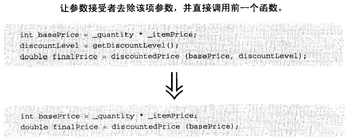
  >
  > - 若有必要，将参数的计算过程提炼到一个独立函数中
  > - 将函数本体内引用该参数的地方改为调用新建的函数
  > - 每次替换后，修改并测试
  > - 全部替换完成后，使用”移除参数(Remove Parameter)“将该参数去掉

- **引入参数对象(Introduce Parameter Object)**： 若某些参数总是很自然地同时出现，则以一个对象取代这些参数

  > 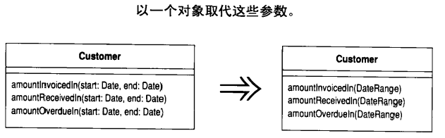
  >
  > - 新建一个类，用以表现想替换的一组参数，将该类设为不可变
  > - 编译
  > - 针对使用该组参数的所有函数，实施”添加参数(Add Parameter)“，传入上述新建类的实例对象，并将此参数值设为 null
  > - 对于"数据泥团(Data Clumps)"中的每一项(在此均为参数)，从函数签名中移除，并修改调用端和函数本体，令它们都改而通过新的参数对象取得该值
  > - 每去除一个参数，编译并测试
  > - 将原先的参数全部去除后，观察有无适当函数可以运用”搬移函数(Move Method)“搬移到参数对象中

- **移除设值函数(Remove Setting Method)**： 若类中的某个字段应该在对象创建时被设值，然后就不再改变，则去掉该字段的所有设值函数

  > 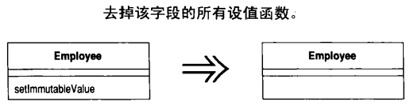
  >
  > - 检查设值函数被使用的情况，看其是否被构造函数调用，或者被构造函数所调用的另一个函数调用
  > - 修改构造函数，使其直接访问设值函数所针对的那个变量
  > - 编译，测试
  > - 移除这个设值函数，将其所针对的字段设为 final
  > - 编译，测试

- **隐藏函数(Hide Method)**： 若有一个函数，从来没有被其他任何类用到，则将这个函数值改为 private

  > 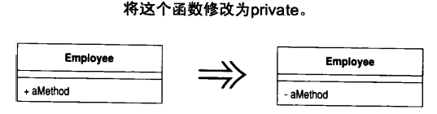
  >
  > - 经常检查有没有可能降低某个函数的可见度
  > - 尽可能降低所有函数的可见度
  > - 每完成一组函数的隐藏后，编译并测试

- **以工厂函数取代构造函数(Replace Constructor with Factory Method)**： 若希望在创建对象时不仅仅做简单的构建工作，则将构造函数替换为工厂函数

  > 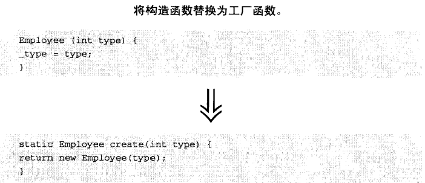
  >
  > - 新建一个工厂函数，让它调用现有的构造函数
  > - 将调用构造函数的代码改为调用工厂函数
  > - 每次替换后，编译并测试
  > - 将构造函数声明为 private
  > - 编译

- **封装向下转型(Encapsulate Downcast)**： 若某个函数返回的对象，需要由函数调用者执行向下转型，则将向下转型动作移到函数中

  > 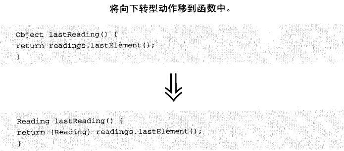
  >
  > - 找出必须对函数调用结果进行向下转型的地方
  >
  > - 将向下转型动作搬移到该函数中
  >
  >   > 针对返回集合的函数，使用”封装集合(Encapsulate Collection)“

- **以异常取代错误码(Repalce Error Code with Exception)**： 若某个函数返回一个特定的代码，用以表示某种错误情况，则改用异常

  > 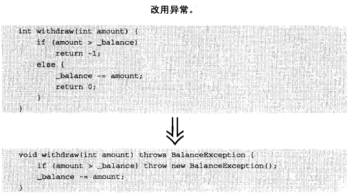
  >
  > - 决定应该抛出受控异常还是非受控异常
  >
  >   > - 若调用者有责任在调用前检查必要状态，就抛出非受控异常
  >   > - 若想抛出受控异常，可以新建一个异常类，也可以使用现有的异常类
  >
  > - 找到该函数的所有调用者，对它们进行相应调整，让它们使用异常
  >
  >   > - 若函数抛出非受控异常，就调整调用者，使其在调用函数前做适当检查。每次修改后，编译并测试
  >   > - 若函数抛出受控异常，就调整调用者，使其在 try 区段中调用该函数
  >
  > - 修改该函数的签名，令其反映出新用法
  >
  > 若函数有许多调用者，则采取下述步骤： 
  >
  > - 决定应该抛出受控异常还是非受控异常
  > - 新建一个函数，使用异常来表示错误状况，将旧函数的代码复制到新函数中，并做适当调整
  > - 修改旧函数的函数本体，让它调用上述新建函数
  > - 编译，测试
  > - 逐一修改旧函数的调用者，令其调用新函数。每次修改后，编译并测试
  > - 移除旧函数

- **以测试取代异常(Replace Exception with Test)**： 若面对一个调用者可以预先检查的条件，抛出了一个异常，则修改调用者，使其在调用函数前先做检查

  > 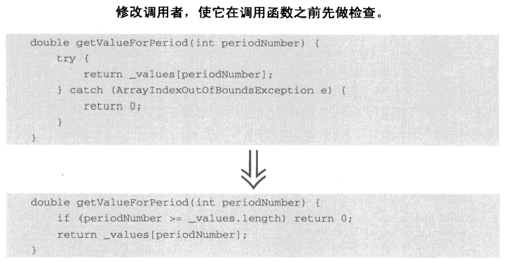
  >
  > - 在函数调用点前，放置一个测试语句，将函数内 catch 区段中的代码复制到测试句的适当 if 分支中
  > - 在 catch 区段起始处加入一个断言，确保 catch 区段绝对不会被执行
  > - 编译，测试
  > - 移除所有 catch 区段，然后将 try 区段内的代码复制到 try 之外，然后移除 try 区段
  > - 编译，测试

# 十一、处理概括关系

- **字段上移(Pull Up Field)**： 若两个子类拥有相同的字段，则将该字段移至超类

  > 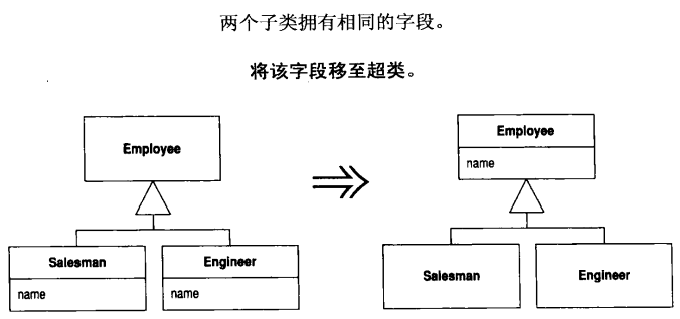
  >
  > - 针对待提升字段，检查其所有被使用点，确认它们以同样的方式被使用
  >
  > - 若这些字段的名称不同，先将它们改名，使每个名称都和你想为超类字段取得名称相同
  >
  > - 编译，测试
  >
  > - 在超类中新建一个字段
  >
  >   > 若字段为 private，则必须将超类的字段声明为 protected
  >
  > - 移除子类中的字段
  >
  > - 编译，测试
  >
  > - 考虑对超类的新建字段使用”自封装字段(Self Encapsulate Field)“

- **函数上移(Pull Up Method)**： 若有些函数，在各个子类中产生完全相同的结果，则将该函数移至超类

  > 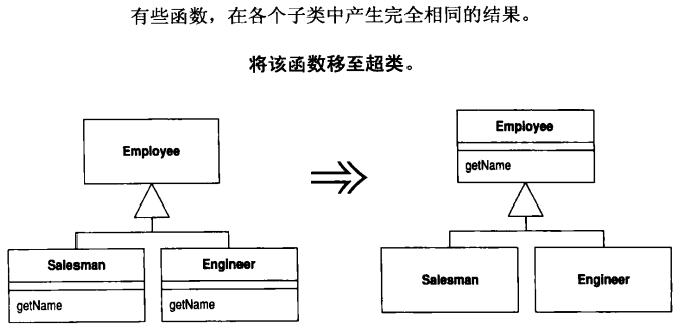
  >
  > - 检查待提升函数，确定它们完全一致
  >
  > - 若待提升函数看上去做了相同的事，但并不完全一致，可使用”替换算法(Substitute Algorithm)“让它们变得完全一致
  >
  > - 若待提升函数的签名不同，则将那些前面都修改为想要在超类中使用的签名
  >
  > - 在超类中新建一个函数，将某个待提升函数的代码复制到其中，做适当调整，然后编译
  >
  >   > - 若使用的是一种强类型语言，而待提升函数又调用了一个只出现于子类而未出现于超类的函数，则可以在超类中为被调用函数声明一个抽象函数
  >   >
  >   > - 若待提升函数使用了子类的一个字段，则可以使用”字段上移(Pull Up Field)“将该字段也提升到超类
  >   >
  >   >   或者也可以先使用”自封装字段(Self Encapsulate Field)“，然后在超类中把取值函数声明为抽象函数
  >
  > - 移除一个待提升的子类函数
  >
  > - 编译，测试
  >
  > - 逐一移除待提升的子类函数，直到只剩下超类中的函数为止。每次移除后，都需要测试
  >
  > - 观察该函数的调用者，看看是否可以改为使用超类类型的对象

- **构造函数本体上移(Pull Up Constructor Body)**： 若在各个子类中拥有一些构造函数，它们的本体几乎完全一致，则在超类中新建一个构造函数，并在子类构造函数中调用它

  > 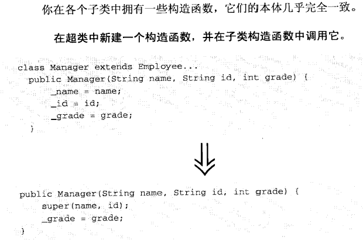
  >
  > - 在超类中定义一个构造函数
  >
  > - 将子类构造函数中的共同代码搬移到超类构造函数中
  >
  >   > - 被搬移的可能是子类构造函数的全部内容
  >   > - 首先设法将共同代码搬移到子类构造函数起始处，然后再复制到超类构造函数中
  >
  > - 将子类构造函数中的共同代码删掉，改而调用新建的超类构造函数
  >
  >   > 若子类构造函数中的所有代码都一样，则子类构造函数就只需要调用超类构造函数
  >
  > - 编译，测试
  >
  >   > 若后面子类构造函数再出现共同代码，则
  >   >
  >   > - 首先使用”提炼函数(Extract Method)“将那部分提炼到一个独立函数
  >   > - 然后使用”字段上移(Pull Up Method)“将该函数上移到超类

- **函数下移(Push Down Method)**： 若超类中的某个函数只与部分子类有关，则将该函数移到相关子类中

  > 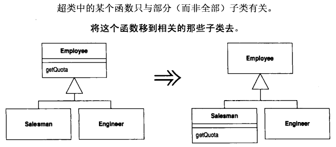
  >
  > - 在所有子类中声明该函数，将超类中的函数本体复制到每个子类函数中
  >
  > - 删除超类中的函数
  >
  >   > - 可能必须修改调用端的某些变量声明或参数声明，以便能使用子类
  >   > - 若有必要通过一个超类对象访问该函数，或不想把该函数从任何子类中移除，再或超类是抽象类，则可以在超类中把该函数声明为抽象函数
  >
  > - 编译，测试
  >
  > - 将该函数从所有不需要它的那些子类中删掉
  >
  > - 编译，测试

- **字段下移(Push Down Field)**： 若超类中的某个字段只被部分子类用到，则将该字段移到需要它的子类中

  > 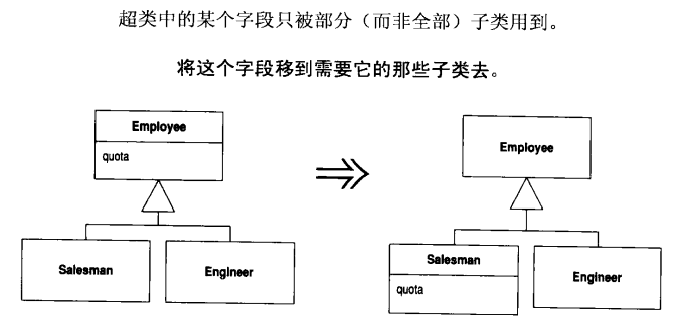
  >
  > - 在所有子类中声明该字段
  > - 将该字段从超类中移除
  > - 编译，测试
  > - 将该字段从所有不需要它的那些子类中删掉
  > - 编译，测试

- **提炼子类(Extract Subclass)**： 若类中的某些特性只被某些实例用到，则新建一个子类，将上面所说的那一部分特性移到子类中

  > 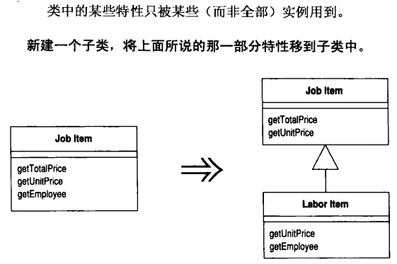
  >
  > - 为源类定义一个新的子类
  >
  > - 为这个新的子类提供构造函数
  >
  >   > 简单做法： 让子类构造函数接受与超类构造函数相同的参数，并通过 super 调用超类构造函数
  >   >
  >   > - 若希望对用户隐藏子类的存在，可使用”以工厂函数替代构造函数(Replace Constructor with Factory Method)“
  >
  > - 找出调用超类构造函数的所有地点，若需要新建子类，令它们改而调用新构造函数
  >
  >   > - 若子类构造函数需要的参数和超类构造函数的参数不同，可以使用”函数改名(Rename Method)“修改其参数列
  >   > - 若子类构造函数不需要超累构造函数的某些参数，可以使用”函数改名(Rename Method)“将其去除
  >   > - 若不再需要直接创建超类的实例，就将超类声明为抽象类
  >
  > - 逐一使用”函数下移(Push Down Method)“和”字段下移(Push Down Field)“将源类的特性移到子类中
  >
  > - 找到所有这样的字段： 它们所传达的信息可由继承体系自身传达(通常为 Boolean 变量或类型码)
  >
  >   以”自封装字段(Self Encapsulate Field)“避免直接使用这些字段，然后将它们的取值函数替换为多条常量函数，所有使用这些字段的地方都应以”以多态取代条件表达式(Replace Conditional with Polymorphism)“重构
  >
  >   > 任何函数若位于源类之外，而又使用了上述字段的访问函数，考虑以”搬移函数(Move Method)“将其移到源类中，然后再使用”以多态取代条件表达式(Replace Conditional with Polymorphism)“
  >
  > - 每次下移后，编译并测试

- **提炼超类(Extract Superclass)**： 若两个类有相似特性，则为这两个类建立一个超类，将相同特性移至超类

  > 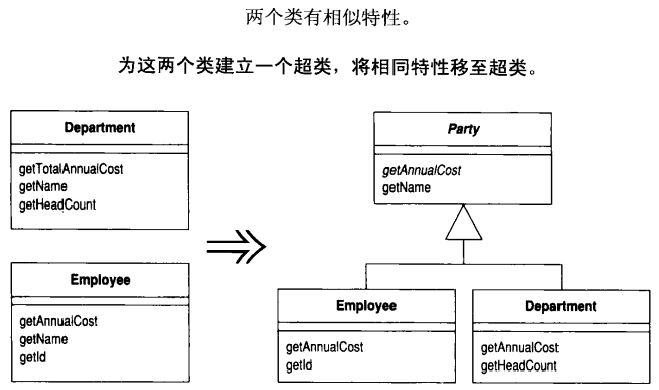
  >
  > - 为原本的类新建一个空白的抽象超类
  >
  > - 运用”字段上移(Pull Up Field)“、”函数上移(Pull Up Method)“、”构造本体上移(Pull Up Constructor Body)“逐一将子类的共同元素上移到超类
  >
  >   > - 先搬移字段，通常比较简单
  >   >
  >   > - 若相应的子类函数有不同的前面，但用途相同，可先使用”函数改名(Rename Method)“将它们的签名改为相同，然后再使用”函数上移(Pull Up Method)“
  >   >
  >   > - 若相应的子类函数有相同的签名，但函数本体不同，可以在超类中把它们的共同签名声明为抽象函数
  >   >
  >   > - 若相应的子类函数有不同的函数本体，但用途相同，可试着使用”替换算法(Substitute Algorithm)“把其中一个函数的函数本体复制到另一个函数中
  >   >
  >   >   若正常运转，则可以使用”函数上移(Pull Up Method)“
  >
  > - 每次上移后，编译并测试
  >
  > - 检查留在子类中的函数，看它们是否有共通成分。若有，可使用”提炼函数(Extract Method)“将共通部分再提炼出来，然后使用”函数上移(Pull Up Method)“将提炼出的函数上移到超类
  >
  >   若各个子类中某个函数的整体流程很相似，可以使用”塑造模板函数(Form Template Method)“
  >
  > - 将所有共通元素都上移到超类后，检查子类的所有用户
  >
  >   若它们只使用共同接口，就可以把它们请求的对象类型改为超类

- **提炼接口(Extract Interface)**： 若若干客户使用类接口中的同一子集，或两个类的接口部分相同，则将相同的子集提炼到一个独立接口中

  > 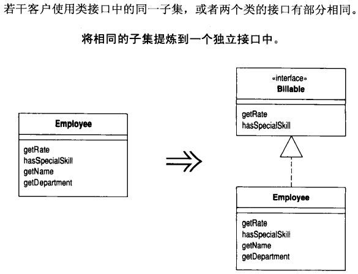
  >
  > - 新建一个空接口
  > - 在接口中声明待提炼类的共通操作
  > - 让相关的类实现上述接口
  > - 调整客户端的类型声明，令其使用该接口

- **折叠继承体系(Collapse Hierarchy)**： 若超类和子类间无太大区别，则将它们合为一体

  > 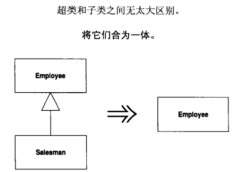
  >
  > - 选择想移除的类： 是超类还是子类？
  >
  > - 使用”字段上移(Pull Up Field)“和”函数上移(Pull Up Method)“，或”函数下移(Push Down Method)“ 和”字段下移(Push Down Field)“，把想要移除的类的所有行为和数据搬移到另一个类
  >
  > - 每次移动后，编译并测试
  >
  > - 调整即将被移除的那个类的所有引用点，令它们改而引用合并后留下来的类
  >
  >   这个动作将会影响变量的声明、参数的类型以及构造函数
  >
  > - 移除我们的目标，此时它应该已经成为一个空类
  >
  > - 编译，测试

- **塑造模板函数(Form Template Method)**： 若有一些子类，其中相应的某些函数以相同顺序执行类似的操作，但各个操作的细节上有所不同，则将这些操作分别放进独立函数中，并保持它们都有相同的签名，于是原函数也就变得相同了，然后将原函数上移至超类

  > 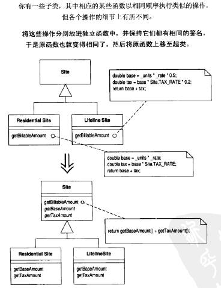
  >
  > - 在各个子类中分解目标函数，使分解后的各个函数要不完全相同，要不完全不同
  >
  > - 运用”函数上移(Pull Up Method)“将各个子类内完全相同的函数上移至超类
  >
  > - 对于那些(剩余的、存在于各子类内的)完全不同的函数，实施”函数改名(Rename Method)“，使所有这些函数的签名完全相同
  >
  >   > 这将使得原函数变为完全相同，因为它们都执行同样一组函数调用，但各子类会以不同方式响应这些调用
  >
  > - 修改上述所有签名后，编译并测试
  >
  > - 运用”函数上移(Pull Up Method)“将所有原函数逐一上移至超类
  >
  >   > 在超类中将那些代表各种不同操作的函数定义为抽象函数
  >
  > - 编译，测试
  >
  > - 移除其他子类中的原函数，每删除一个，编译并测试

- **以委托取代继承(Replace Inheritance with Delegation)**： 若某个子类只使用超类接口中的一部分，或是根本不需要继承而来的数据，则在子类中新建一个字段用以保存超类，调整子类函数，令它改而委托超类，然后去掉两者之间的继承关系

  > 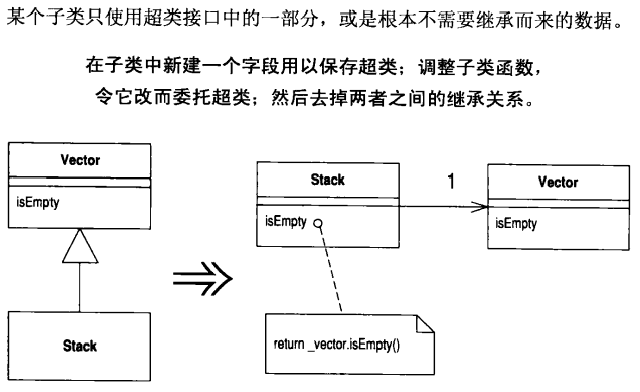
  >
  > - 在子类中新建一个字段，使其引用超类的一个实例，并将它初始化为 this
  >
  > - 修改子类的所有函数，让它们不再使用超类，转而使用上述那个委托字段。每次修改后，编译并测试
  >
  >   > 不能修改子类中通过 super 调用超类函数的代码，否则会陷入无限递归
  >
  > - 去除两个类之间的继承关系，新建一个受委托类的对象赋给受托字段
  >
  > - 针对客户端所用的每个超类函数，为它添加一个简单的委托函数
  >
  > - 编译，测试

- **以继承取代委托(Replace Delegation with Inheritance)**： 若在两个类间使用委托关系，并经常为整个接口编写许多极简单的委托函数，则让委托类继承受托类

  > 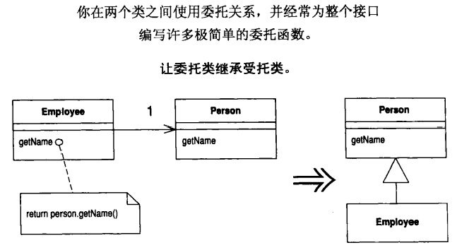
  >
  > - 让委托端成为受托端的一个子类
  > - 编译
  > - 将受托字段设为该字段所处对象本身
  > - 去掉简单的委托函数
  > - 编译并测试
  > - 将所有其他涉及委托关系的代码，改为调用对象自身
  > - 移除受托字段

# 十二、大型重构

- **梳理并分解继承体系(Tease Apart Inheritance)**： 若某个继承体系同时承担两项责任，则建立两个继承体系，并通过委托关系让其中一个可以调用另一个

  > 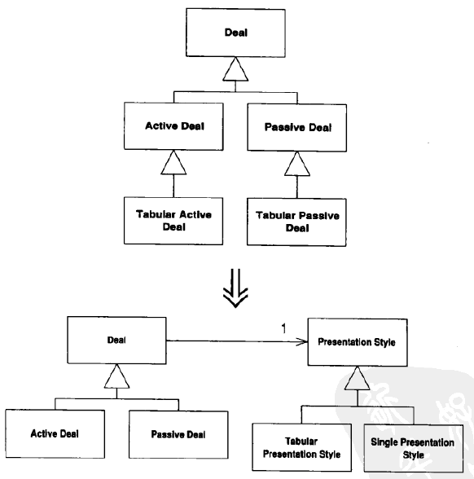
  >
  > - 首先识别出继承体系所承担的不同责任，然后建立一个二维表格(或三维，甚至四维表格)，并以坐标轴标示出不同的任务
  >
  >   > 将重复运用本重构，处理两个或两个以上的维度。当然，每次只处理一个维度
  >
  > - 判断哪一项责任更重要些，并准备将它留在当前的继承体系中，准备将另一项责任移到另一个继承体系中
  >
  > - 使用”提炼类(Extract Class)“从当前的超类提炼出一个新类，用以表示重要性稍低的责任，并在原超类中添加一个实例变量，用以保存新类的实例
  >
  > - 对应于原继承体系中的每个子类，创建上述新类的一个子类。在原继承体系的子类中，将钱一步骤所添加的实例变量初始化为新建子类的实例
  >
  > - 针对原继承体系中的某个子类不再有任何代码时，就将其去除
  >
  > - 重复上述步骤，直至原继承体系中的所有子类都被处理过为止

- **将过程化设计转化为对象设计(Convert Procedural Design to Objects)**： 若有一些传统过程化风格的代码，则将数据记录变成对象，将大块的行为分成小块，并将行为移入相关对象中

  > 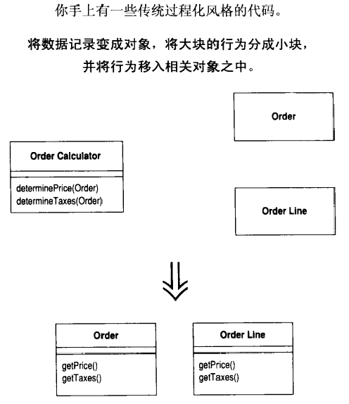
  >
  > - 针对每个记录类型，将其转变为只包含访问函数的哑数据对象
  >
  >   > 若你的数据来自关系式数据库，就把数据库中的每个表变成一个哑数据对象
  >
  > - 针对每一处过程化风格，将该处的代码提炼到一个独立类中
  >
  >   > 可以把提炼所得的类做成一个 Singleton，或是把提炼所得的函数声明为 static
  >
  > - 针对每一段长长的程序，实施”提炼函数(Extract Method)“及其他相关重构将其分解，再以”搬移函数(Move Method)“将分解后的函数分别移到其所相关的哑数据类中
  >
  > - 重复上述步骤，直到原始类中的所有函数都被移除。若原始类是一个完全过程化的类，将它拿掉将大快人心

- **将领域和表述/显示分离(Separate Domain from Presentation)**： 若某些 GUI 类中包含了领域逻辑，则将领域逻辑分离出来，为它们建立独立的领域类

  > 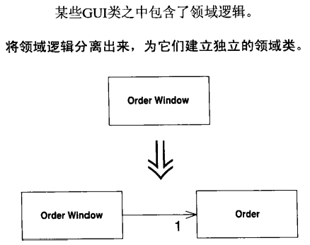
  >
  > - 为每个窗口建立一个领域类
  > - 若窗口内有一表格，新建一个类来表示其中的行，再以窗口所对应之领域类中的一个集合来容纳所有的行领域对象
  > - 检查窗口中的数据：
  >   - 若数据只被用于 UI，就留着
  >   - 若数据被领域逻辑使用，而且不显示于窗口上，就以”搬移字段(Move Field)“将其搬移到领域类
  >   - 若数据同时被 UI 和领域逻辑使用，就对其实施”复制“被监视数据”(Duplicate Observed Data)“，使其同时存在于两处，并保持两处之间的同步
  > - 检查展现类中的逻辑，实施”提炼函数(Extract Method)“将展现逻辑从领域逻辑中分开，一旦隔离了领域逻辑，再运用”搬移函数(Move Method)“将其移到领域类
  > - 以上步骤完成后，就拥有了两组彼此分离的类：
  >   - 展现类用以处理 GUI
  >   - 领域类包含所有业务逻辑

- **提炼继承体系(Extact Hierarchy)**： 若有某个类做了太多工作，其中一部分工作是以大量条件表达式完成，则建立继承体系，以一个子类表示一种特殊情况

  > 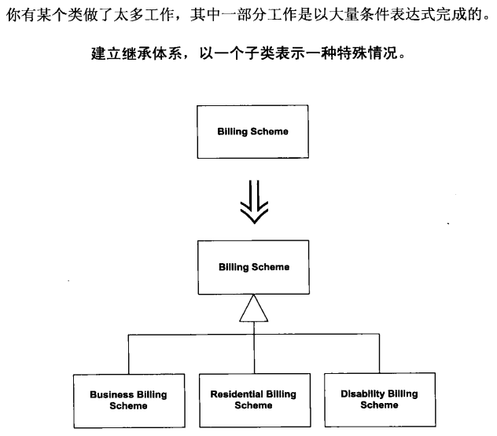
  >
  > - 鉴别出一种变化情况
  >
  >   > 若这种变化可能在对象生命周期的不同阶段而又不同体现，就运用”提炼函数(Extract Class)“将其提炼为一个独立的类
  >
  > - 针对这种变化情况，新建一个子类，并对原始类实施”以工厂函数替换构造函数(Replace Constructor with Factory Method)“，再修改工厂函数，令其返回适当的子类实例
  >
  > - 将含有条件逻辑的函数，一次一个，逐一复制到子类，然后在明确情况下(对子类明确，对超类不明确)，简化这些函数
  >
  > - 重复上述过程，将所有变化情况都分离出来，直到可以将超类声明为抽象类为止
  >
  > - 删除超类中那些被所有子类覆写的函数本体，并将它们声明为抽象函数
  >
  > 若你清楚原始类会有哪些变化情况，可以使用另一种做法： 
  >
  > - 针对原始类的每种变化情况，建立一个子类
  >
  > - 使用”以工厂函数替换构造函数(Replace Constructor with Factory Method)“将原始类的构造函数转变成工厂函数，并令其针对每种变化情况返回适当的子类实例
  >
  > - 针对带有条件逻辑的函数，实施”以多态取代条件表达式(Replace Conditional with Polymorphism)“
  >
  >   > 若并非整个函数的行为有所变化，而只是函数一部分有所变化，请先运用”提炼函数(Extract Method)“将变化部分和不变部分隔开
