# 一、重构，第一个案例

## 1、起点

**Movie(影片)**：

```java
public class Movie {
    public static final int CHILDRENS = 2;
    public static final int REGULAR = 0;
    public static final int NEW_RELEASE = 1;

    private final String _title;
    private final int _priceCode;

    public Movie(String title, int priceCode) {
        _title = title;
        _priceCode = priceCode;
    }

    public int getPriceCode() {
        return _priceCode;
    }

    public String getTitle() {
        return _title;
    }
}
```

**Rental(租聘)**：

```java
public class Rental {
    private final Movie _movie;  // 影片
    private final int _daysRented;  // 租期

    public Rental(Movie movie, int daysRented) {
        _movie = movie;
        _daysRented = daysRented;
    }

    public int getDaysRented() {
        return _daysRented;
    }

    public Movie getMovie() {
        return _movie;
    }
}
```

**Customer(顾客)**：

```java
import java.util.Enumeration;
import java.util.Vector;

public class Customer {
	private String _name; // 姓名
	private Vector _rentals = new Vector(); // 租借记

	public Customer(String name) {
		_name = name;
	};

	public void addRental(Rental arg) {
		_rentals.addElement(arg);
	}

	public String getName() {
		return _name;
	}

	public String statement() {
    double totalAmount = 0; // 总消费金
    int frequentRenterPoints = 0; // 常客积点
		Enumeration rentals = _rentals.elements();
		String result = "Rental Record for " + getName() + "\n";
		while (rentals.hasMoreElements()) {
			double thisAmount = 0;
			Rental each = (Rental) rentals.nextElement(); // 取得一笔租借记
			// determine amounts for each line
			switch (each.getMovie().getPriceCode()) { // 取得影片出租价格
        case Movie.REGULAR: // 普通片
          thisAmount += 2;
          if (each.getDaysRented() > 2)
            thisAmount += (each.getDaysRented() - 2) * 1.5;
          break;
        case Movie.NEW_RELEASE: // 新片
          thisAmount += each.getDaysRented() * 3;
          break;
        case Movie.CHILDRENS: // 儿童
          thisAmount += 1.5;
          if (each.getDaysRented() > 3)
            thisAmount += (each.getDaysRented() - 3) * 1.5;
          break;
			}
			// add frequent renter points （累计常客积点
			frequentRenterPoints++;
			// add bonus for a two day new release rental
			if ((each.getMovie().getPriceCode() == Movie.NEW_RELEASE) && each.getDaysRented() > 1)
				frequentRenterPoints++;
			// show figures for this rental（显示此笔租借记录）
			result += "\t" + each.getMovie().getTitle() + "\t" + String.valueOf(thisAmount) + "\n";
			totalAmount += thisAmount;
		}
		// add footer lines（结尾打印）
		result += "Amount owed is " + String.valueOf(totalAmount) + "\n";
		result += "You earned " + String.valueOf(frequentRenterPoints) + " frequent renter points";
		return result;
	}
}
```


## 2、重构

- **重构第一步**： 为即将修改的代码建立一组可靠的测试环境

### (1) 重构一：分解并重组 statement

要点：**找出代码的逻辑泥团并运用 Extract Method(提炼函数)**

- 首先**找出函数内的局部变量和参数**，任何不被修改的变量都可以被当成参数传入新的函数

```java
import java.util.Enumeration;
import java.util.Vector;

public class Customer {
	private String _name; // 姓名
	private Vector _rentals = new Vector(); // 租借记

	public Customer(String name) {
		_name = name;
	};

	public void addRental(Rental arg) {
		_rentals.addElement(arg);
	}

	public String getName() {
		return _name;
	}

	public String statement() {
		double totalAmount = 0; // 总消费金。
		int frequentRenterPoints = 0; // 常客积点
		Enumeration rentals = _rentals.elements();
		String result = "Rental Record for " + getName() + "\n";
		while (rentals.hasMoreElements()) {
			Rental each = (Rental) rentals.nextElement(); // 取得一笔租借记
			double thisAmount = amountFor(each);
			// add frequent renter points （累计常客积点
			frequentRenterPoints++;
			// add bonus for a two day new release rental
			if ((each.getMovie().getPriceCode() == Movie.NEW_RELEASE) && each.getDaysRented() > 1)
				frequentRenterPoints++;
			// show figures for this rental（显示此笔租借记录）
			result += "\t" + each.getMovie().getTitle() + "\t" + String.valueOf(thisAmount) + "\n";
			totalAmount += thisAmount;
		}
		// add footer lines（结尾打印）
		result += "Amount owed is " + String.valueOf(totalAmount) + "\n";
		result += "You earned " + String.valueOf(frequentRenterPoints) + " frequent renter points";
		return result;
	}

  //分解并重组 statement
	private double amountFor(Rental rental) {
		double thisAmount = 0; 
		// determine amounts for each line
		switch (rental.getMovie().getPriceCode()) { // 取得影片出租价格
      case Movie.REGULAR: // 普通片
        thisAmount += 2;
        if (rental.getDaysRented() > 2)
          thisAmount += (rental.getDaysRented() - 2) * 1.5;
        break;
      case Movie.NEW_RELEASE: // 新片
        thisAmount += rental.getDaysRented() * 3;
        break;
      case Movie.CHILDRENS: // 儿童
        thisAmount += 1.5;
        if (rental.getDaysRented() > 3)
          thisAmount += (rental.getDaysRented() - 3) * 1.5;
        break;
		}
		return thisAmount;
	}
}
```

---

### (2) 重构二：搬移“金额计算”代码

要点：**函数应该放在其所使用的数据的所属对象内，因此使用 Move Method(搬移函数)把代码复制到 Rental**

```java
public class Rental {
	private Movie _movie; // 影片
	private int _daysRented; // 租期

	public Rental(Movie movie, int daysRented) {
		_movie = movie;
		_daysRented = daysRented;
	}

	public int getDaysRented() {
		return _daysRented;
	}

	public Movie getMovie() {
		return _movie;
	}

  //搬移“金额计算”代码
	public double getCharge() {
		double result = 0;
		switch (getMovie().getPriceCode()) {
      case Movie.REGULAR:
        result += 2;
        if (getDaysRented() > 2)
          result += (getDaysRented() - 2) * 1.5;
        break;
      case Movie.NEW_RELEASE:
        result += getDaysRented() * 3;
        break;
      case Movie.CHILDRENS:
        result += 1.5;
        if (getDaysRented() > 3)
          result += (getDaysRented() - 3) * 1.5;
        break;
      }
		return result;
	}
} 
```

```java
import java.util.Enumeration;
import java.util.Vector;

public class Customer {
	private String _name; // 姓名
	private Vector _rentals = new Vector(); // 租借记

	public Customer(String name) {
		_name = name;
	};

	public void addRental(Rental arg) {
		_rentals.addElement(arg);
	}

	public String getName() {
		return _name;
	}

	public String statement() {
		double totalAmount = 0; // 总消费金。
		int frequentRenterPoints = 0; // 常客积点
		Enumeration rentals = _rentals.elements();
		String result = "Rental Record for " + getName() + "\n";
		while (rentals.hasMoreElements()) {
			Rental rental = (Rental) rentals.nextElement(); // 取得一笔租借记
			double thisAmount = rental.getCharge();
			// add frequent renter points （累计常客积点
			frequentRenterPoints++;
			// add bonus for a two day new release rental
			if ((rental.getMovie().getPriceCode() == Movie.NEW_RELEASE) && rental.getDaysRented() > 1)
				frequentRenterPoints++;
			// show figures for this rental（显示此笔租借记录）
			result += "\t" + rental.getMovie().getTitle() + "\t" + String.valueOf(thisAmount) + "\n";
			totalAmount += thisAmount;
		}
		// add footer lines（结尾打印）
		result += "Amount owed is " + String.valueOf(totalAmount) + "\n";
		result += "You earned " + String.valueOf(frequentRenterPoints) + " frequent renter points";
		return result;
	}
}
```

---

### (3) 重构三：提炼“常客积分计算”代码

要点：

- **运用 Replace Temp with Query(以查询取代临时变量)替换掉多余的 thisAmount(临时变量)**
- **针对“常客积分计算”部分运用 Extract Method(提炼函数)进行封装重构**


```java
public class Rental {
	private Movie _movie; // 影片
	private int _daysRented; // 租期

	public Rental(Movie movie, int daysRented) {
		_movie = movie;
		_daysRented = daysRented;
	}

	public int getDaysRented() {
		return _daysRented;
	}

	public Movie getMovie() {
		return _movie;
	}

	public double getCharge() {
		double result = 0;
		switch (getMovie().getPriceCode()) {
      case Movie.REGULAR:
        result += 2;
        if (getDaysRented() > 2)
          result += (getDaysRented() - 2) * 1.5;
        break;
      case Movie.NEW_RELEASE:
        result += getDaysRented() * 3;
        break;
      case Movie.CHILDRENS:
        result += 1.5;
        if (getDaysRented() > 3)
          result += (getDaysRented() - 3) * 1.5;
        break;
		}
		return result;
	}

  //提炼“常客积分代码”
	public int getFrequentRenterPoints() {
		if ((getMovie().getPriceCode() == Movie.NEW_RELEASE) && getDaysRented() > 1)
			return 2;
		else
			return 1;
	}
}
```

```java
import java.util.Enumeration;
import java.util.Vector;

public class Customer {
	private String _name; // 姓名
	private Vector _rentals = new Vector(); // 租借记

	public Customer(String name) {
		_name = name;
	};

	public void addRental(Rental arg) {
		_rentals.addElement(arg);
	}

	public String getName() {
		return _name;
	}

	public String statement() {
		double totalAmount = 0;
		int frequentRenterPoints = 0;
		Enumeration rentals = _rentals.elements();
		String result = "Rental Record for " + getName() + "\n";
		while (rentals.hasMoreElements()) {
			Rental rental = (Rental) rentals.nextElement();
			frequentRenterPoints += rental.getFrequentRenterPoints();
			// show figures for this rental
			result += "\t" + rental.getMovie().getTitle() + "\t" + String.valueOf(rental.getCharge()) + "\n";
			totalAmount += rental.getCharge();
		}
		// add footer lines
		result += "Amount owed is " + String.valueOf(totalAmount) + "\n";
		result += "You earned " + String.valueOf(frequentRenterPoints) + " frequent renter points";
		return result;
	}
}
```

---

### (4) 重构四：去除临时变量

要点：**运用 Replace Temp with Query(以查询取代临时变量) 和 query method(查询函数)来取代临时变量** 

```java
import java.util.Enumeration;
import java.util.Vector;

public class Customer {
	private String _name; // 姓名
	private Vector _rentals = new Vector(); // 租借记

	public Customer(String name) {
		_name = name;
	};

	public void addRental(Rental arg) {
		_rentals.addElement(arg);
	}

	public String getName() {
		return _name;
	}

	public String statement() {
		int frequentRenterPoints = 0;
		Enumeration rentals = _rentals.elements();
		String result = "Rental Record for " + getName() + "\n";
		while (rentals.hasMoreElements()) {
			Rental each = (Rental) rentals.nextElement();
			frequentRenterPoints += each.getFrequentRenterPoints();
			result += "\t" + each.getMovie().getTitle() + "\t" + String.valueOf(each.getCharge()) + "\n";
		}
		// getTotalCharge 取代临时变量
		result += "Amount owed is " + String.valueOf(getTotalCharge()) + "\n";
		result += "You earned " + String.valueOf(frequentRenterPoints) + " frequent renter points";
		return result;
	}

	// 为取代临时变量而提炼的函数
	private double getTotalCharge() {
		double result = 0;
		Enumeration rentals = _rentals.elements();
		while (rentals.hasMoreElements()) {
			Rental each = (Rental) rentals.nextElement();
			result += each.getCharge();
		}
		return result;
	}
}
```

---

### (5) 重构五：提炼“总量计算”函数

要点：**运用 Form Template Method(塑造模版函数)提炼计算逻辑，当计算规则发生改变，则只需在程序中做一处修改**

  

```java
import java.util.Enumeration;
import java.util.Vector;

public class Customer {
	private String _name; // 姓名
	private Vector _rentals = new Vector(); // 租借记

	public Customer(String name) {
		_name = name;
	};

	public void addRental(Rental arg) {
		_rentals.addElement(arg);
	}

	public String getName() {
		return _name;
	}

	public String statement() {
		int frequentRenterPoints = 0;
		Enumeration rentals = _rentals.elements();
		String result = "Rental Record for " + getName() + "\n";
		while (rentals.hasMoreElements()) {
			Rental each = (Rental) rentals.nextElement();
			frequentRenterPoints += each.getFrequentRenterPoints();
			// show figures for this rental
			result += "\t" + each.getMovie().getTitle() + "\t" + String.valueOf(each.getCharge()) + "\n";
		}
		// add footer lines
		result += "Amount owed is " + String.valueOf(getTotalCharge()) + "\n";
		result += "You earned " + String.valueOf(getTotalFrequentRenterPoints()) +" frequent renter points";
		return result;
	}

	// 提炼“总量计算”函数
	private int getTotalFrequentRenterPoints() {
		int result = 0;
		Enumeration rentals = _rentals.elements();
		while (rentals.hasMoreElements()) {
			Rental each = (Rental) rentals.nextElement();
			result += each.getFrequentRenterPoints();
		}
		return result;
	}

	// 提炼“总量计算”函数
	private double getTotalCharge() {
		double result = 0;
		Enumeration rentals = _rentals.elements();
		while (rentals.hasMoreElements()) {
			Rental each = (Rental) rentals.nextElement();
			result += each.getCharge();
		}
		return result;
	}
}
```

---

### (6) 重构六：运用多态取代与价格相关的条件逻辑 


- **Movie**： 

  ```java
  public class Movie {
  	public static final int CHILDRENS = 2;
  	public static final int REGULAR = 0;
  	public static final int NEW_RELEASE = 1;
  	private String _title;
  	private int _priceCode;
  
  	public Movie(String title, int priceCode) {
  		_title = title;
  		_priceCode = priceCode;
  	}
  
  	public int getPriceCode() {
  		return _priceCode;
  	}
  
  	public String getTitle() {
  		return _title;
  	}
  
  	public void setPriceCode(int priceCode) {
  		_priceCode = priceCode;
  	}
  
    //搬移
  	public double getCharge(int daysRented) {
  		double result = 0;
  		switch (getPriceCode()) {
        case Movie.REGULAR:
          result += 2;
          if (daysRented > 2)
            result += (daysRented - 2) * 1.5;
          break;
        case Movie.NEW_RELEASE:
          result += daysRented * 3;
          break;
        case Movie.CHILDRENS:
          result += 1.5;
          if (daysRented > 3)
            result += (daysRented - 3) * 1.5;
          break;
  		}
  		return result;
  	}
  
    //搬移
  	public int getFrequentRenterPoints(int daysRented) {
  		if ((getPriceCode() == Movie.NEW_RELEASE) && daysRented > 1)
  			return 2;
  		else
  			return 1;
  	}
  }
  ```

- **Rental**： 

  ```java
  public class Rental {
  	private Movie _movie; // 影片
  	private int _daysRented; // 租期
  
  	public Rental(Movie movie, int daysRented) {
  		_movie = movie;
  		_daysRented = daysRented;
  	}
  
  	public int getDaysRented() {
  		return _daysRented;
  	}
  
  	public Movie getMovie() {
  		return _movie;
  	}
  
    //搬移
  	double getCharge() {
  		return _movie.getCharge(_daysRented);
  	}
  
    //搬移
  	public int getFrequentRenterPoints() {
  		return _movie.getFrequentRenterPoints(_daysRented);
  	}
  }
  ```

- **Customer**： 

  ```java
  import java.util.Enumeration;
  import java.util.Vector;
  
  public class Customer {
  	private String _name; // 姓名
  	private Vector _rentals = new Vector(); // 租借记
  
  	public Customer(String name) {
  		_name = name;
  	};
  
  	public void addRental(Rental arg) {
  		_rentals.addElement(arg);
  	}
  
  	public String getName() {
  		return _name;
  	}
  
  	public String statement() {
  		int frequentRenterPoints = 0;
  		Enumeration rentals = _rentals.elements();
  		String result = "Rental Record for " + getName() + "\n";
  		while (rentals.hasMoreElements()) {
  			Rental each = (Rental) rentals.nextElement();
  			frequentRenterPoints += each.getFrequentRenterPoints();
  			// show figures for this rental
  			result += "\t" + each.getMovie().getTitle() + "\t" + String.valueOf(each.getCharge()) + "\n";
  		}
  		// add footer lines
  		result += "Amount owed is " + String.valueOf(getTotalCharge()) + "\n";
  		result += "You earned " + String.valueOf(getTotalFrequentRenterPoints())+ " frequent renter points";
  		return result;
  	}
  
  	public String htmlStatement() {
  		Enumeration rentals = _rentals.elements();
  		String result = "<H1>Rentals for <EM>" + getName() + "</EM></ H1><P>\n";
  		while (rentals.hasMoreElements()) {
  			Rental each = (Rental) rentals.nextElement();
  			// show figures for each rental
  			result += each.getMovie().getTitle() + ": "
  					+ String.valueOf(each.getCharge()) + "<BR>\n";
  		}
  		// add footer lines
  		result += "<P>You owe <EM>" + String.valueOf(getTotalCharge()) + "</EM><P>\n";
  		result += "On this rental you earned <EM>" + String.valueOf(getTotalFrequentRenterPoints())
  					 + "</EM> frequent renter points<P>";
  		return result;
  	}
  
  	// 译注：此即所谓query method
  	private int getTotalFrequentRenterPoints() {
  		int result = 0;
  		Enumeration rentals = _rentals.elements();
  		while (rentals.hasMoreElements()) {
  			Rental each = (Rental) rentals.nextElement();
  			result += each.getFrequentRenterPoints();
  		}
  		return result;
  	}
  
  	// 译注：此即所谓query method
  	private double getTotalCharge() {
  		double result = 0;
  		Enumeration rentals = _rentals.elements();
  		while (rentals.hasMoreElements()) {
  			Rental each = (Rental) rentals.nextElement();
  			result += each.getCharge();
  		}
  		return result;
  	}
  }
  ```

---

### 7. 重构七：继承

要点： 为了引入 State 模式，使用三个重构手法：

- 首先**运用 Replace Type Code with State/Strategy(以 State/Strategy 取代类型码) 将与类型相关的行为搬移至 State 模式内**
- 然后**运用 Move Method(搬移函数) 将 switch 语句移到 Price 类**
- 最后**运用 Replace Conditional with Polymorphism(以多态取代条件表达式)去掉 switch 语句**


- **Movie**： 

  ```java
  public class Movie {
  	public static final int CHILDRENS = 2;
  	public static final int REGULAR = 0;
  	public static final int NEW_RELEASE = 1;
  	private String _title;
  
  	public Movie(String title, int priceCode) {
  		_title = title;
  		setPriceCode(priceCode); // 译注：这就是一个set method
  	}
  
  	private Price _price;
  
  	public int getPriceCode() { // 取得价格代号
  		return _price.getPriceCode();
  	}
  
  	public void setPriceCode(int arg) { // 设定价格代号
  		switch (arg) {
        case REGULAR:
          _price = new RegularPrice();
          break;
        case CHILDRENS:
          _price = new ChildrensPrice();
          break;
        case NEW_RELEASE:
          _price = new NewReleasePrice();
          break;
        default:
          throw new IllegalArgumentException("Incorrect Price Code");
  		}
  	}
  
  	public String getTitle() {
  		return _title;
  	}
  
  	public double getCharge(int daysRented) {
  		return _price.getCharge(daysRented);
  	}
  
  	public int getFrequentRenterPoints(int daysRented) {
  		return _price.getFrequentRenterPoints(daysRented);
  	}
  }
  ```

- **Price**：

  ```java
  public abstract class Price {
  	abstract int getPriceCode(); // 取得价格代号
  
  	abstract double getCharge(int daysRented);
  	
  	public int getFrequentRenterPoints(int daysRented){
          return 1;
      }
  }
  ```

- **RegularPrice**：

  ```java
  public class RegularPrice extends Price {
  	int getPriceCode() {
  		return Movie.REGULAR;
  	}
  
  	public double getCharge(int daysRented) {
  		double result = 2;
  		if (daysRented > 2)
  			result += (daysRented - 2) * 1.5;
  		return result;
  	}
  }
  ```

- **ChildrenPrice**：

  ```java
  public class ChildrensPrice extends Price {
  	int getPriceCode() {
  		return Movie.CHILDRENS;
  	}
  
  	public double getCharge(int daysRented) {
  		double result = 1.5;
  		if (daysRented > 3)
  			result += (daysRented - 3) * 1.5;
  		return result;
  	}
  }
  ```

- **NewReleasePrice**：

  ```java
  public class NewReleasePrice extends Price {
  	int getPriceCode() {
  		return Movie.NEW_RELEASE;
  	}
  
  	public double getCharge(int daysRented) {
  		return daysRented * 3;
  	}
  
  	public int getFrequentRenterPoints(int daysRented) {
  		return (daysRented > 1) ? 2 : 1;
  	}
  }
  ```

- **Rental**：

  ```java
  public class Rental {
  	private Movie _movie; // 影片
  	private int _daysRented; // 租期
  
  	public Rental(Movie movie, int daysRented) {
  		_movie = movie;
  		_daysRented = daysRented;
  	}
  
  	public int getDaysRented() {
  		return _daysRented;
  	}
  
  	public Movie getMovie() {
  		return _movie;
  	}
  
  	double getCharge() {
  		return _movie.getCharge(_daysRented);
  	}
  
  	public int getFrequentRenterPoints() {
  		return _movie.getFrequentRenterPoints(_daysRented);
  	}
  }
  ```

- **Customer**： 

  ```java
  import java.util.Enumeration;
  import java.util.Vector;
  
  public class Customer {
  	private String _name; // 姓名
  	private Vector _rentals = new Vector(); // 租借记
  
  	public Customer(String name) {
  		_name = name;
  	};
  
  	public void addRental(Rental arg) {
  		_rentals.addElement(arg);
  	}
  
  	public String getName() {
  		return _name;
  	}
  
  	public String statement() {
  		int frequentRenterPoints = 0;
  		Enumeration rentals = _rentals.elements();
  		String result = "Rental Record for " + getName() + "\n";
  		while (rentals.hasMoreElements()) {
  			Rental each = (Rental) rentals.nextElement();
  			frequentRenterPoints += each.getFrequentRenterPoints();
  			// show figures for this rental
  			result += "\t" + each.getMovie().getTitle() + "\t" + String.valueOf(each.getCharge()) + "\n";
  		}
  		// add footer lines
  		result += "Amount owed is " + String.valueOf(getTotalCharge()) + "\n";
  		result += "You earned " + String.valueOf(getTotalFrequentRenterPoints())+ " frequent renter points";
  		return result;
  	}
  
  	public String htmlStatement() {
  		Enumeration rentals = _rentals.elements();
  		String result = "<H1>Rentals for <EM>" + getName() + "</EM></ H1><P>\n";
  		while (rentals.hasMoreElements()) {
  			Rental each = (Rental) rentals.nextElement();
  			// show figures for each rental
  			result += each.getMovie().getTitle() + ": " + String.valueOf(each.getCharge()) + "<BR>\n";
  		}
  		// add footer lines
  		result += "<P>You owe <EM>" + String.valueOf(getTotalCharge()) + "</EM><P>\n";
  		result += "On this rental you earned <EM>" + String.valueOf(getTotalFrequentRenterPoints())
  					 + "</EM> frequent renter points<P>";
  		return result;
  	}
  
  	// 译注：此即所谓query method
  	private int getTotalFrequentRenterPoints() {
  		int result = 0;
  		Enumeration rentals = _rentals.elements();
  		while (rentals.hasMoreElements()) {
  			Rental each = (Rental) rentals.nextElement();
  			result += each.getFrequentRenterPoints();
  		}
  		return result;
  	}
  
  	// 译注：此即所谓query method
  	private double getTotalCharge() {
  		double result = 0;
  		Enumeration rentals = _rentals.elements();
  		while (rentals.hasMoreElements()) {
  			Rental each = (Rental) rentals.nextElement();
  			result += each.getCharge();
  		}
  		return result;
  	}
  }
  ```


# 二、重构原则

- **何谓重构**： 
  
  - 名词： 对软件内部结构的一种调整，目的是在不改变软件可观察行为的前提下，提高其可理解性，降低其修改成本
- 动词： 使用一系列重构手法，在不改变软件可观察行为的前提下，调整结构，增加程序的价值
  
- **为何重构**： 
  - 重构改进软件设计
  - 重构使软件设计更容易理解
  - 重构帮助找到 bug
  - 重构提高编程速度

- **何时重构**： 
  - 三次法则： 
    - 第一次做某件事时，只管去做
    - 第二次做类似的事会产生反感，但无论如何还是可以去做
    - 第三次再做类似的事，你就应该重构
  
  - 添加功能时重构
  - 修补错误时重构
  - 复审代码时重构

- **重构的难题**： 
  - 数据库： 商用程序与数据库结构耦合，且数据迁移漫长而繁琐
  
  - 修改接口： 保留旧接口，让旧接口调用新接口
  
  - 难以通过重构手法完成的设计改动： 比如将不考虑安全性需求的系统重构为具备安全性的系统 
  
  - 何时不该重构：当代码太混乱，不如重写
  
      > 重构的前提：代码必须能在大部分情况下正常运作
  
- **重构与性能**：

    - **编写快速软件的方法**：首先写出可调的软件，然后再调整它以求获取足够的速度

    - 三种编写快速软件的方法：

        - **时间预算法**：只用于性能要求极高的实时系统

            > 做好预算，给每个组件预先分配一定资源(包括时间和执行轨迹)

        - **持续关注法**：要求任何程序员在任何时间做任何事时，都要设法保持系统的高性能

            > 没太大作用，因为任何修改如果是为了提高性能，通常会使程序难以维护，继而减缓开发速度

        - 利用90%的统计：编写构造良好的程序，不对性能投以特别的关注，直至进入性能优化阶段，再按照某个特定程序来调整程序性能

            > 若一视同仁的优化代码，则 90% 的优化工作都是白费，因为被优化的代码大多很少被执行

---

**程序复杂的四个原因**：

1. 难以阅读的程序，难以修改
2. 逻辑重复的程序，难以修改
3. 添加新行为时需要修改已有代码的程序，难以修改
4. 带复杂条件逻辑的程序，难以修改

**间接层的价值**：

- 允许逻辑共享
- 分开解释意图和实现
- 隔离变化
- 封装条件逻辑

# 三、代码的坏味道

- **重复代码(Duplicated Code)**：

    - **同一个类的两个函数含有相同的表达式**：采用 Extract Method(提炼函数)提炼出重复的代码
    - **两个互为兄弟的子类内含有相同表达**式：对两个类使用 Extract Method(提炼函数)，然后再对被提炼出来的代码使用 Pull Up Method(函数上移)，将它推入超类
    - **代码间只是类似，并非完全相同**：运用 Extract Method(提炼函数)将相似部分和差异部分分割开，然后运用 Form Template Method(塑造模版函数)获得一个 Template Method 设计模式
    - **有些函数以不同的算法做相同的事**：选择其中较清晰的一个，并使用 Substitute Algorithm(替换算法)将其他函数的算法替换掉
    - **毫不相关的类出现重复代码**：对其中一个类使用 Extract Class(提炼类)将重复代码提炼到一个独立类中，然后在另一个类内使用这个新类

- **过长函数(Long Method)**：每当感觉需要以注释来说明时，就把需要说明的东西写进一个独立函数中，并以其用途命名

    > 确定该提炼哪一段代码的技巧：
    >
    > 1. **寻找注释**：若代码前方有一行注释，就是在提醒可以将这段代码替换成一个函数
    > 2. **条件表达式**：使用 Decompose Conditional(分解条件表达式)处理条件表达式
    > 3. **循环**：应该将循环和其内的代码提炼到一个独立函数中

    - **大多数场合**：只需使用 Extract Method(提炼函数)
    - **函数内有大量参数和临时变量**：运用 Replace Temp with Query(以查询取代临时变量)来消除临时元素，使用 Introduce Parameter Object(引入参数对象)和 Preserve Whole Object(保持对象完整) 将过长的参数列变得更简洁
    - **最后的方式**：运用 Replace Method with Method Object(以函数对象取代函数)

- **过大的类(Large Class)**：可以运用 Extract Class(提炼类)将几个变量一起提炼至新类中

    - 若类中的数个变量有着相同的前缀和字尾，就可以把它们提炼到某个组件内，如果这个组件适合作为一个子类，则可以使用 Extract Subclass(提炼子类)
    - 若类中拥有太多代码，则先确定客户端如何使用它们，然后运用 Extract Interface(提炼接口)为每种使用方式提炼出一个接口
    - 若是 GUI 类，且需要把数据和行为移到一个独立的领域对象，同时可能需要两边各保留一些重复数据，并保持两边同步，则使用 Duplicate Observed Data(复制被监视数据)

- **过长参数列(Long Parameter List)**：不必把函数需要的所有东西都以参数传递，可以包装成对象进行传递

    - **若向已有的对象发出一条请求可以取代一个参数**，则应该使用 Replace Parameter with method(以函数取代参数)
    - 可以运用 Preserve Whole Object(保持对象完整)将来自同一对象的一堆数据收集起来，并以该对象替换它们
    - **若某些数据缺乏合理的对象归属**，可使用 Introduce Parameter Object(引入参数对象) 为它们制造出一个“参数对象”

- **发散式变化(Divergent Change)**：某个类经常因为不同的原因在不同的方向上发生变化，如： 加入新的数据库，就要修改三个函数

  - 找出某特定原因而造成的所有变化，然后运用 Extract Class(提炼类)将它们提炼到另一个类中

      > 针对某一外界变化的所有相应修改，都只应该发生在单一类中，而这个新类内的所有内容都应该反应此变化

- **散弹式修改(Shotgun Surgery)**： 每遇到某种变化，必须在许多不同的类内做出许多小修改

  > 对比：
  >
  > - 发散式变化： 一个类受多种变化的影响
  >
  > - 散弹式修改： 一种变化引发多个类相应修改
  >
  > 改进：使用 Move Method(搬移函数)和 Move Field(搬移字段)把所需要修改的代码放进同一个类，通常可以运用 Inline Class(将类内联化) 把一系列相关行为放进同一个类

- **依恋情结(Feature Envy)**： 函数对某个类的兴趣高于对自己所处类的兴趣，焦点一般为数据，例如：某个函数为了计算某个值，从另一个对象那儿调用几乎半打的取值函数

    > - 通常使用 Move Method(搬移函数)把函数移到合适的地方
    > - 若函数中只有部分这种代码，则使用 Extract Mehod(提炼函数)把这部分代码提炼到独立函数中，再使用 Move Method(搬移函数)

- **数据泥团(Data Clumps)**： 两个类中相同的字段、许多函数签名中相同的参数

    > 这些总是绑定在一起出现的数据应该拥有属于它们自己的对象：
    >
    > - 首先找出这些数据以字段形式出现的地方，运用 Extract Class(提炼类)将它们提炼到一个独立对象中
    > - 然后对于函数签名，运用 Introduce Parameter Object(引入参数对象)或 Preserve Whole Object(保持对象完整)为其精简
    >
    > 改进的好处：可以将很多参数列缩短，简化函数调用
    >
    > 好的评判方法：删掉众多数据中的一项，其他数据没有因而失去意义

- **基本类型偏执(Primitive Obsession)**： Java 以基本类型表示数值，而以类表示字符串和日期，但其他变成环境则以基本类型表现

  > - 分类：
  >
  >     - 结构类型： 允许将数据组织成有意义的形式
  >
  >     - 基本类型： 是构成结构类型的积木块
  >
  > - 对象的价值：模糊了横亘于基本数据和体积较大的类之间的界限
  >
  > 改进：
  >
  > - 对于特殊字符串，可以运用 Replace Data Value with Object(以对象替代数据值)将原本单独存在的数据值替换为对象
  > - 若想替换类型码，可以运用 Replace Type Code with Class(以类替代类型码)进行替换
  > - 若有雨类型码相关的条件表达式，可以运用 Replace Type Code with Subclass(以子类替代类型码)或 Replace Type Code with State/Strategy(以 State/Strategy 替代类型码) 处理
  > - 若有一组应该总是放在一起的字段，可运用 Extract Class(提炼类)
  > - 若在参数列中看到基本型数据，可运用 Introduce Parameter Object(引入参数对象)
  > - 若正从数组中挑选数据，可运用 Replace Array with Object(以对象取代数组)

- **switch 惊悚现身(Switch Statements)**： 少用 switch 语句，因为 switch 语句的问题在于重复

    > - 对于 switch 语句，应该考虑以多态替换，因此注意“与类型码相关的函数或类”
    >     - 首先使用 Extract Method(搬移函数)将 switch 语句提炼到一个独立函数汇中
    >     - 再以 Move Method(搬移函数)将它搬移到需要多态性的类中
    >     - 进而决定是否使用 Replace Type Code with Subclasses(以子类取代类型码)或 Replace Type Code with State/Strategy(以 State/Strategy 替代类型码)
    >     - 在完成继承结构后，可运用 Replace Conditional with Polymorphism(以多态取代条件表达式)
    >
    > - 若只是在单一函数中有些选择事例，且不想改动它们，不需要多态，可以考虑 Replace Parameter with Explicit Methods(以明确函数取代参数)

- **平行继承体系(Parallel InheritanceHierarchies)**： 每当为某个类增加一个子类，必须也为另一个类相应增加一个子类

  > - 若发现某个继承体系的类名称前缀和另一个继承体系的类名称前缀完全相同，便是坏味道
  >
  > - 改进： 让一个继承体系的实例引用另一个继承体系的实例
  >
  >     > 进一步，运用 Move Method(搬移函数)和 Move Field(搬移字段)，就可以将引用端的继承体系消弭于无形

- **冗赘类(Lazy Class)**： 若某些子类没有做足够的工作，则可以精简，甚至删除

    > - 若某些子类没有做足够的工作，试试 Collapse Hierarchy(折叠继承体系)
    > - 对于几乎没用的组件，可使用 Inline Class(将类内联化)

- **夸夸其谈未来性(Speculative Generality)**： 专注当下的功能，对于用不上的装置，则移除

    > - 若某个抽象类没有太大作用，可运用 Collapse Hierarchy(折叠继承体系)
    > - 不必要的委托，可运用 Inline Class(将类内联化)除掉
    > - 若函数的某些参数未被用上，可运用 Remove Parameter(移除参数)
    > - 若函数名称带有多余的抽象意味，可运用 Rename Method(重命名函数)
    >
    > 若函数或类的唯一用户是测试用例，则将它们连同测试用例一并删掉

- **令人迷惑的暂时字段(Temporary Field)**： 对于临时变量或特定变量，进行提炼封装

    > 若对象内的某个实例变量仅为某种特定情况而设：
    >
    > - 可使用 Extract Class(提炼类)新建一个类，然后把所有和这个变量相关的代码都放进这个类
    > - 也可以使用 Introduce Null Object(引入空对象)在“变量不合法”的情况下创建一个 Null 对象，从而避免写出条件式代码

- **过度耦合的消息链(Message Chains)**： 一个对象请求另一个对象，然后再向后者请求另一个对象，然后再请求另一个对象。。。

  > 改进： 使用 Hide Delegate(隐藏委托消息)在消息链的不同位置进行重构
  >
  > - 理论上可以重构消息链上的任何一个对象，但这么做会把一系列对象都变成 Middle Man
  >
  > - 更好的选择：先观察消息链最终得到的对象是用来干什么，再运用 Move Method(搬移函数)把这个函数推入消息链
  >
  >     > 若这条链上的某个对象有多位客户打算航行此航线的剩余部分，就加一个函数来做这件事

- **中间人(Middle Man)**： 当某个类的接口有一半的函数都委托给其他类，则称为过度委托(中间人)

    > - 使用 Remove Middle Man(移除中间人)直接和真正负责的对象打交道
    >
    > - 若“不干实事”的函数只有少数几个，可以运用 Inline Method(内联函数)把它们放进调用端
    >
    > - 若 Middle Man 还有其他行为，可以运用 Replace Delegation with Inheritance(以继承替代委托)把它变成实责对象的子类
    >
    >     > 这样既可以扩展原对象的行为，又不必负担这么多的委托动作

- **狎昵关系(Inappropriate Intimacy)**： 两个类的 private 成分有亲密联系

  > - 可以采用 Move Method(搬移函数)和 Move Field(搬移字段)来减少狎昵行径
  > - 也可以运用 Change Bidirectional Association to Unidirectional(将双向关联改为单向关联)让其中一个类对另一个斩断情丝
  > - 若两个类的关联实在太密切：
  >     - 可以运用 Extract Class(提炼类)把两者共同点提炼到一个安全点，让它们使用这个新类
  >     - 也可以运用 Hide Delegate(隐藏“委托关系”)让另一个类来为它们传递联系
  > - 若子类对超类的继承太密切，可以运用 Replace Inheritance with Delegation(以委托取代继承)让它离开继承体系

- **异曲同工的类(Alternative Classes with Different Interfaces)**： 两个函数做同一件事，却有着不同的签名

    > - 若两个函数做同一件事，却有着不同的签名，则运用 Rename Method(重命名函数)根据用途重新命名
    > - 并反复运用 Move Method(搬移函数)将某些行为移入类，直到两者的协议一致为止
    > - 若必须重复而赘余地移入代码才能完成，可运用 Extract Superclass(提炼超类)

- **不完美的库类(Incomplete Library Class)**： 库类往往构造得不够好，大多数对象只要够用就好

    > - 若只想修改库类的一两个函数，可以运用 Introduce Foreign Method(引入外加函数)
    > - 若想要添加一大堆额外行为，就得运用 Introduce Local Extension(引入本地扩展)

- **纯稚的数据类(Data Class)**： 拥有一些字段，以及用于访问(读写)这些字段的函数

  > - 若含有 public 字段，应运用 Encapsulate Field(封装字段)将它们封装起来
  > - 若这些类内含容器类的字段，应检查它们是否得到了恰当的封装；若没有，就运用 Encapsulate Collection(封装集合)
  > - 对于那些不该被其他类修改的字段，运用 Remove Setting Method(移除设置函数)
  >
  > 然后，找出这些取值/设值函数被其他类运用的地点：
  >
  > - 尝试以 Move Method(搬移函数)把那些调用行为搬移到 Data Class
  > - 若无法搬移整个函数，就运用 Extract Method(提炼函数)产生一个可被搬移的函数
  > - 不久后，就可以运用 Hide Method(隐藏函数)把这些取值/设值函数隐藏起来

- **被拒绝的馈赠(Refused Bequest)**： 子类复用了超类的实现，却不愿意支持超类的接口

    > 子类应该继承超类的函数和数据，但不想活不需要继承：
    >
    > - 传统做法：为这个子类新建一个兄弟类，再运用 Push Down Method(函数下移)和 Push Down Field(字段下移)把所有用不到的函数下推给那个兄弟类
    > - 推荐做法：若不愿继承接口，也不要胡乱修改继承体系，应该运用 Replace Inheritance with Delegation(以委托取代继承)来达到目的

- **过多的注释(Comments)**： 繁杂且糟糕的注释

    > 首先应该以各种重构手法把坏味道去除：
    >
    > - 若需要注释来解释一块代码做了什么，试试 Extract Method(提炼函数)
    > - 若函数已经提炼出来，还需要注释来解释其行为，试试 Rename Method(重命名函数)
    > - 若需要注释说明某些系统的需求规格，试试 Introduce Assertion(引入断言)

# 四、构筑测试体系

要编写足够的测试代码。。。

# # 5～12章为重构列表草案

# 五、重构列表

- **重构的记录格式**： 每个重构手法都有如下五个部分

    1. **名称**： 建造一个重构词汇表

    2. **简短概要**： 简单介绍重构手法的适用情景以及其所作的事情

        > 这部分可以帮助更快找到所需的重构手法
        >
        > 包含三部分：
        >
        > - 一句话，介绍该重构能够帮助解决的问题
        > - 一段简短陈述，介绍应该做的事
        > - 一幅速写图，简单展现重构前后示例，代码或UML

    3. **动机**： 介绍”为什么需要这个重构“和”什么情况下不该使用这个重构“

    4. **做法**： 简明扼要地一步一步介绍如何进行此次重构

    5. **范例**： 以一个十分简单的例子说明此重构手法如何运作

- **寻找引用点**：检查每一个引用点，确定它的确指向你想要替换的东西
- **重构的基本技巧**：==小步前进、频繁测试== 

# 六、重新组织函数

## 1、提炼函数(Extract Method)

- 有一段代码可以被组织在一起并独立出来，则将一段代码放进独立函数中，**并让函数名称解释该函数的用途** 


### (1) 动机

- 动机：当看见一个过长的函数或一段需要注释才能让人理解用途的代码，就将这段代码放进一个独立函数中
- 简短而命名良好的函数：
    - 首先，若每个函数的粒度都很小，则函数被复用的机会就越大
    - 其次，这会使高层函数读起来就像一系列注释
    - 再次，若函数都是细粒度，则函数的覆写也更容易

### (2) 做法

- 创造一个新函数，根据函数的意图来命名(以它“做什么”来命名)

- 将提炼出的代码从源函数复制到新建的目标函数中

- 仔细检查提炼出的代码，看看其中是否引用了”作用域限于源函数“的变量(包括局部变量和源函数参数)

- 检查是否有”仅用于被提炼代码段“的临时变量，若有，则在目标函数中将其声明为临时变量

- 检查被提炼代码段，看看是否有任何局部变量的值被改变

    > 若有临时变量值被修改： 
    >
    > - 看看是否可以将被提炼代码段处理为一个查询，并将结果复制给相关变量
    >
    > - 若难以实现，或被修改的变量不止一个，就不能仅仅提炼，则应先 Split Temporary Variable(分解临时变量)后再提炼，或 Replace Temp with Query(以查询替代临时变量)将临时变量消灭

- 将被提炼代码段中需要读取的局部变量，当作参数传给目标函数

- 处理完所有局部变量后，进行编译

- 在源函数中，将被提炼代码段替换为对目标函数的调用

    > 若将任何临时变量移到目标函数中，请检查它们原本的声明式是否在被提炼代码段的外围。若是，则可以删除这些声明式

- 编译，测试

### (3) 范例

- **无局部变量**：

    > <figure>
    >   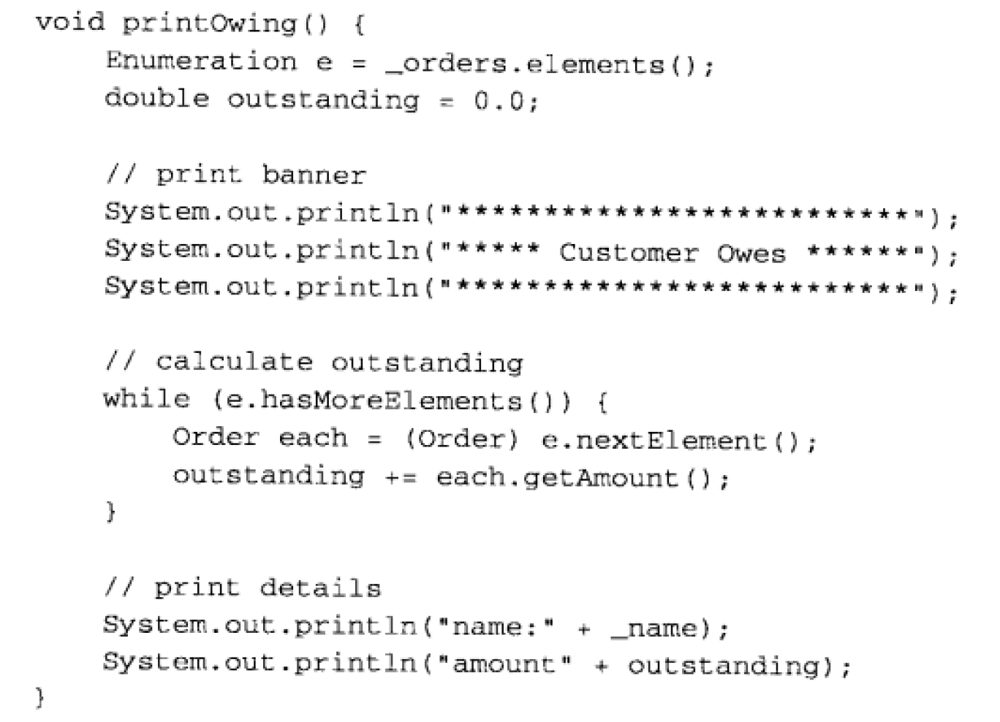
    >   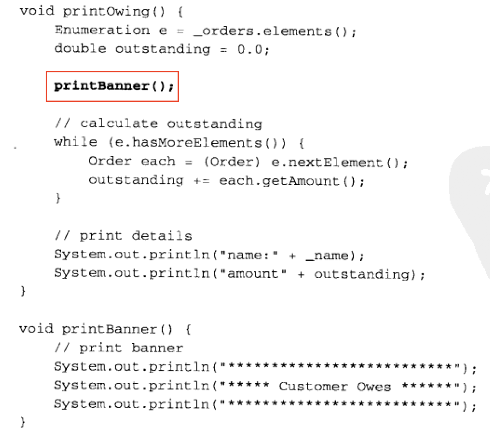
    > </figure>

- **有局部变量**：

    > <figure>
    >   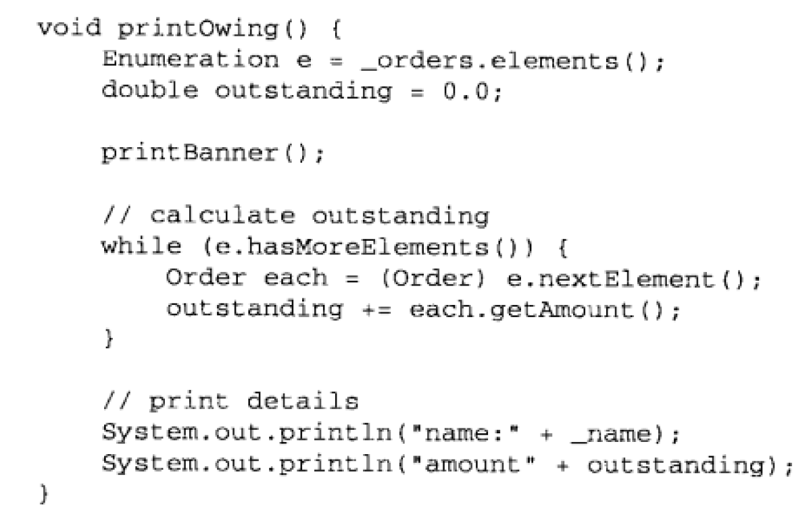
    >   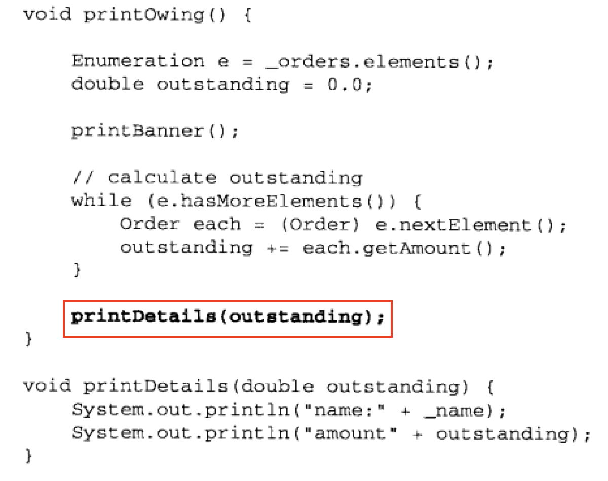
    > </figure>

- **对局部变量再赋值**：

    > 变量只在被**提炼代码段中**使用
    >
    > 或
    >
    > 变量在被**提炼代码段外**使用，同时该变量在被提炼代码段之后**未再被使用**，则只需直接在目标函数中修改：
    >
    > <figure>
    >   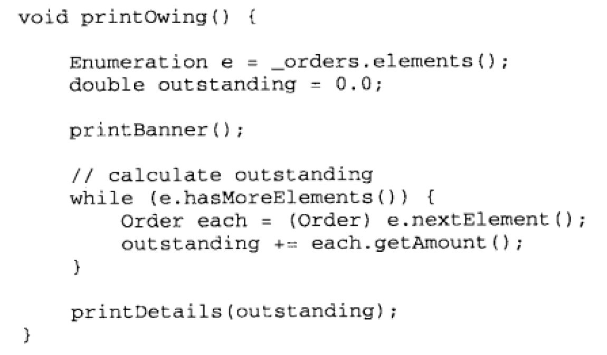
    >   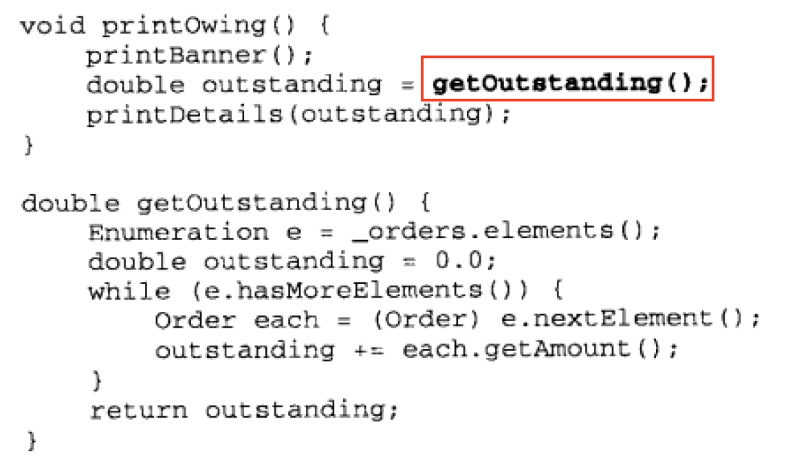
    > </figure>

    > 变量在被**提炼代码段外**使用，同时该变量在代码段之后**还在使用**，则需要让目标函数返回该变量改变后的值：
    >
    > <figure>
    >   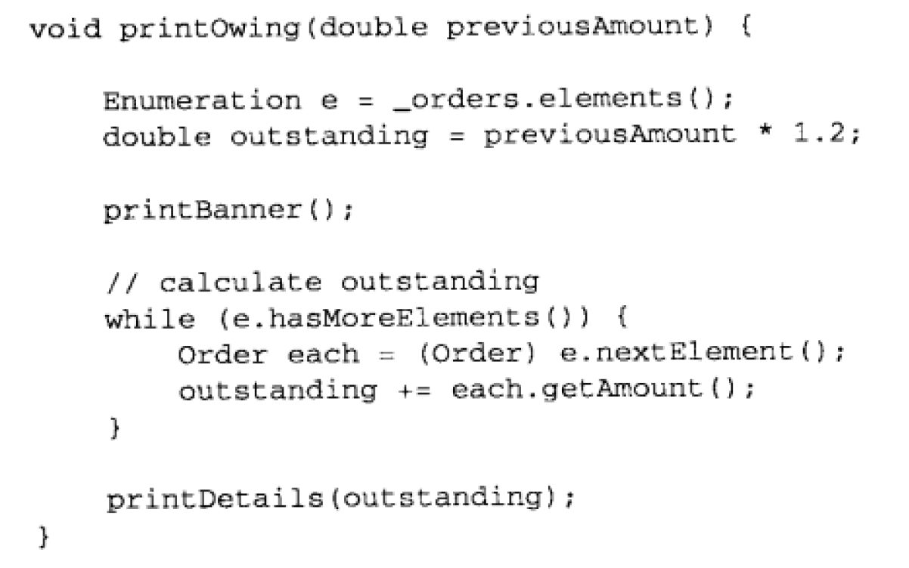
    >   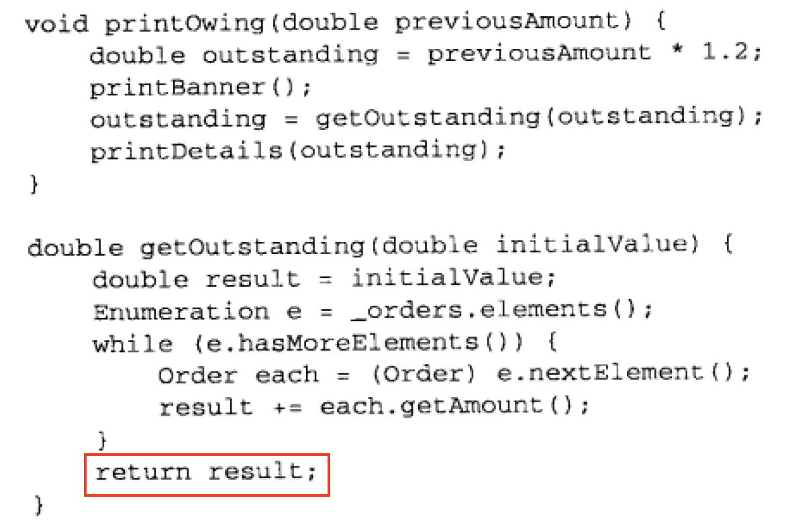
    > </figure>

## 2、内联函数(Inline Method)

- 一个函数的本体与名称同样清楚易懂，则**在函数调用点插入函数本体，然后移除该函数**


### (1) 动机

- 动机一：函数内部代码和函数名称同样清晰易读，则应该去掉这个函数，直接使用其中的代码
- 动机二：有一群组织不甚合理的函数，则可以将它们都内联到一个大型函数中，再从中提炼出组织合理的小型函数
- 动机三：若有太多的间接层，使得系统中的所有函数都似乎只是对另一个函数的简单委托，造成委托之间晕头转向

### (2) 做法

- 检查函数，确定其不具多态性

    > 若子类继承了该函数，就不要将此函数内联，因为子类无法复写一个根本不存在的函数

- 找出这个函数的所有被调用点

- 将这个函数的所有被调用点都替换为函数本体

- 编译，测试

- 删除该函数的定义

## 3、内联临时变量(Inline Temp)

- 若有一个临时变量，只被一个简单表达式赋值一次，而其妨碍了其他重构手法，则**将所有对该变量的引用动作，替换为对它赋值的那个表达式自身**


### (1) 动机

- 动机一：Inline Temp 多半是作为 Replace Temp with Query(以查询替代临时变量)的一部分使用
- 动机二：发现某个临时变量被赋予某个函数调用的返回值

### (2) 做法

- 检查给临时变量赋值的语句，确保等号右边的表达式没有副作用

- 若该临时变量并未被声明为 final，则将其声明为 final，然后编译

    > 这可以检查该临时变量是否真的只被赋值一次

- 找到该临时变量的所有引用点，将其替换为”为临时变量赋值“的表达式

- 每次修改后，编译并测试

- 修改完所有引用点之后，删除该临时变量的声明和赋值语句

- 编译，测试

## 4、以查询取代临时变量(Replace Temp with Query)

- 你的程序以一个临时变量保存某一表达式的运算结果，则**将表达式提炼到一个独立函数中，将该临时变量的所有引用点替换为对新函数的调用，此后，新函数就可被其他函数使用**


### (1) 动机

- 临时变量的问题：只是暂时的，而且只能在所属函数内使用
- 动机：把临时变量替换为一个查询，则同一个类中的所有函数都将可以获得这份信息，能够为这个类编写更清晰的代码

### (2) 做法

- 找出只被赋值一次的临时变量

    > 若某个临时变量被赋值超过一次，考虑使用 Split Temporary Variable(分解临时变量)将其分割成多个变量

- 将该临时变量声明为 final

- 编译

    > 确保该临时变量的确只被赋值一次

- 将“对该临时变量赋值”之语句的等号右侧部分提炼到一个独立函数中

    > - 首先将函数声明为 private
    >
    > - 确保提炼出的函数无任何副作用，及该函数不修改任何对象内容
    >
    >     > 若有副作用，就对其进行 Separate Query from Modifler(将查询函数和修改函数分离)

- 编译，测试

- 在该临时变量身上实施 Inline Temp(内联临时变量)

### (3) 范例

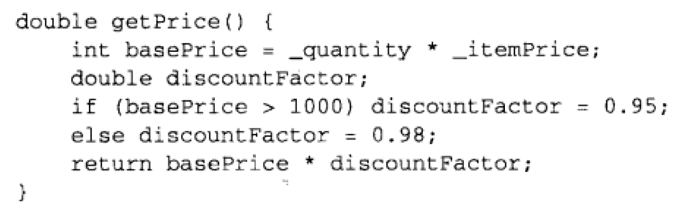

---

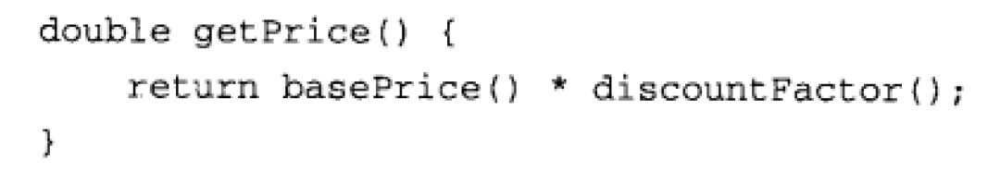

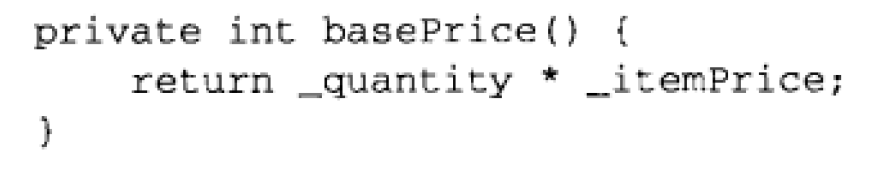

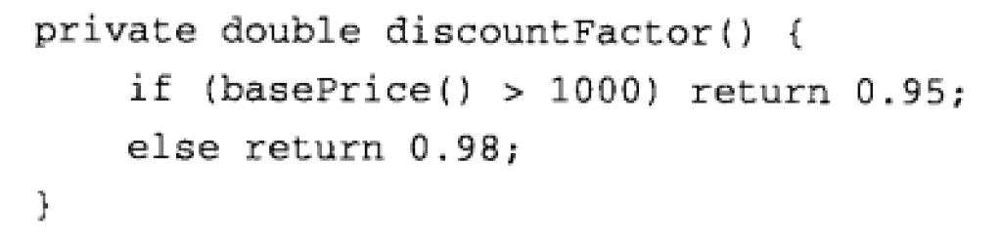

## 5、引入解释性变量(Introduce Explaining Variable)

- 若有一个复杂的表达式，则**将该复杂表达式(或其中一部分)的结果放进一个临时变量，以此变量名称来解释表达式用途**


### (1) 动机

- 动机：若表达式很复杂而难以阅读，则临时变量可以帮助将表达式分解为比较容易管理的形式

- 在条件逻辑中，Introduce Explaining Variable(引入解释性变量)的价值：可以用这项重构将每个条件子句提炼出来，以一个良好命名的临时变量来解释对应条件子句的意义

### (2) 做法

- 声明一个 final 临时变量，将待分解之复杂表达式中的一部分动作的运算结果赋值给它

- 将表达式中的“运算结果”这部分，替换为上述临时变量

    > 若被替换的这部分在代码中重复出现，可以每次一个，逐一替换

- 编译，测试
- 重复上述过程，处理表达式的其他部分

### (3) 范例

- **Introduce Explaining Variable 处理**：

    > <figure>
    >   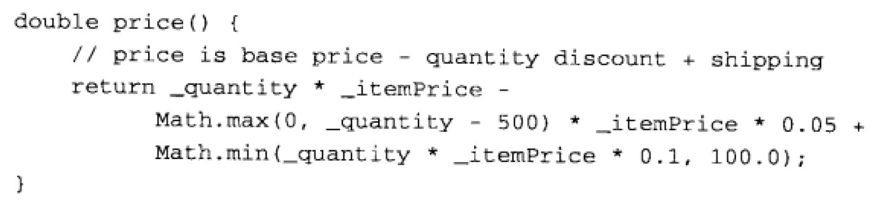
    >   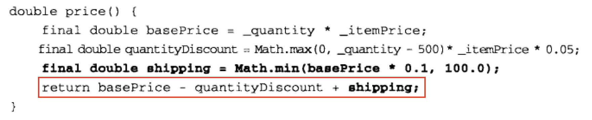
    > </figure>

- **Extract Method 处理**：

    > <figure>
    >   
    >   
    > </figure>

## 6、分解临时变量(Split Temporary Variable)

- 若程序有某个临时变量被赋值超过一次，它既不是循环遍历，也不被用于收集计算结果，则**针对每次赋值，创造一个独立、对应的临时变量**


 ### (1) 动机

- 动机一：临时变量**被多次赋值**
    - 循环变量：会随循环的每次运行而改变
    - 结果收集变量：负责将“通过整个函数的运算”而构成的某个值收集起来

- 动机二：临时变量用于保存一段冗长代码的运算结果，**只被赋值一次**

### (2) 做法

- 在待分解临时变量的声明及其第一次被赋值处，修改其名称

    > - 结果收集变量： 稍后之赋值语句是 [i = i + 某表达式]形式，不要分解
    >
    > 结果手机变量的作用： 累加、字符串结合、写入流或向集合添加元素

- 将新的临时变量声明为 final
- 以该临时变量的第二次赋值动作为界，修改此前对该临时变量的所有引用点，让它们引用新的临时变量
- 在第二次赋值处，重新声明原先那个临时变量
- 编译，测试
- 逐次重复上述过程。每次在声明处对临时变量改名，并修改下次赋值前的引用点

### (3) 范例

<figure>
  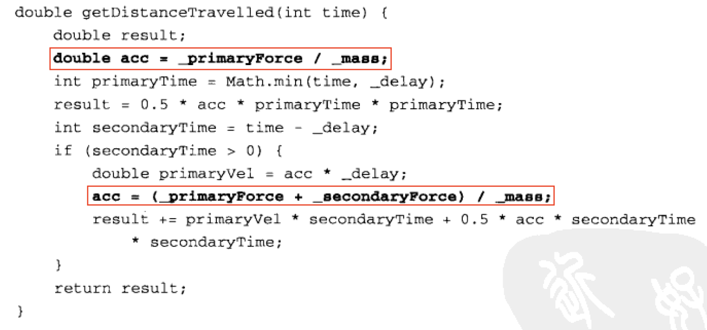
  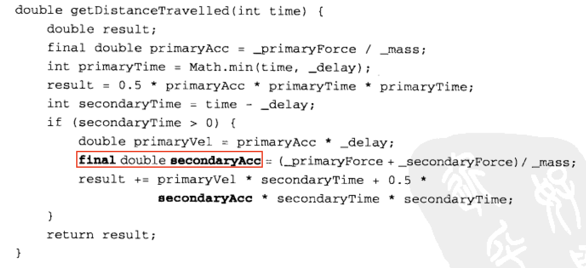
</figure>

## 7、移除对参数的赋值(Remove Assignments to Parameters)

- 若代码对一个参数进行赋值，则**以一个临时变量取代该参数的位置**


### (1) 动机

- 动机：Java 是按值传递，对参数的任何修改，都不会对调用端造成任何影响

### (2) 做法

- 建立一个临时变量，把待处理的参数值赋予它

- 以“对参数的赋值”为界，将其后所有对此参数的引用点，全部替换为“对此临时变量的引用”

- 修改赋值语句，使其改为对新建之临时变量赋值

- 编译，测试

    > - 若代码的语义按引用传递，请在调用端检查调用后是否还使用了该参数
    > - 尽量只以 return 方式返回一个值

### (3) 范例

<figure>
  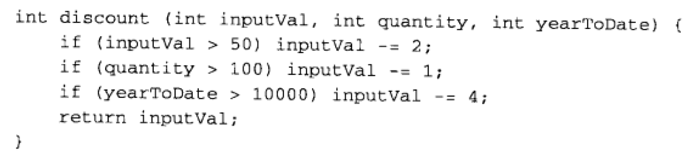
  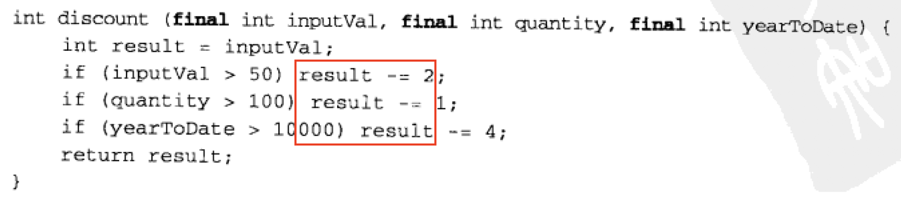
</figure>

## 8、以函数对象取代函数(Replace Method with Method Object)

- 若有一个大型函数，其中对局部变量的使用使你无法采用 Extract Method(提炼函数)；**若将该函数放进一个单独对象中，则局部变量变为了对象内的字段，然后可以在同一个对象中将该大型函数分解为多个小型函数**


### (1) 动机

- 动机：Replace Method with Method Object(以函数对象取代函数) 会**将所有局部变量都变成函数对象的字段**，然后就可以对这个新对象使用 Extract Method(提炼函数)创造出新函数，从而将原本的大型函数拆解变短

### (2) 做法

- 建立一个新类，根据待处理函数的用途，为该类命名

- 在新类中建立一个 final 字段，用以保存原先大型函数所在的对象，该字段称为“源对象”

    > 同时，针对原函数的每个临时变量和每个参数，在新类中建立一个对应的字段保存之

- 在新类中建立一个构造函数，接收源对象及原函数的所有参数作为参数

- 在新类中建立一个 compute 函数

- 将原函数的代码复制到 compute 函数中

    > 若需要调用源对象的任何函数，请通过源对象字段调用

- 编译
- 将旧函数的函数本体替换为：“创建上述新类的一个新对象，而后调用其中的 compute 函数”

### (3) 范例

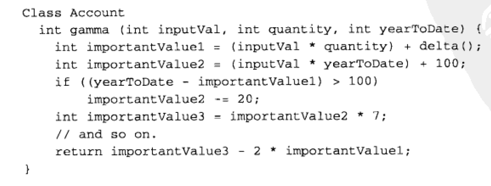

---

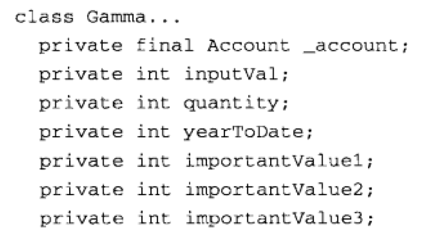

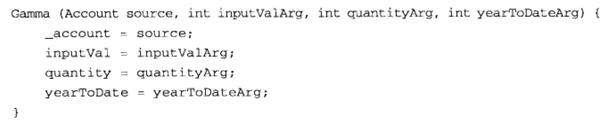

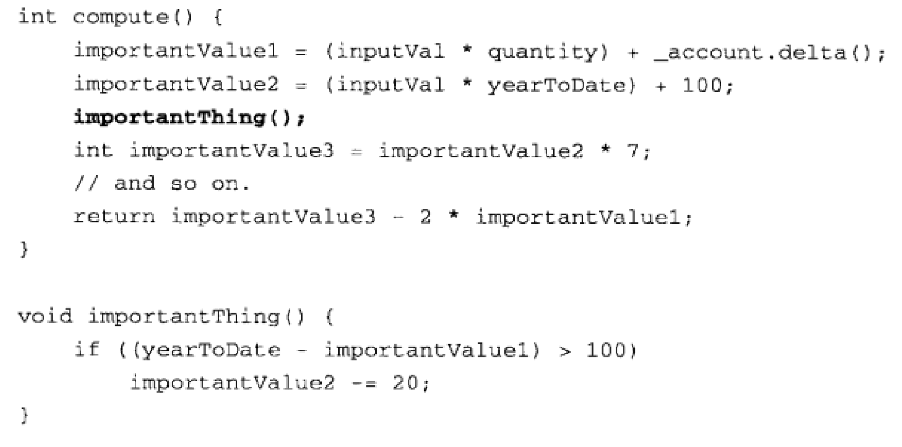

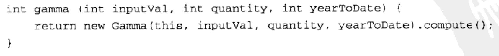

## 9、替换算法(Substitute Algorithm)

- 若想把某个算法替换为另一个更清晰的算法，则**将函数本体替换为另一个算法**


### (1) 动机

- 动机：有时会想修改原先的算法，让它做一件与原先略有差异的事，这时可以先把原先的算法替换为一个较易修改的算法

    > 注意：先将原函数分解为简单的小函数

### (2) 做法

- 准备好另一个(替换)算法，让其通过编译

- 针对现有测试，执行上述的新算法

 - 若结果与原本结果相同，则重构结束

 - 若结果不同，则在测试和调试过程中，以旧算法为比较参照标准

    > 对每个测试用例，分别以新旧两种算法执行，并观察两者结果是否相同

# 七、在对象间搬移特性

## 1、搬移函数(Move Method)

- 若程序中，有个函数与其所驻类之外的另一个类进行更多交流，调用后者，或被后者调用，则**在该函数最常引用的类中建立一个有着类似行为的新函数，将旧函数变成一个单纯的委托函数，或将旧函数完全移除**


### (1) 动机

- 动机：若一个类有太多行为，或若一个类与另一个类有太多合作而形成高度耦合，则会使用搬移函数

### (2) 做法

- 检查源类中被源函数所使用的一切特性(包括字段和函数)，考虑它们是否也该被搬移

    > 若某个特性只被你打算搬移的那个函数用到，就应该将其一并搬移
    >
    > 若另有其他函数使用了该特性，可以考虑将使用该特性的所有函数全部搬移

- 检查源类的子类和超类，看看是否有该函数的其他声明

    > 若出现其他声明，或许无法搬移，除非目标类也同样表现出多态性

- 在目标类中声明该函数

    > 可以为此函数选择一个新名称——对目标类更有意义的名称

- 将源函数的代码复制到目标函数中，调整后者，使其能在新家中正常运行

    > - 若目标函数使用了源类中的特性，得决定如何从目标函数引用源对象
    >
    >     若目标类中没有相应的引用机制，就把源对象的引用当作参数，传给新建立的目标函数
    >
    > - 若源函数包含异常处理，得判断逻辑上应该由哪个类来处理这一异常
    >
    >     若应该由源类负责，就把异常处理留在原地

- 编译目标类

- 决定如何从源函数正确引用目标对象

    > - 可能会有一个现成的字段或函数帮助取得目标对象
    >
    > - 若没有，就看能否轻松建立一个这样的函数
    >
    > - 若还不行，就在源类中新建一个字段来保存目标对象

- 修改源函数，使之成为一个纯委托函数

- 编译，测试

- 决定是否删除源函数，或将其当作一个委托函数保留下来

    > 若经常要在源对象中引用目标函数，则将源函数作为委托函数保留会更简单

- 若要移除源函数，请将源类中对源函数的所有调用，替换为对目标函数的调用

    > 可以每修改一个引用点九编译并测试一次
    >
    > 也可以通过一次"查找/替换"改掉所有引用点

- 编译，测试

### (3) 范例

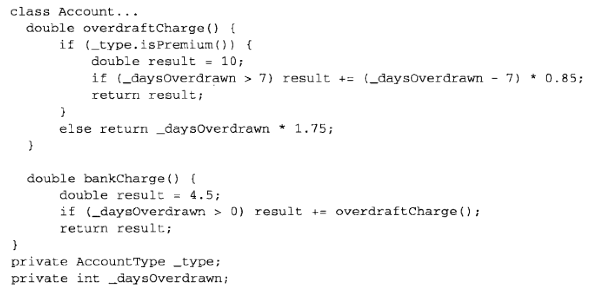

---

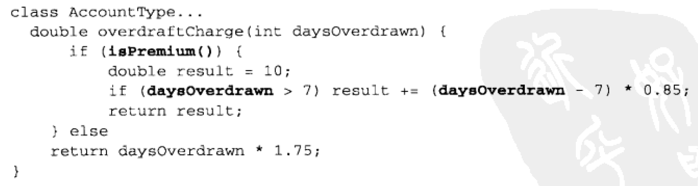

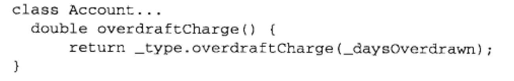

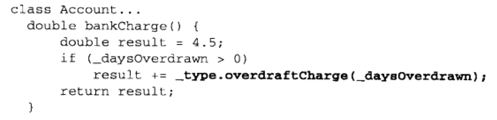

## 2、搬移字段(Move Field)

- 程序中某个字段被其所驻类之外的另一个类更多地用到，则**在目标类新建一个字段，修改源字段的所有用户，令它们改用新字段**


### (1) 动机

- 动机：对于一个字段，在其所驻类之外的另一个类中有更多函数使用它，则要考虑搬移这个字段

    > 上述所谓“使用”可能是通过设值/取值函数间接进行

### (2) 做法

- 若字段的访问级是 public，使用“**封装字段**”将其封装起来

    > 使用“**自封装字段**”：
    >
    > - 若能移动那些频繁访问该字段的函数
    > - 若有许多函数访问某个字段

- 编译，测试

- 在目标类中建立与源字段相同的字段，并同时建立相应的设值/取值函数

- 编译目标类

- 决定如何在源对象中引用目标对象

    > - 首先看是否有一个现成的字段或函数可以助你得到目标对象： 
    >
    > - 若没有，就看能否轻易建立这样的函数
    > - 若还不行，就得在源类中新建一个字段来存放目标对象

- 删除源字段

- 将所有对源字段的引用替换为对某个目标函数的调用

    > - 若需读取该变量，就把对源字段的引用替换为对目标取值函数的调用
    >
    >     若要对该变量赋值，就把对源字段的引用替换成对设值函数的调用
    >
    > - 若源字段不是 private，就必须在源类的所有子类中查找源字段的引用点，并进行相应替换

- 编译，测试

## 3、提炼类(Extract Class)

- 若某个类做了应由两个类做的事，则**建立一个新类，将相关字段和函数从旧类搬移到新类** 


### (1) 动机

- 动机：若一个类含有大量函数和数据，则要考虑将部分内容分离到一个单独的类中

### (2) 做法

- 决定如何分解类所负的责任

- 建立一个新类，用以表现出旧类中分离出来的责任

    > 若旧类剩下的责任与旧类名称不符，为旧类更名

- 建立“从旧类访问新类”的连接关系

- 对于想搬移的每一个字段，运用“**搬移字段**”搬移之

- 每次搬移后，编译、测试

- 使用“搬移函数”将必要函数搬移到新类

    > 先搬移较低层函数，再搬移较高层函数

- 每次搬移后，编译，测试

- 检查，精简每个类的接口

    > 若建立起双向连接，检查是否可以将其改为单向连接

- 决定是否公开新类

    > 若要公开，则决定让其成为引用对象还是不可变的值对象

## 4、将类内联化(Inline Class)

- 若某个类没有做太多事情，则**将该类的所有特性搬移到另一个类中，然后移除原类**


### (1) 动机

- 动机：以 Inline Class 手法将“萎缩类”塞进另一个类中

### (2) 做法

- 在目标类身上声明源类的 public 协议，并将其中所有函数委托至源类

    > 若“以一个独立接口表示源类函数”个合适的话，就应在内联之前先使用“**提炼接口**”

- 修改所有源类引用点，改而引用目标类

    > 将源类声明为 private，以斩断包之外的所有引用可能
    >
    > 同时修改源类的名称，这便可使编译器帮助捕捉到所有对于源类的隐藏引用点

- 编译，测试

- 运用“**搬移函数**”和“**搬移字段**”，将源类的特性全部搬移到目标类

- 为源类举行一个简单的“丧礼”

## 5、隐藏“委托关系”(Hide Delegate)

- 若客户通过一个委托类来调用另一个对象，则**在服务类上建立客户所需的所有函数，用以隐藏委托关系**


### (1) 动机

- 场景：若某个客户先通过服务对象的字段得到另一个对象，然后调用后者的函数，则客户就会知晓这层委托关系

- 动机：在服务对象上放置一个简单的委托函数，将委托关系隐藏，从而去除这种依赖

    > 好处：即便将来发生委托关系上的变化，变化也将被限制在服务对象上，不会波及客户


### (2) 做法

- 对于每一个委托关系中的函数，在服务对象端建立一个简单的委托函数

- 调整客户，令其只调用服务对象提供的函数

    > 若使用者和服务提供者不在同一个包，考虑修改委托函数的访问权限，让客户得以在包外调用它

- 每次调整后，编译并测试

- 若将来不再有任何客户需要取用下图7-1 的 Delegate(受托类)，便可移除服务对象中的相关访问函数

- 编译，测试

## 6、移除中间人(Remove Middle Man)

- 若某个类做了过多的简单委托动作，则**让客户直接调用受托类**


### (1) 动机

- **封装受托对象的代价**：每当客户要使用受托类的新特性时，就必须在服务端添加一个简单委托函数

    > 随着受托类的特性越来越多，这一过程会让你痛苦不已

- 动机：随着系统的变化调整，“合适的隐藏程度”也相应改变

### (2) 做法

- 建立一个函数，用以获得受托对象
- 对于每个委托函数，在服务类中删除该函数，并让需要调用该函数的客户转为调用受托对象
- 处理每个委托函数后，编译、测试

## 7、引入外加函数(Introduce Foreign Method)

- 若需要为提供服务的类增加一个函数，但无法修改这个类，则**在客户类中建立一个函数，并以第一参数形式传入一个服务类实例**


### (1) 动机

- 推荐：把外加函数交给服务类的拥有者
- 注意：当发现为一个服务类建立了大量外加函数，或者发现有许多类都需要同样的外加函数，就不要再使用本项重构，而应该使用 **Introduce Local Extension(引入本地扩展)**

### (2) 做法

- 在客户类中建立一个函数，用来提供你需要的功能

    > 这个函数不应该用客户类的任何特性
    >
    > 若它需要一个值，把该值当作参数传给它

- 以服务类实例作为该函数的第一个参数

- 将该函数注释为：”外加函数，应在服务类实现“

    > 这样，若将来有机会将外加函数搬移到服务类中时，便可以轻松找出这些外加函数

## 8、引入本地扩展(Introduce Local Extension)

- 若需要为服务类提供一些额外函数，但无法修改这个类，则**建立一个新类，使其包含这些额外函数，让这个扩展品成为源类的子类或包装类**


- 本地扩展：一个独立的类，但也是被扩展的子类，提供源类的一切特性，同时额外添加新特性。任何使用源类的地方，都可以使用本地扩展取而代之

    > 两种标准对象技术：**子类化和包装**，统称为**本地扩展** 

### (1) 动机

- 动机：若需要的额外函数超过两个，外加函数很难控制它们，则需要将这些函数组织在一起，放到一个恰当地方去

### (2) 做法

- 建立一个扩展类，将其作为原始类的子类或包装类

- 在扩展类中加入转型构造函数

    > 转型构造函数： 指”接受原对象作为参数的构造函数“
    >
    > - 若采用子类化方案，则转型构造函数应该调用适当的超类构造函数
    > - 若采用包装类方案，则转型构造函数应该将它得到的传入参数以实例变量的形式保存，用作接受委托的原对象

- 在扩展类中加入新特性

- 根据需要，将原对象替换为扩展对象

- 将针对原始类定义的所有外加函数搬移到扩展类中

# 八、重新组织数据

## 1、自封装字段(Self Encapsulate Field)

- 若直接访问一个字段，但与字段之间的耦合关系逐渐变得笨拙，则**为该字段建立取值/设值函数，并且只以这些函数来访问字段**


### (1) 动机

- 间接访问的好处：子类可以通过覆写一个函数而改变获取数据的途径，还支持更灵活的数据管理方式
- 直接访问的好处：代码容易阅读

---

**动机**：若想访问超类中的一个字段，却又想在子类中方将对这个变量的访问改为一个计算后的值

### (2) 做法

- 为待封装字段建立取值/设值函数

- 找出该字段的所有引用点，将它们全部改为调用取值/设值函数

    > - 若引用点幺读取字段值，就将其替换为调用取值函数
    >
    >     若引用点幺给字段赋值，就将其替换为调用设值函数
    >
    > - 可以暂时将该字段改名，让编译器帮助你查找引用点

- 将该字段声明为 private

- 复查，确保找出所有引用点

- 编译，测试

## 2、以对象取代数据值(Replace Data Value with Object)

- 若有一个数据项，需要与其他数据和行为一起使用才有意义，则**将数据项变成对象**


### (1) 动机

动机：随着开发的进行，一个数据的表示可能需要多个数据项的组合，这时就需要将相关对象封装进数据项

### (2) 做法

- 为待替换数值新建一个类，在其中声明一个 final 字段，其类型和源类中的待替换数值类型一样。然后在新类中加入这个字段的取值函数，再加上一个接受此字段为参数的构造函数
- 编译
- 将源类中的待替换数值字段的类型改为前面新建的类
- 修改源类中该字段的取值函数，令它调用新类的取值函数
- 若源类构造函数中用到该待替换字段，则就修改构造函数，令其改用新类的构造函数来对字段进行赋值操作
- 修改源类中待替换字段的设值函数，令其为新类创建一个实例
- 编译，测试
- 现在，可能需要对新类使用”将值对象改为引用对象(Change Value to Reference)“

## 3、将值对象改为引用对象(Change Value to Reference)

- 若从一个类衍生出许多彼此相等的实例，希望将它们替换为同一个对象，则**将这个值对象变成引用对象**


### (1) 动机

动机：

- 有时会从一个简单的值对象开始，在其中保存少量不可修改的数据
- **而后希望给这个对象加入一些可修改数据**，并确保对任何一个对象的修改都能影响到所有引用此一对象的地方，这时就需要将值对象改为引用对象

### (2) 做法

- 使用”**以工厂函数取代构造函数(Replace Constructor with Factory Method)**“

- 编译，测试

- 决定由什么对象负责提供访问新对象的途径

    > - 可能是一个静态字典或一个注册表对象
    > - 也可以使用多个对象作为新对象的访问点

- 决定这些引用对象应该预先创建好，或是应该动态创建

    > 若这些引用对象是预先创建好的，且必须从内存中读取，则得确保它们在被需要时能被及时加载

- 修改工厂函数，令其返回引用对象

    > - 若对象是预先创建好的，需考虑： 万一有人索求一个其实并不存在的对象，要如何处理错误？
    > - 希望对工厂函数使用”函数改名(Rename Method)“，使其传达： 它返回的是一个既存对象

- 编译，测试

## 4、将引用对象改为值对象(Change Reference to Value)

- 若有一个引用对象，很小且不可变，而且不易管理，则**将它变成一个值对象** 


### (1) 动机

动机：引用对象必须被某种方式控制，可能造成内存区域间复杂的关联。因此在分布系统和并发系统中，不可变的值对象更有用

### (2) 做法

- 检查重构目标是否为不可变对象，或是否可修改为不可变对象

    > - 若该对象目前不可变，就使用”移除设置函数(Remove Setting Method)“，直到其不可变为止
    > - 若无法将对象修改为不可变的，就放弃使用本项重构

- 建立 equals() 和 hashCode()

- 编译，测试

- 考虑是否可以删除工厂函数，并将构造函数声明为 public

## 5、以对象取代数组(Replace Array with Object)

- 若有一个数组，其中的元素各自代表不同的东西，则**以对象替换数组，对于数组中的每个元素，以一个字段来表示**


### (1) 动机

动机：

- 数组应该只用于“以某种顺序容纳一组相似对象”，当容纳多种不同对象时，会给用户带来麻烦
- 而对象可以运用字段名称和函数名称来传达这样的信息

### (2) 做法

- 新建一个类表示数组所拥有的信息，并在其中以一个 public 字段保存原先的数组

- 修改数组的所有用户，让它们改用新类的实例

- 编译，测试

- 逐一为数组元素添加取值/设值函数

    > - 根据元素用途，为这些访问函数命名
    >
    > - 修改客户端代码，让它们通过访问函数取用数组内的元素
    >
    > - 每次修改后，编译并测试

- 当所有对数组的直接访问都转而调用访问函数后，将新类中保存该数组的字段声明为 private

- 编译

- 对于数组内的每个元素，在新类中创建一个类型相当的字段

    > 修改该元素的访问函数，令它改用上述的新建字段

- 每修改一个元素，编译并测试

- 数组的所有元素都有了相应字段后，删除该数组

## 6、复制“被监视数据”(Duplicate Observed Data)

- 若有些领域数据置身于 GUI 控件中，而领域含糊需要访问这些数据，则**将该数据复制到一个领域对象中，建立一个 Observer 模式，用以同步领域对象和 GUI 对象内的重复数据**


### (1) 动机

若遇到的代码是以两层方式开发，业务逻辑被内嵌于用户界面中，则需要将行为分离出来，主要工作：

- 对于函数：进行分解和搬移
- 对于数据：必须将它复制到新对象中，并提供相应的同步机制

### (2) 做法

- 修改展现类，使其成为领域类的 Observer[GoF]

    > - 若尚未有领域类，就建立一个
    > - 若没有”从展现类到领域类“的关联，就将领域类保存于展现类的一个字段中

- 针对 GUI 类中的领域数据，使用”自封装字段(Self Encapsulate Field)“

- 编译，测试

- 在事件处理函数中调用设值函数，直接更新 GUI 组件

    > - 在事件处理函数中放一个设值函数，利用它将 GUI 组件更新为领域数据的当前值
    >
    >     > 这样使用设值函数，允许其中的任何动作得以于日后被执行起来
    >
    > - 进行这个改变时，对于组件，不要使用取值函数，应该直接取用
    >
    > - 确保测试代码能触发新添加的事件处理机制

- 编译，测试

- 在领域类中定义数据及其相关访问函数

    > - 确保领域类中的设值函数能够触发 Observer 模式的通报机制
    > - 对于被观察的数据，在领域类中使用和展现类所用的相同类型来保存

- 修改展现类中的访问函数，将它们的操作对象改为领域对象(而非 GUI 组件)

- 修改 Observer 的 update()，使其从相应的领域对象中将所需数据复制给 GUI 组件

- 编译，测试

## 7、将单向关联改为双向关联(Change Unidirectional Association to Bidirectional)

- 若两个类都需要使用对方特性，但其间只有一条单向连接，则**添加一个反向指针，并使修改函数能同时更新两条连接**


### (1) 动机

动机：开发初期，两个类间可能只存在一条单向连接，使其中一个类可以引用另一个类。但随着时间的推移，可能需要一个反向指针(或双向引用关系)

### (2) 做法

- **在被引用类中增加一个字段，用以保存反向指针**

- 决定由哪个类——引用端还是被引用端——控制关联关系

- 在被控端建立一个辅助函数

    > 其命名应清楚指出其有限用途

- 若既有的修改函数在控制端，让它负责更新反向指针

- 若既有的修改函数在被控端，就在控制端建立一个控制函数，并让既有的修改函数调用这个新建的控制函数

### (3) 范例

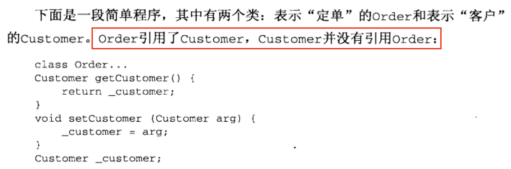

- 首先，为 Customer 添加一个字段

    > 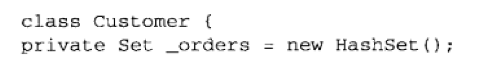

- 现在决定由哪一个类负责控制关联关系

    按以下步骤做决定：

    - 若两者都是引用对象，而其间的关联是“一对多”关系，则由“拥有单一引用”的那一方承担“控制者”角色

        > 本例中，若一个客户可拥有多份订单，则就由 Order 类(订单)来控制关联关系

    - 若某个对象是组成另一对象的部件，则由后者负责控制关联关系

    - 若两者都是引用对象，而其间的关联是“多对多关系”，则随便其中哪个对象来控制关联关系

- 本例中，由于 Order 负责控制关联关系，所以为 Customer 添加一个辅助函数，让 Order 可以直接访问 _orders(订单)集合

    > - Order 的修改函数将使用这个辅助函数对指针两端对象进行同步控制
    > - 将这个辅助函数命名为 friendOrders()，表示这个函数只能在这种特殊情况下使用：
    >     - 若 Order 和 Customer 在同一个包内，则将 friendOrders 声明为包内可见，使其可见度降到最低
    >     - 若这两个类不在同一个包内，则只好把 friendOrders 声明为 public
    >
    > 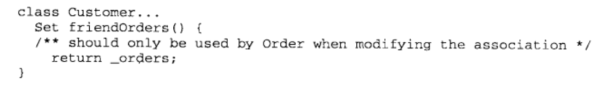

- 现在修改函数，令其同时更新反向指针

    > 先让对方删除指向你的指针，再将你的指针指向一个新对象，最后让那个新对象把它的指针指向你
    >
    > 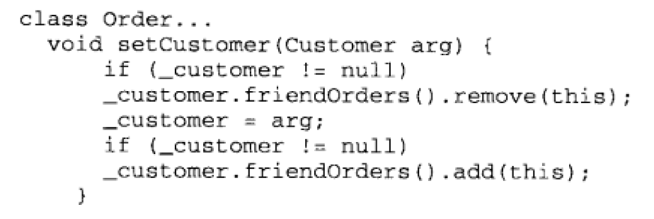

- 若想在 Customer 中也能修改连接，则让它调用控制函数

    > 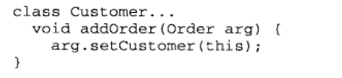

- 若一份订单可以对应多个客户，则所面临的就是一个“多对多”情况，重构后的函数可能是下面这样

    > 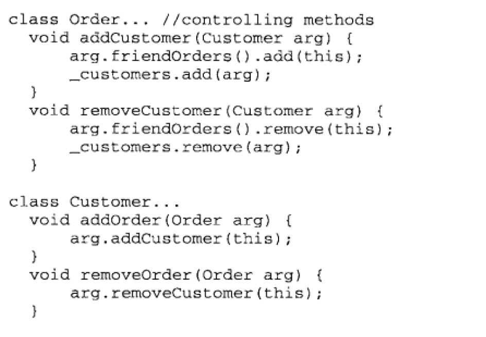

## 8、将双向关联改为单向关联(Change Bidirectional Association to Unidirectional)

- 若两个类之间有双向关联，但其中一个类如今不再需要另一个类的特性，则去除不必要的关联

  > 
  >
  > - 找出保存”你想去除的指针“的字段，检查其每个用户，判断是否可以去除该指针
  >
  >   > - 不但要检查直接访问点，也要检查调用这些直接访问点的函数
  >   > - 考虑有无可能不通过指针取得被引用对象，若有可能，就可以对取值函数使用”替换算法(Substitute Algorithm)“，从而让客户在没有指针的情况下，也可以使用该取值函数
  >   > - 对于使用该字段的所有函数，考虑将被引用对象作为参数传进去
  >
  > - 若客户使用了取值函数，先运用”自封装字段(Self Encapsulate Field)“将待删除字段自我封装，然后使用”替换算法(Substitute Algorithm)“对付取值函数，令其不再使用该字段。然后编译、测试
  >
  > - 若客户并未使用取值函数，则直接修改待删除字段的所有被引用点： 改以其他途径获得该字段所保存的对象。每次修改后，编译并测试
  >
  > - 若已经没有任何函数使用待删除字段，移除所有对该字段的更新逻辑，然后移除该字段
  >
  >   > 若有许多地方对此字段赋值： 
  >   >
  >   > - 先运用”自封装字段(Self Encapsulate Field)“使这些地点改用同一个设值函数。编译、测试
  >   > - 而后将这个设值函数的本体清空。再编译、测试
  >   >
  >   > 若上述都可行，就将此字段和其设值函数，连同对设值函数的所有调用，全部移除
  >
  > - 编译，测试

## 9、以字面常量取代魔法数(Replace Magic Number with Symbolic Constant)

- 若有一个字面数值带有特别含义，则**创造一个常量，根据其意义为它命名，并将上述的字面数值替换为这个常量**


### (1) 动机

- 魔法数：指拥有特殊意义，却又不能明确表现出这种意义的数字
- 动机：尽量用常量替换，尤其是在魔法数被多个地方引用时
    - 若这个魔法数是个类型码，则考虑 Replace Type Code with Class(用枚举类替代类型码)
    - 若这个魔法数代表一个数组的长度，则在遍历该数组时改用 Array.length()

### (2) 做法

- 声明一个常量，令其值为原本的魔法数值

- 找出这个魔法数的所有引用点

- 检查是否可以使用这个新声明的常量来替换该魔法数；若可以，便以此常量替换之

- 编译

- 所有魔法数都被替换完毕后，编译并测试

    > 测试方法(推荐)：检查现在的程序是否可以被轻松地修改常量值

## 10、封装字段(Encapsulate Field)

- 若类中存在一个 public 字段，则**声明为 private，并提供相应的访问函数**


### (1) 动机

- 动机：通过封装来隐藏数据

### (2) 做法

- 为 public 字段提供取值/设值函数

- 找到这个类以外使用该字段的所有地方

    若只是读取该字段，就把引用替换为对取值函数的调用

    若修改了该字段值，就将此引用点替换为对设值函数的调用

    > - 若该字段是个对象，而客户只是调用该对象的某个函数，则只算读取该字段
    >
    > - 只有当客户为该字段赋值时，才能将其替换为设值函数

- 每次修改后，编译并测试

- 将字段的所有用户修改完毕后，把字段声明为 private

- 编译，测试

## 11、封装集合(Encapsulate Collection)

- 若有个函数返回一个集合，则**让这个函数返回该集合的一个只读副本，并在这个类中提供添加/移除集合元素的函数**


### (1) 动机

- 动机：常会在一个类中使用集合来保存一组实例，因此也要提供针对该集合的取值/设值函数

### (2) 做法

- 加入为集合添加/移除元素的函数

- 将保存集合的字段初始化为一个空集合

- 编译

- 找出集合设值函数的所有调用者

    可以修改那个设值函数，让它使用上述新建立的”添加/移除元素“函数

    可以直接修改调用端，改让它们调用上述新建立的”添加/移除元素“函数

    > - 两种情况下，需要用到集合设值函数：
    >     1. 集合为空时
    >     2. 准备将原有集合替换为另一个集合时
    > - 或许会想运用”函数改名(Rename Method)“ 为集合设值函数改名：从 setXxx() 改为 initializeXxx() 或 replaceXxx()

- 编译，测试

- 找出所有”通过取值函数获得集合并修改其内容“的函数，主意修改这些函数，让它们改用添加/移除函数。每次修改后，编译并测试

- 修改完上述所有”通过取值函数获得集合并修改集合内容“的函数后，修改取值函数自身，使其返回该集合的一个只读副本

- 编译，测试

- 找出取值函数的所有用户，从中找出应该存在于集合所属对象内的代码，运用”提炼函数(Extract Method)“ 和 ”搬移函数(Move Method)“将这些代码移到宿主对象去

- 修改现有取值函数的名字，然后添加一个新取值函数，使其返回一个枚举

    > 找出旧取值函数的所有被使用点，将它们都改为使用新取值函数

- 若这一步跨度太大，可以先使用”函数改名(Rename Method)“修改原取值函数的名称，再建立一个新取值函数用以返回枚举，最后再修改所有调用者，使其调用新取值函数

- 编译，测试

## 12、以数据类取代记录(Replace Record with Data Class)

- 若需要面对传统编程环境中的记录结构，则**为该记录创建一个”哑“数据对象**

### (1) 动机

- 动机：若面对遗留程序，则需通过一个传统 API 来与记录结构交流，或是处理从数据库读出的记录，这时需要创建一个接口类来处理

    > 最简单的做法：先建立一个看起来类似外部记录的类，以便日后将某些字段和函数搬移到这个类中

### (2) 做法

- 新建一个类，表示这个记录
- 对于记录中的每项数据，在新建的类中建立对应的一个 private 字段，并提供相应的取值/设值函数

## 13、以类取代类型码(Replace Type Code with Class)

- 若类中有一个**数值类型码**，但它不影响类的行为，则**以一个新的类替换该数值类型码**


### (1) 动机

- 动机：当类型码是纯粹数据时，才能以类来取代它

### (2) 做法

- 为类型码建立一个类

    > - 该类需要一个用以记录类型码的字段，并应有对应的取值函数
    >
    > - 还应用一组静态变量保存允许被创建的实例，并以一个静态函数根据原本的类型码返回合适的实例

- 修改源类实现，让它使用上述新建的类

    > 维持原先以类型码为基础的函数接口，但改变静态字段，以新建的类产生代码
    >
    > 然后，修改类型码相关函数，让它们也从新建的类中获取类型码

- 编译，测试

    > 此时，新建的类可以对类型码进行运行期检查

- 对于源类中每个使用类型码的函数，相应建立一个函数，让新函数使用新建的类

    > - 需要建立”以新类实例为自变量“的函数，用以替换原先”直接以类型码为参数“的函数
    >
    > - 还需要建立一个”返回新类实例“的函数，用以替换原先”直接返回类型码“的函数
    >
    > 建立新函数前，可以使用”函数改名(Rename)“修改原函数名称，明确指出哪些函数仍然使用旧式类型码

- 逐一修改源类用户，让它们使用新接口

- 每修改一个用户，编译并测试

    > 可能需一次性修改多个彼此相关的函数，才能保持这些函数间的一致性，才能顺利地编译、测试

- 删除使用类型码的旧接口，并删除保存旧类型码的静态变量

- 编译，测试

## 14、以子类取代类型码(Replace Type Code with Subclasses)

- 若有一个**不可变的类型码**，它会影响类的行为，则**以子类取代这个类型码**


### (1) 动机

分析：

- 若面对的类型码不会影响宿主类行为，则可以使用 Replace Type with Class 来处理
- 若类型码会影响宿主类的行为，则最好借助多态来处理变化行为

### (2) 做法

- 使用”自封装字段(Self Encapsulate Field)“将类型码自我封装起来

    > 若类型码被传递给构造函数，就需要将构造函数换成工厂函数

- 为类型码的每个数值建立一个相应的子类，在每个子类中覆写类型码的取值函数，使其返回相应的类型码值

- 没建立一个新的子类，编译并测试

- 从超类中删掉保存类型码的字段，将类型码访问函数声明为抽象函数

- 编译，测试

## 15、以State/Strategy取代类型码(Replace Type Code with State/Strategy)

- 若有一个类型码，其会影响类的行为，但无法通过继承手段消除，则**以状态对象取代类型码**


### (1) 动机

- 动机：若类型码的值在对象生命周期中发生变化或其他原因使得宿主类不能被继承，则可以使用 Replace Type Code with State/Strategy

### (2) 做法

- 使用”自封装字段(Self Encapsulate Field)“将类型码自我封装起来

- 新建一个类，根据类型码的用途将它命名，这就是一个状态对象

- 为新类添加子类，每个子类对应一种类型码

    > 比起逐一添加，一次性加入所有必要的子类可能更简单

- 在超类中建立一个抽象的查询函数，用以返回类型码；在每个子类中覆写该函数，返回确切的类型码

- 编译

- 在源类中建立一个字段，用以保存新建的状态对象

- 调整源类中负责查询类型码的函数，将查询动作转发给状态对象

- 调整源类中为类型码设值的函数，将一个恰当的状态对象子类赋值给”保存状态对象“的那个字段

- 编译，测试

### (3) 范例

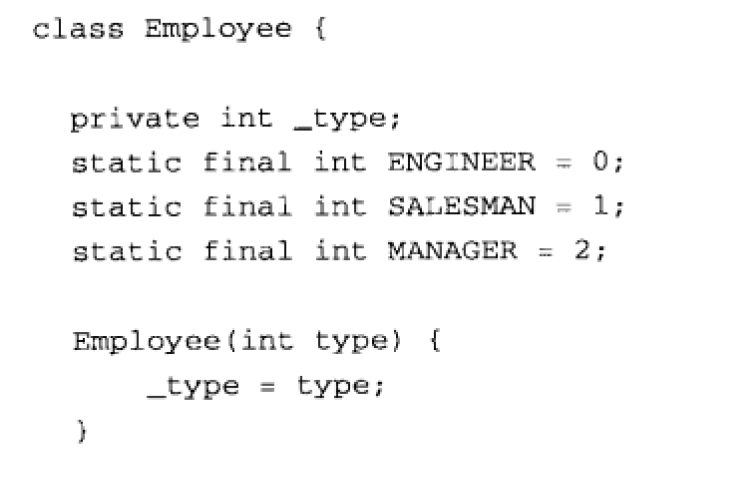

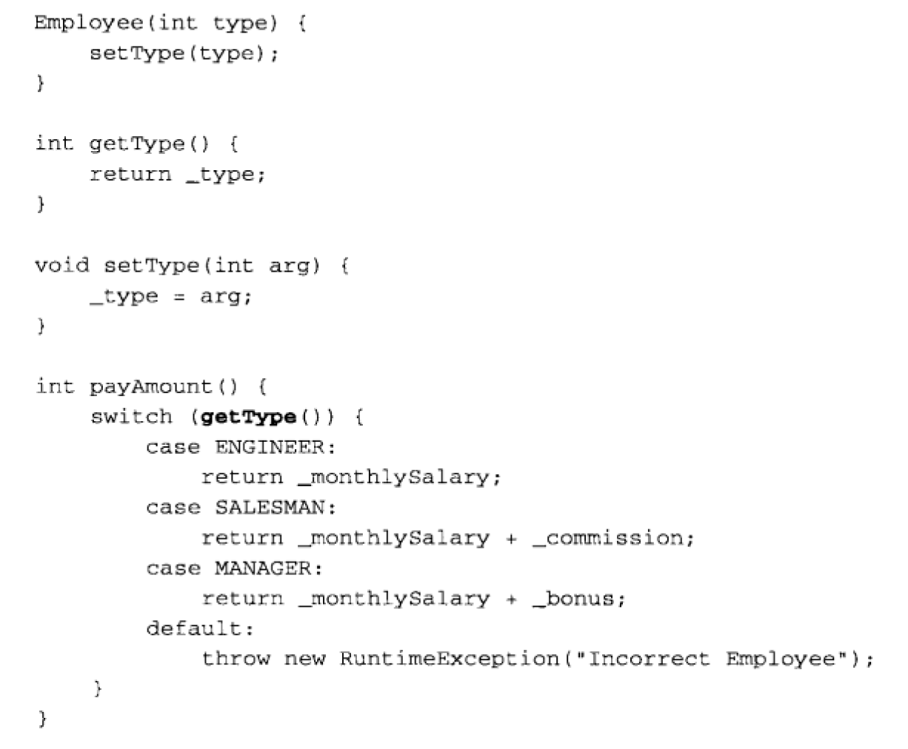

- 先声明一个状态抽象类，并提供一个抽象函数，用以返回类型码

    > 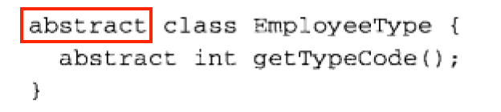

- 接着创建子类：

    > 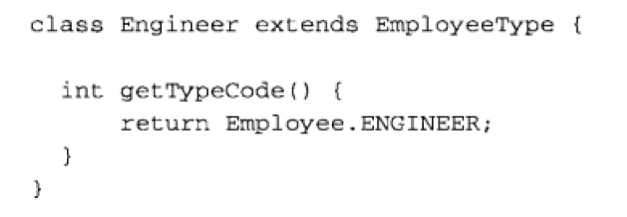
    >
    > 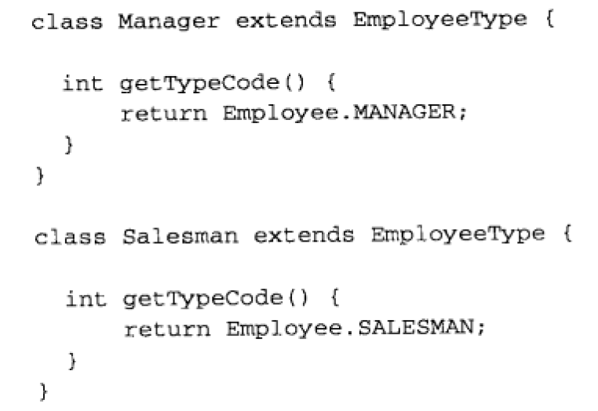

- 修改类型码访问函数，将上述子类和 Employee 关联起来：

    > 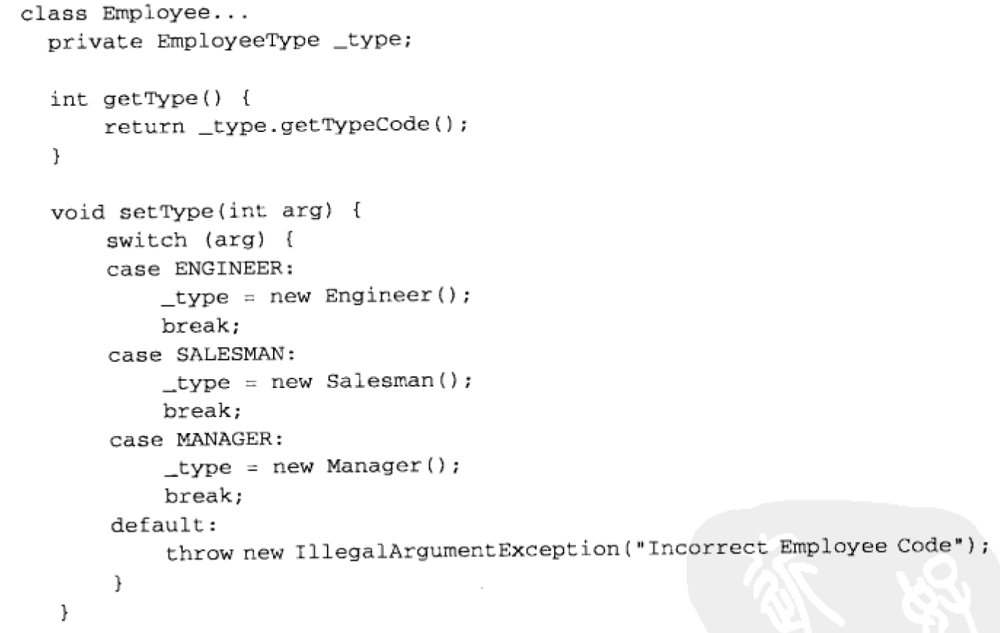
    >
    > - 可以运用 Replace Constructor with Factory Method 针对不同的 case 子句建立相应的工厂函数
    > - 还可以使用 Replace Conditional with Polymorphism 从而将其他的 case 子句完全消除

- 最后，将所有关于类型码和子类的知识都迁移到新类，并以此结束 Replace TypeCode with State/Strategy

    - 首先，把类型码的定义复制到 EmployeeType 中，在其中建立一个工厂函数以生成适当的 EmployeeType 对象，并调整 Employee 中为类型码赋值的函数：

        > 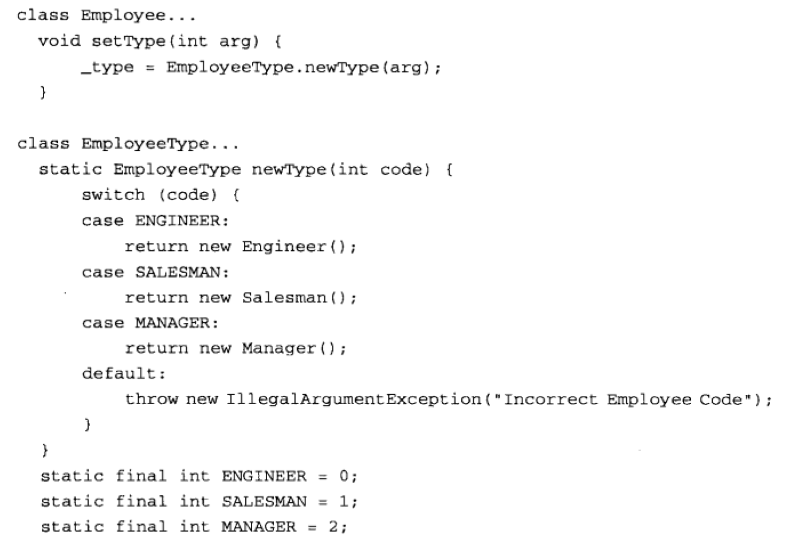

    - 然后，删掉 Employee 中的类型码定义，代之以一个指向 EmployeeType 对象的引用：

        > 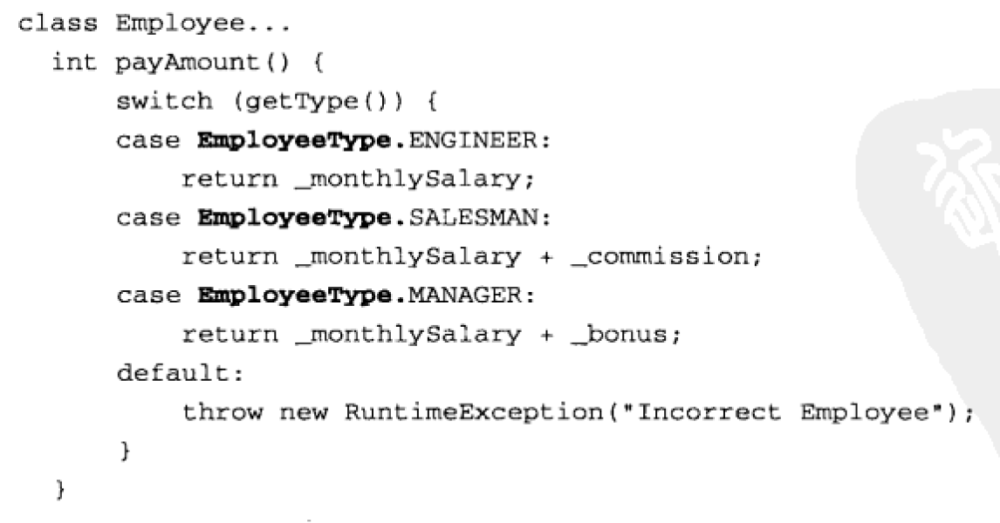

## 16、以字段取代子类(Replace Subclass with Fields)

- 若各个子类的唯一差别只在”返回常量数据“的函数身上，则**修改这些函数，使它们返回超类中的某个(新增)字段，然后销毁子类**


### (1) 动机

- 子类目的：是为了增加新特性或变化其行为

    > “常量函数”是变化行为的一种

- 动机：若子类只有常量函数，则 Replace Subclass with Fields

### (2) 做法

- 对所有子类使用”以工厂函数取代构造函数(Replace Constructor with Factory Method)“
- 若有任何代码直接引用子类，令它改而引用超类
- 针对每个常量函数，在超类中声明一个 final 字段
- 为超类声明一个 protected 构造函数，用以初始化这些新增字段
- 新建或修改子类构造函数，使它调用超类的新增构造函数
- 编译，测试
- 在超类中实现所有常量函数，令它们返回相应字段值，然后将该函数从子类中删掉
- 没删除一个常量函数，编译并测试
- 子类中所有的常量函数都被删除后，使用”内联函数(Inline Method)“将子类构造函数内联到超类的工厂函数中
- 编译，测试
- 将子类删掉
- 编译，测试
- 重复”内联构造函数、删除子类“的过程，直到所有子类都被删除

# 九、简化条件表达式

## 1、分解条件表达式(Decompose Conditional)

- 若有一个复杂的条件(if-then-else)语句，则**从 if, then, else 三个段落中分别提炼出独立函数**


### (1) 动机

- 动机：程序中，复杂的条件逻辑是最常导致复杂度上升的方面之一

### (2) 做法

- 将 if 段落提炼出来，构成一个独立函数
- 将 then 段落和 else 段落都提炼出来，各自构成一个独立函数

## 2、合并条件表达式(Consolidate Conditional Expression)

- 若有一系列测试，都得到相同结果，则**将这些测试合并为一个条件表达式，并将这个条件表达式提炼成为一个独立函数**


### (1) 动机

- 动机：对于一连串条件检查，若检查条件各不相同，最终行为却一致，则应该使用“逻辑或”和“逻辑与”进行合并

### (2) 做法

- 确定这些条件语句都没有副作用

    > 若条件表达式有副作用，就不能使用本项重构

- 使用适当的逻辑操作符，将一系列相关条件表达式合并为一个

- 编译，测试

- 对合并后的条件表达式实施”提炼函数(Extract Method)“

## 3、合并重复的条件片段(Consolidate Duplicate Conditional Fragments)

- 若在条件表达式的每个分支上有着相同的一段代码，则将这段重复代码搬移到条件表达式之外


### (1) 动机

- 动机：若发现一组条件表达式的所有分支都执行了相同的某段代码

### (2) 做法

- 鉴别出”执行方式不随条件变化而变化“的代码
- 若这些共通代码位于条件表达式**起始处**，就将其移到条件表达式之前
- 若这些共通代码位于条件表达式**尾端**，就将其移到条件表达式之后
- 若这些共通代码位于条件表达式**中段**，就需观察共通代码之前或之后的代码是否改变；若有所改变，应首先将共通代码向前或向后移动，移至条件表达式的起始处或尾端，再以前面所说的办法来处理
- 若共通代码不止一条语句，应首先使用”提炼函数(Extract Method)“将共通代码提炼到一个独立函数中，再以前面所说的办法来办理

## 4、移除控制标记(Remove Control Flag)

- 若在一系列布尔表达式中，某个变量带有”控制标记“的作用，则**以 break 语句或 return 语句取代控制标**记

### (1) 动机

- 条件表达式中，常会看到用以判断何时停止条件检查的控制标记：

    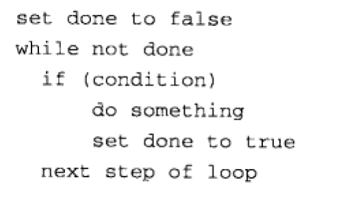

- 结构化编程原则：每个子程序只能有一个入口和一个出口，即“单一入口”原则

- 动机：“单一入口”原则会让你在代码中加入讨厌的控制标记，大大降低条件表达式的可读性

    break 和 continue 语句可以跳出复杂的条件语句

### (2) 做法

对于控制标记的处理，采用 Java 的 break 或 continue：

- 找出跳出这段逻辑的控制标记值
- 找出对标记变量赋值的语句，代以恰当的 break 或 continue
- 每次替换后，编译并测试

对于未能提供 break 或 continue 的编程语言： 

- 运用”提炼函数(Extract Method)“将整段逻辑提炼到一个独立函数中
- 找出跳出这段逻辑的控制标记值
- 找出对标记变量赋值的语句，代以恰当的 return 语句
- 每次替换后，编译并测试

### (3) 范例

- **以 break 取代简单的控制标记**

    > <figure>
    >   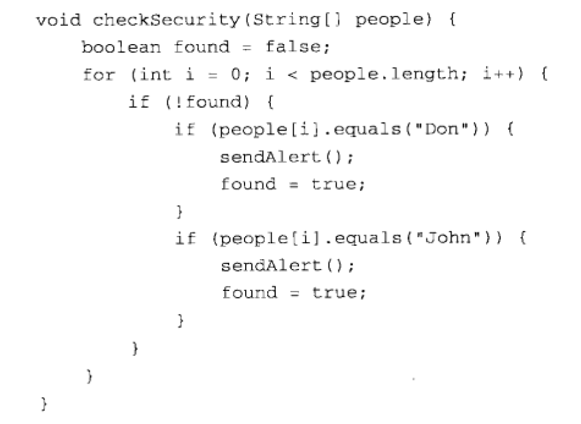
    >   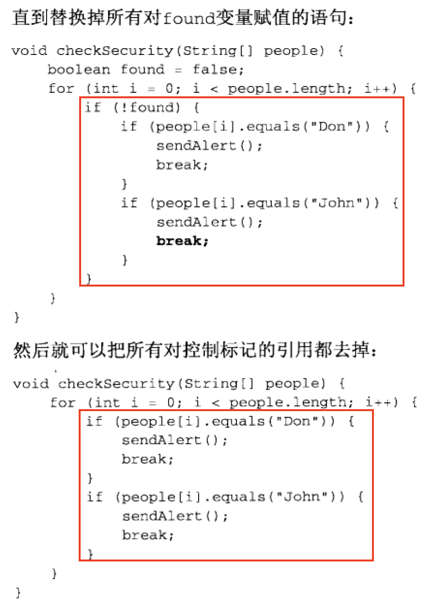
    > </figure>

- **以 return 返回控制标记**

    > <figure>
    >   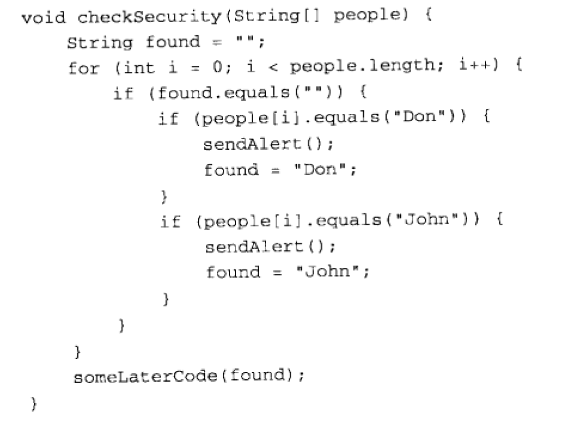
    >   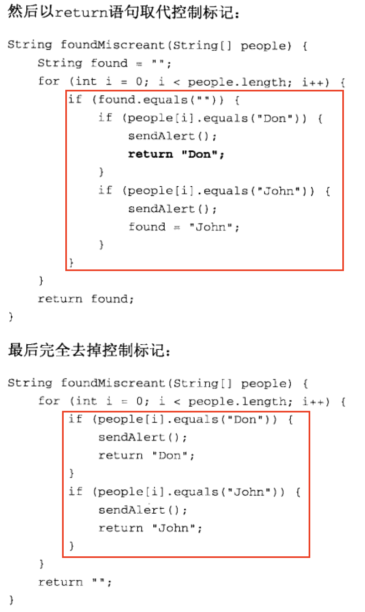
    > </figure>

## 5、以卫语句取代嵌套条件表达式(Replace Nested Conditional with Guard Clauses)

- 若函数中的条件逻辑使人难以看清正常的执行路径，则**使用卫语句表现所有特殊情况**


### (1) 动机

- 条件表达式常见的两种表现形式：
    - 形式一：所有分支都属于正常行为
    - 形式二：条件表达式提供的答案中只有一种正常行为

- **卫语句**：若某个条件及其罕见，就应该单独检查该条件，并**在该条件为真时立刻从函数中返回**，这样的单独检查就是卫语句

- Replace Nested Conditional with Guard Clauses 的精髓：**给某一条分支以特别的重视** 

### (2) 做法

- 对于每个检查，放进一个卫语句

    > 卫语句要不就从函数中返回，要不就抛出一个异常

- 每次将条件检查替换成卫语句后，编译并测试

    > 若所有卫语句都导致相同结果，请使用”合并条件表达式(Consolidate Conditional Expressions)“

## 6、以多态取代条件表达式(Replace Conditional with Polymorphism)

- 若有个条件表达式根据对象类型的不同而选择不同的行为，则**将该条件表达式的每个分支放进一个子类内的覆写函数中，然后将原始函数声明为抽象函数**


### (1) 动机

- 多态最根本的好处：若需要根据对象的不同类型而采取不同的行为，则多态使你不必编写明显的条件表达式

### (2) 做法

- 若要处理的条件表达式是一个更大函数中的一部分，首先对条件表达式进行分析，然后使用”提炼函数(Extract Method)“将它提炼到一个独立函数去

- 若有必要，使用”搬移函数(Move Method)“将条件表达式放置到继承结构的顶端

- 任选一个子类，在其中建立一个函数，使之覆写超类中容纳条件表达式的那个函数。将与该子类相关的条件表达式分支复制到新建函数中，并对它进行适当调整

    > 为顺利进行该步骤，需将超类中的某些 private 字段声明为 protected

- 编译，测试

- 在超类中删掉条件表达式内被复制了的分支

- 编译，测试

- 针对条件表达式的每个分支，重复上述过程，直到所有分支都被移到子类内的函数为止

- 将超类中容纳条件表达式的函数声明为抽象函数

### (3) 范例

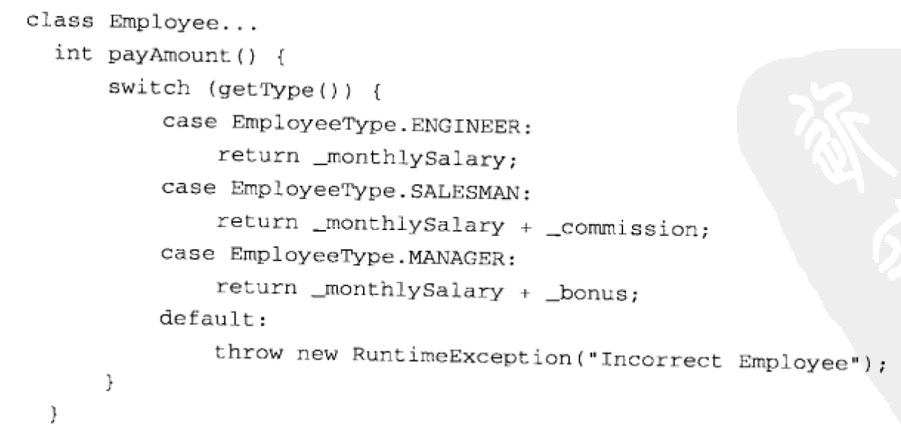

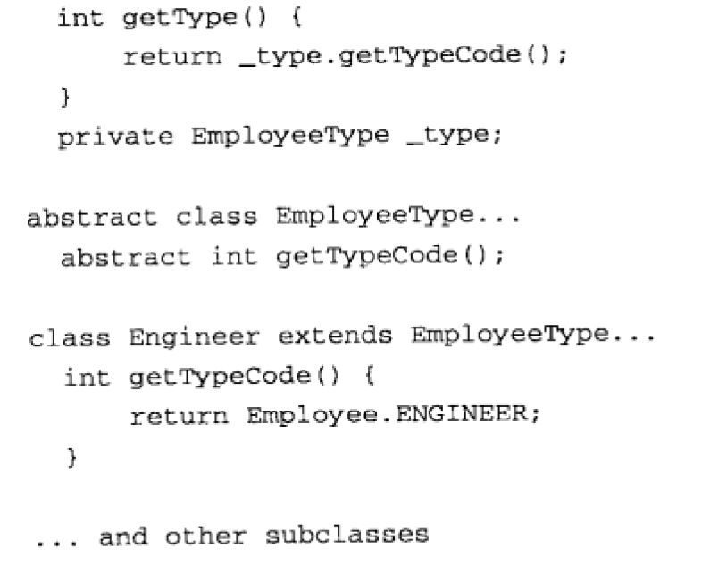

- **将 switch 语句移到 EmployeeType 类**：

    > 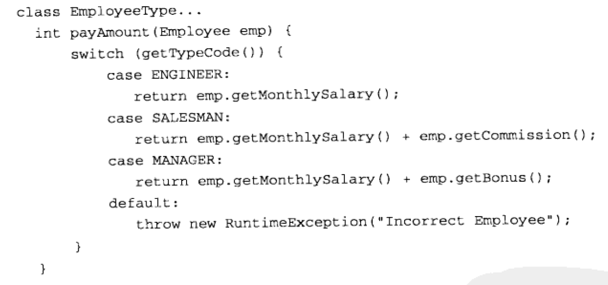

- **修改 Employee 中的 payAmount() 函数，令其委托 EmployeeType**：

    > 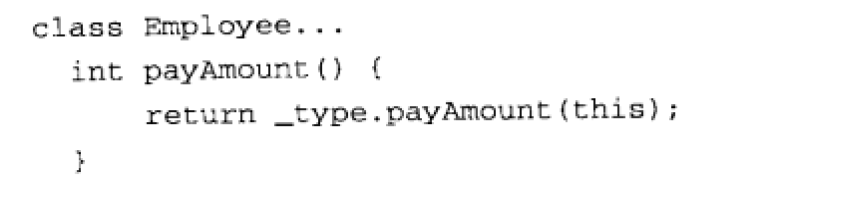

- 开始处理 switch 语句：

    - 首先，把 switch 语句中的 Engineer 分支复制到 Engineer 类：

        > 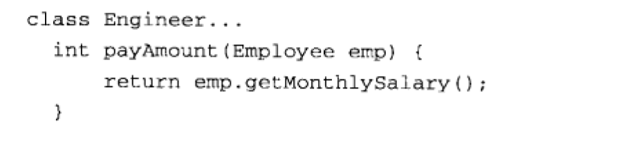

    - 接下来，重复上述过程，直到所有分支都被去除为止：

        > 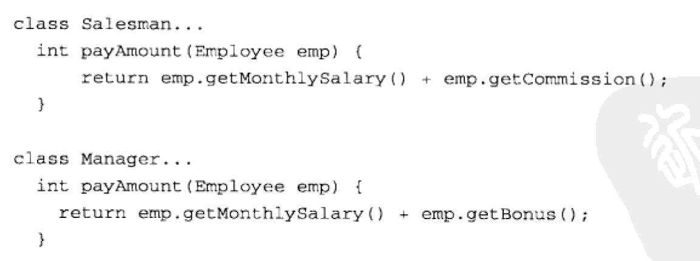

    - 然后，将超类的 payAmount() 函数声明为抽象函数：

        > 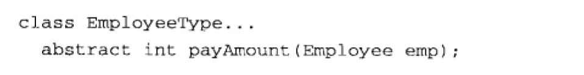

## 7、引入 Null 对象(Introduce Null Object)

- 若需要再三检查某对象是否为 null，则**将 null 值替换为 null 对象**


### (1) 动机

- **多态的最根本好处**：不必再向对象询问”你是什么类型“而后根据得到的答案调用对象的某个行为，只管调用该行为

### (2) 做法

- 为源类建立一个子类，使其行为就像是源类的 null 版本。源类和 null 子类中都加上 isNull 函数

    前者的 isNull 应该返回 false，后者的 isNull 应该返回 true

    > 下述办法可能有所帮助： 
    >
    > - 建立一个 nullable 接口，将 isNull 函数放在其中，让源类实现该接口
    > - 也可以创建一个测试接口，专门用来检查对象是否为 null

- 编译 

- 找出所有”索求源对象却获得一个 null“的地方。修改这些地方，使它们改而获得一个空对象

- 找出所有”将源对象与 null 做比较“的地方。修改这些地方，使它们调用 isNull 函数

    > - 可以每次只处理一个源对象及其客户程序，编译并测试后，再处理另一个源对象
    > - 可以在”不该再出现 null“的地方放上一些断言，确保 null 的确不再出现

- 编译，测试

- 找出这样的程序点： 若对象不是 null，做 A 动作，否则做 B 动作

- 对于每个上述地点，在 null 类中覆写 A 动作，使其行为和 B 动作相同

- 使用上述被覆写动作，然后删除”对象是否等于 null“的条件测试。编译并测试

### (3) 范例 TODO

==TODO==


## 8、引入断言(Introduce Assertion)

- 若某段代码需要对程序状态做出某种假设，则**以断言明确表现这种假设**


### (1) 动机

- 常常存在下面的代码：只有当某个条件为真时，该段代码才能正常运行
- 动机：使用断言明确将上述假设在代码中明确表现出来

### (2) 做法

- 若发现代码假设某个条件始终为真，就加入一个断言明确说明这种情况

    > 可以新建一个 Assert 类，用于处理各种情况下的断言

# 十、简化函数调用

## 1、函数改名(Rename Method)

- 若函数的名称未能揭示函数的用途，则**修改函数名称** 


### (1) 动机

- 动机：谨记将复杂的处理过程分解成小函数，同时要给函数起个好名称

### (2) 做法

- 检查函数签名是否被超类或子类实现过，若是，则需要针对每份实现分别进行下列步骤

- 声明一个新函数，将它命名为你想要的新名称，将旧函数的代码复制到新函数中，并进行适当调整

- 编译

- 修改旧函数，令它将调用转发给新函数

    > 若只有少数几个地方引用旧函数，可以大胆跳过该步骤

- 编译，测试

- 找出旧函数的所有被引用点，修改它们，令它们改而引用新函数。每次修改后，编译并测试

- 删除旧函数

    > 若旧函数是该类 public 接口的一部分，可能无法删除，因此将它标记为 deprecated(建议不可用)

- 编译，测试

## 2、添加参数(Add Parameter)

- 若某个函数需要从调用端得到更多信息，则**为此函数添加一个对象参数，让该对象带进函数所需信息**


### (1)  动机

- 动机：必须修改一个函数，而修改后的函数需要一些过去没有的信息，因此需要给该函数添加一个参数

### (2) 做法

- 检查函数签名是否被超类或子类实现过，若是，则需要针对每份实现分别进行下列步骤

- 声明一个新函数，名称和原函数相同，只是加上新添参数，将旧函数的代码复制到新函数中

    > 若需添加的参数不止一个，则将它们一次性添加进去比较容易

- 编译

- 修改旧函数，令其调用新函数

    > 若只有少数几个地方引用旧函数，可跳过这一步骤

- 编译，测试

- 找出旧函数的所有引用点，将它们全部修改为对新函数的引用。每次修改后，编译并测试

- 删除旧函数

    > 若旧函数是该类 public 接口的一部分，可能无法删除，因此将它标记为 deprecated(建议不可用)

- 编译，测试

## 3、移除参数(Remove Parameter)

- 若函数本体不再需要某个参数，则**将该参数去除**


### (1) 动机

- 动机：参数代表函数所需的信息，不同的参数值有不同的意义，多余的参数应该及时去掉

### (2) 做法

- 检查函数签名是否被超类或子类实现过，若是，则需针对每份实现分别进行下列步骤

- 声明一个新函数，名称与原函数相同，只是去除不必要的参数，将旧函数的代码复制到新函数中

    > 若需要去除的参数不止一个，将它们一次性去除较容易

- 编译

- 修改旧函数，令它调用新函数

    > 若只有少数几个地方引用旧函数，可跳过这一步骤

- 编译，测试

- 找出旧函数的所有被引用点，将它们全部修改为对新函数的引用。每次修改后，编译并测试

- 删除旧函数

    > 若旧函数是该类 public 接口的一部分，可能无法删除，因此将它标记为 deprecated(建议不可用)

- 编译，测试

## 4、将查询函数和修改函数分离(Separate Query from Modifier)

- 若某个函数既返回对象状态值，又修改对象状态，则**建立两个不同的函数，其中一个负责查询，另一个负责修改**


### (1) 动机

- 动机：若遇到一个“既有返回值又有副作用”的函数，就应该试着将查询动作从修改动作中分割出来

### (2) 做法

- 新建一个查询函数，令它返回的值与原函数相同

    > 观察原函数的返回，若返回的是一个临时变量，找出临时变量的位置

- 修改原函数，令它调用查询函数，并返回获得的结果

- 编译，测试

- 将调用原函数的代码改为调用查询函数，然后在调用查询的那一行之前，加上对原函数的调用。每次修改后，编译并测试

## 5、令函数携带参数(Parameterize Method)

- 若若干工作做了类似的工作，但在函数本体中却包含了不同的值，则**建立单一函数，以参数表达那些不同的值** 


### (1) 动机

- 动机：若两个函数做着类似的工作，但因少数几个值致使行为略有不同，则将这几个函数统一起来，并通过参数来处理那些变化情况

### (2) 做法

- 新建一个带有参数的函数，使其可以替换先前所有的重复性函数
- 编译
- 将调用旧函数的代码改为调用新函数
- 编译，测试
- 对所有旧函数重复上述步骤，每次替换后，修改并测试

## 6、以明确函数取代参数(Replace Parameter with Explicit Methods)

- 若有一个函数，其中完全取决于参数值而采取不同行为，则**针对该参数的每个可能值，建立一个独立函数** 


### (1) 动机

- 动机：若某个参数有多种可能的值，而函数内又以条件表达式检查这些参数值，并根据不同参数值做出不同的行为，则“以明确函数取代参数”

### (2) 做法

- 针对参数的每种可能值，新建一个明确函数
- 修改条件表达式的每个分支，使其调用合适的新函数
- 修改每个分支后，编译并测试
- 修改原函数的每个被调用点，改而调用上述的某个合适的新函数
- 编译，测试
- 所有调用端都修改完毕后，删除原函数

## 7、保持对象完整(Preserve Whole Object)

- 若从某个对象中取出若干值，将它们作为某次函数调用时的参数，则**改为传递整个对象**


### (1) 动机

- 同一对象的若干项数据作为参数，传递给某个函数的问题：万一被调用函数需要新的数据项，就必须查找并修改对此函数的所有调用
- 动机：若把这些数据所属的整个对象传给函数，可以避免这种尴尬的处境

### (2) 做法

- 对你的目标函数新添一个参数项，用以代表原数据所在的完整对象

- 编译，测试

- 判断哪些参数可被包含在新添的完整对象中

- 选择上述参数之一，将被调用函数中原来引用该参数的地方，改为调用新添参数对象的相应取值函数

- 删除该项参数

- 编译，测试

- 针对所有可从完整对象中获得的参数，重复上述过程

- 删除调用端中那些带有被删除参数的代码

    > 当然，若调用端还在其他地方使用了这些参数，就不要删除

- 编译，测试

## 8、以函数取代参数(Replace Parameter with Methods)

- 若对象调用某个函数，并将所得结果作为参数，传递给另一个函数，而接受该参数的函数本身也能调用前一个函数，则**让参数接受者去除该项参数，并直接调用前一个函数**


### (1) 动机

- 动机：若函数可以通过其他途径获得参数值，就不应该通过参数取得该值

### (2) 做法

- 若有必要，将参数的计算过程提炼到一个独立函数中
- 将函数本体内引用该参数的地方改为调用新建的函数
- 每次替换后，修改并测试
- 全部替换完成后，使用”移除参数(Remove Parameter)“将该参数去掉

## 9、引入参数对象(Introduce Parameter Object)

- 若某些参数总是很自然地同时出现，则**以一个对象取代这些参数**


### (1) 动机

- 动机：为了缩短参数列，因为过长的参数列难以理解

### (2) 做法

- 新建一个类，用以表现想替换的一组参数，将该类设为不可变
- 编译
- 针对使用该组参数的所有函数，实施”添加参数(Add Parameter)“，传入上述新建类的实例对象，并将此参数值设为 null
- 对于"数据泥团(Data Clumps)"中的每一项(在此均为参数)，从函数签名中移除，并修改调用端和函数本体，令它们都改而通过新的参数对象取得该值
- 每去除一个参数，编译并测试
- 将原先的参数全部去除后，观察有无适当函数可以运用”搬移函数(Move Method)“搬移到参数对象中

## 10、移除设值函数(Remove Setting Method)

- 若类中的某个字段应该在对象创建时被设值，然后就不再改变，则**去掉该字段的所有设值函数**


### (1) 动机

- 动机：若不希望在对象创建之后，此字段还有机会被改变，则不提供设值函数

### (2) 做法

- 检查设值函数被使用的情况，看其是否被构造函数调用，或者被构造函数所调用的另一个函数调用
- 修改构造函数，使其直接访问设值函数所针对的那个变量
- 编译，测试
- 移除这个设值函数，将其所针对的字段设为 final
- 编译，测试

## 11、隐藏函数(Hide Method)

- 若有一个函数，从来没有被其他任何类用到，则**将这个函数值改为 private**


### (1) 动机

- 动机：隐藏函数

### (2) 做法

- 经常检查有没有可能降低某个函数的可见度
- 尽可能降低所有函数的可见度
- 每完成一组函数的隐藏后，编译并测试

## 12、以工厂函数取代构造函数(Replace Constructor with Factory Method)

- 若希望在创建对象时不仅仅做简单的构建工作，则**将构造函数替换为工厂函数**


### (1) 动机

- 动机：在派生子类的过程中，以工厂函数取代类型码

### (2) 做法

- 新建一个工厂函数，让它调用现有的构造函数
- 将调用构造函数的代码改为调用工厂函数
- 每次替换后，编译并测试
- 将构造函数声明为 private
- 编译

## 13、封装向下转型(Encapsulate Downcast)

- 若某个函数返回的对象，需要由函数调用者执行向下转型，则**将向下转型动作移到函数中**


### (1) 动机

- 动机：将向下转型封装

### (2) 做法

- 找出必须对函数调用结果进行向下转型的地方

- 将向下转型动作搬移到该函数中

    > 针对返回集合的函数，使用”封装集合(Encapsulate Collection)“

## 14、以异常取代错误码(Repalce Error Code with Exception)

- 若某个函数返回一个特定的代码，用以表示某种错误情况，则**改用异常**


### (1) 动机

- 动机：“异常”能清楚地将“普通程序”和“错误处理”分开

### (2) 做法

- 决定应该抛出受控异常还是非受控异常

    > - 若调用者有责任在调用前检查必要状态，就抛出非受控异常
    > - 若想抛出受控异常，可以新建一个异常类，也可以使用现有的异常类

- 找到该函数的所有调用者，对它们进行相应调整，让它们使用异常

    > - 若函数抛出非受控异常，就调整调用者，使其在调用函数前做适当检查。每次修改后，编译并测试
    > - 若函数抛出受控异常，就调整调用者，使其在 try 区段中调用该函数

- 修改该函数的签名，令其反映出新用法

若函数有许多调用者，则采取下述步骤： 

- 决定应该抛出受控异常还是非受控异常
- 新建一个函数，使用异常来表示错误状况，将旧函数的代码复制到新函数中，并做适当调整
- 修改旧函数的函数本体，让它调用上述新建函数
- 编译，测试
- 逐一修改旧函数的调用者，令其调用新函数。每次修改后，编译并测试
- 移除旧函数

## 15、以测试取代异常(Replace Exception with Test)

- 若面对一个调用者可以预先检查的条件，抛出了一个异常，则**修改调用者，使其在调用函数前先做检查**


### (1) 动机

- 异常的好处：异常可协助我们避免很多复杂的错误处理逻辑

- 动机：若可以合理期望调用者在调用函数之前先检查某个条件，则应该提供一个测试，而调用者应该使用它

### (2) 做法

- 在函数调用点前，放置一个测试语句，将函数内 catch 区段中的代码复制到测试句的适当 if 分支中
- 在 catch 区段起始处加入一个断言，确保 catch 区段绝对不会被执行
- 编译，测试
- 移除所有 catch 区段，然后将 try 区段内的代码复制到 try 之外，然后移除 try 区段
- 编译，测试

# 十一、处理概括关系

## 1、字段上移(Pull Up Field)

- 若两个子类拥有相同的字段，则**将该字段移至超类**


### (1) 动机

本项重构从两方面减少重复：

- 首先，去除了重复的数据声明
- 其次，使你可以将使用该字段的行为从子类移至超类，从而去除重复的行为

### (2) 做法

- 针对待提升字段，检查其所有被使用点，确认它们以同样的方式被使用

- 若这些字段的名称不同，先将它们改名，使每个名称都和你想为超类字段取得名称相同

- 编译，测试

- 在超类中新建一个字段

    > 若字段为 private，则必须将超类的字段声明为 protected

- 移除子类中的字段

- 编译，测试

- 考虑对超类的新建字段使用”自封装字段(Self Encapsulate Field)“

## 2、函数上移(Pull Up Method)

- 若有些函数，在各个子类中产生完全相同的结果，则**将该函数移至超类**


### (1) 动机

- 动机：避免行为重复

### (2) 做法

- 检查待提升函数，确定它们完全一致

- 若待提升函数看上去做了相同的事，但并不完全一致，可使用”替换算法(Substitute Algorithm)“让它们变得完全一致

- 若待提升函数的签名不同，则将那些前面都修改为想要在超类中使用的签名

- 在超类中新建一个函数，将某个待提升函数的代码复制到其中，做适当调整，然后编译

    > - 若使用的是一种强类型语言，而待提升函数又调用了一个只出现于子类而未出现于超类的函数，则可以在超类中为被调用函数声明一个抽象函数
    >
    > - 若待提升函数使用了子类的一个字段，则可以使用”字段上移(Pull Up Field)“将该字段也提升到超类
    >
    >     或者也可以先使用”自封装字段(Self Encapsulate Field)“，然后在超类中把取值函数声明为抽象函数

- 移除一个待提升的子类函数

- 编译，测试

- 逐一移除待提升的子类函数，直到只剩下超类中的函数为止。每次移除后，都需要测试

- 观察该函数的调用者，看看是否可以改为使用超类类型的对象

## 3、构造函数本体上移(Pull Up Constructor Body)

- 若在各个子类中拥有一些构造函数，它们的本体几乎完全一致，则**在超类中新建一个构造函数，并在子类构造函数中调用它**


### (1) 动机

- 动机：对于子类而言，它们彼此的共同行为往往就是“对象的建构”，这时需要在超类中提供一个构造函数，然后让子类来调用

### (2) 做法

- 在超类中定义一个构造函数

- 将子类构造函数中的共同代码搬移到超类构造函数中

    > - 被搬移的可能是子类构造函数的全部内容
    > - 首先设法将共同代码搬移到子类构造函数起始处，然后再复制到超类构造函数中

- 将子类构造函数中的共同代码删掉，改而调用新建的超类构造函数

    > 若子类构造函数中的所有代码都一样，则子类构造函数就只需要调用超类构造函数

- 编译，测试

    > 若后面子类构造函数再出现共同代码，则
    >
    > - 首先使用”提炼函数(Extract Method)“将那部分提炼到一个独立函数
    > - 然后使用”字段上移(Pull Up Method)“将该函数上移到超类

## 4、函数下移(Push Down Method)

- 若超类中的某个函数只与部分子类有关，则**将该函数移到相关子类中**


### (1) 动机

- 动机：当有必须把某些行为从超类移至特定子类时

### (2) 做法

- 在所有子类中声明该函数，将超类中的函数本体复制到每个子类函数中

- 删除超类中的函数

    > - 可能必须修改调用端的某些变量声明或参数声明，以便能使用子类
    > - 若有必要通过一个超类对象访问该函数，或不想把该函数从任何子类中移除，再或超类是抽象类，则可以在超类中把该函数声明为抽象函数

- 编译，测试

- 将该函数从所有不需要它的那些子类中删掉

- 编译，测试

## 5、字段下移(Push Down Field)

- 若超类中的某个字段只被部分子类用到，则**将该字段移到需要它的子类中**


### (1) 动机

- 动机：若只有某些子类需要超类内的一个字段

### (2) 做法

- 在所有子类中声明该字段
- 将该字段从超类中移除
- 编译，测试
- 将该字段从所有不需要它的那些子类中删掉
- 编译，测试

## 6、提炼子类(Extract Subclass)

- 若类中的某些特性只被某些实例用到，则**新建一个子类，将上面所说的那一部分特性移到子类中**


### (1) 动机

- 动机：发现类中的某些行为只被一部分实例用到，其他实例不需要

### (2) 做法

- 为源类定义一个新的子类

- 为这个新的子类提供构造函数

    > 简单做法： 让子类构造函数接受与超类构造函数相同的参数，并通过 super 调用超类构造函数
    >
    > - 若希望对用户隐藏子类的存在，可使用”以工厂函数替代构造函数(Replace Constructor with Factory Method)“

- 找出调用超类构造函数的所有地点，若需要新建子类，令它们改而调用新构造函数

    > - 若子类构造函数需要的参数和超类构造函数的参数不同，可以使用”函数改名(Rename Method)“修改其参数列
    > - 若子类构造函数不需要超累构造函数的某些参数，可以使用”函数改名(Rename Method)“将其去除
    > - 若不再需要直接创建超类的实例，就将超类声明为抽象类

- 逐一使用”函数下移(Push Down Method)“和”字段下移(Push Down Field)“将源类的特性移到子类中

- 找到所有这样的字段： 它们所传达的信息可由继承体系自身传达(通常为 Boolean 变量或类型码)

    以”自封装字段(Self Encapsulate Field)“避免直接使用这些字段，然后将它们的取值函数替换为多条常量函数，所有使用这些字段的地方都应以”以多态取代条件表达式(Replace Conditional with Polymorphism)“重构

    > 任何函数若位于源类之外，而又使用了上述字段的访问函数，考虑以”搬移函数(Move Method)“将其移到源类中，然后再使用”以多态取代条件表达式(Replace Conditional with Polymorphism)“

- 每次下移后，编译并测试

## 7、提炼超类(Extract Superclass)

- 若两个类有相似特性，则**为这两个类建立一个超类，将相同特性移至超类**


### (1) 动机

- 动机：若发现具有共通性的类之后，则开始建立其间的继承结构

### (2) 做法

- 为原本的类新建一个空白的抽象超类

- 运用”字段上移(Pull Up Field)“、”函数上移(Pull Up Method)“、”构造本体上移(Pull Up Constructor Body)“逐一将子类的共同元素上移到超类

    > - 先搬移字段，通常比较简单
    >
    > - 若相应的子类函数有不同的前面，但用途相同，可先使用”函数改名(Rename Method)“将它们的签名改为相同，然后再使用”函数上移(Pull Up Method)“
    >
    > - 若相应的子类函数有相同的签名，但函数本体不同，可以在超类中把它们的共同签名声明为抽象函数
    >
    > - 若相应的子类函数有不同的函数本体，但用途相同，可试着使用”替换算法(Substitute Algorithm)“把其中一个函数的函数本体复制到另一个函数中
    >
    >     若正常运转，则可以使用”函数上移(Pull Up Method)“

- 每次上移后，编译并测试

- 检查留在子类中的函数，看它们是否有共通成分。若有，可使用”提炼函数(Extract Method)“将共通部分再提炼出来，然后使用”函数上移(Pull Up Method)“将提炼出的函数上移到超类

    若各个子类中某个函数的整体流程很相似，可以使用”塑造模板函数(Form Template Method)“

- 将所有共通元素都上移到超类后，检查子类的所有用户

    若它们只使用共同接口，就可以把它们请求的对象类型改为超类

## 8、提炼接口(Extract Interface)

- 若若干客户使用类接口中的同一子集，或两个类的接口部分相同，则**将相同的子集提炼到一个独立接口中**


### (1) 动机

- 类之间彼此互用的方式：对于后两种情况，将真正用到的这部分责任分离出来很有意义
    - 方式一：“使用一个类”通常意味用到该类的所有责任区
    - 方式二：某一组客户只使用类责任区中的一个特定子集
    - 方式三：这个类需要与所有协助处理某些特定请求的类合作

- 动机：在面向对象语言中，这种责任划分通过**多继承实现**

### (2) 做法

- 新建一个空接口
- 在接口中声明待提炼类的共通操作
- 让相关的类实现上述接口
- 调整客户端的类型声明，令其使用该接口

## 9、折叠继承体系(Collapse Hierarchy)

- 若超类和子类间无太大区别，则**将它们合为一体**


### (1) 动机

- 重构继承体系：将函数和字段在体系中上下移动
- 动机：完成上述动作后，可能发现某个子类并未带有该有的价值，因此需要把超类和子类合并起来

### (2) 做法

- 选择想移除的类： 是超类还是子类？

- 使用”字段上移(Pull Up Field)“和”函数上移(Pull Up Method)“，或”函数下移(Push Down Method)“ 和”字段下移(Push Down Field)“，把想要移除的类的所有行为和数据搬移到另一个类

- 每次移动后，编译并测试

- 调整即将被移除的那个类的所有引用点，令它们改而引用合并后留下来的类

    这个动作将会影响变量的声明、参数的类型以及构造函数

- 移除我们的目标，此时它应该已经成为一个空类

- 编译，测试

## 10、塑造模板函数(Form Template Method)

- 若有一些子类，其中相应的某些函数以相同顺序执行类似的操作，但各个操作的细节上有所不同，则**将这些操作分别放进独立函数中，并保持它们都有相同的签名，于是原函数也就变得相同了，然后将原函数上移至超类**


### (1) 动机

- **模版函数**：两个函数以相同顺序执行大致相近的操作，但各操作不完全相同。因此，可以将执行操作的序列移至超类，并借助多态保证各操作仍得以保持差异性

### (2) 做法

- 在各个子类中分解目标函数，使分解后的各个函数要不完全相同，要不完全不同

- 运用”函数上移(Pull Up Method)“将各个子类内完全相同的函数上移至超类

- 对于那些(剩余的、存在于各子类内的)完全不同的函数，实施”函数改名(Rename Method)“，使所有这些函数的签名完全相同

    > 这将使得原函数变为完全相同，因为它们都执行同样一组函数调用，但各子类会以不同方式响应这些调用

- 修改上述所有签名后，编译并测试

- 运用”函数上移(Pull Up Method)“将所有原函数逐一上移至超类

    > 在超类中将那些代表各种不同操作的函数定义为抽象函数

- 编译，测试

- 移除其他子类中的原函数，每删除一个，编译并测试

## 11、以委托取代继承(Replace Inheritance with Delegation)

- 若某个子类只使用超类接口中的一部分，或是根本不需要继承而来的数据，则**在子类中新建一个字段用以保存超类，调整子类函数，令它改而委托超类，然后去掉两者之间的继承关系**


### (1) 动机

- 场景：一开始继承了一个类，随后发现超类中的许多操作并不真正适用于子类

- 动机：以委托取代继承，可以只需要委托类的一部分功能

### (2) 做法

- 在子类中新建一个字段，使其引用超类的一个实例，并将它初始化为 this

- 修改子类的所有函数，让它们不再使用超类，转而使用上述那个委托字段。每次修改后，编译并测试

    > 不能修改子类中通过 super 调用超类函数的代码，否则会陷入无限递归

- 去除两个类之间的继承关系，新建一个受委托类的对象赋给受托字段

- 针对客户端所用的每个超类函数，为它添加一个简单的委托函数

- 编译，测试

## 12、以继承取代委托(Replace Delegation with Inheritance)

- 若在两个类间使用委托关系，并经常为整个接口编写许多极简单的委托函数，则**让委托类继承受托类**


### (1) 动机

- 动机：需要使用受托类中的**所有函数**

### (2) 做法

- 让委托端成为受托端的一个子类
- 编译
- 将受托字段设为该字段所处对象本身
- 去掉简单的委托函数
- 编译并测试
- 将所有其他涉及委托关系的代码，改为调用对象自身
- 移除受托字段

# 十二、大型重构

## 1、梳理并分解继承体系(Tease Apart Inheritance)

- 若某个继承体系同时承担两项责任，则**建立两个继承体系，并通过委托关系让其中一个可以调用另一个**


### (1) 动机

- 继承可以明显减少子类中的代码量
- 乱用继承的后果：导致重复代码，还会使修改变得困难

- 继承体系是否承担了两项不同的责任：若继承体系中的某一特定层级上的所有类，其子类名称都以相同的形容词开始，则该体系就是承担着两项不同的责任

### (2) 做法

- 首先识别出继承体系所承担的不同责任，然后建立一个二维表格(或三维，甚至四维表格)，并以坐标轴标示出不同的任务

    > 将重复运用本重构，处理两个或两个以上的维度。当然，每次只处理一个维度

- 判断哪一项责任更重要些，并准备将它留在当前的继承体系中，准备将另一项责任移到另一个继承体系中

- 使用”提炼类(Extract Class)“从当前的超类提炼出一个新类，用以表示重要性稍低的责任，并在原超类中添加一个实例变量，用以保存新类的实例

- 对应于原继承体系中的每个子类，创建上述新类的一个子类。在原继承体系的子类中，将钱一步骤所添加的实例变量初始化为新建子类的实例

- 针对原继承体系中的某个子类不再有任何代码时，就将其去除

- 重复上述步骤，直至原继承体系中的所有子类都被处理过为止

## 2、将过程化设计转化为对象设计(Convert Procedural Design to Objects)

- 若有一些传统过程化风格的代码，则**将数据记录变成对象，将大块的行为分成小块，并将行为移入相关对象中**


### (1) 动机

- 坏味道：类中有着长长的过程化函数和极少的数据，旁边则是一堆哑数据对象

### (2) 做法

- 针对每个记录类型，将其转变为只包含访问函数的哑数据对象

    > 若你的数据来自关系式数据库，就把数据库中的每个表变成一个哑数据对象

- 针对每一处过程化风格，将该处的代码提炼到一个独立类中

    > 可以把提炼所得的类做成一个 Singleton，或是把提炼所得的函数声明为 static

- 针对每一段长长的程序，实施”提炼函数(Extract Method)“及其他相关重构将其分解，再以”搬移函数(Move Method)“将分解后的函数分别移到其所相关的哑数据类中

- 重复上述步骤，直到原始类中的所有函数都被移除。若原始类是一个完全过程化的类，将它拿掉将大快人心

## 3、将领域和表述/显示分离(Separate Domain from Presentation)

- 若某些 GUI 类中包含了领域逻辑，则**将领域逻辑分离出来，为它们建立独立的领域类**


### (1) 动机

- 展现类只含用以处理用户界面的逻辑
- 领域类不含任何与程序外观相关的代码，只含业务逻辑相关代码

### (2) 做法

- 为每个窗口建立一个领域类
- 若窗口内有一表格，新建一个类来表示其中的行，再以窗口所对应之领域类中的一个集合来容纳所有的行领域对象
- 检查窗口中的数据：
    - 若数据只被用于 UI，就留着
    - 若数据被领域逻辑使用，而且不显示于窗口上，就以”搬移字段(Move Field)“将其搬移到领域类
    - 若数据同时被 UI 和领域逻辑使用，就对其实施”复制“被监视数据”(Duplicate Observed Data)“，使其同时存在于两处，并保持两处之间的同步
- 检查展现类中的逻辑，实施”提炼函数(Extract Method)“将展现逻辑从领域逻辑中分开，一旦隔离了领域逻辑，再运用”搬移函数(Move Method)“将其移到领域类
- 以上步骤完成后，就拥有了两组彼此分离的类：
    - 展现类用以处理 GUI
    - 领域类包含所有业务逻辑

## 4、提炼继承体系(Extact Hierarchy)

- 若有某个类做了太多工作，其中一部分工作是以大量条件表达式完成，则**建立继承体系，以一个子类表示一种特殊情况**


### (1) 动机

- 注意：只有当条件逻辑在对象的整个生命周期保持不变，本重构所倒入的策略才适用

### (2) 做法

- 鉴别出一种变化情况

    > 若这种变化可能在对象生命周期的不同阶段而又不同体现，就运用”提炼函数(Extract Class)“将其提炼为一个独立的类

- 针对这种变化情况，新建一个子类，并对原始类实施”以工厂函数替换构造函数(Replace Constructor with Factory Method)“，再修改工厂函数，令其返回适当的子类实例

- 将含有条件逻辑的函数，一次一个，逐一复制到子类，然后在明确情况下(对子类明确，对超类不明确)，简化这些函数

- 重复上述过程，将所有变化情况都分离出来，直到可以将超类声明为抽象类为止

- 删除超类中那些被所有子类覆写的函数本体，并将它们声明为抽象函数

若你清楚原始类会有哪些变化情况，可以使用另一种做法： 

- 针对原始类的每种变化情况，建立一个子类

- 使用”以工厂函数替换构造函数(Replace Constructor with Factory Method)“将原始类的构造函数转变成工厂函数，并令其针对每种变化情况返回适当的子类实例

- 针对带有条件逻辑的函数，实施”以多态取代条件表达式(Replace Conditional with Polymorphism)“

    > 若并非整个函数的行为有所变化，而只是函数一部分有所变化，先运用”提炼函数(Extract Method)“将变化部分和不变部分隔开