# 类图

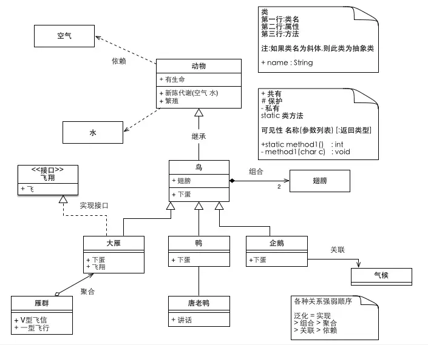

- **实线三角指向父类，是泛化** 

  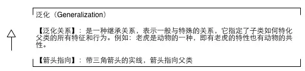

- **虚线三角指向接口，是实现** 

  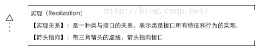

- **实心菱形**精密关联不可分，是**组合**

  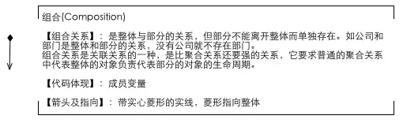

- **空心菱形**能分离而独立存在，是**聚合**

  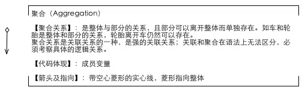

- **实线箭头指向关联**

  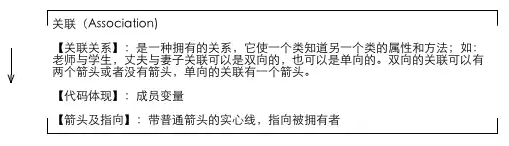

- **虚线箭头指向依赖**

  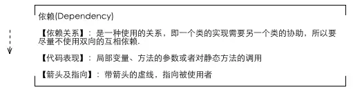

# 详解

## 1、类图

- 类图是面向对象系统建模中最常用和最重要的图，是定义其它图的基础
- 类图主要是用来显示系统中的类、接口以及它们之间的静态结构和关系的一种静态模型

类图的3个基本组件：类名、属性、方法

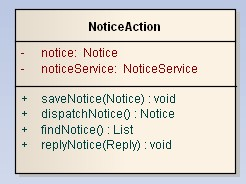

## 2、泛化

- **泛化**表示 **is-a** 关系，是对象间耦合度最大的一种关系，子类继承父类的所有细节
- 类图中使用**带三角箭头的实线**表示，箭头**从子类指向父类**

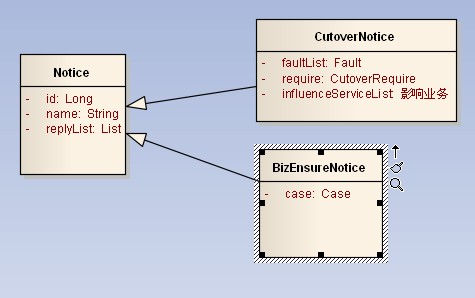

## 3、实现

- **实现**：在类图中就是接口和实现的关系
- 在类图中使用**带三角箭头的虚线**表示，箭头**从实现类指向接口**

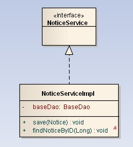

## 4、依赖

- **依赖**是对象之间最弱的一种关联方式，是临时性的关联

  > - 代码中一般指由局部变量、函数参数、返回值建立的对于其他对象的调用关系
  > - 一个类调用被依赖类中的某些方法而得以完成这个类的一些职责

- 在类图使用**带箭头的虚线**表示，箭头**从使用类指向被依赖的类**

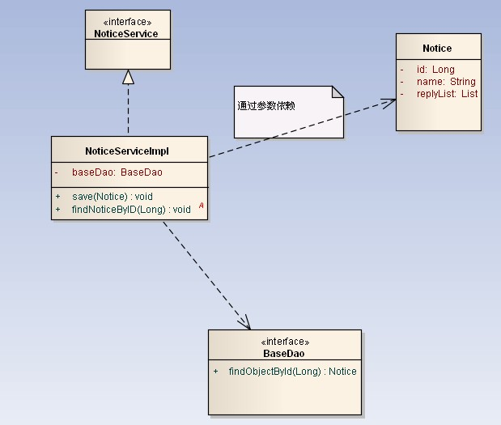

## 5、关联

- **关联**是对象之间一种引用关系，比如客户类与订单类之间的关系

  > - 这种关系通常使用类的属性表达
  > - 关联又分为一般关联、聚合关联与组合关联

- 在类图使用**带箭头的实线**表示，箭头**从使用类指向被关联的类**，可以是**单向或双向**

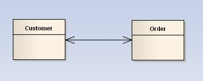

## 6、聚合

- **聚合**表示 **has-a** 的关系，是一种不稳定的包含关系

  > - 较强于一般关联，有整体与局部的关系，并且没有了整体，局部也可单独存在
  >
  > 如： 公司和员工的关系，公司包含员工，但如果公司倒闭，员工依然可以换公司

- 在类图使用**空心的菱形**表示，菱形**从局部指向整体**

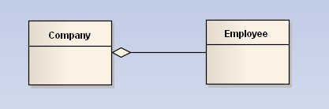

## 7、组合

- **组合**表示 **contains-a** 的关系，是一种强烈的包含关系

  > - 组合类负责被组合类的生命周期，是一种更强的聚合关系，部分不能脱离整体存在
  >
  > 如： 公司和部门的关系，没有了公司，部门也不能存在

- 在类图使用**实心的菱形**表示，菱形**从局部指向整体**

---

**聚合和组合的区别**： 

- 聚合关系是“has-a”关系，组合关系是“contains-a”关系
- 聚合关系表示整体与部分的关系比较弱，而组合比较强
- 聚合关系中代表部分事物的对象与代表聚合事物的对象的生存期无关，一旦删除了聚合对象不一定就删除了代表部分事物的对象；组合中一旦删除了组合对象，同时也就删除了代表部分事物的对象

## 8、多重性

- **多重性**通常在关联、聚合、组合中使用，代表有多少个关联对象存在，使用“**数字..星号/数字**”表示

如下图，一个通知可以关联0个到N个故障单

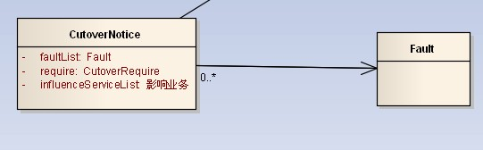

# 案例

系统有故障单、业务开通、资源核查、割接、业务重保、网络品质性能等功能模块

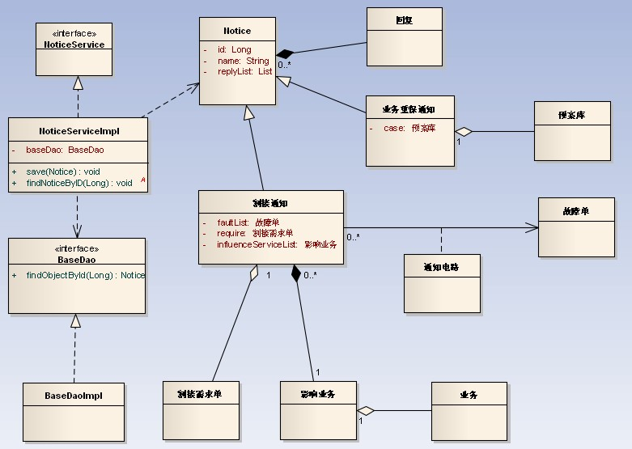

- 通知分为： 一般通知、割接通知、重保通知，是**继承关系**

- NoticeService 和实现类 NoticeServiceImpl 是**实现关系**

- NoticeServiceImpl 通过 save 方法的参数引用 Notice，是**依赖关系**；调用 BaseDao 完成功能，是**依赖关系**

- 割接通知和故障单之间通过中间类(通知电路)关联，是**一般关联**

- 重保通知和预案库间是**聚合关系**

  > 因为预案库可以事先录入，和重保通知没有必然联系，可以独立存在
  >
  > 在系统中是手工从列表中选择，删除重保通知，不影响预案

- 割接通知和需求单之间是**聚合关系**

  > 需求单可以独立于割接通知存在，即删除割接通知，不影响需求单

- 通知和回复是**组合关系**

  > 因为回复不能独立于通知存在，即删除通知，该条通知对应的回复也要级联删除