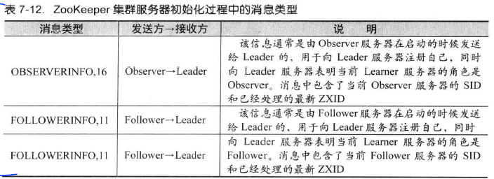
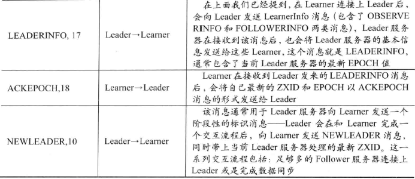

# 一、分布式架构

##1、从集中式到分布式

### 1. 集中式的特点

- **集中式系统**： 指一台或多台主计算机组成中心节点，数据集中存储于这个中心节点，并且整个系统的所有业务单元都集中部署在这个中心节点上，系统所有功能均由其集中处理

  > 集中式系统中：
  >
  > - 每个终端或客户端机器仅仅负责数据的录入和输出
  > - 数据的存储与控制处理完全交由主机来完成

- **集中式特点**：部署简单

### 2. 分布式特点

- **分布式系统**： 硬件或软件组成分布在不同的网络计算机上，彼此之间仅通过消息传递进行通信和协调的系统

- 分布式系统的特征：

  - **分布性**： 机器的分布随时变动

  - **对等性**：分布式系统中的计算机没有主/从之分

    > **副本**：指分布式系统对数据和服务提供的一种冗余方式
    >
    > - **数据副本**： 指在不同的节点上持久化同一份数据，当某个节点上存储的数据丢失时，可以从副本上读取到该数据
    > - **服务副本**： 指多个节点提供同样的服务，每个节点都有能力接收来自外部的请求并进行相应的处理

  - **并发性**：高效的协调分布式并发操作

  - **缺乏全局时钟**： 分布式系统中，很难定义两个事件究竟谁先谁后

  - **故障总会发生**： 系统实际运行中，会遇到很多设计时未能考虑到的异常

    > 黄金定理： 任何在设计阶段考虑到的异常情况，一定会在系统实际运行中发生

### 3. 分布式的问题

- **通信异常**： 网络光纤、路由器、DNS 等硬件

- **网络分区**： 当网络异常发生时，导致分布式系统中部分节点间的网络延时不断增大，最终导致只有部分节点间能正常通信，而另一些节点则不能

- **三态**：成功、失败、超时

  > 超时的两种情况： 
  >
  > - 由于网络原因，该请求(消息)并没有被成功发送到接收方，而是在发送过程就发生了消息丢失现象
  > - 该请求(消息)成功的被接收方接收后，并进行了处理，但响应反馈发生了消息丢失现象

- **节点故障**： 组成分布式系统的服务器节点出现的宕机或“僵死”现象

## 2、从 ACID 到 CAP/BASE

### 1. ACID

**事务**由一系列对系统中数据进行访问与更新的操作所组成的一个程序执行逻辑单元

- 当多个应用程序并发访问数据库时，事务可在应用程序间提供一个隔离方法，以防止操作互相干扰
- 事务为数据库操作序列提供了一个从失败中恢复到正常状态的方法，同时提供了数据库即使在异常状态下仍能保持数据一致性的方法

**事务的四个特性**：

- **原子性**： 事务必须是一个原子的操作序列单元

  > 只允许的两种状态： 
  >
  > - 全部成功执行
  > - 全部不执行
  >
  > 任何一项操作失败都将导致整个事务失败，同时所有已执行的操作都将被撤销并回滚

- **一致性**： 事务在执行前和执行后，数据库都必须处于一致性状态

- **隔离性**： 在并发环境中，并发的事务相互隔离，一个事务的执行不能被其他事务干扰

  > 四个事务隔离级别： **读未提交、读已提交、可重复读、序列化**
  >
  > 

- **持久性**： 事务一旦提交，数据库的状态将不再改变

### 2. 分布式事务

- **分布式事务**： 事务的参与者、支持事务的服务器、资源服务器及事务管理器分别位于分布式系统的不同节点

### 3. CAP 和 BASE 理论

- **CAP 定理**： 分布式系统不能同时满足一致性(C)、可用性(A)、分区兼容性(P)，最多只能满足两项

  - **一致性**： 指数据在多个副本间保持一致

  - **可用性**： 指系统提供的服务必须一直处于可用的状态，对于用户的每一个操作请求总是能在有限的时间内返回结果

    > - 有限时间： 对于用户的操作请求，系统必须能够在指定的时间内返回响应
    > - 返回结果： 要求系统在完成对用户请求的处理后，返回一个正常的响应结果

  - **分区容错性**： 分布式系统在遇到任何网络分区故障时，仍能保证对外提供满足一致性和可用性的服务，除非整个网络环境都发生了故障

  

  

- **BASE 理论**： **基本可用、软状态、最终一致性**，是对 CAP 中一致性和可用性权衡的结果

  > **核心思想**： 即使无法做到强一致性，但每个应用都可以根据自身的业务特点，采用适当的方式来使系统达到最终一致性

  - **基本可用**： 指分布式系统在出现不可预知故障时，允许损失部分可用性

    > "基本可用"的典型例子： 
    >
    > - 响应时间上的损失： 如搜索引擎正常返回时间为0.5 秒，但出现故障，响应时间增加到1~2秒
    > - 功能上的损失： 如在电子商务网站购物时，正常会完成订单，但在购物高峰时，部分消费者可能会被引导到一个降级页面

  - **软状态**： 指允许系统中的数据存在中间状态，并认为该中间状态的存在不会影响系统的整体可用性，即允许系统在不同节点的数据副本之间进行数据同步的过程存在延时

  - **最终一致性**： 系统中所有的数据副本，在经过一段时间的同步后，最终能达到一致的状态

    > 最终一致性的五类主要变种： 
    >
    > - **因果一致性**： 进程 A 更新数据后，进程 B 基于更新后的值操作；同时无关进程 C 没有这样限制
    > - **读己之所写**： 进程 A 更新数据后，它自己总能访问到新值，一种**特殊的因果一致性**
    > - **会话一致性**： 在同一个有效的**会话中实现“读己之所写”的一致性**
    > - **单调读一致性**： 若一个进程从系统中读物出一个数据项后，则系统对于该进程后续的任何数据访问都不应该返回更旧的值
    > - **单调写一致性**： 一个系统需要能保证来自同一个进程的写操作被顺序执行


# 二、一致性协议

> 解决一致性问题：2PC、3PC、Paxos 算法

## 1、2PC 和 3PC

### 1. 2PC(二阶段提交)

> 绝大部分的关系型数据采用 2PC 来完成分布式事务处理

- 阶段一： **提交事务请求**

  1. **事务询问**： 协调者向所有的参与者发送事务内容，询问是否可以执行事务提交操作，并开始等待各参与者的响应

  2. **执行事务**： 各参与者节点执行事务操作，并将 Undo 与 Redo 信息记入事务日志中

  3. **各参与者向协调者反馈事务询问的响应**： 
     - 若参与者成功执行事务操作，则反馈给协调者 Yes 响应，表示事务可以执行
     - 若参与者没有成功执行事务操作，则反馈反馈给协调者 No 响应，表示事务不可以执行

- 阶段二： **执行事务提交**

  > - 协调者会根据各参与者的反馈情况来觉得最终是否可以进行事务提交操作
  >
  > 两种可能情况： 
  >
  > - **事务提交**： 协调者收获的所有**反馈均是 Yes 响应**，则执行事务提交
  >
  >   1. **发送提交请求**： 协调者向所有参与者节点发出 Commit 请求
  >
  >   2. **事务提交**： 参与者收到 Commit 请求后，正式执行事务提交操作，并在完成提交后释放在整个事务执行期间占用的事务资源
  >
  >   3. **反馈事务提交结果**： 参与者在完成事务提交后，向协调者发送 Ack 消息
  >
  >   4. **完成事务**： 协调者接收到所有参与者反馈的 Ack 消息后，完成事务
  >
  > - **事务中断**： 若有一个 No 反馈，或等待超时，则中断事务
  >
  >   1. **发送回滚请求**： 协调者向所有参与者节点发出 Rollback 请求
  >   2. **事务回滚**： 参与者收到 Rollback 请求后，会利用其在阶段一记录的 Undo 信息来执行事务回滚操作，并在完成回滚后释放在整个事务执行期间占用的资源
  >   3. **反馈事务回滚结果**： 参与者在完成事务回滚后，向协调者发送 Ack 消息
  >   4. **中断事务**： 协调者接收到所有参与者反馈的 Ack 消息后，完成事务中断

  

---

**优缺点**： 

- **优点**： 原理简单，实现方便
- **缺点**： 同步阻塞、单点问题、数据不一致、太过保守
  - **同步阻塞**： 在阶段二提交时，所有参与者处于阻塞状态
  - **单点问题**： 当协调者出现问题，整个流程将不能运转；同时当阶段二的协调者出现问题，参与者将处于锁定事务资源的状态中
  - **数据不一致**： 在阶段二执行事务提交并在协调者向所有参与者发送 Commit 请求后，出现局部网络异常或协调者未发送完 Commit 前崩溃，导致只有部分参与者收到 Commit 请求
  - **太过保守**： 阶段一执行事务询问时，参与者出现故障而导致协调者无法获取响应信息，协调者只能依靠超时机制来中断事务

### 2. 3PC(三阶段提交)

- 阶段一： **CanCommit**

  > 1. **事务询问**： 协调者向所有参与者发送一个包含事务内容的 canCommit 请求，询问是否可以执行事务提交操作，并等待各参与者的响应
  > 2. **各参与者向协调者反馈事务询问的响应**： 参与者接收到 canCommit 请求后，若可以执行事务，则反馈 Yes 响应，并进入预备状态；否则反馈 No 响应

- 阶段二： **PreCommit**

  > - **事务预提交**： 若协调者收获的反馈均为 Yes 响应，则执行事务预提交
  >   1. **发送预提交请求**： 协调者向所有参与者发出 preCommit 请求，并进入 Prepared 阶段
  >   2. **事务预提交**： 参与者接收到 preCommit 请求后，执行事务操作，并将 Undo 和 Redo 信息记录到事务日志中
  >   3. **各参与者向协调者反馈事务执行的响应**： 若参与者成功执行事务操作，则反馈给协调者 Ack 响应，同时等待提交或中止指令
  > - **事务中断**： 若协调者收到 No 反馈或等待超时，则中断事务
  >   1. **发送中断请求**： 协调者向所有参与者节点发出 abort 请求
  >   2. **中断事务**： 说到 abort 请求或等待超时，参与者会中断事务

- 阶段三： **doCommit**

  > - **执行提交**： 
  >   1. **发送提交请求**： 协调者收到参与者的 Ack 响应，则将从“预提交”状态转换到“提交”状态，并向所有参与者发生 doCommit 请求
  >   2. **事务提交**： 参与者收到 doCommit 请求后，会正式执行事务提交操作，并在完成提交后，释放在整个事务执行期间占用的事务资源
  >   3. **反馈事务提交结果**： 参与者完成事务提交后，向协调者发送 Ack 消息
  >   4. **完成事务**： 协调者收到所有参与者反馈的 Ack 消息后，完成事务
  > - **中断事务**： 参与者反馈 No 响应或等待超时，中断事务
  >   1. **发送中断请求**： 协调者向所有参与者发送 abort 请求
  >   2. **事务回滚**： 参与者收到 abort 请求后，利用 Undo 信息执行回滚操作，并在完成回滚后释放占用的资源
  >   3. **反馈事务回滚结果**： 参与者在完成事务回滚后，向协调者发送 Ack 消息
  >   4. **中断事务**： 协调者接收到所有参与者反馈的 Ack 消息后，中断事务

---

**优缺点**： 

- **优点**： 降低了参与者的阻塞范围，并能够在出现单点故障后继续达成一致
- **缺点**： 在参与者接收到 preCommit 消息后，若出现网络分区，则参与者依然会进行事务的提交，进而导致数据的不一致性


## 2、Paxos 算法

==笔者没有看懂。。。==

> Paxos算法基于**消息传递**且具有**高度容错特性**的**一致性算法**，是目前解决**分布式一致性**问题**最有效**的算法之一

==推荐阅读==： [分布式系列文章——Paxos算法原理与推导](https://www.cnblogs.com/linbingdong/p/6253479.html) 

### 1. 问题背景


### 2. 相关概念

- Paxos 算法的三种角色： 

  > 具体实现中，一个进程可能同时充当多种角色，即：**是Proposer，又是Acceptor，又是Learner**

  - **Proposer**：只要 Proposer 的提案**被 Acceptor 接受**，Proposer 就认为该提案里的 value 被选定
  - **Acceptor**：只要 **Acceptor 接受某个提案**，Acceptor 就认为该提案里的 value 被选定
  - **Learner**：**Acceptor 告诉** Learner 哪个 value 被选定，Learner 就认为哪个 value 被选定

- **提案(Proposal)**： 最终要达成一致的 value 就在提案里

  > - Proposer 可以提出(propose)提案
  > - Acceptor 可以接受(accept)提案
  > - 如果某个提案被选定(chosen)，则该提案里的 value 被选定


### 3. 问题描述

- 一致性算法的**安全性**要求：
  - 只有被提出的 value 才能被选定
  - 只有一个 value 被选定
  - 所有进程都能学习到被选定的 value

- **Paxos 目标**： 保证最终有一个 value 被选定，当 value 被选定后，进程最终也能获取到被选定的 value

---

假设不同角色之间可以通过发送消息来进行通信，则：
- 每个角色以任意的速度执行，可能因出错而停止，也可能会重启

  > 一个 value 被选定后，所有的角色可能失败并重启
  >
  > - 除非失败后重启的角色能记录某些信息，否则重启后无法确定被选定的值

- 消息在传递过程中出现任意时长的延迟，消息可能重复、可能丢失，但不会损坏(即消息内容不会被篡改)

### 4. 推导过程

- **方案一： 只有一个 Acceptor**： 假设只有**一个Acceptor(可以有多个Proposer)**，只要 Acceptor 接受收到的第一个提案，则该提案被选定

  > - **优点**： 该提案里的 value 就是被选定的 value，就保证只有一个 value 会被选定
  >
  > - **缺点**： 若唯一的 Acceptor 宕机，则整个系统就无法工作 
  >
  > 

- **方案二： 多个 Acceptor**： 

  > - **问题一**： 如何保证在多个 Proposer 和多个 Acceptor 的情况下选定一个 value
  >
  >    
  >
  > - **P1： 一个 Acceptor 必须接受它收到的第一个提案**
  >
  >   > - **问题二**： 如果每个 Proposer 分别提出不同的 value，发给不同的 Acceptor，会导致不同的 value 被选定，出现不一致
  >   >
  >   > 
  >
  > - **规定**： 一个提案被选定需要被**半数以上**的 Acceptor 接受，且**提案 = 提案编号 + value** 
  >
  >   > - **问题三**： 虽然允许多个提案被选定，但必须保证所有被选定的提案都具有相同的 value 值，否则又会出现不一致
  >
  > - **P2：如果某个 value 为 v 的提案被选定，则每个编号更高的被选定提案的 value 必须也是 v** 
  >
  > - **P2a：如果某个 value 为 v 的提案被选定，则每个编号更高的被 Acceptor 接受的提案的 value 必须也是 v** 
  >
  >   > **特殊情况**：假设共有 5 个 Acceptor
  >   >
  >   > - Proposer2 提出 [M1,V1] 提案，Acceptor2~5(半数以上)均接受该提案
  >   > - Acceptor1 刚刚从宕机状态恢复(之前 Acceptor1 没有收到过任何提案)，此时 Proposer1 向Acceptor1 发送 [M2,V2] 提案(V2≠V1 且 M2>M1)，Acceptor1 接受并认为 V2 被选定
  >   >
  >   > **问题四**： 
  >   >
  >   > - Acceptor1 认为 V2 被选定，Acceptor2~5 和 Proposer2 认为 V1 被选定，出现不一致
  >   > - V1 被选定，但编号更高的被 Acceptor1 接受的提案 [M2,V2] 的 value 为 V2，且 V2≠V1，与 P2a 矛盾
  >   >
  >   > 
  >
  > - **P2b：若 value 为 v 的提案被选定，则之后 Proposer 提出的编号更高提案的 value 必须也是 v** 
  >
  >   > **问题五： 如何确保 value 为 v 的提案被选定后，Proposer 提出的编号更高提案的 value 都是 v** 
  >
  > - **P2c：对于任意的 N 和 V，如果提案 [N, V] 被提出，则存在一个半数以上的 Acceptor 组成的集合 S，满足以下条件中的任意一个**：
  >
  >   - **S 中每个 Acceptor 都没有接受过编号小于 N 的提案**
  >   - **S 中 Accepto r接受过的最大编号的提案的 value 为 V** 

- **Proposer 生成提案**： 

  > - 约束： 
  >
  >   - Proposer 生成提案前，应该先学习被选定或可能被选定的 value，然后以该 value 作为自己提出的提案的 value
  >
  >     > 学习的阶段是通过一个**Prepare请求**实现
  >
  >   - 如果没有 value 被选定，Proposer 才可以自己决定 value 的值
  >
  > - **提案生成算法**： 
  >
  >   - Proposer 选择一个新的提案编号 N，然后向某个 Acceptor 集合(半数以上)发送请求，要求该集合中的每个 Acceptor 做出如下响应：
  >
  >     1. 向 Proposer 承诺保证不再接受任何编号小于 N 的提案
  >
  >     2. 若 Acceptor 接受过提案，则向 Proposer 响应接受过的编号小于 N 的最大编号的提案
  >
  >        > 将该请求称为**编号为 N 的 Prepare 请求**
  >
  >   - 若 Proposer 收到半数以上的 Acceptor 响应，则可以生成编号为 N，Value 为 V 的提案[N,V]
  >
  >     > - V 是所有的响应中编号最大的提案的Value
  >     >
  >     >   > 若所有响应中都没有提案，则此时 V 可以由 Proposer 自己选择
  >     >
  >     > - Accept请求： 生成提案后，Proposer 将该提案发送给半数以上的 Acceptor 集合，并期望这些Acceptor 能接受该提案
  >     >
  >     >   > 注意：此时接受 Accept 请求的 Acceptor 集合**不一定**是之前响应 Prepare 请求的Acceptor 集合

- **Acceptor 接受提案**： 

  > - **P1a：Acceptor 只要尚未响应过任何编号大于 N 的 Prepare 请求，则就可以接受编号为 N 的提案** 
  > - 接受提案要求： 
  >   - **已接受的编号最大的提案**
  >   - **已响应的请求的最大编号** 
  >
  > 

### 5. 算法描述

Paxos 算法分为**两个阶段**：

- 阶段一：

  - Proposer 选择一个提案编号 N，然后向半数以上的 Acceptor 发送编号为 N 的 Prepare 请求

  - 若一个 Acceptor 收到一个编号为 N 的 Prepare 请求，且 N 大于该 Acceptor 已经响应过的所有 Prepare请求的编号，则将接受过的编号最大的提案(若有)作为响应反馈给 Proposer，同时该 Acceptor 承诺不再接受任何编号小于 N 的提案

- 阶段二：

  - 若 Proposer 收到半数以上 Acceptor 对其发出的编号为 N 的 Prepare 请求的响应，则就发送一个针对[N,V] 提案的 Accept 请求给半数以上的 Acceptor

    > 注意：V 是收到响应中编号最大提案的 value，若响应中不包含任何提案，则 V 由 Proposer 决定

  - 若 Acceptor 收到一个针对编号为 N 的提案的 Accept 请求，只要该 Acceptor 没有对编号大于 N 的Prepare 请求做出过响应，就接受该提案


---

**Learner学习(获取)被选定 value 的三种方案**：


---

**保证 Paxos 算法的活性**： 通过选取**主Proposer**，就可以保证 Paxos 算法的活性


# 三、Paxos 实践

## 1、Chubby

> Google Chubby 是一个分布式锁服务，底层一致性实现以 Paxos 算法为基础

### 1. 概述

- Chubby 是一个面向松耦合分布式系统的锁服务，通过用于为一个由大量小型计算机构成的松耦合分布式系统提供高可用的分布式锁服务

  > Chubby 被设计成一个需要访问中心化节点的分布式锁服务

- **分布式锁服务目的**： 允许客户端进程同步彼此的操作，并对当前所处环境的基本状态信息达成一致

### 2. 应用场景

- 典型场景： 集群中服务器的 **Master 选举** 

### 3. 设计目标

**锁服务**具有4个传统算法库不具有的**优点**： 

- 对上层应用程序的侵入性更小
- 便于提供数据的发布与订阅
- 开发人员对基于锁的接口更为熟悉
- 更便捷地构建更可靠的服务

---

Chubby 的设计目标： 

- 提供一个完整的、独立的分布式锁服务，而非仅仅是一个一致性协议的客户端库

- 提供粗粒度的锁服务

  > 客户端获得锁之后会长时间持有

- 在提供锁服务的同时，提供对小文件的读写功能

- 高可用、高可靠

- 提供和事件通知机制

### 4. Chubby 技术架构

**系统结构**：客户端通过 RPC 调用与服务端进行通信

- **Chubby 集群**： 通过由 5 台服务器组成，副本服务器采用 Paxos 协议，通过投票方式来产生一个获得过半投票的服务器作为 Master

  > 集群中的每台服务器都维护者一个服务端数据库的副本
  >
  > - 只有 Master 服务器能对数据库进行写操作
  > - 其他服务器都是使用 Paxos 协议从 Master 服务器上同步数据库数据的更新

- **Master 租期**： 一旦某台服务器成为 Master，Chubby 会保证在一段时间内不会再有其他服务器成为 Master

  > - 运行过程中，Master 服务器会通过不断续租的方式来延长 Master 租期
  > - 若 Master 服务器出现故障，则余下的服务器就会进行新一轮的 Master 选举

- **Chubby 客户端定位 Master 服务器**： Chubby 客户端通过向记录有 Chubby 服务端机器列表的 DNS 来请求获取所有的 Chubby 服务器列表，然后逐个发起请求询问该服务器是否是 Master

  > 询问过程中，非 Master 的服务器会将当前 Master 所在的服务器标识反馈给客户端

- **Chubby 客户端与服务端通信**： 客户端定位到 Master 后，会将所有请求都发送到 Master 服务器上

  - 对于**写请求**，Master 会采用一致性协议将其广播给集群中所有的副本服务器，当过半服务器接受写请求后，再响应给客户端正确的应答
  - 对于**读请求**，不需要在集群内部进行广播处理，直接由 Master 服务器单独处理

- **DNS 列表更新**： Chubby 运行过程中，Master 服务器会周期性轮询 DNS 列表，因此能感知到服务器地址列表的变更，然后 Master 会将集群数据库中的地址列表做相应的变更，集群内部的其他副本服务器通过复制的方式就可以获取到最新的服务器地址列表


---

**目录与文件**：

- **典型节点路径**： `/ls/foo/wombat/pouch`

  > - `ls`： 是所有 Chubby 节点所共有的前缀，代表锁服务
  > - `foo`： 指定了 Chubby 集群的名字
  > - `/wombat/pouch`： 是一个真正包含业务含义的节点名字，由 Chubby 服务器内部解析并定位到数据节点
  >
  > Chubby 客户端应用程序可以通过自定义的文件系统访问接口来访问 Chubby 服务端数据

- 数据节点分类：
  - **持久节点**： 需要显式地调用接口 API 来进行删除
  - **临时节点**： 会在对应的客户端会话失效后被自动删除

- **数据节点**： 包含少量的元数据信息，其中包括用于权限控制的访问控制列表(ACL)信息，每个节点的元数据中还包括 4 个单调递增的 64 位编号

  - **实例编号**： 用于标识 Chubby 创建该数据节点的顺序
  - **文件内容编号(只针对文件)**： 用于标识文件内容的变化情况，会在文件内容被写入时增加
  - **锁编号**： 用于标识节点锁状态变更情况，会在节点锁从自由状态转换到被持有状态时增加
  - **ACL 编号**： 用于标识节点的 ACL 信息变更情况，会在节点的 ACL 配置信息被写入时增加

  > Chubby 还会标识一个 64 位的文件内容校验码，以便客户端能识别文件是否变更

---

**锁与锁序列器**：

- **典型的分布式锁错乱案例**： 

  > - 客户端 $C_1$ 获取到互斥锁 L，并在 L 的保护下发出请求 R，但请求 R 迟迟未到达服务端(网络延时或反复重发)
  > - 此时应用程序认为客户端进程失败，于是另一个客户端 $C_2$ 分配锁 L，然后重发请求 R，并成功到达服务端
  > - 但此时客户端 $C_1$ 的请求 R 也到达了服务端，并可能在不受任何锁控制的情况下被服务端处理，从而覆盖客户端 $C_2$ 的操作，于是导致系统数据出现不一致
  >
  > 典型解决方案： **虚拟时间和虚拟同步**

- Chubby 中的任意一个数据节点都可充当一个读写锁来使用：
  - 一种是单个客户端以排他(写)锁模式持有该锁
  - 另一种是任意数目的客户端以共享(读)模式持有这个锁

- Chubby 解决由于消息延迟和重排序引起的分布式锁问题：
  - **锁延迟**(应用不需要代码修改)： 能有效的保护在出现消息延时情况下发生的数据不一致情况
    - 若一个客户端以**正常方式主动释放锁**，则 Chubby 服务端将会允许其他客户端能**立即获取到该锁**
    - 若锁因客户端**异常而被释放**，则 Chubby 服务器会为**该锁保留一定的时间**
  - **锁序列器**(应用需要代码修改)： 
    - 锁持有者可以向 Chubby 请求一个锁序列器，包括锁名字、锁模式(排他或共享模式)、锁序号
    - 当客户端应用程序在进行需要锁机制保护的操作时，可以将该锁序列器一并发送给服务端
      - 服务端接收到请求后，会首先检测该序列器是否有效，以及检查客户端是否处于恰当的锁模式
      - 若没有通过检查，则服务端会拒绝该客户端请求

---

**Chubby 中的事件通知机制**： 

- 事件通知机制的**目的**： 为避免大量客户端轮询 Chubby 服务端状态所带来的压力

- **触发条件**： 客户端向服务端注册事件通知，当触发这些事件时，服务端就会向客户端发送对应的事件通知

  > Chubby 的事件通知机制中，消息通知通过异步的方式发送给客户端

- 常见的 Chubby 事件： 文件内容变更、节点删除、子节点新增和删除、Master 服务器转移

---

**Chubby 中的缓存**： 

> 客户端实现了缓存，会对文件内容和元数据信息进行缓存

- Chubby 通过租期机制来保证缓存的一致性

  > Master 维护每个客户端的数据缓存情况，并通过向客户端发送过期信息来保证客户端数据的一致性

- Chubby 的缓存数据保证了强一致性

---

**会话和会话激活(KeepAlive)**：

- **会话**： 客户端和服务端间通过创建一个 TCP 连接来进行所有的网络通信操作
- 会话激活： 客户端和服务端间通过心跳检测来保持会话的活性，以使会话周期得到延续

---

**Master 处理客户端的 KeepAlive 请求**： 

1. Master 接收到客户端的 KeepAlive 请求时，首先会将该请求阻塞，并等到该客户端的当前会话租期即将过期时，才为其续租该客户端的会话租期
2. 之后再向客户端响应 KeepAlive 请求，并同时将最新的会话租期超时时间反馈给客户端

---

**会话超时**： 

- Chubby 客户端会维持一个和 Master 端近似相同的和会话租期：
  - KeepAlive 响应在网络传输过程中，会花费一定时间
  - Master 服务端和 Chubby 客户端存在时钟不一致现象

- 客户端危险状态： 当检测到客户端会话租期已经过期却尚未接收到 Master 的 KeepAlive 相应，则将无法确定 Master 服务端是否已经中止了当前会话，因此客户端处于“危险状态”

- **宽限期**： 若客户端处于危险状态，则会清空本地缓存，并将其标记为不可用，同时等待一个“宽限期”的时间周期(默认15 秒)
  - 若在宽限期到期前，客户端和服务端间成功进行了 KeepAlive，则客户端会再次开启本地缓存
  - 否则，客户端就会认为当前会话已经过期，从而中止本次会话

---

**Chubby Master 故障恢复**： 

- Master 服务器会运行会话租期计时器，用来管理所有会话的生命周期

  > - 若 Master 出现故障，则计时器会停止，直到新的 Master 选举产生后，计时器才会继续计时
  >
  >   > 即从旧 Master 崩溃到新 Master 产生的时间将不计入会话超时的计算中，等价于延长了客户端的会话租期

- **Master 故障恢复时间影响**：

  - 若新 Master 在短时间内产生，则客户端可以在本地会话租期过期前与其创建连接

  - 若新 Master 选举时间较长，则会导致客户端清空本地缓存，并进入宽限期等待

    > 宽限期使得会话能很好地在服务端 Master 转换过程中得到维持


**Master 故障恢复过程**： 

- 首先，在旧 Master 服务器上维持会话租期 `lease M1`，在客户端上维持对应的 `lease C1`，同时客户端的 KeepAlive 请求 `1` 一直被 Master 阻塞
- 一段时间后，Master 向客户端反馈 KeepAlive 响应 `2`，同时开始新的会话租期 `lease M2`，而客户端在接收到 KeepAlive 响应后，立即发送新的 KeepAlive 请求 `3`，并同时开始新的会话租期 `lease C2`
- 随后，Master 故障，从而无法反馈客户端的 KeepAlive 请求 `3`
- 该过程中，客户端检测到会话租期 `lease C2` 过期，它会清空本地缓存，并进入宽限期
- 这段时间内，客户端无法确定 Master 上的会话周期是否已过期，因此不会销毁它的本地会话，而是将所有应用程序对它的 API 调用都阻塞，以避免期间进行的 API 调用导致数据不一致
- 在客户端宽限期开始时，Chubby 客户端会向上层应用程序发送一个"jeopardy"事件
- 一段时间后，Chubby 客户端产生新的 Master，并为该客户端初始化新的会话租期 `lease M3` ，当客户端向新的 Master 发送 KeepAlive 请求 `4` 时，Master 检测到该客户端的 Master 周期号已过期，因此，会在 KeepAlive 响应 `5` 中拒绝该客户端请求，并将最新的 Master 周期号发送给客户端
- 之后，客户端会携带新的 Master 周期号，再次发送 KeepAlive 请求 `6` 给 Master
- 最终，整个客户端和服务端之间的会话就再次恢复正常

**新 Master 产生后，会进行如下处理**：

1. 首先确定 Master 周期，周期确定后，Master 会拒绝所有携带其他 Master 周期编号的客户端请求，同时告知最新的 Master 周期编号

   > Master 周期用来唯一标识一个 Chubby 集群的 Master 统治轮次

2. 新 Master 能立即对客户端的 Master 寻址请求进行响应，但不会立即开始处理客户端会话相关的请求操作

3. Master 根据本地数据库中存储的会话和锁信息，来构建服务器的内存状态

4. Master 会发送一个“Master 故障切换”事件给每个会话，客户端接收到该事件后，会清空本地缓存，并警告上层应用程序可能已经丢失了别的事件，之后再向 Master 反馈应答

5. 此后，Master 会一直等待客户端的应答，直到每一个会话都应答了这个切换事件

6. 在 Master 接收到所有客户端的应答后，就能开始处理所有的请求操作

7. 即使由于网络原因使得 Master 接收到延迟或重发的网络数据包，也不会错误的重建一个已经关闭的句柄

   > - 若客户端使用了一个在故障切换前创建的句柄，Master 会重新为其创建该句柄的内存对象，并执行调用
   > - 若该句柄在之前的 Master 周期中已被关闭，则不能在这个 Master 周期内再次被重建

### 5. Paxos 协议实现

**Chubby 服务端的基本架构**分为三层： 

- 最底层：**容错日志系统**，通过 Paxos 算法保证集群中所有机器上的日志完全一致，同时具备较好的容错性
- 日志层之上： **Key-Value 类型的容错数据库**，其通过下层的日志来保证一致性和容错性
- 存储层之上： **Chubby 对外提供的分布式锁服务和小文件存储服务**


- **Paxos 算法作用**： 保证集群内各个副本节点的日志能够保持一致

  > - Chubby 事务日志中的每个 Value 对应 Paxos 算法中的一个 Instance
  > - Chubby 会为每个 Paxos Instance 都按序分配一个全局唯一的 Instance 编号，并将其顺序写入到事务日志中

- **Paxos 算法的主节点**： 在多 Paxos Instance 模式下，为提升算法执行的性能，必须选举出一个副本节点作为主节点(Master 或 Coordinator)
  - 以避免因为每个 Paxos Instance 都提出提案而陷入多个 Paxos Round 并存的情况
  - 同时。Paxos 会保证在 Master 重启或出现故障而进行切换时，允许出现短暂的多个 Master 并存却不影响副本间的一致性

在保证正确前提下，尽可能提高算法运行性能，可以让多个 Instance 共用一套序号分配机制，并**将"Prepare-Promise" 合并为一个阶段**：

- 当某个副本节点通过选举成为 Master 后，使用新分配的编号 N 来广播一个 Prepare 消息

  > 该 Prepare 消息会被所有未达成一致的 Instance 和目前还未开始的 Instance 共用

- 当 Acceptor 接收到 Prepare 消息后，必须对多个 Instance 同时做出回应

  > - 通过可以通过将反馈信息封装在一个数据包中来实现
  >
  > 假设最多允许 K 个 Instance 同时进行提案值得选定，则：
  >
  > - 当前至多存在 K 个未达成一致的 Instance，将这些未决的 Instance 各自最后接受的提案值封装进一个数据包，并作为 Promise 消息返回
  >
  > - 同时，判断 N 是否大于当前 Acceptor 的 highestPromiseNum 值，若大于，则标记这些未决 Instance 和所有未来的 Instance 的 highestPromiseNum 值为 N
  >
  >   > 这样，这些未决 Instance 和所有未来 Instance 都不能再接受任何编号小于 N 的提案

- 然后 Master 对所有未决 Instance 和所有未来 Instance 分别执行“Propose -> Accept” 阶段的处理

  > - 若当前 Master 稳定运行，则不需要进行 “Prepare -> Promise” 处理
  > - 若 Master 发现 Acceptor 返回一个 Reject 消息，则当前 Master 需要重新分配新的提案编号并再次进行 “Prepare -> Promise” 阶段的逻辑处理

## 2、Hypertable

> - Hypertable 是一个开源、高性能、可伸缩的数据库，采用类似 HBase 相似的分布式模型
> - 目的： 构建一个针对分布式海量数据的高并发数据库

### 1. 概述


### 2. 算法实现


# 四、Zookeeper 与 Paxos

> - Zookeeper 为分布式应用提供了高效且可靠的分布式协调服务，提供了诸如统一命名服务、配置管理和分布式锁等分布式的基础服务
> - 在解决分布式数据一致性方面，Zookeeper 没有采用 Paxos 算法，而是采用 **ZAB 一致性协议**

## 1、初识 Zookeeper

### 1. 介绍

- ZooKeeper 是一个典型的分布式数据一致性的解决方案

  > 分布式应用程序可以基于它，实现数据发布/订阅、负载均衡、命名服务、分布式协调/通知、集群管理、Master 选举、分布式锁和分布式队列等功能

- ZooKeeper 可以保证如下分布式一致性：
  - **顺序一致性**： 从一个客户端发起的事务请求，最终将会严格地按照其发起顺序被应用到 ZooKeeper 中
  - **原子性**：  所有事物要么都成功，要么都失败
  - **单一视图**： 无论客户端连接的是哪个 ZooKeeper 服务器，其看到的服务端数据模型都一致
  - **可靠性**： 一旦服务端成功应用了一个事务，并完成对客户端的响应，则该事务所引起的服务端状态变更将会被一直保留，除非另一个事务对其进行了变更
  - **实时性**： 仅仅保证在一定时间段内，客户端最终一定能从服务端上读取到最新的数据状态

- **ZooKeeper 设计目标**： 致力于提供一个高性能、高可用、具有严格的顺序访问控制能力的分布式协调服务

  - **目标一： 简单的数据模型** 

    > - ZooKeeper 数据模型由 ZNode 数据节点组成
    > - ZooKeeper 数据模型类似文件系统，ZNode 间的层级关系类似文件系统的目录结构
    >
    > ZooKeeper 将全量数据存储在内存中，以此实现提高服务器吞吐、减少延迟

  - **目标二： 可以构建集群** 

    > - ZooKeeper 集群的每台机器都在内存中维护当前的服务器状态，并且每台机器都互相通信
    > - 只要集群中超过一半的机器能正常工作，则整个集群都能正常对外服务

  - **目标三： 顺序访问** 

    > - 来自客户端的每个**更新请求**，ZooKeeper 都会分配一个全局唯一的递增编号
    > - 应用程序通过 ZooKeeper 的递增编号，可以实现更高层次的同步原语

  - **目标四： 高性能** 

    > - ZooKeeper 将全量数据存储在内存中，并直接服务于客户端的所有非事务请求，因此适合以读操作为主的应用场景

### 2. 基本概念

**集群角色**：

- **典型集群角色**： Master/Slave 模式(中从模式)

  > - Master： 能处理写操作的机器
  > - Slave： 通过异步复制方式获取最新数据，并提供读服务的机器

- **ZooKeeper 角色**：

  - **Leader**： 通过选举产生，Leader 服务器为客户端提供读和写服务

  - **Follower**： 提供读服务

  - **Observer**： 提供读服务，但不参与 Leader 选举和写操作的”过半写成功“策略

    > 可以在不影响写性能的情况下，提升集群的读性能

---

**会话**： 

> ZooKeeper 中，一个客户端连接是指客户端和服务器间的一个 **TCP 长连接**，服务的默认端口 2181

- 客户端启动时，首先与服务端建立 TCP 连接，此时客户端会话的生命周期开始
- 通过这个连接，客户端能通过心跳检测与服务器保持有效的会话，也能向 ZooKeeper 服务器发送请求并接受响应，同时还能接收来自服务器的 Watch 事件通知

当客户端连接断开时，只要在 sessionTimeout 时间内能重新连接上集群中的服务器，则之前创建的会话仍有效

---

**数据节点(Znode)**：

节点分类： 

- **机器节点**： 指构成集群的机器
- **数据节点(ZNode)**： 指数据模型中的数据单元
  - **持久节点**： 指一旦 ZNode 被创建，除非主动移除 ZNode，否则将一直保存在 ZooKeeper 上
  - **临时节点**： 其生命周期与客户端会话绑定，当客户端会话失效，则客户端上的所有临时节点都会移除

> - ZooKeeper 将所有数据存储在内存中，数据模型是一颗树(ZNode Tree)
>
> - 由斜杠 `/` 进行分割的路径，就是一个 Znode
>
> - 每个 **ZNode 都会保存数据内容**，同时还会保存一系列属性信息

---

**版本(Stat)**： 记录了对应 ZNode 的三个数据版本

- **version**： 当前 ZNode 的版本
- **cversion**： 当前 ZNode 子节点的版本
- **aversion**： 当前 ZNode 的 ACL 版本

---

**Watcher(事件监听器)**：该机制是 ZooKeeper 实现分布式协调服务的重要特性

- ZooKeeper 允许用户在指定节点上注册 Watcher
- 在特定事件触发时，ZooKeeper 服务端会将事件通知到感兴趣的客户端

---

**ACL**： Access Control Lists，进行权限控制，类似 UNIX 文件系统的权限控制

ZooKeeper 定义的 5 种权限： 

- CREATE： 创建子节点的权限
- READ： 获取节点数据和子节点列表的权限
- WRITE： 更新节点数据的权限
- DELETE： 删除子节点的权限
- ADMIN： 设置节点 ACL 的权限

## 2、Zookeeper 的 ZAB 协议

### 1. ZAB 协议

- **ZAB(ZooKeeper 原子消息广播协议)**： 分布式协调服务 ZooKeeper 设计的一种支持崩溃恢复的原子广播协议

  > ZooKeeper 中，主要依赖 ZAB 协议来实现分布式数据一致性

- **ZooKeeper 的主备模式**： 该模式保持集群中各副本间的数据一致性
  - ZooKeeper 使用一个单一的主进程来接收并处理客户端的所有事务请求，并采用 ZAB 的原子广播协议，将服务器数据的状态变更以事务 Proposal 的形式广播到所有的副本进程
  - 主备模型架构保证了同一时刻，集群中只能有一个主进程来广播服务器的状态变更，因此能很好的处理客户端大量的并发请求

- **ZAB 协议核心**： 定义了对于那些会改变 ZooKeeper 服务器数据状态的事务请求的处理方式，即：

  - 所有事务请求必须由一个全局唯一的服务器来协调处理，称为 Leader 服务器

    > 其余服务器称为 Follower 服务器

  - Leader 服务器负责将一个客户端事务请求转换成一个事务 Proposal(提议)，并将该 Proposal 分发给集群中所有的 Follower 服务器

  - 之后 Leader 等待所有 Follower 的反馈，一旦反馈数量过半，则 Leader 会再次向所有的 Follower 分发 Commit 消息，要求将前一个 Proposal 进行提交

### 2. 协议详解

ZAB 协议包括的两种基本模式： 

- **崩溃恢复**： 

  - 当整个服务框架在启动过程中，或是当 Leader 服务器出现网络中断、崩溃退出与重启等异常情况时，ZAB 协议就会进入恢复模式并选举产生新的 Leader 服务器

  - 当新 Leader 产生，同时集群中过半服务器已与该 Leader 完成状态同步后，ZAB 就退出恢复模式

    > 状态同步： 指数据同步，用来保证集群中存在过半的机器能和 Leader 的数据状态保持一致

- **消息广播**： 

  - 当集群中过半的 Follower 完成了和 Leader 的状态同步，则整个服务框架就进入消息管广播模式

  - 当一台遵守 ZAB 协议的服务器启动并加入到集群中时，若此时集群中已存在 Leader 负责消息广播，则新加入的服务器会自觉地进入数据恢复模式

    > 即： 找到 Leader 所在的服务器，并与其进行数据同步，然后一起参与到消息广播流程中去

  - 当 Leader 出现崩溃退出或机器重启，亦或集群中未有过半服务器与该 Leader 保持正常通信，则在重新开始新一轮原子广播事务操作前，所有进程会首先使用崩溃恢复协议来达到一致性状态

---

**消息广播**： ZAB 的消息广播使用原子广播协议，类似 2PC

- 针对客户端的事务请求，Leader 会为其生成对应的事务 Proposal，并将其发送给集群中其余所有的机器，然后再分别收集各自的选票，最后进行事务提交

**ZAB 协议的二阶段提交过程**： 

- 移除了中断逻辑，所有的 Follower 要么正常反馈 Leader 提出的事务 Proposal，要么抛弃 Leader

  > 移除中断逻辑：
  >
  > - **优点**： 可以在过半 Follower 已反馈 Ack 之后，就开始提交事务 Proposal，而不需要等待集群中所有的 Follower 都反馈响应
  >
  > - **缺点**： 无法处理 Leader 崩溃退出而带来的数据不一致问题
  >
  >   > ZAB 引入崩溃恢复模式来解决该问题

- 整个消息广播协议基于具有 FIFO 特性的 TCP 协议来进行网络通信，因此很容易保证消息广播过程中，消息接收与发送的顺序性

  > 在整个消息广播过程中，Leader 会为每个事务请求生成对应的 Proposal 来进行广播，并且在广播事务 Proposal 前，Leader 会首先为该事务 Proposal 分配一个全局单调递增的唯一 ID(事务 ID，即 ZXID)

- 在消息广播中，Leader 会为每个 Follower 分配一个单独队列，然后将需要广播的事务 Proposal 依次放入这些队列中，并且根据 FIFO 策略进行消息发送

  > - 每个 Follower 在接收到该事务 Proposal 后，都会首先将其以事务日志的形式写入到磁盘中去，并且在成功写入后反馈给 Leader 一个 Ack 响应
  > - 当 Leader 接收到过半 Follower 的 Ack 响应后，就会广播一个 Commit 消息给所有的 Follower 以通知其进行事务提交，同时 Leader 自身也会完成对事务的提交
  > - 而每个 Follower 在接收到 Commit 消息后，也会完成对事务的提交


---

**崩溃恢复**： 

- **崩溃恢复过程中，可能出现的数据不一致隐患**：

  - ZAB 协议需要保证那些已在 Leader 上提交的事务最终被所有服务器都提交

    > 

  - ZAB 协议血药保证丢弃那些只在 Leader 上被提出的事务

    > 

- **Leader 选举算法必须满足的要求**： 
  - 能确保提交已经被 Leader 提交的事务 Proposal，同时丢弃已经被跳过的事务 Proposal
  - 因此，新选举的 Leader 拥有集群中所有机器最高编号(即 ZXID 最大)的事务 Proposal

---

**ZAB 协议的数据同步过程**： 所有正常运行的机器，要么成为 Leader，要么成为 Follower 并和 Leader 保持同步

- **正常的数据同步逻辑**： 

  - Leader 会为每个 Follower 分配一个单独队列，并将那些未被 Follower 同步的事务以 Proposal 消息的形式逐个发送给 Follower，并在每个 Proposal 后紧接着再发送一个 Commit 消息，以表示该事务已被提交
  - 等到 Follower 将所有其尚未同步的事务 Proposal 都从 Leader 上同步过来并成功应用到本地数据库中后，Leader 就会将该 Follower 加入到真正的可用 Follower 列表中，并开始之后的其他流程

- **处理需丢弃事务的 Proposal**： ZXID 是一个 64 位的数字

  - **低 32 位**： 是一个简单的单调递增的计数器，针对客户端的每个事务请求，Leader 在产生一个新事务 Proposal 时，都会对该计数器 +1

  - **高 32 位**： 代表 Leader 周期 epoch 的编号，每当选举产生一个新 Leader，就会从该 Leader 上取出其本地日志中最大事务 Proposal 的 ZXID，并从该 ZXID 中解析出对应的 epoch 值，然后再对其进行 +1，之后会以此编号作为新的 epoch，并将低 32 位置 0 来开始生成新的 ZXID

    > - ZAB 通过 epoch 编号来区分 Leader 周期变化，能有效避免不同的 Leader 错误使用相同 ZXID 编号提出不同事务 Proposal 的异常情况

### 3. 深入 ZAB 协议

> 将从系统模型、问题描述、算法描述、运行分析等四方面来深入了解 ZAB 协议

**系统模型**： 

- 抽象的构建：

  - $\prod = \{ P_1,P_2,...,P_n \}$ 表示一组进程

  - UP 表示进程正常，DOWN 表示进程崩溃

  - 进程子集 Q：表示集群中过半处于 UP 状态的进程组成的子集

    > 满足： 
    >
    > - $\forall \  Q, \ Q \subseteq \prod $ 
    > - $\forall Q_1,Q_2, \ Q_1 \cap Q_2 \neq \oslash $ 

  - $P_i$ 和 $P_j$ 分别表示进程组 $\prod$ 中的两个不同进程，$C_{ij}$ 表示进程 $P_i$ 和 $P_j$ 间的网络通信通道

    > 满足两个基本特性： 
    >
    > - **完整性**： 进程 $P_j$ 若接收到来自进程 $P_i$ 的消息 m，则进程 $P_i$ 一定确实发送了消息 m
    > - **前置性**： 若进程 $P_j$ 收到消息 m，则存在消息 $m'$：若消息 $m'$ 是消息 m 的前置消息，则 $P_j$ 务必先收到消息 $m'$，然后再收到消息 m

---

**问题描述**： 

- ZAB 协议是 ZooKeeper 框架的核心，其规定了只有一个主进程负责进行消息传播，若主进程崩溃，则选举出新的主进程
- 为确保主进程每次广播出的事务消息都一致，则必须确保 ZAB 协议只有在充分完成崩溃恢复阶段后，新的主进程才可以开始新的事务消息广播

---

**算法描述**： 

> - ZAB 包括消息广播和崩溃恢复，可细分为发现、同步、广播
> - 主进程周期： 分布式进程执行发现、同步、广播的一个循环过程


- **阶段一： 发现**，主要是 Leader 选举过程，用于在多个分布式进程中选举出主进程

  > 准 Leader L 和 Follower F 的工作流程：
  >
  > - **步骤 F.1.1**： Follower F 将最后接收的事务 Proposal 的 epoch 值 CEPOCH($F_{.p}$)发送给准 Leader L
  >
  > - **步骤 L.1.1**： 当接收到来自过半 Follower 的 CEPOCH($F_{.p}$) 消息后，准 Leader L 会生成 NEWEPOCH($e'$) 消息给这些过半的 Follower
  >
  >   > $e'$： 准 Leader L 会从所有接收到的 CEPOCH($F_{.p}$) 消息中选取最大的 epoch 值，然后对其 +1
  >
  > - **步骤 F.1.2**： 当 Follower 接收到来自准 Leader L 的 NEWEPOCH($e'$) 消息后，若其检测到当前的 CEPOCH($F_{.p}$) 值小于 $e'$，则将 CEPOCH($F_{.p}$)  赋值为 $e'$，同时向该准 Leader L 反馈 Ack 消息
  >
  >   > 该反馈消息($ACK-E(F_{.p},h_f)$)中，包含了当前该 Follower 的 epoch CEPOCH($F_{.p}$)，以及该 Follower 的历史事务 Proposal 集合：$h_f$

- **阶段二： 同步** 

  > - **步骤 L.2.1**： Leader L 将 $e'$ 和 $Ie'$ 以 $NEWLEADER(e',I_{e'})$ 消息形式发送给 Q 中的 Follower
  >
  > - **步骤 F.2.1**： 当 Follower 接收到来自 Leader L 的 $NEWLEADER(e',I_{e'})$ 消息后
  >
  >   - 若 Follower 发现 $CEPOCH(F_{.p}) \neq e'$，则直接进入下一轮循环
  >
  >     > 若此时 Follower 发现自己还在上一轮，或更上轮，则无法参与本轮的同步
  >
  >   - 若 $CEPOCH(F_{.p}) = e'$，则 Follower 执行事务应用操作
  >
  >   - 最后，Follower 会反馈给 Leader，表明自己已接受并处理了所有 $I_{e'}$ 中的事务 Proposal
  >
  > - **步骤 L.2.2**： 当 Leader 接收到过半 Follower 针对 $NEWLEADER(e',I_{e'})$ 的反馈消息后，会向所有的 Follower 发送 Commit 消息
  >
  > - **步骤 F.2.2**： 当 Follower 收到 Leader 的 Commit 消息后，会依次处理并提交在 $I_{e'}$ 中未处理的事务

- **阶段三： 广播** 

  > - **步骤 L.3.1**： Leader L 接收客户端新的事务请求后，会生成对应的事务 Proposal，并根据 ZXID 的顺序向所有 Follower 发送提案 $<e',<v,z>>$，其中 epoch(z) = $e'$
  > - **步骤 F.3.1**： Follower 根据消息接收的先后次序来处理这些来自 Leader 的事务 Proposal，并将其追加到 $h_f$ 中，之后再反馈给 Leader
  > - **步骤 L.3.2**： 当 Leader 接收过半 Follower 针对事务 Proposal $<e',<v,z>>$ 的 Ack 消息后，就会发送 Commit  $<e',<v,z>>$ 消息给所有的 Follower，要求其进行事务的提交
  > - **步骤 F.3.2**： 当 Follower F 接收 Leader 的 Commit  $<e',<v,z>>$ 消息后，就会开始提交事务 Proposal  $<e',<v,z>>$ 

**消息说明**： 

- **CEPOCH**： Follower 进程向准 Leader 发送处理过的最后一个事务 Proposal 的 epoch 值
- **NEWEPOCH**： 准 Leader 进程根据接收的各进程的 epoch，来生成新一轮周期的 epoch 值
- **ACK-E**： Follower 进程反馈准 Leader 进程发来的 NEWEPOCH 消息
- **NEWLEADER**： 准 Leader 进程确立自己的领导地位，并发送 NEWLEADER 消息给各进程
- **ACK-LD**： Follower 进程反馈 Leader 进程发来的 NEWLEADER 消息
- **COMMIT-LD**： 要求 Follower 进程提交相应的历史事务 Proposal
- **PROPOSE**： Leader 进程生成一个针对客户端事务请求的 Proposal
- **ACK**： Follower 进程反馈 Leader 进程发来的 PROPOSAL 消息
- **COMMIT**： Leader 发送 COMMIT 消息，要求所有进程提交事务 PROPOSE


---

**运行分析**： 

ZAB 协议中的进程状态： 

- **LOOKING**： Leader 选举阶段
- **FOLLOWING**： Follower 和 Leader 保持同步状态
- **LEADING**： Leader 作为主进程领导状态

### 4. ZAB 与 Paxos 算法的联系与区别

**ZAB 与 Paxos 间的联系**：

- 两者都存在一个类似 Leader 进程的角色，由其负责协调多个 Follower 进程的运行
- Leader 进程都会等待超过半数的 Follower 做出正确反馈后，才会将一个提案进行提交
- 在 ZAB 协议中，每个 Proposal 都包含一个 epoch 值，用来代表当前的 Leader 周期；在 Paxos 算法中，同样存在类似标识，名叫 Ballot

**二者区别**： 

- Paxos 算法中，新选举产生的主进程会进行两个阶段的工作
  - 读阶段： 新的主进程会通过通信方式来收集上一个主进程提出的提案
  - 写阶段： 当前主进程开始提出自己的提案
- ZAB 协议中，添加了同步阶段

**本质区别**： 二者的设计目标不同

- ZAB 协议主要用于构建一个高可用的分布式数据主备系统
- Paxos 算法用于构建一个分布式的一致性状态机系统

# 五、使用 Zookeeper

==理解 ZooKeeper 并实践后，再阅读该部分== 

## 1、部署与运行

### 1. 系统环境


### 2. 集群与单机


### 3. 运行服务


## 2、客户端脚本

### 1. 创建


### 2. 读取


### 3. 更新


### 4. 删除


## 3、 Java 客户端 API 使用

### 1. 创建会话


### 2. 创建节点


### 3. 删除节点


### 4. 读取数据


### 5. 更新数据


### 6. 检测节点是否存在


### 7. 权限控制


## 4、开源客户端

### 1. ZkClient


### 2. Curator


# 六、Zookeeper 典型应用场景

## 1、典型应用场景与实现

### 1. 数据发布/订阅

- **数据发布/订阅系统**： 即配置中心，就是发布者将数据发布到 ZooKeeper 的一个或一系列节点上，供订阅者进行数据订阅，进而达到动态获取数据的目的，实现配置信息的集中式管理和数据的动态更新

- 发布/订阅的**两种设计模式**：

  - **推模式**： 服务端主动将数据更新发送给所有订阅的客户端

  - **拉模式**： 由客户端主动发起请求来获取更新数据

    > 通常，客户端采用定时轮询拉取方式

- **ZooKeeper 采用推拉结合方式**： 
  - 客户端向服务端注册其关注的节点，一旦该节点发生变更，则服务端就向客户端发送 Watcher 事件通知
  - 客户端收到消息通知后，主动到服务端获取最新的数据

### 2. 负载均衡

- 负载均衡分类： **硬件负载均衡**、**软件负载均衡**

- **DNS(域名系统)**： 用于将域名和 IP 地址进行一一映射，可看作一个超大规模的分布式映射表

  > 实际开发中，使用**本地 HOST 绑定**(IP 地址映射机制)来实现域名解析工作

---

**ZooKeeper 的动态 DNS(DDNS)**： 

- **DDNS 流程**： 

  - **域名配置**： 首先在 ZooKeeper 上创建一个节点来进行域名配置

    > 每个应用都可以创建一个属于自己的数据节点作为域名配置的根节点

  - **域名解析**： 每个应用自己负责域名解析过程

    - 应用首先从域名节点中获取一份 IP 地址和端口的配置，进行自行解析
    - 同时，每个应用还会在域名节点上注册一个数据变更 Watcher 监听，以便及时收到域名变更的通知

  - **域名变更**： 当遇到域名对应的 **IP 地址或端口变更**，则需进行域名变更操作，ZooKeeper 会向订阅的客户端发送该事件通知，应用在接收到该事件通知后，就会再次进行域名配置的获取

- **DDNS 优点**： 
  - 可以避免域名数量无限增长带来的集中式维护的成本
  - 在域名变更情况下，也能避免因逐台机器更新本地 HOST 而带来的繁琐工作

- **DDNS 缺点**： 当域名对应的 IP 地址发送变更时，仍需人为介入去修改域名节点上的 IP 地址和端口

---

**通过 ZooKeeper 实现自动化 DNS 服务**： 为了实现服务的自动化定位


- **DDNS 架构组件**： 
  - **Register 集群**： 负责域名的动态注册
  - **Dispatcher 集群**： 负责域名解析
  - **Scanner 集群**： 负责检测及维护服务状态(探测服务的可用性、屏蔽异常服务节点等)
  - **SDK**： 提供各种语言的系统接入协议，提供服务注册以及查询接口
  - **Monitor**： 负责收集服务信息以及对 DDNS 自身状态的监控
  - **Controller**： 后台管理 Console，负责授权管理、流量控制、静态配置服务、手动屏蔽等功能

- **自动化 DNS 流程**： 

  - **域名注册**： 针对服务提供者，即服务提供者在启动过程中，都把自己的域名信息注册到 Register 集群中

    1. 服务提供者通过 SDK 提供的 API 接口，将域名、IP 地址、端口发送给 Register 集群
    2. Register 获取到域名、IP 地址、端口配置后，根据域名将信息写入相对应的 ZooKeeper 域名节点中

  - **域名解析**： 针对服务消费者，**与域名注册过程相反**

    - 服务消费者在使用域名时，会向 Dispatcher 发出域名解析请求
    - Dispatcher 收到请求后，会从 ZooKeeper 上的指定域名节点读取相应的 IP:PORT 列表，通过一定的策略选取其中一个返回给前端应用

  - **域名探测**： 指 DDNS 系统对域名下所有注册的 IP 地址和端口的可用性进行检测，俗称“健康度检测”

    健康度检测的两种方式：

    - 第一种： 服务端主动发起健康度心跳检测

      > 需要在服务端和客户端间建立起一个 TCP 长连接

    - 第二种： 客户端主动向服务端发起健康度心跳检测

    > DDNS 采用服务提供者主动向 Scanner 进行状态汇报(即第二种健康度检测方式)

### 3. 命名服务

- **目的**： 通过使用命名服务，客户端应用能根据指定名字来获取资源的实体、服务地址和提供者的信息
- ZooKeeper 生成 UUID 的基本步骤：
  1. 所有客户端都会根据自己的任务类型，在指定类型的任务下，通过调用 `create()` 接口来创建顺序节点
  2. 节点创建后，`create()` 接口会返回一个完整的节点名
  3. 客户端拿到该返回值后，拼接上 type 类型，就得到全局唯一 ID

### 4. 分布式协调/通知

- **ZooKeeper 实现分布式协调与通知功能**： 
  - 不同的客户端都对 ZooKeeper 上同一个数据节点进行 Watcher 注册，监听数据节点的变化
  - 若数据节点发生变化，则所有订阅的客户端都能收到相应的 Watcher 通知，并作出相应的处理

---

**MySQL 数据复制总线**(Mysql_Replicator)： 用于在不同 MySQL 数据库实例间进行异步数据复制和数据变化通知

- 构成： 由一个 MySQL 数据库集群、消息队列系统、任务管理监控平台、ZooKeeper 集群等组件共同构成的一个包含数据生产者、复制管道和数据消费者等部分的数据总线系统


根据功能将**数据复制组件**分为： 每个模块分别为一个单独的进程，通过 ZooKeeper 进行数据交换

- **Core**： 实现了数据复制的核心逻辑，其将数据复制封装成管道，并抽象出生产者和消费者

  > 其中，生产者通常是 MySQL 数据库的 Binlog 日志

- **Server**： 负责启动和停止复制任务

- **Monitor**： 负责监控任务的运行状态，若在数据复制期间发生异常或出现故障，会进行警告

> 每个模块作为单独的进程运行在服务端，运行时的数据和配置信息均保存在 ZooKeeper 上，web 控制台通过 ZooKeeper 上的数据获取到后台进程的数据，同时发布控制信息


---

**任务注册**： Core 进程启动时，会先向 `/mysql_replicator/tasks` 节点(即：任务列表节点)注册任务

- **任务热备份**： 将同一个复制任务部署在不同主机上，主、备任务机器通过 ZooKeeper 互相检测运行监控状况

  > - 目的： 为应对复制任务故障或复制任务所在主机故障
  >
  > - 实现： 无论任务节点是否创建，每台任务机器都需在 `/mysql_replicator/tasks/copy_hot_item/instances` 节点上将自己的主机名注册上去
  >
  >   > 该节点是一个临时的顺序节点
  >
  > - **”小序号优先“策略**： 
  >
  >   - 完成该子节点的创建后，每台任务机器都可获取自己创建节点的节点名以及所有子节点的列表
  >
  >   - 然后通过对比判断自己是否是所有子节点中序号最小的，若是序号最小的子节点，则将自己的运行状态设置为 RUNNING，其余机器设置为 STANDBY
  >
  >     > RUNNING 状态的客户端机器进行数据复制，STANDBY 的客户端机器进去**待命状态**

- **热备份切换**： 当 RUNNING 的机器出现故障，则所有 STANDBY 机器按照”小序号优先“策略来选出机器替换

  > 具体做法： 
  >
  > - 所有 STANDBY 机器在 `/mysql_replicator/tasks/copy_hot_item/instances` 节点上注册一个”子节点列表变更“的 Watcher 监听，用来订阅所有任务执行机器的变化情况
  > - 一旦 RUNNING 机器宕机与 ZooKeeper 断开连接后，对应的节点就会消失，于是其他机器就收到该变更通知，从而开始新一轮的 RUNNING 选举

- **记录执行状态**： `Mysql_Replicator` 的设计中，选择 `/mysql_replicator/tasks/copy_hot_item/lastCommit` 作为 Binlog 日志消费位点的存储节点，RUNNING 任务机器会定时向该节点写入当前的 Binlog 日志消费位点

  > 目的： 使用了热备份，则 RUNNING 任务机器需将运行时的上下文状态保留给 STANDBY 任务机器

- **控制台协调**： 

  - Server 主要进行任务控制，通过 ZooKeeper 来对不同的任务进行控制与协调
  - Server 会将每个复制任务对应生产者的元数据，即库名、表名、用户名、密码等数据库信息以及消费者的相关信息，以配置的形式写入任务节点 `/mysql_replicator/tasks/copy_hot_item` 中，以便该任务的所有机器能共享该复制任务的配置

- **冷备切换**： 

  > - 与热备份区别： Core 进程被配置了所属 Group(组)

- **冷热备份对比**： 

  > 

---

**一种通用的分布式系统机器间通信方式**： 

- **心跳检测**： 指在分布式环境中，不同机器间需要检测到彼此是否正常运行
  - 方式一： 通过主机间是否可以相互 PING 通来判断
  - 方式二： 通过在机器间建立长连接，通过 TCP 连接固有的心跳检测机制来实现上层机器的心跳检测
- **工作进度汇报**： 在 ZooKeeper 上选择一个节点，每个任务客户端都在该节点下创建临时节点，则实现功能：
  - 通过判断临时节点是否存在来确定任务机器是否存活
  - 各任务机器会实时将自己的任务执行进度写到该临时节点上，以便中心系统能实时获取到任务的执行进度
- **系统调度**： ZooKeeper 实现的系统调度模式，即一个分布式系统由控制台和一些客户端系统组成
  - 控制台： 需将一些指令信息发送给所有的客户端，以控制它们进行相应的业务逻辑

### 5. 集群管理

- **集群管理分类**： 
  - **集群监控**： 侧重对集群运行时状态的收集
  - **集群控制**： 对集群进行操作与控制

- 日常开发和运维的需求： 

  - 希望知道当前集群中究竟有多少机器在工作
  - 对集群中每台机器的运行时状态进行数据收集
  - 对集群中机器进行上下线操作

- **传统的基于 Agent 的分布式集群管理体系**： 通过在集群中的每台机器上部署一个 Agent，由该 Agent 负责主动向指定的监控中心汇报自己所在机器的状态

  > 缺点： 
  >
  > - 大规模升级困难
  > - 统一的 Agent 无法满足多样的需求
  > - 编程语言多样性

---

使用 ZooKeeper 实现集群管理： 

- **分布式日志收集系统**： 收集分布在不同机器上的系统日志

  > - 大规模的分布式日志收集系统需要面对的问题： 
  >
  >   - 变化的日志源机器
  >   - 变化的收集器机器
  >
  > - ZooKeeper 的实现： 
  >
  >   - **注册收集器机器**： 在 ZooKeeper 上创建一个节点作为收集器的根节点
  >   - **任务分发**： 待所有机器创建好对应节点后，系统根据收集器节点下子节点的个数，将所有日志源机器分成对应的若干组，然后将分组后的机器列表分别写到这些收集器机器创建的子节点上
  >   - **状态汇报**： 每个收集器在创建完自己的专属节点后，还需再对应的子节点上创建一个状态节点，每个收集器需定期向该节点写入自己的状态信息
  >   - **动态分配**： 动态地进行收集任务的分配
  >     - **全局动态分配**： 当收集器宕机或加入新机器时，日志系统需根据新的收集器列表，立即对所有的日志源机器重新分组，然后将其分配给剩下的收集器机器
  >     - **局部动态分配**： 每个收集器在汇报自己日志收集状态的同时，也会把自己的负载汇报上去
  >
  >   注意事项：
  >
  >   - 节点类型
  >   - 日志系统节点监听

- **在线云主机管理**： 

  > - **机器上/下线** 
  > - **机器监控** 

### 6. Mater 选举

- Master 选举的需求： 在集群的所有机器中选举出一台机器作为 Master

- Master 选举过程： 

  - **使用关系型数据库的主键特性的实现**： 
    - 集群中的所有机器都向数据库中插入一条相同主键 ID 的记录
    - 数据库会自动进行主键冲突检查(即只有一台机器能成功)，则就认为向数据库中成功插入数据的客户端机器成为 Master

  - **利用 ZooKeeper 的强一致性实现**： ZooKeeper 会保证客户端无法重复创建一个已存在的数据节点

### 7. 分布式锁

- **目的**： 若不同系统或同一系统的不同主机间共享一个或一组资源，则访问这些资源时，需要通过互斥手段来防止彼此间的干扰，以保证一致性

- **广泛分布式锁的方式**： 依赖关系型数据库固有的**排他性**来实现不同进程间的互斥

---

**ZooKeeper 实现分布式锁**： 

- **排他锁**： 

  > - **定义锁**： ZooKeeper 通过**数据节点来表示一个锁**
  >
  > - **获取锁**： 通过调用 `create()` 接口，在 `/exclusice_lock` 节点下创建临时子节点 `/exclusive_lock/lock`，同时 ZooKeeper 保证只有一个客户端能创建成功
  >
  >   > 所有未获取到锁的客户端需到 `/exclusive_lock` 节点上注册一个子节点变更的 Watcher 监听，以便实时监听到 lock 节点的变更情况
  >
  > - **释放锁**： 因 `/exclusive_lock/lock` 的临时节点，所以以下情况可能会释放锁
  >
  >   - 当前获取锁的客户端机器宕机，则 ZooKeeper 上的该临时节点会被移除
  >   - 正常执行完业务逻辑后，客户端会主动将自己创建的临时节点删除
  >
  > 

- **共享锁**： 

  > - **定义锁**： 通过 ZooKeeper 上的数据节点来表示锁，类似 `/shared_lock/[Hostname]-请求类型-序号` 的临时顺序节点
  >
  > - **获取锁**： 所有客户端都会到 `/shared_lock` 节点下创建一个临时顺序节点
  >
  > - **判断读写顺序**： 不同事务可以对同一个数据对象进行读取操作，而更新操作必须在当前没有任何事务进行读写操作的情况下进行
  >
  >   > 通过 ZooKeeper 节点确定分布式读写顺序的步骤： 
  >   >
  >   > 1. 创建节点后，获取 `/shared_lock` 所有子节点，并对该节点注册子节点变更的  Watcher 监听
  >   > 2. 确定自己的节点序号在所有子节点中的顺序
  >   > 3. 对于读写请求的处理：
  >   >    - 对于读请求： 若没有比自己序号小的子节点，或所有比自己序号小的子节点都是需请求，则表明已获取到共享锁，同时开始执行读取逻辑
  >   >    - 对于写请求： 若自己不是序号最小的子节点，则需进入等待
  >   > 4. 接收到 Watcher 通知后，重复步骤 1
  >
  > - **释放锁**： 同上述排他锁
  >
  > 

---

- **羊群效应**： 
  - 在分布式锁竞争过程中，大量的”Watcher“通知和”子节点列表获取“两个操作重复运行，并且大多数的运行结果都是判断出自己并非序号最小的节点，从而继续等待下一次通知
  - 客户端无端接收过多不相关的事件通知，若在集群规模较大时，不仅会对 ZooKeeper 造成巨大的性能影响和网络冲击
  - 若同一时刻有多个节点对应的客户端完成事务或事务中断引起节点消失，ZooKeeper 会在短时间内向其余客户端发送大量的事件通知

- **改进后的分布式锁**： 每个锁竞争者只需关注 `/shared_lock` 节点下序号小的节点是否存在，具体实现： 

  1. 客户端调用 `create()` 方法创建类似 `/shared_lock/[Hostname]-请求类型-序号` 的临时顺序节点

  2. 客户端调用 `getChildren()` 接口来获取所有已创建的子节点列表

     > 注： 此处不注册任何 Watcher

  3. 若无法获取共享锁，则调用 `exist()` 来对比自己小的节点注册 Watcher

     > 读写请求中的”小节点“：
     >
     > - 读请求： 向比自己序号小的最后一个**写请求节点**注册 Watcher 监听
     > - 写请求： 向比自己序号小的最后一个**节点**注册 Watcher 监听

  4. 等待 Watcher 通知，继续进入步骤 2


### 8. 分布式队列

ZooKeeper 实现的分布式队列分类： 

- **FIFO 队列**： 先进入队列的请求操作先完成后，才开始处理后面的请求

  > FIFO 队列类似一个全写的共享锁模型
  >
  > - 大体思路为： 所有客户端都到 `/queue_fifo` 节点下创建一个临时顺序节点
  > - 节点创建后的执行顺序： 
  >   1. 通过调用 `getChildren()` 接口来获取 `/queue_fifo` 节点下的所有子节点，即获取队列中的所有元素
  >   2. 确定自己的节点序号在所有子节点中的顺序
  >   3. 若不是序号最小的子节点，则进入等待，并向比自己序号小的最后一个节点注册 Watcher 监听
  >   4. 收到 Watcher 通知后，重复步骤 1
  >
  > 

- **Barrier(分布式屏障)**： 队列元素聚集后统一安排执行，否则一直等待

  > - 开始时，`/queue_barrier` 节点是一个已存在的默认节点，并将其节点的数据内容赋值为一个数字 n 来代表 Barrier 值
  > - 之后，所有客户端都会到 `/queue_barrier` 节点下创建一个临时节点
  > - 节点创建后的执行顺序： 
  >   1. 通过调用 `getData()` 接口获取 `/queue_barrier` 节点的数据内容： n
  >   2. 通过调用 `getChildren()` 接口来获取 `/queue_barrier` 节点下的所有子节点，即获取队列中的所有元素，同时注册对子节点列表变更的 Watcher 监听
  >   3. 统计子节点的个数
  >   4. 若子节点个数不足 n 个，则进入等待
  >   5. 收到 Watcher 通知后，重复步骤 2
  >
  > 

## 2、Zookeeper 在大型分布式系统中的应用

==理解 ZooKeeper 后，再回过头阅读该部分== 

### 1. Hadoop


### 2. HBase


### 3. Kafka


## 3、Zookeeper 阿里组件

==理解 ZooKeeper 后，再回过头阅读该部分== 

### 1. 案例一 消息中间件：Metamorphosis


### 2. 案例二 RPC 服务框架：Dubbo


### 3. 案例三 基于 MySQL Binlog 的增量订阅和消费组件：Canal


### 4. 案例四 分布式数据库同步系统：Otter


### 5. 案例五 轻量级分布式通用搜索平台：终搜


### 6. 案例六  实时计算引擎：JStorm


# 七、Zookeeper 技术内幕

## 1、系统模型

### 1. 数据模型

- **ZNode(数据节点)**： ZooKeeper 中数据的最小单元，每个 ZNode 都可以保存数据，同时还可以挂载子节点

- **树**： ZNode 构成的一个层次化命名空间

  > ZNode 的节点路径标识方式和 Unix 文件系统路径非常相似，都由 `/` 分割的路径表示
  >
  > 

- **事务 ID**： 指能改变 ZooKeeper 服务器状态的操作，包括：数据节点创建与删除、数据节点内容更新和客户端会话创建于失效等操作

  > 每个事务请求都有一个全局唯一的事务 ID，即 ZXID，通常是一个 64 位的数字

### 2. 节点特性

- **节点类型**： 持久节点、临时节点、顺序节点

  - **持久节点**： 被创建后，会一直存在于 ZooKeeper 服务器上，直到有删除操作来主动清除该节点
  - **持久顺序节点**： 父节点会为其第一级子节点维护一份顺序，用于记录每个子节点创建的先后顺序
  - **临时节点**： 生命周期与客户端会话绑定
  - **临时顺序节点**： 在临时节点的特性上，添加了顺序特性

- **状态信息**： 数据节点存储数据内容和状态信息

  > 

### 3. 版本——保证分布式数据原子性操作

- 数据节点的三种版本： 表示对数据节点的数据内容、子节点列表、节点 ACL 信息的修改次数

  - **version**： 当前数据节点**数据内容的版本号**，表示对数据节点内容的变更次数

    > - `version = 0`： 表示当前节点自从创建后，被更新过 0 次
    > - 注： 即使前后两次变更时，数据内容的值没有变化，version 的值依然会变更

  - **cversion**： 当前数据节点**子节点的版本号**

  - **aversion**： 当前数据节点 **ACL 变更版本号** 

### 4. Watcher——数据变更的通知

ZooKeeper 的 Watcher 机制： 包括客户端线程、客户端 WatchManager、ZooK 服务器

- 客户端在向 ZooKeeper 服务器注册 Watcher 时，会将 Watcher 对象存储在客户端的 WatcherManager 中
- 当 ZooKeeper 服务器触发 Watcher 事件后，会向客户端发送通知，客户端线程从 WatcherManager 中取出对应的 Watcher 对象来执行回调逻辑


- **Watcher 接口**： 用于表示一个标准的事件处理器
  - 定义了事件通知相关的逻辑，包含 KeeperState 和 EvenType 两个枚举类，分别代表通知状态和事件类型
  - 定义了事件的回调方法：process(WatchedEvent event)

- **Watcher 事件**： 同一个事件类型在不同的通知状态中代表的含义有所不同

  > 

---

**工作机制**： 

- **客户端注册 Watcher**： 

  > - 在创建 ZooKeeper 客户端对象实例时，可以向构造方法中传入一个默认的 Watcher
  >
  >   > 该 Watcher 将作为整个 ZooKeeper 会话期间的默认 Watcher，会一直保存在客户端 ZKWatchManager 的 defaultWatcher 中
  >
  > - ZooKeeper 客户端也可通过 getData、getChildren、exist 接口注册 Watcher
  >
  > 

- **服务端处理 Watcher**： 

  > - **ServerCnxn 存储**： ServerCnxn 是一个 ZooKeeper 客户端和服务器间的连接接口，代表一个客户端和服务器的连接
  >
  >   > 数据节点的节点路劲和 ServerCnxn 会存储在 WatchManager 的 watchTable 和 watch2Paths 中
  >   >
  >   > - watchTable 从数据节点路径的粒度来托管 Watcher
  >   > - watch2Paths 从 Watcher 的粒度来控制事件触发需要触发的数据节点
  >   >
  >   > WatchManager 是 ZooKeeper 服务端 Watcher 的管理者，负责 Watcher 事件的触发，并移除已被触发的 Watcher
  >   >
  >   > 
  >
  > - **Watcher 触发**： 
  >
  >   > 触发的基本步骤： 
  >   >
  >   > 1. **封装 WatchedEvent**： 首先将通知状态(KeeperState)、事件类型(EventType)、节点路径(Path)封装成一个 WatchedEvent 对象
  >   >
  >   > 2. **查询 Watcher**： 根据数据节点的节点路径从 watchTable 中取出对应的 Watcher
  >   >
  >   >    - 若未找到 Watcher，说明客户端未在该数据节点上注册 Watcher，直接退出
  >   >
  >   >    - 若找到，会将其提取出来，同时会直接从 watchTable 和 watch2Paths 中将其删除
  >   >
  >   >      > Watcher 在服务端是一次性的，即触发一次就失效
  >   >
  >   > 3. **调用 process 方法来触发 Watcher**： 对于注册 Watcher 请求，ZooKeeper 会把当前请求对应的 ServerCnxn 作为一个 Watcher 进行存储

- **客户端回调 Watcher**： 服务端最终通过 ServerCnxn 对应的 TCP 连接向客户端发送一个 WatcherEvent 事件

  > 客户端处理该事件：
  >
  > -  **SendThread 接收事件通知**： 客户端先由 SendThread、readResponse 方法来统一进行处理
  >
  >   若响应头 replyHdr 的 XID 为 -1，表明这是一个通知类型的响应，大体处理步骤： 
  >
  >   1. **反序列化**： ZooKeeper 客户端接收请求后，首先将字节流转换成 Watcher Event 对象
  >   2. **处理 chrootPath**： 若客户端设置了 chrootPath 属性，则需对服务端的节点路径进行 chrootPath 处理，生成客户端的一个相对节点路径
  >   3. **还原 WatchedEvent**： 需将 WatcherEvent 对象转换成 WatchedEvent
  >   4. **回调 Watcher**： 最后将 WatchedEvent 对象交给 EventThread 线程，在下一个轮询周期中进行 Watcher 回调
  >
  > - **EventThread 处理事件通知**： EventThread 线程每次会从 waitingEvents 队列中取出一个 Watcher，并进行串行同步处理

---

**Watcher 特性总结**：

- **一次性**： 无论客户端或服务端，一旦 Watcher 被触发，ZooKeeper 都会将其从相应的存储中移除

  > 注： 在 Watcher 上的使用，要反复注册

- **客户端串行执行**： 客户端 Watcher 回调的过程是一个串行同步的过程

- **轻量**： WatchedEvent 是 ZooKeeper 整个 Watcher 通知机制的最小通知单元

  > WatchedEvent 仅包含： 通知状态、事件类型、节点路径

### 5. ACL——保障数据的安全

> **UGO(User、Group、Others) 权限控制**： 即针对文件或目录，对创建者、创建者所在组和其他用户分别配置不同的权限

- **ACL(访问控制列表)**： 可以针对任意用户和组进行细粒度的权限控制，使用 `scheme:id:permision` 来标识一个有效的 ACL 信息

  - **权限模式(Scheme)**： 用来确定权限验证过程中使用的检验策略

    > 开发人员常用的四种权限模式： 
    >
    > - `IP`： IP 模式通过 IP 地址粒度来进行权限控制
    >
    > - `Digest`： 类似 `username:password` 的权限标识来进行权限控制，便于区分不同应用来进行权限控制
    >
    > - `World`： 开放的权限控制模式，数据节点的访问权限对所有用户开放
    >
    >   > 可看作特殊的 Digest 模式，即 `world:anyone`
    >
    > - `Super`： 超级用户可对任意 ZooKeeper 上的数据节点进行任何操作

  - **授权对象(ID)**： 指权限赋予的用户或指定实体

    > 

  - **权限(permision)**： 指通过权限检查后可以被允许执行的操作

    > 数据操作权限的分类： 
    >
    > - `CREATE(C)`： 数据节点的创建权限，允许授权对象在该数据节点下创建子节点
    > - `DELETE(D)`： 子节点的删除权限，允许授权对象删除该数据节点的子节点
    > - `READ(R)`： 数据节点的读取权限，允许授权对象访问数据节点并读取其数据内容或子节点列表
    > - `WRITE(W)`： 数据节点的更新权限，允许授权对象对该数据节点进行更新操作
    > - `ADMIN(A)`： 数据节点的管理权限，允许授权对象对该数据节点进行 ACL 相关的设置操作

- **权限扩展体系**： 允许通过指定方法对 ZooKeeper 的权限进行扩展

  - **实现自定义权限控制器**： 

    > 标准权限控制器接口 `org.apache.zookeeper.server.auth.AuthenticationProvider`

  - **注册自定义权限控制器**： 

    > ZooKeeper 支持通过系统属性和配置文件方式来注册自定义的权限控制器：
    >
    > - **系统属性**： ZooKeeper 启动参数的配置 `Dzookeeper.authProvider.X`
    > - **配置文件方式**： `zoo.cfg` 配置文件 `authProvider.X` 
    >
    > 权限控制器的注册，ZooKeeper 采用延迟加载策略，即只有在第一次处理包含权限控制的客户端请求时，才会进行权限控制器的初始化

- **ACL 管理**： 

  - **设置 ACL**： 

    > 两种设置 ACL 方式： 
    >
    > - 方式一： 在数据节点创建时，进行 ACL 权限的设置
    >
    >   > 命令格式： `create [-s] [-e] path data acl`
    >
    > - 方式二： 使用 `setAcl` 命令单独对已经存在的数据节点进行 ACL 设置
    >
    >   > 命令格式： `setAcl path acl`

  - **Super 模式的用法**： 

    > ZooKeeper 服务器启动时，添加如下系统属性 `-Dzookeeper.DigestAuthenticationProvider.superDigest=foo:XXXX`
    >
    > - `foo`： 代表一个超级管理员的用户名
    > - `XXXX`： 可变，由 ZooKeeper 管理员自主配置

## 2、序列化与协议

### 1. Jute 

- 使用 Jute 进行**序列化和反序列化步骤**： 
  1. 实体类实现 Record 接口的 serialize 和 deserialize 方法
  2. 构建一个序列化器 BinaryOutputArchive
  3. 序列化，即调用实体类的 serialize 方法，将对象序列化指定 tag 中
  4. 反序列化，即调用实体类的 deserialize，从指定的 tag 中反序列化出数据内容

- **Record 接口**：  Jute 序列化核心，其中定义的 serialize 和 deserialize 反别用于序列化和反序列化

  > `serialize/deserialize(OutputArchive/InputArchive archive,String tag)`： 
  >
  > - `archive`： 是底层真正的序列化器和反序列化器
  > - `tag`： 用于向序列化和反序列化器标识对象自己的标记

### 2. 通信协议


**协议解析： 请求部分**

- **请求头： RequestHeader**

  > 请求头包含请求的最基本信息，包括 xid  和 type
  >
  > - `xid`： 用于记录客户端请求发起的先后序号，用来确保单个客户端请求的响应顺序
  >
  > - `type`： 代表请求的操作类型
  >
  >   > 包括： 创建节点 `OpCode.create:1`、删除节点 `OpCode.create:2`、获取节点 `OpCode.getData:4`

- **请求体： Request**，指请求的主体内容部分，包括了请求的所有操作内容

  > 不同的请求类型的结构不同：
  >
  > - **ConnectRequest： 会话创建** 
  >
  >   > ConnectRequest 请求包含：协议的版本号 `protocolVersion`、最近一次接收的服务器 ZXID `lastZxidSeen`、会话超时时间 `timeOut`、会话标识 `sessionId`、会话密码 `passwd`
  >
  > - **GetDataRequest： 获取节点数据** 
  >
  >   > GetDataRequest 请求包含： 数据节点的节点路径 path、是否注册 Watcher 标识 watch
  >
  > - **SetDataRequest： 更新节点数据**
  >
  >   > 该请求包含： 数据节点的节点路径 path、数据内容 data、节点数据的期望版本号 version


---

**协议解析： 响应部分**

- **响应头： ReplyHeader** 

  > 响应头包含了每个响应的最基本信息，包括 xid、zxid、err
  >
  > - `xid`： 同上，用于记录客户端请求发起的先后序号，用来确保单个客户端请求的响应顺序
  > - `zxid`： 代表 ZooK 服务器上当前最新的事务 ID
  > - `err`： 错误码，当请求处理过程中出现异常情况时，会标识出错误码

- **响应体： Response**，指响应的主体内容，包含了响应的所有返回数据

  > 不同的响应类型，其响应体的结构不同： 
  >
  > - **ConnectResponse： 会话创建** 
  >
  >   > 该响应体包含：协议的版本号 `protocolVersion`、会话的超时时间 `timeOut`、会话标识 `sessionId`、会话密码 `passwd`
  >
  > - **GetDataResponse： 获取节点数据** 
  >
  >   > 该响应包含：数据节点的数据内容 `data`、节点状态 `stat`
  >
  > - **SetDataResponse： 更新节点数据** 
  >
  >   > 该响应包含： 最新的节点状态 `stat` 


## 3、客户端

ZooKeeper **客户端的核心组件**： 

- **ZooKeeper 实例**： 客户端的入口

- **ClientWatchManager**： 客户端 Watcher 管理器

- **HostProvider**： 客户端地址列表管理器

- **ClientCnxn**： 客户端核心线程

  > 其内部又包含两个线程： 
  >
  > - SendThread： **I/O 线程**，主要负责 ZooKeeper 客户端和服务端间的网络 I/O 通信
  > - EventThread： **事件线程**，主要负责对服务端事件进行处理

ZooKeeper **客户端的初始化和启动过程**： 

1. 设置默认 Watcher
2. 设置 ZooKeeper 服务器地址列表
3. 创建 ClientCnxn

### 1. 一次会话的创建过程

**初始化阶段**

1. **初始化 ZooKeeper 对象**： 通过调用 ZooKeeper 的构造方法来实例化一个 ZooKeeper 对象

   > 在初始化过程中，会创建一个客户端的 Watcher 管理器： ClientWatchManager

2. **设置会话默认 Watcher**

   > 若构造方法中传入 Watcher 对象，则客户端会将该对象作为默认 Watcher 保存在 ClientWatchManager 

3. 构造 ZooKeeper 服务器地址列表管理器： **HostProvider**

   > 客户端会将构造方法中传入的服务器地址存放在服务器地址列表管理器 HostProvider 中

4. 创建并初始化客户端网络连接器： **ClientCnxn**

   > - 客户端会先创建一个网络连接器 ClientCnxn，用来管理客户端与服务器的网络交互
   > - 同时，还会初始化客户端两个核心队列 `outgoingQueue` 和 `pendingQueue`，分别作为客户端的请求发送队列和服务端响应的等待队列

5. 初始化 SendThread 和 EventThread

   > - SendThread： 用于管理客户端和服务端之间的所有网络 I/O
   > - EventThread： 用于进行客户端的事件处理
   >
   > 客户端会将 ClientCnxnSocket 分配给 SendThread 作为底层网络 I/O 处理器，并初始化 EventThread 的待处理事件队列 waitingEvents，用于存放所有等待被客户端处理的事件

   **会话创建阶段**

6. 启动 SendThread 和 EventThread

   > SendThread 首先判断当前客户端的状态，进行一系列请理性工作，为客户端发送“会话创建”请求做准备

7. 获取一个服务器地址

   > 创建 TCP 连接前： 
   >
   > - SendThread 首选获取一个 ZooKeeper 服务器的地址列表
   >
   >   > 通常从 HostProvider 中随机获取出一个地址
   >
   > - 然后委托给 ClientCnxnSocket 去创建与 ZooKeeper 服务器间的 TCP 连接

8. 创建 TCP 连接

   > - 获取到服务器地址后，ClientCnxnSocket 负责和服务器创建一个 TCP 长连接
   >
   > 注： 只是从网络 TCP 层面完成客户端和服务端间的 Socket 连接，未完成 ZooKeeper 客户端的会话创建

9. 构造 ConnectRequest 请求

   > - SendThread 负责跟进当前客户端的实际设置，构造出一个 ConnectRequest 请求
   >
   >   > 该请求代表了客户端试图与服务端创建一个会话
   >
   > - 同时，ZooKeeper 客户端还会进一步将该请求包装成网络 I/O 层的 packet 对象，放入请求发送队列 outgoingQueue 中

10. 发送请求

    > 当客户端请求准备完毕后，就可以向服务端发送请求：
    >
    > - ClientCnxnSocket 负责从 outgoingQueue 中取出一个待发送的 Packet 对象，将其序列化成 ByteBuffer 后，向服务端进行发送

    **响应处理阶段**

11. 接收服务端响应

    > ClientCnxnSocket 接收到服务端的响应后，会首先判断当前的客户端状态是否“已初始化”
    >
    > - 若未完成初始化，则认为该响应是会话创建请求的响应，交由 readConnectResult 来处理该响应

12. 处理 Response

    > ClientCnxnSocket 会对接收到的服务端响应进行反序列化，得到 ConnectResponse 对象，并从中获取到 ZooKeeper 服务端分配的会话 sessionId

13. 连接成功

    > 连接成功后： 
    >
    > - 一方面，通知 SendThread 线程，进一步对客户端进行会话参数的设置，并更新客户端状态
    > - 另一方面，通知地址管理器 HostProvider 当前成功连接的服务器地址

14. 生成事件： SyncConnected-None

    > SendThread 会生成一个事件 SyncConnected-None，代表客户端与服务器会话创建成功，并将该事件传递给 EventThread 线程

15. 查询 Watcher

    > - EventThread 线程收到事件后，会从 ClientWatchManager 管理器中查询出对应的 Watcher
    > - 针对 SyncConnected-None 事件，直接找出步骤 2 中存储的默认 Watcher，然后将其放到 EventThread 的 waitingEvents 队列中

16. 处理事件

    > - EventThread 不断从 waitingEvents 队列中取出待处理的 Watcher 对象
    > - 然后直接调用该对象的 process 接口方法，以达到触发 Watcher 目的


### 2. 服务器地址列表

> ZooKeeper 客户端内部在接收到服务器地址列表后，会将其放入一个 ConnectStringParser 对象中封装

ConnectStringParser 解析器对传入的 ConnectString 做两个处理： **解析 chrootPath、保存服务器地址列表**

- **Chroot： 客户端隔离命名空间** 

  > - Chroot 特性： 允许每个客户端为自己设置一个命名空间
  >
  >   > 若ZooKeeper 客户端设置 Chroot，则该客户端对服务器的操作，都将被限制在命名空间下

- **HostProvider： 地址列表管理器** 

  > - ConnectStringParser 解析器会对服务器地址做简单处理，并将服务器地址和相应的端口封装成一个 InetSocketAddress 对象，以 ArrayList 形式保存在 ConnectStringPasrser.serverAddress 属性中
  > - 然后，经过处理的地址列表会被封装到 StaticHostProvider 类中
  >
  > HostProvider 三要素： 
  >
  > - next() 方法必须要有合法的返回值
  > - next() 方法必须返回已解析的 InetSocketAddress 对象
  > - size() 方法不能返回 0
  >
  > 

---

**StaticHostProvider**： 对 HostProvider 的默认实现

- **解析服务器地址**： 

  > 针对 ConnectStringParser.serverAddress 集合中没有被解析的服务器地址： 
  >
  > - StaticHostProvider 首先会对这些地址逐个进行解析，然后再放入 serverAddress  集合中
  > - 同时，使用 Collections 工具类的 shuffle 方法来将该服务器地址列表进行随机的打散

- **获取可用的服务器地址**： 

  > StaticHostProvider 的 next() 方法能从 StaticHostProvider 中获取一个可用的服务器地址： 
  >
  > - 先将随机打散后的服务器地址列表拼装成一个环形循环队列
  >
  >   > HostProvider 会为该循环创建两个游标：初始化时，值都为 1
  >   >
  >   > - `currentIndex`： 表示循环队列中当前遍历到的元素位置
  >   > - `lastIndex`： 表示当前正在使用的服务器地址位置
  >
  > - 每次尝试获取一个服务器地址时，会先将 currentIndex 游标向前移动
  >
  >   > - 若游标移动超过了地址列表的长度，则重置为 0，则实现了循环队列
  >   >
  >   > 对于服务器地址列表较少的场景： 
  >   >
  >   > - 若 currentIndex 和 lastIndex 游标值相同，则进行 spinDelay 毫秒时间的等待
  >
  > 

---

**HostProvider 的几个设想**： 满足"HostProvider 三要素"前提下，实现自己的服务器地址列表管理

- **配置文件方式**： 

  > - ZooKeeper 默认实现： 通过在构造方法中传入服务器地址列表方式来实现地址列表的设置
  > - 自己实现： 将 IP 信息保存在配置文件中，在启动时加载该配置文件来实现对服务器地址列表的获取

- **动态变更的地址列表管理器**：

  > - ZooKeeper 默认： ZooKeeper 服务器集群的整体迁移或个别机器的变更，会导致大批客户端也变更
  >
  >   > 原因： 将可能动态变更的 IP 地址写死在程序中了
  >
  > - 自己实现： 地址列表管理器能定时从 DNS 或配置管理中心解析出 ZooKeeper 服务器地址列表

- **实现同机房优先策略**： 指服务的消费者优先消费同一个机房中提供的服务

### 3. ClientCnxn：网络 I/O

> ClientCnxn 是 ZooKeeper 客户端的核心工作类，负责维护客户端和服务端间的网络连接并进行网络通信

**ClientCnxn 内部的工作原理**： 

- **Packet**： 是 ClientCnxn 内部定义的一个对协议层的封装

  > Packet 包含了最基本的请求头`requestHeader`、响应头 `replyHeader`、请求体 `request`、响应体 `response`、节点路径 `clientPath/serverPath`、注册的 Watcher `watchRegistration` 等信息
  >
  > - Packet 的 createBB() 对 Packet 对象进行序列化，最终生成可用于底层网络传输的 ByteBuffer 对象
  >
  >   > - 只会序列化 requestHeader、request、readOnly 三个属性
  >   >
  >   > - 其余属性都保存在客户端的上下文中，不会进行与服务端间的网络传输

- **outgoingQueue 和 PendingQueue**：

  > - `outgoingQueue`： 请求发送队列，专门用于存储需要发送到服务端的 Packet 集合
  > - `PendingQueue`： 服务端响应队列，存储已经从客户端发送到服务端，但需等待服务端响应的 Packet 集合

- **ClientCnxnSocket： 底层 Socket 通信层**

  > - **请求发送**： 从 outgoingQueue 队列中提取出一个可发送的 Packet 对象，同时生成一个客户端请求序号 XID 并将其设置到 Packet 请求头中，然后将其序列化后进行发送
  >
  >   > 请求发送完毕后，会立即将该 Packet 保存到 pendingQueue 队列中，以便等待服务端响应返回后进行相应的处理
  >
  > - **响应接收**： 根据不同的客户端请求类型，进行不同的处理
  >
  >   > - 若检测到当前客户端未初始化，则说明客户端和服务端间正在进行会话创建，则直接将接收到的 ByteBuffer 序列化成 ConnectResponse 对象
  >   >
  >   > - 若当前客户端已处于正常会话周期，并且接收到的服务端响应是一个事件，则 ZooKeeper 客户端会将接收到的 ByteBuffer 序列化成 WatcherEvent 对象，并将该事件放入待处理队列中
  >   >
  >   > - 若是一个常规的请求响应，则从 pendingQueue 队列中取出一个 Packet 来进行相应的处理
  >   >
  >   >   > - ZooKeeper 客户端首先通过检验服务端响应中包含的 XID 值来确保请求处理的顺序性
  >   >   > - 然后，再将接收到的 ByteBuffer 序列化成相应的 Response 对象
  >   >
  >   > 最后，在 finishPacket 方法中处理 Watcher 注册等逻辑
  >
  > 

- **SendThread**： 

  > - 作用： 是 ClientCnxn 的核心 I/O 调度线程，用于管理客户端和服务端间的所有网络 I/O 操作
  >
  > - 实际运行中的作用： 
  >
  >   - 一方面，SendThread 维护了客户端和服务端间的会话生命周期，同时在会话周期内，若客户端与服务端间出现 TCP 连接断开的情况，则自动且透明化地完成重连操作
  >
  >     > 维护会话生命周期： 通过定时向服务端发送 PING 包来实现心跳检测
  >
  >   - 另一方面，SendThread 管理了客户端所有的请求发送和响应接收操作
  >
  >     > - 将上层客户端 API 操作转换成相应的请求协议并发送到服务端，并完成对同步调用的返回和异步调用的回调
  >     > - 同时，SendThread 还负责将来自服务端的事件传递给 EventThread 处理

- **EventThread**： 

  > - 作用： 负责客户端的事件处理，并触发客户端注册的 Watcher 监听
  > - 详解： 
  >   - EventThread 的 waitingEvents 队列用于临时存放需要被触发的 Object
  >   - EventThread 会不算从 waitingEvents 队列中取出 Object，识别出其具体类型，并分别调用 process 和 processResult 接口方法来实现对事件的触发和回调

## 4、会话

> ZooKeeper 的连接与会话就是客户端通过实例化 ZooKeeper 对象来实现客户端与服务器创建并保持 TCP 连接的过程

### 1. 会话创建

- **Session 的四个基本属性**： 

  - `sessionID`： 会话 ID，用来标识唯一会话

    > 每次客户端创建新会话时，ZooKeeper 都会分配一个全局唯一的 sessionID

  - `TimeOut`： 会话超时时间

  - `TickTime`： 下次会话超时时间点

  - `isClosing`： 标识会话是否已被关闭

- **sessionID 初始化**：

  > ``` java
  > public static long initializeNextSession(long id){
  > 	long nextSid = 0;
  > 	//1. 获取当前时间的毫秒表示
  >     //2. 左移 24 位：防止出现负数
  >     //3. 无符号右移 8 位：避免高位数值对 SID 的干扰
  > 	nextSid = (System.currentTimeMillis() << 24) >>> 8;
  >     //4. 添加机器标识：SID
  >     //5. 将步骤 3 和 4 得到的数值进行 “|” 操作
  > 	nextSid = nextSid | (id << 56);
  > 	return nextSid;
  > }
  > ```

- **SessionTracker**： 是 ZooKeeper 服务端的会话管理器，负责会话的创建、管理和清理等工作

  > 每个会话在 SessionTracker 内部保留了三份： 
  >
  > - `sessionById`： 用于根据 sessionID 来管理 Session 实体，`HashMap<Long,SessionImpl>` 类型
  >
  > - `sessionWithTimeout`： 用于根据 sessionID 来管理会话的超时时间
  >
  >   > `ConcurrentHashMap<Long,Integer>` 类型，与 ZooKeeper 内存数据库相连通，会被定期持久化到快照文件中
  >
  > - `sessionSets`： 用于根据下次会话超时时间点来归档会话，便于进行会话管理和超时检查
  >
  >   > `HashMap<Long,SessionSet>` 类型

- **创建连接**： 

  > - 首先会由 NIOServerCnxn 来负责接收来自客户端的”会话创建请求“，并反序列化出 ConnectRequest 请求，然后根据 ZooKeeper 服务端的配置完成会话超时时间的协商
  > - 随后，SessionTracker 为该会话分配一个 sessionID，并将其注册到 sessionsById 和 sessionWithTimeout 中，同时进行会话的激活
  > - 之后，该”会话请求“在 ZooKeeper 服务端的各个请求处理器间进行顺序流转，最终完成会话的创建

### 2. 会话管理

- **分桶策略**： 将类似的会话放在同一区块中进行管理，以便 ZooKeeper 对会话进行不同区块的隔离处理以及同一区块的统一处理

  > - 分配原则： 每个会话的”下次超时时间点`ExpirationTime`“
  >
  >   > `ExpirationTime`： 指该会话最近一次可能超时的时间点，对于一个新创建的会话而言
  >   >
  >   > - `ExpirationTime = CurrentTime + SessionTimeout`，单位： 毫秒

- **会话激活**： 

  > - **心跳检测**： 客户端会在会话超时时间范围内，向服务端发送 PING 请求来保持会话的有效性
  > - **TouchSession**： 服务端不断接收来自客户端的心跳检测，且重新激活对应的客户端会话
  >
  > 会话激活的过程，不仅能使服务端检测到对应客户端的存活性，也能让客户端保持连接状态
  >
  > 
  >
  > **会话激活过程**： 
  >
  > 1. **检验该会话是否已经被关闭**
  >
  >    > Leader 会检查该会话是否已经被关闭，若已关闭，则不再继续激活该会话
  >
  > 2. **计算该会话新的超时时间 `Expiration_New`** 
  >
  >    > 若该会话未关闭，则开始激活会话
  >
  > 3. **定位该会话当前的区块** 
  >
  >    > 获取该会话老的超时时间 `ExpirationTime_Old`，并根据该超时时间来定位到其所在的区块
  >
  > 4. **迁移会话** 
  >
  >    > 将该会话从老的区块中取出，放入 `ExpirationTime_New` 对应的新区块中
  >
  > 会话激活的两种情况： 
  >
  > - 客户端向服务端发送请求，包括读写请求
  > - 若客户端发现在 sessionTimeout / 3 时间内，尚未和服务器进行通信，即未向服务端发送请求，则会主动发起一个 PING 请求，服务端收到该请求后，就会触发上述请求的会话激活

- **会话超时检查**：由 SessionTracker 负责

  > - 超时检查线程： 逐个依次对会话桶中剩下的会话进行清理
  >
  >   > 任务： 定时检查出会话桶中所有剩下的未被迁移的会话

### 3. 会话清理

会话清理的 7 个步骤： 

1. **标记会话状态为”已关闭“**

   > SessionTracker 会首先将该会话的 `isClosing` 属性标记为 true
   >
   > - 作用： 保证在会话清理期间，即使受到客户端的新请求，也无法继续处理

2. **发起”会话关闭“请求** 

   > 目的： 使该会话的关闭操作在整个服务端集群中都生效，并立即交付给 PrepRequestProcessor 处理器

3. **收集需要清理的临时节点** 

   > - 注意： 在清理临时节点前，需将服务器上所有和该会话相关的临时节点都整理出来
   > - 临时节点存储： ZooKeeper 内存数据库中，为每个会话保存了一份由该会话维护的临时节点集合
   > - 临时节点清理： 只需根据当前即将关闭的 sessionID 从内存数据库获取到这份临时节点列表即可
   > - ZooKeeper 处理会话关闭请求前，下述两类请求到达服务端并正在处理： 
   >   - 节点删除请求： 删除的目标节点正好是上述临时节点中的一个
   >   - 临时节点创建请求： 创建的目标节点正好是上述临时节点中的一个

4. **添加”节点删除“事务变更** 

   > 完成该会话相关的临时节点收集后，ZooKeeper 会逐个将这些临时节点转换成”节点删除“请求，并放入变更队列 outstandingChanges 中

5. **删除临时节点**： FinalRequestProcessor 处理器会触发内存数据库，删除该会话对应的所有临时节点

6. **移除会话**： 完成节点删除后，将会话从 SessionTracker 中移除，即移除 sessionById、sessionWithTimeout、sessionSets

7. **关闭 NIOServerCnxn**： 从 NIOServerCnxnFactory 找到该会话对应的 NIOServerCnxn，将其关闭

### 4. 重连

- **连接断开： CONNECTION_LOSS** 

  > - 处理： ZooKeeper 客户端会自动从地址列表中重新逐个选取新的地址并尝试及逆行重新连接，直到最终成功连接上服务器

- **会话失效： SESSION_EXPIRED**，重连耗时超过会话超时时间，则服务器认为该会话结束，开始进行会话清理

- **会话转移： SESSION_MOVED**，指客户端会话从一台服务器转移到另一台服务器上

## 5、服务器启动


### 1. 单机版服务器启动

ZooKeeper 服务器启动的五个步骤：

- **配置文件解析**
- **初始化数据管理器**
- **初始化网络 I/O 管理器**
- **数据恢复** 
- **对外服务**


---

**预启动**： 

步骤如下： 

1. **统一由 QuorumPeerMain 作为启动类**

   > `zkServer.cmd/zkServer.sh` 配置了 `org.apache.zookeeper.server.quorum.QuorumPeerMain` 作为启动入口类

2. **解析配置文件 zoo.cfg**

   > `zoo.cfg` 配置了 ZooKeeper 运行时的基本参数，包括：tickTime、dataDir、clientPort 等参数

3. **创建并启动历史文件清理器 DatadirCleanupManager**

   > ZooKeeper 的自动清理历史数据文件机制，包括对事务日志和快照数据文件进行定时清理

4. **判断当前是集群模式还是单机模式的启动**

   > 根据步骤 2 解析出的集群服务器地址列表来判断当前是集群模式，还是单机模式
   >
   > - 若是单机模式，则委托给 ZooKeeperServerMain 进行启动处理

5. **再次进行配置文件 zoo.cfg 的解析**

6. **创建服务器实例 ZooKeeperServer**

   > `ZooKeeperServer` 是单机版 ZooKeeper 服务端的核心实体类：
   >
   > - ZooKeeper 服务器首先会进行服务器实例的创建
   > - 接着，对该服务器实例进行初始化，包括：连接器、内存数据库、请求处理器等组件的初始化

---

**初始化**： 

步骤如下： 

1. **创建服务器统计器 ServerStats**

   > ServerStats 是 ZooKeeper 服务器运行时的统计器，包含最基本的运行时信息
   >
   > 

2. **创建 ZooKeeper 数据管理器 FileTxnSnapLog**

   > - FileTxnSnapLog 是 ZooKeeper 上层服务器和底层数据存储间的对接层，提供一系列操作数据文件的接口，包括： 事务日志和快照数据文件
   > - 根据 zoo.cfg 中解析出的快照数据目录 dataDir 和事务日志目录 dataLogDir 来创建 FileTxnSnapLog

3. **设置服务器 tickTime 和会话超时时间限制**

4. **创建 ServerCnxnFactory**

   > 通过配置系统属性 zookeeper.ServerCnxnFactory 来指定使用 ZooKeeper 的 NIO，还是使用 Netty 作为 ZooKeeper 服务端网络连接工厂

5. **初始化 ServerCnxnFactory**

   > - 先初始化一个 Thread 作为整个 ServerCnxnFactory 的主线程
   > - 然后，再初始化 NIO 服务器

6. **启动 ServerCnxnFactory 主线程**

7. **恢复本地数据**

   > ZooKeeper 启动时，需从本地快照数据文件和事务日志文件中进行数据恢复

8. **创建并启动会话管理器`sessionTracker`** 

   > - `sessionTracker` 负责 ZooKeeper 服务端的会话管理
   > - 创建 sessionTracker 时，会初始化 expirationInterval、nextExpirationTime、sessionsWithTimeout，同时还会计算出一个初始化的 sessionID
   >
   > sessionTracker 初始化完毕后，ZooKeeper 会立即开始会话管理器的会话超时检查

9. **初始化 ZooKeeper 的请求处理链**

   > - ZooKeeper 的请求方式是典型的责任链模式
   > - 单机版服务器的请求处理器包括：`PreRequestProcessor`、`SyncRequestProcessor`、`FinalRequestProcessor`
   >
   > 

10. **注册 JMX 服务**

    > ZooKeeper 会将服务器运行时的信息以 JMX 的方式暴露给外部

11. **注册 ZooKeeper 服务器实例**

### 2. 集群版服务器启动


---

**预启动**： 

1. **统一由 QuorumPeerMain 作为启动类**
2. **解析配置文件 zoo.cfg**
3. **创建并启动雷士文件清理器 DatadirCleanupManager**
4. **判断当前是集群模式还是单机模式的启动**

---

**初始化**： 

1. **创建 ServerCnxnFactory**

2. **初始化 ServerCnxnFactory**

3. **创建 ZooKeeper 数据管理器 FileTxnSnapLog**

4. **创建 QuorumPeer 实例**

   > Quorum 是集群模式下特有的对象，是 ZooKeeper 服务器实例(ZooKeeperServer)的托管者： 
   >
   > - 集群层面，QuorumPeer 代表了 ZooKeeper 集群中的一台机器
   > - 运行期间，QuorumPeer 会不断检测当前服务器实例的运行状态，同时根据情况发起 Leader 选举

5. **创建内存数据库 ZKDatabase**

   > ZKDatabase 是 ZooKeeper 的内存数据库，负责管理 ZooKeeper 的所有会话记录以及 DataTree 和事务日志的存储

6. **初始化 QuorumPeer**

7. **恢复本地数据**

8. **启动 ServerCnxnFactory 主线程**

---

**Leader 选举**： 

1. **初始化 Leader 选举**

   > - 首先根据自己的 SID(服务器 ID)、lastLoggedZxid(最新的 ZXID)、当前服务器 epoch(currentEpoch) 来生成一个初始化的投票
   >
   > - 然后，ZooKeeper 根据 zoo.cfg 的配置，创建相应的 Leader 选举算法的实现
   >
   >   > 三种选举算法： `LeaderElection`、`AuthFastLeaderElection`、`FastLeaderElection`(仅存)
   >
   > - 在初始化节点，创建 Leader 选举所需的网络 I/O 层 QuorumCnxnManager，同时启动对 Leader 选举端口的监听，等待集群中其他服务器创建连接

2. **注册 JMX 服务**

3. **检测当前服务器状态**

   > ZooKeeper 服务器状态： `LOOKING`、`LEADING`、`FOLLOWING/OBSERVING`	

4. **Leader 选举**

   > - 集群中机器处理的数据越新(ZXID 最大)，越可能成为 Leader
   > - 若集群中机器的 ZXID 一致，则 DIS 最大的服务器成为 Leader

---

**Leader 和 Follower 启动期交互过程**： 

1. **创建 Leader 服务器和 Follower 服务器**

   > 完成 Leader 选举后，每个服务器会根据自己的服务器角色创建相应的服务器实例，并开始进入各自流程

2. **Leader 服务器启动 Follower 接收器 LearnerCnxAcceptor**

   > ZooKeeper 集群运行期间：
   >
   > - Leader 服务器需要和所有其余的服务器保持连接，以确定集群的机器存活情况
   > - LearnerCnxAcceptor 接收器用于负责接收所有非 Leader 服务器的连接请求

3. **Learner 服务器开始和 Leader 建立连接**

   > 所有 Leader 服务器启动后，会从 Leader 选举的投票结果中找到当前集群中的 Leader 服务器，然后与其建立连接

4. **Leader 服务器创建 LearnerHandler**

   > LearnerHandler 实例对应一个 Leader 与 Learner 服务器间的连接，负责 Leader 和 Learner 服务器间的所有消息通信和数据同步

5. **向 Leader 注册**

   > 即将 Learner 服务器自己的基本信息发送给 Leader 服务器，称为 LearnerInfo，包括答盎前服务器的 SID和服务器处理的最新的 ZXID

6. **Leader 解析 Learner 信息，计算新的 epoch**

   > - Leader 收到 Learner 信息后，会解析出 Learner 的 SID 和 ZXID
   >
   >   - 然后根据该 Learner 的 ZXID 解析出对应的 `epoch_of_learner`，与 Leader 的 `epoch_of_leader` 比较
   >
   >     > 若 Learner 的更大，则更新： `epoch_of_leader = epoch_of_learner + 1`
   >
   >   - 然后，LearnerHandler 会等待，直到过半的 Learner 向 Leader 进行注册，同时更新 `epoch_of_leader` 后，Leader 就可确定当前集群的 epoch

7. **发送 Leader 状态**

   > 计算出新 epoch 后，Leader 会将信息以一个 `LEADERINFO` 消息的形式发送给 Learner，同时等待响应

8. **Learner 发送 ACK 信息**

   > Follower 收到 Leader 的 `LEADERINFO` 消息后，会解析出 epoch 和 ZXID，然后反馈 `ACKEPOCH` 响应

9. **数据同步**

   > Leader 收到 Learner 的 ACK 消息后，可以开始与其进行数据同步

10. **启动 Leader 和 Learner 服务器**

    > 当过半的 Learner 完成数据同步，则 Leader 和 Learner 服务器实例可以开始启动


---

**Leader 和 Follower 启动**： 

1. **创建并启动会话管理器**
2. **初始化 ZooKeeper 的请求处理链**
3. **注册 JMX 服务**

## 6、Leader 选举

### 1. Leader 选举概述

**服务器启动时期的 Leader 选举**： 

1. **每个 Server 会发出一个投票**

   > 投票的基本元素： 所推举的服务器的 myid 和 ZXID，即： `(myid, ZXID)`

2. **接收来自各个服务器的投票**

   > - 每个服务器都会接收来自其他服务器的投票
   >
   > - 集群中的每个服务器在收到投票后，会先判断该投票的有效性
   >
   >   > 包括： 检查是否是本轮投票、是否来自 LOOKING 状态的服务器

3. **处理投票**

   > 收到投票后，服务器需要将别人的投票与自己的投票进行 PK，PK 规则如下： 
   >
   > - 优先检查 ZXID，ZXID 较大的服务器优先作为 Leader
   > - 若 ZXID 相同，则比较 myid，myid 较大的服务器作为 Leader 服务器

4. **统计投票**

   > 每次投票后，会统计投票，判断是否有过半的机器接收到相同的投票信息

5. **改变服务器状态**

   > 确定 Leader 后，每个服务器都会更新自己的状态： 
   >
   > - 若是 Follower，则变更为 FOLLOWING
   > - 若是 Leader，则变更为 LEADING

---

**服务器运行期间的 Leader 选举**： 

1. **变更状态**

   > Leader 宕机后，余下的非 Observer 状态变更为 LOOKING，然后开始进入 Leader 选举流程

2. **每个 Server 会发出一个投票**

3. **接收来自各个服务器的投票**

4. **处理投票**

5. **统计投票**

6. **改变服务器状态**

### 2. Leader 选举的算法分析

三种 Leader 选举算法： 在配置文件 zoo.cfg 使用 `electionAlg` 属性来指定

> 3.4.0 版本后，只保留 TCP 版本的 FastLeaderElection 算法

- `0`： 纯 UDP 实现的 LeaderElection
- `1`： UDP 版本的 FastLeaderElection，**非授权模式**
- `2`： UDP 版本的 FastLeaderElection，**授权模式**
- `3`： TCP 版本的 FastLeaderElection

---

术语解释： 

- **SID： 服务器 ID** 

  > SID： 一个数字，用来标识一个 ZooKeeper 集群中的机器，每台机器不能重复，和 myid 值一致

- **ZXID： 事务 ID** 

  > ZXID： 用来唯一标识一次服务器状态的变更

- **Vote： 投票** 

  > 当集群中的机器发现自己无法检测到 Leader 时，就会开始尝试投票

- **Quorum： 过半机器数** 

---

**算法分析**： 

- **进入 Leader 选举** 

  > 当 ZooKeeper 集群中的一台服务器出现下述情况之一，就进入 Leader 选举： 
  >
  > - 服务器初始化启动
  > - 服务器运行期间无法和 Leader 保持连接
  >
  > 当一台机器进入 Leader 选举流程时，当前集群可能处于以下两种状态： 
  >
  > - 集群中本来就已经存在一个 Leader
  > - 集群中确实不存在 Leader

- **开始第一次投票** 

  > - 导致集群中不存在 Leader 的情况： 
  >   - 情况一： 在整个服务器刚刚初始化启动时，未产生 Leader 服务器
  >   - 情况二： 在运行期间，当前 Leader 宕机
  >
  > - 当一台服务器处于 `LOOKING` 状态时，会像集群中所有其他机器发送消息，称为“投票”
  >
  > - 投票信息： 所推举的服务器的 SID 和 ZXID，分别表示被推举服务器的唯一标识和事务 ID

- **变更投票** 

  > - 术语： 
  >   - `vote_sid`： 收到的投票中所推举 Leader 服务器的 SID
  >   - `vote_zxid`： 收到的投票中所推举 Leader 服务器的 ZXID
  >   - `self_sid`： 当前服务器自己的 SID
  >   - `self_zxid`： 当前服务器自己的 ZXID
  > - 每次收到的投票处理，是一个对 `(vote_sid,vote_zxid)` 和 `(self_sid,self_zxid)` 对比过程： 
  >   - 规则一： 若 `vote_zxid > self_zxid`，则认可当前收到的投票，并再次将该投票发送出去
  >   - 规则二： 若 `vote_zxid < self_zxid`，则坚持自己的投票，不做任何变更
  >   - 规则三： 若 `vote_zxid = self_zxid`，且 `vote_sid > self_sid`，则认可当前收到的投票，并再次将该投票发送出去
  >   - 规则四： 若 `vote_zxid = self_zxid`，且 `vote_sid < self_sid`，则坚持自己的投票，不做任何变更
  >
  > 
  >
  > - 对于 `Server3`，收到 `(4,8)` 和 `(5,8)` 两个投票，对比后，由于自己 ZXID 较大，则不做任何变更
  > - 对于 `Server4`，收到 `(3,9)` 和 `(5,8)` 两个投票，对比后，由于 `(3,9)` 的 ZXID 较大，则变更自己为 `(3,9)`，并将该投票发送给另外两台机器
  > - 对于 `Server5`，收到 `(3,9)` 和 `(4,8)` 两个投票，对比后，由于 `(3,9)` 的 ZXID 较大，则变更自己为 `(3,9)`，并将该投票发送给另外两台机器

- **确定 Leader** 

  > - 经过第二次投票后，集群中的每台机器都会再次收到其他机器的投票，然后开始统计投票
  > - 若一台机器收到了超过半数的相同的投票，则该投票对应的 SID 机器即为 Leader

### 3. Leader 选举的实现细节

- **服务器状态**： 

  > - `LOOKING`： 寻找 Leader 状态，即认为当前集群无 Leader，需要进入 Leader 选举流程
  > - `FOLLOWING`： 跟随者状态，即当前服务器角色是 Follower
  > - `LEADING`： 领导者状态，即当前服务器角色是 Leader
  > - `OBSERVING`： 观察者状态，即当前服务器角色是 Observer

- **投票数据结构**： 

  > 

- **QuorumCnxManager： 网络 I/O** 

  > QuorumCnxManager： 负责各台服务器间的底层 Leader 选举过程中的网络通信

- **消息队列**： 按 SID 分组形成队列集合

  > - `recvQueue`： 消息接收队列，用于存放从其他服务器收到的消息
  >
  > - `queueSendMap`： 消息发送队列，用于保存待发送的消息
  >
  >   > queueSendMap 是一个 Map，按照 SID 进行分组，分别为集群中的每台机器分配一个单独队列，从而保证各台机器间的消息发送互不影响
  >
  > - `senderWorkerMap`： 发送器集合，每个 SenderWorker 消息发送器都对应一台远程 ZooKeeper 服务器，负责消息的发送
  >
  >   > 按照 SID 进行分组
  >
  > - `lastMessageSent`： 最近发送过的消息，为每个 SID 保留最近发送过的一个消息

- **建立连接**： 

  > - QuorumCnxManager 启动时，会创建一个 ServerSocket 来监听 Leader 选举的通信端口
  > - 开启端口监听后，ZooKeeper 能不断接收来自其他服务器的“创建连接”请求
  > - 接收到其他服务器的 TCP 连接请求时，会交由 receiveConnection 函数来处理
  >
  > ---
  >
  > ZooKeeper 的 TCP 连接规则： 
  >
  > - 目的： 避免两台机器间重复地创建 TCP 连接
  > - 实现： 只允许 SID 大的服务器主动和其他服务器建立连接，否则断开连接

- **消息接收与发送**： 

  > - **消息接收**： 由消息接收器 RecvWorker 负责，不断从 TCP 连接中读取消息，并将其保存到 recvQueue 队列中
  > - **消息发送**： 由消息发送器 SendWorker 负责，不断从对应的消息发送队列中获取一个消息来发送，同时将该消息放入 lastMessageSent 中作为最近发送过的消息

- **FastLeaderElection： 选举算法的核心部分**

  > 约定概念： 
  >
  > - **外部投票**： 特指其他服务器发来的投票
  > - **内部投票**： 服务器自身当前的投票
  > - **选举轮次**： ZooKeeper 服务器 Leader 选举的轮次，即 logicalclock
  > - **PK**： 指对内部投票和外部投票进行一个对比来确定是否需要变更内部投票

- **选票管理**： 

  > - `sendqueue`： 选票发送队列，用于保存待发送的选票
  >
  > - `recvqueue`： 选票接收队列，用于保存接收到的外部投票
  >
  > - `WorkerReceiver`： 选票接收器，不断从 QuorumCnxManager 中获取其他服务器发来的选举消息，并将其转换成一个选票，然后保存到 recvqueue 队列中
  >
  >   > 选票接收过程中：
  >   >
  >   > - 若发现该外部投票的选举轮次小于当前服务器，则直接忽略该外部选票，同时发出自己的内部选票
  >   > - 若当前服务器不是 LOOKING 状态，则已选举出 Leader，也忽略该外部投票，同时将 Leader 信息以投票形式发送
  >
  > - `WorkerSender`： 选票发送器，不断从 sendqueue 队列中获取待发送选票，并将其传递到底层 QuorumCnxManager 中
  >
  > 

- **算法核心**： 

  > 当服务器当前状态为 LOOKING 时，会触发 Leader 选举，即调用 lookForLeader 方法来选举 Leader： 
  >
  > 1. **自增选举轮次**： 开始新一轮投票时，会首先对 `logicalclock` 进行自增操作
  >
  >    > - `logicalclock` 属性用于标识当前 Leader 的选举轮次
  >    > - ZooKeeper 规定： 所有有效选票都必须在同一轮次中
  >
  > 2. **初始化选票**： 对 Vote 属性初始化，每台服务器都会将自己推举为 Leader
  >
  >    > 
  >
  > 3. **发送初始化选票**： 将初始化好的选票放入 sendqueue 队列中，由发送器 WorkerSender 负责发送
  >
  > 4. **接收外部选票**： 服务器会不断从 recvqueue 队列中获取外部选票
  >
  >    > 若服务器发现无法获取到外部选票，则会立即确认是否和集群中其他服务器保持着有效连接
  >    >
  >    > - 若没有建立连接，则会马上建立
  >    > - 若已经建立连接，则再次发送自己当前的内部选票
  >
  > 5. **判断选票轮次**： 发送完外部选票后，开始处理外部投票
  >
  >    > 处理外部投票时，会根据选举轮次进行不同的处理： 
  >    >
  >    > - 外部投票的选举轮次**大于**内部投票
  >    >
  >    >   > - 立即更新自己的选举轮次
  >    >   > - 清空所有已经收到的投票
  >    >   > - 使用初始化的投票来进行 PK 以确定是否变更内部投票
  >    >   >
  >    >   > 最终再将内部投票发送出去
  >    >
  >    > - 外部投票的选举轮次**小于**内部投票： 直接忽略该外部投票，不做任何处理
  >    >
  >    > - 外部投票的选举轮次**等于**内部投票： 开始进行选票 PK
  >
  > 6. **选票 PK**： 确定当前服务器是否需要变更投票，主要从选举轮次、ZXID、SID 考虑
  >
  >    > 在选票 PK 时依次判断，符合任意一个条件就需要进行投票变更： 
  >    >
  >    > - 若外部投票中被推举的 Leader 的选举轮次大于内部投票，则进行投票变更
  >    > - 若选举轮次一致，则对比两者的 ZXID，若内部投票较小，则进行投票变更
  >    > - 若两者的 ZXID 一致，则对比两者的 SID，若内部投票较小，则进行投票变更
  >
  > 7. **变更投票**： 若确定外部投票更优，则变更投票，即使用外部投票的选票信息来覆盖内部投票
  >
  >    > 注： 变更完成后， 再将该变更的内部投票发送出去
  >
  > 8. **选票归档**： 无论是否投票变更，都将收到的外部投票放入“选票集合”recvset 中进行归档
  >
  >    > recvset 用于记录当前服务器在本轮次的 Leader 选举中收到的所有外部投票(按服务器 SID 区分)
  >
  > 9. **统计投票**： 统计集群中是否已有过半的服务器认可当前的内部投票
  >
  >    > 若已有过半服务器认可该内部投票，则终止投票
  >
  > 10. **更新服务器状态**： 
  >
  >     > 服务器会首先判断当前被过半服务器认可的投票所对应的 Leader 是否是自己： 
  >     >
  >     > - 若是自己，则会将自己的服务器状态更新为 LEADING
  >     > - 若不是，则根据具体情况，来确定自己是 FOLLOWING 或 OBSERVING
  >
  > 注： 
  >
  > - 步骤 4~9 会经过几轮循环，直到 Leader 选举产生
  > - 在完成步骤 9 后，ZooKeeper 会等待一段时间(默认 200 ms)来确定是否有新的更优的投票
  >
  > 

## 7、各服务器角色介绍

### 1. Leader

Leader 是整个 ZooKeeper 集群工作机制的核心，主要工作有两个： 

- 事务请求的唯一调度和处理者，保证集群事务处理的顺序性
- 集群内部各服务器的调度者

---

**请求处理链**： 


- `PrepRequestProcessor`： Leader 服务器的请求预处理器，能识别出当前客户端请求是否是事务请求，对于事务请求，会进行一系列预处理，如： 创建请求事务头、事务体、会话检查、ACL 检查、版本检查等

- `ProposalRequestProcessor`： Leader 的事务投票处理器，也是 Leader 事务处理流程的发起者

  > - 对于非事务请求，会直接将请求流转到 `CommitProcessor` 处理器，不再做其他处理
  >
  > - 对于事务请求，除提交到 `CommitProcessor` 外，还会根据请求类型创建对应的 Proposal 提议，并发送给所有的 Follower 来发起一次集群内的事务投票
  >
  >   > 同时，还会将事务请求交付给 `SyncRequestProcessor` 进行事务日志的记录

- `SyncRequestProcessor`： 事务日志记录处理器，用于将事务请求记录到事务日志文件中，同时还会触发 ZooKeeper 进行数据快照

- `AckRequestProcessor`： Leader 特有处理器，负责在 `SyncRequestProcessor` 完成事务日志记录后，向 Proposal 的投票收集器发送 ACK 反馈，以通知投票收集器当前服务器已完成对该 Proposal 的事务日志记录

- `CommitProcessor`： 事务提交处理器

  - 对于非事务请求，会直接将其交付给下一级处理器进行处理

  - 对于事务请求，会等待集群内针对 Proposal 的投票直到该 Proposal 可被提交

    > 利用 `CommitProcessor` 处理器，每个服务器都可很好地控制对事务请求的顺序处理

- `ToBeCommitProcessor`： 较特别的处理器，有一个 toBeApplied 队列，专门用来存储已被 `CommitProcessor` 处理过的可被提交的 Proposal

  > 会将请求逐个交付给 FinalRequestProcessor 处理，待其处理完后，再将其从 toBeApplied 队列中移除

- `FinalRequestProcessor`： 用来进行客户端请求返回前的收尾工作，包括创建客户端请求的响应

  > 针对事务请求，还会负责将事务应用到内存数据库中

---

**LearnerHandler**： 负责 Follower/Observer 和 Leader 间的一系列网络通信，包括： 数据同步、请求转发、Proposal 提议的投票等

- 目的： 为了保持集群内的实时通信，也为了确保可以控制所有的 Follower/Observer 
- 实现： 
  - Leader 会与每个 Follower/Observer 建立一个 TCP 连接
  - 也会为每个 Follower/Observer  创建一个名为 LearnerHandler 的实体

### 2. Follower

Follower 的主要工作： 

- 处理客户端非事务请求，转发事务请求给 Leader 服务器
- 参与事务 Proposal 的投票
- 参与 Leader 选举投票

---

Follower 也采用责任链模式： 


- `FollowerRequestProcessor`： 识别当前请求是否是事务请求，若是事务请求，则 Follower 会将该事务请求转发给 Leader，同时 Leader 收到该请求后，会将其提交到请求处理链，按照正常事务请求进行处理

- `SendAckRequestProcessor`： 承担事务日志记录反馈任务，完成后，会向 Leader 发送 ACK 消息以表明自身完成了事务日志的记录工作

  > 与 `AckRequestProcessor` 区别： 
  >
  > - `AckRequestProcessor` 处理器和 Leader 在同一个服务器上，因此其 ACK 反馈仅是一个本地操作
  > - `SendAckRequestProcessor` 在 Follower 上，因此通过以 ACK 消息的形式来向 Leader 服务器反馈

### 3. Observer

- Observer 工作原理类似 Follower： 

  - 对于非事务请求，进行独立处理
  - 对于事务请求，则转发给 Leader 处理

- Observer 与 Follower 区别： Observer 不参与任何形式的投票，包括事务请求 Proposal 投票和 Leader 选举投票

  > 即 Observer 只提供非事务请求，用于在不影响集群事务处理能力的前提下，提升集群的非事务处理能力


### 4. 集群间消息通信

ZooKeeper 消息类型： 

- **数据同步型**： 指在 Learner 和 Leader 进行数据同步时，网络通信所用到的消息

  > 有： DIFF、TRUNC、SNAP、UPTODATE 四种
  >
  > 

- **服务器初始化型**： 指在整个集群或某些新机器初始化时，Leader 和 Learner 间相互通信所使用的消息类型

  > 有 OBSERVERINFO、FOLLOWERINFO、LEADERINFO、ACKEPOCH、NEWLEADER 五种
  >
  > 
  >
  > 

- **请求处理型**： 指进行请求处理的过程，Leader 和 Learner 间互相通信

  > 有 REQUEST、PROPOSAL、ACK、COMMIT、INFORM、SYNC 六种
  >
  > 
  >
  > 

- **会话管理型**： 指 ZooKeeper 在进行会话管理过程中，和 Learner 间互相通信所使用的消息

  > 有 PING、REVALIDATE 两种
  >
  > 

## 8、请求处理 342

### 1. 会话创建请求


### 2. SetData 请求


### 3. 事务请求转发


### 4. GetData 请求


## 9、数据与存储

### 1. 内存数据


### 2. 事务日志


### 3. snapshot——数据快照


### 4. 初始化


### 5. 数据同步


# 八、Zookeeper 运维

## 1、配置详解

### 1. 基本配置

|    参数名    | 说明                                                         |
| :----------: | :----------------------------------------------------------- |
| `clientPort` | 无默认值，必须配置，不支持系统属性配置<br/>用于配置对外的服务端口，客户端通过该端口连接 ZooKeeper 服务器<br/>集群中的所有服务器**不需要**保持 clientPort 端口一致 |
|  `dataDir`   | 无默认值，必须配置，不支持系统属性配置<br/>用于配置 ZooKeeper 服务器存储快照文件的目录 |
|  `tickTime`  | 默认值：3000(ms)，不支持系统属性配置<br/>用于配置 ZooKeeper 最小时间单元的长度 |

### 2. 高级配置

|                    参数名                    | 说明                                                         |
| :------------------------------------------: | ------------------------------------------------------------ |
|                 `dataLogDir`                 | 默认值：`dataDir`，不支持系统属性配置<br/>用于配置 ZooKeeper 服务器存储事务日志文件的目录<br/>ZooKeeper 返回客户端事务请求响应前，必须将事务日志写入磁盘<br/>因此事务日志写入性能决定了 ZooKeeper 处理事务请求的吞吐<br/>所以，可考虑给事务日志配置单独的磁盘或挂载点 |
|                 `initLimit`                  | 默认值： 10，表示 tickTime 的 10 倍，必须配置，不支持系统属性配置<br/>用于配置 Leader 服务器和 Follower 间进行心跳检测的最大延时时间<br/>用于配置 Leader 服务器等待 Follower 启动并完成数据同步的时间 |
|                 `syncLimit`                  | 默认值： 5，表示 tickTime 的 5 倍，必须配置，不支持系统属性配置<br/>用于配置 Leader 服务器和 Follower 间进行心跳检测的最大延时时间 |
|                 `snapCount`                  | 默认值： 100000，可不配置，仅支持系统属性配置：`zookeeper.snapCount`<br/>用于配置相邻两次数据快照间的事务操作次数，<br/>即 ZooKeeper 在 snapCount 次事务操作后进行一次数据快照 |
|                `preAllocSize`                | 默认值：65536(KB)，即 64MB，可不配置，仅支持系统属性配置：`zookeeper.preAllocSize`<br/>用于配置 ZooKeeper 事务日志文件预分配的磁盘空间大小<br/>需要根据 snapCount 做出改变，如：snapCount 为 500，每次为 1KB，则 preAllocSize 设置为 500 就行 |
| `minSessionTimeout` <br/>`maxSessionTimeout` | 默认值：2 和 20(tickTime 倍数)(ms)，可不配置，不支持系统属性配置<br/>用于服务端对客户端会话的超时时间限制 |
|               `maxClientCnxns`               | 默认值：60，可不配置，不支持系统属性配置<br/>从 Socket 层面限制单个客户端与单台服务器间的并发连接数，即以 IP 地址粒度来进行连接数的限制<br/>若设置为 0，则表示对连接数不作任何限制 |
|               `jute.maxbuffer`               | 默认值： 1048575(byte)，可不配置，仅支持系统属性配置<br/>用于配置单个数据节点(ZNode)上可存储的最大数据量大小<br/>变更该参数时，需在 ZooKeeper 集群所有机器和客户端上均设置才能生效 |
|             `clientPortAddress`              | 无默认值，可不配置，不支持系统属性配置<br/>针对多网卡机器，允许为每个 IP 地址指定不同的监听端口 |
|          `server.id=host:port:port`          | 无默认值，单机模式下可不配置，不支持系统属性配置<br/>用于配置组成 ZooKeeper 集群的机器列表<br/>id 即为 ServerID，与每台服务器 myid 文件中的数字相对应<br/>配置两个端口：第一个端口用于指定 Follower 与 Leader 运行时通信和数据同步时的端口，第二个端口用于进行 Leader 选举过程的投票通信<br/>若需在同一台服务器上配置多个 ZooKeeper 实例来构成伪集群，则需配置不同端口 |
|         `autopurge.snapRetainCount`          | 默认值：3(最小)，可不配置，不支持系统属性配置<br/>用于配置 ZooKeeper 在自动清理时需要保留的快照数据文件数量和对应的事务日志文件 |
|          `autopurge.purgeInterval`           | 默认值：0(h)，可不配置，不支持系统属性配置<br/>与 `autopurge.snapRetainCount` 配套使用，用于配置 ZooKeeper 进行历史文件自动清理的频率<br/>若配置为 0 或负数，则表明不开启定时清理功能 |
|          `fsync.warningthresholdms`          | 默认值：1000(ms)，可不配置，仅支持系统属性配置<br/>用于配置 ZooKeeper 进行事务日志 fsync 操作消耗时间的报警阈值<br/>当 fsync 操作消耗的时间大于该参数的值，则就在日志中打印报警日志 |
|                 `forceSync`                  | 默认值：yes，可不配置，仅支持系统配置<br/>用于配置 ZooKeeper 服务器是否在事务提交时，将日志写入操作强制刷入磁盘，即每次事务日志写入操作都会实时刷入磁盘 |
|           `globalOutstandingLimit`           | 默认值：1000，可不配置，仅支持系统属性配置：`zookeeper.globalOutstandingLimit`<br/>用于配置 ZooKeeper 服务器最大请求堆积数量 |
|                `leaderServes`                | 默认值：yes，可不配置，仅支持系统配置：`zookeeper.leaderServes`<br/>用于配置 Leader 服务器是否能接受客户端的连接，即是否允许 Leader 向客户端提供服务<br/>Leader 主要用来进行对事务更新请求的协调以及集群本身的运行时协调，因此，可设置 Leader 使其专注于进行分布式协调 |
|                  `SkipAcl`                   | 默认值：no，可不配置，仅支持系统属性配置：`zookeeper.skipACL` <br/>用于配置 ZooKeeper 服务器是否跳过 ACL 权限检查 |
|                 `cnxTimeout`                 | 默认值：5000(ms)，可不配置，仅支持系统属性配置：`zookeeper.cnxTimeout` <br/>用于配置在 Leader 选举过程中，服务器间进行 TCP 连接创建的超时时间 |
|                `electionAlg`                 | 从 3.4.0 版本后，该参数失效                                  |

## 2、四字命令

|  命令  | 说明                                                         |
| :----: | ------------------------------------------------------------ |
| `conf` | 用于输出 ZooKeeper 服务器运行时使用的基本配置信息            |
| `cons` | 用于输出当前服务器上所有客户端连接的详细信息                 |
| `crst` | 用于重置所有的客户端连接统计信息                             |
| `dump` | 用于输出当前集群的所有会话信息                               |
| `envi` | 用于输出 ZooKeeper 所在服务器运行时的环境信息                |
| `ruok` | 用于输出当前 ZooKeeper 服务器是否正在运行                    |
| `stat` | 用于获取 ZooKeeper 服务器的运行时状态信息                    |
| `srvr` | 同 stat，区别：srvr 不会将客户端的连接情况输出，仅仅输出服务器的自身信息 |
| `srst` | 用于重置所有服务器的统计信息                                 |
| `wchs` | 用于输出当前服务器上管理的 Watcher 的概要信息                |
| `wchc` | 用于输出当前服务器上管理的 Watcher 的详细信息，以会话为单位进行归组，同时列出被该会话注册了 Watcher 的节点路径 |
| `wchp` | 类似 wchc，用于输出当前服务器上管理的 Watcher 的详细信息<br/>区别：wchp 的输出信息以节点路径为单元进行归组 |
| `mntr` | 用于输出比 stat 命令更详尽的服务器统计信息                   |

## 3、JMX

- **JMX(Java 管理扩展)**： JMX 是一个为应用程序、设备、系统等植入管理功能的框架，能非常方便地让 Java 系统对外提供运行时数据信息获取和系统管控的接口

## 4、监控

- **实时监控**： 指相对实时地对运行中的 ZooKeeper 集群进行运行状态监控，包括对 ZooKeeper 节点可用性的监控和集群读写 TPS 的监控

- **节点可用性自检**： 指对一个 ZooKeeper 集群中每个服务器节点上的指定数据节点 `/TAOKEEPER.MONITOR.ALIVE.CHECK` 定期进行三次如下操作：

  创建连接——发布数据——接收数据更新通知——获取数据——比对数据

- **读写 TPS 监控**： 获取 ZooKeeper 的读写 TPS 详情