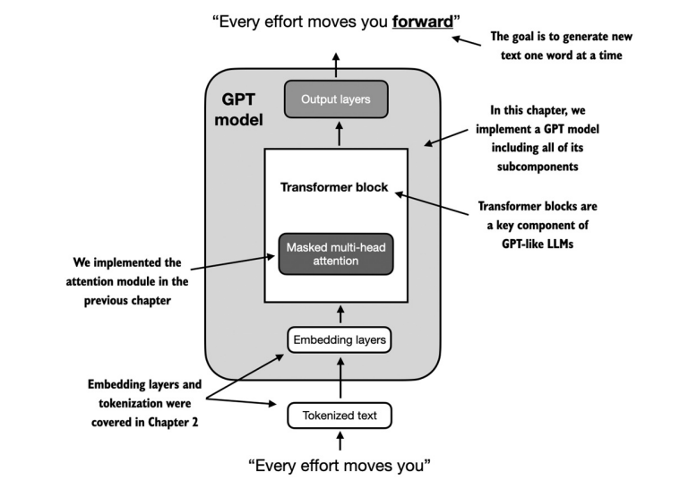
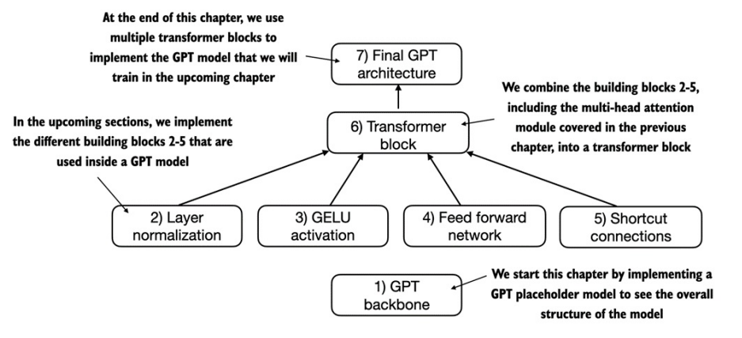
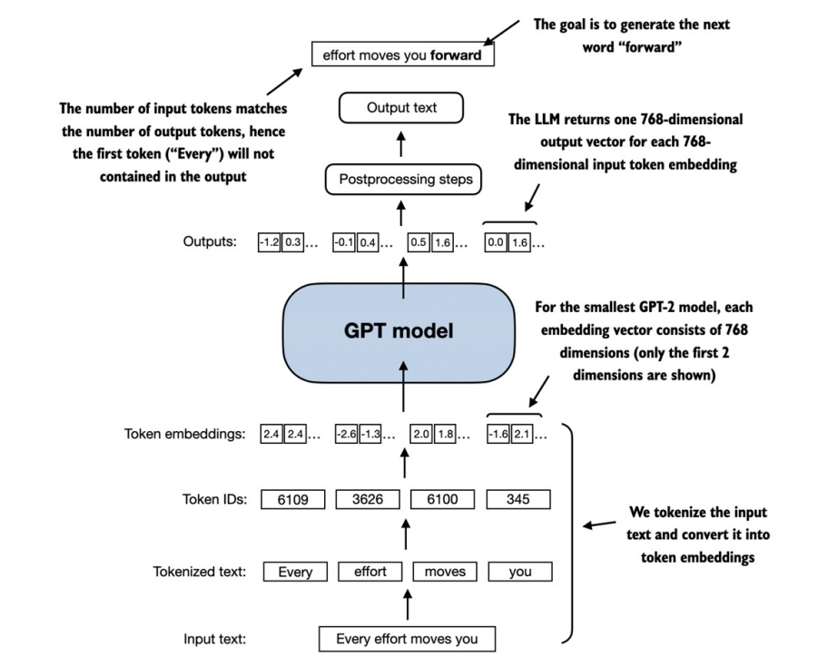
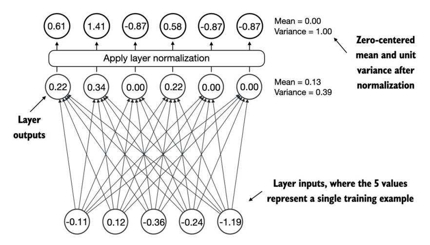
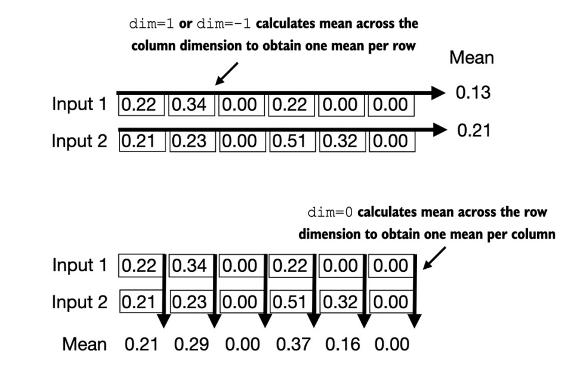
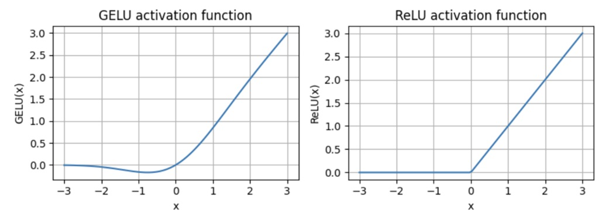
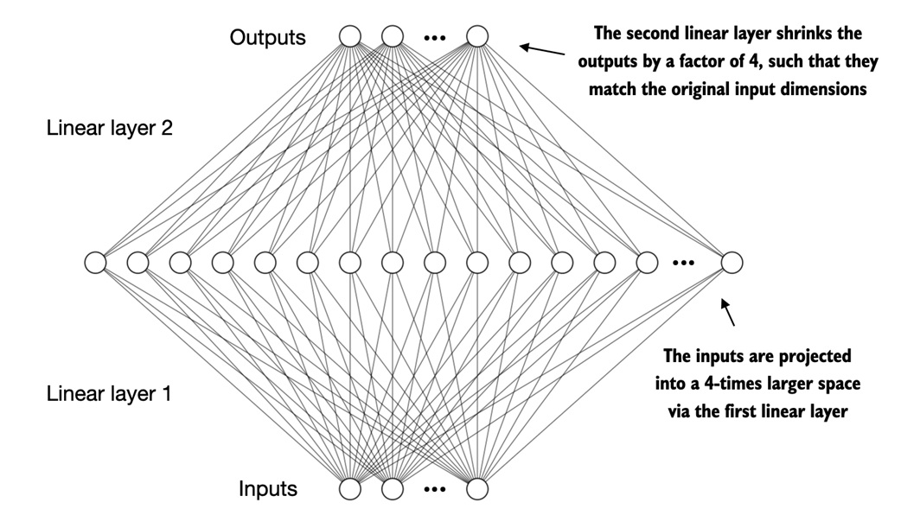
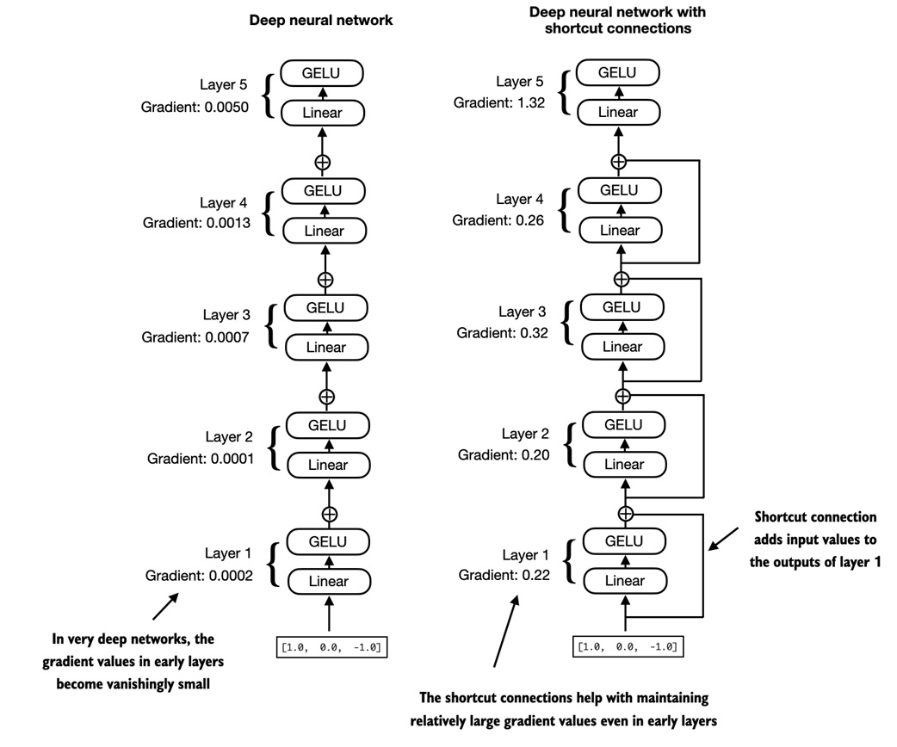
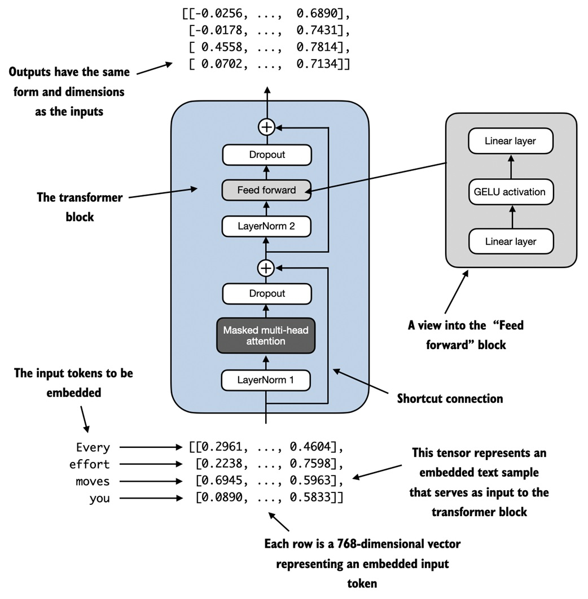

> 参看：https://github.com/datawhalechina/llms-from-scratch-cn/blob/main/Codes/ch04/01_main-chapter-code/ch04.ipynb

## 一、简介

## 1、模型结构

GPT 模型的心智模型如下：在嵌入层旁边，**由一个或多个变压器模块组成**，其中包含掩蔽多头注意力模块



## 2、模型实现脉络



## 3、数据流入和流出 GPT 模型

> 在 LLM 中，嵌入的输入令牌维度通常与输出维度匹配



# 二、GPT backbone(尝鲜)

## 1、指定模型的配置

```python
#指定小型 GPT-2 模型的配置
GPT_CONFIG_124M = {
    "vocab_size": 50257, #指 50,257 个单词的词汇表
    "context_length": 1024, #表示模型的位置嵌入可以处理的最大输入标记数
    "emb_dim": 768, #表示嵌入大小，将每个标记转换为 768 维向量
    "n_heads": 12, #实现的多头注意力机制中的注意力头计数
    "n_layers": 12, #指定模型中变压器块的数量
    "drop_rate": 0.1, #表示压差机制的强度（0.1 表示隐藏单位下降 10%），以防止过拟合
    "qkv_bias": False #确定是否在多头注意力的线性层中包含偏向量，以进行查询、键和值计算
}
```

## 2、模型架构(DummyGPT)

```python
import torch
import torch.nn as nn

class DummyGPTModel(nn.Module):
    def __init__(self, cfg): #cfg 来自 GPT_CONFIG_124M
        super().__init__()
        self.tok_emb = nn.Embedding(cfg["vocab_size"], cfg["emb_dim"]) #标记
        self.pos_emb = nn.Embedding(cfg["context_length"], cfg["emb_dim"]) #位置嵌入
        self.drop_emb = nn.Dropout(cfg["drop_rate"]) #dropout
        ##转换器块
        self.trf_blocks = nn.Sequential(*[DummyTransformerBlock(cfg) for _ in range(cfg["n_layers"])]) 
        self.final_norm = DummyLayerNorm(cfg["emb_dim"]) #最终层归一化 
        self.out_head = nn.Linear(cfg["emb_dim"], cfg["vocab_size"], bias=False) #线性输出层
        
    def forward(self, in_idx):
        batch_size, seq_len = in_idx.shape
        tok_embeds = self.tok_emb(in_idx) #计算输入索引的标记
        pos_embeds = self.pos_emb(torch.arange(seq_len, device=in_idx.device)) #计算位置嵌入
        x = tok_embeds + pos_embeds
        x = self.drop_emb(x) #应用 dropout
        x = self.trf_blocks(x) #通过 transformer 模块处理数据
        x = self.final_norm(x) #应用归一化
        logits = self.out_head(x) #使用线性输出层生成 logits
        return logits
    
#转换器块--后面补充完善
class DummyTransformerBlock(nn.Module):
    def __init__(self, cfg):
        super().__init__()
        
    def forward(self, x):
        return x

#层规范化--后面补充完善
class DummyLayerNorm(nn.Module):
    def __init__(self, normalized_shape, eps=1e-5):
        super().__init__()
        
    def forward(self, x):
        return x
```

## 3、效果测试

- **准备输入数据**：

    ```python
    import tiktoken
    
    tokenizer = tiktoken.get_encoding("gpt2")
    batch = []
    txt1 = "Every effort moves you"
    txt2 = "Every day holds a"
    
    batch.append(torch.tensor(tokenizer.encode(txt1)))
    batch.append(torch.tensor(tokenizer.encode(txt2)))
    batch = torch.stack(batch, dim=0)
    print(batch)
    
    #输出
    tensor([[6109, 3626, 6100,  345],
            [6109, 1110, 6622,  257]])
    ```

- **模型调用**：

    ```python
    torch.manual_seed(123)
    model = DummyGPTModel(GPT_CONFIG_124M)
    logits = model(batch)
    print("Output shape: ", logits.shape)
    print(logits)
    
    #输出
    #输出张量有两行对应于两个文本样本
    #每个文本样本由 4 个标记组成
    #每个标记都是一个 50,257 维的向量，与标记器词汇表的大小相匹配
    Output shape:  torch.Size([2, 4, 50257])
    tensor([[[-0.9289,  0.2748, -0.7557,  ..., -1.6070,  0.2702, -0.5888],
             [-0.4476,  0.1726,  0.5354,  ..., -0.3932,  1.5285,  0.8557],
             [ 0.5680,  1.6053, -0.2155,  ...,  1.1624,  0.1380,  0.7425],
             [ 0.0447,  2.4787, -0.8843,  ...,  1.3219, -0.0864, -0.5856]],
    
            [[-1.5474, -0.0542, -1.0571,  ..., -1.8061, -0.4494, -0.6747],
             [-0.8422,  0.8243, -0.1098,  ..., -0.1434,  0.2079,  1.2046],
             [ 0.1355,  1.1858, -0.1453,  ...,  0.0869, -0.1590,  0.1552],
             [ 0.1666, -0.8138,  0.2307,  ...,  2.5035, -0.3055, -0.3083]]],
           grad_fn=<UnsafeViewBackward0>)
    ```

# 三、Layer normalization

> 参看：https://github.com/datawhalechina/llms-from-scratch-cn/blob/main/Translated_Book/ch04/4.2%20%E4%BD%BF%E7%94%A8%E5%B1%82%E5%BD%92%E4%B8%80%E5%8C%96%E5%AF%B9%E6%BF%80%E6%B4%BB%E8%BF%9B%E8%A1%8C%E5%BD%92%E4%B8%80%E5%8C%96.ipynb

## 1、简介

- **层归一化的主要思想**：

    - 调整神经网络层的激活（输出），使其平均值为 0，方差为 1，也称为**单位方差**

    - 这种调整加快了向有效重量的收敛速度，并确保了一致、可靠的训练

- **应用场景**：在 GPT-2 和现代 transformer 架构中，层归一化通常**在多头注意力模块之前和之后以及最终输出层之前应用**

- **工作原理**：如图，其中 5 层输出（也称为激活）被归一化，使其均值为零，方差为 1



## 2、代码案例

- 实现了一个具有 5 个输入和 6 个输出的神经网络层

    ```python
    torch.manual_seed(123)
    batch_example = torch.randn(2, 5)
    layer = nn.Sequential(nn.Linear(5, 6), nn.ReLU())
    out = layer(batch_example)
    print(out)
    
    #输出
    tensor([[0.2260, 0.3470, 0.0000, 0.2216, 0.0000, 0.0000],
            [0.2133, 0.2394, 0.0000, 0.5198, 0.3297, 0.0000]],
           grad_fn=<ReluBackward0>)
    
    #检查均值和方差
    mean = out.mean(dim=-1, keepdim=True) #keepdim=True 可确保输出张量保持与输入张量相同的形状
    var = out.var(dim=-1, keepdim=True)
    print("Mean:\n", mean)
    print("Variance:\n", var)
    
    #输出
    Mean:
     tensor([[0.1324],
            [0.2170]], grad_fn=<MeanBackward1>)
    Variance:
     tensor([[0.0231],
            [0.0398]], grad_fn=<VarBackward0>)
    ```

- 将层归一化应用于上面的输出：

    > 该操作包括减去均值并除以方差的平方根（也称为标准差）

    ```python
    #设置 sci_mode=False 关闭打印张量值时的科学记数法，以提高可读性
    torch.set_printoptions(sci_mode=False)
    
    out_norm = (out - mean) / torch.sqrt(var)
    mean = out_norm.mean(dim=-1, keepdim=True)
    var = out_norm.var(dim=-1, keepdim=True)
    print("Normalized layer outputs:\n", out_norm)
    print("Mean:\n", mean)
    print("Variance:\n", var)
    
    #输出
    Normalized layer outputs:
     tensor([[ 0.6159,  1.4126, -0.8719,  0.5872, -0.8719, -0.8719],
            [-0.0189,  0.1121, -1.0876,  1.5173,  0.5647, -1.0876]],
           grad_fn=<DivBackward0>)
    Mean:
     tensor([[    -0.0000],
            [    -0.0000]], grad_fn=<MeanBackward1>)
    Variance:
     tensor([[1.0000],
            [1.0000]], grad_fn=<VarBackward0>)
    ```

## 3、层归一化类封装

```python
class LayerNorm(nn.Module):
    def __init__(self, emb_dim): #在输入张量 x 的最后一个维度上运行，该维度表示嵌入维度 （emb_dim）
        super().__init__()
        self.eps = 1e-5 #添加到方差中的一个小常数 （epsilon），以防止在归一化过程中除以零
        #scale 和 shift 是两个可训练的参数（与输入的维度相同）
        #如果确定这样做会提高模型在其训练任务中的性能，则 LLM 会在训练期间自动调整这些参数
        #这使模型能够学习最适合其正在处理的数据的适当缩放和移位
        self.scale = nn.Parameter(torch.ones(emb_dim))
        self.shift = nn.Parameter(torch.zeros(emb_dim))
        
    def forward(self, x):
        mean = x.mean(dim=-1, keepdim=True)
        var = x.var(dim=-1, keepdim=True, unbiased=False)
        norm_x = (x - mean) / torch.sqrt(var + self.eps)
        return self.scale * norm_x + self.shift
```

---

效果测试：

```python
ln = LayerNorm(emb_dim=5)
out_ln = ln(batch_example)
mean = out_ln.mean(dim=-1, keepdim=True)
var = out_ln.var(dim=-1, unbiased=False, keepdim=True)
print("Mean:\n", mean)
print("Variance:\n", var)

#输出
Mean:
 tensor([[    -0.0000],
        [     0.0000]], grad_fn=<MeanBackward1>)
Variance:
 tensor([[1.0000],
        [1.0000]], grad_fn=<VarBackward0>)
```

## 4、计算张量均值时的 dim 参数图示

例如：有一个维度为 [行、列] 的 2D 张量（矩阵），则

- 使用 `dim=0` 将跨行（垂直，如底部所示）执行操作，从而产生聚合每列数据的输出
- 使用 `dim=1` 或 `dim=-1` 将跨列执行操作（水平，如顶部所示），从而生成聚合每行数据的输出



# 四、GELU activation&Forward

> 使用 GELU 激活函数的前馈网络：https://github.com/datawhalechina/llms-from-scratch-cn/blob/main/Translated_Book/ch04/4.3%20%E5%AE%9E%E7%8E%B0%E4%BD%BF%E7%94%A8%20GELU%20%E6%BF%80%E6%B4%BB%E5%87%BD%E6%95%B0%E7%9A%84%E5%89%8D%E9%A6%88%E7%BD%91%E7%BB%9C.ipynb

本节将实现一个小型神经网络子模块，该子模块在 LLM 的 Transformer 块中起着重要作用

## 1、激活函数简介

- `ReLU` 激活函数：是一个分段线性函数

    - 对于正数输入，直接输出该输入值
    - 对于负数输入，输出为零

    > ReLU 在零点处有一个尖角，这有时会使优化变得更为困难，尤其是在网络极其深入或架构复杂的情况下

- `GELU`(高斯误差线性单元)：使用了高斯线性单元，与 ReLU 相似，但**在处理负数输入时，其梯度不为零** 

    > GELU 的平滑性在训练过程中可以带来更优的优化性能，因为它允许对模型参数进行更精细的调整

- `SwiGLU`(Sigmoid-权重线性单元)：使用了sigmoid 门控线性单元

---

与 ReLU 对所有负输入都输出零不同，GELU 允许负值有微小的、非零的输出

这一特性意味着在训练过程中，**接收到负输入的神经元仍然可以在一定程度上参与学习过程**

```python
#为了更好地理解 GELU 函数的形状以及它与 ReLU 函数的对比，我们将这两个函数并排绘制出来
import matplotlib.pyplot as plt

gelu, relu = GELU(), nn.ReLU() #GELU 定义见下一节
x = torch.linspace(-3, 3, 100)
y_gelu, y_relu = gelu(x), relu(x)
plt.figure(figsize= (8, 3))
for i, (y, label) in enumerate(zip([y_gelu, y_relu], ["GELU", "ReLU"]), 1):
    plt.subplot(1, 2, i)
    plt.plot(x, y)
    plt.title(f"{label} activation function")
    plt.xlabel("x")
    plt.ylabel(f"{label}(x)")
    plt.grid(True)
    plt.tight_layout()
    plt.show()
```



## 2、GELU 激活函数

GELU 激活函数：

- 精确版本定义为：$GELU(x)=x \Phi (x)$，其中 $\Phi(x)$ 是标准高斯分布的累积分布函数
- 计算成本更低的近似版本：$GELU(x) \approx 0.5 \cdot x \cdot (1 + tanh[\sqrt{2/ \pi} \cdot (x + 0.044715 \cdot x^3)])$

```python
#GELU 激活函数的实现
import torch
from torch import nn

class GELU(nn.Module):
    def __init__(self):
        super().__init__()
        
    def forward(self, x):
        return 0.5 * x 
    		* (1 + torch.tanh(torch.sqrt(torch.tensor(2.0 / torch.pi)) * x + 0.044715 * torch.pow(x, 3)))
```

## 3、前馈神经网络

```python
#前馈神经网络模块
class FeedForward(nn.Module):
    def __init__(self, cfg):
        super().__init__()
        self.layers = nn.Sequential(nn.Linear(cfg["emb_dim"], 4 * cfg["emb_dim"]), 
                                    GELU(), 
                                    nn.Linear(4 * cfg["emb_dim"], cfg["emb_dim"]))
    def forward(self, x):
        return self.layers(x)
    
#测试
GPT_CONFIG_124M = {
    "vocab_size": 50257,  # 词表大小
    "ctx_len": 1024,      # 上下文长度
    "emb_dim": 768,       # 嵌入维度
    "n_heads": 12,        # 注意力头（attention heads）的数量
    "n_layers": 12,       # 模型层数
    "drop_rate": 0.1,     # Dropout rate
    "qkv_bias": False     # Query-Key-Value bias
}

ffn = FeedForward(GPT_CONFIG_124M)
x = torch.rand(2, 3, 768)
out = ffn(x)
print(out.shape)

#输出
torch.Size([2, 3, 768])
```

这种设计使模型能够探索更丰富的表示空间：

- 首先，通过第一个线性层将嵌入维度扩展到更高的空间维度

- 然后，跟随的是一个非线性的 GELU 激活函数

- 最后，通过第二个线性变换将其压缩回原始维度

> 此外，输入和输出维度的一致性简化了架构设计，使得可以堆叠多个层，而无需在调整维度，从而提高了模型的可扩展性



# 五、Shortcut connections

> 增加快捷链接：https://github.com/datawhalechina/llms-from-scratch-cn/blob/main/Translated_Book/ch04/4.4%20%E5%A2%9E%E5%8A%A0%E5%BF%AB%E6%8D%B7%E9%93%BE%E6%8E%A5.ipynb

## 1、简介

**快捷连接(跳过或剩余连接)**：最初是为计算机视觉中的深度网络(特别是残差网络)而提出，以缓解梯度消失带来的挑战

> 梯度消失问题是指梯度(在训练过程中引导权重更)随着层反向传播而逐渐变小的问题，使得训练早期层变得困难

- **原理**：通过跳过一个或多个层，为梯度在网络中流动创造了一条更短的备用路径
- **实现**：将一个层的输出加到后面层的输出上
- **作用：保持梯度的流动**，在训练过程中的反向传播中起着至关重要的作用

---

下图：是由 5 层组成的**不带快捷连接(左侧)**和**带快捷连接(右侧)**的深度神经网络之间的比较

- 快捷连接涉及将层的输入添加到其输出，从而有效地创建绕过某些层的备用路径
- 图中所示的梯度表示每层的平均绝对梯度，将在下面的代码示例中计算



## 2、快捷方式连接的神经网络

- 这段代码实现了一个 5 层的深度神经网络，每层由一个线性层和一个 GELU 激活函数组成

- 在前向传递中，迭代地通过各层传递输入，如果 self.use_shortcut=True，则可以选择添上图中的快捷方式连接

```python
import torch
import torch.nn as nn
from torch.nn import GELU

class ExampleDeepNeuralNetwork(nn.Module):
    def __init__(self, layer_sizes, use_shortcut):
        super().__init__()
        self.use_shortcut = use_shortcut
        self.layers = nn.ModuleList([ # 实现5层神经网络(每层由一个线性层和一个 GELU 激活函数组成)
            nn.Sequential(nn.Linear(layer_sizes[0], layer_sizes[1]), GELU()),
            nn.Sequential(nn.Linear(layer_sizes[1], layer_sizes[2]), GELU()),
            nn.Sequential(nn.Linear(layer_sizes[2], layer_sizes[3]), GELU()),
            nn.Sequential(nn.Linear(layer_sizes[3], layer_sizes[4]), GELU()),
            nn.Sequential(nn.Linear(layer_sizes[4], layer_sizes[5]), GELU())
        ])
        
    def forward(self, x):
        for layer in self.layers:
            layer_output = layer(x) #计算当前层的输出
            if self.use_shortcut and x.shape == layer_output.shape: #检查是否可以应用快捷连接
                x = x + layer_output
            else:
                x = layer_output
        return x
```

## 3、案例对比

- 首先，实现一个函数，在模型的反向传递中计算梯度

    - 指定了一个损失函数，用于计算模型输出与用户指定的目标（此处为简单起见，值为 0）的接近程度
    - 然后，当调用 loss.backward() 时，PyTorch 计算模型中每一层的损失梯度
    - 可以通过 model.named_parameters() 迭代权重参数，并打印权重参数矩阵的梯度值的平均绝对梯度，以获得每层的单个梯度值，以便更容易地比较各层之间的梯度

    ```python
    def print_gradients(model, x):
        output = model(x)
        target = torch.tensor([[0.]])
        
        #根据目标和输出的接近程度计算损失
        loss = nn.MSELoss()
        loss = loss(output, target)
        
        loss.backward() # 反向传播以计算梯度
        
        for name, param in model.named_parameters():
            if 'weight' in name: # 输出权重的平均绝对梯度
                print(f"{name} has gradient mean of {param.grad.abs().mean()}")
    ```

- 初始化 input：

    ```python
    layer_sizes = [3, 3, 3, 3, 3, 1]
    sample_input = torch.tensor([[1., 0., -1.]])
    ```

- **没有快捷连接的神经网络**：梯度从最后一层 `layers.4` 到第一层 `layers.0` 逐渐变小，这种现象被称为梯度消失问题

    ```python
    torch.manual_seed(123)
    model_without_shortcut = ExampleDeepNeuralNetwork(layer_sizes, use_shortcut=False)
    print_gradients(model_without_shortcut, sample_input)
    
    #输出
    layers.0.0.weight has gradient mean of 0.00020174118981231004
    layers.1.0.weight has gradient mean of 0.00012011769285891205
    layers.2.0.weight has gradient mean of 0.0007152436301112175
    layers.3.0.weight has gradient mean of 0.00139885104727
    layers.4.0.weight has gradient mean of 0.005049602594226599
    ```

- **有快捷连接的神经网络**：

    - 根据输出，最后一层 `layers.4` 仍然比其他层具有更大的梯度
    - 然而，随着向第一层 `layers.0` 进展，梯度值变得更加稳定，并没有缩减到极小的数值

    ```python
    torch.manual_seed(123)
    model_with_shortcut = ExampleDeepNeuralNetwork(layer_sizes, use_shortcut=True)
    print_gradients(model_with_shortcut, sample_input)
    
    #输出
    layers.0.0.weight has gradient mean of 0.22186797857284546
    layers.1.0.weight has gradient mean of 0.20709273219108582
    layers.2.0.weight has gradient mean of 0.3292388319969177
    layers.3.0.weight has gradient mean of 0.2667771875858307
    layers.4.0.weight has gradient mean of 1.3268061876296997
    ```

> 总结：快捷连接对于克服深度神经网络中梯度消失问题所带来的限制非常重要，是大型模型（例如 LLMs）的核心构建块

# 六、Transformer block

> 在transfomer模块中连接注意力层和线性层：https://github.com/datawhalechina/llms-from-scratch-cn/blob/main/Translated_Book/ch04/4.5%20%E5%9C%A8transfomer%E6%A8%A1%E5%9D%97%E4%B8%AD%E8%BF%9E%E6%8E%A5%E6%B3%A8%E6%84%8F%E5%8A%9B%E5%B1%82%E5%92%8C%E7%BA%BF%E6%80%A7%E5%B1%82.ipynb

## 1、简介

当transfomer模块处理输入序列时，序列中的每个元素都由固定大小的向量表示

- 多头注意力模块中的自注意力机制的思想：能够识别并分析输入序列中各元素之间的关系

- 前馈网络在每个位置独立地修改数据。

这种组合不仅可以更细致地理解和处理输入，还可以增强模型处理复杂数据模式的整体能力



## 2、实现

### 2.1 FeedForward

```python
import torch
import torch.nn as nn
from torch.nn import LayerNorm

class FeedForward(nn.Module):
    def __init__(self, cfg):
        super().__init__()
        self.linear1 = nn.Linear(cfg["emb_dim"], cfg["emb_dim"] * 4)
        self.relu = nn.ReLU()
        self.linear2 = nn.Linear(cfg["emb_dim"] * 4, cfg["emb_dim"])
        self.dropout = nn.Dropout(cfg["drop_rate"])
        
    def forward(self, x):
        x = self.relu(self.linear1(x))
        x = self.dropout(x)
        x = self.linear2(x)
        return x
```

### 2.2 MultiHeadAttention

```python
class MultiHeadAttention(nn.Module):
    def __init__(self, d_in, d_out, context_length, dropout, num_heads, qkv_bias=False):
        super().__init__()
        assert d_out % num_heads == 0, "d_out must be divisible by num_heads"
        self.d_out = d_out
        self.num_heads = num_heads
        self.head_dim = d_out // num_heads
        self.W_query = nn.Linear(d_in, d_out, bias=qkv_bias)
        self.W_key = nn.Linear(d_in, d_out, bias=qkv_bias)
        self.W_value = nn.Linear(d_in, d_out, bias=qkv_bias)
        self.out_proj = nn.Linear(d_out, d_out)
        self.dropout = nn.Dropout(dropout)
        self.register_buffer('mask', torch.triu(torch.ones(context_length, context_length), diagonal=1))
        
    def forward(self, x):
        b, num_tokens, d_in = x.shape
        keys = self.W_key(x)
        queries = self.W_query(x)
        values = self.W_value(x)
        
        keys = keys.view(b, num_tokens, self.num_heads, self.head_dim)
        values = values.view(b, num_tokens, self.num_heads, self.head_dim)
        queries = queries.view(b, num_tokens, self.num_heads, self.head_dim)
        
        keys = keys.transpose(1, 2)
        queries = queries.transpose(1, 2)
        values = values.transpose(1, 2)
        
        attn_scores = queries @ keys.transpose(2, 3)
        mask_bool = self.mask.bool()[:num_tokens, :num_tokens]
        
        attn_scores.masked_fill_(mask_bool, -torch.inf)
        attn_weights = torch.softmax(attn_scores / keys.shape[-1]**0.5, dim=-1)
        attn_weights = self.dropout(attn_weights)
        
        context_vec = (attn_weights @ values).transpose(1, 2)
        context_vec = context_vec.contiguous().view(b, num_tokens, self.d_out)
        context_vec = self.out_proj(context_vec)
        return context_vec
```

### 2.3 TransformerBlock

- TransformerBlock 类：包括一个多头注意力机制 `MultiHeadAttention` 和一个前馈网络 `FeedForward`

- Pre-LayerNorm：在这两个组件之前应用层归一化  `LayerNorm`，并在之后应用 `dropout`，以正则化模型并防止过度拟合

    > Post-LayerNorm：层归一化在自注意力和前馈网络之后应用，这通常会导致较差的训练动态

- 快捷连接：在每个组件后面都有一个，将块的输入添加到其输出，有助于训练过程中梯度在网络中的流动，改善深度模型的学习效果

```python
class TransformerBlock(nn.Module):
    def __init__(self, cfg):
        super().__init__()
        self.att = MultiHeadAttention(
            d_in = cfg["emb_dim"],
            d_out = cfg["emb_dim"],
            context_length = cfg["context_length"],
            num_heads = cfg["n_heads"],
            dropout = cfg["drop_rate"],
            qkv_bias = cfg["qkv_bias"]
        )
        self.ff = FeedForward(cfg)
        self.norm1 = LayerNorm(cfg["emb_dim"])
        self.norm2 = LayerNorm(cfg["emb_dim"])
        self.drop_resid = nn.Dropout(cfg["drop_rate"])
    
    def forward(self, x):
        shortcut = x
        x = self.norm1(x)
        x = self.att(x)
        x = self.drop_resid(x)
        x = x + shortcut
        
        shortcut = x
        x = self.norm2(x)
        x = self.ff(x)
        x = self.drop_resid(x)
        x = x + shortcut
        return x
```

### 2.4 效果测试

从代码输出看到：transfomer模块在其输出中保持了输入的维度，这表明transfomer架构在整个网络中处理数据序列时不改变其形状

```python
GPT_CONFIG_124M = {
    "vocab_size": 50257,
    "context_length": 1024,
    "emb_dim": 768,
    "n_heads": 12,
    "n_layers": 12,
    "drop_rate": 0.1,
    "qkv_bias": False
}
torch.manual_seed(123)
x = torch.rand(2, 4, 768)
block = TransformerBlock(GPT_CONFIG_124M)
output = block(x)
print("Input shape: ", x.shape)
print("Output shape: ", output.shape)

#输出
Input shape:  torch.Size([2, 4, 768])
Output shape:  torch.Size([2, 4, 768])
```

# 七、Final GPT architecture

> 编码GPT模型：https://github.com/datawhalechina/llms-from-scratch-cn/blob/main/Translated_Book/ch04/4.6%20%E7%BC%96%E7%A0%81GPT%E6%A8%A1%E5%9E%8B.ipynb


# 八、生成文本

> 参看：https://github.com/datawhalechina/llms-from-scratch-cn/blob/main/Translated_Book/ch04/4.7%20%E7%94%9F%E6%88%90%E6%96%87%E6%9C%AC.ipynb


