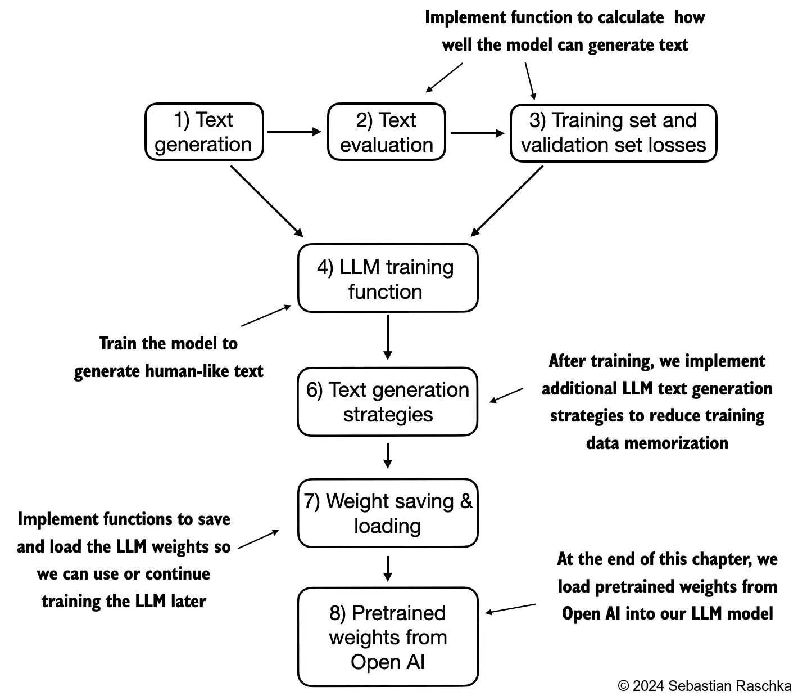
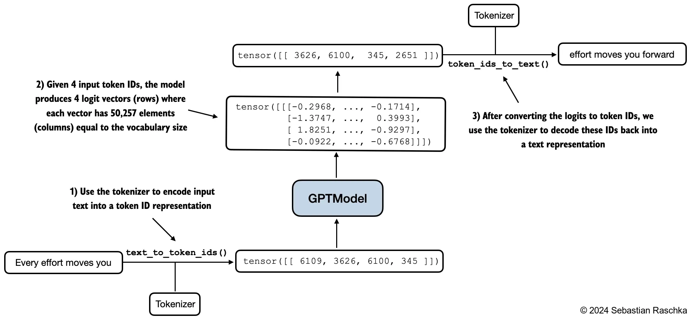
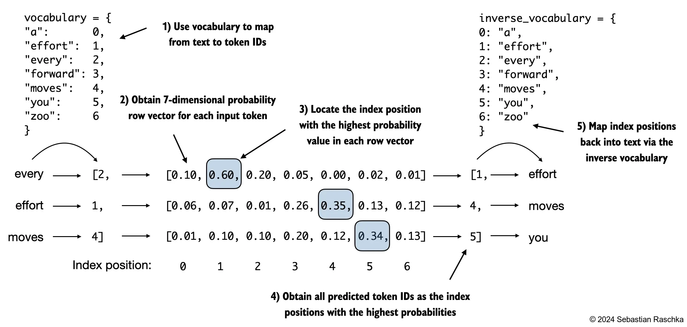
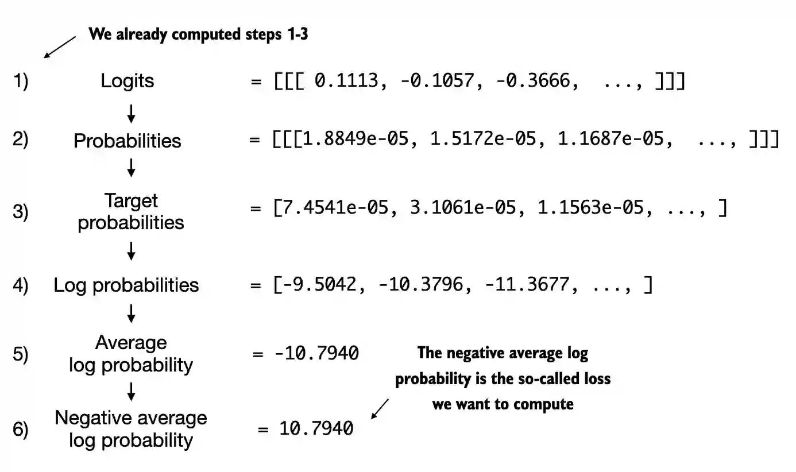
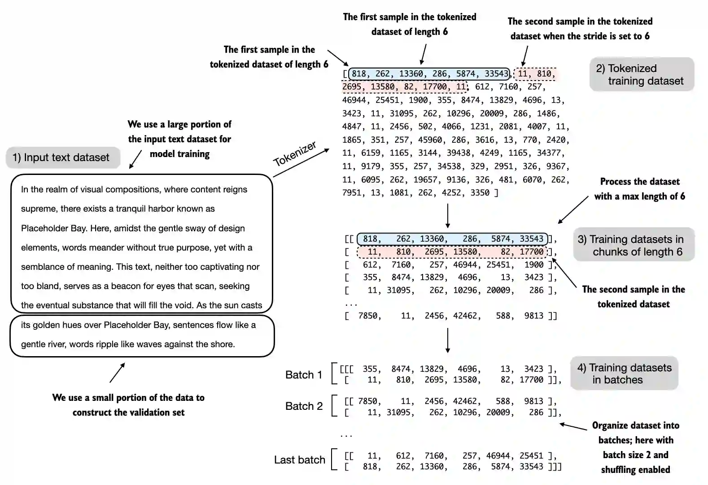
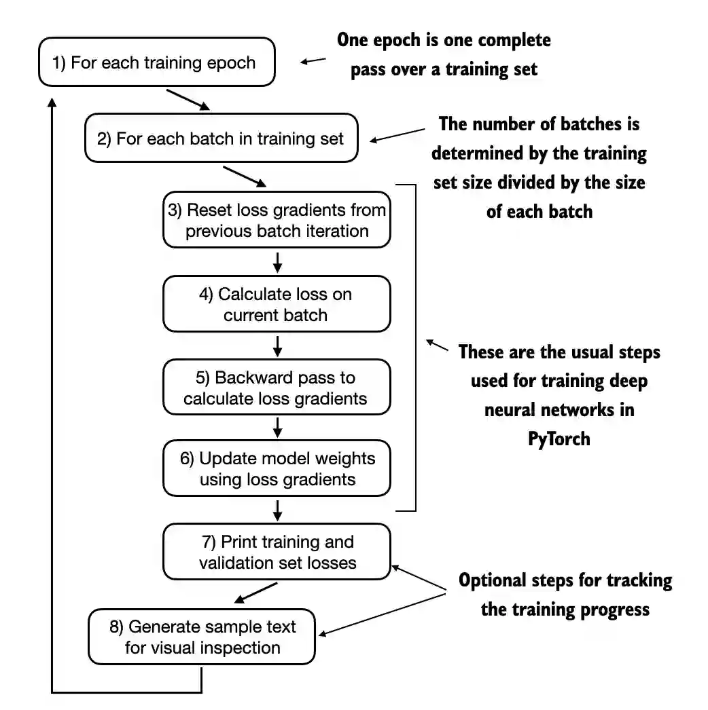
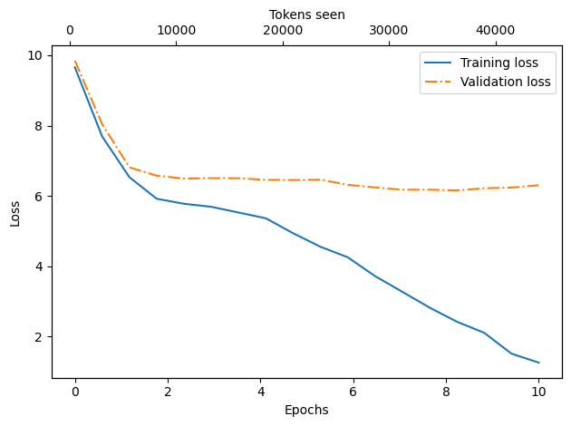
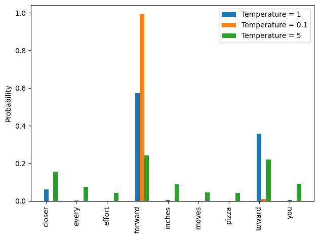
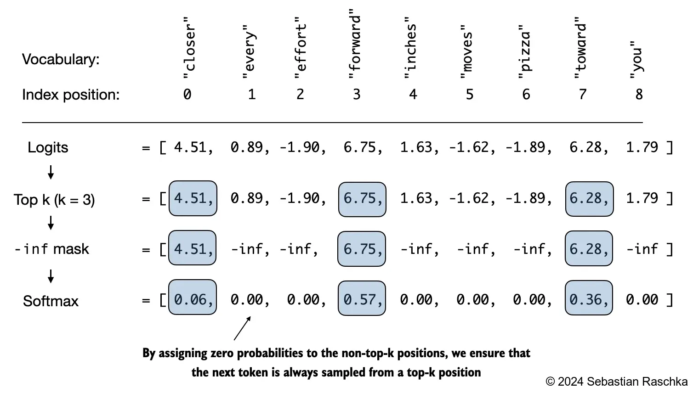
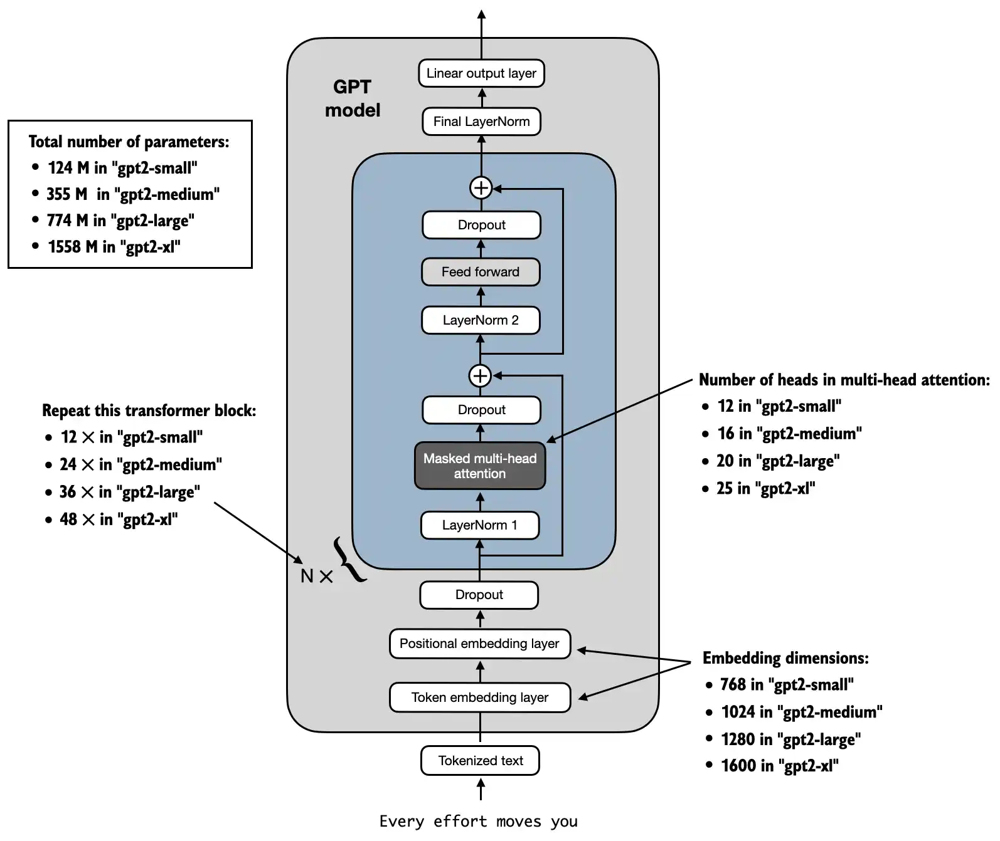

> 参看：https://github.com/datawhalechina/llms-from-scratch-cn/blob/main/Codes/ch05/01_main-chapter-code/ch05.ipynb



# 一、评估文本生成模型

## 1、使用GPTModel生成文本

### 1.1 初始化 GPTModel 模型

```python
GPT_CONFIG_124M = {
    "vocab_size": 50257,
    "context_length": 256,
    "emb_dim": 768,
    "n_heads": 12,
    "n_layers": 12,
    "drop_rate": 0.1, #现在的llm训练中通常没有dropout
    "qkv_bias": False
}

torch.manual_seed(123) #设置随机数生成器的种子值，确保每次运行代码时得到相同的随机数序列，从而保证实验的可重复性
model = GPTModel(GPT_CONFIG_124M)
model.eval() #将模型设置为“评估模式”，确保模型在测试时不受这些随机操作的影响（如 Dropout 和 BatchNorm）
```

### 1.2 测试模型效果

```python
import tiktoken

#函数text_to_token_ids和token_ids_to_text用于在本章中进行标记和文本表示之间的转换
def text_to_token_ids(text, tokenizer):
    encoded = tokenizer.encode(text, allowed_special={'<|endoftext|>'})
    encoded_tensor = torch.tensor(encoded).unsqueeze(0) #增加batch维度
    return encoded_tensor

def token_ids_to_text(token_ids, tokenizer):
    flat = token_ids.squeeze(0) #去掉batch维度
    return tokenizer.decode(flat.tolist())

start_context = "Every effort moves you"
tokenizer = tiktoken.get_encoding("gpt2")

token_ids = generate_text_simple(
    model=model,
    idx=text_to_token_ids(start_context, tokenizer),
    max_new_token=10,
    context_size=GPT_CONFIG_124M["context_length"]
)
print("Output text:\n", token_ids_to_text(token_ids, tokenizer))

#输出
Output text:
 Every effort moves you rentingetic wasnم refres RexAngel214nesiumfigured

#结论：模型未能生成好的文本，因为它尚未经过训练
```



## 2、计算文本生成损失：交叉熵和困惑度

> 本节将介绍用于计算生成输出的损失指标的度量标准，可以使用这些度量标准来衡量训练进度

### 2.1 文本与概率互相转换



#### (1) 将文本转换为概率

```python
#下面案例是包含了2个训练样本（行）的标记ID
#其中，inputs 是输入，targets 是期望输出（targets是inputs向右移动了一个位置）
inputs = torch.tensor([[16833, 3626, 6100],   # ["every effort moves",
                       [40,    1107, 588]])   #  "I really like"]

targets = torch.tensor([[3626, 6100, 345  ],  # [" effort moves you",
                        [588,  428,  11311]]) #  " really like chocolate"]

#inputs输入模型后，获得了包含3个标记的2个输入样本的logits向量(每个标记都是一个50,257维的向量，对应于词汇表的大小)
with torch.no_grad():
    logits = model(inputs)

#应用softmax函数，可以将logits张量转换为一个相同维度的张量，其中包含概率分数
probas = torch.softmax(logits, dim=-1) # 词表中每个标记的预测概率
print(probas.shape) # Shape: (batch_size, num_tokens, vocab_size)
#输出：torch.Size([2, 3, 50257])
```

#### (2) 将概率分数转换回文本

上一节的 softmax 函数为每个标记生成了一个50,257维的向量

> `argmax`函数返回这个向量中最高概率分数的位置，即给定标记的下一个预测标记ID

```python
#可以应用argmax函数将概率分数转换为预测的标记ID
token_ids = torch.argmax(probas, dim=-1, keepdim=True)
print("Token IDs:\n", token_ids)

#输出：
Token IDs:
 tensor([[[16657],
         [  339],
         [42826]],

        [[49906],
         [29669],
         [41751]]])
```

#### (3) 测试模型输出效果

- 解码这些标记：会发现与希望模型预测的标记(即目标标记)不同
- 那是因为模型还没有被训练

```python
print(f"Targets batch 1: {token_ids_to_text(targets[0], tokenizer)}")
print(f"Outputs batch 1: {token_ids_to_text(token_ids[0].flatten(), tokenizer)}")

#输出：
Targets batch 1:  effort moves you
Outputs batch 1:  Armed heNetflix
```

### 2.2 计算交叉熵

#### (1) 获取模型输出的概率值

为了训练模型，需要知道它离正确预测（目标）有多远

```python
#对应于目标索引的标记概率如下：
batch_idx = 0
target_probas_1 = probas[batch_idx, [0, 1, 2], targets[batch_idx]]
print("Batch 1:", target_probas_1)

batch_idx = 1
target_probas_2 = probas[1, [0, 1, 2], targets[1]]
print("Batch 2:", target_probas_2)

#输出：
Batch 1: tensor([7.4540e-05, 3.1061e-05, 1.1563e-05])
Batch 2: tensor([3.9836e-05, 1.6783e-05, 4.7559e-06])
```

#### (2) 平均对数概率

希望最大化所有这些值，使其接近1的概率

> 数学优化中，最大化概率分数的对数比分数值本身更容易
>
> 更详细的讲座：[L8.2 逻辑回归损失函数](https://www.youtube.com/watch?v=GxJe0DZvydM)。

```python
# 计算所有标记的预测概率的对数值
log_probas = torch.log(torch.cat((target_probas_1, target_probas_2)))
print(log_probas) #输出：tensor([ -9.5042, -10.3796, -11.3677, -10.1308, -10.9951, -12.2561])

#接下来，计算平均对数概率 -- 对所有标记的概率对数值求均值
avg_log_probas = torch.mean(log_probas)
print(avg_log_probas) #输出：tensor(-10.7722)
```

#### (3) 交叉熵损失(平均对数概率的负值)

> 目标是通过优化模型权重，使得这个平均对数概率尽可能大；由于对数函数的特性，最大可能的值是0，而目前远离0

在深度学习中，通常不是最大化平均对数概率，而是遵循标准惯例来**最小化平均对数概率的负值**，而负-10.7722的值(即10.7722)表示**交叉熵损失**

```python
neg_avg_log_probas = avg_log_probas * -1
print(neg_avg_log_probas) #输出：tensor(10.7722)
```

#### (4) cross_entropy 函数

PyTorch 已经实现了一个 `cross_entropy` 函数，该函数执行了前面的步骤



#### (5) 应用交叉熵函数(cross_entropy)

- 先检查一下logits和targets的形状

```python
# Logits向量的形状 (batch_size, num_tokens, vocab_size)
print("Logits shape:", logits.shape) #输出：Logits shape: torch.Size([2, 3, 50257])

# 目标向量的形状 (batch_size, num_tokens)
print("Targets shape:", targets.shape) #输出：Targets shape: torch.Size([2, 3])
```

- 在批次(batch)维度上合并来展平(flatten)张量

```python
logits_flat = logits.flatten(0, 1)
targets_flat = targets.flatten()

print("Flattened logits:", logits_flat.shape) #输出：Flattened logits: torch.Size([6, 50257])
print("Flattened targets:", targets_flat.shape) #输出：Flattened targets: torch.Size([6])
```

- PyTorch中的`cross_entropy`函数会自动地将softmax和对数概率计算应用到这些要最大化标记索引的logits上

```python
loss = torch.nn.functional.cross_entropy(logits_flat, targets_flat)
print(loss) #输出：tensor(10.7722)
```

> 注意：目标（targets）是标记ID，也代表了希望在logits张量中最大化的索引位置

### 2.3 困惑度

**困惑度**：就是交叉熵损失的指数函数计算结果

> 一个 与交叉熵损失相关的概念是大型语言模型(LLM)的困惑度

```python
perplexity = torch.exp(loss)
print(perplexity) #输出：tensor(47678.8633)
```

- 困惑度通常被认为更具可解释性，因为可以被理解为模型在每一步中对下一标记所不确定的词表大小
- 困惑度提供了一种衡量模型预测的概率分布与数据集中单词实际分布匹配程度的方法
- 与损失类似，较低的困惑度表明模型预测更接近实际分布

## 3、计算训练集和验证集损失

### 3.1 加载数据集

```python
import os
import urllib.request

file_path = "the-verdict.txt"
url = "https://github.com/rasbt/LLMs-from-scratch/main/ch02/01_main-chapter-code/the-verdict.txt"

if not os.path.exists(file_path):
    with urllib.request.urlopen(url) as response:
        text_data = response.read().decode('utf-8')
    with open(file_path, "w", encoding="utf-8") as file:
        file.write(text_data)
else:
    with open(file_path, "r", encoding="utf-8") as file:
        text_data = file.read()
        
#通过打印前100个和后100个单词来快速检查文本是否正确加载
print(text_data[:99]) 
#输出：
I HAD always thought Jack Gisburn rather a cheap genius--though a good fellow enough--so it was no 

print(text_data[-99:])
#输出：
it for me! The Strouds stand alone, and happen once--but there's no exterminating our kind of art."

#打印文本和token
total_char = len(text_data)
total_tokens = len(tokenizer.encode(text_data))
print("Characters:", total_char) #输出：Characters: 20479
print("Tokens:", total_tokens) #输出：Tokens: 5145
```

### 3.2 划分训练集和验证集

#### (1) 可视化解释

> 下面的图表假设`max_length=6`，但对于训练加载器，我们将`max_length`设置为LLM支持的上下文长度



#### (2) 代码划分

```python
torch.manual_seed(123)

train_ratio = 0.90 # 训练集/验证集数据比
split_idx = int(train_ratio * len(text_data))

train_data = text_data[:split_idx]
train_loader = create_dataloader_v1(
    train_data,
    batch_size=2,
    max_length=GPT_CONFIG_124M["ctx_len"],
    stride=GPT_CONFIG_124M["ctx_len"],
    drop_last=True,
    shuffle=True
)

val_data = text_data[split_idx:]
val_loader = create_dataloader_v1(
    val_data,
    batch_size=2,
    max_length=GPT_CONFIG_124M["ctx_len"],
    stride=GPT_CONFIG_124M["ctx_len"],
    drop_last=False,
    shuffle=False
)
```

#### (3) 合理性检查

- 合理性检查：为了确保训练集和验证集中数据量大于模型的上下文窗口，避免出现训练/验证错误

```python
if total_tokens * (train_ratio) < GPT_CONFIG_124M["ctx_len"]:
    print("Not enough tokens for the training loader. "
          "Try to lower the `GPT_CONFIG_124M['ctx_len']` or "
          "increase the `training_ratio`")

if total_tokens * (1-train_ratio) < GPT_CONFIG_124M["ctx_len"]:
    print("Not enough tokens for the validation loader. "
          "Try to lower the `GPT_CONFIG_124M['ctx_len']` or "
          "decrease the `training_ratio`")
```

- 一个可选的检查，以确认数据是否已正确加载：

```python
print("Train loader:")
for x, y in train_loader:
    print(x.shape, y.shape)

print("\nValidation loader:")
for x, y in val_loader:
    print(x.shape, y.shape)
    
#输出：
Train loader:
torch.Size([2, 256]) torch.Size([2, 256])
torch.Size([2, 256]) torch.Size([2, 256])
torch.Size([2, 256]) torch.Size([2, 256])
torch.Size([2, 256]) torch.Size([2, 256])
torch.Size([2, 256]) torch.Size([2, 256])
torch.Size([2, 256]) torch.Size([2, 256])
torch.Size([2, 256]) torch.Size([2, 256])
torch.Size([2, 256]) torch.Size([2, 256])
torch.Size([2, 256]) torch.Size([2, 256])

Validation loader:
torch.Size([2, 256]) torch.Size([2, 256])
```

- 另一个可选的检查，以确认标记大小是否在预期的范围内：

```python
train_tokens = 0
for input_batch, target_batch in train_loader:
    train_tokens += input_batch.numel() # 使用numel()函数统计一个batch中的token数量

val_tokens = 0
for input_batch, target_batch in val_loader:
    val_tokens += input_batch.numel()

print("Training tokens:", train_tokens) #输出：Training tokens: 4608
print("Validation tokens:", val_tokens) #输出：Validation tokens: 512
print("All tokens:", train_tokens + val_tokens) #输出：All tokens: 5120
```

### 3.3 实现工具函数

#### (1) 工具函数一：计算给定批次的交叉熵损失

```python
def calc_loss_batch(input_batch, target_batch, model, device):
    input_batch, target_batch = input_batch.to(device), target_batch.to(device)

    logits = model(input_batch)
    logits = logits.flatten(0, 1)
    loss = torch.nn.functional.cross_entropy(logits, target_batch.flatten())
    return loss
```

#### (2) 工具函数二：计算数据加载器中用户指定数量批次的总损失

```python
def calc_loss_loader(data_loader, model, device, num_batches=None): # num_batches为计算损失的批次范围
    total_loss = 0.
    if num_batches is None:
        num_batches = len(data_loader)
    else:
        # 取num_batches和len(data_loader)两者较小值以匹配data_loader中的总批次数量
        num_batches = min(num_batches, len(data_loader))
    for i, (input_batch, target_batch) in enumerate(data_loader):
        if i < num_batches:
            loss = calc_loss_batch(input_batch, target_batch, model, device)
            total_loss += loss.item()
        else:
            break
    return total_loss / num_batches
```

#### (3) 函数测试

```python
device = torch.device("cuda" if torch.cuda.is_available() else "cpu")
model.to(device) # 对于nn.Module类的模型，不需要执行model = model.to(device)这样的赋值操作。

torch.manual_seed(123) # 出于代码结果的可复现性的考虑，显式地设定manual_seed
train_loss = calc_loss_loader(train_loader, model, device)
val_loss = calc_loss_loader(val_loader, model, device)

print("Training loss:", train_loss) #输出：Training loss: 10.98758347829183
print("Validation loss:", val_loss) #输出：Validation loss: 10.98110580444336
```

# 二、训练 LLM

> 如果对使用更先进的技术增强训练函数感兴趣，例如学习率预热、余弦退火和梯度裁剪，请参考[Appendix D](https://github.com/datawhalechina/llms-from-scratch-cn/blob/65cc17a68c4cfab395dc7b39017f89bb953ddb1a/Codes/appendix-D/03_main-chapter-code)

## 1、流程介绍



## 2、定义训练函数

```python
def train_model_simple(model, train_loader, val_loader, optimizer, device, 
                       num_epochs, eval_freq, eval_iter, start_context):
    # 初始化列表以跟踪损失和已观察到的token
    train_losses, val_losses, track_tokens_seen = [], [], []
    tokens_seen, global_step = 0, -1

    # 主要的训练步骤
    for epoch in range(num_epochs):
        model.train()  # 将模型设置为训练模式
        
        for input_batch, target_batch in train_loader:
            optimizer.zero_grad() # 每个epoch开始之前重新设置梯度
            loss = calc_loss_batch(input_batch, target_batch, model, device)
            loss.backward() # 计算损失梯度
            optimizer.step() # 利用损失梯度更新模型参数
            tokens_seen += input_batch.numel()
            global_step += 1

            # 可选的验证评估步骤
            if global_step % eval_freq == 0:
                train_loss, val_loss = evaluate_model(
                    model, train_loader, val_loader, device, eval_iter
                )
                train_losses.append(train_loss)
                val_losses.append(val_loss)
                track_tokens_seen.append(tokens_seen)
                print(f"Ep {epoch+1} (Step {global_step:06d}): "
                      f"Train loss {train_loss:.3f}, Val loss {val_loss:.3f}")

        # 在每个epoch完成后打印一个生成的文本示例
        generate_and_print_sample(
            model, train_loader.dataset.tokenizer, device, start_context
        )

    return train_losses, val_losses, track_tokens_seen


def evaluate_model(model, train_loader, val_loader, device, eval_iter):
    model.eval()
    with torch.no_grad():
        train_loss = calc_loss_loader(train_loader, model, device, num_batches=eval_iter)
        val_loss = calc_loss_loader(val_loader, model, device, num_batches=eval_iter)
    model.train()
    return train_loss, val_loss


def generate_and_print_sample(model, tokenizer, device, start_context):
    model.eval()
    context_size = model.pos_emb.weight.shape[0]
    encoded = text_to_token_ids(start_context, tokenizer).to(device)
    with torch.no_grad():
        token_ids = generate_text_simple(
            model=model, idx=encoded,
            max_new_tokens=50, context_size=context_size
        )
        decoded_text = token_ids_to_text(token_ids, tokenizer)
        print(decoded_text.replace("\n", " "))  # 简洁的打印格式
    model.train()
```

## 3、训练LLM

```python
torch.manual_seed(123)
model = GPTModel(GPT_CONFIG_124M)
model.to(device)
optimizer = torch.optim.AdamW(model.parameters(), lr=5e-4, weight_decay=0.1)

num_epochs = 10
train_losses, val_losses, tokens_seen = train_model_simple(
    model, train_loader, val_loader, optimizer, device,
    num_epochs=num_epochs, eval_freq=5, eval_iter=5,
    start_context="Every effort moves you",
)

#输出：
Ep 1 (Step 000000): Train loss 9.657, Val loss 9.845
Ep 1 (Step 000005): Train loss 7.690, Val loss 8.041
Every effort moves you,.                                                
Ep 2 (Step 000010): Train loss 6.532, Val loss 6.812
Ep 2 (Step 000015): Train loss 5.920, Val loss 6.577
Every effort moves you, and, and, and, and, and, and, and. ", and,, and, and, and, and, and, and, and,, and, and,, and, and,, and,, and
Ep 3 (Step 000020): Train loss 5.777, Val loss 6.494
Ep 3 (Step 000025): Train loss 5.692, Val loss 6.505
Every effort moves you.                                                 
Ep 4 (Step 000030): Train loss 5.528, Val loss 6.503
Ep 4 (Step 000035): Train loss 5.365, Val loss 6.457
Every effort moves you, and, and the ", and, and, and, and, and, and, and, and, and, and, and, and, and, and, and, and, and, and, and, and, and, and
Ep 5 (Step 000040): Train loss 4.939, Val loss 6.452
Every effort moves you, and in the picture. I was his " the picture.                                     
Ep 6 (Step 000045): Train loss 4.555, Val loss 6.462
Ep 6 (Step 000050): Train loss 4.257, Val loss 6.317
Every effort moves you, and he had been the picture of the                                         
Ep 7 (Step 000055): Train loss 3.721, Val loss 6.242
Ep 7 (Step 000060): Train loss 3.275, Val loss 6.176
Every effort moves you know it was his pictures--I glanced after him, and I felt.             "I he was his pictures--I had been the sketch of the donkey, and I had always, I
Ep 8 (Step 000065): Train loss 2.825, Val loss 6.177
Ep 8 (Step 000070): Train loss 2.425, Val loss 6.157
Every effort moves you know the fact, and I felt--I had been-chairs forward.             "I turned back the head to me--and the honour, the donkey, and I had a little of
Ep 9 (Step 000075): Train loss 2.110, Val loss 6.218
Ep 9 (Step 000080): Train loss 1.517, Val loss 6.238
Every effort moves you know," was not that my hostess was not the fact that the last word. Gisburn's an!             "--and it, the donkey, and it, and I had
Ep 10 (Step 000085): Train loss 1.262, Val loss 6.305
Every effort moves you?"  "Yes--quite insensible to the irony. Gisburn's it was no great, in fact, becoming the man of the moment--as Jack himself, as once one had to wander up and down the room, when I
```

根据输出得到的结论：

- 可以看到模型开始生成无法理解的单词串，而到了后期，它能够产生语法上或多或少正确的句子

- 根据训练集和验证集的损失情况，可以看到模型开始过拟合
- 训练结束时写的几段文本与训练集中的内容几乎一字不差——只是简单地记住了训练数据

优化：**解码策略可以在一定程度上减轻这种记忆现象**

## 4、绘制图形

```python
import matplotlib.pyplot as plt

def plot_losses(epochs_seen, tokens_seen, train_losses, val_losses):
    fig, ax1 = plt.subplots()

    # 绘制随着训练进行（epoch值增大）训练集损失和验证集损失的变化情况
    ax1.plot(epochs_seen, train_losses, label="Training loss")
    ax1.plot(epochs_seen, val_losses, linestyle="-.", label="Validation loss")
    ax1.set_xlabel("Epochs")
    ax1.set_ylabel("Loss")
    ax1.legend(loc="upper right")

    # 创建第二个x轴用于显示可观察的tokens
    ax2 = ax1.twiny()  # 创建一个共享相同y轴的第二个x轴
    ax2.plot(tokens_seen, train_losses, alpha=0)  # 用于对齐刻度的不可见图表
    ax2.set_xlabel("Tokens seen")

    fig.tight_layout()  # 调整布局以节省空间
    plt.savefig("loss-plot.pdf")
    plt.show()

epochs_tensor = torch.linspace(0, num_epochs, len(train_losses))
plot_losses(epochs_tensor, tokens_seen, train_losses, val_losses)
```



# 三、解码策略以控制随机性

## 1、测试上一节训练的LLM效果

```python
model.to("cpu")
model.eval()

tokenizer = tiktoken.get_encoding("gpt2")

token_ids = generate_text_simple(
    model=model,
    idx=text_to_token_ids("Every effort moves you", tokenizer),
    max_new_tokens=25,
    context_size=GPT_CONFIG_124M["ctx_len"]
)

print("Output text:\n", token_ids_to_text(token_ids, tokenizer))
#输出：
Output text:
 Every effort moves you?"

"Yes--quite insensible to the irony. Gisburn's it was no great, in fact,
```

- 问题：即使多次执行上面的`generate_text_simple`函数，大型语言模型（LLM）始终会生成相同的输出

- 解决方案：引入解码策略(**温度缩放和top-k采样**)来修改`generate_text_simple`，这将允许模型控制生成文本的随机性和多样性

## 2、维度缩放

- **核心**：不是通过`torch.argmax`来确定最可能的标记，而是使用`torch.multinomial`从softmax分布中采样来确定最可能的标记

### 2.1 对比 torch.argmax 与 torch.multinomial

- 之前使用`torch.argmax`采样最大概率的标记作为下一个标记

- 为了增加多样性，可以使用`torch.multinomial(probs, num_samples=1)`从概率分布中采样下一个标记

    > 在这里，每个索引被选中的机会与其在输入张量中的概率相对应

```python
#假设一个非常小的词汇表，仅用于说明目的
vocab = { 
    "closer": 0,
    "every": 1, 
    "effort": 2, 
    "forward": 3,
    "inches": 4,
    "moves": 5, 
    "pizza": 6,
    "toward": 7,
    "you": 8,
} 
inverse_vocab = {v: k for k, v in vocab.items()}
# 假设input是 "every effort moves you", 模型返回的logits值为下面tensor中的数值:
next_token_logits = torch.tensor(
    [4.51, 0.89, -1.90, 6.75, 1.63, -1.62, -1.89, 6.28, 1.79]
)

#torch.argmax 效果
probas = torch.softmax(next_token_logits, dim=0)
next_token_id = torch.argmax(probas).item()
print(inverse_vocab[next_token_id]) #输出：forward

#torch.multinomial效果
torch.manual_seed(123)
next_token_id = torch.multinomial(probas, num_samples=1).item()
print(inverse_vocab[next_token_id]) #输出：toward
```

### 2.2 测试1000次torch.multinomial采样

```python
def print_sampled_tokens(probas):
    torch.manual_seed(123) # Manual seed for reproducibility
    # 使用torch.multinomial函数从probas中进行了1000次采样
    sample = [torch.multinomial(probas, num_samples=1).item() for i in range(1_000)] 
    sampled_ids = torch.bincount(torch.tensor(sample)) # 使用torch.bitcount函数统计每个token的采样数量
    for i, freq in enumerate(sampled_ids):
        print(f"{freq} x {inverse_vocab[i]}")

print_sampled_tokens(probas)
#输出：
71 x closer
2 x every
0 x effort
544 x forward
2 x inches
1 x moves
0 x pizza
376 x toward
4 x you
```

### 2.3 测试1000次softmax采样

当使用原始的 softmax 概率采样1000次下一个标记时会发生什么：

通过一个称为温度缩放的概念来控制分布和选择过程，而“温度缩放”只是将 logits 除以一个大于0的数字的高级说法

- 大于1的温度值将在应用 softmax 后导致更均匀分布的标记概率
- 小于1的温度值将在应用 softmax 后导致更自信（更尖锐或更高峰）的分布

```python
def softmax_with_temperature(logits, temperature):
    scaled_logits = logits / temperature
    return torch.softmax(scaled_logits, dim=0)

# Temperature values
temperatures = [1, 0.1, 5]  # Original, higher confidence, and lower confidence
# Calculate scaled probabilities
scaled_probas = [softmax_with_temperature(next_token_logits, T) for T in temperatures]

# Plotting
x = torch.arange(len(vocab))
bar_width = 0.15

fig, ax = plt.subplots()
for i, T in enumerate(temperatures):
    # 条形图的绘制，ax.bar()函数里面的参数分别为条形的x轴位置、高度、宽度、图例标签
    rects = ax.bar(x + i * bar_width, scaled_probas[i], bar_width, label=f'Temperature = {T}')

ax.set_ylabel('Probability')
ax.set_xticks(x)
ax.set_xticklabels(vocab.keys(), rotation=90)
ax.legend()

plt.tight_layout()
# plt.savefig("temperature-plot.pdf")
plt.show()
```



- 可以看到，通过温度0.1进行重新缩放会得到一个更尖锐的分布，接近于`torch.argmax`，以至于最可能的单词几乎总是被选中：

```python
print_sampled_tokens(scaled_probas[1])
#输出：
0 x closer
0 x every
0 x effort
992 x forward
0 x inches
0 x moves
0 x pizza
8 x toward
```

- 通过`temperature=5`重新缩放的概更加均匀：

```python
print_sampled_tokens(scaled_probas[2])
#输出：
153 x closer
68 x every
55 x effort
223 x forward
102 x inches
50 x moves
43 x pizza
218 x toward
88 x you
```

**总结**：假设大型语言模型（LLM）的输入是“every effort moves you”，使用上述方法有时会产生无意义的文本，例如“every effort moves you pizza”，这种情况发生的频率是3.2%（在1000次中有32次）

## 3、Top-k采样

- **核心**：为了能使用更高的温度来增加输出多样性，并降低无意义句子出现的概率，可以将采样的标记限制在最可能的前k个标记中

### 3.1 可视化理解



### 3.2 代码实现

```python
top_k = 3
top_logits, top_pos = torch.topk(next_token_logits, top_k)
print("Top logits:", top_logits) #输出：Top logits: tensor([6.7500, 6.2800, 4.5100])
print("Top positions:", top_pos) #输出：Top positions: tensor([3, 7, 0])

new_logits = torch.where(
    condition=next_token_logits < top_logits[-1],
    input=torch.tensor(float('-inf')), 
    other=next_token_logits
)
print(new_logits)
#输出：tensor([4.5100,   -inf,   -inf, 6.7500,   -inf,   -inf,   -inf, 6.2800,   -inf])

topk_probas = torch.softmax(new_logits, dim=0)
print(topk_probas) 
#输出：tensor([0.0615, 0.0000, 0.0000, 0.5775, 0.0000, 0.0000, 0.0000, 0.3610, 0.0000])
```

## 4、使用温度和top-k修改文本生成函数

### 4.1 新的`generate`函数

使用温度采样和 top-k 采样修改`generate_simple`函数，创建一个新的`generate`函数：

```python
def generate(model, idx, max_new_tokens, context_size, temperature, top_k=None):
    # 循环与之前相同：获取logits，并仅关注最后一步。
    for _ in range(max_new_tokens):
        idx_cond = idx[:, -context_size:]
        with torch.no_grad():
            logits = model(idx_cond)
        logits = logits[:, -1, :]

        # 使用top_k采样对logits值进行过滤
        if top_k is not None:
            # 仅保留top_k的值
            top_logits, _ = torch.topk(logits, top_k)
            min_val = top_logits[:, -1]
            logits = torch.where(logits < min_val, torch.tensor(float('-inf')).to(logits.device), logits)

        # 使用温度缩放
        if temperature > 0.0:
            logits = logits / temperature

            # 使用softmax函数得到概率
            probs = torch.softmax(logits, dim=-1)  # (batch_size, context_len)

            # 从概率分布中采样
            idx_next = torch.multinomial(probs, num_samples=1)  # (batch_size, 1)

        # 否则和之前的generate_simple函数中的处理相同，使用argmax函数取得概率最大的token
        else:
            idx_next = torch.argmax(logits, dim=-1, keepdim=True)  # (batch_size, 1)

        # 和之前相同的序列拼接处理
        idx = torch.cat((idx, idx_next), dim=1)  # (batch_size, num_tokens+1)

    return idx
```

### 4.2 效果验证

```python
torch.manual_seed(123)

token_ids = generate(
    model=model,
    idx=text_to_token_ids("Every effort moves you", tokenizer),
    max_new_tokens=20,
    context_size=GPT_CONFIG_124M["ctx_len"],
    top_k=10,
    temperature=1.5
)

print("Output text:\n", token_ids_to_text(token_ids, tokenizer))
#输出：
Output text:
 Every effort moves you know began to my surprise to the end it was such a laugh that there: "sweet of an
```

# 四、加载和保存模型权重

## 1、保存模型权重

通过应用`torch.save`函数的`.state_dict()`方法实现保存模型权重：

```python
torch.save(model.state_dict(), "model.pth")
```

## 2、加载模型权重

可以按照以下方式将模型权重加载到一个新的`GPTModel`模型实例中

```python
model = GPTModel(GPT_CONFIG_124M)
model.load_state_dict(torch.load("model.pth"))
model.eval()
```

## 3、同时保存optimizer

自适应优化器会为每个模型权重存储额外的参数，因此保存它们是有意义的

> 通常使用自适应优化器（如Adam或AdamW）而不是常规的SGD来训练大型语言模型（LLM）

```python
#保存
torch.save({
    "model_state_dict": model.state_dict(),
    "optimizer_state_dict": optimizer.state_dict(),
    }, 
    "model_and_optimizer.pth"
)

#加载
checkpoint = torch.load("model_and_optimizer.pth")

model = GPTModel(GPT_CONFIG_124M)
model.load_state_dict(checkpoint["model_state_dict"])

optimizer = torch.optim.AdamW(model.parameters(), lr=5e-4, weight_decay=0.1)
optimizer.load_state_dict(checkpoint["optimizer_state_dict"])
model.train()
```

# 五、从Open AI加载预训练权重

> 由于OpenAI使用了[TensorFlow](https://www.tensorflow.org/)，我们将不得不安装并使用TensorFlow来加载权重；[tqdm](https://github.com/tqdm/tqdm) 是一个进度条库

## 1、加载权重

可以按照以下方式下载具有1.24亿参数的模型权重：

```python
import os
import requests
import json
import numpy as np
import tensorflow as tf
from tqdm import tqdm

def download_and_load_gpt2(model_size, models_dir):
    # Validate model size
    allowed_sizes = ("124M", "355M", "774M", "1558M")
    if model_size not in allowed_sizes:
        raise ValueError(f"Model size not in {allowed_sizes}")

    # Define paths
    model_dir = os.path.join(models_dir, model_size)
    base_url = "https://openaipublic.blob.core.windows.net/gpt-2/models"
    filenames = [
        "checkpoint", 
        "encoder.json", 
        "hparams.json",
        "model.ckpt.data-00000-of-00001", 
        "model.ckpt.index",
        "model.ckpt.meta", 
        "vocab.bpe"
    ]

    # Download files
    os.makedirs(model_dir, exist_ok=True)
    for filename in filenames:
        file_url = os.path.join(base_url, model_size, filename)
        file_path = os.path.join(model_dir, filename)
        download_file(file_url, file_path)

    # Load hparams and params
    tf_ckpt_path = tf.train.latest_checkpoint(model_dir)
    hparams = json.load(open(os.path.join(model_dir, "hparams.json")))
    params = load_gpt2_params_from_tf_ckpt(tf_ckpt_path, hparams)
    return hparams, params

def download_file(url, destination):
    # Send a GET request to download the file in streaming mode
    response = requests.get(url, stream=True)

    # Get the total file size from headers, defaulting to 0 if not present
    file_size = int(response.headers.get("content-length", 0))

    # Check if file exists and has the same size
    if os.path.exists(destination):
        file_size_local = os.path.getsize(destination)
        if file_size == file_size_local:
            print(f"File already exists and is up-to-date: {destination}")
            return

    # Define the block size for reading the file
    block_size = 1024  # 1 Kilobyte

    # Initialize the progress bar with total file size
    progress_bar_description = url.split("/")[-1]  # Extract filename from URL
    with tqdm(total=file_size, unit="iB", unit_scale=True, desc=progress_bar_description) as progress_bar:
        # Open the destination file in binary write mode
        with open(destination, "wb") as file:
            # Iterate over the file data in chunks
            for chunk in response.iter_content(block_size):
                progress_bar.update(len(chunk))  # Update progress bar
                file.write(chunk)  # Write the chunk to the file

def load_gpt2_params_from_tf_ckpt(ckpt_path, hparams):
    # Initialize parameters dictionary with empty blocks for each layer
    params = {"blocks": [{} for _ in range(hparams["n_layer"])]}

    # Iterate over each variable in the checkpoint
    for name, _ in tf.train.list_variables(ckpt_path):
        # Load the variable and remove singleton dimensions
        variable_array = np.squeeze(tf.train.load_variable(ckpt_path, name))

        # Process the variable name to extract relevant parts
        variable_name_parts = name.split("/")[1:]  # Skip the 'model/' prefix

        # Identify the target dictionary for the variable
        target_dict = params
        if variable_name_parts[0].startswith("h"):
            layer_number = int(variable_name_parts[0][1:])
            target_dict = params["blocks"][layer_number]

        # Recursively access or create nested dictionaries
        for key in variable_name_parts[1:-1]:
            target_dict = target_dict.setdefault(key, {})

        # Assign the variable array to the last key
        last_key = variable_name_parts[-1]
        target_dict[last_key] = variable_array
    return params

#下载具有1.24亿参数的模型权重：
hparams, params = download_and_load_gpt2(model_size='124M', models_dir='gpt2') #124M/355M/774M/1558M
print("Settings:", hparams)
print("Parameter dictionary keys:", params.keys())
```

## 2、不同参数模型对比

模型参数的"355M"、"774M" 和 "1558M" 之间的差异



## 3、使用加载到的权重

将124M GPT-2模型权重转移到 `GPTModel` 实例中：

- 首先，初始化一个新的GPTModel实例

- 为了能够正确加载权重，必须在实现中通过设置`qkv_bias`为`True`来启用这些

    > 注意：原始的GPT模型在多头注意力模块的查询、键和值矩阵的线性层中使用了带偏置向量的初始化，这不必要且不推荐

- 使用原始GPT-2模型的`1024`上下文窗口长度

```python
# 将模型配置参数定义在一个字典中
model_configs = {
    "gpt2-small": {"emb_dim": 768, "n_layers": 12, "n_heads": 12},
    "gpt2-medium": {"emb_dim": 1024, "n_layers": 24, "n_heads": 16},
    "gpt2-large": {"emb_dim": 1280, "n_layers": 36, "n_heads": 20},
    "gpt2-xl": {"emb_dim": 1600, "n_layers": 48, "n_heads": 25},
}

# 复制基础配置，并使用特定的模型设置进行更新
model_name = "gpt2-small"  # Example model name
NEW_CONFIG = GPT_CONFIG_124M.copy()
NEW_CONFIG.update(model_configs[model_name])
NEW_CONFIG.update({"ctx_len": 1024, "qkv_bias": True})

gpt = GPTModel(NEW_CONFIG)
gpt.eval()
```

- 接下来，将OpenAI的权重分配给 `GPTModel` 实例中相应的权重张量

```python
import numpy as np

def load_weights_into_gpt(gpt, params):
    # Weight tying
    gpt.pos_emb.weight = assign(gpt.pos_emb.weight, params['wpe'])
    gpt.tok_emb.weight = assign(gpt.tok_emb.weight, params['wte'])
    
    for b in range(len(params["blocks"])):
        q_w, k_w, v_w = np.split((params["blocks"][b]["attn"]["c_attn"])["w"], 3, axis=-1)
        gpt.trf_blocks[b].att.W_query.weight = assign(gpt.trf_blocks[b].att.W_query.weight, q_w.T)
        gpt.trf_blocks[b].att.W_key.weight = assign(gpt.trf_blocks[b].att.W_key.weight, k_w.T)
        gpt.trf_blocks[b].att.W_value.weight = assign(gpt.trf_blocks[b].att.W_value.weight, v_w.T)
    
        q_b, k_b, v_b = np.split((params["blocks"][b]["attn"]["c_attn"])["b"], 3, axis=-1)
        gpt.trf_blocks[b].att.W_query.bias = assign(gpt.trf_blocks[b].att.W_query.bias, q_b)
        gpt.trf_blocks[b].att.W_key.bias = assign(gpt.trf_blocks[b].att.W_key.bias, k_b)
        gpt.trf_blocks[b].att.W_value.bias = assign(gpt.trf_blocks[b].att.W_value.bias, v_b)
    
        gpt.trf_blocks[b].att.out_proj.weight = 
        	assign(gpt.trf_blocks[b].att.out_proj.weight, params["blocks"][b]["attn"]["c_proj"]["w"].T)
        gpt.trf_blocks[b].att.out_proj.bias = 
        	assign(gpt.trf_blocks[b].att.out_proj.bias, params["blocks"][b]["attn"]["c_proj"]["b"])
    
        gpt.trf_blocks[b].ff.layers[0].weight = 
        	assign(gpt.trf_blocks[b].ff.layers[0].weight, params["blocks"][b]["mlp"]["c_fc"]["w"].T)
        gpt.trf_blocks[b].ff.layers[0].bias = 
        	assign(gpt.trf_blocks[b].ff.layers[0].bias, params["blocks"][b]["mlp"]["c_fc"]["b"])
        gpt.trf_blocks[b].ff.layers[2].weight = 
        	assign(gpt.trf_blocks[b].ff.layers[2].weight, params["blocks"][b]["mlp"]["c_proj"]["w"].T)
        gpt.trf_blocks[b].ff.layers[2].bias = 
        	assign(gpt.trf_blocks[b].ff.layers[2].bias, params["blocks"][b]["mlp"]["c_proj"]["b"])
    
        gpt.trf_blocks[b].norm1.scale = 
        	assign(gpt.trf_blocks[b].norm1.scale, params["blocks"][b]["ln_1"]["g"])
        gpt.trf_blocks[b].norm1.shift = 
        	assign(gpt.trf_blocks[b].norm1.shift, params["blocks"][b]["ln_1"]["b"])
        gpt.trf_blocks[b].norm2.scale = 
        	assign(gpt.trf_blocks[b].norm2.scale, params["blocks"][b]["ln_2"]["g"])
        gpt.trf_blocks[b].norm2.shift = 
        	assign(gpt.trf_blocks[b].norm2.shift, params["blocks"][b]["ln_2"]["b"])
    
        gpt.final_norm.scale = assign(gpt.final_norm.scale, params["g"])
        gpt.final_norm.shift = assign(gpt.final_norm.shift, params["b"])
        gpt.out_head.weight = assign(gpt.out_head.weight, params["wte"])
        
def assign(left, right):
    if left.shape != right.shape:
        raise ValueError(f"Shape mismatch. Left: {left.shape}, Right: {right.shape}")
    return torch.nn.Parameter(torch.tensor(right))
    
#加载
load_weights_into_gpt(gpt, params)
gpt.to(device);
```

- 如果模型加载正确，使用之前的`generate`函数来生成新文本

```python
torch.manual_seed(123)

token_ids = generate(
    model=gpt,
    idx=text_to_token_ids("Every effort moves you", tokenizer),
    max_new_tokens=25,
    context_size=NEW_CONFIG["ctx_len"],
    top_k=50,
    temperature=1.5
)

print("Output text:\n", token_ids_to_text(token_ids, tokenizer))
#输出
Output text:
 Every effort moves you toward an equal share for each vote plus half. Inequality is often not an accurate representation of human worth; to know the
```
