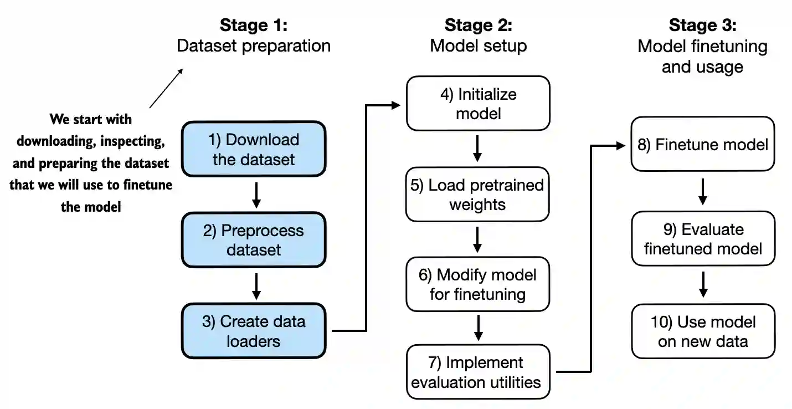

# 一、不同类别的微调

微调语言模型最常见的方法是指令微调和分类微调


# 二、用于文本分类的微调

> 参看：https://github.com/datawhalechina/llms-from-scratch-cn/blob/main/Codes/ch06/01_main-chapter-code/ch06.ipynb



## 1、准备数据集

> 使用包含垃圾邮件和非垃圾邮件文本序列消息的数据集来微调 LLM 进行分类

### 1.1 下载并解压数据集

```python
import urllib.request
import zipfile
import os
from pathlib import Path

url = "https://archive.ics.uci.edu/static/public/228/sms+spam+collection.zip"
zip_path = "sms_spam_collection.zip"
extracted_path = "sms_spam_collection"
data_file_path = Path(extracted_path) / "SMSSpamCollection.tsv"

def download_and_unzip_spam_data(url, zip_path, extracted_path, data_file_path):
    if data_file_path.exists():
        print(f"{data_file_path} already exists. Skipping download and extraction.")
        return

    # 下载文件
    with urllib.request.urlopen(url) as response:
        with open(zip_path, "wb") as out_file:
            out_file.write(response.read())

    # 解压文件
    with zipfile.ZipFile(zip_path, "r") as zip_ref:
        zip_ref.extractall(extracted_path)

    # 添加 .tsv 文件扩展
    original_file_path = Path(extracted_path) / "SMSSpamCollection"
    os.rename(original_file_path, data_file_path)
    print(f"File downloaded and saved as {data_file_path}")

#下载并解压数据集
download_and_unzip_spam_data(url, zip_path, extracted_path, data_file_path)
```

### 1.2 加载到 pandas DataFrame 中

```python
#数据集保存为制表符分隔的文本序列文件，将其加载到 pandas DataFrame 中
import pandas as pd

df = pd.read_csv(data_file_path, sep="\t", header=None, names=["Label", "Text"])
df
```

数据输出案例：

| Label | Text |                                                   |
| ----: | ---: | ------------------------------------------------- |
|     0 |  ham | Go until jurong point, crazy.. Available only ... |
|     1 |  ham | Ok lar... Joking wif u oni...                     |
|     2 | spam | Free entry in 2 a wkly comp to win FA Cup fina... |
|     3 |  ham | U dun say so early hor... U c already then say... |
|     4 |  ham | Nah I don't think he goes to usf, he lives aro... |
|   ... |  ... | ...                                               |
|  5567 | spam | This is the 2nd time we have tried 2 contact u... |
|  5568 |  ham | Will ü b going to esplanade fr home?              |
|  5569 |  ham | Pity, * was in mood for that. So...any other s... |
|  5570 |  ham | The guy did some bitching but I acted like i'd... |
|  5571 |  ham | Rofl. Its true to its name                        |

检查类别分布：

```python
print(df["Label"].value_counts())
#输出：
Label
ham     4825
spam     747
Name: count, dtype: int64
```

### 1.3 平衡数据分布(欠采样)

> 除了欠采样之外，还有其他几种处理类平衡的方法，可以在 [`imbalanced-learn` 用户指南](https://imbalanced-learn.org/stable/user_guide.html)中找到示例和更多信息

```python
def create_balanced_dataset(df):
    # 计算"spam"实例的数量
    num_spam = df[df["Label"] == "spam"].shape[0]
    
    # 随机采样"ham"实例以匹配"spam"实例的数量
    ham_subset = df[df["Label"] == "ham"].sample(num_spam, random_state=123)
    
    # 将"ham"子集与"spam"结合起来
    balanced_df = pd.concat([ham_subset, df[df["Label"] == "spam"]])
    return balanced_df

balanced_df = create_balanced_dataset(df)
print(balanced_df["Label"].value_counts())
#输出：
Label
ham     747
spam    747
Name: count, dtype: int64
```

将字符串类标签"ham"和"spam"更改为整数类标签0和1：

```python
balanced_df["Label"] = balanced_df["Label"].map({"ham": 0, "spam": 1})
```

### 1.4 划分数据集

定义一个函数，将数据集随机划分为训练、验证和测试子集：

```python
def random_split(df, train_frac, validation_frac):
    # 打乱整个 DataFrame
    df = df.sample(frac=1, random_state=123).reset_index(drop=True)

    # 计算切分索引
    train_end = int(len(df) * train_frac)
    validation_end = train_end + int(len(df) * validation_frac)

    # 切分 DataFrame
    train_df = df[:train_end]
    validation_df = df[train_end:validation_end]
    test_df = df[validation_end:]

    return train_df, validation_df, test_df

train_df, validation_df, test_df = random_split(balanced_df, 0.7, 0.1)
# 测试大小默认为 0.2
train_df.to_csv("train.csv", index=None)
validation_df.to_csv("validation.csv", index=None)
test_df.to_csv("test.csv", index=None)
```

## 2、创建数据加载器

### 2.1 数据对齐(截断或填充)

文本序列有不同的长度，如果想在一批中组合多个训练示例，必须：

1. 将所有消息**截断**为数据集或批次中最短文本序列的长度
2. 将所有消息**填充**到数据集或批次中最长文本序列的长度

此处选择选项 2，并将所有文本序列填充到数据集中最长的文本序列，因此使用 `<|endoftext|>` 作为填充标记


### 2.2 `SpamDataset`类进行填充

#### (1) 将 `<|endoftext|>` 添加进词表中

```python
import tiktoken

tokenizer = tiktoken.get_encoding("gpt2")
print(tokenizer.encode("<|endoftext|>", allowed_special={"<|endoftext|>"})) #输出：[50256]
```

#### (2) 定义`SpamDataset`类

`SpamDataset` 类：标识训练数据集中最长的序列，并将填充标记添加到其他序列中以匹配该序列长度

```python
import torch
from torch.utils.data import Dataset

class SpamDataset(Dataset):
    def __init__(self, csv_file, tokenizer, max_length=None, pad_token_id=50256):
        self.data = pd.read_csv(csv_file)

        # 预标记文本
        self.encoded_texts = [
            tokenizer.encode(text) for text in self.data["Text"]
        ]

        if max_length is None:
            self.max_length = self._longest_encoded_length()
        else:
            self.max_length = max_length
            # 如果序列长于 max_length，则截断序列
            self.encoded_texts = [
                encoded_text[:self.max_length] for encoded_text in self.encoded_texts
            ]

        # 将序列填充到最长序列
        self.encoded_texts = [
            encoded_text + [pad_token_id] * (self.max_length - len(encoded_text))
            	for encoded_text in self.encoded_texts
        ]

    def __getitem__(self, index):
        encoded = self.encoded_texts[index]
        label = self.data.iloc[index]["Label"]
        return (
            torch.tensor(encoded, dtype=torch.long),
            torch.tensor(label, dtype=torch.long)
        )

    def __len__(self):
        return len(self.data)

    def _longest_encoded_length(self):
        max_length = 0
        for encoded_text in self.encoded_texts:
            encoded_length = len(encoded_text)
            if encoded_length > max_length:
                max_length = encoded_length
        return max_length
```

### 2.3 数据集对齐

```python
#训练集
train_dataset = SpamDataset(
    csv_file="train.csv",
    max_length=None,
    tokenizer=tokenizer
)
print(train_dataset.max_length) #输出：120

#验证集
val_dataset = SpamDataset(
    csv_file="validation.csv",
    max_length=train_dataset.max_length,
    tokenizer=tokenizer
)

#测试集
test_dataset = SpamDataset(
    csv_file="test.csv",
    max_length=train_dataset.max_length,
    tokenizer=tokenizer
)
```

### 2.4 实例化数据加载器

#### (1) 可视化说明


#### (2) 代码执行

```python
from torch.utils.data import DataLoader

num_workers = 0
batch_size = 8

torch.manual_seed(123)

#实例化
train_loader = DataLoader(
    dataset=train_dataset,
    batch_size=batch_size,
    shuffle=True,
    num_workers=num_workers,
    drop_last=True,
)

val_loader = DataLoader(
    dataset=val_dataset,
    batch_size=batch_size,
    num_workers=num_workers,
    drop_last=False,
)

test_loader = DataLoader(
    dataset=test_dataset,
    batch_size=batch_size,
    num_workers=num_workers,
    drop_last=False,
)

#验证：迭代数据加载器并确保每个批次包含 8 个训练示例，其中每个训练示例包含 120 个标记
print("Train loader:")
for input_batch, target_batch in train_loader:
    pass

print("Input batch dimensions:", input_batch.shape) #输出：Input batch dimensions: torch.Size([8, 120])
print("Label batch dimensions", target_batch.shape) #输出：Label batch dimensions torch.Size([8])

#最后，打印每个数据集中的批次总数
print(f"{len(train_loader)} training batches") #输出：130 training batches
print(f"{len(val_loader)} validation batches") #输出：19 validation batches
print(f"{len(test_loader)} test batches") #输出：38 test batches
```

## 3、使用预训练权重初始化模型

### 3.1 加载上一章的 LLM

```python
#基础配置
CHOOSE_MODEL = "gpt2-small (124M)"
INPUT_PROMPT = "Every effort moves"

BASE_CONFIG = {
    "vocab_size": 50257,     # Vocabulary size
    "context_length": 1024,  # Context length
    "drop_rate": 0.0,        # Dropout rate
    "qkv_bias": True         # Query-key-value bias
}

model_configs = {
    "gpt2-small (124M)": {"emb_dim": 768, "n_layers": 12, "n_heads": 12},
    "gpt2-medium (355M)": {"emb_dim": 1024, "n_layers": 24, "n_heads": 16},
    "gpt2-large (774M)": {"emb_dim": 1280, "n_layers": 36, "n_heads": 20},
    "gpt2-xl (1558M)": {"emb_dim": 1600, "n_layers": 48, "n_heads": 25},
}

BASE_CONFIG.update(model_configs[CHOOSE_MODEL])

#模型参数获取
model_size = CHOOSE_MODEL.split(" ")[-1].lstrip("(").rstrip(")")
settings, params = download_and_load_gpt2(model_size=model_size, models_dir="gpt2")

#模型初始化
model = GPTModel(BASE_CONFIG)

#模型权重加载
load_weights_into_gpt(model, params)
model.eval()
```

### 3.2 验证模型是否加载正确

为了确保模型加载正确，仔细检查它是否生成连贯的文本

```python
text_1 = "Every effort moves you"

token_ids = generate_text_simple(
    model=model,
    idx=text_to_token_ids(text_1, tokenizer),
    max_new_tokens=15,
    context_size=BASE_CONFIG["context_length"]
)

print(token_ids_to_text(token_ids, tokenizer))
#输出：
Every effort moves you forward.
The first step is to understand the importance of your work
```

### 3.3 验证模型分类效果

在将模型微调为分类器之前，看看模型是否已经可以通过提示对垃圾邮件进行分类

```python
text_2 = (
    "Is the following text 'spam'? Answer with 'yes' or 'no':"
    " 'You are a winner you have been specially"
    " selected to receive $1000 cash or a $2000 award.'"
    " Answer with 'yes' or 'no'."
)

token_ids = generate_text_simple(
    model=model,
    idx=text_to_token_ids(text_2, tokenizer),
    max_new_tokens=23,
    context_size=BASE_CONFIG["context_length"]
)

print(token_ids_to_text(token_ids, tokenizer))
#输出：
Is the following text 'spam'? Answer with 'yes' or 'no': 'You are a winner you have been specially selected to receive $1000 cash or a $2000 award.' Answer with 'yes' or 'no'. Answer with 'yes' or 'no'. Answer with 'yes' or 'no'. Answer with 'yes'
```

> 结论：此时，模型不太擅长遵循指令，因为它只经过了预训练，没有进行指令微调

## 4、添加分类头

### 4.1 图解


### 4.2 模型架构

```python
print(model)
#输出：
GPTModel(
  (tok_emb): Embedding(50257, 768)
  (pos_emb): Embedding(1024, 768)
  (drop_emb): Dropout(p=0.0, inplace=False)
  (trf_blocks): Sequential(
    (0): TransformerBlock(
      (att): MultiHeadAttention(
        (W_query): Linear(in_features=768, out_features=768, bias=True)
        (W_key): Linear(in_features=768, out_features=768, bias=True)
        (W_value): Linear(in_features=768, out_features=768, bias=True)
        (out_proj): Linear(in_features=768, out_features=768, bias=True)
        (dropout): Dropout(p=0.0, inplace=False)
      )
      (ff): FeedForward(
        (layers): Sequential(
          (0): Linear(in_features=768, out_features=3072, bias=True)
          (1): GELU()
          (2): Linear(in_features=3072, out_features=768, bias=True)
        )
      )
      (norm1): LayerNorm()
      (norm2): LayerNorm()
      (drop_resid): Dropout(p=0.0, inplace=False)
    )
    (1): TransformerBlock(
      (att): MultiHeadAttention(
        (W_query): Linear(in_features=768, out_features=768, bias=True)
        (W_key): Linear(in_features=768, out_features=768, bias=True)
        (W_value): Linear(in_features=768, out_features=768, bias=True)
        (out_proj): Linear(in_features=768, out_features=768, bias=True)
        (dropout): Dropout(p=0.0, inplace=False)
      )
      (ff): FeedForward(
        (layers): Sequential(
          (0): Linear(in_features=768, out_features=3072, bias=True)
          (1): GELU()
          (2): Linear(in_features=3072, out_features=768, bias=True)
        )
      )
      (norm1): LayerNorm()
      (norm2): LayerNorm()
      (drop_resid): Dropout(p=0.0, inplace=False)
    )
    (2): TransformerBlock(
      (att): MultiHeadAttention(
        (W_query): Linear(in_features=768, out_features=768, bias=True)
        (W_key): Linear(in_features=768, out_features=768, bias=True)
        (W_value): Linear(in_features=768, out_features=768, bias=True)
        (out_proj): Linear(in_features=768, out_features=768, bias=True)
        (dropout): Dropout(p=0.0, inplace=False)
      )
      (ff): FeedForward(
        (layers): Sequential(
          (0): Linear(in_features=768, out_features=3072, bias=True)
          (1): GELU()
          (2): Linear(in_features=3072, out_features=768, bias=True)
        )
      )
      (norm1): LayerNorm()
      (norm2): LayerNorm()
      (drop_resid): Dropout(p=0.0, inplace=False)
    )
    (3): TransformerBlock(
      (att): MultiHeadAttention(
        (W_query): Linear(in_features=768, out_features=768, bias=True)
        (W_key): Linear(in_features=768, out_features=768, bias=True)
        (W_value): Linear(in_features=768, out_features=768, bias=True)
        (out_proj): Linear(in_features=768, out_features=768, bias=True)
        (dropout): Dropout(p=0.0, inplace=False)
      )
      (ff): FeedForward(
        (layers): Sequential(
          (0): Linear(in_features=768, out_features=3072, bias=True)
          (1): GELU()
          (2): Linear(in_features=3072, out_features=768, bias=True)
        )
      )
      (norm1): LayerNorm()
      (norm2): LayerNorm()
      (drop_resid): Dropout(p=0.0, inplace=False)
    )
    (4): TransformerBlock(
      (att): MultiHeadAttention(
        (W_query): Linear(in_features=768, out_features=768, bias=True)
        (W_key): Linear(in_features=768, out_features=768, bias=True)
        (W_value): Linear(in_features=768, out_features=768, bias=True)
        (out_proj): Linear(in_features=768, out_features=768, bias=True)
        (dropout): Dropout(p=0.0, inplace=False)
      )
      (ff): FeedForward(
        (layers): Sequential(
          (0): Linear(in_features=768, out_features=3072, bias=True)
          (1): GELU()
          (2): Linear(in_features=3072, out_features=768, bias=True)
        )
      )
      (norm1): LayerNorm()
      (norm2): LayerNorm()
      (drop_resid): Dropout(p=0.0, inplace=False)
    )
    (5): TransformerBlock(
      (att): MultiHeadAttention(
        (W_query): Linear(in_features=768, out_features=768, bias=True)
        (W_key): Linear(in_features=768, out_features=768, bias=True)
        (W_value): Linear(in_features=768, out_features=768, bias=True)
        (out_proj): Linear(in_features=768, out_features=768, bias=True)
        (dropout): Dropout(p=0.0, inplace=False)
      )
      (ff): FeedForward(
        (layers): Sequential(
          (0): Linear(in_features=768, out_features=3072, bias=True)
          (1): GELU()
          (2): Linear(in_features=3072, out_features=768, bias=True)
        )
      )
      (norm1): LayerNorm()
      (norm2): LayerNorm()
      (drop_resid): Dropout(p=0.0, inplace=False)
    )
    (6): TransformerBlock(
      (att): MultiHeadAttention(
        (W_query): Linear(in_features=768, out_features=768, bias=True)
        (W_key): Linear(in_features=768, out_features=768, bias=True)
        (W_value): Linear(in_features=768, out_features=768, bias=True)
        (out_proj): Linear(in_features=768, out_features=768, bias=True)
        (dropout): Dropout(p=0.0, inplace=False)
      )
      (ff): FeedForward(
        (layers): Sequential(
          (0): Linear(in_features=768, out_features=3072, bias=True)
          (1): GELU()
          (2): Linear(in_features=3072, out_features=768, bias=True)
        )
      )
      (norm1): LayerNorm()
      (norm2): LayerNorm()
      (drop_resid): Dropout(p=0.0, inplace=False)
    )
    (7): TransformerBlock(
      (att): MultiHeadAttention(
        (W_query): Linear(in_features=768, out_features=768, bias=True)
        (W_key): Linear(in_features=768, out_features=768, bias=True)
        (W_value): Linear(in_features=768, out_features=768, bias=True)
        (out_proj): Linear(in_features=768, out_features=768, bias=True)
        (dropout): Dropout(p=0.0, inplace=False)
      )
      (ff): FeedForward(
        (layers): Sequential(
          (0): Linear(in_features=768, out_features=3072, bias=True)
          (1): GELU()
          (2): Linear(in_features=3072, out_features=768, bias=True)
        )
      )
      (norm1): LayerNorm()
      (norm2): LayerNorm()
      (drop_resid): Dropout(p=0.0, inplace=False)
    )
    (8): TransformerBlock(
      (att): MultiHeadAttention(
        (W_query): Linear(in_features=768, out_features=768, bias=True)
        (W_key): Linear(in_features=768, out_features=768, bias=True)
        (W_value): Linear(in_features=768, out_features=768, bias=True)
        (out_proj): Linear(in_features=768, out_features=768, bias=True)
        (dropout): Dropout(p=0.0, inplace=False)
      )
      (ff): FeedForward(
        (layers): Sequential(
          (0): Linear(in_features=768, out_features=3072, bias=True)
          (1): GELU()
          (2): Linear(in_features=3072, out_features=768, bias=True)
        )
      )
      (norm1): LayerNorm()
      (norm2): LayerNorm()
      (drop_resid): Dropout(p=0.0, inplace=False)
    )
    (9): TransformerBlock(
      (att): MultiHeadAttention(
        (W_query): Linear(in_features=768, out_features=768, bias=True)
        (W_key): Linear(in_features=768, out_features=768, bias=True)
        (W_value): Linear(in_features=768, out_features=768, bias=True)
        (out_proj): Linear(in_features=768, out_features=768, bias=True)
        (dropout): Dropout(p=0.0, inplace=False)
      )
      (ff): FeedForward(
        (layers): Sequential(
          (0): Linear(in_features=768, out_features=3072, bias=True)
          (1): GELU()
          (2): Linear(in_features=3072, out_features=768, bias=True)
        )
      )
      (norm1): LayerNorm()
      (norm2): LayerNorm()
      (drop_resid): Dropout(p=0.0, inplace=False)
    )
    (10): TransformerBlock(
      (att): MultiHeadAttention(
        (W_query): Linear(in_features=768, out_features=768, bias=True)
        (W_key): Linear(in_features=768, out_features=768, bias=True)
        (W_value): Linear(in_features=768, out_features=768, bias=True)
        (out_proj): Linear(in_features=768, out_features=768, bias=True)
        (dropout): Dropout(p=0.0, inplace=False)
      )
      (ff): FeedForward(
        (layers): Sequential(
          (0): Linear(in_features=768, out_features=3072, bias=True)
          (1): GELU()
          (2): Linear(in_features=3072, out_features=768, bias=True)
        )
      )
      (norm1): LayerNorm()
      (norm2): LayerNorm()
      (drop_resid): Dropout(p=0.0, inplace=False)
    )
    (11): TransformerBlock(
      (att): MultiHeadAttention(
        (W_query): Linear(in_features=768, out_features=768, bias=True)
        (W_key): Linear(in_features=768, out_features=768, bias=True)
        (W_value): Linear(in_features=768, out_features=768, bias=True)
        (out_proj): Linear(in_features=768, out_features=768, bias=True)
        (dropout): Dropout(p=0.0, inplace=False)
      )
      (ff): FeedForward(
        (layers): Sequential(
          (0): Linear(in_features=768, out_features=3072, bias=True)
          (1): GELU()
          (2): Linear(in_features=3072, out_features=768, bias=True)
        )
      )
      (norm1): LayerNorm()
      (norm2): LayerNorm()
      (drop_resid): Dropout(p=0.0, inplace=False)
    )
  )
  (final_norm): LayerNorm()
  (out_head): Linear(in_features=768, out_features=50257, bias=False)
)
```

### 4.3 替换和微调输出层

- 首先，冻结模型

```python
for param in model.parameters():
    param.requires_grad = False
```

- 然后，替换输出层`model.out_head`，该层最初将层输入映射到 50,257 维(词汇表的大小)

```python
torch.manual_seed(123)

num_classes = 2
model.out_head = torch.nn.Linear(in_features=BASE_CONFIG["emb_dim"], out_features=num_classes)
```

### 4.4 训练 Final LayerNorm

> 在[实验微调附加层](https://magazine.sebastianraschka.com/p/finetuning-large-language-models)中发现，训练 Final LayerNorm 层可以显着提高性能

```python
#解禁 Final LayerNorm 参数
for param in model.trf_blocks[-1].parameters():
    param.requires_grad = True

for param in model.final_norm.parameters():
    param.requires_grad = True
    
#常规训练。。。
```


### 4.5 验证新模型

#### (1) 测试

> 与之前不同，它现在有两个输出维度，而不是 50,257

```python
#inputs
inputs = tokenizer.encode("Do you have time")
inputs = torch.tensor(inputs).unsqueeze(0)
print("Inputs:", inputs) #输出：Inputs: tensor([[5211,  345,  423,  640]])
print("Inputs dimensions:", inputs.shape) # shape: (batch_size, num_tokens)
#输出：Inputs dimensions: torch.Size([1, 4])

#outputs
with torch.no_grad():
    outputs = model(inputs)

print("Outputs:\n", outputs)
print("Outputs dimensions:", outputs.shape) # 形状: (batch_size, num_tokens, num_classes)
#输出：
Outputs:
 tensor([[[-1.5854,  0.9904],
         [-3.7235,  7.4548],
         [-2.2661,  6.6049],
         [-3.5983,  3.9902]]])
Outputs dimensions: torch.Size([1, 4, 2])
```

#### (2) 图解


#### (3) 最后一个标记

前言：

- **注意力机制将每个输入标记连接到另一个输入标记**
- **因果注意力掩模让当前标记只关注当前和之前的标记位置**

基于这种因果注意机制，第四个(最后一个)标记包含所有标记中最多的信息，因为它是唯一包含所有其他标记信息的标记

因此，将针对垃圾邮件分类任务对最后一个标记进行微调

```python
print("Last output token:", outputs[:, -1, :]) #输出：Last output token: tensor([[-3.5983,  3.9902]])
```


## 5、计算分类损失和准确率

### 5.1 模型输出转化为类标签

#### (1) 图解


#### (2) 验证

- 首先，打印模型输出

```python
print("Last output token:", outputs[:, -1, :]) #输出：Last output token: tensor([[-3.5983,  3.9902]])
```

- 然后，通过 `softmax`  函数将输出 `logits` 转换为概率分数，然后通过`argmax` 函数获得最大概率值的索引位置

```python
probas = torch.softmax(outputs[:, -1, :], dim=-1)
label = torch.argmax(probas)
print("Class label:", label.item()) #输出：Class label: 1
```

### 5.2 计算分类准确率

> 可以应用上面的概念来计算所谓的分类准确性，即计算给定数据集中正确预测的百分比

#### (1) 封装计算函数

```python
def calc_accuracy_loader(data_loader, model, device, num_batches=None):
    model.eval()
    correct_predictions, num_examples = 0, 0

    if num_batches is None:
        num_batches = len(data_loader)
    else:
        num_batches = min(num_batches, len(data_loader))
    for i, (input_batch, target_batch) in enumerate(data_loader):
        if i < num_batches:
            input_batch, target_batch = input_batch.to(device), target_batch.to(device)

            with torch.no_grad():
                logits = model(input_batch)[:, -1, :]  # 最后输出标记的 Logits
            predicted_labels = torch.argmax(logits, dim=-1)

            num_examples += predicted_labels.shape[0]
            correct_predictions += (predicted_labels == target_batch).sum().item()
        else:
            break
    return correct_predictions / num_examples
```

#### (2) 计算

```python
device = torch.device("cuda" if torch.cuda.is_available() else "cpu")
model.to(device) # nn.Module 类不需要分配 model = model.to(device)

torch.manual_seed(123) # For reproducibility due to the shuffling in the training data loader

train_accuracy = calc_accuracy_loader(train_loader, model, device, num_batches=10)
val_accuracy = calc_accuracy_loader(val_loader, model, device, num_batches=10)
test_accuracy = calc_accuracy_loader(test_loader, model, device, num_batches=10)

print(f"Training accuracy: {train_accuracy*100:.2f}%") #输出：Training accuracy: 46.25%
print(f"Validation accuracy: {val_accuracy*100:.2f}%") #输出：Validation accuracy: 45.00%
print(f"Test accuracy: {test_accuracy*100:.2f}%") #输出：Test accuracy: 48.75%
```

正如我们所看到的，预测准确率不是很好，因为我们还没有对模型进行微调

### 5.3 定义损失函数

分类准确率不是一个可微函数，因此选用最小化交叉熵损失作为最大化分类准确率的代理

> 可从[深度学习简介](https://sebastianraschka.com/blog/2021/dl-course.html#l08-multinomial-logistic-regression--softmax-regression)的第8讲中了解有关此主题的更多信息

#### (1) `calc_loss_batch` 函数

`calc_loss_batch` 函数与之前相同，只是只对优化最后一个标记 `model(input_batch)[:, -1, :]` 感兴趣

```python
def calc_loss_batch(input_batch, target_batch, model, device):
    input_batch, target_batch = input_batch.to(device), target_batch.to(device)
    logits = model(input_batch)[:, -1, :]  # 最后输出标记的 Logits
    loss = torch.nn.functional.cross_entropy(logits, target_batch)
    return loss
```

#### (2) `calc_loss_loader` 函数

```python
# Same as in chapter 5
def calc_loss_loader(data_loader, model, device, num_batches=None):
    total_loss = 0.
    if len(data_loader) == 0:
        return float("nan")
    elif num_batches is None:
        num_batches = len(data_loader)
    else:
        # 如果 num_batches 超过数据加载器中的批次数，则减少批次数以匹配数据加载器中的批次总数
        num_batches = min(num_batches, len(data_loader))
    for i, (input_batch, target_batch) in enumerate(data_loader):
        if i < num_batches:
            loss = calc_loss_batch(input_batch, target_batch, model, device)
            total_loss += loss.item()
        else:
            break
    return total_loss / num_batches
```

#### (3) 使用`calc_closs_loader`

> 在开始训练之前，计算初始训练、验证和测试集损失

```python
with torch.no_grad(): # 禁用梯度跟踪以提高效率，因为我们还没有进行训练
    train_loss = calc_loss_loader(train_loader, model, device, num_batches=5)
    val_loss = calc_loss_loader(val_loader, model, device, num_batches=5)
    test_loss = calc_loss_loader(test_loader, model, device, num_batches=5)

print(f"Training loss: {train_loss:.3f}") #输出：Training loss: 2.453
print(f"Validation loss: {val_loss:.3f}") #输出：Validation loss: 2.583
print(f"Test loss: {test_loss:.3f}") #输出：Test loss: 2.322
```

## 6、根据监督数据微调模型

> 在本节中，定义并使用训练函数来提高模型的分类准确率

### 6.1 图解

新的 `train_classifier_simple`函数与之前预训练模型的 `train_model_simple` 函数相同，唯一的两个区别是

1. 跟踪看到的训练示例的数量（`examples_seen`）而不是看到的示例的数量
2. 计算每个时期后的准确率，而不是在每个时期后打印示例文本


### 6.2 `train_classifier_simple` 函数

```python
# 总体与第 5 章中的 `train_model_simple` 相同
def train_classifier_simple(model, train_loader, val_loader, optimizer, device, 
                            num_epochs, eval_freq, eval_iter, tokenizer):
    # 初始化列表以跟踪损失和看到的示例
    train_losses, val_losses, train_accs, val_accs = [], [], [], []
    examples_seen, global_step = 0, -1

    # 主要的训练循环
    for epoch in range(num_epochs):
        model.train()  # 将模型设置为训练模式

        for input_batch, target_batch in train_loader:
            optimizer.zero_grad() # 重置上一个 epoch 的损失梯度
            loss = calc_loss_batch(input_batch, target_batch, model, device)
            loss.backward() # 计算损失梯度
            optimizer.step() # 使用损失梯度更新模型权重
            examples_seen += input_batch.shape[0] # 新功能：跟踪示例而不是标记
            global_step += 1

            # 可选的评估步骤
            if global_step % eval_freq == 0:
                train_loss, val_loss = evaluate_model(model, train_loader, val_loader, device, eval_iter)
                train_losses.append(train_loss)
                val_losses.append(val_loss)
                print(f"Ep {epoch+1} (Step {global_step:06d}): "
                      f"Train loss {train_loss:.3f}, Val loss {val_loss:.3f}")

        # 计算每个 epoch 后的准确率
        train_accuracy = calc_accuracy_loader(train_loader, model, device, num_batches=eval_iter)
        val_accuracy = calc_accuracy_loader(val_loader, model, device, num_batches=eval_iter)
        print(f"Training accuracy: {train_accuracy*100:.2f}% | ", end="")
        print(f"Validation accuracy: {val_accuracy*100:.2f}%")
        train_accs.append(train_accuracy)
        val_accs.append(val_accuracy)
    return train_losses, val_losses, train_accs, val_accs, examples_seen

def evaluate_model(model, train_loader, val_loader, device, eval_iter):
    model.eval()
    with torch.no_grad():
        train_loss = calc_loss_loader(train_loader, model, device, num_batches=eval_iter)
        val_loss = calc_loss_loader(val_loader, model, device, num_batches=eval_iter)
    model.train()
    return train_loss, val_loss
```

### 6.3 微调

```python
import time

start_time = time.time()
torch.manual_seed(123)

optimizer = torch.optim.AdamW(model.parameters(), lr=5e-5, weight_decay=0.1)
num_epochs = 5

train_losses, val_losses, train_accs, val_accs, examples_seen = 
	train_classifier_simple(
    	model, train_loader, val_loader, optimizer, device,
    	num_epochs=num_epochs, eval_freq=50, eval_iter=5,
    	tokenizer=tokenizer
	)

end_time = time.time()
execution_time_minutes = (end_time - start_time) / 60

print(f"Training completed in {execution_time_minutes:.2f} minutes.")
#输出：
Ep 1 (Step 000000): Train loss 2.153, Val loss 2.392
Ep 1 (Step 000050): Train loss 0.617, Val loss 0.637
Ep 1 (Step 000100): Train loss 0.523, Val loss 0.557
Training accuracy: 70.00% | Validation accuracy: 72.50%
Ep 2 (Step 000150): Train loss 0.561, Val loss 0.489
Ep 2 (Step 000200): Train loss 0.419, Val loss 0.397
Ep 2 (Step 000250): Train loss 0.409, Val loss 0.353
Training accuracy: 82.50% | Validation accuracy: 85.00%
Ep 3 (Step 000300): Train loss 0.333, Val loss 0.320
Ep 3 (Step 000350): Train loss 0.340, Val loss 0.306
Training accuracy: 90.00% | Validation accuracy: 90.00%
Ep 4 (Step 000400): Train loss 0.136, Val loss 0.200
Ep 4 (Step 000450): Train loss 0.153, Val loss 0.132
Ep 4 (Step 000500): Train loss 0.222, Val loss 0.137
Training accuracy: 100.00% | Validation accuracy: 97.50%
Ep 5 (Step 000550): Train loss 0.207, Val loss 0.143
Ep 5 (Step 000600): Train loss 0.083, Val loss 0.074
Training accuracy: 100.00% | Validation accuracy: 97.50%
Training completed in 5.65 minutes.
```

### 6.4 训练集和验证集的结果绘制

```python
import matplotlib.pyplot as plt

def plot_values(epochs_seen, examples_seen, train_values, val_values, label="loss"):
    fig, ax1 = plt.subplots(figsize=(5, 3))

    # 绘制针对 epoch 的训练和验证损失
    ax1.plot(epochs_seen, train_values, label=f"Training {label}")
    ax1.plot(epochs_seen, val_values, linestyle="-.", label=f"Validation {label}")
    ax1.set_xlabel("Epochs")
    ax1.set_ylabel(label.capitalize())
    ax1.legend()

    # 为所见示例创建第二个 x 轴
    ax2 = ax1.twiny()  # 创建共享相同 y 轴的第二个 x 轴
    ax2.plot(examples_seen, train_values, alpha=0)  # 用于对齐刻度的不可见图
    ax2.set_xlabel("Examples seen")

    fig.tight_layout()  # 调整布局以腾出空间
    plt.savefig(f"{label}-plot.pdf")
    plt.show()
```

#### (1) 绘制损失函数

```python
epochs_tensor = torch.linspace(0, num_epochs, len(train_losses))
examples_seen_tensor = torch.linspace(0, examples_seen, len(train_losses))
plot_values(epochs_tensor, examples_seen_tensor, train_losses, val_losses)
```


#### (2) 绘制准确率

```python
epochs_tensor = torch.linspace(0, num_epochs, len(train_accs))
examples_seen_tensor = torch.linspace(0, examples_seen, len(train_accs))
plot_values(epochs_tensor, examples_seen_tensor, train_accs, val_accs, label="accuracy")
```


### 6.5 计算训练、验证和测试集性能

```python
train_accuracy = calc_accuracy_loader(train_loader, model, device)
val_accuracy = calc_accuracy_loader(val_loader, model, device)
test_accuracy = calc_accuracy_loader(test_loader, model, device)

print(f"Training accuracy: {train_accuracy*100:.2f}%") #输出：Training accuracy: 97.21%
print(f"Validation accuracy: {val_accuracy*100:.2f}%") #输出：Validation accuracy: 97.32%
print(f"Test accuracy: {test_accuracy*100:.2f}%") #输出：Test accuracy: 95.67%
```

## 7、使用微调后的LLM

### 7.1  `classify_review` 函数

`classify_review` 函数：

- 实现了与之前 `SpamDataset` 类似的数据预处理步骤

- 然后，该函数从模型中返回预测的整数类标签，并返回相应的类别名称

```python
def classify_review(text, model, tokenizer, device, max_length=None, pad_token_id=50256):
    model.eval()

    # 准备模型的输入
    input_ids = tokenizer.encode(text)
    supported_context_length = model.pos_emb.weight.shape[1]

    # 如果序列太长则截断
    input_ids = input_ids[:min(max_length, supported_context_length)]

    # 将序列填充到最长序列
    input_ids += [pad_token_id] * (max_length - len(input_ids))
    input_tensor = torch.tensor(input_ids, device=device).unsqueeze(0) # 添加批次维度

    # 模型推理
    with torch.no_grad():
        logits = model(input_tensor)[:, -1, :]  # 最后一个输出 token 的 Logits
    predicted_label = torch.argmax(logits, dim=-1).item()

    # 返回分类结果
    return "spam" if predicted_label == 1 else "not spam"
```

### 7.2 案例测试

```python
text_1 = (
    "You are a winner you have been specially"
    " selected to receive $1000 cash or a $2000 award."
)
print(classify_review(
    text_1, model, tokenizer, device, max_length=train_dataset.max_length
))
#输出：spam

text_2 = (
    "Hey, just wanted to check if we're still on"
    " for dinner tonight? Let me know!"
)

print(classify_review(
    text_2, model, tokenizer, device, max_length=train_dataset.max_length
))
#输出：not spam
```

## 8、模型保存与加载

- 保存模型

```python
torch.save(model.state_dict(), "review_classifier.pth")
```

- 加载模型

```python
model_state_dict = torch.load("review_classifier.pth")
model.load_state_dict(model_state_dict)
```

# 三、根据指令进行微调

> 参看：https://github.com/datawhalechina/llms-from-scratch-cn/blob/main/Codes/ch07/01_main-chapter-code/ch07.ipynb


## 1、指令微调介绍

- 指令微调通常被称为“监督指令微调”，因为它涉及在数据集上训练模型，其中==**输入-输出对**==是明确提供的

- 预训练的LLM擅长文本补全，但不擅长遵循指令，本节将教 LLM 更好地遵循指令


## 2、准备数据集

### 2.1 下载数据

```python
import json
import os
import urllib

def download_and_load_file(file_path, url):
    if not os.path.exists(file_path):
        with urllib.request.urlopen(url) as response:
            text_data = response.read().decode("utf-8")
        with open(file_path, "w", encoding="utf-8") as file:
            file.write(text_data)
    else:
        with open(file_path, "r", encoding="utf-8") as file:
            text_data = file.read()

    with open(file_path, "r", encoding="utf-8") as file:
        data = json.load(file)
    return data

#加载
file_path = "instruction-data.json"
url = (
    "https://raw.githubusercontent.com/rasbt/LLMs-from-scratch"
    "/main/ch07/01_main-chapter-code/instruction-data.json"
)

data = download_and_load_file(file_path, url)
print("Number of entries:", len(data)) #输出：Number of entries: 1100

#从上面的JSON文件中加载的data列表中的每个项目都是一个以下形式的字典
print("Example entry:\n", data[50])
#输出：
Example entry:
 {'instruction': 'Identify the correct spelling of the following word.', 'input': 'Ocassion', 'output': "The correct spelling is 'Occasion.'"}

#Note that the 'input' field can be empty:
print("Another example entry:\n", data[999])
#输出：
Another example entry:
 {'instruction': "What is an antonym of 'complicated'?", 'input': '', 'output': "An antonym of 'complicated' is 'simple'."}
```

### 2.2 拆分训练集、验证集和测试集

```python
train_portion = int(len(data) * 0.85)  # 85% for training
test_portion = int(len(data) * 0.1)    # 10% for testing
val_portion = len(data) - train_portion - test_portion  # Remaining 5% for validation

train_data = data[:train_portion]
test_data = data[train_portion:train_portion + test_portion]
val_data = data[train_portion + test_portion:]

print("Training set length:", len(train_data)) #输出：Training set length: 935
print("Validation set length:", len(val_data)) #输出：Validation set length: 55
print("Test set length:", len(test_data)) #输出：Test set length: 110
```

## 3、将数据组织成训练批次

### 3.1 流程介绍

#### (1) 整体流程

分几个步骤来处理这个数据集批处理，如下图所示


#### (2) 效果case


### 3.2 Format dataset

#### (1) 输入-输出对风格

- **Alpaca 风格**：https://crfm.stanford.edu/2023/03/13/alpaca.html

- **Phi-3 风格**：https://arxiv.org/abs/2404.14219


#### (2) 格式化Alpaca风格dataset

- **格式化函数**：

```python
def format_input(entry):
    instruction_text = (
        f"Below is an instruction that describes a task. "
        f"Write a response that appropriately completes the request."
        f"\n\n### Instruction:\n{entry['instruction']}"
    )

    input_text = f"\n\n### Input:\n{entry['input']}" if entry["input"] else ""

    return instruction_text + input_text
```

- **效果测试**：

```python
##带输入字段的格式化回复-------------------------------
model_input = format_input(data[50])
desired_response = f"\n\n### Response:\n{data[50]['output']}"

print(model_input + desired_response)
#输出：
Below is an instruction that describes a task. Write a response that appropriately completes the request.

### Instruction:
Identify the correct spelling of the following word.

### Input:
Ocassion

### Response:
The correct spelling is 'Occasion.'


##没有输入字段的格式化回复-------------------------------
model_input = format_input(data[999])
desired_response = f"\n\n### Response:\n{data[999]['output']}"

print(model_input + desired_response)
#输出：
Below is an instruction that describes a task. Write a response that appropriately completes the request.

### Instruction:
What is an antonym of 'complicated'?

### Response:
An antonym of 'complicated' is 'simple'.
```

### 3.2 Tokenize formatted

#### (1) 图解


#### (2) `InstructionDataset`类

`InstructionDataset`类：在数据集中对所有输入进行预分词，类似之前的 `SpamDataset` 类

```python
import torch
from torch.utils.data import Dataset

class InstructionDataset(Dataset):
    def __init__(self, data, tokenizer):
        self.data = data

        # Pre-tokenize texts
        self.encoded_texts = []
        for entry in data:
            instruction_plus_input = format_input(entry)
            response_text = f"\n\n### Response:\n{entry['output']}"
            full_text = instruction_plus_input + response_text
            self.encoded_texts.append(tokenizer.encode(full_text))

    def __getitem__(self, index):
        return self.encoded_texts[index]

    def __len__(self):
        return len(self.data)
```

### 3.3 Padding Tokens

> 在一个批次中收集多个训练示例以加速训练，需要将所有输入填充到相似的长度

#### (1) 增加填充标记

使用`<|endoftext|>`标记作为填充标记

```python
import tiktoken
tokenizer = tiktoken.get_encoding("gpt2")
print(tokenizer.encode("<|endoftext|>", allowed_special={"<|endoftext|>"})) #输出：[50256]
```

#### (2) 图解

**将数据集中的所有示例填充到相同的长度**：开发了一个自定义的“合并”函数，可以将其传递给数据加载器

> 这个自定义的合并函数将每个批次中的训练示例填充到相同的长度(但不同的批次可以有不同的长度)


#### (3) custom_collate_draft_1 函数

```python
def custom_collate_draft_1(batch, pad_token_id=50256, device="cpu"):
    # Find the longest sequence in the batch and increase the max length by +1, 
    #which will add one extra padding token below
    batch_max_length = max(len(item)+1 for item in batch)

    # Pad and prepare inputs
    inputs_lst = []

    for item in batch:
        new_item = item.copy()
        # Add an <|endoftext|> token
        new_item += [pad_token_id]
        # Pad sequences to batch_max_length
        padded = (new_item + [pad_token_id] * (batch_max_length - len(new_item)))
        # Via padded[:-1], we remove the extra padded token
        # that has been added via the +1 setting in batch_max_length
        # (the extra padding token will be relevant in later codes)
        inputs = torch.tensor(padded[:-1])
        inputs_lst.append(inputs)

    # Convert list of inputs to tensor and transfer to target device
    #  torch.stack的功能解释：
    # 1) 合并数据：在处理批量数据时，可以使用 torch.stack 将多个样本合并成一个批次。
    # 2) 维度扩展：当需要在模型输入中增加维度时，可以使用此方法。 
    inputs_tensor = torch.stack(inputs_lst).to(device)
    return inputs_tensor
```

#### (4) 效果测试

```python
inputs_1 = [0, 1, 2, 3, 4]
inputs_2 = [5, 6]
inputs_3 = [7, 8, 9]

batch = (
    inputs_1,
    inputs_2,
    inputs_3
)

print(custom_collate_draft_1(batch))
#输出：
tensor([[    0,     1,     2,     3,     4],
        [    5,     6, 50256, 50256, 50256],
        [    7,     8,     9, 50256, 50256]])
```

### 3.4 Target Token IDs

> 上面仅将输入返回给 LLM，然而对于LLM的训练，还需要目标值

#### (1) 图解

与预训练LLM类似，目标是输入向右移动1个位置后的值，因此LLM学习预测下一个标记（token）


#### (2) custom_collate_draft_2 函数

```python
def custom_collate_draft_2(batch, pad_token_id=50256, device="cpu"):
    # Find the longest sequence in the batch
    batch_max_length = max(len(item)+1 for item in batch)

    # Pad and prepare inputs
    inputs_lst, targets_lst = [], []

    for item in batch:
        new_item = item.copy()
        # Add an <|endoftext|> token
        new_item += [pad_token_id]
        # Pad sequences to max_length
        padded = ( new_item + [pad_token_id] * (batch_max_length - len(new_item)))
        inputs = torch.tensor(padded[:-1])  # Truncate the last token for inputs
        targets = torch.tensor(padded[1:])  # Shift +1 to the right for targets
        inputs_lst.append(inputs)
        targets_lst.append(targets)

    # Convert list of inputs to tensor and transfer to target device
    inputs_tensor = torch.stack(inputs_lst).to(device)
    targets_tensor = torch.stack(targets_lst).to(device)
    return inputs_tensor, targets_tensor
```

#### (3) 效果测试

```python
inputs, targets = custom_collate_draft_2(batch)
print(inputs)
print(targets) 
#输出：
tensor([[    0,     1,     2,     3,     4],
        [    5,     6, 50256, 50256, 50256],
        [    7,     8,     9, 50256, 50256]])
tensor([[    1,     2,     3,     4, 50256],
        [    6, 50256, 50256, 50256, 50256],
        [    8,     9, 50256, 50256, 50256]])
```

### 3.5 placeholders replace Padding

引入一个 `ignore_index `值来将所有填充令牌 ID 替换为一个新值

> 目的：可以在损失函数中忽略填充值

#### (1) 图解

具体来说，将与`50256`相对应的标记ID替换为`-100`，如下所示


#### (2) custom_collate_fn 函数

引入 `allowed_max_length` 以便在需要限制样本长度时使用

```python
def custom_collate_fn(batch, pad_token_id=50256, ignore_index=-100, allowed_max_length=None, device="cpu"):
    # Find the longest sequence in the batch
    batch_max_length = max(len(item)+1 for item in batch)

    # Pad and prepare inputs and targets
    inputs_lst, targets_lst = [], []

    for item in batch:
        new_item = item.copy()
        # Add an <|endoftext|> token
        new_item += [pad_token_id]
        
        # Pad sequences to max_length
        padded = (
            new_item + [pad_token_id] * (batch_max_length - len(new_item))
        )
        inputs = torch.tensor(padded[:-1])  # Truncate the last token for inputs
        targets = torch.tensor(padded[1:])  # Shift +1 to the right for targets

        # New: Replace all but the first padding tokens in targets by ignore_index
        mask = targets == pad_token_id
        indices = torch.nonzero(mask).squeeze()
        if indices.numel() > 1:
            targets[indices[1:]] = ignore_index

        # New: Optionally truncate to maximum sequence length
        if allowed_max_length is not None:
            inputs = inputs[:allowed_max_length]
            targets = targets[:allowed_max_length]

        inputs_lst.append(inputs)
        targets_lst.append(targets)

    # Convert list of inputs and targets to tensors and transfer to target device
    inputs_tensor = torch.stack(inputs_lst).to(device)
    targets_tensor = torch.stack(targets_lst).to(device)

    return inputs_tensor, targets_tensor
```

#### (3) 效果测试

```python
inputs, targets = custom_collate_fn(batch)
print(inputs)
print(targets)
#输出：
tensor([[    0,     1,     2,     3,     4],
        [    5,     6, 50256, 50256, 50256],
        [    7,     8,     9, 50256, 50256]])
tensor([[    1,     2,     3,     4, 50256],
        [    6, 50256,  -100,  -100,  -100],
        [    8,     9, 50256,  -100,  -100]])
```

#### (4) 优势(从损失角度看)

如果有以下 logits 值(模型最后一层的输出)，计算以下损失：

```python
logits_1 = torch.tensor(
    [[-1.0, 1.0],  # 1st training example
     [-0.5, 1.5]]  # 2nd training example
)
targets_1 = torch.tensor([0, 1])

loss_1 = torch.nn.functional.cross_entropy(logits_1, targets_1)
print(loss_1) #输出：tensor(1.1269)
```

- 增加一个训练示例将影响损失：

```python
logits_2 = torch.tensor(
    [[-1.0, 1.0],
     [-0.5, 1.5],
     [-0.5, 1.5]]  # New 3rd training example
)
targets_2 = torch.tensor([0, 1, 1])

loss_2 = torch.nn.functional.cross_entropy(logits_2, targets_2)
print(loss_2) #输出：tensor(0.7936)
```

- 把一个例子的类别标签替换为 `-100`：

```python
targets_3 = torch.tensor([0, 1, -100])

loss_3 = torch.nn.functional.cross_entropy(logits_2, targets_3)
print(loss_3) #输出：tensor(1.1269)
print("loss_1 == loss_3:", loss_1 == loss_3) #输出：loss_1 == loss_3: tensor(True)
```

---

结论：3个训练样本的结果损失与2个训练样本计算得到的损失相同，这意味着交叉熵损失函数忽略了标签为-100的训练样本

- PyTorch 具有 `cross_entropy(..., ignore_index=-100)` 设置，用于忽略与标签-100相对应的样本
- 使用 `-100 ignore_index`，可以忽略批次中用于将训练样本填充到相等长度的额外文本结束（填充）标记

## 4、创建数据加载器

在这一部分，使用`InstructionDataset`类和`custom_collate_fn`函数来实例化训练、验证和测试数据加载器


### 4.1 优化custom_collate_fn

- **优化措施**：使用Python的functools标准库中的partial函数，通过预先填充原始函数的device参数来创建一个新函数

- **好处**：直接将数据移动到目标设备（例如GPU），而不是在主训练循环中执行此操作，这提高了效率

> 因为当我们将custom_collate_fn作为数据加载器的一部分时，它可以作为后台进程执行

```python
from functools import partial

device = torch.device("cuda" if torch.cuda.is_available() else "cpu")
customized_collate_fn = partial(
    custom_collate_fn,
    device=device,
    allowed_max_length=1024
)
```

### 4.2 实例化数据加载器

```python
from torch.utils.data import DataLoader

num_workers = 0
batch_size = 8
torch.manual_seed(123)

train_dataset = InstructionDataset(train_data, tokenizer)
train_loader = DataLoader(
    train_dataset,
    batch_size=batch_size,
    collate_fn=customized_collate_fn,
    shuffle=True,
    drop_last=True,
    num_workers=num_workers
)

val_dataset = InstructionDataset(val_data, tokenizer)
val_loader = DataLoader(
    val_dataset,
    batch_size=batch_size,
    collate_fn=customized_collate_fn,
    shuffle=False,
    drop_last=False,
    num_workers=num_workers
)

test_dataset = InstructionDataset(test_data, tokenizer)
test_loader = DataLoader(
    test_dataset,
    batch_size=batch_size,
    collate_fn=customized_collate_fn,
    shuffle=False,
    drop_last=False,
    num_workers=num_workers
)
```

### 4.3 查看生成的输入和目标批次的维度

> 可以看到所有批次的大小均为8，但长度不同，符合预期

```python
print("Train loader:")
for inputs, targets in train_loader:
    print(inputs.shape, targets.shape)
#输出：
Train loader:
torch.Size([8, 61]) torch.Size([8, 61])
torch.Size([8, 76]) torch.Size([8, 76])
torch.Size([8, 73]) torch.Size([8, 73])
torch.Size([8, 68]) torch.Size([8, 68])
torch.Size([8, 65]) torch.Size([8, 65])
torch.Size([8, 72]) torch.Size([8, 72])
torch.Size([8, 80]) torch.Size([8, 80])
torch.Size([8, 67]) torch.Size([8, 67])
torch.Size([8, 62]) torch.Size([8, 62])
torch.Size([8, 75]) torch.Size([8, 75])
torch.Size([8, 62]) torch.Size([8, 62])
torch.Size([8, 68]) torch.Size([8, 68])
torch.Size([8, 67]) torch.Size([8, 67])
torch.Size([8, 77]) torch.Size([8, 77])
torch.Size([8, 69]) torch.Size([8, 69])
torch.Size([8, 79]) torch.Size([8, 79])
torch.Size([8, 71]) torch.Size([8, 71])
torch.Size([8, 66]) torch.Size([8, 66])
torch.Size([8, 83]) torch.Size([8, 83])
torch.Size([8, 68]) torch.Size([8, 68])
torch.Size([8, 80]) torch.Size([8, 80])
torch.Size([8, 71]) torch.Size([8, 71])
torch.Size([8, 69]) torch.Size([8, 69])
torch.Size([8, 65]) torch.Size([8, 65])
torch.Size([8, 68]) torch.Size([8, 68])
torch.Size([8, 60]) torch.Size([8, 60])
torch.Size([8, 59]) torch.Size([8, 59])
torch.Size([8, 69]) torch.Size([8, 69])
torch.Size([8, 63]) torch.Size([8, 63])
torch.Size([8, 65]) torch.Size([8, 65])
torch.Size([8, 76]) torch.Size([8, 76])
torch.Size([8, 66]) torch.Size([8, 66])
torch.Size([8, 71]) torch.Size([8, 71])
torch.Size([8, 91]) torch.Size([8, 91])
torch.Size([8, 65]) torch.Size([8, 65])
torch.Size([8, 64]) torch.Size([8, 64])
torch.Size([8, 67]) torch.Size([8, 67])
torch.Size([8, 66]) torch.Size([8, 66])
torch.Size([8, 64]) torch.Size([8, 64])
torch.Size([8, 65]) torch.Size([8, 65])
torch.Size([8, 75]) torch.Size([8, 75])
torch.Size([8, 89]) torch.Size([8, 89])
torch.Size([8, 59]) torch.Size([8, 59])
torch.Size([8, 88]) torch.Size([8, 88])
torch.Size([8, 83]) torch.Size([8, 83])
torch.Size([8, 83]) torch.Size([8, 83])
torch.Size([8, 70]) torch.Size([8, 70])
torch.Size([8, 65]) torch.Size([8, 65])
torch.Size([8, 74]) torch.Size([8, 74])
torch.Size([8, 76]) torch.Size([8, 76])
torch.Size([8, 67]) torch.Size([8, 67])
torch.Size([8, 75]) torch.Size([8, 75])
torch.Size([8, 83]) torch.Size([8, 83])
torch.Size([8, 69]) torch.Size([8, 69])
torch.Size([8, 67]) torch.Size([8, 67])
torch.Size([8, 60]) torch.Size([8, 60])
torch.Size([8, 60]) torch.Size([8, 60])
torch.Size([8, 66]) torch.Size([8, 66])
torch.Size([8, 80]) torch.Size([8, 80])
torch.Size([8, 71]) torch.Size([8, 71])
torch.Size([8, 61]) torch.Size([8, 61])
torch.Size([8, 58]) torch.Size([8, 58])
torch.Size([8, 71]) torch.Size([8, 71])
torch.Size([8, 67]) torch.Size([8, 67])
torch.Size([8, 68]) torch.Size([8, 68])
torch.Size([8, 63]) torch.Size([8, 63])
torch.Size([8, 87]) torch.Size([8, 87])
torch.Size([8, 68]) torch.Size([8, 68])
torch.Size([8, 64]) torch.Size([8, 64])
torch.Size([8, 68]) torch.Size([8, 68])
torch.Size([8, 71]) torch.Size([8, 71])
torch.Size([8, 68]) torch.Size([8, 68])
torch.Size([8, 71]) torch.Size([8, 71])
torch.Size([8, 61]) torch.Size([8, 61])
torch.Size([8, 65]) torch.Size([8, 65])
torch.Size([8, 67]) torch.Size([8, 67])
torch.Size([8, 65]) torch.Size([8, 65])
torch.Size([8, 64]) torch.Size([8, 64])
torch.Size([8, 60]) torch.Size([8, 60])
torch.Size([8, 72]) torch.Size([8, 72])
torch.Size([8, 64]) torch.Size([8, 64])
torch.Size([8, 70]) torch.Size([8, 70])
torch.Size([8, 57]) torch.Size([8, 57])
torch.Size([8, 72]) torch.Size([8, 72])
torch.Size([8, 64]) torch.Size([8, 64])
torch.Size([8, 68]) torch.Size([8, 68])
torch.Size([8, 62]) torch.Size([8, 62])
torch.Size([8, 74]) torch.Size([8, 74])
torch.Size([8, 80]) torch.Size([8, 80])
torch.Size([8, 68]) torch.Size([8, 68])
torch.Size([8, 70]) torch.Size([8, 70])
torch.Size([8, 91]) torch.Size([8, 91])
torch.Size([8, 61]) torch.Size([8, 61])
torch.Size([8, 66]) torch.Size([8, 66])
torch.Size([8, 80]) torch.Size([8, 80])
torch.Size([8, 81]) torch.Size([8, 81])
torch.Size([8, 74]) torch.Size([8, 74])
torch.Size([8, 82]) torch.Size([8, 82])
torch.Size([8, 63]) torch.Size([8, 63])
torch.Size([8, 83]) torch.Size([8, 83])
torch.Size([8, 68]) torch.Size([8, 68])
torch.Size([8, 67]) torch.Size([8, 67])
torch.Size([8, 77]) torch.Size([8, 77])
torch.Size([8, 91]) torch.Size([8, 91])
torch.Size([8, 64]) torch.Size([8, 64])
torch.Size([8, 61]) torch.Size([8, 61])
torch.Size([8, 75]) torch.Size([8, 75])
torch.Size([8, 64]) torch.Size([8, 64])
torch.Size([8, 66]) torch.Size([8, 66])
torch.Size([8, 78]) torch.Size([8, 78])
torch.Size([8, 66]) torch.Size([8, 66])
torch.Size([8, 64]) torch.Size([8, 64])
torch.Size([8, 83]) torch.Size([8, 83])
torch.Size([8, 66]) torch.Size([8, 66])
torch.Size([8, 74]) torch.Size([8, 74])
torch.Size([8, 69]) torch.Size([8, 69])
```

### 4.4 检查填充标记

- 通过打印 `inputs` 批次中第一个训练示例的内容来双重检查输入是否包含对应于标记ID 50256的`<|endoftext|>`填充标记

```python
print(inputs[0])
#输出：
tensor([21106,   318,   281, 12064,   326,  8477,   257,  4876,    13, 19430,
          257,  2882,   326, 20431, 32543,   262,  2581,    13,   198,   198,
        21017, 46486,    25,   198, 30003,  6525,   262,  6827,  1262,   257,
          985,   576,    13,   198,   198, 21017, 23412,    25,   198,   464,
         5156,   318,   845, 13779,    13,   198,   198, 21017, 18261,    25,
          198,   464,  5156,   318,   355, 13779,   355,   257,  4936,    13,
        50256, 50256, 50256, 50256, 50256, 50256, 50256, 50256, 50256],
       device='cuda:0')
```

- 同样，也可以双重检查目标是否包含-100占位符标记

```python
print(targets[0])
#输出：
tensor([  318,   281, 12064,   326,  8477,   257,  4876,    13, 19430,   257,
         2882,   326, 20431, 32543,   262,  2581,    13,   198,   198, 21017,
        46486,    25,   198, 30003,  6525,   262,  6827,  1262,   257,   985,
          576,    13,   198,   198, 21017, 23412,    25,   198,   464,  5156,
          318,   845, 13779,    13,   198,   198, 21017, 18261,    25,   198,
          464,  5156,   318,   355, 13779,   355,   257,  4936,    13, 50256,
         -100,  -100,  -100,  -100,  -100,  -100,  -100,  -100,  -100],
       device='cuda:0')
```

## 5、Loading a pretrained LLM

### 5.1 加载GPT模型

```python
BASE_CONFIG = {
    "vocab_size": 50257,     # Vocabulary size
    "context_length": 1024,  # Context length
    "drop_rate": 0.0,        # Dropout rate
    "qkv_bias": True         # Query-key-value bias
}

model_configs = {
    "gpt2-small (124M)": {"emb_dim": 768, "n_layers": 12, "n_heads": 12},
    "gpt2-medium (355M)": {"emb_dim": 1024, "n_layers": 24, "n_heads": 16},
    "gpt2-large (774M)": {"emb_dim": 1280, "n_layers": 36, "n_heads": 20},
    "gpt2-xl (1558M)": {"emb_dim": 1600, "n_layers": 48, "n_heads": 25},
}

CHOOSE_MODEL = "gpt2-medium (355M)"

BASE_CONFIG.update(model_configs[CHOOSE_MODEL])

model_size = CHOOSE_MODEL.split(" ")[-1].lstrip("(").rstrip(")")
settings, params = download_and_load_gpt2(
    model_size=model_size,
    models_dir="gpt2"
)

model = GPTModel(BASE_CONFIG)
load_weights_into_gpt(model, params)
model.eval()
```

### 5.2 验证效果

```python
torch.manual_seed(123)

input_text = format_input(val_data[0])
print(input_text)
#输出：
Below is an instruction that describes a task. Write a response that appropriately completes the request.

### Instruction:
Convert the active sentence to passive: 'The chef cooks the meal every day.'

#生成 token-------------
token_ids = generate(
    model=model,
    idx=text_to_token_ids(input_text, tokenizer),
    max_new_tokens=35,
    context_size=BASE_CONFIG["context_length"],
    eos_id=50256,
)
generated_text = token_ids_to_text(token_ids, tokenizer)

#分离出响应，可以从 generated_text 的开始处减去指令的长度-----
response_text = (generated_text[len(input_text):].replace("### Response:", "").strip())
print(response_text)
#输出：
The chef cooks the meal every day.

### Instruction:

Convert the active sentence to passive: 'The chef cooks the
```

## 6、Finetuning the LLM on instruction data

> 注意：可以重用之前的所有损失计算和训练函数

### 6.1 计算初始训练和验证集的损失

> 在开始训练之前，先计算初始训练和验证集的损失

```python
model.to(device)
torch.manual_seed(123)

with torch.no_grad():
    train_loss = calc_loss_loader(train_loader, model, device, num_batches=5)
    val_loss = calc_loss_loader(val_loader, model, device, num_batches=5)

print("Training loss:", train_loss) #输出：Training loss: 3.82590970993042
print("Validation loss:", val_loss) #输出：Validation loss: 3.761933755874634
```

### 6.2 训练

```python
import time

start_time = time.time()
torch.manual_seed(123)

optimizer = torch.optim.AdamW(model.parameters(), lr=0.00005, weight_decay=0.1)
num_epochs = 2

train_losses, val_losses, tokens_seen = train_model_simple(
    model, train_loader, val_loader, optimizer, device,
    num_epochs=num_epochs, eval_freq=5, eval_iter=5,
    start_context=format_input(val_data[0]), tokenizer=tokenizer
)

end_time = time.time()
execution_time_minutes = (end_time - start_time) / 60
print(f"Training completed in {execution_time_minutes:.2f} minutes.")
#输出：
Ep 1 (Step 000000): Train loss 2.637, Val loss 2.626
Ep 1 (Step 000005): Train loss 1.174, Val loss 1.102
Ep 1 (Step 000010): Train loss 0.872, Val loss 0.944
Ep 1 (Step 000015): Train loss 0.857, Val loss 0.906
Ep 1 (Step 000020): Train loss 0.776, Val loss 0.881
Ep 1 (Step 000025): Train loss 0.754, Val loss 0.859
Ep 1 (Step 000030): Train loss 0.799, Val loss 0.836
Ep 1 (Step 000035): Train loss 0.714, Val loss 0.808
Ep 1 (Step 000040): Train loss 0.672, Val loss 0.806
Ep 1 (Step 000045): Train loss 0.633, Val loss 0.789
Ep 1 (Step 000050): Train loss 0.663, Val loss 0.783
Ep 1 (Step 000055): Train loss 0.760, Val loss 0.763
Ep 1 (Step 000060): Train loss 0.719, Val loss 0.743
Ep 1 (Step 000065): Train loss 0.653, Val loss 0.735
Ep 1 (Step 000070): Train loss 0.532, Val loss 0.729
Ep 1 (Step 000075): Train loss 0.569, Val loss 0.728
Ep 1 (Step 000080): Train loss 0.605, Val loss 0.725
Ep 1 (Step 000085): Train loss 0.509, Val loss 0.709
Ep 1 (Step 000090): Train loss 0.562, Val loss 0.691
Ep 1 (Step 000095): Train loss 0.500, Val loss 0.681
Ep 1 (Step 000100): Train loss 0.503, Val loss 0.677
Ep 1 (Step 000105): Train loss 0.564, Val loss 0.670
Ep 1 (Step 000110): Train loss 0.555, Val loss 0.666
Ep 1 (Step 000115): Train loss 0.508, Val loss 0.664
Below is an instruction that describes a task. Write a response that appropriately completes the request.  ### Instruction: Convert the active sentence to passive: 'The chef cooks the meal every day.'  ### Response: The meal is prepared every day by the chef.<|endoftext|>The following is an instruction that describes a task. Write a response that appropriately completes the request.  ### Instruction: Convert the active sentence to passive:
Ep 2 (Step 000120): Train loss 0.435, Val loss 0.672
Ep 2 (Step 000125): Train loss 0.451, Val loss 0.687
Ep 2 (Step 000130): Train loss 0.447, Val loss 0.683
Ep 2 (Step 000135): Train loss 0.405, Val loss 0.682
Ep 2 (Step 000140): Train loss 0.409, Val loss 0.681
Ep 2 (Step 000145): Train loss 0.369, Val loss 0.680
Ep 2 (Step 000150): Train loss 0.382, Val loss 0.675
Ep 2 (Step 000155): Train loss 0.413, Val loss 0.675
Ep 2 (Step 000160): Train loss 0.415, Val loss 0.683
Ep 2 (Step 000165): Train loss 0.379, Val loss 0.686
Ep 2 (Step 000170): Train loss 0.323, Val loss 0.681
Ep 2 (Step 000175): Train loss 0.337, Val loss 0.669
Ep 2 (Step 000180): Train loss 0.392, Val loss 0.656
Ep 2 (Step 000185): Train loss 0.415, Val loss 0.657
Ep 2 (Step 000190): Train loss 0.340, Val loss 0.648
Ep 2 (Step 000195): Train loss 0.330, Val loss 0.634
Ep 2 (Step 000200): Train loss 0.310, Val loss 0.634
Ep 2 (Step 000205): Train loss 0.352, Val loss 0.630
Ep 2 (Step 000210): Train loss 0.367, Val loss 0.630
Ep 2 (Step 000215): Train loss 0.394, Val loss 0.635
Ep 2 (Step 000220): Train loss 0.299, Val loss 0.648
Ep 2 (Step 000225): Train loss 0.346, Val loss 0.661
Ep 2 (Step 000230): Train loss 0.292, Val loss 0.659
Below is an instruction that describes a task. Write a response that appropriately completes the request.  ### Instruction: Convert the active sentence to passive: 'The chef cooks the meal every day.'  ### Response: The meal is cooked every day by the chef.<|endoftext|>The following is an instruction that describes a task. Write a response that appropriately completes the request.  ### Instruction: What is the capital of the United Kingdom
Training completed in 1.84 minutes.
```

### 6.3 效果展示

```python
epochs_tensor = torch.linspace(0, num_epochs, len(train_losses))
plot_losses(epochs_tensor, tokens_seen, train_losses, val_losses)
```


结论：

- 在第一个周期的开始，损失急剧下降，这意味着模型开始迅速学习
- 在大约1个训练周期时，出现了轻微的过拟合现象

## 7、提取和保存响应

### 7.1 查看微调模型的响应

```python
torch.manual_seed(123)

for entry in test_data[:3]:
    input_text = format_input(entry)

    token_ids = generate(
        model=model,
        idx=text_to_token_ids(input_text, tokenizer).to(device),
        max_new_tokens=256,
        context_size=BASE_CONFIG["context_length"],
        eos_id=50256
    )
    generated_text = token_ids_to_text(token_ids, tokenizer)
    response_text = ( generated_text[len(input_text):].replace("### Response:", "").strip())

    print(input_text)
    print(f"\nCorrect response:\n>> {entry['output']}")
    print(f"\nModel response:\n>> {response_text.strip()}")
    print("-------------------------------------")
    
#输出：
Below is an instruction that describes a task. Write a response that appropriately completes the request.

### Instruction:
Rewrite the sentence using a simile.

### Input:
The car is very fast.

Correct response:
>> The car is as fast as lightning.

Model response:
>> The car is as fast as a bullet.
-------------------------------------
Below is an instruction that describes a task. Write a response that appropriately completes the request.

### Instruction:
What type of cloud is typically associated with thunderstorms?

Correct response:
>> The type of cloud typically associated with thunderstorms is cumulonimbus.

Model response:
>> The type of cloud associated with thunderstorms is a cumulus cloud.
-------------------------------------
Below is an instruction that describes a task. Write a response that appropriately completes the request.

### Instruction:
Name the author of 'Pride and Prejudice'.

Correct response:
>> Jane Austen.

Model response:
>> The author of 'Pride and Prejudice' is Jane Austen.
-------------------------------------
```

### 7.2 保存响应

将模型响应添加到 test_data 字典中，并将其保存为"instruction-data-with-response.json"文件以进行记录，以便在需要时我们可以在单独的Python会话中加载和分析

```python
from tqdm import tqdm

for i, entry in tqdm(enumerate(test_data), total=len(test_data)):
    input_text = format_input(entry)

    token_ids = generate(
        model=model,
        idx=text_to_token_ids(input_text, tokenizer).to(device),
        max_new_tokens=256,
        context_size=BASE_CONFIG["context_length"],
        eos_id=50256
    )
    generated_text = token_ids_to_text(token_ids, tokenizer)
    response_text = generated_text[len(input_text):].replace("### Response:", "").strip()

    test_data[i]["model_response"] = response_text

with open("instruction-data-with-response.json", "w") as file:
    json.dump(test_data, file, indent=4)  # "indent" for pretty-printing
```

### 7.3 检查响应是否保存

检查其中一个条目，看看响应是否已正确添加到`test_data`字典中

```python
print(test_data[0])
#输出：
{'instruction': 'Rewrite the sentence using a simile.', 'input': 'The car is very fast.', 'output': 'The car is as fast as lightning.', 'model_response': 'The car is as fast as a bullet.'}
```

### 7.4 保存模型

```python
import re

file_name = f"{re.sub(r'[ ()]', '', CHOOSE_MODEL) }-sft.pth"
torch.save(model.state_dict(), file_name)
print(f"Model saved as {file_name}")

# Load model via
# model.load_state_dict(torch.load("gpt2-medium355M-sft.pth"))
```

## 8、评估微调后的 LLM

### 8.1 使用 ollama

> 安装 ollama 的过程跳过

检查 ollama 会话是否正在正确运行

```python
import psutil

def check_if_running(process_name):
    running = False
    for proc in psutil.process_iter(["name"]):
        if process_name in proc.info["name"]:
            running = True
            break
    return running

ollama_running = check_if_running("ollama")
if not ollama_running:
    raise RuntimeError("Ollama not running. Launch ollama before proceeding.")
print("Ollama running:", check_if_running("ollama")) #输出：Ollama running: True
```

### 8.2 query_model 函数

```python
import urllib.request

def query_model(
    prompt,
    model="llama3",
    url="http://localhost:11434/api/chat"
):
    # Create the data payload as a dictionary
    data = {
        "model": model,
        "messages": [
            {"role": "user", "content": prompt}
        ],
        "options": {     # Settings below are required for deterministic responses
            "seed": 123,
            "temperature": 0,
            "num_ctx": 2048
        }
    }

    # Convert the dictionary to a JSON formatted string and encode it to bytes
    payload = json.dumps(data).encode("utf-8")

    # Create a request object, setting the method to POST and adding necessary headers
    request = urllib.request.Request(
        url,
        data=payload,
        method="POST"
    )
    request.add_header("Content-Type", "application/json")

    # Send the request and capture the response
    response_data = ""
    with urllib.request.urlopen(request) as response:
        # Read and decode the response
        while True:
            line = response.readline().decode("utf-8")
            if not line:
                break
            response_json = json.loads(line)
            response_data += response_json["message"]["content"]

    return response_data
```

### 8.3 测试 ollama 效果

```python
model = "llama3"
result = query_model("What do Llamas eat?", model)
print(result)
#输出：
Llamas are herbivores, which means they primarily feed on plant-based foods. Their diet typically consists of:

1. Grasses: Llamas love to graze on various types of grasses, including tall grasses, short grasses, and even weeds.
2. Hay: High-quality hay, such as alfalfa or timothy hay, is a staple in a llama's diet. They enjoy the sweet taste and texture of fresh hay.
3. Grains: Llamas may receive grains like oats, barley, or corn as part of their daily ration. However, it's essential to provide these grains in moderation, as they can be high in calories.
4. Fruits and vegetables: Llamas enjoy a variety of fruits and veggies, such as apples, carrots, sweet potatoes, and leafy greens like kale or spinach.
5. Minerals: Llamas require access to mineral supplements, which help maintain their overall health and well-being.

In the wild, llamas might also eat:

1. Leaves: They'll munch on leaves from trees and shrubs, including plants like willow, alder, and birch.
2. Bark: In some cases, llamas may eat the bark of certain trees, like aspen or cottonwood.
3. Mosses and lichens: These non-vascular plants can be a tasty snack for llamas.

In captivity, llama owners typically provide a balanced diet that includes a mix of hay, grains, and fruits/vegetables. It's essential to consult with a veterinarian or experienced llama breeder to determine the best feeding plan for your llama.
```

### 8.4 测试ollama评估效果

```python
for entry in test_data[:3]:
    prompt = (
        f"Given the input `{format_input(entry)}` "
        f"and correct output `{entry['output']}`, "
        f"score the model response `{entry['model_response']}`"
        f" on a scale from 0 to 100, where 100 is the best score. "
    )
    print("\nDataset response:")
    print(">>", entry['output'])
    print("\nModel response:")
    print(">>", entry["model_response"])
    print("\nScore:")
    print(">>", query_model(prompt))
    print("\n-------------------------")
    
#输出：
Dataset response:
>> The car is as fast as lightning.

Model response:
>> The car is as fast as a bullet.

Score:
>> I'd rate the model response "The car is as fast as a bullet." an 85 out of 100.

Here's why:

* The response uses a simile correctly, comparing the speed of the car to something else (in this case, a bullet).
* The comparison is relevant and makes sense, as bullets are known for their high velocity.
* The phrase "as fast as" is used correctly to introduce the simile.

The only reason I wouldn't give it a perfect score is that some people might find the comparison slightly less vivid or evocative than others. For example, comparing something to lightning (as in the original response) can be more dramatic and attention-grabbing. However, "as fast as a bullet" is still a strong and effective simile that effectively conveys the idea of the car's speed.

Overall, I think the model did a great job!

-------------------------

Dataset response:
>> The type of cloud typically associated with thunderstorms is cumulonimbus.

Model response:
>> The type of cloud associated with thunderstorms is a cumulus cloud.

Score:
>> I'd score this model response as 40 out of 100.

Here's why:

* The model correctly identifies that thunderstorms are related to clouds (correctly identifying the type of phenomenon).
* However, it incorrectly specifies the type of cloud associated with thunderstorms. Cumulus clouds are not typically associated with thunderstorms; cumulonimbus clouds are.
* The response lacks precision and accuracy in its description.

Overall, while the model attempts to address the instruction, it provides an incorrect answer, which is a significant error.

-------------------------

Dataset response:
>> Jane Austen.

Model response:
>> The author of 'Pride and Prejudice' is Jane Austen.

Score:
>> I'd rate my own response as 95 out of 100. Here's why:

* The response accurately answers the question by naming the author of 'Pride and Prejudice' as Jane Austen.
* The response is concise and clear, making it easy to understand.
* There are no grammatical errors or ambiguities that could lead to confusion.

The only reason I wouldn't give myself a perfect score is that the response is slightly redundant - it's not necessary to rephrase the question in the answer. A more concise response would be simply "Jane Austen."

-------------------------
```

### 8.5 调整评估函数

之前的提示返回了非常详细的评估，可以调整提示以生成0到100之间的整数响应，以计算我们模型的平均分数

```python
def generate_model_scores(json_data, json_key, model="llama3"):
    scores = []
    for entry in tqdm(json_data, desc="Scoring entries"):
        prompt = (
            f"Given the input `{format_input(entry)}` "
            f"and correct output `{entry['output']}`, "
            f"score the model response `{entry[json_key]}`"
            f" on a scale from 0 to 100, where 100 is the best score. "
            f"Respond with the integer number only."
        )
        score = query_model(prompt, model)
        try:
            scores.append(int(score))
        except ValueError:
            print(f"Could not convert score: {score}")
            continue

    return scores


scores = generate_model_scores(test_data, "model_response")
print(f"Number of scores: {len(scores)} of {len(test_data)}") #输出：Number of scores: 110 of 110
print(f"Average score: {sum(scores)/len(scores):.2f}\n") #输出：Average score: 50.32
```


# 附录

## 1、大模型微调的主要步骤

大模型微调如上文所述有很多方法，并且对于每种方法都会有不同的微调流程、方式、准备工作和周期。然而大部分的大模型微调，都有以下几个主要步骤，并需要做相关的准备：

1. **准备数据集**：收集和准备与目标任务相关的训练数据集。确保数据集质量和标注准确性，并进行必要的数据清洗和预处理。
2. **选择预训练模型/基础模型**：根据目标任务的性质和数据集的特点，选择适合的预训练模型。
3. **设定微调策略**：根据任务需求和可用资源，选择适当的微调策略。考虑是进行全微调还是部分微调，以及微调的层级和范围。
4. **设置超参数**：确定微调过程中的超参数，如学习率、批量大小、训练轮数等。这些超参数的选择对微调的性能和收敛速度有重要影响。
5. **初始化模型参数**：根据预训练模型的权重，初始化微调模型的参数。对于全微调，所有模型参数都会被随机初始化；对于部分微调，只有顶层或少数层的参数会被随机初始化。
6. **进行微调训练**：使用准备好的数据集和微调策略，对模型进行训练。在训练过程中，根据设定的超参数和优化算法，逐渐调整模型参数以最小化损失函数。
7. **模型评估和调优**：在训练过程中，使用验证集对模型进行定期评估，并根据评估结果调整超参数或微调策略。这有助于提高模型的性能和泛化能力。
8. **测试模型性能**：在微调完成后，使用测试集对最终的微调模型进行评估，以获得最终的性能指标。这有助于评估模型在实际应用中的表现。
9. **模型部署和应用**：将微调完成的模型部署到实际应用中，并进行进一步的优化和调整，以满足实际需求。

## 2、Tokenizer

https://www.huaxiaozhuan.com/%E5%B7%A5%E5%85%B7/huggingface_transformer/chapters/1_tokenizer.html

### 2.1 简介

`Tokenizer` 的目标是：将文本转换为模型可以处理的数据，模型只能处理数字

- `Word-based Tokenizer`：将文本根据指定条件，拆分为一个字符，比如根据空格

    > `Word-based Tokenizer` 会得到一些非常大的词表，迫使模型学习一个巨大的 `embedding matrix` ，这导致了空间复杂度和时间复杂度的增加

- `Character-based Tokenizer`：将文本拆分为字符，而不是单词

    - 好处：

        - 词表规模要小得多（通常只有几十甚至几百）
        - `unknown token` 要少得多（因为任意单词都可以从字符构建）

    - 不足：

        - 每个字符本身并没有多少语义，因此 `Character-based Tokenizer` 往往伴随着性能的损失

        - 会 得到更大量的 `token` ，增大了模型的负担

- `Subword-based Tokenizer`：是 `word-based tokenizer` 和 `character-based tokenizer` 的折中

    > 原则：不应将常用词拆分为更小的子词`subword` ，而应将低频词分解为有意义的子词，使得能够使用较小的词表进行相对较好的覆盖，并且几乎没有 `unknown token`

### 2.2 Subword Tokenization 算法

三种常见的 `subword tokenization` 算法：

- `Byte Pair Encoding: BPE`：迭代式地替换序列中最频繁的字节对，即合并频繁的字符或字符序列

    - BPE 通过逐步合并频率最高的字符或子词对，生成新的子词单元。
    - 初始时，所有的单词都被分解成字符级别的子词。
    - 算法不断合并出现频率最高的子词对，直到达到预定的词汇量大小。
    - 这种方法可以有效减少未登录词的数量，因为大部分新词可以通过已有的子词组合表示出来。

- `WordPiece`：类似 BPE，区别在于 `merge` 的方式不同，`WordPiece` 不是选择最高频的 `pair` ，而是通过公式计算每个 `pair` 得分，选取得分最高的一对 token

    - WordPiece 类似于 BPE，但它的合并规则是基于最大似然估计（MLE），以最大化训练语料库的似然。
    - 起初，单词也被分解成单个字符，然后根据统计信息合并子词，生成新的子词单元。
    - WordPiece 会在每一步选择能最大化语言模型得分的子词合并，这种选择方式比 BPE 更加复杂

    > 公式为：merge 后的 t12 在预料库中的频次除以 t1 的频次乘以 t2 的频次 
    >
    > 注意：`WordPiece` 通过添加前缀（在 `BERT` 中是 `##`）来识别子词，这可以识别一个子词是否是单词的开始
    >
    > 二者区别：
    >
    > - `WordPiece` 仅保存最终词表，而不保存学到的 `merge rule` 
    > - 对于 unknow 词：
    >     - **BPE**：通过分解成已知子词，若无完全匹配则继续分解到字符级别
    >     - **WordPiece**：尝试最大化匹配已知子词，无法完全匹配时也会分解到字符级别

- `Unigram(SentencePiece)`：假设每个子词都是独立出现，因此子词序列出现的概率是每个子词出现概率的乘积
