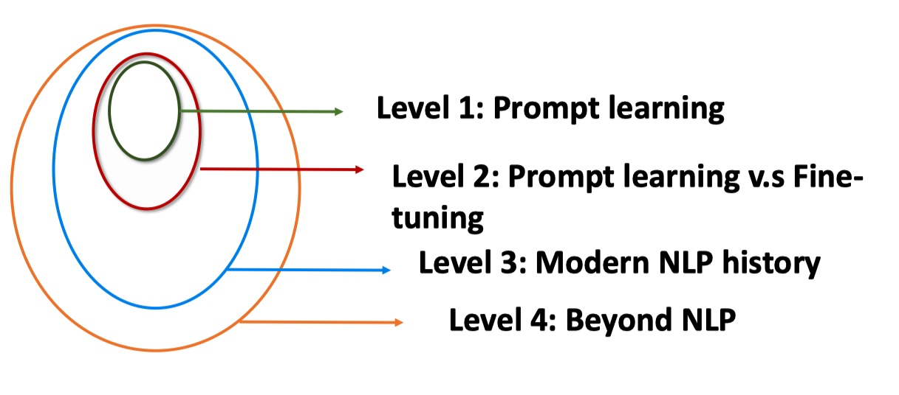
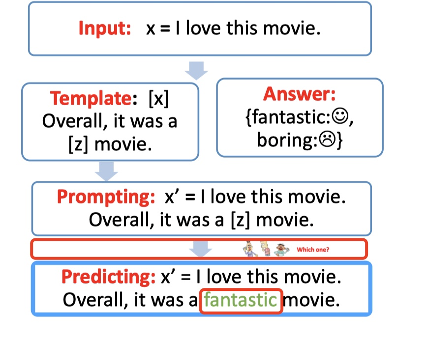
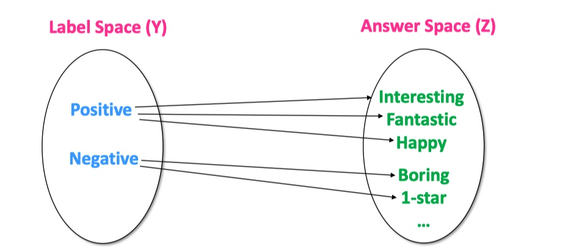
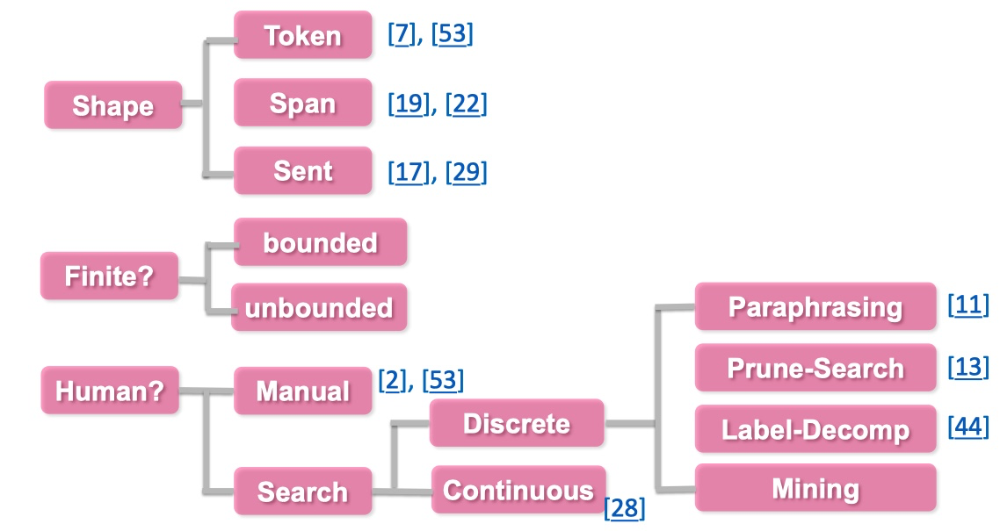
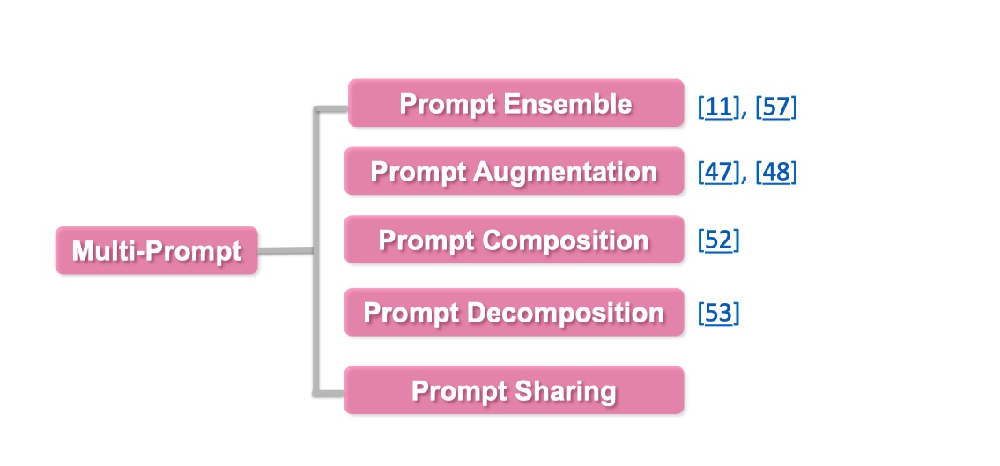
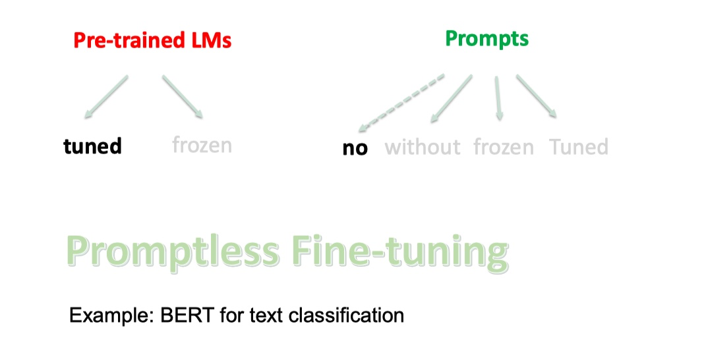
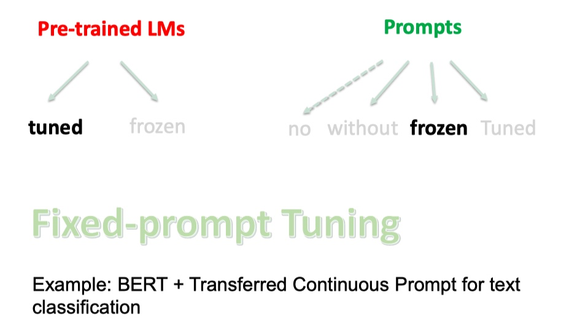
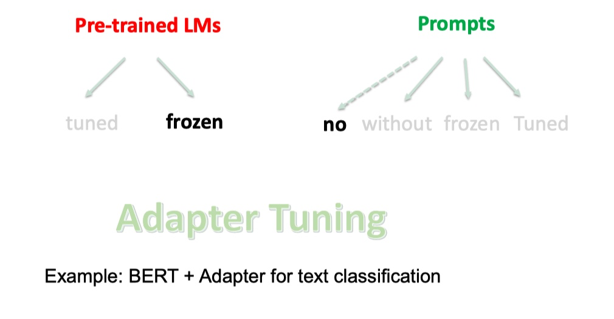
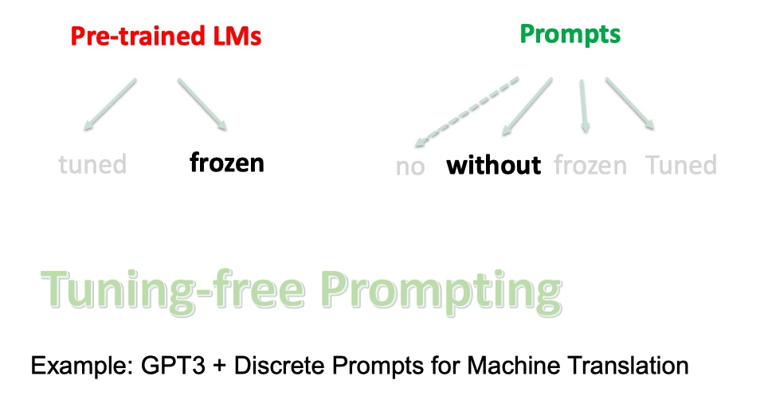
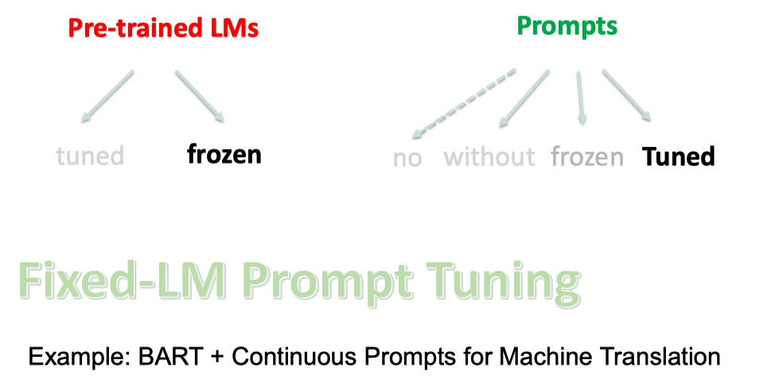

# 一、prompt learning

> 参看：https://zhuanlan.zhihu.com/p/442486331

## 1、出现背景(NLP四范式)

1. **第一范式**：传统机器学习模型的范式，基于**全监督学习(fully supervised learning)**的方法，通过构建**特征工程**，利用领域知识从数据中提取好的特征，直接解决下游任务

    > 例如`tf-idf`特征 + 朴素贝叶斯等机器算法

2. **第二范式**：基于深度学习模型的范式，通过设计**结构工程(architecture engineering)**，即设计一个合适的网络结构来把归纳偏置（`inductive bias`）引入模型中，训练一个端到端的模型，利用学习好的特征，直接解决下游任务

    > 例如`word2vec` 特征 + `LSTM` 等深度学习算法，相比于传统方法，模型准确有所提高，特征工程的工作也有所减少

3. **第三范式**：基于预训练模型 + finetuning 的范式，即**预训练 + 微调(pre-train and fine-tune)**，先用一个固定的结构预训练一个语言模型(language model, LM)，预训练的方式就是让模型补全上下文（比如完形填空）

    > 相比于深度学习模型，模型准确度显著提高，模型也随之变得更大，小数据集也可以训练出效果好的模型。

4. **第四范式**：基于预训练模型 + Prompt + 预测的范式，跟第三范式一样，先获得大型语言模型，然后通过引入额外的参数或微调来适应到下游任务上。这就逐渐形成了**目标工程(objective engineering)**，即**为预训练任务和微调任务设计更好的目标函数**

    > 如 BERT + Prompt 的范式相比于第三范式，模型训练所需的训练数据显著减少

| 范式     | 范式一和范式二(全监督学习)       | 范式三(预训练+微调)                                          | 范式四(预训练+提示学习)                                      |
| -------- | -------------------------------- | ------------------------------------------------------------ | ------------------------------------------------------------ |
| 训练数据 | 目标任务数据集                   | 大规模生语料，目标任务数据集                                 | 大规模生语料，目标任务数据集                                 |
| 输入     | 我是谁？                         | 我是谁？                                                     | `[CLS]`我是谁？`[SEP]`主题是`[MASK][MASK][SEP]`              |
| 输出     | `[0,0,1]`                        | `[0,0,1]`                                                    | `[CLS]`哲学`[SEP]`                                           |
| 输出层   | 一个线性变换                     | 一个线性变换                                                 | 无新增结构                                                   |
| 特点     | 依赖目标任务数据集来获得文本表示 | 基于庞大的生语料拉来获得良好的文本表示 基于目标任务数据获得下游任务知识 | 基于庞大的生语料拉来获得良好的文本表示 基于语言模型的文本生成能力和下游任务特点，设计训练和推理策略 |

## 2、定义

**Prompt Learning 定义**：

- 在不显著改变预训练模型结构和参数的情况下，通过向模型输入增加 “提示信息”来解决问题
- 即通过为输入内容添加额外的文本(重新定义任务)，来更好的挖掘预训练语言模型本身能力的一种方法

**对比**：

- **传统监督学习任务**：训练一个模型 P(y|x)，接收 x 作为输入，去预测 y

- **Prompt learning**：依赖预训练语言模型 P(x)，通过引入合适的模版将输入 x 调整为完形填空格式的 x’，调整后的输入 x’ 里含有空槽，利用语言模型 P 将空槽填充后就可以推断出对应的 y

    > 例如，对于情感分析任务
    >
    > 传统做法：训练一个判别模型，去预测输入 x 对应的标签是 positive 或 negative
    >
    > prompt learning：利用合适模版，将输入 x 调整为 [x], it is [z]。然后作为语言模型的输入去预测相应 z 的取值，如果 z 是 positive 相关的词，就表示原始输入 x 是 positive，反之就是 negative

## 3、Prompt 的优势

### 3.1 Level 1. Prompt Learning 角度

Prompt Learning 使得所有的 NLP 任务成为一个语言模型的问题：

- Prompt Learning 可以将所有的任务归一化预训练语言模型的任务
- 避免了预训练和[fine-tuning](https://zhida.zhihu.com/search?content_id=186459886&content_type=Article&match_order=4&q=fine-tuning&zhida_source=entity) 之间的 gap，几乎所有 NLP 任务都可以直接使用，不需要训练数据
- 在少样本的数据集上，能取得超过 fine-tuning 的效果
- 使得所有的任务在方法上变得一致

### 3.2 Level 2. Prompt Learning 和 Fine-tuning 的区别

Prompt Learning 和 Fine-tuning 的范式区别

- [Fine-tuning](https://zhida.zhihu.com/search?content_id=186459886&content_type=Article&match_order=7&q=Fine-tuning&zhida_source=entity) 是使得预训练语言模型**适配下游任务**
- Prompting 是将下游任务进行任务重定义，使得其利用预训练语言模型的能力，即**适配语言模型**

### 3.3 Level 3. 现代 NLP 历史

Prompting 方法是现在NLP的第四范式，其中现在NLP的发展史包含

1. `Feature Engineering`：即使用文本特征，例如词性，长度等，在使用机器学习的方法进行模型训练
2. `Architecture Engineering`：在W2V基础上，利用深度模型，加上固定的embeddin
3. `Objective Engineering`：在bert 的基础上，使用动态的[embedding](https://zhida.zhihu.com/search?content_id=186459886&content_type=Article&match_order=3&q=embedding&zhida_source=entity) 加上fine-tuning
4. `Prompt Engineering`：直接利用与训练语言模型辅以特定的prompt

---

可以发现：在四个范式中，预训练语言模型和下游任务之间的距离变得越来越近，直到 Prompt Learning 直接完全利用 LM 能力

### 3.4 Level 4. 超越 NLP

Prompt 可以作为连接多模态的一个契机，例如 CLIP 模型，连接了文本和图片

## 4、组成部分

### 4.1 提示构造(Prompt addition/Construction)

- 核心：**将 input x 转为为带提示的 x' 的过程**

- 流程如下：

    - 首先，设计一个模板包含输入槽（input slot）[x] 和答案槽（answer slot）[z] 的文本串

        > 输入槽留给 input x*，*答案槽 [z] 用于生成答案(answer) z*，*答案 z 之后会被映射到输出的标签或文本(output label or text)

    - 接下来，将 input x 代入到输入槽 [x] 中

- 答案槽 [z] 可以位于 x' 的中间位置或者末尾位置
    - [z] 在中间的 x' 为 cloze prompt（完形填空提示）
    - [z] 在末尾的 x' 为 prefix prompt（前缀型提示）

- 模版(Template)：可以是离散化的 token，也可以连续的向量

    > 在不同的下游任务，可以灵活调整，选择合适的模版

### 4.2 答案构造(Answer search/Construction)

- 核心：**设计 answer 和 class label 之间的映射函数**
- 方案：从所有可能的候选槽值进行搜索，然后选择合适的槽值填充到对应的空槽里

- 特殊情况：
    - 特殊情况1，answer 和 label 是相同的，比如机器翻译任务
    - 特殊情况2，多个 answer 可以映射到同一个 label，比如情感分类任务中 “excellent, good, wonderful” 可映射到正向情感

### 4.3 答案预测(Answer Prediction)

- 核心：**选择合适的LM, 并让其通过给定的 x' 预测 answer z**

- 通过构造 promting x'，情感分类的任务被转化为了 LM 任务，可以直接使用 LM 来对 [z] 进行预测得到答案（answer）z

### 4.4 答案-标签映射(Answer-Label Mapping)

- 核心：**将 LM 预测出来的 answer z 映射为 label**

### 4.5 基本术语

|  Terminology  | Notation |                    Example                     |
| :-----------: | :------: | :--------------------------------------------: |
|     Input     |    x     |               I love this movie                |
| Output(label) |    y     |                       😊☹️                       |
|   Template    |    -     |        [x] Overrall, it was a [z] movie        |
|    Prompt     | $x^{'}$  | I love this movie. Overall, it was a [z] movie |
|    Answer     |    z     |               fantastic, boring                |

## 5、核心流程

在了解 prompt learning 的基本组成后，有以下几个方面都会影响 prompt learning 的最终效果：

1. Prompt engineering：设计合适的模版函数，是整个 prompt learning 的第一个步
2. 选择预训练模型：预测空槽位置上的答案依赖于预训练语言模型的得分，同时预训练语言模型又有 4 大类
3. Answer engineering：构建一个合适的答案候选集以及一个从答案到最终结果的映射
4. Expanding the paradigm：基于基础的 prompt learning 去扩展，包括 multi prompt 等
5. Training strategy：选择训练策略，去训练一个合适的模型。

### 5.1 Prompt engineering

#### (1) 介绍

- 定义：创建 prompting 函数 `fprompt(x)` 的过程，即构建一个合适的模版函数，使下游任务能取得最高效的表现
- 核心思想：将已有的下游 NLP 任务重构成 token 级的预测任务，在不改变原有的 pre-trained LM 的前提下(不进行 fine tuning)，直接将 LM 应用，即在用下游任务适配 LM

#### (2) Prompt shape

根据 slot 的形状/位置区分：

- **前缀(prefix) prompt**：适用生成任务或使用标准自回归 LM 解决的任务，因为与模型从左到右的性质吻合

    > PS:“I'm not sure I understand this point。Please continue to write:【Y】”

- **完形填空(cloze) prompt**：适用使用掩码(Mask) LM 解决的任务，因为与预训练任务的形式匹配

    > PS:“The course taught by the teacher is easy to understand. Overall it was a 【Y】course“

#### (3) 几种构建 prompt 方式

- **人工指定 template**：通过专业人士的经验知识构建合理的 prompt，给模型增加合适的提示

    - 优点：过程简单，效果相对可控，可供快速尝试，能支持预训练模型实现 few shot 和 zero shot
    - 缺点：
        - 一方面人工构建 prompt 和测试 prompt 效果耗费时间跟精力
        - 另一方面即便是专业人士也不一定能通过人工的方式构建最优的 prompt

- **离散Discrete Template**：自动生成由自然语言的词组成的 Prompt，因此其搜索空间是离散的

    - 先由人工构建，然后可以通过种子 prompt 去扩充，也可以通过生成方式去获取

    - 在构建得到 prompt 候选集后，可以在下游任务上评估，也可以通过语言模型去打分

    - 最终可以只选择最合适的一种 prompt，也可以集成多个 prompt

    - 主要实现有：

        - `Prompt Mining`：给定输入 x 和输出 y，要找到 x 和 y 之间的中间词或依赖路径，然后选取出现频繁的中间词或依赖路径作为模板，即 “[X] middle words [Z]”

            > 该方法需要一个大的文本库支持，例如 Wikipedia

        - `Prompt Paraphrasing`：用现有的种子 prompts(例如手动构造)，并将其转述成一组其他候选 prompts，然后选择一个在目标任务上达到最好效果的

            > 一般的做法有：将提示符翻译成另一种语言，然后再翻译回来；使用同义或近义短语来替换等

        - `Gradient-based Search`：在单词候选集里选择词并组合成 prompt，利用梯度下降的方式不断尝试组合，从而达到让 PLM 生成需要的词的目的

        - `Prompt Generation`：将标准的自然语言生成的模型用于生成 prompts

            > Gao 等人将 T5 引入了模板搜索的过程，让 T5 生成模板词；
            >
            > Ben-David 等人提出了一种域自适应算法，训练 T5 为每个输入生成一种唯一的域相关特征，然后把输入和特征连接起来组成模板再用到下游任务中

        - `Prompt Scoring`：首先人工制造一组模板候选，然后把相应的 [X] 和[Z]都填上成为 prompts，并使用一个双向 LM 给这些 prompts 打分，最后选取其中的高分 prompt

- **连续Continuous Template**(prompt 由向量替代)：摆脱自然语言，直接作用到模型的 Embedding 空间，通过梯度更新优化

    > 由于可以进行梯度优化，效果通常优于离散型 prompt，而离散型 prompt 由于不可导只能采用近似梯度或其他方式去优化

    - 连续型 prompt 的初始化很重要，一般会采用合理的 token 进行初始化，这些 token 可以是手工设计的离散型 prompt

    - 模版中词语的 Embedding 可以是整个自然语言的 Embedding，不再只是有限的一些 Embedding 模版的参数不再直接取 PLM 的参数，而是有自己独立的参数，可以通过下游任务的训练数据进行调整

    - 连续 prompts 方法大致可以分为下面三种：

        - `Prefix Tuning`：在输入前添加一串连续的向量的方法，该方法保持 PLM 的参数不动，仅训练合适的前缀(prefix)

            - freeze 预训练参数，单纯调参每一层前缀提示向量参数

            - 形式化定义是，在给定一个可训练的前缀矩阵 $M \varphi$ 和一个固定的参数化为 $\theta$ 的 PLM 的对数似然目标上进行优化

                即： $max \phi log P(y | x; \theta;\phi) = max \phi \sum yilog P(yi | h < i;\theta;\phi)$ 其中 `h<i=[h<i(1);...;h<i(n)]`指的是所有神经网络层在第 i 个时间步的连接

                - 如果对应的时间步在前缀中，即`hiisMϕ[i]`, 则它可以直接从前缀矩阵中复制过来；否则需要使用 PLM 进行计算
                - 类似地，输入序列前面加上特殊的 token 来组成一个模板，然后直接调整这些 token 的 embedding
                - 和上面的 Prefix Tuning 的方法相比，他们的方法相对来说参数较少，因为没有在每一层网络中引入额外的参数

        - `Tuing Initialized with Discrete Prompts`：先用一个离散 prompt 搜索方法定义一个模板，然后基于该模板初始化虚拟的 token，最后微调这些 token 的 embedding 以提高准确率

        - `Hard-Soft Prompt Hybrid Tuning`：手工设计和自动学习的结合，即在手工设计的模板中插入可学习的 embedding

            - `P-Tuning` 方法：通过在 input embedding 中插入可训练的变量来学习连续的 prompts
                - 该方法使用 BiLSTM 的输出来表示 prompt embeddings，以便让 prompt tokens 之间有一定的交互
                - 还引入了任务相关的 anchor tokens 来进一步提高效果，这些 anchor tokens 不参与后续的调优

            - `Prompt Tunning with Rules(PTR)`方法：使用手工指定的子模板按照逻辑规则组装成完整的模板
                - 为了增强生成的模板的表示能力，该方法还插入了几个虚拟 token，这些虚拟 token 的 embeddings 可以和 PLM 的参数一起被调整，PTR 的模板 token 既有实际 token 也有虚拟 token 

- 

### 5.2 Answer engineering

#### (1) 介绍

- 定义：旨在寻找一个合适的答案空间 Z 以及一个从答案到最终输出 y 的一个映射，从而得到一个有效的预测模型

- 目标：寻找一个跟下游任务匹配的答案空间，即构建候选集，并定义好答案空间到最终输出之间的映射

    > Prompt learning 之所以能实现 few shot 甚至 zero shot，是依仗于预训练语言模型强大的泛化能力

#### (2) 构建方式类型

- **根据形状**

    - Token 类型：预训练 LM 词汇表中的一个 token，或者词汇子集

    - Span 类型：短的 multi-token span，这些通常与 cloze prompt 一起使用

    - Sentence 类型：通常与前缀 prompt 一起使用

- **是否有界**

    - 有界

    - 无界

- **是否人工选择**

    - 人工选择：分为两类空间
        - Unconstrained spaces 中的空间包含了输出空间的所有结果，token 级的话则是全部词表中的词 (比如 W2V 的输出层)，其余类型相同。这类方法可以直接找到 Z 与 y 的映射关系
        - Constrained spaces 通常输出是在一个限定范围内 (比如 positive 和 negative)，这类方法就需要一个映射关系来映射 Z 与 y

    - 自动搜素

        - 离散空间

        - 连续空间：

            - **Answer paraphrasing**：首先初始化一个答案空间然后用这些答案的释义去扩充答案空间直至收敛

                > 通过回译的方式扩充答案空间从而获得每个类别的多个候选表达，综合考虑模型对多个候选表达的预测结果会得到更加鲁棒的结果
                >
                > 最终实验也证明了通过这种方式得到的多样化的表示可以有效提高语言模型在多选 QA 问题的表现

            - **Prune-then-search**：先对答案候选空间进行裁剪，然后再通过算法去搜索得到最终合适的答案候选

            - **Label Decomposition**：由于类别标签已经包含了很多真实的语义信息，所以 Adaprompt 直接将类别标签分解为多个 token 作为该类别的候选答案

                > 例如一个类别是”per: city_of_death”，把这里一些没有语义的连接词 (例如 of) 去掉后，从而得到对应的候选答案是{person, city, death}

            - **连续型答案自动搜索**：这类工作较有代表性的 WRAP 在词嵌入部分为每个类别指定了一个连续的变量去表征这个类别，然后通过梯度回传去更新这个表征类别的词嵌入

- 

### 5.3 选择预训练模型

具体的预训练语言模型分类可以分为如下5类，具体参考：[Huggingface Summary of the models](https://link.zhihu.com/?target=https%3A//huggingface.co/docs/transformers/model_summary)

- autoregressive-models: [自回归模型](https://zhida.zhihu.com/search?content_id=186459886&content_type=Article&match_order=1&q=自回归模型&zhida_source=entity)，主要代表有 GPT，主要用于生成任务
- autoencoding-models: 自编码模型，主要代表有 BERT，主要用于NLU任务
- seq-to-seq-models：序列到序列任务，包含了an encoder 和 a decoder，主要代表有 BART，主要用于基于条件的生成任务，例如翻译，summary等
- multimodal-models：[多模态](https://zhida.zhihu.com/search?content_id=186459886&content_type=Article&match_order=1&q=多模态&zhida_source=entity)模型
- retrieval-based-models：基于召回的模型，主要用于开放域问答

### 5.4 Expanding the paradigm(multi prompt)

如何对已有的 Prompt 进行任务增强以及拓展，具体可以从以下几个方面进行探讨：

#### (1) Prompt Ensemble 集成

**采用多种方式询问同一个问题**：每个 prompt 都按照单 prompt 的方法并行进行，然后再把最终的结果汇总，可以通过加权或者投票的方式汇总多个单 prompt 的方法的结果

- 可以利用不同 prompt 的优势实现互补
- 可以缓解 prompt engineering 中寻找一个最优 prompt 的繁重工作
- 可以在下游任务表现得更加稳定

#### (2) Prompt Augmentation 增强

**采用 prompt 提示进行增强**：类似 few shot，即给出一些完整样例

增强的方式其实就是找一个跟当前问题相似的 case，然后将这个 case 跟当前输入 x‘ 一起输入，这种模型就可以根据那个 case 对 x‘做出更精准的预测了

#### (3)Prompt Composition 组合

**将一个任务拆成多个任务的组合**：利用多个子 prompt 构建 prompt 函数，每个子 prompt 针对一个子任务，把多个 prompt 的内容融合到一起，可以定义更加复杂的 prompt，同时进行多个子任务的预测

比如：判别两个实体之间是否是父子关系，首先对于每个实体，先用Prompt 判别是人物，再进行实体关系的预测

#### (4) Prompt Decomposition 分解 

**将一个prompt 拆分成多个prompt**：跟 prompt composition 相反，即将问题分解为多个问题，分别定义多个子 prompt 去分别处理

例如命名实体问题，可以将文本划分为多个片段，然后用各个子 prompt 分别去识别这些片段是否是实体或者对应的是实体类型，最后汇总所有片段的结果即可

补充：prompt composition 跟 prompt decomposition 都是需要明确问题是由哪些子任务组成的，设计完相应的子 prompt 后再根据具体场景决定是用分解还是组合的方式解决

### 5.5 Training strategy

#### (1) 介绍

训练策略划分：

- **根据训练数据的多少**：

    - Zero-shot：对于下游任务，没有任何训练数据

    - Few-shot：对于下游任务只有很少的训练数据，例如100条

    - Full-data：有很多的训练数据，例如1万多条数据

- **根据不同的参数更新的部分**，
    - 一个是预训练模型：可以选择精调，或者不训练
    - 一个是 Prompts 参数：
        - 可以是没有 prompts
        - 固定的离散字符 prompts(无参数)
        - 使用训练好的 prompts 参数，不再训练
        - 继续训练 prompts 参数

#### (2) 常用策略

##### 1. `Promptless Fine-tuning`

如果只有预训练语言模型，没有prompts，然后fine-tuning，即是[bert](https://zhida.zhihu.com/search?content_id=186459886&content_type=Article&match_order=1&q=bert&zhida_source=entity) 的常规使用

- 优势：简单，不需要另外设计 prompt，直接在训练数据上调整语言模型的参数即可。
- 劣势：训练数据不足时容易过拟合或者不稳定

##### 2. `Fixed-Prompt Tuning`

跟 Fixed-LM Prompt Tuning 相反，固定跟 prompt 相关的参数，只微调语言模型自身的参数

如果使用离散型 prompt 并据此进一步优化语言模型参数的话就属于这种类型的方法

- 优势：prompt engineering 跟 answer engineering 更完整的说明了任务，更适用于 few shot 场景
- 劣势：严重依赖于 prompt engineering 和 answer engineering 的效果，最终效果可能不及没有使用 prompt 的方法

---

- 如果使用精调预训练语言模型+离散的固定prompts，就是 BERT + Discrete Prompt for text classification

    

- 如果使用精调预训练语言模型+连续训练好的固定prompts，就是 BERT + Transferred Continuous Prompt for text classification

    

##### 3. `Prompt+LM Fine-tuning`

Prompt 相关参数跟语言模型自身参数都进行微调，跟常规的预训练语言模型微调很像，新增的 prompt 可以在模型的训练开始时提供一种增强策略，适合大数据集，小数据集易过拟合

- 优势：最具表达能力的模型，适用于有充足数据的场景
- 劣势：需要一定的训练，对数据量有一定要求，需要存储所有模型的参数，包括语言模型自身的参数和跟 prompt 相关的参数

---

如果使用精调预训练语言模型+可训练的prompts，就是 BERT + Continuous Prompt for text classification

##### 4. `Adapter Tuning`

如果使用固定预训练语言模型无prompt，只是插入task-specific模块到预训练语言模型中，就是BERT + Adapter for text classification

##### 5. `Tuning-free Prompting`

这种类型的方法其实就是 GPT 中的 zero shot，不需要训练数据，没有训练过程，基于 prompt 直接生成答案，无需调参。之前提及的离散型 prompt 自动构建或者人工构建 prompt 的方法多属于这种类型

- 优势：高效，不需要参数更新过程，固定语言模型参数，可以在下游任务直接 zero shot
- 劣势：需要准确的 prompt 设计

---

- 如果使用固定预训练语言模型和离散固定的prompt，就是GPT3 + Discrete Prompts for Machine Translation

    

- 如果使用固定预训练语言模型和连续固定的prompt，就是 GPT3 + Continuous Prompts for Machine Translation

    

##### 6. `Fixed-LM Prompt Tuning`

通过固定语言模型参数，去微调跟 prompt 相关的参数，使下游任务更好作用于 prompt 的产生

- 优势：适合小样本学习，跟 tuning-free prompting 类似，能够保留语言模型的知识，并且适用于 few shot 场景，效果也会比 tuning-free prompting 好
- 劣势：不适用于零样本学习，prompt engineering 相关工作很重要，微调得到的 prompt 也基本不是人能理解和掌握的

---

如果使用固定预训练语言模型和可训练的prompt，就是 BART + Continuous Prompts for Machine Translation

#### (3) 策略选择

对于不同的策略，需要进行不同的选择，往往需要考虑以下两点：

- LM 数据量级是多少
- 是否有个超大的 Left-to-right 的语言模型

只有像[GPT-3](https://zhida.zhihu.com/search?content_id=186459886&content_type=Article&match_order=1&q=GPT-3&zhida_source=entity) 这种超大的语言模型的时候，才能直接使用，不需要任何的fine-tuning.

## 6、总结

**在训练条件充足的条件下，prompt learning 相对于常规的 finetune 没有明显优势，prompt learning 的价值还是体现在 few shot 甚至 zero shot 场景下**。

- 对于不微调 prompt 相关参数的方法，模型效果都严重依赖于 prompt engineering 和 answer engineering

- 对于那些可以微调 prompt 相关参数的方法，又对于训练数据量有一定要求，如果连语言模型的参数也要调整的话，那么就需要更多的训练数据

    > 所以对于 few shot 场景，由于训练数据量限制，选择固定语言模型参数只微调 prompt 相关参数的方法更受青睐，对于每一个具体下游任务只需要保存 prompt 相关的参数即可，也为 prompt learning 的大范围应用提供了可能。

# 二、Instruction learning

# 三、In-content learning

# 四、CoT

