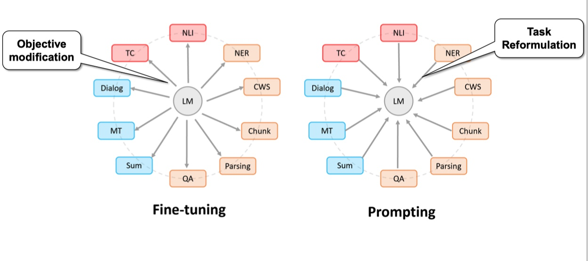
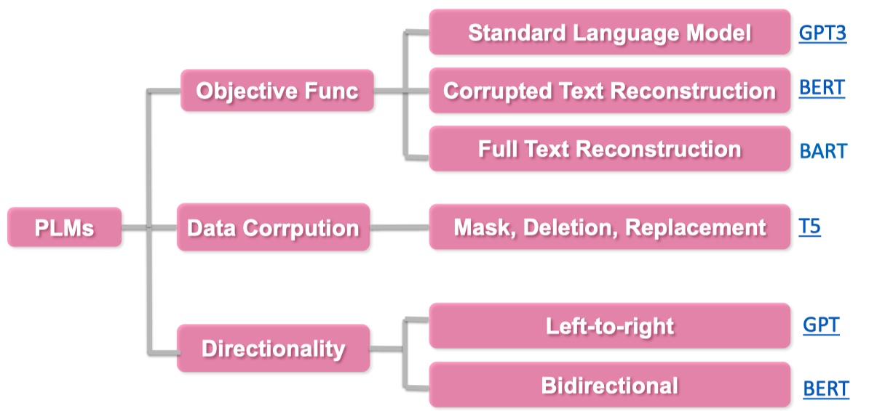
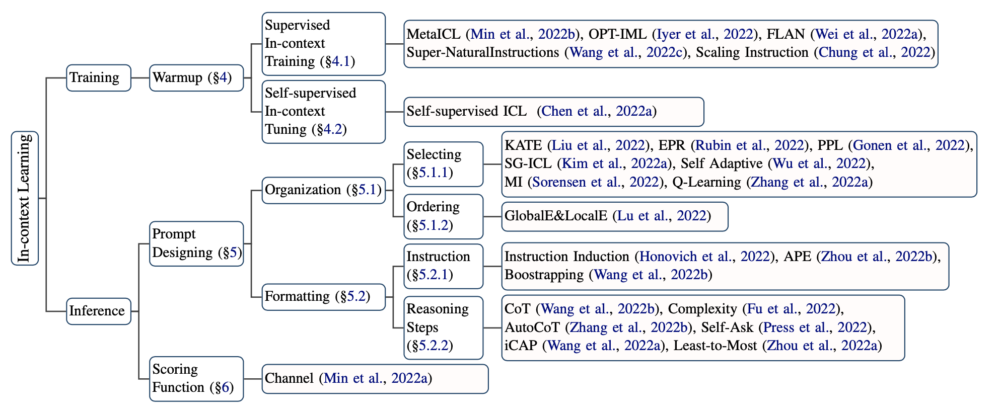

# 一、prompt learning

> 参看：https://zhuanlan.zhihu.com/p/442486331

## 1、出现背景(NLP四范式)

1. **第一范式**：传统机器学习模型的范式，基于**全监督学习(fully supervised learning)**的方法，通过构建**特征工程**，利用领域知识从数据中提取好的特征，直接解决下游任务

    > 例如`tf-idf`特征 + 朴素贝叶斯等机器算法

2. **第二范式**：基于深度学习模型的范式，通过设计**结构工程(architecture engineering)**，即设计一个合适的网络结构来把归纳偏置（`inductive bias`）引入模型中，训练一个端到端的模型，利用学习好的特征，直接解决下游任务

    > 例如`word2vec` 特征 + `LSTM` 等深度学习算法，相比于传统方法，模型准确有所提高，特征工程的工作也有所减少

3. **第三范式**：基于预训练模型 + finetuning 的范式，即**预训练 + 微调(pre-train and fine-tune)**，先用一个固定的结构预训练一个语言模型(language model, LM)，预训练的方式就是让模型补全上下文（比如完形填空）

    > 相比于深度学习模型，模型准确度显著提高，模型也随之变得更大，小数据集也可以训练出效果好的模型。

4. **第四范式**：基于预训练模型 + Prompt + 预测的范式，跟第三范式一样，先获得大型语言模型，然后通过引入额外的参数或微调来适应到下游任务上。这就逐渐形成了**目标工程(objective engineering)**，即**为预训练任务和微调任务设计更好的目标函数**

    > 如 BERT + Prompt 的范式相比于第三范式，模型训练所需的训练数据显著减少

| 范式     | 范式一和范式二(全监督学习)       | 范式三(预训练+微调)                                          | 范式四(预训练+提示学习)                                      |
| -------- | -------------------------------- | ------------------------------------------------------------ | ------------------------------------------------------------ |
| 训练数据 | 目标任务数据集                   | 大规模生语料，目标任务数据集                                 | 大规模生语料，目标任务数据集                                 |
| 输入     | 我是谁？                         | 我是谁？                                                     | `[CLS]`我是谁？`[SEP]`主题是`[MASK][MASK][SEP]`              |
| 输出     | `[0,0,1]`                        | `[0,0,1]`                                                    | `[CLS]`哲学`[SEP]`                                           |
| 输出层   | 一个线性变换                     | 一个线性变换                                                 | 无新增结构                                                   |
| 特点     | 依赖目标任务数据集来获得文本表示 | 基于庞大的生语料拉来获得良好的文本表示 基于目标任务数据获得下游任务知识 | 基于庞大的生语料拉来获得良好的文本表示 基于语言模型的文本生成能力和下游任务特点，设计训练和推理策略 |

## 2、定义

**Prompt Learning 定义**：

- 在不显著改变预训练模型结构和参数的情况下，通过向模型输入增加 “提示信息”来解决问题
- 即通过为输入内容添加额外的文本(重新定义任务)，来更好的挖掘预训练语言模型本身能力的一种方法

**对比**：

- **传统监督学习任务**：训练一个模型 P(y|x)，接收 x 作为输入，去预测 y

- **Prompt learning**：依赖预训练语言模型 P(x)，通过引入合适的模版将输入 x 调整为完形填空格式的 x’，调整后的输入 x’ 里含有空槽，利用语言模型 P 将空槽填充后就可以推断出对应的 y

    > 例如，对于情感分析任务
    >
    > 传统做法：训练一个判别模型，去预测输入 x 对应的标签是 positive 或 negative
    >
    > prompt learning：利用合适模版，将输入 x 调整为 [x], it is [z]。然后作为语言模型的输入去预测相应 z 的取值，如果 z 是 positive 相关的词，就表示原始输入 x 是 positive，反之就是 negative

## 3、Prompt 的优势

### 3.1 Level 1. Prompt Learning 角度

Prompt Learning 使得所有的 NLP 任务成为一个语言模型的问题：

- Prompt Learning 可以将所有的任务归一化预训练语言模型的任务
- 避免了预训练和[fine-tuning](https://zhida.zhihu.com/search?content_id=186459886&content_type=Article&match_order=4&q=fine-tuning&zhida_source=entity) 之间的 gap，几乎所有 NLP 任务都可以直接使用，不需要训练数据
- 在少样本的数据集上，能取得超过 fine-tuning 的效果
- 使得所有的任务在方法上变得一致

### 3.2 Level 2. Prompt Learning 和 Fine-tuning 的区别

Prompt Learning 和 Fine-tuning 的范式区别

- [Fine-tuning](https://zhida.zhihu.com/search?content_id=186459886&content_type=Article&match_order=7&q=Fine-tuning&zhida_source=entity) 是使得预训练语言模型**适配下游任务**
- Prompting 是将下游任务进行任务重定义，使得其利用预训练语言模型的能力，即**适配语言模型**

### 3.3 Level 3. 现代 NLP 历史

Prompting 方法是现在NLP的第四范式，其中现在NLP的发展史包含

1. `Feature Engineering`：即使用文本特征，例如词性，长度等，在使用机器学习的方法进行模型训练
2. `Architecture Engineering`：在W2V基础上，利用深度模型，加上固定的embeddin
3. `Objective Engineering`：在bert 的基础上，使用动态的[embedding](https://zhida.zhihu.com/search?content_id=186459886&content_type=Article&match_order=3&q=embedding&zhida_source=entity) 加上fine-tuning
4. `Prompt Engineering`：直接利用与训练语言模型辅以特定的prompt

---

可以发现：在四个范式中，预训练语言模型和下游任务之间的距离变得越来越近，直到 Prompt Learning 直接完全利用 LM 能力

### 3.4 Level 4. 超越 NLP

Prompt 可以作为连接多模态的一个契机，例如 CLIP 模型，连接了文本和图片

## 4、组成部分

### 4.1 提示构造(Prompt addition/Construction)

- 核心：**将 input x 转为为带提示的 x' 的过程**

- 流程如下：

    - 首先，设计一个模板包含输入槽（input slot）[x] 和答案槽（answer slot）[z] 的文本串

        > 输入槽留给 input x*，*答案槽 [z] 用于生成答案(answer) z*，*答案 z 之后会被映射到输出的标签或文本(output label or text)

    - 接下来，将 input x 代入到输入槽 [x] 中

- 答案槽 [z] 可以位于 x' 的中间位置或者末尾位置
    - [z] 在中间的 x' 为 cloze prompt（完形填空提示）
    - [z] 在末尾的 x' 为 prefix prompt（前缀型提示）

- 模版(Template)：可以是离散化的 token，也可以连续的向量

    > 在不同的下游任务，可以灵活调整，选择合适的模版

### 4.2 答案构造(Answer search/Construction)

- 核心：**设计 answer 和 class label 之间的映射函数**
- 方案：从所有可能的候选槽值进行搜索，然后选择合适的槽值填充到对应的空槽里

- 特殊情况：
    - 特殊情况1，answer 和 label 是相同的，比如机器翻译任务
    - 特殊情况2，多个 answer 可以映射到同一个 label，比如情感分类任务中 “excellent, good, wonderful” 可映射到正向情感

### 4.3 答案预测(Answer Prediction)

- 核心：**选择合适的LM, 并让其通过给定的 x' 预测 answer z**

- 通过构造 promting x'，情感分类的任务被转化为了 LM 任务，可以直接使用 LM 来对 [z] 进行预测得到答案（answer）z

### 4.4 答案-标签映射(Answer-Label Mapping)

- 核心：**将 LM 预测出来的 answer z 映射为 label**

### 4.5 基本术语

|  Terminology  | Notation |                    Example                     |
| :-----------: | :------: | :--------------------------------------------: |
|     Input     |    x     |               I love this movie                |
| Output(label) |    y     |                       😊☹️                       |
|   Template    |    -     |        [x] Overrall, it was a [z] movie        |
|    Prompt     | $x^{'}$  | I love this movie. Overall, it was a [z] movie |
|    Answer     |    z     |               fantastic, boring                |

## 5、核心流程

在了解 prompt learning 的基本组成后，有以下几个方面都会影响 prompt learning 的最终效果：

1. Prompt engineering：设计合适的模版函数，是整个 prompt learning 的第一个步
2. 选择预训练模型：预测空槽位置上的答案依赖于预训练语言模型的得分，同时预训练语言模型又有 4 大类
3. Answer engineering：构建一个合适的答案候选集以及一个从答案到最终结果的映射
4. Expanding the paradigm：基于基础的 prompt learning 去扩展，包括 multi prompt 等
5. Training strategy：选择训练策略，去训练一个合适的模型。

### 5.1 Prompt engineering

#### (1) 介绍

- 定义：创建 prompting 函数 `fprompt(x)` 的过程，即构建一个合适的模版函数，使下游任务能取得最高效的表现
- 核心思想：将已有的下游 NLP 任务重构成 token 级的预测任务，在不改变原有的 pre-trained LM 的前提下(不进行 fine tuning)，直接将 LM 应用，即在用下游任务适配 LM

#### (2) Prompt shape

根据 slot 的形状/位置区分：

- **前缀(prefix) prompt**：适用生成任务或使用标准自回归 LM 解决的任务，因为与模型从左到右的性质吻合

    > PS:“I'm not sure I understand this point。Please continue to write:【Y】”

- **完形填空(cloze) prompt**：适用使用掩码(Mask) LM 解决的任务，因为与预训练任务的形式匹配

    > PS:“The course taught by the teacher is easy to understand. Overall it was a 【Y】course“

#### (3) 几种构建 prompt 方式

- **人工指定 template**：通过专业人士的经验知识构建合理的 prompt，给模型增加合适的提示

    - 优点：过程简单，效果相对可控，可供快速尝试，能支持预训练模型实现 few shot 和 zero shot
    - 缺点：
        - 一方面人工构建 prompt 和测试 prompt 效果耗费时间跟精力
        - 另一方面即便是专业人士也不一定能通过人工的方式构建最优的 prompt

- **离散Discrete Template**：自动生成由自然语言的词组成的 Prompt，因此其搜索空间是离散的

    - 先由人工构建，然后可以通过种子 prompt 去扩充，也可以通过生成方式去获取

    - 在构建得到 prompt 候选集后，可以在下游任务上评估，也可以通过语言模型去打分

    - 最终可以只选择最合适的一种 prompt，也可以集成多个 prompt

    - 主要实现有：

        - `Prompt Mining`：给定输入 x 和输出 y，要找到 x 和 y 之间的中间词或依赖路径，然后选取出现频繁的中间词或依赖路径作为模板，即 “[X] middle words [Z]”

            > 该方法需要一个大的文本库支持，例如 Wikipedia

        - `Prompt Paraphrasing`：用现有的种子 prompts(例如手动构造)，并将其转述成一组其他候选 prompts，然后选择一个在目标任务上达到最好效果的

            > 一般的做法有：将提示符翻译成另一种语言，然后再翻译回来；使用同义或近义短语来替换等

        - `Gradient-based Search`：在单词候选集里选择词并组合成 prompt，利用梯度下降的方式不断尝试组合，从而达到让 PLM 生成需要的词的目的

        - `Prompt Generation`：将标准的自然语言生成的模型用于生成 prompts

            > Gao 等人将 T5 引入了模板搜索的过程，让 T5 生成模板词；
            >
            > Ben-David 等人提出了一种域自适应算法，训练 T5 为每个输入生成一种唯一的域相关特征，然后把输入和特征连接起来组成模板再用到下游任务中

        - `Prompt Scoring`：首先人工制造一组模板候选，然后把相应的 [X] 和[Z]都填上成为 prompts，并使用一个双向 LM 给这些 prompts 打分，最后选取其中的高分 prompt

- **连续Continuous Template**(prompt 由向量替代)：摆脱自然语言，直接作用到模型的 Embedding 空间，通过梯度更新优化

    > 由于可以进行梯度优化，效果通常优于离散型 prompt，而离散型 prompt 由于不可导只能采用近似梯度或其他方式去优化

    - 连续型 prompt 的初始化很重要，一般会采用合理的 token 进行初始化，这些 token 可以是手工设计的离散型 prompt

    - 模版中词语的 Embedding 可以是整个自然语言的 Embedding，不再只是有限的一些 Embedding 模版的参数不再直接取 PLM 的参数，而是有自己独立的参数，可以通过下游任务的训练数据进行调整

    - 连续 prompts 方法大致可以分为下面三种：

        - `Prefix Tuning`：在输入前添加一串连续的向量的方法，该方法保持 PLM 的参数不动，仅训练合适的前缀(prefix)

            - freeze 预训练参数，单纯调参每一层前缀提示向量参数

            - 形式化定义是，在给定一个可训练的前缀矩阵 $M \varphi$ 和一个固定的参数化为 $\theta$ 的 PLM 的对数似然目标上进行优化

                即： $max \phi log P(y | x; \theta;\phi) = max \phi \sum yilog P(yi | h < i;\theta;\phi)$ 其中 `h<i=[h<i(1);...;h<i(n)]`指的是所有神经网络层在第 i 个时间步的连接

                - 如果对应的时间步在前缀中，即`hiisMϕ[i]`, 则它可以直接从前缀矩阵中复制过来；否则需要使用 PLM 进行计算
                - 类似地，输入序列前面加上特殊的 token 来组成一个模板，然后直接调整这些 token 的 embedding
                - 和上面的 Prefix Tuning 的方法相比，他们的方法相对来说参数较少，因为没有在每一层网络中引入额外的参数

        - `Tuing Initialized with Discrete Prompts`：先用一个离散 prompt 搜索方法定义一个模板，然后基于该模板初始化虚拟的 token，最后微调这些 token 的 embedding 以提高准确率

        - `Hard-Soft Prompt Hybrid Tuning`：手工设计和自动学习的结合，即在手工设计的模板中插入可学习的 embedding

            - `P-Tuning` 方法：通过在 input embedding 中插入可训练的变量来学习连续的 prompts
                - 该方法使用 BiLSTM 的输出来表示 prompt embeddings，以便让 prompt tokens 之间有一定的交互
                - 还引入了任务相关的 anchor tokens 来进一步提高效果，这些 anchor tokens 不参与后续的调优

            - `Prompt Tunning with Rules(PTR)`方法：使用手工指定的子模板按照逻辑规则组装成完整的模板
                - 为了增强生成的模板的表示能力，该方法还插入了几个虚拟 token，这些虚拟 token 的 embeddings 可以和 PLM 的参数一起被调整，PTR 的模板 token 既有实际 token 也有虚拟 token 

- 

### 5.2 Answer engineering

#### (1) 介绍

- 定义：旨在寻找一个合适的答案空间 Z 以及一个从答案到最终输出 y 的一个映射，从而得到一个有效的预测模型

- 目标：寻找一个跟下游任务匹配的答案空间，即构建候选集，并定义好答案空间到最终输出之间的映射

    > Prompt learning 之所以能实现 few shot 甚至 zero shot，是依仗于预训练语言模型强大的泛化能力

#### (2) 构建方式类型

- **根据形状**

    - Token 类型：预训练 LM 词汇表中的一个 token，或者词汇子集

    - Span 类型：短的 multi-token span，这些通常与 cloze prompt 一起使用

    - Sentence 类型：通常与前缀 prompt 一起使用

- **是否有界**

    - 有界

    - 无界

- **是否人工选择**

    - 人工选择：分为两类空间
        - Unconstrained spaces 中的空间包含了输出空间的所有结果，token 级的话则是全部词表中的词 (比如 W2V 的输出层)，其余类型相同。这类方法可以直接找到 Z 与 y 的映射关系
        - Constrained spaces 通常输出是在一个限定范围内 (比如 positive 和 negative)，这类方法就需要一个映射关系来映射 Z 与 y

    - 自动搜素

        - 离散空间

        - 连续空间：

            - **Answer paraphrasing**：首先初始化一个答案空间然后用这些答案的释义去扩充答案空间直至收敛

                > 通过回译的方式扩充答案空间从而获得每个类别的多个候选表达，综合考虑模型对多个候选表达的预测结果会得到更加鲁棒的结果
                >
                > 最终实验也证明了通过这种方式得到的多样化的表示可以有效提高语言模型在多选 QA 问题的表现

            - **Prune-then-search**：先对答案候选空间进行裁剪，然后再通过算法去搜索得到最终合适的答案候选

            - **Label Decomposition**：由于类别标签已经包含了很多真实的语义信息，所以 Adaprompt 直接将类别标签分解为多个 token 作为该类别的候选答案

                > 例如一个类别是”per: city_of_death”，把这里一些没有语义的连接词 (例如 of) 去掉后，从而得到对应的候选答案是{person, city, death}

            - **连续型答案自动搜索**：这类工作较有代表性的 WRAP 在词嵌入部分为每个类别指定了一个连续的变量去表征这个类别，然后通过梯度回传去更新这个表征类别的词嵌入

- 

### 5.3 选择预训练模型

具体的预训练语言模型分类可以分为如下5类，具体参考：[Huggingface Summary of the models](https://link.zhihu.com/?target=https%3A//huggingface.co/docs/transformers/model_summary)

- autoregressive-models: [自回归模型](https://zhida.zhihu.com/search?content_id=186459886&content_type=Article&match_order=1&q=自回归模型&zhida_source=entity)，主要代表有 GPT，主要用于生成任务
- autoencoding-models: 自编码模型，主要代表有 BERT，主要用于NLU任务
- seq-to-seq-models：序列到序列任务，包含了an encoder 和 a decoder，主要代表有 BART，主要用于基于条件的生成任务，例如翻译，summary等
- multimodal-models：[多模态](https://zhida.zhihu.com/search?content_id=186459886&content_type=Article&match_order=1&q=多模态&zhida_source=entity)模型
- retrieval-based-models：基于召回的模型，主要用于开放域问答

### 5.4 Expanding the paradigm(multi prompt)

> 旨在突破现有 prompt learning 的局限，开拓新的应用场景和研究方向
>
> 除了自然语言处理外，扩展范式还应用于计算机视觉、多模态学习、跨领域数据挖掘等领域

如何对已有的 Prompt 进行任务增强以及拓展，具体可以从以下几个方面进行探讨：

#### (1) Prompt Ensemble 集成

**采用多种方式询问同一个问题**：每个 prompt 都按照单 prompt 的方法并行进行，然后再把最终的结果汇总，可以通过加权或者投票的方式汇总多个单 prompt 的方法的结果

- 可以利用不同 prompt 的优势实现互补
- 可以缓解 prompt engineering 中寻找一个最优 prompt 的繁重工作
- 可以在下游任务表现得更加稳定

#### (2) Prompt Augmentation 增强

**采用 prompt 提示进行增强**：类似 few shot，即给出一些完整样例

增强的方式其实就是找一个跟当前问题相似的 case，然后将这个 case 跟当前输入 x‘ 一起输入，这种模型就可以根据那个 case 对 x‘做出更精准的预测了

#### (3)Prompt Composition 组合

**将一个任务拆成多个任务的组合**：利用多个子 prompt 构建 prompt 函数，每个子 prompt 针对一个子任务，把多个 prompt 的内容融合到一起，可以定义更加复杂的 prompt，同时进行多个子任务的预测

比如：判别两个实体之间是否是父子关系，首先对于每个实体，先用Prompt 判别是人物，再进行实体关系的预测

#### (4) Prompt Decomposition 分解 

**将一个prompt 拆分成多个prompt**：跟 prompt composition 相反，即将问题分解为多个问题，分别定义多个子 prompt 去分别处理

例如命名实体问题，可以将文本划分为多个片段，然后用各个子 prompt 分别去识别这些片段是否是实体或者对应的是实体类型，最后汇总所有片段的结果即可

补充：prompt composition 跟 prompt decomposition 都是需要明确问题是由哪些子任务组成的，设计完相应的子 prompt 后再根据具体场景决定是用分解还是组合的方式解决

### 5.5 Training strategy

#### (1) 介绍

训练策略划分：

- **根据训练数据的多少**：

    - Zero-shot：对于下游任务，没有任何训练数据

    - Few-shot：对于下游任务只有很少的训练数据，例如100条

    - Full-data：有很多的训练数据，例如1万多条数据

- **根据不同的参数更新的部分**，
    - 一个是预训练模型：可以选择精调，或者不训练
    - 一个是 Prompts 参数：
        - 可以是没有 prompts
        - 固定的离散字符 prompts(无参数)
        - 使用训练好的 prompts 参数，不再训练
        - 继续训练 prompts 参数

#### (2) 常用策略

##### 1. `Promptless Fine-tuning`

如果只有预训练语言模型，没有prompts，然后fine-tuning，即是[bert](https://zhida.zhihu.com/search?content_id=186459886&content_type=Article&match_order=1&q=bert&zhida_source=entity) 的常规使用

- 优势：简单，不需要另外设计 prompt，直接在训练数据上调整语言模型的参数即可。
- 劣势：训练数据不足时容易过拟合或者不稳定

##### 2. `Fixed-Prompt Tuning`

跟 Fixed-LM Prompt Tuning 相反，固定跟 prompt 相关的参数，只微调语言模型自身的参数

如果使用离散型 prompt 并据此进一步优化语言模型参数的话就属于这种类型的方法

- 优势：prompt engineering 跟 answer engineering 更完整的说明了任务，更适用于 few shot 场景
- 劣势：严重依赖于 prompt engineering 和 answer engineering 的效果，最终效果可能不及没有使用 prompt 的方法

---

- 如果使用精调预训练语言模型+离散的固定prompts，就是 BERT + Discrete Prompt for text classification

    

- 如果使用精调预训练语言模型+连续训练好的固定prompts，就是 BERT + Transferred Continuous Prompt for text classification

    

##### 3. `Prompt+LM Fine-tuning`

Prompt 相关参数跟语言模型自身参数都进行微调，跟常规的预训练语言模型微调很像，新增的 prompt 可以在模型的训练开始时提供一种增强策略，适合大数据集，小数据集易过拟合

- 优势：最具表达能力的模型，适用于有充足数据的场景
- 劣势：需要一定的训练，对数据量有一定要求，需要存储所有模型的参数，包括语言模型自身的参数和跟 prompt 相关的参数

---

如果使用精调预训练语言模型+可训练的prompts，就是 BERT + Continuous Prompt for text classification

##### 4. `Adapter Tuning`

如果使用固定预训练语言模型无prompt，只是插入task-specific模块到预训练语言模型中，就是BERT + Adapter for text classification

##### 5. `Tuning-free Prompting`

这种类型的方法其实就是 GPT 中的 zero shot，不需要训练数据，没有训练过程，基于 prompt 直接生成答案，无需调参。之前提及的离散型 prompt 自动构建或者人工构建 prompt 的方法多属于这种类型

- 优势：高效，不需要参数更新过程，固定语言模型参数，可以在下游任务直接 zero shot
- 劣势：需要准确的 prompt 设计

---

- 如果使用固定预训练语言模型和离散固定的prompt，就是GPT3 + Discrete Prompts for Machine Translation

    

- 如果使用固定预训练语言模型和连续固定的prompt，就是 GPT3 + Continuous Prompts for Machine Translation

    

##### 6. `Fixed-LM Prompt Tuning`

通过固定语言模型参数，去微调跟 prompt 相关的参数，使下游任务更好作用于 prompt 的产生

- 优势：适合小样本学习，跟 tuning-free prompting 类似，能够保留语言模型的知识，并且适用于 few shot 场景，效果也会比 tuning-free prompting 好
- 劣势：不适用于零样本学习，prompt engineering 相关工作很重要，微调得到的 prompt 也基本不是人能理解和掌握的

---

如果使用固定预训练语言模型和可训练的prompt，就是 BART + Continuous Prompts for Machine Translation

#### (3) 策略选择

对于不同的策略，需要进行不同的选择，往往需要考虑以下两点：

- LM 数据量级是多少
- 是否有个超大的 Left-to-right 的语言模型

只有像[GPT-3](https://zhida.zhihu.com/search?content_id=186459886&content_type=Article&match_order=1&q=GPT-3&zhida_source=entity) 这种超大的语言模型的时候，才能直接使用，不需要任何的fine-tuning.

## 6、总结

**在训练条件充足的条件下，prompt learning 相对于常规的 finetune 没有明显优势，prompt learning 的价值还是体现在 few shot 甚至 zero shot 场景下**。

- 对于不微调 prompt 相关参数的方法，模型效果都严重依赖于 prompt engineering 和 answer engineering

- 对于那些可以微调 prompt 相关参数的方法，又对于训练数据量有一定要求，如果连语言模型的参数也要调整的话，那么就需要更多的训练数据

    > 所以对于 few shot 场景，由于训练数据量限制，选择固定语言模型参数只微调 prompt 相关参数的方法更受青睐，对于每一个具体下游任务只需要保存 prompt 相关的参数即可，也为 prompt learning 的大范围应用提供了可能。

# 二、Instruction learning

来源的论文：https://arxiv.org/pdf/2109.01652

## 1、概述

### 1.1 定义

Instruction Learning 让模型对题目/描述式的指令进行学习

- **定义**：针对每个任务，单独生成指示，通过在若干个 full-shot 任务上进行微调，然后在具体的任务上进行评估泛化能力

    > 其中预训练模型参数是可更新的。

- **优点**：经过多任务的微调后，也能够在其他任务上做 zero-shot，而提示学习都是针对一个任务的，泛化能力不如指示学习

    > 指令通常包含比单独标记的示例更抽象和更全面的目标任务知识
    >
    > 随着任务指令的可用性，可以快速构建系统来处理新任务，尤其是在特定于任务的标注稀缺的情况

- **核心点**：

    - 指令通常比单个的标注样本要包含更加复杂和总和的知识

    - 当特定任务的标注比较短缺时，通过指令模型能够很快掌握新的任务

    - 相对于提示学习，指令学习包含了对该任务的描述task instruction，具有更加综合的信息

        > 提示是指令学习中的一种特殊形式，而且提示学习主要是利用模型的补全能力

### 1.2 与 Prompt Learning 对比

**相同之处**：发掘语言模型本身具备的知识

**不同之处：**

- 不同点一：

    - Prompt 是激发语言模型的**补全能力**，例如根据上半句生成下半句，或是完形填空等

    - **Instruct 是激发语言模型的理解能力，通过给出明显指令让模型做出正确的行动**

- 不同点二：

    - Prompt 在没精调的模型上也能有一定效果
    - Instruction Learning 必须对模型精调，让模型知道这种指令模式

- 不同点三：

    - **Prompt Learning 都是针对一个任务的**，比如做个情感分析任务的 prompt tuning，精调完的模型只能用于情感分析任务
    - **经过 Instruction Learning 多任务精调后，可以用于其他任务的 zero-shot！**

---

案例：通过下面的例子来理解这两个不同的学习方式

- 提示学习：老师讲解的通俗易懂，学生很喜欢，这门课太 "xxx" 了
- 指示学习：这句话的情感是非常正向的：老师讲解的通俗易懂，学生很喜欢。选项：A = 好；B = 一般；C = 差。

---

一句话概括：

- **一个侧重补全能力，一个侧重理解能力**
- **一个填空题，一个选择题** 

### 1.3 与 In-content Learning 对比

- **In-context Learning** ：给出范例，让机器回答其它问题

    > 以 GPT3 为代表，将检索后的每个文档(标题 + 提炼后的语句)作为一个样本输入到 GPT3 里，最后写 “标题：xxx \n 内容：_______”，让模型去补全。

- **Instruction Learning：**给出题目的叙述，让机器进行回答

    > 以 ChatGPT 为代表，将检索后的信息输入给 ChatGPT 并后面补上一句 “请根据以上内容，回答问题 xxx”。

## 2、指令种类

### 2.1 指令组成

对于任务指令学习，目标是**通过遵循指令来驱动系统在给定输入的情况下达到输出**。因此，数据集由三个项目组成：

- **输入 (X)**：一个实例的输入；它可以是单个文本片段（例如，情感分类）或一组文本片段（例如，文本蕴涵、问题回答等）。
- **输出 (Y)**：一个实例的输出；在分类问题中，它可以是一个或多个预定义的标签；在文本生成任务中，它可以是任何开放式文本。
- **模板 (T)**：一个文本模板，试图单独表达任务意义或充当 X 和 Y 之间的桥梁。T 可能还不是一种组件结构。

三种不同类别的文本说明，如图所示：

1. `Entailment-oriented(T + Y)`：将原始输入作为前提，将每个预定义的标签转换为假设（即指令）
2. `PLM oriented(T + X)`：使用模板将原始任务输入构建成完形填空题
3. `human-oriented`：利用足够的任务信息作为指导，例如定义和可选的小样本演示等

### 2.2 Entailment-oriented Instruction(T+Y) -- 基于文字蕴含的指示

案例：**处理分类任务**

- **传统方案**：将目标标签转换为索引，并让模型决定输入属于哪个索引

    > 这种范式侧重对输入语义进行编码，同时丢失标签语义

- **`T + Y`(模板 + 标签或输出)**：让系统识别新标签，并为每个标签建立一个假设，然后推导标签的真值被转换为确定假设的真值

    > 即模型根据指示去判断对错，**分类问题变为判断问题**，一个一个的进行罗列进行判断和对比
    >
    > 面向蕴涵的指令：任务输入和指令可以分别被视为前提和假设

- **缺点**：

    - 聚焦于编码输入语义，**忽略了编码标签的语义信息**
    - 如果标签的类型非常多，这种判断方法会让整个推理过程变得很复杂

- **优点**：

    - **保留了标签语义**：输入和输出编码都能够聚焦于建模输入和输出之间的关系

        > 使得输入编码和输出编码在输入输出关系建模中得到同等重视

    - 产生了一个统一的**推理过程文本蕴涵**来处理各种 NLP 问题

    - 创造了**利用现有 TE 数据集的间接监督**的机会，从而使模型能够在不进行特定任务调优情况下进行工作（零样本或小样本）

    - 将原始的闭集标签分类问题扩展为具有少量甚至零类属类样本的**开放域开放形式标签识别问题**

因此，它被广泛应用于各种少样本 / 零样本分类任务，如主题分类、情感分类、实体类型和实体关系

### 2.3 PLM-oriented Instruction(T+X) -- 以PLM为导向的指示，提示学习中的提示

> Prompt 是 PLM-oriented instructions 的代表，通常是一个简短的话语，前面加上**任务输入(前缀提示)**或**填空模板(完形填空)**

- **原理**：为从预训练的 LM (PLM) 查询中间响应而设计，即用来获取中间结果，然后再使用verblizer转变为最终的label
- **优点**：由于提示输入符合 PLM 的预训练目标，因此有助于摆脱对传统监督微调的依赖大大减轻了人工标注的成本

- **缺点**：

    - **非用户友好**：
        - 面向 PLM 的指令很难理解，并且经常违反人类的直觉
        - 同时，提示的性能在很大程度上取决于费力的提示工程，而大多数最终用户都不是 PLM 专家，通常缺乏足够的知识来调整有效的提示

    - **应用限制**：提示通常简短而简单，而许多任务不能仅仅通过简短的提示来有效地制定，这使得提示难以处理现实世界 NLP 任务的不同格式

### 2.4 Human-oriented Instruction -- 面向人类的指示

- **定义**：指用于在人工标注平台上进行众包工作的指令

- **优点**：更加用户友好，可以理想地应用于几乎任何复杂的 NLP 任务

    > 面向人的指令通常是人类可读的、描述性的、段落式的任务特定的文本信息，包括任务标题、类别、定义、应避免的事情等

- **对比**：
    - 类似于面向 PLM 的指令，也利用模板将原始输入(红色)转换为完形填空题
    - 然而，任务模板本身包含信息任务语义，即正式的任务定义
    - 同时，还提供了 few-shot 备选任务演示

## 3、模型指令种类

1. **Semantic Parser-based(基于语义解析器)**：采用语义解析将指令转换为形式语言（逻辑公式），以便于系统执行

2. **Prompting Template-based(基于提示模板)**：本质是使用模板将任务输入转换为提示格式（即完形填空）

    > 优点：通过大量预训练的现成 PLM， 可以通过恢复指令中缺少的信息，理解任务语义，进而执行零样本或小样本任务
    >
    > 缺点：PLM 通常难以成功识别和理解指示，尤其是那些比较复杂的面向人类的指示

3. **Prefix Instruction-based(基于前缀指令)**：为了解决上面的问题，调优 PLM 以适应这些人类的指示，即**将原来任务的输入转变为指令的格式(prompt问题或前缀指令)**，然后在大量的多任务数据集进行模型调优

    > 两个明显的问题：
    >
    > - 首先，将任务级指令与每个实例级输入连接起来，重复过程显着减慢了处理/推理速度，冗长的输入增加了计算成本
    > - 其次，可能会影响优化，因为模型无法明确区分任务输入 x 和前缀指令 I，因此模型可以简单地学习完成任务并忽略指令

4. **HyperNetwork-based**：为了解决上述问题，使用超网络对任务指令进行编码，其是一种神经网络架构，允许动态生成神经网络的参数(权重)

    > 使用基于超网络的方法的本质：
    >
    > 1. 分别对任务指令 I 和任务输入 x 进行编码
    > 2. 将指令转换为特定于任务的模型参数

## 4、指令训练

> 参看：https://maimai.cn/article/detail?fid=1783205073&efid=f3JZ5G-Zze3dSjL9d775ag

### 4.1 训练步骤

训练可以分成三步：

1. **有监督微调`SFT`**：根据采集的 SFT 数据集对 LLM 进行有监督微调`Supervised FineTune，SFT`
2. **奖励模型`RM`训练**：收集人工标注的对比数据，训练奖励模型`Reword Model，RM`
3. **通过`PPO`根据奖励模型进行强化学习**：使用 RM 作为强化学习的优化目标，利用 PPO 算法微调 SFT 模型

> 通过指示学习构建训练样本来训练一个反应预测内容效果的奖励模型(RM)，最后通过这个奖励模型的打分来指导强化学习模型的训练

### 4.2 基础知识补充

#### (1) 人工反馈的强化学习(RLHF)

- **背景**：**预训练得到的模型不可控**，即在生成模型中，训练数据的分布会影响生成的内容质量

- **目的**：希望模型不仅受训练数据的影响，也人为可控，**输出内容和人类喜欢的内容对齐(alignment)**

- **强化学习**

    - **原理**：通过奖励(Reward)机制来指导模型训练
    - **缺点**：奖励机制可以近似看做损失函数，但奖励计算要比损失函数更灵活和多样，导致不可导，因此不能直接拿来做反向传播

    - **解决思路**：对奖励大量采样来拟合损失函数，从而实现模型的训练

- **基于人工反馈的强化学习**：同样人类反馈也不可导，那么也可以将人工反馈作为强化学习的奖励

#### (2) 最近策略优化(PPO)

最近策略优化`Proximal Policy Optimization，PPO`：是一种新型的策略梯度算法，

- **背景**：策略梯度算法对步长十分敏感，但是又难以选择合适的步长
- 优点：PPO 提出了新的目标函数可以在多个训练步骤实现小批量的更新，解决了策略梯度算法中步长难以确定的问题

### 4.3 数据集采集

#### (1) SFT数据集

- 数据集组成：由**“提示-答复”对**组成的样本

- 数据集要求：

    - **简单任务**：标注工给出任意一个简单的任务，同时确保任务的多样性

    - **Few-shot 任务**：标注工给出一个指示，以及该指示的多个“指示-答复”对

    - **用户相关**：从接口中获取用例，然后让标注工根据这些用例编写指示

#### (2) RM数据集

- **目的**：为 InstructGPT/ChatGPT 的训练设置一个奖励目标
- **要求**：奖励目标不必可导，但一定要尽可能全面且真实的对齐我们需要的模型生成内容

- **实现方案**：先让模型生成一批候选文本，然后通过标注工根据生成数据的质量对这些生成内容进行排序

#### (3) PPO数据集

来自 LLM 的 API 的用户，其中占比最高的包括生成任务（45.6%），QA（12.4%），头脑风暴（11.2%），对话（8.4%）等

### 4.4 训练任务

#### (1) 有监督微调`SFT`

这一步的训练和 GPT-3 一致

> 并且让模型**适当过拟合**有助于后面两步的训练

#### (2) 奖励模型`RM`

- 训练 RM 的数据：是标注工根据生成结果排序的结果，所以可以看做一个回归模型

- **RM 结构**：将 SFT 训练后的模型的最后嵌入层去掉，其输入是 Prompt 和 Reponse，输出是奖励值

    - 对每个 Prompt：InstructGPT/ChatGPT 会随机生成 K 个输出`4≤K≤9`，然后向标注工成对的展示输出结果，即每个 prompt 共展示 $C_K^2$ 个结果，然后标注工从中选择效果更好的输出

    - 在训练时，InstructGPT/ChatGPT 将每个 prompt 的 $C_K^2$ 个响应对作为一个 batch

        > 这种训练方式要比传统的按样本为 batch 的训练方式更不容易过拟合，因为这种方式每个 prompt 仅会输入到模型中一次

---

奖励模型的损失函数如下式所示：

> 这个损失函数的目标是最大化标注工更喜欢的响应和不喜欢的响应之间的差值

$$
loss(\theta) = - \frac{1}{\begin{pmatrix}K\\2\end{pmatrix}}E_{(x,y_w,y_l)\sim D}
[log(\sigma(r_{\theta}(x,y_w) - r_{\theta}(x,y_l)))]
$$

其中：

- $r_{\theta}(x, y)$ 是提示 x 和响应 y 在参数为 θ 的奖励模型下的奖励值
- $y_w$ 是标注工更喜欢的响应结果
- $y_l$ 是标注工不喜欢的响应结果
- D 是整个训练数据集

#### (3) 强化学习模型`PPO`

通过第二步得到的奖励模型来指导 SFT 模型的继续训练会遇到两个问题及解决方案：

1. 随着模型的更新，强化学习模型产生的数据和训练奖励模型的数据的差异会越来越大

    > 解决方案：在损失函数中加入 `KL` 惩罚项 $\beta log(\pi^{RL}_{\phi} (y | x) / \pi^{SFT}(y|x))$ 来确保 PPO 模型的输出和 SFT 的输出差距不会很大

2. 只用 PPO 模型进行训练的话，会导致模型在通用 NLP 任务上性能的大幅下降

    > 解决方案：在训练目标中加入了通用的语言模型目标 $\gamma E_{x \sim D_{pretrain}} [log (\pi^{RL}_{\phi}(x))]$，其叫做 `PPO-ptx`

综上，PPO的训练目标为式为：
$$
objective(\phi) = E_{(x,y) \sim D^{RL}_{\pi_{\phi}}} [r_{\theta}(x,y) - \beta log(\pi^{RL}_{\phi}(y|x) / \pi^{SFT}(y|x))] + \gamma E_{x \sim D_{pretain}} [log (\pi^{RL}_{\phi}(x))]
$$

## 5、关键知识点

1. Instruction Learning 建模指令有：基于语义解析器、基于提示模板、基于前缀指令
2. Instruction Learning 任务指令类型有：Entailment-oriented Instruction、PLM-oriented Instruction 、Human-oriented Instruction
3. 通过Instruction Learning给【题目叙述】回答问题以及In-context Learning给【范例】回答问题可以让语言模型变成一个通才
4. 指示学习的优点是它经过多任务的微调后，也能够在其他任务上做zero-shot，而提示学习都是针对一个任务的，泛化能力不如指示学习
5. 指示学习和提示学习的相同之处是：核心一样，就是去发掘语言模型本身具备的知识

# 三、In-content learning(上下文学习/语境学习/ICL)

> In-Context Learning(又称上下文学习/语境学习/ICL)：并不需要调整模型参数，仅用几条下游任务的示例就可以取得极佳的结果
>
> 参看：https://www.cnblogs.com/ting1/p/18254665

## 1、概述

### 1.1 定义

- **定义**：能够直接让语言模型根据给定的几个实例理解任务，并给出问题答案

- **本质**：使用训练完好的语言模型估计给定示例条件下的条件概率分布模型

- **实现方案**：

    - 给语言模型一个 “提示(prompt)”，该提示是一个由输入输出对组成的列表，这些输入输出对用来描述一个任务

    - 在提示的末尾，有一个测试输入，并让语言模型仅通过以提示为条件来预测下一个标记

    - 为了正确回答以下两个提示，模型需要理解 In-Context Learning 的演示示例，以确定输入分布（财经或一般新闻）、输出分布（积极 / 消极或主题）、输入 - 输出映射（情感或主题分类）以及格式

### 1.2 核心理念

In-context learning **允许用户为新用例快速构建模型，而无需为每个任务微调和存储新参数**

- 通常只需要很少的训练示例就可以使模型正常工作，而且即使对于非专家来说，也可以通过直观的自然语言来进行交互

    > 改变了之前需要把大模型用到下游任务的范式

- 对于一些 LLM 没有见过的新任务，只需要设计一些任务的语言描述，并给出几个任务实例，作为模型的输入，即可让模型从给定的情景中学习新任务并给出满意的回答结果

    > 这种训练方式能够有效提升模型小样本学习的能力

### 1.3 关键思想

> 注意：ICL 不需要参数更新(即不需要 Fine-tuning)，并直接对预先训练好的语言模型进行预测

**关键思想**：**从任务相关的类比样本中学习**

- 首先，ICL 需要一些示例来形成一个演示上下文

    > 这些示例通常是用自然语言模板编写的

- 然后，ICL 将查询的问题(即需要预测标签的输入)和一个上下文演示(一些相关的示例)连接在一起，形成带有提示的输入

    > 与监督学习需要使用反向梯度更新模型参数的训练阶段不同，ICL 不进行参数更新，而是直接在预训练的语言模型上进行预测
    >
    > 模型预计将从演示中学习到的模式进行正确的预测

- 本质上，利用训练有素的语言模型根据演示的示例来估计候选答案的可能性

    > 简单理解，就是通过若干个完整的示例，让语言模型更好地理解当前的任务，从而做出更加准确的预测

### 1.4 shot learning 案例

> 该模型学习隐藏在演示中的模式，并据此做出正确的预测，使用下游任务的的演示信息学习并推理

通常是 “实例 - 标签” 形式：

1. `Zero-shot learning`：不允许输入任何示例，只允许输入一则任务说明

    

2. `One-shot learning`：只允许输入一条示例和一则任务说明

    

3. `Few-shot learning`：区别于小样本学习概念，无需更新参数，允许输入数条示例和一则任务说明

    

### 1.5 与 prompt learning 对比

- **提示学习**：通过设计离散模板或连续型参数，引导模型输出期望的结果，而 prompt 既可以是离散型，也可以是连续型

- 如果将 in-context learning 中的若干示例的演示视作精选的 prompt 的话，可以视为提示学习中的一小部分

### 1.6 与小样本学习对比

- **小样本学习**：为了学习到最佳模型参数，仍然需要使用少量的监督样本做微调
- `ICL`：不对模型做任何的微调，直接将下游任务的输入输出拼接起来作为一个 prompt，引导模型根据输入的测试集样本 demo，给出任务的预测结果

## 2、ICL 两个阶段的优化方法

ICL 分精调和推断两个优化方法阶段：

- **精调阶段**优化方法：基于 pretrained LLM，然后选择性的预热模型来增强和泛化 ICL 的能力
- **推理阶段**优化方法：主要分为 Prompt 设计和打分函数(Scoring Function)设计两种

### 2.1 通过精调优化 ICL 效果

#### (1) `warmup`(模型预热)

- **定义**：在推理前，通过持续学习让语言模型的 ICL 能力得到进一步提升

- **目标**：会优化语言模型对应参数或新增参数
- 区别于传统的 finetune：
    - finetune 旨在提升 LLM 在特定任务上的表现
    - 而 warmup 则是提升模型整体的 ICL 性能

#### (2) 有监督 ICL 训练

- **实现方案**：直接在有监督的 ICL 数据上训练，通过构建对应的 in-context 的监督数据跟多任务训练，进行对应的 in-context finetune，从而缩小预训练跟下游 ICL 的差距
- **缺点**：有监督的数据毕竟是有限的
- **案例**：MetaICL 就直接把很多任务整合成了 ICL 的形式精调模型，在 52 个数据集上取得了比肩直接精调的效果

#### (3) 自监督 ICL 训练

- **想法**：借鉴预训练的方式，自监督地进行 ICL 训练
- **方案**：根据 ICL 的格式将原始数据转换成 input-output 的 pair 对后，利用四个自监督目标进行训练，包括掩码语言，分类任务等

---

有监督 ICL 训练和自监督 ICL 训练旨在**通过引入更加接近于 in-context learning 的训练目标从而缩小预训练跟 ICL 之间的差距**。

#### (4) 总结

- 比起需要示例的 in-context fine tuning，只涉及任务描述的 instruct finetuning 更加简单且受欢迎
- 在 warmup 阶段，语言模型只需要从少量数据训练就能明显提升 ICL 能力，不断增加相关数据并不能带来 ICL 能力的持续提升
- 虽然 ICL 不要求 warmup，但是一般推荐在推理前增加一个 warm up 过程

### 2.2 在推理阶段优化 ICL 效果

推理阶段的优化方法分为 Prompt 设计和打分函数(Scoring Function)设计两种

#### (1) Prompt 设计

> 作为激发大模型能力的输入，Prompt 对 ICL 的效果影响很大

可以从组织方式和格式来进行 Prompt 的设计

- **组织方式是指如何选择数据样本并排序**
- **格式是指怎么去写 Prompt**

##### 1. 数据样本的选取

对于数据样本的选取，可以有以下方法：

- **无监督**：
    - 首先，根据句向量距离或互信息等方式选择跟当前输入 `x` 最相似的样本作为演示例
    - 另外，还有利用自使用方法去选择最佳的示例排列，有的方法还会考虑到演示示例的泛化能力，尽可能去提高示例的多样性
    - 除了上述这些从人工撰写的样本中选择示例的方式外，还可以利用语言模型自身去生成合适的演示示例
- **有监督**：
    - 第一种是先利用无监督检索器召回若干相似的样本，再通过监督学习训练的 Efficient Prompt Retriever 进行打分，从而筛选出最合适的样本
    - 还有把样本选择建模成序列决策任务，把最终效果当作 reward，用强化学习的方式去选择样本

##### 2. 数据样本的排序

对于数据样本的排序，目前的研究并不多，有两个思路：

- 基于一些距离度量，把跟输入相近的排在后面（靠近输入）
- 在 Lu 等人的研究中，他们找到了信息熵和 ICL 效果的联系，因此根据熵来决定最佳排序

##### 3. Prompt 的格式

对于 Prompt 的格式，常见有两种：

- 指令 `Instruction`：任务的指令描述非常依赖人工，不过也可以尝试让语言模型自动生成描述并选择

- 推理步骤 `Reasoning Steps` 说明：

    - 对于更复杂的任务，可以人工显示地把推理步骤写出来

        > 比如 Chain-of-thought（CoT），来启发模型的推理能力

    - 除了纯人工撰写外，还有以下方法：

        - 让模型自己生成推理步骤

        - `Multi-stage ICL`：分多个步骤来完成任务，每一步都设计不同的子问题，让模型一步步解答

            > 比如：
            >
            > - Self-Ask 这篇工作甚至让模型自己问自己
            >
            > - Least-to-Most Prompting 这篇工作先让模型把大问题拆成多个子问题，再挨个回答

#### (2) 打分函数`Scoring Function`

评分函数决定如何将语言模型的预测转换为对特定答案可能性的估计：

- **直接估计方法 `Direct`**：直接取候选答案的条件概率，可以用语言模型词汇表中的符号表示，选择概率较高的答案作为最终答案

    > 缺点：只能衡量固定模式的答案（答案标记应该放在输入序列的末尾）

- **困惑度 `Perplexity PPL`**：计算由演示示例 `C`、输入查询 `x` 和候选标签 `y` 的标记组成的整个输入序列 `S = {C, s(x, y, I)}` 的句子 Perplexity

    - 由于 PPL 计算整个句子的概率，它消除了标记位置的限制，但需要额外的计算时间
    - 再用语言模型过一遍句子，这种方法可以解决上述固定模式的问题，但计算量增加了

- **通道模型 `Channel`**：评估 `P(x|y)` 的条件概率(贝叶斯推理)，即在给定标签的情况下估计输入查询的可能性

    > 通过这种方式，语言模型需要生成输入中的每个令牌，这可以在不平衡的训练数据状态下提高性能

## 3、ICL底层机制

### 3.1 预训练怎样影响 ICL

- **模型尺寸**：ICL 随着模型尺寸的增大，其能力变得更加明显
- **训练任务的设计**：小规模的 PLM 可以通过专门设计的训练任务表现出强大的 ICL 能力，甚至超过大模型
- **预训练语料库的来源**：ICL 的性能在很大程度上取决于预训练语料库的来源，而不是规模
- **训练数据的分布**：当训练数据可以聚类到许多不常见的类中，而不是均匀分布时，ICL 就会出现

### 3.2 LLMs 怎样执行 ICL

- **解释框架一**：在推理阶段，基于给定的演示来分析 ICL 能力如何运行，因为不涉及显式学习或更新，通常**从梯度下降的角度进行分析**，并将 ICL 视为隐式微调

    在这个框架下，ICL 过程可以解释如下：通过前向计算，LLM 生成关于演示的元梯度，并通过注意力机制隐式地执行梯度下降

    > 实验表明，LLM 中的某些注意力头能够执行与任务无关的原子操作（例如，复制和前缀匹配），这与 ICL 能力密切相关

- **解释框架二**：将 ICL 抽象为一个算法学习过程，即**LLM 在预训练期间基本上通过其参数对隐式模型进行编码**

    > 通过 ICL 中提供的例子，LLM 可以实现诸如梯度下降之类的学习算法，或者直接计算闭式解，以在前向计算期间更新这些模型

    - 在这个解释框架下，已经表明 LLM 可以有效地学习简单的线性函数，甚至可以使用 ICL 学习一些复杂的函数，如决策树

### 3.3 为什么有效

- **训练数据分布**：模型在大量的语料预训练过程中，学习到大量的 “concept”
    - “concept” 可以看作是一个潜在的变量，变量包含多种多样文本级别的数据
    - “concept”结合非常多的潜在变量指定了一个文本语义的方方面面
- **学习机制**：有学者猜测 LM 可能自己就具备学习的能力，在做 ICL 的时候学到了这些知识，或者隐式直接精调了自己
- **Transformer 模块**：有学者发现 Transformer 里的某些注意力头会通过拷贝固定的模式来预测下一个 token

## 4、ICL 应用与优缺点

### 4.1 应用

上下文学习：

- 应用一：在许多 NLP 的 benchmark 测试中，已经媲美甚至超过全资源微调的方法，例如在 LAMBADA（常识句子补全）和 TriviaQA（问答）上达到 SOTA 的。

- 应用二：使人们能够在短短几个小时内启动的一系列应用程序，包括根据自然语言描述编写代码、帮助设计应用程序模型以及概括电子表格功能

### 4.2 优点

- **输入的形式是自然语言**：提供了一个跟 LLM 交流的可解释性手段，可以更好地跟语言模型交互，通过修改模版和示例说明想要什么，甚至可以把一些知识直接输入给模型，通过这些示例跟模版让语言模型更容易利用到人类的知识
- **类似于人类类比学习的决策过程**：即通过几个例子去类比，而不是像精调一样从大量语料中统计出规律
- 相比于监督学习，**ICL 是一种免训练的学习框架**：不仅减少了计算模型适配新任务的计算成本，而且可以使语言模型即服务 (Language-Model-as-a-Service, LMaaS) 这种模式成为可能，更容易应用到更多真实场景的任务

### 4.3 缺点

- **模型对不同的 contexts 较为敏感**：很小的变化甚至会导致很大的方差
- **缺乏对 in-context learning 的理论和实验分析**：In-context learning 到底学到的是什么，又是怎么学到的
- **应用受限**：context size 的上限为 2048 个字符。由于 content limit，一些任务更适合用 fine-turning 来做。这也导致一些研究结论其实并未在文本生成类的任务上进行验证
- **few-shot setting 下的性能饱和问题**：即随着 training examples 的数量的增加 (一般是 16 或者 32 左右)，in-context learning 的性能不再提升

## 5、关键知识点

1. ICL有效果的原因：训练数据的分布、学习机制、Transformer模块
2. ICL的分类常见有哪几种：
    - 只允许输入一条示例和一则任务说明
    - 允许输入数条示例和一则任务说明
    - 不允许输入任何示例，只允许输入一则任务说明
3. In-Context Learning只对大模型有效
4. 在训练阶段，可以通过自监督的In-Context Learning训练优化模型效果，从而让模型具备更好的通用能力
5. In-Context Learning类似于人类的类比学习的决策过程，举一反三
6. 推理阶段的优化方法分为微调（Fine tune）和打分函数（Scoring Function）设计
7. 大语言模型在使用ICL进行决策时，不需要进行参数更新，然后进行预测
