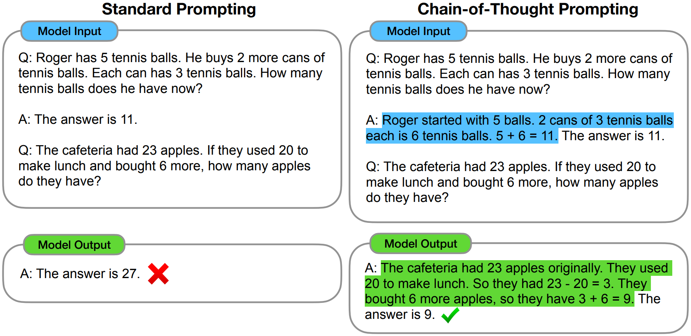

# 一、思维链概述

## 1、背景

- 首先，**Transformer 提出**后，计算资源与大规模语料库不断出现，自然语言处理领域发生了翻天覆地的变化

    局限：传统的全监督学习的范式逐渐达到了瓶颈，很难在传统的训练方式上取得大幅度提升

- 然后，大规模预训练模型(Bert、RoBERTa 等)转向了**预训练模型 + 下游任务 Fine-tune** 的范式

    局限：随着语言模型规模的不断增大，Fine-tune 的成本变得越来越高，对于大规模参数的模型，仅依靠传统 Fine-Tune 已经很难对模型起到有效的迁移，且如此大规模的参数量使得梯度的反向传播的代价也急剧增加

- 接着，**提示学习诞生**，通过改造下游任务、增加专家知识等形式，使目标任务的输入输出更加贴合原始语言模型训练时的数据

    > 2021 年，提示学习经历离散提示学习(提示词的组合)、连续化提示学习(连续空间表示)等阶段，逐步达到高潮

    局限：基于连续空间的提示学习同样存在较多的局限性，比如资源消耗与训练不稳定等多种问题

- 直到 2022 年，大规模语言模型的效果 “肉眼可见” 的变好，同时随着模型规模的不断增大，模型也变得更好“提示”

    局限：大模型在做算术推理、常识推理和符号推理时的表现还不够好，而大模型的 in-context few shot 能力极强，但创建很多的中间步骤用来做监督 finetune 非常耗时，而且传统的 prompt 方式在数学计算、常识推理等做的又不好

- 最后，**思维链诞生**，结合 in-context few shot 和中间步骤来改善算术推理、常识推理和符号推理等能力 

## 2、定义

> 论文来源：`Chain-of-Thought Prompting Elicits Reasoning in Large Language Models`

**思维链 (Chain-of-thought，CoT)**：

- 定义：是一种**改进的提示策略**，用于提高 LLM 在复杂推理任务中的性能，如算术推理、常识推理和符号推理
- 实现：CoT 没有像 ICL 那样简单地用输入输出对构建提示，而是**结合中间推理步骤，将最终输出引入提示** 

> 思维链提示给出了正确答案，而直接给出答案的传统提示学习，结果是错的：

可以看到，类似的算术题，思维链提示会在给出答案之前，还会自动给出推理步骤：

- “罗杰先有 5 个球，2 罐 3 个网球等于 6 个，5 + 6 = 11”
- “食堂原来有 23 个苹果，用 20 个做午餐，23-20=3；又买了 6 个苹果，3+6=9”

---

总结：**语言模型很难将所有的语义直接转化为一个方程，但可以通过中间步骤，来更好地推理问题的每个部分** 

## 3、思维链特点

- **逻辑性**：思维链中的每个思考步骤都应该是有逻辑关系的，应该相互连接，从而形成一个完整的思考过程
- **全面性**：思维链应该尽可能地全面和细致地考虑问题，以确保不会忽略任何可能的因素和影响
- **可行性**：思维链中的每个思考步骤都应该是可行的，即应该可以被实际操作和实施
- **可验证性**：思维链中的每个思考步骤都应该可以验证，即应该可以通过实际的数据和事实来验证其正确性和有效性

# 二、思维链用于 In-context learning

## 1、Few-shot CoT

Few-shot CoT：是 ICL 的特殊情况，**通过融合 CoT 推理步骤，将每个演示〈input，output〉扩充为〈input，CoT，output〉**

> 与 ICL 中的标准提示相比，演示的顺序似乎影响相对较小：在大多数任务中，重新排序演示只会导致小于 2% 的性能变化

- **CoT prompt 的设计**：

    - 特点：

        - 使用不同的 CoT（即每个问题的多个推理路径）可以有效地提高性能
        - 具有更复杂推理路径的提示可以导致生成正确答案的准确性更高

    - 局限：这两种方法都依赖于带标注的 CoT 数据集，限制了在实践中的应用

    - 优化：利用 Zero-shot-CoT，通过专门提示 LLM 来生成 CoT 推理路径，从而消除手动操作

        > 进一步：将训练集中的问题划分为不同的聚类，然后选择最接近每个聚类中心的问题

- **增强的 CoT 策略**：除了丰富上下文信息外，CoT 提示还提供更多选项来推断给定问题的答案

    - 主要研究方向：在生成多条推理路径，并试图在得出的答案中找到共识

        > 例如，在生成 CoT 和最终答案时，提出了 `self-consistency` 作为一种新的解码策略：首先生成几个推理路径，然后对所有答案进行综合（例如，通过在这些路径中投票来选择最一致的答案）

## 2、Zero-shot CoT

Zero-shot CoT：**在 prompt 中不包括人工标注的任务演示**

- **特点**：直接生成推理步骤，然后使用生成的 CoT 来导出答案
- **实现**：LLM 首先由 “Let's think step by step” 提示生成推理步骤，然后由 “Therefore, the answer is” 提示得出最终答案
- **发现**：当模型规模超过一定规模时，这种策略会大大提高性能，但对小规模模型无效，显示出显著的涌现能力模式

# 三、总结

## 1、特点

- **CoT 对小模型作用不大，模型参数至少达到 10B 才有效果，达到 100B 效果才明显**

    > 并且，从小模型的输出可以看出，它们大部分是输出了流畅但不合逻辑的 CoT，因此得到错误的结果

- **CoT 对复杂的问题的性能增益更大**

    > 例如 GSM8K（更难，因为基线最低）上 GPT-3 和 PaLM 的性能增加了一倍多
    >
    > 而对于 MAWPS-SingleOp（更简单的任务），性能改进非常小甚至是负面的

- **加上 CoT 的 PaLM 540B 超过了任务特定的用监督学习训练的模型的最优结果**

    > 不加 CoT 的话 GSM8K 和 MAWPS 任务上 LLM 的结果比不过最优的监督学习模型

## 2、好处

> 在大型语言模型中，思维链可以用来引出推理

思路链方法带来以下好处：

- CoT 允许模型**将多步推理问题分解为中间步骤**，这意味着额外的计算可以分配到需要推理的复杂问题上
- CoT 使大语言模型更具可解释性，更加可信，并**提供了调试推理路径错误的机会**
- CoT 推理**能够被用于数学应用题、常识推理和符号操作等任务**，并且可能适用任何人类需要通过语言解决的问题
- CoT 可以**通过将其加入到 few-shot prompting 示例中，从而在足够大的语言模型中引导出推理能力**

## 3、局限性

当前的思维链也存在着许多局限性：

- 首先，尽管设计的思维链是在模拟人类的推理过程，但模型是否真正的学会了推理仍需进一步进行验证
- 人工设计思维链仍然是代价过大，大规模的人工标注思维链是不可行的
- 思维链只在大规模模型上有效（10B 以上）

## 4、对思维链的思考

- **什么时候 CoT 对 LLMs 有用**：

    - 由于 CoT 是一种涌现能力，只对足够大的模型（例如，通常包含 10B 或更多的参数）有积极影响，但对小模型没有影响

    - 由于 CoT 通过中间推理步骤增强了标准提示，因此有效地改进了需要逐步推理的任务，如算术推理、常识推理和符号推理

        > 对于不依赖于复杂推理的其他任务，可能显示出比标准提示更差的性能，例如 GLUE 的 MNLI-m/mm、SST-2 和 QQP

- **为什么 LLMs 可以执行 CoT 推理**：CoT 提示为诱导 LLM 的推理能力提供了一种通用而灵活的方法

- **CoT 应用方向的研究**：

    - 尝试将该技术扩展到解决多模态任务和多语言任务

    - 研究如何将 LLM 的能力专门化到特定任务，这被称为模型专门化

        > 例如，研究人员通过微调 LLM 生成的 CoT 推理路径上的小规模 Flan-T5，专门研究 LLM 的数学推理能力
        >
        > 模型专业化也可用于解决各种任务，如问答、代码合成和信息检索

## 5、关键知识点

1. 有效的思维链应具备的特点是：逻辑性、全面性、可行性
2. 思维链只能在大语言模型中起作用
3. Few-shot CoT是ICL的一种特殊情况
4. Zero-shot CoT在prompt中不包括人工标注的任务演示
5. CoT使大语言模型更具可解释性，更加可信
