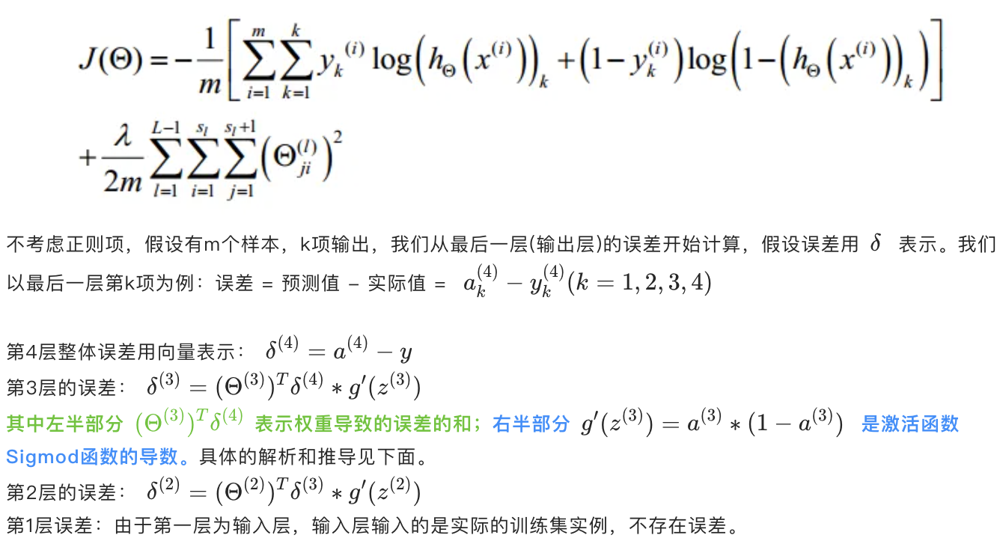
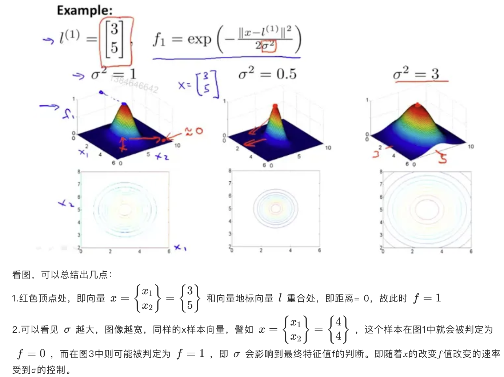

> 完整知识推荐：https://www.huaxiaozhuan.com/
>
> 吴恩达机器学习&深度学习推荐：https://www.yuque.com/zhaoluyang/igcyav

# 核心点

可参看：https://www.yuque.com/zhaoluyang/igcyav

- 机器学习：
    - 线性回归&逻辑回归
    - 假设函数、损失函数、梯度下降、特征缩放
    - 学习率、过拟合&欠拟合、正则化
    - 神经元、神经网络、前向传播、反向传播
    - 无监督学习：聚类、降维
    - 随机梯度下降
- 深度学习：
    - 激活函数：sigmod、tanh、ReLu
    - 参数、超参数、神经网络正则化
    - 梯度消失/梯度爆炸、梯度的数值逼近、反向传播的梯度校验

# 一、机器学习

## 1、 单变量线性回归和损失函数、梯度下降的概念

### 1.1 回归 Regression

> 回归问题的预测值范围比较自由，可以是连续的，且可取任意实数

**房价和面积—预测**：给定一组房价和房屋面积的数据集，通过机器学习算法(监督学习)来拟合画出一条线，根据这条线来对未知的数据进行判断

假设机器通过这些房价数据学习得到一条房价—面积关系线，如上图中红线，那么如果你朋友的750英尺的房子，就可以通过这条红线来估算出房价，可以看出大约是在150K美金左右

---

这是一个典型的回归问题(**Regression**)，因为结果(房价)可以是任意实数，且数据是可以连续的

> 更进一步，由于变量1个—房屋尺寸，且预测结果(房价)和变量间的表达式可以用线性方程描述y = k*x + b
>
> 所以，此问题在机器学习中的术语叫做：**单变量线性回归** **Linear Regression with One Variable**

### 1.2 分类Classification

分类问题很好理解，机器预测值只有固定的几个类别

- 课程中为两种：0良性肿瘤 1 恶性肿瘤，所以称为**二分类**
- 除了二分类以外，其他的统称**多分类**

---

**乳腺癌良性/恶性和尺寸关系**：给定一组数据，乳腺癌肿瘤尺寸大小 和 癌症恶性/良性关系，通过机器学习，来预测一个给定肿瘤尺寸大小的患者，疾病是恶性还是良性的概率

---

这个问题和之前的房价问题有些区别，虽然同样的，变量只有一个，即x轴上的尺寸大小，但是y轴的结果却只有两种：0和1，0表示肿瘤分类为良性；1表示分类为恶性

所以，这是一个典型的**分类问题**（Classification）由于这里结果只有两种，所以此分类问题为二元分类问题

### 1.3 有/无监督监督学习 (Un)supervised Learning

- **监督学习**：给定了数据集且数据是规则明确的、有标签的，可以理解为结构化的、存储在数据库中的数据，喂给机器学习的情况

    > 类型：回归、分类

- **无监督学习**：给出的数据集没有明确标签或者非结构化，那么这类数据的机器学习，就叫做无监督学习

    > 类型：聚类(对应分类)

- **半监督学习**：训练数据一部分有标签，另一部分没有标签，而没标签数据的数量大于有标签数据数量

    > 半监督学习的基本规律：数据的分布必然不是完全随机的，通过一些有标签数据的局部特征，以及更多没标签数据的整体分布，就可以得到可以接受甚至是非常好的分类结果
    >
    > 类型：半监督聚类

### 1.4 假设 hypothesis 与误差

- **假设：通过假设函数，我们可以对数据集以外的样本做预测**

---

以上面的“**房价和面积—预测**”为例：

- 输入是房屋尺寸大小，因此根据输入的房屋面积值 x 来得到此防房屋估价y

- 定义：`h`—hypothesis(假设)代表学习算法的解决方案或函数，`h` 是一个从 x 到 y 的映射

    于是单变量线性回归，映射关系可以简单表示为：
    $$
    h_\theta(x) = \theta_0 + \theta_1x
    $$
    
- 如果假设函数是：$h_\theta(x) = 1 / 4x$，一套面积为500(英尺)的房子，其房价预估在125K(12.5万)美金

---

- **误差**：如果那套500英尺的房子，售价为100K，预测值125和真实值之间差距为25K，这里25K就被称为建模误差

### 1.5 损失函数 loss Function

**代价函数/损失函数**：用于评估误差水平的函数，常见的损失函数有：

- **平方损失函数**：多用于回归问题
- **交叉熵损失函数**：多用于分类问题

理论上，给定一批“房屋面积—价格”数据点，可以根据这批数据画出无数条假设函数 $h_\theta(x)$直线用于模拟房价和面积之间的关系

那么怎么找到最优的那条线？这时会用到代价函数，好的代价函数必然使得数据集总体的误差最小

---

案例：假设有三个样本点 `(1, 1)、(2, 2)、(3, 3)`，怎么确定一个假设函数 `h`，使得这条线能最优化地拟合所有数据，能更精确地预测下一个位置样本点的数据

此时就需要用到**代价函数**，可以用回归问题通用的**平方损失函数/平方代价函数**，评估假设函数的误差水平

图中的代价函数如下：
$$
J(\theta_0, \theta_1) = \frac{1}{2m}\sum^m_{i=1}(h_\theta(x^{(i)}) - y^{(i)})^2
$$
直白点意思：求每个样本点 `i` 的误差的平方，累加求平均值

> 关于最后为什么是 `1/2m` 而不是 1/m，这个其实主要是通用的约定，为了求导方便

---

**损失函数的意义**：通过求损失函数的值，可以评估预测函数的准确性，损失越小，则模型的预测越精准

> 训练模型很多时候就是降低损失，找到损失函数的最小值，通过其最小值来产出最优的假设函数

### 1.6 二元函数梯度下降Gradient Descent

#### (1) 概述

- **目标**：找到损失函数 $J(\theta_0, \theta_1)$ 的最小值，即最小的点

- 批量梯度下降算法的公式为：
    $$
    \theta_j := \theta_j - \alpha\frac{\upsilon}{\upsilon\theta_j}J(\theta_0, \theta_1)
    $$
    参数解释：

    

---

#### (2) 学习率

批量梯度下降公式中， $\alpha$ 为学习率，其决定了沿着能让代价函数下降程度最大的方向向下迈出的步子有多大

> 在批量梯度下降中，每一次都同时让所有的参数减去学习速率乘以代价函数的导数

- **学习率过小**：需要很多步才能到达全局最低点
- **学习率过大**：可能会越过最低点，甚至可能无法收敛，甚至发散

### 1.7 梯度下降的线性回归

## 2、多变量线性回归和特征缩放、学习率

### 2.1 多变量线性回归

- **单变量线性回归**：只有一个变量的机器学习问题

- **多变量线性回归**：变量数量大于 1的机器学习问题，其**假设函数为**

    > 其中，特征矩阵 $X$ 的维度是 $m * (n + 1)$，$T$ 代表特征矩阵的转置

    $$
    h_\theta(x) = \theta_0x_0 + \theta_1x_1 + ... + \theta_nx_n \\
    \Downarrow \\
    h_\theta(x) = \theta^TX
    $$

- **多变量损失函数**：
    $$
    J(\theta_0, \theta_1, ...,\theta_n) = \frac{1}{2m}\sum^m_{i=1}(h_\theta(x^{(i)}) - y^{(i)})^2
    $$
    
- **多变量梯度下降**：
    $$
    \theta_j := \theta_j - \alpha\frac{\upsilon}{\upsilon\theta_j}J(\theta_0, \theta_1,...,\theta_n) \\
    \Downarrow \\
    \theta_j := \theta_j - \alpha\frac{\upsilon}{\upsilon\theta_j}\frac{1}{2m}\sum^m_{i=1}(h_\theta(x^{(i)}) - y^{(i)})^2 \\
    \Downarrow \\
    \theta_j := \theta_j - \alpha\frac{1}{m}\sum^m_{i=1}(h_\theta(x^{(i)} - y^{(i)})x^{(i)}_j)
    $$

    > 开始随机选择一系列参数值，计算所有预测结果，再给所有参数一个新的值，如此循环直到收敛，即损失函数局部最小值

### 2.2 特征缩放

**以“房子”为例**，多变量线性回归模型中，房价不仅取决于房屋面积，还取决于房屋数量

以这两个特征绘制的等高线图如下：

---

**特征缩放**：通过一种手段来将这些特征的尺度都缩小到合适的范围

假设：对x1特征除以2000，对x2特征除以5，使得特征值范围属于0~1

### 2.3 学习率

梯度下降算法收敛所需要的迭代次数根据模型的不同而不同，无法提前预知，但可以绘制迭代次数和代价函数的图表来观测算法在何时趋于收敛

> 横轴为迭代次数、纵轴为损失函数值 loss

可以看见：

- 在训练刚开始，单位迭代次数下，loss 下降的最快
- 随着迭代次数增加，loss 下降的越来越慢，直至近乎停止，趋于收敛

> 通常可以考虑尝试这些学习率: `𝛼 = 0.01，0.03，0.1，0.3，1，3，10 `

## 3、逻辑回归和过拟合、正则化

### 3.1 逻辑回归

- **逻辑回归算法：是一种分类算法**，适用于标签 𝑦 取值离散的情况

    > 为什么不用线性回归来解决分类问题：因为分类问题的 y 取值是离散的，如果同样用线性回归y = k * x + b来表示，x为肿瘤尺寸，则得出的 y 范围可能远 > 1，但结果总会落到 0 和 1 上，会显得很奇怪

- **假设函数归一化**：可以用**Sigmoid函数，来实现在R区间的输入，得到0~1之间的输出**

    > **Sigmoid函数：**
    > $$
    > g(z) = \frac{1}{1 + e^{-z}}
    > $$
    >  函数图像如下：
    >
    > 
    >
    > 经过**Sigmoid改良后的假设函数如下：**
    > $$
    > h_\theta(x) = g(\theta^TX) = \frac{1}{1 + e^{-\theta^TX}}
    > $$
    > 

- **损失函数**：对于逻辑回归，要使用**用交叉熵损失函数**，不能用平方差损失函数

- > 交叉熵损失函数公式：
    > $$
    > J(\theta) = \frac{1}{m}\sum^m_{i=1}Loss(h_\theta(x^{(i)}) - y^{(i)}) 
    > = -\frac{1}{m}\sum^m_{i=1}[y^{(i)} * log(h_{\theta}(x^{(i)})) + (1 - y^{(i)}) * log(1 - h_{\theta}(x^{(i)}))]
    > $$
    > 图像如下：
    >
    > 

- **梯度下降**：并不是唯一的算法

    > 公式如下：
    > $$
    > \theta_j := \theta_j - \alpha\frac{\upsilon}{\upsilon\theta_j}J(\theta) \\
    > \Downarrow \\
    > \theta_j := \theta_j - \alpha\frac{1}{m}\sum^m_{i=1}(h_\theta(x^{(i)} - y^{(i)})x^{(i)}_j)
    > $$
    > 额外说明：
    >
    > - **线性回归的假设函数**：
    >     $$
    >     h_\theta(x) = \theta^TX = \theta_0x_0 + \theta_1x_1 + ... + \theta_nx_n
    >     $$
    >
    > - **逻辑回归的假设函数**：
    >     $$
    >     h_\theta(x) = g(\theta^TX) = \frac{1}{1 + e^{-\theta^TX}}
    >     $$
    >
    > 除了梯度下降算法以外，还有一些常被用来令代价函数最小的算法，这些算法有： 
    >
    > > 这些算法更加复杂和优越，而且通常不需要人工选择学习率，通常比梯度下降算法要更加快速
    >
    > - 共轭梯度（Conjugate Gradient）
    > - 局部优化法(Broyden fletcher goldfarb shann,BFGS)
    > - 有限内存局部优化法(LBFGS)

- **特征缩放的方法，也适用于逻辑回归** 

### 3.2 过拟合

- **过拟合**：意味着模型训练过程中，对训练集的模拟和学习过度贴合

    > 过拟合的影响：模型训练时的检测率很高效果很好，但是用于实际检验时，效果很差，模型不能很准确地预测

- **欠拟合**：指模型和数据集间的拟合程度不够，学习不足

    > 欠拟合的影响：模型和数据集间的拟合程度不够，可能是学习轮数不够、数据集特征不规则、模型选择有问题等

- **泛化能力**：指一个机器学习算法对于没有见过的样本的识别能力，泛化能力自然是越高越好

---

分类问题和回归问题中都可能存在过拟合的问题，见下图：

---

**解决“过拟合/欠拟合”**：

- **丢弃一些不能帮助正确预测的特征**：可以是手工选择保留哪些特征，或者使用一些模型选择的算法来帮忙

- **正则化**：保留所有的特征，但是减少参数的大小

### 3.3 正则化

- **正则化过程**：

    > 以上图中的过拟合场景分析：
    >
    > 假设函数：$h_\theta(x) = \theta^TX = \theta_0x_0 + \theta_1x_1 + ... + \theta_nx_n$ 
    >
    > 损失函数：$J(\theta) = \frac{1}{2m}\sum^m_{i=1}(h_\theta(x^{(i)}) - y^{(i)})^2$
    >
    > 梯度下降：$\theta_j := \theta_j := \theta_j - \alpha\frac{\upsilon}{\upsilon\theta_j}J(\theta) := \theta_j - \alpha\frac{1}{m}\sum^m_{i=1}(h_\theta(x^{(i)} - y^{(i)})x^{(i)}_j)$
    >
    > - **原因**：高次项导致了过拟合的产生，所以降低高次项的系数，就能降低过拟合程度
    >
    > - **方法**：不能直接修改模型中的参数大小，而通过修改损失函数中的参数大小来实现“曲线救国”
    >
    > - **解决方案**：每次迭代中，为了使迭代后的参数 $\theta$ 变更小，需要使.$-\alpha\frac{\upsilon}{\upsilon\theta_j}J(\theta)$ 尽可能大，而学习率固定，所以只能想办法让倒数项尽可能大
    >
    >     可以对损失/代价函数做一波修改：$min_{\theta} \frac{1}{2m}[\sum^m_{i=1}(h_\theta(x^{(i)}) - y^{(i)})^2 + 1000\theta^2_3 + 10000\theta^2_4]$ 
    >
    >     对于参数 $\theta_3$ 和 $\theta_4$，因为有系数的存在，每次求导都会让其降低的更多更快，而且不会影响其他参数项的下降，从而达到比较理想的效果

- **一般表示**：

    > 如果有 $\theta_1, \theta_2...\theta_n$ 总计 n 个参数，通常会对所有的参数进行惩罚，并设置**正则化参数 $\lambda$**
    >
    > 这样的结果是得到了一个较为简单的能防止过拟合问题的假设函数：
    > $$
    > J(\theta) = \frac{1}{2m}[\sum^m_{i=1}(h_\theta(x^{(i)}) - y^{(i)})^2 + \lambda\sum^n_{j=1}\theta^2_j]
    > $$
    > 经过正则化处理后的模型与原模型对比图如下：
    >
    > 
    >
    > - 如果正则化系数 $\lambda$ 过小，将会导致效果不好，模型的拟合度依旧很高
    > - 如果正则化系数 $\lambda$ 过大，则会将除了 $\theta_0$ 以外的所有系数都惩罚殆尽，导致假设函数近似 $h_{\theta} = \theta_0$，即变成图中的红线

- **正则化线性回归**：

    > 

- **正则化逻辑回归**：

    > 

## 4、神经元、神经网络和前向传播算法

### 4.1 神经元

- **神经元**：可以被认为是一个处理单元/神经核，其含有许多输入/树突，并且有一个输出/轴突

- **神经元之间信号的传递**：

    - 神经元之间通过电信号进行沟通(微弱的电流)

        > 所以如果神经元想要传递一个消息，就会就通过轴突发送一段微弱电流给其他神经元的树突

    - 接收到信号的神经元会对消息进行处理，处理后可能会通过自己的轴突再将信息传递出去给其他神经元

- **神经网络**：大量神经元相互链接并通过电脉冲来交流的一个网络

### 4.2 神经网络

> 神经网络是模仿大脑神经元建立的模型，模型中的每个神经元都是一个单独的【学习模型】，这些神经元也叫做**激活单元**

- **Sigmod 神经元**：

    > 以下示例为逻辑回归模型中常用的，sigmoid 神经元的简单示例：
    >
    > 
    >
    > 中间的神经元(激活单元)是一个 sigmoid 函数，将输入的 $x_1, x_2, x_3$ 和参数 $\theta$ 相乘后作为输入，经过计算得到结果 $h_{\theta}(x)$
    >
    > 在神经网络中，参数又可被成为**权重**

- **三层神经网络和前向传播算法**：

    > 在 Sigmod 神经元的基础上，可以设计出一个简单的三层神经网络：
    >
    > 
    >
    > - $x_1, x_2, x_3$  作为神经网络的第一层，称为**输入层**，其每个节点即输入单元，每个输入单元包含着原始的输入值
    >
    > - $a_1, a_2, a_3$ 作为神经网络的第二层，称为**中间层/隐藏层**，其作用是：负责将数据进行处理，然后呈递到下一层
    > - 最后一层被称为**输出层** 
    >
    > ---
    >
    > - 神经网络模型中，通常只有一个输入层和一个输出层，中间层/隐藏层可以有任意多个
    >
    > - 所有层加起来构成了整个神经网络模型，每一层的输出变量都是下一层的输入变量
    >
    > ---
    >
    > 对于上述模型，给每一层添加**偏差单位**后，图像如下：
    >
    > 
    >
    > **中间层激活单元的表达式**：$(a_0^{(2)} = a_0^{(2)})$
    >
    > 
    >
    > - $a_i^{(j)}$ 代表第 `i` 层的第 `j` 个激活单元；
    >
    > - $\theta_{mn}^{(j)}$ 右上角 `j` 代表是从第 `j` 层映射到第` j + 1` 层时权重的矩阵；右下角 `mn` 代表该参数在 $\theta$ 矩阵中的位置
    >
    >     > 其中，$\theta$ 矩阵的形态 `m = 第 j + 1层激活单元数`，`n =  第 j 层激活单元数 + 1`
    >
    > **输出层表达式**：
    > $$
    > h_{\theta}(x) = g(\theta_{10}^{(2)}a_0^{(2)} + \theta_{11}^{(2)}a_1^{(2)} + \theta_{12}^{(2)}a_2^{(2)} + \theta_{13}^{(2)}a_3^{(2)})
    > $$
    > **总表达式：**把 $x, \theta, \alpha$ 分别用矩阵表示，可以得到 
    > $$
    > X\theta = \alpha
    > $$
    > **前向传播算法**：从左至右逐级依赖的算法模型，即每个 $a_i$ 都依赖上层的 $x$ 以及 $x$ 对应的参数 $\theta$ 

- 神经网络的优势：**神经网络能够通过学习得出其自身的一系列特征**

    > - 在普通的逻辑回归中，使用数据中的原始特征 $x_1,x_2,...,x_n$，虽然可以使用一些二项式项来组合这些特征，但是仍然受到这些原始特征的限制
    > - 在神经网络中，原始特征只是输入层，比如上面三层的神经网络，第三层的输出层做出的预测利用的是第二层的特征，而非输入层中的原始特征，即第二层中的特征是神经网络通过学习后自己得出的一系列用于预测输出变量的新特征

## 5、神经网络、反向传播算法和随机初始化

### 5.1 神经网络的损失函数

- 神经网络模型与逻辑回归模型的损失函数区别：

    > **损失函数的核心**：求m个样本点的总误差，然后除以m，得到平均误差，即平均损失

    - 正则化的逻辑回归模型：

        - 损失函数：

            

        - 梯度下降算法：

            

    - **神经网络模型**：将每个样本点的 k 类的交叉熵损失相加求期望，然后再正则化

        

---

**神经网络模型损失函数的推导过程**：

- 基本定义：
    - $L$：神经网络模型的总层数
    - $s_1$：$l$ 激活单元(神经元)个数
    - $K$：分类类别数
        - `k = 2`：输出层只需要一个激活单元即可，$s_1=1$
        - `k >= 3`：输出层需要 k 个激活单元，$s_l = k$

- 神经网络模型例子：

    > 这是一个包含 m 个样本点，L = 4, k = 4 的神经网络分类模型，第1~4 层的激活单元数分别为：3，5，5，4 

    

- 每一layer的矩阵运算，重点看θ矩阵：

    

- 损失函数后半部分的正则化项：

- > 说明：
    >
    > - $\sum_{j=1}^{sl+1}$ 遍历每一层，$\sum_{i=1}^{sl}$ 遍历每一列，$\sum_{l=1}^{L-1}$ 遍历每一层 Layer
    > - `i` 为什么从 1 开始：因为和逻辑回归一样，神经网络模型中的正则化项也是从 $\theta_0$ 开始，故从 `i = 1` 开始是为了去除 $\theta_0$

  

  ### 5.2 反向传播Backpropagation

- **前向/正向传播回顾**：

- **反向传播的意义**：比正向传播算法更快速更高效地求出代价函数偏导，在实际模型训练过程中，大大降低计算时间，使模型更快收敛

    > 从神经网络模型的最后一层误差开始逐层往前推导，反向传播求误差其实是求模型代价函数偏导 $\frac{\upsilon}{\upsilon\theta_{ij}^{(l)}J(\Theta)}$ 的一种手段
    >
    > 具体的可参考：
    >
    > - https://zhuanlan.zhihu.com/p/25081671
    > - https://zhuanlan.zhihu.com/p/21407711

- **反向传播误差公式推导**：

    - 沿用上图的神经网络模型，计算代价函数偏导：

        

    - **误差公式解析**：

        

    - **误差公式推导**：

        

- **反向传播算法**：

    - **偏导公式**：上面得出了每一层的误差，通过公式推导可以将代价函数的偏导用这些误差表示，不考虑正则化项，即 $\lambda=0$ 

        可以得到代价函数的偏导：
        $$
        \frac{\upsilon}{\upsilon\theta_{ij}^{(l)}}J(\Theta) = a_j^{(l)}\delta_i^{(l+1)}
        $$

        - $l$ 表示的是神经网络层数
        - $j$ 表示在当前层下，激活单元的下标
        - $i$ 代表下一层中误差单元的下标，是受到权重矩阵中第 $i$ 行影响的下一层中的误差单元的下标

        获取了所有误差以后，通过这个偏导公式，可以计算出每一个激活单元的偏导

        > 具体推导过程可参看：https://zhuanlan.zhihu.com/p/58068618

    - **算法公式**：

        

    - 进一步理解：

        

### 5.3 梯度检验

- **背景**：当对一个较为复杂的模型（例如神经网络）使用梯度下降算法时，可能会存在一些不容易察觉的错误，即虽然代价看上去在不断减小，但最终的结果可能并不是最优解
- **梯度的数值检验**：通过估计梯度值来检验计算的导数值是否真的是要求的
- **梯度估计采用的方法**：在代价函数上沿着切线的方向选择离两个非常近的点，然后计算两个点的平均值用以估计梯度

### 5.4 使用神经网络的步骤总结

- 第一步：**选择网络结构**，即决定选择多少层以及决定每层分别有多少个单元

    - 第一层的单元数，即训练集的特征数量；最后一层的单元数，训练集的结果类的数量

    - 如果隐藏层数大于 1，确保每个隐藏层的单元个数相同，通常情况下隐藏层单元的个数越多越好

    > **真正要决定的是隐藏层的层数和每个中间层的单元数**

- 第二步：**训练神经网络** 

    - 参数的随机初始化
    - 利用正向传播方法计算所有的 $h_\theta(x)$
    - 编写计算损失函数 $J(\theta)$ 的代码
    - 利用反向传播方法计算所有偏导数
    - 利用数值检验方法检验这些偏导数
    - 使用优化算法来最小化代价函数

## 6、应用机器学习的建议

> 改进算法可以采取的主要手段：数据集、特征、多项式特征、正则化项

### 6.1 评估假设函数

- **不能仅仅通过模型训练时的损失来判断一个假设函数是好是坏**，因为存在过拟合的可能，如图所示：

    

- 过拟合时，模型对训练数据能完美预测和拟合，但是对于新给定的数据则效果很差

- 应对方法：将数据分为训练集和测试集，用测试集来评估假设函数的拟合程度和模型的效果，通常用 70%的数据作为训练集，用剩下 30%的数据作为测试集

    > 说明：训练集和测试集均要含有各种类型的数据， 通常要对数据进行“洗牌”， 然后再分成训练集和测试集

- 测试集评估在通过训练集让我们的模型学习得出其参数后，对测试集运用该模型，有两种方式计算误差：

    1. **对于线性回归模型，利用测试集数据计算损失函数**
    2. 对于**逻辑回归模型**，不仅可以**利用测试集数据计算其损失函数**，还可以**计算其错误划分的损失，即误分类损失**

### 6.2 模型选择和交叉验证

**交叉验证集**：使用 60% 的数据作为训练集，使用 20% 的数据作为交叉验证集，使用 20% 的数据作为测试集

引入了交叉验证集后，这三组数据可以分别计算出**训练损失、交叉验证损失、测试损失**：

引入了交叉验证集后，流程也发生了改变：

1. 训练集训练模型得到参数矩阵 $\Theta^{(1)},\Theta^{(2)},...,\Theta^{(n)}$

2. 用交叉验证集计算交叉验证集的损失 $J(\theta)$

3. 挑选最小的模型来用测试集测试，评估其泛化能力，计算验证集的损失 $J(\theta)$ 

---

假设，采用新方式后，用交叉验证集合测试得到损失最小的模型是式子 4，用测试集的数据计算其损失 $J_{test}(\theta^{(4)})$

### 6.3 诊断和偏差、方差

运行学习算法时，如果这个算法的表现不理想，那么多半是出现两种情况：

- 要么是**偏差/误差比较大，即欠拟合** 

    > 误差即指数据集中，数据和模型计算出的估计值之间的差值

- 要么是**方差比较大，即过拟合** 

    > 方差即描述样本和平均值之间的偏离程度

- 图中左边的模型对数据拟合不够，导致高偏差；
- 右边的对数据拟合过度，虽然偏差较低但对新数据的预测能力差，泛化能力不够，导致高方差
- 中间的模型是比较适中的

---

**损失和多项式维度d之间的关系**：

上图展示了模型训练集、交叉验证集/测试集跑出的损失和多项式维度d之间的关系

- 粉线表明：在训练集中 d 越高，损失越小，拟合程度越高(但不代表模型足够好，反而其泛化能力差)

- 红线表明：在测试集/交叉验证集跑出来的模型上，损失有个先下降后上升的过程，在d = 2处取到最优

    > 最开始其损失高，是因为模型欠拟合，高偏差，最后其损失高是因为模型过拟合，高方差

### 6.4 正则化和偏差、方差

> 在训练模型的过程中，一般会使用一些正则化方法来防止过拟合
>
> 但可能会正则化的程度太高或太小， 即在选择 $\lambda$ 的值时也需要思考与刚才选择多项式模型次数类似的问题

---

**选择 $\lambda$**：想要测试的 λ 通常是 0-10 之间的呈现 2 倍关系的值

- 同样把数据分为训练集、交叉验证集和测试集：

    

- 然后，计算这12组模型的参数矩阵 $\theta$，通过交叉验证集来计算交叉验证损失，取最小的模型 5 来做最后的测试，测试集的损失即为 $J_{text}(\theta^{(5)})$ 

    对于同一个模型，正则化参数 $\lambda$ 和损失的关系图如下：

    - 对于训练集，λ = 0 时的损失是最小的，随着 λ 增大，整个损失越来越大；
    - 对于交叉验证集/测试集，损失随着 λ 增加，先减小后增加

    

### 6.5 学习曲线

**学习曲线**：是将训练集误差和交叉验证集误差作为训练集实例数量(m)的函数绘制的图表，可以用其判断模型是否处于高方差、高偏差状态，从而改进模型

---

- 训练集和交叉验证集的损失函数，此时暂时不考虑正则化项：

    

- 假设函数：$h_{\theta}(x) = \theta_0 + \theta_1x + \theta_1x^2$ 

---

假设m = 100，则学习曲线是从m = 1时的模型损失坐标开始绘制到m = 100时的模型损失曲线：

- **正常学习曲线**：蓝色部分是训练集的学习曲线，粉色部分是交叉验证集的学习曲线

    - 对于训练集，m 很小时，往往假设函数能较好地模拟，使得损失很低，随着 m 增加，损失会逐渐上升直到一定范围
    - 对于交叉验证集，m 很小时，模型往往泛化能力较差，故对于新的数据，不能很好拟合，损失较大，随着m上升，模型趋于稳定，此时交叉验证集的数据往往也能较好预测了，损失降低，最终趋于收敛(最终往往大于训练集的损失)

    

- **高偏差学习曲线**：高偏差时，即欠拟合，对数据不能较好预测，故在一定范围内 m 越大误差越大，且最后收敛到一个较高的水平

    > 启发：增大训练集 m 的尺寸对于降低模型在交叉验证集上的损失没有任何帮助

    

- **高方差学习曲线**：高方差时，即过拟合，交叉验证集和训练集的损失变化较为平缓，且中间有较大的距离，这意味着增加 m 对于模型在交叉验证集上降低损失有较好效果

    > 启发：增加 m 数量会减轻模型过拟合程度，从而使预测未知数据能力变好，反映在交叉验证集上的表现，即损失降低

    

### 6.6 总结

1. **获得更多的训练实例——解决高方差**

2. **尝试减少特征的数量——解决高方差**
3. **尝试增加正则化程度 λ——解决高方差**

3. **尝试获得更多的特征——解决高偏差**

4. **尝试增加多项式特征——解决高偏差**

5. **尝试减少正则化程度 λ——解决高偏差**

**神经网络的方差和偏差**：通常选择较大的神经网络并采用正则化处理会比采用较小的神经网络效果要好

- 使用较小的神经网络，类似于参数较少的情况，容易导致高偏差和欠拟合，但计算代价较小
- 使用较大的神经网络，类似于参数较多的情况，容易导致高方差和过拟合，虽然计算代价比较大，但是可以通过正则化手段来调整而更加适应数据

> 对于神经网络中的隐藏层的层数的选择，通常从一层开始逐渐增加层数，为了更好地作选择，可以把数据分为训练集、交叉验证集和测试集，针对不同隐藏层层数的神经网络训练神经网络， 然后选择交叉验证集代价最小的神经网络

## 7、支持向量机SVM和核函数

**支持向量机(SVM)**：在分类问题中，与线性的逻辑回归和非线性的神经网络相比，支持向量机在学习复杂的非线性方程时提供了一种更为清晰，更加强大的方式

> 相比深度神经网络，支持向量机特别擅长于特征维数多于样本数的情况，而小样本学习至今仍是深度学习的一大难题

可参看：

- 概念定义：https://www.zhihu.com/question/21094489/answer/190046611
- 详细理解：https://zhuanlan.zhihu.com/p/40857202
- 公式推导：https://zhuanlan.zhihu.com/p/31652569

### 7.1 从逻辑回归到SVM

#### (1) 假设函数

- **逻辑回归假设函数**：
    $$
    h_\theta(x) = g(\theta^TX) = \frac{1}{1 + e^{-\theta^TX}}
    $$
    

- 支持向量机的数学定义：可结合后面的损失函数来看

    > 支持向量机的定义类似损失函数，不过比损失函数更进一步，因为其要求 min 将损失最小化

    $$
    minC * \sum_{i=1}^m[y^{(i)}cost_1(\theta^Tx^{(i)}) + (1-y^{(i)})cost_0(\theta^Tx^{(i)})] + \frac{1}{2}\sum_{i=1}^n\theta^2_j
    $$

- 支持向量机的假设函数：

    > 这里的假设函数直接输出的是值0或1，而不是逻辑回归中的概率值

    $$
    h_{\theta}(x) = \begin{cases}
    1,\quad (\theta^Tx >= 0) \\[2ex]
    0, \quad (Other)
    \end{cases}
    \tag{1}
    $$

#### (2) 损失函数

- **逻辑回归的损失函数**：
    $$
    J(\theta) = \frac{1}{m}\sum^m_{i=1}Loss(h_\theta(x^{(i)}) - y^{(i)}) 
    = -\frac{1}{m}\sum^m_{i=1}[y^{(i)} * log(h_{\theta}(x^{(i)})) + (1 - y^{(i)}) * log(1 - h_{\theta}(x^{(i)}))]
    $$

- **逻辑回归正则化后的损失函数**：
    $$
    J(\theta) = \frac{1}{2m}[\sum^m_{i=1}(h_\theta(x^{(i)}) - y^{(i)})^2 + \lambda\sum^n_{j=1}\theta^2_j]=\frac{1}{m}\sum^m_{i=1}[-y^{(i)} * log(h_{\theta}(x^{(i)})) - (1 - y^{(i)}) * log(1 - h_{\theta}(x^{(i)}))] + \frac{\lambda}{2m}\sum^n_{i=1}\theta^2_j
    $$

- **支持向量机的损失函数**：用 $cost_1(z)$ 和 $cost_0(z)$ 替换逻辑回归中的损失函数得到
    $$
    J(\theta) = \frac{1}{m}\sum^m_{i=1}[y^{(i)} cost_1(z) + (1 - y^{(i)}) cost_0(z)] + \frac{\lambda}{2m}\sum^n_{i=1}\theta^2_j \\ 
    = C * \sum^m_{i=1}[y^{(i)} cost_1(\theta^Tx^{(i)}) + (1 - y^{(i)}) cost_0(cost_1(\theta^Tx^{(i)})] + \frac{1}{2}\sum^n_{i=1}\theta^2_j \\
    C = \frac{1}{\lambda}， 去除了 \frac{1}{m}，并不影响 min(J(\theta)) 目标的达成
    $$

    > 有逻辑回归可知，每个训练集样本点的损失：
    > $$
    > Cost(h_{\theta}(x), y) = -y * log(h_{\theta}(x)) - (1 - y) * log(1 - h_{\theta}(x))
    > $$
    >
    > - 当 y = 1时的损失表达式：
    >     $$
    >     -y * log(h_{\theta}(x)) = -1 * log\frac{1}{1 + e^{-\theta^Tx}} = -log\frac{1}{1 + e^{-z}}
    >     $$
    >
    > - 当 y = 0时的损失表达式：
    >     $$
    >     - (1 - y) * log(1 - h_{\theta}(x)) = -log(1 - \frac{1}{1 + e^{(-z)}})
    >     $$
    >
    > 可以画出损失Cost和变量z之间的关系，如下图：
    >
    > - 对于左图，向量机建立如下：以 z = 1为端点，往左画出一条紧紧贴和函数曲线的直线，往右，画出一条平行z轴的直线，2条线交与z = 1这点，这两条直线构成了一个新的界限，命名此函数为 $cost_1(z)$ 
    > - 对于右图，类似地，画出两条线，不过这次以 z = -1 为交点，命名新的函数为 $cost_0(z)$ 
    >
    > 

### 7.2 大间距分类器

> 有时候，人们会将把SVM叫做**大间距分类器** 

#### (1) 直观理解

$$
minC * \sum_{i=1}^m[y^{(i)}cost_1(\theta^Tx^{(i)}) + (1-y^{(i)})cost_0(\theta^Tx^{(i)})] + \frac{1}{2}\sum_{i=1}^n\theta^2_j
$$

目标是最小化这个方程，结合图像说明最小化的过程：

- **参数 C 很大时**：此时最小化方程式的重点放在左半部分，而可以"忽略"右边的 $\frac{1}{2}\sum_{i=1}^n\theta^2_j$ 

    > 所以优化目标主要放在让左边式子为 0 上：
    >
    > - 当样本为正时 `y = 1`，则根据 $cost_1(z)$ 的函数图像，希望 $\theta^Tx >= 1$，因为此时 $y^{(i)}cost_1(\theta^Tx^{(i)}) = 1 * 0 = 0$ 可以使得方程最小化
    > - 当样本为负时 `y = 0`，则根据 $cost_0(z)$ 的函数图像，希望 $\theta^Tx <= -1$，因为此时 $(1-y^{(i)})cost_0(\theta^Tx^{(i)}) = 1 * 0 = 0$ 
    >
    > ---
    >
    > 注意：当 $y = 1 \&\& \theta^Tx >= 0$ 或 $y = 0 \&\& \theta^Tx <= 0$ 即可使模型能将其准确分类
    >
    > **支持向量机里，追求的最优化方程**：会带来一条支持向量机的超平面，在二维方程中，超平面即一条直线，会得到一条直线将样本点分割开来，且这条直线满足 $minC * \sum_{i=1}^m[y^{(i)}cost_1(\theta^Tx^{(i)}) + (1-y^{(i)})cost_0(\theta^Tx^{(i)})] + \frac{1}{2}\sum_{i=1}^n\theta^2_j$，即将这个表达式的值取到最小
    >
    > 
    >
    > 可以划出一条满足支持向量机方程的直线：黑色线，这条划分样本点的线在SVM中也叫**决策边界**。
    >
    > 这条黑线不仅满足数学表达式上的最小属性，从图像上看，黑色线也能满足和样本间的最大距离，这里的最大是指总体最大，这也是支持向量机被称为**大间距分类器(Large margin classifier)**的缘由
    >
    > 说明：决策边界可以划出 n 条，如图中的粉色、绿色、黑色.....但满足最小化方程式的值的边界只有一条，这条边界被称为支持向量机

- **参数 C 较小时**：不仅仅要考虑方程式中左边的项，还需要同步考虑右边 $\frac{1}{2}\sum_{i=1}^n\theta^2_j$ 

    > 案例：
    >
    > - 当C很大时，支持向量机画出了一条决策边界：
    >
    >     
    >
    > - 新增一个样本点(位于图中左下角靠近原点)，为了继续满足支持向量机方程式的定义，决策边界变更，如图中的粉线：
    >
    >     
    >
    > 注意：仅仅由一个样本点导致的决策边界发生大幅改变不明智，此时可以将原本很大的 C 变小，那么这个式子的乘积就会变得较小，对于整个方程式的最小化影响会降低。此时支持向量机的决策边界就会忽略掉一些异常点影响，即决策界还是会保持在黑线上，而不会划出粉线，因为支持向量机要保证的是总体方程式最小化

补充：参数***C = 1/λ\***

- 当C较大时，对应λ较小，即**正则化参数较小**，可能会导致**过拟合**，和支持向量机的**高方差；**
- 当C较小时，对应λ较大，可能导致**欠拟合**(拟合不够)，和支持向量机的**高偏差** 

#### (2) 数学原理

- **向量内积**：

    > 此处以二维向量举例：u、v 都是二维向量，其内积：
    > $$
    > u^Tv = u_1v_1 + u_2v_2 = v^Tu
    > $$
    > 内积的含义：可以用投影和范数(在欧几里得范数中即 = 模长)来表示
    > $$
    > u^Tv = p \cdot	 ||u|| (p \in R)
    > $$
    > 用文字表示含义：**u 和 v 的内积 = 向量 v 在向量 u 上的投影乘以向量 u 的范数(反之亦然)**
    >
    > 

- **SVM 的数学原理**：

    > 当 C 为 0 时，支持向量机的方程为：
    > $$
    > min_{\theta}\frac{1}{2}\sum_{j=1}^n\theta_j^2 \quad\quad s.t. \quad
    > \begin{cases}
    > \theta^Tx^{(i)} >= 1,\quad \quad if \quad y^{(i)} = 1 \\[2ex]
    > \theta^Tx^{(i)} <= -1, \quad if \quad y^{(i)} = 0
    > \end{cases}
    > $$
    > 进一步简化：令 $\theta_0 = 0, n = 2$，此时方程变为：
    > $$
    > min\frac{1}{2}\sum\theta_j^2 = \frac{1}{2}(\theta_1^2+\theta_2^2) = \frac{1}{2}\sqrt{(\theta_1^2+\theta_2^2)} = \frac{1}{2}||\theta^2||
    > $$
    > 对于 $\theta^Tx^{(i)}$，可以将其看作是 $\theta$ 和 $x^{(i)}$ 的内积，$p$ 表示 $x^{(i)}$ 在 $\theta$ 上的投影，则向量关系示意图如下：
    >
    > 
    >
    > 整个表达式可以转化为如下形式：
    > $$
    > min_{\theta}\frac{1}{2}\sum_{j=1}^n\theta_j^2 \quad\quad s.t. \quad
    > \begin{cases}
    > p^{(i)} \cdot ||\theta|| >= 1,\quad \quad if \quad y^{(i)} = 1 \\[2ex]
    > p^{(i)} \cdot ||\theta|| <= -1, \quad if \quad y^{(i)} = 0
    > \end{cases}
    > $$

### 7.3 核函数

#### (1) 概述

可以使用高级数的多项式模型来解决无法用直线进行分隔的分类问题：

为了获取上图中的决策边界，需要构造新特征：

- 方式一：**通过多项式模型的方式构造新特征** $f_1, f_2,...$，则假设函数为：$h_{\theta}(x) = \theta_0 + \theta_1f_1 + \theta_2f_2 + ...$

- 方式二：**通过核函数构造新特征**，可以通过判断样本 `x` 和地标间的近似程度来选取新的特征 $f_1, f_2,...$ 
    $$
    f_i = similarity(x, l^{(i)}) = exp(-\frac{||x - l^{(i)}||^2}{2\sigma^2}) \\ 
    similarity(x,l)函数即为核函数, l 称为地标
    $$

    > **地标的作用**：如果一个样本 x 距离地标距离接近或等于0，即 $f_i \simeq exp(-0) = 1 或 0$，于是可以利用样本和地标间的关系来得出了特征 `f` 的值

#### (2) 地标 landmark 和 𝜎

案例：取地标为固定向量，三组不同的 $\sigma$

#### (3) 决策边界

假定：假设函数值 >= 0 时预测 y = 1,否则 y = 0，则通过上面的高斯核函数可以算出每个样本点 `x` 距离地标 `l` 的距离，从而算出每个特征 `f`，从而求出每个样本点的预测值 `y`，即可以正确给每个样本分类，从而得到一条决策边界

例如：$\theta_0 = -0.5, \theta_1 = 1, \theta_2=1,\theta_3=0$

- 对于红色点 x，由于其距离地标 $l^{(1)}$ 较近，故 f1 = 1，同时其距离 $l^{(2)}$ 和 $l^{(3)}$ 较远，故 f2 = f3 = 0，假设函数值= -0.5+1 = 0.5>0故预测其 y = 1
- 对于绿色点 x，f2 = 1 ,假设函数值 = -0.5+0+1+0 =0.5 故其预测也为 1

#### (4) 核函数的使用

**地标的选取原则**：选取和样本点数量同样多的且值相同的地标 $l$ 

如果有 m 个样本，就能得到 m+1 个特征矩阵 `f`(加了一项 `f0` 作为bias)

得到新的特征后，可以写出代价函数的表达式：

**实际计算时**：
$$
\frac{1}{2}\sum^n_{(j=1)}\theta^2_j = \theta^T\theta \\
$$
在之间加一个矩阵M，不同的核函数，M不同，目的在于优化计算和迭代速度，最终正则化项：
$$
\theta^TM\theta
$$

---

最后：

- 在使用软件包最小化损失函数前，需要编写核函数，如果使用高斯核函数，在使用之前需要进行特征缩放

- 支持向量机也可以不使用核函数，不使用核函数又称为线性核函数，

    > 当不采用非常复杂的函数，或者训练集特征非常多而实例非常少时，可以采用这种不带核函数的支持向量机

### 7.4 总结

- **逻辑回归与支持向量机的选择**：𝑛 为特征数，𝑚 为训练样本数
    - 如果相较于 𝑚 而言，𝑛 要大许多，即训练集数据量不够支持训练一个复杂的非线性模型，选用逻辑回归模型或不带核函数的支持向量机
    - 如果 𝑛 较小，而且 𝑚 大小中等，例如 𝑛 在 1-1000 之间，而 𝑚 在 10-10000 之间，使用高斯核函数的支持向量机
    - 如果 𝑛 较小，而 𝑚 较大，例如 𝑛 在 1-1000 之间，而 𝑚 大于 50000，则使用支持向量机会非常慢，解决方案是创造、增加更多的特征，然后使用逻辑回归或不带核函数的支持向量机

- **神经网络使用的时机**： 对于许多这样的问题，神经网络训练起来可能会特别慢

    - SVM 的优化问题是一种凸优化问题，因此好的 SVM 优化软件包总是会找到全局最小值或者接近它的值，对于 SVM 不需要担心局部最优

    - 在实际应用中，局部最优不是神经网络所需要解决的一个重大问题

## 8、聚类K-Means算法、降维和主成分分析

### 8.1 聚类

#### (1) 简介

**聚类属于非监督学习**：

- 在监督学习中，数据集都有标签

- 在非监督学习中，数据没有附带任何标签

**聚类算法**：可以对无标签数据圈选点集(称为簇)的算法

> 聚类算法是无监督学习中的一类算法统称，包括：K-均值算法、均值偏移聚类算法、DBSCAN聚类算法、层次聚类算法等

#### (2) 聚类之K-均值算法(K-Means)

**K-均值**：是最普及的聚类算法，算法接受一个未标记的数据集，然后将数据聚类成不同的组，该算法的运作流程如下：

1. 选择 K 个随机点作为**聚类中心(cluster centroids)**

2. 遍历数据集中的每个数据，算出每个数据到 K 个点的距离，将该点和距离最近的聚类中心聚成一类

3. 计算出 K 个类别，每一类包含的数据点的均值，将该类的聚类中心点移动至均值所在的位置，这便是一次迭代过程

4. 重复2~3，直至 K 个聚类中心都停止移动，完成迭代

---

下面用图片的方式演示这一过程：

1. 绿色为所有的数据点，这里取 K = 2，即选出两个随机点作为聚类中心

    

2. 遍历数据集中的每个数据点，算出其聚类红点和蓝点的距离，从而聚类到红色类或蓝色类

    

3. 计算出红色和蓝色类别，每一类包含的数据点的均值，将该类的聚类中心点移动至均值所在的位置

    

4. 重复迭代过程，直到**聚类中心点不再改变**

    

最后，这些散乱的样本点，便通过 K-Means 算法聚成了 2 类

---

**数学定义**：

#### (3) K-均值算法之优化目标

> **K-均值算法火热的原因**：不仅对于有明显分类情况的数据有效，对于杂乱的堆在一起的数据同样有效

**K-均值最小化问题**：最小化所有的数据点与其所关联的聚类中心点之间的距离之和

因此 K-均值的损失函数：
$$
J(c^{(1)},...,c^{(m)},\mu_1,...,\mu_K) = \frac{1}{m}\sum^m_{(i=1)}||X^{(i)} - \mu_{c}(i)||^2
$$
其中，$\mu_c(i)$ 代表和 $x^{(i)}$ 最近的聚类中心点

---

优化目标便是找出使得代价函数最小的 $c^{(1)},...,c^{(m)}$ 和 $\mu_1,...,\mu_K$，结合上面的“**K-均值迭代算法**”

- 第一个循环是用于减小 $c$ 引起的代价
- 第二个循环则是用于减小 $\mu$ 引起的代价

迭代的过程一定会是每一次迭代都在减小代价函数，不然便是出现了错误

#### (4) K-均值算法之随机初始化

- **初始化过程**：在运行 K-均值算法的之前，首先要随机初始化所有的聚类中心点，即：

    1. 应该选择 K < m，因为 m 为训练数据的个数，聚类的类别数永远不会超过样本个数
    2. 随机选择 K 个训练数据实例，并令这 K 个中心点 = K个数据实例

    

- **潜在的问题**：可能停留在一个局部最小值处，而这取决于初始化情况，即不同的随机初始化的聚类中心点导致的聚类结果可能不同

    下图中，1.是全局最优的聚类、2.和3.则是比较失败的聚类，其只收敛到了局部最优解，而没达到全局最优，因为1、2、3采用了不同的初始化聚类中心

    

- **解决措施**：多次运行 K-均值算法，每一次都重新进行随机初始化，最后再比较多次运行 K-均值的结果，选择代价函数最小结果

    > 这种方法在 K 较小时可行，但如果 K 较大，这么做也可能不会有明显地改善

#### (5) K-均值算法之选择聚类数 K

> 没有所谓最好的选择聚类数的方法，通常是需要根据不同的问题，人工进行选择的

选择聚类数目的方法时， 考虑“**肘部法则**”：改变K值，即聚类类别数目的总数，然后用一个聚类来运行 K 均值聚类方法，即所有的数据都会分到一个聚类里，然后计算损失函数 `J` 

> 上图像一个人的肘部，这就是“肘部法则”所做的

“肘部法则”的畸变值会迅速下降，从 1 到 2，从 2 到 3 之后，你会在 3 的时候达到一个肘点，在此之后，畸变值就下降的非常慢，看起来就像使用 3 个聚类来进行聚类是正确的，这是因为那个点是曲线的肘点，畸变值下降得很快

### 8.2 降维

> 降维是第二种非监督学习方法，使用降维的原因主要有：**数据压缩、数据可视化** 

#### (1) 简介

##### 1. 数据压缩

数据压缩不仅仅是压缩数据，节省计算机内存或磁盘空间，同时也能加快学习算法

> `Ureduce` 表达压缩重现

- **降维：2D -> 1D**

    > 案例：使用降维来展示在数据压缩方面的效果
    >
    > 假设数据集有 2 个特征：厘米、英寸，由于这两个特征维度都是表示长度的，即特征高度重合，故可以将其压缩，将维度从2维变为1维
    >
    > 具体做法：画出一条如图中绿线所示的直线，将所有点投影至线上，这些点在新线上的特征可以用 z 表示，则 2 维的特征即转化为了 1 维的特征，这次降维可以大幅压缩数据，理论上可以节约一半存储特征的磁盘空间
    >
    > 

- **降维：3D -> 2D**

    > 理论上，可以将降维拓展到任意维度，譬如将有 1000 个特征维降低到100个特征维度，即1000D -> 100D
    >
    > 出于方便演示的效果，下面这个例子是从 3 维降到 2 维：
    >
    > - 图 1 是 3 维的特征点云，将其投影至一个由 z1,z2 表示的二维平面上
    > - 如图 2 所示，3个维度消失了，可以用新的 2 维 z1,z2 来表示特征点
    > - 新的平面图如图三所示
    >
    > 

##### 2. 数据可视化

假使有有关于许多不同国家的数据，每一个特征向量都有 50 个特征（如 GDP，人均 GDP，平均寿命等），如果要将这个 50 维的数据可视化是不可能的，使用降维的方法将其降至 2 维便可以将其可视化

> 这样做的问题在于，降维的算法只负责减少维数，新产生的特征的意义就必须由我们自己去发现

#### (2) 降维之主成分分析算法(PCA)

在 PCA 中，要做的是找到一个方向向量，当把所有的数据都投射到该向量上时，希望投射平均均方误差能尽可能地小

> 方向向量是一个经过原点的向量，而投射误差是从特征向量向该方向向量作垂线的长度

- **主成分分析问题的描述**：将 n 维数据降至 k 维，目标是找到向量 $u^{(1)},u^{(2)},...,u^{(k)}$ ，使得总的投射误差最小
- **主成分分析与线性回归的比较**：
    - 主成分分析最小化的是投射误差，而线性回归尝试的是最小化预测误差
    - 线性回归的目的是预测结果，而主成分分析不作任何预测

---

- PCA 将 n 个特征降维到 k 个，可以用来进行数据压缩，但 PCA要保证降维后，还要保证数据的特性损失最小

    > 如果 100 维的向量最后可以用 10维来表示，那么压缩率为 90%
    >
    > 同样图像处理领域的 KL 变换使用 PCA 做图像压缩

- **PCA 技术的好处**：对数据进行降维的处理，可以对新求出的“主元”向量的重要性进行排序，根据需要取前面最重要的部分，将后面的维数省去，可以达到降维从而简化模型或是对数据进行压缩的效果，同时最大程度的保持了原有数据的信息

- PCA 技术的特点：**完全无参数限制**

    - **优点**：在 PCA 的计算过程中完全不需要人为的设定参数或是根据任何经验模型对计算进行干预，最后的结果只与数据相关，与用户是独立的

    - **缺点**：如果用户对观测对象有一定的先验知识，掌握了数据的一些特征，却无法通过参数化等方法对处理过程进行干预，可能会得不到预期的效果，效率也不高

---

**利用 PCA 将特征矩阵从 n 维减少到 k 维的过程**：

- 第一步：**均值归一化**，需要计算出所有特征的均值，然后令 $x_j = x_j - \mu_j$ ，如果特征在不同数量级，仍然需要进行特征缩放处理，即将其除以标准差 $\sigma^2$

- 第二步：计算**协方差矩阵**，协方差矩阵用符号 $\sum$ 表示，$\sum=\frac{1}{m}\sum^n_{i=1}(x^{(i)})(x^{(i)})^T$

- 第三步：计算协方差矩阵 $\sum$ 的特征向量，在 Octave 里可以利用**奇异值分解**来求解

#### (3) PCA之选择主成分数

主成分分析算法中，需要将 n 纬特征转化为 k 纬新的特征，k 即为主成分数量，这个数量怎么确定？需要了解两个概念：

- $\frac{1}{m}\sum^m_{(i=1)}||x^{(i)}||^2$ 代表训练集的方差
- $\frac{1}{m}\sum^m_{(i=1)}||x^{(i)} - x^{(i)}_{(approx)}||^2$ 代表投射的均方误差

目标是在满足**均方误差/方差**小于给定数如 1% 的情况下，选择尽可能小的 k 值，譬如从 k = 1 开始尝试，不满足再尝试k = 2....

这里比值<1%在PCA中可以用保留99%的方差性来表示，这个值用于描述新特征纬度对样本特征保留的度量，保留率越高越好

## 9、异常检测和高斯分布、推荐系统和协同过滤

### 9.1 异常检测

> **异常检测**常用于非监督学习，主要用来识别欺骗

#### (1) 正态分布/高斯分布

> 异常检测假设特征符合**正态分布/高斯分布**，如果不符合，异常检测算法也能够工作，但是最好还是将数据转换成高斯分布

#### (2) 异常检测算法

#### (3) 异常检测系统

**异常检测系统**：基于异常检测算法开发，不仅包含异常检测算法，还增加了开发和评价过程，主要是在真实环境下，对样本的划分(训练集、交叉验证集、测试集)、对系统的评价等

- **当开发一个异常检测系统时**：从带标记（异常或正常）的数据着手，从其中选择**一部分正常数据用于构建训练集**，然后用**剩下的正常数据和异常数据混合的数据构成交叉检验集和测试集**

- **具体的评价方法如下：**
    	1. 根据测试集数据，估计特征的平均值和方差并构建 p(x) 函数
    	1. 对交叉检验集，尝试使用不同的 $\varepsilon$ 值作为阀值，并预测数据是否异常，根据 F1 值或者查准率与查全率的比例来选择 $\varepsilon$ 
    	1. 选出 $\varepsilon$ 后，针对测试集进行预测，计算异常检验系统的 F1 值，或者查准率与查全率之比

#### (4) 异常检测和监督学习对比

|                           异常检测                           |                           监督学习                           |
| :----------------------------------------------------------: | :----------------------------------------------------------: |
|       非常少量的正向类(异常数据y=1)，大量的负向类(y=0)       |                  同时有大量的正向类和负向类                  |
| 许多不同种类的异常，非常难 根据非常少量的正向类数据来训练算法 | 有足够多的正向类实例，足够用于训练算法 未来遇到的正向类实例可能与训练集中 的非常近似 |
|         未来遇到的异常可能与已掌握的异常、非常的不同         |                                                              |
| 例如： 欺诈行为检测生产（例如飞机引擎） 检测数据中心的计算机运行状况 |             例如：邮件过滤器、天气预报、肿瘤分类             |

#### (5) 多元高斯分布

> 普通的高斯分布，要求的 n 个特征必须特征明确且互相独立，无相关性，这样才能较好地构建模型，如果特征间可能存在关系，则可能导致模型的不准确，此时可以考虑用**多元高斯分布**

- 普通高斯分布的概率密度，是各个特征的概率密度公式累乘的，公式如下：
    $$
    p(x) = \prod^n_{j=1} p(x_j;\mu,\sigma^2_j) = \prod^n_{j=1}\frac{1}{\sqrt{2\pi\sigma_j}}exp(-\frac{(x_j-\mu_j)^2}{2\sigma^2_j})
    $$

- 多元高斯分布的概率密度公式，不需要分别计算各特征的概率密度再累乘，而是通过求协方差矩阵：
    $$
    \Sigma = \frac{1}{m}\sum^m_{i=1}(x^{(i)} - \mu)(x^{(i)}-\mu)^T = \frac{1}{m}(X-\mu)^T(X-\mu)
    $$

- 多元高斯分布的概率密度公式如下：
    $$
    p(x) = \frac{1}{(2\pi)^{\frac{n}{2}}|\Sigma|^{\frac{1}{2}}}exp(-\frac12(x-\mu)^T\Sigma^{-1}(x-\mu))
    $$

注意：

- 此处的 $\mu$ 是一个 n 维向量，其维度 n = 特征总数，其中每个值代表了每个特征的期望

- 训练样本数 m 必须 > 特征维度 n，不然协方差矩阵不可逆，通常需要 m>10n 另外特征冗余也会导致协方差矩阵不可逆

---

> 原高斯分布模型被广泛使用：
>
> - 如果特征之间在某种程度上存在相互关联的情况，可以通过构造新新特征的方法来捕捉这些相关性
> - 如果训练集不是太大，并且没有太多的特征，可以使用多元高斯分布模型

|                      **原高斯分布模型**                      |        **多元高斯分布模型**         |
| :----------------------------------------------------------: | :---------------------------------: |
| 不能捕捉特征之间的相关性 但可以通过将 特征进行组合的方法来解决 |      自动捕捉特征之间的相关性       |
|                计算代价低，能适应大规模的特征                | 计算代价较高 训练集较小时也同样适用 |

### 9.2 推荐系统

#### (1) 基于内容的推荐系统

**简单的推荐算法大意如下**：推荐电影前，首先需要遍历电影库，用算法来评估观众可能打分的分值，最后取高打分的电影推荐给观众

**问题转化为**：需要一个模型，输入用户和电影，模型将输出观众可能打分的分值

 假设**采用线性回归模型**，需要对每个用户建立线性回归模型，参数说明如下：$\theta^{(j)}$ 表示用户 `j` 的参数向量、$x^{(i)}$ 表示电影 `i` 的特征向量、$(\theta^{(j)})^Tx^{(i)}$ 表示用户 `j` 对电影 `i` 的预估评分

- 针对用户 `j`，模型的**代价函数**：
    $$
    min_{\theta(j)}\frac12\sum_{i:r(i,j)=1}((\theta^{(j)})^Tx^{(i)}-y^{(i,j)})^2 + \frac{\lambda}{2}(\theta_k^{(j)})^2
    $$

    >  Σ的下标表示我们只计算那些用户j评过分的电影。在一般的线性回归模型中，误差项和正则项应该都是乘以1/2m,在这里我们将m去掉，并且我们不对方差项进行正则化处理

- 上面的代价函数只针对一个用户，为了学习所有用户，将所有用户的代价函数求和：
    $$
    min_{\theta^{(1)},...,\theta^{n_u}}\frac12\sum^{n_u}_{j=1}\sum_{i:r(i,j)=1}((\theta^{(j)})^Tx^{(i)} - y^{(i,j)})^2 + \frac{\lambda}{2}\sum^{n_u}_{j=1}\sum^n_{k=1}(\theta_k^{(j)})^2
    $$

- 如果用梯度下降法来求解最优解，计算代价函数的偏导数后得到梯度下降的更新公式为：
    $$
    \theta_k^{(j)} := \theta_k^{(j)} - \alpha\sum_{i:r(i,j)=1}((\theta^{(j)})^Tx^{(i)} - y^{(i,j)})x_k^{(i)} \quad \quad \quad (for \quad k=0) \\
    \theta_k^{(j)} := \theta_k^{(j)} - \alpha(\sum_{i:r(i,j)=1}((\theta^{(j)})^Tx^{(i)} - y^{(i,j)})x_k^{(i)} + \lambda\theta_k^{(j)}) \quad \quad \quad (for \quad k\neq0)
    $$

#### (2) 协同过滤

---

**在协同过滤算法中，有时候均值归一化会让算法运行的更好**

- 可以计算出每部电影在每个用户评分下的均值，记为矩阵 $\mu$
- 然后用户评分矩阵 Y = 原矩阵 - $\mu$，得到归一化的矩阵 Y
- 这样做的结果是：即使 Eve 没有看过任何一部电影，推荐算法任然可以根据每部电影平均得分来为其推荐

#### (3) 向量化：低秩矩阵分解

## 10、大规模机器学习和随机梯度下降算法

### 10.1 大型数据集

针对大数据集：

- 如果一上来就用传统的梯度下降算法，可能往往会训练很慢很慢，达不到预期要求

- **行之有效的方法**：投入一个较小数量的样本经行检查式的预训练，并观察训练损失、验证损失和数据集数量 m 的关系曲线

这时，行之有效的方法是投入一个较小数量的样本经行检查式的预训练，并观察训练损失、验证损失和数据集数量m的关系曲线：

### 10.2 随机梯度下降

#### (1) 随机梯度下降简介

**随机梯度下降SGD**算法：在迭代参数 $\theta$ 时无需累加整个数据集的参数，而是直接对当前数据 $(x^{(i)}, y^{(i)})$ 求其关于 $\theta$ 的偏导来进行迭代，且为了保持随机性，在开始前，需要对整个数据集进行随机处理，以保证 $(x^{(i)}, y^{(i)})$ 的随机性

**利弊分析：**

- **优势**：在每一次计算之后便更新参数θ，而不需要首先将所有的训练集求和，在梯度下降算法还没有完成一次迭代时，随机梯度下降算法便已经走出了很远

- **存在的问题**：不是每一步都是朝着”正确”的方向迈出的，因此算法虽然会逐渐走向全局最小值的位置，但是可能无法站到那个最小值的那一点，而是在最小值点附近徘徊

#### (2) 随机梯度下降之收敛

> 主要介绍在随机梯度下降模型运行过程中的图像和学习率 α 的选取

- **平均损失-迭代次数**：

    > 在随机梯度下降中，在每次更新 θ 前都先计算一下损失函数 cost() 并绘制平均损失和迭代次数的图表，用图表可以评估模型学习情况和损失下降情况
    >
    > 可以采用这种方式，每经过 1000 个数据样本，算一次平均损失（Σcost()/1000），将平均损失和当前迭代的轮数作为坐标绘图
    >
    > 绘制的图表可能如下图所示：从左至右分别命名为图1、图2、图3和图4
    >
    > - 图一：假设数据集大小为1000
    >
    > - - 蓝色图像为 SGD 的损失曲线，可以看出学习效果不错，模型最终趋于收敛(即损失不再降低)
    >
    >     - 如果改用更小的学习率α来训练模型，得出的可能是红色曲线，而红色曲线下降到了更低的损失点，表面模型更优
    >
    >         > 同时也表明，蓝色曲线只是收敛到了局部最优解而不是全局最优解
    >
    > - 图二：蓝色曲线是正常 SGD 的损失曲线，此时不改变学习率，只是简单地将绘图间隔改为每 5000 个数据点一次，则绘制出的图(红色曲线)更为平滑
    >
    >     > 因为拓宽了间隔，会导致 cost 变化幅度更服从整体，即趋于平滑）
    >
    > - 图三：蓝色曲线是 SGD 曲线，从曲线来看模型并没有收敛，此时可以增加间隔至5000，此时绘制出的曲线(如红色)，虽然损失下降的比较慢，不过还是正常下降的，即模型是正常学习的
    >
    >     > 如果画出的曲线如粉色线，那么则表明模型训练出了问题，可能是数据集、学习率、特征等情况需要调整
    >
    > - 图四：蓝色曲线是 SGD 曲线，很明显是异常的，损失不降反升，可以尝试减小学习率α
    >
    > 

- **学习率 α 选择**：可以令学习率随着迭代次数的增加而减小

    > 可以用两个常量+迭代次数来构造学习率α的公式，使得随着迭代次数的增加，公式分母增加，学习率α逐渐减小
    > $$
    > \alpha = \frac{const1}{iterationNumber + const2}
    > $$
    > **为什么采用变化的学习率？且越来越低？**：
    >
    > - 理论上来说，学习率越小越好，学习率越小，则意味着每次迭代过程损失降低的较小，即向全局最优点前进的步伐越小，从而不容易导致陷入“局部最优解”的情况
    > - 但是不可能一开始就将 α 设置的很小，不然模型训练时间将大大增加，而且通常在模型训练的前期，损失降低的越快，此时利用较大的 α 可以迅速降低 loss，加快训练速度

### 10.3 小批量梯度下降

**小批量梯度下降**算法：是介于传统梯度下降算法(批量梯度下降)和随机梯度下降算法之间的算法，每计算常数 b 次训练实例，便更新一次参数 θ

> 传统梯度下降算法，每更新一次 θ 便遍历整个数据集 m 个样本，SGD 则遍历 1 个，小批量梯度下降遍历 b 个数据样本，b取值范围通常介于2~100之间

**好处**：可以用向量化的方式来循环 b 个训练实例，如果用的线性代数函数库比较好，能够支持平行处理，那么算法的总体表现将不受影响（与随机梯度下降相同）

---

举个例子，数据集有数据1000个，可以采取每批10个数据进行梯度下降：

# 二、深度学习

## 1、神经网络中的激活函数

### 1.1 激活函数

> 使用一个神经网络时，需要决定使用哪种**激活函数**用隐藏层上，哪种用在输出节点上

#### (1) sigmoid 函数

sigmoid函数的值域：(0,1)，现在基本上使用 sigmoid 函数的场合很少，**大多数情况下使用****tanh** **函数替代****，** **tanh** **函数在所有场合都优于** **sigmoid** **函数。**除非在二分类情况下，期待输出的y值为0或1（而不是-1和1）

#### (2) tanh 函数

tanh 函数是 sigmoid 的向下平移和伸缩后的结果，对它进行了变形后，穿过了(0,0)点，并且值域介于+1 和-1 之间

结果表明：

- 如果在隐藏层上使用 tanh 函数，效果总是优于 sigmoid 函数

- 且在训练一个算法模型时，如果使用 tanh 函数代替sigmoid 函数中心化数据，使得数据的平均值更接近 0 而不是sigmoid函数的0.5

**sigmoid和tanh函数的缺点**：在 z 特别大或特别小的情况下，导数的梯度或函数的斜率会变得特别小，最后就会接近于 0，导致降低梯度下降的速度

#### (3) ReLu(修正线性单元) 函数

 **修正线性单元(ReLu)**：是在机器学习中很流行的一个函数，用其替代 sigmoid 函数可大幅加速梯度下降的过程，降低训练时间

函数分为两个部分：

- 左半部分 z<0 时，函数值恒 = 0，导数 = 0；
- 右半部分当 z >= 0 时，函数是斜率为1的线性函数，导数恒 = 1

**选择激活函数的经验法则**：如果输出是 0/1 值(二分类问题)，则输出层选择 sigmoid /tanh函数，然后其它的所有单元都选择 Relu 函数

#### (4) Leaky ReLu 函数

Leaky ReLu 是 Relu 的改装版：当 z 是负值时，这个函数的值不是等于 0，而是轻微的倾斜

> 为什么常数是 0.01？其实是个经验值，当然，也可以选择不同的参数

Relu由于在 z < 0时，梯度直接为0，神经元此时不会训练，即大大加速了模型训练，节约时间，但同时会产生所谓的稀疏性，为了平衡稀疏性和模型训练效率，才诞生了 Leaky ReLu

### 1.2 激活函数的导数

- **sigmoid**：$\frac{d}{dz}g(z) = \frac{1}{1 + e^{-Z}}(1 - \frac{1}{1 + e^{-Z}}) = g(z)(1 - g(z)) = a(1- a)$

- **tanh**：$\frac{d}{dz}g(z) = 1 - (tanh(z))^2$

- **ReLu**：$g^{'} = \begin{cases} 0,\quad if \quad z < 0 \\[2ex] 1, \quad if \quad z > 0 \\[2ex] undefined, \quad if \quad z = 0 \end{cases}$ 

    > 通常在z = 0 的时候给定其导数 0 或 1，不过 z = 0 的情况很少

- **Leaky ReLu**：$g^{'} = \begin{cases} 0.01,\quad if \quad z < 0 \\[2ex] 1, \quad if \quad z > 0 \\[2ex] undefined, \quad if \quad z = 0 \end{cases}$ 

    > 通常在z = 0 的时候给定其导数 0.01 或 1，不过 z = 0 的情况很少

## 2、参数、超参数、正则化

### 2.1 参数 VS 超参数

- **超参数**：$\alpha$(学习率)、 iterations(梯度下降法循环的数量)、$L$(隐藏层数目)、$n^{[l]}$(隐藏层单元数目)、 choice of activation function(激活函数的选择)都需要人为设置，这些数字实际上控制了最后的参数**W**和**b**的值，所以它们被称作超参数

### 2.2 神经网络中的正则化

> 深度学习神经网络中的正则化：L2 正则化、Dropout 正则化、数据扩增、early stopping
>
> 正则化的目的在于降低模型的过拟合程度

#### (1) L2 正则化

前面的线性回归和逻辑回归中的正则化，称为：**L2正则化** 

#### (2) Dropout 正则化

**Dropout 正则化**：Dropout 翻译为**随机失活**，即**对神经网络中的神经元做随机失活处理**

---

假设神经网络存在过拟合， dropout 会遍历网络的每一层，并设置消除神经网络中节点的概率。

假设网络中的每一层每个节点都以抛硬币的方式设置概率，每个节点得以保留和消除的概率都是 0.5，设置完节点概率，会消除一些节点，然后删除掉从该节点进出的连线，最后得到一个节点更少，规模更小的网络，然后用 backprop 方法进行训练

这是网络节点精简后的一个样本，对于其它样本照旧以抛硬币的方式设置概率，保留一类节点集合，删除其它类型的节点集合

对于每个训练样本，都将采用一个精简后神经网络来训练，这种方法似乎有点怪，单纯遍历节点，编码也是随机的，可它真的有效

> **简单来说，dropout正则化不仅可以精简网络，加速训练，还可以防止过拟合**

#### (3) 数据扩增

 假设正在拟合图片，可以**通过扩增训练数据来解决过拟合**，例如：水平翻转图片或随意裁剪图片，并把它添加到训练集

**所以，数据扩增可作为正则化方法使用，实际功能上也与正则化相似**

#### (4) early stopping

**early stopping(及早停止)**：意味着在训练神经网络模型中及早的停止训练

- **在哪里停止**：在训练过程中，希望训练误差和损失函数越来越小，可以绘制训练误差或损失函数J和迭代次数的关系曲线，同时也可以用验证集来绘制同样的曲线，通常验证集的误差会经历先下降后上升的过程，于是这个最低点就是需要停止训练的点

- **为什么要停止**：因为目标是防止模型过拟合，为了在一个合适的地方停止模型，防止过拟合，用 $||w||^2_F$ 弗罗贝尼乌斯范数来表示，w 即参数矩阵
    - 在模型训练开始时由于是随机初始化，故 $||w||^2_F$ 最小
    - 随着模型训练，$||w||^2_F$ 越大，需要在取一个中间值，此时停止模型训练，这个点的 $||w||^2_F$ 处于中间值，即不过大也不过小，模型过拟合程度较低

---

- **优点**：只运行一次梯度下降，可以找出 w 的较小值、中间值、较大值，而无需尝试 L2 正则化超级参数 λ 的很多值，节约了模型训练的时间
- **缺点**：及早停止了训练，可能过拟合程度降低，但是模型的损失 `J` 并没有降低到最小，即模型并未达到全局最优

## 3、梯度爆炸、权重初始化、梯度检验

### 3.1 梯度消失/梯度爆炸

**梯度消失或梯度爆炸**：即训练神经网络时，导数或坡度有时会变得非常大或非常小，甚至于以指数方式变小，这加大了训练的难度

### 3.2 神经网络的权重初始化

假设有如下神经元：

该单个神经元有 4 个输入特征 x1 到 x4，经过 a = g(z) 处理，最终得到预测值 y，暂时忽略偏差 b

在计算 z时，有方程：$z = w_1x_1 + ... + w_nx_n$，为了预防 `z` 的值过大或过小，最优化的方式是取 $Var(w_i) = \frac1n$ 

> $Var$ 表示求方差的意思，权重的方差 = 1/n，即权重分布符合 ~$\frac{1}{\sqrt{n}}$

标准的权重初始化公式在 Python 中可以表示如下：
$$
w^{[l]} = np.random.randn(shape) * np.sqrt(\frac{1}{n^{[l-1]}})
$$
其中，$n^{[l-1]}$ 是喂给第 `l` 层神经单元的数量，即 `l-1` 层神经元数量

上面的公式通常适用于 `tanh` 激活函数，如果激活函数用的是ReLu，则 $Var(w_i) = \frac2n$ 更适合

### 3.3 梯度的数值逼近

在进行 backprop(反向传播)时，有一个测试叫做**梯度检验**，作用是确保反向传播正确实施

为了逐渐实现梯度检验，需要先了解梯度的数值逼近：

### 3.4 反向传播的梯度检验

> 梯度检验的目的就在于检测反向传播计算过程中的bug，检验 backprop 的实施是否正确

假设神经网络中有下列参数：$W^{[1]}/b^{[1]}, W^{[2]}/b^{[2]},...,W^{[l]}/b^{[l]}$

为了执行梯度检验，需要把所有的 W 矩阵转化为参数向量 θ，针对参数向量 θ 中的每个组成元素，其梯度
$$
d\theta[i] = \frac{\upsilon J(\theta_1,\theta_2,...)}{\upsilon\theta_i}
$$
用双边误差来计算其逼近梯度，逼近梯度的表达式如下：
$$
d\theta_{approx}[i] = \frac{J(\theta_1,...,\theta_i + \varepsilon,...) - J(\theta_1,...,\theta_i - \varepsilon,...)}{2\varepsilon}
$$
 然后，用下面的式子计算梯度间的误差程度：
$$
\frac{||d\theta_{approx} - d\theta||_2}{||d\theta_{approx}||_2 + ||d\theta||_2}
$$
譬如此时用 $\varepsilon = 10^{-7}$ 来计算，通过计算得到：

- 此方程式的值 <= $10^{-7}$，则梯度下降正常
- 如果得到的值 $10^{-5}$ 或者更大如 $10^{-3}$，则需要检测所有的 θ 项，看看是否存在一个 `i` 值，使得 $d\theta_{approx}[i]$ 和 $d\theta[i]$ 差距过大

---

**注意事项：**

- 首先，不要在训练中使用梯度检验，它只用于调试
- 第二点，如果算法的梯度检验失败，要检查所有项，检查每一项，并试着找出 bug
- 第三点，在实施梯度检验时，如果使用正则化，请注意正则项
- **梯度检验不能与 dropout 同时使用**，因为每次迭代过程中， dropout 会随机消除隐藏层单元的不同子集，难以计算 dropout 在梯度下降上的代价函数 `J`

## 4、深度神经网络的反向传播推导

> 下面的案例：先给出单个神经网络和简单神经网络的向量化表示，然后对一个2层神经网络进行前向传播 + 反向传播的公式推导，最后总结出一个更一般的神经网络反向传播推导公式

### 4.1 神经网络的向量化表示

- **单个神经元**：

    > 
    >
    > - $x$ 为输入层输出变量矩阵
    > - $a^{[l]}$ 表示神经网络第 `l` 层的所有神经元激活后的结果矩阵
    > - $a^{[L]}$ 表示输出层的输出结果
    >
    > $$
    > a^{[0]} = x = 
    > \left[\begin{array}{c|cc}
    >     x_1 \\
    >     x_2 \\
    >     x_3
    >     \end{array}
    > \right] \\ \\
    > a^{[1]} = \left[\begin{array}{c|cc}
    >     a_1^{[1]}
    >     \end{array}
    > \right]
    > $$
    >
    > $w$ 是权重矩阵，因为 $w$ 为列向量，故在计算 $z = w^Tx +b$ 时，用的是其转置

- **简单神经网络**：

    

    - **单样本向量化表示**：用方程式表示隐藏层的 `z` 和激活结果 `a`，如上图右边的方程式，看起来很直观

        不过实际计算时，不可能一个个地根据上述方程来计算，而是用向量化地方式表示
        $$
        z^{[1]} = W^{[1]}x + b^{[1]} \quad\quad\quad a^{[1]} = \sigma(z^{[1]}) \\
        z^{[2]} = W^{[2]}x + b^{[2]} \quad\quad\quad a^{[2]} = \sigma(z^{[2]})
        $$

    - **多样本向量化表示**：假设有 `m` 批样本，则需要从 `i = 1~m` 重复计算这四个过程

        可以直接用多样本向量化的公式表示如下：
        $$
        x = 
        \left[
        \begin{matrix}
        \vdots & \vdots & \vdots & \vdots\\
        x^{(1)} & x^{(2)} & \cdots & x^{(m)}\\
        \vdots & \vdots & \vdots & \vdots\\
        \end{matrix}
        \right], \quad 
        Z^{[1]} = 
        \left[
        \begin{matrix}
        \vdots & \vdots & \vdots & \vdots\\
        z^{[1](1)} & z^{[1](2)} & \cdots & z^{[1](m)}\\
        \vdots & \vdots & \vdots & \vdots\\
        \end{matrix}
        \right], \quad 
        Z^{[1]} = 
        \left[
        \begin{matrix}
        \vdots & \vdots & \vdots & \vdots\\
        a^{[1](1)} & a^{[1](2)} & \cdots & a^{[1](m)}\\
        \vdots & \vdots & \vdots & \vdots\\
        \end{matrix}
        \right] \\
        $$
        注：此处 $a^{[1](i)}$ 中 $[1]$ 表示神经网络第一层，$(i)$ 表示第 $i$ 批样本
        $$
        \begin{aligned}
         \left.\begin{aligned}
                z^{[1](i)} = W^{[1](i)}x^{(i)} + b^{[1]} \quad a^{[1](i)} = \sigma(z^{[1](i)})\\        
                z^{[2](i)} = W^{[2](i)}a^{[1](i)} + b^{[2]} \quad a^{[2](i)} = \sigma(z^{[2](i)})
               \end{aligned}
         \right\}								
         \Rightarrow 
        
        \begin{cases}
        A^{[1]} = \sigma(z^{{[1]}}) \\[2ex]
        z^{[2]} = W^{[2]}A^{[1]} + b^{[2]} \\[2ex]
        A^{[2]} = \sigma(z^{[2]})
        \end{cases}
        
        \end{aligned}
        $$

### 4.2 简单神经网络的推导

### 4.3 神经网络反向传播推导

## 5、卷积神经网络

推荐文章：

[【深度学习系列】卷积神经网络CNN原理详解(一)——基本原理](https://www.cnblogs.com/charlotte77/p/7759802.html)

[【深度学习系列】卷积神经网络详解(二)——自己手写一个卷积神经网络](https://www.cnblogs.com/charlotte77/p/7783261.html)

# 重点

参考：https://lulaoshi.info/deep-learning/

**机器学习**：

- **应用函数**：线性回归、逻辑回归、支持向量机
- **计算方法**：假设函数、损失函数、梯度下降、特征缩放、正则化
- **训练方法**：有监督训练、无监督训练

**神经网络**：

- 激活函数：sigmod、tanh、ReLu、Leaky ReLu
- 正则化：L2 正则、Dropout 正则、数据扩增、early stopping
- 梯度消息、梯度爆炸、梯度校验
- 反向传播、正向传播
- 卷积神经网络（CNN）、循环神经网络（RNN）
