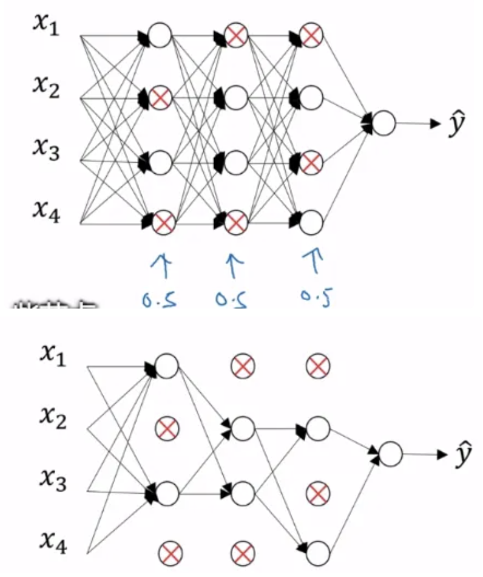
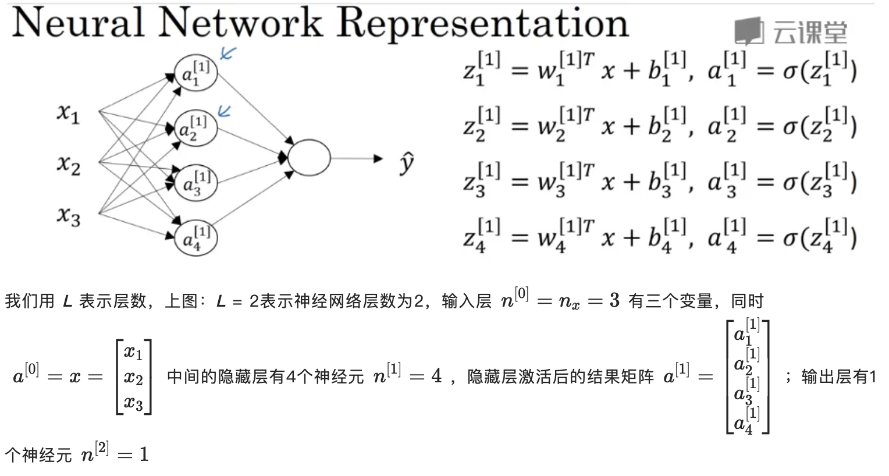
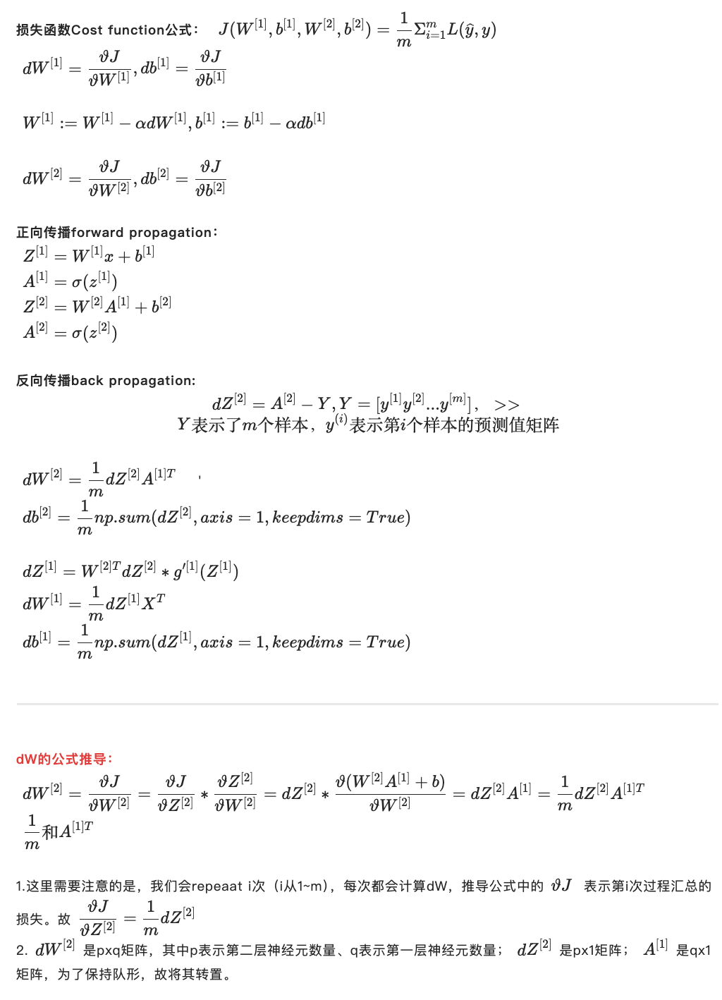

# 一、基础知识

## 1、神经网络中的激活函数

### 1.1 激活函数

> 使用一个神经网络时，需要决定使用哪种**激活函数**用隐藏层上，哪种用在输出节点上


#### (1) sigmoid 函数

sigmoid函数的值域：(0,1)，现在基本上使用 sigmoid 函数的场合很少，**大多数情况下使用****tanh** **函数替代****，** **tanh** **函数在所有场合都优于** **sigmoid** **函数。**除非在二分类情况下，期待输出的y值为0或1（而不是-1和1）

#### (2) tanh 函数

tanh 函数是 sigmoid 的向下平移和伸缩后的结果，对它进行了变形后，穿过了(0,0)点，并且值域介于+1 和-1 之间

结果表明：

- 如果在隐藏层上使用 tanh 函数，效果总是优于 sigmoid 函数

- 且在训练一个算法模型时，如果使用 tanh 函数代替sigmoid 函数中心化数据，使得数据的平均值更接近 0 而不是sigmoid函数的0.5

**sigmoid和tanh函数的缺点**：在 z 特别大或特别小的情况下，导数的梯度或函数的斜率会变得特别小，最后就会接近于 0，导致降低梯度下降的速度

#### (3) ReLu(修正线性单元) 函数

 **修正线性单元(ReLu)**：是在机器学习中很流行的一个函数，用其替代 sigmoid 函数可大幅加速梯度下降的过程，降低训练时间

函数分为两个部分：

- 左半部分 z<0 时，函数值恒 = 0，导数 = 0；
- 右半部分当 z >= 0 时，函数是斜率为1的线性函数，导数恒 = 1

**选择激活函数的经验法则**：如果输出是 0/1 值(二分类问题)，则输出层选择 sigmoid /tanh函数，然后其它的所有单元都选择 Relu 函数

#### (4) Leaky ReLu 函数

Leaky ReLu 是 Relu 的改装版：当 z 是负值时，这个函数的值不是等于 0，而是轻微的倾斜

> 为什么常数是 0.01？其实是个经验值，当然，也可以选择不同的参数

Relu由于在 z < 0时，梯度直接为0，神经元此时不会训练，即大大加速了模型训练，节约时间，但同时会产生所谓的稀疏性，为了平衡稀疏性和模型训练效率，才诞生了 Leaky ReLu

### 1.2 激活函数的导数

- **sigmoid**：$\frac{d}{dz}g(z) = \frac{1}{1 + e^{-Z}}(1 - \frac{1}{1 + e^{-Z}}) = g(z)(1 - g(z)) = a(1- a)$

- **tanh**：$\frac{d}{dz}g(z) = 1 - (tanh(z))^2$

- **ReLu**：$g^{'} = \begin{cases} 0,\quad if \quad z < 0 \\[2ex] 1, \quad if \quad z > 0 \\[2ex] undefined, \quad if \quad z = 0 \end{cases}$ 

    > 通常在z = 0 的时候给定其导数 0 或 1，不过 z = 0 的情况很少

- **Leaky ReLu**：$g^{'} = \begin{cases} 0.01,\quad if \quad z < 0 \\[2ex] 1, \quad if \quad z > 0 \\[2ex] undefined, \quad if \quad z = 0 \end{cases}$ 

    > 通常在z = 0 的时候给定其导数 0.01 或 1，不过 z = 0 的情况很少

## 2、参数、超参数、正则化

### 2.1 参数 VS 超参数

- **超参数**：$\alpha$(学习率)、 iterations(梯度下降法循环的数量)、$L$(隐藏层数目)、$n^{[l]}$(隐藏层单元数目)、 choice of activation function(激活函数的选择)都需要人为设置，这些数字实际上控制了最后的参数**W**和**b**的值，所以它们被称作超参数

### 2.2 神经网络中的正则化

> 深度学习神经网络中的正则化：L2 正则化、Dropout 正则化、数据扩增、early stopping
>
> 正则化的目的在于降低模型的过拟合程度

#### (1) L2 正则化

前面的线性回归和逻辑回归中的正则化，称为：**L2正则化** 

#### (2) Dropout 正则化

**Dropout 正则化**：Dropout 翻译为**随机失活**，即**对神经网络中的神经元做随机失活处理**

---

假设神经网络存在过拟合， dropout 会遍历网络的每一层，并设置消除神经网络中节点的概率。

假设网络中的每一层每个节点都以抛硬币的方式设置概率，每个节点得以保留和消除的概率都是 0.5，设置完节点概率，会消除一些节点，然后删除掉从该节点进出的连线，最后得到一个节点更少，规模更小的网络，然后用 backprop 方法进行训练



这是网络节点精简后的一个样本，对于其它样本照旧以抛硬币的方式设置概率，保留一类节点集合，删除其它类型的节点集合

对于每个训练样本，都将采用一个精简后神经网络来训练，这种方法似乎有点怪，单纯遍历节点，编码也是随机的，可它真的有效

> **简单来说，dropout正则化不仅可以精简网络，加速训练，还可以防止过拟合**

#### (3) 数据扩增

 假设正在拟合图片，可以**通过扩增训练数据来解决过拟合**，例如：水平翻转图片或随意裁剪图片，并把它添加到训练集

**所以，数据扩增可作为正则化方法使用，实际功能上也与正则化相似**

#### (4) early stopping

**early stopping(及早停止)**：意味着在训练神经网络模型中及早的停止训练

- **在哪里停止**：在训练过程中，希望训练误差和损失函数越来越小，可以绘制训练误差或损失函数J和迭代次数的关系曲线，同时也可以用验证集来绘制同样的曲线，通常验证集的误差会经历先下降后上升的过程，于是这个最低点就是需要停止训练的点

- **为什么要停止**：因为目标是防止模型过拟合，为了在一个合适的地方停止模型，防止过拟合，用 $||w||^2_F$ 弗罗贝尼乌斯范数来表示，w 即参数矩阵
    - 在模型训练开始时由于是随机初始化，故 $||w||^2_F$ 最小
    - 随着模型训练，$||w||^2_F$ 越大，需要在取一个中间值，此时停止模型训练，这个点的 $||w||^2_F$ 处于中间值，即不过大也不过小，模型过拟合程度较低

---

- **优点**：只运行一次梯度下降，可以找出 w 的较小值、中间值、较大值，而无需尝试 L2 正则化超级参数 λ 的很多值，节约了模型训练的时间
- **缺点**：及早停止了训练，可能过拟合程度降低，但是模型的损失 `J` 并没有降低到最小，即模型并未达到全局最优

## 3、梯度爆炸、权重初始化、梯度检验

### 3.1 梯度消失/梯度爆炸

**梯度消失或梯度爆炸**：即训练神经网络时，导数或坡度有时会变得非常大或非常小，甚至于以指数方式变小，这加大了训练的难度


### 3.2 神经网络的权重初始化

假设有如下神经元：


该单个神经元有 4 个输入特征 x1 到 x4，经过 a = g(z) 处理，最终得到预测值 y，暂时忽略偏差 b

在计算 z时，有方程：$z = w_1x_1 + ... + w_nx_n$，为了预防 `z` 的值过大或过小，最优化的方式是取 $Var(w_i) = \frac1n$ 

> $Var$ 表示求方差的意思，权重的方差 = 1/n，即权重分布符合 ~$\frac{1}{\sqrt{n}}$

标准的权重初始化公式在 Python 中可以表示如下：
$$
w^{[l]} = np.random.randn(shape) * np.sqrt(\frac{1}{n^{[l-1]}})
$$
其中，$n^{[l-1]}$ 是喂给第 `l` 层神经单元的数量，即 `l-1` 层神经元数量

上面的公式通常适用于 `tanh` 激活函数，如果激活函数用的是ReLu，则 $Var(w_i) = \frac2n$ 更适合

### 3.3 梯度的数值逼近

在进行 backprop(反向传播)时，有一个测试叫做**梯度检验**，作用是确保反向传播正确实施

为了逐渐实现梯度检验，需要先了解梯度的数值逼近：


### 3.4 反向传播的梯度检验

> 梯度检验的目的就在于检测反向传播计算过程中的bug，检验 backprop 的实施是否正确

假设神经网络中有下列参数：$W^{[1]}/b^{[1]}, W^{[2]}/b^{[2]},...,W^{[l]}/b^{[l]}$

为了执行梯度检验，需要把所有的 W 矩阵转化为参数向量 θ，针对参数向量 θ 中的每个组成元素，其梯度
$$
d\theta[i] = \frac{\upsilon J(\theta_1,\theta_2,...)}{\upsilon\theta_i}
$$
用双边误差来计算其逼近梯度，逼近梯度的表达式如下：
$$
d\theta_{approx}[i] = \frac{J(\theta_1,...,\theta_i + \varepsilon,...) - J(\theta_1,...,\theta_i - \varepsilon,...)}{2\varepsilon}
$$
 然后，用下面的式子计算梯度间的误差程度：
$$
\frac{||d\theta_{approx} - d\theta||_2}{||d\theta_{approx}||_2 + ||d\theta||_2}
$$
譬如此时用 $\varepsilon = 10^{-7}$ 来计算，通过计算得到：

- 此方程式的值 <= $10^{-7}$，则梯度下降正常
- 如果得到的值 $10^{-5}$ 或者更大如 $10^{-3}$，则需要检测所有的 θ 项，看看是否存在一个 `i` 值，使得 $d\theta_{approx}[i]$ 和 $d\theta[i]$ 差距过大

---

**注意事项：**

- 首先，不要在训练中使用梯度检验，它只用于调试
- 第二点，如果算法的梯度检验失败，要检查所有项，检查每一项，并试着找出 bug
- 第三点，在实施梯度检验时，如果使用正则化，请注意正则项
- **梯度检验不能与 dropout 同时使用**，因为每次迭代过程中， dropout 会随机消除隐藏层单元的不同子集，难以计算 dropout 在梯度下降上的代价函数 `J`

## 4、深度神经网络的反向传播推导

> 下面的案例：先给出单个神经网络和简单神经网络的向量化表示，然后对一个2层神经网络进行前向传播 + 反向传播的公式推导，最后总结出一个更一般的神经网络反向传播推导公式

### 4.1 神经网络的向量化表示

- **单个神经元**：

    > 
    >
    > - $x$ 为输入层输出变量矩阵
    > - $a^{[l]}$ 表示神经网络第 `l` 层的所有神经元激活后的结果矩阵
    > - $a^{[L]}$ 表示输出层的输出结果
    >
    > $$
    > a^{[0]} = x = 
    > \left[\begin{array}{c|cc}
    >     x_1 \\
    >     x_2 \\
    >     x_3
    >     \end{array}
    > \right] \\ \\
    > a^{[1]} = \left[\begin{array}{c|cc}
    >     a_1^{[1]}
    >     \end{array}
    > \right]
    > $$
    >
    > $w$ 是权重矩阵，因为 $w$ 为列向量，故在计算 $z = w^Tx +b$ 时，用的是其转置

- **简单神经网络**：

    

    - **单样本向量化表示**：用方程式表示隐藏层的 `z` 和激活结果 `a`，如上图右边的方程式，看起来很直观

        不过实际计算时，不可能一个个地根据上述方程来计算，而是用向量化地方式表示
        $$
        z^{[1]} = W^{[1]}x + b^{[1]} \quad\quad\quad a^{[1]} = \sigma(z^{[1]}) \\
        z^{[2]} = W^{[2]}x + b^{[2]} \quad\quad\quad a^{[2]} = \sigma(z^{[2]})
        $$

    - **多样本向量化表示**：假设有 `m` 批样本，则需要从 `i = 1~m` 重复计算这四个过程

        可以直接用多样本向量化的公式表示如下：
        $$
        x = 
        \left[
        \begin{matrix}
        \vdots & \vdots & \vdots & \vdots\\
        x^{(1)} & x^{(2)} & \cdots & x^{(m)}\\
        \vdots & \vdots & \vdots & \vdots\\
        \end{matrix}
        \right], \quad 
        Z^{[1]} = 
        \left[
        \begin{matrix}
        \vdots & \vdots & \vdots & \vdots\\
        z^{[1](1)} & z^{[1](2)} & \cdots & z^{[1](m)}\\
        \vdots & \vdots & \vdots & \vdots\\
        \end{matrix}
        \right], \quad 
        Z^{[1]} = 
        \left[
        \begin{matrix}
        \vdots & \vdots & \vdots & \vdots\\
        a^{[1](1)} & a^{[1](2)} & \cdots & a^{[1](m)}\\
        \vdots & \vdots & \vdots & \vdots\\
        \end{matrix}
        \right] \\
        $$
        注：此处 $a^{[1](i)}$ 中 $[1]$ 表示神经网络第一层，$(i)$ 表示第 $i$ 批样本
        $$
        \begin{aligned}
         \left.\begin{aligned}
                z^{[1](i)} = W^{[1](i)}x^{(i)} + b^{[1]} \quad a^{[1](i)} = \sigma(z^{[1](i)})\\        
                z^{[2](i)} = W^{[2](i)}a^{[1](i)} + b^{[2]} \quad a^{[2](i)} = \sigma(z^{[2](i)})
               \end{aligned}
         \right\}								
         \Rightarrow 
        
        \begin{cases}
        A^{[1]} = \sigma(z^{{[1]}}) \\[2ex]
        z^{[2]} = W^{[2]}A^{[1]} + b^{[2]} \\[2ex]
        A^{[2]} = \sigma(z^{[2]})
        \end{cases}
        
        \end{aligned}
        $$

### 4.2 简单神经网络的推导



### 4.3 神经网络反向传播推导


# 二、线性神经网络实践

参看：https://zh.d2l.ai/chapter_linear-networks/index.html


# 三、多层感知机实践

参看：

- https://zhishu.zhipin.com/docs/96j3iZ0g2T5

- https://github.com/ShusenTang/Dive-into-DL-PyTorch/tree/master/docs/chapter03_DL-basics


# 四、深度学习计算实践

参看：

- https://zh.d2l.ai/chapter_deep-learning-computation/index.html

- https://github.com/ShusenTang/Dive-into-DL-PyTorch/tree/master/docs/chapter04_DL_computation


# 五、pytorch 案例

参考：https://datawhalechina.github.io/thorough-pytorch/%E7%AC%AC%E4%B8%89%E7%AB%A0/index.html

> 深度学习中训练和验证过程最大的特点：
>
> - 读入数据是按批的，每次读入一个批次的数据，放入GPU中训练
> - 然后将损失函数反向传播回网络最前面的层，同时使用优化器调整网络参数
> - 训练/验证后还需要根据设定好的指标计算模型表现

## 0、前置设置

```python
#导入基础包
import os
import numpy as np
import torch
import torch.nn as nn
from torch.utils.data import Dataset,DataLoader
import torch.optim as optimizer

#设置超参数
batch_size = 16
lr = 1e-4 #初始学习率
max_epochs = 100 #训练次数
```

## 1、数据预处理

- 参考：https://datawhalechina.github.io/thorough-pytorch/%E7%AC%AC%E4%B8%89%E7%AB%A0/3.3%20%E6%95%B0%E6%8D%AE%E8%AF%BB%E5%85%A5.html

数据格式的统一、异常数据的消除和必要的数据变换，同时**划分训练集、验证集、测试集**，常见的方法包括：按比例随机选取，KFold方法（我们可以使用sklearn带的test_train_split函数、kfold来实现）

> **由于深度学习所需的样本量很大，一次加载全部数据运行可能会超出内存容量而无法实现；同时还有批（batch）训练等提高模型表现的策略，需要每次训练读取固定数量的样本送入模型中训练**，因此深度学习在数据加载上需要有专门的设计

### 1.1 自定义Dataset

```python
#自定义Dataset
import pandas as pd
from torchvision.io import read_image

class MyDataset(Dataset):
    #用于向类中传入外部参数，同时定义样本集
    def __init__(self, annotations_file, img_dir, transform=None, target_transform=None):
        """
        Args:
            annotations_file (string): Path to the csv file with annotations.
            img_dir (string): Directory with all the images.
            transform (callable, optional): Optional transform to be applied on a sample.
            target_transform (callable, optional): Optional transform to be applied on the target.
        """
        self.img_labels = pd.read_csv(annotations_file)
        self.img_dir = img_dir
        self.transform = transform
        self.target_transform = target_transform
    
    #返回数据集的样本数
    def __len__(self):
        return len(self.img_labels)
    
    #逐个读取样本集合中的元素
    def __getitem__(self, idx):
        img_path = os.path.join(self.img_dir, self.img_labels.iloc[idx, 0])
        image = read_image(img_path)
        label = self.img_labels.iloc[idx, 0]
        if self.transform:
            image = self.transform(image)
        if self.target_transform:
            label = self.target_transform(label)
        return image, label
```

### 1.2 数据下载

```python
#数据下载
import torchvision.datasets as datasets
import torchvision.transforms as transforms

transform = transforms.Compose([
    transforms.ToTensor(),
])

train_dataset = datasets.CIFAR10(root='./data', train=True, download=True, transform=transform)
test_dataset = datasets.CIFAR10(root='./data', train=False, download=True, transform=transform)
```

### 1.3 批次读入数据

```python
#批次读入数据
#drop_last：对于样本最后一部分没有达到批次数的样本，使其不再参与训练
train_loader = torch.utils.data.DataLoader(train_dataset, batch_size=batch_size, num_workers=4, shuffle=True, drop_last=True)
val_loader = torch.utils.data.DataLoader(test_dataset, batch_size=batch_size, num_workers=4, shuffle=False)
```

### 1.4 可视化

```python
#可视化
import matplotlib.pyplot as plt
images, labels = next(iter(val_loader))
print(images[0].shape)
print(images[0].transpose(0,2).transpose(0,1).shape)
plt.imshow(images[0].transpose(0,2).transpose(0,1))
plt.show()
```

## 2、模型构建

- 参考：https://datawhalechina.github.io/thorough-pytorch/%E7%AC%AC%E4%B8%89%E7%AB%A0/3.4%20%E6%A8%A1%E5%9E%8B%E6%9E%84%E5%BB%BA.html

> 深度神经网络层数往往较多，同时会有一些用于实现特定功能的层（如卷积层、池化层、批正则化层、LSTM层等），因此**深度神经网络往往需要“逐层”搭建，或者预先定义好可以实现特定功能的模块，再把这些模块组装起来**

### 2.1 重载 MLP

```python
#下面的 MLP 类⽆须定义反向传播函数，系统将通过⾃动求梯度⽽自动⽣成反向传播所需的 backward 函数
class MLP(nn.Module):
  # 声明带有模型参数的层，这里声明了两个全连接层
  def __init__(self, **kwargs):
    # 调用MLP父类Block的构造函数来进行必要的初始化。这样在构造实例时还可以指定其他函数
    super(MLP, self).__init__(**kwargs)
    self.hidden = nn.Linear(784, 256)
    self.act = nn.ReLU()
    self.output = nn.Linear(256,10)
    
   # 定义模型的前向计算，即如何根据输入x计算返回所需要的模型输出
  def forward(self, x):
    o = self.act(self.hidden(x))
    return self.output(o)   

#触发计算
X = torch.rand(2,784) # 设置一个随机的输入张量
net = MLP() # 实例化模型
print(net) # 打印模型
net(X) # 前向计算
```

### 2.2 神经网络含模型参数的层

```python
#含模型参数层--Parameter/ParameterList/ParameterDict 会自动被添加到模型参数列表里
class MyListDense(nn.Module):
    def __init__(self):
        super(MyListDense, self).__init__()
        self.params = nn.ParameterList([nn.Parameter(torch.randn(4, 4)) for i in range(3)])
        self.params.append(nn.Parameter(torch.randn(4, 1)))
        
    def forward(self, x):
        for i in range(len(self.params)):
            x = torch.mm(x, self.params[i])
            
net = MyListDense()
print(net)

class MyDictDense(nn.Module):
    def __init__(self):
        super(MyDictDense, self).__init__()
        self.params = nn.ParameterDict({
            'linear1': nn.Parameter(torch.randn(4, 4)),
            'linear2': nn.Parameter(torch.randn(4, 1))
        })
        self.params.update({'linear3': nn.Parameter(torch.randn(4, 2))})
        
    def forward(self, x, choice='linear1'):
        return torch.mm(x, self.params[choice])
    
net = MyDictDense()
print(net)
```

### 2.3 神经网络二维卷积层

```python
#二维卷积层--将输入和卷积核做互相关运算，并加上一个标量偏差来得到输出
#卷积层的模型参数包括了卷积核和标量偏差。在训练模型的时候，通常我们先对卷积核随机初始化，然后不断迭代卷积核和偏差。

# 卷积运算（二维互相关）
def corr2d(X, K):
    h, w = K.shape
    X, K = X.float(), K.float()
    Y = torch.zeros((X.shape[0] - h + 1, X.shape[1] - w + 1))
    for i in range(Y.shape[0]):
        for j in range(Y.shape[1]):
            Y[i, j] = (X[i: i + h, j: j + w] * K).sum()
    return Y

#二维卷积层
class Conv2D(nn.Module):
    def __init__(self, kernel_size):
        super(Conv2D, self).__init__()
        self.weight = nn.Parameter(torch.randn(kernel_size))
        self.bais = nn.Parameter(torch.randn(1))
        
    def forward(self, x):
        return corr2d(x, self.weight) + self.bais
    
# 定义一个函数来计算卷积层。它对输入和输出做相应的升维和降维
def comp_conv2d(conv2d, X):
    X = X.view((1, 1) + X.shape) # (1, 1)代表批量大小和通道数
    Y = conv2d(X)
    return Y.view(Y.shape[2:]) # 排除不关心的前两维:批量和通道

X = torch.rand(8, 8)
# 使用高为5、宽为3的卷积核。在⾼和宽两侧的填充数分别为2和1
conv2d = nn.Conv2d(in_channels=1, out_channels=1, kernel_size=(5, 3), padding=(2, 1))
comp_conv2d(conv2d, X).shape

#每次滑动的行数和列数称为步幅(stride)
conv2d = nn.Conv2d(in_channels=1, out_channels=1, kernel_size=(5, 3), padding=(2, 1), stride=(3, 4))
comp_conv2d(conv2d, X).shape
```

### 2.4 神经网络池化层

```python
#池化层--每次对输入数据的一个固定形状窗口(⼜称池化窗口)中的元素计算输出，如：最大池化或平均池化
def pool2d(X, pool_size, mode='max'):
    p_h, p_w = pool_size
    Y = torch.zeros((X.shape[0] - p_h + 1, X.shape[1] - p_w + 1))
    for i in range(Y.shape[0]):
        for j in range(Y.shape[1]):
            if mode == 'max':
                Y[i, j] = X[i: i + p_h, j: j + p_w].max()
            elif mode == 'avg':
                Y[i, j] = X[i: i + p_h, j: j + p_w].mean()
    return Y

X = torch.tensor([[0,1,2], [3,4,5], [6,7,8]], dtype=torch.float)
print(pool2d(X, (2, 2)))

print(pool2d(X, (2,2), 'avg'))
```

### 2.5 LeNet网络

```python
#LeNet网络--接受一个输入，然后将它送入下一层，一层接一层的传递，最后给出输出
'''
一个神经网络的典型训练过程如下：
1、定义包含一些可学习参数(或者叫权重）的神经网络
2、在输入数据集上迭代
3、通过网络处理输入
4、计算 loss (输出和正确答案的距离）
5、将梯度反向传播给网络的参数
6、更新网络的权重，一般使用一个简单的规则：weight = weight - learning_rate * gradient
'''

import torch
import torch.nn as nn
import torch.nn.functional as F

class Net(nn.Module):
    def __init__(self):
        super(Net, self).__init__()
        # 输入图像channel：1；输出channel：6；5x5卷积核
        self.conv1 = nn.Conv2d(1, 6, 5)
        self.conv2 = nn.Conv2d(6, 16, 5)
        # an affine operation: y = Wx + b
        self.fc1 = nn.Linear(16 * 5 * 5, 120)
        self.fc2 = nn.Linear(120, 84)
        self.fc3 = nn.Linear(84, 10)
        
    #只需要定义 forward 函数，backward函数会在使用autograd时自动定义
    def forward(self, x):
        # 2x2 Max pooling
        x = F.max_pool2d(F.relu(self.conv1(x)), (2, 2))
        # 如果是方阵,则可以只使用一个数字进行定义
        x = F.max_pool2d(F.relu(self.conv2(x)), 2)
        x = x.view(-1, self.num_flat_features(x))
        x = F.relu(self.fc1(x))
        x = F.relu(self.fc2(x))
        x = self.fc3(x)
        return x
    
    def num_flat_features(self, x):
        size = x.size()[1:] # 除去批处理维度的其他所有维度
        num_features = 1
        for s in size:
            num_features *= s
        return num_features
    
net = Net()
print(net)

#一个模型的可学习参数可以通过net.parameters()返回
params = list(net.parameters())
print(len(params))
print(params[0].size()) # conv1的权重

#尝试一个随机的 32x32 的输入
input = torch.randn(1, 1, 32, 32)
out = net(input)
print(out)

#清零所有参数的梯度缓存，然后进行随机梯度的反向传播
net.zero_grad()
out.backward(torch.randn(1, 10))
```

### 2.6 AlexNet

```python
#AlexNet
class AlexNet(nn.Module):
    def __init__(self):
        super(AlexNet, self).__init__()
        self.conv = nn.Sequential(
            nn.Conv2d(1, 96, 11, 4), # in_channels, out_channels, kernel_size, stride, padding
            nn.ReLU(),
            nn.MaxPool2d(3, 2), # kernel_size, stride
            nn.Conv2d(96, 256, 5, 1, 2), # 减小卷积窗口，使用填充为2来使得输入与输出的高和宽一致，且增大输出通道数
            nn.ReLU(),
            nn.MaxPool2d(3, 2),
            # 连续3个卷积层，且使用更小的卷积窗口。除了最后的卷积层外，进一步增大了输出通道数。
            # 前两个卷积层后不使用池化层来减小输入的高和宽
            nn.Conv2d(256, 384, 3, 1, 1),
            nn.ReLU(),
            nn.Conv2d(384, 384, 3, 1, 1),
            nn.ReLU(),
            nn.Conv2d(384, 256, 3, 1, 1),
            nn.ReLU(),
            nn.MaxPool2d(3, 2)
        )
        # 这里全连接层的输出个数比LeNet中的大数倍。使用丢弃层来缓解过拟合
        self.fc = nn.Sequential(
            nn.Linear(256*5*5, 4096),
            nn.ReLU(),
            nn.Dropout(0.5),
            nn.Linear(4096, 4096),
            nn.ReLU(),
            nn.Dropout(0.5),
            # 输出层。由于这里使用Fashion-MNIST，所以用类别数为10，而非论文中的1000
            nn.Linear(4096, 10)
        )
    
    def forward(self, img):
        feature = self.conv(img)
        output = self.fc(feature.view(img.shape[0], -1))
        return output
    
net = AlexNet()
print(net)
```

## 3、模型初始化

- 参考：https://datawhalechina.github.io/thorough-pytorch/%E7%AC%AC%E4%B8%89%E7%AB%A0/3.4%20%E6%A8%A1%E5%9E%8B%E6%9E%84%E5%BB%BA.html

### 3.1 初始化基本使用

```python
#模型初始化
#torch.nn.init使用
conv = nn.Conv2d(1,3,3)
linear = nn.Linear(10, 1)

#使用isinstance()判断模型属于什么类型
print(isinstance(conv, nn.Conv2d)) # 判断conv是否是nn.Conv2d类型
print(isinstance(linear, nn.Conv2d)) # 判断linear是否是nn.Conv2d类型

#对于不同的类型层，设置不同的权值初始化的方法
print(conv.weight.data)
print(linear.weight.data)

# 对conv进行kaiming初始化
torch.nn.init.kaiming_normal_(conv.weight.data)
print(conv.weight.data)
# 对linear进行常数初始化
torch.nn.init.constant_(linear.weight.data, 0.3)
print(linear.weight.data)
```

### 3.2 初始化函数的封装

```python
#初始化函数的封装
def initialize_weights(model):
    for m in model.modules():
        if isinstance(m, nn.Conv2d): # 判断是否属于Conv2d
            torch.nn.init.zeros_(m.weight.data)
            if m.bias is not None: # 判断是否属于Conv2d
                torch.nn.init.constant_(m.bias.data, 0.3)
        elif isinstance(m, nn.Linear):
            torch.nn.init.normal_(m.weight.data, 0.1)
            if m.bias is not None:
                torch.nn.init.zeros_(m.bias.data)
        elif isinstance(m, nn.BatchNorm2d):
            m.weight.data.fill_(1)
            m.bias.data.zeros_()
            
#测试
class MLP(nn.Module):
  # 声明带有模型参数的层，这里声明了两个全连接层
  def __init__(self, **kwargs):
    # 调用MLP父类Block的构造函数来进行必要的初始化。这样在构造实例时还可以指定其他函数
    super(MLP, self).__init__(**kwargs)
    self.hidden = nn.Conv2d(1,1,3)
    self.act = nn.ReLU()
    self.output = nn.Linear(10,1)
    
   # 定义模型的前向计算，即如何根据输入x计算返回所需要的模型输出
  def forward(self, x):
    o = self.act(self.hidden(x))
    return self.output(o)

mlp = MLP()
print(mlp.hidden.weight.data)
print("------初始化------")
mlp.apply(initialize_weights) # 或者initialize_weights(mlp)
print(mlp.hidden.weight.data)
```

## 4、损失函数与优化器

**损失函数和优化器要能够保证反向传播能够在用户自行定义的模型结构上实现**

- 参考：https://datawhalechina.github.io/thorough-pytorch/%E7%AC%AC%E4%B8%89%E7%AB%A0/3.6%20%E6%8D%9F%E5%A4%B1%E5%87%BD%E6%95%B0.html


## 5、训练和评估

- 参考：https://datawhalechina.github.io/thorough-pytorch/%E7%AC%AC%E4%B8%89%E7%AB%A0/3.7%20%E8%AE%AD%E7%BB%83%E4%B8%8E%E8%AF%84%E4%BC%B0.html

```python
#训练和评估--训练状态的模型参数支持反向传播的修改，而验证/测试状态不应该修改模型参数
#训练过程
def train(epoch):
    model.train() #设置状态 model.eval()
    train_loss = 0
    for data, label int train_loader: #读取数据
        #data, label = data.cuda(), label.cuda() #将数据放到GPU上
        optimizer.zero_grad() #先将优化器的梯度置零
        output = model(data) #将data送入模型中训练
        loss = criterion(output, label) #根据预先定义的criterion计算损失函数
        loass.backward() #将loss反向传播回网络
        optimizer.step() #使用优化器更新模型参数
        train_loss += loss.item * data.size(0)
        
#验证过程--区别为
#需要预先设置torch.no_grad，以及将model调至eval模式
#不需要将优化器的梯度置零
#不需要将loss反向回传到网络
#不需要更新optimizer
def val(epoch):
    model.eval()
    val_loss = 0
    with torch.no_grad():
        for data, label int train_loader: #读取数据
            #data, label = data.cuda(), label.cuda() #将数据放到GPU上
            output = model(data) #将data送入模型中训练
            preds = torch.argmax(output, 1)
            loss = criterion(output, label) #根据预先定义的criterion计算损失函数
            val_loss += loss.item * data.size(0)
            running_accu += torch.sum(preds == label.data)
    val_loss = val_loss / len(val_loader.dataset)
    print('Epoch: {} \tTraining Loss: {:.6f}'.format(epoch, val_loss))
    
#计算模型的准确率、召回率、F1值等指标
from sklearn.metrics import classification_report

print(classification_report(labels.cpu(), preds.cpu(), target_names=class_names))
```