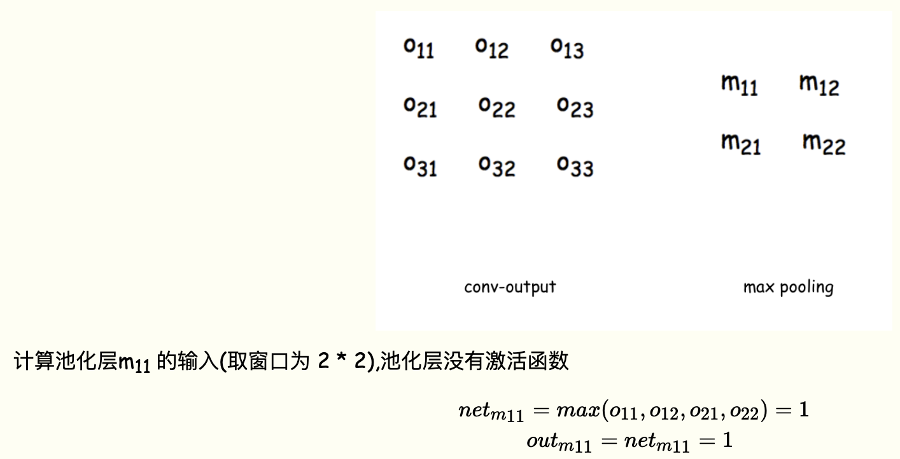

> 参看：https://easyai.tech/ai-knowledge-hub/

# 一、概念认知

## 1、快速认知

参考：https://easyai.tech/ai-definition/cnn/

- 基础组成：

    

- 典型的 CNN 并非只是上面提到的3层结构，而是多层结构，例如 LeNet-5 的结构就如下图所示：

    

## 2、CNN 的三个基本层

- 参考：https://www.cnblogs.com/charlotte77/p/7759802.html

### 2.1 卷积层(Convolutional Layer)

- **卷积核可以理解为==特征提取器==**
- 卷积核在数字信号处理里也叫滤波器，比如：均值滤波器，高斯滤波器，拉普拉斯滤波器等
- 根据实验得到的经验来看，会在越靠近输入层的卷积层设定少量的卷积核，越往后，卷积层设定的卷积核数目就越多


### 2.2 池化层(Pooling Layer)

- 池化方法一般有一下两种：
    - `MaxPooling`：取滑动窗口里最大的值
    - `AveragePooling`：取滑动窗口内所有值的平均值


-  `Zero Padding`：可以保证每次经过卷积或池化输出后图片的大小不变

    

### 2.3 Flatten层 & Fully Connected Layer

- 到这一步，一个完整的“卷积部分”就算完成了，如果想要叠加层数，一般也是叠加“Conv-MaxPooing"，通过不断的设计卷积核的尺寸，数量，提取更多的特征，最后识别不同类别的物体

- 做完Max Pooling后，把这些数据“拍平”，丢到Flatten层，然后把Flatten层的output放到full connected Layer里，采用softmax对其进行分类


## 3、CNN 的前向传播与反向传播

- 参考：https://www.cnblogs.com/charlotte77/p/7783261.html

### 3.1 前向传播


#### (1) **输入层---->卷积层**


#### (2) 卷积层---->池化层



### 3.2 反向传播

#### (1) 传统的反向传播方法

传统的神经网络是全连接形式的，如果进行反向传播，只需要由下一层对前一层不断的求偏导，即求链式偏导就可以求出每一层的误差敏感项，然后求出权重和偏置项的梯度，即可更新权重

1. 通过前向传播计算每一层的输入值 $net_{ij}$(如卷积后的 feature_map 的第一个神经元的输入：$net_{i11}$)
2. 反向传播计算每个神经元的误差项 $δi,j，δ_{i,j}=\frac{∂E}{∂_{net_{i,j}}}$，其中 E 为损失函数计算得到的总体误差，可以用平方差，交叉熵等表示
3. 计算每个神经元权重 $w_{i,j}$ 的梯度，$η_{i,j}=\frac{∂E}{∂neti,j}⋅\frac{∂neti,j}{∂wi,j}=δ_{i,j}⋅out_{i,j}$
4. 更新权重 $w_{i,j}=w_{i,j}−λ⋅η_{i,j}$(其中 $λ$ 为学习率)

#### (2) 卷积层的反向传播

详细推导过程参看：https://www.cnblogs.com/charlotte77/p/7783261.html


#### (3) 池化层的反向传播


# 二、实践结合

参看：

- https://zh.d2l.ai/chapter_convolutional-neural-networks/index.html

- https://github.com/ShusenTang/Dive-into-DL-PyTorch/tree/master/docs/chapter05_CNN


# 三、手写 CNN

- 参考：https://www.cnblogs.com/charlotte77/p/7783261.html

完整代码参考：https://github.com/huxiaoman7/PaddlePaddle_code/blob/master/1.mnist/cnn.py

### 4.1 基本操作函数

```python
import numpy as np

#获取卷积区域
def get_patch(input_array, i, j, filter_width, filter_height, stride):
    '''
    从输入数组中获取本次卷积的区域，自动适配输入为2D和3D的情况
    '''
    start_i = i * stride
    start_j = j * stride
    if input_array.ndim == 2:
        input_array_conv = input_array[
            start_i: start_i + filter_height,
            start_j: start_j + filter_width
        ]
        # print("input_array_conv:", input_array_conv)
        return input_array_conv
    elif input_array.ndim == 3:
        input_array_conv = input_array[
            :,
            start_i: start_i + filter_height,
            start_j: start_j + filter_width
        ]
        # print("input_array_conv:", input_array_conv)
        return input_array_conv

#获取一个2D区域的最大值所在的索引
def get_max_index(array):
    max_i = 0
    max_j = 0
    max_value = array[0, 0]
    for i in range(array.shape[0]):
        for j in range(array.shape[1]):
            if array[i, j] > max_value:
                max_value = array[i, j]
                max_i, max_j = i, j
    return max_i, max_j

#进行卷积运算
def conv(input_array, kernel_array, output_array, stride, bias):
    '''
    计算卷积，自动适配输入为2D和3D的情况
    '''
    channel_number = input_array.ndim
    output_width = output_array.shape[1]
    output_height = output_array.shape[0]
    kernel_width = kernel_array.shape[-1]
    kernel_height = kernel_array.shape[-2]
    for i in range(output_height):
        for j in range(output_width):
            output_array[i][j] = (
                get_patch(input_array, i, j, kernel_width, kernel_height, stride) * kernel_array
            ).sum() + bias
            
#增加zero_padding
def padding(input_array, zp):
    '''
    为数组增加Zero padding，自动适配输入为2D和3D的情况
    '''
    if zp == 0:
        return input_array
    else:
        if input_array.ndim == 3:
            input_width = input_array.shape[2]
            input_height = input_array.shape[1]
            input_depth = input_array.shape[0]
            padded_array = np.zeros((
                input_depth,
                input_height + 2 * zp,
                input_width + 2 * zp
            ))
            padded_array[
                :,
                zp: zp + input_height,
                zp: zp + input_width
            ] = input_array
            return padded_array
        elif input_array.ndim == 2:
            input_width = input_array.shape[1]
            input_height = input_array.shape[0]
            padded_array = np.zeros((
                input_height + 2 * zp,
                input_width + 2 * zp
            ))
            padded_array[
                zp: zp + input_height,
                zp: zp + input_width
            ] = input_array
            return padded_array
        
# 对numpy数组进行element wise操作
def element_wise_op(array, op):
    for i in np.nditer(array, op_flags=['readwrite']):
        i[...] = op(i)
```

### 4.2 保存卷积层的参数和梯度

```python
#定义一个类，保存卷积层的参数和梯度
class Filter(object):
    def __init__(self, width, height, depth):
        self.weights = np.random.uniform(-1e-4, 1e-4, (depth, height, width)) #初始权重
        self.bias = 0 #初始偏置
        self.weights_grad = np.zeros(self.weights.shape)
        self.bias_grad = 0
    
    def __repr__(self):
        return 'filter weights:\n%s\nbias:\n%s' % (repr(self.weights), repr(self.bias))
    
    def get_weights(self):
        return self.weights
    
    def get_bias(self):
        return self.bias
    
    def update(self, learning_rate):
        self.weights -= learning_rate * self.weights_grad
        self.bias -= learning_rate * self.bias_grad
```

### 4.3 定义一个卷积层

```python
class ConvLayer(object):
    '''
    input_width: 输入图片尺寸——宽度
    input_height: 输入图片尺寸——长度
    channel_number: 通道数，彩色为3，灰色为1
    filter_width: 卷积核的宽
    filter_height: 卷积核的长
    filter_number: 卷积核数量
    zero_padding: 补零长度
    stride: 步长
    activator: 激活函数
    learning_rate: 学习率
    '''
    def __init__(self, input_width, input_height, channel_number, filter_width, filter_height, filter_number,
                zero_padding, stride, activator, learning_rate):
        self.input_width = input_width
        self.input_height = input_height
        self.channel_number = channel_number
        self.filter_width = filter_width
        self.filter_height = filter_height
        self.filter_number = filter_number
        self.zero_padding = zero_padding
        self.stride = stride
        self.output_width = ConvLayer.calculate_output_size(input_width, filter_width, zero_padding, stride)
        self.output_height = ConvLayer.calculate_output_size(input_height, filter_height, zero_padding, stride)
        self.output_array = np.zeros((self.filter_number, self.output_height, self.output_width))
        self.filters = []
        for i in range(filter_number):
            self.filters.append(Filter(filter_width, filter_height, self.channel_number))
        self.activator = activator
        self.learning_rate = learning_rate
        
    #前向传播
    def forward(self, input_array):
        '''
        计算卷积层的输出，输出结果保存在self.output_array
        '''
        self.input_array = input_array
        self.padded_input_array = padding(input_array, self.zero_padding)
        for f in range(self.filter_number):
            filter = self.filters[f]
            conv(
                self.padded_input_array,
                filter.get_weights(),
                self.output_array[f],
                self.stride,
                filter.get_bias()
            )
        element_wise_op(self.output_array, self.activator.forward) #将每个组的元素对应相乘
    
    def backward(self, input_array, sensitivity_array, activator):
        '''
        计算传递给前一层的误差项，以及计算每个权重的梯度
        前一层的误差项保存在self.delta_array，梯度保存在Filter对象的weights_grad
        '''
        self.forward(input_array)
        self.bp_sensitivity_map(sensitivity_array, activator)
        self.bp_gradient(sensitivity_array)
        
    #按照梯度下降法更新参数
    def update(self):
        for filter in self.filters:
            filter.update(self.learning_rate)
            
    #将误差传递到上一层
    def bp_sensitivity_map(self, sensitivity_array, activator):
        '''
        计算传递到上一层的sensitivity map
        sensitivity_array: 本层的sensitivity map
        activator: 上一层的激活函数
        '''
        # 处理卷积步长，对原始sensitivity map进行扩展
        expanded_array = self.expand_sensitivity_map(sensitivity_array)
        # full卷积，对sensitivitiy map进行zero padding
        # 虽然原始输入的zero padding单元也会获得残差
        # 但这个残差不需要继续向上传递，因此就不计算了
        expanded_width = expanded_array.shape[2]
        zp = int((self.input_width + self.filter_width - 1 - expanded_width) / 2)
        padded_array = padding(expanded_array, zp)
        # 初始化delta_array，用于保存传递到上一层的 sensitivity map
        self.delta_array = self.create_delta_array()
        # 对于具有多个filter的卷积层来说，最终传递到上一层的
        # sensitivity map相当于所有的filter的 sensitivity map之和
        for f in range(self.filter_number):
            filter = self.filters[f]
            # 将filter权重翻转180度
            flipped_weights = np.flip(np.copy(filter.get_weights()), (0,1,2)) 
            # 计算与一个filter对应的delta_array
            delta_array = self.create_delta_array()
            for d in range(delta_array.shape[0]):
                conv(padded_array[f], flipped_weights[d], delta_array[d], 1, 0)
            self.delta_array += delta_array
        # 将计算结果与激活函数的偏导数做element-wise乘法操作
        derivative_array = np.array(self.input_array)
        element_wise_op(derivative_array, activator.backward)
        self.delta_array *= derivative_array
        
    #计算代码梯度
    def bp_gradient(self, sensitivity_array):
        #处理卷积步长，对原始sensitivity map进行扩展
        expanded_array = self.expand_sensitivity_map(sensitivity_array)
        for f in range(self.filter_number):
            #计算每个权重的梯度
            filter = self.filters[f]
            for d in range(filter.weights.shape[0]):
                conv(self.padded_input_array[d], expanded_array[f], filter.weights_grad[d], 1, 0)
            #计算偏置项的梯度
            filter.bias_grad = expanded_array[f].sum()
            
    def expand_sensitivity_map(self, sensitivity_array):
        depth = sensitivity_array.shape[0]
        #确定扩展后sensitivity map的大小(计算stride为1时sensitivity map的大小)
        expanded_width = (self.input_width - self.filter_width + 2 * self.zero_padding + 1)
        expanded_height = (self.input_height - self.filter_height + 2 * self.zero_padding + 1)
        # 构建新的sensitivity_map
        expand_array = np.zeros((depth, expanded_height, expanded_width))
        # 从原始sensitivity map拷贝误差值
        for i in range(self.output_height):
            for j in range(self.output_width):
                i_pos = i * self.stride
                j_pos = j * self.stride
                expand_array[:, i_pos, j_pos] = sensitivity_array[:, i, j]
        return expand_array
    
    #保存传递到上一层的sensitivity map的数组
    def create_delta_array(self):
        return np.zeros((self.channel_number, self.input_height, self.input_width))
    
    @staticmethod
    def calculate_output_size(input_size, filter_size, zero_padding, stride):
        return int((input_size - filter_size + 2 * zero_padding) / stride + 1)
```

### 4.4 定义MaxPooling类

```python
class MaxPoolingLayer(object):
    def __init__(self, input_width, input_height, channel_number, 
                 filter_width, filter_height, stride):
        self.input_width = input_width
        self.input_height = input_height
        self.channel_number = channel_number
        self.filter_width = filter_width
        self.filter_height = filter_height
        self.stride = stride
        self.output_width = (input_width - filter_width) / self.stride + 1
        self.output_height = (input_height - filter_height) / self.stride + 1
        self.output_array = np.zeros((
            self.channel_numer, self.output_height, self.output_width
        ))
        
    #前向传播计算
    def foward(self, input_array):
        for d in range(self.channel_number):
            for i in range(self.output_height):
                for j in range(self.output_width):
                    self.output_array[d, i, j] = (
                        get_patch(input_array[d], i, j, 
                                 self.filter_width,
                                 self.filter_height,
                                 self.stride).max()
                    )
    
    #反向传播计算
    def backward(self, input_array, sensitivity_array):
        self.delta_array = np.zeros(input_array.shape)
        for d in range(self.channel_number):
            for i in range(self.output_height):
                for j in range(self.output_width):
                    patch_array = get_patch(
                        input_array[d], i, j,
                        self.filter_width,
                        self.filter_height,
                        self.stride
                    )
                    k, l = get_max_index(patch_array)
                    self.delta_array[
                        d,
                        i * self.stride + k,
                        j * self.stride + l
                    ] = sensitivity_array[d, i, j]
```

### 4.5 构造激活函数

```python
class ReluActivator(object):
    def forward(self, weighted_input):
        return max(0, weighted_input)
    
    def backward(self, output):
        return 1 if output > 0 else 0

class IdentityActivator(object):
    def forward(self, weighted_input):
        return weighted_input

    def backward(self, output):
        return 1

class SigmoidActivator(object):
    def forward(self, weighted_input):
        return 1.0 / (1.0 + np.exp(-weighted_input))
    
    def backward(self, output):
        return output * (1 - output)

class TanhActivator(object):
    def forward(self, weighted_input):
        return 2.0 / (1.0 + np.exp(-2 * weighted_input)) - 1.0

    def backward(self, output):
        return 1 - output * output
```

### 4.6 测试

```python
def init_test():
    #5 * 5 * 3
    a = np.array(
        [[[0,1,1,0,2],
          [2,2,2,2,1],
          [1,0,0,2,0],
          [0,1,1,0,0],
          [1,2,0,0,2]],
         [[1,0,2,2,0],
          [0,0,0,2,0],
          [1,2,1,2,1],
          [1,0,0,0,0],
          [1,2,1,1,1]],
         [[2,1,2,0,0],
          [1,0,0,1,0],
          [0,2,1,0,1],
          [0,1,2,2,2],
          [2,1,0,0,1]]])
    print("a: ", a.shape)
    #3 * 3 * 2
    b = np.array(
        [[[0,1,1],
          [2,2,2],
          [1,0,0]],
         [[1,0,2],
          [0,0,0],
          [1,2,1]]])
    print("b: ", b.shape)
    #padding: 1; stride: 2; learning_rate: 0.001
    cl = ConvLayer(5,5,3,3,3,2,1,2,IdentityActivator(),0.001)
    cl.filters[0].weights = np.array(
        [[[-1,1,0],
          [0,1,0],
          [0,1,1]],
         [[-1,-1,0],
          [0,0,0],
          [0,-1,0]],
         [[0,0,-1],
          [0,1,0],
          [1,-1,-1]]], dtype=np.float64)
    cl.filters[0].bias=1
    cl.filters[1].weights = np.array(
        [[[1,1,-1],
          [-1,-1,1],
          [0,-1,1]],
         [[0,1,0],
         [-1,0,-1],
          [-1,1,0]],
         [[-1,0,0],
          [-1,0,1],
          [-1,0,0]]], dtype=np.float64)
    return a, b, cl

def test():
    a, b, cl = init_test()
    cl.forward(a)
    print("前向传播结果:", cl.output_array)
    cl.backward(a, b, IdentityActivator())
    cl.update()
    print("反向传播后更新得到的filter1:", cl.filters[0])
    print("反向传播后更新得到的filter2:", cl.filters[1])
    
if __name__ == "__main__":
    test()
```

# 四、常用 CNN

参看：https://zh.d2l.ai/chapter_convolutional-modern/index.html

