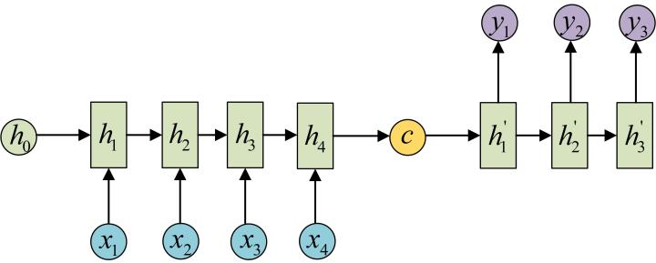

# 一、快速认知

https://easyai.tech/ai-definition/rnn/

- 优点：RNN 能够有效的处理序列数据

- 特点：RNN 跟传统神经网络最大的区别在于每次都会将前一次的输出结果，带到下一次的隐藏层中，一起训练

- 缺点：有短期记忆问题，无法处理很长的输入序列，且训练 RNN 需要投入极大的成本

    > 短期的记忆影响较大，但是长期的记忆影响就很小


# 二、RNN 的几种形态

参看：https://blog.csdn.net/bestrivern/article/details/90723524

- **核心概念**：==隐状态 `h`==，即可以对序列形的数据提取特征，接着再转换为输出

### 2.1 one-to-one

- 最基本的单层网络，输入是 `x`，经过变换 `Wx+b` 和激活函数 `f` 得到输出 `y` 


### 2.2 ont-to-n

- 方式一：把输入信息 `X` 作为**第一阶段**的输入

    

- 方式二：把输入信息 `X` 作为**每个阶段**的输入

    

### 2.3 n-to-n

> 最经典的RNN结构，输入、输出都是等长的序列数据

- 首先，计算隐状态 $h_1$

    

- 接着，计算第一个输出 $y_1$ 

    

- 最后，顺序计算每个输出

    

### 2.4 n-to-one

- 特点：输入是一个序列，输出是一个单独的值

- 方案：只在最后一个 `h` 上进行输出变换


### 2.5 n-to-m(Encoder-Decoder/Seq2Seq)

- 特点：输入、输出为不等长的序列

- 组成：
    - Encoder：将 input 序列转换为固定长度的向量
    - Decoder：将固定长度的向量转换为 output 序列
- 局限性：编码和解码之间的唯一联系是固定长度的语义向量 `c`
    - 语义向量 c 无法完全表达整个序列的信息
    - 先输入的内容携带的信息，会被后输入的信息稀释掉，或者被覆盖掉
    - 输入序列越长，这样的现象越严重，这样使得在Decoder解码时一开始就没有获得足够的输入序列信息，解码效果会打折扣
- 改进方案：attention 机制

---

**Encoder-Decoder 流程**：

- 先将输入数据编码成一个上下文语义向量 `c` 

    > **语义向量c**可以有多种表达方式:
    >
    > - 最简单的方法就是把 Encoder 的最后一个隐状态赋值给c
    > - 还可以对最后的隐状态做一个变换得到 c
    > - 也可以对所有的隐状态做变换

    

- 拿到 `c` 之后，就用另一个RNN网络 `Decoder` 对其进行解码，而Decoder 的RNN可以与 Encoder 的一样，也可以不一样

    - 用法一：将 `c` 当做之前的初始状态 h0 输入到 Decoder 中

        

    - 用法二：将 `c` 当做每一步的输入

        

# 三、RNN 改进之 Attention(简述)

### 3.1 说明

Attention 机制通过在每个时间输入不同的 `c` 来解决问题

- 每一个 `c` 会自动去选取与当前所要输出的 `y` 最合适的上下文信息

- 用 $a_{ij}$ 衡量 Encoder 中第 `j` 阶段的 $h_j$ 和解码时第 `i` 阶段的相关性，最终Decoder中第 `i` 阶段的输入的上下文信息 $c_i$ 就来自于所有 $h_j$ 对 $a_{ij}$ 的加权和

- 图解：

    - **Encoder**：

        

    - **Decoder**：

        

### 3.2 权重 $a_{ij}$

$a_{ij}$ 同样是从模型中学出的，它实际和 Decoder 的第 `i-1` 阶段的隐状态、Encoder第 `j` 个阶段的隐状态有关


### 3.3 Attention 的优缺点

- **优点**：

    - 在机器翻译时，让生词不只是关注全局的语义向量 `c`，增加了“注意力范围”

        > 表示接下来输出的词要重点关注输入序列种的哪些部分，根据关注的区域来产生下一个输出

    - 不要求编码器将所有信息全输入在一个固定长度的向量中

    - 将输入编码成一个向量的序列，解码时，每一步选择性的从序列中挑一个子集进行处理

    - 在每一个输出时，能够充分利用输入携带的信息，每个语义向量 Ci 不一样，注意力焦点不一样

- **缺点**：
    - 需要为每个输入输出组合分别计算 attention，50个单词的输出序列需要计算2500个attention
    - attention在决定专注于某个方面之前需要遍历一遍记忆再决定下一个输出是以什么

# 四、RNN 数学原理

一个典型的RNN：

- `x` 为输入层，`o` 为输出层，`s` 为隐含层，而 `t` 指第几次的计算，`V,W,U`为权重
- 计算第 `t` 次的隐含层状态时为：$s_t = f(U * x_t + W * s_{t-1})$


- 有一条单向流动的信息流**从输入单元到隐藏单元**，同时另一条单向流动的信息流**从隐藏单元到输出单元**
- `Back Projections`：引导信息从输出单元返回隐藏单元，并且隐藏层的输入还包括上一隐藏层的状态，即隐藏层内的节点可以自连也可以互连(这实际上就是LSTM)

# 五、手写 RNN

详细逻辑参看：

- https://zh.d2l.ai/chapter_recurrent-neural-networks/rnn-scratch.html
- https://github.com/ShusenTang/Dive-into-DL-PyTorch/blob/master/docs/chapter06_RNN/6.4_rnn-scratch.md

## 1、数据加载

数据集和 d2l 见：https://github.com/ShusenTang/Dive-into-DL-PyTorch

```python
import time
import math
import numpy as np
import torch
from torch import nn, optim
import torch.nn.functional as F

import sys
import importlib
import d2l
importlib.reload(d2l)


#加载数据集
device = torch.device('cuda' if torch.cuda.is_available() else 'cpu')
print(device)
(corpus_indices, char_to_idx, idx_to_char, vocab_size) = d2l.load_data_jay_lyrics()
print(corpus_indices)
print(char_to_idx)
print(idx_to_char)
print(vocab_size)
```

## 2、独热(one-hot)编码

独热(one-hot)向量：

- 每个词元都表示为一个数字索引，而one-hot将每个索引映射为相互不同的单位向量
- 假设词表中不同词元的数目为N(vocab_size)，词元索引的范围为0到N-1
- 如果词元的索引是整数 `i`，将创建一个长度为 N 的全0向量，并将第 `i` 处的元素设置为1

```python
#案例一：索引为0和2的one-hot向量
print(F.one_hot(torch.tensor([0, 2]), vocab_size))

#案例二：每次采样的小批量的形状是(批量大小, 时间步数)，one_hot函数将其转换为(时间步数，批量大小，词表大小)
X = torch.arange(10).reshape((2, 5))
print(F.one_hot(X.T, vocab_size).shape)

inputs = d2l.to_onehot(X, vocab_size)
print(len(inputs), inputs[0].shape)

#----------------结果输出---------------
tensor([[1, 0, 0,  ..., 0, 0, 0],
        [0, 0, 1,  ..., 0, 0, 0]])
torch.Size([5, 2, 1027])
5 torch.Size([2, 1027])
```

## 3、初始化模型参数

```python
num_inputs, num_hiddens, num_outputs = vocab_size, 256, vocab_size #隐藏单元个数 num_hiddens是一个超参数

def get_params():
    def _one(shape):
        ts = torch.tensor(np.random.normal(0, 0.01, size=shape), device=device, dtype=torch.float32)
        return torch.nn.Parameter(ts, requires_grad=True)
    
    #隐藏层参数
    W_xh = _one((num_inputs, num_hiddens))
    W_hh = _one((num_hiddens, num_hiddens))
    b_h = torch.nn.Parameter(torch.zeros(num_hiddens, device=device, requires_grad=True))
    #输出层参数
    W_hq = _one((num_hiddens, num_outputs))
    b_q = torch.nn.Parameter(torch.zeros(num_outputs, device=device, requires_grad=True))
    return nn.ParameterList([W_xh, W_hh, b_h, W_hq, b_q])
```

## 4、定义模型

```python
#用来返回初始化的隐藏状态--返回由一个形状为(批量大小, 隐藏单元个数)的值为0的NDArray组成的元组
def init_rnn_state(batch_size, num_hiddens, device):
    return torch.zeros((batch_size, num_hiddens), device=device)

#定义了在一个时间步里如何计算隐藏状态和输出
def rnn(inputs, state, params):
    #inputs和outputs皆为num_steps个形状为(batch_size, vocab_size)的矩阵
    W_xh, W_hh, b_h, W_hq, b_q = params
    H = state
    outputs = []
    for X in inputs:
        H = torch.tanh(torch.matmul(X, W_xh) + torch.matmul(H, W_hh) + b_h).to(device)
        Y = torch.matmul(H, W_hq) + b_q
        outputs.append(Y)
    return outputs, (H,)

#测试: 观察输出结果的个数(时间步数)，以及第一个时间步的输出层输出的形状和隐藏状态的形状
state = init_rnn_state(X.shape[0], num_hiddens, device)
inputs = d2l.to_onehot(X.to(device), vocab_size)
params = get_params()
outputs, state_new = rnn(inputs, state, params)
print(len(outputs), outputs[0].shape, state_new[0].shape)

#----------------结果输出---------------
5 torch.Size([2, 1027]) torch.Size([2, 256])
```

## 5、定义预测函数

```python
#定义预测函数
def predict_rnn(prefix, num_chars, rnn, params, init_rnn_state,
               num_hiddens, vocab_size, device, idx_to_char, char_to_idx):
    state = init_rnn_state(1, num_hiddens, device)
    output = [char_to_idx[prefix[0]]]
    for t in range(num_chars + len(prefix) - 1):
        #将上一时间步的输出作为当前时间步的输入
        X = d2l.to_onehot(torch.tensor([[output[-1]]], device=device), vocab_size)
        #计算输出和更新隐藏状态
        (Y, state) = rnn(X, state, params)
        state = state[0]
        #下一个时间步的输入是prefix里的字符或者当前的最佳预测字符
        if t < len(prefix) - 1:
            output.append(char_to_idx[prefix[t + 1]])
        else:
            output.append(int(Y[0].argmax(dim=1).item()))
    return ''.join([idx_to_char[i] for i in output])

#测试
predict_rnn('分开', 10, rnn, params, init_rnn_state, 
            num_hiddens, vocab_size, device, idx_to_char, char_to_idx)

#----------------结果输出---------------
'分开卜约底实走千灌试门睛'
```

## 6、裁剪梯度

```python
#裁剪梯度--应对梯度爆炸
def grad_clipping(params, theta, device):
    norm = torch.tensor([0.0], device=device)
    for param in params:
        norm += (param.grad.data ** 2).sum()
    norm = norm.sqrt().item()
    if norm > theta:
        for param in params:
            param.grad.data *= (theta / norm)
```

## 7、困惑度

通常使用**困惑度(perplexity)**来评价语言模型的好坏，困惑度是对交叉熵损失函数做指数运算后得到的值，特别：

- 最佳情况下，模型总是把标签类别的概率预测为 1，此时困惑度为1；
- 最坏情况下，模型总是把标签类别的概率预测为 ，此时困惑度为正无穷；
- 基线情况下，模型总是预测所有类别的概率都相同，此时困惑度为类别个数。

显然，任何一个有效模型的困惑度必须小于类别个数。在本例中，困惑度必须小于词典大小`vocab_size`。

## 8、定义模型训练函数

模型训练函数有以下几点不同：

1. 使用困惑度评价模型
2. 在迭代模型参数前裁剪梯度
3. 对时序数据采用不同采样方法将导致隐藏状态初始化的不同

```python
#定义模型训练函数
def train_and_predict_rnn(rnn, get_params, init_rnn_state, num_hiddens, vocab_size, device,
                         corpus_indices, idx_to_char, char_to_idx, is_random_iter, 
                          num_epochs, num_steps, lr, clipping_theta,
                         batch_size, pred_period, pred_len, prefixes):
    if is_random_iter:
        data_iter_fn = d2l.data_iter_random
    else:
        data_iter_fn = d2l.data_iter_consecutive
    params = get_params()
    loss = nn.CrossEntropyLoss()
    
    for epoch in range(num_epochs):
        if not is_random_iter: # 如使用相邻采样，在epoch开始时初始化隐藏状态
            state = init_rnn_state(batch_size, num_hiddens, device)
        l_sum, n, start = 0.0, 0, time.time()
        data_iter = data_iter_fn(corpus_indices, batch_size, num_steps, device)
        for X, Y in data_iter:
            if is_random_iter: #如使用随机采样，在每个小批量更新前初始化隐藏状态
                state = init_rnn_state(batch_size, num_hiddens, device)
            else: #否则需要使用detach函数从计算图分离隐藏状态, 这是为了
                #使模型参数的梯度计算只依赖一次迭代读取的小批量序列(防止梯度计算开销太大)
                for s in state:
                    s = s.detach()
            
            inputs = d2l.to_onehot(X, vocab_size)
            #outputs有num_steps个形状为(batch_size, vocab_size)的矩阵
            (outputs, state) = rnn(inputs, state, params)
            state = state[0]
            #拼接之后形状为(num_steps * batch_size, vocab_size)
            outputs = torch.cat(outputs, dim=0)
            #Y的形状是(batch_size, num_steps)，转置后再变成长度为batch * num_steps 的向量，这样跟输出的行一一对应
            y = torch.transpose(Y, 0, 1).contiguous().view(-1)
            #使用交叉熵损失计算平均分类误差
            l = loss(outputs, y.long())
            
            #梯度清0
            if params[0].grad is not None:
                for param in params:
                    param.grad.data.zero_()
            l.backward(retain_graph=True)
            grad_clipping(params, clipping_theta, device) #裁剪梯度
            d2l.sgd(params, lr, 1) #因为误差已经取过均值，梯度不用再做平均
            l_sum += l.item() * y.shape[0]
            n += y.shape[0]
        
        if (epoch + 1) % pred_period == 0:
            print('epoch %d, perplexity %f, time %.2f sec' % (
                epoch + 1, math.exp(l_sum / n), time.time() - start
            ))
            for prefix in prefixes:
                print(' -', predict_rnn(prefix, pred_len, rnn, params, init_rnn_state, num_hiddens, 
                                        vocab_size, device, idx_to_char,char_to_idx))
```

## 9、训练模型并创作歌词

```python
#设置模型超参数
num_epochs, num_steps, batch_size, lr, clipping_theta = 250, 35, 32, 1e2, 1e-2
pre_period, pred_len, prefixes = 50, 50, ['分开', '不分开']
```

- 方式一：采用随机采样训练模型并创作歌词

    ```python
    train_and_predict_rnn(rnn, get_params, init_rnn_state, num_hiddens, vocab_size, device,
                         corpus_indices, idx_to_char, char_to_idx, True, num_epochs, num_steps, 
                         lr, clipping_theta, batch_size, pre_period, pred_len, prefixes)
    
    #----------------结果输出---------------
    epoch 50, perplexity 68.141235, time 0.07 sec
     - 分开 我不要再想 我不要再想 我不要再想 我不要再想 我不要再想 我不要再想 我不要再想 我不要再想 我
     - 不分开  我不要再想 我不要再想 我不要再想 我不要再想 我不要再想 我不要再想 我不要再想 我不要再想 
    epoch 100, perplexity 9.788064, time 0.07 sec
     - 分开  我爱回这里很 想想想没 你知了这不活 不知哈觉 我该了好生活 我知不这样活 后知不觉 我该了这生
     - 不分开  你有了这 我想要再想 我不能再想 我不 我不 我不 我不 我不 我不 我不 我不 我不 我不 我
    epoch 150, perplexity 2.749400, time 0.07 sec
     - 分开 一颗两步三步四步 连成线背著背默默许下心愿 看远方的星是否听的见 手一定实现 让一定实现 一朵 娘
     - 不分开吗 我后你爸 你打我妈 这样 我说好这 看指球 快沉空 停壶一句旧代南 干著么 一什两 三颗四田 连
    epoch 200, perplexity 1.595687, time 0.07 sec
     - 分开 一只用钩拳打的母斑鸠 站着一只饿 吹完它满走 这里的角丽 你的完美主义 太彻底 让我连恨都难以下笔
     - 不分开期 我叫你爸 你打的让快 还制茶 岩烧了 装属了明信片的铁盒里藏著一片玫瑰花瓣 黄金葛爬满了雕花的门
    epoch 250, perplexity 1.294004, time 0.07 sec
     - 分开 一只用 教颗四步三在四等 连成线背著背 游荡在蓝后排的雨 随时准备来袭 我怀念起国小的课桌椅 用铅
     - 不分开期 我叫你爸 你打我妈 这样对吗干嘛这样 何必让酒牵鼻子走 瞎 说不了口斯光 说经安的让不桑 茶念像
    ```

- 方式二：采用相邻采样训练模型并创作歌词

    ```python
    train_and_predict_rnn(rnn, get_params, init_rnn_state, num_hiddens, vocab_size, device,
                         corpus_indices, idx_to_char, char_to_idx, False, num_epochs, num_steps, 
                         lr, clipping_theta, batch_size, pre_period, pred_len, prefixes)
    
    #----------------结果输出---------------
    epoch 50, perplexity 57.858889, time 0.14 sec
     - 分开 我想要这样 我不要再 你着我有 你是我有 你是我有 你是我有 你是我有 你是我有 你是我有 你是我
     - 不分开 我想要这 快堡了双 我有了这 我想了这 我有了的可爱女人 坏坏的让我疯狂的可爱女人 坏坏的让我疯狂
    epoch 100, perplexity 6.606628, time 0.14 sec
     - 分开 我想想这样牵着你的手不放开 爱可不可以简简单单没有愿著 你 想着我的肩膀 你 在我胸口睡著 像这样
     - 不分开觉 你已经这天泪 不知不觉 我跟了这节奏 我该好好生活 我爱你的生活 有爱去对医药 说隔 篮去意义 
    epoch 150, perplexity 1.971886, time 0.14 sec
     - 分开 我想么 是果就没汉着我有说你  是不的叹息 相烁成说忆的寻样的 用成我被默圈撑定一个人演戏 最后再
     - 不分开觉 你想经离开泪 不知不觉 我跟了这节奏 后知后觉 又过了一个秋 后知后觉 我该好好生活 我该好好生
    epoch 200, perplexity 1.382278, time 0.14 sec
     - 分开 我想要这样布着样的姑忆你知道  杵在伊斯坦堡 却只想你和汉堡 我想要你的微笑每天都能看到  我知道
     - 不分开觉 你已经离开我 不知不觉 我跟了这节奏 我该好好生活 不知不觉 你已经离开我 不知不觉 我跟了这节
    epoch 250, perplexity 466.459039, time 0.14 sec
     - 分开的风不一场风  我不能了在 三著了一天人 你的不多天人 你的不人天人一 我不想能 我 我不多能的风 
     - 不分开觉不堡 一步四酒多能 一 我不那球 一步等很已能 想 你在那一天  双的不开不人  有不的黑 一 我
    ```

## 10、小结

- 可以用基于字符级循环神经网络的语言模型来生成文本序列，例如创作歌词
- 当训练循环神经网络时，为了应对梯度爆炸，可以裁剪梯度
- 困惑度是对交叉熵损失函数做指数运算后得到的值

# 六、RNN 简洁实现

参看：

- https://zh.d2l.ai/chapter_recurrent-neural-networks/rnn-concise.html
- https://github.com/ShusenTang/Dive-into-DL-PyTorch/blob/master/docs/chapter06_RNN/6.5_rnn-pytorch.md

## 1、数据加载

```python
import time
import math
import numpy as np
import torch
from torch import nn, optim
import torch.nn.functional as F

import sys
import importlib
import d2l
importlib.reload(d2l)


#加载数据集
device = torch.device('cuda' if torch.cuda.is_available() else 'cpu')
print(device)
(corpus_indices, char_to_idx, idx_to_char, vocab_size) = d2l.load_data_jay_lyrics()
print(corpus_indices)
print(char_to_idx)
print(idx_to_char)
print(vocab_size)
```

## 2、定义模型

- 构造一个含单隐藏层、隐藏单元个数为256的循环神经网络层rnn_layer

    ```python
    num_hiddens = 256
    rnn_layer = nn.RNN(input_size=vocab_size, hidden_size=num_hiddens)
    
    #测试
    num_steps = 35
    batch_size = 2
    state = None
    X = torch.rand(num_steps, batch_size, vocab_size) #输入形状为(时间步数, 批量大小, 输入个数--one-hot长度，即词典大小)
    Y, state_new = rnn_layer(X, state) #返回输出和隐藏状态h
    print(Y.shape, len(state_new), state_new[0].shape)
    
    #----------------结果输出---------------
    torch.Size([35, 2, 256]) 1 torch.Size([2, 256])
    ```

- 继承Module类来定义一个完整的循环神经网络

    ```python
    #首先将输入数据使用one-hot向量表示后输入到rnn_layer中，然后使用全连接输出层得到输出。输出个数等于词典大小vocab_size
    class RNNModel(nn.Module):
        def __init__(self, rnn_layer, vocab_size):
            super(RNNModel, self).__init__()
            self.rnn = rnn_layer
            self.hidden_size = rnn_layer.hidden_size * (2 if rnn_layer.bidirectional else 1)
            self.vocab_size = vocab_size
            self.dense = nn.Linear(self.hidden_size, vocab_size)
            self.state = None
            
        def forward(self, inputs, state): #inputs: (batch, seq_len)
            #获取one-hot向量表示
            X = d2l.to_onehot(inputs, self.vocab_size)
            Y, self.state = self.rnn(torch.stack(X), state)
            #全连接层会首先将Y的形状变成(num_steps * batch_size, num_hiddens)
            output = self.dense(Y.view(-1, Y.shape[-1]))
            return output, self.state
    ```

## 3、训练模型

```python
#与之前的区别在于前向计算和初始化隐藏状态的函数接口
def predict_rnn_pytorch(prefix, num_chars, model, vocab_size, device, idx_to_char, char_to_idx):
    state = None
    output = [char_to_idx[prefix[0]]] #output会记录prefix加上输出
    for t in range(num_chars + len(prefix) - 1):
        X = torch.tensor([output[-1]], device=device).view(1, 1)
        if state is not None:
            if isinstance(state, tuple):
                state = (state[0].to(device), state[1].to(device))
            else:
                state = state.to(device)
                
        (Y, state) = model(X, state)
        if t < len(prefix) - 1:
            output.append(char_to_idx[prefix[t + 1]])
        else:
            output.append(int(Y.argmax(dim=1).item()))
    return ''.join([idx_to_char[i] for i in output])

#测试
model = RNNModel(rnn_layer, vocab_size).to(device)
predict_rnn_pytorch('分开', 10, model, vocab_size, device, idx_to_char, char_to_idx)

#----------------结果输出---------------
'分开耍编蜡火两两钢嘴火两'
```

## 4、定义训练函数

```python
#定义训练函数--区别是使用了相邻采样来读取数据
def train_and_predict_rnn_pytorch(model, num_hiddens, vocab_size, device, 
                                 corpus_indices, idx_to_char, char_to_idx,
                                 num_epochs, num_steps, lr, clipping_theta,
                                 batch_size, pred_period, pred_len, prefixes):
    loss = nn.CrossEntropyLoss()
    optimizer = torch.optim.Adam(model.parameters(), lr=lr)
    model.to(device)
    state = None
    for epoch in range(num_epochs):
        l_sum, n, start = 0.0, 0, time.time()
        data_iter = d2l.data_iter_consecutive(corpus_indices, batch_size, num_steps, device) #相邻采样
        for X, Y in data_iter:
            if state is not None:
                #使用detach函数从计算图分离隐藏状态, 这是为了使模型参数的梯度计算只依赖一次迭代读取的小批量序列(防止梯度计算开销太大)
                if isinstance(state, tuple):
                    state = (state[0].detach(), state[1].detach())
                else:
                    state = state.detach()
                    
            (output, state) = model(X, state) #output: 形状为(num_steps * batch_size, vocab_size)
            
            #Y的形状是(batch_size, num_steps)，转置后再变成长度为 batch * num_steps 的向量，这样跟输出的行一一对应
            y = torch.transpose(Y, 0, 1).contiguous().view(-1)
            l = loss(output, y.long())
            
            optimizer.zero_grad()
            l.backward()
            #梯度裁剪
            d2l.grad_clipping(model.parameters(), clipping_theta, device)
            optimizer.step()
            l_sum += l.item() * y.shape[0]
            n += y.shape[0]
        
        try:
            perplexity = math.exp(l_sum / n)
        except OverflowError:
            perplexity = float('inf')
        if(epoch + 1) % pred_period == 0:
            print('epoch %d, perplexity %f, time %.2f sec' % (epoch + 1, perplexity, time.time() - start))
            for prefix in prefixes:
                print(' -', predict_rnn_pytorch(prefix, pred_len, model, 
                                                vocab_size, device, idx_to_char, char_to_idx))
```

## 5、训练模型并创作歌词

```python
num_epochs, batch_size, lr, clipping_theta = 250, 32, 1e-3, 1e-2 #超参数(注意学习率)
pred_period, pred_len, prefixes = 50, 50, ['分开', '不分开']
train_and_predict_rnn_pytorch(model, num_hiddens, vocab_size, device,
                             corpus_indices, idx_to_char, char_to_idx,
                             num_epochs, num_steps, lr, clipping_theta,
                             batch_size, pred_period, pred_len, prefixes)

#----------------结果输出---------------
epoch 50, perplexity 3.414727, time 0.02 sec
 - 分开不我 没不着 我不知不觉 我不了这节奏 后知后觉 又过了一个秋 后知后觉 我想好这样牵着你的手不放开
 - 不分开不我 没不你 我不能不多 我不 不要 我不能再想你 不知不觉 我已经离开我 不知不觉 我已经不节  
epoch 100, perplexity 1.155077, time 0.02 sec
 - 分开不风 不不及逃 我不能再想 我不能再想 我不能再想 我不能再想 我不能再想 我不能再想 我不能再想 
 - 不分开不 我不要再想 我不要再想 我不 我不 我不要再想你 爱情来的太快就像龙卷风 离不开暴风圈来不及逃 
epoch 150, perplexity 1.050742, time 0.02 sec
 - 分开 我不好不着  爱情来的 我有像重家出的没桌椅 雨因为人了漂亮的让我面红的可爱女人 温柔的让我心疼的
 - 不分开不 我不要再想  不要再这样打我妈妈 难道 手不会痛吗 其实我回家就想要阻止一切 让家庭回到过去甜甜
epoch 200, perplexity 1.027004, time 0.02 sec
 - 分开 我不好不着  后悔着对不起 如果我遇见你是一场悲剧 我可以让生命就这样毫无意义 或许在最后能听到你
 - 不分开不 我不要再想  不要再想你太多 我不能再平 我不能再想 我不 我不 我不能再爱情走的太快就像龙卷风
epoch 250, perplexity 1.017951, time 0.02 sec
 - 分开 我不好看着  所有你  我的脚带你  爱 我想要和你骑单我可多 我不走 别你我美索不起 大种难道 
 - 不分开不了我多难熬  没有你在我 有多难熬  没有你在我人多难熬 泪没去 不要再一个画面对我 泪不休口语沉
```

