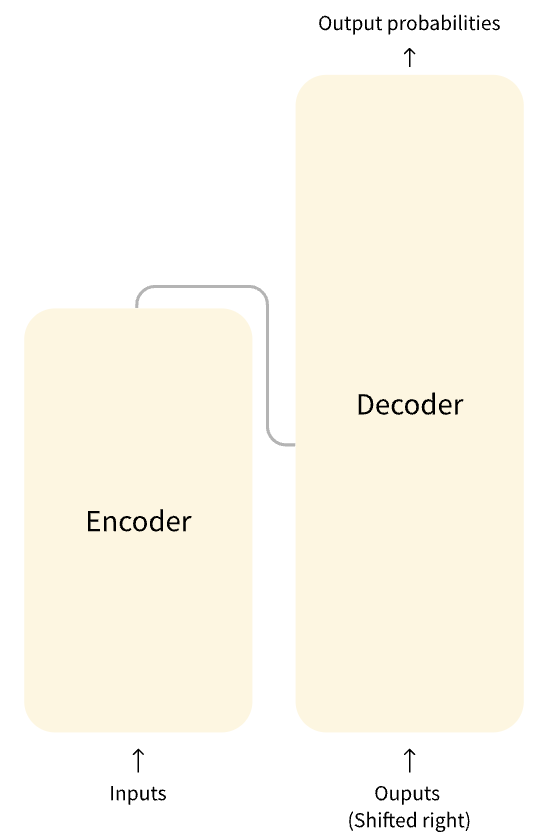
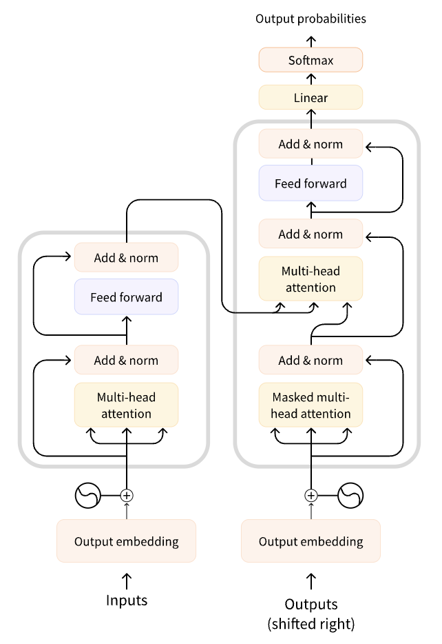
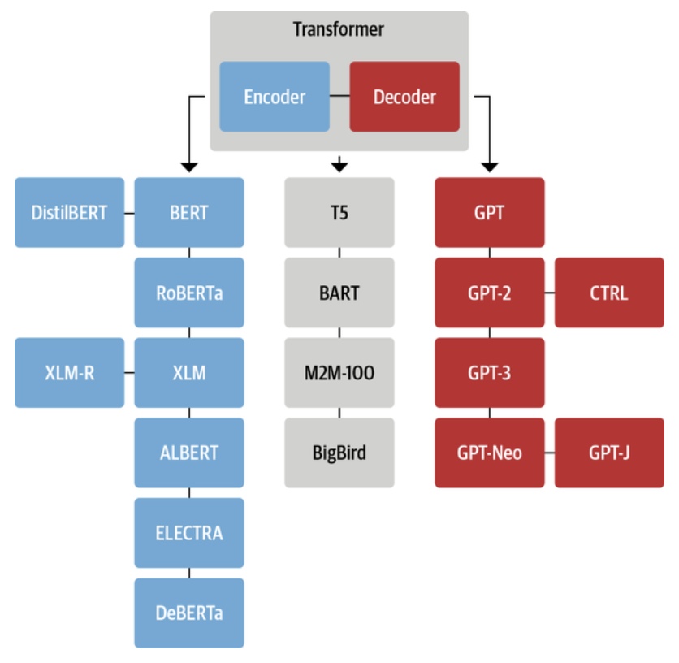
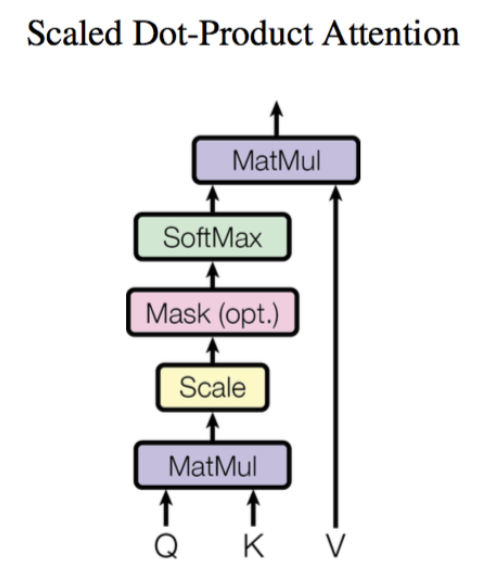
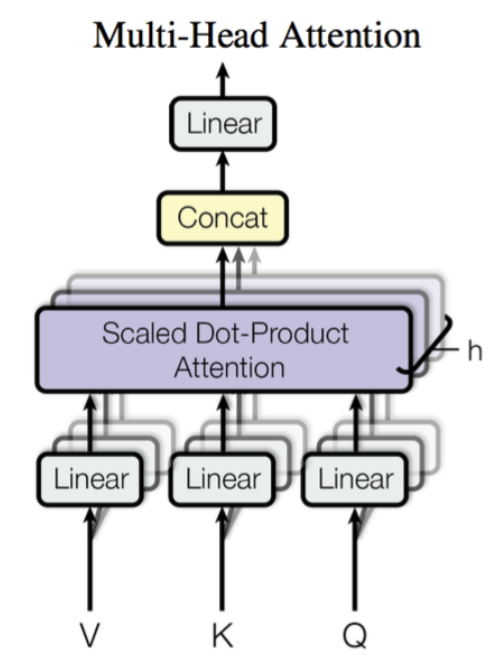
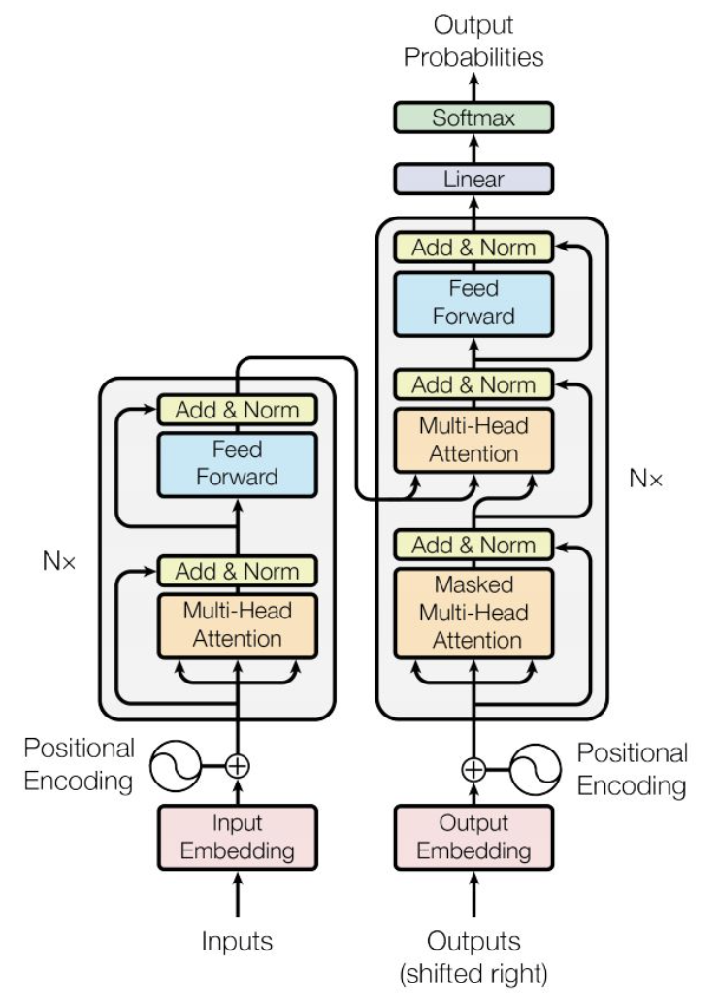
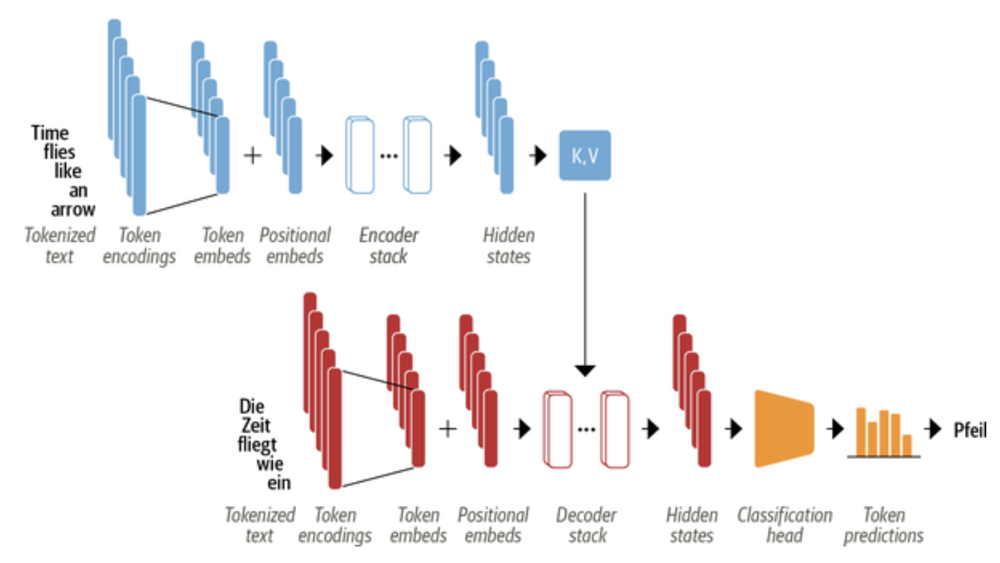
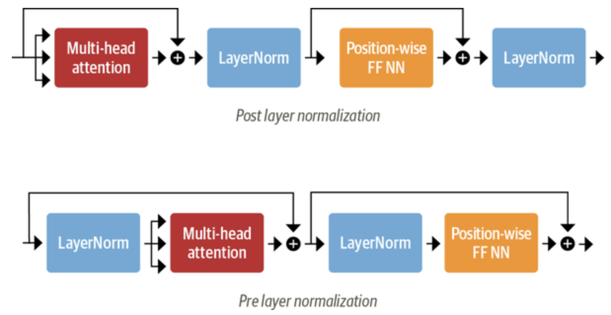
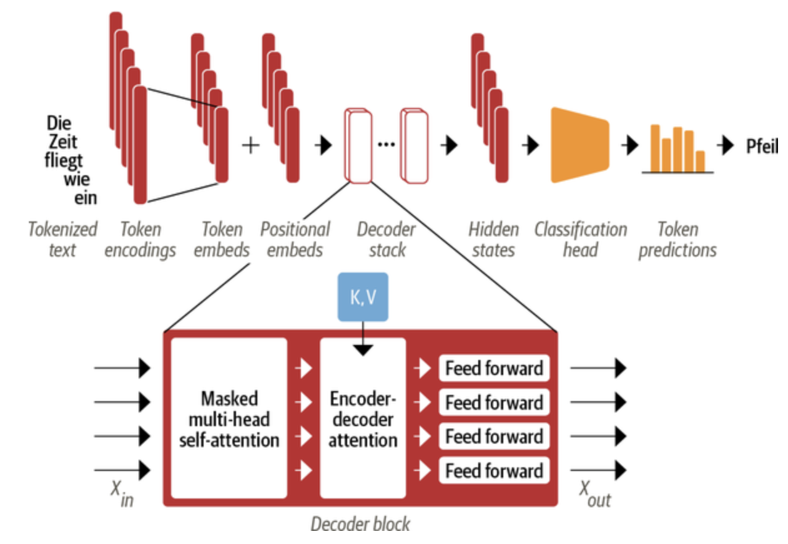
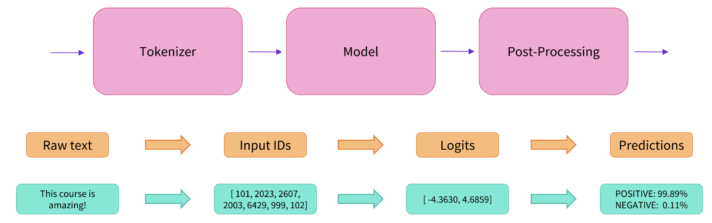

> 完整知识推荐：https://www.huaxiaozhuan.com/
>
> transformer 推荐：https://transformers.run/

---

https://easyai.tech/ai-definition/transformer/

- transfomer 工具包：https://huggingface.co/docs/transformers/main/zh/index

- transformer 模型及应用：https://transformers.run/

---

# 一、简介

### 1.1 基本概念

- Transformer 模型本质上是预训练语言模型，大都采用自监督学习 (Self-supervised learning) 的方式在大量生语料上进行训练

    > 自监督学习是一种训练目标可以根据模型的输入自动计算的训练方法

- 两个常用的预训练任务：

    - **因果语言建模**：基于句子的前 𝑛 个词来预测下一个词，输出依赖于过去和当前的输入

        > “因果语言建模”是统计语言模型，只使用前面的词来预测当前词，由 NNLM 首次运用

    - **遮盖语言建模**：基于上下文（周围的词语）来预测句子中被遮盖掉的词语 (masked word)

        > “遮盖语言建模”是 Word2Vec 模型提出的 CBOW

- **训练方式**：

    - **预训练**：从头开始训练模型
    - **迁移学习**：用自己的任务语料对模型进行“二次训练”，通过微调参数使模型适用于新任务

### 1.2 结构

#### (1) Encoder 与 Decoder

标准的 Transformer 模型主要由两个模块构成：

- **Encoder（左边）：**负责理解输入文本，为每个输入构造对应的语义表示（语义特征）
- **Decoder（右边）：**负责生成输出，使用 Encoder 输出的语义表示结合其他输入来生成目标序列

这两个模块可以根据任务的需求而单独使用：

- **纯 Encoder 模型：**适用于只需要理解输入语义的任务，例如句子分类、命名实体识别；
- **纯 Decoder 模型：**适用于生成式任务，例如文本生成；
- **Encoder-Decoder 模型**或 **Seq2Seq 模型：**适用于需要基于输入的生成式任务，例如翻译、摘要



#### (2) Transformer 模型结构

Transformer 模型本来是为了翻译任务而设计：

- 在训练过程中，Encoder 接受源语言的句子作为输入，而 Decoder 则接受目标语言的翻译作为输入

- 在 Encoder 中，由于翻译一个词语需要依赖于上下文，因此注意力层可以访问句子中的所有词语；

    而 Decoder 是顺序地进行解码，在生成每个词语时，注意力层只能访问前面已经生成的单词。

    > 注意力层的作用就是让模型在处理文本时，将注意力只放在某些词语上
    >
    > 为了加快速度，会将整个目标序列都送入 Decoder，然后在注意力层中通过 Mask 遮盖掉未来的词语来防止信息泄露

**原始的 Transformer 模型结构**：

- Decoder 中的第一个注意力层关注 Decoder 过去所有的输入，而第二个注意力层则是使用 Encoder 的输出，因此 Decoder 可以基于整个输入句子来预测当前词语

- 在 Encoder/Decoder 的注意力层中，会使用 Attention Mask 遮盖掉某些词语来防止模型关注它们

    > 例如为了将数据处理为相同长度而向序列中添加的填充 (padding) 字符。



#### (3) Transformer 家族

> 参考：https://transformers.run/c1/transformer/#transformer-%E5%AE%B6%E6%97%8F



# 二、注意力机制

> Transformer 模型之所以如此强大，是因为抛弃了循环网络和卷积网络，而采用了注意力机制 (Attention) 来建模文本

### 2.1 RNN 与 CNN 缺点

NLP 神经网络模型的本质就是对输入文本进行编码，对 token 序列 𝑋 的常规编码方式：

> 常规的做法是首先对句子进行分词，然后将每个词语 (token) 都转化为对应的词向量 (token embeddings)，这样文本就转换为一个由词语向量组成的矩阵 X

- **RNN 方案**：每一个词语 𝑥𝑡 对应的编码结果 𝑦𝑡 通过递归地计算得到
    $$
    y_t = f(y_{t-1}, xt)
    $$

    > RNN 的递归结构导致其无法并行计算，因此速度较慢。而且 RNN 本质是一个马尔科夫决策过程，难以学习到全局的结构信息

- **CNN 方案**：通过滑动窗口基于局部上下文来编码文本，例如核尺寸为 3 的卷积操作就是使用每一个词自身以及前一个和后一个词来生成嵌入式表示
    $$
    y_t = f(x_{t-1}, x_t, x_{t+1})
    $$

    > CNN 能够并行地计算，因此速度很快，但是由于是通过窗口来进行编码，所以更侧重于捕获局部信息，难以建模长距离的语义依赖

- **Attention 机制编码整个文本**：相比 RNN 要逐步递归才能获得全局信息（因此一般使用双向 RNN），而 CNN 实际只能获取局部信息，需要通过层叠来增大感受野，Attention 机制一步到位获取了全局信息
    $$
    y_t = f(x_t, A, B)
    $$

    > 𝐴,𝐵 是另外的词语序列(矩阵)，若取 𝐴=𝐵=𝑋 就称为 Self-Attention，即直接将 𝑥𝑡 与自身序列中的每个词语比较，最后算出 𝑦𝑡

### 2.2 Attention 实现

#### (1) Scaled Dot-product Attention

Scaled Dot-product Attention 共包含 2 个主要步骤：

1. **计算注意力权重**：使用某种相似度函数度量每一个 query 向量和所有 key 向量之间的关联程度

    对于长度为 𝑚 的 Query 序列和长度为 𝑛 的 Key 序列，该步骤会生成一个尺寸为 𝑚×𝑛 的注意力分数矩阵

    > 补充：Scaled Dot-product Attention 使用点积作为相似度函数，由于点积可以产生任意大的数字，会破坏训练过程的稳定性，因此注意力分数还需要乘以一个缩放因子来标准化它们的方差，然后用一个 softmax 标准化
    >
    > 这样就得到了最终的注意力权重 𝑤𝑖𝑗，表示第 𝑖 个 query 向量与第 𝑗 个 key 向量之间的关联程度

2. **更新 token embeddings：**将权重 𝑤𝑖𝑗 与对应的 value 向量 𝑣1,…,𝑣𝑛 相乘以获得第 𝑖 个 query 向量更新后的语义表示 $𝑥_𝑖^′=∑_𝑗𝑤_{𝑖𝑗}𝑣_𝑗$  

    > 形式化表示为 $Attention(Q, K, V) = softmax(\frac{QK^T}{\sqrt d_k})V$，其中 Q，K，V 分别是 query、key、value 向量序列
    >
    > 将上面的公式拆开来看更加清楚：$Attention(q_t,K,V) = \sum^m_{s=1}\frac{1}{Z}exp(\frac{<q_t, k_s>}{\sqrt d_k})v_s$
    >
    > 整个流程：通过 𝑞𝑡 这个 query 与各个 𝑘𝑠 内积并 softmax 的方式来得到 𝑞𝑡 与各个 𝑣𝑠 的相似度，然后加权求和，得到一个 𝑑𝑣 维的向量，其中因子 𝑑𝑘 起到调节作用，使得内积不至于太大



```python
#代码后续补充：https://transformers.run/c1/attention/#scaled-dot-product-attention
#首先需要将文本分词为词语 (token) 序列，然后将每一个词语转换为对应的词向量 (embedding)
#Pytorch 提供了 torch.nn.Embedding 层来完成该操作，即构建一个从 token ID 到 token embedding 的映射表


#接下来就是创建 query、key、value 向量序列 Q, K, V，并且使用点积作为相似度函数来计算注意力分数


#最后将注意力权重与 value 序列相乘


```

#### (2) Multi-head Attention

> 注意：当 𝑄 和 𝐾 序列相同时，Scaled Dot-product Attention 注意力机制会为上下文中的相同单词分配非常大的分数（点积为 1），而在实践中，相关词往往比相同词更重要

Multi-head Attention：每个注意力头负责关注某一方面的语义相似性，多个头就可以让模型同时关注多个方面

- 首先通过线性映射将 𝑄,𝐾,𝑉 序列映射到特征空间，每一组线性投影后的向量表示称为一个头 (head)
- 然后在每组映射后的序列上再应用 Scaled Dot-product Attention

---

**公式**：
$$
head_i = Attention(QW^Q_i, KW^K_i, VW^V_i) \\
MultiHead(Q, K, V) = Concat(head_1,...,head_n)
$$

- 其中，W 是映射矩阵，h 是注意力头的数量

- 最后，将多头的结果拼接起来就得到最终 $𝑚×ℎ𝑑^~_𝑣$ 的结果序列
- 所谓的“多头” (Multi-head)，其实就是多做几次 Scaled Dot-product Attention，然后把结果拼接




```python
#代码：https://transformers.run/c1/attention/#multi-head-attention

# 每个头都会初始化三个独立的线性层，负责将 Q, K, V 序列映射到尺寸为 [batch_size, seq_len, head_dim] 的张量
#其中 head_dim 是映射到的向量维度


#最后只需要拼接多个注意力头的输出就可以构建出 Multi-head Attention 层
#这里在拼接后还通过一个线性变换来生成最终的输出张量

#这里使用 BERT-base-uncased 模型的参数初始化 Multi-head Attention 层，并且将之前构建的输入送入模型以验证是否工作正常
```

### 2.3 Transformer Encoder

#### (1) 简介

标准 Transformer 结构：Encoder 负责将输入的词语序列转换为词向量序列，Decoder 则基于 Encoder 的隐状态来迭代地生成词语序列作为输出，每次生成一个词语



其中，Encoder 和 Decoder 都各自包含有多个 building blocks，下图展示了一个翻译任务的例子：

- 输入的词语首先被转换为词向量

    > 由于注意力机制无法捕获词语之间的位置关系，因此还通过 positional embeddings 向输入中添加位置信息

- Encoder 由一堆 encoder layers (blocks) 组成，类似于图像领域中的堆叠卷积层

    Decoder 中也包含有堆叠的 decoder layers；

- Encoder 的输出被送入到 Decoder 层中以预测概率最大的下一个词

- 然后当前的词语序列又被送回到 Decoder 中以继续生成下一个词，重复直至出现序列结束符 EOS 或超过最大输出长度



#### (2) The Feed-Forward Layer

**前馈子层(The Feed-Forward Layer/position-wise feed-forward layer)**：实际上是两层全连接神经网络，其单独地处理序列中的每一个词向量

> 常见做法是让第一层的维度是词向量大小的 4 倍，然后以 GELU 作为激活函数

```python
import torch.nn as nn

class FeedForwar(nn.Module):
    def __init__(self, config):
        super().__init__()
        self.linear_1 = nn.Linear(config.hidden_size, config.intermediate_size)
        self.linear_2 = nn.Linear(config.intermediate_size, config.hidden_size)
        self.gelu = nn.GELU()
        self.dropout = nn.Dropout(config.hidden_dropout_prob)
        
    def forward(self, x):
        x = self.linear_1(x)
        x = self.gelu(x)
        x = self.linear_2(x)
        x = self.dropout(x)
        return x
    
#测试
feed_forward = FeedForward(config)
ff_outputs = feed_forward(attn_output)
print(ff_outputs.size())
```

至此创建完整 Transformer Encoder 的所有要素都已齐备，只需要再加上 Skip Connections 和 Layer Normalization 就大功告成了

#### (3) Layer Normalization

Layer Normalization 负责将一批 (batch) 输入中的每一个都标准化为均值为零且具有单位方差；

Skip Connections 则是将张量直接传递给模型的下一层而不进行处理，并将其添加到处理后的张量中

---

向 Transformer Encoder/Decoder 中添加 Layer Normalization 目前共有两种做法：

- **Post layer normalization**(Transformer 论文中使用的方式)：将 Layer normalization 放在 Skip Connections 之间。

    > 但是因为梯度可能会发散，这种做法很难训练，还需要结合学习率预热 (learning rate warm-up) 等技巧

- **Pre layer normalization**(主流做法)：将 Layer Normalization 放置于 Skip Connections 的范围内

    > 这种做法通常训练过程会更加稳定，并且不需要任何学习率预热



采用第二种方式来构建 Transformer Encoder 层：

```python
class TransformerEncoderLayer(nn.Module):
    def __init__(self, config):
        super().__init__()
        self.layer_norm_1 = nn.LayerNorm(config.hidden_size)
        self.layer_norm_2 = nn.LayerNorm(config.hidden_size)
        self.attention = MultiHeadAttention(config)
        self.feed_forward = FeedForward(config)

    def forward(self, x, mask=None):
        # Apply layer normalization and then copy input into query, key, value
        hidden_state = self.layer_norm_1(x)
        # Apply attention with a skip connection
        x = x + self.attention(hidden_state, hidden_state, hidden_state, mask=mask)
        # Apply feed-forward layer with a skip connection
        x = x + self.feed_forward(self.layer_norm_2(x))
        return x

#将之前构建的输入送入到该层中进行测试：
encoder_layer = TransformerEncoderLayer(config)
print(inputs_embeds.shape)
print(encoder_layer(inputs_embeds).size())

#输出
torch.Size([1, 5, 768])
torch.Size([1, 5, 768])
```

#### (4) Positional Embeddings

> 由于注意力机制无法捕获词语之间的位置信息，因此 Transformer 模型还使用 Positional Embeddings 添加了词语的位置信息

Positional Embeddings 基于一个简单但有效的想法：**使用与位置相关的值模式来增强词向量** 

---

Positional Embeddings 的方案：

- **让模型自动学习位置嵌入**：当预训练数据集足够大时采用

- **绝对位置表示**：使用由调制的正弦和余弦信号组成的静态模式来编码位置，当没有大量训练数据可用时，这种方法尤其有效；

- **相对位置表示**：在生成某个词语的词向量时，一般距离它近的词语更为重要，因此也有工作采用相对位置编码

    > 因为每个词语的相对嵌入会根据序列的位置而变化，这需要在模型层面对注意力机制进行修改，而不是通过引入嵌入层来完成，例如 DeBERTa 等模型

---

使用“让模型自动学习位置嵌入”的方式创建自定义的 Embeddings 模块，同时将词语和位置映射到嵌入式表示，最终输出两个表示之和

```python
class Embeddings(nn.Module):
    def __init__(self, config):
        super().__init__()
        self.token_embeddings = nn.Embedding(config.vocab_size,
                                             config.hidden_size)
        self.position_embeddings = nn.Embedding(config.max_position_embeddings,
                                                config.hidden_size)
        self.layer_norm = nn.LayerNorm(config.hidden_size, eps=1e-12)
        self.dropout = nn.Dropout()

    def forward(self, input_ids):
        # Create position IDs for input sequence
        seq_length = input_ids.size(1)
        position_ids = torch.arange(seq_length, dtype=torch.long).unsqueeze(0)
        # Create token and position embeddings
        token_embeddings = self.token_embeddings(input_ids)
        position_embeddings = self.position_embeddings(position_ids)
        # Combine token and position embeddings
        embeddings = token_embeddings + position_embeddings
        embeddings = self.layer_norm(embeddings)
        embeddings = self.dropout(embeddings)
        return embeddings

#测试
embedding_layer = Embeddings(config)
print(embedding_layer(inputs.input_ids).size())

#输出
torch.Size([1, 5, 768])
```

#### (5) 完整的 Transformer Encoder 代码

``` python
class TransformerEncoder(nn.Module):
    def __init__(self, config):
        super().__init__()
        self.embeddings = Embeddings(config)
        self.layers = nn.ModuleList([TransformerEncoderLayer(config)
                                     for _ in range(config.num_hidden_layers)])

    def forward(self, x, mask=None):
        x = self.embeddings(x)
        for layer in self.layers:
            x = layer(x, mask=mask)
        return x

#测试
encoder = TransformerEncoder(config)
print(encoder(inputs.input_ids).size())

#输出
torch.Size([1, 5, 768])
```

### 2.4 Transformer Decoder

Transformer Decoder 与 Encoder 最大的不同在于 **Decoder 有两个注意力子层**



- **Masked multi-head self-attention layer**：确保在每个时间步生成的词语仅基于过去的输出和当前预测的词，否则 Decoder 相当于作弊了；

- **Encoder-decoder attention layer**：以解码器的中间表示作为 queries，对 encoder stack 的输出 key 和 value 向量执行 Multi-head Attention

    > 通过这种方式，Encoder-Decoder Attention Layer 就可以学习到如何关联来自两个不同序列的词语，例如两种不同的语言
    >
    > 解码器可以访问每个 block 中 Encoder 的 keys 和 values。

---

与 Encoder 中的 Mask 不同，Decoder 的 Mask 是一个下三角矩阵：

```python
#使用 PyTorch 自带的 tril() 函数来创建下三角矩阵
seq_len = inputs.input_ids.size(-1)
mask = torch.tril(torch.ones(seq_len, seq_len)).unsqueeze(0)
print(mask[0])

#输出
tensor([[1., 0., 0., 0., 0.],
        [1., 1., 0., 0., 0.],
        [1., 1., 1., 0., 0.],
        [1., 1., 1., 1., 0.],
        [1., 1., 1., 1., 1.]])

#通过 Tensor.masked_fill() 将所有零替换为负无穷大来防止注意力头看到未来的词语而造成信息泄露
scores.masked_fill(mask == 0, -float("inf"))

#输出
tensor([[[26.8082,    -inf,    -inf,    -inf,    -inf],
         [-0.6981, 26.9043,    -inf,    -inf,    -inf],
         [-2.3190,  1.2928, 27.8710,    -inf,    -inf],
         [-0.5897,  0.3497, -0.3807, 27.5488,    -inf],
         [ 0.5275,  2.0493, -0.4869,  1.6100, 29.0893]]],
       grad_fn=<MaskedFillBackward0>)
```

# 三、pipelines

### 3.1 简介

Transformers 库将目前的 NLP 任务归纳为几下几类：

- **文本分类：**例如情感分析、句子对关系判断等；
- **对文本中的词语进行分类：**例如词性标注 (POS)、命名实体识别 (NER) 等；
- **文本生成：**例如填充预设的模板 (prompt)、预测文本中被遮掩掉 (masked) 的词语；
- **从文本中抽取答案：**例如根据给定的问题从一段文本中抽取出对应的答案；
- **根据输入文本生成新的句子：**例如文本翻译、自动摘要等。

---

Transformers 库最基础的对象就是 `pipeline()` 函数，它封装了预训练模型和对应的前处理和后处理环节

只需输入文本，就能得到预期的答案，目前常用的 [pipelines](https://huggingface.co/docs/transformers/main_classes/pipelines) 有：

- `feature-extraction` （获得文本的向量化表示）
- `fill-mask` （填充被遮盖的词、片段）
- `ner`（命名实体识别）
- `question-answering` （自动问答）
- `sentiment-analysis` （情感分析）
- `summarization` （自动摘要）
- `text-generation` （文本生成）
- `translation` （机器翻译）
- `zero-shot-classification` （零训练样本分类）

### 3.2 pipeline 原理

以第一个情感分析 pipeline 为例：

```python
from transformers import pipeline

classifier = pipeline("sentiment-analysis")
result = classifier("I've been waiting for a HuggingFace course my whole life.")
print(result)

#结果
[{'label': 'POSITIVE', 'score': 0.9598048329353333}]
```

实际上它的背后经过了三个步骤：

1. **预处理 (preprocessing)**，将原始文本转换为模型可以接受的输入格式
2. **将处理好的输入送入模型** 
3. **对模型的输出进行后处理 (postprocessing)**，将其转换为人类方便阅读的格式



#### (1) 使用分词器进行预处理

> 因为神经网络模型无法直接处理文本，因此首先需要通过**预处理**环节将文本转换为模型可以理解的数字

使用每个模型对应的分词器 (tokenizer) 来进行：

1. 将输入切分为词语、子词或者符号（例如标点符号），统称为 **tokens**；
2. 根据模型的词表将每个 token 映射到对应的 token 编号（就是一个数字）；
3. 根据模型的需要，添加一些额外的输入

`AutoTokenizer` 类和 `from_pretrained()` 函数可以自动根据模型 checkpoint 名称来获取对应的分词器：

> 对输入文本的预处理需要与模型自身预训练时的操作完全一致，只有这样模型才可以正常地工作


#### (2) 将预处理好的输入送入模型


#### (3) 对模型输出进行后处理


### 3.3 pipeline 函数

#### (1) 情感分析 pipeline


#### (2) 零训练样本分类 pipeline


#### (3) 文本生成 pipeline


#### (4) 遮盖词填充 pipeline


#### (5) 命名实体识别 pipeline


#### (6) 自动问答 pipeline


#### (7) 自动摘要 pipeline


# 四、模型与分词器

### 4.1 模型


### 4.2 分词器


### 4.3 处理多段文本


### 4.4 添加 Token


### 4.5 Token Embedding 初始化


# 五、任务案例

### 5.1 序列标注任务


### 5.2 抽取式问答任务


### 5.3 翻译任务


### 5.4 文本摘要任务


### 5.5 情感分析任务


