# 一、LSTM(长短期记忆网络)

## 1、快速认知

参看：https://www.cnblogs.com/xuruilong100/p/8506949.html

> LSTM 被明确设计用来避免长期依赖性问题。长时间记住信息实际上是 LSTM 的默认行为，而不是需要努力学习的东西

### 1.1 与 RNN 对比

- **RNN**：具有神经网络的链式重复模块，这个重复模块具有非常简单的结构，例如只有单个 tanh 层

    

- **LSTM**：其重复模块具有不同的结构，即不是一个单独的神经网络层，而是四个，并且以非常特殊的方式进行交互

    

### 1.2 LSTM 详解

上面的图中，每行包含一个完整的向量，从一个节点的输出到其他节点的输入

- 粉色圆圈表示逐点运算，如向量加法
- 黄色框表示学习的神经网络层
- 行合并表示串联
- 分支表示其内容正在被复制，并且副本将转到不同的位置


---

LSTM 拆解：

- **细胞状态(Cell)**：有点像传送带，其贯穿整个链条，只有一些次要的线性交互作用

    

- **“门”**：LSTM 可以通过所谓“门”的精细结构向细胞状态添加或移除信息

    > 门可以选择性地以让信息通过，其由 S 形神经网络层和逐点乘法运算组成
    >
    > S 形网络的输出值介于 0 和 1 之间，表示有多大比例的信息通过。0 值表示“没有信息通过”，1 值表示“所有信息通过”

    一个 LSTM 有三种这样的门用来保持和控制细胞状态：

    - **遗忘门**：决定从细胞状态中舍弃哪些信息

        > 接收 $h_{t−1}$ 和 $x_t$，并且对细胞状态 $C_{t−1}$ 中的每一个数来说输出值介于 0 和 1 之间，1 表示“完全接受”，0 表示“完全忽略”

        

    - **输入门**：确定需要在细胞状态中保存哪些新信息，这里分成两部分

        - 第一部分：确定哪些信息需要更新
        - 第二部：一个 tanh 形网络层创建一个新的备选值向量—— $C^{-}_t$，可以用来添加到细胞状态

        

    - **将过去与现在的记忆进行合并**：更新旧的细胞状态 $C_{t−1}$ 更新到 $C_t$

        - 对旧的状态乘以 $f_t$，用来忘记我们决定忘记的事
        - 然后加上 $it * C^-_t$，这是新的候选值，根据对每个状态决定的更新值按比例进行缩放

        

    - **输出门**：输出依赖细胞状态，但会是一个“过滤的”版本

        - 首先，运行 S 形网络层，用来确定细胞状态中的哪些部分可以输出
        - 然后，把细胞状态输入 tanh(把数值调整到 −1 和 1 之间）再和 S 形网络层的输出值相乘

        这样就可以输出想要输出的部分

        

### 1.3 LSTM 变种

- 变种一：在 LSTM 的基础上添加了一个“**窥视孔连接**”，即可以让门网络层输入细胞状态


- 变种二：**把遗忘和输入门结合起来**

    - 同时确定要遗忘的信息和要添加的新信息，而不再是分开确定
    - 当输入的时候才会遗忘，当遗忘旧信息的时候才会输入新数据

    

- 变种三：GRU **把遗忘门和输入门合并成为一个“更新门”**，把细胞状态和隐含状态合并，还有其他变化。这样做使得 GRU 比标准的 LSTM 模型更简单，因此正在变得流行起来

    

## 2、计算记忆元及隐状态

- **计算记忆元**：

    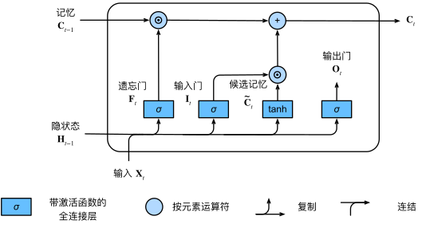

- **计算隐状态**：

    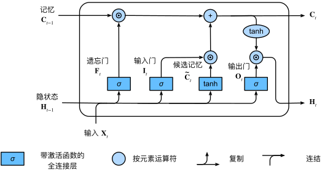

## 3、手写 LSTM

参看：https://github.com/ShusenTang/Dive-into-DL-PyTorch/blob/master/docs/chapter06_RNN/6.8_lstm.md

### 3.1 加载数据集

```python
import time
import math
import numpy as np
import torch
from torch import nn, optim
import torch.nn.functional as F

import sys
import importlib
import d2l
importlib.reload(d2l)


#加载数据集
device = torch.device('cuda' if torch.cuda.is_available() else 'cpu')
print(device)
(corpus_indices, char_to_idx, idx_to_char, vocab_size) = d2l.load_data_jay_lyrics()
print(corpus_indices)
print(char_to_idx)
print(idx_to_char)
print(vocab_size)
```

### 3.2 初始化模型参数

```python
#超参数num_hiddens定义了隐藏单元的个数
num_inputs, num_hiddens, num_outputs = vocab_size, 256, vocab_size

def get_params():
    def _one(shape):
        ts = torch.tensor(np.random.normal(0, 0.01, size=shape), device=device, dtype=torch.float32)
        return torch.nn.Parameter(ts, requires_grad=True)
    
    def _three():
        return (
            _one((num_inputs, num_hiddens)),
            _one((num_hiddens, num_hiddens)),
            torch.nn.Parameter(torch.zeros(num_hiddens, device=device, dtype=torch.float32), requires_grad=True)
        )
    
    W_xi, W_hi, b_i = _three() #输入门参数
    W_xf, W_hf, b_f = _three() #遗忘门参数
    W_xo, W_ho, b_o = _three() #输出门参数
    W_xc, W_hc, b_c = _three() #候选记忆细胞参数
    
    #输出层参数
    W_hq = _one((num_hiddens, num_outputs))
    b_q = torch.nn.Parameter(torch.zeros(num_outputs, device=device, dtype=torch.float32), requires_grad=True)
    return nn.ParameterList([W_xi, W_hi, b_i, W_xf, W_hf, b_f, W_xo, W_ho, b_o, W_xc, W_hc, b_c, W_hq, b_q])
```

### 3.3 定义模型

- **初始化函数**：长短期记忆的隐藏状态需要返回额外的形状为(批量大小, 隐藏单元个数)的值为0的记忆细胞

    ```python
    def init_lstm_state(batch_size, num_hiddens, device):
        return (
            torch.zeros((batch_size, num_hiddens), device=device),
            torch.zeros((batch_size, num_hiddens), device=device)
        )
    ```

- 根据长短期记忆的计算表达式**定义模型**：只有隐藏状态会传递到输出层，而记忆细胞不参与输出层的计算

    ```python
    def lstm(inputs, state, params):
        [W_xi, W_hi, b_i, W_xf, W_hf, b_f, W_xo, W_ho, b_o, W_xc, W_hc, b_c, W_hq, b_q] = params
        (H, C) = state
        outputs = []
        for X in inputs:
            I = torch.sigmoid(torch.matmul(X, W_xi) + torch.matmul(H, W_hi) + b_i)
            F = torch.sigmoid(torch.matmul(X, W_xf) + torch.matmul(H, W_hf) + b_f)
            O = torch.sigmoid(torch.matmul(X, W_xo) + torch.matmul(H, W_ho) + b_o)
            C_tilda = torch.tanh(torch.matmul(X, W_xc) + torch.matmul(H, W_hc) + b_c)
            C = F * C + I * C_tilda
            H = O * C.tanh()
            Y = torch.matmul(H, W_hq) + b_q
            outputs.append(Y)
        return outputs, (H, C)
    ```

### 3.4 定义预测函数

```python
def predict_rnn(prefix, num_chars, rnn, params, init_rnn_state,
               num_hiddens, vocab_size, device, idx_to_char, char_to_idx):
    state = init_rnn_state(1, num_hiddens, device)
    output = [char_to_idx[prefix[0]]]
    for t in range(num_chars + len(prefix) - 1):
        #将上一时间步的输出作为当前时间步的输入
        X = d2l.to_onehot(torch.tensor([[output[-1]]], device=device), vocab_size)
        #计算输出和更新隐藏状态
        (Y, state) = rnn(X, state, params)
        #下一个时间步的输入是prefix里的字符或者当前的最佳预测字符
        if t < len(prefix) - 1:
            output.append(char_to_idx[prefix[t + 1]])
        else:
            output.append(int(Y[0].argmax(dim=1).item()))
    return ''.join([idx_to_char[i] for i in output])
```

### 3.5 裁剪梯度(应对梯度爆炸)

```python
def grad_clipping(params, theta, device):
    norm = torch.tensor([0.0], device=device)
    for param in params:
        norm += (param.grad.data ** 2).sum()
    norm = norm.sqrt().item()
    if norm > theta:
        for param in params:
            param.grad.data *= (theta / norm)
```

### 3.6 定义模型训练函数

```python
def train_and_predict_rnn(rnn, get_params, init_rnn_state, num_hiddens, vocab_size, device,
                         corpus_indices, idx_to_char, char_to_idx, is_random_iter, 
                          num_epochs, num_steps, lr, clipping_theta,
                         batch_size, pred_period, pred_len, prefixes):
    if is_random_iter:
        data_iter_fn = d2l.data_iter_random
    else:
        data_iter_fn = d2l.data_iter_consecutive
    params = get_params()
    loss = nn.CrossEntropyLoss()
    
    for epoch in range(num_epochs):
        if not is_random_iter: # 如使用相邻采样，在epoch开始时初始化隐藏状态
            state = init_lstm_state(batch_size, num_hiddens, device)
        l_sum, n, start = 0.0, 0, time.time()
        data_iter = data_iter_fn(corpus_indices, batch_size, num_steps, device)
        for X, Y in data_iter:
            if is_random_iter: #如使用随机采样，在每个小批量更新前初始化隐藏状态
                state = init_lstm_state(batch_size, num_hiddens, device)
            else: #否则需要使用detach函数从计算图分离隐藏状态, 这是为了
                #使模型参数的梯度计算只依赖一次迭代读取的小批量序列(防止梯度计算开销太大)
                for s in state:
                    s = s.detach()
            
            inputs = d2l.to_onehot(X, vocab_size)
            #outputs有num_steps个形状为(batch_size, vocab_size)的矩阵
            (outputs, state) = rnn(inputs, state, params)
            #拼接之后形状为(num_steps * batch_size, vocab_size)
            outputs = torch.cat(outputs, dim=0)
            #Y的形状是(batch_size, num_steps)，转置后再变成长度为batch * num_steps 的向量，这样跟输出的行一一对应
            y = torch.transpose(Y, 0, 1).contiguous().view(-1)
            #使用交叉熵损失计算平均分类误差
            l = loss(outputs, y.long())
            
            #梯度清0
            if params[0].grad is not None:
                for param in params:
                    param.grad.data.zero_()
            l.backward(retain_graph=True)
            grad_clipping(params, clipping_theta, device) #裁剪梯度
            d2l.sgd(params, lr, 1) #因为误差已经取过均值，梯度不用再做平均
            l_sum += l.item() * y.shape[0]
            n += y.shape[0]
        
        if (epoch + 1) % pred_period == 0:
            print('epoch %d, perplexity %f, time %.2f sec' % (
                epoch + 1, math.exp(l_sum / n), time.time() - start
            ))
            for prefix in prefixes:
                print(' -', predict_rnn(prefix, pred_len, rnn, params, init_lstm_state, num_hiddens, 
                                        vocab_size, device, idx_to_char,char_to_idx))
```

### 3.7 训练模型并创作歌词

> 在训练模型时只使用相邻采样

```python
#设置好超参数后，将训练模型并根据前缀“分开”和“不分开”分别创作长度为50个字符的一段歌词
num_epochs, num_steps, batch_size, lr, clipping_theta = 160, 35, 32, 1e2, 1e-2
pred_period, pred_len, prefixes = 40, 50, ['分开', '不分开']
#每过40个迭代周期便根据当前训练的模型创作一段歌词
train_and_predict_rnn(lstm, get_params, init_lstm_state, num_hiddens, vocab_size,
                     device, corpus_indices, idx_to_char, char_to_idx, False,
                     num_epochs, num_steps, lr, clipping_theta, batch_size,
                     pred_period, pred_len, prefixes)


#------------输出-------------
epoch 40, perplexity 216.921452, time 0.57 sec
 - 分开 我不不 我不我 我不我 我不我 我不我 我不我 我不我 我不我 我不我 我不我 我不我 我不我 我
 - 不分开 我不不 我不我 我不我 我不我 我不我 我不我 我不我 我不我 我不我 我不我 我不我 我不我 我
epoch 80, perplexity 75.782364, time 0.57 sec
 - 分开 我想你的爱我 你不的我 你不了 我不人 我不人 我不了 我不了 我不了 我不了 我不了 我不了 快
 - 不分开 我不要你 我不要 我不好 我不了 我不人 我不人 我不人 我不了 我不了 我不了 我不了 我不了 
epoch 120, perplexity 17.239735, time 0.57 sec
 - 分开 你是我 你子我 有话  是怎么 在数了 在怎么 在诉么 说怎么 是诉了 是一了空的溪边 还真么 干
 - 不分开 我想你你 我不要再我 我爱 我不了 我不好这生活 我知了觉 我该了这节奏 后知后觉 我该好好节奏 
epoch 160, perplexity 4.498456, time 0.57 sec
 - 分开 你说是 是谁么碗手南南墙我瓦的淡淡的忧忧 消失的 旧时光 一九四三 回头看 的片段 有一些霜霜 老
 - 不分开 我的你没你了我 说发球 快给我 有你怎么面对我 甩开我 别怪我 别么怎么面对我 甩开我 别怪我 说
```

## 4、简洁实现

参看：https://github.com/ShusenTang/Dive-into-DL-PyTorch/blob/master/docs/chapter06_RNN/6.8_lstm.md#685-%E7%AE%80%E6%B4%81%E5%AE%9E%E7%8E%B0

### 4.1 加载数据集

```python
import time
import math
import numpy as np
import torch
from torch import nn, optim
import torch.nn.functional as F

import sys
import importlib
import d2l
importlib.reload(d2l)


#加载数据集
device = torch.device('cuda' if torch.cuda.is_available() else 'cpu')
print(device)
(corpus_indices, char_to_idx, idx_to_char, vocab_size) = d2l.load_data_jay_lyrics()
print(corpus_indices)
print(char_to_idx)
print(idx_to_char)
print(vocab_size)
```

### 4.2 定义模型

- 构造一个含单隐藏层、隐藏单元个数为256的循环神经网络层 rnn_layer

    ```python
    num_hiddens = 256
    lstm_layer = nn.LSTM(input_size=vocab_size, hidden_size=num_hiddens)
    ```

- 继承Module类来定义一个完整的循环神经网络

    ```python
    #首先将输入数据使用one-hot向量表示后输入到rnn_layer中，然后使用全连接输出层得到输出。输出个数等于词典大小vocab_size
    class RNNModel(nn.Module):
        def __init__(self, rnn_layer, vocab_size):
            super(RNNModel, self).__init__()
            self.rnn = rnn_layer
            self.hidden_size = rnn_layer.hidden_size * (2 if rnn_layer.bidirectional else 1)
            self.vocab_size = vocab_size
            self.dense = nn.Linear(self.hidden_size, vocab_size)
            self.state = None
            
        def forward(self, inputs, state): #inputs: (batch, seq_len)
            #获取one-hot向量表示
            X = d2l.to_onehot(inputs, self.vocab_size)
            Y, self.state = self.rnn(torch.stack(X), state)
            #全连接层会首先将Y的形状变成(num_steps * batch_size, num_hiddens)
            output = self.dense(Y.view(-1, Y.shape[-1]))
            return output, self.state
    ```

### 4.3 定义预测模型

```python
#与之前的区别在于前向计算和初始化隐藏状态的函数接口
def predict_rnn_pytorch(prefix, num_chars, model, vocab_size, device, idx_to_char, char_to_idx):
    state = None
    output = [char_to_idx[prefix[0]]] #output会记录prefix加上输出
    for t in range(num_chars + len(prefix) - 1):
        X = torch.tensor([output[-1]], device=device).view(1, 1)
        if state is not None:
            if isinstance(state, tuple):
                state = (state[0].to(device), state[1].to(device))
            else:
                state = state.to(device)
                
        (Y, state) = model(X, state)
        if t < len(prefix) - 1:
            output.append(char_to_idx[prefix[t + 1]])
        else:
            output.append(int(Y.argmax(dim=1).item()))
    return ''.join([idx_to_char[i] for i in output])
```

### 4.4 定义训练函数

```python
#定义训练函数--区别是使用了相邻采样来读取数据
def train_and_predict_rnn_pytorch(model, num_hiddens, vocab_size, device, 
                                 corpus_indices, idx_to_char, char_to_idx,
                                 num_epochs, num_steps, lr, clipping_theta,
                                 batch_size, pred_period, pred_len, prefixes):
    loss = nn.CrossEntropyLoss()
    optimizer = torch.optim.Adam(model.parameters(), lr=lr)
    model.to(device)
    state = None
    for epoch in range(num_epochs):
        l_sum, n, start = 0.0, 0, time.time()
        data_iter = d2l.data_iter_consecutive(corpus_indices, batch_size, num_steps, device) #相邻采样
        for X, Y in data_iter:
            if state is not None:
                #使用detach函数从计算图分离隐藏状态,
                #这是为了使模型参数的梯度计算只依赖一次迭代读取的小批量序列(防止梯度计算开销太大)
                if isinstance(state, tuple):
                    state = (state[0].detach(), state[1].detach())
                else:
                    state = state.detach()
                    
            (output, state) = model(X, state) #output: 形状为(num_steps * batch_size, vocab_size)
            
            #Y的形状是(batch_size, num_steps)，转置后再变成长度为 batch * num_steps 的向量，这样跟输出的行一一对应
            y = torch.transpose(Y, 0, 1).contiguous().view(-1)
            l = loss(output, y.long())
            
            optimizer.zero_grad()
            l.backward()
            #梯度裁剪
            d2l.grad_clipping(model.parameters(), clipping_theta, device)
            optimizer.step()
            l_sum += l.item() * y.shape[0]
            n += y.shape[0]
        
        try:
            perplexity = math.exp(l_sum / n)
        except OverflowError:
            perplexity = float('inf')
        if(epoch + 1) % pred_period == 0:
            print('epoch %d, perplexity %f, time %.2f sec' % (epoch + 1, perplexity, time.time() - start))
            for prefix in prefixes:
                print(' -', predict_rnn_pytorch(prefix, pred_len, model, vocab_size, device, 
                                                idx_to_char, char_to_idx))
```

### 4.5 训练模型

```python
num_epochs, num_steps, batch_size, lr, clipping_theta = 160, 35, 32, 1e2, 1e-2 #超参数(注意学习率)
pred_period, pred_len, prefixes = 40, 50, ['分开', '不分开']

model = RNNModel(lstm_layer, vocab_size)
train_and_predict_rnn_pytorch(model, num_hiddens, vocab_size, device,
                                corpus_indices, idx_to_char, char_to_idx,
                                num_epochs, num_steps, lr, clipping_theta,
                                batch_size, pred_period, pred_len, prefixes)
```

# 二、GRU(门控循环单元)

## 1、对比 LSTM

> GRU 保留了 LSTM使用门的理念，但是减少了参数，缩短了计算时间

- 相对于 LSTM 使用隐藏状态和记忆单元两条线，GRU只使用隐藏状态

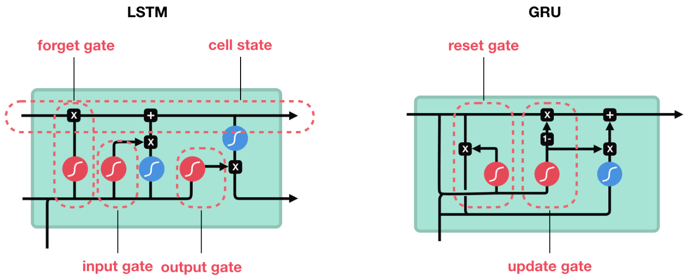

## 2、GRU 详解

门控循环单元与普通的循环神经网络之间的关键区别在于： **前者支持隐状态的门控**

- 这意味着模型有专门的机制来确定应该何时更新隐状态， 以及应该何时重置隐状态

### 2.1 重置门与更新门

- **重置门**：允许控制“可能还想记住”的过去状态的数量，即在多大程度上“忽略”过去的隐藏状态
- **更新门**：允许控制新状态中有多少个是旧状态的副本，即更新隐藏状态的门，扮演了 LSTM 的 forget 门和input 门两个角色

$$
R_t = \sigma(X_tW_{xr} + H_{t-1}W_{hr} + b_r) \\
Z_t = \sigma(X_tW_{xz} + H_{t-1}W_{hz} + b_z)
$$


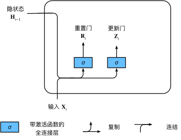

### 2.2 候选隐状态

$R_t$ 与 $H_{t-1}$ 的元素相乘可以减少以往状态的影响

- 每当重置门 $R_t$ 中的项接近 1 时，恢复到一个普通的 RNN
- 当 $R_t$ 中的项接近 0 时，候选隐状态是以 $X_t$ 作为输入的多层感知机的结果，此时任何预先存在的隐状态会被重置为默认值

$$
\tilde{H_t} = tanh(X_tW_{xh} + (R_t \odot H_{t-1})W_{hh} + b_h)
$$


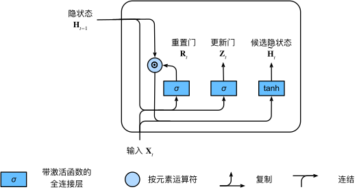

### 3.3 隐状态

新的隐状态由更新门 $Z_t$、旧的隐状态 $H_{t-1}$、新的候选隐状态 $\tilde{H_t}$ 共同决定

- 当更新门 $Z_t$ 接近 1 时，模型就倾向于只保留旧状态，来自 $X_t$ 的信息基本被忽略，从而有效地跳过了依赖链条中的时间步 $t$
- 当 $Z_t$ 接近 0 时，新的隐状态 $H_t$ 就会接近候选隐状态 $\tilde{H_t}$ 

这些设计可以帮助处理 RNN 中的梯度消失问题，并更好地捕获时间步距离很长的序列的依赖关系
$$
\tilde{H_t} = Z_t \odot H_{t-1} + (1 - Z_t) \odot \tilde{H_t}
$$
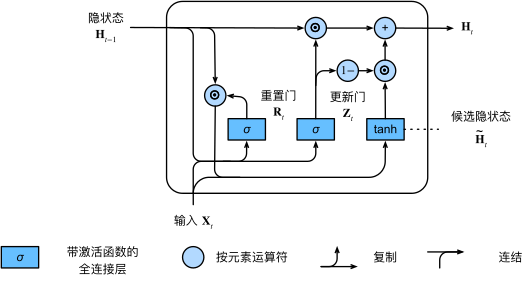

### 3.4 总结

总之，门控循环单元具有以下两个显著特征：

- 重置门有助于捕获序列中的短期依赖关系
- 更新门有助于捕获序列中的长期依赖关系

## 3、手写 GRU

参考：https://github.com/ShusenTang/Dive-into-DL-PyTorch/blob/master/docs/chapter06_RNN/6.7_gru.md

### 3.1 加载数据集

```python
import time
import math
import numpy as np
import torch
from torch import nn, optim
import torch.nn.functional as F

import sys
import importlib
import d2l
importlib.reload(d2l)


#加载数据集
device = torch.device('cuda' if torch.cuda.is_available() else 'cpu')
print(device)
(corpus_indices, char_to_idx, idx_to_char, vocab_size) = d2l.load_data_jay_lyrics()
print(corpus_indices)
print(char_to_idx)
print(idx_to_char)
print(vocab_size)
```

### 3.2 初始化模型参数

```python
num_inputs, num_hiddens, num_outputs = vocab_size, 256, vocab_size #超参数num_hiddens定义了隐藏单元的个数

def get_params():
    def _one(shape):
        ts = torch.tensor(np.random.normal(0, 0.01, size=shape), device=device, dtype=torch.float32)
        return torch.nn.Parameter(ts, requires_grad=True)
    
    def _three():
        return (
            _one((num_inputs, num_hiddens)),
            _one((num_hiddens, num_hiddens)),
            torch.nn.Parameter(torch.zeros(num_hiddens, device=device, dtype=torch.float32), requires_grad=True)
        )
    
    W_xz, W_hz, b_z = _three() #更新门参数
    W_xr, W_hr, b_r = _three() #重置门参数
    W_xh, W_hh, b_h = _three() #候选隐藏状态参数
    #输出层参数
    W_hq = _one((num_hiddens, num_outputs))
    b_q = torch.nn.Parameter(
        			torch.zeros(num_outputs, device=device, dtype=torch.float32), 
        			requires_grad=True
    )
    return nn.ParameterList([W_xz, W_hz, b_z, W_xr, W_hr, b_r, W_xh, W_hh, b_h, W_hq, b_q])
```

### 3.3 定义模型

- 定义隐藏状态初始化函数，返回由一个形状为(批量大小, 隐藏单元个数)的值为0的Tensor组成的元组

    ```python
    def init_gru_state(batch_size, num_hiddens, device):
        return (torch.zeros((batch_size, num_hiddens), device=device))
    ```

- 根据门控循环单元的计算表达式定义模型

    ```python
    def gru(inputs, state, params):
        W_xz, W_hz, b_z, W_xr, W_hr, b_r, W_xh, W_hh, b_h, W_hq, b_q = params
        H = state
        outputs = []
        for X in inputs:
            Z = torch.sigmoid(torch.matmul(X, W_xz) + torch.matmul(H, W_hz) + b_z)
            R = torch.sigmoid(torch.matmul(X, W_xr) + torch.matmul(H, W_hr) + b_r)
            H_tilda = torch.tanh(torch.matmul(X, W_xh) + torch.matmul(R * H, W_hh) + b_h)
            H = Z * H + (1 - Z) * H_tilda
            Y = torch.matmul(H, W_hq) + b_q
            outputs.append(Y)
        return outputs, (H)
    ```

### 3.4 定义训练函数

- 定义预测函数

    ```python
    def predict_rnn(prefix, num_chars, rnn, params, init_rnn_state,
                   num_hiddens, vocab_size, device, idx_to_char, char_to_idx):
        state = init_gru_state(1, num_hiddens, device)
        output = [char_to_idx[prefix[0]]]
        for t in range(num_chars + len(prefix) - 1):
            #将上一时间步的输出作为当前时间步的输入
            X = d2l.to_onehot(torch.tensor([[output[-1]]], device=device), vocab_size)
            #计算输出和更新隐藏状态
            (Y, state) = rnn(X, state, params)
            #下一个时间步的输入是prefix里的字符或者当前的最佳预测字符
            if t < len(prefix) - 1:
                output.append(char_to_idx[prefix[t + 1]])
            else:
                output.append(int(Y[0].argmax(dim=1).item()))
        return ''.join([idx_to_char[i] for i in output])
    ```

- 裁剪梯度--应对梯度爆炸

    ```python
    def grad_clipping(params, theta, device):
        norm = torch.tensor([0.0], device=device)
        for param in params:
            norm += (param.grad.data ** 2).sum()
        norm = norm.sqrt().item()
        if norm > theta:
            for param in params:
                param.grad.data *= (theta / norm)
    ```

- 定义模型训练函数

    ```python
    def train_and_predict_rnn(rnn, get_params, init_rnn_state, num_hiddens, vocab_size, device,
                             corpus_indices, idx_to_char, char_to_idx, is_random_iter, 
                              num_epochs, num_steps, lr, clipping_theta,
                             batch_size, pred_period, pred_len, prefixes):
        if is_random_iter:
            data_iter_fn = d2l.data_iter_random
        else:
            data_iter_fn = d2l.data_iter_consecutive
        params = get_params()
        loss = nn.CrossEntropyLoss()
        
        for epoch in range(num_epochs):
            if not is_random_iter: # 如使用相邻采样，在epoch开始时初始化隐藏状态
                state = init_gru_state(batch_size, num_hiddens, device)
            l_sum, n, start = 0.0, 0, time.time()
            data_iter = data_iter_fn(corpus_indices, batch_size, num_steps, device)
            for X, Y in data_iter:
                if is_random_iter: #如使用随机采样，在每个小批量更新前初始化隐藏状态
                    state = init_lstm_state(batch_size, num_hiddens, device)
                else: #否则需要使用detach函数从计算图分离隐藏状态, 这是为了
                    #使模型参数的梯度计算只依赖一次迭代读取的小批量序列(防止梯度计算开销太大)
                    for s in state:
                        s = s.detach()
                
                inputs = d2l.to_onehot(X, vocab_size)
                #outputs有num_steps个形状为(batch_size, vocab_size)的矩阵
                (outputs, state) = rnn(inputs, state, params)
                #拼接之后形状为(num_steps * batch_size, vocab_size)
                outputs = torch.cat(outputs, dim=0)
                #Y的形状是(batch_size, num_steps)，转置后再变成长度为batch * num_steps 的向量，这样跟输出的行一一对应
                y = torch.transpose(Y, 0, 1).contiguous().view(-1)
                #使用交叉熵损失计算平均分类误差
                l = loss(outputs, y.long())
                
                #梯度清0
                if params[0].grad is not None:
                    for param in params:
                        param.grad.data.zero_()
                l.backward(retain_graph=True)
                grad_clipping(params, clipping_theta, device) #裁剪梯度
                d2l.sgd(params, lr, 1) #因为误差已经取过均值，梯度不用再做平均
                l_sum += l.item() * y.shape[0]
                n += y.shape[0]
            
            if (epoch + 1) % pred_period == 0:
                print('epoch %d, perplexity %f, time %.2f sec' % (
                    epoch + 1, math.exp(l_sum / n), time.time() - start
                ))
                for prefix in prefixes:
                    print(' -', predict_rnn(prefix, pred_len, rnn, params, init_gru_state, num_hiddens, 
                                            vocab_size, device, idx_to_char,char_to_idx))
    ```

### 3.5 训练模型并创作歌词

```python
num_epochs, num_steps, batch_size, lr, clipping_theta = 160, 35, 32, 1e2, 1e-2
pred_period, pred_len, prefixes = 40, 50, ['分开', '不分开']

#每过40个迭代周期便根据当前训练的模型创作一段歌词
train_and_predict_rnn(gru, get_params, init_gru_state, num_hiddens, vocab_size, 
                      device, corpus_indices, idx_to_char, char_to_idx, False, 
                      num_epochs, num_steps, lr, clipping_theta, batch_size, 
                      pred_period, pred_len, prefixes)
```

## 4、简洁实现

```python
lr = 1e-2 # 注意调整学习率
gru_layer = nn.GRU(input_size=vocab_size, hidden_size=num_hiddens)
model = d2l.RNNModel(gru_layer, vocab_size).to(device)
d2l.train_and_predict_rnn_pytorch(model, num_hiddens, vocab_size, device,
                                corpus_indices, idx_to_char, char_to_idx,
                                num_epochs, num_steps, lr, clipping_theta,
                                batch_size, pred_period, pred_len, prefixes)
```

## 5、总结

- 门控循环神经网络可以更好地捕捉时间序列中时间步距离较大的依赖关系
- 门控循环单元引入了门的概念，从而修改了循环神经网络中隐藏状态的计算方式，包括重置门、更新门、候选隐藏状态和隐藏状态
- 重置门有助于捕捉时间序列里短期的依赖关系
- 更新门有助于捕捉时间序列里长期的依赖关系

# 三、深度RNN

> 参考：https://zh.d2l.ai/chapter_recurrent-modern/deep-rnn.html

- 在深度循环神经网络中，隐藏状态的信息不断传递至当前层的下一时间步和当前时间步的下一层


# 四、Encoder-Decoder/Seq2Seq

## 1、快速认知 Encoder-Decoder

参看：https://ifwind.github.io/2021/08/15/Transformer%E7%9B%B8%E5%85%B3%E2%80%94%E2%80%94%EF%BC%881%EF%BC%89Encoder-Decoder%E6%A1%86%E6%9E%B6/#%E5%9B%9B%E7%A7%8Dencoder-decoder%E6%A8%A1%E5%BC%8F

### 1.1 架构图

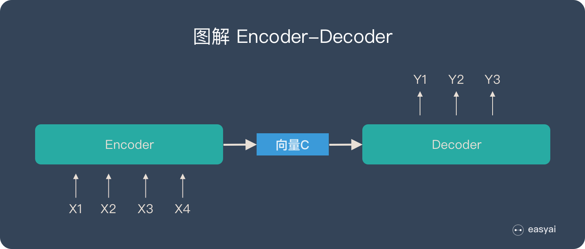

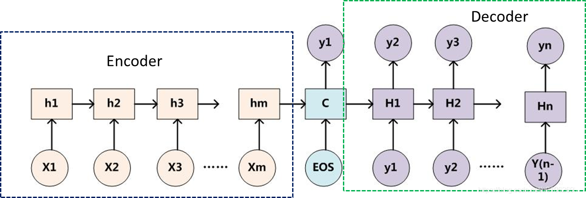

### 1.2 框架特点

- 它是一个end-to-end的学习算法
- 不论输入和输出的长度是什么，中间的向量C的长度都是固定的（导致存在信息缺失问题）
- 根据不同的任务可以选择不同的编码器和解码器（可以是CNN、RNN、LSTM、GRU等）

### 1.3 框架缺点

存在的最大问题在于**信息缺失**

- Encoder将输入（Source）编码为固定大小的向量的过程是一个“信息有损的压缩过程”，信息量越大，转化得到的固定向量中信息的损失就越大，这就得Decoder无法直接无关注输入信息的更多细节
- 输入的序列过长，先输入的内容携带的信息可能会被后输入的信息稀释掉或被覆盖了，那么解码的时候一开始就没有获得输入序列足够的信息，可能会导致模型效果比较差

## 2、快速认知 Seq2Seq

参看：https://ifwind.github.io/2021/08/16/Transformer%E7%9B%B8%E5%85%B3%E2%80%94%E2%80%94%EF%BC%882%EF%BC%89Seq2Seq%E6%A8%A1%E5%9E%8B/

当面对更复杂的问题时，比如具有时序特征的向量序列、具有顺序特征的序列，其表示成序列后，长度事先并不知道，那么为了适应这种输入是**多个向量**，而且这个**输入向量的数目是会改变的**的场景

当输入是**多个向量**时，Decoder的输出可以有以下三种形式：

- 输出个数与输入向量个数相同，即每一个向量都有对应的一个label或value（如命名实体识别NER、词性标注POS tagging等任务），也叫Sequence Labeling

    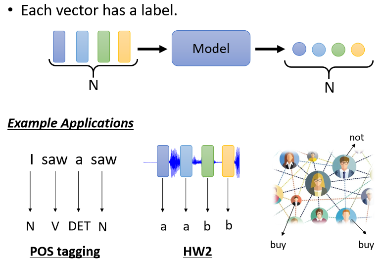

- 只需要输出一个Label或value（比如文本分类、情感分析）

    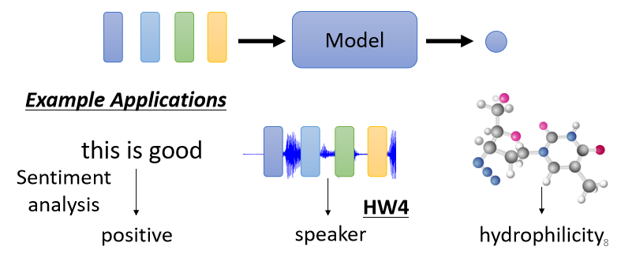

- 输出个数与输入向量个数不一定相同，机器要自己决定应该要输出多少个Label或value（比如文本翻译、语音识别），也叫做**sequence to sequence（Seq2Seq）**的任务

    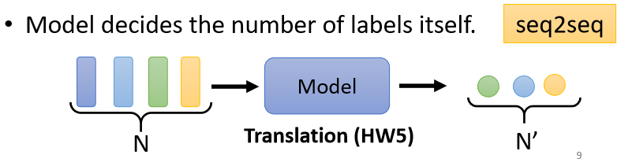


## 3、手写 Encoder-Decoder

参看：https://zh.d2l.ai/chapter_recurrent-modern/encoder-decoder.html

- 编码器：

    ```python
    from torch import nn
    
    class Encoder(nn.Module):
        def __init__(self, **kwargs):
            super(Encoder, self).__init__(**kwargs)
            
        def forward(self, X, *args):
            raise NotImplementedError
    ```

- 解码器：

    ```python
    class Decoder(nn.Module):
        def __init__(self, **kwargs):
            super(Decoder, self).__init__(**kwargs)
            
        def init_state(self, enc_outputs, *args):
            raise NotImplementedError
            
        def forward(self, X, State):
            raise NotImplementedError
    ```

- 合并编码器-解码器：

    ```python
    class EncoderDecoder(nn.Module):
        def __init__(self, encoder, decoder, **kwargs):
            super(EncoderDecoder, self).__init__(**kwargs)
            self.encoder = encoder
            self.decoder = decoder
            
        def forward(self, enc_X, dec_X, *args):
            enc_outputs = self.encoder(enc_X, *args)
            dec_state = self.decoder.init_sate(enc_outputs, *args)
            return self.decoder(dec_X, dec_state)
    ```

## 4、手写 Seq2Seq

参看：https://zh.d2l.ai/chapter_recurrent-modern/seq2seq.html

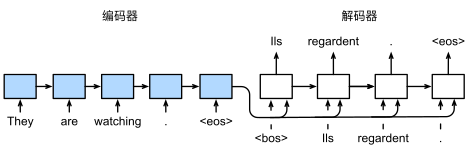

- 特定的 `<eos>`：表示序列结束词元， 一旦输出序列生成此词元，模型就会停止预测
- 特定的 `<bos>`：表示序列开始词元，它是解码器的输入序列的第一个词元
- 解码器的其他特定设计：使用 RNN 编码器最终的隐状态来初始化解码器的隐状态

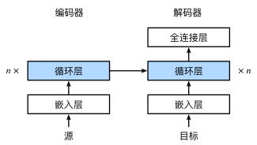