# 一、Attention 机制

> 参看：https://imzhanghao.com/2021/09/01/attention-mechanism/

## 1、Encoder-Decoder的缺陷

局限性：编码和解码之间的唯一联系是固定长度的语义向量 `c`

- 语义向量 c 无法完全表达整个序列的信息
- 先输入的内容携带的信息，会被后输入的信息稀释掉，或者被覆盖掉
- 输入序列越长，这样的现象越严重，这样使得在Decoder解码时一开始就没有获得足够的输入序列信息，解码效果会打折扣

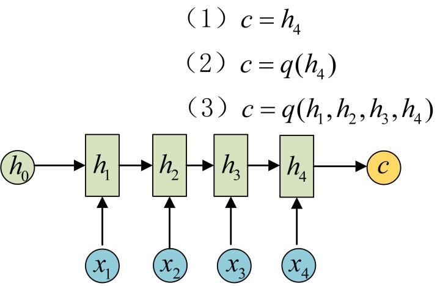
$$
y_1 = f(c) \\
y_2 = f(c, y_1) \\
y_3 = f(c, y_1, y_2)
$$
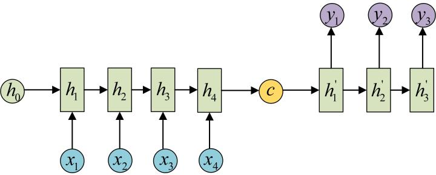

## 2、Attention

### 2.1 引入Attention 后的 Encoder-Decoder

$$
y_1 = f(c_1) \\
y_2 = f(c_2, y_1) \\
y_3 = f(c_3, y_1, y_2)
$$

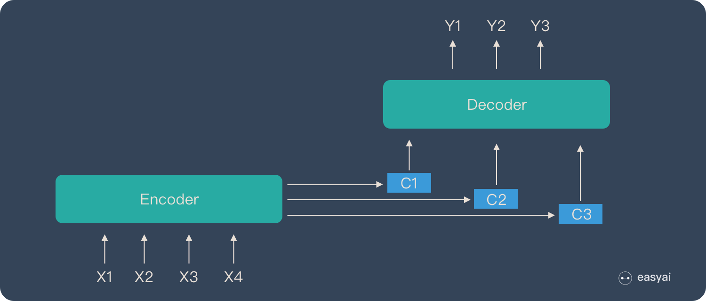

- 图解：

    - **Encoder**：

        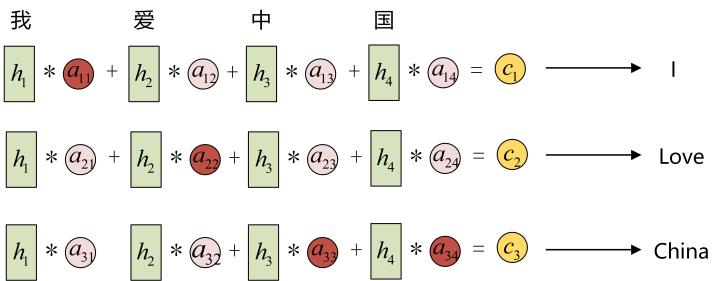

    - **Decoder**：

        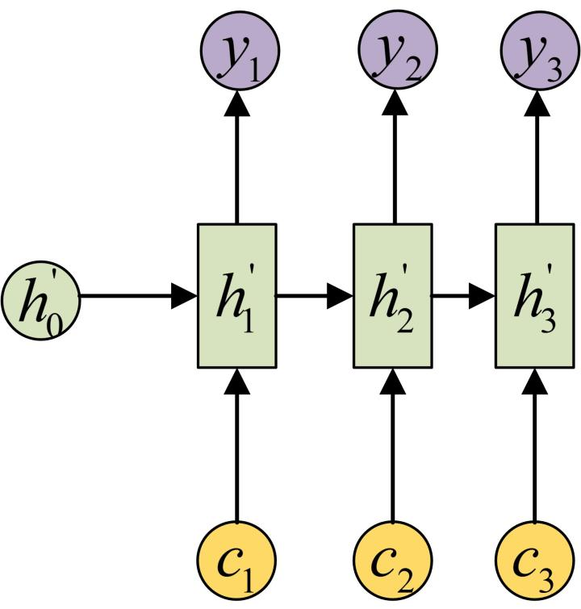

### 2.2 计算注意力系数或权重 $a_{ij}$

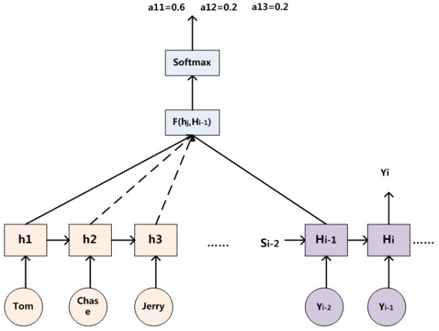

### 2.3 三阶段计算Attention

- 阶段1：Query 与 Key 进行相似度计算得到权值
- 阶段2：对上一阶段的计算的权重进行归一化
- 阶段3：用归一化的权重与 Value 加权求和，得到 Attention 值

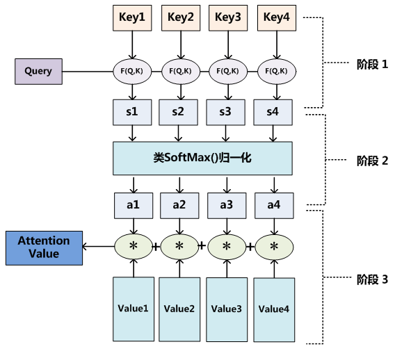

### 2.4 Attention 的本质思想

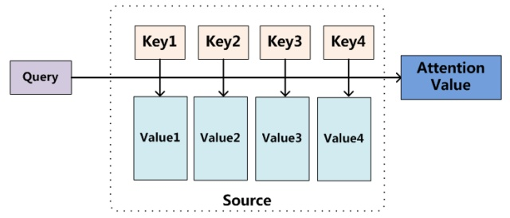

# 二、Self-Attention 机制

> 参看：https://imzhanghao.com/2021/09/15/self-attention-multi-head-attention/
>
> Self Attention就是Q、K、V均为同一个输入向量映射而来的Encoder-Decoder Attention，它可以无视词之间的距离直接计算依赖关系，能够学习一个句子的内部结构，实现也较为简单并且可以并行计算

## 1、概述

- Self Attention 机制的特别之处：

    - Attention 的输入 Source 和输出 Target 内容是不一样的，比如在翻译的场景中，Source是一种语言，Target是另一种语言，Attention机制发生在Target元素 Query 和 Source 中所有元素之间

    - Self Attention 是 Source 内部元素之间或 Target 内部元素之间发生的 Attention 机制，也可以理解为Target=Source这种特殊情况下的注意力计算机制

- Self Attention 的作用：更容易捕获句子中长距离的相互依赖的特征

    - RNN 或 LSTM：需要依次序序列计算，对于远距离的相互依赖的特征，要经过若干时间步步骤的信息累积才能将两者联系起来，而距离越远，有效捕获的可能性越小

    - Self Attention：在计算过程中，将句子中任意两个单词通过一个计算步骤直接联系起来，所以远距离依赖特征之间的距离被极大缩短，有利于有效地利用这些特征

        > 除此外，Self Attention 对于增加计算的并行性也有直接帮助作用

## 2、计算过程

- **第一步：初始化Q，K，V**

    - `Thinking` 单词的 Embedding 向量是 $X_1$，用 $X_1$ 乘以 $W^Q$ 的权重矩阵，就可以得到 Thinking 的 Query，即 $q_1$

        > 其他的q2、k1、k2等都使用相同的计算方式，这样就为每个单词都计算了一个Query，一个Key，和一个Value

    - 这些新向量的维度比 Embedding 向量小，其维数是64，而嵌入和编码器输入/输出向量的维数是512

        > 它们不必更小，这是一种架构选择，可以使多头注意力的计算保持不变

    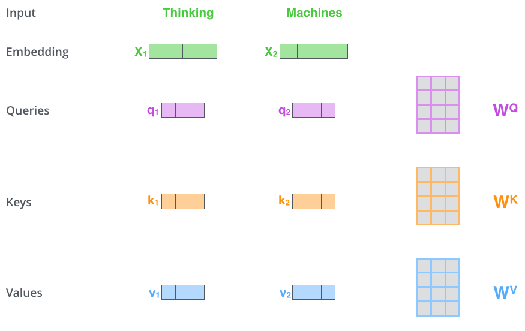

- **第二步：计算 Self-Attention Score**

    - 根据 `Thinking` 对输入句子的每个词进行评分

        > 当在某个位置对单词进行编码时，分数决定了将多少注意力放在输入句子的其他部分上

    - 得分是通过将查询向量与正在评分的各个单词的键向量进行点积来计算

        > 因此，如果正在处理位置 #1 中单词的自注意力，第一个分数将是 q1 和 k1 的点积，第二个分数是q1和k2的点积

    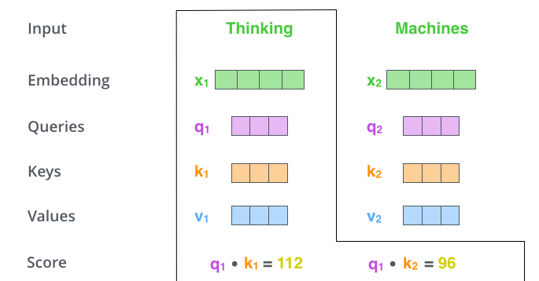

- **第三步：对Self-Attention Socre进行缩放和归一化，得到Softmax Socre**

    - 对 Step2 中计算的分数进行缩放，这里通过除以8，将结果进行 softmax 归一化

        > 论文中维度是64，这可以让模型有更稳定的梯度，默认值是64，也可以是其它值

    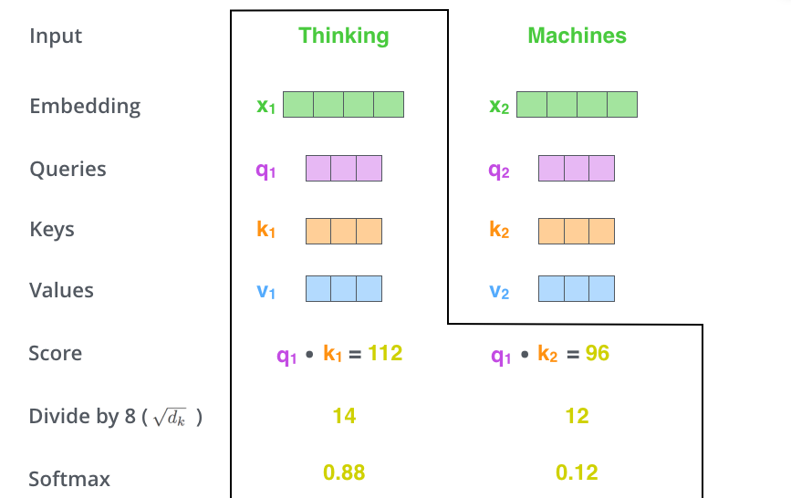

- **第四步：Softmax Socre乘以Value向量，求和得到Attention Value**

    - 每个 Value 向量乘以 softmax Score 得到加权的 v1 和 v2，对加权的 v1 和 v2 进行求和得到z1

        > 这样，就计算出了第一个词 Thinking 的注意力值，其他的词用相同的方法进行计算

    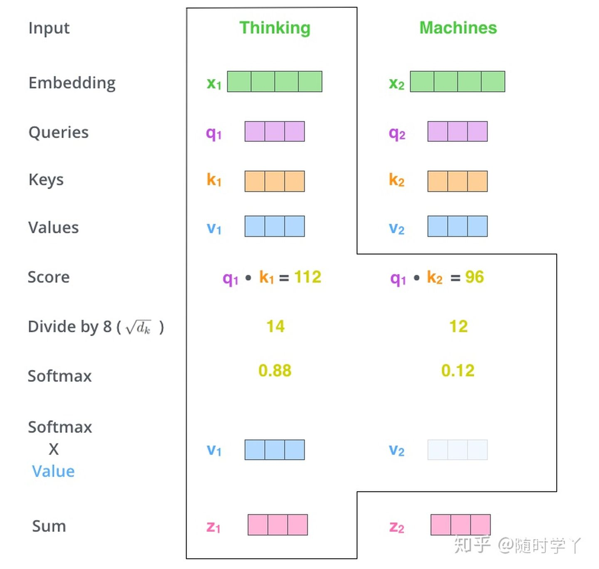

---

Self-Attention 计算过程动图：

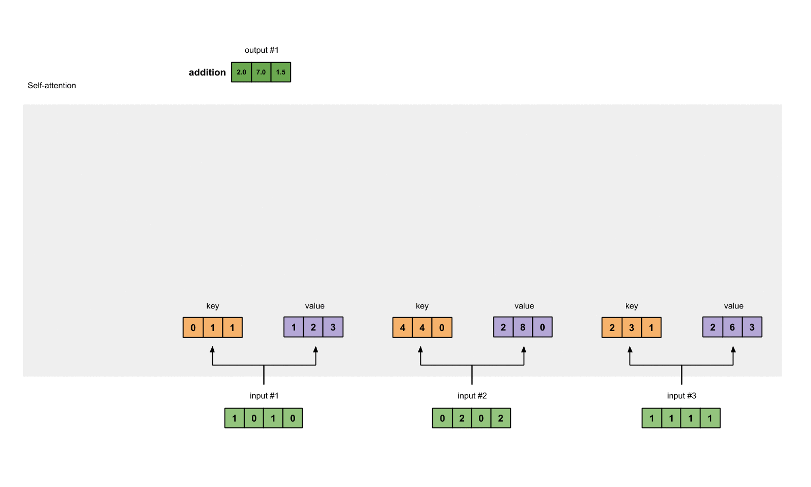

# 三、Multi-Head Attention

> Multi-Head Attention 利用多个查询来平行地计算从输入信息中选取多个信息，每个注意力关注输入信息的不同部分，然后拼接

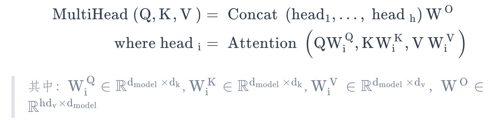

## 1、Single-Head Attention VS Multi-Head Attention

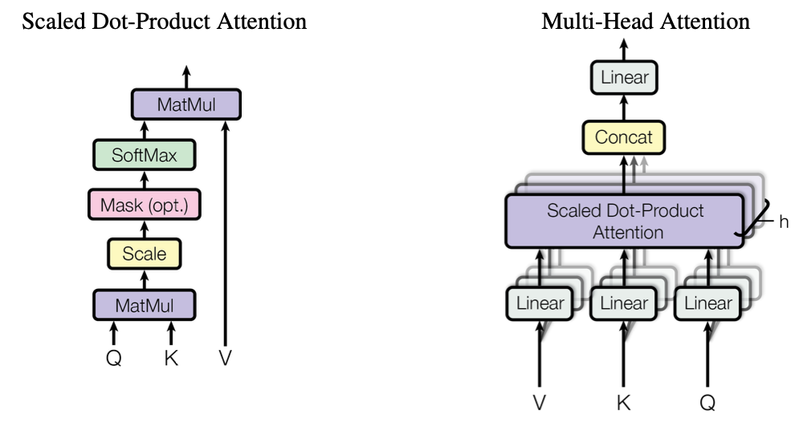

## 2、Multi-Head Attention 作用

多头注意力的机制进一步细化了注意力层，通过以下两种方式提高了注意力层的性能：

- **扩展了模型专注于不同位置的能力**：当多头注意力模型和自注意力机制集合时，比如：翻译“动物没有过马路，因为它太累了”这样的句子时，我们想知道“它”指的是哪个词，如果能分析出来代表动物，就很有用
- **为注意力层提供了多个“表示子空间”**：多头注意力有**多组Query/Key/Value权重矩阵**，这些权重矩阵集合中的每一个都是随机初始化的，然后在训练之后，每组用于将输入Embedding投影到不同的表示子空间中。多个head学习到的Attention侧重点可能略有不同，这样给了模型更大的容量
