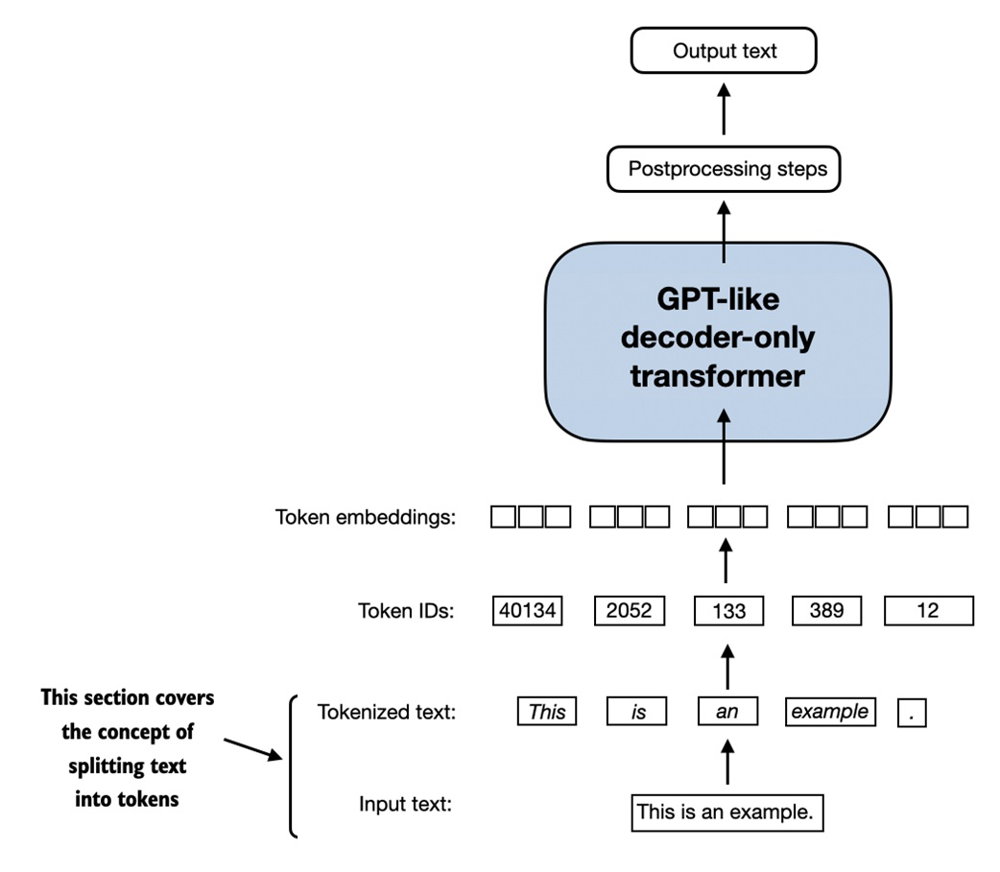
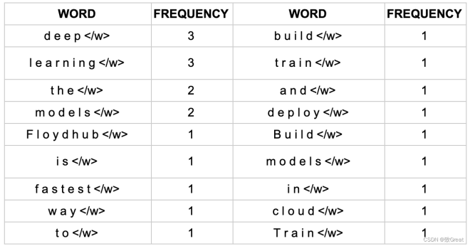
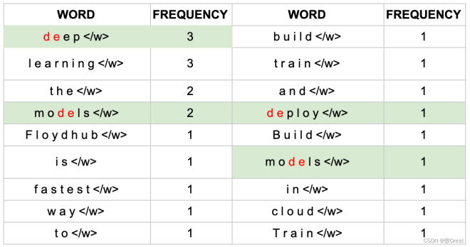
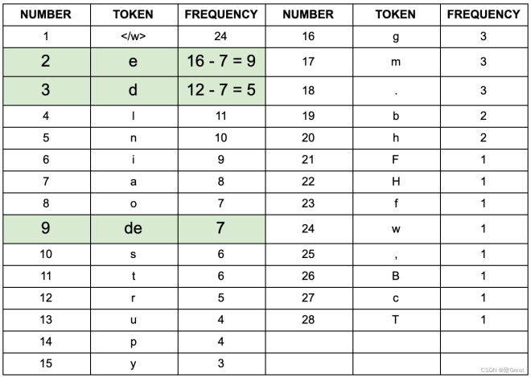
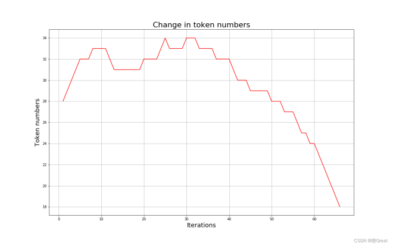
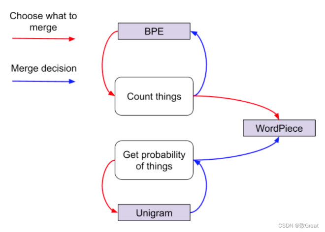

# 一、基础

## 1、为什么需要分词

> 不是训练 LLM 查找固定的词典，而是要教 LLM 识别和“阅读”文本，使其可以从这个动作本身中学习

分词的主要原因：

- **将输入分成更小的块**：模型对语言结构一无所知，因此需要在将其输入模型之前，**将其分成块或标记**

- **将输入表示为向量**：

    - **目标**：
        - 希望模型学习句子或文本序列中单词之间的关系
        - 不想将语法规则编码到模型中，因为会受到限制并且需要专业的语言知识
        - 相反，希望模型学习关系本身并发现某种理解语言的方法

    - **做法**：将标记编码为向量，其中模型可以在这些向量的任何维度中编码含义

    - 用处：

        - 可以用作输出，因为它们代表单词的上下文参考

        - 可以作为更高级别 NLP 任务（例如文本分类）的输入或用于迁移学习而馈送到其他层

## 2、分词粒度

tokenize 目标：把输入的文本流，切分成一个个子串，每个子串相对有完整的语义，便于学习 embedding 表达和后续模型的使用

### 2.1 word 级别

> Tokenizers库中，基于规则切分部分，采用了spaCy和Moses两个库

如果基于词来做词汇表，由于长尾现象的存在，这个词汇表可能会超大

- 像Transformer XL 库就用到了一个26.7万个单词的词汇表，这需要极大的 embedding matrix 才能存得下，这对于内存或者显存都是极大的挑战

    > embedding matrix 是用于查找取用 token 的 embedding vector

- 常规的词汇表，一般大小不超过5万

---

- **优点**：词粒度很像人类去阅读一样，一方面能够很好地保留词的边界信息，另一方面能够很好地保留词的含义

- **缺点**：

    - 词粒度的方法，需要构造的词典太过庞大，严重影响计算效率和消耗内存

    - 即使使用这么大的词典不影响效率，也会造成 OOV 问题。因为人类语言是不断发展的，词汇也在发展中不断增加

        > 例如：针不戳，Niubility，Sixology 等

    - 词表中的低频词/稀疏词在模型训练过程中无法得到充分训练，进而模型不能充分理解这些词的语义

    - 一个单词因为不同的形态会产生不同的词

        > 如由“look”衍生出的“looks”, “looking”, 但是意义相近，对他们都进行训练是不必要的

### 2.2 char(字符)级别

字符的数量是少量有限

> 问题：由于字符数量太小，我们在为每个字符学习嵌入向量的时候，每个向量就容纳了太多的语义在内，学习起来非常困难

- **优点**：词表大大减小，26 个英文字母基本能覆盖出几乎所有词，5000 多个中文基本也能组合出覆盖的词汇
- **缺点**： 
    - 严重丢失了词汇的语义信息和边界信息，这对 NER 等关注词汇边界的任务来说会有一定的影响
    - 而且把单词切分的太细，会使得输入太过长，增加输入计算压力，减小词表的代价就是输入长度大大增加，从而输入计算变得更耗时，训练时更占内存空间

### 2.3 subword(子词)级别

> 介于字符和单词之间，比如：'Transformers' 可能会被分成 'Transform' 和 'ers' 两个部分

- 这个方案平衡了词汇量和语义独立性，是相对较优的方案

- 处理原则：常用词应该保持原状，生僻词应该拆分成子词以共享 token 压缩空间

# 二、常用的 tokenize 算法

## 1、BPE(Byte-Pair Encoding)

### 1.1 简介

BPE 子词算法的主要目标是找到一种方法来**用最少的标记表示整个文本数据集**

- 合并是尝试将文本“压缩”为子词单元的方式，其通过识别最常表示的字节对来实现

---

BPE 迭代地合并最频繁出现的字符或字符序列，具体步骤：

1. 准备足够大的语料库 $C$

2. 定义好所需要的词表大小 $V$ 

3. 将单词拆分为字符序列，在末尾添加后缀 `</w>`，并统计单词频率

    > 初始阶段的 subword 的粒度是全字符，如：`low` 的频率为 5，则可以改写为 `l o w <\w>: 5`

4. 统计每一个连续字符对的出现频率，选择最高频者合并成新的 subword

5. 重复第 4 步，直到达到第 2 步设定的 subword 词表大小，或下一个最高频的字节对出现频率为 1

### 1.2 案例

- 本文中的单词出现频率如下：

    

- 进行合并操作：

    1. 获取单词计数频率
    2. 获取初始token计数和频率（即每个字符出现多少次）
    3. 合并最常见的字节对
    4. 将其添加到token列表并重新计算每个token的频率计数；这将随着每个合并步骤而改变
    5. 清洗去重，直到达到定义的令牌限制或设定的迭代次数（如我们的示例所示） 

- 在一次迭代之后，最频繁的字符对是“ d ”和“ e ”，因此将这些结合起来创建第一个子词标记（不是单个字符）“ de ”

    

- 如果把“ de ”出现的单词的频率加起来，会得到 3 + 2 + 1 + 1 = 7，这就是新的“ de ”标记的频率

    由于“ de ”是一个新token，因此需要重新计算所有标记的计数

    通过从合并操作之前的单个字符的频率中减去新的“ de ”标记的频率 7 来实现这一点

    现在只计算“ d ”和“ e ”未配对时出现的次数，为此从“ e”的原始出现频率中减去 7” 得到 9，从“ d ”的原始频率 12 中减去 7，得到 5

    

- 当开始创建新的合并对时，字符的数量会增加，但随着将它们组合在一起并删除其他字符，字符的数量会开始减少

    > 将字符构建成一种格式，该格式可以以最有效的方式表示整个数据集

    

- 对于这里的例子：在 70 次迭代和 18 个标记处停止

    事实上，已经从单个字符标记的起点重新创建了原始单词，最终的词汇列表如下所示：

    

---

说明：

- 通过从单个字符开始，并在多次迭代中合并最频繁的字节对标记来重新创建原始单词列表

    > 如果使用较小的迭代，将看到不同的标记列表

- 虽然这看起来毫无意义，但记住这是一个demo数据集，目标是展示子词标记化所采取的步骤

    在现实世界的例子中，数据集的词汇量应该大得多，那么将无法为词汇表中的每个单词都分配一个字符

### 1.3 代码参考

```python
import re
import collections

class BytePairEncoder:
    def __init__(self):
        self.merges = None
        self.characters = None
        self.tokens = None
        self.vocab = None

    def format_word(self, text, space_token='_'):
        return ' '.join(list(text)) + ' ' + space_token

    def initialize_vocab(self, text):
        text = re.sub('\s+', ' ', text)
        all_words = text.split()
        vocab = {}
        for word in all_words:
            word = self.format_word(word)
            vocab[word] = vocab.get(word, 0) + 1
        tokens = collections.Counter(text)
        return vocab, tokens

    def get_bigram_counts(self, vocab):
        pairs = {}
        for word, count in vocab.items():
            symbols = word.split()
            for i in range(len(symbols)-1):
                pair = (symbols[i], symbols[i+1])
                pairs[pair] = pairs.get(pair, 0) + count
        return pairs

    def merge_vocab(self, pair, vocab_in):
        vocab_out = {}
        bigram = re.escape(' '.join(pair))
        p = re.compile(r'(?<!\S)' + bigram + r'(?!\S)')
        bytepair = ''.join(pair)
        for word in vocab_in:
            w_out = p.sub(bytepair, word)
            vocab_out[w_out] = vocab_in[word]
        return vocab_out, (bigram, bytepair)

    def find_merges(self, vocab, tokens, num_merges):
        merges = []
        for i in range(num_merges):
            pairs = self.get_bigram_counts(vocab)
            best_pair = max(pairs, key=pairs.get)
            best_count = pairs[best_pair]
            vocab, (bigram, bytepair) = self.merge_vocab(best_pair, vocab)
            merges.append((r'(?<!\S)' + bigram + r'(?!\S)', bytepair))
            tokens[bytepair] = best_count
        return vocab, tokens, merges

    def fit(self, text, num_merges):
        vocab, tokens = self.initialize_vocab(text)
        self.characters = set(tokens.keys())
        self.vocab, self.tokens, self.merges = self.find_merges(vocab, tokens, num_merges)
```

## 2、WordPiece

- **与 BPE 相同点**：每次从统计语料中选取出两个新的子词进行合并

- **与 BPE 最大区别(子词合并原则)**：BPE 按频率，WordPiece 按能够使得 LM 概率最大的相邻子词加入词表

---

 WordPiece 的算法步骤如下：

1. 准备足够大的语料库 $C$
2. 定义好所需要的词表大小 $V$
3. 将单词拆分成字符序列
4. 基于第 3 步数据训练语言模型
5. 从所有可能的 subword 单元中，选择加入语言模型后能最大程度地增加训练数据概率的单元作为新的单元
6. 重复第 5 步直到达到第 2 步设定的 subword 词表大小或概率增量低于某一阈值

---

WordPiece 构造词表的原理如下(公式推断)：

- 假设句子 $s = \{t_1, t_2,...,t_n\}$ 由 $n$ 个子词组成，$t_i$ 表示第 $i$ 个子词，且假设子词之间是相互独立的，那么句子 $s$ 的语言模型对数似然值为 
    $$
    log P(s) = \sum^N_{i = 1} log P(t_i)
    $$

- 假设把相邻的 $t_i$ 和 $t_j$ 两个子词合并，产生 $t_x$ 子词，此时句子的对数似然值增益为 
    $$
    log P(t_x) - (log P(t_i) - log P(t_j)) = log(\frac{P(t_x)}{P(t_i)P(t_j)})
    $$
    两个子词合并前后的对数似然值增益等于 $t_x$ 和 $t_it_j$ 的互信息

> 所以，WordPiece 每次选择合并的两个子词，具有最大的互信息值，从语言模型上来说两个子词之间有很强的关联性，从语料上来说两个子词共现概率比较高

## 3、UniLM

- 与 WordPiece 相同点：同样使用语言模型来挑选子词

- 与 WordPiece 最大区别：

    - **WordPiece 算法的词表大小都是从小到大变化**

    - **UniLM 的词库则是从大到小变化，即先初始化一个大词表，根据评估准则不断丢弃词表，直到满足限定条件**

        > ULM 算法考虑了句子的不同分词可能，因而能够输出带概率的多个子词分段

---

UniLM 构造词典的算法步骤如下：

1. 初始时，建立一个足够大的词表 $V$
2. 针对当前词表 $V$，用 $EM$ 算法求解每个子词在语料上的概率
3. 对于每个子词，计算当该子词被从词表中移除时，总的 loss 降低了多少，记为该子词的 loss
4. 将子词按照 loss 大小进行排序，丢弃一定比例 loss 最小的子词(比如 20%)，保留下来的子词生成新的词表
5. 重复步骤 2 到 4，直到词表大小减少到设定范围

---

UniLM 构造词表的原理如下：

- 对于句子 $s$，加入存在一种词切分结果为 $s = \{t_1,t_2,...,t_n\}$，则当前分词下句子 $s$ 的对数似然值可以表示为 
    $$
    log P(s_1) = \sum^n_{i=1} log P(t_i)
    $$

- 对于句子 $s$，挑选似然值最大的作为分词结果，即 
    $$
    S^{*} = arg \ max_{s_i \in U(s)} log P(s_i)
    $$
    

## 4、上述三种方式总结

简要总结：

1. `BPE`：只是使用出现的频率来识别每次迭代的最佳匹配，直到它达到预定义的词汇量大小
2. `WordPiece`：类似于 BPE，使用频率出现来识别潜在的合并，但根据合并令牌的可能性做出最终决定
3. `Unigram`：不使用频率出现的完全概率模型。相反，它使用概率模型训练 LM，删除提高整体可能性最少的标记，然后重新开始，直到达到最终标记限制

存在的问题：

- 无法逆转
- 训练时需要提前切分。无法逆转是什么意思呢，就是对句子 s 进行切分后得到的结果无法准确复原回 s。更直白地说就是空格不能被保留，如下：



## 5、SentencePiece

 SentencePiece 解决方法：

1.  SentencePiece 首先将所有输入转换为 unicode 字符，因此不必担心不同的语言、字符或符号，可以以相同的方式处理所有输入
2.  Sentencepiece 将空白作为基本标记来处理，用一个元符号 “▁”（ U+2581 ）转义空白，这样就可以实现简单地decoding
3.  Sentencepiece 可以直接从 raw text 进行训练
4.  支持 BPE 和 UniLM 训练方法

---

SentencePiece 的训练目标：其中 $x$ 是 unigram 序列，$S(x)$ 表示所有可能序列的集合


采用 ME 方法的步骤：

1. 初始化一元概率

    > 记住 P( x ) = P(x_1)…P(x_n)，所以一旦有了 unigrams，就有了任何序列的概率
    >
    > 只是使用 BPE 频率计数来更接近目标

2. M-step：计算给定当前概率的最可能的一元序列

    > 这定义了单个标记化

3. E-step：给定当前标记化，通过计算标记化中所有子词的出现次数来重新计算一元概率

    > 一元组概率就是该一元组出现的频率

4. 重复步骤 2 和 3 直到收敛，理论上保证对数似然单调增加


# 三、训练 LLM 分词器

> 开源代码地址为：https://github.com/google/sentencepiece

SentencePiece的核心参数如下：

```python
sentencepiece 参数
trainer_spec {
  input: data/corpus.txt
  input_format: #
  model_prefix: open_llama # 模型输出路径
  model_type: BPE # 模型类型 bpe、char、word、unigram(gram)
  vocab_size: 50000 # 词汇表大小，数量越大训练越慢，太小（<4000）可能训练不了
  self_test_sample_size: 0
  character_coverage: 0.9995 # 模型中覆盖的字符数
  input_sentence_size: 0
  shuffle_input_sentence: 0
  seed_sentencepiece_size: 1000000 # 
  shrinking_factor: 0.75
  max_sentence_length: 16384 # 最大句子长度，默认是4192，长度按照字节计算，一个中文代表长度为2
  num_threads: 16 # 进程个数
  num_sub_iterations: 2
  max_sentencepiece_length: 16
  split_by_unicode_script: 1
  split_by_number: 1
  split_by_whitespace: 1
  split_digits: 1
  pretokenization_delimiter: 
  treat_whitespace_as_suffix: 0
  allow_whitespace_only_pieces: 1
  required_chars: 
  byte_fallback: 1
  vocabulary_output_piece_score: 1
  train_extremely_large_corpus: 1
  hard_vocab_limit: 1
  use_all_vocab: 0 # 使用
  unk_id: 0
  bos_id: 1
  eos_id: 2
  pad_id: 3
}

normalizer_spec {
  name: nfkc
  add_dummy_prefix: 1
  remove_extra_whitespaces: 0
  escape_whitespaces: 1
  normalization_rule_tsv: 
}
```

# 四、实战

参看：https://github.com/datawhalechina/llms-from-scratch-cn/blob/main/Translated_Book/ch02/2.2%E6%96%87%E6%9C%AC%E5%88%86%E8%AF%8D%EF%BC%88%E5%BA%8F%E5%88%97%E5%8C%96%EF%BC%89.ipynb

## 1、文本分词

- **加载数据**：

    ```python
    #加载数据
    import requests
    
    url="https://raw.githubusercontent.com/rasbt/LLMs-from-scratch/main/ch02/01_main-chapter-code/the-verdict.txt"
    response = requests.get(url)
    raw_text = response.text
    print("Total number of characters: ", len(raw_text))
    print(raw_text[:99])
    
    #输出
    Total number of characters:  20479
    I HAD always thought Jack Gisburn rather a cheap genius--though a good fellow enough--so it was no 
    ```

- **分词**：

    ```python
    import re
    
    preprocessed = re.split(r'([,.?_!"()\']|--|\s)', raw_text)
    preprocessed = [item.strip() for item in preprocessed if item.strip()]
    print(len(preprocessed))
    print(preprocessed[:30])
    
    #输出
    4649
    ['I', 'HAD', 'always', 'thought', 'Jack', 'Gisburn', 'rather', 'a', 'cheap', 'genius', '--', 'though', 'a', 'good', 'fellow', 'enough', '--', 'so', 'it', 'was', 'no', 'great', 'surprise', 'to', 'me', 'to', 'hear', 'that', ',', 'in']
    ```

## 2、将token转换为token ID

- **创建词汇表**：创建一个包含所有独特token的列表，并按字母顺序排序以确定词汇表的大小

    ```python
    all_words = sorted(list(set(preprocessed)))
    vocab_size = len(all_words)
    
    #打印
    print(vocab_size)
    
    vocab = {token:integer for integer,token in enumerate(all_words)}
    for i, item in enumerate(vocab.items()):
        print(item)
        if i > 50:
            break
            
    #输出
    1159
    ('!', 0)
    ('"', 1)
    ("'", 2)
    ('(', 3)
    (')', 4)
    (',', 5)
    ('--', 6)
    ...
    ```

- **实现一个完整的分词器类**：encode将文本分割成token并通过词汇表映射为token ID，decode将token ID 转换回文本

    ```python
    class SimpleTokenizerV1:
        def __init__(self, vocab):
            self.str_to_int = vocab
            self.int_to_str = {i:s for s,i in vocab.items()}
            
        def encode(self, text):
            preprocessed = re.split(r'([,.?_!"()\']|--|\s)', text)
            preprocessed = [item.strip() for item in preprocessed if item.strip()]
            ids = [self.str_to_int[s] for s in preprocessed]
            return ids
        
        def decode(self, ids):
            text = " ".join([self.int_to_str[i] for i in ids])
            text = re.sub(r'\s+([,.?!"()\'])', r'\1', text)
            return text
        
    #测试
    tokenizer = SimpleTokenizerV1(vocab)
    text = """It's the last he painted, you know," Mrs. Gisburn said with pardonable pride."""
    ids = tokenizer.encode(text)
    print(ids)
    tokenizer.decode(ids)
    
    #输出
    [58, 2, 872, 1013, 615, 541, 763, 5, 1155, 608, 5, 1, 69, 7, 39, 873, 1136, 773, 812, 7]
    'It\' s the last he painted, you know," Mrs. Gisburn said with pardonable pride.'
    ```

## 3、添加特殊字符

- 修改词表，添加特殊token，其中<|UNK|> token表示新的和未知的单词，<|endoftext|>tokens表示一个特定段落的开始和结束

    ```python
    all_tokens = sorted(list(set(preprocessed)))
    all_tokens.extend(["<|endoftext|>", "<|unk|>"])
    
    #打印
    vocab = {token:integer for integer,token in enumerate(all_tokens)}
    print(len(vocab.items()))
    
    for i,item in enumerate(list(vocab.items())[-5:]):
        print(item)
        
    #输出
    1161
    ('younger', 1156)
    ('your', 1157)
    ('yourself', 1158)
    ('<|endoftext|>', 1159)
    ('<|unk|>', 1160)
    ```

- 修改分词器：处理未知单词

    ```python
    class SimpleTokenizerV2:
        def __init__(self, vocab):
            self.str_to_int = vocab
            self.int_to_str = {i:s for s,i in vocab.items()}
            
        def encode(self, text):
            preprocessed = re.split(r'([,.?_!"()\']|--|\s)', text)
            preprocessed = [item.strip() for item in preprocessed if item.strip()]
            preprocessed = [item if item in self.str_to_int else "<|unk|>" for item in preprocessed]
            ids = [self.str_to_int[s] for s in preprocessed]
            return ids
        
        def decode(self, ids):
            text = " ".join([self.int_to_str[i] for i in ids])
            text = re.sub(r'\s+([,.?!"()\'])', r'\1', text)
            return text
        
    #测试
    text1 = "Hello, do you like tea?"
    text2 = "In the sunlit terraces of the palace."
    text = " <|endoftext|> ".join((text1, text2))
    print(text)
    
    tokenizer = SimpleTokenizerV2(vocab)
    print(tokenizer.encode(text))
    print(tokenizer.decode(tokenizer.encode(text)))
    
    #输出
    Hello, do you like tea? <|endoftext|> In the sunlit terraces of the palace.
    [1160, 5, 362, 1155, 642, 1000, 10, 1159, 57, 1013, 981, 1009, 738, 1013, 1160, 7]
    <|unk|>, do you like tea? <|endoftext|> In the sunlit terraces of the <|unk|>.
    ```

## 4、使用 BPE

- 使用 BPE(采用 tiktoken 的实现)

    - BPE使用的算法会将不在预定义词表里的单词分解为更小的子单词单元或者甚至是独立的字母，使BPE可以处理词表外的单词
    - 所以，基于这种算法，如果分词器在分词时遇到了不熟悉的单词，他会使用一系列的子单词词元或者字母来替换它

    ```python
    import tiktoken
    
    tokenizer = tiktoken.get_encoding("gpt2")
    text = "Hello, do you like tea? <|endoftext|> In the sunlit terraces of some"
    integers = tokenizer.encode(text, allowed_special={"<|endoftext|>"})
    print(integers)
    print(tokenizer.decode(integers))
    
    #输出
    [15496, 11, 466, 345, 588, 8887, 30, 220, 50256, 554, 262, 4252, 18250, 8812, 2114, 286, 617]
    Hello, do you like tea? <|endoftext|> In the sunlit terraces of some
    ```

    
