参考：https://github.com/datawhalechina/so-large-lm

# 一、概述

> 参看：https://imzhanghao.com/2021/11/15/ptms-pre-trained-models/

## 1、发展历史

- 1948年 **`N-gram` 分布式模型**：使用 one-hot 对单词进行编码，**存在维度灾难和语义鸿沟等问题**

- 1986年出现**分布式语义表示**：用一个词的上下文来表示该词的词义，在 one-hot 基础上压缩描述语料库的维度，从原先的 V-dim 降低为设定的 K 值

    > 当时通用的方案是基于向量空间模型(VSM)的**词袋假说**`Bag of Words Hypothesis`，即一篇文档的词频(而不是词序)代表了文档的主题
    >
    > 可以构造一个 term-document 矩阵，提取行向量做为 word 的语义向量，或者提取列向量作为文档的主题向量，使用奇异值分解(SVD)进行计算

- 2003年 `NNLM` 神经语言模型：使用神经网络进行语言建模

- 2013年 `word2vec` 在NLP领域大获成功：基于向量空间模型的**分布假说**，即上下文环境相似的两个词有着相近的语义，构造一个word-context 的矩阵，矩阵的列变成了context 里的 word，矩阵的元素也变成了一个 context 窗口里word的共现次数

    > Word Embedding是Word2Vec模型的中间产物，是在不断最小化损失函数时候，不断迭代更新生成的。

- 2018年出现了预训练语言模型

## 2、传统预训练技术

传统预训练技术与模型耦合较为紧密，该技术与模型之间并没有明确的区分界限

为了方便阐述，将语料送入模型到生成词向量的这一过程称为传统预训练技术

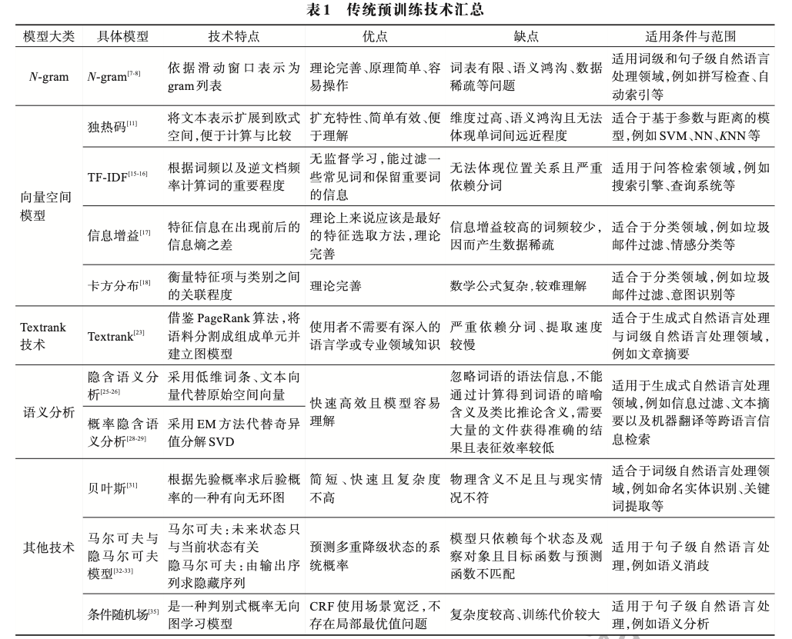

## 3、神经网络预训练技术

**神经网络预训练技术**是在预训练阶段采用神经网络模型进行预训练的技术统称

由于预训练与后续任务耦合性不强，能单独成为一个模型，因此也称为**预训练语言模型**

- **第一代：浅层词嵌入(Word Embeddings)**
    - **相关技术**：word2Vec、GloVe 
    - **优势**：可以捕捉单词的语义，却不受上下文限制，只是简单地学习「共现词频」
    - **缺陷**：无法理解更高层次的文本概念，如句法结构、语义角色、指代等等
- **第二代：上下文的词嵌入(Contextual Embeddings)** 
    - **相关技术**：CoVe、ELMo、GPT、BERT
    - **优势**：
        - 会学习更合理的词表征，这些表征囊括了词的上下文信息，可以用于问答系统、机器翻译等后续任务
        - 另一层面，这些模型还提出了各种语言任务来训练，以便支持更广泛的应用

## 4、关键技术

- **Transfromer**：特征提取能力显著强于以往常用的CNN和RNN，**可以更快更好的在样本上学习知识**

    表现优异有以下几点原因：

    - 模型并行度高，使得训练时间大幅度降低
    - 可以直接捕获序列中的长距离依赖关系
    - 可以产生更具可解释性的模型

- **自监督学习**：核心是**“pretext task”框架**，允许使用数据本身来生成标签，并使用监督的方法来解决非监督的问题，**可以在大规模无标注数据集上学习知识** 

    常用自监督学习方法：

    - **自回归语言模型**`AR`：根据上文内容预测下一个可能跟随的单词，或根据下文预测前面的单词
    - **自编码语言模型**`AE`：根据上下文内容预测随机 Mask 掉的一些单词

- **微调**：利用其标注样本对预训练网络的参数进行调整，可以将预训练的模型结果在新的任务上利用起来

    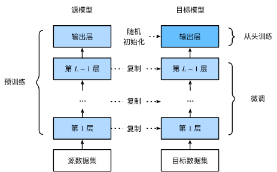

# 二、传统预训练技术

## 1、one-hot(独热编码)

### 1.1 简介

独热编码是嵌入单词的最简单方法

- **实现**：将每个单词表示为一个零向量，索引处只有一个 1，对应于单词在词汇表中的位置

    > 例如，词汇表有 10,000 个单词，那么单词“cat”将表示为一个由 10,000 个零组成的向量，索引 0 处只有一个 1

- **优点**：独热编码是一种简单而有效的方法，可以将单词表示为数字向量

- **缺点**：没有考虑单词的使用上下文，这可能会限制文本分类和情感分析等任务，因为单词的上下文对于确定其含义非常重要

    > 例如，“猫”这个词可能有多种含义，如“一种毛茸茸的小哺乳动物”或“用紧握的拳头打人”
    >
    > 在独热编码中，这两个含义将由同一个向量表示，这会使机器学习模型难以学习单词的正确含义

### 1.2 代码案例

```python
def one_hot(x, n_class, dtype=torch.float32): 
    # X shape: (batch), output shape: (batch, n_class)
    x = x.long()
    res = torch.zeros(x.shape[0], n_class, dtype=dtype, device=x.device)
    res.scatter_(1, x.view(-1, 1), 1)
    return res

def to_onehot(X, n_class):  
    # X shape: (batch, seq_len), output: seq_len elements of (batch, n_class)
    return [one_hot(X[:, i], n_class) for i in range(X.shape[1])]
```

## 2、N-gram

参看：https://blog.csdn.net/v_JULY_v/article/details/127411638

> 为了捕捉单词的语义，可以使用 n-gram

N-Gram是基于一个假设：**第n个词出现与前n-1个词相关，而与其他任何词不相关**(这也是隐马尔可夫当中的假设)

- 整个句子出现的概率就等于各个词出现的概率乘积
- 各个词的概率可以通过语料中统计计算得

---

**优点**：与基于计数或 TF-IDF 的技术相比，N-gram 是一种更有效地捕捉单词语义的方法

**缺点**：无法捕捉单词之间的长距离依赖关系

## 3、TF-IDF(词频-逆文档频率)

### 3.1 简介

**TF-IDF**是一种统计方法，用以评估**字词**对于一个**文件集**或**一份文件**对于所在的**一个语料库**中的**重要程度**

- **主要思想**：如果某个词或短语在一篇文章中出现的**频率TF高**，并且在其他文章中很少出现，即IDF低，则认为此词或者短语具有很好的类别区分能力，适合用来**分类**

    > 字词的重要性随着它在文件中出现的次数成正比增加，但同时会随着它在语料库中出现的频率成反比下降

- **计算方法**：将文档中单词的词频 (TF) 乘以其逆文档频率 (IDF)

    - TF 衡量单词在文档中出现的次数

        > 这个数字是对词数(term count)的归一化，以防止它偏向长的文件

    - IDF 衡量单词在文档语料库中的稀有程度，即是一个词语普遍重要性的度量

        > 某一特定词语的IDF，可以由总文件数目除以包含该词语之文件的数目，再将得到的商取对数得到

- 缺点：基于计数和 TF-IDF 的技术在捕捉单词使用的上下文方面比独热编码更有效，然而**仍然无法捕捉单词的语义**

### 3.2 案例

假设有一个关于猫的文档集，可以计算该文档集中所有单词的 TF-IDF 分数

- TF-IDF 分数最高的单词将是该文档集中最重要的单词，例如“**猫**”、“**狗**” 、“**毛皮**”和“**喵喵**”

- 然后，为每个单词创建一个向量，向量中的每个元素代表该单词的 TF-IDF 分数

    > 单词“ **cat** ”的 TF-IDF 向量会很高，而单词“dog”的 TF-IDF 向量也会很高，但不如单词“cat”的 TF-IDF 向量高

- 接着，机器学习模型可以使用 TF-IDF 词向量对有关猫的文档进行分类

    - 该模型首先会创建新文档的向量表示
    - 然后，会将新文档的向量表示与 TF-IDF 词向量进行比较
    - 如果文档的向量表示与“猫”的 TF-IDF 词向量最相似，则该文档将被归类为“猫”文档

# 三、神经网络第一代预训练技术：Word Embeddings

## 1、NNLM

模型一共三层

- 第一层是**映射层**，将 n 个单词映射为对应 word embeddings 的拼接，其实这一层就是MLP的输入层；
- 第二层是**隐藏层**，激活函数用tanh；
- 第三层是**输出层**，因为是语言模型，需要根据前 n 个单词预测下一个单词，所以是一个多分类器，用softmax

整个模型最大的计算量集中在最后一层上，因为一般来说词汇表都很大，需要计算每个单词的条件概率，是整个模型的计算瓶颈

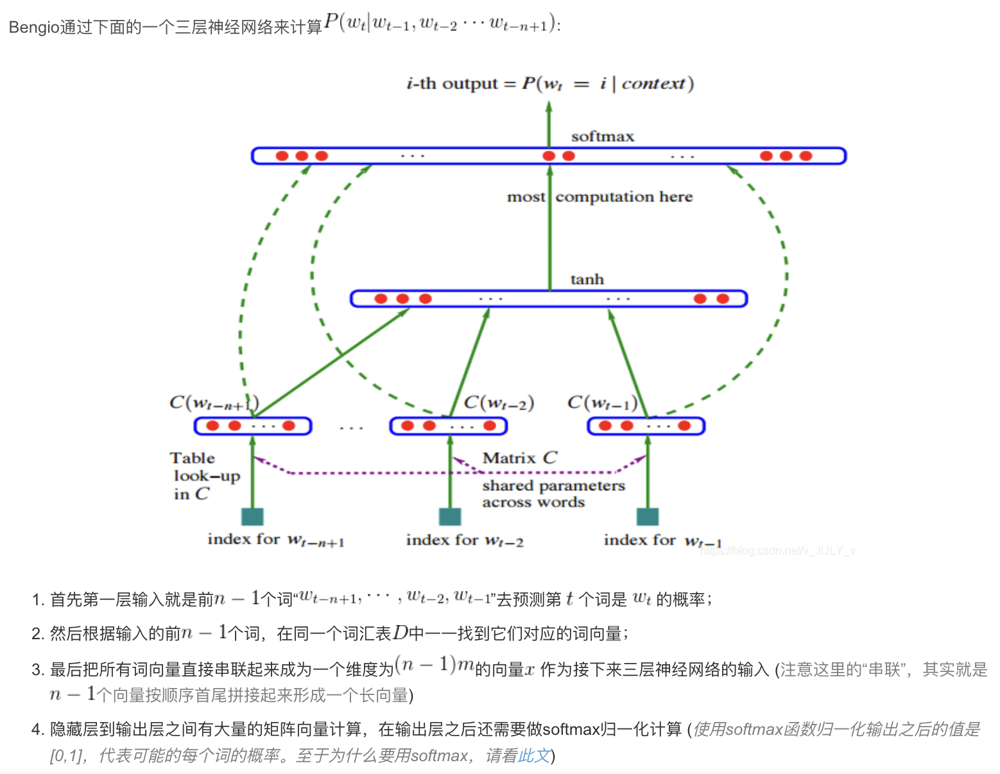

---

神经语言模型构建完成之后，就是训练参数了，这里的参数包括：

- **词向量矩阵C；**
- 神经网络的权重；
- 偏置等参数

---

训练数据就是大堆大堆的语料库，训练结束之后，语言模型得到了：

- 通过 $w_{t - (n-1)}, ...,w_{t-2},w_{t-1}$ 去预测第 $t$ 个词是 $w_t$ 的概率
- 同时意外收获是词向量 $w_{t - (n-1)}, ...,w_{t-2},w_{t-1}$ 也得到了

---

评价：

- NNLM模型是第一次使用神经网络对语言建模
- 由于模型使用的是全连接神经网络，所以只能处理定长序列。
- 由于模型最后一层使用softmax进行计算，参数空间巨大，训练速度极慢

## 2、Word2Vec

参看：https://blog.csdn.net/v_JULY_v/article/details/102708459

### 2.1 简介

**前言**：

- 传统的 one-hot 编码仅仅只是将词符号化，不包含任何语义信息
- 而且，词的独热表示是高维的，且在高维向量中只有一个维度描述了词的语义

---

**需要解决的问题**：

-  问题一：需要赋予词语义信息
-  问题二：降低维度

---

**Word2Vec 介绍**：从大量文本语料中以无监督的方式学习**语义知识**的一种模型

- 将单词从原先所属的空间**映射**到新的多维空间中，即把原先词所在空间嵌入(Embedding)到一个新的空间中去
- 用词向量的方式表征词的语义信息，通过一个嵌入空间使得语义上相似的单词在该空间内距离很近

**缺陷**：没有考虑到词序信息以及全局的统计信息等

---

**word2vec 基本出发点**：上下文相似的两个词，其词向量也应该相似

> 比如香蕉和梨在句子中可能经常出现在相同的上下文中，因此这两个词的表示向量应该就比较相似

- 大部分的有监督机器学习模型，都可以归结为 $f(x) \rightarrow y$ 

    > 把 $x$ 看做句子里的一个词语，$y$ 是这个词语的上下文词语，那么 $f$ 便是上文中所谓的『语言模型』，这个语言模型的目的就是判断 这个样本是否符合自然语言的法则

- 这个语言模型还得到了一个副产品：词向量矩阵

    > word2vec 只关心模型训练完后的副产物：模型参数(这里特指神经网络的权重)，并将这些参数作为输入 $x$ 的某种向量化的表示，这个向量便叫做——词向量

---

Word2Vec 有两个主要变体：

- **连续词袋模型(CBOW)**：从context对target word的预测中学习到词向量的表达，即**以上下文词汇预测当前词**

    > 例如，该模型可能经过训练，根据单词“the”和“dog”预测单词“cat

- **Skip-gram**：从target word对context的预测中学习到word vector，即**以当前词预测其上下文词汇**

    > 例如，该模型可能经过训练，根据单词“cat”预测单词“the”和“dog”


### 2.2 CBOW(连续词袋)

#### (1) CBOW 模型训练

假设根据单词"I","drink"和"everyday"来预测一个单词，并且我们希望这个单词是coffee，而coffee的groundtruth就是coffee一开始的one-hot编码[0,0,1,0]

1. **将上下文词进行 one-hot 表征作为模型的输入**，其中词汇表的维度为 V，上下文单词数量为C

    |    I     | [1,0,0,0] |
    | :------: | :-------: |
    |  drink   | [0,1,0,0] |
    |  coffee  |    ？     |
    | everyday | [0,0,0,1] |

    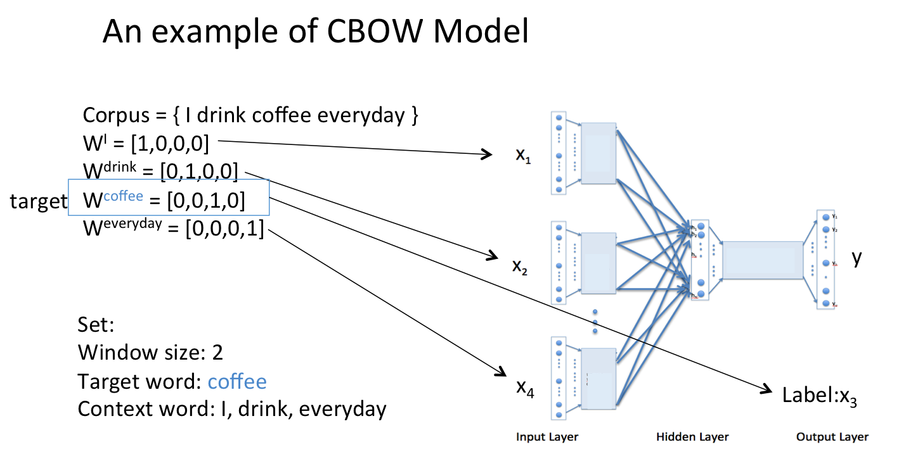

2. 然后将所有上下文词汇的 one-hot 向量分别乘以输入层到隐层的权重矩阵W

    > 将 one-hot 表征结果[1,0,0,0]、[0,1,0,0]、[0,0,0,1]，分别乘以 3×4 的输入层到隐藏层的权重矩阵 $W$
    >
    > 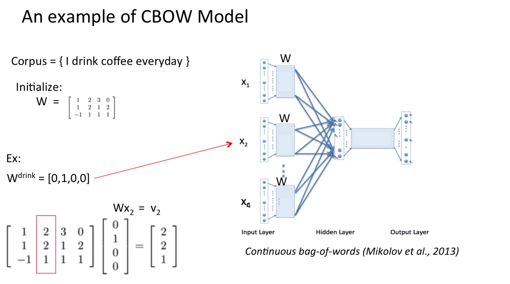

3. 将上一步得到的各个向量相加取平均作为隐藏层向量

    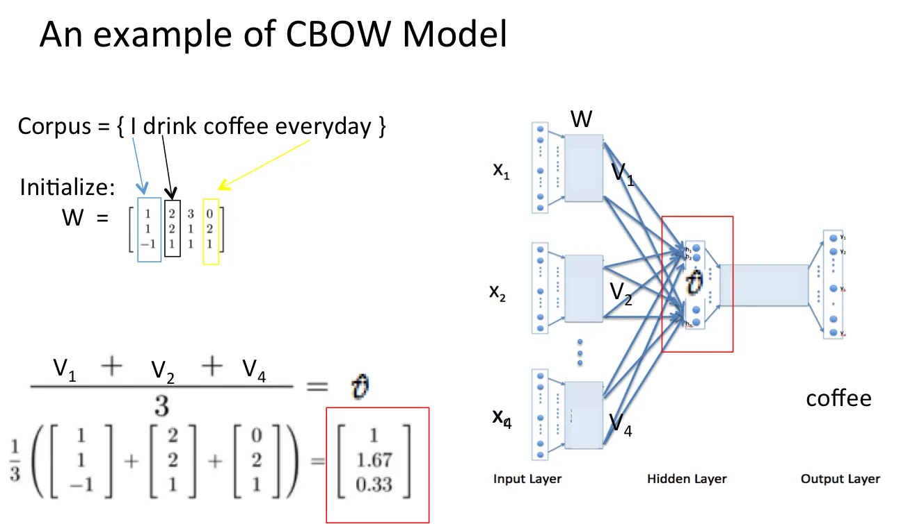

4. 将隐藏层向量乘以隐藏层到输出层的权重矩阵W’

    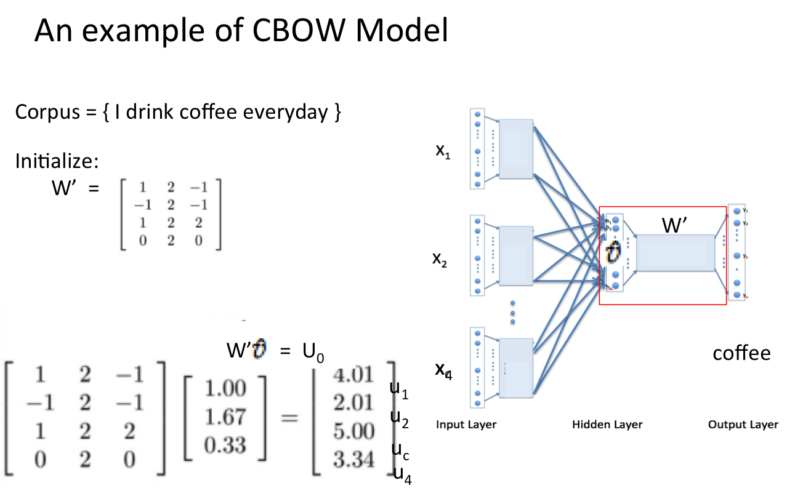

5. 将计算得到的向量做 softmax 激活处理得到 V 维的概率分布，取概率最大的索引作为预测的目标词

    > 对输出向量[4.01, 2.01, 5.00, 3.34] 做 softmax 激活处理得到实际输出[0.23, 0.03, 0.62, 0.12]，并将其与真实标签[0, 0, 1, 0]做比较，然后基于损失函数做梯度优化训练

    

---

**完整过程如下**：


#### (2) CBOW的三层正式结构

CBOW包括以下三层：$context(w)$ 表示词 $w$ 的上下文，即 $w$ 周边词的集合

- **输入层**：包含 context(w) 中 $2c$ 个词的词向量 $v(context(w_1)),v(context(w_2)),...,v(context(w_{2c}))$

    - $v$ 表示单词的向量化表示函数，相当于此函数把一个个单词转化成了对应的向量化表示(类似one-hot编码似的)
    - $2c$ 表示上下文取的总词数，表示向量的维度

- **投影层**：将输入层的个向量做累加求和

- **输出层**：通过计算各个可能中心词的概率大小，取概率最大的词作为中心词，相当于是针对一个 N 维数组进行多分类

    >  问题：该方式计算复杂度太大，所以输出层改造成了一棵Huffman树，以语料中出现过的词当叶子结点，然后各个词出现的频率大小做权重


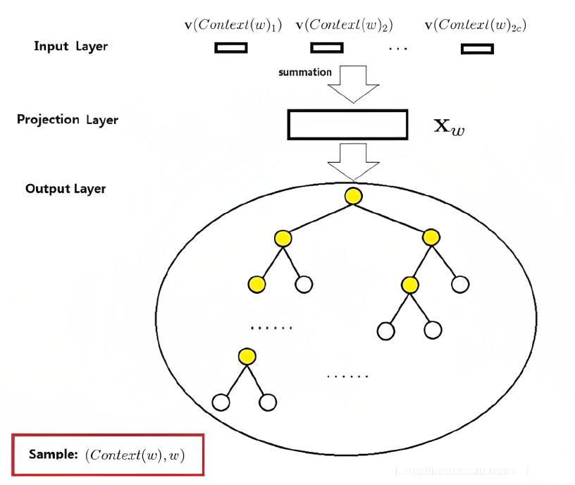

#### (3) 优化策略(Hierarchical Softmax 和 Negative Sampling)

- **核心优化点**：计算量最大的地方是从隐藏层(投影层)到输出层的 $W^{'}$ 

- 两种优化策略：**Hierarchical Softmax 和 Negative Sampling**

- 优化出发点：就是在每个训练样本中，二者都不再使用 $W^{'}$ 这个矩阵

---

**Hierarchical SoftMax(HS)**：基于哈夫曼树(一种二叉树)将 N 维的多分类问题变为了一个 log 次的二分类的问题

>  霍夫曼编码 基于二叉树结构，从而把复杂度从从O(V)降到O(logV)，其中V是词汇表的大小
>
>  总之，将最常见的词放在霍夫曼树的较低层，而不常见的词则放在较高层，因此模型在做词预测时：
>
>  - 对于常见词，只需要较少的步骤就可以达到预测结果
>  - 而对于不常见的词，虽然需要更多的步骤，但由于出现频率较低，对总体计算量的影响较小

---

**Negative Sampling**：待补充。。。

### 2.3 Skip-gram

- Skip-gram 是预测一个词的上下文

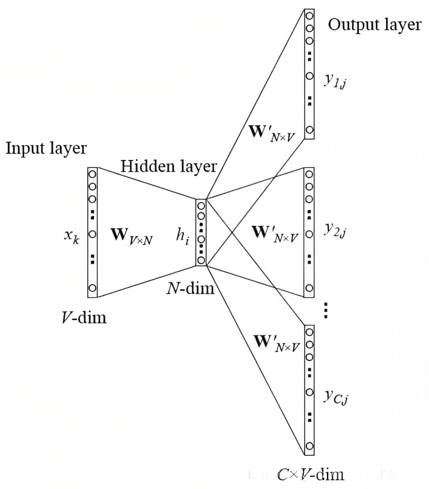

## 3、GloVe

Glove(Global Vectors for Word Representation)是一种**无监督**的词嵌入方法

> 该模型用到了语料库的全局特征，即单词的共现频次矩阵，来学习词表征（word representation）

- **第一步统计共现矩阵**：假设下面三句话是全部语料

    - 得到共现矩阵：使用一个 `size=1` 的窗口，对每句话依次进行滑动，相当于只统计紧邻的词

    - 共现矩阵的每一列，可以当做这个词的一个向量表示

        > 这样的表示优于 one-hot 表示，因为每一维都有含义——共现次数，因此这样的向量表示可以求词语之间的相似度

    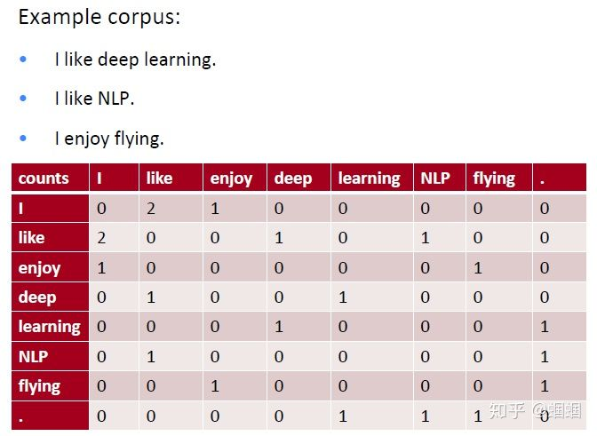

- **第二步训练词向量**：共现矩阵维度是词汇量的大小，维度很大，并且也存在过于稀疏的问题

    此处使用**SVD矩阵分解**来进降维

    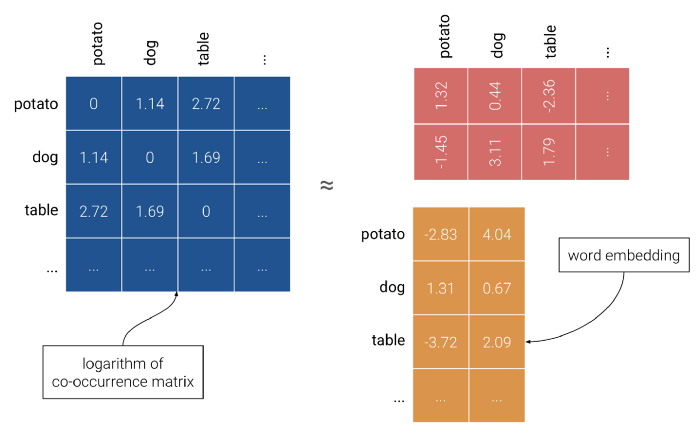

---

**评价**

- 利用词共现矩阵，词向量能够充分考虑到语料库的全局特征，直观上来说比 Word2Vec 更合理
- GloVe 中的很多推导都是 intuitive 的，实际使用中，GloVe 还是没有 Word2vec 来的广泛

# 四、神经网络第二代预训练技术: Contextual Embeddings

通过预训练得到高质量的词向量一直是具有挑战性的问题，主要有两方面的难点：

- 一个是词本身具有的**语法语义复杂**属性
- 另一个是这些语法语义的复杂属性如何随着上下文语境产生变化，也就是**一词多义性**问题

传统的词向量方法例如：word2vec、GloVe 等都是训练完之后，每个词向量就固定下来，无法解决一词多义的问题

## 1、ELMo

`ELMo`(Embeddings from Language Models)：不仅学习**单词特征**，还有**句法特征**与**语义特征**

- **解决一次多义**：通过在大型语料上预训练一个深度 `BiLSTM` 语言模型网络来获取词向量

    > 即每次输入一句话，可以根据这句话的上下文语境获得每个词的向量，这样解决一词多义问题

- **本质思想**：

    - 先用语言模型学习一个单词的 Word Embedding，此时无法区分一词多义问题

    - 使用 Word Embedding 时，单词已经具备特定的上下文，这时根据上下文单词的语义调整单词的 Word Embedding 表示

        > 这样经过调整后的 Word Embedding 更能表达上下文信息，自然就解决了多义词问题

---

**评价**

- 在模型层面解决了一词多义的问题，最终得到的词向量能够随着上下文变化而变化
- LSTM 抽取特征的能力远弱于Transformer
- 拼接方式双向融合特征融合能力偏弱

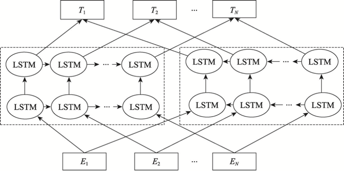

## 2、GPT

GPT 模型：用单向 Transformer 代替 ELMo 的 LSTM 来完成预训练任务，其将12个Transformer叠加起来

- **训练过程**：将句子的 n 个词向量加上位置编码(positional encoding)后输入到 Transformer中 ，n个输出分别预测该位置的下一个词

---

**评价**

- 第一个结合 Transformer 架构（Decoder）和自监督预训练目标的模型
- 语言模型使用的是单行语言模型为目标任务

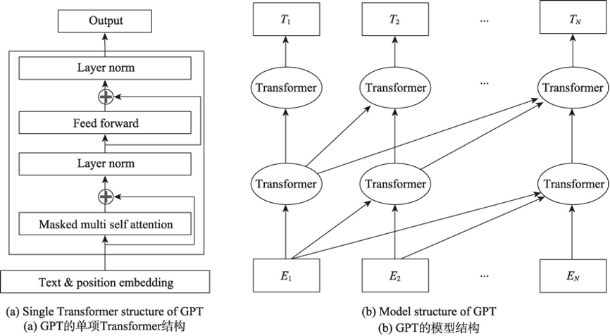

## 3、BERT

- BERT 采用和 GPT 完全相同的两阶段模型，首先是语言模型预训练，其次是后续任务的拟合训练

- **和 GPT 的不同**：在于预训练阶段采了类似 ELMo 的双向语言模型技术、MLM(mask language model)技术以及 NSP(next sentence prediction) 机制

---

**评价**

- 采用了Transformer结构能够更好的捕捉全局信息
- 采用双向语言模型，能够更好的利用了上下文的双向信息
- mask不适用于自编码模型，[Mask]的标记在训练阶段引入，但是微调阶段看不到

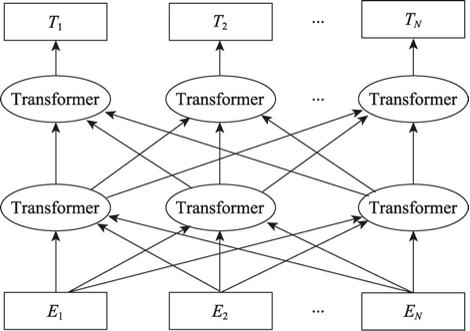


# 五、延伸

## 1、研究方向

预训练模型延伸出了很多新的研究方向，包括了：

- 基于知识增强的预训练模型 `Knowledge-enriched PTMs`
- 跨语言或语言特定的预训练模型 `multilingual or language-specific PTMs`
- 多模态预训练模型 `multi-modal PTMs`
- 领域特定的预训练模型 `domain-specific PTMs`
- 压缩预训练模型 `compressed PTMs`

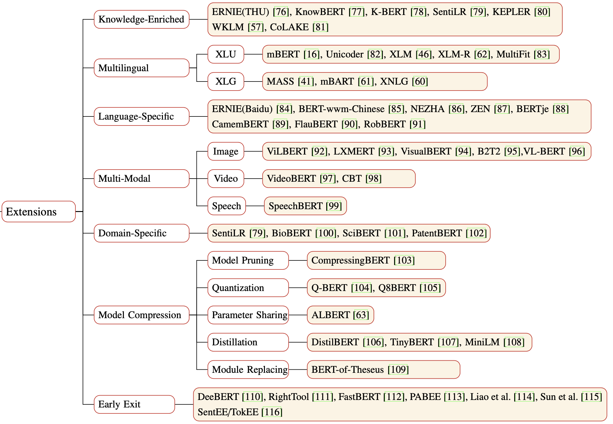

## 2、应用下游任务

### 2.1 迁移学习

- 不同的 PTMs 在相同的下游任务上有着不同的效果

    > 因为 PTMs 有不同的预训练任务，模型架构和语料
    >
    > 针对不同的下游任务需要**选择合适的预训练任务、模型架构和语料库**

- 给定一个预训练模型，不同的网络层捕获不同的信息，基础的句法信息出现在浅层的网络中，高级的语义信息出现在更高的层级中

    > 针对不通的任务需要**选择合适的网络层**

- 主要有两种方式进行模型迁移：

    - **特征提取**(预训练模型的参数是固定的)：预训练模型可以被看作是一个特征提取器，
        - 以特征提取的方式需要更复杂的特定任务的架构
        - 并且，应该采用内部层作为特征，因为它们是最适合迁移的特征
    - **模型微调**(预训练模型的参数是经过微调的)：更加通用和方便的处理下游任务的方式

### 2.2 微调策略

**微调过程通常不好预估**：即使采用相同的超参数，不同的随机数种子也可能导致差异较大的结果

一些有用的微调策略：

- **两步骤微调**：两阶段的迁移，在预训练和微调之间引入了一个中间阶段
    - 在第一个阶段，PTM 通过一个中间任务或语料转换为一个微调后的模型
    - 在第二个阶段，再利用目标任务进行微调
- **多任务微调**：在多任务学习框架下对其进行微调
- **利用额外模块进行微调**：
    - 微调的主要缺点：其参数的低效性，即每个下游模型都有其自己微调好的参数
    - 更好的解决方案：将一些微调好的适配模块注入到 PTMs 中，同时固定原始参数

# 六、实战

## 1、使用滑动窗口进行数据采样

> 在创建 LLM 的 Embedding 之前，需要生成训练 LLM 所需的**输入-目标 `input-target` 对**

### 1.1 简介

给定一个文本样本，提取输入块作为 LLM 的输入子样本，LLM 在训练期间的任务是预测输入块之后的下一个单词，在训练过程中，屏蔽掉目标词之后的所有单词

> 在 LLM 处理文本之前，该文本已经进行 token 化

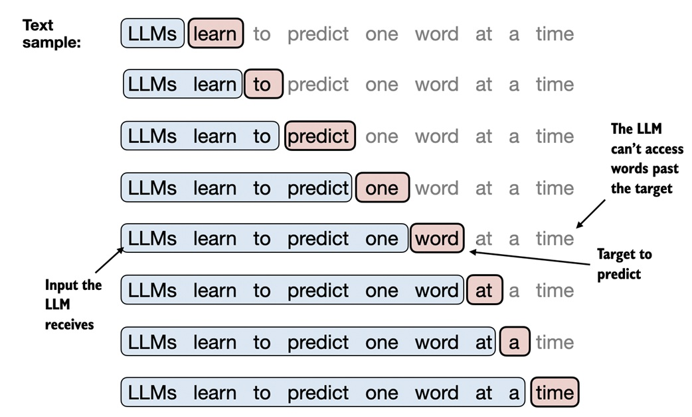

### 1.2 获取输入-目标对

下面流程为：实现了一个数据加载器，**使用滑动窗口方法从训练数据集中获取输入-目标对**

- 前期准备：加载数据、选择分词器

    ```python
    import requests
    import re
    import tiktoken
    
    #加载数据集
    url="https://raw.githubusercontent.com/rasbt/LLMs-from-scratch/main/ch02/01_main-chapter-code/the-verdict.txt"
    response = requests.get(url)
    raw_text = response.text
    
    #对训练集应用 BPE 分词器后获得 5145 个 tokens
    tokenizer = tiktoken.get_encoding("gpt2")
    enc_text = tokenizer.encode(raw_text)
    print(len(enc_text))
    
    #从数据集中剔除前 50 个 toekns，以便在后续步骤中展示更吸引人的文本段落
    enc_sample = enc_text[50:]
    
    #输出
    5145
    ```

- 在创建下一个单词预测任务的输入-目标对时，一种简单直观的方法是创建两个变量 x 和 y

    - `x` 用于存储输入的 token 序列，而 `y` 则用于存放目标 token 序列
    - 目标序列由输入序列中的每个 token 向右移动一个位置构成，从而形成了输入-目标对

    ```python
    context_size = 4 #A
    x = enc_sample[:context_size]
    y = enc_sample[1:context_size+1]
    print(f"x: {x}")
    print(f"y:      {y}")
    
    #输出
    x: [290, 4920, 2241, 287]
    y:      [4920, 2241, 287, 257]
    ```

- 通过将输入数据向右移动一个位置来生成对应的目标数据后，按照以下步骤创建下一个单词的预测任务

    ```python
    for i in range(1, context_size + 1):
        context = enc_sample[:i]
        desired = enc_sample[i]
        #左边的内容指的是 LLM 接收到的输入，箭头右边的 token ID 代表 LLM 应该预测的目标 token ID
        print(context, "---->", desired)
    
    #输出
    [290] ----> 4920
    [290, 4920] ----> 2241
    [290, 4920, 2241] ----> 287
    [290, 4920, 2241, 287] ----> 257
        
    #重复之前的代码，但这次将 token ID 转换回文本
    for i in range(1, context_size + 1):
        context = enc_sample[:i]
        desired = enc_sample[i]
        print(tokenizer.decode(context), "---->", tokenizer.decode([desired]))
        
    #输出
    and ---->  established
    and established ---->  himself
    and established himself ---->  in
    and established himself in ---->  a
    ```

### 1.3 实现一个高效的数据加载器

高效的数据加载器：遍历输入数据集并返回输入-目标对，这些输入和目标都是 PyTorch 张量，可以理解为多维数组

希望返回两个张量：

- 一个是输入张量，包含 LLM 看到的文本
- 另一个是目标张量，包含 LLM 要预测的目标

---

为了实现高效的数据加载器：

- 将所有输入存存储到一个名为 `x` 的张量中，其中每一行都代表一个输入上下文

- 同时，创建另一个名为 `y` 的张量，用于存储对应的预测目标(即下一个单词)，这些目标通过将输入内容向右移动一个位置得到

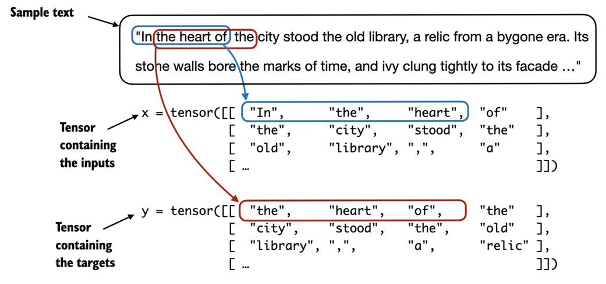

> 上图显示的是字符串格式的 token，但在代码实现中，将直接操作 token ID
>
> 这是因为 BPE 分词器的 `encode` 方法将分词和转换为 token ID 两个步骤合并为一步

- 用于批处理输入和目标的数据集：

    ```python
    #用于批处理输入和目标的数据集
    import torch
    from torch.utils.data import Dataset, DataLoader
    
    #此类规定了如何从数据集中抽取单个样本，每个样本包含一定数量的 tokenID，其存储在input_chunk张量中(数量由max_length决定)
    #并用target_chunk张量保存与输入相对应的目标
    class GPTDatasetV1(Dataset):
        def __init__(self, txt, tokenizer, max_length, stride):
            self.tokenizer = tokenizer
            self.input_ids = []
            self.target_ids = []
            token_ids = tokenizer.encode(txt)
            for i in range(0, len(token_ids) - max_length, stride):
                input_chunk = token_ids[i: i + max_length]
                target_chunk = token_ids[i + 1: i + max_length + 1]
                self.input_ids.append(torch.tensor(input_chunk))
                self.target_ids.append(torch.tensor(target_chunk))
        
        def __len__(self):
            return len(self.input_ids)
        
        def __getitem__(self, idx):
            return self.input_ids[idx], self.target_ids[idx]
    ```

- 用于生成输入-目标对的批次数据加载器

    ```python
    def create_dataloader_v1(txt, batch_size=4, max_length=256, stride=128, shuffle=True, drop_last=True):
        tokenizer = tiktoken.get_encoding("gpt2")
        dataset = GPTDatasetV1(txt, tokenizer, max_length, stride)
        dataloader = DataLoader(dataset, batch_size=batch_size, shuffle=shuffle, drop_last=drop_last)
        return dataloader
    ```

- 在上下文大小(context size)为 4 的 LLM 中测试批量大小(batch size)为 1 的数据加载器

    ```python
    dataloader = create_dataloader_v1(raw_text, batch_size=1, max_length=4, stride=1, shuffle=False)
    data_iter = iter(dataloader)
    
    ##first_batch变量包含两个张量：第一个张量存储输入的 token ID，第二个张量存储目标的 token ID
    #由于max_length为4，因此这两个张量都只包含 4 个 toekn ID
    #需要注意的是，这里的输入大小 4 是相对较小的，仅用于演示。在实际训练语言模型时，输入大小通常至少为 256。
    first_batch = next(data_iter)
    print(first_batch)
    #输出
    [tensor([[  40,  367, 2885, 1464]]), tensor([[ 367, 2885, 1464, 1807]])]
    
    
    #stride参数决定了输入在各批次之间移动的位置数，这模拟了滑动窗口的概念
    second_batch = next(data_iter)
    print(second_batch)
    #输出
    [tensor([[ 367, 2885, 1464, 1807]]), tensor([[2885, 1464, 1807, 3619]])]
    ```

在从输入数据集创建多个批次的过程中，会在文本上滑动一个输入窗口

- 如果步长设定为 1，那么在生成下一个批次时，会将输入窗口向右移动 1 个位置
- 如果步长设定为输入窗口的大小，那么就可以避免批次之间的重叠

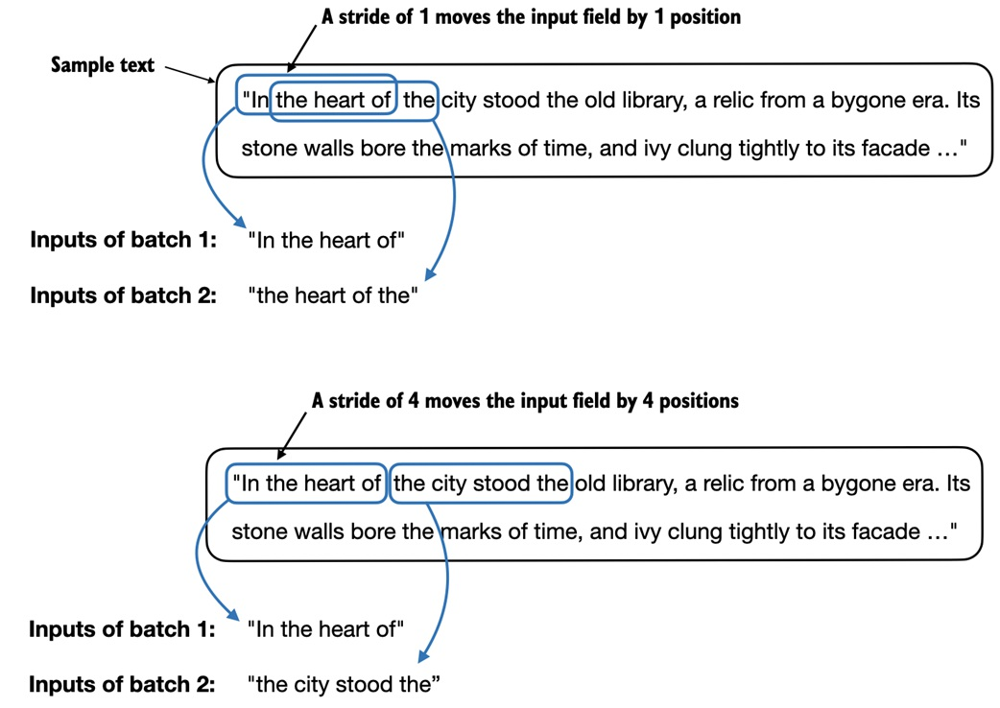

## 2、构建词嵌入

### 2.1 简介

- 使用嵌入层将 token 嵌入到连续的向量表示中

    > 需要将 token 映射到一个连续向量空间，才可以进行后续运算，映射结果就是该token对应的embedding

- 通常，这些用来转换词符的嵌入层是大语言模型（LLM）的一部分，并且在模型训练的过程中会不断调整和优化

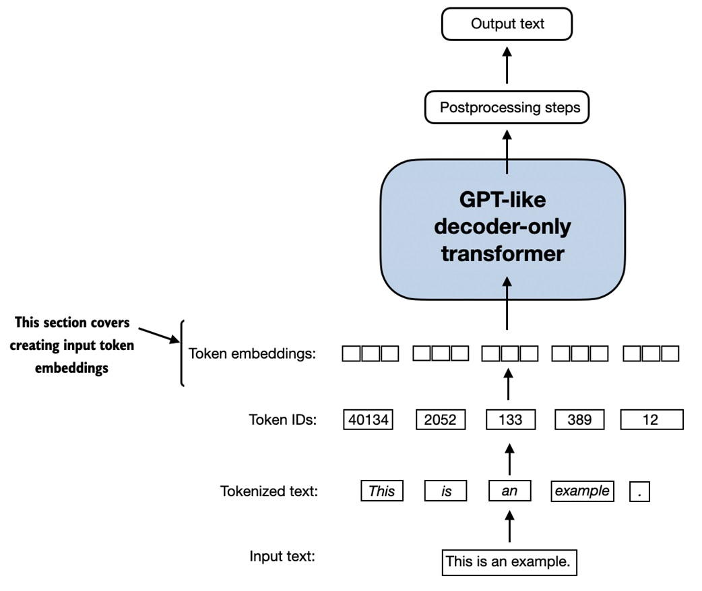

### 2.2 实践

- 假设词汇表大小为 6，并创建大小为3的嵌入

    ```python
    vocab_size=6
    output_dim = 3
    
    torch.manual_seed(123)
    embedding_layer = torch.nn.Embedding(vocab_size, output_dim)
    print(embedding_layer.weight) #会生成一个6x3的权重矩阵
    
    #输出
    Parameter containing:
    tensor([[ 0.3374, -0.1778, -0.1690],
            [ 0.9178,  1.5810,  1.3010],
            [ 1.2753, -0.2010, -0.1606],
            [-0.4015,  0.9666, -1.1481],
            [-1.1589,  0.3255, -0.6315],
            [-2.8400, -0.7849, -1.4096]], requires_grad=True)
    ```

- 将ID为3的词符转换为一个3维向量

    ```python
    print(embedding_layer(torch.tensor([3])))
    print(embedding_layer(torch.tensor([2, 3, 5, 1])))
    
    #输出--注意对比上一步的输出
    tensor([[-0.4015,  0.9666, -1.1481]], grad_fn=<EmbeddingBackward0>)
    tensor([[ 1.2753, -0.2010, -0.1606],
            [-0.4015,  0.9666, -1.1481],
            [-2.8400, -0.7849, -1.4096],
            [ 0.9178,  1.5810,  1.3010]], grad_fn=<EmbeddingBackward0>)
    ```

### 2.3 总结

总结：嵌入层本质上是一种查找操作

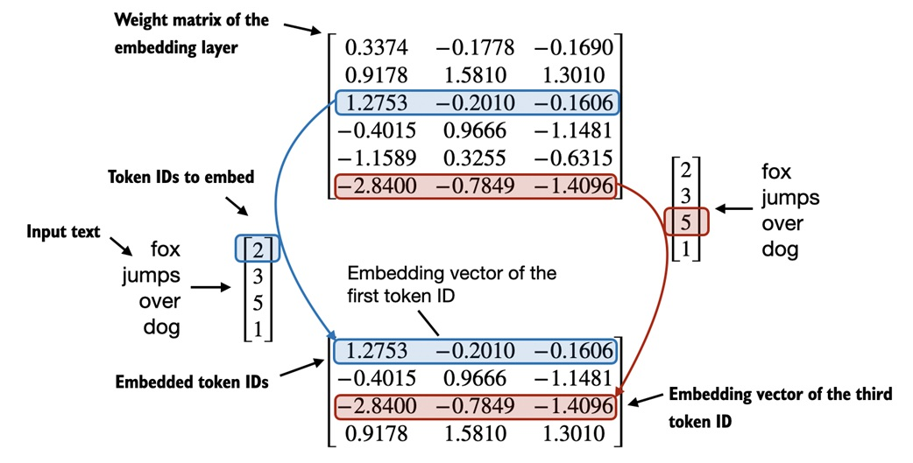

## 3、词位置编码

参看：https://github.com/datawhalechina/llms-from-scratch-cn/blob/main/Translated_Book/ch02/2.8%E8%AF%8D%E4%BD%8D%E7%BD%AE%E7%BC%96%E7%A0%81.ipynb

> LLM 的一个缺点是自注意力机制**不包含序列中的 token 位置或顺序信息**
>
> 上一节的 embedding 层生成方式：相同的 token ID 总是被映射成相同的向量表示，不会在乎 token ID 在输入序列中的位置

### 3.1 简介

由于LLM的自注意力机制本身也不关注位置，因此将额外的位置信息注入到LLM中是有帮助的

> 为了实现这一点，有两种常用的位置编码方式：相对位置编码和绝对位置编码
>
> 两种类型的位置编码旨在**增强 LLM 理解 token 顺序和关系的能力，确保更准确和更具上下文意识的预测**
>
> 它们的选择通常取决于具体的应用程序和正在处理的数据的性质

- **绝对位置编码**：与序列中的特定位置相关联

    > 对于输入序列中的每个位置，都会添加唯一的位置编码到 token 中，来表示其确切位置
    >
    > 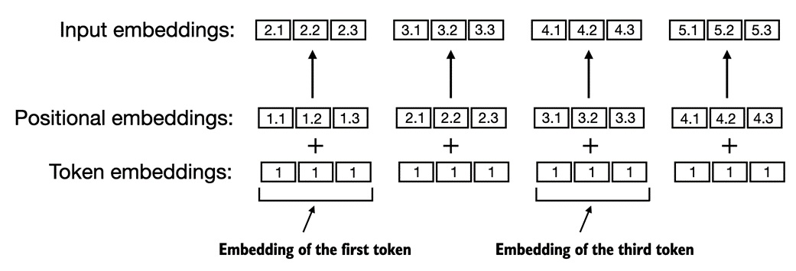

- **相对位置编码**：不专注 token 的绝对位置，而是侧重于 token 之间的相对位置或距离

    > 这意味着模型学习的是 “彼此之间有多远” 而不是 “在哪个确切位置”的关系
    >
    > 好处：即使模型在训练过程中没有看到这样的长度，也可以更好地推广到不同长度的序列

### 3.2 实践

- 假设 tokenID 由 BPE 创建，其词汇量大小为 50,257，同时输入 token 编码为 256 维向量

    ```python
    output_dim = 256
    vocab_size = 50257
    token_embedding_layer = torch.nn.Embedding(vocab_size, output_dim)
    ```

- 实例化“使用滑动窗口进行数据采样” 的 dataloader

    > 假设批次大小为8，每个批次有四个 token，则结果将是一个8 x 4 x 256的张量

    ```python
    max_length = 4
    dataloader = create_dataloader_v1(raw_text, batch_size=8, max_length=max_length, stride=1)
    data_iter = iter(dataloader)
    inputs, targets = next(data_iter)
    print("Token IDs:\n", inputs)
    print("\nInputs shape:\n", inputs.shape)
    
    #输出
    Token IDs:
     tensor([[  438, 18108,   407, 11196],
            [  655,  6687,   284,   766],
            [  438, 14363,  1986,   373],
            [  887,   645,   438,  1640],
            [14263,   276,  5118,    11],
            [  336,  8375,   503,  4291],
            [   40,   423,  4750,   326],
            [  465,  5101, 11061,   340]])
    
    Inputs shape:
     torch.Size([8, 4])
    ```

- 使用 token_embedding_layer 将这些 token ID 嵌入为 256 维的向量

    ```python
    token_embeddings = token_embedding_layer(inputs)
    print(token_embeddings.shape)
    
    #输出
    torch.Size([8, 4, 256])
    ```

- 对于GPT模型的绝对嵌入方法，只需要创建另一个具有与 token_embedding_layer 相同维度的嵌入层

    ```python
    #在实践中，输入文本可以比支持的上下文长度长，这种情况必须截断文本
    context_length = max_length #表示 LLM 支持的输入大小
    pos_embedding_layer = torch.nn.Embedding(context_length, output_dim)
    pos_embeddings = pos_embedding_layer(torch.arange(context_length))
    print(pos_embeddings.shape) #位置嵌入张量由四个 256 维向量组成
    
    #输出
    torch.Size([4, 256])
    ```

- 在每个 8 批次中的每个 4x256 维标记嵌入张量中添加 4x256 维的 pos_embeddings 张量

    ```python
    input_embeddings = token_embeddings + pos_embeddings
    print(input_embeddings.shape)
    
    #输出
    torch.Size([8, 4, 256])
    ```

### 3.3 总结

- 输入文本首先被分解为单个 token
- 然后使用词汇表将这些标记转换为 token ID
- 将 token ID 转换为编码向量，然后添加相似大小的位置编码，生成用作主要 LLM 层的输入编码

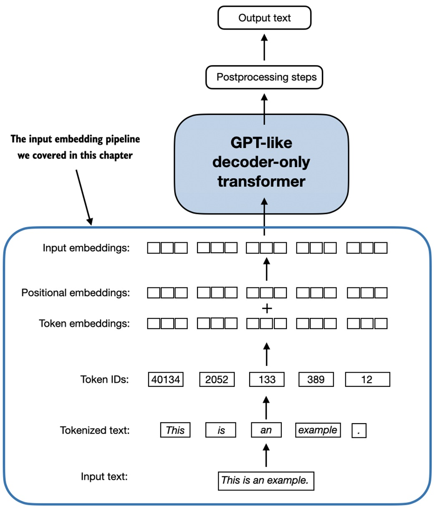