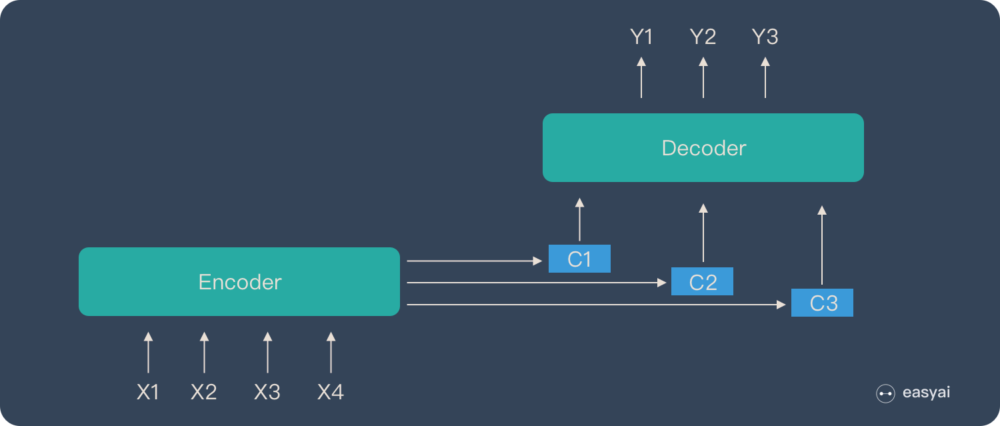
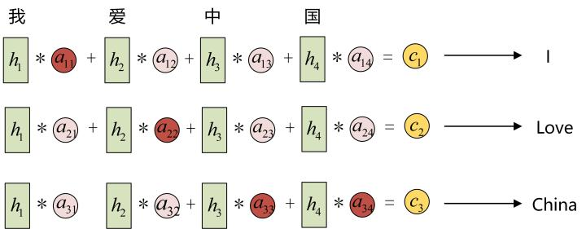
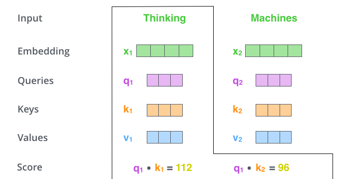
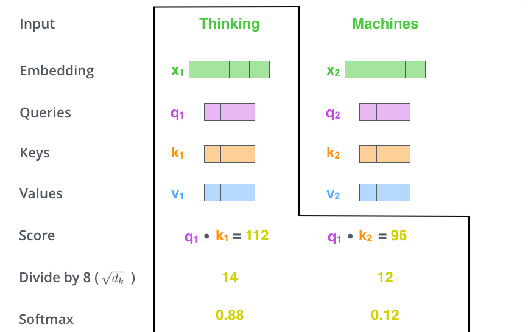
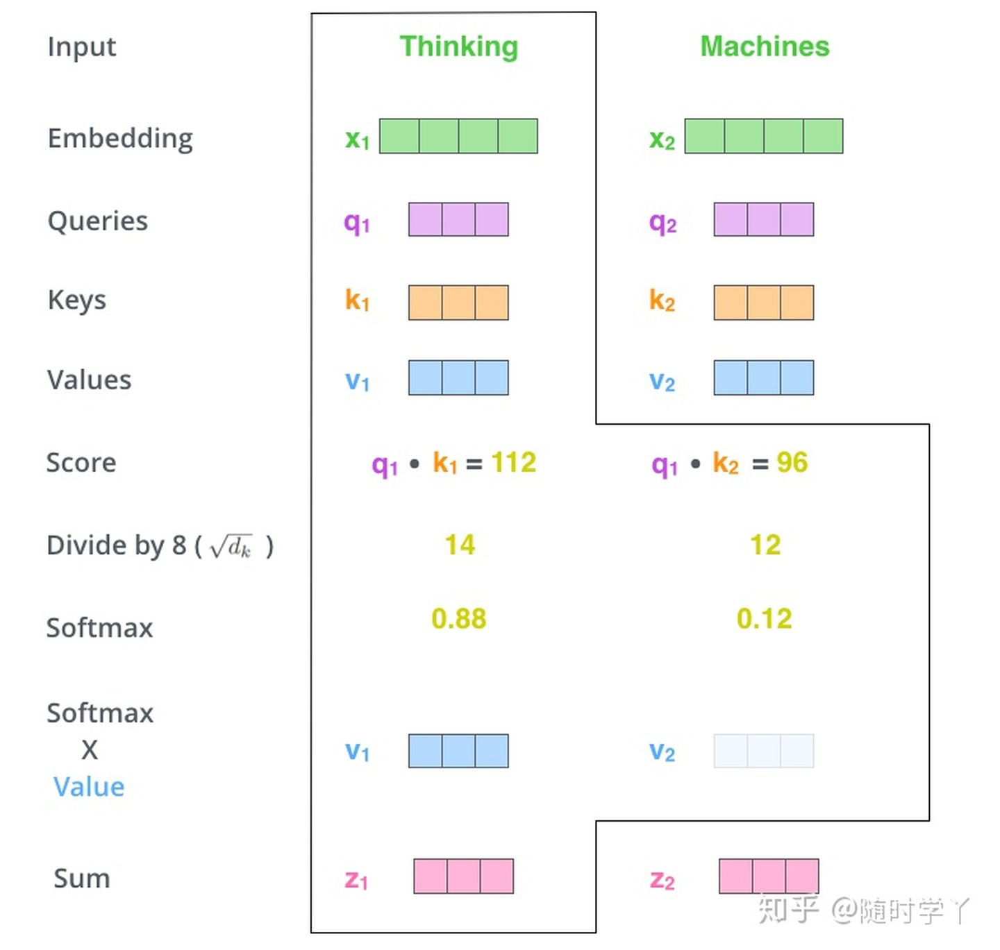
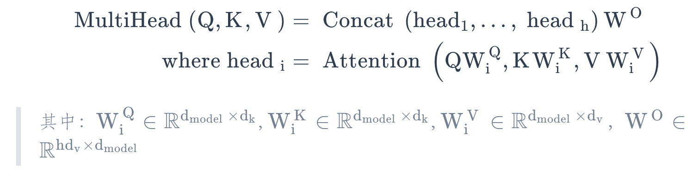
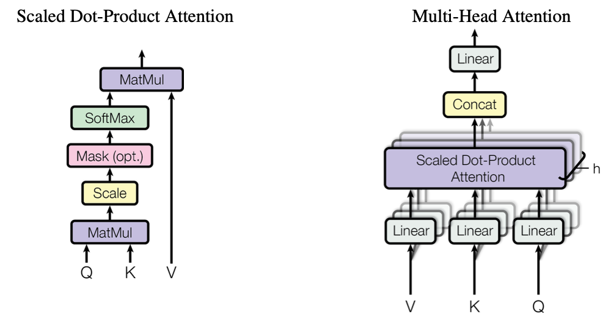

# 一、Attention 机制

> 参看：https://imzhanghao.com/2021/09/01/attention-mechanism/

## 1、Encoder-Decoder的缺陷

局限性：编码和解码之间的唯一联系是固定长度的语义向量 `c`

- 语义向量 c 无法完全表达整个序列的信息
- 先输入的内容携带的信息，会被后输入的信息稀释掉，或者被覆盖掉
- 输入序列越长，这样的现象越严重，这样使得在Decoder解码时一开始就没有获得足够的输入序列信息，解码效果会打折扣


$$
y_1 = f(c) \\
y_2 = f(c, y_1) \\
y_3 = f(c, y_1, y_2)
$$


## 2、Attention

### 2.1 引入Attention 后的 Encoder-Decoder

$$
y_1 = f(c_1) \\
y_2 = f(c_2, y_1) \\
y_3 = f(c_3, y_1, y_2)
$$



- 图解：

    - **Encoder**：

        

    - **Decoder**：

        

### 2.2 计算注意力系数或权重 $a_{ij}$


### 2.3 三阶段计算Attention

- 阶段1：Query 与 Key 进行相似度计算得到权值
- 阶段2：对上一阶段的计算的权重进行归一化
- 阶段3：用归一化的权重与 Value 加权求和，得到 Attention 值


### 2.4 Attention 的本质思想


# 二、Self-Attention 机制

> 参看：https://imzhanghao.com/2021/09/15/self-attention-multi-head-attention/
>
> Self Attention就是Q、K、V均为同一个输入向量映射而来的Encoder-Decoder Attention，它可以无视词之间的距离直接计算依赖关系，能够学习一个句子的内部结构，实现也较为简单并且可以并行计算

## 1、概述

- Self Attention 机制的特别之处：

    - Attention 的输入 Source 和输出 Target 内容是不一样的，比如在翻译的场景中，Source是一种语言，Target是另一种语言，Attention机制发生在Target元素 Query 和 Source 中所有元素之间

    - Self Attention 是 Source 内部元素之间或 Target 内部元素之间发生的 Attention 机制，也可以理解为Target=Source这种特殊情况下的注意力计算机制

- Self Attention 的作用：更容易捕获句子中长距离的相互依赖的特征

    - RNN 或 LSTM：需要依次序序列计算，对于远距离的相互依赖的特征，要经过若干时间步步骤的信息累积才能将两者联系起来，而距离越远，有效捕获的可能性越小

    - Self Attention：在计算过程中，将句子中任意两个单词通过一个计算步骤直接联系起来，所以远距离依赖特征之间的距离被极大缩短，有利于有效地利用这些特征

        > 除此外，Self Attention 对于增加计算的并行性也有直接帮助作用

## 2、计算过程


- **第一步：初始化Q，K，V**

    - `Thinking` 单词的 Embedding 向量是 $X_1$，用 $X_1$ 乘以 $W^Q$ 的权重矩阵，就可以得到 Thinking 的 Query，即 $q_1$

        > 其他的q2、k1、k2等都使用相同的计算方式，这样就为每个单词都计算了一个Query，一个Key，和一个Value

    - 这些新向量的维度比 Embedding 向量小，其维数是64，而嵌入和编码器输入/输出向量的维数是512

        > 它们不必更小，这是一种架构选择，可以使多头注意力的计算保持不变

    

- **第二步：计算 Self-Attention Score**

    - 根据 `Thinking` 对输入句子的每个词进行评分

        > 当在某个位置对单词进行编码时，分数决定了将多少注意力放在输入句子的其他部分上

    - 得分是通过将查询向量与正在评分的各个单词的键向量进行点积来计算

        > 因此，如果正在处理位置 #1 中单词的自注意力，第一个分数将是 q1 和 k1 的点积，第二个分数是q1和k2的点积

    

- **第三步：对Self-Attention Socre进行缩放和归一化，得到Softmax Socre**

    - 对 Step2 中计算的分数进行缩放，这里通过除以8，将结果进行 softmax 归一化

        > 论文中维度是64，这可以让模型有更稳定的梯度，默认值是64，也可以是其它值

    

- **第四步：Softmax Socre乘以Value向量，求和得到Attention Value**

    - 每个 Value 向量乘以 softmax Score 得到加权的 v1 和 v2，对加权的 v1 和 v2 进行求和得到z1

        > 这样，就计算出了第一个词 Thinking 的注意力值，其他的词用相同的方法进行计算

    

---

Self-Attention 计算过程动图：


# 三、Multi-Head Attention

> Multi-Head Attention 利用多个查询来平行地计算从输入信息中选取多个信息，每个注意力关注输入信息的不同部分，然后拼接



## 1、Single-Head Attention VS Multi-Head Attention



## 2、Multi-Head Attention 作用

多头注意力的机制进一步细化了注意力层，通过以下两种方式提高了注意力层的性能：

- **扩展了模型专注于不同位置的能力**：当多头注意力模型和自注意力机制集合时，比如：翻译“动物没有过马路，因为它太累了”这样的句子时，我们想知道“它”指的是哪个词，如果能分析出来代表动物，就很有用
- **为注意力层提供了多个“表示子空间”**：多头注意力有**多组Query/Key/Value权重矩阵**，这些权重矩阵集合中的每一个都是随机初始化的，然后在训练之后，每组用于将输入Embedding投影到不同的表示子空间中。多个head学习到的Attention侧重点可能略有不同，这样给了模型更大的容量

# 四、实战

## 1、简介

对 LLM 进行编码的三个主要阶段：在通用文本数据集上预训练 LLM，并在标记数据集上对其进行微调


---

不同注意力机制：

- 从简化版本的自我注意力开始，然后添加可训练的权重
- 因果注意机制为自我注意力添加了一个掩码，允许 LLM 一次生成一个单词
- 最后，多头注意力将注意力机制组织成多个头，使模型能够并行捕获输入数据的各个方面


> 图中所示的这些不同的注意力变体相互构建，目标是实现一个紧凑而高效的多头注意力实现

## 2、self-Attention 计算

### 2.1 简介

在自注意力机制中：

- **“自”（self）**：

    - 指该机制能够通过分析**单一输入序列内不同位置的联系**来计算注意力权重

    - 能够评估和学习输入本身各部分之间的关系与依赖，比如一句话中的词语或一个图像中的像素

- **传统注意力机制**：主要关注**两个不同序列之间的元素关系**

    > 例如在序列对序列模型中，注意力可能位于一个输入序列与一个输出序列之间

- **实现 Attention 的整体脉络**：

    

### 2.2 无需可训练权重的 Attention

> 参看：https://github.com/datawhalechina/llms-from-scratch-cn/blob/main/Translated_Book/ch03/3.3.ipynb

#### (1) 目标

**自注意力的目标**：为输入序列中每个元素 x(i) 计算上下文向量 z(i)，该向量结合了来自所有其他输入元素的信息

---

如图：显示了一个输入序列, 标记为 x, 包含 T 个元素, 从 x(1) 到 x(T)

以 x(2) 的嵌入向量为例，其对应的上下文向量 z(2)

> 这个增强的上下文向量 z(2) 包含了关于 x(2) 以及序列中所有其他元素 x(1) 到 x(T) 的信息

- 计算 z(2) 的每个输入元素的重要性或贡献由注意力权重 α21 到 α2T 决定
- 在计算 z(2) 时，注意力权重是针对输入元素 x(2) 及所有其他输入计算的


**自注意力机制的作用**：

- 通过整合序列中所有其他元素的信息, 为输入序列的每一个元素创造出更丰富的表征

    > 这对于大语言模型来说至关重要, 因为它们需要理解句子中词与词之间的联系和重要性

- 接下来，将引入可训练的权重，使大语言模型能够学习如何构建这些上下文向量，从而有效地帮助模型生成下一个Token

#### (2) 实现

**使用第二个输入序列 x(2) 作为查询来演示上下文向量 z(2) 的计算过程**：

- 案例输入：

    ```python
    import torch
    inputs = torch.tensor(
        [[0.43, 0.15, 0.89], # Your     (x^1)
        [0.55, 0.87, 0.66], # journey  (x^2)
        [0.57, 0.85, 0.64], # starts   (x^3)
        [0.22, 0.58, 0.33], # with     (x^4)
        [0.77, 0.25, 0.10], # one      (x^5)
        [0.05, 0.80, 0.55]] # step     (x^6)   
    )
    ```

- 第一步：**计算中间变量 ω，即注意力得分**

    ```python
    query = inputs[1]  #A 
    attn_scores_2 = torch.empty(inputs.shape[0])
    for i, x_i in enumerate(inputs):
        attn_scores_2[i] = torch.dot(x_i, query)
    print(attn_scores_2)
    
    #输出
    tensor([0.9544, 1.4950, 1.4754, 0.8434, 0.7070, 1.0865])
    
    #理解点积: 通过对两个向量的对应元素进行相乘然后求和来完成
    res = 0.
    for idx, element in enumerate(inputs[0]):
        res += inputs[0][idx] * query[idx]
    print(res) #tensor(0.9544)
    print(torch.dot(inputs[0], query)) #tensor(0.9544)
    ```

    点积：

    - 能衡量两个向量的相似度：点积越高，表示两个向量的对齐程度或相似度越高
    - 在自注意力机制中，点积用于衡量序列中各元素之间的关注程度：点积值越高，两个元素之间的相似性和注意力得分就越高

    ---

    此图展示了通过**点积**计算查询 x(2) 与所有其他输入元素之间的注意力得分 ω

    

- 第二步：**计算权重，即对之前计算的每个注意力得分进行标准化处理**

    进行归一化的主要目的：获取总和为 1 的注意力权重

    - 不仅便于我们理解数据
    - 还有助于保持大语言模型训练的稳定性

    ```python
    #实现这一归一化步骤的简单方法
    attn_weights_2_tmp = attn_scores_2 / attn_scores_2.sum()
    print("Attention weights:", attn_weights_2_tmp)
    print("Sum:", attn_weights_2_tmp.sum())
    
    #输出
    Attention weights: tensor([0.1455, 0.2278, 0.2249, 0.1285, 0.1077, 0.1656])
    Sum: tensor(1.0000)
    
    #softmax 函数
    def softmax_naive(x):
        return torch.exp(x) / torch.exp(x).sum(dim=0) 
        
    attn_weights_2_naive = softmax_naive(attn_scores_2)
    print("Attention weights:", attn_weights_2_naive)
    print("Sum:", attn_weights_2_naive.sum())
    
    #PyTorch 的 softmax 函数
    attn_weights_2 = torch.softmax(attn_scores_2, dim=0)
    print("Attention weights:", attn_weights_2)
    print("Sum:", attn_weights_2.sum())
    ```

    如图，在根据输入查询 x(2) 计算出注意力分数 ω21 到 ω2T 后，是将这些分数归一化，以得到注意力权重 α21 到 α2T

    

- 第三步：**计算出上下文向量 z(2)，即通过将嵌入的输入 Token x(i) 与相应的注意力权重相乘，然后将结果向量求和**

    ```python
    query = inputs[1] # 2nd input token is the query
    context_vec_2 = torch.zeros(query.shape)
    for i,x_i in enumerate(inputs):
        context_vec_2 += attn_weights_2[i]*x_i
    print(context_vec_2)
    
    #输出
    tensor([0.4419, 0.6515, 0.5683])
    ```

    如图，是计算上下文向量 z(2)，这个上下文向量是所有输入向量 x(1) 到 x(T) 通过注意力权重加权的组合

    

---

**计算所有输入 Token 的注意力权重**：

- 第一步：计算所有输入对的点积

    ```python
    #通过循环方式计算
    attn_scores = torch.empty(6, 6)
    for i, x_i in enumerate(inputs):
        for j, x_j in enumerate(inputs):
            attn_scores[i, j] = torch.dot(x_i, x_j)
    print(attn_scores)
    
    #通过矩阵乘法计算
    attn_scores = inputs @ inputs.T
    print(attn_scores)
    ```

- 第二步：计算权重，即将每行的值归一化，使其总和为 1

    ```python
    attn_weights = torch.softmax(attn_scores, dim=1)
    print(attn_weights)
    ```

- 第三步：计算所有的上下文向量，即利用这些注意力权重通过矩阵乘法来生成

    ```python
    all_context_vecs = attn_weights @ inputs
    print(all_context_vecs)
    ```

如图，高亮行显示了我们之前为第二个输入元素作为查询所计算的注意力权重


#### (3) 总结


### 2.3 带有可训练权重的Attention

> 参看：https://github.com/datawhalechina/llms-from-scratch-cn/blob/main/Translated_Book/ch03/3.4.ipynb

**带有可训练权重的Attention(缩放点积注意力)**：被应用于原始的 Transformer 架构、GPT 模型以及大多数流行的大语言模型中

- **与上一节区别**：引入了在模型训练期间会**更新的权重矩阵**，使得模型能够学习产生“良好”的上下文向量
- **实现**：根据特定输入元素，将输入向量的加权和计算为上下文向量

#### (1) 逐步计算注意力权重

案例：将第二个输入 x(2) 作为查询输入来处理。查询向量 q(2) 是通过将输入 x(2) 与查询权重矩阵 Wq 进行矩阵乘法得到的

```python
import torch
inputs = torch.tensor(
    [[0.43, 0.15, 0.89], # Your     (x^1)
    [0.55, 0.87, 0.66], # journey  (x^2)
    [0.57, 0.85, 0.64], # starts   (x^3)
    [0.22, 0.58, 0.33], # with     (x^4)
    [0.77, 0.25, 0.10], # one      (x^5)
    [0.05, 0.80, 0.55]] # step     (x^6)   
)

#定义一些变量
x_2 = inputs[1]
d_in = inputs.shape[1] #3
d_out = 2
#类似GPT模型中，输入和输出维度通常相同，但为了展示计算过程，选择了不同的输入(d_in=3)和输出(d_out=2)维度
```

- 第一步：**针对每个输入元素 x，计算其对应的查询（q）、键（k）和值（v）向量**

    ```python
    #初始化三个权重矩阵 Wq、Wk 和 Wv
    torch.manual_seed(123)
    #将 requires_grad 设置为 False 是为了示范时输出结果更清晰
    #如果要将这些权重矩阵用于模型训练，需将requires_grad设置为True，以便在模型训练期间更新这些矩阵
    W_query = torch.nn.Parameter(torch.rand(d_in, d_out), requires_grad=False)
    W_key   = torch.nn.Parameter(torch.rand(d_in, d_out), requires_grad=False)
    W_value = torch.nn.Parameter(torch.rand(d_in, d_out), requires_grad=False)
    
    #计算查询、键和值向量：
    query_2 = x_2 @ W_query 
    key_2 = x_2 @ W_key 
    value_2 = x_2 @ W_value
    print(query_2)
    
    #输出
    tensor([0.4306, 1.4551])
    ```

    

- 第二步：**计算注意力得分**

    ```python
    keys = inputs @ W_key #keys.shape: torch.Size([6, 2])
    
    #计算单个
    keys_2 = keys[1]
    attn_score_22 = query_2.dot(keys_2)
    print(attn_score_22) #tensor(1.8524)
    
    #通过矩阵乘法将此计算拓展到所有注意力得分上
    attn_scores_2 = query_2 @ keys.T
    print(attn_scores_2) #tensor([1.2705, 1.8524, 1.8111, 1.0795, 0.5577, 1.5440])
    ```

    注意力得分计算是一个点积计算，与上一节的区别是，不是直接计算输入元素之间的点积，而是使用通过各自的权重矩阵转换输入获得的查询向量和键向量

    

- 第三步：**从注意力得分转到注意力权重**，即**计算注意力得分 ω 后，使用 softmax 函数归一化这些得分以获得注意力权重 α**

    - 与之前不同的是，通过除以键的嵌入维度的平方根来缩放注意力得分

    - 通过**嵌入维度大小(缩放)**进行归一化的原因：为了通过避免小梯度来提高训练性能

        > 例如，在扩大嵌入维度时，对于类似 GPT 的大语言模型，其维度通常超过千，较大的点积可能会因为应用了 softmax 函数而在反向传播过程中产生非常小的梯度
        >
        > 随着点积的增加，softmax 函数的表现更像是一个阶跃函数，导致梯度接近零
        >
        > 这些小梯度可以极大地减缓学习速度或导致训练停滞

        这种自注意力机制也被称为缩放点积注意力的原因，是它**通过嵌入维度的平方根进行缩放**

    ```python
    d_k = keys.shape[-1]
    attn_weights_2 = torch.softmax(attn_scores_2 / d_k**0.5, dim=-1)
    print(attn_weights_2) #tensor([0.1500, 0.2264, 0.2199, 0.1311, 0.0906, 0.1820])
    ```

    

- 最后一步：**计算上下文向量**，**通过注意力权重组合所有值向量来计算**

    - 上一节通过输入向量的加权求和计算上下文向量

    - 现在通过值向量的加权求和来计算上下文向量

        > 此处，注意力权重充当了衡量每个值向量相应重要性的权重因子

    ```python
    context_vec_2 = attn_weights_2 @ values
    print(context_vec_2) #tensor([0.3061, 0.8210])
    ```

    

#### (2) 为什么是查询、键和值

在注意力机制的上下文中，“键”、“查询”和“值”类似存储、搜索和检索信息

- “查询”`query`：类似于数据库中的搜索查询，代表模型当前关注或试图理解的项目

    > 查询用于探查输入序列的其他部分，以确定应该给予它们多少注意力。

- “键”`key`：类似于数据库中用于索引和搜索的键，用于与查询匹配

    > 在注意力机制中，输入序列中的每个项目都有一个关联的键

- “值”`value`：类似于数据库中键值对的值，代表输入项目的实际内容或表示

    > 一旦模型确定哪些键（哪些输入部分）与查询（当前关注项目）最相关，它就检索相应的值

#### (3) 紧凑的自注意力 Python 类

- **紧凑型 self-attention 类**：

    ```python
    import torch.nn as nn
    
    class SelfAttention_v1(nn.Module):
        def __init__(self, d_in, d_out):
            super().__init__()
            self.d_out = d_out
            #每个矩阵都将输入维度 d_in 转换为输出维度 d_out
            self.W_query = nn.Parameter(torch.rand(d_in, d_out))
            self.W_key = nn.Parameter(torch.rand(d_in, d_out))
            self.W_value = nn.Parameter(torch.rand(d_in, d_out))
            
        #通过查询和键的乘积计算注意力得分（attn_scores），并使用 softmax 函数对这些得分进行归一化处理
        #最后，通过这些归一化的注意力得分对值进行加权，以此创建一个上下文向量
        def forward(self, x):
            keys = x @ self.W_key
            queries = x @ self.W_query
            values = x @ self.W_value
            atten_scores = queries @ keys.T
            atten_weights = torch.softmax(atten_scores / keys.shape[-1]**0.5, dim=-1)
            context_vec = atten_weights @ values
            return context_vec
        
    #测试
    torch.manual_seed(123)
    sa_v1 = SelfAttention_v1(d_in, d_out)
    print(sa_v1(inputs))
    #输出
    tensor([[0.2996, 0.8053],
            [0.3061, 0.8210],
            [0.3058, 0.8203],
            [0.2948, 0.7939],
            [0.2927, 0.7891],
            [0.2990, 0.8040]], grad_fn=<MmBackward>)
    ```

    如图：

    - 通过三个权重矩阵 Wq、Wk 和 Wv 来转换输入矩阵 X 中的输入向量
    - 然后，基于生成的查询(Q) 和键(K) 计算注意力权重矩阵
    - 利用这些注意力权重和值 (V)，计算出上下文向量 (Z)

    

- **使用 PyTorch 的 Linear 层的 self-attention 类**

    > 通过使用 PyTorch 的 nn.Linear 层，可以进一步改进 SelfAttention_v1 的实现
    >
    > - 这些层在不使用偏置单元时，可以有效地执行矩阵乘法
    > - 此外，nn.Linear 相较于 nn.Parameter(torch.rand(...)) 的显著优势：其具有优化的权重初始化方案，有助于实现更稳定和有效的模型训练

    ```python
    class SelfAttention_v2(nn.Module):
        def __init__(self, d_in, d_out, qkv_bias=False):
            super().__init__()
            self.d_out= d_out
            self.W_query = nn.Linear(d_in, d_out, bias=qkv_bias)
            self.W_key = nn.Linear(d_in, d_out, bias=qkv_bias)
            self.W_value = nn.Linear(d_in, d_out, bias=qkv_bias)
            
        def forward(self, x):
            keys = self.W_key(x)
            queries = self.W_query(x)
            values = self.W_value(x)
            atten_scores = queries @ keys.T
            atten_weights = torch.softmax(atten_scores / keys.shape[-1]**0.5, dim=-1)
            context_vec = atten_weights @ values
            return context_vec
        
    #测试
    torch.manual_seed(789)
    sa_v2 = SelfAttention_v2(d_in, d_out)
    print(sa_v2(inputs))
    #输出
    tensor([[-0.0739,  0.0713],
            [-0.0748,  0.0703],
            [-0.0749,  0.0702],
            [-0.0760,  0.0685],
            [-0.0763,  0.0679],
            [-0.0754,  0.0693]], grad_fn=<MmBackward>)
    ```

### 2.4 因果Attention(Causal/masked Attention)

> 参看：https://github.com/datawhalechina/llms-from-scratch-cn/blob/main/Translated_Book/ch03/3.5.ipynb

- **因果注意力或遮蔽注意力 `Causal/masked attention`**：限制模型在处理任何给定 Token 时，只考虑序列中**之前和当前的输入**

- 与标准自注意力机制区别：后者允许一次访问整个输入序列

因此，在计算注意力得分时，因果注意力机制确保模型**只考虑序列中当前 Token 或之前出现的 Token**

实现：对每个处理的 Token 遮蔽掉输入文本中当前 Token 之后的后续 Token

---

如图，在因果注意力中，遮蔽掉对角线以上的注意力权重，以便在计算上下文向量时，大语言模型无法访问后续的Token

> 补充：遮蔽了对角线以上的注意力权重，并标准化未遮蔽的注意力权重，使得每一行的注意力权重之和为 1


#### (1) 应用因果注意力遮蔽


获取遮蔽的注意力权重矩阵的方式：**对注意力得分应用 softmax 函数，将对角线以上的元素归零并标准化结果矩阵**

- 第一步：**使用 softmax 函数计算注意力权重**

    ```python
    queries = sa_v2.W_query(inputs)  #A
    keys = sa_v2.W_key(inputs) 
    attn_scores = queries @ keys.T
    attn_weights = torch.softmax(attn_scores / keys.shape[-1]**0.5, dim=1)
    print(attn_weights)
    
    #输出
    tensor([[0.1921, 0.1646, 0.1652, 0.1550, 0.1721, 0.1510],
            [0.2041, 0.1659, 0.1662, 0.1496, 0.1665, 0.1477],
            [0.2036, 0.1659, 0.1662, 0.1498, 0.1664, 0.1480],
            [0.1869, 0.1667, 0.1668, 0.1571, 0.1661, 0.1564],
            [0.1830, 0.1669, 0.1670, 0.1588, 0.1658, 0.1585],
            [0.1935, 0.1663, 0.1666, 0.1542, 0.1666, 0.1529]],
           grad_fn=<SoftmaxBackward>)
    ```

- 第二步：使用 PyTorch 的 tril 函数**创建一个遮蔽，使得对角线以上的值为零**，然后将这个遮蔽与注意力权重相乘，将对角线以上的值归零

    ```python
    #创建一个遮蔽
    context_length = attn_scores.shape[0]
    mask_simple = torch.tril(torch.ones(context_length, context_length))
    print(mask_simple)
    #输出
    tensor([[1., 0., 0., 0., 0., 0.],
            [1., 1., 0., 0., 0., 0.],
            [1., 1., 1., 0., 0., 0.],
            [1., 1., 1., 1., 0., 0.],
            [1., 1., 1., 1., 1., 0.],
            [1., 1., 1., 1., 1., 1.]])
    
    #将这个遮蔽与注意力权重相乘，将对角线以上的值归零
    masked_simple = attn_weights*mask_simple
    print(masked_simple)
    #输出
    tensor([[0.1921, 0.0000, 0.0000, 0.0000, 0.0000, 0.0000],
            [0.2041, 0.1659, 0.0000, 0.0000, 0.0000, 0.0000],
            [0.2036, 0.1659, 0.1662, 0.0000, 0.0000, 0.0000],
            [0.1869, 0.1667, 0.1668, 0.1571, 0.0000, 0.0000],
            [0.1830, 0.1669, 0.1670, 0.1588, 0.1658, 0.0000],
            [0.1935, 0.1663, 0.1666, 0.1542, 0.1666, 0.1529]],
           grad_fn=<MulBackward0>)
    ```

- 第三步：**重新标准化注意力权重，使每一行的和再次为 1**

    > 可以通过将每一行中的每个元素除以该行的总和来实现这一点

    ```python
    row_sums = masked_simple.sum(dim=1, keepdim=True)
    masked_simple_norm = masked_simple / row_sums
    print(masked_simple_norm)
    #输出
    tensor([[1.0000, 0.0000, 0.0000, 0.0000, 0.0000, 0.0000],
            [0.5517, 0.4483, 0.0000, 0.0000, 0.0000, 0.0000],
            [0.3800, 0.3097, 0.3103, 0.0000, 0.0000, 0.0000],
            [0.2758, 0.2460, 0.2462, 0.2319, 0.0000, 0.0000],
            [0.2175, 0.1983, 0.1984, 0.1888, 0.1971, 0.0000],
            [0.1935, 0.1663, 0.1666, 0.1542, 0.1666, 0.1529]],
           grad_fn=<DivBackward0>)
    ```

#### (2) 信息泄漏

- **问题**：当应用遮蔽并重新标准化注意力权重时，可能会出现后续的 Token 信息仍影响当前 Token 的情况
- **原因**：因为它们的值是 softmax 函数计算的一部分

- **关键点**：当在遮蔽后重新标准化注意力权重时，实际上是在一个更小的子集上重新计算 softmax 函数

    > 因为遮蔽位置不会对 softmax 值有任何贡献

- **softmax 的数学优雅之处**：尽管在最初的计算中分母包含了所有位置，但在遮蔽和重新归一化之后，被遮蔽的位置的影响被消除了，即它们不会以任何有意义的方式对 softmax 得分产生影响

    > 简而言之，经过遮蔽和重新标准化后，注意力权重的分布就好像一开始只在未遮蔽位置上计算一样
    >
    > 这确保了后续（或其他遮蔽）Token 的信息不会像想象的那样泄露

- 一种在因果注意力中**获得掩蔽注意力权重矩阵的更高效方法**：是==**在应用 softmax 函数之前，用负无穷大值遮蔽注意力得分**==

    > softmax 函数将其输入转换为概率分布，当一行中存在负无穷大`-∞`值时，softmax 函数将其概率视为零

---

实战：通过创建一个对角线以上是 1 的遮蔽，然后将这些 1 替换为负无穷大`-inf`值来实现这种更高效的遮蔽技巧

```python
mask = torch.triu(torch.ones(context_length, context_length), diagonal=1)
masked = attn_scores.masked_fill(mask.bool(), -torch.inf)
print(masked)
#输出
tensor([[0.2899,   -inf,   -inf,   -inf,   -inf,   -inf],
        [0.4656, 0.1723,   -inf,   -inf,   -inf,   -inf],
        [0.4594, 0.1703, 0.1731,   -inf,   -inf,   -inf],
        [0.2642, 0.1024, 0.1036, 0.0186,   -inf,   -inf],
        [0.2183, 0.0874, 0.0882, 0.0177, 0.0786,   -inf],
        [0.3408, 0.1270, 0.1290, 0.0198, 0.1290, 0.0078]],
       grad_fn=<MaskedFillBackward0>)

#对这些遮蔽结果应用 softmax 函数即可完成
attn_weights = torch.softmax(masked / keys.shape[-1]**0.5, dim=1)
print(attn_weights)
#输出
tensor([[1.0000, 0.0000, 0.0000, 0.0000, 0.0000, 0.0000],
        [0.5517, 0.4483, 0.0000, 0.0000, 0.0000, 0.0000],
        [0.3800, 0.3097, 0.3103, 0.0000, 0.0000, 0.0000],
        [0.2758, 0.2460, 0.2462, 0.2319, 0.0000, 0.0000],
        [0.2175, 0.1983, 0.1984, 0.1888, 0.1971, 0.0000],
        [0.1935, 0.1663, 0.1666, 0.1542, 0.1666, 0.1529]],
       grad_fn=<SoftmaxBackward>)
```

#### (3) 通过 Dropout 遮蔽额外的注意力权重

`Dropout`：在训练过程中随机忽略选定的隐藏层单元，有效地将它们“丢弃”

- 作用：有助于防止过拟合，确保模型不会过度依赖任何特定的隐藏层单元组
- 强调：Dropout 仅在训练期间使用，在之后不可以使用

---

注意力机制中的 Dropout 通常应用于两个特定区域：

- **计算注意力得分之后**
- **将注意力权重应用于值向量之后**

如图，利用因果注意力遮蔽(左上角)，应用额外的 Dropout 遮蔽(右上角)来归零额外的注意力权重，以减少训练期间的过拟合


---

案例：使用 50% 的 Dropout 率，即遮蔽掉一半的注意力权重

- 首先将 PyTorch 的 Dropout 实现应用于一个由 1 组成的 6x6 张量

    ```python
    torch.manual_seed(123)
    dropout = torch.nn.Dropout(0.5) #A
    example = torch.ones(6, 6) #B
    print(dropout(example))
    
    #输出
    tensor([[2., 2., 2., 2., 2., 2.],
            [0., 2., 0., 0., 0., 0.],
            [0., 0., 2., 0., 2., 0.],
            [2., 2., 0., 0., 0., 2.],
            [2., 0., 0., 0., 0., 2.],
            [0., 2., 0., 0., 0., 0.]])
    ```

- 当对注意力权重矩阵应用 50% 的 Dropout 率时，矩阵中一半的元素被随机设为零

    为了补偿活跃元素的减少，矩阵中剩余元素的值被放大了 1/0.5 = 2 倍

    > 这种放大对于保持注意力权重的整体平衡至关重要，它能确保在训练和推理阶段，注意力机制的平均影响保持一致

    ```python
    torch.manual_seed(123)
    print(dropout(attn_weights))
    
    #输出
    tensor([[2.0000, 0.0000, 0.0000, 0.0000, 0.0000, 0.0000],
            [0.0000, 0.8966, 0.0000, 0.0000, 0.0000, 0.0000],
            [0.0000, 0.0000, 0.6206, 0.0000, 0.0000, 0.0000],
            [0.5517, 0.4921, 0.0000, 0.0000, 0.0000, 0.0000],
            [0.4350, 0.0000, 0.0000, 0.0000, 0.0000, 0.0000],
            [0.0000, 0.3327, 0.0000, 0.0000, 0.0000, 0.0000]],
           grad_fn=<MulBackward0>)
    ```

#### (4) 实现一个紧凑的 causal attention 类

开始前，确保代码能够处理由多个输入组成的批次，以便 CausalAttention 类支持数据加载器生成的批次输出

```python
#为简化模拟这种批次输入，复制输入的文本示例
batch = torch.stack((inputs, inputs), dim=0)
print(batch.shape) #A 

#输出
torch.Size([2, 6, 3])
```

一个紧凑的因果注意力类：

> `self.register_buffer()`  优点：在大型语言模型中使用 CausalAttention 类时，缓冲区会随着模型自动移动到适当的设备(CPU或GPU)上，这在后续章节中训练大语言模型时会很有用
>
> 这意味着不需要手动确保这些张量与模型参数在同一设备上，从而避免设备不匹配错误

```python
class CausalAttention(nn.Module):
    def __init__(self, d_in, d_out, context_length, dropout, qkv_bias=False):
        super().__init__()
        self.d_out = d_out
        self.W_query = nn.Linear(d_in, d_out, bias=qkv_bias)
        self.W_key   = nn.Linear(d_in, d_out, bias=qkv_bias)
        self.W_value = nn.Linear(d_in, d_out, bias=qkv_bias)
        self.dropout = nn.Dropout(dropout) # New
        self.register_buffer('mask', torch.triu(torch.ones(context_length, context_length),diagonal=1))#New

    def forward(self, x):
        b, num_tokens, d_in = x.shape # New batch dimension b
        keys = self.W_key(x)
        queries = self.W_query(x)
        values = self.W_value(x)

        attn_scores = queries @ keys.transpose(1, 2) # Changed transpose
        attn_scores.masked_fill_(self.mask.bool()[:num_tokens, :num_tokens], -torch.inf) 
        attn_weights = torch.softmax(attn_scores / keys.shape[-1]**0.5, dim=-1)
        attn_weights = self.dropout(attn_weights) # New

        context_vec = attn_weights @ values
        return context_vec
    
#测试
torch.manual_seed(123)
context_length = batch.shape[1]
ca = CausalAttention(d_in, d_out, context_length, 0.0)
context_vecs = ca(batch)
print("context_vecs.shape:", context_vecs.shape) #torch.Size([2, 6, 2])
```

### 2.5 将单头注意力扩展到多头注意力

> 参看：https://github.com/datawhalechina/llms-from-scratch-cn/blob/main/Translated_Book/ch03/3.6.ipynb

#### (1) 简介

- **实现多头注意力机制**：需要创建多个自注意力机制的实例，其中每个实例都有自己的权重，然后合并这些示例的输出

    > 尽管使用多个自注意力机制实例计算量很大，但这对于像 Transformer 基础的大语言模型所需的复杂模式识别至关重要

- **主要思想**：通过不同的、学习到的线性投影，多次(并行地)运行注意力机制，即即将输入数据(如注意力机制中的查询、键和值向量)与权重矩阵相乘

---

图中的多头注意力模块由两个单头注意力模块堆叠在一起

- 在一个具有两个头的多头注意力模块中，使用两个值权重矩阵：Wv1 和 Wv2 ，并且 Wq 和 Wk 也各自有两组权重矩阵
- 得到两组上下文向量 Z1 和 Z2 ，然后将它们组合成一个上下文向量矩阵 Z


#### (2) 实现 MultiHeadAttentionWrapper 类

> 通过堆叠多个 Single-head Attention 模块实现多头注意力，即通过实例化并组合几个 CausalAttention 对象完成

```python
from torch import nn
import torch

class MultiHeadAttentionWrapper(nn.Module):
    def __init__(self, d_in, d_out, context_length, dropout, num_heads, qkv_bias=False):
        super().__init__()
        self.heads = nn.ModuleList([
            CausalAttention(d_in, d_out, context_length, dropout, qkv_bias)
                for _ in range(num_heads)
        ])
        
    def forward(self, x):
        return torch.cat([head(x) for head in self.heads], dim=1)
    
#测试
torch.manual_seed(123)
context_length = batch.shape[1]
d_in, d_out = 3, 2
mha = MultiHeadAttentionWrapper(d_in, d_out, context_length, 0.0, num_heads=2)
context_vecs = mha(batch)

print(context_vecs)
print("context_vecs.shape: ", context_vecs.shape)

#输出
tensor([[[-0.4519,  0.2216,  0.4772,  0.1063],
         [-0.5874,  0.0058,  0.5891,  0.3257],
         [-0.6300, -0.0632,  0.6202,  0.3860],
         [-0.5675, -0.0843,  0.5478,  0.3589],
         [-0.5526, -0.0981,  0.5321,  0.3428],
         [-0.5299, -0.1081,  0.5077,  0.3493]],
 
        [[-0.4519,  0.2216,  0.4772,  0.1063],
         [-0.5874,  0.0058,  0.5891,  0.3257],
         [-0.6300, -0.0632,  0.6202,  0.3860],
         [-0.5675, -0.0843,  0.5478,  0.3589],
         [-0.5526, -0.0981,  0.5321,  0.3428],
         [-0.5299, -0.1081,  0.5077,  0.3493]]], grad_fn=<CatBackward0>)
context_vecs.shape: torch.Size([2, 6, 4])
```

如图：

- 设置 num_heads=2 将得到一个包含两组上下文向量矩阵的张量
- 在每个上下文向量矩阵中，行表示对应于 Token 的上下文向量，列对应于通过 d_out=4 指定的嵌入维度
- 沿列维度连接这些上下文向量矩阵，最终的嵌入维度为 2 × 2 = 4


#### (3) 通过权重分割实现多头注意力

##### 1. 简述

- **改进点**：可以将 MultiHeadAttentionWrapper 和 CausalAttention 这两个概念合并成一个单一的 MultiHeadAttentionWrapper 类，而不是同时保有两个单独的类
- **方案**：
    - 通过创建一系列 CausalAttention 对象(self.heads)来实现多个头，每个头代表一个单独的注意力头
    - CausalAttention 类独立执行注意力机制，每个头的结果被连接起来
- **与上一节对比**：新的 MultiHeadAttention 类将多头功能集成在一个类中，通过重塑投影的查询、键和值张量将输入分割成多个头，然后在计算注意力后组合这些头的结果

##### 2. 一个高效的 MultiHeadAttention 类

```python
class MultiHeadAttention(nn.Module):
    def __init__(self, d_in, d_out, context_length, dropout, num_heads, qkv_bias=False):
        super().__init__()
        assert d_out % num_heads == 0, "d_out must be divisible by num_heads"
        self.d_out = d_out
        self.num_heads = num_heads
        self.head_dim = d_out // num_heads
        self.W_query = nn.Linear(d_in, d_out, bias=qkv_bias)
        self.W_key = nn.Linear(d_in, d_out, bias=qkv_bias)
        self.W_value = nn.Linear(d_in, d_out, bias=qkv_bias)
        self.out_proj = nn.Linear(d_out, d_out)
        self.dropout = nn.Dropout(dropout)
        self.register_buffer('mask', torch.triu(torch.ones(context_length, context_length), diagonal=1))
        
    def forward(self, x):
        b, num_tokens, d_in = x.shape
        keys = self.W_key(x)
        queries = self.W_query(x)
        values = self.W_value(x)
        
        keys = keys.view(b, num_tokens, self.num_heads, self.head_dim)
        values = values.view(b, num_tokens, self.num_heads, self.head_dim)
        queries = queries.view(b, num_tokens, self.num_heads, self.head_dim)
        
        keys = keys.transpose(1, 2)
        queries = queries.transpose(1, 2)
        values = values.transpose(1, 2)
        
        atten_scores = queries @ keys.transpose(2, 3)
        mask_bool = self.mask.bool()[:num_tokens, :num_tokens]
        atten_scores.masked_fill_(mask_bool, -torch.inf)
        
        atten_weights = torch.softmax(atten_scores / keys.shape[-1]**0.5, dim=-1)
        atten_weigths = self.dropout(atten_weights)
        
        context_vec = (atten_weights @ values).transpose(1, 2)
        context_vec = context_vec.contiguous().view(b, num_tokens, self.d_out)
        context_vec = self.out_proj(context_vec)
        return context_vec
```

> 之前的 MultiHeadAttentionWrapper 堆叠了多个 Single-head Attention 层，然后将它们组合成一个 MultiHeadAttention 层

MultiHeadAttention 类从一个 Multi-head Attention 层开始：

- 首先，通过**张量重塑 (.view) 和转置 (.transpose)**在内部将这个层分割成单独的注意力头

- 然后，计算完注意力权重和上下文向量后，所有头部的上下文向量被重新转置为 `(b, num_tokens, num_heads, head_dim)` 形状

- 接着，这些向量被重塑成 `(b, num_tokens, d_out)` 形状，有效地合并了所有头部的输出

- 在头部合并后，添加了一个所谓的输出投影层 `self.out_proj`，这在因果注意力类中并不存在

    > 这个输出投影层虽然不是绝对必要的，但它在许多大语言模型架构中常见

---

由于额外的重塑和张量转置， MultiHeadAttention 类比 MultiHeadAttentionWrapper **更高效**

**原因**：只需要一次矩阵乘法就可以计算出键，例如 keys = self.W_key(x)（对查询和值同样适用）

```python
#测试
torch.manual_seed(123)
batch_size, context_length, d_in = batch.shape
d_out = 2
mha = MultiHeadAttention(d_in, d_out, context_length, 0.0, num_heads=2)
context_vecs = mha(batch)
print(context_vecs)
print("context_vecs.shape:", context_vecs.shape)

#输出--从结果来看，输出维度直接由 d_out 参数控制
tensor([[[0.3190, 0.4858],
         [0.2943, 0.3897],
         [0.2856, 0.3593],
         [0.2693, 0.3873],
         [0.2639, 0.3928],
         [0.2575, 0.4028]],
 
        [[0.3190, 0.4858],
         [0.2943, 0.3897],
         [0.2856, 0.3593],
         [0.2693, 0.3873],
         [0.2639, 0.3928],
         [0.2575, 0.4028]]], grad_fn=<ViewBackward0>)
context_vecs.shape: torch.Size([2, 6, 2])
```

##### 3. 图解

- 如图顶部所示：在带有两个注意力头的 MultiHeadAttentionWrapper 类中，初始化了两个权重矩阵 Wq1 和 Wq2，并计算了两个查询矩阵 Q1 和 Q2
- 如图底部所示：在 MultiHeadAttention 类中，初始化一个更大的权重矩阵 Wq，只执行一次与输入的矩阵乘法以获得查询矩阵 Q，然后将查询矩阵分割成 Q1 和 Q2，


##### 4. 解释：分割通过`.view` 和 `.transpose`实现

查询、键和值张量的分割是通过使用 PyTorch 的 `.view` 和 `.transpose` 方法进行张量重塑和转置操作来实现的：

> 输入首先通过线性层转换(针对查询、键和值)，然后被重塑来表示多个头

- 首先，将 `d_out` 维度分割为 `num_heads` 和 `head_dim`，其中 `head_dim = d_out / num_heads`
- 然后，通过 `.view` 方法将维度为 `(b, num_tokens, d_out)` 的张量重塑为维度 `(b, num_tokens, num_heads, head_dim)`

- 随后，通过 `.transpose` 方法使得多头维度 `num_heads` 排在序列长度维度 `num_tokens` 之前，形成 `(b, num_heads, num_tokens, head_dim)` 的结构

    > 这种转置对于正确匹配不同头的查询、键和值，以及高效进行批量矩阵乘法至关重要

##### 5. 分割案例说明

PyTorch 的矩阵乘法可以处理四维输入张量，使得矩阵乘法在最后两个维度 `num_tokens, head_dim` 进行，然后针对各个头重复执行

- 假设有以下示例张量：

    ```python
    a = torch.tensor([[[[0.2745, 0.6584, 0.2775, 0.8573],
                        [0.8993, 0.0390, 0.9268, 0.7388],
                        [0.7179, 0.7058, 0.9156, 0.4340]],
     
                       [[0.0772, 0.3565, 0.1479, 0.5331],
                        [0.4066, 0.2318, 0.4545, 0.9737],
                        [0.4606, 0.5159, 0.4220, 0.5786]]]])
    ```

- 执行一个批量矩阵乘法：将张量本身和一个转置了最后两个维度的张量视图之间进行矩阵乘法

    ```python
    print(a @ a.transpose(2, 3))
    
    #输出
    tensor([[[[1.3208, 1.1631, 1.2879],
              [1.1631, 2.2150, 1.8424],
              [1.2879, 1.8424, 2.0402]],
    
             [[0.4391, 0.7003, 0.5903],
              [0.7003, 1.3737, 1.0620],
              [0.5903, 1.0620, 0.9912]]]])
    ```

- 上述方法可以更简洁地分别计算每个头的矩阵乘法：

    ```python
    first_head = a[0, 0, :, :]
    first_res = first_head @ first_head.T
    print("First head:\n", first_res)
    
    second_head = a[0, 1, :, :]
    second_res = second_head @ second_head.T
    print("\nSecond head:\n", second_res)
    
    #输出--结果与使用批量矩阵乘法 print(a @ a.transpose(2, 3)) 获得的结果完全相同
    First head:
     tensor([[1.3208, 1.1631, 1.2879],
            [1.1631, 2.2150, 1.8424],
            [1.2879, 1.8424, 2.0402]])
    
    Second head:
     tensor([[0.4391, 0.7003, 0.5903],
            [0.7003, 1.3737, 1.0620],
            [0.5903, 1.0620, 0.9912]])
    ```

## 3、总结

- 注意力（Attention）机制将输入元素转换为增强的上下文向量表示，这些表示融合了所有输入的信息

- 自注意力（Self Attention）机制通过对输入的加权求和来计算上下文向量表示

- 在简化的注意力机制中，注意力权重通过点积计算得出

    - 点积是将两个向量的相应元素相乘然后求和的简洁方式

    - 矩阵乘法通过替代嵌套的 for 循环，帮助我们更高效、紧凑地实施计算

- 缩放点积注意力：用于大语言模型的自注意力机制，其中包含了可训练的权重矩阵来计算输入的中间转换向量(查询、值和键)

- 因果注意力遮蔽(CausalAttention Mask)：将注意力权重归零

    - 作用：以防止大语言模型访问后续的 Token 
    - 使用场景：在处理从左到右阅读和生成文本的大语言模型时
    - 优化：还可以添加 Dropout 遮蔽来减少大语言模型中的过拟合问题

- 多头注意力 `MultiHeadAttention`：基于 Transformer 的大语言模型中的注意力模块涉及多个因果注意力(CausalAttention)实例

    - 可以通过堆叠多个 CausalAttention 模块来创建一个 MultiHeadAttention 模块
    - 创建 MultiHeadAttention 模块的更有效方式涉及到批量矩阵乘法
