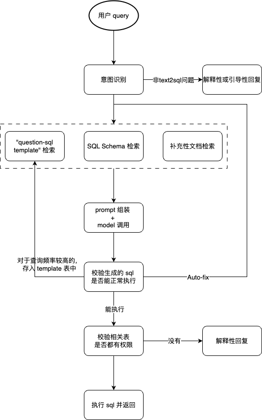
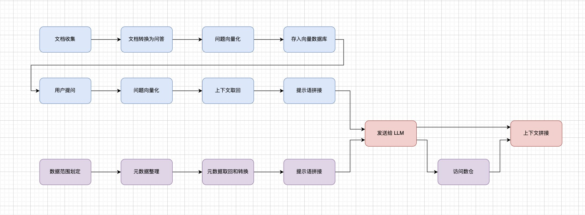
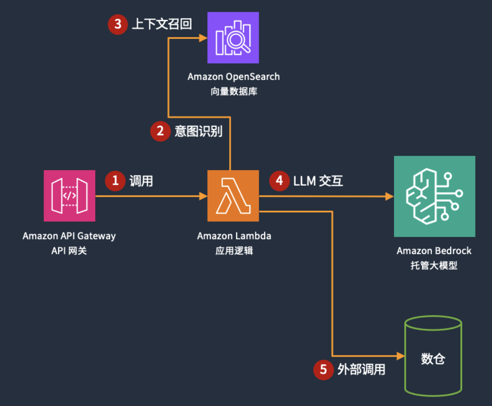
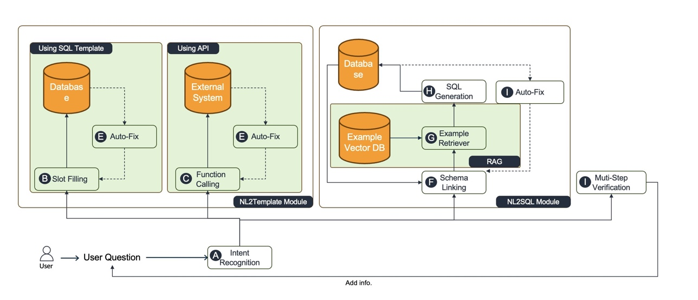
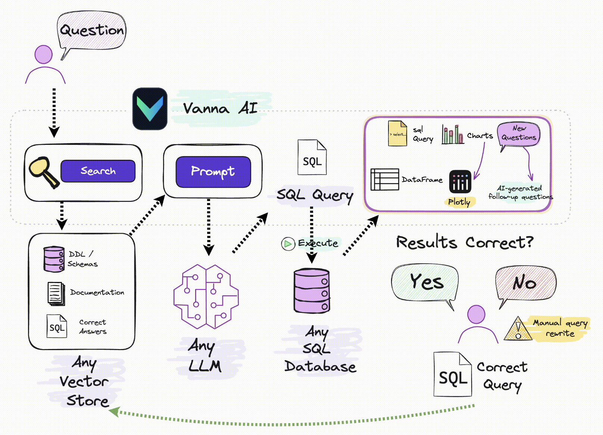

# 一、整体架构

# 二、注意点

- 将众多有关联的表合并为一个新的宽表；
- 采取 CoT 的理念，对复杂问题进行拆分，对于执行错误进行自我修复；
- 完整的测评机制

# 三、参考设计

## 1、浅谈 LLM RAG 对话机器人和 Text2SQL 的设计和实现

原文：https://aws.amazon.com/cn/blogs/china/design-and-implementation-of-llm-rag-conversational-robot-and-text2sql/

## 2、使用 Bedrock 和 RAG 构建 Text2SQL 行业数据查询助手

原文：https://aws.amazon.com/cn/blogs/china/build-text2sql-industry-data-query-assistant-using-bedrock-and-rag/

## 3、Vanna

github：https://github.com/vanna-ai/vanna

# 四、扩展性学习

github：https://github.com/DeepInsight-AI/DeepBI