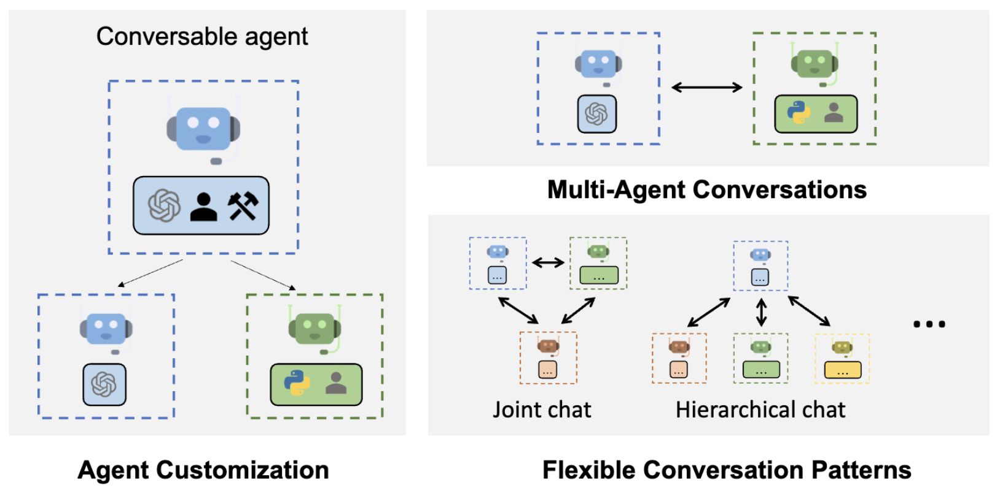
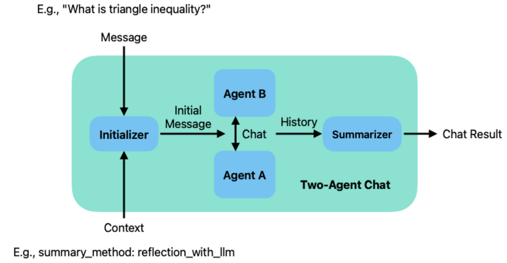
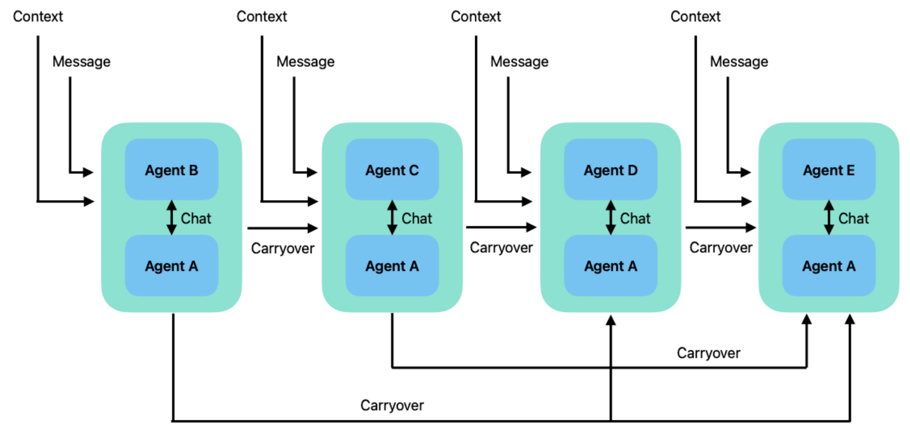

# 一、相关链接

github：https://github.com/microsoft/autogen

官方文档：https://microsoft.github.io/autogen/docs/tutorial/conversation-patterns

# 二、支持的 mutil-agent 形式



### 2.1 two-agent

```python
import os
from autogen import ConversableAgent

student_agent = ConversableAgent(
    name="Student_Agent",
    system_message="You are a student willing to learn.",
    llm_config=
    	{"config_list": [{"model": "gpt-4", "api_key": os.environ["OPENAI_API_KEY"]}]},
)
teacher_agent = ConversableAgent(
    name="Teacher_Agent",
    system_message="You are a math teacher.",
    llm_config=
    	{"config_list": [{"model": "gpt-4", "api_key": os.environ["OPENAI_API_KEY"]}]},
)

#对话
chat_result = student_agent.initiate_chat(
    teacher_agent,
    message="What is triangle inequality?",
    summary_method="reflection_with_llm",
    max_turns=2,
)
```



### 2.2 sequential-agent

```python
# The Number Agent always returns the same numbers.
number_agent = ConversableAgent(
    name="Number_Agent",
    system_message="You return me the numbers I give you, one number each line.",
    llm_config=
    	{"config_list": [{"model": "gpt-4", "api_key": os.environ["OPENAI_API_KEY"]}]},
    human_input_mode="NEVER",
)

# The Adder Agent adds 1 to each number it receives.
adder_agent = ConversableAgent(
    name="Adder_Agent",
    system_message="You add 1 to each number I give you and return me the new numbers, one number each line.",
    llm_config=
    	{"config_list": [{"model": "gpt-4", "api_key": os.environ["OPENAI_API_KEY"]}]},
    human_input_mode="NEVER",
)

# The Multiplier Agent multiplies each number it receives by 2.
multiplier_agent = ConversableAgent(
    name="Multiplier_Agent",
    system_message="You multiply each number I give you by 2 and return me the new numbers, one number each line.",
    llm_config=
    	{"config_list": [{"model": "gpt-4", "api_key": os.environ["OPENAI_API_KEY"]}]},
    human_input_mode="NEVER",
)

# The Subtracter Agent subtracts 1 from each number it receives.
subtracter_agent = ConversableAgent(
    name="Subtracter_Agent",
    system_message="You subtract 1 from each number I give you and return me the new numbers, one number each line.",
    llm_config=
    	{"config_list": [{"model": "gpt-4", "api_key": os.environ["OPENAI_API_KEY"]}]},
    human_input_mode="NEVER",
)

# The Divider Agent divides each number it receives by 2.
divider_agent = ConversableAgent(
    name="Divider_Agent",
    system_message="You divide each number I give you by 2 and return me the new numbers, one number each line.",
    llm_config=
    	{"config_list": [{"model": "gpt-4", "api_key": os.environ["OPENAI_API_KEY"]}]},
    human_input_mode="NEVER",
)

#对话
chat_results = number_agent.initiate_chats(
    [
        {
            "recipient": adder_agent,
            "message": "14",
            "max_turns": 2,
            "summary_method": "last_msg",
        },
        {
            "recipient": multiplier_agent,
            "message": "These are my numbers",
            "max_turns": 2,
            "summary_method": "last_msg",
        },
        {
            "recipient": subtracter_agent,
            "message": "These are my numbers",
            "max_turns": 2,
            "summary_method": "last_msg",
        },
        {
            "recipient": divider_agent,
            "message": "These are my numbers",
            "max_turns": 2,
            "summary_method": "last_msg",
        },
    ]
)
```



### 2.3 group-agent

> 调整了 swquential-agent 顺序执行的方式

- round_robin
- random
- manual （人工选择）
- auto （默认，使用LLM来决定）

```python
from autogen import GroupChat
from autogen import GroupChatManager

#mutil-agent 注册
group_chat = GroupChat(
    agents=[adder_agent, multiplier_agent, subtracter_agent, divider_agent, number_agent],
    messages=[],
    max_round=6,
)

#定义流转方式（默认 auto）
group_chat_manager = GroupChatManager(
    groupchat=group_chat,
    llm_config={"config_list": [{"model": "gpt-4", "api_key": os.environ["OPENAI_API_KEY"]}]},
)

#通过一个主 agent(number_agent) 来触发执行
chat_result = number_agent.initiate_chat(
    group_chat_manager,
    message="My number is 3, I want to turn it into 13.",
    summary_method="reflection_with_llm",
)
```

# 三、核心逻辑(ConversableAgent类)

- 顶级 Agent 类只有 send、receive、generate_reply 三个函数以及对应的异步函数(stream)

### 3.1 agent 交互

```python
#将消息发送给下一个 agent
def send(
        self,
        message: Union[Dict[str, Any], str],
        recipient: "Agent",
        request_reply: Optional[bool] = None,
    ) -> None:
        """Send a message to another agent.
        Args:
            message (dict or str): the message to send. If a dict, it should be
            a JSON-serializable and follows the OpenAI's ChatCompletion schema.
            recipient (Agent): the recipient of the message.
            request_reply (bool): whether to request a reply from the recipient.
        """
        ...

#接收到消息后进行处理，可以直接返回，也可以再次 send
def receive(
        self,
        message: Union[Dict[str, Any], str],
        sender: "Agent",
        request_reply: Optional[bool] = None,
    ) -> None:
        """Receive a message from another agent.
        Args:
            message (dict or str): the message received. If a dict, it should be
            a JSON-serializable and follows the OpenAI's ChatCompletion schema.
            sender (Agent): the sender of the message.
            request_reply (bool): whether the sender requests a reply.
        """
```

### 3.2 next agent 选择

- 方式一：知道 agent 对象，直接触发（代码指定，比如：two-agent、sequential-agent）

```python
def send(
        self,
        message: Union[Dict, str],
        recipient: Agent,
        request_reply: Optional[bool] = None,
        silent: Optional[bool] = False,
    ):
        valid = self._append_oai_message(message, 
                                         "assistant", recipient, is_sending=True)
        if valid:
            recipient.receive(message, self, request_reply, silent) #直接触发
        else:
            raise ValueError(
                "Message can't be converted into a valid ChatCompletion message. Either content or function_call must be provided."
            )

def receive(
        self,
        message: Union[Dict, str],
        sender: Agent,
        request_reply: Optional[bool] = None,
        silent: Optional[bool] = False,
    ):
        reply = self.generate_reply(messages=self.chat_messages[sender], sender=sender)
        if reply is not None:
            self.send(reply, sender, silent=silent) #直接触发
```

- 方式二：由一定规则，根据 agentName 进行选择（llm 或策略指定，比如：group-agent）

```python
def next_agent(self, agent: Agent, agents: Optional[List[Agent]] = None) -> Agent:
	# 定位到 agent 位置
    idx = self.agent_names.index(agent.name) if agent.name in self.agent_names else -1
    # Return the next agent
    if agents == self.agents:
    	return agents[(idx + 1) % len(agents)]
    else:
        offset = idx + 1
        for i in range(len(self.agents)):
            if self.agents[(offset + i) % len(self.agents)] in agents:
            	return self.agents[(offset + i) % len(self.agents)]
	# Explicitly handle cases where no valid next agent exists in the provided subset.
    raise UndefinedNextAgent()
```

### 3.3 agent 交互触发器(initiate_chat)

```python
def initiate_chat(
        self,
        recipient: "ConversableAgent",
        clear_history: bool = True,
        silent: Optional[bool] = False,
        cache: Optional[AbstractCache] = None,
        max_turns: Optional[int] = None,
        summary_method: Optional[Union[str, Callable]] = DEFAULT_SUMMARY_METHOD,
        summary_args: Optional[dict] = {},
        message: Optional[Union[Dict, str, Callable]] = None,
        **kwargs,
    ) -> ChatResult:
        #消息组装&发送
        self._prepare_chat(recipient, clear_history)
        if isinstance(message, Callable):
            msg2send = message(_chat_info["sender"], _chat_info["recipient"], kwargs)
        else:
            msg2send = self.generate_init_message(message, **kwargs)
        self.send(msg2send, recipient, silent=silent)
        
        #结果总结(llm 提取)
        summary = self._summarize_chat(
            summary_method,
            summary_args,
            recipient,
            cache=cache,
        )

        #缓存
        for agent in [self, recipient]:
            agent.client_cache = agent.previous_cache
            agent.previous_cache = None

        #返回结果组装
        chat_result = ChatResult(
            chat_history=self.chat_messages[recipient],
            summary=summary,
            cost=gather_usage_summary([self, recipient]),
            human_input=self._human_input,
        )
        return chat_result
```

### 3.4 LLM 调用方式

- autoGen 将大模型调用当作一个 function

```python
# 初始化时注册
self.register_reply([Agent, None], ConversableAgent.generate_oai_reply)
self.register_reply([Agent, None], ConversableAgent.generate_function_call_reply)

def register_reply(
        self,
        trigger: Union[Type[Agent], str, Agent, Callable[[Agent], bool], List],
        reply_func: Callable,
        position: int = 0,
        config: Optional[Any] = None,
        reset_config: Optional[Callable] = None,
        *,
        ignore_async_in_sync_chat: bool = False,
        remove_other_reply_funcs: bool = False,
    ):
        self._reply_func_list.insert(
            position,
            {
                "trigger": trigger,
                "reply_func": reply_func,
                "config": copy.copy(config),
                "init_config": config,
                "reset_config": reset_config,
                "ignore_async_in_sync_chat": 
                ignore_async_in_sync_chat and inspect.iscoroutinefunction(reply_func),
            },
        )

#调用 LLM
def generate_reply(
        self,
        messages: Optional[List[Dict[str, Any]]] = None,
        sender: Optional["Agent"] = None,
        **kwargs: Any,
    ) -> Union[str, Dict, None]:
        for reply_func_tuple in self._reply_func_list:
            reply_func = reply_func_tuple["reply_func"]
            #定位到 llm(funtion)
            if self._match_trigger(reply_func_tuple["trigger"], sender):
                #执行
                final, reply = reply_func(self, messages=messages, sender=sender, config=reply_func_tuple["config"])
                if final:
                    return reply
        return self._default_auto_reply
```

#  