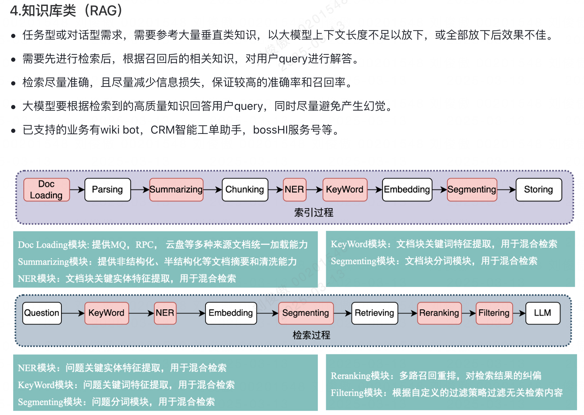
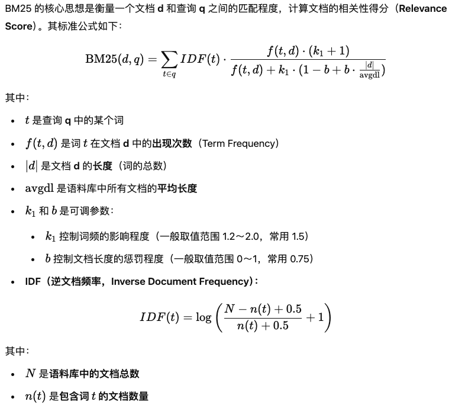

## 1、sse

SSE 的自动重连

**SSE 的优势是便利**：

- 实现一个完整的服务仅需要少量的代码；

- 可以在现有的服务中使用，不需要启动一个新的服务；

- 可以用任何一种服务端语言中使用；

- 基于 HTTP ／ HTTPS 协议，可以直接运行于现有的代理服务器和认证技术。

WebRTC && webSocket

## 2、openAI 文档核心点

1、prompt 缓存（prompt + 模型结果）：能降低成本

2、输出预测：减少模型的响应延迟，应用场景为-许多输出标记提前已知，比如-修改文本或代码

3、延迟优化：

3.1 更快的处理 token -- 使用小模型（详细的prompt、few-shot、sft）

3.2 生成更少的token -- prompt 中言明字数或简短要求、设置 max_tokens

3.3 使用更少的输入token -- sft 减少 prompt、修剪 rag、最大化共享提示前缀

3.4 减少请求 -- 对于多个连续执行的步骤，合并到一个 prompt 中

3.5 并行化 -- 多个步骤没有顺序要求

3.6 减少用户等待时间

3.7 不要默认为 LLM

4、Assistants API：构建 AI 助手，利用模型、工具和文件来响应 query

## 3、记忆模块

1、对话记忆：用来存储人机交互过程中存在的所有对话信息

2、对话窗口记忆：只取最后K个对话历史丢给LLM

3、对话摘要记忆：摘要提取（可用作长期记忆），好处--保存长期对话中的用户偏好行为；减少传入LLM中的tokens数量，加快速度

4、向量存储的记忆：每次调用时查询最具 "显著性" 的前 K 个文档

5、扩展记忆：rag 检索到的三方信息

记忆的好处：

1、当用户在对话中使用代词或其他模糊指代时，Agent可以通过记忆之前的对话内容，准确理解用户的意图

2、当Agent能够记住先前的查询结果并在需要时直接引用这些信息，就不必每次都重新进行昂贵的API调用

3、根据用户的历史交互记录，提供更个性化和精准的服务

4、基于历史交互数据进行微调

## 4、混合检索

> vector + bm25



## 5、BM25

BM25 的核心思想来源于 TF-IDF，但它针对 TF（词频）和 IDF（逆文档频率）做了一些改进：

- 改进 TF（词频）计算
    - 采用**饱和函数**调整词频，防止高频词对得分产生过大的影响
    - 通过参数 k1 控制词频的影响
- 引入文档长度归一化
    - 通过参数 b 调整文档长度对得分的影响，避免长文档由于包含更多关键词而被错误地赋予更高的相关性
- 优化 IDF 计算
    - 传统 IDF 计算方式可能导致某些词 IDF 过大，而 BM25 采用了**平滑化处理**，使 IDF 更稳定

核心点：

1. **词频（TF）处理的非线性饱和**：BM25采用非线性函数处理词频，以防止高频词对相关性得分产生过大的影响
2. **文档长度归一化**：通过引入参数 b，BM25对文档长度进行归一化处理，避免长文档在评分中占据过大的比重
3. **引入平滑的逆文档频率（IDF）**：BM25对IDF进行了平滑处理，降低极端值的影响，使得IDF计算更加稳定



## 6、MCP(模型通信协议)

MCP 主要解决的问题是：

1. **模型与外部世界之间的结构化通信**
2. **多个模型或 Agent 之间高效协同和任务转发**
3. **让模型“理解”任务规范、返回可解析结果**

### 6.1 核心组成部分

- **请求协议(Request Format)**：标明任务类型、调用目标（function/tool/agent）、参数结构

    ```json
    {
      "type": "function_call",
      "name": "search_web",
      "parameters": {
        "query": "current weather in Tokyo"
      }
    }
    ```

- **响应协议(Response Format)**：结构化返回结果，方便上层程序处理

    ```json
    {
      "result": {
        "type": "function_result",
        "name": "search_web",
        "content": "Currently 22°C in Tokyo, partly cloudy."
      }
    }
    ```

- **能力声明(Schema / Capability Declaration)**：模型注册时，声明其可调用的函数、接口，类似 `function_schema`

    ```json
    {
      "name": "translate",
      "description": "Translate text between languages.",
      "parameters": {
        "type": "object",
        "properties": {
          "text": { "type": "string" },
          "target_language": { "type": "string" }
        },
        "required": ["text", "target_language"]
      }
    }
    ```

- **调用状态管理(State Management)**：多轮调用过程中的上下文管理：如 Agent A 请求 Agent B 后的状态同步

    > 类似于对话状态、FSM（有限状态机）、甚至 DAG 调度

### 6.2 应用场景

- **多模型协作系统**：多个 LLMs 之间根据能力分工，像子模块一样协作

    > 例：一个 Agent 负责规划，一个 Agent 执行网页抓取，一个负责总结

- **Tool/Plugin 调用**：MCP 结构是 Function Calling 的通信基础，工具调用接口规范、参数校验、返回值解析都基于 MCP

- **模型编排框架(如 LangGraph / AgentVerse)**：MCP 用于构造模型节点之间的通信协议，每个模型模块是一个 MCP 节点，处理标准协议输入，返回标准协议输出
