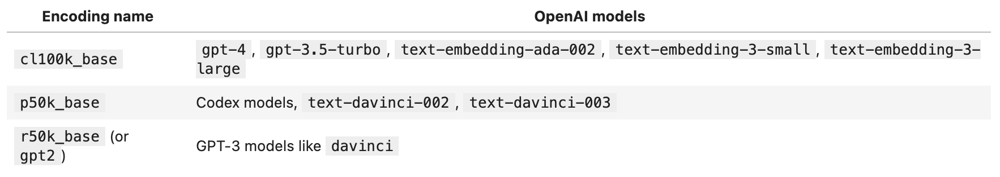

# 一、模型调用(http)

## 1、常规调用

## 2、流式调用

### 2.1 Flowable

### 2.2 背压

### 2.3 retrofit

### 2.4 SSE

# 二、token 截取

openAI 计算：https://github.com/openai/openai-cookbook/blob/main/examples/How_to_count_tokens_with_tiktoken.ipynb

# 三、稳定性相关

- 多模态（ASR模型、GPT-4o）
- 模型：推理模型、embedding 模型、rerank 模型、文字转语音模型、语音转文字模型
- 负载均衡(Rate Limits)：通过在多个 API 端点之间分配 API 请求，确保所有用户都能获得最快的响应和最高的模型调用吞吐量，保障业务稳定运行

---

速率限制以两种方式测量：**RPM**（每分钟请求数）和**TPM**（每分钟标记数）

- RPM：代表每分钟处理的请求数量，每个请求可以是一个独立的操作

- TPM：代表每分钟处理的标记（tokens）数量

区别：

- RPM 衡量的是请求数量，即多少次调用或操作
- TPM 衡量的是标记数量，即处理的文本基本单位的数量

---

控制请求速率的方式：

- **令牌桶算法**：使用一个桶存放令牌，令牌以固定速率添加到桶中。每个请求需要一个令牌，如果桶中没有令牌，则请求被拒绝或延迟处理
- **漏桶算法**：请求被放入一个固定容量的桶中，以固定速率处理请求。桶满时，新请求被拒绝或排队

- **固定窗口计数法**：在固定时间窗口内计数请求数量，超过限制时拒绝请求。时间窗口结束时，计数重置
- **后端请求队列**：请求进入队列，后端服务按固定速率从队列中取出请求进行处理

---

避免速率限制错误的一种简单方法是使用随机指数退避自动重试请求。

- 使用指数回退重试意味着当达到速率限制错误时执行短暂休眠，然后重试不成功的请求
- 如果请求仍然不成功，则增加休眠长度并重复该过程
- 这将持续到请求成功或达到最大重试次数

---

为了在高流量场景中配置多个账号以调用 ChatGPT，你可以考虑以下几种方案：

1. **轮询法**：轮流使用多个 API 密钥，以避免单个密钥的速率限制。
2. **负载均衡**：使用负载均衡器，将请求分配到不同的服务器，每个服务器使用不同的 API 密钥。
3. **队列管理**：使用队列系统来管理请求，确保请求按序处理，同时使用多个 API 密钥进行处理