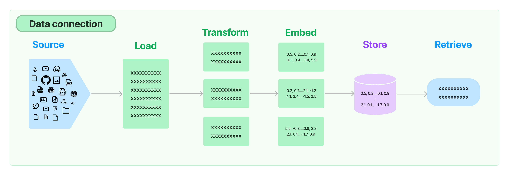
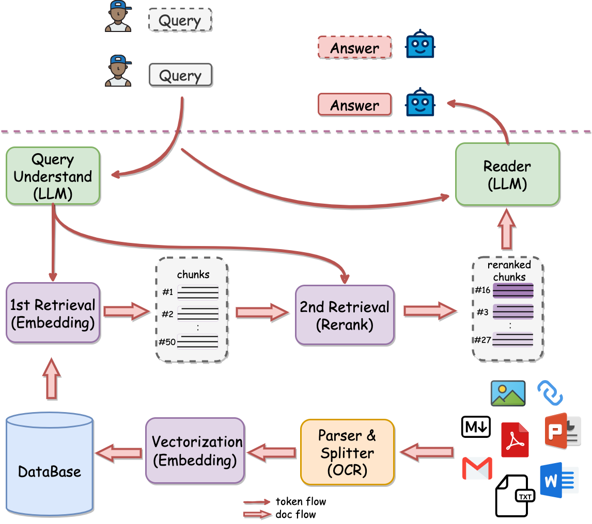

> 可先阅读：https://www.cnblogs.com/charlieroro/p/18087301

# 一、RAG 整体流程

## 1、数据写入

数据加载(extractor/load) --> 数据切分(transform/splitter) --> 数据转换(load/embedding或keyword + store)

## 2、数据写入之 ETL 协议

官方文档：https://unstructured.io/

## 3、开源项目案例之QAnything

- 官方文档：https://github.com/netease-youdao/QAnything/blob/master/README_zh.md

- 解析文档：https://zhuanlan.zhihu.com/p/697031773

## 4、扩展：RAG 的三个阶段

### 4.1 初级 RAG（**Naive RAG**）

- 流程：
    - 构建索引
    - 检索：进行向量相似检索，并返回 topK
    - 生成：将 topK 的数据块增装进 prompt 进行模型生成
- 局限性：
    - 检索方面：
        - 检索到的信息块可能并非都与查询内容相关联
        - 召回率可能不够，即相关的信息块有遗漏
    - prompt 增强方面：如何有效地将检索到的文本段落中的上下文与当前的生成任务结合起来

### 4.2 高级 RAG（Advanced RAG）

> 融合了预检索和检索后处理的技术

- 预检索优化方向：采用**滑动窗口技术、更细致的内容分段以及元数据优化**等方法来改善索引效率
    - 提高索引数据的细致程度：提升文本的规范化、统一性，并确保信息的准确无误和上下文的充分性
    - 改进索引结构的设计：尽可能地收集相关上下文并减少无关信息的干扰
    - 增加元数据信息：增加类如日期、用途、章节、小节等
    - 进行对齐方式的优化：解决文档间的不一致和对齐问题
    - 实施混合式检索策略：集成关键词搜索、语义搜索以及向量搜索等多种方法
- 检索后优化方向：
    - **增加 rerank 重排**：优先考虑文档的差异性来进行重新排序、交替地把最优文档放在最前面和最后面、rerank模型
    - 增加 doc 的分解与压缩：将文档按某些层级进行分解和摘要提取，然后再计算相关性（rerank）

### 4.3 多模态 RAG

> 融合了多种方法来增强功能模块，比如在相似性检索中融入搜索模块，并在检索器中采用微调策略

- 搜索模块：搜索数据源涵盖了从搜索引擎、文本数据、表格数据到知识图谱等多种类型
- 记忆模块：利用记忆能力来引导检索
- 补充生成模块：通过大模型来进行摘要提取生成上下文，解决检索数据的冗余和噪声问题
- 任务适配模块：提升 rag 对于不同场景的适用性
- 查询文本对齐增强模块：解决数据对齐问题
- 验证模块：评估检索到的文档与查询请求之间的相关性

# 二、提高RAG效果的方案

> 参看：https://baoyu.io/translations/rag/a-guide-on-12-tuning-strategies-for-production-ready-rag-applications#data-cleaning

## 1、方案一：对query预处理再检索

参考：https://liduos.com/how-to-improve-llm-rag-accuracy-and-recall.html

- **对 query 进行摘要提取，去除多余的噪声**，如：“我想找兼职的服务员岗位”可以提取为“兼职&服务员”；
- **根据 query 生成自定义的查询语句**，如：“我想找兼职的服务员岗位”可以变为“类别=兼职 && 职位=服务员”
- **将 query 拆分为一个个的小短语**，如：“我想找兼职的服务员岗位”可以拆分为“兼职”、“服务员”

## 2、方案二：动态上下文窗口

参考：https://liduos.com/rag-optimisation-implementation-scheme.html

> 动态上下文窗口的方案：能够处理大规模文档，保留重要的上下文信息，提升检索效率，同时保持灵活性和可配置性

整体方案：

> 首先，将文本切分为小块，接着再用滑动窗口进行串联；
>
> 然后，对文本块进行相似检索，但是返回的却是滑动窗口包含的多个文本块

- 文档预处理阶段实现满足上下文窗口的原始文本分块
    - **小文本块拆分**：将长文档拆分为多个较小的段，每个段可以是固定长度的片段，也可以根据自然段落或句子进行拆分
    - **添加窗口，生成中等文本块**：使用滑动窗口方法，将文档按一定的窗口大小和步长进行滑动，从而生成多个重叠的中等文本片段
- 文档检索阶段实现文本的三次检索
    - **第一阶段：小分块检索**：
        - 使用小文档块(docs_index_small)和小嵌入块(embedding_chunks_small)初始化一个检索器(first_retriever)
        - 使用这个检索器检索与查询相关的文档，并将结果存储在 first 变量中
        - 对检索到的文档 ID 进行清理和过滤，确保它们是相关的，并存储在 ids_clean 变量中
    - **第二阶段：移动窗口检索**
        - 针对每个唯一的源文档，使用小文档块检索与该源文档相关的所有文档块
        - 使用包含这些文档块的新检索器(second_retriever)，再次进行检索，以进一步缩小相关文档的范围，将检索到的文档添加到 docs 列表中
    - **第三阶段：中等分块检索**
        - 使用过滤条件从中等文档块(docs_index_medium)检索相关文档，使用包含这些文档块的新检索器(third_retriever)进行检索
        - 从检索到的文档中选择前 third_num_k 个文档，存储在 third 变量中
        - 清理文档的元数据，删除不需要的内容，将最终检索到的文档按文件名分类，并存储在 qa_chunks 字典中

---

**优势**：

- 处理大规模文档
- 保留上下文信息
- 提升检索效率
- 灵活性和可配置性
- 支持多种检索策略

**不足**：整体的响应效率需要优化

# 三、RAG评估

> RAG 的核心点：数据检索的准确性、prompt 增强的有效性、影响模型回答的正确性

## 1、核心点

> query(用户提问)、contexts(召回的引用上下文)、response(系统的回答)

三个对应的指标得分：

- **Context Relevance(上下文相关性)**：衡量召回的 Context 支持 Query 的程度，该得分低表示召回太多与 Query 问题无关的内容
- **Faithfulness(答案真实性)**：衡量生成的答案在给定的上下文中的事实一致性，该得分低表示 LLM 的回答不遵从召回的知识，那么回答出现幻觉的可能就越大
- **Answer Relevance(答案相关性)**：侧重评估生成的答案与给定查询提示的相关性，该得分低表示答案不完整或包含冗余信息
- **Answer Correctness**：定义 Ground-truth 和 Response 之间指标，用来衡量 RAG 回答的正确性

---

- 结果评估：

    - **使用 LLM 作为裁判来进行打分**：参考论文：[LLM-as-a-Judge](https://arxiv.org/abs/2306.05685) 

    - **生成 question 和 ground-truth**：**ragas 的 Synthetic Test Data generation 和 llama-index 的 QuestionGeneration** 可以生成 question 和 ground-truth

## 2、评估细节(检索&生成)

### 2.1 检索方面

- **准确率**：评估模型检索到的文档中，相关文档所占的比例

    >  高准确率意味着检索到的文档大多数是与查询相关的
    >
    > - 计算方法：**检索到的相关文档数量 / 检索到的总文档数量**

- **召回率**：评估模型能够检索到的所有相关文档的比

    > 高召回率意味着模型能够找到大多数与查询相关的文档
    >
    > - 计算方法：**检索到的相关文档数量 / 所有相关的文档数量**

- **F1 分数**：综合考虑准确率和召回率，给出一个整体的性能评估

    > F1分数是准确率和召回率的调和平均数
    >
    > - 计算方法：**2 * (Precision * Recall) / (Precision + Recall)**

- **平均检索排名(MRR)**：评估第一个相关文档在检索结果中的平均排名位置

    > MRR越高，表示相关文档出现在前列的可能性越大
    >
    > - 计算方法：对每个查询，计算第一个相关文档在检索结果中的排名的倒数，然后对所有查询取平均值
    >     $$
    >     MRR = \frac{1}{|Q|}\sum^{|Q|}_{i=1}\frac{1}{rank_i}
    >     $$
    >     $|Q|$ 是查询的总数，$rank_i$ 是第 $i$ 个查询的第一个相关文档的排名

- **标准化折扣累积增益(NDCG)**：评估检索结果中文档的相关性和排序质量

    > NDCG考虑了文档在检索结果中的位置，排名越靠前的相关文档贡献越大
    >
    > - 计算方法：考虑文档在检索结果中的位置和相关性，通过特定的计算方式得出

### 2.2 生成方面

- **生成质量**：

    - **准确性**：生成的回答是否准确反映输入查询和检索到的信息，即衡量生成回答与参考答案的相似度，从而评估生成文本的质量

        > 使用BLEU、ROUGE、METEOR等指标来评估生成文本与参考答案的相似度
        >
        > - **BLEU**：衡量生成文本与参考文本之间的 n-gram 重合度
        > - **ROUGE**：衡量生成文本与参考文本之间的重叠度，包括 ROUGE-N（n-gram）、ROUGE-L（最长公共子序列）
        > - **METEOR**：考虑词义、词形变化的相似度指标

    - **流利度**：生成的回答是否语法正确、连贯流畅

        > 通过语言模型的困惑度（Perplexity）或人工评估来衡量

- **相关性**：评估生成的回答与输入查询的相关性，确保生成内容紧密结合输入查询和检索到的文档

    >  评估方法：人工评估或基于语义相似度的计算方法

- **覆盖率**：评估生成的回答是否全面涵盖了输入查询中的所有重要信息点

    > 评估方法：人工评估或基于信息抽取和对比的自动化方法

- **多样性**：评估生成回答的多样性，确保模型在不同查询下生成丰富多样的回答，而不是重复或过于单一

    > **评估方法**：使用 Self-BLEU 评估生成回答的多样性，Self-BLEU 低值表示生成内容多样性高。

- **一致性**：评估生成的回答是否在内容和逻辑上与检索到的文档一致，避免生成虚假的或自相矛盾的内容

    > 评估方法：基于逻辑推理或语义一致性的自动化评估方法

## 3、评估需具备的能力

### 3.1 检索需具备的能力

- **高准确性和高召回率**：准确找到相关文档（高准确性），尽可能多地找到所有相关文档（高召回率）

- **鲁棒性**：在面对不同类型的查询时表现稳定，包括拼写错误、语法错误和非标准查询

    > 处理用户输入时，模型需要适应多样性和噪声

- **上下文敏感性**：根据上下文调整检索结果，理解查询背后的意图

    > 确保检索结果与用户需求高度相关

### 3.2 生成需具备的能力

- **噪声鲁棒性**：在输入包含噪声（如拼写错误、语法错误等）时仍能生成合理的回答，即与问题相关但不包含任何相关信息的文档

    > 采用 accurary 来评估该指标的好坏：如果生成的文本包含与答案完全匹配的文本，则将其视为正确答案

- **否定拒绝**：当检索到的文档不包含回答问题所需的知识时，模型应拒绝回答问题

    > 采用 rejection rate 评估该指标的好坏：当只提供嘈杂的文档时，LLM 应输出“由于文档中的信息不足，我无法回答问题”

- **信息整合**：评估模型能否回答需要整合多个文档信息的复杂问题

    > 采用accurary来评估该指标的好坏：如果生成的文本包含与答案完全匹配的文本，则将其视为正确答案

- **反事实鲁棒性**：当通过指令向 LLMs 发出关于检索信息中潜在风险的警告时，模型能否识别检索文档中已知事实错误的风险

    > 采用两个率来衡量该指标：Error detection rate和Error correction rate
    >
    > - `Error detection rate`：衡量模型是否能够检测文档中的事实错误，以实现反事实的稳健性
    > - `Error correction rate`：纠错率衡量模型在识别错误后是否能够提供正确的答案，以实现反事实的鲁棒性

## 4、白盒评估

### 4.1 评估 embedding model 和 rerank model

信息检索召回领域的常用指标：

> 考虑排名的指标：对于召回有 ground-truth 的文档，在所有召回文档中的排名是敏感的，即改变召回的所有文档之间的相关顺序，会使得这个指标得分发生变化
>
> 而不考虑排名的指标则与之相反
>
> 
>
> 比如在上图中，假设 RAG 应用召回了 top_k=5 个文档，其中，A、C 和 E 文档是 ground-truth。A 文档排名为1，它的相关性得分最高，并且得分向右依次减小。
>
> 如果 B 和 C 文档调换了位置，那么考虑排名的指标得分就会发生变化，而不考虑排名的指标的得分则不会发生变化

- **考虑排名的指标**：
    - **平均精确率（AP）**：测量检索到的所有相关块并计算加权分数，数据集上的AP的平均值通常被称为MAP
    - **倒数排名（RR）**：测量您的检索中第一个相关块出现的位置，数据集上的RR的平均值通常被称为MRR
    - **归一化折扣累积增益（NDCG）**：考虑了相关性分类非二元的情况
- **不考虑排名的指标**：
    - **上下文召回率(Context Recall)**：系统完整地检索到了所有必要的文档的程度
    - **上下文精确率(Context Precision)**：系统检索到的信号（与噪音相比）的程度

### 4.2 评估 LLM

生成过程可以直接使用上文介绍过的由 Context 到 Response 这一步的 LLM-based 的指标，即 **Faithfulness 来评估**

- 对于简单的 query，比如标准答案只有简单短语，可以使用一些经典的指标
    - `ROUGE-L Precision`：测量生成的答案和检索到的上下文之间的最长公共子序列
    - `Token Overlap Precision`：计算生成的答案和检索到的上下文之间 token overlap 的精度

## 5、评估框架

### 5.1 RAGAs

github：https://github.com/explodinggradients/ragas

RAGAs使用案例：

- https://www.luxiangdong.com/2024/02/22/advrag3/

- https://liduos.com/how-to-evaluate-rag-application.html

---

**RAGAs** 是一种架构，它结合了信息检索（IR）和生成模型（如GPT-4），以增强生成模型的性能。其主要目的是通过从外部知识库中检索相关信息，并将其与生成模型结合，使生成的文本更准确和有信息量

关键特性：

1. **检索增强生成**：RAGAs 在生成文本之前，会先从外部数据源中检索相关信息。这些信息被用来辅助生成模型，提高生成结果的准确性和相关性。
2. **结合检索和生成模型**：RAGAs 典型地包括两个主要组件：一个信息检索模块和一个生成模块。检索模块负责从大规模知识库中找到相关信息，生成模块则利用这些信息生成最终的输出。
3. **应用场景**：广泛应用于需要高准确性和丰富内容的生成任务，如复杂问答系统、对话系统、内容创作等

### 5.2 LLamaIndex

github：https://github.com/run-llama/llama_index

---

**LlamaIndex** 是一个专注于与大型语言模型（LLMs）集成的数据索引和检索框架。其主要目的是通过智能数据索引和查询，使得大型语言模型可以更有效地访问和利用外部数据

关键特性：

1. **数据索引**：LlamaIndex 可以构建复杂的数据索引，适用于不同类型的数据，包括文档、数据库记录等。
2. **与LLMs的集成**：设计的重点是与大型语言模型（如GPT-4）集成，以提供增强的数据访问和回答能力。
3. **查询优化**：通过优化查询，使得语言模型可以更高效地从大量数据中提取有用的信息。
4. **应用场景**：通常用于需要与自然语言处理（NLP）模型紧密合作的应用，如智能问答系统、文档理解和分析等

# 四、额外特点

## 1、召回模式

- `Q&A` 或 `Q to Q`，即**问题匹配问题**
- `Q to P`，即问题匹配文本段落
